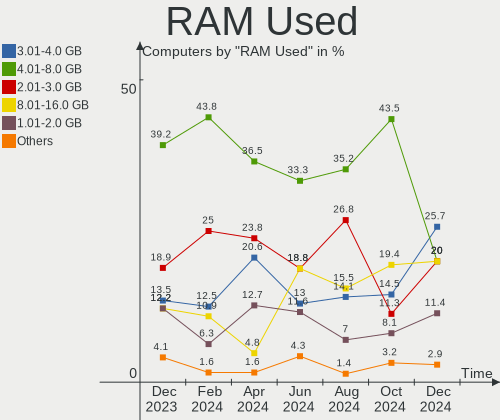
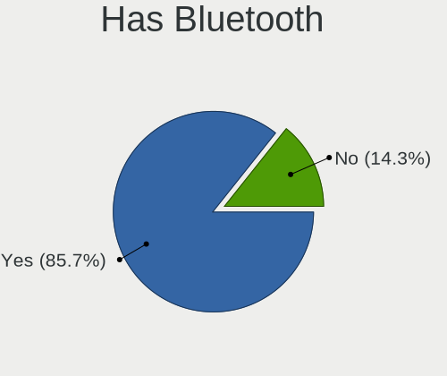
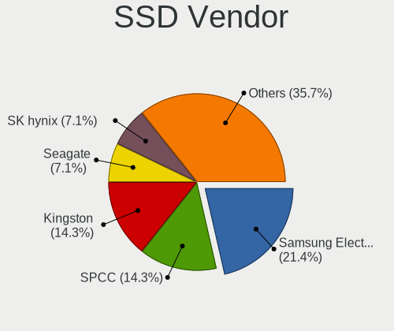
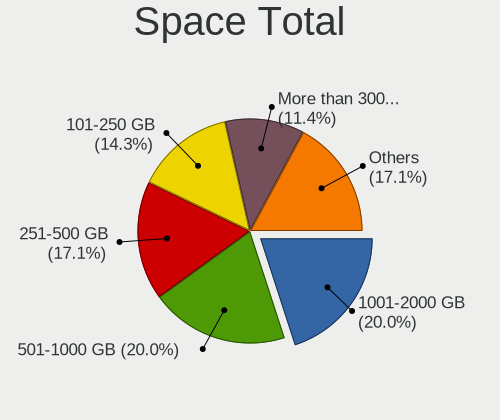
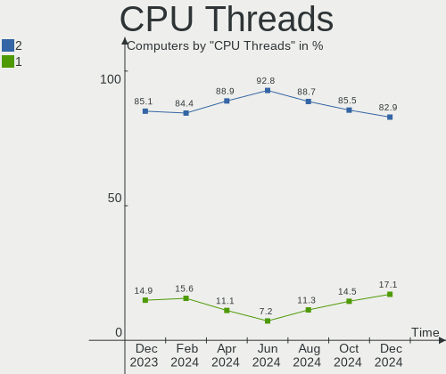
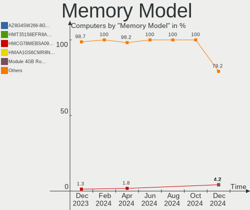
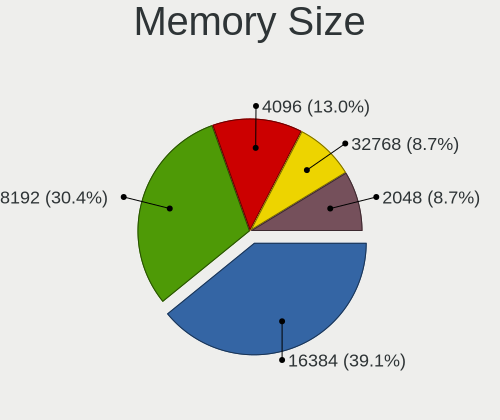
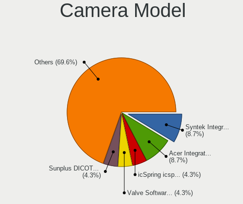
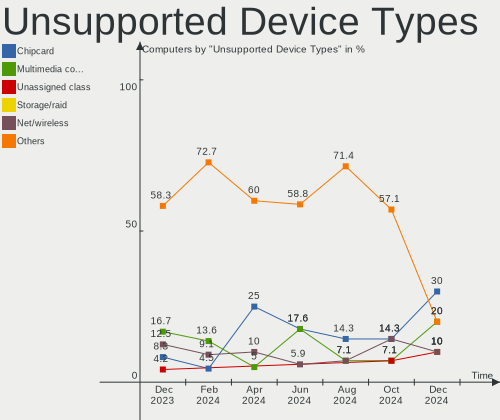

EndeavourOS - Hardware Trends
-----------------------------

A project to identify most popular hardware characteristics and track their change
over time based on data collected by Linux users at https://Linux-Hardware.org.

Anyone can contribute to this report by the [hw-probe](https://github.com/linuxhw/hw-probe) tool:

    sudo -E hw-probe -all -upload

This is a report for all computer types. See also reports for [desktops](/Dist/EndeavourOS/Desktop/README.md) and [notebooks](/Dist/EndeavourOS/Notebook/README.md).

This report is for one last month. Overall report since the beginning of time: [TestDays](https://github.com/linuxhw/TestDays)

Period: Feb, 2023.

Contents
--------

* [ System ](#system)
  - [ OS                       ](#os)
  - [ OS Family                ](#os-family)
  - [ Kernel                   ](#kernel)
  - [ Kernel Family            ](#kernel-family)
  - [ Kernel Major Ver.        ](#kernel-major-ver)
  - [ Arch                     ](#arch)
  - [ DE                       ](#de)
  - [ Display Server           ](#display-server)
  - [ Display Manager          ](#display-manager)
  - [ OS Lang                  ](#os-lang)
  - [ Boot Mode                ](#boot-mode)
  - [ Filesystem               ](#filesystem)
  - [ Part. scheme             ](#part-scheme)
  - [ Dual Boot with Linux/BSD ](#dual-boot-with-linuxbsd)
  - [ Dual Boot (Win)          ](#dual-boot-win)

* [ Board ](#board)
  - [ Vendor                   ](#vendor)
  - [ Model                    ](#model)
  - [ Model Family             ](#model-family)
  - [ MFG Year                 ](#mfg-year)
  - [ Form Factor              ](#form-factor)
  - [ Secure Boot              ](#secure-boot)
  - [ Coreboot                 ](#coreboot)
  - [ RAM Size                 ](#ram-size)
  - [ RAM Used                 ](#ram-used)
  - [ Total Drives             ](#total-drives)
  - [ Has CD-ROM               ](#has-cd-rom)
  - [ Has Ethernet             ](#has-ethernet)
  - [ Has WiFi                 ](#has-wifi)
  - [ Has Bluetooth            ](#has-bluetooth)

* [ Location ](#location)
  - [ Country                  ](#country)
  - [ City                     ](#city)

* [ Drives ](#drives)
  - [ Drive Vendor             ](#drive-vendor)
  - [ Drive Model              ](#drive-model)
  - [ HDD Vendor               ](#hdd-vendor)
  - [ SSD Vendor               ](#ssd-vendor)
  - [ Drive Kind               ](#drive-kind)
  - [ Drive Connector          ](#drive-connector)
  - [ Drive Size               ](#drive-size)
  - [ Space Total              ](#space-total)
  - [ Space Used               ](#space-used)
  - [ Malfunc. Drives          ](#malfunc-drives)
  - [ Malfunc. Drive Vendor    ](#malfunc-drive-vendor)
  - [ Malfunc. HDD Vendor      ](#malfunc-hdd-vendor)
  - [ Malfunc. Drive Kind      ](#malfunc-drive-kind)
  - [ Failed Drives            ](#failed-drives)
  - [ Failed Drive Vendor      ](#failed-drive-vendor)
  - [ Drive Status             ](#drive-status)

* [ Storage controller ](#storage-controller)
  - [ Storage Vendor           ](#storage-vendor)
  - [ Storage Model            ](#storage-model)
  - [ Storage Kind             ](#storage-kind)

* [ Processor ](#processor)
  - [ CPU Vendor               ](#cpu-vendor)
  - [ CPU Model                ](#cpu-model)
  - [ CPU Model Family         ](#cpu-model-family)
  - [ CPU Cores                ](#cpu-cores)
  - [ CPU Sockets              ](#cpu-sockets)
  - [ CPU Threads              ](#cpu-threads)
  - [ CPU Op-Modes             ](#cpu-op-modes)
  - [ CPU Microcode            ](#cpu-microcode)
  - [ CPU Microarch            ](#cpu-microarch)

* [ Graphics ](#graphics)
  - [ GPU Vendor               ](#gpu-vendor)
  - [ GPU Model                ](#gpu-model)
  - [ GPU Combo                ](#gpu-combo)
  - [ GPU Driver               ](#gpu-driver)
  - [ GPU Memory               ](#gpu-memory)

* [ Monitor ](#monitor)
  - [ Monitor Vendor           ](#monitor-vendor)
  - [ Monitor Model            ](#monitor-model)
  - [ Monitor Resolution       ](#monitor-resolution)
  - [ Monitor Diagonal         ](#monitor-diagonal)
  - [ Monitor Width            ](#monitor-width)
  - [ Aspect Ratio             ](#aspect-ratio)
  - [ Monitor Area             ](#monitor-area)
  - [ Pixel Density            ](#pixel-density)
  - [ Multiple Monitors        ](#multiple-monitors)

* [ Network ](#network)
  - [ Net Controller Vendor    ](#net-controller-vendor)
  - [ Net Controller Model     ](#net-controller-model)
  - [ Wireless Vendor          ](#wireless-vendor)
  - [ Wireless Model           ](#wireless-model)
  - [ Ethernet Vendor          ](#ethernet-vendor)
  - [ Ethernet Model           ](#ethernet-model)
  - [ Net Controller Kind      ](#net-controller-kind)
  - [ Used Controller          ](#used-controller)
  - [ NICs                     ](#nics)
  - [ IPv6                     ](#ipv6)

* [ Bluetooth ](#bluetooth)
  - [ Bluetooth Vendor         ](#bluetooth-vendor)
  - [ Bluetooth Model          ](#bluetooth-model)

* [ Sound ](#sound)
  - [ Sound Vendor             ](#sound-vendor)
  - [ Sound Model              ](#sound-model)

* [ Memory ](#memory)
  - [ Memory Vendor            ](#memory-vendor)
  - [ Memory Model             ](#memory-model)
  - [ Memory Kind              ](#memory-kind)
  - [ Memory Form Factor       ](#memory-form-factor)
  - [ Memory Size              ](#memory-size)
  - [ Memory Speed             ](#memory-speed)

* [ Printers & scanners ](#printers--scanners)
  - [ Printer Vendor           ](#printer-vendor)
  - [ Printer Model            ](#printer-model)
  - [ Scanner Vendor           ](#scanner-vendor)
  - [ Scanner Model            ](#scanner-model)

* [ Camera ](#camera)
  - [ Camera Vendor            ](#camera-vendor)
  - [ Camera Model             ](#camera-model)

* [ Security ](#security)
  - [ Fingerprint Vendor       ](#fingerprint-vendor)
  - [ Fingerprint Model        ](#fingerprint-model)
  - [ Chipcard Vendor          ](#chipcard-vendor)
  - [ Chipcard Model           ](#chipcard-model)

* [ Unsupported ](#unsupported)
  - [ Unsupported Devices      ](#unsupported-devices)
  - [ Unsupported Device Types ](#unsupported-device-types)

System
------

OS
--

Installed operating systems

| Name                | Computers | Percent |
|---------------------|-----------|---------|
| EndeavourOS Rolling | 43        | 100%    |

OS Family
---------

OS without a version

| Name        | Computers | Percent |
|-------------|-----------|---------|
| EndeavourOS | 43        | 100%    |

Kernel
------

Version of the Linux kernel

| Version             | Computers | Percent |
|---------------------|-----------|---------|
| 6.1.12-arch1-1      | 12        | 27.91%  |
| 6.1.11-arch1-1      | 6         | 13.95%  |
| 6.1.9-arch1-2       | 5         | 11.63%  |
| 6.1.8-arch1-1       | 3         | 6.98%   |
| 6.1.12-zen1-1-zen   | 2         | 4.65%   |
| 6.0.12-arch1-1      | 2         | 4.65%   |
| 5.15.91-4-lts       | 2         | 4.65%   |
| 6.2.1-zen1-1-zen    | 1         | 2.33%   |
| 6.2.0-rc6-1-amd-git | 1         | 2.33%   |
| 6.1.9-zen1-1-zen    | 1         | 2.33%   |
| 6.1.9-arch1-1       | 1         | 2.33%   |
| 6.1.9-273-tkg-pds   | 1         | 2.33%   |
| 6.1.8-zen1-1-zen    | 1         | 2.33%   |
| 6.1.13-1-lts        | 1         | 2.33%   |
| 6.1.10-arch1-1      | 1         | 2.33%   |
| 6.1.10-AMD          | 1         | 2.33%   |
| 6.0.10-arch2-1      | 1         | 2.33%   |
| 5.15.93-1-lts       | 1         | 2.33%   |

Kernel Family
-------------

Linux kernel without a distro release

| Version | Computers | Percent |
|---------|-----------|---------|
| 6.1.12  | 14        | 32.56%  |
| 6.1.9   | 8         | 18.6%   |
| 6.1.11  | 6         | 13.95%  |
| 6.1.8   | 4         | 9.3%    |
| 6.1.10  | 2         | 4.65%   |
| 6.0.12  | 2         | 4.65%   |
| 5.15.91 | 2         | 4.65%   |
| 6.2.1   | 1         | 2.33%   |
| 6.2.0   | 1         | 2.33%   |
| 6.1.13  | 1         | 2.33%   |
| 6.0.10  | 1         | 2.33%   |
| 5.15.93 | 1         | 2.33%   |

Kernel Major Ver.
-----------------

Linux kernel major version

| Version | Computers | Percent |
|---------|-----------|---------|
| 6.1     | 35        | 81.4%   |
| 6.0     | 3         | 6.98%   |
| 5.15    | 3         | 6.98%   |
| 6.2     | 2         | 4.65%   |

Arch
----

OS architecture (x86_64, i586, etc.)

| Name   | Computers | Percent |
|--------|-----------|---------|
| x86_64 | 43        | 100%    |

DE
--

Desktop Environment

| Name    | Computers | Percent |
|---------|-----------|---------|
| XFCE    | 17        | 39.53%  |
| KDE5    | 16        | 37.21%  |
| GNOME   | 5         | 11.63%  |
| openbox | 1         | 2.33%   |
| LXQt    | 1         | 2.33%   |
| i3      | 1         | 2.33%   |
| Budgie  | 1         | 2.33%   |
| Unknown | 1         | 2.33%   |

Display Server
--------------

X11 or Wayland

| Name    | Computers | Percent |
|---------|-----------|---------|
| X11     | 31        | 72.09%  |
| Tty     | 7         | 16.28%  |
| Wayland | 4         | 9.3%    |
| Unknown | 1         | 2.33%   |

Display Manager
---------------

SDDM, LightDM, etc.

| Name    | Computers | Percent |
|---------|-----------|---------|
| LightDM | 18        | 41.86%  |
| SDDM    | 14        | 32.56%  |
| Unknown | 6         | 13.95%  |
| GDM     | 5         | 11.63%  |

OS Lang
-------

Language

| Lang  | Computers | Percent |
|-------|-----------|---------|
| en_US | 20        | 46.51%  |
| it_IT | 4         | 9.3%    |
| en_GB | 4         | 9.3%    |
| ru_RU | 2         | 4.65%   |
| en_IN | 2         | 4.65%   |
| en_CA | 2         | 4.65%   |
| de_AT | 2         | 4.65%   |
| pt_BR | 1         | 2.33%   |
| nl_NL | 1         | 2.33%   |
| nl_BE | 1         | 2.33%   |
| fi_FI | 1         | 2.33%   |
| es_MX | 1         | 2.33%   |
| de_DE | 1         | 2.33%   |
| de_CH | 1         | 2.33%   |

Boot Mode
---------

EFI or BIOS

| Mode | Computers | Percent |
|------|-----------|---------|
| EFI  | 30        | 69.77%  |
| BIOS | 13        | 30.23%  |

Filesystem
----------

Type of filesystem

| Type    | Computers | Percent |
|---------|-----------|---------|
| Ext4    | 31        | 72.09%  |
| Btrfs   | 7         | 16.28%  |
| Overlay | 4         | 9.3%    |
| Tmpfs   | 1         | 2.33%   |

Part. scheme
------------

Scheme of partitioning

| Type    | Computers | Percent |
|---------|-----------|---------|
| GPT     | 32        | 74.42%  |
| MBR     | 6         | 13.95%  |
| Unknown | 5         | 11.63%  |

Dual Boot with Linux/BSD
------------------------

Hosting more than one Linux/BSD

| Dual boot | Computers | Percent |
|-----------|-----------|---------|
| No        | 37        | 86.05%  |
| Yes       | 6         | 13.95%  |

Dual Boot (Win)
---------------

Hosting Linux and Windows

| Dual boot | Computers | Percent |
|-----------|-----------|---------|
| No        | 25        | 58.14%  |
| Yes       | 18        | 41.86%  |

Board
-----

Vendor
------

Motherboard manufacturer

| Name                                 | Computers | Percent |
|--------------------------------------|-----------|---------|
| ASUSTek Computer                     | 12        | 27.91%  |
| Hewlett-Packard                      | 9         | 20.93%  |
| Lenovo                               | 5         | 11.63%  |
| MSI                                  | 4         | 9.3%    |
| Dell                                 | 2         | 4.65%   |
| Shenzhen Meigao Electronic Equipment | 1         | 2.33%   |
| Intel                                | 1         | 2.33%   |
| HUAWEI                               | 1         | 2.33%   |
| GPD                                  | 1         | 2.33%   |
| Google                               | 1         | 2.33%   |
| Gigabyte Technology                  | 1         | 2.33%   |
| Chuwi                                | 1         | 2.33%   |
| ASRock                               | 1         | 2.33%   |
| Apple                                | 1         | 2.33%   |
| Alienware                            | 1         | 2.33%   |
| Acer                                 | 1         | 2.33%   |

Model
-----

Motherboard model

| Name                                       | Computers | Percent |
|--------------------------------------------|-----------|---------|
| Shenzhen Meigao Electronic Equipment UM690 | 1         | 2.33%   |
| MSI MS-7C56                                | 1         | 2.33%   |
| MSI MS-7C37                                | 1         | 2.33%   |
| MSI MS-7B79                                | 1         | 2.33%   |
| MSI MS-7641                                | 1         | 2.33%   |
| Lenovo Y50-70 20378                        | 1         | 2.33%   |
| Lenovo ThinkPad T495s 20QKS2LN00           | 1         | 2.33%   |
| Lenovo ThinkPad T470 W10DG 20JNS0L300      | 1         | 2.33%   |
| Lenovo ThinkPad L13 Yoga Gen 2 20VK0012MZ  | 1         | 2.33%   |
| Lenovo IdeaPad 3 15ADA05 81W1              | 1         | 2.33%   |
| Intel NUC7CJYH                             | 1         | 2.33%   |
| HUAWEI BOM-WXX9                            | 1         | 2.33%   |
| HP ZBook 15 G4                             | 1         | 2.33%   |
| HP Setzer                                  | 1         | 2.33%   |
| HP Laptop 15s-fq4xxx                       | 1         | 2.33%   |
| HP Laptop 15s-eq2xxx                       | 1         | 2.33%   |
| HP ENVY Notebook PC                        | 1         | 2.33%   |
| HP EliteDesk 800 G1 TWR                    | 1         | 2.33%   |
| HP EliteBook 8460p                         | 1         | 2.33%   |
| HP EliteBook 845 G7 Notebook PC            | 1         | 2.33%   |
| HP Compaq 6820s                            | 1         | 2.33%   |
| GPD G1621-02                               | 1         | 2.33%   |
| Google Helios                              | 1         | 2.33%   |
| Gigabyte B450M S2H                         | 1         | 2.33%   |
| Dell Vostro 3470                           | 1         | 2.33%   |
| Dell Inspiron N4010                        | 1         | 2.33%   |
| Chuwi GemiBook Pro                         | 1         | 2.33%   |
| ASUS Zenbook UX5401ZAS_UX5401ZAS           | 1         | 2.33%   |
| ASUS X555LA                                | 1         | 2.33%   |
| ASUS VivoBook_ASUSLaptop TP420IA_TM420IA   | 1         | 2.33%   |
| ASUS TUF Gaming Z790-PLUS WIFI D4          | 1         | 2.33%   |
| ASUS S551LN                                | 1         | 2.33%   |
| ASUS ROG Zephyrus G15 GA503RM              | 1         | 2.33%   |
| ASUS ROG STRIX X570-E GAMING               | 1         | 2.33%   |
| ASUS ROG Strix G712LWS_G712LWS             | 1         | 2.33%   |
| ASUS PRIME Z390-P                          | 1         | 2.33%   |
| ASUS PRIME B550M-A                         | 1         | 2.33%   |
| ASUS M32CD_A_F_K20CD_K31CD                 | 1         | 2.33%   |
| ASUS All Series                            | 1         | 2.33%   |
| ASRock B460 Steel Legend                   | 1         | 2.33%   |

Model Family
------------

Motherboard model prefix

| Name                                       | Computers | Percent |
|--------------------------------------------|-----------|---------|
| Lenovo ThinkPad                            | 3         | 6.98%   |
| ASUS ROG                                   | 3         | 6.98%   |
| HP Laptop                                  | 2         | 4.65%   |
| HP EliteBook                               | 2         | 4.65%   |
| ASUS PRIME                                 | 2         | 4.65%   |
| Shenzhen Meigao Electronic Equipment UM690 | 1         | 2.33%   |
| MSI MS-7C56                                | 1         | 2.33%   |
| MSI MS-7C37                                | 1         | 2.33%   |
| MSI MS-7B79                                | 1         | 2.33%   |
| MSI MS-7641                                | 1         | 2.33%   |
| Lenovo Y50-70                              | 1         | 2.33%   |
| Lenovo IdeaPad                             | 1         | 2.33%   |
| Intel NUC7CJYH                             | 1         | 2.33%   |
| HUAWEI BOM-WXX9                            | 1         | 2.33%   |
| HP ZBook                                   | 1         | 2.33%   |
| HP Setzer                                  | 1         | 2.33%   |
| HP ENVY                                    | 1         | 2.33%   |
| HP EliteDesk                               | 1         | 2.33%   |
| HP Compaq                                  | 1         | 2.33%   |
| GPD G1621-02                               | 1         | 2.33%   |
| Google Helios                              | 1         | 2.33%   |
| Gigabyte B450M                             | 1         | 2.33%   |
| Dell Vostro                                | 1         | 2.33%   |
| Dell Inspiron                              | 1         | 2.33%   |
| Chuwi GemiBook                             | 1         | 2.33%   |
| ASUS Zenbook                               | 1         | 2.33%   |
| ASUS X555LA                                | 1         | 2.33%   |
| ASUS VivoBook                              | 1         | 2.33%   |
| ASUS TUF                                   | 1         | 2.33%   |
| ASUS S551LN                                | 1         | 2.33%   |
| ASUS M32CD                                 | 1         | 2.33%   |
| ASUS All                                   | 1         | 2.33%   |
| ASRock B460                                | 1         | 2.33%   |
| Apple MacBookPro14                         | 1         | 2.33%   |
| Alienware Aurora                           | 1         | 2.33%   |
| Acer Aspire                                | 1         | 2.33%   |

MFG Year
--------

Motherboard manufacture year

| Year | Computers | Percent |
|------|-----------|---------|
| 2020 | 7         | 16.28%  |
| 2019 | 6         | 13.95%  |
| 2018 | 6         | 13.95%  |
| 2022 | 5         | 11.63%  |
| 2021 | 5         | 11.63%  |
| 2017 | 4         | 9.3%    |
| 2014 | 3         | 6.98%   |
| 2013 | 2         | 4.65%   |
| 2023 | 1         | 2.33%   |
| 2015 | 1         | 2.33%   |
| 2011 | 1         | 2.33%   |
| 2010 | 1         | 2.33%   |
| 2007 | 1         | 2.33%   |

Form Factor
-----------

Physical design of the computer

| Name        | Computers | Percent |
|-------------|-----------|---------|
| Notebook    | 23        | 53.49%  |
| Desktop     | 16        | 37.21%  |
| Convertible | 3         | 6.98%   |
| Mini pc     | 1         | 2.33%   |

Secure Boot
-----------

Enabled or disabled

| State    | Computers | Percent |
|----------|-----------|---------|
| Disabled | 43        | 100%    |

Coreboot
--------

Have coreboot on board

| Used | Computers | Percent |
|------|-----------|---------|
| No   | 41        | 95.35%  |
| Yes  | 2         | 4.65%   |

RAM Size
--------

Total RAM memory

| Size in GB  | Computers | Percent |
|-------------|-----------|---------|
| 16.01-24.0  | 13        | 30.23%  |
| 4.01-8.0    | 11        | 25.58%  |
| 32.01-64.0  | 8         | 18.6%   |
| 8.01-16.0   | 6         | 13.95%  |
| 3.01-4.0    | 3         | 6.98%   |
| 64.01-256.0 | 2         | 4.65%   |

RAM Used
--------

Used RAM memory

| Used GB   | Computers | Percent |
|-----------|-----------|---------|
| 2.01-3.0  | 13        | 30.23%  |
| 1.01-2.0  | 11        | 25.58%  |
| 4.01-8.0  | 9         | 20.93%  |
| 3.01-4.0  | 9         | 20.93%  |
| 8.01-16.0 | 1         | 2.33%   |

Total Drives
------------

Number of drives on board

| Drives | Computers | Percent |
|--------|-----------|---------|
| 1      | 26        | 60.47%  |
| 2      | 12        | 27.91%  |
| 5      | 2         | 4.65%   |
| 3      | 2         | 4.65%   |
| 7      | 1         | 2.33%   |

Has CD-ROM
----------

Has CD-ROM on board

| Presented | Computers | Percent |
|-----------|-----------|---------|
| No        | 37        | 86.05%  |
| Yes       | 6         | 13.95%  |

Has Ethernet
------------

Has Ethernet on board

| Presented | Computers | Percent |
|-----------|-----------|---------|
| Yes       | 32        | 74.42%  |
| No        | 11        | 25.58%  |

Has WiFi
--------

Has WiFi module

| Presented | Computers | Percent |
|-----------|-----------|---------|
| Yes       | 38        | 88.37%  |
| No        | 5         | 11.63%  |

Has Bluetooth
-------------

Has Bluetooth module

| Presented | Computers | Percent |
|-----------|-----------|---------|
| Yes       | 35        | 81.4%   |
| No        | 8         | 18.6%   |

Location
--------

Country
-------

Geographic location (country)

| Country     | Computers | Percent |
|-------------|-----------|---------|
| Italy       | 11        | 25.58%  |
| USA         | 9         | 20.93%  |
| Netherlands | 3         | 6.98%   |
| Sweden      | 2         | 4.65%   |
| India       | 2         | 4.65%   |
| Finland     | 2         | 4.65%   |
| Canada      | 2         | 4.65%   |
| Austria     | 2         | 4.65%   |
| UK          | 1         | 2.33%   |
| Switzerland | 1         | 2.33%   |
| Russia      | 1         | 2.33%   |
| Romania     | 1         | 2.33%   |
| Kazakhstan  | 1         | 2.33%   |
| Germany     | 1         | 2.33%   |
| Ecuador     | 1         | 2.33%   |
| Brazil      | 1         | 2.33%   |
| Belgium     | 1         | 2.33%   |
| Bangladesh  | 1         | 2.33%   |

City
----

Geographic location (city)

| City                 | Computers | Percent |
|----------------------|-----------|---------|
| Helsinki             | 2         | 4.65%   |
| Amsterdam            | 2         | 4.65%   |
| Westminster          | 1         | 2.33%   |
| Voluntari            | 1         | 2.33%   |
| Urbino               | 1         | 2.33%   |
| Ufa                  | 1         | 2.33%   |
| Thief River Falls    | 1         | 2.33%   |
| Suwanee              | 1         | 2.33%   |
| Skellefteå          | 1         | 2.33%   |
| Sevierville          | 1         | 2.33%   |
| Selvazzano Dentro    | 1         | 2.33%   |
| Schiedam             | 1         | 2.33%   |
| Saint John           | 1         | 2.33%   |
| Rome                 | 1         | 2.33%   |
| Quito                | 1         | 2.33%   |
| Porto Alegre         | 1         | 2.33%   |
| Poggio Renatico      | 1         | 2.33%   |
| Peschiera Borromeo   | 1         | 2.33%   |
| Paderno Dugnano      | 1         | 2.33%   |
| Omaha                | 1         | 2.33%   |
| Neustadt in Holstein | 1         | 2.33%   |
| Naples               | 1         | 2.33%   |
| Nalchiti             | 1         | 2.33%   |
| Miami                | 1         | 2.33%   |
| Malmo                | 1         | 2.33%   |
| Laval                | 1         | 2.33%   |
| Lancaster            | 1         | 2.33%   |
| Koblach              | 1         | 2.33%   |
| Innsbruck            | 1         | 2.33%   |
| Hyderabad            | 1         | 2.33%   |
| Houston              | 1         | 2.33%   |
| Greeley              | 1         | 2.33%   |
| Fleet                | 1         | 2.33%   |
| Casalserugo          | 1         | 2.33%   |
| Bigolino             | 1         | 2.33%   |
| Bern                 | 1         | 2.33%   |
| Bergamo              | 1         | 2.33%   |
| Bengaluru            | 1         | 2.33%   |
| Arezzo               | 1         | 2.33%   |
| Antwerp              | 1         | 2.33%   |

Drives
------

Drive Vendor
------------

Hard drive vendors

| Vendor                      | Computers | Drives | Percent |
|-----------------------------|-----------|--------|---------|
| Samsung Electronics         | 9         | 10     | 13.24%  |
| Seagate                     | 8         | 10     | 11.76%  |
| Sandisk                     | 7         | 7      | 10.29%  |
| Kingston                    | 5         | 5      | 7.35%   |
| WDC                         | 4         | 6      | 5.88%   |
| Toshiba                     | 3         | 3      | 4.41%   |
| HGST                        | 3         | 3      | 4.41%   |
| Crucial                     | 3         | 3      | 4.41%   |
| Unknown                     | 2         | 2      | 2.94%   |
| Phison Electronics          | 2         | 2      | 2.94%   |
| Patriot                     | 2         | 2      | 2.94%   |
| Micron Technology           | 2         | 2      | 2.94%   |
| KIOXIA                      | 2         | 2      | 2.94%   |
| Kingston Technology Company | 2         | 2      | 2.94%   |
| Intel                       | 2         | 2      | 2.94%   |
| Timetec                     | 1         | 1      | 1.47%   |
| SK hynix                    | 1         | 1      | 1.47%   |
| PNY                         | 1         | 1      | 1.47%   |
| Netac                       | 1         | 1      | 1.47%   |
| Micron/Crucial Technology   | 1         | 1      | 1.47%   |
| Lenovo                      | 1         | 1      | 1.47%   |
| Emtec                       | 1         | 1      | 1.47%   |
| Corsair                     | 1         | 1      | 1.47%   |
| Biwin Storage Technology    | 1         | 1      | 1.47%   |
| Apple                       | 1         | 2      | 1.47%   |
| ADATA Technology            | 1         | 1      | 1.47%   |
| A-DATA Technology           | 1         | 1      | 1.47%   |

Drive Model
-----------

Hard drive models

| Model                                                | Computers | Percent |
|------------------------------------------------------|-----------|---------|
| Seagate ST2000DM008-2FR102 2TB                       | 3         | 4.23%   |
| Samsung NVMe SSD Controller SM981/PM981/PM983 250GB  | 3         | 4.23%   |
| Kingston SA400S37240G 240GB SSD                      | 3         | 4.23%   |
| Seagate ST1000DM010-2EP102 1TB                       | 2         | 2.82%   |
| Intel SSD 660P Series 1024GB                         | 2         | 2.82%   |
| HGST HTS545050A7E680 500GB                           | 2         | 2.82%   |
| WDC WDS240G2G0B-00EPW0 240GB SSD                     | 1         | 1.41%   |
| WDC WDS120G2G0B-00EPW0 120GB SSD                     | 1         | 1.41%   |
| WDC WD3200BEKX-75B7WT0 320GB                         | 1         | 1.41%   |
| WDC WD20EZRZ-00Z5HB0 2TB                             | 1         | 1.41%   |
| WDC WD20EARS-42S0XB0 2TB                             | 1         | 1.41%   |
| Unknown MMC Card  32GB                               | 1         | 1.41%   |
| Unknown MMC Card  16GB                               | 1         | 1.41%   |
| Toshiba MQ01ACF032 320GB                             | 1         | 1.41%   |
| Toshiba KXG50ZNV256G NVMe 256GB                      | 1         | 1.41%   |
| Toshiba DT01ACA200 2TB                               | 1         | 1.41%   |
| Timetec MS05 256GB SSD                               | 1         | 1.41%   |
| SK hynix BC711 HFM512GD3JX013N 512GB                 | 1         | 1.41%   |
| Seagate ST500LM021-1KJ152 500GB                      | 1         | 1.41%   |
| Seagate ST2000DM001-1ER164 2TB                       | 1         | 1.41%   |
| Seagate ST1000LM035-1RK172 1TB                       | 1         | 1.41%   |
| Seagate Expansion 1TB                                | 1         | 1.41%   |
| Sandisk WD_BLACK SN770 1TB                           | 1         | 1.41%   |
| Sandisk WD PC SN735 SDBPNHH-512G-1002 512GB          | 1         | 1.41%   |
| Sandisk WD Blue SN550 NVMe SSD 1TB                   | 1         | 1.41%   |
| Sandisk WD Blue SN500 / PC SN520 NVMe SSD 256GB      | 1         | 1.41%   |
| SanDisk SSD U100 24GB                                | 1         | 1.41%   |
| SanDisk SSD PLUS 2000GB                              | 1         | 1.41%   |
| SanDisk SDSSDA240G 240GB                             | 1         | 1.41%   |
| Samsung SSD 990 PRO 1TB                              | 1         | 1.41%   |
| Samsung SSD 870 EVO 1TB                              | 1         | 1.41%   |
| Samsung SSD 860 EVO 250GB                            | 1         | 1.41%   |
| Samsung SSD 860 EVO 1TB                              | 1         | 1.41%   |
| Samsung SSD 850 EVO 500GB                            | 1         | 1.41%   |
| Samsung NVMe SSD Controller PM9A1/PM9A3/980PRO 960GB | 1         | 1.41%   |
| Samsung HD256GJ 250GB                                | 1         | 1.41%   |
| PNY CS900 240GB SSD                                  | 1         | 1.41%   |
| Phison E16 PCIe4 NVMe Controller 512GB               | 1         | 1.41%   |
| Phison Corsair MP600 PRO 2TB                         | 1         | 1.41%   |
| Patriot Burst Elite 480GB SSD                        | 1         | 1.41%   |

HDD Vendor
----------

Hard disk drive vendors

| Vendor              | Computers | Drives | Percent |
|---------------------|-----------|--------|---------|
| Seagate             | 8         | 10     | 47.06%  |
| WDC                 | 3         | 4      | 17.65%  |
| HGST                | 3         | 3      | 17.65%  |
| Toshiba             | 2         | 2      | 11.76%  |
| Samsung Electronics | 1         | 1      | 5.88%   |

SSD Vendor
----------

Solid state drive vendors

| Vendor              | Computers | Drives | Percent |
|---------------------|-----------|--------|---------|
| Kingston            | 4         | 4      | 17.39%  |
| SanDisk             | 3         | 3      | 13.04%  |
| Samsung Electronics | 3         | 4      | 13.04%  |
| Crucial             | 3         | 3      | 13.04%  |
| WDC                 | 2         | 2      | 8.7%    |
| Patriot             | 2         | 2      | 8.7%    |
| Timetec             | 1         | 1      | 4.35%   |
| PNY                 | 1         | 1      | 4.35%   |
| Netac               | 1         | 1      | 4.35%   |
| Emtec               | 1         | 1      | 4.35%   |
| Corsair             | 1         | 1      | 4.35%   |
| A-DATA Technology   | 1         | 1      | 4.35%   |

Drive Kind
----------

HDD or SSD

| Kind | Computers | Drives | Percent |
|------|-----------|--------|---------|
| NVMe | 26        | 28     | 43.33%  |
| SSD  | 17        | 24     | 28.33%  |
| HDD  | 15        | 20     | 25%     |
| MMC  | 2         | 2      | 3.33%   |

Drive Connector
---------------

SATA, SAS, NVMe, etc.

| Type | Computers | Drives | Percent |
|------|-----------|--------|---------|
| NVMe | 26        | 28     | 50.98%  |
| SATA | 22        | 43     | 43.14%  |
| MMC  | 2         | 2      | 3.92%   |
| SAS  | 1         | 1      | 1.96%   |

Drive Size
----------

Size of hard drive

| Size in TB | Computers | Drives | Percent |
|------------|-----------|--------|---------|
| 0.01-0.5   | 16        | 27     | 57.14%  |
| 1.01-2.0   | 6         | 9      | 21.43%  |
| 0.51-1.0   | 6         | 8      | 21.43%  |

Space Total
-----------

Amount of disk space available on the file system

| Size in GB     | Computers | Percent |
|----------------|-----------|---------|
| 101-250        | 10        | 23.26%  |
| 501-1000       | 6         | 13.95%  |
| 1-20           | 5         | 11.63%  |
| 251-500        | 4         | 9.3%    |
| 1001-2000      | 4         | 9.3%    |
| Unknown        | 4         | 9.3%    |
| More than 3000 | 3         | 6.98%   |
| 2001-3000      | 3         | 6.98%   |
| 51-100         | 3         | 6.98%   |
| 21-50          | 1         | 2.33%   |

Space Used
----------

Amount of used disk space

| Used GB        | Computers | Percent |
|----------------|-----------|---------|
| 1-20           | 12        | 27.91%  |
| 101-250        | 7         | 16.28%  |
| 51-100         | 6         | 13.95%  |
| 251-500        | 4         | 9.3%    |
| 21-50          | 4         | 9.3%    |
| Unknown        | 4         | 9.3%    |
| 1001-2000      | 3         | 6.98%   |
| 501-1000       | 2         | 4.65%   |
| More than 3000 | 1         | 2.33%   |

Malfunc. Drives
---------------

Drive models with a malfunction

| Model                             | Computers | Drives | Percent |
|-----------------------------------|-----------|--------|---------|
| HGST HTS545050A7E680 500GB        | 2         | 2      | 33.33%  |
| Seagate ST500LM021-1KJ152 500GB   | 1         | 1      | 16.67%  |
| Seagate ST2000DM001-1ER164 2TB    | 1         | 1      | 16.67%  |
| HGST HTS721010A9E630 1TB          | 1         | 1      | 16.67%  |
| A-DATA Technology SP900 256GB SSD | 1         | 1      | 16.67%  |

Malfunc. Drive Vendor
---------------------

Vendors of faulty drives

| Vendor            | Computers | Drives | Percent |
|-------------------|-----------|--------|---------|
| HGST              | 3         | 3      | 50%     |
| Seagate           | 2         | 2      | 33.33%  |
| A-DATA Technology | 1         | 1      | 16.67%  |

Malfunc. HDD Vendor
-------------------

Vendors of faulty HDD drives

| Vendor  | Computers | Drives | Percent |
|---------|-----------|--------|---------|
| HGST    | 3         | 3      | 60%     |
| Seagate | 2         | 2      | 40%     |

Malfunc. Drive Kind
-------------------

Kinds of faulty drives

| Kind | Computers | Drives | Percent |
|------|-----------|--------|---------|
| HDD  | 5         | 5      | 83.33%  |
| SSD  | 1         | 1      | 16.67%  |

Failed Drives
-------------

Failed drive models

Zero info for selected period =(

Failed Drive Vendor
-------------------

Failed drive vendors

Zero info for selected period =(

Drive Status
------------

Number of failed and malfunc. drives

| Status   | Computers | Drives | Percent |
|----------|-----------|--------|---------|
| Works    | 35        | 57     | 71.43%  |
| Detected | 8         | 11     | 16.33%  |
| Malfunc  | 6         | 6      | 12.24%  |

Storage controller
------------------

Storage Vendor
--------------

Storage controller vendors

| Vendor                       | Computers | Percent |
|------------------------------|-----------|---------|
| Intel                        | 23        | 39.66%  |
| AMD                          | 7         | 12.07%  |
| Samsung Electronics          | 5         | 8.62%   |
| SanDisk                      | 4         | 6.9%    |
| Kingston Technology Company  | 3         | 5.17%   |
| ASMedia Technology           | 3         | 5.17%   |
| Phison Electronics           | 2         | 3.45%   |
| Micron Technology            | 2         | 3.45%   |
| KIOXIA                       | 2         | 3.45%   |
| Toshiba America Info Systems | 1         | 1.72%   |
| SK hynix                     | 1         | 1.72%   |
| Micron/Crucial Technology    | 1         | 1.72%   |
| Lenovo                       | 1         | 1.72%   |
| Biwin Storage Technology     | 1         | 1.72%   |
| Apple                        | 1         | 1.72%   |
| ADATA Technology             | 1         | 1.72%   |

Storage Model
-------------

Storage controller models

| Model                                                                          | Computers | Percent |
|--------------------------------------------------------------------------------|-----------|---------|
| Samsung NVMe SSD Controller SM981/PM981/PM983                                  | 3         | 4.84%   |
| Intel Volume Management Device NVMe RAID Controller                            | 3         | 4.84%   |
| AMD FCH SATA Controller [AHCI mode]                                            | 3         | 4.84%   |
| SanDisk Non-Volatile memory controller                                         | 2         | 3.23%   |
| Micron Non-Volatile memory controller                                          | 2         | 3.23%   |
| KIOXIA NVMe SSD Controller BG4                                                 | 2         | 3.23%   |
| Intel SSD 660P Series                                                          | 2         | 3.23%   |
| Intel Q170/Q150/B150/H170/H110/Z170/CM236 Chipset SATA Controller [AHCI Mode]  | 2         | 3.23%   |
| Intel Comet Lake SATA AHCI Controller                                          | 2         | 3.23%   |
| Intel Cannon Lake PCH SATA AHCI Controller                                     | 2         | 3.23%   |
| Intel 8 Series/C220 Series Chipset Family 6-port SATA Controller 1 [AHCI mode] | 2         | 3.23%   |
| Intel 8 Series SATA Controller 1 [AHCI mode]                                   | 2         | 3.23%   |
| ASMedia ASM1062 Serial ATA Controller                                          | 2         | 3.23%   |
| AMD 500 Series Chipset SATA Controller                                         | 2         | 3.23%   |
| AMD 400 Series Chipset SATA Controller                                         | 2         | 3.23%   |
| Toshiba America Info Systems XG5 NVMe SSD Controller                           | 1         | 1.61%   |
| SK hynix Gold P31/PC711 NVMe Solid State Drive                                 | 1         | 1.61%   |
| SanDisk WD Blue SN550 NVMe SSD                                                 | 1         | 1.61%   |
| SanDisk WD Blue SN500 / PC SN520 NVMe SSD                                      | 1         | 1.61%   |
| Samsung NVMe SSD Controller PM9A1/PM9A3/980PRO                                 | 1         | 1.61%   |
| Samsung Electronics Non-Volatile memory controller                             | 1         | 1.61%   |
| Phison E18 PCIe4 NVMe Controller                                               | 1         | 1.61%   |
| Phison E16 PCIe4 NVMe Controller                                               | 1         | 1.61%   |
| Micron/Crucial P2 NVMe PCIe SSD                                                | 1         | 1.61%   |
| Lenovo Non-Volatile memory controller                                          | 1         | 1.61%   |
| Kingston Company U-SNS8154P3 NVMe SSD                                          | 1         | 1.61%   |
| Kingston Company Company Non-Volatile memory controller                        | 1         | 1.61%   |
| Kingston Company A2000 NVMe SSD                                                | 1         | 1.61%   |
| Intel Sunrise Point-LP SATA Controller [AHCI mode]                             | 1         | 1.61%   |
| Intel SATA controller                                                          | 1         | 1.61%   |
| Intel Jasper Lake SATA AHCI Controller                                         | 1         | 1.61%   |
| Intel Celeron/Pentium Silver Processor SATA Controller                         | 1         | 1.61%   |
| Intel 9 Series Chipset Family SATA Controller [AHCI Mode]                      | 1         | 1.61%   |
| Intel 82801HM/HEM (ICH8M/ICH8M-E) SATA Controller [AHCI mode]                  | 1         | 1.61%   |
| Intel 6 Series/C200 Series Chipset Family 6 port Mobile SATA AHCI Controller   | 1         | 1.61%   |
| Intel 5 Series/3400 Series Chipset 6 port SATA AHCI Controller                 | 1         | 1.61%   |
| Intel 400 Series Chipset Family SATA AHCI Controller                           | 1         | 1.61%   |
| Intel 200 Series PCH SATA controller [AHCI mode]                               | 1         | 1.61%   |
| Biwin Storage Non-Volatile memory controller                                   | 1         | 1.61%   |
| ASMedia ASM1061 SATA IDE Controller                                            | 1         | 1.61%   |

Storage Kind
------------

Kind of storage controller (IDE, SATA, NVMe, SAS, ...)

| Kind | Computers | Percent |
|------|-----------|---------|
| SATA | 27        | 47.37%  |
| NVMe | 26        | 45.61%  |
| RAID | 3         | 5.26%   |
| IDE  | 1         | 1.75%   |

Processor
---------

CPU Vendor
----------

Processor vendors

| Vendor | Computers | Percent |
|--------|-----------|---------|
| Intel  | 28        | 65.12%  |
| AMD    | 15        | 34.88%  |

CPU Model
---------

Processor models

| Model                                           | Computers | Percent |
|-------------------------------------------------|-----------|---------|
| AMD Ryzen 7 5800X 8-Core Processor              | 2         | 4.65%   |
| AMD Ryzen 7 3700X 8-Core Processor              | 2         | 4.65%   |
| Intel Core i7-8700 CPU @ 3.20GHz                | 1         | 2.33%   |
| Intel Core i7-7700HQ CPU @ 2.80GHz              | 1         | 2.33%   |
| Intel Core i7-7660U CPU @ 2.50GHz               | 1         | 2.33%   |
| Intel Core i7-6700 CPU @ 3.40GHz                | 1         | 2.33%   |
| Intel Core i7-4790 CPU @ 3.60GHz                | 1         | 2.33%   |
| Intel Core i7-4720HQ CPU @ 2.60GHz              | 1         | 2.33%   |
| Intel Core i7-4510U CPU @ 2.00GHz               | 1         | 2.33%   |
| Intel Core i7-2820QM CPU @ 2.30GHz              | 1         | 2.33%   |
| Intel Core i7-10750H CPU @ 2.60GHz              | 1         | 2.33%   |
| Intel Core i7-10700K CPU @ 3.80GHz              | 1         | 2.33%   |
| Intel Core i7-10510U CPU @ 1.80GHz              | 1         | 2.33%   |
| Intel Core i5-9600KF CPU @ 3.70GHz              | 1         | 2.33%   |
| Intel Core i5-8250U CPU @ 1.60GHz               | 1         | 2.33%   |
| Intel Core i5-6300U CPU @ 2.40GHz               | 1         | 2.33%   |
| Intel Core i5-4690K CPU @ 3.50GHz               | 1         | 2.33%   |
| Intel Core i5-4210U CPU @ 1.70GHz               | 1         | 2.33%   |
| Intel Core i5-10210U CPU @ 1.60GHz              | 1         | 2.33%   |
| Intel Core i5 CPU M 480 @ 2.67GHz               | 1         | 2.33%   |
| Intel Core i3-9100 CPU @ 3.60GHz                | 1         | 2.33%   |
| Intel Core 2 Duo CPU T7250 @ 2.00GHz            | 1         | 2.33%   |
| Intel Celeron N5100 @ 1.10GHz                   | 1         | 2.33%   |
| Intel Celeron J4005 CPU @ 2.00GHz               | 1         | 2.33%   |
| Intel Celeron CPU N3060 @ 1.60GHz               | 1         | 2.33%   |
| Intel 12th Gen Core i9-12900K                   | 1         | 2.33%   |
| Intel 12th Gen Core i9-12900H                   | 1         | 2.33%   |
| Intel 11th Gen Core i7-1195G7 @ 2.90GHz         | 1         | 2.33%   |
| Intel 11th Gen Core i7-1165G7 @ 2.80GHz         | 1         | 2.33%   |
| Intel 11th Gen Core i5-1155G7 @ 2.50GHz         | 1         | 2.33%   |
| AMD Ryzen 9 6900HX with Radeon Graphics         | 1         | 2.33%   |
| AMD Ryzen 9 6900HS with Radeon Graphics         | 1         | 2.33%   |
| AMD Ryzen 7 PRO 4750U with Radeon Graphics      | 1         | 2.33%   |
| AMD Ryzen 7 3700U with Radeon Vega Mobile Gfx   | 1         | 2.33%   |
| AMD Ryzen 5 PRO 3500U w/ Radeon Vega Mobile Gfx | 1         | 2.33%   |
| AMD Ryzen 5 5600X 6-Core Processor              | 1         | 2.33%   |
| AMD Ryzen 5 5500U with Radeon Graphics          | 1         | 2.33%   |
| AMD Ryzen 5 4500U with Radeon Graphics          | 1         | 2.33%   |
| AMD Ryzen 5 2600X Six-Core Processor            | 1         | 2.33%   |
| AMD Ryzen 3 5300U with Radeon Graphics          | 1         | 2.33%   |

CPU Model Family
----------------

Processor model prefix

| Model            | Computers | Percent |
|------------------|-----------|---------|
| Intel Core i7    | 11        | 25.58%  |
| Intel Core i5    | 7         | 16.28%  |
| Other            | 5         | 11.63%  |
| AMD Ryzen 7      | 5         | 11.63%  |
| AMD Ryzen 5      | 4         | 9.3%    |
| Intel Celeron    | 3         | 6.98%   |
| AMD Ryzen 9      | 2         | 4.65%   |
| Intel Core i3    | 1         | 2.33%   |
| Intel Core 2 Duo | 1         | 2.33%   |
| AMD Ryzen 7 PRO  | 1         | 2.33%   |
| AMD Ryzen 5 PRO  | 1         | 2.33%   |
| AMD Ryzen 3      | 1         | 2.33%   |
| AMD FX           | 1         | 2.33%   |

CPU Cores
---------

Number of processor cores

| Number | Computers | Percent |
|--------|-----------|---------|
| 4      | 17        | 39.53%  |
| 8      | 8         | 18.6%   |
| 6      | 7         | 16.28%  |
| 2      | 7         | 16.28%  |
| 16     | 1         | 2.33%   |
| 14     | 1         | 2.33%   |
| 3      | 1         | 2.33%   |
| 1      | 1         | 2.33%   |

CPU Sockets
-----------

Number of sockets

| Number | Computers | Percent |
|--------|-----------|---------|
| 1      | 43        | 100%    |

CPU Threads
-----------

Threads per core (Hyper-Threading)

| Number | Computers | Percent |
|--------|-----------|---------|
| 2      | 35        | 81.4%   |
| 1      | 8         | 18.6%   |

CPU Op-Modes
------------

CPU Operation Modes (32-bit, 64-bit)

| Op mode        | Computers | Percent |
|----------------|-----------|---------|
| 32-bit, 64-bit | 43        | 100%    |

CPU Microcode
-------------

Microcode number

| Number     | Computers | Percent |
|------------|-----------|---------|
| Unknown    | 9         | 20.93%  |
| 0x806ec    | 2         | 4.65%   |
| 0x40651    | 2         | 4.65%   |
| 0x306c3    | 2         | 4.65%   |
| 0x0a201009 | 2         | 4.65%   |
| 0x08608103 | 2         | 4.65%   |
| 0x08600106 | 2         | 4.65%   |
| 0xa0655    | 1         | 2.33%   |
| 0x906eb    | 1         | 2.33%   |
| 0x906ea    | 1         | 2.33%   |
| 0x906e9    | 1         | 2.33%   |
| 0x906a3    | 1         | 2.33%   |
| 0x806ea    | 1         | 2.33%   |
| 0x806e9    | 1         | 2.33%   |
| 0x806c2    | 1         | 2.33%   |
| 0x706a1    | 1         | 2.33%   |
| 0x6fd      | 1         | 2.33%   |
| 0x406e3    | 1         | 2.33%   |
| 0x406c4    | 1         | 2.33%   |
| 0x206a7    | 1         | 2.33%   |
| 0x20655    | 1         | 2.33%   |
| 0x0a404102 | 1         | 2.33%   |
| 0x0a201016 | 1         | 2.33%   |
| 0x08701021 | 1         | 2.33%   |
| 0x08701013 | 1         | 2.33%   |
| 0x08108109 | 1         | 2.33%   |
| 0x08108102 | 1         | 2.33%   |
| 0x0800820d | 1         | 2.33%   |
| 0x0600081c | 1         | 2.33%   |

CPU Microarch
-------------

Microarchitecture

| Name             | Computers | Percent |
|------------------|-----------|---------|
| KabyLake         | 8         | 18.6%   |
| Haswell          | 5         | 11.63%  |
| Unknown          | 5         | 11.63%  |
| Zen 2            | 4         | 9.3%    |
| Zen+             | 3         | 6.98%   |
| Zen 3            | 3         | 6.98%   |
| TigerLake        | 3         | 6.98%   |
| Skylake          | 2         | 4.65%   |
| CometLake        | 2         | 4.65%   |
| Alderlake Hybrid | 2         | 4.65%   |
| Westmere         | 1         | 2.33%   |
| Silvermont       | 1         | 2.33%   |
| SandyBridge      | 1         | 2.33%   |
| Piledriver       | 1         | 2.33%   |
| Goldmont plus    | 1         | 2.33%   |
| Core             | 1         | 2.33%   |

Graphics
--------

GPU Vendor
----------

Vendors of graphics cards

| Vendor | Computers | Percent |
|--------|-----------|---------|
| Intel  | 22        | 42.31%  |
| Nvidia | 18        | 34.62%  |
| AMD    | 12        | 23.08%  |

GPU Model
---------

Graphics card models

| Model                                                                                    | Computers | Percent |
|------------------------------------------------------------------------------------------|-----------|---------|
| Intel TigerLake-LP GT2 [Iris Xe Graphics]                                                | 3         | 5.66%   |
| Intel Haswell-ULT Integrated Graphics Controller                                         | 2         | 3.77%   |
| Intel CometLake-U GT2 [UHD Graphics]                                                     | 2         | 3.77%   |
| Intel CoffeeLake-S GT2 [UHD Graphics 630]                                                | 2         | 3.77%   |
| AMD Renoir                                                                               | 2         | 3.77%   |
| AMD Rembrandt [Radeon 680M]                                                              | 2         | 3.77%   |
| AMD Picasso/Raven 2 [Radeon Vega Series / Radeon Vega Mobile Series]                     | 2         | 3.77%   |
| AMD Lucienne                                                                             | 2         | 3.77%   |
| Nvidia TU116 [GeForce GTX 1660 SUPER]                                                    | 1         | 1.89%   |
| Nvidia TU116 [GeForce GTX 1650 SUPER]                                                    | 1         | 1.89%   |
| Nvidia TU106 [GeForce RTX 2070]                                                          | 1         | 1.89%   |
| Nvidia TU106 [GeForce RTX 2060 SUPER]                                                    | 1         | 1.89%   |
| Nvidia TU104M [GeForce RTX 2070 SUPER Mobile / Max-Q]                                    | 1         | 1.89%   |
| Nvidia TU104 [GeForce RTX 2080 SUPER]                                                    | 1         | 1.89%   |
| Nvidia TU104 [GeForce RTX 2070 SUPER]                                                    | 1         | 1.89%   |
| Nvidia GP108M [GeForce MX250]                                                            | 1         | 1.89%   |
| Nvidia GP108M [GeForce MX150]                                                            | 1         | 1.89%   |
| Nvidia GP107 [GeForce GTX 1050 Ti]                                                       | 1         | 1.89%   |
| Nvidia GP106 [GeForce GTX 1060 6GB]                                                      | 1         | 1.89%   |
| Nvidia GP104 [GeForce GTX 1070 Ti]                                                       | 1         | 1.89%   |
| Nvidia GM206GLM [Quadro M2200 Mobile]                                                    | 1         | 1.89%   |
| Nvidia GM108M [GeForce 840M]                                                             | 1         | 1.89%   |
| Nvidia GM107M [GeForce GTX 860M]                                                         | 1         | 1.89%   |
| Nvidia GM107 [GeForce GTX 750]                                                           | 1         | 1.89%   |
| Nvidia GA106M [GeForce RTX 3060 Mobile / Max-Q]                                          | 1         | 1.89%   |
| Nvidia GA106 [GeForce RTX 3060 Lite Hash Rate]                                           | 1         | 1.89%   |
| Intel Xeon E3-1200 v3/4th Gen Core Processor Integrated Graphics Controller              | 1         | 1.89%   |
| Intel UHD Graphics 620                                                                   | 1         | 1.89%   |
| Intel Skylake GT2 [HD Graphics 520]                                                      | 1         | 1.89%   |
| Intel JasperLake [UHD Graphics]                                                          | 1         | 1.89%   |
| Intel Iris Plus Graphics 640                                                             | 1         | 1.89%   |
| Intel HD Graphics 630                                                                    | 1         | 1.89%   |
| Intel GeminiLake [UHD Graphics 600]                                                      | 1         | 1.89%   |
| Intel Core Processor Integrated Graphics Controller                                      | 1         | 1.89%   |
| Intel CometLake-H GT2 [UHD Graphics]                                                     | 1         | 1.89%   |
| Intel Atom/Celeron/Pentium Processor x5-E8000/J3xxx/N3xxx Integrated Graphics Controller | 1         | 1.89%   |
| Intel Alder Lake-P Integrated Graphics Controller                                        | 1         | 1.89%   |
| Intel 4th Gen Core Processor Integrated Graphics Controller                              | 1         | 1.89%   |
| Intel 2nd Generation Core Processor Family Integrated Graphics Controller                | 1         | 1.89%   |
| AMD RV516/M62-S [Mobility Radeon X1350]                                                  | 1         | 1.89%   |

GPU Combo
---------

Combinations of graphics cards

| Name           | Computers | Percent |
|----------------|-----------|---------|
| 1 x Intel      | 14        | 32.56%  |
| 1 x AMD        | 10        | 23.26%  |
| 1 x Nvidia     | 9         | 20.93%  |
| Intel + Nvidia | 7         | 16.28%  |
| 2 x Nvidia     | 1         | 2.33%   |
| Intel + AMD    | 1         | 2.33%   |
| AMD + Nvidia   | 1         | 2.33%   |

GPU Driver
----------

Free vs proprietary

| Driver      | Computers | Percent |
|-------------|-----------|---------|
| Free        | 28        | 65.12%  |
| Proprietary | 15        | 34.88%  |

GPU Memory
----------

Total video memory

| Size in GB | Computers | Percent |
|------------|-----------|---------|
| Unknown    | 20        | 46.51%  |
| 0.01-0.5   | 6         | 13.95%  |
| 7.01-8.0   | 5         | 11.63%  |
| 3.01-4.0   | 4         | 9.3%    |
| 1.01-2.0   | 4         | 9.3%    |
| 5.01-6.0   | 2         | 4.65%   |
| 8.01-16.0  | 2         | 4.65%   |

Monitor
-------

Monitor Vendor
--------------

Monitor vendors

| Vendor               | Computers | Percent |
|----------------------|-----------|---------|
| AU Optronics         | 10        | 21.74%  |
| Samsung Electronics  | 4         | 8.7%    |
| LG Display           | 4         | 8.7%    |
| Chimei Innolux       | 4         | 8.7%    |
| BOE                  | 3         | 6.52%   |
| AOC                  | 3         | 6.52%   |
| Ancor Communications | 3         | 6.52%   |
| Hewlett-Packard      | 2         | 4.35%   |
| Goldstar             | 2         | 4.35%   |
| Acer                 | 2         | 4.35%   |
| Philips              | 1         | 2.17%   |
| OLT                  | 1         | 2.17%   |
| Microstep            | 1         | 2.17%   |
| LG Philips           | 1         | 2.17%   |
| LG Electronics       | 1         | 2.17%   |
| Dell                 | 1         | 2.17%   |
| Compal               | 1         | 2.17%   |
| ASUSTek Computer     | 1         | 2.17%   |
| Apple                | 1         | 2.17%   |

Monitor Model
-------------

Monitor models

| Model                                                                 | Computers | Percent |
|-----------------------------------------------------------------------|-----------|---------|
| AU Optronics LCD Monitor AUO499F 1920x1080 344x194mm 15.5-inch        | 2         | 4.08%   |
| Samsung Electronics SyncMaster SAM0458 1360x768                       | 1         | 2.04%   |
| Samsung Electronics QBQ90 SAM71F8 3840x2160 1872x1053mm 84.6-inch     | 1         | 2.04%   |
| Samsung Electronics LCD Monitor SDC4852 1366x768 344x194mm 15.5-inch  | 1         | 2.04%   |
| Samsung Electronics LCD Monitor SDC4154 2880x1800 302x189mm 14.0-inch | 1         | 2.04%   |
| Philips PHL 322E1 PHLC20F 1920x1080 698x393mm 31.5-inch               | 1         | 2.04%   |
| OLT MR17F10N OLT2DC6 1280x1024 338x270mm 17.0-inch                    | 1         | 2.04%   |
| Microstep LCD Monitor MSI MAG271CQR 2560x1440                         | 1         | 2.04%   |
| LG Philips LCD Monitor LPL0901 1440x900 367x230mm 17.1-inch           | 1         | 2.04%   |
| LG Electronics LCD Monitor LG ULTRAGEAR 1920x1080                     | 1         | 2.04%   |
| LG Display LCD Monitor LGD065B 1920x1080 382x215mm 17.3-inch          | 1         | 2.04%   |
| LG Display LCD Monitor LGD057E 1920x1080 344x194mm 15.5-inch          | 1         | 2.04%   |
| LG Display LCD Monitor LGD056E 1920x1080 344x194mm 15.5-inch          | 1         | 2.04%   |
| LG Display LCD Monitor LGD0291 1366x768 310x174mm 14.0-inch           | 1         | 2.04%   |
| Hewlett-Packard S1933 HWP2933 1366x768 413x234mm 18.7-inch            | 1         | 2.04%   |
| Hewlett-Packard E272q HWP326B 2560x1440 597x336mm 27.0-inch           | 1         | 2.04%   |
| Hewlett-Packard E272q HWP326A 2560x1440 597x336mm 27.0-inch           | 1         | 2.04%   |
| Goldstar ULTRAGEAR GSM5B73 1920x1080 531x298mm 24.0-inch              | 1         | 2.04%   |
| Goldstar MP59G GSM5B34 1920x1080 480x270mm 21.7-inch                  | 1         | 2.04%   |
| Dell LCD Monitor E2414H 3840x1080                                     | 1         | 2.04%   |
| Dell LCD Monitor E2414H                                               | 1         | 2.04%   |
| Compal TERRA 2451W WOR2451 1920x1080 341x256mm 16.8-inch              | 1         | 2.04%   |
| Chimei Innolux P140ZKA-BZ1 CMN8C03 2160x1440 296x197mm 14.0-inch      | 1         | 2.04%   |
| Chimei Innolux LCD Monitor CMN15B8 1366x768 344x193mm 15.5-inch       | 1         | 2.04%   |
| Chimei Innolux LCD Monitor CMN14D4 1920x1080 309x173mm 13.9-inch      | 1         | 2.04%   |
| Chimei Innolux LCD Monitor CMN1387 1920x1080 293x165mm 13.2-inch      | 1         | 2.04%   |
| BOE LCD Monitor BOE0A07 2560x1440 344x194mm 15.5-inch                 | 1         | 2.04%   |
| BOE LCD Monitor BOE0872 1920x1080 344x194mm 15.5-inch                 | 1         | 2.04%   |
| BOE LCD Monitor BOE07CB 1920x1080 344x193mm 15.5-inch                 | 1         | 2.04%   |
| AU Optronics LCD Monitor AUO9B8B 1920x1080 309x174mm 14.0-inch        | 1         | 2.04%   |
| AU Optronics LCD Monitor AUO623D 1920x1080 309x174mm 14.0-inch        | 1         | 2.04%   |
| AU Optronics LCD Monitor AUO47EC 1366x768 344x193mm 15.5-inch         | 1         | 2.04%   |
| AU Optronics LCD Monitor AUO405C 1366x768 256x144mm 11.6-inch         | 1         | 2.04%   |
| AU Optronics LCD Monitor AUO403D 1920x1080 309x173mm 13.9-inch        | 1         | 2.04%   |
| AU Optronics LCD Monitor AUO223E 1600x900 309x174mm 14.0-inch         | 1         | 2.04%   |
| AU Optronics LCD Monitor AUO21ED 1920x1080 344x193mm 15.5-inch        | 1         | 2.04%   |
| AU Optronics LCD Monitor AUO103D 1920x1080 309x173mm 13.9-inch        | 1         | 2.04%   |
| ASUSTek Computer VG248 AUS24C2 1920x1080 531x299mm 24.0-inch          | 1         | 2.04%   |
| ASUSTek Computer VG248 AUS24AC 1920x1080 531x299mm 24.0-inch          | 1         | 2.04%   |
| Apple Color LCD APPA034 2880x1800 286x179mm 13.3-inch                 | 1         | 2.04%   |

Monitor Resolution
------------------

Monitor screen resolution

| Resolution       | Computers | Percent |
|------------------|-----------|---------|
| 1920x1080 (FHD)  | 24        | 52.17%  |
| 2560x1440 (QHD)  | 5         | 10.87%  |
| 1366x768 (WXGA)  | 5         | 10.87%  |
| 3840x2160 (4K)   | 2         | 4.35%   |
| 2880x1800        | 2         | 4.35%   |
| 1600x900 (HD+)   | 2         | 4.35%   |
| 3840x1080        | 1         | 2.17%   |
| 2160x1440        | 1         | 2.17%   |
| 1440x900 (WXGA+) | 1         | 2.17%   |
| 1360x768         | 1         | 2.17%   |
| 1280x1024 (SXGA) | 1         | 2.17%   |
| Unknown          | 1         | 2.17%   |

Monitor Diagonal
----------------

Diagonal size in inches

| Inches  | Computers | Percent |
|---------|-----------|---------|
| 15      | 11        | 23.91%  |
| 14      | 7         | 15.22%  |
| 24      | 4         | 8.7%    |
| 13      | 4         | 8.7%    |
| Unknown | 4         | 8.7%    |
| 21      | 3         | 6.52%   |
| 17      | 3         | 6.52%   |
| 27      | 2         | 4.35%   |
| 84      | 1         | 2.17%   |
| 33      | 1         | 2.17%   |
| 31      | 1         | 2.17%   |
| 23      | 1         | 2.17%   |
| 20      | 1         | 2.17%   |
| 18      | 1         | 2.17%   |
| 16      | 1         | 2.17%   |
| 11      | 1         | 2.17%   |

Monitor Width
-------------

Physical width

| Width in mm | Computers | Percent |
|-------------|-----------|---------|
| 301-350     | 21        | 46.67%  |
| 501-600     | 7         | 15.56%  |
| 401-500     | 4         | 8.89%   |
| 201-300     | 4         | 8.89%   |
| Unknown     | 4         | 8.89%   |
| 351-400     | 2         | 4.44%   |
| 701-800     | 1         | 2.22%   |
| 601-700     | 1         | 2.22%   |
| 1501-2000   | 1         | 2.22%   |

Aspect Ratio
------------

Proportional relationship between the width and the height

| Ratio   | Computers | Percent |
|---------|-----------|---------|
| 16/9    | 32        | 78.05%  |
| 16/10   | 3         | 7.32%   |
| Unknown | 3         | 7.32%   |
| 5/4     | 1         | 2.44%   |
| 4/3     | 1         | 2.44%   |
| 3/2     | 1         | 2.44%   |

Monitor Area
------------

Area in inch²

| Area in inch² | Computers | Percent |
|----------------|-----------|---------|
| 101-110        | 11        | 25%     |
| 81-90          | 9         | 20.45%  |
| 201-250        | 6         | 13.64%  |
| Unknown        | 4         | 9.09%   |
| 71-80          | 2         | 4.55%   |
| 301-350        | 2         | 4.55%   |
| 151-200        | 2         | 4.55%   |
| 141-150        | 2         | 4.55%   |
| 131-140        | 2         | 4.55%   |
| More than 1000 | 1         | 2.27%   |
| 51-60          | 1         | 2.27%   |
| 351-500        | 1         | 2.27%   |
| 121-130        | 1         | 2.27%   |

Pixel Density
-------------

Pixels per inch

| Density       | Computers | Percent |
|---------------|-----------|---------|
| 121-160       | 16        | 35.56%  |
| 51-100        | 11        | 24.44%  |
| 101-120       | 9         | 20%     |
| Unknown       | 4         | 8.89%   |
| 161-240       | 3         | 6.67%   |
| More than 240 | 2         | 4.44%   |

Multiple Monitors
-----------------

Total monitors connected

| Total | Computers | Percent |
|-------|-----------|---------|
| 1     | 36        | 83.72%  |
| 2     | 7         | 16.28%  |

Network
-------

Net Controller Vendor
---------------------

Controller vendors

| Vendor                | Computers | Percent |
|-----------------------|-----------|---------|
| Realtek Semiconductor | 25        | 39.68%  |
| Intel                 | 25        | 39.68%  |
| Qualcomm Atheros      | 5         | 7.94%   |
| MediaTek              | 3         | 4.76%   |
| TP-Link               | 1         | 1.59%   |
| OPPO                  | 1         | 1.59%   |
| D-Link                | 1         | 1.59%   |
| Broadcom              | 1         | 1.59%   |
| ASIX Electronics      | 1         | 1.59%   |

Net Controller Model
--------------------

Controller models

| Model                                                                                         | Computers | Percent |
|-----------------------------------------------------------------------------------------------|-----------|---------|
| Realtek RTL8111/8168/8411 PCI Express Gigabit Ethernet Controller                             | 16        | 21.05%  |
| Realtek RTL8125 2.5GbE Controller                                                             | 5         | 6.58%   |
| Qualcomm Atheros QCA9565 / AR9565 Wireless Network Adapter                                    | 3         | 3.95%   |
| Intel Wi-Fi 6 AX200                                                                           | 3         | 3.95%   |
| Realtek RTL8822CE 802.11ac PCIe Wireless Network Adapter                                      | 2         | 2.63%   |
| Realtek RTL8821CE 802.11ac PCIe Wireless Network Adapter                                      | 2         | 2.63%   |
| Intel Wireless 7265                                                                           | 2         | 2.63%   |
| Intel Wi-Fi 6 AX210/AX211/AX411 160MHz                                                        | 2         | 2.63%   |
| Intel Comet Lake PCH-LP CNVi WiFi                                                             | 2         | 2.63%   |
| TP-Link Archer T4UH v2 [Realtek RTL8812AU]                                                    | 1         | 1.32%   |
| Realtek RTL8821AE 802.11ac PCIe Wireless Network Adapter                                      | 1         | 1.32%   |
| Realtek RTL8188EUS 802.11n Wireless Network Adapter                                           | 1         | 1.32%   |
| Realtek RTL8153 Gigabit Ethernet Adapter                                                      | 1         | 1.32%   |
| Realtek Realtek 8812AU/8821AU 802.11ac WLAN Adapter [USB Wireless Dual-Band Adapter 2.4/5Ghz] | 1         | 1.32%   |
| Realtek 802.11ac NIC                                                                          | 1         | 1.32%   |
| Qualcomm Atheros QCA9377 802.11ac Wireless Network Adapter                                    | 1         | 1.32%   |
| Qualcomm Atheros Killer E2500 Gigabit Ethernet Controller                                     | 1         | 1.32%   |
| Qualcomm Atheros AR8152 v1.1 Fast Ethernet                                                    | 1         | 1.32%   |
| OPPO CPH1923                                                                                  | 1         | 1.32%   |
| MediaTek MT7922 802.11ax PCI Express Wireless Network Adapter                                 | 1         | 1.32%   |
| MediaTek MT7921K (RZ608) Wi-Fi 6E 80MHz                                                       | 1         | 1.32%   |
| MediaTek MT7630e 802.11bgn Wireless Network Adapter                                           | 1         | 1.32%   |
| Intel WLAN controller                                                                         | 1         | 1.32%   |
| Intel Wireless-AC 9260                                                                        | 1         | 1.32%   |
| Intel Wireless 8265 / 8275                                                                    | 1         | 1.32%   |
| Intel Wireless 8260                                                                           | 1         | 1.32%   |
| Intel Wireless 3165                                                                           | 1         | 1.32%   |
| Intel Wi-Fi 6 AX201                                                                           | 1         | 1.32%   |
| Intel PRO/Wireless 3945ABG [Golan] Network Connection                                         | 1         | 1.32%   |
| Intel I211 Gigabit Network Connection                                                         | 1         | 1.32%   |
| Intel Gemini Lake PCH CNVi WiFi                                                               | 1         | 1.32%   |
| Intel Ethernet Controller I226-V                                                              | 1         | 1.32%   |
| Intel Ethernet Controller I225-V                                                              | 1         | 1.32%   |
| Intel Ethernet Connection I219-LM                                                             | 1         | 1.32%   |
| Intel Ethernet Connection I217-LM                                                             | 1         | 1.32%   |
| Intel Ethernet Connection (2) I218-V                                                          | 1         | 1.32%   |
| Intel Ethernet Connection (13) I219-V                                                         | 1         | 1.32%   |
| Intel Dual Band Wireless-AC 3168NGW [Stone Peak]                                              | 1         | 1.32%   |
| Intel Comet Lake PCH CNVi WiFi                                                                | 1         | 1.32%   |
| Intel Centrino Wireless-N 1000 [Condor Peak]                                                  | 1         | 1.32%   |

Wireless Vendor
---------------

Wireless vendors

| Vendor                | Computers | Percent |
|-----------------------|-----------|---------|
| Intel                 | 22        | 56.41%  |
| Realtek Semiconductor | 7         | 17.95%  |
| Qualcomm Atheros      | 4         | 10.26%  |
| MediaTek              | 3         | 7.69%   |
| TP-Link               | 1         | 2.56%   |
| D-Link                | 1         | 2.56%   |
| Broadcom              | 1         | 2.56%   |

Wireless Model
--------------

Wireless models

| Model                                                                                         | Computers | Percent |
|-----------------------------------------------------------------------------------------------|-----------|---------|
| Qualcomm Atheros QCA9565 / AR9565 Wireless Network Adapter                                    | 3         | 7.32%   |
| Intel Wi-Fi 6 AX200                                                                           | 3         | 7.32%   |
| Realtek RTL8822CE 802.11ac PCIe Wireless Network Adapter                                      | 2         | 4.88%   |
| Realtek RTL8821CE 802.11ac PCIe Wireless Network Adapter                                      | 2         | 4.88%   |
| Intel Wireless 7265                                                                           | 2         | 4.88%   |
| Intel Wi-Fi 6 AX210/AX211/AX411 160MHz                                                        | 2         | 4.88%   |
| Intel Comet Lake PCH-LP CNVi WiFi                                                             | 2         | 4.88%   |
| TP-Link Archer T4UH v2 [Realtek RTL8812AU]                                                    | 1         | 2.44%   |
| Realtek RTL8821AE 802.11ac PCIe Wireless Network Adapter                                      | 1         | 2.44%   |
| Realtek RTL8188EUS 802.11n Wireless Network Adapter                                           | 1         | 2.44%   |
| Realtek Realtek 8812AU/8821AU 802.11ac WLAN Adapter [USB Wireless Dual-Band Adapter 2.4/5Ghz] | 1         | 2.44%   |
| Realtek 802.11ac NIC                                                                          | 1         | 2.44%   |
| Qualcomm Atheros QCA9377 802.11ac Wireless Network Adapter                                    | 1         | 2.44%   |
| MediaTek MT7922 802.11ax PCI Express Wireless Network Adapter                                 | 1         | 2.44%   |
| MediaTek MT7921K (RZ608) Wi-Fi 6E 80MHz                                                       | 1         | 2.44%   |
| MediaTek MT7630e 802.11bgn Wireless Network Adapter                                           | 1         | 2.44%   |
| Intel WLAN controller                                                                         | 1         | 2.44%   |
| Intel Wireless-AC 9260                                                                        | 1         | 2.44%   |
| Intel Wireless 8265 / 8275                                                                    | 1         | 2.44%   |
| Intel Wireless 8260                                                                           | 1         | 2.44%   |
| Intel Wireless 3165                                                                           | 1         | 2.44%   |
| Intel Wi-Fi 6 AX201                                                                           | 1         | 2.44%   |
| Intel PRO/Wireless 3945ABG [Golan] Network Connection                                         | 1         | 2.44%   |
| Intel Gemini Lake PCH CNVi WiFi                                                               | 1         | 2.44%   |
| Intel Dual Band Wireless-AC 3168NGW [Stone Peak]                                              | 1         | 2.44%   |
| Intel Comet Lake PCH CNVi WiFi                                                                | 1         | 2.44%   |
| Intel Centrino Wireless-N 1000 [Condor Peak]                                                  | 1         | 2.44%   |
| Intel Centrino Advanced-N 6205 [Taylor Peak]                                                  | 1         | 2.44%   |
| Intel Alder Lake-P PCH CNVi WiFi                                                              | 1         | 2.44%   |
| D-Link 802.11ac WLAN Adapter                                                                  | 1         | 2.44%   |
| D-Link 802.11ac NIC                                                                           | 1         | 2.44%   |
| Broadcom BCM4350 802.11ac Wireless Network Adapter                                            | 1         | 2.44%   |

Ethernet Vendor
---------------

Ethernet vendors

| Vendor                | Computers | Percent |
|-----------------------|-----------|---------|
| Realtek Semiconductor | 21        | 61.76%  |
| Intel                 | 9         | 26.47%  |
| Qualcomm Atheros      | 2         | 5.88%   |
| OPPO                  | 1         | 2.94%   |
| ASIX Electronics      | 1         | 2.94%   |

Ethernet Model
--------------

Ethernet models

| Model                                                             | Computers | Percent |
|-------------------------------------------------------------------|-----------|---------|
| Realtek RTL8111/8168/8411 PCI Express Gigabit Ethernet Controller | 16        | 45.71%  |
| Realtek RTL8125 2.5GbE Controller                                 | 5         | 14.29%  |
| Realtek RTL8153 Gigabit Ethernet Adapter                          | 1         | 2.86%   |
| Qualcomm Atheros Killer E2500 Gigabit Ethernet Controller         | 1         | 2.86%   |
| Qualcomm Atheros AR8152 v1.1 Fast Ethernet                        | 1         | 2.86%   |
| OPPO CPH1923                                                      | 1         | 2.86%   |
| Intel I211 Gigabit Network Connection                             | 1         | 2.86%   |
| Intel Ethernet Controller I226-V                                  | 1         | 2.86%   |
| Intel Ethernet Controller I225-V                                  | 1         | 2.86%   |
| Intel Ethernet Connection I219-LM                                 | 1         | 2.86%   |
| Intel Ethernet Connection I217-LM                                 | 1         | 2.86%   |
| Intel Ethernet Connection (2) I218-V                              | 1         | 2.86%   |
| Intel Ethernet Connection (13) I219-V                             | 1         | 2.86%   |
| Intel 82579LM Gigabit Network Connection (Lewisville)             | 1         | 2.86%   |
| Intel 82562GT 10/100 Network Connection                           | 1         | 2.86%   |
| ASIX AX88179 Gigabit Ethernet                                     | 1         | 2.86%   |

Net Controller Kind
-------------------

Ethernet, WiFi or modem

| Kind     | Computers | Percent |
|----------|-----------|---------|
| WiFi     | 38        | 54.29%  |
| Ethernet | 32        | 45.71%  |

Used Controller
---------------

Currently used network controller

| Kind     | Computers | Percent |
|----------|-----------|---------|
| WiFi     | 24        | 54.55%  |
| Ethernet | 20        | 45.45%  |

NICs
----

Total network controllers on board

| Total | Computers | Percent |
|-------|-----------|---------|
| 2     | 21        | 48.84%  |
| 1     | 20        | 46.51%  |
| 3     | 2         | 4.65%   |

IPv6
----

IPv6 vs IPv4

| Used | Computers | Percent |
|------|-----------|---------|
| No   | 33        | 76.74%  |
| Yes  | 10        | 23.26%  |

Bluetooth
---------

Bluetooth Vendor
----------------

Controller vendors

| Vendor                          | Computers | Percent |
|---------------------------------|-----------|---------|
| Intel                           | 19        | 52.78%  |
| Realtek Semiconductor           | 4         | 11.11%  |
| Qualcomm Atheros Communications | 3         | 8.33%   |
| Realtek                         | 2         | 5.56%   |
| Hewlett-Packard                 | 2         | 5.56%   |
| Cambridge Silicon Radio         | 2         | 5.56%   |
| MediaTek                        | 1         | 2.78%   |
| Lite-On Technology              | 1         | 2.78%   |
| Foxconn / Hon Hai               | 1         | 2.78%   |
| ASUSTek Computer                | 1         | 2.78%   |

Bluetooth Model
---------------

Controller models

| Model                                               | Computers | Percent |
|-----------------------------------------------------|-----------|---------|
| Intel Bluetooth wireless interface                  | 5         | 13.89%  |
| Intel AX201 Bluetooth                               | 5         | 13.89%  |
| Realtek Bluetooth Radio                             | 4         | 11.11%  |
| Intel AX200 Bluetooth                               | 3         | 8.33%   |
| Qualcomm Atheros  Bluetooth Device                  | 2         | 5.56%   |
| Intel AX210 Bluetooth                               | 2         | 5.56%   |
| Cambridge Silicon Radio Bluetooth Dongle (HCI mode) | 2         | 5.56%   |
| Realtek Bluetooth Radio                             | 1         | 2.78%   |
| Realtek 802.11ac WLAN Adapter                       | 1         | 2.78%   |
| Qualcomm Atheros AR3012 Bluetooth 4.0               | 1         | 2.78%   |
| MediaTek Wireless_Device                            | 1         | 2.78%   |
| Lite-On Bluetooth Device                            | 1         | 2.78%   |
| Intel Wireless-AC 9260 Bluetooth Adapter            | 1         | 2.78%   |
| Intel Wireless-AC 3168 Bluetooth                    | 1         | 2.78%   |
| Intel Bluetooth Device                              | 1         | 2.78%   |
| Intel Bluetooth 9460/9560 Jefferson Peak (JfP)      | 1         | 2.78%   |
| HP Broadcom 2070 Bluetooth Combo                    | 1         | 2.78%   |
| HP Bluetooth 2.0 Interface [Broadcom BCM2045]       | 1         | 2.78%   |
| Foxconn / Hon Hai BT                                | 1         | 2.78%   |
| ASUS Broadcom BCM20702A0 Bluetooth                  | 1         | 2.78%   |

Sound
-----

Sound Vendor
------------

Sound card vendors

| Vendor                | Computers | Percent |
|-----------------------|-----------|---------|
| Intel                 | 28        | 39.44%  |
| AMD                   | 17        | 23.94%  |
| Nvidia                | 14        | 19.72%  |
| Realtek Semiconductor | 2         | 2.82%   |
| Kingston Technology   | 2         | 2.82%   |
| Focusrite-Novation    | 2         | 2.82%   |
| C-Media Electronics   | 2         | 2.82%   |
| TC Electronic         | 1         | 1.41%   |
| Razer USA             | 1         | 1.41%   |
| Mark of the Unicorn   | 1         | 1.41%   |
| Logitech              | 1         | 1.41%   |

Sound Model
-----------

Sound card models

| Model                                                                                             | Computers | Percent |
|---------------------------------------------------------------------------------------------------|-----------|---------|
| AMD Family 17h/19h HD Audio Controller                                                            | 7         | 8.43%   |
| AMD Starship/Matisse HD Audio Controller                                                          | 5         | 6.02%   |
| AMD Renoir Radeon High Definition Audio Controller                                                | 4         | 4.82%   |
| Nvidia TU104 HD Audio Controller                                                                  | 3         | 3.61%   |
| Intel Tiger Lake-LP Smart Sound Technology Audio Controller                                       | 3         | 3.61%   |
| Intel Sunrise Point-LP HD Audio                                                                   | 3         | 3.61%   |
| Nvidia TU116 High Definition Audio Controller                                                     | 2         | 2.41%   |
| Nvidia TU106 High Definition Audio Controller                                                     | 2         | 2.41%   |
| Nvidia GA106 High Definition Audio Controller                                                     | 2         | 2.41%   |
| Kingston Technology HyperX 7.1 Audio                                                              | 2         | 2.41%   |
| Intel Xeon E3-1200 v3/4th Gen Core Processor HD Audio Controller                                  | 2         | 2.41%   |
| Intel Haswell-ULT HD Audio Controller                                                             | 2         | 2.41%   |
| Intel Comet Lake PCH-LP cAVS                                                                      | 2         | 2.41%   |
| Intel Cannon Lake PCH cAVS                                                                        | 2         | 2.41%   |
| Intel 8 Series/C220 Series Chipset High Definition Audio Controller                               | 2         | 2.41%   |
| Intel 8 Series HD Audio Controller                                                                | 2         | 2.41%   |
| AMD Rembrandt Radeon High Definition Audio Controller                                             | 2         | 2.41%   |
| AMD Raven/Raven2/Fenghuang HDMI/DP Audio Controller                                               | 2         | 2.41%   |
| AMD Navi 21/23 HDMI/DP Audio Controller                                                           | 2         | 2.41%   |
| TC Electronic GoXLRMini                                                                           | 1         | 1.2%    |
| Realtek Semiconductor USB SPDIF Adapter                                                           | 1         | 1.2%    |
| Realtek Semiconductor Realtek USB2.0 Audio                                                        | 1         | 1.2%    |
| Razer USA RZ19-0229 Gaming Microphone                                                             | 1         | 1.2%    |
| Nvidia GP107GL High Definition Audio Controller                                                   | 1         | 1.2%    |
| Nvidia GP106 High Definition Audio Controller                                                     | 1         | 1.2%    |
| Nvidia GP104 High Definition Audio Controller                                                     | 1         | 1.2%    |
| Nvidia GM206 High Definition Audio Controller                                                     | 1         | 1.2%    |
| Nvidia GM107 High Definition Audio Controller [GeForce 940MX]                                     | 1         | 1.2%    |
| Mark of the Unicorn M Series                                                                      | 1         | 1.2%    |
| Logitech Yeti X                                                                                   | 1         | 1.2%    |
| Intel Jasper Lake HD Audio                                                                        | 1         | 1.2%    |
| Intel Comet Lake PCH-V cAVS                                                                       | 1         | 1.2%    |
| Intel Comet Lake PCH cAVS                                                                         | 1         | 1.2%    |
| Intel CM238 HD Audio Controller                                                                   | 1         | 1.2%    |
| Intel Celeron/Pentium Silver Processor High Definition Audio                                      | 1         | 1.2%    |
| Intel Audio device                                                                                | 1         | 1.2%    |
| Intel Atom/Celeron/Pentium Processor x5-E8000/J3xxx/N3xxx Series High Definition Audio Controller | 1         | 1.2%    |
| Intel Alder Lake PCH-P High Definition Audio Controller                                           | 1         | 1.2%    |
| Intel 9 Series Chipset Family HD Audio Controller                                                 | 1         | 1.2%    |
| Intel 82801H (ICH8 Family) HD Audio Controller                                                    | 1         | 1.2%    |

Memory
------

Memory Vendor
-------------

Memory module vendors

| Vendor              | Computers | Percent |
|---------------------|-----------|---------|
| SK hynix            | 12        | 25%     |
| Samsung Electronics | 12        | 25%     |
| Kingston            | 7         | 14.58%  |
| Micron Technology   | 4         | 8.33%   |
| G.Skill             | 3         | 6.25%   |
| Corsair             | 3         | 6.25%   |
| Crucial             | 2         | 4.17%   |
| Transcend           | 1         | 2.08%   |
| Kllisre             | 1         | 2.08%   |
| Elpida              | 1         | 2.08%   |
| Apacer              | 1         | 2.08%   |
| A-DATA Technology   | 1         | 2.08%   |

Memory Model
------------

Memory module models

| Model                                                            | Computers | Percent |
|------------------------------------------------------------------|-----------|---------|
| SK hynix RAM HMA81GS6AFR8N-UH 8GB SODIMM DDR4 2667MT/s           | 2         | 3.92%   |
| Samsung RAM M471A5244CB0-CTD 4GB SODIMM DDR4 3266MT/s            | 2         | 3.92%   |
| Kingston RAM HP32D4S2S8MR-8 8GB SODIMM DDR4 3200MT/s             | 2         | 3.92%   |
| Transcend RAM JM3200HSE-16G 16GB SODIMM DDR4 3200MT/s            | 1         | 1.96%   |
| SK hynix RAM Module 8GB SODIMM DDR4 2133MT/s                     | 1         | 1.96%   |
| SK hynix RAM HMT451S6BFR8A-PB 4GB SODIMM DDR3 1600MT/s           | 1         | 1.96%   |
| SK hynix RAM HMT451S6AFR8A-PB 4GB SODIMM DDR3 1600MT/s           | 1         | 1.96%   |
| SK hynix RAM HMT41GU6AFR8C-PB 8GB DIMM DDR3 1600MT/s             | 1         | 1.96%   |
| SK hynix RAM HMT41GS6BFR8A-PB 8GB SODIMM DDR3 1600MT/s           | 1         | 1.96%   |
| SK hynix RAM HMT351S6EFR8A-PB 4GB SODIMM DDR3 1600MT/s           | 1         | 1.96%   |
| SK hynix RAM HMA851S6AFR6N-UH 4GB SODIMM DDR4 2667MT/s           | 1         | 1.96%   |
| SK hynix RAM HMA41GU6AFR8N-TF 8GB DIMM DDR4 2465MT/s             | 1         | 1.96%   |
| SK hynix RAM H9JCNNNFA5MLYR-N6E 4GB Row Of Chips LPDDR5 6400MT/s | 1         | 1.96%   |
| SK hynix RAM H9CCNNN8GTMLAR-NUD 2GB SODIMM LPDDR3 1776MT/s       | 1         | 1.96%   |
| Samsung RAM Module 8GB SODIMM DDR4 2133MT/s                      | 1         | 1.96%   |
| Samsung RAM Module 8GB Row Of Chips LPDDR3 2133MT/s              | 1         | 1.96%   |
| Samsung RAM M471B5773CHS-CH9 2GB SODIMM DDR3 4199MT/s            | 1         | 1.96%   |
| Samsung RAM M471B5173DB0-YK0 4GB SODIMM DDR3 1600MT/s            | 1         | 1.96%   |
| Samsung RAM M471B1G73DH0-CH9 8GB SODIMM DDR3 1333MT/s            | 1         | 1.96%   |
| Samsung RAM M471A5244CB0-CWE 4GB Row Of Chips DDR4 3200MT/s      | 1         | 1.96%   |
| Samsung RAM M471A5244BB0-CRC 4GB SODIMM DDR4 2667MT/s            | 1         | 1.96%   |
| Samsung RAM M471A1G44AB0-CWE 8GB SODIMM DDR4 3200MT/s            | 1         | 1.96%   |
| Samsung RAM M471A1G44AB0-CTD 8GB Row Of Chips DDR4 2667MT/s      | 1         | 1.96%   |
| Samsung RAM M4 70T2864QZ3-CE6 1GB SODIMM DDR2 1639MT/s           | 1         | 1.96%   |
| Samsung RAM M378A1K43CB2-CTD 8GB DIMM DDR4 3266MT/s              | 1         | 1.96%   |
| Micron RAM Module 8GB SODIMM LPDDR3 2133MT/s                     | 1         | 1.96%   |
| Micron RAM 4ATF51264HZ-3G2J1 4GB SODIMM DDR4 3200MT/s            | 1         | 1.96%   |
| Micron RAM 4ATF51264AZ-2G6E1 4GB DIMM DDR4 2667MT/s              | 1         | 1.96%   |
| Micron RAM 16HTF25664HY-667E1 2GB SODIMM DDR2 667MT/s            | 1         | 1.96%   |
| Kllisre RAM KRE-D3S1333M/8G 8GB SODIMM DDR3 1333MT/s             | 1         | 1.96%   |
| Kingston RAM KHX3333C16D4/8GX 8GB DIMM DDR4 3800MT/s             | 1         | 1.96%   |
| Kingston RAM KF548S38-32 32GB SODIMM DDR5 4800MT/s               | 1         | 1.96%   |
| Kingston RAM KF3200C16D4/8GX 8GB DIMM DDR4 3600MT/s              | 1         | 1.96%   |
| Kingston RAM 99U5402-493.A00LF 4GB DIMM 1333MT/s                 | 1         | 1.96%   |
| Kingston RAM 9905713-019.A00G 4GB DIMM DDR4 2666MT/s             | 1         | 1.96%   |
| G.Skill RAM Module 32GB SODIMM DDR4 3200MT/s                     | 1         | 1.96%   |
| G.Skill RAM F4-3600C18-8GTZN 8GB DIMM DDR4 3600MT/s              | 1         | 1.96%   |
| G.Skill RAM F4-3200C16-8GVGB 8GB DIMM DDR4 3200MT/s              | 1         | 1.96%   |
| Elpida RAM Module 4GB SODIMM DDR3 1600MT/s                       | 1         | 1.96%   |
| Crucial RAM CT4G4SFS824A.M8FF 4GB SODIMM DDR4 2400MT/s           | 1         | 1.96%   |

Memory Kind
-----------

Memory module kinds

| Kind    | Computers | Percent |
|---------|-----------|---------|
| DDR4    | 24        | 57.14%  |
| DDR3    | 8         | 19.05%  |
| LPDDR3  | 3         | 7.14%   |
| SDRAM   | 2         | 4.76%   |
| LPDDR5  | 1         | 2.38%   |
| LPDDR4  | 1         | 2.38%   |
| DDR5    | 1         | 2.38%   |
| DDR2    | 1         | 2.38%   |
| Unknown | 1         | 2.38%   |

Memory Form Factor
------------------

Physical design of the memory module

| Name         | Computers | Percent |
|--------------|-----------|---------|
| SODIMM       | 22        | 55%     |
| DIMM         | 14        | 35%     |
| Row Of Chips | 4         | 10%     |

Memory Size
-----------

Memory module size

| Size  | Computers | Percent |
|-------|-----------|---------|
| 8192  | 23        | 54.76%  |
| 4096  | 8         | 19.05%  |
| 32768 | 4         | 9.52%   |
| 16384 | 3         | 7.14%   |
| 2048  | 3         | 7.14%   |
| 1024  | 1         | 2.38%   |

Memory Speed
------------

Memory module speed

| Speed | Computers | Percent |
|-------|-----------|---------|
| 3200  | 8         | 18.18%  |
| 2667  | 6         | 13.64%  |
| 1600  | 6         | 13.64%  |
| 3266  | 3         | 6.82%   |
| 2133  | 3         | 6.82%   |
| 3600  | 2         | 4.55%   |
| 3400  | 2         | 4.55%   |
| 1333  | 2         | 4.55%   |
| 6400  | 1         | 2.27%   |
| 4800  | 1         | 2.27%   |
| 4199  | 1         | 2.27%   |
| 3800  | 1         | 2.27%   |
| 3733  | 1         | 2.27%   |
| 2666  | 1         | 2.27%   |
| 2465  | 1         | 2.27%   |
| 2400  | 1         | 2.27%   |
| 1776  | 1         | 2.27%   |
| 1639  | 1         | 2.27%   |
| 1067  | 1         | 2.27%   |
| 667   | 1         | 2.27%   |

Printers & scanners
-------------------

Printer Vendor
--------------

Printer device vendors

| Vendor             | Computers | Percent |
|--------------------|-----------|---------|
| Brother Industries | 2         | 100%    |

Printer Model
-------------

Printer device models

| Model               | Computers | Percent |
|---------------------|-----------|---------|
| Brother MFC-J4535DW | 1         | 50%     |
| Brother DCP-9015CDW | 1         | 50%     |

Scanner Vendor
--------------

Scanner device vendors

Zero info for selected period =(

Scanner Model
-------------

Scanner device models

Zero info for selected period =(

Camera
------

Camera Vendor
-------------

Camera device vendors

| Vendor                        | Computers | Percent |
|-------------------------------|-----------|---------|
| IMC Networks                  | 6         | 17.65%  |
| Chicony Electronics           | 6         | 17.65%  |
| Microdia                      | 3         | 8.82%   |
| Logitech                      | 3         | 8.82%   |
| Quanta                        | 2         | 5.88%   |
| Lite-On Technology            | 2         | 5.88%   |
| Syntek                        | 1         | 2.94%   |
| Sunplus Innovation Technology | 1         | 2.94%   |
| Primax Electronics            | 1         | 2.94%   |
| Nikon                         | 1         | 2.94%   |
| Microsoft                     | 1         | 2.94%   |
| MacroSilicon                  | 1         | 2.94%   |
| Huawei Technologies           | 1         | 2.94%   |
| DLEQNA19IFK6G2                | 1         | 2.94%   |
| Canon                         | 1         | 2.94%   |
| Bison Electronics             | 1         | 2.94%   |
| Alcor Micro                   | 1         | 2.94%   |
| Acer                          | 1         | 2.94%   |

Camera Model
------------

Camera device models

| Model                                          | Computers | Percent |
|------------------------------------------------|-----------|---------|
| IMC Networks USB2.0 HD UVC WebCam              | 4         | 11.76%  |
| Microdia Webcam Vitade AF                      | 2         | 5.88%   |
| Syntek Lenovo EasyCamera                       | 1         | 2.94%   |
| Sunplus FHD Camera Microphone                  | 1         | 2.94%   |
| Quanta HP HD Camera                            | 1         | 2.94%   |
| Quanta HD User Facing                          | 1         | 2.94%   |
| Primax HP HD Webcam [Fixed]                    | 1         | 2.94%   |
| Nikon D50 (ptp)                                | 1         | 2.94%   |
| Microsoft LifeCam VX-800                       | 1         | 2.94%   |
| Microdia Sonix 1.3 MP Laptop Integrated Webcam | 1         | 2.94%   |
| MacroSilicon USB Video                         | 1         | 2.94%   |
| Logitech HD Pro Webcam C920                    | 1         | 2.94%   |
| Logitech C505 HD Webcam                        | 1         | 2.94%   |
| Logitech BRIO Ultra HD Webcam                  | 1         | 2.94%   |
| Lite-On Integrated Camera                      | 1         | 2.94%   |
| Lite-On HP HD Camera                           | 1         | 2.94%   |
| IMC Networks Integrated Camera                 | 1         | 2.94%   |
| IMC Networks HD Camera                         | 1         | 2.94%   |
| Huawei HD Webcam                               | 1         | 2.94%   |
| DLEQNA19IFK6G2 HP TrueVision HD Camera         | 1         | 2.94%   |
| Chicony USB2.0 VGA UVC WebCam                  | 1         | 2.94%   |
| Chicony USB2.0 HD UVC WebCam                   | 1         | 2.94%   |
| Chicony ThinkPad T490 Webcam                   | 1         | 2.94%   |
| Chicony HP Wide Vision FHD Camera              | 1         | 2.94%   |
| Chicony HP TrueVision HD Camera                | 1         | 2.94%   |
| Chicony HP Truevision HD                       | 1         | 2.94%   |
| Canon EOS Rebel T1i / EOS 500D / EOS Kiss X3   | 1         | 2.94%   |
| Bison Integrated 5M Camera                     | 1         | 2.94%   |
| Alcor Micro USB Camera                         | 1         | 2.94%   |
| Acer Integrated Camera                         | 1         | 2.94%   |

Security
--------

Fingerprint Vendor
------------------

Fingerprint sensor vendors

| Vendor                     | Computers | Percent |
|----------------------------|-----------|---------|
| Validity Sensors           | 3         | 37.5%   |
| Synaptics                  | 3         | 37.5%   |
| Shenzhen Goodix Technology | 1         | 12.5%   |
| Elan Microelectronics      | 1         | 12.5%   |

Fingerprint Model
-----------------

Fingerprint sensor models

| Model                                                     | Computers | Percent |
|-----------------------------------------------------------|-----------|---------|
| Synaptics Prometheus MIS Touch Fingerprint Reader         | 2         | 25%     |
| Validity Sensors VFS495 Fingerprint Reader                | 1         | 12.5%   |
| Validity Sensors VFS471 Fingerprint Reader                | 1         | 12.5%   |
| Validity Sensors Synaptics WBDI                           | 1         | 12.5%   |
| Synaptics  FS7604 Touch Fingerprint Sensor with PurePrint | 1         | 12.5%   |
| Shenzhen Goodix  Fingerprint Device                       | 1         | 12.5%   |
| Elan ELAN:ARM-M4                                          | 1         | 12.5%   |

Chipcard Vendor
---------------

Chipcard module vendors

| Vendor      | Computers | Percent |
|-------------|-----------|---------|
| Alcor Micro | 1         | 100%    |

Chipcard Model
--------------

Chipcard module models

| Model                               | Computers | Percent |
|-------------------------------------|-----------|---------|
| Alcor Micro AU9540 Smartcard Reader | 1         | 100%    |

Unsupported
-----------

Unsupported Devices
-------------------

Total unsupported devices on board

| Total | Computers | Percent |
|-------|-----------|---------|
| 0     | 28        | 65.12%  |
| 1     | 12        | 27.91%  |
| 2     | 3         | 6.98%   |

Unsupported Device Types
------------------------

Types of unsupported devices

| Type                  | Computers | Percent |
|-----------------------|-----------|---------|
| Fingerprint reader    | 8         | 47.06%  |
| Net/wireless          | 3         | 17.65%  |
| Multimedia controller | 2         | 11.76%  |
| Sound                 | 1         | 5.88%   |
| Chipcard              | 1         | 5.88%   |
| Camera                | 1         | 5.88%   |
| Bluetooth             | 1         | 5.88%   |

