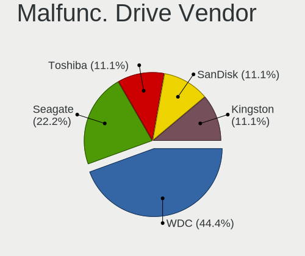
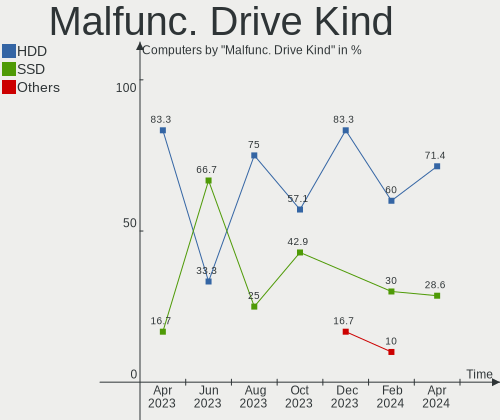
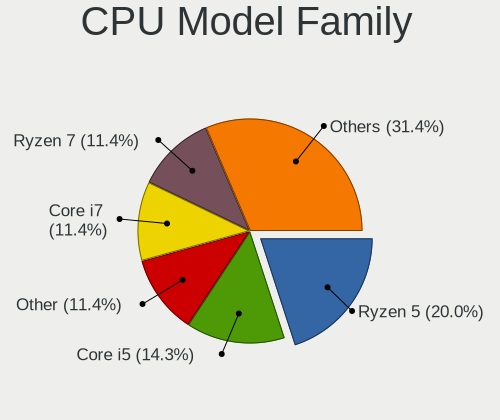
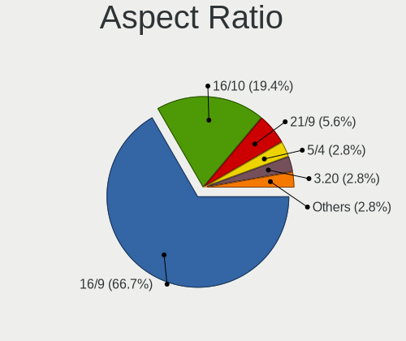
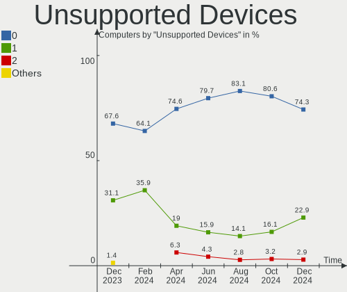

EndeavourOS - Hardware Trends
-----------------------------

A project to identify most popular hardware characteristics and track their change
over time based on data collected by Linux users at https://Linux-Hardware.org.

Anyone can contribute to this report by the [hw-probe](https://github.com/linuxhw/hw-probe) tool:

    sudo -E hw-probe -all -upload

This is a report for all computer types. See also reports for [desktops](/Dist/EndeavourOS/Desktop/README.md) and [notebooks](/Dist/EndeavourOS/Notebook/README.md).

This report is for one last month. Overall report since the beginning of time: [TestDays](https://github.com/linuxhw/TestDays)

Period: Oct, 2023.

Contents
--------

* [ System ](#system)
  - [ OS                       ](#os)
  - [ OS Family                ](#os-family)
  - [ Kernel                   ](#kernel)
  - [ Kernel Family            ](#kernel-family)
  - [ Kernel Major Ver.        ](#kernel-major-ver)
  - [ Arch                     ](#arch)
  - [ DE                       ](#de)
  - [ Display Server           ](#display-server)
  - [ Display Manager          ](#display-manager)
  - [ OS Lang                  ](#os-lang)
  - [ Boot Mode                ](#boot-mode)
  - [ Filesystem               ](#filesystem)
  - [ Part. scheme             ](#part-scheme)
  - [ Dual Boot with Linux/BSD ](#dual-boot-with-linuxbsd)
  - [ Dual Boot (Win)          ](#dual-boot-win)

* [ Board ](#board)
  - [ Vendor                   ](#vendor)
  - [ Model                    ](#model)
  - [ Model Family             ](#model-family)
  - [ MFG Year                 ](#mfg-year)
  - [ Form Factor              ](#form-factor)
  - [ Secure Boot              ](#secure-boot)
  - [ Coreboot                 ](#coreboot)
  - [ RAM Size                 ](#ram-size)
  - [ RAM Used                 ](#ram-used)
  - [ Total Drives             ](#total-drives)
  - [ Has CD-ROM               ](#has-cd-rom)
  - [ Has Ethernet             ](#has-ethernet)
  - [ Has WiFi                 ](#has-wifi)
  - [ Has Bluetooth            ](#has-bluetooth)

* [ Location ](#location)
  - [ Country                  ](#country)
  - [ City                     ](#city)

* [ Drives ](#drives)
  - [ Drive Vendor             ](#drive-vendor)
  - [ Drive Model              ](#drive-model)
  - [ HDD Vendor               ](#hdd-vendor)
  - [ SSD Vendor               ](#ssd-vendor)
  - [ Drive Kind               ](#drive-kind)
  - [ Drive Connector          ](#drive-connector)
  - [ Drive Size               ](#drive-size)
  - [ Space Total              ](#space-total)
  - [ Space Used               ](#space-used)
  - [ Malfunc. Drives          ](#malfunc-drives)
  - [ Malfunc. Drive Vendor    ](#malfunc-drive-vendor)
  - [ Malfunc. HDD Vendor      ](#malfunc-hdd-vendor)
  - [ Malfunc. Drive Kind      ](#malfunc-drive-kind)
  - [ Failed Drives            ](#failed-drives)
  - [ Failed Drive Vendor      ](#failed-drive-vendor)
  - [ Drive Status             ](#drive-status)

* [ Storage controller ](#storage-controller)
  - [ Storage Vendor           ](#storage-vendor)
  - [ Storage Model            ](#storage-model)
  - [ Storage Kind             ](#storage-kind)

* [ Processor ](#processor)
  - [ CPU Vendor               ](#cpu-vendor)
  - [ CPU Model                ](#cpu-model)
  - [ CPU Model Family         ](#cpu-model-family)
  - [ CPU Cores                ](#cpu-cores)
  - [ CPU Sockets              ](#cpu-sockets)
  - [ CPU Threads              ](#cpu-threads)
  - [ CPU Op-Modes             ](#cpu-op-modes)
  - [ CPU Microcode            ](#cpu-microcode)
  - [ CPU Microarch            ](#cpu-microarch)

* [ Graphics ](#graphics)
  - [ GPU Vendor               ](#gpu-vendor)
  - [ GPU Model                ](#gpu-model)
  - [ GPU Combo                ](#gpu-combo)
  - [ GPU Driver               ](#gpu-driver)
  - [ GPU Memory               ](#gpu-memory)

* [ Monitor ](#monitor)
  - [ Monitor Vendor           ](#monitor-vendor)
  - [ Monitor Model            ](#monitor-model)
  - [ Monitor Resolution       ](#monitor-resolution)
  - [ Monitor Diagonal         ](#monitor-diagonal)
  - [ Monitor Width            ](#monitor-width)
  - [ Aspect Ratio             ](#aspect-ratio)
  - [ Monitor Area             ](#monitor-area)
  - [ Pixel Density            ](#pixel-density)
  - [ Multiple Monitors        ](#multiple-monitors)

* [ Network ](#network)
  - [ Net Controller Vendor    ](#net-controller-vendor)
  - [ Net Controller Model     ](#net-controller-model)
  - [ Wireless Vendor          ](#wireless-vendor)
  - [ Wireless Model           ](#wireless-model)
  - [ Ethernet Vendor          ](#ethernet-vendor)
  - [ Ethernet Model           ](#ethernet-model)
  - [ Net Controller Kind      ](#net-controller-kind)
  - [ Used Controller          ](#used-controller)
  - [ NICs                     ](#nics)
  - [ IPv6                     ](#ipv6)

* [ Bluetooth ](#bluetooth)
  - [ Bluetooth Vendor         ](#bluetooth-vendor)
  - [ Bluetooth Model          ](#bluetooth-model)

* [ Sound ](#sound)
  - [ Sound Vendor             ](#sound-vendor)
  - [ Sound Model              ](#sound-model)

* [ Memory ](#memory)
  - [ Memory Vendor            ](#memory-vendor)
  - [ Memory Model             ](#memory-model)
  - [ Memory Kind              ](#memory-kind)
  - [ Memory Form Factor       ](#memory-form-factor)
  - [ Memory Size              ](#memory-size)
  - [ Memory Speed             ](#memory-speed)

* [ Printers & scanners ](#printers--scanners)
  - [ Printer Vendor           ](#printer-vendor)
  - [ Printer Model            ](#printer-model)
  - [ Scanner Vendor           ](#scanner-vendor)
  - [ Scanner Model            ](#scanner-model)

* [ Camera ](#camera)
  - [ Camera Vendor            ](#camera-vendor)
  - [ Camera Model             ](#camera-model)

* [ Security ](#security)
  - [ Fingerprint Vendor       ](#fingerprint-vendor)
  - [ Fingerprint Model        ](#fingerprint-model)
  - [ Chipcard Vendor          ](#chipcard-vendor)
  - [ Chipcard Model           ](#chipcard-model)

* [ Unsupported ](#unsupported)
  - [ Unsupported Devices      ](#unsupported-devices)
  - [ Unsupported Device Types ](#unsupported-device-types)

System
------

OS
--

Installed operating systems

| Name                | Computers | Percent |
|---------------------|-----------|---------|
| EndeavourOS Rolling | 64        | 100%    |

OS Family
---------

OS without a version

| Name        | Computers | Percent |
|-------------|-----------|---------|
| EndeavourOS | 64        | 100%    |

Kernel
------

Version of the Linux kernel

| Version                        | Computers | Percent |
|--------------------------------|-----------|---------|
| 6.5.7-arch1-1                  | 13        | 20.31%  |
| 6.5.9-arch2-1                  | 11        | 17.19%  |
| 6.5.8-arch1-1                  | 9         | 14.06%  |
| 6.5.5-arch1-1                  | 6         | 9.38%   |
| 6.5.6-arch2-1                  | 3         | 4.69%   |
| 6.5.6-zen2-1-zen               | 2         | 3.13%   |
| 6.1.59-1-lts                   | 2         | 3.13%   |
| 6.1.58-1-lts                   | 2         | 3.13%   |
| 6.5.9-zen2-1-zen               | 1         | 1.56%   |
| 6.5.8-zen1-1-zen               | 1         | 1.56%   |
| 6.5.8-Ototsuku-T2-xanmod1-1-t2 | 1         | 1.56%   |
| 6.5.8-hardened1-1-hardened     | 1         | 1.56%   |
| 6.5.8-arch1-1-surface          | 1         | 1.56%   |
| 6.5.8-273-tkg-linux-tkg-pds    | 1         | 1.56%   |
| 6.5.7-zen2-1-zen               | 1         | 1.56%   |
| 6.5.5-273-tkg-cfs-dirty        | 1         | 1.56%   |
| 6.5.5-2-clear                  | 1         | 1.56%   |
| 6.5.4-zen2-1-zen               | 1         | 1.56%   |
| 6.5.4-arch2-1                  | 1         | 1.56%   |
| 6.5.3-273-tkg-bore-eevdf       | 1         | 1.56%   |
| 6.4.14-x64v2-xanmod1-1         | 1         | 1.56%   |
| 6.3.4-arch1-1                  | 1         | 1.56%   |
| 6.1.56-1-lts                   | 1         | 1.56%   |
| 6.1.51-1-MANJARO               | 1         | 1.56%   |

Kernel Family
-------------

Linux kernel without a distro release

| Version | Computers | Percent |
|---------|-----------|---------|
| 6.5.8   | 14        | 21.88%  |
| 6.5.7   | 14        | 21.88%  |
| 6.5.9   | 12        | 18.75%  |
| 6.5.5   | 8         | 12.5%   |
| 6.5.6   | 5         | 7.81%   |
| 6.5.4   | 2         | 3.13%   |
| 6.1.59  | 2         | 3.13%   |
| 6.1.58  | 2         | 3.13%   |
| 6.5.3   | 1         | 1.56%   |
| 6.4.14  | 1         | 1.56%   |
| 6.3.4   | 1         | 1.56%   |
| 6.1.56  | 1         | 1.56%   |
| 6.1.51  | 1         | 1.56%   |

Kernel Major Ver.
-----------------

Linux kernel major version

| Version | Computers | Percent |
|---------|-----------|---------|
| 6.5     | 56        | 87.5%   |
| 6.1     | 6         | 9.38%   |
| 6.4     | 1         | 1.56%   |
| 6.3     | 1         | 1.56%   |

Arch
----

OS architecture (x86_64, i586, etc.)

| Name   | Computers | Percent |
|--------|-----------|---------|
| x86_64 | 64        | 100%    |

DE
--

Desktop Environment

| Name       | Computers | Percent |
|------------|-----------|---------|
| KDE5       | 27        | 42.19%  |
| GNOME      | 11        | 17.19%  |
| XFCE       | 9         | 14.06%  |
| Hyprland   | 4         | 6.25%   |
| Budgie     | 4         | 6.25%   |
| Cinnamon   | 2         | 3.13%   |
| X-Cinnamon | 1         | 1.56%   |
| sway       | 1         | 1.56%   |
| MATE       | 1         | 1.56%   |
| LXDE       | 1         | 1.56%   |
| i3         | 1         | 1.56%   |
| awesome    | 1         | 1.56%   |
| Unknown    | 1         | 1.56%   |

Display Server
--------------

X11 or Wayland

| Name    | Computers | Percent |
|---------|-----------|---------|
| X11     | 40        | 62.5%   |
| Wayland | 20        | 31.25%  |
| Tty     | 2         | 3.13%   |
| Unknown | 2         | 3.13%   |

Display Manager
---------------

SDDM, LightDM, etc.

| Name    | Computers | Percent |
|---------|-----------|---------|
| Unknown | 20        | 31.25%  |
| SDDM    | 18        | 28.13%  |
| LightDM | 17        | 26.56%  |
| GDM     | 7         | 10.94%  |
| LY-DM   | 1         | 1.56%   |
| LEMURS  | 1         | 1.56%   |

OS Lang
-------

Language

| Lang  | Computers | Percent |
|-------|-----------|---------|
| en_US | 34        | 53.13%  |
| it_IT | 10        | 15.63%  |
| de_DE | 5         | 7.81%   |
| en_AU | 3         | 4.69%   |
| ru_RU | 2         | 3.13%   |
| fr_FR | 2         | 3.13%   |
| en_GB | 2         | 3.13%   |
| pt_BR | 1         | 1.56%   |
| pl_PL | 1         | 1.56%   |
| ko_KR | 1         | 1.56%   |
| es_MX | 1         | 1.56%   |
| es_ES | 1         | 1.56%   |
| en_CA | 1         | 1.56%   |

Boot Mode
---------

EFI or BIOS

| Mode | Computers | Percent |
|------|-----------|---------|
| EFI  | 40        | 62.5%   |
| BIOS | 24        | 37.5%   |

Filesystem
----------

Type of filesystem

| Type    | Computers | Percent |
|---------|-----------|---------|
| Ext4    | 44        | 68.75%  |
| Btrfs   | 17        | 26.56%  |
| Zfs     | 1         | 1.56%   |
| Overlay | 1         | 1.56%   |
| Unknown | 1         | 1.56%   |

Part. scheme
------------

Scheme of partitioning

| Type    | Computers | Percent |
|---------|-----------|---------|
| GPT     | 41        | 64.06%  |
| Unknown | 21        | 32.81%  |
| MBR     | 2         | 3.13%   |

Dual Boot with Linux/BSD
------------------------

Hosting more than one Linux/BSD

| Dual boot | Computers | Percent |
|-----------|-----------|---------|
| No        | 54        | 84.38%  |
| Yes       | 10        | 15.63%  |

Dual Boot (Win)
---------------

Hosting Linux and Windows

| Dual boot | Computers | Percent |
|-----------|-----------|---------|
| No        | 46        | 71.88%  |
| Yes       | 18        | 28.13%  |

Board
-----

Vendor
------

Motherboard manufacturer

| Name                | Computers | Percent |
|---------------------|-----------|---------|
| Lenovo              | 11        | 17.19%  |
| ASUSTek Computer    | 11        | 17.19%  |
| MSI                 | 9         | 14.06%  |
| Hewlett-Packard     | 8         | 12.5%   |
| Gigabyte Technology | 5         | 7.81%   |
| Dell                | 5         | 7.81%   |
| Acer                | 4         | 6.25%   |
| ASRock              | 2         | 3.13%   |
| Toshiba             | 1         | 1.56%   |
| System76            | 1         | 1.56%   |
| Sony                | 1         | 1.56%   |
| Positivo            | 1         | 1.56%   |
| Microsoft           | 1         | 1.56%   |
| LTD Delovoy Office  | 1         | 1.56%   |
| Fujitsu             | 1         | 1.56%   |
| Apple               | 1         | 1.56%   |
| Unknown             | 1         | 1.56%   |

Model
-----

Motherboard model

| Name                                  | Computers | Percent |
|---------------------------------------|-----------|---------|
| MSI MS-7C37                           | 2         | 3.13%   |
| Toshiba Satellite C855-1KF            | 1         | 1.56%   |
| System76 Gazelle                      | 1         | 1.56%   |
| Sony SVE1713X1EB                      | 1         | 1.56%   |
| Positivo POS-PIG43BC                  | 1         | 1.56%   |
| MSI MS-7D96                           | 1         | 1.56%   |
| MSI MS-7D95                           | 1         | 1.56%   |
| MSI MS-7C56                           | 1         | 1.56%   |
| MSI MS-7A71                           | 1         | 1.56%   |
| MSI MS-7996                           | 1         | 1.56%   |
| MSI Modern 15 A11M                    | 1         | 1.56%   |
| MSI GS63 Stealth 8RE                  | 1         | 1.56%   |
| Microsoft Surface Laptop Go           | 1         | 1.56%   |
| LTD Delovoy Office EVE 1494E ES1280EW | 1         | 1.56%   |
| Lenovo ThinkPad T14s Gen 4 21F80041GE | 1         | 1.56%   |
| Lenovo ThinkPad P15 Gen 1 20SUA03S00  | 1         | 1.56%   |
| Lenovo ThinkPad P15 Gen 1 20STCTO1WW  | 1         | 1.56%   |
| Lenovo ThinkPad L13 Yoga 20R6S00800   | 1         | 1.56%   |
| Lenovo ThinkPad E595 20NFCTO1WW       | 1         | 1.56%   |
| Lenovo ThinkPad E14 Gen 5 21JR0009RT  | 1         | 1.56%   |
| Lenovo ThinkPad E14 Gen 4 21ECS00000  | 1         | 1.56%   |
| Lenovo ThinkPad E14 Gen 2 20T6000SIX  | 1         | 1.56%   |
| Lenovo Legion Y540-17IRH 81Q4         | 1         | 1.56%   |
| Lenovo Legion Pro 7 16IRX8 82WR       | 1         | 1.56%   |
| Lenovo IdeaPad 3 14ITL6 82H7          | 1         | 1.56%   |
| HP ZBook 15 G3                        | 1         | 1.56%   |
| HP ZBook 14u G4                       | 1         | 1.56%   |
| HP Snappy                             | 1         | 1.56%   |
| HP ProBook 650 G1                     | 1         | 1.56%   |
| HP Laptop 15-dw0xxx                   | 1         | 1.56%   |
| HP ENVY x360 2-in-1 Laptop 15-ey0xxx  | 1         | 1.56%   |
| HP Dragonfly 13.5 inch G4 Notebook PC | 1         | 1.56%   |
| HP 255 G6 Notebook PC                 | 1         | 1.56%   |
| Gigabyte Z390 DESIGNARE               | 1         | 1.56%   |
| Gigabyte X570 AORUS MASTER            | 1         | 1.56%   |
| Gigabyte WARD H107                    | 1         | 1.56%   |
| Gigabyte B760 GAMING X AX DDR4        | 1         | 1.56%   |
| Gigabyte B550 AORUS ELITE V2          | 1         | 1.56%   |
| Fujitsu ESPRIMO D556/2                | 1         | 1.56%   |
| Dell XPS 15 9530                      | 1         | 1.56%   |

Model Family
------------

Motherboard model prefix

| Name                   | Computers | Percent |
|------------------------|-----------|---------|
| Lenovo ThinkPad        | 8         | 12.5%   |
| Acer Aspire            | 4         | 6.25%   |
| ASUS TUF               | 3         | 4.69%   |
| ASUS PRIME             | 3         | 4.69%   |
| MSI MS-7C37            | 2         | 3.13%   |
| Lenovo Legion          | 2         | 3.13%   |
| HP ZBook               | 2         | 3.13%   |
| Dell XPS               | 2         | 3.13%   |
| Toshiba Satellite      | 1         | 1.56%   |
| System76 Gazelle       | 1         | 1.56%   |
| Sony SVE1713X1EB       | 1         | 1.56%   |
| Positivo POS-PIG43BC   | 1         | 1.56%   |
| MSI MS-7D96            | 1         | 1.56%   |
| MSI MS-7D95            | 1         | 1.56%   |
| MSI MS-7C56            | 1         | 1.56%   |
| MSI MS-7A71            | 1         | 1.56%   |
| MSI MS-7996            | 1         | 1.56%   |
| MSI Modern             | 1         | 1.56%   |
| MSI GS63               | 1         | 1.56%   |
| Microsoft Surface      | 1         | 1.56%   |
| LTD Delovoy Office EVE | 1         | 1.56%   |
| Lenovo IdeaPad         | 1         | 1.56%   |
| HP Snappy              | 1         | 1.56%   |
| HP ProBook             | 1         | 1.56%   |
| HP Laptop              | 1         | 1.56%   |
| HP ENVY                | 1         | 1.56%   |
| HP Dragonfly           | 1         | 1.56%   |
| HP 255                 | 1         | 1.56%   |
| Gigabyte Z390          | 1         | 1.56%   |
| Gigabyte X570          | 1         | 1.56%   |
| Gigabyte WARD          | 1         | 1.56%   |
| Gigabyte B760          | 1         | 1.56%   |
| Gigabyte B550          | 1         | 1.56%   |
| Fujitsu ESPRIMO        | 1         | 1.56%   |
| Dell OptiPlex          | 1         | 1.56%   |
| Dell Latitude          | 1         | 1.56%   |
| Dell Inspiron          | 1         | 1.56%   |
| ASUS VivoBook          | 1         | 1.56%   |
| ASUS STRIX             | 1         | 1.56%   |
| ASUS ROG               | 1         | 1.56%   |

MFG Year
--------

Motherboard manufacture year

| Year | Computers | Percent |
|------|-----------|---------|
| 2020 | 13        | 20.31%  |
| 2022 | 9         | 14.06%  |
| 2019 | 9         | 14.06%  |
| 2023 | 8         | 12.5%   |
| 2017 | 6         | 9.38%   |
| 2016 | 5         | 7.81%   |
| 2021 | 4         | 6.25%   |
| 2018 | 2         | 3.13%   |
| 2015 | 2         | 3.13%   |
| 2013 | 2         | 3.13%   |
| 2014 | 1         | 1.56%   |
| 2012 | 1         | 1.56%   |
| 2010 | 1         | 1.56%   |
| 2008 | 1         | 1.56%   |

Form Factor
-----------

Physical design of the computer

| Name        | Computers | Percent |
|-------------|-----------|---------|
| Notebook    | 31        | 48.44%  |
| Desktop     | 26        | 40.63%  |
| Convertible | 4         | 6.25%   |
| Tablet      | 3         | 4.69%   |

Secure Boot
-----------

Enabled or disabled

| State    | Computers | Percent |
|----------|-----------|---------|
| Disabled | 64        | 100%    |

Coreboot
--------

Have coreboot on board

| Used | Computers | Percent |
|------|-----------|---------|
| No   | 62        | 96.88%  |
| Yes  | 2         | 3.13%   |

RAM Size
--------

Total RAM memory

| Size in GB  | Computers | Percent |
|-------------|-----------|---------|
| 16.01-24.0  | 20        | 31.25%  |
| 32.01-64.0  | 12        | 18.75%  |
| 8.01-16.0   | 11        | 17.19%  |
| 64.01-256.0 | 7         | 10.94%  |
| 4.01-8.0    | 6         | 9.38%   |
| 3.01-4.0    | 3         | 4.69%   |
| 24.01-32.0  | 3         | 4.69%   |
| 1.01-2.0    | 1         | 1.56%   |
| Unknown     | 1         | 1.56%   |

RAM Used
--------

Used RAM memory

| Used GB    | Computers | Percent |
|------------|-----------|---------|
| 4.01-8.0   | 23        | 35.94%  |
| 2.01-3.0   | 14        | 21.88%  |
| 8.01-16.0  | 8         | 12.5%   |
| 3.01-4.0   | 7         | 10.94%  |
| 1.01-2.0   | 6         | 9.38%   |
| 0.51-1.0   | 4         | 6.25%   |
| 16.01-24.0 | 1         | 1.56%   |
| Unknown    | 1         | 1.56%   |

Total Drives
------------

Number of drives on board

| Drives | Computers | Percent |
|--------|-----------|---------|
| 1      | 29        | 45.31%  |
| 2      | 16        | 25%     |
| 3      | 8         | 12.5%   |
| 6      | 4         | 6.25%   |
| 5      | 3         | 4.69%   |
| 4      | 2         | 3.13%   |
| 9      | 1         | 1.56%   |
| 0      | 1         | 1.56%   |

Has CD-ROM
----------

Has CD-ROM on board

| Presented | Computers | Percent |
|-----------|-----------|---------|
| No        | 56        | 87.5%   |
| Yes       | 8         | 12.5%   |

Has Ethernet
------------

Has Ethernet on board

| Presented | Computers | Percent |
|-----------|-----------|---------|
| Yes       | 52        | 81.25%  |
| No        | 12        | 18.75%  |

Has WiFi
--------

Has WiFi module

| Presented | Computers | Percent |
|-----------|-----------|---------|
| Yes       | 57        | 89.06%  |
| No        | 7         | 10.94%  |

Has Bluetooth
-------------

Has Bluetooth module

| Presented | Computers | Percent |
|-----------|-----------|---------|
| Yes       | 52        | 81.25%  |
| No        | 12        | 18.75%  |

Location
--------

Country
-------

Geographic location (country)

| Country     | Computers | Percent |
|-------------|-----------|---------|
| Italy       | 15        | 23.44%  |
| USA         | 13        | 20.31%  |
| Germany     | 9         | 14.06%  |
| Russia      | 4         | 6.25%   |
| Australia   | 3         | 4.69%   |
| Sweden      | 2         | 3.13%   |
| Poland      | 2         | 3.13%   |
| Netherlands | 2         | 3.13%   |
| Mexico      | 2         | 3.13%   |
| Turkey      | 1         | 1.56%   |
| Tunisia     | 1         | 1.56%   |
| Switzerland | 1         | 1.56%   |
| Spain       | 1         | 1.56%   |
| South Korea | 1         | 1.56%   |
| Norway      | 1         | 1.56%   |
| Hungary     | 1         | 1.56%   |
| Georgia     | 1         | 1.56%   |
| France      | 1         | 1.56%   |
| Canada      | 1         | 1.56%   |
| Brazil      | 1         | 1.56%   |
| Austria     | 1         | 1.56%   |

City
----

Geographic location (city)

| City                        | Computers | Percent |
|-----------------------------|-----------|---------|
| Melbourne                   | 3         | 4.69%   |
| Milano                      | 2         | 3.13%   |
| Waiblingen                  | 1         | 1.56%   |
| Voelkermarkt                | 1         | 1.56%   |
| Ufa                         | 1         | 1.56%   |
| Turin                       | 1         | 1.56%   |
| Tunis                       | 1         | 1.56%   |
| Toronto                     | 1         | 1.56%   |
| Tbilisi                     | 1         | 1.56%   |
| Suwon                       | 1         | 1.56%   |
| Stockholm                   | 1         | 1.56%   |
| Soledad de Graciano Sanchez | 1         | 1.56%   |
| Sioux Falls                 | 1         | 1.56%   |
| Seattle                     | 1         | 1.56%   |
| Scafati                     | 1         | 1.56%   |
| San Luis Potosí City       | 1         | 1.56%   |
| San Clemente                | 1         | 1.56%   |
| Rotterdam                   | 1         | 1.56%   |
| Rome                        | 1         | 1.56%   |
| Rho                         | 1         | 1.56%   |
| Rende                       | 1         | 1.56%   |
| Reinfeld                    | 1         | 1.56%   |
| Regensburg                  | 1         | 1.56%   |
| Poznan                      | 1         | 1.56%   |
| Portland                    | 1         | 1.56%   |
| Pflugerville                | 1         | 1.56%   |
| Oria                        | 1         | 1.56%   |
| Nuremberg                   | 1         | 1.56%   |
| Niederwangen                | 1         | 1.56%   |
| Neryungri                   | 1         | 1.56%   |
| Nashville                   | 1         | 1.56%   |
| Naples                      | 1         | 1.56%   |
| Naaldwijk                   | 1         | 1.56%   |
| Mugla                       | 1         | 1.56%   |
| Milan                       | 1         | 1.56%   |
| Mestre                      | 1         | 1.56%   |
| Madrid                      | 1         | 1.56%   |
| Los Angeles                 | 1         | 1.56%   |
| Livorno                     | 1         | 1.56%   |
| Levallois-Perret            | 1         | 1.56%   |

Drives
------

Drive Vendor
------------

Hard drive vendors

| Vendor                      | Computers | Drives | Percent |
|-----------------------------|-----------|--------|---------|
| Samsung Electronics         | 24        | 32     | 21.24%  |
| Seagate                     | 12        | 17     | 10.62%  |
| WDC                         | 10        | 18     | 8.85%   |
| Sandisk                     | 9         | 12     | 7.96%   |
| Kingston                    | 9         | 10     | 7.96%   |
| Toshiba                     | 6         | 6      | 5.31%   |
| SK hynix                    | 5         | 5      | 4.42%   |
| Crucial                     | 5         | 5      | 4.42%   |
| Unknown                     | 3         | 4      | 2.65%   |
| Micron/Crucial Technology   | 3         | 3      | 2.65%   |
| KIOXIA                      | 3         | 3      | 2.65%   |
| SPCC                        | 2         | 2      | 1.77%   |
| Intel                       | 2         | 2      | 1.77%   |
| Hitachi                     | 2         | 2      | 1.77%   |
| HGST                        | 2         | 2      | 1.77%   |
| Union Memory (Shenzhen)     | 1         | 1      | 0.88%   |
| Transcend                   | 1         | 1      | 0.88%   |
| Silicon Motion              | 1         | 1      | 0.88%   |
| Realtek                     | 1         | 1      | 0.88%   |
| Netac                       | 1         | 1      | 0.88%   |
| Micron Technology           | 1         | 1      | 0.88%   |
| Maxtor                      | 1         | 1      | 0.88%   |
| Kingston Technology Company | 1         | 1      | 0.88%   |
| JMicron Technology          | 1         | 1      | 0.88%   |
| JD                          | 1         | 1      | 0.88%   |
| GOODRAM                     | 1         | 1      | 0.88%   |
| Emtec                       | 1         | 1      | 0.88%   |
| Corsair                     | 1         | 1      | 0.88%   |
| Apple                       | 1         | 1      | 0.88%   |
| Actseno                     | 1         | 1      | 0.88%   |
| A-DATA Technology           | 1         | 2      | 0.88%   |

Drive Model
-----------

Hard drive models

| Model                                              | Computers | Percent |
|----------------------------------------------------|-----------|---------|
| Samsung NVMe SSD Controller SM981/PM981/PM983 1TB  | 10        | 7.75%   |
| Samsung SSD 870 QVO 1TB                            | 3         | 2.33%   |
| Samsung SSD 860 EVO 1TB                            | 3         | 2.33%   |
| Kingston SA400S37240G 240GB SSD                    | 3         | 2.33%   |
| Unknown MMC Card  16GB                             | 2         | 1.55%   |
| Seagate ST500DM002-1BD142 500GB                    | 2         | 1.55%   |
| Seagate ST2000LM015-2E8174 2TB                     | 2         | 1.55%   |
| Seagate ST2000DM008-2FR102 2TB                     | 2         | 1.55%   |
| Samsung SSD 990 PRO 2TB                            | 2         | 1.55%   |
| Samsung NVMe SSD Controller PM9A1/PM9A3/980PRO 1TB | 2         | 1.55%   |
| Micron/Crucial P2 NVMe PCIe SSD 500GB              | 2         | 1.55%   |
| Kingston SKC3000D2048G 2TB                         | 2         | 1.55%   |
| WDC WDS200T2B0B-00YS70 2TB SSD                     | 1         | 0.78%   |
| WDC WDS120G2G0B-00EPW0 120GB SSD                   | 1         | 0.78%   |
| WDC WD8004FRYZ-01VAEB0 8TB                         | 1         | 0.78%   |
| WDC WD5000LPCX-60VHAT0 500GB                       | 1         | 0.78%   |
| WDC WD40EZAZ-00SF3B0 4TB                           | 1         | 0.78%   |
| WDC WD40EFRX-68N32N0 4TB                           | 1         | 0.78%   |
| WDC WD2000FYYZ-01UL1B2 2TB                         | 1         | 0.78%   |
| WDC WD10SPZX-17Z10T0 1TB                           | 1         | 0.78%   |
| WDC WD10EZRX-00L4HB0 1TB                           | 1         | 0.78%   |
| WDC WD10EZRX-00D8PB0 1TB                           | 1         | 0.78%   |
| WDC WD10EZEX-08WN4A0 1TB                           | 1         | 0.78%   |
| WDC WD10EZEX-07WN4A0 1TB                           | 1         | 0.78%   |
| WDC WD10EZEX-00WN4A0 1TB                           | 1         | 0.78%   |
| WDC WD10EZEX-00BBHA0 1TB                           | 1         | 0.78%   |
| WDC WD1003FZEX-00MK2A0 1TB                         | 1         | 0.78%   |
| Unknown SD/MMC 2GB                                 | 1         | 0.78%   |
| Unknown M.S./M.S.Pro/HG 16GB                       | 1         | 0.78%   |
| Union Memory (Shenzhen) UMIS RPJTJ512MGE1QDQ 512GB | 1         | 0.78%   |
| Transcend TS120GMTS420S 120GB SSD                  | 1         | 0.78%   |
| Toshiba XG6 NVMe SSD Controller 256GB              | 1         | 0.78%   |
| Toshiba XG4 NVMe SSD Controller 256GB              | 1         | 0.78%   |
| Toshiba THNSNK128GCS8 SATA 128GB SSD               | 1         | 0.78%   |
| Toshiba NVMe Controller 512GB                      | 1         | 0.78%   |
| Toshiba MQ01ABD100 1TB                             | 1         | 0.78%   |
| Toshiba KSG60ZMV256G 256GB SSD                     | 1         | 0.78%   |
| SPCC Solid State Disk 2TB                          | 1         | 0.78%   |
| SPCC Solid State Disk 1TB                          | 1         | 0.78%   |
| SK hynix SKHynix_HFS001TD9TNI-L2B0B 1024GB         | 1         | 0.78%   |

HDD Vendor
----------

Hard disk drive vendors

| Vendor              | Computers | Drives | Percent |
|---------------------|-----------|--------|---------|
| Seagate             | 11        | 16     | 40.74%  |
| WDC                 | 9         | 16     | 33.33%  |
| Hitachi             | 2         | 2      | 7.41%   |
| HGST                | 2         | 2      | 7.41%   |
| Toshiba             | 1         | 1      | 3.7%    |
| Samsung Electronics | 1         | 1      | 3.7%    |
| Maxtor              | 1         | 1      | 3.7%    |

SSD Vendor
----------

Solid state drive vendors

| Vendor              | Computers | Drives | Percent |
|---------------------|-----------|--------|---------|
| Samsung Electronics | 8         | 10     | 22.86%  |
| Crucial             | 5         | 5      | 14.29%  |
| Kingston            | 4         | 4      | 11.43%  |
| WDC                 | 2         | 2      | 5.71%   |
| Toshiba             | 2         | 2      | 5.71%   |
| SPCC                | 2         | 2      | 5.71%   |
| SK hynix            | 2         | 2      | 5.71%   |
| SanDisk             | 2         | 2      | 5.71%   |
| Transcend           | 1         | 1      | 2.86%   |
| Netac               | 1         | 1      | 2.86%   |
| JD                  | 1         | 1      | 2.86%   |
| GOODRAM             | 1         | 1      | 2.86%   |
| Emtec               | 1         | 1      | 2.86%   |
| Corsair             | 1         | 1      | 2.86%   |
| Actseno             | 1         | 1      | 2.86%   |
| A-DATA Technology   | 1         | 2      | 2.86%   |

Drive Kind
----------

HDD or SSD

| Kind    | Computers | Drives | Percent |
|---------|-----------|--------|---------|
| NVMe    | 46        | 57     | 46.94%  |
| SSD     | 26        | 38     | 26.53%  |
| HDD     | 21        | 39     | 21.43%  |
| Unknown | 3         | 4      | 3.06%   |
| MMC     | 2         | 2      | 2.04%   |

Drive Connector
---------------

SATA, SAS, NVMe, etc.

| Type | Computers | Drives | Percent |
|------|-----------|--------|---------|
| NVMe | 46        | 56     | 51.11%  |
| SATA | 34        | 72     | 37.78%  |
| SAS  | 8         | 10     | 8.89%   |
| MMC  | 2         | 2      | 2.22%   |

Drive Size
----------

Size of hard drive

| Size in TB | Computers | Drives | Percent |
|------------|-----------|--------|---------|
| 0.01-0.5   | 20        | 30     | 39.22%  |
| 0.51-1.0   | 17        | 27     | 33.33%  |
| 1.01-2.0   | 10        | 13     | 19.61%  |
| 3.01-4.0   | 2         | 2      | 3.92%   |
| 10.01-20.0 | 1         | 1      | 1.96%   |
| 4.01-10.0  | 1         | 4      | 1.96%   |

Space Total
-----------

Amount of disk space available on the file system

| Size in GB     | Computers | Percent |
|----------------|-----------|---------|
| 251-500        | 13        | 20.31%  |
| 1001-2000      | 12        | 18.75%  |
| 501-1000       | 9         | 14.06%  |
| 101-250        | 8         | 12.5%   |
| More than 3000 | 6         | 9.38%   |
| 1-20           | 6         | 9.38%   |
| Unknown        | 5         | 7.81%   |
| 2001-3000      | 4         | 6.25%   |
| 51-100         | 1         | 1.56%   |

Space Used
----------

Amount of used disk space

| Used GB        | Computers | Percent |
|----------------|-----------|---------|
| 1-20           | 17        | 26.56%  |
| 21-50          | 9         | 14.06%  |
| 51-100         | 7         | 10.94%  |
| 251-500        | 6         | 9.38%   |
| 101-250        | 5         | 7.81%   |
| 1001-2000      | 5         | 7.81%   |
| Unknown        | 5         | 7.81%   |
| 501-1000       | 4         | 6.25%   |
| More than 3000 | 3         | 4.69%   |
| 2001-3000      | 3         | 4.69%   |

Malfunc. Drives
---------------

Drive models with a malfunction

| Model                                | Computers | Drives | Percent |
|--------------------------------------|-----------|--------|---------|
| WDC WD2000FYYZ-01UL1B2 2TB           | 1         | 1      | 12.5%   |
| WDC WD10EZRX-00D8PB0 1TB             | 1         | 1      | 12.5%   |
| Toshiba THNSNK128GCS8 SATA 128GB SSD | 1         | 1      | 12.5%   |
| Toshiba MQ01ABD100 1TB               | 1         | 1      | 12.5%   |
| Seagate ST9500420AS 500GB            | 1         | 1      | 12.5%   |
| Seagate ST500LT012-1DG142 500GB      | 1         | 1      | 12.5%   |
| SanDisk SSD PLUS 1000GB              | 1         | 1      | 12.5%   |
| Actseno MS02 128GB SSD               | 1         | 1      | 12.5%   |

Malfunc. Drive Vendor
---------------------

Vendors of faulty drives

| Vendor  | Computers | Drives | Percent |
|---------|-----------|--------|---------|
| WDC     | 2         | 2      | 25%     |
| Toshiba | 2         | 2      | 25%     |
| Seagate | 2         | 2      | 25%     |
| SanDisk | 1         | 1      | 12.5%   |
| Actseno | 1         | 1      | 12.5%   |

Malfunc. HDD Vendor
-------------------

Vendors of faulty HDD drives

| Vendor  | Computers | Drives | Percent |
|---------|-----------|--------|---------|
| WDC     | 2         | 2      | 40%     |
| Seagate | 2         | 2      | 40%     |
| Toshiba | 1         | 1      | 20%     |

Malfunc. Drive Kind
-------------------

Kinds of faulty drives

| Kind | Computers | Drives | Percent |
|------|-----------|--------|---------|
| HDD  | 4         | 5      | 57.14%  |
| SSD  | 3         | 3      | 42.86%  |

Failed Drives
-------------

Failed drive models

Zero info for selected period =(

Failed Drive Vendor
-------------------

Failed drive vendors

Zero info for selected period =(

Drive Status
------------

Number of failed and malfunc. drives

| Status   | Computers | Drives | Percent |
|----------|-----------|--------|---------|
| Works    | 42        | 87     | 60%     |
| Detected | 21        | 45     | 30%     |
| Malfunc  | 7         | 8      | 10%     |

Storage controller
------------------

Storage Vendor
--------------

Storage controller vendors

| Vendor                       | Computers | Percent |
|------------------------------|-----------|---------|
| Intel                        | 31        | 30.69%  |
| AMD                          | 19        | 18.81%  |
| Samsung Electronics          | 18        | 17.82%  |
| Sandisk                      | 8         | 7.92%   |
| Kingston Technology Company  | 6         | 5.94%   |
| Toshiba America Info Systems | 3         | 2.97%   |
| SK hynix                     | 3         | 2.97%   |
| Micron/Crucial Technology    | 3         | 2.97%   |
| KIOXIA                       | 3         | 2.97%   |
| ASMedia Technology           | 3         | 2.97%   |
| Union Memory (Shenzhen)      | 1         | 0.99%   |
| Silicon Motion               | 1         | 0.99%   |
| Micron Technology            | 1         | 0.99%   |
| Apple                        | 1         | 0.99%   |

Storage Model
-------------

Storage controller models

| Model                                                                          | Computers | Percent |
|--------------------------------------------------------------------------------|-----------|---------|
| AMD FCH SATA Controller [AHCI mode]                                            | 14        | 13.08%  |
| Samsung NVMe SSD Controller SM981/PM981/PM983                                  | 10        | 9.35%   |
| Samsung NVMe SSD Controller 980 (DRAM-less)                                    | 4         | 3.74%   |
| Intel Q170/Q150/B150/H170/H110/Z170/CM236 Chipset SATA Controller [AHCI Mode]  | 4         | 3.74%   |
| AMD 500 Series Chipset SATA Controller                                         | 4         | 3.74%   |
| ASMedia ASM1062 Serial ATA Controller                                          | 3         | 2.8%    |
| Samsung NVMe SSD Controller S4LV008[Pascal]                                    | 2         | 1.87%   |
| Samsung NVMe SSD Controller PM9A1/PM9A3/980PRO                                 | 2         | 1.87%   |
| Micron/Crucial P2 [Nick P2] / P3 / P3 Plus NVMe PCIe SSD (DRAM-less)           | 2         | 1.87%   |
| KIOXIA NVMe SSD Controller XG8                                                 | 2         | 1.87%   |
| Kingston Company KC3000/FURY Renegade NVMe SSD E18                             | 2         | 1.87%   |
| Intel Volume Management Device NVMe RAID Controller Intel Corporation          | 2         | 1.87%   |
| Intel Volume Management Device NVMe RAID Controller                            | 2         | 1.87%   |
| Intel Tiger Lake-LP SATA Controller                                            | 2         | 1.87%   |
| Intel Sunrise Point-LP SATA Controller [AHCI mode]                             | 2         | 1.87%   |
| Intel SSD DC P4101/Pro 7600p/760p/E 6100p Series                               | 2         | 1.87%   |
| Intel Cannon Lake Mobile PCH SATA AHCI Controller                              | 2         | 1.87%   |
| Intel 8 Series/C220 Series Chipset Family 6-port SATA Controller 1 [AHCI mode] | 2         | 1.87%   |
| Intel 700 Series Chipset Family SATA AHCI Controller                           | 2         | 1.87%   |
| Intel 7 Series Chipset Family 6-port SATA Controller [AHCI mode]               | 2         | 1.87%   |
| Intel 200 Series PCH SATA controller [AHCI mode]                               | 2         | 1.87%   |
| AMD FCH SATA Controller D                                                      | 2         | 1.87%   |
| AMD 400 Series Chipset SATA Controller                                         | 2         | 1.87%   |
| Union Memory (Shenzhen) AM630 PCIe 4.0 x4 NVMe SSD Controller                  | 1         | 0.93%   |
| Toshiba America Info Systems XG6 NVMe SSD Controller                           | 1         | 0.93%   |
| Toshiba America Info Systems XG4 NVMe SSD Controller                           | 1         | 0.93%   |
| Toshiba America Info Systems XG3 NVMe SSD Controller                           | 1         | 0.93%   |
| SK hynix PC611 NVMe Solid State Drive                                          | 1         | 0.93%   |
| SK hynix BC901 NVMe Solid State Drive (DRAM-less)                              | 1         | 0.93%   |
| SK hynix BC511 NVMe SSD                                                        | 1         | 0.93%   |
| Silicon Motion SM2263EN/SM2263XT (DRAM-less) NVMe SSD Controllers              | 1         | 0.93%   |
| Sandisk WD PC SN740 NVMe SSD 512GB (DRAM-less)                                 | 1         | 0.93%   |
| Sandisk WD PC SN735 NVMe SSD 1TB (DRAM-less)                                   | 1         | 0.93%   |
| SanDisk WD PC SN540 / Green SN350 NVMe SSD 1 TB (DRAM-less)                    | 1         | 0.93%   |
| SanDisk WD Blue SN500 / PC SN520 x2 M.2 2280 NVMe SSD                          | 1         | 0.93%   |
| SanDisk Ultra 3D / WD Blue SN570 NVMe SSD (DRAM-less)                          | 1         | 0.93%   |
| Sandisk PC SN740 NVMe SSD (DRAM-less)                                          | 1         | 0.93%   |
| SanDisk PC SN735 NVMe SSD (DRAM-less)                                          | 1         | 0.93%   |
| SanDisk PC SN530 NVMe SSD (DRAM-less)                                          | 1         | 0.93%   |
| Micron/Crucial P1 NVMe PCIe SSD[Frampton]                                      | 1         | 0.93%   |

Storage Kind
------------

Kind of storage controller (IDE, SATA, NVMe, SAS, ...)

| Kind | Computers | Percent |
|------|-----------|---------|
| NVMe | 47        | 48.96%  |
| SATA | 43        | 44.79%  |
| RAID | 5         | 5.21%   |
| IDE  | 1         | 1.04%   |

Processor
---------

CPU Vendor
----------

Processor vendors

| Vendor  | Computers | Percent |
|---------|-----------|---------|
| Intel   | 40        | 62.5%   |
| AMD     | 23        | 35.94%  |
| Unknown | 1         | 1.56%   |

CPU Model
---------

Processor models

| Model                                      | Computers | Percent |
|--------------------------------------------|-----------|---------|
| Intel 11th Gen Core i5-1135G7 @ 2.40GHz    | 3         | 4.69%   |
| AMD Ryzen 5 5600X 6-Core Processor         | 3         | 4.69%   |
| Intel Core i7-9750H CPU @ 2.60GHz          | 2         | 3.13%   |
| Intel Core i7-7500U CPU @ 2.70GHz          | 2         | 3.13%   |
| Intel Core i7-6700K CPU @ 4.00GHz          | 2         | 3.13%   |
| AMD Ryzen 5 5625U with Radeon Graphics     | 2         | 3.13%   |
| Intel Core i9-9900K CPU @ 3.60GHz          | 1         | 1.56%   |
| Intel Core i7-8750H CPU @ 2.20GHz          | 1         | 1.56%   |
| Intel Core i7-8565U CPU @ 1.80GHz          | 1         | 1.56%   |
| Intel Core i7-7700 CPU @ 3.60GHz           | 1         | 1.56%   |
| Intel Core i7-6700HQ CPU @ 2.60GHz         | 1         | 1.56%   |
| Intel Core i7-4702MQ CPU @ 2.20GHz         | 1         | 1.56%   |
| Intel Core i7-3632QM CPU @ 2.20GHz         | 1         | 1.56%   |
| Intel Core i7-10875H CPU @ 2.30GHz         | 1         | 1.56%   |
| Intel Core i7-10850H CPU @ 2.70GHz         | 1         | 1.56%   |
| Intel Core i5-7600K CPU @ 3.80GHz          | 1         | 1.56%   |
| Intel Core i5-4590 CPU @ 3.30GHz           | 1         | 1.56%   |
| Intel Core i5-10400 CPU @ 2.90GHz          | 1         | 1.56%   |
| Intel Core i5-1035G1 CPU @ 1.00GHz         | 1         | 1.56%   |
| Intel Core i5-10210U CPU @ 1.60GHz         | 1         | 1.56%   |
| Intel Core i3-6100 CPU @ 3.70GHz           | 1         | 1.56%   |
| Intel Core i3-2310M CPU @ 2.10GHz          | 1         | 1.56%   |
| Intel Core 2 Duo CPU T6400 @ 2.00GHz       | 1         | 1.56%   |
| Intel Celeron N4100 CPU @ 1.10GHz          | 1         | 1.56%   |
| Intel Celeron CPU N3350 @ 1.10GHz          | 1         | 1.56%   |
| Intel Celeron CPU E3400 @ 2.60GHz          | 1         | 1.56%   |
| Intel 13th Gen Core i9-13900HX             | 1         | 1.56%   |
| Intel 13th Gen Core i7-13700H              | 1         | 1.56%   |
| Intel 13th Gen Core i7-1365U               | 1         | 1.56%   |
| Intel 13th Gen Core i7-1360P               | 1         | 1.56%   |
| Intel 13th Gen Core i5-13500               | 1         | 1.56%   |
| Intel 13th Gen Core i5-13400F              | 1         | 1.56%   |
| Intel 12th Gen Core i9-12900H              | 1         | 1.56%   |
| Intel 12th Gen Core i7-12700H              | 1         | 1.56%   |
| Intel 11th Gen Core i7-11800H @ 2.30GHz    | 1         | 1.56%   |
| Intel 11th Gen Core i7-11700 @ 2.50GHz     | 1         | 1.56%   |
| Intel 11th Gen Core i5-1145G7 @ 2.60GHz    | 1         | 1.56%   |
| AMD Ryzen 9 7950X 16-Core Processor        | 1         | 1.56%   |
| AMD Ryzen 9 7940HS w/ Radeon 780M Graphics | 1         | 1.56%   |
| AMD Ryzen 9 5950X 16-Core Processor        | 1         | 1.56%   |

CPU Model Family
----------------

Processor model prefix

| Model            | Computers | Percent |
|------------------|-----------|---------|
| Other            | 15        | 23.44%  |
| Intel Core i7    | 14        | 21.88%  |
| AMD Ryzen 5      | 12        | 18.75%  |
| Intel Core i5    | 5         | 7.81%   |
| AMD Ryzen 9      | 5         | 7.81%   |
| Intel Celeron    | 3         | 4.69%   |
| Intel Core i3    | 2         | 3.13%   |
| AMD Ryzen 7      | 2         | 3.13%   |
| Intel Core i9    | 1         | 1.56%   |
| Intel Core 2 Duo | 1         | 1.56%   |
| AMD Ryzen 7 PRO  | 1         | 1.56%   |
| AMD Ryzen 3      | 1         | 1.56%   |
| AMD E2           | 1         | 1.56%   |
| AMD A6           | 1         | 1.56%   |

CPU Cores
---------

Number of processor cores

| Number  | Computers | Percent |
|---------|-----------|---------|
| 4       | 19        | 29.69%  |
| 6       | 16        | 25%     |
| 2       | 9         | 14.06%  |
| 8       | 7         | 10.94%  |
| 14      | 4         | 6.25%   |
| 12      | 3         | 4.69%   |
| 16      | 2         | 3.13%   |
| 10      | 2         | 3.13%   |
| 24      | 1         | 1.56%   |
| Unknown | 1         | 1.56%   |

CPU Sockets
-----------

Number of sockets

| Number  | Computers | Percent |
|---------|-----------|---------|
| 1       | 63        | 98.44%  |
| Unknown | 1         | 1.56%   |

CPU Threads
-----------

Threads per core (Hyper-Threading)

| Number  | Computers | Percent |
|---------|-----------|---------|
| 2       | 53        | 82.81%  |
| 1       | 10        | 15.63%  |
| Unknown | 1         | 1.56%   |

CPU Op-Modes
------------

CPU Operation Modes (32-bit, 64-bit)

| Op mode        | Computers | Percent |
|----------------|-----------|---------|
| 32-bit, 64-bit | 63        | 98.44%  |
| Unknown        | 1         | 1.56%   |

CPU Microcode
-------------

Microcode number

| Number     | Computers | Percent |
|------------|-----------|---------|
| Unknown    | 46        | 71.88%  |
| 0x0a50000d | 2         | 3.13%   |
| 0x0a50000c | 2         | 3.13%   |
| 0x08701021 | 2         | 3.13%   |
| 0x08101016 | 2         | 3.13%   |
| 0xa0652    | 1         | 1.56%   |
| 0x0a704104 | 1         | 1.56%   |
| 0x0a704103 | 1         | 1.56%   |
| 0x0a601203 | 1         | 1.56%   |
| 0x0a20120a | 1         | 1.56%   |
| 0x0a20102b | 1         | 1.56%   |
| 0x0a201016 | 1         | 1.56%   |
| 0x08600106 | 1         | 1.56%   |
| 0x08108109 | 1         | 1.56%   |
| 0x08001138 | 1         | 1.56%   |

CPU Microarch
-------------

Microarchitecture

| Name             | Computers | Percent |
|------------------|-----------|---------|
| Zen 3            | 10        | 15.63%  |
| KabyLake         | 10        | 15.63%  |
| Alderlake Hybrid | 7         | 10.94%  |
| Unknown          | 6         | 9.38%   |
| TigerLake        | 4         | 6.25%   |
| Skylake          | 4         | 6.25%   |
| Zen 2            | 3         | 4.69%   |
| Icelake          | 3         | 4.69%   |
| CometLake        | 3         | 4.69%   |
| Zen+             | 2         | 3.13%   |
| Zen              | 2         | 3.13%   |
| Penryn           | 2         | 3.13%   |
| Haswell          | 2         | 3.13%   |
| Excavator        | 2         | 3.13%   |
| SandyBridge      | 1         | 1.56%   |
| IvyBridge        | 1         | 1.56%   |
| Goldmont plus    | 1         | 1.56%   |
| Goldmont         | 1         | 1.56%   |

Graphics
--------

GPU Vendor
----------

Vendors of graphics cards

| Vendor | Computers | Percent |
|--------|-----------|---------|
| Intel  | 30        | 37.5%   |
| Nvidia | 26        | 32.5%   |
| AMD    | 24        | 30%     |

GPU Model
---------

Graphics card models

| Model                                                                | Computers | Percent |
|----------------------------------------------------------------------|-----------|---------|
| Intel TigerLake-LP GT2 [Iris Xe Graphics]                            | 4         | 4.71%   |
| Intel Raptor Lake-P [Iris Xe Graphics]                               | 3         | 3.53%   |
| AMD Barcelo                                                          | 3         | 3.53%   |
| Nvidia GA107M [GeForce RTX 3050 Ti Mobile]                           | 2         | 2.35%   |
| Intel HD Graphics 620                                                | 2         | 2.35%   |
| Intel HD Graphics 530                                                | 2         | 2.35%   |
| Intel CometLake-H GT2 [UHD Graphics]                                 | 2         | 2.35%   |
| Intel CoffeeLake-H GT2 [UHD Graphics 630]                            | 2         | 2.35%   |
| Intel Alder Lake-P GT2 [Iris Xe Graphics]                            | 2         | 2.35%   |
| AMD Stoney [Radeon R2/R3/R4/R5 Graphics]                             | 2         | 2.35%   |
| AMD Raven Ridge [Radeon Vega Series / Radeon Vega Mobile Series]     | 2         | 2.35%   |
| AMD Raphael                                                          | 2         | 2.35%   |
| AMD Picasso/Raven 2 [Radeon Vega Series / Radeon Vega Mobile Series] | 2         | 2.35%   |
| AMD Phoenix1                                                         | 2         | 2.35%   |
| AMD Navi 23 [Radeon RX 6600/6600 XT/6600M]                           | 2         | 2.35%   |
| AMD Navi 22 [Radeon RX 6700/6700 XT/6750 XT / 6800M/6850M XT]        | 2         | 2.35%   |
| Nvidia TU117M [GeForce MX550]                                        | 1         | 1.18%   |
| Nvidia TU117GLM [Quadro T1000 Mobile]                                | 1         | 1.18%   |
| Nvidia TU117 [GeForce GTX 1650]                                      | 1         | 1.18%   |
| Nvidia TU106M [GeForce RTX 2060 Mobile]                              | 1         | 1.18%   |
| Nvidia TU106 [GeForce RTX 2060 SUPER]                                | 1         | 1.18%   |
| Nvidia TU106 [GeForce RTX 2060 Rev. A]                               | 1         | 1.18%   |
| Nvidia TU104GLM [Quadro RTX 5000 Mobile / Max-Q]                     | 1         | 1.18%   |
| Nvidia GP106M [GeForce GTX 1060 Mobile]                              | 1         | 1.18%   |
| Nvidia GP106 [GeForce GTX 1060 6GB]                                  | 1         | 1.18%   |
| Nvidia GP106 [GeForce GTX 1060 3GB]                                  | 1         | 1.18%   |
| Nvidia GP104 [GeForce GTX 1070]                                      | 1         | 1.18%   |
| Nvidia GP102 [GeForce GTX 1080 Ti]                                   | 1         | 1.18%   |
| Nvidia GM108M [GeForce MX130]                                        | 1         | 1.18%   |
| Nvidia GM108M [GeForce 940MX]                                        | 1         | 1.18%   |
| Nvidia GK208B [GeForce GT 730]                                       | 1         | 1.18%   |
| Nvidia GA107 [GeForce RTX 3050 8GB]                                  | 1         | 1.18%   |
| Nvidia GA106M [GeForce RTX 3060 Mobile / Max-Q]                      | 1         | 1.18%   |
| Nvidia GA104 [GeForce RTX 3070]                                      | 1         | 1.18%   |
| Nvidia GA104 [GeForce RTX 3070 Ti]                                   | 1         | 1.18%   |
| Nvidia GA102 [GeForce RTX 3090]                                      | 1         | 1.18%   |
| Nvidia G98M [GeForce 9300M GS]                                       | 1         | 1.18%   |
| Nvidia AD107M [GeForce RTX 4050 Max-Q / Mobile]                      | 1         | 1.18%   |
| Nvidia AD106M [GeForce RTX 4070 Max-Q / Mobile]                      | 1         | 1.18%   |
| Nvidia AD104 [GeForce RTX 4070 Ti]                                   | 1         | 1.18%   |

GPU Combo
---------

Combinations of graphics cards

| Name           | Computers | Percent |
|----------------|-----------|---------|
| 1 x AMD        | 17        | 26.56%  |
| 1 x Intel      | 14        | 21.88%  |
| 1 x Nvidia     | 13        | 20.31%  |
| Intel + Nvidia | 12        | 18.75%  |
| 2 x AMD        | 4         | 6.25%   |
| Intel + AMD    | 2         | 3.13%   |
| 2 x Intel      | 1         | 1.56%   |
| AMD + Nvidia   | 1         | 1.56%   |

GPU Driver
----------

Free vs proprietary

| Driver      | Computers | Percent |
|-------------|-----------|---------|
| Free        | 42        | 65.63%  |
| Proprietary | 21        | 32.81%  |
| Unknown     | 1         | 1.56%   |

GPU Memory
----------

Total video memory

| Size in GB | Computers | Percent |
|------------|-----------|---------|
| Unknown    | 36        | 56.25%  |
| 7.01-8.0   | 5         | 7.81%   |
| 1.01-2.0   | 5         | 7.81%   |
| 8.01-16.0  | 5         | 7.81%   |
| 5.01-6.0   | 3         | 4.69%   |
| 3.01-4.0   | 3         | 4.69%   |
| 0.51-1.0   | 3         | 4.69%   |
| 0.01-0.5   | 3         | 4.69%   |
| 16.01-24.0 | 1         | 1.56%   |

Monitor
-------

Monitor Vendor
--------------

Monitor vendors

| Vendor               | Computers | Percent |
|----------------------|-----------|---------|
| Chimei Innolux       | 11        | 14.86%  |
| Samsung Electronics  | 9         | 12.16%  |
| Goldstar             | 7         | 9.46%   |
| AU Optronics         | 6         | 8.11%   |
| LG Display           | 5         | 6.76%   |
| BOE                  | 5         | 6.76%   |
| Sharp                | 3         | 4.05%   |
| Hewlett-Packard      | 3         | 4.05%   |
| AOC                  | 3         | 4.05%   |
| Acer                 | 3         | 4.05%   |
| ___                  | 2         | 2.7%    |
| MSI                  | 2         | 2.7%    |
| Gigabyte Technology  | 2         | 2.7%    |
| Dell                 | 2         | 2.7%    |
| Ancor Communications | 2         | 2.7%    |
| Vizio                | 1         | 1.35%   |
| ViewSonic            | 1         | 1.35%   |
| Unknown              | 1         | 1.35%   |
| Lenovo               | 1         | 1.35%   |
| Fujitsu Siemens      | 1         | 1.35%   |
| Denver               | 1         | 1.35%   |
| CSO                  | 1         | 1.35%   |
| BenQ                 | 1         | 1.35%   |
| Apple                | 1         | 1.35%   |

Monitor Model
-------------

Monitor models

| Model                                                                   | Computers | Percent |
|-------------------------------------------------------------------------|-----------|---------|
| ___ LCDTV16 ___3393 1920x1080                                           | 2         | 2.67%   |
| Dell P190S DEL405B 1280x1024 380x300mm 19.1-inch                        | 2         | 2.67%   |
| Vizio E241i-B1 VIZ1005 1920x1080 521x293mm 23.5-inch                    | 1         | 1.33%   |
| ViewSonic VX3276-FHD VSCE735 1920x1080 698x393mm 31.5-inch              | 1         | 1.33%   |
| Unknown LCDTV16 3393 1920x1080 1600x900mm 72.3-inch                     | 1         | 1.33%   |
| Sharp LQ134N1JW54 SHP154F 1920x1200 288x180mm 13.4-inch                 | 1         | 1.33%   |
| Sharp LCD Monitor SHP1515 1920x1200 336x210mm 15.6-inch                 | 1         | 1.33%   |
| Sharp LCD Monitor SHP1513 1920x1080 309x174mm 14.0-inch                 | 1         | 1.33%   |
| Samsung Electronics U32J59x SAM0F35 3840x2160 697x392mm 31.5-inch       | 1         | 1.33%   |
| Samsung Electronics U28D590 SAM0B80 3840x2160 607x345mm 27.5-inch       | 1         | 1.33%   |
| Samsung Electronics T24B301 SAM098E 1920x1080 521x293mm 23.5-inch       | 1         | 1.33%   |
| Samsung Electronics SMB2240W SAM0699 1680x1050 459x296mm 21.5-inch      | 1         | 1.33%   |
| Samsung Electronics SA300/SA350 SAM078A 1366x768 410x230mm 18.5-inch    | 1         | 1.33%   |
| Samsung Electronics LCD Monitor SDC4193 2880x1800 302x189mm 14.0-inch   | 1         | 1.33%   |
| Samsung Electronics LCD Monitor SDC4164 3840x2400 344x215mm 16.0-inch   | 1         | 1.33%   |
| Samsung Electronics LCD Monitor SDC4160 3000x2000 285x190mm 13.5-inch   | 1         | 1.33%   |
| Samsung Electronics C24FG7x SAM0E43 1920x1080 532x304mm 24.1-inch       | 1         | 1.33%   |
| MSI MAG271CQP MSI3FA7 2560x1440 597x336mm 27.0-inch                     | 1         | 1.33%   |
| MSI G273Q MSI3CA8 3840x2160 596x335mm 26.9-inch                         | 1         | 1.33%   |
| LG Display LCD Monitor LGD06B3 1920x1200 336x210mm 15.6-inch            | 1         | 1.33%   |
| LG Display LCD Monitor LGD05EA 1920x1080 294x165mm 13.3-inch            | 1         | 1.33%   |
| LG Display LCD Monitor LGD0555 1536x1024 263x175mm 12.4-inch            | 1         | 1.33%   |
| LG Display LCD Monitor LGD0533 1920x1080 344x194mm 15.5-inch            | 1         | 1.33%   |
| LG Display LCD Monitor LGD0506 1366x768 344x194mm 15.5-inch             | 1         | 1.33%   |
| Lenovo LCD Monitor LEN40BA 1920x1080 344x194mm 15.5-inch                | 1         | 1.33%   |
| Hewlett-Packard Z27xs G3 HPN36BE 3840x2160 597x336mm 27.0-inch          | 1         | 1.33%   |
| Hewlett-Packard V22e HPN371B 1920x1080 477x268mm 21.5-inch              | 1         | 1.33%   |
| Hewlett-Packard 2011 HWP2934 1600x900 443x249mm 20.0-inch               | 1         | 1.33%   |
| Goldstar W2442 GSM56CC 1920x1080 531x299mm 24.0-inch                    | 1         | 1.33%   |
| Goldstar ULTRAGEAR GSM5BD3 2560x1440 697x392mm 31.5-inch                | 1         | 1.33%   |
| Goldstar ULTRAGEAR GSM5BB4 2560x1440 597x336mm 27.0-inch                | 1         | 1.33%   |
| Goldstar ULTRAFINE GSM5BC2 3840x2160 600x340mm 27.2-inch                | 1         | 1.33%   |
| Goldstar QHD GSM772A 2560x1440 697x392mm 31.5-inch                      | 1         | 1.33%   |
| Goldstar MP59G GSM5B34 1920x1080 480x270mm 21.7-inch                    | 1         | 1.33%   |
| Goldstar LG IPS FULLHD GSM5AB8 1920x1080 480x270mm 21.7-inch            | 1         | 1.33%   |
| Goldstar 24GL600F GSM5B73 1920x1080 531x298mm 24.0-inch                 | 1         | 1.33%   |
| Gigabyte Technology AORUS FI32Q X GBT3207 2560x1440 708x399mm 32.0-inch | 1         | 1.33%   |
| Gigabyte Technology AORUS AD27QD GBT2700 2560x1440 609x355mm 27.8-inch  | 1         | 1.33%   |
| Fujitsu Siemens B23T-6 LED FUS07FD 1920x1080 509x286mm 23.0-inch        | 1         | 1.33%   |
| Denver UWQHD-144-C LHC3400 3440x1440 797x334mm 34.0-inch                | 1         | 1.33%   |

Monitor Resolution
------------------

Monitor screen resolution

| Resolution         | Computers | Percent |
|--------------------|-----------|---------|
| 1920x1080 (FHD)    | 35        | 48.61%  |
| 3840x2160 (4K)     | 8         | 11.11%  |
| 2560x1440 (QHD)    | 8         | 11.11%  |
| 1366x768 (WXGA)    | 5         | 6.94%   |
| 1920x1200 (WUXGA)  | 4         | 5.56%   |
| 1280x1024 (SXGA)   | 2         | 2.78%   |
| 3840x2400          | 1         | 1.39%   |
| 3440x1440          | 1         | 1.39%   |
| 3072x1920          | 1         | 1.39%   |
| 3000x2000          | 1         | 1.39%   |
| 2880x1800          | 1         | 1.39%   |
| 2736x1824          | 1         | 1.39%   |
| 2560x1600          | 1         | 1.39%   |
| 1680x1050 (WSXGA+) | 1         | 1.39%   |
| 1600x900 (HD+)     | 1         | 1.39%   |
| 1440x900 (WXGA+)   | 1         | 1.39%   |

Monitor Diagonal
----------------

Diagonal size in inches

| Inches  | Computers | Percent |
|---------|-----------|---------|
| 15      | 17        | 22.97%  |
| 27      | 10        | 13.51%  |
| 31      | 5         | 6.76%   |
| 14      | 5         | 6.76%   |
| 13      | 5         | 6.76%   |
| 24      | 4         | 5.41%   |
| 23      | 4         | 5.41%   |
| 21      | 4         | 5.41%   |
| 17      | 3         | 4.05%   |
| 16      | 3         | 4.05%   |
| 19      | 2         | 2.7%    |
| 11      | 2         | 2.7%    |
| Unknown | 2         | 2.7%    |
| 72      | 1         | 1.35%   |
| 34      | 1         | 1.35%   |
| 32      | 1         | 1.35%   |
| 26      | 1         | 1.35%   |
| 22      | 1         | 1.35%   |
| 20      | 1         | 1.35%   |
| 18      | 1         | 1.35%   |
| 12      | 1         | 1.35%   |

Monitor Width
-------------

Physical width

| Width in mm | Computers | Percent |
|-------------|-----------|---------|
| 301-350     | 27        | 37.5%   |
| 501-600     | 15        | 20.83%  |
| 601-700     | 7         | 9.72%   |
| 401-500     | 7         | 9.72%   |
| 201-300     | 6         | 8.33%   |
| 351-400     | 5         | 6.94%   |
| 701-800     | 2         | 2.78%   |
| Unknown     | 2         | 2.78%   |
| 1501-2000   | 1         | 1.39%   |

Aspect Ratio
------------

Proportional relationship between the width and the height

| Ratio | Computers | Percent |
|-------|-----------|---------|
| 16/9  | 50        | 75.76%  |
| 16/10 | 10        | 15.15%  |
| 5/4   | 2         | 3.03%   |
| 3/2   | 2         | 3.03%   |
| 4/3   | 1         | 1.52%   |
| 21/9  | 1         | 1.52%   |

Monitor Area
------------

Area in inch²

| Area in inch² | Computers | Percent |
|----------------|-----------|---------|
| 101-110        | 16        | 21.62%  |
| 301-350        | 11        | 14.86%  |
| 201-250        | 10        | 13.51%  |
| 81-90          | 8         | 10.81%  |
| 351-500        | 7         | 9.46%   |
| 151-200        | 4         | 5.41%   |
| 111-120        | 4         | 5.41%   |
| 71-80          | 3         | 4.05%   |
| 51-60          | 2         | 2.7%    |
| 251-300        | 2         | 2.7%    |
| 121-130        | 2         | 2.7%    |
| Unknown        | 2         | 2.7%    |
| More than 1000 | 1         | 1.35%   |
| 141-150        | 1         | 1.35%   |
| 131-140        | 1         | 1.35%   |

Pixel Density
-------------

Pixels per inch

| Density       | Computers | Percent |
|---------------|-----------|---------|
| 121-160       | 27        | 36.99%  |
| 51-100        | 21        | 28.77%  |
| 101-120       | 12        | 16.44%  |
| 161-240       | 6         | 8.22%   |
| More than 240 | 4         | 5.48%   |
| Unknown       | 2         | 2.74%   |
| 1-50          | 1         | 1.37%   |

Multiple Monitors
-----------------

Total monitors connected

| Total | Computers | Percent |
|-------|-----------|---------|
| 1     | 50        | 78.13%  |
| 2     | 12        | 18.75%  |
| 4     | 1         | 1.56%   |
| 3     | 1         | 1.56%   |

Network
-------

Net Controller Vendor
---------------------

Controller vendors

| Vendor                          | Computers | Percent |
|---------------------------------|-----------|---------|
| Realtek Semiconductor           | 42        | 42.86%  |
| Intel                           | 34        | 34.69%  |
| Qualcomm Atheros                | 7         | 7.14%   |
| MediaTek                        | 7         | 7.14%   |
| Broadcom                        | 3         | 3.06%   |
| Qualcomm Atheros Communications | 1         | 1.02%   |
| Qualcomm                        | 1         | 1.02%   |
| Microsoft                       | 1         | 1.02%   |
| Huawei Technologies             | 1         | 1.02%   |
| Apple                           | 1         | 1.02%   |

Net Controller Model
--------------------

Controller models

| Model                                                             | Computers | Percent |
|-------------------------------------------------------------------|-----------|---------|
| Realtek RTL8111/8168/8411 PCI Express Gigabit Ethernet Controller | 26        | 22.81%  |
| Realtek RTL8125 2.5GbE Controller                                 | 8         | 7.02%   |
| MediaTek MT7921 802.11ax PCI Express Wireless Network Adapter     | 4         | 3.51%   |
| Realtek RTL8153 Gigabit Ethernet Adapter                          | 3         | 2.63%   |
| MediaTek MT7921K (RZ608) Wi-Fi 6E 80MHz                           | 3         | 2.63%   |
| Intel Wi-Fi 6 AX201                                               | 3         | 2.63%   |
| Intel Raptor Lake PCH CNVi WiFi                                   | 3         | 2.63%   |
| Intel Dual Band Wireless-AC 3168NGW [Stone Peak]                  | 3         | 2.63%   |
| Intel Cannon Lake PCH CNVi WiFi                                   | 3         | 2.63%   |
| Realtek RTL8821CE PCIe 802.11ac Wireless Network Controller       | 2         | 1.75%   |
| Realtek RTL8821CE 802.11ac PCIe Wireless Network Adapter          | 2         | 1.75%   |
| Qualcomm Atheros QCA9377 802.11ac Wireless Network Adapter        | 2         | 1.75%   |
| Qualcomm Atheros QCA6174 802.11ac Wireless Network Adapter        | 2         | 1.75%   |
| Intel Wi-Fi 6 AX210/AX211/AX411 160MHz                            | 2         | 1.75%   |
| Intel Wi-Fi 6 AX200                                               | 2         | 1.75%   |
| Intel I211 Gigabit Network Connection                             | 2         | 1.75%   |
| Intel Ethernet Connection (2) I219-V                              | 2         | 1.75%   |
| Intel Ethernet Connection (11) I219-LM                            | 2         | 1.75%   |
| Intel Comet Lake PCH CNVi WiFi                                    | 2         | 1.75%   |
| Intel Alder Lake-P PCH CNVi WiFi                                  | 2         | 1.75%   |
| Intel 700 Series Chipset Family Wi-Fi                             | 2         | 1.75%   |
| Realtek RTL8822BE 802.11a/b/g/n/ac WiFi adapter                   | 1         | 0.88%   |
| Realtek RTL8723AE PCIe Wireless Network Adapter                   | 1         | 0.88%   |
| Realtek RTL8192EU 802.11b/g/n WLAN Adapter                        | 1         | 0.88%   |
| Realtek RTL8192EE PCIe Wireless Network Adapter                   | 1         | 0.88%   |
| Realtek RTL8188EUS 802.11n Wireless Network Adapter               | 1         | 0.88%   |
| Realtek RTL8188EE Wireless Network Adapter                        | 1         | 0.88%   |
| Realtek RTL8152 Fast Ethernet Adapter                             | 1         | 0.88%   |
| Realtek RTL810xE PCI Express Fast Ethernet controller             | 1         | 0.88%   |
| Realtek 802.11ac NIC                                              | 1         | 0.88%   |
| Qualcomm QCNFA765 Wireless Network Adapter                        | 1         | 0.88%   |
| Qualcomm Atheros Killer E2500 Gigabit Ethernet Controller         | 1         | 0.88%   |
| Qualcomm Atheros AR9271 802.11n                                   | 1         | 0.88%   |
| Qualcomm Atheros AR9485 Wireless Network Adapter                  | 1         | 0.88%   |
| Qualcomm Atheros AR9287 Wireless Network Adapter (PCI-Express)    | 1         | 0.88%   |
| Microsoft Wireless XBox Controller Dongle                         | 1         | 0.88%   |
| Intel Wireless-AC 9260                                            | 1         | 0.88%   |
| Intel Wireless 8265 / 8275                                        | 1         | 0.88%   |
| Intel Wireless 8260                                               | 1         | 0.88%   |
| Intel Wireless 7265                                               | 1         | 0.88%   |

Wireless Vendor
---------------

Wireless vendors

| Vendor                          | Computers | Percent |
|---------------------------------|-----------|---------|
| Intel                           | 30        | 50.85%  |
| Realtek Semiconductor           | 11        | 18.64%  |
| MediaTek                        | 7         | 11.86%  |
| Qualcomm Atheros                | 6         | 10.17%  |
| Broadcom                        | 2         | 3.39%   |
| Qualcomm Atheros Communications | 1         | 1.69%   |
| Qualcomm                        | 1         | 1.69%   |
| Microsoft                       | 1         | 1.69%   |

Wireless Model
--------------

Wireless models

| Model                                                          | Computers | Percent |
|----------------------------------------------------------------|-----------|---------|
| MediaTek MT7921 802.11ax PCI Express Wireless Network Adapter  | 4         | 6.78%   |
| MediaTek MT7921K (RZ608) Wi-Fi 6E 80MHz                        | 3         | 5.08%   |
| Intel Wi-Fi 6 AX201                                            | 3         | 5.08%   |
| Intel Raptor Lake PCH CNVi WiFi                                | 3         | 5.08%   |
| Intel Dual Band Wireless-AC 3168NGW [Stone Peak]               | 3         | 5.08%   |
| Intel Cannon Lake PCH CNVi WiFi                                | 3         | 5.08%   |
| Realtek RTL8821CE PCIe 802.11ac Wireless Network Controller    | 2         | 3.39%   |
| Realtek RTL8821CE 802.11ac PCIe Wireless Network Adapter       | 2         | 3.39%   |
| Qualcomm Atheros QCA9377 802.11ac Wireless Network Adapter     | 2         | 3.39%   |
| Qualcomm Atheros QCA6174 802.11ac Wireless Network Adapter     | 2         | 3.39%   |
| Intel Wi-Fi 6 AX210/AX211/AX411 160MHz                         | 2         | 3.39%   |
| Intel Wi-Fi 6 AX200                                            | 2         | 3.39%   |
| Intel Comet Lake PCH CNVi WiFi                                 | 2         | 3.39%   |
| Intel Alder Lake-P PCH CNVi WiFi                               | 2         | 3.39%   |
| Intel 700 Series Chipset Family Wi-Fi                          | 2         | 3.39%   |
| Realtek RTL8822BE 802.11a/b/g/n/ac WiFi adapter                | 1         | 1.69%   |
| Realtek RTL8723AE PCIe Wireless Network Adapter                | 1         | 1.69%   |
| Realtek RTL8192EU 802.11b/g/n WLAN Adapter                     | 1         | 1.69%   |
| Realtek RTL8192EE PCIe Wireless Network Adapter                | 1         | 1.69%   |
| Realtek RTL8188EUS 802.11n Wireless Network Adapter            | 1         | 1.69%   |
| Realtek RTL8188EE Wireless Network Adapter                     | 1         | 1.69%   |
| Realtek 802.11ac NIC                                           | 1         | 1.69%   |
| Qualcomm QCNFA765 Wireless Network Adapter                     | 1         | 1.69%   |
| Qualcomm Atheros AR9271 802.11n                                | 1         | 1.69%   |
| Qualcomm Atheros AR9485 Wireless Network Adapter               | 1         | 1.69%   |
| Qualcomm Atheros AR9287 Wireless Network Adapter (PCI-Express) | 1         | 1.69%   |
| Microsoft Wireless XBox Controller Dongle                      | 1         | 1.69%   |
| Intel Wireless-AC 9260                                         | 1         | 1.69%   |
| Intel Wireless 8265 / 8275                                     | 1         | 1.69%   |
| Intel Wireless 8260                                            | 1         | 1.69%   |
| Intel Wireless 7265                                            | 1         | 1.69%   |
| Intel WiFi Link 5100                                           | 1         | 1.69%   |
| Intel Tiger Lake PCH CNVi WiFi                                 | 1         | 1.69%   |
| Intel Ice Lake-LP PCH CNVi WiFi                                | 1         | 1.69%   |
| Intel Comet Lake PCH-LP CNVi WiFi                              | 1         | 1.69%   |
| Broadcom BCM4364 802.11ac Wireless Network Adapter             | 1         | 1.69%   |
| Broadcom BCM43228 802.11a/b/g/n                                | 1         | 1.69%   |

Ethernet Vendor
---------------

Ethernet vendors

| Vendor                | Computers | Percent |
|-----------------------|-----------|---------|
| Realtek Semiconductor | 39        | 70.91%  |
| Intel                 | 12        | 21.82%  |
| Qualcomm Atheros      | 1         | 1.82%   |
| Huawei Technologies   | 1         | 1.82%   |
| Broadcom              | 1         | 1.82%   |
| Apple                 | 1         | 1.82%   |

Ethernet Model
--------------

Ethernet models

| Model                                                             | Computers | Percent |
|-------------------------------------------------------------------|-----------|---------|
| Realtek RTL8111/8168/8411 PCI Express Gigabit Ethernet Controller | 26        | 47.27%  |
| Realtek RTL8125 2.5GbE Controller                                 | 8         | 14.55%  |
| Realtek RTL8153 Gigabit Ethernet Adapter                          | 3         | 5.45%   |
| Intel I211 Gigabit Network Connection                             | 2         | 3.64%   |
| Intel Ethernet Connection (2) I219-V                              | 2         | 3.64%   |
| Intel Ethernet Connection (11) I219-LM                            | 2         | 3.64%   |
| Realtek RTL8152 Fast Ethernet Adapter                             | 1         | 1.82%   |
| Realtek RTL810xE PCI Express Fast Ethernet controller             | 1         | 1.82%   |
| Qualcomm Atheros Killer E2500 Gigabit Ethernet Controller         | 1         | 1.82%   |
| Intel Ethernet Connection I217-V                                  | 1         | 1.82%   |
| Intel Ethernet Connection I217-LM                                 | 1         | 1.82%   |
| Intel Ethernet Connection (7) I219-V                              | 1         | 1.82%   |
| Intel Ethernet Connection (4) I219-V                              | 1         | 1.82%   |
| Intel Ethernet Connection (2) I219-LM                             | 1         | 1.82%   |
| Intel Ethernet Connection (10) I219-V                             | 1         | 1.82%   |
| Huawei ALP-AL00                                                   | 1         | 1.82%   |
| Broadcom NetXtreme BCM5764M Gigabit Ethernet PCIe                 | 1         | 1.82%   |
| Apple iBridge                                                     | 1         | 1.82%   |

Net Controller Kind
-------------------

Ethernet, WiFi or modem

| Kind     | Computers | Percent |
|----------|-----------|---------|
| WiFi     | 57        | 52.29%  |
| Ethernet | 52        | 47.71%  |

Used Controller
---------------

Currently used network controller

| Kind     | Computers | Percent |
|----------|-----------|---------|
| WiFi     | 45        | 71.43%  |
| Ethernet | 18        | 28.57%  |

NICs
----

Total network controllers on board

| Total | Computers | Percent |
|-------|-----------|---------|
| 2     | 37        | 57.81%  |
| 1     | 24        | 37.5%   |
| 0     | 2         | 3.13%   |
| 3     | 1         | 1.56%   |

IPv6
----

IPv6 vs IPv4

| Used | Computers | Percent |
|------|-----------|---------|
| No   | 49        | 76.56%  |
| Yes  | 15        | 23.44%  |

Bluetooth
---------

Bluetooth Vendor
----------------

Controller vendors

| Vendor                  | Computers | Percent |
|-------------------------|-----------|---------|
| Intel                   | 29        | 55.77%  |
| Cambridge Silicon Radio | 4         | 7.69%   |
| Realtek Semiconductor   | 3         | 5.77%   |
| MediaTek                | 3         | 5.77%   |
| Lite-On Technology      | 3         | 5.77%   |
| IMC Networks            | 3         | 5.77%   |
| Foxconn / Hon Hai       | 2         | 3.85%   |
| USI                     | 1         | 1.92%   |
| TP-Link                 | 1         | 1.92%   |
| Toshiba                 | 1         | 1.92%   |
| Broadcom                | 1         | 1.92%   |
| ASUSTek Computer        | 1         | 1.92%   |

Bluetooth Model
---------------

Controller models

| Model                                               | Computers | Percent |
|-----------------------------------------------------|-----------|---------|
| Intel Bluetooth Device                              | 7         | 13.46%  |
| Intel AX201 Bluetooth                               | 7         | 13.46%  |
| Intel Bluetooth 9460/9560 Jefferson Peak (JfP)      | 4         | 7.69%   |
| Cambridge Silicon Radio Bluetooth Dongle (HCI mode) | 4         | 7.69%   |
| MediaTek Wireless_Device                            | 3         | 5.77%   |
| Intel Wireless-AC 3168 Bluetooth                    | 3         | 5.77%   |
| Intel Bluetooth wireless interface                  | 3         | 5.77%   |
| Lite-On Qualcomm Atheros QCA9377 Bluetooth          | 2         | 3.85%   |
| Intel AX210 Bluetooth                               | 2         | 3.85%   |
| Intel AX200 Bluetooth                               | 2         | 3.85%   |
| IMC Networks Wireless_Device                        | 2         | 3.85%   |
| Foxconn / Hon Hai Wireless_Device                   | 2         | 3.85%   |
| USI Bluetooth Device                                | 1         | 1.92%   |
| TP-Link UB500 Adapter                               | 1         | 1.92%   |
| Toshiba RT Bluetooth Radio                          | 1         | 1.92%   |
| Realtek RTL8822BE Bluetooth 4.2 Adapter             | 1         | 1.92%   |
| Realtek  Bluetooth 4.2 Adapter                      | 1         | 1.92%   |
| Realtek Bluetooth Radio                             | 1         | 1.92%   |
| Lite-On Bluetooth Device                            | 1         | 1.92%   |
| Intel Wireless-AC 9260 Bluetooth Adapter            | 1         | 1.92%   |
| IMC Networks Bluetooth Radio                        | 1         | 1.92%   |
| Broadcom HP Portable Bumble Bee                     | 1         | 1.92%   |
| ASUS Qualcomm Bluetooth 4.1                         | 1         | 1.92%   |

Sound
-----

Sound Vendor
------------

Sound card vendors

| Vendor                 | Computers | Percent |
|------------------------|-----------|---------|
| Intel                  | 39        | 37.86%  |
| AMD                    | 27        | 26.21%  |
| Nvidia                 | 21        | 20.39%  |
| Logitech               | 2         | 1.94%   |
| XMOS                   | 1         | 0.97%   |
| Texas Instruments      | 1         | 0.97%   |
| Tenx Technology        | 1         | 0.97%   |
| SteelSeries ApS        | 1         | 0.97%   |
| Razer USA              | 1         | 0.97%   |
| Mark of the Unicorn    | 1         | 0.97%   |
| Lautsprecher Teufel    | 1         | 0.97%   |
| Kingston Technology    | 1         | 0.97%   |
| JBL                    | 1         | 0.97%   |
| Creative Labs          | 1         | 0.97%   |
| Blue Microphones       | 1         | 0.97%   |
| Apple                  | 1         | 0.97%   |
| AOKEO                  | 1         | 0.97%   |
| AKAI Professional M.I. | 1         | 0.97%   |

Sound Model
-----------

Sound card models

| Model                                                               | Computers | Percent |
|---------------------------------------------------------------------|-----------|---------|
| AMD Family 17h/19h HD Audio Controller                              | 14        | 10.77%  |
| AMD Starship/Matisse HD Audio Controller                            | 7         | 5.38%   |
| AMD Navi 21/23 HDMI/DP Audio Controller                             | 7         | 5.38%   |
| AMD Renoir Radeon High Definition Audio Controller                  | 6         | 4.62%   |
| Nvidia Audio device                                                 | 5         | 3.85%   |
| Intel Tiger Lake-LP Smart Sound Technology Audio Controller         | 4         | 3.08%   |
| Intel 100 Series/C230 Series Chipset Family HD Audio Controller     | 4         | 3.08%   |
| AMD Rembrandt Radeon High Definition Audio Controller               | 4         | 3.08%   |
| AMD Raven/Raven2/Fenghuang HDMI/DP Audio Controller                 | 4         | 3.08%   |
| Nvidia TU106 High Definition Audio Controller                       | 3         | 2.31%   |
| Nvidia GP106 High Definition Audio Controller                       | 3         | 2.31%   |
| Intel Raptor Lake-P/U/H cAVS                                        | 3         | 2.31%   |
| Intel Cannon Lake PCH cAVS                                          | 3         | 2.31%   |
| Intel 700 Series Chipset Family Precise Touch and Stylus Port #1    | 3         | 2.31%   |
| Nvidia TU107 GeForce GTX 1650 High Definition Audio Controller      | 2         | 1.54%   |
| Nvidia GA104 High Definition Audio Controller                       | 2         | 1.54%   |
| Logitech G733 Gaming Headset                                        | 2         | 1.54%   |
| Intel Xeon E3-1200 v3/4th Gen Core Processor HD Audio Controller    | 2         | 1.54%   |
| Intel Tiger Lake-H HD Audio Controller                              | 2         | 1.54%   |
| Intel Sunrise Point-LP HD Audio                                     | 2         | 1.54%   |
| Intel Comet Lake PCH cAVS                                           | 2         | 1.54%   |
| Intel Alder Lake PCH-P High Definition Audio Controller             | 2         | 1.54%   |
| Intel 8 Series/C220 Series Chipset High Definition Audio Controller | 2         | 1.54%   |
| Intel 7 Series/C216 Chipset Family High Definition Audio Controller | 2         | 1.54%   |
| Intel 200 Series PCH HD Audio                                       | 2         | 1.54%   |
| AMD Turks HDMI Audio [Radeon HD 6500/6600 / 6700M Series]           | 2         | 1.54%   |
| AMD High Definition Audio Controller                                | 2         | 1.54%   |
| AMD Family 15h (Models 60h-6fh) Audio Controller                    | 2         | 1.54%   |
| XMOS X1S USB DAC                                                    | 1         | 0.77%   |
| Texas Instruments PCM2912A Audio Codec                              | 1         | 0.77%   |
| Tenx Technology USB AUDIO                                           | 1         | 0.77%   |
| SteelSeries ApS SteelSeries Arctis 5                                | 1         | 0.77%   |
| Razer USA Razer BlackShark V2 Pro                                   | 1         | 0.77%   |
| Nvidia TU104 HD Audio Controller                                    | 1         | 0.77%   |
| Nvidia GP104 High Definition Audio Controller                       | 1         | 0.77%   |
| Nvidia GP102 HDMI Audio Controller                                  | 1         | 0.77%   |
| Nvidia GK208 HDMI/DP Audio Controller                               | 1         | 0.77%   |
| Nvidia GA106 High Definition Audio Controller                       | 1         | 0.77%   |
| Nvidia GA102 High Definition Audio Controller                       | 1         | 0.77%   |
| Mark of the Unicorn M4                                              | 1         | 0.77%   |

Memory
------

Memory Vendor
-------------

Memory module vendors

| Vendor              | Computers | Percent |
|---------------------|-----------|---------|
| SK hynix            | 10        | 20.41%  |
| Samsung Electronics | 10        | 20.41%  |
| Kingston            | 5         | 10.2%   |
| G.Skill             | 5         | 10.2%   |
| Crucial             | 5         | 10.2%   |
| Micron Technology   | 4         | 8.16%   |
| Corsair             | 3         | 6.12%   |
| Unknown             | 2         | 4.08%   |
| Team                | 2         | 4.08%   |
| Unknown (ABCD)      | 1         | 2.04%   |
| Neo Forza           | 1         | 2.04%   |
| Unknown             | 1         | 2.04%   |

Memory Model
------------

Memory module models

| Model                                                            | Computers | Percent |
|------------------------------------------------------------------|-----------|---------|
| Team RAM TEAMGROUP-UD4-3200 16GB DIMM DDR4 3800MT/s              | 2         | 3.85%   |
| Samsung RAM M471A4G43AB1-CWE 32GB SODIMM DDR4 3200MT/s           | 2         | 3.85%   |
| Samsung RAM M471A1G44BB0-CWE 8GB SODIMM DDR4 3200MT/s            | 2         | 3.85%   |
| Unknown RAM Module 2GB SODIMM DDR2 667MT/s                       | 1         | 1.92%   |
| Unknown RAM 3600 C18 Series 16GB DIMM DDR4 2933MT/s              | 1         | 1.92%   |
| Unknown (ABCD) RAM 123456789012345678 2GB SODIMM LPDDR4 2400MT/s | 1         | 1.92%   |
| Team RAM TEAMGROUP-UD4-2666 16GB DIMM DDR4 2933MT/s              | 1         | 1.92%   |
| SK hynix RAM Module 16GB SODIMM DDR4 2133MT/s                    | 1         | 1.92%   |
| SK hynix RAM HMCG66MEBSA095N 8GB SODIMM DDR5 4800MT/s            | 1         | 1.92%   |
| SK hynix RAM HMAA1GS6CMR8N-VK 8GB SODIMM DDR4 2667MT/s           | 1         | 1.92%   |
| SK hynix RAM HMAA1GS6CMR6N-XN 8192MB SODIMM DDR4 3200MT/s        | 1         | 1.92%   |
| SK hynix RAM HMAA1GS6CJR6N-XN 8GB SODIMM DDR4 3200MT/s           | 1         | 1.92%   |
| SK hynix RAM HMA851S6CJR6N-VK 4GB SODIMM DDR4 2667MT/s           | 1         | 1.92%   |
| SK hynix RAM HMA82GS6CJR8N-VK 16GB SODIMM DDR4 2667MT/s          | 1         | 1.92%   |
| SK hynix RAM HMA81GS6JJR8N-VK 8GB SODIMM DDR4 2667MT/s           | 1         | 1.92%   |
| SK hynix RAM HMA81GS6CJR8N-VK 8GB SODIMM DDR4 2667MT/s           | 1         | 1.92%   |
| SK hynix RAM H9HCNNNBKMALHR-NEE 4GB Row Of Chips LPDDR4 4267MT/s | 1         | 1.92%   |
| Samsung RAM Module 2GB Row Of Chips LPDDR5 6400MT/s              | 1         | 1.92%   |
| Samsung RAM M471A5244CB0-CWE 4GB SODIMM DDR4 3200MT/s            | 1         | 1.92%   |
| Samsung RAM M471A5244CB0-CWE 4GB Row Of Chips DDR4 3200MT/s      | 1         | 1.92%   |
| Samsung RAM M471A1K43DB1-CWE 8GB SODIMM DDR4 3200MT/s            | 1         | 1.92%   |
| Samsung RAM M471A1K43CB1-CTD 8GB SODIMM DDR4 2667MT/s            | 1         | 1.92%   |
| Samsung RAM M425R2GA3BB0-CQKOL 16GB SODIMM DDR5 4800MT/s         | 1         | 1.92%   |
| Samsung RAM M378A1K43CB2-CRC 8GB DIMM DDR4 3500MT/s              | 1         | 1.92%   |
| Neo Forza RAM NMSO432F82-3200E 32GB SODIMM DDR4 3200MT/s         | 1         | 1.92%   |
| Micron RAM MT62F2G32D4DS-026 WT 8GB SODIMM LPDDR5 7500MT/s       | 1         | 1.92%   |
| Micron RAM MT62F1G32D4DR-031 2GB Row Of Chips LPDDR5 6400MT/s    | 1         | 1.92%   |
| Micron RAM 53E1G32D2NP-046 2GB Row Of Chips LPDDR4 4267MT/s      | 1         | 1.92%   |
| Micron RAM 16KTF1G64HZ-1G6E1 8GB SODIMM DDR3 1600MT/s            | 1         | 1.92%   |
| Kingston RAM KHX3000C15D4/8GX 8GB DIMM DDR4 3400MT/s             | 1         | 1.92%   |
| Kingston RAM KF556S40-32 32GB SODIMM DDR5 5600MT/s               | 1         | 1.92%   |
| Kingston RAM KF3600C18D4/16GX 16GB DIMM DDR4 3600MT/s            | 1         | 1.92%   |
| Kingston RAM KF3600C16D4/16GX 16GB DIMM DDR4 3600MT/s            | 1         | 1.92%   |
| Kingston RAM KF3200C16D4/8GX 8GB DIMM DDR4 3600MT/s              | 1         | 1.92%   |
| G.Skill RAM F5-6000J3636F16G 16GB DIMM DDR5 6400MT/s             | 1         | 1.92%   |
| G.Skill RAM F4-3600C16-8GTZNC 8GB DIMM DDR4 3800MT/s             | 1         | 1.92%   |
| G.Skill RAM F4-3200C16-8GIS 8GB DIMM DDR4 3200MT/s               | 1         | 1.92%   |
| G.Skill RAM F4-3200C16-16GTZR 16GB DIMM DDR4 3600MT/s            | 1         | 1.92%   |
| G.Skill RAM F4-2400C15-8GIS 8GB DIMM DDR4 2400MT/s               | 1         | 1.92%   |
| G.Skill RAM F4-2133C15-8GIS 8GB DIMM DDR4 2133MT/s               | 1         | 1.92%   |

Memory Kind
-----------

Memory module kinds

| Kind   | Computers | Percent |
|--------|-----------|---------|
| DDR4   | 30        | 66.67%  |
| DDR5   | 6         | 13.33%  |
| LPDDR5 | 4         | 8.89%   |
| LPDDR4 | 3         | 6.67%   |
| DDR3   | 1         | 2.22%   |
| DDR2   | 1         | 2.22%   |

Memory Form Factor
------------------

Physical design of the memory module

| Name         | Computers | Percent |
|--------------|-----------|---------|
| SODIMM       | 23        | 50%     |
| DIMM         | 17        | 36.96%  |
| Row Of Chips | 6         | 13.04%  |

Memory Size
-----------

Memory module size

| Size  | Computers | Percent |
|-------|-----------|---------|
| 8192  | 24        | 50%     |
| 16384 | 10        | 20.83%  |
| 32768 | 8         | 16.67%  |
| 4096  | 3         | 6.25%   |
| 2048  | 3         | 6.25%   |

Memory Speed
------------

Memory module speed

| Speed | Computers | Percent |
|-------|-----------|---------|
| 3200  | 10        | 20.41%  |
| 2667  | 6         | 12.24%  |
| 6400  | 4         | 8.16%   |
| 3600  | 4         | 8.16%   |
| 4800  | 3         | 6.12%   |
| 3800  | 3         | 6.12%   |
| 2400  | 3         | 6.12%   |
| 2133  | 3         | 6.12%   |
| 4267  | 2         | 4.08%   |
| 7500  | 1         | 2.04%   |
| 5600  | 1         | 2.04%   |
| 4000  | 1         | 2.04%   |
| 3666  | 1         | 2.04%   |
| 3533  | 1         | 2.04%   |
| 3500  | 1         | 2.04%   |
| 3400  | 1         | 2.04%   |
| 2933  | 1         | 2.04%   |
| 2800  | 1         | 2.04%   |
| 1600  | 1         | 2.04%   |
| 667   | 1         | 2.04%   |

Printers & scanners
-------------------

Printer Vendor
--------------

Printer device vendors

| Vendor              | Computers | Percent |
|---------------------|-----------|---------|
| Samsung Electronics | 1         | 100%    |

Printer Model
-------------

Printer device models

| Model                | Computers | Percent |
|----------------------|-----------|---------|
| Samsung M2020 Series | 1         | 100%    |

Scanner Vendor
--------------

Scanner device vendors

Zero info for selected period =(

Scanner Model
-------------

Scanner device models

Zero info for selected period =(

Camera
------

Camera Vendor
-------------

Camera device vendors

| Vendor                                 | Computers | Percent |
|----------------------------------------|-----------|---------|
| Chicony Electronics                    | 6         | 14.29%  |
| Bison Electronics                      | 6         | 14.29%  |
| IMC Networks                           | 4         | 9.52%   |
| Quanta                                 | 3         | 7.14%   |
| Microdia                               | 3         | 7.14%   |
| Logitech                               | 3         | 7.14%   |
| Lite-On Technology                     | 3         | 7.14%   |
| Sonix Technology                       | 2         | 4.76%   |
| Microsoft                              | 2         | 4.76%   |
| USB Camera CS                          | 1         | 2.38%   |
| Syntek                                 | 1         | 2.38%   |
| Suyin                                  | 1         | 2.38%   |
| Sunplus Innovation Technology          | 1         | 2.38%   |
| Realtek Semiconductor                  | 1         | 2.38%   |
| Luxvisions Innotech Limited            | 1         | 2.38%   |
| Creative Technology                    | 1         | 2.38%   |
| Cheng Uei Precision Industry (Foxlink) | 1         | 2.38%   |
| Apple                                  | 1         | 2.38%   |
| Acer                                   | 1         | 2.38%   |

Camera Model
------------

Camera device models

| Model                                               | Computers | Percent |
|-----------------------------------------------------|-----------|---------|
| IMC Networks Integrated Camera                      | 3         | 7.14%   |
| Chicony Integrated Camera                           | 3         | 7.14%   |
| Sonix USB2.0 HD UVC WebCam                          | 2         | 4.76%   |
| Lite-On HP HD Camera                                | 2         | 4.76%   |
| Chicony HD WebCam                                   | 2         | 4.76%   |
| USB Camera CS USB Camera CS                         | 1         | 2.38%   |
| Syntek Integrated Camera                            | 1         | 2.38%   |
| Suyin Acer/HP Integrated Webcam [CN0314]            | 1         | 2.38%   |
| Sunplus Integrated_Webcam_FHD                       | 1         | 2.38%   |
| Realtek Integrated_Webcam_HD                        | 1         | 2.38%   |
| Quanta VGA WebCam                                   | 1         | 2.38%   |
| Quanta HP TrueVision HD Camera                      | 1         | 2.38%   |
| Quanta HD Camera                                    | 1         | 2.38%   |
| Microsoft LifeCam HD-3000                           | 1         | 2.38%   |
| Microsoft LifeCam Cinema                            | 1         | 2.38%   |
| Microdia PC-LM1E                                    | 1         | 2.38%   |
| Microdia Integrated_Webcam_HD                       | 1         | 2.38%   |
| Microdia Integrated_Webcam_FHD                      | 1         | 2.38%   |
| Luxvisions Innotech Limited Integrated Camera       | 1         | 2.38%   |
| Logitech Webcam C270                                | 1         | 2.38%   |
| Logitech StreamCam                                  | 1         | 2.38%   |
| Logitech HD Pro Webcam C920                         | 1         | 2.38%   |
| Lite-On HP TrueVision HD Camera                     | 1         | 2.38%   |
| IMC Networks USB2.0 HD UVC WebCam                   | 1         | 2.38%   |
| Creative Live! Cam Chat HD [VF0700/VF0790]          | 1         | 2.38%   |
| Chicony TOSHIBA Web Camera - HD                     | 1         | 2.38%   |
| Cheng Uei Precision Industry (Foxlink) HP HD Webcam | 1         | 2.38%   |
| Bison USB2.0 Camera                                 | 1         | 2.38%   |
| Bison SunplusIT Integrated Camera                   | 1         | 2.38%   |
| Bison Integrated RGB Camera                         | 1         | 2.38%   |
| Bison Integrated 5M Camera                          | 1         | 2.38%   |
| Bison HD Webcam                                     | 1         | 2.38%   |
| Bison BisonCam,NB Pro                               | 1         | 2.38%   |
| Apple FaceTime HD Camera (Built-in)                 | 1         | 2.38%   |
| Acer Integrated Camera                              | 1         | 2.38%   |

Security
--------

Fingerprint Vendor
------------------

Fingerprint sensor vendors

| Vendor                     | Computers | Percent |
|----------------------------|-----------|---------|
| Synaptics                  | 2         | 40%     |
| Shenzhen Goodix Technology | 2         | 40%     |
| Elan Microelectronics      | 1         | 20%     |

Fingerprint Model
-----------------

Fingerprint sensor models

| Model                                             | Computers | Percent |
|---------------------------------------------------|-----------|---------|
| Synaptics Prometheus MIS Touch Fingerprint Reader | 2         | 40%     |
| Shenzhen Goodix  FingerPrint Device               | 1         | 20%     |
| Shenzhen Goodix Fingerprint Reader                | 1         | 20%     |
| Elan ELAN:Fingerprint                             | 1         | 20%     |

Chipcard Vendor
---------------

Chipcard module vendors

| Vendor      | Computers | Percent |
|-------------|-----------|---------|
| Broadcom    | 1         | 50%     |
| Alcor Micro | 1         | 50%     |

Chipcard Model
--------------

Chipcard module models

| Model                               | Computers | Percent |
|-------------------------------------|-----------|---------|
| Broadcom 58200                      | 1         | 50%     |
| Alcor Micro AU9540 Smartcard Reader | 1         | 50%     |

Unsupported
-----------

Unsupported Devices
-------------------

Total unsupported devices on board

| Total | Computers | Percent |
|-------|-----------|---------|
| 0     | 53        | 82.81%  |
| 1     | 9         | 14.06%  |
| 8     | 1         | 1.56%   |
| 2     | 1         | 1.56%   |

Unsupported Device Types
------------------------

Types of unsupported devices

| Type                     | Computers | Percent |
|--------------------------|-----------|---------|
| Fingerprint reader       | 5         | 29.41%  |
| Multimedia controller    | 2         | 11.76%  |
| Chipcard                 | 2         | 11.76%  |
| Storage/nvme             | 1         | 5.88%   |
| Storage/ata              | 1         | 5.88%   |
| Sound                    | 1         | 5.88%   |
| Net/wireless             | 1         | 5.88%   |
| Net/ethernet             | 1         | 5.88%   |
| Graphics card            | 1         | 5.88%   |
| Communication controller | 1         | 5.88%   |
| Card reader              | 1         | 5.88%   |

