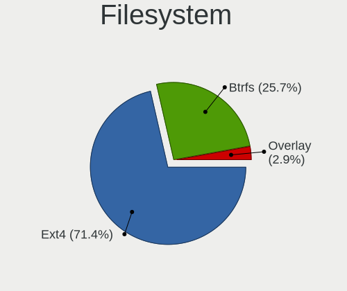
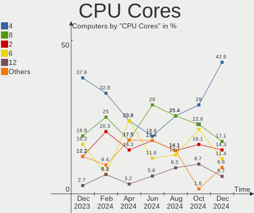
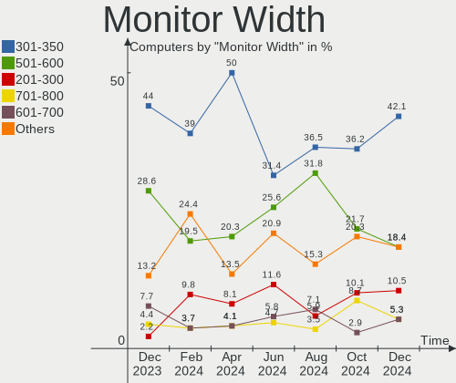

EndeavourOS - Hardware Trends
-----------------------------

A project to identify most popular hardware characteristics and track their change
over time based on data collected by Linux users at https://Linux-Hardware.org.

Anyone can contribute to this report by the [hw-probe](https://github.com/linuxhw/hw-probe) tool:

    sudo -E hw-probe -all -upload

This is a report for all computer types. See also reports for [desktops](/Dist/EndeavourOS/Desktop/README.md) and [notebooks](/Dist/EndeavourOS/Notebook/README.md).

This report is for one last month. Overall report since the beginning of time: [TestCoverage](https://github.com/linuxhw/TestCoverage)

Period: Jun, 2022.

Contents
--------

* [ System ](#system)
  - [ OS                       ](#os)
  - [ OS Family                ](#os-family)
  - [ Kernel                   ](#kernel)
  - [ Kernel Family            ](#kernel-family)
  - [ Kernel Major Ver.        ](#kernel-major-ver)
  - [ Arch                     ](#arch)
  - [ DE                       ](#de)
  - [ Display Server           ](#display-server)
  - [ Display Manager          ](#display-manager)
  - [ OS Lang                  ](#os-lang)
  - [ Boot Mode                ](#boot-mode)
  - [ Filesystem               ](#filesystem)
  - [ Part. scheme             ](#part-scheme)
  - [ Dual Boot with Linux/BSD ](#dual-boot-with-linuxbsd)
  - [ Dual Boot (Win)          ](#dual-boot-win)

* [ Board ](#board)
  - [ Vendor                   ](#vendor)
  - [ Model                    ](#model)
  - [ Model Family             ](#model-family)
  - [ MFG Year                 ](#mfg-year)
  - [ Form Factor              ](#form-factor)
  - [ Secure Boot              ](#secure-boot)
  - [ Coreboot                 ](#coreboot)
  - [ RAM Size                 ](#ram-size)
  - [ RAM Used                 ](#ram-used)
  - [ Total Drives             ](#total-drives)
  - [ Has CD-ROM               ](#has-cd-rom)
  - [ Has Ethernet             ](#has-ethernet)
  - [ Has WiFi                 ](#has-wifi)
  - [ Has Bluetooth            ](#has-bluetooth)

* [ Location ](#location)
  - [ Country                  ](#country)
  - [ City                     ](#city)

* [ Drives ](#drives)
  - [ Drive Vendor             ](#drive-vendor)
  - [ Drive Model              ](#drive-model)
  - [ HDD Vendor               ](#hdd-vendor)
  - [ SSD Vendor               ](#ssd-vendor)
  - [ Drive Kind               ](#drive-kind)
  - [ Drive Connector          ](#drive-connector)
  - [ Drive Size               ](#drive-size)
  - [ Space Total              ](#space-total)
  - [ Space Used               ](#space-used)
  - [ Malfunc. Drives          ](#malfunc-drives)
  - [ Malfunc. Drive Vendor    ](#malfunc-drive-vendor)
  - [ Malfunc. HDD Vendor      ](#malfunc-hdd-vendor)
  - [ Malfunc. Drive Kind      ](#malfunc-drive-kind)
  - [ Failed Drives            ](#failed-drives)
  - [ Failed Drive Vendor      ](#failed-drive-vendor)
  - [ Drive Status             ](#drive-status)

* [ Storage controller ](#storage-controller)
  - [ Storage Vendor           ](#storage-vendor)
  - [ Storage Model            ](#storage-model)
  - [ Storage Kind             ](#storage-kind)

* [ Processor ](#processor)
  - [ CPU Vendor               ](#cpu-vendor)
  - [ CPU Model                ](#cpu-model)
  - [ CPU Model Family         ](#cpu-model-family)
  - [ CPU Cores                ](#cpu-cores)
  - [ CPU Sockets              ](#cpu-sockets)
  - [ CPU Threads              ](#cpu-threads)
  - [ CPU Op-Modes             ](#cpu-op-modes)
  - [ CPU Microcode            ](#cpu-microcode)
  - [ CPU Microarch            ](#cpu-microarch)

* [ Graphics ](#graphics)
  - [ GPU Vendor               ](#gpu-vendor)
  - [ GPU Model                ](#gpu-model)
  - [ GPU Combo                ](#gpu-combo)
  - [ GPU Driver               ](#gpu-driver)
  - [ GPU Memory               ](#gpu-memory)

* [ Monitor ](#monitor)
  - [ Monitor Vendor           ](#monitor-vendor)
  - [ Monitor Model            ](#monitor-model)
  - [ Monitor Resolution       ](#monitor-resolution)
  - [ Monitor Diagonal         ](#monitor-diagonal)
  - [ Monitor Width            ](#monitor-width)
  - [ Aspect Ratio             ](#aspect-ratio)
  - [ Monitor Area             ](#monitor-area)
  - [ Pixel Density            ](#pixel-density)
  - [ Multiple Monitors        ](#multiple-monitors)

* [ Network ](#network)
  - [ Net Controller Vendor    ](#net-controller-vendor)
  - [ Net Controller Model     ](#net-controller-model)
  - [ Wireless Vendor          ](#wireless-vendor)
  - [ Wireless Model           ](#wireless-model)
  - [ Ethernet Vendor          ](#ethernet-vendor)
  - [ Ethernet Model           ](#ethernet-model)
  - [ Net Controller Kind      ](#net-controller-kind)
  - [ Used Controller          ](#used-controller)
  - [ NICs                     ](#nics)
  - [ IPv6                     ](#ipv6)

* [ Bluetooth ](#bluetooth)
  - [ Bluetooth Vendor         ](#bluetooth-vendor)
  - [ Bluetooth Model          ](#bluetooth-model)

* [ Sound ](#sound)
  - [ Sound Vendor             ](#sound-vendor)
  - [ Sound Model              ](#sound-model)

* [ Memory ](#memory)
  - [ Memory Vendor            ](#memory-vendor)
  - [ Memory Model             ](#memory-model)
  - [ Memory Kind              ](#memory-kind)
  - [ Memory Form Factor       ](#memory-form-factor)
  - [ Memory Size              ](#memory-size)
  - [ Memory Speed             ](#memory-speed)

* [ Printers & scanners ](#printers--scanners)
  - [ Printer Vendor           ](#printer-vendor)
  - [ Printer Model            ](#printer-model)
  - [ Scanner Vendor           ](#scanner-vendor)
  - [ Scanner Model            ](#scanner-model)

* [ Camera ](#camera)
  - [ Camera Vendor            ](#camera-vendor)
  - [ Camera Model             ](#camera-model)

* [ Security ](#security)
  - [ Fingerprint Vendor       ](#fingerprint-vendor)
  - [ Fingerprint Model        ](#fingerprint-model)
  - [ Chipcard Vendor          ](#chipcard-vendor)
  - [ Chipcard Model           ](#chipcard-model)

* [ Unsupported ](#unsupported)
  - [ Unsupported Devices      ](#unsupported-devices)
  - [ Unsupported Device Types ](#unsupported-device-types)

System
------

OS
--

Installed operating systems

| Name                | Computers | Percent |
|---------------------|-----------|---------|
| EndeavourOS Rolling | 19        | 70.37%  |
| EndeavourOS         | 8         | 29.63%  |

OS Family
---------

OS without a version

| Name        | Computers | Percent |
|-------------|-----------|---------|
| EndeavourOS | 27        | 100%    |

Kernel
------

Version of the Linux kernel

| Version           | Computers | Percent |
|-------------------|-----------|---------|
| 5.18.3-arch1-1    | 5         | 18.52%  |
| 5.18.1-arch1-1    | 4         | 14.81%  |
| 5.18.5-arch1-1    | 3         | 11.11%  |
| 5.18.1-zen1-1-zen | 3         | 11.11%  |
| 5.18.6-arch1-1    | 2         | 7.41%   |
| 5.18.2-zen1-1-zen | 2         | 7.41%   |
| 5.15.44-1-lts     | 2         | 7.41%   |
| 5.18.7-arch1-1    | 1         | 3.7%    |
| 5.18.5-zen1-1-zen | 1         | 3.7%    |
| 5.18.3-zen1-1-zen | 1         | 3.7%    |
| 5.17.9-zen1-1-zen | 1         | 3.7%    |
| 5.15.50-1-lts     | 1         | 3.7%    |
| 5.15.45-1-lts     | 1         | 3.7%    |

Kernel Family
-------------

Linux kernel without a distro release

| Version | Computers | Percent |
|---------|-----------|---------|
| 5.18.1  | 7         | 25.93%  |
| 5.18.3  | 6         | 22.22%  |
| 5.18.5  | 4         | 14.81%  |
| 5.18.6  | 2         | 7.41%   |
| 5.18.2  | 2         | 7.41%   |
| 5.15.44 | 2         | 7.41%   |
| 5.18.7  | 1         | 3.7%    |
| 5.17.9  | 1         | 3.7%    |
| 5.15.50 | 1         | 3.7%    |
| 5.15.45 | 1         | 3.7%    |

Kernel Major Ver.
-----------------

Linux kernel major version

| Version | Computers | Percent |
|---------|-----------|---------|
| 5.18    | 22        | 81.48%  |
| 5.15    | 4         | 14.81%  |
| 5.17    | 1         | 3.7%    |

Arch
----

OS architecture (x86_64, i586, etc.)

| Name   | Computers | Percent |
|--------|-----------|---------|
| x86_64 | 27        | 100%    |

DE
--

Desktop Environment

| Name            | Computers | Percent |
|-----------------|-----------|---------|
| KDE5            | 12        | 44.44%  |
| XFCE            | 4         | 14.81%  |
| GNOME           | 4         | 14.81%  |
| Budgie          | 3         | 11.11%  |
| Cinnamon        | 2         | 7.41%   |
| GNOME Flashback | 1         | 3.7%    |
| bspwm           | 1         | 3.7%    |

Display Server
--------------

X11 or Wayland

| Name    | Computers | Percent |
|---------|-----------|---------|
| X11     | 21        | 77.78%  |
| Wayland | 6         | 22.22%  |

Display Manager
---------------

SDDM, LightDM, etc.

| Name    | Computers | Percent |
|---------|-----------|---------|
| LightDM | 10        | 37.04%  |
| Unknown | 8         | 29.63%  |
| SDDM    | 6         | 22.22%  |
| GDM     | 3         | 11.11%  |

OS Lang
-------

Language

| Lang  | Computers | Percent |
|-------|-----------|---------|
| en_US | 12        | 44.44%  |
| ru_RU | 2         | 7.41%   |
| en_IN | 2         | 7.41%   |
| en_CA | 2         | 7.41%   |
| pl_PL | 1         | 3.7%    |
| it_IT | 1         | 3.7%    |
| fi_FI | 1         | 3.7%    |
| es_US | 1         | 3.7%    |
| es_ES | 1         | 3.7%    |
| es_AR | 1         | 3.7%    |
| en_GB | 1         | 3.7%    |
| en_AG | 1         | 3.7%    |
| de_DE | 1         | 3.7%    |

Boot Mode
---------

EFI or BIOS

| Mode | Computers | Percent |
|------|-----------|---------|
| EFI  | 18        | 66.67%  |
| BIOS | 9         | 33.33%  |

Filesystem
----------

Type of filesystem

| Type  | Computers | Percent |
|-------|-----------|---------|
| Ext4  | 17        | 62.96%  |
| Btrfs | 10        | 37.04%  |

Part. scheme
------------

Scheme of partitioning

| Type    | Computers | Percent |
|---------|-----------|---------|
| GPT     | 19        | 70.37%  |
| Unknown | 8         | 29.63%  |

Dual Boot with Linux/BSD
------------------------

Hosting more than one Linux/BSD

| Dual boot | Computers | Percent |
|-----------|-----------|---------|
| No        | 25        | 92.59%  |
| Yes       | 2         | 7.41%   |

Dual Boot (Win)
---------------

Hosting Linux and Windows

| Dual boot | Computers | Percent |
|-----------|-----------|---------|
| No        | 21        | 77.78%  |
| Yes       | 6         | 22.22%  |

Board
-----

Vendor
------

Motherboard manufacturer

| Name                | Computers | Percent |
|---------------------|-----------|---------|
| ASUSTek Computer    | 7         | 25.93%  |
| MSI                 | 4         | 14.81%  |
| Lenovo              | 3         | 11.11%  |
| Microsoft           | 2         | 7.41%   |
| HUAWEI              | 2         | 7.41%   |
| Gigabyte Technology | 2         | 7.41%   |
| Dell                | 2         | 7.41%   |
| Acer                | 2         | 7.41%   |
| ZOTAC               | 1         | 3.7%    |
| HONOR               | 1         | 3.7%    |
| Hewlett-Packard     | 1         | 3.7%    |

Model
-----

Motherboard model

| Name                                       | Computers | Percent |
|--------------------------------------------|-----------|---------|
| ZOTAC ZBOX-ECM73070C/53060C                | 1         | 3.7%    |
| MSI MS-7C91                                | 1         | 3.7%    |
| MSI MS-7C37                                | 1         | 3.7%    |
| MSI MS-7C02                                | 1         | 3.7%    |
| MSI MS-7B85                                | 1         | 3.7%    |
| Microsoft Surface Laptop Go                | 1         | 3.7%    |
| Microsoft Surface Go                       | 1         | 3.7%    |
| Lenovo Yoga C740-15IML 81TD                | 1         | 3.7%    |
| Lenovo V330-14ARR 81B1                     | 1         | 3.7%    |
| Lenovo IdeaCentre AIO 300-23ISU F0BY00DMPB | 1         | 3.7%    |
| HUAWEI MACH-WX9                            | 1         | 3.7%    |
| HUAWEI KLVL-WXX9                           | 1         | 3.7%    |
| HONOR BBR-WAX9                             | 1         | 3.7%    |
| HP ENVY x360 Convertible 15-ee0xxx         | 1         | 3.7%    |
| Gigabyte B550M AORUS PRO-P                 | 1         | 3.7%    |
| Gigabyte B450 AORUS PRO WIFI               | 1         | 3.7%    |
| Dell OptiPlex 3020                         | 1         | 3.7%    |
| Dell Latitude E6440                        | 1         | 3.7%    |
| ASUS Zenbook UX3402ZA_UX3402ZA             | 1         | 3.7%    |
| ASUS UX461UN                               | 1         | 3.7%    |
| ASUS ROG Maximus Z690 HERO                 | 1         | 3.7%    |
| ASUS P8Z77-V                               | 1         | 3.7%    |
| ASUS N56VB                                 | 1         | 3.7%    |
| ASUS H110M-E/M.2                           | 1         | 3.7%    |
| ASUS GL753VE                               | 1         | 3.7%    |
| Acer Aspire E5-575G                        | 1         | 3.7%    |
| Acer Aspire A515-43                        | 1         | 3.7%    |

Model Family
------------

Motherboard model prefix

| Name                 | Computers | Percent |
|----------------------|-----------|---------|
| Microsoft Surface    | 2         | 7.41%   |
| Acer Aspire          | 2         | 7.41%   |
| ZOTAC ZBOX-ECM73070C | 1         | 3.7%    |
| MSI MS-7C91          | 1         | 3.7%    |
| MSI MS-7C37          | 1         | 3.7%    |
| MSI MS-7C02          | 1         | 3.7%    |
| MSI MS-7B85          | 1         | 3.7%    |
| Lenovo Yoga          | 1         | 3.7%    |
| Lenovo V330-14ARR    | 1         | 3.7%    |
| Lenovo IdeaCentre    | 1         | 3.7%    |
| HUAWEI MACH-WX9      | 1         | 3.7%    |
| HUAWEI KLVL-WXX9     | 1         | 3.7%    |
| HONOR BBR-WAX9       | 1         | 3.7%    |
| HP ENVY              | 1         | 3.7%    |
| Gigabyte B550M       | 1         | 3.7%    |
| Gigabyte B450        | 1         | 3.7%    |
| Dell OptiPlex        | 1         | 3.7%    |
| Dell Latitude        | 1         | 3.7%    |
| ASUS Zenbook         | 1         | 3.7%    |
| ASUS UX461UN         | 1         | 3.7%    |
| ASUS ROG             | 1         | 3.7%    |
| ASUS P8Z77-V         | 1         | 3.7%    |
| ASUS N56VB           | 1         | 3.7%    |
| ASUS H110M-E         | 1         | 3.7%    |
| ASUS GL753VE         | 1         | 3.7%    |

MFG Year
--------

Motherboard manufacture year

| Year | Computers | Percent |
|------|-----------|---------|
| 2019 | 6         | 22.22%  |
| 2018 | 6         | 22.22%  |
| 2020 | 4         | 14.81%  |
| 2022 | 2         | 7.41%   |
| 2021 | 2         | 7.41%   |
| 2016 | 2         | 7.41%   |
| 2013 | 2         | 7.41%   |
| 2017 | 1         | 3.7%    |
| 2014 | 1         | 3.7%    |
| 2012 | 1         | 3.7%    |

Form Factor
-----------

Physical design of the computer

| Name        | Computers | Percent |
|-------------|-----------|---------|
| Notebook    | 10        | 37.04%  |
| Desktop     | 9         | 33.33%  |
| Convertible | 4         | 14.81%  |
| Tablet      | 2         | 7.41%   |
| Mini pc     | 1         | 3.7%    |
| All in one  | 1         | 3.7%    |

Secure Boot
-----------

Enabled or disabled

| State    | Computers | Percent |
|----------|-----------|---------|
| Disabled | 27        | 100%    |

Coreboot
--------

Have coreboot on board

| Used | Computers | Percent |
|------|-----------|---------|
| No   | 27        | 100%    |

RAM Size
--------

Total RAM memory

| Size in GB | Computers | Percent |
|------------|-----------|---------|
| 8.01-16.0  | 9         | 33.33%  |
| 16.01-24.0 | 8         | 29.63%  |
| 4.01-8.0   | 5         | 18.52%  |
| 32.01-64.0 | 4         | 14.81%  |
| 3.01-4.0   | 1         | 3.7%    |

RAM Used
--------

Used RAM memory

| Used GB   | Computers | Percent |
|-----------|-----------|---------|
| 2.01-3.0  | 9         | 33.33%  |
| 4.01-8.0  | 7         | 25.93%  |
| 1.01-2.0  | 5         | 18.52%  |
| 3.01-4.0  | 4         | 14.81%  |
| 8.01-16.0 | 2         | 7.41%   |

Total Drives
------------

Number of drives on board

| Drives | Computers | Percent |
|--------|-----------|---------|
| 1      | 13        | 48.15%  |
| 2      | 6         | 22.22%  |
| 3      | 5         | 18.52%  |
| 4      | 3         | 11.11%  |

Has CD-ROM
----------

Has CD-ROM on board

| Presented | Computers | Percent |
|-----------|-----------|---------|
| No        | 24        | 88.89%  |
| Yes       | 3         | 11.11%  |

Has Ethernet
------------

Has Ethernet on board

| Presented | Computers | Percent |
|-----------|-----------|---------|
| Yes       | 21        | 77.78%  |
| No        | 6         | 22.22%  |

Has WiFi
--------

Has WiFi module

| Presented | Computers | Percent |
|-----------|-----------|---------|
| Yes       | 24        | 88.89%  |
| No        | 3         | 11.11%  |

Has Bluetooth
-------------

Has Bluetooth module

| Presented | Computers | Percent |
|-----------|-----------|---------|
| Yes       | 21        | 77.78%  |
| No        | 6         | 22.22%  |

Location
--------

Country
-------

Geographic location (country)

| Country   | Computers | Percent |
|-----------|-----------|---------|
| USA       | 8         | 29.63%  |
| Spain     | 2         | 7.41%   |
| Poland    | 2         | 7.41%   |
| India     | 2         | 7.41%   |
| Germany   | 2         | 7.41%   |
| Canada    | 2         | 7.41%   |
| Argentina | 2         | 7.41%   |
| Russia    | 1         | 3.7%    |
| Romania   | 1         | 3.7%    |
| Malaysia  | 1         | 3.7%    |
| Latvia    | 1         | 3.7%    |
| Italy     | 1         | 3.7%    |
| France    | 1         | 3.7%    |
| Finland   | 1         | 3.7%    |

City
----

Geographic location (city)

| City                  | Computers | Percent |
|-----------------------|-----------|---------|
| Severna Park          | 2         | 7.41%   |
| Wroclaw               | 1         | 3.7%    |
| Wimauma               | 1         | 3.7%    |
| Virar                 | 1         | 3.7%    |
| Villa Martelli        | 1         | 3.7%    |
| Tucson                | 1         | 3.7%    |
| Târgu Mureş         | 1         | 3.7%    |
| St Petersburg         | 1         | 3.7%    |
| Riga                  | 1         | 3.7%    |
| Red Deer              | 1         | 3.7%    |
| Ramos Mejia           | 1         | 3.7%    |
| Queens                | 1         | 3.7%    |
| Nuremberg             | 1         | 3.7%    |
| Norristown            | 1         | 3.7%    |
| Navalmoral de la Mata | 1         | 3.7%    |
| Montreal              | 1         | 3.7%    |
| Kuala Lumpur          | 1         | 3.7%    |
| Istrana               | 1         | 3.7%    |
| Hemmingen             | 1         | 3.7%    |
| Helsinki              | 1         | 3.7%    |
| Gdynia                | 1         | 3.7%    |
| Châtillon            | 1         | 3.7%    |
| Bhubaneswar           | 1         | 3.7%    |
| Bel Air               | 1         | 3.7%    |
| Austin                | 1         | 3.7%    |
| Arroyo de la Luz      | 1         | 3.7%    |

Drives
------

Drive Vendor
------------

Hard drive vendors

| Vendor              | Computers | Drives | Percent |
|---------------------|-----------|--------|---------|
| Samsung Electronics | 9         | 11     | 20%     |
| WDC                 | 8         | 10     | 17.78%  |
| Kingston            | 4         | 4      | 8.89%   |
| Intel               | 4         | 5      | 8.89%   |
| Crucial             | 3         | 3      | 6.67%   |
| Toshiba             | 2         | 2      | 4.44%   |
| Seagate             | 2         | 3      | 4.44%   |
| SanDisk             | 2         | 2      | 4.44%   |
| XPG                 | 1         | 1      | 2.22%   |
| Unknown             | 1         | 1      | 2.22%   |
| SSSTC               | 1         | 1      | 2.22%   |
| SPCC                | 1         | 1      | 2.22%   |
| Plextor             | 1         | 2      | 2.22%   |
| Phison              | 1         | 1      | 2.22%   |
| Patriot             | 1         | 1      | 2.22%   |
| Micron Technology   | 1         | 1      | 2.22%   |
| Hitachi             | 1         | 1      | 2.22%   |
| HGST                | 1         | 1      | 2.22%   |
| China               | 1         | 1      | 2.22%   |

Drive Model
-----------

Hard drive models

| Model                                | Computers | Percent |
|--------------------------------------|-----------|---------|
| Seagate ST2000DM008-2FR102 2TB       | 2         | 3.92%   |
| Samsung NVMe SSD Drive 250GB         | 2         | 3.92%   |
| Crucial CT240BX500SSD1 240GB         | 2         | 3.92%   |
| XPG NVMe SSD Drive 512GB             | 1         | 1.96%   |
| WDC WDS240G2G0B-00EPW0 240GB SSD     | 1         | 1.96%   |
| WDC WDS100T3X0C-00SJG0 1TB           | 1         | 1.96%   |
| WDC WD40EZRZ-00GXCB0 4TB             | 1         | 1.96%   |
| WDC WD4003FRYZ-01F0DB0 4TB           | 1         | 1.96%   |
| WDC WD2003FZEX-00Z4SA0 2TB           | 1         | 1.96%   |
| WDC WD10SPCX-08S8TT0 1TB             | 1         | 1.96%   |
| WDC WD10JPVX-22JC3T0 1TB             | 1         | 1.96%   |
| WDC WD10EZEX-08WN4A0 1TB             | 1         | 1.96%   |
| WDC WD10EZEX-00KUWA0 1TB             | 1         | 1.96%   |
| WDC PC SN520 SDAPNUW-512G-1014 512GB | 1         | 1.96%   |
| Unknown SD/MMC/MS PRO 128GB          | 1         | 1.96%   |
| Toshiba KBG30ZPZ128G 128GB           | 1         | 1.96%   |
| Toshiba DT01ACA050 500GB             | 1         | 1.96%   |
| SSSTC CL1-8D256 256GB                | 1         | 1.96%   |
| SPCC Solid State Disk 256GB          | 1         | 1.96%   |
| Seagate ST1000LM048-2E7172 1TB       | 1         | 1.96%   |
| SanDisk SSD PLUS 2000GB              | 1         | 1.96%   |
| SanDisk NVMe SSD Drive 512GB         | 1         | 1.96%   |
| Samsung SSD PM851 2.5 7mm 256GB      | 1         | 1.96%   |
| Samsung SSD 980 500GB                | 1         | 1.96%   |
| Samsung SSD 970 EVO 500GB            | 1         | 1.96%   |
| Samsung SSD 850 EVO 500GB            | 1         | 1.96%   |
| Samsung SSD 850 EVO 250GB            | 1         | 1.96%   |
| Samsung NVMe SSD Drive 512GB         | 1         | 1.96%   |
| Samsung NVMe SSD Drive 1TB           | 1         | 1.96%   |
| Samsung MZVL2512HCJQ-00B00 512GB     | 1         | 1.96%   |
| Samsung MZ9LQ256HBJQ-00000 256GB     | 1         | 1.96%   |
| Plextor PX-256M8VC 256GB SSD         | 1         | 1.96%   |
| Phison APS-XS03-240 240GB            | 1         | 1.96%   |
| Patriot Burst 240GB SSD              | 1         | 1.96%   |
| Micron 1100_MTFDDAV256TBN 256GB SSD  | 1         | 1.96%   |
| Kingston SA400S37480G 480GB SSD      | 1         | 1.96%   |
| Kingston SA400S37240G 240GB SSD      | 1         | 1.96%   |
| Kingston NVMe SSD Drive 500GB        | 1         | 1.96%   |
| Kingston NVMe SSD Drive 1TB          | 1         | 1.96%   |
| Intel SSDSC2KW256G8 256GB            | 1         | 1.96%   |
| Intel SSDPEKNW512G8H 512GB           | 1         | 1.96%   |
| Intel SSDPEKKW512G7 512GB            | 1         | 1.96%   |
| Intel NVMe SSD Drive 512GB           | 1         | 1.96%   |
| Intel NVMe SSD Drive 32GB            | 1         | 1.96%   |
| Hitachi HDT722525DLA380 250GB        | 1         | 1.96%   |
| HGST HDN724040ALE640 4TB             | 1         | 1.96%   |
| Crucial CT120BX500SSD1 120GB         | 1         | 1.96%   |
| China SATA SSD 240GB                 | 1         | 1.96%   |

HDD Vendor
----------

Hard disk drive vendors

| Vendor  | Computers | Drives | Percent |
|---------|-----------|--------|---------|
| WDC     | 6         | 7      | 50%     |
| Seagate | 2         | 3      | 16.67%  |
| Unknown | 1         | 1      | 8.33%   |
| Toshiba | 1         | 1      | 8.33%   |
| Hitachi | 1         | 1      | 8.33%   |
| HGST    | 1         | 1      | 8.33%   |

SSD Vendor
----------

Solid state drive vendors

| Vendor              | Computers | Drives | Percent |
|---------------------|-----------|--------|---------|
| Samsung Electronics | 3         | 3      | 18.75%  |
| Crucial             | 3         | 3      | 18.75%  |
| Kingston            | 2         | 2      | 12.5%   |
| WDC                 | 1         | 1      | 6.25%   |
| SPCC                | 1         | 1      | 6.25%   |
| SanDisk             | 1         | 1      | 6.25%   |
| Plextor             | 1         | 2      | 6.25%   |
| Patriot             | 1         | 1      | 6.25%   |
| Micron Technology   | 1         | 1      | 6.25%   |
| Intel               | 1         | 1      | 6.25%   |
| China               | 1         | 1      | 6.25%   |

Drive Kind
----------

HDD or SSD

| Kind    | Computers | Drives | Percent |
|---------|-----------|--------|---------|
| NVMe    | 16        | 20     | 40%     |
| SSD     | 13        | 17     | 32.5%   |
| HDD     | 10        | 14     | 25%     |
| Unknown | 1         | 1      | 2.5%    |

Drive Connector
---------------

SATA, SAS, NVMe, etc.

| Type | Computers | Drives | Percent |
|------|-----------|--------|---------|
| NVMe | 16        | 20     | 48.48%  |
| SATA | 15        | 30     | 45.45%  |
| SAS  | 2         | 2      | 6.06%   |

Drive Size
----------

Size of hard drive

| Size in TB | Computers | Drives | Percent |
|------------|-----------|--------|---------|
| 0.01-0.5   | 15        | 19     | 55.56%  |
| 0.51-1.0   | 5         | 5      | 18.52%  |
| 1.01-2.0   | 4         | 4      | 14.81%  |
| 3.01-4.0   | 3         | 3      | 11.11%  |

Space Total
-----------

Amount of disk space available on the file system

| Size in GB     | Computers | Percent |
|----------------|-----------|---------|
| More than 3000 | 6         | 22.22%  |
| 101-250        | 6         | 22.22%  |
| 501-1000       | 5         | 18.52%  |
| 251-500        | 4         | 14.81%  |
| 2001-3000      | 3         | 11.11%  |
| 1001-2000      | 3         | 11.11%  |

Space Used
----------

Amount of used disk space

| Used GB        | Computers | Percent |
|----------------|-----------|---------|
| 101-250        | 7         | 25.93%  |
| 1-20           | 5         | 18.52%  |
| 21-50          | 3         | 11.11%  |
| 1001-2000      | 3         | 11.11%  |
| 51-100         | 3         | 11.11%  |
| 251-500        | 2         | 7.41%   |
| 2001-3000      | 2         | 7.41%   |
| More than 3000 | 1         | 3.7%    |
| 501-1000       | 1         | 3.7%    |

Malfunc. Drives
---------------

Drive models with a malfunction

| Model                                          | Computers | Drives | Percent |
|------------------------------------------------|-----------|--------|---------|
| WDC WD2003FZEX-00Z4SA0 2TB                     | 1         | 1      | 33.33%  |
| Samsung Electronics SSD 970 EVO 500GB          | 1         | 1      | 33.33%  |
| Micron Technology 1100_MTFDDAV256TBN 256GB SSD | 1         | 1      | 33.33%  |

Malfunc. Drive Vendor
---------------------

Vendors of faulty drives

| Vendor              | Computers | Drives | Percent |
|---------------------|-----------|--------|---------|
| WDC                 | 1         | 1      | 33.33%  |
| Samsung Electronics | 1         | 1      | 33.33%  |
| Micron Technology   | 1         | 1      | 33.33%  |

Malfunc. HDD Vendor
-------------------

Vendors of faulty HDD drives

| Vendor | Computers | Drives | Percent |
|--------|-----------|--------|---------|
| WDC    | 1         | 1      | 100%    |

Malfunc. Drive Kind
-------------------

Kinds of faulty drives

| Kind | Computers | Drives | Percent |
|------|-----------|--------|---------|
| NVMe | 1         | 1      | 33.33%  |
| SSD  | 1         | 1      | 33.33%  |
| HDD  | 1         | 1      | 33.33%  |

Failed Drives
-------------

Failed drive models

Zero info for selected period =(

Failed Drive Vendor
-------------------

Failed drive vendors

Zero info for selected period =(

Drive Status
------------

Number of failed and malfunc. drives

| Status   | Computers | Drives | Percent |
|----------|-----------|--------|---------|
| Works    | 18        | 29     | 60%     |
| Detected | 9         | 20     | 30%     |
| Malfunc  | 3         | 3      | 10%     |

Storage controller
------------------

Storage Vendor
--------------

Storage controller vendors

| Vendor                         | Computers | Percent |
|--------------------------------|-----------|---------|
| Intel                          | 15        | 36.59%  |
| AMD                            | 8         | 19.51%  |
| Samsung Electronics            | 7         | 17.07%  |
| SanDisk                        | 3         | 7.32%   |
| ASMedia Technology             | 3         | 7.32%   |
| Kingston Technology Company    | 2         | 4.88%   |
| Toshiba America Info Systems   | 1         | 2.44%   |
| Solid State Storage Technology | 1         | 2.44%   |
| ADATA Technology               | 1         | 2.44%   |

Storage Model
-------------

Storage controller models

| Model                                                                          | Computers | Percent |
|--------------------------------------------------------------------------------|-----------|---------|
| AMD FCH SATA Controller [AHCI mode]                                            | 4         | 8.89%   |
| Samsung NVMe SSD Controller SM981/PM981/PM983                                  | 3         | 6.67%   |
| Samsung NVMe SSD Controller 980                                                | 3         | 6.67%   |
| ASMedia ASM1062 Serial ATA Controller                                          | 3         | 6.67%   |
| AMD 400 Series Chipset SATA Controller                                         | 3         | 6.67%   |
| SanDisk WD Black SN750 / PC SN730 NVMe SSD                                     | 2         | 4.44%   |
| Samsung NVMe SSD Controller PM9A1/PM9A3/980PRO                                 | 2         | 4.44%   |
| Intel Volume Management Device NVMe RAID Controller                            | 2         | 4.44%   |
| Intel Sunrise Point-LP SATA Controller [AHCI mode]                             | 2         | 4.44%   |
| Intel Comet Lake SATA AHCI Controller                                          | 2         | 4.44%   |
| Intel 8 Series/C220 Series Chipset Family 6-port SATA Controller 1 [AHCI mode] | 2         | 4.44%   |
| AMD 500 Series Chipset SATA Controller                                         | 2         | 4.44%   |
| Toshiba America Info Systems BG3 NVMe SSD Controller                           | 1         | 2.22%   |
| Solid State Storage Non-Volatile memory controller                             | 1         | 2.22%   |
| SanDisk WD Blue SN500 / PC SN520 NVMe SSD                                      | 1         | 2.22%   |
| Kingston Company Company Non-Volatile memory controller                        | 1         | 2.22%   |
| Kingston Company A2000 NVMe SSD                                                | 1         | 2.22%   |
| Intel SSD 660P Series                                                          | 1         | 2.22%   |
| Intel SSD 600P Series                                                          | 1         | 2.22%   |
| Intel Q170/Q150/B150/H170/H110/Z170/CM236 Chipset SATA Controller [AHCI Mode]  | 1         | 2.22%   |
| Intel Non-Volatile memory controller                                           | 1         | 2.22%   |
| Intel HM170/QM170 Chipset SATA Controller [AHCI Mode]                          | 1         | 2.22%   |
| Intel Alder Lake-S PCH SATA Controller [AHCI Mode]                             | 1         | 2.22%   |
| Intel 82801 Mobile SATA Controller [RAID mode]                                 | 1         | 2.22%   |
| Intel 7 Series/C210 Series Chipset Family 6-port SATA Controller [AHCI mode]   | 1         | 2.22%   |
| Intel 7 Series Chipset Family 6-port SATA Controller [AHCI mode]               | 1         | 2.22%   |
| ADATA XPG SX8200 Pro PCIe Gen3x4 M.2 2280 Solid State Drive                    | 1         | 2.22%   |

Storage Kind
------------

Kind of storage controller (IDE, SATA, NVMe, SAS, ...)

| Kind | Computers | Percent |
|------|-----------|---------|
| SATA | 19        | 50%     |
| NVMe | 16        | 42.11%  |
| RAID | 3         | 7.89%   |

Processor
---------

CPU Vendor
----------

Processor vendors

| Vendor | Computers | Percent |
|--------|-----------|---------|
| Intel  | 17        | 62.96%  |
| AMD    | 10        | 37.04%  |

CPU Model
---------

Processor models

| Model                                         | Computers | Percent |
|-----------------------------------------------|-----------|---------|
| Intel Core i7-8550U CPU @ 1.80GHz             | 2         | 7.41%   |
| AMD Ryzen 7 3700X 8-Core Processor            | 2         | 7.41%   |
| Intel Pentium CPU 4415Y @ 1.60GHz             | 1         | 3.7%    |
| Intel Core i7-7700HQ CPU @ 2.80GHz            | 1         | 3.7%    |
| Intel Core i7-4610M CPU @ 3.00GHz             | 1         | 3.7%    |
| Intel Core i7-10510U CPU @ 1.80GHz            | 1         | 3.7%    |
| Intel Core i5-7400 CPU @ 3.00GHz              | 1         | 3.7%    |
| Intel Core i5-7200U CPU @ 2.50GHz             | 1         | 3.7%    |
| Intel Core i5-6200U CPU @ 2.30GHz             | 1         | 3.7%    |
| Intel Core i5-4590 CPU @ 3.30GHz              | 1         | 3.7%    |
| Intel Core i5-1035G1 CPU @ 1.00GHz            | 1         | 3.7%    |
| Intel Core i3-3240 CPU @ 3.40GHz              | 1         | 3.7%    |
| Intel Core i3-3120M CPU @ 2.50GHz             | 1         | 3.7%    |
| Intel Core i3-10110U CPU @ 2.10GHz            | 1         | 3.7%    |
| Intel Core i3-10100F CPU @ 3.60GHz            | 1         | 3.7%    |
| Intel 12th Gen Core i7-12700                  | 1         | 3.7%    |
| Intel 12th Gen Core i7-1260P                  | 1         | 3.7%    |
| AMD Ryzen 9 3900X 12-Core Processor           | 1         | 3.7%    |
| AMD Ryzen 7 5800X 8-Core Processor            | 1         | 3.7%    |
| AMD Ryzen 7 1700X Eight-Core Processor        | 1         | 3.7%    |
| AMD Ryzen 5 4600H with Radeon Graphics        | 1         | 3.7%    |
| AMD Ryzen 5 4500U with Radeon Graphics        | 1         | 3.7%    |
| AMD Ryzen 5 3500X 6-Core Processor            | 1         | 3.7%    |
| AMD Ryzen 5 3500U with Radeon Vega Mobile Gfx | 1         | 3.7%    |
| AMD Ryzen 3 2200U with Radeon Vega Mobile Gfx | 1         | 3.7%    |

CPU Model Family
----------------

Processor model prefix

| Model         | Computers | Percent |
|---------------|-----------|---------|
| Intel Core i7 | 5         | 18.52%  |
| Intel Core i5 | 5         | 18.52%  |
| Intel Core i3 | 4         | 14.81%  |
| AMD Ryzen 7   | 4         | 14.81%  |
| AMD Ryzen 5   | 4         | 14.81%  |
| Other         | 2         | 7.41%   |
| Intel Pentium | 1         | 3.7%    |
| AMD Ryzen 9   | 1         | 3.7%    |
| AMD Ryzen 3   | 1         | 3.7%    |

CPU Cores
---------

Number of processor cores

| Number | Computers | Percent |
|--------|-----------|---------|
| 4      | 9         | 33.33%  |
| 2      | 8         | 29.63%  |
| 8      | 4         | 14.81%  |
| 12     | 3         | 11.11%  |
| 6      | 3         | 11.11%  |

CPU Sockets
-----------

Number of sockets

| Number | Computers | Percent |
|--------|-----------|---------|
| 1      | 27        | 100%    |

CPU Threads
-----------

Threads per core (Hyper-Threading)

| Number | Computers | Percent |
|--------|-----------|---------|
| 2      | 23        | 85.19%  |
| 1      | 4         | 14.81%  |

CPU Op-Modes
------------

CPU Operation Modes (32-bit, 64-bit)

| Op mode        | Computers | Percent |
|----------------|-----------|---------|
| 32-bit, 64-bit | 27        | 100%    |

CPU Microcode
-------------

Microcode number

| Number     | Computers | Percent |
|------------|-----------|---------|
| Unknown    | 9         | 33.33%  |
| 0x906e9    | 2         | 7.41%   |
| 0x806e9    | 2         | 7.41%   |
| 0x306c3    | 2         | 7.41%   |
| 0x08701021 | 2         | 7.41%   |
| 0xa0653    | 1         | 3.7%    |
| 0x906a3    | 1         | 3.7%    |
| 0x806ec    | 1         | 3.7%    |
| 0x806ea    | 1         | 3.7%    |
| 0x706e5    | 1         | 3.7%    |
| 0x406e3    | 1         | 3.7%    |
| 0x306a9    | 1         | 3.7%    |
| 0x08600104 | 1         | 3.7%    |
| 0x08108109 | 1         | 3.7%    |
| 0x08001137 | 1         | 3.7%    |

CPU Microarch
-------------

Microarchitecture

| Name             | Computers | Percent |
|------------------|-----------|---------|
| KabyLake         | 8         | 29.63%  |
| Zen 2            | 6         | 22.22%  |
| Zen              | 2         | 7.41%   |
| IvyBridge        | 2         | 7.41%   |
| Haswell          | 2         | 7.41%   |
| Zen+             | 1         | 3.7%    |
| Zen 3            | 1         | 3.7%    |
| Skylake          | 1         | 3.7%    |
| IceLake          | 1         | 3.7%    |
| CometLake        | 1         | 3.7%    |
| Alderlake Hybrid | 1         | 3.7%    |
| Unknown          | 1         | 3.7%    |

Graphics
--------

GPU Vendor
----------

Vendors of graphics cards

| Vendor | Computers | Percent |
|--------|-----------|---------|
| Intel  | 14        | 42.42%  |
| Nvidia | 11        | 33.33%  |
| AMD    | 8         | 24.24%  |

GPU Model
---------

Graphics card models

| Model                                                                       | Computers | Percent |
|-----------------------------------------------------------------------------|-----------|---------|
| Nvidia GP108M [GeForce MX150]                                               | 2         | 5.88%   |
| Nvidia GP107 [GeForce GTX 1050 Ti]                                          | 2         | 5.88%   |
| Intel UHD Graphics 620                                                      | 2         | 5.88%   |
| Intel HD Graphics 630                                                       | 2         | 5.88%   |
| Intel CometLake-U GT2 [UHD Graphics]                                        | 2         | 5.88%   |
| AMD Renoir                                                                  | 2         | 5.88%   |
| Nvidia GP107M [GeForce GTX 1050 Ti Mobile]                                  | 1         | 2.94%   |
| Nvidia GP106 [GeForce GTX 1060 6GB]                                         | 1         | 2.94%   |
| Nvidia GM108M [GeForce 940MX]                                               | 1         | 2.94%   |
| Nvidia GK208B [GeForce GT 710]                                              | 1         | 2.94%   |
| Nvidia GK107M [GeForce GT 740M]                                             | 1         | 2.94%   |
| Nvidia GF119 [GeForce GT 620 OEM]                                           | 1         | 2.94%   |
| Nvidia GA104 [GeForce RTX 3070 Lite Hash Rate]                              | 1         | 2.94%   |
| Intel Xeon E3-1200 v3/4th Gen Core Processor Integrated Graphics Controller | 1         | 2.94%   |
| Intel Skylake GT2 [HD Graphics 520]                                         | 1         | 2.94%   |
| Intel Iris Plus Graphics G1 (Ice Lake)                                      | 1         | 2.94%   |
| Intel HD Graphics 620                                                       | 1         | 2.94%   |
| Intel HD Graphics 615                                                       | 1         | 2.94%   |
| Intel Alder Lake-P Integrated Graphics Controller                           | 1         | 2.94%   |
| Intel 4th Gen Core Processor Integrated Graphics Controller                 | 1         | 2.94%   |
| Intel 3rd Gen Core processor Graphics Controller                            | 1         | 2.94%   |
| AMD RV370 [Radeon X300]                                                     | 1         | 2.94%   |
| AMD RV370 [Radeon X300 SE]                                                  | 1         | 2.94%   |
| AMD Raven Ridge [Radeon Vega Series / Radeon Vega Mobile Series]            | 1         | 2.94%   |
| AMD Picasso/Raven 2 [Radeon Vega Series / Radeon Vega Mobile Series]        | 1         | 2.94%   |
| AMD Navi 23 [Radeon RX 6600/6600 XT/6600M]                                  | 1         | 2.94%   |
| AMD Navi 22 [Radeon RX 6700/6700 XT/6750 XT / 6800M]                        | 1         | 2.94%   |
| AMD Navi 21 [Radeon RX 6900 XT]                                             | 1         | 2.94%   |

GPU Combo
---------

Combinations of graphics cards

| Name           | Computers | Percent |
|----------------|-----------|---------|
| 1 x Intel      | 8         | 29.63%  |
| 1 x AMD        | 7         | 25.93%  |
| Intel + Nvidia | 6         | 22.22%  |
| 1 x Nvidia     | 5         | 18.52%  |
| 2 x AMD        | 1         | 3.7%    |

GPU Driver
----------

Free vs proprietary

| Driver      | Computers | Percent |
|-------------|-----------|---------|
| Free        | 21        | 77.78%  |
| Proprietary | 6         | 22.22%  |

GPU Memory
----------

Total video memory

| Size in GB | Computers | Percent |
|------------|-----------|---------|
| Unknown    | 16        | 59.26%  |
| 1.01-2.0   | 3         | 11.11%  |
| 7.01-8.0   | 2         | 7.41%   |
| 3.01-4.0   | 2         | 7.41%   |
| 5.01-6.0   | 1         | 3.7%    |
| 2.01-3.0   | 1         | 3.7%    |
| 0.51-1.0   | 1         | 3.7%    |
| 0.01-0.5   | 1         | 3.7%    |

Monitor
-------

Monitor Vendor
--------------

Monitor vendors

| Vendor               | Computers | Percent |
|----------------------|-----------|---------|
| Samsung Electronics  | 4         | 13.33%  |
| LG Display           | 4         | 13.33%  |
| BOE                  | 4         | 13.33%  |
| AU Optronics         | 4         | 13.33%  |
| Ancor Communications | 3         | 10%     |
| Acer                 | 2         | 6.67%   |
| Sharp                | 1         | 3.33%   |
| Lenovo               | 1         | 3.33%   |
| JDI                  | 1         | 3.33%   |
| Hitachi              | 1         | 3.33%   |
| HannStar             | 1         | 3.33%   |
| Goldstar             | 1         | 3.33%   |
| Dell                 | 1         | 3.33%   |
| ASUSTek Computer     | 1         | 3.33%   |
| AOC                  | 1         | 3.33%   |

Monitor Model
-------------

Monitor models

| Model                                                                 | Computers | Percent |
|-----------------------------------------------------------------------|-----------|---------|
| Sharp LQ100P1JX51 SHP14A6 1800x1200 211x141mm 10.0-inch               | 1         | 3.33%   |
| Samsung Electronics U32J59x SAM0F35 3840x2160 697x392mm 31.5-inch     | 1         | 3.33%   |
| Samsung Electronics LCD Monitor SDC4171 2880x1800 302x189mm 14.0-inch | 1         | 3.33%   |
| Samsung Electronics LCD Monitor SAM07C0 1920x1080 890x500mm 40.2-inch | 1         | 3.33%   |
| Samsung Electronics C24FG7x SAM0E43 1920x1080 532x304mm 24.1-inch     | 1         | 3.33%   |
| LG Display LCD Monitor LGD065A 1920x1080 344x194mm 15.5-inch          | 1         | 3.33%   |
| LG Display LCD Monitor LGD0555 2736x1824 260x173mm 12.3-inch          | 1         | 3.33%   |
| LG Display LCD Monitor LGD04E8 1920x1080 380x210mm 17.1-inch          | 1         | 3.33%   |
| LG Display LCD Monitor LGD044F 1920x1080 345x194mm 15.6-inch          | 1         | 3.33%   |
| Lenovo LEN-C5130-B LEN5105 1920x1080 477x268mm 21.5-inch              | 1         | 3.33%   |
| JDI LCD Monitor JDI422A 3000x2000 293x196mm 13.9-inch                 | 1         | 3.33%   |
| Hitachi HDMI HEC0030 1920x1080 580x330mm 26.3-inch                    | 1         | 3.33%   |
| HannStar HZ281H HSD6735 1920x1200 593x371mm 27.5-inch                 | 1         | 3.33%   |
| Goldstar HDR WFHD GSM5BA0 2560x1080 798x334mm 34.1-inch               | 1         | 3.33%   |
| Dell 2009W DEL4042 1680x1050 430x270mm 20.0-inch                      | 1         | 3.33%   |
| BOE LCD Monitor BOE0893 2160x1440 296x197mm 14.0-inch                 | 1         | 3.33%   |
| BOE LCD Monitor BOE0872 1920x1080 344x194mm 15.5-inch                 | 1         | 3.33%   |
| BOE LCD Monitor BOE0847 1920x1080 344x194mm 15.5-inch                 | 1         | 3.33%   |
| BOE LCD Monitor BOE0718 1920x1080 309x173mm 13.9-inch                 | 1         | 3.33%   |
| AU Optronics LCD Monitor AUOC48A 1920x1080 344x194mm 15.5-inch        | 1         | 3.33%   |
| AU Optronics LCD Monitor AUO3B3C 1366x768 309x173mm 13.9-inch         | 1         | 3.33%   |
| AU Optronics LCD Monitor AUO2E3C 1366x768 309x173mm 13.9-inch         | 1         | 3.33%   |
| AU Optronics LCD Monitor AUO24EC 1366x768 344x193mm 15.5-inch         | 1         | 3.33%   |
| ASUSTek Computer XG32VQR AUS32B2 2560x1440 697x393mm 31.5-inch        | 1         | 3.33%   |
| AOC 24B1W1 AOC2401 1920x1080 527x296mm 23.8-inch                      | 1         | 3.33%   |
| Ancor Communications VX228 ACI22C1 1920x1080 476x268mm 21.5-inch      | 1         | 3.33%   |
| Ancor Communications VS248 ACI2498 1920x1080 531x299mm 24.0-inch      | 1         | 3.33%   |
| Ancor Communications VE228 ACI22FA 1920x1080 480x270mm 21.7-inch      | 1         | 3.33%   |
| Acer KG241Q S ACR074D 1920x1080 521x293mm 23.5-inch                   | 1         | 3.33%   |
| Acer K202HQL ACR040C 1600x900 432x240mm 19.5-inch                     | 1         | 3.33%   |

Monitor Resolution
------------------

Monitor screen resolution

| Resolution         | Computers | Percent |
|--------------------|-----------|---------|
| 1920x1080 (FHD)    | 14        | 46.67%  |
| 1366x768 (WXGA)    | 3         | 10%     |
| 3840x2160 (4K)     | 2         | 6.67%   |
| 2560x1440 (QHD)    | 2         | 6.67%   |
| 3000x2000          | 1         | 3.33%   |
| 2880x1800          | 1         | 3.33%   |
| 2736x1824          | 1         | 3.33%   |
| 2560x1080          | 1         | 3.33%   |
| 2160x1440          | 1         | 3.33%   |
| 1920x1200 (WUXGA)  | 1         | 3.33%   |
| 1800x1200          | 1         | 3.33%   |
| 1680x1050 (WSXGA+) | 1         | 3.33%   |
| 1600x900 (HD+)     | 1         | 3.33%   |

Monitor Diagonal
----------------

Diagonal size in inches

| Inches | Computers | Percent |
|--------|-----------|---------|
| 15     | 6         | 20%     |
| 24     | 4         | 13.33%  |
| 13     | 4         | 13.33%  |
| 31     | 2         | 6.67%   |
| 23     | 2         | 6.67%   |
| 14     | 2         | 6.67%   |
| 84     | 1         | 3.33%   |
| 46     | 1         | 3.33%   |
| 34     | 1         | 3.33%   |
| 27     | 1         | 3.33%   |
| 21     | 1         | 3.33%   |
| 20     | 1         | 3.33%   |
| 19     | 1         | 3.33%   |
| 17     | 1         | 3.33%   |
| 12     | 1         | 3.33%   |
| 10     | 1         | 3.33%   |

Monitor Width
-------------

Physical width

| Width in mm | Computers | Percent |
|-------------|-----------|---------|
| 301-350     | 10        | 33.33%  |
| 501-600     | 7         | 23.33%  |
| 201-300     | 4         | 13.33%  |
| 401-500     | 3         | 10%     |
| 601-700     | 2         | 6.67%   |
| 701-800     | 1         | 3.33%   |
| 351-400     | 1         | 3.33%   |
| 1501-2000   | 1         | 3.33%   |
| 1001-1500   | 1         | 3.33%   |

Aspect Ratio
------------

Proportional relationship between the width and the height

| Ratio | Computers | Percent |
|-------|-----------|---------|
| 16/9  | 20        | 68.97%  |
| 3/2   | 4         | 13.79%  |
| 16/10 | 4         | 13.79%  |
| 21/9  | 1         | 3.45%   |

Monitor Area
------------

Area in inch²

| Area in inch² | Computers | Percent |
|----------------|-----------|---------|
| 81-90          | 6         | 20%     |
| 101-110        | 6         | 20%     |
| 201-250        | 5         | 16.67%  |
| 351-500        | 3         | 10%     |
| 251-300        | 2         | 6.67%   |
| 151-200        | 2         | 6.67%   |
| More than 1000 | 1         | 3.33%   |
| 71-80          | 1         | 3.33%   |
| 41-50          | 1         | 3.33%   |
| 301-350        | 1         | 3.33%   |
| 121-130        | 1         | 3.33%   |
| 501-1000       | 1         | 3.33%   |

Pixel Density
-------------

Pixels per inch

| Density       | Computers | Percent |
|---------------|-----------|---------|
| 51-100        | 10        | 35.71%  |
| 121-160       | 9         | 32.14%  |
| 101-120       | 4         | 14.29%  |
| More than 240 | 2         | 7.14%   |
| 161-240       | 2         | 7.14%   |
| 1-50          | 1         | 3.57%   |

Multiple Monitors
-----------------

Total monitors connected

| Total | Computers | Percent |
|-------|-----------|---------|
| 1     | 24        | 88.89%  |
| 2     | 3         | 11.11%  |

Network
-------

Net Controller Vendor
---------------------

Controller vendors

| Vendor                | Computers | Percent |
|-----------------------|-----------|---------|
| Intel                 | 18        | 42.86%  |
| Realtek Semiconductor | 14        | 33.33%  |
| Qualcomm Atheros      | 4         | 9.52%   |
| Microsoft             | 2         | 4.76%   |
| ASIX Electronics      | 2         | 4.76%   |
| Ralink Technology     | 1         | 2.38%   |
| D-Link                | 1         | 2.38%   |

Net Controller Model
--------------------

Controller models

| Model                                                             | Computers | Percent |
|-------------------------------------------------------------------|-----------|---------|
| Realtek RTL8111/8168/8411 PCI Express Gigabit Ethernet Controller | 11        | 21.15%  |
| Intel Wi-Fi 6 AX200                                               | 3         | 5.77%   |
| Realtek RTL8153 Gigabit Ethernet Adapter                          | 2         | 3.85%   |
| Realtek RTL8125 2.5GbE Controller                                 | 2         | 3.85%   |
| Qualcomm Atheros QCA9377 802.11ac Wireless Network Adapter        | 2         | 3.85%   |
| Intel Wireless 8265 / 8275                                        | 2         | 3.85%   |
| Intel Wireless 7265                                               | 2         | 3.85%   |
| Intel Wi-Fi 6 AX210/AX211/AX411 160MHz                            | 2         | 3.85%   |
| Intel I211 Gigabit Network Connection                             | 2         | 3.85%   |
| Intel Comet Lake PCH-LP CNVi WiFi                                 | 2         | 3.85%   |
| ASIX AX88179 Gigabit Ethernet                                     | 2         | 3.85%   |
| Realtek RTL8192EU 802.11b/g/n WLAN Adapter                        | 1         | 1.92%   |
| Realtek RTL8188GU 802.11n WLAN Adapter (After Modeswitch)         | 1         | 1.92%   |
| Realtek Killer E3000 2.5GbE Controller                            | 1         | 1.92%   |
| Ralink MT7610U ("Archer T2U" 2.4G+5G WLAN Adapter                 | 1         | 1.92%   |
| Qualcomm Atheros QCA6174 802.11ac Wireless Network Adapter        | 1         | 1.92%   |
| Qualcomm Atheros AR9485 Wireless Network Adapter                  | 1         | 1.92%   |
| Qualcomm Atheros AR8161 Gigabit Ethernet                          | 1         | 1.92%   |
| Microsoft XBOX ACC                                                | 1         | 1.92%   |
| Microsoft RTL8153 GigE [Surface Ethernet Adapter]                 | 1         | 1.92%   |
| Microsoft Android                                                 | 1         | 1.92%   |
| Intel Wireless-AC 9260                                            | 1         | 1.92%   |
| Intel Ice Lake-LP PCH CNVi WiFi                                   | 1         | 1.92%   |
| Intel Ethernet Controller I225-V                                  | 1         | 1.92%   |
| Intel Ethernet Connection I217-LM                                 | 1         | 1.92%   |
| Intel Dual Band Wireless-AC 3168NGW [Stone Peak]                  | 1         | 1.92%   |
| Intel Dual Band Wireless-AC 3165 Plus Bluetooth                   | 1         | 1.92%   |
| Intel Centrino Advanced-N 6235                                    | 1         | 1.92%   |
| Intel Alder Lake-P PCH CNVi WiFi                                  | 1         | 1.92%   |
| Intel 82579V Gigabit Network Connection                           | 1         | 1.92%   |
| D-Link 802.11ac NIC                                               | 1         | 1.92%   |

Wireless Vendor
---------------

Wireless vendors

| Vendor                | Computers | Percent |
|-----------------------|-----------|---------|
| Intel                 | 17        | 65.38%  |
| Qualcomm Atheros      | 4         | 15.38%  |
| Realtek Semiconductor | 2         | 7.69%   |
| Ralink Technology     | 1         | 3.85%   |
| Microsoft             | 1         | 3.85%   |
| D-Link                | 1         | 3.85%   |

Wireless Model
--------------

Wireless models

| Model                                                      | Computers | Percent |
|------------------------------------------------------------|-----------|---------|
| Intel Wi-Fi 6 AX200                                        | 3         | 11.54%  |
| Qualcomm Atheros QCA9377 802.11ac Wireless Network Adapter | 2         | 7.69%   |
| Intel Wireless 8265 / 8275                                 | 2         | 7.69%   |
| Intel Wireless 7265                                        | 2         | 7.69%   |
| Intel Wi-Fi 6 AX210/AX211/AX411 160MHz                     | 2         | 7.69%   |
| Intel Comet Lake PCH-LP CNVi WiFi                          | 2         | 7.69%   |
| Realtek RTL8192EU 802.11b/g/n WLAN Adapter                 | 1         | 3.85%   |
| Realtek RTL8188GU 802.11n WLAN Adapter (After Modeswitch)  | 1         | 3.85%   |
| Ralink MT7610U ("Archer T2U" 2.4G+5G WLAN Adapter          | 1         | 3.85%   |
| Qualcomm Atheros QCA6174 802.11ac Wireless Network Adapter | 1         | 3.85%   |
| Qualcomm Atheros AR9485 Wireless Network Adapter           | 1         | 3.85%   |
| Microsoft XBOX ACC                                         | 1         | 3.85%   |
| Intel Wireless-AC 9260                                     | 1         | 3.85%   |
| Intel Ice Lake-LP PCH CNVi WiFi                            | 1         | 3.85%   |
| Intel Dual Band Wireless-AC 3168NGW [Stone Peak]           | 1         | 3.85%   |
| Intel Dual Band Wireless-AC 3165 Plus Bluetooth            | 1         | 3.85%   |
| Intel Centrino Advanced-N 6235                             | 1         | 3.85%   |
| Intel Alder Lake-P PCH CNVi WiFi                           | 1         | 3.85%   |
| D-Link 802.11ac NIC                                        | 1         | 3.85%   |

Ethernet Vendor
---------------

Ethernet vendors

| Vendor                | Computers | Percent |
|-----------------------|-----------|---------|
| Realtek Semiconductor | 14        | 60.87%  |
| Intel                 | 5         | 21.74%  |
| ASIX Electronics      | 2         | 8.7%    |
| Qualcomm Atheros      | 1         | 4.35%   |
| Microsoft             | 1         | 4.35%   |

Ethernet Model
--------------

Ethernet models

| Model                                                             | Computers | Percent |
|-------------------------------------------------------------------|-----------|---------|
| Realtek RTL8111/8168/8411 PCI Express Gigabit Ethernet Controller | 11        | 44%     |
| Realtek RTL8153 Gigabit Ethernet Adapter                          | 2         | 8%      |
| Realtek RTL8125 2.5GbE Controller                                 | 2         | 8%      |
| Intel I211 Gigabit Network Connection                             | 2         | 8%      |
| ASIX AX88179 Gigabit Ethernet                                     | 2         | 8%      |
| Realtek Killer E3000 2.5GbE Controller                            | 1         | 4%      |
| Qualcomm Atheros AR8161 Gigabit Ethernet                          | 1         | 4%      |
| Microsoft RTL8153 GigE [Surface Ethernet Adapter]                 | 1         | 4%      |
| Intel Ethernet Controller I225-V                                  | 1         | 4%      |
| Intel Ethernet Connection I217-LM                                 | 1         | 4%      |
| Intel 82579V Gigabit Network Connection                           | 1         | 4%      |

Net Controller Kind
-------------------

Ethernet, WiFi or modem

| Kind     | Computers | Percent |
|----------|-----------|---------|
| WiFi     | 24        | 52.17%  |
| Ethernet | 21        | 45.65%  |
| Unknown  | 1         | 2.17%   |

Used Controller
---------------

Currently used network controller

| Kind     | Computers | Percent |
|----------|-----------|---------|
| WiFi     | 16        | 55.17%  |
| Ethernet | 13        | 44.83%  |

NICs
----

Total network controllers on board

| Total | Computers | Percent |
|-------|-----------|---------|
| 1     | 14        | 51.85%  |
| 2     | 12        | 44.44%  |
| 3     | 1         | 3.7%    |

IPv6
----

IPv6 vs IPv4

| Used | Computers | Percent |
|------|-----------|---------|
| No   | 15        | 55.56%  |
| Yes  | 12        | 44.44%  |

Bluetooth
---------

Bluetooth Vendor
----------------

Controller vendors

| Vendor                          | Computers | Percent |
|---------------------------------|-----------|---------|
| Intel                           | 16        | 72.73%  |
| Qualcomm Atheros Communications | 2         | 9.09%   |
| Realtek Semiconductor           | 1         | 4.55%   |
| Lite-On Technology              | 1         | 4.55%   |
| IMC Networks                    | 1         | 4.55%   |
| Cambridge Silicon Radio         | 1         | 4.55%   |

Bluetooth Model
---------------

Controller models

| Model                                               | Computers | Percent |
|-----------------------------------------------------|-----------|---------|
| Intel Bluetooth wireless interface                  | 5         | 22.73%  |
| Intel AX200 Bluetooth                               | 3         | 13.64%  |
| Qualcomm Atheros  Bluetooth Device                  | 2         | 9.09%   |
| Intel Bluetooth Device                              | 2         | 9.09%   |
| Intel Bluetooth 9460/9560 Jefferson Peak (JfP)      | 2         | 9.09%   |
| Intel AX210 Bluetooth                               | 2         | 9.09%   |
| Realtek Bluetooth Radio                             | 1         | 4.55%   |
| Lite-On Qualcomm Atheros QCA9377 Bluetooth          | 1         | 4.55%   |
| Intel Wireless-AC 9260 Bluetooth Adapter            | 1         | 4.55%   |
| Intel Wireless-AC 3168 Bluetooth                    | 1         | 4.55%   |
| IMC Networks Atheros AR3012 Bluetooth 4.0 Adapter   | 1         | 4.55%   |
| Cambridge Silicon Radio Bluetooth Dongle (HCI mode) | 1         | 4.55%   |

Sound
-----

Sound Vendor
------------

Sound card vendors

| Vendor              | Computers | Percent |
|---------------------|-----------|---------|
| Intel               | 17        | 39.53%  |
| AMD                 | 11        | 25.58%  |
| Nvidia              | 7         | 16.28%  |
| JMTek               | 2         | 4.65%   |
| Texas Instruments   | 1         | 2.33%   |
| SteelSeries ApS     | 1         | 2.33%   |
| NAD Electronics     | 1         | 2.33%   |
| C-Media Electronics | 1         | 2.33%   |
| Blue Microphones    | 1         | 2.33%   |
| ASUSTek Computer    | 1         | 2.33%   |

Sound Model
-----------

Sound card models

| Model                                                               | Computers | Percent |
|---------------------------------------------------------------------|-----------|---------|
| Intel Sunrise Point-LP HD Audio                                     | 5         | 9.62%   |
| AMD Starship/Matisse HD Audio Controller                            | 5         | 9.62%   |
| AMD Family 17h/19h HD Audio Controller                              | 4         | 7.69%   |
| AMD Navi 21/23 HDMI/DP Audio Controller                             | 3         | 5.77%   |
| Nvidia GP107GL High Definition Audio Controller                     | 2         | 3.85%   |
| JMTek USB PnP Audio Device                                          | 2         | 3.85%   |
| Intel Xeon E3-1200 v3/4th Gen Core Processor HD Audio Controller    | 2         | 3.85%   |
| Intel Comet Lake PCH-LP cAVS                                        | 2         | 3.85%   |
| Intel 8 Series/C220 Series Chipset High Definition Audio Controller | 2         | 3.85%   |
| Intel 7 Series/C216 Chipset Family High Definition Audio Controller | 2         | 3.85%   |
| AMD Renoir Radeon High Definition Audio Controller                  | 2         | 3.85%   |
| AMD Raven/Raven2/Fenghuang HDMI/DP Audio Controller                 | 2         | 3.85%   |
| Texas Instruments PCM2902 Audio Codec                               | 1         | 1.92%   |
| SteelSeries ApS SteelSeries Arctis 5                                | 1         | 1.92%   |
| SteelSeries ApS Arctis 7+                                           | 1         | 1.92%   |
| Nvidia GP106 High Definition Audio Controller                       | 1         | 1.92%   |
| Nvidia GK208 HDMI/DP Audio Controller                               | 1         | 1.92%   |
| Nvidia GK107 HDMI Audio Controller                                  | 1         | 1.92%   |
| Nvidia GF119 HDMI Audio Controller                                  | 1         | 1.92%   |
| Nvidia GA104 High Definition Audio Controller                       | 1         | 1.92%   |
| NAD Electronics USB Audio                                           | 1         | 1.92%   |
| Intel Ice Lake-LP Smart Sound Technology Audio Controller           | 1         | 1.92%   |
| Intel Comet Lake PCH cAVS                                           | 1         | 1.92%   |
| Intel CM238 HD Audio Controller                                     | 1         | 1.92%   |
| Intel Alder Lake-S HD Audio Controller                              | 1         | 1.92%   |
| Intel Alder Lake PCH-P High Definition Audio Controller             | 1         | 1.92%   |
| Intel 100 Series/C230 Series Chipset Family HD Audio Controller     | 1         | 1.92%   |
| C-Media Electronics Thronmax MDrill One                             | 1         | 1.92%   |
| Blue Microphones Yeti Stereo Microphone                             | 1         | 1.92%   |
| ASUSTek Computer USB Audio                                          | 1         | 1.92%   |
| AMD Family 17h (Models 00h-0fh) HD Audio Controller                 | 1         | 1.92%   |

Memory
------

Memory Vendor
-------------

Memory module vendors

| Vendor              | Computers | Percent |
|---------------------|-----------|---------|
| Samsung Electronics | 6         | 27.27%  |
| Kingston            | 4         | 18.18%  |
| SK hynix            | 3         | 13.64%  |
| G.Skill             | 3         | 13.64%  |
| Unknown             | 1         | 4.55%   |
| Nanya Technology    | 1         | 4.55%   |
| Micron Technology   | 1         | 4.55%   |
| Magnum Tech         | 1         | 4.55%   |
| Crucial             | 1         | 4.55%   |
| A-DATA Technology   | 1         | 4.55%   |

Memory Model
------------

Memory module models

| Model                                                            | Computers | Percent |
|------------------------------------------------------------------|-----------|---------|
| Unknown RAM Module 4GB SODIMM DDR3 1600MT/s                      | 1         | 4.55%   |
| SK hynix RAM HMA81GS6AFR8N-UH 8GB SODIMM DDR4 2667MT/s           | 1         | 4.55%   |
| SK hynix RAM H9JCNNNCP3MLYR-N6E 2GB Row Of Chips 6400MT/s        | 1         | 4.55%   |
| SK hynix RAM H9CCNNNCPTALBR-NUD 4GB Row Of Chips LPDDR3 1867MT/s | 1         | 4.55%   |
| Samsung RAM M471A5143EB0-CPB 4GB SODIMM DDR4 2133MT/s            | 1         | 4.55%   |
| Samsung RAM M471A1K43DB1-CWE 8GB SODIMM DDR4 3200MT/s            | 1         | 4.55%   |
| Samsung RAM M378B5173BH0-CK0 4GB DIMM DDR3 1600MT/s              | 1         | 4.55%   |
| Samsung RAM K4UBE3D4AA-MGCL 8GB Row Of Chips LPDDR4 4267MT/s     | 1         | 4.55%   |
| Samsung RAM K4EBE304EB-EGCG 8192MB Row Of Chips LPDDR3 2133MT/s  | 1         | 4.55%   |
| Samsung RAM K4A8G165WC-BCTD 4GB SODIMM DDR4 2667MT/s             | 1         | 4.55%   |
| Nanya RAM NT8GC64C8HB0NS-DI 8GB SODIMM DDR3 1600MT/s             | 1         | 4.55%   |
| Micron RAM 8JTF25664AZ-1G4D1 2GB DIMM DDR3 1333MT/s              | 1         | 4.55%   |
| Magnum Tech RAM MAGNUMTECH 4GB SODIMM DDR3 1600MT/s              | 1         | 4.55%   |
| Kingston RAM KHX1600C9D3/4GX 4GB DIMM DDR3 2400MT/s              | 1         | 4.55%   |
| Kingston RAM ACR26D4S9S8ME-8 8GB SODIMM DDR4 2667MT/s            | 1         | 4.55%   |
| Kingston RAM 9905744-101.A00G 32GB SODIMM DDR4 3200MT/s          | 1         | 4.55%   |
| Kingston RAM 9905624-044.A00G 8GB SODIMM DDR4 2400MT/s           | 1         | 4.55%   |
| G.Skill RAM F4-3600C16-16GVKC 16GB DIMM DDR4 3866MT/s            | 1         | 4.55%   |
| G.Skill RAM F4-3200C16-8GTZRX 8GB DIMM DDR4 3200MT/s             | 1         | 4.55%   |
| G.Skill RAM F4-3000C15-8GVKB 8GB DIMM DDR4 3066MT/s              | 1         | 4.55%   |
| Crucial RAM CT8G4DFD8213.C16FDR2 8GB DIMM DDR4 2267MT/s          | 1         | 4.55%   |
| A-DATA RAM AO1P24HC8T1-B2NS 8GB SODIMM DDR4 2133MT/s             | 1         | 4.55%   |

Memory Kind
-----------

Memory module kinds

| Kind    | Computers | Percent |
|---------|-----------|---------|
| DDR4    | 11        | 57.89%  |
| DDR3    | 4         | 21.05%  |
| LPDDR3  | 2         | 10.53%  |
| LPDDR4  | 1         | 5.26%   |
| Unknown | 1         | 5.26%   |

Memory Form Factor
------------------

Physical design of the memory module

| Name         | Computers | Percent |
|--------------|-----------|---------|
| SODIMM       | 9         | 47.37%  |
| DIMM         | 6         | 31.58%  |
| Row Of Chips | 4         | 21.05%  |

Memory Size
-----------

Memory module size

| Size  | Computers | Percent |
|-------|-----------|---------|
| 8192  | 11        | 52.38%  |
| 4096  | 6         | 28.57%  |
| 2048  | 2         | 9.52%   |
| 32768 | 1         | 4.76%   |
| 16384 | 1         | 4.76%   |

Memory Speed
------------

Memory module speed

| Speed | Computers | Percent |
|-------|-----------|---------|
| 3200  | 3         | 14.29%  |
| 2667  | 3         | 14.29%  |
| 2133  | 3         | 14.29%  |
| 1600  | 3         | 14.29%  |
| 2400  | 2         | 9.52%   |
| 6400  | 1         | 4.76%   |
| 4267  | 1         | 4.76%   |
| 3866  | 1         | 4.76%   |
| 3066  | 1         | 4.76%   |
| 2267  | 1         | 4.76%   |
| 1867  | 1         | 4.76%   |
| 1333  | 1         | 4.76%   |

Printers & scanners
-------------------

Printer Vendor
--------------

Printer device vendors

Zero info for selected period =(

Printer Model
-------------

Printer device models

Zero info for selected period =(

Scanner Vendor
--------------

Scanner device vendors

Zero info for selected period =(

Scanner Model
-------------

Scanner device models

Zero info for selected period =(

Camera
------

Camera Vendor
-------------

Camera device vendors

| Vendor                                 | Computers | Percent |
|----------------------------------------|-----------|---------|
| IMC Networks                           | 5         | 23.81%  |
| Chicony Electronics                    | 3         | 14.29%  |
| Syntek                                 | 2         | 9.52%   |
| Sunplus Innovation Technology          | 2         | 9.52%   |
| Quanta                                 | 2         | 9.52%   |
| Trust                                  | 1         | 4.76%   |
| SN0002                                 | 1         | 4.76%   |
| Logitech                               | 1         | 4.76%   |
| Hewlett-Packard                        | 1         | 4.76%   |
| EVGA                                   | 1         | 4.76%   |
| Cheng Uei Precision Industry (Foxlink) | 1         | 4.76%   |
| Apple                                  | 1         | 4.76%   |

Camera Model
------------

Camera device models

| Model                                            | Computers | Percent |
|--------------------------------------------------|-----------|---------|
| IMC Networks USB2.0 HD UVC WebCam                | 3         | 14.29%  |
| Syntek Integrated Camera                         | 2         | 9.52%   |
| Quanta HD Camera                                 | 2         | 9.52%   |
| Trust Full HD Webcam                             | 1         | 4.76%   |
| Sunplus Laptop_Integrated_Webcam_HD              | 1         | 4.76%   |
| Sunplus Asus Webcam                              | 1         | 4.76%   |
| SN0002 1080P Web Camera                          | 1         | 4.76%   |
| Logitech Webcam C600                             | 1         | 4.76%   |
| IMC Networks Integrated Camera                   | 1         | 4.76%   |
| IMC Networks HD Camera                           | 1         | 4.76%   |
| HP Webcam 1300                                   | 1         | 4.76%   |
| EVGA XR1 Lite Capture Box Video                  | 1         | 4.76%   |
| Chicony HP Wide Vision HD Camera                 | 1         | 4.76%   |
| Chicony HD WebCam                                | 1         | 4.76%   |
| Chicony HD User Facing                           | 1         | 4.76%   |
| Cheng Uei Precision Industry (Foxlink) HD Camera | 1         | 4.76%   |
| Apple iPhone 5/5C/5S/6/SE                        | 1         | 4.76%   |

Security
--------

Fingerprint Vendor
------------------

Fingerprint sensor vendors

| Vendor                     | Computers | Percent |
|----------------------------|-----------|---------|
| Shenzhen Goodix Technology | 1         | 50%     |
| Elan Microelectronics      | 1         | 50%     |

Fingerprint Model
-----------------

Fingerprint sensor models

| Model                              | Computers | Percent |
|------------------------------------|-----------|---------|
| Shenzhen Goodix Fingerprint Reader | 1         | 50%     |
| Elan ELAN:Fingerprint              | 1         | 50%     |

Chipcard Vendor
---------------

Chipcard module vendors

| Vendor   | Computers | Percent |
|----------|-----------|---------|
| Broadcom | 1         | 100%    |

Chipcard Model
--------------

Chipcard module models

| Model                                          | Computers | Percent |
|------------------------------------------------|-----------|---------|
| Broadcom BCM5880 Secure Applications Processor | 1         | 100%    |

Unsupported
-----------

Unsupported Devices
-------------------

Total unsupported devices on board

| Total | Computers | Percent |
|-------|-----------|---------|
| 0     | 17        | 62.96%  |
| 1     | 9         | 33.33%  |
| 2     | 1         | 3.7%    |

Unsupported Device Types
------------------------

Types of unsupported devices

| Type                  | Computers | Percent |
|-----------------------|-----------|---------|
| Net/wireless          | 2         | 18.18%  |
| Fingerprint reader    | 2         | 18.18%  |
| Camera                | 2         | 18.18%  |
| Network               | 1         | 9.09%   |
| Net/ethernet          | 1         | 9.09%   |
| Multimedia controller | 1         | 9.09%   |
| Graphics card         | 1         | 9.09%   |
| Chipcard              | 1         | 9.09%   |

