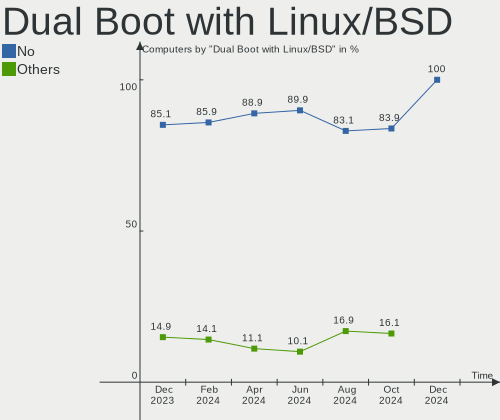
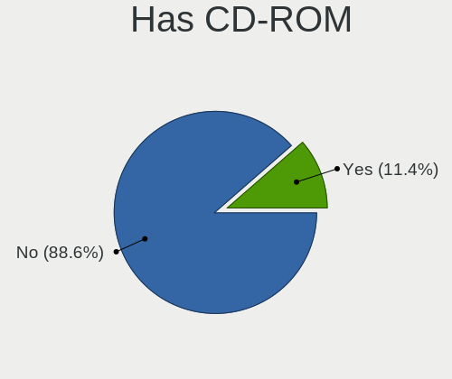
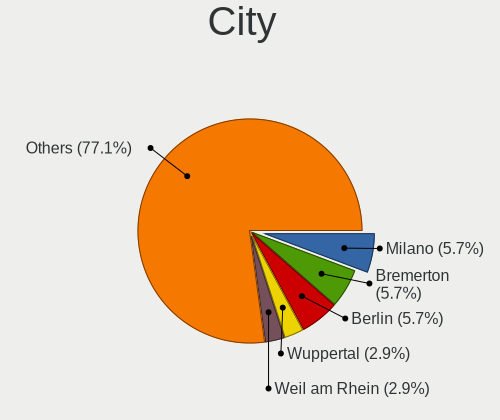
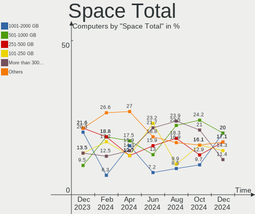
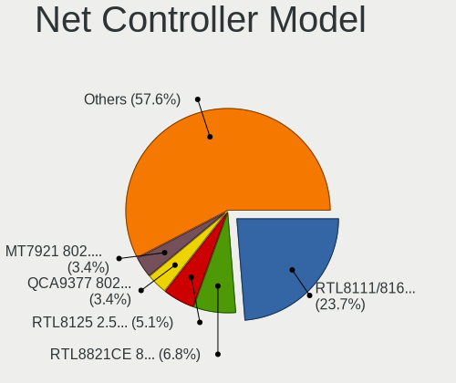
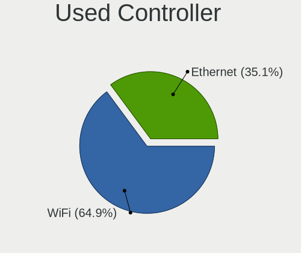

EndeavourOS - Hardware Trends
-----------------------------

A project to identify most popular hardware characteristics and track their change
over time based on data collected by Linux users at https://Linux-Hardware.org.

Anyone can contribute to this report by the [hw-probe](https://github.com/linuxhw/hw-probe) tool:

    sudo -E hw-probe -all -upload

This is a report for all computer types. See also reports for [desktops](/Dist/EndeavourOS/Desktop/README.md) and [notebooks](/Dist/EndeavourOS/Notebook/README.md).

This report is for one last month. Overall report since the beginning of time: [TestDays](https://github.com/linuxhw/TestDays)

Period: Dec, 2024.

Contents
--------

* [ System ](#system)
  - [ OS                       ](#os)
  - [ OS Family                ](#os-family)
  - [ Kernel                   ](#kernel)
  - [ Kernel Family            ](#kernel-family)
  - [ Kernel Major Ver.        ](#kernel-major-ver)
  - [ Arch                     ](#arch)
  - [ DE                       ](#de)
  - [ Display Server           ](#display-server)
  - [ Display Manager          ](#display-manager)
  - [ OS Lang                  ](#os-lang)
  - [ Boot Mode                ](#boot-mode)
  - [ Filesystem               ](#filesystem)
  - [ Part. scheme             ](#part-scheme)
  - [ Dual Boot with Linux/BSD ](#dual-boot-with-linuxbsd)
  - [ Dual Boot (Win)          ](#dual-boot-win)

* [ Board ](#board)
  - [ Vendor                   ](#vendor)
  - [ Model                    ](#model)
  - [ Model Family             ](#model-family)
  - [ MFG Year                 ](#mfg-year)
  - [ Form Factor              ](#form-factor)
  - [ Secure Boot              ](#secure-boot)
  - [ Coreboot                 ](#coreboot)
  - [ RAM Size                 ](#ram-size)
  - [ RAM Used                 ](#ram-used)
  - [ Total Drives             ](#total-drives)
  - [ Has CD-ROM               ](#has-cd-rom)
  - [ Has Ethernet             ](#has-ethernet)
  - [ Has WiFi                 ](#has-wifi)
  - [ Has Bluetooth            ](#has-bluetooth)

* [ Location ](#location)
  - [ Country                  ](#country)
  - [ City                     ](#city)

* [ Drives ](#drives)
  - [ Drive Vendor             ](#drive-vendor)
  - [ Drive Model              ](#drive-model)
  - [ HDD Vendor               ](#hdd-vendor)
  - [ SSD Vendor               ](#ssd-vendor)
  - [ Drive Kind               ](#drive-kind)
  - [ Drive Connector          ](#drive-connector)
  - [ Drive Size               ](#drive-size)
  - [ Space Total              ](#space-total)
  - [ Space Used               ](#space-used)
  - [ Malfunc. Drives          ](#malfunc-drives)
  - [ Malfunc. Drive Vendor    ](#malfunc-drive-vendor)
  - [ Malfunc. HDD Vendor      ](#malfunc-hdd-vendor)
  - [ Malfunc. Drive Kind      ](#malfunc-drive-kind)
  - [ Failed Drives            ](#failed-drives)
  - [ Failed Drive Vendor      ](#failed-drive-vendor)
  - [ Drive Status             ](#drive-status)

* [ Storage controller ](#storage-controller)
  - [ Storage Vendor           ](#storage-vendor)
  - [ Storage Model            ](#storage-model)
  - [ Storage Kind             ](#storage-kind)

* [ Processor ](#processor)
  - [ CPU Vendor               ](#cpu-vendor)
  - [ CPU Model                ](#cpu-model)
  - [ CPU Model Family         ](#cpu-model-family)
  - [ CPU Cores                ](#cpu-cores)
  - [ CPU Sockets              ](#cpu-sockets)
  - [ CPU Threads              ](#cpu-threads)
  - [ CPU Op-Modes             ](#cpu-op-modes)
  - [ CPU Microcode            ](#cpu-microcode)
  - [ CPU Microarch            ](#cpu-microarch)

* [ Graphics ](#graphics)
  - [ GPU Vendor               ](#gpu-vendor)
  - [ GPU Model                ](#gpu-model)
  - [ GPU Combo                ](#gpu-combo)
  - [ GPU Driver               ](#gpu-driver)
  - [ GPU Memory               ](#gpu-memory)

* [ Monitor ](#monitor)
  - [ Monitor Vendor           ](#monitor-vendor)
  - [ Monitor Model            ](#monitor-model)
  - [ Monitor Resolution       ](#monitor-resolution)
  - [ Monitor Diagonal         ](#monitor-diagonal)
  - [ Monitor Width            ](#monitor-width)
  - [ Aspect Ratio             ](#aspect-ratio)
  - [ Monitor Area             ](#monitor-area)
  - [ Pixel Density            ](#pixel-density)
  - [ Multiple Monitors        ](#multiple-monitors)

* [ Network ](#network)
  - [ Net Controller Vendor    ](#net-controller-vendor)
  - [ Net Controller Model     ](#net-controller-model)
  - [ Wireless Vendor          ](#wireless-vendor)
  - [ Wireless Model           ](#wireless-model)
  - [ Ethernet Vendor          ](#ethernet-vendor)
  - [ Ethernet Model           ](#ethernet-model)
  - [ Net Controller Kind      ](#net-controller-kind)
  - [ Used Controller          ](#used-controller)
  - [ NICs                     ](#nics)
  - [ IPv6                     ](#ipv6)

* [ Bluetooth ](#bluetooth)
  - [ Bluetooth Vendor         ](#bluetooth-vendor)
  - [ Bluetooth Model          ](#bluetooth-model)

* [ Sound ](#sound)
  - [ Sound Vendor             ](#sound-vendor)
  - [ Sound Model              ](#sound-model)

* [ Memory ](#memory)
  - [ Memory Vendor            ](#memory-vendor)
  - [ Memory Model             ](#memory-model)
  - [ Memory Kind              ](#memory-kind)
  - [ Memory Form Factor       ](#memory-form-factor)
  - [ Memory Size              ](#memory-size)
  - [ Memory Speed             ](#memory-speed)

* [ Printers & scanners ](#printers--scanners)
  - [ Printer Vendor           ](#printer-vendor)
  - [ Printer Model            ](#printer-model)
  - [ Scanner Vendor           ](#scanner-vendor)
  - [ Scanner Model            ](#scanner-model)

* [ Camera ](#camera)
  - [ Camera Vendor            ](#camera-vendor)
  - [ Camera Model             ](#camera-model)

* [ Security ](#security)
  - [ Fingerprint Vendor       ](#fingerprint-vendor)
  - [ Fingerprint Model        ](#fingerprint-model)
  - [ Chipcard Vendor          ](#chipcard-vendor)
  - [ Chipcard Model           ](#chipcard-model)

* [ Unsupported ](#unsupported)
  - [ Unsupported Devices      ](#unsupported-devices)
  - [ Unsupported Device Types ](#unsupported-device-types)

System
------

OS
--

Installed operating systems

| Name                | Computers | Percent |
|---------------------|-----------|---------|
| EndeavourOS Rolling | 35        | 100%    |

OS Family
---------

OS without a version

| Name        | Computers | Percent |
|-------------|-----------|---------|
| EndeavourOS | 35        | 100%    |

Kernel
------

Version of the Linux kernel

| Version                            | Computers | Percent |
|------------------------------------|-----------|---------|
| 6.12.4-arch1-1                     | 9         | 25.71%  |
| 6.12.1-arch1-1                     | 5         | 14.29%  |
| 6.12.6-arch1-1                     | 4         | 11.43%  |
| 6.6.65-1-lts                       | 3         | 8.57%   |
| 6.12.3-arch1-1                     | 3         | 8.57%   |
| 6.12.7-arch1-1                     | 2         | 5.71%   |
| 6.12.1-zen1-1-zen                  | 2         | 5.71%   |
| 6.6.64-1-lts                       | 1         | 2.86%   |
| 6.13.0-rc2-1-mainline-um5606-dirty | 1         | 2.86%   |
| 6.12.7-zen1-1-zen                  | 1         | 2.86%   |
| 6.12.6-zen1-1-zen                  | 1         | 2.86%   |
| 6.11.10-hardened1-1-hardened       | 1         | 2.86%   |
| 6.10.10-arch1-1                    | 1         | 2.86%   |
| 6.1.69-1-lts                       | 1         | 2.86%   |

Kernel Family
-------------

Linux kernel without a distro release

| Version | Computers | Percent |
|---------|-----------|---------|
| 6.12.4  | 9         | 25.71%  |
| 6.12.1  | 7         | 20%     |
| 6.12.6  | 5         | 14.29%  |
| 6.6.65  | 3         | 8.57%   |
| 6.12.7  | 3         | 8.57%   |
| 6.12.3  | 3         | 8.57%   |
| 6.6.64  | 1         | 2.86%   |
| 6.13.0  | 1         | 2.86%   |
| 6.11.10 | 1         | 2.86%   |
| 6.10.10 | 1         | 2.86%   |
| 6.1.69  | 1         | 2.86%   |

Kernel Major Ver.
-----------------

Linux kernel major version

| Version | Computers | Percent |
|---------|-----------|---------|
| 6.12    | 27        | 77.14%  |
| 6.6     | 4         | 11.43%  |
| 6.13    | 1         | 2.86%   |
| 6.11    | 1         | 2.86%   |
| 6.10    | 1         | 2.86%   |
| 6.1     | 1         | 2.86%   |

Arch
----

OS architecture (x86_64, i586, etc.)

| Name   | Computers | Percent |
|--------|-----------|---------|
| x86_64 | 35        | 100%    |

DE
--

Desktop Environment

| Name     | Computers | Percent |
|----------|-----------|---------|
| KDE6     | 20        | 57.14%  |
| GNOME    | 6         | 17.14%  |
| XFCE     | 4         | 11.43%  |
| Unknown  | 2         | 5.71%   |
| sway     | 1         | 2.86%   |
| i3       | 1         | 2.86%   |
| Cinnamon | 1         | 2.86%   |

Display Server
--------------

X11 or Wayland

| Name    | Computers | Percent |
|---------|-----------|---------|
| Wayland | 25        | 71.43%  |
| X11     | 10        | 28.57%  |

Display Manager
---------------

SDDM, LightDM, etc.

| Name    | Computers | Percent |
|---------|-----------|---------|
| Unknown | 14        | 40%     |
| SDDM    | 13        | 37.14%  |
| LightDM | 5         | 14.29%  |
| GDM     | 3         | 8.57%   |

OS Lang
-------

Language

| Lang    | Computers | Percent |
|---------|-----------|---------|
| en_US   | 13        | 37.14%  |
| en_GB   | 7         | 20%     |
| it_IT   | 3         | 8.57%   |
| de_DE   | 3         | 8.57%   |
| Unknown | 2         | 5.71%   |
| pt_PT   | 1         | 2.86%   |
| pt_BR   | 1         | 2.86%   |
| pl_PL   | 1         | 2.86%   |
| lt_LT   | 1         | 2.86%   |
| es_CL   | 1         | 2.86%   |
| en_CA   | 1         | 2.86%   |
| en_AU   | 1         | 2.86%   |

Boot Mode
---------

EFI or BIOS

| Mode | Computers | Percent |
|------|-----------|---------|
| BIOS | 18        | 51.43%  |
| EFI  | 17        | 48.57%  |

Filesystem
----------

Type of filesystem

| Type    | Computers | Percent |
|---------|-----------|---------|
| Ext4    | 25        | 71.43%  |
| Btrfs   | 9         | 25.71%  |
| Overlay | 1         | 2.86%   |

Part. scheme
------------

Scheme of partitioning

| Type    | Computers | Percent |
|---------|-----------|---------|
| GPT     | 21        | 60%     |
| Unknown | 14        | 40%     |

Dual Boot with Linux/BSD
------------------------

Hosting more than one Linux/BSD

| Dual boot | Computers | Percent |
|-----------|-----------|---------|
| No        | 35        | 100%    |

Dual Boot (Win)
---------------

Hosting Linux and Windows

| Dual boot | Computers | Percent |
|-----------|-----------|---------|
| No        | 29        | 82.86%  |
| Yes       | 6         | 17.14%  |

Board
-----

Vendor
------

Motherboard manufacturer

| Name                                 | Computers | Percent |
|--------------------------------------|-----------|---------|
| Lenovo                               | 8         | 22.86%  |
| Dell                                 | 5         | 14.29%  |
| ASUSTek Computer                     | 5         | 14.29%  |
| MSI                                  | 3         | 8.57%   |
| Hewlett-Packard                      | 3         | 8.57%   |
| Google                               | 2         | 5.71%   |
| Gigabyte Technology                  | 2         | 5.71%   |
| Shenzhen Meigao Electronic Equipment | 1         | 2.86%   |
| Huanan                               | 1         | 2.86%   |
| GEEKOM                               | 1         | 2.86%   |
| AZW                                  | 1         | 2.86%   |
| Apple                                | 1         | 2.86%   |
| Acer                                 | 1         | 2.86%   |
| Unknown                              | 1         | 2.86%   |

Model
-----

Motherboard model

| Name                                                  | Computers | Percent |
|-------------------------------------------------------|-----------|---------|
| Shenzhen Meigao Electronic Equipment EliteMini Series | 1         | 2.86%   |
| MSI MS-7C95                                           | 1         | 2.86%   |
| MSI MS-7B89                                           | 1         | 2.86%   |
| MSI MS-7A34                                           | 1         | 2.86%   |
| Lenovo ThinkStation P320 Tiny 30C1S0160C              | 1         | 2.86%   |
| Lenovo ThinkPad T14s Gen 4 21F80041GE                 | 1         | 2.86%   |
| Lenovo ThinkPad L15 Gen 3 21C3000CPG                  | 1         | 2.86%   |
| Lenovo LOQ 15AHP9 83DX                                | 1         | 2.86%   |
| Lenovo IdeaPad Gaming 3 15ACH6 82K2                   | 1         | 2.86%   |
| Lenovo IdeaPad 330-15IKB 81DC                         | 1         | 2.86%   |
| Lenovo IdeaPad 330-15ARR 81D2                         | 1         | 2.86%   |
| Lenovo IdeaPad 3 14ALC6 82KT                          | 1         | 2.86%   |
| Huanan X99-F8 GAMING V5.0                             | 1         | 2.86%   |
| HP Laptop 15z-ef2xxx                                  | 1         | 2.86%   |
| HP EliteBook 8460p                                    | 1         | 2.86%   |
| HP Compaq Elite 8300 SFF                              | 1         | 2.86%   |
| Google Swanky                                         | 1         | 2.86%   |
| Google Beetley                                        | 1         | 2.86%   |
| Gigabyte B550M DS3H                                   | 1         | 2.86%   |
| Gigabyte B550 VISION D-P                              | 1         | 2.86%   |
| GEEKOM A7                                             | 1         | 2.86%   |
| Dell XPS 9315                                         | 1         | 2.86%   |
| Dell OptiPlex 9020                                    | 1         | 2.86%   |
| Dell Latitude E6230                                   | 1         | 2.86%   |
| Dell Latitude 7410                                    | 1         | 2.86%   |
| Dell Latitude 7400 2-in-1                             | 1         | 2.86%   |
| AZW MINI S                                            | 1         | 2.86%   |
| ASUS VivoBook_ASUSLaptop X515JAB_R565JA               | 1         | 2.86%   |
| ASUS TUF Gaming X570-PLUS                             | 1         | 2.86%   |
| ASUS M4A785-M                                         | 1         | 2.86%   |
| ASUS ASUS Zenbook S 16 UM5606WA_UM5606WA              | 1         | 2.86%   |
| ASUS ASUS TUF Gaming A16 FA617NSR_FA617NSR            | 1         | 2.86%   |
| Apple MacBookPro11,1                                  | 1         | 2.86%   |
| Acer Aspire A317-53                                   | 1         | 2.86%   |
| Unknown                                               | 1         | 2.86%   |

Model Family
------------

Motherboard model prefix

| Name                                           | Computers | Percent |
|------------------------------------------------|-----------|---------|
| Lenovo IdeaPad                                 | 4         | 11.43%  |
| Dell Latitude                                  | 3         | 8.57%   |
| Lenovo ThinkPad                                | 2         | 5.71%   |
| ASUS ASUS                                      | 2         | 5.71%   |
| Shenzhen Meigao Electronic Equipment EliteMini | 1         | 2.86%   |
| MSI MS-7C95                                    | 1         | 2.86%   |
| MSI MS-7B89                                    | 1         | 2.86%   |
| MSI MS-7A34                                    | 1         | 2.86%   |
| Lenovo ThinkStation                            | 1         | 2.86%   |
| Lenovo LOQ                                     | 1         | 2.86%   |
| Huanan X99-F8                                  | 1         | 2.86%   |
| HP Laptop                                      | 1         | 2.86%   |
| HP EliteBook                                   | 1         | 2.86%   |
| HP Compaq                                      | 1         | 2.86%   |
| Google Swanky                                  | 1         | 2.86%   |
| Google Beetley                                 | 1         | 2.86%   |
| Gigabyte B550M                                 | 1         | 2.86%   |
| Gigabyte B550                                  | 1         | 2.86%   |
| GEEKOM A7                                      | 1         | 2.86%   |
| Dell XPS                                       | 1         | 2.86%   |
| Dell OptiPlex                                  | 1         | 2.86%   |
| AZW MINI                                       | 1         | 2.86%   |
| ASUS VivoBook                                  | 1         | 2.86%   |
| ASUS TUF                                       | 1         | 2.86%   |
| ASUS M4A785-M                                  | 1         | 2.86%   |
| Apple MacBookPro11                             | 1         | 2.86%   |
| Acer Aspire                                    | 1         | 2.86%   |
| Unknown                                        | 1         | 2.86%   |

MFG Year
--------

Motherboard manufacture year

| Year | Computers | Percent |
|------|-----------|---------|
| 2024 | 6         | 17.14%  |
| 2022 | 6         | 17.14%  |
| 2021 | 6         | 17.14%  |
| 2020 | 3         | 8.57%   |
| 2019 | 3         | 8.57%   |
| 2018 | 2         | 5.71%   |
| 2014 | 2         | 5.71%   |
| 2012 | 2         | 5.71%   |
| 2023 | 1         | 2.86%   |
| 2017 | 1         | 2.86%   |
| 2013 | 1         | 2.86%   |
| 2011 | 1         | 2.86%   |
| 2009 | 1         | 2.86%   |

Form Factor
-----------

Physical design of the computer

| Name        | Computers | Percent |
|-------------|-----------|---------|
| Notebook    | 21        | 60%     |
| Desktop     | 11        | 31.43%  |
| Mini pc     | 2         | 5.71%   |
| Convertible | 1         | 2.86%   |

Secure Boot
-----------

Enabled or disabled

| State    | Computers | Percent |
|----------|-----------|---------|
| Disabled | 35        | 100%    |

Coreboot
--------

Have coreboot on board

| Used | Computers | Percent |
|------|-----------|---------|
| No   | 33        | 94.29%  |
| Yes  | 2         | 5.71%   |

RAM Size
--------

Total RAM memory

| Size in GB  | Computers | Percent |
|-------------|-----------|---------|
| 32.01-64.0  | 8         | 22.86%  |
| 4.01-8.0    | 7         | 20%     |
| 16.01-24.0  | 7         | 20%     |
| 8.01-16.0   | 7         | 20%     |
| 24.01-32.0  | 3         | 8.57%   |
| 3.01-4.0    | 1         | 2.86%   |
| 64.01-256.0 | 1         | 2.86%   |
| 1.01-2.0    | 1         | 2.86%   |

RAM Used
--------

Used RAM memory

| Used GB    | Computers | Percent |
|------------|-----------|---------|
| 3.01-4.0   | 9         | 25.71%  |
| 4.01-8.0   | 7         | 20%     |
| 2.01-3.0   | 7         | 20%     |
| 8.01-16.0  | 7         | 20%     |
| 1.01-2.0   | 4         | 11.43%  |
| 16.01-24.0 | 1         | 2.86%   |

Total Drives
------------

Number of drives on board

| Drives | Computers | Percent |
|--------|-----------|---------|
| 1      | 23        | 65.71%  |
| 2      | 6         | 17.14%  |
| 4      | 2         | 5.71%   |
| 3      | 2         | 5.71%   |
| 7      | 1         | 2.86%   |
| 0      | 1         | 2.86%   |

Has CD-ROM
----------

Has CD-ROM on board

| Presented | Computers | Percent |
|-----------|-----------|---------|
| No        | 31        | 88.57%  |
| Yes       | 4         | 11.43%  |

Has Ethernet
------------

Has Ethernet on board

| Presented | Computers | Percent |
|-----------|-----------|---------|
| Yes       | 23        | 65.71%  |
| No        | 12        | 34.29%  |

Has WiFi
--------

Has WiFi module

| Presented | Computers | Percent |
|-----------|-----------|---------|
| Yes       | 31        | 88.57%  |
| No        | 4         | 11.43%  |

Has Bluetooth
-------------

Has Bluetooth module

| Presented | Computers | Percent |
|-----------|-----------|---------|
| Yes       | 30        | 85.71%  |
| No        | 5         | 14.29%  |

Location
--------

Country
-------

Geographic location (country)

| Country     | Computers | Percent |
|-------------|-----------|---------|
| USA         | 11        | 31.43%  |
| Germany     | 6         | 17.14%  |
| UK          | 3         | 8.57%   |
| Poland      | 3         | 8.57%   |
| Italy       | 3         | 8.57%   |
| Spain       | 1         | 2.86%   |
| Romania     | 1         | 2.86%   |
| Portugal    | 1         | 2.86%   |
| Netherlands | 1         | 2.86%   |
| Lithuania   | 1         | 2.86%   |
| Greece      | 1         | 2.86%   |
| Croatia     | 1         | 2.86%   |
| Chile       | 1         | 2.86%   |
| Australia   | 1         | 2.86%   |

City
----

Geographic location (city)

| City               | Computers | Percent |
|--------------------|-----------|---------|
| Milano             | 2         | 5.71%   |
| Bremerton          | 2         | 5.71%   |
| Berlin             | 2         | 5.71%   |
| Wuppertal          | 1         | 2.86%   |
| Weil am Rhein      | 1         | 2.86%   |
| Vilnius            | 1         | 2.86%   |
| Tranent            | 1         | 2.86%   |
| St Louis           | 1         | 2.86%   |
| Southwark          | 1         | 2.86%   |
| Southampton        | 1         | 2.86%   |
| Santiago           | 1         | 2.86%   |
| Rumia              | 1         | 2.86%   |
| Rijeka             | 1         | 2.86%   |
| Poznan             | 1         | 2.86%   |
| Perth              | 1         | 2.86%   |
| Pelion             | 1         | 2.86%   |
| Pátrai            | 1         | 2.86%   |
| Paços de Ferreira | 1         | 2.86%   |
| New York           | 1         | 2.86%   |
| Minneapolis        | 1         | 2.86%   |
| Madrid             | 1         | 2.86%   |
| Lowell             | 1         | 2.86%   |
| Los Angeles        | 1         | 2.86%   |
| Lawrence           | 1         | 2.86%   |
| Krakow             | 1         | 2.86%   |
| Ibbenbueren        | 1         | 2.86%   |
| Hamburg            | 1         | 2.86%   |
| Dallas             | 1         | 2.86%   |
| Arad               | 1         | 2.86%   |
| Aprilia            | 1         | 2.86%   |
| Amstelveen         | 1         | 2.86%   |
| Allen              | 1         | 2.86%   |

Drives
------

Drive Vendor
------------

Hard drive vendors

| Vendor                      | Computers | Drives | Percent |
|-----------------------------|-----------|--------|---------|
| Samsung Electronics         | 9         | 10     | 18%     |
| Seagate                     | 5         | 6      | 10%     |
| Unknown                     | 4         | 4      | 8%      |
| Phison Electronics          | 3         | 4      | 6%      |
| Micron Technology           | 3         | 3      | 6%      |
| Toshiba                     | 2         | 3      | 4%      |
| SPCC                        | 2         | 2      | 4%      |
| SK hynix                    | 2         | 2      | 4%      |
| Sandisk                     | 2         | 2      | 4%      |
| Kingston                    | 2         | 2      | 4%      |
| WUXIN                       | 1         | 1      | 2%      |
| WDC                         | 1         | 1      | 2%      |
| T-FORCE                     | 1         | 1      | 2%      |
| Silicon Motion              | 1         | 1      | 2%      |
| Micron/Crucial Technology   | 1         | 1      | 2%      |
| MAXIO Technology (Hangzhou) | 1         | 1      | 2%      |
| LITEON                      | 1         | 1      | 2%      |
| KIOXIA                      | 1         | 1      | 2%      |
| KingFast                    | 1         | 1      | 2%      |
| JMicron Technology          | 1         | 1      | 2%      |
| Intel                       | 1         | 2      | 2%      |
| Hitachi                     | 1         | 1      | 2%      |
| Fanxiang                    | 1         | 2      | 2%      |
| Crucial                     | 1         | 1      | 2%      |
| China                       | 1         | 1      | 2%      |
| Apple                       | 1         | 1      | 2%      |

Drive Model
-----------

Hard drive models

| Model                                                 | Computers | Percent |
|-------------------------------------------------------|-----------|---------|
| Samsung NVMe SSD Controller SM981/PM981/PM983 512GB   | 2         | 3.7%    |
| WUXIN G8 128GB                                        | 1         | 1.85%   |
| WDC WD50 00BPVT-00HXZT3 500GB                         | 1         | 1.85%   |
| Unknown NVMe SSD Drive 1TB                            | 1         | 1.85%   |
| Unknown MMC Card  64GB                                | 1         | 1.85%   |
| Unknown MMC Card  16GB                                | 1         | 1.85%   |
| Unknown MMC Card  128GB                               | 1         | 1.85%   |
| Toshiba MQ04ABF100 1TB                                | 1         | 1.85%   |
| Toshiba HDWR460 6TB                                   | 1         | 1.85%   |
| Toshiba HDWE140 4TB                                   | 1         | 1.85%   |
| T-FORCE 1TB                                           | 1         | 1.85%   |
| SPCC Solid State Disk 512GB                           | 1         | 1.85%   |
| SPCC Solid State Disk 128GB                           | 1         | 1.85%   |
| SK hynix HFS128G32TNF-N3A0A 128GB SSD                 | 1         | 1.85%   |
| SK hynix BC511 512GB                                  | 1         | 1.85%   |
| Silicon Motion SM2263EN/SM2263XT SSD Controller 256GB | 1         | 1.85%   |
| Seagate ST9250410AS 250GB                             | 1         | 1.85%   |
| Seagate ST500DM002-1BD142 500GB                       | 1         | 1.85%   |
| Seagate ST3000DM007-1WY10G 3TB                        | 1         | 1.85%   |
| Seagate ST1000DM010-2EP102 1TB                        | 1         | 1.85%   |
| Seagate BarraCuda 120 SSD ZA500CM10003 500GB          | 1         | 1.85%   |
| Sandisk WD PC SN740 SDDPNQD-512G-1002 512GB           | 1         | 1.85%   |
| Sandisk WD Black SN750 / PC SN730 NVMe SSD 512GB      | 1         | 1.85%   |
| Samsung SSD 990 EVO Plus 2TB                          | 1         | 1.85%   |
| Samsung SSD 980 1TB                                   | 1         | 1.85%   |
| Samsung SSD 870 EVO 1TB                               | 1         | 1.85%   |
| Samsung SSD 850 EVO 500GB                             | 1         | 1.85%   |
| Samsung SSD 850 EVO 250GB                             | 1         | 1.85%   |
| Samsung NVMe SSD Controller SM961/PM961/SM963 256GB   | 1         | 1.85%   |
| Samsung NVMe SSD Controller PM9A1/PM9A3/980PRO 512GB  | 1         | 1.85%   |
| Samsung MZALQ512HBLU-00BL2 512GB                      | 1         | 1.85%   |
| Phison SPCC M.2 PCIe SSD 2TB                          | 1         | 1.85%   |
| Phison PS5013 E13 NVMe Controller 512GB               | 1         | 1.85%   |
| Phison ESE2A044-512 NVMe 512GB                        | 1         | 1.85%   |
| Micron/Crucial CT2000P3PSSD8 2TB                      | 1         | 1.85%   |
| Micron MTFDKBA1T0QFM-1BD1AABGB 1024GB                 | 1         | 1.85%   |
| Micron MTFDHBA512QFD 512GB                            | 1         | 1.85%   |
| Micron 2200S NVMe 512GB                               | 1         | 1.85%   |
| MAXIO (Hangzhou) NVMe SSD Controller MAP1202 512GB    | 1         | 1.85%   |
| LITEON IT LCS-128L9S-HP 128GB SSD                     | 1         | 1.85%   |

HDD Vendor
----------

Hard disk drive vendors

| Vendor             | Computers | Drives | Percent |
|--------------------|-----------|--------|---------|
| Seagate            | 4         | 4      | 44.44%  |
| Toshiba            | 2         | 3      | 22.22%  |
| WDC                | 1         | 1      | 11.11%  |
| JMicron Technology | 1         | 1      | 11.11%  |
| Hitachi            | 1         | 1      | 11.11%  |

SSD Vendor
----------

Solid state drive vendors

| Vendor              | Computers | Drives | Percent |
|---------------------|-----------|--------|---------|
| Samsung Electronics | 3         | 3      | 21.43%  |
| SPCC                | 2         | 2      | 14.29%  |
| Kingston            | 2         | 2      | 14.29%  |
| SK hynix            | 1         | 1      | 7.14%   |
| Seagate             | 1         | 2      | 7.14%   |
| LITEON              | 1         | 1      | 7.14%   |
| Fanxiang            | 1         | 2      | 7.14%   |
| Crucial             | 1         | 1      | 7.14%   |
| China               | 1         | 1      | 7.14%   |
| Apple               | 1         | 1      | 7.14%   |

Drive Kind
----------

HDD or SSD

| Kind    | Computers | Drives | Percent |
|---------|-----------|--------|---------|
| NVMe    | 21        | 24     | 46.67%  |
| SSD     | 11        | 16     | 24.44%  |
| HDD     | 7         | 10     | 15.56%  |
| MMC     | 3         | 3      | 6.67%   |
| Unknown | 3         | 3      | 6.67%   |

Drive Connector
---------------

SATA, SAS, NVMe, etc.

| Type | Computers | Drives | Percent |
|------|-----------|--------|---------|
| NVMe | 21        | 24     | 48.84%  |
| SATA | 17        | 27     | 39.53%  |
| MMC  | 3         | 3      | 6.98%   |
| SAS  | 2         | 2      | 4.65%   |

Drive Size
----------

Size of hard drive

| Size in TB | Computers | Drives | Percent |
|------------|-----------|--------|---------|
| 0.01-0.5   | 11        | 15     | 50%     |
| 0.51-1.0   | 5         | 5      | 22.73%  |
| 3.01-4.0   | 2         | 2      | 9.09%   |
| 1.01-2.0   | 2         | 2      | 9.09%   |
| 2.01-3.0   | 1         | 1      | 4.55%   |
| 4.01-10.0  | 1         | 1      | 4.55%   |

Space Total
-----------

Amount of disk space available on the file system

| Size in GB     | Computers | Percent |
|----------------|-----------|---------|
| 1001-2000      | 7         | 20%     |
| 501-1000       | 7         | 20%     |
| 251-500        | 6         | 17.14%  |
| 101-250        | 5         | 14.29%  |
| More than 3000 | 4         | 11.43%  |
| 21-50          | 2         | 5.71%   |
| 2001-3000      | 1         | 2.86%   |
| 1-20           | 1         | 2.86%   |
| 51-100         | 1         | 2.86%   |
| Unknown        | 1         | 2.86%   |

Space Used
----------

Amount of used disk space

| Used GB        | Computers | Percent |
|----------------|-----------|---------|
| 101-250        | 9         | 25.71%  |
| 1-20           | 6         | 17.14%  |
| 51-100         | 5         | 14.29%  |
| 251-500        | 4         | 11.43%  |
| More than 3000 | 3         | 8.57%   |
| 21-50          | 3         | 8.57%   |
| 501-1000       | 3         | 8.57%   |
| 1001-2000      | 1         | 2.86%   |
| Unknown        | 1         | 2.86%   |

Malfunc. Drives
---------------

Drive models with a malfunction

Zero info for selected period =(

Malfunc. Drive Vendor
---------------------

Vendors of faulty drives

Zero info for selected period =(

Malfunc. HDD Vendor
-------------------

Vendors of faulty HDD drives

Zero info for selected period =(

Malfunc. Drive Kind
-------------------

Kinds of faulty drives

Zero info for selected period =(

Failed Drives
-------------

Failed drive models

Zero info for selected period =(

Failed Drive Vendor
-------------------

Failed drive vendors

Zero info for selected period =(

Drive Status
------------

Number of failed and malfunc. drives

| Status   | Computers | Drives | Percent |
|----------|-----------|--------|---------|
| Works    | 18        | 32     | 51.43%  |
| Detected | 17        | 24     | 48.57%  |

Storage controller
------------------

Storage Vendor
--------------

Storage controller vendors

| Vendor                      | Computers | Percent |
|-----------------------------|-----------|---------|
| Intel                       | 12        | 27.27%  |
| AMD                         | 9         | 20.45%  |
| Samsung Electronics         | 8         | 18.18%  |
| Phison Electronics          | 3         | 6.82%   |
| Micron Technology           | 3         | 6.82%   |
| SanDisk                     | 2         | 4.55%   |
| Solidigm                    | 1         | 2.27%   |
| SK hynix                    | 1         | 2.27%   |
| Silicon Motion              | 1         | 2.27%   |
| Micron/Crucial Technology   | 1         | 2.27%   |
| MAXIO Technology (Hangzhou) | 1         | 2.27%   |
| KIOXIA                      | 1         | 2.27%   |
| ASMedia Technology          | 1         | 2.27%   |

Storage Model
-------------

Storage controller models

| Model                                                                            | Computers | Percent |
|----------------------------------------------------------------------------------|-----------|---------|
| AMD FCH SATA Controller [AHCI mode]                                              | 5         | 10.2%   |
| Samsung NVMe SSD Controller SM981/PM981/PM983                                    | 2         | 4.08%   |
| Samsung NVMe SSD Controller 980 (DRAM-less)                                      | 2         | 4.08%   |
| Intel Volume Management Device NVMe RAID Controller                              | 2         | 4.08%   |
| AMD 500 Series Chipset SATA Controller                                           | 2         | 4.08%   |
| Solidigm P41 Plus NVMe SSD (DRAM-less) [Echo Harbor]                             | 1         | 2.04%   |
| SK hynix BC511 NVMe SSD                                                          | 1         | 2.04%   |
| Silicon Motion SM2263EN/SM2263XT (DRAM-less) NVMe SSD Controllers                | 1         | 2.04%   |
| SanDisk WD Black SN770 / PC SN740 256GB / PC SN560 (DRAM-less) NVMe SSD          | 1         | 2.04%   |
| SanDisk Extreme Pro / WD Black SN750 / PC SN730 / Red SN700 NVMe SSD             | 1         | 2.04%   |
| Samsung S4LN053X01 AHCI SSD Controller(Apple slot)                               | 1         | 2.04%   |
| Samsung NVMe SSD Controller SM961/PM961/SM963                                    | 1         | 2.04%   |
| Samsung NVMe SSD Controller PM9C1a (DRAM-less)                                   | 1         | 2.04%   |
| Samsung NVMe SSD Controller PM9A1/PM9A3/980PRO                                   | 1         | 2.04%   |
| Phison PS5019-E19 PCIe4 NVMe Controller (DRAM-less)                              | 1         | 2.04%   |
| Phison PS5015-E15 PCIe3 NVMe Controller (DRAM-less)                              | 1         | 2.04%   |
| Phison PS5013-E13 PCIe3 NVMe Controller (DRAM-less)                              | 1         | 2.04%   |
| Micron/Crucial P3 Plus NVMe PCIe SSD (DRAM-less)                                 | 1         | 2.04%   |
| Micron 2400 NVMe SSD (DRAM-less)                                                 | 1         | 2.04%   |
| Micron 2210 NVMe SSD [Cobain]                                                    | 1         | 2.04%   |
| Micron 2200S NVMe SSD [Cassandra]                                                | 1         | 2.04%   |
| MAXIO (Hangzhou) NVMe SSD Controller MAP1202 (DRAM-less)                         | 1         | 2.04%   |
| KIOXIA NVMe SSD Controller BG4 (DRAM-less)                                       | 1         | 2.04%   |
| Intel Tiger Lake-LP SATA Controller                                              | 1         | 2.04%   |
| Intel Sunrise Point-LP SATA Controller [AHCI mode]                               | 1         | 2.04%   |
| Intel Optane NVME SSD H10 with Solid State Storage [Teton Glacier]               | 1         | 2.04%   |
| Intel Jasper Lake SATA AHCI Controller                                           | 1         | 2.04%   |
| Intel C610/X99 series chipset 6-Port SATA Controller [AHCI mode]                 | 1         | 2.04%   |
| Intel Atom/Celeron/Pentium Processor x5-E8000/J3xxx/N3xxx Series SATA Controller | 1         | 2.04%   |
| Intel 82801 Mobile SATA Controller [RAID mode]                                   | 1         | 2.04%   |
| Intel 8 Series/C220 Series Chipset Family 6-port SATA Controller 1 [AHCI mode]   | 1         | 2.04%   |
| Intel 7 Series/C210 Series Chipset Family 6-port SATA Controller [AHCI mode]     | 1         | 2.04%   |
| Intel 7 Series Chipset Family 6-port SATA Controller [AHCI mode]                 | 1         | 2.04%   |
| Intel 6 Series/C200 Series Chipset Family 6 port Mobile SATA AHCI Controller     | 1         | 2.04%   |
| Intel 200 Series PCH SATA controller [AHCI mode]                                 | 1         | 2.04%   |
| ASMedia ASM1064 Serial ATA Controller                                            | 1         | 2.04%   |
| AMD SB7x0/SB8x0/SB9x0 SATA Controller [IDE mode]                                 | 1         | 2.04%   |
| AMD SB7x0/SB8x0/SB9x0 IDE Controller                                             | 1         | 2.04%   |
| AMD FCH RAID Controller                                                          | 1         | 2.04%   |
| AMD 400 Series Chipset SATA Controller                                           | 1         | 2.04%   |

Storage Kind
------------

Kind of storage controller (IDE, SATA, NVMe, SAS, ...)

| Kind | Computers | Percent |
|------|-----------|---------|
| NVMe | 21        | 46.67%  |
| SATA | 19        | 42.22%  |
| RAID | 4         | 8.89%   |
| IDE  | 1         | 2.22%   |

Processor
---------

CPU Vendor
----------

Processor vendors

| Vendor | Computers | Percent |
|--------|-----------|---------|
| Intel  | 18        | 51.43%  |
| AMD    | 17        | 48.57%  |

CPU Model
---------

Processor models

| Model                                         | Computers | Percent |
|-----------------------------------------------|-----------|---------|
| Intel Xeon CPU E5-2697 v3 @ 2.60GHz           | 1         | 2.86%   |
| Intel Pentium Silver N6000 @ 1.10GHz          | 1         | 2.86%   |
| Intel Pentium CPU N3700 @ 1.60GHz             | 1         | 2.86%   |
| Intel Core i7-8665U CPU @ 1.90GHz             | 1         | 2.86%   |
| Intel Core i7-7700T CPU @ 2.90GHz             | 1         | 2.86%   |
| Intel Core i7-3770 CPU @ 3.40GHz              | 1         | 2.86%   |
| Intel Core i7-10610U CPU @ 1.80GHz            | 1         | 2.86%   |
| Intel Core i5-4570S CPU @ 2.90GHz             | 1         | 2.86%   |
| Intel Core i5-4278U CPU @ 2.60GHz             | 1         | 2.86%   |
| Intel Core i5-3320M CPU @ 2.60GHz             | 1         | 2.86%   |
| Intel Core i5-2540M CPU @ 2.60GHz             | 1         | 2.86%   |
| Intel Core i5-1035G1 CPU @ 1.00GHz            | 1         | 2.86%   |
| Intel Core i3-6006U CPU @ 2.00GHz             | 1         | 2.86%   |
| Intel Celeron N5095A @ 2.00GHz                | 1         | 2.86%   |
| Intel Celeron CPU N2840 @ 2.16GHz             | 1         | 2.86%   |
| Intel 12th Gen Core i7-1255U                  | 1         | 2.86%   |
| Intel 12th Gen Core i7-1250U                  | 1         | 2.86%   |
| Intel 11th Gen Core i5-1135G7 @ 2.40GHz       | 1         | 2.86%   |
| AMD Ryzen AI 9 HX 370 w/ Radeon 890M          | 1         | 2.86%   |
| AMD Ryzen 9 7940HS w/ Radeon 780M Graphics    | 1         | 2.86%   |
| AMD Ryzen 9 3900X 12-Core Processor           | 1         | 2.86%   |
| AMD Ryzen 7 PRO 7840U w/ Radeon 780M Graphics | 1         | 2.86%   |
| AMD Ryzen 7 8745H w/ Radeon 780M Graphics     | 1         | 2.86%   |
| AMD Ryzen 7 7435HS                            | 1         | 2.86%   |
| AMD Ryzen 7 5800X3D 8-Core Processor          | 1         | 2.86%   |
| AMD Ryzen 7 5700X 8-Core Processor            | 1         | 2.86%   |
| AMD Ryzen 5 8645HS w/ Radeon 760M Graphics    | 1         | 2.86%   |
| AMD Ryzen 5 5600H with Radeon Graphics        | 1         | 2.86%   |
| AMD Ryzen 5 5600 6-Core Processor             | 1         | 2.86%   |
| AMD Ryzen 5 5500U with Radeon Graphics        | 1         | 2.86%   |
| AMD Ryzen 5 3400G with Radeon Vega Graphics   | 1         | 2.86%   |
| AMD Ryzen 5 2500U with Radeon Vega Mobile Gfx | 1         | 2.86%   |
| AMD Ryzen 5 1500X Quad-Core Processor         | 1         | 2.86%   |
| AMD Ryzen 3 5300U with Radeon Graphics        | 1         | 2.86%   |
| AMD Athlon II X4 620 Processor                | 1         | 2.86%   |

CPU Model Family
----------------

Processor model prefix

| Model                | Computers | Percent |
|----------------------|-----------|---------|
| AMD Ryzen 5          | 7         | 20%     |
| Intel Core i5        | 5         | 14.29%  |
| Other                | 4         | 11.43%  |
| Intel Core i7        | 4         | 11.43%  |
| AMD Ryzen 7          | 4         | 11.43%  |
| Intel Celeron        | 2         | 5.71%   |
| AMD Ryzen 9          | 2         | 5.71%   |
| Intel Xeon           | 1         | 2.86%   |
| Intel Pentium Silver | 1         | 2.86%   |
| Intel Pentium        | 1         | 2.86%   |
| Intel Core i3        | 1         | 2.86%   |
| AMD Ryzen 7 PRO      | 1         | 2.86%   |
| AMD Ryzen 3          | 1         | 2.86%   |
| AMD Athlon II X4     | 1         | 2.86%   |

CPU Cores
---------

Number of processor cores

| Number | Computers | Percent |
|--------|-----------|---------|
| 4      | 15        | 42.86%  |
| 8      | 6         | 17.14%  |
| 2      | 5         | 14.29%  |
| 6      | 4         | 11.43%  |
| 12     | 2         | 5.71%   |
| 10     | 2         | 5.71%   |
| 14     | 1         | 2.86%   |

CPU Sockets
-----------

Number of sockets

| Number | Computers | Percent |
|--------|-----------|---------|
| 1      | 35        | 100%    |

CPU Threads
-----------

Threads per core (Hyper-Threading)

| Number | Computers | Percent |
|--------|-----------|---------|
| 2      | 29        | 82.86%  |
| 1      | 6         | 17.14%  |

CPU Op-Modes
------------

CPU Operation Modes (32-bit, 64-bit)

| Op mode        | Computers | Percent |
|----------------|-----------|---------|
| 32-bit, 64-bit | 35        | 100%    |

CPU Microcode
-------------

Microcode number

| Number     | Computers | Percent |
|------------|-----------|---------|
| Unknown    | 32        | 91.43%  |
| 0x306a9    | 1         | 2.86%   |
| 0x0a705206 | 1         | 2.86%   |
| 0x0a20120e | 1         | 2.86%   |

CPU Microarch
-------------

Microarchitecture

| Name             | Computers | Percent |
|------------------|-----------|---------|
| Unknown          | 9         | 25.71%  |
| Zen 3            | 4         | 11.43%  |
| KabyLake         | 3         | 8.57%   |
| Haswell          | 3         | 8.57%   |
| Zen              | 2         | 5.71%   |
| Tremont          | 2         | 5.71%   |
| Silvermont       | 2         | 5.71%   |
| IvyBridge        | 2         | 5.71%   |
| Zen+             | 1         | 2.86%   |
| Zen 2            | 1         | 2.86%   |
| TigerLake        | 1         | 2.86%   |
| Skylake          | 1         | 2.86%   |
| SandyBridge      | 1         | 2.86%   |
| K10              | 1         | 2.86%   |
| IceLake          | 1         | 2.86%   |
| Alderlake Hybrid | 1         | 2.86%   |

Graphics
--------

GPU Vendor
----------

Vendors of graphics cards

| Vendor | Computers | Percent |
|--------|-----------|---------|
| Intel  | 17        | 44.74%  |
| AMD    | 14        | 36.84%  |
| Nvidia | 7         | 18.42%  |

GPU Model
---------

Graphics card models

| Model                                                                                    | Computers | Percent |
|------------------------------------------------------------------------------------------|-----------|---------|
| Intel JasperLake [UHD Graphics]                                                          | 2         | 5.26%   |
| AMD Phoenix3                                                                             | 2         | 5.26%   |
| AMD Phoenix1                                                                             | 2         | 5.26%   |
| AMD Lucienne                                                                             | 2         | 5.26%   |
| Nvidia TU117M [GeForce GTX 1650 Mobile / Max-Q]                                          | 1         | 2.63%   |
| Nvidia GP107GL [Quadro P600]                                                             | 1         | 2.63%   |
| Nvidia GK104 [GeForce GTX 760]                                                           | 1         | 2.63%   |
| Nvidia GA106 [GeForce RTX 3060 Lite Hash Rate]                                           | 1         | 2.63%   |
| Nvidia GA104 [GeForce RTX 3060 Ti Lite Hash Rate]                                        | 1         | 2.63%   |
| Nvidia GA104 [GeForce RTX 3060 Ti GDDR6X]                                                | 1         | 2.63%   |
| Nvidia AD107M [GeForce RTX 4060 Max-Q / Mobile]                                          | 1         | 2.63%   |
| Intel Xeon E3-1200 v3/4th Gen Core Processor Integrated Graphics Controller              | 1         | 2.63%   |
| Intel WhiskeyLake-U GT2 [UHD Graphics 620]                                               | 1         | 2.63%   |
| Intel TigerLake-LP GT2 [Iris Xe Graphics]                                                | 1         | 2.63%   |
| Intel IvyBridge GT2 [HD Graphics 4000]                                                   | 1         | 2.63%   |
| Intel Iris Plus Graphics G1 (Ice Lake)                                                   | 1         | 2.63%   |
| Intel HD Graphics 630                                                                    | 1         | 2.63%   |
| Intel HD Graphics 520                                                                    | 1         | 2.63%   |
| Intel Haswell-ULT Integrated Graphics Controller                                         | 1         | 2.63%   |
| Intel CometLake-U GT2 [UHD Graphics]                                                     | 1         | 2.63%   |
| Intel Atom/Celeron/Pentium Processor x5-E8000/J3xxx/N3xxx Integrated Graphics Controller | 1         | 2.63%   |
| Intel Atom Processor Z36xxx/Z37xxx Series Graphics & Display                             | 1         | 2.63%   |
| Intel Alder Lake-UP4 GT2 [Iris Xe Graphics]                                              | 1         | 2.63%   |
| Intel Alder Lake-UP3 GT2 [Iris Xe Graphics]                                              | 1         | 2.63%   |
| Intel 3rd Gen Core processor Graphics Controller                                         | 1         | 2.63%   |
| Intel 2nd Generation Core Processor Family Integrated Graphics Controller                | 1         | 2.63%   |
| AMD Strix [Radeon 880M / 890M]                                                           | 1         | 2.63%   |
| AMD Raven Ridge [Radeon Vega Series / Radeon Vega Mobile Series]                         | 1         | 2.63%   |
| AMD Picasso/Raven 2 [Radeon Vega Series / Radeon Vega Mobile Series]                     | 1         | 2.63%   |
| AMD Navi 33 [Radeon RX 7600/7600 XT/7600M XT/7600S/7700S / PRO W7600]                    | 1         | 2.63%   |
| AMD Navi 32 [Radeon RX 7700 XT / 7800 XT]                                                | 1         | 2.63%   |
| AMD Navi 22 [Radeon RX 6700/6700 XT/6750 XT / 6800M/6850M XT]                            | 1         | 2.63%   |
| AMD Navi 10 [Radeon RX 5600 OEM/5600 XT / 5700/5700 XT]                                  | 1         | 2.63%   |
| AMD Cezanne [Radeon Vega Series / Radeon Vega Mobile Series]                             | 1         | 2.63%   |

GPU Combo
---------

Combinations of graphics cards

| Name         | Computers | Percent |
|--------------|-----------|---------|
| 1 x Intel    | 16        | 45.71%  |
| 1 x AMD      | 12        | 34.29%  |
| 1 x Nvidia   | 5         | 14.29%  |
| AMD + Nvidia | 2         | 5.71%   |

GPU Driver
----------

Free vs proprietary

| Driver      | Computers | Percent |
|-------------|-----------|---------|
| Free        | 29        | 82.86%  |
| Proprietary | 4         | 11.43%  |
| Unknown     | 2         | 5.71%   |

GPU Memory
----------

Total video memory

| Size in GB | Computers | Percent |
|------------|-----------|---------|
| Unknown    | 22        | 62.86%  |
| 7.01-8.0   | 3         | 8.57%   |
| 8.01-16.0  | 3         | 8.57%   |
| 0.01-0.5   | 3         | 8.57%   |
| 5.01-6.0   | 1         | 2.86%   |
| 3.01-4.0   | 1         | 2.86%   |
| 1.01-2.0   | 1         | 2.86%   |
| 0.51-1.0   | 1         | 2.86%   |

Monitor
-------

Monitor Vendor
--------------

Monitor vendors

| Vendor                  | Computers | Percent |
|-------------------------|-----------|---------|
| BOE                     | 8         | 20%     |
| Samsung Electronics     | 4         | 10%     |
| Chimei Innolux          | 3         | 7.5%    |
| AU Optronics            | 3         | 7.5%    |
| Sharp                   | 2         | 5%      |
| Hewlett-Packard         | 2         | 5%      |
| Goldstar                | 2         | 5%      |
| Gigabyte Technology     | 2         | 5%      |
| Dell                    | 2         | 5%      |
| AOC                     | 2         | 5%      |
| Vizio                   | 1         | 2.5%    |
| ViewSonic               | 1         | 2.5%    |
| Valve                   | 1         | 2.5%    |
| NEC Computers           | 1         | 2.5%    |
| CSW                     | 1         | 2.5%    |
| Chi Mei Optoelectronics | 1         | 2.5%    |
| BenQ                    | 1         | 2.5%    |
| ASUSTek Computer        | 1         | 2.5%    |
| Apple                   | 1         | 2.5%    |
| Acer                    | 1         | 2.5%    |

Monitor Model
-------------

Monitor models

| Model                                                                    | Computers | Percent |
|--------------------------------------------------------------------------|-----------|---------|
| Vizio VFD43M-0804 VIZ0004 1920x1080 527x296mm 23.8-inch                  | 1         | 2.5%    |
| ViewSonic VX2757 VSCF931 1920x1080 598x336mm 27.0-inch                   | 1         | 2.5%    |
| Valve Index HMD VLV91A8                                                  | 1         | 2.5%    |
| Sharp LCD Monitor SHP1548 1920x1200 288x180mm 13.4-inch                  | 1         | 2.5%    |
| Sharp LCD Monitor SHP14A2 1920x1080 309x174mm 14.0-inch                  | 1         | 2.5%    |
| Samsung Electronics LCD Monitor SDC4193 2880x1800 302x189mm 14.0-inch    | 1         | 2.5%    |
| Samsung Electronics LCD Monitor SAM0658 1920x1080 886x498mm 40.0-inch    | 1         | 2.5%    |
| Samsung Electronics C43J89x SAM0F5A 3840x1200 1052x329mm 43.4-inch       | 1         | 2.5%    |
| Samsung Electronics ATNA60CL10-0 SDC41AF 2880x1800 344x215mm 16.0-inch   | 1         | 2.5%    |
| NEC Computers EA191M NEC673E 1280x1024 376x301mm 19.0-inch               | 1         | 2.5%    |
| Hewlett-Packard Z24i HWP309E 1920x1200 518x324mm 24.1-inch               | 1         | 2.5%    |
| Hewlett-Packard LA2306 HWP294A 1920x1080 509x286mm 23.0-inch             | 1         | 2.5%    |
| Goldstar ULTRAWIDE GSM7767 3440x1440 800x334mm 34.1-inch                 | 1         | 2.5%    |
| Goldstar ULTRAGEAR GSM5BB4 2560x1440 597x336mm 27.0-inch                 | 1         | 2.5%    |
| Gigabyte Technology M34WQ GBT3402 3440x1440 800x335mm 34.1-inch          | 1         | 2.5%    |
| Gigabyte Technology AORUS AD27QD GBT2700 2560x1440 609x355mm 27.8-inch   | 1         | 2.5%    |
| Dell U2722D DEL422D 2560x1440 597x336mm 27.0-inch                        | 1         | 2.5%    |
| Dell P2417H DELA0DC 1920x1080 527x296mm 23.8-inch                        | 1         | 2.5%    |
| CSW LCD Monitor CSW150F 1920x1080 344x193mm 15.5-inch                    | 1         | 2.5%    |
| Chimei Innolux N160JME_GE1 CMN1624 1920x1200 344x215mm 16.0-inch         | 1         | 2.5%    |
| Chimei Innolux LCD Monitor CMN15E7 1920x1080 344x193mm 15.5-inch         | 1         | 2.5%    |
| Chimei Innolux LCD Monitor CMN1526 1920x1080 344x193mm 15.5-inch         | 1         | 2.5%    |
| Chi Mei Optoelectronics LCD Monitor CMO1467 1366x768 309x174mm 14.0-inch | 1         | 2.5%    |
| BOE LCD Monitor BOE09D4 1920x1080 344x194mm 15.5-inch                    | 1         | 2.5%    |
| BOE LCD Monitor BOE09AE 1920x1080 309x174mm 14.0-inch                    | 1         | 2.5%    |
| BOE LCD Monitor BOE08D7 1920x1080 309x174mm 14.0-inch                    | 1         | 2.5%    |
| BOE LCD Monitor BOE085B 1920x1080 344x194mm 15.5-inch                    | 1         | 2.5%    |
| BOE LCD Monitor BOE084E 1920x1080 382x215mm 17.3-inch                    | 1         | 2.5%    |
| BOE LCD Monitor BOE07BC 1920x1080 309x173mm 13.9-inch                    | 1         | 2.5%    |
| BOE LCD Monitor BOE07B4 1366x768 344x194mm 15.5-inch                     | 1         | 2.5%    |
| BOE LCD Monitor BOE07A3 1920x1080 344x193mm 15.5-inch                    | 1         | 2.5%    |
| BenQ EW3270U BNQ7950 3840x2160 698x393mm 31.5-inch                       | 1         | 2.5%    |
| AU Optronics LCD Monitor AUO21ED 1920x1080 344x193mm 15.5-inch           | 1         | 2.5%    |
| AU Optronics LCD Monitor AUO132C 1366x768 293x164mm 13.2-inch            | 1         | 2.5%    |
| AU Optronics LCD Monitor AUO106C 1366x768 277x156mm 12.5-inch            | 1         | 2.5%    |
| ASUSTek Computer VZ229 AUS22CC 1920x1080 476x268mm 21.5-inch             | 1         | 2.5%    |
| Apple Color LCD APPA018 2560x1600 286x179mm 13.3-inch                    | 1         | 2.5%    |
| AOC Q27G4 AOCB403 2560x1440 597x336mm 27.0-inch                          | 1         | 2.5%    |
| AOC 24G2W1G5 AOC2402 1920x1080 527x296mm 23.8-inch                       | 1         | 2.5%    |
| Acer AL2216W ACRADA1 1680x1050 474x296mm 22.0-inch                       | 1         | 2.5%    |

Monitor Resolution
------------------

Monitor screen resolution

| Resolution         | Computers | Percent |
|--------------------|-----------|---------|
| 1920x1080 (FHD)    | 16        | 43.24%  |
| 2560x1440 (QHD)    | 4         | 10.81%  |
| 1366x768 (WXGA)    | 4         | 10.81%  |
| 1920x1200 (WUXGA)  | 3         | 8.11%   |
| 3440x1440          | 2         | 5.41%   |
| 2880x1800          | 2         | 5.41%   |
| 3840x2160 (4K)     | 1         | 2.7%    |
| 3840x1200          | 1         | 2.7%    |
| 2560x1600          | 1         | 2.7%    |
| 1680x1050 (WSXGA+) | 1         | 2.7%    |
| 1280x1024 (SXGA)   | 1         | 2.7%    |
| Unknown            | 1         | 2.7%    |

Monitor Diagonal
----------------

Diagonal size in inches

| Inches  | Computers | Percent |
|---------|-----------|---------|
| 15      | 8         | 21.05%  |
| 14      | 5         | 13.16%  |
| 27      | 4         | 10.53%  |
| 13      | 4         | 10.53%  |
| 34      | 2         | 5.26%   |
| 24      | 2         | 5.26%   |
| 23      | 2         | 5.26%   |
| 16      | 2         | 5.26%   |
| 43      | 1         | 2.63%   |
| 40      | 1         | 2.63%   |
| 31      | 1         | 2.63%   |
| 22      | 1         | 2.63%   |
| 21      | 1         | 2.63%   |
| 19      | 1         | 2.63%   |
| 17      | 1         | 2.63%   |
| 12      | 1         | 2.63%   |
| Unknown | 1         | 2.63%   |

Monitor Width
-------------

Physical width

| Width in mm | Computers | Percent |
|-------------|-----------|---------|
| 301-350     | 16        | 42.11%  |
| 501-600     | 7         | 18.42%  |
| 201-300     | 4         | 10.53%  |
| 701-800     | 2         | 5.26%   |
| 601-700     | 2         | 5.26%   |
| 401-500     | 2         | 5.26%   |
| 351-400     | 2         | 5.26%   |
| 801-900     | 1         | 2.63%   |
| 1001-1500   | 1         | 2.63%   |
| Unknown     | 1         | 2.63%   |

Aspect Ratio
------------

Proportional relationship between the width and the height

| Ratio   | Computers | Percent |
|---------|-----------|---------|
| 16/9    | 24        | 66.67%  |
| 16/10   | 7         | 19.44%  |
| 21/9    | 2         | 5.56%   |
| 5/4     | 1         | 2.78%   |
| 3.20    | 1         | 2.78%   |
| Unknown | 1         | 2.78%   |

Monitor Area
------------

Area in inch²

| Area in inch² | Computers | Percent |
|----------------|-----------|---------|
| 101-110        | 8         | 20.51%  |
| 81-90          | 6         | 15.38%  |
| 201-250        | 5         | 12.82%  |
| 301-350        | 4         | 10.26%  |
| 71-80          | 3         | 7.69%   |
| 351-500        | 3         | 7.69%   |
| 251-300        | 2         | 5.13%   |
| 111-120        | 2         | 5.13%   |
| 501-1000       | 2         | 5.13%   |
| 61-70          | 1         | 2.56%   |
| 151-200        | 1         | 2.56%   |
| 121-130        | 1         | 2.56%   |
| Unknown        | 1         | 2.56%   |

Pixel Density
-------------

Pixels per inch

| Density       | Computers | Percent |
|---------------|-----------|---------|
| 121-160       | 15        | 39.47%  |
| 101-120       | 9         | 23.68%  |
| 51-100        | 9         | 23.68%  |
| 161-240       | 3         | 7.89%   |
| More than 240 | 1         | 2.63%   |
| Unknown       | 1         | 2.63%   |

Multiple Monitors
-----------------

Total monitors connected

| Total | Computers | Percent |
|-------|-----------|---------|
| 1     | 29        | 82.86%  |
| 2     | 5         | 14.29%  |
| 3     | 1         | 2.86%   |

Network
-------

Net Controller Vendor
---------------------

Controller vendors

| Vendor                | Computers | Percent |
|-----------------------|-----------|---------|
| Realtek Semiconductor | 24        | 46.15%  |
| Intel                 | 16        | 30.77%  |
| MediaTek              | 6         | 11.54%  |
| Qualcomm Atheros      | 2         | 3.85%   |
| TP-Link               | 1         | 1.92%   |
| Qualcomm              | 1         | 1.92%   |
| Linksys               | 1         | 1.92%   |
| Broadcom Limited      | 1         | 1.92%   |

Net Controller Model
--------------------

Controller models

| Model                                                                  | Computers | Percent |
|------------------------------------------------------------------------|-----------|---------|
| Realtek RTL8111/8168/8211/8411 PCI Express Gigabit Ethernet Controller | 14        | 23.73%  |
| Realtek RTL8821CE 802.11ac PCIe Wireless Network Adapter               | 4         | 6.78%   |
| Realtek RTL8125 2.5GbE Controller                                      | 3         | 5.08%   |
| Qualcomm Atheros QCA9377 802.11ac Wireless Network Adapter             | 2         | 3.39%   |
| MediaTek MT7921 802.11ax PCI Express Wireless Network Adapter          | 2         | 3.39%   |
| Intel Wi-Fi 6 AX200                                                    | 2         | 3.39%   |
| Intel Centrino Advanced-N 6205 [Taylor Peak]                           | 2         | 3.39%   |
| Intel Alder Lake-P PCH CNVi WiFi                                       | 2         | 3.39%   |
| Intel 82579LM Gigabit Network Connection (Lewisville)                  | 2         | 3.39%   |
| TP-Link AC600 wireless Realtek RTL8811AU [Archer T2U Nano]             | 1         | 1.69%   |
| Realtek RTL8822CE 802.11ac PCIe Wireless Network Adapter               | 1         | 1.69%   |
| Realtek RTL8812AU 802.11a/b/g/n/ac 2T2R DB WLAN Adapter                | 1         | 1.69%   |
| Realtek RTL8192CU 802.11n WLAN Adapter                                 | 1         | 1.69%   |
| Realtek RTL8153 Gigabit Ethernet Adapter                               | 1         | 1.69%   |
| Realtek RTL8111/8168/8411 PCI Express Gigabit Ethernet Controller      | 1         | 1.69%   |
| Qualcomm QCNFA765 Wireless Network Adapter                             | 1         | 1.69%   |
| MediaTek WLAN controller                                               | 1         | 1.69%   |
| MediaTek Wi-Fi 6E MT7902 Wireless Network Adapter                      | 1         | 1.69%   |
| MediaTek MT7922 802.11ax PCI Express Wireless Network Adapter          | 1         | 1.69%   |
| MediaTek MT7921K (RZ608) Wi-Fi 6E 80MHz                                | 1         | 1.69%   |
| Linksys WUSB6100M 802.11a/b/g/n/ac Wireless Adapter                    | 1         | 1.69%   |
| Intel Wireless 8265 / 8275                                             | 1         | 1.69%   |
| Intel Wireless 7260                                                    | 1         | 1.69%   |
| Intel Wireless 3165                                                    | 1         | 1.69%   |
| Intel Wi-Fi 6E(802.11ax) AX210/AX1675* 2x2 [Typhoon Peak]              | 1         | 1.69%   |
| Intel Wi-Fi 6 AX201 160MHz                                             | 1         | 1.69%   |
| Intel Wi-Fi 6 AX201                                                    | 1         | 1.69%   |
| Intel Wi-Fi 5(802.11ac) Wireless-AC 9x6x [Thunder Peak]                | 1         | 1.69%   |
| Intel Ethernet Controller I225-V                                       | 1         | 1.69%   |
| Intel Ethernet Connection I217-LM                                      | 1         | 1.69%   |
| Intel Ethernet Connection (2) I219-LM                                  | 1         | 1.69%   |
| Intel Ethernet Connection (16) I219-V                                  | 1         | 1.69%   |
| Intel Comet Lake PCH-LP CNVi WiFi                                      | 1         | 1.69%   |
| Intel Cannon Point-LP CNVi [Wireless-AC]                               | 1         | 1.69%   |
| Broadcom Limited BCM4360 802.11ac Dual Band Wireless Network Adapter   | 1         | 1.69%   |

Wireless Vendor
---------------

Wireless vendors

| Vendor                | Computers | Percent |
|-----------------------|-----------|---------|
| Intel                 | 13        | 40.63%  |
| Realtek Semiconductor | 7         | 21.88%  |
| MediaTek              | 6         | 18.75%  |
| Qualcomm Atheros      | 2         | 6.25%   |
| TP-Link               | 1         | 3.13%   |
| Qualcomm              | 1         | 3.13%   |
| Linksys               | 1         | 3.13%   |
| Broadcom Limited      | 1         | 3.13%   |

Wireless Model
--------------

Wireless models

| Model                                                                | Computers | Percent |
|----------------------------------------------------------------------|-----------|---------|
| Realtek RTL8821CE 802.11ac PCIe Wireless Network Adapter             | 4         | 12.12%  |
| Qualcomm Atheros QCA9377 802.11ac Wireless Network Adapter           | 2         | 6.06%   |
| MediaTek MT7921 802.11ax PCI Express Wireless Network Adapter        | 2         | 6.06%   |
| Intel Wi-Fi 6 AX200                                                  | 2         | 6.06%   |
| Intel Centrino Advanced-N 6205 [Taylor Peak]                         | 2         | 6.06%   |
| TP-Link AC600 wireless Realtek RTL8811AU [Archer T2U Nano]           | 1         | 3.03%   |
| Realtek RTL8822CE 802.11ac PCIe Wireless Network Adapter             | 1         | 3.03%   |
| Realtek RTL8812AU 802.11a/b/g/n/ac 2T2R DB WLAN Adapter              | 1         | 3.03%   |
| Realtek RTL8192CU 802.11n WLAN Adapter                               | 1         | 3.03%   |
| Qualcomm QCNFA765 Wireless Network Adapter                           | 1         | 3.03%   |
| MediaTek WLAN controller                                             | 1         | 3.03%   |
| MediaTek Wi-Fi 6E MT7902 Wireless Network Adapter                    | 1         | 3.03%   |
| MediaTek MT7922 802.11ax PCI Express Wireless Network Adapter        | 1         | 3.03%   |
| MediaTek MT7921K (RZ608) Wi-Fi 6E 80MHz                              | 1         | 3.03%   |
| Linksys WUSB6100M 802.11a/b/g/n/ac Wireless Adapter                  | 1         | 3.03%   |
| Intel Wireless 8265 / 8275                                           | 1         | 3.03%   |
| Intel Wireless 7260                                                  | 1         | 3.03%   |
| Intel Wireless 3165                                                  | 1         | 3.03%   |
| Intel Wi-Fi 6E(802.11ax) AX210/AX1675* 2x2 [Typhoon Peak]            | 1         | 3.03%   |
| Intel Wi-Fi 6 AX201 160MHz                                           | 1         | 3.03%   |
| Intel Wi-Fi 6 AX201                                                  | 1         | 3.03%   |
| Intel Wi-Fi 5(802.11ac) Wireless-AC 9x6x [Thunder Peak]              | 1         | 3.03%   |
| Intel Comet Lake PCH-LP CNVi WiFi                                    | 1         | 3.03%   |
| Intel Cannon Point-LP CNVi [Wireless-AC]                             | 1         | 3.03%   |
| Intel Alder Lake-P PCH CNVi WiFi                                     | 1         | 3.03%   |
| Broadcom Limited BCM4360 802.11ac Dual Band Wireless Network Adapter | 1         | 3.03%   |

Ethernet Vendor
---------------

Ethernet vendors

| Vendor                | Computers | Percent |
|-----------------------|-----------|---------|
| Realtek Semiconductor | 18        | 75%     |
| Intel                 | 6         | 25%     |

Ethernet Model
--------------

Ethernet models

| Model                                                                  | Computers | Percent |
|------------------------------------------------------------------------|-----------|---------|
| Realtek RTL8111/8168/8211/8411 PCI Express Gigabit Ethernet Controller | 14        | 53.85%  |
| Realtek RTL8125 2.5GbE Controller                                      | 3         | 11.54%  |
| Intel 82579LM Gigabit Network Connection (Lewisville)                  | 2         | 7.69%   |
| Realtek RTL8153 Gigabit Ethernet Adapter                               | 1         | 3.85%   |
| Realtek RTL8111/8168/8411 PCI Express Gigabit Ethernet Controller      | 1         | 3.85%   |
| Intel Ethernet Controller I225-V                                       | 1         | 3.85%   |
| Intel Ethernet Connection I217-LM                                      | 1         | 3.85%   |
| Intel Ethernet Connection (2) I219-LM                                  | 1         | 3.85%   |
| Intel Ethernet Connection (16) I219-V                                  | 1         | 3.85%   |
| Intel Alder Lake-P PCH CNVi WiFi                                       | 1         | 3.85%   |

Net Controller Kind
-------------------

Ethernet, WiFi or modem

| Kind     | Computers | Percent |
|----------|-----------|---------|
| WiFi     | 31        | 57.41%  |
| Ethernet | 23        | 42.59%  |

Used Controller
---------------

Currently used network controller

| Kind     | Computers | Percent |
|----------|-----------|---------|
| WiFi     | 24        | 64.86%  |
| Ethernet | 13        | 35.14%  |

NICs
----

Total network controllers on board

| Total | Computers | Percent |
|-------|-----------|---------|
| 1     | 19        | 54.29%  |
| 2     | 14        | 40%     |
| 4     | 1         | 2.86%   |
| 3     | 1         | 2.86%   |

IPv6
----

IPv6 vs IPv4

| Used | Computers | Percent |
|------|-----------|---------|
| No   | 22        | 62.86%  |
| Yes  | 13        | 37.14%  |

Bluetooth
---------

Bluetooth Vendor
----------------

Controller vendors

| Vendor                          | Computers | Percent |
|---------------------------------|-----------|---------|
| Intel                           | 11        | 34.38%  |
| Realtek Semiconductor           | 5         | 15.63%  |
| IMC Networks                    | 4         | 12.5%   |
| MediaTek                        | 2         | 6.25%   |
| USI                             | 1         | 3.13%   |
| TP-Link                         | 1         | 3.13%   |
| Realtek                         | 1         | 3.13%   |
| Qualcomm Atheros Communications | 1         | 3.13%   |
| Lite-On Technology              | 1         | 3.13%   |
| Hewlett-Packard                 | 1         | 3.13%   |
| Foxconn / Hon Hai               | 1         | 3.13%   |
| Dell                            | 1         | 3.13%   |
| ASUSTek Computer                | 1         | 3.13%   |
| Apple                           | 1         | 3.13%   |

Bluetooth Model
---------------

Controller models

| Model                                          | Computers | Percent |
|------------------------------------------------|-----------|---------|
| Realtek Bluetooth Radio                        | 3         | 9.09%   |
| Intel AX201 Bluetooth                          | 3         | 9.09%   |
| IMC Networks Wireless_Device                   | 3         | 9.09%   |
| MediaTek Wireless_Device                       | 2         | 6.06%   |
| Intel Bluetooth wireless interface             | 2         | 6.06%   |
| Intel Bluetooth 9460/9560 Jefferson Peak (JfP) | 2         | 6.06%   |
| Intel AX200 Bluetooth                          | 2         | 6.06%   |
| USI Bluetooth Device                           | 1         | 3.03%   |
| TP-Link TP-Link Bluetooth USB Adapter          | 1         | 3.03%   |
| Realtek Bluetooth 5.3 Radio                    | 1         | 3.03%   |
| Realtek 802.11ac WLAN Adapter                  | 1         | 3.03%   |
| Realtek Bluetooth Radio                        | 1         | 3.03%   |
| Qualcomm Atheros  Bluetooth Device             | 1         | 3.03%   |
| Lite-On Qualcomm Atheros QCA9377 Bluetooth     | 1         | 3.03%   |
| Intel Wireless-AC 9260 Bluetooth Adapter       | 1         | 3.03%   |
| Intel AX211 Bluetooth                          | 1         | 3.03%   |
| Intel AX210 Bluetooth                          | 1         | 3.03%   |
| IMC Networks Bluetooth Radio                   | 1         | 3.03%   |
| HP Broadcom 2070 Bluetooth Combo               | 1         | 3.03%   |
| Foxconn / Hon Hai MediaTek Bluetooth Adapter   | 1         | 3.03%   |
| Dell BCM20702A0 Bluetooth Module               | 1         | 3.03%   |
| ASUS ASUS USB-BT500                            | 1         | 3.03%   |
| Apple Bluetooth Host Controller                | 1         | 3.03%   |

Sound
-----

Sound Vendor
------------

Sound card vendors

| Vendor              | Computers | Percent |
|---------------------|-----------|---------|
| Intel               | 18        | 34.62%  |
| AMD                 | 18        | 34.62%  |
| Nvidia              | 6         | 11.54%  |
| Yamaha              | 1         | 1.92%   |
| Valve Software      | 1         | 1.92%   |
| Sony                | 1         | 1.92%   |
| Razer USA           | 1         | 1.92%   |
| Plantronics         | 1         | 1.92%   |
| Logitech            | 1         | 1.92%   |
| KTMicro             | 1         | 1.92%   |
| C-Media Electronics | 1         | 1.92%   |
| Audio-Technica      | 1         | 1.92%   |
| Unknown             | 1         | 1.92%   |

Sound Model
-----------

Sound card models

| Model                                                                                             | Computers | Percent |
|---------------------------------------------------------------------------------------------------|-----------|---------|
| AMD Family 17h/19h/1ah HD Audio Controller                                                        | 11        | 16.67%  |
| AMD Starship/Matisse HD Audio Controller                                                          | 4         | 6.06%   |
| AMD Rembrandt Radeon High Definition Audio Controller                                             | 4         | 6.06%   |
| AMD Renoir Radeon High Definition Audio Controller                                                | 3         | 4.55%   |
| Nvidia GA104 High Definition Audio Controller                                                     | 2         | 3.03%   |
| Intel Jasper Lake HD Audio                                                                        | 2         | 3.03%   |
| Intel 7 Series/C216 Chipset Family High Definition Audio Controller                               | 2         | 3.03%   |
| AMD Raven/Raven2/Fenghuang HDMI/DP Audio Controller                                               | 2         | 3.03%   |
| AMD Navi 31 HDMI/DP Audio                                                                         | 2         | 3.03%   |
| Yamaha Steinberg UR242                                                                            | 1         | 1.52%   |
| Valve Software Valve VR Radio & HMD Mic                                                           | 1         | 1.52%   |
| Sony DualSense wireless controller (PS5)                                                          | 1         | 1.52%   |
| Razer USA Razer Seiren Mini                                                                       | 1         | 1.52%   |
| Plantronics Blackwire C3220 Headset                                                               | 1         | 1.52%   |
| Nvidia GP107GL High Definition Audio Controller                                                   | 1         | 1.52%   |
| Nvidia GK104 HDMI Audio Controller                                                                | 1         | 1.52%   |
| Nvidia GA106 High Definition Audio Controller                                                     | 1         | 1.52%   |
| Nvidia AD107 High Definition Audio Controller                                                     | 1         | 1.52%   |
| Logitech Yeti Nano                                                                                | 1         | 1.52%   |
| KTMicro KT USB Audio                                                                              | 1         | 1.52%   |
| Intel Xeon E3-1200 v3/4th Gen Core Processor HD Audio Controller                                  | 1         | 1.52%   |
| Intel Tiger Lake-LP Smart Sound Technology Audio Controller                                       | 1         | 1.52%   |
| Intel Sunrise Point-LP HD Audio                                                                   | 1         | 1.52%   |
| Intel Ice Lake-LP Smart Sound Technology Audio Controller                                         | 1         | 1.52%   |
| Intel Haswell-ULT HD Audio Controller                                                             | 1         | 1.52%   |
| Intel Comet Lake PCH-LP cAVS                                                                      | 1         | 1.52%   |
| Intel Cannon Point-LP High Definition Audio Controller                                            | 1         | 1.52%   |
| Intel C610/X99 series chipset HD Audio Controller                                                 | 1         | 1.52%   |
| Intel Atom/Celeron/Pentium Processor x5-E8000/J3xxx/N3xxx Series High Definition Audio Controller | 1         | 1.52%   |
| Intel Atom Processor Z36xxx/Z37xxx Series High Definition Audio Controller                        | 1         | 1.52%   |
| Intel Alder Lake Smart Sound Technology Audio Controller                                          | 1         | 1.52%   |
| Intel Alder Lake PCH-P High Definition Audio Controller                                           | 1         | 1.52%   |
| Intel 8 Series/C220 Series Chipset High Definition Audio Controller                               | 1         | 1.52%   |
| Intel 8 Series HD Audio Controller                                                                | 1         | 1.52%   |
| Intel 6 Series/C200 Series Chipset Family High Definition Audio Controller                        | 1         | 1.52%   |
| Intel 200 Series PCH HD Audio                                                                     | 1         | 1.52%   |
| C-Media Electronics USB Audio Device                                                              | 1         | 1.52%   |
| Audio-Technica ATR2500x-USB Microphone                                                            | 1         | 1.52%   |
| AMD SBx00 Azalia (Intel HDA)                                                                      | 1         | 1.52%   |
| AMD Navi 21/23 HDMI/DP Audio Controller                                                           | 1         | 1.52%   |

Memory
------

Memory Vendor
-------------

Memory module vendors

| Vendor              | Computers | Percent |
|---------------------|-----------|---------|
| Samsung Electronics | 7         | 30.43%  |
| Micron Technology   | 5         | 21.74%  |
| SK hynix            | 3         | 13.04%  |
| G.Skill             | 2         | 8.7%    |
| Unknown (0x0DD5)    | 1         | 4.35%   |
| OLOY                | 1         | 4.35%   |
| Kingston            | 1         | 4.35%   |
| Crucial             | 1         | 4.35%   |
| Corsair             | 1         | 4.35%   |
| Atermiter           | 1         | 4.35%   |

Memory Model
------------

Memory module models

| Model                                                         | Computers | Percent |
|---------------------------------------------------------------|-----------|---------|
| Unknown (0x0DD5) RAM AZ8G4SW266-8G 8GB SODIMM DDR4 2667MT/s   | 1         | 4.17%   |
| SK hynix RAM HMT351S6EFR8A-PB 4GB SODIMM DDR3 1600MT/s        | 1         | 4.17%   |
| SK hynix RAM HMCG78MEBSA092N 16GB SODIMM DDR5 4800MT/s        | 1         | 4.17%   |
| SK hynix RAM HMAA1GS6CMR8N-VK 8GB Row Of Chips DDR4 2667MT/s  | 1         | 4.17%   |
| Samsung RAM Module 4GB Row Of Chips LPDDR4 2933MT/s           | 1         | 4.17%   |
| Samsung RAM M471B5674QH0-YK0 2GB SODIMM DDR3 3200MT/s         | 1         | 4.17%   |
| Samsung RAM M471B1G73BH0-YK0 8GB SODIMM DDR3 1600MT/s         | 1         | 4.17%   |
| Samsung RAM M471A5244CB0-CWE 4096MB SODIMM DDR4 3200MT/s      | 1         | 4.17%   |
| Samsung RAM M471A2G43BB2-CWE 16GB SODIMM DDR4 3200MT/s        | 1         | 4.17%   |
| Samsung RAM M393A2G40DB0-CPB 16GB DIMM DDR4 2133MT/s          | 1         | 4.17%   |
| Samsung RAM K3KL9L90CM-MGCT 8GB SODIMM LPDDR5 7500MT/s        | 1         | 4.17%   |
| OLOY RAM CL16-20-20 D4-3200 16GB DIMM DDR4 3200MT/s           | 1         | 4.17%   |
| Micron RAM MTC8C1084S1SC56BD1 16GB SODIMM DDR5 5600MT/s       | 1         | 4.17%   |
| Micron RAM MT62F2G32D4DS-026 WT 8GB SODIMM LPDDR5 7500MT/s    | 1         | 4.17%   |
| Micron RAM MT62F1G64D8CH-031 2GB Row Of Chips LPDDR5 6400MT/s | 1         | 4.17%   |
| Micron RAM CT32G56C46S5.M16D1 32GB SODIMM DDR5 5600MT/s       | 1         | 4.17%   |
| Micron RAM 4ATF51264HZ-2G6E1 4GB SODIMM DDR4 2667MT/s         | 1         | 4.17%   |
| Kingston RAM KHX3200C 8GB SODIMM DDR4 1200MT/s                | 1         | 4.17%   |
| Kingston RAM KF3200C1 16GB SODIMM DDR4 1200MT/s               | 1         | 4.17%   |
| G.Skill RAM F4-3600C18-16GVK 16GB DIMM DDR4 3733MT/s          | 1         | 4.17%   |
| G.Skill RAM F4-3600C16-16GTZNC 16GB DIMM DDR4 3866MT/s        | 1         | 4.17%   |
| Crucial RAM CT16G4SFRA32A.M16FR 16GB SODIMM DDR4 3200MT/s     | 1         | 4.17%   |
| Corsair RAM CMH32GX4M2D3600C18 16GB DIMM DDR4 3600MT/s        | 1         | 4.17%   |
| Atermiter RAM Module 8GB DIMM DDR4 2667MT/s                   | 1         | 4.17%   |

Memory Kind
-----------

Memory module kinds

| Kind   | Computers | Percent |
|--------|-----------|---------|
| DDR4   | 11        | 50%     |
| LPDDR5 | 3         | 13.64%  |
| DDR5   | 3         | 13.64%  |
| DDR3   | 3         | 13.64%  |
| LPDDR4 | 1         | 4.55%   |
| DRAM   | 1         | 4.55%   |

Memory Form Factor
------------------

Physical design of the memory module

| Name         | Computers | Percent |
|--------------|-----------|---------|
| SODIMM       | 13        | 61.9%   |
| DIMM         | 5         | 23.81%  |
| Row Of Chips | 3         | 14.29%  |

Memory Size
-----------

Memory module size

| Size  | Computers | Percent |
|-------|-----------|---------|
| 16384 | 9         | 39.13%  |
| 8192  | 7         | 30.43%  |
| 4096  | 3         | 13.04%  |
| 32768 | 2         | 8.7%    |
| 2048  | 2         | 8.7%    |

Memory Speed
------------

Memory module speed

| Speed | Computers | Percent |
|-------|-----------|---------|
| 3200  | 4         | 18.18%  |
| 2667  | 4         | 18.18%  |
| 7500  | 2         | 9.09%   |
| 5600  | 2         | 9.09%   |
| 1600  | 2         | 9.09%   |
| 6400  | 1         | 4.55%   |
| 4800  | 1         | 4.55%   |
| 3866  | 1         | 4.55%   |
| 3733  | 1         | 4.55%   |
| 3600  | 1         | 4.55%   |
| 2933  | 1         | 4.55%   |
| 2133  | 1         | 4.55%   |
| 1200  | 1         | 4.55%   |

Printers & scanners
-------------------

Printer Vendor
--------------

Printer device vendors

Zero info for selected period =(

Printer Model
-------------

Printer device models

Zero info for selected period =(

Scanner Vendor
--------------

Scanner device vendors

Zero info for selected period =(

Scanner Model
-------------

Scanner device models

Zero info for selected period =(

Camera
------

Camera Vendor
-------------

Camera device vendors

| Vendor                        | Computers | Percent |
|-------------------------------|-----------|---------|
| Syntek                        | 2         | 8.7%    |
| Luxvisions Innotech Limited   | 2         | 8.7%    |
| Logitech                      | 2         | 8.7%    |
| IMC Networks                  | 2         | 8.7%    |
| Chicony Electronics           | 2         | 8.7%    |
| Acer                          | 2         | 8.7%    |
| Valve Software                | 1         | 4.35%   |
| Sunplus Innovation Technology | 1         | 4.35%   |
| Sonix Technology              | 1         | 4.35%   |
| Shinetech                     | 1         | 4.35%   |
| Realtek Semiconductor         | 1         | 4.35%   |
| Quanta                        | 1         | 4.35%   |
| Primax Electronics            | 1         | 4.35%   |
| icSpring                      | 1         | 4.35%   |
| Google                        | 1         | 4.35%   |
| Bison Electronics             | 1         | 4.35%   |
| Unknown                       | 1         | 4.35%   |

Camera Model
------------

Camera device models

| Model                                               | Computers | Percent |
|-----------------------------------------------------|-----------|---------|
| Syntek Integrated Camera                            | 2         | 8.7%    |
| Acer Integrated Camera                              | 2         | 8.7%    |
| Valve Software 3D Camera                            | 1         | 4.35%   |
| Sunplus DICOTA 4K                                   | 1         | 4.35%   |
| Sonix USB2.0 HD UVC WebCam                          | 1         | 4.35%   |
| Shinetech ASUS FHD webcam                           | 1         | 4.35%   |
| Realtek Integrated_Webcam_HD                        | 1         | 4.35%   |
| Quanta HD User Facing                               | 1         | 4.35%   |
| Primax HP HD Webcam [Fixed]                         | 1         | 4.35%   |
| Luxvisions Innotech Limited Integrated Camera       | 1         | 4.35%   |
| Luxvisions Innotech Limited HP TrueVision HD Camera | 1         | 4.35%   |
| Logitech Webcam C270                                | 1         | 4.35%   |
| Logitech Brio 101                                   | 1         | 4.35%   |
| IMC Networks USB2.0 HD UVC WebCam                   | 1         | 4.35%   |
| IMC Networks EasyCamera                             | 1         | 4.35%   |
| icSpring icspring camera                            | 1         | 4.35%   |
| Google Nexus/Pixel Device (MTP + debug)             | 1         | 4.35%   |
| Chicony TOSHIBA Web Camera - HD                     | 1         | 4.35%   |
| Chicony Integrated Camera                           | 1         | 4.35%   |
| Bison EasyCamera                                    | 1         | 4.35%   |
| Unknown                                             | 1         | 4.35%   |

Security
--------

Fingerprint Vendor
------------------

Fingerprint sensor vendors

| Vendor           | Computers | Percent |
|------------------|-----------|---------|
| Validity Sensors | 1         | 100%    |

Fingerprint Model
-----------------

Fingerprint sensor models

| Model                                      | Computers | Percent |
|--------------------------------------------|-----------|---------|
| Validity Sensors VFS471 Fingerprint Reader | 1         | 100%    |

Chipcard Vendor
---------------

Chipcard module vendors

| Vendor      | Computers | Percent |
|-------------|-----------|---------|
| Alcor Micro | 2         | 66.67%  |
| Broadcom    | 1         | 33.33%  |

Chipcard Model
--------------

Chipcard module models

| Model                               | Computers | Percent |
|-------------------------------------|-----------|---------|
| Alcor Micro AU9540 Smartcard Reader | 2         | 66.67%  |
| Broadcom 58200                      | 1         | 33.33%  |

Unsupported
-----------

Unsupported Devices
-------------------

Total unsupported devices on board

| Total | Computers | Percent |
|-------|-----------|---------|
| 0     | 26        | 74.29%  |
| 1     | 8         | 22.86%  |
| 2     | 1         | 2.86%   |

Unsupported Device Types
------------------------

Types of unsupported devices

| Type                  | Computers | Percent |
|-----------------------|-----------|---------|
| Chipcard              | 3         | 30%     |
| Multimedia controller | 2         | 20%     |
| Unassigned class      | 1         | 10%     |
| Storage/raid          | 1         | 10%     |
| Net/wireless          | 1         | 10%     |
| Fingerprint reader    | 1         | 10%     |
| Card reader           | 1         | 10%     |

