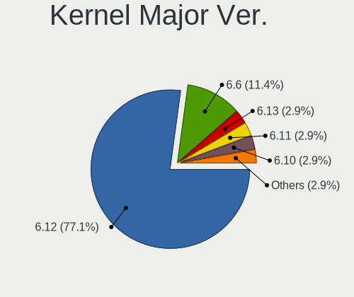
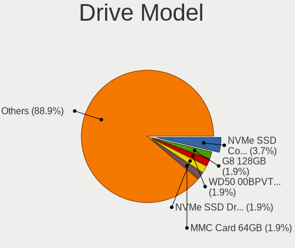
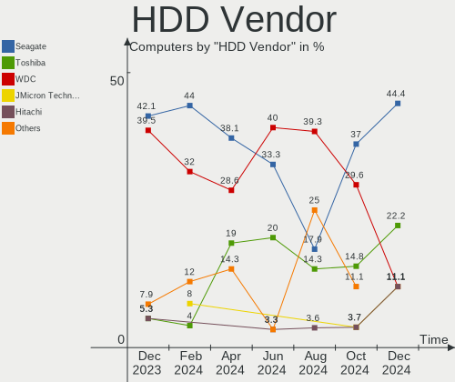
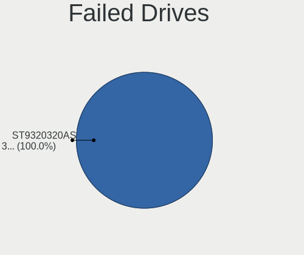
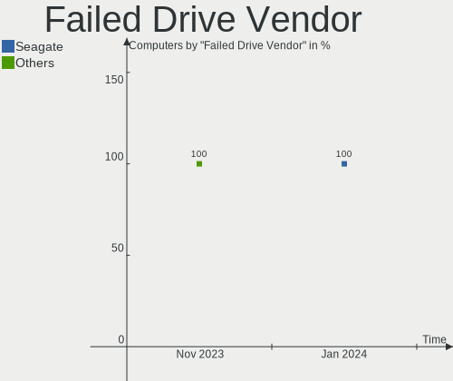

EndeavourOS - Hardware Trends
-----------------------------

A project to identify most popular hardware characteristics and track their change
over time based on data collected by Linux users at https://Linux-Hardware.org.

Anyone can contribute to this report by the [hw-probe](https://github.com/linuxhw/hw-probe) tool:

    sudo -E hw-probe -all -upload

This is a report for all computer types. See also reports for [desktops](/Dist/EndeavourOS/Desktop/README.md) and [notebooks](/Dist/EndeavourOS/Notebook/README.md).

This report is for one last month. Overall report since the beginning of time: [TestDays](https://github.com/linuxhw/TestDays)

Period: Jan, 2024.

Contents
--------

* [ System ](#system)
  - [ OS                       ](#os)
  - [ OS Family                ](#os-family)
  - [ Kernel                   ](#kernel)
  - [ Kernel Family            ](#kernel-family)
  - [ Kernel Major Ver.        ](#kernel-major-ver)
  - [ Arch                     ](#arch)
  - [ DE                       ](#de)
  - [ Display Server           ](#display-server)
  - [ Display Manager          ](#display-manager)
  - [ OS Lang                  ](#os-lang)
  - [ Boot Mode                ](#boot-mode)
  - [ Filesystem               ](#filesystem)
  - [ Part. scheme             ](#part-scheme)
  - [ Dual Boot with Linux/BSD ](#dual-boot-with-linuxbsd)
  - [ Dual Boot (Win)          ](#dual-boot-win)

* [ Board ](#board)
  - [ Vendor                   ](#vendor)
  - [ Model                    ](#model)
  - [ Model Family             ](#model-family)
  - [ MFG Year                 ](#mfg-year)
  - [ Form Factor              ](#form-factor)
  - [ Secure Boot              ](#secure-boot)
  - [ Coreboot                 ](#coreboot)
  - [ RAM Size                 ](#ram-size)
  - [ RAM Used                 ](#ram-used)
  - [ Total Drives             ](#total-drives)
  - [ Has CD-ROM               ](#has-cd-rom)
  - [ Has Ethernet             ](#has-ethernet)
  - [ Has WiFi                 ](#has-wifi)
  - [ Has Bluetooth            ](#has-bluetooth)

* [ Location ](#location)
  - [ Country                  ](#country)
  - [ City                     ](#city)

* [ Drives ](#drives)
  - [ Drive Vendor             ](#drive-vendor)
  - [ Drive Model              ](#drive-model)
  - [ HDD Vendor               ](#hdd-vendor)
  - [ SSD Vendor               ](#ssd-vendor)
  - [ Drive Kind               ](#drive-kind)
  - [ Drive Connector          ](#drive-connector)
  - [ Drive Size               ](#drive-size)
  - [ Space Total              ](#space-total)
  - [ Space Used               ](#space-used)
  - [ Malfunc. Drives          ](#malfunc-drives)
  - [ Malfunc. Drive Vendor    ](#malfunc-drive-vendor)
  - [ Malfunc. HDD Vendor      ](#malfunc-hdd-vendor)
  - [ Malfunc. Drive Kind      ](#malfunc-drive-kind)
  - [ Failed Drives            ](#failed-drives)
  - [ Failed Drive Vendor      ](#failed-drive-vendor)
  - [ Drive Status             ](#drive-status)

* [ Storage controller ](#storage-controller)
  - [ Storage Vendor           ](#storage-vendor)
  - [ Storage Model            ](#storage-model)
  - [ Storage Kind             ](#storage-kind)

* [ Processor ](#processor)
  - [ CPU Vendor               ](#cpu-vendor)
  - [ CPU Model                ](#cpu-model)
  - [ CPU Model Family         ](#cpu-model-family)
  - [ CPU Cores                ](#cpu-cores)
  - [ CPU Sockets              ](#cpu-sockets)
  - [ CPU Threads              ](#cpu-threads)
  - [ CPU Op-Modes             ](#cpu-op-modes)
  - [ CPU Microcode            ](#cpu-microcode)
  - [ CPU Microarch            ](#cpu-microarch)

* [ Graphics ](#graphics)
  - [ GPU Vendor               ](#gpu-vendor)
  - [ GPU Model                ](#gpu-model)
  - [ GPU Combo                ](#gpu-combo)
  - [ GPU Driver               ](#gpu-driver)
  - [ GPU Memory               ](#gpu-memory)

* [ Monitor ](#monitor)
  - [ Monitor Vendor           ](#monitor-vendor)
  - [ Monitor Model            ](#monitor-model)
  - [ Monitor Resolution       ](#monitor-resolution)
  - [ Monitor Diagonal         ](#monitor-diagonal)
  - [ Monitor Width            ](#monitor-width)
  - [ Aspect Ratio             ](#aspect-ratio)
  - [ Monitor Area             ](#monitor-area)
  - [ Pixel Density            ](#pixel-density)
  - [ Multiple Monitors        ](#multiple-monitors)

* [ Network ](#network)
  - [ Net Controller Vendor    ](#net-controller-vendor)
  - [ Net Controller Model     ](#net-controller-model)
  - [ Wireless Vendor          ](#wireless-vendor)
  - [ Wireless Model           ](#wireless-model)
  - [ Ethernet Vendor          ](#ethernet-vendor)
  - [ Ethernet Model           ](#ethernet-model)
  - [ Net Controller Kind      ](#net-controller-kind)
  - [ Used Controller          ](#used-controller)
  - [ NICs                     ](#nics)
  - [ IPv6                     ](#ipv6)

* [ Bluetooth ](#bluetooth)
  - [ Bluetooth Vendor         ](#bluetooth-vendor)
  - [ Bluetooth Model          ](#bluetooth-model)

* [ Sound ](#sound)
  - [ Sound Vendor             ](#sound-vendor)
  - [ Sound Model              ](#sound-model)

* [ Memory ](#memory)
  - [ Memory Vendor            ](#memory-vendor)
  - [ Memory Model             ](#memory-model)
  - [ Memory Kind              ](#memory-kind)
  - [ Memory Form Factor       ](#memory-form-factor)
  - [ Memory Size              ](#memory-size)
  - [ Memory Speed             ](#memory-speed)

* [ Printers & scanners ](#printers--scanners)
  - [ Printer Vendor           ](#printer-vendor)
  - [ Printer Model            ](#printer-model)
  - [ Scanner Vendor           ](#scanner-vendor)
  - [ Scanner Model            ](#scanner-model)

* [ Camera ](#camera)
  - [ Camera Vendor            ](#camera-vendor)
  - [ Camera Model             ](#camera-model)

* [ Security ](#security)
  - [ Fingerprint Vendor       ](#fingerprint-vendor)
  - [ Fingerprint Model        ](#fingerprint-model)
  - [ Chipcard Vendor          ](#chipcard-vendor)
  - [ Chipcard Model           ](#chipcard-model)

* [ Unsupported ](#unsupported)
  - [ Unsupported Devices      ](#unsupported-devices)
  - [ Unsupported Device Types ](#unsupported-device-types)

System
------

OS
--

Installed operating systems

| Name                | Computers | Percent |
|---------------------|-----------|---------|
| EndeavourOS Rolling | 71        | 100%    |

OS Family
---------

OS without a version

| Name        | Computers | Percent |
|-------------|-----------|---------|
| EndeavourOS | 71        | 100%    |

Kernel
------

Version of the Linux kernel

| Version                | Computers | Percent |
|------------------------|-----------|---------|
| 6.7.0-arch3-1          | 12        | 16.9%   |
| 6.6.10-arch1-1         | 10        | 14.08%  |
| 6.6.8-arch1-1          | 6         | 8.45%   |
| 6.7.2-arch1-1          | 5         | 7.04%   |
| 6.7.1-arch1-1          | 4         | 5.63%   |
| 6.7.0-zen3-1-zen       | 4         | 5.63%   |
| 6.6.9-arch1-1          | 4         | 5.63%   |
| 6.6.7-arch1-1          | 4         | 5.63%   |
| 6.6.12-1-lts           | 4         | 5.63%   |
| 6.6.10-zen1-1-zen      | 3         | 4.23%   |
| 6.6.9-zen1-1-zen       | 2         | 2.82%   |
| 6.6.13-1-lts           | 2         | 2.82%   |
| 6.6.11-1-lts           | 2         | 2.82%   |
| 6.6.1-arch1-1          | 2         | 2.82%   |
| 6.7.2-zen1-1-zen       | 1         | 1.41%   |
| 6.6.9-273-tkg-eevdf    | 1         | 1.41%   |
| 6.6.3-arch1-1          | 1         | 1.41%   |
| 6.6.14-1-lts           | 1         | 1.41%   |
| 6.6.11-x64v2-xanmod1-1 | 1         | 1.41%   |
| 6.6.1-273-tkg-eevdf    | 1         | 1.41%   |
| 6.1.69-1-lts           | 1         | 1.41%   |

Kernel Family
-------------

Linux kernel without a distro release

| Version | Computers | Percent |
|---------|-----------|---------|
| 6.7.0   | 16        | 22.54%  |
| 6.6.10  | 13        | 18.31%  |
| 6.6.9   | 7         | 9.86%   |
| 6.7.2   | 6         | 8.45%   |
| 6.6.8   | 6         | 8.45%   |
| 6.7.1   | 4         | 5.63%   |
| 6.6.7   | 4         | 5.63%   |
| 6.6.12  | 4         | 5.63%   |
| 6.6.11  | 3         | 4.23%   |
| 6.6.1   | 3         | 4.23%   |
| 6.6.13  | 2         | 2.82%   |
| 6.6.3   | 1         | 1.41%   |
| 6.6.14  | 1         | 1.41%   |
| 6.1.69  | 1         | 1.41%   |

Kernel Major Ver.
-----------------

Linux kernel major version

| Version | Computers | Percent |
|---------|-----------|---------|
| 6.6     | 44        | 61.97%  |
| 6.7     | 26        | 36.62%  |
| 6.1     | 1         | 1.41%   |

Arch
----

OS architecture (x86_64, i586, etc.)

| Name   | Computers | Percent |
|--------|-----------|---------|
| x86_64 | 71        | 100%    |

DE
--

Desktop Environment

| Name       | Computers | Percent |
|------------|-----------|---------|
| KDE5       | 33        | 46.48%  |
| GNOME      | 14        | 19.72%  |
| XFCE       | 7         | 9.86%   |
| Hyprland   | 4         | 5.63%   |
| i3         | 3         | 4.23%   |
| Budgie     | 2         | 2.82%   |
| X-Cinnamon | 1         | 1.41%   |
| sway       | 1         | 1.41%   |
| qtile      | 1         | 1.41%   |
| LXQt       | 1         | 1.41%   |
| LXDE       | 1         | 1.41%   |
| dwm        | 1         | 1.41%   |
| Cinnamon   | 1         | 1.41%   |
| Unknown    | 1         | 1.41%   |

Display Server
--------------

X11 or Wayland

| Name    | Computers | Percent |
|---------|-----------|---------|
| X11     | 51        | 71.83%  |
| Wayland | 15        | 21.13%  |
| Unknown | 3         | 4.23%   |
| Tty     | 2         | 2.82%   |

Display Manager
---------------

SDDM, LightDM, etc.

| Name    | Computers | Percent |
|---------|-----------|---------|
| SDDM    | 24        | 33.8%   |
| Unknown | 22        | 30.99%  |
| LightDM | 16        | 22.54%  |
| GDM     | 7         | 9.86%   |
| LY-DM   | 1         | 1.41%   |
| LXDM    | 1         | 1.41%   |

OS Lang
-------

Language

| Lang    | Computers | Percent |
|---------|-----------|---------|
| en_US   | 33        | 46.48%  |
| en_GB   | 7         | 9.86%   |
| de_DE   | 6         | 8.45%   |
| it_IT   | 5         | 7.04%   |
| en_CA   | 4         | 5.63%   |
| tr_TR   | 2         | 2.82%   |
| es_CL   | 2         | 2.82%   |
| en_IN   | 2         | 2.82%   |
| de_AT   | 2         | 2.82%   |
| Unknown | 2         | 2.82%   |
| zh_TW   | 1         | 1.41%   |
| ru_RU   | 1         | 1.41%   |
| pl_PL   | 1         | 1.41%   |
| en_ZA   | 1         | 1.41%   |
| en_HK   | 1         | 1.41%   |
| da_DK   | 1         | 1.41%   |

Boot Mode
---------

EFI or BIOS

| Mode | Computers | Percent |
|------|-----------|---------|
| EFI  | 39        | 54.93%  |
| BIOS | 32        | 45.07%  |

Filesystem
----------

Type of filesystem

| Type    | Computers | Percent |
|---------|-----------|---------|
| Ext4    | 54        | 76.06%  |
| Btrfs   | 13        | 18.31%  |
| Overlay | 2         | 2.82%   |
| Xfs     | 1         | 1.41%   |
| Tmpfs   | 1         | 1.41%   |

Part. scheme
------------

Scheme of partitioning

| Type    | Computers | Percent |
|---------|-----------|---------|
| GPT     | 45        | 63.38%  |
| Unknown | 21        | 29.58%  |
| MBR     | 5         | 7.04%   |

Dual Boot with Linux/BSD
------------------------

Hosting more than one Linux/BSD

| Dual boot | Computers | Percent |
|-----------|-----------|---------|
| No        | 62        | 87.32%  |
| Yes       | 9         | 12.68%  |

Dual Boot (Win)
---------------

Hosting Linux and Windows

| Dual boot | Computers | Percent |
|-----------|-----------|---------|
| No        | 50        | 70.42%  |
| Yes       | 21        | 29.58%  |

Board
-----

Vendor
------

Motherboard manufacturer

| Name                | Computers | Percent |
|---------------------|-----------|---------|
| ASUSTek Computer    | 16        | 22.54%  |
| Lenovo              | 12        | 16.9%   |
| Hewlett-Packard     | 10        | 14.08%  |
| Gigabyte Technology | 8         | 11.27%  |
| Dell                | 8         | 11.27%  |
| MSI                 | 4         | 5.63%   |
| Apple               | 3         | 4.23%   |
| Acer                | 3         | 4.23%   |
| System76            | 1         | 1.41%   |
| Sony                | 1         | 1.41%   |
| Monster             | 1         | 1.41%   |
| Framework           | 1         | 1.41%   |
| EVOO                | 1         | 1.41%   |
| Biostar             | 1         | 1.41%   |
| Unknown             | 1         | 1.41%   |

Model
-----

Motherboard model

| Name                                        | Computers | Percent |
|---------------------------------------------|-----------|---------|
| ASUS TUF Gaming X570-PLUS                   | 2         | 2.82%   |
| System76 Gazelle                            | 1         | 1.41%   |
| Sony SVE1713X1EB                            | 1         | 1.41%   |
| MSI MS-7D91                                 | 1         | 1.41%   |
| MSI MS-7D70                                 | 1         | 1.41%   |
| MSI MS-7B89                                 | 1         | 1.41%   |
| MSI MS-7B17                                 | 1         | 1.41%   |
| Monster ABRA A7 V13.3                       | 1         | 1.41%   |
| Lenovo Yoga 730-15IWL 81JS                  | 1         | 1.41%   |
| Lenovo ThinkPad T490 20N2005VMX             | 1         | 1.41%   |
| Lenovo ThinkPad T470s 20HGS3AX02            | 1         | 1.41%   |
| Lenovo ThinkPad L14 Gen 3 21C6S08E00        | 1         | 1.41%   |
| Lenovo ThinkBook 15 G3 ACL 21A4             | 1         | 1.41%   |
| Lenovo Legion Y540-15IRH 81SX               | 1         | 1.41%   |
| Lenovo Legion 5 Pro 16IAH7H 82RF            | 1         | 1.41%   |
| Lenovo Legion 5 15ARH05H 82B1               | 1         | 1.41%   |
| Lenovo IdeaPad Gaming 3 15ACH6 82K2         | 1         | 1.41%   |
| Lenovo IdeaPad 730S-13IWL 81JB              | 1         | 1.41%   |
| Lenovo IdeaPad 5 14IIL05 81YH               | 1         | 1.41%   |
| Lenovo IdeaPad 3 14ALC6 82KT                | 1         | 1.41%   |
| HP Z620 Workstation                         | 1         | 1.41%   |
| HP ProDesk 600 G6 Desktop Mini PC           | 1         | 1.41%   |
| HP ProDesk 400 G2 MINI                      | 1         | 1.41%   |
| HP ProBook 440 G5                           | 1         | 1.41%   |
| HP Pavilion Plus Laptop 14-eh1xxx           | 1         | 1.41%   |
| HP Pavilion All-in-One 24-xa0xxx            | 1         | 1.41%   |
| HP OMEN by Transcend Gaming Laptop 16-u0xxx | 1         | 1.41%   |
| HP Laptop 15-dw0xxx                         | 1         | 1.41%   |
| HP EliteDesk 800 G1 TWR                     | 1         | 1.41%   |
| HP EliteBook 845 14 inch G10 Notebook PC    | 1         | 1.41%   |
| Gigabyte Z790 AORUS ELITE AX                | 1         | 1.41%   |
| Gigabyte Z170X-Gaming 7                     | 1         | 1.41%   |
| Gigabyte B550I AORUS PRO AX                 | 1         | 1.41%   |
| Gigabyte B550 AORUS ELITE V2                | 1         | 1.41%   |
| Gigabyte B450M DS3H                         | 1         | 1.41%   |
| Gigabyte B250M-DS3H                         | 1         | 1.41%   |
| Gigabyte B250M-D3H                          | 1         | 1.41%   |
| Gigabyte 970A-UD3P                          | 1         | 1.41%   |
| Framework Laptop (13th Gen Intel Core)      | 1         | 1.41%   |
| EVOO EG-LP6                                 | 1         | 1.41%   |

Model Family
------------

Motherboard model prefix

| Name                  | Computers | Percent |
|-----------------------|-----------|---------|
| Lenovo IdeaPad        | 4         | 5.63%   |
| ASUS VivoBook         | 4         | 5.63%   |
| Lenovo ThinkPad       | 3         | 4.23%   |
| Lenovo Legion         | 3         | 4.23%   |
| Dell Latitude         | 3         | 4.23%   |
| Dell Inspiron         | 3         | 4.23%   |
| ASUS TUF              | 3         | 4.23%   |
| HP ProDesk            | 2         | 2.82%   |
| HP Pavilion           | 2         | 2.82%   |
| ASUS ROG              | 2         | 2.82%   |
| ASUS ASUS             | 2         | 2.82%   |
| Acer Nitro            | 2         | 2.82%   |
| System76 Gazelle      | 1         | 1.41%   |
| Sony SVE1713X1EB      | 1         | 1.41%   |
| MSI MS-7D91           | 1         | 1.41%   |
| MSI MS-7D70           | 1         | 1.41%   |
| MSI MS-7B89           | 1         | 1.41%   |
| MSI MS-7B17           | 1         | 1.41%   |
| Monster ABRA          | 1         | 1.41%   |
| Lenovo Yoga           | 1         | 1.41%   |
| Lenovo ThinkBook      | 1         | 1.41%   |
| HP Z620               | 1         | 1.41%   |
| HP ProBook            | 1         | 1.41%   |
| HP OMEN               | 1         | 1.41%   |
| HP Laptop             | 1         | 1.41%   |
| HP EliteDesk          | 1         | 1.41%   |
| HP EliteBook          | 1         | 1.41%   |
| Gigabyte Z790         | 1         | 1.41%   |
| Gigabyte Z170X-Gaming | 1         | 1.41%   |
| Gigabyte B550I        | 1         | 1.41%   |
| Gigabyte B550         | 1         | 1.41%   |
| Gigabyte B450M        | 1         | 1.41%   |
| Gigabyte B250M-DS3H   | 1         | 1.41%   |
| Gigabyte B250M-D3H    | 1         | 1.41%   |
| Gigabyte 970A-UD3P    | 1         | 1.41%   |
| Framework Laptop      | 1         | 1.41%   |
| EVOO EG-LP6           | 1         | 1.41%   |
| Dell OptiPlex         | 1         | 1.41%   |
| Dell G3               | 1         | 1.41%   |
| Biostar MCP6P3        | 1         | 1.41%   |

MFG Year
--------

Motherboard manufacture year

| Year | Computers | Percent |
|------|-----------|---------|
| 2019 | 12        | 16.9%   |
| 2021 | 10        | 14.08%  |
| 2022 | 9         | 12.68%  |
| 2020 | 7         | 9.86%   |
| 2018 | 6         | 8.45%   |
| 2023 | 5         | 7.04%   |
| 2016 | 5         | 7.04%   |
| 2012 | 4         | 5.63%   |
| 2017 | 3         | 4.23%   |
| 2013 | 3         | 4.23%   |
| 2009 | 3         | 4.23%   |
| 2015 | 1         | 1.41%   |
| 2014 | 1         | 1.41%   |
| 2011 | 1         | 1.41%   |
| 2007 | 1         | 1.41%   |

Form Factor
-----------

Physical design of the computer

| Name        | Computers | Percent |
|-------------|-----------|---------|
| Notebook    | 38        | 53.52%  |
| Desktop     | 25        | 35.21%  |
| All in one  | 3         | 4.23%   |
| Convertible | 2         | 2.82%   |
| Mini pc     | 2         | 2.82%   |
| Tablet      | 1         | 1.41%   |

Secure Boot
-----------

Enabled or disabled

| State    | Computers | Percent |
|----------|-----------|---------|
| Disabled | 70        | 98.59%  |
| Enabled  | 1         | 1.41%   |

Coreboot
--------

Have coreboot on board

| Used | Computers | Percent |
|------|-----------|---------|
| No   | 70        | 98.59%  |
| Yes  | 1         | 1.41%   |

RAM Size
--------

Total RAM memory

| Size in GB  | Computers | Percent |
|-------------|-----------|---------|
| 32.01-64.0  | 19        | 26.76%  |
| 16.01-24.0  | 15        | 21.13%  |
| 4.01-8.0    | 11        | 15.49%  |
| 8.01-16.0   | 9         | 12.68%  |
| 64.01-256.0 | 8         | 11.27%  |
| 3.01-4.0    | 6         | 8.45%   |
| 24.01-32.0  | 2         | 2.82%   |
| 1.01-2.0    | 1         | 1.41%   |

RAM Used
--------

Used RAM memory

| Used GB    | Computers | Percent |
|------------|-----------|---------|
| 4.01-8.0   | 28        | 39.44%  |
| 2.01-3.0   | 15        | 21.13%  |
| 8.01-16.0  | 11        | 15.49%  |
| 3.01-4.0   | 9         | 12.68%  |
| 1.01-2.0   | 6         | 8.45%   |
| 16.01-24.0 | 1         | 1.41%   |
| 0.51-1.0   | 1         | 1.41%   |

Total Drives
------------

Number of drives on board

| Drives | Computers | Percent |
|--------|-----------|---------|
| 1      | 35        | 49.3%   |
| 2      | 14        | 19.72%  |
| 3      | 11        | 15.49%  |
| 4      | 6         | 8.45%   |
| 6      | 3         | 4.23%   |
| 7      | 1         | 1.41%   |
| 5      | 1         | 1.41%   |

Has CD-ROM
----------

Has CD-ROM on board

| Presented | Computers | Percent |
|-----------|-----------|---------|
| No        | 59        | 83.1%   |
| Yes       | 12        | 16.9%   |

Has Ethernet
------------

Has Ethernet on board

| Presented | Computers | Percent |
|-----------|-----------|---------|
| Yes       | 63        | 88.73%  |
| No        | 8         | 11.27%  |

Has WiFi
--------

Has WiFi module

| Presented | Computers | Percent |
|-----------|-----------|---------|
| Yes       | 62        | 87.32%  |
| No        | 9         | 12.68%  |

Has Bluetooth
-------------

Has Bluetooth module

| Presented | Computers | Percent |
|-----------|-----------|---------|
| Yes       | 57        | 80.28%  |
| No        | 14        | 19.72%  |

Location
--------

Country
-------

Geographic location (country)

| Country      | Computers | Percent |
|--------------|-----------|---------|
| USA          | 16        | 22.54%  |
| Germany      | 7         | 9.86%   |
| UK           | 5         | 7.04%   |
| Italy        | 5         | 7.04%   |
| Canada       | 5         | 7.04%   |
| India        | 4         | 5.63%   |
| Netherlands  | 3         | 4.23%   |
| Taiwan       | 2         | 2.82%   |
| Serbia       | 2         | 2.82%   |
| Poland       | 2         | 2.82%   |
| Chile        | 2         | 2.82%   |
| Austria      | 2         | 2.82%   |
| Vietnam      | 1         | 1.41%   |
| Türkiye     | 1         | 1.41%   |
| Turkey       | 1         | 1.41%   |
| Thailand     | 1         | 1.41%   |
| Sweden       | 1         | 1.41%   |
| South Africa | 1         | 1.41%   |
| Slovakia     | 1         | 1.41%   |
| Moldova      | 1         | 1.41%   |
| Mexico       | 1         | 1.41%   |
| Kazakhstan   | 1         | 1.41%   |
| Isle of Man  | 1         | 1.41%   |
| Hong Kong    | 1         | 1.41%   |
| France       | 1         | 1.41%   |
| Denmark      | 1         | 1.41%   |
| Brazil       | 1         | 1.41%   |
| Belarus      | 1         | 1.41%   |

City
----

Geographic location (city)

| City           | Computers | Percent |
|----------------|-----------|---------|
| Mesa           | 3         | 4.23%   |
| Hyderabad      | 3         | 4.23%   |
| Zirl           | 2         | 2.82%   |
| Taipei         | 2         | 2.82%   |
| Bremen         | 2         | 2.82%   |
| Belgrade       | 2         | 2.82%   |
| Warsaw         | 1         | 1.41%   |
| Virginia Beach | 1         | 1.41%   |
| Viña del Mar  | 1         | 1.41%   |
| Victoria       | 1         | 1.41%   |
| Turin          | 1         | 1.41%   |
| Tamworth       | 1         | 1.41%   |
| Surrey         | 1         | 1.41%   |
| St Louis       | 1         | 1.41%   |
| South Shields  | 1         | 1.41%   |
| South Jordan   | 1         | 1.41%   |
| San Jose       | 1         | 1.41%   |
| Rumia          | 1         | 1.41%   |
| Rome           | 1         | 1.41%   |
| Remchingen     | 1         | 1.41%   |
| Reggio Emilia  | 1         | 1.41%   |
| Ottawa         | 1         | 1.41%   |
| Oristano       | 1         | 1.41%   |
| Oldenzaal      | 1         | 1.41%   |
| Oakland        | 1         | 1.41%   |
| New York       | 1         | 1.41%   |
| New Orleans    | 1         | 1.41%   |
| Naaldwijk      | 1         | 1.41%   |
| Mountville     | 1         | 1.41%   |
| Minsk          | 1         | 1.41%   |
| Mascauti       | 1         | 1.41%   |
| Lund           | 1         | 1.41%   |
| Loupian        | 1         | 1.41%   |
| Los Angeles    | 1         | 1.41%   |
| Lewisham       | 1         | 1.41%   |
| Konya          | 1         | 1.41%   |
| Kokshetau      | 1         | 1.41%   |
| Houston        | 1         | 1.41%   |
| Hertfordshire  | 1         | 1.41%   |
| Hanoi          | 1         | 1.41%   |

Drives
------

Drive Vendor
------------

Hard drive vendors

| Vendor                      | Computers | Drives | Percent |
|-----------------------------|-----------|--------|---------|
| Samsung Electronics         | 27        | 36     | 20.77%  |
| WDC                         | 13        | 15     | 10%     |
| Seagate                     | 13        | 19     | 10%     |
| Sandisk                     | 9         | 9      | 6.92%   |
| Phison Electronics          | 7         | 7      | 5.38%   |
| Toshiba                     | 6         | 7      | 4.62%   |
| SK hynix                    | 6         | 6      | 4.62%   |
| Crucial                     | 6         | 7      | 4.62%   |
| Kingston Technology Company | 5         | 5      | 3.85%   |
| Micron/Crucial Technology   | 4         | 4      | 3.08%   |
| MAXIO Technology (Hangzhou) | 4         | 4      | 3.08%   |
| Kingston                    | 4         | 4      | 3.08%   |
| Intel                       | 3         | 3      | 2.31%   |
| Unknown                     | 2         | 3      | 1.54%   |
| SPCC                        | 2         | 2      | 1.54%   |
| OCZ                         | 2         | 2      | 1.54%   |
| Hitachi                     | 2         | 2      | 1.54%   |
| Apple                       | 2         | 2      | 1.54%   |
| Transcend                   | 1         | 1      | 0.77%   |
| SSK SD30                    | 1         | 1      | 0.77%   |
| Silicon Motion              | 1         | 1      | 0.77%   |
| Realtek Semiconductor       | 1         | 1      | 0.77%   |
| Micron Technology           | 1         | 1      | 0.77%   |
| Maxtor                      | 1         | 2      | 0.77%   |
| KIOXIA                      | 1         | 1      | 0.77%   |
| KingSpec                    | 1         | 1      | 0.77%   |
| Intenso                     | 1         | 1      | 0.77%   |
| Gigastone                   | 1         | 1      | 0.77%   |
| China                       | 1         | 1      | 0.77%   |
| ASMT                        | 1         | 2      | 0.77%   |
| Unknown                     | 1         | 1      | 0.77%   |

Drive Model
-----------

Hard drive models

| Model                                              | Computers | Percent |
|----------------------------------------------------|-----------|---------|
| Samsung NVMe SSD Controller SM981/PM981/PM983 1TB  | 8         | 5.56%   |
| Samsung NVMe SSD Controller PM9A1/PM9A3/980PRO 2TB | 7         | 4.86%   |
| Phison E12 NVMe Controller 1TB                     | 3         | 2.08%   |
| MAXIO (Hangzhou) NVMe SSD Controller MAP1202 512GB | 3         | 2.08%   |
| Kingston SA400S37480G 480GB SSD                    | 3         | 2.08%   |
| WDC WD10EZEX-08WN4A0 1TB                           | 2         | 1.39%   |
| Toshiba DT01ACA100 1TB                             | 2         | 1.39%   |
| Seagate ST2000DM008-2FR102 2TB                     | 2         | 1.39%   |
| Samsung SSD 990 PRO 2TB                            | 2         | 1.39%   |
| Samsung SSD 870 EVO 500GB                          | 2         | 1.39%   |
| Samsung SSD 860 EVO 500GB                          | 2         | 1.39%   |
| Phison E16 PCIe4 NVMe Controller 2TB               | 2         | 1.39%   |
| OCZ VERTEX4 128GB SSD                              | 2         | 1.39%   |
| Micron/Crucial P1 NVMe PCIe SSD 1TB                | 2         | 1.39%   |
| WDC WD6003FZBX-00K5WB0 6TB                         | 1         | 0.69%   |
| WDC WD5000LPLX-16ZNTT1 500GB                       | 1         | 0.69%   |
| WDC WD5000BEVT-35A0RT0 500GB                       | 1         | 0.69%   |
| WDC WD40EFRX-68WT0N0 4TB                           | 1         | 0.69%   |
| WDC WD4003FZEX-00Z4SA0 4TB                         | 1         | 0.69%   |
| WDC WD3200AAJS-40H3A0 320GB                        | 1         | 0.69%   |
| WDC WD2500AAJS-75M0A0 249GB                        | 1         | 0.69%   |
| WDC WD20EFRX-68EUZN0 2TB                           | 1         | 0.69%   |
| WDC WD15EARS-00Z5B1 1TB                            | 1         | 0.69%   |
| WDC WD10EZEX-60ZF5A0 1TB                           | 1         | 0.69%   |
| WDC WD P40 Game Drive 1TB                          | 1         | 0.69%   |
| WDC PC SA530 SDASN8Y256G 256GB SSD                 | 1         | 0.69%   |
| Unknown MMC Card  7GB                              | 1         | 0.69%   |
| Unknown MMC Card  4GB                              | 1         | 0.69%   |
| Unknown MMC Card  128GB                            | 1         | 0.69%   |
| Transcend TS256GSSD230S 256GB                      | 1         | 0.69%   |
| Toshiba MQ04ABD200 2TB                             | 1         | 0.69%   |
| Toshiba MQ01ABD100 1TB                             | 1         | 0.69%   |
| Toshiba HDWR460 6TB                                | 1         | 0.69%   |
| Toshiba HDWL120 2TB                                | 1         | 0.69%   |
| Toshiba HDWE140 4TB                                | 1         | 0.69%   |
| SSK SD30 0 128GB                                   | 1         | 0.69%   |
| SPCC Solid State Disk 240GB                        | 1         | 0.69%   |
| SPCC Solid State Disk 128GB                        | 1         | 0.69%   |
| SK hynix SKHynix_HFM512GD3HX015N 512GB             | 1         | 0.69%   |
| SK hynix SC311 SATA 128GB SSD                      | 1         | 0.69%   |

HDD Vendor
----------

Hard disk drive vendors

| Vendor              | Computers | Drives | Percent |
|---------------------|-----------|--------|---------|
| Seagate             | 12        | 16     | 33.33%  |
| WDC                 | 11        | 13     | 30.56%  |
| Toshiba             | 6         | 7      | 16.67%  |
| Hitachi             | 2         | 2      | 5.56%   |
| Samsung Electronics | 1         | 1      | 2.78%   |
| Maxtor              | 1         | 2      | 2.78%   |
| Intenso             | 1         | 1      | 2.78%   |
| ASMT                | 1         | 2      | 2.78%   |
| Apple               | 1         | 1      | 2.78%   |

SSD Vendor
----------

Solid state drive vendors

| Vendor              | Computers | Drives | Percent |
|---------------------|-----------|--------|---------|
| Samsung Electronics | 10        | 10     | 29.41%  |
| Crucial             | 6         | 7      | 17.65%  |
| Kingston            | 4         | 4      | 11.76%  |
| SPCC                | 2         | 2      | 5.88%   |
| OCZ                 | 2         | 2      | 5.88%   |
| WDC                 | 1         | 1      | 2.94%   |
| Transcend           | 1         | 1      | 2.94%   |
| SK hynix            | 1         | 1      | 2.94%   |
| Seagate             | 1         | 2      | 2.94%   |
| SanDisk             | 1         | 1      | 2.94%   |
| KingSpec            | 1         | 1      | 2.94%   |
| Gigastone           | 1         | 1      | 2.94%   |
| China               | 1         | 1      | 2.94%   |
| Apple               | 1         | 1      | 2.94%   |
| Unknown             | 1         | 1      | 2.94%   |

Drive Kind
----------

HDD or SSD

| Kind    | Computers | Drives | Percent |
|---------|-----------|--------|---------|
| NVMe    | 50        | 65     | 45.87%  |
| HDD     | 28        | 45     | 25.69%  |
| SSD     | 26        | 36     | 23.85%  |
| Unknown | 3         | 3      | 2.75%   |
| MMC     | 2         | 3      | 1.83%   |

Drive Connector
---------------

SATA, SAS, NVMe, etc.

| Type | Computers | Drives | Percent |
|------|-----------|--------|---------|
| NVMe | 50        | 65     | 50.51%  |
| SATA | 37        | 73     | 37.37%  |
| SAS  | 10        | 11     | 10.1%   |
| MMC  | 2         | 3      | 2.02%   |

Drive Size
----------

Size of hard drive

| Size in TB | Computers | Drives | Percent |
|------------|-----------|--------|---------|
| 0.01-0.5   | 29        | 43     | 52.73%  |
| 0.51-1.0   | 12        | 20     | 21.82%  |
| 1.01-2.0   | 7         | 10     | 12.73%  |
| 3.01-4.0   | 4         | 5      | 7.27%   |
| 4.01-10.0  | 2         | 2      | 3.64%   |
| 2.01-3.0   | 1         | 1      | 1.82%   |

Space Total
-----------

Amount of disk space available on the file system

| Size in GB     | Computers | Percent |
|----------------|-----------|---------|
| 251-500        | 20        | 28.17%  |
| 1001-2000      | 13        | 18.31%  |
| 501-1000       | 11        | 15.49%  |
| 101-250        | 10        | 14.08%  |
| More than 3000 | 8         | 11.27%  |
| 1-20           | 4         | 5.63%   |
| 2001-3000      | 2         | 2.82%   |
| Unknown        | 2         | 2.82%   |
| 21-50          | 1         | 1.41%   |

Space Used
----------

Amount of used disk space

| Used GB        | Computers | Percent |
|----------------|-----------|---------|
| 101-250        | 20        | 28.17%  |
| 21-50          | 11        | 15.49%  |
| 1-20           | 10        | 14.08%  |
| 251-500        | 6         | 8.45%   |
| 501-1000       | 6         | 8.45%   |
| 51-100         | 6         | 8.45%   |
| More than 3000 | 4         | 5.63%   |
| 2001-3000      | 3         | 4.23%   |
| 1001-2000      | 2         | 2.82%   |
| Unknown        | 2         | 2.82%   |
| 0              | 1         | 1.41%   |

Malfunc. Drives
---------------

Drive models with a malfunction

| Model                                 | Computers | Drives | Percent |
|---------------------------------------|-----------|--------|---------|
| WDC WD2500AAJS-75M0A0 249GB           | 1         | 1      | 9.09%   |
| WDC WD20EFRX-68EUZN0 2TB              | 1         | 2      | 9.09%   |
| WDC WD15EARS-00Z5B1 1TB               | 1         | 1      | 9.09%   |
| Seagate ST31000528AS 1TB              | 1         | 1      | 9.09%   |
| Seagate ST1000DM003-1CH162 1TB        | 1         | 1      | 9.09%   |
| Samsung Electronics SSD 870 EVO 500GB | 1         | 1      | 9.09%   |
| Samsung Electronics SSD 870 EVO 2TB   | 1         | 1      | 9.09%   |
| Maxtor 6Y080L0 82GB                   | 1         | 2      | 9.09%   |
| Kingston SA400S37480G 480GB SSD       | 1         | 1      | 9.09%   |
| Crucial CT1050MX300SSD1 1050GB        | 1         | 1      | 9.09%   |
| China SSD 500GB                       | 1         | 1      | 9.09%   |

Malfunc. Drive Vendor
---------------------

Vendors of faulty drives

| Vendor              | Computers | Drives | Percent |
|---------------------|-----------|--------|---------|
| WDC                 | 3         | 4      | 30%     |
| Samsung Electronics | 2         | 2      | 20%     |
| Seagate             | 1         | 2      | 10%     |
| Maxtor              | 1         | 2      | 10%     |
| Kingston            | 1         | 1      | 10%     |
| Crucial             | 1         | 1      | 10%     |
| China               | 1         | 1      | 10%     |

Malfunc. HDD Vendor
-------------------

Vendors of faulty HDD drives

| Vendor  | Computers | Drives | Percent |
|---------|-----------|--------|---------|
| WDC     | 3         | 4      | 60%     |
| Seagate | 1         | 2      | 20%     |
| Maxtor  | 1         | 2      | 20%     |

Malfunc. Drive Kind
-------------------

Kinds of faulty drives

| Kind | Computers | Drives | Percent |
|------|-----------|--------|---------|
| SSD  | 5         | 5      | 55.56%  |
| HDD  | 4         | 8      | 44.44%  |

Failed Drives
-------------

Failed drive models

| Model                     | Computers | Drives | Percent |
|---------------------------|-----------|--------|---------|
| Seagate ST9320320AS 320GB | 1         | 1      | 100%    |

Failed Drive Vendor
-------------------

Failed drive vendors

| Vendor  | Computers | Drives | Percent |
|---------|-----------|--------|---------|
| Seagate | 1         | 1      | 100%    |

Drive Status
------------

Number of failed and malfunc. drives

| Status   | Computers | Drives | Percent |
|----------|-----------|--------|---------|
| Works    | 47        | 80     | 53.41%  |
| Detected | 31        | 58     | 35.23%  |
| Malfunc  | 9         | 13     | 10.23%  |
| Failed   | 1         | 1      | 1.14%   |

Storage controller
------------------

Storage Vendor
--------------

Storage controller vendors

| Vendor                      | Computers | Percent |
|-----------------------------|-----------|---------|
| Intel                       | 38        | 32.2%   |
| Samsung Electronics         | 21        | 17.8%   |
| AMD                         | 16        | 13.56%  |
| SanDisk                     | 8         | 6.78%   |
| Phison Electronics          | 7         | 5.93%   |
| SK hynix                    | 5         | 4.24%   |
| Kingston Technology Company | 5         | 4.24%   |
| Micron/Crucial Technology   | 4         | 3.39%   |
| MAXIO Technology (Hangzhou) | 4         | 3.39%   |
| Nvidia                      | 3         | 2.54%   |
| ASMedia Technology          | 2         | 1.69%   |
| Silicon Motion              | 1         | 0.85%   |
| Realtek Semiconductor       | 1         | 0.85%   |
| Micron Technology           | 1         | 0.85%   |
| KIOXIA                      | 1         | 0.85%   |
| JMicron Technology          | 1         | 0.85%   |

Storage Model
-------------

Storage controller models

| Model                                                                          | Computers | Percent |
|--------------------------------------------------------------------------------|-----------|---------|
| AMD FCH SATA Controller [AHCI mode]                                            | 10        | 7.69%   |
| Samsung NVMe SSD Controller SM981/PM981/PM983                                  | 8         | 6.15%   |
| Samsung NVMe SSD Controller PM9A1/PM9A3/980PRO                                 | 7         | 5.38%   |
| Intel 82801 Mobile SATA Controller [RAID mode]                                 | 6         | 4.62%   |
| Samsung NVMe SSD Controller 980 (DRAM-less)                                    | 4         | 3.08%   |
| Phison E12 NVMe Controller                                                     | 3         | 2.31%   |
| MAXIO (Hangzhou) NVMe SSD Controller MAP1202 (DRAM-less)                       | 3         | 2.31%   |
| Intel Volume Management Device NVMe RAID Controller                            | 3         | 2.31%   |
| Intel Tiger Lake SATA AHCI Controller                                          | 3         | 2.31%   |
| Intel Cannon Lake PCH SATA AHCI Controller                                     | 3         | 2.31%   |
| AMD 500 Series Chipset SATA Controller                                         | 3         | 2.31%   |
| SK hynix Gold P31/BC711/PC711 NVMe Solid State Drive                           | 2         | 1.54%   |
| Samsung NVMe SSD Controller S4LV008[Pascal]                                    | 2         | 1.54%   |
| Phison E16 PCIe4 NVMe Controller                                               | 2         | 1.54%   |
| Micron/Crucial P1 NVMe PCIe SSD[Frampton]                                      | 2         | 1.54%   |
| Intel Raptor Lake SATA AHCI Controller                                         | 2         | 1.54%   |
| Intel Q170/Q150/B150/H170/H110/Z170/CM236 Chipset SATA Controller [AHCI Mode]  | 2         | 1.54%   |
| Intel Comet Lake SATA AHCI Controller                                          | 2         | 1.54%   |
| Intel Cannon Lake Mobile PCH SATA AHCI Controller                              | 2         | 1.54%   |
| Intel 8 Series/C220 Series Chipset Family 6-port SATA Controller 1 [AHCI mode] | 2         | 1.54%   |
| Intel 7 Series Chipset Family 6-port SATA Controller [AHCI mode]               | 2         | 1.54%   |
| Intel 200 Series PCH SATA controller [AHCI mode]                               | 2         | 1.54%   |
| ASMedia ASM1061/ASM1062 Serial ATA Controller                                  | 2         | 1.54%   |
| AMD 400 Series Chipset SATA Controller                                         | 2         | 1.54%   |
| SK hynix Platinum P41/PC801 NVMe Solid State Drive                             | 1         | 0.77%   |
| SK hynix BC511 NVMe SSD                                                        | 1         | 0.77%   |
| SK hynix BC501 NVMe Solid State Drive                                          | 1         | 0.77%   |
| Silicon Motion SM2263EN/SM2263XT (DRAM-less) NVMe SSD Controllers              | 1         | 0.77%   |
| SanDisk WD Blue SN500 / PC SN520 x2 M.2 2280 NVMe SSD                          | 1         | 0.77%   |
| Sandisk WD Black SN850X NVMe SSD                                               | 1         | 0.77%   |
| SanDisk Ultra 3D / WD Blue SN570 NVMe SSD (DRAM-less)                          | 1         | 0.77%   |
| SanDisk Ultra 3D / WD Blue SN550 NVMe SSD                                      | 1         | 0.77%   |
| Sandisk PC SN740 NVMe SSD (DRAM-less)                                          | 1         | 0.77%   |
| SanDisk PC SN530 NVMe SSD (DRAM-less)                                          | 1         | 0.77%   |
| SanDisk Extreme Pro / WD Black SN750 / PC SN730 / Red SN700 NVMe SSD           | 1         | 0.77%   |
| SanDisk Extreme Pro / WD Black 2018/SN750/PC SN720 NVMe SSD                    | 1         | 0.77%   |
| Samsung S4LN053X01 AHCI SSD Controller(Apple slot)                             | 1         | 0.77%   |
| Samsung NVMe SSD Controller PM9B1 (DRAM-less)                                  | 1         | 0.77%   |
| Realtek RTS5762 NVMe SSD Controller                                            | 1         | 0.77%   |
| Phison PS5021-E21 PCIe4 NVMe Controller (DRAM-less)                            | 1         | 0.77%   |

Storage Kind
------------

Kind of storage controller (IDE, SATA, NVMe, SAS, ...)

| Kind | Computers | Percent |
|------|-----------|---------|
| NVMe | 50        | 44.64%  |
| SATA | 47        | 41.96%  |
| RAID | 9         | 8.04%   |
| IDE  | 5         | 4.46%   |
| SAS  | 1         | 0.89%   |

Processor
---------

CPU Vendor
----------

Processor vendors

| Vendor | Computers | Percent |
|--------|-----------|---------|
| Intel  | 50        | 70.42%  |
| AMD    | 21        | 29.58%  |

CPU Model
---------

Processor models

| Model                                    | Computers | Percent |
|------------------------------------------|-----------|---------|
| Intel Core i7-8565U CPU @ 1.80GHz        | 4         | 5.63%   |
| Intel 11th Gen Core i7-11800H @ 2.30GHz  | 3         | 4.23%   |
| Intel Core i9-9900K CPU @ 3.60GHz        | 2         | 2.82%   |
| Intel Core i7-9750H CPU @ 2.60GHz        | 2         | 2.82%   |
| Intel Core i5-8265U CPU @ 1.60GHz        | 2         | 2.82%   |
| Intel Core i5-7400 CPU @ 3.00GHz         | 2         | 2.82%   |
| Intel Core i5-7300U CPU @ 2.60GHz        | 2         | 2.82%   |
| Intel 12th Gen Core i7-12700H            | 2         | 2.82%   |
| AMD Athlon II X2 250 Processor           | 2         | 2.82%   |
| Intel Xeon CPU E5-2673 v3 @ 2.40GHz      | 1         | 1.41%   |
| Intel Xeon CPU E5-2650 v2 @ 2.60GHz      | 1         | 1.41%   |
| Intel Xeon CPU E5-1680 v2 @ 3.00GHz      | 1         | 1.41%   |
| Intel Pentium Silver N5030 CPU @ 1.10GHz | 1         | 1.41%   |
| Intel Core i9-14900K                     | 1         | 1.41%   |
| Intel Core i7-8550U CPU @ 1.80GHz        | 1         | 1.41%   |
| Intel Core i7-6700K CPU @ 4.00GHz        | 1         | 1.41%   |
| Intel Core i7-6600U CPU @ 2.60GHz        | 1         | 1.41%   |
| Intel Core i7-3632QM CPU @ 2.20GHz       | 1         | 1.41%   |
| Intel Core i7-10510U CPU @ 1.80GHz       | 1         | 1.41%   |
| Intel Core i5-9400T CPU @ 1.80GHz        | 1         | 1.41%   |
| Intel Core i5-8300H CPU @ 2.30GHz        | 1         | 1.41%   |
| Intel Core i5-6500T CPU @ 2.50GHz        | 1         | 1.41%   |
| Intel Core i5-4590 CPU @ 3.30GHz         | 1         | 1.41%   |
| Intel Core i5-3470 CPU @ 3.20GHz         | 1         | 1.41%   |
| Intel Core i5-3210M CPU @ 2.50GHz        | 1         | 1.41%   |
| Intel Core i5-2450M CPU @ 2.50GHz        | 1         | 1.41%   |
| Intel Core i5-10500T CPU @ 2.30GHz       | 1         | 1.41%   |
| Intel Core i5-1035G1 CPU @ 1.00GHz       | 1         | 1.41%   |
| Intel Core i5-10300H CPU @ 2.50GHz       | 1         | 1.41%   |
| Intel Core i5-10210U CPU @ 1.60GHz       | 1         | 1.41%   |
| Intel Core 2 Duo CPU T7700 @ 2.40GHz     | 1         | 1.41%   |
| Intel Core 2 Duo CPU E8135 @ 2.66GHz     | 1         | 1.41%   |
| Intel Atom x5-Z8350 CPU @ 1.44GHz        | 1         | 1.41%   |
| Intel 13th Gen Core i9-13980HX           | 1         | 1.41%   |
| Intel 13th Gen Core i9-13900HX           | 1         | 1.41%   |
| Intel 13th Gen Core i7-13700KF           | 1         | 1.41%   |
| Intel 13th Gen Core i5-13500H            | 1         | 1.41%   |
| Intel 13th Gen Core i5-1340P             | 1         | 1.41%   |
| Intel 12th Gen Core i7-12700K            | 1         | 1.41%   |
| Intel 12th Gen Core i7-12650H            | 1         | 1.41%   |

CPU Model Family
----------------

Processor model prefix

| Model                | Computers | Percent |
|----------------------|-----------|---------|
| Intel Core i5        | 17        | 23.94%  |
| Other                | 12        | 16.9%   |
| Intel Core i7        | 11        | 15.49%  |
| AMD Ryzen 5          | 7         | 9.86%   |
| AMD Ryzen 7          | 5         | 7.04%   |
| Intel Xeon           | 3         | 4.23%   |
| Intel Core i9        | 3         | 4.23%   |
| AMD Ryzen 9          | 3         | 4.23%   |
| Intel Core 2 Duo     | 2         | 2.82%   |
| AMD Ryzen 7 PRO      | 2         | 2.82%   |
| AMD Athlon II X2     | 2         | 2.82%   |
| Intel Pentium Silver | 1         | 1.41%   |
| Intel Atom           | 1         | 1.41%   |
| AMD Ryzen 3          | 1         | 1.41%   |
| AMD FX               | 1         | 1.41%   |

CPU Cores
---------

Number of processor cores

| Number | Computers | Percent |
|--------|-----------|---------|
| 4      | 24        | 33.8%   |
| 8      | 14        | 19.72%  |
| 6      | 10        | 14.08%  |
| 2      | 9         | 12.68%  |
| 12     | 5         | 7.04%   |
| 24     | 3         | 4.23%   |
| 16     | 3         | 4.23%   |
| 14     | 2         | 2.82%   |
| 10     | 1         | 1.41%   |

CPU Sockets
-----------

Number of sockets

| Number | Computers | Percent |
|--------|-----------|---------|
| 1      | 70        | 98.59%  |
| 2      | 1         | 1.41%   |

CPU Threads
-----------

Threads per core (Hyper-Threading)

| Number | Computers | Percent |
|--------|-----------|---------|
| 2      | 59        | 83.1%   |
| 1      | 12        | 16.9%   |

CPU Op-Modes
------------

CPU Operation Modes (32-bit, 64-bit)

| Op mode        | Computers | Percent |
|----------------|-----------|---------|
| 32-bit, 64-bit | 71        | 100%    |

CPU Microcode
-------------

Microcode number

| Number     | Computers | Percent |
|------------|-----------|---------|
| Unknown    | 61        | 85.92%  |
| 0x0a50000d | 2         | 2.82%   |
| 0x0a20120a | 2         | 2.82%   |
| 0x0a704104 | 1         | 1.41%   |
| 0x0a50000c | 1         | 1.41%   |
| 0x0a20102b | 1         | 1.41%   |
| 0x0a201025 | 1         | 1.41%   |
| 0x08600104 | 1         | 1.41%   |
| 0x0600063e | 1         | 1.41%   |

CPU Microarch
-------------

Microarchitecture

| Name             | Computers | Percent |
|------------------|-----------|---------|
| KabyLake         | 19        | 26.76%  |
| Zen 3            | 10        | 14.08%  |
| Unknown          | 9         | 12.68%  |
| Alderlake Hybrid | 8         | 11.27%  |
| IvyBridge        | 5         | 7.04%   |
| Skylake          | 3         | 4.23%   |
| Zen+             | 2         | 2.82%   |
| Zen 2            | 2         | 2.82%   |
| K10              | 2         | 2.82%   |
| Haswell          | 2         | 2.82%   |
| CometLake        | 2         | 2.82%   |
| Silvermont       | 1         | 1.41%   |
| SandyBridge      | 1         | 1.41%   |
| Penryn           | 1         | 1.41%   |
| IceLake          | 1         | 1.41%   |
| Goldmont plus    | 1         | 1.41%   |
| Core             | 1         | 1.41%   |
| Bulldozer        | 1         | 1.41%   |

Graphics
--------

GPU Vendor
----------

Vendors of graphics cards

| Vendor | Computers | Percent |
|--------|-----------|---------|
| Intel  | 37        | 38.14%  |
| Nvidia | 34        | 35.05%  |
| AMD    | 26        | 26.8%   |

GPU Model
---------

Graphics card models

| Model                                                         | Computers | Percent |
|---------------------------------------------------------------|-----------|---------|
| Intel WhiskeyLake-U GT2 [UHD Graphics 620]                    | 6         | 6.19%   |
| Nvidia GA107M [GeForce RTX 3050 Ti Mobile]                    | 3         | 3.09%   |
| Intel TigerLake-H GT1 [UHD Graphics]                          | 3         | 3.09%   |
| AMD Navi 32 [Radeon RX 7700 XT / 7800 XT]                     | 3         | 3.09%   |
| Nvidia TU116M [GeForce GTX 1660 Ti Mobile]                    | 2         | 2.06%   |
| Nvidia TU106M [GeForce RTX 2060 Mobile]                       | 2         | 2.06%   |
| Nvidia GP108M [GeForce MX230]                                 | 2         | 2.06%   |
| Nvidia GP107M [GeForce GTX 1050 Mobile]                       | 2         | 2.06%   |
| Nvidia GA107M [GeForce RTX 3050 Mobile]                       | 2         | 2.06%   |
| Nvidia GA106 [GeForce RTX 3060 Lite Hash Rate]                | 2         | 2.06%   |
| Nvidia AD106M [GeForce RTX 4070 Max-Q / Mobile]               | 2         | 2.06%   |
| Intel Raptor Lake-S UHD Graphics                              | 2         | 2.06%   |
| Intel Raptor Lake-P [Iris Xe Graphics]                        | 2         | 2.06%   |
| Intel HD Graphics 620                                         | 2         | 2.06%   |
| Intel HD Graphics 530                                         | 2         | 2.06%   |
| Intel CometLake-U GT2 [UHD Graphics]                          | 2         | 2.06%   |
| Intel CoffeeLake-S GT2 [UHD Graphics 630]                     | 2         | 2.06%   |
| Intel CoffeeLake-H GT2 [UHD Graphics 630]                     | 2         | 2.06%   |
| AMD Renoir [Radeon RX Vega 6 (Ryzen 4000/5000 Mobile Series)] | 2         | 2.06%   |
| AMD Navi 22 [Radeon RX 6700/6700 XT/6750 XT / 6800M/6850M XT] | 2         | 2.06%   |
| AMD Lucienne                                                  | 2         | 2.06%   |
| AMD Cezanne [Radeon Vega Series / Radeon Vega Mobile Series]  | 2         | 2.06%   |
| AMD Barcelo                                                   | 2         | 2.06%   |
| Nvidia TU117M [GeForce GTX 1650 Mobile / Max-Q]               | 1         | 1.03%   |
| Nvidia TU116 [GeForce GTX 1660 Ti]                            | 1         | 1.03%   |
| Nvidia TU116 [GeForce GTX 1660 SUPER]                         | 1         | 1.03%   |
| Nvidia TU104 [GeForce RTX 2070 SUPER]                         | 1         | 1.03%   |
| Nvidia GP107 [GeForce GTX 1050]                               | 1         | 1.03%   |
| Nvidia GP106GL [Quadro P2000]                                 | 1         | 1.03%   |
| Nvidia GM108M [GeForce MX130]                                 | 1         | 1.03%   |
| Nvidia GM108M [GeForce MX110]                                 | 1         | 1.03%   |
| Nvidia GK208B [GeForce GT 710]                                | 1         | 1.03%   |
| Nvidia GF119M [NVS 4200M]                                     | 1         | 1.03%   |
| Nvidia GA104M [GeForce RTX 3070 Mobile / Max-Q]               | 1         | 1.03%   |
| Nvidia GA104 [Geforce RTX 3070 Ti Laptop GPU]                 | 1         | 1.03%   |
| Nvidia GA104 [GeForce RTX 3060 Ti]                            | 1         | 1.03%   |
| Nvidia G96C [GeForce 9500 GT]                                 | 1         | 1.03%   |
| Nvidia G84M [GeForce 8600M GT]                                | 1         | 1.03%   |
| Nvidia C79 [GeForce 9400]                                     | 1         | 1.03%   |
| Nvidia AD106 [GeForce RTX 4060 Ti 16GB]                       | 1         | 1.03%   |

GPU Combo
---------

Combinations of graphics cards

| Name           | Computers | Percent |
|----------------|-----------|---------|
| Intel + Nvidia | 19        | 26.76%  |
| 1 x AMD        | 19        | 26.76%  |
| 1 x Intel      | 15        | 21.13%  |
| 1 x Nvidia     | 11        | 15.49%  |
| AMD + Nvidia   | 4         | 5.63%   |
| Intel + AMD    | 2         | 2.82%   |
| 2 x AMD        | 1         | 1.41%   |

GPU Driver
----------

Free vs proprietary

| Driver      | Computers | Percent |
|-------------|-----------|---------|
| Free        | 47        | 66.2%   |
| Proprietary | 24        | 33.8%   |

GPU Memory
----------

Total video memory

| Size in GB | Computers | Percent |
|------------|-----------|---------|
| Unknown    | 40        | 56.34%  |
| 1.01-2.0   | 11        | 15.49%  |
| 8.01-16.0  | 6         | 8.45%   |
| 7.01-8.0   | 4         | 5.63%   |
| 0.01-0.5   | 4         | 5.63%   |
| 5.01-6.0   | 3         | 4.23%   |
| 0.51-1.0   | 2         | 2.82%   |
| 3.01-4.0   | 1         | 1.41%   |

Monitor
-------

Monitor Vendor
--------------

Monitor vendors

| Vendor               | Computers | Percent |
|----------------------|-----------|---------|
| BOE                  | 12        | 12.5%   |
| AU Optronics         | 11        | 11.46%  |
| Dell                 | 9         | 9.38%   |
| Chimei Innolux       | 9         | 9.38%   |
| Samsung Electronics  | 7         | 7.29%   |
| Goldstar             | 5         | 5.21%   |
| Hewlett-Packard      | 4         | 4.17%   |
| Pixio                | 3         | 3.13%   |
| Philips              | 3         | 3.13%   |
| PANDA                | 3         | 3.13%   |
| Lenovo               | 3         | 3.13%   |
| ASUSTek Computer     | 3         | 3.13%   |
| Ancor Communications | 3         | 3.13%   |
| ViewSonic            | 2         | 2.08%   |
| LG Display           | 2         | 2.08%   |
| Gigabyte Technology  | 2         | 2.08%   |
| Acer                 | 2         | 2.08%   |
| Unknown              | 1         | 1.04%   |
| Toshiba              | 1         | 1.04%   |
| Sceptre Tech         | 1         | 1.04%   |
| ONN                  | 1         | 1.04%   |
| MSI                  | 1         | 1.04%   |
| MiTAC                | 1         | 1.04%   |
| LG Electronics       | 1         | 1.04%   |
| IPS                  | 1         | 1.04%   |
| Iiyama               | 1         | 1.04%   |
| HVR                  | 1         | 1.04%   |
| Eizo                 | 1         | 1.04%   |
| Apple                | 1         | 1.04%   |
| AOC                  | 1         | 1.04%   |

Monitor Model
-------------

Monitor models

| Model                                                                 | Computers | Percent |
|-----------------------------------------------------------------------|-----------|---------|
| Pixio U29I WAM2900 2560x1080 690x260mm 29.0-inch                      | 3         | 3.13%   |
| PANDA LCD Monitor NCP004D 1920x1080 344x194mm 15.5-inch               | 3         | 3.13%   |
| Chimei Innolux LCD Monitor CMN15F5 1920x1080 344x193mm 15.5-inch      | 2         | 2.08%   |
| AU Optronics LCD Monitor AUOC199 2560x1600 344x215mm 16.0-inch        | 2         | 2.08%   |
| ViewSonic VX2457 VSCB931 1920x1080 521x293mm 23.5-inch                | 1         | 1.04%   |
| ViewSonic VX2450 SERIES VSCE226 1920x1080 525x297mm 23.7-inch         | 1         | 1.04%   |
| Unknown LCD Monitor FFFF 2288x1287 2550x2550mm 142.0-inch             | 1         | 1.04%   |
| Toshiba ScreenXpert TSB8888 1080x2160                                 | 1         | 1.04%   |
| Sceptre Tech Sceptre F24 SPT09AB 1920x1080 530x290mm 23.8-inch        | 1         | 1.04%   |
| Samsung Electronics U32J59x SAM0F52 3840x2160 697x392mm 31.5-inch     | 1         | 1.04%   |
| Samsung Electronics SMBX2031 SAM076A 1600x900 443x249mm 20.0-inch     | 1         | 1.04%   |
| Samsung Electronics S24F350 SAM0D20 1920x1080 521x293mm 23.5-inch     | 1         | 1.04%   |
| Samsung Electronics LF24T35 SAM707D 1920x1080 528x297mm 23.9-inch     | 1         | 1.04%   |
| Samsung Electronics LCD Monitor SDC4178 3200x2000 344x215mm 16.0-inch | 1         | 1.04%   |
| Samsung Electronics LCD Monitor SDC4170 2880x1800 302x189mm 14.0-inch | 1         | 1.04%   |
| Samsung Electronics C27JG5x SAM0F58 2560x1440 597x336mm 27.0-inch     | 1         | 1.04%   |
| Philips PHL 246E9Q PHLC17C 1920x1080 527x296mm 23.8-inch              | 1         | 1.04%   |
| Philips PHL 242E1GJ PHLC244 1920x1080 527x296mm 23.8-inch             | 1         | 1.04%   |
| Philips 224E PHLC053 1920x1080 476x268mm 21.5-inch                    | 1         | 1.04%   |
| ONN 100002487 ONN0101 1920x1080 517x323mm 24.0-inch                   | 1         | 1.04%   |
| MSI MAG274QRF-QD MSI3CA8 2560x1440 597x336mm 27.0-inch                | 1         | 1.04%   |
| MiTAC MON-SIS289 MTC0289 1920x1080 930x530mm 42.1-inch                | 1         | 1.04%   |
| LG Electronics LCD Monitor W1954 1440x900                             | 1         | 1.04%   |
| LG Display LCD Monitor LGD0544 1920x1080 276x156mm 12.5-inch          | 1         | 1.04%   |
| LG Display LCD Monitor LGD02EB 1366x768 309x174mm 14.0-inch           | 1         | 1.04%   |
| Lenovo Y27h-30 LEN66F6 2560x1440 597x336mm 27.0-inch                  | 1         | 1.04%   |
| Lenovo Q24h-10 LEN66A8 2560x1440 526x296mm 23.8-inch                  | 1         | 1.04%   |
| Lenovo LEN L28u-30 LEN65FA 3840x2160 620x340mm 27.8-inch              | 1         | 1.04%   |
| IPS HDMI IPS0001 1920x1080                                            | 1         | 1.04%   |
| Iiyama PL2530H IVM6133 1920x1080 540x300mm 24.3-inch                  | 1         | 1.04%   |
| HVR HTC-VIVE HVRAA01 2160x1200                                        | 1         | 1.04%   |
| Hewlett-Packard P34hc G4 HPN36FB 3440x1440 797x334mm 34.0-inch        | 1         | 1.04%   |
| Hewlett-Packard LA2306 HWP2949 1920x1080 509x286mm 23.0-inch          | 1         | 1.04%   |
| Hewlett-Packard E271i HWP3106 1920x1080 600x340mm 27.2-inch           | 1         | 1.04%   |
| Hewlett-Packard ALL-in-One HPN4025 1920x1080 527x296mm 23.8-inch      | 1         | 1.04%   |
| Goldstar HDR WFHD GSM7714 2560x1080 798x334mm 34.1-inch               | 1         | 1.04%   |
| Goldstar HDR 4K GSM7707 3840x2160 600x340mm 27.2-inch                 | 1         | 1.04%   |
| Goldstar E2360 GSM57E4 1920x1080 510x290mm 23.1-inch                  | 1         | 1.04%   |
| Goldstar E2350 GSM5791 1920x1080 510x290mm 23.1-inch                  | 1         | 1.04%   |
| Goldstar 27GL650F GSM5B70 1920x1080 531x298mm 24.0-inch               | 1         | 1.04%   |

Monitor Resolution
------------------

Monitor screen resolution

| Resolution         | Computers | Percent |
|--------------------|-----------|---------|
| 1920x1080 (FHD)    | 42        | 50%     |
| 3840x2160 (4K)     | 6         | 7.14%   |
| 2560x1600          | 5         | 5.95%   |
| 2560x1440 (QHD)    | 5         | 5.95%   |
| 2560x1080          | 4         | 4.76%   |
| 1366x768 (WXGA)    | 4         | 4.76%   |
| 3440x1440          | 3         | 3.57%   |
| 1600x900 (HD+)     | 2         | 2.38%   |
| 1440x900 (WXGA+)   | 2         | 2.38%   |
| 1280x1024 (SXGA)   | 2         | 2.38%   |
| 3840x1080          | 1         | 1.19%   |
| 3200x2000          | 1         | 1.19%   |
| 2880x1800          | 1         | 1.19%   |
| 2288x1287          | 1         | 1.19%   |
| 2256x1504          | 1         | 1.19%   |
| 2160x1200          | 1         | 1.19%   |
| 1920x1200 (WUXGA)  | 1         | 1.19%   |
| 1680x1050 (WSXGA+) | 1         | 1.19%   |
| 1600x1200          | 1         | 1.19%   |

Monitor Diagonal
----------------

Diagonal size in inches

| Inches  | Computers | Percent |
|---------|-----------|---------|
| 15      | 14        | 14.89%  |
| 24      | 10        | 10.64%  |
| 23      | 8         | 8.51%   |
| 14      | 8         | 8.51%   |
| 27      | 7         | 7.45%   |
| 13      | 7         | 7.45%   |
| 31      | 5         | 5.32%   |
| 16      | 5         | 5.32%   |
| 21      | 4         | 4.26%   |
| 20      | 4         | 4.26%   |
| 17      | 4         | 4.26%   |
| 34      | 3         | 3.19%   |
| 29      | 3         | 3.19%   |
| 19      | 2         | 2.13%   |
| Unknown | 2         | 2.13%   |
| 142     | 1         | 1.06%   |
| 86      | 1         | 1.06%   |
| 49      | 1         | 1.06%   |
| 42      | 1         | 1.06%   |
| 35      | 1         | 1.06%   |
| 32      | 1         | 1.06%   |
| 18      | 1         | 1.06%   |
| 12      | 1         | 1.06%   |

Monitor Width
-------------

Physical width

| Width in mm    | Computers | Percent |
|----------------|-----------|---------|
| 301-350        | 32        | 35.16%  |
| 501-600        | 20        | 21.98%  |
| 601-700        | 10        | 10.99%  |
| 401-500        | 9         | 9.89%   |
| 351-400        | 6         | 6.59%   |
| 701-800        | 4         | 4.4%    |
| 201-300        | 3         | 3.3%    |
| 1001-1500      | 2         | 2.2%    |
| Unknown        | 2         | 2.2%    |
| More than 2000 | 1         | 1.1%    |
| 801-900        | 1         | 1.1%    |
| 901-1000       | 1         | 1.1%    |

Aspect Ratio
------------

Proportional relationship between the width and the height

| Ratio   | Computers | Percent |
|---------|-----------|---------|
| 16/9    | 53        | 67.95%  |
| 16/10   | 10        | 12.82%  |
| 21/9    | 4         | 5.13%   |
| 2.65    | 3         | 3.85%   |
| 5/4     | 2         | 2.56%   |
| 4/3     | 1         | 1.28%   |
| 32/9    | 1         | 1.28%   |
| 3/2     | 1         | 1.28%   |
| 1.00    | 1         | 1.28%   |
| 0.56    | 1         | 1.28%   |
| Unknown | 1         | 1.28%   |

Monitor Area
------------

Area in inch²

| Area in inch² | Computers | Percent |
|----------------|-----------|---------|
| 201-250        | 18        | 19.57%  |
| 81-90          | 14        | 15.22%  |
| 101-110        | 13        | 14.13%  |
| 351-500        | 10        | 10.87%  |
| 301-350        | 7         | 7.61%   |
| 151-200        | 7         | 7.61%   |
| 111-120        | 5         | 5.43%   |
| 251-300        | 4         | 4.35%   |
| 121-130        | 3         | 3.26%   |
| More than 1000 | 2         | 2.17%   |
| 501-1000       | 2         | 2.17%   |
| Unknown        | 2         | 2.17%   |
| 71-80          | 1         | 1.09%   |
| 61-70          | 1         | 1.09%   |
| 141-150        | 1         | 1.09%   |
| 131-140        | 1         | 1.09%   |
| 91-100         | 1         | 1.09%   |

Pixel Density
-------------

Pixels per inch

| Density       | Computers | Percent |
|---------------|-----------|---------|
| 51-100        | 33        | 35.87%  |
| 121-160       | 30        | 32.61%  |
| 101-120       | 13        | 14.13%  |
| 161-240       | 11        | 11.96%  |
| 1-50          | 2         | 2.17%   |
| Unknown       | 2         | 2.17%   |
| More than 240 | 1         | 1.09%   |

Multiple Monitors
-----------------

Total monitors connected

| Total | Computers | Percent |
|-------|-----------|---------|
| 1     | 43        | 60.56%  |
| 2     | 24        | 33.8%   |
| 3     | 3         | 4.23%   |
| 0     | 1         | 1.41%   |

Network
-------

Net Controller Vendor
---------------------

Controller vendors

| Vendor                          | Computers | Percent |
|---------------------------------|-----------|---------|
| Intel                           | 45        | 39.47%  |
| Realtek Semiconductor           | 42        | 36.84%  |
| Qualcomm Atheros                | 5         | 4.39%   |
| MediaTek                        | 5         | 4.39%   |
| Nvidia                          | 3         | 2.63%   |
| Cypress Semiconductor           | 3         | 2.63%   |
| Broadcom                        | 3         | 2.63%   |
| Qualcomm                        | 2         | 1.75%   |
| Microsoft                       | 2         | 1.75%   |
| D-Link                          | 2         | 1.75%   |
| Qualcomm Atheros Communications | 1         | 0.88%   |
| DisplayLink                     | 1         | 0.88%   |

Net Controller Model
--------------------

Controller models

| Model                                                                         | Computers | Percent |
|-------------------------------------------------------------------------------|-----------|---------|
| Realtek RTL8111/8168/8211/8411 PCI Express Gigabit Ethernet Controller        | 29        | 21.48%  |
| Realtek RTL8125 2.5GbE Controller                                             | 5         | 3.7%    |
| Intel Wi-Fi 6 AX200                                                           | 5         | 3.7%    |
| Intel Wi-Fi 5(802.11ac) Wireless-AC 9x6x [Thunder Peak]                       | 5         | 3.7%    |
| Intel Cannon Lake PCH CNVi WiFi                                               | 4         | 2.96%   |
| Realtek RTL8821CE 802.11ac PCIe Wireless Network Adapter                      | 3         | 2.22%   |
| Intel Wireless 8265 / 8275                                                    | 3         | 2.22%   |
| Intel Tiger Lake PCH CNVi WiFi                                                | 3         | 2.22%   |
| Intel Raptor Lake-S PCH CNVi WiFi                                             | 3         | 2.22%   |
| Intel Ethernet Controller I225-V                                              | 3         | 2.22%   |
| Intel Alder Lake-P PCH CNVi WiFi                                              | 3         | 2.22%   |
| Intel 82579LM Gigabit Network Connection (Lewisville)                         | 3         | 2.22%   |
| Cypress K38231_03                                                             | 3         | 2.22%   |
| Realtek RTL8822CE 802.11ac PCIe Wireless Network Adapter                      | 2         | 1.48%   |
| Realtek RTL8153 Gigabit Ethernet Adapter                                      | 2         | 1.48%   |
| Realtek Killer E2600 GbE Controller                                           | 2         | 1.48%   |
| Qualcomm QCNFA765 Wireless Network Adapter                                    | 2         | 1.48%   |
| Qualcomm Atheros QCA9377 802.11ac Wireless Network Adapter                    | 2         | 1.48%   |
| MediaTek MT7922 802.11ax PCI Express Wireless Network Adapter                 | 2         | 1.48%   |
| MediaTek MT7921 802.11ax PCI Express Wireless Network Adapter                 | 2         | 1.48%   |
| Intel Wi-Fi 6E(802.11ax) AX210/AX1675* 2x2 [Typhoon Peak]                     | 2         | 1.48%   |
| Intel Raptor Lake PCH CNVi WiFi                                               | 2         | 1.48%   |
| Intel Ethernet Connection (7) I219-V                                          | 2         | 1.48%   |
| Intel Ethernet Connection (4) I219-LM                                         | 2         | 1.48%   |
| Intel Ethernet Connection (2) I219-V                                          | 2         | 1.48%   |
| Intel Comet Lake PCH-LP CNVi WiFi                                             | 2         | 1.48%   |
| Intel Cannon Point-LP CNVi [Wireless-AC]                                      | 2         | 1.48%   |
| Realtek RTL88x2bu [AC1200 Techkey]                                            | 1         | 0.74%   |
| Realtek RTL8822BE 802.11a/b/g/n/ac WiFi adapter                               | 1         | 0.74%   |
| Realtek RTL8188EUS 802.11n Wireless Network Adapter                           | 1         | 0.74%   |
| Realtek RTL8169 PCI Gigabit Ethernet Controller                               | 1         | 0.74%   |
| Realtek RTL8111/8168/8411 PCI Express Gigabit Ethernet Controller             | 1         | 0.74%   |
| Realtek RTL810xE PCI Express Fast Ethernet controller                         | 1         | 0.74%   |
| Qualcomm Atheros Killer E2400 Gigabit Ethernet Controller                     | 1         | 0.74%   |
| Qualcomm Atheros TP-Link TL-WN821N v2 / TL-WN822N v1 802.11n [Atheros AR9170] | 1         | 0.74%   |
| Qualcomm Atheros Attansic L1 Gigabit Ethernet                                 | 1         | 0.74%   |
| Qualcomm Atheros AR9485 Wireless Network Adapter                              | 1         | 0.74%   |
| Nvidia MCP79 Ethernet                                                         | 1         | 0.74%   |
| Nvidia MCP77 Ethernet                                                         | 1         | 0.74%   |
| Nvidia MCP61 Ethernet                                                         | 1         | 0.74%   |

Wireless Vendor
---------------

Wireless vendors

| Vendor                          | Computers | Percent |
|---------------------------------|-----------|---------|
| Intel                           | 39        | 60%     |
| Realtek Semiconductor           | 8         | 12.31%  |
| MediaTek                        | 5         | 7.69%   |
| Qualcomm Atheros                | 3         | 4.62%   |
| Broadcom                        | 3         | 4.62%   |
| Qualcomm                        | 2         | 3.08%   |
| Microsoft                       | 2         | 3.08%   |
| D-Link                          | 2         | 3.08%   |
| Qualcomm Atheros Communications | 1         | 1.54%   |

Wireless Model
--------------

Wireless models

| Model                                                                         | Computers | Percent |
|-------------------------------------------------------------------------------|-----------|---------|
| Intel Wi-Fi 6 AX200                                                           | 5         | 7.58%   |
| Intel Wi-Fi 5(802.11ac) Wireless-AC 9x6x [Thunder Peak]                       | 5         | 7.58%   |
| Intel Cannon Lake PCH CNVi WiFi                                               | 4         | 6.06%   |
| Realtek RTL8821CE 802.11ac PCIe Wireless Network Adapter                      | 3         | 4.55%   |
| Intel Wireless 8265 / 8275                                                    | 3         | 4.55%   |
| Intel Tiger Lake PCH CNVi WiFi                                                | 3         | 4.55%   |
| Intel Raptor Lake-S PCH CNVi WiFi                                             | 3         | 4.55%   |
| Intel Alder Lake-P PCH CNVi WiFi                                              | 3         | 4.55%   |
| Realtek RTL8822CE 802.11ac PCIe Wireless Network Adapter                      | 2         | 3.03%   |
| Qualcomm QCNFA765 Wireless Network Adapter                                    | 2         | 3.03%   |
| Qualcomm Atheros QCA9377 802.11ac Wireless Network Adapter                    | 2         | 3.03%   |
| MediaTek MT7922 802.11ax PCI Express Wireless Network Adapter                 | 2         | 3.03%   |
| MediaTek MT7921 802.11ax PCI Express Wireless Network Adapter                 | 2         | 3.03%   |
| Intel Wi-Fi 6E(802.11ax) AX210/AX1675* 2x2 [Typhoon Peak]                     | 2         | 3.03%   |
| Intel Raptor Lake PCH CNVi WiFi                                               | 2         | 3.03%   |
| Intel Comet Lake PCH-LP CNVi WiFi                                             | 2         | 3.03%   |
| Intel Cannon Point-LP CNVi [Wireless-AC]                                      | 2         | 3.03%   |
| Realtek RTL88x2bu [AC1200 Techkey]                                            | 1         | 1.52%   |
| Realtek RTL8822BE 802.11a/b/g/n/ac WiFi adapter                               | 1         | 1.52%   |
| Realtek RTL8188EUS 802.11n Wireless Network Adapter                           | 1         | 1.52%   |
| Qualcomm Atheros TP-Link TL-WN821N v2 / TL-WN822N v1 802.11n [Atheros AR9170] | 1         | 1.52%   |
| Qualcomm Atheros AR9485 Wireless Network Adapter                              | 1         | 1.52%   |
| Microsoft Xbox Wireless Adapter for Windows                                   | 1         | 1.52%   |
| Microsoft Xbox 360 Wireless Adapter                                           | 1         | 1.52%   |
| MediaTek Wi-Fi 6E MT7902 Wireless Network Adapter                             | 1         | 1.52%   |
| Intel Wireless 8260                                                           | 1         | 1.52%   |
| Intel PRO/Wireless 4965 AG or AGN [Kedron] Network Connection                 | 1         | 1.52%   |
| Intel Ice Lake-LP PCH CNVi WiFi                                               | 1         | 1.52%   |
| Intel Comet Lake PCH CNVi WiFi                                                | 1         | 1.52%   |
| Intel Centrino Ultimate-N 6300                                                | 1         | 1.52%   |
| Intel Alder Lake-S PCH CNVi WiFi                                              | 1         | 1.52%   |
| D-Link 802.11ac NIC                                                           | 1         | 1.52%   |
| D-Link 802.11 n WLAN                                                          | 1         | 1.52%   |
| Broadcom BCM4360 802.11ac Dual Band Wireless Network Adapter                  | 1         | 1.52%   |
| Broadcom BCM4331 802.11a/b/g/n                                                | 1         | 1.52%   |
| Broadcom BCM4322 802.11a/b/g/n Wireless LAN Controller                        | 1         | 1.52%   |

Ethernet Vendor
---------------

Ethernet vendors

| Vendor                | Computers | Percent |
|-----------------------|-----------|---------|
| Realtek Semiconductor | 39        | 59.09%  |
| Intel                 | 16        | 24.24%  |
| Nvidia                | 3         | 4.55%   |
| Cypress Semiconductor | 3         | 4.55%   |
| Qualcomm Atheros      | 2         | 3.03%   |
| Broadcom              | 2         | 3.03%   |
| DisplayLink           | 1         | 1.52%   |

Ethernet Model
--------------

Ethernet models

| Model                                                                  | Computers | Percent |
|------------------------------------------------------------------------|-----------|---------|
| Realtek RTL8111/8168/8211/8411 PCI Express Gigabit Ethernet Controller | 29        | 42.03%  |
| Realtek RTL8125 2.5GbE Controller                                      | 5         | 7.25%   |
| Intel Ethernet Controller I225-V                                       | 3         | 4.35%   |
| Intel 82579LM Gigabit Network Connection (Lewisville)                  | 3         | 4.35%   |
| Cypress K38231_03                                                      | 3         | 4.35%   |
| Realtek RTL8153 Gigabit Ethernet Adapter                               | 2         | 2.9%    |
| Realtek Killer E2600 GbE Controller                                    | 2         | 2.9%    |
| Intel Ethernet Connection (7) I219-V                                   | 2         | 2.9%    |
| Intel Ethernet Connection (4) I219-LM                                  | 2         | 2.9%    |
| Intel Ethernet Connection (2) I219-V                                   | 2         | 2.9%    |
| Realtek RTL8169 PCI Gigabit Ethernet Controller                        | 1         | 1.45%   |
| Realtek RTL8111/8168/8411 PCI Express Gigabit Ethernet Controller      | 1         | 1.45%   |
| Realtek RTL810xE PCI Express Fast Ethernet controller                  | 1         | 1.45%   |
| Qualcomm Atheros Killer E2400 Gigabit Ethernet Controller              | 1         | 1.45%   |
| Qualcomm Atheros Attansic L1 Gigabit Ethernet                          | 1         | 1.45%   |
| Nvidia MCP79 Ethernet                                                  | 1         | 1.45%   |
| Nvidia MCP77 Ethernet                                                  | 1         | 1.45%   |
| Nvidia MCP61 Ethernet                                                  | 1         | 1.45%   |
| Intel Ethernet Connection I219-LM                                      | 1         | 1.45%   |
| Intel Ethernet Connection I217-LM                                      | 1         | 1.45%   |
| Intel Ethernet Connection (6) I219-V                                   | 1         | 1.45%   |
| Intel Ethernet Connection (11) I219-LM                                 | 1         | 1.45%   |
| Intel 82574L Gigabit Network Connection                                | 1         | 1.45%   |
| DisplayLink USB3.0 Dual Video Dock                                     | 1         | 1.45%   |
| Broadcom NetXtreme BCM57766 Gigabit Ethernet PCIe                      | 1         | 1.45%   |
| Broadcom NetXtreme BCM57762 Gigabit Ethernet PCIe                      | 1         | 1.45%   |

Net Controller Kind
-------------------

Ethernet, WiFi or modem

| Kind     | Computers | Percent |
|----------|-----------|---------|
| Ethernet | 63        | 50.4%   |
| WiFi     | 62        | 49.6%   |

Used Controller
---------------

Currently used network controller

| Kind     | Computers | Percent |
|----------|-----------|---------|
| WiFi     | 52        | 65.82%  |
| Ethernet | 27        | 34.18%  |

NICs
----

Total network controllers on board

| Total | Computers | Percent |
|-------|-----------|---------|
| 2     | 47        | 66.2%   |
| 1     | 22        | 30.99%  |
| 4     | 1         | 1.41%   |
| 3     | 1         | 1.41%   |

IPv6
----

IPv6 vs IPv4

| Used | Computers | Percent |
|------|-----------|---------|
| No   | 44        | 61.97%  |
| Yes  | 27        | 38.03%  |

Bluetooth
---------

Bluetooth Vendor
----------------

Controller vendors

| Vendor                   | Computers | Percent |
|--------------------------|-----------|---------|
| Intel                    | 36        | 61.02%  |
| Realtek Semiconductor    | 4         | 6.78%   |
| IMC Networks             | 4         | 6.78%   |
| Foxconn / Hon Hai        | 4         | 6.78%   |
| Cambridge Silicon Radio  | 3         | 5.08%   |
| Apple                    | 3         | 5.08%   |
| Lite-On Technology       | 2         | 3.39%   |
| MediaTek                 | 1         | 1.69%   |
| HTC (High Tech Computer) | 1         | 1.69%   |
| ASUSTek Computer         | 1         | 1.69%   |

Bluetooth Model
---------------

Controller models

| Model                                                                | Computers | Percent |
|----------------------------------------------------------------------|-----------|---------|
| Intel AX201 Bluetooth                                                | 8         | 13.33%  |
| Intel Bluetooth Device                                               | 7         | 11.67%  |
| Intel Bluetooth 9460/9560 Jefferson Peak (JfP)                       | 7         | 11.67%  |
| Intel Wireless-AC 9260 Bluetooth Adapter                             | 5         | 8.33%   |
| Intel Bluetooth wireless interface                                   | 4         | 6.67%   |
| Intel AX200 Bluetooth                                                | 4         | 6.67%   |
| Realtek  Bluetooth 4.2 Adapter                                       | 3         | 5%      |
| Cambridge Silicon Radio Bluetooth Dongle (HCI mode)                  | 3         | 5%      |
| Intel AX210 Bluetooth                                                | 2         | 3.33%   |
| IMC Networks Wireless_Device                                         | 2         | 3.33%   |
| Foxconn / Hon Hai Wireless_Device                                    | 2         | 3.33%   |
| Foxconn / Hon Hai Bluetooth Device                                   | 2         | 3.33%   |
| Realtek Bluetooth Radio                                              | 1         | 1.67%   |
| MediaTek Wireless_Device                                             | 1         | 1.67%   |
| Lite-On Qualcomm Atheros QCA9377 Bluetooth                           | 1         | 1.67%   |
| Lite-On Bluetooth Radio                                              | 1         | 1.67%   |
| IMC Networks Bluetooth Radio                                         | 1         | 1.67%   |
| IMC Networks Bluetooth Device                                        | 1         | 1.67%   |
| HTC (High Tech Computer) Vive Hub Bluetooth 4.1 (Broadcom BCM920703) | 1         | 1.67%   |
| ASUS BT-183 Bluetooth 2.0+EDR adapter                                | 1         | 1.67%   |
| Apple Built-in Bluetooth 2.0+EDR HCI                                 | 1         | 1.67%   |
| Apple Bluetooth USB Host Controller                                  | 1         | 1.67%   |
| Apple Bluetooth Host Controller                                      | 1         | 1.67%   |

Sound
-----

Sound Vendor
------------

Sound card vendors

| Vendor                     | Computers | Percent |
|----------------------------|-----------|---------|
| Intel                      | 48        | 36.64%  |
| Nvidia                     | 27        | 20.61%  |
| AMD                        | 24        | 18.32%  |
| C-Media Electronics        | 6         | 4.58%   |
| Texas Instruments          | 4         | 3.05%   |
| Razer USA                  | 3         | 2.29%   |
| SteelSeries ApS            | 2         | 1.53%   |
| Sony                       | 2         | 1.53%   |
| Micro Star International   | 2         | 1.53%   |
| Logitech                   | 2         | 1.53%   |
| Kingston Technology        | 2         | 1.53%   |
| Yealink Network Technology | 1         | 0.76%   |
| Trust                      | 1         | 0.76%   |
| Realtek Semiconductor      | 1         | 0.76%   |
| Lenovo                     | 1         | 0.76%   |
| Generalplus Technology     | 1         | 0.76%   |
| Focusrite-Novation         | 1         | 0.76%   |
| Creative Technology        | 1         | 0.76%   |
| Corsair                    | 1         | 0.76%   |
| Anlya.cn                   | 1         | 0.76%   |

Sound Model
-----------

Sound card models

| Model                                                               | Computers | Percent |
|---------------------------------------------------------------------|-----------|---------|
| AMD Family 17h/19h HD Audio Controller                              | 12        | 7.95%   |
| AMD Renoir Radeon High Definition Audio Controller                  | 8         | 5.3%    |
| Nvidia Audio device                                                 | 6         | 3.97%   |
| Intel Cannon Point-LP High Definition Audio Controller              | 6         | 3.97%   |
| Intel Cannon Lake PCH cAVS                                          | 6         | 3.97%   |
| AMD Starship/Matisse HD Audio Controller                            | 5         | 3.31%   |
| AMD Navi 21/23 HDMI/DP Audio Controller                             | 5         | 3.31%   |
| Nvidia TU116 High Definition Audio Controller                       | 4         | 2.65%   |
| Intel Sunrise Point-LP HD Audio                                     | 4         | 2.65%   |
| Intel Raptor Lake High Definition Audio Controller                  | 4         | 2.65%   |
| AMD Navi 31 HDMI/DP Audio                                           | 4         | 2.65%   |
| Texas Instruments PCM2912A Audio Codec                              | 3         | 1.99%   |
| Nvidia GA104 High Definition Audio Controller                       | 3         | 1.99%   |
| Intel Tiger Lake-H HD Audio Controller                              | 3         | 1.99%   |
| Intel Alder Lake PCH-P High Definition Audio Controller             | 3         | 1.99%   |
| Intel 7 Series/C216 Chipset Family High Definition Audio Controller | 3         | 1.99%   |
| Sony DualSense wireless controller (PS5)                            | 2         | 1.32%   |
| Nvidia TU106 High Definition Audio Controller                       | 2         | 1.32%   |
| Nvidia GP107GL High Definition Audio Controller                     | 2         | 1.32%   |
| Nvidia GA106 High Definition Audio Controller                       | 2         | 1.32%   |
| Micro Star International USB Audio                                  | 2         | 1.32%   |
| Intel Raptor Lake-P/U/H cAVS                                        | 2         | 1.32%   |
| Intel Comet Lake PCH-LP cAVS                                        | 2         | 1.32%   |
| Intel Comet Lake PCH cAVS                                           | 2         | 1.32%   |
| Intel C600/X79 series chipset High Definition Audio Controller      | 2         | 1.32%   |
| Intel 8 Series/C220 Series Chipset High Definition Audio Controller | 2         | 1.32%   |
| Intel 200 Series PCH HD Audio                                       | 2         | 1.32%   |
| Intel 100 Series/C230 Series Chipset Family HD Audio Controller     | 2         | 1.32%   |
| C-Media Electronics Blue Snowball                                   | 2         | 1.32%   |
| Yealink Network Technology Yealink UH36                             | 1         | 0.66%   |
| Trust GXT 232 Microphone                                            | 1         | 0.66%   |
| Texas Instruments PCM2902 Audio Codec                               | 1         | 0.66%   |
| SteelSeries ApS Arctis Pro Wireless                                 | 1         | 0.66%   |
| SteelSeries ApS Arctis Nova Pro Wireless                            | 1         | 0.66%   |
| Realtek Semiconductor UACDemoV1.0                                   | 1         | 0.66%   |
| Razer USA Razer Seiren Mini                                         | 1         | 0.66%   |
| Razer USA Kraken Tournament Edition                                 | 1         | 0.66%   |
| Razer USA Kraken Kitty Edition                                      | 1         | 0.66%   |
| Nvidia TU107 GeForce GTX 1650 High Definition Audio Controller      | 1         | 0.66%   |
| Nvidia TU104 HD Audio Controller                                    | 1         | 0.66%   |

Memory
------

Memory Vendor
-------------

Memory module vendors

| Vendor              | Computers | Percent |
|---------------------|-----------|---------|
| Samsung Electronics | 14        | 23.33%  |
| SK hynix            | 8         | 13.33%  |
| Kingston            | 8         | 13.33%  |
| Micron Technology   | 7         | 11.67%  |
| Crucial             | 7         | 11.67%  |
| Corsair             | 5         | 8.33%   |
| G.Skill             | 4         | 6.67%   |
| Nanya Technology    | 2         | 3.33%   |
| Team                | 1         | 1.67%   |
| Ramaxel Technology  | 1         | 1.67%   |
| OLOY                | 1         | 1.67%   |
| Elpida              | 1         | 1.67%   |
| A-DATA Technology   | 1         | 1.67%   |

Memory Model
------------

Memory module models

| Model                                                        | Computers | Percent |
|--------------------------------------------------------------|-----------|---------|
| Samsung RAM M471A5244CB0-CWE 4GB Row Of Chips DDR4 3200MT/s  | 2         | 3.17%   |
| Micron RAM 4ATF1G64HZ-3G2E1 8GB SODIMM DDR4 3200MT/s         | 2         | 3.17%   |
| Team RAM Elite-133300 2GB DIMM 1333MT/s                      | 1         | 1.59%   |
| SK hynix RAM Module 8GB SODIMM DDR4 2400MT/s                 | 1         | 1.59%   |
| SK hynix RAM Module 32GB SODIMM DDR5 5600MT/s                | 1         | 1.59%   |
| SK hynix RAM HMA851S6DJR6N-XN 4GB SODIMM DDR4 3200MT/s       | 1         | 1.59%   |
| SK hynix RAM HMA851S6CJR6N-VK 4GB SODIMM DDR4 2667MT/s       | 1         | 1.59%   |
| SK hynix RAM HMA851S6AFR6N-UH 4GB SODIMM DDR4 2667MT/s       | 1         | 1.59%   |
| SK hynix RAM HMA82GS6CJR8N-VK 16GB SODIMM DDR4 2667MT/s      | 1         | 1.59%   |
| SK hynix RAM HMA81GS6JJR8N-VK 8GB SODIMM DDR4 2667MT/s       | 1         | 1.59%   |
| SK hynix RAM HMA81GS6DJR8N-VK 8GB SODIMM DDR4 2667MT/s       | 1         | 1.59%   |
| Samsung RAM Module 4GB SODIMM DDR4 2133MT/s                  | 1         | 1.59%   |
| Samsung RAM M471A5244CB0-CRC 4GB SODIMM DDR4 2667MT/s        | 1         | 1.59%   |
| Samsung RAM M471A1K43EB1-CWE 8GB SODIMM DDR4 3200MT/s        | 1         | 1.59%   |
| Samsung RAM M471A1K43DB1-CTD 8GB SODIMM DDR4 2667MT/s        | 1         | 1.59%   |
| Samsung RAM M471A1K43BB1-CTD 8GB SODIMM DDR4 2667MT/s        | 1         | 1.59%   |
| Samsung RAM M471A1G44BB0-CWE 8GB SODIMM DDR4 3200MT/s        | 1         | 1.59%   |
| Samsung RAM M471A1G44AB0-CWE 8GB SODIMM DDR4 3200MT/s        | 1         | 1.59%   |
| Samsung RAM M425R2GA3BB0-CWMOD 16GB SODIMM DDR5 5600MT/s     | 1         | 1.59%   |
| Samsung RAM M378B5173QH0-YK0 4GB DIMM DDR3 1600MT/s          | 1         | 1.59%   |
| Samsung RAM M378B5173DB0-CK0 4GB DIMM DDR3 1600MT/s          | 1         | 1.59%   |
| Samsung RAM K4EBE304EC-EGCG 8GB Row Of Chips LPDDR3 2133MT/s | 1         | 1.59%   |
| Samsung RAM K4E6E304EC-EGCG 4GB Row Of Chips LPDDR3 2133MT/s | 1         | 1.59%   |
| Samsung RAM K3LKBKB0BM-MGCP 4GB Row Of Chips LPDDR5 6400MT/s | 1         | 1.59%   |
| Ramaxel RAM RMSA3260ME78HAF-2666 8GB SODIMM DDR4 2667MT/s    | 1         | 1.59%   |
| OLOY RAM CL16-20-20 D4-3200 16GB DIMM DDR4 3200MT/s          | 1         | 1.59%   |
| Nanya RAM NT4GC64B8HG0NF-DI 4GB DIMM DDR3 1600MT/s           | 1         | 1.59%   |
| Nanya RAM NT2GC64B88G0NS-CG 2GB SODIMM DDR3 1600MT/s         | 1         | 1.59%   |
| Micron RAM 8ATF1G64HZ-3G2R1 8GB SODIMM DDR4 3200MT/s         | 1         | 1.59%   |
| Micron RAM 8ATF1G64HZ-3G2J1 8GB SODIMM DDR4 3200MT/s         | 1         | 1.59%   |
| Micron RAM 8ATF1G64HZ-2G6E1 8GB SODIMM DDR4 2667MT/s         | 1         | 1.59%   |
| Micron RAM 4ATS1G64HZ-2G3A1 8GB SODIMM DDR4 2400MT/s         | 1         | 1.59%   |
| Micron RAM 4ATF1G64HZ-3G2E1 8GB Row Of Chips DDR4 3200MT/s   | 1         | 1.59%   |
| Micron RAM 16KTF1G64HZ-1G6E1 8GB SODIMM DDR3 1600MT/s        | 1         | 1.59%   |
| Kingston RAM KMKYF9-MIH 8GB SODIMM DDR4 2400MT/s             | 1         | 1.59%   |
| Kingston RAM KF552C36-16 16GB DIMM DDR5 5200MT/s             | 1         | 1.59%   |
| Kingston RAM KF548S38-32 32GB SODIMM DDR5 4800MT/s           | 1         | 1.59%   |
| Kingston RAM KF3200C20S4/32GX 32GB SODIMM DDR4 3200MT/s      | 1         | 1.59%   |
| Kingston RAM ACR26D4S9S1KA-4 4GB SODIMM DDR4 2667MT/s        | 1         | 1.59%   |
| Kingston RAM 99U5700-027.A00G 8GB SODIMM DDR4 2667MT/s       | 1         | 1.59%   |

Memory Kind
-----------

Memory module kinds

| Kind   | Computers | Percent |
|--------|-----------|---------|
| DDR4   | 33        | 67.35%  |
| DDR5   | 6         | 12.24%  |
| DDR3   | 6         | 12.24%  |
| LPDDR3 | 2         | 4.08%   |
| LPDDR5 | 1         | 2.04%   |
| LPDDR4 | 1         | 2.04%   |

Memory Form Factor
------------------

Physical design of the memory module

| Name         | Computers | Percent |
|--------------|-----------|---------|
| SODIMM       | 31        | 60.78%  |
| DIMM         | 14        | 27.45%  |
| Row Of Chips | 6         | 11.76%  |

Memory Size
-----------

Memory module size

| Size  | Computers | Percent |
|-------|-----------|---------|
| 8192  | 23        | 41.82%  |
| 16384 | 12        | 21.82%  |
| 4096  | 12        | 21.82%  |
| 32768 | 7         | 12.73%  |
| 2048  | 1         | 1.82%   |

Memory Speed
------------

Memory module speed

| Speed | Computers | Percent |
|-------|-----------|---------|
| 3200  | 15        | 28.3%   |
| 2667  | 12        | 22.64%  |
| 5600  | 4         | 7.55%   |
| 1600  | 4         | 7.55%   |
| 2400  | 3         | 5.66%   |
| 2133  | 3         | 5.66%   |
| 1333  | 2         | 3.77%   |
| 6400  | 1         | 1.89%   |
| 5200  | 1         | 1.89%   |
| 4800  | 1         | 1.89%   |
| 4000  | 1         | 1.89%   |
| 3866  | 1         | 1.89%   |
| 3800  | 1         | 1.89%   |
| 3600  | 1         | 1.89%   |
| 3533  | 1         | 1.89%   |
| 3007  | 1         | 1.89%   |
| 2800  | 1         | 1.89%   |

Printers & scanners
-------------------

Printer Vendor
--------------

Printer device vendors

Zero info for selected period =(

Printer Model
-------------

Printer device models

Zero info for selected period =(

Scanner Vendor
--------------

Scanner device vendors

Zero info for selected period =(

Scanner Model
-------------

Scanner device models

Zero info for selected period =(

Camera
------

Camera Vendor
-------------

Camera device vendors

| Vendor                        | Computers | Percent |
|-------------------------------|-----------|---------|
| Chicony Electronics           | 7         | 13.21%  |
| Logitech                      | 6         | 11.32%  |
| IMC Networks                  | 6         | 11.32%  |
| Quanta                        | 5         | 9.43%   |
| Microdia                      | 5         | 9.43%   |
| Sonix Technology              | 4         | 7.55%   |
| Syntek                        | 3         | 5.66%   |
| Bison Electronics             | 3         | 5.66%   |
| Realtek Semiconductor         | 2         | 3.77%   |
| Luxvisions Innotech Limited   | 2         | 3.77%   |
| Jieli Technology              | 2         | 3.77%   |
| YGTek                         | 1         | 1.89%   |
| Sunplus Innovation Technology | 1         | 1.89%   |
| Samsung Electronics           | 1         | 1.89%   |
| Pixart Imaging                | 1         | 1.89%   |
| Lite-On Technology            | 1         | 1.89%   |
| Hewlett-Packard               | 1         | 1.89%   |
| eMeet                         | 1         | 1.89%   |
| Apple                         | 1         | 1.89%   |

Camera Model
------------

Camera device models

| Model                                                 | Computers | Percent |
|-------------------------------------------------------|-----------|---------|
| Syntek Integrated Camera                              | 3         | 5.66%   |
| IMC Networks Integrated Camera                        | 3         | 5.66%   |
| Chicony Integrated Camera                             | 3         | 5.66%   |
| Sonix USB2.0 HD UVC WebCam                            | 2         | 3.77%   |
| Sonix USB2.0 FHD UVC WebCam                           | 2         | 3.77%   |
| Quanta HD User Facing                                 | 2         | 3.77%   |
| Microdia Integrated_Webcam_HD                         | 2         | 3.77%   |
| Logitech Webcam C270                                  | 2         | 3.77%   |
| Jieli USB PHY 2.0                                     | 2         | 3.77%   |
| IMC Networks USB2.0 HD UVC WebCam                     | 2         | 3.77%   |
| YGTek Webcam                                          | 1         | 1.89%   |
| Sunplus Integrated_Webcam_HD                          | 1         | 1.89%   |
| Samsung Galaxy series, misc. (MTP mode)               | 1         | 1.89%   |
| Realtek Integrated_Webcam_FHD                         | 1         | 1.89%   |
| Realtek Integrated Webcam_HD                          | 1         | 1.89%   |
| Quanta VGA WebCam                                     | 1         | 1.89%   |
| Quanta HP TrueVision HD Camera                        | 1         | 1.89%   |
| Quanta HP True Vision 5MP Camera                      | 1         | 1.89%   |
| Pixart Imaging USB_2.0_Webcam                         | 1         | 1.89%   |
| Microdia USB 2.0 Camera                               | 1         | 1.89%   |
| Microdia Integrated_Webcam_FHD                        | 1         | 1.89%   |
| Microdia Camera                                       | 1         | 1.89%   |
| Luxvisions Innotech Limited HP True Vision FHD Camera | 1         | 1.89%   |
| Luxvisions Innotech Limited HP 5MP Camera             | 1         | 1.89%   |
| Logitech StreamCam                                    | 1         | 1.89%   |
| Logitech HD Webcam C910                               | 1         | 1.89%   |
| Logitech HD Pro Webcam C920                           | 1         | 1.89%   |
| Logitech C920 PRO HD Webcam                           | 1         | 1.89%   |
| Lite-On Integrated Camera                             | 1         | 1.89%   |
| IMC Networks USB2.0 HD IR UVC WebCam                  | 1         | 1.89%   |
| HP 320 FHD Webcam                                     | 1         | 1.89%   |
| eMeet HD Webcam C950                                  | 1         | 1.89%   |
| Chicony USB2.0 Camera                                 | 1         | 1.89%   |
| Chicony HP HD Camera                                  | 1         | 1.89%   |
| Chicony HD Webcam                                     | 1         | 1.89%   |
| Chicony 1.3 MPixel UVC Webcam                         | 1         | 1.89%   |
| Bison USB2.0 Camera                                   | 1         | 1.89%   |
| Bison Integrated Camera                               | 1         | 1.89%   |
| Bison BisonCam,NB Pro                                 | 1         | 1.89%   |
| Apple Built-in iSight                                 | 1         | 1.89%   |

Security
--------

Fingerprint Vendor
------------------

Fingerprint sensor vendors

| Vendor                             | Computers | Percent |
|------------------------------------|-----------|---------|
| Synaptics                          | 2         | 28.57%  |
| Shenzhen Goodix Technology         | 2         | 28.57%  |
| Validity Sensors                   | 1         | 14.29%  |
| Realtek USB2.0 Finger Print Bridge | 1         | 14.29%  |
| Elan Microelectronics              | 1         | 14.29%  |

Fingerprint Model
-----------------

Fingerprint sensor models

| Model                                                           | Computers | Percent |
|-----------------------------------------------------------------|-----------|---------|
| Shenzhen Goodix  FingerPrint Device                             | 2         | 28.57%  |
| Validity Sensors VFS495 Fingerprint Reader                      | 1         | 14.29%  |
| Synaptics  WBDI                                                 | 1         | 14.29%  |
| Synaptics FS7604 Touch Fingerprint Sensor with PurePrint        | 1         | 14.29%  |
| Realtek USB2.0 Finger Print Bridge FocalTech Fingerprint Device | 1         | 14.29%  |
| Elan ELAN:Fingerprint                                           | 1         | 14.29%  |

Chipcard Vendor
---------------

Chipcard module vendors

| Vendor   | Computers | Percent |
|----------|-----------|---------|
| Broadcom | 3         | 100%    |

Chipcard Model
--------------

Chipcard module models

| Model                                          | Computers | Percent |
|------------------------------------------------|-----------|---------|
| Broadcom 5880                                  | 2         | 66.67%  |
| Broadcom BCM5880 Secure Applications Processor | 1         | 33.33%  |

Unsupported
-----------

Unsupported Devices
-------------------

Total unsupported devices on board

| Total | Computers | Percent |
|-------|-----------|---------|
| 0     | 55        | 77.46%  |
| 1     | 14        | 19.72%  |
| 3     | 1         | 1.41%   |
| 2     | 1         | 1.41%   |

Unsupported Device Types
------------------------

Types of unsupported devices

| Type                     | Computers | Percent |
|--------------------------|-----------|---------|
| Fingerprint reader       | 6         | 31.58%  |
| Graphics card            | 4         | 21.05%  |
| Chipcard                 | 3         | 15.79%  |
| Storage                  | 1         | 5.26%   |
| Net/wireless             | 1         | 5.26%   |
| Net/ethernet             | 1         | 5.26%   |
| Multimedia controller    | 1         | 5.26%   |
| Communication controller | 1         | 5.26%   |
| Camera                   | 1         | 5.26%   |

