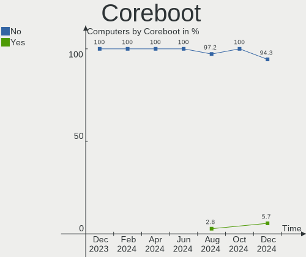
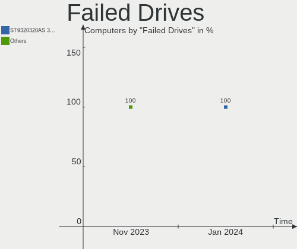
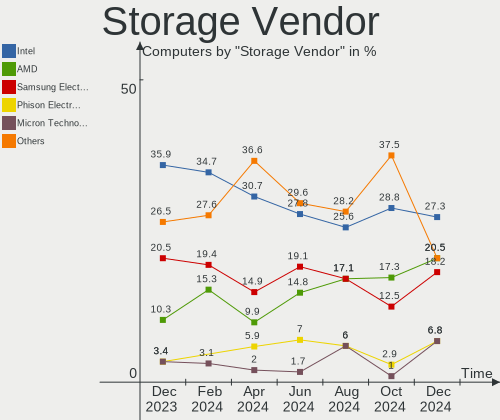
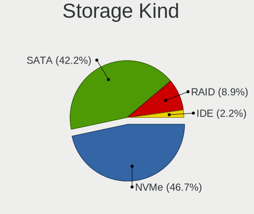
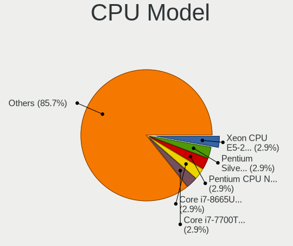
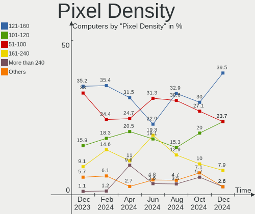
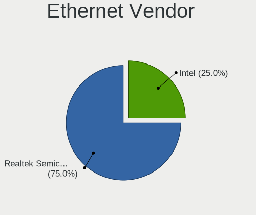

EndeavourOS Hardware Trends
---------------------------

A project to identify most popular hardware characteristics and track their change
over time based on data collected by EndeavourOS users at https://Linux-Hardware.org.

Anyone can contribute to this report by the [hw-probe](https://github.com/linuxhw/hw-probe) tool:

    sudo -E hw-probe -all -upload

This is a report for all computer types. See also reports for [desktops](/Dist/EndeavourOS/Desktop/README.md) and [notebooks](/Dist/EndeavourOS/Notebook/README.md).

This report is for one last month. Overall report since the beginning of time: [TestCoverage](https://github.com/linuxhw/TestCoverage)

Period: Apr, 2022.

Contents
--------

* [ System ](#system)
  - [ OS                       ](#os)
  - [ OS Family                ](#os-family)
  - [ Kernel                   ](#kernel)
  - [ Kernel Family            ](#kernel-family)
  - [ Kernel Major Ver.        ](#kernel-major-ver)
  - [ Arch                     ](#arch)
  - [ DE                       ](#de)
  - [ Display Server           ](#display-server)
  - [ Display Manager          ](#display-manager)
  - [ OS Lang                  ](#os-lang)
  - [ Boot Mode                ](#boot-mode)
  - [ Filesystem               ](#filesystem)
  - [ Part. scheme             ](#part-scheme)
  - [ Dual Boot with Linux/BSD ](#dual-boot-with-linuxbsd)
  - [ Dual Boot (Win)          ](#dual-boot-win)

* [ Board ](#board)
  - [ Vendor                   ](#vendor)
  - [ Model                    ](#model)
  - [ Model Family             ](#model-family)
  - [ MFG Year                 ](#mfg-year)
  - [ Form Factor              ](#form-factor)
  - [ Secure Boot              ](#secure-boot)
  - [ Coreboot                 ](#coreboot)
  - [ RAM Size                 ](#ram-size)
  - [ RAM Used                 ](#ram-used)
  - [ Total Drives             ](#total-drives)
  - [ Has CD-ROM               ](#has-cd-rom)
  - [ Has Ethernet             ](#has-ethernet)
  - [ Has WiFi                 ](#has-wifi)
  - [ Has Bluetooth            ](#has-bluetooth)

* [ Location ](#location)
  - [ Country                  ](#country)
  - [ City                     ](#city)

* [ Drives ](#drives)
  - [ Drive Vendor             ](#drive-vendor)
  - [ Drive Model              ](#drive-model)
  - [ HDD Vendor               ](#hdd-vendor)
  - [ SSD Vendor               ](#ssd-vendor)
  - [ Drive Kind               ](#drive-kind)
  - [ Drive Connector          ](#drive-connector)
  - [ Drive Size               ](#drive-size)
  - [ Space Total              ](#space-total)
  - [ Space Used               ](#space-used)
  - [ Malfunc. Drives          ](#malfunc-drives)
  - [ Malfunc. Drive Vendor    ](#malfunc-drive-vendor)
  - [ Malfunc. HDD Vendor      ](#malfunc-hdd-vendor)
  - [ Malfunc. Drive Kind      ](#malfunc-drive-kind)
  - [ Failed Drives            ](#failed-drives)
  - [ Failed Drive Vendor      ](#failed-drive-vendor)
  - [ Drive Status             ](#drive-status)

* [ Storage controller ](#storage-controller)
  - [ Storage Vendor           ](#storage-vendor)
  - [ Storage Model            ](#storage-model)
  - [ Storage Kind             ](#storage-kind)

* [ Processor ](#processor)
  - [ CPU Vendor               ](#cpu-vendor)
  - [ CPU Model                ](#cpu-model)
  - [ CPU Model Family         ](#cpu-model-family)
  - [ CPU Cores                ](#cpu-cores)
  - [ CPU Sockets              ](#cpu-sockets)
  - [ CPU Threads              ](#cpu-threads)
  - [ CPU Op-Modes             ](#cpu-op-modes)
  - [ CPU Microcode            ](#cpu-microcode)
  - [ CPU Microarch            ](#cpu-microarch)

* [ Graphics ](#graphics)
  - [ GPU Vendor               ](#gpu-vendor)
  - [ GPU Model                ](#gpu-model)
  - [ GPU Combo                ](#gpu-combo)
  - [ GPU Driver               ](#gpu-driver)
  - [ GPU Memory               ](#gpu-memory)

* [ Monitor ](#monitor)
  - [ Monitor Vendor           ](#monitor-vendor)
  - [ Monitor Model            ](#monitor-model)
  - [ Monitor Resolution       ](#monitor-resolution)
  - [ Monitor Diagonal         ](#monitor-diagonal)
  - [ Monitor Width            ](#monitor-width)
  - [ Aspect Ratio             ](#aspect-ratio)
  - [ Monitor Area             ](#monitor-area)
  - [ Pixel Density            ](#pixel-density)
  - [ Multiple Monitors        ](#multiple-monitors)

* [ Network ](#network)
  - [ Net Controller Vendor    ](#net-controller-vendor)
  - [ Net Controller Model     ](#net-controller-model)
  - [ Wireless Vendor          ](#wireless-vendor)
  - [ Wireless Model           ](#wireless-model)
  - [ Ethernet Vendor          ](#ethernet-vendor)
  - [ Ethernet Model           ](#ethernet-model)
  - [ Net Controller Kind      ](#net-controller-kind)
  - [ Used Controller          ](#used-controller)
  - [ NICs                     ](#nics)
  - [ IPv6                     ](#ipv6)

* [ Bluetooth ](#bluetooth)
  - [ Bluetooth Vendor         ](#bluetooth-vendor)
  - [ Bluetooth Model          ](#bluetooth-model)

* [ Sound ](#sound)
  - [ Sound Vendor             ](#sound-vendor)
  - [ Sound Model              ](#sound-model)

* [ Memory ](#memory)
  - [ Memory Vendor            ](#memory-vendor)
  - [ Memory Model             ](#memory-model)
  - [ Memory Kind              ](#memory-kind)
  - [ Memory Form Factor       ](#memory-form-factor)
  - [ Memory Size              ](#memory-size)
  - [ Memory Speed             ](#memory-speed)

* [ Printers & scanners ](#printers--scanners)
  - [ Printer Vendor           ](#printer-vendor)
  - [ Printer Model            ](#printer-model)
  - [ Scanner Vendor           ](#scanner-vendor)
  - [ Scanner Model            ](#scanner-model)

* [ Camera ](#camera)
  - [ Camera Vendor            ](#camera-vendor)
  - [ Camera Model             ](#camera-model)

* [ Security ](#security)
  - [ Fingerprint Vendor       ](#fingerprint-vendor)
  - [ Fingerprint Model        ](#fingerprint-model)
  - [ Chipcard Vendor          ](#chipcard-vendor)
  - [ Chipcard Model           ](#chipcard-model)

* [ Unsupported ](#unsupported)
  - [ Unsupported Devices      ](#unsupported-devices)
  - [ Unsupported Device Types ](#unsupported-device-types)

System
------

OS
--

Installed operating systems

| Name                | Computers | Percent |
|---------------------|-----------|---------|
| EndeavourOS Rolling | 32        | 82.05%  |
| EndeavourOS         | 7         | 17.95%  |

OS Family
---------

OS without a version

| Name        | Computers | Percent |
|-------------|-----------|---------|
| EndeavourOS | 39        | 100%    |

Kernel
------

Version of the Linux kernel

| Version            | Computers | Percent |
|--------------------|-----------|---------|
| 5.17.1-arch1-1     | 10        | 25.64%  |
| 5.17.4-arch1-1     | 5         | 12.82%  |
| 5.17.5-arch1-1     | 3         | 7.69%   |
| 5.17.3-zen1-1-zen  | 3         | 7.69%   |
| 5.17.3-arch1-1     | 3         | 7.69%   |
| 5.17.1-zen1-1-zen  | 2         | 5.13%   |
| 5.15.33-1-lts      | 2         | 5.13%   |
| 5.15.32-1-lts      | 2         | 5.13%   |
| 5.17.5-zen1-1-zen  | 1         | 2.56%   |
| 5.17.4-zen1-1-zen  | 1         | 2.56%   |
| 5.17.2-zen3-1-zen  | 1         | 2.56%   |
| 5.17.1-xanmod1-1   | 1         | 2.56%   |
| 5.17.1-arch1-g14-1 | 1         | 2.56%   |
| 5.17.0-arch1-g14-1 | 1         | 2.56%   |
| 5.16.16-arch1-1    | 1         | 2.56%   |
| 5.15.8-arch1-1     | 1         | 2.56%   |
| 5.15.5-arch1-1     | 1         | 2.56%   |

Kernel Family
-------------

Linux kernel without a distro release

| Version | Computers | Percent |
|---------|-----------|---------|
| 5.17.1  | 14        | 35.9%   |
| 5.17.4  | 6         | 15.38%  |
| 5.17.3  | 6         | 15.38%  |
| 5.17.5  | 4         | 10.26%  |
| 5.15.33 | 2         | 5.13%   |
| 5.15.32 | 2         | 5.13%   |
| 5.17.2  | 1         | 2.56%   |
| 5.17.0  | 1         | 2.56%   |
| 5.16.16 | 1         | 2.56%   |
| 5.15.8  | 1         | 2.56%   |
| 5.15.5  | 1         | 2.56%   |

Kernel Major Ver.
-----------------

Linux kernel major version

| Version | Computers | Percent |
|---------|-----------|---------|
| 5.17    | 32        | 82.05%  |
| 5.15    | 6         | 15.38%  |
| 5.16    | 1         | 2.56%   |

Arch
----

OS architecture (x86_64, i586, etc.)

| Name   | Computers | Percent |
|--------|-----------|---------|
| x86_64 | 39        | 100%    |

DE
--

Desktop Environment

| Name     | Computers | Percent |
|----------|-----------|---------|
| GNOME    | 14        | 35.9%   |
| KDE5     | 11        | 28.21%  |
| XFCE     | 6         | 15.38%  |
| i3       | 2         | 5.13%   |
| Cinnamon | 2         | 5.13%   |
| MATE     | 1         | 2.56%   |
| LeftWM   | 1         | 2.56%   |
| Deepin   | 1         | 2.56%   |
| bspwm    | 1         | 2.56%   |

Display Server
--------------

X11 or Wayland

| Name    | Computers | Percent |
|---------|-----------|---------|
| X11     | 24        | 61.54%  |
| Wayland | 13        | 33.33%  |
| Tty     | 2         | 5.13%   |

Display Manager
---------------

SDDM, LightDM, etc.

| Name    | Computers | Percent |
|---------|-----------|---------|
| LightDM | 17        | 43.59%  |
| GDM     | 9         | 23.08%  |
| Unknown | 7         | 17.95%  |
| SDDM    | 6         | 15.38%  |

OS Lang
-------

Language

| Lang  | Computers | Percent |
|-------|-----------|---------|
| en_US | 26        | 66.67%  |
| en_CA | 4         | 10.26%  |
| it_IT | 2         | 5.13%   |
| sv_SE | 1         | 2.56%   |
| pl_PL | 1         | 2.56%   |
| nl_BE | 1         | 2.56%   |
| fr_FR | 1         | 2.56%   |
| en_GB | 1         | 2.56%   |
| de_DE | 1         | 2.56%   |
| de_CH | 1         | 2.56%   |

Boot Mode
---------

EFI or BIOS

| Mode | Computers | Percent |
|------|-----------|---------|
| EFI  | 30        | 76.92%  |
| BIOS | 9         | 23.08%  |

Filesystem
----------

Type of filesystem

| Type    | Computers | Percent |
|---------|-----------|---------|
| Ext4    | 28        | 71.79%  |
| Btrfs   | 9         | 23.08%  |
| XXX4    | 1         | 2.56%   |
| Overlay | 1         | 2.56%   |

Part. scheme
------------

Scheme of partitioning

| Type    | Computers | Percent |
|---------|-----------|---------|
| GPT     | 29        | 74.36%  |
| Unknown | 9         | 23.08%  |
| MBR     | 1         | 2.56%   |

Dual Boot with Linux/BSD
------------------------

Hosting more than one Linux/BSD

| Dual boot | Computers | Percent |
|-----------|-----------|---------|
| No        | 33        | 84.62%  |
| Yes       | 6         | 15.38%  |

Dual Boot (Win)
---------------

Hosting Linux and Windows

| Dual boot | Computers | Percent |
|-----------|-----------|---------|
| No        | 23        | 58.97%  |
| Yes       | 16        | 41.03%  |

Board
-----

Vendor
------

Motherboard manufacturer

| Name                | Computers | Percent |
|---------------------|-----------|---------|
| ASUSTek Computer    | 10        | 25.64%  |
| Lenovo              | 5         | 12.82%  |
| Dell                | 5         | 12.82%  |
| MSI                 | 3         | 7.69%   |
| Gigabyte Technology | 3         | 7.69%   |
| Hewlett-Packard     | 2         | 5.13%   |
| Google              | 2         | 5.13%   |
| TrekStor            | 1         | 2.56%   |
| Samsung Electronics | 1         | 2.56%   |
| Packard Bell        | 1         | 2.56%   |
| Microsoft           | 1         | 2.56%   |
| ILLEGEAR            | 1         | 2.56%   |
| HUAWEI              | 1         | 2.56%   |
| ASRock              | 1         | 2.56%   |
| Apple               | 1         | 2.56%   |
| Acer                | 1         | 2.56%   |

Model
-----

Motherboard model

| Name                                       | Computers | Percent |
|--------------------------------------------|-----------|---------|
| TrekStor Notebook Slim S130                | 1         | 2.56%   |
| Samsung 930QCA                             | 1         | 2.56%   |
| Packard Bell EasyNote ENTG71BM             | 1         | 2.56%   |
| MSI MS-7C37                                | 1         | 2.56%   |
| MSI MS-7A38                                | 1         | 2.56%   |
| MSI Modern 15 A11M                         | 1         | 2.56%   |
| Microsoft Surface Laptop Go                | 1         | 2.56%   |
| Lenovo Yoga 6 13ALC6 82ND                  | 1         | 2.56%   |
| Lenovo Legion 5 15ACH6H 82JU               | 1         | 2.56%   |
| Lenovo IdeaPad Gaming 3 15ARH05 82EY       | 1         | 2.56%   |
| Lenovo IdeaPad 3 14ALC6 82KT               | 1         | 2.56%   |
| Lenovo IdeaCentre AIO 300-23ISU F0BY00DMPB | 1         | 2.56%   |
| ILLEGEAR ROGUE                             | 1         | 2.56%   |
| HUAWEI MACH-WX9                            | 1         | 2.56%   |
| HP Pavilion Notebook                       | 1         | 2.56%   |
| HP 250 G7 Notebook PC                      | 1         | 2.56%   |
| Google Celes                               | 1         | 2.56%   |
| Google Candy                               | 1         | 2.56%   |
| Gigabyte Z390 AORUS PRO                    | 1         | 2.56%   |
| Gigabyte B450M DS3H                        | 1         | 2.56%   |
| Gigabyte B450 AORUS ELITE                  | 1         | 2.56%   |
| Dell XPS 15 7590                           | 1         | 2.56%   |
| Dell OptiPlex 3020                         | 1         | 2.56%   |
| Dell Latitude E6540                        | 1         | 2.56%   |
| Dell Latitude 7280                         | 1         | 2.56%   |
| Dell Inspiron 5406 2n1                     | 1         | 2.56%   |
| ASUS Zephyrus M GU502GV_GU502GV            | 1         | 2.56%   |
| ASUS X71Vn                                 | 1         | 2.56%   |
| ASUS VivoBook_ASUSLaptop X421FL_S433FL     | 1         | 2.56%   |
| ASUS VivoBook_ASUSLaptop TP420UA_TM420UA   | 1         | 2.56%   |
| ASUS TUF Gaming B550-PLUS                  | 1         | 2.56%   |
| ASUS TUF B450-PRO GAMING                   | 1         | 2.56%   |
| ASUS ROG Zephyrus G15 GA503QR_GA503QR      | 1         | 2.56%   |
| ASUS ROG Zephyrus G14 GA401QH_GA401QH      | 1         | 2.56%   |
| ASUS PRIME Z390-A                          | 1         | 2.56%   |
| ASUS PRIME H410M-E                         | 1         | 2.56%   |
| ASRock B560 Pro4                           | 1         | 2.56%   |
| Apple iMac16,2                             | 1         | 2.56%   |
| Acer Swift SF314-57G                       | 1         | 2.56%   |

Model Family
------------

Motherboard model prefix

| Name                  | Computers | Percent |
|-----------------------|-----------|---------|
| Lenovo IdeaPad        | 2         | 5.13%   |
| Dell Latitude         | 2         | 5.13%   |
| ASUS VivoBook         | 2         | 5.13%   |
| ASUS TUF              | 2         | 5.13%   |
| ASUS ROG              | 2         | 5.13%   |
| ASUS PRIME            | 2         | 5.13%   |
| TrekStor Notebook     | 1         | 2.56%   |
| Samsung 930QCA        | 1         | 2.56%   |
| Packard Bell EasyNote | 1         | 2.56%   |
| MSI MS-7C37           | 1         | 2.56%   |
| MSI MS-7A38           | 1         | 2.56%   |
| MSI Modern            | 1         | 2.56%   |
| Microsoft Surface     | 1         | 2.56%   |
| Lenovo Yoga           | 1         | 2.56%   |
| Lenovo Legion         | 1         | 2.56%   |
| Lenovo IdeaCentre     | 1         | 2.56%   |
| ILLEGEAR ROGUE        | 1         | 2.56%   |
| HUAWEI MACH-WX9       | 1         | 2.56%   |
| HP Pavilion           | 1         | 2.56%   |
| HP 250                | 1         | 2.56%   |
| Google Celes          | 1         | 2.56%   |
| Google Candy          | 1         | 2.56%   |
| Gigabyte Z390         | 1         | 2.56%   |
| Gigabyte B450M        | 1         | 2.56%   |
| Gigabyte B450         | 1         | 2.56%   |
| Dell XPS              | 1         | 2.56%   |
| Dell OptiPlex         | 1         | 2.56%   |
| Dell Inspiron         | 1         | 2.56%   |
| ASUS Zephyrus         | 1         | 2.56%   |
| ASUS X71Vn            | 1         | 2.56%   |
| ASRock B560           | 1         | 2.56%   |
| Apple iMac16          | 1         | 2.56%   |
| Acer Swift            | 1         | 2.56%   |

MFG Year
--------

Motherboard manufacture year

| Year | Computers | Percent |
|------|-----------|---------|
| 2021 | 11        | 28.21%  |
| 2018 | 8         | 20.51%  |
| 2019 | 7         | 17.95%  |
| 2020 | 5         | 12.82%  |
| 2014 | 2         | 5.13%   |
| 2022 | 1         | 2.56%   |
| 2016 | 1         | 2.56%   |
| 2015 | 1         | 2.56%   |
| 2013 | 1         | 2.56%   |
| 2011 | 1         | 2.56%   |
| 2008 | 1         | 2.56%   |

Form Factor
-----------

Physical design of the computer

| Name        | Computers | Percent |
|-------------|-----------|---------|
| Notebook    | 21        | 53.85%  |
| Desktop     | 11        | 28.21%  |
| Convertible | 4         | 10.26%  |
| All in one  | 2         | 5.13%   |
| Tablet      | 1         | 2.56%   |

Secure Boot
-----------

Enabled or disabled

| State    | Computers | Percent |
|----------|-----------|---------|
| Disabled | 39        | 100%    |

Coreboot
--------

Have coreboot on board

| Used | Computers | Percent |
|------|-----------|---------|
| No   | 37        | 94.87%  |
| Yes  | 2         | 5.13%   |

RAM Size
--------

Total RAM memory

| Size in GB | Computers | Percent |
|------------|-----------|---------|
| 4.01-8.0   | 9         | 23.08%  |
| 32.01-64.0 | 8         | 20.51%  |
| 16.01-24.0 | 8         | 20.51%  |
| 8.01-16.0  | 8         | 20.51%  |
| 3.01-4.0   | 5         | 12.82%  |
| 24.01-32.0 | 1         | 2.56%   |

RAM Used
--------

Used RAM memory

| Used GB   | Computers | Percent |
|-----------|-----------|---------|
| 4.01-8.0  | 10        | 25.64%  |
| 3.01-4.0  | 10        | 25.64%  |
| 2.01-3.0  | 7         | 17.95%  |
| 1.01-2.0  | 7         | 17.95%  |
| 8.01-16.0 | 4         | 10.26%  |
| 0.51-1.0  | 1         | 2.56%   |

Total Drives
------------

Number of drives on board

| Drives | Computers | Percent |
|--------|-----------|---------|
| 1      | 21        | 53.85%  |
| 2      | 12        | 30.77%  |
| 3      | 4         | 10.26%  |
| 5      | 1         | 2.56%   |
| 4      | 1         | 2.56%   |

Has CD-ROM
----------

Has CD-ROM on board

| Presented | Computers | Percent |
|-----------|-----------|---------|
| No        | 35        | 89.74%  |
| Yes       | 4         | 10.26%  |

Has Ethernet
------------

Has Ethernet on board

| Presented | Computers | Percent |
|-----------|-----------|---------|
| Yes       | 29        | 74.36%  |
| No        | 10        | 25.64%  |

Has WiFi
--------

Has WiFi module

| Presented | Computers | Percent |
|-----------|-----------|---------|
| Yes       | 32        | 82.05%  |
| No        | 7         | 17.95%  |

Has Bluetooth
-------------

Has Bluetooth module

| Presented | Computers | Percent |
|-----------|-----------|---------|
| Yes       | 31        | 79.49%  |
| No        | 8         | 20.51%  |

Location
--------

Country
-------

Geographic location (country)

| Country             | Computers | Percent |
|---------------------|-----------|---------|
| USA                 | 12        | 30.77%  |
| Italy               | 4         | 10.26%  |
| Canada              | 4         | 10.26%  |
| Poland              | 2         | 5.13%   |
| Germany             | 2         | 5.13%   |
| Trinidad and Tobago | 1         | 2.56%   |
| Switzerland         | 1         | 2.56%   |
| Sweden              | 1         | 2.56%   |
| Serbia              | 1         | 2.56%   |
| Nepal               | 1         | 2.56%   |
| Malaysia            | 1         | 2.56%   |
| Lithuania           | 1         | 2.56%   |
| Indonesia           | 1         | 2.56%   |
| India               | 1         | 2.56%   |
| Hungary             | 1         | 2.56%   |
| France              | 1         | 2.56%   |
| Czechia             | 1         | 2.56%   |
| Belgium             | 1         | 2.56%   |
| Austria             | 1         | 2.56%   |
| Argentina           | 1         | 2.56%   |

City
----

Geographic location (city)

| City                   | Computers | Percent |
|------------------------|-----------|---------|
| Zadzim                 | 1         | 2.56%   |
| Vilnius                | 1         | 2.56%   |
| Vienna                 | 1         | 2.56%   |
| Venice                 | 1         | 2.56%   |
| Toms River             | 1         | 2.56%   |
| Sopron                 | 1         | 2.56%   |
| Schaarbeek             | 1         | 2.56%   |
| Ronsecco               | 1         | 2.56%   |
| Puchong Batu Dua Belas | 1         | 2.56%   |
| Prague                 | 1         | 2.56%   |
| Peachtree Corners      | 1         | 2.56%   |
| Oklahoma City          | 1         | 2.56%   |
| Norrköping            | 1         | 2.56%   |
| Nachrodt-Wiblingwerde  | 1         | 2.56%   |
| Mumbai                 | 1         | 2.56%   |
| Montreal               | 1         | 2.56%   |
| Montgomery             | 1         | 2.56%   |
| Milan                  | 1         | 2.56%   |
| Miami                  | 1         | 2.56%   |
| London                 | 1         | 2.56%   |
| Lille                  | 1         | 2.56%   |
| Knightdale             | 1         | 2.56%   |
| Kathmandu              | 1         | 2.56%   |
| Kalamazoo              | 1         | 2.56%   |
| Hurricane              | 1         | 2.56%   |
| Herisau                | 1         | 2.56%   |
| General San Martin     | 1         | 2.56%   |
| Gdynia                 | 1         | 2.56%   |
| Ferriday               | 1         | 2.56%   |
| Ferrara di Monte Baldo | 1         | 2.56%   |
| Edmonton               | 1         | 2.56%   |
| Danville               | 1         | 2.56%   |
| Chaguanas              | 1         | 2.56%   |
| Burnaby                | 1         | 2.56%   |
| Berlin                 | 1         | 2.56%   |
| Belgrade               | 1         | 2.56%   |
| Bandung                | 1         | 2.56%   |
| Ashburn                | 1         | 2.56%   |
| Allentown              | 1         | 2.56%   |

Drives
------

Drive Vendor
------------

Hard drive vendors

| Vendor              | Computers | Drives | Percent |
|---------------------|-----------|--------|---------|
| Samsung Electronics | 11        | 16     | 20%     |
| WDC                 | 8         | 12     | 14.55%  |
| Kingston            | 5         | 6      | 9.09%   |
| SK Hynix            | 4         | 4      | 7.27%   |
| Unknown             | 3         | 5      | 5.45%   |
| Intel               | 3         | 4      | 5.45%   |
| Seagate             | 2         | 2      | 3.64%   |
| Phison              | 2         | 2      | 3.64%   |
| USB3.1              | 1         | 1      | 1.82%   |
| Toshiba             | 1         | 1      | 1.82%   |
| T-FORCE             | 1         | 1      | 1.82%   |
| SanDisk             | 1         | 1      | 1.82%   |
| PNY                 | 1         | 1      | 1.82%   |
| Patriot             | 1         | 1      | 1.82%   |
| Micron Technology   | 1         | 1      | 1.82%   |
| LITEON              | 1         | 1      | 1.82%   |
| Lexar               | 1         | 1      | 1.82%   |
| KINGBANK            | 1         | 1      | 1.82%   |
| HGST                | 1         | 1      | 1.82%   |
| CT480BX5            | 1         | 1      | 1.82%   |
| Crucial             | 1         | 1      | 1.82%   |
| China               | 1         | 1      | 1.82%   |
| Apple               | 1         | 1      | 1.82%   |
| AMicro              | 1         | 1      | 1.82%   |
| A-DATA Technology   | 1         | 1      | 1.82%   |

Drive Model
-----------

Hard drive models

| Model                                   | Computers | Percent |
|-----------------------------------------|-----------|---------|
| WDC WDS100T2B0C-00PXH0 1TB              | 2         | 3.03%   |
| Samsung SSD 840 EVO 120GB               | 2         | 3.03%   |
| Phison Sabrent Rocket Q 500GB           | 2         | 3.03%   |
| WDC WDS500G2B0A-00SM50 500GB SSD        | 1         | 1.52%   |
| WDC WDS200T3X0C-00SJG0 2TB              | 1         | 1.52%   |
| WDC WDS200T2B0B 2TB SSD                 | 1         | 1.52%   |
| WDC WDS100T2B0A-00SM50 1TB SSD          | 1         | 1.52%   |
| WDC WD5000AZRX-00A8LB0 500GB            | 1         | 1.52%   |
| WDC WD100EMAZ-00WJTA0 10TB              | 1         | 1.52%   |
| WDC WD1003FZEX-00K3CA0 1TB              | 1         | 1.52%   |
| WDC PC SN730 SDBPNTY-1T00-1101 1TB      | 1         | 1.52%   |
| WDC PC SN530 SDBPMPZ-512G-1101 512GB    | 1         | 1.52%   |
| USB3.1 Type-c 256GB                     | 1         | 1.52%   |
| Unknown USD00  128GB                    | 1         | 1.52%   |
| Unknown SC200  197GB                    | 1         | 1.52%   |
| Unknown NCard  64GB                     | 1         | 1.52%   |
| Unknown MMC Card  16GB                  | 1         | 1.52%   |
| Unknown DF4016  16GB                    | 1         | 1.52%   |
| Toshiba KSG60ZMV256G M.2 2280 256GB SSD | 1         | 1.52%   |
| T-FORCE 1TB                             | 1         | 1.52%   |
| SK Hynix PC601 NVMe 512GB               | 1         | 1.52%   |
| SK Hynix HFS512G39TND-N210A 512GB SSD   | 1         | 1.52%   |
| SK Hynix HFM256GDJTNG-8310A 256GB       | 1         | 1.52%   |
| SK Hynix HFM001TD3JX013N 1TB            | 1         | 1.52%   |
| Seagate ST2000LM003 HN-M201RAD 2TB      | 1         | 1.52%   |
| Seagate ST2000DM008-2FR102 2TB          | 1         | 1.52%   |
| SanDisk Ultra II 240GB SSD              | 1         | 1.52%   |
| Samsung SSD 980 1TB                     | 1         | 1.52%   |
| Samsung SSD 970 EVO Plus 500GB          | 1         | 1.52%   |
| Samsung SSD 870 QVO 1TB                 | 1         | 1.52%   |
| Samsung SSD 860 EVO 500GB               | 1         | 1.52%   |
| Samsung Portable SSD T5 500GB           | 1         | 1.52%   |
| Samsung NVMe SSD Drive 500GB            | 1         | 1.52%   |
| Samsung NVMe SSD Drive 2TB              | 1         | 1.52%   |
| Samsung NVMe SSD Drive 256GB            | 1         | 1.52%   |
| Samsung MZVLQ512HBLU-00B00 512GB        | 1         | 1.52%   |
| Samsung MZVLQ512HALU-00000 512GB        | 1         | 1.52%   |
| Samsung MZ9LQ256HBJQ-00000 256GB        | 1         | 1.52%   |
| Samsung MZ9LQ256HAJD-000 256GB          | 1         | 1.52%   |
| Samsung HD502IJ 500GB                   | 1         | 1.52%   |
| PNY CS3040 2TB SSD                      | 1         | 1.52%   |
| Patriot Burst 240GB SSD                 | 1         | 1.52%   |
| Micron MTFDDAK128MAM-1J1 128GB SSD      | 1         | 1.52%   |
| LITEON CA3-8D512 512GB                  | 1         | 1.52%   |
| Lexar 1TB SSD                           | 1         | 1.52%   |
| Kingston SA400S37960G 960GB SSD         | 1         | 1.52%   |
| Kingston SA400S37120G 120GB SSD         | 1         | 1.52%   |
| Kingston SA2000M81000G 1TB              | 1         | 1.52%   |
| Kingston OM8PCP3512F-AI1 512GB          | 1         | 1.52%   |
| Kingston NVMe SSD Drive 256GB           | 1         | 1.52%   |
| Kingston NVMe SSD Drive 1TB             | 1         | 1.52%   |
| KINGBANK KP320 128GB SSD                | 1         | 1.52%   |
| Intel SSDPEKNU512GZ 512GB               | 1         | 1.52%   |
| Intel NVMe SSD Drive 512GB              | 1         | 1.52%   |
| Intel HBRPEKNX0202AO 32GB               | 1         | 1.52%   |
| Intel HBRPEKNX0202A 512GB               | 1         | 1.52%   |
| HGST HDN724040ALE640 4TB                | 1         | 1.52%   |
| CT480BX5 00SSD1 480GB                   | 1         | 1.52%   |
| Crucial CT500MX500SSD1 500GB            | 1         | 1.52%   |
| China SSD 256GB                         | 1         | 1.52%   |

HDD Vendor
----------

Hard disk drive vendors

| Vendor              | Computers | Drives | Percent |
|---------------------|-----------|--------|---------|
| WDC                 | 3         | 3      | 42.86%  |
| Seagate             | 2         | 2      | 28.57%  |
| Samsung Electronics | 1         | 1      | 14.29%  |
| HGST                | 1         | 1      | 14.29%  |

SSD Vendor
----------

Solid state drive vendors

| Vendor              | Computers | Drives | Percent |
|---------------------|-----------|--------|---------|
| Samsung Electronics | 5         | 6      | 23.81%  |
| WDC                 | 3         | 3      | 14.29%  |
| Kingston            | 2         | 2      | 9.52%   |
| Toshiba             | 1         | 1      | 4.76%   |
| SK Hynix            | 1         | 1      | 4.76%   |
| SanDisk             | 1         | 1      | 4.76%   |
| Patriot             | 1         | 1      | 4.76%   |
| Micron Technology   | 1         | 1      | 4.76%   |
| KINGBANK            | 1         | 1      | 4.76%   |
| CT480BX5            | 1         | 1      | 4.76%   |
| Crucial             | 1         | 1      | 4.76%   |
| China               | 1         | 1      | 4.76%   |
| Apple               | 1         | 1      | 4.76%   |
| A-DATA Technology   | 1         | 1      | 4.76%   |

Drive Kind
----------

HDD or SSD

| Kind    | Computers | Drives | Percent |
|---------|-----------|--------|---------|
| NVMe    | 25        | 31     | 44.64%  |
| SSD     | 18        | 22     | 32.14%  |
| HDD     | 7         | 7      | 12.5%   |
| MMC     | 3         | 5      | 5.36%   |
| Unknown | 3         | 3      | 5.36%   |

Drive Connector
---------------

SATA, SAS, NVMe, etc.

| Type | Computers | Drives | Percent |
|------|-----------|--------|---------|
| NVMe | 25        | 31     | 50%     |
| SATA | 19        | 28     | 38%     |
| SAS  | 3         | 4      | 6%      |
| MMC  | 3         | 5      | 6%      |

Drive Size
----------

Size of hard drive

| Size in TB | Computers | Drives | Percent |
|------------|-----------|--------|---------|
| 0.01-0.5   | 14        | 18     | 56%     |
| 0.51-1.0   | 6         | 6      | 24%     |
| 1.01-2.0   | 3         | 3      | 12%     |
| 3.01-4.0   | 1         | 1      | 4%      |
| 4.01-10.0  | 1         | 1      | 4%      |

Space Total
-----------

Amount of disk space available on the file system

| Size in GB     | Computers | Percent |
|----------------|-----------|---------|
| 251-500        | 9         | 23.08%  |
| 101-250        | 8         | 20.51%  |
| 1001-2000      | 8         | 20.51%  |
| More than 3000 | 4         | 10.26%  |
| 501-1000       | 3         | 7.69%   |
| 2001-3000      | 2         | 5.13%   |
| 1-20           | 2         | 5.13%   |
| 51-100         | 2         | 5.13%   |
| Unknown        | 1         | 2.56%   |

Space Used
----------

Amount of used disk space

| Used GB        | Computers | Percent |
|----------------|-----------|---------|
| 1-20           | 7         | 17.95%  |
| 51-100         | 7         | 17.95%  |
| 21-50          | 6         | 15.38%  |
| 101-250        | 6         | 15.38%  |
| 251-500        | 4         | 10.26%  |
| 501-1000       | 4         | 10.26%  |
| More than 3000 | 3         | 7.69%   |
| 1001-2000      | 1         | 2.56%   |
| Unknown        | 1         | 2.56%   |

Malfunc. Drives
---------------

Drive models with a malfunction

| Model                                   | Computers | Drives | Percent |
|-----------------------------------------|-----------|--------|---------|
| Toshiba KSG60ZMV256G M.2 2280 256GB SSD | 1         | 1      | 50%     |
| SK Hynix HFS512G39TND-N210A 512GB SSD   | 1         | 1      | 50%     |

Malfunc. Drive Vendor
---------------------

Vendors of faulty drives

| Vendor   | Computers | Drives | Percent |
|----------|-----------|--------|---------|
| Toshiba  | 1         | 1      | 50%     |
| SK Hynix | 1         | 1      | 50%     |

Malfunc. HDD Vendor
-------------------

Vendors of faulty HDD drives

Zero info for selected period =(

Malfunc. Drive Kind
-------------------

Kinds of faulty drives

| Kind | Computers | Drives | Percent |
|------|-----------|--------|---------|
| SSD  | 2         | 2      | 100%    |

Failed Drives
-------------

Failed drive models

| Model                  | Computers | Drives | Percent |
|------------------------|-----------|--------|---------|
| LITEON CA3-8D512 512GB | 1         | 1      | 100%    |

Failed Drive Vendor
-------------------

Failed drive vendors

| Vendor | Computers | Drives | Percent |
|--------|-----------|--------|---------|
| LITEON | 1         | 1      | 100%    |

Drive Status
------------

Number of failed and malfunc. drives

| Status   | Computers | Drives | Percent |
|----------|-----------|--------|---------|
| Works    | 25        | 40     | 59.52%  |
| Detected | 14        | 25     | 33.33%  |
| Malfunc  | 2         | 2      | 4.76%   |
| Failed   | 1         | 1      | 2.38%   |

Storage controller
------------------

Storage Vendor
--------------

Storage controller vendors

| Vendor                      | Computers | Percent |
|-----------------------------|-----------|---------|
| Intel                       | 19        | 35.19%  |
| AMD                         | 10        | 18.52%  |
| Samsung Electronics         | 8         | 14.81%  |
| Sandisk                     | 5         | 9.26%   |
| SK Hynix                    | 3         | 5.56%   |
| Phison Electronics          | 3         | 5.56%   |
| Kingston Technology Company | 3         | 5.56%   |
| Silicon Motion              | 1         | 1.85%   |
| Lite-On Technology          | 1         | 1.85%   |
| ASMedia Technology          | 1         | 1.85%   |

Storage Model
-------------

Storage controller models

| Model                                                                          | Computers | Percent |
|--------------------------------------------------------------------------------|-----------|---------|
| AMD FCH SATA Controller [AHCI mode]                                            | 7         | 12.07%  |
| Samsung NVMe SSD Controller 980                                                | 6         | 10.34%  |
| AMD 400 Series Chipset SATA Controller                                         | 4         | 6.9%    |
| Intel Sunrise Point-LP SATA Controller [AHCI mode]                             | 3         | 5.17%   |
| Sandisk WD Blue SN550 NVMe SSD                                                 | 2         | 3.45%   |
| Samsung NVMe SSD Controller SM981/PM981/PM983                                  | 2         | 3.45%   |
| Phison E12 NVMe Controller                                                     | 2         | 3.45%   |
| Intel Non-Volatile memory controller                                           | 2         | 3.45%   |
| Intel Cannon Lake PCH SATA AHCI Controller                                     | 2         | 3.45%   |
| Intel 82801 Mobile SATA Controller [RAID mode]                                 | 2         | 3.45%   |
| Intel 500 Series Chipset Family SATA AHCI Controller                           | 2         | 3.45%   |
| SK Hynix Non-Volatile memory controller                                        | 1         | 1.72%   |
| SK Hynix Gold P31 SSD                                                          | 1         | 1.72%   |
| SK Hynix BC501 NVMe Solid State Drive                                          | 1         | 1.72%   |
| Silicon Motion SM2263EN/SM2263XT SSD Controller                                | 1         | 1.72%   |
| Sandisk WD Black SN750 / PC SN730 NVMe SSD                                     | 1         | 1.72%   |
| Sandisk WD Black 2018/SN750 / PC SN720 NVMe SSD                                | 1         | 1.72%   |
| Sandisk Non-Volatile memory controller                                         | 1         | 1.72%   |
| Samsung Electronics SATA controller                                            | 1         | 1.72%   |
| Phison E16 PCIe4 NVMe Controller                                               | 1         | 1.72%   |
| Lite-On Non-Volatile memory controller                                         | 1         | 1.72%   |
| Kingston Company Company Non-Volatile memory controller                        | 1         | 1.72%   |
| Kingston Company OM3PDP3 NVMe SSD                                              | 1         | 1.72%   |
| Kingston Company A2000 NVMe SSD                                                | 1         | 1.72%   |
| Intel Volume Management Device NVMe RAID Controller                            | 1         | 1.72%   |
| Intel SSD 660P Series                                                          | 1         | 1.72%   |
| Intel Comet Lake PCH-LP SATA RAID Premium Controller                           | 1         | 1.72%   |
| Intel Celeron/Pentium Silver Processor SATA Controller                         | 1         | 1.72%   |
| Intel Cannon Lake Mobile PCH SATA AHCI Controller                              | 1         | 1.72%   |
| Intel Atom Processor E3800 Series SATA AHCI Controller                         | 1         | 1.72%   |
| Intel 82801IBM/IEM (ICH9M/ICH9M-E) 4 port SATA Controller [AHCI mode]          | 1         | 1.72%   |
| Intel 8 Series/C220 Series Chipset Family 6-port SATA Controller 1 [AHCI mode] | 1         | 1.72%   |
| Intel 400 Series Chipset Family SATA AHCI Controller                           | 1         | 1.72%   |
| ASMedia ASM1062 Serial ATA Controller                                          | 1         | 1.72%   |
| AMD 500 Series Chipset SATA Controller                                         | 1         | 1.72%   |

Storage Kind
------------

Kind of storage controller (IDE, SATA, NVMe, SAS, ...)

| Kind | Computers | Percent |
|------|-----------|---------|
| NVMe | 25        | 47.17%  |
| SATA | 24        | 45.28%  |
| RAID | 4         | 7.55%   |

Processor
---------

CPU Vendor
----------

Processor vendors

| Vendor | Computers | Percent |
|--------|-----------|---------|
| Intel  | 26        | 66.67%  |
| AMD    | 13        | 33.33%  |

CPU Model
---------

Processor models

| Model                                         | Computers | Percent |
|-----------------------------------------------|-----------|---------|
| Intel 11th Gen Core i5-1135G7 @ 2.40GHz       | 3         | 7.69%   |
| Intel Core i7-9750H CPU @ 2.60GHz             | 2         | 5.13%   |
| AMD Ryzen 5 5600X 6-Core Processor            | 2         | 5.13%   |
| AMD Ryzen 5 5500U with Radeon Graphics        | 2         | 5.13%   |
| Intel Core i9-9900K CPU @ 3.60GHz             | 1         | 2.56%   |
| Intel Core i7-8700K CPU @ 3.70GHz             | 1         | 2.56%   |
| Intel Core i7-8550U CPU @ 1.80GHz             | 1         | 2.56%   |
| Intel Core i7-6500U CPU @ 2.50GHz             | 1         | 2.56%   |
| Intel Core i7-10700F CPU @ 2.90GHz            | 1         | 2.56%   |
| Intel Core i7-1065G7 CPU @ 1.30GHz            | 1         | 2.56%   |
| Intel Core i7-10510U CPU @ 1.80GHz            | 1         | 2.56%   |
| Intel Core i5-8265U CPU @ 1.60GHz             | 1         | 2.56%   |
| Intel Core i5-7300U CPU @ 2.60GHz             | 1         | 2.56%   |
| Intel Core i5-6200U CPU @ 2.30GHz             | 1         | 2.56%   |
| Intel Core i5-5675R CPU @ 3.10GHz             | 1         | 2.56%   |
| Intel Core i5-4310M CPU @ 2.70GHz             | 1         | 2.56%   |
| Intel Core i5-1035G1 CPU @ 1.00GHz            | 1         | 2.56%   |
| Intel Core i3-4170 CPU @ 3.70GHz              | 1         | 2.56%   |
| Intel Core 2 Duo CPU T9400 @ 2.53GHz          | 1         | 2.56%   |
| Intel Celeron N4000 CPU @ 1.10GHz             | 1         | 2.56%   |
| Intel Celeron CPU N3060 @ 1.60GHz             | 1         | 2.56%   |
| Intel Celeron CPU N2920 @ 1.86GHz             | 1         | 2.56%   |
| Intel Celeron CPU N2840 @ 2.16GHz             | 1         | 2.56%   |
| Intel 11th Gen Core i7-11800H @ 2.30GHz       | 1         | 2.56%   |
| Intel 11th Gen Core i5-11500 @ 2.70GHz        | 1         | 2.56%   |
| AMD Ryzen 9 5900HS with Radeon Graphics       | 1         | 2.56%   |
| AMD Ryzen 7 5800HS with Radeon Graphics       | 1         | 2.56%   |
| AMD Ryzen 7 5800H with Radeon Graphics        | 1         | 2.56%   |
| AMD Ryzen 7 5700U with Radeon Graphics        | 1         | 2.56%   |
| AMD Ryzen 7 4800H with Radeon Graphics        | 1         | 2.56%   |
| AMD Ryzen 7 3800XT 8-Core Processor           | 1         | 2.56%   |
| AMD Ryzen 5 5600G with Radeon Graphics        | 1         | 2.56%   |
| AMD Ryzen 5 3600 6-Core Processor             | 1         | 2.56%   |
| AMD A8-9600 RADEON R7, 10 COMPUTE CORES 4C+6G | 1         | 2.56%   |

CPU Model Family
----------------

Processor model prefix

| Model            | Computers | Percent |
|------------------|-----------|---------|
| Intel Core i7    | 8         | 20.51%  |
| Intel Core i5    | 6         | 15.38%  |
| AMD Ryzen 5      | 6         | 15.38%  |
| Other            | 5         | 12.82%  |
| AMD Ryzen 7      | 5         | 12.82%  |
| Intel Celeron    | 4         | 10.26%  |
| Intel Core i9    | 1         | 2.56%   |
| Intel Core i3    | 1         | 2.56%   |
| Intel Core 2 Duo | 1         | 2.56%   |
| AMD Ryzen 9      | 1         | 2.56%   |
| AMD A8           | 1         | 2.56%   |

CPU Cores
---------

Number of processor cores

| Number | Computers | Percent |
|--------|-----------|---------|
| 6      | 10        | 25.64%  |
| 4      | 10        | 25.64%  |
| 2      | 10        | 25.64%  |
| 8      | 9         | 23.08%  |

CPU Sockets
-----------

Number of sockets

| Number | Computers | Percent |
|--------|-----------|---------|
| 1      | 39        | 100%    |

CPU Threads
-----------

Threads per core (Hyper-Threading)

| Number | Computers | Percent |
|--------|-----------|---------|
| 2      | 33        | 84.62%  |
| 1      | 6         | 15.38%  |

CPU Op-Modes
------------

CPU Operation Modes (32-bit, 64-bit)

| Op mode        | Computers | Percent |
|----------------|-----------|---------|
| 32-bit, 64-bit | 39        | 100%    |

CPU Microcode
-------------

Microcode number

| Number     | Computers | Percent |
|------------|-----------|---------|
| Unknown    | 12        | 30.77%  |
| 0x0a50000c | 3         | 7.69%   |
| 0x906ea    | 2         | 5.13%   |
| 0x806c1    | 2         | 5.13%   |
| 0x706e5    | 2         | 5.13%   |
| 0x406e3    | 2         | 5.13%   |
| 0x08608103 | 2         | 5.13%   |
| 0x906ec    | 1         | 2.56%   |
| 0x806ec    | 1         | 2.56%   |
| 0x806eb    | 1         | 2.56%   |
| 0x806ea    | 1         | 2.56%   |
| 0x806e9    | 1         | 2.56%   |
| 0x806d1    | 1         | 2.56%   |
| 0x706a1    | 1         | 2.56%   |
| 0x406c4    | 1         | 2.56%   |
| 0x40671    | 1         | 2.56%   |
| 0x306c3    | 1         | 2.56%   |
| 0x1067a    | 1         | 2.56%   |
| 0x0a50000b | 1         | 2.56%   |
| 0x0a201009 | 1         | 2.56%   |
| 0x08600104 | 1         | 2.56%   |

CPU Microarch
-------------

Microarchitecture

| Name          | Computers | Percent |
|---------------|-----------|---------|
| KabyLake      | 8         | 20.51%  |
| Zen 3         | 6         | 15.38%  |
| Unknown       | 4         | 10.26%  |
| Zen 2         | 3         | 7.69%   |
| TigerLake     | 3         | 7.69%   |
| Silvermont    | 3         | 7.69%   |
| IceLake       | 3         | 7.69%   |
| Skylake       | 2         | 5.13%   |
| Haswell       | 2         | 5.13%   |
| Penryn        | 1         | 2.56%   |
| Goldmont plus | 1         | 2.56%   |
| Excavator     | 1         | 2.56%   |
| CometLake     | 1         | 2.56%   |
| Broadwell     | 1         | 2.56%   |

Graphics
--------

GPU Vendor
----------

Vendors of graphics cards

| Vendor | Computers | Percent |
|--------|-----------|---------|
| Intel  | 21        | 43.75%  |
| AMD    | 14        | 29.17%  |
| Nvidia | 13        | 27.08%  |

GPU Model
---------

Graphics card models

| Model                                                                                    | Computers | Percent |
|------------------------------------------------------------------------------------------|-----------|---------|
| AMD Cezanne                                                                              | 4         | 8%      |
| Intel TigerLake-LP GT2 [Iris Xe Graphics]                                                | 3         | 6%      |
| AMD Lucienne                                                                             | 3         | 6%      |
| Nvidia TU117M [GeForce GTX 1650 Mobile / Max-Q]                                          | 2         | 4%      |
| Intel Skylake GT2 [HD Graphics 520]                                                      | 2         | 4%      |
| Intel CoffeeLake-H GT2 [UHD Graphics 630]                                                | 2         | 4%      |
| Intel Atom Processor Z36xxx/Z37xxx Series Graphics & Display                             | 2         | 4%      |
| AMD Ellesmere [Radeon RX 470/480/570/570X/580/580X/590]                                  | 2         | 4%      |
| Nvidia TU117M                                                                            | 1         | 2%      |
| Nvidia TU106M [GeForce RTX 2060 Mobile]                                                  | 1         | 2%      |
| Nvidia GP108M [GeForce MX250]                                                            | 1         | 2%      |
| Nvidia GP108M [GeForce MX150]                                                            | 1         | 2%      |
| Nvidia GP108BM [GeForce MX250]                                                           | 1         | 2%      |
| Nvidia GP104 [GeForce GTX 1080]                                                          | 1         | 2%      |
| Nvidia GM108M [GeForce 940M]                                                             | 1         | 2%      |
| Nvidia GM107 [GeForce GTX 750]                                                           | 1         | 2%      |
| Nvidia GA106M [GeForce RTX 3060 Mobile / Max-Q]                                          | 1         | 2%      |
| Nvidia GA102 [GeForce RTX 3080]                                                          | 1         | 2%      |
| Nvidia G96CM [GeForce 9650M GT]                                                          | 1         | 2%      |
| Intel WhiskeyLake-U GT2 [UHD Graphics 620]                                               | 1         | 2%      |
| Intel UHD Graphics 620                                                                   | 1         | 2%      |
| Intel TigerLake-H GT1 [UHD Graphics]                                                     | 1         | 2%      |
| Intel Iris Pro Graphics 6200                                                             | 1         | 2%      |
| Intel Iris Plus Graphics G7                                                              | 1         | 2%      |
| Intel Iris Plus Graphics G1 (Ice Lake)                                                   | 1         | 2%      |
| Intel HD Graphics 620                                                                    | 1         | 2%      |
| Intel GeminiLake [UHD Graphics 600]                                                      | 1         | 2%      |
| Intel CometLake-U GT2 [UHD Graphics]                                                     | 1         | 2%      |
| Intel Atom/Celeron/Pentium Processor x5-E8000/J3xxx/N3xxx Integrated Graphics Controller | 1         | 2%      |
| Intel 4th Generation Core Processor Family Integrated Graphics Controller                | 1         | 2%      |
| Intel 4th Gen Core Processor Integrated Graphics Controller                              | 1         | 2%      |
| AMD Wani [Radeon R5/R6/R7 Graphics]                                                      | 1         | 2%      |
| AMD Renoir                                                                               | 1         | 2%      |
| AMD Navi 23 [Radeon RX 6600/6600 XT/6600M]                                               | 1         | 2%      |
| AMD Navi 23 WKS-XL [Radeon PRO W6600]                                                    | 1         | 2%      |
| AMD Navi 22 [Radeon RX 6700/6700 XT/6750 XT / 6800M]                                     | 1         | 2%      |
| AMD Navi 21 [Radeon RX 6800/6800 XT / 6900 XT]                                           | 1         | 2%      |
| AMD Cayman XT [Radeon HD 6970]                                                           | 1         | 2%      |

GPU Combo
---------

Combinations of graphics cards

| Name           | Computers | Percent |
|----------------|-----------|---------|
| 1 x Intel      | 14        | 35.9%   |
| 1 x AMD        | 10        | 25.64%  |
| Intel + Nvidia | 7         | 17.95%  |
| 1 x Nvidia     | 4         | 10.26%  |
| 2 x AMD        | 2         | 5.13%   |
| AMD + Nvidia   | 2         | 5.13%   |

GPU Driver
----------

Free vs proprietary

| Driver      | Computers | Percent |
|-------------|-----------|---------|
| Free        | 28        | 71.79%  |
| Proprietary | 11        | 28.21%  |

GPU Memory
----------

Total video memory

| Size in GB | Computers | Percent |
|------------|-----------|---------|
| Unknown    | 23        | 58.97%  |
| 1.01-2.0   | 4         | 10.26%  |
| 0.01-0.5   | 4         | 10.26%  |
| 3.01-4.0   | 3         | 7.69%   |
| 7.01-8.0   | 2         | 5.13%   |
| 8.01-16.0  | 2         | 5.13%   |
| 0.51-1.0   | 1         | 2.56%   |

Monitor
-------

Monitor Vendor
--------------

Monitor vendors

| Vendor               | Computers | Percent |
|----------------------|-----------|---------|
| BOE                  | 7         | 12.96%  |
| AU Optronics         | 7         | 12.96%  |
| Chimei Innolux       | 6         | 11.11%  |
| Samsung Electronics  | 5         | 9.26%   |
| Dell                 | 5         | 9.26%   |
| Lenovo               | 3         | 5.56%   |
| Goldstar             | 3         | 5.56%   |
| BenQ                 | 2         | 3.7%    |
| ASUSTek Computer     | 2         | 3.7%    |
| Ancor Communications | 2         | 3.7%    |
| Sharp                | 1         | 1.85%   |
| Philips              | 1         | 1.85%   |
| LG Display           | 1         | 1.85%   |
| JDI                  | 1         | 1.85%   |
| InfoVision           | 1         | 1.85%   |
| Iiyama               | 1         | 1.85%   |
| Hyundai ImageQuest   | 1         | 1.85%   |
| Hewlett-Packard      | 1         | 1.85%   |
| Gigabyte Technology  | 1         | 1.85%   |
| CEX                  | 1         | 1.85%   |
| Apple                | 1         | 1.85%   |
| Acer                 | 1         | 1.85%   |

Monitor Model
-------------

Monitor models

| Model                                                                 | Computers | Percent |
|-----------------------------------------------------------------------|-----------|---------|
| Chimei Innolux LCD Monitor CMN14D4 1920x1080 309x173mm 13.9-inch      | 3         | 5.36%   |
| Lenovo P24q-10 LEN61A5 2560x1440 527x296mm 23.8-inch                  | 2         | 3.57%   |
| Sharp LCD Monitor SHP14BA 1920x1080 344x194mm 15.5-inch               | 1         | 1.79%   |
| Samsung Electronics S24F350 SAM0D21 1920x1080 521x293mm 23.5-inch     | 1         | 1.79%   |
| Samsung Electronics S24F350 SAM0D20 1920x1080 520x290mm 23.4-inch     | 1         | 1.79%   |
| Samsung Electronics S24D590 SAM0B47 1920x1080 521x293mm 23.5-inch     | 1         | 1.79%   |
| Samsung Electronics LCD Monitor SDC4C48 1920x1080 239x134mm 10.8-inch | 1         | 1.79%   |
| Samsung Electronics LC32G5xT SAM7088 2560x1440 698x393mm 31.5-inch    | 1         | 1.79%   |
| Philips PHL 276E8V PHLC18F 1920x1080 597x336mm 27.0-inch              | 1         | 1.79%   |
| LG Display LCD Monitor LGD0555 1536x1024 263x175mm 12.4-inch          | 1         | 1.79%   |
| Lenovo LEN-C5130-B LEN5105 1920x1080 477x268mm 21.5-inch              | 1         | 1.79%   |
| JDI LCD Monitor JDI422A 3000x2000 293x196mm 13.9-inch                 | 1         | 1.79%   |
| InfoVision LCD Monitor IVO8544 1920x1080 294x165mm 13.3-inch          | 1         | 1.79%   |
| Iiyama PLE481 IVM482B 1280x1024 380x300mm 19.1-inch                   | 1         | 1.79%   |
| Hyundai ImageQuest N71S HIQ6001 1280x1024 337x270mm 17.0-inch         | 1         | 1.79%   |
| Hewlett-Packard 27vx HWP329E 1920x1080 600x340mm 27.2-inch            | 1         | 1.79%   |
| Goldstar HDR WFHD GSM7714 2560x1080 798x334mm 34.1-inch               | 1         | 1.79%   |
| Goldstar FULL HD GSM5B55 1920x1080 480x270mm 21.7-inch                | 1         | 1.79%   |
| Goldstar 27GL850 GSM5B7F 2560x1440 597x336mm 27.0-inch                | 1         | 1.79%   |
| Gigabyte Technology M27Q GBT270D 2560x1440 596x335mm 26.9-inch        | 1         | 1.79%   |
| Dell U3818DW DELA0F3 3840x1600 880x370mm 37.6-inch                    | 1         | 1.79%   |
| Dell U3818DW DELA0F0 3840x1600 880x367mm 37.5-inch                    | 1         | 1.79%   |
| Dell U2719DC DEL417C 2560x1440 597x336mm 27.0-inch                    | 1         | 1.79%   |
| Dell S2721DGF DEL41D9 2560x1440 597x336mm 27.0-inch                   | 1         | 1.79%   |
| Dell S2421HN DEL41F1 1920x1080 527x296mm 23.8-inch                    | 1         | 1.79%   |
| Dell P2214H DELA097 1920x1080 477x268mm 21.5-inch                     | 1         | 1.79%   |
| Dell E2318HR DELF099 1920x1080 509x286mm 23.0-inch                    | 1         | 1.79%   |
| Chimei Innolux LCD Monitor CMN15E8 1920x1080 344x193mm 15.5-inch      | 1         | 1.79%   |
| Chimei Innolux LCD Monitor CMN15BF 1366x768 344x193mm 15.5-inch       | 1         | 1.79%   |
| Chimei Innolux LCD Monitor CMN14D5 1920x1080 309x173mm 13.9-inch      | 1         | 1.79%   |
| CEX CX133 CEX1250 2560x1600 600x330mm 27.0-inch                       | 1         | 1.79%   |
| BOE LCD Monitor BOE0973 2560x1440 344x194mm 15.5-inch                 | 1         | 1.79%   |
| BOE LCD Monitor BOE08FA 1920x1080 294x165mm 13.3-inch                 | 1         | 1.79%   |
| BOE LCD Monitor BOE08E8 1920x1080 344x194mm 15.5-inch                 | 1         | 1.79%   |
| BOE LCD Monitor BOE08BE 1920x1080 382x215mm 17.3-inch                 | 1         | 1.79%   |
| BOE LCD Monitor BOE08AD 1920x1080 309x174mm 14.0-inch                 | 1         | 1.79%   |
| BOE LCD Monitor BOE06BF 1920x1080 280x165mm 12.8-inch                 | 1         | 1.79%   |
| BOE LCD Monitor BOE06A5 1366x768 344x194mm 15.5-inch                  | 1         | 1.79%   |
| BenQ PD2500Q BNQ802A 2560x1440 553x311mm 25.0-inch                    | 1         | 1.79%   |
| BenQ EL2870U BNQ7949 3840x2160 621x341mm 27.9-inch                    | 1         | 1.79%   |
| AU Optronics LCD Monitor AUOD1ED 1920x1080 344x193mm 15.5-inch        | 1         | 1.79%   |
| AU Optronics LCD Monitor AUO82ED 1920x1080 344x193mm 15.5-inch        | 1         | 1.79%   |
| AU Optronics LCD Monitor AUO6287 1440x900 370x230mm 17.2-inch         | 1         | 1.79%   |
| AU Optronics LCD Monitor AUO408D 1920x1080 309x174mm 14.0-inch        | 1         | 1.79%   |
| AU Optronics LCD Monitor AUO235C 1366x768 256x144mm 11.6-inch         | 1         | 1.79%   |
| AU Optronics LCD Monitor AUO109D 1920x1080 381x214mm 17.2-inch        | 1         | 1.79%   |
| AU Optronics LCD Monitor AUO105C 1366x768 256x144mm 11.6-inch         | 1         | 1.79%   |
| ASUSTek Computer VG27A AUS2723 2560x1440 597x336mm 27.0-inch          | 1         | 1.79%   |
| ASUSTek Computer PB278QV AUS278A 2560x1440 597x336mm 27.0-inch        | 1         | 1.79%   |
| Apple iMac APPA032 3840x2160 475x267mm 21.5-inch                      | 1         | 1.79%   |
| Ancor Communications ASUS VP228 ACI22C3 1920x1080 480x270mm 21.7-inch | 1         | 1.79%   |
| Ancor Communications ASUS PB278 ACI27A3 2560x1440 600x340mm 27.2-inch | 1         | 1.79%   |
| Acer VG240Y ACR0673 1920x1080 527x296mm 23.8-inch                     | 1         | 1.79%   |

Monitor Resolution
------------------

Monitor screen resolution

| Resolution       | Computers | Percent |
|------------------|-----------|---------|
| 1920x1080 (FHD)  | 24        | 46.15%  |
| 2560x1440 (QHD)  | 11        | 21.15%  |
| 3840x2160 (4K)   | 5         | 9.62%   |
| 1366x768 (WXGA)  | 4         | 7.69%   |
| 1280x1024 (SXGA) | 2         | 3.85%   |
| 3840x1600        | 1         | 1.92%   |
| 3000x2000        | 1         | 1.92%   |
| 2736x1824        | 1         | 1.92%   |
| 2560x1600        | 1         | 1.92%   |
| 2560x1080        | 1         | 1.92%   |
| 1440x900 (WXGA+) | 1         | 1.92%   |

Monitor Diagonal
----------------

Diagonal size in inches

| Inches | Computers | Percent |
|--------|-----------|---------|
| 27     | 9         | 16.98%  |
| 15     | 8         | 15.09%  |
| 13     | 7         | 13.21%  |
| 23     | 5         | 9.43%   |
| 24     | 4         | 7.55%   |
| 17     | 4         | 7.55%   |
| 21     | 3         | 5.66%   |
| 31     | 2         | 3.77%   |
| 14     | 2         | 3.77%   |
| 12     | 2         | 3.77%   |
| 11     | 2         | 3.77%   |
| 37     | 1         | 1.89%   |
| 34     | 1         | 1.89%   |
| 25     | 1         | 1.89%   |
| 19     | 1         | 1.89%   |
| 18     | 1         | 1.89%   |

Monitor Width
-------------

Physical width

| Width in mm | Computers | Percent |
|-------------|-----------|---------|
| 501-600     | 17        | 33.33%  |
| 301-350     | 15        | 29.41%  |
| 201-300     | 7         | 13.73%  |
| 401-500     | 4         | 7.84%   |
| 601-700     | 3         | 5.88%   |
| 351-400     | 3         | 5.88%   |
| 801-900     | 1         | 1.96%   |
| 701-800     | 1         | 1.96%   |

Aspect Ratio
------------

Proportional relationship between the width and the height

| Ratio | Computers | Percent |
|-------|-----------|---------|
| 16/9  | 36        | 83.72%  |
| 5/4   | 2         | 4.65%   |
| 3/2   | 2         | 4.65%   |
| 21/9  | 2         | 4.65%   |
| 16/10 | 1         | 2.33%   |

Monitor Area
------------

Area in inch²

| Area in inch² | Computers | Percent |
|----------------|-----------|---------|
| 201-250        | 10        | 19.23%  |
| 301-350        | 9         | 17.31%  |
| 101-110        | 8         | 15.38%  |
| 81-90          | 7         | 13.46%  |
| 71-80          | 4         | 7.69%   |
| 351-500        | 3         | 5.77%   |
| 51-60          | 2         | 3.85%   |
| 151-200        | 2         | 3.85%   |
| 141-150        | 2         | 3.85%   |
| 121-130        | 2         | 3.85%   |
| 251-300        | 1         | 1.92%   |
| 131-140        | 1         | 1.92%   |
| 501-1000       | 1         | 1.92%   |

Pixel Density
-------------

Pixels per inch

| Density       | Computers | Percent |
|---------------|-----------|---------|
| 121-160       | 18        | 36%     |
| 101-120       | 13        | 26%     |
| 51-100        | 11        | 22%     |
| 161-240       | 7         | 14%     |
| More than 240 | 1         | 2%      |

Multiple Monitors
-----------------

Total monitors connected

| Total | Computers | Percent |
|-------|-----------|---------|
| 1     | 21        | 53.85%  |
| 2     | 17        | 43.59%  |
| 3     | 1         | 2.56%   |

Network
-------

Net Controller Vendor
---------------------

Controller vendors

| Vendor                | Computers | Percent |
|-----------------------|-----------|---------|
| Realtek Semiconductor | 26        | 45.61%  |
| Intel                 | 21        | 36.84%  |
| Qualcomm Atheros      | 3         | 5.26%   |
| TP-Link               | 1         | 1.75%   |
| Samsung Electronics   | 1         | 1.75%   |
| Microsoft             | 1         | 1.75%   |
| MEDIATEK              | 1         | 1.75%   |
| Google                | 1         | 1.75%   |
| Broadcom              | 1         | 1.75%   |
| ASIX Electronics      | 1         | 1.75%   |

Net Controller Model
--------------------

Controller models

| Model                                                             | Computers | Percent |
|-------------------------------------------------------------------|-----------|---------|
| Realtek RTL8111/8168/8411 PCI Express Gigabit Ethernet Controller | 14        | 21.21%  |
| Realtek RTL8153 Gigabit Ethernet Adapter                          | 5         | 7.58%   |
| Intel Wi-Fi 6 AX201                                               | 3         | 4.55%   |
| Realtek RTL8852AE 802.11ax PCIe Wireless Network Adapter          | 2         | 3.03%   |
| Realtek RTL8822CE 802.11ac PCIe Wireless Network Adapter          | 2         | 3.03%   |
| Realtek RTL8125 2.5GbE Controller                                 | 2         | 3.03%   |
| Intel Wireless 8265 / 8275                                        | 2         | 3.03%   |
| Intel Wireless 7265                                               | 2         | 3.03%   |
| Intel Wi-Fi 6 AX210/AX211/AX411 160MHz                            | 2         | 3.03%   |
| Intel Wi-Fi 6 AX200                                               | 2         | 3.03%   |
| Intel Ice Lake-LP PCH CNVi WiFi                                   | 2         | 3.03%   |
| Intel Ethernet Connection (7) I219-V                              | 2         | 3.03%   |
| TP-Link USB 10/100/1000 LAN                                       | 1         | 1.52%   |
| Samsung Android                                                   | 1         | 1.52%   |
| Realtek RTL8821CE 802.11ac PCIe Wireless Network Adapter          | 1         | 1.52%   |
| Realtek RTL8192EE PCIe Wireless Network Adapter                   | 1         | 1.52%   |
| Realtek RTL8152 Fast Ethernet Adapter                             | 1         | 1.52%   |
| Realtek RTL810xE PCI Express Fast Ethernet controller             | 1         | 1.52%   |
| Realtek Realtek Ethernet controller                               | 1         | 1.52%   |
| Qualcomm Atheros QCA9565 / AR9565 Wireless Network Adapter        | 1         | 1.52%   |
| Qualcomm Atheros QCA6174 802.11ac Wireless Network Adapter        | 1         | 1.52%   |
| Qualcomm Atheros AR928X Wireless Network Adapter (PCI-Express)    | 1         | 1.52%   |
| Microsoft XBOX ACC                                                | 1         | 1.52%   |
| MEDIATEK MT7921 802.11ax PCI Express Wireless Network Adapter     | 1         | 1.52%   |
| Intel Wireless 7260                                               | 1         | 1.52%   |
| Intel Wireless 3165                                               | 1         | 1.52%   |
| Intel Tiger Lake PCH CNVi WiFi                                    | 1         | 1.52%   |
| Intel Ethernet Connection I217-LM                                 | 1         | 1.52%   |
| Intel Ethernet Connection (4) I219-LM                             | 1         | 1.52%   |
| Intel Ethernet Connection (14) I219-V                             | 1         | 1.52%   |
| Intel Dual Band Wireless-AC 3165 Plus Bluetooth                   | 1         | 1.52%   |
| Intel Comet Lake PCH-LP CNVi WiFi                                 | 1         | 1.52%   |
| Intel Centrino Advanced-N 6235                                    | 1         | 1.52%   |
| Intel Cannon Lake PCH CNVi WiFi                                   | 1         | 1.52%   |
| Google Nexus/Pixel Device (tether)                                | 1         | 1.52%   |
| Broadcom NetXtreme BCM57766 Gigabit Ethernet PCIe                 | 1         | 1.52%   |
| Broadcom BCM43602 802.11ac Wireless LAN SoC                       | 1         | 1.52%   |
| ASIX AX88179 Gigabit Ethernet                                     | 1         | 1.52%   |

Wireless Vendor
---------------

Wireless vendors

| Vendor                | Computers | Percent |
|-----------------------|-----------|---------|
| Intel                 | 20        | 60.61%  |
| Realtek Semiconductor | 6         | 18.18%  |
| Qualcomm Atheros      | 3         | 9.09%   |
| Samsung Electronics   | 1         | 3.03%   |
| Microsoft             | 1         | 3.03%   |
| MEDIATEK              | 1         | 3.03%   |
| Broadcom              | 1         | 3.03%   |

Wireless Model
--------------

Wireless models

| Model                                                          | Computers | Percent |
|----------------------------------------------------------------|-----------|---------|
| Intel Wi-Fi 6 AX201                                            | 3         | 9.09%   |
| Realtek RTL8852AE 802.11ax PCIe Wireless Network Adapter       | 2         | 6.06%   |
| Realtek RTL8822CE 802.11ac PCIe Wireless Network Adapter       | 2         | 6.06%   |
| Intel Wireless 8265 / 8275                                     | 2         | 6.06%   |
| Intel Wireless 7265                                            | 2         | 6.06%   |
| Intel Wi-Fi 6 AX210/AX211/AX411 160MHz                         | 2         | 6.06%   |
| Intel Wi-Fi 6 AX200                                            | 2         | 6.06%   |
| Intel Ice Lake-LP PCH CNVi WiFi                                | 2         | 6.06%   |
| Samsung Android                                                | 1         | 3.03%   |
| Realtek RTL8821CE 802.11ac PCIe Wireless Network Adapter       | 1         | 3.03%   |
| Realtek RTL8192EE PCIe Wireless Network Adapter                | 1         | 3.03%   |
| Qualcomm Atheros QCA9565 / AR9565 Wireless Network Adapter     | 1         | 3.03%   |
| Qualcomm Atheros QCA6174 802.11ac Wireless Network Adapter     | 1         | 3.03%   |
| Qualcomm Atheros AR928X Wireless Network Adapter (PCI-Express) | 1         | 3.03%   |
| Microsoft XBOX ACC                                             | 1         | 3.03%   |
| MEDIATEK MT7921 802.11ax PCI Express Wireless Network Adapter  | 1         | 3.03%   |
| Intel Wireless 7260                                            | 1         | 3.03%   |
| Intel Wireless 3165                                            | 1         | 3.03%   |
| Intel Tiger Lake PCH CNVi WiFi                                 | 1         | 3.03%   |
| Intel Dual Band Wireless-AC 3165 Plus Bluetooth                | 1         | 3.03%   |
| Intel Comet Lake PCH-LP CNVi WiFi                              | 1         | 3.03%   |
| Intel Centrino Advanced-N 6235                                 | 1         | 3.03%   |
| Intel Cannon Lake PCH CNVi WiFi                                | 1         | 3.03%   |
| Broadcom BCM43602 802.11ac Wireless LAN SoC                    | 1         | 3.03%   |

Ethernet Vendor
---------------

Ethernet vendors

| Vendor                | Computers | Percent |
|-----------------------|-----------|---------|
| Realtek Semiconductor | 23        | 71.88%  |
| Intel                 | 5         | 15.63%  |
| TP-Link               | 1         | 3.13%   |
| Google                | 1         | 3.13%   |
| Broadcom              | 1         | 3.13%   |
| ASIX Electronics      | 1         | 3.13%   |

Ethernet Model
--------------

Ethernet models

| Model                                                             | Computers | Percent |
|-------------------------------------------------------------------|-----------|---------|
| Realtek RTL8111/8168/8411 PCI Express Gigabit Ethernet Controller | 14        | 42.42%  |
| Realtek RTL8153 Gigabit Ethernet Adapter                          | 5         | 15.15%  |
| Realtek RTL8125 2.5GbE Controller                                 | 2         | 6.06%   |
| Intel Ethernet Connection (7) I219-V                              | 2         | 6.06%   |
| TP-Link USB 10/100/1000 LAN                                       | 1         | 3.03%   |
| Realtek RTL8152 Fast Ethernet Adapter                             | 1         | 3.03%   |
| Realtek RTL810xE PCI Express Fast Ethernet controller             | 1         | 3.03%   |
| Realtek Realtek Ethernet controller                               | 1         | 3.03%   |
| Intel Ethernet Connection I217-LM                                 | 1         | 3.03%   |
| Intel Ethernet Connection (4) I219-LM                             | 1         | 3.03%   |
| Intel Ethernet Connection (14) I219-V                             | 1         | 3.03%   |
| Google Nexus/Pixel Device (tether)                                | 1         | 3.03%   |
| Broadcom NetXtreme BCM57766 Gigabit Ethernet PCIe                 | 1         | 3.03%   |
| ASIX AX88179 Gigabit Ethernet                                     | 1         | 3.03%   |

Net Controller Kind
-------------------

Ethernet, WiFi or modem

| Kind     | Computers | Percent |
|----------|-----------|---------|
| WiFi     | 32        | 52.46%  |
| Ethernet | 29        | 47.54%  |

Used Controller
---------------

Currently used network controller

| Kind     | Computers | Percent |
|----------|-----------|---------|
| WiFi     | 28        | 62.22%  |
| Ethernet | 17        | 37.78%  |

NICs
----

Total network controllers on board

| Total | Computers | Percent |
|-------|-----------|---------|
| 1     | 21        | 53.85%  |
| 2     | 17        | 43.59%  |
| 0     | 1         | 2.56%   |

IPv6
----

IPv6 vs IPv4

| Used | Computers | Percent |
|------|-----------|---------|
| No   | 31        | 79.49%  |
| Yes  | 8         | 20.51%  |

Bluetooth
---------

Bluetooth Vendor
----------------

Controller vendors

| Vendor                          | Computers | Percent |
|---------------------------------|-----------|---------|
| Intel                           | 20        | 62.5%   |
| Realtek Semiconductor           | 4         | 12.5%   |
| TP-Link                         | 1         | 3.13%   |
| Qualcomm Atheros Communications | 1         | 3.13%   |
| Lite-On Technology              | 1         | 3.13%   |
| IMC Networks                    | 1         | 3.13%   |
| Foxconn / Hon Hai               | 1         | 3.13%   |
| Dynex                           | 1         | 3.13%   |
| ASUSTek Computer                | 1         | 3.13%   |
| Apple                           | 1         | 3.13%   |

Bluetooth Model
---------------

Controller models

| Model                                                    | Computers | Percent |
|----------------------------------------------------------|-----------|---------|
| Intel Bluetooth wireless interface                       | 8         | 25%     |
| Intel Bluetooth Device                                   | 6         | 18.75%  |
| Realtek Bluetooth Radio                                  | 4         | 12.5%   |
| Intel AX210 Bluetooth                                    | 2         | 6.25%   |
| Intel AX200 Bluetooth                                    | 2         | 6.25%   |
| TP-Link UB500 Adapter                                    | 1         | 3.13%   |
| Qualcomm Atheros QCA61x4 Bluetooth 4.0                   | 1         | 3.13%   |
| Lite-On Bluetooth Radio                                  | 1         | 3.13%   |
| Intel Centrino Bluetooth Wireless Transceiver            | 1         | 3.13%   |
| Intel Bluetooth 9460/9560 Jefferson Peak (JfP)           | 1         | 3.13%   |
| IMC Networks Wireless_Device                             | 1         | 3.13%   |
| Foxconn / Hon Hai Bluetooth Device                       | 1         | 3.13%   |
| Dynex Bluetooth 4.0 Adapter [Broadcom, 1.12, BCM20702A0] | 1         | 3.13%   |
| ASUS BT-253 Bluetooth Adapter                            | 1         | 3.13%   |
| Apple Bluetooth USB Host Controller                      | 1         | 3.13%   |

Sound
-----

Sound Vendor
------------

Sound card vendors

| Vendor                  | Computers | Percent |
|-------------------------|-----------|---------|
| Intel                   | 26        | 44.83%  |
| AMD                     | 15        | 25.86%  |
| Nvidia                  | 6         | 10.34%  |
| NAD Electronics         | 2         | 3.45%   |
| Creative Technology     | 2         | 3.45%   |
| SteelSeries ApS         | 1         | 1.72%   |
| Samson Technologies     | 1         | 1.72%   |
| M-Audio                 | 1         | 1.72%   |
| Creative Labs           | 1         | 1.72%   |
| Cambridge Silicon Radio | 1         | 1.72%   |
| C-Media Electronics     | 1         | 1.72%   |
| Blue Microphones        | 1         | 1.72%   |

Sound Model
-----------

Sound card models

| Model                                                                                             | Computers | Percent |
|---------------------------------------------------------------------------------------------------|-----------|---------|
| AMD Family 17h/19h HD Audio Controller                                                            | 8         | 11.11%  |
| AMD Renoir Radeon High Definition Audio Controller                                                | 6         | 8.33%   |
| Intel Sunrise Point-LP HD Audio                                                                   | 4         | 5.56%   |
| Intel Cannon Lake PCH cAVS                                                                        | 4         | 5.56%   |
| AMD Starship/Matisse HD Audio Controller                                                          | 4         | 5.56%   |
| AMD Navi 21/23 HDMI/DP Audio Controller                                                           | 4         | 5.56%   |
| Intel Tiger Lake-LP Smart Sound Technology Audio Controller                                       | 3         | 4.17%   |
| NAD Electronics USB Audio                                                                         | 2         | 2.78%   |
| Intel Xeon E3-1200 v3/4th Gen Core Processor HD Audio Controller                                  | 2         | 2.78%   |
| Intel Tiger Lake-H HD Audio Controller                                                            | 2         | 2.78%   |
| Intel Ice Lake-LP Smart Sound Technology Audio Controller                                         | 2         | 2.78%   |
| Intel Atom Processor Z36xxx/Z37xxx Series High Definition Audio Controller                        | 2         | 2.78%   |
| Intel 8 Series/C220 Series Chipset High Definition Audio Controller                               | 2         | 2.78%   |
| AMD Ellesmere HDMI Audio [Radeon RX 470/480 / 570/580/590]                                        | 2         | 2.78%   |
| SteelSeries ApS Arctis 7 wireless adapter                                                         | 1         | 1.39%   |
| Samson Technologies Q2U handheld mic with XLR                                                     | 1         | 1.39%   |
| Nvidia TU107 GeForce GTX 1650 High Definition Audio Controller                                    | 1         | 1.39%   |
| Nvidia TU106 High Definition Audio Controller                                                     | 1         | 1.39%   |
| Nvidia GP104 High Definition Audio Controller                                                     | 1         | 1.39%   |
| Nvidia GM107 High Definition Audio Controller [GeForce 940MX]                                     | 1         | 1.39%   |
| Nvidia GA102 High Definition Audio Controller                                                     | 1         | 1.39%   |
| Nvidia Audio device                                                                               | 1         | 1.39%   |
| M-Audio M-Audio Uno                                                                               | 1         | 1.39%   |
| Intel Comet Lake PCH-V cAVS                                                                       | 1         | 1.39%   |
| Intel Comet Lake PCH-LP cAVS                                                                      | 1         | 1.39%   |
| Intel Celeron/Pentium Silver Processor High Definition Audio                                      | 1         | 1.39%   |
| Intel Cannon Point-LP High Definition Audio Controller                                            | 1         | 1.39%   |
| Intel Broadwell-U Audio Controller                                                                | 1         | 1.39%   |
| Intel Atom/Celeron/Pentium Processor x5-E8000/J3xxx/N3xxx Series High Definition Audio Controller | 1         | 1.39%   |
| Intel 9 Series Chipset Family HD Audio Controller                                                 | 1         | 1.39%   |
| Intel 82801I (ICH9 Family) HD Audio Controller                                                    | 1         | 1.39%   |
| Creative Technology SB X-Fi Surround 5.1 Pro                                                      | 1         | 1.39%   |
| Creative Technology Pebble V3                                                                     | 1         | 1.39%   |
| Creative Labs Sound Core3D [Sound Blaster Recon3D / Z-Series]                                     | 1         | 1.39%   |
| Cambridge Silicon Radio Audioengine HD3                                                           | 1         | 1.39%   |
| C-Media Electronics Blue Snowball                                                                 | 1         | 1.39%   |
| Blue Microphones Yeti Stereo Microphone                                                           | 1         | 1.39%   |
| AMD Kabini HDMI/DP Audio                                                                          | 1         | 1.39%   |
| AMD Family 15h (Models 60h-6fh) Audio Controller                                                  | 1         | 1.39%   |

Memory
------

Memory Vendor
-------------

Memory module vendors

| Vendor              | Computers | Percent |
|---------------------|-----------|---------|
| Samsung Electronics | 11        | 30.56%  |
| SK Hynix            | 7         | 19.44%  |
| Micron Technology   | 5         | 13.89%  |
| G.Skill             | 3         | 8.33%   |
| Kingston            | 2         | 5.56%   |
| Crucial             | 2         | 5.56%   |
| Corsair             | 2         | 5.56%   |
| Unknown (ABCD)      | 1         | 2.78%   |
| Unknown             | 1         | 2.78%   |
| Ramaxel Technology  | 1         | 2.78%   |
| Patriot             | 1         | 2.78%   |

Memory Model
------------

Memory module models

| Model                                                            | Computers | Percent |
|------------------------------------------------------------------|-----------|---------|
| SK Hynix RAM HMAA1GS6CJR6N-XN 8GB SODIMM DDR4 3200MT/s           | 2         | 5.13%   |
| Micron RAM 4ATF1G64HZ-3G2E1 8GB SODIMM DDR4 3200MT/s             | 2         | 5.13%   |
| Unknown RAM Module 2GB SODIMM DDR2 667MT/s                       | 1         | 2.56%   |
| Unknown (ABCD) RAM 123456789012345678 3GB SODIMM LPDDR4 2400MT/s | 1         | 2.56%   |
| SK Hynix RAM Module 4GB Row Of Chips LPDDR4 3733MT/s             | 1         | 2.56%   |
| SK Hynix RAM HMT451U6AFR8C-PB 4096MB DIMM DDR3 1600MT/s          | 1         | 2.56%   |
| SK Hynix RAM HMT351U6CFR8C-PB 4GB DIMM DDR3 1800MT/s             | 1         | 2.56%   |
| SK Hynix RAM HMA851S6DJR6N-XN 4096MB SODIMM DDR4 3200MT/s        | 1         | 2.56%   |
| SK Hynix RAM HMA81GS6JJR8N-VK 8GB SODIMM DDR4 2667MT/s           | 1         | 2.56%   |
| SK Hynix RAM HMA81GS6AFR8N-UH 8GB SODIMM DDR4 2667MT/s           | 1         | 2.56%   |
| Samsung RAM U7H704AM-JGCR 2GB Row Of Chips LPDDR4 4267MT/s       | 1         | 2.56%   |
| Samsung RAM Module 4GB SODIMM DDR3 1867MT/s                      | 1         | 2.56%   |
| Samsung RAM M471B1G73DB0-YK0 8GB SODIMM DDR3 1600MT/s            | 1         | 2.56%   |
| Samsung RAM M471A5244CB0-CTD 4096MB SODIMM DDR4 3266MT/s         | 1         | 2.56%   |
| Samsung RAM M471A5143EB0-CPB 4096MB SODIMM DDR4 2133MT/s         | 1         | 2.56%   |
| Samsung RAM M471A2G43AB1-CTD 16GB SODIMM DDR4 2667MT/s           | 1         | 2.56%   |
| Samsung RAM M471A1K43DB1-CWE 8192MB SODIMM DDR4 3200MT/s         | 1         | 2.56%   |
| Samsung RAM M471A1G44AB0-CWE 8GB Row Of Chips DDR4 3200MT/s      | 1         | 2.56%   |
| Samsung RAM K4UBE3D4AA-MGCL 8GB Row Of Chips LPDDR4 4267MT/s     | 1         | 2.56%   |
| Samsung RAM K4E8E324EB-EGCF 2GB LPDDR3 1867MT/s                  | 1         | 2.56%   |
| Samsung RAM 16G3200CL22 16GB SODIMM DDR4 3200MT/s                | 1         | 2.56%   |
| Ramaxel RAM RMSA3320MJ78HAF-3200 8GB SODIMM DDR4 3200MT/s        | 1         | 2.56%   |
| Patriot RAM 3200 C16 Series 8GB DIMM DDR4 3200MT/s               | 1         | 2.56%   |
| Micron RAM MT52L1G32D4PG-093 8GB Row Of Chips LPDDR3 2133MT/s    | 1         | 2.56%   |
| Micron RAM 4ATF51264HZ-3G2J1 4GB SODIMM DDR4 3200MT/s            | 1         | 2.56%   |
| Micron RAM 4ATF51264HZ-2G6E1 4GB SODIMM DDR4 2667MT/s            | 1         | 2.56%   |
| Micron RAM 16ATF4G64HZ-3G2F1 32GB SODIMM DDR4 3200MT/s           | 1         | 2.56%   |
| Kingston RAM KHX3200C16D4/8GX 8GB DIMM DDR4 3533MT/s             | 1         | 2.56%   |
| Kingston RAM KHX2666C16/8G 8GB DIMM DDR4 3466MT/s                | 1         | 2.56%   |
| Kingston RAM HX426C16FB28 8GB DIMM DDR4 3000MT/s                 | 1         | 2.56%   |
| G.Skill RAM F4-3600C17-16GTZKW 16GB DIMM DDR4 3600MT/s           | 1         | 2.56%   |
| G.Skill RAM F4-3600C16-16GVKC 16GB DIMM DDR4 3866MT/s            | 1         | 2.56%   |
| G.Skill RAM F4-3200C16-16GIS 16GB DIMM DDR4 3600MT/s             | 1         | 2.56%   |
| Crucial RAM CT8G4SFRA32A.C8FE 8GB SODIMM DDR4 3200MT/s           | 1         | 2.56%   |
| Crucial RAM CT16G4SFRA32A.M16FRS 16384MB SODIMM DDR4 3200MT/s    | 1         | 2.56%   |
| Corsair RAM CMW32GX4M2C3200C16 16384MB DIMM DDR4 3200MT/s        | 1         | 2.56%   |
| Corsair RAM CMK16GX4M2B3200C16 8GB DIMM DDR4 3600MT/s            | 1         | 2.56%   |

Memory Kind
-----------

Memory module kinds

| Kind   | Computers | Percent |
|--------|-----------|---------|
| DDR4   | 22        | 68.75%  |
| LPDDR4 | 4         | 12.5%   |
| DDR3   | 3         | 9.38%   |
| LPDDR3 | 2         | 6.25%   |
| DDR2   | 1         | 3.13%   |

Memory Form Factor
------------------

Physical design of the memory module

| Name         | Computers | Percent |
|--------------|-----------|---------|
| SODIMM       | 18        | 56.25%  |
| DIMM         | 8         | 25%     |
| Row Of Chips | 5         | 15.63%  |
| Unknown      | 1         | 3.13%   |

Memory Size
-----------

Memory module size

| Size  | Computers | Percent |
|-------|-----------|---------|
| 8192  | 15        | 42.86%  |
| 4096  | 8         | 22.86%  |
| 16384 | 7         | 20%     |
| 2048  | 3         | 8.57%   |
| 32768 | 2         | 5.71%   |

Memory Speed
------------

Memory module speed

| Speed | Computers | Percent |
|-------|-----------|---------|
| 3200  | 11        | 32.35%  |
| 2667  | 4         | 11.76%  |
| 4267  | 2         | 5.88%   |
| 3600  | 2         | 5.88%   |
| 2133  | 2         | 5.88%   |
| 1867  | 2         | 5.88%   |
| 1600  | 2         | 5.88%   |
| 3866  | 1         | 2.94%   |
| 3733  | 1         | 2.94%   |
| 3533  | 1         | 2.94%   |
| 3466  | 1         | 2.94%   |
| 3266  | 1         | 2.94%   |
| 3000  | 1         | 2.94%   |
| 2400  | 1         | 2.94%   |
| 1800  | 1         | 2.94%   |
| 667   | 1         | 2.94%   |

Printers & scanners
-------------------

Printer Vendor
--------------

Printer device vendors

Zero info for selected period =(

Printer Model
-------------

Printer device models

Zero info for selected period =(

Scanner Vendor
--------------

Scanner device vendors

Zero info for selected period =(

Scanner Model
-------------

Scanner device models

Zero info for selected period =(

Camera
------

Camera Vendor
-------------

Camera device vendors

| Vendor                                 | Computers | Percent |
|----------------------------------------|-----------|---------|
| Logitech                               | 5         | 14.71%  |
| Realtek Semiconductor                  | 4         | 11.76%  |
| IMC Networks                           | 4         | 11.76%  |
| Chicony Electronics                    | 4         | 11.76%  |
| Acer                                   | 3         | 8.82%   |
| Microdia                               | 2         | 5.88%   |
| Cheng Uei Precision Industry (Foxlink) | 2         | 5.88%   |
| Apple                                  | 2         | 5.88%   |
| Unknown                                | 1         | 2.94%   |
| Syntek                                 | 1         | 2.94%   |
| SJ-180517-N                            | 1         | 2.94%   |
| Silicon Motion                         | 1         | 2.94%   |
| Samsung Electronics                    | 1         | 2.94%   |
| Lite-On Technology                     | 1         | 2.94%   |
| LG Electronics                         | 1         | 2.94%   |
| ALi                                    | 1         | 2.94%   |

Camera Model
------------

Camera device models

| Model                                                 | Computers | Percent |
|-------------------------------------------------------|-----------|---------|
| Realtek Integrated_Webcam_HD                          | 2         | 5.88%   |
| Logitech HD Pro Webcam C920                           | 2         | 5.88%   |
| IMC Networks USB2.0 HD UVC WebCam                     | 2         | 5.88%   |
| IMC Networks Integrated Camera                        | 2         | 5.88%   |
| Cheng Uei Precision Industry (Foxlink) HD Camera      | 2         | 5.88%   |
| Acer HD Webcam                                        | 2         | 5.88%   |
| Unknown 720p HD Camera                                | 1         | 2.94%   |
| Syntek Integrated Camera                              | 1         | 2.94%   |
| SJ-180517-N 1080P Webcam                              | 1         | 2.94%   |
| Silicon Motion Real HD WebCam                         | 1         | 2.94%   |
| Samsung Galaxy A5 (MTP)                               | 1         | 2.94%   |
| Realtek Integrated Webcam HD                          | 1         | 2.94%   |
| Realtek HP Truevision HD                              | 1         | 2.94%   |
| Microdia Integrated_Webcam_HD                         | 1         | 2.94%   |
| Microdia Integrated Webcam                            | 1         | 2.94%   |
| Logitech Webcam C270                                  | 1         | 2.94%   |
| Logitech C922 Pro Stream Webcam                       | 1         | 2.94%   |
| Logitech C920 PRO HD Webcam                           | 1         | 2.94%   |
| Lite-On HP Webcam                                     | 1         | 2.94%   |
| LG LM-X420xxx/G2/G3 Android Phone (MTP/download mode) | 1         | 2.94%   |
| Chicony VGA Webcam                                    | 1         | 2.94%   |
| Chicony Integrated Camera                             | 1         | 2.94%   |
| Chicony HD WebCam                                     | 1         | 2.94%   |
| Chicony 1.3 MPixel UVC Webcam                         | 1         | 2.94%   |
| Apple iPhone 5/5C/5S/6/SE                             | 1         | 2.94%   |
| Apple FaceTime HD Camera (Built-in)                   | 1         | 2.94%   |
| ALi USB 2.0 Web Camera                                | 1         | 2.94%   |
| Acer Integrated Camera                                | 1         | 2.94%   |

Security
--------

Fingerprint Vendor
------------------

Fingerprint sensor vendors

| Vendor                | Computers | Percent |
|-----------------------|-----------|---------|
| Synaptics             | 1         | 25%     |
| Samsung Electronics   | 1         | 25%     |
| LighTuning Technology | 1         | 25%     |
| Elan Microelectronics | 1         | 25%     |

Fingerprint Model
-----------------

Fingerprint sensor models

| Model                                       | Computers | Percent |
|---------------------------------------------|-----------|---------|
| Samsung Fingerprint Sensor Device - 730B    | 1         | 25%     |
| LighTuning EgisTec Touch Fingerprint Sensor | 1         | 25%     |
| Elan ELAN:Fingerprint                       | 1         | 25%     |
| Unknown                                     | 1         | 25%     |

Chipcard Vendor
---------------

Chipcard module vendors

| Vendor      | Computers | Percent |
|-------------|-----------|---------|
| Broadcom    | 1         | 50%     |
| Alcor Micro | 1         | 50%     |

Chipcard Model
--------------

Chipcard module models

| Model                                          | Computers | Percent |
|------------------------------------------------|-----------|---------|
| Broadcom BCM5880 Secure Applications Processor | 1         | 50%     |
| Alcor Micro AU9540 Smartcard Reader            | 1         | 50%     |

Unsupported
-----------

Unsupported Devices
-------------------

Total unsupported devices on board

| Total | Computers | Percent |
|-------|-----------|---------|
| 0     | 26        | 66.67%  |
| 1     | 12        | 30.77%  |
| 2     | 1         | 2.56%   |

Unsupported Device Types
------------------------

Types of unsupported devices

| Type                  | Computers | Percent |
|-----------------------|-----------|---------|
| Fingerprint reader    | 4         | 28.57%  |
| Multimedia controller | 3         | 21.43%  |
| Net/ethernet          | 2         | 14.29%  |
| Chipcard              | 2         | 14.29%  |
| Camera                | 2         | 14.29%  |
| Graphics card         | 1         | 7.14%   |

