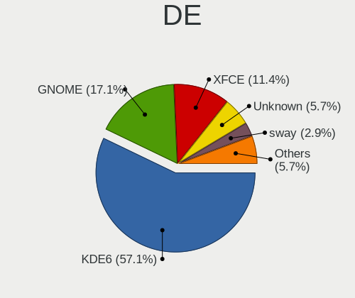
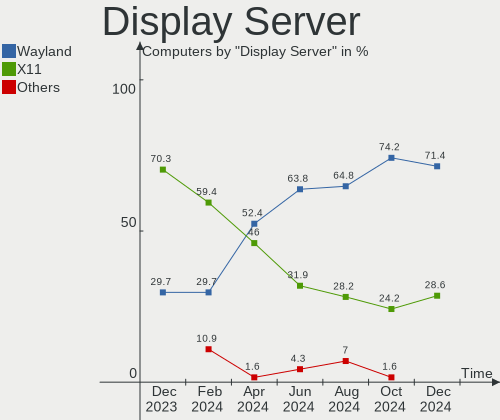
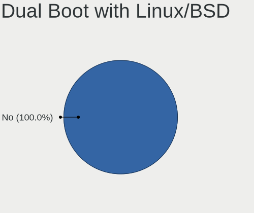
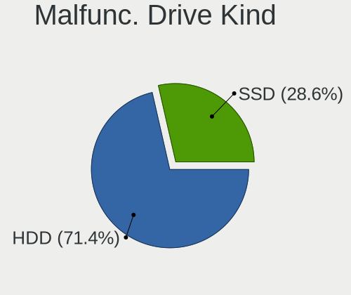
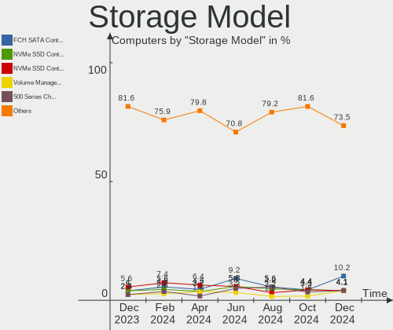
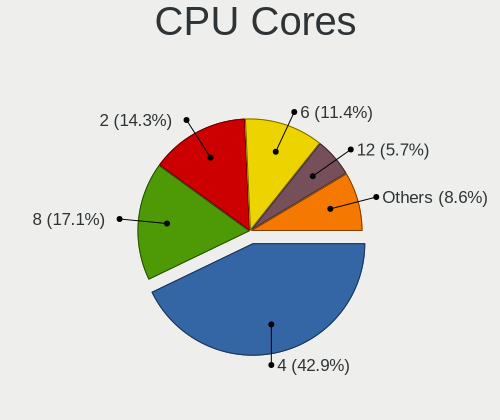
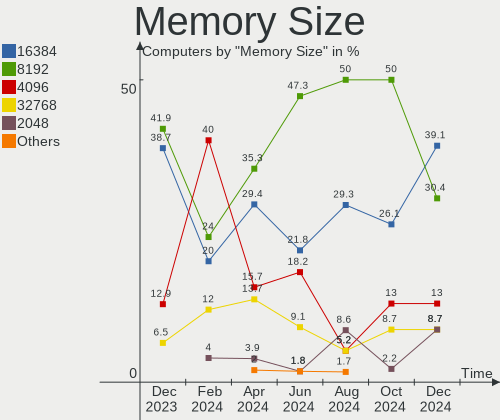
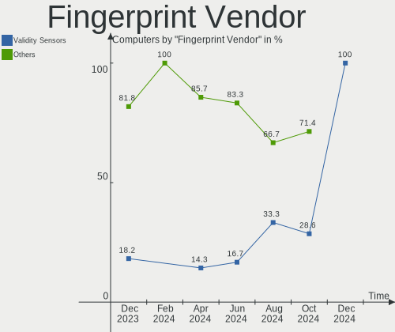
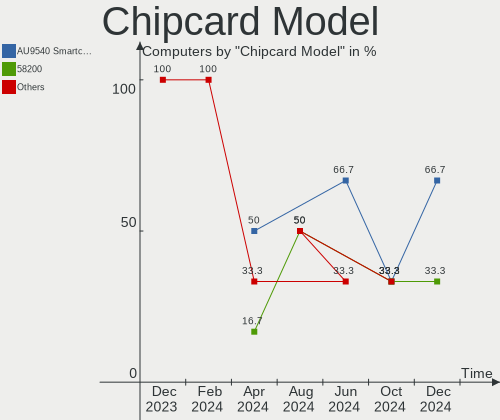

EndeavourOS - Hardware Trends
-----------------------------

A project to identify most popular hardware characteristics and track their change
over time based on data collected by Linux users at https://Linux-Hardware.org.

Anyone can contribute to this report by the [hw-probe](https://github.com/linuxhw/hw-probe) tool:

    sudo -E hw-probe -all -upload

This is a report for all computer types. See also reports for [desktops](/Dist/EndeavourOS/Desktop/README.md) and [notebooks](/Dist/EndeavourOS/Notebook/README.md).

This report is for one last month. Overall report since the beginning of time: [TestDays](https://github.com/linuxhw/TestDays)

Period: Jun, 2023.

Contents
--------

* [ System ](#system)
  - [ OS                       ](#os)
  - [ OS Family                ](#os-family)
  - [ Kernel                   ](#kernel)
  - [ Kernel Family            ](#kernel-family)
  - [ Kernel Major Ver.        ](#kernel-major-ver)
  - [ Arch                     ](#arch)
  - [ DE                       ](#de)
  - [ Display Server           ](#display-server)
  - [ Display Manager          ](#display-manager)
  - [ OS Lang                  ](#os-lang)
  - [ Boot Mode                ](#boot-mode)
  - [ Filesystem               ](#filesystem)
  - [ Part. scheme             ](#part-scheme)
  - [ Dual Boot with Linux/BSD ](#dual-boot-with-linuxbsd)
  - [ Dual Boot (Win)          ](#dual-boot-win)

* [ Board ](#board)
  - [ Vendor                   ](#vendor)
  - [ Model                    ](#model)
  - [ Model Family             ](#model-family)
  - [ MFG Year                 ](#mfg-year)
  - [ Form Factor              ](#form-factor)
  - [ Secure Boot              ](#secure-boot)
  - [ Coreboot                 ](#coreboot)
  - [ RAM Size                 ](#ram-size)
  - [ RAM Used                 ](#ram-used)
  - [ Total Drives             ](#total-drives)
  - [ Has CD-ROM               ](#has-cd-rom)
  - [ Has Ethernet             ](#has-ethernet)
  - [ Has WiFi                 ](#has-wifi)
  - [ Has Bluetooth            ](#has-bluetooth)

* [ Location ](#location)
  - [ Country                  ](#country)
  - [ City                     ](#city)

* [ Drives ](#drives)
  - [ Drive Vendor             ](#drive-vendor)
  - [ Drive Model              ](#drive-model)
  - [ HDD Vendor               ](#hdd-vendor)
  - [ SSD Vendor               ](#ssd-vendor)
  - [ Drive Kind               ](#drive-kind)
  - [ Drive Connector          ](#drive-connector)
  - [ Drive Size               ](#drive-size)
  - [ Space Total              ](#space-total)
  - [ Space Used               ](#space-used)
  - [ Malfunc. Drives          ](#malfunc-drives)
  - [ Malfunc. Drive Vendor    ](#malfunc-drive-vendor)
  - [ Malfunc. HDD Vendor      ](#malfunc-hdd-vendor)
  - [ Malfunc. Drive Kind      ](#malfunc-drive-kind)
  - [ Failed Drives            ](#failed-drives)
  - [ Failed Drive Vendor      ](#failed-drive-vendor)
  - [ Drive Status             ](#drive-status)

* [ Storage controller ](#storage-controller)
  - [ Storage Vendor           ](#storage-vendor)
  - [ Storage Model            ](#storage-model)
  - [ Storage Kind             ](#storage-kind)

* [ Processor ](#processor)
  - [ CPU Vendor               ](#cpu-vendor)
  - [ CPU Model                ](#cpu-model)
  - [ CPU Model Family         ](#cpu-model-family)
  - [ CPU Cores                ](#cpu-cores)
  - [ CPU Sockets              ](#cpu-sockets)
  - [ CPU Threads              ](#cpu-threads)
  - [ CPU Op-Modes             ](#cpu-op-modes)
  - [ CPU Microcode            ](#cpu-microcode)
  - [ CPU Microarch            ](#cpu-microarch)

* [ Graphics ](#graphics)
  - [ GPU Vendor               ](#gpu-vendor)
  - [ GPU Model                ](#gpu-model)
  - [ GPU Combo                ](#gpu-combo)
  - [ GPU Driver               ](#gpu-driver)
  - [ GPU Memory               ](#gpu-memory)

* [ Monitor ](#monitor)
  - [ Monitor Vendor           ](#monitor-vendor)
  - [ Monitor Model            ](#monitor-model)
  - [ Monitor Resolution       ](#monitor-resolution)
  - [ Monitor Diagonal         ](#monitor-diagonal)
  - [ Monitor Width            ](#monitor-width)
  - [ Aspect Ratio             ](#aspect-ratio)
  - [ Monitor Area             ](#monitor-area)
  - [ Pixel Density            ](#pixel-density)
  - [ Multiple Monitors        ](#multiple-monitors)

* [ Network ](#network)
  - [ Net Controller Vendor    ](#net-controller-vendor)
  - [ Net Controller Model     ](#net-controller-model)
  - [ Wireless Vendor          ](#wireless-vendor)
  - [ Wireless Model           ](#wireless-model)
  - [ Ethernet Vendor          ](#ethernet-vendor)
  - [ Ethernet Model           ](#ethernet-model)
  - [ Net Controller Kind      ](#net-controller-kind)
  - [ Used Controller          ](#used-controller)
  - [ NICs                     ](#nics)
  - [ IPv6                     ](#ipv6)

* [ Bluetooth ](#bluetooth)
  - [ Bluetooth Vendor         ](#bluetooth-vendor)
  - [ Bluetooth Model          ](#bluetooth-model)

* [ Sound ](#sound)
  - [ Sound Vendor             ](#sound-vendor)
  - [ Sound Model              ](#sound-model)

* [ Memory ](#memory)
  - [ Memory Vendor            ](#memory-vendor)
  - [ Memory Model             ](#memory-model)
  - [ Memory Kind              ](#memory-kind)
  - [ Memory Form Factor       ](#memory-form-factor)
  - [ Memory Size              ](#memory-size)
  - [ Memory Speed             ](#memory-speed)

* [ Printers & scanners ](#printers--scanners)
  - [ Printer Vendor           ](#printer-vendor)
  - [ Printer Model            ](#printer-model)
  - [ Scanner Vendor           ](#scanner-vendor)
  - [ Scanner Model            ](#scanner-model)

* [ Camera ](#camera)
  - [ Camera Vendor            ](#camera-vendor)
  - [ Camera Model             ](#camera-model)

* [ Security ](#security)
  - [ Fingerprint Vendor       ](#fingerprint-vendor)
  - [ Fingerprint Model        ](#fingerprint-model)
  - [ Chipcard Vendor          ](#chipcard-vendor)
  - [ Chipcard Model           ](#chipcard-model)

* [ Unsupported ](#unsupported)
  - [ Unsupported Devices      ](#unsupported-devices)
  - [ Unsupported Device Types ](#unsupported-device-types)

System
------

OS
--

Installed operating systems

| Name                | Computers | Percent |
|---------------------|-----------|---------|
| EndeavourOS Rolling | 47        | 100%    |

OS Family
---------

OS without a version

| Name        | Computers | Percent |
|-------------|-----------|---------|
| EndeavourOS | 47        | 100%    |

Kernel
------

Version of the Linux kernel

| Version                    | Computers | Percent |
|----------------------------|-----------|---------|
| 6.3.9-arch1-1              | 6         | 12.77%  |
| 6.3.5-arch1-1              | 5         | 10.64%  |
| 6.3.4-arch1-1              | 4         | 8.51%   |
| 6.3.6-arch1-1              | 3         | 6.38%   |
| 6.3.5-zen1-1-zen           | 3         | 6.38%   |
| 6.3.7-zen1-1-zen           | 2         | 4.26%   |
| 6.3.7-arch1-1              | 2         | 4.26%   |
| 6.3.6-zen1-1-zen           | 2         | 4.26%   |
| 6.1.34-1-lts               | 2         | 4.26%   |
| 6.1.31-1-lts               | 2         | 4.26%   |
| 6.3.9-zen1-1-zen           | 1         | 2.13%   |
| 6.3.8-zen1-1-zen           | 1         | 2.13%   |
| 6.3.8-arch1-1              | 1         | 2.13%   |
| 6.3.7-1-cachyos-bore       | 1         | 2.13%   |
| 6.3.6-arch1-1-surface      | 1         | 2.13%   |
| 6.3.6-273-tkg-pds          | 1         | 2.13%   |
| 6.3.5-zen2-1-zen           | 1         | 2.13%   |
| 6.3.4-arch1-1-surface      | 1         | 2.13%   |
| 6.3.2-arch1-1              | 1         | 2.13%   |
| 6.3.1-arch1-1-t2           | 1         | 2.13%   |
| 6.3.1-1-cachyos-eevdf-bore | 1         | 2.13%   |
| 6.2.8-arch1-1              | 1         | 2.13%   |
| 6.2.10-arch1-1             | 1         | 2.13%   |
| 6.1.35-1-lts               | 1         | 2.13%   |
| 6.1.33-1-lts               | 1         | 2.13%   |
| 5.19.7-arch1-1             | 1         | 2.13%   |

Kernel Family
-------------

Linux kernel without a distro release

| Version | Computers | Percent |
|---------|-----------|---------|
| 6.3.5   | 9         | 19.15%  |
| 6.3.9   | 7         | 14.89%  |
| 6.3.6   | 7         | 14.89%  |
| 6.3.7   | 5         | 10.64%  |
| 6.3.4   | 5         | 10.64%  |
| 6.3.8   | 2         | 4.26%   |
| 6.3.1   | 2         | 4.26%   |
| 6.1.34  | 2         | 4.26%   |
| 6.1.31  | 2         | 4.26%   |
| 6.3.2   | 1         | 2.13%   |
| 6.2.8   | 1         | 2.13%   |
| 6.2.10  | 1         | 2.13%   |
| 6.1.35  | 1         | 2.13%   |
| 6.1.33  | 1         | 2.13%   |
| 5.19.7  | 1         | 2.13%   |

Kernel Major Ver.
-----------------

Linux kernel major version

| Version | Computers | Percent |
|---------|-----------|---------|
| 6.3     | 38        | 80.85%  |
| 6.1     | 6         | 12.77%  |
| 6.2     | 2         | 4.26%   |
| 5.19    | 1         | 2.13%   |

Arch
----

OS architecture (x86_64, i586, etc.)

| Name   | Computers | Percent |
|--------|-----------|---------|
| x86_64 | 47        | 100%    |

DE
--

Desktop Environment

| Name     | Computers | Percent |
|----------|-----------|---------|
| KDE5     | 22        | 46.81%  |
| XFCE     | 10        | 21.28%  |
| GNOME    | 7         | 14.89%  |
| sway     | 2         | 4.26%   |
| i3       | 1         | 2.13%   |
| Hyprland | 1         | 2.13%   |
| Deepin   | 1         | 2.13%   |
| Budgie   | 1         | 2.13%   |
| bspwm    | 1         | 2.13%   |
| Unknown  | 1         | 2.13%   |

Display Server
--------------

X11 or Wayland

| Name    | Computers | Percent |
|---------|-----------|---------|
| X11     | 25        | 53.19%  |
| Wayland | 15        | 31.91%  |
| Tty     | 5         | 10.64%  |
| Unknown | 2         | 4.26%   |

Display Manager
---------------

SDDM, LightDM, etc.

| Name    | Computers | Percent |
|---------|-----------|---------|
| LightDM | 22        | 46.81%  |
| SDDM    | 15        | 31.91%  |
| Unknown | 5         | 10.64%  |
| GDM     | 4         | 8.51%   |
| LY-DM   | 1         | 2.13%   |

OS Lang
-------

Language

| Lang  | Computers | Percent |
|-------|-----------|---------|
| en_US | 29        | 61.7%   |
| ru_RU | 3         | 6.38%   |
| it_IT | 2         | 4.26%   |
| en_GB | 2         | 4.26%   |
| en_CA | 2         | 4.26%   |
| es_MX | 1         | 2.13%   |
| es_ES | 1         | 2.13%   |
| es_CO | 1         | 2.13%   |
| en_PH | 1         | 2.13%   |
| en_NZ | 1         | 2.13%   |
| en_IN | 1         | 2.13%   |
| en_AU | 1         | 2.13%   |
| de_DE | 1         | 2.13%   |
| cs_CZ | 1         | 2.13%   |

Boot Mode
---------

EFI or BIOS

| Mode | Computers | Percent |
|------|-----------|---------|
| EFI  | 30        | 63.83%  |
| BIOS | 17        | 36.17%  |

Filesystem
----------

Type of filesystem

| Type    | Computers | Percent |
|---------|-----------|---------|
| Ext4    | 24        | 51.06%  |
| Btrfs   | 18        | 38.3%   |
| Overlay | 5         | 10.64%  |

Part. scheme
------------

Scheme of partitioning

| Type    | Computers | Percent |
|---------|-----------|---------|
| GPT     | 37        | 78.72%  |
| MBR     | 5         | 10.64%  |
| Unknown | 5         | 10.64%  |

Dual Boot with Linux/BSD
------------------------

Hosting more than one Linux/BSD

| Dual boot | Computers | Percent |
|-----------|-----------|---------|
| No        | 34        | 72.34%  |
| Yes       | 13        | 27.66%  |

Dual Boot (Win)
---------------

Hosting Linux and Windows

| Dual boot | Computers | Percent |
|-----------|-----------|---------|
| No        | 26        | 55.32%  |
| Yes       | 21        | 44.68%  |

Board
-----

Vendor
------

Motherboard manufacturer

| Name                | Computers | Percent |
|---------------------|-----------|---------|
| ASUSTek Computer    | 11        | 23.4%   |
| MSI                 | 7         | 14.89%  |
| Lenovo              | 6         | 12.77%  |
| Dell                | 5         | 10.64%  |
| Sony                | 2         | 4.26%   |
| Microsoft           | 2         | 4.26%   |
| Apple               | 2         | 4.26%   |
| Acer                | 2         | 4.26%   |
| ZOTAC               | 1         | 2.13%   |
| VIT                 | 1         | 2.13%   |
| TUXEDO              | 1         | 2.13%   |
| Samsung Electronics | 1         | 2.13%   |
| Huanan              | 1         | 2.13%   |
| Hewlett-Packard     | 1         | 2.13%   |
| Google              | 1         | 2.13%   |
| Gigabyte Technology | 1         | 2.13%   |
| eMachines           | 1         | 2.13%   |
| ASRock              | 1         | 2.13%   |

Model
-----

Motherboard model

| Name                                     | Computers | Percent |
|------------------------------------------|-----------|---------|
| MSI MS-7A38                              | 2         | 4.26%   |
| Microsoft Surface Laptop Go              | 2         | 4.26%   |
| Dell Inspiron 3583                       | 2         | 4.26%   |
| ZOTAC ZBOX-EN760                         | 1         | 2.13%   |
| VIT P2402                                | 1         | 2.13%   |
| TUXEDO InfinityBook Pro 15 v5            | 1         | 2.13%   |
| Sony SVE1713X1EB                         | 1         | 2.13%   |
| Sony SVE1513B1EW                         | 1         | 2.13%   |
| Samsung 355V4C/356V4C/3445VC/3545VC      | 1         | 2.13%   |
| MSI MS-7C52                              | 1         | 2.13%   |
| MSI MS-7C37                              | 1         | 2.13%   |
| MSI MS-7C02                              | 1         | 2.13%   |
| MSI MS-7A37                              | 1         | 2.13%   |
| MSI GL73 8RE                             | 1         | 2.13%   |
| Lenovo Legion Y540-17IRH 81Q4            | 1         | 2.13%   |
| Lenovo IdeaPad S340-14API 81NB           | 1         | 2.13%   |
| Lenovo IdeaPad 5 Pro 16ARH7 82SN         | 1         | 2.13%   |
| Lenovo IdeaPad 5 Pro 16ACH6 82L5         | 1         | 2.13%   |
| Lenovo IdeaPad 320-15ISK 80XH            | 1         | 2.13%   |
| Lenovo IdeaPad 3 14ADA05 81W0            | 1         | 2.13%   |
| Huanan X99-F8 GAMING V2.0                | 1         | 2.13%   |
| HP Laptop 15-db0xxx                      | 1         | 2.13%   |
| Google Sasuke                            | 1         | 2.13%   |
| Gigabyte B550 AORUS ELITE V2             | 1         | 2.13%   |
| eMachines eME728                         | 1         | 2.13%   |
| Dell Vostro 1015                         | 1         | 2.13%   |
| Dell OptiPlex 7050                       | 1         | 2.13%   |
| Dell Latitude E5570                      | 1         | 2.13%   |
| ASUS X455LJ                              | 1         | 2.13%   |
| ASUS VivoBook_ASUSLaptop X515UA_D515UA   | 1         | 2.13%   |
| ASUS VivoBook_ASUSLaptop X515EA_X515EA   | 1         | 2.13%   |
| ASUS TUF Gaming FX505DT_FX505DT          | 1         | 2.13%   |
| ASUS TUF Gaming B550M-E WIFI             | 1         | 2.13%   |
| ASUS ROG Flow X16 GV601RW_GV601RW        | 1         | 2.13%   |
| ASUS MINIPC PN51-E1                      | 1         | 2.13%   |
| ASUS CM6850                              | 1         | 2.13%   |
| ASUS ASUS TUF Gaming A15 FA507RE_FA577RE | 1         | 2.13%   |
| ASUS ASUS TUF Gaming A15 FA506IV_FA506IV | 1         | 2.13%   |
| ASUS All Series                          | 1         | 2.13%   |
| ASRock Z77 Extreme4                      | 1         | 2.13%   |

Model Family
------------

Motherboard model prefix

| Name                | Computers | Percent |
|---------------------|-----------|---------|
| Lenovo IdeaPad      | 5         | 10.64%  |
| MSI MS-7A38         | 2         | 4.26%   |
| Microsoft Surface   | 2         | 4.26%   |
| Dell Inspiron       | 2         | 4.26%   |
| ASUS VivoBook       | 2         | 4.26%   |
| ASUS TUF            | 2         | 4.26%   |
| ASUS ASUS           | 2         | 4.26%   |
| Acer Aspire         | 2         | 4.26%   |
| ZOTAC ZBOX-EN760    | 1         | 2.13%   |
| VIT P2402           | 1         | 2.13%   |
| TUXEDO InfinityBook | 1         | 2.13%   |
| Sony SVE1713X1EB    | 1         | 2.13%   |
| Sony SVE1513B1EW    | 1         | 2.13%   |
| Samsung 355V4C      | 1         | 2.13%   |
| MSI MS-7C52         | 1         | 2.13%   |
| MSI MS-7C37         | 1         | 2.13%   |
| MSI MS-7C02         | 1         | 2.13%   |
| MSI MS-7A37         | 1         | 2.13%   |
| MSI GL73            | 1         | 2.13%   |
| Lenovo Legion       | 1         | 2.13%   |
| Huanan X99-F8       | 1         | 2.13%   |
| HP Laptop           | 1         | 2.13%   |
| Google Sasuke       | 1         | 2.13%   |
| Gigabyte B550       | 1         | 2.13%   |
| eMachines eME728    | 1         | 2.13%   |
| Dell Vostro         | 1         | 2.13%   |
| Dell OptiPlex       | 1         | 2.13%   |
| Dell Latitude       | 1         | 2.13%   |
| ASUS X455LJ         | 1         | 2.13%   |
| ASUS ROG            | 1         | 2.13%   |
| ASUS MINIPC         | 1         | 2.13%   |
| ASUS CM6850         | 1         | 2.13%   |
| ASUS All            | 1         | 2.13%   |
| ASRock Z77          | 1         | 2.13%   |
| Apple MacBookPro16  | 1         | 2.13%   |
| Apple iMac11        | 1         | 2.13%   |

MFG Year
--------

Motherboard manufacture year

| Year | Computers | Percent |
|------|-----------|---------|
| 2020 | 7         | 14.89%  |
| 2019 | 7         | 14.89%  |
| 2022 | 6         | 12.77%  |
| 2021 | 5         | 10.64%  |
| 2018 | 4         | 8.51%   |
| 2017 | 4         | 8.51%   |
| 2012 | 3         | 6.38%   |
| 2016 | 2         | 4.26%   |
| 2014 | 2         | 4.26%   |
| 2013 | 2         | 4.26%   |
| 2010 | 2         | 4.26%   |
| 2015 | 1         | 2.13%   |
| 2011 | 1         | 2.13%   |
| 2009 | 1         | 2.13%   |

Form Factor
-----------

Physical design of the computer

| Name        | Computers | Percent |
|-------------|-----------|---------|
| Notebook    | 28        | 59.57%  |
| Desktop     | 13        | 27.66%  |
| Tablet      | 2         | 4.26%   |
| Mini pc     | 2         | 4.26%   |
| Convertible | 1         | 2.13%   |
| All in one  | 1         | 2.13%   |

Secure Boot
-----------

Enabled or disabled

| State    | Computers | Percent |
|----------|-----------|---------|
| Disabled | 47        | 100%    |

Coreboot
--------

Have coreboot on board

| Used | Computers | Percent |
|------|-----------|---------|
| No   | 46        | 97.87%  |
| Yes  | 1         | 2.13%   |

RAM Size
--------

Total RAM memory

| Size in GB | Computers | Percent |
|------------|-----------|---------|
| 16.01-24.0 | 13        | 27.66%  |
| 8.01-16.0  | 13        | 27.66%  |
| 32.01-64.0 | 9         | 19.15%  |
| 4.01-8.0   | 7         | 14.89%  |
| 3.01-4.0   | 3         | 6.38%   |
| 24.01-32.0 | 1         | 2.13%   |
| 2.01-3.0   | 1         | 2.13%   |

RAM Used
--------

Used RAM memory

| Used GB   | Computers | Percent |
|-----------|-----------|---------|
| 2.01-3.0  | 11        | 23.4%   |
| 1.01-2.0  | 10        | 21.28%  |
| 4.01-8.0  | 9         | 19.15%  |
| 3.01-4.0  | 9         | 19.15%  |
| 8.01-16.0 | 8         | 17.02%  |

Total Drives
------------

Number of drives on board

| Drives | Computers | Percent |
|--------|-----------|---------|
| 1      | 28        | 59.57%  |
| 2      | 10        | 21.28%  |
| 3      | 5         | 10.64%  |
| 4      | 4         | 8.51%   |

Has CD-ROM
----------

Has CD-ROM on board

| Presented | Computers | Percent |
|-----------|-----------|---------|
| No        | 40        | 85.11%  |
| Yes       | 7         | 14.89%  |

Has Ethernet
------------

Has Ethernet on board

| Presented | Computers | Percent |
|-----------|-----------|---------|
| Yes       | 40        | 85.11%  |
| No        | 7         | 14.89%  |

Has WiFi
--------

Has WiFi module

| Presented | Computers | Percent |
|-----------|-----------|---------|
| Yes       | 41        | 87.23%  |
| No        | 6         | 12.77%  |

Has Bluetooth
-------------

Has Bluetooth module

| Presented | Computers | Percent |
|-----------|-----------|---------|
| Yes       | 39        | 82.98%  |
| No        | 8         | 17.02%  |

Location
--------

Country
-------

Geographic location (country)

| Country     | Computers | Percent |
|-------------|-----------|---------|
| USA         | 7         | 14.89%  |
| Italy       | 5         | 10.64%  |
| Russia      | 3         | 6.38%   |
| France      | 3         | 6.38%   |
| Canada      | 3         | 6.38%   |
| Turkey      | 2         | 4.26%   |
| Poland      | 2         | 4.26%   |
| Netherlands | 2         | 4.26%   |
| Venezuela   | 1         | 2.13%   |
| Tunisia     | 1         | 2.13%   |
| Switzerland | 1         | 2.13%   |
| Sweden      | 1         | 2.13%   |
| Spain       | 1         | 2.13%   |
| Philippines | 1         | 2.13%   |
| Peru        | 1         | 2.13%   |
| New Zealand | 1         | 2.13%   |
| Malaysia    | 1         | 2.13%   |
| Kyrgyzstan  | 1         | 2.13%   |
| Indonesia   | 1         | 2.13%   |
| India       | 1         | 2.13%   |
| Hungary     | 1         | 2.13%   |
| Germany     | 1         | 2.13%   |
| Czechia     | 1         | 2.13%   |
| Colombia    | 1         | 2.13%   |
| Chile       | 1         | 2.13%   |
| Brazil      | 1         | 2.13%   |
| Belgium     | 1         | 2.13%   |
| Armenia     | 1         | 2.13%   |

City
----

Geographic location (city)

| City                  | Computers | Percent |
|-----------------------|-----------|---------|
| Milan                 | 2         | 4.26%   |
| Yerevan               | 1         | 2.13%   |
| Wroclaw               | 1         | 2.13%   |
| Waxahachie            | 1         | 2.13%   |
| Vouille               | 1         | 2.13%   |
| Viña del Mar         | 1         | 2.13%   |
| Turin                 | 1         | 2.13%   |
| Tauranga              | 1         | 2.13%   |
| Sousse                | 1         | 2.13%   |
| Sochi                 | 1         | 2.13%   |
| Sens                  | 1         | 2.13%   |
| San Miguel de Meruelo | 1         | 2.13%   |
| Ryazan                | 1         | 2.13%   |
| Rexburg               | 1         | 2.13%   |
| Quezon City           | 1         | 2.13%   |
| Portland              | 1         | 2.13%   |
| Paris                 | 1         | 2.13%   |
| Otwock                | 1         | 2.13%   |
| Nizhniy Novgorod      | 1         | 2.13%   |
| Natal                 | 1         | 2.13%   |
| Naaldwijk             | 1         | 2.13%   |
| Montreal              | 1         | 2.13%   |
| Mersin                | 1         | 2.13%   |
| Malmo                 | 1         | 2.13%   |
| Lima                  | 1         | 2.13%   |
| Legian                | 1         | 2.13%   |
| Kuala Lumpur          | 1         | 2.13%   |
| Kosekoy               | 1         | 2.13%   |
| Hillsborough          | 1         | 2.13%   |
| Hattiesburg           | 1         | 2.13%   |
| Groot-Bijgaarden      | 1         | 2.13%   |
| Frýdek-Místek       | 1         | 2.13%   |
| Exeter                | 1         | 2.13%   |
| Delhi                 | 1         | 2.13%   |
| Delfgauw              | 1         | 2.13%   |
| Coteau-du-Lac         | 1         | 2.13%   |
| Corpus Christi        | 1         | 2.13%   |
| Chemnitz              | 1         | 2.13%   |
| Chelsea               | 1         | 2.13%   |
| Castello di Cisterna  | 1         | 2.13%   |

Drives
------

Drive Vendor
------------

Hard drive vendors

| Vendor                         | Computers | Drives | Percent |
|--------------------------------|-----------|--------|---------|
| Samsung Electronics            | 13        | 16     | 18.06%  |
| Seagate                        | 9         | 9      | 12.5%   |
| WDC                            | 6         | 8      | 8.33%   |
| Kingston                       | 6         | 7      | 8.33%   |
| SK hynix                       | 4         | 4      | 5.56%   |
| Sandisk                        | 4         | 4      | 5.56%   |
| Crucial                        | 4         | 4      | 5.56%   |
| Micron Technology              | 3         | 3      | 4.17%   |
| Intel                          | 3         | 3      | 4.17%   |
| Toshiba                        | 2         | 2      | 2.78%   |
| Phison Electronics             | 2         | 2      | 2.78%   |
| LITEON                         | 2         | 2      | 2.78%   |
| Unknown                        | 1         | 1      | 1.39%   |
| TAMMUZ                         | 1         | 2      | 1.39%   |
| SSSTC                          | 1         | 1      | 1.39%   |
| SPCC                           | 1         | 1      | 1.39%   |
| Solid State Storage Technology | 1         | 1      | 1.39%   |
| Realtek Semiconductor          | 1         | 1      | 1.39%   |
| Micron/Crucial Technology      | 1         | 1      | 1.39%   |
| MAXSUN                         | 1         | 1      | 1.39%   |
| KIOXIA                         | 1         | 1      | 1.39%   |
| HS-SSD-C100                    | 1         | 1      | 1.39%   |
| Gigabyte Technology            | 1         | 1      | 1.39%   |
| China                          | 1         | 1      | 1.39%   |
| Apple                          | 1         | 1      | 1.39%   |
| A-DATA Technology              | 1         | 1      | 1.39%   |

Drive Model
-----------

Hard drive models

| Model                                                 | Computers | Percent |
|-------------------------------------------------------|-----------|---------|
| Samsung NVMe SSD Controller SM981/PM981/PM983 250GB   | 3         | 3.85%   |
| Kingston SA400S37480G 480GB SSD                       | 3         | 3.85%   |
| SK hynix BC501 NVMe Solid State Drive 512GB           | 2         | 2.56%   |
| Intel SSDPEKNU512GZ 512GB                             | 2         | 2.56%   |
| WDC WDS250G1B0B-00AS40 250GB SSD                      | 1         | 1.28%   |
| WDC WDS240G2G0A-00JH30 240GB SSD                      | 1         | 1.28%   |
| WDC WD40PURX-78AKYY0 4TB                              | 1         | 1.28%   |
| WDC WD20EZRZ-00Z5HB0 2TB                              | 1         | 1.28%   |
| WDC WD1001FALS-00J7B1 1TB                             | 1         | 1.28%   |
| WDC WD1000DHTZ-04N21V1 1TB                            | 1         | 1.28%   |
| WDC WD1000DHTZ-04N21V0 1TB                            | 1         | 1.28%   |
| WDC WD Blue SA510 2.5 1TB SSD                         | 1         | 1.28%   |
| Unknown MMC Card  64GB                                | 1         | 1.28%   |
| Toshiba MQ01ABD050 500GB                              | 1         | 1.28%   |
| Toshiba BG3 NVMe SSD Controller 512GB                 | 1         | 1.28%   |
| TAMMUZ SSD 500GB                                      | 1         | 1.28%   |
| SSSTC CV8-8E128-HP 128GB SSD                          | 1         | 1.28%   |
| SPCC Solid State Disk 1TB                             | 1         | 1.28%   |
| Solid State Storage NVMe CL1-8D512 512GB              | 1         | 1.28%   |
| SK hynix SKHynix_HFS512GDE9X084N 512GB                | 1         | 1.28%   |
| SK hynix SC311 SATA 512GB SSD                         | 1         | 1.28%   |
| Seagate ST9320325AS 320GB                             | 1         | 1.28%   |
| Seagate ST500DM002-1BD142 500GB                       | 1         | 1.28%   |
| Seagate ST3500418AS 500GB                             | 1         | 1.28%   |
| Seagate ST2000LM007-1R8174 2TB                        | 1         | 1.28%   |
| Seagate ST2000DM008-2FR102 2TB                        | 1         | 1.28%   |
| Seagate ST2000DM001-1ER164 2TB                        | 1         | 1.28%   |
| Seagate ST1000LM049-2GH172 1TB                        | 1         | 1.28%   |
| Seagate ST1000LM035-1RK172 1TB                        | 1         | 1.28%   |
| Seagate Expansion SW 4TB                              | 1         | 1.28%   |
| Sandisk WD Blue SN550 NVMe SSD 1TB                    | 1         | 1.28%   |
| Sandisk WD Black SN850 1TB                            | 1         | 1.28%   |
| Sandisk WD Black SN750 / PC SN730 NVMe SSD 500GB      | 1         | 1.28%   |
| Sandisk WD Black 2018/SN750 / PC SN720 NVMe SSD 500GB | 1         | 1.28%   |
| Samsung SSD 980 1TB                                   | 1         | 1.28%   |
| Samsung SSD 870 QVO 2TB                               | 1         | 1.28%   |
| Samsung SSD 870 EVO 500GB                             | 1         | 1.28%   |
| Samsung SSD 870 EVO 1TB                               | 1         | 1.28%   |
| Samsung SSD 860 PRO 2TB                               | 1         | 1.28%   |
| Samsung SSD 860 PRO 256GB                             | 1         | 1.28%   |

HDD Vendor
----------

Hard disk drive vendors

| Vendor  | Computers | Drives | Percent |
|---------|-----------|--------|---------|
| Seagate | 9         | 9      | 64.29%  |
| WDC     | 4         | 5      | 28.57%  |
| Toshiba | 1         | 1      | 7.14%   |

SSD Vendor
----------

Solid state drive vendors

| Vendor              | Computers | Drives | Percent |
|---------------------|-----------|--------|---------|
| Samsung Electronics | 7         | 9      | 22.58%  |
| Kingston            | 4         | 4      | 12.9%   |
| Crucial             | 4         | 4      | 12.9%   |
| WDC                 | 3         | 3      | 9.68%   |
| LITEON              | 2         | 2      | 6.45%   |
| TAMMUZ              | 1         | 2      | 3.23%   |
| SSSTC               | 1         | 1      | 3.23%   |
| SPCC                | 1         | 1      | 3.23%   |
| SK hynix            | 1         | 1      | 3.23%   |
| Micron Technology   | 1         | 1      | 3.23%   |
| MAXSUN              | 1         | 1      | 3.23%   |
| Intel               | 1         | 1      | 3.23%   |
| HS-SSD-C100         | 1         | 1      | 3.23%   |
| Gigabyte Technology | 1         | 1      | 3.23%   |
| China               | 1         | 1      | 3.23%   |
| A-DATA Technology   | 1         | 1      | 3.23%   |

Drive Kind
----------

HDD or SSD

| Kind | Computers | Drives | Percent |
|------|-----------|--------|---------|
| NVMe | 27        | 29     | 40.3%   |
| SSD  | 27        | 34     | 40.3%   |
| HDD  | 12        | 15     | 17.91%  |
| MMC  | 1         | 1      | 1.49%   |

Drive Connector
---------------

SATA, SAS, NVMe, etc.

| Type | Computers | Drives | Percent |
|------|-----------|--------|---------|
| SATA | 30        | 47     | 50%     |
| NVMe | 27        | 29     | 45%     |
| SAS  | 2         | 2      | 3.33%   |
| MMC  | 1         | 1      | 1.67%   |

Drive Size
----------

Size of hard drive

| Size in TB | Computers | Drives | Percent |
|------------|-----------|--------|---------|
| 0.01-0.5   | 25        | 30     | 62.5%   |
| 0.51-1.0   | 7         | 10     | 17.5%   |
| 1.01-2.0   | 6         | 7      | 15%     |
| 3.01-4.0   | 2         | 2      | 5%      |

Space Total
-----------

Amount of disk space available on the file system

| Size in GB     | Computers | Percent |
|----------------|-----------|---------|
| 101-250        | 10        | 21.28%  |
| 1001-2000      | 9         | 19.15%  |
| More than 3000 | 6         | 12.77%  |
| 1-20           | 6         | 12.77%  |
| 251-500        | 5         | 10.64%  |
| 501-1000       | 5         | 10.64%  |
| 2001-3000      | 2         | 4.26%   |
| 51-100         | 2         | 4.26%   |
| 21-50          | 1         | 2.13%   |
| Unknown        | 1         | 2.13%   |

Space Used
----------

Amount of used disk space

| Used GB        | Computers | Percent |
|----------------|-----------|---------|
| 1-20           | 9         | 19.15%  |
| 21-50          | 8         | 17.02%  |
| 51-100         | 8         | 17.02%  |
| 251-500        | 7         | 14.89%  |
| 101-250        | 5         | 10.64%  |
| 501-1000       | 4         | 8.51%   |
| More than 3000 | 2         | 4.26%   |
| 2001-3000      | 1         | 2.13%   |
| 1001-2000      | 1         | 2.13%   |
| 0              | 1         | 2.13%   |
| Unknown        | 1         | 2.13%   |

Malfunc. Drives
---------------

Drive models with a malfunction

| Model                         | Computers | Drives | Percent |
|-------------------------------|-----------|--------|---------|
| WDC WD Blue SA510 2.5 1TB SSD | 1         | 1      | 16.67%  |
| Toshiba MQ01ABD050 500GB      | 1         | 1      | 16.67%  |
| SSSTC CV8-8E128-HP 128GB SSD  | 1         | 1      | 16.67%  |
| Seagate ST9320325AS 320GB     | 1         | 1      | 16.67%  |
| Crucial CT120M500SSD1 120GB   | 1         | 1      | 16.67%  |
| China SSD 256GB               | 1         | 1      | 16.67%  |

Malfunc. Drive Vendor
---------------------

Vendors of faulty drives

| Vendor  | Computers | Drives | Percent |
|---------|-----------|--------|---------|
| WDC     | 1         | 1      | 16.67%  |
| Toshiba | 1         | 1      | 16.67%  |
| SSSTC   | 1         | 1      | 16.67%  |
| Seagate | 1         | 1      | 16.67%  |
| Crucial | 1         | 1      | 16.67%  |
| China   | 1         | 1      | 16.67%  |

Malfunc. HDD Vendor
-------------------

Vendors of faulty HDD drives

| Vendor  | Computers | Drives | Percent |
|---------|-----------|--------|---------|
| Toshiba | 1         | 1      | 50%     |
| Seagate | 1         | 1      | 50%     |

Malfunc. Drive Kind
-------------------

Kinds of faulty drives

| Kind | Computers | Drives | Percent |
|------|-----------|--------|---------|
| SSD  | 4         | 4      | 66.67%  |
| HDD  | 2         | 2      | 33.33%  |

Failed Drives
-------------

Failed drive models

Zero info for selected period =(

Failed Drive Vendor
-------------------

Failed drive vendors

Zero info for selected period =(

Drive Status
------------

Number of failed and malfunc. drives

| Status   | Computers | Drives | Percent |
|----------|-----------|--------|---------|
| Works    | 37        | 59     | 71.15%  |
| Detected | 9         | 14     | 17.31%  |
| Malfunc  | 6         | 6      | 11.54%  |

Storage controller
------------------

Storage Vendor
--------------

Storage controller vendors

| Vendor                         | Computers | Percent |
|--------------------------------|-----------|---------|
| Intel                          | 23        | 34.33%  |
| AMD                            | 15        | 22.39%  |
| Samsung Electronics            | 7         | 10.45%  |
| SanDisk                        | 4         | 5.97%   |
| SK hynix                       | 3         | 4.48%   |
| Kingston Technology Company    | 3         | 4.48%   |
| Phison Electronics             | 2         | 2.99%   |
| Micron Technology              | 2         | 2.99%   |
| ASMedia Technology             | 2         | 2.99%   |
| Toshiba America Info Systems   | 1         | 1.49%   |
| Solid State Storage Technology | 1         | 1.49%   |
| Realtek Semiconductor          | 1         | 1.49%   |
| Micron/Crucial Technology      | 1         | 1.49%   |
| KIOXIA                         | 1         | 1.49%   |
| Apple                          | 1         | 1.49%   |

Storage Model
-------------

Storage controller models

| Model                                                                                   | Computers | Percent |
|-----------------------------------------------------------------------------------------|-----------|---------|
| AMD FCH SATA Controller [AHCI mode]                                                     | 12        | 16.22%  |
| Samsung NVMe SSD Controller 980                                                         | 4         | 5.41%   |
| Samsung NVMe SSD Controller SM981/PM981/PM983                                           | 3         | 4.05%   |
| Intel Sunrise Point-LP SATA Controller [AHCI mode]                                      | 3         | 4.05%   |
| Intel 7 Series Chipset Family 6-port SATA Controller [AHCI mode]                        | 3         | 4.05%   |
| AMD 400 Series Chipset SATA Controller                                                  | 3         | 4.05%   |
| SK hynix BC501 NVMe Solid State Drive                                                   | 2         | 2.7%    |
| Micron NVMe Storage Controller                                                          | 2         | 2.7%    |
| Kingston Company NVMe Controller                                                        | 2         | 2.7%    |
| Intel Non-Volatile memory controller                                                    | 2         | 2.7%    |
| Intel Cannon Point-LP SATA Controller [AHCI Mode]                                       | 2         | 2.7%    |
| Intel Cannon Lake Mobile PCH SATA AHCI Controller                                       | 2         | 2.7%    |
| Intel 82801IBM/IEM (ICH9M/ICH9M-E) 4 port SATA Controller [AHCI mode]                   | 2         | 2.7%    |
| ASMedia ASM1062 Serial ATA Controller                                                   | 2         | 2.7%    |
| AMD 500 Series Chipset SATA Controller                                                  | 2         | 2.7%    |
| Toshiba America Info Systems BG3 NVMe SSD Controller                                    | 1         | 1.35%   |
| Solid State Storage CL1-3D256-Q11 NVMe SSD M.2                                          | 1         | 1.35%   |
| SK hynix Gold P31/BC711/PC711 NVMe Solid State Drive                                    | 1         | 1.35%   |
| SanDisk WD PC SN810 / Black SN850 NVMe SSD                                              | 1         | 1.35%   |
| SanDisk WD Blue SN550 NVMe SSD                                                          | 1         | 1.35%   |
| SanDisk WD Black SN750 / PC SN730 NVMe SSD                                              | 1         | 1.35%   |
| SanDisk WD Black 2018/SN750 / PC SN720 NVMe SSD                                         | 1         | 1.35%   |
| Realtek NVMe Controller                                                                 | 1         | 1.35%   |
| Phison E16 PCIe4 NVMe Controller                                                        | 1         | 1.35%   |
| Phison E12 NVMe Controller                                                              | 1         | 1.35%   |
| Micron/Crucial P2 NVMe PCIe SSD                                                         | 1         | 1.35%   |
| KIOXIA NVMe SSD Controller BG4                                                          | 1         | 1.35%   |
| Kingston Company FURY Renegade NVMe SSD                                                 | 1         | 1.35%   |
| Intel Wildcat Point-LP SATA Controller [AHCI Mode]                                      | 1         | 1.35%   |
| Intel Volume Management Device NVMe RAID Controller                                     | 1         | 1.35%   |
| Intel Tiger Lake-LP SATA Controller                                                     | 1         | 1.35%   |
| Intel Comet Lake SATA AHCI Controller                                                   | 1         | 1.35%   |
| Intel 9 Series Chipset Family SATA Controller [AHCI Mode]                               | 1         | 1.35%   |
| Intel 82801 Mobile SATA Controller [RAID mode]                                          | 1         | 1.35%   |
| Intel 8 Series SATA Controller 1 [AHCI mode]                                            | 1         | 1.35%   |
| Intel 7 Series/C210 Series Chipset Family 6-port SATA Controller [AHCI mode]            | 1         | 1.35%   |
| Intel 6 Series/C200 Series Chipset Family Desktop SATA Controller (IDE mode, ports 4-5) | 1         | 1.35%   |
| Intel 6 Series/C200 Series Chipset Family Desktop SATA Controller (IDE mode, ports 0-3) | 1         | 1.35%   |
| Intel 5 Series/3400 Series Chipset 6 port SATA AHCI Controller                          | 1         | 1.35%   |
| Intel 200 Series PCH SATA controller [AHCI mode]                                        | 1         | 1.35%   |

Storage Kind
------------

Kind of storage controller (IDE, SATA, NVMe, SAS, ...)

| Kind | Computers | Percent |
|------|-----------|---------|
| SATA | 35        | 53.85%  |
| NVMe | 27        | 41.54%  |
| RAID | 2         | 3.08%   |
| IDE  | 1         | 1.54%   |

Processor
---------

CPU Vendor
----------

Processor vendors

| Vendor | Computers | Percent |
|--------|-----------|---------|
| Intel  | 27        | 57.45%  |
| AMD    | 20        | 42.55%  |

CPU Model
---------

Processor models

| Model                                         | Computers | Percent |
|-----------------------------------------------|-----------|---------|
| Intel Core i5-1035G1 CPU @ 1.00GHz            | 2         | 4.26%   |
| AMD Ryzen 7 5700X 8-Core Processor            | 2         | 4.26%   |
| Intel Xeon CPU E5-2666 v3 @ 2.90GHz           | 1         | 2.13%   |
| Intel Pentium CPU 2020M @ 2.40GHz             | 1         | 2.13%   |
| Intel Core i7-9750H CPU @ 2.60GHz             | 1         | 2.13%   |
| Intel Core i7-8750H CPU @ 2.20GHz             | 1         | 2.13%   |
| Intel Core i7-8565U CPU @ 1.80GHz             | 1         | 2.13%   |
| Intel Core i7-7700 CPU @ 3.60GHz              | 1         | 2.13%   |
| Intel Core i7-3770K CPU @ 3.50GHz             | 1         | 2.13%   |
| Intel Core i7-3632QM CPU @ 2.20GHz            | 1         | 2.13%   |
| Intel Core i7-2600 CPU @ 3.40GHz              | 1         | 2.13%   |
| Intel Core i7-1068NG7 CPU @ 2.30GHz           | 1         | 2.13%   |
| Intel Core i5-6300U CPU @ 2.40GHz             | 1         | 2.13%   |
| Intel Core i5-6200U CPU @ 2.30GHz             | 1         | 2.13%   |
| Intel Core i5-4690 CPU @ 3.50GHz              | 1         | 2.13%   |
| Intel Core i5-4200U CPU @ 1.60GHz             | 1         | 2.13%   |
| Intel Core i5-10210U CPU @ 1.60GHz            | 1         | 2.13%   |
| Intel Core i3-8145U CPU @ 2.10GHz             | 1         | 2.13%   |
| Intel Core i3-7100U CPU @ 2.40GHz             | 1         | 2.13%   |
| Intel Core i3-6006U CPU @ 2.00GHz             | 1         | 2.13%   |
| Intel Core i3-5010U CPU @ 2.10GHz             | 1         | 2.13%   |
| Intel Core i3-3120M CPU @ 2.50GHz             | 1         | 2.13%   |
| Intel Core i3 CPU 540 @ 3.07GHz               | 1         | 2.13%   |
| Intel Core 2 Duo CPU T9550 @ 2.66GHz          | 1         | 2.13%   |
| Intel Core 2 Duo CPU T6670 @ 2.20GHz          | 1         | 2.13%   |
| Intel Celeron N4500 @ 1.10GHz                 | 1         | 2.13%   |
| Intel 11th Gen Core i5-1135G7 @ 2.40GHz       | 1         | 2.13%   |
| AMD Ryzen 9 6900HS with Radeon Graphics       | 1         | 2.13%   |
| AMD Ryzen 7 6800HS Creator Edition            | 1         | 2.13%   |
| AMD Ryzen 7 6800H with Radeon Graphics        | 1         | 2.13%   |
| AMD Ryzen 7 5700U with Radeon Graphics        | 1         | 2.13%   |
| AMD Ryzen 7 4800H with Radeon Graphics        | 1         | 2.13%   |
| AMD Ryzen 7 3700X 8-Core Processor            | 1         | 2.13%   |
| AMD Ryzen 7 1700 Eight-Core Processor         | 1         | 2.13%   |
| AMD Ryzen 5 5600H with Radeon Graphics        | 1         | 2.13%   |
| AMD Ryzen 5 5500U with Radeon Graphics        | 1         | 2.13%   |
| AMD Ryzen 5 3600X 6-Core Processor            | 1         | 2.13%   |
| AMD Ryzen 5 3550H with Radeon Vega Mobile Gfx | 1         | 2.13%   |
| AMD Ryzen 5 3500U with Radeon Vega Mobile Gfx | 1         | 2.13%   |
| AMD Ryzen 5 2600 Six-Core Processor           | 1         | 2.13%   |

CPU Model Family
----------------

Processor model prefix

| Model            | Computers | Percent |
|------------------|-----------|---------|
| Intel Core i7    | 8         | 17.02%  |
| AMD Ryzen 7      | 8         | 17.02%  |
| Intel Core i5    | 7         | 14.89%  |
| AMD Ryzen 5      | 7         | 14.89%  |
| Intel Core i3    | 6         | 12.77%  |
| Other            | 2         | 4.26%   |
| Intel Core 2 Duo | 2         | 4.26%   |
| Intel Xeon       | 1         | 2.13%   |
| Intel Pentium    | 1         | 2.13%   |
| Intel Celeron    | 1         | 2.13%   |
| AMD Ryzen 9      | 1         | 2.13%   |
| AMD Ryzen 3      | 1         | 2.13%   |
| AMD Athlon       | 1         | 2.13%   |
| AMD A10          | 1         | 2.13%   |

CPU Cores
---------

Number of processor cores

| Number | Computers | Percent |
|--------|-----------|---------|
| 2      | 17        | 36.17%  |
| 4      | 14        | 29.79%  |
| 8      | 9         | 19.15%  |
| 6      | 6         | 12.77%  |
| 10     | 1         | 2.13%   |

CPU Sockets
-----------

Number of sockets

| Number | Computers | Percent |
|--------|-----------|---------|
| 1      | 47        | 100%    |

CPU Threads
-----------

Threads per core (Hyper-Threading)

| Number | Computers | Percent |
|--------|-----------|---------|
| 2      | 39        | 82.98%  |
| 1      | 8         | 17.02%  |

CPU Op-Modes
------------

CPU Operation Modes (32-bit, 64-bit)

| Op mode        | Computers | Percent |
|----------------|-----------|---------|
| 32-bit, 64-bit | 47        | 100%    |

CPU Microcode
-------------

Microcode number

| Number     | Computers | Percent |
|------------|-----------|---------|
| Unknown    | 29        | 61.7%   |
| 0x0a404101 | 2         | 4.26%   |
| 0x0a20120a | 2         | 4.26%   |
| 0x08108109 | 2         | 4.26%   |
| 0x40651    | 1         | 2.13%   |
| 0x1067a    | 1         | 2.13%   |
| 0x0a50000c | 1         | 2.13%   |
| 0x0a404102 | 1         | 2.13%   |
| 0x08701030 | 1         | 2.13%   |
| 0x08701021 | 1         | 2.13%   |
| 0x08608103 | 1         | 2.13%   |
| 0x08108102 | 1         | 2.13%   |
| 0x0800820d | 1         | 2.13%   |
| 0x08001129 | 1         | 2.13%   |
| 0x06006705 | 1         | 2.13%   |
| 0x06001119 | 1         | 2.13%   |

CPU Microarch
-------------

Microarchitecture

| Name        | Computers | Percent |
|-------------|-----------|---------|
| KabyLake    | 6         | 12.77%  |
| Zen+        | 5         | 10.64%  |
| Unknown     | 5         | 10.64%  |
| IvyBridge   | 4         | 8.51%   |
| Zen 3       | 3         | 6.38%   |
| Zen 2       | 3         | 6.38%   |
| Skylake     | 3         | 6.38%   |
| IceLake     | 3         | 6.38%   |
| Haswell     | 3         | 6.38%   |
| Zen         | 2         | 4.26%   |
| Penryn      | 2         | 4.26%   |
| Westmere    | 1         | 2.13%   |
| Tremont     | 1         | 2.13%   |
| TigerLake   | 1         | 2.13%   |
| SandyBridge | 1         | 2.13%   |
| Piledriver  | 1         | 2.13%   |
| Excavator   | 1         | 2.13%   |
| CometLake   | 1         | 2.13%   |
| Broadwell   | 1         | 2.13%   |

Graphics
--------

GPU Vendor
----------

Vendors of graphics cards

| Vendor | Computers | Percent |
|--------|-----------|---------|
| AMD    | 21        | 38.18%  |
| Intel  | 20        | 36.36%  |
| Nvidia | 14        | 25.45%  |

GPU Model
---------

Graphics card models

| Model                                                                       | Computers | Percent |
|-----------------------------------------------------------------------------|-----------|---------|
| AMD Rembrandt [Radeon 680M]                                                 | 3         | 5.36%   |
| AMD Picasso/Raven 2 [Radeon Vega Series / Radeon Vega Mobile Series]        | 3         | 5.36%   |
| Nvidia TU106M [GeForce RTX 2060 Mobile]                                     | 2         | 3.57%   |
| Intel WhiskeyLake-U GT2 [UHD Graphics 620]                                  | 2         | 3.57%   |
| Intel Skylake GT2 [HD Graphics 520]                                         | 2         | 3.57%   |
| Intel Mobile 4 Series Chipset Integrated Graphics Controller                | 2         | 3.57%   |
| Intel Iris Plus Graphics G1 (Ice Lake)                                      | 2         | 3.57%   |
| Intel 3rd Gen Core processor Graphics Controller                            | 2         | 3.57%   |
| AMD Navi 22 [Radeon RX 6700/6700 XT/6750 XT / 6800M/6850M XT]               | 2         | 3.57%   |
| AMD Lucienne                                                                | 2         | 3.57%   |
| AMD Ellesmere [Radeon RX 470/480/570/570X/580/580X/590]                     | 2         | 3.57%   |
| Nvidia TU117M [GeForce GTX 1650 Mobile / Max-Q]                             | 1         | 1.79%   |
| Nvidia TU116 [GeForce GTX 1660 SUPER]                                       | 1         | 1.79%   |
| Nvidia GP106M [GeForce GTX 1060 Mobile]                                     | 1         | 1.79%   |
| Nvidia GP102 [GeForce GTX 1080 Ti]                                          | 1         | 1.79%   |
| Nvidia GM206 [GeForce GTX 950]                                              | 1         | 1.79%   |
| Nvidia GM107M [GeForce GTX 860M]                                            | 1         | 1.79%   |
| Nvidia GM107 [GeForce 940MX]                                                | 1         | 1.79%   |
| Nvidia GK208BM [GeForce 920M]                                               | 1         | 1.79%   |
| Nvidia GK104 [GeForce GTX 760]                                              | 1         | 1.79%   |
| Nvidia GA107M [GeForce RTX 3050 Ti Mobile]                                  | 1         | 1.79%   |
| Nvidia GA106 [GeForce RTX 3060 Lite Hash Rate]                              | 1         | 1.79%   |
| Nvidia GA104 [Geforce RTX 3070 Ti Laptop GPU]                               | 1         | 1.79%   |
| Intel Xeon E3-1200 v3/4th Gen Core Processor Integrated Graphics Controller | 1         | 1.79%   |
| Intel TigerLake-LP GT2 [Iris Xe Graphics]                                   | 1         | 1.79%   |
| Intel JasperLake [UHD Graphics]                                             | 1         | 1.79%   |
| Intel Iris Plus Graphics G7                                                 | 1         | 1.79%   |
| Intel HD Graphics 630                                                       | 1         | 1.79%   |
| Intel HD Graphics 620                                                       | 1         | 1.79%   |
| Intel HD Graphics 5500                                                      | 1         | 1.79%   |
| Intel HD Graphics 520                                                       | 1         | 1.79%   |
| Intel Comet Lake UHD Graphics                                               | 1         | 1.79%   |
| Intel CoffeeLake-H GT2 [UHD Graphics 630]                                   | 1         | 1.79%   |
| AMD Vega 10 XL/XT [Radeon RX Vega 56/64]                                    | 1         | 1.79%   |
| AMD Trinity [Radeon HD 7660G]                                               | 1         | 1.79%   |
| AMD Thames [Radeon HD 7550M/7570M/7650M]                                    | 1         | 1.79%   |
| AMD Thames [Radeon HD 7500M/7600M Series]                                   | 1         | 1.79%   |
| AMD Stoney [Radeon R2/R3/R4/R5 Graphics]                                    | 1         | 1.79%   |
| AMD RV730/M96-XT [Mobility Radeon HD 4670]                                  | 1         | 1.79%   |
| AMD Renoir                                                                  | 1         | 1.79%   |

GPU Combo
---------

Combinations of graphics cards

| Name           | Computers | Percent |
|----------------|-----------|---------|
| 1 x AMD        | 16        | 34.04%  |
| 1 x Intel      | 14        | 29.79%  |
| 1 x Nvidia     | 6         | 12.77%  |
| Intel + Nvidia | 4         | 8.51%   |
| AMD + Nvidia   | 4         | 8.51%   |
| 2 x Intel      | 2         | 4.26%   |
| 2 x AMD        | 1         | 2.13%   |

GPU Driver
----------

Free vs proprietary

| Driver      | Computers | Percent |
|-------------|-----------|---------|
| Free        | 36        | 76.6%   |
| Proprietary | 11        | 23.4%   |

GPU Memory
----------

Total video memory

| Size in GB | Computers | Percent |
|------------|-----------|---------|
| Unknown    | 27        | 57.45%  |
| 1.01-2.0   | 7         | 14.89%  |
| 8.01-16.0  | 5         | 10.64%  |
| 0.01-0.5   | 4         | 8.51%   |
| 5.01-6.0   | 2         | 4.26%   |
| 7.01-8.0   | 1         | 2.13%   |
| 3.01-4.0   | 1         | 2.13%   |

Monitor
-------

Monitor Vendor
--------------

Monitor vendors

| Vendor               | Computers | Percent |
|----------------------|-----------|---------|
| Samsung Electronics  | 8         | 13.79%  |
| Chimei Innolux       | 8         | 13.79%  |
| LG Display           | 5         | 8.62%   |
| AU Optronics         | 5         | 8.62%   |
| Hewlett-Packard      | 4         | 6.9%    |
| BOE                  | 4         | 6.9%    |
| Goldstar             | 3         | 5.17%   |
| Dell                 | 3         | 5.17%   |
| PANDA                | 2         | 3.45%   |
| Lenovo               | 2         | 3.45%   |
| CSO                  | 2         | 3.45%   |
| Apple                | 2         | 3.45%   |
| Acer                 | 2         | 3.45%   |
| XHS                  | 1         | 1.72%   |
| Philips              | 1         | 1.72%   |
| Mi                   | 1         | 1.72%   |
| Iiyama               | 1         | 1.72%   |
| Denver               | 1         | 1.72%   |
| AOC                  | 1         | 1.72%   |
| Ancor Communications | 1         | 1.72%   |
| Unknown              | 1         | 1.72%   |

Monitor Model
-------------

Monitor models

| Model                                                                   | Computers | Percent |
|-------------------------------------------------------------------------|-----------|---------|
| Samsung Electronics LC24RG50 SAM0F90 1920x1080 532x304mm 24.1-inch      | 2         | 3.28%   |
| PANDA LCD Monitor NCP002D 1920x1080 344x194mm 15.5-inch                 | 2         | 3.28%   |
| LG Display LCD Monitor LGD0555 1536x1024 263x175mm 12.4-inch            | 2         | 3.28%   |
| XHS N2488HZ XHS2380 1920x1080 520x310mm 23.8-inch                       | 1         | 1.64%   |
| Samsung Electronics SyncMaster SAM0486 1920x1080                        | 1         | 1.64%   |
| Samsung Electronics SMB1930HD SAM0708 1360x768 410x230mm 18.5-inch      | 1         | 1.64%   |
| Samsung Electronics S22C150 SAM0AE5 1920x1080 477x268mm 21.5-inch       | 1         | 1.64%   |
| Samsung Electronics Odyssey G6 SAM7236 2560x1440 698x392mm 31.5-inch    | 1         | 1.64%   |
| Samsung Electronics LCD Monitor SEC5441 1366x768 293x165mm 13.2-inch    | 1         | 1.64%   |
| Samsung Electronics LCD Monitor SAM7016 3840x2160 1872x1053mm 84.6-inch | 1         | 1.64%   |
| Samsung Electronics LCD Monitor SAM0C3C 1366x768 609x347mm 27.6-inch    | 1         | 1.64%   |
| Samsung Electronics LCD Monitor SAM07C0 1920x1080 700x390mm 31.5-inch   | 1         | 1.64%   |
| Samsung Electronics C24FG7x SAM0E43 1920x1080 532x304mm 24.1-inch       | 1         | 1.64%   |
| Philips PHL 273V7 PHLC156 1920x1080 598x336mm 27.0-inch                 | 1         | 1.64%   |
| Mi Monitor XMI3444 3440x1440 797x334mm 34.0-inch                        | 1         | 1.64%   |
| LG Display LCD Monitor LGD05EC 1920x1080 309x174mm 14.0-inch            | 1         | 1.64%   |
| LG Display LCD Monitor LGD039F 1366x768 345x194mm 15.6-inch             | 1         | 1.64%   |
| LG Display LCD Monitor LGD0384 1366x768 344x194mm 15.5-inch             | 1         | 1.64%   |
| Lenovo P24q-10 LEN61A5 2560x1440 527x296mm 23.8-inch                    | 1         | 1.64%   |
| Lenovo LEN T24h-20 LEN61F0 2560x1440 527x296mm 23.8-inch                | 1         | 1.64%   |
| Iiyama PLX2481H IVM611D 1920x1080 521x293mm 23.5-inch                   | 1         | 1.64%   |
| Hewlett-Packard LP2475w HWP26F7 1920x1200 546x352mm 25.6-inch           | 1         | 1.64%   |
| Hewlett-Packard L190hb HWP289A 1440x900 408x255mm 18.9-inch             | 1         | 1.64%   |
| Hewlett-Packard L1506 HWP265B 1024x768 300x220mm 14.6-inch              | 1         | 1.64%   |
| Hewlett-Packard 2311 HWP293A 1920x1080 509x286mm 23.0-inch              | 1         | 1.64%   |
| Goldstar ULTRAWIDE GSM59F1 2560x1080 673x284mm 28.8-inch                | 1         | 1.64%   |
| Goldstar IPS FULLHD GSM5AB7 1920x1080 480x270mm 21.7-inch               | 1         | 1.64%   |
| Goldstar FULL HD GSM5B55 1920x1080 480x270mm 21.7-inch                  | 1         | 1.64%   |
| Denver PGM300 V2 LHC3000 2560x1080 690x291mm 29.5-inch                  | 1         | 1.64%   |
| Dell U2412M DELA07B 1920x1200 518x324mm 24.1-inch                       | 1         | 1.64%   |
| Dell S2409W DELA039 1920x1080 531x298mm 24.0-inch                       | 1         | 1.64%   |
| Dell P2314H DEL4098 1920x1080 509x286mm 23.0-inch                       | 1         | 1.64%   |
| CSO LCD Monitor CSO160C 2560x1600 344x215mm 16.0-inch                   | 1         | 1.64%   |
| CSO LCD Monitor CSO1602 2560x1600 344x215mm 16.0-inch                   | 1         | 1.64%   |
| Chimei Innolux LCD Monitor CMN175C 1920x1080 380x210mm 17.1-inch        | 1         | 1.64%   |
| Chimei Innolux LCD Monitor CMN1735 1920x1080 382x215mm 17.3-inch        | 1         | 1.64%   |
| Chimei Innolux LCD Monitor CMN15F5 1920x1080 344x193mm 15.5-inch        | 1         | 1.64%   |
| Chimei Innolux LCD Monitor CMN15D2 1920x1080 344x193mm 15.5-inch        | 1         | 1.64%   |
| Chimei Innolux LCD Monitor CMN153C 1920x1080 344x193mm 15.5-inch        | 1         | 1.64%   |
| Chimei Innolux LCD Monitor CMN1480 1366x768 309x174mm 14.0-inch         | 1         | 1.64%   |

Monitor Resolution
------------------

Monitor screen resolution

| Resolution        | Computers | Percent |
|-------------------|-----------|---------|
| 1920x1080 (FHD)   | 23        | 43.4%   |
| 1366x768 (WXGA)   | 10        | 18.87%  |
| 2560x1600         | 4         | 7.55%   |
| 2560x1440 (QHD)   | 4         | 7.55%   |
| 3840x2160 (4K)    | 3         | 5.66%   |
| 2736x1824         | 2         | 3.77%   |
| 2560x1080         | 2         | 3.77%   |
| 3440x1440         | 1         | 1.89%   |
| 1920x1200 (WUXGA) | 1         | 1.89%   |
| 1440x900 (WXGA+)  | 1         | 1.89%   |
| 1360x768          | 1         | 1.89%   |
| 1024x768 (XGA)    | 1         | 1.89%   |

Monitor Diagonal
----------------

Diagonal size in inches

| Inches  | Computers | Percent |
|---------|-----------|---------|
| 15      | 16        | 26.23%  |
| 24      | 8         | 13.11%  |
| 23      | 5         | 8.2%    |
| 21      | 5         | 8.2%    |
| 14      | 4         | 6.56%   |
| 16      | 3         | 4.92%   |
| 34      | 2         | 3.28%   |
| 31      | 2         | 3.28%   |
| 17      | 2         | 3.28%   |
| 13      | 2         | 3.28%   |
| 12      | 2         | 3.28%   |
| 84      | 1         | 1.64%   |
| 54      | 1         | 1.64%   |
| 46      | 1         | 1.64%   |
| 33      | 1         | 1.64%   |
| 29      | 1         | 1.64%   |
| 27      | 1         | 1.64%   |
| 25      | 1         | 1.64%   |
| 19      | 1         | 1.64%   |
| 18      | 1         | 1.64%   |
| Unknown | 1         | 1.64%   |

Monitor Width
-------------

Physical width

| Width in mm | Computers | Percent |
|-------------|-----------|---------|
| 301-350     | 23        | 39.66%  |
| 501-600     | 12        | 20.69%  |
| 401-500     | 7         | 12.07%  |
| 701-800     | 3         | 5.17%   |
| 601-700     | 3         | 5.17%   |
| 351-400     | 3         | 5.17%   |
| 201-300     | 3         | 5.17%   |
| 1001-1500   | 2         | 3.45%   |
| 1501-2000   | 1         | 1.72%   |
| Unknown     | 1         | 1.72%   |

Aspect Ratio
------------

Proportional relationship between the width and the height

| Ratio | Computers | Percent |
|-------|-----------|---------|
| 16/9  | 37        | 75.51%  |
| 16/10 | 6         | 12.24%  |
| 21/9  | 3         | 6.12%   |
| 3/2   | 2         | 4.08%   |
| 4/3   | 1         | 2.04%   |

Monitor Area
------------

Area in inch²

| Area in inch² | Computers | Percent |
|----------------|-----------|---------|
| 101-110        | 16        | 27.12%  |
| 201-250        | 11        | 18.64%  |
| 81-90          | 5         | 8.47%   |
| 351-500        | 5         | 8.47%   |
| 251-300        | 4         | 6.78%   |
| 71-80          | 3         | 5.08%   |
| 151-200        | 3         | 5.08%   |
| 111-120        | 3         | 5.08%   |
| More than 1000 | 2         | 3.39%   |
| 301-350        | 2         | 3.39%   |
| 121-130        | 2         | 3.39%   |
| 141-150        | 1         | 1.69%   |
| 501-1000       | 1         | 1.69%   |
| Unknown        | 1         | 1.69%   |

Pixel Density
-------------

Pixels per inch

| Density | Computers | Percent |
|---------|-----------|---------|
| 51-100  | 18        | 33.96%  |
| 121-160 | 16        | 30.19%  |
| 101-120 | 12        | 22.64%  |
| 161-240 | 4         | 7.55%   |
| 1-50    | 2         | 3.77%   |
| Unknown | 1         | 1.89%   |

Multiple Monitors
-----------------

Total monitors connected

| Total | Computers | Percent |
|-------|-----------|---------|
| 1     | 33        | 70.21%  |
| 2     | 13        | 27.66%  |
| 3     | 1         | 2.13%   |

Network
-------

Net Controller Vendor
---------------------

Controller vendors

| Vendor                | Computers | Percent |
|-----------------------|-----------|---------|
| Realtek Semiconductor | 35        | 43.21%  |
| Intel                 | 15        | 18.52%  |
| Qualcomm Atheros      | 14        | 17.28%  |
| Broadcom              | 4         | 4.94%   |
| MediaTek              | 2         | 2.47%   |
| DisplayLink           | 2         | 2.47%   |
| D-Link                | 2         | 2.47%   |
| TP-Link               | 1         | 1.23%   |
| OPPO Electronics      | 1         | 1.23%   |
| Oculus VR             | 1         | 1.23%   |
| Linksys               | 1         | 1.23%   |
| Lenovo                | 1         | 1.23%   |
| ASIX Electronics      | 1         | 1.23%   |
| Apple                 | 1         | 1.23%   |

Net Controller Model
--------------------

Controller models

| Model                                                             | Computers | Percent |
|-------------------------------------------------------------------|-----------|---------|
| Realtek RTL8111/8168/8411 PCI Express Gigabit Ethernet Controller | 24        | 26.97%  |
| Qualcomm Atheros QCA9377 802.11ac Wireless Network Adapter        | 5         | 5.62%   |
| Realtek RTL8822CE 802.11ac PCIe Wireless Network Adapter          | 3         | 3.37%   |
| Realtek RTL8821CE 802.11ac PCIe Wireless Network Adapter          | 3         | 3.37%   |
| Realtek RTL8153 Gigabit Ethernet Adapter                          | 3         | 3.37%   |
| Qualcomm Atheros AR9485 Wireless Network Adapter                  | 3         | 3.37%   |
| Intel Wi-Fi 6 AX200                                               | 3         | 3.37%   |
| Realtek RTL8125 2.5GbE Controller                                 | 2         | 2.25%   |
| Realtek RTL810xE PCI Express Fast Ethernet controller             | 2         | 2.25%   |
| MediaTek MT7921 802.11ax PCI Express Wireless Network Adapter     | 2         | 2.25%   |
| Intel Wi-Fi 6 AX210/AX211/AX411 160MHz                            | 2         | 2.25%   |
| Intel Ice Lake-LP PCH CNVi WiFi                                   | 2         | 2.25%   |
| Intel Cannon Lake PCH CNVi WiFi                                   | 2         | 2.25%   |
| DisplayLink ThinkPad USB 3.0 Ultra Dock                           | 2         | 2.25%   |
| TP-Link TL-WN821N v5/v6 [RTL8192EU]                               | 1         | 1.12%   |
| Realtek RTL88x2bu [AC1200 Techkey]                                | 1         | 1.12%   |
| Realtek RTL8852BE PCIe 802.11ax Wireless Network Controller       | 1         | 1.12%   |
| Realtek RTL8723AE PCIe Wireless Network Adapter                   | 1         | 1.12%   |
| Qualcomm Atheros QCA9565 / AR9565 Wireless Network Adapter        | 1         | 1.12%   |
| Qualcomm Atheros QCA8171 Gigabit Ethernet                         | 1         | 1.12%   |
| Qualcomm Atheros AR9462 Wireless Network Adapter                  | 1         | 1.12%   |
| Qualcomm Atheros AR928X Wireless Network Adapter (PCI-Express)    | 1         | 1.12%   |
| Qualcomm Atheros AR9285 Wireless Network Adapter (PCI-Express)    | 1         | 1.12%   |
| Qualcomm Atheros AR8161 Gigabit Ethernet                          | 1         | 1.12%   |
| Qualcomm Atheros AR8131 Gigabit Ethernet                          | 1         | 1.12%   |
| OPPO CPH2411                                                      | 1         | 1.12%   |
| Oculus VR Rift S                                                  | 1         | 1.12%   |
| Linksys WUSB6300 V2                                               | 1         | 1.12%   |
| Lenovo ThinkPad Lan                                               | 1         | 1.12%   |
| Intel Wireless 8265 / 8275                                        | 1         | 1.12%   |
| Intel Wireless 8260                                               | 1         | 1.12%   |
| Intel Wireless 3160                                               | 1         | 1.12%   |
| Intel Wi-Fi 6 AX201 160MHz                                        | 1         | 1.12%   |
| Intel Ethernet Connection I219-LM                                 | 1         | 1.12%   |
| Intel Ethernet Connection (5) I219-LM                             | 1         | 1.12%   |
| Intel Ethernet Connection (2) I218-V                              | 1         | 1.12%   |
| Intel Cannon Point-LP CNVi [Wireless-AC]                          | 1         | 1.12%   |
| D-Link DWA-137 Wireless N High-Gain Adapter [Ralink RT5372]       | 1         | 1.12%   |
| D-Link 802.11ac WLAN Adapter                                      | 1         | 1.12%   |
| Broadcom NetXtreme BCM5764M Gigabit Ethernet PCIe                 | 1         | 1.12%   |

Wireless Vendor
---------------

Wireless vendors

| Vendor                | Computers | Percent |
|-----------------------|-----------|---------|
| Intel                 | 14        | 32.56%  |
| Qualcomm Atheros      | 12        | 27.91%  |
| Realtek Semiconductor | 9         | 20.93%  |
| MediaTek              | 2         | 4.65%   |
| D-Link                | 2         | 4.65%   |
| Broadcom              | 2         | 4.65%   |
| TP-Link               | 1         | 2.33%   |
| Linksys               | 1         | 2.33%   |

Wireless Model
--------------

Wireless models

| Model                                                          | Computers | Percent |
|----------------------------------------------------------------|-----------|---------|
| Qualcomm Atheros QCA9377 802.11ac Wireless Network Adapter     | 5         | 11.63%  |
| Realtek RTL8822CE 802.11ac PCIe Wireless Network Adapter       | 3         | 6.98%   |
| Realtek RTL8821CE 802.11ac PCIe Wireless Network Adapter       | 3         | 6.98%   |
| Qualcomm Atheros AR9485 Wireless Network Adapter               | 3         | 6.98%   |
| Intel Wi-Fi 6 AX200                                            | 3         | 6.98%   |
| MediaTek MT7921 802.11ax PCI Express Wireless Network Adapter  | 2         | 4.65%   |
| Intel Wi-Fi 6 AX210/AX211/AX411 160MHz                         | 2         | 4.65%   |
| Intel Ice Lake-LP PCH CNVi WiFi                                | 2         | 4.65%   |
| Intel Cannon Lake PCH CNVi WiFi                                | 2         | 4.65%   |
| TP-Link TL-WN821N v5/v6 [RTL8192EU]                            | 1         | 2.33%   |
| Realtek RTL88x2bu [AC1200 Techkey]                             | 1         | 2.33%   |
| Realtek RTL8852BE PCIe 802.11ax Wireless Network Controller    | 1         | 2.33%   |
| Realtek RTL8723AE PCIe Wireless Network Adapter                | 1         | 2.33%   |
| Qualcomm Atheros QCA9565 / AR9565 Wireless Network Adapter     | 1         | 2.33%   |
| Qualcomm Atheros AR9462 Wireless Network Adapter               | 1         | 2.33%   |
| Qualcomm Atheros AR928X Wireless Network Adapter (PCI-Express) | 1         | 2.33%   |
| Qualcomm Atheros AR9285 Wireless Network Adapter (PCI-Express) | 1         | 2.33%   |
| Linksys WUSB6300 V2                                            | 1         | 2.33%   |
| Intel Wireless 8265 / 8275                                     | 1         | 2.33%   |
| Intel Wireless 8260                                            | 1         | 2.33%   |
| Intel Wireless 3160                                            | 1         | 2.33%   |
| Intel Wi-Fi 6 AX201 160MHz                                     | 1         | 2.33%   |
| Intel Cannon Point-LP CNVi [Wireless-AC]                       | 1         | 2.33%   |
| D-Link DWA-137 Wireless N High-Gain Adapter [Ralink RT5372]    | 1         | 2.33%   |
| D-Link 802.11ac WLAN Adapter                                   | 1         | 2.33%   |
| Broadcom BCM4364 802.11ac Wireless Network Adapter             | 1         | 2.33%   |
| Broadcom BCM4306 802.11b/g Wireless LAN Controller             | 1         | 2.33%   |

Ethernet Vendor
---------------

Ethernet vendors

| Vendor                | Computers | Percent |
|-----------------------|-----------|---------|
| Realtek Semiconductor | 29        | 67.44%  |
| Qualcomm Atheros      | 3         | 6.98%   |
| Intel                 | 3         | 6.98%   |
| DisplayLink           | 2         | 4.65%   |
| Broadcom              | 2         | 4.65%   |
| OPPO Electronics      | 1         | 2.33%   |
| Lenovo                | 1         | 2.33%   |
| ASIX Electronics      | 1         | 2.33%   |
| Apple                 | 1         | 2.33%   |

Ethernet Model
--------------

Ethernet models

| Model                                                             | Computers | Percent |
|-------------------------------------------------------------------|-----------|---------|
| Realtek RTL8111/8168/8411 PCI Express Gigabit Ethernet Controller | 24        | 53.33%  |
| Realtek RTL8153 Gigabit Ethernet Adapter                          | 3         | 6.67%   |
| Realtek RTL8125 2.5GbE Controller                                 | 2         | 4.44%   |
| Realtek RTL810xE PCI Express Fast Ethernet controller             | 2         | 4.44%   |
| DisplayLink ThinkPad USB 3.0 Ultra Dock                           | 2         | 4.44%   |
| Qualcomm Atheros QCA8171 Gigabit Ethernet                         | 1         | 2.22%   |
| Qualcomm Atheros AR8161 Gigabit Ethernet                          | 1         | 2.22%   |
| Qualcomm Atheros AR8131 Gigabit Ethernet                          | 1         | 2.22%   |
| OPPO CPH2411                                                      | 1         | 2.22%   |
| Lenovo ThinkPad Lan                                               | 1         | 2.22%   |
| Intel Ethernet Connection I219-LM                                 | 1         | 2.22%   |
| Intel Ethernet Connection (5) I219-LM                             | 1         | 2.22%   |
| Intel Ethernet Connection (2) I218-V                              | 1         | 2.22%   |
| Broadcom NetXtreme BCM5764M Gigabit Ethernet PCIe                 | 1         | 2.22%   |
| Broadcom NetLink BCM57781 Gigabit Ethernet PCIe                   | 1         | 2.22%   |
| ASIX AX88179 Gigabit Ethernet                                     | 1         | 2.22%   |
| Apple iBridge                                                     | 1         | 2.22%   |

Net Controller Kind
-------------------

Ethernet, WiFi or modem

| Kind     | Computers | Percent |
|----------|-----------|---------|
| WiFi     | 41        | 49.4%   |
| Ethernet | 41        | 49.4%   |
| Modem    | 1         | 1.2%    |

Used Controller
---------------

Currently used network controller

| Kind     | Computers | Percent |
|----------|-----------|---------|
| WiFi     | 33        | 62.26%  |
| Ethernet | 20        | 37.74%  |

NICs
----

Total network controllers on board

| Total | Computers | Percent |
|-------|-----------|---------|
| 2     | 26        | 55.32%  |
| 1     | 20        | 42.55%  |
| 3     | 1         | 2.13%   |

IPv6
----

IPv6 vs IPv4

| Used | Computers | Percent |
|------|-----------|---------|
| No   | 36        | 76.6%   |
| Yes  | 11        | 23.4%   |

Bluetooth
---------

Bluetooth Vendor
----------------

Controller vendors

| Vendor                          | Computers | Percent |
|---------------------------------|-----------|---------|
| Intel                           | 14        | 35%     |
| Qualcomm Atheros Communications | 6         | 15%     |
| IMC Networks                    | 6         | 15%     |
| Realtek Semiconductor           | 4         | 10%     |
| Cambridge Silicon Radio         | 4         | 10%     |
| Lite-On Technology              | 3         | 7.5%    |
| Foxconn / Hon Hai               | 2         | 5%      |
| Apple                           | 1         | 2.5%    |

Bluetooth Model
---------------

Controller models

| Model                                               | Computers | Percent |
|-----------------------------------------------------|-----------|---------|
| Qualcomm Atheros  Bluetooth Device                  | 4         | 10%     |
| Cambridge Silicon Radio Bluetooth Dongle (HCI mode) | 4         | 10%     |
| Realtek Bluetooth Radio                             | 3         | 7.5%    |
| Intel Bluetooth wireless interface                  | 3         | 7.5%    |
| Intel Bluetooth 9460/9560 Jefferson Peak (JfP)      | 3         | 7.5%    |
| Intel AX201 Bluetooth                               | 3         | 7.5%    |
| Intel AX200 Bluetooth                               | 3         | 7.5%    |
| IMC Networks Bluetooth Radio                        | 3         | 7.5%    |
| Lite-On Qualcomm Atheros QCA9377 Bluetooth          | 2         | 5%      |
| Intel AX210 Bluetooth                               | 2         | 5%      |
| Realtek  Bluetooth 4.2 Adapter                      | 1         | 2.5%    |
| Qualcomm Atheros AR3012 Bluetooth 4.0               | 1         | 2.5%    |
| Qualcomm Atheros AR3011 Bluetooth                   | 1         | 2.5%    |
| Lite-On Bluetooth Radio                             | 1         | 2.5%    |
| IMC Networks Wireless_Device                        | 1         | 2.5%    |
| IMC Networks Bluetooth Device                       | 1         | 2.5%    |
| IMC Networks Bluetooth                              | 1         | 2.5%    |
| Foxconn / Hon Hai MediaTek Bluetooth Adapter        | 1         | 2.5%    |
| Foxconn / Hon Hai Bluetooth USB Host Controller     | 1         | 2.5%    |
| Apple Built-in Bluetooth 2.0+EDR HCI                | 1         | 2.5%    |

Sound
-----

Sound Vendor
------------

Sound card vendors

| Vendor                | Computers | Percent |
|-----------------------|-----------|---------|
| Intel                 | 27        | 36.99%  |
| AMD                   | 22        | 30.14%  |
| Nvidia                | 14        | 19.18%  |
| C-Media Electronics   | 2         | 2.74%   |
| SteelSeries ApS       | 1         | 1.37%   |
| Razer USA             | 1         | 1.37%   |
| DCMT Technology       | 1         | 1.37%   |
| Creative Technology   | 1         | 1.37%   |
| Creative Labs         | 1         | 1.37%   |
| Barco Display Systems | 1         | 1.37%   |
| ASUSTek Computer      | 1         | 1.37%   |
| Apple                 | 1         | 1.37%   |

Sound Model
-----------

Sound card models

| Model                                                                      | Computers | Percent |
|----------------------------------------------------------------------------|-----------|---------|
| AMD Family 17h/19h HD Audio Controller                                     | 10        | 11.11%  |
| Intel Sunrise Point-LP HD Audio                                            | 4         | 4.44%   |
| Intel 7 Series/C216 Chipset Family High Definition Audio Controller        | 4         | 4.44%   |
| AMD Renoir Radeon High Definition Audio Controller                         | 4         | 4.44%   |
| AMD Starship/Matisse HD Audio Controller                                   | 3         | 3.33%   |
| AMD Navi 21/23 HDMI/DP Audio Controller                                    | 3         | 3.33%   |
| AMD Family 17h (Models 00h-0fh) HD Audio Controller                        | 3         | 3.33%   |
| AMD Ellesmere HDMI Audio [Radeon RX 470/480 / 570/580/590]                 | 3         | 3.33%   |
| Nvidia TU106 High Definition Audio Controller                              | 2         | 2.22%   |
| Nvidia GM107 High Definition Audio Controller [GeForce 940MX]              | 2         | 2.22%   |
| Intel Ice Lake-LP Smart Sound Technology Audio Controller                  | 2         | 2.22%   |
| Intel Cannon Point-LP High Definition Audio Controller                     | 2         | 2.22%   |
| Intel Cannon Lake PCH cAVS                                                 | 2         | 2.22%   |
| Intel 82801I (ICH9 Family) HD Audio Controller                             | 2         | 2.22%   |
| AMD Rembrandt Radeon High Definition Audio Controller                      | 2         | 2.22%   |
| AMD Raven/Raven2/Fenghuang HDMI/DP Audio Controller                        | 2         | 2.22%   |
| SteelSeries ApS Arctis 7+                                                  | 1         | 1.11%   |
| Razer USA Razer Seiren Mini                                                | 1         | 1.11%   |
| Nvidia TU116 High Definition Audio Controller                              | 1         | 1.11%   |
| Nvidia TU107 GeForce GTX 1650 High Definition Audio Controller             | 1         | 1.11%   |
| Nvidia GP106 High Definition Audio Controller                              | 1         | 1.11%   |
| Nvidia GP102 HDMI Audio Controller                                         | 1         | 1.11%   |
| Nvidia GM206 High Definition Audio Controller                              | 1         | 1.11%   |
| Nvidia GK208 HDMI/DP Audio Controller                                      | 1         | 1.11%   |
| Nvidia GK104 HDMI Audio Controller                                         | 1         | 1.11%   |
| Nvidia GA106 High Definition Audio Controller                              | 1         | 1.11%   |
| Nvidia GA104 High Definition Audio Controller                              | 1         | 1.11%   |
| Nvidia Audio device                                                        | 1         | 1.11%   |
| Intel Xeon E3-1200 v3/4th Gen Core Processor HD Audio Controller           | 1         | 1.11%   |
| Intel Wildcat Point-LP High Definition Audio Controller                    | 1         | 1.11%   |
| Intel Tiger Lake-LP Smart Sound Technology Audio Controller                | 1         | 1.11%   |
| Intel Smart Sound Technology Audio Controller                              | 1         | 1.11%   |
| Intel Jasper Lake HD Audio                                                 | 1         | 1.11%   |
| Intel Comet Lake PCH-LP cAVS                                               | 1         | 1.11%   |
| Intel C610/X99 series chipset HD Audio Controller                          | 1         | 1.11%   |
| Intel Broadwell-U Audio Controller                                         | 1         | 1.11%   |
| Intel 9 Series Chipset Family HD Audio Controller                          | 1         | 1.11%   |
| Intel 8 Series HD Audio Controller                                         | 1         | 1.11%   |
| Intel 6 Series/C200 Series Chipset Family High Definition Audio Controller | 1         | 1.11%   |
| Intel 5 Series/3400 Series Chipset High Definition Audio                   | 1         | 1.11%   |

Memory
------

Memory Vendor
-------------

Memory module vendors

| Vendor              | Computers | Percent |
|---------------------|-----------|---------|
| Samsung Electronics | 15        | 28.85%  |
| Kingston            | 8         | 15.38%  |
| SK hynix            | 7         | 13.46%  |
| Micron Technology   | 5         | 9.62%   |
| G.Skill             | 4         | 7.69%   |
| Crucial             | 4         | 7.69%   |
| Corsair             | 3         | 5.77%   |
| Unknown             | 2         | 3.85%   |
| Ramaxel Technology  | 1         | 1.92%   |
| Nanya Technology    | 1         | 1.92%   |
| MAXSUN              | 1         | 1.92%   |
| Hikvision           | 1         | 1.92%   |

Memory Model
------------

Memory module models

| Model                                                            | Computers | Percent |
|------------------------------------------------------------------|-----------|---------|
| SK hynix RAM HMA81GS6JJR8N-VK 8GB SODIMM DDR4 2667MT/s           | 2         | 3.57%   |
| Samsung RAM M471A1K43CB1-CTD 8GB SODIMM DDR4 2667MT/s            | 2         | 3.57%   |
| Samsung RAM M471A1G44AB0-CWE 8GB SODIMM DDR4 3200MT/s            | 2         | 3.57%   |
| Samsung RAM K4UBE3D4AA-MGCL 8GB Row Of Chips LPDDR4 4267MT/s     | 2         | 3.57%   |
| Unknown RAM Module 4GB SODIMM DDR3                               | 1         | 1.79%   |
| Unknown RAM Module 4GB SODIMM 1066MT/s                           | 1         | 1.79%   |
| SK hynix RAM HMT451S6BFR8A-PB 4GB SODIMM DDR3 1600MT/s           | 1         | 1.79%   |
| SK hynix RAM HMT325S6BFR8C-H9 2GB SODIMM DDR3 1600MT/s           | 1         | 1.79%   |
| SK hynix RAM HMA851S6AFR6N-UH 4GB SODIMM DDR4 2667MT/s           | 1         | 1.79%   |
| SK hynix RAM HMA82GS6CJR8N-VK 16GB SODIMM DDR4 2667MT/s          | 1         | 1.79%   |
| SK hynix RAM HMA81GS6AFR8N-UH 8GB SODIMM DDR4 2400MT/s           | 1         | 1.79%   |
| Samsung RAM M471B5173QH0-YK0 4GB SODIMM DDR3 1600MT/s            | 1         | 1.79%   |
| Samsung RAM M471B1G73BH0-YK0 8GB SODIMM DDR3 1600MT/s            | 1         | 1.79%   |
| Samsung RAM M471A5244CB0-CWE 4GB Row Of Chips DDR4 3200MT/s      | 1         | 1.79%   |
| Samsung RAM M471A5244CB0-CTD 4GB SODIMM DDR4 3266MT/s            | 1         | 1.79%   |
| Samsung RAM M471A5143SB1-CRC 4GB SODIMM DDR4 2400MT/s            | 1         | 1.79%   |
| Samsung RAM M471A1K43BB1-CRC 8GB SODIMM DDR4 2667MT/s            | 1         | 1.79%   |
| Samsung RAM M471A1G44AB0-CWE 8GB Row Of Chips DDR4 3200MT/s      | 1         | 1.79%   |
| Samsung RAM M425R1GB4BB0-CQKOL 8GB SODIMM DDR5 4800MT/s          | 1         | 1.79%   |
| Samsung RAM M393A1G43EB1-CRC 8GB DIMM DDR4 2400MT/s              | 1         | 1.79%   |
| Samsung RAM K4UCE3Q4AA-MGCL 16GB Row Of Chips LPDDR4 4267MT/s    | 1         | 1.79%   |
| Samsung RAM K4U6E3S4AA-MGCR 4GB LPDDR4 2933MT/s                  | 1         | 1.79%   |
| Ramaxel RAM RMT3150ED58E8W1600 2GB SODIMM DDR3 1600MT/s          | 1         | 1.79%   |
| Nanya RAM NT1GC64BH4B0PS-CG 1GB SODIMM DDR3 1333MT/s             | 1         | 1.79%   |
| Micron RAM MTC4C10163S1SC48BA1 8GB SODIMM DDR5 4800MT/s          | 1         | 1.79%   |
| Micron RAM MT62F1G32D4DR-031 WT 4GB Row Of Chips LPDDR5 6400MT/s | 1         | 1.79%   |
| Micron RAM 4ATF51264HZ-2G6E1 4GB SODIMM DDR4 2667MT/s            | 1         | 1.79%   |
| Micron RAM 4ATF1G64HZ-3G2F1 8GB SODIMM DDR4 3200MT/s             | 1         | 1.79%   |
| Micron RAM 16KTF1G64HZ-1G6E1 8GB SODIMM DDR3 1600MT/s            | 1         | 1.79%   |
| MAXSUN RAM MSD48G26Q3 8GB DIMM DDR4 2667MT/s                     | 1         | 1.79%   |
| Kingston RAM KHX3200C16D4/8GX 8GB DIMM DDR4 3600MT/s             | 1         | 1.79%   |
| Kingston RAM KHX2400C15/8G 8GB DIMM DDR4 3400MT/s                | 1         | 1.79%   |
| Kingston RAM KF3200C20S4/8G 8GB SODIMM DDR4 3200MT/s             | 1         | 1.79%   |
| Kingston RAM KF3200C16D4/16GX 16GB DIMM DDR4 3200MT/s            | 1         | 1.79%   |
| Kingston RAM KF2666C15S4/8G 8GB SODIMM DDR4 2667MT/s             | 1         | 1.79%   |
| Kingston RAM K821PJ-MIB 16GB SODIMM DDR4 2400MT/s                | 1         | 1.79%   |
| Kingston RAM HX426S15IB2/16-SP 16GB SODIMM DDR4 2667MT/s         | 1         | 1.79%   |
| Kingston RAM HX426C16FB2/8 8GB DIMM DDR4 2667MT/s                | 1         | 1.79%   |
| Kingston RAM HX424C15FB2/8 8GB DIMM DDR4 2400MT/s                | 1         | 1.79%   |
| Hikvision RAM HKED3082BAB2H3HA1 8GB SODIMM DDR3 1600MT/s         | 1         | 1.79%   |

Memory Kind
-----------

Memory module kinds

| Kind    | Computers | Percent |
|---------|-----------|---------|
| DDR4    | 25        | 56.82%  |
| DDR3    | 10        | 22.73%  |
| LPDDR4  | 5         | 11.36%  |
| DDR5    | 2         | 4.55%   |
| LPDDR5  | 1         | 2.27%   |
| Unknown | 1         | 2.27%   |

Memory Form Factor
------------------

Physical design of the memory module

| Name         | Computers | Percent |
|--------------|-----------|---------|
| SODIMM       | 26        | 59.09%  |
| DIMM         | 11        | 25%     |
| Row Of Chips | 6         | 13.64%  |
| Unknown      | 1         | 2.27%   |

Memory Size
-----------

Memory module size

| Size  | Computers | Percent |
|-------|-----------|---------|
| 8192  | 29        | 56.86%  |
| 4096  | 10        | 19.61%  |
| 16384 | 9         | 17.65%  |
| 2048  | 2         | 3.92%   |
| 1024  | 1         | 1.96%   |

Memory Speed
------------

Memory module speed

| Speed   | Computers | Percent |
|---------|-----------|---------|
| 3200    | 10        | 19.61%  |
| 2667    | 10        | 19.61%  |
| 1600    | 8         | 15.69%  |
| 2400    | 6         | 11.76%  |
| 4267    | 3         | 5.88%   |
| 4800    | 2         | 3.92%   |
| 6400    | 1         | 1.96%   |
| 3800    | 1         | 1.96%   |
| 3600    | 1         | 1.96%   |
| 3400    | 1         | 1.96%   |
| 3266    | 1         | 1.96%   |
| 2933    | 1         | 1.96%   |
| 1867    | 1         | 1.96%   |
| 1866    | 1         | 1.96%   |
| 1800    | 1         | 1.96%   |
| 1333    | 1         | 1.96%   |
| 1066    | 1         | 1.96%   |
| Unknown | 1         | 1.96%   |

Printers & scanners
-------------------

Printer Vendor
--------------

Printer device vendors

Zero info for selected period =(

Printer Model
-------------

Printer device models

Zero info for selected period =(

Scanner Vendor
--------------

Scanner device vendors

Zero info for selected period =(

Scanner Model
-------------

Scanner device models

Zero info for selected period =(

Camera
------

Camera Vendor
-------------

Camera device vendors

| Vendor                        | Computers | Percent |
|-------------------------------|-----------|---------|
| Quanta                        | 4         | 12.12%  |
| Chicony Electronics           | 4         | 12.12%  |
| Sonix Technology              | 3         | 9.09%   |
| IMC Networks                  | 3         | 9.09%   |
| Syntek                        | 2         | 6.06%   |
| Suyin                         | 2         | 6.06%   |
| Microsoft                     | 2         | 6.06%   |
| Microdia                      | 2         | 6.06%   |
| Bison Electronics             | 2         | 6.06%   |
| Apple                         | 2         | 6.06%   |
| Acer                          | 2         | 6.06%   |
| Sunplus Innovation Technology | 1         | 3.03%   |
| Silicon Motion                | 1         | 3.03%   |
| Realtek Semiconductor         | 1         | 3.03%   |
| Logitech                      | 1         | 3.03%   |
| KYE Systems (Mouse Systems)   | 1         | 3.03%   |

Camera Model
------------

Camera device models

| Model                                            | Computers | Percent |
|--------------------------------------------------|-----------|---------|
| Sonix USB2.0 HD UVC WebCam                       | 3         | 9.09%   |
| Syntek Integrated Camera                         | 2         | 6.06%   |
| Quanta HD Camera                                 | 2         | 6.06%   |
| IMC Networks USB2.0 HD UVC WebCam                | 2         | 6.06%   |
| Bison USB2.0 Camera                              | 2         | 6.06%   |
| Suyin Laptop_Integrated_Webcam_2HDM              | 1         | 3.03%   |
| Suyin 1.3M HD WebCam                             | 1         | 3.03%   |
| Sunplus Dell E5570 integrated webcam             | 1         | 3.03%   |
| Silicon Motion WebCam SC-13HDL11939N             | 1         | 3.03%   |
| Realtek HD WebCam                                | 1         | 3.03%   |
| Quanta VGA WebCam                                | 1         | 3.03%   |
| Quanta USB2.0 HD UVC WebCam                      | 1         | 3.03%   |
| Microsoft LifeCam VX-5000                        | 1         | 3.03%   |
| Microsoft LifeCam HD-3000                        | 1         | 3.03%   |
| Microdia USB 2.0 Camera                          | 1         | 3.03%   |
| Microdia Integrated_Webcam_HD                    | 1         | 3.03%   |
| Logitech C920 PRO HD Webcam                      | 1         | 3.03%   |
| KYE Systems (Mouse Systems) AUKEY PC-LM1E Camera | 1         | 3.03%   |
| IMC Networks Integrated Camera                   | 1         | 3.03%   |
| Chicony USB2.0 VGA UVC WebCam                    | 1         | 3.03%   |
| Chicony Integrated Camera                        | 1         | 3.03%   |
| Chicony HP TrueVision HD Camera                  | 1         | 3.03%   |
| Chicony 720p HD Camera                           | 1         | 3.03%   |
| Apple FaceTime HD Camera (Built-in)              | 1         | 3.03%   |
| Apple Built-in iSight                            | 1         | 3.03%   |
| Acer Integrated Camera                           | 1         | 3.03%   |
| Acer HD Webcam                                   | 1         | 3.03%   |

Security
--------

Fingerprint Vendor
------------------

Fingerprint sensor vendors

| Vendor    | Computers | Percent |
|-----------|-----------|---------|
| Synaptics | 1         | 100%    |

Fingerprint Model
-----------------

Fingerprint sensor models

| Model   | Computers | Percent |
|---------|-----------|---------|
| Unknown | 1         | 100%    |

Chipcard Vendor
---------------

Chipcard module vendors

| Vendor   | Computers | Percent |
|----------|-----------|---------|
| Broadcom | 1         | 100%    |

Chipcard Model
--------------

Chipcard module models

| Model         | Computers | Percent |
|---------------|-----------|---------|
| Broadcom 5880 | 1         | 100%    |

Unsupported
-----------

Unsupported Devices
-------------------

Total unsupported devices on board

| Total | Computers | Percent |
|-------|-----------|---------|
| 0     | 39        | 82.98%  |
| 1     | 8         | 17.02%  |

Unsupported Device Types
------------------------

Types of unsupported devices

| Type                  | Computers | Percent |
|-----------------------|-----------|---------|
| Net/wireless          | 2         | 22.22%  |
| Graphics card         | 2         | 22.22%  |
| Unassigned class      | 1         | 11.11%  |
| Net/ethernet          | 1         | 11.11%  |
| Multimedia controller | 1         | 11.11%  |
| Fingerprint reader    | 1         | 11.11%  |
| Chipcard              | 1         | 11.11%  |

