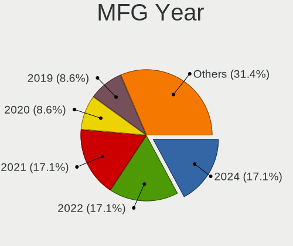
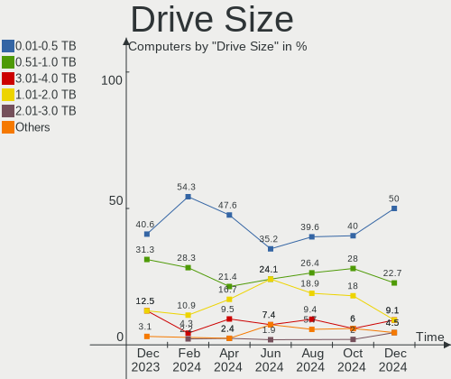
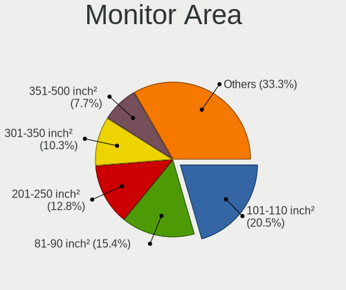
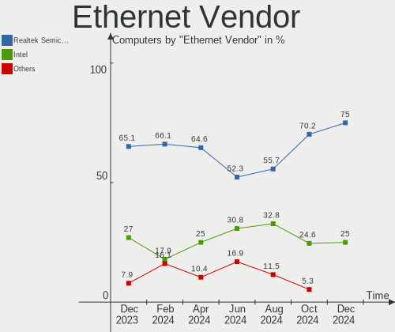
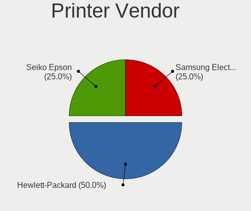
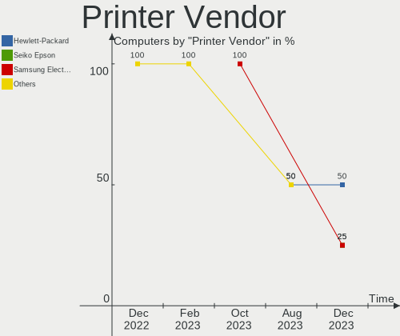

EndeavourOS - Hardware Trends
-----------------------------

A project to identify most popular hardware characteristics and track their change
over time based on data collected by Linux users at https://Linux-Hardware.org.

Anyone can contribute to this report by the [hw-probe](https://github.com/linuxhw/hw-probe) tool:

    sudo -E hw-probe -all -upload

This is a report for all computer types. See also reports for [desktops](/Dist/EndeavourOS/Desktop/README.md) and [notebooks](/Dist/EndeavourOS/Notebook/README.md).

This report is for one last month. Overall report since the beginning of time: [TestDays](https://github.com/linuxhw/TestDays)

Period: Dec, 2023.

Contents
--------

* [ System ](#system)
  - [ OS                       ](#os)
  - [ OS Family                ](#os-family)
  - [ Kernel                   ](#kernel)
  - [ Kernel Family            ](#kernel-family)
  - [ Kernel Major Ver.        ](#kernel-major-ver)
  - [ Arch                     ](#arch)
  - [ DE                       ](#de)
  - [ Display Server           ](#display-server)
  - [ Display Manager          ](#display-manager)
  - [ OS Lang                  ](#os-lang)
  - [ Boot Mode                ](#boot-mode)
  - [ Filesystem               ](#filesystem)
  - [ Part. scheme             ](#part-scheme)
  - [ Dual Boot with Linux/BSD ](#dual-boot-with-linuxbsd)
  - [ Dual Boot (Win)          ](#dual-boot-win)

* [ Board ](#board)
  - [ Vendor                   ](#vendor)
  - [ Model                    ](#model)
  - [ Model Family             ](#model-family)
  - [ MFG Year                 ](#mfg-year)
  - [ Form Factor              ](#form-factor)
  - [ Secure Boot              ](#secure-boot)
  - [ Coreboot                 ](#coreboot)
  - [ RAM Size                 ](#ram-size)
  - [ RAM Used                 ](#ram-used)
  - [ Total Drives             ](#total-drives)
  - [ Has CD-ROM               ](#has-cd-rom)
  - [ Has Ethernet             ](#has-ethernet)
  - [ Has WiFi                 ](#has-wifi)
  - [ Has Bluetooth            ](#has-bluetooth)

* [ Location ](#location)
  - [ Country                  ](#country)
  - [ City                     ](#city)

* [ Drives ](#drives)
  - [ Drive Vendor             ](#drive-vendor)
  - [ Drive Model              ](#drive-model)
  - [ HDD Vendor               ](#hdd-vendor)
  - [ SSD Vendor               ](#ssd-vendor)
  - [ Drive Kind               ](#drive-kind)
  - [ Drive Connector          ](#drive-connector)
  - [ Drive Size               ](#drive-size)
  - [ Space Total              ](#space-total)
  - [ Space Used               ](#space-used)
  - [ Malfunc. Drives          ](#malfunc-drives)
  - [ Malfunc. Drive Vendor    ](#malfunc-drive-vendor)
  - [ Malfunc. HDD Vendor      ](#malfunc-hdd-vendor)
  - [ Malfunc. Drive Kind      ](#malfunc-drive-kind)
  - [ Failed Drives            ](#failed-drives)
  - [ Failed Drive Vendor      ](#failed-drive-vendor)
  - [ Drive Status             ](#drive-status)

* [ Storage controller ](#storage-controller)
  - [ Storage Vendor           ](#storage-vendor)
  - [ Storage Model            ](#storage-model)
  - [ Storage Kind             ](#storage-kind)

* [ Processor ](#processor)
  - [ CPU Vendor               ](#cpu-vendor)
  - [ CPU Model                ](#cpu-model)
  - [ CPU Model Family         ](#cpu-model-family)
  - [ CPU Cores                ](#cpu-cores)
  - [ CPU Sockets              ](#cpu-sockets)
  - [ CPU Threads              ](#cpu-threads)
  - [ CPU Op-Modes             ](#cpu-op-modes)
  - [ CPU Microcode            ](#cpu-microcode)
  - [ CPU Microarch            ](#cpu-microarch)

* [ Graphics ](#graphics)
  - [ GPU Vendor               ](#gpu-vendor)
  - [ GPU Model                ](#gpu-model)
  - [ GPU Combo                ](#gpu-combo)
  - [ GPU Driver               ](#gpu-driver)
  - [ GPU Memory               ](#gpu-memory)

* [ Monitor ](#monitor)
  - [ Monitor Vendor           ](#monitor-vendor)
  - [ Monitor Model            ](#monitor-model)
  - [ Monitor Resolution       ](#monitor-resolution)
  - [ Monitor Diagonal         ](#monitor-diagonal)
  - [ Monitor Width            ](#monitor-width)
  - [ Aspect Ratio             ](#aspect-ratio)
  - [ Monitor Area             ](#monitor-area)
  - [ Pixel Density            ](#pixel-density)
  - [ Multiple Monitors        ](#multiple-monitors)

* [ Network ](#network)
  - [ Net Controller Vendor    ](#net-controller-vendor)
  - [ Net Controller Model     ](#net-controller-model)
  - [ Wireless Vendor          ](#wireless-vendor)
  - [ Wireless Model           ](#wireless-model)
  - [ Ethernet Vendor          ](#ethernet-vendor)
  - [ Ethernet Model           ](#ethernet-model)
  - [ Net Controller Kind      ](#net-controller-kind)
  - [ Used Controller          ](#used-controller)
  - [ NICs                     ](#nics)
  - [ IPv6                     ](#ipv6)

* [ Bluetooth ](#bluetooth)
  - [ Bluetooth Vendor         ](#bluetooth-vendor)
  - [ Bluetooth Model          ](#bluetooth-model)

* [ Sound ](#sound)
  - [ Sound Vendor             ](#sound-vendor)
  - [ Sound Model              ](#sound-model)

* [ Memory ](#memory)
  - [ Memory Vendor            ](#memory-vendor)
  - [ Memory Model             ](#memory-model)
  - [ Memory Kind              ](#memory-kind)
  - [ Memory Form Factor       ](#memory-form-factor)
  - [ Memory Size              ](#memory-size)
  - [ Memory Speed             ](#memory-speed)

* [ Printers & scanners ](#printers--scanners)
  - [ Printer Vendor           ](#printer-vendor)
  - [ Printer Model            ](#printer-model)
  - [ Scanner Vendor           ](#scanner-vendor)
  - [ Scanner Model            ](#scanner-model)

* [ Camera ](#camera)
  - [ Camera Vendor            ](#camera-vendor)
  - [ Camera Model             ](#camera-model)

* [ Security ](#security)
  - [ Fingerprint Vendor       ](#fingerprint-vendor)
  - [ Fingerprint Model        ](#fingerprint-model)
  - [ Chipcard Vendor          ](#chipcard-vendor)
  - [ Chipcard Model           ](#chipcard-model)

* [ Unsupported ](#unsupported)
  - [ Unsupported Devices      ](#unsupported-devices)
  - [ Unsupported Device Types ](#unsupported-device-types)

System
------

OS
--

Installed operating systems

| Name                | Computers | Percent |
|---------------------|-----------|---------|
| EndeavourOS Rolling | 73        | 98.65%  |
| EndeavourOS 23.1.0  | 1         | 1.35%   |

OS Family
---------

OS without a version

| Name        | Computers | Percent |
|-------------|-----------|---------|
| EndeavourOS | 74        | 100%    |

Kernel
------

Version of the Linux kernel

| Version               | Computers | Percent |
|-----------------------|-----------|---------|
| 6.6.7-arch1-1         | 18        | 24.32%  |
| 6.6.8-arch1-1         | 10        | 13.51%  |
| 6.6.4-arch1-1         | 10        | 13.51%  |
| 6.6.6-arch1-1         | 6         | 8.11%   |
| 6.6.3-arch1-1         | 5         | 6.76%   |
| 6.1.69-1-lts          | 4         | 5.41%   |
| 6.6.7-zen1-1-zen      | 2         | 2.7%    |
| 6.6.5-arch1-1         | 2         | 2.7%    |
| 6.6.4-zen1-1-zen      | 2         | 2.7%    |
| 6.1.68-1-lts          | 2         | 2.7%    |
| 6.6.8-zen1-1-zen      | 1         | 1.35%   |
| 6.6.8-AMD             | 1         | 1.35%   |
| 6.6.2-arch1-1         | 1         | 1.35%   |
| 6.6.2-273-tkg-eevdf   | 1         | 1.35%   |
| 6.6.1-arch1-1-surface | 1         | 1.35%   |
| 6.6.1-arch1-1         | 1         | 1.35%   |
| 6.5.7-zen1-1-zen      | 1         | 1.35%   |
| 6.5.5-arch1-1         | 1         | 1.35%   |
| 6.1.67-1-lts          | 1         | 1.35%   |
| 6.1.66-1-lts          | 1         | 1.35%   |
| 6.1.65-1-lts          | 1         | 1.35%   |
| 6.1.64-1-lts          | 1         | 1.35%   |
| 6.1.60-1-lts          | 1         | 1.35%   |

Kernel Family
-------------

Linux kernel without a distro release

| Version | Computers | Percent |
|---------|-----------|---------|
| 6.6.7   | 20        | 27.03%  |
| 6.6.8   | 12        | 16.22%  |
| 6.6.4   | 12        | 16.22%  |
| 6.6.6   | 6         | 8.11%   |
| 6.6.3   | 5         | 6.76%   |
| 6.1.69  | 4         | 5.41%   |
| 6.6.5   | 2         | 2.7%    |
| 6.6.2   | 2         | 2.7%    |
| 6.6.1   | 2         | 2.7%    |
| 6.1.68  | 2         | 2.7%    |
| 6.5.7   | 1         | 1.35%   |
| 6.5.5   | 1         | 1.35%   |
| 6.1.67  | 1         | 1.35%   |
| 6.1.66  | 1         | 1.35%   |
| 6.1.65  | 1         | 1.35%   |
| 6.1.64  | 1         | 1.35%   |
| 6.1.60  | 1         | 1.35%   |

Kernel Major Ver.
-----------------

Linux kernel major version

| Version | Computers | Percent |
|---------|-----------|---------|
| 6.6     | 61        | 82.43%  |
| 6.1     | 11        | 14.86%  |
| 6.5     | 2         | 2.7%    |

Arch
----

OS architecture (x86_64, i586, etc.)

| Name   | Computers | Percent |
|--------|-----------|---------|
| x86_64 | 74        | 100%    |

DE
--

Desktop Environment

| Name       | Computers | Percent |
|------------|-----------|---------|
| KDE5       | 39        | 52.7%   |
| GNOME      | 13        | 17.57%  |
| XFCE       | 5         | 6.76%   |
| i3         | 4         | 5.41%   |
| Budgie     | 3         | 4.05%   |
| X-Cinnamon | 2         | 2.7%    |
| MATE       | 2         | 2.7%    |
| Hyprland   | 2         | 2.7%    |
| sway       | 1         | 1.35%   |
| qtile      | 1         | 1.35%   |
| KDE        | 1         | 1.35%   |
| chadwm     | 1         | 1.35%   |

Display Server
--------------

X11 or Wayland

| Name    | Computers | Percent |
|---------|-----------|---------|
| X11     | 52        | 70.27%  |
| Wayland | 22        | 29.73%  |

Display Manager
---------------

SDDM, LightDM, etc.

| Name    | Computers | Percent |
|---------|-----------|---------|
| SDDM    | 30        | 40.54%  |
| Unknown | 19        | 25.68%  |
| LightDM | 17        | 22.97%  |
| GDM     | 8         | 10.81%  |

OS Lang
-------

Language

| Lang  | Computers | Percent |
|-------|-----------|---------|
| en_US | 31        | 41.89%  |
| it_IT | 10        | 13.51%  |
| de_DE | 6         | 8.11%   |
| sv_SE | 3         | 4.05%   |
| en_GB | 3         | 4.05%   |
| en_CA | 3         | 4.05%   |
| fr_FR | 2         | 2.7%    |
| es_ES | 2         | 2.7%    |
| en_IN | 2         | 2.7%    |
| zh_TW | 1         | 1.35%   |
| ru_RU | 1         | 1.35%   |
| pl_PL | 1         | 1.35%   |
| ja_JP | 1         | 1.35%   |
| is    | 1         | 1.35%   |
| hu_HU | 1         | 1.35%   |
| es_CL | 1         | 1.35%   |
| es_AR | 1         | 1.35%   |
| en_ZA | 1         | 1.35%   |
| en_DK | 1         | 1.35%   |
| en_AU | 1         | 1.35%   |
| cs_CZ | 1         | 1.35%   |

Boot Mode
---------

EFI or BIOS

| Mode | Computers | Percent |
|------|-----------|---------|
| EFI  | 46        | 62.16%  |
| BIOS | 28        | 37.84%  |

Filesystem
----------

Type of filesystem

| Type  | Computers | Percent |
|-------|-----------|---------|
| Ext4  | 57        | 77.03%  |
| Btrfs | 16        | 21.62%  |
| Xfs   | 1         | 1.35%   |

Part. scheme
------------

Scheme of partitioning

| Type    | Computers | Percent |
|---------|-----------|---------|
| GPT     | 51        | 68.92%  |
| Unknown | 17        | 22.97%  |
| MBR     | 6         | 8.11%   |

Dual Boot with Linux/BSD
------------------------

Hosting more than one Linux/BSD

| Dual boot | Computers | Percent |
|-----------|-----------|---------|
| No        | 63        | 85.14%  |
| Yes       | 11        | 14.86%  |

Dual Boot (Win)
---------------

Hosting Linux and Windows

| Dual boot | Computers | Percent |
|-----------|-----------|---------|
| No        | 47        | 63.51%  |
| Yes       | 27        | 36.49%  |

Board
-----

Vendor
------

Motherboard manufacturer

| Name                     | Computers | Percent |
|--------------------------|-----------|---------|
| ASUSTek Computer         | 20        | 27.03%  |
| Lenovo                   | 11        | 14.86%  |
| Hewlett-Packard          | 10        | 13.51%  |
| MSI                      | 6         | 8.11%   |
| Gigabyte Technology      | 6         | 8.11%   |
| Dell                     | 6         | 8.11%   |
| Acer                     | 5         | 6.76%   |
| TUXEDO                   | 2         | 2.7%    |
| Universal Exports Group  | 1         | 1.35%   |
| Sony                     | 1         | 1.35%   |
| Shenzhen DOKE electronic | 1         | 1.35%   |
| Samsung Electronics      | 1         | 1.35%   |
| Microsoft                | 1         | 1.35%   |
| HUAWEI                   | 1         | 1.35%   |
| Huanan                   | 1         | 1.35%   |
| GPD                      | 1         | 1.35%   |

Model
-----

Motherboard model

| Name                                             | Computers | Percent |
|--------------------------------------------------|-----------|---------|
| ASUS TUF Gaming B650-PLUS WIFI                   | 2         | 2.7%    |
| Universal Exports Group MONTENERO-C              | 1         | 1.35%   |
| TUXEDO Pulse 15 Gen2                             | 1         | 1.35%   |
| TUXEDO Aura 14 Gen3                              | 1         | 1.35%   |
| Sony SVE1713X1EB                                 | 1         | 1.35%   |
| Shenzhen DOKE electronic MP80                    | 1         | 1.35%   |
| Samsung 960QFG                                   | 1         | 1.35%   |
| MSI Prestige 15 A10SC                            | 1         | 1.35%   |
| MSI MS-7C95                                      | 1         | 1.35%   |
| MSI MS-7C84                                      | 1         | 1.35%   |
| MSI MS-7B45                                      | 1         | 1.35%   |
| MSI MS-7B18                                      | 1         | 1.35%   |
| MSI MS-7823                                      | 1         | 1.35%   |
| Microsoft Surface Laptop Go                      | 1         | 1.35%   |
| Lenovo Yoga Pro 9 16IRP8 83BY                    | 1         | 1.35%   |
| Lenovo Yoga Duet 7 13ITL6 82MA                   | 1         | 1.35%   |
| Lenovo ThinkPad W530 24382KU                     | 1         | 1.35%   |
| Lenovo ThinkPad T480s 20L7S00600                 | 1         | 1.35%   |
| Lenovo ThinkPad T470 W10DG 20JNS1XT00            | 1         | 1.35%   |
| Lenovo ThinkPad E14 20RBS25S00                   | 1         | 1.35%   |
| Lenovo ThinkBook 15-IIL 20SM                     | 1         | 1.35%   |
| Lenovo ThinkBook 15 G4 ABA 21DL                  | 1         | 1.35%   |
| Lenovo Legion 7 16ARHA7 82UH                     | 1         | 1.35%   |
| Lenovo IdeaPad Gaming 3 15IHU6 82K1              | 1         | 1.35%   |
| Lenovo IdeaPad Gaming 3 15ACH6 82K2              | 1         | 1.35%   |
| HUAWEI NBLK-WAX9X                                | 1         | 1.35%   |
| Huanan X58                                       | 1         | 1.35%   |
| HP ZBook Fury 15.6 inch G8 Mobile Workstation PC | 1         | 1.35%   |
| HP Z440 Workstation                              | 1         | 1.35%   |
| HP ProBook 650 G1                                | 1         | 1.35%   |
| HP Pavilion Laptop 15-cs3xxx                     | 1         | 1.35%   |
| HP Pavilion All-in-One 27-d0xxx                  | 1         | 1.35%   |
| HP Pavilion All-in-One 24-r0xx                   | 1         | 1.35%   |
| HP Laptop 15-dw0xxx                              | 1         | 1.35%   |
| HP EliteDesk 800 G3 SFF                          | 1         | 1.35%   |
| HP EliteBook 840 14 inch G10 Notebook PC         | 1         | 1.35%   |
| HP Compaq Elite 8300 SFF                         | 1         | 1.35%   |
| GPD G1619-04                                     | 1         | 1.35%   |
| Gigabyte Z390 GAMING X                           | 1         | 1.35%   |
| Gigabyte Z170XP-SLI                              | 1         | 1.35%   |

Model Family
------------

Motherboard model prefix

| Name                                | Computers | Percent |
|-------------------------------------|-----------|---------|
| Lenovo ThinkPad                     | 4         | 5.41%   |
| HP Pavilion                         | 3         | 4.05%   |
| Dell Inspiron                       | 3         | 4.05%   |
| ASUS VivoBook                       | 3         | 4.05%   |
| ASUS TUF                            | 3         | 4.05%   |
| ASUS ROG                            | 3         | 4.05%   |
| ASUS PRIME                          | 3         | 4.05%   |
| ASUS ASUS                           | 3         | 4.05%   |
| Lenovo Yoga                         | 2         | 2.7%    |
| Lenovo ThinkBook                    | 2         | 2.7%    |
| Lenovo IdeaPad                      | 2         | 2.7%    |
| Acer Swift                          | 2         | 2.7%    |
| Acer Nitro                          | 2         | 2.7%    |
| Universal Exports Group MONTENERO-C | 1         | 1.35%   |
| TUXEDO Pulse                        | 1         | 1.35%   |
| TUXEDO Aura                         | 1         | 1.35%   |
| Sony SVE1713X1EB                    | 1         | 1.35%   |
| Shenzhen DOKE electronic MP80       | 1         | 1.35%   |
| Samsung 960QFG                      | 1         | 1.35%   |
| MSI Prestige                        | 1         | 1.35%   |
| MSI MS-7C95                         | 1         | 1.35%   |
| MSI MS-7C84                         | 1         | 1.35%   |
| MSI MS-7B45                         | 1         | 1.35%   |
| MSI MS-7B18                         | 1         | 1.35%   |
| MSI MS-7823                         | 1         | 1.35%   |
| Microsoft Surface                   | 1         | 1.35%   |
| Lenovo Legion                       | 1         | 1.35%   |
| HUAWEI NBLK-WAX9X                   | 1         | 1.35%   |
| Huanan X58                          | 1         | 1.35%   |
| HP ZBook                            | 1         | 1.35%   |
| HP Z440                             | 1         | 1.35%   |
| HP ProBook                          | 1         | 1.35%   |
| HP Laptop                           | 1         | 1.35%   |
| HP EliteDesk                        | 1         | 1.35%   |
| HP EliteBook                        | 1         | 1.35%   |
| HP Compaq                           | 1         | 1.35%   |
| GPD G1619-04                        | 1         | 1.35%   |
| Gigabyte Z390                       | 1         | 1.35%   |
| Gigabyte Z170XP-SLI                 | 1         | 1.35%   |
| Gigabyte X670                       | 1         | 1.35%   |

MFG Year
--------

Motherboard manufacture year

| Year | Computers | Percent |
|------|-----------|---------|
| 2022 | 11        | 14.86%  |
| 2019 | 11        | 14.86%  |
| 2023 | 9         | 12.16%  |
| 2020 | 8         | 10.81%  |
| 2021 | 7         | 9.46%   |
| 2018 | 7         | 9.46%   |
| 2017 | 6         | 8.11%   |
| 2012 | 5         | 6.76%   |
| 2016 | 3         | 4.05%   |
| 2015 | 3         | 4.05%   |
| 2013 | 2         | 2.7%    |
| 2011 | 1         | 1.35%   |
| 2009 | 1         | 1.35%   |

Form Factor
-----------

Physical design of the computer

| Name        | Computers | Percent |
|-------------|-----------|---------|
| Notebook    | 42        | 56.76%  |
| Desktop     | 26        | 35.14%  |
| Tablet      | 2         | 2.7%    |
| All in one  | 2         | 2.7%    |
| Convertible | 1         | 1.35%   |
| Mini pc     | 1         | 1.35%   |

Secure Boot
-----------

Enabled or disabled

| State    | Computers | Percent |
|----------|-----------|---------|
| Disabled | 73        | 98.65%  |
| Enabled  | 1         | 1.35%   |

Coreboot
--------

Have coreboot on board

| Used | Computers | Percent |
|------|-----------|---------|
| No   | 74        | 100%    |

RAM Size
--------

Total RAM memory

| Size in GB  | Computers | Percent |
|-------------|-----------|---------|
| 16.01-24.0  | 26        | 35.14%  |
| 32.01-64.0  | 21        | 28.38%  |
| 8.01-16.0   | 10        | 13.51%  |
| 4.01-8.0    | 9         | 12.16%  |
| 64.01-256.0 | 4         | 5.41%   |
| 3.01-4.0    | 2         | 2.7%    |
| 24.01-32.0  | 2         | 2.7%    |

RAM Used
--------

Used RAM memory

| Used GB    | Computers | Percent |
|------------|-----------|---------|
| 4.01-8.0   | 28        | 37.84%  |
| 2.01-3.0   | 14        | 18.92%  |
| 3.01-4.0   | 11        | 14.86%  |
| 8.01-16.0  | 10        | 13.51%  |
| 1.01-2.0   | 8         | 10.81%  |
| 16.01-24.0 | 3         | 4.05%   |

Total Drives
------------

Number of drives on board

| Drives | Computers | Percent |
|--------|-----------|---------|
| 1      | 33        | 44.59%  |
| 2      | 21        | 28.38%  |
| 3      | 9         | 12.16%  |
| 4      | 7         | 9.46%   |
| 5      | 2         | 2.7%    |
| 10     | 1         | 1.35%   |
| 6      | 1         | 1.35%   |

Has CD-ROM
----------

Has CD-ROM on board

| Presented | Computers | Percent |
|-----------|-----------|---------|
| No        | 60        | 81.08%  |
| Yes       | 14        | 18.92%  |

Has Ethernet
------------

Has Ethernet on board

| Presented | Computers | Percent |
|-----------|-----------|---------|
| Yes       | 59        | 79.73%  |
| No        | 15        | 20.27%  |

Has WiFi
--------

Has WiFi module

| Presented | Computers | Percent |
|-----------|-----------|---------|
| Yes       | 61        | 82.43%  |
| No        | 13        | 17.57%  |

Has Bluetooth
-------------

Has Bluetooth module

| Presented | Computers | Percent |
|-----------|-----------|---------|
| Yes       | 57        | 77.03%  |
| No        | 17        | 22.97%  |

Location
--------

Country
-------

Geographic location (country)

| Country      | Computers | Percent |
|--------------|-----------|---------|
| Italy        | 13        | 17.57%  |
| USA          | 11        | 14.86%  |
| Germany      | 9         | 12.16%  |
| Sweden       | 4         | 5.41%   |
| Canada       | 4         | 5.41%   |
| India        | 3         | 4.05%   |
| France       | 3         | 4.05%   |
| Taiwan       | 2         | 2.7%    |
| Spain        | 2         | 2.7%    |
| Russia       | 2         | 2.7%    |
| Hungary      | 2         | 2.7%    |
| Austria      | 2         | 2.7%    |
| UK           | 1         | 1.35%   |
| South Africa | 1         | 1.35%   |
| Portugal     | 1         | 1.35%   |
| Poland       | 1         | 1.35%   |
| Namibia      | 1         | 1.35%   |
| Maldives     | 1         | 1.35%   |
| Israel       | 1         | 1.35%   |
| Indonesia    | 1         | 1.35%   |
| Denmark      | 1         | 1.35%   |
| Czechia      | 1         | 1.35%   |
| Colombia     | 1         | 1.35%   |
| Chile        | 1         | 1.35%   |
| Bulgaria     | 1         | 1.35%   |
| Brazil       | 1         | 1.35%   |
| Belgium      | 1         | 1.35%   |
| Australia    | 1         | 1.35%   |
| Argentina    | 1         | 1.35%   |

City
----

Geographic location (city)

| City               | Computers | Percent |
|--------------------|-----------|---------|
| Hyderabad          | 3         | 4.05%   |
| Milan              | 2         | 2.7%    |
| Berlin             | 2         | 2.7%    |
| Zipaquirá         | 1         | 1.35%   |
| Yakima             | 1         | 1.35%   |
| Windhoek           | 1         | 1.35%   |
| Wappingers Falls   | 1         | 1.35%   |
| Villafranca d'Asti | 1         | 1.35%   |
| Vila Nova de Gaia  | 1         | 1.35%   |
| Vigo               | 1         | 1.35%   |
| Vienna             | 1         | 1.35%   |
| Ventura            | 1         | 1.35%   |
| Västerås         | 1         | 1.35%   |
| Umeå              | 1         | 1.35%   |
| Torija             | 1         | 1.35%   |
| Taranto            | 1         | 1.35%   |
| Sundsvall          | 1         | 1.35%   |
| St Petersburg      | 1         | 1.35%   |
| Sao Vicente        | 1         | 1.35%   |
| Rochester          | 1         | 1.35%   |
| Rho                | 1         | 1.35%   |
| Rexburg            | 1         | 1.35%   |
| Prisovo            | 1         | 1.35%   |
| Prague             | 1         | 1.35%   |
| Pilisvoeroesvar    | 1         | 1.35%   |
| Pasian di Prato    | 1         | 1.35%   |
| Parma              | 1         | 1.35%   |
| Palermo            | 1         | 1.35%   |
| Nuremberg          | 1         | 1.35%   |
| Mountville         | 1         | 1.35%   |
| Montreal           | 1         | 1.35%   |
| Monticello         | 1         | 1.35%   |
| Minneapolis        | 1         | 1.35%   |
| Milton             | 1         | 1.35%   |
| Milano             | 1         | 1.35%   |
| Melipilla          | 1         | 1.35%   |
| Melbourne          | 1         | 1.35%   |
| Malé              | 1         | 1.35%   |
| Lugu               | 1         | 1.35%   |
| Longueuil          | 1         | 1.35%   |

Drives
------

Drive Vendor
------------

Hard drive vendors

| Vendor                       | Computers | Drives | Percent |
|------------------------------|-----------|--------|---------|
| Samsung Electronics          | 29        | 43     | 22.31%  |
| WDC                          | 16        | 20     | 12.31%  |
| Seagate                      | 16        | 21     | 12.31%  |
| Sandisk                      | 11        | 11     | 8.46%   |
| Micron/Crucial Technology    | 6         | 7      | 4.62%   |
| Micron Technology            | 4         | 4      | 3.08%   |
| Crucial                      | 4         | 4      | 3.08%   |
| Toshiba                      | 3         | 3      | 2.31%   |
| Phison Electronics           | 3         | 3      | 2.31%   |
| Kingston                     | 3         | 4      | 2.31%   |
| Intel                        | 3         | 3      | 2.31%   |
| SK hynix                     | 2         | 2      | 1.54%   |
| Silicon Motion               | 2         | 2      | 1.54%   |
| Kingston Technology Company  | 2         | 2      | 1.54%   |
| JMicron Technology           | 2         | 2      | 1.54%   |
| Hitachi                      | 2         | 3      | 1.54%   |
| Unknown                      | 1         | 1      | 0.77%   |
| SPCC                         | 1         | 1      | 0.77%   |
| Solid State Storage          | 1         | 1      | 0.77%   |
| Shenzhen Longsys Electronics | 1         | 1      | 0.77%   |
| SABRENT                      | 1         | 1      | 0.77%   |
| Realtek Semiconductor        | 1         | 1      | 0.77%   |
| PNY                          | 1         | 1      | 0.77%   |
| Phison                       | 1         | 1      | 0.77%   |
| OCZ-VERTEX3                  | 1         | 1      | 0.77%   |
| NT-128                       | 1         | 1      | 0.77%   |
| MAXIO Technology (Hangzhou)  | 1         | 1      | 0.77%   |
| KIOXIA-EXCERIA               | 1         | 2      | 0.77%   |
| KingSpec                     | 1         | 1      | 0.77%   |
| KingFast                     | 1         | 1      | 0.77%   |
| Intenso                      | 1         | 1      | 0.77%   |
| HS-SSD-C100                  | 1         | 1      | 0.77%   |
| HJDK                         | 1         | 1      | 0.77%   |
| Fantom                       | 1         | 1      | 0.77%   |
| CT1000P3                     | 1         | 1      | 0.77%   |
| China                        | 1         | 1      | 0.77%   |
| ANKEJE                       | 1         | 1      | 0.77%   |
| ADATA Technology             | 1         | 1      | 0.77%   |

Drive Model
-----------

Hard drive models

| Model                                                 | Computers | Percent |
|-------------------------------------------------------|-----------|---------|
| Samsung NVMe SSD Controller SM981/PM981/PM983 512GB   | 5         | 3.29%   |
| Samsung NVMe SSD Controller PM9A1/PM9A3/980PRO 2TB    | 5         | 3.29%   |
| Sandisk WD Blue SN550 NVMe SSD 1TB                    | 4         | 2.63%   |
| WDC WD40EZRZ-00GXCB0 4TB                              | 2         | 1.32%   |
| Silicon Motion SM2263EN/SM2263XT SSD Controller 500GB | 2         | 1.32%   |
| Seagate ST4000VN006-3CW104 4TB                        | 2         | 1.32%   |
| Sandisk WD Blue SN500 / PC SN520 NVMe SSD 128GB       | 2         | 1.32%   |
| Samsung SSD 990 PRO 1TB                               | 2         | 1.32%   |
| Samsung SSD 980 500GB                                 | 2         | 1.32%   |
| Samsung SSD 870 EVO 1TB                               | 2         | 1.32%   |
| Samsung SSD 860 EVO 500GB                             | 2         | 1.32%   |
| Samsung SSD 860 EVO 250GB                             | 2         | 1.32%   |
| Samsung SSD 840 EVO 120GB                             | 2         | 1.32%   |
| Samsung NVMe SSD Controller SM961/PM961/SM963 250GB   | 2         | 1.32%   |
| Micron/Crucial CT500P5PSSD8 500GB                     | 2         | 1.32%   |
| Micron/Crucial CT2000P5PSSD8 2TB                      | 2         | 1.32%   |
| JMicron Tech 250GB                                    | 2         | 1.32%   |
| Crucial CT500MX500SSD1 500GB                          | 2         | 1.32%   |
| Crucial CT240BX500SSD1 240GB                          | 2         | 1.32%   |
| WDC WDS240G2G0A-00JH30 240GB SSD                      | 1         | 0.66%   |
| WDC WDS100T2B0A-00SM50 1TB SSD                        | 1         | 0.66%   |
| WDC WD6400AAKS-00A7B2 640GB                           | 1         | 0.66%   |
| WDC WD60EFZX-68B3FN0 6TB                              | 1         | 0.66%   |
| WDC WD5000LPVX-22V0TT0 500GB                          | 1         | 0.66%   |
| WDC WD5000AZLX-08K2TA0 500GB                          | 1         | 0.66%   |
| WDC WD5000AAKX-75U6AA0 500GB                          | 1         | 0.66%   |
| WDC WD5000AAKS-65YGA0 500GB                           | 1         | 0.66%   |
| WDC WD5000AADS-00L4B1 500GB                           | 1         | 0.66%   |
| WDC WD20EARX-00PASB0 2TB                              | 1         | 0.66%   |
| WDC WD10SPZX-21Z10T0 1TB                              | 1         | 0.66%   |
| WDC WD10SPCX-22HWST0 1TB                              | 1         | 0.66%   |
| WDC WD10EZEX-60WN4A0 1TB                              | 1         | 0.66%   |
| WDC WD10EZEX-08WN4A0 1TB                              | 1         | 0.66%   |
| WDC WD10EZEX-00WN4A0 1TB                              | 1         | 0.66%   |
| WDC WD1002FAEX-00Z3A0 1TB                             | 1         | 0.66%   |
| WDC WD Blue SA510 2.5 500GB                           | 1         | 0.66%   |
| Unknown MMC Card  512GB                               | 1         | 0.66%   |
| Toshiba XG6 NVMe SSD Controller 512GB                 | 1         | 0.66%   |
| Toshiba MQ04ABF100 1TB                                | 1         | 0.66%   |
| Toshiba DT01ACA100 1TB                                | 1         | 0.66%   |

HDD Vendor
----------

Hard disk drive vendors

| Vendor              | Computers | Drives | Percent |
|---------------------|-----------|--------|---------|
| Seagate             | 16        | 21     | 42.11%  |
| WDC                 | 15        | 17     | 39.47%  |
| Toshiba             | 2         | 2      | 5.26%   |
| Hitachi             | 2         | 3      | 5.26%   |
| Samsung Electronics | 1         | 1      | 2.63%   |
| SABRENT             | 1         | 1      | 2.63%   |
| Fantom              | 1         | 1      | 2.63%   |

SSD Vendor
----------

Solid state drive vendors

| Vendor              | Computers | Drives | Percent |
|---------------------|-----------|--------|---------|
| Samsung Electronics | 11        | 16     | 34.38%  |
| Crucial             | 4         | 4      | 12.5%   |
| WDC                 | 3         | 3      | 9.38%   |
| Intel               | 2         | 2      | 6.25%   |
| SPCC                | 1         | 1      | 3.13%   |
| SK hynix            | 1         | 1      | 3.13%   |
| PNY                 | 1         | 1      | 3.13%   |
| OCZ-VERTEX3         | 1         | 1      | 3.13%   |
| KIOXIA-EXCERIA      | 1         | 2      | 3.13%   |
| Kingston            | 1         | 2      | 3.13%   |
| KingSpec            | 1         | 1      | 3.13%   |
| KingFast            | 1         | 1      | 3.13%   |
| Intenso             | 1         | 1      | 3.13%   |
| HS-SSD-C100         | 1         | 1      | 3.13%   |
| HJDK                | 1         | 1      | 3.13%   |
| China               | 1         | 1      | 3.13%   |

Drive Kind
----------

HDD or SSD

| Kind    | Computers | Drives | Percent |
|---------|-----------|--------|---------|
| NVMe    | 55        | 67     | 47.41%  |
| HDD     | 30        | 46     | 25.86%  |
| SSD     | 27        | 39     | 23.28%  |
| Unknown | 3         | 4      | 2.59%   |
| MMC     | 1         | 1      | 0.86%   |

Drive Connector
---------------

SATA, SAS, NVMe, etc.

| Type | Computers | Drives | Percent |
|------|-----------|--------|---------|
| NVMe | 55        | 66     | 51.89%  |
| SATA | 40        | 79     | 37.74%  |
| SAS  | 10        | 11     | 9.43%   |
| MMC  | 1         | 1      | 0.94%   |

Drive Size
----------

Size of hard drive

| Size in TB | Computers | Drives | Percent |
|------------|-----------|--------|---------|
| 0.01-0.5   | 26        | 39     | 40%     |
| 0.51-1.0   | 20        | 25     | 30.77%  |
| 3.01-4.0   | 9         | 10     | 13.85%  |
| 1.01-2.0   | 8         | 9      | 12.31%  |
| 4.01-10.0  | 2         | 2      | 3.08%   |

Space Total
-----------

Amount of disk space available on the file system

| Size in GB     | Computers | Percent |
|----------------|-----------|---------|
| 251-500        | 16        | 21.62%  |
| 1001-2000      | 15        | 20.27%  |
| More than 3000 | 10        | 13.51%  |
| 101-250        | 10        | 13.51%  |
| 1-20           | 9         | 12.16%  |
| 501-1000       | 7         | 9.46%   |
| 2001-3000      | 5         | 6.76%   |
| 51-100         | 2         | 2.7%    |

Space Used
----------

Amount of used disk space

| Used GB        | Computers | Percent |
|----------------|-----------|---------|
| 1-20           | 16        | 21.62%  |
| 101-250        | 12        | 16.22%  |
| 251-500        | 9         | 12.16%  |
| 21-50          | 9         | 12.16%  |
| 501-1000       | 8         | 10.81%  |
| 51-100         | 7         | 9.46%   |
| 1001-2000      | 6         | 8.11%   |
| 2001-3000      | 4         | 5.41%   |
| More than 3000 | 3         | 4.05%   |

Malfunc. Drives
---------------

Drive models with a malfunction

| Model                           | Computers | Drives | Percent |
|---------------------------------|-----------|--------|---------|
| WDC WD6400AAKS-00A7B2 640GB     | 1         | 1      | 16.67%  |
| WDC WD5000AADS-00L4B1 500GB     | 1         | 1      | 16.67%  |
| WDC WD10SPCX-22HWST0 1TB        | 1         | 1      | 16.67%  |
| Seagate ST2000DM001-9YN164 2TB  | 1         | 1      | 16.67%  |
| Samsung Electronics SSD 980 1TB | 1         | 1      | 16.67%  |
| Samsung Electronics HD103SI 1TB | 1         | 1      | 16.67%  |

Malfunc. Drive Vendor
---------------------

Vendors of faulty drives

| Vendor              | Computers | Drives | Percent |
|---------------------|-----------|--------|---------|
| WDC                 | 3         | 3      | 50%     |
| Samsung Electronics | 2         | 2      | 33.33%  |
| Seagate             | 1         | 1      | 16.67%  |

Malfunc. HDD Vendor
-------------------

Vendors of faulty HDD drives

| Vendor              | Computers | Drives | Percent |
|---------------------|-----------|--------|---------|
| WDC                 | 3         | 3      | 60%     |
| Seagate             | 1         | 1      | 20%     |
| Samsung Electronics | 1         | 1      | 20%     |

Malfunc. Drive Kind
-------------------

Kinds of faulty drives

| Kind | Computers | Drives | Percent |
|------|-----------|--------|---------|
| HDD  | 5         | 5      | 83.33%  |
| NVMe | 1         | 1      | 16.67%  |

Failed Drives
-------------

Failed drive models

Zero info for selected period =(

Failed Drive Vendor
-------------------

Failed drive vendors

Zero info for selected period =(

Drive Status
------------

Number of failed and malfunc. drives

| Status   | Computers | Drives | Percent |
|----------|-----------|--------|---------|
| Works    | 54        | 100    | 66.67%  |
| Detected | 22        | 51     | 27.16%  |
| Malfunc  | 5         | 6      | 6.17%   |

Storage controller
------------------

Storage Vendor
--------------

Storage controller vendors

| Vendor                         | Computers | Percent |
|--------------------------------|-----------|---------|
| Intel                          | 42        | 35.9%   |
| Samsung Electronics            | 24        | 20.51%  |
| AMD                            | 12        | 10.26%  |
| SanDisk                        | 11        | 9.4%    |
| Micron/Crucial Technology      | 6         | 5.13%   |
| Phison Electronics             | 4         | 3.42%   |
| Micron Technology              | 4         | 3.42%   |
| Kingston Technology Company    | 4         | 3.42%   |
| Silicon Motion                 | 2         | 1.71%   |
| Toshiba America Info Systems   | 1         | 0.85%   |
| Solid State Storage Technology | 1         | 0.85%   |
| SK hynix                       | 1         | 0.85%   |
| Shenzhen Longsys Electronics   | 1         | 0.85%   |
| Realtek Semiconductor          | 1         | 0.85%   |
| MAXIO Technology (Hangzhou)    | 1         | 0.85%   |
| JMicron Technology             | 1         | 0.85%   |
| ADATA Technology               | 1         | 0.85%   |

Storage Model
-------------

Storage controller models

| Model                                                                        | Computers | Percent |
|------------------------------------------------------------------------------|-----------|---------|
| AMD FCH SATA Controller [AHCI mode]                                          | 8         | 6.4%    |
| Samsung NVMe SSD Controller 980 (DRAM-less)                                  | 7         | 5.6%    |
| Samsung NVMe SSD Controller SM981/PM981/PM983                                | 5         | 4%      |
| Samsung NVMe SSD Controller PM9A1/PM9A3/980PRO                               | 5         | 4%      |
| SanDisk Ultra 3D / WD Blue SN550 NVMe SSD                                    | 4         | 3.2%    |
| Micron/Crucial P5 Plus NVMe PCIe SSD                                         | 4         | 3.2%    |
| Intel Cannon Lake Mobile PCH SATA AHCI Controller                            | 4         | 3.2%    |
| Intel 200 Series PCH SATA controller [AHCI mode]                             | 4         | 3.2%    |
| Samsung NVMe SSD Controller S4LV008[Pascal]                                  | 3         | 2.4%    |
| Samsung NVMe SSD Controller PM9B1 (DRAM-less)                                | 3         | 2.4%    |
| Intel Volume Management Device NVMe RAID Controller                          | 3         | 2.4%    |
| Intel Cannon Lake PCH SATA AHCI Controller                                   | 3         | 2.4%    |
| Intel 82801 Mobile SATA Controller [RAID mode]                               | 3         | 2.4%    |
| Intel 400 Series Chipset Family SATA AHCI Controller                         | 3         | 2.4%    |
| AMD 500 Series Chipset SATA Controller                                       | 3         | 2.4%    |
| Silicon Motion SM2263EN/SM2263XT (DRAM-less) NVMe SSD Controllers            | 2         | 1.6%    |
| SanDisk WD Blue SN500 / PC SN520 x2 M.2 2280 NVMe SSD                        | 2         | 1.6%    |
| Sandisk WD Black SN850X NVMe SSD                                             | 2         | 1.6%    |
| Samsung NVMe SSD Controller SM961/PM961/SM963                                | 2         | 1.6%    |
| Micron 2210 NVMe SSD [Cobain]                                                | 2         | 1.6%    |
| Intel Sunrise Point-LP SATA Controller [AHCI mode]                           | 2         | 1.6%    |
| Intel Alder Lake-P SATA AHCI Controller                                      | 2         | 1.6%    |
| Intel 7 Series/C210 Series Chipset Family 6-port SATA Controller [AHCI mode] | 2         | 1.6%    |
| Intel 7 Series Chipset Family 6-port SATA Controller [AHCI mode]             | 2         | 1.6%    |
| Toshiba America Info Systems XG6 NVMe SSD Controller                         | 1         | 0.8%    |
| Solid State Storage CL1-3D256-Q11 NVMe SSD M.2                               | 1         | 0.8%    |
| SK hynix Platinum P41/PC801 NVMe Solid State Drive                           | 1         | 0.8%    |
| Shenzhen Longsys Non-Volatile memory controller                              | 1         | 0.8%    |
| SanDisk WD PC SN540 / Green SN350 NVMe SSD 1 TB (DRAM-less)                  | 1         | 0.8%    |
| SanDisk WD Black SN770 / PC SN740 256GB / PC SN560 (DRAM-less) NVMe SSD      | 1         | 0.8%    |
| SanDisk Extreme Pro / WD Black SN750 / PC SN730 / Red SN700 NVMe SSD         | 1         | 0.8%    |
| Realtek RTS5765DL NVMe SSD Controller (DRAM-less)                            | 1         | 0.8%    |
| Phison PS5021-E21 PCIe4 NVMe Controller (DRAM-less)                          | 1         | 0.8%    |
| Phison Electronics Non-Volatile memory controller                            | 1         | 0.8%    |
| Phison E18 PCIe4 NVMe Controller                                             | 1         | 0.8%    |
| Phison E12 NVMe Controller                                                   | 1         | 0.8%    |
| Micron/Crucial P2 [Nick P2] / P3 / P3 Plus NVMe PCIe SSD (DRAM-less)         | 1         | 0.8%    |
| Micron/Crucial Non-Volatile memory controller                                | 1         | 0.8%    |
| Micron 3400 NVMe SSD [Hendrix]                                               | 1         | 0.8%    |
| Micron 2300 NVMe SSD [Santana]                                               | 1         | 0.8%    |

Storage Kind
------------

Kind of storage controller (IDE, SATA, NVMe, SAS, ...)

| Kind | Computers | Percent |
|------|-----------|---------|
| NVMe | 55        | 49.11%  |
| SATA | 46        | 41.07%  |
| RAID | 9         | 8.04%   |
| IDE  | 2         | 1.79%   |

Processor
---------

CPU Vendor
----------

Processor vendors

| Vendor | Computers | Percent |
|--------|-----------|---------|
| Intel  | 55        | 74.32%  |
| AMD    | 19        | 25.68%  |

CPU Model
---------

Processor models

| Model                                  | Computers | Percent |
|----------------------------------------|-----------|---------|
| Intel Core i7-8550U CPU @ 1.80GHz      | 3         | 4.05%   |
| AMD Ryzen 7 5700X 8-Core Processor     | 3         | 4.05%   |
| Intel Core i7-8750H CPU @ 2.20GHz      | 2         | 2.7%    |
| Intel Core i5-8400 CPU @ 2.80GHz       | 2         | 2.7%    |
| Intel Core i5-3470 CPU @ 3.20GHz       | 2         | 2.7%    |
| Intel Core i5-1035G1 CPU @ 1.00GHz     | 2         | 2.7%    |
| Intel Core i5-10300H CPU @ 2.50GHz     | 2         | 2.7%    |
| Intel 12th Gen Core i5-1235U           | 2         | 2.7%    |
| AMD Ryzen 7 4800H with Radeon Graphics | 2         | 2.7%    |
| Intel Xeon CPU E5-1620 v3 @ 3.50GHz    | 1         | 1.35%   |
| Intel N95                              | 1         | 1.35%   |
| Intel Genuine CPU U7300 @ 1.30GHz      | 1         | 1.35%   |
| Intel Core i9-9900K CPU @ 3.60GHz      | 1         | 1.35%   |
| Intel Core i7-9750H CPU @ 2.60GHz      | 1         | 1.35%   |
| Intel Core i7-8565U CPU @ 1.80GHz      | 1         | 1.35%   |
| Intel Core i7-7700K CPU @ 4.20GHz      | 1         | 1.35%   |
| Intel Core i7-6700K CPU @ 4.00GHz      | 1         | 1.35%   |
| Intel Core i7-6700 CPU @ 3.40GHz       | 1         | 1.35%   |
| Intel Core i7-6500U CPU @ 2.50GHz      | 1         | 1.35%   |
| Intel Core i7-4500U CPU @ 1.80GHz      | 1         | 1.35%   |
| Intel Core i7-3820QM CPU @ 2.70GHz     | 1         | 1.35%   |
| Intel Core i7-3632QM CPU @ 2.20GHz     | 1         | 1.35%   |
| Intel Core i7-2600K CPU @ 3.40GHz      | 1         | 1.35%   |
| Intel Core i7-10710U CPU @ 1.10GHz     | 1         | 1.35%   |
| Intel Core i7-1065G7 CPU @ 1.30GHz     | 1         | 1.35%   |
| Intel Core i7 CPU 920 @ 2.67GHz        | 1         | 1.35%   |
| Intel Core i5-9400F CPU @ 2.90GHz      | 1         | 1.35%   |
| Intel Core i5-9300H CPU @ 2.40GHz      | 1         | 1.35%   |
| Intel Core i5-7400 CPU @ 3.00GHz       | 1         | 1.35%   |
| Intel Core i5-7200U CPU @ 2.50GHz      | 1         | 1.35%   |
| Intel Core i5-6300U CPU @ 2.40GHz      | 1         | 1.35%   |
| Intel Core i5-4460 CPU @ 3.20GHz       | 1         | 1.35%   |
| Intel Core i5-4300M CPU @ 2.60GHz      | 1         | 1.35%   |
| Intel Core i5-10400F CPU @ 2.90GHz     | 1         | 1.35%   |
| Intel Core i5-1035G4 CPU @ 1.10GHz     | 1         | 1.35%   |
| Intel Core i5-10210U CPU @ 1.60GHz     | 1         | 1.35%   |
| Intel Core i3-3220 CPU @ 3.30GHz       | 1         | 1.35%   |
| Intel Celeron N4020 CPU @ 1.10GHz      | 1         | 1.35%   |
| Intel 13th Gen Core i9-13980HX         | 1         | 1.35%   |
| Intel 13th Gen Core i9-13905H          | 1         | 1.35%   |

CPU Model Family
----------------

Processor model prefix

| Model         | Computers | Percent |
|---------------|-----------|---------|
| Intel Core i7 | 18        | 24.32%  |
| Intel Core i5 | 18        | 24.32%  |
| Other         | 14        | 18.92%  |
| AMD Ryzen 7   | 11        | 14.86%  |
| AMD Ryzen 5   | 4         | 5.41%   |
| AMD Ryzen 9   | 3         | 4.05%   |
| Intel Xeon    | 1         | 1.35%   |
| Intel Genuine | 1         | 1.35%   |
| Intel Core i9 | 1         | 1.35%   |
| Intel Core i3 | 1         | 1.35%   |
| Intel Celeron | 1         | 1.35%   |
| AMD A12       | 1         | 1.35%   |

CPU Cores
---------

Number of processor cores

| Number | Computers | Percent |
|--------|-----------|---------|
| 4      | 28        | 37.84%  |
| 8      | 14        | 18.92%  |
| 6      | 12        | 16.22%  |
| 2      | 9         | 12.16%  |
| 10     | 4         | 5.41%   |
| 14     | 3         | 4.05%   |
| 12     | 2         | 2.7%    |
| 24     | 1         | 1.35%   |
| 16     | 1         | 1.35%   |

CPU Sockets
-----------

Number of sockets

| Number | Computers | Percent |
|--------|-----------|---------|
| 1      | 74        | 100%    |

CPU Threads
-----------

Threads per core (Hyper-Threading)

| Number | Computers | Percent |
|--------|-----------|---------|
| 2      | 63        | 85.14%  |
| 1      | 11        | 14.86%  |

CPU Op-Modes
------------

CPU Operation Modes (32-bit, 64-bit)

| Op mode        | Computers | Percent |
|----------------|-----------|---------|
| 32-bit, 64-bit | 74        | 100%    |

CPU Microcode
-------------

Microcode number

| Number     | Computers | Percent |
|------------|-----------|---------|
| Unknown    | 58        | 78.38%  |
| 0x0a20120e | 2         | 2.7%    |
| 0x0a201016 | 2         | 2.7%    |
| 0x906a3    | 1         | 1.35%   |
| 0x806ea    | 1         | 1.35%   |
| 0x806e9    | 1         | 1.35%   |
| 0x706a8    | 1         | 1.35%   |
| 0x406e3    | 1         | 1.35%   |
| 0x0a601206 | 1         | 1.35%   |
| 0x0a601203 | 1         | 1.35%   |
| 0x0a50000d | 1         | 1.35%   |
| 0x0a50000c | 1         | 1.35%   |
| 0x0a404102 | 1         | 1.35%   |
| 0x08600106 | 1         | 1.35%   |
| 0x08108109 | 1         | 1.35%   |

CPU Microarch
-------------

Microarchitecture

| Name             | Computers | Percent |
|------------------|-----------|---------|
| KabyLake         | 16        | 21.62%  |
| Unknown          | 11        | 14.86%  |
| Zen 3            | 8         | 10.81%  |
| IceLake          | 6         | 8.11%   |
| Alderlake Hybrid | 6         | 8.11%   |
| IvyBridge        | 5         | 6.76%   |
| Skylake          | 4         | 5.41%   |
| Haswell          | 4         | 5.41%   |
| CometLake        | 4         | 5.41%   |
| Zen 2            | 2         | 2.7%    |
| TigerLake        | 2         | 2.7%    |
| Zen+             | 1         | 1.35%   |
| SandyBridge      | 1         | 1.35%   |
| Penryn           | 1         | 1.35%   |
| Nehalem          | 1         | 1.35%   |
| Goldmont plus    | 1         | 1.35%   |
| Excavator        | 1         | 1.35%   |

Graphics
--------

GPU Vendor
----------

Vendors of graphics cards

| Vendor | Computers | Percent |
|--------|-----------|---------|
| Intel  | 44        | 44.44%  |
| Nvidia | 35        | 35.35%  |
| AMD    | 20        | 20.2%   |

GPU Model
---------

Graphics card models

| Model                                                            | Computers | Percent |
|------------------------------------------------------------------|-----------|---------|
| Nvidia TU117M [GeForce GTX 1650 Mobile / Max-Q]                  | 5         | 4.85%   |
| Intel CoffeeLake-H GT2 [UHD Graphics 630]                        | 4         | 3.88%   |
| Intel UHD Graphics 620                                           | 3         | 2.91%   |
| Intel Raptor Lake-P [Iris Xe Graphics]                           | 3         | 2.91%   |
| AMD Raphael                                                      | 3         | 2.91%   |
| Nvidia TU116 [GeForce GTX 1660 SUPER]                            | 2         | 1.94%   |
| Nvidia GP107M [GeForce GTX 1050 Mobile]                          | 2         | 1.94%   |
| Nvidia GM206 [GeForce GTX 960]                                   | 2         | 1.94%   |
| Nvidia AD106M [GeForce RTX 4070 Max-Q / Mobile]                  | 2         | 1.94%   |
| Intel Xeon E3-1200 v2/3rd Gen Core processor Graphics Controller | 2         | 1.94%   |
| Intel TigerLake-LP GT2 [Iris Xe Graphics]                        | 2         | 1.94%   |
| Intel Skylake GT2 [HD Graphics 520]                              | 2         | 1.94%   |
| Intel Iris Plus Graphics G1 (Ice Lake)                           | 2         | 1.94%   |
| Intel CometLake-H GT2 [UHD Graphics]                             | 2         | 1.94%   |
| AMD Renoir [Radeon RX Vega 6 (Ryzen 4000/5000 Mobile Series)]    | 2         | 1.94%   |
| AMD Navi 22 [Radeon RX 6700/6700 XT/6750 XT / 6800M/6850M XT]    | 2         | 1.94%   |
| AMD Navi 21 [Radeon RX 6800/6800 XT / 6900 XT]                   | 2         | 1.94%   |
| AMD Barcelo                                                      | 2         | 1.94%   |
| Nvidia TU117M [GeForce GTX 1650 Ti Mobile]                       | 1         | 0.97%   |
| Nvidia TU116 [GeForce GTX 1660 Ti]                               | 1         | 0.97%   |
| Nvidia TU116 [GeForce GTX 1650 SUPER]                            | 1         | 0.97%   |
| Nvidia TU106M [GeForce RTX 2060 Mobile]                          | 1         | 0.97%   |
| Nvidia GT218M [GeForce G210M]                                    | 1         | 0.97%   |
| Nvidia GP108M [GeForce MX250]                                    | 1         | 0.97%   |
| Nvidia GP108BM [GeForce MX250]                                   | 1         | 0.97%   |
| Nvidia GP107 [GeForce GTX 1050 Ti]                               | 1         | 0.97%   |
| Nvidia GP104 [GeForce GTX 1070]                                  | 1         | 0.97%   |
| Nvidia GM108M [GeForce MX130]                                    | 1         | 0.97%   |
| Nvidia GM107GL [Quadro K620]                                     | 1         | 0.97%   |
| Nvidia GK208B [GeForce GT 710]                                   | 1         | 0.97%   |
| Nvidia GK107M [GeForce GT 750M]                                  | 1         | 0.97%   |
| Nvidia GK107GLM [Quadro K1000M]                                  | 1         | 0.97%   |
| Nvidia GF108 [GeForce GT 730]                                    | 1         | 0.97%   |
| Nvidia GA107M [GeForce RTX 3050 Ti Mobile]                       | 1         | 0.97%   |
| Nvidia GA107M [GeForce RTX 3050 Mobile]                          | 1         | 0.97%   |
| Nvidia GA107GLM [RTX A2000 Mobile]                               | 1         | 0.97%   |
| Nvidia GA106 [GeForce RTX 3060]                                  | 1         | 0.97%   |
| Nvidia GA104 [GeForce RTX 3060 Ti Lite Hash Rate]                | 1         | 0.97%   |
| Nvidia GA102 [GeForce RTX 3080]                                  | 1         | 0.97%   |
| Nvidia AD107M [GeForce RTX 4060 Max-Q / Mobile]                  | 1         | 0.97%   |

GPU Combo
---------

Combinations of graphics cards

| Name           | Computers | Percent |
|----------------|-----------|---------|
| 1 x Intel      | 22        | 29.73%  |
| Intel + Nvidia | 19        | 25.68%  |
| 1 x Nvidia     | 12        | 16.22%  |
| 1 x AMD        | 11        | 14.86%  |
| 2 x AMD        | 3         | 4.05%   |
| Intel + AMD    | 3         | 4.05%   |
| AMD + Nvidia   | 3         | 4.05%   |
| 2 x Nvidia     | 1         | 1.35%   |

GPU Driver
----------

Free vs proprietary

| Driver      | Computers | Percent |
|-------------|-----------|---------|
| Free        | 47        | 63.51%  |
| Proprietary | 27        | 36.49%  |

GPU Memory
----------

Total video memory

| Size in GB | Computers | Percent |
|------------|-----------|---------|
| Unknown    | 46        | 62.16%  |
| 1.01-2.0   | 8         | 10.81%  |
| 3.01-4.0   | 6         | 8.11%   |
| 8.01-16.0  | 4         | 5.41%   |
| 7.01-8.0   | 3         | 4.05%   |
| 5.01-6.0   | 3         | 4.05%   |
| 0.51-1.0   | 2         | 2.7%    |
| 0.01-0.5   | 2         | 2.7%    |

Monitor
-------

Monitor Vendor
--------------

Monitor vendors

| Vendor               | Computers | Percent |
|----------------------|-----------|---------|
| Samsung Electronics  | 14        | 14.74%  |
| AU Optronics         | 11        | 11.58%  |
| Chimei Innolux       | 9         | 9.47%   |
| BOE                  | 7         | 7.37%   |
| Goldstar             | 6         | 6.32%   |
| Dell                 | 6         | 6.32%   |
| PANDA                | 5         | 5.26%   |
| LG Display           | 5         | 5.26%   |
| ASUSTek Computer     | 5         | 5.26%   |
| AOC                  | 5         | 5.26%   |
| BenQ                 | 4         | 4.21%   |
| Hewlett-Packard      | 3         | 3.16%   |
| Ancor Communications | 3         | 3.16%   |
| ViewSonic            | 2         | 2.11%   |
| Lenovo               | 2         | 2.11%   |
| Unknown              | 1         | 1.05%   |
| Toshiba              | 1         | 1.05%   |
| OEM                  | 1         | 1.05%   |
| MSI                  | 1         | 1.05%   |
| JDI                  | 1         | 1.05%   |
| HUAWEI               | 1         | 1.05%   |
| CSO                  | 1         | 1.05%   |
| Acer                 | 1         | 1.05%   |

Monitor Model
-------------

Monitor models

| Model                                                                 | Computers | Percent |
|-----------------------------------------------------------------------|-----------|---------|
| PANDA LCD Monitor NCP004D 1920x1080 344x194mm 15.5-inch               | 2         | 2.08%   |
| AU Optronics LCD Monitor AUO243D 1920x1080 309x173mm 13.9-inch        | 2         | 2.08%   |
| ViewSonic VA2719 Series VSCC132 1920x1080 598x336mm 27.0-inch         | 1         | 1.04%   |
| ViewSonic LCD Monitor VA1948 SERIES 1440x900                          | 1         | 1.04%   |
| Unknown LCD Monitor FFFF 2288x1287 2550x2550mm 142.0-inch             | 1         | 1.04%   |
| Toshiba TV TSB0206 1920x1080 890x500mm 40.2-inch                      | 1         | 1.04%   |
| Samsung Electronics T19C300 SAM0A96 1366x768 410x230mm 18.5-inch      | 1         | 1.04%   |
| Samsung Electronics SMS19A100 SAM0867 1366x768 410x230mm 18.5-inch    | 1         | 1.04%   |
| Samsung Electronics SMBX2450L SAM0720 1920x1080 521x293mm 23.5-inch   | 1         | 1.04%   |
| Samsung Electronics SA300/SA350 SAM07D2 1920x1080 477x268mm 21.5-inch | 1         | 1.04%   |
| Samsung Electronics S27E330 SAM0D90 1920x1080 598x336mm 27.0-inch     | 1         | 1.04%   |
| Samsung Electronics S24F350 SAM0D20 1920x1080 521x293mm 23.5-inch     | 1         | 1.04%   |
| Samsung Electronics S24C31x SAM7311 1920x1080 521x293mm 23.5-inch     | 1         | 1.04%   |
| Samsung Electronics S22C300 SAM0A1E 1920x1080 480x270mm 21.7-inch     | 1         | 1.04%   |
| Samsung Electronics LF24T35 SAM707D 1920x1080 528x297mm 23.9-inch     | 1         | 1.04%   |
| Samsung Electronics LCD Monitor SDC4184 2880x1800 344x215mm 16.0-inch | 1         | 1.04%   |
| Samsung Electronics LCD Monitor SDC4178 3200x2000 344x215mm 16.0-inch | 1         | 1.04%   |
| Samsung Electronics LC24RG50 SAM0F90 1920x1080 530x300mm 24.0-inch    | 1         | 1.04%   |
| Samsung Electronics C34J79x SAM0F1D 3440x1440 800x330mm 34.1-inch     | 1         | 1.04%   |
| Samsung Electronics C32H71x SAM0DD1 2560x1440 697x392mm 31.5-inch     | 1         | 1.04%   |
| PANDA LCD Monitor NCP0042 1920x1080 344x194mm 15.5-inch               | 1         | 1.04%   |
| PANDA LCD Monitor NCP002D 1920x1080 344x194mm 15.5-inch               | 1         | 1.04%   |
| PANDA LCD Monitor NCP0029 1920x1080 344x194mm 15.5-inch               | 1         | 1.04%   |
| OEM 26W_LCD_TV OEM3700 1920x540                                       | 1         | 1.04%   |
| MSI G244F MSI3BB4 1920x1080 527x296mm 23.8-inch                       | 1         | 1.04%   |
| LG Display LCD Monitor LGD075C 2560x1600 345x215mm 16.0-inch          | 1         | 1.04%   |
| LG Display LCD Monitor LGD06B3 1920x1200 336x210mm 15.6-inch          | 1         | 1.04%   |
| LG Display LCD Monitor LGD061E 1920x1080 344x194mm 15.5-inch          | 1         | 1.04%   |
| LG Display LCD Monitor LGD0590 1920x1080 344x194mm 15.5-inch          | 1         | 1.04%   |
| LG Display LCD Monitor LGD0555 2736x1824 260x173mm 12.3-inch          | 1         | 1.04%   |
| Lenovo LCD Monitor LEN8BA2 3200x2000 344x215mm 16.0-inch              | 1         | 1.04%   |
| Lenovo LCD Monitor LEN40B2 1920x1080 344x193mm 15.5-inch              | 1         | 1.04%   |
| JDI GPD1001H JDI0031 2560x1600 890x500mm 40.2-inch                    | 1         | 1.04%   |
| HUAWEI ZQE-CBA HWV6A25 3440x1440 797x334mm 34.0-inch                  | 1         | 1.04%   |
| Hewlett-Packard OMEN 27qs HPN3967 2560x1440 597x336mm 27.0-inch       | 1         | 1.04%   |
| Hewlett-Packard ALL-in-One HWP425D 1920x1080 527x296mm 23.8-inch      | 1         | 1.04%   |
| Hewlett-Packard ALL-in-One HPN4033 1920x1080 598x336mm 27.0-inch      | 1         | 1.04%   |
| Goldstar ULTRAWIDE GSM5AFB 2560x1080 798x334mm 34.1-inch              | 1         | 1.04%   |
| Goldstar ULTRAWIDE GSM5AE2 3440x1440 800x335mm 34.1-inch              | 1         | 1.04%   |
| Goldstar ULTRAGEAR GSM5B7F 2560x1440 597x336mm 27.0-inch              | 1         | 1.04%   |

Monitor Resolution
------------------

Monitor screen resolution

| Resolution        | Computers | Percent |
|-------------------|-----------|---------|
| 1920x1080 (FHD)   | 45        | 51.72%  |
| 2560x1440 (QHD)   | 7         | 8.05%   |
| 3840x2160 (4K)    | 6         | 6.9%    |
| 1366x768 (WXGA)   | 6         | 6.9%    |
| 3440x1440         | 4         | 4.6%    |
| 1920x1200 (WUXGA) | 4         | 4.6%    |
| 2560x1600         | 3         | 3.45%   |
| 3200x2000         | 2         | 2.3%    |
| 2880x1800         | 1         | 1.15%   |
| 2736x1824         | 1         | 1.15%   |
| 2560x1080         | 1         | 1.15%   |
| 2288x1287         | 1         | 1.15%   |
| 2160x1350         | 1         | 1.15%   |
| 1920x540          | 1         | 1.15%   |
| 1600x900 (HD+)    | 1         | 1.15%   |
| 1600x1200         | 1         | 1.15%   |
| 1440x900 (WXGA+)  | 1         | 1.15%   |
| 1360x768          | 1         | 1.15%   |

Monitor Diagonal
----------------

Diagonal size in inches

| Inches  | Computers | Percent |
|---------|-----------|---------|
| 15      | 23        | 24.21%  |
| 24      | 13        | 13.68%  |
| 27      | 11        | 11.58%  |
| 23      | 8         | 8.42%   |
| 14      | 7         | 7.37%   |
| 16      | 6         | 6.32%   |
| 13      | 5         | 5.26%   |
| 34      | 4         | 4.21%   |
| 31      | 4         | 4.21%   |
| 21      | 3         | 3.16%   |
| 18      | 2         | 2.11%   |
| Unknown | 2         | 2.11%   |
| 142     | 1         | 1.05%   |
| 74      | 1         | 1.05%   |
| 72      | 1         | 1.05%   |
| 40      | 1         | 1.05%   |
| 35      | 1         | 1.05%   |
| 19      | 1         | 1.05%   |
| 12      | 1         | 1.05%   |

Monitor Width
-------------

Physical width

| Width in mm    | Computers | Percent |
|----------------|-----------|---------|
| 301-350        | 40        | 44.44%  |
| 501-600        | 26        | 28.89%  |
| 601-700        | 6         | 6.67%   |
| 401-500        | 5         | 5.56%   |
| 701-800        | 4         | 4.44%   |
| 801-900        | 2         | 2.22%   |
| 201-300        | 2         | 2.22%   |
| 1501-2000      | 2         | 2.22%   |
| Unknown        | 2         | 2.22%   |
| More than 2000 | 1         | 1.11%   |

Aspect Ratio
------------

Proportional relationship between the width and the height

| Ratio   | Computers | Percent |
|---------|-----------|---------|
| 16/9    | 59        | 73.75%  |
| 16/10   | 12        | 15%     |
| 21/9    | 5         | 6.25%   |
| 4/3     | 1         | 1.25%   |
| 3/2     | 1         | 1.25%   |
| 1.00    | 1         | 1.25%   |
| Unknown | 1         | 1.25%   |

Monitor Area
------------

Area in inch²

| Area in inch² | Computers | Percent |
|----------------|-----------|---------|
| 101-110        | 23        | 24.21%  |
| 201-250        | 20        | 21.05%  |
| 81-90          | 11        | 11.58%  |
| 301-350        | 11        | 11.58%  |
| 351-500        | 9         | 9.47%   |
| 111-120        | 6         | 6.32%   |
| 251-300        | 4         | 4.21%   |
| More than 1000 | 3         | 3.16%   |
| 71-80          | 2         | 2.11%   |
| 141-150        | 2         | 2.11%   |
| Unknown        | 2         | 2.11%   |
| 151-200        | 1         | 1.05%   |
| 501-1000       | 1         | 1.05%   |

Pixel Density
-------------

Pixels per inch

| Density | Computers | Percent |
|---------|-----------|---------|
| 121-160 | 32        | 35.96%  |
| 51-100  | 29        | 32.58%  |
| 101-120 | 15        | 16.85%  |
| 161-240 | 8         | 8.99%   |
| 1-50    | 3         | 3.37%   |
| Unknown | 2         | 2.25%   |

Multiple Monitors
-----------------

Total monitors connected

| Total | Computers | Percent |
|-------|-----------|---------|
| 1     | 54        | 72.97%  |
| 2     | 14        | 18.92%  |
| 3     | 5         | 6.76%   |
| 0     | 1         | 1.35%   |

Network
-------

Net Controller Vendor
---------------------

Controller vendors

| Vendor                | Computers | Percent |
|-----------------------|-----------|---------|
| Realtek Semiconductor | 45        | 39.82%  |
| Intel                 | 44        | 38.94%  |
| MediaTek              | 7         | 6.19%   |
| Qualcomm Atheros      | 5         | 4.42%   |
| TP-Link               | 2         | 1.77%   |
| Microsoft             | 2         | 1.77%   |
| D-Link System         | 2         | 1.77%   |
| D-Link                | 2         | 1.77%   |
| Tenda                 | 1         | 0.88%   |
| Qualcomm              | 1         | 0.88%   |
| OPPO Electronics      | 1         | 0.88%   |
| Lenovo                | 1         | 0.88%   |

Net Controller Model
--------------------

Controller models

| Model                                                             | Computers | Percent |
|-------------------------------------------------------------------|-----------|---------|
| Realtek RTL8111/8168/8411 PCI Express Gigabit Ethernet Controller | 33        | 23.91%  |
| Realtek RTL8125 2.5GbE Controller                                 | 6         | 4.35%   |
| Realtek RTL8153 Gigabit Ethernet Adapter                          | 4         | 2.9%    |
| Intel Wi-Fi 6 AX200                                               | 4         | 2.9%    |
| Intel Raptor Lake PCH CNVi WiFi                                   | 4         | 2.9%    |
| Intel Cannon Lake PCH CNVi WiFi                                   | 4         | 2.9%    |
| Realtek RTL8822CE 802.11ac PCIe Wireless Network Adapter          | 3         | 2.17%   |
| Realtek RTL8821CE 802.11ac PCIe Wireless Network Adapter          | 3         | 2.17%   |
| MediaTek MT7921 802.11ax PCI Express Wireless Network Adapter     | 3         | 2.17%   |
| Intel Wireless 8265 / 8275                                        | 3         | 2.17%   |
| Intel Wireless 7260                                               | 3         | 2.17%   |
| Intel Wi-Fi 6 AX210/AX211/AX411 160MHz                            | 3         | 2.17%   |
| Intel Ice Lake-LP PCH CNVi WiFi                                   | 3         | 2.17%   |
| Intel Ethernet Connection (7) I219-V                              | 3         | 2.17%   |
| Intel Ethernet Connection (2) I219-V                              | 3         | 2.17%   |
| Intel Alder Lake-P PCH CNVi WiFi                                  | 3         | 2.17%   |
| Intel 82579LM Gigabit Network Connection (Lewisville)             | 3         | 2.17%   |
| Realtek RTL8852BE PCIe 802.11ax Wireless Network Controller       | 2         | 1.45%   |
| MediaTek MT7922 802.11ax PCI Express Wireless Network Adapter     | 2         | 1.45%   |
| Intel Wi-Fi 6 AX201                                               | 2         | 1.45%   |
| Intel Comet Lake PCH-LP CNVi WiFi                                 | 2         | 1.45%   |
| TP-Link Archer T4U ver.3                                          | 1         | 0.72%   |
| TP-Link Archer T2U PLUS [RTL8821AU]                               | 1         | 0.72%   |
| Tenda U12                                                         | 1         | 0.72%   |
| Realtek USB 10/100/1G/2.5G LAN                                    | 1         | 0.72%   |
| Realtek RTL8192EU 802.11b/g/n WLAN Adapter                        | 1         | 0.72%   |
| Realtek RTL8188EUS 802.11n Wireless Network Adapter               | 1         | 0.72%   |
| Realtek RTL8188CUS 802.11n WLAN Adapter                           | 1         | 0.72%   |
| Realtek RTL8152 Fast Ethernet Adapter                             | 1         | 0.72%   |
| Realtek RTL810xE PCI Express Fast Ethernet controller             | 1         | 0.72%   |
| Realtek RTL-8100/8101L/8139 PCI Fast Ethernet Adapter             | 1         | 0.72%   |
| Realtek 802.11n WLAN Adapter                                      | 1         | 0.72%   |
| Qualcomm CAPE-MTP _SN:14677F87                                    | 1         | 0.72%   |
| Qualcomm Atheros QCA9377 802.11ac Wireless Network Adapter        | 1         | 0.72%   |
| Qualcomm Atheros QCA6174 802.11ac Wireless Network Adapter        | 1         | 0.72%   |
| Qualcomm Atheros AR9485 Wireless Network Adapter                  | 1         | 0.72%   |
| Qualcomm Atheros AR9462 Wireless Network Adapter                  | 1         | 0.72%   |
| Qualcomm Atheros AR9285 Wireless Network Adapter (PCI-Express)    | 1         | 0.72%   |
| Qualcomm Atheros AR8131 Gigabit Ethernet                          | 1         | 0.72%   |
| OPPO SM8350-IDP _SN:27BAACC8                                      | 1         | 0.72%   |

Wireless Vendor
---------------

Wireless vendors

| Vendor                | Computers | Percent |
|-----------------------|-----------|---------|
| Intel                 | 35        | 52.24%  |
| Realtek Semiconductor | 12        | 17.91%  |
| MediaTek              | 7         | 10.45%  |
| Qualcomm Atheros      | 5         | 7.46%   |
| TP-Link               | 2         | 2.99%   |
| Microsoft             | 2         | 2.99%   |
| D-Link                | 2         | 2.99%   |
| Tenda                 | 1         | 1.49%   |
| D-Link System         | 1         | 1.49%   |

Wireless Model
--------------

Wireless models

| Model                                                                     | Computers | Percent |
|---------------------------------------------------------------------------|-----------|---------|
| Intel Wi-Fi 6 AX200                                                       | 4         | 5.97%   |
| Intel Raptor Lake PCH CNVi WiFi                                           | 4         | 5.97%   |
| Intel Cannon Lake PCH CNVi WiFi                                           | 4         | 5.97%   |
| Realtek RTL8822CE 802.11ac PCIe Wireless Network Adapter                  | 3         | 4.48%   |
| Realtek RTL8821CE 802.11ac PCIe Wireless Network Adapter                  | 3         | 4.48%   |
| MediaTek MT7921 802.11ax PCI Express Wireless Network Adapter             | 3         | 4.48%   |
| Intel Wireless 8265 / 8275                                                | 3         | 4.48%   |
| Intel Wireless 7260                                                       | 3         | 4.48%   |
| Intel Wi-Fi 6 AX210/AX211/AX411 160MHz                                    | 3         | 4.48%   |
| Intel Ice Lake-LP PCH CNVi WiFi                                           | 3         | 4.48%   |
| Intel Alder Lake-P PCH CNVi WiFi                                          | 3         | 4.48%   |
| Realtek RTL8852BE PCIe 802.11ax Wireless Network Controller               | 2         | 2.99%   |
| MediaTek MT7922 802.11ax PCI Express Wireless Network Adapter             | 2         | 2.99%   |
| Intel Wi-Fi 6 AX201                                                       | 2         | 2.99%   |
| Intel Comet Lake PCH-LP CNVi WiFi                                         | 2         | 2.99%   |
| TP-Link Archer T4U ver.3                                                  | 1         | 1.49%   |
| TP-Link Archer T2U PLUS [RTL8821AU]                                       | 1         | 1.49%   |
| Tenda U12                                                                 | 1         | 1.49%   |
| Realtek RTL8192EU 802.11b/g/n WLAN Adapter                                | 1         | 1.49%   |
| Realtek RTL8188EUS 802.11n Wireless Network Adapter                       | 1         | 1.49%   |
| Realtek RTL8188CUS 802.11n WLAN Adapter                                   | 1         | 1.49%   |
| Realtek 802.11n WLAN Adapter                                              | 1         | 1.49%   |
| Qualcomm Atheros QCA9377 802.11ac Wireless Network Adapter                | 1         | 1.49%   |
| Qualcomm Atheros QCA6174 802.11ac Wireless Network Adapter                | 1         | 1.49%   |
| Qualcomm Atheros AR9485 Wireless Network Adapter                          | 1         | 1.49%   |
| Qualcomm Atheros AR9462 Wireless Network Adapter                          | 1         | 1.49%   |
| Qualcomm Atheros AR9285 Wireless Network Adapter (PCI-Express)            | 1         | 1.49%   |
| Microsoft Xbox Wireless Adapter for Windows                               | 1         | 1.49%   |
| Microsoft Xbox 360 Wireless Adapter                                       | 1         | 1.49%   |
| MediaTek Wi-Fi 6E MT7902 Wireless Network Adapter                         | 1         | 1.49%   |
| MediaTek MT7921K (RZ608) Wi-Fi 6E 80MHz                                   | 1         | 1.49%   |
| Intel Wireless 8260                                                       | 1         | 1.49%   |
| Intel Tiger Lake PCH CNVi WiFi                                            | 1         | 1.49%   |
| Intel Comet Lake PCH CNVi WiFi                                            | 1         | 1.49%   |
| Intel 700 Series Chipset Family Wi-Fi                                     | 1         | 1.49%   |
| D-Link System AirPlus G DWL-G122 Wireless Adapter(rev.E1) [Ralink RT2070] | 1         | 1.49%   |
| D-Link DWA-131 Wireless N Nano Adapter (Rev. E1) [Realtek RTL8192EU]      | 1         | 1.49%   |
| D-Link 802.11ac NIC                                                       | 1         | 1.49%   |

Ethernet Vendor
---------------

Ethernet vendors

| Vendor                | Computers | Percent |
|-----------------------|-----------|---------|
| Realtek Semiconductor | 41        | 66.13%  |
| Intel                 | 17        | 27.42%  |
| Qualcomm Atheros      | 1         | 1.61%   |
| Qualcomm              | 1         | 1.61%   |
| OPPO Electronics      | 1         | 1.61%   |
| D-Link System         | 1         | 1.61%   |

Ethernet Model
--------------

Ethernet models

| Model                                                             | Computers | Percent |
|-------------------------------------------------------------------|-----------|---------|
| Realtek RTL8111/8168/8411 PCI Express Gigabit Ethernet Controller | 33        | 47.14%  |
| Realtek RTL8125 2.5GbE Controller                                 | 6         | 8.57%   |
| Realtek RTL8153 Gigabit Ethernet Adapter                          | 4         | 5.71%   |
| Intel Ethernet Connection (7) I219-V                              | 3         | 4.29%   |
| Intel Ethernet Connection (2) I219-V                              | 3         | 4.29%   |
| Intel 82579LM Gigabit Network Connection (Lewisville)             | 3         | 4.29%   |
| Realtek USB 10/100/1G/2.5G LAN                                    | 1         | 1.43%   |
| Realtek RTL8152 Fast Ethernet Adapter                             | 1         | 1.43%   |
| Realtek RTL810xE PCI Express Fast Ethernet controller             | 1         | 1.43%   |
| Realtek RTL-8100/8101L/8139 PCI Fast Ethernet Adapter             | 1         | 1.43%   |
| Qualcomm CAPE-MTP _SN:14677F87                                    | 1         | 1.43%   |
| Qualcomm Atheros AR8131 Gigabit Ethernet                          | 1         | 1.43%   |
| OPPO SM8350-IDP _SN:27BAACC8                                      | 1         | 1.43%   |
| Intel I211 Gigabit Network Connection                             | 1         | 1.43%   |
| Intel I210 Gigabit Network Connection                             | 1         | 1.43%   |
| Intel Ethernet Connection I219-LM                                 | 1         | 1.43%   |
| Intel Ethernet Connection I217-V                                  | 1         | 1.43%   |
| Intel Ethernet Connection (5) I219-LM                             | 1         | 1.43%   |
| Intel Ethernet Connection (4) I219-V                              | 1         | 1.43%   |
| Intel Ethernet Connection (4) I219-LM                             | 1         | 1.43%   |
| Intel Ethernet Connection (2) I218-LM                             | 1         | 1.43%   |
| Intel Ethernet Connection (14) I219-V                             | 1         | 1.43%   |
| Intel Ethernet Connection (14) I219-LM                            | 1         | 1.43%   |
| D-Link System DGE-528T Gigabit Ethernet Adapter                   | 1         | 1.43%   |

Net Controller Kind
-------------------

Ethernet, WiFi or modem

| Kind     | Computers | Percent |
|----------|-----------|---------|
| WiFi     | 61        | 50.41%  |
| Ethernet | 59        | 48.76%  |
| Modem    | 1         | 0.83%   |

Used Controller
---------------

Currently used network controller

| Kind     | Computers | Percent |
|----------|-----------|---------|
| WiFi     | 47        | 61.84%  |
| Ethernet | 29        | 38.16%  |

NICs
----

Total network controllers on board

| Total | Computers | Percent |
|-------|-----------|---------|
| 2     | 41        | 55.41%  |
| 1     | 30        | 40.54%  |
| 3     | 2         | 2.7%    |
| 0     | 1         | 1.35%   |

IPv6
----

IPv6 vs IPv4

| Used | Computers | Percent |
|------|-----------|---------|
| No   | 53        | 71.62%  |
| Yes  | 21        | 28.38%  |

Bluetooth
---------

Bluetooth Vendor
----------------

Controller vendors

| Vendor                          | Computers | Percent |
|---------------------------------|-----------|---------|
| Intel                           | 33        | 57.89%  |
| Realtek Semiconductor           | 4         | 7.02%   |
| IMC Networks                    | 4         | 7.02%   |
| Foxconn / Hon Hai               | 4         | 7.02%   |
| ASUSTek Computer                | 3         | 5.26%   |
| MediaTek                        | 2         | 3.51%   |
| Lite-On Technology              | 2         | 3.51%   |
| Cambridge Silicon Radio         | 2         | 3.51%   |
| Realtek                         | 1         | 1.75%   |
| Qualcomm Atheros Communications | 1         | 1.75%   |
| Broadcom                        | 1         | 1.75%   |

Bluetooth Model
---------------

Controller models

| Model                                               | Computers | Percent |
|-----------------------------------------------------|-----------|---------|
| Intel Bluetooth Device                              | 17        | 29.82%  |
| Intel Bluetooth wireless interface                  | 5         | 8.77%   |
| Intel Bluetooth 9460/9560 Jefferson Peak (JfP)      | 4         | 7.02%   |
| Intel AX200 Bluetooth                               | 4         | 7.02%   |
| Intel AX210 Bluetooth                               | 3         | 5.26%   |
| Realtek  Bluetooth 4.2 Adapter                      | 2         | 3.51%   |
| Realtek Bluetooth Radio                             | 2         | 3.51%   |
| MediaTek Wireless_Device                            | 2         | 3.51%   |
| IMC Networks Wireless_Device                        | 2         | 3.51%   |
| IMC Networks Bluetooth Radio                        | 2         | 3.51%   |
| Foxconn / Hon Hai MediaTek Bluetooth Adapter        | 2         | 3.51%   |
| Cambridge Silicon Radio Bluetooth Dongle (HCI mode) | 2         | 3.51%   |
| Realtek Bluetooth Radio                             | 1         | 1.75%   |
| Qualcomm Atheros  Bluetooth Device                  | 1         | 1.75%   |
| Lite-On Bluetooth Radio                             | 1         | 1.75%   |
| Lite-On Bluetooth Device                            | 1         | 1.75%   |
| Foxconn / Hon Hai Bluetooth Device                  | 1         | 1.75%   |
| Foxconn / Hon Hai Bluetooth Adapter                 | 1         | 1.75%   |
| Broadcom BCM20702 Bluetooth 4.0 [ThinkPad]          | 1         | 1.75%   |
| ASUS BT-253 Bluetooth Adapter                       | 1         | 1.75%   |
| ASUS Broadcom BCM20702A0 Bluetooth                  | 1         | 1.75%   |
| ASUS Bluetooth Device                               | 1         | 1.75%   |

Sound
-----

Sound Vendor
------------

Sound card vendors

| Vendor                                       | Computers | Percent |
|----------------------------------------------|-----------|---------|
| Intel                                        | 56        | 43.41%  |
| Nvidia                                       | 24        | 18.6%   |
| AMD                                          | 22        | 17.05%  |
| Hewlett-Packard                              | 4         | 3.1%    |
| C-Media Electronics                          | 4         | 3.1%    |
| Logitech                                     | 2         | 1.55%   |
| DSEA A/S                                     | 2         | 1.55%   |
| ASUSTek Computer                             | 2         | 1.55%   |
| Zoran Co. Personal Media Division (Nogatech) | 1         | 0.78%   |
| SteelSeries ApS                              | 1         | 0.78%   |
| RODE Microphones                             | 1         | 0.78%   |
| Realtek Semiconductor                        | 1         | 0.78%   |
| Plantronics                                  | 1         | 0.78%   |
| GN Netcom                                    | 1         | 0.78%   |
| fifine Microphones                           | 1         | 0.78%   |
| Dell                                         | 1         | 0.78%   |
| Corsair                                      | 1         | 0.78%   |
| Blue Microphones                             | 1         | 0.78%   |
| AlfaPlus Semiconductor                       | 1         | 0.78%   |
| AKAI Professional M.I.                       | 1         | 0.78%   |
| Unknown                                      | 1         | 0.78%   |

Sound Model
-----------

Sound card models

| Model                                                                   | Computers | Percent |
|-------------------------------------------------------------------------|-----------|---------|
| AMD Family 17h/19h HD Audio Controller                                  | 12        | 7.95%   |
| Intel Cannon Lake PCH cAVS                                              | 7         | 4.64%   |
| Intel Sunrise Point-LP HD Audio                                         | 6         | 3.97%   |
| Intel 7 Series/C216 Chipset Family High Definition Audio Controller     | 6         | 3.97%   |
| AMD Renoir Radeon High Definition Audio Controller                      | 6         | 3.97%   |
| AMD Starship/Matisse HD Audio Controller                                | 5         | 3.31%   |
| AMD Rembrandt Radeon High Definition Audio Controller                   | 5         | 3.31%   |
| Nvidia TU116 High Definition Audio Controller                           | 4         | 2.65%   |
| Nvidia Audio device                                                     | 4         | 2.65%   |
| Intel Ice Lake-LP Smart Sound Technology Audio Controller               | 4         | 2.65%   |
| Intel 200 Series PCH HD Audio                                           | 4         | 2.65%   |
| AMD Navi 21/23 HDMI/DP Audio Controller                                 | 4         | 2.65%   |
| Nvidia TU107 GeForce GTX 1650 High Definition Audio Controller          | 3         | 1.99%   |
| Intel Raptor Lake-P/U/H cAVS                                            | 3         | 1.99%   |
| Intel Alder Lake PCH-P High Definition Audio Controller                 | 3         | 1.99%   |
| AMD Oland/Hainan/Cape Verde/Pitcairn HDMI Audio [Radeon HD 7000 Series] | 3         | 1.99%   |
| Nvidia GP107GL High Definition Audio Controller                         | 2         | 1.32%   |
| Nvidia GM206 High Definition Audio Controller                           | 2         | 1.32%   |
| Intel Xeon E3-1200 v3/4th Gen Core Processor HD Audio Controller        | 2         | 1.32%   |
| Intel Tiger Lake-LP Smart Sound Technology Audio Controller             | 2         | 1.32%   |
| Intel Tiger Lake-H HD Audio Controller                                  | 2         | 1.32%   |
| Intel Comet Lake PCH-LP cAVS                                            | 2         | 1.32%   |
| Intel Comet Lake PCH cAVS                                               | 2         | 1.32%   |
| Intel 8 Series/C220 Series Chipset High Definition Audio Controller     | 2         | 1.32%   |
| Intel 700 Series Chipset Family Precise Touch and Stylus Port #1        | 2         | 1.32%   |
| C-Media Electronics Blue Snowball                                       | 2         | 1.32%   |
| Zoran Co. Personal Media Division (Nogatech) USB Audio and HID          | 1         | 0.66%   |
| SteelSeries ApS Arctis Pro Wireless                                     | 1         | 0.66%   |
| RODE Microphones RODE AI-1                                              | 1         | 0.66%   |
| Realtek Semiconductor USB Audio                                         | 1         | 0.66%   |
| Plantronics Blackwire 5220 Series                                       | 1         | 0.66%   |
| Nvidia TU106 High Definition Audio Controller                           | 1         | 0.66%   |
| Nvidia High Definition Audio Controller                                 | 1         | 0.66%   |
| Nvidia GP104 High Definition Audio Controller                           | 1         | 0.66%   |
| Nvidia GM107 High Definition Audio Controller [GeForce 940MX]           | 1         | 0.66%   |
| Nvidia GK208 HDMI/DP Audio Controller                                   | 1         | 0.66%   |
| Nvidia GK107 HDMI Audio Controller                                      | 1         | 0.66%   |
| Nvidia GF119 HDMI Audio Controller                                      | 1         | 0.66%   |
| Nvidia GA106 High Definition Audio Controller                           | 1         | 0.66%   |
| Nvidia GA104 High Definition Audio Controller                           | 1         | 0.66%   |

Memory
------

Memory Vendor
-------------

Memory module vendors

| Vendor              | Computers | Percent |
|---------------------|-----------|---------|
| SK hynix            | 13        | 19.12%  |
| Samsung Electronics | 13        | 19.12%  |
| Micron Technology   | 10        | 14.71%  |
| Corsair             | 9         | 13.24%  |
| Kingston            | 7         | 10.29%  |
| Crucial             | 4         | 5.88%   |
| G.Skill             | 2         | 2.94%   |
| A-DATA Technology   | 2         | 2.94%   |
| Unknown (ABCD)      | 1         | 1.47%   |
| Unknown             | 1         | 1.47%   |
| Team                | 1         | 1.47%   |
| Ramaxel Technology  | 1         | 1.47%   |
| Neo Forza           | 1         | 1.47%   |
| Kllisre             | 1         | 1.47%   |
| GOODRAM             | 1         | 1.47%   |
| Axiom               | 1         | 1.47%   |

Memory Model
------------

Memory module models

| Model                                                            | Computers | Percent |
|------------------------------------------------------------------|-----------|---------|
| Samsung RAM M471A2K43DB1-CTD 16GB SODIMM DDR4 2667MT/s           | 2         | 2.67%   |
| Micron RAM 16KTF1G64HZ-1G6E1 8GB SODIMM DDR3 1600MT/s            | 2         | 2.67%   |
| Kingston RAM KF3200C16D4/16GX 16GB DIMM DDR4 3200MT/s            | 2         | 2.67%   |
| Unknown RAM Module 8GB SODIMM DDR4 2400MT/s                      | 1         | 1.33%   |
| Unknown (ABCD) RAM 123456789012345678 2GB SODIMM LPDDR4 2400MT/s | 1         | 1.33%   |
| Team RAM TEAMGROUP-SD4-3200 16GB SODIMM DDR4 3200MT/s            | 1         | 1.33%   |
| SK hynix RAM Module 8GB DIMM DDR4 2666MT/s                       | 1         | 1.33%   |
| SK hynix RAM Module 16GB SODIMM DDR4 3200MT/s                    | 1         | 1.33%   |
| SK hynix RAM HMT451U6BFR8C-PB 4GB DIMM DDR3 1600MT/s             | 1         | 1.33%   |
| SK hynix RAM HMT451S6MFR8A-PB 4GB SODIMM DDR3 1600MT/s           | 1         | 1.33%   |
| SK hynix RAM HMT451S6MFR6A-PB 4GB SODIMM DDR3 1600MT/s           | 1         | 1.33%   |
| SK hynix RAM HMCG78MEBSA092N 16GB SODIMM DDR5 4800MT/s           | 1         | 1.33%   |
| SK hynix RAM HMCG78AEBSA095N 16384MB SODIMM 4800MT/s             | 1         | 1.33%   |
| SK hynix RAM HMA851S6CJR6N-VK 4GB Row Of Chips DDR4 2667MT/s     | 1         | 1.33%   |
| SK hynix RAM HMA851S6AFR6N-UH 4096MB SODIMM DDR4 2667MT/s        | 1         | 1.33%   |
| SK hynix RAM HMA82GS6JJR8N-VK 16384MB SODIMM DDR4 2667MT/s       | 1         | 1.33%   |
| SK hynix RAM HMA82GS6CJR8N-VK 16GB SODIMM DDR4 2667MT/s          | 1         | 1.33%   |
| SK hynix RAM HMA81GS6CJR8N-VK 8GB SODIMM DDR4 2667MT/s           | 1         | 1.33%   |
| SK hynix RAM HMA81GS6AFR8N-UH 8GB SODIMM DDR4 2667MT/s           | 1         | 1.33%   |
| SK hynix RAM H58G78BK7BX114 8GB Row Of Chips LPDDR5 6400MT/s     | 1         | 1.33%   |
| Samsung RAM Module 16GB SODIMM DDR5 4800MT/s                     | 1         | 1.33%   |
| Samsung RAM M471A5244BB0-CPB 4GB SODIMM DDR4 2400MT/s            | 1         | 1.33%   |
| Samsung RAM M471A2K43EB1-CWE 16GB SODIMM DDR4 3200MT/s           | 1         | 1.33%   |
| Samsung RAM M471A2K43CB1-CTD 16GB SODIMM DDR4 8400MT/s           | 1         | 1.33%   |
| Samsung RAM M471A2G43AB2-CWE 16GB SODIMM DDR4 3200MT/s           | 1         | 1.33%   |
| Samsung RAM M471A1K43EB1-CWE 8GB SODIMM DDR4 3200MT/s            | 1         | 1.33%   |
| Samsung RAM M471A1K43DB1-CWE 8GB SODIMM DDR4 3200MT/s            | 1         | 1.33%   |
| Samsung RAM M471A1K43DB1-CTD 8GB SODIMM DDR4 2667MT/s            | 1         | 1.33%   |
| Samsung RAM M471A1G44BB0-CWE 8GB Row Of Chips DDR4 3200MT/s      | 1         | 1.33%   |
| Samsung RAM K4UBE3D4AA-MGCL 8GB Row Of Chips LPDDR4 4267MT/s     | 1         | 1.33%   |
| Samsung RAM K4EBE304EB-EGCG 8GB Row Of Chips LPDDR3 2133MT/s     | 1         | 1.33%   |
| Samsung RAM K3KL8L80CM-MGCT 2GB Row Of Chips LPDDR5 6400MT/s     | 1         | 1.33%   |
| Ramaxel RAM RMSA3310MF96HAF-3200 8GB SODIMM DDR4 3200MT/s        | 1         | 1.33%   |
| Neo Forza RAM NMUD416E82-3200E 16GB DIMM DDR4 3200MT/s           | 1         | 1.33%   |
| Micron RAM MTC8C1084S1SC48BA1 16GB SODIMM DDR5 4800MT/s          | 1         | 1.33%   |
| Micron RAM Module 4GB Row Of Chips LPDDR4 4267MT/s               | 1         | 1.33%   |
| Micron RAM 8JTF51264AZ-1G6E1 4GB DIMM DDR3 1600MT/s              | 1         | 1.33%   |
| Micron RAM 8ATS2G64HZ-3G2B1 16GB Row Of Chips DDR4 3200MT/s      | 1         | 1.33%   |
| Micron RAM 8ATF1G64HZ-3G2R1 8GB SODIMM DDR4 3200MT/s             | 1         | 1.33%   |
| Micron RAM 8ATF1G64HZ-3G2J1 8GB SODIMM DDR4 3200MT/s             | 1         | 1.33%   |

Memory Kind
-----------

Memory module kinds

| Kind   | Computers | Percent |
|--------|-----------|---------|
| DDR4   | 38        | 63.33%  |
| DDR3   | 8         | 13.33%  |
| DDR5   | 7         | 11.67%  |
| LPDDR4 | 4         | 6.67%   |
| LPDDR5 | 2         | 3.33%   |
| LPDDR3 | 1         | 1.67%   |

Memory Form Factor
------------------

Physical design of the memory module

| Name         | Computers | Percent |
|--------------|-----------|---------|
| SODIMM       | 33        | 55%     |
| DIMM         | 19        | 31.67%  |
| Row Of Chips | 8         | 13.33%  |

Memory Size
-----------

Memory module size

| Size  | Computers | Percent |
|-------|-----------|---------|
| 8192  | 26        | 41.94%  |
| 16384 | 23        | 37.1%   |
| 4096  | 8         | 12.9%   |
| 32768 | 4         | 6.45%   |
| 2048  | 1         | 1.61%   |

Memory Speed
------------

Memory module speed

| Speed | Computers | Percent |
|-------|-----------|---------|
| 3200  | 15        | 22.39%  |
| 2667  | 14        | 20.9%   |
| 1600  | 7         | 10.45%  |
| 2400  | 6         | 8.96%   |
| 4800  | 5         | 7.46%   |
| 3600  | 3         | 4.48%   |
| 1333  | 3         | 4.48%   |
| 6400  | 2         | 2.99%   |
| 4267  | 2         | 2.99%   |
| 2133  | 2         | 2.99%   |
| 8400  | 1         | 1.49%   |
| 6000  | 1         | 1.49%   |
| 5600  | 1         | 1.49%   |
| 3800  | 1         | 1.49%   |
| 3733  | 1         | 1.49%   |
| 3533  | 1         | 1.49%   |
| 2666  | 1         | 1.49%   |
| 1867  | 1         | 1.49%   |

Printers & scanners
-------------------

Printer Vendor
--------------

Printer device vendors

| Vendor              | Computers | Percent |
|---------------------|-----------|---------|
| Hewlett-Packard     | 2         | 50%     |
| Seiko Epson         | 1         | 25%     |
| Samsung Electronics | 1         | 25%     |

Printer Model
-------------

Printer device models

| Model                                | Computers | Percent |
|--------------------------------------|-----------|---------|
| Seiko Epson ET-2850 Series           | 1         | 25%     |
| Samsung ML-331x Series Laser Printer | 1         | 25%     |
| HP Smart Tank 530 series             | 1         | 25%     |
| HP HP OfficeJet Pro 8020 series      | 1         | 25%     |

Scanner Vendor
--------------

Scanner device vendors

Zero info for selected period =(

Scanner Model
-------------

Scanner device models

Zero info for selected period =(

Camera
------

Camera Vendor
-------------

Camera device vendors

| Vendor                                 | Computers | Percent |
|----------------------------------------|-----------|---------|
| Chicony Electronics                    | 9         | 16.36%  |
| IMC Networks                           | 8         | 14.55%  |
| Quanta                                 | 5         | 9.09%   |
| Bison Electronics                      | 5         | 9.09%   |
| Microdia                               | 4         | 7.27%   |
| Logitech                               | 4         | 7.27%   |
| Sonix Technology                       | 3         | 5.45%   |
| Cheng Uei Precision Industry (Foxlink) | 2         | 3.64%   |
| Y Media                                | 1         | 1.82%   |
| WaveRider Communications               | 1         | 1.82%   |
| Tripath Technology                     | 1         | 1.82%   |
| Suyin                                  | 1         | 1.82%   |
| SunplusIT                              | 1         | 1.82%   |
| Sunplus Innovation Technology          | 1         | 1.82%   |
| Sony Ericsson Mobile Communications AB | 1         | 1.82%   |
| Realtek Semiconductor                  | 1         | 1.82%   |
| Microsoft                              | 1         | 1.82%   |
| Magic Control Technology               | 1         | 1.82%   |
| MacroSilicon                           | 1         | 1.82%   |
| Luxvisions Innotech Limited            | 1         | 1.82%   |
| Generalplus Technology                 | 1         | 1.82%   |
| BillionPixels                          | 1         | 1.82%   |
| Acer                                   | 1         | 1.82%   |

Camera Model
------------

Camera device models

| Model                                                                  | Computers | Percent |
|------------------------------------------------------------------------|-----------|---------|
| IMC Networks USB2.0 HD UVC WebCam                                      | 3         | 5.45%   |
| IMC Networks Integrated Camera                                         | 3         | 5.45%   |
| Chicony HD Webcam                                                      | 3         | 5.45%   |
| Sonix USB2.0 HD UVC WebCam                                             | 2         | 3.64%   |
| Quanta HD Webcam                                                       | 2         | 3.64%   |
| Microdia Integrated_Webcam_HD                                          | 2         | 3.64%   |
| Microdia Integrated_Webcam_FHD                                         | 2         | 3.64%   |
| Bison Integrated Camera                                                | 2         | 3.64%   |
| Y Media USB Camera                                                     | 1         | 1.82%   |
| WaveRider USB 2.0 Camera                                               | 1         | 1.82%   |
| Tripath USB Camera                                                     | 1         | 1.82%   |
| Suyin HD WebCam                                                        | 1         | 1.82%   |
| SunplusIT Depstech webcam                                              | 1         | 1.82%   |
| Sunplus Full HD webcam                                                 | 1         | 1.82%   |
| Sony Ericsson Mobile AB XQ-CT54                                        | 1         | 1.82%   |
| Sonix USB2.0 FHD UVC WebCam                                            | 1         | 1.82%   |
| Realtek Integrated Webcam HD                                           | 1         | 1.82%   |
| Quanta HP TrueVision HD Camera                                         | 1         | 1.82%   |
| Quanta HP 5M Camera                                                    | 1         | 1.82%   |
| Quanta HD Camera                                                       | 1         | 1.82%   |
| Microsoft LifeCam HD-3000                                              | 1         | 1.82%   |
| Magic Control j5 WebCam JVCU100                                        | 1         | 1.82%   |
| MacroSilicon ShadowCast                                                | 1         | 1.82%   |
| Luxvisions Innotech Limited HP HD Camera                               | 1         | 1.82%   |
| Logitech Webcam C930e                                                  | 1         | 1.82%   |
| Logitech Webcam C270                                                   | 1         | 1.82%   |
| Logitech StreamCam                                                     | 1         | 1.82%   |
| Logitech C920 PRO HD Webcam                                            | 1         | 1.82%   |
| IMC Networks USB2.0 VGA UVC WebCam                                     | 1         | 1.82%   |
| IMC Networks ov9734_azurewave_camera                                   | 1         | 1.82%   |
| Generalplus GENERAL WEBCAM                                             | 1         | 1.82%   |
| Chicony Integrated IR Camera                                           | 1         | 1.82%   |
| Chicony Integrated Camera [ThinkPad]                                   | 1         | 1.82%   |
| Chicony Integrated Camera                                              | 1         | 1.82%   |
| Chicony HP Wide Vision FHD Camera                                      | 1         | 1.82%   |
| Chicony HP HD Webcam                                                   | 1         | 1.82%   |
| Chicony Asus Integrated 0.3M UVC Webcam                                | 1         | 1.82%   |
| Cheng Uei Precision Industry (Foxlink) HP 5MP Camera                   | 1         | 1.82%   |
| Cheng Uei Precision Industry (Foxlink) HP 2.0MP High Definition Webcam | 1         | 1.82%   |
| Bison USB2.0 Camera                                                    | 1         | 1.82%   |

Security
--------

Fingerprint Vendor
------------------

Fingerprint sensor vendors

| Vendor                     | Computers | Percent |
|----------------------------|-----------|---------|
| Synaptics                  | 3         | 27.27%  |
| Shenzhen Goodix Technology | 3         | 27.27%  |
| Validity Sensors           | 2         | 18.18%  |
| LighTuning Technology      | 2         | 18.18%  |
| Elan Microelectronics      | 1         | 9.09%   |

Fingerprint Model
-----------------

Fingerprint sensor models

| Model                                                    | Computers | Percent |
|----------------------------------------------------------|-----------|---------|
| Shenzhen Goodix  Fingerprint Device                      | 3         | 27.27%  |
| LighTuning EgisTec Touch Fingerprint Sensor              | 2         | 18.18%  |
| Validity Sensors VFS495 Fingerprint Reader               | 1         | 9.09%   |
| Validity Sensors Synaptics WBDI                          | 1         | 9.09%   |
| Synaptics WBDI Fingerprint Reader USB 086                | 1         | 9.09%   |
| Synaptics Metallica MIS Touch Fingerprint Reader         | 1         | 9.09%   |
| Synaptics FS7604 Touch Fingerprint Sensor with PurePrint | 1         | 9.09%   |
| Elan ELAN:Fingerprint                                    | 1         | 9.09%   |

Chipcard Vendor
---------------

Chipcard module vendors

| Vendor   | Computers | Percent |
|----------|-----------|---------|
| Upek     | 1         | 50%     |
| Broadcom | 1         | 50%     |

Chipcard Model
--------------

Chipcard module models

| Model                                                      | Computers | Percent |
|------------------------------------------------------------|-----------|---------|
| Upek TouchChip Fingerprint Coprocessor (WBF advanced mode) | 1         | 50%     |
| Broadcom 5880                                              | 1         | 50%     |

Unsupported
-----------

Unsupported Devices
-------------------

Total unsupported devices on board

| Total | Computers | Percent |
|-------|-----------|---------|
| 0     | 50        | 67.57%  |
| 1     | 23        | 31.08%  |
| 3     | 1         | 1.35%   |

Unsupported Device Types
------------------------

Types of unsupported devices

| Type                  | Computers | Percent |
|-----------------------|-----------|---------|
| Fingerprint reader    | 10        | 41.67%  |
| Multimedia controller | 4         | 16.67%  |
| Net/wireless          | 3         | 12.5%   |
| Graphics card         | 3         | 12.5%   |
| Chipcard              | 2         | 8.33%   |
| Unassigned class      | 1         | 4.17%   |
| Net/ethernet          | 1         | 4.17%   |

