EndeavourOS - Hardware Trends
-----------------------------

A project to identify most popular hardware characteristics and track their change
over time based on data collected by Linux users at https://Linux-Hardware.org.

Anyone can contribute to this report by the [hw-probe](https://github.com/linuxhw/hw-probe) tool:

    sudo -E hw-probe -all -upload

This is a report for all computer types. See also reports for [desktops](/Dist/EndeavourOS/Desktop/README.md) and [notebooks](/Dist/EndeavourOS/Notebook/README.md).

This report is for one last month. Overall report since the beginning of time: [TestDays](https://github.com/linuxhw/TestDays)

Period: Apr, 2024.

Contents
--------

* [ System ](#system)
  - [ OS                       ](#os)
  - [ OS Family                ](#os-family)
  - [ Kernel                   ](#kernel)
  - [ Kernel Family            ](#kernel-family)
  - [ Kernel Major Ver.        ](#kernel-major-ver)
  - [ Arch                     ](#arch)
  - [ DE                       ](#de)
  - [ Display Server           ](#display-server)
  - [ Display Manager          ](#display-manager)
  - [ OS Lang                  ](#os-lang)
  - [ Boot Mode                ](#boot-mode)
  - [ Filesystem               ](#filesystem)
  - [ Part. scheme             ](#part-scheme)
  - [ Dual Boot with Linux/BSD ](#dual-boot-with-linuxbsd)
  - [ Dual Boot (Win)          ](#dual-boot-win)

* [ Board ](#board)
  - [ Vendor                   ](#vendor)
  - [ Model                    ](#model)
  - [ Model Family             ](#model-family)
  - [ MFG Year                 ](#mfg-year)
  - [ Form Factor              ](#form-factor)
  - [ Secure Boot              ](#secure-boot)
  - [ Coreboot                 ](#coreboot)
  - [ RAM Size                 ](#ram-size)
  - [ RAM Used                 ](#ram-used)
  - [ Total Drives             ](#total-drives)
  - [ Has CD-ROM               ](#has-cd-rom)
  - [ Has Ethernet             ](#has-ethernet)
  - [ Has WiFi                 ](#has-wifi)
  - [ Has Bluetooth            ](#has-bluetooth)

* [ Location ](#location)
  - [ Country                  ](#country)
  - [ City                     ](#city)

* [ Drives ](#drives)
  - [ Drive Vendor             ](#drive-vendor)
  - [ Drive Model              ](#drive-model)
  - [ HDD Vendor               ](#hdd-vendor)
  - [ SSD Vendor               ](#ssd-vendor)
  - [ Drive Kind               ](#drive-kind)
  - [ Drive Connector          ](#drive-connector)
  - [ Drive Size               ](#drive-size)
  - [ Space Total              ](#space-total)
  - [ Space Used               ](#space-used)
  - [ Malfunc. Drives          ](#malfunc-drives)
  - [ Malfunc. Drive Vendor    ](#malfunc-drive-vendor)
  - [ Malfunc. HDD Vendor      ](#malfunc-hdd-vendor)
  - [ Malfunc. Drive Kind      ](#malfunc-drive-kind)
  - [ Failed Drives            ](#failed-drives)
  - [ Failed Drive Vendor      ](#failed-drive-vendor)
  - [ Drive Status             ](#drive-status)

* [ Storage controller ](#storage-controller)
  - [ Storage Vendor           ](#storage-vendor)
  - [ Storage Model            ](#storage-model)
  - [ Storage Kind             ](#storage-kind)

* [ Processor ](#processor)
  - [ CPU Vendor               ](#cpu-vendor)
  - [ CPU Model                ](#cpu-model)
  - [ CPU Model Family         ](#cpu-model-family)
  - [ CPU Cores                ](#cpu-cores)
  - [ CPU Sockets              ](#cpu-sockets)
  - [ CPU Threads              ](#cpu-threads)
  - [ CPU Op-Modes             ](#cpu-op-modes)
  - [ CPU Microcode            ](#cpu-microcode)
  - [ CPU Microarch            ](#cpu-microarch)

* [ Graphics ](#graphics)
  - [ GPU Vendor               ](#gpu-vendor)
  - [ GPU Model                ](#gpu-model)
  - [ GPU Combo                ](#gpu-combo)
  - [ GPU Driver               ](#gpu-driver)
  - [ GPU Memory               ](#gpu-memory)

* [ Monitor ](#monitor)
  - [ Monitor Vendor           ](#monitor-vendor)
  - [ Monitor Model            ](#monitor-model)
  - [ Monitor Resolution       ](#monitor-resolution)
  - [ Monitor Diagonal         ](#monitor-diagonal)
  - [ Monitor Width            ](#monitor-width)
  - [ Aspect Ratio             ](#aspect-ratio)
  - [ Monitor Area             ](#monitor-area)
  - [ Pixel Density            ](#pixel-density)
  - [ Multiple Monitors        ](#multiple-monitors)

* [ Network ](#network)
  - [ Net Controller Vendor    ](#net-controller-vendor)
  - [ Net Controller Model     ](#net-controller-model)
  - [ Wireless Vendor          ](#wireless-vendor)
  - [ Wireless Model           ](#wireless-model)
  - [ Ethernet Vendor          ](#ethernet-vendor)
  - [ Ethernet Model           ](#ethernet-model)
  - [ Net Controller Kind      ](#net-controller-kind)
  - [ Used Controller          ](#used-controller)
  - [ NICs                     ](#nics)
  - [ IPv6                     ](#ipv6)

* [ Bluetooth ](#bluetooth)
  - [ Bluetooth Vendor         ](#bluetooth-vendor)
  - [ Bluetooth Model          ](#bluetooth-model)

* [ Sound ](#sound)
  - [ Sound Vendor             ](#sound-vendor)
  - [ Sound Model              ](#sound-model)

* [ Memory ](#memory)
  - [ Memory Vendor            ](#memory-vendor)
  - [ Memory Model             ](#memory-model)
  - [ Memory Kind              ](#memory-kind)
  - [ Memory Form Factor       ](#memory-form-factor)
  - [ Memory Size              ](#memory-size)
  - [ Memory Speed             ](#memory-speed)

* [ Printers & scanners ](#printers--scanners)
  - [ Printer Vendor           ](#printer-vendor)
  - [ Printer Model            ](#printer-model)
  - [ Scanner Vendor           ](#scanner-vendor)
  - [ Scanner Model            ](#scanner-model)

* [ Camera ](#camera)
  - [ Camera Vendor            ](#camera-vendor)
  - [ Camera Model             ](#camera-model)

* [ Security ](#security)
  - [ Fingerprint Vendor       ](#fingerprint-vendor)
  - [ Fingerprint Model        ](#fingerprint-model)
  - [ Chipcard Vendor          ](#chipcard-vendor)
  - [ Chipcard Model           ](#chipcard-model)

* [ Unsupported ](#unsupported)
  - [ Unsupported Devices      ](#unsupported-devices)
  - [ Unsupported Device Types ](#unsupported-device-types)

System
------

OS
--

Installed operating systems

| Name                | Computers | Percent |
|---------------------|-----------|---------|
| EndeavourOS Rolling | 63        | 100%    |

OS Family
---------

OS without a version

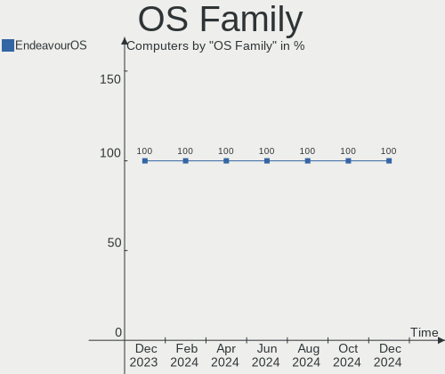

| Name        | Computers | Percent |
|-------------|-----------|---------|
| EndeavourOS | 63        | 100%    |

Kernel
------

Version of the Linux kernel

| Version                                  | Computers | Percent |
|------------------------------------------|-----------|---------|
| 6.8.7-arch1-1                            | 12        | 19.05%  |
| 6.8.5-arch1-1                            | 11        | 17.46%  |
| 6.8.2-arch2-1                            | 8         | 12.7%   |
| 6.8.4-arch1-1                            | 6         | 9.52%   |
| 6.6.25-1-lts                             | 5         | 7.94%   |
| 6.8.7-arch1-2                            | 2         | 3.17%   |
| 6.8.4-zen1-1-zen                         | 2         | 3.17%   |
| 6.8.1-arch1-1                            | 2         | 3.17%   |
| 6.6.24-1-lts                             | 2         | 3.17%   |
| 6.8.8-arch1-1                            | 1         | 1.59%   |
| 6.8.8-1-cachyos-bore                     | 1         | 1.59%   |
| 6.8.7-zen1-1-zen                         | 1         | 1.59%   |
| 6.8.7-3-cachyos                          | 1         | 1.59%   |
| 6.8.5-zen1-1-zen                         | 1         | 1.59%   |
| 6.8.2-zen2-1-zen                         | 1         | 1.59%   |
| 6.7.9-arch1-1                            | 1         | 1.59%   |
| 6.7.7-273-tkg-linux-tkg-eevdf-generic_v3 | 1         | 1.59%   |
| 6.7.12-lqx1-1-lqx                        | 1         | 1.59%   |
| 6.7.11-lqx1-1-lqx                        | 1         | 1.59%   |
| 6.7.1-arch1-1                            | 1         | 1.59%   |
| 6.6.28-1-lts                             | 1         | 1.59%   |
| 6.6.23-1-lts                             | 1         | 1.59%   |

Kernel Family
-------------

Linux kernel without a distro release

| Version | Computers | Percent |
|---------|-----------|---------|
| 6.8.7   | 16        | 25.4%   |
| 6.8.5   | 12        | 19.05%  |
| 6.8.2   | 9         | 14.29%  |
| 6.8.4   | 8         | 12.7%   |
| 6.6.25  | 5         | 7.94%   |
| 6.8.8   | 2         | 3.17%   |
| 6.8.1   | 2         | 3.17%   |
| 6.6.24  | 2         | 3.17%   |
| 6.7.9   | 1         | 1.59%   |
| 6.7.7   | 1         | 1.59%   |
| 6.7.12  | 1         | 1.59%   |
| 6.7.11  | 1         | 1.59%   |
| 6.7.1   | 1         | 1.59%   |
| 6.6.28  | 1         | 1.59%   |
| 6.6.23  | 1         | 1.59%   |

Kernel Major Ver.
-----------------

Linux kernel major version

| Version | Computers | Percent |
|---------|-----------|---------|
| 6.8     | 49        | 77.78%  |
| 6.6     | 9         | 14.29%  |
| 6.7     | 5         | 7.94%   |

Arch
----

OS architecture (x86_64, i586, etc.)

| Name   | Computers | Percent |
|--------|-----------|---------|
| x86_64 | 63        | 100%    |

DE
--

Desktop Environment

| Name          | Computers | Percent |
|---------------|-----------|---------|
| KDE6          | 28        | 44.44%  |
| GNOME         | 10        | 15.87%  |
| KDE           | 8         | 12.7%   |
| XFCE          | 7         | 11.11%  |
| MATE          | 2         | 3.17%   |
| i3            | 2         | 3.17%   |
| Hyprland      | 2         | 3.17%   |
| X-Cinnamon    | 1         | 1.59%   |
| GNOME Classic | 1         | 1.59%   |
| awesome       | 1         | 1.59%   |
| Unknown       | 1         | 1.59%   |

Display Server
--------------

X11 or Wayland

| Name    | Computers | Percent |
|---------|-----------|---------|
| Wayland | 33        | 52.38%  |
| X11     | 29        | 46.03%  |
| Unknown | 1         | 1.59%   |

Display Manager
---------------

SDDM, LightDM, etc.

| Name    | Computers | Percent |
|---------|-----------|---------|
| SDDM    | 27        | 42.86%  |
| LightDM | 16        | 25.4%   |
| Unknown | 13        | 20.63%  |
| GDM     | 7         | 11.11%  |

OS Lang
-------

Language

| Lang  | Computers | Percent |
|-------|-----------|---------|
| en_US | 28        | 44.44%  |
| it_IT | 7         | 11.11%  |
| en_GB | 7         | 11.11%  |
| de_DE | 5         | 7.94%   |
| en_AU | 3         | 4.76%   |
| tr_TR | 2         | 3.17%   |
| ru_RU | 2         | 3.17%   |
| pl_PL | 2         | 3.17%   |
| es_ES | 2         | 3.17%   |
| sv_SE | 1         | 1.59%   |
| nl_NL | 1         | 1.59%   |
| fr_FR | 1         | 1.59%   |
| en_IE | 1         | 1.59%   |
| en_CA | 1         | 1.59%   |

Boot Mode
---------

EFI or BIOS

| Mode | Computers | Percent |
|------|-----------|---------|
| EFI  | 42        | 66.67%  |
| BIOS | 21        | 33.33%  |

Filesystem
----------

Type of filesystem

| Type    | Computers | Percent |
|---------|-----------|---------|
| Ext4    | 42        | 66.67%  |
| Btrfs   | 17        | 26.98%  |
| Tmpfs   | 3         | 4.76%   |
| Overlay | 1         | 1.59%   |

Part. scheme
------------

Scheme of partitioning

| Type    | Computers | Percent |
|---------|-----------|---------|
| GPT     | 49        | 77.78%  |
| Unknown | 13        | 20.63%  |
| MBR     | 1         | 1.59%   |

Dual Boot with Linux/BSD
------------------------

Hosting more than one Linux/BSD

| Dual boot | Computers | Percent |
|-----------|-----------|---------|
| No        | 56        | 88.89%  |
| Yes       | 7         | 11.11%  |

Dual Boot (Win)
---------------

Hosting Linux and Windows

| Dual boot | Computers | Percent |
|-----------|-----------|---------|
| No        | 40        | 63.49%  |
| Yes       | 23        | 36.51%  |

Board
-----

Vendor
------

Motherboard manufacturer

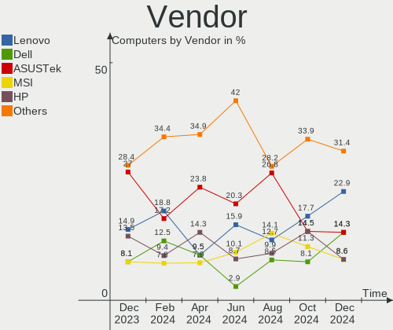

| Name                                 | Computers | Percent |
|--------------------------------------|-----------|---------|
| ASUSTek Computer                     | 15        | 23.81%  |
| Hewlett-Packard                      | 9         | 14.29%  |
| Gigabyte Technology                  | 7         | 11.11%  |
| Lenovo                               | 6         | 9.52%   |
| Dell                                 | 6         | 9.52%   |
| MSI                                  | 5         | 7.94%   |
| Acer                                 | 4         | 6.35%   |
| Chuwi                                | 2         | 3.17%   |
| Alienware                            | 2         | 3.17%   |
| XIAOMI                               | 1         | 1.59%   |
| Win element                          | 1         | 1.59%   |
| Shenzhen Meigao Electronic Equipment | 1         | 1.59%   |
| Microsoft                            | 1         | 1.59%   |
| MECHREVO                             | 1         | 1.59%   |
| HUAWEI                               | 1         | 1.59%   |
| ASRock                               | 1         | 1.59%   |

Model
-----

Motherboard model

| Name                                              | Computers | Percent |
|---------------------------------------------------|-----------|---------|
| HP 250 G3                                         | 2         | 3.17%   |
| ASUS TUF Gaming FX504GE_FX80GE                    | 2         | 3.17%   |
| XIAOMI Redmi Book Pro 14 2024                     | 1         | 1.59%   |
| Win element M600                                  | 1         | 1.59%   |
| Shenzhen Meigao Electronic Equipment Venus series | 1         | 1.59%   |
| MSI MS-7D78                                       | 1         | 1.59%   |
| MSI MS-7C82                                       | 1         | 1.59%   |
| MSI MS-7C52                                       | 1         | 1.59%   |
| MSI MS-7A95                                       | 1         | 1.59%   |
| MSI Customised HOMEA PC                           | 1         | 1.59%   |
| Microsoft Surface Laptop Go                       | 1         | 1.59%   |
| MECHREVO WUJIE14 PRO                              | 1         | 1.59%   |
| Lenovo Yoga Slim 7 14IMH9 83CV                    | 1         | 1.59%   |
| Lenovo Yoga 9 14IRP8 83B1                         | 1         | 1.59%   |
| Lenovo ThinkPad T470s W10DG 20JS001FGE            | 1         | 1.59%   |
| Lenovo ThinkPad L580 20LW000UPB                   | 1         | 1.59%   |
| Lenovo ThinkPad L13 Yoga 20R6S00800               | 1         | 1.59%   |
| Lenovo ThinkBook 15-IIL 20SM                      | 1         | 1.59%   |
| HUAWEI NBLK-WAX9X                                 | 1         | 1.59%   |
| HP Victus by Gaming Laptop 16-s0xxx               | 1         | 1.59%   |
| HP Spectre x360 Convertible 15-df1xxx             | 1         | 1.59%   |
| HP Pro x360 Fortis 11 inch G10 Notebook PC        | 1         | 1.59%   |
| HP Pavilion Gaming Laptop 15-cx0xxx               | 1         | 1.59%   |
| HP Laptop 15-dw0xxx                               | 1         | 1.59%   |
| HP ENVY x360 Convertible 15m-cp0xxx               | 1         | 1.59%   |
| HP 250 G7 Notebook PC                             | 1         | 1.59%   |
| Gigabyte Z390 GAMING X                            | 1         | 1.59%   |
| Gigabyte Z390 AORUS PRO                           | 1         | 1.59%   |
| Gigabyte X570 AORUS PRO                           | 1         | 1.59%   |
| Gigabyte B760M DS3H DDR4                          | 1         | 1.59%   |
| Gigabyte B650M GAMING X AX                        | 1         | 1.59%   |
| Gigabyte B650 GAMING X AX V2                      | 1         | 1.59%   |
| Gigabyte B450M S2H                                | 1         | 1.59%   |
| Dell XPS 15 9520                                  | 1         | 1.59%   |
| Dell Latitude E6440                               | 1         | 1.59%   |
| Dell Latitude 7390 2-in-1                         | 1         | 1.59%   |
| Dell Latitude 7320 Detachable                     | 1         | 1.59%   |
| Dell Latitude 5580                                | 1         | 1.59%   |
| Dell Inspiron 5406 2n1                            | 1         | 1.59%   |
| Chuwi Hi10 pro tablet                             | 1         | 1.59%   |

Model Family
------------

Motherboard model prefix

| Name                                       | Computers | Percent |
|--------------------------------------------|-----------|---------|
| ASUS ROG                                   | 5         | 7.94%   |
| Dell Latitude                              | 4         | 6.35%   |
| Lenovo ThinkPad                            | 3         | 4.76%   |
| HP 250                                     | 3         | 4.76%   |
| ASUS TUF                                   | 3         | 4.76%   |
| ASUS PRIME                                 | 3         | 4.76%   |
| Acer Aspire                                | 3         | 4.76%   |
| Lenovo Yoga                                | 2         | 3.17%   |
| Gigabyte Z390                              | 2         | 3.17%   |
| Alienware m15                              | 2         | 3.17%   |
| XIAOMI Redmi                               | 1         | 1.59%   |
| Win element M600                           | 1         | 1.59%   |
| Shenzhen Meigao Electronic Equipment Venus | 1         | 1.59%   |
| MSI MS-7D78                                | 1         | 1.59%   |
| MSI MS-7C82                                | 1         | 1.59%   |
| MSI MS-7C52                                | 1         | 1.59%   |
| MSI MS-7A95                                | 1         | 1.59%   |
| MSI Customised                             | 1         | 1.59%   |
| Microsoft Surface                          | 1         | 1.59%   |
| MECHREVO WUJIE14                           | 1         | 1.59%   |
| Lenovo ThinkBook                           | 1         | 1.59%   |
| HUAWEI NBLK-WAX9X                          | 1         | 1.59%   |
| HP Victus                                  | 1         | 1.59%   |
| HP Spectre                                 | 1         | 1.59%   |
| HP Pro                                     | 1         | 1.59%   |
| HP Pavilion                                | 1         | 1.59%   |
| HP Laptop                                  | 1         | 1.59%   |
| HP ENVY                                    | 1         | 1.59%   |
| Gigabyte X570                              | 1         | 1.59%   |
| Gigabyte B760M                             | 1         | 1.59%   |
| Gigabyte B650M                             | 1         | 1.59%   |
| Gigabyte B650                              | 1         | 1.59%   |
| Gigabyte B450M                             | 1         | 1.59%   |
| Dell XPS                                   | 1         | 1.59%   |
| Dell Inspiron                              | 1         | 1.59%   |
| Chuwi Hi10                                 | 1         | 1.59%   |
| Chuwi CoreBook                             | 1         | 1.59%   |
| ASUS X550LD                                | 1         | 1.59%   |
| ASUS VivoBook                              | 1         | 1.59%   |
| ASUS ExpertBook                            | 1         | 1.59%   |

MFG Year
--------

Motherboard manufacture year

| Year | Computers | Percent |
|------|-----------|---------|
| 2022 | 12        | 19.05%  |
| 2018 | 11        | 17.46%  |
| 2023 | 9         | 14.29%  |
| 2019 | 9         | 14.29%  |
| 2021 | 5         | 7.94%   |
| 2020 | 4         | 6.35%   |
| 2024 | 3         | 4.76%   |
| 2016 | 3         | 4.76%   |
| 2017 | 2         | 3.17%   |
| 2014 | 2         | 3.17%   |
| 2013 | 2         | 3.17%   |
| 2007 | 1         | 1.59%   |

Form Factor
-----------

Physical design of the computer

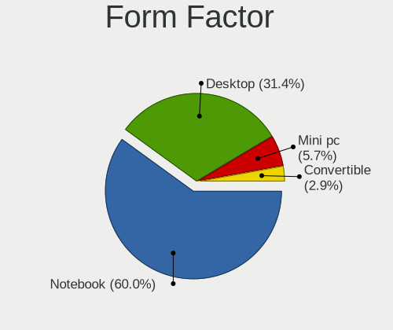

| Name        | Computers | Percent |
|-------------|-----------|---------|
| Notebook    | 34        | 53.97%  |
| Desktop     | 18        | 28.57%  |
| Convertible | 7         | 11.11%  |
| Tablet      | 3         | 4.76%   |
| Mini pc     | 1         | 1.59%   |

Secure Boot
-----------

Enabled or disabled

| State    | Computers | Percent |
|----------|-----------|---------|
| Disabled | 63        | 100%    |

Coreboot
--------

Have coreboot on board

| Used | Computers | Percent |
|------|-----------|---------|
| No   | 63        | 100%    |

RAM Size
--------

Total RAM memory

| Size in GB  | Computers | Percent |
|-------------|-----------|---------|
| 16.01-24.0  | 15        | 23.81%  |
| 32.01-64.0  | 14        | 22.22%  |
| 8.01-16.0   | 13        | 20.63%  |
| 4.01-8.0    | 11        | 17.46%  |
| 64.01-256.0 | 6         | 9.52%   |
| 3.01-4.0    | 2         | 3.17%   |
| 24.01-32.0  | 2         | 3.17%   |

RAM Used
--------

Used RAM memory

| Used GB    | Computers | Percent |
|------------|-----------|---------|
| 4.01-8.0   | 23        | 36.51%  |
| 2.01-3.0   | 15        | 23.81%  |
| 3.01-4.0   | 13        | 20.63%  |
| 1.01-2.0   | 8         | 12.7%   |
| 8.01-16.0  | 3         | 4.76%   |
| 16.01-24.0 | 1         | 1.59%   |

Total Drives
------------

Number of drives on board

| Drives | Computers | Percent |
|--------|-----------|---------|
| 1      | 34        | 53.97%  |
| 2      | 17        | 26.98%  |
| 3      | 6         | 9.52%   |
| 4      | 3         | 4.76%   |
| 7      | 2         | 3.17%   |
| 8      | 1         | 1.59%   |

Has CD-ROM
----------

Has CD-ROM on board

| Presented | Computers | Percent |
|-----------|-----------|---------|
| No        | 58        | 92.06%  |
| Yes       | 5         | 7.94%   |

Has Ethernet
------------

Has Ethernet on board

| Presented | Computers | Percent |
|-----------|-----------|---------|
| Yes       | 47        | 74.6%   |
| No        | 16        | 25.4%   |

Has WiFi
--------

Has WiFi module

| Presented | Computers | Percent |
|-----------|-----------|---------|
| Yes       | 58        | 92.06%  |
| No        | 5         | 7.94%   |

Has Bluetooth
-------------

Has Bluetooth module

| Presented | Computers | Percent |
|-----------|-----------|---------|
| Yes       | 55        | 87.3%   |
| No        | 8         | 12.7%   |

Location
--------

Country
-------

Geographic location (country)

| Country     | Computers | Percent |
|-------------|-----------|---------|
| USA         | 16        | 25.4%   |
| Italy       | 8         | 12.7%   |
| Germany     | 8         | 12.7%   |
| UK          | 4         | 6.35%   |
| Spain       | 3         | 4.76%   |
| Russia      | 3         | 4.76%   |
| Poland      | 3         | 4.76%   |
| Australia   | 3         | 4.76%   |
| Turkey      | 2         | 3.17%   |
| Sweden      | 2         | 3.17%   |
| Netherlands | 2         | 3.17%   |
| Canada      | 2         | 3.17%   |
| Yemen       | 1         | 1.59%   |
| Switzerland | 1         | 1.59%   |
| Slovenia    | 1         | 1.59%   |
| Portugal    | 1         | 1.59%   |
| Hungary     | 1         | 1.59%   |
| France      | 1         | 1.59%   |
| Croatia     | 1         | 1.59%   |

City
----

Geographic location (city)

| City                   | Computers | Percent |
|------------------------|-----------|---------|
| Krakow                 | 2         | 3.17%   |
| Guadalajara            | 2         | 3.17%   |
| Zurich                 | 1         | 1.59%   |
| Yulee                  | 1         | 1.59%   |
| Yekaterinburg          | 1         | 1.59%   |
| Windsor                | 1         | 1.59%   |
| Wiesbaden              | 1         | 1.59%   |
| Westerrade             | 1         | 1.59%   |
| Wembley                | 1         | 1.59%   |
| Warsaw                 | 1         | 1.59%   |
| Voghera                | 1         | 1.59%   |
| Villeneuve-le-Roi      | 1         | 1.59%   |
| Turin                  | 1         | 1.59%   |
| Traunstein             | 1         | 1.59%   |
| Toronto                | 1         | 1.59%   |
| Temple                 | 1         | 1.59%   |
| Sydney                 | 1         | 1.59%   |
| Stephenville           | 1         | 1.59%   |
| Selvazzano Dentro      | 1         | 1.59%   |
| Sanaa                  | 1         | 1.59%   |
| Reggio Calabria        | 1         | 1.59%   |
| Redondo Beach          | 1         | 1.59%   |
| Redmond                | 1         | 1.59%   |
| Palos Park             | 1         | 1.59%   |
| Örebro                | 1         | 1.59%   |
| Ocean Grove            | 1         | 1.59%   |
| Nuremberg              | 1         | 1.59%   |
| New York               | 1         | 1.59%   |
| Moscow                 | 1         | 1.59%   |
| Milton                 | 1         | 1.59%   |
| Mezhdurechensk         | 1         | 1.59%   |
| Melbourne              | 1         | 1.59%   |
| Mannheim               | 1         | 1.59%   |
| Los Angeles            | 1         | 1.59%   |
| Ljubljana              | 1         | 1.59%   |
| Letchworth Garden City | 1         | 1.59%   |
| Leipzig                | 1         | 1.59%   |
| Leechburg              | 1         | 1.59%   |
| Lawton                 | 1         | 1.59%   |
| Istanbul               | 1         | 1.59%   |

Drives
------

Drive Vendor
------------

Hard drive vendors

| Vendor                         | Computers | Drives | Percent |
|--------------------------------|-----------|--------|---------|
| Samsung Electronics            | 18        | 21     | 17.14%  |
| SanDisk                        | 10        | 11     | 9.52%   |
| Seagate                        | 9         | 10     | 8.57%   |
| WDC                            | 7         | 11     | 6.67%   |
| SK hynix                       | 7         | 7      | 6.67%   |
| Kingston                       | 7         | 11     | 6.67%   |
| Phison Electronics             | 6         | 6      | 5.71%   |
| Toshiba                        | 5         | 9      | 4.76%   |
| Micron/Crucial Technology      | 5         | 5      | 4.76%   |
| Micron Technology              | 4         | 4      | 3.81%   |
| Kingston Technology Company    | 4         | 4      | 3.81%   |
| Crucial                        | 4         | 4      | 3.81%   |
| Unknown                        | 2         | 3      | 1.9%    |
| KIOXIA                         | 2         | 2      | 1.9%    |
| Yangtze Memory Technologies    | 1         | 1      | 0.95%   |
| Solid State Storage Technology | 1         | 1      | 0.95%   |
| Silicon Motion                 | 1         | 1      | 0.95%   |
| Shenzhen Longsys Electronics   | 1         | 1      | 0.95%   |
| SABRENT                        | 1         | 1      | 0.95%   |
| PNY                            | 1         | 1      | 0.95%   |
| MAXIO Technology (Hangzhou)    | 1         | 1      | 0.95%   |
| LITEONIT                       | 1         | 1      | 0.95%   |
| KingSpec                       | 1         | 1      | 0.95%   |
| Intenso                        | 1         | 1      | 0.95%   |
| Intel                          | 1         | 1      | 0.95%   |
| HGST                           | 1         | 1      | 0.95%   |
| DockCase                       | 1         | 1      | 0.95%   |
| Colorful                       | 1         | 1      | 0.95%   |
| A-DATA Technology              | 1         | 1      | 0.95%   |

Drive Model
-----------

Hard drive models

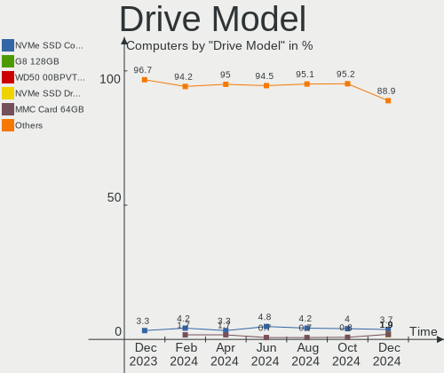

| Model                                                | Computers | Percent |
|------------------------------------------------------|-----------|---------|
| Samsung NVMe SSD Controller SM981/PM981/PM983 1TB    | 4         | 3.31%   |
| Samsung NVMe SSD Controller PM9A1/PM9A3/980PRO 1TB   | 4         | 3.31%   |
| Phison E12 NVMe Controller 2TB                       | 3         | 2.48%   |
| Kingston Company SNV2S1000G 1TB                      | 3         | 2.48%   |
| Unknown MMC Card  64GB                               | 2         | 1.65%   |
| Toshiba DT01ACA200 2TB                               | 2         | 1.65%   |
| Sandisk WD Blue SN550 NVMe SSD 2TB                   | 2         | 1.65%   |
| Samsung SSD 980 1TB                                  | 2         | 1.65%   |
| Samsung MZVLQ512HBLU-00B00 512GB                     | 2         | 1.65%   |
| Micron/Crucial P2 NVMe PCIe SSD 4TB                  | 2         | 1.65%   |
| Micron MTFDHBA512QFD 512GB                           | 2         | 1.65%   |
| Kingston SHFS37A240G 240GB SSD                       | 2         | 1.65%   |
| Kingston SA400S37240G 240GB SSD                      | 2         | 1.65%   |
| Yangtze Memory YMTC PC300-1TB-B                      | 1         | 0.83%   |
| WDC WDS200T2B0A-00SM50 2TB SSD                       | 1         | 0.83%   |
| WDC WD5000AAKS-00A7B0 500GB                          | 1         | 0.83%   |
| WDC WD40EZRZ-00WN9B0 4TB                             | 1         | 0.83%   |
| WDC WD40EZRZ-00GXCB0 4TB                             | 1         | 0.83%   |
| WDC WD30EZRZ-00GXCB0 3TB                             | 1         | 0.83%   |
| WDC WD20EZRZ-22Z5HB0 2TB                             | 1         | 0.83%   |
| WDC WD20EZBX-00AYRA0 2TB                             | 1         | 0.83%   |
| WDC WD1600AAJS-00PSA0 160GB                          | 1         | 0.83%   |
| WDC WD10EZEX-60WN4A1 1TB                             | 1         | 0.83%   |
| WDC WD10EZEX-08WN4A0 1TB                             | 1         | 0.83%   |
| WDC WD1000DHTZ-04N21V0 1TB                           | 1         | 0.83%   |
| Unknown MMC Card  32GB                               | 1         | 0.83%   |
| Toshiba TR150 960GB SSD                              | 1         | 0.83%   |
| Toshiba MQ01ABD100 1TB                               | 1         | 0.83%   |
| Toshiba MD04ACA400 4TB                               | 1         | 0.83%   |
| Toshiba KXG50ZNV256G NVMe 256GB                      | 1         | 0.83%   |
| Toshiba KSG60ZMV256G M.2 2280 256GB SSD              | 1         | 0.83%   |
| Toshiba HDWD240 4TB                                  | 1         | 0.83%   |
| Toshiba DT01ACA050 500GB                             | 1         | 0.83%   |
| Solid State Storage CA6-8D2048-Q11 NVMe SSSTC 2048GB | 1         | 0.83%   |
| SK hynix SKHynix_HFS512GEJ9X115N 512GB               | 1         | 0.83%   |
| SK hynix SKHynix_HFS001TEJ4X112N 1TB                 | 1         | 0.83%   |
| SK hynix PC801 HFS001TEJ9X101N 1024GB                | 1         | 0.83%   |
| SK hynix PC401 NVMe Solid State Drive 256GB          | 1         | 0.83%   |
| SK hynix HFS256G39TND-N210A 256GB SSD                | 1         | 0.83%   |
| SK hynix HFM001TD3JX013N 1024GB                      | 1         | 0.83%   |

HDD Vendor
----------

Hard disk drive vendors

| Vendor              | Computers | Drives | Percent |
|---------------------|-----------|--------|---------|
| Seagate             | 8         | 9      | 38.1%   |
| WDC                 | 6         | 10     | 28.57%  |
| Toshiba             | 4         | 6      | 19.05%  |
| Samsung Electronics | 1         | 1      | 4.76%   |
| SABRENT             | 1         | 1      | 4.76%   |
| HGST                | 1         | 1      | 4.76%   |

SSD Vendor
----------

Solid state drive vendors

| Vendor              | Computers | Drives | Percent |
|---------------------|-----------|--------|---------|
| SanDisk             | 4         | 5      | 15.38%  |
| Kingston            | 4         | 7      | 15.38%  |
| Crucial             | 4         | 4      | 15.38%  |
| Samsung Electronics | 3         | 3      | 11.54%  |
| Toshiba             | 2         | 2      | 7.69%   |
| Micron Technology   | 2         | 2      | 7.69%   |
| WDC                 | 1         | 1      | 3.85%   |
| SK hynix            | 1         | 1      | 3.85%   |
| PNY                 | 1         | 1      | 3.85%   |
| LITEONIT            | 1         | 1      | 3.85%   |
| KingSpec            | 1         | 1      | 3.85%   |
| Intenso             | 1         | 1      | 3.85%   |
| A-DATA Technology   | 1         | 1      | 3.85%   |

Drive Kind
----------

HDD or SSD

| Kind    | Computers | Drives | Percent |
|---------|-----------|--------|---------|
| NVMe    | 50        | 60     | 54.95%  |
| SSD     | 21        | 30     | 23.08%  |
| HDD     | 16        | 28     | 17.58%  |
| MMC     | 2         | 3      | 2.2%    |
| Unknown | 2         | 2      | 2.2%    |

Drive Connector
---------------

SATA, SAS, NVMe, etc.

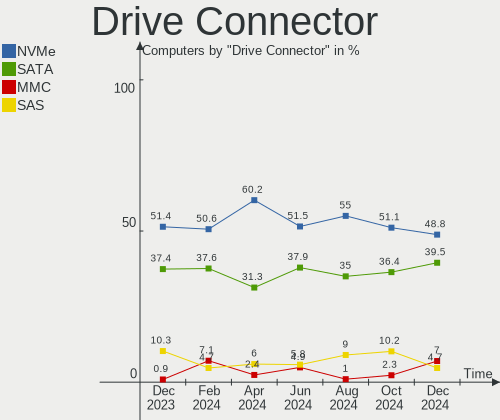

| Type | Computers | Drives | Percent |
|------|-----------|--------|---------|
| NVMe | 50        | 60     | 60.24%  |
| SATA | 26        | 55     | 31.33%  |
| SAS  | 5         | 5      | 6.02%   |
| MMC  | 2         | 3      | 2.41%   |

Drive Size
----------

Size of hard drive

| Size in TB | Computers | Drives | Percent |
|------------|-----------|--------|---------|
| 0.01-0.5   | 20        | 30     | 47.62%  |
| 0.51-1.0   | 10        | 14     | 23.81%  |
| 1.01-2.0   | 6         | 6      | 14.29%  |
| 3.01-4.0   | 4         | 6      | 9.52%   |
| 2.01-3.0   | 1         | 1      | 2.38%   |
| 4.01-10.0  | 1         | 1      | 2.38%   |

Space Total
-----------

Amount of disk space available on the file system

| Size in GB     | Computers | Percent |
|----------------|-----------|---------|
| 501-1000       | 11        | 17.46%  |
| 1001-2000      | 10        | 15.87%  |
| More than 3000 | 9         | 14.29%  |
| 251-500        | 8         | 12.7%   |
| 101-250        | 8         | 12.7%   |
| 1-20           | 6         | 9.52%   |
| 2001-3000      | 4         | 6.35%   |
| Unknown        | 4         | 6.35%   |
| 51-100         | 3         | 4.76%   |

Space Used
----------

Amount of used disk space

| Used GB        | Computers | Percent |
|----------------|-----------|---------|
| 1-20           | 13        | 20.63%  |
| 101-250        | 11        | 17.46%  |
| 501-1000       | 9         | 14.29%  |
| 51-100         | 9         | 14.29%  |
| 21-50          | 8         | 12.7%   |
| 251-500        | 5         | 7.94%   |
| Unknown        | 4         | 6.35%   |
| More than 3000 | 2         | 3.17%   |
| 1001-2000      | 2         | 3.17%   |

Malfunc. Drives
---------------

Drive models with a malfunction

| Model                          | Computers | Drives | Percent |
|--------------------------------|-----------|--------|---------|
| WDC WD5000AAKS-00A7B0 500GB    | 1         | 1      | 10%     |
| WDC WD40EZRZ-00WN9B0 4TB       | 1         | 1      | 10%     |
| WDC WD1600AAJS-00PSA0 160GB    | 1         | 1      | 10%     |
| WDC WD10EZEX-60WN4A1 1TB       | 1         | 1      | 10%     |
| WDC WD1000DHTZ-04N21V0 1TB     | 1         | 1      | 10%     |
| Toshiba MQ01ABD100 1TB         | 1         | 1      | 10%     |
| Seagate ST4000DM000-1F2168 4TB | 1         | 1      | 10%     |
| Seagate ST2000DM008-2FR102 2TB | 1         | 1      | 10%     |
| SanDisk SDSSDA120G 120GB       | 1         | 1      | 10%     |
| Kingston SHFS37A240G 240GB SSD | 1         | 1      | 10%     |

Malfunc. Drive Vendor
---------------------

Vendors of faulty drives

| Vendor   | Computers | Drives | Percent |
|----------|-----------|--------|---------|
| WDC      | 4         | 5      | 44.44%  |
| Seagate  | 2         | 2      | 22.22%  |
| Toshiba  | 1         | 1      | 11.11%  |
| SanDisk  | 1         | 1      | 11.11%  |
| Kingston | 1         | 1      | 11.11%  |

Malfunc. HDD Vendor
-------------------

Vendors of faulty HDD drives

| Vendor  | Computers | Drives | Percent |
|---------|-----------|--------|---------|
| WDC     | 4         | 5      | 57.14%  |
| Seagate | 2         | 2      | 28.57%  |
| Toshiba | 1         | 1      | 14.29%  |

Malfunc. Drive Kind
-------------------

Kinds of faulty drives

| Kind | Computers | Drives | Percent |
|------|-----------|--------|---------|
| HDD  | 5         | 8      | 71.43%  |
| SSD  | 2         | 2      | 28.57%  |

Failed Drives
-------------

Failed drive models

Zero info for selected period =(

Failed Drive Vendor
-------------------

Failed drive vendors

Zero info for selected period =(

Drive Status
------------

Number of failed and malfunc. drives

| Status   | Computers | Drives | Percent |
|----------|-----------|--------|---------|
| Works    | 46        | 77     | 63.89%  |
| Detected | 20        | 36     | 27.78%  |
| Malfunc  | 6         | 10     | 8.33%   |

Storage controller
------------------

Storage Vendor
--------------

Storage controller vendors

| Vendor                         | Computers | Percent |
|--------------------------------|-----------|---------|
| Intel                          | 31        | 30.69%  |
| Samsung Electronics            | 15        | 14.85%  |
| AMD                            | 10        | 9.9%    |
| Kingston Technology Company    | 7         | 6.93%   |
| SK hynix                       | 6         | 5.94%   |
| SanDisk                        | 6         | 5.94%   |
| Phison Electronics             | 6         | 5.94%   |
| Micron/Crucial Technology      | 5         | 4.95%   |
| ASMedia Technology             | 3         | 2.97%   |
| Micron Technology              | 2         | 1.98%   |
| KIOXIA                         | 2         | 1.98%   |
| Yangtze Memory Technologies    | 1         | 0.99%   |
| Toshiba America Info Systems   | 1         | 0.99%   |
| Solid State Storage Technology | 1         | 0.99%   |
| Silicon Motion                 | 1         | 0.99%   |
| Shenzhen Longsys Electronics   | 1         | 0.99%   |
| MAXIO Technology (Hangzhou)    | 1         | 0.99%   |
| Marvell Technology Group       | 1         | 0.99%   |
| Hosin Global Electronics       | 1         | 0.99%   |

Storage Model
-------------

Storage controller models

| Model                                                                   | Computers | Percent |
|-------------------------------------------------------------------------|-----------|---------|
| Samsung NVMe SSD Controller 980 (DRAM-less)                             | 7         | 6.42%   |
| Intel Cannon Lake Mobile PCH SATA AHCI Controller                       | 5         | 4.59%   |
| AMD FCH SATA Controller [AHCI mode]                                     | 5         | 4.59%   |
| Samsung NVMe SSD Controller SM981/PM981/PM983                           | 4         | 3.67%   |
| Samsung NVMe SSD Controller PM9A1/PM9A3/980PRO                          | 4         | 3.67%   |
| Intel Volume Management Device NVMe RAID Controller                     | 4         | 3.67%   |
| Phison E12 NVMe Controller                                              | 3         | 2.75%   |
| Kingston Company NV2 NVMe SSD SM2267XT (DRAM-less)                      | 3         | 2.75%   |
| Intel 82801 Mobile SATA Controller [RAID mode]                          | 3         | 2.75%   |
| AMD 600 Series Chipset SATA Controller                                  | 3         | 2.75%   |
| SK hynix Platinum P41/PC801 NVMe Solid State Drive                      | 2         | 1.83%   |
| SanDisk WD Black SN770 / PC SN740 256GB / PC SN560 (DRAM-less) NVMe SSD | 2         | 1.83%   |
| SanDisk Ultra 3D / WD Blue SN550 NVMe SSD                               | 2         | 1.83%   |
| Micron/Crucial P2 [Nick P2] / P3 / P3 Plus NVMe PCIe SSD (DRAM-less)    | 2         | 1.83%   |
| Micron 2210 NVMe SSD [Cobain]                                           | 2         | 1.83%   |
| KIOXIA NVMe SSD Controller BG4 (DRAM-less)                              | 2         | 1.83%   |
| Intel Sunrise Point-LP SATA Controller [AHCI mode]                      | 2         | 1.83%   |
| Intel SATA Controller [RAID mode]                                       | 2         | 1.83%   |
| Intel Alder Lake-P SATA AHCI Controller                                 | 2         | 1.83%   |
| Intel 8 Series SATA Controller 1 [AHCI mode]                            | 2         | 1.83%   |
| AMD 500 Series Chipset SATA Controller                                  | 2         | 1.83%   |
| AMD 400 Series Chipset SATA Controller                                  | 2         | 1.83%   |
| Yangtze Memory PC300 NVMe SSD (DRAM-less)                               | 1         | 0.92%   |
| Toshiba America Info Systems XG5 NVMe SSD Controller                    | 1         | 0.92%   |
| Solid State Storage CA6-8D512 NVMe SSD M.2                              | 1         | 0.92%   |
| SK hynix PC401 NVMe Solid State Drive 256GB                             | 1         | 0.92%   |
| SK hynix Gold P31/BC711/PC711 NVMe Solid State Drive                    | 1         | 0.92%   |
| SK hynix BC901 NVMe Solid State Drive (DRAM-less)                       | 1         | 0.92%   |
| SK hynix BC501 NVMe Solid State Drive                                   | 1         | 0.92%   |
| Silicon Motion SM2263EN/SM2263XT (DRAM-less) NVMe SSD Controllers       | 1         | 0.92%   |
| Shenzhen Longsys FORESEE XP2000, Lexar NM760 NVME SSD (DRAM-less)       | 1         | 0.92%   |
| Sandisk WD Blue SN580 NVMe SSD (DRAM-less)                              | 1         | 0.92%   |
| Sandisk WD Black SN850X NVMe SSD                                        | 1         | 0.92%   |
| Samsung NVMe SSD Controller SM961/PM961/SM963                           | 1         | 0.92%   |
| Phison PS5021-E21 PCIe4 NVMe Controller (DRAM-less)                     | 1         | 0.92%   |
| Phison PS5013-E13 PCIe3 NVMe Controller (DRAM-less)                     | 1         | 0.92%   |
| Phison E18 PCIe4 NVMe Controller                                        | 1         | 0.92%   |
| Micron/Crucial P5 Plus NVMe PCIe SSD                                    | 1         | 0.92%   |
| Micron/Crucial P5 NVMe PCIe SSD[SlashP5]                                | 1         | 0.92%   |
| Micron/Crucial P1 NVMe PCIe SSD[Frampton]                               | 1         | 0.92%   |

Storage Kind
------------

Kind of storage controller (IDE, SATA, NVMe, SAS, ...)

| Kind | Computers | Percent |
|------|-----------|---------|
| NVMe | 50        | 53.19%  |
| SATA | 32        | 34.04%  |
| RAID | 10        | 10.64%  |
| IDE  | 2         | 2.13%   |

Processor
---------

CPU Vendor
----------

Processor vendors

| Vendor | Computers | Percent |
|--------|-----------|---------|
| Intel  | 46        | 73.02%  |
| AMD    | 17        | 26.98%  |

CPU Model
---------

Processor models

| Model                                      | Computers | Percent |
|--------------------------------------------|-----------|---------|
| Intel 12th Gen Core i7-12700H              | 3         | 4.76%   |
| Intel Core Ultra 7 155H                    | 2         | 3.17%   |
| Intel Core i7-9750H CPU @ 2.60GHz          | 2         | 3.17%   |
| Intel Core i7-9700K CPU @ 3.60GHz          | 2         | 3.17%   |
| Intel Core i7-8750H CPU @ 2.20GHz          | 2         | 3.17%   |
| Intel Core i5-8300H CPU @ 2.30GHz          | 2         | 3.17%   |
| Intel 12th Gen Core i5-1235U               | 2         | 3.17%   |
| AMD Ryzen 5 5600G with Radeon Graphics     | 2         | 3.17%   |
| Intel Core i9-7940X CPU @ 3.10GHz          | 1         | 1.59%   |
| Intel Core i7-8565U CPU @ 1.80GHz          | 1         | 1.59%   |
| Intel Core i7-7700K CPU @ 4.20GHz          | 1         | 1.59%   |
| Intel Core i7-7500U CPU @ 2.70GHz          | 1         | 1.59%   |
| Intel Core i7-4600M CPU @ 2.90GHz          | 1         | 1.59%   |
| Intel Core i7-4510U CPU @ 2.00GHz          | 1         | 1.59%   |
| Intel Core i7-10750H CPU @ 2.60GHz         | 1         | 1.59%   |
| Intel Core i7-10700K CPU @ 3.80GHz         | 1         | 1.59%   |
| Intel Core i7-10610U CPU @ 1.80GHz         | 1         | 1.59%   |
| Intel Core i5-8350U CPU @ 1.70GHz          | 1         | 1.59%   |
| Intel Core i5-8250U CPU @ 1.60GHz          | 1         | 1.59%   |
| Intel Core i5-7200U CPU @ 2.50GHz          | 1         | 1.59%   |
| Intel Core i5-6300U CPU @ 2.40GHz          | 1         | 1.59%   |
| Intel Core i5-10600KF CPU @ 4.10GHz        | 1         | 1.59%   |
| Intel Core i5-1035G4 CPU @ 1.10GHz         | 1         | 1.59%   |
| Intel Core i5-1035G1 CPU @ 1.00GHz         | 1         | 1.59%   |
| Intel Core i5-10210U CPU @ 1.60GHz         | 1         | 1.59%   |
| Intel Core i3-4005U CPU @ 1.70GHz          | 1         | 1.59%   |
| Intel Core 2 Duo CPU T7300 @ 2.00GHz       | 1         | 1.59%   |
| Intel Celeron N4020 CPU @ 1.10GHz          | 1         | 1.59%   |
| Intel Celeron CPU N2840 @ 2.16GHz          | 1         | 1.59%   |
| Intel Atom x5-Z8350 CPU @ 1.44GHz          | 1         | 1.59%   |
| Intel 13th Gen Core i9-13900H              | 1         | 1.59%   |
| Intel 13th Gen Core i7-1360P               | 1         | 1.59%   |
| Intel 13th Gen Core i5-13500               | 1         | 1.59%   |
| Intel 12th Gen Core i7-1255U               | 1         | 1.59%   |
| Intel 12th Gen Core i5-12500H              | 1         | 1.59%   |
| Intel 12th Gen Core i3-1210U               | 1         | 1.59%   |
| Intel 11th Gen Core i5-11600 @ 2.80GHz     | 1         | 1.59%   |
| Intel 11th Gen Core i5-1140G7 @ 1.10GHz    | 1         | 1.59%   |
| Intel 11th Gen Core i5-1135G7 @ 2.40GHz    | 1         | 1.59%   |
| AMD Ryzen 9 8945HS w/ Radeon 780M Graphics | 1         | 1.59%   |

CPU Model Family
----------------

Processor model prefix

| Model            | Computers | Percent |
|------------------|-----------|---------|
| Other            | 14        | 22.22%  |
| Intel Core i7    | 14        | 22.22%  |
| Intel Core i5    | 10        | 15.87%  |
| AMD Ryzen 5      | 8         | 12.7%   |
| AMD Ryzen 7      | 5         | 7.94%   |
| AMD Ryzen 9      | 4         | 6.35%   |
| Intel Core       | 2         | 3.17%   |
| Intel Celeron    | 2         | 3.17%   |
| Intel Core i9    | 1         | 1.59%   |
| Intel Core i3    | 1         | 1.59%   |
| Intel Core 2 Duo | 1         | 1.59%   |
| Intel Atom       | 1         | 1.59%   |

CPU Cores
---------

Number of processor cores

| Number | Computers | Percent |
|--------|-----------|---------|
| 6      | 15        | 23.81%  |
| 4      | 15        | 23.81%  |
| 8      | 11        | 17.46%  |
| 2      | 9         | 14.29%  |
| 14     | 6         | 9.52%   |
| 10     | 3         | 4.76%   |
| 16     | 2         | 3.17%   |
| 12     | 2         | 3.17%   |

CPU Sockets
-----------

Number of sockets

| Number | Computers | Percent |
|--------|-----------|---------|
| 1      | 63        | 100%    |

CPU Threads
-----------

Threads per core (Hyper-Threading)

| Number | Computers | Percent |
|--------|-----------|---------|
| 2      | 56        | 88.89%  |
| 1      | 7         | 11.11%  |

CPU Op-Modes
------------

CPU Operation Modes (32-bit, 64-bit)

| Op mode        | Computers | Percent |
|----------------|-----------|---------|
| 32-bit, 64-bit | 63        | 100%    |

CPU Microcode
-------------

Microcode number

| Number  | Computers | Percent |
|---------|-----------|---------|
| Unknown | 63        | 100%    |

CPU Microarch
-------------

Microarchitecture

| Name              | Computers | Percent |
|-------------------|-----------|---------|
| KabyLake          | 16        | 25.4%   |
| Unknown           | 13        | 20.63%  |
| Alderlake Hybrid  | 8         | 12.7%   |
| Zen 3             | 5         | 7.94%   |
| Haswell           | 3         | 4.76%   |
| CometLake         | 3         | 4.76%   |
| Zen+              | 2         | 3.17%   |
| TigerLake         | 2         | 3.17%   |
| Skylake           | 2         | 3.17%   |
| Silvermont        | 2         | 3.17%   |
| IceLake           | 2         | 3.17%   |
| Zen 2             | 1         | 1.59%   |
| Zen               | 1         | 1.59%   |
| Meteorlake Hybrid | 1         | 1.59%   |
| Goldmont plus     | 1         | 1.59%   |
| Core              | 1         | 1.59%   |

Graphics
--------

GPU Vendor
----------

Vendors of graphics cards

| Vendor | Computers | Percent |
|--------|-----------|---------|
| Intel  | 40        | 48.19%  |
| Nvidia | 26        | 31.33%  |
| AMD    | 17        | 20.48%  |

GPU Model
---------

Graphics card models

| Model                                                                | Computers | Percent |
|----------------------------------------------------------------------|-----------|---------|
| Intel CoffeeLake-H GT2 [UHD Graphics 630]                            | 6         | 6.9%    |
| Intel Alder Lake-P GT2 [Iris Xe Graphics]                            | 4         | 4.6%    |
| AMD Navi 23 [Radeon RX 6600/6600 XT/6600M]                           | 4         | 4.6%    |
| Nvidia GP107M [GeForce GTX 1050 Ti Mobile]                           | 3         | 3.45%   |
| AMD Raphael                                                          | 3         | 3.45%   |
| AMD Phoenix1                                                         | 3         | 3.45%   |
| Nvidia TU116M [GeForce GTX 1660 Ti Mobile]                           | 2         | 2.3%    |
| Nvidia GA104 [GeForce RTX 3060 Ti Lite Hash Rate]                    | 2         | 2.3%    |
| Nvidia AD106M [GeForce RTX 4070 Max-Q / Mobile]                      | 2         | 2.3%    |
| Intel UHD Graphics 620                                               | 2         | 2.3%    |
| Intel Raptor Lake-P [Iris Xe Graphics]                               | 2         | 2.3%    |
| Intel Meteor Lake-P [Intel Arc Graphics]                             | 2         | 2.3%    |
| Intel HD Graphics 620                                                | 2         | 2.3%    |
| Intel Haswell-ULT Integrated Graphics Controller                     | 2         | 2.3%    |
| Intel CometLake-U GT2 [UHD Graphics]                                 | 2         | 2.3%    |
| Intel Alder Lake-UP3 GT2 [UHD Graphics]                              | 2         | 2.3%    |
| AMD Navi 22 [Radeon RX 6700/6700 XT/6750 XT / 6800M/6850M XT]        | 2         | 2.3%    |
| AMD Cezanne [Radeon Vega Series / Radeon Vega Mobile Series]         | 2         | 2.3%    |
| Nvidia TU117M [GeForce MX550]                                        | 1         | 1.15%   |
| Nvidia TU117M [GeForce GTX 1650 Mobile / Max-Q]                      | 1         | 1.15%   |
| Nvidia TU116 [GeForce GTX 1660 SUPER]                                | 1         | 1.15%   |
| Nvidia TU116 [GeForce GTX 1650]                                      | 1         | 1.15%   |
| Nvidia TU106M [GeForce RTX 2060 Mobile]                              | 1         | 1.15%   |
| Nvidia TU106 [GeForce RTX 2070 Rev. A]                               | 1         | 1.15%   |
| Nvidia TU104 [GeForce RTX 2080 SUPER]                                | 1         | 1.15%   |
| Nvidia TU104 [GeForce RTX 2070 SUPER]                                | 1         | 1.15%   |
| Nvidia GM108M [GeForce MX130]                                        | 1         | 1.15%   |
| Nvidia GM108M [GeForce 940MX]                                        | 1         | 1.15%   |
| Nvidia GF117M [GeForce 610M/710M/810M/820M / GT 620M/625M/630M/720M] | 1         | 1.15%   |
| Nvidia GA107M [GeForce RTX 3050 Ti Mobile]                           | 1         | 1.15%   |
| Nvidia GA107M [GeForce RTX 3050 Mobile]                              | 1         | 1.15%   |
| Nvidia GA106M [GeForce RTX 3060 Mobile / Max-Q]                      | 1         | 1.15%   |
| Nvidia GA104M [Geforce RTX 3070 Ti Laptop GPU]                       | 1         | 1.15%   |
| Nvidia GA104 [GeForce RTX 3070]                                      | 1         | 1.15%   |
| Nvidia AD107M [GeForce RTX 4060 Max-Q / Mobile]                      | 1         | 1.15%   |
| Intel WhiskeyLake-U GT2 [UHD Graphics 620]                           | 1         | 1.15%   |
| Intel TigerLake-LP GT2 [Iris Xe Graphics]                            | 1         | 1.15%   |
| Intel Tiger Lake-UP4 GT2 [Iris Xe Graphics]                          | 1         | 1.15%   |
| Intel Skylake GT2 [HD Graphics 520]                                  | 1         | 1.15%   |
| Intel Mobile GM965/GL960 Integrated Graphics Controller (secondary)  | 1         | 1.15%   |

GPU Combo
---------

Combinations of graphics cards

| Name           | Computers | Percent |
|----------------|-----------|---------|
| 1 x Intel      | 21        | 33.33%  |
| Intel + Nvidia | 16        | 25.4%   |
| 1 x AMD        | 11        | 17.46%  |
| 1 x Nvidia     | 8         | 12.7%   |
| 2 x AMD        | 3         | 4.76%   |
| AMD + Nvidia   | 2         | 3.17%   |
| 2 x Intel      | 1         | 1.59%   |
| Intel + AMD    | 1         | 1.59%   |

GPU Driver
----------

Free vs proprietary

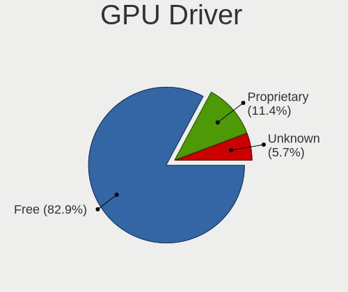

| Driver      | Computers | Percent |
|-------------|-----------|---------|
| Free        | 38        | 60.32%  |
| Proprietary | 22        | 34.92%  |
| Unknown     | 3         | 4.76%   |

GPU Memory
----------

Total video memory

| Size in GB | Computers | Percent |
|------------|-----------|---------|
| Unknown    | 38        | 60.32%  |
| 7.01-8.0   | 10        | 15.87%  |
| 0.01-0.5   | 4         | 6.35%   |
| 5.01-6.0   | 3         | 4.76%   |
| 3.01-4.0   | 3         | 4.76%   |
| 8.01-16.0  | 3         | 4.76%   |
| 1.01-2.0   | 1         | 1.59%   |
| 0.51-1.0   | 1         | 1.59%   |

Monitor
-------

Monitor Vendor
--------------

Monitor vendors

| Vendor               | Computers | Percent |
|----------------------|-----------|---------|
| Samsung Electronics  | 12        | 15.79%  |
| Chimei Innolux       | 9         | 11.84%  |
| AU Optronics         | 9         | 11.84%  |
| BOE                  | 8         | 10.53%  |
| Goldstar             | 7         | 9.21%   |
| LG Display           | 5         | 6.58%   |
| Dell                 | 5         | 6.58%   |
| Hewlett-Packard      | 4         | 5.26%   |
| Philips              | 2         | 2.63%   |
| PANDA                | 2         | 2.63%   |
| AOC                  | 2         | 2.63%   |
| Acer                 | 2         | 2.63%   |
| Vestel Elektronik    | 1         | 1.32%   |
| TMX                  | 1         | 1.32%   |
| TMA                  | 1         | 1.32%   |
| Sharp                | 1         | 1.32%   |
| OEM                  | 1         | 1.32%   |
| Lenovo Group Limited | 1         | 1.32%   |
| CSW                  | 1         | 1.32%   |
| BenQ                 | 1         | 1.32%   |
| Ancor Communications | 1         | 1.32%   |

Monitor Model
-------------

Monitor models

| Model                                                                  | Computers | Percent |
|------------------------------------------------------------------------|-----------|---------|
| PANDA LCD Monitor NCP004D 1920x1080 344x194mm 15.5-inch                | 2         | 2.56%   |
| LG Display LCD Monitor LGD046B 1366x768 344x194mm 15.5-inch            | 2         | 2.56%   |
| Dell P2419H DELD0DA 1920x1080 527x296mm 23.8-inch                      | 2         | 2.56%   |
| Vestel Elektronik 22W_LCD_TV VES3700 1920x540                          | 1         | 1.28%   |
| TMX TL140BDXP01-0 TMX1400 2560x1440 310x174mm 14.0-inch                | 1         | 1.28%   |
| TMA TL140ADXP24-0 TMA2004 2880x1800 300x190mm 14.0-inch                | 1         | 1.28%   |
| Sharp LCD Monitor SHP1526 1920x1280 274x183mm 13.0-inch                | 1         | 1.28%   |
| Samsung Electronics S34J55x SAM0F72 3440x1440 797x333mm 34.0-inch      | 1         | 1.28%   |
| Samsung Electronics S27H85x SAM0E0E 2560x1440 600x340mm 27.2-inch      | 1         | 1.28%   |
| Samsung Electronics S27F350 SAM0D22 1920x1080 600x340mm 27.2-inch      | 1         | 1.28%   |
| Samsung Electronics S24F350 SAM0D20 1920x1080 521x293mm 23.5-inch      | 1         | 1.28%   |
| Samsung Electronics LCD Monitor SEC3945 1280x800 331x207mm 15.4-inch   | 1         | 1.28%   |
| Samsung Electronics LCD Monitor SDCA029 3840x2160 344x194mm 15.5-inch  | 1         | 1.28%   |
| Samsung Electronics LCD Monitor SDC4187 1920x1200 302x189mm 14.0-inch  | 1         | 1.28%   |
| Samsung Electronics LCD Monitor SDC4152 2880x1800 302x189mm 14.0-inch  | 1         | 1.28%   |
| Samsung Electronics LCD Monitor SDC414D 3456x2160 336x210mm 15.6-inch  | 1         | 1.28%   |
| Samsung Electronics LCD Monitor SAM07C0 1920x1080 700x390mm 31.5-inch  | 1         | 1.28%   |
| Samsung Electronics C32JG5x SAM0F55 2560x1440 700x390mm 31.5-inch      | 1         | 1.28%   |
| Samsung Electronics ATNA40CU05-0 SDC419C 2880x1800 302x189mm 14.0-inch | 1         | 1.28%   |
| Philips PHL 273V7 PHLC156 1920x1080 598x336mm 27.0-inch                | 1         | 1.28%   |
| Philips 220S PHL0886 1680x1050 473x296mm 22.0-inch                     | 1         | 1.28%   |
| OEM 26W_LCD_TV OEM3700 1920x540                                        | 1         | 1.28%   |
| LG Display LCD Monitor LGD05EA 1920x1080 294x165mm 13.3-inch           | 1         | 1.28%   |
| LG Display LCD Monitor LGD0555 2736x1824 260x170mm 12.2-inch           | 1         | 1.28%   |
| LG Display LCD Monitor LGD0521 1920x1080 309x174mm 14.0-inch           | 1         | 1.28%   |
| Lenovo Group Limited LCD Monitor LEN L24e-20 3840x1080                 | 1         | 1.28%   |
| Hewlett-Packard OMEN by HP 25 HPN3426 1920x1080 543x302mm 24.5-inch    | 1         | 1.28%   |
| Hewlett-Packard 24er HWP3320 1920x1080 527x296mm 23.8-inch             | 1         | 1.28%   |
| Hewlett-Packard 23xi HWP3032 1920x1080 509x286mm 23.0-inch             | 1         | 1.28%   |
| Hewlett-Packard 22w HPN342E 1920x1080 476x268mm 21.5-inch              | 1         | 1.28%   |
| Goldstar ULTRAWIDE GSM76E4 3440x1440 800x335mm 34.1-inch               | 1         | 1.28%   |
| Goldstar IPS FULLHD GSM5AB8 1920x1080 480x270mm 21.7-inch              | 1         | 1.28%   |
| Goldstar HDR WQHD GSM7756 3440x1440 820x346mm 35.0-inch                | 1         | 1.28%   |
| Goldstar HDR WQHD GSM7755 3440x1440 820x346mm 35.0-inch                | 1         | 1.28%   |
| Goldstar FULL HD GSM5B55 1920x1080 480x270mm 21.7-inch                 | 1         | 1.28%   |
| Goldstar FHD GSM5BC9 1920x1080 480x270mm 21.7-inch                     | 1         | 1.28%   |
| Goldstar 24GL600F GSM5B73 1920x1080 530x300mm 24.0-inch                | 1         | 1.28%   |
| Goldstar 22MP55 GSM5A26 1920x1080 477x268mm 21.5-inch                  | 1         | 1.28%   |
| Dell P2419H DELD0D9 1920x1080 527x296mm 23.8-inch                      | 1         | 1.28%   |
| Dell LCD Monitor SE2417HG 3840x1080                                    | 1         | 1.28%   |

Monitor Resolution
------------------

Monitor screen resolution

| Resolution         | Computers | Percent |
|--------------------|-----------|---------|
| 1920x1080 (FHD)    | 35        | 48.61%  |
| 3840x2160 (4K)     | 6         | 8.33%   |
| 1366x768 (WXGA)    | 6         | 8.33%   |
| 2880x1800          | 5         | 6.94%   |
| 2560x1440 (QHD)    | 5         | 6.94%   |
| 3440x1440          | 3         | 4.17%   |
| 3840x1080          | 1         | 1.39%   |
| 3456x2160          | 1         | 1.39%   |
| 2736x1824          | 1         | 1.39%   |
| 2560x1600          | 1         | 1.39%   |
| 2160x1440          | 1         | 1.39%   |
| 1920x540           | 1         | 1.39%   |
| 1920x1280          | 1         | 1.39%   |
| 1920x1200 (WUXGA)  | 1         | 1.39%   |
| 1680x1050 (WSXGA+) | 1         | 1.39%   |
| 1600x900 (HD+)     | 1         | 1.39%   |
| 1280x800 (WXGA)    | 1         | 1.39%   |
| 1280x1024 (SXGA)   | 1         | 1.39%   |

Monitor Diagonal
----------------

Diagonal size in inches

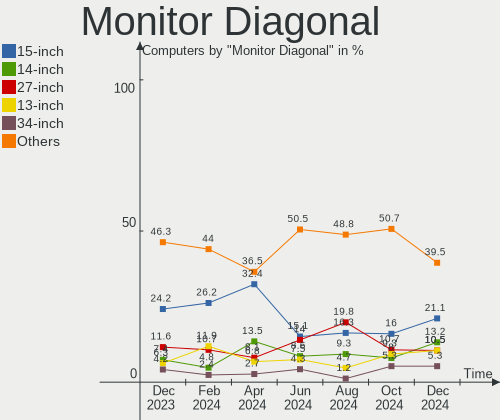

| Inches  | Computers | Percent |
|---------|-----------|---------|
| 15      | 24        | 32.43%  |
| 14      | 10        | 13.51%  |
| 24      | 7         | 9.46%   |
| 27      | 6         | 8.11%   |
| 21      | 6         | 8.11%   |
| 16      | 4         | 5.41%   |
| 13      | 4         | 5.41%   |
| 34      | 2         | 2.7%    |
| 23      | 2         | 2.7%    |
| 84      | 1         | 1.35%   |
| 46      | 1         | 1.35%   |
| 35      | 1         | 1.35%   |
| 32      | 1         | 1.35%   |
| 31      | 1         | 1.35%   |
| 22      | 1         | 1.35%   |
| 17      | 1         | 1.35%   |
| 12      | 1         | 1.35%   |
| Unknown | 1         | 1.35%   |

Monitor Width
-------------

Physical width

| Width in mm | Computers | Percent |
|-------------|-----------|---------|
| 301-350     | 37        | 50%     |
| 501-600     | 15        | 20.27%  |
| 401-500     | 6         | 8.11%   |
| 201-300     | 6         | 8.11%   |
| 701-800     | 3         | 4.05%   |
| 601-700     | 2         | 2.7%    |
| 801-900     | 1         | 1.35%   |
| 351-400     | 1         | 1.35%   |
| 1501-2000   | 1         | 1.35%   |
| 1001-1500   | 1         | 1.35%   |
| Unknown     | 1         | 1.35%   |

Aspect Ratio
------------

Proportional relationship between the width and the height

| Ratio   | Computers | Percent |
|---------|-----------|---------|
| 16/9    | 48        | 72.73%  |
| 16/10   | 10        | 15.15%  |
| 3/2     | 3         | 4.55%   |
| 21/9    | 3         | 4.55%   |
| 5/4     | 1         | 1.52%   |
| Unknown | 1         | 1.52%   |

Monitor Area
------------

Area in inch²

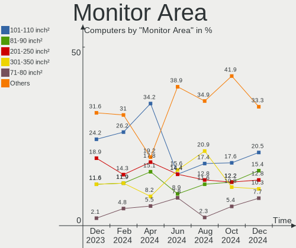

| Area in inch² | Computers | Percent |
|----------------|-----------|---------|
| 101-110        | 25        | 34.25%  |
| 201-250        | 14        | 19.18%  |
| 81-90          | 11        | 15.07%  |
| 301-350        | 6         | 8.22%   |
| 351-500        | 5         | 6.85%   |
| 71-80          | 4         | 5.48%   |
| 111-120        | 3         | 4.11%   |
| More than 1000 | 1         | 1.37%   |
| 251-300        | 1         | 1.37%   |
| 141-150        | 1         | 1.37%   |
| 501-1000       | 1         | 1.37%   |
| Unknown        | 1         | 1.37%   |

Pixel Density
-------------

Pixels per inch

| Density       | Computers | Percent |
|---------------|-----------|---------|
| 121-160       | 24        | 32.88%  |
| 51-100        | 17        | 23.29%  |
| 101-120       | 16        | 21.92%  |
| 161-240       | 8         | 10.96%  |
| More than 240 | 6         | 8.22%   |
| 1-50          | 1         | 1.37%   |
| Unknown       | 1         | 1.37%   |

Multiple Monitors
-----------------

Total monitors connected

| Total | Computers | Percent |
|-------|-----------|---------|
| 1     | 47        | 74.6%   |
| 2     | 16        | 25.4%   |

Network
-------

Net Controller Vendor
---------------------

Controller vendors

| Vendor                          | Computers | Percent |
|---------------------------------|-----------|---------|
| Intel                           | 42        | 43.3%   |
| Realtek Semiconductor           | 33        | 34.02%  |
| MediaTek                        | 7         | 7.22%   |
| Qualcomm Atheros                | 3         | 3.09%   |
| Broadcom                        | 2         | 2.06%   |
| Sierra Wireless                 | 1         | 1.03%   |
| Samsung Electronics             | 1         | 1.03%   |
| Ralink Technology               | 1         | 1.03%   |
| Ralink                          | 1         | 1.03%   |
| Qualcomm Atheros Communications | 1         | 1.03%   |
| Microsoft                       | 1         | 1.03%   |
| D-Link                          | 1         | 1.03%   |
| Broadcom Limited                | 1         | 1.03%   |
| ASUSTek Computer                | 1         | 1.03%   |
| ASIX Electronics                | 1         | 1.03%   |

Net Controller Model
--------------------

Controller models

| Model                                                                  | Computers | Percent |
|------------------------------------------------------------------------|-----------|---------|
| Realtek RTL8111/8168/8211/8411 PCI Express Gigabit Ethernet Controller | 18        | 16.36%  |
| Realtek RTL8125 2.5GbE Controller                                      | 9         | 8.18%   |
| Intel Wi-Fi 6 AX200                                                    | 7         | 6.36%   |
| Intel Alder Lake-P PCH CNVi WiFi                                       | 7         | 6.36%   |
| MediaTek MT7921 802.11ax PCI Express Wireless Network Adapter          | 3         | 2.73%   |
| Intel Wireless 8265 / 8275                                             | 3         | 2.73%   |
| Intel Wi-Fi 6E(802.11ax) AX210/AX1675* 2x2 [Typhoon Peak]              | 3         | 2.73%   |
| Intel Cannon Lake PCH CNVi WiFi                                        | 3         | 2.73%   |
| Realtek RTL8852CE PCIe 802.11ax Wireless Network Controller            | 2         | 1.82%   |
| Realtek RTL810xE PCI Express Fast Ethernet controller                  | 2         | 1.82%   |
| Qualcomm Atheros Killer E2500 Gigabit Ethernet Controller              | 2         | 1.82%   |
| MediaTek MT7922 802.11ax PCI Express Wireless Network Adapter          | 2         | 1.82%   |
| Intel Wireless-AC                                                      | 2         | 1.82%   |
| Intel Wi-Fi 6 AX201                                                    | 2         | 1.82%   |
| Intel Raptor Lake PCH CNVi WiFi                                        | 2         | 1.82%   |
| Intel Ice Lake-LP PCH CNVi WiFi                                        | 2         | 1.82%   |
| Intel Ethernet Connection (7) I219-V                                   | 2         | 1.82%   |
| Intel Comet Lake PCH-LP CNVi WiFi                                      | 2         | 1.82%   |
| Sierra Wireless EM7455                                                 | 1         | 0.91%   |
| Samsung Galaxy series, misc. (tethering mode)                          | 1         | 0.91%   |
| Realtek RTL88x2bu [AC1200 Techkey]                                     | 1         | 0.91%   |
| Realtek RTL8822CE 802.11ac PCIe Wireless Network Adapter               | 1         | 0.91%   |
| Realtek RTL8822BE 802.11a/b/g/n/ac WiFi adapter                        | 1         | 0.91%   |
| Realtek RTL8821CE 802.11ac PCIe Wireless Network Adapter               | 1         | 0.91%   |
| Realtek RTL8812AE 802.11ac PCIe Wireless Network Adapter               | 1         | 0.91%   |
| Realtek RTL8153 Gigabit Ethernet Adapter                               | 1         | 0.91%   |
| Realtek Killer E3000 2.5GbE Controller                                 | 1         | 0.91%   |
| Ralink RT2870/RT3070 Wireless Adapter                                  | 1         | 0.91%   |
| Ralink RT3290 Wireless 802.11n 1T/1R PCIe                              | 1         | 0.91%   |
| Qualcomm Atheros QCA6174 802.11ac Wireless Network Adapter             | 1         | 0.91%   |
| Qualcomm Atheros AR9271 802.11n                                        | 1         | 0.91%   |
| Microsoft XBOX ACC                                                     | 1         | 0.91%   |
| MediaTek MT7921K (RZ608) Wi-Fi 6E 80MHz                                | 1         | 0.91%   |
| MediaTek 802.11AC MT7663 Wireless Network Adapter                      | 1         | 0.91%   |
| Intel Wireless 8260                                                    | 1         | 0.91%   |
| Intel Wi-Fi 5(802.11ac) Wireless-AC 9x6x [Thunder Peak]                | 1         | 0.91%   |
| Intel PRO/Wireless 3945ABG [Golan] Network Connection                  | 1         | 0.91%   |
| Intel I211 Gigabit Network Connection                                  | 1         | 0.91%   |
| Intel Ethernet Connection I219-LM                                      | 1         | 0.91%   |
| Intel Ethernet Connection I217-LM                                      | 1         | 0.91%   |

Wireless Vendor
---------------

Wireless vendors

| Vendor                          | Computers | Percent |
|---------------------------------|-----------|---------|
| Intel                           | 38        | 61.29%  |
| Realtek Semiconductor           | 7         | 11.29%  |
| MediaTek                        | 7         | 11.29%  |
| Sierra Wireless                 | 1         | 1.61%   |
| Ralink Technology               | 1         | 1.61%   |
| Ralink                          | 1         | 1.61%   |
| Qualcomm Atheros Communications | 1         | 1.61%   |
| Qualcomm Atheros                | 1         | 1.61%   |
| Microsoft                       | 1         | 1.61%   |
| D-Link                          | 1         | 1.61%   |
| Broadcom Limited                | 1         | 1.61%   |
| Broadcom                        | 1         | 1.61%   |
| ASUSTek Computer                | 1         | 1.61%   |

Wireless Model
--------------

Wireless models

| Model                                                                     | Computers | Percent |
|---------------------------------------------------------------------------|-----------|---------|
| Intel Wi-Fi 6 AX200                                                       | 7         | 11.29%  |
| Intel Alder Lake-P PCH CNVi WiFi                                          | 7         | 11.29%  |
| MediaTek MT7921 802.11ax PCI Express Wireless Network Adapter             | 3         | 4.84%   |
| Intel Wireless 8265 / 8275                                                | 3         | 4.84%   |
| Intel Wi-Fi 6E(802.11ax) AX210/AX1675* 2x2 [Typhoon Peak]                 | 3         | 4.84%   |
| Intel Cannon Lake PCH CNVi WiFi                                           | 3         | 4.84%   |
| Realtek RTL8852CE PCIe 802.11ax Wireless Network Controller               | 2         | 3.23%   |
| MediaTek MT7922 802.11ax PCI Express Wireless Network Adapter             | 2         | 3.23%   |
| Intel Wireless-AC                                                         | 2         | 3.23%   |
| Intel Wi-Fi 6 AX201                                                       | 2         | 3.23%   |
| Intel Raptor Lake PCH CNVi WiFi                                           | 2         | 3.23%   |
| Intel Ice Lake-LP PCH CNVi WiFi                                           | 2         | 3.23%   |
| Intel Comet Lake PCH-LP CNVi WiFi                                         | 2         | 3.23%   |
| Sierra Wireless EM7455                                                    | 1         | 1.61%   |
| Realtek RTL88x2bu [AC1200 Techkey]                                        | 1         | 1.61%   |
| Realtek RTL8822CE 802.11ac PCIe Wireless Network Adapter                  | 1         | 1.61%   |
| Realtek RTL8822BE 802.11a/b/g/n/ac WiFi adapter                           | 1         | 1.61%   |
| Realtek RTL8821CE 802.11ac PCIe Wireless Network Adapter                  | 1         | 1.61%   |
| Realtek RTL8812AE 802.11ac PCIe Wireless Network Adapter                  | 1         | 1.61%   |
| Ralink RT2870/RT3070 Wireless Adapter                                     | 1         | 1.61%   |
| Ralink RT3290 Wireless 802.11n 1T/1R PCIe                                 | 1         | 1.61%   |
| Qualcomm Atheros QCA6174 802.11ac Wireless Network Adapter                | 1         | 1.61%   |
| Qualcomm Atheros AR9271 802.11n                                           | 1         | 1.61%   |
| Microsoft XBOX ACC                                                        | 1         | 1.61%   |
| MediaTek MT7921K (RZ608) Wi-Fi 6E 80MHz                                   | 1         | 1.61%   |
| MediaTek 802.11AC MT7663 Wireless Network Adapter                         | 1         | 1.61%   |
| Intel Wireless 8260                                                       | 1         | 1.61%   |
| Intel Wi-Fi 5(802.11ac) Wireless-AC 9x6x [Thunder Peak]                   | 1         | 1.61%   |
| Intel PRO/Wireless 3945ABG [Golan] Network Connection                     | 1         | 1.61%   |
| Intel Comet Lake PCH CNVi WiFi                                            | 1         | 1.61%   |
| Intel Centrino Advanced-N 6235                                            | 1         | 1.61%   |
| D-Link 802.11ac NIC                                                       | 1         | 1.61%   |
| Broadcom Limited BCM4312 802.11b/g LP-PHY                                 | 1         | 1.61%   |
| Broadcom BCM4360 802.11ac Dual Band Wireless Network Adapter              | 1         | 1.61%   |
| ASUS USB-AC68 802.11a/b/g/n/ac (4x4) Wireless Adapter [Realtek RTL8814AU] | 1         | 1.61%   |

Ethernet Vendor
---------------

Ethernet vendors

| Vendor                | Computers | Percent |
|-----------------------|-----------|---------|
| Realtek Semiconductor | 31        | 64.58%  |
| Intel                 | 12        | 25%     |
| Qualcomm Atheros      | 2         | 4.17%   |
| Samsung Electronics   | 1         | 2.08%   |
| Broadcom              | 1         | 2.08%   |
| ASIX Electronics      | 1         | 2.08%   |

Ethernet Model
--------------

Ethernet models

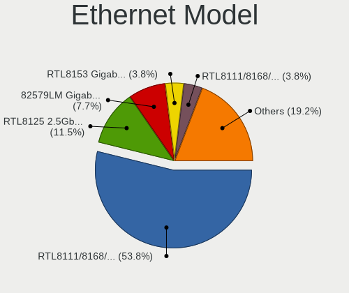

| Model                                                                  | Computers | Percent |
|------------------------------------------------------------------------|-----------|---------|
| Realtek RTL8111/8168/8211/8411 PCI Express Gigabit Ethernet Controller | 18        | 37.5%   |
| Realtek RTL8125 2.5GbE Controller                                      | 9         | 18.75%  |
| Realtek RTL810xE PCI Express Fast Ethernet controller                  | 2         | 4.17%   |
| Qualcomm Atheros Killer E2500 Gigabit Ethernet Controller              | 2         | 4.17%   |
| Intel Ethernet Connection (7) I219-V                                   | 2         | 4.17%   |
| Samsung Galaxy series, misc. (tethering mode)                          | 1         | 2.08%   |
| Realtek RTL8153 Gigabit Ethernet Adapter                               | 1         | 2.08%   |
| Realtek Killer E3000 2.5GbE Controller                                 | 1         | 2.08%   |
| Intel I211 Gigabit Network Connection                                  | 1         | 2.08%   |
| Intel Ethernet Connection I219-LM                                      | 1         | 2.08%   |
| Intel Ethernet Connection I217-LM                                      | 1         | 2.08%   |
| Intel Ethernet Connection (4) I219-V                                   | 1         | 2.08%   |
| Intel Ethernet Connection (4) I219-LM                                  | 1         | 2.08%   |
| Intel Ethernet Connection (2) I219-V                                   | 1         | 2.08%   |
| Intel Ethernet Connection (14) I219-V                                  | 1         | 2.08%   |
| Intel Ethernet Connection (11) I219-V                                  | 1         | 2.08%   |
| Intel Ethernet Connection (10) I219-V                                  | 1         | 2.08%   |
| Intel Ethernet Connection (10) I219-LM                                 | 1         | 2.08%   |
| Broadcom NetLink BCM5787M Gigabit Ethernet PCI Express                 | 1         | 2.08%   |
| ASIX AX88179 Gigabit Ethernet                                          | 1         | 2.08%   |

Net Controller Kind
-------------------

Ethernet, WiFi or modem

| Kind     | Computers | Percent |
|----------|-----------|---------|
| WiFi     | 58        | 55.77%  |
| Ethernet | 46        | 44.23%  |

Used Controller
---------------

Currently used network controller

| Kind     | Computers | Percent |
|----------|-----------|---------|
| WiFi     | 49        | 76.56%  |
| Ethernet | 15        | 23.44%  |

NICs
----

Total network controllers on board

| Total | Computers | Percent |
|-------|-----------|---------|
| 2     | 37        | 58.73%  |
| 1     | 24        | 38.1%   |
| 3     | 1         | 1.59%   |
| 0     | 1         | 1.59%   |

IPv6
----

IPv6 vs IPv4

| Used | Computers | Percent |
|------|-----------|---------|
| No   | 44        | 69.84%  |
| Yes  | 19        | 30.16%  |

Bluetooth
---------

Bluetooth Vendor
----------------

Controller vendors

| Vendor                  | Computers | Percent |
|-------------------------|-----------|---------|
| Intel                   | 37        | 66.07%  |
| Realtek Semiconductor   | 5         | 8.93%   |
| MediaTek                | 3         | 5.36%   |
| Lite-On Technology      | 3         | 5.36%   |
| Realtek                 | 2         | 3.57%   |
| IMC Networks            | 2         | 3.57%   |
| Ralink                  | 1         | 1.79%   |
| Hewlett-Packard         | 1         | 1.79%   |
| Foxconn / Hon Hai       | 1         | 1.79%   |
| Cambridge Silicon Radio | 1         | 1.79%   |

Bluetooth Model
---------------

Controller models

| Model                                                       | Computers | Percent |
|-------------------------------------------------------------|-----------|---------|
| Intel AX201 Bluetooth                                       | 9         | 16.07%  |
| Intel AX211 Bluetooth                                       | 8         | 14.29%  |
| Intel AX200 Bluetooth                                       | 7         | 12.5%   |
| Realtek Bluetooth Radio                                     | 4         | 7.14%   |
| Intel Bluetooth Device                                      | 4         | 7.14%   |
| Intel Bluetooth 9460/9560 Jefferson Peak (JfP)              | 4         | 7.14%   |
| MediaTek Wireless_Device                                    | 3         | 5.36%   |
| Intel AX210 Bluetooth                                       | 3         | 5.36%   |
| Realtek Bluetooth Radio                                     | 2         | 3.57%   |
| Lite-On Wireless_Device                                     | 2         | 3.57%   |
| IMC Networks Wireless_Device                                | 2         | 3.57%   |
| Realtek Bluetooth 5.3 Radio                                 | 1         | 1.79%   |
| Ralink RT3290 Bluetooth                                     | 1         | 1.79%   |
| Lite-On Bluetooth Device                                    | 1         | 1.79%   |
| Intel Wireless-AC 9260 Bluetooth Adapter                    | 1         | 1.79%   |
| Intel Centrino Bluetooth Wireless Transceiver               | 1         | 1.79%   |
| HP Integrated Module with Bluetooth 2.1 Wireless technology | 1         | 1.79%   |
| Foxconn / Hon Hai Wireless_Device                           | 1         | 1.79%   |
| Cambridge Silicon Radio Bluetooth Dongle (HCI mode)         | 1         | 1.79%   |

Sound
-----

Sound Vendor
------------

Sound card vendors

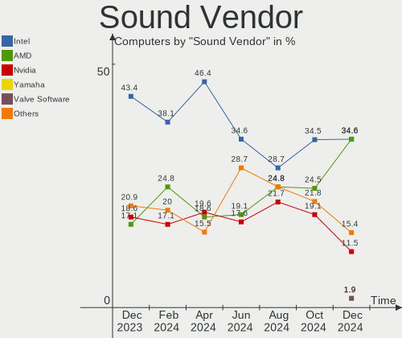

| Vendor                               | Computers | Percent |
|--------------------------------------|-----------|---------|
| Intel                                | 45        | 46.39%  |
| Nvidia                               | 19        | 19.59%  |
| AMD                                  | 18        | 18.56%  |
| C-Media Electronics                  | 3         | 3.09%   |
| Thesycon Systemsoftware & Consulting | 1         | 1.03%   |
| SteelSeries ApS                      | 1         | 1.03%   |
| Logitech                             | 1         | 1.03%   |
| JMTek                                | 1         | 1.03%   |
| GN Netcom                            | 1         | 1.03%   |
| Generalplus Technology               | 1         | 1.03%   |
| Focusrite-Novation                   | 1         | 1.03%   |
| FiiO Electronics Technology          | 1         | 1.03%   |
| fifinemicrophone.com                 | 1         | 1.03%   |
| Elgato Systems                       | 1         | 1.03%   |
| DCMT Technology                      | 1         | 1.03%   |
| AKG C44-USB Microphone               | 1         | 1.03%   |

Sound Model
-----------

Sound card models

| Model                                                                      | Computers | Percent |
|----------------------------------------------------------------------------|-----------|---------|
| AMD Family 17h/19h HD Audio Controller                                     | 13        | 11.02%  |
| Intel Cannon Lake PCH cAVS                                                 | 8         | 6.78%   |
| Intel Alder Lake PCH-P High Definition Audio Controller                    | 7         | 5.93%   |
| AMD Rembrandt Radeon High Definition Audio Controller                      | 7         | 5.93%   |
| AMD Navi 21/23 HDMI/DP Audio Controller                                    | 6         | 5.08%   |
| Intel Sunrise Point-LP HD Audio                                            | 5         | 4.24%   |
| Nvidia TU116 High Definition Audio Controller                              | 4         | 3.39%   |
| Nvidia GA104 High Definition Audio Controller                              | 4         | 3.39%   |
| Nvidia Audio device                                                        | 4         | 3.39%   |
| AMD Renoir Radeon High Definition Audio Controller                         | 4         | 3.39%   |
| Nvidia TU106 High Definition Audio Controller                              | 2         | 1.69%   |
| Nvidia TU104 HD Audio Controller                                           | 2         | 1.69%   |
| Intel Tiger Lake-LP Smart Sound Technology Audio Controller                | 2         | 1.69%   |
| Intel Raptor Lake-P/U/H cAVS                                               | 2         | 1.69%   |
| Intel Meteor Lake-P HD Audio Controller                                    | 2         | 1.69%   |
| Intel Ice Lake-LP Smart Sound Technology Audio Controller                  | 2         | 1.69%   |
| Intel Haswell-ULT HD Audio Controller                                      | 2         | 1.69%   |
| Intel Comet Lake PCH-LP cAVS                                               | 2         | 1.69%   |
| Intel Comet Lake PCH cAVS                                                  | 2         | 1.69%   |
| Intel 8 Series HD Audio Controller                                         | 2         | 1.69%   |
| Intel 200 Series PCH HD Audio                                              | 2         | 1.69%   |
| AMD Starship/Matisse HD Audio Controller                                   | 2         | 1.69%   |
| AMD Raven/Raven2/Fenghuang HDMI/DP Audio Controller                        | 2         | 1.69%   |
| Thesycon Systemsoftware & Consulting SABAJ USB AUDIO                       | 1         | 0.85%   |
| SteelSeries ApS Arctis 7 wireless adapter                                  | 1         | 0.85%   |
| Nvidia TU107 GeForce GTX 1650 High Definition Audio Controller             | 1         | 0.85%   |
| Nvidia GP107GL High Definition Audio Controller                            | 1         | 0.85%   |
| Nvidia GA106 High Definition Audio Controller                              | 1         | 0.85%   |
| Logitech Logitech G PRO X Gaming Headset                                   | 1         | 0.85%   |
| JMTek USB PnP Audio Device                                                 | 1         | 0.85%   |
| Intel Xeon E3-1200 v3/4th Gen Core Processor HD Audio Controller           | 1         | 0.85%   |
| Intel Tiger Lake-H HD Audio Controller                                     | 1         | 0.85%   |
| Intel Raptor Lake High Definition Audio Controller                         | 1         | 0.85%   |
| Intel Comet Lake PCH-V cAVS                                                | 1         | 0.85%   |
| Intel Celeron/Pentium Silver Processor High Definition Audio               | 1         | 0.85%   |
| Intel Cannon Point-LP High Definition Audio Controller                     | 1         | 0.85%   |
| Intel Atom Processor Z36xxx/Z37xxx Series High Definition Audio Controller | 1         | 0.85%   |
| Intel Alder Lake Smart Sound Technology Audio Controller                   | 1         | 0.85%   |
| Intel 82801H (ICH8 Family) HD Audio Controller                             | 1         | 0.85%   |
| Intel 8 Series/C220 Series Chipset High Definition Audio Controller        | 1         | 0.85%   |

Memory
------

Memory Vendor
-------------

Memory module vendors

| Vendor              | Computers | Percent |
|---------------------|-----------|---------|
| SK hynix            | 17        | 31.48%  |
| Samsung Electronics | 8         | 14.81%  |
| Corsair             | 7         | 12.96%  |
| Kingston            | 5         | 9.26%   |
| Crucial             | 4         | 7.41%   |
| Micron Technology   | 3         | 5.56%   |
| Unknown             | 2         | 3.7%    |
| Patriot             | 2         | 3.7%    |
| Unknown             | 2         | 3.7%    |
| Shenzhen Longsys    | 1         | 1.85%   |
| Patriot Memory      | 1         | 1.85%   |
| G.Skill             | 1         | 1.85%   |
| A-DATA Technology   | 1         | 1.85%   |

Memory Model
------------

Memory module models

| Model                                                            | Computers | Percent |
|------------------------------------------------------------------|-----------|---------|
| SK hynix RAM HMA82GS6CJR8N-VK 16GB SODIMM DDR4 2667MT/s          | 2         | 3.57%   |
| Samsung RAM M471B5173QH0-YK0 4GB SODIMM DDR3 1600MT/s            | 2         | 3.57%   |
| Unknown                                                          | 2         | 3.57%   |
| Unknown RAM Module 4GB Row Of Chips LPDDR3 1867MT/s              | 1         | 1.79%   |
| Unknown RAM Module 2GB SODIMM DDR2 667MT/s                       | 1         | 1.79%   |
| SK hynix RAM Module 4GB DIMM DDR3 1066MT/s                       | 1         | 1.79%   |
| SK hynix RAM HMT41GS6AFR8A-PB 8GB SODIMM DDR3 1600MT/s           | 1         | 1.79%   |
| SK hynix RAM HMCG88MEBSA092N 32GB SODIMM DDR5 4800MT/s           | 1         | 1.79%   |
| SK hynix RAM HMCG78MEBSA092N 16GB SODIMM DDR5 4800MT/s           | 1         | 1.79%   |
| SK hynix RAM HMCG66AGBSA095N 8GB SODIMM DDR5 5600MT/s            | 1         | 1.79%   |
| SK hynix RAM HMAG68EXNSA051N 8GB SODIMM DDR4 3200MT/s            | 1         | 1.79%   |
| SK hynix RAM HMAB2GS6AMR6N-XN 16GB SODIMM DDR4 3200MT/s          | 1         | 1.79%   |
| SK hynix RAM HMAA1GS6CMR8N-VK 8GB SODIMM DDR4 2667MT/s           | 1         | 1.79%   |
| SK hynix RAM HMA851S6CJR6N-VK 4GB Row Of Chips DDR4 2667MT/s     | 1         | 1.79%   |
| SK hynix RAM HMA851S6AFR6N-UH 4GB SODIMM DDR4 2667MT/s           | 1         | 1.79%   |
| SK hynix RAM HMA81GS6CJR8N-VK 8GB SODIMM DDR4 2667MT/s           | 1         | 1.79%   |
| SK hynix RAM HMA81GS6AFR8N-UH 8GB SODIMM DDR4 2667MT/s           | 1         | 1.79%   |
| SK hynix RAM HCNNNFBMBLPR-NEE 2GB Row Of Chips LPDDR4 4267MT/s   | 1         | 1.79%   |
| SK hynix RAM H9CCNNNCLGALAR-NVD 8GB Row Of Chips LPDDR3 2133MT/s | 1         | 1.79%   |
| SK hynix RAM H58G76BK7HX095 4GB Row Of Chips LPDDR5 8533MT/s     | 1         | 1.79%   |
| Shenzhen Longsys RAM FD4AS3200CQGZZ 16GB SODIMM DDR4 3200MT/s    | 1         | 1.79%   |
| Samsung RAM Module 4GB SODIMM DDR3 1600MT/s                      | 1         | 1.79%   |
| Samsung RAM Module 1GB Row Of Chips LPDDR4 4267MT/s              | 1         | 1.79%   |
| Samsung RAM M471B5173DB0-YK0 4GB SODIMM DDR3 1600MT/s            | 1         | 1.79%   |
| Samsung RAM M471A2G43AB2-CWE 16GB SODIMM DDR4 3200MT/s           | 1         | 1.79%   |
| Samsung RAM M471A1K43CB1-CTD 8GB SODIMM DDR4 2667MT/s            | 1         | 1.79%   |
| Samsung RAM M425R2GA3BB0-CQKOL 16GB SODIMM DDR5 4800MT/s         | 1         | 1.79%   |
| Samsung RAM K4UBE3D4AA-MGCL 8GB Row Of Chips LPDDR4 4267MT/s     | 1         | 1.79%   |
| Patriot RAM 3600 C18 Series 16GB DIMM DDR4 3600MT/s              | 1         | 1.79%   |
| Patriot RAM 2666 C16 Series 8GB DIMM DDR4 3400MT/s               | 1         | 1.79%   |
| Patriot Memory RAM 3200 C16 Series 8GB DIMM DDR4 3400MT/s        | 1         | 1.79%   |
| Micron RAM MTC4C10163S1SC48BA1 8GB SODIMM DDR5 4800MT/s          | 1         | 1.79%   |
| Micron RAM MT62F2G32D4DS-026 WT 8GB SODIMM LPDDR5 7500MT/s       | 1         | 1.79%   |
| Micron RAM MT62F1G32D4DR-031 2GB Row Of Chips LPDDR5 6400MT/s    | 1         | 1.79%   |
| Kingston RAM KHX2400C14S4/8G 8GB SODIMM DDR4 2400MT/s            | 1         | 1.79%   |
| Kingston RAM KF3200C16D4/8GX 8192MB DIMM DDR4 3600MT/s           | 1         | 1.79%   |
| Kingston RAM CBD56S46BD8HA-32 32GB SODIMM DDR5 5600MT/s          | 1         | 1.79%   |
| Kingston RAM ACR26D4S9S8HJ-8 8GB SODIMM DDR4 2667MT/s            | 1         | 1.79%   |
| Kingston RAM 99U5428-018.A00LF 8GB SODIMM DDR3 1600MT/s          | 1         | 1.79%   |
| G.Skill RAM F5-6000J3238F16G 16GB DIMM DDR5 6000MT/s             | 1         | 1.79%   |

Memory Kind
-----------

Memory module kinds

| Kind   | Computers | Percent |
|--------|-----------|---------|
| DDR4   | 23        | 46.94%  |
| DDR5   | 11        | 22.45%  |
| DDR3   | 5         | 10.2%   |
| LPDDR4 | 4         | 8.16%   |
| LPDDR5 | 3         | 6.12%   |
| LPDDR3 | 2         | 4.08%   |
| DDR2   | 1         | 2.04%   |

Memory Form Factor
------------------

Physical design of the memory module

| Name         | Computers | Percent |
|--------------|-----------|---------|
| SODIMM       | 25        | 52.08%  |
| DIMM         | 15        | 31.25%  |
| Row Of Chips | 8         | 16.67%  |

Memory Size
-----------

Memory module size

| Size  | Computers | Percent |
|-------|-----------|---------|
| 8192  | 19        | 37.25%  |
| 16384 | 14        | 27.45%  |
| 4096  | 8         | 15.69%  |
| 32768 | 7         | 13.73%  |
| 2048  | 2         | 3.92%   |
| 1024  | 1         | 1.96%   |

Memory Speed
------------

Memory module speed

| Speed | Computers | Percent |
|-------|-----------|---------|
| 2667  | 10        | 20%     |
| 4800  | 7         | 14%     |
| 3200  | 4         | 8%      |
| 2400  | 4         | 8%      |
| 1600  | 4         | 8%      |
| 4267  | 3         | 6%      |
| 3600  | 3         | 6%      |
| 6000  | 2         | 4%      |
| 5600  | 2         | 4%      |
| 3400  | 2         | 4%      |
| 8533  | 1         | 2%      |
| 7500  | 1         | 2%      |
| 6400  | 1         | 2%      |
| 3800  | 1         | 2%      |
| 3534  | 1         | 2%      |
| 2133  | 1         | 2%      |
| 1867  | 1         | 2%      |
| 1066  | 1         | 2%      |
| 667   | 1         | 2%      |

Printers & scanners
-------------------

Printer Vendor
--------------

Printer device vendors

Zero info for selected period =(

Printer Model
-------------

Printer device models

Zero info for selected period =(

Scanner Vendor
--------------

Scanner device vendors

Zero info for selected period =(

Scanner Model
-------------

Scanner device models

Zero info for selected period =(

Camera
------

Camera Vendor
-------------

Camera device vendors

| Vendor                                 | Computers | Percent |
|----------------------------------------|-----------|---------|
| Quanta                                 | 7         | 14.89%  |
| IMC Networks                           | 5         | 10.64%  |
| Sunplus Innovation Technology          | 4         | 8.51%   |
| Chicony Electronics                    | 4         | 8.51%   |
| Bison Electronics                      | 4         | 8.51%   |
| Realtek Semiconductor                  | 3         | 6.38%   |
| Microdia                               | 3         | 6.38%   |
| Logitech                               | 3         | 6.38%   |
| Cheng Uei Precision Industry (Foxlink) | 3         | 6.38%   |
| Sonix Technology                       | 2         | 4.26%   |
| Suyin                                  | 1         | 2.13%   |
| SunplusIT                              | 1         | 2.13%   |
| Shinetech                              | 1         | 2.13%   |
| Shine-optics                           | 1         | 2.13%   |
| Luxvisions Innotech Limited            | 1         | 2.13%   |
| Lite-On Technology                     | 1         | 2.13%   |
| AVerMedia Technologies                 | 1         | 2.13%   |
| ARC International                      | 1         | 2.13%   |
| Apple                                  | 1         | 2.13%   |

Camera Model
------------

Camera device models

| Model                                               | Computers | Percent |
|-----------------------------------------------------|-----------|---------|
| Realtek Integrated_Webcam_HD                        | 2         | 4.26%   |
| Microdia Integrated_Webcam_HD                       | 2         | 4.26%   |
| IMC Networks USB2.0 HD UVC WebCam                   | 2         | 4.26%   |
| Bison Integrated Camera                             | 2         | 4.26%   |
| Suyin Acer CrystalEye Webcam                        | 1         | 2.13%   |
| SunplusIT XiaoMi WebCam                             | 1         | 2.13%   |
| Sunplus Integrated_Webcam_FHD                       | 1         | 2.13%   |
| Sunplus Integrated Camera                           | 1         | 2.13%   |
| Sunplus HesTongCamera                               | 1         | 2.13%   |
| Sunplus Full HD webcam                              | 1         | 2.13%   |
| Sonix USB2.0 HD UVC WebCam                          | 1         | 2.13%   |
| Sonix USB2.0 FHD UVC WebCam                         | 1         | 2.13%   |
| Shinetech USB2.0 FHD UVC WebCam                     | 1         | 2.13%   |
| Shine-optics USB2.0 HD UVC WebCam                   | 1         | 2.13%   |
| Realtek Integrated Webcam HD                        | 1         | 2.13%   |
| Quanta USB2.0 HD UVC WebCam                         | 1         | 2.13%   |
| Quanta HP Wide Vision FHD Camera                    | 1         | 2.13%   |
| Quanta HP Webcam                                    | 1         | 2.13%   |
| Quanta HP TrueVision HD Camera                      | 1         | 2.13%   |
| Quanta HP True Vision FHD Camera                    | 1         | 2.13%   |
| Quanta HD Camera                                    | 1         | 2.13%   |
| Quanta ACER HD User Facing                          | 1         | 2.13%   |
| Microdia Laptop_Integrated_Webcam_HD                | 1         | 2.13%   |
| Luxvisions Innotech Limited Integrated RGB Camera   | 1         | 2.13%   |
| Logitech Webcam C930e                               | 1         | 2.13%   |
| Logitech Webcam C270                                | 1         | 2.13%   |
| Logitech BRIO 4K Stream Edition                     | 1         | 2.13%   |
| Lite-On HP Wide Vision HD Camera                    | 1         | 2.13%   |
| IMC Networks USB2.0 HD IR UVC WebCam                | 1         | 2.13%   |
| IMC Networks ov9734_azurewave_camera                | 1         | 2.13%   |
| IMC Networks Integrated Camera                      | 1         | 2.13%   |
| Chicony Integrated Camera                           | 1         | 2.13%   |
| Chicony HP Wide Vision FHD Camera                   | 1         | 2.13%   |
| Chicony HD WebCam                                   | 1         | 2.13%   |
| Chicony HD User Facing                              | 1         | 2.13%   |
| Cheng Uei Precision Industry (Foxlink) Webcam       | 1         | 2.13%   |
| Cheng Uei Precision Industry (Foxlink) HP Webcam    | 1         | 2.13%   |
| Cheng Uei Precision Industry (Foxlink) HP HD Camera | 1         | 2.13%   |
| Bison SunplusIT Integrated Camera                   | 1         | 2.13%   |
| Bison Integrated 5M Camera                          | 1         | 2.13%   |

Security
--------

Fingerprint Vendor
------------------

Fingerprint sensor vendors

| Vendor                     | Computers | Percent |
|----------------------------|-----------|---------|
| Shenzhen Goodix Technology | 3         | 42.86%  |
| Synaptics                  | 2         | 28.57%  |
| Validity Sensors           | 1         | 14.29%  |
| Elan Microelectronics      | 1         | 14.29%  |

Fingerprint Model
-----------------

Fingerprint sensor models

| Model                                            | Computers | Percent |
|--------------------------------------------------|-----------|---------|
| Shenzhen Goodix  FingerPrint Device              | 2         | 28.57%  |
| Validity Sensors Synaptics WBDI                  | 1         | 14.29%  |
| Synaptics WBDI Fingerprint Reader USB 102        | 1         | 14.29%  |
| Synaptics Metallica MIS Touch Fingerprint Reader | 1         | 14.29%  |
| Shenzhen Goodix Fingerprint Reader               | 1         | 14.29%  |
| Elan ELAN:Fingerprint                            | 1         | 14.29%  |

Chipcard Vendor
---------------

Chipcard module vendors

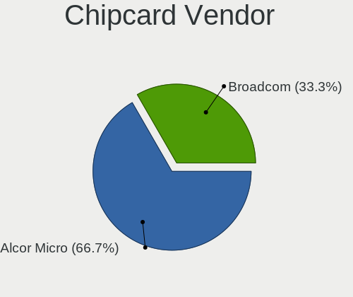

| Vendor      | Computers | Percent |
|-------------|-----------|---------|
| Broadcom    | 3         | 50%     |
| Alcor Micro | 3         | 50%     |

Chipcard Model
--------------

Chipcard module models

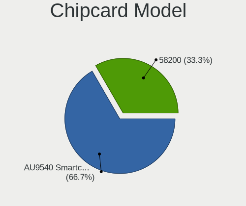

| Model                                                                        | Computers | Percent |
|------------------------------------------------------------------------------|-----------|---------|
| Alcor Micro AU9540 Smartcard Reader                                          | 3         | 50%     |
| Broadcom BCM5880 Secure Applications Processor with fingerprint swipe sensor | 1         | 16.67%  |
| Broadcom 5880                                                                | 1         | 16.67%  |
| Broadcom 58200                                                               | 1         | 16.67%  |

Unsupported
-----------

Unsupported Devices
-------------------

Total unsupported devices on board

| Total | Computers | Percent |
|-------|-----------|---------|
| 0     | 46        | 73.02%  |
| 1     | 13        | 20.63%  |
| 2     | 4         | 6.35%   |

Unsupported Device Types
------------------------

Types of unsupported devices

| Type                  | Computers | Percent |
|-----------------------|-----------|---------|
| Fingerprint reader    | 6         | 28.57%  |
| Chipcard              | 5         | 23.81%  |
| Graphics card         | 3         | 14.29%  |
| Net/wireless          | 2         | 9.52%   |
| Net/ethernet          | 2         | 9.52%   |
| Video                 | 1         | 4.76%   |
| Multimedia controller | 1         | 4.76%   |
| Bluetooth             | 1         | 4.76%   |

