EndeavourOS - Hardware Trends (Desktops)
----------------------------------------

A project to identify most popular hardware characteristics and track their change
over time based on data collected by Linux users at https://Linux-Hardware.org.

Anyone can contribute to this report by the [hw-probe](https://github.com/linuxhw/hw-probe) tool:

    sudo -E hw-probe -all -upload

This report is for one last month. Overall report since the beginning of time: [TestDays](https://github.com/linuxhw/TestDays)

Period: Dec, 2025.

Contents
--------

* [ System ](#system)
  - [ OS                       ](#os)
  - [ OS Family                ](#os-family)
  - [ Kernel                   ](#kernel)
  - [ Kernel Family            ](#kernel-family)
  - [ Kernel Major Ver.        ](#kernel-major-ver)
  - [ Arch                     ](#arch)
  - [ DE                       ](#de)
  - [ Display Server           ](#display-server)
  - [ Display Manager          ](#display-manager)
  - [ OS Lang                  ](#os-lang)
  - [ Boot Mode                ](#boot-mode)
  - [ Filesystem               ](#filesystem)
  - [ Part. scheme             ](#part-scheme)
  - [ Dual Boot with Linux/BSD ](#dual-boot-with-linuxbsd)
  - [ Dual Boot (Win)          ](#dual-boot-win)

* [ Board ](#board)
  - [ Vendor                   ](#vendor)
  - [ Model                    ](#model)
  - [ Model Family             ](#model-family)
  - [ MFG Year                 ](#mfg-year)
  - [ Form Factor              ](#form-factor)
  - [ Secure Boot              ](#secure-boot)
  - [ Coreboot                 ](#coreboot)
  - [ RAM Size                 ](#ram-size)
  - [ RAM Used                 ](#ram-used)
  - [ Total Drives             ](#total-drives)
  - [ Has CD-ROM               ](#has-cd-rom)
  - [ Has Ethernet             ](#has-ethernet)
  - [ Has WiFi                 ](#has-wifi)
  - [ Has Bluetooth            ](#has-bluetooth)

* [ Location ](#location)
  - [ Country                  ](#country)
  - [ City                     ](#city)

* [ Drives ](#drives)
  - [ Drive Vendor             ](#drive-vendor)
  - [ Drive Model              ](#drive-model)
  - [ HDD Vendor               ](#hdd-vendor)
  - [ SSD Vendor               ](#ssd-vendor)
  - [ Drive Kind               ](#drive-kind)
  - [ Drive Connector          ](#drive-connector)
  - [ Drive Size               ](#drive-size)
  - [ Space Total              ](#space-total)
  - [ Space Used               ](#space-used)
  - [ Malfunc. Drives          ](#malfunc-drives)
  - [ Malfunc. Drive Vendor    ](#malfunc-drive-vendor)
  - [ Malfunc. HDD Vendor      ](#malfunc-hdd-vendor)
  - [ Malfunc. Drive Kind      ](#malfunc-drive-kind)
  - [ Failed Drives            ](#failed-drives)
  - [ Failed Drive Vendor      ](#failed-drive-vendor)
  - [ Drive Status             ](#drive-status)

* [ Storage controller ](#storage-controller)
  - [ Storage Vendor           ](#storage-vendor)
  - [ Storage Model            ](#storage-model)
  - [ Storage Kind             ](#storage-kind)

* [ Processor ](#processor)
  - [ CPU Vendor               ](#cpu-vendor)
  - [ CPU Model                ](#cpu-model)
  - [ CPU Model Family         ](#cpu-model-family)
  - [ CPU Cores                ](#cpu-cores)
  - [ CPU Sockets              ](#cpu-sockets)
  - [ CPU Threads              ](#cpu-threads)
  - [ CPU Op-Modes             ](#cpu-op-modes)
  - [ CPU Microcode            ](#cpu-microcode)
  - [ CPU Microarch            ](#cpu-microarch)

* [ Graphics ](#graphics)
  - [ GPU Vendor               ](#gpu-vendor)
  - [ GPU Model                ](#gpu-model)
  - [ GPU Combo                ](#gpu-combo)
  - [ GPU Driver               ](#gpu-driver)
  - [ GPU Memory               ](#gpu-memory)

* [ Monitor ](#monitor)
  - [ Monitor Vendor           ](#monitor-vendor)
  - [ Monitor Model            ](#monitor-model)
  - [ Monitor Resolution       ](#monitor-resolution)
  - [ Monitor Diagonal         ](#monitor-diagonal)
  - [ Monitor Width            ](#monitor-width)
  - [ Aspect Ratio             ](#aspect-ratio)
  - [ Monitor Area             ](#monitor-area)
  - [ Pixel Density            ](#pixel-density)
  - [ Multiple Monitors        ](#multiple-monitors)

* [ Network ](#network)
  - [ Net Controller Vendor    ](#net-controller-vendor)
  - [ Net Controller Model     ](#net-controller-model)
  - [ Wireless Vendor          ](#wireless-vendor)
  - [ Wireless Model           ](#wireless-model)
  - [ Ethernet Vendor          ](#ethernet-vendor)
  - [ Ethernet Model           ](#ethernet-model)
  - [ Net Controller Kind      ](#net-controller-kind)
  - [ Used Controller          ](#used-controller)
  - [ NICs                     ](#nics)
  - [ IPv6                     ](#ipv6)

* [ Bluetooth ](#bluetooth)
  - [ Bluetooth Vendor         ](#bluetooth-vendor)
  - [ Bluetooth Model          ](#bluetooth-model)

* [ Sound ](#sound)
  - [ Sound Vendor             ](#sound-vendor)
  - [ Sound Model              ](#sound-model)

* [ Memory ](#memory)
  - [ Memory Vendor            ](#memory-vendor)
  - [ Memory Model             ](#memory-model)
  - [ Memory Kind              ](#memory-kind)
  - [ Memory Form Factor       ](#memory-form-factor)
  - [ Memory Size              ](#memory-size)
  - [ Memory Speed             ](#memory-speed)

* [ Printers & scanners ](#printers--scanners)
  - [ Printer Vendor           ](#printer-vendor)
  - [ Printer Model            ](#printer-model)
  - [ Scanner Vendor           ](#scanner-vendor)
  - [ Scanner Model            ](#scanner-model)

* [ Camera ](#camera)
  - [ Camera Vendor            ](#camera-vendor)
  - [ Camera Model             ](#camera-model)

* [ Security ](#security)
  - [ Fingerprint Vendor       ](#fingerprint-vendor)
  - [ Fingerprint Model        ](#fingerprint-model)
  - [ Chipcard Vendor          ](#chipcard-vendor)
  - [ Chipcard Model           ](#chipcard-model)

* [ Unsupported ](#unsupported)
  - [ Unsupported Devices      ](#unsupported-devices)
  - [ Unsupported Device Types ](#unsupported-device-types)

System
------

OS
--

Installed operating systems

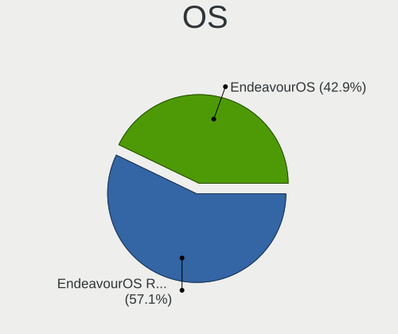

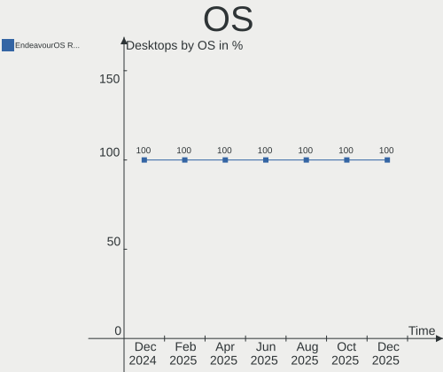

| Name                | Desktops | Percent |
|---------------------|----------|---------|
| EndeavourOS Rolling | 37       | 100%    |

OS Family
---------

OS without a version

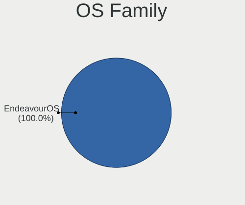

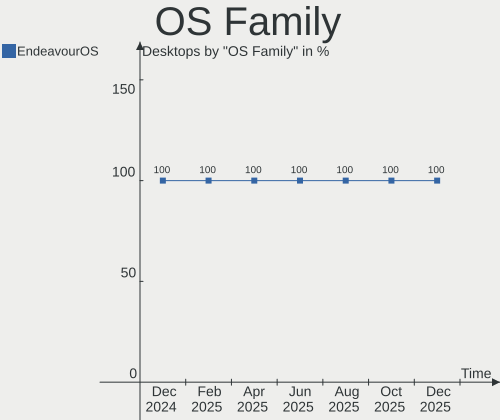

| Name        | Desktops | Percent |
|-------------|----------|---------|
| EndeavourOS | 37       | 100%    |

Kernel
------

Version of the Linux kernel

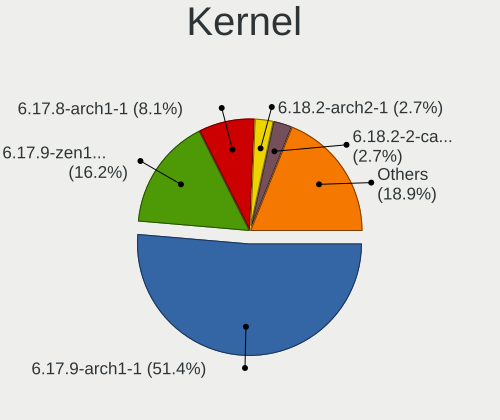

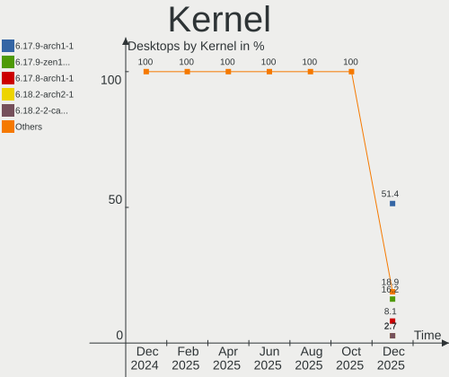

| Version              | Desktops | Percent |
|----------------------|----------|---------|
| 6.17.9-arch1-1       | 19       | 51.35%  |
| 6.17.9-zen1-1-zen    | 6        | 16.22%  |
| 6.17.8-arch1-1       | 3        | 8.11%   |
| 6.18.2-arch2-1       | 1        | 2.7%    |
| 6.18.2-2-cachyos     | 1        | 2.7%    |
| 6.18.1-zen1-2-zen    | 1        | 2.7%    |
| 6.18.1-arch1-2       | 1        | 2.7%    |
| 6.18.0-273-tkg-eevdf | 1        | 2.7%    |
| 6.17.7-arch1-1       | 1        | 2.7%    |
| 6.17.3-arch2-1       | 1        | 2.7%    |
| 6.12.63-1-lts        | 1        | 2.7%    |
| 6.12.60-1-lts        | 1        | 2.7%    |

Kernel Family
-------------

Linux kernel without a distro release

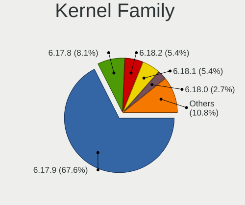

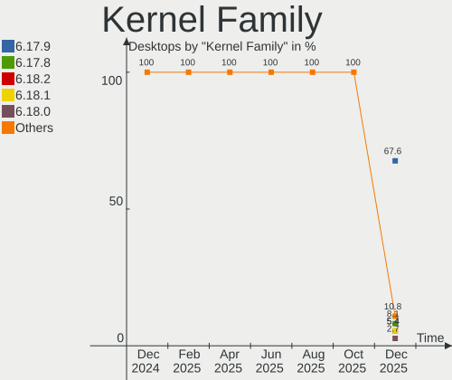

| Version | Desktops | Percent |
|---------|----------|---------|
| 6.17.9  | 25       | 67.57%  |
| 6.17.8  | 3        | 8.11%   |
| 6.18.2  | 2        | 5.41%   |
| 6.18.1  | 2        | 5.41%   |
| 6.18.0  | 1        | 2.7%    |
| 6.17.7  | 1        | 2.7%    |
| 6.17.3  | 1        | 2.7%    |
| 6.12.63 | 1        | 2.7%    |
| 6.12.60 | 1        | 2.7%    |

Kernel Major Ver.
-----------------

Linux kernel major version

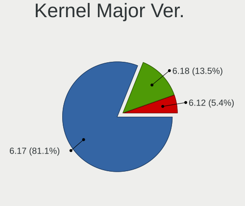

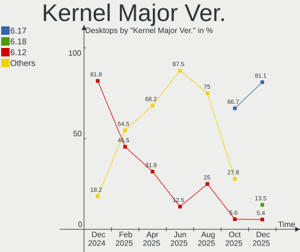

| Version | Desktops | Percent |
|---------|----------|---------|
| 6.17    | 30       | 81.08%  |
| 6.18    | 5        | 13.51%  |
| 6.12    | 2        | 5.41%   |

Arch
----

OS architecture (x86_64, i586, etc.)

| Name   | Desktops | Percent |
|--------|----------|---------|
| x86_64 | 37       | 100%    |

DE
--

Desktop Environment

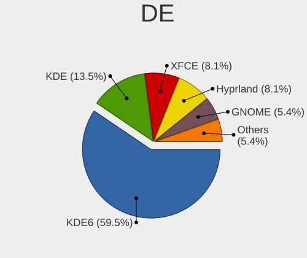

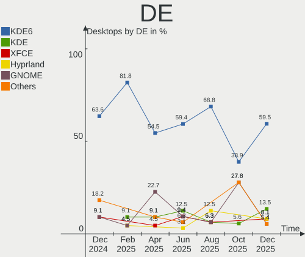

| Name     | Desktops | Percent |
|----------|----------|---------|
| KDE6     | 22       | 59.46%  |
| KDE      | 5        | 13.51%  |
| XFCE     | 3        | 8.11%   |
| Hyprland | 3        | 8.11%   |
| GNOME    | 2        | 5.41%   |
| sway     | 1        | 2.7%    |
| Budgie   | 1        | 2.7%    |

Display Server
--------------

X11 or Wayland

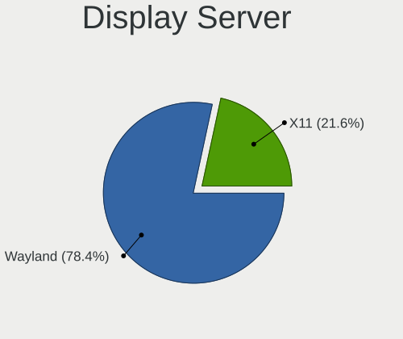

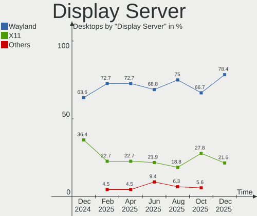

| Name    | Desktops | Percent |
|---------|----------|---------|
| Wayland | 29       | 78.38%  |
| X11     | 8        | 21.62%  |

Display Manager
---------------

SDDM, LightDM, etc.

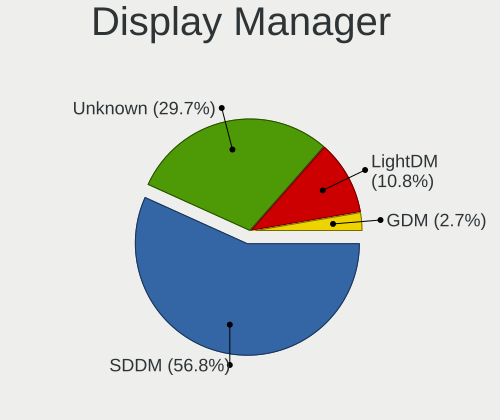

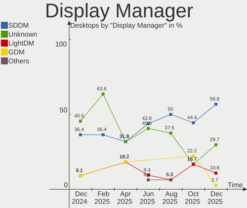

| Name    | Desktops | Percent |
|---------|----------|---------|
| SDDM    | 21       | 56.76%  |
| Unknown | 11       | 29.73%  |
| LightDM | 4        | 10.81%  |
| GDM     | 1        | 2.7%    |

OS Lang
-------

Language

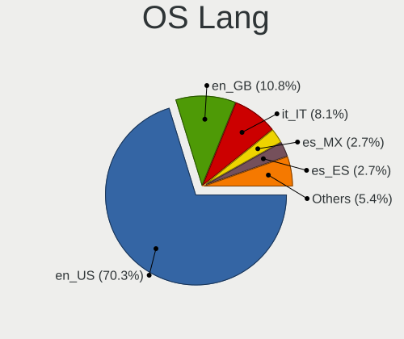

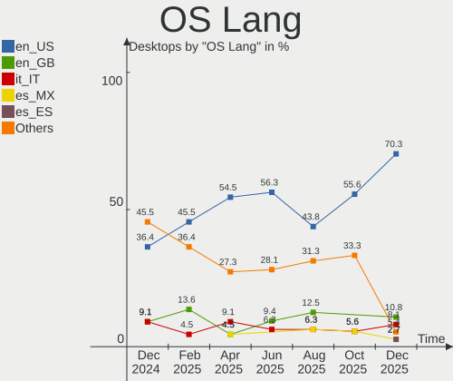

| Lang    | Desktops | Percent |
|---------|----------|---------|
| en_US   | 26       | 70.27%  |
| en_GB   | 4        | 10.81%  |
| it_IT   | 3        | 8.11%   |
| es_MX   | 1        | 2.7%    |
| es_ES   | 1        | 2.7%    |
| de_DE   | 1        | 2.7%    |
| Unknown | 1        | 2.7%    |

Boot Mode
---------

EFI or BIOS

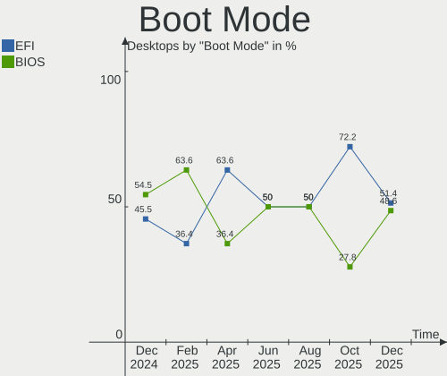

| Mode | Desktops | Percent |
|------|----------|---------|
| EFI  | 19       | 51.35%  |
| BIOS | 18       | 48.65%  |

Filesystem
----------

Type of filesystem

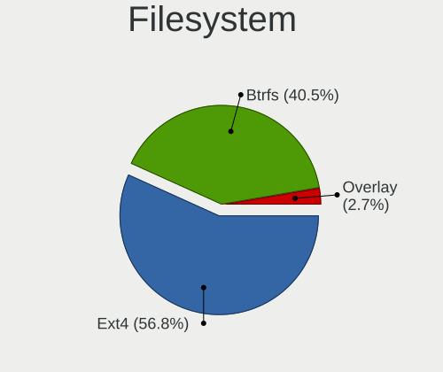

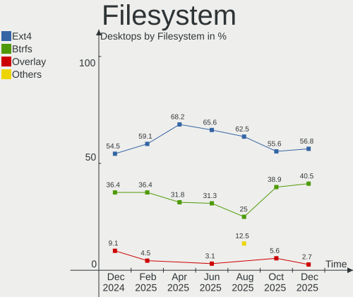

| Type    | Desktops | Percent |
|---------|----------|---------|
| Ext4    | 21       | 56.76%  |
| Btrfs   | 15       | 40.54%  |
| Overlay | 1        | 2.7%    |

Part. scheme
------------

Scheme of partitioning

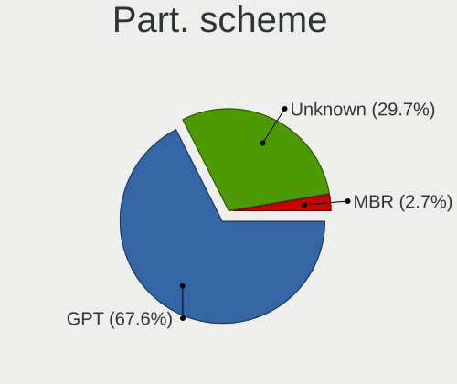

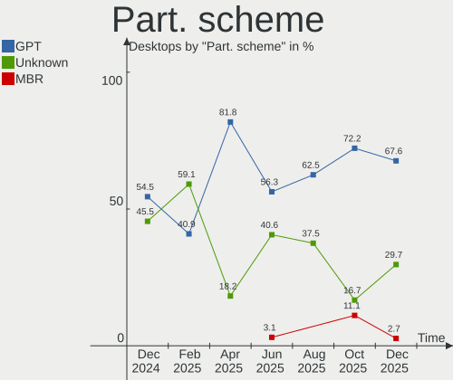

| Type    | Desktops | Percent |
|---------|----------|---------|
| GPT     | 25       | 67.57%  |
| Unknown | 11       | 29.73%  |
| MBR     | 1        | 2.7%    |

Dual Boot with Linux/BSD
------------------------

Hosting more than one Linux/BSD

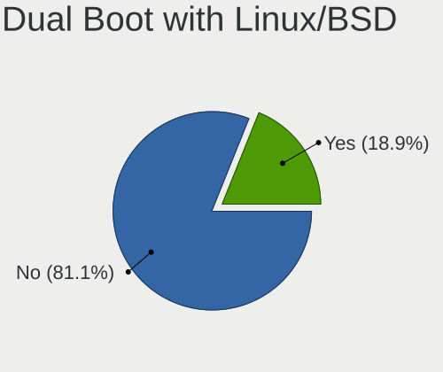

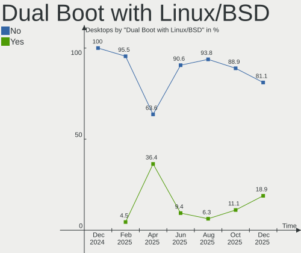

| Dual boot | Desktops | Percent |
|-----------|----------|---------|
| No        | 30       | 81.08%  |
| Yes       | 7        | 18.92%  |

Dual Boot (Win)
---------------

Hosting Linux and Windows

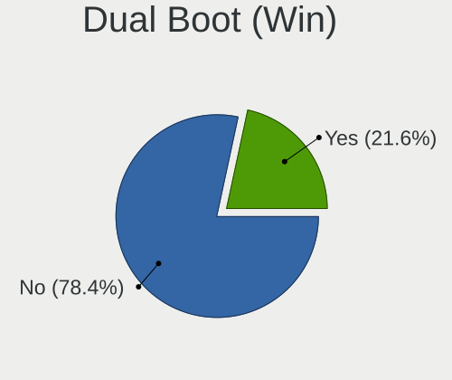

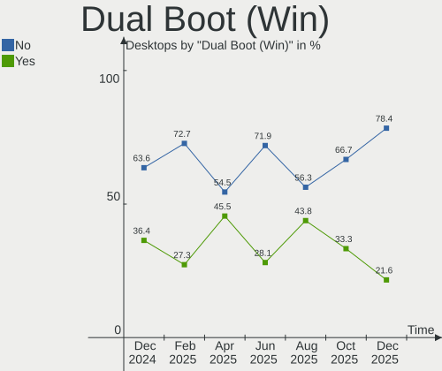

| Dual boot | Desktops | Percent |
|-----------|----------|---------|
| No        | 29       | 78.38%  |
| Yes       | 8        | 21.62%  |

Board
-----

Vendor
------

Motherboard manufacturer

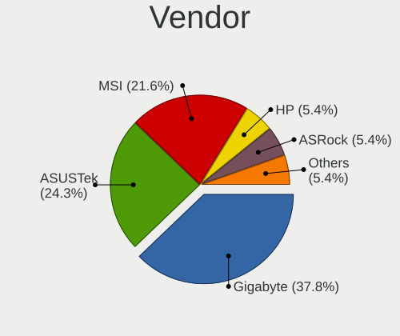

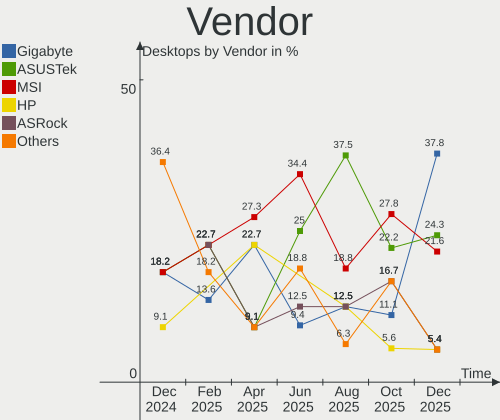

| Name                                 | Desktops | Percent |
|--------------------------------------|----------|---------|
| Gigabyte Technology                  | 14       | 37.84%  |
| ASUSTek Computer                     | 9        | 24.32%  |
| MSI                                  | 8        | 21.62%  |
| Hewlett-Packard                      | 2        | 5.41%   |
| ASRock                               | 2        | 5.41%   |
| Shenzhen Meigao Electronic Equipment | 1        | 2.7%    |
| Intel                                | 1        | 2.7%    |

Model
-----

Motherboard model

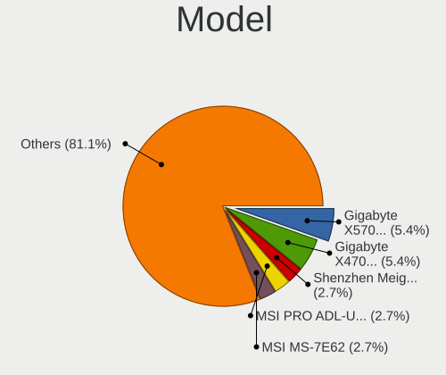

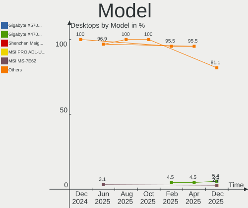

| Name                                       | Desktops | Percent |
|--------------------------------------------|----------|---------|
| Gigabyte X570 AORUS ELITE                  | 2        | 5.41%   |
| Gigabyte X470 AORUS ULTRA GAMING           | 2        | 5.41%   |
| Shenzhen Meigao Electronic Equipment HX99G | 1        | 2.7%    |
| MSI PRO ADL-U Cubi 5 (MS-B0A8)             | 1        | 2.7%    |
| MSI MS-7E62                                | 1        | 2.7%    |
| MSI MS-7E49                                | 1        | 2.7%    |
| MSI MS-7E16                                | 1        | 2.7%    |
| MSI MS-7D88                                | 1        | 2.7%    |
| MSI MS-7C91                                | 1        | 2.7%    |
| MSI MS-7C37                                | 1        | 2.7%    |
| MSI MS-7C00                                | 1        | 2.7%    |
| Intel E5-A99 V1.2                          | 1        | 2.7%    |
| HP Slim Desktop S01-pF2xxx                 | 1        | 2.7%    |
| HP Compaq 8200 Elite SFF PC                | 1        | 2.7%    |
| Gigabyte X870E AORUS MASTER                | 1        | 2.7%    |
| Gigabyte H81M-H                            | 1        | 2.7%    |
| Gigabyte H410M H V3                        | 1        | 2.7%    |
| Gigabyte B760M DS3H AX DDR4                | 1        | 2.7%    |
| Gigabyte B650E AORUS MASTER                | 1        | 2.7%    |
| Gigabyte B650 EAGLE AX                     | 1        | 2.7%    |
| Gigabyte B650 AORUS ELITE AX V2            | 1        | 2.7%    |
| Gigabyte B550 AORUS ELITE                  | 1        | 2.7%    |
| Gigabyte B450M DS3H                        | 1        | 2.7%    |
| Gigabyte AB350-Gaming 3                    | 1        | 2.7%    |
| ASUS TUF Gaming X570-PLUS_BR               | 1        | 2.7%    |
| ASUS TUF Gaming B550-PLUS                  | 1        | 2.7%    |
| ASUS TUF B450M-PLUS GAMING                 | 1        | 2.7%    |
| ASUS SABERTOOTH Z170 MARK 1                | 1        | 2.7%    |
| ASUS ROG STRIX B850-E GAMING WIFI          | 1        | 2.7%    |
| ASUS ROG STRIX B550-F GAMING WIFI II       | 1        | 2.7%    |
| ASUS ROG CROSSHAIR X870E EXTREME           | 1        | 2.7%    |
| ASUS PRIME H610I-PLUS D4                   | 1        | 2.7%    |
| ASUS MS-9C83F                              | 1        | 2.7%    |
| ASRock X870 Riptide WiFi                   | 1        | 2.7%    |
| ASRock B650M Pro RS                        | 1        | 2.7%    |

Model Family
------------

Motherboard model prefix

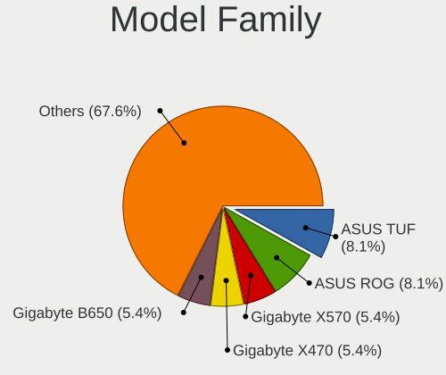

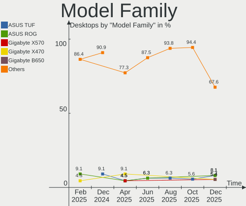

| Name                                       | Desktops | Percent |
|--------------------------------------------|----------|---------|
| ASUS TUF                                   | 3        | 8.11%   |
| ASUS ROG                                   | 3        | 8.11%   |
| Gigabyte X570                              | 2        | 5.41%   |
| Gigabyte X470                              | 2        | 5.41%   |
| Gigabyte B650                              | 2        | 5.41%   |
| Shenzhen Meigao Electronic Equipment HX99G | 1        | 2.7%    |
| MSI PRO                                    | 1        | 2.7%    |
| MSI MS-7E62                                | 1        | 2.7%    |
| MSI MS-7E49                                | 1        | 2.7%    |
| MSI MS-7E16                                | 1        | 2.7%    |
| MSI MS-7D88                                | 1        | 2.7%    |
| MSI MS-7C91                                | 1        | 2.7%    |
| MSI MS-7C37                                | 1        | 2.7%    |
| MSI MS-7C00                                | 1        | 2.7%    |
| Intel E5-A99                               | 1        | 2.7%    |
| HP Slim                                    | 1        | 2.7%    |
| HP Compaq                                  | 1        | 2.7%    |
| Gigabyte X870E                             | 1        | 2.7%    |
| Gigabyte H81M-H                            | 1        | 2.7%    |
| Gigabyte H410M                             | 1        | 2.7%    |
| Gigabyte B760M                             | 1        | 2.7%    |
| Gigabyte B650E                             | 1        | 2.7%    |
| Gigabyte B550                              | 1        | 2.7%    |
| Gigabyte B450M                             | 1        | 2.7%    |
| Gigabyte AB350-Gaming                      | 1        | 2.7%    |
| ASUS SABERTOOTH                            | 1        | 2.7%    |
| ASUS PRIME                                 | 1        | 2.7%    |
| ASUS MS-9C83F                              | 1        | 2.7%    |
| ASRock X870                                | 1        | 2.7%    |
| ASRock B650M                               | 1        | 2.7%    |

MFG Year
--------

Motherboard manufacture year

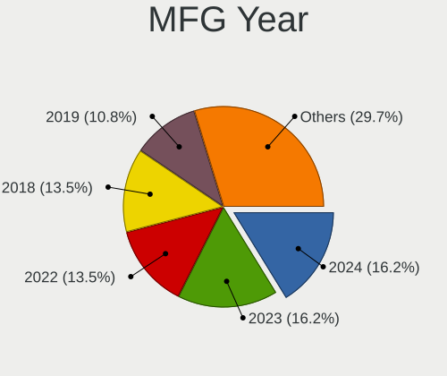

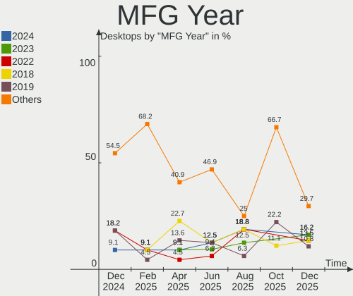

| Year | Desktops | Percent |
|------|----------|---------|
| 2024 | 6        | 16.22%  |
| 2023 | 6        | 16.22%  |
| 2022 | 5        | 13.51%  |
| 2018 | 5        | 13.51%  |
| 2019 | 4        | 10.81%  |
| 2021 | 3        | 8.11%   |
| 2020 | 2        | 5.41%   |
| 2025 | 1        | 2.7%    |
| 2017 | 1        | 2.7%    |
| 2016 | 1        | 2.7%    |
| 2015 | 1        | 2.7%    |
| 2013 | 1        | 2.7%    |
| 2011 | 1        | 2.7%    |

Form Factor
-----------

Physical design of the computer

| Name    | Desktops | Percent |
|---------|----------|---------|
| Desktop | 37       | 100%    |

Secure Boot
-----------

Enabled or disabled

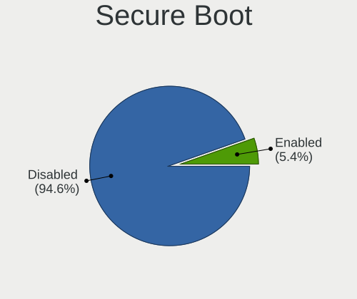

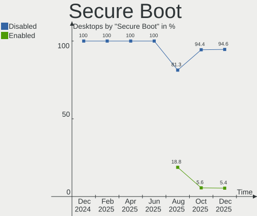

| State    | Desktops | Percent |
|----------|----------|---------|
| Disabled | 35       | 94.59%  |
| Enabled  | 2        | 5.41%   |

Coreboot
--------

Have coreboot on board

| Used | Desktops | Percent |
|------|----------|---------|
| No   | 37       | 100%    |

RAM Size
--------

Total RAM memory

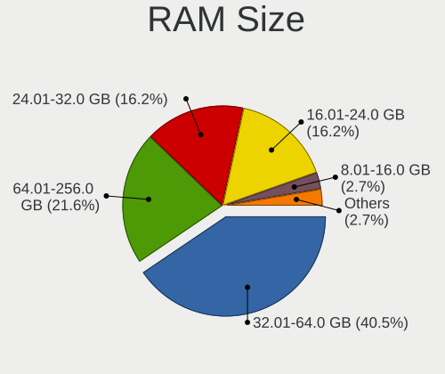

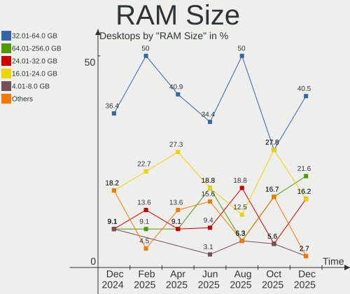

| Size in GB  | Desktops | Percent |
|-------------|----------|---------|
| 32.01-64.0  | 15       | 40.54%  |
| 64.01-256.0 | 8        | 21.62%  |
| 24.01-32.0  | 6        | 16.22%  |
| 16.01-24.0  | 6        | 16.22%  |
| 4.01-8.0    | 1        | 2.7%    |
| 8.01-16.0   | 1        | 2.7%    |

RAM Used
--------

Used RAM memory

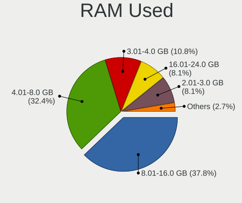

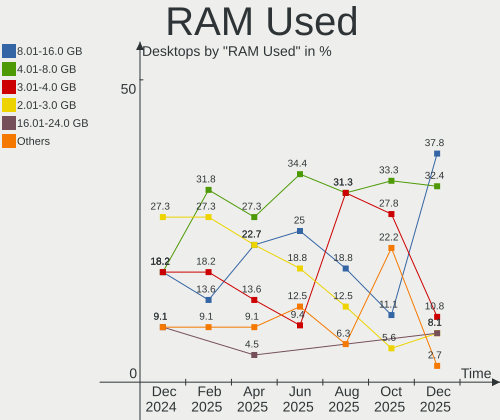

| Used GB    | Desktops | Percent |
|------------|----------|---------|
| 8.01-16.0  | 14       | 37.84%  |
| 4.01-8.0   | 12       | 32.43%  |
| 3.01-4.0   | 4        | 10.81%  |
| 2.01-3.0   | 3        | 8.11%   |
| 16.01-24.0 | 3        | 8.11%   |
| 24.01-32.0 | 1        | 2.7%    |

Total Drives
------------

Number of drives on board

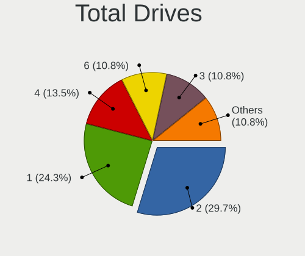

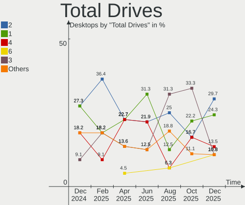

| Drives | Desktops | Percent |
|--------|----------|---------|
| 2      | 11       | 29.73%  |
| 1      | 9        | 24.32%  |
| 4      | 5        | 13.51%  |
| 6      | 4        | 10.81%  |
| 3      | 4        | 10.81%  |
| 5      | 3        | 8.11%   |
| 7      | 1        | 2.7%    |

Has CD-ROM
----------

Has CD-ROM on board

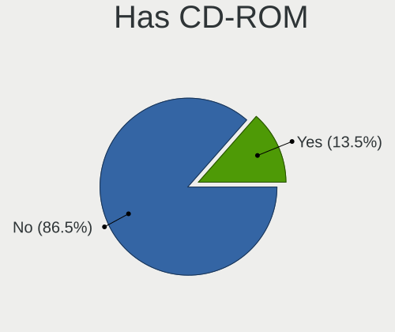

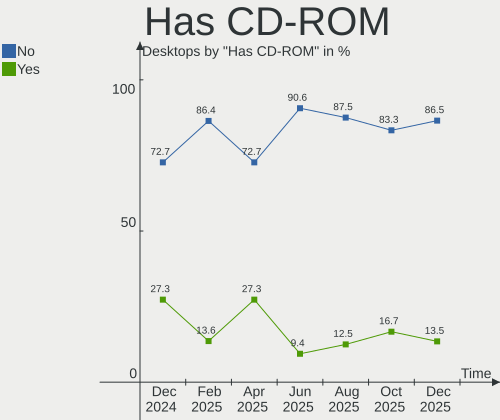

| Presented | Desktops | Percent |
|-----------|----------|---------|
| No        | 32       | 86.49%  |
| Yes       | 5        | 13.51%  |

Has Ethernet
------------

Has Ethernet on board

| Presented | Desktops | Percent |
|-----------|----------|---------|
| Yes       | 37       | 100%    |

Has WiFi
--------

Has WiFi module

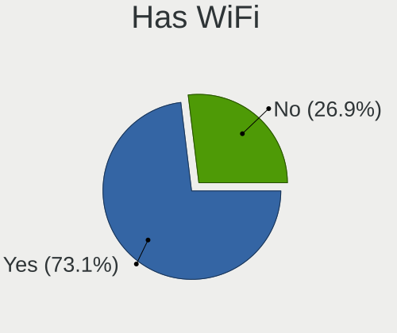

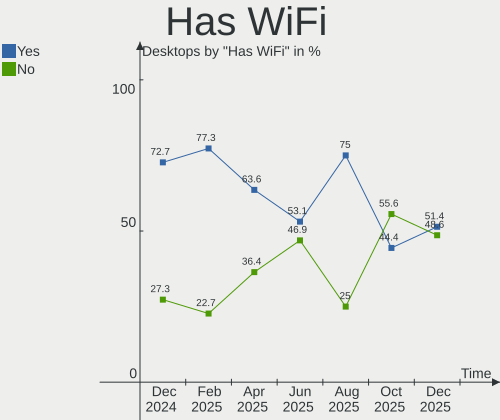

| Presented | Desktops | Percent |
|-----------|----------|---------|
| Yes       | 19       | 51.35%  |
| No        | 18       | 48.65%  |

Has Bluetooth
-------------

Has Bluetooth module

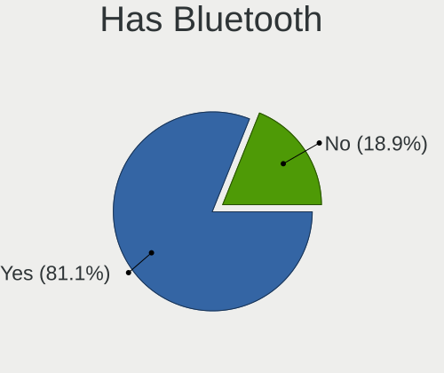

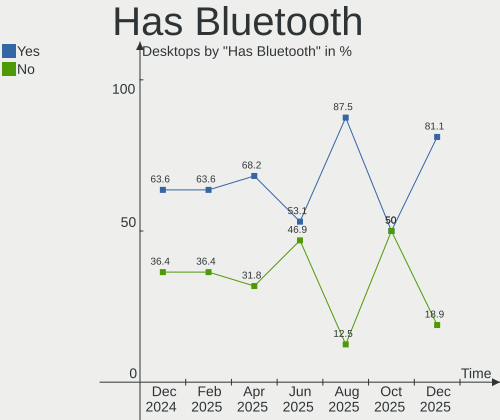

| Presented | Desktops | Percent |
|-----------|----------|---------|
| Yes       | 30       | 81.08%  |
| No        | 7        | 18.92%  |

Location
--------

Country
-------

Geographic location (country)

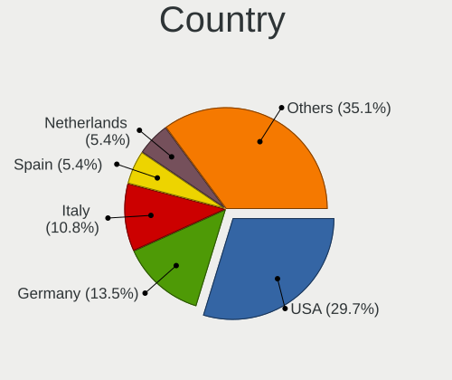

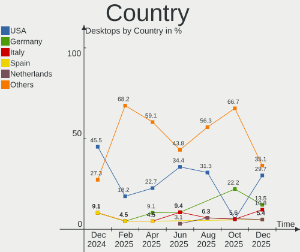

| Country     | Desktops | Percent |
|-------------|----------|---------|
| USA         | 11       | 29.73%  |
| Germany     | 5        | 13.51%  |
| Italy       | 4        | 10.81%  |
| Spain       | 2        | 5.41%   |
| Netherlands | 2        | 5.41%   |
| Vietnam     | 1        | 2.7%    |
| UK          | 1        | 2.7%    |
| Switzerland | 1        | 2.7%    |
| Slovenia    | 1        | 2.7%    |
| Malaysia    | 1        | 2.7%    |
| Indonesia   | 1        | 2.7%    |
| Hong Kong   | 1        | 2.7%    |
| Greece      | 1        | 2.7%    |
| Colombia    | 1        | 2.7%    |
| Bulgaria    | 1        | 2.7%    |
| Brazil      | 1        | 2.7%    |
| Belgium     | 1        | 2.7%    |
| Austria     | 1        | 2.7%    |

City
----

Geographic location (city)

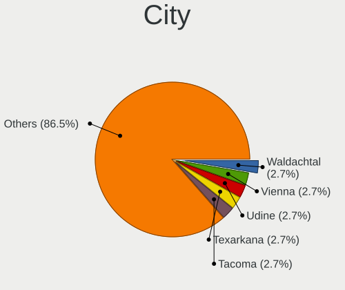

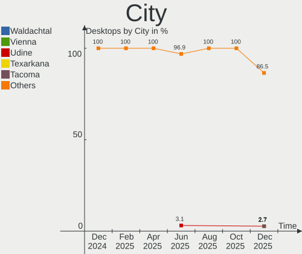

| City              | Desktops | Percent |
|-------------------|----------|---------|
| Waldachtal        | 1        | 2.7%    |
| Vienna            | 1        | 2.7%    |
| Udine             | 1        | 2.7%    |
| Texarkana         | 1        | 2.7%    |
| Tacoma            | 1        | 2.7%    |
| Spreitenbach      | 1        | 2.7%    |
| Sioux City        | 1        | 2.7%    |
| Sham Shui Po      | 1        | 2.7%    |
| San Rafael        | 1        | 2.7%    |
| Rindge            | 1        | 2.7%    |
| Ravne na Koroskem | 1        | 2.7%    |
| Pereira           | 1        | 2.7%    |
| Palhoça          | 1        | 2.7%    |
| Palembang         | 1        | 2.7%    |
| Oviedo            | 1        | 2.7%    |
| Omaha             | 1        | 2.7%    |
| Milan             | 1        | 2.7%    |
| Madrid            | 1        | 2.7%    |
| Luton             | 1        | 2.7%    |
| Lincoln           | 1        | 2.7%    |
| Leverkusen        | 1        | 2.7%    |
| Kuching           | 1        | 2.7%    |
| Kent              | 1        | 2.7%    |
| Ho Chi Minh City  | 1        | 2.7%    |
| Hamburg           | 1        | 2.7%    |
| Frankfurt am Main | 1        | 2.7%    |
| Florence          | 1        | 2.7%    |
| Cincinnati        | 1        | 2.7%    |
| Chicago           | 1        | 2.7%    |
| Burgas            | 1        | 2.7%    |
| Brussels          | 1        | 2.7%    |
| Borgomanero       | 1        | 2.7%    |
| Bloomington       | 1        | 2.7%    |
| Berlin            | 1        | 2.7%    |
| Athens            | 1        | 2.7%    |
| Amsterdam         | 1        | 2.7%    |
| Amstelveen        | 1        | 2.7%    |

Drives
------

Drive Vendor
------------

Hard drive vendors

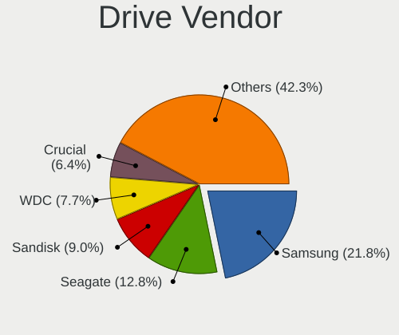

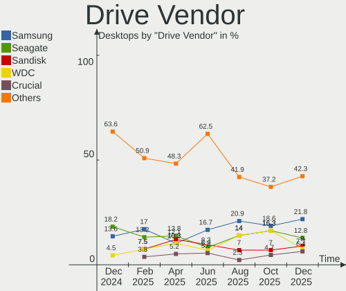

| Vendor                      | Desktops | Drives | Percent |
|-----------------------------|----------|--------|---------|
| Samsung Electronics         | 17       | 34     | 21.79%  |
| Seagate                     | 10       | 13     | 12.82%  |
| Sandisk                     | 7        | 7      | 8.97%   |
| WDC                         | 6        | 8      | 7.69%   |
| Crucial                     | 5        | 6      | 6.41%   |
| Micron/Crucial Technology   | 3        | 5      | 3.85%   |
| Kingston Technology Company | 3        | 3      | 3.85%   |
| Hitachi                     | 3        | 5      | 3.85%   |
| SPCC                        | 2        | 2      | 2.56%   |
| MAXIO Technology (Hangzhou) | 2        | 2      | 2.56%   |
| HGST                        | 2        | 3      | 2.56%   |
| TUF                         | 1        | 1      | 1.28%   |
| Toshiba                     | 1        | 3      | 1.28%   |
| T-FORCE                     | 1        | 1      | 1.28%   |
| SOLIDIGM                    | 1        | 1      | 1.28%   |
| RESCUE                      | 1        | 1      | 1.28%   |
| Realtek Semiconductor       | 1        | 1      | 1.28%   |
| PNY                         | 1        | 1      | 1.28%   |
| Phison Electronics          | 1        | 1      | 1.28%   |
| Netac                       | 1        | 1      | 1.28%   |
| Micron Technology           | 1        | 1      | 1.28%   |
| KIOXIA                      | 1        | 1      | 1.28%   |
| Kingston                    | 1        | 2      | 1.28%   |
| Intenso                     | 1        | 1      | 1.28%   |
| Intel                       | 1        | 1      | 1.28%   |
| Inland                      | 1        | 2      | 1.28%   |
| HGST HTS                    | 1        | 1      | 1.28%   |
| China                       | 1        | 1      | 1.28%   |
| Apple                       | 1        | 1      | 1.28%   |

Drive Model
-----------

Hard drive models

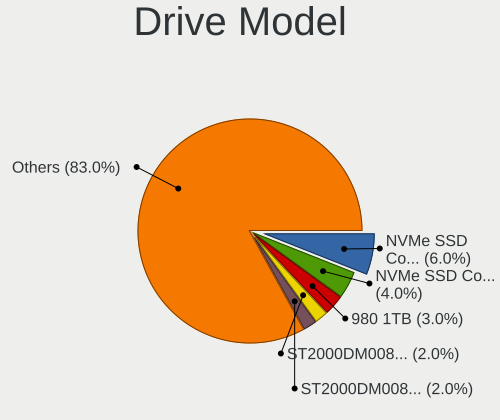

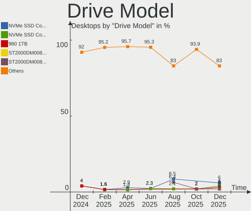

| Model                                                                   | Desktops | Percent |
|-------------------------------------------------------------------------|----------|---------|
| Samsung NVMe SSD Controller SM981/PM981/PM983 1TB                       | 6        | 6%      |
| Samsung NVMe SSD Controller PM9A1/PM9A3/980PRO 1TB                      | 4        | 4%      |
| Samsung SSD 980 1TB                                                     | 3        | 3%      |
| Seagate ST2000DM008-2UB102 2TB                                          | 2        | 2%      |
| Seagate ST2000DM008-2FR102 2TB                                          | 2        | 2%      |
| Sandisk WD_BLACK SN850X 4000GB                                          | 2        | 2%      |
| Sandisk WD Black SN770 / PC SN740 256GB / PC SN560 (DRAM-less) NVMe SSD | 2        | 2%      |
| Samsung SSD 990 PRO 2TB                                                 | 2        | 2%      |
| Samsung SSD 860 EVO 1TB                                                 | 2        | 2%      |
| Samsung NVMe SSD Controller PM9C1a (DRAM-less) 1TB                      | 2        | 2%      |
| Hitachi HUS724030ALE641 3TB                                             | 2        | 2%      |
| WDC WD3200BPVT-22JJ5T0 320GB                                            | 1        | 1%      |
| WDC WD20EZRX-00D8PB0 2TB                                                | 1        | 1%      |
| WDC WD20EZAZ-00L9GB0 2TB                                                | 1        | 1%      |
| WDC WD20EFRX-68EUZN0 2TB                                                | 1        | 1%      |
| WDC WD2003FZEX-00Z4SA0 2TB                                              | 1        | 1%      |
| WDC WD10EZEX-22MFCA0 1TB                                                | 1        | 1%      |
| WDC WD10EZEX-08WN4A0 1TB                                                | 1        | 1%      |
| WDC WD10EALX-759BA1 1TB                                                 | 1        | 1%      |
| TUF Gaming A2 500GB                                                     | 1        | 1%      |
| Toshiba MQ04ABF100 1TB                                                  | 1        | 1%      |
| Toshiba MQ01ABF050 500GB                                                | 1        | 1%      |
| Toshiba DT01ACA100 1TB                                                  | 1        | 1%      |
| T-FORCE SSD 1TB                                                         | 1        | 1%      |
| SPCC Solid State Disk 2TB                                               | 1        | 1%      |
| SPCC Solid State Disk 1024GB                                            | 1        | 1%      |
| SOLIDIGM NVMe SSD Drive 1024GB                                          | 1        | 1%      |
| Seagate ST4000VN006-3CW104 4TB                                          | 1        | 1%      |
| Seagate ST3500630AS 500GB                                               | 1        | 1%      |
| Seagate ST31000528AS 1TB                                                | 1        | 1%      |
| Seagate ST2000DM001-1ER164 2TB                                          | 1        | 1%      |
| Seagate ST18000NM000J-2TV103 18TB                                       | 1        | 1%      |
| Seagate ST1000DL002-9TT153 1TB                                          | 1        | 1%      |
| Seagate M3 Portable 500GB                                               | 1        | 1%      |
| Seagate FireCuda 530 ZP2000GM30013 2TB                                  | 1        | 1%      |
| Seagate Expansion 2TB                                                   | 1        | 1%      |
| Sandisk WD_BLACK SN770 2TB                                              | 1        | 1%      |
| Sandisk WD PC SN540 / Green SN350 NVMe SSD 1 TB (DRAM-less)             | 1        | 1%      |
| Sandisk WD Green SN350 240GB (DRAM-less) / SN560E NVMe SSD              | 1        | 1%      |
| Samsung SSD 9100 PRO 2TB                                                | 1        | 1%      |

HDD Vendor
----------

Hard disk drive vendors

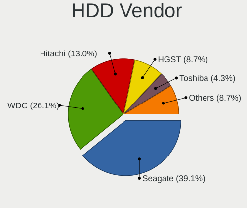

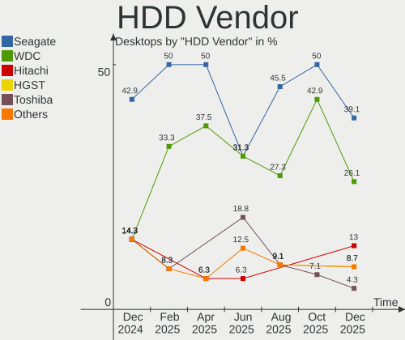

| Vendor   | Desktops | Drives | Percent |
|----------|----------|--------|---------|
| Seagate  | 9        | 11     | 39.13%  |
| WDC      | 6        | 8      | 26.09%  |
| Hitachi  | 3        | 5      | 13.04%  |
| HGST     | 2        | 3      | 8.7%    |
| Toshiba  | 1        | 3      | 4.35%   |
| HGST HTS | 1        | 1      | 4.35%   |
| Apple    | 1        | 1      | 4.35%   |

SSD Vendor
----------

Solid state drive vendors

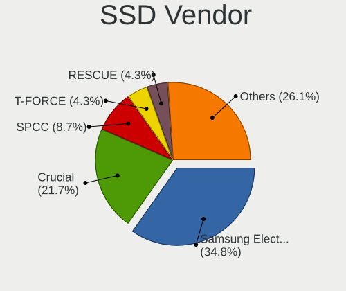

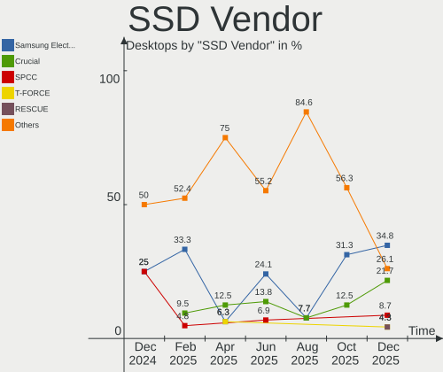

| Vendor              | Desktops | Drives | Percent |
|---------------------|----------|--------|---------|
| Samsung Electronics | 8        | 11     | 34.78%  |
| Crucial             | 5        | 6      | 21.74%  |
| SPCC                | 2        | 2      | 8.7%    |
| T-FORCE             | 1        | 1      | 4.35%   |
| RESCUE              | 1        | 1      | 4.35%   |
| PNY                 | 1        | 1      | 4.35%   |
| Netac               | 1        | 1      | 4.35%   |
| Kingston            | 1        | 2      | 4.35%   |
| Intenso             | 1        | 1      | 4.35%   |
| Inland              | 1        | 2      | 4.35%   |
| China               | 1        | 1      | 4.35%   |

Drive Kind
----------

HDD or SSD

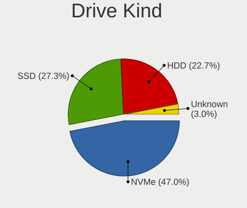

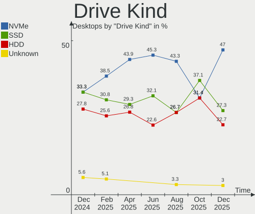

| Kind    | Desktops | Drives | Percent |
|---------|----------|--------|---------|
| NVMe    | 31       | 47     | 46.97%  |
| SSD     | 18       | 29     | 27.27%  |
| HDD     | 15       | 32     | 22.73%  |
| Unknown | 2        | 2      | 3.03%   |

Drive Connector
---------------

SATA, SAS, NVMe, etc.

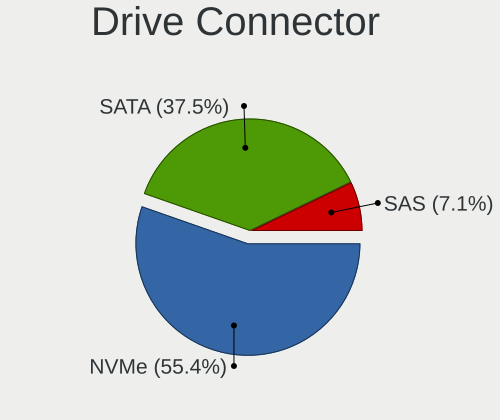

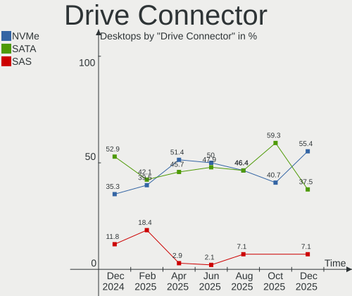

| Type | Desktops | Drives | Percent |
|------|----------|--------|---------|
| NVMe | 31       | 47     | 55.36%  |
| SATA | 21       | 58     | 37.5%   |
| SAS  | 4        | 5      | 7.14%   |

Drive Size
----------

Size of hard drive

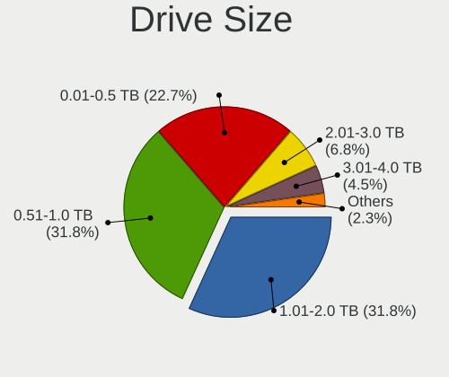

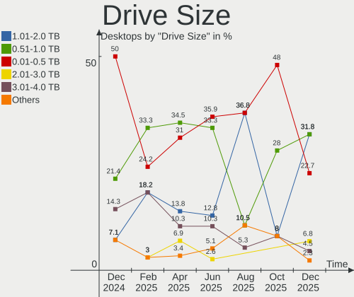

| Size in TB | Desktops | Drives | Percent |
|------------|----------|--------|---------|
| 1.01-2.0   | 14       | 19     | 31.82%  |
| 0.51-1.0   | 14       | 22     | 31.82%  |
| 0.01-0.5   | 10       | 11     | 22.73%  |
| 2.01-3.0   | 3        | 5      | 6.82%   |
| 3.01-4.0   | 2        | 3      | 4.55%   |
| 10.01-20.0 | 1        | 1      | 2.27%   |

Space Total
-----------

Amount of disk space available on the file system

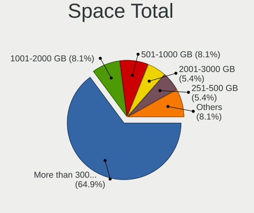

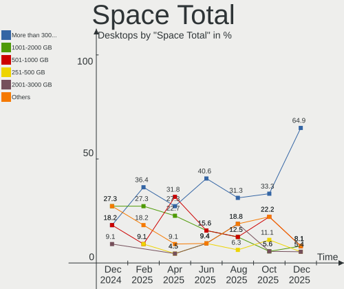

| Size in GB     | Desktops | Percent |
|----------------|----------|---------|
| More than 3000 | 24       | 64.86%  |
| 1001-2000      | 3        | 8.11%   |
| 501-1000       | 3        | 8.11%   |
| 251-500        | 2        | 5.41%   |
| 2001-3000      | 2        | 5.41%   |
| 101-250        | 1        | 2.7%    |
| 1-20           | 1        | 2.7%    |
| Unknown        | 1        | 2.7%    |

Space Used
----------

Amount of used disk space

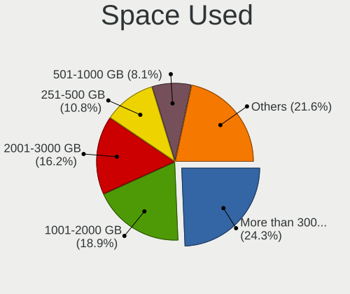

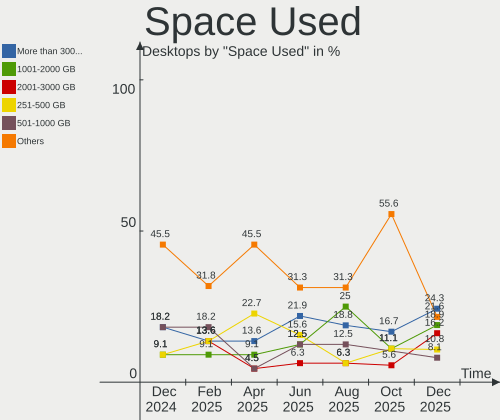

| Used GB        | Desktops | Percent |
|----------------|----------|---------|
| More than 3000 | 9        | 24.32%  |
| 1001-2000      | 7        | 18.92%  |
| 2001-3000      | 6        | 16.22%  |
| 251-500        | 4        | 10.81%  |
| 501-1000       | 3        | 8.11%   |
| 21-50          | 2        | 5.41%   |
| 101-250        | 2        | 5.41%   |
| 1-20           | 2        | 5.41%   |
| 51-100         | 1        | 2.7%    |
| Unknown        | 1        | 2.7%    |

Malfunc. Drives
---------------

Drive models with a malfunction

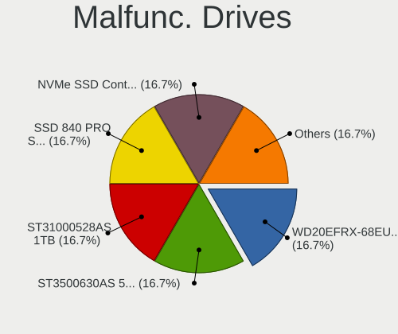

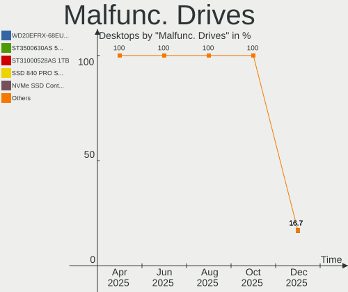

| Model                                                          | Desktops | Drives | Percent |
|----------------------------------------------------------------|----------|--------|---------|
| WDC WD20EFRX-68EUZN0 2TB                                       | 1        | 1      | 16.67%  |
| Seagate ST3500630AS 500GB                                      | 1        | 1      | 16.67%  |
| Seagate ST31000528AS 1TB                                       | 1        | 1      | 16.67%  |
| Samsung Electronics SSD 840 PRO Series 256GB                   | 1        | 1      | 16.67%  |
| Samsung Electronics NVMe SSD Controller SM981/PM981/PM983 1TB  | 1        | 1      | 16.67%  |
| Samsung Electronics NVMe SSD Controller PM9A1/PM9A3/980PRO 1TB | 1        | 1      | 16.67%  |

Malfunc. Drive Vendor
---------------------

Vendors of faulty drives

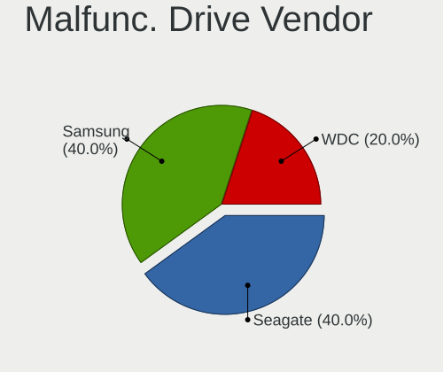

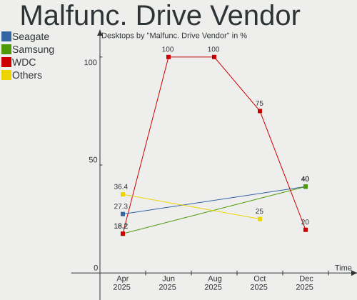

| Vendor              | Desktops | Drives | Percent |
|---------------------|----------|--------|---------|
| Seagate             | 2        | 2      | 40%     |
| Samsung Electronics | 2        | 3      | 40%     |
| WDC                 | 1        | 1      | 20%     |

Malfunc. HDD Vendor
-------------------

Vendors of faulty HDD drives

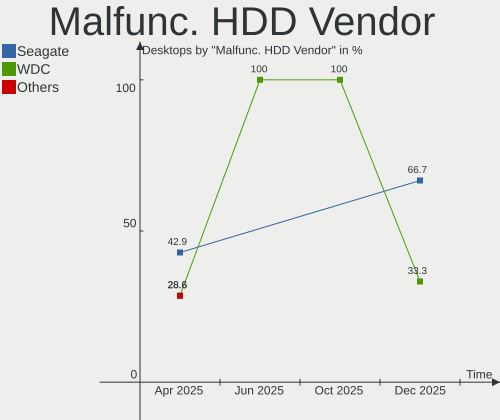

| Vendor  | Desktops | Drives | Percent |
|---------|----------|--------|---------|
| Seagate | 2        | 2      | 66.67%  |
| WDC     | 1        | 1      | 33.33%  |

Malfunc. Drive Kind
-------------------

Kinds of faulty drives

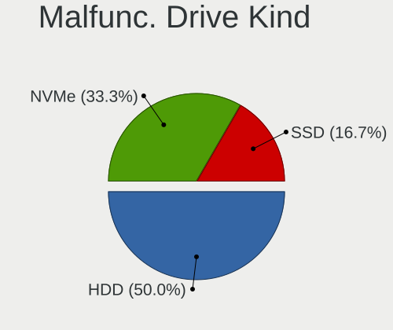

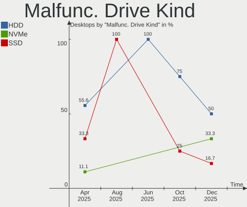

| Kind | Desktops | Drives | Percent |
|------|----------|--------|---------|
| HDD  | 3        | 3      | 50%     |
| NVMe | 2        | 2      | 33.33%  |
| SSD  | 1        | 1      | 16.67%  |

Failed Drives
-------------

Failed drive models

Zero info for selected period =(

Failed Drive Vendor
-------------------

Failed drive vendors

Zero info for selected period =(

Drive Status
------------

Number of failed and malfunc. drives

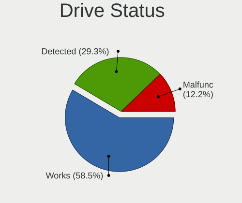

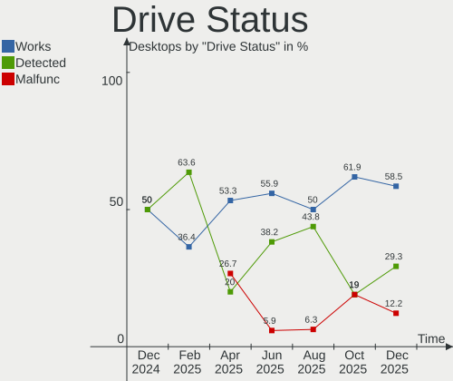

| Status   | Desktops | Drives | Percent |
|----------|----------|--------|---------|
| Works    | 24       | 64     | 58.54%  |
| Detected | 12       | 40     | 29.27%  |
| Malfunc  | 5        | 6      | 12.2%   |

Storage controller
------------------

Storage Vendor
--------------

Storage controller vendors

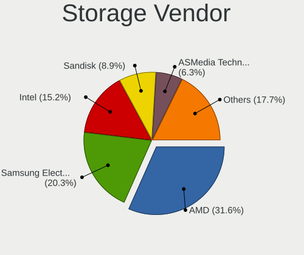

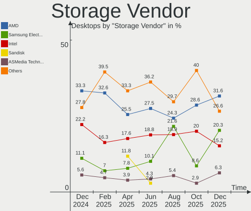

| Vendor                      | Desktops | Percent |
|-----------------------------|----------|---------|
| AMD                         | 25       | 31.65%  |
| Samsung Electronics         | 16       | 20.25%  |
| Intel                       | 12       | 15.19%  |
| Sandisk                     | 7        | 8.86%   |
| ASMedia Technology          | 5        | 6.33%   |
| Micron/Crucial Technology   | 3        | 3.8%    |
| Kingston Technology Company | 3        | 3.8%    |
| MAXIO Technology (Hangzhou) | 2        | 2.53%   |
| Solidigm                    | 1        | 1.27%   |
| Seagate Technology          | 1        | 1.27%   |
| Realtek Semiconductor       | 1        | 1.27%   |
| Phison Electronics          | 1        | 1.27%   |
| Micron Technology           | 1        | 1.27%   |
| KIOXIA                      | 1        | 1.27%   |

Storage Model
-------------

Storage controller models

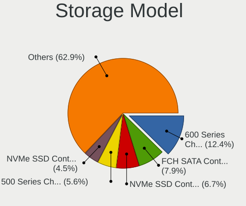

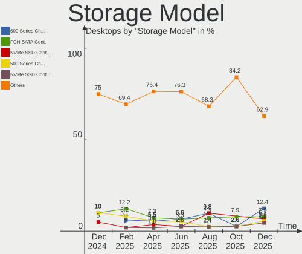

| Model                                                                          | Desktops | Percent |
|--------------------------------------------------------------------------------|----------|---------|
| AMD 600 Series Chipset SATA Controller                                         | 11       | 12.36%  |
| AMD FCH SATA Controller [AHCI mode]                                            | 7        | 7.87%   |
| Samsung NVMe SSD Controller SM981/PM981/PM983                                  | 6        | 6.74%   |
| AMD 500 Series Chipset SATA Controller                                         | 5        | 5.62%   |
| Samsung NVMe SSD Controller PM9A1/PM9A3/980PRO                                 | 4        | 4.49%   |
| Samsung NVMe SSD Controller 980 (DRAM-less)                                    | 4        | 4.49%   |
| ASMedia ASM1061/ASM1062 Serial ATA Controller                                  | 4        | 4.49%   |
| AMD 400 Series Chipset SATA Controller                                         | 4        | 4.49%   |
| SanDisk WD SN560/SN740/SN770/SN5000 NVMe SSD                                   | 3        | 3.37%   |
| Samsung NVMe SSD Controller S4LV008[Pascal]                                    | 3        | 3.37%   |
| Sandisk WD Black SN850X NVMe SSD                                               | 2        | 2.25%   |
| Samsung NVMe SSD Controller PM9C1a (DRAM-less)                                 | 2        | 2.25%   |
| Micron/Crucial P2 [Nick P2] / P3 / P3 Plus NVMe PCIe SSD (DRAM-less)           | 2        | 2.25%   |
| Intel Raptor Lake SATA AHCI Controller                                         | 2        | 2.25%   |
| Intel Alder Lake-S PCH SATA Controller [AHCI Mode]                             | 2        | 2.25%   |
| Intel 8 Series/C220 Series Chipset Family 6-port SATA Controller 1 [AHCI mode] | 2        | 2.25%   |
| Solidigm P41 Plus NVMe SSD (DRAM-less) [Echo Harbor]                           | 1        | 1.12%   |
| Seagate E18 PCIe SSD                                                           | 1        | 1.12%   |
| SanDisk WD PC SN540 / Green SN350 NVMe SSD 1 TB (DRAM-less)                    | 1        | 1.12%   |
| SanDisk WD Green SN350 240GB (DRAM-less) / SN560E NVMe SSD                     | 1        | 1.12%   |
| Samsung NVMe SSD Controller PM9B1 (DRAM-less)                                  | 1        | 1.12%   |
| Samsung NVMe SSD 9100 PRO [PM9E1]                                              | 1        | 1.12%   |
| Realtek RTS5765DL NVMe SSD Controller (DRAM-less)                              | 1        | 1.12%   |
| Phison E16 PCIe4 NVMe Controller                                               | 1        | 1.12%   |
| Micron/Crucial T700 NVMe PCIe SSD                                              | 1        | 1.12%   |
| Micron 2200S NVMe SSD [Cassandra]                                              | 1        | 1.12%   |
| MAXIO (Hangzhou) NVMe SSD Controller MAP1602 (DRAM-less)                       | 1        | 1.12%   |
| MAXIO (Hangzhou) NVMe SSD Controller MAP1202 (DRAM-less)                       | 1        | 1.12%   |
| KIOXIA Exceria Plus G3 NVMe SSD (DRAM-less)                                    | 1        | 1.12%   |
| Kingston Company NV3 NVMe SSD [TC2201] (DRAM-less)                             | 1        | 1.12%   |
| Kingston Company NV3 NVMe SSD [SM2268XT2] (DRAM-less)                          | 1        | 1.12%   |
| Kingston Company KC3000/FURY Renegade NVMe SSD [E18]                           | 1        | 1.12%   |
| Intel Volume Management Device NVMe RAID Controller                            | 1        | 1.12%   |
| Intel SSD 600P Series                                                          | 1        | 1.12%   |
| Intel RST Volume Management Device Controller                                  | 1        | 1.12%   |
| Intel Q170/Q150/B150/H170/H110/Z170/CM236 Chipset SATA Controller [AHCI Mode]  | 1        | 1.12%   |
| Intel Cannon Lake PCH SATA AHCI Controller                                     | 1        | 1.12%   |
| Intel Alder Lake-P SATA AHCI Controller                                        | 1        | 1.12%   |
| Intel 6 Series/C200 Series Chipset Family 6 port Desktop SATA AHCI Controller  | 1        | 1.12%   |
| Intel 500 Series Chipset Family SATA AHCI Controller                           | 1        | 1.12%   |

Storage Kind
------------

Kind of storage controller (IDE, SATA, NVMe, SAS, ...)

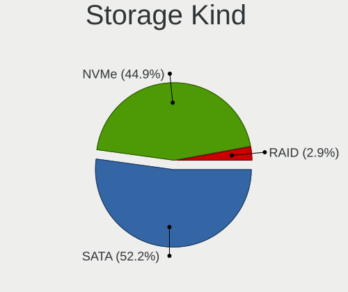

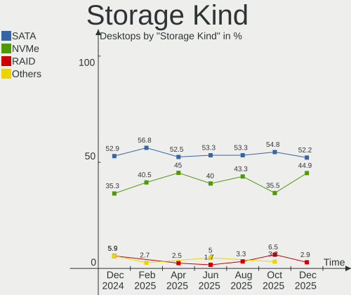

| Kind | Desktops | Percent |
|------|----------|---------|
| SATA | 36       | 52.17%  |
| NVMe | 31       | 44.93%  |
| RAID | 2        | 2.9%    |

Processor
---------

CPU Vendor
----------

Processor vendors

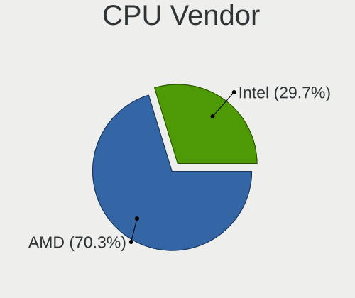

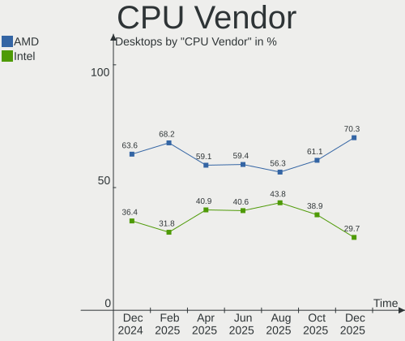

| Vendor | Desktops | Percent |
|--------|----------|---------|
| AMD    | 26       | 70.27%  |
| Intel  | 11       | 29.73%  |

CPU Model
---------

Processor models

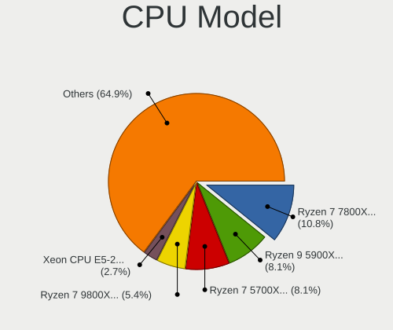

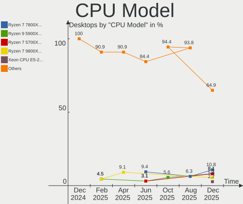

| Model                                   | Desktops | Percent |
|-----------------------------------------|----------|---------|
| AMD Ryzen 7 7800X3D 8-Core Processor    | 4        | 10.81%  |
| AMD Ryzen 9 5900X 12-Core Processor     | 3        | 8.11%   |
| AMD Ryzen 7 5700X3D 8-Core Processor    | 3        | 8.11%   |
| AMD Ryzen 7 9800X3D 8-Core Processor    | 2        | 5.41%   |
| Intel Xeon CPU E5-2680 v4 @ 2.40GHz     | 1        | 2.7%    |
| Intel Core i7-9700KF CPU @ 3.60GHz      | 1        | 2.7%    |
| Intel Core i7-6700 CPU @ 3.40GHz        | 1        | 2.7%    |
| Intel Core i7-4790 CPU @ 3.60GHz        | 1        | 2.7%    |
| Intel Core i7-2600 CPU @ 3.40GHz        | 1        | 2.7%    |
| Intel Core i7-14700F                    | 1        | 2.7%    |
| Intel Core i3-10100F CPU @ 3.60GHz      | 1        | 2.7%    |
| Intel 13th Gen Core i9-13900K           | 1        | 2.7%    |
| Intel 13th Gen Core i7-13700F           | 1        | 2.7%    |
| Intel 12th Gen Core i5-12400            | 1        | 2.7%    |
| Intel 12th Gen Core i5-1235U            | 1        | 2.7%    |
| AMD Ryzen 9 9950X3D 16-Core Processor   | 1        | 2.7%    |
| AMD Ryzen 9 9950X 16-Core Processor     | 1        | 2.7%    |
| AMD Ryzen 9 9900X 12-Core Processor     | 1        | 2.7%    |
| AMD Ryzen 9 6900HX with Radeon Graphics | 1        | 2.7%    |
| AMD Ryzen 7 5800X3D 8-Core Processor    | 1        | 2.7%    |
| AMD Ryzen 7 5800X 8-Core Processor      | 1        | 2.7%    |
| AMD Ryzen 7 5700X 8-Core Processor      | 1        | 2.7%    |
| AMD Ryzen 7 3700X 8-Core Processor      | 1        | 2.7%    |
| AMD Ryzen 5 9600X 6-Core Processor      | 1        | 2.7%    |
| AMD Ryzen 5 7600X 6-Core Processor      | 1        | 2.7%    |
| AMD Ryzen 5 3600 6-Core Processor       | 1        | 2.7%    |
| AMD Ryzen 5 2600 Six-Core Processor     | 1        | 2.7%    |
| AMD Ryzen 5 1600X Six-Core Processor    | 1        | 2.7%    |
| AMD Ryzen 5 1600 Six-Core Processor     | 1        | 2.7%    |

CPU Model Family
----------------

Processor model prefix

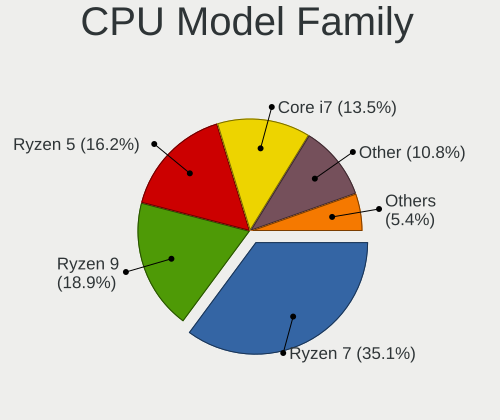

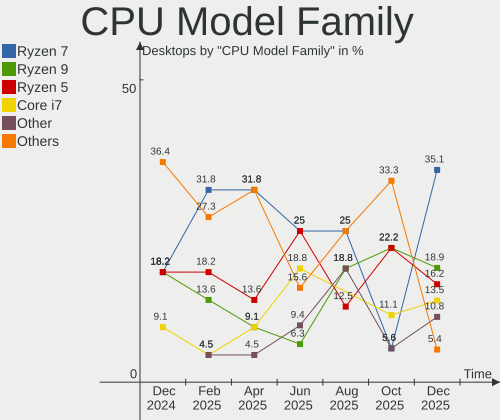

| Model         | Desktops | Percent |
|---------------|----------|---------|
| AMD Ryzen 7   | 13       | 35.14%  |
| AMD Ryzen 9   | 7        | 18.92%  |
| AMD Ryzen 5   | 6        | 16.22%  |
| Intel Core i7 | 5        | 13.51%  |
| Other         | 4        | 10.81%  |
| Intel Xeon    | 1        | 2.7%    |
| Intel Core i3 | 1        | 2.7%    |

CPU Cores
---------

Number of processor cores

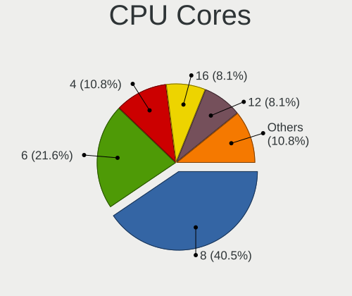

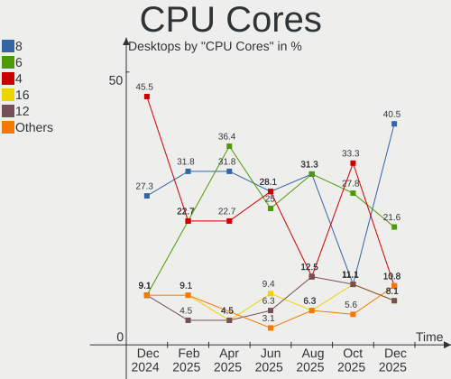

| Number | Desktops | Percent |
|--------|----------|---------|
| 8      | 15       | 40.54%  |
| 6      | 8        | 21.62%  |
| 4      | 4        | 10.81%  |
| 16     | 3        | 8.11%   |
| 12     | 3        | 8.11%   |
| 24     | 1        | 2.7%    |
| 20     | 1        | 2.7%    |
| 14     | 1        | 2.7%    |
| 10     | 1        | 2.7%    |

CPU Sockets
-----------

Number of sockets

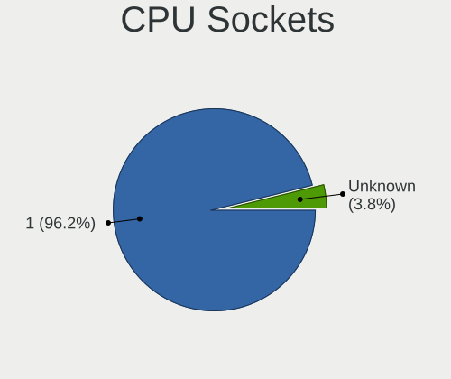

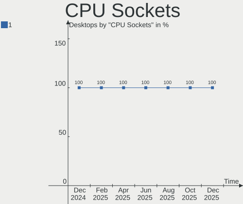

| Number | Desktops | Percent |
|--------|----------|---------|
| 1      | 37       | 100%    |

CPU Threads
-----------

Threads per core (Hyper-Threading)

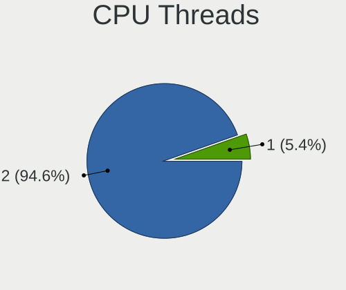

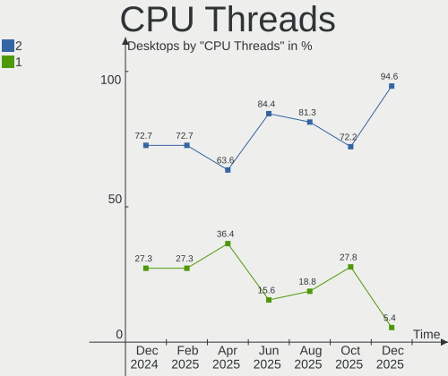

| Number | Desktops | Percent |
|--------|----------|---------|
| 2      | 35       | 94.59%  |
| 1      | 2        | 5.41%   |

CPU Op-Modes
------------

CPU Operation Modes (32-bit, 64-bit)

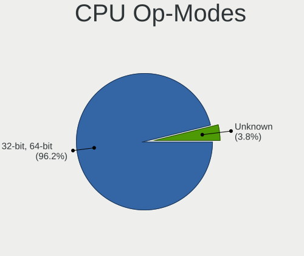

| Op mode        | Desktops | Percent |
|----------------|----------|---------|
| 32-bit, 64-bit | 37       | 100%    |

CPU Microcode
-------------

Microcode number

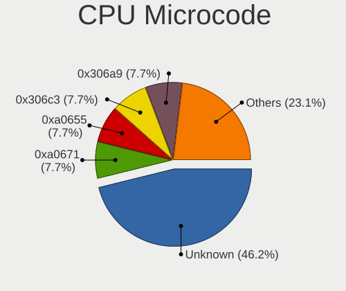

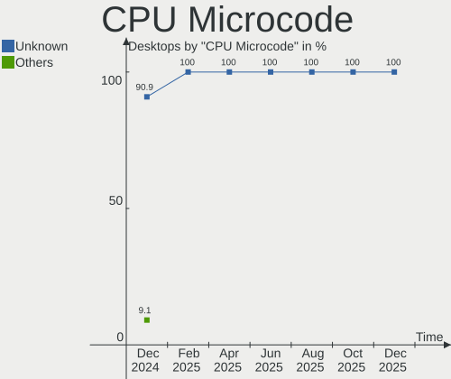

| Number  | Desktops | Percent |
|---------|----------|---------|
| Unknown | 37       | 100%    |

CPU Microarch
-------------

Microarchitecture

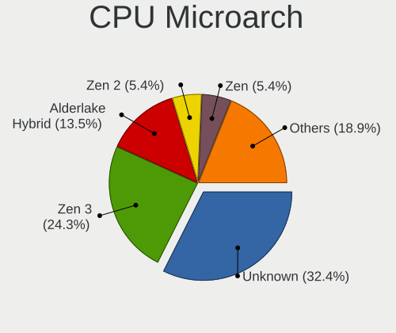

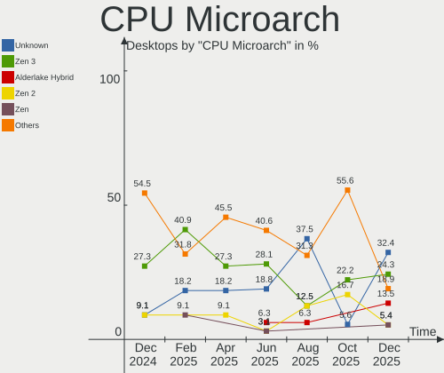

| Name             | Desktops | Percent |
|------------------|----------|---------|
| Unknown          | 12       | 32.43%  |
| Zen 3            | 9        | 24.32%  |
| Alderlake Hybrid | 5        | 13.51%  |
| Zen 2            | 2        | 5.41%   |
| Zen              | 2        | 5.41%   |
| Zen+             | 1        | 2.7%    |
| Skylake          | 1        | 2.7%    |
| SandyBridge      | 1        | 2.7%    |
| KabyLake         | 1        | 2.7%    |
| Haswell          | 1        | 2.7%    |
| CometLake        | 1        | 2.7%    |
| Broadwell        | 1        | 2.7%    |

Graphics
--------

GPU Vendor
----------

Vendors of graphics cards

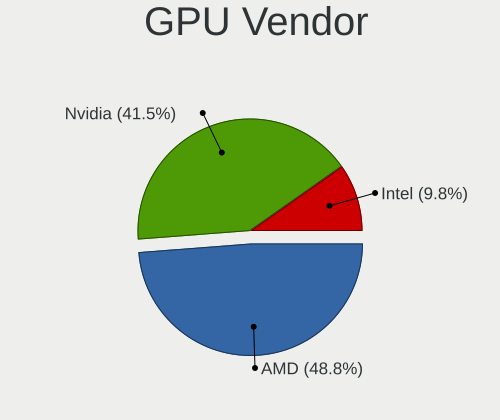

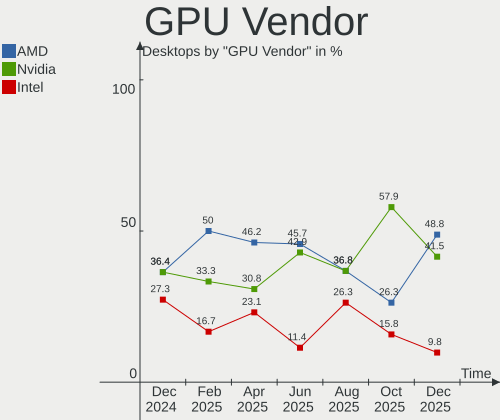

| Vendor | Desktops | Percent |
|--------|----------|---------|
| AMD    | 20       | 48.78%  |
| Nvidia | 17       | 41.46%  |
| Intel  | 4        | 9.76%   |

GPU Model
---------

Graphics card models

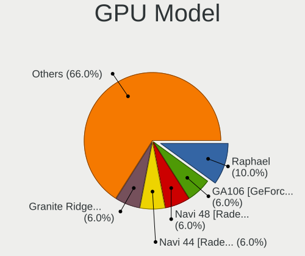

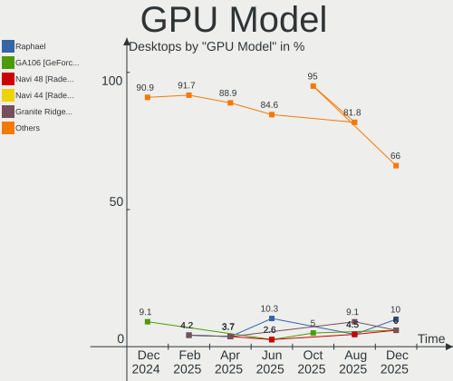

| Model                                                                       | Desktops | Percent |
|-----------------------------------------------------------------------------|----------|---------|
| AMD Raphael                                                                 | 5        | 10%     |
| Nvidia GA106 [GeForce RTX 3060 Lite Hash Rate]                              | 3        | 6%      |
| AMD Navi 48 [Radeon RX 9070/9070 XT/9070 GRE]                               | 3        | 6%      |
| AMD Navi 44 [Radeon RX 9060 XT]                                             | 3        | 6%      |
| AMD Granite Ridge [Radeon Graphics]                                         | 3        | 6%      |
| Nvidia AD104 [GeForce RTX 4070]                                             | 2        | 4%      |
| AMD Navi 32 [Radeon RX 7700 XT / 7800 XT]                                   | 2        | 4%      |
| AMD Navi 22 [Radeon RX 6700/6700 XT/6750 XT / 6800M/6850M XT]               | 2        | 4%      |
| AMD Navi 21 [Radeon RX 6800/6800 XT / 6900 XT]                              | 2        | 4%      |
| AMD Navi 10 [Radeon RX 5600 OEM/5600 XT / 5700/5700 XT]                     | 2        | 4%      |
| Nvidia TU106 [GeForce RTX 2070 Rev. A]                                      | 1        | 2%      |
| Nvidia TU104 [GeForce RTX 2080]                                             | 1        | 2%      |
| Nvidia TU104 [GeForce RTX 2070 SUPER]                                       | 1        | 2%      |
| Nvidia NV43 [GeForce 6600]                                                  | 1        | 2%      |
| Nvidia GP108 [GeForce GT 1030]                                              | 1        | 2%      |
| Nvidia GF106GL [Quadro 2000]                                                | 1        | 2%      |
| Nvidia GB203 [GeForce RTX 5080]                                             | 1        | 2%      |
| Nvidia GA106 [GeForce RTX 3060]                                             | 1        | 2%      |
| Nvidia AD107 [GeForce RTX 4060]                                             | 1        | 2%      |
| Nvidia AD106 [GeForce RTX 4060 Ti]                                          | 1        | 2%      |
| Nvidia AD104 [GeForce RTX 4070 Ti]                                          | 1        | 2%      |
| Nvidia AD103 [GeForce RTX 4080 SUPER]                                       | 1        | 2%      |
| Intel Xeon E3-1200 v3/4th Gen Core Processor Integrated Graphics Controller | 1        | 2%      |
| Intel Skylake-S GT2 [HD Graphics 530]                                       | 1        | 2%      |
| Intel Alder Lake-UP3 GT2 [Iris Xe Graphics]                                 | 1        | 2%      |
| Intel Alder Lake-S GT1 [UHD Graphics 730]                                   | 1        | 2%      |
| AMD Rembrandt [Radeon 680M]                                                 | 1        | 2%      |
| AMD Polaris 20 XL [Radeon RX 580 2048SP]                                    | 1        | 2%      |
| AMD Navi 33 [Radeon RX 7600/7600 XT/7600M XT/7600S/7700S / PRO W7600]       | 1        | 2%      |
| AMD Navi 31 [Radeon RX 7900 XT/7900 XTX/7900 GRE/7900M]                     | 1        | 2%      |
| AMD Navi 24 [Radeon RX 6400/6500 XT/6500M]                                  | 1        | 2%      |
| AMD Navi 23 [Radeon RX 6600/6600 XT/6600M]                                  | 1        | 2%      |
| AMD Ellesmere [Radeon RX 470/480/570/570X/580/580X/590]                     | 1        | 2%      |

GPU Combo
---------

Combinations of graphics cards

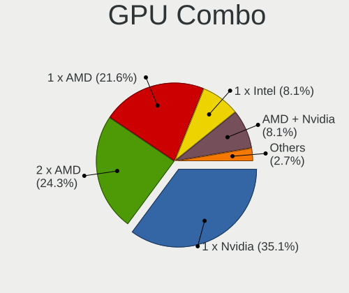

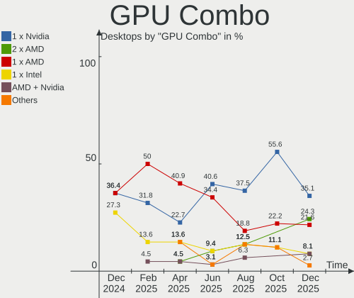

| Name           | Desktops | Percent |
|----------------|----------|---------|
| 1 x Nvidia     | 13       | 35.14%  |
| 2 x AMD        | 9        | 24.32%  |
| 1 x AMD        | 8        | 21.62%  |
| 1 x Intel      | 3        | 8.11%   |
| AMD + Nvidia   | 3        | 8.11%   |
| Intel + Nvidia | 1        | 2.7%    |

GPU Driver
----------

Free vs proprietary

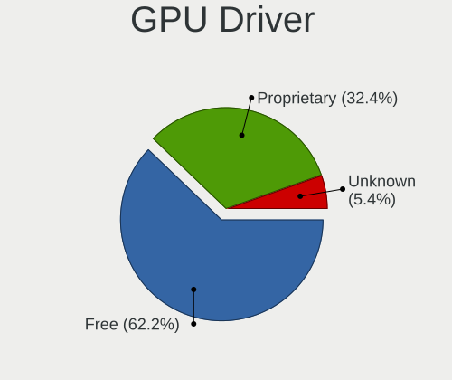

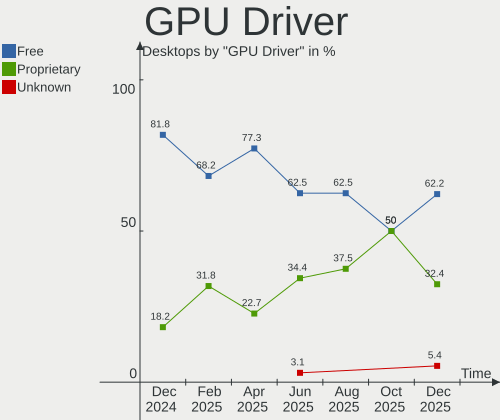

| Driver      | Desktops | Percent |
|-------------|----------|---------|
| Free        | 23       | 62.16%  |
| Proprietary | 12       | 32.43%  |
| Unknown     | 2        | 5.41%   |

GPU Memory
----------

Total video memory

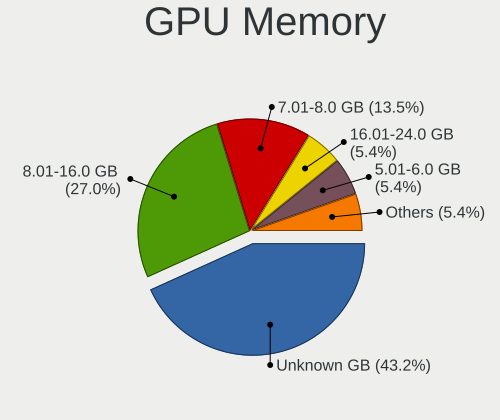

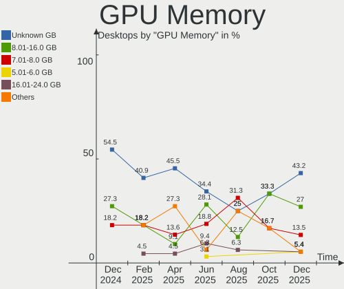

| Size in GB | Desktops | Percent |
|------------|----------|---------|
| Unknown    | 16       | 43.24%  |
| 8.01-16.0  | 10       | 27.03%  |
| 7.01-8.0   | 5        | 13.51%  |
| 5.01-6.0   | 2        | 5.41%   |
| 16.01-24.0 | 2        | 5.41%   |
| 3.01-4.0   | 1        | 2.7%    |
| 1.01-2.0   | 1        | 2.7%    |

Monitor
-------

Monitor Vendor
--------------

Monitor vendors

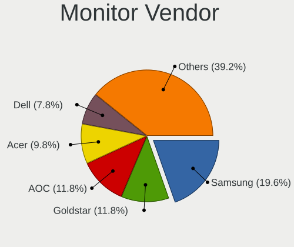

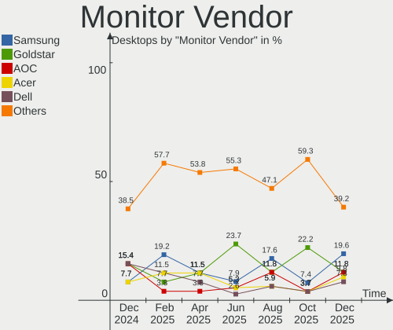

| Vendor               | Desktops | Percent |
|----------------------|----------|---------|
| Samsung Electronics  | 10       | 19.61%  |
| Goldstar             | 6        | 11.76%  |
| AOC                  | 6        | 11.76%  |
| Acer                 | 5        | 9.8%    |
| Dell                 | 4        | 7.84%   |
| Hewlett-Packard      | 3        | 5.88%   |
| MSI                  | 2        | 3.92%   |
| BenQ                 | 2        | 3.92%   |
| Skyworth             | 1        | 1.96%   |
| SKG                  | 1        | 1.96%   |
| Roku                 | 1        | 1.96%   |
| Pixio                | 1        | 1.96%   |
| Philips              | 1        | 1.96%   |
| Lenovo               | 1        | 1.96%   |
| Hitachi              | 1        | 1.96%   |
| Gigabyte Technology  | 1        | 1.96%   |
| DENON                | 1        | 1.96%   |
| CTV                  | 1        | 1.96%   |
| ASUSTek Computer     | 1        | 1.96%   |
| Ancor Communications | 1        | 1.96%   |
| AIO                  | 1        | 1.96%   |

Monitor Model
-------------

Monitor models

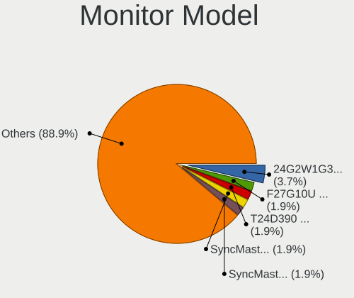

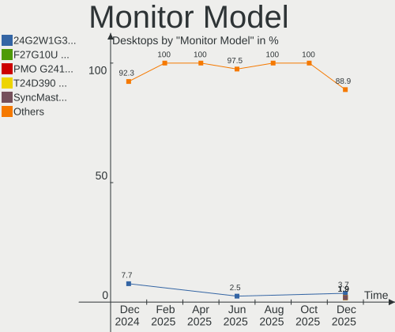

| Model                                                                  | Desktops | Percent |
|------------------------------------------------------------------------|----------|---------|
| AOC 24G2W1G3 AOC2402 1920x1080 527x296mm 23.8-inch                     | 2        | 3.7%    |
| Skyworth F27G10U SKY0627 3840x2160 596x335mm 26.9-inch                 | 1        | 1.85%   |
| SKG PMO G241-FFK SKG2409 1920x1080 600x330mm 27.0-inch                 | 1        | 1.85%   |
| Samsung Electronics T24D390 SAM0B6E 1920x1080 521x293mm 23.5-inch      | 1        | 1.85%   |
| Samsung Electronics SyncMaster SAM058A 1920x1080 530x300mm 24.0-inch   | 1        | 1.85%   |
| Samsung Electronics SyncMaster SAM037C 1680x1050 474x296mm 22.0-inch   | 1        | 1.85%   |
| Samsung Electronics SA300/SA350 SAM078C 1600x900 443x249mm 20.0-inch   | 1        | 1.85%   |
| Samsung Electronics S24R35A SAM729F 1920x1080 521x293mm 23.5-inch      | 1        | 1.85%   |
| Samsung Electronics Odyssey G70B SAM7232 3840x2160 698x392mm 31.5-inch | 1        | 1.85%   |
| Samsung Electronics Odyssey G5 SAM74A7 2560x1440 597x336mm 27.0-inch   | 1        | 1.85%   |
| Samsung Electronics Odyssey G5 SAM7489 2560x1440 698x393mm 31.5-inch   | 1        | 1.85%   |
| Samsung Electronics Odyssey G40B SAM727D 1920x1080 597x336mm 27.0-inch | 1        | 1.85%   |
| Samsung Electronics LCD Monitor SAM0F13 3840x2160 950x540mm 43.0-inch  | 1        | 1.85%   |
| Samsung Electronics C24F390 SAM0D2C 1920x1080 521x293mm 23.5-inch      | 1        | 1.85%   |
| Roku TV RKU0870 3840x2160 800x450mm 36.1-inch                          | 1        | 1.85%   |
| Pixio ICB MN32U1 ICB7D04 3840x2160 708x398mm 32.0-inch                 | 1        | 1.85%   |
| Philips PHL 246E9Q PHLC17C 1920x1080 527x296mm 23.8-inch               | 1        | 1.85%   |
| MSI G27CQ4 MSI3CB0 2560x1440 597x336mm 27.0-inch                       | 1        | 1.85%   |
| MSI G255F MSI3BC0 1920x1080 543x302mm 24.5-inch                        | 1        | 1.85%   |
| Lenovo LEN E2054A LEN60DF 1440x900 419x262mm 19.5-inch                 | 1        | 1.85%   |
| Hitachi CM751 HTCAC13 1600x1200 360x270mm 17.7-inch                    | 1        | 1.85%   |
| Hewlett-Packard vs19b HWP264C 1280x1024 376x301mm 19.0-inch            | 1        | 1.85%   |
| Hewlett-Packard V24v G5 HPN3829 1920x1080 526x296mm 23.8-inch          | 1        | 1.85%   |
| Hewlett-Packard V212a HWP328F 1920x1080 458x258mm 20.7-inch            | 1        | 1.85%   |
| Goldstar ULTRAWIDE GSM9E80 3440x1440 930x390mm 39.7-inch               | 1        | 1.85%   |
| Goldstar ULTRAGEAR+ GSM77BD 3840x2160 597x336mm 27.0-inch              | 1        | 1.85%   |
| Goldstar ULTRAFINE GSM5BC2 3840x2160 697x392mm 31.5-inch               | 1        | 1.85%   |
| Goldstar LG ULTRAWIDE GSM59F1 2560x1080 670x280mm 28.6-inch            | 1        | 1.85%   |
| Goldstar HDR WFHD GSM7714 2560x1080 798x334mm 34.1-inch                | 1        | 1.85%   |
| Goldstar E2241 GSM5819 1920x1080 477x268mm 21.5-inch                   | 1        | 1.85%   |
| Goldstar 27GL850 GSM5B7F 2560x1440 597x336mm 27.0-inch                 | 1        | 1.85%   |
| Gigabyte Technology G27FC A GBT2715 1920x1080 598x336mm 27.0-inch      | 1        | 1.85%   |
| DENON AVR DON0065 3840x2160                                            | 1        | 1.85%   |
| Dell U2412M DELA07B 1920x1200 518x324mm 24.1-inch                      | 1        | 1.85%   |
| Dell SE2717H/HX DELD0A1 1920x1080 598x336mm 27.0-inch                  | 1        | 1.85%   |
| Dell S2722DGM DEL4239 2560x1440 597x336mm 27.0-inch                    | 1        | 1.85%   |
| Dell S2719DGF DELD0E6 2560x1440 597x336mm 27.0-inch                    | 1        | 1.85%   |
| Dell S2417DG DELA0E7 2560x1440 527x296mm 23.8-inch                     | 1        | 1.85%   |
| CTV TV CTV0030 1920x1080 708x398mm 32.0-inch                           | 1        | 1.85%   |
| BenQ ZOWIE XL LCD BNQ7F33 1920x1080 531x298mm 24.0-inch                | 1        | 1.85%   |

Monitor Resolution
------------------

Monitor screen resolution

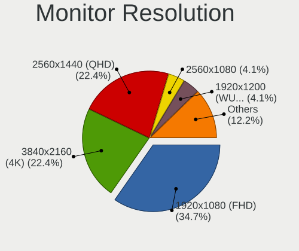

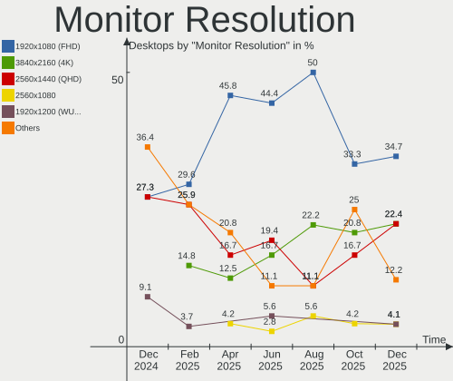

| Resolution         | Desktops | Percent |
|--------------------|----------|---------|
| 1920x1080 (FHD)    | 17       | 34.69%  |
| 3840x2160 (4K)     | 11       | 22.45%  |
| 2560x1440 (QHD)    | 11       | 22.45%  |
| 2560x1080          | 2        | 4.08%   |
| 1920x1200 (WUXGA)  | 2        | 4.08%   |
| 3440x1440          | 1        | 2.04%   |
| 1680x1050 (WSXGA+) | 1        | 2.04%   |
| 1600x900 (HD+)     | 1        | 2.04%   |
| 1600x1200          | 1        | 2.04%   |
| 1440x900 (WXGA+)   | 1        | 2.04%   |
| 1280x1024 (SXGA)   | 1        | 2.04%   |

Monitor Diagonal
----------------

Diagonal size in inches

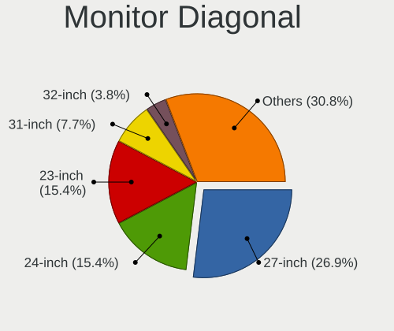

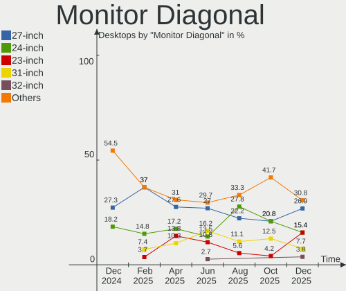

| Inches | Desktops | Percent |
|--------|----------|---------|
| 27     | 14       | 26.92%  |
| 24     | 8        | 15.38%  |
| 23     | 8        | 15.38%  |
| 31     | 4        | 7.69%   |
| 32     | 2        | 3.85%   |
| 20     | 2        | 3.85%   |
| 19     | 2        | 3.85%   |
| 99     | 1        | 1.92%   |
| 84     | 1        | 1.92%   |
| 63     | 1        | 1.92%   |
| 39     | 1        | 1.92%   |
| 36     | 1        | 1.92%   |
| 34     | 1        | 1.92%   |
| 33     | 1        | 1.92%   |
| 26     | 1        | 1.92%   |
| 25     | 1        | 1.92%   |
| 22     | 1        | 1.92%   |
| 21     | 1        | 1.92%   |
| 17     | 1        | 1.92%   |

Monitor Width
-------------

Physical width

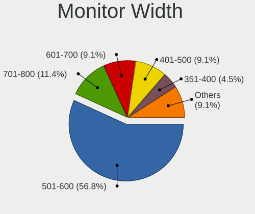

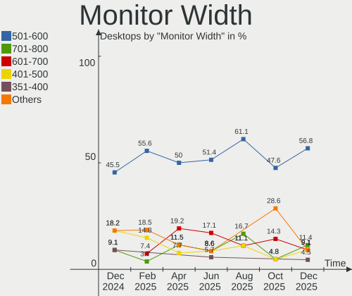

| Width in mm    | Desktops | Percent |
|----------------|----------|---------|
| 501-600        | 25       | 56.82%  |
| 701-800        | 5        | 11.36%  |
| 601-700        | 4        | 9.09%   |
| 401-500        | 4        | 9.09%   |
| 351-400        | 2        | 4.55%   |
| More than 2000 | 1        | 2.27%   |
| 1501-2000      | 1        | 2.27%   |
| 1001-1500      | 1        | 2.27%   |
| 901-1000       | 1        | 2.27%   |

Aspect Ratio
------------

Proportional relationship between the width and the height

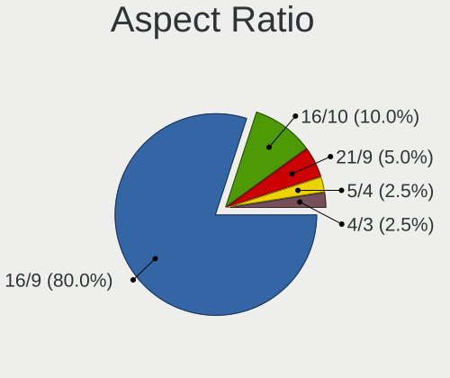

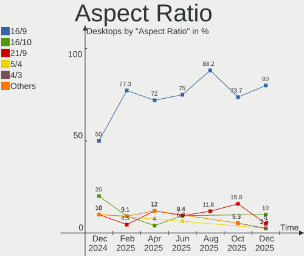

| Ratio | Desktops | Percent |
|-------|----------|---------|
| 16/9  | 32       | 80%     |
| 16/10 | 4        | 10%     |
| 21/9  | 2        | 5%      |
| 5/4   | 1        | 2.5%    |
| 4/3   | 1        | 2.5%    |

Monitor Area
------------

Area in inch²

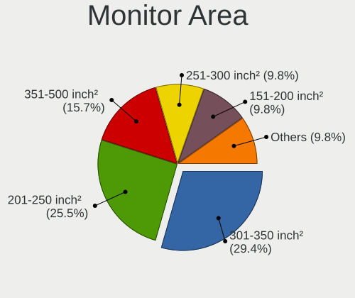

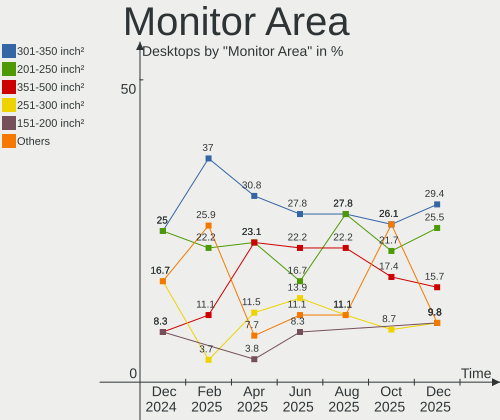

| Area in inch² | Desktops | Percent |
|----------------|----------|---------|
| 301-350        | 15       | 29.41%  |
| 201-250        | 13       | 25.49%  |
| 351-500        | 8        | 15.69%  |
| 251-300        | 5        | 9.8%    |
| 151-200        | 5        | 9.8%    |
| More than 1000 | 3        | 5.88%   |
| 501-1000       | 2        | 3.92%   |

Pixel Density
-------------

Pixels per inch

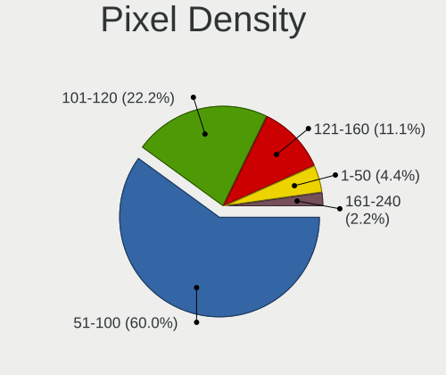

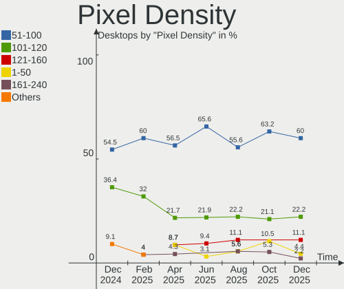

| Density | Desktops | Percent |
|---------|----------|---------|
| 51-100  | 27       | 60%     |
| 101-120 | 10       | 22.22%  |
| 121-160 | 5        | 11.11%  |
| 1-50    | 2        | 4.44%   |
| 161-240 | 1        | 2.22%   |

Multiple Monitors
-----------------

Total monitors connected

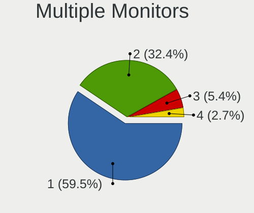

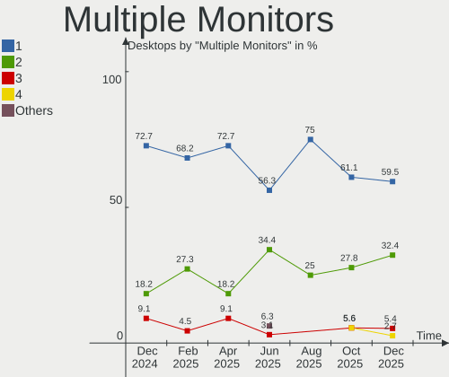

| Total | Desktops | Percent |
|-------|----------|---------|
| 1     | 22       | 59.46%  |
| 2     | 12       | 32.43%  |
| 3     | 2        | 5.41%   |
| 4     | 1        | 2.7%    |

Network
-------

Net Controller Vendor
---------------------

Controller vendors

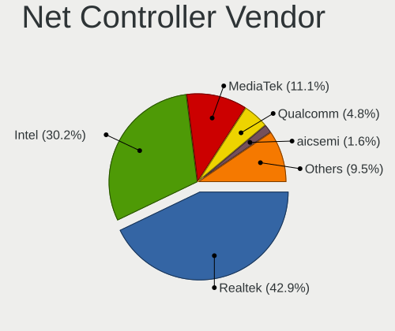

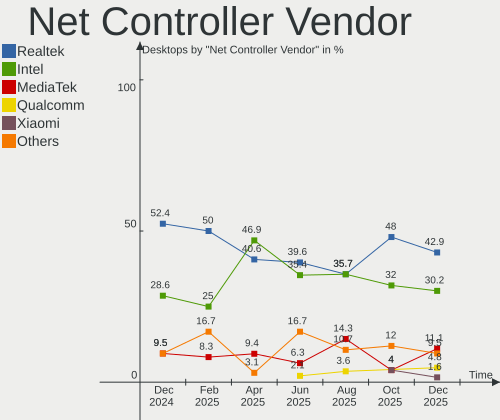

| Vendor                | Desktops | Percent |
|-----------------------|----------|---------|
| Realtek Semiconductor | 27       | 42.86%  |
| Intel                 | 19       | 30.16%  |
| MediaTek              | 7        | 11.11%  |
| Qualcomm Technologies | 3        | 4.76%   |
| Xiaomi                | 1        | 1.59%   |
| Ralink Technology     | 1        | 1.59%   |
| Qualcomm Atheros      | 1        | 1.59%   |
| Microsoft             | 1        | 1.59%   |
| Google                | 1        | 1.59%   |
| Aquantia              | 1        | 1.59%   |
| aicsemi               | 1        | 1.59%   |

Net Controller Model
--------------------

Controller models

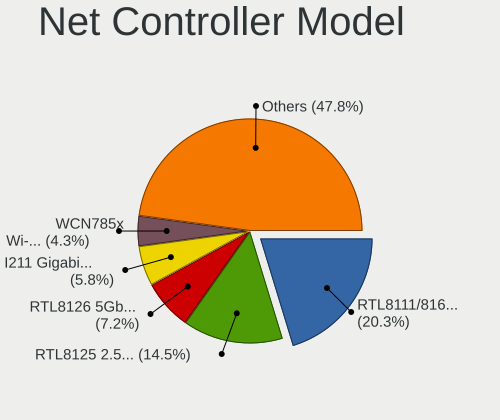

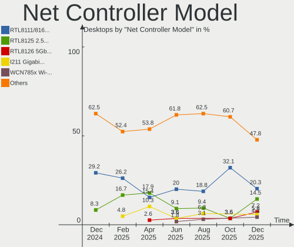

| Model                                                                           | Desktops | Percent |
|---------------------------------------------------------------------------------|----------|---------|
| Realtek RTL8111/8168/8211/8411 PCI Express Gigabit Ethernet Controller          | 14       | 20.29%  |
| Realtek RTL8125 2.5GbE Controller                                               | 10       | 14.49%  |
| Realtek RTL8126 5GbE Controller                                                 | 5        | 7.25%   |
| Intel I211 Gigabit Network Connection                                           | 4        | 5.8%    |
| Qualcomm WCN785x Wi-Fi 7(802.11be) 320MHz 2x2 [FastConnect 7800]                | 3        | 4.35%   |
| MediaTek MT7922 802.11ax PCI Express Wireless Network Adapter                   | 3        | 4.35%   |
| Intel Wi-Fi 6 AX200                                                             | 2        | 2.9%    |
| Intel Ethernet Controller I226-V                                                | 2        | 2.9%    |
| Intel 700 Series Chipset CNVi WiFi                                              | 2        | 2.9%    |
| Xiaomi Mi/Redmi series (RNDIS + ADB)                                            | 1        | 1.45%   |
| Realtek RTL8852CE PCIe 802.11ax Wireless Network Controller                     | 1        | 1.45%   |
| Realtek RTL8821CE 802.11ac PCIe Wireless Network Adapter                        | 1        | 1.45%   |
| Realtek Killer E3000 2.5GbE Controller                                          | 1        | 1.45%   |
| Ralink RT5370 Wireless Adapter                                                  | 1        | 1.45%   |
| Qualcomm Atheros AR928X Wireless Network Adapter (PCI-Express)                  | 1        | 1.45%   |
| Microsoft Xbox 360 Wireless Adapter                                             | 1        | 1.45%   |
| MediaTek Network controller                                                     | 1        | 1.45%   |
| MediaTek MT7927 802.11be 320MHz 2x2 PCIe Wireless Network Adapter [Filogic 380] | 1        | 1.45%   |
| MediaTek MT7925 (RZ717) Wi-Fi 7 160MHz                                          | 1        | 1.45%   |
| MediaTek MT7921K (RZ608) Wi-Fi 6E 80MHz                                         | 1        | 1.45%   |
| Intel Wireless 7265                                                             | 1        | 1.45%   |
| Intel Wi-Fi 6E(802.11ax) AX210/AX1675* 2x2 [Typhoon Peak]                       | 1        | 1.45%   |
| Intel Ethernet Controller I225-V                                                | 1        | 1.45%   |
| Intel Ethernet Controller 10-Gigabit X540-AT2                                   | 1        | 1.45%   |
| Intel Ethernet Connection (7) I219-V                                            | 1        | 1.45%   |
| Intel Ethernet Connection (2) I219-V                                            | 1        | 1.45%   |
| Intel Ethernet Connection (14) I219-V                                           | 1        | 1.45%   |
| Intel Alder Lake-S PCH CNVi WiFi                                                | 1        | 1.45%   |
| Intel Alder Lake-P PCH CNVi WiFi                                                | 1        | 1.45%   |
| Intel 82579LM Gigabit Network Connection (Lewisville)                           | 1        | 1.45%   |
| Google Android Open Accessory device (accessory + audio)                        | 1        | 1.45%   |
| Aquantia AQtion AQC113 NBase-T/IEEE 802.3an Ethernet Controller [Antigua 10G]   | 1        | 1.45%   |
| aicsemi AIC Wlan                                                                | 1        | 1.45%   |

Wireless Vendor
---------------

Wireless vendors

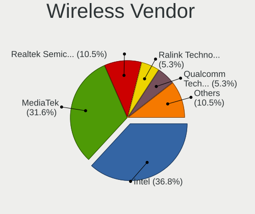

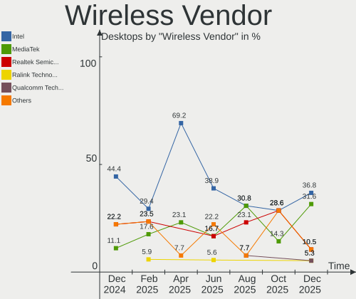

| Vendor                | Desktops | Percent |
|-----------------------|----------|---------|
| Intel                 | 7        | 36.84%  |
| MediaTek              | 6        | 31.58%  |
| Realtek Semiconductor | 2        | 10.53%  |
| Ralink Technology     | 1        | 5.26%   |
| Qualcomm Technologies | 1        | 5.26%   |
| Qualcomm Atheros      | 1        | 5.26%   |
| Microsoft             | 1        | 5.26%   |

Wireless Model
--------------

Wireless models

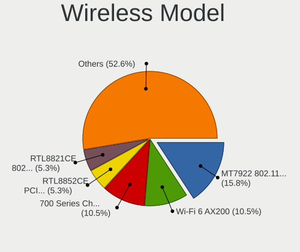

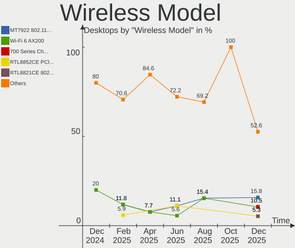

| Model                                                                           | Desktops | Percent |
|---------------------------------------------------------------------------------|----------|---------|
| MediaTek MT7922 802.11ax PCI Express Wireless Network Adapter                   | 3        | 15.79%  |
| Intel Wi-Fi 6 AX200                                                             | 2        | 10.53%  |
| Intel 700 Series Chipset CNVi WiFi                                              | 2        | 10.53%  |
| Realtek RTL8852CE PCIe 802.11ax Wireless Network Controller                     | 1        | 5.26%   |
| Realtek RTL8821CE 802.11ac PCIe Wireless Network Adapter                        | 1        | 5.26%   |
| Ralink RT5370 Wireless Adapter                                                  | 1        | 5.26%   |
| Qualcomm WCN785x Wi-Fi 7(802.11be) 320MHz 2x2 [FastConnect 7800]                | 1        | 5.26%   |
| Qualcomm Atheros AR928X Wireless Network Adapter (PCI-Express)                  | 1        | 5.26%   |
| Microsoft Xbox 360 Wireless Adapter                                             | 1        | 5.26%   |
| MediaTek MT7927 802.11be 320MHz 2x2 PCIe Wireless Network Adapter [Filogic 380] | 1        | 5.26%   |
| MediaTek MT7925 (RZ717) Wi-Fi 7 160MHz                                          | 1        | 5.26%   |
| MediaTek MT7921K (RZ608) Wi-Fi 6E 80MHz                                         | 1        | 5.26%   |
| Intel Wireless 7265                                                             | 1        | 5.26%   |
| Intel Wi-Fi 6E(802.11ax) AX210/AX1675* 2x2 [Typhoon Peak]                       | 1        | 5.26%   |
| Intel Alder Lake-P PCH CNVi WiFi                                                | 1        | 5.26%   |

Ethernet Vendor
---------------

Ethernet vendors

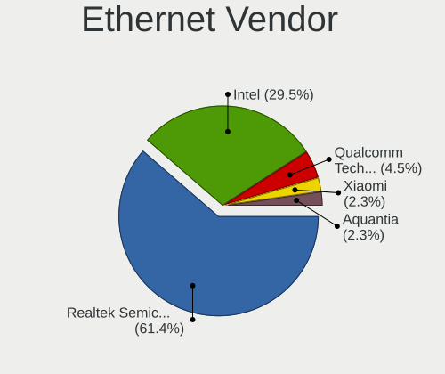

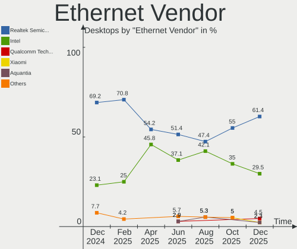

| Vendor                | Desktops | Percent |
|-----------------------|----------|---------|
| Realtek Semiconductor | 27       | 61.36%  |
| Intel                 | 13       | 29.55%  |
| Qualcomm Technologies | 2        | 4.55%   |
| Xiaomi                | 1        | 2.27%   |
| Aquantia              | 1        | 2.27%   |

Ethernet Model
--------------

Ethernet models

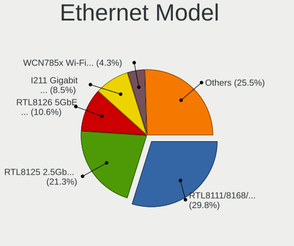

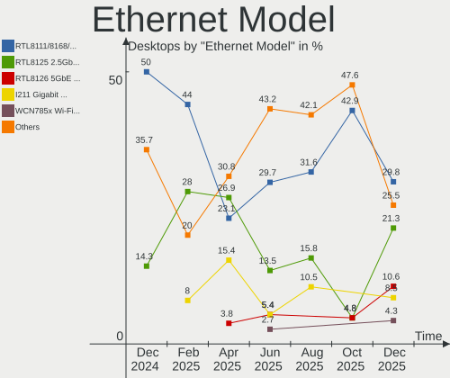

| Model                                                                         | Desktops | Percent |
|-------------------------------------------------------------------------------|----------|---------|
| Realtek RTL8111/8168/8211/8411 PCI Express Gigabit Ethernet Controller        | 14       | 29.79%  |
| Realtek RTL8125 2.5GbE Controller                                             | 10       | 21.28%  |
| Realtek RTL8126 5GbE Controller                                               | 5        | 10.64%  |
| Intel I211 Gigabit Network Connection                                         | 4        | 8.51%   |
| Qualcomm WCN785x Wi-Fi 7(802.11be) 320MHz 2x2 [FastConnect 7800]              | 2        | 4.26%   |
| Intel Ethernet Controller I226-V                                              | 2        | 4.26%   |
| Xiaomi Mi/Redmi series (RNDIS + ADB)                                          | 1        | 2.13%   |
| Realtek Killer E3000 2.5GbE Controller                                        | 1        | 2.13%   |
| Intel Ethernet Controller I225-V                                              | 1        | 2.13%   |
| Intel Ethernet Controller 10-Gigabit X540-AT2                                 | 1        | 2.13%   |
| Intel Ethernet Connection (7) I219-V                                          | 1        | 2.13%   |
| Intel Ethernet Connection (2) I219-V                                          | 1        | 2.13%   |
| Intel Ethernet Connection (14) I219-V                                         | 1        | 2.13%   |
| Intel Alder Lake-S PCH CNVi WiFi                                              | 1        | 2.13%   |
| Intel 82579LM Gigabit Network Connection (Lewisville)                         | 1        | 2.13%   |
| Aquantia AQtion AQC113 NBase-T/IEEE 802.3an Ethernet Controller [Antigua 10G] | 1        | 2.13%   |

Net Controller Kind
-------------------

Ethernet, WiFi or modem

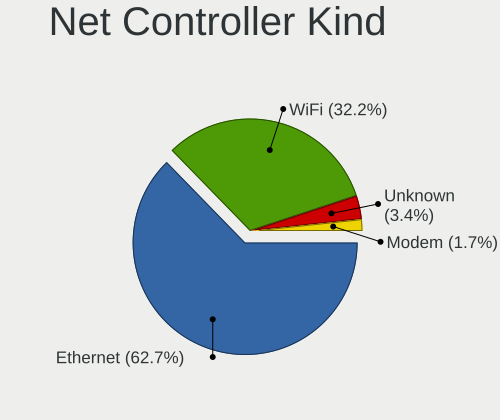

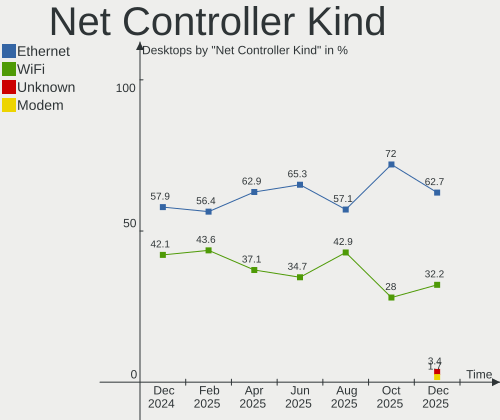

| Kind     | Desktops | Percent |
|----------|----------|---------|
| Ethernet | 37       | 62.71%  |
| WiFi     | 19       | 32.2%   |
| Unknown  | 2        | 3.39%   |
| Modem    | 1        | 1.69%   |

Used Controller
---------------

Currently used network controller

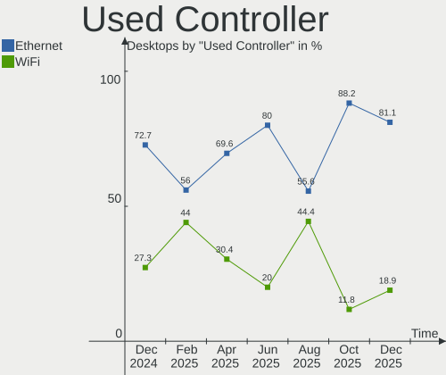

| Kind     | Desktops | Percent |
|----------|----------|---------|
| Ethernet | 30       | 81.08%  |
| WiFi     | 7        | 18.92%  |

NICs
----

Total network controllers on board

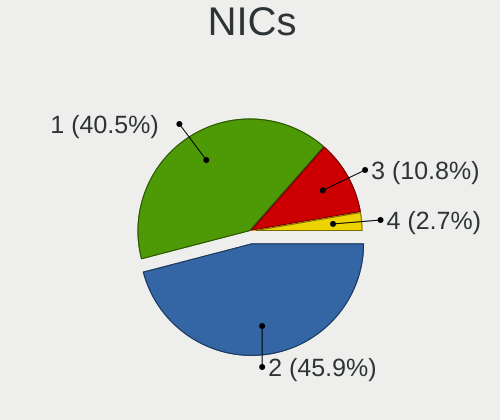

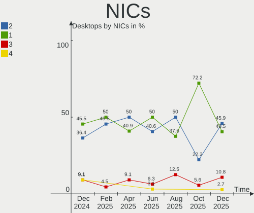

| Total | Desktops | Percent |
|-------|----------|---------|
| 2     | 17       | 45.95%  |
| 1     | 15       | 40.54%  |
| 3     | 4        | 10.81%  |
| 4     | 1        | 2.7%    |

IPv6
----

IPv6 vs IPv4

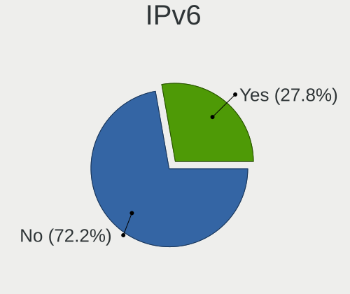

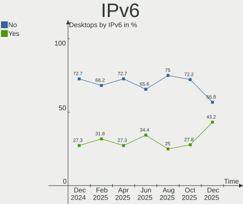

| Used | Desktops | Percent |
|------|----------|---------|
| No   | 21       | 56.76%  |
| Yes  | 16       | 43.24%  |

Bluetooth
---------

Bluetooth Vendor
----------------

Controller vendors

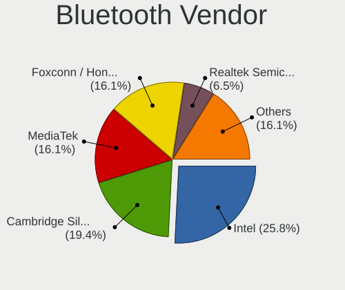

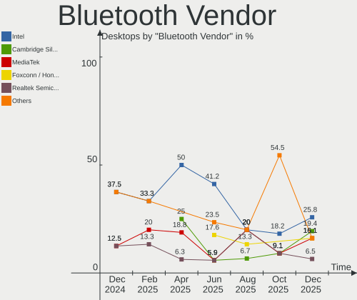

| Vendor                  | Desktops | Percent |
|-------------------------|----------|---------|
| Intel                   | 8        | 25.81%  |
| Cambridge Silicon Radio | 6        | 19.35%  |
| MediaTek                | 5        | 16.13%  |
| Foxconn / Hon Hai       | 5        | 16.13%  |
| Realtek Semiconductor   | 2        | 6.45%   |
| TP-Link                 | 1        | 3.23%   |
| IMC Networks            | 1        | 3.23%   |
| Broadcom                | 1        | 3.23%   |
| ASUSTek Computer        | 1        | 3.23%   |
| Unknown                 | 1        | 3.23%   |

Bluetooth Model
---------------

Controller models

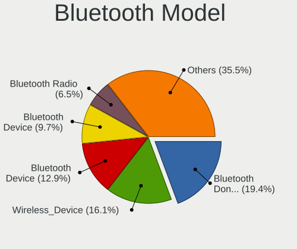

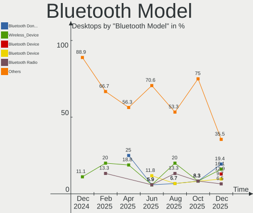

| Model                                               | Desktops | Percent |
|-----------------------------------------------------|----------|---------|
| Cambridge Silicon Radio Bluetooth Dongle (HCI mode) | 6        | 19.35%  |
| MediaTek Wireless_Device                            | 5        | 16.13%  |
| Intel Bluetooth Device                              | 4        | 12.9%   |
| Foxconn / Hon Hai Bluetooth Device                  | 3        | 9.68%   |
| Realtek Bluetooth Radio                             | 2        | 6.45%   |
| Intel AX200 Bluetooth                               | 2        | 6.45%   |
| Foxconn / Hon Hai Wireless_Device                   | 2        | 6.45%   |
| TP-Link TP-T@- UB500 Adapter                        | 1        | 3.23%   |
| Intel Bluetooth wireless interface                  | 1        | 3.23%   |
| Intel AX210 Bluetooth                               | 1        | 3.23%   |
| IMC Networks Wireless_Device                        | 1        | 3.23%   |
| Broadcom Bluetooth 3.0 USB Dongle                   | 1        | 3.23%   |
| ASUS Broadcom BCM20702A0 Bluetooth                  | 1        | 3.23%   |
| Unknown                                             | 1        | 3.23%   |

Sound
-----

Sound Vendor
------------

Sound card vendors

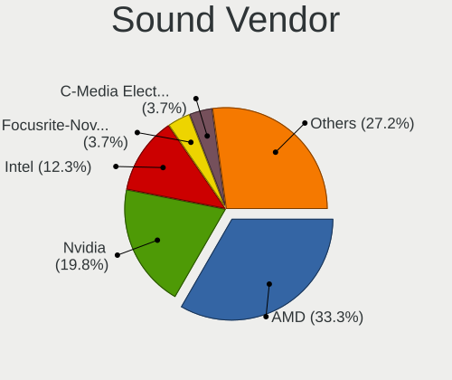

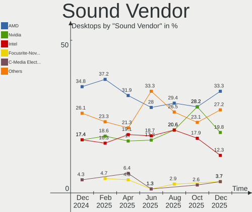

| Vendor                     | Desktops | Percent |
|----------------------------|----------|---------|
| AMD                        | 27       | 33.33%  |
| Nvidia                     | 16       | 19.75%  |
| Intel                      | 10       | 12.35%  |
| Focusrite-Novation         | 3        | 3.7%    |
| C-Media Electronics        | 3        | 3.7%    |
| Razer USA                  | 2        | 2.47%   |
| Micro Star International   | 2        | 2.47%   |
| Logitech                   | 2        | 2.47%   |
| ASUSTek Computer           | 2        | 2.47%   |
| Yamaha                     | 1        | 1.23%   |
| TT AUDIO                   | 1        | 1.23%   |
| Texas Instruments          | 1        | 1.23%   |
| SteelSeries ApS            | 1        | 1.23%   |
| SOMIC Industrial           | 1        | 1.23%   |
| Shure                      | 1        | 1.23%   |
| Schiit Audio               | 1        | 1.23%   |
| PreSonus Audio Electronics | 1        | 1.23%   |
| NZXT                       | 1        | 1.23%   |
| Meizu                      | 1        | 1.23%   |
| Kingston Technology        | 1        | 1.23%   |
| JMTek                      | 1        | 1.23%   |
| Corsair                    | 1        | 1.23%   |
| ASRock                     | 1        | 1.23%   |

Sound Model
-----------

Sound card models

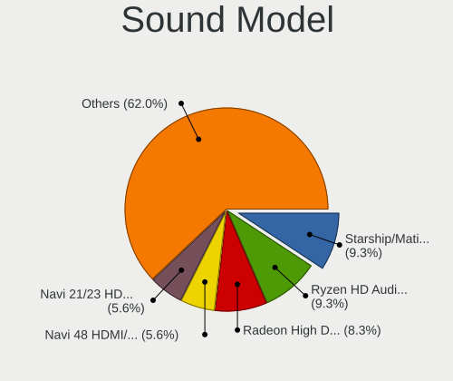

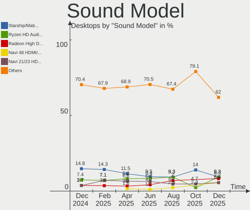

| Model                                                               | Desktops | Percent |
|---------------------------------------------------------------------|----------|---------|
| AMD Starship/Matisse HD Audio Controller                            | 10       | 9.26%   |
| AMD Ryzen HD Audio Controller                                       | 10       | 9.26%   |
| AMD Radeon High Definition Audio Controller                         | 9        | 8.33%   |
| AMD Navi 48 HDMI/DP Audio Controller                                | 6        | 5.56%   |
| AMD Navi 21/23 HDMI/DP Audio Controller                             | 6        | 5.56%   |
| Nvidia GA106 High Definition Audio Controller                       | 4        | 3.7%    |
| AMD Navi 31 HDMI/DP Audio                                           | 4        | 3.7%    |
| Nvidia AD104 High Definition Audio Controller                       | 3        | 2.78%   |
| AMD Family 17h (Models 00h-0fh) HD Audio Controller                 | 3        | 2.78%   |
| Nvidia TU104 HD Audio Controller                                    | 2        | 1.85%   |
| Micro Star International USB Audio                                  | 2        | 1.85%   |
| Intel Raptor Lake High Definition Audio Controller                  | 2        | 1.85%   |
| Intel Alder Lake-S HD Audio Controller                              | 2        | 1.85%   |
| Intel 8 Series/C220 Series Chipset High Definition Audio Controller | 2        | 1.85%   |
| ASUSTek Computer USB Audio                                          | 2        | 1.85%   |
| AMD Navi 10 HDMI Audio                                              | 2        | 1.85%   |
| AMD Ellesmere HDMI Audio [Radeon RX 470/480 / 570/580/590]          | 2        | 1.85%   |
| Yamaha Steinberg UR12                                               | 1        | 0.93%   |
| TT AUDIO TT USB AUDIO                                               | 1        | 0.93%   |
| Texas Instruments PCM2902 Audio Codec                               | 1        | 0.93%   |
| SteelSeries ApS SteelSeries Arctis Nova 5                           | 1        | 0.93%   |
| SOMIC Industrial G941_White_Shark                                   | 1        | 0.93%   |
| Shure MV7                                                           | 1        | 0.93%   |
| Schiit Audio Schiit Modi+                                           | 1        | 0.93%   |
| Razer USA Razer Seiren Mini                                         | 1        | 0.93%   |
| Razer USA Razer BlackShark V2 X USB                                 | 1        | 0.93%   |
| PreSonus Audio Electronics PreSonus AudioBox iTwo                   | 1        | 0.93%   |
| NZXT MINI USB MIC                                                   | 1        | 0.93%   |
| Nvidia TU106 High Definition Audio Controller                       | 1        | 0.93%   |
| Nvidia GP108 High Definition Audio Controller                       | 1        | 0.93%   |
| Nvidia GF106 High Definition Audio Controller                       | 1        | 0.93%   |
| Nvidia GB203 High Definition Audio Controller                       | 1        | 0.93%   |
| Nvidia AD107 High Definition Audio Controller                       | 1        | 0.93%   |
| Nvidia AD106M High Definition Audio Controller                      | 1        | 0.93%   |
| Nvidia AD103 High Definition Audio Controller                       | 1        | 0.93%   |
| Meizu Meizu HiFi DAC Headphone Amplifier                            | 1        | 0.93%   |
| Logitech [G533 Wireless Headset Dongle]                             | 1        | 0.93%   |
| Logitech G435 Wireless Gaming Headset                               | 1        | 0.93%   |
| Kingston Technology HyperX SoloCast                                 | 1        | 0.93%   |
| Kingston Technology HyperX Cloud Flight S                           | 1        | 0.93%   |

Memory
------

Memory Vendor
-------------

Memory module vendors

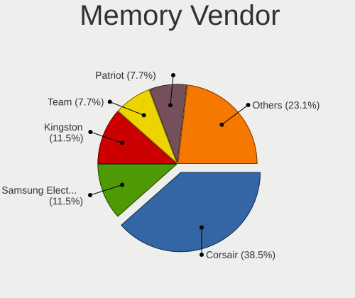

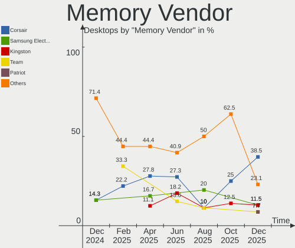

| Vendor              | Desktops | Percent |
|---------------------|----------|---------|
| Corsair             | 10       | 38.46%  |
| Samsung Electronics | 3        | 11.54%  |
| Kingston            | 3        | 11.54%  |
| Team                | 2        | 7.69%   |
| Patriot             | 2        | 7.69%   |
| G.Skill             | 2        | 7.69%   |
| Unknown             | 1        | 3.85%   |
| Micron Technology   | 1        | 3.85%   |
| Avant               | 1        | 3.85%   |
| Unknown             | 1        | 3.85%   |

Memory Model
------------

Memory module models

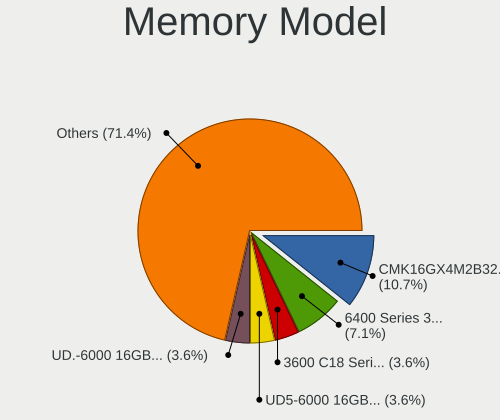

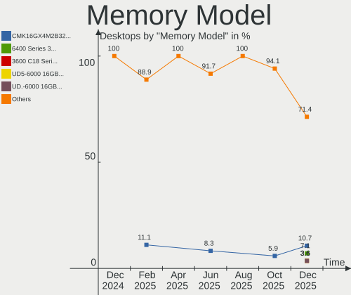

| Model                                                  | Desktops | Percent |
|--------------------------------------------------------|----------|---------|
| Corsair RAM CMK16GX4M2B3200C16 8GB DIMM DDR4 3600MT/s  | 3        | 10.71%  |
| Patriot RAM 6400 Series 32GB DIMM DDR5 6400MT/s        | 2        | 7.14%   |
| Unknown RAM 3600 C18 Series 16GB DIMM DDR4 2933MT/s    | 1        | 3.57%   |
| Team RAM UD5-6000 16GB DIMM DDR5 6000MT/s              | 1        | 3.57%   |
| Team RAM UD.-6000 16GB DIMM DDR5 4800MT/s              | 1        | 3.57%   |
| Team RAM TEAMGROUP-UD4-3200 8GB DIMM DDR4 3733MT/s     | 1        | 3.57%   |
| Samsung RAM Module 8GB DIMM DDR4 3200MT/s              | 1        | 3.57%   |
| Samsung RAM Module 8GB DIMM DDR3 1333MT/s              | 1        | 3.57%   |
| Samsung RAM M471A1K43EB1-CWE 8GB SODIMM DDR4 3200MT/s  | 1        | 3.57%   |
| Samsung RAM M471A1K43DB1-CWE 8GB SODIMM DDR4 3200MT/s  | 1        | 3.57%   |
| Micron RAM CP16G56C46U5.C8D 16GB DIMM DDR5 5600MT/s    | 1        | 3.57%   |
| Kingston RAM KHX2400C12D4/8GX 8GiB DIMM DDR4 2400MT/s  | 1        | 3.57%   |
| Kingston RAM KF556C40-32 32GB DIMM DDR5 6000MT/s       | 1        | 3.57%   |
| Kingston RAM KF2666C16D4/8G 8GB DIMM DDR4 2667MT/s     | 1        | 3.57%   |
| G.Skill RAM F5-6000J3040G32G 32GB DIMM DDR5 6200MT/s   | 1        | 3.57%   |
| G.Skill RAM F4-3600C16-16GVKC 16GB DIMM DDR4 3866MT/s  | 1        | 3.57%   |
| Corsair RAM CMK64GX5M2B6000Z30 32GB DIMM DDR5 6000MT/s | 1        | 3.57%   |
| Corsair RAM CMK32GX4M2E3200C16 16GB DIMM DDR4 3600MT/s | 1        | 3.57%   |
| Corsair RAM CMK32GX4M2B3200C16 16GB DIMM DDR4 3800MT/s | 1        | 3.57%   |
| Corsair RAM CMK32GX4M2A2666C16 16GB DIMM DDR4 2667MT/s | 1        | 3.57%   |
| Corsair RAM CMK16GX4M2D3600C18 8GB DIMM DDR4 4000MT/s  | 1        | 3.57%   |
| Corsair RAM CMK16GX4M2B3000C15 8GB DIMM DDR4 3600MT/s  | 1        | 3.57%   |
| Corsair RAM CMD16GX4M2B3000C15 8GB DIMM DDR4 3100MT/s  | 1        | 3.57%   |
| Avant RAM W642GU42J5213N8 16GB DIMM DDR4 2133MT/s      | 1        | 3.57%   |
| Unknown                                                | 1        | 3.57%   |

Memory Kind
-----------

Memory module kinds

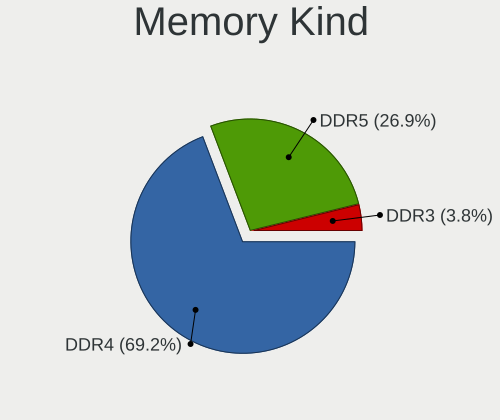

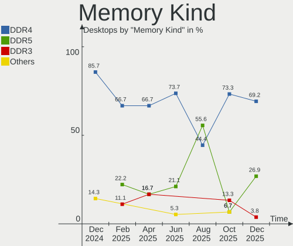

| Kind | Desktops | Percent |
|------|----------|---------|
| DDR4 | 18       | 69.23%  |
| DDR5 | 7        | 26.92%  |
| DDR3 | 1        | 3.85%   |

Memory Form Factor
------------------

Physical design of the memory module

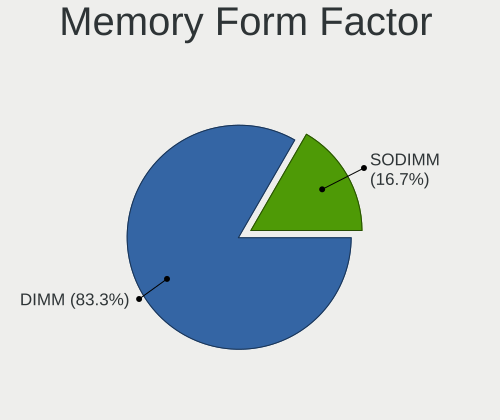

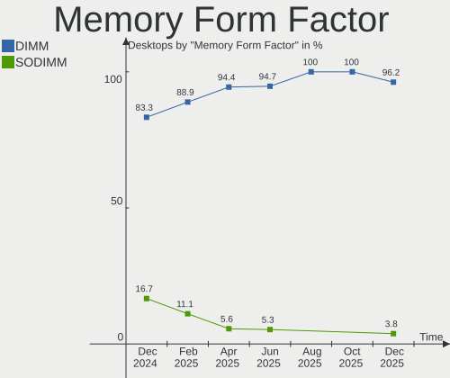

| Name   | Desktops | Percent |
|--------|----------|---------|
| DIMM   | 25       | 96.15%  |
| SODIMM | 1        | 3.85%   |

Memory Size
-----------

Memory module size

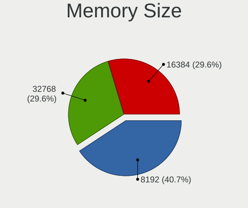

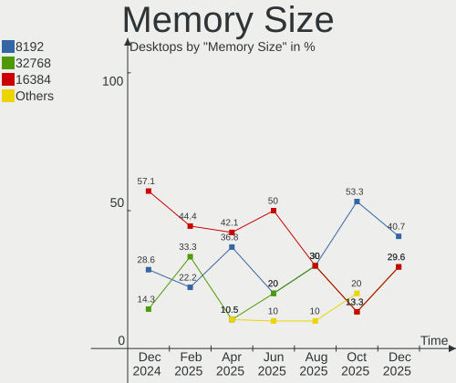

| Size  | Desktops | Percent |
|-------|----------|---------|
| 8192  | 11       | 40.74%  |
| 32768 | 8        | 29.63%  |
| 16384 | 8        | 29.63%  |

Memory Speed
------------

Memory module speed

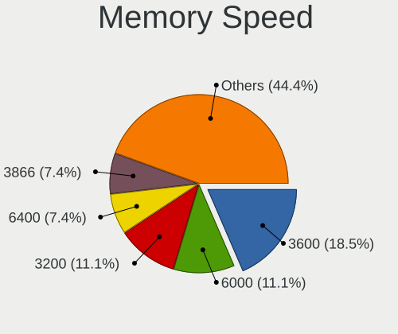

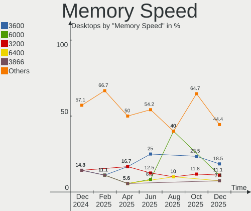

| Speed | Desktops | Percent |
|-------|----------|---------|
| 3600  | 5        | 18.52%  |
| 6000  | 3        | 11.11%  |
| 3200  | 3        | 11.11%  |
| 6400  | 2        | 7.41%   |
| 3866  | 2        | 7.41%   |
| 3100  | 2        | 7.41%   |
| 6200  | 1        | 3.7%    |
| 5600  | 1        | 3.7%    |
| 4800  | 1        | 3.7%    |
| 4000  | 1        | 3.7%    |
| 3800  | 1        | 3.7%    |
| 3733  | 1        | 3.7%    |
| 2667  | 1        | 3.7%    |
| 2400  | 1        | 3.7%    |
| 2133  | 1        | 3.7%    |
| 1333  | 1        | 3.7%    |

Printers & scanners
-------------------

Printer Vendor
--------------

Printer device vendors

Zero info for selected period =(

Printer Model
-------------

Printer device models

Zero info for selected period =(

Scanner Vendor
--------------

Scanner device vendors

Zero info for selected period =(

Scanner Model
-------------

Scanner device models

Zero info for selected period =(

Camera
------

Camera Vendor
-------------

Camera device vendors

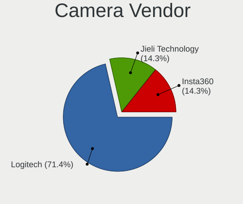

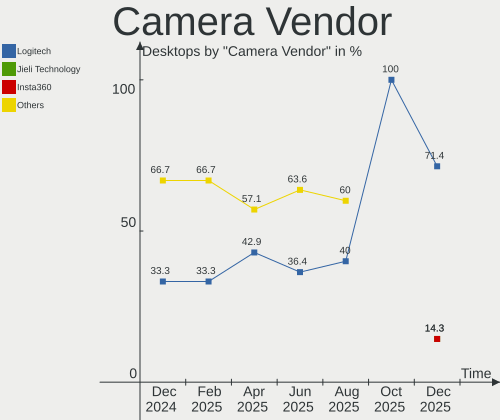

| Vendor           | Desktops | Percent |
|------------------|----------|---------|
| Logitech         | 5        | 71.43%  |
| Jieli Technology | 1        | 14.29%  |
| Insta360         | 1        | 14.29%  |

Camera Model
------------

Camera device models

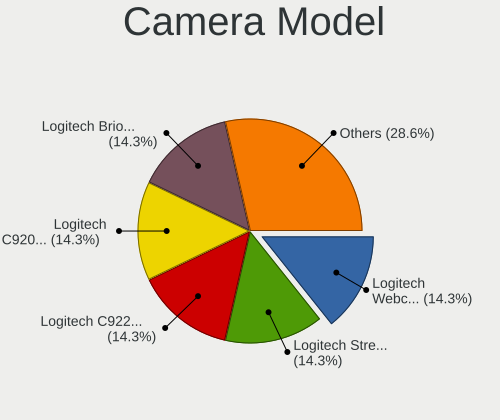

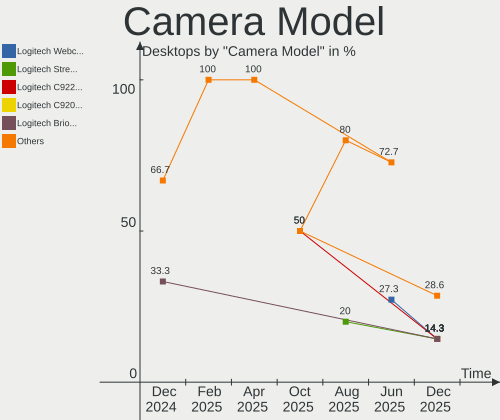

| Model                           | Desktops | Percent |
|---------------------------------|----------|---------|
| Logitech Webcam C270            | 1        | 14.29%  |
| Logitech StreamCam              | 1        | 14.29%  |
| Logitech C922 Pro Stream Webcam | 1        | 14.29%  |
| Logitech C920 PRO HD Webcam     | 1        | 14.29%  |
| Logitech Brio 101               | 1        | 14.29%  |
| Jieli USB Composite Device      | 1        | 14.29%  |
| Insta360 Link 2                 | 1        | 14.29%  |

Security
--------

Fingerprint Vendor
------------------

Fingerprint sensor vendors

Zero info for selected period =(

Fingerprint Model
-----------------

Fingerprint sensor models

Zero info for selected period =(

Chipcard Vendor
---------------

Chipcard module vendors

Zero info for selected period =(

Chipcard Model
--------------

Chipcard module models

Zero info for selected period =(

Unsupported
-----------

Unsupported Devices
-------------------

Total unsupported devices on board

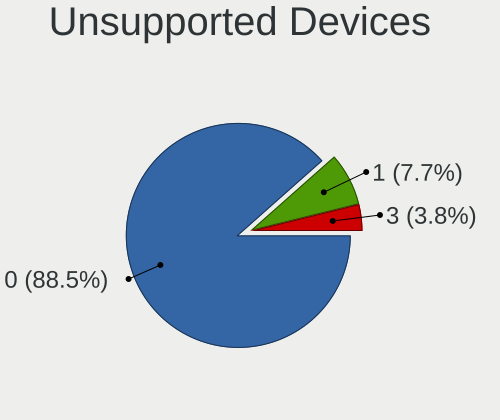

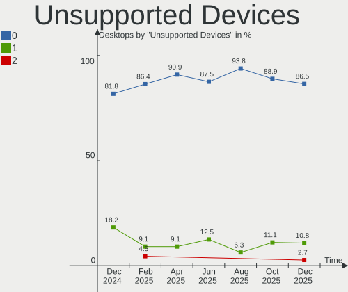

| Total | Desktops | Percent |
|-------|----------|---------|
| 0     | 32       | 86.49%  |
| 1     | 4        | 10.81%  |
| 2     | 1        | 2.7%    |

Unsupported Device Types
------------------------

Types of unsupported devices

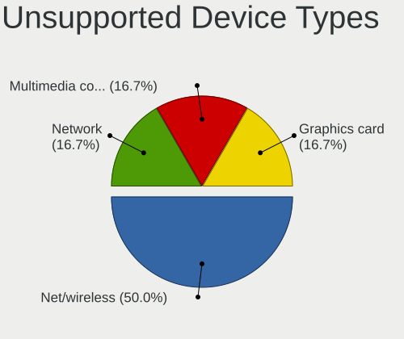

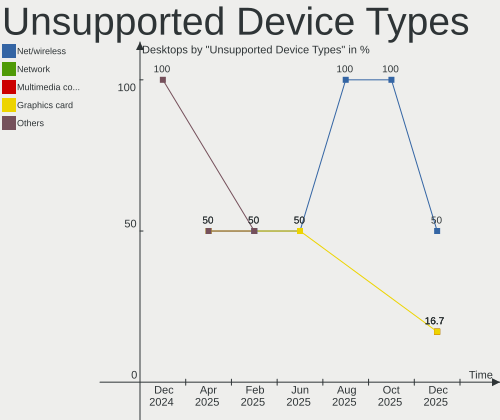

| Type                  | Desktops | Percent |
|-----------------------|----------|---------|
| Net/wireless          | 3        | 50%     |
| Network               | 1        | 16.67%  |
| Multimedia controller | 1        | 16.67%  |
| Graphics card         | 1        | 16.67%  |

