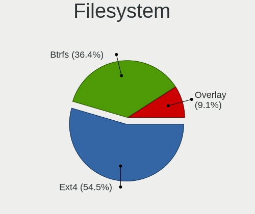
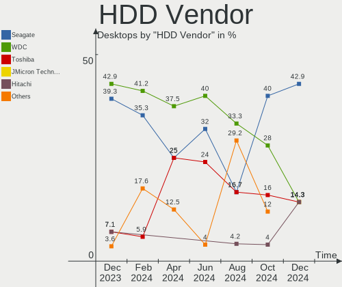
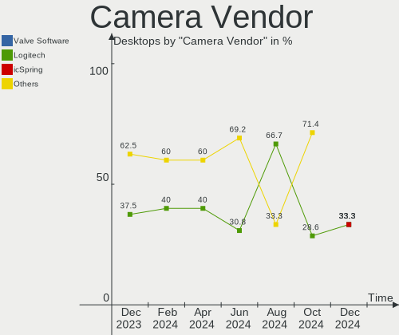
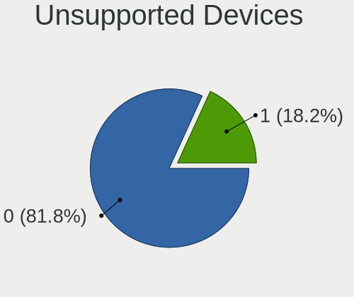

EndeavourOS - Hardware Trends (Desktops)
----------------------------------------

A project to identify most popular hardware characteristics and track their change
over time based on data collected by Linux users at https://Linux-Hardware.org.

Anyone can contribute to this report by the [hw-probe](https://github.com/linuxhw/hw-probe) tool:

    sudo -E hw-probe -all -upload

This report is for one last month. Overall report since the beginning of time: [TestDays](https://github.com/linuxhw/TestDays)

Period: Sep, 2023.

Contents
--------

* [ System ](#system)
  - [ OS                       ](#os)
  - [ OS Family                ](#os-family)
  - [ Kernel                   ](#kernel)
  - [ Kernel Family            ](#kernel-family)
  - [ Kernel Major Ver.        ](#kernel-major-ver)
  - [ Arch                     ](#arch)
  - [ DE                       ](#de)
  - [ Display Server           ](#display-server)
  - [ Display Manager          ](#display-manager)
  - [ OS Lang                  ](#os-lang)
  - [ Boot Mode                ](#boot-mode)
  - [ Filesystem               ](#filesystem)
  - [ Part. scheme             ](#part-scheme)
  - [ Dual Boot with Linux/BSD ](#dual-boot-with-linuxbsd)
  - [ Dual Boot (Win)          ](#dual-boot-win)

* [ Board ](#board)
  - [ Vendor                   ](#vendor)
  - [ Model                    ](#model)
  - [ Model Family             ](#model-family)
  - [ MFG Year                 ](#mfg-year)
  - [ Form Factor              ](#form-factor)
  - [ Secure Boot              ](#secure-boot)
  - [ Coreboot                 ](#coreboot)
  - [ RAM Size                 ](#ram-size)
  - [ RAM Used                 ](#ram-used)
  - [ Total Drives             ](#total-drives)
  - [ Has CD-ROM               ](#has-cd-rom)
  - [ Has Ethernet             ](#has-ethernet)
  - [ Has WiFi                 ](#has-wifi)
  - [ Has Bluetooth            ](#has-bluetooth)

* [ Location ](#location)
  - [ Country                  ](#country)
  - [ City                     ](#city)

* [ Drives ](#drives)
  - [ Drive Vendor             ](#drive-vendor)
  - [ Drive Model              ](#drive-model)
  - [ HDD Vendor               ](#hdd-vendor)
  - [ SSD Vendor               ](#ssd-vendor)
  - [ Drive Kind               ](#drive-kind)
  - [ Drive Connector          ](#drive-connector)
  - [ Drive Size               ](#drive-size)
  - [ Space Total              ](#space-total)
  - [ Space Used               ](#space-used)
  - [ Malfunc. Drives          ](#malfunc-drives)
  - [ Malfunc. Drive Vendor    ](#malfunc-drive-vendor)
  - [ Malfunc. HDD Vendor      ](#malfunc-hdd-vendor)
  - [ Malfunc. Drive Kind      ](#malfunc-drive-kind)
  - [ Failed Drives            ](#failed-drives)
  - [ Failed Drive Vendor      ](#failed-drive-vendor)
  - [ Drive Status             ](#drive-status)

* [ Storage controller ](#storage-controller)
  - [ Storage Vendor           ](#storage-vendor)
  - [ Storage Model            ](#storage-model)
  - [ Storage Kind             ](#storage-kind)

* [ Processor ](#processor)
  - [ CPU Vendor               ](#cpu-vendor)
  - [ CPU Model                ](#cpu-model)
  - [ CPU Model Family         ](#cpu-model-family)
  - [ CPU Cores                ](#cpu-cores)
  - [ CPU Sockets              ](#cpu-sockets)
  - [ CPU Threads              ](#cpu-threads)
  - [ CPU Op-Modes             ](#cpu-op-modes)
  - [ CPU Microcode            ](#cpu-microcode)
  - [ CPU Microarch            ](#cpu-microarch)

* [ Graphics ](#graphics)
  - [ GPU Vendor               ](#gpu-vendor)
  - [ GPU Model                ](#gpu-model)
  - [ GPU Combo                ](#gpu-combo)
  - [ GPU Driver               ](#gpu-driver)
  - [ GPU Memory               ](#gpu-memory)

* [ Monitor ](#monitor)
  - [ Monitor Vendor           ](#monitor-vendor)
  - [ Monitor Model            ](#monitor-model)
  - [ Monitor Resolution       ](#monitor-resolution)
  - [ Monitor Diagonal         ](#monitor-diagonal)
  - [ Monitor Width            ](#monitor-width)
  - [ Aspect Ratio             ](#aspect-ratio)
  - [ Monitor Area             ](#monitor-area)
  - [ Pixel Density            ](#pixel-density)
  - [ Multiple Monitors        ](#multiple-monitors)

* [ Network ](#network)
  - [ Net Controller Vendor    ](#net-controller-vendor)
  - [ Net Controller Model     ](#net-controller-model)
  - [ Wireless Vendor          ](#wireless-vendor)
  - [ Wireless Model           ](#wireless-model)
  - [ Ethernet Vendor          ](#ethernet-vendor)
  - [ Ethernet Model           ](#ethernet-model)
  - [ Net Controller Kind      ](#net-controller-kind)
  - [ Used Controller          ](#used-controller)
  - [ NICs                     ](#nics)
  - [ IPv6                     ](#ipv6)

* [ Bluetooth ](#bluetooth)
  - [ Bluetooth Vendor         ](#bluetooth-vendor)
  - [ Bluetooth Model          ](#bluetooth-model)

* [ Sound ](#sound)
  - [ Sound Vendor             ](#sound-vendor)
  - [ Sound Model              ](#sound-model)

* [ Memory ](#memory)
  - [ Memory Vendor            ](#memory-vendor)
  - [ Memory Model             ](#memory-model)
  - [ Memory Kind              ](#memory-kind)
  - [ Memory Form Factor       ](#memory-form-factor)
  - [ Memory Size              ](#memory-size)
  - [ Memory Speed             ](#memory-speed)

* [ Printers & scanners ](#printers--scanners)
  - [ Printer Vendor           ](#printer-vendor)
  - [ Printer Model            ](#printer-model)
  - [ Scanner Vendor           ](#scanner-vendor)
  - [ Scanner Model            ](#scanner-model)

* [ Camera ](#camera)
  - [ Camera Vendor            ](#camera-vendor)
  - [ Camera Model             ](#camera-model)

* [ Security ](#security)
  - [ Fingerprint Vendor       ](#fingerprint-vendor)
  - [ Fingerprint Model        ](#fingerprint-model)
  - [ Chipcard Vendor          ](#chipcard-vendor)
  - [ Chipcard Model           ](#chipcard-model)

* [ Unsupported ](#unsupported)
  - [ Unsupported Devices      ](#unsupported-devices)
  - [ Unsupported Device Types ](#unsupported-device-types)

System
------

OS
--

Installed operating systems

| Name                | Desktops | Percent |
|---------------------|----------|---------|
| EndeavourOS Rolling | 24       | 100%    |

OS Family
---------

OS without a version

| Name        | Desktops | Percent |
|-------------|----------|---------|
| EndeavourOS | 24       | 100%    |

Kernel
------

Version of the Linux kernel

| Version            | Desktops | Percent |
|--------------------|----------|---------|
| 6.4.12-arch1-1     | 7        | 29.17%  |
| 6.5.3-arch1-1      | 5        | 20.83%  |
| 6.5.3-zen1-1-zen   | 3        | 12.5%   |
| 6.5.4-arch2-1      | 2        | 8.33%   |
| 6.4.12-zen1-1-zen  | 2        | 8.33%   |
| 6.1.50-1-lts       | 2        | 8.33%   |
| 6.5.5-arch1-1      | 1        | 4.17%   |
| 6.5.4-zen2-1.1-zen | 1        | 4.17%   |
| 6.4.2-arch1-1      | 1        | 4.17%   |

Kernel Family
-------------

Linux kernel without a distro release

| Version | Desktops | Percent |
|---------|----------|---------|
| 6.4.12  | 9        | 37.5%   |
| 6.5.3   | 8        | 33.33%  |
| 6.5.4   | 3        | 12.5%   |
| 6.1.50  | 2        | 8.33%   |
| 6.5.5   | 1        | 4.17%   |
| 6.4.2   | 1        | 4.17%   |

Kernel Major Ver.
-----------------

Linux kernel major version

| Version | Desktops | Percent |
|---------|----------|---------|
| 6.5     | 12       | 50%     |
| 6.4     | 10       | 41.67%  |
| 6.1     | 2        | 8.33%   |

Arch
----

OS architecture (x86_64, i586, etc.)

| Name   | Desktops | Percent |
|--------|----------|---------|
| x86_64 | 24       | 100%    |

DE
--

Desktop Environment

| Name       | Desktops | Percent |
|------------|----------|---------|
| KDE5       | 17       | 70.83%  |
| XFCE       | 2        | 8.33%   |
| X-Cinnamon | 2        | 8.33%   |
| GNOME      | 2        | 8.33%   |
| Cinnamon   | 1        | 4.17%   |

Display Server
--------------

X11 or Wayland

| Name    | Desktops | Percent |
|---------|----------|---------|
| X11     | 19       | 79.17%  |
| Wayland | 3        | 12.5%   |
| Tty     | 1        | 4.17%   |
| Unknown | 1        | 4.17%   |

Display Manager
---------------

SDDM, LightDM, etc.

| Name    | Desktops | Percent |
|---------|----------|---------|
| LightDM | 9        | 37.5%   |
| Unknown | 9        | 37.5%   |
| SDDM    | 6        | 25%     |

OS Lang
-------

Language

| Lang  | Desktops | Percent |
|-------|----------|---------|
| en_US | 12       | 50%     |
| nl_NL | 2        | 8.33%   |
| en_GB | 2        | 8.33%   |
| ru_RU | 1        | 4.17%   |
| pt_BR | 1        | 4.17%   |
| pl_PL | 1        | 4.17%   |
| fr_FR | 1        | 4.17%   |
| fi_FI | 1        | 4.17%   |
| en_CA | 1        | 4.17%   |
| en_BW | 1        | 4.17%   |
| de_DE | 1        | 4.17%   |

Boot Mode
---------

EFI or BIOS

| Mode | Desktops | Percent |
|------|----------|---------|
| EFI  | 14       | 58.33%  |
| BIOS | 10       | 41.67%  |

Filesystem
----------

Type of filesystem

| Type  | Desktops | Percent |
|-------|----------|---------|
| Ext4  | 18       | 75%     |
| Btrfs | 5        | 20.83%  |
| Tmpfs | 1        | 4.17%   |

Part. scheme
------------

Scheme of partitioning

| Type    | Desktops | Percent |
|---------|----------|---------|
| GPT     | 14       | 58.33%  |
| Unknown | 9        | 37.5%   |
| MBR     | 1        | 4.17%   |

Dual Boot with Linux/BSD
------------------------

Hosting more than one Linux/BSD

| Dual boot | Desktops | Percent |
|-----------|----------|---------|
| No        | 21       | 87.5%   |
| Yes       | 3        | 12.5%   |

Dual Boot (Win)
---------------

Hosting Linux and Windows

| Dual boot | Desktops | Percent |
|-----------|----------|---------|
| No        | 13       | 54.17%  |
| Yes       | 11       | 45.83%  |

Board
-----

Vendor
------

Motherboard manufacturer

| Name                | Desktops | Percent |
|---------------------|----------|---------|
| ASUSTek Computer    | 11       | 45.83%  |
| Gigabyte Technology | 4        | 16.67%  |
| MSI                 | 3        | 12.5%   |
| ASRock              | 2        | 8.33%   |
| Positivo            | 1        | 4.17%   |
| Hewlett-Packard     | 1        | 4.17%   |
| Dell                | 1        | 4.17%   |
| Acer                | 1        | 4.17%   |

Model
-----

Motherboard model

| Name                         | Desktops | Percent |
|------------------------------|----------|---------|
| ASUS PRIME A320M-K           | 2        | 8.33%   |
| Positivo POS-PIH81DI         | 1        | 4.17%   |
| MSI MS-7D85                  | 1        | 4.17%   |
| MSI MS-7C94                  | 1        | 4.17%   |
| MSI MS-7821                  | 1        | 4.17%   |
| HP Z440 Workstation          | 1        | 4.17%   |
| Gigabyte X670 AORUS ELITE AX | 1        | 4.17%   |
| Gigabyte P55A-UD3            | 1        | 4.17%   |
| Gigabyte B550 AORUS ELITE V2 | 1        | 4.17%   |
| Gigabyte B250M-D3H           | 1        | 4.17%   |
| Dell G5 5000                 | 1        | 4.17%   |
| ASUS Z170M-PLUS              | 1        | 4.17%   |
| ASUS TUF Gaming X570-PRO     | 1        | 4.17%   |
| ASUS TUF Gaming X570-PLUS    | 1        | 4.17%   |
| ASUS ROG Maximus XI EXTREME  | 1        | 4.17%   |
| ASUS ROG CROSSHAIR VIII HERO | 1        | 4.17%   |
| ASUS PRIME X570-P            | 1        | 4.17%   |
| ASUS PRIME H770-PLUS         | 1        | 4.17%   |
| ASUS PRIME B450M-A II        | 1        | 4.17%   |
| ASUS PRIME B450-PLUS         | 1        | 4.17%   |
| ASRock B450M/ac R2.0         | 1        | 4.17%   |
| ASRock B450M Pro4            | 1        | 4.17%   |
| Acer Aspire GX-785           | 1        | 4.17%   |

Model Family
------------

Motherboard model prefix

| Name                 | Desktops | Percent |
|----------------------|----------|---------|
| ASUS PRIME           | 6        | 25%     |
| ASUS TUF             | 2        | 8.33%   |
| ASUS ROG             | 2        | 8.33%   |
| ASRock B450M         | 2        | 8.33%   |
| Positivo POS-PIH81DI | 1        | 4.17%   |
| MSI MS-7D85          | 1        | 4.17%   |
| MSI MS-7C94          | 1        | 4.17%   |
| MSI MS-7821          | 1        | 4.17%   |
| HP Z440              | 1        | 4.17%   |
| Gigabyte X670        | 1        | 4.17%   |
| Gigabyte P55A-UD3    | 1        | 4.17%   |
| Gigabyte B550        | 1        | 4.17%   |
| Gigabyte B250M-D3H   | 1        | 4.17%   |
| Dell G5              | 1        | 4.17%   |
| ASUS Z170M-PLUS      | 1        | 4.17%   |
| Acer Aspire          | 1        | 4.17%   |

MFG Year
--------

Motherboard manufacture year

| Year | Desktops | Percent |
|------|----------|---------|
| 2020 | 6        | 25%     |
| 2019 | 3        | 12.5%   |
| 2023 | 2        | 8.33%   |
| 2018 | 2        | 8.33%   |
| 2017 | 2        | 8.33%   |
| 2016 | 2        | 8.33%   |
| 2015 | 2        | 8.33%   |
| 2022 | 1        | 4.17%   |
| 2021 | 1        | 4.17%   |
| 2014 | 1        | 4.17%   |
| 2013 | 1        | 4.17%   |
| 2009 | 1        | 4.17%   |

Form Factor
-----------

Physical design of the computer

| Name    | Desktops | Percent |
|---------|----------|---------|
| Desktop | 24       | 100%    |

Secure Boot
-----------

Enabled or disabled

| State    | Desktops | Percent |
|----------|----------|---------|
| Disabled | 23       | 95.83%  |
| Enabled  | 1        | 4.17%   |

Coreboot
--------

Have coreboot on board

| Used | Desktops | Percent |
|------|----------|---------|
| No   | 24       | 100%    |

RAM Size
--------

Total RAM memory

| Size in GB  | Desktops | Percent |
|-------------|----------|---------|
| 32.01-64.0  | 8        | 33.33%  |
| 16.01-24.0  | 5        | 20.83%  |
| 64.01-256.0 | 4        | 16.67%  |
| 8.01-16.0   | 4        | 16.67%  |
| 24.01-32.0  | 3        | 12.5%   |

RAM Used
--------

Used RAM memory

| Used GB    | Desktops | Percent |
|------------|----------|---------|
| 4.01-8.0   | 11       | 45.83%  |
| 3.01-4.0   | 3        | 12.5%   |
| 2.01-3.0   | 3        | 12.5%   |
| 1.01-2.0   | 3        | 12.5%   |
| 16.01-24.0 | 2        | 8.33%   |
| 8.01-16.0  | 1        | 4.17%   |
| 0.51-1.0   | 1        | 4.17%   |

Total Drives
------------

Number of drives on board

| Drives | Desktops | Percent |
|--------|----------|---------|
| 2      | 8        | 33.33%  |
| 4      | 5        | 20.83%  |
| 3      | 4        | 16.67%  |
| 6      | 3        | 12.5%   |
| 5      | 2        | 8.33%   |
| 1      | 2        | 8.33%   |

Has CD-ROM
----------

Has CD-ROM on board

| Presented | Desktops | Percent |
|-----------|----------|---------|
| No        | 22       | 91.67%  |
| Yes       | 2        | 8.33%   |

Has Ethernet
------------

Has Ethernet on board

| Presented | Desktops | Percent |
|-----------|----------|---------|
| Yes       | 24       | 100%    |

Has WiFi
--------

Has WiFi module

| Presented | Desktops | Percent |
|-----------|----------|---------|
| Yes       | 14       | 58.33%  |
| No        | 10       | 41.67%  |

Has Bluetooth
-------------

Has Bluetooth module

| Presented | Desktops | Percent |
|-----------|----------|---------|
| Yes       | 13       | 54.17%  |
| No        | 11       | 45.83%  |

Location
--------

Country
-------

Geographic location (country)

| Country      | Desktops | Percent |
|--------------|----------|---------|
| USA          | 9        | 37.5%   |
| Mexico       | 4        | 16.67%  |
| Germany      | 3        | 12.5%   |
| France       | 2        | 8.33%   |
| UK           | 1        | 4.17%   |
| South Africa | 1        | 4.17%   |
| Russia       | 1        | 4.17%   |
| Poland       | 1        | 4.17%   |
| Finland      | 1        | 4.17%   |
| Brazil       | 1        | 4.17%   |

City
----

Geographic location (city)

| City                  | Desktops | Percent |
|-----------------------|----------|---------|
| San Luis Potosí City | 3        | 12.5%   |
| Tucson                | 2        | 8.33%   |
| Frankfurt am Main     | 2        | 8.33%   |
| Waxahachie            | 1        | 4.17%   |
| Turku                 | 1        | 4.17%   |
| Słupsk               | 1        | 4.17%   |
| Seattle               | 1        | 4.17%   |
| Sao Paulo             | 1        | 4.17%   |
| Rennes                | 1        | 4.17%   |
| Piethen               | 1        | 4.17%   |
| Orlando               | 1        | 4.17%   |
| Moscow                | 1        | 4.17%   |
| Mexico City           | 1        | 4.17%   |
| Loupian               | 1        | 4.17%   |
| Livermore             | 1        | 4.17%   |
| Harringay             | 1        | 4.17%   |
| Clemson               | 1        | 4.17%   |
| Chicago               | 1        | 4.17%   |
| Charlotte             | 1        | 4.17%   |
| Centurion             | 1        | 4.17%   |

Drives
------

Drive Vendor
------------

Hard drive vendors

| Vendor                      | Desktops | Drives | Percent |
|-----------------------------|----------|--------|---------|
| Samsung Electronics         | 13       | 19     | 19.12%  |
| WDC                         | 9        | 10     | 13.24%  |
| Seagate                     | 6        | 7      | 8.82%   |
| Kingston                    | 5        | 5      | 7.35%   |
| Intel                       | 5        | 5      | 7.35%   |
| SK hynix                    | 4        | 4      | 5.88%   |
| SanDisk                     | 3        | 4      | 4.41%   |
| A-DATA Technology           | 3        | 4      | 4.41%   |
| Patriot                     | 2        | 2      | 2.94%   |
| Crucial                     | 2        | 2      | 2.94%   |
| Unknown                     | 1        | 1      | 1.47%   |
| Toshiba                     | 1        | 1      | 1.47%   |
| SPCC                        | 1        | 1      | 1.47%   |
| Silicon Motion              | 1        | 1      | 1.47%   |
| Seagate Technology          | 1        | 1      | 1.47%   |
| Micron/Crucial Technology   | 1        | 1      | 1.47%   |
| Micron Technology           | 1        | 1      | 1.47%   |
| KIOXIA                      | 1        | 1      | 1.47%   |
| Kingston Technology Company | 1        | 1      | 1.47%   |
| JMicron Technology          | 1        | 1      | 1.47%   |
| Hitachi                     | 1        | 2      | 1.47%   |
| G-DRIVE                     | 1        | 1      | 1.47%   |
| China                       | 1        | 1      | 1.47%   |
| ASMT                        | 1        | 1      | 1.47%   |
| Apple                       | 1        | 1      | 1.47%   |
| ADATA Technology            | 1        | 1      | 1.47%   |

Drive Model
-----------

Hard drive models

| Model                                                 | Desktops | Percent |
|-------------------------------------------------------|----------|---------|
| Samsung NVMe SSD Controller SM981/PM981/PM983 256GB   | 5        | 6.67%   |
| Kingston SA400S37240G 240GB SSD                       | 5        | 6.67%   |
| Samsung NVMe SSD Controller PM9A1/PM9A3/980PRO 1TB    | 3        | 4%      |
| Intel SSD Pro 7600p/760p/E 6100p Series 1TB           | 3        | 4%      |
| SK hynix C2S3T/240G 240GB                             | 2        | 2.67%   |
| Seagate ST500LT012-9WS142 500GB                       | 2        | 2.67%   |
| Seagate ST2000DM008-2FR102 2TB                        | 2        | 2.67%   |
| Samsung SSD 980 1TB                                   | 2        | 2.67%   |
| Samsung HD103SJ 1TB                                   | 2        | 2.67%   |
| Patriot Burst Elite 960GB SSD                         | 2        | 2.67%   |
| A-DATA HV300 500GB SSD                                | 2        | 2.67%   |
| WDC WDS120G2G0A-00JH30 120GB SSD                      | 1        | 1.33%   |
| WDC WDS100T2B0A-00SM50 1TB SSD                        | 1        | 1.33%   |
| WDC WD4005FZBX-00K5WB0 4TB                            | 1        | 1.33%   |
| WDC WD20PURX-64P6ZY0 2TB                              | 1        | 1.33%   |
| WDC WD20EARX-00PASB0 2TB                              | 1        | 1.33%   |
| WDC WD10EZEX-60ZF5A0 1TB                              | 1        | 1.33%   |
| WDC WD10EZEX-22MFCA0 1TB                              | 1        | 1.33%   |
| WDC WD10EZEX-21WN4A0 1TB                              | 1        | 1.33%   |
| WDC WD10EZEX-08WN4A0 1TB                              | 1        | 1.33%   |
| WDC WD10EZEX-00BN5A0 1TB                              | 1        | 1.33%   |
| Unknown SD/MMC/MS PRO 128GB                           | 1        | 1.33%   |
| Toshiba MQ01ABD100 1TB                                | 1        | 1.33%   |
| SPCC Solid State Disk 1TB                             | 1        | 1.33%   |
| SK hynix SC308 SATA 256GB SSD                         | 1        | 1.33%   |
| SK hynix SC300 2.5 7MM 128GB SSD                      | 1        | 1.33%   |
| Silicon Motion SM2263EN/SM2263XT SSD Controller 512GB | 1        | 1.33%   |
| Seagate ZP1000GM30004 1TB                             | 1        | 1.33%   |
| Seagate ST2000DX001-1CM164 2TB                        | 1        | 1.33%   |
| Seagate ST16000NM001G-2KK103 16TB                     | 1        | 1.33%   |
| Seagate ST1500DL003-9VT16L 1TB                        | 1        | 1.33%   |
| Sandisk WD_BLACK SN850X 2000GB                        | 1        | 1.33%   |
| SanDisk SDSSDX120GG25 120GB                           | 1        | 1.33%   |
| SanDisk Extreme 55AE 1TB SSD                          | 1        | 1.33%   |
| Samsung SSD 870 EVO 1TB                               | 1        | 1.33%   |
| Samsung SSD 860 EVO 1TB                               | 1        | 1.33%   |
| Samsung SSD 850 EVO 500GB                             | 1        | 1.33%   |
| Samsung SSD 850 EVO 250GB                             | 1        | 1.33%   |
| Samsung SSD 840 Series 250GB                          | 1        | 1.33%   |
| Micron/Crucial P2 NVMe PCIe SSD 1TB                   | 1        | 1.33%   |

HDD Vendor
----------

Hard disk drive vendors

| Vendor              | Desktops | Drives | Percent |
|---------------------|----------|--------|---------|
| WDC                 | 7        | 8      | 36.84%  |
| Seagate             | 6        | 7      | 31.58%  |
| Samsung Electronics | 2        | 2      | 10.53%  |
| Unknown             | 1        | 1      | 5.26%   |
| Toshiba             | 1        | 1      | 5.26%   |
| Hitachi             | 1        | 2      | 5.26%   |
| Apple               | 1        | 1      | 5.26%   |

SSD Vendor
----------

Solid state drive vendors

| Vendor              | Desktops | Drives | Percent |
|---------------------|----------|--------|---------|
| Samsung Electronics | 5        | 6      | 17.24%  |
| Kingston            | 5        | 5      | 17.24%  |
| SK hynix            | 4        | 4      | 13.79%  |
| A-DATA Technology   | 3        | 4      | 10.34%  |
| WDC                 | 2        | 2      | 6.9%    |
| SanDisk             | 2        | 2      | 6.9%    |
| Patriot             | 2        | 2      | 6.9%    |
| Crucial             | 2        | 2      | 6.9%    |
| SPCC                | 1        | 1      | 3.45%   |
| Micron Technology   | 1        | 1      | 3.45%   |
| China               | 1        | 1      | 3.45%   |
| ASMT                | 1        | 1      | 3.45%   |

Drive Kind
----------

HDD or SSD

| Kind    | Desktops | Drives | Percent |
|---------|----------|--------|---------|
| NVMe    | 17       | 24     | 32.69%  |
| SSD     | 17       | 31     | 32.69%  |
| HDD     | 16       | 22     | 30.77%  |
| Unknown | 2        | 2      | 3.85%   |

Drive Connector
---------------

SATA, SAS, NVMe, etc.

| Type | Desktops | Drives | Percent |
|------|----------|--------|---------|
| SATA | 20       | 48     | 46.51%  |
| NVMe | 17       | 24     | 39.53%  |
| SAS  | 6        | 7      | 13.95%  |

Drive Size
----------

Size of hard drive

| Size in TB | Desktops | Drives | Percent |
|------------|----------|--------|---------|
| 0.51-1.0   | 15       | 21     | 40.54%  |
| 0.01-0.5   | 14       | 24     | 37.84%  |
| 1.01-2.0   | 6        | 6      | 16.22%  |
| 3.01-4.0   | 1        | 1      | 2.7%    |
| 10.01-20.0 | 1        | 1      | 2.7%    |

Space Total
-----------

Amount of disk space available on the file system

| Size in GB     | Desktops | Percent |
|----------------|----------|---------|
| 1001-2000      | 7        | 29.17%  |
| 501-1000       | 5        | 20.83%  |
| More than 3000 | 3        | 12.5%   |
| 251-500        | 3        | 12.5%   |
| 101-250        | 3        | 12.5%   |
| 2001-3000      | 2        | 8.33%   |
| Unknown        | 1        | 4.17%   |

Space Used
----------

Amount of used disk space

| Used GB        | Desktops | Percent |
|----------------|----------|---------|
| 251-500        | 6        | 25%     |
| 501-1000       | 5        | 20.83%  |
| 51-100         | 4        | 16.67%  |
| 21-50          | 2        | 8.33%   |
| 101-250        | 2        | 8.33%   |
| 1001-2000      | 2        | 8.33%   |
| More than 3000 | 1        | 4.17%   |
| 2001-3000      | 1        | 4.17%   |
| Unknown        | 1        | 4.17%   |

Malfunc. Drives
---------------

Drive models with a malfunction

| Model                                                           | Desktops | Drives | Percent |
|-----------------------------------------------------------------|----------|--------|---------|
| Seagate ST500LT012-9WS142 500GB                                 | 1        | 1      | 33.33%  |
| Samsung Electronics NVMe SSD Controller SM981/PM981/PM983 256GB | 1        | 1      | 33.33%  |
| Crucial CT500MX500SSD1 500GB                                    | 1        | 1      | 33.33%  |

Malfunc. Drive Vendor
---------------------

Vendors of faulty drives

| Vendor              | Desktops | Drives | Percent |
|---------------------|----------|--------|---------|
| Seagate             | 1        | 1      | 33.33%  |
| Samsung Electronics | 1        | 1      | 33.33%  |
| Crucial             | 1        | 1      | 33.33%  |

Malfunc. HDD Vendor
-------------------

Vendors of faulty HDD drives

| Vendor  | Desktops | Drives | Percent |
|---------|----------|--------|---------|
| Seagate | 1        | 1      | 100%    |

Malfunc. Drive Kind
-------------------

Kinds of faulty drives

| Kind | Desktops | Drives | Percent |
|------|----------|--------|---------|
| NVMe | 1        | 1      | 33.33%  |
| SSD  | 1        | 1      | 33.33%  |
| HDD  | 1        | 1      | 33.33%  |

Failed Drives
-------------

Failed drive models

Zero info for selected period =(

Failed Drive Vendor
-------------------

Failed drive vendors

Zero info for selected period =(

Drive Status
------------

Number of failed and malfunc. drives

| Status   | Desktops | Drives | Percent |
|----------|----------|--------|---------|
| Works    | 14       | 40     | 50%     |
| Detected | 11       | 36     | 39.29%  |
| Malfunc  | 3        | 3      | 10.71%  |

Storage controller
------------------

Storage Vendor
--------------

Storage controller vendors

| Vendor                      | Desktops | Percent |
|-----------------------------|----------|---------|
| Intel                       | 15       | 34.09%  |
| AMD                         | 13       | 29.55%  |
| Samsung Electronics         | 8        | 18.18%  |
| Silicon Motion              | 1        | 2.27%   |
| Seagate Technology          | 1        | 2.27%   |
| Sandisk                     | 1        | 2.27%   |
| Micron/Crucial Technology   | 1        | 2.27%   |
| KIOXIA                      | 1        | 2.27%   |
| Kingston Technology Company | 1        | 2.27%   |
| ASMedia Technology          | 1        | 2.27%   |
| ADATA Technology            | 1        | 2.27%   |

Storage Model
-------------

Storage controller models

| Model                                                                          | Desktops | Percent |
|--------------------------------------------------------------------------------|----------|---------|
| AMD FCH SATA Controller [AHCI mode]                                            | 9        | 16.98%  |
| Samsung NVMe SSD Controller SM981/PM981/PM983                                  | 5        | 9.43%   |
| AMD 400 Series Chipset SATA Controller                                         | 4        | 7.55%   |
| Samsung NVMe SSD Controller PM9A1/PM9A3/980PRO                                 | 3        | 5.66%   |
| Intel SSD DC P4101/Pro 7600p/760p/E 6100p Series                               | 3        | 5.66%   |
| Samsung NVMe SSD Controller 980                                                | 2        | 3.77%   |
| Intel Q170/Q150/B150/H170/H110/Z170/CM236 Chipset SATA Controller [AHCI Mode]  | 2        | 3.77%   |
| Intel 8 Series/C220 Series Chipset Family 6-port SATA Controller 1 [AHCI mode] | 2        | 3.77%   |
| Intel 700 Series Chipset Family SATA AHCI Controller                           | 2        | 3.77%   |
| AMD FCH SATA Controller D                                                      | 2        | 3.77%   |
| AMD 500 Series Chipset SATA Controller                                         | 2        | 3.77%   |
| Silicon Motion SM2263EN/SM2263XT (DRAM-less) NVMe SSD Controllers              | 1        | 1.89%   |
| Seagate Non-Volatile memory controller                                         | 1        | 1.89%   |
| Sandisk Western Digital WD Black SN850X NVMe SSD                               | 1        | 1.89%   |
| Micron/Crucial P2 [Nick P2] / P3 / P3 Plus NVMe PCIe SSD (DRAM-less)           | 1        | 1.89%   |
| KIOXIA NVMe SSD Controller BG4 (DRAM-less)                                     | 1        | 1.89%   |
| Kingston Company Company Non-Volatile memory controller                        | 1        | 1.89%   |
| Intel Volume Management Device NVMe RAID Controller Intel Corporation          | 1        | 1.89%   |
| Intel SSD 665p Series [Neptune Harbor Refresh]                                 | 1        | 1.89%   |
| Intel SSD 600P Series                                                          | 1        | 1.89%   |
| Intel Comet Lake SATA AHCI Controller                                          | 1        | 1.89%   |
| Intel Cannon Lake PCH SATA AHCI Controller                                     | 1        | 1.89%   |
| Intel C610/X99 series chipset sSATA Controller [AHCI mode]                     | 1        | 1.89%   |
| Intel C610/X99 series chipset 6-Port SATA Controller [AHCI mode]               | 1        | 1.89%   |
| Intel 5 Series/3400 Series Chipset 6 port SATA AHCI Controller                 | 1        | 1.89%   |
| Intel 200 Series PCH SATA controller [AHCI mode]                               | 1        | 1.89%   |
| ASMedia ASM1062 Serial ATA Controller                                          | 1        | 1.89%   |
| ADATA A Non-Volatile memory controller                                         | 1        | 1.89%   |

Storage Kind
------------

Kind of storage controller (IDE, SATA, NVMe, SAS, ...)

| Kind | Desktops | Percent |
|------|----------|---------|
| SATA | 24       | 57.14%  |
| NVMe | 17       | 40.48%  |
| RAID | 1        | 2.38%   |

Processor
---------

CPU Vendor
----------

Processor vendors

| Vendor | Desktops | Percent |
|--------|----------|---------|
| AMD    | 13       | 54.17%  |
| Intel  | 11       | 45.83%  |

CPU Model
---------

Processor models

| Model                                       | Desktops | Percent |
|---------------------------------------------|----------|---------|
| Intel Core i7-7700 CPU @ 3.60GHz            | 2        | 8.33%   |
| AMD Ryzen 9 5950X 16-Core Processor         | 2        | 8.33%   |
| AMD Ryzen 5 3600 6-Core Processor           | 2        | 8.33%   |
| AMD Ryzen 3 2200G with Radeon Vega Graphics | 2        | 8.33%   |
| Intel Xeon CPU E5-1650 v3 @ 3.50GHz         | 1        | 4.17%   |
| Intel Core i9-9900K CPU @ 3.60GHz           | 1        | 4.17%   |
| Intel Core i7-4770K CPU @ 3.50GHz           | 1        | 4.17%   |
| Intel Core i7-10700F CPU @ 2.90GHz          | 1        | 4.17%   |
| Intel Core i5-6600K CPU @ 3.50GHz           | 1        | 4.17%   |
| Intel Core i5-4460 CPU @ 3.20GHz            | 1        | 4.17%   |
| Intel Core i5 CPU 750 @ 2.67GHz             | 1        | 4.17%   |
| Intel 13th Gen Core i9-13900K               | 1        | 4.17%   |
| Intel 13th Gen Core i7-13700KF              | 1        | 4.17%   |
| AMD Ryzen 7 7700X 8-Core Processor          | 1        | 4.17%   |
| AMD Ryzen 7 5800X 8-Core Processor          | 1        | 4.17%   |
| AMD Ryzen 7 3700X 8-Core Processor          | 1        | 4.17%   |
| AMD Ryzen 7 2700 Eight-Core Processor       | 1        | 4.17%   |
| AMD Ryzen 7 1700X Eight-Core Processor      | 1        | 4.17%   |
| AMD Ryzen 5 5600X 6-Core Processor          | 1        | 4.17%   |
| AMD Ryzen 5 5500                            | 1        | 4.17%   |

CPU Model Family
----------------

Processor model prefix

| Model         | Desktops | Percent |
|---------------|----------|---------|
| AMD Ryzen 7   | 5        | 20.83%  |
| Intel Core i7 | 4        | 16.67%  |
| AMD Ryzen 5   | 4        | 16.67%  |
| Intel Core i5 | 3        | 12.5%   |
| Other         | 2        | 8.33%   |
| AMD Ryzen 9   | 2        | 8.33%   |
| AMD Ryzen 3   | 2        | 8.33%   |
| Intel Xeon    | 1        | 4.17%   |
| Intel Core i9 | 1        | 4.17%   |

CPU Cores
---------

Number of processor cores

| Number | Desktops | Percent |
|--------|----------|---------|
| 4      | 8        | 33.33%  |
| 8      | 7        | 29.17%  |
| 6      | 5        | 20.83%  |
| 16     | 3        | 12.5%   |
| 24     | 1        | 4.17%   |

CPU Sockets
-----------

Number of sockets

| Number | Desktops | Percent |
|--------|----------|---------|
| 1      | 24       | 100%    |

CPU Threads
-----------

Threads per core (Hyper-Threading)

| Number | Desktops | Percent |
|--------|----------|---------|
| 2      | 19       | 79.17%  |
| 1      | 5        | 20.83%  |

CPU Op-Modes
------------

CPU Operation Modes (32-bit, 64-bit)

| Op mode        | Desktops | Percent |
|----------------|----------|---------|
| 32-bit, 64-bit | 24       | 100%    |

CPU Microcode
-------------

Microcode number

| Number     | Desktops | Percent |
|------------|----------|---------|
| Unknown    | 15       | 62.5%   |
| 0x106e5    | 1        | 4.17%   |
| 0x0a201204 | 1        | 4.17%   |
| 0x0a201025 | 1        | 4.17%   |
| 0x0a201009 | 1        | 4.17%   |
| 0x08701030 | 1        | 4.17%   |
| 0x08701021 | 1        | 4.17%   |
| 0x08101016 | 1        | 4.17%   |
| 0x0800820d | 1        | 4.17%   |
| 0x08001138 | 1        | 4.17%   |

CPU Microarch
-------------

Microarchitecture

| Name             | Desktops | Percent |
|------------------|----------|---------|
| Zen 3            | 5        | 20.83%  |
| Zen 2            | 3        | 12.5%   |
| Zen              | 3        | 12.5%   |
| KabyLake         | 3        | 12.5%   |
| Haswell          | 3        | 12.5%   |
| Alderlake Hybrid | 2        | 8.33%   |
| Zen+             | 1        | 4.17%   |
| Skylake          | 1        | 4.17%   |
| Nehalem          | 1        | 4.17%   |
| CometLake        | 1        | 4.17%   |
| Unknown          | 1        | 4.17%   |

Graphics
--------

GPU Vendor
----------

Vendors of graphics cards

| Vendor | Desktops | Percent |
|--------|----------|---------|
| Nvidia | 17       | 65.38%  |
| AMD    | 7        | 26.92%  |
| Intel  | 2        | 7.69%   |

GPU Model
---------

Graphics card models

| Model                                                                       | Desktops | Percent |
|-----------------------------------------------------------------------------|----------|---------|
| Nvidia TU106 [GeForce RTX 2060 Rev. A]                                      | 2        | 6.9%    |
| Nvidia AD103 [GeForce RTX 4080]                                             | 2        | 6.9%    |
| Intel Xeon E3-1200 v3/4th Gen Core Processor Integrated Graphics Controller | 2        | 6.9%    |
| AMD Raven Ridge [Radeon Vega Series / Radeon Vega Mobile Series]            | 2        | 6.9%    |
| AMD Navi 24 [Radeon RX 6400/6500 XT/6500M]                                  | 2        | 6.9%    |
| AMD Bonaire XTX [Radeon R7 260X/360]                                        | 2        | 6.9%    |
| Nvidia TU116 [GeForce GTX 1660]                                             | 1        | 3.45%   |
| Nvidia TU116 [GeForce GTX 1660 Ti]                                          | 1        | 3.45%   |
| Nvidia TU104 [GeForce RTX 2070 SUPER]                                       | 1        | 3.45%   |
| Nvidia GP107 [GeForce GTX 1050 Ti]                                          | 1        | 3.45%   |
| Nvidia GP106 [GeForce GTX 1060 6GB]                                         | 1        | 3.45%   |
| Nvidia GP106 [GeForce GTX 1060 3GB]                                         | 1        | 3.45%   |
| Nvidia GP104 [GeForce GTX 1080]                                             | 1        | 3.45%   |
| Nvidia GM204GL [Quadro M4000]                                               | 1        | 3.45%   |
| Nvidia GM107 [GeForce GTX 750 Ti]                                           | 1        | 3.45%   |
| Nvidia GA106 [GeForce RTX 3060 Lite Hash Rate]                              | 1        | 3.45%   |
| Nvidia GA104 [GeForce RTX 3060 Ti Lite Hash Rate]                           | 1        | 3.45%   |
| Nvidia GA102 [GeForce RTX 3080]                                             | 1        | 3.45%   |
| Nvidia GA102 [GeForce RTX 3080 Lite Hash Rate]                              | 1        | 3.45%   |
| AMD Raphael                                                                 | 1        | 3.45%   |
| AMD Navi 31 [Radeon RX 7900 XT/7900 XTX]                                    | 1        | 3.45%   |
| AMD Navi 22 [Radeon RX 6700/6700 XT/6750 XT / 6800M/6850M XT]               | 1        | 3.45%   |
| AMD Navi 10 [Radeon RX 5600 OEM/5600 XT / 5700/5700 XT]                     | 1        | 3.45%   |

GPU Combo
---------

Combinations of graphics cards

| Name         | Desktops | Percent |
|--------------|----------|---------|
| 1 x Nvidia   | 16       | 66.67%  |
| 2 x AMD      | 3        | 12.5%   |
| 1 x AMD      | 3        | 12.5%   |
| 1 x Intel    | 1        | 4.17%   |
| AMD + Nvidia | 1        | 4.17%   |

GPU Driver
----------

Free vs proprietary

| Driver      | Desktops | Percent |
|-------------|----------|---------|
| Proprietary | 17       | 70.83%  |
| Free        | 7        | 29.17%  |

GPU Memory
----------

Total video memory

| Size in GB | Desktops | Percent |
|------------|----------|---------|
| 7.01-8.0   | 5        | 20.83%  |
| 5.01-6.0   | 5        | 20.83%  |
| Unknown    | 5        | 20.83%  |
| 8.01-16.0  | 4        | 16.67%  |
| 1.01-2.0   | 3        | 12.5%   |
| 3.01-4.0   | 1        | 4.17%   |
| 2.01-3.0   | 1        | 4.17%   |

Monitor
-------

Monitor Vendor
--------------

Monitor vendors

| Vendor               | Desktops | Percent |
|----------------------|----------|---------|
| Samsung Electronics  | 6        | 18.18%  |
| Goldstar             | 6        | 18.18%  |
| Dell                 | 3        | 9.09%   |
| ASUSTek Computer     | 3        | 9.09%   |
| ___                  | 2        | 6.06%   |
| Unknown              | 2        | 6.06%   |
| BenQ                 | 2        | 6.06%   |
| Ancor Communications | 2        | 6.06%   |
| Sceptre Tech         | 1        | 3.03%   |
| Philips              | 1        | 3.03%   |
| MiTAC                | 1        | 3.03%   |
| Hewlett-Packard      | 1        | 3.03%   |
| Gateway              | 1        | 3.03%   |
| Acer                 | 1        | 3.03%   |
| Unknown              | 1        | 3.03%   |

Monitor Model
-------------

Monitor models

| Model                                                                   | Desktops | Percent |
|-------------------------------------------------------------------------|----------|---------|
| ___ LCDTV16 ___3393 1920x1080                                           | 2        | 5.56%   |
| Unknown LCDTV16 3393 1920x1080 1600x900mm 72.3-inch                     | 2        | 5.56%   |
| Samsung Electronics S24R65x SAM1023 1920x1080 527x296mm 23.8-inch       | 2        | 5.56%   |
| Dell P190S DEL405B 1280x1024 376x301mm 19.0-inch                        | 2        | 5.56%   |
| ASUSTek Computer XG349C AUS346A 3440x1440 800x335mm 34.1-inch           | 2        | 5.56%   |
| ASUSTek Computer XG27AQMR AUS2741 2560x1440 597x336mm 27.0-inch         | 2        | 5.56%   |
| Sceptre Tech E20 SPT080D 1600x900 410x280mm 19.5-inch                   | 1        | 2.78%   |
| Samsung Electronics SMBX2031 SAM076A 1600x900 443x249mm 20.0-inch       | 1        | 2.78%   |
| Samsung Electronics Odyssey G65B SAM7236 2560x1440 698x392mm 31.5-inch  | 1        | 2.78%   |
| Samsung Electronics LCD Monitor SAM0FA1 3840x2160 1872x1053mm 84.6-inch | 1        | 2.78%   |
| Samsung Electronics LCD Monitor Odyssey G40B 3840x1080                  | 1        | 2.78%   |
| Samsung Electronics C24FG7x SAM0E43 1920x1080 532x304mm 24.1-inch       | 1        | 2.78%   |
| Philips 224E PHLC053 1920x1080 476x268mm 21.5-inch                      | 1        | 2.78%   |
| MiTAC MON-SIS289 MTC0289 1920x1080 930x530mm 42.1-inch                  | 1        | 2.78%   |
| Hewlett-Packard 2011 HWP2934 1600x900 443x249mm 20.0-inch               | 1        | 2.78%   |
| Goldstar ULTRAWIDE GSM59F1 2560x1080 673x284mm 28.8-inch                | 1        | 2.78%   |
| Goldstar ULTRAGEAR GSM7766 2560x1440 697x392mm 31.5-inch                | 1        | 2.78%   |
| Goldstar LG ULTRAGEAR GSM5BD3 2560x1440 700x390mm 31.5-inch             | 1        | 2.78%   |
| Goldstar LG HDR 4K GSM774F 3840x2160 700x400mm 31.7-inch                | 1        | 2.78%   |
| Goldstar HDR WFHD GSM7714 2560x1080 798x334mm 34.1-inch                 | 1        | 2.78%   |
| Goldstar 27GL850 GSM5B7F 2560x1440 597x336mm 27.0-inch                  | 1        | 2.78%   |
| Gateway FHD2400 GWY096B 1920x1200 518x324mm 24.1-inch                   | 1        | 2.78%   |
| Dell P2717H DEL40F6 1920x1080 598x336mm 27.0-inch                       | 1        | 2.78%   |
| BenQ xl2420t BNQ7F22 1920x1080 531x298mm 24.0-inch                      | 1        | 2.78%   |
| BenQ LCD BNQ8022 1920x1080 477x268mm 21.5-inch                          | 1        | 2.78%   |
| ASUSTek Computer ROG XG27AQM AUS2712 2560x1440 597x336mm 27.0-inch      | 1        | 2.78%   |
| Ancor Communications VG248 ACI24A4 1920x1080 531x299mm 24.0-inch        | 1        | 2.78%   |
| Ancor Communications ASUS VK278 ACI27F7 1920x1080 598x336mm 27.0-inch   | 1        | 2.78%   |
| Acer X35 ACR06B6 3440x1440 810x350mm 34.7-inch                          | 1        | 2.78%   |
| Unknown                                                                 | 1        | 2.78%   |

Monitor Resolution
------------------

Monitor screen resolution

| Resolution        | Desktops | Percent |
|-------------------|----------|---------|
| 1920x1080 (FHD)   | 10       | 31.25%  |
| 2560x1440 (QHD)   | 7        | 21.88%  |
| 3440x1440         | 3        | 9.38%   |
| 1600x900 (HD+)    | 3        | 9.38%   |
| 3840x2160 (4K)    | 2        | 6.25%   |
| 2560x1080         | 2        | 6.25%   |
| 1280x1024 (SXGA)  | 2        | 6.25%   |
| 3840x1080         | 1        | 3.13%   |
| 1920x1200 (WUXGA) | 1        | 3.13%   |
| Unknown           | 1        | 3.13%   |

Monitor Diagonal
----------------

Diagonal size in inches

| Inches  | Desktops | Percent |
|---------|----------|---------|
| 27      | 6        | 17.14%  |
| 24      | 6        | 17.14%  |
| 34      | 5        | 14.29%  |
| 31      | 4        | 11.43%  |
| 21      | 3        | 8.57%   |
| Unknown | 3        | 8.57%   |
| 72      | 2        | 5.71%   |
| 20      | 2        | 5.71%   |
| 19      | 2        | 5.71%   |
| 84      | 1        | 2.86%   |
| 42      | 1        | 2.86%   |

Monitor Width
-------------

Physical width

| Width in mm | Desktops | Percent |
|-------------|----------|---------|
| 501-600     | 11       | 32.35%  |
| 401-500     | 5        | 14.71%  |
| 701-800     | 4        | 11.76%  |
| 601-700     | 4        | 11.76%  |
| 1501-2000   | 3        | 8.82%   |
| Unknown     | 3        | 8.82%   |
| 351-400     | 2        | 5.88%   |
| 801-900     | 1        | 2.94%   |
| 901-1000    | 1        | 2.94%   |

Aspect Ratio
------------

Proportional relationship between the width and the height

| Ratio   | Desktops | Percent |
|---------|----------|---------|
| 16/9    | 19       | 67.86%  |
| 21/9    | 5        | 17.86%  |
| 5/4     | 2        | 7.14%   |
| 16/10   | 1        | 3.57%   |
| Unknown | 1        | 3.57%   |

Monitor Area
------------

Area in inch²

| Area in inch² | Desktops | Percent |
|----------------|----------|---------|
| 351-500        | 9        | 25.71%  |
| 301-350        | 6        | 17.14%  |
| 151-200        | 6        | 17.14%  |
| 201-250        | 5        | 14.29%  |
| More than 1000 | 3        | 8.57%   |
| Unknown        | 3        | 8.57%   |
| 251-300        | 2        | 5.71%   |
| 501-1000       | 1        | 2.86%   |

Pixel Density
-------------

Pixels per inch

| Density | Desktops | Percent |
|---------|----------|---------|
| 51-100  | 16       | 55.17%  |
| 101-120 | 7        | 24.14%  |
| Unknown | 3        | 10.34%  |
| 1-50    | 2        | 6.9%    |
| 121-160 | 1        | 3.45%   |

Multiple Monitors
-----------------

Total monitors connected

| Total | Desktops | Percent |
|-------|----------|---------|
| 1     | 14       | 58.33%  |
| 2     | 8        | 33.33%  |
| 3     | 2        | 8.33%   |

Network
-------

Net Controller Vendor
---------------------

Controller vendors

| Vendor                          | Desktops | Percent |
|---------------------------------|----------|---------|
| Realtek Semiconductor           | 18       | 47.37%  |
| Intel                           | 10       | 26.32%  |
| Qualcomm Atheros Communications | 2        | 5.26%   |
| Qualcomm Atheros                | 2        | 5.26%   |
| Aquantia                        | 2        | 5.26%   |
| TP-Link                         | 1        | 2.63%   |
| Oculus VR                       | 1        | 2.63%   |
| Mellanox Technologies           | 1        | 2.63%   |
| MediaTek                        | 1        | 2.63%   |

Net Controller Model
--------------------

Controller models

| Model                                                               | Desktops | Percent |
|---------------------------------------------------------------------|----------|---------|
| Realtek RTL8111/8168/8411 PCI Express Gigabit Ethernet Controller   | 11       | 23.91%  |
| Realtek RTL8125 2.5GbE Controller                                   | 5        | 10.87%  |
| Realtek 8821CE PCIe 802.11ac Wireless Network Controller            | 2        | 4.35%   |
| Qualcomm Atheros AR9271 802.11n                                     | 2        | 4.35%   |
| Intel Wi-Fi 6 AX200                                                 | 2        | 4.35%   |
| Intel Ethernet Connection (2) I219-V                                | 2        | 4.35%   |
| TP-Link Archer T2U PLUS [RTL8821AU]                                 | 1        | 2.17%   |
| Realtek RTL88x2bu [AC1200 Techkey]                                  | 1        | 2.17%   |
| Realtek RTL8812AU 802.11a/b/g/n/ac 2T2R DB WLAN Adapter             | 1        | 2.17%   |
| Realtek RTL8188FTV 802.11b/g/n 1T1R 2.4G WLAN Adapter               | 1        | 2.17%   |
| Realtek Killer E2600 Gigabit Ethernet Controller                    | 1        | 2.17%   |
| Qualcomm Atheros QCA9377 802.11ac Wireless Network Adapter          | 1        | 2.17%   |
| Qualcomm Atheros Killer E220x Gigabit Ethernet Controller           | 1        | 2.17%   |
| Oculus VR Rift S                                                    | 1        | 2.17%   |
| Mellanox MT27500 Family [ConnectX-3]                                | 1        | 2.17%   |
| MediaTek MT7922 802.11ax PCI Express Wireless Network Adapter       | 1        | 2.17%   |
| Intel Wireless-AC 9260                                              | 1        | 2.17%   |
| Intel Wireless 7265                                                 | 1        | 2.17%   |
| Intel I211 Gigabit Network Connection                               | 1        | 2.17%   |
| Intel Ethernet Controller I226-V                                    | 1        | 2.17%   |
| Intel Ethernet Controller I225-V                                    | 1        | 2.17%   |
| Intel Ethernet Connection (7) I219-V                                | 1        | 2.17%   |
| Intel Ethernet Connection (2) I218-LM                               | 1        | 2.17%   |
| Intel Dual Band Wireless-AC 3168NGW [Stone Peak]                    | 1        | 2.17%   |
| Intel Cannon Lake PCH CNVi WiFi                                     | 1        | 2.17%   |
| Intel 700 Series Chipset Family Wi-Fi                               | 1        | 2.17%   |
| Aquantia AQC113CS NBase-T/IEEE 802.3bz Ethernet Controller [AQtion] | 1        | 2.17%   |
| Aquantia AQC111 NBase-T/IEEE 802.3bz Ethernet Controller [AQtion]   | 1        | 2.17%   |

Wireless Vendor
---------------

Wireless vendors

| Vendor                          | Desktops | Percent |
|---------------------------------|----------|---------|
| Intel                           | 6        | 37.5%   |
| Realtek Semiconductor           | 5        | 31.25%  |
| Qualcomm Atheros Communications | 2        | 12.5%   |
| TP-Link                         | 1        | 6.25%   |
| Qualcomm Atheros                | 1        | 6.25%   |
| MediaTek                        | 1        | 6.25%   |

Wireless Model
--------------

Wireless models

| Model                                                         | Desktops | Percent |
|---------------------------------------------------------------|----------|---------|
| Realtek 8821CE PCIe 802.11ac Wireless Network Controller      | 2        | 11.76%  |
| Qualcomm Atheros AR9271 802.11n                               | 2        | 11.76%  |
| Intel Wi-Fi 6 AX200                                           | 2        | 11.76%  |
| TP-Link Archer T2U PLUS [RTL8821AU]                           | 1        | 5.88%   |
| Realtek RTL88x2bu [AC1200 Techkey]                            | 1        | 5.88%   |
| Realtek RTL8812AU 802.11a/b/g/n/ac 2T2R DB WLAN Adapter       | 1        | 5.88%   |
| Realtek RTL8188FTV 802.11b/g/n 1T1R 2.4G WLAN Adapter         | 1        | 5.88%   |
| Qualcomm Atheros QCA9377 802.11ac Wireless Network Adapter    | 1        | 5.88%   |
| MediaTek MT7922 802.11ax PCI Express Wireless Network Adapter | 1        | 5.88%   |
| Intel Wireless-AC 9260                                        | 1        | 5.88%   |
| Intel Wireless 7265                                           | 1        | 5.88%   |
| Intel Dual Band Wireless-AC 3168NGW [Stone Peak]              | 1        | 5.88%   |
| Intel Cannon Lake PCH CNVi WiFi                               | 1        | 5.88%   |
| Intel 700 Series Chipset Family Wi-Fi                         | 1        | 5.88%   |

Ethernet Vendor
---------------

Ethernet vendors

| Vendor                | Desktops | Percent |
|-----------------------|----------|---------|
| Realtek Semiconductor | 17       | 60.71%  |
| Intel                 | 7        | 25%     |
| Aquantia              | 2        | 7.14%   |
| Qualcomm Atheros      | 1        | 3.57%   |
| Mellanox Technologies | 1        | 3.57%   |

Ethernet Model
--------------

Ethernet models

| Model                                                               | Desktops | Percent |
|---------------------------------------------------------------------|----------|---------|
| Realtek RTL8111/8168/8411 PCI Express Gigabit Ethernet Controller   | 11       | 39.29%  |
| Realtek RTL8125 2.5GbE Controller                                   | 5        | 17.86%  |
| Intel Ethernet Connection (2) I219-V                                | 2        | 7.14%   |
| Realtek Killer E2600 Gigabit Ethernet Controller                    | 1        | 3.57%   |
| Qualcomm Atheros Killer E220x Gigabit Ethernet Controller           | 1        | 3.57%   |
| Mellanox MT27500 Family [ConnectX-3]                                | 1        | 3.57%   |
| Intel I211 Gigabit Network Connection                               | 1        | 3.57%   |
| Intel Ethernet Controller I226-V                                    | 1        | 3.57%   |
| Intel Ethernet Controller I225-V                                    | 1        | 3.57%   |
| Intel Ethernet Connection (7) I219-V                                | 1        | 3.57%   |
| Intel Ethernet Connection (2) I218-LM                               | 1        | 3.57%   |
| Aquantia AQC113CS NBase-T/IEEE 802.3bz Ethernet Controller [AQtion] | 1        | 3.57%   |
| Aquantia AQC111 NBase-T/IEEE 802.3bz Ethernet Controller [AQtion]   | 1        | 3.57%   |

Net Controller Kind
-------------------

Ethernet, WiFi or modem

| Kind     | Desktops | Percent |
|----------|----------|---------|
| Ethernet | 24       | 61.54%  |
| WiFi     | 14       | 35.9%   |
| Modem    | 1        | 2.56%   |

Used Controller
---------------

Currently used network controller

| Kind     | Desktops | Percent |
|----------|----------|---------|
| Ethernet | 20       | 74.07%  |
| WiFi     | 7        | 25.93%  |

NICs
----

Total network controllers on board

| Total | Desktops | Percent |
|-------|----------|---------|
| 1     | 13       | 54.17%  |
| 2     | 7        | 29.17%  |
| 3     | 4        | 16.67%  |

IPv6
----

IPv6 vs IPv4

| Used | Desktops | Percent |
|------|----------|---------|
| No   | 15       | 62.5%   |
| Yes  | 9        | 37.5%   |

Bluetooth
---------

Bluetooth Vendor
----------------

Controller vendors

| Vendor                          | Desktops | Percent |
|---------------------------------|----------|---------|
| Intel                           | 6        | 46.15%  |
| Cambridge Silicon Radio         | 4        | 30.77%  |
| Realtek Semiconductor           | 1        | 7.69%   |
| Qualcomm Atheros Communications | 1        | 7.69%   |
| MediaTek                        | 1        | 7.69%   |

Bluetooth Model
---------------

Controller models

| Model                                               | Desktops | Percent |
|-----------------------------------------------------|----------|---------|
| Cambridge Silicon Radio Bluetooth Dongle (HCI mode) | 4        | 28.57%  |
| Intel AX200 Bluetooth                               | 2        | 14.29%  |
| Realtek Bluetooth Radio                             | 1        | 7.14%   |
| Qualcomm Atheros  Bluetooth Device                  | 1        | 7.14%   |
| MediaTek Wireless_Device                            | 1        | 7.14%   |
| Intel Wireless-AC 9260 Bluetooth Adapter            | 1        | 7.14%   |
| Intel Wireless-AC 3168 Bluetooth                    | 1        | 7.14%   |
| Intel Bluetooth wireless interface                  | 1        | 7.14%   |
| Intel Bluetooth Device                              | 1        | 7.14%   |
| Intel Bluetooth 9460/9560 Jefferson Peak (JfP)      | 1        | 7.14%   |

Sound
-----

Sound Vendor
------------

Sound card vendors

| Vendor                   | Desktops | Percent |
|--------------------------|----------|---------|
| Nvidia                   | 17       | 31.48%  |
| AMD                      | 13       | 24.07%  |
| Intel                    | 11       | 20.37%  |
| SteelSeries ApS          | 2        | 3.7%    |
| C-Media Electronics      | 2        | 3.7%    |
| Micro Star International | 1        | 1.85%   |
| JMTek                    | 1        | 1.85%   |
| Focusrite-Novation       | 1        | 1.85%   |
| DSEA A/S                 | 1        | 1.85%   |
| Creative Technology      | 1        | 1.85%   |
| Creative Labs            | 1        | 1.85%   |
| Corsair                  | 1        | 1.85%   |
| Astro Gaming             | 1        | 1.85%   |
| AKG C44-USB Microphone   | 1        | 1.85%   |

Sound Model
-----------

Sound card models

| Model                                                               | Desktops | Percent |
|---------------------------------------------------------------------|----------|---------|
| AMD Starship/Matisse HD Audio Controller                            | 6        | 9.09%   |
| AMD Family 17h/19h HD Audio Controller                              | 4        | 6.06%   |
| AMD Navi 21/23 HDMI/DP Audio Controller                             | 3        | 4.55%   |
| Nvidia TU116 High Definition Audio Controller                       | 2        | 3.03%   |
| Nvidia TU106 High Definition Audio Controller                       | 2        | 3.03%   |
| Nvidia GP106 High Definition Audio Controller                       | 2        | 3.03%   |
| Nvidia GA102 High Definition Audio Controller                       | 2        | 3.03%   |
| Nvidia Audio device                                                 | 2        | 3.03%   |
| Intel Xeon E3-1200 v3/4th Gen Core Processor HD Audio Controller    | 2        | 3.03%   |
| Intel 8 Series/C220 Series Chipset High Definition Audio Controller | 2        | 3.03%   |
| Intel 700 Series Chipset Family Precise Touch and Stylus Port #1    | 2        | 3.03%   |
| Intel 100 Series/C230 Series Chipset Family HD Audio Controller     | 2        | 3.03%   |
| AMD Tobago HDMI Audio [Radeon R7 360 / R9 360 OEM]                  | 2        | 3.03%   |
| AMD Raven/Raven2/Fenghuang HDMI/DP Audio Controller                 | 2        | 3.03%   |
| AMD Family 17h (Models 00h-0fh) HD Audio Controller                 | 2        | 3.03%   |
| SteelSeries ApS SteelSeries Arctis 9                                | 1        | 1.52%   |
| SteelSeries ApS Arctis 7+                                           | 1        | 1.52%   |
| Nvidia TU104 HD Audio Controller                                    | 1        | 1.52%   |
| Nvidia GP107GL High Definition Audio Controller                     | 1        | 1.52%   |
| Nvidia GP104 High Definition Audio Controller                       | 1        | 1.52%   |
| Nvidia GM204 High Definition Audio Controller                       | 1        | 1.52%   |
| Nvidia GM107 High Definition Audio Controller [GeForce 940MX]       | 1        | 1.52%   |
| Nvidia GA106 High Definition Audio Controller                       | 1        | 1.52%   |
| Nvidia GA104 High Definition Audio Controller                       | 1        | 1.52%   |
| Micro Star International USB Audio                                  | 1        | 1.52%   |
| JMTek USB PnP Audio Device                                          | 1        | 1.52%   |
| Intel Comet Lake PCH cAVS                                           | 1        | 1.52%   |
| Intel Cannon Lake PCH cAVS                                          | 1        | 1.52%   |
| Intel C610/X99 series chipset HD Audio Controller                   | 1        | 1.52%   |
| Intel 5 Series/3400 Series Chipset High Definition Audio            | 1        | 1.52%   |
| Intel 200 Series PCH HD Audio                                       | 1        | 1.52%   |
| Focusrite-Novation Scarlett Solo (3rd Gen.)                         | 1        | 1.52%   |
| DSEA A/S SC660 for Lync                                             | 1        | 1.52%   |
| Creative Technology Sound BlasterX G6                               | 1        | 1.52%   |
| Creative Labs EMU20k1 [Sound Blaster X-Fi Series]                   | 1        | 1.52%   |
| Corsair HS70 Pro Wireless Gaming Headset                            | 1        | 1.52%   |
| C-Media Electronics USB Audio Device                                | 1        | 1.52%   |
| C-Media Electronics CMI8788 [Oxygen HD Audio]                       | 1        | 1.52%   |
| Astro Gaming Astro A50                                              | 1        | 1.52%   |
| AMD Renoir Radeon High Definition Audio Controller                  | 1        | 1.52%   |

Memory
------

Memory Vendor
-------------

Memory module vendors

| Vendor              | Desktops | Percent |
|---------------------|----------|---------|
| G.Skill             | 4        | 25%     |
| Corsair             | 4        | 25%     |
| Kingston            | 3        | 18.75%  |
| A-DATA Technology   | 2        | 12.5%   |
| Team                | 1        | 6.25%   |
| Samsung Electronics | 1        | 6.25%   |
| Unknown             | 1        | 6.25%   |

Memory Model
------------

Memory module models

| Model                                                  | Desktops | Percent |
|--------------------------------------------------------|----------|---------|
| Team RAM TEAMGROUP-UD4-3200 8GB DIMM DDR4 3733MT/s     | 1        | 5.88%   |
| Samsung RAM M393A2G40EB1-CPB 16GB DIMM DDR4 2133MT/s   | 1        | 5.88%   |
| Kingston RAM KHX3200C16D4/8GX 8GB DIMM DDR4 3600MT/s   | 1        | 5.88%   |
| Kingston RAM KHX3000C15D4/8GX 8GB DIMM DDR4 3400MT/s   | 1        | 5.88%   |
| Kingston RAM KF2666C16D4/8G 8GB DIMM DDR4 2667MT/s     | 1        | 5.88%   |
| G.Skill RAM F5-6400J3239F48G 48GB DIMM DDR5 5600MT/s   | 1        | 5.88%   |
| G.Skill RAM F4-3200C16-16GVK 16GB DIMM DDR4 3600MT/s   | 1        | 5.88%   |
| G.Skill RAM F4-3200C16-16GIS 16GB DIMM DDR4 3600MT/s   | 1        | 5.88%   |
| G.Skill RAM F4-2400C16-16GFT 16GB DIMM DDR4 2400MT/s   | 1        | 5.88%   |
| Corsair RAM CMW32GX4M2Z3600C18 16GB DIMM DDR4 3733MT/s | 1        | 5.88%   |
| Corsair RAM CMK32GX5M2B6000C36 16GB DIMM DDR5 6000MT/s | 1        | 5.88%   |
| Corsair RAM CMK16GX4M2D3000C16 8GB DIMM DDR4 3200MT/s  | 1        | 5.88%   |
| Corsair RAM CMK16GX4M2B3000C15 8GB DIMM DDR4 3533MT/s  | 1        | 5.88%   |
| Corsair RAM CMK16GX4M2A2400C14 8GB DIMM DDR4 2800MT/s  | 1        | 5.88%   |
| A-DATA RAM DDR4 3200 8GB DIMM DDR4 3600MT/s            | 1        | 5.88%   |
| A-DATA RAM DDR4 3200 8GB DIMM DDR4 3200MT/s            | 1        | 5.88%   |
| Unknown                                                | 1        | 5.88%   |

Memory Kind
-----------

Memory module kinds

| Kind    | Desktops | Percent |
|---------|----------|---------|
| DDR4    | 12       | 80%     |
| DDR5    | 2        | 13.33%  |
| Unknown | 1        | 6.67%   |

Memory Form Factor
------------------

Physical design of the memory module

| Name | Desktops | Percent |
|------|----------|---------|
| DIMM | 15       | 100%    |

Memory Size
-----------

Memory module size

| Size  | Desktops | Percent |
|-------|----------|---------|
| 16384 | 7        | 38.89%  |
| 8192  | 6        | 33.33%  |
| 32768 | 2        | 11.11%  |
| 49152 | 1        | 5.56%   |
| 4096  | 1        | 5.56%   |
| 2048  | 1        | 5.56%   |

Memory Speed
------------

Memory module speed

| Speed | Desktops | Percent |
|-------|----------|---------|
| 3600  | 4        | 23.53%  |
| 3733  | 2        | 11.76%  |
| 3200  | 2        | 11.76%  |
| 6000  | 1        | 5.88%   |
| 5600  | 1        | 5.88%   |
| 3533  | 1        | 5.88%   |
| 3400  | 1        | 5.88%   |
| 2800  | 1        | 5.88%   |
| 2667  | 1        | 5.88%   |
| 2400  | 1        | 5.88%   |
| 2133  | 1        | 5.88%   |
| 1280  | 1        | 5.88%   |

Printers & scanners
-------------------

Printer Vendor
--------------

Printer device vendors

Zero info for selected period =(

Printer Model
-------------

Printer device models

Zero info for selected period =(

Scanner Vendor
--------------

Scanner device vendors

Zero info for selected period =(

Scanner Model
-------------

Scanner device models

Zero info for selected period =(

Camera
------

Camera Vendor
-------------

Camera device vendors

| Vendor                 | Desktops | Percent |
|------------------------|----------|---------|
| Microsoft              | 3        | 33.33%  |
| Logitech               | 3        | 33.33%  |
| MacroSilicon           | 1        | 11.11%  |
| Hewlett-Packard        | 1        | 11.11%  |
| Generalplus Technology | 1        | 11.11%  |

Camera Model
------------

Camera device models

| Model                        | Desktops | Percent |
|------------------------------|----------|---------|
| Logitech HD Pro Webcam C920  | 3        | 33.33%  |
| Microsoft LifeCam VX-5000    | 1        | 11.11%  |
| Microsoft LifeCam HD-3000    | 1        | 11.11%  |
| Microsoft LifeCam Cinema     | 1        | 11.11%  |
| MacroSilicon USB3. 0 capture | 1        | 11.11%  |
| HP 320 FHD Webcam            | 1        | 11.11%  |
| Generalplus CAMERA - UVC     | 1        | 11.11%  |

Security
--------

Fingerprint Vendor
------------------

Fingerprint sensor vendors

Zero info for selected period =(

Fingerprint Model
-----------------

Fingerprint sensor models

Zero info for selected period =(

Chipcard Vendor
---------------

Chipcard module vendors

Zero info for selected period =(

Chipcard Model
--------------

Chipcard module models

Zero info for selected period =(

Unsupported
-----------

Unsupported Devices
-------------------

Total unsupported devices on board

| Total | Desktops | Percent |
|-------|----------|---------|
| 0     | 19       | 79.17%  |
| 1     | 5        | 20.83%  |

Unsupported Device Types
------------------------

Types of unsupported devices

| Type             | Desktops | Percent |
|------------------|----------|---------|
| Net/ethernet     | 2        | 50%     |
| Unassigned class | 1        | 25%     |
| Net/wireless     | 1        | 25%     |

