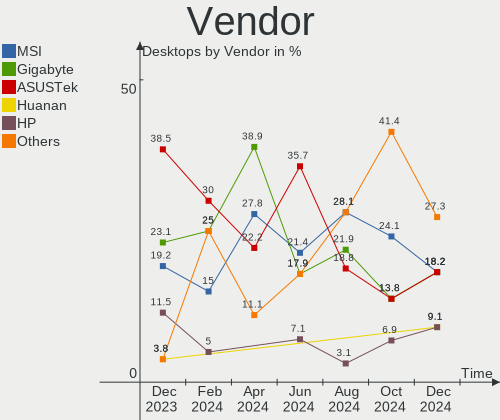
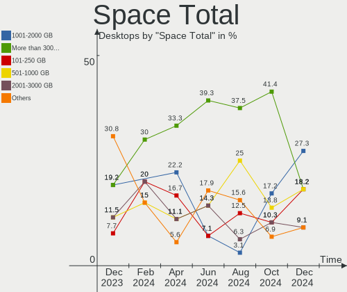
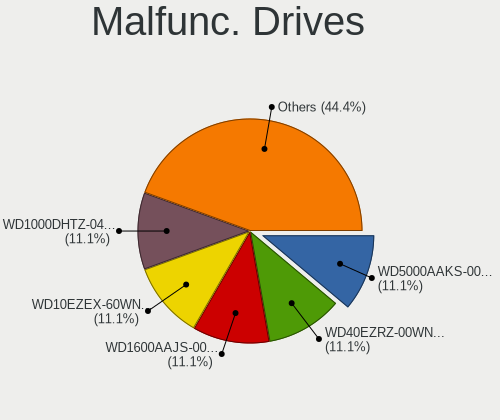
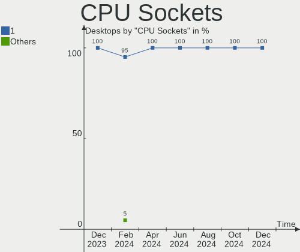
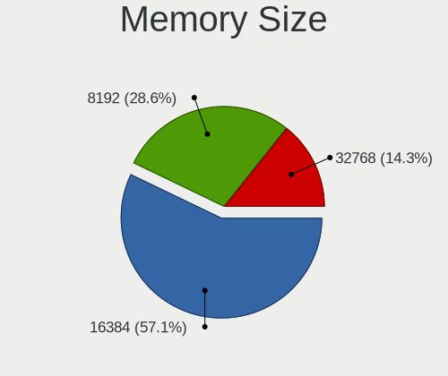
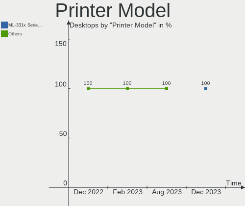

EndeavourOS - Hardware Trends (Desktops)
----------------------------------------

A project to identify most popular hardware characteristics and track their change
over time based on data collected by Linux users at https://Linux-Hardware.org.

Anyone can contribute to this report by the [hw-probe](https://github.com/linuxhw/hw-probe) tool:

    sudo -E hw-probe -all -upload

This report is for one last month. Overall report since the beginning of time: [TestDays](https://github.com/linuxhw/TestDays)

Period: Mar, 2023.

Contents
--------

* [ System ](#system)
  - [ OS                       ](#os)
  - [ OS Family                ](#os-family)
  - [ Kernel                   ](#kernel)
  - [ Kernel Family            ](#kernel-family)
  - [ Kernel Major Ver.        ](#kernel-major-ver)
  - [ Arch                     ](#arch)
  - [ DE                       ](#de)
  - [ Display Server           ](#display-server)
  - [ Display Manager          ](#display-manager)
  - [ OS Lang                  ](#os-lang)
  - [ Boot Mode                ](#boot-mode)
  - [ Filesystem               ](#filesystem)
  - [ Part. scheme             ](#part-scheme)
  - [ Dual Boot with Linux/BSD ](#dual-boot-with-linuxbsd)
  - [ Dual Boot (Win)          ](#dual-boot-win)

* [ Board ](#board)
  - [ Vendor                   ](#vendor)
  - [ Model                    ](#model)
  - [ Model Family             ](#model-family)
  - [ MFG Year                 ](#mfg-year)
  - [ Form Factor              ](#form-factor)
  - [ Secure Boot              ](#secure-boot)
  - [ Coreboot                 ](#coreboot)
  - [ RAM Size                 ](#ram-size)
  - [ RAM Used                 ](#ram-used)
  - [ Total Drives             ](#total-drives)
  - [ Has CD-ROM               ](#has-cd-rom)
  - [ Has Ethernet             ](#has-ethernet)
  - [ Has WiFi                 ](#has-wifi)
  - [ Has Bluetooth            ](#has-bluetooth)

* [ Location ](#location)
  - [ Country                  ](#country)
  - [ City                     ](#city)

* [ Drives ](#drives)
  - [ Drive Vendor             ](#drive-vendor)
  - [ Drive Model              ](#drive-model)
  - [ HDD Vendor               ](#hdd-vendor)
  - [ SSD Vendor               ](#ssd-vendor)
  - [ Drive Kind               ](#drive-kind)
  - [ Drive Connector          ](#drive-connector)
  - [ Drive Size               ](#drive-size)
  - [ Space Total              ](#space-total)
  - [ Space Used               ](#space-used)
  - [ Malfunc. Drives          ](#malfunc-drives)
  - [ Malfunc. Drive Vendor    ](#malfunc-drive-vendor)
  - [ Malfunc. HDD Vendor      ](#malfunc-hdd-vendor)
  - [ Malfunc. Drive Kind      ](#malfunc-drive-kind)
  - [ Failed Drives            ](#failed-drives)
  - [ Failed Drive Vendor      ](#failed-drive-vendor)
  - [ Drive Status             ](#drive-status)

* [ Storage controller ](#storage-controller)
  - [ Storage Vendor           ](#storage-vendor)
  - [ Storage Model            ](#storage-model)
  - [ Storage Kind             ](#storage-kind)

* [ Processor ](#processor)
  - [ CPU Vendor               ](#cpu-vendor)
  - [ CPU Model                ](#cpu-model)
  - [ CPU Model Family         ](#cpu-model-family)
  - [ CPU Cores                ](#cpu-cores)
  - [ CPU Sockets              ](#cpu-sockets)
  - [ CPU Threads              ](#cpu-threads)
  - [ CPU Op-Modes             ](#cpu-op-modes)
  - [ CPU Microcode            ](#cpu-microcode)
  - [ CPU Microarch            ](#cpu-microarch)

* [ Graphics ](#graphics)
  - [ GPU Vendor               ](#gpu-vendor)
  - [ GPU Model                ](#gpu-model)
  - [ GPU Combo                ](#gpu-combo)
  - [ GPU Driver               ](#gpu-driver)
  - [ GPU Memory               ](#gpu-memory)

* [ Monitor ](#monitor)
  - [ Monitor Vendor           ](#monitor-vendor)
  - [ Monitor Model            ](#monitor-model)
  - [ Monitor Resolution       ](#monitor-resolution)
  - [ Monitor Diagonal         ](#monitor-diagonal)
  - [ Monitor Width            ](#monitor-width)
  - [ Aspect Ratio             ](#aspect-ratio)
  - [ Monitor Area             ](#monitor-area)
  - [ Pixel Density            ](#pixel-density)
  - [ Multiple Monitors        ](#multiple-monitors)

* [ Network ](#network)
  - [ Net Controller Vendor    ](#net-controller-vendor)
  - [ Net Controller Model     ](#net-controller-model)
  - [ Wireless Vendor          ](#wireless-vendor)
  - [ Wireless Model           ](#wireless-model)
  - [ Ethernet Vendor          ](#ethernet-vendor)
  - [ Ethernet Model           ](#ethernet-model)
  - [ Net Controller Kind      ](#net-controller-kind)
  - [ Used Controller          ](#used-controller)
  - [ NICs                     ](#nics)
  - [ IPv6                     ](#ipv6)

* [ Bluetooth ](#bluetooth)
  - [ Bluetooth Vendor         ](#bluetooth-vendor)
  - [ Bluetooth Model          ](#bluetooth-model)

* [ Sound ](#sound)
  - [ Sound Vendor             ](#sound-vendor)
  - [ Sound Model              ](#sound-model)

* [ Memory ](#memory)
  - [ Memory Vendor            ](#memory-vendor)
  - [ Memory Model             ](#memory-model)
  - [ Memory Kind              ](#memory-kind)
  - [ Memory Form Factor       ](#memory-form-factor)
  - [ Memory Size              ](#memory-size)
  - [ Memory Speed             ](#memory-speed)

* [ Printers & scanners ](#printers--scanners)
  - [ Printer Vendor           ](#printer-vendor)
  - [ Printer Model            ](#printer-model)
  - [ Scanner Vendor           ](#scanner-vendor)
  - [ Scanner Model            ](#scanner-model)

* [ Camera ](#camera)
  - [ Camera Vendor            ](#camera-vendor)
  - [ Camera Model             ](#camera-model)

* [ Security ](#security)
  - [ Fingerprint Vendor       ](#fingerprint-vendor)
  - [ Fingerprint Model        ](#fingerprint-model)
  - [ Chipcard Vendor          ](#chipcard-vendor)
  - [ Chipcard Model           ](#chipcard-model)

* [ Unsupported ](#unsupported)
  - [ Unsupported Devices      ](#unsupported-devices)
  - [ Unsupported Device Types ](#unsupported-device-types)

System
------

OS
--

Installed operating systems

| Name                | Desktops | Percent |
|---------------------|----------|---------|
| EndeavourOS Rolling | 17       | 100%    |

OS Family
---------

OS without a version

| Name        | Desktops | Percent |
|-------------|----------|---------|
| EndeavourOS | 17       | 100%    |

Kernel
------

Version of the Linux kernel

| Version                     | Desktops | Percent |
|-----------------------------|----------|---------|
| 6.2.2-arch1-1               | 5        | 29.41%  |
| 6.2.1-arch1-1               | 2        | 11.76%  |
| 6.2.8-arch1-1               | 1        | 5.88%   |
| 6.2.7-arch1-1               | 1        | 5.88%   |
| 6.2.6-arch1-1               | 1        | 5.88%   |
| 6.2.5-x64v1-xanmod1-1       | 1        | 5.88%   |
| 6.2.2-zen1-1-zen            | 1        | 5.88%   |
| 6.2.2-273-tkg-pds           | 1        | 5.88%   |
| 6.2.1-zen1-1-zen            | 1        | 5.88%   |
| 6.1.20-hardened1-1-hardened | 1        | 5.88%   |
| 6.1.19-1-lts                | 1        | 5.88%   |
| 6.1.12-arch1-1              | 1        | 5.88%   |

Kernel Family
-------------

Linux kernel without a distro release

| Version | Desktops | Percent |
|---------|----------|---------|
| 6.2.2   | 7        | 41.18%  |
| 6.2.1   | 3        | 17.65%  |
| 6.2.8   | 1        | 5.88%   |
| 6.2.7   | 1        | 5.88%   |
| 6.2.6   | 1        | 5.88%   |
| 6.2.5   | 1        | 5.88%   |
| 6.1.20  | 1        | 5.88%   |
| 6.1.19  | 1        | 5.88%   |
| 6.1.12  | 1        | 5.88%   |

Kernel Major Ver.
-----------------

Linux kernel major version

| Version | Desktops | Percent |
|---------|----------|---------|
| 6.2     | 14       | 82.35%  |
| 6.1     | 3        | 17.65%  |

Arch
----

OS architecture (x86_64, i586, etc.)

| Name   | Desktops | Percent |
|--------|----------|---------|
| x86_64 | 17       | 100%    |

DE
--

Desktop Environment

| Name       | Desktops | Percent |
|------------|----------|---------|
| KDE5       | 5        | 29.41%  |
| XFCE       | 3        | 17.65%  |
| GNOME      | 3        | 17.65%  |
| X-Cinnamon | 2        | 11.76%  |
| i3         | 2        | 11.76%  |
| openbox    | 1        | 5.88%   |
| Unknown    | 1        | 5.88%   |

Display Server
--------------

X11 or Wayland

| Name    | Desktops | Percent |
|---------|----------|---------|
| X11     | 13       | 76.47%  |
| Wayland | 2        | 11.76%  |
| Tty     | 1        | 5.88%   |
| Unknown | 1        | 5.88%   |

Display Manager
---------------

SDDM, LightDM, etc.

| Name    | Desktops | Percent |
|---------|----------|---------|
| LightDM | 9        | 52.94%  |
| Unknown | 5        | 29.41%  |
| GDM     | 2        | 11.76%  |
| SDDM    | 1        | 5.88%   |

OS Lang
-------

Language

| Lang  | Desktops | Percent |
|-------|----------|---------|
| en_US | 10       | 58.82%  |
| nl_NL | 2        | 11.76%  |
| de_DE | 2        | 11.76%  |
| fr_FR | 1        | 5.88%   |
| en_GB | 1        | 5.88%   |
| en_CA | 1        | 5.88%   |

Boot Mode
---------

EFI or BIOS

| Mode | Desktops | Percent |
|------|----------|---------|
| EFI  | 11       | 64.71%  |
| BIOS | 6        | 35.29%  |

Filesystem
----------

Type of filesystem

| Type  | Desktops | Percent |
|-------|----------|---------|
| Ext4  | 12       | 70.59%  |
| Btrfs | 4        | 23.53%  |
| Tmpfs | 1        | 5.88%   |

Part. scheme
------------

Scheme of partitioning

| Type    | Desktops | Percent |
|---------|----------|---------|
| GPT     | 11       | 64.71%  |
| Unknown | 5        | 29.41%  |
| MBR     | 1        | 5.88%   |

Dual Boot with Linux/BSD
------------------------

Hosting more than one Linux/BSD

| Dual boot | Desktops | Percent |
|-----------|----------|---------|
| No        | 14       | 82.35%  |
| Yes       | 3        | 17.65%  |

Dual Boot (Win)
---------------

Hosting Linux and Windows

| Dual boot | Desktops | Percent |
|-----------|----------|---------|
| No        | 10       | 58.82%  |
| Yes       | 7        | 41.18%  |

Board
-----

Vendor
------

Motherboard manufacturer

| Name                | Desktops | Percent |
|---------------------|----------|---------|
| ASUSTek Computer    | 5        | 29.41%  |
| MSI                 | 3        | 17.65%  |
| Hewlett-Packard     | 2        | 11.76%  |
| Gigabyte Technology | 2        | 11.76%  |
| Dell                | 2        | 11.76%  |
| AZW                 | 1        | 5.88%   |
| ASRock              | 1        | 5.88%   |
| Unknown             | 1        | 5.88%   |

Model
-----

Motherboard model

| Name                                 | Desktops | Percent |
|--------------------------------------|----------|---------|
| MSI MS-7D54                          | 1        | 5.88%   |
| MSI MS-7A40                          | 1        | 5.88%   |
| MSI MS-7641                          | 1        | 5.88%   |
| HP Pavilion Gaming Desktop TG01-2xxx | 1        | 5.88%   |
| HP EliteDesk 800 G1 TWR              | 1        | 5.88%   |
| Gigabyte X470 AORUS ULTRA GAMING     | 1        | 5.88%   |
| Gigabyte P55A-UD3                    | 1        | 5.88%   |
| Dell XPS 8700                        | 1        | 5.88%   |
| Dell OptiPlex 7010                   | 1        | 5.88%   |
| AZW GK35                             | 1        | 5.88%   |
| ASUS STRIX Z270I GAMING              | 1        | 5.88%   |
| ASUS ROG STRIX Z390-F GAMING         | 1        | 5.88%   |
| ASUS ROG STRIX B550-F GAMING         | 1        | 5.88%   |
| ASUS PRIME X670-P WIFI               | 1        | 5.88%   |
| ASUS PRIME H410M-E                   | 1        | 5.88%   |
| ASRock B450M Pro4                    | 1        | 5.88%   |
| Unknown                              | 1        | 5.88%   |

Model Family
------------

Motherboard model prefix

| Name              | Desktops | Percent |
|-------------------|----------|---------|
| ASUS ROG          | 2        | 11.76%  |
| ASUS PRIME        | 2        | 11.76%  |
| MSI MS-7D54       | 1        | 5.88%   |
| MSI MS-7A40       | 1        | 5.88%   |
| MSI MS-7641       | 1        | 5.88%   |
| HP Pavilion       | 1        | 5.88%   |
| HP EliteDesk      | 1        | 5.88%   |
| Gigabyte X470     | 1        | 5.88%   |
| Gigabyte P55A-UD3 | 1        | 5.88%   |
| Dell XPS          | 1        | 5.88%   |
| Dell OptiPlex     | 1        | 5.88%   |
| AZW GK35          | 1        | 5.88%   |
| ASUS STRIX        | 1        | 5.88%   |
| ASRock B450M      | 1        | 5.88%   |
| Unknown           | 1        | 5.88%   |

MFG Year
--------

Motherboard manufacture year

| Year | Desktops | Percent |
|------|----------|---------|
| 2021 | 4        | 23.53%  |
| 2020 | 3        | 17.65%  |
| 2018 | 3        | 17.65%  |
| 2013 | 3        | 17.65%  |
| 2022 | 1        | 5.88%   |
| 2017 | 1        | 5.88%   |
| 2014 | 1        | 5.88%   |
| 2009 | 1        | 5.88%   |

Form Factor
-----------

Physical design of the computer

| Name    | Desktops | Percent |
|---------|----------|---------|
| Desktop | 17       | 100%    |

Secure Boot
-----------

Enabled or disabled

| State    | Desktops | Percent |
|----------|----------|---------|
| Disabled | 16       | 94.12%  |
| Enabled  | 1        | 5.88%   |

Coreboot
--------

Have coreboot on board

| Used | Desktops | Percent |
|------|----------|---------|
| No   | 17       | 100%    |

RAM Size
--------

Total RAM memory

| Size in GB  | Desktops | Percent |
|-------------|----------|---------|
| 32.01-64.0  | 7        | 41.18%  |
| 16.01-24.0  | 5        | 29.41%  |
| 8.01-16.0   | 2        | 11.76%  |
| 4.01-8.0    | 1        | 5.88%   |
| 24.01-32.0  | 1        | 5.88%   |
| 64.01-256.0 | 1        | 5.88%   |

RAM Used
--------

Used RAM memory

| Used GB   | Desktops | Percent |
|-----------|----------|---------|
| 4.01-8.0  | 7        | 41.18%  |
| 8.01-16.0 | 4        | 23.53%  |
| 1.01-2.0  | 3        | 17.65%  |
| 3.01-4.0  | 1        | 5.88%   |
| 2.01-3.0  | 1        | 5.88%   |
| 0.51-1.0  | 1        | 5.88%   |

Total Drives
------------

Number of drives on board

| Drives | Desktops | Percent |
|--------|----------|---------|
| 1      | 5        | 29.41%  |
| 3      | 4        | 23.53%  |
| 4      | 3        | 17.65%  |
| 2      | 3        | 17.65%  |
| 7      | 1        | 5.88%   |
| 5      | 1        | 5.88%   |

Has CD-ROM
----------

Has CD-ROM on board

| Presented | Desktops | Percent |
|-----------|----------|---------|
| No        | 15       | 88.24%  |
| Yes       | 2        | 11.76%  |

Has Ethernet
------------

Has Ethernet on board

| Presented | Desktops | Percent |
|-----------|----------|---------|
| Yes       | 17       | 100%    |

Has WiFi
--------

Has WiFi module

| Presented | Desktops | Percent |
|-----------|----------|---------|
| Yes       | 12       | 70.59%  |
| No        | 5        | 29.41%  |

Has Bluetooth
-------------

Has Bluetooth module

| Presented | Desktops | Percent |
|-----------|----------|---------|
| Yes       | 13       | 76.47%  |
| No        | 4        | 23.53%  |

Location
--------

Country
-------

Geographic location (country)

| Country     | Desktops | Percent |
|-------------|----------|---------|
| USA         | 5        | 29.41%  |
| Netherlands | 3        | 17.65%  |
| Germany     | 3        | 17.65%  |
| Sweden      | 1        | 5.88%   |
| Japan       | 1        | 5.88%   |
| Italy       | 1        | 5.88%   |
| France      | 1        | 5.88%   |
| Cyprus      | 1        | 5.88%   |
| Canada      | 1        | 5.88%   |

City
----

Geographic location (city)

| City        | Desktops | Percent |
|-------------|----------|---------|
| Brooklyn    | 2        | 11.76%  |
| Almelo      | 2        | 11.76%  |
| San Antonio | 1        | 5.88%   |
| Ringgold    | 1        | 5.88%   |
| Nicosia     | 1        | 5.88%   |
| Naples      | 1        | 5.88%   |
| Münster    | 1        | 5.88%   |
| Miami       | 1        | 5.88%   |
| Mauleon     | 1        | 5.88%   |
| Malmo       | 1        | 5.88%   |
| Laval       | 1        | 5.88%   |
| Ichikawa    | 1        | 5.88%   |
| Gera        | 1        | 5.88%   |
| Doorn       | 1        | 5.88%   |
| Berlin      | 1        | 5.88%   |

Drives
------

Drive Vendor
------------

Hard drive vendors

| Vendor                    | Desktops | Drives | Percent |
|---------------------------|----------|--------|---------|
| Samsung Electronics       | 12       | 14     | 30.77%  |
| Seagate                   | 6        | 8      | 15.38%  |
| Crucial                   | 5        | 5      | 12.82%  |
| Kingston                  | 4        | 4      | 10.26%  |
| Sandisk                   | 3        | 3      | 7.69%   |
| WDC                       | 1        | 2      | 2.56%   |
| Unknown                   | 1        | 2      | 2.56%   |
| Toshiba                   | 1        | 1      | 2.56%   |
| Timetec                   | 1        | 1      | 2.56%   |
| Phison Electronics        | 1        | 1      | 2.56%   |
| Micron/Crucial Technology | 1        | 1      | 2.56%   |
| LITEON                    | 1        | 1      | 2.56%   |
| Intel                     | 1        | 1      | 2.56%   |
| HGST                      | 1        | 1      | 2.56%   |

Drive Model
-----------

Hard drive models

| Model                                               | Desktops | Percent |
|-----------------------------------------------------|----------|---------|
| Samsung NVMe SSD Controller SM981/PM981/PM983 250GB | 7        | 15.91%  |
| Samsung SSD 860 EVO 1TB                             | 3        | 6.82%   |
| Seagate ST2000DM008-2FR102 2TB                      | 2        | 4.55%   |
| Seagate ST1000DM003-1SB102 1TB                      | 2        | 4.55%   |
| Samsung HD103SJ 1TB                                 | 2        | 4.55%   |
| Kingston SA400S37240G 240GB SSD                     | 2        | 4.55%   |
| Crucial CT500MX500SSD1 500GB                        | 2        | 4.55%   |
| WDC WD20EARS-42S0XB0 2TB                            | 1        | 2.27%   |
| Unknown SD/MMC 2GB                                  | 1        | 2.27%   |
| Unknown M.S./M.S.Pro/HG 16GB                        | 1        | 2.27%   |
| Toshiba MG06ACA800E 8TB                             | 1        | 2.27%   |
| Timetec MS05 256GB SSD                              | 1        | 2.27%   |
| Seagate ST500LM021-1KJ152 500GB                     | 1        | 2.27%   |
| Seagate ST4000DM004-2CV104 4TB                      | 1        | 2.27%   |
| Seagate ST3500418AS 500GB                           | 1        | 2.27%   |
| Seagate ST1000LM035-1RK172 1TB                      | 1        | 2.27%   |
| Sandisk WD Blue SN550 NVMe SSD 256GB                | 1        | 2.27%   |
| SanDisk SDSSDA120G 120GB                            | 1        | 2.27%   |
| SanDisk Extreme 55AE 2TB SSD                        | 1        | 2.27%   |
| Samsung SSD 860 EVO M.2 1TB                         | 1        | 2.27%   |
| Samsung HD256GJ 250GB                               | 1        | 2.27%   |
| Phison E16 PCIe4 NVMe Controller 1TB                | 1        | 2.27%   |
| Micron/Crucial P2 NVMe PCIe SSD 1TB                 | 1        | 2.27%   |
| LITEON CV3-8D128-11 SATA 128GB SSD                  | 1        | 2.27%   |
| Kingston SV300S37A120G 120GB SSD                    | 1        | 2.27%   |
| Kingston SA400S37960G 960GB SSD                     | 1        | 2.27%   |
| Intel SSD 660P Series 512GB                         | 1        | 2.27%   |
| HGST HTS721010A9E630 1TB                            | 1        | 2.27%   |
| Crucial CT500MX500SSD4 500GB                        | 1        | 2.27%   |
| Crucial CT2000BX500SSD1 2TB                         | 1        | 2.27%   |
| Crucial CT1000MX500SSD1 1TB                         | 1        | 2.27%   |

HDD Vendor
----------

Hard disk drive vendors

| Vendor              | Desktops | Drives | Percent |
|---------------------|----------|--------|---------|
| Seagate             | 6        | 8      | 50%     |
| Samsung Electronics | 3        | 3      | 25%     |
| WDC                 | 1        | 2      | 8.33%   |
| Toshiba             | 1        | 1      | 8.33%   |
| HGST                | 1        | 1      | 8.33%   |

SSD Vendor
----------

Solid state drive vendors

| Vendor              | Desktops | Drives | Percent |
|---------------------|----------|--------|---------|
| Crucial             | 5        | 5      | 29.41%  |
| Samsung Electronics | 4        | 4      | 23.53%  |
| Kingston            | 4        | 4      | 23.53%  |
| SanDisk             | 2        | 2      | 11.76%  |
| Timetec             | 1        | 1      | 5.88%   |
| LITEON              | 1        | 1      | 5.88%   |

Drive Kind
----------

HDD or SSD

| Kind    | Desktops | Drives | Percent |
|---------|----------|--------|---------|
| SSD     | 12       | 17     | 37.5%   |
| HDD     | 10       | 15     | 31.25%  |
| NVMe    | 9        | 11     | 28.13%  |
| Unknown | 1        | 2      | 3.13%   |

Drive Connector
---------------

SATA, SAS, NVMe, etc.

| Type | Desktops | Drives | Percent |
|------|----------|--------|---------|
| SATA | 14       | 31     | 56%     |
| NVMe | 9        | 11     | 36%     |
| SAS  | 2        | 3      | 8%      |

Drive Size
----------

Size of hard drive

| Size in TB | Desktops | Drives | Percent |
|------------|----------|--------|---------|
| 0.51-1.0   | 10       | 12     | 41.67%  |
| 0.01-0.5   | 8        | 12     | 33.33%  |
| 1.01-2.0   | 4        | 6      | 16.67%  |
| 3.01-4.0   | 1        | 1      | 4.17%   |
| 4.01-10.0  | 1        | 1      | 4.17%   |

Space Total
-----------

Amount of disk space available on the file system

| Size in GB     | Desktops | Percent |
|----------------|----------|---------|
| 1001-2000      | 5        | 29.41%  |
| More than 3000 | 4        | 23.53%  |
| 501-1000       | 3        | 17.65%  |
| 101-250        | 2        | 11.76%  |
| 251-500        | 1        | 5.88%   |
| 1-20           | 1        | 5.88%   |
| Unknown        | 1        | 5.88%   |

Space Used
----------

Amount of used disk space

| Used GB        | Desktops | Percent |
|----------------|----------|---------|
| 1001-2000      | 5        | 29.41%  |
| 51-100         | 4        | 23.53%  |
| More than 3000 | 3        | 17.65%  |
| 251-500        | 1        | 5.88%   |
| 101-250        | 1        | 5.88%   |
| 1-20           | 1        | 5.88%   |
| 501-1000       | 1        | 5.88%   |
| Unknown        | 1        | 5.88%   |

Malfunc. Drives
---------------

Drive models with a malfunction

| Model                                                           | Desktops | Drives | Percent |
|-----------------------------------------------------------------|----------|--------|---------|
| Seagate ST500LM021-1KJ152 500GB                                 | 1        | 1      | 33.33%  |
| Samsung Electronics NVMe SSD Controller SM981/PM981/PM983 250GB | 1        | 1      | 33.33%  |
| Crucial CT500MX500SSD1 500GB                                    | 1        | 1      | 33.33%  |

Malfunc. Drive Vendor
---------------------

Vendors of faulty drives

| Vendor              | Desktops | Drives | Percent |
|---------------------|----------|--------|---------|
| Seagate             | 1        | 1      | 33.33%  |
| Samsung Electronics | 1        | 1      | 33.33%  |
| Crucial             | 1        | 1      | 33.33%  |

Malfunc. HDD Vendor
-------------------

Vendors of faulty HDD drives

| Vendor  | Desktops | Drives | Percent |
|---------|----------|--------|---------|
| Seagate | 1        | 1      | 100%    |

Malfunc. Drive Kind
-------------------

Kinds of faulty drives

| Kind | Desktops | Drives | Percent |
|------|----------|--------|---------|
| NVMe | 1        | 1      | 33.33%  |
| SSD  | 1        | 1      | 33.33%  |
| HDD  | 1        | 1      | 33.33%  |

Failed Drives
-------------

Failed drive models

Zero info for selected period =(

Failed Drive Vendor
-------------------

Failed drive vendors

Zero info for selected period =(

Drive Status
------------

Number of failed and malfunc. drives

| Status   | Desktops | Drives | Percent |
|----------|----------|--------|---------|
| Works    | 13       | 31     | 59.09%  |
| Detected | 6        | 11     | 27.27%  |
| Malfunc  | 3        | 3      | 13.64%  |

Storage controller
------------------

Storage Vendor
--------------

Storage controller vendors

| Vendor                    | Desktops | Percent |
|---------------------------|----------|---------|
| Intel                     | 9        | 32.14%  |
| AMD                       | 8        | 28.57%  |
| Samsung Electronics       | 7        | 25%     |
| SanDisk                   | 1        | 3.57%   |
| Phison Electronics        | 1        | 3.57%   |
| Micron/Crucial Technology | 1        | 3.57%   |
| ASMedia Technology        | 1        | 3.57%   |

Storage Model
-------------

Storage controller models

| Model                                                                          | Desktops | Percent |
|--------------------------------------------------------------------------------|----------|---------|
| Samsung NVMe SSD Controller SM981/PM981/PM983                                  | 7        | 21.21%  |
| AMD FCH SATA Controller [AHCI mode]                                            | 6        | 18.18%  |
| AMD 400 Series Chipset SATA Controller                                         | 3        | 9.09%   |
| Intel 8 Series/C220 Series Chipset Family 6-port SATA Controller 1 [AHCI mode] | 2        | 6.06%   |
| SanDisk WD Blue SN550 NVMe SSD                                                 | 1        | 3.03%   |
| Phison E16 PCIe4 NVMe Controller                                               | 1        | 3.03%   |
| Micron/Crucial P2 NVMe PCIe SSD                                                | 1        | 3.03%   |
| Intel SSD 660P Series                                                          | 1        | 3.03%   |
| Intel Celeron/Pentium Silver Processor SATA Controller                         | 1        | 3.03%   |
| Intel Cannon Lake PCH SATA AHCI Controller                                     | 1        | 3.03%   |
| Intel 7 Series/C210 Series Chipset Family 6-port SATA Controller [AHCI mode]   | 1        | 3.03%   |
| Intel 500 Series Chipset Family SATA AHCI Controller                           | 1        | 3.03%   |
| Intel 5 Series/3400 Series Chipset 6 port SATA AHCI Controller                 | 1        | 3.03%   |
| Intel 400 Series Chipset Family SATA AHCI Controller                           | 1        | 3.03%   |
| Intel 200 Series PCH SATA controller [AHCI mode]                               | 1        | 3.03%   |
| ASMedia ASM1061 SATA IDE Controller                                            | 1        | 3.03%   |
| AMD SB7x0/SB8x0/SB9x0 SATA Controller [IDE mode]                               | 1        | 3.03%   |
| AMD SB7x0/SB8x0/SB9x0 IDE Controller                                           | 1        | 3.03%   |
| AMD 500 Series Chipset SATA Controller                                         | 1        | 3.03%   |

Storage Kind
------------

Kind of storage controller (IDE, SATA, NVMe, SAS, ...)

| Kind | Desktops | Percent |
|------|----------|---------|
| SATA | 17       | 62.96%  |
| NVMe | 9        | 33.33%  |
| IDE  | 1        | 3.7%    |

Processor
---------

CPU Vendor
----------

Processor vendors

| Vendor | Desktops | Percent |
|--------|----------|---------|
| Intel  | 9        | 52.94%  |
| AMD    | 8        | 47.06%  |

CPU Model
---------

Processor models

| Model                                   | Desktops | Percent |
|-----------------------------------------|----------|---------|
| Intel Core i7-4790 CPU @ 3.60GHz        | 2        | 11.76%  |
| Intel Core i7-9700K CPU @ 3.60GHz       | 1        | 5.88%   |
| Intel Core i7-10700F CPU @ 2.90GHz      | 1        | 5.88%   |
| Intel Core i5-7600K CPU @ 3.80GHz       | 1        | 5.88%   |
| Intel Core i5-3470 CPU @ 3.20GHz        | 1        | 5.88%   |
| Intel Core i5 CPU 750 @ 2.67GHz         | 1        | 5.88%   |
| Intel Celeron J4105 CPU @ 1.50GHz       | 1        | 5.88%   |
| Intel 11th Gen Core i7-11700F @ 2.50GHz | 1        | 5.88%   |
| AMD Ryzen 9 7900X 12-Core Processor     | 1        | 5.88%   |
| AMD Ryzen 9 5900HX with Radeon Graphics | 1        | 5.88%   |
| AMD Ryzen 7 5800X3D 8-Core Processor    | 1        | 5.88%   |
| AMD Ryzen 7 2700X Eight-Core Processor  | 1        | 5.88%   |
| AMD Ryzen 7 2700 Eight-Core Processor   | 1        | 5.88%   |
| AMD Ryzen 5 5600X 6-Core Processor      | 1        | 5.88%   |
| AMD Ryzen 5 3600 6-Core Processor       | 1        | 5.88%   |
| AMD FX-6300 Six-Core Processor          | 1        | 5.88%   |

CPU Model Family
----------------

Processor model prefix

| Model         | Desktops | Percent |
|---------------|----------|---------|
| Intel Core i7 | 4        | 23.53%  |
| Intel Core i5 | 3        | 17.65%  |
| AMD Ryzen 7   | 3        | 17.65%  |
| AMD Ryzen 9   | 2        | 11.76%  |
| AMD Ryzen 5   | 2        | 11.76%  |
| Other         | 1        | 5.88%   |
| Intel Celeron | 1        | 5.88%   |
| AMD FX        | 1        | 5.88%   |

CPU Cores
---------

Number of processor cores

| Number | Desktops | Percent |
|--------|----------|---------|
| 8      | 7        | 41.18%  |
| 4      | 6        | 35.29%  |
| 6      | 2        | 11.76%  |
| 12     | 1        | 5.88%   |
| 3      | 1        | 5.88%   |

CPU Sockets
-----------

Number of sockets

| Number | Desktops | Percent |
|--------|----------|---------|
| 1      | 17       | 100%    |

CPU Threads
-----------

Threads per core (Hyper-Threading)

| Number | Desktops | Percent |
|--------|----------|---------|
| 2      | 12       | 70.59%  |
| 1      | 5        | 29.41%  |

CPU Op-Modes
------------

CPU Operation Modes (32-bit, 64-bit)

| Op mode        | Desktops | Percent |
|----------------|----------|---------|
| 32-bit, 64-bit | 17       | 100%    |

CPU Microcode
-------------

Microcode number

| Number     | Desktops | Percent |
|------------|----------|---------|
| Unknown    | 9        | 52.94%  |
| 0x0800820d | 2        | 11.76%  |
| 0x706a1    | 1        | 5.88%   |
| 0x0a601203 | 1        | 5.88%   |
| 0x0a20120a | 1        | 5.88%   |
| 0x0a201204 | 1        | 5.88%   |
| 0x08701013 | 1        | 5.88%   |
| 0x06000852 | 1        | 5.88%   |

CPU Microarch
-------------

Microarchitecture

| Name          | Desktops | Percent |
|---------------|----------|---------|
| Zen 3         | 3        | 17.65%  |
| Zen+          | 2        | 11.76%  |
| KabyLake      | 2        | 11.76%  |
| Haswell       | 2        | 11.76%  |
| Unknown       | 2        | 11.76%  |
| Zen 2         | 1        | 5.88%   |
| Piledriver    | 1        | 5.88%   |
| Nehalem       | 1        | 5.88%   |
| IvyBridge     | 1        | 5.88%   |
| Goldmont plus | 1        | 5.88%   |
| CometLake     | 1        | 5.88%   |

Graphics
--------

GPU Vendor
----------

Vendors of graphics cards

| Vendor | Desktops | Percent |
|--------|----------|---------|
| Nvidia | 9        | 50%     |
| AMD    | 6        | 33.33%  |
| Intel  | 3        | 16.67%  |

GPU Model
---------

Graphics card models

| Model                                                                       | Desktops | Percent |
|-----------------------------------------------------------------------------|----------|---------|
| Nvidia GP107 [GeForce GTX 1050 Ti]                                          | 2        | 10.53%  |
| Nvidia TU106 [GeForce RTX 2070 Rev. A]                                      | 1        | 5.26%   |
| Nvidia TU106 [GeForce RTX 2060 Rev. A]                                      | 1        | 5.26%   |
| Nvidia TU104 [GeForce RTX 2070 SUPER]                                       | 1        | 5.26%   |
| Nvidia GP102 [GeForce GTX 1080 Ti]                                          | 1        | 5.26%   |
| Nvidia GM107 [GeForce GTX 750 Ti]                                           | 1        | 5.26%   |
| Nvidia GA106 [GeForce RTX 3060 Lite Hash Rate]                              | 1        | 5.26%   |
| Nvidia GA102 [GeForce RTX 3080]                                             | 1        | 5.26%   |
| Intel Xeon E3-1200 v3/4th Gen Core Processor Integrated Graphics Controller | 1        | 5.26%   |
| Intel Xeon E3-1200 v2/3rd Gen Core processor Graphics Controller            | 1        | 5.26%   |
| Intel GeminiLake [UHD Graphics 600]                                         | 1        | 5.26%   |
| AMD Raphael                                                                 | 1        | 5.26%   |
| AMD Navi 24 [Radeon RX 6400/6500 XT/6500M]                                  | 1        | 5.26%   |
| AMD Navi 21 [Radeon RX 6950 XT]                                             | 1        | 5.26%   |
| AMD Navi 10 [Radeon RX 5600 OEM/5600 XT / 5700/5700 XT]                     | 1        | 5.26%   |
| AMD Lexa PRO [Radeon 540/540X/550/550X / RX 540X/550/550X]                  | 1        | 5.26%   |
| AMD Ellesmere [Radeon RX 470/480/570/570X/580/580X/590]                     | 1        | 5.26%   |
| AMD Cezanne [Radeon Vega Series / Radeon Vega Mobile Series]                | 1        | 5.26%   |

GPU Combo
---------

Combinations of graphics cards

| Name        | Desktops | Percent |
|-------------|----------|---------|
| 1 x Nvidia  | 9        | 52.94%  |
| 1 x AMD     | 4        | 23.53%  |
| 1 x Intel   | 2        | 11.76%  |
| 2 x AMD     | 1        | 5.88%   |
| Intel + AMD | 1        | 5.88%   |

GPU Driver
----------

Free vs proprietary

| Driver      | Desktops | Percent |
|-------------|----------|---------|
| Proprietary | 9        | 52.94%  |
| Free        | 8        | 47.06%  |

GPU Memory
----------

Total video memory

| Size in GB | Desktops | Percent |
|------------|----------|---------|
| 7.01-8.0   | 4        | 23.53%  |
| 3.01-4.0   | 4        | 23.53%  |
| Unknown    | 4        | 23.53%  |
| 8.01-16.0  | 3        | 17.65%  |
| 5.01-6.0   | 1        | 5.88%   |
| 1.01-2.0   | 1        | 5.88%   |

Monitor
-------

Monitor Vendor
--------------

Monitor vendors

| Vendor              | Desktops | Percent |
|---------------------|----------|---------|
| Samsung Electronics | 5        | 20.83%  |
| Acer                | 3        | 12.5%   |
| Iiyama              | 2        | 8.33%   |
| Gigabyte Technology | 2        | 8.33%   |
| BenQ                | 2        | 8.33%   |
| Vizio               | 1        | 4.17%   |
| Valve               | 1        | 4.17%   |
| TOL                 | 1        | 4.17%   |
| ITE                 | 1        | 4.17%   |
| HUAWEI              | 1        | 4.17%   |
| Hewlett-Packard     | 1        | 4.17%   |
| Goldstar            | 1        | 4.17%   |
| Dell                | 1        | 4.17%   |
| ASUSTek Computer    | 1        | 4.17%   |
| AOC                 | 1        | 4.17%   |

Monitor Model
-------------

Monitor models

| Model                                                                 | Desktops | Percent |
|-----------------------------------------------------------------------|----------|---------|
| Gigabyte Technology M32U GBT3204 3840x2160 697x392mm 31.5-inch        | 2        | 8%      |
| Vizio M55Q6-J01 VIZ1039 3840x2160 1209x680mm 54.6-inch                | 1        | 4%      |
| Valve LCD Monitor VLV91A8                                             | 1        | 4%      |
| TOL Beyond TV TOL2851 3840x2160 1209x680mm 54.6-inch                  | 1        | 4%      |
| Samsung Electronics S24R65x SAM1023 1920x1080 527x296mm 23.8-inch     | 1        | 4%      |
| Samsung Electronics LCD Monitor S24R65x 1920x1080                     | 1        | 4%      |
| Samsung Electronics LC32G7xT SAM7058 2560x1440 698x393mm 31.5-inch    | 1        | 4%      |
| Samsung Electronics C27FG7x SAM0E41 1920x1080 598x337mm 27.0-inch     | 1        | 4%      |
| Samsung Electronics C24FG7x SAM0E43 1920x1080 532x304mm 24.1-inch     | 1        | 4%      |
| ITE DP2VGA V226 ITE6516 1920x1080 600x340mm 27.2-inch                 | 1        | 4%      |
| Iiyama PL2792Q IVM6637 2560x1440 597x336mm 27.0-inch                  | 1        | 4%      |
| Iiyama PL2788H IVM6628 1920x1080 598x336mm 27.0-inch                  | 1        | 4%      |
| HUAWEI MateView HWV6E22 3840x2560 596x397mm 28.2-inch                 | 1        | 4%      |
| Hewlett-Packard 27q HPN3564 2560x1440 597x336mm 27.0-inch             | 1        | 4%      |
| Goldstar 32GK850G GSM7709 2560x1440 697x392mm 31.5-inch               | 1        | 4%      |
| Gigabyte Technology AORUS FI27Q GBT2706 2560x1440 596x335mm 26.9-inch | 1        | 4%      |
| Dell LCD Monitor S2721D 2560x1440                                     | 1        | 4%      |
| BenQ GL2760 BNQ78D5 1920x1080 598x336mm 27.0-inch                     | 1        | 4%      |
| BenQ EL2870U BNQ7949 3840x2160 621x341mm 27.9-inch                    | 1        | 4%      |
| ASUSTek Computer VG278 AUS27AF 1920x1080 598x336mm 27.0-inch          | 1        | 4%      |
| AOC 2236 AOC2236 1920x1080 477x268mm 21.5-inch                        | 1        | 4%      |
| Acer XV272U KV ACR0833 2560x1440 597x336mm 27.0-inch                  | 1        | 4%      |
| Acer VG271U ACR06D7 2560x1440 597x336mm 27.0-inch                     | 1        | 4%      |
| Acer SA220Q ACR057D 1920x1080 476x268mm 21.5-inch                     | 1        | 4%      |

Monitor Resolution
------------------

Monitor screen resolution

| Resolution      | Desktops | Percent |
|-----------------|----------|---------|
| 1920x1080 (FHD) | 8        | 38.1%   |
| 2560x1440 (QHD) | 6        | 28.57%  |
| 3840x2160 (4K)  | 5        | 23.81%  |
| 3840x2560       | 1        | 4.76%   |
| Unknown         | 1        | 4.76%   |

Monitor Diagonal
----------------

Diagonal size in inches

| Inches  | Desktops | Percent |
|---------|----------|---------|
| 27      | 7        | 31.82%  |
| 31      | 4        | 18.18%  |
| Unknown | 3        | 13.64%  |
| 24      | 2        | 9.09%   |
| 21      | 2        | 9.09%   |
| 69      | 1        | 4.55%   |
| 54      | 1        | 4.55%   |
| 36      | 1        | 4.55%   |
| 28      | 1        | 4.55%   |

Monitor Width
-------------

Physical width

| Width in mm | Desktops | Percent |
|-------------|----------|---------|
| 501-600     | 8        | 40%     |
| 601-700     | 4        | 20%     |
| Unknown     | 3        | 15%     |
| 401-500     | 2        | 10%     |
| 701-800     | 1        | 5%      |
| 1501-2000   | 1        | 5%      |
| 1001-1500   | 1        | 5%      |

Aspect Ratio
------------

Proportional relationship between the width and the height

| Ratio   | Desktops | Percent |
|---------|----------|---------|
| 16/9    | 14       | 77.78%  |
| Unknown | 3        | 16.67%  |
| 3/2     | 1        | 5.56%   |

Monitor Area
------------

Area in inch²

| Area in inch² | Desktops | Percent |
|----------------|----------|---------|
| 301-350        | 7        | 31.82%  |
| 351-500        | 5        | 22.73%  |
| Unknown        | 3        | 13.64%  |
| More than 1000 | 2        | 9.09%   |
| 151-200        | 2        | 9.09%   |
| 251-300        | 1        | 4.55%   |
| 201-250        | 1        | 4.55%   |
| 501-1000       | 1        | 4.55%   |

Pixel Density
-------------

Pixels per inch

| Density | Desktops | Percent |
|---------|----------|---------|
| 51-100  | 9        | 40.91%  |
| 101-120 | 6        | 27.27%  |
| 121-160 | 3        | 13.64%  |
| Unknown | 3        | 13.64%  |
| 161-240 | 1        | 4.55%   |

Multiple Monitors
-----------------

Total monitors connected

| Total | Desktops | Percent |
|-------|----------|---------|
| 1     | 11       | 64.71%  |
| 3     | 3        | 17.65%  |
| 2     | 3        | 17.65%  |

Network
-------

Net Controller Vendor
---------------------

Controller vendors

| Vendor                | Desktops | Percent |
|-----------------------|----------|---------|
| Realtek Semiconductor | 11       | 40.74%  |
| Intel                 | 11       | 40.74%  |
| Qualcomm Atheros      | 1        | 3.7%    |
| Microsoft             | 1        | 3.7%    |
| MediaTek              | 1        | 3.7%    |
| D-Link                | 1        | 3.7%    |
| Broadcom              | 1        | 3.7%    |

Net Controller Model
--------------------

Controller models

| Model                                                             | Desktops | Percent |
|-------------------------------------------------------------------|----------|---------|
| Realtek RTL8111/8168/8411 PCI Express Gigabit Ethernet Controller | 9        | 26.47%  |
| Realtek RTL8125 2.5GbE Controller                                 | 3        | 8.82%   |
| Intel Wi-Fi 6 AX210/AX211/AX411 160MHz                            | 2        | 5.88%   |
| Intel Ethernet Controller I225-V                                  | 2        | 5.88%   |
| Realtek RTL8852BE PCIe 802.11ax Wireless Network Controller       | 1        | 2.94%   |
| Realtek RTL8821CE 802.11ac PCIe Wireless Network Adapter          | 1        | 2.94%   |
| Realtek RTL8188EUS 802.11n Wireless Network Adapter               | 1        | 2.94%   |
| Realtek RTL8153 Gigabit Ethernet Adapter                          | 1        | 2.94%   |
| Realtek 802.11ac WLAN Adapter                                     | 1        | 2.94%   |
| Qualcomm Atheros QCA6174 802.11ac Wireless Network Adapter        | 1        | 2.94%   |
| Microsoft XBOX ACC                                                | 1        | 2.94%   |
| MediaTek MT7921K (RZ608) Wi-Fi 6E 80MHz                           | 1        | 2.94%   |
| Intel Wireless 7265                                               | 1        | 2.94%   |
| Intel Wireless 3165                                               | 1        | 2.94%   |
| Intel I211 Gigabit Network Connection                             | 1        | 2.94%   |
| Intel Ethernet Connection I217-LM                                 | 1        | 2.94%   |
| Intel Ethernet Connection (7) I219-V                              | 1        | 2.94%   |
| Intel Ethernet Connection (2) I219-V                              | 1        | 2.94%   |
| Intel Dual Band Wireless-AC 3168NGW [Stone Peak]                  | 1        | 2.94%   |
| Intel 82579LM Gigabit Network Connection (Lewisville)             | 1        | 2.94%   |
| D-Link 802.11ac NIC                                               | 1        | 2.94%   |
| Broadcom BCM43142 802.11b/g/n                                     | 1        | 2.94%   |

Wireless Vendor
---------------

Wireless vendors

| Vendor                | Desktops | Percent |
|-----------------------|----------|---------|
| Intel                 | 5        | 38.46%  |
| Realtek Semiconductor | 3        | 23.08%  |
| Qualcomm Atheros      | 1        | 7.69%   |
| Microsoft             | 1        | 7.69%   |
| MediaTek              | 1        | 7.69%   |
| D-Link                | 1        | 7.69%   |
| Broadcom              | 1        | 7.69%   |

Wireless Model
--------------

Wireless models

| Model                                                       | Desktops | Percent |
|-------------------------------------------------------------|----------|---------|
| Intel Wi-Fi 6 AX210/AX211/AX411 160MHz                      | 2        | 14.29%  |
| Realtek RTL8852BE PCIe 802.11ax Wireless Network Controller | 1        | 7.14%   |
| Realtek RTL8821CE 802.11ac PCIe Wireless Network Adapter    | 1        | 7.14%   |
| Realtek RTL8188EUS 802.11n Wireless Network Adapter         | 1        | 7.14%   |
| Realtek 802.11ac WLAN Adapter                               | 1        | 7.14%   |
| Qualcomm Atheros QCA6174 802.11ac Wireless Network Adapter  | 1        | 7.14%   |
| Microsoft XBOX ACC                                          | 1        | 7.14%   |
| MediaTek MT7921K (RZ608) Wi-Fi 6E 80MHz                     | 1        | 7.14%   |
| Intel Wireless 7265                                         | 1        | 7.14%   |
| Intel Wireless 3165                                         | 1        | 7.14%   |
| Intel Dual Band Wireless-AC 3168NGW [Stone Peak]            | 1        | 7.14%   |
| D-Link 802.11ac NIC                                         | 1        | 7.14%   |
| Broadcom BCM43142 802.11b/g/n                               | 1        | 7.14%   |

Ethernet Vendor
---------------

Ethernet vendors

| Vendor                | Desktops | Percent |
|-----------------------|----------|---------|
| Realtek Semiconductor | 11       | 61.11%  |
| Intel                 | 7        | 38.89%  |

Ethernet Model
--------------

Ethernet models

| Model                                                             | Desktops | Percent |
|-------------------------------------------------------------------|----------|---------|
| Realtek RTL8111/8168/8411 PCI Express Gigabit Ethernet Controller | 9        | 45%     |
| Realtek RTL8125 2.5GbE Controller                                 | 3        | 15%     |
| Intel Ethernet Controller I225-V                                  | 2        | 10%     |
| Realtek RTL8153 Gigabit Ethernet Adapter                          | 1        | 5%      |
| Intel I211 Gigabit Network Connection                             | 1        | 5%      |
| Intel Ethernet Connection I217-LM                                 | 1        | 5%      |
| Intel Ethernet Connection (7) I219-V                              | 1        | 5%      |
| Intel Ethernet Connection (2) I219-V                              | 1        | 5%      |
| Intel 82579LM Gigabit Network Connection (Lewisville)             | 1        | 5%      |

Net Controller Kind
-------------------

Ethernet, WiFi or modem

| Kind     | Desktops | Percent |
|----------|----------|---------|
| Ethernet | 17       | 58.62%  |
| WiFi     | 12       | 41.38%  |

Used Controller
---------------

Currently used network controller

| Kind     | Desktops | Percent |
|----------|----------|---------|
| Ethernet | 12       | 60%     |
| WiFi     | 8        | 40%     |

NICs
----

Total network controllers on board

| Total | Desktops | Percent |
|-------|----------|---------|
| 2     | 9        | 52.94%  |
| 1     | 6        | 35.29%  |
| 3     | 2        | 11.76%  |

IPv6
----

IPv6 vs IPv4

| Used | Desktops | Percent |
|------|----------|---------|
| No   | 13       | 76.47%  |
| Yes  | 4        | 23.53%  |

Bluetooth
---------

Bluetooth Vendor
----------------

Controller vendors

| Vendor                  | Desktops | Percent |
|-------------------------|----------|---------|
| Intel                   | 5        | 35.71%  |
| Realtek Semiconductor   | 2        | 14.29%  |
| Cambridge Silicon Radio | 2        | 14.29%  |
| ASUSTek Computer        | 2        | 14.29%  |
| MediaTek                | 1        | 7.14%   |
| IMC Networks            | 1        | 7.14%   |
| Broadcom                | 1        | 7.14%   |

Bluetooth Model
---------------

Controller models

| Model                                               | Desktops | Percent |
|-----------------------------------------------------|----------|---------|
| Realtek Bluetooth Radio                             | 2        | 14.29%  |
| Intel Bluetooth wireless interface                  | 2        | 14.29%  |
| Intel AX210 Bluetooth                               | 2        | 14.29%  |
| Cambridge Silicon Radio Bluetooth Dongle (HCI mode) | 2        | 14.29%  |
| MediaTek Wireless_Device                            | 1        | 7.14%   |
| Intel Wireless-AC 3168 Bluetooth                    | 1        | 7.14%   |
| IMC Networks Bluetooth Radio                        | 1        | 7.14%   |
| Broadcom BCM43142 Bluetooth 4.0                     | 1        | 7.14%   |
| ASUS Qualcomm Bluetooth 4.1                         | 1        | 7.14%   |
| ASUS ASUS USB-BT500                                 | 1        | 7.14%   |

Sound
-----

Sound Vendor
------------

Sound card vendors

| Vendor                   | Desktops | Percent |
|--------------------------|----------|---------|
| Nvidia                   | 9        | 21.43%  |
| Intel                    | 9        | 21.43%  |
| AMD                      | 9        | 21.43%  |
| Elgato Systems           | 2        | 4.76%   |
| Valve Software           | 1        | 2.38%   |
| SteelSeries ApS          | 1        | 2.38%   |
| RODE Microphones         | 1        | 2.38%   |
| Realtek Semiconductor    | 1        | 2.38%   |
| Razer USA                | 1        | 2.38%   |
| Micro Star International | 1        | 2.38%   |
| Logitech                 | 1        | 2.38%   |
| KTMicro                  | 1        | 2.38%   |
| Huawei Technologies      | 1        | 2.38%   |
| Creative Technology      | 1        | 2.38%   |
| Cambridge Silicon Radio  | 1        | 2.38%   |
| C-Media Electronics      | 1        | 2.38%   |
| Blue Microphones         | 1        | 2.38%   |

Sound Model
-----------

Sound card models

| Model                                                               | Desktops | Percent |
|---------------------------------------------------------------------|----------|---------|
| AMD Starship/Matisse HD Audio Controller                            | 3        | 6.12%   |
| Nvidia TU106 High Definition Audio Controller                       | 2        | 4.08%   |
| Nvidia GP107GL High Definition Audio Controller                     | 2        | 4.08%   |
| Intel 8 Series/C220 Series Chipset High Definition Audio Controller | 2        | 4.08%   |
| Elgato Systems Elgato Wave:3                                        | 2        | 4.08%   |
| AMD Navi 21/23 HDMI/DP Audio Controller                             | 2        | 4.08%   |
| AMD Family 17h/19h HD Audio Controller                              | 2        | 4.08%   |
| AMD Family 17h (Models 00h-0fh) HD Audio Controller                 | 2        | 4.08%   |
| Valve Software Valve VR Radio & HMD Mic                             | 1        | 2.04%   |
| SteelSeries ApS SteelSeries GameDAC                                 | 1        | 2.04%   |
| RODE Microphones RODE NT-USB                                        | 1        | 2.04%   |
| Realtek Semiconductor USB SPDIF Adapter                             | 1        | 2.04%   |
| Razer USA Razer BlackShark V2 Pro                                   | 1        | 2.04%   |
| Nvidia TU104 HD Audio Controller                                    | 1        | 2.04%   |
| Nvidia GP102 HDMI Audio Controller                                  | 1        | 2.04%   |
| Nvidia GM107 High Definition Audio Controller [GeForce 940MX]       | 1        | 2.04%   |
| Nvidia GA106 High Definition Audio Controller                       | 1        | 2.04%   |
| Nvidia GA102 High Definition Audio Controller                       | 1        | 2.04%   |
| Micro Star International USB Audio                                  | 1        | 2.04%   |
| Logitech PRO X Wireless Gaming Headset                              | 1        | 2.04%   |
| KTMicro KT USB Audio                                                | 1        | 2.04%   |
| Intel Xeon E3-1200 v3/4th Gen Core Processor HD Audio Controller    | 1        | 2.04%   |
| Intel Tiger Lake-H HD Audio Controller                              | 1        | 2.04%   |
| Intel Comet Lake PCH-V cAVS                                         | 1        | 2.04%   |
| Intel Celeron/Pentium Silver Processor High Definition Audio        | 1        | 2.04%   |
| Intel Cannon Lake PCH cAVS                                          | 1        | 2.04%   |
| Intel 7 Series/C216 Chipset Family High Definition Audio Controller | 1        | 2.04%   |
| Intel 5 Series/3400 Series Chipset High Definition Audio            | 1        | 2.04%   |
| Intel 200 Series PCH HD Audio                                       | 1        | 2.04%   |
| Huawei Technologies MateView                                        | 1        | 2.04%   |
| Creative Technology Sound Blaster Play! 3                           | 1        | 2.04%   |
| Cambridge Silicon Radio Qudelix-5K USB DAC 96KHz                    | 1        | 2.04%   |
| C-Media Electronics Audio Adapter (Unitek Y-247A)                   | 1        | 2.04%   |
| Blue Microphones Yeti Nano                                          | 1        | 2.04%   |
| AMD SBx00 Azalia (Intel HDA)                                        | 1        | 2.04%   |
| AMD Renoir Radeon High Definition Audio Controller                  | 1        | 2.04%   |
| AMD Rembrandt Radeon High Definition Audio Controller               | 1        | 2.04%   |
| AMD Navi 10 HDMI Audio                                              | 1        | 2.04%   |
| AMD Ellesmere HDMI Audio [Radeon RX 470/480 / 570/580/590]          | 1        | 2.04%   |
| AMD Baffin HDMI/DP Audio [Radeon RX 550 640SP / RX 560/560X]        | 1        | 2.04%   |

Memory
------

Memory Vendor
-------------

Memory module vendors

| Vendor            | Desktops | Percent |
|-------------------|----------|---------|
| G.Skill           | 5        | 38.46%  |
| Patriot           | 2        | 15.38%  |
| Kingston          | 2        | 15.38%  |
| Unknown           | 1        | 7.69%   |
| SK hynix          | 1        | 7.69%   |
| Micron Technology | 1        | 7.69%   |
| Unknown           | 1        | 7.69%   |

Memory Model
------------

Memory module models

| Model                                                   | Desktops | Percent |
|---------------------------------------------------------|----------|---------|
| Patriot RAM 3200 C16 Series 16GB DIMM DDR4 3266MT/s     | 2        | 15.38%  |
| Unknown RAM DDR4 NB 8G 2400 8192MB SODIMM DDR4 2667MT/s | 1        | 7.69%   |
| SK hynix RAM HMT41GU6AFR8C-PB 8GB DIMM DDR3 1600MT/s    | 1        | 7.69%   |
| Micron RAM 8JTF51264AZ-1G6E1 4GB DIMM DDR3 1600MT/s     | 1        | 7.69%   |
| Kingston RAM K66GKY-MIN 8GB DIMM DDR3 1600MT/s          | 1        | 7.69%   |
| Kingston RAM 99U5402-493.A00LF 4GB DIMM 1333MT/s        | 1        | 7.69%   |
| G.Skill RAM F5-6000J3636F16G 16GB DIMM DDR5 6400MT/s    | 1        | 7.69%   |
| G.Skill RAM F4-3600C18-16GTZR 16GB DIMM DDR4 3600MT/s   | 1        | 7.69%   |
| G.Skill RAM F4-3200C16-8GVKB 8GB DIMM DDR4 3866MT/s     | 1        | 7.69%   |
| G.Skill RAM F4-3200C16-16GVK 16GB DIMM DDR4 3600MT/s    | 1        | 7.69%   |
| G.Skill RAM F4-3200C16-16GIS 16GB DIMM DDR4 3600MT/s    | 1        | 7.69%   |
| Unknown                                                 | 1        | 7.69%   |

Memory Kind
-----------

Memory module kinds

| Kind    | Desktops | Percent |
|---------|----------|---------|
| DDR4    | 7        | 58.33%  |
| DDR3    | 2        | 16.67%  |
| Unknown | 2        | 16.67%  |
| DDR5    | 1        | 8.33%   |

Memory Form Factor
------------------

Physical design of the memory module

| Name   | Desktops | Percent |
|--------|----------|---------|
| DIMM   | 11       | 91.67%  |
| SODIMM | 1        | 8.33%   |

Memory Size
-----------

Memory module size

| Size  | Desktops | Percent |
|-------|----------|---------|
| 16384 | 4        | 28.57%  |
| 8192  | 4        | 28.57%  |
| 4096  | 3        | 21.43%  |
| 32768 | 2        | 14.29%  |
| 2048  | 1        | 7.14%   |

Memory Speed
------------

Memory module speed

| Speed | Desktops | Percent |
|-------|----------|---------|
| 3600  | 3        | 25%     |
| 3266  | 2        | 16.67%  |
| 1600  | 2        | 16.67%  |
| 6400  | 1        | 8.33%   |
| 3866  | 1        | 8.33%   |
| 2667  | 1        | 8.33%   |
| 1333  | 1        | 8.33%   |
| 1280  | 1        | 8.33%   |

Printers & scanners
-------------------

Printer Vendor
--------------

Printer device vendors

| Vendor             | Desktops | Percent |
|--------------------|----------|---------|
| Brother Industries | 1        | 100%    |

Printer Model
-------------

Printer device models

| Model                      | Desktops | Percent |
|----------------------------|----------|---------|
| Brother MFC-L2710DW series | 1        | 100%    |

Scanner Vendor
--------------

Scanner device vendors

Zero info for selected period =(

Scanner Model
-------------

Scanner device models

Zero info for selected period =(

Camera
------

Camera Vendor
-------------

Camera device vendors

| Vendor             | Desktops | Percent |
|--------------------|----------|---------|
| Logitech           | 3        | 37.5%   |
| Valve Software     | 1        | 12.5%   |
| Netchip Technology | 1        | 12.5%   |
| Microsoft          | 1        | 12.5%   |
| MacroSilicon       | 1        | 12.5%   |
| Cubeternet         | 1        | 12.5%   |

Camera Model
------------

Camera device models

| Model                                                               | Desktops | Percent |
|---------------------------------------------------------------------|----------|---------|
| Valve Software 3D Camera                                            | 1        | 12.5%   |
| Netchip Nuroum V11                                                  | 1        | 12.5%   |
| Microsoft LifeCam VX-5000                                           | 1        | 12.5%   |
| MacroSilicon USB Video                                              | 1        | 12.5%   |
| Logitech Webcam C270                                                | 1        | 12.5%   |
| Logitech C922 Pro Stream Webcam                                     | 1        | 12.5%   |
| Logitech BRIO 4K Stream Edition                                     | 1        | 12.5%   |
| Cubeternet EtronTech CMOS based eSP570 WebCam [Onyx Titanium TC101] | 1        | 12.5%   |

Security
--------

Fingerprint Vendor
------------------

Fingerprint sensor vendors

Zero info for selected period =(

Fingerprint Model
-----------------

Fingerprint sensor models

Zero info for selected period =(

Chipcard Vendor
---------------

Chipcard module vendors

Zero info for selected period =(

Chipcard Model
--------------

Chipcard module models

Zero info for selected period =(

Unsupported
-----------

Unsupported Devices
-------------------

Total unsupported devices on board

| Total | Desktops | Percent |
|-------|----------|---------|
| 0     | 14       | 82.35%  |
| 1     | 3        | 17.65%  |

Unsupported Device Types
------------------------

Types of unsupported devices

| Type                  | Desktops | Percent |
|-----------------------|----------|---------|
| Net/wireless          | 1        | 33.33%  |
| Multimedia controller | 1        | 33.33%  |
| Dvb card              | 1        | 33.33%  |

