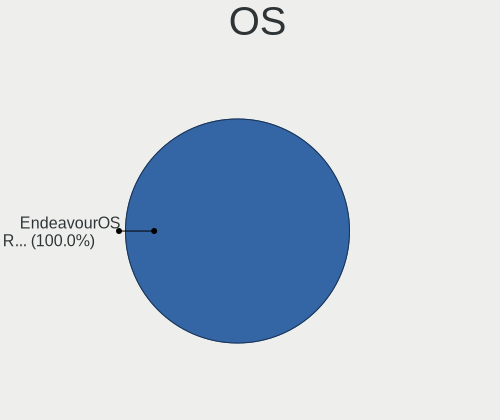
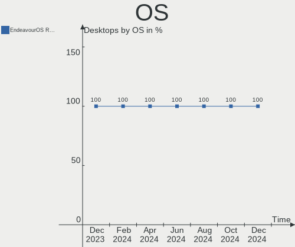
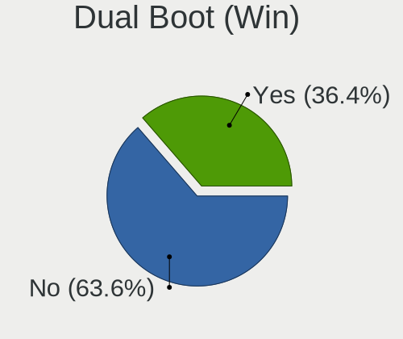
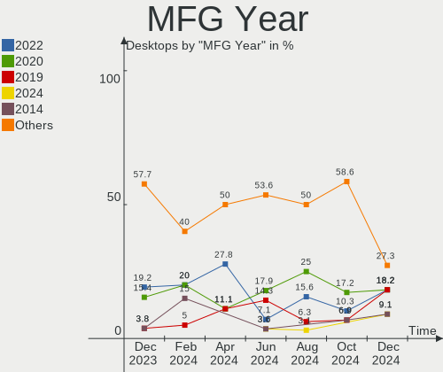
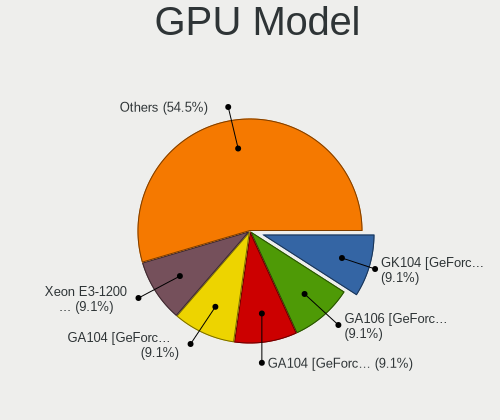
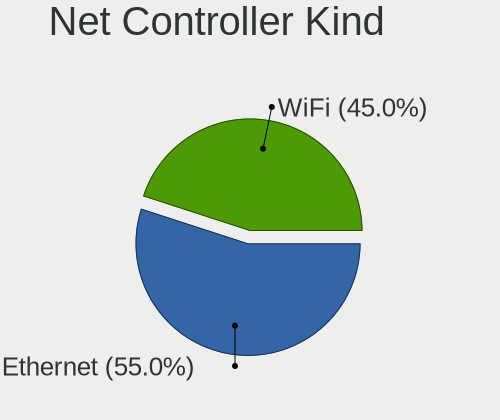
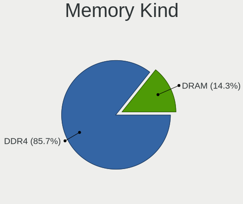
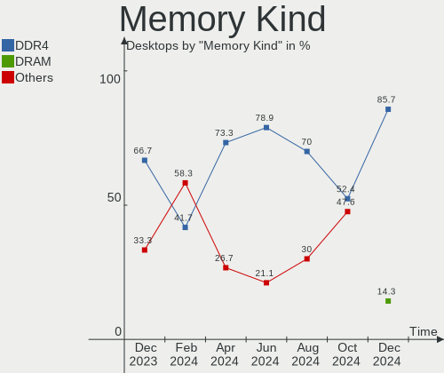

EndeavourOS - Hardware Trends (Desktops)
----------------------------------------

A project to identify most popular hardware characteristics and track their change
over time based on data collected by Linux users at https://Linux-Hardware.org.

Anyone can contribute to this report by the [hw-probe](https://github.com/linuxhw/hw-probe) tool:

    sudo -E hw-probe -all -upload

This report is for one last month. Overall report since the beginning of time: [TestDays](https://github.com/linuxhw/TestDays)

Period: Jan, 2024.

Contents
--------

* [ System ](#system)
  - [ OS                       ](#os)
  - [ OS Family                ](#os-family)
  - [ Kernel                   ](#kernel)
  - [ Kernel Family            ](#kernel-family)
  - [ Kernel Major Ver.        ](#kernel-major-ver)
  - [ Arch                     ](#arch)
  - [ DE                       ](#de)
  - [ Display Server           ](#display-server)
  - [ Display Manager          ](#display-manager)
  - [ OS Lang                  ](#os-lang)
  - [ Boot Mode                ](#boot-mode)
  - [ Filesystem               ](#filesystem)
  - [ Part. scheme             ](#part-scheme)
  - [ Dual Boot with Linux/BSD ](#dual-boot-with-linuxbsd)
  - [ Dual Boot (Win)          ](#dual-boot-win)

* [ Board ](#board)
  - [ Vendor                   ](#vendor)
  - [ Model                    ](#model)
  - [ Model Family             ](#model-family)
  - [ MFG Year                 ](#mfg-year)
  - [ Form Factor              ](#form-factor)
  - [ Secure Boot              ](#secure-boot)
  - [ Coreboot                 ](#coreboot)
  - [ RAM Size                 ](#ram-size)
  - [ RAM Used                 ](#ram-used)
  - [ Total Drives             ](#total-drives)
  - [ Has CD-ROM               ](#has-cd-rom)
  - [ Has Ethernet             ](#has-ethernet)
  - [ Has WiFi                 ](#has-wifi)
  - [ Has Bluetooth            ](#has-bluetooth)

* [ Location ](#location)
  - [ Country                  ](#country)
  - [ City                     ](#city)

* [ Drives ](#drives)
  - [ Drive Vendor             ](#drive-vendor)
  - [ Drive Model              ](#drive-model)
  - [ HDD Vendor               ](#hdd-vendor)
  - [ SSD Vendor               ](#ssd-vendor)
  - [ Drive Kind               ](#drive-kind)
  - [ Drive Connector          ](#drive-connector)
  - [ Drive Size               ](#drive-size)
  - [ Space Total              ](#space-total)
  - [ Space Used               ](#space-used)
  - [ Malfunc. Drives          ](#malfunc-drives)
  - [ Malfunc. Drive Vendor    ](#malfunc-drive-vendor)
  - [ Malfunc. HDD Vendor      ](#malfunc-hdd-vendor)
  - [ Malfunc. Drive Kind      ](#malfunc-drive-kind)
  - [ Failed Drives            ](#failed-drives)
  - [ Failed Drive Vendor      ](#failed-drive-vendor)
  - [ Drive Status             ](#drive-status)

* [ Storage controller ](#storage-controller)
  - [ Storage Vendor           ](#storage-vendor)
  - [ Storage Model            ](#storage-model)
  - [ Storage Kind             ](#storage-kind)

* [ Processor ](#processor)
  - [ CPU Vendor               ](#cpu-vendor)
  - [ CPU Model                ](#cpu-model)
  - [ CPU Model Family         ](#cpu-model-family)
  - [ CPU Cores                ](#cpu-cores)
  - [ CPU Sockets              ](#cpu-sockets)
  - [ CPU Threads              ](#cpu-threads)
  - [ CPU Op-Modes             ](#cpu-op-modes)
  - [ CPU Microcode            ](#cpu-microcode)
  - [ CPU Microarch            ](#cpu-microarch)

* [ Graphics ](#graphics)
  - [ GPU Vendor               ](#gpu-vendor)
  - [ GPU Model                ](#gpu-model)
  - [ GPU Combo                ](#gpu-combo)
  - [ GPU Driver               ](#gpu-driver)
  - [ GPU Memory               ](#gpu-memory)

* [ Monitor ](#monitor)
  - [ Monitor Vendor           ](#monitor-vendor)
  - [ Monitor Model            ](#monitor-model)
  - [ Monitor Resolution       ](#monitor-resolution)
  - [ Monitor Diagonal         ](#monitor-diagonal)
  - [ Monitor Width            ](#monitor-width)
  - [ Aspect Ratio             ](#aspect-ratio)
  - [ Monitor Area             ](#monitor-area)
  - [ Pixel Density            ](#pixel-density)
  - [ Multiple Monitors        ](#multiple-monitors)

* [ Network ](#network)
  - [ Net Controller Vendor    ](#net-controller-vendor)
  - [ Net Controller Model     ](#net-controller-model)
  - [ Wireless Vendor          ](#wireless-vendor)
  - [ Wireless Model           ](#wireless-model)
  - [ Ethernet Vendor          ](#ethernet-vendor)
  - [ Ethernet Model           ](#ethernet-model)
  - [ Net Controller Kind      ](#net-controller-kind)
  - [ Used Controller          ](#used-controller)
  - [ NICs                     ](#nics)
  - [ IPv6                     ](#ipv6)

* [ Bluetooth ](#bluetooth)
  - [ Bluetooth Vendor         ](#bluetooth-vendor)
  - [ Bluetooth Model          ](#bluetooth-model)

* [ Sound ](#sound)
  - [ Sound Vendor             ](#sound-vendor)
  - [ Sound Model              ](#sound-model)

* [ Memory ](#memory)
  - [ Memory Vendor            ](#memory-vendor)
  - [ Memory Model             ](#memory-model)
  - [ Memory Kind              ](#memory-kind)
  - [ Memory Form Factor       ](#memory-form-factor)
  - [ Memory Size              ](#memory-size)
  - [ Memory Speed             ](#memory-speed)

* [ Printers & scanners ](#printers--scanners)
  - [ Printer Vendor           ](#printer-vendor)
  - [ Printer Model            ](#printer-model)
  - [ Scanner Vendor           ](#scanner-vendor)
  - [ Scanner Model            ](#scanner-model)

* [ Camera ](#camera)
  - [ Camera Vendor            ](#camera-vendor)
  - [ Camera Model             ](#camera-model)

* [ Security ](#security)
  - [ Fingerprint Vendor       ](#fingerprint-vendor)
  - [ Fingerprint Model        ](#fingerprint-model)
  - [ Chipcard Vendor          ](#chipcard-vendor)
  - [ Chipcard Model           ](#chipcard-model)

* [ Unsupported ](#unsupported)
  - [ Unsupported Devices      ](#unsupported-devices)
  - [ Unsupported Device Types ](#unsupported-device-types)

System
------

OS
--

Installed operating systems

| Name                | Desktops | Percent |
|---------------------|----------|---------|
| EndeavourOS Rolling | 25       | 100%    |

OS Family
---------

OS without a version

| Name        | Desktops | Percent |
|-------------|----------|---------|
| EndeavourOS | 25       | 100%    |

Kernel
------

Version of the Linux kernel

| Version           | Desktops | Percent |
|-------------------|----------|---------|
| 6.7.0-arch3-1     | 5        | 20%     |
| 6.6.10-arch1-1    | 4        | 16%     |
| 6.6.8-arch1-1     | 3        | 12%     |
| 6.7.2-arch1-1     | 2        | 8%      |
| 6.6.7-arch1-1     | 2        | 8%      |
| 6.6.13-1-lts      | 2        | 8%      |
| 6.7.1-arch1-1     | 1        | 4%      |
| 6.7.0-zen3-1-zen  | 1        | 4%      |
| 6.6.9-zen1-1-zen  | 1        | 4%      |
| 6.6.14-1-lts      | 1        | 4%      |
| 6.6.12-1-lts      | 1        | 4%      |
| 6.6.11-1-lts      | 1        | 4%      |
| 6.6.10-zen1-1-zen | 1        | 4%      |

Kernel Family
-------------

Linux kernel without a distro release

| Version | Desktops | Percent |
|---------|----------|---------|
| 6.7.0   | 6        | 24%     |
| 6.6.10  | 5        | 20%     |
| 6.6.8   | 3        | 12%     |
| 6.7.2   | 2        | 8%      |
| 6.6.7   | 2        | 8%      |
| 6.6.13  | 2        | 8%      |
| 6.7.1   | 1        | 4%      |
| 6.6.9   | 1        | 4%      |
| 6.6.14  | 1        | 4%      |
| 6.6.12  | 1        | 4%      |
| 6.6.11  | 1        | 4%      |

Kernel Major Ver.
-----------------

Linux kernel major version

| Version | Desktops | Percent |
|---------|----------|---------|
| 6.6     | 16       | 64%     |
| 6.7     | 9        | 36%     |

Arch
----

OS architecture (x86_64, i586, etc.)

| Name   | Desktops | Percent |
|--------|----------|---------|
| x86_64 | 25       | 100%    |

DE
--

Desktop Environment

| Name       | Desktops | Percent |
|------------|----------|---------|
| KDE5       | 11       | 44%     |
| GNOME      | 6        | 24%     |
| XFCE       | 3        | 12%     |
| X-Cinnamon | 1        | 4%      |
| LXQt       | 1        | 4%      |
| i3         | 1        | 4%      |
| Budgie     | 1        | 4%      |
| Unknown    | 1        | 4%      |

Display Server
--------------

X11 or Wayland

| Name    | Desktops | Percent |
|---------|----------|---------|
| X11     | 21       | 84%     |
| Wayland | 4        | 16%     |

Display Manager
---------------

SDDM, LightDM, etc.

| Name    | Desktops | Percent |
|---------|----------|---------|
| Unknown | 11       | 44%     |
| SDDM    | 6        | 24%     |
| LightDM | 6        | 24%     |
| GDM     | 2        | 8%      |

OS Lang
-------

Language

| Lang    | Desktops | Percent |
|---------|----------|---------|
| en_US   | 7        | 28%     |
| en_GB   | 5        | 20%     |
| de_DE   | 4        | 16%     |
| tr_TR   | 1        | 4%      |
| ru_RU   | 1        | 4%      |
| pl_PL   | 1        | 4%      |
| it_IT   | 1        | 4%      |
| en_ZA   | 1        | 4%      |
| en_IN   | 1        | 4%      |
| de_AT   | 1        | 4%      |
| da_DK   | 1        | 4%      |
| Unknown | 1        | 4%      |

Boot Mode
---------

EFI or BIOS

| Mode | Desktops | Percent |
|------|----------|---------|
| BIOS | 14       | 56%     |
| EFI  | 11       | 44%     |

Filesystem
----------

Type of filesystem

| Type  | Desktops | Percent |
|-------|----------|---------|
| Ext4  | 19       | 76%     |
| Btrfs | 6        | 24%     |

Part. scheme
------------

Scheme of partitioning

| Type    | Desktops | Percent |
|---------|----------|---------|
| GPT     | 14       | 56%     |
| Unknown | 10       | 40%     |
| MBR     | 1        | 4%      |

Dual Boot with Linux/BSD
------------------------

Hosting more than one Linux/BSD

| Dual boot | Desktops | Percent |
|-----------|----------|---------|
| No        | 18       | 72%     |
| Yes       | 7        | 28%     |

Dual Boot (Win)
---------------

Hosting Linux and Windows

| Dual boot | Desktops | Percent |
|-----------|----------|---------|
| No        | 13       | 52%     |
| Yes       | 12       | 48%     |

Board
-----

Vendor
------

Motherboard manufacturer

| Name                | Desktops | Percent |
|---------------------|----------|---------|
| Gigabyte Technology | 8        | 32%     |
| ASUSTek Computer    | 7        | 28%     |
| MSI                 | 3        | 12%     |
| Hewlett-Packard     | 3        | 12%     |
| Dell                | 1        | 4%      |
| Biostar             | 1        | 4%      |
| Apple               | 1        | 4%      |
| Unknown             | 1        | 4%      |

Model
-----

Motherboard model

| Name                              | Desktops | Percent |
|-----------------------------------|----------|---------|
| ASUS TUF Gaming X570-PLUS         | 2        | 8%      |
| MSI MS-7D91                       | 1        | 4%      |
| MSI MS-7D70                       | 1        | 4%      |
| MSI MS-7B89                       | 1        | 4%      |
| HP Z620 Workstation               | 1        | 4%      |
| HP ProDesk 400 G2 MINI            | 1        | 4%      |
| HP EliteDesk 800 G1 TWR           | 1        | 4%      |
| Gigabyte Z790 AORUS ELITE AX      | 1        | 4%      |
| Gigabyte Z170X-Gaming 7           | 1        | 4%      |
| Gigabyte B550I AORUS PRO AX       | 1        | 4%      |
| Gigabyte B550 AORUS ELITE V2      | 1        | 4%      |
| Gigabyte B450M DS3H               | 1        | 4%      |
| Gigabyte B250M-DS3H               | 1        | 4%      |
| Gigabyte B250M-D3H                | 1        | 4%      |
| Gigabyte 970A-UD3P                | 1        | 4%      |
| Dell OptiPlex 7010                | 1        | 4%      |
| Biostar MCP6P3                    | 1        | 4%      |
| ASUS TUF Gaming Z690-PLUS WIFI D4 | 1        | 4%      |
| ASUS ROG STRIX B550-E GAMING      | 1        | 4%      |
| ASUS ROG Maximus XI HERO          | 1        | 4%      |
| ASUS PRIME X570-P                 | 1        | 4%      |
| ASUS M4N78-AM V2                  | 1        | 4%      |
| Apple MacPro6,1                   | 1        | 4%      |
| Unknown                           | 1        | 4%      |

Model Family
------------

Motherboard model prefix

| Name                  | Desktops | Percent |
|-----------------------|----------|---------|
| ASUS TUF              | 3        | 12%     |
| ASUS ROG              | 2        | 8%      |
| MSI MS-7D91           | 1        | 4%      |
| MSI MS-7D70           | 1        | 4%      |
| MSI MS-7B89           | 1        | 4%      |
| HP Z620               | 1        | 4%      |
| HP ProDesk            | 1        | 4%      |
| HP EliteDesk          | 1        | 4%      |
| Gigabyte Z790         | 1        | 4%      |
| Gigabyte Z170X-Gaming | 1        | 4%      |
| Gigabyte B550I        | 1        | 4%      |
| Gigabyte B550         | 1        | 4%      |
| Gigabyte B450M        | 1        | 4%      |
| Gigabyte B250M-DS3H   | 1        | 4%      |
| Gigabyte B250M-D3H    | 1        | 4%      |
| Gigabyte 970A-UD3P    | 1        | 4%      |
| Dell OptiPlex         | 1        | 4%      |
| Biostar MCP6P3        | 1        | 4%      |
| ASUS PRIME            | 1        | 4%      |
| ASUS M4N78-AM         | 1        | 4%      |
| Apple MacPro6         | 1        | 4%      |
| Unknown               | 1        | 4%      |

MFG Year
--------

Motherboard manufacture year

| Year | Desktops | Percent |
|------|----------|---------|
| 2019 | 4        | 16%     |
| 2022 | 3        | 12%     |
| 2020 | 3        | 12%     |
| 2016 | 3        | 12%     |
| 2013 | 3        | 12%     |
| 2021 | 2        | 8%      |
| 2018 | 2        | 8%      |
| 2009 | 2        | 8%      |
| 2015 | 1        | 4%      |
| 2014 | 1        | 4%      |
| 2012 | 1        | 4%      |

Form Factor
-----------

Physical design of the computer

| Name    | Desktops | Percent |
|---------|----------|---------|
| Desktop | 25       | 100%    |

Secure Boot
-----------

Enabled or disabled

| State    | Desktops | Percent |
|----------|----------|---------|
| Disabled | 24       | 96%     |
| Enabled  | 1        | 4%      |

Coreboot
--------

Have coreboot on board

| Used | Desktops | Percent |
|------|----------|---------|
| No   | 25       | 100%    |

RAM Size
--------

Total RAM memory

| Size in GB  | Desktops | Percent |
|-------------|----------|---------|
| 32.01-64.0  | 11       | 44%     |
| 16.01-24.0  | 4        | 16%     |
| 64.01-256.0 | 3        | 12%     |
| 4.01-8.0    | 2        | 8%      |
| 8.01-16.0   | 2        | 8%      |
| 3.01-4.0    | 1        | 4%      |
| 24.01-32.0  | 1        | 4%      |
| 1.01-2.0    | 1        | 4%      |

RAM Used
--------

Used RAM memory

| Used GB    | Desktops | Percent |
|------------|----------|---------|
| 8.01-16.0  | 7        | 28%     |
| 4.01-8.0   | 6        | 24%     |
| 2.01-3.0   | 5        | 20%     |
| 3.01-4.0   | 4        | 16%     |
| 16.01-24.0 | 1        | 4%      |
| 1.01-2.0   | 1        | 4%      |
| 0.51-1.0   | 1        | 4%      |

Total Drives
------------

Number of drives on board

| Drives | Desktops | Percent |
|--------|----------|---------|
| 3      | 7        | 28%     |
| 4      | 5        | 20%     |
| 2      | 5        | 20%     |
| 6      | 3        | 12%     |
| 1      | 3        | 12%     |
| 7      | 1        | 4%      |
| 5      | 1        | 4%      |

Has CD-ROM
----------

Has CD-ROM on board

| Presented | Desktops | Percent |
|-----------|----------|---------|
| No        | 17       | 68%     |
| Yes       | 8        | 32%     |

Has Ethernet
------------

Has Ethernet on board

| Presented | Desktops | Percent |
|-----------|----------|---------|
| Yes       | 25       | 100%    |

Has WiFi
--------

Has WiFi module

| Presented | Desktops | Percent |
|-----------|----------|---------|
| Yes       | 16       | 64%     |
| No        | 9        | 36%     |

Has Bluetooth
-------------

Has Bluetooth module

| Presented | Desktops | Percent |
|-----------|----------|---------|
| Yes       | 13       | 52%     |
| No        | 12       | 48%     |

Location
--------

Country
-------

Geographic location (country)

| Country      | Desktops | Percent |
|--------------|----------|---------|
| USA          | 6        | 24%     |
| Germany      | 4        | 16%     |
| UK           | 3        | 12%     |
| Türkiye     | 1        | 4%      |
| South Africa | 1        | 4%      |
| Serbia       | 1        | 4%      |
| Poland       | 1        | 4%      |
| Netherlands  | 1        | 4%      |
| Italy        | 1        | 4%      |
| Isle of Man  | 1        | 4%      |
| India        | 1        | 4%      |
| France       | 1        | 4%      |
| Denmark      | 1        | 4%      |
| Belarus      | 1        | 4%      |
| Austria      | 1        | 4%      |

City
----

Geographic location (city)

| City         | Desktops | Percent |
|--------------|----------|---------|
| Zirl         | 1        | 4%      |
| Tamworth     | 1        | 4%      |
| St Louis     | 1        | 4%      |
| South Jordan | 1        | 4%      |
| San Jose     | 1        | 4%      |
| Rumia        | 1        | 4%      |
| Remchingen   | 1        | 4%      |
| Oristano     | 1        | 4%      |
| Oldenzaal    | 1        | 4%      |
| Oakland      | 1        | 4%      |
| Minsk        | 1        | 4%      |
| Loupian      | 1        | 4%      |
| Lewisham     | 1        | 4%      |
| Hyderabad    | 1        | 4%      |
| Haltom City  | 1        | 4%      |
| Gladstone    | 1        | 4%      |
| Germersheim  | 1        | 4%      |
| Douglas      | 1        | 4%      |
| Copenhagen   | 1        | 4%      |
| Centurion    | 1        | 4%      |
| Çanakkale   | 1        | 4%      |
| Bremen       | 1        | 4%      |
| Belgrade     | 1        | 4%      |
| Bathgate     | 1        | 4%      |
| Aachen       | 1        | 4%      |

Drives
------

Drive Vendor
------------

Hard drive vendors

| Vendor                      | Desktops | Drives | Percent |
|-----------------------------|----------|--------|---------|
| Samsung Electronics         | 12       | 18     | 17.91%  |
| WDC                         | 10       | 12     | 14.93%  |
| Seagate                     | 9        | 15     | 13.43%  |
| Crucial                     | 6        | 7      | 8.96%   |
| Toshiba                     | 4        | 5      | 5.97%   |
| Phison Electronics          | 3        | 3      | 4.48%   |
| Kingston                    | 3        | 3      | 4.48%   |
| SPCC                        | 2        | 2      | 2.99%   |
| SanDisk                     | 2        | 2      | 2.99%   |
| Micron/Crucial Technology   | 2        | 2      | 2.99%   |
| Hitachi                     | 2        | 2      | 2.99%   |
| Transcend                   | 1        | 1      | 1.49%   |
| SSK SD30                    | 1        | 1      | 1.49%   |
| OCZ                         | 1        | 1      | 1.49%   |
| Maxtor                      | 1        | 2      | 1.49%   |
| MAXIO Technology (Hangzhou) | 1        | 1      | 1.49%   |
| Kingston Technology Company | 1        | 1      | 1.49%   |
| KingSpec                    | 1        | 1      | 1.49%   |
| Intenso                     | 1        | 1      | 1.49%   |
| Intel                       | 1        | 1      | 1.49%   |
| Gigastone                   | 1        | 1      | 1.49%   |
| Apple                       | 1        | 1      | 1.49%   |
| Unknown                     | 1        | 1      | 1.49%   |

Drive Model
-----------

Hard drive models

| Model                                              | Desktops | Percent |
|----------------------------------------------------|----------|---------|
| Samsung NVMe SSD Controller PM9A1/PM9A3/980PRO 2TB | 4        | 5.13%   |
| Samsung NVMe SSD Controller SM981/PM981/PM983 1TB  | 3        | 3.85%   |
| WDC WD10EZEX-08WN4A0 1TB                           | 2        | 2.56%   |
| Toshiba DT01ACA100 1TB                             | 2        | 2.56%   |
| Seagate ST2000DM008-2FR102 2TB                     | 2        | 2.56%   |
| Samsung SSD 860 EVO 500GB                          | 2        | 2.56%   |
| Phison E16 PCIe4 NVMe Controller 2TB               | 2        | 2.56%   |
| Micron/Crucial P1 NVMe PCIe SSD 1TB                | 2        | 2.56%   |
| Kingston SA400S37480G 480GB SSD                    | 2        | 2.56%   |
| WDC WD6003FZBX-00K5WB0 6TB                         | 1        | 1.28%   |
| WDC WD5000LPLX-16ZNTT1 500GB                       | 1        | 1.28%   |
| WDC WD5000BEVT-35A0RT0 500GB                       | 1        | 1.28%   |
| WDC WD40EFRX-68WT0N0 4TB                           | 1        | 1.28%   |
| WDC WD4003FZEX-00Z4SA0 4TB                         | 1        | 1.28%   |
| WDC WD2500AAJS-75M0A0 249GB                        | 1        | 1.28%   |
| WDC WD20EFRX-68EUZN0 2TB                           | 1        | 1.28%   |
| WDC WD15EARS-00Z5B1 1TB                            | 1        | 1.28%   |
| WDC WD10EZEX-60ZF5A0 1TB                           | 1        | 1.28%   |
| Transcend TS256GSSD230S 256GB                      | 1        | 1.28%   |
| Toshiba MQ01ABD100 1TB                             | 1        | 1.28%   |
| Toshiba HDWR460 6TB                                | 1        | 1.28%   |
| Toshiba HDWE140 4TB                                | 1        | 1.28%   |
| SSK SD30 0 128GB                                   | 1        | 1.28%   |
| SPCC Solid State Disk 240GB                        | 1        | 1.28%   |
| SPCC Solid State Disk 128GB                        | 1        | 1.28%   |
| Seagate ST4000DM004-2CV104 4TB                     | 1        | 1.28%   |
| Seagate ST3500414CS 500GB                          | 1        | 1.28%   |
| Seagate ST3500312CS 500GB                          | 1        | 1.28%   |
| Seagate ST3250310SV 250GB                          | 1        | 1.28%   |
| Seagate ST31000528AS 1TB                           | 1        | 1.28%   |
| Seagate ST2000DM008-2UB102 2TB                     | 1        | 1.28%   |
| Seagate ST1000DM003-1CH162 1TB                     | 1        | 1.28%   |
| Seagate OneTouch HDD 1TB                           | 1        | 1.28%   |
| Seagate M3 Portable 4TB                            | 1        | 1.28%   |
| Seagate Expansion 1TB                              | 1        | 1.28%   |
| Seagate BarraCuda 120 SSD ZA500CM10003 500GB       | 1        | 1.28%   |
| Sandisk WD_BLACK SN850X 1000GB                     | 1        | 1.28%   |
| SanDisk Extreme SSD 500GB                          | 1        | 1.28%   |
| Samsung SSD 990 PRO 2TB                            | 1        | 1.28%   |
| Samsung SSD 980 1TB                                | 1        | 1.28%   |

HDD Vendor
----------

Hard disk drive vendors

| Vendor              | Desktops | Drives | Percent |
|---------------------|----------|--------|---------|
| WDC                 | 10       | 12     | 37.04%  |
| Seagate             | 8        | 12     | 29.63%  |
| Toshiba             | 4        | 5      | 14.81%  |
| Hitachi             | 2        | 2      | 7.41%   |
| Samsung Electronics | 1        | 1      | 3.7%    |
| Maxtor              | 1        | 2      | 3.7%    |
| Intenso             | 1        | 1      | 3.7%    |

SSD Vendor
----------

Solid state drive vendors

| Vendor              | Desktops | Drives | Percent |
|---------------------|----------|--------|---------|
| Samsung Electronics | 6        | 6      | 24%     |
| Crucial             | 6        | 7      | 24%     |
| Kingston            | 3        | 3      | 12%     |
| SPCC                | 2        | 2      | 8%      |
| Transcend           | 1        | 1      | 4%      |
| Seagate             | 1        | 2      | 4%      |
| SanDisk             | 1        | 1      | 4%      |
| OCZ                 | 1        | 1      | 4%      |
| KingSpec            | 1        | 1      | 4%      |
| Gigastone           | 1        | 1      | 4%      |
| Apple               | 1        | 1      | 4%      |
| Unknown             | 1        | 1      | 4%      |

Drive Kind
----------

HDD or SSD

| Kind    | Desktops | Drives | Percent |
|---------|----------|--------|---------|
| HDD     | 19       | 35     | 36.54%  |
| SSD     | 17       | 27     | 32.69%  |
| NVMe    | 14       | 20     | 26.92%  |
| Unknown | 2        | 2      | 3.85%   |

Drive Connector
---------------

SATA, SAS, NVMe, etc.

| Type | Desktops | Drives | Percent |
|------|----------|--------|---------|
| SATA | 22       | 58     | 52.38%  |
| NVMe | 14       | 20     | 33.33%  |
| SAS  | 6        | 6      | 14.29%  |

Drive Size
----------

Size of hard drive

| Size in TB | Desktops | Drives | Percent |
|------------|----------|--------|---------|
| 0.01-0.5   | 17       | 29     | 44.74%  |
| 0.51-1.0   | 11       | 19     | 28.95%  |
| 1.01-2.0   | 4        | 7      | 10.53%  |
| 3.01-4.0   | 3        | 4      | 7.89%   |
| 4.01-10.0  | 2        | 2      | 5.26%   |
| 2.01-3.0   | 1        | 1      | 2.63%   |

Space Total
-----------

Amount of disk space available on the file system

| Size in GB     | Desktops | Percent |
|----------------|----------|---------|
| More than 3000 | 7        | 28%     |
| 251-500        | 7        | 28%     |
| 101-250        | 3        | 12%     |
| 1001-2000      | 3        | 12%     |
| 2001-3000      | 2        | 8%      |
| 501-1000       | 2        | 8%      |
| Unknown        | 1        | 4%      |

Space Used
----------

Amount of used disk space

| Used GB        | Desktops | Percent |
|----------------|----------|---------|
| More than 3000 | 4        | 16%     |
| 21-50          | 4        | 16%     |
| 101-250        | 4        | 16%     |
| 251-500        | 3        | 12%     |
| 2001-3000      | 3        | 12%     |
| 1-20           | 2        | 8%      |
| 501-1000       | 2        | 8%      |
| 1001-2000      | 1        | 4%      |
| 51-100         | 1        | 4%      |
| Unknown        | 1        | 4%      |

Malfunc. Drives
---------------

Drive models with a malfunction

| Model                           | Desktops | Drives | Percent |
|---------------------------------|----------|--------|---------|
| WDC WD2500AAJS-75M0A0 249GB     | 1        | 1      | 12.5%   |
| WDC WD20EFRX-68EUZN0 2TB        | 1        | 2      | 12.5%   |
| WDC WD15EARS-00Z5B1 1TB         | 1        | 1      | 12.5%   |
| Seagate ST31000528AS 1TB        | 1        | 1      | 12.5%   |
| Seagate ST1000DM003-1CH162 1TB  | 1        | 1      | 12.5%   |
| Maxtor 6Y080L0 82GB             | 1        | 2      | 12.5%   |
| Kingston SA400S37480G 480GB SSD | 1        | 1      | 12.5%   |
| Crucial CT1050MX300SSD1 1050GB  | 1        | 1      | 12.5%   |

Malfunc. Drive Vendor
---------------------

Vendors of faulty drives

| Vendor   | Desktops | Drives | Percent |
|----------|----------|--------|---------|
| WDC      | 3        | 4      | 42.86%  |
| Seagate  | 1        | 2      | 14.29%  |
| Maxtor   | 1        | 2      | 14.29%  |
| Kingston | 1        | 1      | 14.29%  |
| Crucial  | 1        | 1      | 14.29%  |

Malfunc. HDD Vendor
-------------------

Vendors of faulty HDD drives

| Vendor  | Desktops | Drives | Percent |
|---------|----------|--------|---------|
| WDC     | 3        | 4      | 60%     |
| Seagate | 1        | 2      | 20%     |
| Maxtor  | 1        | 2      | 20%     |

Malfunc. Drive Kind
-------------------

Kinds of faulty drives

| Kind | Desktops | Drives | Percent |
|------|----------|--------|---------|
| HDD  | 4        | 8      | 66.67%  |
| SSD  | 2        | 2      | 33.33%  |

Failed Drives
-------------

Failed drive models

Zero info for selected period =(

Failed Drive Vendor
-------------------

Failed drive vendors

Zero info for selected period =(

Drive Status
------------

Number of failed and malfunc. drives

| Status   | Desktops | Drives | Percent |
|----------|----------|--------|---------|
| Detected | 15       | 36     | 42.86%  |
| Works    | 14       | 38     | 40%     |
| Malfunc  | 6        | 10     | 17.14%  |

Storage controller
------------------

Storage Vendor
--------------

Storage controller vendors

| Vendor                      | Desktops | Percent |
|-----------------------------|----------|---------|
| Intel                       | 13       | 29.55%  |
| AMD                         | 10       | 22.73%  |
| Samsung Electronics         | 9        | 20.45%  |
| Phison Electronics          | 3        | 6.82%   |
| Nvidia                      | 2        | 4.55%   |
| Micron/Crucial Technology   | 2        | 4.55%   |
| ASMedia Technology          | 2        | 4.55%   |
| Sandisk                     | 1        | 2.27%   |
| MAXIO Technology (Hangzhou) | 1        | 2.27%   |
| Kingston Technology Company | 1        | 2.27%   |

Storage Model
-------------

Storage controller models

| Model                                                                          | Desktops | Percent |
|--------------------------------------------------------------------------------|----------|---------|
| Samsung NVMe SSD Controller PM9A1/PM9A3/980PRO                                 | 4        | 7.69%   |
| AMD FCH SATA Controller [AHCI mode]                                            | 4        | 7.69%   |
| Samsung NVMe SSD Controller SM981/PM981/PM983                                  | 3        | 5.77%   |
| AMD 500 Series Chipset SATA Controller                                         | 3        | 5.77%   |
| Phison E16 PCIe4 NVMe Controller                                               | 2        | 3.85%   |
| Micron/Crucial P1 NVMe PCIe SSD[Frampton]                                      | 2        | 3.85%   |
| Intel Raptor Lake SATA AHCI Controller                                         | 2        | 3.85%   |
| Intel Q170/Q150/B150/H170/H110/Z170/CM236 Chipset SATA Controller [AHCI Mode]  | 2        | 3.85%   |
| Intel 8 Series/C220 Series Chipset Family 6-port SATA Controller 1 [AHCI mode] | 2        | 3.85%   |
| Intel 200 Series PCH SATA controller [AHCI mode]                               | 2        | 3.85%   |
| ASMedia ASM1061/ASM1062 Serial ATA Controller                                  | 2        | 3.85%   |
| AMD 400 Series Chipset SATA Controller                                         | 2        | 3.85%   |
| Sandisk WD Black SN850X NVMe SSD                                               | 1        | 1.92%   |
| Samsung S4LN053X01 AHCI SSD Controller(Apple slot)                             | 1        | 1.92%   |
| Samsung NVMe SSD Controller S4LV008[Pascal]                                    | 1        | 1.92%   |
| Samsung NVMe SSD Controller 980 (DRAM-less)                                    | 1        | 1.92%   |
| Phison E12 NVMe Controller                                                     | 1        | 1.92%   |
| Nvidia MCP78S [GeForce 8200] SATA Controller (non-AHCI mode)                   | 1        | 1.92%   |
| Nvidia MCP78S [GeForce 8200] IDE                                               | 1        | 1.92%   |
| Nvidia MCP61 SATA Controller                                                   | 1        | 1.92%   |
| Nvidia MCP61 IDE                                                               | 1        | 1.92%   |
| MAXIO (Hangzhou) NVMe SSD Controller MAP1202 (DRAM-less)                       | 1        | 1.92%   |
| Kingston Company NV2 NVMe SSD SM2267XT (DRAM-less)                             | 1        | 1.92%   |
| Intel Volume Management Device NVMe RAID Controller                            | 1        | 1.92%   |
| Intel SSD 600P Series                                                          | 1        | 1.92%   |
| Intel Cannon Lake PCH SATA AHCI Controller                                     | 1        | 1.92%   |
| Intel C602 chipset 4-Port SATA Storage Control Unit                            | 1        | 1.92%   |
| Intel C600/X79 series chipset IDE-r Controller                                 | 1        | 1.92%   |
| Intel C600/X79 series chipset 6-Port SATA AHCI Controller                      | 1        | 1.92%   |
| Intel Alder Lake-S PCH SATA Controller [AHCI Mode]                             | 1        | 1.92%   |
| Intel 7 Series/C210 Series Chipset Family 6-port SATA Controller [AHCI mode]   | 1        | 1.92%   |
| AMD SB7x0/SB8x0/SB9x0 SATA Controller [AHCI mode]                              | 1        | 1.92%   |
| AMD SB7x0/SB8x0/SB9x0 IDE Controller                                           | 1        | 1.92%   |
| AMD 600 Series Chipset SATA Controller                                         | 1        | 1.92%   |

Storage Kind
------------

Kind of storage controller (IDE, SATA, NVMe, SAS, ...)

| Kind | Desktops | Percent |
|------|----------|---------|
| SATA | 23       | 53.49%  |
| NVMe | 14       | 32.56%  |
| IDE  | 4        | 9.3%    |
| RAID | 1        | 2.33%   |
| SAS  | 1        | 2.33%   |

Processor
---------

CPU Vendor
----------

Processor vendors

| Vendor | Desktops | Percent |
|--------|----------|---------|
| Intel  | 13       | 52%     |
| AMD    | 12       | 48%     |

CPU Model
---------

Processor models

| Model                                  | Desktops | Percent |
|----------------------------------------|----------|---------|
| Intel Core i5-7400 CPU @ 3.00GHz       | 2        | 8%      |
| AMD Athlon II X2 250 Processor         | 2        | 8%      |
| Intel Xeon CPU E5-2673 v3 @ 2.40GHz    | 1        | 4%      |
| Intel Xeon CPU E5-2650 v2 @ 2.60GHz    | 1        | 4%      |
| Intel Xeon CPU E5-1680 v2 @ 3.00GHz    | 1        | 4%      |
| Intel Core i9-9900K CPU @ 3.60GHz      | 1        | 4%      |
| Intel Core i9-14900K                   | 1        | 4%      |
| Intel Core i7-6700K CPU @ 4.00GHz      | 1        | 4%      |
| Intel Core i5-6500T CPU @ 2.50GHz      | 1        | 4%      |
| Intel Core i5-4590 CPU @ 3.30GHz       | 1        | 4%      |
| Intel Core i5-3470 CPU @ 3.20GHz       | 1        | 4%      |
| Intel 13th Gen Core i7-13700KF         | 1        | 4%      |
| Intel 12th Gen Core i7-12700K          | 1        | 4%      |
| AMD Ryzen 9 7950X 16-Core Processor    | 1        | 4%      |
| AMD Ryzen 9 5900X 12-Core Processor    | 1        | 4%      |
| AMD Ryzen 7 5800X3D 8-Core Processor   | 1        | 4%      |
| AMD Ryzen 7 5800X 8-Core Processor     | 1        | 4%      |
| AMD Ryzen 7 5700X 8-Core Processor     | 1        | 4%      |
| AMD Ryzen 7 5700G with Radeon Graphics | 1        | 4%      |
| AMD Ryzen 5 5600X 6-Core Processor     | 1        | 4%      |
| AMD Ryzen 5 5500                       | 1        | 4%      |
| AMD Ryzen 5 2600 Six-Core Processor    | 1        | 4%      |
| AMD FX-8150 Eight-Core Processor       | 1        | 4%      |

CPU Model Family
----------------

Processor model prefix

| Model            | Desktops | Percent |
|------------------|----------|---------|
| Intel Core i5    | 5        | 20%     |
| AMD Ryzen 7      | 4        | 16%     |
| Intel Xeon       | 3        | 12%     |
| AMD Ryzen 5      | 3        | 12%     |
| Other            | 2        | 8%      |
| Intel Core i9    | 2        | 8%      |
| AMD Ryzen 9      | 2        | 8%      |
| AMD Athlon II X2 | 2        | 8%      |
| Intel Core i7    | 1        | 4%      |
| AMD FX           | 1        | 4%      |

CPU Cores
---------

Number of processor cores

| Number | Desktops | Percent |
|--------|----------|---------|
| 4      | 7        | 28%     |
| 8      | 6        | 24%     |
| 16     | 3        | 12%     |
| 12     | 3        | 12%     |
| 6      | 3        | 12%     |
| 2      | 2        | 8%      |
| 24     | 1        | 4%      |

CPU Sockets
-----------

Number of sockets

| Number | Desktops | Percent |
|--------|----------|---------|
| 1      | 24       | 96%     |
| 2      | 1        | 4%      |

CPU Threads
-----------

Threads per core (Hyper-Threading)

| Number | Desktops | Percent |
|--------|----------|---------|
| 2      | 18       | 72%     |
| 1      | 7        | 28%     |

CPU Op-Modes
------------

CPU Operation Modes (32-bit, 64-bit)

| Op mode        | Desktops | Percent |
|----------------|----------|---------|
| 32-bit, 64-bit | 25       | 100%    |

CPU Microcode
-------------

Microcode number

| Number     | Desktops | Percent |
|------------|----------|---------|
| Unknown    | 20       | 80%     |
| 0x0a20120a | 2        | 8%      |
| 0x0a20102b | 1        | 4%      |
| 0x0a201025 | 1        | 4%      |
| 0x0600063e | 1        | 4%      |

CPU Microarch
-------------

Microarchitecture

| Name             | Desktops | Percent |
|------------------|----------|---------|
| Zen 3            | 7        | 28%     |
| KabyLake         | 3        | 12%     |
| IvyBridge        | 3        | 12%     |
| Alderlake Hybrid | 3        | 12%     |
| Skylake          | 2        | 8%      |
| K10              | 2        | 8%      |
| Haswell          | 2        | 8%      |
| Zen+             | 1        | 4%      |
| Bulldozer        | 1        | 4%      |
| Unknown          | 1        | 4%      |

Graphics
--------

GPU Vendor
----------

Vendors of graphics cards

| Vendor | Desktops | Percent |
|--------|----------|---------|
| AMD    | 14       | 46.67%  |
| Nvidia | 10       | 33.33%  |
| Intel  | 6        | 20%     |

GPU Model
---------

Graphics card models

| Model                                                                       | Desktops | Percent |
|-----------------------------------------------------------------------------|----------|---------|
| AMD Navi 32 [Radeon RX 7700 XT / 7800 XT]                                   | 3        | 10%     |
| Nvidia GA106 [GeForce RTX 3060 Lite Hash Rate]                              | 2        | 6.67%   |
| Intel HD Graphics 530                                                       | 2        | 6.67%   |
| AMD Navi 22 [Radeon RX 6700/6700 XT/6750 XT / 6800M/6850M XT]               | 2        | 6.67%   |
| Nvidia TU116 [GeForce GTX 1660 Ti]                                          | 1        | 3.33%   |
| Nvidia TU116 [GeForce GTX 1660 SUPER]                                       | 1        | 3.33%   |
| Nvidia TU104 [GeForce RTX 2070 SUPER]                                       | 1        | 3.33%   |
| Nvidia GP107 [GeForce GTX 1050]                                             | 1        | 3.33%   |
| Nvidia GP106GL [Quadro P2000]                                               | 1        | 3.33%   |
| Nvidia GK208B [GeForce GT 710]                                              | 1        | 3.33%   |
| Nvidia G96C [GeForce 9500 GT]                                               | 1        | 3.33%   |
| Nvidia AD106 [GeForce RTX 4060 Ti 16GB]                                     | 1        | 3.33%   |
| Intel Xeon E3-1200 v3/4th Gen Core Processor Integrated Graphics Controller | 1        | 3.33%   |
| Intel Xeon E3-1200 v2/3rd Gen Core processor Graphics Controller            | 1        | 3.33%   |
| Intel Raptor Lake-S GT1 [UHD Graphics 770]                                  | 1        | 3.33%   |
| Intel CoffeeLake-S GT2 [UHD Graphics 630]                                   | 1        | 3.33%   |
| AMD Tahiti XT [Radeon HD 7970/8970 OEM / R9 280X]                           | 1        | 3.33%   |
| AMD RV710/M92 [Mobility Radeon HD 4330/4350/4550]                           | 1        | 3.33%   |
| AMD Navi 31 [Radeon RX 7900 XT/7900 XTX/7900M]                              | 1        | 3.33%   |
| AMD Navi 24 [Radeon RX 6400/6500 XT/6500M]                                  | 1        | 3.33%   |
| AMD Navi 23 [Radeon RX 6600/6600 XT/6600M]                                  | 1        | 3.33%   |
| AMD Navi 21 [Radeon RX 6800/6800 XT / 6900 XT]                              | 1        | 3.33%   |
| AMD Ellesmere [Radeon RX 470/480/570/570X/580/580X/590]                     | 1        | 3.33%   |
| AMD Cezanne [Radeon Vega Series / Radeon Vega Mobile Series]                | 1        | 3.33%   |
| AMD Baffin [Radeon RX 460/560D / Pro 450/455/460/555/555X/560/560X]         | 1        | 3.33%   |

GPU Combo
---------

Combinations of graphics cards

| Name           | Desktops | Percent |
|----------------|----------|---------|
| 1 x AMD        | 12       | 48%     |
| 1 x Nvidia     | 6        | 24%     |
| Intel + Nvidia | 3        | 12%     |
| 1 x Intel      | 2        | 8%      |
| 2 x AMD        | 1        | 4%      |
| AMD + Nvidia   | 1        | 4%      |

GPU Driver
----------

Free vs proprietary

| Driver      | Desktops | Percent |
|-------------|----------|---------|
| Free        | 17       | 68%     |
| Proprietary | 8        | 32%     |

GPU Memory
----------

Total video memory

| Size in GB | Desktops | Percent |
|------------|----------|---------|
| Unknown    | 10       | 40%     |
| 8.01-16.0  | 6        | 24%     |
| 1.01-2.0   | 3        | 12%     |
| 7.01-8.0   | 2        | 8%      |
| 5.01-6.0   | 2        | 8%      |
| 0.51-1.0   | 1        | 4%      |
| 0.01-0.5   | 1        | 4%      |

Monitor
-------

Monitor Vendor
--------------

Monitor vendors

| Vendor               | Desktops | Percent |
|----------------------|----------|---------|
| Dell                 | 5        | 13.16%  |
| Samsung Electronics  | 4        | 10.53%  |
| Philips              | 3        | 7.89%   |
| Lenovo               | 3        | 7.89%   |
| Goldstar             | 3        | 7.89%   |
| ViewSonic            | 2        | 5.26%   |
| Hewlett-Packard      | 2        | 5.26%   |
| Gigabyte Technology  | 2        | 5.26%   |
| ASUSTek Computer     | 2        | 5.26%   |
| Ancor Communications | 2        | 5.26%   |
| Acer                 | 2        | 5.26%   |
| Unknown              | 1        | 2.63%   |
| Sceptre Tech         | 1        | 2.63%   |
| ONN                  | 1        | 2.63%   |
| MiTAC                | 1        | 2.63%   |
| LG Electronics       | 1        | 2.63%   |
| HVR                  | 1        | 2.63%   |
| Eizo                 | 1        | 2.63%   |
| AU Optronics         | 1        | 2.63%   |

Monitor Model
-------------

Monitor models

| Model                                                                 | Desktops | Percent |
|-----------------------------------------------------------------------|----------|---------|
| ViewSonic VX2457 VSCB931 1920x1080 521x293mm 23.5-inch                | 1        | 2.63%   |
| ViewSonic VX2450 SERIES VSCE226 1920x1080 525x297mm 23.7-inch         | 1        | 2.63%   |
| Unknown LCD Monitor FFFF 2288x1287 2550x2550mm 142.0-inch             | 1        | 2.63%   |
| Sceptre Tech Sceptre F24 SPT09AB 1920x1080 530x290mm 23.8-inch        | 1        | 2.63%   |
| Samsung Electronics U32J59x SAM0F52 3840x2160 697x392mm 31.5-inch     | 1        | 2.63%   |
| Samsung Electronics SMBX2031 SAM076A 1600x900 443x249mm 20.0-inch     | 1        | 2.63%   |
| Samsung Electronics S24F350 SAM0D20 1920x1080 521x293mm 23.5-inch     | 1        | 2.63%   |
| Samsung Electronics C27JG5x SAM0F58 2560x1440 597x336mm 27.0-inch     | 1        | 2.63%   |
| Philips PHL 246E9Q PHLC17C 1920x1080 527x296mm 23.8-inch              | 1        | 2.63%   |
| Philips PHL 242E1GJ PHLC244 1920x1080 527x296mm 23.8-inch             | 1        | 2.63%   |
| Philips 224E PHLC053 1920x1080 476x268mm 21.5-inch                    | 1        | 2.63%   |
| ONN 100002487 ONN0101 1920x1080 517x323mm 24.0-inch                   | 1        | 2.63%   |
| MiTAC MON-SIS289 MTC0289 1920x1080 930x530mm 42.1-inch                | 1        | 2.63%   |
| LG Electronics LCD Monitor W1954 1440x900                             | 1        | 2.63%   |
| Lenovo Y27h-30 LEN66F6 2560x1440 597x336mm 27.0-inch                  | 1        | 2.63%   |
| Lenovo Q24h-10 LEN66A8 2560x1440 526x296mm 23.8-inch                  | 1        | 2.63%   |
| Lenovo LEN L28u-30 LEN65FA 3840x2160 620x340mm 27.8-inch              | 1        | 2.63%   |
| HVR HTC-VIVE HVRAA01 2160x1200                                        | 1        | 2.63%   |
| Hewlett-Packard P34hc G4 HPN36FB 3440x1440 797x334mm 34.0-inch        | 1        | 2.63%   |
| Hewlett-Packard LA2306 HWP2949 1920x1080 509x286mm 23.0-inch          | 1        | 2.63%   |
| Goldstar HDR 4K GSM7707 3840x2160 600x340mm 27.2-inch                 | 1        | 2.63%   |
| Goldstar E2360 GSM57E4 1920x1080 510x290mm 23.1-inch                  | 1        | 2.63%   |
| Goldstar 27GL650F GSM5B70 1920x1080 531x298mm 24.0-inch               | 1        | 2.63%   |
| Gigabyte Technology M28U GBT2800 3840x2160 697x392mm 31.5-inch        | 1        | 2.63%   |
| Gigabyte Technology M27Q GBT270D 2560x1440 596x335mm 26.9-inch        | 1        | 2.63%   |
| Eizo S1901 ENC1837 1280x1024 376x301mm 19.0-inch                      | 1        | 2.63%   |
| Dell S2230MX DELF040 1920x1080 477x268mm 21.5-inch                    | 1        | 2.63%   |
| Dell P2418D DELD0C1 2560x1440 526x296mm 23.8-inch                     | 1        | 2.63%   |
| Dell P2214H DELA098 1920x1080 477x268mm 21.5-inch                     | 1        | 2.63%   |
| Dell IN2010N DELA049 1600x900 443x249mm 20.0-inch                     | 1        | 2.63%   |
| Dell G2723HN DEL4282 1920x1080 597x336mm 27.0-inch                    | 1        | 2.63%   |
| AU Optronics LCD Monitor AUOC199 2560x1600 344x215mm 16.0-inch        | 1        | 2.63%   |
| ASUSTek Computer VZ229 AUS22CC 1920x1080 476x268mm 21.5-inch          | 1        | 2.63%   |
| ASUSTek Computer VG34V AUS3435 3440x1440 797x334mm 34.0-inch          | 1        | 2.63%   |
| Ancor Communications VG248 ACI24A4 1920x1080 530x300mm 24.0-inch      | 1        | 2.63%   |
| Ancor Communications ASUS VS247 ACI249A 1920x1080 521x293mm 23.5-inch | 1        | 2.63%   |
| Acer Z35P ACR0579 3440x1440 819x346mm 35.0-inch                       | 1        | 2.63%   |
| Acer CB272U ACR081D 2560x1440 597x336mm 27.0-inch                     | 1        | 2.63%   |

Monitor Resolution
------------------

Monitor screen resolution

| Resolution       | Desktops | Percent |
|------------------|----------|---------|
| 1920x1080 (FHD)  | 13       | 40.63%  |
| 3840x2160 (4K)   | 5        | 15.63%  |
| 2560x1440 (QHD)  | 4        | 12.5%   |
| 3440x1440        | 3        | 9.38%   |
| 1600x900 (HD+)   | 2        | 6.25%   |
| 2560x1600        | 1        | 3.13%   |
| 2288x1287        | 1        | 3.13%   |
| 2160x1200        | 1        | 3.13%   |
| 1440x900 (WXGA+) | 1        | 3.13%   |
| 1280x1024 (SXGA) | 1        | 3.13%   |

Monitor Diagonal
----------------

Diagonal size in inches

| Inches  | Desktops | Percent |
|---------|----------|---------|
| 24      | 6        | 16.67%  |
| 27      | 5        | 13.89%  |
| 23      | 5        | 13.89%  |
| 31      | 4        | 11.11%  |
| 21      | 4        | 11.11%  |
| 34      | 2        | 5.56%   |
| 20      | 2        | 5.56%   |
| Unknown | 2        | 5.56%   |
| 142     | 1        | 2.78%   |
| 42      | 1        | 2.78%   |
| 35      | 1        | 2.78%   |
| 32      | 1        | 2.78%   |
| 19      | 1        | 2.78%   |
| 16      | 1        | 2.78%   |

Monitor Width
-------------

Physical width

| Width in mm    | Desktops | Percent |
|----------------|----------|---------|
| 501-600        | 12       | 35.29%  |
| 601-700        | 6        | 17.65%  |
| 401-500        | 6        | 17.65%  |
| 701-800        | 3        | 8.82%   |
| Unknown        | 2        | 5.88%   |
| More than 2000 | 1        | 2.94%   |
| 801-900        | 1        | 2.94%   |
| 351-400        | 1        | 2.94%   |
| 301-350        | 1        | 2.94%   |
| 901-1000       | 1        | 2.94%   |

Aspect Ratio
------------

Proportional relationship between the width and the height

| Ratio   | Desktops | Percent |
|---------|----------|---------|
| 16/9    | 20       | 74.07%  |
| 21/9    | 3        | 11.11%  |
| 5/4     | 1        | 3.7%    |
| 16/10   | 1        | 3.7%    |
| 1.00    | 1        | 3.7%    |
| Unknown | 1        | 3.7%    |

Monitor Area
------------

Area in inch²

| Area in inch² | Desktops | Percent |
|----------------|----------|---------|
| 201-250        | 12       | 35.29%  |
| 351-500        | 8        | 23.53%  |
| 301-350        | 5        | 14.71%  |
| 151-200        | 4        | 11.76%  |
| Unknown        | 2        | 5.88%   |
| More than 1000 | 1        | 2.94%   |
| 111-120        | 1        | 2.94%   |
| 501-1000       | 1        | 2.94%   |

Pixel Density
-------------

Pixels per inch

| Density | Desktops | Percent |
|---------|----------|---------|
| 51-100  | 15       | 42.86%  |
| 101-120 | 9        | 25.71%  |
| 121-160 | 6        | 17.14%  |
| 161-240 | 2        | 5.71%   |
| Unknown | 2        | 5.71%   |
| 1-50    | 1        | 2.86%   |

Multiple Monitors
-----------------

Total monitors connected

| Total | Desktops | Percent |
|-------|----------|---------|
| 1     | 11       | 44%     |
| 2     | 10       | 40%     |
| 3     | 3        | 12%     |
| 0     | 1        | 4%      |

Network
-------

Net Controller Vendor
---------------------

Controller vendors

| Vendor                          | Desktops | Percent |
|---------------------------------|----------|---------|
| Realtek Semiconductor           | 15       | 38.46%  |
| Intel                           | 15       | 38.46%  |
| Nvidia                          | 2        | 5.13%   |
| Microsoft                       | 2        | 5.13%   |
| Qualcomm Atheros Communications | 1        | 2.56%   |
| Qualcomm Atheros                | 1        | 2.56%   |
| MediaTek                        | 1        | 2.56%   |
| D-Link                          | 1        | 2.56%   |
| Broadcom                        | 1        | 2.56%   |

Net Controller Model
--------------------

Controller models

| Model                                                                         | Desktops | Percent |
|-------------------------------------------------------------------------------|----------|---------|
| Realtek RTL8111/8168/8211/8411 PCI Express Gigabit Ethernet Controller        | 9        | 19.15%  |
| Realtek RTL8125 2.5GbE Controller                                             | 4        | 8.51%   |
| Intel Wi-Fi 6 AX200                                                           | 3        | 6.38%   |
| Intel Wi-Fi 5(802.11ac) Wireless-AC 9x6x [Thunder Peak]                       | 3        | 6.38%   |
| Intel Ethernet Controller I225-V                                              | 3        | 6.38%   |
| Intel Raptor Lake-S PCH CNVi WiFi                                             | 2        | 4.26%   |
| Intel Ethernet Connection (2) I219-V                                          | 2        | 4.26%   |
| Intel 82579LM Gigabit Network Connection (Lewisville)                         | 2        | 4.26%   |
| Realtek RTL88x2bu [AC1200 Techkey]                                            | 1        | 2.13%   |
| Realtek RTL8188EUS 802.11n Wireless Network Adapter                           | 1        | 2.13%   |
| Realtek RTL8169 PCI Gigabit Ethernet Controller                               | 1        | 2.13%   |
| Realtek RTL8111/8168/8411 PCI Express Gigabit Ethernet Controller             | 1        | 2.13%   |
| Qualcomm Atheros Killer E2400 Gigabit Ethernet Controller                     | 1        | 2.13%   |
| Qualcomm Atheros TP-Link TL-WN821N v2 / TL-WN822N v1 802.11n [Atheros AR9170] | 1        | 2.13%   |
| Nvidia MCP77 Ethernet                                                         | 1        | 2.13%   |
| Nvidia MCP61 Ethernet                                                         | 1        | 2.13%   |
| Microsoft Xbox Wireless Adapter for Windows                                   | 1        | 2.13%   |
| Microsoft Xbox 360 Wireless Adapter                                           | 1        | 2.13%   |
| MediaTek MT7922 802.11ax PCI Express Wireless Network Adapter                 | 1        | 2.13%   |
| Intel Wi-Fi 6E(802.11ax) AX210/AX1675* 2x2 [Typhoon Peak]                     | 1        | 2.13%   |
| Intel Ethernet Connection I217-LM                                             | 1        | 2.13%   |
| Intel Ethernet Connection (7) I219-V                                          | 1        | 2.13%   |
| Intel Alder Lake-S PCH CNVi WiFi                                              | 1        | 2.13%   |
| Intel 82574L Gigabit Network Connection                                       | 1        | 2.13%   |
| D-Link 802.11 n WLAN                                                          | 1        | 2.13%   |
| Broadcom NetXtreme BCM57762 Gigabit Ethernet PCIe                             | 1        | 2.13%   |
| Broadcom BCM4360 802.11ac Dual Band Wireless Network Adapter                  | 1        | 2.13%   |

Wireless Vendor
---------------

Wireless vendors

| Vendor                          | Desktops | Percent |
|---------------------------------|----------|---------|
| Intel                           | 9        | 52.94%  |
| Realtek Semiconductor           | 2        | 11.76%  |
| Microsoft                       | 2        | 11.76%  |
| Qualcomm Atheros Communications | 1        | 5.88%   |
| MediaTek                        | 1        | 5.88%   |
| D-Link                          | 1        | 5.88%   |
| Broadcom                        | 1        | 5.88%   |

Wireless Model
--------------

Wireless models

| Model                                                                         | Desktops | Percent |
|-------------------------------------------------------------------------------|----------|---------|
| Intel Wi-Fi 6 AX200                                                           | 3        | 16.67%  |
| Intel Wi-Fi 5(802.11ac) Wireless-AC 9x6x [Thunder Peak]                       | 3        | 16.67%  |
| Intel Raptor Lake-S PCH CNVi WiFi                                             | 2        | 11.11%  |
| Realtek RTL88x2bu [AC1200 Techkey]                                            | 1        | 5.56%   |
| Realtek RTL8188EUS 802.11n Wireless Network Adapter                           | 1        | 5.56%   |
| Qualcomm Atheros TP-Link TL-WN821N v2 / TL-WN822N v1 802.11n [Atheros AR9170] | 1        | 5.56%   |
| Microsoft Xbox Wireless Adapter for Windows                                   | 1        | 5.56%   |
| Microsoft Xbox 360 Wireless Adapter                                           | 1        | 5.56%   |
| MediaTek MT7922 802.11ax PCI Express Wireless Network Adapter                 | 1        | 5.56%   |
| Intel Wi-Fi 6E(802.11ax) AX210/AX1675* 2x2 [Typhoon Peak]                     | 1        | 5.56%   |
| Intel Alder Lake-S PCH CNVi WiFi                                              | 1        | 5.56%   |
| D-Link 802.11 n WLAN                                                          | 1        | 5.56%   |
| Broadcom BCM4360 802.11ac Dual Band Wireless Network Adapter                  | 1        | 5.56%   |

Ethernet Vendor
---------------

Ethernet vendors

| Vendor                | Desktops | Percent |
|-----------------------|----------|---------|
| Realtek Semiconductor | 14       | 51.85%  |
| Intel                 | 9        | 33.33%  |
| Nvidia                | 2        | 7.41%   |
| Qualcomm Atheros      | 1        | 3.7%    |
| Broadcom              | 1        | 3.7%    |

Ethernet Model
--------------

Ethernet models

| Model                                                                  | Desktops | Percent |
|------------------------------------------------------------------------|----------|---------|
| Realtek RTL8111/8168/8211/8411 PCI Express Gigabit Ethernet Controller | 9        | 31.03%  |
| Realtek RTL8125 2.5GbE Controller                                      | 4        | 13.79%  |
| Intel Ethernet Controller I225-V                                       | 3        | 10.34%  |
| Intel Ethernet Connection (2) I219-V                                   | 2        | 6.9%    |
| Intel 82579LM Gigabit Network Connection (Lewisville)                  | 2        | 6.9%    |
| Realtek RTL8169 PCI Gigabit Ethernet Controller                        | 1        | 3.45%   |
| Realtek RTL8111/8168/8411 PCI Express Gigabit Ethernet Controller      | 1        | 3.45%   |
| Qualcomm Atheros Killer E2400 Gigabit Ethernet Controller              | 1        | 3.45%   |
| Nvidia MCP77 Ethernet                                                  | 1        | 3.45%   |
| Nvidia MCP61 Ethernet                                                  | 1        | 3.45%   |
| Intel Ethernet Connection I217-LM                                      | 1        | 3.45%   |
| Intel Ethernet Connection (7) I219-V                                   | 1        | 3.45%   |
| Intel 82574L Gigabit Network Connection                                | 1        | 3.45%   |
| Broadcom NetXtreme BCM57762 Gigabit Ethernet PCIe                      | 1        | 3.45%   |

Net Controller Kind
-------------------

Ethernet, WiFi or modem

| Kind     | Desktops | Percent |
|----------|----------|---------|
| Ethernet | 25       | 60.98%  |
| WiFi     | 16       | 39.02%  |

Used Controller
---------------

Currently used network controller

| Kind     | Desktops | Percent |
|----------|----------|---------|
| Ethernet | 18       | 69.23%  |
| WiFi     | 8        | 30.77%  |

NICs
----

Total network controllers on board

| Total | Desktops | Percent |
|-------|----------|---------|
| 2     | 13       | 52%     |
| 1     | 10       | 40%     |
| 4     | 1        | 4%      |
| 3     | 1        | 4%      |

IPv6
----

IPv6 vs IPv4

| Used | Desktops | Percent |
|------|----------|---------|
| No   | 18       | 72%     |
| Yes  | 7        | 28%     |

Bluetooth
---------

Bluetooth Vendor
----------------

Controller vendors

| Vendor                   | Desktops | Percent |
|--------------------------|----------|---------|
| Intel                    | 8        | 57.14%  |
| Cambridge Silicon Radio  | 3        | 21.43%  |
| MediaTek                 | 1        | 7.14%   |
| HTC (High Tech Computer) | 1        | 7.14%   |
| Apple                    | 1        | 7.14%   |

Bluetooth Model
---------------

Controller models

| Model                                                                | Desktops | Percent |
|----------------------------------------------------------------------|----------|---------|
| Intel Wireless-AC 9260 Bluetooth Adapter                             | 3        | 20%     |
| Cambridge Silicon Radio Bluetooth Dongle (HCI mode)                  | 3        | 20%     |
| Intel Bluetooth Device                                               | 2        | 13.33%  |
| Intel AX200 Bluetooth                                                | 2        | 13.33%  |
| MediaTek Wireless_Device                                             | 1        | 6.67%   |
| Intel AX210 Bluetooth                                                | 1        | 6.67%   |
| Intel AX201 Bluetooth                                                | 1        | 6.67%   |
| HTC (High Tech Computer) Vive Hub Bluetooth 4.1 (Broadcom BCM920703) | 1        | 6.67%   |
| Apple Bluetooth Host Controller                                      | 1        | 6.67%   |

Sound
-----

Sound Vendor
------------

Sound card vendors

| Vendor                     | Desktops | Percent |
|----------------------------|----------|---------|
| AMD                        | 14       | 25.45%  |
| Intel                      | 13       | 23.64%  |
| Nvidia                     | 11       | 20%     |
| C-Media Electronics        | 5        | 9.09%   |
| Micro Star International   | 2        | 3.64%   |
| Logitech                   | 2        | 3.64%   |
| Yealink Network Technology | 1        | 1.82%   |
| Trust                      | 1        | 1.82%   |
| Texas Instruments          | 1        | 1.82%   |
| SteelSeries ApS            | 1        | 1.82%   |
| Realtek Semiconductor      | 1        | 1.82%   |
| Kingston Technology        | 1        | 1.82%   |
| Creative Technology        | 1        | 1.82%   |
| Corsair                    | 1        | 1.82%   |

Sound Model
-----------

Sound card models

| Model                                                               | Desktops | Percent |
|---------------------------------------------------------------------|----------|---------|
| AMD Starship/Matisse HD Audio Controller                            | 5        | 7.58%   |
| AMD Navi 21/23 HDMI/DP Audio Controller                             | 5        | 7.58%   |
| AMD Navi 31 HDMI/DP Audio                                           | 4        | 6.06%   |
| AMD Family 17h/19h HD Audio Controller                              | 3        | 4.55%   |
| Nvidia TU116 High Definition Audio Controller                       | 2        | 3.03%   |
| Nvidia GA106 High Definition Audio Controller                       | 2        | 3.03%   |
| Micro Star International USB Audio                                  | 2        | 3.03%   |
| Intel Raptor Lake High Definition Audio Controller                  | 2        | 3.03%   |
| Intel C600/X79 series chipset High Definition Audio Controller      | 2        | 3.03%   |
| Intel 8 Series/C220 Series Chipset High Definition Audio Controller | 2        | 3.03%   |
| Intel 200 Series PCH HD Audio                                       | 2        | 3.03%   |
| Intel 100 Series/C230 Series Chipset Family HD Audio Controller     | 2        | 3.03%   |
| AMD Renoir Radeon High Definition Audio Controller                  | 2        | 3.03%   |
| Yealink Network Technology Yealink UH36                             | 1        | 1.52%   |
| Trust GXT 232 Microphone                                            | 1        | 1.52%   |
| Texas Instruments PCM2902 Audio Codec                               | 1        | 1.52%   |
| SteelSeries ApS Arctis Nova Pro Wireless                            | 1        | 1.52%   |
| Realtek Semiconductor UACDemoV1.0                                   | 1        | 1.52%   |
| Nvidia TU104 HD Audio Controller                                    | 1        | 1.52%   |
| Nvidia MCP72XE/MCP72P/MCP78U/MCP78S High Definition Audio           | 1        | 1.52%   |
| Nvidia MCP61 High Definition Audio                                  | 1        | 1.52%   |
| Nvidia GP107GL High Definition Audio Controller                     | 1        | 1.52%   |
| Nvidia GP106 High Definition Audio Controller                       | 1        | 1.52%   |
| Nvidia GK208 HDMI/DP Audio Controller                               | 1        | 1.52%   |
| Nvidia Audio device                                                 | 1        | 1.52%   |
| Logitech G933 Wireless Headset Dongle                               | 1        | 1.52%   |
| Logitech Blue Snowball                                              | 1        | 1.52%   |
| Kingston Technology HyperX QuadCast S                               | 1        | 1.52%   |
| Intel Xeon E3-1200 v3/4th Gen Core Processor HD Audio Controller    | 1        | 1.52%   |
| Intel Cannon Lake PCH cAVS                                          | 1        | 1.52%   |
| Intel Alder Lake-S HD Audio Controller                              | 1        | 1.52%   |
| Intel 7 Series/C216 Chipset Family High Definition Audio Controller | 1        | 1.52%   |
| Creative Technology Sound Blaster Play! 3                           | 1        | 1.52%   |
| Corsair Corsair HS60 PRO Surround USB Sound Adapter                 | 1        | 1.52%   |
| C-Media Electronics USB Audio Device                                | 1        | 1.52%   |
| C-Media Electronics Q9-1                                            | 1        | 1.52%   |
| C-Media Electronics CMI8738/CMI8768 PCI Audio                       | 1        | 1.52%   |
| C-Media Electronics Blue Snowball                                   | 1        | 1.52%   |
| C-Media Electronics Audio Adapter                                   | 1        | 1.52%   |
| AMD Tahiti HDMI Audio [Radeon HD 7870 XT / 7950/7970]               | 1        | 1.52%   |

Memory
------

Memory Vendor
-------------

Memory module vendors

| Vendor              | Desktops | Percent |
|---------------------|----------|---------|
| Corsair             | 5        | 29.41%  |
| G.Skill             | 3        | 17.65%  |
| Samsung Electronics | 2        | 11.76%  |
| Kingston            | 2        | 11.76%  |
| Team                | 1        | 5.88%   |
| OLOY                | 1        | 5.88%   |
| Nanya Technology    | 1        | 5.88%   |
| Elpida              | 1        | 5.88%   |
| Crucial             | 1        | 5.88%   |

Memory Model
------------

Memory module models

| Model                                                  | Desktops | Percent |
|--------------------------------------------------------|----------|---------|
| Team RAM Elite-133300 2GB DIMM 1333MT/s                | 1        | 5.26%   |
| Samsung RAM Module 4GB SODIMM DDR4 2133MT/s            | 1        | 5.26%   |
| Samsung RAM M378B5173QH0-YK0 4GB DIMM DDR3 1600MT/s    | 1        | 5.26%   |
| Samsung RAM M378B5173DB0-CK0 4GB DIMM DDR3 1600MT/s    | 1        | 5.26%   |
| OLOY RAM CL16-20-20 D4-3200 16GB DIMM DDR4 3200MT/s    | 1        | 5.26%   |
| Nanya RAM NT4GC64B8HG0NF-DI 4GB DIMM DDR3 1600MT/s     | 1        | 5.26%   |
| Kingston RAM KF552C36-16 16GB DIMM DDR5 5200MT/s       | 1        | 5.26%   |
| Kingston RAM 9905702-010.A00G 8GB DIMM DDR4 2800MT/s   | 1        | 5.26%   |
| G.Skill RAM F5-5600J4040D32G 32GB DIMM DDR5 5600MT/s   | 1        | 5.26%   |
| G.Skill RAM F4-4000C18-16GVK 16GB DIMM DDR4 4000MT/s   | 1        | 5.26%   |
| G.Skill RAM F4-3600C16-16GVKC 16GB DIMM DDR4 3866MT/s  | 1        | 5.26%   |
| Elpida RAM EBJ41UF8BDW0-GN-F 4GB DIMM DDR3 1600MT/s    | 1        | 5.26%   |
| Crucial RAM CT102464BD160B.C16 8GB DIMM DDR3 1600MT/s  | 1        | 5.26%   |
| Corsair RAM CMZ16GX3M4A16 4GB DIMM DDR3 1333MT/s       | 1        | 5.26%   |
| Corsair RAM CMK8GX4M2B3000C15 4GB DIMM DDR4 3000MT/s   | 1        | 5.26%   |
| Corsair RAM CMK32GX4M2Z3600C18 16GB DIMM DDR4 3800MT/s | 1        | 5.26%   |
| Corsair RAM CMK16GX4M2B3200C16 8GB DIMM DDR4 3600MT/s  | 1        | 5.26%   |
| Corsair RAM CMK16GX4M2B3000C15 8GB DIMM DDR4 3533MT/s  | 1        | 5.26%   |
| Corsair RAM CMH32GX4M2Z3200C16 16GB DIMM DDR4 2667MT/s | 1        | 5.26%   |

Memory Kind
-----------

Memory module kinds

| Kind | Desktops | Percent |
|------|----------|---------|
| DDR4 | 9        | 60%     |
| DDR3 | 4        | 26.67%  |
| DDR5 | 2        | 13.33%  |

Memory Form Factor
------------------

Physical design of the memory module

| Name   | Desktops | Percent |
|--------|----------|---------|
| DIMM   | 14       | 93.33%  |
| SODIMM | 1        | 6.67%   |

Memory Size
-----------

Memory module size

| Size  | Desktops | Percent |
|-------|----------|---------|
| 4096  | 6        | 35.29%  |
| 16384 | 5        | 29.41%  |
| 8192  | 4        | 23.53%  |
| 32768 | 2        | 11.76%  |

Memory Speed
------------

Memory module speed

| Speed | Desktops | Percent |
|-------|----------|---------|
| 1600  | 2        | 12.5%   |
| 1333  | 2        | 12.5%   |
| 5600  | 1        | 6.25%   |
| 5200  | 1        | 6.25%   |
| 4000  | 1        | 6.25%   |
| 3866  | 1        | 6.25%   |
| 3800  | 1        | 6.25%   |
| 3600  | 1        | 6.25%   |
| 3533  | 1        | 6.25%   |
| 3200  | 1        | 6.25%   |
| 3007  | 1        | 6.25%   |
| 2800  | 1        | 6.25%   |
| 2667  | 1        | 6.25%   |
| 2133  | 1        | 6.25%   |

Printers & scanners
-------------------

Printer Vendor
--------------

Printer device vendors

Zero info for selected period =(

Printer Model
-------------

Printer device models

Zero info for selected period =(

Scanner Vendor
--------------

Scanner device vendors

Zero info for selected period =(

Scanner Model
-------------

Scanner device models

Zero info for selected period =(

Camera
------

Camera Vendor
-------------

Camera device vendors

| Vendor           | Desktops | Percent |
|------------------|----------|---------|
| Logitech         | 3        | 33.33%  |
| Microdia         | 2        | 22.22%  |
| YGTek            | 1        | 11.11%  |
| Jieli Technology | 1        | 11.11%  |
| Hewlett-Packard  | 1        | 11.11%  |
| eMeet            | 1        | 11.11%  |

Camera Model
------------

Camera device models

| Model                       | Desktops | Percent |
|-----------------------------|----------|---------|
| YGTek Webcam                | 1        | 11.11%  |
| Microdia USB 2.0 Camera     | 1        | 11.11%  |
| Microdia Camera             | 1        | 11.11%  |
| Logitech Webcam C270        | 1        | 11.11%  |
| Logitech StreamCam          | 1        | 11.11%  |
| Logitech C920 PRO HD Webcam | 1        | 11.11%  |
| Jieli USB PHY 2.0           | 1        | 11.11%  |
| HP 320 FHD Webcam           | 1        | 11.11%  |
| eMeet HD Webcam C950        | 1        | 11.11%  |

Security
--------

Fingerprint Vendor
------------------

Fingerprint sensor vendors

| Vendor                     | Desktops | Percent |
|----------------------------|----------|---------|
| Shenzhen Goodix Technology | 1        | 100%    |

Fingerprint Model
-----------------

Fingerprint sensor models

| Model                               | Desktops | Percent |
|-------------------------------------|----------|---------|
| Shenzhen Goodix  Fingerprint Device | 1        | 100%    |

Chipcard Vendor
---------------

Chipcard module vendors

Zero info for selected period =(

Chipcard Model
--------------

Chipcard module models

Zero info for selected period =(

Unsupported
-----------

Unsupported Devices
-------------------

Total unsupported devices on board

| Total | Desktops | Percent |
|-------|----------|---------|
| 0     | 23       | 92%     |
| 1     | 2        | 8%      |

Unsupported Device Types
------------------------

Types of unsupported devices

| Type                     | Desktops | Percent |
|--------------------------|----------|---------|
| Net/ethernet             | 1        | 50%     |
| Communication controller | 1        | 50%     |

