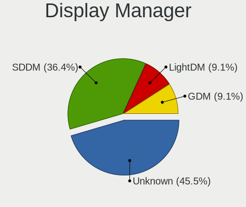
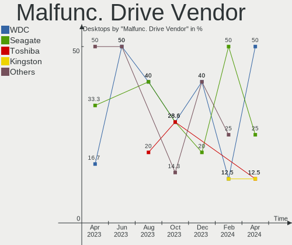
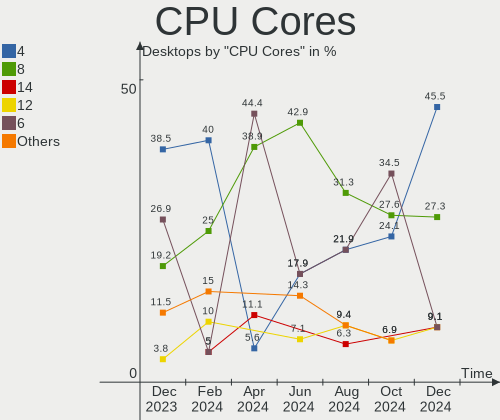
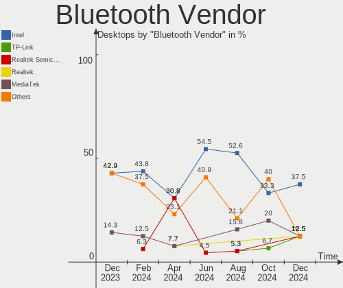
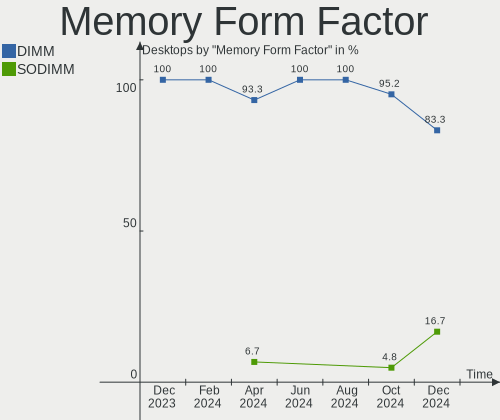

EndeavourOS - Hardware Trends (Desktops)
----------------------------------------

A project to identify most popular hardware characteristics and track their change
over time based on data collected by Linux users at https://Linux-Hardware.org.

Anyone can contribute to this report by the [hw-probe](https://github.com/linuxhw/hw-probe) tool:

    sudo -E hw-probe -all -upload

This report is for one last month. Overall report since the beginning of time: [TestDays](https://github.com/linuxhw/TestDays)

Period: May, 2023.

Contents
--------

* [ System ](#system)
  - [ OS                       ](#os)
  - [ OS Family                ](#os-family)
  - [ Kernel                   ](#kernel)
  - [ Kernel Family            ](#kernel-family)
  - [ Kernel Major Ver.        ](#kernel-major-ver)
  - [ Arch                     ](#arch)
  - [ DE                       ](#de)
  - [ Display Server           ](#display-server)
  - [ Display Manager          ](#display-manager)
  - [ OS Lang                  ](#os-lang)
  - [ Boot Mode                ](#boot-mode)
  - [ Filesystem               ](#filesystem)
  - [ Part. scheme             ](#part-scheme)
  - [ Dual Boot with Linux/BSD ](#dual-boot-with-linuxbsd)
  - [ Dual Boot (Win)          ](#dual-boot-win)

* [ Board ](#board)
  - [ Vendor                   ](#vendor)
  - [ Model                    ](#model)
  - [ Model Family             ](#model-family)
  - [ MFG Year                 ](#mfg-year)
  - [ Form Factor              ](#form-factor)
  - [ Secure Boot              ](#secure-boot)
  - [ Coreboot                 ](#coreboot)
  - [ RAM Size                 ](#ram-size)
  - [ RAM Used                 ](#ram-used)
  - [ Total Drives             ](#total-drives)
  - [ Has CD-ROM               ](#has-cd-rom)
  - [ Has Ethernet             ](#has-ethernet)
  - [ Has WiFi                 ](#has-wifi)
  - [ Has Bluetooth            ](#has-bluetooth)

* [ Location ](#location)
  - [ Country                  ](#country)
  - [ City                     ](#city)

* [ Drives ](#drives)
  - [ Drive Vendor             ](#drive-vendor)
  - [ Drive Model              ](#drive-model)
  - [ HDD Vendor               ](#hdd-vendor)
  - [ SSD Vendor               ](#ssd-vendor)
  - [ Drive Kind               ](#drive-kind)
  - [ Drive Connector          ](#drive-connector)
  - [ Drive Size               ](#drive-size)
  - [ Space Total              ](#space-total)
  - [ Space Used               ](#space-used)
  - [ Malfunc. Drives          ](#malfunc-drives)
  - [ Malfunc. Drive Vendor    ](#malfunc-drive-vendor)
  - [ Malfunc. HDD Vendor      ](#malfunc-hdd-vendor)
  - [ Malfunc. Drive Kind      ](#malfunc-drive-kind)
  - [ Failed Drives            ](#failed-drives)
  - [ Failed Drive Vendor      ](#failed-drive-vendor)
  - [ Drive Status             ](#drive-status)

* [ Storage controller ](#storage-controller)
  - [ Storage Vendor           ](#storage-vendor)
  - [ Storage Model            ](#storage-model)
  - [ Storage Kind             ](#storage-kind)

* [ Processor ](#processor)
  - [ CPU Vendor               ](#cpu-vendor)
  - [ CPU Model                ](#cpu-model)
  - [ CPU Model Family         ](#cpu-model-family)
  - [ CPU Cores                ](#cpu-cores)
  - [ CPU Sockets              ](#cpu-sockets)
  - [ CPU Threads              ](#cpu-threads)
  - [ CPU Op-Modes             ](#cpu-op-modes)
  - [ CPU Microcode            ](#cpu-microcode)
  - [ CPU Microarch            ](#cpu-microarch)

* [ Graphics ](#graphics)
  - [ GPU Vendor               ](#gpu-vendor)
  - [ GPU Model                ](#gpu-model)
  - [ GPU Combo                ](#gpu-combo)
  - [ GPU Driver               ](#gpu-driver)
  - [ GPU Memory               ](#gpu-memory)

* [ Monitor ](#monitor)
  - [ Monitor Vendor           ](#monitor-vendor)
  - [ Monitor Model            ](#monitor-model)
  - [ Monitor Resolution       ](#monitor-resolution)
  - [ Monitor Diagonal         ](#monitor-diagonal)
  - [ Monitor Width            ](#monitor-width)
  - [ Aspect Ratio             ](#aspect-ratio)
  - [ Monitor Area             ](#monitor-area)
  - [ Pixel Density            ](#pixel-density)
  - [ Multiple Monitors        ](#multiple-monitors)

* [ Network ](#network)
  - [ Net Controller Vendor    ](#net-controller-vendor)
  - [ Net Controller Model     ](#net-controller-model)
  - [ Wireless Vendor          ](#wireless-vendor)
  - [ Wireless Model           ](#wireless-model)
  - [ Ethernet Vendor          ](#ethernet-vendor)
  - [ Ethernet Model           ](#ethernet-model)
  - [ Net Controller Kind      ](#net-controller-kind)
  - [ Used Controller          ](#used-controller)
  - [ NICs                     ](#nics)
  - [ IPv6                     ](#ipv6)

* [ Bluetooth ](#bluetooth)
  - [ Bluetooth Vendor         ](#bluetooth-vendor)
  - [ Bluetooth Model          ](#bluetooth-model)

* [ Sound ](#sound)
  - [ Sound Vendor             ](#sound-vendor)
  - [ Sound Model              ](#sound-model)

* [ Memory ](#memory)
  - [ Memory Vendor            ](#memory-vendor)
  - [ Memory Model             ](#memory-model)
  - [ Memory Kind              ](#memory-kind)
  - [ Memory Form Factor       ](#memory-form-factor)
  - [ Memory Size              ](#memory-size)
  - [ Memory Speed             ](#memory-speed)

* [ Printers & scanners ](#printers--scanners)
  - [ Printer Vendor           ](#printer-vendor)
  - [ Printer Model            ](#printer-model)
  - [ Scanner Vendor           ](#scanner-vendor)
  - [ Scanner Model            ](#scanner-model)

* [ Camera ](#camera)
  - [ Camera Vendor            ](#camera-vendor)
  - [ Camera Model             ](#camera-model)

* [ Security ](#security)
  - [ Fingerprint Vendor       ](#fingerprint-vendor)
  - [ Fingerprint Model        ](#fingerprint-model)
  - [ Chipcard Vendor          ](#chipcard-vendor)
  - [ Chipcard Model           ](#chipcard-model)

* [ Unsupported ](#unsupported)
  - [ Unsupported Devices      ](#unsupported-devices)
  - [ Unsupported Device Types ](#unsupported-device-types)

System
------

OS
--

Installed operating systems

| Name                | Desktops | Percent |
|---------------------|----------|---------|
| EndeavourOS Rolling | 14       | 100%    |

OS Family
---------

OS without a version

| Name        | Desktops | Percent |
|-------------|----------|---------|
| EndeavourOS | 14       | 100%    |

Kernel
------

Version of the Linux kernel

| Version          | Desktops | Percent |
|------------------|----------|---------|
| 6.2.13-arch1-1   | 3        | 21.43%  |
| 6.3.1-arch1-1    | 2        | 14.29%  |
| 6.3.5-arch1-1    | 1        | 7.14%   |
| 6.3.4-zen1-1-zen | 1        | 7.14%   |
| 6.3.3-zen1-1-zen | 1        | 7.14%   |
| 6.3.2-arch1-1    | 1        | 7.14%   |
| 6.3.1-zen2-1-zen | 1        | 7.14%   |
| 6.3.1-zen1-1-zen | 1        | 7.14%   |
| 6.2.13-arch1-1.1 | 1        | 7.14%   |
| 6.2.11-arch1-1   | 1        | 7.14%   |
| 6.1.29-1-lts     | 1        | 7.14%   |

Kernel Family
-------------

Linux kernel without a distro release

| Version | Desktops | Percent |
|---------|----------|---------|
| 6.3.1   | 4        | 28.57%  |
| 6.2.13  | 4        | 28.57%  |
| 6.3.5   | 1        | 7.14%   |
| 6.3.4   | 1        | 7.14%   |
| 6.3.3   | 1        | 7.14%   |
| 6.3.2   | 1        | 7.14%   |
| 6.2.11  | 1        | 7.14%   |
| 6.1.29  | 1        | 7.14%   |

Kernel Major Ver.
-----------------

Linux kernel major version

| Version | Desktops | Percent |
|---------|----------|---------|
| 6.3     | 8        | 57.14%  |
| 6.2     | 5        | 35.71%  |
| 6.1     | 1        | 7.14%   |

Arch
----

OS architecture (x86_64, i586, etc.)

| Name   | Desktops | Percent |
|--------|----------|---------|
| x86_64 | 14       | 100%    |

DE
--

Desktop Environment

| Name       | Desktops | Percent |
|------------|----------|---------|
| KDE5       | 9        | 64.29%  |
| X-Cinnamon | 2        | 14.29%  |
| GNOME      | 2        | 14.29%  |
| XFCE       | 1        | 7.14%   |

Display Server
--------------

X11 or Wayland

| Name    | Desktops | Percent |
|---------|----------|---------|
| X11     | 11       | 78.57%  |
| Wayland | 2        | 14.29%  |
| Unknown | 1        | 7.14%   |

Display Manager
---------------

SDDM, LightDM, etc.

| Name    | Desktops | Percent |
|---------|----------|---------|
| LightDM | 5        | 35.71%  |
| Unknown | 4        | 28.57%  |
| SDDM    | 3        | 21.43%  |
| GDM     | 2        | 14.29%  |

OS Lang
-------

Language

| Lang  | Desktops | Percent |
|-------|----------|---------|
| en_US | 5        | 35.71%  |
| en_CA | 3        | 21.43%  |
| nl_NL | 2        | 14.29%  |
| pt_BR | 1        | 7.14%   |
| nl_BE | 1        | 7.14%   |
| fr_FR | 1        | 7.14%   |
| en_IN | 1        | 7.14%   |

Boot Mode
---------

EFI or BIOS

| Mode | Desktops | Percent |
|------|----------|---------|
| EFI  | 9        | 64.29%  |
| BIOS | 5        | 35.71%  |

Filesystem
----------

Type of filesystem

| Type  | Desktops | Percent |
|-------|----------|---------|
| Ext4  | 12       | 85.71%  |
| Btrfs | 2        | 14.29%  |

Part. scheme
------------

Scheme of partitioning

| Type    | Desktops | Percent |
|---------|----------|---------|
| GPT     | 9        | 64.29%  |
| Unknown | 4        | 28.57%  |
| MBR     | 1        | 7.14%   |

Dual Boot with Linux/BSD
------------------------

Hosting more than one Linux/BSD

| Dual boot | Desktops | Percent |
|-----------|----------|---------|
| No        | 11       | 78.57%  |
| Yes       | 3        | 21.43%  |

Dual Boot (Win)
---------------

Hosting Linux and Windows

| Dual boot | Desktops | Percent |
|-----------|----------|---------|
| No        | 9        | 64.29%  |
| Yes       | 5        | 35.71%  |

Board
-----

Vendor
------

Motherboard manufacturer

| Name                | Desktops | Percent |
|---------------------|----------|---------|
| MSI                 | 5        | 35.71%  |
| Hewlett-Packard     | 3        | 21.43%  |
| Gigabyte Technology | 3        | 21.43%  |
| Lenovo              | 1        | 7.14%   |
| Daten Tecnologia    | 1        | 7.14%   |
| ASRock              | 1        | 7.14%   |

Model
-----

Motherboard model

| Name                              | Desktops | Percent |
|-----------------------------------|----------|---------|
| MSI MS-7D69                       | 1        | 7.14%   |
| MSI MS-7C56                       | 1        | 7.14%   |
| MSI MS-7C02                       | 1        | 7.14%   |
| MSI MS-7B79                       | 1        | 7.14%   |
| MSI MS-7A34                       | 1        | 7.14%   |
| Lenovo ThinkCentre M83 10AHS0W300 | 1        | 7.14%   |
| HP Z620 Workstation               | 1        | 7.14%   |
| HP Z420 Workstation               | 1        | 7.14%   |
| HP EliteDesk 800 G1 TWR           | 1        | 7.14%   |
| Gigabyte Z790 UD AX               | 1        | 7.14%   |
| Gigabyte P55A-UD3                 | 1        | 7.14%   |
| Gigabyte B450 AORUS ELITE         | 1        | 7.14%   |
| Daten Tecnologia DH110MXV         | 1        | 7.14%   |
| ASRock B450M Pro4                 | 1        | 7.14%   |

Model Family
------------

Motherboard model prefix

| Name                      | Desktops | Percent |
|---------------------------|----------|---------|
| MSI MS-7D69               | 1        | 7.14%   |
| MSI MS-7C56               | 1        | 7.14%   |
| MSI MS-7C02               | 1        | 7.14%   |
| MSI MS-7B79               | 1        | 7.14%   |
| MSI MS-7A34               | 1        | 7.14%   |
| Lenovo ThinkCentre        | 1        | 7.14%   |
| HP Z620                   | 1        | 7.14%   |
| HP Z420                   | 1        | 7.14%   |
| HP EliteDesk              | 1        | 7.14%   |
| Gigabyte Z790             | 1        | 7.14%   |
| Gigabyte P55A-UD3         | 1        | 7.14%   |
| Gigabyte B450             | 1        | 7.14%   |
| Daten Tecnologia DH110MXV | 1        | 7.14%   |
| ASRock B450M              | 1        | 7.14%   |

MFG Year
--------

Motherboard manufacture year

| Year | Desktops | Percent |
|------|----------|---------|
| 2018 | 3        | 21.43%  |
| 2013 | 2        | 14.29%  |
| 2012 | 2        | 14.29%  |
| 2023 | 1        | 7.14%   |
| 2022 | 1        | 7.14%   |
| 2020 | 1        | 7.14%   |
| 2019 | 1        | 7.14%   |
| 2017 | 1        | 7.14%   |
| 2016 | 1        | 7.14%   |
| 2009 | 1        | 7.14%   |

Form Factor
-----------

Physical design of the computer

| Name    | Desktops | Percent |
|---------|----------|---------|
| Desktop | 14       | 100%    |

Secure Boot
-----------

Enabled or disabled

| State    | Desktops | Percent |
|----------|----------|---------|
| Disabled | 12       | 85.71%  |
| Enabled  | 2        | 14.29%  |

Coreboot
--------

Have coreboot on board

| Used | Desktops | Percent |
|------|----------|---------|
| No   | 14       | 100%    |

RAM Size
--------

Total RAM memory

| Size in GB  | Desktops | Percent |
|-------------|----------|---------|
| 32.01-64.0  | 7        | 50%     |
| 16.01-24.0  | 5        | 35.71%  |
| 64.01-256.0 | 1        | 7.14%   |
| 8.01-16.0   | 1        | 7.14%   |

RAM Used
--------

Used RAM memory

| Used GB    | Desktops | Percent |
|------------|----------|---------|
| 4.01-8.0   | 6        | 42.86%  |
| 2.01-3.0   | 3        | 21.43%  |
| 3.01-4.0   | 2        | 14.29%  |
| 0.51-1.0   | 2        | 14.29%  |
| 16.01-24.0 | 1        | 7.14%   |

Total Drives
------------

Number of drives on board

| Drives | Desktops | Percent |
|--------|----------|---------|
| 3      | 4        | 28.57%  |
| 2      | 4        | 28.57%  |
| 4      | 2        | 14.29%  |
| 8      | 1        | 7.14%   |
| 6      | 1        | 7.14%   |
| 5      | 1        | 7.14%   |
| 1      | 1        | 7.14%   |

Has CD-ROM
----------

Has CD-ROM on board

| Presented | Desktops | Percent |
|-----------|----------|---------|
| No        | 12       | 85.71%  |
| Yes       | 2        | 14.29%  |

Has Ethernet
------------

Has Ethernet on board

| Presented | Desktops | Percent |
|-----------|----------|---------|
| Yes       | 14       | 100%    |

Has WiFi
--------

Has WiFi module

| Presented | Desktops | Percent |
|-----------|----------|---------|
| No        | 9        | 64.29%  |
| Yes       | 5        | 35.71%  |

Has Bluetooth
-------------

Has Bluetooth module

| Presented | Desktops | Percent |
|-----------|----------|---------|
| Yes       | 7        | 50%     |
| No        | 7        | 50%     |

Location
--------

Country
-------

Geographic location (country)

| Country     | Desktops | Percent |
|-------------|----------|---------|
| Canada      | 3        | 21.43%  |
| Netherlands | 2        | 14.29%  |
| USA         | 1        | 7.14%   |
| Sweden      | 1        | 7.14%   |
| Poland      | 1        | 7.14%   |
| India       | 1        | 7.14%   |
| Hungary     | 1        | 7.14%   |
| France      | 1        | 7.14%   |
| Croatia     | 1        | 7.14%   |
| Brazil      | 1        | 7.14%   |
| Belgium     | 1        | 7.14%   |

City
----

Geographic location (city)

| City              | Desktops | Percent |
|-------------------|----------|---------|
| Montreal          | 2        | 14.29%  |
| Suwałki          | 1        | 7.14%   |
| Rekem             | 1        | 7.14%   |
| Osijek            | 1        | 7.14%   |
| Juazeiro do Norte | 1        | 7.14%   |
| Hyderabad         | 1        | 7.14%   |
| Hamilton          | 1        | 7.14%   |
| Gothenburg        | 1        | 7.14%   |
| Glen Carbon       | 1        | 7.14%   |
| Épinal           | 1        | 7.14%   |
| Budapest          | 1        | 7.14%   |
| Amsterdam         | 1        | 7.14%   |
| Almelo            | 1        | 7.14%   |

Drives
------

Drive Vendor
------------

Hard drive vendors

| Vendor                    | Desktops | Drives | Percent |
|---------------------------|----------|--------|---------|
| Samsung Electronics       | 8        | 14     | 24.24%  |
| Seagate                   | 5        | 6      | 15.15%  |
| WDC                       | 4        | 9      | 12.12%  |
| Crucial                   | 3        | 4      | 9.09%   |
| Kingston                  | 2        | 4      | 6.06%   |
| WALRAM                    | 1        | 1      | 3.03%   |
| Toshiba                   | 1        | 1      | 3.03%   |
| Timetec                   | 1        | 1      | 3.03%   |
| SK hynix                  | 1        | 2      | 3.03%   |
| Sandisk                   | 1        | 1      | 3.03%   |
| Realtek                   | 1        | 1      | 3.03%   |
| Phison                    | 1        | 1      | 3.03%   |
| Micron/Crucial Technology | 1        | 1      | 3.03%   |
| Intel                     | 1        | 1      | 3.03%   |
| HGST                      | 1        | 1      | 3.03%   |
| China                     | 1        | 1      | 3.03%   |

Drive Model
-----------

Hard drive models

| Model                                               | Desktops | Percent |
|-----------------------------------------------------|----------|---------|
| Samsung SSD 850 EVO 250GB                           | 2        | 4.55%   |
| Samsung HD103SJ 1TB                                 | 2        | 4.55%   |
| WDC WD3200BPVT-22JJ5T0 320GB                        | 1        | 2.27%   |
| WDC WD20EARS-42S0XB0 2TB                            | 1        | 2.27%   |
| WDC WD10EZEX-60M2NA0 1TB                            | 1        | 2.27%   |
| WDC WD1003FBYZ-010FB0 1TB                           | 1        | 2.27%   |
| WDC WD1003FBYX-01Y7B2 1TB                           | 1        | 2.27%   |
| WDC WD1003FBYX-01Y7B1 1TB                           | 1        | 2.27%   |
| WALRAM 512G                                         | 1        | 2.27%   |
| Toshiba HDWE140 4TB                                 | 1        | 2.27%   |
| Timetec MS05 256GB SSD                              | 1        | 2.27%   |
| SK hynix BC511 256GB                                | 1        | 2.27%   |
| Seagate ST500LM021-1KJ152 500GB                     | 1        | 2.27%   |
| Seagate ST2000DM008-2UB102 2TB                      | 1        | 2.27%   |
| Seagate ST2000DM006-2DM164 2TB                      | 1        | 2.27%   |
| Seagate ST16000NM001G-2KK103 16TB                   | 1        | 2.27%   |
| Seagate ST1000LM035-1RK172 1TB                      | 1        | 2.27%   |
| Seagate ST1000DM003-1SB10C 1TB                      | 1        | 2.27%   |
| Sandisk WD Blue SN550 NVMe SSD 512GB                | 1        | 2.27%   |
| Samsung SSD 990 PRO 2TB                             | 1        | 2.27%   |
| Samsung SSD 990 PRO 1TB                             | 1        | 2.27%   |
| Samsung SSD 980 500GB                               | 1        | 2.27%   |
| Samsung SSD 980 250GB                               | 1        | 2.27%   |
| Samsung SSD 870 EVO 1TB                             | 1        | 2.27%   |
| Samsung SSD 860 EVO 500GB                           | 1        | 2.27%   |
| Samsung SSD 860 EVO 4TB                             | 1        | 2.27%   |
| Samsung SSD 860 EVO 250GB                           | 1        | 2.27%   |
| Samsung SSD 850 EVO 1TB                             | 1        | 2.27%   |
| Samsung NVMe SSD Controller SM981/PM981/PM983 256GB | 1        | 2.27%   |
| Realtek RTL9210B-CG 1TB                             | 1        | 2.27%   |
| Phison Sabrent Rocket 4.0 Plus 4TB                  | 1        | 2.27%   |
| Micron/Crucial P2 NVMe PCIe SSD 1TB                 | 1        | 2.27%   |
| Kingston SNVS250G 250GB                             | 1        | 2.27%   |
| Kingston SKC3000D2048G 2TB                          | 1        | 2.27%   |
| Kingston SA400S37480G 480GB SSD                     | 1        | 2.27%   |
| Kingston SA400S37240G 240GB SSD                     | 1        | 2.27%   |
| Intel SSDSC2KW256G8 256GB                           | 1        | 2.27%   |
| HGST HTS545050A7E680 500GB                          | 1        | 2.27%   |
| Crucial CT500MX500SSD1 500GB                        | 1        | 2.27%   |
| Crucial CT240BX500SSD1 240GB                        | 1        | 2.27%   |

HDD Vendor
----------

Hard disk drive vendors

| Vendor              | Desktops | Drives | Percent |
|---------------------|----------|--------|---------|
| Seagate             | 5        | 6      | 38.46%  |
| WDC                 | 4        | 9      | 30.77%  |
| Samsung Electronics | 2        | 2      | 15.38%  |
| Toshiba             | 1        | 1      | 7.69%   |
| HGST                | 1        | 1      | 7.69%   |

SSD Vendor
----------

Solid state drive vendors

| Vendor              | Desktops | Drives | Percent |
|---------------------|----------|--------|---------|
| Samsung Electronics | 5        | 7      | 38.46%  |
| Crucial             | 3        | 4      | 23.08%  |
| Kingston            | 2        | 2      | 15.38%  |
| Timetec             | 1        | 1      | 7.69%   |
| Intel               | 1        | 1      | 7.69%   |
| China               | 1        | 1      | 7.69%   |

Drive Kind
----------

HDD or SSD

| Kind    | Desktops | Drives | Percent |
|---------|----------|--------|---------|
| SSD     | 10       | 16     | 35.71%  |
| HDD     | 10       | 19     | 35.71%  |
| NVMe    | 7        | 13     | 25%     |
| Unknown | 1        | 1      | 3.57%   |

Drive Connector
---------------

SATA, SAS, NVMe, etc.

| Type | Desktops | Drives | Percent |
|------|----------|--------|---------|
| SATA | 14       | 35     | 63.64%  |
| NVMe | 7        | 12     | 31.82%  |
| SAS  | 1        | 2      | 4.55%   |

Drive Size
----------

Size of hard drive

| Size in TB | Desktops | Drives | Percent |
|------------|----------|--------|---------|
| 0.51-1.0   | 8        | 14     | 36.36%  |
| 0.01-0.5   | 8        | 14     | 36.36%  |
| 1.01-2.0   | 3        | 4      | 13.64%  |
| 3.01-4.0   | 2        | 2      | 9.09%   |
| 10.01-20.0 | 1        | 1      | 4.55%   |

Space Total
-----------

Amount of disk space available on the file system

| Size in GB     | Desktops | Percent |
|----------------|----------|---------|
| More than 3000 | 3        | 21.43%  |
| 1001-2000      | 3        | 21.43%  |
| 501-1000       | 3        | 21.43%  |
| 251-500        | 2        | 14.29%  |
| 101-250        | 2        | 14.29%  |
| 2001-3000      | 1        | 7.14%   |

Space Used
----------

Amount of used disk space

| Used GB        | Desktops | Percent |
|----------------|----------|---------|
| 1001-2000      | 4        | 28.57%  |
| 51-100         | 3        | 21.43%  |
| 21-50          | 2        | 14.29%  |
| 501-1000       | 2        | 14.29%  |
| More than 3000 | 1        | 7.14%   |
| 251-500        | 1        | 7.14%   |
| 101-250        | 1        | 7.14%   |

Malfunc. Drives
---------------

Drive models with a malfunction

| Model                                                           | Desktops | Drives | Percent |
|-----------------------------------------------------------------|----------|--------|---------|
| WDC WD1003FBYZ-010FB0 1TB                                       | 1        | 2      | 20%     |
| Seagate ST500LM021-1KJ152 500GB                                 | 1        | 1      | 20%     |
| Samsung Electronics NVMe SSD Controller SM981/PM981/PM983 256GB | 1        | 1      | 20%     |
| HGST HTS545050A7E680 500GB                                      | 1        | 1      | 20%     |
| Crucial CT500MX500SSD1 500GB                                    | 1        | 1      | 20%     |

Malfunc. Drive Vendor
---------------------

Vendors of faulty drives

| Vendor              | Desktops | Drives | Percent |
|---------------------|----------|--------|---------|
| WDC                 | 1        | 2      | 20%     |
| Seagate             | 1        | 1      | 20%     |
| Samsung Electronics | 1        | 1      | 20%     |
| HGST                | 1        | 1      | 20%     |
| Crucial             | 1        | 1      | 20%     |

Malfunc. HDD Vendor
-------------------

Vendors of faulty HDD drives

| Vendor  | Desktops | Drives | Percent |
|---------|----------|--------|---------|
| WDC     | 1        | 2      | 33.33%  |
| Seagate | 1        | 1      | 33.33%  |
| HGST    | 1        | 1      | 33.33%  |

Malfunc. Drive Kind
-------------------

Kinds of faulty drives

| Kind | Desktops | Drives | Percent |
|------|----------|--------|---------|
| HDD  | 3        | 4      | 60%     |
| NVMe | 1        | 1      | 20%     |
| SSD  | 1        | 1      | 20%     |

Failed Drives
-------------

Failed drive models

Zero info for selected period =(

Failed Drive Vendor
-------------------

Failed drive vendors

Zero info for selected period =(

Drive Status
------------

Number of failed and malfunc. drives

| Status   | Desktops | Drives | Percent |
|----------|----------|--------|---------|
| Works    | 10       | 30     | 50%     |
| Detected | 5        | 13     | 25%     |
| Malfunc  | 5        | 6      | 25%     |

Storage controller
------------------

Storage Vendor
--------------

Storage controller vendors

| Vendor                      | Desktops | Percent |
|-----------------------------|----------|---------|
| Intel                       | 7        | 29.17%  |
| AMD                         | 7        | 29.17%  |
| Samsung Electronics         | 4        | 16.67%  |
| SK hynix                    | 1        | 4.17%   |
| SanDisk                     | 1        | 4.17%   |
| Phison Electronics          | 1        | 4.17%   |
| Micron/Crucial Technology   | 1        | 4.17%   |
| Kingston Technology Company | 1        | 4.17%   |
| ASMedia Technology          | 1        | 4.17%   |

Storage Model
-------------

Storage controller models

| Model                                                                          | Desktops | Percent |
|--------------------------------------------------------------------------------|----------|---------|
| AMD FCH SATA Controller [AHCI mode]                                            | 5        | 15.15%  |
| AMD 400 Series Chipset SATA Controller                                         | 4        | 12.12%  |
| Samsung NVMe SSD Controller 980                                                | 2        | 6.06%   |
| Intel C602 chipset 4-Port SATA Storage Control Unit                            | 2        | 6.06%   |
| Intel C600/X79 series chipset IDE-r Controller                                 | 2        | 6.06%   |
| Intel 8 Series/C220 Series Chipset Family 6-port SATA Controller 1 [AHCI mode] | 2        | 6.06%   |
| SK hynix BC511                                                                 | 1        | 3.03%   |
| SanDisk WD Blue SN550 NVMe SSD                                                 | 1        | 3.03%   |
| Samsung NVMe SSD Controller SM981/PM981/PM983                                  | 1        | 3.03%   |
| Samsung Electronics Non-Volatile memory controller                             | 1        | 3.03%   |
| Phison E18 PCIe4 NVMe Controller                                               | 1        | 3.03%   |
| Micron/Crucial P2 NVMe PCIe SSD                                                | 1        | 3.03%   |
| Kingston Company Company Non-Volatile memory controller                        | 1        | 3.03%   |
| Kingston Company SNVS2000G [NV1 NVMe PCIe SSD 2TB]                             | 1        | 3.03%   |
| Intel Q170/Q150/B150/H170/H110/Z170/CM236 Chipset SATA Controller [AHCI Mode]  | 1        | 3.03%   |
| Intel C600/X79 series chipset SATA RAID Controller                             | 1        | 3.03%   |
| Intel C600/X79 series chipset 6-Port SATA AHCI Controller                      | 1        | 3.03%   |
| Intel 700 Series Chipset Family SATA AHCI Controller                           | 1        | 3.03%   |
| Intel 5 Series/3400 Series Chipset 6 port SATA AHCI Controller                 | 1        | 3.03%   |
| ASMedia ASM1062 Serial ATA Controller                                          | 1        | 3.03%   |
| AMD 500 Series Chipset SATA Controller                                         | 1        | 3.03%   |
| AMD 300 Series Chipset SATA Controller                                         | 1        | 3.03%   |

Storage Kind
------------

Kind of storage controller (IDE, SATA, NVMe, SAS, ...)

| Kind | Desktops | Percent |
|------|----------|---------|
| SATA | 13       | 52%     |
| NVMe | 7        | 28%     |
| SAS  | 2        | 8%      |
| IDE  | 2        | 8%      |
| RAID | 1        | 4%      |

Processor
---------

CPU Vendor
----------

Processor vendors

| Vendor | Desktops | Percent |
|--------|----------|---------|
| Intel  | 7        | 50%     |
| AMD    | 7        | 50%     |

CPU Model
---------

Processor models

| Model                                 | Desktops | Percent |
|---------------------------------------|----------|---------|
| Intel Xeon CPU E5-2643 0 @ 3.30GHz    | 1        | 7.14%   |
| Intel Xeon CPU E5-1620 v2 @ 3.70GHz   | 1        | 7.14%   |
| Intel Core i7-4790 CPU @ 3.60GHz      | 1        | 7.14%   |
| Intel Core i5-4570 CPU @ 3.20GHz      | 1        | 7.14%   |
| Intel Core i5 CPU 750 @ 2.67GHz       | 1        | 7.14%   |
| Intel Core i3-6100 CPU @ 3.70GHz      | 1        | 7.14%   |
| Intel 13th Gen Core i5-13600K         | 1        | 7.14%   |
| AMD Ryzen 9 7950X 16-Core Processor   | 1        | 7.14%   |
| AMD Ryzen 9 5900X 12-Core Processor   | 1        | 7.14%   |
| AMD Ryzen 7 5800X 8-Core Processor    | 1        | 7.14%   |
| AMD Ryzen 7 2700 Eight-Core Processor | 1        | 7.14%   |
| AMD Ryzen 5 3600 6-Core Processor     | 1        | 7.14%   |
| AMD Ryzen 5 2600X Six-Core Processor  | 1        | 7.14%   |
| AMD Ryzen 5 1600 Six-Core Processor   | 1        | 7.14%   |

CPU Model Family
----------------

Processor model prefix

| Model         | Desktops | Percent |
|---------------|----------|---------|
| AMD Ryzen 5   | 3        | 21.43%  |
| Intel Xeon    | 2        | 14.29%  |
| Intel Core i5 | 2        | 14.29%  |
| AMD Ryzen 9   | 2        | 14.29%  |
| AMD Ryzen 7   | 2        | 14.29%  |
| Other         | 1        | 7.14%   |
| Intel Core i7 | 1        | 7.14%   |
| Intel Core i3 | 1        | 7.14%   |

CPU Cores
---------

Number of processor cores

| Number | Desktops | Percent |
|--------|----------|---------|
| 4      | 4        | 28.57%  |
| 8      | 3        | 21.43%  |
| 6      | 3        | 21.43%  |
| 16     | 1        | 7.14%   |
| 14     | 1        | 7.14%   |
| 12     | 1        | 7.14%   |
| 2      | 1        | 7.14%   |

CPU Sockets
-----------

Number of sockets

| Number | Desktops | Percent |
|--------|----------|---------|
| 1      | 13       | 92.86%  |
| 2      | 1        | 7.14%   |

CPU Threads
-----------

Threads per core (Hyper-Threading)

| Number | Desktops | Percent |
|--------|----------|---------|
| 2      | 12       | 85.71%  |
| 1      | 2        | 14.29%  |

CPU Op-Modes
------------

CPU Operation Modes (32-bit, 64-bit)

| Op mode        | Desktops | Percent |
|----------------|----------|---------|
| 32-bit, 64-bit | 14       | 100%    |

CPU Microcode
-------------

Microcode number

| Number     | Desktops | Percent |
|------------|----------|---------|
| Unknown    | 8        | 57.14%  |
| 0x0800820d | 2        | 14.29%  |
| 0x0a601203 | 1        | 7.14%   |
| 0x0a201016 | 1        | 7.14%   |
| 0x08701030 | 1        | 7.14%   |
| 0x08001138 | 1        | 7.14%   |

CPU Microarch
-------------

Microarchitecture

| Name        | Desktops | Percent |
|-------------|----------|---------|
| Zen+        | 2        | 14.29%  |
| Zen 3       | 2        | 14.29%  |
| Haswell     | 2        | 14.29%  |
| Unknown     | 2        | 14.29%  |
| Zen 2       | 1        | 7.14%   |
| Zen         | 1        | 7.14%   |
| Skylake     | 1        | 7.14%   |
| SandyBridge | 1        | 7.14%   |
| Nehalem     | 1        | 7.14%   |
| IvyBridge   | 1        | 7.14%   |

Graphics
--------

GPU Vendor
----------

Vendors of graphics cards

| Vendor | Desktops | Percent |
|--------|----------|---------|
| Nvidia | 9        | 52.94%  |
| Intel  | 4        | 23.53%  |
| AMD    | 4        | 23.53%  |

GPU Model
---------

Graphics card models

| Model                                                                       | Desktops | Percent |
|-----------------------------------------------------------------------------|----------|---------|
| Intel Xeon E3-1200 v3/4th Gen Core Processor Integrated Graphics Controller | 2        | 11.76%  |
| AMD Ellesmere [Radeon RX 470/480/570/570X/580/580X/590]                     | 2        | 11.76%  |
| Nvidia TU116 [GeForce GTX 1660 Ti]                                          | 1        | 5.88%   |
| Nvidia GP107 [GeForce GTX 1050 Ti]                                          | 1        | 5.88%   |
| Nvidia GP106 [GeForce GTX 1060 6GB]                                         | 1        | 5.88%   |
| Nvidia GP104 [GeForce GTX 1080]                                             | 1        | 5.88%   |
| Nvidia GP104 [GeForce GTX 1070 Ti]                                          | 1        | 5.88%   |
| Nvidia GM107 [GeForce GTX 750 Ti]                                           | 1        | 5.88%   |
| Nvidia GK107GL [Quadro K600]                                                | 1        | 5.88%   |
| Nvidia GA104 [GeForce RTX 3060 Ti Lite Hash Rate]                           | 1        | 5.88%   |
| Nvidia GA102 [GeForce RTX 3090]                                             | 1        | 5.88%   |
| Intel Raptor Lake-S GT1 [UHD Graphics 770]                                  | 1        | 5.88%   |
| Intel HD Graphics 530                                                       | 1        | 5.88%   |
| AMD Vega 10 XL/XT [Radeon RX Vega 56/64]                                    | 1        | 5.88%   |
| AMD Lexa PRO [Radeon 540/540X/550/550X / RX 540X/550/550X]                  | 1        | 5.88%   |

GPU Combo
---------

Combinations of graphics cards

| Name                     | Desktops | Percent |
|--------------------------|----------|---------|
| 1 x Nvidia               | 8        | 57.14%  |
| 1 x Intel                | 2        | 14.29%  |
| 1 x AMD                  | 2        | 14.29%  |
| Intel + AMD + 1 x Nvidia | 1        | 7.14%   |
| Intel + AMD              | 1        | 7.14%   |

GPU Driver
----------

Free vs proprietary

| Driver      | Desktops | Percent |
|-------------|----------|---------|
| Proprietary | 8        | 57.14%  |
| Free        | 6        | 42.86%  |

GPU Memory
----------

Total video memory

| Size in GB | Desktops | Percent |
|------------|----------|---------|
| 7.01-8.0   | 4        | 28.57%  |
| Unknown    | 4        | 28.57%  |
| 5.01-6.0   | 2        | 14.29%  |
| 3.01-4.0   | 1        | 7.14%   |
| 16.01-24.0 | 1        | 7.14%   |
| 1.01-2.0   | 1        | 7.14%   |
| 0.51-1.0   | 1        | 7.14%   |

Monitor
-------

Monitor Vendor
--------------

Monitor vendors

| Vendor               | Desktops | Percent |
|----------------------|----------|---------|
| Samsung Electronics  | 4        | 25%     |
| Goldstar             | 3        | 18.75%  |
| ASUSTek Computer     | 3        | 18.75%  |
| AOC                  | 2        | 12.5%   |
| Acer                 | 2        | 12.5%   |
| Lenovo               | 1        | 6.25%   |
| Ancor Communications | 1        | 6.25%   |

Monitor Model
-------------

Monitor models

| Model                                                                  | Desktops | Percent |
|------------------------------------------------------------------------|----------|---------|
| Samsung Electronics S24R65x SAM1023 1920x1080 527x296mm 23.8-inch      | 1        | 6.25%   |
| Samsung Electronics S24B300 SAM08CC 1920x1080 521x293mm 23.5-inch      | 1        | 6.25%   |
| Samsung Electronics LCD Monitor SAM0B5C 1920x1080 1212x682mm 54.8-inch | 1        | 6.25%   |
| Samsung Electronics LCD Monitor S24R65x 1920x1080                      | 1        | 6.25%   |
| Lenovo LEN LT2934zwA LEN60A5 2560x1080 673x284mm 28.8-inch             | 1        | 6.25%   |
| Goldstar ULTRAWIDE GSM59F1 2560x1080 673x284mm 28.8-inch               | 1        | 6.25%   |
| Goldstar IPS FULLHD GSM5AB8 1920x1080 480x270mm 21.7-inch              | 1        | 6.25%   |
| Goldstar IPS FULLHD GSM5AB7 1920x1080 480x270mm 21.7-inch              | 1        | 6.25%   |
| ASUSTek Computer VG27AQL1A AUS2705 2560x1440 597x336mm 27.0-inch       | 1        | 6.25%   |
| ASUSTek Computer VG27A AUS2722 2560x1440 597x336mm 27.0-inch           | 1        | 6.25%   |
| ASUSTek Computer ROG XG27UQ AUS272A 3840x2160 596x335mm 26.9-inch      | 1        | 6.25%   |
| AOC 917W AOC1917 1440x900 410x256mm 19.0-inch                          | 1        | 6.25%   |
| AOC 24B2W1G5 AOC2402 1920x1080 527x296mm 23.8-inch                     | 1        | 6.25%   |
| Ancor Communications ROG PG279Q ACI27EC 2560x1440 598x336mm 27.0-inch  | 1        | 6.25%   |
| Acer XB272 ACR0585 1920x1080 608x354mm 27.7-inch                       | 1        | 6.25%   |
| Acer S271HL ACR02CA 1920x1080 598x336mm 27.0-inch                      | 1        | 6.25%   |

Monitor Resolution
------------------

Monitor screen resolution

| Resolution       | Desktops | Percent |
|------------------|----------|---------|
| 1920x1080 (FHD)  | 8        | 50%     |
| 2560x1440 (QHD)  | 4        | 25%     |
| 2560x1080        | 2        | 12.5%   |
| 3840x2160 (4K)   | 1        | 6.25%   |
| 1440x900 (WXGA+) | 1        | 6.25%   |

Monitor Diagonal
----------------

Diagonal size in inches

| Inches  | Desktops | Percent |
|---------|----------|---------|
| 27      | 4        | 26.67%  |
| 23      | 2        | 13.33%  |
| 21      | 2        | 13.33%  |
| 54      | 1        | 6.67%   |
| 34      | 1        | 6.67%   |
| 28      | 1        | 6.67%   |
| 26      | 1        | 6.67%   |
| 24      | 1        | 6.67%   |
| 19      | 1        | 6.67%   |
| Unknown | 1        | 6.67%   |

Monitor Width
-------------

Physical width

| Width in mm | Desktops | Percent |
|-------------|----------|---------|
| 501-600     | 7        | 50%     |
| 401-500     | 3        | 21.43%  |
| 701-800     | 1        | 7.14%   |
| 601-700     | 1        | 7.14%   |
| 1001-1500   | 1        | 7.14%   |
| Unknown     | 1        | 7.14%   |

Aspect Ratio
------------

Proportional relationship between the width and the height

| Ratio   | Desktops | Percent |
|---------|----------|---------|
| 16/9    | 10       | 71.43%  |
| 21/9    | 2        | 14.29%  |
| 16/10   | 1        | 7.14%   |
| Unknown | 1        | 7.14%   |

Monitor Area
------------

Area in inch²

| Area in inch² | Desktops | Percent |
|----------------|----------|---------|
| 301-350        | 5        | 33.33%  |
| 201-250        | 5        | 33.33%  |
| More than 1000 | 1        | 6.67%   |
| 351-500        | 1        | 6.67%   |
| 251-300        | 1        | 6.67%   |
| 151-200        | 1        | 6.67%   |
| Unknown        | 1        | 6.67%   |

Pixel Density
-------------

Pixels per inch

| Density | Desktops | Percent |
|---------|----------|---------|
| 51-100  | 6        | 42.86%  |
| 101-120 | 5        | 35.71%  |
| 1-50    | 1        | 7.14%   |
| 161-240 | 1        | 7.14%   |
| Unknown | 1        | 7.14%   |

Multiple Monitors
-----------------

Total monitors connected

| Total | Desktops | Percent |
|-------|----------|---------|
| 1     | 11       | 78.57%  |
| 2     | 2        | 14.29%  |
| 3     | 1        | 7.14%   |

Network
-------

Net Controller Vendor
---------------------

Controller vendors

| Vendor                | Desktops | Percent |
|-----------------------|----------|---------|
| Realtek Semiconductor | 11       | 57.89%  |
| Intel                 | 6        | 31.58%  |
| D-Link                | 1        | 5.26%   |
| Aquantia              | 1        | 5.26%   |

Net Controller Model
--------------------

Controller models

| Model                                                               | Desktops | Percent |
|---------------------------------------------------------------------|----------|---------|
| Realtek RTL8111/8168/8411 PCI Express Gigabit Ethernet Controller   | 8        | 34.78%  |
| Realtek RTL8125 2.5GbE Controller                                   | 2        | 8.7%    |
| Intel Wi-Fi 6 AX210/AX211/AX411 160MHz                              | 2        | 8.7%    |
| Intel Ethernet Connection I217-LM                                   | 2        | 8.7%    |
| Intel 82579LM Gigabit Network Connection (Lewisville)               | 2        | 8.7%    |
| Realtek RTL8192EE PCIe Wireless Network Adapter                     | 1        | 4.35%   |
| Realtek RTL8188CUS 802.11n WLAN Adapter                             | 1        | 4.35%   |
| Realtek RTL8153 Gigabit Ethernet Adapter                            | 1        | 4.35%   |
| Intel 82574L Gigabit Network Connection                             | 1        | 4.35%   |
| D-Link 802.11ac WLAN Adapter                                        | 1        | 4.35%   |
| D-Link 802.11ac NIC                                                 | 1        | 4.35%   |
| Aquantia AQC113CS NBase-T/IEEE 802.3bz Ethernet Controller [AQtion] | 1        | 4.35%   |

Wireless Vendor
---------------

Wireless vendors

| Vendor                | Desktops | Percent |
|-----------------------|----------|---------|
| Realtek Semiconductor | 2        | 40%     |
| Intel                 | 2        | 40%     |
| D-Link                | 1        | 20%     |

Wireless Model
--------------

Wireless models

| Model                                           | Desktops | Percent |
|-------------------------------------------------|----------|---------|
| Intel Wi-Fi 6 AX210/AX211/AX411 160MHz          | 2        | 33.33%  |
| Realtek RTL8192EE PCIe Wireless Network Adapter | 1        | 16.67%  |
| Realtek RTL8188CUS 802.11n WLAN Adapter         | 1        | 16.67%  |
| D-Link 802.11ac WLAN Adapter                    | 1        | 16.67%  |
| D-Link 802.11ac NIC                             | 1        | 16.67%  |

Ethernet Vendor
---------------

Ethernet vendors

| Vendor                | Desktops | Percent |
|-----------------------|----------|---------|
| Realtek Semiconductor | 10       | 66.67%  |
| Intel                 | 4        | 26.67%  |
| Aquantia              | 1        | 6.67%   |

Ethernet Model
--------------

Ethernet models

| Model                                                               | Desktops | Percent |
|---------------------------------------------------------------------|----------|---------|
| Realtek RTL8111/8168/8411 PCI Express Gigabit Ethernet Controller   | 8        | 47.06%  |
| Realtek RTL8125 2.5GbE Controller                                   | 2        | 11.76%  |
| Intel Ethernet Connection I217-LM                                   | 2        | 11.76%  |
| Intel 82579LM Gigabit Network Connection (Lewisville)               | 2        | 11.76%  |
| Realtek RTL8153 Gigabit Ethernet Adapter                            | 1        | 5.88%   |
| Intel 82574L Gigabit Network Connection                             | 1        | 5.88%   |
| Aquantia AQC113CS NBase-T/IEEE 802.3bz Ethernet Controller [AQtion] | 1        | 5.88%   |

Net Controller Kind
-------------------

Ethernet, WiFi or modem

| Kind     | Desktops | Percent |
|----------|----------|---------|
| Ethernet | 14       | 73.68%  |
| WiFi     | 5        | 26.32%  |

Used Controller
---------------

Currently used network controller

| Kind     | Desktops | Percent |
|----------|----------|---------|
| Ethernet | 12       | 80%     |
| WiFi     | 3        | 20%     |

NICs
----

Total network controllers on board

| Total | Desktops | Percent |
|-------|----------|---------|
| 1     | 9        | 64.29%  |
| 2     | 4        | 28.57%  |
| 3     | 1        | 7.14%   |

IPv6
----

IPv6 vs IPv4

| Used | Desktops | Percent |
|------|----------|---------|
| No   | 11       | 78.57%  |
| Yes  | 3        | 21.43%  |

Bluetooth
---------

Bluetooth Vendor
----------------

Controller vendors

| Vendor                  | Desktops | Percent |
|-------------------------|----------|---------|
| Intel                   | 2        | 25%     |
| Cambridge Silicon Radio | 2        | 25%     |
| ASUSTek Computer        | 2        | 25%     |
| Realtek Semiconductor   | 1        | 12.5%   |
| MediaTek                | 1        | 12.5%   |

Bluetooth Model
---------------

Controller models

| Model                                               | Desktops | Percent |
|-----------------------------------------------------|----------|---------|
| Intel AX210 Bluetooth                               | 2        | 25%     |
| Cambridge Silicon Radio Bluetooth Dongle (HCI mode) | 2        | 25%     |
| Realtek Bluetooth Radio                             | 1        | 12.5%   |
| MediaTek Wireless_Device                            | 1        | 12.5%   |
| ASUS Broadcom BCM20702A0 Bluetooth                  | 1        | 12.5%   |
| ASUS ASUS USB-BT500                                 | 1        | 12.5%   |

Sound
-----

Sound Vendor
------------

Sound card vendors

| Vendor                     | Desktops | Percent |
|----------------------------|----------|---------|
| AMD                        | 10       | 27.03%  |
| Nvidia                     | 9        | 24.32%  |
| Intel                      | 6        | 16.22%  |
| Creative Labs              | 2        | 5.41%   |
| Texas Instruments          | 1        | 2.7%    |
| SteelSeries ApS            | 1        | 2.7%    |
| Realtek Semiconductor      | 1        | 2.7%    |
| Micro Star International   | 1        | 2.7%    |
| Logitech                   | 1        | 2.7%    |
| Kingston Technology        | 1        | 2.7%    |
| Guangzhou FiiO Electronics | 1        | 2.7%    |
| Generalplus Technology     | 1        | 2.7%    |
| Creative Technology        | 1        | 2.7%    |
| Blue Microphones           | 1        | 2.7%    |

Sound Model
-----------

Sound card models

| Model                                                                                           | Desktops | Percent |
|-------------------------------------------------------------------------------------------------|----------|---------|
| AMD Starship/Matisse HD Audio Controller                                                        | 3        | 7.5%    |
| AMD Family 17h (Models 00h-0fh) HD Audio Controller                                             | 3        | 7.5%    |
| Nvidia GP104 High Definition Audio Controller                                                   | 2        | 5%      |
| Intel Xeon E3-1200 v3/4th Gen Core Processor HD Audio Controller                                | 2        | 5%      |
| Intel 8 Series/C220 Series Chipset High Definition Audio Controller                             | 2        | 5%      |
| AMD Ellesmere HDMI Audio [Radeon RX 470/480 / 570/580/590]                                      | 2        | 5%      |
| Texas Instruments PCM2902 Audio Codec                                                           | 1        | 2.5%    |
| SteelSeries ApS SteelSeries Arctis 7                                                            | 1        | 2.5%    |
| Realtek Semiconductor USB SPDIF Adapter                                                         | 1        | 2.5%    |
| Nvidia TU116 High Definition Audio Controller                                                   | 1        | 2.5%    |
| Nvidia GP107GL High Definition Audio Controller                                                 | 1        | 2.5%    |
| Nvidia GP106 High Definition Audio Controller                                                   | 1        | 2.5%    |
| Nvidia GM107 High Definition Audio Controller [GeForce 940MX]                                   | 1        | 2.5%    |
| Nvidia GK107 HDMI Audio Controller                                                              | 1        | 2.5%    |
| Nvidia GA104 High Definition Audio Controller                                                   | 1        | 2.5%    |
| Nvidia GA102 High Definition Audio Controller                                                   | 1        | 2.5%    |
| Micro Star International USB Audio                                                              | 1        | 2.5%    |
| Logitech Blue Microphones                                                                       | 1        | 2.5%    |
| Kingston Technology HyperX 7.1 Audio                                                            | 1        | 2.5%    |
| Intel C600/X79 series chipset High Definition Audio Controller                                  | 1        | 2.5%    |
| Intel 700 Series Chipset Family Precise Touch and Stylus Port #1                                | 1        | 2.5%    |
| Intel 5 Series/3400 Series Chipset High Definition Audio                                        | 1        | 2.5%    |
| Intel 100 Series/C230 Series Chipset Family HD Audio Controller                                 | 1        | 2.5%    |
| Guangzhou FiiO Electronics FiiO K9 Pro                                                          | 1        | 2.5%    |
| Generalplus Technology USB Audio Device                                                         | 1        | 2.5%    |
| Creative Technology Sound BlasterX G1                                                           | 1        | 2.5%    |
| Creative Labs CA0132 Sound Core3D [Sound Blaster Recon3D / Z-Series / Sound BlasterX AE-5 Plus] | 1        | 2.5%    |
| Creative Labs Audigy Audio Processor                                                            | 1        | 2.5%    |
| Blue Microphones Yeti Stereo Microphone                                                         | 1        | 2.5%    |
| AMD Vega 10 HDMI Audio [Radeon Vega 56/64]                                                      | 1        | 2.5%    |
| AMD Family 17h/19h HD Audio Controller                                                          | 1        | 2.5%    |
| AMD Baffin HDMI/DP Audio [Radeon RX 550 640SP / RX 560/560X]                                    | 1        | 2.5%    |

Memory
------

Memory Vendor
-------------

Memory module vendors

| Vendor   | Desktops | Percent |
|----------|----------|---------|
| G.Skill  | 4        | 36.36%  |
| SK hynix | 3        | 27.27%  |
| Kingston | 1        | 9.09%   |
| Corsair  | 1        | 9.09%   |
| Apacer   | 1        | 9.09%   |
| Unknown  | 1        | 9.09%   |

Memory Model
------------

Memory module models

| Model                                                  | Desktops | Percent |
|--------------------------------------------------------|----------|---------|
| SK hynix RAM HMT451U6AFR8C-PB 4GB DIMM DDR3 1600MT/s   | 1        | 8.33%   |
| SK hynix RAM HMT41GU6AFR8C-PB 8GB DIMM DDR3 1600MT/s   | 1        | 8.33%   |
| SK hynix RAM HMT325U7EFR8C-PB 2GB DIMM DDR3 1600MT/s   | 1        | 8.33%   |
| SK hynix RAM HMT325U7CFR8C-PB 2GB DIMM DDR3 1600MT/s   | 1        | 8.33%   |
| Kingston RAM KHX3200C16D4/16GX 16GB DIMM DDR4 3600MT/s | 1        | 8.33%   |
| G.Skill RAM F5-6000J3238G32G 32GB DIMM DDR5 4800MT/s   | 1        | 8.33%   |
| G.Skill RAM F4-3200C16-8GVKB 8GB DIMM DDR4 3866MT/s    | 1        | 8.33%   |
| G.Skill RAM F4-3200C16-8GVGB 8GB DIMM DDR4 3200MT/s    | 1        | 8.33%   |
| G.Skill RAM F4-3200C16-16GIS 16GB DIMM DDR4 3600MT/s   | 1        | 8.33%   |
| Corsair RAM CMH32GX4M2C3200C18 16GB DIMM DDR4 3200MT/s | 1        | 8.33%   |
| Apacer RAM 78.B1GET.AU00C 4GB DIMM DDR3 1600MT/s       | 1        | 8.33%   |
| Unknown                                                | 1        | 8.33%   |

Memory Kind
-----------

Memory module kinds

| Kind    | Desktops | Percent |
|---------|----------|---------|
| DDR4    | 5        | 50%     |
| DDR3    | 3        | 30%     |
| DDR5    | 1        | 10%     |
| Unknown | 1        | 10%     |

Memory Form Factor
------------------

Physical design of the memory module

| Name | Desktops | Percent |
|------|----------|---------|
| DIMM | 10       | 100%    |

Memory Size
-----------

Memory module size

| Size  | Desktops | Percent |
|-------|----------|---------|
| 16384 | 3        | 27.27%  |
| 8192  | 3        | 27.27%  |
| 4096  | 2        | 18.18%  |
| 2048  | 2        | 18.18%  |
| 32768 | 1        | 9.09%   |

Memory Speed
------------

Memory module speed

| Speed | Desktops | Percent |
|-------|----------|---------|
| 1600  | 3        | 30%     |
| 3600  | 2        | 20%     |
| 3200  | 2        | 20%     |
| 4800  | 1        | 10%     |
| 3866  | 1        | 10%     |
| 1280  | 1        | 10%     |

Printers & scanners
-------------------

Printer Vendor
--------------

Printer device vendors

Zero info for selected period =(

Printer Model
-------------

Printer device models

Zero info for selected period =(

Scanner Vendor
--------------

Scanner device vendors

Zero info for selected period =(

Scanner Model
-------------

Scanner device models

Zero info for selected period =(

Camera
------

Camera Vendor
-------------

Camera device vendors

| Vendor       | Desktops | Percent |
|--------------|----------|---------|
| MacroSilicon | 1        | 33.33%  |
| GEMBIRD      | 1        | 33.33%  |
| Apple        | 1        | 33.33%  |

Camera Model
------------

Camera device models

| Model                           | Desktops | Percent |
|---------------------------------|----------|---------|
| MacroSilicon usb video          | 1        | 33.33%  |
| GEMBIRD USB2.0 PC CAMERA        | 1        | 33.33%  |
| Apple iPhone 5/5C/5S/6/SE/7/8/X | 1        | 33.33%  |

Security
--------

Fingerprint Vendor
------------------

Fingerprint sensor vendors

Zero info for selected period =(

Fingerprint Model
-----------------

Fingerprint sensor models

Zero info for selected period =(

Chipcard Vendor
---------------

Chipcard module vendors

| Vendor      | Desktops | Percent |
|-------------|----------|---------|
| Alcor Micro | 1        | 100%    |

Chipcard Model
--------------

Chipcard module models

| Model                        | Desktops | Percent |
|------------------------------|----------|---------|
| Alcor Micro Watchdata W 1981 | 1        | 100%    |

Unsupported
-----------

Unsupported Devices
-------------------

Total unsupported devices on board

| Total | Desktops | Percent |
|-------|----------|---------|
| 0     | 13       | 92.86%  |
| 4     | 1        | 7.14%   |

Unsupported Device Types
------------------------

Types of unsupported devices

| Type         | Desktops | Percent |
|--------------|----------|---------|
| Net/wireless | 1        | 25%     |
| Dvb card     | 1        | 25%     |
| Chipcard     | 1        | 25%     |
| Camera       | 1        | 25%     |

