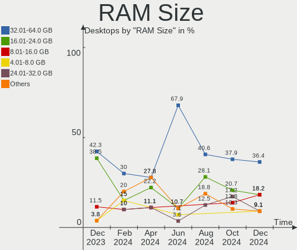
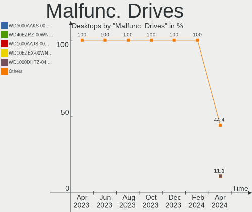
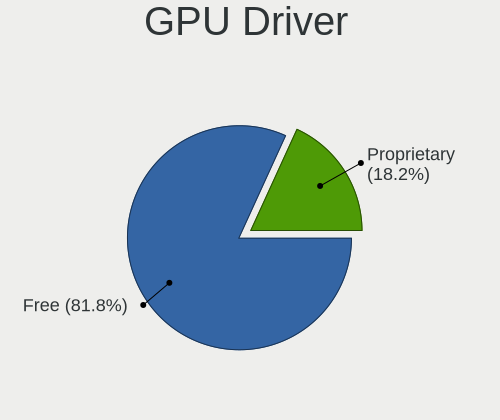
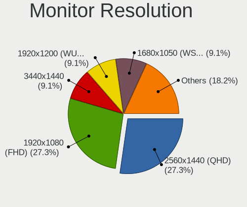
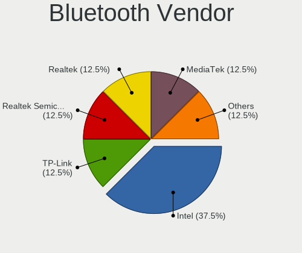
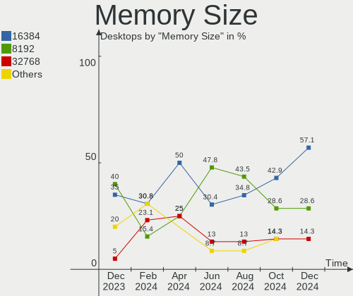

EndeavourOS - Hardware Trends (Desktops)
----------------------------------------

A project to identify most popular hardware characteristics and track their change
over time based on data collected by Linux users at https://Linux-Hardware.org.

Anyone can contribute to this report by the [hw-probe](https://github.com/linuxhw/hw-probe) tool:

    sudo -E hw-probe -all -upload

This report is for one last month. Overall report since the beginning of time: [TestDays](https://github.com/linuxhw/TestDays)

Period: Nov, 2023.

Contents
--------

* [ System ](#system)
  - [ OS                       ](#os)
  - [ OS Family                ](#os-family)
  - [ Kernel                   ](#kernel)
  - [ Kernel Family            ](#kernel-family)
  - [ Kernel Major Ver.        ](#kernel-major-ver)
  - [ Arch                     ](#arch)
  - [ DE                       ](#de)
  - [ Display Server           ](#display-server)
  - [ Display Manager          ](#display-manager)
  - [ OS Lang                  ](#os-lang)
  - [ Boot Mode                ](#boot-mode)
  - [ Filesystem               ](#filesystem)
  - [ Part. scheme             ](#part-scheme)
  - [ Dual Boot with Linux/BSD ](#dual-boot-with-linuxbsd)
  - [ Dual Boot (Win)          ](#dual-boot-win)

* [ Board ](#board)
  - [ Vendor                   ](#vendor)
  - [ Model                    ](#model)
  - [ Model Family             ](#model-family)
  - [ MFG Year                 ](#mfg-year)
  - [ Form Factor              ](#form-factor)
  - [ Secure Boot              ](#secure-boot)
  - [ Coreboot                 ](#coreboot)
  - [ RAM Size                 ](#ram-size)
  - [ RAM Used                 ](#ram-used)
  - [ Total Drives             ](#total-drives)
  - [ Has CD-ROM               ](#has-cd-rom)
  - [ Has Ethernet             ](#has-ethernet)
  - [ Has WiFi                 ](#has-wifi)
  - [ Has Bluetooth            ](#has-bluetooth)

* [ Location ](#location)
  - [ Country                  ](#country)
  - [ City                     ](#city)

* [ Drives ](#drives)
  - [ Drive Vendor             ](#drive-vendor)
  - [ Drive Model              ](#drive-model)
  - [ HDD Vendor               ](#hdd-vendor)
  - [ SSD Vendor               ](#ssd-vendor)
  - [ Drive Kind               ](#drive-kind)
  - [ Drive Connector          ](#drive-connector)
  - [ Drive Size               ](#drive-size)
  - [ Space Total              ](#space-total)
  - [ Space Used               ](#space-used)
  - [ Malfunc. Drives          ](#malfunc-drives)
  - [ Malfunc. Drive Vendor    ](#malfunc-drive-vendor)
  - [ Malfunc. HDD Vendor      ](#malfunc-hdd-vendor)
  - [ Malfunc. Drive Kind      ](#malfunc-drive-kind)
  - [ Failed Drives            ](#failed-drives)
  - [ Failed Drive Vendor      ](#failed-drive-vendor)
  - [ Drive Status             ](#drive-status)

* [ Storage controller ](#storage-controller)
  - [ Storage Vendor           ](#storage-vendor)
  - [ Storage Model            ](#storage-model)
  - [ Storage Kind             ](#storage-kind)

* [ Processor ](#processor)
  - [ CPU Vendor               ](#cpu-vendor)
  - [ CPU Model                ](#cpu-model)
  - [ CPU Model Family         ](#cpu-model-family)
  - [ CPU Cores                ](#cpu-cores)
  - [ CPU Sockets              ](#cpu-sockets)
  - [ CPU Threads              ](#cpu-threads)
  - [ CPU Op-Modes             ](#cpu-op-modes)
  - [ CPU Microcode            ](#cpu-microcode)
  - [ CPU Microarch            ](#cpu-microarch)

* [ Graphics ](#graphics)
  - [ GPU Vendor               ](#gpu-vendor)
  - [ GPU Model                ](#gpu-model)
  - [ GPU Combo                ](#gpu-combo)
  - [ GPU Driver               ](#gpu-driver)
  - [ GPU Memory               ](#gpu-memory)

* [ Monitor ](#monitor)
  - [ Monitor Vendor           ](#monitor-vendor)
  - [ Monitor Model            ](#monitor-model)
  - [ Monitor Resolution       ](#monitor-resolution)
  - [ Monitor Diagonal         ](#monitor-diagonal)
  - [ Monitor Width            ](#monitor-width)
  - [ Aspect Ratio             ](#aspect-ratio)
  - [ Monitor Area             ](#monitor-area)
  - [ Pixel Density            ](#pixel-density)
  - [ Multiple Monitors        ](#multiple-monitors)

* [ Network ](#network)
  - [ Net Controller Vendor    ](#net-controller-vendor)
  - [ Net Controller Model     ](#net-controller-model)
  - [ Wireless Vendor          ](#wireless-vendor)
  - [ Wireless Model           ](#wireless-model)
  - [ Ethernet Vendor          ](#ethernet-vendor)
  - [ Ethernet Model           ](#ethernet-model)
  - [ Net Controller Kind      ](#net-controller-kind)
  - [ Used Controller          ](#used-controller)
  - [ NICs                     ](#nics)
  - [ IPv6                     ](#ipv6)

* [ Bluetooth ](#bluetooth)
  - [ Bluetooth Vendor         ](#bluetooth-vendor)
  - [ Bluetooth Model          ](#bluetooth-model)

* [ Sound ](#sound)
  - [ Sound Vendor             ](#sound-vendor)
  - [ Sound Model              ](#sound-model)

* [ Memory ](#memory)
  - [ Memory Vendor            ](#memory-vendor)
  - [ Memory Model             ](#memory-model)
  - [ Memory Kind              ](#memory-kind)
  - [ Memory Form Factor       ](#memory-form-factor)
  - [ Memory Size              ](#memory-size)
  - [ Memory Speed             ](#memory-speed)

* [ Printers & scanners ](#printers--scanners)
  - [ Printer Vendor           ](#printer-vendor)
  - [ Printer Model            ](#printer-model)
  - [ Scanner Vendor           ](#scanner-vendor)
  - [ Scanner Model            ](#scanner-model)

* [ Camera ](#camera)
  - [ Camera Vendor            ](#camera-vendor)
  - [ Camera Model             ](#camera-model)

* [ Security ](#security)
  - [ Fingerprint Vendor       ](#fingerprint-vendor)
  - [ Fingerprint Model        ](#fingerprint-model)
  - [ Chipcard Vendor          ](#chipcard-vendor)
  - [ Chipcard Model           ](#chipcard-model)

* [ Unsupported ](#unsupported)
  - [ Unsupported Devices      ](#unsupported-devices)
  - [ Unsupported Device Types ](#unsupported-device-types)

System
------

OS
--

Installed operating systems

| Name                | Desktops | Percent |
|---------------------|----------|---------|
| EndeavourOS Rolling | 23       | 100%    |

OS Family
---------

OS without a version

| Name        | Desktops | Percent |
|-------------|----------|---------|
| EndeavourOS | 23       | 100%    |

Kernel
------

Version of the Linux kernel

| Version          | Desktops | Percent |
|------------------|----------|---------|
| 6.6.1-arch1-1    | 6        | 26.09%  |
| 6.5.9-arch2-1    | 4        | 17.39%  |
| 6.6.2-arch1-1    | 2        | 8.7%    |
| 6.1.61-1-lts     | 2        | 8.7%    |
| 6.6.3-arch1-1    | 1        | 4.35%   |
| 6.6.2-zen1-1-zen | 1        | 4.35%   |
| 6.6.1-zen1-1-zen | 1        | 4.35%   |
| 6.6.1-1-clear    | 1        | 4.35%   |
| 6.5.9-zen2-1-zen | 1        | 4.35%   |
| 6.4.8-arch1-1    | 1        | 4.35%   |
| 6.1.63-1-lts     | 1        | 4.35%   |
| 6.1.62-1-lts     | 1        | 4.35%   |
| 6.1.58-1-lts     | 1        | 4.35%   |

Kernel Family
-------------

Linux kernel without a distro release

| Version | Desktops | Percent |
|---------|----------|---------|
| 6.6.1   | 8        | 34.78%  |
| 6.5.9   | 5        | 21.74%  |
| 6.6.2   | 3        | 13.04%  |
| 6.1.61  | 2        | 8.7%    |
| 6.6.3   | 1        | 4.35%   |
| 6.4.8   | 1        | 4.35%   |
| 6.1.63  | 1        | 4.35%   |
| 6.1.62  | 1        | 4.35%   |
| 6.1.58  | 1        | 4.35%   |

Kernel Major Ver.
-----------------

Linux kernel major version

| Version | Desktops | Percent |
|---------|----------|---------|
| 6.6     | 12       | 52.17%  |
| 6.5     | 5        | 21.74%  |
| 6.1     | 5        | 21.74%  |
| 6.4     | 1        | 4.35%   |

Arch
----

OS architecture (x86_64, i586, etc.)

| Name   | Desktops | Percent |
|--------|----------|---------|
| x86_64 | 23       | 100%    |

DE
--

Desktop Environment

| Name       | Desktops | Percent |
|------------|----------|---------|
| KDE5       | 16       | 69.57%  |
| XFCE       | 2        | 8.7%    |
| i3         | 2        | 8.7%    |
| X-Cinnamon | 1        | 4.35%   |
| Hyprland   | 1        | 4.35%   |
| Deepin     | 1        | 4.35%   |

Display Server
--------------

X11 or Wayland

| Name    | Desktops | Percent |
|---------|----------|---------|
| X11     | 16       | 69.57%  |
| Wayland | 5        | 21.74%  |
| Tty     | 1        | 4.35%   |
| Unknown | 1        | 4.35%   |

Display Manager
---------------

SDDM, LightDM, etc.

| Name    | Desktops | Percent |
|---------|----------|---------|
| SDDM    | 9        | 39.13%  |
| Unknown | 8        | 34.78%  |
| LightDM | 6        | 26.09%  |

OS Lang
-------

Language

| Lang  | Desktops | Percent |
|-------|----------|---------|
| en_US | 10       | 43.48%  |
| pt_BR | 2        | 8.7%    |
| nl_NL | 2        | 8.7%    |
| en_GB | 2        | 8.7%    |
| de_DE | 2        | 8.7%    |
| it_IT | 1        | 4.35%   |
| fr_FR | 1        | 4.35%   |
| es_ES | 1        | 4.35%   |
| en_ZA | 1        | 4.35%   |
| en_IN | 1        | 4.35%   |

Boot Mode
---------

EFI or BIOS

| Mode | Desktops | Percent |
|------|----------|---------|
| EFI  | 13       | 56.52%  |
| BIOS | 10       | 43.48%  |

Filesystem
----------

Type of filesystem

| Type    | Desktops | Percent |
|---------|----------|---------|
| Ext4    | 14       | 60.87%  |
| Btrfs   | 8        | 34.78%  |
| Overlay | 1        | 4.35%   |

Part. scheme
------------

Scheme of partitioning

| Type    | Desktops | Percent |
|---------|----------|---------|
| GPT     | 13       | 56.52%  |
| Unknown | 8        | 34.78%  |
| MBR     | 2        | 8.7%    |

Dual Boot with Linux/BSD
------------------------

Hosting more than one Linux/BSD

| Dual boot | Desktops | Percent |
|-----------|----------|---------|
| No        | 20       | 86.96%  |
| Yes       | 3        | 13.04%  |

Dual Boot (Win)
---------------

Hosting Linux and Windows

| Dual boot | Desktops | Percent |
|-----------|----------|---------|
| No        | 13       | 56.52%  |
| Yes       | 10       | 43.48%  |

Board
-----

Vendor
------

Motherboard manufacturer

| Name                | Desktops | Percent |
|---------------------|----------|---------|
| ASUSTek Computer    | 7        | 30.43%  |
| MSI                 | 6        | 26.09%  |
| Gigabyte Technology | 4        | 17.39%  |
| ASRock              | 3        | 13.04%  |
| Hewlett-Packard     | 1        | 4.35%   |
| Apple               | 1        | 4.35%   |
| Unknown             | 1        | 4.35%   |

Model
-----

Motherboard model

| Name                         | Desktops | Percent |
|------------------------------|----------|---------|
| MSI MS-7C91                  | 1        | 4.35%   |
| MSI MS-7C84                  | 1        | 4.35%   |
| MSI MS-7B86                  | 1        | 4.35%   |
| MSI MS-7B79                  | 1        | 4.35%   |
| MSI MS-7A38                  | 1        | 4.35%   |
| MSI MS-7816                  | 1        | 4.35%   |
| HP Compaq Elite 8300 MT      | 1        | 4.35%   |
| Gigabyte P55A-UD3            | 1        | 4.35%   |
| Gigabyte B550M DS3H AC       | 1        | 4.35%   |
| Gigabyte B450M DS3H          | 1        | 4.35%   |
| Gigabyte B450 AORUS ELITE    | 1        | 4.35%   |
| ASUS Z170M-PLUS              | 1        | 4.35%   |
| ASUS TUF Gaming X570-PRO     | 1        | 4.35%   |
| ASUS TUF Gaming X570-PLUS    | 1        | 4.35%   |
| ASUS ROG STRIX X470-F GAMING | 1        | 4.35%   |
| ASUS PRIME X670-P            | 1        | 4.35%   |
| ASUS INTEL                   | 1        | 4.35%   |
| ASUS All Series              | 1        | 4.35%   |
| ASRock Z790M-ITX WiFi        | 1        | 4.35%   |
| ASRock B450M Pro4            | 1        | 4.35%   |
| ASRock B450 Pro4 R2.0        | 1        | 4.35%   |
| Apple MacPro6,1              | 1        | 4.35%   |
| Unknown                      | 1        | 4.35%   |

Model Family
------------

Motherboard model prefix

| Name              | Desktops | Percent |
|-------------------|----------|---------|
| ASUS TUF          | 2        | 8.7%    |
| MSI MS-7C91       | 1        | 4.35%   |
| MSI MS-7C84       | 1        | 4.35%   |
| MSI MS-7B86       | 1        | 4.35%   |
| MSI MS-7B79       | 1        | 4.35%   |
| MSI MS-7A38       | 1        | 4.35%   |
| MSI MS-7816       | 1        | 4.35%   |
| HP Compaq         | 1        | 4.35%   |
| Gigabyte P55A-UD3 | 1        | 4.35%   |
| Gigabyte B550M    | 1        | 4.35%   |
| Gigabyte B450M    | 1        | 4.35%   |
| Gigabyte B450     | 1        | 4.35%   |
| ASUS Z170M-PLUS   | 1        | 4.35%   |
| ASUS ROG          | 1        | 4.35%   |
| ASUS PRIME        | 1        | 4.35%   |
| ASUS INTEL        | 1        | 4.35%   |
| ASUS All          | 1        | 4.35%   |
| ASRock Z790M-ITX  | 1        | 4.35%   |
| ASRock B450M      | 1        | 4.35%   |
| ASRock B450       | 1        | 4.35%   |
| Apple MacPro6     | 1        | 4.35%   |
| Unknown           | 1        | 4.35%   |

MFG Year
--------

Motherboard manufacture year

| Year | Desktops | Percent |
|------|----------|---------|
| 2018 | 5        | 21.74%  |
| 2020 | 4        | 17.39%  |
| 2019 | 4        | 17.39%  |
| 2022 | 3        | 13.04%  |
| 2014 | 2        | 8.7%    |
| 2023 | 1        | 4.35%   |
| 2021 | 1        | 4.35%   |
| 2015 | 1        | 4.35%   |
| 2012 | 1        | 4.35%   |
| 2009 | 1        | 4.35%   |

Form Factor
-----------

Physical design of the computer

| Name    | Desktops | Percent |
|---------|----------|---------|
| Desktop | 23       | 100%    |

Secure Boot
-----------

Enabled or disabled

| State    | Desktops | Percent |
|----------|----------|---------|
| Disabled | 22       | 95.65%  |
| Enabled  | 1        | 4.35%   |

Coreboot
--------

Have coreboot on board

| Used | Desktops | Percent |
|------|----------|---------|
| No   | 23       | 100%    |

RAM Size
--------

Total RAM memory

| Size in GB  | Desktops | Percent |
|-------------|----------|---------|
| 32.01-64.0  | 9        | 39.13%  |
| 16.01-24.0  | 6        | 26.09%  |
| 64.01-256.0 | 3        | 13.04%  |
| 8.01-16.0   | 2        | 8.7%    |
| 4.01-8.0    | 1        | 4.35%   |
| 3.01-4.0    | 1        | 4.35%   |
| 24.01-32.0  | 1        | 4.35%   |

RAM Used
--------

Used RAM memory

| Used GB    | Desktops | Percent |
|------------|----------|---------|
| 4.01-8.0   | 6        | 26.09%  |
| 2.01-3.0   | 5        | 21.74%  |
| 3.01-4.0   | 3        | 13.04%  |
| 1.01-2.0   | 3        | 13.04%  |
| 8.01-16.0  | 3        | 13.04%  |
| 24.01-32.0 | 2        | 8.7%    |
| 0.51-1.0   | 1        | 4.35%   |

Total Drives
------------

Number of drives on board

| Drives | Desktops | Percent |
|--------|----------|---------|
| 2      | 7        | 30.43%  |
| 3      | 5        | 21.74%  |
| 4      | 4        | 17.39%  |
| 1      | 3        | 13.04%  |
| 6      | 2        | 8.7%    |
| 5      | 1        | 4.35%   |
| 0      | 1        | 4.35%   |

Has CD-ROM
----------

Has CD-ROM on board

| Presented | Desktops | Percent |
|-----------|----------|---------|
| No        | 19       | 82.61%  |
| Yes       | 4        | 17.39%  |

Has Ethernet
------------

Has Ethernet on board

| Presented | Desktops | Percent |
|-----------|----------|---------|
| Yes       | 23       | 100%    |

Has WiFi
--------

Has WiFi module

| Presented | Desktops | Percent |
|-----------|----------|---------|
| Yes       | 12       | 52.17%  |
| No        | 11       | 47.83%  |

Has Bluetooth
-------------

Has Bluetooth module

| Presented | Desktops | Percent |
|-----------|----------|---------|
| No        | 13       | 56.52%  |
| Yes       | 10       | 43.48%  |

Location
--------

Country
-------

Geographic location (country)

| Country      | Desktops | Percent |
|--------------|----------|---------|
| Germany      | 5        | 21.74%  |
| USA          | 4        | 17.39%  |
| France       | 2        | 8.7%    |
| Brazil       | 2        | 8.7%    |
| UK           | 1        | 4.35%   |
| Turkey       | 1        | 4.35%   |
| Sweden       | 1        | 4.35%   |
| Spain        | 1        | 4.35%   |
| South Africa | 1        | 4.35%   |
| Serbia       | 1        | 4.35%   |
| Netherlands  | 1        | 4.35%   |
| Italy        | 1        | 4.35%   |
| India        | 1        | 4.35%   |
| Belgium      | 1        | 4.35%   |

City
----

Geographic location (city)

| City                      | Desktops | Percent |
|---------------------------|----------|---------|
| Wilmington                | 1        | 4.35%   |
| Tarsus                    | 1        | 4.35%   |
| Stockholm                 | 1        | 4.35%   |
| Sao Paulo                 | 1        | 4.35%   |
| Santa Cruz                | 1        | 4.35%   |
| Sabadell                  | 1        | 4.35%   |
| Reutlingen                | 1        | 4.35%   |
| Recife                    | 1        | 4.35%   |
| Plaisir                   | 1        | 4.35%   |
| Oakland                   | 1        | 4.35%   |
| Nantes                    | 1        | 4.35%   |
| Marietta                  | 1        | 4.35%   |
| Karlsruhe                 | 1        | 4.35%   |
| Hasselt                   | 1        | 4.35%   |
| Harringay                 | 1        | 4.35%   |
| Hamburg                   | 1        | 4.35%   |
| Düsseldorf               | 1        | 4.35%   |
| Chiavari                  | 1        | 4.35%   |
| Cape Town                 | 1        | 4.35%   |
| Buchholz in der Nordheide | 1        | 4.35%   |
| Bengaluru                 | 1        | 4.35%   |
| Belgrade                  | 1        | 4.35%   |
| Almelo                    | 1        | 4.35%   |

Drives
------

Drive Vendor
------------

Hard drive vendors

| Vendor                      | Desktops | Drives | Percent |
|-----------------------------|----------|--------|---------|
| Seagate                     | 9        | 10     | 17.31%  |
| Samsung Electronics         | 9        | 15     | 17.31%  |
| WDC                         | 6        | 7      | 11.54%  |
| Phison Electronics          | 6        | 8      | 11.54%  |
| Sandisk                     | 4        | 5      | 7.69%   |
| Crucial                     | 3        | 3      | 5.77%   |
| Unknown                     | 2        | 2      | 3.85%   |
| Toshiba                     | 2        | 2      | 3.85%   |
| KIOXIA                      | 2        | 2      | 3.85%   |
| Kingston                    | 2        | 4      | 3.85%   |
| Patriot                     | 1        | 1      | 1.92%   |
| Kingston Technology Company | 1        | 1      | 1.92%   |
| Kimtigo                     | 1        | 1      | 1.92%   |
| Intenso                     | 1        | 1      | 1.92%   |
| Hitachi                     | 1        | 1      | 1.92%   |
| HGST                        | 1        | 1      | 1.92%   |
| Apple                       | 1        | 1      | 1.92%   |

Drive Model
-----------

Hard drive models

| Model                                               | Desktops | Percent |
|-----------------------------------------------------|----------|---------|
| Phison E12 NVMe Controller 512GB                    | 5        | 7.94%   |
| Samsung NVMe SSD Controller SM981/PM981/PM983 250GB | 4        | 6.35%   |
| Unknown NVMe SSD Drive 2TB                          | 2        | 3.17%   |
| Seagate ST2000DM008-2FR102 2TB                      | 2        | 3.17%   |
| Samsung SSD 860 EVO 250GB                           | 2        | 3.17%   |
| Samsung HD103SJ 1TB                                 | 2        | 3.17%   |
| Crucial CT500MX500SSD1 500GB                        | 2        | 3.17%   |
| WDC WDS500G2B0B-00YS70 500GB SSD                    | 1        | 1.59%   |
| WDC WDS500G2B0A-00SM50 500GB SSD                    | 1        | 1.59%   |
| WDC WD6003FZBX-00K5WB0 6TB                          | 1        | 1.59%   |
| WDC WD2500AAKX-603CA0 250GB                         | 1        | 1.59%   |
| WDC WD20EZRZ-00Z5HB0 2TB                            | 1        | 1.59%   |
| WDC WD1600AAJS-75PSA0 160GB                         | 1        | 1.59%   |
| WDC WD10EZEX-22MFCA0 1TB                            | 1        | 1.59%   |
| Toshiba MK5065GSX 500GB                             | 1        | 1.59%   |
| Toshiba MG09ACA18TE 18TB                            | 1        | 1.59%   |
| Seagate ST500DM002-1SB10A 500GB                     | 1        | 1.59%   |
| Seagate ST4000VN006-3CW104 4TB                      | 1        | 1.59%   |
| Seagate ST4000DM004-2CV104 4TB                      | 1        | 1.59%   |
| Seagate ST2000LM007-1R8174 2TB                      | 1        | 1.59%   |
| Seagate ST2000DL003-9VT166 2TB                      | 1        | 1.59%   |
| Seagate ST1000LM049-2GH172 1TB                      | 1        | 1.59%   |
| Seagate ST1000LM024 HN-M101MBB 1TB                  | 1        | 1.59%   |
| Seagate BUP Slim 1TB                                | 1        | 1.59%   |
| Sandisk WD Blue SN570 500GB                         | 1        | 1.59%   |
| Sandisk WD Black SN750 / PC SN730 NVMe SSD 500GB    | 1        | 1.59%   |
| SanDisk SDSSDX120GG25 120GB                         | 1        | 1.59%   |
| SanDisk SDSSDH3 1T00 1TB                            | 1        | 1.59%   |
| SanDisk Extreme SSD 500GB                           | 1        | 1.59%   |
| Samsung SSD 990 PRO 2TB                             | 1        | 1.59%   |
| Samsung SSD 980 1TB                                 | 1        | 1.59%   |
| Samsung SSD 870 QVO 1TB                             | 1        | 1.59%   |
| Samsung SSD 860 EVO 500GB                           | 1        | 1.59%   |
| Samsung NVMe SSD Controller PM9A1/PM9A3/980PRO 2TB  | 1        | 1.59%   |
| Samsung HD103SI 1TB                                 | 1        | 1.59%   |
| Phison PNY CS2140 500GB SSD                         | 1        | 1.59%   |
| Phison Corsair MP600 PRO LPX 2TB                    | 1        | 1.59%   |
| Patriot Blast 120GB SSD                             | 1        | 1.59%   |
| KIOXIA KBG40ZNS256G NVMe 256GB                      | 1        | 1.59%   |
| KIOXIA KBG40ZMT128G TOSHIBA MEMORY 128GB            | 1        | 1.59%   |

HDD Vendor
----------

Hard disk drive vendors

| Vendor              | Desktops | Drives | Percent |
|---------------------|----------|--------|---------|
| Seagate             | 9        | 10     | 42.86%  |
| WDC                 | 5        | 5      | 23.81%  |
| Samsung Electronics | 3        | 3      | 14.29%  |
| Toshiba             | 2        | 2      | 9.52%   |
| Hitachi             | 1        | 1      | 4.76%   |
| HGST                | 1        | 1      | 4.76%   |

SSD Vendor
----------

Solid state drive vendors

| Vendor              | Desktops | Drives | Percent |
|---------------------|----------|--------|---------|
| SanDisk             | 3        | 3      | 18.75%  |
| Samsung Electronics | 3        | 4      | 18.75%  |
| Crucial             | 3        | 3      | 18.75%  |
| WDC                 | 2        | 2      | 12.5%   |
| Kingston            | 2        | 3      | 12.5%   |
| Patriot             | 1        | 1      | 6.25%   |
| Kimtigo             | 1        | 1      | 6.25%   |
| Apple               | 1        | 1      | 6.25%   |

Drive Kind
----------

HDD or SSD

| Kind    | Desktops | Drives | Percent |
|---------|----------|--------|---------|
| HDD     | 17       | 22     | 37.78%  |
| NVMe    | 14       | 24     | 31.11%  |
| SSD     | 13       | 18     | 28.89%  |
| Unknown | 1        | 1      | 2.22%   |

Drive Connector
---------------

SATA, SAS, NVMe, etc.

| Type | Desktops | Drives | Percent |
|------|----------|--------|---------|
| SATA | 19       | 39     | 54.29%  |
| NVMe | 14       | 24     | 40%     |
| SAS  | 2        | 2      | 5.71%   |

Drive Size
----------

Size of hard drive

| Size in TB | Desktops | Drives | Percent |
|------------|----------|--------|---------|
| 0.01-0.5   | 12       | 17     | 37.5%   |
| 0.51-1.0   | 11       | 13     | 34.38%  |
| 1.01-2.0   | 5        | 6      | 15.63%  |
| 3.01-4.0   | 2        | 2      | 6.25%   |
| 10.01-20.0 | 1        | 1      | 3.13%   |
| 4.01-10.0  | 1        | 1      | 3.13%   |

Space Total
-----------

Amount of disk space available on the file system

| Size in GB     | Desktops | Percent |
|----------------|----------|---------|
| 1001-2000      | 7        | 30.43%  |
| More than 3000 | 6        | 26.09%  |
| 251-500        | 5        | 21.74%  |
| 101-250        | 2        | 8.7%    |
| 501-1000       | 2        | 8.7%    |
| 1-20           | 1        | 4.35%   |

Space Used
----------

Amount of used disk space

| Used GB        | Desktops | Percent |
|----------------|----------|---------|
| 1001-2000      | 5        | 21.74%  |
| 251-500        | 3        | 13.04%  |
| 1-20           | 3        | 13.04%  |
| 51-100         | 3        | 13.04%  |
| More than 3000 | 2        | 8.7%    |
| 21-50          | 2        | 8.7%    |
| 101-250        | 2        | 8.7%    |
| 501-1000       | 2        | 8.7%    |
| 2001-3000      | 1        | 4.35%   |

Malfunc. Drives
---------------

Drive models with a malfunction

| Model                                                           | Desktops | Drives | Percent |
|-----------------------------------------------------------------|----------|--------|---------|
| Seagate ST4000DM004-2CV104 4TB                                  | 1        | 1      | 20%     |
| SanDisk SDSSDX120GG25 120GB                                     | 1        | 1      | 20%     |
| Samsung Electronics NVMe SSD Controller SM981/PM981/PM983 250GB | 1        | 1      | 20%     |
| Samsung Electronics HD103SI 1TB                                 | 1        | 1      | 20%     |
| Crucial CT500MX500SSD1 500GB                                    | 1        | 1      | 20%     |

Malfunc. Drive Vendor
---------------------

Vendors of faulty drives

| Vendor              | Desktops | Drives | Percent |
|---------------------|----------|--------|---------|
| Samsung Electronics | 2        | 2      | 40%     |
| Seagate             | 1        | 1      | 20%     |
| SanDisk             | 1        | 1      | 20%     |
| Crucial             | 1        | 1      | 20%     |

Malfunc. HDD Vendor
-------------------

Vendors of faulty HDD drives

| Vendor              | Desktops | Drives | Percent |
|---------------------|----------|--------|---------|
| Seagate             | 1        | 1      | 50%     |
| Samsung Electronics | 1        | 1      | 50%     |

Malfunc. Drive Kind
-------------------

Kinds of faulty drives

| Kind | Desktops | Drives | Percent |
|------|----------|--------|---------|
| SSD  | 2        | 2      | 40%     |
| HDD  | 2        | 2      | 40%     |
| NVMe | 1        | 1      | 20%     |

Failed Drives
-------------

Failed drive models

Zero info for selected period =(

Failed Drive Vendor
-------------------

Failed drive vendors

Zero info for selected period =(

Drive Status
------------

Number of failed and malfunc. drives

| Status   | Desktops | Drives | Percent |
|----------|----------|--------|---------|
| Works    | 14       | 28     | 43.75%  |
| Detected | 13       | 32     | 40.63%  |
| Malfunc  | 5        | 5      | 15.63%  |

Storage controller
------------------

Storage Vendor
--------------

Storage controller vendors

| Vendor                      | Desktops | Percent |
|-----------------------------|----------|---------|
| AMD                         | 14       | 31.82%  |
| Intel                       | 8        | 18.18%  |
| Samsung Electronics         | 7        | 15.91%  |
| Phison Electronics          | 6        | 13.64%  |
| SanDisk                     | 2        | 4.55%   |
| Nextorage                   | 2        | 4.55%   |
| KIOXIA                      | 2        | 4.55%   |
| Kingston Technology Company | 2        | 4.55%   |
| ASMedia Technology          | 1        | 2.27%   |

Storage Model
-------------

Storage controller models

| Model                                                                          | Desktops | Percent |
|--------------------------------------------------------------------------------|----------|---------|
| AMD 400 Series Chipset SATA Controller                                         | 8        | 16%     |
| AMD FCH SATA Controller [AHCI mode]                                            | 7        | 14%     |
| Phison E12 NVMe Controller                                                     | 5        | 10%     |
| Samsung NVMe SSD Controller SM981/PM981/PM983                                  | 4        | 8%      |
| Nextorage NE1N NVMe SSD                                                        | 2        | 4%      |
| KIOXIA NVMe SSD Controller BG4 (DRAM-less)                                     | 2        | 4%      |
| AMD 500 Series Chipset SATA Controller                                         | 2        | 4%      |
| SanDisk Ultra 3D / WD Blue SN570 NVMe SSD (DRAM-less)                          | 1        | 2%      |
| SanDisk Extreme Pro / WD Black SN750 / PC SN730 / Red SN700 NVMe SSD           | 1        | 2%      |
| Samsung S4LN053X01 AHCI SSD Controller(Apple slot)                             | 1        | 2%      |
| Samsung NVMe SSD Controller S4LV008[Pascal]                                    | 1        | 2%      |
| Samsung NVMe SSD Controller PM9A1/PM9A3/980PRO                                 | 1        | 2%      |
| Samsung NVMe SSD Controller 980 (DRAM-less)                                    | 1        | 2%      |
| Phison PS5019-E19 PCIe4 NVMe Controller (DRAM-less)                            | 1        | 2%      |
| Phison E18 PCIe4 NVMe Controller                                               | 1        | 2%      |
| Kingston Company NV2 NVMe SSD SM2267XT                                         | 1        | 2%      |
| Kingston Company KC3000/FURY Renegade NVMe SSD E18                             | 1        | 2%      |
| Intel Volume Management Device NVMe RAID Controller                            | 1        | 2%      |
| Intel SATA controller                                                          | 1        | 2%      |
| Intel Q170/Q150/B150/H170/H110/Z170/CM236 Chipset SATA Controller [AHCI Mode]  | 1        | 2%      |
| Intel Alder Lake-S PCH SATA Controller [AHCI Mode]                             | 1        | 2%      |
| Intel 9 Series Chipset Family SATA Controller [AHCI Mode]                      | 1        | 2%      |
| Intel 8 Series/C220 Series Chipset Family 6-port SATA Controller 1 [AHCI mode] | 1        | 2%      |
| Intel 700 Series Chipset Family SATA AHCI Controller                           | 1        | 2%      |
| Intel 7 Series/C210 Series Chipset Family 6-port SATA Controller [AHCI mode]   | 1        | 2%      |
| Intel 5 Series/3400 Series Chipset 6 port SATA AHCI Controller                 | 1        | 2%      |
| ASMedia ASM1062 Serial ATA Controller                                          | 1        | 2%      |

Storage Kind
------------

Kind of storage controller (IDE, SATA, NVMe, SAS, ...)

| Kind | Desktops | Percent |
|------|----------|---------|
| SATA | 23       | 60.53%  |
| NVMe | 14       | 36.84%  |
| RAID | 1        | 2.63%   |

Processor
---------

CPU Vendor
----------

Processor vendors

| Vendor | Desktops | Percent |
|--------|----------|---------|
| AMD    | 14       | 60.87%  |
| Intel  | 9        | 39.13%  |

CPU Model
---------

Processor models

| Model                                       | Desktops | Percent |
|---------------------------------------------|----------|---------|
| AMD Ryzen 5 3600 6-Core Processor           | 2        | 8.7%    |
| Intel Xeon CPU E5-1680 v2 @ 3.00GHz         | 1        | 4.35%   |
| Intel N95                                   | 1        | 4.35%   |
| Intel Core i7-4790 CPU @ 3.60GHz            | 1        | 4.35%   |
| Intel Core i5-6600K CPU @ 3.50GHz           | 1        | 4.35%   |
| Intel Core i5-4440 CPU @ 3.10GHz            | 1        | 4.35%   |
| Intel Core i5-3470 CPU @ 3.20GHz            | 1        | 4.35%   |
| Intel Core i5 CPU 750 @ 2.67GHz             | 1        | 4.35%   |
| Intel 13th Gen Core i5-13600K               | 1        | 4.35%   |
| Intel 12th Gen Core i7-12700KF              | 1        | 4.35%   |
| AMD Ryzen 9 7900X 12-Core Processor         | 1        | 4.35%   |
| AMD Ryzen 9 5950X 16-Core Processor         | 1        | 4.35%   |
| AMD Ryzen 9 5900X 12-Core Processor         | 1        | 4.35%   |
| AMD Ryzen 7 5800X 8-Core Processor          | 1        | 4.35%   |
| AMD Ryzen 7 3700X 8-Core Processor          | 1        | 4.35%   |
| AMD Ryzen 7 2700X Eight-Core Processor      | 1        | 4.35%   |
| AMD Ryzen 7 2700 Eight-Core Processor       | 1        | 4.35%   |
| AMD Ryzen 5 5600X 6-Core Processor          | 1        | 4.35%   |
| AMD Ryzen 5 5600G with Radeon Graphics      | 1        | 4.35%   |
| AMD Ryzen 5 5600 6-Core Processor           | 1        | 4.35%   |
| AMD Ryzen 3 2200G with Radeon Vega Graphics | 1        | 4.35%   |
| AMD Athlon 3000G with Radeon Vega Graphics  | 1        | 4.35%   |

CPU Model Family
----------------

Processor model prefix

| Model         | Desktops | Percent |
|---------------|----------|---------|
| AMD Ryzen 5   | 5        | 21.74%  |
| Intel Core i5 | 4        | 17.39%  |
| AMD Ryzen 7   | 4        | 17.39%  |
| Other         | 3        | 13.04%  |
| AMD Ryzen 9   | 3        | 13.04%  |
| Intel Xeon    | 1        | 4.35%   |
| Intel Core i7 | 1        | 4.35%   |
| AMD Ryzen 3   | 1        | 4.35%   |
| AMD Athlon    | 1        | 4.35%   |

CPU Cores
---------

Number of processor cores

| Number | Desktops | Percent |
|--------|----------|---------|
| 4      | 7        | 30.43%  |
| 8      | 5        | 21.74%  |
| 6      | 5        | 21.74%  |
| 12     | 3        | 13.04%  |
| 16     | 1        | 4.35%   |
| 14     | 1        | 4.35%   |
| 2      | 1        | 4.35%   |

CPU Sockets
-----------

Number of sockets

| Number | Desktops | Percent |
|--------|----------|---------|
| 1      | 23       | 100%    |

CPU Threads
-----------

Threads per core (Hyper-Threading)

| Number | Desktops | Percent |
|--------|----------|---------|
| 2      | 17       | 73.91%  |
| 1      | 6        | 26.09%  |

CPU Op-Modes
------------

CPU Operation Modes (32-bit, 64-bit)

| Op mode        | Desktops | Percent |
|----------------|----------|---------|
| 32-bit, 64-bit | 23       | 100%    |

CPU Microcode
-------------

Microcode number

| Number     | Desktops | Percent |
|------------|----------|---------|
| Unknown    | 10       | 43.48%  |
| 0x0a201016 | 3        | 13.04%  |
| 0x08701021 | 2        | 8.7%    |
| 0x0800820d | 2        | 8.7%    |
| 0xb0671    | 1        | 4.35%   |
| 0x506e3    | 1        | 4.35%   |
| 0x306c3    | 1        | 4.35%   |
| 0x0a20102b | 1        | 4.35%   |
| 0x08108109 | 1        | 4.35%   |
| 0x08101016 | 1        | 4.35%   |

CPU Microarch
-------------

Microarchitecture

| Name             | Desktops | Percent |
|------------------|----------|---------|
| Zen 3            | 6        | 26.09%  |
| Zen+             | 3        | 13.04%  |
| Zen 2            | 3        | 13.04%  |
| IvyBridge        | 2        | 8.7%    |
| Haswell          | 2        | 8.7%    |
| Alderlake Hybrid | 2        | 8.7%    |
| Unknown          | 2        | 8.7%    |
| Zen              | 1        | 4.35%   |
| Skylake          | 1        | 4.35%   |
| Nehalem          | 1        | 4.35%   |

Graphics
--------

GPU Vendor
----------

Vendors of graphics cards

| Vendor | Desktops | Percent |
|--------|----------|---------|
| AMD    | 13       | 54.17%  |
| Nvidia | 9        | 37.5%   |
| Intel  | 2        | 8.33%   |

GPU Model
---------

Graphics card models

| Model                                                                | Desktops | Percent |
|----------------------------------------------------------------------|----------|---------|
| AMD Navi 22 [Radeon RX 6700/6700 XT/6750 XT / 6800M/6850M XT]        | 3        | 12%     |
| AMD Navi 23 [Radeon RX 6600/6600 XT/6600M]                           | 2        | 8%      |
| Nvidia GP108 [GeForce GT 1030]                                       | 1        | 4%      |
| Nvidia GP107 [GeForce GTX 1050 Ti]                                   | 1        | 4%      |
| Nvidia GP104 [GeForce GTX 1080]                                      | 1        | 4%      |
| Nvidia GM206 [GeForce GTX 960]                                       | 1        | 4%      |
| Nvidia GM107 [GeForce GTX 750 Ti]                                    | 1        | 4%      |
| Nvidia GA106 [Geforce RTX 3050]                                      | 1        | 4%      |
| Nvidia GA102 [GeForce RTX 3090]                                      | 1        | 4%      |
| Nvidia GA102 [GeForce RTX 3080]                                      | 1        | 4%      |
| Nvidia GA102 [GeForce RTX 3080 Lite Hash Rate]                       | 1        | 4%      |
| Intel Xeon E3-1200 v2/3rd Gen Core processor Graphics Controller     | 1        | 4%      |
| Intel Alder Lake-N [UHD Graphics]                                    | 1        | 4%      |
| AMD Tahiti XT [Radeon HD 7970/8970 OEM / R9 280X]                    | 1        | 4%      |
| AMD Raven Ridge [Radeon Vega Series / Radeon Vega Mobile Series]     | 1        | 4%      |
| AMD Picasso/Raven 2 [Radeon Vega Series / Radeon Vega Mobile Series] | 1        | 4%      |
| AMD Navi 31 [Radeon RX 7900 XT/7900 XTX]                             | 1        | 4%      |
| AMD Navi 10 [Radeon RX 5600 OEM/5600 XT / 5700/5700 XT]              | 1        | 4%      |
| AMD Lexa PRO [Radeon 540/540X/550/550X / RX 540X/550/550X]           | 1        | 4%      |
| AMD Ellesmere [Radeon RX 470/480/570/570X/580/580X/590]              | 1        | 4%      |
| AMD Caicos [Radeon HD 6450/7450/8450 / R5 230 OEM]                   | 1        | 4%      |
| AMD Baffin [Radeon RX 550 640SP / RX 560/560X]                       | 1        | 4%      |

GPU Combo
---------

Combinations of graphics cards

| Name       | Desktops | Percent |
|------------|----------|---------|
| 1 x AMD    | 11       | 47.83%  |
| 1 x Nvidia | 9        | 39.13%  |
| 2 x AMD    | 2        | 8.7%    |
| 1 x Intel  | 1        | 4.35%   |

GPU Driver
----------

Free vs proprietary

| Driver      | Desktops | Percent |
|-------------|----------|---------|
| Free        | 15       | 65.22%  |
| Proprietary | 8        | 34.78%  |

GPU Memory
----------

Total video memory

| Size in GB | Desktops | Percent |
|------------|----------|---------|
| Unknown    | 9        | 39.13%  |
| 3.01-4.0   | 4        | 17.39%  |
| 8.01-16.0  | 4        | 17.39%  |
| 16.01-24.0 | 2        | 8.7%    |
| 0.01-0.5   | 2        | 8.7%    |
| 7.01-8.0   | 1        | 4.35%   |
| 1.01-2.0   | 1        | 4.35%   |

Monitor
-------

Monitor Vendor
--------------

Monitor vendors

| Vendor               | Desktops | Percent |
|----------------------|----------|---------|
| Samsung Electronics  | 6        | 18.75%  |
| Goldstar             | 6        | 18.75%  |
| BenQ                 | 4        | 12.5%   |
| Lenovo               | 2        | 6.25%   |
| Dell                 | 2        | 6.25%   |
| ASUSTek Computer     | 2        | 6.25%   |
| AOC                  | 2        | 6.25%   |
| Ancor Communications | 2        | 6.25%   |
| Valve                | 1        | 3.13%   |
| Unknown              | 1        | 3.13%   |
| SKY                  | 1        | 3.13%   |
| Iiyama               | 1        | 3.13%   |
| HKC                  | 1        | 3.13%   |
| Hewlett-Packard      | 1        | 3.13%   |

Monitor Model
-------------

Monitor models

| Model                                                                 | Desktops | Percent |
|-----------------------------------------------------------------------|----------|---------|
| Samsung Electronics S24R65x SAM1023 1920x1080 530x300mm 24.0-inch     | 2        | 5.88%   |
| Valve Index HMD VLV91A8                                               | 1        | 2.94%   |
| Unknown LCD Monitor FFFF 2288x1287 2550x2550mm 142.0-inch             | 1        | 2.94%   |
| SKY TV-monitor SKY0402 1920x1080 885x498mm 40.0-inch                  | 1        | 2.94%   |
| Samsung Electronics U32J59x SAM0F52 3840x2160 697x392mm 31.5-inch     | 1        | 2.94%   |
| Samsung Electronics SyncMaster SAM037C 1680x1050 474x296mm 22.0-inch  | 1        | 2.94%   |
| Samsung Electronics LCD Monitor SAM7106 1920x1080 530x300mm 24.0-inch | 1        | 2.94%   |
| Samsung Electronics LCD Monitor SAM0B30 1920x1080 480x270mm 21.7-inch | 1        | 2.94%   |
| Lenovo LEN Y27q-20 LEN65EE 2560x1440 597x336mm 27.0-inch              | 1        | 2.94%   |
| Lenovo LEN L24q-30 LEN65FB 2560x1440 527x296mm 23.8-inch              | 1        | 2.94%   |
| Iiyama PL2470H IVM615C 1920x1080 530x300mm 24.0-inch                  | 1        | 2.94%   |
| HKC 24N1A HKC2421 1920x1080 527x296mm 23.8-inch                       | 1        | 2.94%   |
| Hewlett-Packard V27i HPN36B1 1920x1080 600x340mm 27.2-inch            | 1        | 2.94%   |
| Goldstar TV GSMC0A0 3840x2160                                         | 1        | 2.94%   |
| Goldstar HDR WFHD GSM7714 2560x1080 798x334mm 34.1-inch               | 1        | 2.94%   |
| Goldstar 27GL850 GSM5B7F 2560x1440 597x336mm 27.0-inch                | 1        | 2.94%   |
| Goldstar 24GL600F GSM5B72 1920x1080 531x298mm 24.0-inch               | 1        | 2.94%   |
| Goldstar 23MP55 GSM5A23 1920x1080 510x290mm 23.1-inch                 | 1        | 2.94%   |
| Goldstar 22MP55 GSM5A26 1920x1080 477x268mm 21.5-inch                 | 1        | 2.94%   |
| Goldstar 22MB65 GSM5A2F 1680x1050 480x300mm 22.3-inch                 | 1        | 2.94%   |
| Dell U2715H DELD069 2560x1440 597x336mm 27.0-inch                     | 1        | 2.94%   |
| Dell U2412M DELA07A 1920x1200 518x324mm 24.1-inch                     | 1        | 2.94%   |
| Dell S3422DW DELD104 3440x1440 797x334mm 34.0-inch                    | 1        | 2.94%   |
| BenQ ZOWIE XL LCD BNQ7F33 1920x1080 530x300mm 24.0-inch               | 1        | 2.94%   |
| BenQ xl2420t BNQ7F22 1920x1080 531x298mm 24.0-inch                    | 1        | 2.94%   |
| BenQ LCD BNQ801B 2560x1440 527x296mm 23.8-inch                        | 1        | 2.94%   |
| BenQ GW2270 BNQ78DB 1920x1080 476x268mm 21.5-inch                     | 1        | 2.94%   |
| ASUSTek Computer VG27AQL1A AUS2705 2560x1440 597x336mm 27.0-inch      | 1        | 2.94%   |
| ASUSTek Computer ROG XG27AQ AUS276B 2560x1440 597x336mm 27.0-inch     | 1        | 2.94%   |
| AOC 2460G5 AOC246A 1920x1080 531x299mm 24.0-inch                      | 1        | 2.94%   |
| AOC 2260WG5 AOC2260 1920x1080 477x268mm 21.5-inch                     | 1        | 2.94%   |
| Ancor Communications VE248 ACI2494 1920x1080 531x299mm 24.0-inch      | 1        | 2.94%   |
| Ancor Communications ASUS VK278 ACI27F7 1920x1080 598x336mm 27.0-inch | 1        | 2.94%   |

Monitor Resolution
------------------

Monitor screen resolution

| Resolution         | Desktops | Percent |
|--------------------|----------|---------|
| 1920x1080 (FHD)    | 16       | 51.61%  |
| 2560x1440 (QHD)    | 6        | 19.35%  |
| 3840x2160 (4K)     | 2        | 6.45%   |
| 1680x1050 (WSXGA+) | 2        | 6.45%   |
| 3440x1440          | 1        | 3.23%   |
| 2560x1080          | 1        | 3.23%   |
| 2288x1287          | 1        | 3.23%   |
| 1920x1200 (WUXGA)  | 1        | 3.23%   |
| Unknown            | 1        | 3.23%   |

Monitor Diagonal
----------------

Diagonal size in inches

| Inches  | Desktops | Percent |
|---------|----------|---------|
| 24      | 11       | 33.33%  |
| 27      | 6        | 18.18%  |
| 22      | 3        | 9.09%   |
| 54      | 2        | 6.06%   |
| 34      | 2        | 6.06%   |
| 23      | 2        | 6.06%   |
| 21      | 2        | 6.06%   |
| 142     | 1        | 3.03%   |
| 72      | 1        | 3.03%   |
| 40      | 1        | 3.03%   |
| 31      | 1        | 3.03%   |
| Unknown | 1        | 3.03%   |

Monitor Width
-------------

Physical width

| Width in mm    | Desktops | Percent |
|----------------|----------|---------|
| 501-600        | 14       | 50%     |
| 401-500        | 5        | 17.86%  |
| 701-800        | 2        | 7.14%   |
| 1001-1500      | 2        | 7.14%   |
| More than 2000 | 1        | 3.57%   |
| 801-900        | 1        | 3.57%   |
| 601-700        | 1        | 3.57%   |
| 1501-2000      | 1        | 3.57%   |
| Unknown        | 1        | 3.57%   |

Aspect Ratio
------------

Proportional relationship between the width and the height

| Ratio   | Desktops | Percent |
|---------|----------|---------|
| 16/9    | 19       | 67.86%  |
| 16/10   | 5        | 17.86%  |
| 21/9    | 2        | 7.14%   |
| 1.00    | 1        | 3.57%   |
| Unknown | 1        | 3.57%   |

Monitor Area
------------

Area in inch²

| Area in inch² | Desktops | Percent |
|----------------|----------|---------|
| 201-250        | 16       | 48.48%  |
| 301-350        | 6        | 18.18%  |
| More than 1000 | 4        | 12.12%  |
| 351-500        | 3        | 9.09%   |
| 251-300        | 2        | 6.06%   |
| 501-1000       | 1        | 3.03%   |
| Unknown        | 1        | 3.03%   |

Pixel Density
-------------

Pixels per inch

| Density | Desktops | Percent |
|---------|----------|---------|
| 51-100  | 15       | 51.72%  |
| 101-120 | 7        | 24.14%  |
| 1-50    | 3        | 10.34%  |
| 121-160 | 3        | 10.34%  |
| Unknown | 1        | 3.45%   |

Multiple Monitors
-----------------

Total monitors connected

| Total | Desktops | Percent |
|-------|----------|---------|
| 1     | 15       | 65.22%  |
| 2     | 6        | 26.09%  |
| 4     | 1        | 4.35%   |
| 3     | 1        | 4.35%   |

Network
-------

Net Controller Vendor
---------------------

Controller vendors

| Vendor                | Desktops | Percent |
|-----------------------|----------|---------|
| Realtek Semiconductor | 15       | 50%     |
| Intel                 | 9        | 30%     |
| Xiaomi                | 1        | 3.33%   |
| TP-Link               | 1        | 3.33%   |
| Samsung Electronics   | 1        | 3.33%   |
| Qualcomm Atheros      | 1        | 3.33%   |
| Microsoft             | 1        | 3.33%   |
| Broadcom              | 1        | 3.33%   |

Net Controller Model
--------------------

Controller models

| Model                                                             | Desktops | Percent |
|-------------------------------------------------------------------|----------|---------|
| Realtek RTL8111/8168/8411 PCI Express Gigabit Ethernet Controller | 12       | 30%     |
| Realtek RTL8125 2.5GbE Controller                                 | 3        | 7.5%    |
| Realtek RTL8821CE 802.11ac PCIe Wireless Network Adapter          | 2        | 5%      |
| Realtek RTL8812AE 802.11ac PCIe Wireless Network Adapter          | 2        | 5%      |
| Intel Wi-Fi 6 AX200                                               | 2        | 5%      |
| Intel Ethernet Controller I225-V                                  | 2        | 5%      |
| Xiaomi Mi/Redmi series (RNDIS)                                    | 1        | 2.5%    |
| TP-Link Archer T2U PLUS [RTL8821AU]                               | 1        | 2.5%    |
| Samsung Galaxy series, misc. (tethering mode)                     | 1        | 2.5%    |
| Realtek RTL8811AU 802.11a/b/g/n/ac WLAN Adapter                   | 1        | 2.5%    |
| Qualcomm Atheros Killer E220x Gigabit Ethernet Controller         | 1        | 2.5%    |
| Microsoft XBOX ACC                                                | 1        | 2.5%    |
| Intel Wireless-AC 9260                                            | 1        | 2.5%    |
| Intel I211 Gigabit Network Connection                             | 1        | 2.5%    |
| Intel Ethernet Controller I226-V                                  | 1        | 2.5%    |
| Intel Ethernet Controller I219-V                                  | 1        | 2.5%    |
| Intel Ethernet Connection (2) I219-V                              | 1        | 2.5%    |
| Intel Ethernet Connection (2) I218-V                              | 1        | 2.5%    |
| Intel Alder Lake-S PCH CNVi WiFi                                  | 1        | 2.5%    |
| Intel 82579LM Gigabit Network Connection (Lewisville)             | 1        | 2.5%    |
| Intel 700 Series Chipset Family Wi-Fi                             | 1        | 2.5%    |
| Broadcom NetXtreme BCM57762 Gigabit Ethernet PCIe                 | 1        | 2.5%    |
| Broadcom BCM4360 802.11ac Dual Band Wireless Network Adapter      | 1        | 2.5%    |

Wireless Vendor
---------------

Wireless vendors

| Vendor                | Desktops | Percent |
|-----------------------|----------|---------|
| Realtek Semiconductor | 5        | 38.46%  |
| Intel                 | 5        | 38.46%  |
| TP-Link               | 1        | 7.69%   |
| Microsoft             | 1        | 7.69%   |
| Broadcom              | 1        | 7.69%   |

Wireless Model
--------------

Wireless models

| Model                                                        | Desktops | Percent |
|--------------------------------------------------------------|----------|---------|
| Realtek RTL8821CE 802.11ac PCIe Wireless Network Adapter     | 2        | 15.38%  |
| Realtek RTL8812AE 802.11ac PCIe Wireless Network Adapter     | 2        | 15.38%  |
| Intel Wi-Fi 6 AX200                                          | 2        | 15.38%  |
| TP-Link Archer T2U PLUS [RTL8821AU]                          | 1        | 7.69%   |
| Realtek RTL8811AU 802.11a/b/g/n/ac WLAN Adapter              | 1        | 7.69%   |
| Microsoft XBOX ACC                                           | 1        | 7.69%   |
| Intel Wireless-AC 9260                                       | 1        | 7.69%   |
| Intel Alder Lake-S PCH CNVi WiFi                             | 1        | 7.69%   |
| Intel 700 Series Chipset Family Wi-Fi                        | 1        | 7.69%   |
| Broadcom BCM4360 802.11ac Dual Band Wireless Network Adapter | 1        | 7.69%   |

Ethernet Vendor
---------------

Ethernet vendors

| Vendor                | Desktops | Percent |
|-----------------------|----------|---------|
| Realtek Semiconductor | 14       | 56%     |
| Intel                 | 7        | 28%     |
| Xiaomi                | 1        | 4%      |
| Samsung Electronics   | 1        | 4%      |
| Qualcomm Atheros      | 1        | 4%      |
| Broadcom              | 1        | 4%      |

Ethernet Model
--------------

Ethernet models

| Model                                                             | Desktops | Percent |
|-------------------------------------------------------------------|----------|---------|
| Realtek RTL8111/8168/8411 PCI Express Gigabit Ethernet Controller | 12       | 44.44%  |
| Realtek RTL8125 2.5GbE Controller                                 | 3        | 11.11%  |
| Intel Ethernet Controller I225-V                                  | 2        | 7.41%   |
| Xiaomi Mi/Redmi series (RNDIS)                                    | 1        | 3.7%    |
| Samsung Galaxy series, misc. (tethering mode)                     | 1        | 3.7%    |
| Qualcomm Atheros Killer E220x Gigabit Ethernet Controller         | 1        | 3.7%    |
| Intel I211 Gigabit Network Connection                             | 1        | 3.7%    |
| Intel Ethernet Controller I226-V                                  | 1        | 3.7%    |
| Intel Ethernet Controller I219-V                                  | 1        | 3.7%    |
| Intel Ethernet Connection (2) I219-V                              | 1        | 3.7%    |
| Intel Ethernet Connection (2) I218-V                              | 1        | 3.7%    |
| Intel 82579LM Gigabit Network Connection (Lewisville)             | 1        | 3.7%    |
| Broadcom NetXtreme BCM57762 Gigabit Ethernet PCIe                 | 1        | 3.7%    |

Net Controller Kind
-------------------

Ethernet, WiFi or modem

| Kind     | Desktops | Percent |
|----------|----------|---------|
| Ethernet | 23       | 65.71%  |
| WiFi     | 12       | 34.29%  |

Used Controller
---------------

Currently used network controller

| Kind     | Desktops | Percent |
|----------|----------|---------|
| Ethernet | 18       | 75%     |
| WiFi     | 6        | 25%     |

NICs
----

Total network controllers on board

| Total | Desktops | Percent |
|-------|----------|---------|
| 1     | 12       | 52.17%  |
| 2     | 9        | 39.13%  |
| 3     | 2        | 8.7%    |

IPv6
----

IPv6 vs IPv4

| Used | Desktops | Percent |
|------|----------|---------|
| No   | 16       | 69.57%  |
| Yes  | 7        | 30.43%  |

Bluetooth
---------

Bluetooth Vendor
----------------

Controller vendors

| Vendor                  | Desktops | Percent |
|-------------------------|----------|---------|
| Intel                   | 6        | 60%     |
| Realtek Semiconductor   | 1        | 10%     |
| IMC Networks            | 1        | 10%     |
| Cambridge Silicon Radio | 1        | 10%     |
| Apple                   | 1        | 10%     |

Bluetooth Model
---------------

Controller models

| Model                                               | Desktops | Percent |
|-----------------------------------------------------|----------|---------|
| Intel AX200 Bluetooth                               | 2        | 20%     |
| Realtek Bluetooth Radio                             | 1        | 10%     |
| Intel Wireless-AC 9260 Bluetooth Adapter            | 1        | 10%     |
| Intel Bluetooth wireless interface                  | 1        | 10%     |
| Intel Bluetooth Device                              | 1        | 10%     |
| Intel AX201 Bluetooth                               | 1        | 10%     |
| IMC Networks Bluetooth Radio                        | 1        | 10%     |
| Cambridge Silicon Radio Bluetooth Dongle (HCI mode) | 1        | 10%     |
| Apple Bluetooth Host Controller                     | 1        | 10%     |

Sound
-----

Sound Vendor
------------

Sound card vendors

| Vendor                                       | Desktops | Percent |
|----------------------------------------------|----------|---------|
| AMD                                          | 17       | 35.42%  |
| Nvidia                                       | 9        | 18.75%  |
| Intel                                        | 9        | 18.75%  |
| SteelSeries ApS                              | 2        | 4.17%   |
| Zoran Co. Personal Media Division (Nogatech) | 1        | 2.08%   |
| Valve Software                               | 1        | 2.08%   |
| Sony                                         | 1        | 2.08%   |
| Mackie Designs                               | 1        | 2.08%   |
| Logitech                                     | 1        | 2.08%   |
| Generalplus Technology                       | 1        | 2.08%   |
| Focusrite-Novation                           | 1        | 2.08%   |
| fifine Microphones                           | 1        | 2.08%   |
| Corsair                                      | 1        | 2.08%   |
| C-Media Electronics                          | 1        | 2.08%   |
| Astro Gaming                                 | 1        | 2.08%   |

Sound Model
-----------

Sound card models

| Model                                                                             | Desktops | Percent |
|-----------------------------------------------------------------------------------|----------|---------|
| AMD Starship/Matisse HD Audio Controller                                          | 7        | 11.86%  |
| AMD Navi 21/23 HDMI/DP Audio Controller                                           | 5        | 8.47%   |
| AMD Family 17h/19h HD Audio Controller                                            | 4        | 6.78%   |
| Nvidia GA102 High Definition Audio Controller                                     | 3        | 5.08%   |
| SteelSeries ApS Arctis Pro Wireless                                               | 2        | 3.39%   |
| AMD Raven/Raven2/Fenghuang HDMI/DP Audio Controller                               | 2        | 3.39%   |
| AMD Family 17h (Models 00h-0fh) HD Audio Controller                               | 2        | 3.39%   |
| AMD Baffin HDMI/DP Audio [Radeon RX 550 640SP / RX 560/560X]                      | 2        | 3.39%   |
| Zoran Co. Personal Media Division (Nogatech) USB Audio and HID                    | 1        | 1.69%   |
| Valve Software Valve VR Radio & HMD Mic                                           | 1        | 1.69%   |
| Sony INZONE H9 / INZONE H7                                                        | 1        | 1.69%   |
| Nvidia GP108 High Definition Audio Controller                                     | 1        | 1.69%   |
| Nvidia GP107GL High Definition Audio Controller                                   | 1        | 1.69%   |
| Nvidia GP104 High Definition Audio Controller                                     | 1        | 1.69%   |
| Nvidia GM206 High Definition Audio Controller                                     | 1        | 1.69%   |
| Nvidia GM107 High Definition Audio Controller [GeForce 940MX]                     | 1        | 1.69%   |
| Nvidia GA106 High Definition Audio Controller                                     | 1        | 1.69%   |
| Mackie Designs Onyx Artist 1-2                                                    | 1        | 1.69%   |
| Logitech G433 Gaming Headset                                                      | 1        | 1.69%   |
| Intel C600/X79 series chipset High Definition Audio Controller                    | 1        | 1.69%   |
| Intel Alder Lake-S HD Audio Controller                                            | 1        | 1.69%   |
| Intel Alder Lake-N HD Graphics SGPC                                               | 1        | 1.69%   |
| Intel 9 Series Chipset Family HD Audio Controller                                 | 1        | 1.69%   |
| Intel 8 Series/C220 Series Chipset High Definition Audio Controller               | 1        | 1.69%   |
| Intel 700 Series Chipset Family Precise Touch and Stylus Port #1                  | 1        | 1.69%   |
| Intel 7 Series/C216 Chipset Family High Definition Audio Controller               | 1        | 1.69%   |
| Intel 5 Series/3400 Series Chipset High Definition Audio                          | 1        | 1.69%   |
| Intel 100 Series/C230 Series Chipset Family HD Audio Controller                   | 1        | 1.69%   |
| Generalplus Technology USB Audio Device                                           | 1        | 1.69%   |
| Focusrite-Novation Scarlett Solo (3rd Gen.)                                       | 1        | 1.69%   |
| fifine Microphones fifine Microphone                                              | 1        | 1.69%   |
| Corsair Corsair VOID PRO Wireless Gaming Headset                                  | 1        | 1.69%   |
| C-Media Electronics USB Audio Device                                              | 1        | 1.69%   |
| Astro Gaming Astro A50                                                            | 1        | 1.69%   |
| AMD Tahiti HDMI Audio [Radeon HD 7870 XT / 7950/7970]                             | 1        | 1.69%   |
| AMD Renoir Radeon High Definition Audio Controller                                | 1        | 1.69%   |
| AMD Navi 31 HDMI/DP Audio                                                         | 1        | 1.69%   |
| AMD Navi 10 HDMI Audio                                                            | 1        | 1.69%   |
| AMD Ellesmere HDMI Audio [Radeon RX 470/480 / 570/580/590]                        | 1        | 1.69%   |
| AMD Caicos HDMI Audio [Radeon HD 6450 / 7450/8450/8490 OEM / R5 230/235/235X OEM] | 1        | 1.69%   |

Memory
------

Memory Vendor
-------------

Memory module vendors

| Vendor            | Desktops | Percent |
|-------------------|----------|---------|
| Corsair           | 7        | 43.75%  |
| Crucial           | 3        | 18.75%  |
| G.Skill           | 2        | 12.5%   |
| KLEVV             | 1        | 6.25%   |
| Kingston          | 1        | 6.25%   |
| A-DATA Technology | 1        | 6.25%   |
| Unknown           | 1        | 6.25%   |

Memory Model
------------

Memory module models

| Model                                                  | Desktops | Percent |
|--------------------------------------------------------|----------|---------|
| KLEVV RAM KD4AGUA80-36A180U 16GB DIMM DDR4 3200MT/s    | 1        | 5.56%   |
| KLEVV RAM KD4AGU880-36A180U 16GB DIMM DDR4 3600MT/s    | 1        | 5.56%   |
| Kingston RAM KHX3200C16D4/8GX 8GB DIMM DDR4 3733MT/s   | 1        | 5.56%   |
| G.Skill RAM F4-3200C16-16GIS 16GB DIMM DDR4 3600MT/s   | 1        | 5.56%   |
| G.Skill RAM F4-3200C14-8GFX 8GB DIMM DDR4 3733MT/s     | 1        | 5.56%   |
| Crucial RAM CT4G4DFS824A.C8FHP 4GB DIMM DDR4 2400MT/s  | 1        | 5.56%   |
| Crucial RAM BLS8G4D26BFSBK.8FD 8GB DIMM DDR4 2933MT/s  | 1        | 5.56%   |
| Crucial RAM BL8G36C16U4B.M8FE1 8GB DIMM DDR4 3733MT/s  | 1        | 5.56%   |
| Corsair RAM CMZ8GX3M1A1600C10 8GB DIMM DDR3 1600MT/s   | 1        | 5.56%   |
| Corsair RAM CMW32GX4M2Z3600C18 16GB DIMM DDR4 3733MT/s | 1        | 5.56%   |
| Corsair RAM CMW32GX4M2D3600C18 16GB DIMM DDR4 3600MT/s | 1        | 5.56%   |
| Corsair RAM CMW16GX4M2A2666C16 8GB DIMM DDR4 2667MT/s  | 1        | 5.56%   |
| Corsair RAM CMK32GX5M2B5200C40 16GB DIMM DDR5 5200MT/s | 1        | 5.56%   |
| Corsair RAM CMK32GX4M2B3000C15 16GB DIMM DDR4 3000MT/s | 1        | 5.56%   |
| Corsair RAM CMK16GX4M2D3000C16 8GB DIMM DDR4 3200MT/s  | 1        | 5.56%   |
| Corsair RAM CMK16GX4M2A2400C14 8GB DIMM DDR4 2800MT/s  | 1        | 5.56%   |
| A-DATA RAM DDR4 3000 8GB DIMM DDR4 3600MT/s            | 1        | 5.56%   |
| Unknown                                                | 1        | 5.56%   |

Memory Kind
-----------

Memory module kinds

| Kind    | Desktops | Percent |
|---------|----------|---------|
| DDR4    | 12       | 80%     |
| DDR5    | 1        | 6.67%   |
| DDR3    | 1        | 6.67%   |
| Unknown | 1        | 6.67%   |

Memory Form Factor
------------------

Physical design of the memory module

| Name | Desktops | Percent |
|------|----------|---------|
| DIMM | 15       | 100%    |

Memory Size
-----------

Memory module size

| Size  | Desktops | Percent |
|-------|----------|---------|
| 8192  | 8        | 44.44%  |
| 16384 | 7        | 38.89%  |
| 4096  | 2        | 11.11%  |
| 2048  | 1        | 5.56%   |

Memory Speed
------------

Memory module speed

| Speed | Desktops | Percent |
|-------|----------|---------|
| 3733  | 4        | 22.22%  |
| 3600  | 4        | 22.22%  |
| 3200  | 2        | 11.11%  |
| 5200  | 1        | 5.56%   |
| 3000  | 1        | 5.56%   |
| 2933  | 1        | 5.56%   |
| 2800  | 1        | 5.56%   |
| 2667  | 1        | 5.56%   |
| 2400  | 1        | 5.56%   |
| 1600  | 1        | 5.56%   |
| 1280  | 1        | 5.56%   |

Printers & scanners
-------------------

Printer Vendor
--------------

Printer device vendors

| Vendor          | Desktops | Percent |
|-----------------|----------|---------|
| Hewlett-Packard | 1        | 50%     |
| Canon           | 1        | 50%     |

Printer Model
-------------

Printer device models

| Model               | Desktops | Percent |
|---------------------|----------|---------|
| HP ENVY 5000 series | 1        | 50%     |
| Canon iP4200        | 1        | 50%     |

Scanner Vendor
--------------

Scanner device vendors

Zero info for selected period =(

Scanner Model
-------------

Scanner device models

Zero info for selected period =(

Camera
------

Camera Vendor
-------------

Camera device vendors

| Vendor            | Desktops | Percent |
|-------------------|----------|---------|
| Logitech          | 2        | 40%     |
| Valve Software    | 1        | 20%     |
| Microsoft         | 1        | 20%     |
| ARC International | 1        | 20%     |

Camera Model
------------

Camera device models

| Model                     | Desktops | Percent |
|---------------------------|----------|---------|
| Valve Software 3D Camera  | 1        | 20%     |
| Microsoft LifeCam HD-3000 | 1        | 20%     |
| Logitech Webcam C270      | 1        | 20%     |
| Logitech StreamCam        | 1        | 20%     |
| ARC International Camera  | 1        | 20%     |

Security
--------

Fingerprint Vendor
------------------

Fingerprint sensor vendors

Zero info for selected period =(

Fingerprint Model
-----------------

Fingerprint sensor models

Zero info for selected period =(

Chipcard Vendor
---------------

Chipcard module vendors

Zero info for selected period =(

Chipcard Model
--------------

Chipcard module models

Zero info for selected period =(

Unsupported
-----------

Unsupported Devices
-------------------

Total unsupported devices on board

| Total | Desktops | Percent |
|-------|----------|---------|
| 0     | 18       | 78.26%  |
| 1     | 5        | 21.74%  |

Unsupported Device Types
------------------------

Types of unsupported devices

| Type         | Desktops | Percent |
|--------------|----------|---------|
| Net/wireless | 2        | 50%     |
| Net/ethernet | 2        | 50%     |

