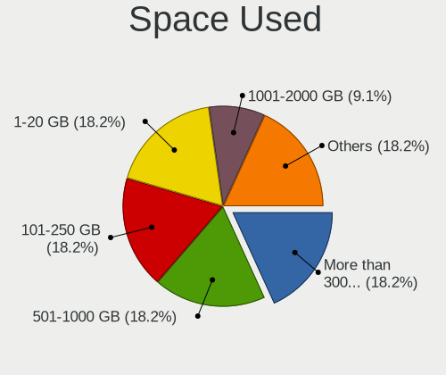
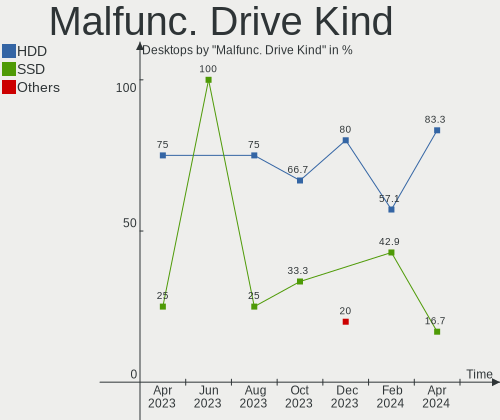
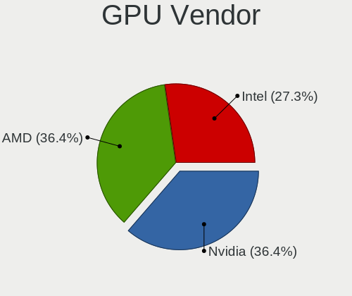
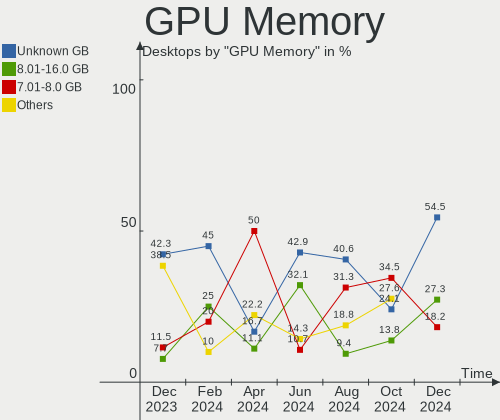

EndeavourOS - Hardware Trends (Desktops)
----------------------------------------

A project to identify most popular hardware characteristics and track their change
over time based on data collected by Linux users at https://Linux-Hardware.org.

Anyone can contribute to this report by the [hw-probe](https://github.com/linuxhw/hw-probe) tool:

    sudo -E hw-probe -all -upload

This report is for one last month. Overall report since the beginning of time: [TestCoverage](https://github.com/linuxhw/TestCoverage)

Period: May, 2022.

Contents
--------

* [ System ](#system)
  - [ OS                       ](#os)
  - [ OS Family                ](#os-family)
  - [ Kernel                   ](#kernel)
  - [ Kernel Family            ](#kernel-family)
  - [ Kernel Major Ver.        ](#kernel-major-ver)
  - [ Arch                     ](#arch)
  - [ DE                       ](#de)
  - [ Display Server           ](#display-server)
  - [ Display Manager          ](#display-manager)
  - [ OS Lang                  ](#os-lang)
  - [ Boot Mode                ](#boot-mode)
  - [ Filesystem               ](#filesystem)
  - [ Part. scheme             ](#part-scheme)
  - [ Dual Boot with Linux/BSD ](#dual-boot-with-linuxbsd)
  - [ Dual Boot (Win)          ](#dual-boot-win)

* [ Board ](#board)
  - [ Vendor                   ](#vendor)
  - [ Model                    ](#model)
  - [ Model Family             ](#model-family)
  - [ MFG Year                 ](#mfg-year)
  - [ Form Factor              ](#form-factor)
  - [ Secure Boot              ](#secure-boot)
  - [ Coreboot                 ](#coreboot)
  - [ RAM Size                 ](#ram-size)
  - [ RAM Used                 ](#ram-used)
  - [ Total Drives             ](#total-drives)
  - [ Has CD-ROM               ](#has-cd-rom)
  - [ Has Ethernet             ](#has-ethernet)
  - [ Has WiFi                 ](#has-wifi)
  - [ Has Bluetooth            ](#has-bluetooth)

* [ Location ](#location)
  - [ Country                  ](#country)
  - [ City                     ](#city)

* [ Drives ](#drives)
  - [ Drive Vendor             ](#drive-vendor)
  - [ Drive Model              ](#drive-model)
  - [ HDD Vendor               ](#hdd-vendor)
  - [ SSD Vendor               ](#ssd-vendor)
  - [ Drive Kind               ](#drive-kind)
  - [ Drive Connector          ](#drive-connector)
  - [ Drive Size               ](#drive-size)
  - [ Space Total              ](#space-total)
  - [ Space Used               ](#space-used)
  - [ Malfunc. Drives          ](#malfunc-drives)
  - [ Malfunc. Drive Vendor    ](#malfunc-drive-vendor)
  - [ Malfunc. HDD Vendor      ](#malfunc-hdd-vendor)
  - [ Malfunc. Drive Kind      ](#malfunc-drive-kind)
  - [ Failed Drives            ](#failed-drives)
  - [ Failed Drive Vendor      ](#failed-drive-vendor)
  - [ Drive Status             ](#drive-status)

* [ Storage controller ](#storage-controller)
  - [ Storage Vendor           ](#storage-vendor)
  - [ Storage Model            ](#storage-model)
  - [ Storage Kind             ](#storage-kind)

* [ Processor ](#processor)
  - [ CPU Vendor               ](#cpu-vendor)
  - [ CPU Model                ](#cpu-model)
  - [ CPU Model Family         ](#cpu-model-family)
  - [ CPU Cores                ](#cpu-cores)
  - [ CPU Sockets              ](#cpu-sockets)
  - [ CPU Threads              ](#cpu-threads)
  - [ CPU Op-Modes             ](#cpu-op-modes)
  - [ CPU Microcode            ](#cpu-microcode)
  - [ CPU Microarch            ](#cpu-microarch)

* [ Graphics ](#graphics)
  - [ GPU Vendor               ](#gpu-vendor)
  - [ GPU Model                ](#gpu-model)
  - [ GPU Combo                ](#gpu-combo)
  - [ GPU Driver               ](#gpu-driver)
  - [ GPU Memory               ](#gpu-memory)

* [ Monitor ](#monitor)
  - [ Monitor Vendor           ](#monitor-vendor)
  - [ Monitor Model            ](#monitor-model)
  - [ Monitor Resolution       ](#monitor-resolution)
  - [ Monitor Diagonal         ](#monitor-diagonal)
  - [ Monitor Width            ](#monitor-width)
  - [ Aspect Ratio             ](#aspect-ratio)
  - [ Monitor Area             ](#monitor-area)
  - [ Pixel Density            ](#pixel-density)
  - [ Multiple Monitors        ](#multiple-monitors)

* [ Network ](#network)
  - [ Net Controller Vendor    ](#net-controller-vendor)
  - [ Net Controller Model     ](#net-controller-model)
  - [ Wireless Vendor          ](#wireless-vendor)
  - [ Wireless Model           ](#wireless-model)
  - [ Ethernet Vendor          ](#ethernet-vendor)
  - [ Ethernet Model           ](#ethernet-model)
  - [ Net Controller Kind      ](#net-controller-kind)
  - [ Used Controller          ](#used-controller)
  - [ NICs                     ](#nics)
  - [ IPv6                     ](#ipv6)

* [ Bluetooth ](#bluetooth)
  - [ Bluetooth Vendor         ](#bluetooth-vendor)
  - [ Bluetooth Model          ](#bluetooth-model)

* [ Sound ](#sound)
  - [ Sound Vendor             ](#sound-vendor)
  - [ Sound Model              ](#sound-model)

* [ Memory ](#memory)
  - [ Memory Vendor            ](#memory-vendor)
  - [ Memory Model             ](#memory-model)
  - [ Memory Kind              ](#memory-kind)
  - [ Memory Form Factor       ](#memory-form-factor)
  - [ Memory Size              ](#memory-size)
  - [ Memory Speed             ](#memory-speed)

* [ Printers & scanners ](#printers--scanners)
  - [ Printer Vendor           ](#printer-vendor)
  - [ Printer Model            ](#printer-model)
  - [ Scanner Vendor           ](#scanner-vendor)
  - [ Scanner Model            ](#scanner-model)

* [ Camera ](#camera)
  - [ Camera Vendor            ](#camera-vendor)
  - [ Camera Model             ](#camera-model)

* [ Security ](#security)
  - [ Fingerprint Vendor       ](#fingerprint-vendor)
  - [ Fingerprint Model        ](#fingerprint-model)
  - [ Chipcard Vendor          ](#chipcard-vendor)
  - [ Chipcard Model           ](#chipcard-model)

* [ Unsupported ](#unsupported)
  - [ Unsupported Devices      ](#unsupported-devices)
  - [ Unsupported Device Types ](#unsupported-device-types)

System
------

OS
--

Installed operating systems

| Name                | Desktops | Percent |
|---------------------|----------|---------|
| EndeavourOS Rolling | 10       | 66.67%  |
| EndeavourOS         | 5        | 33.33%  |

OS Family
---------

OS without a version

| Name        | Desktops | Percent |
|-------------|----------|---------|
| EndeavourOS | 15       | 100%    |

Kernel
------

Version of the Linux kernel

| Version           | Desktops | Percent |
|-------------------|----------|---------|
| 5.17.5-arch1-1    | 5        | 33.33%  |
| 5.17.9-arch1-1    | 3        | 20%     |
| 5.17.8-arch1-1    | 2        | 13.33%  |
| 5.18.0-arch1-1    | 1        | 6.67%   |
| 5.17.9-zen1-1-zen | 1        | 6.67%   |
| 5.17.5-zen1-1-zen | 1        | 6.67%   |
| 5.15.39-1-lts     | 1        | 6.67%   |
| 5.15.37-1-lts     | 1        | 6.67%   |

Kernel Family
-------------

Linux kernel without a distro release

| Version | Desktops | Percent |
|---------|----------|---------|
| 5.17.5  | 6        | 40%     |
| 5.17.9  | 4        | 26.67%  |
| 5.17.8  | 2        | 13.33%  |
| 5.18.0  | 1        | 6.67%   |
| 5.15.39 | 1        | 6.67%   |
| 5.15.37 | 1        | 6.67%   |

Kernel Major Ver.
-----------------

Linux kernel major version

| Version | Desktops | Percent |
|---------|----------|---------|
| 5.17    | 12       | 80%     |
| 5.15    | 2        | 13.33%  |
| 5.18    | 1        | 6.67%   |

Arch
----

OS architecture (x86_64, i586, etc.)

| Name   | Desktops | Percent |
|--------|----------|---------|
| x86_64 | 15       | 100%    |

DE
--

Desktop Environment

| Name       | Desktops | Percent |
|------------|----------|---------|
| XFCE       | 6        | 40%     |
| X-Cinnamon | 3        | 20%     |
| KDE5       | 3        | 20%     |
| GNOME      | 3        | 20%     |

Display Server
--------------

X11 or Wayland

| Name    | Desktops | Percent |
|---------|----------|---------|
| X11     | 14       | 93.33%  |
| Wayland | 1        | 6.67%   |

Display Manager
---------------

SDDM, LightDM, etc.

| Name    | Desktops | Percent |
|---------|----------|---------|
| LightDM | 6        | 40%     |
| Unknown | 5        | 33.33%  |
| GDM     | 3        | 20%     |
| SDDM    | 1        | 6.67%   |

OS Lang
-------

Language

| Lang  | Desktops | Percent |
|-------|----------|---------|
| en_US | 8        | 53.33%  |
| nl_NL | 2        | 13.33%  |
| de_DE | 2        | 13.33%  |
| en_DK | 1        | 6.67%   |
| en_AU | 1        | 6.67%   |
| de_CH | 1        | 6.67%   |

Boot Mode
---------

EFI or BIOS

| Mode | Desktops | Percent |
|------|----------|---------|
| EFI  | 8        | 53.33%  |
| BIOS | 7        | 46.67%  |

Filesystem
----------

Type of filesystem

| Type  | Desktops | Percent |
|-------|----------|---------|
| Ext4  | 12       | 80%     |
| Btrfs | 3        | 20%     |

Part. scheme
------------

Scheme of partitioning

| Type    | Desktops | Percent |
|---------|----------|---------|
| GPT     | 8        | 53.33%  |
| Unknown | 5        | 33.33%  |
| MBR     | 2        | 13.33%  |

Dual Boot with Linux/BSD
------------------------

Hosting more than one Linux/BSD

| Dual boot | Desktops | Percent |
|-----------|----------|---------|
| No        | 13       | 86.67%  |
| Yes       | 2        | 13.33%  |

Dual Boot (Win)
---------------

Hosting Linux and Windows

| Dual boot | Desktops | Percent |
|-----------|----------|---------|
| No        | 9        | 60%     |
| Yes       | 6        | 40%     |

Board
-----

Vendor
------

Motherboard manufacturer

| Name                | Desktops | Percent |
|---------------------|----------|---------|
| ASRock              | 4        | 26.67%  |
| Hewlett-Packard     | 3        | 20%     |
| Gigabyte Technology | 3        | 20%     |
| ASUSTek Computer    | 2        | 13.33%  |
| MSI                 | 1        | 6.67%   |
| Lenovo              | 1        | 6.67%   |
| Dell                | 1        | 6.67%   |

Model
-----

Motherboard model

| Name                                | Desktops | Percent |
|-------------------------------------|----------|---------|
| ASRock B450 Pro4                    | 2        | 13.33%  |
| MSI MS-7808                         | 1        | 6.67%   |
| Lenovo ThinkCentre M710q 10MR0009US | 1        | 6.67%   |
| HP xw8400 Workstation               | 1        | 6.67%   |
| HP Pavilion Desktop TP01-2xxx       | 1        | 6.67%   |
| HP Compaq 8000 Elite CMT PC         | 1        | 6.67%   |
| Gigabyte X470 AORUS GAMING 7 WIFI   | 1        | 6.67%   |
| Gigabyte P55A-UD3                   | 1        | 6.67%   |
| Gigabyte B550M AORUS PRO            | 1        | 6.67%   |
| Dell Precision Tower 5810           | 1        | 6.67%   |
| ASUS ROG CROSSHAIR VIII IMPACT      | 1        | 6.67%   |
| ASUS P8H77-M                        | 1        | 6.67%   |
| ASRock B450M Pro4                   | 1        | 6.67%   |
| ASRock A320M/ac                     | 1        | 6.67%   |

Model Family
------------

Motherboard model prefix

| Name               | Desktops | Percent |
|--------------------|----------|---------|
| ASRock B450        | 2        | 13.33%  |
| MSI MS-7808        | 1        | 6.67%   |
| Lenovo ThinkCentre | 1        | 6.67%   |
| HP xw8400          | 1        | 6.67%   |
| HP Pavilion        | 1        | 6.67%   |
| HP Compaq          | 1        | 6.67%   |
| Gigabyte X470      | 1        | 6.67%   |
| Gigabyte P55A-UD3  | 1        | 6.67%   |
| Gigabyte B550M     | 1        | 6.67%   |
| Dell Precision     | 1        | 6.67%   |
| ASUS ROG           | 1        | 6.67%   |
| ASUS P8H77-M       | 1        | 6.67%   |
| ASRock B450M       | 1        | 6.67%   |
| ASRock A320M       | 1        | 6.67%   |

MFG Year
--------

Motherboard manufacture year

| Year | Desktops | Percent |
|------|----------|---------|
| 2018 | 4        | 26.67%  |
| 2020 | 2        | 13.33%  |
| 2012 | 2        | 13.33%  |
| 2009 | 2        | 13.33%  |
| 2021 | 1        | 6.67%   |
| 2019 | 1        | 6.67%   |
| 2017 | 1        | 6.67%   |
| 2014 | 1        | 6.67%   |
| 2007 | 1        | 6.67%   |

Form Factor
-----------

Physical design of the computer

| Name    | Desktops | Percent |
|---------|----------|---------|
| Desktop | 15       | 100%    |

Secure Boot
-----------

Enabled or disabled

| State    | Desktops | Percent |
|----------|----------|---------|
| Disabled | 14       | 93.33%  |
| Enabled  | 1        | 6.67%   |

Coreboot
--------

Have coreboot on board

| Used | Desktops | Percent |
|------|----------|---------|
| No   | 15       | 100%    |

RAM Size
--------

Total RAM memory

| Size in GB  | Desktops | Percent |
|-------------|----------|---------|
| 16.01-24.0  | 5        | 33.33%  |
| 32.01-64.0  | 4        | 26.67%  |
| 8.01-16.0   | 3        | 20%     |
| 4.01-8.0    | 1        | 6.67%   |
| 24.01-32.0  | 1        | 6.67%   |
| 64.01-256.0 | 1        | 6.67%   |

RAM Used
--------

Used RAM memory

| Used GB   | Desktops | Percent |
|-----------|----------|---------|
| 3.01-4.0  | 4        | 26.67%  |
| 2.01-3.0  | 4        | 26.67%  |
| 4.01-8.0  | 2        | 13.33%  |
| 1.01-2.0  | 2        | 13.33%  |
| 0.51-1.0  | 2        | 13.33%  |
| 8.01-16.0 | 1        | 6.67%   |

Total Drives
------------

Number of drives on board

| Drives | Desktops | Percent |
|--------|----------|---------|
| 2      | 8        | 53.33%  |
| 3      | 4        | 26.67%  |
| 4      | 2        | 13.33%  |
| 8      | 1        | 6.67%   |

Has CD-ROM
----------

Has CD-ROM on board

| Presented | Desktops | Percent |
|-----------|----------|---------|
| No        | 10       | 66.67%  |
| Yes       | 5        | 33.33%  |

Has Ethernet
------------

Has Ethernet on board

| Presented | Desktops | Percent |
|-----------|----------|---------|
| Yes       | 15       | 100%    |

Has WiFi
--------

Has WiFi module

| Presented | Desktops | Percent |
|-----------|----------|---------|
| No        | 9        | 60%     |
| Yes       | 6        | 40%     |

Has Bluetooth
-------------

Has Bluetooth module

| Presented | Desktops | Percent |
|-----------|----------|---------|
| Yes       | 9        | 60%     |
| No        | 6        | 40%     |

Location
--------

Country
-------

Geographic location (country)

| Country     | Desktops | Percent |
|-------------|----------|---------|
| USA         | 6        | 40%     |
| Norway      | 2        | 13.33%  |
| Netherlands | 2        | 13.33%  |
| Germany     | 2        | 13.33%  |
| Switzerland | 1        | 6.67%   |
| Sweden      | 1        | 6.67%   |
| Australia   | 1        | 6.67%   |

City
----

Geographic location (city)

| City         | Desktops | Percent |
|--------------|----------|---------|
| Schiedam     | 2        | 13.33%  |
| Zurich       | 1        | 6.67%   |
| Toledo       | 1        | 6.67%   |
| Spring Field | 1        | 6.67%   |
| Sala         | 1        | 6.67%   |
| McKee        | 1        | 6.67%   |
| Kongsvinger  | 1        | 6.67%   |
| Jacksonville | 1        | 6.67%   |
| Hildesheim   | 1        | 6.67%   |
| Denver       | 1        | 6.67%   |
| Cleveland    | 1        | 6.67%   |
| Brownsburg   | 1        | 6.67%   |
| Berlin       | 1        | 6.67%   |
| Alta         | 1        | 6.67%   |

Drives
------

Drive Vendor
------------

Hard drive vendors

| Vendor              | Desktops | Drives | Percent |
|---------------------|----------|--------|---------|
| Samsung Electronics | 8        | 9      | 22.86%  |
| WDC                 | 7        | 11     | 20%     |
| Seagate             | 7        | 9      | 20%     |
| Crucial             | 4        | 4      | 11.43%  |
| Kingston            | 2        | 3      | 5.71%   |
| Hitachi             | 2        | 2      | 5.71%   |
| Toshiba             | 1        | 1      | 2.86%   |
| SanDisk             | 1        | 2      | 2.86%   |
| OCZ                 | 1        | 1      | 2.86%   |
| Micron Technology   | 1        | 1      | 2.86%   |
| Leven               | 1        | 1      | 2.86%   |

Drive Model
-----------

Hard drive models

| Model                                       | Desktops | Percent |
|---------------------------------------------|----------|---------|
| Seagate ST4000DM004-2CV104 4TB              | 3        | 7.32%   |
| Samsung HD103SJ 1TB                         | 2        | 4.88%   |
| WDC WDS500G2B0A-00SM50 500GB SSD            | 1        | 2.44%   |
| WDC WDS100T2G0A-00JH30 1TB SSD              | 1        | 2.44%   |
| WDC WD5000LPLX-08ZNTT0 500GB                | 1        | 2.44%   |
| WDC WD30EZRX-00SPEB0 3TB                    | 1        | 2.44%   |
| WDC WD2500AAKS-60VYA0 250GB                 | 1        | 2.44%   |
| WDC WD2003FZEX-00Z4SA0 2TB                  | 1        | 2.44%   |
| WDC WD2002FYPS-01U1B0 2TB                   | 1        | 2.44%   |
| WDC WD10JPVX-75JC3T0 1TB                    | 1        | 2.44%   |
| WDC WD10EZEX-00BN5A0 1TB                    | 1        | 2.44%   |
| WDC PC SN530 SDBPNPZ-256G-1006 256GB        | 1        | 2.44%   |
| Toshiba MQ04ABF100 1TB                      | 1        | 2.44%   |
| Seagate ST3750640NS 752GB                   | 1        | 2.44%   |
| Seagate ST33000650NS 81Y9799 81Y3865IBM 3TB | 1        | 2.44%   |
| Seagate ST3160318AS 160GB                   | 1        | 2.44%   |
| Seagate ST1000DM010-2EP102 1TB              | 1        | 2.44%   |
| SanDisk SSD PLUS 240GB                      | 1        | 2.44%   |
| SanDisk SDSSDH3 1T02 1024GB                 | 1        | 2.44%   |
| Samsung SSD 970 EVO Plus 1TB                | 1        | 2.44%   |
| Samsung SSD 970 EVO 1TB                     | 1        | 2.44%   |
| Samsung SSD 870 QVO 1TB                     | 1        | 2.44%   |
| Samsung SSD 830 Series 128GB                | 1        | 2.44%   |
| Samsung Portable SSD T5 500GB               | 1        | 2.44%   |
| Samsung NVMe SSD Drive 256GB                | 1        | 2.44%   |
| Samsung MZVLW256HEHP-000H1 256GB            | 1        | 2.44%   |
| OCZ VERTEX3 240GB SSD                       | 1        | 2.44%   |
| Micron 1100_MTFDDAK256TBN 256GB SSD         | 1        | 2.44%   |
| Leven JAJS300M240C 240GB                    | 1        | 2.44%   |
| Kingston SA400S37240G 240GB SSD             | 1        | 2.44%   |
| Kingston NVMe SSD Drive 500GB               | 1        | 2.44%   |
| Kingston NVMe SSD Drive 1TB                 | 1        | 2.44%   |
| Hitachi HDS723020BLA642 2TB                 | 1        | 2.44%   |
| Hitachi HDS722020ALA330 2TB                 | 1        | 2.44%   |
| Crucial CT500P2SSD8 500GB                   | 1        | 2.44%   |
| Crucial CT500MX500SSD1 500GB                | 1        | 2.44%   |
| Crucial CT250BX100SSD1 250GB                | 1        | 2.44%   |
| Crucial CT240BX500SSD1 240GB                | 1        | 2.44%   |

HDD Vendor
----------

Hard disk drive vendors

| Vendor              | Desktops | Drives | Percent |
|---------------------|----------|--------|---------|
| Seagate             | 7        | 9      | 41.18%  |
| WDC                 | 5        | 7      | 29.41%  |
| Samsung Electronics | 2        | 2      | 11.76%  |
| Hitachi             | 2        | 2      | 11.76%  |
| Toshiba             | 1        | 1      | 5.88%   |

SSD Vendor
----------

Solid state drive vendors

| Vendor              | Desktops | Drives | Percent |
|---------------------|----------|--------|---------|
| Samsung Electronics | 3        | 3      | 23.08%  |
| Crucial             | 3        | 3      | 23.08%  |
| WDC                 | 2        | 3      | 15.38%  |
| SanDisk             | 1        | 2      | 7.69%   |
| OCZ                 | 1        | 1      | 7.69%   |
| Micron Technology   | 1        | 1      | 7.69%   |
| Leven               | 1        | 1      | 7.69%   |
| Kingston            | 1        | 1      | 7.69%   |

Drive Kind
----------

HDD or SSD

| Kind | Desktops | Drives | Percent |
|------|----------|--------|---------|
| HDD  | 11       | 21     | 40.74%  |
| SSD  | 9        | 15     | 33.33%  |
| NVMe | 7        | 8      | 25.93%  |

Drive Connector
---------------

SATA, SAS, NVMe, etc.

| Type | Desktops | Drives | Percent |
|------|----------|--------|---------|
| SATA | 15       | 35     | 65.22%  |
| NVMe | 7        | 8      | 30.43%  |
| SAS  | 1        | 1      | 4.35%   |

Drive Size
----------

Size of hard drive

| Size in TB | Desktops | Drives | Percent |
|------------|----------|--------|---------|
| 0.01-0.5   | 10       | 15     | 37.04%  |
| 0.51-1.0   | 8        | 9      | 29.63%  |
| 1.01-2.0   | 4        | 5      | 14.81%  |
| 3.01-4.0   | 3        | 5      | 11.11%  |
| 2.01-3.0   | 2        | 2      | 7.41%   |

Space Total
-----------

Amount of disk space available on the file system

| Size in GB     | Desktops | Percent |
|----------------|----------|---------|
| 1001-2000      | 5        | 33.33%  |
| More than 3000 | 3        | 20%     |
| 251-500        | 2        | 13.33%  |
| 2001-3000      | 1        | 6.67%   |
| 101-250        | 1        | 6.67%   |
| 1-20           | 1        | 6.67%   |
| 501-1000       | 1        | 6.67%   |
| Unknown        | 1        | 6.67%   |

Space Used
----------

Amount of used disk space

| Used GB   | Desktops | Percent |
|-----------|----------|---------|
| 1001-2000 | 4        | 26.67%  |
| 101-250   | 3        | 20%     |
| 251-500   | 2        | 13.33%  |
| 501-1000  | 2        | 13.33%  |
| 21-50     | 1        | 6.67%   |
| 1-20      | 1        | 6.67%   |
| 51-100    | 1        | 6.67%   |
| Unknown   | 1        | 6.67%   |

Malfunc. Drives
---------------

Drive models with a malfunction

| Model                        | Desktops | Drives | Percent |
|------------------------------|----------|--------|---------|
| WDC WD2002FYPS-01U1B0 2TB    | 1        | 1      | 33.33%  |
| OCZ VERTEX3 240GB SSD        | 1        | 1      | 33.33%  |
| Crucial CT500MX500SSD1 500GB | 1        | 1      | 33.33%  |

Malfunc. Drive Vendor
---------------------

Vendors of faulty drives

| Vendor  | Desktops | Drives | Percent |
|---------|----------|--------|---------|
| WDC     | 1        | 1      | 33.33%  |
| OCZ     | 1        | 1      | 33.33%  |
| Crucial | 1        | 1      | 33.33%  |

Malfunc. HDD Vendor
-------------------

Vendors of faulty HDD drives

| Vendor | Desktops | Drives | Percent |
|--------|----------|--------|---------|
| WDC    | 1        | 1      | 100%    |

Malfunc. Drive Kind
-------------------

Kinds of faulty drives

| Kind | Desktops | Drives | Percent |
|------|----------|--------|---------|
| SSD  | 2        | 2      | 66.67%  |
| HDD  | 1        | 1      | 33.33%  |

Failed Drives
-------------

Failed drive models

Zero info for selected period =(

Failed Drive Vendor
-------------------

Failed drive vendors

Zero info for selected period =(

Drive Status
------------

Number of failed and malfunc. drives

| Status   | Desktops | Drives | Percent |
|----------|----------|--------|---------|
| Works    | 10       | 20     | 55.56%  |
| Detected | 5        | 21     | 27.78%  |
| Malfunc  | 3        | 3      | 16.67%  |

Storage controller
------------------

Storage Vendor
--------------

Storage controller vendors

| Vendor                      | Desktops | Percent |
|-----------------------------|----------|---------|
| AMD                         | 8        | 33.33%  |
| Intel                       | 7        | 29.17%  |
| Samsung Electronics         | 4        | 16.67%  |
| ASMedia Technology          | 2        | 8.33%   |
| Sandisk                     | 1        | 4.17%   |
| Micron/Crucial Technology   | 1        | 4.17%   |
| Kingston Technology Company | 1        | 4.17%   |

Storage Model
-------------

Storage controller models

| Model                                                                        | Desktops | Percent |
|------------------------------------------------------------------------------|----------|---------|
| AMD FCH SATA Controller [AHCI mode]                                          | 6        | 17.65%  |
| AMD 400 Series Chipset SATA Controller                                       | 5        | 14.71%  |
| Samsung NVMe SSD Controller SM981/PM981/PM983                                | 2        | 5.88%   |
| Samsung NVMe SSD Controller SM961/PM961/SM963                                | 2        | 5.88%   |
| Intel 7 Series/C210 Series Chipset Family 6-port SATA Controller [AHCI mode] | 2        | 5.88%   |
| ASMedia ASM1062 Serial ATA Controller                                        | 2        | 5.88%   |
| Sandisk WD Blue SN550 NVMe SSD                                               | 1        | 2.94%   |
| Micron/Crucial P2 NVMe PCIe SSD                                              | 1        | 2.94%   |
| Kingston Company KC2000 NVMe SSD                                             | 1        | 2.94%   |
| Kingston Company A2000 NVMe SSD                                              | 1        | 2.94%   |
| Intel C610/X99 series chipset sSATA Controller [AHCI mode]                   | 1        | 2.94%   |
| Intel C610/X99 series chipset IDE-r Controller                               | 1        | 2.94%   |
| Intel C610/X99 series chipset 6-Port SATA Controller [AHCI mode]             | 1        | 2.94%   |
| Intel 82801JD/DO (ICH10 Family) SATA AHCI Controller                         | 1        | 2.94%   |
| Intel 631xESB/632xESB/3100 Chipset SATA IDE Controller                       | 1        | 2.94%   |
| Intel 631xESB/632xESB IDE Controller                                         | 1        | 2.94%   |
| Intel 5 Series/3400 Series Chipset 6 port SATA AHCI Controller               | 1        | 2.94%   |
| Intel 4 Series Chipset PT IDER Controller                                    | 1        | 2.94%   |
| Intel 200 Series PCH SATA controller [AHCI mode]                             | 1        | 2.94%   |
| AMD FCH SATA Controller D                                                    | 1        | 2.94%   |
| AMD 500 Series Chipset SATA Controller                                       | 1        | 2.94%   |

Storage Kind
------------

Kind of storage controller (IDE, SATA, NVMe, SAS, ...)

| Kind | Desktops | Percent |
|------|----------|---------|
| SATA | 14       | 58.33%  |
| NVMe | 7        | 29.17%  |
| IDE  | 3        | 12.5%   |

Processor
---------

CPU Vendor
----------

Processor vendors

| Vendor | Desktops | Percent |
|--------|----------|---------|
| AMD    | 8        | 53.33%  |
| Intel  | 7        | 46.67%  |

CPU Model
---------

Processor models

| Model                                       | Desktops | Percent |
|---------------------------------------------|----------|---------|
| Intel Xeon CPU E5-2650 v3 @ 2.30GHz         | 1        | 6.67%   |
| Intel Xeon CPU 5160 @ 3.00GHz               | 1        | 6.67%   |
| Intel Core i7-3770 CPU @ 3.40GHz            | 1        | 6.67%   |
| Intel Core i7-2600 CPU @ 3.40GHz            | 1        | 6.67%   |
| Intel Core i5-7500T CPU @ 2.70GHz           | 1        | 6.67%   |
| Intel Core i5 CPU 750 @ 2.67GHz             | 1        | 6.67%   |
| Intel Core 2 Duo CPU E8500 @ 3.16GHz        | 1        | 6.67%   |
| AMD Ryzen 9 3900X 12-Core Processor         | 1        | 6.67%   |
| AMD Ryzen 7 5700G with Radeon Graphics      | 1        | 6.67%   |
| AMD Ryzen 7 3700X 8-Core Processor          | 1        | 6.67%   |
| AMD Ryzen 7 2700X Eight-Core Processor      | 1        | 6.67%   |
| AMD Ryzen 7 2700 Eight-Core Processor       | 1        | 6.67%   |
| AMD Ryzen 7 1700X Eight-Core Processor      | 1        | 6.67%   |
| AMD Ryzen 5 3500X 6-Core Processor          | 1        | 6.67%   |
| AMD Ryzen 5 3400G with Radeon Vega Graphics | 1        | 6.67%   |

CPU Model Family
----------------

Processor model prefix

| Model            | Desktops | Percent |
|------------------|----------|---------|
| AMD Ryzen 7      | 5        | 33.33%  |
| Intel Xeon       | 2        | 13.33%  |
| Intel Core i7    | 2        | 13.33%  |
| Intel Core i5    | 2        | 13.33%  |
| AMD Ryzen 5      | 2        | 13.33%  |
| Intel Core 2 Duo | 1        | 6.67%   |
| AMD Ryzen 9      | 1        | 6.67%   |

CPU Cores
---------

Number of processor cores

| Number | Desktops | Percent |
|--------|----------|---------|
| 4      | 6        | 40%     |
| 8      | 5        | 33.33%  |
| 12     | 1        | 6.67%   |
| 10     | 1        | 6.67%   |
| 6      | 1        | 6.67%   |
| 2      | 1        | 6.67%   |

CPU Sockets
-----------

Number of sockets

| Number | Desktops | Percent |
|--------|----------|---------|
| 1      | 14       | 93.33%  |
| 2      | 1        | 6.67%   |

CPU Threads
-----------

Threads per core (Hyper-Threading)

| Number | Desktops | Percent |
|--------|----------|---------|
| 2      | 10       | 66.67%  |
| 1      | 5        | 33.33%  |

CPU Op-Modes
------------

CPU Operation Modes (32-bit, 64-bit)

| Op mode        | Desktops | Percent |
|----------------|----------|---------|
| 32-bit, 64-bit | 15       | 100%    |

CPU Microcode
-------------

Microcode number

| Number     | Desktops | Percent |
|------------|----------|---------|
| Unknown    | 5        | 33.33%  |
| 0x906e9    | 1        | 6.67%   |
| 0x6f6      | 1        | 6.67%   |
| 0x306f2    | 1        | 6.67%   |
| 0x206a7    | 1        | 6.67%   |
| 0x106e5    | 1        | 6.67%   |
| 0x0a50000c | 1        | 6.67%   |
| 0x08701021 | 1        | 6.67%   |
| 0x08701013 | 1        | 6.67%   |
| 0x0800820d | 1        | 6.67%   |
| 0x08001138 | 1        | 6.67%   |

CPU Microarch
-------------

Microarchitecture

| Name        | Desktops | Percent |
|-------------|----------|---------|
| Zen+        | 3        | 20%     |
| Zen 2       | 3        | 20%     |
| Zen 3       | 1        | 6.67%   |
| Zen         | 1        | 6.67%   |
| SandyBridge | 1        | 6.67%   |
| Penryn      | 1        | 6.67%   |
| Nehalem     | 1        | 6.67%   |
| KabyLake    | 1        | 6.67%   |
| IvyBridge   | 1        | 6.67%   |
| Haswell     | 1        | 6.67%   |
| Core        | 1        | 6.67%   |

Graphics
--------

GPU Vendor
----------

Vendors of graphics cards

| Vendor | Desktops | Percent |
|--------|----------|---------|
| Nvidia | 10       | 66.67%  |
| AMD    | 3        | 20%     |
| Intel  | 2        | 13.33%  |

GPU Model
---------

Graphics card models

| Model                                                                | Desktops | Percent |
|----------------------------------------------------------------------|----------|---------|
| Nvidia GK208B [GeForce GT 710]                                       | 2        | 13.33%  |
| Nvidia TU106 [GeForce RTX 2060 Rev. A]                               | 1        | 6.67%   |
| Nvidia GP107 [GeForce GTX 1050 Ti]                                   | 1        | 6.67%   |
| Nvidia GM206 [GeForce GTX 950]                                       | 1        | 6.67%   |
| Nvidia GM204 [GeForce GTX 970]                                       | 1        | 6.67%   |
| Nvidia GM107 [GeForce GTX 750 Ti]                                    | 1        | 6.67%   |
| Nvidia GA104 [GeForce RTX 3070]                                      | 1        | 6.67%   |
| Nvidia GA102 [GeForce RTX 3080]                                      | 1        | 6.67%   |
| Nvidia G70GL [Quadro FX 4500]                                        | 1        | 6.67%   |
| Intel HD Graphics 630                                                | 1        | 6.67%   |
| Intel 4 Series Chipset Integrated Graphics Controller                | 1        | 6.67%   |
| AMD Picasso/Raven 2 [Radeon Vega Series / Radeon Vega Mobile Series] | 1        | 6.67%   |
| AMD Ellesmere [Radeon RX 470/480/570/570X/580/580X/590]              | 1        | 6.67%   |
| AMD Cezanne                                                          | 1        | 6.67%   |

GPU Combo
---------

Combinations of graphics cards

| Name       | Desktops | Percent |
|------------|----------|---------|
| 1 x Nvidia | 10       | 66.67%  |
| 1 x AMD    | 3        | 20%     |
| 1 x Intel  | 2        | 13.33%  |

GPU Driver
----------

Free vs proprietary

| Driver      | Desktops | Percent |
|-------------|----------|---------|
| Proprietary | 8        | 53.33%  |
| Free        | 7        | 46.67%  |

GPU Memory
----------

Total video memory

| Size in GB | Desktops | Percent |
|------------|----------|---------|
| Unknown    | 6        | 40%     |
| 3.01-4.0   | 3        | 20%     |
| 1.01-2.0   | 3        | 20%     |
| 0.01-0.5   | 2        | 13.33%  |
| 5.01-6.0   | 1        | 6.67%   |

Monitor
-------

Monitor Vendor
--------------

Monitor vendors

| Vendor              | Desktops | Percent |
|---------------------|----------|---------|
| Dell                | 4        | 22.22%  |
| Samsung Electronics | 3        | 16.67%  |
| Philips             | 2        | 11.11%  |
| Hewlett-Packard     | 2        | 11.11%  |
| Goldstar            | 2        | 11.11%  |
| VOXICON             | 1        | 5.56%   |
| Vizio               | 1        | 5.56%   |
| RTK                 | 1        | 5.56%   |
| Planar              | 1        | 5.56%   |
| BenQ                | 1        | 5.56%   |

Monitor Model
-------------

Monitor models

| Model                                                               | Desktops | Percent |
|---------------------------------------------------------------------|----------|---------|
| VOXICON D32QO DUS3200 2560x1440 708x398mm 32.0-inch                 | 1        | 5.26%   |
| Vizio E322AR VIZ0079 1360x768 700x400mm 31.7-inch                   | 1        | 5.26%   |
| Samsung Electronics SyncMaster SAM0522 1600x900 443x249mm 20.0-inch | 1        | 5.26%   |
| Samsung Electronics S24R65x SAM1023 1920x1080 527x296mm 23.8-inch   | 1        | 5.26%   |
| Samsung Electronics C32F391 SAM0D34 1920x1080 698x393mm 31.5-inch   | 1        | 5.26%   |
| RTK LCD Monitor RTK1D1A 1920x1080 1020x570mm 46.0-inch              | 1        | 5.26%   |
| Planar PLL2410W PLN2410 1920x1080 521x293mm 23.5-inch               | 1        | 5.26%   |
| Philips LCD Monitor 19S 1280x1024                                   | 1        | 5.26%   |
| Philips 32PFL3605H PHLD06C 1920x1080 640x360mm 28.9-inch            | 1        | 5.26%   |
| Hewlett-Packard LCD Monitor L1940 1024x768                          | 1        | 5.26%   |
| Hewlett-Packard LCD Monitor 2211 1024x768                           | 1        | 5.26%   |
| Hewlett-Packard 27m HPN357A 1920x1080 598x336mm 27.0-inch           | 1        | 5.26%   |
| Goldstar IPS FULLHD GSM5AB8 1920x1080 480x270mm 21.7-inch           | 1        | 5.26%   |
| Goldstar HDR QHD GSM771B 2560x1440 697x392mm 31.5-inch              | 1        | 5.26%   |
| Dell U3415W DELA0A7 3440x1440 798x335mm 34.1-inch                   | 1        | 5.26%   |
| Dell S2721H DEL41F5 1920x1080 598x336mm 27.0-inch                   | 1        | 5.26%   |
| Dell D2721H DEL2013 1920x1080 598x336mm 27.0-inch                   | 1        | 5.26%   |
| Dell 1909W DELA03D 1440x900 408x255mm 18.9-inch                     | 1        | 5.26%   |
| BenQ G2420HD BNQ7840 1920x1080 531x299mm 24.0-inch                  | 1        | 5.26%   |

Monitor Resolution
------------------

Monitor screen resolution

| Resolution       | Desktops | Percent |
|------------------|----------|---------|
| 1920x1080 (FHD)  | 9        | 60%     |
| 3440x1440        | 1        | 6.67%   |
| 2560x1440 (QHD)  | 1        | 6.67%   |
| 1600x900 (HD+)   | 1        | 6.67%   |
| 1440x900 (WXGA+) | 1        | 6.67%   |
| 1280x1024 (SXGA) | 1        | 6.67%   |
| 1024x768 (XGA)   | 1        | 6.67%   |

Monitor Diagonal
----------------

Diagonal size in inches

| Inches  | Desktops | Percent |
|---------|----------|---------|
| 31      | 2        | 11.76%  |
| 27      | 2        | 11.76%  |
| 24      | 2        | 11.76%  |
| Unknown | 2        | 11.76%  |
| 54      | 1        | 5.88%   |
| 46      | 1        | 5.88%   |
| 34      | 1        | 5.88%   |
| 32      | 1        | 5.88%   |
| 28      | 1        | 5.88%   |
| 23      | 1        | 5.88%   |
| 21      | 1        | 5.88%   |
| 20      | 1        | 5.88%   |
| 19      | 1        | 5.88%   |

Monitor Width
-------------

Physical width

| Width in mm | Desktops | Percent |
|-------------|----------|---------|
| 501-600     | 4        | 25%     |
| 601-700     | 3        | 18.75%  |
| 401-500     | 3        | 18.75%  |
| 701-800     | 2        | 12.5%   |
| 1001-1500   | 2        | 12.5%   |
| Unknown     | 2        | 12.5%   |

Aspect Ratio
------------

Proportional relationship between the width and the height

| Ratio   | Desktops | Percent |
|---------|----------|---------|
| 16/9    | 11       | 73.33%  |
| Unknown | 2        | 13.33%  |
| 21/9    | 1        | 6.67%   |
| 16/10   | 1        | 6.67%   |

Monitor Area
------------

Area in inch²

| Area in inch² | Desktops | Percent |
|----------------|----------|---------|
| 351-500        | 4        | 25%     |
| 201-250        | 4        | 25%     |
| 301-350        | 2        | 12.5%   |
| 151-200        | 2        | 12.5%   |
| Unknown        | 2        | 12.5%   |
| More than 1000 | 1        | 6.25%   |
| 501-1000       | 1        | 6.25%   |

Pixel Density
-------------

Pixels per inch

| Density | Desktops | Percent |
|---------|----------|---------|
| 51-100  | 9        | 60%     |
| 1-50    | 2        | 13.33%  |
| 101-120 | 2        | 13.33%  |
| Unknown | 2        | 13.33%  |

Multiple Monitors
-----------------

Total monitors connected

| Total | Desktops | Percent |
|-------|----------|---------|
| 1     | 10       | 66.67%  |
| 2     | 5        | 33.33%  |

Network
-------

Net Controller Vendor
---------------------

Controller vendors

| Vendor                | Desktops | Percent |
|-----------------------|----------|---------|
| Realtek Semiconductor | 9        | 47.37%  |
| Intel                 | 6        | 31.58%  |
| Qualcomm Atheros      | 2        | 10.53%  |
| Motorola PCS          | 1        | 5.26%   |
| Broadcom              | 1        | 5.26%   |

Net Controller Model
--------------------

Controller models

| Model                                                             | Desktops | Percent |
|-------------------------------------------------------------------|----------|---------|
| Realtek RTL8111/8168/8411 PCI Express Gigabit Ethernet Controller | 9        | 40.91%  |
| Intel I211 Gigabit Network Connection                             | 2        | 9.09%   |
| Realtek RTL8821CE 802.11ac PCIe Wireless Network Adapter          | 1        | 4.55%   |
| Qualcomm Atheros AR93xx Wireless Network Adapter                  | 1        | 4.55%   |
| Qualcomm Atheros AR9285 Wireless Network Adapter (PCI-Express)    | 1        | 4.55%   |
| Motorola PCS moto g(6) play                                       | 1        | 4.55%   |
| Intel Wireless-AC 9260                                            | 1        | 4.55%   |
| Intel Wi-Fi 6 AX200                                               | 1        | 4.55%   |
| Intel Ethernet Connection I217-LM                                 | 1        | 4.55%   |
| Intel Ethernet Connection (2) I219-V                              | 1        | 4.55%   |
| Intel Dual Band Wireless-AC 3168NGW [Stone Peak]                  | 1        | 4.55%   |
| Intel 82567LM-3 Gigabit Network Connection                        | 1        | 4.55%   |
| Broadcom NetXtreme BCM5752 Gigabit Ethernet PCI Express           | 1        | 4.55%   |

Wireless Vendor
---------------

Wireless vendors

| Vendor                | Desktops | Percent |
|-----------------------|----------|---------|
| Intel                 | 3        | 50%     |
| Qualcomm Atheros      | 2        | 33.33%  |
| Realtek Semiconductor | 1        | 16.67%  |

Wireless Model
--------------

Wireless models

| Model                                                          | Desktops | Percent |
|----------------------------------------------------------------|----------|---------|
| Realtek RTL8821CE 802.11ac PCIe Wireless Network Adapter       | 1        | 16.67%  |
| Qualcomm Atheros AR93xx Wireless Network Adapter               | 1        | 16.67%  |
| Qualcomm Atheros AR9285 Wireless Network Adapter (PCI-Express) | 1        | 16.67%  |
| Intel Wireless-AC 9260                                         | 1        | 16.67%  |
| Intel Wi-Fi 6 AX200                                            | 1        | 16.67%  |
| Intel Dual Band Wireless-AC 3168NGW [Stone Peak]               | 1        | 16.67%  |

Ethernet Vendor
---------------

Ethernet vendors

| Vendor                | Desktops | Percent |
|-----------------------|----------|---------|
| Realtek Semiconductor | 9        | 56.25%  |
| Intel                 | 5        | 31.25%  |
| Motorola PCS          | 1        | 6.25%   |
| Broadcom              | 1        | 6.25%   |

Ethernet Model
--------------

Ethernet models

| Model                                                             | Desktops | Percent |
|-------------------------------------------------------------------|----------|---------|
| Realtek RTL8111/8168/8411 PCI Express Gigabit Ethernet Controller | 9        | 56.25%  |
| Intel I211 Gigabit Network Connection                             | 2        | 12.5%   |
| Motorola PCS moto g(6) play                                       | 1        | 6.25%   |
| Intel Ethernet Connection I217-LM                                 | 1        | 6.25%   |
| Intel Ethernet Connection (2) I219-V                              | 1        | 6.25%   |
| Intel 82567LM-3 Gigabit Network Connection                        | 1        | 6.25%   |
| Broadcom NetXtreme BCM5752 Gigabit Ethernet PCI Express           | 1        | 6.25%   |

Net Controller Kind
-------------------

Ethernet, WiFi or modem

| Kind     | Desktops | Percent |
|----------|----------|---------|
| Ethernet | 15       | 71.43%  |
| WiFi     | 6        | 28.57%  |

Used Controller
---------------

Currently used network controller

| Kind     | Desktops | Percent |
|----------|----------|---------|
| Ethernet | 15       | 88.24%  |
| WiFi     | 2        | 11.76%  |

NICs
----

Total network controllers on board

| Total | Desktops | Percent |
|-------|----------|---------|
| 1     | 9        | 60%     |
| 2     | 6        | 40%     |

IPv6
----

IPv6 vs IPv4

| Used | Desktops | Percent |
|------|----------|---------|
| No   | 13       | 86.67%  |
| Yes  | 2        | 13.33%  |

Bluetooth
---------

Bluetooth Vendor
----------------

Controller vendors

| Vendor                  | Desktops | Percent |
|-------------------------|----------|---------|
| Intel                   | 4        | 44.44%  |
| Cambridge Silicon Radio | 3        | 33.33%  |
| Realtek Semiconductor   | 1        | 11.11%  |
| ASUSTek Computer        | 1        | 11.11%  |

Bluetooth Model
---------------

Controller models

| Model                                               | Desktops | Percent |
|-----------------------------------------------------|----------|---------|
| Cambridge Silicon Radio Bluetooth Dongle (HCI mode) | 3        | 33.33%  |
| Realtek Bluetooth Radio                             | 1        | 11.11%  |
| Intel Wireless-AC 9260 Bluetooth Adapter            | 1        | 11.11%  |
| Intel Wireless-AC 3168 Bluetooth                    | 1        | 11.11%  |
| Intel Bluetooth wireless interface                  | 1        | 11.11%  |
| Intel AX200 Bluetooth                               | 1        | 11.11%  |
| ASUS Broadcom BCM20702A0 Bluetooth                  | 1        | 11.11%  |

Sound
-----

Sound Vendor
------------

Sound card vendors

| Vendor              | Desktops | Percent |
|---------------------|----------|---------|
| Nvidia              | 9        | 30%     |
| AMD                 | 8        | 26.67%  |
| Intel               | 7        | 23.33%  |
| Trust               | 1        | 3.33%   |
| Texas Instruments   | 1        | 3.33%   |
| SteelSeries ApS     | 1        | 3.33%   |
| Sony                | 1        | 3.33%   |
| C-Media Electronics | 1        | 3.33%   |
| Blue Microphones    | 1        | 3.33%   |

Sound Model
-----------

Sound card models

| Model                                                               | Desktops | Percent |
|---------------------------------------------------------------------|----------|---------|
| AMD Starship/Matisse HD Audio Controller                            | 3        | 9.09%   |
| AMD Family 17h (Models 00h-0fh) HD Audio Controller                 | 3        | 9.09%   |
| Nvidia GK208 HDMI/DP Audio Controller                               | 2        | 6.06%   |
| Intel 7 Series/C216 Chipset Family High Definition Audio Controller | 2        | 6.06%   |
| AMD Family 17h/19h HD Audio Controller                              | 2        | 6.06%   |
| Trust GXT 232 Microphone                                            | 1        | 3.03%   |
| Texas Instruments PCM2902 Audio Codec                               | 1        | 3.03%   |
| SteelSeries ApS SteelSeries Siberia 350                             | 1        | 3.03%   |
| Sony Wireless Controller                                            | 1        | 3.03%   |
| Nvidia TU106 High Definition Audio Controller                       | 1        | 3.03%   |
| Nvidia GP107GL High Definition Audio Controller                     | 1        | 3.03%   |
| Nvidia GM206 High Definition Audio Controller                       | 1        | 3.03%   |
| Nvidia GM204 High Definition Audio Controller                       | 1        | 3.03%   |
| Nvidia GM107 High Definition Audio Controller [GeForce 940MX]       | 1        | 3.03%   |
| Nvidia GA104 High Definition Audio Controller                       | 1        | 3.03%   |
| Nvidia GA102 High Definition Audio Controller                       | 1        | 3.03%   |
| Intel C610/X99 series chipset HD Audio Controller                   | 1        | 3.03%   |
| Intel 82801JD/DO (ICH10 Family) HD Audio Controller                 | 1        | 3.03%   |
| Intel 631xESB/632xESB High Definition Audio Controller              | 1        | 3.03%   |
| Intel 5 Series/3400 Series Chipset High Definition Audio            | 1        | 3.03%   |
| Intel 200 Series PCH HD Audio                                       | 1        | 3.03%   |
| C-Media Electronics Audio Adapter (Unitek Y-247A)                   | 1        | 3.03%   |
| Blue Microphones Yeti Stereo Microphone                             | 1        | 3.03%   |
| AMD Renoir Radeon High Definition Audio Controller                  | 1        | 3.03%   |
| AMD Raven/Raven2/Fenghuang HDMI/DP Audio Controller                 | 1        | 3.03%   |
| AMD Ellesmere HDMI Audio [Radeon RX 470/480 / 570/580/590]          | 1        | 3.03%   |

Memory
------

Memory Vendor
-------------

Memory module vendors

| Vendor              | Desktops | Percent |
|---------------------|----------|---------|
| SK Hynix            | 2        | 16.67%  |
| G.Skill             | 2        | 16.67%  |
| Corsair             | 2        | 16.67%  |
| Samsung Electronics | 1        | 8.33%   |
| Ramaxel Technology  | 1        | 8.33%   |
| Neo Forza           | 1        | 8.33%   |
| Micron Technology   | 1        | 8.33%   |
| Kingston            | 1        | 8.33%   |
| Unknown             | 1        | 8.33%   |

Memory Model
------------

Memory module models

| Model                                                     | Desktops | Percent |
|-----------------------------------------------------------|----------|---------|
| SK Hynix RAM HYMP151F72CP4N3-Y5 4GB FB-DIMM DDR2 667MT/s  | 1        | 7.69%   |
| SK Hynix RAM HYMP151F72CP4D3-Y5 4GB FB-DIMM DDR2 667MT/s  | 1        | 7.69%   |
| SK Hynix RAM HMA81GS6CJR8N-VK 8192MB SODIMM DDR4 2667MT/s | 1        | 7.69%   |
| Samsung RAM M395T5160QZ4-CE66 4GB FB-DIMM DDR2 667MT/s    | 1        | 7.69%   |
| Ramaxel RAM RMSA3260ME78HAF-2666 8GB SODIMM DDR4 2667MT/s | 1        | 7.69%   |
| Neo Forza RAM NMUD480E85-3000D 8GB DIMM DDR4 3000MT/s     | 1        | 7.69%   |
| Micron RAM 18ASF1G72PZ-2G1A2 8GB RIMM DDR4 2133MT/s       | 1        | 7.69%   |
| Kingston RAM HP32D4U2S8ME-16 16GB DIMM DDR4 3200MT/s      | 1        | 7.69%   |
| G.Skill RAM F4-3600C16-16GTZNC 16GB DIMM DDR4 3600MT/s    | 1        | 7.69%   |
| G.Skill RAM F4-3200C16-16GIS 16384MB DIMM DDR4 3600MT/s   | 1        | 7.69%   |
| Corsair RAM CML16GX3M2A1600C10 8GB DIMM DDR3 1600MT/s     | 1        | 7.69%   |
| Corsair RAM CMK16GX4M2B3000C15 8GB DIMM DDR4 3000MT/s     | 1        | 7.69%   |
| Unknown                                                   | 1        | 7.69%   |

Memory Kind
-----------

Memory module kinds

| Kind    | Desktops | Percent |
|---------|----------|---------|
| DDR4    | 7        | 70%     |
| DDR3    | 1        | 10%     |
| DDR2    | 1        | 10%     |
| Unknown | 1        | 10%     |

Memory Form Factor
------------------

Physical design of the memory module

| Name    | Desktops | Percent |
|---------|----------|---------|
| DIMM    | 7        | 70%     |
| SODIMM  | 1        | 10%     |
| RIMM    | 1        | 10%     |
| FB-DIMM | 1        | 10%     |

Memory Size
-----------

Memory module size

| Size  | Desktops | Percent |
|-------|----------|---------|
| 8192  | 5        | 45.45%  |
| 16384 | 3        | 27.27%  |
| 4096  | 2        | 18.18%  |
| 2048  | 1        | 9.09%   |

Memory Speed
------------

Memory module speed

| Speed | Desktops | Percent |
|-------|----------|---------|
| 3600  | 2        | 20%     |
| 3466  | 1        | 10%     |
| 3200  | 1        | 10%     |
| 3000  | 1        | 10%     |
| 2667  | 1        | 10%     |
| 2133  | 1        | 10%     |
| 1600  | 1        | 10%     |
| 1280  | 1        | 10%     |
| 667   | 1        | 10%     |

Printers & scanners
-------------------

Printer Vendor
--------------

Printer device vendors

| Vendor | Desktops | Percent |
|--------|----------|---------|
| Pantum | 1        | 100%    |

Printer Model
-------------

Printer device models

| Model                | Desktops | Percent |
|----------------------|----------|---------|
| Pantum P2500W series | 1        | 100%    |

Scanner Vendor
--------------

Scanner device vendors

Zero info for selected period =(

Scanner Model
-------------

Scanner device models

Zero info for selected period =(

Camera
------

Camera Vendor
-------------

Camera device vendors

| Vendor   | Desktops | Percent |
|----------|----------|---------|
| Microdia | 1        | 33.33%  |
| Logitech | 1        | 33.33%  |
| GEMBIRD  | 1        | 33.33%  |

Camera Model
------------

Camera device models

| Model                                             | Desktops | Percent |
|---------------------------------------------------|----------|---------|
| Microdia USB 2.0 Camera                           | 1        | 33.33%  |
| Logitech Webcam C110                              | 1        | 33.33%  |
| GEMBIRD Generic UVC 1.00 camera [AppoTech AX2311] | 1        | 33.33%  |

Security
--------

Fingerprint Vendor
------------------

Fingerprint sensor vendors

Zero info for selected period =(

Fingerprint Model
-----------------

Fingerprint sensor models

Zero info for selected period =(

Chipcard Vendor
---------------

Chipcard module vendors

Zero info for selected period =(

Chipcard Model
--------------

Chipcard module models

Zero info for selected period =(

Unsupported
-----------

Unsupported Devices
-------------------

Total unsupported devices on board

| Total | Desktops | Percent |
|-------|----------|---------|
| 0     | 14       | 93.33%  |
| 1     | 1        | 6.67%   |

Unsupported Device Types
------------------------

Types of unsupported devices

| Type             | Desktops | Percent |
|------------------|----------|---------|
| Unassigned class | 1        | 100%    |

