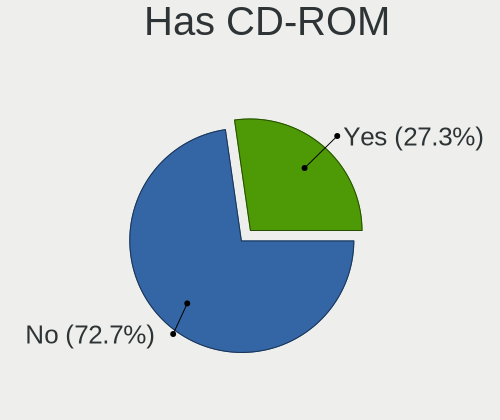
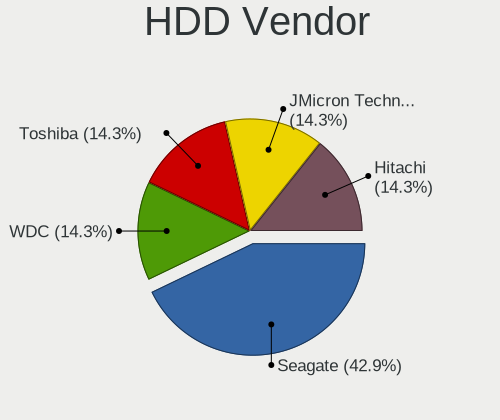
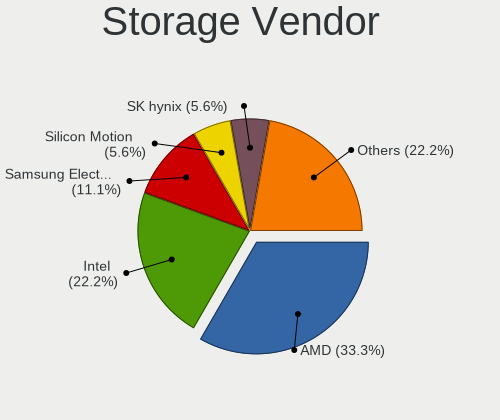
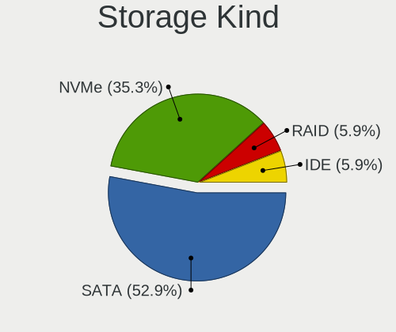
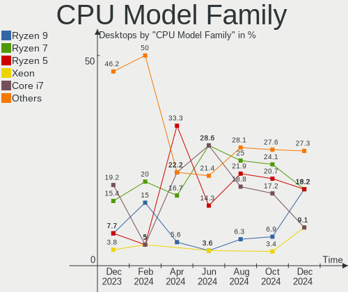
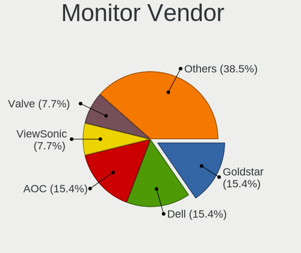
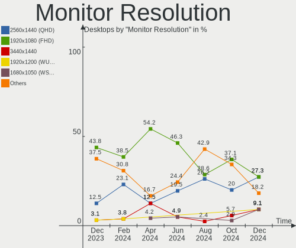
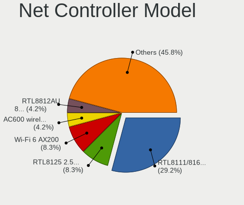

EndeavourOS Hardware Trends (Desktops)
--------------------------------------

A project to identify most popular hardware characteristics and track their change
over time based on data collected by EndeavourOS users at https://Linux-Hardware.org.

Anyone can contribute to this report by the [hw-probe](https://github.com/linuxhw/hw-probe) tool:

    sudo -E hw-probe -all -upload

Full-feature report is available here: https://linux-hardware.org/?view=trends

Period: Jan, 2022.

Contents
--------

* [ System ](#system)
  - [ OS                       ](#os)
  - [ OS Family                ](#os-family)
  - [ Kernel                   ](#kernel)
  - [ Kernel Family            ](#kernel-family)
  - [ Kernel Major Ver.        ](#kernel-major-ver)
  - [ Arch                     ](#arch)
  - [ DE                       ](#de)
  - [ Display Server           ](#display-server)
  - [ Display Manager          ](#display-manager)
  - [ OS Lang                  ](#os-lang)
  - [ Boot Mode                ](#boot-mode)
  - [ Filesystem               ](#filesystem)
  - [ Part. scheme             ](#part-scheme)
  - [ Dual Boot with Linux/BSD ](#dual-boot-with-linuxbsd)
  - [ Dual Boot (Win)          ](#dual-boot-win)

* [ Board ](#board)
  - [ Vendor                   ](#vendor)
  - [ Model                    ](#model)
  - [ Model Family             ](#model-family)
  - [ MFG Year                 ](#mfg-year)
  - [ Form Factor              ](#form-factor)
  - [ Secure Boot              ](#secure-boot)
  - [ Coreboot                 ](#coreboot)
  - [ RAM Size                 ](#ram-size)
  - [ RAM Used                 ](#ram-used)
  - [ Total Drives             ](#total-drives)
  - [ Has CD-ROM               ](#has-cd-rom)
  - [ Has Ethernet             ](#has-ethernet)
  - [ Has WiFi                 ](#has-wifi)
  - [ Has Bluetooth            ](#has-bluetooth)

* [ Location ](#location)
  - [ Country                  ](#country)
  - [ City                     ](#city)

* [ Drives ](#drives)
  - [ Drive Vendor             ](#drive-vendor)
  - [ Drive Model              ](#drive-model)
  - [ HDD Vendor               ](#hdd-vendor)
  - [ SSD Vendor               ](#ssd-vendor)
  - [ Drive Kind               ](#drive-kind)
  - [ Drive Connector          ](#drive-connector)
  - [ Drive Size               ](#drive-size)
  - [ Space Total              ](#space-total)
  - [ Space Used               ](#space-used)
  - [ Malfunc. Drives          ](#malfunc-drives)
  - [ Malfunc. Drive Vendor    ](#malfunc-drive-vendor)
  - [ Malfunc. HDD Vendor      ](#malfunc-hdd-vendor)
  - [ Malfunc. Drive Kind      ](#malfunc-drive-kind)
  - [ Failed Drives            ](#failed-drives)
  - [ Failed Drive Vendor      ](#failed-drive-vendor)
  - [ Drive Status             ](#drive-status)

* [ Storage controller ](#storage-controller)
  - [ Storage Vendor           ](#storage-vendor)
  - [ Storage Model            ](#storage-model)
  - [ Storage Kind             ](#storage-kind)

* [ Processor ](#processor)
  - [ CPU Vendor               ](#cpu-vendor)
  - [ CPU Model                ](#cpu-model)
  - [ CPU Model Family         ](#cpu-model-family)
  - [ CPU Cores                ](#cpu-cores)
  - [ CPU Sockets              ](#cpu-sockets)
  - [ CPU Threads              ](#cpu-threads)
  - [ CPU Op-Modes             ](#cpu-op-modes)
  - [ CPU Microcode            ](#cpu-microcode)
  - [ CPU Microarch            ](#cpu-microarch)

* [ Graphics ](#graphics)
  - [ GPU Vendor               ](#gpu-vendor)
  - [ GPU Model                ](#gpu-model)
  - [ GPU Combo                ](#gpu-combo)
  - [ GPU Driver               ](#gpu-driver)
  - [ GPU Memory               ](#gpu-memory)

* [ Monitor ](#monitor)
  - [ Monitor Vendor           ](#monitor-vendor)
  - [ Monitor Model            ](#monitor-model)
  - [ Monitor Resolution       ](#monitor-resolution)
  - [ Monitor Diagonal         ](#monitor-diagonal)
  - [ Monitor Width            ](#monitor-width)
  - [ Aspect Ratio             ](#aspect-ratio)
  - [ Monitor Area             ](#monitor-area)
  - [ Pixel Density            ](#pixel-density)
  - [ Multiple Monitors        ](#multiple-monitors)

* [ Network ](#network)
  - [ Net Controller Vendor    ](#net-controller-vendor)
  - [ Net Controller Model     ](#net-controller-model)
  - [ Wireless Vendor          ](#wireless-vendor)
  - [ Wireless Model           ](#wireless-model)
  - [ Ethernet Vendor          ](#ethernet-vendor)
  - [ Ethernet Model           ](#ethernet-model)
  - [ Net Controller Kind      ](#net-controller-kind)
  - [ Used Controller          ](#used-controller)
  - [ NICs                     ](#nics)
  - [ IPv6                     ](#ipv6)

* [ Bluetooth ](#bluetooth)
  - [ Bluetooth Vendor         ](#bluetooth-vendor)
  - [ Bluetooth Model          ](#bluetooth-model)

* [ Sound ](#sound)
  - [ Sound Vendor             ](#sound-vendor)
  - [ Sound Model              ](#sound-model)

* [ Memory ](#memory)
  - [ Memory Vendor            ](#memory-vendor)
  - [ Memory Model             ](#memory-model)
  - [ Memory Kind              ](#memory-kind)
  - [ Memory Form Factor       ](#memory-form-factor)
  - [ Memory Size              ](#memory-size)
  - [ Memory Speed             ](#memory-speed)

* [ Printers & scanners ](#printers--scanners)
  - [ Printer Vendor           ](#printer-vendor)
  - [ Printer Model            ](#printer-model)
  - [ Scanner Vendor           ](#scanner-vendor)
  - [ Scanner Model            ](#scanner-model)

* [ Camera ](#camera)
  - [ Camera Vendor            ](#camera-vendor)
  - [ Camera Model             ](#camera-model)

* [ Security ](#security)
  - [ Fingerprint Vendor       ](#fingerprint-vendor)
  - [ Fingerprint Model        ](#fingerprint-model)
  - [ Chipcard Vendor          ](#chipcard-vendor)
  - [ Chipcard Model           ](#chipcard-model)

* [ Unsupported ](#unsupported)
  - [ Unsupported Devices      ](#unsupported-devices)
  - [ Unsupported Device Types ](#unsupported-device-types)

System
------

OS
--

Installed operating systems

| Name                | Desktops | Percent |
|---------------------|----------|---------|
| EndeavourOS Rolling | 19       | 70.37%  |
| EndeavourOS         | 8        | 29.63%  |

OS Family
---------

OS without a version

| Name        | Desktops | Percent |
|-------------|----------|---------|
| EndeavourOS | 27       | 100%    |

Kernel
------

Version of the Linux kernel

| Version             | Desktops | Percent |
|---------------------|----------|---------|
| 5.15.12-arch1-1     | 9        | 33.33%  |
| 5.16.2-arch1-1      | 5        | 18.52%  |
| 5.16.1-arch1-1      | 2        | 7.41%   |
| 5.15.13-zen1-1-zen  | 2        | 7.41%   |
| 5.15.12-zen1-1-zen  | 2        | 7.41%   |
| 5.16.4-arch1-1      | 1        | 3.7%    |
| 5.15.15-1-lts       | 1        | 3.7%    |
| 5.15.13-arch1-1     | 1        | 3.7%    |
| 5.15.12-231-tkg-cfs | 1        | 3.7%    |
| 5.10.89-1-lts       | 1        | 3.7%    |
| 5.10.88-2-lts       | 1        | 3.7%    |
| 5.10.78-1-lts       | 1        | 3.7%    |

Kernel Family
-------------

Linux kernel without a distro release

| Version | Desktops | Percent |
|---------|----------|---------|
| 5.15.12 | 12       | 44.44%  |
| 5.16.2  | 5        | 18.52%  |
| 5.15.13 | 3        | 11.11%  |
| 5.16.1  | 2        | 7.41%   |
| 5.16.4  | 1        | 3.7%    |
| 5.15.15 | 1        | 3.7%    |
| 5.10.89 | 1        | 3.7%    |
| 5.10.88 | 1        | 3.7%    |
| 5.10.78 | 1        | 3.7%    |

Kernel Major Ver.
-----------------

Linux kernel major version

| Version | Desktops | Percent |
|---------|----------|---------|
| 5.15    | 16       | 59.26%  |
| 5.16    | 8        | 29.63%  |
| 5.10    | 3        | 11.11%  |

Arch
----

OS architecture (x86_64, i586, etc.)

| Name   | Desktops | Percent |
|--------|----------|---------|
| x86_64 | 27       | 100%    |

DE
--

Desktop Environment

| Name       | Desktops | Percent |
|------------|----------|---------|
| KDE5       | 12       | 44.44%  |
| GNOME      | 5        | 18.52%  |
| i3         | 3        | 11.11%  |
| XFCE       | 2        | 7.41%   |
| X-Cinnamon | 2        | 7.41%   |
| sway       | 1        | 3.7%    |
| LXQt       | 1        | 3.7%    |
| Budgie     | 1        | 3.7%    |

Display Server
--------------

X11 or Wayland

| Name    | Desktops | Percent |
|---------|----------|---------|
| X11     | 22       | 81.48%  |
| Wayland | 5        | 18.52%  |

Display Manager
---------------

SDDM, LightDM, etc.

| Name    | Desktops | Percent |
|---------|----------|---------|
| SDDM    | 10       | 37.04%  |
| LightDM | 8        | 29.63%  |
| Unknown | 7        | 25.93%  |
| GDM     | 2        | 7.41%   |

OS Lang
-------

Language

| Lang  | Desktops | Percent |
|-------|----------|---------|
| en_US | 16       | 59.26%  |
| en_GB | 2        | 7.41%   |
| de_DE | 2        | 7.41%   |
| pt_BR | 1        | 3.7%    |
| pl_PL | 1        | 3.7%    |
| nl_NL | 1        | 3.7%    |
| it_IT | 1        | 3.7%    |
| hu_HU | 1        | 3.7%    |
| fr_CA | 1        | 3.7%    |
| eo    | 1        | 3.7%    |

Boot Mode
---------

EFI or BIOS

| Mode | Desktops | Percent |
|------|----------|---------|
| EFI  | 16       | 59.26%  |
| BIOS | 11       | 40.74%  |

Filesystem
----------

Type of filesystem

| Type  | Desktops | Percent |
|-------|----------|---------|
| Ext4  | 18       | 66.67%  |
| Btrfs | 9        | 33.33%  |

Part. scheme
------------

Scheme of partitioning

| Type    | Desktops | Percent |
|---------|----------|---------|
| GPT     | 18       | 66.67%  |
| Unknown | 8        | 29.63%  |
| MBR     | 1        | 3.7%    |

Dual Boot with Linux/BSD
------------------------

Hosting more than one Linux/BSD

| Dual boot | Desktops | Percent |
|-----------|----------|---------|
| No        | 21       | 77.78%  |
| Yes       | 6        | 22.22%  |

Dual Boot (Win)
---------------

Hosting Linux and Windows

| Dual boot | Desktops | Percent |
|-----------|----------|---------|
| No        | 14       | 51.85%  |
| Yes       | 13       | 48.15%  |

Board
-----

Vendor
------

Motherboard manufacturer

| Name                | Desktops | Percent |
|---------------------|----------|---------|
| ASUSTek Computer    | 11       | 40.74%  |
| MSI                 | 6        | 22.22%  |
| ASRock              | 5        | 18.52%  |
| Gigabyte Technology | 2        | 7.41%   |
| Positivo            | 1        | 3.7%    |
| Hewlett-Packard     | 1        | 3.7%    |
| Dell                | 1        | 3.7%    |

Model
-----

Motherboard model

| Name                              | Desktops | Percent |
|-----------------------------------|----------|---------|
| ASUS All Series                   | 2        | 7.41%   |
| Positivo POS-PIH81DI              | 1        | 3.7%    |
| MSI MS-7C75                       | 1        | 3.7%    |
| MSI MS-7A31                       | 1        | 3.7%    |
| MSI MS-7994                       | 1        | 3.7%    |
| MSI MS-7978                       | 1        | 3.7%    |
| MSI MS-7850                       | 1        | 3.7%    |
| MSI MS-7798                       | 1        | 3.7%    |
| HP Desktop M01-F0xxx              | 1        | 3.7%    |
| Gigabyte TRX40 AORUS MASTER       | 1        | 3.7%    |
| Gigabyte B550 AORUS ELITE V2      | 1        | 3.7%    |
| Dell Precision Tower 5810         | 1        | 3.7%    |
| ASUS TUF GAMING B560M-PLUS WIFI   | 1        | 3.7%    |
| ASUS TUF GAMING B560-PLUS WIFI    | 1        | 3.7%    |
| ASUS ROG ZENITH EXTREME           | 1        | 3.7%    |
| ASUS ROG STRIX Z370-F GAMING      | 1        | 3.7%    |
| ASUS ROG STRIX X370-F GAMING      | 1        | 3.7%    |
| ASUS ROG CROSSHAIR VIII DARK HERO | 1        | 3.7%    |
| ASUS P8Z77-V LX                   | 1        | 3.7%    |
| ASUS P8H77-V                      | 1        | 3.7%    |
| ASUS M5A99FX PRO R2.0             | 1        | 3.7%    |
| ASRock FM2A88X Pro3+              | 1        | 3.7%    |
| ASRock B550M Steel Legend         | 1        | 3.7%    |
| ASRock B450M Pro4                 | 1        | 3.7%    |
| ASRock B450 Gaming-ITX/ac         | 1        | 3.7%    |
| ASRock A320M-HD                   | 1        | 3.7%    |

Model Family
------------

Motherboard model prefix

| Name                 | Desktops | Percent |
|----------------------|----------|---------|
| ASUS ROG             | 4        | 14.81%  |
| ASUS TUF             | 2        | 7.41%   |
| ASUS All             | 2        | 7.41%   |
| Positivo POS-PIH81DI | 1        | 3.7%    |
| MSI MS-7C75          | 1        | 3.7%    |
| MSI MS-7A31          | 1        | 3.7%    |
| MSI MS-7994          | 1        | 3.7%    |
| MSI MS-7978          | 1        | 3.7%    |
| MSI MS-7850          | 1        | 3.7%    |
| MSI MS-7798          | 1        | 3.7%    |
| HP Desktop           | 1        | 3.7%    |
| Gigabyte TRX40       | 1        | 3.7%    |
| Gigabyte B550        | 1        | 3.7%    |
| Dell Precision       | 1        | 3.7%    |
| ASUS P8Z77-V         | 1        | 3.7%    |
| ASUS P8H77-V         | 1        | 3.7%    |
| ASUS M5A99FX         | 1        | 3.7%    |
| ASRock FM2A88X       | 1        | 3.7%    |
| ASRock B550M         | 1        | 3.7%    |
| ASRock B450M         | 1        | 3.7%    |
| ASRock B450          | 1        | 3.7%    |
| ASRock A320M-HD      | 1        | 3.7%    |

MFG Year
--------

Motherboard manufacture year

| Year | Desktops | Percent |
|------|----------|---------|
| 2018 | 6        | 22.22%  |
| 2021 | 4        | 14.81%  |
| 2020 | 4        | 14.81%  |
| 2014 | 4        | 14.81%  |
| 2012 | 4        | 14.81%  |
| 2017 | 3        | 11.11%  |
| 2019 | 1        | 3.7%    |
| 2015 | 1        | 3.7%    |

Form Factor
-----------

Physical design of the computer

| Name    | Desktops | Percent |
|---------|----------|---------|
| Desktop | 27       | 100%    |

Secure Boot
-----------

Enabled or disabled

| State    | Desktops | Percent |
|----------|----------|---------|
| Disabled | 26       | 96.3%   |
| Enabled  | 1        | 3.7%    |

Coreboot
--------

Have coreboot on board

| Used | Desktops | Percent |
|------|----------|---------|
| No   | 27       | 100%    |

RAM Size
--------

Total RAM memory

| Size in GB  | Desktops | Percent |
|-------------|----------|---------|
| 32.01-64.0  | 9        | 33.33%  |
| 16.01-24.0  | 7        | 25.93%  |
| 8.01-16.0   | 5        | 18.52%  |
| 64.01-256.0 | 3        | 11.11%  |
| 24.01-32.0  | 2        | 7.41%   |
| 4.01-8.0    | 1        | 3.7%    |

RAM Used
--------

Used RAM memory

| Used GB    | Desktops | Percent |
|------------|----------|---------|
| 4.01-8.0   | 7        | 25.93%  |
| 2.01-3.0   | 7        | 25.93%  |
| 1.01-2.0   | 5        | 18.52%  |
| 8.01-16.0  | 4        | 14.81%  |
| 3.01-4.0   | 3        | 11.11%  |
| 24.01-32.0 | 1        | 3.7%    |

Total Drives
------------

Number of drives on board

| Drives | Desktops | Percent |
|--------|----------|---------|
| 2      | 9        | 33.33%  |
| 4      | 5        | 18.52%  |
| 5      | 4        | 14.81%  |
| 3      | 4        | 14.81%  |
| 1      | 3        | 11.11%  |
| 7      | 1        | 3.7%    |
| 6      | 1        | 3.7%    |

Has CD-ROM
----------

Has CD-ROM on board

| Presented | Desktops | Percent |
|-----------|----------|---------|
| No        | 20       | 74.07%  |
| Yes       | 7        | 25.93%  |

Has Ethernet
------------

Has Ethernet on board

| Presented | Desktops | Percent |
|-----------|----------|---------|
| Yes       | 27       | 100%    |

Has WiFi
--------

Has WiFi module

| Presented | Desktops | Percent |
|-----------|----------|---------|
| Yes       | 14       | 51.85%  |
| No        | 13       | 48.15%  |

Has Bluetooth
-------------

Has Bluetooth module

| Presented | Desktops | Percent |
|-----------|----------|---------|
| No        | 14       | 51.85%  |
| Yes       | 13       | 48.15%  |

Location
--------

Country
-------

Geographic location (country)

| Country     | Desktops | Percent |
|-------------|----------|---------|
| USA         | 9        | 33.33%  |
| Netherlands | 3        | 11.11%  |
| Italy       | 2        | 7.41%   |
| Germany     | 2        | 7.41%   |
| Brazil      | 2        | 7.41%   |
| Belgium     | 2        | 7.41%   |
| UK          | 1        | 3.7%    |
| Switzerland | 1        | 3.7%    |
| Poland      | 1        | 3.7%    |
| Jordan      | 1        | 3.7%    |
| Hungary     | 1        | 3.7%    |
| Canada      | 1        | 3.7%    |
| Bulgaria    | 1        | 3.7%    |

City
----

Geographic location (city)

| City                  | Desktops | Percent |
|-----------------------|----------|---------|
| Zurich                | 1        | 3.7%    |
| Whiteville            | 1        | 3.7%    |
| Westminster           | 1        | 3.7%    |
| Turin                 | 1        | 3.7%    |
| Strombeek-Bever       | 1        | 3.7%    |
| Spring                | 1        | 3.7%    |
| Sofia                 | 1        | 3.7%    |
| Sao Joao de Meriti    | 1        | 3.7%    |
| Saint-Felix-de-Valois | 1        | 3.7%    |
| Roden                 | 1        | 3.7%    |
| Reggiolo              | 1        | 3.7%    |
| Praia Grande          | 1        | 3.7%    |
| Pasadena              | 1        | 3.7%    |
| New York              | 1        | 3.7%    |
| New Haven             | 1        | 3.7%    |
| Littleton             | 1        | 3.7%    |
| Jelenia G??ra         | 1        | 3.7%    |
| Ghent                 | 1        | 3.7%    |
| Eger                  | 1        | 3.7%    |
| Cloppenburg           | 1        | 3.7%    |
| Browning              | 1        | 3.7%    |
| Brentwood             | 1        | 3.7%    |
| Berlin                | 1        | 3.7%    |
| Amsterdam             | 1        | 3.7%    |
| Amstelveen            | 1        | 3.7%    |
| Amman                 | 1        | 3.7%    |
| Akron                 | 1        | 3.7%    |

Drives
------

Drive Vendor
------------

Hard drive vendors

| Vendor              | Desktops | Drives | Percent |
|---------------------|----------|--------|---------|
| Samsung Electronics | 13       | 29     | 20.63%  |
| WDC                 | 8        | 9      | 12.7%   |
| Seagate             | 8        | 10     | 12.7%   |
| Kingston            | 6        | 8      | 9.52%   |
| Toshiba             | 5        | 5      | 7.94%   |
| SanDisk             | 5        | 5      | 7.94%   |
| Crucial             | 3        | 5      | 4.76%   |
| Phison              | 2        | 2      | 3.17%   |
| Intel               | 2        | 2      | 3.17%   |
| Unknown             | 1        | 1      | 1.59%   |
| SPCC                | 1        | 1      | 1.59%   |
| PNY                 | 1        | 1      | 1.59%   |
| Phison Electronics  | 1        | 1      | 1.59%   |
| Micron Technology   | 1        | 1      | 1.59%   |
| LITEONIT            | 1        | 1      | 1.59%   |
| Kingmax             | 1        | 2      | 1.59%   |
| Intenso             | 1        | 1      | 1.59%   |
| Hitachi             | 1        | 1      | 1.59%   |
| China               | 1        | 1      | 1.59%   |
| ASMedia             | 1        | 1      | 1.59%   |

Drive Model
-----------

Hard drive models

| Model                                    | Desktops | Percent |
|------------------------------------------|----------|---------|
| Samsung SSD 850 EVO 250GB                | 4        | 4.88%   |
| Samsung SSD 970 EVO Plus 1TB             | 2        | 2.44%   |
| Samsung SSD 860 EVO 500GB                | 2        | 2.44%   |
| Samsung SSD 850 EVO 500GB                | 2        | 2.44%   |
| Kingston SA400S37480G 480GB SSD          | 2        | 2.44%   |
| WDC WDS500G1R0A-68A4W0 500GB SSD         | 1        | 1.22%   |
| WDC WDS100T3XHC-00SJG0 1TB               | 1        | 1.22%   |
| WDC WDBA3V0010BNC-WRSN 1TB               | 1        | 1.22%   |
| WDC WD40EDAZ-11SLVB0 4TB                 | 1        | 1.22%   |
| WDC WD20EZRZ-00Z5HB0 2TB                 | 1        | 1.22%   |
| WDC WD10EZRX-00A8LB0 1TB                 | 1        | 1.22%   |
| WDC WD10EZEX-00BN5A0 1TB                 | 1        | 1.22%   |
| WDC WD10EALX-009BA0 1TB                  | 1        | 1.22%   |
| WDC WD10EACS-00D6B1 1TB                  | 1        | 1.22%   |
| Unknown SD/MMC/MS PRO 128GB              | 1        | 1.22%   |
| Toshiba KXG50ZNV512G 512GB               | 1        | 1.22%   |
| Toshiba HDWE140 4TB                      | 1        | 1.22%   |
| Toshiba HDWD130 3TB                      | 1        | 1.22%   |
| Toshiba DT01ACA100 1TB                   | 1        | 1.22%   |
| Toshiba A100 120GB SSD                   | 1        | 1.22%   |
| SPCC M.2 PCIe SSD 1TB                    | 1        | 1.22%   |
| Seagate ST9500420AS 500GB                | 1        | 1.22%   |
| Seagate ST9160821AS 160GB                | 1        | 1.22%   |
| Seagate ST8000DM0004-1ZC11G 8TB          | 1        | 1.22%   |
| Seagate ST3500312CS 500GB                | 1        | 1.22%   |
| Seagate ST2000DM001-1ER164 2TB           | 1        | 1.22%   |
| Seagate ST1000VM002-1CT162 1TB           | 1        | 1.22%   |
| Seagate ST1000DX002-2DV162 1TB           | 1        | 1.22%   |
| Seagate ST1000DM003-1SB10C 1TB           | 1        | 1.22%   |
| Seagate ST1000DM003-1CH162 1TB           | 1        | 1.22%   |
| Seagate Expansion Desk 8TB               | 1        | 1.22%   |
| SanDisk SSD PLUS 2000GB                  | 1        | 1.22%   |
| SanDisk SSD PLUS 120GB                   | 1        | 1.22%   |
| SanDisk SDSSDA480G 480GB                 | 1        | 1.22%   |
| SanDisk SD6SB1M128G1002 128GB SSD        | 1        | 1.22%   |
| SanDisk Extreme SSD 500GB                | 1        | 1.22%   |
| Samsung SSD PM841 2.5 7mm 256GB          | 1        | 1.22%   |
| Samsung SSD 980 PRO 500GB                | 1        | 1.22%   |
| Samsung SSD 970 EVO Plus 500GB           | 1        | 1.22%   |
| Samsung SSD 970 EVO 1TB                  | 1        | 1.22%   |
| Samsung SSD 960 EVO 500GB                | 1        | 1.22%   |
| Samsung SSD 860 QVO 1TB                  | 1        | 1.22%   |
| Samsung SSD 860 EVO M.2 1TB              | 1        | 1.22%   |
| Samsung SSD 860 EVO 1TB                  | 1        | 1.22%   |
| Samsung SSD 850 PRO 512GB                | 1        | 1.22%   |
| Samsung SSD 750 EVO 250GB                | 1        | 1.22%   |
| Samsung NVMe SSD Drive 512GB             | 1        | 1.22%   |
| Samsung NVMe SSD Drive 500GB             | 1        | 1.22%   |
| Samsung NVMe SSD Drive 250GB             | 1        | 1.22%   |
| Samsung HD103SJ 1TB                      | 1        | 1.22%   |
| PNY CS900 500GB SSD                      | 1        | 1.22%   |
| Phison Sabrent Rocket 4.0 1TB            | 1        | 1.22%   |
| Phison Sabrent 2TB                       | 1        | 1.22%   |
| Phison PCIe SSD 1TB                      | 1        | 1.22%   |
| Micron 1100_MTFDDAK256TBN 256GB SSD      | 1        | 1.22%   |
| LITEONIT LCS-128L9S-11 2.5 7mm 128GB SSD | 1        | 1.22%   |
| Kingston SUV400S37960G 960GB SSD         | 1        | 1.22%   |
| Kingston SUV400S37480G 480GB SSD         | 1        | 1.22%   |
| Kingston SKC2000M81000G 1TB              | 1        | 1.22%   |
| Kingston SH103S3480G 480GB SSD           | 1        | 1.22%   |

HDD Vendor
----------

Hard disk drive vendors

| Vendor              | Desktops | Drives | Percent |
|---------------------|----------|--------|---------|
| Seagate             | 8        | 10     | 38.1%   |
| WDC                 | 6        | 6      | 28.57%  |
| Toshiba             | 3        | 3      | 14.29%  |
| Unknown             | 1        | 1      | 4.76%   |
| Samsung Electronics | 1        | 1      | 4.76%   |
| Hitachi             | 1        | 1      | 4.76%   |
| ASMedia             | 1        | 1      | 4.76%   |

SSD Vendor
----------

Solid state drive vendors

| Vendor              | Desktops | Drives | Percent |
|---------------------|----------|--------|---------|
| Samsung Electronics | 9        | 18     | 30%     |
| SanDisk             | 5        | 5      | 16.67%  |
| Kingston            | 4        | 6      | 13.33%  |
| Intel               | 2        | 2      | 6.67%   |
| Crucial             | 2        | 2      | 6.67%   |
| WDC                 | 1        | 1      | 3.33%   |
| Toshiba             | 1        | 1      | 3.33%   |
| PNY                 | 1        | 1      | 3.33%   |
| Micron Technology   | 1        | 1      | 3.33%   |
| LITEONIT            | 1        | 1      | 3.33%   |
| Kingmax             | 1        | 2      | 3.33%   |
| Intenso             | 1        | 1      | 3.33%   |
| China               | 1        | 1      | 3.33%   |

Drive Kind
----------

HDD or SSD

| Kind | Desktops | Drives | Percent |
|------|----------|--------|---------|
| SSD  | 18       | 42     | 36.73%  |
| HDD  | 17       | 23     | 34.69%  |
| NVMe | 14       | 22     | 28.57%  |

Drive Connector
---------------

SATA, SAS, NVMe, etc.

| Type | Desktops | Drives | Percent |
|------|----------|--------|---------|
| SATA | 24       | 61     | 57.14%  |
| NVMe | 14       | 22     | 33.33%  |
| SAS  | 4        | 4      | 9.52%   |

Drive Size
----------

Size of hard drive

| Size in TB | Desktops | Drives | Percent |
|------------|----------|--------|---------|
| 0.01-0.5   | 18       | 40     | 43.9%   |
| 0.51-1.0   | 13       | 15     | 31.71%  |
| 1.01-2.0   | 5        | 5      | 12.2%   |
| 3.01-4.0   | 2        | 2      | 4.88%   |
| 4.01-10.0  | 2        | 2      | 4.88%   |
| 2.01-3.0   | 1        | 1      | 2.44%   |

Space Total
-----------

Amount of disk space available on the file system

| Size in GB     | Desktops | Percent |
|----------------|----------|---------|
| 1001-2000      | 10       | 37.04%  |
| More than 3000 | 7        | 25.93%  |
| 101-250        | 3        | 11.11%  |
| 501-1000       | 3        | 11.11%  |
| Unknown        | 2        | 7.41%   |
| 251-500        | 1        | 3.7%    |
| 2001-3000      | 1        | 3.7%    |

Space Used
----------

Amount of used disk space

| Used GB        | Desktops | Percent |
|----------------|----------|---------|
| 1001-2000      | 5        | 18.52%  |
| 51-100         | 5        | 18.52%  |
| 501-1000       | 4        | 14.81%  |
| More than 3000 | 3        | 11.11%  |
| 251-500        | 3        | 11.11%  |
| 101-250        | 2        | 7.41%   |
| 1-20           | 2        | 7.41%   |
| Unknown        | 2        | 7.41%   |
| 21-50          | 1        | 3.7%    |

Malfunc. Drives
---------------

Drive models with a malfunction

| Model                   | Desktops | Drives | Percent |
|-------------------------|----------|--------|---------|
| WDC WD10EACS-00D6B1 1TB | 1        | 1      | 100%    |

Malfunc. Drive Vendor
---------------------

Vendors of faulty drives

| Vendor | Desktops | Drives | Percent |
|--------|----------|--------|---------|
| WDC    | 1        | 1      | 100%    |

Malfunc. HDD Vendor
-------------------

Vendors of faulty HDD drives

| Vendor | Desktops | Drives | Percent |
|--------|----------|--------|---------|
| WDC    | 1        | 1      | 100%    |

Malfunc. Drive Kind
-------------------

Kinds of faulty drives

| Kind | Desktops | Drives | Percent |
|------|----------|--------|---------|
| HDD  | 1        | 1      | 100%    |

Failed Drives
-------------

Failed drive models

Zero info for selected period =(

Failed Drive Vendor
-------------------

Failed drive vendors

Zero info for selected period =(

Drive Status
------------

Number of failed and malfunc. drives

| Status   | Desktops | Drives | Percent |
|----------|----------|--------|---------|
| Works    | 19       | 54     | 61.29%  |
| Detected | 11       | 32     | 35.48%  |
| Malfunc  | 1        | 1      | 3.23%   |

Storage controller
------------------

Storage Vendor
--------------

Storage controller vendors

| Vendor                       | Desktops | Percent |
|------------------------------|----------|---------|
| Intel                        | 14       | 29.79%  |
| AMD                          | 13       | 27.66%  |
| Samsung Electronics          | 7        | 14.89%  |
| Phison Electronics           | 3        | 6.38%   |
| Sandisk                      | 2        | 4.26%   |
| Micron/Crucial Technology    | 2        | 4.26%   |
| Kingston Technology Company  | 2        | 4.26%   |
| ASMedia Technology           | 2        | 4.26%   |
| Toshiba America Info Systems | 1        | 2.13%   |
| Silicon Motion               | 1        | 2.13%   |

Storage Model
-------------

Storage controller models

| Model                                                                            | Desktops | Percent |
|----------------------------------------------------------------------------------|----------|---------|
| AMD FCH SATA Controller [AHCI mode]                                              | 10       | 17.24%  |
| Samsung NVMe SSD Controller SM981/PM981/PM983                                    | 4        | 6.9%    |
| Intel 7 Series/C210 Series Chipset Family 6-port SATA Controller [AHCI mode]     | 3        | 5.17%   |
| AMD 400 Series Chipset SATA Controller                                           | 3        | 5.17%   |
| Samsung NVMe SSD Controller SM961/PM961/SM963                                    | 2        | 3.45%   |
| Phison E12 NVMe Controller                                                       | 2        | 3.45%   |
| Micron/Crucial P2 NVMe PCIe SSD                                                  | 2        | 3.45%   |
| Intel Q170/Q150/B150/H170/H110/Z170/CM236 Chipset SATA Controller [AHCI Mode]    | 2        | 3.45%   |
| Intel 9 Series Chipset Family SATA Controller [AHCI Mode]                        | 2        | 3.45%   |
| Intel 500 Series Chipset Family SATA AHCI Controller                             | 2        | 3.45%   |
| ASMedia ASM1062 Serial ATA Controller                                            | 2        | 3.45%   |
| AMD X370 Series Chipset SATA Controller                                          | 2        | 3.45%   |
| AMD Starship/Matisse Chipset SATA Controller [AHCI mode]                         | 2        | 3.45%   |
| Toshiba America Info Systems Toshiba America Info Non-Volatile memory controller | 1        | 1.72%   |
| Silicon Motion SM2262/SM2262EN SSD Controller                                    | 1        | 1.72%   |
| Sandisk WD Blue SN550 NVMe SSD                                                   | 1        | 1.72%   |
| Sandisk WD Black 2018/SN750 / PC SN720 NVMe SSD                                  | 1        | 1.72%   |
| Samsung NVMe SSD Controller SM951/PM951                                          | 1        | 1.72%   |
| Samsung NVMe SSD Controller PM9A1/PM9A3/980PRO                                   | 1        | 1.72%   |
| Phison E16 PCIe4 NVMe Controller                                                 | 1        | 1.72%   |
| Micron/Crucial P1 NVMe PCIe SSD                                                  | 1        | 1.72%   |
| Kingston Company KC2000 NVMe SSD                                                 | 1        | 1.72%   |
| Kingston Company A2000 NVMe SSD                                                  | 1        | 1.72%   |
| Intel SATA Controller [RAID mode]                                                | 1        | 1.72%   |
| Intel Comet Lake SATA AHCI Controller                                            | 1        | 1.72%   |
| Intel C610/X99 series chipset sSATA Controller [AHCI mode]                       | 1        | 1.72%   |
| Intel C610/X99 series chipset 6-Port SATA Controller [AHCI mode]                 | 1        | 1.72%   |
| Intel 8 Series/C220 Series Chipset Family 6-port SATA Controller 1 [AHCI mode]   | 1        | 1.72%   |
| Intel 200 Series PCH SATA controller [AHCI mode]                                 | 1        | 1.72%   |
| AMD X399 Series Chipset SATA Controller                                          | 1        | 1.72%   |
| AMD SB7x0/SB8x0/SB9x0 SATA Controller [AHCI mode]                                | 1        | 1.72%   |
| AMD FCH SATA Controller D                                                        | 1        | 1.72%   |
| AMD FCH IDE Controller                                                           | 1        | 1.72%   |

Storage Kind
------------

Kind of storage controller (IDE, SATA, NVMe, SAS, ...)

| Kind | Desktops | Percent |
|------|----------|---------|
| SATA | 26       | 61.9%   |
| NVMe | 14       | 33.33%  |
| RAID | 1        | 2.38%   |
| IDE  | 1        | 2.38%   |

Processor
---------

CPU Vendor
----------

Processor vendors

| Vendor | Desktops | Percent |
|--------|----------|---------|
| Intel  | 14       | 51.85%  |
| AMD    | 13       | 48.15%  |

CPU Model
---------

Processor models

| Model                                          | Desktops | Percent |
|------------------------------------------------|----------|---------|
| Intel Core i5-3570K CPU @ 3.40GHz              | 2        | 7.41%   |
| Intel Xeon CPU E5-2650 v3 @ 2.30GHz            | 1        | 3.7%    |
| Intel Pentium CPU G3258 @ 3.20GHz              | 1        | 3.7%    |
| Intel Core i7-8700K CPU @ 3.70GHz              | 1        | 3.7%    |
| Intel Core i7-4790K CPU @ 4.00GHz              | 1        | 3.7%    |
| Intel Core i7-4770K CPU @ 3.50GHz              | 1        | 3.7%    |
| Intel Core i5-6600K CPU @ 3.50GHz              | 1        | 3.7%    |
| Intel Core i5-6500 CPU @ 3.20GHz               | 1        | 3.7%    |
| Intel Core i5-4460 CPU @ 3.20GHz               | 1        | 3.7%    |
| Intel Core i5-3470 CPU @ 3.20GHz               | 1        | 3.7%    |
| Intel Core i5-10400 CPU @ 2.90GHz              | 1        | 3.7%    |
| Intel 11th Gen Core i5-11600K @ 3.90GHz        | 1        | 3.7%    |
| Intel 11th Gen Core i5-11400 @ 2.60GHz         | 1        | 3.7%    |
| AMD Ryzen Threadripper 3970X 32-Core Processor | 1        | 3.7%    |
| AMD Ryzen Threadripper 1950X 16-Core Processor | 1        | 3.7%    |
| AMD Ryzen 9 5950X 16-Core Processor            | 1        | 3.7%    |
| AMD Ryzen 9 3900X 12-Core Processor            | 1        | 3.7%    |
| AMD Ryzen 7 5800X 8-Core Processor             | 1        | 3.7%    |
| AMD Ryzen 7 3700X 8-Core Processor             | 1        | 3.7%    |
| AMD Ryzen 7 2700 Eight-Core Processor          | 1        | 3.7%    |
| AMD Ryzen 7 1800X Eight-Core Processor         | 1        | 3.7%    |
| AMD Ryzen 5 3600X 6-Core Processor             | 1        | 3.7%    |
| AMD Ryzen 5 1600 Six-Core Processor            | 1        | 3.7%    |
| AMD Ryzen 3 3200G with Radeon Vega Graphics    | 1        | 3.7%    |
| AMD FX-8320 Eight-Core Processor               | 1        | 3.7%    |
| AMD Athlon X4 860K Quad Core Processor         | 1        | 3.7%    |

CPU Model Family
----------------

Processor model prefix

| Model                  | Desktops | Percent |
|------------------------|----------|---------|
| Intel Core i5          | 7        | 25.93%  |
| AMD Ryzen 7            | 4        | 14.81%  |
| Intel Core i7          | 3        | 11.11%  |
| Other                  | 2        | 7.41%   |
| AMD Ryzen Threadripper | 2        | 7.41%   |
| AMD Ryzen 9            | 2        | 7.41%   |
| AMD Ryzen 5            | 2        | 7.41%   |
| Intel Xeon             | 1        | 3.7%    |
| Intel Pentium          | 1        | 3.7%    |
| AMD Ryzen 3            | 1        | 3.7%    |
| AMD FX                 | 1        | 3.7%    |
| AMD Athlon X4          | 1        | 3.7%    |

CPU Cores
---------

Number of processor cores

| Number | Desktops | Percent |
|--------|----------|---------|
| 4      | 10       | 37.04%  |
| 6      | 6        | 22.22%  |
| 8      | 4        | 14.81%  |
| 16     | 2        | 7.41%   |
| 2      | 2        | 7.41%   |
| 32     | 1        | 3.7%    |
| 12     | 1        | 3.7%    |
| 10     | 1        | 3.7%    |

CPU Sockets
-----------

Number of sockets

| Number | Desktops | Percent |
|--------|----------|---------|
| 1      | 27       | 100%    |

CPU Threads
-----------

Threads per core (Hyper-Threading)

| Number | Desktops | Percent |
|--------|----------|---------|
| 2      | 19       | 70.37%  |
| 1      | 8        | 29.63%  |

CPU Op-Modes
------------

CPU Operation Modes (32-bit, 64-bit)

| Op mode        | Desktops | Percent |
|----------------|----------|---------|
| 32-bit, 64-bit | 27       | 100%    |

CPU Microcode
-------------

Microcode number

| Number     | Desktops | Percent |
|------------|----------|---------|
| Unknown    | 10       | 37.04%  |
| 0x08701021 | 3        | 11.11%  |
| 0x506e3    | 2        | 7.41%   |
| 0x306c3    | 2        | 7.41%   |
| 0xa0671    | 1        | 3.7%    |
| 0xa0655    | 1        | 3.7%    |
| 0x906ea    | 1        | 3.7%    |
| 0x306f2    | 1        | 3.7%    |
| 0x306a9    | 1        | 3.7%    |
| 0x0a201016 | 1        | 3.7%    |
| 0x0a201009 | 1        | 3.7%    |
| 0x08108109 | 1        | 3.7%    |
| 0x0800820d | 1        | 3.7%    |
| 0x08001138 | 1        | 3.7%    |

CPU Microarch
-------------

Microarchitecture

| Name        | Desktops | Percent |
|-------------|----------|---------|
| Haswell     | 5        | 18.52%  |
| Zen 2       | 4        | 14.81%  |
| Zen         | 3        | 11.11%  |
| IvyBridge   | 3        | 11.11%  |
| Zen+        | 2        | 7.41%   |
| Zen 3       | 2        | 7.41%   |
| Skylake     | 2        | 7.41%   |
| Steamroller | 1        | 3.7%    |
| Piledriver  | 1        | 3.7%    |
| KabyLake    | 1        | 3.7%    |
| Icelake     | 1        | 3.7%    |
| CometLake   | 1        | 3.7%    |
| Unknown     | 1        | 3.7%    |

Graphics
--------

GPU Vendor
----------

Vendors of graphics cards

| Vendor | Desktops | Percent |
|--------|----------|---------|
| Nvidia | 13       | 46.43%  |
| AMD    | 11       | 39.29%  |
| Intel  | 4        | 14.29%  |

GPU Model
---------

Graphics card models

| Model                                                                       | Desktops | Percent |
|-----------------------------------------------------------------------------|----------|---------|
| Intel Xeon E3-1200 v3/4th Gen Core Processor Integrated Graphics Controller | 3        | 10.71%  |
| AMD Ellesmere [Radeon RX 470/480/570/570X/580/580X/590]                     | 3        | 10.71%  |
| Nvidia GP104 [GeForce GTX 1070]                                             | 2        | 7.14%   |
| Nvidia GP102 [GeForce GTX 1080 Ti]                                          | 2        | 7.14%   |
| Nvidia GK208B [GeForce GT 710]                                              | 2        | 7.14%   |
| Nvidia GA104 [GeForce RTX 3060 Ti]                                          | 2        | 7.14%   |
| AMD Navi 10 [Radeon RX 5600 OEM/5600 XT / 5700/5700 XT]                     | 2        | 7.14%   |
| AMD Hawaii PRO [Radeon R9 290/390]                                          | 2        | 7.14%   |
| Nvidia GP107 [GeForce GTX 1050 Ti]                                          | 1        | 3.57%   |
| Nvidia GP106 [GeForce GTX 1060 6GB]                                         | 1        | 3.57%   |
| Nvidia GP104 [GeForce GTX 1080]                                             | 1        | 3.57%   |
| Nvidia GK107 [GeForce GTX 650]                                              | 1        | 3.57%   |
| Nvidia GK104 [GeForce GTX 660 OEM]                                          | 1        | 3.57%   |
| Intel RocketLake-S GT1 [UHD Graphics 730]                                   | 1        | 3.57%   |
| AMD Picasso/Raven 2 [Radeon Vega Series / Radeon Vega Mobile Series]        | 1        | 3.57%   |
| AMD Navi 21 [Radeon RX 6800/6800 XT / 6900 XT]                              | 1        | 3.57%   |
| AMD Cape Verde PRO [Radeon HD 7750/8740 / R7 250E]                          | 1        | 3.57%   |
| AMD Baffin [Radeon RX 550 640SP / RX 560/560X]                              | 1        | 3.57%   |

GPU Combo
---------

Combinations of graphics cards

| Name       | Desktops | Percent |
|------------|----------|---------|
| 1 x Nvidia | 12       | 44.44%  |
| 1 x AMD    | 11       | 40.74%  |
| 1 x Intel  | 3        | 11.11%  |
| 2 x Nvidia | 1        | 3.7%    |

GPU Driver
----------

Free vs proprietary

| Driver      | Desktops | Percent |
|-------------|----------|---------|
| Free        | 15       | 55.56%  |
| Proprietary | 12       | 44.44%  |

GPU Memory
----------

Total video memory

| Size in GB | Desktops | Percent |
|------------|----------|---------|
| Unknown    | 9        | 33.33%  |
| 7.01-8.0   | 5        | 18.52%  |
| 3.01-4.0   | 3        | 11.11%  |
| 1.01-2.0   | 3        | 11.11%  |
| 8.01-16.0  | 3        | 11.11%  |
| 5.01-6.0   | 2        | 7.41%   |
| 0.51-1.0   | 2        | 7.41%   |

Monitor
-------

Monitor Vendor
--------------

Monitor vendors

| Vendor               | Desktops | Percent |
|----------------------|----------|---------|
| Goldstar             | 5        | 13.51%  |
| AOC                  | 5        | 13.51%  |
| Ancor Communications | 4        | 10.81%  |
| Samsung Electronics  | 3        | 8.11%   |
| Dell                 | 3        | 8.11%   |
| BenQ                 | 3        | 8.11%   |
| Vizio                | 2        | 5.41%   |
| ViewSonic            | 2        | 5.41%   |
| Hewlett-Packard      | 2        | 5.41%   |
| Panasonic            | 1        | 2.7%    |
| Orion                | 1        | 2.7%    |
| Iiyama               | 1        | 2.7%    |
| Grundig              | 1        | 2.7%    |
| Fluid                | 1        | 2.7%    |
| Belinea              | 1        | 2.7%    |
| ASUSTek Computer     | 1        | 2.7%    |
| Acer                 | 1        | 2.7%    |

Monitor Model
-------------

Monitor models

| Model                                                                 | Desktops | Percent |
|-----------------------------------------------------------------------|----------|---------|
| Vizio V505-G9 VIZ1033 3840x2160 1096x616mm 49.5-inch                  | 1        | 2.44%   |
| Vizio E60-E3 VIZ1018 3840x2160 1330x748mm 60.1-inch                   | 1        | 2.44%   |
| ViewSonic VX2450 SERIES VSCE226 1920x1080 525x297mm 23.7-inch         | 1        | 2.44%   |
| ViewSonic VX2250 SERIES VSCCB25 1920x1080 477x268mm 21.5-inch         | 1        | 2.44%   |
| Samsung Electronics S24R65x SAM1023 1920x1080 530x300mm 24.0-inch     | 1        | 2.44%   |
| Samsung Electronics S22C300 SAM0A20 1920x1080 477x268mm 21.5-inch     | 1        | 2.44%   |
| Samsung Electronics S22C300 SAM0A1E 1920x1080 477x268mm 21.5-inch     | 1        | 2.44%   |
| Panasonic LCD Monitor TV                                              | 1        | 2.44%   |
| Orion ORION ORN1208 1360x768                                          | 1        | 2.44%   |
| Iiyama PL2792Q IVM6637 2560x1440 597x336mm 27.0-inch                  | 1        | 2.44%   |
| Hewlett-Packard L2445w HWP280E 1920x1200 518x324mm 24.1-inch          | 1        | 2.44%   |
| Hewlett-Packard 27ea HPN3395 1920x1080 527x296mm 23.8-inch            | 1        | 2.44%   |
| Grundig UHD GRU4448 3840x2160 1210x680mm 54.6-inch                    | 1        | 2.44%   |
| Goldstar W2486 GSM5729 1920x1080 531x299mm 24.0-inch                  | 1        | 2.44%   |
| Goldstar ULTRAWIDE GSM59F1 2560x1080 677x290mm 29.0-inch              | 1        | 2.44%   |
| Goldstar HDR 4K GSM7707 3840x2160 600x340mm 27.2-inch                 | 1        | 2.44%   |
| Goldstar HDR 4K GSM7706 3840x2160 600x340mm 27.2-inch                 | 1        | 2.44%   |
| Goldstar 38GN950 GSM7754 3840x1600 879x366mm 37.5-inch                | 1        | 2.44%   |
| Fluid 8039786B FLU0F46 1360x768 760x450mm 34.8-inch                   | 1        | 2.44%   |
| Dell P2419H DELD0D9 1920x1080 527x296mm 23.8-inch                     | 1        | 2.44%   |
| Dell E2414H DEL4091 1920x1080 531x299mm 24.0-inch                     | 1        | 2.44%   |
| Dell D2721H DEL2013 1920x1080 598x336mm 27.0-inch                     | 1        | 2.44%   |
| BenQ XL2411Z BNQ7F32 1920x1080 531x298mm 24.0-inch                    | 1        | 2.44%   |
| BenQ PD3200U BNQ8025 3840x2160 708x399mm 32.0-inch                    | 1        | 2.44%   |
| BenQ GW2480 BNQ78E7 1920x1080 527x296mm 23.8-inch                     | 1        | 2.44%   |
| BenQ G2420HD BNQ7840 1920x1080 531x299mm 24.0-inch                    | 1        | 2.44%   |
| Belinea B_101725 MAX06B7 1280x1024 340x270mm 17.1-inch                | 1        | 2.44%   |
| ASUSTek Computer VG248 AUS24AC 1920x1080 530x300mm 24.0-inch          | 1        | 2.44%   |
| AOC U3277WB AOC3277 3840x2160 698x393mm 31.5-inch                     | 1        | 2.44%   |
| AOC 917W AOC1917 1440x900 410x256mm 19.0-inch                         | 1        | 2.44%   |
| AOC 27P1 AOC2701 1920x1080 600x340mm 27.2-inch                        | 1        | 2.44%   |
| AOC 2460G4 AOC2460 1920x1080 531x299mm 24.0-inch                      | 1        | 2.44%   |
| AOC 2260WG5 AOC2260 1920x1080 480x270mm 21.7-inch                     | 1        | 2.44%   |
| AOC 2260WG5 AOC2260 1920x1080 477x268mm 21.5-inch                     | 1        | 2.44%   |
| Ancor Communications VW225 ACI22A0 1680x1050 473x296mm 22.0-inch      | 1        | 2.44%   |
| Ancor Communications VS248 ACI2498 1920x1080 531x299mm 24.0-inch      | 1        | 2.44%   |
| Ancor Communications VG248 ACI24E1 1920x1080 531x299mm 24.0-inch      | 1        | 2.44%   |
| Ancor Communications ROG PG278Q ACI27B1 2560x1440 598x336mm 27.0-inch | 1        | 2.44%   |
| Ancor Communications PT201 ACI20AB 1920x1080 432x243mm 19.5-inch      | 1        | 2.44%   |
| Ancor Communications LCD Monitor PA248 3840x1200                      | 1        | 2.44%   |
| Acer KC242Y A ACR08CC 1920x1080 517x323mm 24.0-inch                   | 1        | 2.44%   |

Monitor Resolution
------------------

Monitor screen resolution

| Resolution         | Desktops | Percent |
|--------------------|----------|---------|
| 1920x1080 (FHD)    | 18       | 47.37%  |
| 3840x2160 (4K)     | 7        | 18.42%  |
| 2560x1440 (QHD)    | 3        | 7.89%   |
| 3840x1600          | 1        | 2.63%   |
| 3840x1200          | 1        | 2.63%   |
| 2560x1080          | 1        | 2.63%   |
| 1920x540           | 1        | 2.63%   |
| 1920x1200 (WUXGA)  | 1        | 2.63%   |
| 1680x1050 (WSXGA+) | 1        | 2.63%   |
| 1440x900 (WXGA+)   | 1        | 2.63%   |
| 1360x768           | 1        | 2.63%   |
| 1280x1024 (SXGA)   | 1        | 2.63%   |
| Unknown            | 1        | 2.63%   |

Monitor Diagonal
----------------

Diagonal size in inches

| Inches  | Desktops | Percent |
|---------|----------|---------|
| 24      | 14       | 35.9%   |
| 27      | 6        | 15.38%  |
| 21      | 4        | 10.26%  |
| 34      | 2        | 5.13%   |
| 32      | 2        | 5.13%   |
| 22      | 2        | 5.13%   |
| 19      | 2        | 5.13%   |
| Unknown | 2        | 5.13%   |
| 74      | 1        | 2.56%   |
| 69      | 1        | 2.56%   |
| 54      | 1        | 2.56%   |
| 37      | 1        | 2.56%   |
| 17      | 1        | 2.56%   |

Monitor Width
-------------

Physical width

| Width in mm | Desktops | Percent |
|-------------|----------|---------|
| 501-600     | 17       | 47.22%  |
| 401-500     | 8        | 22.22%  |
| 701-800     | 4        | 11.11%  |
| 1501-2000   | 2        | 5.56%   |
| Unknown     | 2        | 5.56%   |
| 801-900     | 1        | 2.78%   |
| 301-350     | 1        | 2.78%   |
| 1001-1500   | 1        | 2.78%   |

Aspect Ratio
------------

Proportional relationship between the width and the height

| Ratio   | Desktops | Percent |
|---------|----------|---------|
| 16/9    | 21       | 65.63%  |
| 16/10   | 6        | 18.75%  |
| 21/9    | 2        | 6.25%   |
| 5/4     | 1        | 3.13%   |
| 32/9    | 1        | 3.13%   |
| Unknown | 1        | 3.13%   |

Monitor Area
------------

Area in inch

| Area in inch | Desktops | Percent |
|----------------|----------|---------|
| 201-250        | 16       | 42.11%  |
| 301-350        | 6        | 15.79%  |
| 351-500        | 4        | 10.53%  |
| More than 1000 | 3        | 7.89%   |
| 251-300        | 3        | 7.89%   |
| 151-200        | 2        | 5.26%   |
| Unknown        | 2        | 5.26%   |
| 141-150        | 1        | 2.63%   |
| 501-1000       | 1        | 2.63%   |

Pixel Density
-------------

Pixels per inch

| Density | Desktops | Percent |
|---------|----------|---------|
| 51-100  | 21       | 61.76%  |
| 101-120 | 7        | 20.59%  |
| 161-240 | 2        | 5.88%   |
| Unknown | 2        | 5.88%   |
| 1-50    | 1        | 2.94%   |
| 121-160 | 1        | 2.94%   |

Multiple Monitors
-----------------

Total monitors connected

| Total | Desktops | Percent |
|-------|----------|---------|
| 1     | 14       | 51.85%  |
| 2     | 11       | 40.74%  |
| 3     | 2        | 7.41%   |

Network
-------

Net Controller Vendor
---------------------

Controller vendors

| Vendor                | Desktops | Percent |
|-----------------------|----------|---------|
| Realtek Semiconductor | 15       | 38.46%  |
| Intel                 | 14       | 35.9%   |
| Qualcomm Atheros      | 4        | 10.26%  |
| Aquantia              | 2        | 5.13%   |
| Xiaomi                | 1        | 2.56%   |
| Wilocity              | 1        | 2.56%   |
| TP-Link               | 1        | 2.56%   |
| Microsoft             | 1        | 2.56%   |

Net Controller Model
--------------------

Controller models

| Model                                                             | Desktops | Percent |
|-------------------------------------------------------------------|----------|---------|
| Realtek RTL8111/8168/8411 PCI Express Gigabit Ethernet Controller | 9        | 19.57%  |
| Realtek RTL8125 2.5GbE Controller                                 | 6        | 13.04%  |
| Intel I211 Gigabit Network Connection                             | 6        | 13.04%  |
| Intel Wi-Fi 6 AX200                                               | 3        | 6.52%   |
| Qualcomm Atheros AR9287 Wireless Network Adapter (PCI-Express)    | 2        | 4.35%   |
| Intel Tiger Lake PCH CNVi WiFi                                    | 2        | 4.35%   |
| Intel Ethernet Connection (2) I219-V                              | 2        | 4.35%   |
| Intel Ethernet Connection (2) I218-V                              | 2        | 4.35%   |
| Xiaomi Mi/Redmi series (RNDIS)                                    | 1        | 2.17%   |
| Wilocity Wil6200 802.11ad Wireless Network Adapter                | 1        | 2.17%   |
| TP-Link TL-WN722N v2/v3 [Realtek RTL8188EUS]                      | 1        | 2.17%   |
| Realtek RTL8821CE 802.11ac PCIe Wireless Network Adapter          | 1        | 2.17%   |
| Realtek RTL8812AE 802.11ac PCIe Wireless Network Adapter          | 1        | 2.17%   |
| Qualcomm Atheros QCA6174 802.11ac Wireless Network Adapter        | 1        | 2.17%   |
| Qualcomm Atheros Killer E2400 Gigabit Ethernet Controller         | 1        | 2.17%   |
| Qualcomm Atheros AR8161 Gigabit Ethernet                          | 1        | 2.17%   |
| Microsoft Xbox 360 Wireless Adapter                               | 1        | 2.17%   |
| Intel Wireless 8260                                               | 1        | 2.17%   |
| Intel Ethernet Connection I217-LM                                 | 1        | 2.17%   |
| Intel Dual Band Wireless-AC 3168NGW [Stone Peak]                  | 1        | 2.17%   |
| Aquantia AQC111 NBase-T/IEEE 802.3bz Ethernet Controller [AQtion] | 1        | 2.17%   |
| Aquantia AQC107 NBase-T/IEEE 802.3bz Ethernet Controller [AQtion] | 1        | 2.17%   |

Wireless Vendor
---------------

Wireless vendors

| Vendor                | Desktops | Percent |
|-----------------------|----------|---------|
| Intel                 | 7        | 46.67%  |
| Qualcomm Atheros      | 3        | 20%     |
| Realtek Semiconductor | 2        | 13.33%  |
| Wilocity              | 1        | 6.67%   |
| TP-Link               | 1        | 6.67%   |
| Microsoft             | 1        | 6.67%   |

Wireless Model
--------------

Wireless models

| Model                                                          | Desktops | Percent |
|----------------------------------------------------------------|----------|---------|
| Intel Wi-Fi 6 AX200                                            | 3        | 20%     |
| Qualcomm Atheros AR9287 Wireless Network Adapter (PCI-Express) | 2        | 13.33%  |
| Intel Tiger Lake PCH CNVi WiFi                                 | 2        | 13.33%  |
| Wilocity Wil6200 802.11ad Wireless Network Adapter             | 1        | 6.67%   |
| TP-Link TL-WN722N v2/v3 [Realtek RTL8188EUS]                   | 1        | 6.67%   |
| Realtek RTL8821CE 802.11ac PCIe Wireless Network Adapter       | 1        | 6.67%   |
| Realtek RTL8812AE 802.11ac PCIe Wireless Network Adapter       | 1        | 6.67%   |
| Qualcomm Atheros QCA6174 802.11ac Wireless Network Adapter     | 1        | 6.67%   |
| Microsoft Xbox 360 Wireless Adapter                            | 1        | 6.67%   |
| Intel Wireless 8260                                            | 1        | 6.67%   |
| Intel Dual Band Wireless-AC 3168NGW [Stone Peak]               | 1        | 6.67%   |

Ethernet Vendor
---------------

Ethernet vendors

| Vendor                | Desktops | Percent |
|-----------------------|----------|---------|
| Realtek Semiconductor | 15       | 48.39%  |
| Intel                 | 11       | 35.48%  |
| Qualcomm Atheros      | 2        | 6.45%   |
| Aquantia              | 2        | 6.45%   |
| Xiaomi                | 1        | 3.23%   |

Ethernet Model
--------------

Ethernet models

| Model                                                             | Desktops | Percent |
|-------------------------------------------------------------------|----------|---------|
| Realtek RTL8111/8168/8411 PCI Express Gigabit Ethernet Controller | 9        | 29.03%  |
| Realtek RTL8125 2.5GbE Controller                                 | 6        | 19.35%  |
| Intel I211 Gigabit Network Connection                             | 6        | 19.35%  |
| Intel Ethernet Connection (2) I219-V                              | 2        | 6.45%   |
| Intel Ethernet Connection (2) I218-V                              | 2        | 6.45%   |
| Xiaomi Mi/Redmi series (RNDIS)                                    | 1        | 3.23%   |
| Qualcomm Atheros Killer E2400 Gigabit Ethernet Controller         | 1        | 3.23%   |
| Qualcomm Atheros AR8161 Gigabit Ethernet                          | 1        | 3.23%   |
| Intel Ethernet Connection I217-LM                                 | 1        | 3.23%   |
| Aquantia AQC111 NBase-T/IEEE 802.3bz Ethernet Controller [AQtion] | 1        | 3.23%   |
| Aquantia AQC107 NBase-T/IEEE 802.3bz Ethernet Controller [AQtion] | 1        | 3.23%   |

Net Controller Kind
-------------------

Ethernet, WiFi or modem

| Kind     | Desktops | Percent |
|----------|----------|---------|
| Ethernet | 27       | 65.85%  |
| WiFi     | 14       | 34.15%  |

Used Controller
---------------

Currently used network controller

| Kind     | Desktops | Percent |
|----------|----------|---------|
| Ethernet | 22       | 73.33%  |
| WiFi     | 8        | 26.67%  |

NICs
----

Total network controllers on board

| Total | Desktops | Percent |
|-------|----------|---------|
| 1     | 15       | 55.56%  |
| 2     | 9        | 33.33%  |
| 3     | 2        | 7.41%   |
| 4     | 1        | 3.7%    |

IPv6
----

IPv6 vs IPv4

| Used | Desktops | Percent |
|------|----------|---------|
| No   | 17       | 62.96%  |
| Yes  | 10       | 37.04%  |

Bluetooth
---------

Bluetooth Vendor
----------------

Controller vendors

| Vendor                  | Desktops | Percent |
|-------------------------|----------|---------|
| Intel                   | 6        | 46.15%  |
| Realtek Semiconductor   | 2        | 15.38%  |
| Broadcom                | 2        | 15.38%  |
| ASUSTek Computer        | 2        | 15.38%  |
| Cambridge Silicon Radio | 1        | 7.69%   |

Bluetooth Model
---------------

Controller models

| Model                                               | Desktops | Percent |
|-----------------------------------------------------|----------|---------|
| Intel Bluetooth Device                              | 4        | 30.77%  |
| Realtek  Bluetooth 4.2 Adapter                      | 1        | 7.69%   |
| Realtek Bluetooth Radio                             | 1        | 7.69%   |
| Intel Wireless-AC 3168 Bluetooth                    | 1        | 7.69%   |
| Intel Bluetooth wireless interface                  | 1        | 7.69%   |
| Cambridge Silicon Radio Bluetooth Dongle (HCI mode) | 1        | 7.69%   |
| Broadcom BCM20702A0 Bluetooth 4.0                   | 1        | 7.69%   |
| Broadcom BCM2045 Bluetooth                          | 1        | 7.69%   |
| ASUS Broadcom BCM20702A0 Bluetooth                  | 1        | 7.69%   |
| ASUS Bluetooth Device                               | 1        | 7.69%   |

Sound
-----

Sound Vendor
------------

Sound card vendors

| Vendor                               | Desktops | Percent |
|--------------------------------------|----------|---------|
| AMD                                  | 15       | 25.86%  |
| Intel                                | 14       | 24.14%  |
| Nvidia                               | 13       | 22.41%  |
| SteelSeries ApS                      | 2        | 3.45%   |
| Kingston Technology                  | 2        | 3.45%   |
| JMTek                                | 2        | 3.45%   |
| C-Media Electronics                  | 2        | 3.45%   |
| Thesycon Systemsoftware & Consulting | 1        | 1.72%   |
| Texas Instruments                    | 1        | 1.72%   |
| Sennheiser Communications            | 1        | 1.72%   |
| Samson Technologies                  | 1        | 1.72%   |
| Giga-Byte Technology                 | 1        | 1.72%   |
| FiiO Electronics Technology          | 1        | 1.72%   |
| Creative Technology                  | 1        | 1.72%   |
| Creative Labs                        | 1        | 1.72%   |

Sound Model
-----------

Sound card models

| Model                                                                     | Desktops | Percent |
|---------------------------------------------------------------------------|----------|---------|
| AMD Starship/Matisse HD Audio Controller                                  | 4        | 5.88%   |
| AMD Family 17h (Models 00h-0fh) HD Audio Controller                       | 4        | 5.88%   |
| Nvidia GP104 High Definition Audio Controller                             | 3        | 4.41%   |
| Intel Xeon E3-1200 v3/4th Gen Core Processor HD Audio Controller          | 3        | 4.41%   |
| Intel 9 Series Chipset Family HD Audio Controller                         | 3        | 4.41%   |
| Intel 7 Series/C216 Chipset Family High Definition Audio Controller       | 3        | 4.41%   |
| AMD Ellesmere HDMI Audio [Radeon RX 470/480 / 570/580/590]                | 3        | 4.41%   |
| Nvidia GP102 HDMI Audio Controller                                        | 2        | 2.94%   |
| Nvidia GK208 HDMI/DP Audio Controller                                     | 2        | 2.94%   |
| Nvidia GA104 High Definition Audio Controller                             | 2        | 2.94%   |
| Intel Tiger Lake-H HD Audio Controller                                    | 2        | 2.94%   |
| Intel 100 Series/C230 Series Chipset Family HD Audio Controller           | 2        | 2.94%   |
| AMD Navi 10 HDMI Audio                                                    | 2        | 2.94%   |
| AMD Hawaii HDMI Audio [Radeon R9 290/290X / 390/390X]                     | 2        | 2.94%   |
| Thesycon Systemsoftware & Consulting E30                                  | 1        | 1.47%   |
| Texas Instruments PCM2707 stereo audio DAC                                | 1        | 1.47%   |
| SteelSeries ApS Arctis Pro Wireless                                       | 1        | 1.47%   |
| SteelSeries ApS Arctis 7 wireless adapter                                 | 1        | 1.47%   |
| Sennheiser Communications Headset [PC 8]                                  | 1        | 1.47%   |
| Samson Technologies Q1U dynamic microphone                                | 1        | 1.47%   |
| Nvidia GP107GL High Definition Audio Controller                           | 1        | 1.47%   |
| Nvidia GP106 High Definition Audio Controller                             | 1        | 1.47%   |
| Nvidia GK107 HDMI Audio Controller                                        | 1        | 1.47%   |
| Nvidia GK104 HDMI Audio Controller                                        | 1        | 1.47%   |
| Kingston Technology HyperX Cloud Stinger Wireless                         | 1        | 1.47%   |
| Kingston Technology HyperX 7.1 Audio                                      | 1        | 1.47%   |
| JMTek USB PnP Audio Device                                                | 1        | 1.47%   |
| JMTek KLIM Talk                                                           | 1        | 1.47%   |
| Intel Comet Lake PCH cAVS                                                 | 1        | 1.47%   |
| Intel C610/X99 series chipset HD Audio Controller                         | 1        | 1.47%   |
| Intel 8 Series/C220 Series Chipset High Definition Audio Controller       | 1        | 1.47%   |
| Intel 200 Series PCH HD Audio                                             | 1        | 1.47%   |
| Giga-Byte Technology USB Audio                                            | 1        | 1.47%   |
| FiiO Electronics Technology K5 Pro                                        | 1        | 1.47%   |
| Creative Technology Sound BlasterX G6                                     | 1        | 1.47%   |
| Creative Labs EMU10k2/CA0100/CA0102/CA10200 [Sound Blaster Audigy Series] | 1        | 1.47%   |
| C-Media Electronics USB Audio Device                                      | 1        | 1.47%   |
| C-Media Electronics CMI8788 [Oxygen HD Audio]                             | 1        | 1.47%   |
| AMD SBx00 Azalia (Intel HDA)                                              | 1        | 1.47%   |
| AMD Raven/Raven2/Fenghuang HDMI/DP Audio Controller                       | 1        | 1.47%   |
| AMD Oland/Hainan/Cape Verde/Pitcairn HDMI Audio [Radeon HD 7000 Series]   | 1        | 1.47%   |
| AMD Navi 21 HDMI Audio [Radeon RX 6800/6800 XT / 6900 XT]                 | 1        | 1.47%   |
| AMD FCH Azalia Controller                                                 | 1        | 1.47%   |
| AMD Family 17h (Models 10h-1fh) HD Audio Controller                       | 1        | 1.47%   |
| AMD Baffin HDMI/DP Audio [Radeon RX 550 640SP / RX 560/560X]              | 1        | 1.47%   |

Memory
------

Memory Vendor
-------------

Memory module vendors

| Vendor              | Desktops | Percent |
|---------------------|----------|---------|
| Corsair             | 8        | 38.1%   |
| Kingston            | 3        | 14.29%  |
| Crucial             | 3        | 14.29%  |
| G.Skill             | 2        | 9.52%   |
| Unknown             | 1        | 4.76%   |
| Samsung Electronics | 1        | 4.76%   |
| Patriot             | 1        | 4.76%   |
| Micron Technology   | 1        | 4.76%   |
| GeIL                | 1        | 4.76%   |

Memory Model
------------

Memory module models

| Model                                                     | Desktops | Percent |
|-----------------------------------------------------------|----------|---------|
| Corsair RAM CMK16GX4M2B3200C16 8GB DIMM DDR4 3600MT/s     | 2        | 9.09%   |
| Unknown RAM Module 2GB DIMM DDR3 1333MT/s                 | 1        | 4.55%   |
| Samsung RAM M378A1G44AB0-CWE 8GB DIMM DDR4 3200MT/s       | 1        | 4.55%   |
| Patriot RAM 1600 CL9 Series 4GB DIMM DDR3 1600MT/s        | 1        | 4.55%   |
| Micron RAM 18ASF1G72PZ-2G1A2 8GB RIMM DDR4 2133MT/s       | 1        | 4.55%   |
| Kingston RAM KHX2400C15D4/4G 4GB DIMM DDR4 3151MT/s       | 1        | 4.55%   |
| Kingston RAM 99U5403-467.A00LF 8GB DIMM DDR3 1333MT/s     | 1        | 4.55%   |
| Kingston RAM 99U5403-074.A00LF 4GB DIMM DDR3 1333MT/s     | 1        | 4.55%   |
| GeIL RAM CL9-9-9 D3-1600 4GB DIMM DDR3 1600MT/s           | 1        | 4.55%   |
| G.Skill RAM F4-3600C17-16GTZKW 16GB DIMM DDR4 3600MT/s    | 1        | 4.55%   |
| G.Skill RAM F4-3200C16-16GIS 16GB DIMM DDR4 3600MT/s      | 1        | 4.55%   |
| Crucial RAM BLS8G4D240FSBK.8FBD 8GB DIMM DDR4 2400MT/s    | 1        | 4.55%   |
| Crucial RAM BL8G32C16U4WL.M8FE1 8GB DIMM DDR4 3200MT/s    | 1        | 4.55%   |
| Crucial RAM BL8G32C16U4BL.M8FE 8GB DIMM DDR4 3600MT/s     | 1        | 4.55%   |
| Crucial RAM BL16G32C16U4B.16FE 16384MB DIMM DDR4 3200MT/s | 1        | 4.55%   |
| Corsair RAM CMX8GX3M2A1333C9 4096MB DIMM DDR3 1333MT/s    | 1        | 4.55%   |
| Corsair RAM CMT64GX4M4E3200C16 16GB DIMM DDR4 3200MT/s    | 1        | 4.55%   |
| Corsair RAM CMK64GX4M2Z4000C18 32GB DIMM DDR4 4000MT/s    | 1        | 4.55%   |
| Corsair RAM CMK32GX4M2E3200C16 16GB DIMM DDR4 3200MT/s    | 1        | 4.55%   |
| Corsair RAM CMK32GX4M2B3200C16 16384MB DIMM DDR4 3400MT/s | 1        | 4.55%   |
| Corsair RAM CMK16GX4M2B3000C15 8192MB DIMM DDR4 2400MT/s  | 1        | 4.55%   |

Memory Kind
-----------

Memory module kinds

| Kind | Desktops | Percent |
|------|----------|---------|
| DDR4 | 15       | 78.95%  |
| DDR3 | 4        | 21.05%  |

Memory Form Factor
------------------

Physical design of the memory module

| Name | Desktops | Percent |
|------|----------|---------|
| DIMM | 18       | 94.74%  |
| RIMM | 1        | 5.26%   |

Memory Size
-----------

Memory module size

| Size  | Desktops | Percent |
|-------|----------|---------|
| 8192  | 9        | 45%     |
| 16384 | 6        | 30%     |
| 4096  | 3        | 15%     |
| 32768 | 1        | 5%      |
| 2048  | 1        | 5%      |

Memory Speed
------------

Memory module speed

| Speed | Desktops | Percent |
|-------|----------|---------|
| 3600  | 5        | 25%     |
| 3200  | 5        | 25%     |
| 1333  | 3        | 15%     |
| 4000  | 1        | 5%      |
| 3466  | 1        | 5%      |
| 3400  | 1        | 5%      |
| 3151  | 1        | 5%      |
| 2400  | 1        | 5%      |
| 2133  | 1        | 5%      |
| 1600  | 1        | 5%      |

Printers & scanners
-------------------

Printer Vendor
--------------

Printer device vendors

Zero info for selected period =(

Printer Model
-------------

Printer device models

Zero info for selected period =(

Scanner Vendor
--------------

Scanner device vendors

Zero info for selected period =(

Scanner Model
-------------

Scanner device models

Zero info for selected period =(

Camera
------

Camera Vendor
-------------

Camera device vendors

| Vendor              | Desktops | Percent |
|---------------------|----------|---------|
| Logitech            | 3        | 60%     |
| Creative Technology | 1        | 20%     |
| Unknown             | 1        | 20%     |

Camera Model
------------

Camera device models

| Model                                 | Desktops | Percent |
|---------------------------------------|----------|---------|
| Logitech Webcam C270                  | 1        | 20%     |
| Logitech HD Pro Webcam C920           | 1        | 20%     |
| Logitech CrystalCam                   | 1        | 20%     |
| Creative Live! Cam Socialize [VF0640] | 1        | 20%     |
| Unknown                               | 1        | 20%     |

Security
--------

Fingerprint Vendor
------------------

Fingerprint sensor vendors

Zero info for selected period =(

Fingerprint Model
-----------------

Fingerprint sensor models

Zero info for selected period =(

Chipcard Vendor
---------------

Chipcard module vendors

Zero info for selected period =(

Chipcard Model
--------------

Chipcard module models

Zero info for selected period =(

Unsupported
-----------

Unsupported Devices
-------------------

Total unsupported devices on board

| Total | Desktops | Percent |
|-------|----------|---------|
| 0     | 23       | 85.19%  |
| 1     | 4        | 14.81%  |

Unsupported Device Types
------------------------

Types of unsupported devices

| Type             | Desktops | Percent |
|------------------|----------|---------|
| Network          | 2        | 50%     |
| Unassigned class | 1        | 25%     |
| Bluetooth        | 1        | 25%     |

