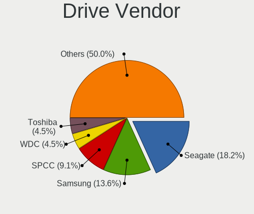
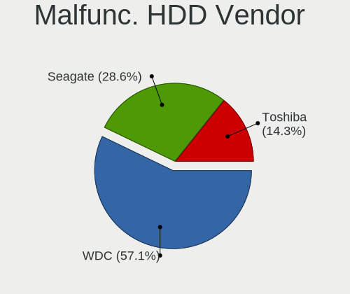
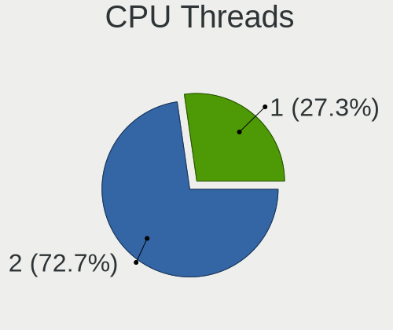
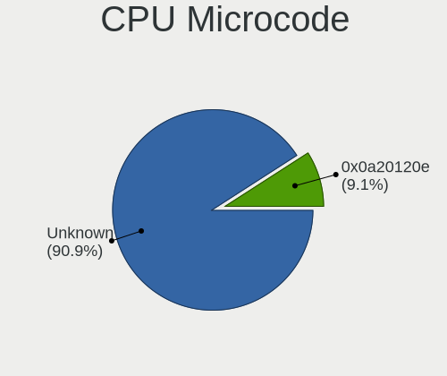
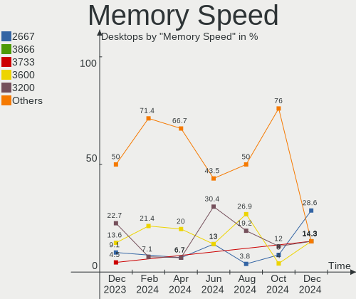
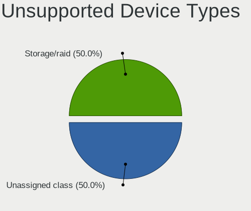

EndeavourOS - Hardware Trends (Desktops)
----------------------------------------

A project to identify most popular hardware characteristics and track their change
over time based on data collected by Linux users at https://Linux-Hardware.org.

Anyone can contribute to this report by the [hw-probe](https://github.com/linuxhw/hw-probe) tool:

    sudo -E hw-probe -all -upload

This report is for one last month. Overall report since the beginning of time: [TestCoverage](https://github.com/linuxhw/TestCoverage)

Period: Nov, 2022.

Contents
--------

* [ System ](#system)
  - [ OS                       ](#os)
  - [ OS Family                ](#os-family)
  - [ Kernel                   ](#kernel)
  - [ Kernel Family            ](#kernel-family)
  - [ Kernel Major Ver.        ](#kernel-major-ver)
  - [ Arch                     ](#arch)
  - [ DE                       ](#de)
  - [ Display Server           ](#display-server)
  - [ Display Manager          ](#display-manager)
  - [ OS Lang                  ](#os-lang)
  - [ Boot Mode                ](#boot-mode)
  - [ Filesystem               ](#filesystem)
  - [ Part. scheme             ](#part-scheme)
  - [ Dual Boot with Linux/BSD ](#dual-boot-with-linuxbsd)
  - [ Dual Boot (Win)          ](#dual-boot-win)

* [ Board ](#board)
  - [ Vendor                   ](#vendor)
  - [ Model                    ](#model)
  - [ Model Family             ](#model-family)
  - [ MFG Year                 ](#mfg-year)
  - [ Form Factor              ](#form-factor)
  - [ Secure Boot              ](#secure-boot)
  - [ Coreboot                 ](#coreboot)
  - [ RAM Size                 ](#ram-size)
  - [ RAM Used                 ](#ram-used)
  - [ Total Drives             ](#total-drives)
  - [ Has CD-ROM               ](#has-cd-rom)
  - [ Has Ethernet             ](#has-ethernet)
  - [ Has WiFi                 ](#has-wifi)
  - [ Has Bluetooth            ](#has-bluetooth)

* [ Location ](#location)
  - [ Country                  ](#country)
  - [ City                     ](#city)

* [ Drives ](#drives)
  - [ Drive Vendor             ](#drive-vendor)
  - [ Drive Model              ](#drive-model)
  - [ HDD Vendor               ](#hdd-vendor)
  - [ SSD Vendor               ](#ssd-vendor)
  - [ Drive Kind               ](#drive-kind)
  - [ Drive Connector          ](#drive-connector)
  - [ Drive Size               ](#drive-size)
  - [ Space Total              ](#space-total)
  - [ Space Used               ](#space-used)
  - [ Malfunc. Drives          ](#malfunc-drives)
  - [ Malfunc. Drive Vendor    ](#malfunc-drive-vendor)
  - [ Malfunc. HDD Vendor      ](#malfunc-hdd-vendor)
  - [ Malfunc. Drive Kind      ](#malfunc-drive-kind)
  - [ Failed Drives            ](#failed-drives)
  - [ Failed Drive Vendor      ](#failed-drive-vendor)
  - [ Drive Status             ](#drive-status)

* [ Storage controller ](#storage-controller)
  - [ Storage Vendor           ](#storage-vendor)
  - [ Storage Model            ](#storage-model)
  - [ Storage Kind             ](#storage-kind)

* [ Processor ](#processor)
  - [ CPU Vendor               ](#cpu-vendor)
  - [ CPU Model                ](#cpu-model)
  - [ CPU Model Family         ](#cpu-model-family)
  - [ CPU Cores                ](#cpu-cores)
  - [ CPU Sockets              ](#cpu-sockets)
  - [ CPU Threads              ](#cpu-threads)
  - [ CPU Op-Modes             ](#cpu-op-modes)
  - [ CPU Microcode            ](#cpu-microcode)
  - [ CPU Microarch            ](#cpu-microarch)

* [ Graphics ](#graphics)
  - [ GPU Vendor               ](#gpu-vendor)
  - [ GPU Model                ](#gpu-model)
  - [ GPU Combo                ](#gpu-combo)
  - [ GPU Driver               ](#gpu-driver)
  - [ GPU Memory               ](#gpu-memory)

* [ Monitor ](#monitor)
  - [ Monitor Vendor           ](#monitor-vendor)
  - [ Monitor Model            ](#monitor-model)
  - [ Monitor Resolution       ](#monitor-resolution)
  - [ Monitor Diagonal         ](#monitor-diagonal)
  - [ Monitor Width            ](#monitor-width)
  - [ Aspect Ratio             ](#aspect-ratio)
  - [ Monitor Area             ](#monitor-area)
  - [ Pixel Density            ](#pixel-density)
  - [ Multiple Monitors        ](#multiple-monitors)

* [ Network ](#network)
  - [ Net Controller Vendor    ](#net-controller-vendor)
  - [ Net Controller Model     ](#net-controller-model)
  - [ Wireless Vendor          ](#wireless-vendor)
  - [ Wireless Model           ](#wireless-model)
  - [ Ethernet Vendor          ](#ethernet-vendor)
  - [ Ethernet Model           ](#ethernet-model)
  - [ Net Controller Kind      ](#net-controller-kind)
  - [ Used Controller          ](#used-controller)
  - [ NICs                     ](#nics)
  - [ IPv6                     ](#ipv6)

* [ Bluetooth ](#bluetooth)
  - [ Bluetooth Vendor         ](#bluetooth-vendor)
  - [ Bluetooth Model          ](#bluetooth-model)

* [ Sound ](#sound)
  - [ Sound Vendor             ](#sound-vendor)
  - [ Sound Model              ](#sound-model)

* [ Memory ](#memory)
  - [ Memory Vendor            ](#memory-vendor)
  - [ Memory Model             ](#memory-model)
  - [ Memory Kind              ](#memory-kind)
  - [ Memory Form Factor       ](#memory-form-factor)
  - [ Memory Size              ](#memory-size)
  - [ Memory Speed             ](#memory-speed)

* [ Printers & scanners ](#printers--scanners)
  - [ Printer Vendor           ](#printer-vendor)
  - [ Printer Model            ](#printer-model)
  - [ Scanner Vendor           ](#scanner-vendor)
  - [ Scanner Model            ](#scanner-model)

* [ Camera ](#camera)
  - [ Camera Vendor            ](#camera-vendor)
  - [ Camera Model             ](#camera-model)

* [ Security ](#security)
  - [ Fingerprint Vendor       ](#fingerprint-vendor)
  - [ Fingerprint Model        ](#fingerprint-model)
  - [ Chipcard Vendor          ](#chipcard-vendor)
  - [ Chipcard Model           ](#chipcard-model)

* [ Unsupported ](#unsupported)
  - [ Unsupported Devices      ](#unsupported-devices)
  - [ Unsupported Device Types ](#unsupported-device-types)

System
------

OS
--

Installed operating systems

| Name                | Desktops | Percent |
|---------------------|----------|---------|
| EndeavourOS Rolling | 13       | 100%    |

OS Family
---------

OS without a version

| Name        | Desktops | Percent |
|-------------|----------|---------|
| EndeavourOS | 13       | 100%    |

Kernel
------

Version of the Linux kernel

| Version          | Desktops | Percent |
|------------------|----------|---------|
| 6.0.9-arch1-1    | 3        | 23.08%  |
| 6.0.6-arch1-1    | 3        | 23.08%  |
| 6.0.8-arch1-1    | 2        | 15.38%  |
| 6.0.6-zen1-1-zen | 2        | 15.38%  |
| 6.0.9-zen1-1-zen | 1        | 7.69%   |
| 6.0.10-arch2-1   | 1        | 7.69%   |
| 5.15.77-1-lts    | 1        | 7.69%   |

Kernel Family
-------------

Linux kernel without a distro release

| Version | Desktops | Percent |
|---------|----------|---------|
| 6.0.6   | 5        | 38.46%  |
| 6.0.9   | 4        | 30.77%  |
| 6.0.8   | 2        | 15.38%  |
| 6.0.10  | 1        | 7.69%   |
| 5.15.77 | 1        | 7.69%   |

Kernel Major Ver.
-----------------

Linux kernel major version

| Version | Desktops | Percent |
|---------|----------|---------|
| 6.0     | 12       | 92.31%  |
| 5.15    | 1        | 7.69%   |

Arch
----

OS architecture (x86_64, i586, etc.)

| Name   | Desktops | Percent |
|--------|----------|---------|
| x86_64 | 13       | 100%    |

DE
--

Desktop Environment

| Name  | Desktops | Percent |
|-------|----------|---------|
| KDE5  | 5        | 38.46%  |
| XFCE  | 3        | 23.08%  |
| GNOME | 3        | 23.08%  |
| i3    | 2        | 15.38%  |

Display Server
--------------

X11 or Wayland

| Name    | Desktops | Percent |
|---------|----------|---------|
| X11     | 9        | 69.23%  |
| Wayland | 3        | 23.08%  |
| Unknown | 1        | 7.69%   |

Display Manager
---------------

SDDM, LightDM, etc.

| Name    | Desktops | Percent |
|---------|----------|---------|
| LightDM | 6        | 46.15%  |
| Unknown | 4        | 30.77%  |
| GDM     | 2        | 15.38%  |
| SDDM    | 1        | 7.69%   |

OS Lang
-------

Language

| Lang  | Desktops | Percent |
|-------|----------|---------|
| en_US | 4        | 30.77%  |
| nl_NL | 2        | 15.38%  |
| it_IT | 2        | 15.38%  |
| pt_PT | 1        | 7.69%   |
| pt_BR | 1        | 7.69%   |
| en_GB | 1        | 7.69%   |
| en_CA | 1        | 7.69%   |
| de_DE | 1        | 7.69%   |

Boot Mode
---------

EFI or BIOS

| Mode | Desktops | Percent |
|------|----------|---------|
| EFI  | 7        | 53.85%  |
| BIOS | 6        | 46.15%  |

Filesystem
----------

Type of filesystem

| Type  | Desktops | Percent |
|-------|----------|---------|
| Ext4  | 9        | 69.23%  |
| Btrfs | 4        | 30.77%  |

Part. scheme
------------

Scheme of partitioning

| Type    | Desktops | Percent |
|---------|----------|---------|
| GPT     | 8        | 61.54%  |
| Unknown | 4        | 30.77%  |
| MBR     | 1        | 7.69%   |

Dual Boot with Linux/BSD
------------------------

Hosting more than one Linux/BSD

| Dual boot | Desktops | Percent |
|-----------|----------|---------|
| No        | 10       | 76.92%  |
| Yes       | 3        | 23.08%  |

Dual Boot (Win)
---------------

Hosting Linux and Windows

| Dual boot | Desktops | Percent |
|-----------|----------|---------|
| Yes       | 7        | 53.85%  |
| No        | 6        | 46.15%  |

Board
-----

Vendor
------

Motherboard manufacturer

| Name                | Desktops | Percent |
|---------------------|----------|---------|
| MSI                 | 4        | 30.77%  |
| ASUSTek Computer    | 3        | 23.08%  |
| Hewlett-Packard     | 2        | 15.38%  |
| ASRock              | 2        | 15.38%  |
| Lenovo              | 1        | 7.69%   |
| Gigabyte Technology | 1        | 7.69%   |

Model
-----

Motherboard model

| Name                               | Desktops | Percent |
|------------------------------------|----------|---------|
| MSI MS-7C37                        | 2        | 15.38%  |
| MSI MS-7C71                        | 1        | 7.69%   |
| MSI MS-7B22                        | 1        | 7.69%   |
| Lenovo ThinkCentre M93p 10AAS4EN00 | 1        | 7.69%   |
| HP EliteDesk 800 G1 TWR            | 1        | 7.69%   |
| HP Compaq Elite 8300 SFF           | 1        | 7.69%   |
| Gigabyte P55A-UD3                  | 1        | 7.69%   |
| ASUS PRIME B560M-A                 | 1        | 7.69%   |
| ASUS PRIME B460M-A                 | 1        | 7.69%   |
| ASUS All Series                    | 1        | 7.69%   |
| ASRock X570M Pro4                  | 1        | 7.69%   |
| ASRock B450M Pro4                  | 1        | 7.69%   |

Model Family
------------

Motherboard model prefix

| Name               | Desktops | Percent |
|--------------------|----------|---------|
| MSI MS-7C37        | 2        | 15.38%  |
| ASUS PRIME         | 2        | 15.38%  |
| MSI MS-7C71        | 1        | 7.69%   |
| MSI MS-7B22        | 1        | 7.69%   |
| Lenovo ThinkCentre | 1        | 7.69%   |
| HP EliteDesk       | 1        | 7.69%   |
| HP Compaq          | 1        | 7.69%   |
| Gigabyte P55A-UD3  | 1        | 7.69%   |
| ASUS All           | 1        | 7.69%   |
| ASRock X570M       | 1        | 7.69%   |
| ASRock B450M       | 1        | 7.69%   |

MFG Year
--------

Motherboard manufacture year

| Year | Desktops | Percent |
|------|----------|---------|
| 2019 | 4        | 30.77%  |
| 2020 | 2        | 15.38%  |
| 2021 | 1        | 7.69%   |
| 2018 | 1        | 7.69%   |
| 2015 | 1        | 7.69%   |
| 2014 | 1        | 7.69%   |
| 2013 | 1        | 7.69%   |
| 2012 | 1        | 7.69%   |
| 2009 | 1        | 7.69%   |

Form Factor
-----------

Physical design of the computer

| Name    | Desktops | Percent |
|---------|----------|---------|
| Desktop | 13       | 100%    |

Secure Boot
-----------

Enabled or disabled

| State    | Desktops | Percent |
|----------|----------|---------|
| Disabled | 12       | 92.31%  |
| Enabled  | 1        | 7.69%   |

Coreboot
--------

Have coreboot on board

| Used | Desktops | Percent |
|------|----------|---------|
| No   | 13       | 100%    |

RAM Size
--------

Total RAM memory

| Size in GB | Desktops | Percent |
|------------|----------|---------|
| 16.01-24.0 | 6        | 46.15%  |
| 32.01-64.0 | 5        | 38.46%  |
| 8.01-16.0  | 2        | 15.38%  |

RAM Used
--------

Used RAM memory

| Used GB   | Desktops | Percent |
|-----------|----------|---------|
| 4.01-8.0  | 3        | 23.08%  |
| 2.01-3.0  | 3        | 23.08%  |
| 8.01-16.0 | 3        | 23.08%  |
| 3.01-4.0  | 2        | 15.38%  |
| 1.01-2.0  | 1        | 7.69%   |
| 0.51-1.0  | 1        | 7.69%   |

Total Drives
------------

Number of drives on board

| Drives | Desktops | Percent |
|--------|----------|---------|
| 2      | 6        | 46.15%  |
| 4      | 3        | 23.08%  |
| 1      | 2        | 15.38%  |
| 5      | 1        | 7.69%   |
| 3      | 1        | 7.69%   |

Has CD-ROM
----------

Has CD-ROM on board

| Presented | Desktops | Percent |
|-----------|----------|---------|
| No        | 12       | 92.31%  |
| Yes       | 1        | 7.69%   |

Has Ethernet
------------

Has Ethernet on board

| Presented | Desktops | Percent |
|-----------|----------|---------|
| Yes       | 13       | 100%    |

Has WiFi
--------

Has WiFi module

| Presented | Desktops | Percent |
|-----------|----------|---------|
| Yes       | 9        | 69.23%  |
| No        | 4        | 30.77%  |

Has Bluetooth
-------------

Has Bluetooth module

| Presented | Desktops | Percent |
|-----------|----------|---------|
| Yes       | 9        | 69.23%  |
| No        | 4        | 30.77%  |

Location
--------

Country
-------

Geographic location (country)

| Country     | Desktops | Percent |
|-------------|----------|---------|
| USA         | 3        | 23.08%  |
| Netherlands | 2        | 15.38%  |
| Italy       | 2        | 15.38%  |
| Portugal    | 1        | 7.69%   |
| Germany     | 1        | 7.69%   |
| Croatia     | 1        | 7.69%   |
| Canada      | 1        | 7.69%   |
| Brazil      | 1        | 7.69%   |
| Belgium     | 1        | 7.69%   |

City
----

Geographic location (city)

| City              | Desktops | Percent |
|-------------------|----------|---------|
| North Little Rock | 2        | 15.38%  |
| Wevelgem          | 1        | 7.69%   |
| Tubbergen         | 1        | 7.69%   |
| Ponta Grossa      | 1        | 7.69%   |
| Macerata          | 1        | 7.69%   |
| Lovran            | 1        | 7.69%   |
| Lisbon            | 1        | 7.69%   |
| Larouche          | 1        | 7.69%   |
| Dreieich          | 1        | 7.69%   |
| DeRidder          | 1        | 7.69%   |
| Bellante          | 1        | 7.69%   |
| Amsterdam         | 1        | 7.69%   |

Drives
------

Drive Vendor
------------

Hard drive vendors

| Vendor                    | Desktops | Drives | Percent |
|---------------------------|----------|--------|---------|
| WDC                       | 6        | 9      | 19.35%  |
| Seagate                   | 5        | 5      | 16.13%  |
| Samsung Electronics       | 5        | 6      | 16.13%  |
| Kingston                  | 3        | 3      | 9.68%   |
| Hitachi                   | 2        | 2      | 6.45%   |
| Crucial                   | 2        | 2      | 6.45%   |
| Transcend                 | 1        | 1      | 3.23%   |
| Toshiba                   | 1        | 1      | 3.23%   |
| Timetec                   | 1        | 1      | 3.23%   |
| Silicon Motion            | 1        | 1      | 3.23%   |
| SABRENT                   | 1        | 1      | 3.23%   |
| Micron/Crucial Technology | 1        | 1      | 3.23%   |
| GOODRAM                   | 1        | 1      | 3.23%   |
| China                     | 1        | 1      | 3.23%   |

Drive Model
-----------

Hard drive models

| Model                                                 | Desktops | Percent |
|-------------------------------------------------------|----------|---------|
| Seagate ST2000DM008-2FR102 2TB                        | 2        | 5.88%   |
| Samsung NVMe SSD Controller SM981/PM981/PM983 1TB     | 2        | 5.88%   |
| Samsung HD103SJ 1TB                                   | 2        | 5.88%   |
| WDC WDS120G2G0A-00JH30 120GB SSD                      | 1        | 2.94%   |
| WDC WD5000AVDS-63U7B1 500GB                           | 1        | 2.94%   |
| WDC WD40EZAZ-00ZGHB0 4TB                              | 1        | 2.94%   |
| WDC WD30EFRX-68EUZN0 3TB                              | 1        | 2.94%   |
| WDC WD20EARS-42S0XB0 2TB                              | 1        | 2.94%   |
| WDC WD10EARS-00Y5B1 1TB                               | 1        | 2.94%   |
| WDC WD1003FZEX-00K3CA0 1TB                            | 1        | 2.94%   |
| WDC WD Blue SA510 2.5 500GB                           | 1        | 2.94%   |
| Transcend TS128GMTE110S 128GB                         | 1        | 2.94%   |
| Toshiba HDWD220 2TB                                   | 1        | 2.94%   |
| Timetec MS05 256GB SSD                                | 1        | 2.94%   |
| Silicon Motion SM2263EN/SM2263XT SSD Controller 128GB | 1        | 2.94%   |
| Seagate ST4000DM004-2CV104 4TB                        | 1        | 2.94%   |
| Seagate ST1000LM024 HN-M101MBB 1TB                    | 1        | 2.94%   |
| Seagate ST1000DM003-1ER162 1TB                        | 1        | 2.94%   |
| Samsung PSSD T7 500GB                                 | 1        | 2.94%   |
| Samsung NVMe SSD Controller PM9A1/PM9A3/980PRO 250GB  | 1        | 2.94%   |
| SABRENT Disk 500GB                                    | 1        | 2.94%   |
| Micron/Crucial P2 NVMe PCIe SSD 250GB                 | 1        | 2.94%   |
| Kingston SUV400S37240G 240GB SSD                      | 1        | 2.94%   |
| Kingston SA400S37240G 240GB SSD                       | 1        | 2.94%   |
| Kingston SA400S37120G 120GB SSD                       | 1        | 2.94%   |
| Hitachi HTS545050A7E380 500GB                         | 1        | 2.94%   |
| Hitachi HDS721050CLA360 500GB                         | 1        | 2.94%   |
| GOODRAM SSDPR-CX400-256 256GB                         | 1        | 2.94%   |
| Crucial CT500MX500SSD1 500GB                          | 1        | 2.94%   |
| Crucial CT240M500SSD1 240GB                           | 1        | 2.94%   |
| China SATA SSD 120GB                                  | 1        | 2.94%   |

HDD Vendor
----------

Hard disk drive vendors

| Vendor              | Desktops | Drives | Percent |
|---------------------|----------|--------|---------|
| WDC                 | 5        | 7      | 33.33%  |
| Seagate             | 5        | 5      | 33.33%  |
| Samsung Electronics | 2        | 2      | 13.33%  |
| Hitachi             | 2        | 2      | 13.33%  |
| Toshiba             | 1        | 1      | 6.67%   |

SSD Vendor
----------

Solid state drive vendors

| Vendor              | Desktops | Drives | Percent |
|---------------------|----------|--------|---------|
| Kingston            | 3        | 3      | 27.27%  |
| WDC                 | 2        | 2      | 18.18%  |
| Crucial             | 2        | 2      | 18.18%  |
| Timetec             | 1        | 1      | 9.09%   |
| Samsung Electronics | 1        | 1      | 9.09%   |
| GOODRAM             | 1        | 1      | 9.09%   |
| China               | 1        | 1      | 9.09%   |

Drive Kind
----------

HDD or SSD

| Kind | Desktops | Drives | Percent |
|------|----------|--------|---------|
| HDD  | 11       | 17     | 44%     |
| SSD  | 8        | 11     | 32%     |
| NVMe | 6        | 7      | 24%     |

Drive Connector
---------------

SATA, SAS, NVMe, etc.

| Type | Desktops | Drives | Percent |
|------|----------|--------|---------|
| SATA | 13       | 27     | 61.9%   |
| NVMe | 6        | 6      | 28.57%  |
| SAS  | 2        | 2      | 9.52%   |

Drive Size
----------

Size of hard drive

| Size in TB | Desktops | Drives | Percent |
|------------|----------|--------|---------|
| 0.01-0.5   | 9        | 14     | 40.91%  |
| 0.51-1.0   | 6        | 6      | 27.27%  |
| 1.01-2.0   | 4        | 5      | 18.18%  |
| 3.01-4.0   | 2        | 2      | 9.09%   |
| 2.01-3.0   | 1        | 1      | 4.55%   |

Space Total
-----------

Amount of disk space available on the file system

| Size in GB     | Desktops | Percent |
|----------------|----------|---------|
| More than 3000 | 3        | 23.08%  |
| 1001-2000      | 3        | 23.08%  |
| 251-500        | 2        | 15.38%  |
| 101-250        | 2        | 15.38%  |
| 501-1000       | 2        | 15.38%  |
| 2001-3000      | 1        | 7.69%   |

Space Used
----------

Amount of used disk space

| Used GB   | Desktops | Percent |
|-----------|----------|---------|
| 501-1000  | 4        | 30.77%  |
| 1-20      | 3        | 23.08%  |
| 251-500   | 2        | 15.38%  |
| 21-50     | 2        | 15.38%  |
| 2001-3000 | 1        | 7.69%   |
| 1001-2000 | 1        | 7.69%   |

Malfunc. Drives
---------------

Drive models with a malfunction

| Model                                                         | Desktops | Drives | Percent |
|---------------------------------------------------------------|----------|--------|---------|
| WDC WDS120G2G0A-00JH30 120GB SSD                              | 1        | 1      | 20%     |
| WDC WD5000AVDS-63U7B1 500GB                                   | 1        | 1      | 20%     |
| Seagate ST1000LM024 HN-M101MBB 1TB                            | 1        | 1      | 20%     |
| Samsung Electronics NVMe SSD Controller SM981/PM981/PM983 1TB | 1        | 1      | 20%     |
| Crucial CT500MX500SSD1 500GB                                  | 1        | 1      | 20%     |

Malfunc. Drive Vendor
---------------------

Vendors of faulty drives

| Vendor              | Desktops | Drives | Percent |
|---------------------|----------|--------|---------|
| WDC                 | 1        | 2      | 25%     |
| Seagate             | 1        | 1      | 25%     |
| Samsung Electronics | 1        | 1      | 25%     |
| Crucial             | 1        | 1      | 25%     |

Malfunc. HDD Vendor
-------------------

Vendors of faulty HDD drives

| Vendor  | Desktops | Drives | Percent |
|---------|----------|--------|---------|
| WDC     | 1        | 1      | 50%     |
| Seagate | 1        | 1      | 50%     |

Malfunc. Drive Kind
-------------------

Kinds of faulty drives

| Kind | Desktops | Drives | Percent |
|------|----------|--------|---------|
| SSD  | 2        | 2      | 40%     |
| HDD  | 2        | 2      | 40%     |
| NVMe | 1        | 1      | 20%     |

Failed Drives
-------------

Failed drive models

Zero info for selected period =(

Failed Drive Vendor
-------------------

Failed drive vendors

Zero info for selected period =(

Drive Status
------------

Number of failed and malfunc. drives

| Status   | Desktops | Drives | Percent |
|----------|----------|--------|---------|
| Works    | 7        | 17     | 41.18%  |
| Detected | 6        | 13     | 35.29%  |
| Malfunc  | 4        | 5      | 23.53%  |

Storage controller
------------------

Storage Vendor
--------------

Storage controller vendors

| Vendor                    | Desktops | Percent |
|---------------------------|----------|---------|
| Intel                     | 9        | 42.86%  |
| AMD                       | 4        | 19.05%  |
| Samsung Electronics       | 3        | 14.29%  |
| ASMedia Technology        | 2        | 9.52%   |
| Transcend                 | 1        | 4.76%   |
| Silicon Motion            | 1        | 4.76%   |
| Micron/Crucial Technology | 1        | 4.76%   |

Storage Model
-------------

Storage controller models

| Model                                                                          | Desktops | Percent |
|--------------------------------------------------------------------------------|----------|---------|
| AMD FCH SATA Controller [AHCI mode]                                            | 4        | 18.18%  |
| Intel 8 Series/C220 Series Chipset Family 6-port SATA Controller 1 [AHCI mode] | 3        | 13.64%  |
| Samsung NVMe SSD Controller SM981/PM981/PM983                                  | 2        | 9.09%   |
| ASMedia ASM1062 Serial ATA Controller                                          | 2        | 9.09%   |
| Transcend Non-Volatile memory controller                                       | 1        | 4.55%   |
| Silicon Motion SM2263EN/SM2263XT SSD Controller                                | 1        | 4.55%   |
| Samsung NVMe SSD Controller PM9A1/PM9A3/980PRO                                 | 1        | 4.55%   |
| Micron/Crucial P2 NVMe PCIe SSD                                                | 1        | 4.55%   |
| Intel Comet Lake SATA AHCI Controller                                          | 1        | 4.55%   |
| Intel Cannon Lake PCH SATA AHCI Controller                                     | 1        | 4.55%   |
| Intel 7 Series/C210 Series Chipset Family 6-port SATA Controller [AHCI mode]   | 1        | 4.55%   |
| Intel 500 Series Chipset Family SATA AHCI Controller                           | 1        | 4.55%   |
| Intel 5 Series/3400 Series Chipset 6 port SATA AHCI Controller                 | 1        | 4.55%   |
| Intel 300 Series Chipset Family SATA RAID Controller                           | 1        | 4.55%   |
| AMD 400 Series Chipset SATA Controller                                         | 1        | 4.55%   |

Storage Kind
------------

Kind of storage controller (IDE, SATA, NVMe, SAS, ...)

| Kind | Desktops | Percent |
|------|----------|---------|
| SATA | 12       | 63.16%  |
| NVMe | 6        | 31.58%  |
| RAID | 1        | 5.26%   |

Processor
---------

CPU Vendor
----------

Processor vendors

| Vendor | Desktops | Percent |
|--------|----------|---------|
| Intel  | 9        | 69.23%  |
| AMD    | 4        | 30.77%  |

CPU Model
---------

Processor models

| Model                                  | Desktops | Percent |
|----------------------------------------|----------|---------|
| AMD Ryzen 5 5600X 6-Core Processor     | 2        | 15.38%  |
| Intel Core i9-10900 CPU @ 2.80GHz      | 1        | 7.69%   |
| Intel Core i7-4790 CPU @ 3.60GHz       | 1        | 7.69%   |
| Intel Core i7-10700K CPU @ 3.80GHz     | 1        | 7.69%   |
| Intel Core i5-4690 CPU @ 3.50GHz       | 1        | 7.69%   |
| Intel Core i5-4590T CPU @ 2.00GHz      | 1        | 7.69%   |
| Intel Core i5-3470 CPU @ 3.20GHz       | 1        | 7.69%   |
| Intel Core i5 CPU 750 @ 2.67GHz        | 1        | 7.69%   |
| Intel Core i3-8100 CPU @ 3.60GHz       | 1        | 7.69%   |
| Intel 11th Gen Core i5-11600 @ 2.80GHz | 1        | 7.69%   |
| AMD Ryzen 7 5700G with Radeon Graphics | 1        | 7.69%   |
| AMD Ryzen 7 2700 Eight-Core Processor  | 1        | 7.69%   |

CPU Model Family
----------------

Processor model prefix

| Model         | Desktops | Percent |
|---------------|----------|---------|
| Intel Core i5 | 4        | 30.77%  |
| Intel Core i7 | 2        | 15.38%  |
| AMD Ryzen 7   | 2        | 15.38%  |
| AMD Ryzen 5   | 2        | 15.38%  |
| Other         | 1        | 7.69%   |
| Intel Core i9 | 1        | 7.69%   |
| Intel Core i3 | 1        | 7.69%   |

CPU Cores
---------

Number of processor cores

| Number | Desktops | Percent |
|--------|----------|---------|
| 4      | 6        | 46.15%  |
| 8      | 3        | 23.08%  |
| 6      | 3        | 23.08%  |
| 10     | 1        | 7.69%   |

CPU Sockets
-----------

Number of sockets

| Number | Desktops | Percent |
|--------|----------|---------|
| 1      | 13       | 100%    |

CPU Threads
-----------

Threads per core (Hyper-Threading)

| Number | Desktops | Percent |
|--------|----------|---------|
| 2      | 8        | 61.54%  |
| 1      | 5        | 38.46%  |

CPU Op-Modes
------------

CPU Operation Modes (32-bit, 64-bit)

| Op mode        | Desktops | Percent |
|----------------|----------|---------|
| 32-bit, 64-bit | 13       | 100%    |

CPU Microcode
-------------

Microcode number

| Number     | Desktops | Percent |
|------------|----------|---------|
| Unknown    | 6        | 46.15%  |
| 0xa0671    | 1        | 7.69%   |
| 0xa0655    | 1        | 7.69%   |
| 0x306c3    | 1        | 7.69%   |
| 0x306a9    | 1        | 7.69%   |
| 0x106e5    | 1        | 7.69%   |
| 0x0a50000c | 1        | 7.69%   |
| 0x0800820d | 1        | 7.69%   |

CPU Microarch
-------------

Microarchitecture

| Name      | Desktops | Percent |
|-----------|----------|---------|
| Zen 3     | 3        | 23.08%  |
| Haswell   | 3        | 23.08%  |
| CometLake | 2        | 15.38%  |
| Zen+      | 1        | 7.69%   |
| Nehalem   | 1        | 7.69%   |
| KabyLake  | 1        | 7.69%   |
| IvyBridge | 1        | 7.69%   |
| Icelake   | 1        | 7.69%   |

Graphics
--------

GPU Vendor
----------

Vendors of graphics cards

| Vendor | Desktops | Percent |
|--------|----------|---------|
| Nvidia | 7        | 46.67%  |
| Intel  | 4        | 26.67%  |
| AMD    | 4        | 26.67%  |

GPU Model
---------

Graphics card models

| Model                                                                       | Desktops | Percent |
|-----------------------------------------------------------------------------|----------|---------|
| Nvidia GP107 [GeForce GTX 1050 Ti]                                          | 3        | 20%     |
| Intel Xeon E3-1200 v3/4th Gen Core Processor Integrated Graphics Controller | 3        | 20%     |
| AMD Navi 23 [Radeon RX 6600/6600 XT/6600M]                                  | 2        | 13.33%  |
| Nvidia GP108 [GeForce GT 1030]                                              | 1        | 6.67%   |
| Nvidia GP104 [GeForce GTX 1070]                                             | 1        | 6.67%   |
| Nvidia GM107 [GeForce GTX 750 Ti]                                           | 1        | 6.67%   |
| Nvidia GA104 [GeForce RTX 3070]                                             | 1        | 6.67%   |
| Intel RocketLake-S GT1 [UHD Graphics 750]                                   | 1        | 6.67%   |
| AMD Lexa PRO [Radeon 540/540X/550/550X / RX 540X/550/550X]                  | 1        | 6.67%   |
| AMD Ellesmere [Radeon RX 470/480/570/570X/580/580X/590]                     | 1        | 6.67%   |

GPU Combo
---------

Combinations of graphics cards

| Name        | Desktops | Percent |
|-------------|----------|---------|
| 1 x Nvidia  | 7        | 53.85%  |
| 1 x AMD     | 3        | 23.08%  |
| 1 x Intel   | 2        | 15.38%  |
| Intel + AMD | 1        | 7.69%   |

GPU Driver
----------

Free vs proprietary

| Driver      | Desktops | Percent |
|-------------|----------|---------|
| Free        | 8        | 61.54%  |
| Proprietary | 5        | 38.46%  |

GPU Memory
----------

Total video memory

| Size in GB | Desktops | Percent |
|------------|----------|---------|
| Unknown    | 6        | 46.15%  |
| 3.01-4.0   | 4        | 30.77%  |
| 7.01-8.0   | 2        | 15.38%  |
| 1.01-2.0   | 1        | 7.69%   |

Monitor
-------

Monitor Vendor
--------------

Monitor vendors

| Vendor              | Desktops | Percent |
|---------------------|----------|---------|
| Samsung Electronics | 3        | 23.08%  |
| Acer                | 3        | 23.08%  |
| AOC                 | 2        | 15.38%  |
| Toshiba             | 1        | 7.69%   |
| Sceptre Tech        | 1        | 7.69%   |
| Hewlett-Packard     | 1        | 7.69%   |
| Goldstar            | 1        | 7.69%   |
| Gigabyte Technology | 1        | 7.69%   |

Monitor Model
-------------

Monitor models

| Model                                                             | Desktops | Percent |
|-------------------------------------------------------------------|----------|---------|
| Samsung Electronics S24R65x SAM1023 1920x1080 527x296mm 23.8-inch | 2        | 14.29%  |
| Acer R251 ACR0505 1920x1080 553x309mm 24.9-inch                   | 2        | 14.29%  |
| Toshiba TV TSB0110 1920x1080 705x398mm 31.9-inch                  | 1        | 7.14%   |
| Sceptre Tech Sceptre M27 SPT0ACD 1920x1080 598x336mm 27.0-inch    | 1        | 7.14%   |
| Sceptre Tech Sceptre L24 SPT098C 1920x1080 530x300mm 24.0-inch    | 1        | 7.14%   |
| Samsung Electronics LF22T35 SAM707B 1920x1080 480x270mm 21.7-inch | 1        | 7.14%   |
| Hewlett-Packard 24f HPN3545 1920x1080 527x296mm 23.8-inch         | 1        | 7.14%   |
| Goldstar HD GSM5ACC 1366x768 410x230mm 18.5-inch                  | 1        | 7.14%   |
| Gigabyte Technology G27Q GBT2709 2560x1440 598x336mm 27.0-inch    | 1        | 7.14%   |
| AOC Q27G2G4 AOC2702 2560x1440 597x336mm 27.0-inch                 | 1        | 7.14%   |
| AOC 2369M AOC2369 1920x1080 509x286mm 23.0-inch                   | 1        | 7.14%   |
| Acer AL1916W ACRAD80 1440x900 410x257mm 19.1-inch                 | 1        | 7.14%   |

Monitor Resolution
------------------

Monitor screen resolution

| Resolution       | Desktops | Percent |
|------------------|----------|---------|
| 1920x1080 (FHD)  | 9        | 69.23%  |
| 3840x2160 (4K)   | 1        | 7.69%   |
| 2560x1440 (QHD)  | 1        | 7.69%   |
| 1440x900 (WXGA+) | 1        | 7.69%   |
| 1366x768 (WXGA)  | 1        | 7.69%   |

Monitor Diagonal
----------------

Diagonal size in inches

| Inches | Desktops | Percent |
|--------|----------|---------|
| 24     | 6        | 42.86%  |
| 27     | 3        | 21.43%  |
| 50     | 1        | 7.14%   |
| 23     | 1        | 7.14%   |
| 21     | 1        | 7.14%   |
| 19     | 1        | 7.14%   |
| 18     | 1        | 7.14%   |

Monitor Width
-------------

Physical width

| Width in mm | Desktops | Percent |
|-------------|----------|---------|
| 501-600     | 9        | 69.23%  |
| 401-500     | 3        | 23.08%  |
| 1001-1500   | 1        | 7.69%   |

Aspect Ratio
------------

Proportional relationship between the width and the height

| Ratio | Desktops | Percent |
|-------|----------|---------|
| 16/9  | 12       | 92.31%  |
| 16/10 | 1        | 7.69%   |

Monitor Area
------------

Area in inch²

| Area in inch² | Desktops | Percent |
|----------------|----------|---------|
| 201-250        | 5        | 35.71%  |
| 301-350        | 3        | 21.43%  |
| 251-300        | 3        | 21.43%  |
| More than 1000 | 1        | 7.14%   |
| 151-200        | 1        | 7.14%   |
| 141-150        | 1        | 7.14%   |

Pixel Density
-------------

Pixels per inch

| Density | Desktops | Percent |
|---------|----------|---------|
| 51-100  | 10       | 76.92%  |
| 101-120 | 2        | 15.38%  |
| 1-50    | 1        | 7.69%   |

Multiple Monitors
-----------------

Total monitors connected

| Total | Desktops | Percent |
|-------|----------|---------|
| 1     | 11       | 84.62%  |
| 2     | 2        | 15.38%  |

Network
-------

Net Controller Vendor
---------------------

Controller vendors

| Vendor                | Desktops | Percent |
|-----------------------|----------|---------|
| Intel                 | 10       | 43.48%  |
| Realtek Semiconductor | 9        | 39.13%  |
| D-Link                | 1        | 4.35%   |
| Broadcom              | 1        | 4.35%   |
| AVM                   | 1        | 4.35%   |
| ASIX Electronics      | 1        | 4.35%   |

Net Controller Model
--------------------

Controller models

| Model                                                                                         | Desktops | Percent |
|-----------------------------------------------------------------------------------------------|----------|---------|
| Realtek RTL8111/8168/8411 PCI Express Gigabit Ethernet Controller                             | 5        | 19.23%  |
| Intel Wi-Fi 6 AX200                                                                           | 3        | 11.54%  |
| Realtek RTL8125 2.5GbE Controller                                                             | 2        | 7.69%   |
| Intel Ethernet Connection I217-LM                                                             | 2        | 7.69%   |
| Realtek USB 10/100/1G/2.5G LAN                                                                | 1        | 3.85%   |
| Realtek RTL8153 Gigabit Ethernet Adapter                                                      | 1        | 3.85%   |
| Realtek Realtek 8812AU/8821AU 802.11ac WLAN Adapter [USB Wireless Dual-Band Adapter 2.4/5Ghz] | 1        | 3.85%   |
| Realtek 802.11ac NIC                                                                          | 1        | 3.85%   |
| Intel I211 Gigabit Network Connection                                                         | 1        | 3.85%   |
| Intel Ethernet Connection (7) I219-V                                                          | 1        | 3.85%   |
| Intel Ethernet Connection (2) I218-V                                                          | 1        | 3.85%   |
| Intel Ethernet Connection (14) I219-V                                                         | 1        | 3.85%   |
| Intel Comet Lake PCH CNVi WiFi                                                                | 1        | 3.85%   |
| Intel 82579LM Gigabit Network Connection (Lewisville)                                         | 1        | 3.85%   |
| D-Link 802.11ac NIC                                                                           | 1        | 3.85%   |
| Broadcom BCM4360 802.11ac Wireless Network Adapter                                            | 1        | 3.85%   |
| AVM FRITZ!WLAN AC 860                                                                         | 1        | 3.85%   |
| ASIX AX88179 Gigabit Ethernet                                                                 | 1        | 3.85%   |

Wireless Vendor
---------------

Wireless vendors

| Vendor                | Desktops | Percent |
|-----------------------|----------|---------|
| Intel                 | 4        | 44.44%  |
| Realtek Semiconductor | 2        | 22.22%  |
| D-Link                | 1        | 11.11%  |
| Broadcom              | 1        | 11.11%  |
| AVM                   | 1        | 11.11%  |

Wireless Model
--------------

Wireless models

| Model                                                                                         | Desktops | Percent |
|-----------------------------------------------------------------------------------------------|----------|---------|
| Intel Wi-Fi 6 AX200                                                                           | 3        | 33.33%  |
| Realtek Realtek 8812AU/8821AU 802.11ac WLAN Adapter [USB Wireless Dual-Band Adapter 2.4/5Ghz] | 1        | 11.11%  |
| Realtek 802.11ac NIC                                                                          | 1        | 11.11%  |
| Intel Comet Lake PCH CNVi WiFi                                                                | 1        | 11.11%  |
| D-Link 802.11ac NIC                                                                           | 1        | 11.11%  |
| Broadcom BCM4360 802.11ac Wireless Network Adapter                                            | 1        | 11.11%  |
| AVM FRITZ!WLAN AC 860                                                                         | 1        | 11.11%  |

Ethernet Vendor
---------------

Ethernet vendors

| Vendor                | Desktops | Percent |
|-----------------------|----------|---------|
| Realtek Semiconductor | 7        | 46.67%  |
| Intel                 | 7        | 46.67%  |
| ASIX Electronics      | 1        | 6.67%   |

Ethernet Model
--------------

Ethernet models

| Model                                                             | Desktops | Percent |
|-------------------------------------------------------------------|----------|---------|
| Realtek RTL8111/8168/8411 PCI Express Gigabit Ethernet Controller | 5        | 29.41%  |
| Realtek RTL8125 2.5GbE Controller                                 | 2        | 11.76%  |
| Intel Ethernet Connection I217-LM                                 | 2        | 11.76%  |
| Realtek USB 10/100/1G/2.5G LAN                                    | 1        | 5.88%   |
| Realtek RTL8153 Gigabit Ethernet Adapter                          | 1        | 5.88%   |
| Intel I211 Gigabit Network Connection                             | 1        | 5.88%   |
| Intel Ethernet Connection (7) I219-V                              | 1        | 5.88%   |
| Intel Ethernet Connection (2) I218-V                              | 1        | 5.88%   |
| Intel Ethernet Connection (14) I219-V                             | 1        | 5.88%   |
| Intel 82579LM Gigabit Network Connection (Lewisville)             | 1        | 5.88%   |
| ASIX AX88179 Gigabit Ethernet                                     | 1        | 5.88%   |

Net Controller Kind
-------------------

Ethernet, WiFi or modem

| Kind     | Desktops | Percent |
|----------|----------|---------|
| Ethernet | 13       | 59.09%  |
| WiFi     | 9        | 40.91%  |

Used Controller
---------------

Currently used network controller

| Kind     | Desktops | Percent |
|----------|----------|---------|
| Ethernet | 8        | 61.54%  |
| WiFi     | 5        | 38.46%  |

NICs
----

Total network controllers on board

| Total | Desktops | Percent |
|-------|----------|---------|
| 1     | 7        | 53.85%  |
| 2     | 5        | 38.46%  |
| 3     | 1        | 7.69%   |

IPv6
----

IPv6 vs IPv4

| Used | Desktops | Percent |
|------|----------|---------|
| No   | 8        | 61.54%  |
| Yes  | 5        | 38.46%  |

Bluetooth
---------

Bluetooth Vendor
----------------

Controller vendors

| Vendor                  | Desktops | Percent |
|-------------------------|----------|---------|
| Intel                   | 4        | 40%     |
| Realtek Semiconductor   | 2        | 20%     |
| Cambridge Silicon Radio | 2        | 20%     |
| ASUSTek Computer        | 2        | 20%     |

Bluetooth Model
---------------

Controller models

| Model                                               | Desktops | Percent |
|-----------------------------------------------------|----------|---------|
| Intel AX200 Bluetooth                               | 3        | 30%     |
| Realtek Bluetooth Radio                             | 2        | 20%     |
| Cambridge Silicon Radio Bluetooth Dongle (HCI mode) | 2        | 20%     |
| Intel AX201 Bluetooth                               | 1        | 10%     |
| ASUS Broadcom BCM20702A0 Bluetooth                  | 1        | 10%     |
| ASUS 2045 Bluetooth 2.0 Device with trace filter    | 1        | 10%     |

Sound
-----

Sound Vendor
------------

Sound card vendors

| Vendor              | Desktops | Percent |
|---------------------|----------|---------|
| Intel               | 9        | 33.33%  |
| Nvidia              | 7        | 25.93%  |
| AMD                 | 6        | 22.22%  |
| SteelSeries ApS     | 1        | 3.7%    |
| NAD Electronics     | 1        | 3.7%    |
| Meizu               | 1        | 3.7%    |
| C-Media Electronics | 1        | 3.7%    |
| BigBen Interactive  | 1        | 3.7%    |

Sound Model
-----------

Sound card models

| Model                                                               | Desktops | Percent |
|---------------------------------------------------------------------|----------|---------|
| Nvidia GP107GL High Definition Audio Controller                     | 3        | 9.09%   |
| Intel Xeon E3-1200 v3/4th Gen Core Processor HD Audio Controller    | 3        | 9.09%   |
| Intel 8 Series/C220 Series Chipset High Definition Audio Controller | 3        | 9.09%   |
| AMD Starship/Matisse HD Audio Controller                            | 2        | 6.06%   |
| AMD Navi 21/23 HDMI/DP Audio Controller                             | 2        | 6.06%   |
| SteelSeries ApS SteelSeries Arctis 5                                | 1        | 3.03%   |
| Nvidia GP108 High Definition Audio Controller                       | 1        | 3.03%   |
| Nvidia GP104 High Definition Audio Controller                       | 1        | 3.03%   |
| Nvidia GM107 High Definition Audio Controller [GeForce 940MX]       | 1        | 3.03%   |
| Nvidia GA104 High Definition Audio Controller                       | 1        | 3.03%   |
| NAD Electronics USB Audio                                           | 1        | 3.03%   |
| Meizu HiFi DAC Headphone Amplifier                                  | 1        | 3.03%   |
| Intel Tiger Lake-H HD Audio Controller                              | 1        | 3.03%   |
| Intel Comet Lake PCH-V cAVS                                         | 1        | 3.03%   |
| Intel Comet Lake PCH cAVS                                           | 1        | 3.03%   |
| Intel Cannon Lake PCH cAVS                                          | 1        | 3.03%   |
| Intel 7 Series/C216 Chipset Family High Definition Audio Controller | 1        | 3.03%   |
| Intel 5 Series/3400 Series Chipset High Definition Audio            | 1        | 3.03%   |
| C-Media Electronics CM106 Like Sound Device                         | 1        | 3.03%   |
| BigBen Interactive NACON USB microphone                             | 1        | 3.03%   |
| AMD Renoir Radeon High Definition Audio Controller                  | 1        | 3.03%   |
| AMD Family 17h/19h HD Audio Controller                              | 1        | 3.03%   |
| AMD Family 17h (Models 00h-0fh) HD Audio Controller                 | 1        | 3.03%   |
| AMD Ellesmere HDMI Audio [Radeon RX 470/480 / 570/580/590]          | 1        | 3.03%   |
| AMD Baffin HDMI/DP Audio [Radeon RX 550 640SP / RX 560/560X]        | 1        | 3.03%   |

Memory
------

Memory Vendor
-------------

Memory module vendors

| Vendor              | Desktops | Percent |
|---------------------|----------|---------|
| Kingston            | 2        | 22.22%  |
| G.Skill             | 2        | 22.22%  |
| Team                | 1        | 11.11%  |
| SK hynix            | 1        | 11.11%  |
| Samsung Electronics | 1        | 11.11%  |
| Golden Empire       | 1        | 11.11%  |
| Unknown             | 1        | 11.11%  |

Memory Model
------------

Memory module models

| Model                                                       | Desktops | Percent |
|-------------------------------------------------------------|----------|---------|
| Team RAM TEAMGROUP-UD4-3200 16GB DIMM DDR4 3800MT/s         | 1        | 11.11%  |
| SK hynix RAM HMT41GU6AFR8C-PB 8GB DIMM DDR3 1600MT/s        | 1        | 11.11%  |
| Samsung RAM M378B5773DH0-CH9 2GB DIMM DDR3 1333MT/s         | 1        | 11.11%  |
| Kingston RAM KF3200C16D4/16GX 16GB DIMM DDR4 3200MT/s       | 1        | 11.11%  |
| Kingston RAM 99U5584-007.A00LF 4GB DIMM DDR3 1333MT/s       | 1        | 11.11%  |
| Golden Empire RAM CL19-19-19 D4-2666 8GB DIMM DDR4 2667MT/s | 1        | 11.11%  |
| G.Skill RAM F4-3600C18-8GTZRX 8GB DIMM DDR4 3600MT/s        | 1        | 11.11%  |
| G.Skill RAM F4-3200C16-16GIS 16GB DIMM DDR4 3600MT/s        | 1        | 11.11%  |
| Unknown                                                     | 1        | 11.11%  |

Memory Kind
-----------

Memory module kinds

| Kind    | Desktops | Percent |
|---------|----------|---------|
| DDR4    | 5        | 55.56%  |
| DDR3    | 2        | 22.22%  |
| SDRAM   | 1        | 11.11%  |
| Unknown | 1        | 11.11%  |

Memory Form Factor
------------------

Physical design of the memory module

| Name | Desktops | Percent |
|------|----------|---------|
| DIMM | 8        | 100%    |

Memory Size
-----------

Memory module size

| Size  | Desktops | Percent |
|-------|----------|---------|
| 8192  | 3        | 30%     |
| 16384 | 2        | 20%     |
| 4096  | 2        | 20%     |
| 2048  | 2        | 20%     |
| 32768 | 1        | 10%     |

Memory Speed
------------

Memory module speed

| Speed | Desktops | Percent |
|-------|----------|---------|
| 3600  | 2        | 25%     |
| 3800  | 1        | 12.5%   |
| 3200  | 1        | 12.5%   |
| 2667  | 1        | 12.5%   |
| 1600  | 1        | 12.5%   |
| 1333  | 1        | 12.5%   |
| 1280  | 1        | 12.5%   |

Printers & scanners
-------------------

Printer Vendor
--------------

Printer device vendors

Zero info for selected period =(

Printer Model
-------------

Printer device models

Zero info for selected period =(

Scanner Vendor
--------------

Scanner device vendors

Zero info for selected period =(

Scanner Model
-------------

Scanner device models

Zero info for selected period =(

Camera
------

Camera Vendor
-------------

Camera device vendors

| Vendor       | Desktops | Percent |
|--------------|----------|---------|
| Logitech     | 2        | 40%     |
| WCM_USB      | 1        | 20%     |
| MacroSilicon | 1        | 20%     |
| Apple        | 1        | 20%     |

Camera Model
------------

Camera device models

| Model                           | Desktops | Percent |
|---------------------------------|----------|---------|
| WCM_USB WEB CAM                 | 1        | 20%     |
| MacroSilicon USB Video          | 1        | 20%     |
| Logitech Webcam C310            | 1        | 20%     |
| Logitech C922 Pro Stream Webcam | 1        | 20%     |
| Apple iPhone 5/5C/5S/6/SE       | 1        | 20%     |

Security
--------

Fingerprint Vendor
------------------

Fingerprint sensor vendors

Zero info for selected period =(

Fingerprint Model
-----------------

Fingerprint sensor models

Zero info for selected period =(

Chipcard Vendor
---------------

Chipcard module vendors

Zero info for selected period =(

Chipcard Model
--------------

Chipcard module models

Zero info for selected period =(

Unsupported
-----------

Unsupported Devices
-------------------

Total unsupported devices on board

| Total | Desktops | Percent |
|-------|----------|---------|
| 0     | 9        | 69.23%  |
| 1     | 4        | 30.77%  |

Unsupported Device Types
------------------------

Types of unsupported devices

| Type         | Desktops | Percent |
|--------------|----------|---------|
| Net/wireless | 3        | 75%     |
| Net/ethernet | 1        | 25%     |

