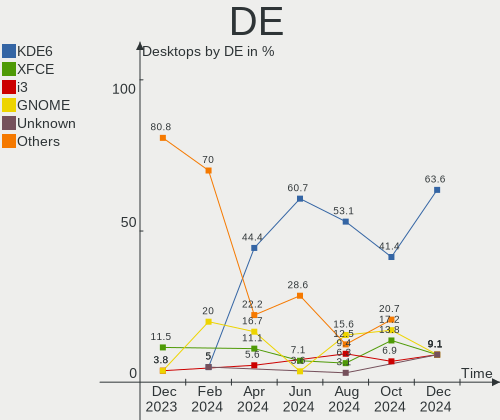
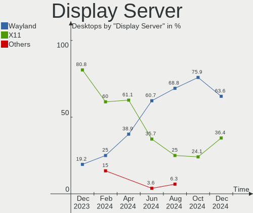
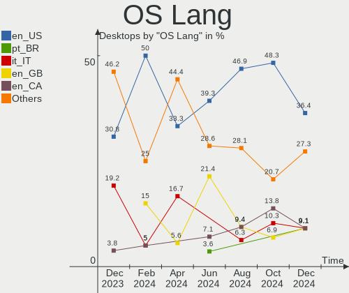
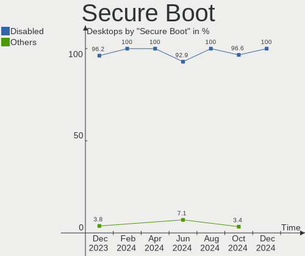
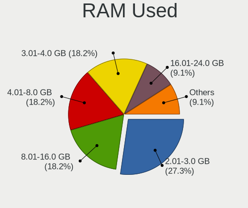
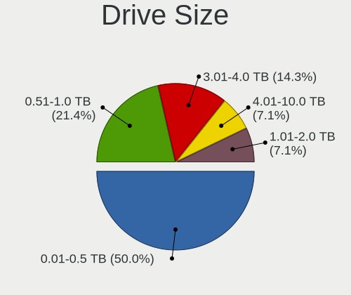
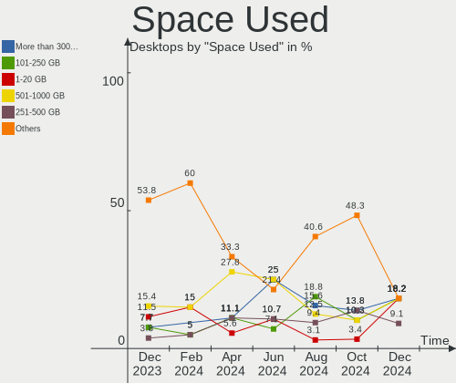
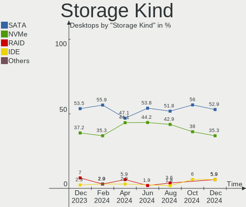
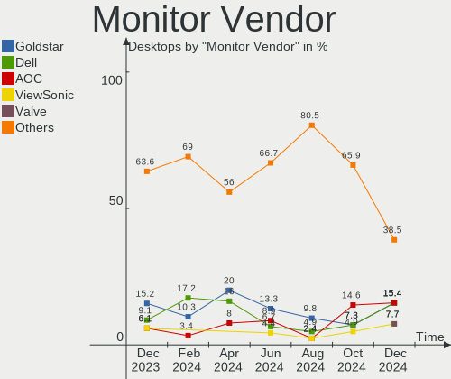
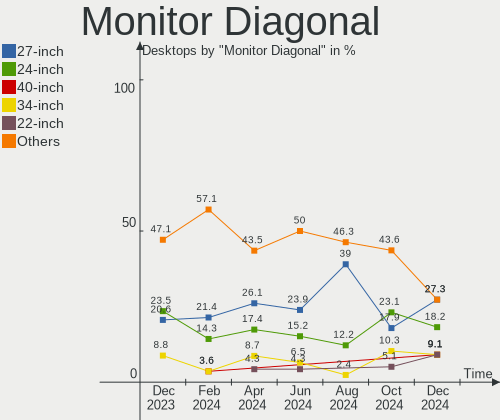

EndeavourOS - Hardware Trends (Desktops)
----------------------------------------

A project to identify most popular hardware characteristics and track their change
over time based on data collected by Linux users at https://Linux-Hardware.org.

Anyone can contribute to this report by the [hw-probe](https://github.com/linuxhw/hw-probe) tool:

    sudo -E hw-probe -all -upload

This report is for one last month. Overall report since the beginning of time: [TestDays](https://github.com/linuxhw/TestDays)

Period: Jun, 2023.

Contents
--------

* [ System ](#system)
  - [ OS                       ](#os)
  - [ OS Family                ](#os-family)
  - [ Kernel                   ](#kernel)
  - [ Kernel Family            ](#kernel-family)
  - [ Kernel Major Ver.        ](#kernel-major-ver)
  - [ Arch                     ](#arch)
  - [ DE                       ](#de)
  - [ Display Server           ](#display-server)
  - [ Display Manager          ](#display-manager)
  - [ OS Lang                  ](#os-lang)
  - [ Boot Mode                ](#boot-mode)
  - [ Filesystem               ](#filesystem)
  - [ Part. scheme             ](#part-scheme)
  - [ Dual Boot with Linux/BSD ](#dual-boot-with-linuxbsd)
  - [ Dual Boot (Win)          ](#dual-boot-win)

* [ Board ](#board)
  - [ Vendor                   ](#vendor)
  - [ Model                    ](#model)
  - [ Model Family             ](#model-family)
  - [ MFG Year                 ](#mfg-year)
  - [ Form Factor              ](#form-factor)
  - [ Secure Boot              ](#secure-boot)
  - [ Coreboot                 ](#coreboot)
  - [ RAM Size                 ](#ram-size)
  - [ RAM Used                 ](#ram-used)
  - [ Total Drives             ](#total-drives)
  - [ Has CD-ROM               ](#has-cd-rom)
  - [ Has Ethernet             ](#has-ethernet)
  - [ Has WiFi                 ](#has-wifi)
  - [ Has Bluetooth            ](#has-bluetooth)

* [ Location ](#location)
  - [ Country                  ](#country)
  - [ City                     ](#city)

* [ Drives ](#drives)
  - [ Drive Vendor             ](#drive-vendor)
  - [ Drive Model              ](#drive-model)
  - [ HDD Vendor               ](#hdd-vendor)
  - [ SSD Vendor               ](#ssd-vendor)
  - [ Drive Kind               ](#drive-kind)
  - [ Drive Connector          ](#drive-connector)
  - [ Drive Size               ](#drive-size)
  - [ Space Total              ](#space-total)
  - [ Space Used               ](#space-used)
  - [ Malfunc. Drives          ](#malfunc-drives)
  - [ Malfunc. Drive Vendor    ](#malfunc-drive-vendor)
  - [ Malfunc. HDD Vendor      ](#malfunc-hdd-vendor)
  - [ Malfunc. Drive Kind      ](#malfunc-drive-kind)
  - [ Failed Drives            ](#failed-drives)
  - [ Failed Drive Vendor      ](#failed-drive-vendor)
  - [ Drive Status             ](#drive-status)

* [ Storage controller ](#storage-controller)
  - [ Storage Vendor           ](#storage-vendor)
  - [ Storage Model            ](#storage-model)
  - [ Storage Kind             ](#storage-kind)

* [ Processor ](#processor)
  - [ CPU Vendor               ](#cpu-vendor)
  - [ CPU Model                ](#cpu-model)
  - [ CPU Model Family         ](#cpu-model-family)
  - [ CPU Cores                ](#cpu-cores)
  - [ CPU Sockets              ](#cpu-sockets)
  - [ CPU Threads              ](#cpu-threads)
  - [ CPU Op-Modes             ](#cpu-op-modes)
  - [ CPU Microcode            ](#cpu-microcode)
  - [ CPU Microarch            ](#cpu-microarch)

* [ Graphics ](#graphics)
  - [ GPU Vendor               ](#gpu-vendor)
  - [ GPU Model                ](#gpu-model)
  - [ GPU Combo                ](#gpu-combo)
  - [ GPU Driver               ](#gpu-driver)
  - [ GPU Memory               ](#gpu-memory)

* [ Monitor ](#monitor)
  - [ Monitor Vendor           ](#monitor-vendor)
  - [ Monitor Model            ](#monitor-model)
  - [ Monitor Resolution       ](#monitor-resolution)
  - [ Monitor Diagonal         ](#monitor-diagonal)
  - [ Monitor Width            ](#monitor-width)
  - [ Aspect Ratio             ](#aspect-ratio)
  - [ Monitor Area             ](#monitor-area)
  - [ Pixel Density            ](#pixel-density)
  - [ Multiple Monitors        ](#multiple-monitors)

* [ Network ](#network)
  - [ Net Controller Vendor    ](#net-controller-vendor)
  - [ Net Controller Model     ](#net-controller-model)
  - [ Wireless Vendor          ](#wireless-vendor)
  - [ Wireless Model           ](#wireless-model)
  - [ Ethernet Vendor          ](#ethernet-vendor)
  - [ Ethernet Model           ](#ethernet-model)
  - [ Net Controller Kind      ](#net-controller-kind)
  - [ Used Controller          ](#used-controller)
  - [ NICs                     ](#nics)
  - [ IPv6                     ](#ipv6)

* [ Bluetooth ](#bluetooth)
  - [ Bluetooth Vendor         ](#bluetooth-vendor)
  - [ Bluetooth Model          ](#bluetooth-model)

* [ Sound ](#sound)
  - [ Sound Vendor             ](#sound-vendor)
  - [ Sound Model              ](#sound-model)

* [ Memory ](#memory)
  - [ Memory Vendor            ](#memory-vendor)
  - [ Memory Model             ](#memory-model)
  - [ Memory Kind              ](#memory-kind)
  - [ Memory Form Factor       ](#memory-form-factor)
  - [ Memory Size              ](#memory-size)
  - [ Memory Speed             ](#memory-speed)

* [ Printers & scanners ](#printers--scanners)
  - [ Printer Vendor           ](#printer-vendor)
  - [ Printer Model            ](#printer-model)
  - [ Scanner Vendor           ](#scanner-vendor)
  - [ Scanner Model            ](#scanner-model)

* [ Camera ](#camera)
  - [ Camera Vendor            ](#camera-vendor)
  - [ Camera Model             ](#camera-model)

* [ Security ](#security)
  - [ Fingerprint Vendor       ](#fingerprint-vendor)
  - [ Fingerprint Model        ](#fingerprint-model)
  - [ Chipcard Vendor          ](#chipcard-vendor)
  - [ Chipcard Model           ](#chipcard-model)

* [ Unsupported ](#unsupported)
  - [ Unsupported Devices      ](#unsupported-devices)
  - [ Unsupported Device Types ](#unsupported-device-types)

System
------

OS
--

Installed operating systems

| Name                | Desktops | Percent |
|---------------------|----------|---------|
| EndeavourOS Rolling | 13       | 100%    |

OS Family
---------

OS without a version

| Name        | Desktops | Percent |
|-------------|----------|---------|
| EndeavourOS | 13       | 100%    |

Kernel
------

Version of the Linux kernel

| Version          | Desktops | Percent |
|------------------|----------|---------|
| 6.3.9-arch1-1    | 2        | 15.38%  |
| 6.3.4-arch1-1    | 2        | 15.38%  |
| 6.3.8-zen1-1-zen | 1        | 7.69%   |
| 6.3.8-arch1-1    | 1        | 7.69%   |
| 6.3.7-zen1-1-zen | 1        | 7.69%   |
| 6.3.6-zen1-1-zen | 1        | 7.69%   |
| 6.3.5-zen2-1-zen | 1        | 7.69%   |
| 6.3.5-zen1-1-zen | 1        | 7.69%   |
| 6.2.10-arch1-1   | 1        | 7.69%   |
| 6.1.34-1-lts     | 1        | 7.69%   |
| 6.1.31-1-lts     | 1        | 7.69%   |

Kernel Family
-------------

Linux kernel without a distro release

| Version | Desktops | Percent |
|---------|----------|---------|
| 6.3.9   | 2        | 15.38%  |
| 6.3.8   | 2        | 15.38%  |
| 6.3.5   | 2        | 15.38%  |
| 6.3.4   | 2        | 15.38%  |
| 6.3.7   | 1        | 7.69%   |
| 6.3.6   | 1        | 7.69%   |
| 6.2.10  | 1        | 7.69%   |
| 6.1.34  | 1        | 7.69%   |
| 6.1.31  | 1        | 7.69%   |

Kernel Major Ver.
-----------------

Linux kernel major version

| Version | Desktops | Percent |
|---------|----------|---------|
| 6.3     | 10       | 76.92%  |
| 6.1     | 2        | 15.38%  |
| 6.2     | 1        | 7.69%   |

Arch
----

OS architecture (x86_64, i586, etc.)

| Name   | Desktops | Percent |
|--------|----------|---------|
| x86_64 | 13       | 100%    |

DE
--

Desktop Environment

| Name   | Desktops | Percent |
|--------|----------|---------|
| KDE5   | 7        | 53.85%  |
| GNOME  | 2        | 15.38%  |
| XFCE   | 1        | 7.69%   |
| sway   | 1        | 7.69%   |
| Deepin | 1        | 7.69%   |
| bspwm  | 1        | 7.69%   |

Display Server
--------------

X11 or Wayland

| Name    | Desktops | Percent |
|---------|----------|---------|
| X11     | 7        | 53.85%  |
| Wayland | 4        | 30.77%  |
| Tty     | 2        | 15.38%  |

Display Manager
---------------

SDDM, LightDM, etc.

| Name    | Desktops | Percent |
|---------|----------|---------|
| LightDM | 6        | 46.15%  |
| GDM     | 3        | 23.08%  |
| SDDM    | 2        | 15.38%  |
| LY-DM   | 1        | 7.69%   |
| Unknown | 1        | 7.69%   |

OS Lang
-------

Language

| Lang  | Desktops | Percent |
|-------|----------|---------|
| en_US | 10       | 76.92%  |
| es_ES | 1        | 7.69%   |
| en_GB | 1        | 7.69%   |
| en_AU | 1        | 7.69%   |

Boot Mode
---------

EFI or BIOS

| Mode | Desktops | Percent |
|------|----------|---------|
| EFI  | 8        | 61.54%  |
| BIOS | 5        | 38.46%  |

Filesystem
----------

Type of filesystem

| Type    | Desktops | Percent |
|---------|----------|---------|
| Ext4    | 8        | 61.54%  |
| Btrfs   | 4        | 30.77%  |
| Overlay | 1        | 7.69%   |

Part. scheme
------------

Scheme of partitioning

| Type    | Desktops | Percent |
|---------|----------|---------|
| GPT     | 12       | 92.31%  |
| Unknown | 1        | 7.69%   |

Dual Boot with Linux/BSD
------------------------

Hosting more than one Linux/BSD

| Dual boot | Desktops | Percent |
|-----------|----------|---------|
| No        | 8        | 61.54%  |
| Yes       | 5        | 38.46%  |

Dual Boot (Win)
---------------

Hosting Linux and Windows

| Dual boot | Desktops | Percent |
|-----------|----------|---------|
| Yes       | 10       | 76.92%  |
| No        | 3        | 23.08%  |

Board
-----

Vendor
------

Motherboard manufacturer

| Name                | Desktops | Percent |
|---------------------|----------|---------|
| MSI                 | 6        | 46.15%  |
| ASUSTek Computer    | 3        | 23.08%  |
| Huanan              | 1        | 7.69%   |
| Gigabyte Technology | 1        | 7.69%   |
| Dell                | 1        | 7.69%   |
| ASRock              | 1        | 7.69%   |

Model
-----

Motherboard model

| Name                         | Desktops | Percent |
|------------------------------|----------|---------|
| MSI MS-7A38                  | 2        | 15.38%  |
| MSI MS-7C52                  | 1        | 7.69%   |
| MSI MS-7C37                  | 1        | 7.69%   |
| MSI MS-7C02                  | 1        | 7.69%   |
| MSI MS-7A37                  | 1        | 7.69%   |
| Huanan X99-F8 GAMING V2.0    | 1        | 7.69%   |
| Gigabyte B550 AORUS ELITE V2 | 1        | 7.69%   |
| Dell OptiPlex 7050           | 1        | 7.69%   |
| ASUS TUF Gaming B550M-E WIFI | 1        | 7.69%   |
| ASUS CM6850                  | 1        | 7.69%   |
| ASUS All Series              | 1        | 7.69%   |
| ASRock Z77 Extreme4          | 1        | 7.69%   |

Model Family
------------

Motherboard model prefix

| Name          | Desktops | Percent |
|---------------|----------|---------|
| MSI MS-7A38   | 2        | 15.38%  |
| MSI MS-7C52   | 1        | 7.69%   |
| MSI MS-7C37   | 1        | 7.69%   |
| MSI MS-7C02   | 1        | 7.69%   |
| MSI MS-7A37   | 1        | 7.69%   |
| Huanan X99-F8 | 1        | 7.69%   |
| Gigabyte B550 | 1        | 7.69%   |
| Dell OptiPlex | 1        | 7.69%   |
| ASUS TUF      | 1        | 7.69%   |
| ASUS CM6850   | 1        | 7.69%   |
| ASUS All      | 1        | 7.69%   |
| ASRock Z77    | 1        | 7.69%   |

MFG Year
--------

Motherboard manufacture year

| Year | Desktops | Percent |
|------|----------|---------|
| 2021 | 2        | 15.38%  |
| 2020 | 2        | 15.38%  |
| 2019 | 2        | 15.38%  |
| 2018 | 2        | 15.38%  |
| 2017 | 2        | 15.38%  |
| 2014 | 1        | 7.69%   |
| 2012 | 1        | 7.69%   |
| 2011 | 1        | 7.69%   |

Form Factor
-----------

Physical design of the computer

| Name    | Desktops | Percent |
|---------|----------|---------|
| Desktop | 13       | 100%    |

Secure Boot
-----------

Enabled or disabled

| State    | Desktops | Percent |
|----------|----------|---------|
| Disabled | 13       | 100%    |

Coreboot
--------

Have coreboot on board

| Used | Desktops | Percent |
|------|----------|---------|
| No   | 13       | 100%    |

RAM Size
--------

Total RAM memory

| Size in GB | Desktops | Percent |
|------------|----------|---------|
| 32.01-64.0 | 6        | 46.15%  |
| 16.01-24.0 | 6        | 46.15%  |
| 24.01-32.0 | 1        | 7.69%   |

RAM Used
--------

Used RAM memory

| Used GB   | Desktops | Percent |
|-----------|----------|---------|
| 8.01-16.0 | 5        | 38.46%  |
| 4.01-8.0  | 4        | 30.77%  |
| 2.01-3.0  | 2        | 15.38%  |
| 3.01-4.0  | 1        | 7.69%   |
| 1.01-2.0  | 1        | 7.69%   |

Total Drives
------------

Number of drives on board

| Drives | Desktops | Percent |
|--------|----------|---------|
| 4      | 4        | 30.77%  |
| 3      | 4        | 30.77%  |
| 2      | 4        | 30.77%  |
| 1      | 1        | 7.69%   |

Has CD-ROM
----------

Has CD-ROM on board

| Presented | Desktops | Percent |
|-----------|----------|---------|
| No        | 12       | 92.31%  |
| Yes       | 1        | 7.69%   |

Has Ethernet
------------

Has Ethernet on board

| Presented | Desktops | Percent |
|-----------|----------|---------|
| Yes       | 13       | 100%    |

Has WiFi
--------

Has WiFi module

| Presented | Desktops | Percent |
|-----------|----------|---------|
| Yes       | 8        | 61.54%  |
| No        | 5        | 38.46%  |

Has Bluetooth
-------------

Has Bluetooth module

| Presented | Desktops | Percent |
|-----------|----------|---------|
| Yes       | 8        | 61.54%  |
| No        | 5        | 38.46%  |

Location
--------

Country
-------

Geographic location (country)

| Country   | Desktops | Percent |
|-----------|----------|---------|
| USA       | 3        | 23.08%  |
| Sweden    | 1        | 7.69%   |
| Spain     | 1        | 7.69%   |
| Russia    | 1        | 7.69%   |
| Malaysia  | 1        | 7.69%   |
| Italy     | 1        | 7.69%   |
| Indonesia | 1        | 7.69%   |
| Hungary   | 1        | 7.69%   |
| France    | 1        | 7.69%   |
| Chile     | 1        | 7.69%   |
| Belgium   | 1        | 7.69%   |

City
----

Geographic location (city)

| City                  | Desktops | Percent |
|-----------------------|----------|---------|
| Waxahachie            | 1        | 7.69%   |
| Viña del Mar         | 1        | 7.69%   |
| San Miguel de Meruelo | 1        | 7.69%   |
| Ryazan                | 1        | 7.69%   |
| Paris                 | 1        | 7.69%   |
| Milan                 | 1        | 7.69%   |
| Malmo                 | 1        | 7.69%   |
| Legian                | 1        | 7.69%   |
| Kuala Lumpur          | 1        | 7.69%   |
| Hillsborough          | 1        | 7.69%   |
| Groot-Bijgaarden      | 1        | 7.69%   |
| Corpus Christi        | 1        | 7.69%   |
| Budapest              | 1        | 7.69%   |

Drives
------

Drive Vendor
------------

Hard drive vendors

| Vendor                    | Desktops | Drives | Percent |
|---------------------------|----------|--------|---------|
| WDC                       | 5        | 7      | 16.13%  |
| Seagate                   | 5        | 5      | 16.13%  |
| Kingston                  | 4        | 5      | 12.9%   |
| Samsung Electronics       | 3        | 6      | 9.68%   |
| Sandisk                   | 2        | 2      | 6.45%   |
| Phison Electronics        | 2        | 2      | 6.45%   |
| Crucial                   | 2        | 2      | 6.45%   |
| SPCC                      | 1        | 1      | 3.23%   |
| SK hynix                  | 1        | 1      | 3.23%   |
| Realtek Semiconductor     | 1        | 1      | 3.23%   |
| Micron/Crucial Technology | 1        | 1      | 3.23%   |
| MAXSUN                    | 1        | 1      | 3.23%   |
| LITEON                    | 1        | 1      | 3.23%   |
| Intel                     | 1        | 1      | 3.23%   |
| Gigabyte Technology       | 1        | 1      | 3.23%   |

Drive Model
-----------

Hard drive models

| Model                                                 | Desktops | Percent |
|-------------------------------------------------------|----------|---------|
| Kingston SA400S37480G 480GB SSD                       | 3        | 8.11%   |
| WDC WDS250G1B0B-00AS40 250GB SSD                      | 1        | 2.7%    |
| WDC WD40PURX-78AKYY0 4TB                              | 1        | 2.7%    |
| WDC WD20EZRZ-00Z5HB0 2TB                              | 1        | 2.7%    |
| WDC WD1001FALS-00J7B1 1TB                             | 1        | 2.7%    |
| WDC WD1000DHTZ-04N21V1 1TB                            | 1        | 2.7%    |
| WDC WD1000DHTZ-04N21V0 1TB                            | 1        | 2.7%    |
| WDC WD Blue SA510 2.5 1TB SSD                         | 1        | 2.7%    |
| SPCC Solid State Disk 1TB                             | 1        | 2.7%    |
| SK hynix BC501 NVMe Solid State Drive 512GB           | 1        | 2.7%    |
| Seagate ST500DM002-1BD142 500GB                       | 1        | 2.7%    |
| Seagate ST2000DM008-2FR102 2TB                        | 1        | 2.7%    |
| Seagate ST2000DM001-1ER164 2TB                        | 1        | 2.7%    |
| Seagate ST1000LM049-2GH172 1TB                        | 1        | 2.7%    |
| Seagate Expansion SW 4TB                              | 1        | 2.7%    |
| Sandisk WD Black SN750 / PC SN730 NVMe SSD 500GB      | 1        | 2.7%    |
| Sandisk WD Black 2018/SN750 / PC SN720 NVMe SSD 500GB | 1        | 2.7%    |
| Samsung SSD 980 1TB                                   | 1        | 2.7%    |
| Samsung SSD 870 EVO 1TB                               | 1        | 2.7%    |
| Samsung SSD 860 PRO 2TB                               | 1        | 2.7%    |
| Samsung SSD 860 EVO 500GB                             | 1        | 2.7%    |
| Samsung SSD 860 EVO 2TB                               | 1        | 2.7%    |
| Samsung SSD 850 EVO 250GB                             | 1        | 2.7%    |
| Realtek SPCC M.2 PCIe SSD 256GB                       | 1        | 2.7%    |
| Phison E16 PCIe4 NVMe Controller 1TB                  | 1        | 2.7%    |
| Phison E12 NVMe Controller 1TB                        | 1        | 2.7%    |
| Micron/Crucial P2 NVMe PCIe SSD 4TB                   | 1        | 2.7%    |
| MAXSUN 120GB X5 SSD                                   | 1        | 2.7%    |
| LITEON UITRA1 1TB SSD                                 | 1        | 2.7%    |
| Kingston SV300S37A240G 240GB SSD                      | 1        | 2.7%    |
| Kingston SFYRS1000G 1TB                               | 1        | 2.7%    |
| Intel SSDSCKKW256G8 256GB                             | 1        | 2.7%    |
| Gigabyte GP-GSTFS31256GTND 256GB SSD                  | 1        | 2.7%    |
| Crucial CT256MX100SSD1 256GB                          | 1        | 2.7%    |
| Crucial CT120M500SSD1 120GB                           | 1        | 2.7%    |

HDD Vendor
----------

Hard disk drive vendors

| Vendor  | Desktops | Drives | Percent |
|---------|----------|--------|---------|
| Seagate | 5        | 5      | 55.56%  |
| WDC     | 4        | 5      | 44.44%  |

SSD Vendor
----------

Solid state drive vendors

| Vendor              | Desktops | Drives | Percent |
|---------------------|----------|--------|---------|
| Kingston            | 4        | 4      | 25%     |
| Samsung Electronics | 3        | 5      | 18.75%  |
| WDC                 | 2        | 2      | 12.5%   |
| Crucial             | 2        | 2      | 12.5%   |
| SPCC                | 1        | 1      | 6.25%   |
| MAXSUN              | 1        | 1      | 6.25%   |
| LITEON              | 1        | 1      | 6.25%   |
| Intel               | 1        | 1      | 6.25%   |
| Gigabyte Technology | 1        | 1      | 6.25%   |

Drive Kind
----------

HDD or SSD

| Kind | Desktops | Drives | Percent |
|------|----------|--------|---------|
| SSD  | 12       | 18     | 42.86%  |
| NVMe | 9        | 9      | 32.14%  |
| HDD  | 7        | 10     | 25%     |

Drive Connector
---------------

SATA, SAS, NVMe, etc.

| Type | Desktops | Drives | Percent |
|------|----------|--------|---------|
| SATA | 12       | 26     | 52.17%  |
| NVMe | 9        | 9      | 39.13%  |
| SAS  | 2        | 2      | 8.7%    |

Drive Size
----------

Size of hard drive

| Size in TB | Desktops | Drives | Percent |
|------------|----------|--------|---------|
| 0.01-0.5   | 10       | 13     | 47.62%  |
| 0.51-1.0   | 5        | 8      | 23.81%  |
| 1.01-2.0   | 4        | 5      | 19.05%  |
| 3.01-4.0   | 2        | 2      | 9.52%   |

Space Total
-----------

Amount of disk space available on the file system

| Size in GB     | Desktops | Percent |
|----------------|----------|---------|
| More than 3000 | 4        | 30.77%  |
| 101-250        | 3        | 23.08%  |
| 501-1000       | 2        | 15.38%  |
| 251-500        | 1        | 7.69%   |
| 2001-3000      | 1        | 7.69%   |
| 1001-2000      | 1        | 7.69%   |
| 1-20           | 1        | 7.69%   |

Space Used
----------

Amount of used disk space

| Used GB        | Desktops | Percent |
|----------------|----------|---------|
| More than 3000 | 2        | 15.38%  |
| 21-50          | 2        | 15.38%  |
| 1-20           | 2        | 15.38%  |
| 51-100         | 2        | 15.38%  |
| 251-500        | 1        | 7.69%   |
| 2001-3000      | 1        | 7.69%   |
| 101-250        | 1        | 7.69%   |
| 1001-2000      | 1        | 7.69%   |
| 501-1000       | 1        | 7.69%   |

Malfunc. Drives
---------------

Drive models with a malfunction

| Model                         | Desktops | Drives | Percent |
|-------------------------------|----------|--------|---------|
| WDC WD Blue SA510 2.5 1TB SSD | 1        | 1      | 50%     |
| Crucial CT120M500SSD1 120GB   | 1        | 1      | 50%     |

Malfunc. Drive Vendor
---------------------

Vendors of faulty drives

| Vendor  | Desktops | Drives | Percent |
|---------|----------|--------|---------|
| WDC     | 1        | 1      | 50%     |
| Crucial | 1        | 1      | 50%     |

Malfunc. HDD Vendor
-------------------

Vendors of faulty HDD drives

Zero info for selected period =(

Malfunc. Drive Kind
-------------------

Kinds of faulty drives

| Kind | Desktops | Drives | Percent |
|------|----------|--------|---------|
| SSD  | 2        | 2      | 100%    |

Failed Drives
-------------

Failed drive models

Zero info for selected period =(

Failed Drive Vendor
-------------------

Failed drive vendors

Zero info for selected period =(

Drive Status
------------

Number of failed and malfunc. drives

| Status   | Desktops | Drives | Percent |
|----------|----------|--------|---------|
| Works    | 11       | 26     | 64.71%  |
| Detected | 4        | 9      | 23.53%  |
| Malfunc  | 2        | 2      | 11.76%  |

Storage controller
------------------

Storage Vendor
--------------

Storage controller vendors

| Vendor                      | Desktops | Percent |
|-----------------------------|----------|---------|
| AMD                         | 8        | 34.78%  |
| Intel                       | 4        | 17.39%  |
| SanDisk                     | 2        | 8.7%    |
| Phison Electronics          | 2        | 8.7%    |
| ASMedia Technology          | 2        | 8.7%    |
| SK hynix                    | 1        | 4.35%   |
| Samsung Electronics         | 1        | 4.35%   |
| Realtek Semiconductor       | 1        | 4.35%   |
| Micron/Crucial Technology   | 1        | 4.35%   |
| Kingston Technology Company | 1        | 4.35%   |

Storage Model
-------------

Storage controller models

| Model                                                                                   | Desktops | Percent |
|-----------------------------------------------------------------------------------------|----------|---------|
| AMD FCH SATA Controller [AHCI mode]                                                     | 5        | 17.86%  |
| AMD 400 Series Chipset SATA Controller                                                  | 3        | 10.71%  |
| ASMedia ASM1062 Serial ATA Controller                                                   | 2        | 7.14%   |
| AMD 500 Series Chipset SATA Controller                                                  | 2        | 7.14%   |
| SK hynix BC501 NVMe Solid State Drive                                                   | 1        | 3.57%   |
| SanDisk WD Black SN750 / PC SN730 NVMe SSD                                              | 1        | 3.57%   |
| SanDisk WD Black 2018/SN750 / PC SN720 NVMe SSD                                         | 1        | 3.57%   |
| Samsung NVMe SSD Controller 980                                                         | 1        | 3.57%   |
| Realtek NVMe Controller                                                                 | 1        | 3.57%   |
| Phison E16 PCIe4 NVMe Controller                                                        | 1        | 3.57%   |
| Phison E12 NVMe Controller                                                              | 1        | 3.57%   |
| Micron/Crucial P2 NVMe PCIe SSD                                                         | 1        | 3.57%   |
| Kingston Company FURY Renegade NVMe SSD                                                 | 1        | 3.57%   |
| Intel 9 Series Chipset Family SATA Controller [AHCI Mode]                               | 1        | 3.57%   |
| Intel 7 Series/C210 Series Chipset Family 6-port SATA Controller [AHCI mode]            | 1        | 3.57%   |
| Intel 6 Series/C200 Series Chipset Family Desktop SATA Controller (IDE mode, ports 4-5) | 1        | 3.57%   |
| Intel 6 Series/C200 Series Chipset Family Desktop SATA Controller (IDE mode, ports 0-3) | 1        | 3.57%   |
| Intel 200 Series PCH SATA controller [AHCI mode]                                        | 1        | 3.57%   |
| AMD FCH SATA Controller D                                                               | 1        | 3.57%   |
| AMD 300 Series Chipset SATA Controller                                                  | 1        | 3.57%   |

Storage Kind
------------

Kind of storage controller (IDE, SATA, NVMe, SAS, ...)

| Kind | Desktops | Percent |
|------|----------|---------|
| SATA | 11       | 52.38%  |
| NVMe | 9        | 42.86%  |
| IDE  | 1        | 4.76%   |

Processor
---------

CPU Vendor
----------

Processor vendors

| Vendor | Desktops | Percent |
|--------|----------|---------|
| AMD    | 8        | 61.54%  |
| Intel  | 5        | 38.46%  |

CPU Model
---------

Processor models

| Model                                      | Desktops | Percent |
|--------------------------------------------|----------|---------|
| AMD Ryzen 7 5700X 8-Core Processor         | 2        | 15.38%  |
| Intel Xeon CPU E5-2666 v3 @ 2.90GHz        | 1        | 7.69%   |
| Intel Core i7-7700 CPU @ 3.60GHz           | 1        | 7.69%   |
| Intel Core i7-3770K CPU @ 3.50GHz          | 1        | 7.69%   |
| Intel Core i7-2600 CPU @ 3.40GHz           | 1        | 7.69%   |
| Intel Core i5-4690 CPU @ 3.50GHz           | 1        | 7.69%   |
| AMD Ryzen 7 3700X 8-Core Processor         | 1        | 7.69%   |
| AMD Ryzen 7 1700 Eight-Core Processor      | 1        | 7.69%   |
| AMD Ryzen 5 3600X 6-Core Processor         | 1        | 7.69%   |
| AMD Ryzen 5 2600 Six-Core Processor        | 1        | 7.69%   |
| AMD Ryzen 5 1500X Quad-Core Processor      | 1        | 7.69%   |
| AMD Athlon 3000G with Radeon Vega Graphics | 1        | 7.69%   |

CPU Model Family
----------------

Processor model prefix

| Model         | Desktops | Percent |
|---------------|----------|---------|
| AMD Ryzen 7   | 4        | 30.77%  |
| Intel Core i7 | 3        | 23.08%  |
| AMD Ryzen 5   | 3        | 23.08%  |
| Intel Xeon    | 1        | 7.69%   |
| Intel Core i5 | 1        | 7.69%   |
| AMD Athlon    | 1        | 7.69%   |

CPU Cores
---------

Number of processor cores

| Number | Desktops | Percent |
|--------|----------|---------|
| 4      | 5        | 38.46%  |
| 8      | 4        | 30.77%  |
| 6      | 2        | 15.38%  |
| 10     | 1        | 7.69%   |
| 2      | 1        | 7.69%   |

CPU Sockets
-----------

Number of sockets

| Number | Desktops | Percent |
|--------|----------|---------|
| 1      | 13       | 100%    |

CPU Threads
-----------

Threads per core (Hyper-Threading)

| Number | Desktops | Percent |
|--------|----------|---------|
| 2      | 11       | 84.62%  |
| 1      | 2        | 15.38%  |

CPU Op-Modes
------------

CPU Operation Modes (32-bit, 64-bit)

| Op mode        | Desktops | Percent |
|----------------|----------|---------|
| 32-bit, 64-bit | 13       | 100%    |

CPU Microcode
-------------

Microcode number

| Number     | Desktops | Percent |
|------------|----------|---------|
| Unknown    | 6        | 46.15%  |
| 0x0a20120a | 2        | 15.38%  |
| 0x08701030 | 1        | 7.69%   |
| 0x08701021 | 1        | 7.69%   |
| 0x08108109 | 1        | 7.69%   |
| 0x0800820d | 1        | 7.69%   |
| 0x08001129 | 1        | 7.69%   |

CPU Microarch
-------------

Microarchitecture

| Name        | Desktops | Percent |
|-------------|----------|---------|
| Zen+        | 2        | 15.38%  |
| Zen 3       | 2        | 15.38%  |
| Zen 2       | 2        | 15.38%  |
| Zen         | 2        | 15.38%  |
| Haswell     | 2        | 15.38%  |
| SandyBridge | 1        | 7.69%   |
| KabyLake    | 1        | 7.69%   |
| IvyBridge   | 1        | 7.69%   |

Graphics
--------

GPU Vendor
----------

Vendors of graphics cards

| Vendor | Desktops | Percent |
|--------|----------|---------|
| AMD    | 7        | 50%     |
| Nvidia | 5        | 35.71%  |
| Intel  | 2        | 14.29%  |

GPU Model
---------

Graphics card models

| Model                                                                       | Desktops | Percent |
|-----------------------------------------------------------------------------|----------|---------|
| AMD Navi 22 [Radeon RX 6700/6700 XT/6750 XT / 6800M/6850M XT]               | 2        | 14.29%  |
| AMD Ellesmere [Radeon RX 470/480/570/570X/580/580X/590]                     | 2        | 14.29%  |
| Nvidia TU116 [GeForce GTX 1660 SUPER]                                       | 1        | 7.14%   |
| Nvidia GP102 [GeForce GTX 1080 Ti]                                          | 1        | 7.14%   |
| Nvidia GM206 [GeForce GTX 950]                                              | 1        | 7.14%   |
| Nvidia GK104 [GeForce GTX 760]                                              | 1        | 7.14%   |
| Nvidia GA106 [GeForce RTX 3060 Lite Hash Rate]                              | 1        | 7.14%   |
| Intel Xeon E3-1200 v3/4th Gen Core Processor Integrated Graphics Controller | 1        | 7.14%   |
| Intel HD Graphics 630                                                       | 1        | 7.14%   |
| AMD Vega 10 XL/XT [Radeon RX Vega 56/64]                                    | 1        | 7.14%   |
| AMD Polaris 20 XL [Radeon RX 580 2048SP]                                    | 1        | 7.14%   |
| AMD Navi 21 [Radeon RX 6800/6800 XT / 6900 XT]                              | 1        | 7.14%   |

GPU Combo
---------

Combinations of graphics cards

| Name           | Desktops | Percent |
|----------------|----------|---------|
| 1 x AMD        | 7        | 53.85%  |
| 1 x Nvidia     | 4        | 30.77%  |
| Intel + Nvidia | 1        | 7.69%   |
| 1 x Intel      | 1        | 7.69%   |

GPU Driver
----------

Free vs proprietary

| Driver      | Desktops | Percent |
|-------------|----------|---------|
| Free        | 9        | 69.23%  |
| Proprietary | 4        | 30.77%  |

GPU Memory
----------

Total video memory

| Size in GB | Desktops | Percent |
|------------|----------|---------|
| 8.01-16.0  | 5        | 38.46%  |
| Unknown    | 5        | 38.46%  |
| 7.01-8.0   | 1        | 7.69%   |
| 5.01-6.0   | 1        | 7.69%   |
| 1.01-2.0   | 1        | 7.69%   |

Monitor
-------

Monitor Vendor
--------------

Monitor vendors

| Vendor               | Desktops | Percent |
|----------------------|----------|---------|
| Samsung Electronics  | 3        | 17.65%  |
| Hewlett-Packard      | 3        | 17.65%  |
| Goldstar             | 3        | 17.65%  |
| Dell                 | 2        | 11.76%  |
| XHS                  | 1        | 5.88%   |
| Mi                   | 1        | 5.88%   |
| Denver               | 1        | 5.88%   |
| AOC                  | 1        | 5.88%   |
| Ancor Communications | 1        | 5.88%   |
| Acer                 | 1        | 5.88%   |

Monitor Model
-------------

Monitor models

| Model                                                                   | Desktops | Percent |
|-------------------------------------------------------------------------|----------|---------|
| XHS N2488HZ XHS2380 1920x1080 520x310mm 23.8-inch                       | 1        | 5%      |
| Samsung Electronics SyncMaster SAM0486 1920x1080                        | 1        | 5%      |
| Samsung Electronics SMB1930HD SAM0708 1360x768 410x230mm 18.5-inch      | 1        | 5%      |
| Samsung Electronics Odyssey G6 SAM7236 2560x1440 698x392mm 31.5-inch    | 1        | 5%      |
| Samsung Electronics LCD Monitor SAM7016 3840x2160 1872x1053mm 84.6-inch | 1        | 5%      |
| Samsung Electronics LCD Monitor SAM07C0 1920x1080 700x390mm 31.5-inch   | 1        | 5%      |
| Samsung Electronics C24FG7x SAM0E43 1920x1080 532x304mm 24.1-inch       | 1        | 5%      |
| Mi Monitor XMI3444 3440x1440 797x334mm 34.0-inch                        | 1        | 5%      |
| Hewlett-Packard LP2475w HWP26F7 1920x1200 546x352mm 25.6-inch           | 1        | 5%      |
| Hewlett-Packard L1506 HWP265B 1024x768 300x220mm 14.6-inch              | 1        | 5%      |
| Hewlett-Packard 2311 HWP293A 1920x1080 509x286mm 23.0-inch              | 1        | 5%      |
| Goldstar ULTRAWIDE GSM59F1 2560x1080 673x284mm 28.8-inch                | 1        | 5%      |
| Goldstar IPS FULLHD GSM5AB7 1920x1080 480x270mm 21.7-inch               | 1        | 5%      |
| Goldstar FULL HD GSM5B55 1920x1080 480x270mm 21.7-inch                  | 1        | 5%      |
| Denver PGM300 V2 LHC3000 2560x1080 690x291mm 29.5-inch                  | 1        | 5%      |
| Dell U2412M DELA07B 1920x1200 518x324mm 24.1-inch                       | 1        | 5%      |
| Dell P2314H DEL4098 1920x1080 509x286mm 23.0-inch                       | 1        | 5%      |
| AOC Q3279WG5B AOC3279 2560x1440 725x428mm 33.1-inch                     | 1        | 5%      |
| Ancor Communications ASUS VH222H ACI22F3 1920x1080 477x268mm 21.5-inch  | 1        | 5%      |
| Acer H243H ACR0074 1920x1080 530x290mm 23.8-inch                        | 1        | 5%      |

Monitor Resolution
------------------

Monitor screen resolution

| Resolution        | Desktops | Percent |
|-------------------|----------|---------|
| 1920x1080 (FHD)   | 7        | 41.18%  |
| 3840x2160 (4K)    | 2        | 11.76%  |
| 2560x1440 (QHD)   | 2        | 11.76%  |
| 2560x1080         | 2        | 11.76%  |
| 3440x1440         | 1        | 5.88%   |
| 1920x1200 (WUXGA) | 1        | 5.88%   |
| 1360x768          | 1        | 5.88%   |
| 1024x768 (XGA)    | 1        | 5.88%   |

Monitor Diagonal
----------------

Diagonal size in inches

| Inches  | Desktops | Percent |
|---------|----------|---------|
| 24      | 3        | 15%     |
| 23      | 3        | 15%     |
| 21      | 3        | 15%     |
| 34      | 2        | 10%     |
| 84      | 1        | 5%      |
| 46      | 1        | 5%      |
| 33      | 1        | 5%      |
| 31      | 1        | 5%      |
| 29      | 1        | 5%      |
| 25      | 1        | 5%      |
| 18      | 1        | 5%      |
| 15      | 1        | 5%      |
| Unknown | 1        | 5%      |

Monitor Width
-------------

Physical width

| Width in mm | Desktops | Percent |
|-------------|----------|---------|
| 501-600     | 5        | 27.78%  |
| 401-500     | 4        | 22.22%  |
| 701-800     | 3        | 16.67%  |
| 601-700     | 2        | 11.11%  |
| 301-350     | 1        | 5.56%   |
| 1501-2000   | 1        | 5.56%   |
| 1001-1500   | 1        | 5.56%   |
| Unknown     | 1        | 5.56%   |

Aspect Ratio
------------

Proportional relationship between the width and the height

| Ratio | Desktops | Percent |
|-------|----------|---------|
| 16/9  | 10       | 66.67%  |
| 21/9  | 3        | 20%     |
| 4/3   | 1        | 6.67%   |
| 16/10 | 1        | 6.67%   |

Monitor Area
------------

Area in inch²

| Area in inch² | Desktops | Percent |
|----------------|----------|---------|
| 201-250        | 5        | 27.78%  |
| 351-500        | 4        | 22.22%  |
| 251-300        | 2        | 11.11%  |
| More than 1000 | 1        | 5.56%   |
| 301-350        | 1        | 5.56%   |
| 151-200        | 1        | 5.56%   |
| 141-150        | 1        | 5.56%   |
| 101-110        | 1        | 5.56%   |
| 501-1000       | 1        | 5.56%   |
| Unknown        | 1        | 5.56%   |

Pixel Density
-------------

Pixels per inch

| Density | Desktops | Percent |
|---------|----------|---------|
| 51-100  | 10       | 66.67%  |
| 101-120 | 3        | 20%     |
| 1-50    | 1        | 6.67%   |
| Unknown | 1        | 6.67%   |

Multiple Monitors
-----------------

Total monitors connected

| Total | Desktops | Percent |
|-------|----------|---------|
| 1     | 7        | 53.85%  |
| 2     | 5        | 38.46%  |
| 3     | 1        | 7.69%   |

Network
-------

Net Controller Vendor
---------------------

Controller vendors

| Vendor                | Desktops | Percent |
|-----------------------|----------|---------|
| Realtek Semiconductor | 11       | 47.83%  |
| Intel                 | 5        | 21.74%  |
| Broadcom              | 2        | 8.7%    |
| TP-Link               | 1        | 4.35%   |
| OPPO Electronics      | 1        | 4.35%   |
| Oculus VR             | 1        | 4.35%   |
| Linksys               | 1        | 4.35%   |
| D-Link                | 1        | 4.35%   |

Net Controller Model
--------------------

Controller models

| Model                                                             | Desktops | Percent |
|-------------------------------------------------------------------|----------|---------|
| Realtek RTL8111/8168/8411 PCI Express Gigabit Ethernet Controller | 9        | 36%     |
| Intel Wi-Fi 6 AX200                                               | 2        | 8%      |
| TP-Link TL-WN821N v5/v6 [RTL8192EU]                               | 1        | 4%      |
| Realtek RTL88x2bu [AC1200 Techkey]                                | 1        | 4%      |
| Realtek RTL8153 Gigabit Ethernet Adapter                          | 1        | 4%      |
| Realtek RTL8125 2.5GbE Controller                                 | 1        | 4%      |
| OPPO CPH2411                                                      | 1        | 4%      |
| Oculus VR Rift S                                                  | 1        | 4%      |
| Linksys WUSB6300 V2                                               | 1        | 4%      |
| Intel Wireless 8265 / 8275                                        | 1        | 4%      |
| Intel Wi-Fi 6 AX210/AX211/AX411 160MHz                            | 1        | 4%      |
| Intel Ethernet Connection (5) I219-LM                             | 1        | 4%      |
| Intel Ethernet Connection (2) I218-V                              | 1        | 4%      |
| D-Link DWA-137 Wireless N High-Gain Adapter [Ralink RT5372]       | 1        | 4%      |
| Broadcom NetLink BCM57781 Gigabit Ethernet PCIe                   | 1        | 4%      |
| Broadcom BCM4306 802.11b/g Wireless LAN Controller                | 1        | 4%      |

Wireless Vendor
---------------

Wireless vendors

| Vendor                | Desktops | Percent |
|-----------------------|----------|---------|
| Intel                 | 4        | 44.44%  |
| TP-Link               | 1        | 11.11%  |
| Realtek Semiconductor | 1        | 11.11%  |
| Linksys               | 1        | 11.11%  |
| D-Link                | 1        | 11.11%  |
| Broadcom              | 1        | 11.11%  |

Wireless Model
--------------

Wireless models

| Model                                                       | Desktops | Percent |
|-------------------------------------------------------------|----------|---------|
| Intel Wi-Fi 6 AX200                                         | 2        | 22.22%  |
| TP-Link TL-WN821N v5/v6 [RTL8192EU]                         | 1        | 11.11%  |
| Realtek RTL88x2bu [AC1200 Techkey]                          | 1        | 11.11%  |
| Linksys WUSB6300 V2                                         | 1        | 11.11%  |
| Intel Wireless 8265 / 8275                                  | 1        | 11.11%  |
| Intel Wi-Fi 6 AX210/AX211/AX411 160MHz                      | 1        | 11.11%  |
| D-Link DWA-137 Wireless N High-Gain Adapter [Ralink RT5372] | 1        | 11.11%  |
| Broadcom BCM4306 802.11b/g Wireless LAN Controller          | 1        | 11.11%  |

Ethernet Vendor
---------------

Ethernet vendors

| Vendor                | Desktops | Percent |
|-----------------------|----------|---------|
| Realtek Semiconductor | 10       | 71.43%  |
| Intel                 | 2        | 14.29%  |
| OPPO Electronics      | 1        | 7.14%   |
| Broadcom              | 1        | 7.14%   |

Ethernet Model
--------------

Ethernet models

| Model                                                             | Desktops | Percent |
|-------------------------------------------------------------------|----------|---------|
| Realtek RTL8111/8168/8411 PCI Express Gigabit Ethernet Controller | 9        | 60%     |
| Realtek RTL8153 Gigabit Ethernet Adapter                          | 1        | 6.67%   |
| Realtek RTL8125 2.5GbE Controller                                 | 1        | 6.67%   |
| OPPO CPH2411                                                      | 1        | 6.67%   |
| Intel Ethernet Connection (5) I219-LM                             | 1        | 6.67%   |
| Intel Ethernet Connection (2) I218-V                              | 1        | 6.67%   |
| Broadcom NetLink BCM57781 Gigabit Ethernet PCIe                   | 1        | 6.67%   |

Net Controller Kind
-------------------

Ethernet, WiFi or modem

| Kind     | Desktops | Percent |
|----------|----------|---------|
| Ethernet | 13       | 59.09%  |
| WiFi     | 8        | 36.36%  |
| Modem    | 1        | 4.55%   |

Used Controller
---------------

Currently used network controller

| Kind     | Desktops | Percent |
|----------|----------|---------|
| Ethernet | 11       | 73.33%  |
| WiFi     | 4        | 26.67%  |

NICs
----

Total network controllers on board

| Total | Desktops | Percent |
|-------|----------|---------|
| 1     | 8        | 61.54%  |
| 2     | 5        | 38.46%  |

IPv6
----

IPv6 vs IPv4

| Used | Desktops | Percent |
|------|----------|---------|
| No   | 8        | 61.54%  |
| Yes  | 5        | 38.46%  |

Bluetooth
---------

Bluetooth Vendor
----------------

Controller vendors

| Vendor                  | Desktops | Percent |
|-------------------------|----------|---------|
| Intel                   | 4        | 50%     |
| Cambridge Silicon Radio | 4        | 50%     |

Bluetooth Model
---------------

Controller models

| Model                                               | Desktops | Percent |
|-----------------------------------------------------|----------|---------|
| Cambridge Silicon Radio Bluetooth Dongle (HCI mode) | 4        | 50%     |
| Intel AX200 Bluetooth                               | 2        | 25%     |
| Intel Bluetooth wireless interface                  | 1        | 12.5%   |
| Intel AX210 Bluetooth                               | 1        | 12.5%   |

Sound
-----

Sound Vendor
------------

Sound card vendors

| Vendor                | Desktops | Percent |
|-----------------------|----------|---------|
| AMD                   | 9        | 36%     |
| Nvidia                | 5        | 20%     |
| Intel                 | 5        | 20%     |
| C-Media Electronics   | 2        | 8%      |
| SteelSeries ApS       | 1        | 4%      |
| Razer USA             | 1        | 4%      |
| Creative Labs         | 1        | 4%      |
| Barco Display Systems | 1        | 4%      |

Sound Model
-----------

Sound card models

| Model                                                                                           | Desktops | Percent |
|-------------------------------------------------------------------------------------------------|----------|---------|
| AMD Starship/Matisse HD Audio Controller                                                        | 3        | 9.68%   |
| AMD Navi 21/23 HDMI/DP Audio Controller                                                         | 3        | 9.68%   |
| AMD Family 17h (Models 00h-0fh) HD Audio Controller                                             | 3        | 9.68%   |
| AMD Ellesmere HDMI Audio [Radeon RX 470/480 / 570/580/590]                                      | 3        | 9.68%   |
| SteelSeries ApS Arctis 7+                                                                       | 1        | 3.23%   |
| Razer USA Razer Seiren Mini                                                                     | 1        | 3.23%   |
| Nvidia TU116 High Definition Audio Controller                                                   | 1        | 3.23%   |
| Nvidia GP102 HDMI Audio Controller                                                              | 1        | 3.23%   |
| Nvidia GM206 High Definition Audio Controller                                                   | 1        | 3.23%   |
| Nvidia GK104 HDMI Audio Controller                                                              | 1        | 3.23%   |
| Nvidia GA106 High Definition Audio Controller                                                   | 1        | 3.23%   |
| Intel Xeon E3-1200 v3/4th Gen Core Processor HD Audio Controller                                | 1        | 3.23%   |
| Intel C610/X99 series chipset HD Audio Controller                                               | 1        | 3.23%   |
| Intel 9 Series Chipset Family HD Audio Controller                                               | 1        | 3.23%   |
| Intel 7 Series/C216 Chipset Family High Definition Audio Controller                             | 1        | 3.23%   |
| Intel 6 Series/C200 Series Chipset Family High Definition Audio Controller                      | 1        | 3.23%   |
| Intel 200 Series PCH HD Audio                                                                   | 1        | 3.23%   |
| Creative Labs CA0132 Sound Core3D [Sound Blaster Recon3D / Z-Series / Sound BlasterX AE-5 Plus] | 1        | 3.23%   |
| C-Media Electronics CM8888 [Oxygen Express]                                                     | 1        | 3.23%   |
| C-Media Electronics CM106 Like Sound Device                                                     | 1        | 3.23%   |
| Barco Display Systems USBZH11S                                                                  | 1        | 3.23%   |
| AMD Vega 10 HDMI Audio [Radeon Vega 56/64]                                                      | 1        | 3.23%   |
| AMD Family 17h/19h HD Audio Controller                                                          | 1        | 3.23%   |

Memory
------

Memory Vendor
-------------

Memory module vendors

| Vendor              | Desktops | Percent |
|---------------------|----------|---------|
| Kingston            | 4        | 28.57%  |
| G.Skill             | 4        | 28.57%  |
| Samsung Electronics | 2        | 14.29%  |
| Corsair             | 2        | 14.29%  |
| MAXSUN              | 1        | 7.14%   |
| Crucial             | 1        | 7.14%   |

Memory Model
------------

Memory module models

| Model                                                  | Desktops | Percent |
|--------------------------------------------------------|----------|---------|
| Samsung RAM M471A1K43CB1-CTD 8GB SODIMM DDR4 2667MT/s  | 1        | 5.88%   |
| Samsung RAM M471A1K43BB1-CRC 8GB SODIMM DDR4 2667MT/s  | 1        | 5.88%   |
| Samsung RAM M393A1G43EB1-CRC 8GB DIMM DDR4 2400MT/s    | 1        | 5.88%   |
| MAXSUN RAM MSD48G26Q3 8GB DIMM DDR4 2667MT/s           | 1        | 5.88%   |
| Kingston RAM KHX3200C16D4/8GX 8GB DIMM DDR4 3600MT/s   | 1        | 5.88%   |
| Kingston RAM KHX2400C15/8G 8GB DIMM DDR4 3400MT/s      | 1        | 5.88%   |
| Kingston RAM KF3200C16D4/16GX 16GB DIMM DDR4 3200MT/s  | 1        | 5.88%   |
| Kingston RAM HX426C16FB2/8 8GB DIMM DDR4 2667MT/s      | 1        | 5.88%   |
| Kingston RAM HX424C15FB2/8 8GB DIMM DDR4 2400MT/s      | 1        | 5.88%   |
| G.Skill RAM F4-3200C16-8GTZRX 8GB DIMM DDR4 3200MT/s   | 1        | 5.88%   |
| G.Skill RAM F3-1600C11-8GNT 8GB DIMM DDR3 1600MT/s     | 1        | 5.88%   |
| G.Skill RAM F3-14900CL10-8GBXL 8GB DIMM DDR3 1867MT/s  | 1        | 5.88%   |
| G.Skill RAM F3-12800CL9-4GBRL 4GB DIMM DDR3 1866MT/s   | 1        | 5.88%   |
| G.Skill RAM F3-12800CL10-8GBXL 8GB DIMM DDR3 1600MT/s  | 1        | 5.88%   |
| Crucial RAM BLS8G3D1609DS1S00. 8GB DIMM DDR3 1800MT/s  | 1        | 5.88%   |
| Corsair RAM CMK32GX4M2Z3600C18 16GB DIMM DDR4 3800MT/s | 1        | 5.88%   |
| Corsair RAM CMK16GX4M2Z3200C16 8GB DIMM DDR4 3200MT/s  | 1        | 5.88%   |

Memory Kind
-----------

Memory module kinds

| Kind | Desktops | Percent |
|------|----------|---------|
| DDR4 | 9        | 75%     |
| DDR3 | 3        | 25%     |

Memory Form Factor
------------------

Physical design of the memory module

| Name   | Desktops | Percent |
|--------|----------|---------|
| DIMM   | 11       | 91.67%  |
| SODIMM | 1        | 8.33%   |

Memory Size
-----------

Memory module size

| Size  | Desktops | Percent |
|-------|----------|---------|
| 8192  | 10       | 71.43%  |
| 16384 | 3        | 21.43%  |
| 4096  | 1        | 7.14%   |

Memory Speed
------------

Memory module speed

| Speed | Desktops | Percent |
|-------|----------|---------|
| 3200  | 3        | 20%     |
| 2667  | 2        | 13.33%  |
| 2400  | 2        | 13.33%  |
| 1600  | 2        | 13.33%  |
| 3800  | 1        | 6.67%   |
| 3600  | 1        | 6.67%   |
| 3400  | 1        | 6.67%   |
| 1867  | 1        | 6.67%   |
| 1866  | 1        | 6.67%   |
| 1800  | 1        | 6.67%   |

Printers & scanners
-------------------

Printer Vendor
--------------

Printer device vendors

Zero info for selected period =(

Printer Model
-------------

Printer device models

Zero info for selected period =(

Scanner Vendor
--------------

Scanner device vendors

Zero info for selected period =(

Scanner Model
-------------

Scanner device models

Zero info for selected period =(

Camera
------

Camera Vendor
-------------

Camera device vendors

| Vendor                      | Desktops | Percent |
|-----------------------------|----------|---------|
| Microsoft                   | 1        | 33.33%  |
| Logitech                    | 1        | 33.33%  |
| KYE Systems (Mouse Systems) | 1        | 33.33%  |

Camera Model
------------

Camera device models

| Model                                            | Desktops | Percent |
|--------------------------------------------------|----------|---------|
| Microsoft LifeCam VX-5000                        | 1        | 33.33%  |
| Logitech C920 PRO HD Webcam                      | 1        | 33.33%  |
| KYE Systems (Mouse Systems) AUKEY PC-LM1E Camera | 1        | 33.33%  |

Security
--------

Fingerprint Vendor
------------------

Fingerprint sensor vendors

Zero info for selected period =(

Fingerprint Model
-----------------

Fingerprint sensor models

Zero info for selected period =(

Chipcard Vendor
---------------

Chipcard module vendors

Zero info for selected period =(

Chipcard Model
--------------

Chipcard module models

Zero info for selected period =(

Unsupported
-----------

Unsupported Devices
-------------------

Total unsupported devices on board

| Total | Desktops | Percent |
|-------|----------|---------|
| 0     | 11       | 84.62%  |
| 1     | 2        | 15.38%  |

Unsupported Device Types
------------------------

Types of unsupported devices

| Type             | Desktops | Percent |
|------------------|----------|---------|
| Unassigned class | 1        | 50%     |
| Graphics card    | 1        | 50%     |

