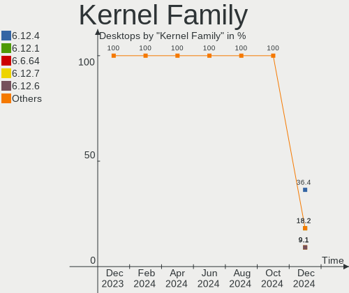
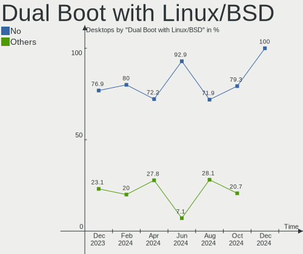
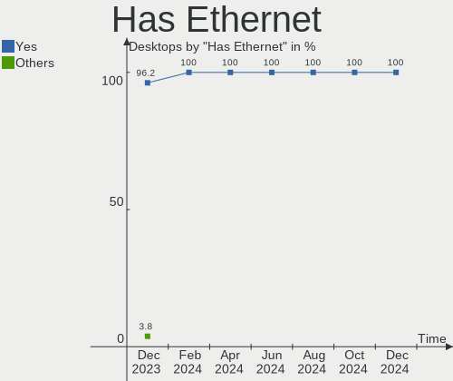
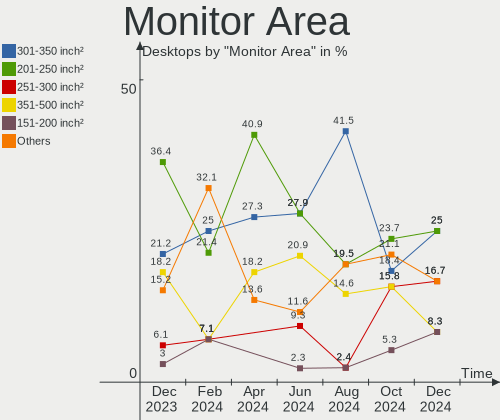
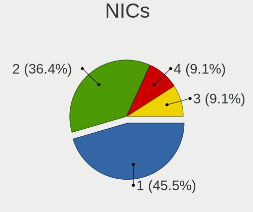

EndeavourOS - Hardware Trends (Desktops)
----------------------------------------

A project to identify most popular hardware characteristics and track their change
over time based on data collected by Linux users at https://Linux-Hardware.org.

Anyone can contribute to this report by the [hw-probe](https://github.com/linuxhw/hw-probe) tool:

    sudo -E hw-probe -all -upload

This report is for one last month. Overall report since the beginning of time: [TestCoverage](https://github.com/linuxhw/TestCoverage)

Period: Jan, 2023.

Contents
--------

* [ System ](#system)
  - [ OS                       ](#os)
  - [ OS Family                ](#os-family)
  - [ Kernel                   ](#kernel)
  - [ Kernel Family            ](#kernel-family)
  - [ Kernel Major Ver.        ](#kernel-major-ver)
  - [ Arch                     ](#arch)
  - [ DE                       ](#de)
  - [ Display Server           ](#display-server)
  - [ Display Manager          ](#display-manager)
  - [ OS Lang                  ](#os-lang)
  - [ Boot Mode                ](#boot-mode)
  - [ Filesystem               ](#filesystem)
  - [ Part. scheme             ](#part-scheme)
  - [ Dual Boot with Linux/BSD ](#dual-boot-with-linuxbsd)
  - [ Dual Boot (Win)          ](#dual-boot-win)

* [ Board ](#board)
  - [ Vendor                   ](#vendor)
  - [ Model                    ](#model)
  - [ Model Family             ](#model-family)
  - [ MFG Year                 ](#mfg-year)
  - [ Form Factor              ](#form-factor)
  - [ Secure Boot              ](#secure-boot)
  - [ Coreboot                 ](#coreboot)
  - [ RAM Size                 ](#ram-size)
  - [ RAM Used                 ](#ram-used)
  - [ Total Drives             ](#total-drives)
  - [ Has CD-ROM               ](#has-cd-rom)
  - [ Has Ethernet             ](#has-ethernet)
  - [ Has WiFi                 ](#has-wifi)
  - [ Has Bluetooth            ](#has-bluetooth)

* [ Location ](#location)
  - [ Country                  ](#country)
  - [ City                     ](#city)

* [ Drives ](#drives)
  - [ Drive Vendor             ](#drive-vendor)
  - [ Drive Model              ](#drive-model)
  - [ HDD Vendor               ](#hdd-vendor)
  - [ SSD Vendor               ](#ssd-vendor)
  - [ Drive Kind               ](#drive-kind)
  - [ Drive Connector          ](#drive-connector)
  - [ Drive Size               ](#drive-size)
  - [ Space Total              ](#space-total)
  - [ Space Used               ](#space-used)
  - [ Malfunc. Drives          ](#malfunc-drives)
  - [ Malfunc. Drive Vendor    ](#malfunc-drive-vendor)
  - [ Malfunc. HDD Vendor      ](#malfunc-hdd-vendor)
  - [ Malfunc. Drive Kind      ](#malfunc-drive-kind)
  - [ Failed Drives            ](#failed-drives)
  - [ Failed Drive Vendor      ](#failed-drive-vendor)
  - [ Drive Status             ](#drive-status)

* [ Storage controller ](#storage-controller)
  - [ Storage Vendor           ](#storage-vendor)
  - [ Storage Model            ](#storage-model)
  - [ Storage Kind             ](#storage-kind)

* [ Processor ](#processor)
  - [ CPU Vendor               ](#cpu-vendor)
  - [ CPU Model                ](#cpu-model)
  - [ CPU Model Family         ](#cpu-model-family)
  - [ CPU Cores                ](#cpu-cores)
  - [ CPU Sockets              ](#cpu-sockets)
  - [ CPU Threads              ](#cpu-threads)
  - [ CPU Op-Modes             ](#cpu-op-modes)
  - [ CPU Microcode            ](#cpu-microcode)
  - [ CPU Microarch            ](#cpu-microarch)

* [ Graphics ](#graphics)
  - [ GPU Vendor               ](#gpu-vendor)
  - [ GPU Model                ](#gpu-model)
  - [ GPU Combo                ](#gpu-combo)
  - [ GPU Driver               ](#gpu-driver)
  - [ GPU Memory               ](#gpu-memory)

* [ Monitor ](#monitor)
  - [ Monitor Vendor           ](#monitor-vendor)
  - [ Monitor Model            ](#monitor-model)
  - [ Monitor Resolution       ](#monitor-resolution)
  - [ Monitor Diagonal         ](#monitor-diagonal)
  - [ Monitor Width            ](#monitor-width)
  - [ Aspect Ratio             ](#aspect-ratio)
  - [ Monitor Area             ](#monitor-area)
  - [ Pixel Density            ](#pixel-density)
  - [ Multiple Monitors        ](#multiple-monitors)

* [ Network ](#network)
  - [ Net Controller Vendor    ](#net-controller-vendor)
  - [ Net Controller Model     ](#net-controller-model)
  - [ Wireless Vendor          ](#wireless-vendor)
  - [ Wireless Model           ](#wireless-model)
  - [ Ethernet Vendor          ](#ethernet-vendor)
  - [ Ethernet Model           ](#ethernet-model)
  - [ Net Controller Kind      ](#net-controller-kind)
  - [ Used Controller          ](#used-controller)
  - [ NICs                     ](#nics)
  - [ IPv6                     ](#ipv6)

* [ Bluetooth ](#bluetooth)
  - [ Bluetooth Vendor         ](#bluetooth-vendor)
  - [ Bluetooth Model          ](#bluetooth-model)

* [ Sound ](#sound)
  - [ Sound Vendor             ](#sound-vendor)
  - [ Sound Model              ](#sound-model)

* [ Memory ](#memory)
  - [ Memory Vendor            ](#memory-vendor)
  - [ Memory Model             ](#memory-model)
  - [ Memory Kind              ](#memory-kind)
  - [ Memory Form Factor       ](#memory-form-factor)
  - [ Memory Size              ](#memory-size)
  - [ Memory Speed             ](#memory-speed)

* [ Printers & scanners ](#printers--scanners)
  - [ Printer Vendor           ](#printer-vendor)
  - [ Printer Model            ](#printer-model)
  - [ Scanner Vendor           ](#scanner-vendor)
  - [ Scanner Model            ](#scanner-model)

* [ Camera ](#camera)
  - [ Camera Vendor            ](#camera-vendor)
  - [ Camera Model             ](#camera-model)

* [ Security ](#security)
  - [ Fingerprint Vendor       ](#fingerprint-vendor)
  - [ Fingerprint Model        ](#fingerprint-model)
  - [ Chipcard Vendor          ](#chipcard-vendor)
  - [ Chipcard Model           ](#chipcard-model)

* [ Unsupported ](#unsupported)
  - [ Unsupported Devices      ](#unsupported-devices)
  - [ Unsupported Device Types ](#unsupported-device-types)

System
------

OS
--

Installed operating systems

| Name                | Desktops | Percent |
|---------------------|----------|---------|
| EndeavourOS Rolling | 22       | 100%    |

OS Family
---------

OS without a version

| Name        | Desktops | Percent |
|-------------|----------|---------|
| EndeavourOS | 22       | 100%    |

Kernel
------

Version of the Linux kernel

| Version              | Desktops | Percent |
|----------------------|----------|---------|
| 6.1.1-arch1-1        | 6        | 27.27%  |
| 6.1.1-zen1-1-zen     | 3        | 13.64%  |
| 6.1.4-zen2-1-zen     | 2        | 9.09%   |
| 6.1.4-arch1-1        | 2        | 9.09%   |
| 6.1.3-arch1-1        | 2        | 9.09%   |
| 6.1.7-zen1-1-zen     | 1        | 4.55%   |
| 6.1.7-arch1-1        | 1        | 4.55%   |
| 6.1.6-arch1-1        | 1        | 4.55%   |
| 6.1.5-arch2-1        | 1        | 4.55%   |
| 6.1.5-1-cachyos-bore | 1        | 4.55%   |
| 5.18.14-arch1-1      | 1        | 4.55%   |
| 5.15.88-1-lts        | 1        | 4.55%   |

Kernel Family
-------------

Linux kernel without a distro release

| Version | Desktops | Percent |
|---------|----------|---------|
| 6.1.1   | 9        | 40.91%  |
| 6.1.4   | 4        | 18.18%  |
| 6.1.7   | 2        | 9.09%   |
| 6.1.5   | 2        | 9.09%   |
| 6.1.3   | 2        | 9.09%   |
| 6.1.6   | 1        | 4.55%   |
| 5.18.14 | 1        | 4.55%   |
| 5.15.88 | 1        | 4.55%   |

Kernel Major Ver.
-----------------

Linux kernel major version

| Version | Desktops | Percent |
|---------|----------|---------|
| 6.1     | 20       | 90.91%  |
| 5.18    | 1        | 4.55%   |
| 5.15    | 1        | 4.55%   |

Arch
----

OS architecture (x86_64, i586, etc.)

| Name   | Desktops | Percent |
|--------|----------|---------|
| x86_64 | 22       | 100%    |

DE
--

Desktop Environment

| Name  | Desktops | Percent |
|-------|----------|---------|
| KDE5  | 9        | 40.91%  |
| GNOME | 6        | 27.27%  |
| XFCE  | 5        | 22.73%  |
| i3    | 2        | 9.09%   |

Display Server
--------------

X11 or Wayland

| Name    | Desktops | Percent |
|---------|----------|---------|
| X11     | 16       | 72.73%  |
| Wayland | 6        | 27.27%  |

Display Manager
---------------

SDDM, LightDM, etc.

| Name    | Desktops | Percent |
|---------|----------|---------|
| Unknown | 8        | 36.36%  |
| LightDM | 7        | 31.82%  |
| SDDM    | 6        | 27.27%  |
| GDM     | 1        | 4.55%   |

OS Lang
-------

Language

| Lang  | Desktops | Percent |
|-------|----------|---------|
| en_US | 11       | 50%     |
| en_GB | 4        | 18.18%  |
| it_IT | 2        | 9.09%   |
| en_CA | 2        | 9.09%   |
| tr_TR | 1        | 4.55%   |
| nl_NL | 1        | 4.55%   |
| nl_BE | 1        | 4.55%   |

Boot Mode
---------

EFI or BIOS

| Mode | Desktops | Percent |
|------|----------|---------|
| BIOS | 12       | 54.55%  |
| EFI  | 10       | 45.45%  |

Filesystem
----------

Type of filesystem

| Type  | Desktops | Percent |
|-------|----------|---------|
| Ext4  | 14       | 63.64%  |
| Btrfs | 8        | 36.36%  |

Part. scheme
------------

Scheme of partitioning

| Type    | Desktops | Percent |
|---------|----------|---------|
| GPT     | 11       | 50%     |
| Unknown | 8        | 36.36%  |
| MBR     | 3        | 13.64%  |

Dual Boot with Linux/BSD
------------------------

Hosting more than one Linux/BSD

| Dual boot | Desktops | Percent |
|-----------|----------|---------|
| No        | 20       | 90.91%  |
| Yes       | 2        | 9.09%   |

Dual Boot (Win)
---------------

Hosting Linux and Windows

| Dual boot | Desktops | Percent |
|-----------|----------|---------|
| No        | 15       | 68.18%  |
| Yes       | 7        | 31.82%  |

Board
-----

Vendor
------

Motherboard manufacturer

| Name                | Desktops | Percent |
|---------------------|----------|---------|
| MSI                 | 5        | 22.73%  |
| ASUSTek Computer    | 5        | 22.73%  |
| Gigabyte Technology | 4        | 18.18%  |
| Hewlett-Packard     | 2        | 9.09%   |
| Dell                | 2        | 9.09%   |
| ASRock              | 2        | 9.09%   |
| Intel               | 1        | 4.55%   |
| Unknown             | 1        | 4.55%   |

Model
-----

Motherboard model

| Name                       | Desktops | Percent |
|----------------------------|----------|---------|
| MSI MS-7D52                | 1        | 4.55%   |
| MSI MS-7D19                | 1        | 4.55%   |
| MSI MS-7C02                | 1        | 4.55%   |
| MSI MS-7B85                | 1        | 4.55%   |
| MSI MS-7A74                | 1        | 4.55%   |
| Intel Productiva           | 1        | 4.55%   |
| HP ProOne 400 G1 AiO       | 1        | 4.55%   |
| HP EliteDesk 800 G1 TWR    | 1        | 4.55%   |
| Gigabyte P55A-UD3          | 1        | 4.55%   |
| Gigabyte B650I AORUS ULTRA | 1        | 4.55%   |
| Gigabyte B550 GAMING X V2  | 1        | 4.55%   |
| Gigabyte B450M DS3H        | 1        | 4.55%   |
| Dell Vostro 410            | 1        | 4.55%   |
| Dell OptiPlex 7070         | 1        | 4.55%   |
| ASUS TUF Gaming X570-PLUS  | 1        | 4.55%   |
| ASUS PRIME Z690M-PLUS D4   | 1        | 4.55%   |
| ASUS PRIME Z390-P          | 1        | 4.55%   |
| ASUS PRIME B460M-A         | 1        | 4.55%   |
| ASUS M5A99X EVO R2.0       | 1        | 4.55%   |
| ASRock B450M Pro4          | 1        | 4.55%   |
| ASRock AB350 Pro4          | 1        | 4.55%   |
| Unknown                    | 1        | 4.55%   |

Model Family
------------

Motherboard model prefix

| Name              | Desktops | Percent |
|-------------------|----------|---------|
| ASUS PRIME        | 3        | 13.64%  |
| MSI MS-7D52       | 1        | 4.55%   |
| MSI MS-7D19       | 1        | 4.55%   |
| MSI MS-7C02       | 1        | 4.55%   |
| MSI MS-7B85       | 1        | 4.55%   |
| MSI MS-7A74       | 1        | 4.55%   |
| Intel Productiva  | 1        | 4.55%   |
| HP ProOne         | 1        | 4.55%   |
| HP EliteDesk      | 1        | 4.55%   |
| Gigabyte P55A-UD3 | 1        | 4.55%   |
| Gigabyte B650I    | 1        | 4.55%   |
| Gigabyte B550     | 1        | 4.55%   |
| Gigabyte B450M    | 1        | 4.55%   |
| Dell Vostro       | 1        | 4.55%   |
| Dell OptiPlex     | 1        | 4.55%   |
| ASUS TUF          | 1        | 4.55%   |
| ASUS M5A99X       | 1        | 4.55%   |
| ASRock B450M      | 1        | 4.55%   |
| ASRock AB350      | 1        | 4.55%   |
| Unknown           | 1        | 4.55%   |

MFG Year
--------

Motherboard manufacture year

| Year | Desktops | Percent |
|------|----------|---------|
| 2018 | 5        | 22.73%  |
| 2021 | 3        | 13.64%  |
| 2020 | 3        | 13.64%  |
| 2012 | 2        | 9.09%   |
| 2022 | 1        | 4.55%   |
| 2019 | 1        | 4.55%   |
| 2017 | 1        | 4.55%   |
| 2016 | 1        | 4.55%   |
| 2014 | 1        | 4.55%   |
| 2013 | 1        | 4.55%   |
| 2011 | 1        | 4.55%   |
| 2009 | 1        | 4.55%   |
| 2008 | 1        | 4.55%   |

Form Factor
-----------

Physical design of the computer

| Name    | Desktops | Percent |
|---------|----------|---------|
| Desktop | 22       | 100%    |

Secure Boot
-----------

Enabled or disabled

| State    | Desktops | Percent |
|----------|----------|---------|
| Disabled | 22       | 100%    |

Coreboot
--------

Have coreboot on board

| Used | Desktops | Percent |
|------|----------|---------|
| No   | 22       | 100%    |

RAM Size
--------

Total RAM memory

| Size in GB | Desktops | Percent |
|------------|----------|---------|
| 16.01-24.0 | 9        | 40.91%  |
| 32.01-64.0 | 7        | 31.82%  |
| 4.01-8.0   | 2        | 9.09%   |
| 24.01-32.0 | 2        | 9.09%   |
| 3.01-4.0   | 1        | 4.55%   |
| 8.01-16.0  | 1        | 4.55%   |

RAM Used
--------

Used RAM memory

| Used GB   | Desktops | Percent |
|-----------|----------|---------|
| 4.01-8.0  | 10       | 45.45%  |
| 2.01-3.0  | 4        | 18.18%  |
| 1.01-2.0  | 3        | 13.64%  |
| 3.01-4.0  | 2        | 9.09%   |
| 8.01-16.0 | 2        | 9.09%   |
| 0.51-1.0  | 1        | 4.55%   |

Total Drives
------------

Number of drives on board

| Drives | Desktops | Percent |
|--------|----------|---------|
| 2      | 8        | 36.36%  |
| 3      | 6        | 27.27%  |
| 1      | 4        | 18.18%  |
| 4      | 3        | 13.64%  |
| 7      | 1        | 4.55%   |

Has CD-ROM
----------

Has CD-ROM on board

| Presented | Desktops | Percent |
|-----------|----------|---------|
| No        | 16       | 72.73%  |
| Yes       | 6        | 27.27%  |

Has Ethernet
------------

Has Ethernet on board

| Presented | Desktops | Percent |
|-----------|----------|---------|
| Yes       | 22       | 100%    |

Has WiFi
--------

Has WiFi module

| Presented | Desktops | Percent |
|-----------|----------|---------|
| No        | 12       | 54.55%  |
| Yes       | 10       | 45.45%  |

Has Bluetooth
-------------

Has Bluetooth module

| Presented | Desktops | Percent |
|-----------|----------|---------|
| Yes       | 15       | 68.18%  |
| No        | 7        | 31.82%  |

Location
--------

Country
-------

Geographic location (country)

| Country         | Desktops | Percent |
|-----------------|----------|---------|
| USA             | 6        | 27.27%  |
| Italy           | 3        | 13.64%  |
| Canada          | 2        | 9.09%   |
| UK              | 1        | 4.55%   |
| Turkey          | 1        | 4.55%   |
| Spain           | 1        | 4.55%   |
| Poland          | 1        | 4.55%   |
| North Macedonia | 1        | 4.55%   |
| Netherlands     | 1        | 4.55%   |
| Maldives        | 1        | 4.55%   |
| Indonesia       | 1        | 4.55%   |
| France          | 1        | 4.55%   |
| Belgium         | 1        | 4.55%   |
| Australia       | 1        | 4.55%   |

City
----

Geographic location (city)

| City              | Desktops | Percent |
|-------------------|----------|---------|
| Waxahachie        | 1        | 4.55%   |
| Warsaw            | 1        | 4.55%   |
| Termoli           | 1        | 4.55%   |
| Sydney            | 1        | 4.55%   |
| Surabaya          | 1        | 4.55%   |
| Skopje            | 1        | 4.55%   |
| Seattle           | 1        | 4.55%   |
| Richmond Hill     | 1        | 4.55%   |
| Renton            | 1        | 4.55%   |
| Pont-Saint-Esprit | 1        | 4.55%   |
| Montreal          | 1        | 4.55%   |
| Malé             | 1        | 4.55%   |
| Madrid            | 1        | 4.55%   |
| Kent              | 1        | 4.55%   |
| Kansas City       | 1        | 4.55%   |
| Huntingtown       | 1        | 4.55%   |
| Edinburgh         | 1        | 4.55%   |
| Citta             | 1        | 4.55%   |
| Bologna           | 1        | 4.55%   |
| Bahcelievler      | 1        | 4.55%   |
| Antwerp           | 1        | 4.55%   |
| Amsterdam         | 1        | 4.55%   |

Drives
------

Drive Vendor
------------

Hard drive vendors

| Vendor                    | Desktops | Drives | Percent |
|---------------------------|----------|--------|---------|
| Samsung Electronics       | 10       | 14     | 20.83%  |
| Seagate                   | 9        | 10     | 18.75%  |
| WDC                       | 6        | 7      | 12.5%   |
| Kingston                  | 5        | 6      | 10.42%  |
| Crucial                   | 5        | 5      | 10.42%  |
| Sandisk                   | 4        | 5      | 8.33%   |
| Unknown                   | 1        | 1      | 2.08%   |
| Toshiba                   | 1        | 2      | 2.08%   |
| Timetec                   | 1        | 1      | 2.08%   |
| Phison Electronics        | 1        | 1      | 2.08%   |
| Micron/Crucial Technology | 1        | 1      | 2.08%   |
| Intel                     | 1        | 1      | 2.08%   |
| HGST                      | 1        | 1      | 2.08%   |
| China                     | 1        | 1      | 2.08%   |
| Unknown                   | 1        | 1      | 2.08%   |

Drive Model
-----------

Hard drive models

| Model                                               | Desktops | Percent |
|-----------------------------------------------------|----------|---------|
| Samsung NVMe SSD Controller SM981/PM981/PM983 500GB | 5        | 8.93%   |
| Crucial CT500MX500SSD1 500GB                        | 3        | 5.36%   |
| Seagate ST3000DM008-2DM166 3TB                      | 2        | 3.57%   |
| Sandisk WD Blue SN570 1TB                           | 2        | 3.57%   |
| Samsung SSD 870 EVO 2TB                             | 2        | 3.57%   |
| Kingston SA400S37120G 120GB SSD                     | 2        | 3.57%   |
| WDC WDS100T2B0A-00SM50 1TB SSD                      | 1        | 1.79%   |
| WDC WD40EZAZ-00ZGHB0 4TB                            | 1        | 1.79%   |
| WDC WD20EARS-42S0XB0 2TB                            | 1        | 1.79%   |
| WDC WD15EARS-60MVWB0 1TB                            | 1        | 1.79%   |
| WDC WD10EZEX-75WN4A1 1TB                            | 1        | 1.79%   |
| WDC WD Blue SA510 2.5 1TB SSD                       | 1        | 1.79%   |
| Unknown NVMe SSD Drive 512GB                        | 1        | 1.79%   |
| Toshiba HDWD110 1TB                                 | 1        | 1.79%   |
| Toshiba DT01ACA100 1TB                              | 1        | 1.79%   |
| Timetec MS05 256GB SSD                              | 1        | 1.79%   |
| Seagate ST8000VN004-2M2101 8TB                      | 1        | 1.79%   |
| Seagate ST500LM021-1KJ152 500GB                     | 1        | 1.79%   |
| Seagate ST500DM005 HD502HJ 500GB                    | 1        | 1.79%   |
| Seagate ST33000650NS 3TB                            | 1        | 1.79%   |
| Seagate ST2000DM001-1CH164 2TB                      | 1        | 1.79%   |
| Seagate ST1000LM035-1RK172 1TB                      | 1        | 1.79%   |
| Seagate ST1000DM003-1ER162 1TB                      | 1        | 1.79%   |
| Seagate Expansion 240GB                             | 1        | 1.79%   |
| Sandisk WD Blue SN550 NVMe SSD 1TB                  | 1        | 1.79%   |
| Sandisk WD Black SN750 / PC SN730 NVMe SSD 1TB      | 1        | 1.79%   |
| SanDisk Extreme 55AE 1TB SSD                        | 1        | 1.79%   |
| Samsung SSD 870 QVO 1TB                             | 1        | 1.79%   |
| Samsung SSD 870 EVO 1TB                             | 1        | 1.79%   |
| Samsung SSD 860 EVO 500GB                           | 1        | 1.79%   |
| Samsung SSD 860 EVO 1TB                             | 1        | 1.79%   |
| Samsung SSD 850 EVO M.2 500GB                       | 1        | 1.79%   |
| Samsung SSD 850 EVO 500GB                           | 1        | 1.79%   |
| Samsung HD103SJ 1TB                                 | 1        | 1.79%   |
| Phison E16 PCIe4 NVMe Controller 2TB                | 1        | 1.79%   |
| Micron/Crucial P2 NVMe PCIe SSD 500GB               | 1        | 1.79%   |
| Kingston SV300S37A120G 120GB SSD                    | 1        | 1.79%   |
| Kingston SNVS500G 500GB                             | 1        | 1.79%   |
| Kingston SHFS37A120G 120GB SSD                      | 1        | 1.79%   |
| Kingston SA400S37240G 240GB SSD                     | 1        | 1.79%   |

HDD Vendor
----------

Hard disk drive vendors

| Vendor              | Desktops | Drives | Percent |
|---------------------|----------|--------|---------|
| Seagate             | 9        | 10     | 52.94%  |
| WDC                 | 4        | 5      | 23.53%  |
| Toshiba             | 1        | 2      | 5.88%   |
| Samsung Electronics | 1        | 1      | 5.88%   |
| HGST                | 1        | 1      | 5.88%   |
| Unknown             | 1        | 1      | 5.88%   |

SSD Vendor
----------

Solid state drive vendors

| Vendor              | Desktops | Drives | Percent |
|---------------------|----------|--------|---------|
| Samsung Electronics | 6        | 8      | 28.57%  |
| Kingston            | 5        | 5      | 23.81%  |
| Crucial             | 5        | 5      | 23.81%  |
| WDC                 | 2        | 2      | 9.52%   |
| Timetec             | 1        | 1      | 4.76%   |
| SanDisk             | 1        | 1      | 4.76%   |
| China               | 1        | 1      | 4.76%   |

Drive Kind
----------

HDD or SSD

| Kind | Desktops | Drives | Percent |
|------|----------|--------|---------|
| SSD  | 18       | 23     | 41.86%  |
| HDD  | 14       | 20     | 32.56%  |
| NVMe | 11       | 14     | 25.58%  |

Drive Connector
---------------

SATA, SAS, NVMe, etc.

| Type | Desktops | Drives | Percent |
|------|----------|--------|---------|
| SATA | 19       | 41     | 61.29%  |
| NVMe | 11       | 14     | 35.48%  |
| SAS  | 1        | 2      | 3.23%   |

Drive Size
----------

Size of hard drive

| Size in TB | Desktops | Drives | Percent |
|------------|----------|--------|---------|
| 0.01-0.5   | 13       | 18     | 38.24%  |
| 0.51-1.0   | 11       | 14     | 32.35%  |
| 1.01-2.0   | 4        | 5      | 11.76%  |
| 2.01-3.0   | 3        | 3      | 8.82%   |
| 4.01-10.0  | 2        | 2      | 5.88%   |
| 3.01-4.0   | 1        | 1      | 2.94%   |

Space Total
-----------

Amount of disk space available on the file system

| Size in GB     | Desktops | Percent |
|----------------|----------|---------|
| More than 3000 | 8        | 36.36%  |
| 101-250        | 4        | 18.18%  |
| 1001-2000      | 4        | 18.18%  |
| 251-500        | 2        | 9.09%   |
| 2001-3000      | 2        | 9.09%   |
| 1-20           | 1        | 4.55%   |
| 501-1000       | 1        | 4.55%   |

Space Used
----------

Amount of used disk space

| Used GB        | Desktops | Percent |
|----------------|----------|---------|
| 1001-2000      | 6        | 27.27%  |
| 501-1000       | 6        | 27.27%  |
| 1-20           | 4        | 18.18%  |
| 51-100         | 3        | 13.64%  |
| 21-50          | 2        | 9.09%   |
| More than 3000 | 1        | 4.55%   |

Malfunc. Drives
---------------

Drive models with a malfunction

| Model                           | Desktops | Drives | Percent |
|---------------------------------|----------|--------|---------|
| WDC WD Blue SA510 2.5 1TB SSD   | 1        | 1      | 33.33%  |
| Seagate ST500LM021-1KJ152 500GB | 1        | 1      | 33.33%  |
| Crucial CT500MX500SSD1 500GB    | 1        | 1      | 33.33%  |

Malfunc. Drive Vendor
---------------------

Vendors of faulty drives

| Vendor  | Desktops | Drives | Percent |
|---------|----------|--------|---------|
| WDC     | 1        | 1      | 33.33%  |
| Seagate | 1        | 1      | 33.33%  |
| Crucial | 1        | 1      | 33.33%  |

Malfunc. HDD Vendor
-------------------

Vendors of faulty HDD drives

| Vendor  | Desktops | Drives | Percent |
|---------|----------|--------|---------|
| Seagate | 1        | 1      | 100%    |

Malfunc. Drive Kind
-------------------

Kinds of faulty drives

| Kind | Desktops | Drives | Percent |
|------|----------|--------|---------|
| SSD  | 2        | 2      | 66.67%  |
| HDD  | 1        | 1      | 33.33%  |

Failed Drives
-------------

Failed drive models

Zero info for selected period =(

Failed Drive Vendor
-------------------

Failed drive vendors

Zero info for selected period =(

Drive Status
------------

Number of failed and malfunc. drives

| Status   | Desktops | Drives | Percent |
|----------|----------|--------|---------|
| Works    | 14       | 33     | 53.85%  |
| Detected | 9        | 21     | 34.62%  |
| Malfunc  | 3        | 3      | 11.54%  |

Storage controller
------------------

Storage Vendor
--------------

Storage controller vendors

| Vendor                      | Desktops | Percent |
|-----------------------------|----------|---------|
| Intel                       | 12       | 32.43%  |
| AMD                         | 10       | 27.03%  |
| Samsung Electronics         | 5        | 13.51%  |
| SanDisk                     | 4        | 10.81%  |
| ASMedia Technology          | 2        | 5.41%   |
| Transcend                   | 1        | 2.7%    |
| Phison Electronics          | 1        | 2.7%    |
| Micron/Crucial Technology   | 1        | 2.7%    |
| Kingston Technology Company | 1        | 2.7%    |

Storage Model
-------------

Storage controller models

| Model                                                                                   | Desktops | Percent |
|-----------------------------------------------------------------------------------------|----------|---------|
| Samsung NVMe SSD Controller SM981/PM981/PM983                                           | 5        | 11.36%  |
| AMD FCH SATA Controller [AHCI mode]                                                     | 4        | 9.09%   |
| AMD 400 Series Chipset SATA Controller                                                  | 4        | 9.09%   |
| SanDisk WD Blue SN570 NVMe SSD                                                          | 2        | 4.55%   |
| Intel Cannon Lake PCH SATA AHCI Controller                                              | 2        | 4.55%   |
| Intel 8 Series/C220 Series Chipset Family 6-port SATA Controller 1 [AHCI mode]          | 2        | 4.55%   |
| ASMedia ASM1062 Serial ATA Controller                                                   | 2        | 4.55%   |
| Transcend Non-Volatile memory controller                                                | 1        | 2.27%   |
| SanDisk WD Blue SN550 NVMe SSD                                                          | 1        | 2.27%   |
| SanDisk WD Black SN750 / PC SN730 NVMe SSD                                              | 1        | 2.27%   |
| Phison E16 PCIe4 NVMe Controller                                                        | 1        | 2.27%   |
| Micron/Crucial P2 NVMe PCIe SSD                                                         | 1        | 2.27%   |
| Kingston Company Company Non-Volatile memory controller                                 | 1        | 2.27%   |
| Intel Volume Management Device NVMe RAID Controller                                     | 1        | 2.27%   |
| Intel SSD 660P Series                                                                   | 1        | 2.27%   |
| Intel Alder Lake-S PCH SATA Controller [AHCI Mode]                                      | 1        | 2.27%   |
| Intel 82801IR/IO/IH (ICH9R/DO/DH) 4 port SATA Controller [IDE mode]                     | 1        | 2.27%   |
| Intel 82801I (ICH9 Family) 2 port SATA Controller [IDE mode]                            | 1        | 2.27%   |
| Intel 6 Series/C200 Series Chipset Family IDE-r Controller                              | 1        | 2.27%   |
| Intel 6 Series/C200 Series Chipset Family Desktop SATA Controller (IDE mode, ports 4-5) | 1        | 2.27%   |
| Intel 6 Series/C200 Series Chipset Family Desktop SATA Controller (IDE mode, ports 0-3) | 1        | 2.27%   |
| Intel 6 Series/C200 Series Chipset Family 6 port Desktop SATA AHCI Controller           | 1        | 2.27%   |
| Intel 500 Series Chipset Family SATA AHCI Controller                                    | 1        | 2.27%   |
| Intel 5 Series/3400 Series Chipset 6 port SATA AHCI Controller                          | 1        | 2.27%   |
| Intel 300 Series Chipset Family SATA RAID Controller                                    | 1        | 2.27%   |
| Intel 200 Series PCH SATA controller [AHCI mode]                                        | 1        | 2.27%   |
| AMD SB7x0/SB8x0/SB9x0 SATA Controller [AHCI mode]                                       | 1        | 2.27%   |
| AMD SATA controller                                                                     | 1        | 2.27%   |
| AMD 500 Series Chipset SATA Controller                                                  | 1        | 2.27%   |
| AMD 300 Series Chipset SATA Controller                                                  | 1        | 2.27%   |

Storage Kind
------------

Kind of storage controller (IDE, SATA, NVMe, SAS, ...)

| Kind | Desktops | Percent |
|------|----------|---------|
| SATA | 19       | 55.88%  |
| NVMe | 11       | 32.35%  |
| RAID | 2        | 5.88%   |
| IDE  | 2        | 5.88%   |

Processor
---------

CPU Vendor
----------

Processor vendors

| Vendor | Desktops | Percent |
|--------|----------|---------|
| Intel  | 12       | 54.55%  |
| AMD    | 10       | 45.45%  |

CPU Model
---------

Processor models

| Model                                | Desktops | Percent |
|--------------------------------------|----------|---------|
| Intel Core i7-10700K CPU @ 3.80GHz   | 2        | 9.09%   |
| AMD Ryzen 7 5800X3D 8-Core Processor | 2        | 9.09%   |
| Intel Xeon CPU E31260L @ 2.40GHz     | 1        | 4.55%   |
| Intel Core i7-9700 CPU @ 3.00GHz     | 1        | 4.55%   |
| Intel Core i7-7700 CPU @ 3.60GHz     | 1        | 4.55%   |
| Intel Core i7-4790 CPU @ 3.60GHz     | 1        | 4.55%   |
| Intel Core i7-2600 CPU @ 3.40GHz     | 1        | 4.55%   |
| Intel Core i5-9600KF CPU @ 3.70GHz   | 1        | 4.55%   |
| Intel Core i5 CPU 750 @ 2.67GHz      | 1        | 4.55%   |
| Intel Core i3-4130T CPU @ 2.90GHz    | 1        | 4.55%   |
| Intel Core 2 Duo CPU E8400 @ 3.00GHz | 1        | 4.55%   |
| Intel 12th Gen Core i7-12700K        | 1        | 4.55%   |
| AMD Ryzen 9 3900X 12-Core Processor  | 1        | 4.55%   |
| AMD Ryzen 7 7700X 8-Core Processor   | 1        | 4.55%   |
| AMD Ryzen 7 3700X 8-Core Processor   | 1        | 4.55%   |
| AMD Ryzen 5 5600X 6-Core Processor   | 1        | 4.55%   |
| AMD Ryzen 5 5600 6-Core Processor    | 1        | 4.55%   |
| AMD Ryzen 5 5500                     | 1        | 4.55%   |
| AMD Ryzen 5 1600 Six-Core Processor  | 1        | 4.55%   |
| AMD FX-8350 Eight-Core Processor     | 1        | 4.55%   |

CPU Model Family
----------------

Processor model prefix

| Model            | Desktops | Percent |
|------------------|----------|---------|
| Intel Core i7    | 6        | 27.27%  |
| AMD Ryzen 7      | 4        | 18.18%  |
| AMD Ryzen 5      | 4        | 18.18%  |
| Intel Core i5    | 2        | 9.09%   |
| Other            | 1        | 4.55%   |
| Intel Xeon       | 1        | 4.55%   |
| Intel Core i3    | 1        | 4.55%   |
| Intel Core 2 Duo | 1        | 4.55%   |
| AMD Ryzen 9      | 1        | 4.55%   |
| AMD FX           | 1        | 4.55%   |

CPU Cores
---------

Number of processor cores

| Number | Desktops | Percent |
|--------|----------|---------|
| 8      | 7        | 31.82%  |
| 4      | 6        | 27.27%  |
| 6      | 5        | 22.73%  |
| 12     | 2        | 9.09%   |
| 2      | 2        | 9.09%   |

CPU Sockets
-----------

Number of sockets

| Number | Desktops | Percent |
|--------|----------|---------|
| 1      | 22       | 100%    |

CPU Threads
-----------

Threads per core (Hyper-Threading)

| Number | Desktops | Percent |
|--------|----------|---------|
| 2      | 18       | 81.82%  |
| 1      | 4        | 18.18%  |

CPU Op-Modes
------------

CPU Operation Modes (32-bit, 64-bit)

| Op mode        | Desktops | Percent |
|----------------|----------|---------|
| 32-bit, 64-bit | 22       | 100%    |

CPU Microcode
-------------

Microcode number

| Number     | Desktops | Percent |
|------------|----------|---------|
| Unknown    | 10       | 45.45%  |
| 0x0a20120a | 4        | 18.18%  |
| 0x306c3    | 1        | 4.55%   |
| 0x106e5    | 1        | 4.55%   |
| 0x10676    | 1        | 4.55%   |
| 0x0a601201 | 1        | 4.55%   |
| 0x08701021 | 1        | 4.55%   |
| 0x08701013 | 1        | 4.55%   |
| 0x08001138 | 1        | 4.55%   |
| 0x06000852 | 1        | 4.55%   |

CPU Microarch
-------------

Microarchitecture

| Name        | Desktops | Percent |
|-------------|----------|---------|
| Zen 3       | 5        | 22.73%  |
| KabyLake    | 3        | 13.64%  |
| Zen 2       | 2        | 9.09%   |
| SandyBridge | 2        | 9.09%   |
| Haswell     | 2        | 9.09%   |
| CometLake   | 2        | 9.09%   |
| Unknown     | 2        | 9.09%   |
| Zen         | 1        | 4.55%   |
| Piledriver  | 1        | 4.55%   |
| Penryn      | 1        | 4.55%   |
| Nehalem     | 1        | 4.55%   |

Graphics
--------

GPU Vendor
----------

Vendors of graphics cards

| Vendor | Desktops | Percent |
|--------|----------|---------|
| Nvidia | 11       | 44%     |
| AMD    | 8        | 32%     |
| Intel  | 6        | 24%     |

GPU Model
---------

Graphics card models

| Model                                                                       | Desktops | Percent |
|-----------------------------------------------------------------------------|----------|---------|
| AMD Navi 21 [Radeon RX 6800/6800 XT / 6900 XT]                              | 3        | 11.54%  |
| Nvidia GM107 [GeForce GTX 750 Ti]                                           | 2        | 7.69%   |
| Nvidia TU106 [GeForce RTX 2070 Rev. A]                                      | 1        | 3.85%   |
| Nvidia TU106 [GeForce RTX 2060 SUPER]                                       | 1        | 3.85%   |
| Nvidia GP108 [GeForce GT 1030]                                              | 1        | 3.85%   |
| Nvidia GP107 [GeForce GTX 1050]                                             | 1        | 3.85%   |
| Nvidia GP107 [GeForce GTX 1050 Ti]                                          | 1        | 3.85%   |
| Nvidia GP104 [GeForce GTX 1080]                                             | 1        | 3.85%   |
| Nvidia GA102 [GeForce RTX 3080 Ti]                                          | 1        | 3.85%   |
| Nvidia GA102 [GeForce RTX 3080 Lite Hash Rate]                              | 1        | 3.85%   |
| Nvidia G92 [GeForce 8800 GT]                                                | 1        | 3.85%   |
| Intel Xeon E3-1200 v3/4th Gen Core Processor Integrated Graphics Controller | 1        | 3.85%   |
| Intel Xeon E3-1200 Processor Family Integrated Graphics Controller          | 1        | 3.85%   |
| Intel CoffeeLake-S GT2 [UHD Graphics 630]                                   | 1        | 3.85%   |
| Intel AlderLake-S GT1                                                       | 1        | 3.85%   |
| Intel 4th Generation Core Processor Family Integrated Graphics Controller   | 1        | 3.85%   |
| Intel 2nd Generation Core Processor Family Integrated Graphics Controller   | 1        | 3.85%   |
| AMD Raphael                                                                 | 1        | 3.85%   |
| AMD Navi 31 [Radeon RX 7900 XT/7900 XTX]                                    | 1        | 3.85%   |
| AMD Navi 24 [Radeon RX 6400/6500 XT/6500M]                                  | 1        | 3.85%   |
| AMD Navi 22 [Radeon RX 6700/6700 XT/6750 XT / 6800M]                        | 1        | 3.85%   |
| AMD Lexa PRO [Radeon 540/540X/550/550X / RX 540X/550/550X]                  | 1        | 3.85%   |
| AMD Ellesmere [Radeon RX 470/480/570/570X/580/580X/590]                     | 1        | 3.85%   |

GPU Combo
---------

Combinations of graphics cards

| Name           | Desktops | Percent |
|----------------|----------|---------|
| 1 x Nvidia     | 9        | 40.91%  |
| 1 x AMD        | 6        | 27.27%  |
| 1 x Intel      | 3        | 13.64%  |
| Intel + Nvidia | 2        | 9.09%   |
| 2 x AMD        | 1        | 4.55%   |
| Intel + AMD    | 1        | 4.55%   |

GPU Driver
----------

Free vs proprietary

| Driver      | Desktops | Percent |
|-------------|----------|---------|
| Free        | 14       | 63.64%  |
| Proprietary | 8        | 36.36%  |

GPU Memory
----------

Total video memory

| Size in GB | Desktops | Percent |
|------------|----------|---------|
| 8.01-16.0  | 6        | 27.27%  |
| Unknown    | 5        | 22.73%  |
| 7.01-8.0   | 3        | 13.64%  |
| 3.01-4.0   | 3        | 13.64%  |
| 1.01-2.0   | 3        | 13.64%  |
| 16.01-24.0 | 1        | 4.55%   |
| 0.01-0.5   | 1        | 4.55%   |

Monitor
-------

Monitor Vendor
--------------

Monitor vendors

| Vendor               | Desktops | Percent |
|----------------------|----------|---------|
| Samsung Electronics  | 5        | 16.67%  |
| Acer                 | 4        | 13.33%  |
| ViewSonic            | 3        | 10%     |
| Goldstar             | 3        | 10%     |
| LG Electronics       | 2        | 6.67%   |
| AOpen                | 2        | 6.67%   |
| AOC                  | 2        | 6.67%   |
| Ancor Communications | 2        | 6.67%   |
| Philips              | 1        | 3.33%   |
| Lenovo               | 1        | 3.33%   |
| Gigabyte Technology  | 1        | 3.33%   |
| FST                  | 1        | 3.33%   |
| Denver               | 1        | 3.33%   |
| Dell                 | 1        | 3.33%   |
| BenQ                 | 1        | 3.33%   |

Monitor Model
-------------

Monitor models

| Model                                                                 | Desktops | Percent |
|-----------------------------------------------------------------------|----------|---------|
| ViewSonic VX2758-Series VSCA738 2560x1440 598x336mm 27.0-inch         | 2        | 6.45%   |
| AOpen 24CH2Y AOP077C 1920x1080 527x296mm 23.8-inch                    | 2        | 6.45%   |
| Ancor Communications ASUS VS229 ACI22D3 1920x1080 475x267mm 21.5-inch | 2        | 6.45%   |
| ViewSonic VX2776 Series VSC3E32 1920x1080 598x336mm 27.0-inch         | 1        | 3.23%   |
| Samsung Electronics S24R65x SAM1023 1920x1080 527x296mm 23.8-inch     | 1        | 3.23%   |
| Samsung Electronics S24D590 SAM0B47 1920x1080 521x293mm 23.5-inch     | 1        | 3.23%   |
| Samsung Electronics LCD Monitor SAM0B60 1920x1080 887x500mm 40.1-inch | 1        | 3.23%   |
| Samsung Electronics LCD Monitor S22F350 5760x1080                     | 1        | 3.23%   |
| Samsung Electronics C24FG7x SAM0E43 1920x1080 532x304mm 24.1-inch     | 1        | 3.23%   |
| Philips PHL 322E1 PHLC20F 1920x1080 698x393mm 31.5-inch               | 1        | 3.23%   |
| LG Electronics LCD Monitor LG Ultra HD 3840x2160                      | 1        | 3.23%   |
| LG Electronics LCD Monitor LG TV 5760x1080                            | 1        | 3.23%   |
| Lenovo LEN L174 LEN240B 1280x1024 340x270mm 17.1-inch                 | 1        | 3.23%   |
| Goldstar HDR WQHD GSM772E 3440x1440 800x335mm 34.1-inch               | 1        | 3.23%   |
| Goldstar E1942 GSM4C09 1366x768 410x230mm 18.5-inch                   | 1        | 3.23%   |
| Goldstar 22EA63 GSM5990 1920x1080 477x268mm 21.5-inch                 | 1        | 3.23%   |
| Gigabyte Technology AORUS FV43U GBT4300 3840x2160 941x529mm 42.5-inch | 1        | 3.23%   |
| FST V24T-1 LED FST2360 1920x1080 597x336mm 27.0-inch                  | 1        | 3.23%   |
| Denver FQ270 LHC2700 2560x1440 597x336mm 27.0-inch                    | 1        | 3.23%   |
| Dell S2421HGF DELA16E 1920x1080 527x296mm 23.8-inch                   | 1        | 3.23%   |
| Dell S2421HGF DELA16C 1920x1080 527x296mm 23.8-inch                   | 1        | 3.23%   |
| BenQ ZOWIE XL LCD BNQ7F59 1920x1080 544x303mm 24.5-inch               | 1        | 3.23%   |
| AOC Q3279WG5B AOC3279 2560x1440 725x428mm 33.1-inch                   | 1        | 3.23%   |
| AOC 24G2W1G4 AOC2402 1920x1080 527x296mm 23.8-inch                    | 1        | 3.23%   |
| Acer VG240Y P ACR0704 1920x1080 530x300mm 24.0-inch                   | 1        | 3.23%   |
| Acer LCD Monitor VG240Y 5760x1080                                     | 1        | 3.23%   |
| Acer H213H ACR0087 1920x1080 531x299mm 24.0-inch                      | 1        | 3.23%   |
| Acer AL1916W ACRAD80 1440x900 410x260mm 19.1-inch                     | 1        | 3.23%   |

Monitor Resolution
------------------

Monitor screen resolution

| Resolution       | Desktops | Percent |
|------------------|----------|---------|
| 1920x1080 (FHD)  | 14       | 56%     |
| 3840x2160 (4K)   | 4        | 16%     |
| 2560x1440 (QHD)  | 3        | 12%     |
| 5760x1080        | 1        | 4%      |
| 1440x900 (WXGA+) | 1        | 4%      |
| 1366x768 (WXGA)  | 1        | 4%      |
| 1280x1024 (SXGA) | 1        | 4%      |

Monitor Diagonal
----------------

Diagonal size in inches

| Inches  | Desktops | Percent |
|---------|----------|---------|
| 24      | 6        | 21.43%  |
| 27      | 5        | 17.86%  |
| 23      | 4        | 14.29%  |
| 21      | 3        | 10.71%  |
| Unknown | 2        | 7.14%   |
| 54      | 1        | 3.57%   |
| 42      | 1        | 3.57%   |
| 34      | 1        | 3.57%   |
| 33      | 1        | 3.57%   |
| 31      | 1        | 3.57%   |
| 19      | 1        | 3.57%   |
| 18      | 1        | 3.57%   |
| 17      | 1        | 3.57%   |

Monitor Width
-------------

Physical width

| Width in mm | Desktops | Percent |
|-------------|----------|---------|
| 501-600     | 12       | 48%     |
| 401-500     | 5        | 20%     |
| 701-800     | 2        | 8%      |
| Unknown     | 2        | 8%      |
| 601-700     | 1        | 4%      |
| 301-350     | 1        | 4%      |
| 1001-1500   | 1        | 4%      |
| 901-1000    | 1        | 4%      |

Aspect Ratio
------------

Proportional relationship between the width and the height

| Ratio   | Desktops | Percent |
|---------|----------|---------|
| 16/9    | 16       | 76.19%  |
| Unknown | 2        | 9.52%   |
| 5/4     | 1        | 4.76%   |
| 21/9    | 1        | 4.76%   |
| 16/10   | 1        | 4.76%   |

Monitor Area
------------

Area in inch²

| Area in inch² | Desktops | Percent |
|----------------|----------|---------|
| 201-250        | 9        | 36%     |
| 301-350        | 5        | 20%     |
| 351-500        | 2        | 8%      |
| 251-300        | 2        | 8%      |
| 141-150        | 2        | 8%      |
| Unknown        | 2        | 8%      |
| More than 1000 | 1        | 4%      |
| 151-200        | 1        | 4%      |
| 501-1000       | 1        | 4%      |

Pixel Density
-------------

Pixels per inch

| Density | Desktops | Percent |
|---------|----------|---------|
| 51-100  | 16       | 64%     |
| 101-120 | 6        | 24%     |
| Unknown | 2        | 8%      |
| 1-50    | 1        | 4%      |

Multiple Monitors
-----------------

Total monitors connected

| Total | Desktops | Percent |
|-------|----------|---------|
| 1     | 13       | 59.09%  |
| 2     | 5        | 22.73%  |
| 3     | 3        | 13.64%  |
| 0     | 1        | 4.55%   |

Network
-------

Net Controller Vendor
---------------------

Controller vendors

| Vendor                | Desktops | Percent |
|-----------------------|----------|---------|
| Realtek Semiconductor | 17       | 45.95%  |
| Intel                 | 11       | 29.73%  |
| Google                | 2        | 5.41%   |
| Broadcom              | 2        | 5.41%   |
| Microsoft             | 1        | 2.7%    |
| MediaTek              | 1        | 2.7%    |
| DisplayLink           | 1        | 2.7%    |
| D-Link                | 1        | 2.7%    |
| ASIX Electronics      | 1        | 2.7%    |

Net Controller Model
--------------------

Controller models

| Model                                                               | Desktops | Percent |
|---------------------------------------------------------------------|----------|---------|
| Realtek RTL8111/8168/8411 PCI Express Gigabit Ethernet Controller   | 13       | 32.5%   |
| Realtek RTL8125 2.5GbE Controller                                   | 3        | 7.5%    |
| Intel Wi-Fi 6 AX210/AX211/AX411 160MHz                              | 3        | 7.5%    |
| Google Pixel 6                                                      | 2        | 5%      |
| Realtek RTL8192EU 802.11b/g/n WLAN Adapter                          | 1        | 2.5%    |
| Realtek RTL8153 Gigabit Ethernet Adapter                            | 1        | 2.5%    |
| Microsoft Wireless XBox Controller Dongle                           | 1        | 2.5%    |
| MediaTek MT7922 802.11ax PCI Express Wireless Network Adapter       | 1        | 2.5%    |
| Intel Wireless-AC 9260                                              | 1        | 2.5%    |
| Intel Wi-Fi 6 AX200                                                 | 1        | 2.5%    |
| Intel I211 Gigabit Network Connection                               | 1        | 2.5%    |
| Intel Ethernet Controller I225-V                                    | 1        | 2.5%    |
| Intel Ethernet Connection I217-LM                                   | 1        | 2.5%    |
| Intel Ethernet Connection (7) I219-LM                               | 1        | 2.5%    |
| Intel Ethernet Connection (17) I219-V                               | 1        | 2.5%    |
| Intel 82579V Gigabit Network Connection                             | 1        | 2.5%    |
| Intel 82579LM Gigabit Network Connection (Lewisville)               | 1        | 2.5%    |
| Intel 82574L Gigabit Network Connection                             | 1        | 2.5%    |
| DisplayLink USB3.0 5K Graphic Docking                               | 1        | 2.5%    |
| D-Link 802.11ac NIC                                                 | 1        | 2.5%    |
| Broadcom BCM43228 802.11a/b/g/n                                     | 1        | 2.5%    |
| Broadcom BCM4318 [AirForce One 54g] 802.11g Wireless LAN Controller | 1        | 2.5%    |
| ASIX AX88179 Gigabit Ethernet                                       | 1        | 2.5%    |

Wireless Vendor
---------------

Wireless vendors

| Vendor                | Desktops | Percent |
|-----------------------|----------|---------|
| Intel                 | 4        | 40%     |
| Broadcom              | 2        | 20%     |
| Realtek Semiconductor | 1        | 10%     |
| Microsoft             | 1        | 10%     |
| MediaTek              | 1        | 10%     |
| D-Link                | 1        | 10%     |

Wireless Model
--------------

Wireless models

| Model                                                               | Desktops | Percent |
|---------------------------------------------------------------------|----------|---------|
| Intel Wi-Fi 6 AX210/AX211/AX411 160MHz                              | 3        | 27.27%  |
| Realtek RTL8192EU 802.11b/g/n WLAN Adapter                          | 1        | 9.09%   |
| Microsoft Wireless XBox Controller Dongle                           | 1        | 9.09%   |
| MediaTek MT7922 802.11ax PCI Express Wireless Network Adapter       | 1        | 9.09%   |
| Intel Wireless-AC 9260                                              | 1        | 9.09%   |
| Intel Wi-Fi 6 AX200                                                 | 1        | 9.09%   |
| D-Link 802.11ac NIC                                                 | 1        | 9.09%   |
| Broadcom BCM43228 802.11a/b/g/n                                     | 1        | 9.09%   |
| Broadcom BCM4318 [AirForce One 54g] 802.11g Wireless LAN Controller | 1        | 9.09%   |

Ethernet Vendor
---------------

Ethernet vendors

| Vendor                | Desktops | Percent |
|-----------------------|----------|---------|
| Realtek Semiconductor | 16       | 57.14%  |
| Intel                 | 8        | 28.57%  |
| Google                | 2        | 7.14%   |
| DisplayLink           | 1        | 3.57%   |
| ASIX Electronics      | 1        | 3.57%   |

Ethernet Model
--------------

Ethernet models

| Model                                                             | Desktops | Percent |
|-------------------------------------------------------------------|----------|---------|
| Realtek RTL8111/8168/8411 PCI Express Gigabit Ethernet Controller | 13       | 44.83%  |
| Realtek RTL8125 2.5GbE Controller                                 | 3        | 10.34%  |
| Google Pixel 6                                                    | 2        | 6.9%    |
| Realtek RTL8153 Gigabit Ethernet Adapter                          | 1        | 3.45%   |
| Intel I211 Gigabit Network Connection                             | 1        | 3.45%   |
| Intel Ethernet Controller I225-V                                  | 1        | 3.45%   |
| Intel Ethernet Connection I217-LM                                 | 1        | 3.45%   |
| Intel Ethernet Connection (7) I219-LM                             | 1        | 3.45%   |
| Intel Ethernet Connection (17) I219-V                             | 1        | 3.45%   |
| Intel 82579V Gigabit Network Connection                           | 1        | 3.45%   |
| Intel 82579LM Gigabit Network Connection (Lewisville)             | 1        | 3.45%   |
| Intel 82574L Gigabit Network Connection                           | 1        | 3.45%   |
| DisplayLink USB3.0 5K Graphic Docking                             | 1        | 3.45%   |
| ASIX AX88179 Gigabit Ethernet                                     | 1        | 3.45%   |

Net Controller Kind
-------------------

Ethernet, WiFi or modem

| Kind     | Desktops | Percent |
|----------|----------|---------|
| Ethernet | 22       | 68.75%  |
| WiFi     | 10       | 31.25%  |

Used Controller
---------------

Currently used network controller

| Kind     | Desktops | Percent |
|----------|----------|---------|
| Ethernet | 19       | 86.36%  |
| WiFi     | 3        | 13.64%  |

NICs
----

Total network controllers on board

| Total | Desktops | Percent |
|-------|----------|---------|
| 1     | 13       | 59.09%  |
| 2     | 7        | 31.82%  |
| 3     | 2        | 9.09%   |

IPv6
----

IPv6 vs IPv4

| Used | Desktops | Percent |
|------|----------|---------|
| No   | 14       | 63.64%  |
| Yes  | 8        | 36.36%  |

Bluetooth
---------

Bluetooth Vendor
----------------

Controller vendors

| Vendor                  | Desktops | Percent |
|-------------------------|----------|---------|
| Cambridge Silicon Radio | 5        | 31.25%  |
| Intel                   | 4        | 25%     |
| Broadcom                | 2        | 12.5%   |
| ASUSTek Computer        | 2        | 12.5%   |
| TP-Link                 | 1        | 6.25%   |
| Realtek Semiconductor   | 1        | 6.25%   |
| MediaTek                | 1        | 6.25%   |

Bluetooth Model
---------------

Controller models

| Model                                               | Desktops | Percent |
|-----------------------------------------------------|----------|---------|
| Cambridge Silicon Radio Bluetooth Dongle (HCI mode) | 5        | 29.41%  |
| Intel AX210 Bluetooth                               | 3        | 17.65%  |
| TP-Link TPuLink UB500 Adapter                       | 1        | 5.88%   |
| Realtek Bluetooth Radio                             | 1        | 5.88%   |
| MediaTek Wireless_Device                            | 1        | 5.88%   |
| Intel Wireless-AC 9260 Bluetooth Adapter            | 1        | 5.88%   |
| Intel AX200 Bluetooth                               | 1        | 5.88%   |
| Broadcom HP Portable Bumble Bee                     | 1        | 5.88%   |
| Broadcom BCM20702A0 Bluetooth 4.0                   | 1        | 5.88%   |
| ASUS ASUS USB-BT500                                 | 1        | 5.88%   |
| ASUS 2045 Bluetooth 2.0 Device with trace filter    | 1        | 5.88%   |

Sound
-----

Sound Vendor
------------

Sound card vendors

| Vendor                     | Desktops | Percent |
|----------------------------|----------|---------|
| Intel                      | 12       | 22.22%  |
| AMD                        | 11       | 20.37%  |
| Nvidia                     | 10       | 18.52%  |
| XMOS                       | 2        | 3.7%    |
| RODE Microphones           | 2        | 3.7%    |
| Kingston Technology        | 2        | 3.7%    |
| C-Media Electronics        | 2        | 3.7%    |
| SteelSeries ApS            | 1        | 1.85%   |
| Realtek Semiconductor      | 1        | 1.85%   |
| PreSonus Audio Electronics | 1        | 1.85%   |
| Micro Star International   | 1        | 1.85%   |
| Logitech                   | 1        | 1.85%   |
| JMTek                      | 1        | 1.85%   |
| Jieli Technology           | 1        | 1.85%   |
| Hewlett-Packard            | 1        | 1.85%   |
| Giga-Byte Technology       | 1        | 1.85%   |
| Generalplus Technology     | 1        | 1.85%   |
| Focusrite-Novation         | 1        | 1.85%   |
| Creative Technology        | 1        | 1.85%   |
| Blue Microphones           | 1        | 1.85%   |

Sound Model
-----------

Sound card models

| Model                                                                      | Desktops | Percent |
|----------------------------------------------------------------------------|----------|---------|
| AMD Starship/Matisse HD Audio Controller                                   | 6        | 9.23%   |
| AMD Navi 21/23 HDMI/DP Audio Controller                                    | 5        | 7.69%   |
| XMOS D30                                                                   | 2        | 3.08%   |
| RODE Microphones RODE NT-USB Mini                                          | 2        | 3.08%   |
| Nvidia TU106 High Definition Audio Controller                              | 2        | 3.08%   |
| Nvidia GP107GL High Definition Audio Controller                            | 2        | 3.08%   |
| Nvidia GM107 High Definition Audio Controller [GeForce 940MX]              | 2        | 3.08%   |
| Nvidia GA102 High Definition Audio Controller                              | 2        | 3.08%   |
| Intel Xeon E3-1200 v3/4th Gen Core Processor HD Audio Controller           | 2        | 3.08%   |
| Intel Cannon Lake PCH cAVS                                                 | 2        | 3.08%   |
| Intel 8 Series/C220 Series Chipset High Definition Audio Controller        | 2        | 3.08%   |
| Intel 6 Series/C200 Series Chipset Family High Definition Audio Controller | 2        | 3.08%   |
| AMD Family 17h/19h HD Audio Controller                                     | 2        | 3.08%   |
| SteelSeries ApS Arctis 7+                                                  | 1        | 1.54%   |
| Realtek Semiconductor USB SPDIF Adapter                                    | 1        | 1.54%   |
| PreSonus Audio Electronics AudioBox USB 96                                 | 1        | 1.54%   |
| Nvidia GP108 High Definition Audio Controller                              | 1        | 1.54%   |
| Nvidia GP104 High Definition Audio Controller                              | 1        | 1.54%   |
| Micro Star International USB Audio                                         | 1        | 1.54%   |
| Logitech G733 Gaming Headset                                               | 1        | 1.54%   |
| Kingston Technology HyperX QuadCast                                        | 1        | 1.54%   |
| Kingston Technology HyperX 7.1 Audio                                       | 1        | 1.54%   |
| JMTek USB PnP Audio Device                                                 | 1        | 1.54%   |
| Jieli Technology UACDemoV1.0                                               | 1        | 1.54%   |
| Intel Comet Lake PCH-V cAVS                                                | 1        | 1.54%   |
| Intel Audio device                                                         | 1        | 1.54%   |
| Intel Alder Lake-S HD Audio Controller                                     | 1        | 1.54%   |
| Intel 82801I (ICH9 Family) HD Audio Controller                             | 1        | 1.54%   |
| Intel 5 Series/3400 Series Chipset High Definition Audio                   | 1        | 1.54%   |
| Intel 200 Series PCH HD Audio                                              | 1        | 1.54%   |
| Hewlett-Packard OMEN Blast Headset                                         | 1        | 1.54%   |
| Giga-Byte Technology USB Audio                                             | 1        | 1.54%   |
| Generalplus Technology USB Audio Device                                    | 1        | 1.54%   |
| Focusrite-Novation Focusrite Scarlett 2i2 2nd Gen                          | 1        | 1.54%   |
| Creative Technology Sound BlasterX G1                                      | 1        | 1.54%   |
| C-Media Electronics USB Advanced Audio Device                              | 1        | 1.54%   |
| C-Media Electronics Blue Snowball                                          | 1        | 1.54%   |
| Blue Microphones Yeti Stereo Microphone                                    | 1        | 1.54%   |
| AMD SBx00 Azalia (Intel HDA)                                               | 1        | 1.54%   |
| AMD Renoir Radeon High Definition Audio Controller                         | 1        | 1.54%   |

Memory
------

Memory Vendor
-------------

Memory module vendors

| Vendor   | Desktops | Percent |
|----------|----------|---------|
| Corsair  | 5        | 33.33%  |
| SK hynix | 2        | 13.33%  |
| G.Skill  | 2        | 13.33%  |
| Unknown  | 2        | 13.33%  |
| Unknown  | 1        | 6.67%   |
| Team     | 1        | 6.67%   |
| Kingmax  | 1        | 6.67%   |
| Crucial  | 1        | 6.67%   |

Memory Model
------------

Memory module models

| Model                                                  | Desktops | Percent |
|--------------------------------------------------------|----------|---------|
| Corsair RAM CMK16GX4M2B3200C16 8GB DIMM DDR4 3600MT/s  | 2        | 13.33%  |
| Unknown                                                | 2        | 13.33%  |
| Unknown RAM Module 8GB DIMM DDR3 1333MT/s              | 1        | 6.67%   |
| Team RAM TEAMGROUP-UD4-3200 8GB DIMM DDR4 3733MT/s     | 1        | 6.67%   |
| SK hynix RAM HYMP125U64CP8-S6 2GB DIMM DDR2 49926MT/s  | 1        | 6.67%   |
| SK hynix RAM HMT41GU6AFR8C-PB 8GB DIMM DDR3 1600MT/s   | 1        | 6.67%   |
| Kingmax RAM KLDE88F-B8KB5 2GB DIMM DDR2 667MT/s        | 1        | 6.67%   |
| G.Skill RAM F4-3600C18-8GVK 8GB DIMM DDR4 3600MT/s     | 1        | 6.67%   |
| G.Skill RAM F4-3200C16-8GTZRX 8GB DIMM DDR4 3200MT/s   | 1        | 6.67%   |
| Crucial RAM CT102464BA160B.C16 8GB DIMM DDR3 1600MT/s  | 1        | 6.67%   |
| Corsair RAM CMW32GX4M2C3200C16 16GB DIMM DDR4 3200MT/s | 1        | 6.67%   |
| Corsair RAM CMK32GX5M2B5600C36 16GB DIMM DDR5 5800MT/s | 1        | 6.67%   |
| Corsair RAM CMK16GX4M2B3000C15 8GB DIMM DDR4 3200MT/s  | 1        | 6.67%   |

Memory Kind
-----------

Memory module kinds

| Kind    | Desktops | Percent |
|---------|----------|---------|
| DDR4    | 8        | 57.14%  |
| DDR3    | 3        | 21.43%  |
| DDR5    | 1        | 7.14%   |
| DDR2    | 1        | 7.14%   |
| Unknown | 1        | 7.14%   |

Memory Form Factor
------------------

Physical design of the memory module

| Name | Desktops | Percent |
|------|----------|---------|
| DIMM | 14       | 100%    |

Memory Size
-----------

Memory module size

| Size  | Desktops | Percent |
|-------|----------|---------|
| 8192  | 9        | 60%     |
| 16384 | 2        | 13.33%  |
| 2048  | 2        | 13.33%  |
| 32768 | 1        | 6.67%   |
| 4096  | 1        | 6.67%   |

Memory Speed
------------

Memory module speed

| Speed | Desktops | Percent |
|-------|----------|---------|
| 3600  | 3        | 20%     |
| 3200  | 2        | 13.33%  |
| 1600  | 2        | 13.33%  |
| 49926 | 1        | 6.67%   |
| 5800  | 1        | 6.67%   |
| 3733  | 1        | 6.67%   |
| 3466  | 1        | 6.67%   |
| 2400  | 1        | 6.67%   |
| 1333  | 1        | 6.67%   |
| 1280  | 1        | 6.67%   |
| 667   | 1        | 6.67%   |

Printers & scanners
-------------------

Printer Vendor
--------------

Printer device vendors

| Vendor             | Desktops | Percent |
|--------------------|----------|---------|
| Hewlett-Packard    | 1        | 50%     |
| Brother Industries | 1        | 50%     |

Printer Model
-------------

Printer device models

| Model                      | Desktops | Percent |
|----------------------------|----------|---------|
| HP ColorLaserJet M253-M254 | 1        | 50%     |
| Brother DCP-9015CDW        | 1        | 50%     |

Scanner Vendor
--------------

Scanner device vendors

Zero info for selected period =(

Scanner Model
-------------

Scanner device models

Zero info for selected period =(

Camera
------

Camera Vendor
-------------

Camera device vendors

| Vendor                                 | Desktops | Percent |
|----------------------------------------|----------|---------|
| Logitech                               | 4        | 36.36%  |
| Microdia                               | 3        | 27.27%  |
| MacroSilicon                           | 2        | 18.18%  |
| Google                                 | 1        | 9.09%   |
| Cheng Uei Precision Industry (Foxlink) | 1        | 9.09%   |

Camera Model
------------

Camera device models

| Model                                                                | Desktops | Percent |
|----------------------------------------------------------------------|----------|---------|
| MacroSilicon USB Video                                               | 2        | 16.67%  |
| Microdia Webcam Vitade AF                                            | 1        | 8.33%   |
| Microdia USB Live camera                                             | 1        | 8.33%   |
| Microdia Laptop_Integrated_Webcam_FHD                                | 1        | 8.33%   |
| Logitech Webcam C270                                                 | 1        | 8.33%   |
| Logitech StreamCam                                                   | 1        | 8.33%   |
| Logitech HD Webcam C615                                              | 1        | 8.33%   |
| Logitech C922 Pro Stream Webcam                                      | 1        | 8.33%   |
| Logitech C920 PRO HD Webcam                                          | 1        | 8.33%   |
| Google Nexus/Pixel Device (MTP + debug)                              | 1        | 8.33%   |
| Cheng Uei Precision Industry (Foxlink) HP High Definition 1MP Webcam | 1        | 8.33%   |

Security
--------

Fingerprint Vendor
------------------

Fingerprint sensor vendors

Zero info for selected period =(

Fingerprint Model
-----------------

Fingerprint sensor models

Zero info for selected period =(

Chipcard Vendor
---------------

Chipcard module vendors

Zero info for selected period =(

Chipcard Model
--------------

Chipcard module models

Zero info for selected period =(

Unsupported
-----------

Unsupported Devices
-------------------

Total unsupported devices on board

| Total | Desktops | Percent |
|-------|----------|---------|
| 0     | 19       | 86.36%  |
| 1     | 2        | 9.09%   |
| 2     | 1        | 4.55%   |

Unsupported Device Types
------------------------

Types of unsupported devices

| Type         | Desktops | Percent |
|--------------|----------|---------|
| Net/wireless | 2        | 66.67%  |
| Sound        | 1        | 33.33%  |

