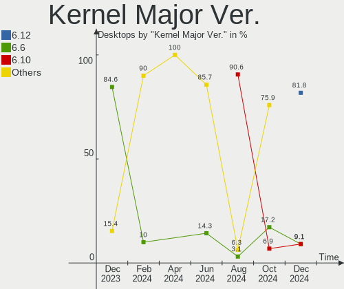
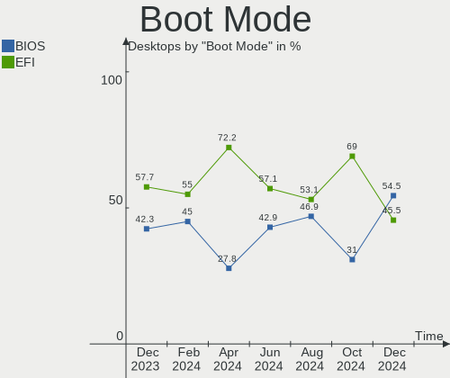
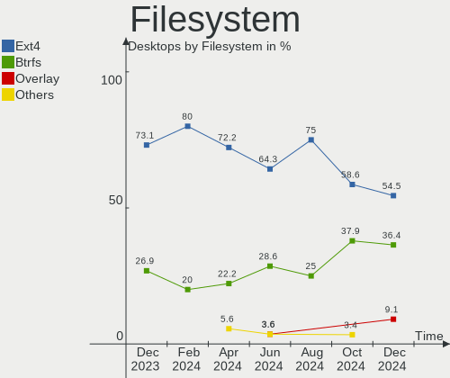
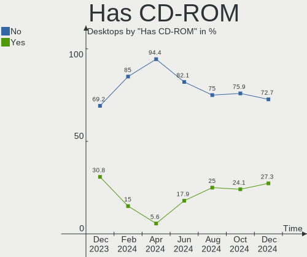
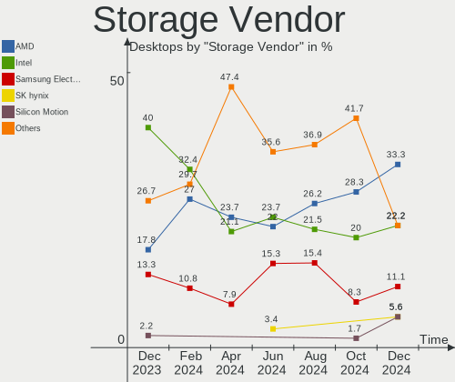
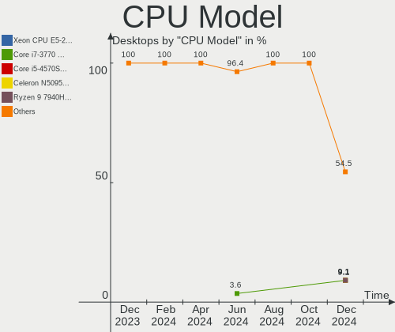
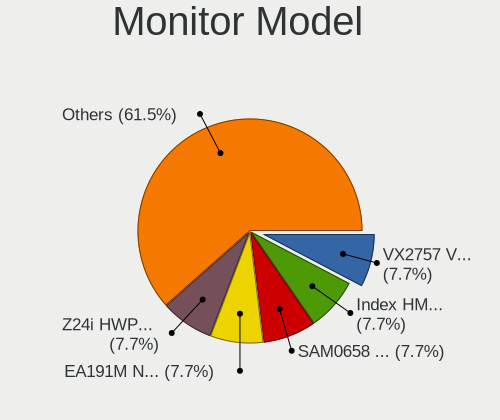

EndeavourOS - Hardware Trends (Desktops)
----------------------------------------

A project to identify most popular hardware characteristics and track their change
over time based on data collected by Linux users at https://Linux-Hardware.org.

Anyone can contribute to this report by the [hw-probe](https://github.com/linuxhw/hw-probe) tool:

    sudo -E hw-probe -all -upload

This report is for one last month. Overall report since the beginning of time: [TestDays](https://github.com/linuxhw/TestDays)

Period: Apr, 2024.

Contents
--------

* [ System ](#system)
  - [ OS                       ](#os)
  - [ OS Family                ](#os-family)
  - [ Kernel                   ](#kernel)
  - [ Kernel Family            ](#kernel-family)
  - [ Kernel Major Ver.        ](#kernel-major-ver)
  - [ Arch                     ](#arch)
  - [ DE                       ](#de)
  - [ Display Server           ](#display-server)
  - [ Display Manager          ](#display-manager)
  - [ OS Lang                  ](#os-lang)
  - [ Boot Mode                ](#boot-mode)
  - [ Filesystem               ](#filesystem)
  - [ Part. scheme             ](#part-scheme)
  - [ Dual Boot with Linux/BSD ](#dual-boot-with-linuxbsd)
  - [ Dual Boot (Win)          ](#dual-boot-win)

* [ Board ](#board)
  - [ Vendor                   ](#vendor)
  - [ Model                    ](#model)
  - [ Model Family             ](#model-family)
  - [ MFG Year                 ](#mfg-year)
  - [ Form Factor              ](#form-factor)
  - [ Secure Boot              ](#secure-boot)
  - [ Coreboot                 ](#coreboot)
  - [ RAM Size                 ](#ram-size)
  - [ RAM Used                 ](#ram-used)
  - [ Total Drives             ](#total-drives)
  - [ Has CD-ROM               ](#has-cd-rom)
  - [ Has Ethernet             ](#has-ethernet)
  - [ Has WiFi                 ](#has-wifi)
  - [ Has Bluetooth            ](#has-bluetooth)

* [ Location ](#location)
  - [ Country                  ](#country)
  - [ City                     ](#city)

* [ Drives ](#drives)
  - [ Drive Vendor             ](#drive-vendor)
  - [ Drive Model              ](#drive-model)
  - [ HDD Vendor               ](#hdd-vendor)
  - [ SSD Vendor               ](#ssd-vendor)
  - [ Drive Kind               ](#drive-kind)
  - [ Drive Connector          ](#drive-connector)
  - [ Drive Size               ](#drive-size)
  - [ Space Total              ](#space-total)
  - [ Space Used               ](#space-used)
  - [ Malfunc. Drives          ](#malfunc-drives)
  - [ Malfunc. Drive Vendor    ](#malfunc-drive-vendor)
  - [ Malfunc. HDD Vendor      ](#malfunc-hdd-vendor)
  - [ Malfunc. Drive Kind      ](#malfunc-drive-kind)
  - [ Failed Drives            ](#failed-drives)
  - [ Failed Drive Vendor      ](#failed-drive-vendor)
  - [ Drive Status             ](#drive-status)

* [ Storage controller ](#storage-controller)
  - [ Storage Vendor           ](#storage-vendor)
  - [ Storage Model            ](#storage-model)
  - [ Storage Kind             ](#storage-kind)

* [ Processor ](#processor)
  - [ CPU Vendor               ](#cpu-vendor)
  - [ CPU Model                ](#cpu-model)
  - [ CPU Model Family         ](#cpu-model-family)
  - [ CPU Cores                ](#cpu-cores)
  - [ CPU Sockets              ](#cpu-sockets)
  - [ CPU Threads              ](#cpu-threads)
  - [ CPU Op-Modes             ](#cpu-op-modes)
  - [ CPU Microcode            ](#cpu-microcode)
  - [ CPU Microarch            ](#cpu-microarch)

* [ Graphics ](#graphics)
  - [ GPU Vendor               ](#gpu-vendor)
  - [ GPU Model                ](#gpu-model)
  - [ GPU Combo                ](#gpu-combo)
  - [ GPU Driver               ](#gpu-driver)
  - [ GPU Memory               ](#gpu-memory)

* [ Monitor ](#monitor)
  - [ Monitor Vendor           ](#monitor-vendor)
  - [ Monitor Model            ](#monitor-model)
  - [ Monitor Resolution       ](#monitor-resolution)
  - [ Monitor Diagonal         ](#monitor-diagonal)
  - [ Monitor Width            ](#monitor-width)
  - [ Aspect Ratio             ](#aspect-ratio)
  - [ Monitor Area             ](#monitor-area)
  - [ Pixel Density            ](#pixel-density)
  - [ Multiple Monitors        ](#multiple-monitors)

* [ Network ](#network)
  - [ Net Controller Vendor    ](#net-controller-vendor)
  - [ Net Controller Model     ](#net-controller-model)
  - [ Wireless Vendor          ](#wireless-vendor)
  - [ Wireless Model           ](#wireless-model)
  - [ Ethernet Vendor          ](#ethernet-vendor)
  - [ Ethernet Model           ](#ethernet-model)
  - [ Net Controller Kind      ](#net-controller-kind)
  - [ Used Controller          ](#used-controller)
  - [ NICs                     ](#nics)
  - [ IPv6                     ](#ipv6)

* [ Bluetooth ](#bluetooth)
  - [ Bluetooth Vendor         ](#bluetooth-vendor)
  - [ Bluetooth Model          ](#bluetooth-model)

* [ Sound ](#sound)
  - [ Sound Vendor             ](#sound-vendor)
  - [ Sound Model              ](#sound-model)

* [ Memory ](#memory)
  - [ Memory Vendor            ](#memory-vendor)
  - [ Memory Model             ](#memory-model)
  - [ Memory Kind              ](#memory-kind)
  - [ Memory Form Factor       ](#memory-form-factor)
  - [ Memory Size              ](#memory-size)
  - [ Memory Speed             ](#memory-speed)

* [ Printers & scanners ](#printers--scanners)
  - [ Printer Vendor           ](#printer-vendor)
  - [ Printer Model            ](#printer-model)
  - [ Scanner Vendor           ](#scanner-vendor)
  - [ Scanner Model            ](#scanner-model)

* [ Camera ](#camera)
  - [ Camera Vendor            ](#camera-vendor)
  - [ Camera Model             ](#camera-model)

* [ Security ](#security)
  - [ Fingerprint Vendor       ](#fingerprint-vendor)
  - [ Fingerprint Model        ](#fingerprint-model)
  - [ Chipcard Vendor          ](#chipcard-vendor)
  - [ Chipcard Model           ](#chipcard-model)

* [ Unsupported ](#unsupported)
  - [ Unsupported Devices      ](#unsupported-devices)
  - [ Unsupported Device Types ](#unsupported-device-types)

System
------

OS
--

Installed operating systems

| Name                | Desktops | Percent |
|---------------------|----------|---------|
| EndeavourOS Rolling | 18       | 100%    |

OS Family
---------

OS without a version

| Name        | Desktops | Percent |
|-------------|----------|---------|
| EndeavourOS | 18       | 100%    |

Kernel
------

Version of the Linux kernel

| Version              | Desktops | Percent |
|----------------------|----------|---------|
| 6.8.7-arch1-1        | 3        | 16.67%  |
| 6.8.5-arch1-1        | 3        | 16.67%  |
| 6.8.2-arch2-1        | 3        | 16.67%  |
| 6.8.4-arch1-1        | 2        | 11.11%  |
| 6.8.8-1-cachyos-bore | 1        | 5.56%   |
| 6.8.7-zen1-1-zen     | 1        | 5.56%   |
| 6.8.7-arch1-2        | 1        | 5.56%   |
| 6.8.4-zen1-1-zen     | 1        | 5.56%   |
| 6.8.1-arch1-1        | 1        | 5.56%   |
| 6.7.12-lqx1-1-lqx    | 1        | 5.56%   |
| 6.7.11-lqx1-1-lqx    | 1        | 5.56%   |

Kernel Family
-------------

Linux kernel without a distro release

| Version | Desktops | Percent |
|---------|----------|---------|
| 6.8.7   | 5        | 27.78%  |
| 6.8.5   | 3        | 16.67%  |
| 6.8.4   | 3        | 16.67%  |
| 6.8.2   | 3        | 16.67%  |
| 6.8.8   | 1        | 5.56%   |
| 6.8.1   | 1        | 5.56%   |
| 6.7.12  | 1        | 5.56%   |
| 6.7.11  | 1        | 5.56%   |

Kernel Major Ver.
-----------------

Linux kernel major version

| Version | Desktops | Percent |
|---------|----------|---------|
| 6.8     | 16       | 88.89%  |
| 6.7     | 2        | 11.11%  |

Arch
----

OS architecture (x86_64, i586, etc.)

| Name   | Desktops | Percent |
|--------|----------|---------|
| x86_64 | 18       | 100%    |

DE
--

Desktop Environment

| Name          | Desktops | Percent |
|---------------|----------|---------|
| KDE6          | 8        | 44.44%  |
| GNOME         | 3        | 16.67%  |
| XFCE          | 2        | 11.11%  |
| X-Cinnamon    | 1        | 5.56%   |
| KDE           | 1        | 5.56%   |
| i3            | 1        | 5.56%   |
| Hyprland      | 1        | 5.56%   |
| GNOME Classic | 1        | 5.56%   |

Display Server
--------------

X11 or Wayland

| Name    | Desktops | Percent |
|---------|----------|---------|
| X11     | 11       | 61.11%  |
| Wayland | 7        | 38.89%  |

Display Manager
---------------

SDDM, LightDM, etc.

| Name    | Desktops | Percent |
|---------|----------|---------|
| SDDM    | 7        | 38.89%  |
| LightDM | 4        | 22.22%  |
| GDM     | 4        | 22.22%  |
| Unknown | 3        | 16.67%  |

OS Lang
-------

Language

| Lang  | Desktops | Percent |
|-------|----------|---------|
| en_US | 6        | 33.33%  |
| it_IT | 3        | 16.67%  |
| en_AU | 2        | 11.11%  |
| de_DE | 2        | 11.11%  |
| ru_RU | 1        | 5.56%   |
| pl_PL | 1        | 5.56%   |
| nl_NL | 1        | 5.56%   |
| fr_FR | 1        | 5.56%   |
| en_GB | 1        | 5.56%   |

Boot Mode
---------

EFI or BIOS

| Mode | Desktops | Percent |
|------|----------|---------|
| EFI  | 13       | 72.22%  |
| BIOS | 5        | 27.78%  |

Filesystem
----------

Type of filesystem

| Type  | Desktops | Percent |
|-------|----------|---------|
| Ext4  | 13       | 72.22%  |
| Btrfs | 4        | 22.22%  |
| Tmpfs | 1        | 5.56%   |

Part. scheme
------------

Scheme of partitioning

| Type    | Desktops | Percent |
|---------|----------|---------|
| GPT     | 15       | 83.33%  |
| Unknown | 3        | 16.67%  |

Dual Boot with Linux/BSD
------------------------

Hosting more than one Linux/BSD

| Dual boot | Desktops | Percent |
|-----------|----------|---------|
| No        | 13       | 72.22%  |
| Yes       | 5        | 27.78%  |

Dual Boot (Win)
---------------

Hosting Linux and Windows

| Dual boot | Desktops | Percent |
|-----------|----------|---------|
| No        | 10       | 55.56%  |
| Yes       | 8        | 44.44%  |

Board
-----

Vendor
------

Motherboard manufacturer

| Name                | Desktops | Percent |
|---------------------|----------|---------|
| Gigabyte Technology | 7        | 38.89%  |
| MSI                 | 5        | 27.78%  |
| ASUSTek Computer    | 4        | 22.22%  |
| Win element         | 1        | 5.56%   |
| ASRock              | 1        | 5.56%   |

Model
-----

Motherboard model

| Name                               | Desktops | Percent |
|------------------------------------|----------|---------|
| Win element M600                   | 1        | 5.56%   |
| MSI MS-7D78                        | 1        | 5.56%   |
| MSI MS-7C82                        | 1        | 5.56%   |
| MSI MS-7C52                        | 1        | 5.56%   |
| MSI MS-7A95                        | 1        | 5.56%   |
| MSI Customised HOMEA PC            | 1        | 5.56%   |
| Gigabyte Z390 GAMING X             | 1        | 5.56%   |
| Gigabyte Z390 AORUS PRO            | 1        | 5.56%   |
| Gigabyte X570 AORUS PRO            | 1        | 5.56%   |
| Gigabyte B760M DS3H DDR4           | 1        | 5.56%   |
| Gigabyte B650M GAMING X AX         | 1        | 5.56%   |
| Gigabyte B650 GAMING X AX V2       | 1        | 5.56%   |
| Gigabyte B450M S2H                 | 1        | 5.56%   |
| ASUS TUF Gaming B550M-PLUS WIFI II | 1        | 5.56%   |
| ASUS PRIME B560M-A                 | 1        | 5.56%   |
| ASUS PRIME B450-PLUS               | 1        | 5.56%   |
| ASUS PRIME B250M-A                 | 1        | 5.56%   |
| ASRock Z490 Phantom Gaming 4       | 1        | 5.56%   |

Model Family
------------

Motherboard model prefix

| Name             | Desktops | Percent |
|------------------|----------|---------|
| ASUS PRIME       | 3        | 16.67%  |
| Gigabyte Z390    | 2        | 11.11%  |
| Win element M600 | 1        | 5.56%   |
| MSI MS-7D78      | 1        | 5.56%   |
| MSI MS-7C82      | 1        | 5.56%   |
| MSI MS-7C52      | 1        | 5.56%   |
| MSI MS-7A95      | 1        | 5.56%   |
| MSI Customised   | 1        | 5.56%   |
| Gigabyte X570    | 1        | 5.56%   |
| Gigabyte B760M   | 1        | 5.56%   |
| Gigabyte B650M   | 1        | 5.56%   |
| Gigabyte B650    | 1        | 5.56%   |
| Gigabyte B450M   | 1        | 5.56%   |
| ASUS TUF         | 1        | 5.56%   |
| ASRock Z490      | 1        | 5.56%   |

MFG Year
--------

Motherboard manufacture year

| Year | Desktops | Percent |
|------|----------|---------|
| 2022 | 5        | 27.78%  |
| 2018 | 4        | 22.22%  |
| 2021 | 3        | 16.67%  |
| 2020 | 2        | 11.11%  |
| 2019 | 2        | 11.11%  |
| 2023 | 1        | 5.56%   |
| 2016 | 1        | 5.56%   |

Form Factor
-----------

Physical design of the computer

| Name    | Desktops | Percent |
|---------|----------|---------|
| Desktop | 18       | 100%    |

Secure Boot
-----------

Enabled or disabled

| State    | Desktops | Percent |
|----------|----------|---------|
| Disabled | 18       | 100%    |

Coreboot
--------

Have coreboot on board

| Used | Desktops | Percent |
|------|----------|---------|
| No   | 18       | 100%    |

RAM Size
--------

Total RAM memory

| Size in GB  | Desktops | Percent |
|-------------|----------|---------|
| 32.01-64.0  | 5        | 27.78%  |
| 64.01-256.0 | 5        | 27.78%  |
| 16.01-24.0  | 4        | 22.22%  |
| 24.01-32.0  | 2        | 11.11%  |
| 8.01-16.0   | 2        | 11.11%  |

RAM Used
--------

Used RAM memory

| Used GB   | Desktops | Percent |
|-----------|----------|---------|
| 4.01-8.0  | 8        | 44.44%  |
| 2.01-3.0  | 5        | 27.78%  |
| 3.01-4.0  | 3        | 16.67%  |
| 1.01-2.0  | 1        | 5.56%   |
| 8.01-16.0 | 1        | 5.56%   |

Total Drives
------------

Number of drives on board

| Drives | Desktops | Percent |
|--------|----------|---------|
| 2      | 5        | 27.78%  |
| 1      | 4        | 22.22%  |
| 4      | 3        | 16.67%  |
| 3      | 3        | 16.67%  |
| 7      | 2        | 11.11%  |
| 8      | 1        | 5.56%   |

Has CD-ROM
----------

Has CD-ROM on board

| Presented | Desktops | Percent |
|-----------|----------|---------|
| No        | 17       | 94.44%  |
| Yes       | 1        | 5.56%   |

Has Ethernet
------------

Has Ethernet on board

| Presented | Desktops | Percent |
|-----------|----------|---------|
| Yes       | 18       | 100%    |

Has WiFi
--------

Has WiFi module

| Presented | Desktops | Percent |
|-----------|----------|---------|
| Yes       | 14       | 77.78%  |
| No        | 4        | 22.22%  |

Has Bluetooth
-------------

Has Bluetooth module

| Presented | Desktops | Percent |
|-----------|----------|---------|
| Yes       | 13       | 72.22%  |
| No        | 5        | 27.78%  |

Location
--------

Country
-------

Geographic location (country)

| Country     | Desktops | Percent |
|-------------|----------|---------|
| Italy       | 3        | 16.67%  |
| USA         | 2        | 11.11%  |
| Russia      | 2        | 11.11%  |
| Germany     | 2        | 11.11%  |
| Australia   | 2        | 11.11%  |
| UK          | 1        | 5.56%   |
| Sweden      | 1        | 5.56%   |
| Portugal    | 1        | 5.56%   |
| Poland      | 1        | 5.56%   |
| Netherlands | 1        | 5.56%   |
| France      | 1        | 5.56%   |
| Croatia     | 1        | 5.56%   |

City
----

Geographic location (city)

| City              | Desktops | Percent |
|-------------------|----------|---------|
| Yekaterinburg     | 1        | 5.56%   |
| Wiesbaden         | 1        | 5.56%   |
| Wembley           | 1        | 5.56%   |
| Warsaw            | 1        | 5.56%   |
| Villeneuve-le-Roi | 1        | 5.56%   |
| Selvazzano Dentro | 1        | 5.56%   |
| Palos Park        | 1        | 5.56%   |
| Örebro           | 1        | 5.56%   |
| Ocean Grove       | 1        | 5.56%   |
| Milton            | 1        | 5.56%   |
| Mezhdurechensk    | 1        | 5.56%   |
| Melbourne         | 1        | 5.56%   |
| Mannheim          | 1        | 5.56%   |
| Genoa             | 1        | 5.56%   |
| Dieren            | 1        | 5.56%   |
| Čakovec          | 1        | 5.56%   |
| Busto Arsizio     | 1        | 5.56%   |
| Braga             | 1        | 5.56%   |

Drives
------

Drive Vendor
------------

Hard drive vendors

| Vendor                      | Desktops | Drives | Percent |
|-----------------------------|----------|--------|---------|
| WDC                         | 6        | 10     | 13.04%  |
| Sandisk                     | 6        | 7      | 13.04%  |
| Seagate                     | 5        | 6      | 10.87%  |
| Samsung Electronics         | 5        | 5      | 10.87%  |
| Toshiba                     | 4        | 8      | 8.7%    |
| Micron/Crucial Technology   | 4        | 4      | 8.7%    |
| Kingston                    | 4        | 7      | 8.7%    |
| Phison Electronics          | 2        | 2      | 4.35%   |
| Kingston Technology Company | 2        | 2      | 4.35%   |
| Crucial                     | 2        | 2      | 4.35%   |
| PNY                         | 1        | 1      | 2.17%   |
| Micron Technology           | 1        | 1      | 2.17%   |
| MAXIO Technology (Hangzhou) | 1        | 1      | 2.17%   |
| LITEONIT                    | 1        | 1      | 2.17%   |
| Intenso                     | 1        | 1      | 2.17%   |
| HGST                        | 1        | 1      | 2.17%   |

Drive Model
-----------

Hard drive models

| Model                                              | Desktops | Percent |
|----------------------------------------------------|----------|---------|
| Toshiba DT01ACA200 2TB                             | 2        | 3.39%   |
| Phison E12 NVMe Controller 2TB                     | 2        | 3.39%   |
| Micron/Crucial P2 NVMe PCIe SSD 4TB                | 2        | 3.39%   |
| Kingston Company SNV2S1000G 1TB                    | 2        | 3.39%   |
| Kingston SHFS37A240G 240GB SSD                     | 2        | 3.39%   |
| WDC WD5000AAKS-00A7B0 500GB                        | 1        | 1.69%   |
| WDC WD40EZRZ-00WN9B0 4TB                           | 1        | 1.69%   |
| WDC WD40EZRZ-00GXCB0 4TB                           | 1        | 1.69%   |
| WDC WD30EZRZ-00GXCB0 3TB                           | 1        | 1.69%   |
| WDC WD20EZRZ-22Z5HB0 2TB                           | 1        | 1.69%   |
| WDC WD20EZBX-00AYRA0 2TB                           | 1        | 1.69%   |
| WDC WD1600AAJS-00PSA0 160GB                        | 1        | 1.69%   |
| WDC WD10EZEX-60WN4A1 1TB                           | 1        | 1.69%   |
| WDC WD10EZEX-08WN4A0 1TB                           | 1        | 1.69%   |
| WDC WD1000DHTZ-04N21V0 1TB                         | 1        | 1.69%   |
| Toshiba TR150 960GB SSD                            | 1        | 1.69%   |
| Toshiba MQ01ABD100 1TB                             | 1        | 1.69%   |
| Toshiba MD04ACA400 4TB                             | 1        | 1.69%   |
| Toshiba KSG60ZMV256G M.2 2280 256GB SSD            | 1        | 1.69%   |
| Toshiba HDWD240 4TB                                | 1        | 1.69%   |
| Toshiba DT01ACA050 500GB                           | 1        | 1.69%   |
| Seagate ST8000AS0002-1NA17Z 8TB                    | 1        | 1.69%   |
| Seagate ST500DM009-2F110A 500GB                    | 1        | 1.69%   |
| Seagate ST4000DM000-1F2168 4TB                     | 1        | 1.69%   |
| Seagate ST31000528AS 1TB                           | 1        | 1.69%   |
| Seagate ST2000DM008-2FR102 2TB                     | 1        | 1.69%   |
| Seagate Portable 5TB                               | 1        | 1.69%   |
| Sandisk WD_BLACK SN850X 1000GB                     | 1        | 1.69%   |
| Sandisk WD Blue SN580 500GB                        | 1        | 1.69%   |
| Sandisk WD Blue SN550 NVMe SSD 2TB                 | 1        | 1.69%   |
| SanDisk Ultra II 480GB SSD                         | 1        | 1.69%   |
| SanDisk SSD PLUS 1000GB                            | 1        | 1.69%   |
| SanDisk SDSSDA240G 240GB                           | 1        | 1.69%   |
| SanDisk SD9SN8W-128G-1006 128GB SSD                | 1        | 1.69%   |
| Samsung SSD 860 EVO 1TB                            | 1        | 1.69%   |
| Samsung NVMe SSD Controller SM981/PM981/PM983 1TB  | 1        | 1.69%   |
| Samsung NVMe SSD Controller SM961/PM961/SM963 1TB  | 1        | 1.69%   |
| Samsung NVMe SSD Controller PM9A1/PM9A3/980PRO 1TB | 1        | 1.69%   |
| Samsung HD154UI 1TB                                | 1        | 1.69%   |
| PNY CS900 480GB SSD                                | 1        | 1.69%   |

HDD Vendor
----------

Hard disk drive vendors

| Vendor              | Desktops | Drives | Percent |
|---------------------|----------|--------|---------|
| WDC                 | 6        | 10     | 37.5%   |
| Toshiba             | 4        | 6      | 25%     |
| Seagate             | 4        | 5      | 25%     |
| Samsung Electronics | 1        | 1      | 6.25%   |
| HGST                | 1        | 1      | 6.25%   |

SSD Vendor
----------

Solid state drive vendors

| Vendor              | Desktops | Drives | Percent |
|---------------------|----------|--------|---------|
| SanDisk             | 3        | 4      | 21.43%  |
| Kingston            | 3        | 5      | 21.43%  |
| Toshiba             | 2        | 2      | 14.29%  |
| Crucial             | 2        | 2      | 14.29%  |
| Samsung Electronics | 1        | 1      | 7.14%   |
| PNY                 | 1        | 1      | 7.14%   |
| LITEONIT            | 1        | 1      | 7.14%   |
| Intenso             | 1        | 1      | 7.14%   |

Drive Kind
----------

HDD or SSD

| Kind    | Desktops | Drives | Percent |
|---------|----------|--------|---------|
| NVMe    | 15       | 18     | 40.54%  |
| HDD     | 11       | 23     | 29.73%  |
| SSD     | 10       | 17     | 27.03%  |
| Unknown | 1        | 1      | 2.7%    |

Drive Connector
---------------

SATA, SAS, NVMe, etc.

| Type | Desktops | Drives | Percent |
|------|----------|--------|---------|
| NVMe | 15       | 18     | 51.72%  |
| SATA | 13       | 40     | 44.83%  |
| SAS  | 1        | 1      | 3.45%   |

Drive Size
----------

Size of hard drive

| Size in TB | Desktops | Drives | Percent |
|------------|----------|--------|---------|
| 0.01-0.5   | 9        | 17     | 34.62%  |
| 0.51-1.0   | 6        | 10     | 23.08%  |
| 1.01-2.0   | 5        | 5      | 19.23%  |
| 3.01-4.0   | 4        | 6      | 15.38%  |
| 2.01-3.0   | 1        | 1      | 3.85%   |
| 4.01-10.0  | 1        | 1      | 3.85%   |

Space Total
-----------

Amount of disk space available on the file system

| Size in GB     | Desktops | Percent |
|----------------|----------|---------|
| More than 3000 | 6        | 33.33%  |
| 1001-2000      | 4        | 22.22%  |
| 101-250        | 3        | 16.67%  |
| 2001-3000      | 2        | 11.11%  |
| 501-1000       | 2        | 11.11%  |
| 251-500        | 1        | 5.56%   |

Space Used
----------

Amount of used disk space

| Used GB        | Desktops | Percent |
|----------------|----------|---------|
| 501-1000       | 5        | 27.78%  |
| 21-50          | 3        | 16.67%  |
| More than 3000 | 2        | 11.11%  |
| 251-500        | 2        | 11.11%  |
| 101-250        | 2        | 11.11%  |
| 51-100         | 2        | 11.11%  |
| 1001-2000      | 1        | 5.56%   |
| 1-20           | 1        | 5.56%   |

Malfunc. Drives
---------------

Drive models with a malfunction

| Model                          | Desktops | Drives | Percent |
|--------------------------------|----------|--------|---------|
| WDC WD5000AAKS-00A7B0 500GB    | 1        | 1      | 11.11%  |
| WDC WD40EZRZ-00WN9B0 4TB       | 1        | 1      | 11.11%  |
| WDC WD1600AAJS-00PSA0 160GB    | 1        | 1      | 11.11%  |
| WDC WD10EZEX-60WN4A1 1TB       | 1        | 1      | 11.11%  |
| WDC WD1000DHTZ-04N21V0 1TB     | 1        | 1      | 11.11%  |
| Toshiba MQ01ABD100 1TB         | 1        | 1      | 11.11%  |
| Seagate ST4000DM000-1F2168 4TB | 1        | 1      | 11.11%  |
| Seagate ST2000DM008-2FR102 2TB | 1        | 1      | 11.11%  |
| Kingston SHFS37A240G 240GB SSD | 1        | 1      | 11.11%  |

Malfunc. Drive Vendor
---------------------

Vendors of faulty drives

| Vendor   | Desktops | Drives | Percent |
|----------|----------|--------|---------|
| WDC      | 4        | 5      | 50%     |
| Seagate  | 2        | 2      | 25%     |
| Toshiba  | 1        | 1      | 12.5%   |
| Kingston | 1        | 1      | 12.5%   |

Malfunc. HDD Vendor
-------------------

Vendors of faulty HDD drives

| Vendor  | Desktops | Drives | Percent |
|---------|----------|--------|---------|
| WDC     | 4        | 5      | 57.14%  |
| Seagate | 2        | 2      | 28.57%  |
| Toshiba | 1        | 1      | 14.29%  |

Malfunc. Drive Kind
-------------------

Kinds of faulty drives

| Kind | Desktops | Drives | Percent |
|------|----------|--------|---------|
| HDD  | 5        | 8      | 83.33%  |
| SSD  | 1        | 1      | 16.67%  |

Failed Drives
-------------

Failed drive models

Zero info for selected period =(

Failed Drive Vendor
-------------------

Failed drive vendors

Zero info for selected period =(

Drive Status
------------

Number of failed and malfunc. drives

| Status   | Desktops | Drives | Percent |
|----------|----------|--------|---------|
| Works    | 14       | 34     | 60.87%  |
| Malfunc  | 5        | 9      | 21.74%  |
| Detected | 4        | 16     | 17.39%  |

Storage controller
------------------

Storage Vendor
--------------

Storage controller vendors

| Vendor                      | Desktops | Percent |
|-----------------------------|----------|---------|
| AMD                         | 9        | 23.68%  |
| Intel                       | 8        | 21.05%  |
| Micron/Crucial Technology   | 4        | 10.53%  |
| Sandisk                     | 3        | 7.89%   |
| Samsung Electronics         | 3        | 7.89%   |
| Kingston Technology Company | 3        | 7.89%   |
| ASMedia Technology          | 3        | 7.89%   |
| Phison Electronics          | 2        | 5.26%   |
| Micron Technology           | 1        | 2.63%   |
| MAXIO Technology (Hangzhou) | 1        | 2.63%   |
| Marvell Technology Group    | 1        | 2.63%   |

Storage Model
-------------

Storage controller models

| Model                                                                | Desktops | Percent |
|----------------------------------------------------------------------|----------|---------|
| AMD FCH SATA Controller [AHCI mode]                                  | 4        | 9.3%    |
| AMD 600 Series Chipset SATA Controller                               | 3        | 6.98%   |
| Phison E12 NVMe Controller                                           | 2        | 4.65%   |
| Micron/Crucial P2 [Nick P2] / P3 / P3 Plus NVMe PCIe SSD (DRAM-less) | 2        | 4.65%   |
| Kingston Company NV2 NVMe SSD SM2267XT (DRAM-less)                   | 2        | 4.65%   |
| Intel SATA Controller [RAID mode]                                    | 2        | 4.65%   |
| AMD 500 Series Chipset SATA Controller                               | 2        | 4.65%   |
| AMD 400 Series Chipset SATA Controller                               | 2        | 4.65%   |
| Sandisk WD Blue SN580 NVMe SSD (DRAM-less)                           | 1        | 2.33%   |
| Sandisk WD Black SN850X NVMe SSD                                     | 1        | 2.33%   |
| SanDisk Ultra 3D / WD Blue SN550 NVMe SSD                            | 1        | 2.33%   |
| Samsung NVMe SSD Controller SM981/PM981/PM983                        | 1        | 2.33%   |
| Samsung NVMe SSD Controller SM961/PM961/SM963                        | 1        | 2.33%   |
| Samsung NVMe SSD Controller PM9A1/PM9A3/980PRO                       | 1        | 2.33%   |
| Micron/Crucial P5 Plus NVMe PCIe SSD                                 | 1        | 2.33%   |
| Micron/Crucial P1 NVMe PCIe SSD[Frampton]                            | 1        | 2.33%   |
| Micron 2210 NVMe SSD [Cobain]                                        | 1        | 2.33%   |
| MAXIO (Hangzhou) NVMe SSD Controller MAP1602 (DRAM-less)             | 1        | 2.33%   |
| Marvell Group 88SE912x IDE Controller                                | 1        | 2.33%   |
| Marvell Group 88SE9123 PCIe SATA 6.0 Gb/s controller                 | 1        | 2.33%   |
| Kingston Company NV2 NVMe SSD E21T (DRAM-less)                       | 1        | 2.33%   |
| Kingston Company KC3000/FURY Renegade NVMe SSD E18                   | 1        | 2.33%   |
| Intel Raptor Lake SATA AHCI Controller                               | 1        | 2.33%   |
| Intel Comet Lake SATA AHCI Controller                                | 1        | 2.33%   |
| Intel Cannon Lake PCH SATA AHCI Controller                           | 1        | 2.33%   |
| Intel 500 Series Chipset Family SATA AHCI Controller                 | 1        | 2.33%   |
| Intel 400 Series Chipset Family SATA AHCI Controller                 | 1        | 2.33%   |
| Intel 200 Series PCH SATA controller [AHCI mode]                     | 1        | 2.33%   |
| ASMedia ASM1064 Serial ATA Controller                                | 1        | 2.33%   |
| ASMedia ASM1061/ASM1062 Serial ATA Controller                        | 1        | 2.33%   |
| ASMedia 106x SATA/RAID Controller                                    | 1        | 2.33%   |
| AMD FCH SATA Controller D                                            | 1        | 2.33%   |

Storage Kind
------------

Kind of storage controller (IDE, SATA, NVMe, SAS, ...)

| Kind | Desktops | Percent |
|------|----------|---------|
| SATA | 16       | 47.06%  |
| NVMe | 15       | 44.12%  |
| RAID | 2        | 5.88%   |
| IDE  | 1        | 2.94%   |

Processor
---------

CPU Vendor
----------

Processor vendors

| Vendor | Desktops | Percent |
|--------|----------|---------|
| AMD    | 10       | 55.56%  |
| Intel  | 8        | 44.44%  |

CPU Model
---------

Processor models

| Model                                   | Desktops | Percent |
|-----------------------------------------|----------|---------|
| Intel Core i7-9700K CPU @ 3.60GHz       | 2        | 11.11%  |
| AMD Ryzen 5 5600G with Radeon Graphics  | 2        | 11.11%  |
| Intel Core i9-7940X CPU @ 3.10GHz       | 1        | 5.56%   |
| Intel Core i7-7700K CPU @ 4.20GHz       | 1        | 5.56%   |
| Intel Core i7-10700K CPU @ 3.80GHz      | 1        | 5.56%   |
| Intel Core i5-10600KF CPU @ 4.10GHz     | 1        | 5.56%   |
| Intel 13th Gen Core i5-13500            | 1        | 5.56%   |
| Intel 11th Gen Core i5-11600 @ 2.80GHz  | 1        | 5.56%   |
| AMD Ryzen 9 6900HX with Radeon Graphics | 1        | 5.56%   |
| AMD Ryzen 7 7700X 8-Core Processor      | 1        | 5.56%   |
| AMD Ryzen 7 5800X 8-Core Processor      | 1        | 5.56%   |
| AMD Ryzen 7 5700G with Radeon Graphics  | 1        | 5.56%   |
| AMD Ryzen 5 7600X 6-Core Processor      | 1        | 5.56%   |
| AMD Ryzen 5 7600 6-Core Processor       | 1        | 5.56%   |
| AMD Ryzen 5 3600 6-Core Processor       | 1        | 5.56%   |
| AMD Ryzen 5 1600 Six-Core Processor     | 1        | 5.56%   |

CPU Model Family
----------------

Processor model prefix

| Model         | Desktops | Percent |
|---------------|----------|---------|
| AMD Ryzen 5   | 6        | 33.33%  |
| Intel Core i7 | 4        | 22.22%  |
| AMD Ryzen 7   | 3        | 16.67%  |
| Other         | 2        | 11.11%  |
| Intel Core i9 | 1        | 5.56%   |
| Intel Core i5 | 1        | 5.56%   |
| AMD Ryzen 9   | 1        | 5.56%   |

CPU Cores
---------

Number of processor cores

| Number | Desktops | Percent |
|--------|----------|---------|
| 6      | 8        | 44.44%  |
| 8      | 7        | 38.89%  |
| 14     | 2        | 11.11%  |
| 4      | 1        | 5.56%   |

CPU Sockets
-----------

Number of sockets

| Number | Desktops | Percent |
|--------|----------|---------|
| 1      | 18       | 100%    |

CPU Threads
-----------

Threads per core (Hyper-Threading)

| Number | Desktops | Percent |
|--------|----------|---------|
| 2      | 16       | 88.89%  |
| 1      | 2        | 11.11%  |

CPU Op-Modes
------------

CPU Operation Modes (32-bit, 64-bit)

| Op mode        | Desktops | Percent |
|----------------|----------|---------|
| 32-bit, 64-bit | 18       | 100%    |

CPU Microcode
-------------

Microcode number

| Number  | Desktops | Percent |
|---------|----------|---------|
| Unknown | 18       | 100%    |

CPU Microarch
-------------

Microarchitecture

| Name             | Desktops | Percent |
|------------------|----------|---------|
| Unknown          | 5        | 27.78%  |
| Zen 3            | 4        | 22.22%  |
| KabyLake         | 3        | 16.67%  |
| CometLake        | 2        | 11.11%  |
| Zen+             | 1        | 5.56%   |
| Zen 2            | 1        | 5.56%   |
| Skylake          | 1        | 5.56%   |
| Alderlake Hybrid | 1        | 5.56%   |

Graphics
--------

GPU Vendor
----------

Vendors of graphics cards

| Vendor | Desktops | Percent |
|--------|----------|---------|
| AMD    | 10       | 50%     |
| Nvidia | 8        | 40%     |
| Intel  | 2        | 10%     |

GPU Model
---------

Graphics card models

| Model                                                         | Desktops | Percent |
|---------------------------------------------------------------|----------|---------|
| AMD Navi 23 [Radeon RX 6600/6600 XT/6600M]                    | 4        | 17.39%  |
| AMD Raphael                                                   | 3        | 13.04%  |
| Nvidia GA104 [GeForce RTX 3060 Ti Lite Hash Rate]             | 2        | 8.7%    |
| AMD Navi 22 [Radeon RX 6700/6700 XT/6750 XT / 6800M/6850M XT] | 2        | 8.7%    |
| Nvidia TU116 [GeForce GTX 1660 SUPER]                         | 1        | 4.35%   |
| Nvidia TU116 [GeForce GTX 1650]                               | 1        | 4.35%   |
| Nvidia TU106 [GeForce RTX 2070 Rev. A]                        | 1        | 4.35%   |
| Nvidia TU104 [GeForce RTX 2080 SUPER]                         | 1        | 4.35%   |
| Nvidia TU104 [GeForce RTX 2070 SUPER]                         | 1        | 4.35%   |
| Nvidia GA104 [GeForce RTX 3070]                               | 1        | 4.35%   |
| Intel CoffeeLake-S GT2 [UHD Graphics 630]                     | 1        | 4.35%   |
| Intel AlderLake-S GT1                                         | 1        | 4.35%   |
| AMD Rembrandt [Radeon 680M]                                   | 1        | 4.35%   |
| AMD Navi 32 [Radeon RX 7700 XT / 7800 XT]                     | 1        | 4.35%   |
| AMD Ellesmere [Radeon RX 470/480/570/570X/580/580X/590]       | 1        | 4.35%   |
| AMD Cezanne [Radeon Vega Series / Radeon Vega Mobile Series]  | 1        | 4.35%   |

GPU Combo
---------

Combinations of graphics cards

| Name        | Desktops | Percent |
|-------------|----------|---------|
| 1 x Nvidia  | 8        | 44.44%  |
| 1 x AMD     | 6        | 33.33%  |
| 2 x AMD     | 3        | 16.67%  |
| Intel + AMD | 1        | 5.56%   |

GPU Driver
----------

Free vs proprietary

| Driver      | Desktops | Percent |
|-------------|----------|---------|
| Free        | 10       | 55.56%  |
| Proprietary | 8        | 44.44%  |

GPU Memory
----------

Total video memory

| Size in GB | Desktops | Percent |
|------------|----------|---------|
| 7.01-8.0   | 9        | 50%     |
| Unknown    | 3        | 16.67%  |
| 8.01-16.0  | 2        | 11.11%  |
| 0.01-0.5   | 2        | 11.11%  |
| 5.01-6.0   | 1        | 5.56%   |
| 3.01-4.0   | 1        | 5.56%   |

Monitor
-------

Monitor Vendor
--------------

Monitor vendors

| Vendor               | Desktops | Percent |
|----------------------|----------|---------|
| Samsung Electronics  | 6        | 24%     |
| Goldstar             | 5        | 20%     |
| Dell                 | 4        | 16%     |
| Philips              | 2        | 8%      |
| Hewlett-Packard      | 2        | 8%      |
| AOC                  | 2        | 8%      |
| Acer                 | 2        | 8%      |
| Lenovo Group Limited | 1        | 4%      |
| Ancor Communications | 1        | 4%      |

Monitor Model
-------------

Monitor models

| Model                                                                 | Desktops | Percent |
|-----------------------------------------------------------------------|----------|---------|
| Samsung Electronics S34J55x SAM0F72 3440x1440 797x333mm 34.0-inch     | 1        | 3.7%    |
| Samsung Electronics S27H85x SAM0E0E 2560x1440 600x340mm 27.2-inch     | 1        | 3.7%    |
| Samsung Electronics S27F350 SAM0D22 1920x1080 600x340mm 27.2-inch     | 1        | 3.7%    |
| Samsung Electronics S24F350 SAM0D20 1920x1080 521x293mm 23.5-inch     | 1        | 3.7%    |
| Samsung Electronics LCD Monitor SAM07C0 1920x1080 700x390mm 31.5-inch | 1        | 3.7%    |
| Samsung Electronics C32JG5x SAM0F55 2560x1440 700x390mm 31.5-inch     | 1        | 3.7%    |
| Philips PHL 273V7 PHLC156 1920x1080 598x336mm 27.0-inch               | 1        | 3.7%    |
| Philips 220S PHL0886 1680x1050 473x296mm 22.0-inch                    | 1        | 3.7%    |
| Lenovo Group Limited LCD Monitor LEN L24e-20 3840x1080                | 1        | 3.7%    |
| Hewlett-Packard 24er HWP3320 1920x1080 527x296mm 23.8-inch            | 1        | 3.7%    |
| Hewlett-Packard 22w HPN342E 1920x1080 476x268mm 21.5-inch             | 1        | 3.7%    |
| Goldstar ULTRAWIDE GSM76E4 3440x1440 800x335mm 34.1-inch              | 1        | 3.7%    |
| Goldstar IPS FULLHD GSM5AB8 1920x1080 480x270mm 21.7-inch             | 1        | 3.7%    |
| Goldstar HDR WQHD GSM7756 3440x1440 820x346mm 35.0-inch               | 1        | 3.7%    |
| Goldstar HDR WQHD GSM7755 3440x1440 820x346mm 35.0-inch               | 1        | 3.7%    |
| Goldstar FHD GSM5BC9 1920x1080 480x270mm 21.7-inch                    | 1        | 3.7%    |
| Goldstar 24GL600F GSM5B73 1920x1080 530x300mm 24.0-inch               | 1        | 3.7%    |
| Dell P2419H DELD0DA 1920x1080 527x296mm 23.8-inch                     | 1        | 3.7%    |
| Dell P2419H DELD0D9 1920x1080 527x296mm 23.8-inch                     | 1        | 3.7%    |
| Dell LCD Monitor SE2417HG 3840x1080                                   | 1        | 3.7%    |
| Dell E177FP DELA023 1280x1024 338x270mm 17.0-inch                     | 1        | 3.7%    |
| AOC Q27P1B AOC2701 2560x1440 597x336mm 27.0-inch                      | 1        | 3.7%    |
| AOC 2281W AOC2281 1920x1080 480x270mm 21.7-inch                       | 1        | 3.7%    |
| Ancor Communications ASUS MG278 ACI27A8 2560x1440 597x336mm 27.0-inch | 1        | 3.7%    |
| Acer XB281HK ACR0460 3840x2160 621x341mm 27.9-inch                    | 1        | 3.7%    |
| Acer KA272 ACR0B2D 1920x1080 598x336mm 27.0-inch                      | 1        | 3.7%    |
| Acer KA270 ACR09A0 1920x1080 598x336mm 27.0-inch                      | 1        | 3.7%    |

Monitor Resolution
------------------

Monitor screen resolution

| Resolution         | Desktops | Percent |
|--------------------|----------|---------|
| 1920x1080 (FHD)    | 13       | 54.17%  |
| 3440x1440          | 3        | 12.5%   |
| 2560x1440 (QHD)    | 3        | 12.5%   |
| 3840x2160 (4K)     | 2        | 8.33%   |
| 3840x1080          | 1        | 4.17%   |
| 1680x1050 (WSXGA+) | 1        | 4.17%   |
| 1280x1024 (SXGA)   | 1        | 4.17%   |

Monitor Diagonal
----------------

Diagonal size in inches

| Inches  | Desktops | Percent |
|---------|----------|---------|
| 27      | 6        | 26.09%  |
| 24      | 4        | 17.39%  |
| 21      | 4        | 17.39%  |
| 34      | 2        | 8.7%    |
| 46      | 1        | 4.35%   |
| 35      | 1        | 4.35%   |
| 31      | 1        | 4.35%   |
| 23      | 1        | 4.35%   |
| 22      | 1        | 4.35%   |
| 17      | 1        | 4.35%   |
| Unknown | 1        | 4.35%   |

Monitor Width
-------------

Physical width

| Width in mm | Desktops | Percent |
|-------------|----------|---------|
| 501-600     | 11       | 47.83%  |
| 401-500     | 4        | 17.39%  |
| 701-800     | 2        | 8.7%    |
| 601-700     | 2        | 8.7%    |
| 801-900     | 1        | 4.35%   |
| 301-350     | 1        | 4.35%   |
| 1001-1500   | 1        | 4.35%   |
| Unknown     | 1        | 4.35%   |

Aspect Ratio
------------

Proportional relationship between the width and the height

| Ratio   | Desktops | Percent |
|---------|----------|---------|
| 16/9    | 15       | 71.43%  |
| 21/9    | 3        | 14.29%  |
| 5/4     | 1        | 4.76%   |
| 16/10   | 1        | 4.76%   |
| Unknown | 1        | 4.76%   |

Monitor Area
------------

Area in inch²

| Area in inch² | Desktops | Percent |
|----------------|----------|---------|
| 201-250        | 9        | 40.91%  |
| 301-350        | 6        | 27.27%  |
| 351-500        | 4        | 18.18%  |
| 141-150        | 1        | 4.55%   |
| 501-1000       | 1        | 4.55%   |
| Unknown        | 1        | 4.55%   |

Pixel Density
-------------

Pixels per inch

| Density | Desktops | Percent |
|---------|----------|---------|
| 51-100  | 11       | 47.83%  |
| 101-120 | 9        | 39.13%  |
| 1-50    | 1        | 4.35%   |
| 121-160 | 1        | 4.35%   |
| Unknown | 1        | 4.35%   |

Multiple Monitors
-----------------

Total monitors connected

| Total | Desktops | Percent |
|-------|----------|---------|
| 2     | 9        | 50%     |
| 1     | 9        | 50%     |

Network
-------

Net Controller Vendor
---------------------

Controller vendors

| Vendor                          | Desktops | Percent |
|---------------------------------|----------|---------|
| Realtek Semiconductor           | 13       | 44.83%  |
| Intel                           | 8        | 27.59%  |
| MediaTek                        | 3        | 10.34%  |
| Qualcomm Atheros Communications | 1        | 3.45%   |
| Microsoft                       | 1        | 3.45%   |
| D-Link                          | 1        | 3.45%   |
| Broadcom                        | 1        | 3.45%   |
| ASUSTek Computer                | 1        | 3.45%   |

Net Controller Model
--------------------

Controller models

| Model                                                                     | Desktops | Percent |
|---------------------------------------------------------------------------|----------|---------|
| Realtek RTL8125 2.5GbE Controller                                         | 7        | 20%     |
| Realtek RTL8111/8168/8211/8411 PCI Express Gigabit Ethernet Controller    | 6        | 17.14%  |
| Intel Wi-Fi 6 AX200                                                       | 3        | 8.57%   |
| Realtek RTL8852CE PCIe 802.11ax Wireless Network Controller               | 2        | 5.71%   |
| MediaTek MT7921 802.11ax PCI Express Wireless Network Adapter             | 2        | 5.71%   |
| Intel Ethernet Connection (7) I219-V                                      | 2        | 5.71%   |
| Realtek RTL88x2bu [AC1200 Techkey]                                        | 1        | 2.86%   |
| Realtek RTL8812AE 802.11ac PCIe Wireless Network Adapter                  | 1        | 2.86%   |
| Qualcomm Atheros AR9271 802.11n                                           | 1        | 2.86%   |
| Microsoft XBOX ACC                                                        | 1        | 2.86%   |
| MediaTek MT7922 802.11ax PCI Express Wireless Network Adapter             | 1        | 2.86%   |
| Intel Wi-Fi 6E(802.11ax) AX210/AX1675* 2x2 [Typhoon Peak]                 | 1        | 2.86%   |
| Intel I211 Gigabit Network Connection                                     | 1        | 2.86%   |
| Intel Ethernet Connection (2) I219-V                                      | 1        | 2.86%   |
| Intel Ethernet Connection (14) I219-V                                     | 1        | 2.86%   |
| Intel Ethernet Connection (11) I219-V                                     | 1        | 2.86%   |
| D-Link 802.11ac NIC                                                       | 1        | 2.86%   |
| Broadcom BCM4360 802.11ac Dual Band Wireless Network Adapter              | 1        | 2.86%   |
| ASUS USB-AC68 802.11a/b/g/n/ac (4x4) Wireless Adapter [Realtek RTL8814AU] | 1        | 2.86%   |

Wireless Vendor
---------------

Wireless vendors

| Vendor                          | Desktops | Percent |
|---------------------------------|----------|---------|
| Realtek Semiconductor           | 4        | 25%     |
| Intel                           | 4        | 25%     |
| MediaTek                        | 3        | 18.75%  |
| Qualcomm Atheros Communications | 1        | 6.25%   |
| Microsoft                       | 1        | 6.25%   |
| D-Link                          | 1        | 6.25%   |
| Broadcom                        | 1        | 6.25%   |
| ASUSTek Computer                | 1        | 6.25%   |

Wireless Model
--------------

Wireless models

| Model                                                                     | Desktops | Percent |
|---------------------------------------------------------------------------|----------|---------|
| Intel Wi-Fi 6 AX200                                                       | 3        | 18.75%  |
| Realtek RTL8852CE PCIe 802.11ax Wireless Network Controller               | 2        | 12.5%   |
| MediaTek MT7921 802.11ax PCI Express Wireless Network Adapter             | 2        | 12.5%   |
| Realtek RTL88x2bu [AC1200 Techkey]                                        | 1        | 6.25%   |
| Realtek RTL8812AE 802.11ac PCIe Wireless Network Adapter                  | 1        | 6.25%   |
| Qualcomm Atheros AR9271 802.11n                                           | 1        | 6.25%   |
| Microsoft XBOX ACC                                                        | 1        | 6.25%   |
| MediaTek MT7922 802.11ax PCI Express Wireless Network Adapter             | 1        | 6.25%   |
| Intel Wi-Fi 6E(802.11ax) AX210/AX1675* 2x2 [Typhoon Peak]                 | 1        | 6.25%   |
| D-Link 802.11ac NIC                                                       | 1        | 6.25%   |
| Broadcom BCM4360 802.11ac Dual Band Wireless Network Adapter              | 1        | 6.25%   |
| ASUS USB-AC68 802.11a/b/g/n/ac (4x4) Wireless Adapter [Realtek RTL8814AU] | 1        | 6.25%   |

Ethernet Vendor
---------------

Ethernet vendors

| Vendor                | Desktops | Percent |
|-----------------------|----------|---------|
| Realtek Semiconductor | 13       | 68.42%  |
| Intel                 | 6        | 31.58%  |

Ethernet Model
--------------

Ethernet models

| Model                                                                  | Desktops | Percent |
|------------------------------------------------------------------------|----------|---------|
| Realtek RTL8125 2.5GbE Controller                                      | 7        | 36.84%  |
| Realtek RTL8111/8168/8211/8411 PCI Express Gigabit Ethernet Controller | 6        | 31.58%  |
| Intel Ethernet Connection (7) I219-V                                   | 2        | 10.53%  |
| Intel I211 Gigabit Network Connection                                  | 1        | 5.26%   |
| Intel Ethernet Connection (2) I219-V                                   | 1        | 5.26%   |
| Intel Ethernet Connection (14) I219-V                                  | 1        | 5.26%   |
| Intel Ethernet Connection (11) I219-V                                  | 1        | 5.26%   |

Net Controller Kind
-------------------

Ethernet, WiFi or modem

| Kind     | Desktops | Percent |
|----------|----------|---------|
| Ethernet | 18       | 56.25%  |
| WiFi     | 14       | 43.75%  |

Used Controller
---------------

Currently used network controller

| Kind     | Desktops | Percent |
|----------|----------|---------|
| Ethernet | 10       | 55.56%  |
| WiFi     | 8        | 44.44%  |

NICs
----

Total network controllers on board

| Total | Desktops | Percent |
|-------|----------|---------|
| 2     | 11       | 61.11%  |
| 1     | 6        | 33.33%  |
| 3     | 1        | 5.56%   |

IPv6
----

IPv6 vs IPv4

| Used | Desktops | Percent |
|------|----------|---------|
| No   | 11       | 61.11%  |
| Yes  | 7        | 38.89%  |

Bluetooth
---------

Bluetooth Vendor
----------------

Controller vendors

| Vendor                  | Desktops | Percent |
|-------------------------|----------|---------|
| Realtek Semiconductor   | 4        | 30.77%  |
| Intel                   | 4        | 30.77%  |
| Realtek                 | 1        | 7.69%   |
| MediaTek                | 1        | 7.69%   |
| Lite-On Technology      | 1        | 7.69%   |
| IMC Networks            | 1        | 7.69%   |
| Cambridge Silicon Radio | 1        | 7.69%   |

Bluetooth Model
---------------

Controller models

| Model                                               | Desktops | Percent |
|-----------------------------------------------------|----------|---------|
| Realtek Bluetooth Radio                             | 3        | 23.08%  |
| Intel AX200 Bluetooth                               | 3        | 23.08%  |
| Realtek Bluetooth 5.3 Radio                         | 1        | 7.69%   |
| Realtek Bluetooth Radio                             | 1        | 7.69%   |
| MediaTek Wireless_Device                            | 1        | 7.69%   |
| Lite-On Wireless_Device                             | 1        | 7.69%   |
| Intel AX210 Bluetooth                               | 1        | 7.69%   |
| IMC Networks Wireless_Device                        | 1        | 7.69%   |
| Cambridge Silicon Radio Bluetooth Dongle (HCI mode) | 1        | 7.69%   |

Sound
-----

Sound Vendor
------------

Sound card vendors

| Vendor               | Desktops | Percent |
|----------------------|----------|---------|
| AMD                  | 12       | 30.77%  |
| Nvidia               | 8        | 20.51%  |
| Intel                | 8        | 20.51%  |
| C-Media Electronics  | 3        | 7.69%   |
| SteelSeries ApS      | 1        | 2.56%   |
| Logitech             | 1        | 2.56%   |
| JMTek                | 1        | 2.56%   |
| GN Netcom            | 1        | 2.56%   |
| Focusrite-Novation   | 1        | 2.56%   |
| fifinemicrophone.com | 1        | 2.56%   |
| Elgato Systems       | 1        | 2.56%   |
| DCMT Technology      | 1        | 2.56%   |

Sound Model
-----------

Sound card models

| Model                                                      | Desktops | Percent |
|------------------------------------------------------------|----------|---------|
| AMD Family 17h/19h HD Audio Controller                     | 7        | 13.73%  |
| AMD Navi 21/23 HDMI/DP Audio Controller                    | 6        | 11.76%  |
| AMD Rembrandt Radeon High Definition Audio Controller      | 4        | 7.84%   |
| Nvidia GA104 High Definition Audio Controller              | 3        | 5.88%   |
| AMD Renoir Radeon High Definition Audio Controller         | 3        | 5.88%   |
| Nvidia TU116 High Definition Audio Controller              | 2        | 3.92%   |
| Nvidia TU104 HD Audio Controller                           | 2        | 3.92%   |
| Intel Cannon Lake PCH cAVS                                 | 2        | 3.92%   |
| Intel 200 Series PCH HD Audio                              | 2        | 3.92%   |
| AMD Starship/Matisse HD Audio Controller                   | 2        | 3.92%   |
| SteelSeries ApS Arctis 7 wireless adapter                  | 1        | 1.96%   |
| Nvidia TU106 High Definition Audio Controller              | 1        | 1.96%   |
| Logitech Logitech G PRO X Gaming Headset                   | 1        | 1.96%   |
| JMTek USB PnP Audio Device                                 | 1        | 1.96%   |
| Intel Tiger Lake-H HD Audio Controller                     | 1        | 1.96%   |
| Intel Raptor Lake High Definition Audio Controller         | 1        | 1.96%   |
| Intel Comet Lake PCH-V cAVS                                | 1        | 1.96%   |
| Intel Comet Lake PCH cAVS                                  | 1        | 1.96%   |
| GN Netcom Jabra Evolve2 40                                 | 1        | 1.96%   |
| Focusrite-Novation Scarlett Solo (3rd Gen.)                | 1        | 1.96%   |
| fifinemicrophone.com AMGT0012                              | 1        | 1.96%   |
| Elgato Systems Elgato Wave:3                               | 1        | 1.96%   |
| DCMT Technology USB Condenser Microphone                   | 1        | 1.96%   |
| C-Media Electronics USB Audio Device                       | 1        | 1.96%   |
| C-Media Electronics CMI8738/CMI8768 PCI Audio              | 1        | 1.96%   |
| C-Media Electronics Audio Adapter (Unitek Y-247A)          | 1        | 1.96%   |
| AMD Navi 31 HDMI/DP Audio                                  | 1        | 1.96%   |
| AMD Ellesmere HDMI Audio [Radeon RX 470/480 / 570/580/590] | 1        | 1.96%   |

Memory
------

Memory Vendor
-------------

Memory module vendors

| Vendor            | Desktops | Percent |
|-------------------|----------|---------|
| Corsair           | 7        | 41.18%  |
| Crucial           | 3        | 17.65%  |
| Patriot           | 2        | 11.76%  |
| Patriot Memory    | 1        | 5.88%   |
| Kingston          | 1        | 5.88%   |
| G.Skill           | 1        | 5.88%   |
| A-DATA Technology | 1        | 5.88%   |
| Unknown           | 1        | 5.88%   |

Memory Model
------------

Memory module models

| Model                                                     | Desktops | Percent |
|-----------------------------------------------------------|----------|---------|
| Patriot RAM 3600 C18 Series 16GB DIMM DDR4 3600MT/s       | 1        | 5.56%   |
| Patriot RAM 2666 C16 Series 8GB DIMM DDR4 3400MT/s        | 1        | 5.56%   |
| Patriot Memory RAM 3200 C16 Series 8GB DIMM DDR4 3400MT/s | 1        | 5.56%   |
| Kingston RAM KF3200C16D4/8GX 8192MB DIMM DDR4 3600MT/s    | 1        | 5.56%   |
| G.Skill RAM F5-6000J3238F16G 16GB DIMM DDR5 6000MT/s      | 1        | 5.56%   |
| Crucial RAM CT32G48C40S5.M16A1 32GB SODIMM DDR5 4800MT/s  | 1        | 5.56%   |
| Crucial RAM BLS16G4D240FSB.16FBR 16GB DIMM DDR4 2400MT/s  | 1        | 5.56%   |
| Crucial RAM BLS16G4D240FSB.16FBD 16GB DIMM DDR4 2400MT/s  | 1        | 5.56%   |
| Crucial RAM BL8G32C16U4B.M8FE1 8GB DIMM DDR4 3600MT/s     | 1        | 5.56%   |
| Corsair RAM CMK64GX4M4A2400C14 16GB DIMM DDR4 2400MT/s    | 1        | 5.56%   |
| Corsair RAM CMK32GX4M2E3200C16 16GB DIMM DDR4 3534MT/s    | 1        | 5.56%   |
| Corsair RAM CMK32GX4M2B3200C16 16GB DIMM DDR4 3800MT/s    | 1        | 5.56%   |
| Corsair RAM CMK32GX4M2A2400C16 16384MB DIMM DDR4 2400MT/s | 1        | 5.56%   |
| Corsair RAM CMK16GX5M2B5200C40 8GB DIMM DDR5 4800MT/s     | 1        | 5.56%   |
| Corsair RAM CMK16GX4M2B3000C15 8GB DIMM DDR4 3600MT/s     | 1        | 5.56%   |
| Corsair RAM CMH32GX5M2E6000C36 16GB DIMM DDR5 6000MT/s    | 1        | 5.56%   |
| A-DATA RAM Module 8GB DIMM DDR4 2667MT/s                  | 1        | 5.56%   |
| Unknown                                                   | 1        | 5.56%   |

Memory Kind
-----------

Memory module kinds

| Kind | Desktops | Percent |
|------|----------|---------|
| DDR4 | 11       | 73.33%  |
| DDR5 | 4        | 26.67%  |

Memory Form Factor
------------------

Physical design of the memory module

| Name   | Desktops | Percent |
|--------|----------|---------|
| DIMM   | 14       | 93.33%  |
| SODIMM | 1        | 6.67%   |

Memory Size
-----------

Memory module size

| Size  | Desktops | Percent |
|-------|----------|---------|
| 16384 | 8        | 50%     |
| 32768 | 4        | 25%     |
| 8192  | 4        | 25%     |

Memory Speed
------------

Memory module speed

| Speed | Desktops | Percent |
|-------|----------|---------|
| 3600  | 3        | 20%     |
| 6000  | 2        | 13.33%  |
| 4800  | 2        | 13.33%  |
| 3400  | 2        | 13.33%  |
| 2400  | 2        | 13.33%  |
| 3800  | 1        | 6.67%   |
| 3534  | 1        | 6.67%   |
| 3200  | 1        | 6.67%   |
| 2667  | 1        | 6.67%   |

Printers & scanners
-------------------

Printer Vendor
--------------

Printer device vendors

Zero info for selected period =(

Printer Model
-------------

Printer device models

Zero info for selected period =(

Scanner Vendor
--------------

Scanner device vendors

Zero info for selected period =(

Scanner Model
-------------

Scanner device models

Zero info for selected period =(

Camera
------

Camera Vendor
-------------

Camera device vendors

| Vendor                        | Desktops | Percent |
|-------------------------------|----------|---------|
| Logitech                      | 2        | 40%     |
| Sunplus Innovation Technology | 1        | 20%     |
| AVerMedia Technologies        | 1        | 20%     |
| ARC International             | 1        | 20%     |

Camera Model
------------

Camera device models

| Model                           | Desktops | Percent |
|---------------------------------|----------|---------|
| Sunplus Full HD webcam          | 1        | 20%     |
| Logitech Webcam C270            | 1        | 20%     |
| Logitech BRIO 4K Stream Edition | 1        | 20%     |
| AVerMedia Live Gamer MINI       | 1        | 20%     |
| ARC International Camera        | 1        | 20%     |

Security
--------

Fingerprint Vendor
------------------

Fingerprint sensor vendors

Zero info for selected period =(

Fingerprint Model
-----------------

Fingerprint sensor models

Zero info for selected period =(

Chipcard Vendor
---------------

Chipcard module vendors

Zero info for selected period =(

Chipcard Model
--------------

Chipcard module models

Zero info for selected period =(

Unsupported
-----------

Unsupported Devices
-------------------

Total unsupported devices on board

| Total | Desktops | Percent |
|-------|----------|---------|
| 0     | 14       | 77.78%  |
| 1     | 3        | 16.67%  |
| 2     | 1        | 5.56%   |

Unsupported Device Types
------------------------

Types of unsupported devices

| Type         | Desktops | Percent |
|--------------|----------|---------|
| Net/wireless | 2        | 40%     |
| Net/ethernet | 2        | 40%     |
| Video        | 1        | 20%     |

