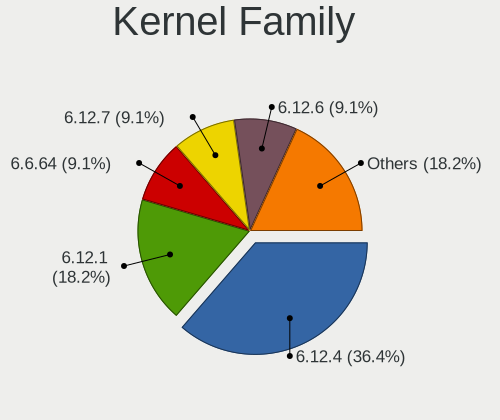
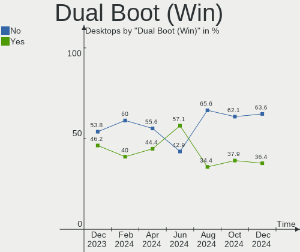
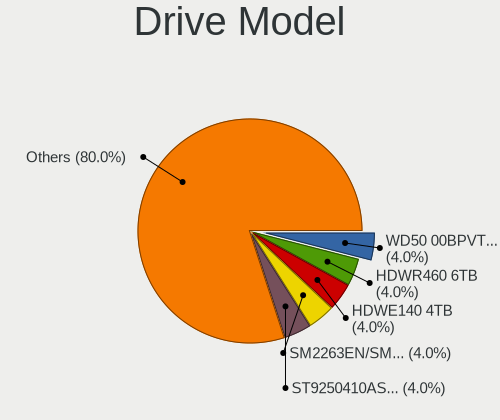
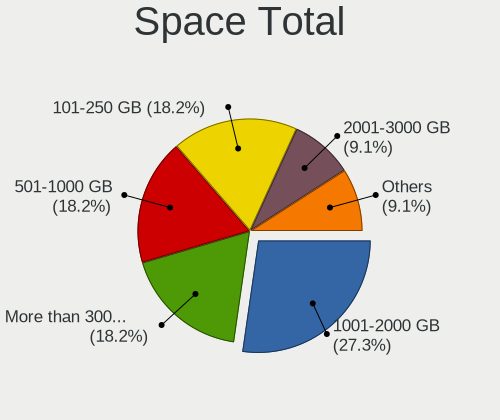
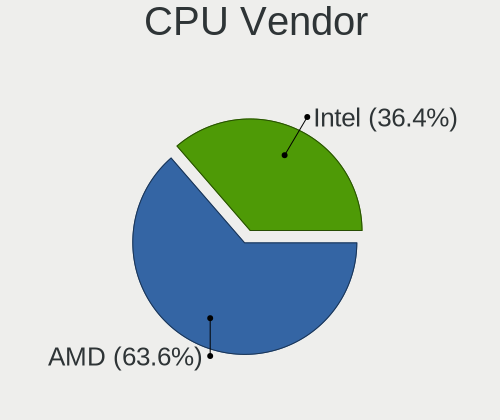
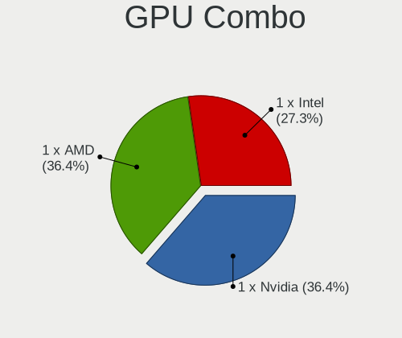
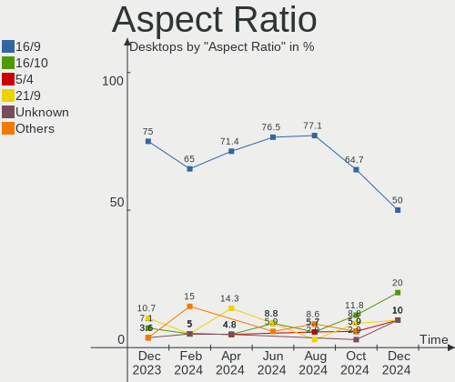

EndeavourOS - Hardware Trends (Desktops)
----------------------------------------

A project to identify most popular hardware characteristics and track their change
over time based on data collected by Linux users at https://Linux-Hardware.org.

Anyone can contribute to this report by the [hw-probe](https://github.com/linuxhw/hw-probe) tool:

    sudo -E hw-probe -all -upload

This report is for one last month. Overall report since the beginning of time: [TestCoverage](https://github.com/linuxhw/TestCoverage)

Period: Jun, 2022.

Contents
--------

* [ System ](#system)
  - [ OS                       ](#os)
  - [ OS Family                ](#os-family)
  - [ Kernel                   ](#kernel)
  - [ Kernel Family            ](#kernel-family)
  - [ Kernel Major Ver.        ](#kernel-major-ver)
  - [ Arch                     ](#arch)
  - [ DE                       ](#de)
  - [ Display Server           ](#display-server)
  - [ Display Manager          ](#display-manager)
  - [ OS Lang                  ](#os-lang)
  - [ Boot Mode                ](#boot-mode)
  - [ Filesystem               ](#filesystem)
  - [ Part. scheme             ](#part-scheme)
  - [ Dual Boot with Linux/BSD ](#dual-boot-with-linuxbsd)
  - [ Dual Boot (Win)          ](#dual-boot-win)

* [ Board ](#board)
  - [ Vendor                   ](#vendor)
  - [ Model                    ](#model)
  - [ Model Family             ](#model-family)
  - [ MFG Year                 ](#mfg-year)
  - [ Form Factor              ](#form-factor)
  - [ Secure Boot              ](#secure-boot)
  - [ Coreboot                 ](#coreboot)
  - [ RAM Size                 ](#ram-size)
  - [ RAM Used                 ](#ram-used)
  - [ Total Drives             ](#total-drives)
  - [ Has CD-ROM               ](#has-cd-rom)
  - [ Has Ethernet             ](#has-ethernet)
  - [ Has WiFi                 ](#has-wifi)
  - [ Has Bluetooth            ](#has-bluetooth)

* [ Location ](#location)
  - [ Country                  ](#country)
  - [ City                     ](#city)

* [ Drives ](#drives)
  - [ Drive Vendor             ](#drive-vendor)
  - [ Drive Model              ](#drive-model)
  - [ HDD Vendor               ](#hdd-vendor)
  - [ SSD Vendor               ](#ssd-vendor)
  - [ Drive Kind               ](#drive-kind)
  - [ Drive Connector          ](#drive-connector)
  - [ Drive Size               ](#drive-size)
  - [ Space Total              ](#space-total)
  - [ Space Used               ](#space-used)
  - [ Malfunc. Drives          ](#malfunc-drives)
  - [ Malfunc. Drive Vendor    ](#malfunc-drive-vendor)
  - [ Malfunc. HDD Vendor      ](#malfunc-hdd-vendor)
  - [ Malfunc. Drive Kind      ](#malfunc-drive-kind)
  - [ Failed Drives            ](#failed-drives)
  - [ Failed Drive Vendor      ](#failed-drive-vendor)
  - [ Drive Status             ](#drive-status)

* [ Storage controller ](#storage-controller)
  - [ Storage Vendor           ](#storage-vendor)
  - [ Storage Model            ](#storage-model)
  - [ Storage Kind             ](#storage-kind)

* [ Processor ](#processor)
  - [ CPU Vendor               ](#cpu-vendor)
  - [ CPU Model                ](#cpu-model)
  - [ CPU Model Family         ](#cpu-model-family)
  - [ CPU Cores                ](#cpu-cores)
  - [ CPU Sockets              ](#cpu-sockets)
  - [ CPU Threads              ](#cpu-threads)
  - [ CPU Op-Modes             ](#cpu-op-modes)
  - [ CPU Microcode            ](#cpu-microcode)
  - [ CPU Microarch            ](#cpu-microarch)

* [ Graphics ](#graphics)
  - [ GPU Vendor               ](#gpu-vendor)
  - [ GPU Model                ](#gpu-model)
  - [ GPU Combo                ](#gpu-combo)
  - [ GPU Driver               ](#gpu-driver)
  - [ GPU Memory               ](#gpu-memory)

* [ Monitor ](#monitor)
  - [ Monitor Vendor           ](#monitor-vendor)
  - [ Monitor Model            ](#monitor-model)
  - [ Monitor Resolution       ](#monitor-resolution)
  - [ Monitor Diagonal         ](#monitor-diagonal)
  - [ Monitor Width            ](#monitor-width)
  - [ Aspect Ratio             ](#aspect-ratio)
  - [ Monitor Area             ](#monitor-area)
  - [ Pixel Density            ](#pixel-density)
  - [ Multiple Monitors        ](#multiple-monitors)

* [ Network ](#network)
  - [ Net Controller Vendor    ](#net-controller-vendor)
  - [ Net Controller Model     ](#net-controller-model)
  - [ Wireless Vendor          ](#wireless-vendor)
  - [ Wireless Model           ](#wireless-model)
  - [ Ethernet Vendor          ](#ethernet-vendor)
  - [ Ethernet Model           ](#ethernet-model)
  - [ Net Controller Kind      ](#net-controller-kind)
  - [ Used Controller          ](#used-controller)
  - [ NICs                     ](#nics)
  - [ IPv6                     ](#ipv6)

* [ Bluetooth ](#bluetooth)
  - [ Bluetooth Vendor         ](#bluetooth-vendor)
  - [ Bluetooth Model          ](#bluetooth-model)

* [ Sound ](#sound)
  - [ Sound Vendor             ](#sound-vendor)
  - [ Sound Model              ](#sound-model)

* [ Memory ](#memory)
  - [ Memory Vendor            ](#memory-vendor)
  - [ Memory Model             ](#memory-model)
  - [ Memory Kind              ](#memory-kind)
  - [ Memory Form Factor       ](#memory-form-factor)
  - [ Memory Size              ](#memory-size)
  - [ Memory Speed             ](#memory-speed)

* [ Printers & scanners ](#printers--scanners)
  - [ Printer Vendor           ](#printer-vendor)
  - [ Printer Model            ](#printer-model)
  - [ Scanner Vendor           ](#scanner-vendor)
  - [ Scanner Model            ](#scanner-model)

* [ Camera ](#camera)
  - [ Camera Vendor            ](#camera-vendor)
  - [ Camera Model             ](#camera-model)

* [ Security ](#security)
  - [ Fingerprint Vendor       ](#fingerprint-vendor)
  - [ Fingerprint Model        ](#fingerprint-model)
  - [ Chipcard Vendor          ](#chipcard-vendor)
  - [ Chipcard Model           ](#chipcard-model)

* [ Unsupported ](#unsupported)
  - [ Unsupported Devices      ](#unsupported-devices)
  - [ Unsupported Device Types ](#unsupported-device-types)

System
------

OS
--

Installed operating systems

| Name                | Desktops | Percent |
|---------------------|----------|---------|
| EndeavourOS Rolling | 5        | 55.56%  |
| EndeavourOS         | 4        | 44.44%  |

OS Family
---------

OS without a version

| Name        | Desktops | Percent |
|-------------|----------|---------|
| EndeavourOS | 9        | 100%    |

Kernel
------

Version of the Linux kernel

| Version           | Desktops | Percent |
|-------------------|----------|---------|
| 5.18.5-arch1-1    | 2        | 22.22%  |
| 5.18.7-arch1-1    | 1        | 11.11%  |
| 5.18.6-arch1-1    | 1        | 11.11%  |
| 5.18.5-zen1-1-zen | 1        | 11.11%  |
| 5.18.3-arch1-1    | 1        | 11.11%  |
| 5.18.2-zen1-1-zen | 1        | 11.11%  |
| 5.18.1-zen1-1-zen | 1        | 11.11%  |
| 5.18.1-arch1-1    | 1        | 11.11%  |

Kernel Family
-------------

Linux kernel without a distro release

| Version | Desktops | Percent |
|---------|----------|---------|
| 5.18.5  | 3        | 33.33%  |
| 5.18.1  | 2        | 22.22%  |
| 5.18.7  | 1        | 11.11%  |
| 5.18.6  | 1        | 11.11%  |
| 5.18.3  | 1        | 11.11%  |
| 5.18.2  | 1        | 11.11%  |

Kernel Major Ver.
-----------------

Linux kernel major version

| Version | Desktops | Percent |
|---------|----------|---------|
| 5.18    | 9        | 100%    |

Arch
----

OS architecture (x86_64, i586, etc.)

| Name   | Desktops | Percent |
|--------|----------|---------|
| x86_64 | 9        | 100%    |

DE
--

Desktop Environment

| Name   | Desktops | Percent |
|--------|----------|---------|
| KDE5   | 5        | 55.56%  |
| XFCE   | 2        | 22.22%  |
| GNOME  | 1        | 11.11%  |
| Budgie | 1        | 11.11%  |

Display Server
--------------

X11 or Wayland

| Name    | Desktops | Percent |
|---------|----------|---------|
| X11     | 8        | 88.89%  |
| Wayland | 1        | 11.11%  |

Display Manager
---------------

SDDM, LightDM, etc.

| Name    | Desktops | Percent |
|---------|----------|---------|
| Unknown | 4        | 44.44%  |
| LightDM | 3        | 33.33%  |
| SDDM    | 2        | 22.22%  |

OS Lang
-------

Language

| Lang  | Desktops | Percent |
|-------|----------|---------|
| en_US | 3        | 33.33%  |
| it_IT | 1        | 11.11%  |
| en_IN | 1        | 11.11%  |
| en_GB | 1        | 11.11%  |
| en_CA | 1        | 11.11%  |
| en_AG | 1        | 11.11%  |
| de_DE | 1        | 11.11%  |

Boot Mode
---------

EFI or BIOS

| Mode | Desktops | Percent |
|------|----------|---------|
| BIOS | 5        | 55.56%  |
| EFI  | 4        | 44.44%  |

Filesystem
----------

Type of filesystem

| Type  | Desktops | Percent |
|-------|----------|---------|
| Ext4  | 7        | 77.78%  |
| Btrfs | 2        | 22.22%  |

Part. scheme
------------

Scheme of partitioning

| Type    | Desktops | Percent |
|---------|----------|---------|
| GPT     | 5        | 55.56%  |
| Unknown | 4        | 44.44%  |

Dual Boot with Linux/BSD
------------------------

Hosting more than one Linux/BSD

| Dual boot | Desktops | Percent |
|-----------|----------|---------|
| No        | 9        | 100%    |

Dual Boot (Win)
---------------

Hosting Linux and Windows

| Dual boot | Desktops | Percent |
|-----------|----------|---------|
| No        | 5        | 55.56%  |
| Yes       | 4        | 44.44%  |

Board
-----

Vendor
------

Motherboard manufacturer

| Name                | Desktops | Percent |
|---------------------|----------|---------|
| MSI                 | 3        | 33.33%  |
| ASUSTek Computer    | 3        | 33.33%  |
| Gigabyte Technology | 2        | 22.22%  |
| Dell                | 1        | 11.11%  |

Model
-----

Motherboard model

| Name                         | Desktops | Percent |
|------------------------------|----------|---------|
| MSI MS-7C91                  | 1        | 11.11%  |
| MSI MS-7C37                  | 1        | 11.11%  |
| MSI MS-7B85                  | 1        | 11.11%  |
| Gigabyte B550M AORUS PRO-P   | 1        | 11.11%  |
| Gigabyte B450 AORUS PRO WIFI | 1        | 11.11%  |
| Dell OptiPlex 3020           | 1        | 11.11%  |
| ASUS ROG Maximus Z690 HERO   | 1        | 11.11%  |
| ASUS P8Z77-V                 | 1        | 11.11%  |
| ASUS H110M-E/M.2             | 1        | 11.11%  |

Model Family
------------

Motherboard model prefix

| Name           | Desktops | Percent |
|----------------|----------|---------|
| MSI MS-7C91    | 1        | 11.11%  |
| MSI MS-7C37    | 1        | 11.11%  |
| MSI MS-7B85    | 1        | 11.11%  |
| Gigabyte B550M | 1        | 11.11%  |
| Gigabyte B450  | 1        | 11.11%  |
| Dell OptiPlex  | 1        | 11.11%  |
| ASUS ROG       | 1        | 11.11%  |
| ASUS P8Z77-V   | 1        | 11.11%  |
| ASUS H110M-E   | 1        | 11.11%  |

MFG Year
--------

Motherboard manufacture year

| Year | Desktops | Percent |
|------|----------|---------|
| 2018 | 3        | 33.33%  |
| 2021 | 1        | 11.11%  |
| 2020 | 1        | 11.11%  |
| 2019 | 1        | 11.11%  |
| 2016 | 1        | 11.11%  |
| 2014 | 1        | 11.11%  |
| 2012 | 1        | 11.11%  |

Form Factor
-----------

Physical design of the computer

| Name    | Desktops | Percent |
|---------|----------|---------|
| Desktop | 9        | 100%    |

Secure Boot
-----------

Enabled or disabled

| State    | Desktops | Percent |
|----------|----------|---------|
| Disabled | 9        | 100%    |

Coreboot
--------

Have coreboot on board

| Used | Desktops | Percent |
|------|----------|---------|
| No   | 9        | 100%    |

RAM Size
--------

Total RAM memory

| Size in GB | Desktops | Percent |
|------------|----------|---------|
| 32.01-64.0 | 3        | 33.33%  |
| 16.01-24.0 | 3        | 33.33%  |
| 8.01-16.0  | 3        | 33.33%  |

RAM Used
--------

Used RAM memory

| Used GB   | Desktops | Percent |
|-----------|----------|---------|
| 2.01-3.0  | 4        | 44.44%  |
| 4.01-8.0  | 2        | 22.22%  |
| 3.01-4.0  | 1        | 11.11%  |
| 1.01-2.0  | 1        | 11.11%  |
| 8.01-16.0 | 1        | 11.11%  |

Total Drives
------------

Number of drives on board

| Drives | Desktops | Percent |
|--------|----------|---------|
| 3      | 4        | 44.44%  |
| 4      | 3        | 33.33%  |
| 2      | 2        | 22.22%  |

Has CD-ROM
----------

Has CD-ROM on board

| Presented | Desktops | Percent |
|-----------|----------|---------|
| No        | 8        | 88.89%  |
| Yes       | 1        | 11.11%  |

Has Ethernet
------------

Has Ethernet on board

| Presented | Desktops | Percent |
|-----------|----------|---------|
| Yes       | 9        | 100%    |

Has WiFi
--------

Has WiFi module

| Presented | Desktops | Percent |
|-----------|----------|---------|
| Yes       | 6        | 66.67%  |
| No        | 3        | 33.33%  |

Has Bluetooth
-------------

Has Bluetooth module

| Presented | Desktops | Percent |
|-----------|----------|---------|
| No        | 5        | 55.56%  |
| Yes       | 4        | 44.44%  |

Location
--------

Country
-------

Geographic location (country)

| Country  | Desktops | Percent |
|----------|----------|---------|
| USA      | 3        | 33.33%  |
| Spain    | 1        | 11.11%  |
| Poland   | 1        | 11.11%  |
| Malaysia | 1        | 11.11%  |
| Italy    | 1        | 11.11%  |
| India    | 1        | 11.11%  |
| Canada   | 1        | 11.11%  |

City
----

Geographic location (city)

| City                  | Desktops | Percent |
|-----------------------|----------|---------|
| Wroclaw               | 1        | 11.11%  |
| Wimauma               | 1        | 11.11%  |
| Virar                 | 1        | 11.11%  |
| Severna Park          | 1        | 11.11%  |
| Red Deer              | 1        | 11.11%  |
| Navalmoral de la Mata | 1        | 11.11%  |
| Kuala Lumpur          | 1        | 11.11%  |
| Istrana               | 1        | 11.11%  |
| Bel Air               | 1        | 11.11%  |

Drives
------

Drive Vendor
------------

Hard drive vendors

| Vendor              | Desktops | Drives | Percent |
|---------------------|----------|--------|---------|
| WDC                 | 5        | 7      | 22.73%  |
| Samsung Electronics | 4        | 6      | 18.18%  |
| Kingston            | 3        | 3      | 13.64%  |
| Seagate             | 2        | 3      | 9.09%   |
| XPG                 | 1        | 1      | 4.55%   |
| Toshiba             | 1        | 1      | 4.55%   |
| SPCC                | 1        | 1      | 4.55%   |
| SanDisk             | 1        | 1      | 4.55%   |
| Plextor             | 1        | 2      | 4.55%   |
| Hitachi             | 1        | 1      | 4.55%   |
| Crucial             | 1        | 1      | 4.55%   |
| China               | 1        | 1      | 4.55%   |

Drive Model
-----------

Hard drive models

| Model                            | Desktops | Percent |
|----------------------------------|----------|---------|
| Seagate ST2000DM008-2FR102 2TB   | 2        | 7.41%   |
| Samsung NVMe SSD Drive 250GB     | 2        | 7.41%   |
| XPG NVMe SSD Drive 512GB         | 1        | 3.7%    |
| WDC WDS240G2G0B-00EPW0 240GB SSD | 1        | 3.7%    |
| WDC WD40EZRZ-00GXCB0 4TB         | 1        | 3.7%    |
| WDC WD4003FRYZ-01F0DB0 4TB       | 1        | 3.7%    |
| WDC WD2003FZEX-00Z4SA0 2TB       | 1        | 3.7%    |
| WDC WD10SPCX-08S8TT0 1TB         | 1        | 3.7%    |
| WDC WD10EZEX-08WN4A0 1TB         | 1        | 3.7%    |
| WDC WD10EZEX-00KUWA0 1TB         | 1        | 3.7%    |
| Toshiba DT01ACA050 500GB         | 1        | 3.7%    |
| SPCC Solid State Disk 256GB      | 1        | 3.7%    |
| Seagate ST1000LM048-2E7172 1TB   | 1        | 3.7%    |
| SanDisk SSD PLUS 2000GB          | 1        | 3.7%    |
| Samsung SSD 980 500GB            | 1        | 3.7%    |
| Samsung SSD 970 EVO 500GB        | 1        | 3.7%    |
| Samsung SSD 850 EVO 250GB        | 1        | 3.7%    |
| Samsung NVMe SSD Drive 1TB       | 1        | 3.7%    |
| Plextor PX-256M8VC 256GB SSD     | 1        | 3.7%    |
| Kingston SA400S37240G 240GB SSD  | 1        | 3.7%    |
| Kingston NVMe SSD Drive 500GB    | 1        | 3.7%    |
| Kingston NVMe SSD Drive 1TB      | 1        | 3.7%    |
| Hitachi HDT722525DLA380 250GB    | 1        | 3.7%    |
| Crucial CT240BX500SSD1 240GB     | 1        | 3.7%    |
| China SATA SSD 240GB             | 1        | 3.7%    |

HDD Vendor
----------

Hard disk drive vendors

| Vendor  | Desktops | Drives | Percent |
|---------|----------|--------|---------|
| WDC     | 5        | 6      | 55.56%  |
| Seagate | 2        | 3      | 22.22%  |
| Toshiba | 1        | 1      | 11.11%  |
| Hitachi | 1        | 1      | 11.11%  |

SSD Vendor
----------

Solid state drive vendors

| Vendor              | Desktops | Drives | Percent |
|---------------------|----------|--------|---------|
| WDC                 | 1        | 1      | 12.5%   |
| SPCC                | 1        | 1      | 12.5%   |
| SanDisk             | 1        | 1      | 12.5%   |
| Samsung Electronics | 1        | 1      | 12.5%   |
| Plextor             | 1        | 2      | 12.5%   |
| Kingston            | 1        | 1      | 12.5%   |
| Crucial             | 1        | 1      | 12.5%   |
| China               | 1        | 1      | 12.5%   |

Drive Kind
----------

HDD or SSD

| Kind | Desktops | Drives | Percent |
|------|----------|--------|---------|
| HDD  | 7        | 11     | 38.89%  |
| SSD  | 6        | 9      | 33.33%  |
| NVMe | 5        | 8      | 27.78%  |

Drive Connector
---------------

SATA, SAS, NVMe, etc.

| Type | Desktops | Drives | Percent |
|------|----------|--------|---------|
| SATA | 8        | 20     | 61.54%  |
| NVMe | 5        | 8      | 38.46%  |

Drive Size
----------

Size of hard drive

| Size in TB | Desktops | Drives | Percent |
|------------|----------|--------|---------|
| 0.01-0.5   | 7        | 10     | 41.18%  |
| 1.01-2.0   | 4        | 4      | 23.53%  |
| 0.51-1.0   | 4        | 4      | 23.53%  |
| 3.01-4.0   | 2        | 2      | 11.76%  |

Space Total
-----------

Amount of disk space available on the file system

| Size in GB     | Desktops | Percent |
|----------------|----------|---------|
| More than 3000 | 4        | 44.44%  |
| 2001-3000      | 2        | 22.22%  |
| 1001-2000      | 2        | 22.22%  |
| 101-250        | 1        | 11.11%  |

Space Used
----------

Amount of used disk space

| Used GB   | Desktops | Percent |
|-----------|----------|---------|
| 101-250   | 3        | 33.33%  |
| 1001-2000 | 3        | 33.33%  |
| 2001-3000 | 1        | 11.11%  |
| 1-20      | 1        | 11.11%  |
| 501-1000  | 1        | 11.11%  |

Malfunc. Drives
---------------

Drive models with a malfunction

| Model                                 | Desktops | Drives | Percent |
|---------------------------------------|----------|--------|---------|
| WDC WD2003FZEX-00Z4SA0 2TB            | 1        | 1      | 50%     |
| Samsung Electronics SSD 970 EVO 500GB | 1        | 1      | 50%     |

Malfunc. Drive Vendor
---------------------

Vendors of faulty drives

| Vendor              | Desktops | Drives | Percent |
|---------------------|----------|--------|---------|
| WDC                 | 1        | 1      | 50%     |
| Samsung Electronics | 1        | 1      | 50%     |

Malfunc. HDD Vendor
-------------------

Vendors of faulty HDD drives

| Vendor | Desktops | Drives | Percent |
|--------|----------|--------|---------|
| WDC    | 1        | 1      | 100%    |

Malfunc. Drive Kind
-------------------

Kinds of faulty drives

| Kind | Desktops | Drives | Percent |
|------|----------|--------|---------|
| NVMe | 1        | 1      | 50%     |
| HDD  | 1        | 1      | 50%     |

Failed Drives
-------------

Failed drive models

Zero info for selected period =(

Failed Drive Vendor
-------------------

Failed drive vendors

Zero info for selected period =(

Drive Status
------------

Number of failed and malfunc. drives

| Status   | Desktops | Drives | Percent |
|----------|----------|--------|---------|
| Works    | 5        | 13     | 45.45%  |
| Detected | 4        | 13     | 36.36%  |
| Malfunc  | 2        | 2      | 18.18%  |

Storage controller
------------------

Storage Vendor
--------------

Storage controller vendors

| Vendor                      | Desktops | Percent |
|-----------------------------|----------|---------|
| AMD                         | 5        | 26.32%  |
| Samsung Electronics         | 4        | 21.05%  |
| Intel                       | 4        | 21.05%  |
| ASMedia Technology          | 3        | 15.79%  |
| Kingston Technology Company | 2        | 10.53%  |
| ADATA Technology            | 1        | 5.26%   |

Storage Model
-------------

Storage controller models

| Model                                                                          | Desktops | Percent |
|--------------------------------------------------------------------------------|----------|---------|
| ASMedia ASM1062 Serial ATA Controller                                          | 3        | 13.64%  |
| Samsung NVMe SSD Controller SM981/PM981/PM983                                  | 2        | 9.09%   |
| Samsung NVMe SSD Controller 980                                                | 2        | 9.09%   |
| AMD FCH SATA Controller [AHCI mode]                                            | 2        | 9.09%   |
| AMD 500 Series Chipset SATA Controller                                         | 2        | 9.09%   |
| AMD 400 Series Chipset SATA Controller                                         | 2        | 9.09%   |
| Samsung NVMe SSD Controller PM9A1/PM9A3/980PRO                                 | 1        | 4.55%   |
| Kingston Company Company Non-Volatile memory controller                        | 1        | 4.55%   |
| Kingston Company A2000 NVMe SSD                                                | 1        | 4.55%   |
| Intel Volume Management Device NVMe RAID Controller                            | 1        | 4.55%   |
| Intel Q170/Q150/B150/H170/H110/Z170/CM236 Chipset SATA Controller [AHCI Mode]  | 1        | 4.55%   |
| Intel Alder Lake-S PCH SATA Controller [AHCI Mode]                             | 1        | 4.55%   |
| Intel 8 Series/C220 Series Chipset Family 6-port SATA Controller 1 [AHCI mode] | 1        | 4.55%   |
| Intel 7 Series/C210 Series Chipset Family 6-port SATA Controller [AHCI mode]   | 1        | 4.55%   |
| ADATA XPG SX8200 Pro PCIe Gen3x4 M.2 2280 Solid State Drive                    | 1        | 4.55%   |

Storage Kind
------------

Kind of storage controller (IDE, SATA, NVMe, SAS, ...)

| Kind | Desktops | Percent |
|------|----------|---------|
| SATA | 9        | 60%     |
| NVMe | 5        | 33.33%  |
| RAID | 1        | 6.67%   |

Processor
---------

CPU Vendor
----------

Processor vendors

| Vendor | Desktops | Percent |
|--------|----------|---------|
| AMD    | 5        | 55.56%  |
| Intel  | 4        | 44.44%  |

CPU Model
---------

Processor models

| Model                                  | Desktops | Percent |
|----------------------------------------|----------|---------|
| Intel Core i5-7400 CPU @ 3.00GHz       | 1        | 11.11%  |
| Intel Core i5-4590 CPU @ 3.30GHz       | 1        | 11.11%  |
| Intel Core i3-3240 CPU @ 3.40GHz       | 1        | 11.11%  |
| Intel 12th Gen Core i7-12700           | 1        | 11.11%  |
| AMD Ryzen 9 3900X 12-Core Processor    | 1        | 11.11%  |
| AMD Ryzen 7 5800X 8-Core Processor     | 1        | 11.11%  |
| AMD Ryzen 7 3700X 8-Core Processor     | 1        | 11.11%  |
| AMD Ryzen 7 1700X Eight-Core Processor | 1        | 11.11%  |
| AMD Ryzen 5 3500X 6-Core Processor     | 1        | 11.11%  |

CPU Model Family
----------------

Processor model prefix

| Model         | Desktops | Percent |
|---------------|----------|---------|
| AMD Ryzen 7   | 3        | 33.33%  |
| Intel Core i5 | 2        | 22.22%  |
| Other         | 1        | 11.11%  |
| Intel Core i3 | 1        | 11.11%  |
| AMD Ryzen 9   | 1        | 11.11%  |
| AMD Ryzen 5   | 1        | 11.11%  |

CPU Cores
---------

Number of processor cores

| Number | Desktops | Percent |
|--------|----------|---------|
| 8      | 3        | 33.33%  |
| 12     | 2        | 22.22%  |
| 4      | 2        | 22.22%  |
| 6      | 1        | 11.11%  |
| 2      | 1        | 11.11%  |

CPU Sockets
-----------

Number of sockets

| Number | Desktops | Percent |
|--------|----------|---------|
| 1      | 9        | 100%    |

CPU Threads
-----------

Threads per core (Hyper-Threading)

| Number | Desktops | Percent |
|--------|----------|---------|
| 2      | 6        | 66.67%  |
| 1      | 3        | 33.33%  |

CPU Op-Modes
------------

CPU Operation Modes (32-bit, 64-bit)

| Op mode        | Desktops | Percent |
|----------------|----------|---------|
| 32-bit, 64-bit | 9        | 100%    |

CPU Microcode
-------------

Microcode number

| Number     | Desktops | Percent |
|------------|----------|---------|
| Unknown    | 5        | 55.56%  |
| 0x906e9    | 1        | 11.11%  |
| 0x306c3    | 1        | 11.11%  |
| 0x08701021 | 1        | 11.11%  |
| 0x08001137 | 1        | 11.11%  |

CPU Microarch
-------------

Microarchitecture

| Name      | Desktops | Percent |
|-----------|----------|---------|
| Zen 2     | 3        | 33.33%  |
| Zen 3     | 1        | 11.11%  |
| Zen       | 1        | 11.11%  |
| KabyLake  | 1        | 11.11%  |
| IvyBridge | 1        | 11.11%  |
| Haswell   | 1        | 11.11%  |
| Unknown   | 1        | 11.11%  |

Graphics
--------

GPU Vendor
----------

Vendors of graphics cards

| Vendor | Desktops | Percent |
|--------|----------|---------|
| Nvidia | 4        | 40%     |
| AMD    | 4        | 40%     |
| Intel  | 2        | 20%     |

GPU Model
---------

Graphics card models

| Model                                                                       | Desktops | Percent |
|-----------------------------------------------------------------------------|----------|---------|
| Nvidia GP107 [GeForce GTX 1050 Ti]                                          | 1        | 9.09%   |
| Nvidia GP106 [GeForce GTX 1060 6GB]                                         | 1        | 9.09%   |
| Nvidia GK208B [GeForce GT 710]                                              | 1        | 9.09%   |
| Nvidia GA104 [GeForce RTX 3070 Lite Hash Rate]                              | 1        | 9.09%   |
| Intel Xeon E3-1200 v3/4th Gen Core Processor Integrated Graphics Controller | 1        | 9.09%   |
| Intel HD Graphics 630                                                       | 1        | 9.09%   |
| AMD RV370 [Radeon X300]                                                     | 1        | 9.09%   |
| AMD RV370 [Radeon X300 SE]                                                  | 1        | 9.09%   |
| AMD Navi 23 [Radeon RX 6600/6600 XT/6600M]                                  | 1        | 9.09%   |
| AMD Navi 22 [Radeon RX 6700/6700 XT/6750 XT / 6800M]                        | 1        | 9.09%   |
| AMD Navi 21 [Radeon RX 6900 XT]                                             | 1        | 9.09%   |

GPU Combo
---------

Combinations of graphics cards

| Name           | Desktops | Percent |
|----------------|----------|---------|
| 1 x Nvidia     | 3        | 33.33%  |
| 1 x AMD        | 3        | 33.33%  |
| 2 x AMD        | 1        | 11.11%  |
| Intel + Nvidia | 1        | 11.11%  |
| 1 x Intel      | 1        | 11.11%  |

GPU Driver
----------

Free vs proprietary

| Driver      | Desktops | Percent |
|-------------|----------|---------|
| Free        | 6        | 66.67%  |
| Proprietary | 3        | 33.33%  |

GPU Memory
----------

Total video memory

| Size in GB | Desktops | Percent |
|------------|----------|---------|
| Unknown    | 5        | 55.56%  |
| 7.01-8.0   | 2        | 22.22%  |
| 5.01-6.0   | 1        | 11.11%  |
| 3.01-4.0   | 1        | 11.11%  |

Monitor
-------

Monitor Vendor
--------------

Monitor vendors

| Vendor               | Desktops | Percent |
|----------------------|----------|---------|
| Ancor Communications | 3        | 25%     |
| Acer                 | 2        | 16.67%  |
| Samsung Electronics  | 1        | 8.33%   |
| Hitachi              | 1        | 8.33%   |
| HannStar             | 1        | 8.33%   |
| Goldstar             | 1        | 8.33%   |
| Dell                 | 1        | 8.33%   |
| ASUSTek Computer     | 1        | 8.33%   |
| AOC                  | 1        | 8.33%   |

Monitor Model
-------------

Monitor models

| Model                                                             | Desktops | Percent |
|-------------------------------------------------------------------|----------|---------|
| Samsung Electronics U32J59x SAM0F35 3840x2160 697x392mm 31.5-inch | 1        | 8.33%   |
| Hitachi HDMI HEC0030 1920x1080 580x330mm 26.3-inch                | 1        | 8.33%   |
| HannStar HZ281H HSD6735 1920x1200 593x371mm 27.5-inch             | 1        | 8.33%   |
| Goldstar HDR WFHD GSM5BA0 2560x1080 798x334mm 34.1-inch           | 1        | 8.33%   |
| Dell 2009W DEL4042 1680x1050 430x270mm 20.0-inch                  | 1        | 8.33%   |
| ASUSTek Computer XG32VQR AUS32B2 2560x1440 697x393mm 31.5-inch    | 1        | 8.33%   |
| AOC 24B1W1 AOC2401 1920x1080 527x296mm 23.8-inch                  | 1        | 8.33%   |
| Ancor Communications VX228 ACI22C1 1920x1080 476x268mm 21.5-inch  | 1        | 8.33%   |
| Ancor Communications VS248 ACI2498 1920x1080 531x299mm 24.0-inch  | 1        | 8.33%   |
| Ancor Communications VE228 ACI22FA 1920x1080 480x270mm 21.7-inch  | 1        | 8.33%   |
| Acer KG241Q S ACR074D 1920x1080 521x293mm 23.5-inch               | 1        | 8.33%   |
| Acer K202HQL ACR040C 1600x900 432x240mm 19.5-inch                 | 1        | 8.33%   |

Monitor Resolution
------------------

Monitor screen resolution

| Resolution         | Desktops | Percent |
|--------------------|----------|---------|
| 1920x1080 (FHD)    | 4        | 33.33%  |
| 3840x2160 (4K)     | 2        | 16.67%  |
| 2560x1440 (QHD)    | 2        | 16.67%  |
| 2560x1080          | 1        | 8.33%   |
| 1920x1200 (WUXGA)  | 1        | 8.33%   |
| 1680x1050 (WSXGA+) | 1        | 8.33%   |
| 1600x900 (HD+)     | 1        | 8.33%   |

Monitor Diagonal
----------------

Diagonal size in inches

| Inches | Desktops | Percent |
|--------|----------|---------|
| 24     | 3        | 25%     |
| 31     | 2        | 16.67%  |
| 84     | 1        | 8.33%   |
| 34     | 1        | 8.33%   |
| 27     | 1        | 8.33%   |
| 23     | 1        | 8.33%   |
| 21     | 1        | 8.33%   |
| 20     | 1        | 8.33%   |
| 19     | 1        | 8.33%   |

Monitor Width
-------------

Physical width

| Width in mm | Desktops | Percent |
|-------------|----------|---------|
| 501-600     | 5        | 41.67%  |
| 401-500     | 3        | 25%     |
| 601-700     | 2        | 16.67%  |
| 701-800     | 1        | 8.33%   |
| 1501-2000   | 1        | 8.33%   |

Aspect Ratio
------------

Proportional relationship between the width and the height

| Ratio | Desktops | Percent |
|-------|----------|---------|
| 16/9  | 7        | 63.64%  |
| 16/10 | 3        | 27.27%  |
| 21/9  | 1        | 9.09%   |

Monitor Area
------------

Area in inch²

| Area in inch² | Desktops | Percent |
|----------------|----------|---------|
| 201-250        | 4        | 33.33%  |
| 351-500        | 3        | 25%     |
| 151-200        | 2        | 16.67%  |
| More than 1000 | 1        | 8.33%   |
| 301-350        | 1        | 8.33%   |
| 251-300        | 1        | 8.33%   |

Pixel Density
-------------

Pixels per inch

| Density | Desktops | Percent |
|---------|----------|---------|
| 51-100  | 8        | 80%     |
| 121-160 | 1        | 10%     |
| 101-120 | 1        | 10%     |

Multiple Monitors
-----------------

Total monitors connected

| Total | Desktops | Percent |
|-------|----------|---------|
| 1     | 6        | 66.67%  |
| 2     | 3        | 33.33%  |

Network
-------

Net Controller Vendor
---------------------

Controller vendors

| Vendor                | Desktops | Percent |
|-----------------------|----------|---------|
| Realtek Semiconductor | 6        | 50%     |
| Intel                 | 4        | 33.33%  |
| Ralink Technology     | 1        | 8.33%   |
| Microsoft             | 1        | 8.33%   |

Net Controller Model
--------------------

Controller models

| Model                                                             | Desktops | Percent |
|-------------------------------------------------------------------|----------|---------|
| Realtek RTL8111/8168/8411 PCI Express Gigabit Ethernet Controller | 4        | 23.53%  |
| Realtek RTL8125 2.5GbE Controller                                 | 2        | 11.76%  |
| Intel I211 Gigabit Network Connection                             | 2        | 11.76%  |
| Realtek RTL8188GU 802.11n WLAN Adapter (After Modeswitch)         | 1        | 5.88%   |
| Realtek RTL8153 Gigabit Ethernet Adapter                          | 1        | 5.88%   |
| Ralink MT7610U ("Archer T2U" 2.4G+5G WLAN Adapter                 | 1        | 5.88%   |
| Microsoft XBOX ACC                                                | 1        | 5.88%   |
| Intel Wireless-AC 9260                                            | 1        | 5.88%   |
| Intel Wi-Fi 6 AX210/AX211/AX411 160MHz                            | 1        | 5.88%   |
| Intel Ethernet Controller I225-V                                  | 1        | 5.88%   |
| Intel Dual Band Wireless-AC 3168NGW [Stone Peak]                  | 1        | 5.88%   |
| Intel 82579V Gigabit Network Connection                           | 1        | 5.88%   |

Wireless Vendor
---------------

Wireless vendors

| Vendor                | Desktops | Percent |
|-----------------------|----------|---------|
| Intel                 | 3        | 50%     |
| Realtek Semiconductor | 1        | 16.67%  |
| Ralink Technology     | 1        | 16.67%  |
| Microsoft             | 1        | 16.67%  |

Wireless Model
--------------

Wireless models

| Model                                                     | Desktops | Percent |
|-----------------------------------------------------------|----------|---------|
| Realtek RTL8188GU 802.11n WLAN Adapter (After Modeswitch) | 1        | 16.67%  |
| Ralink MT7610U ("Archer T2U" 2.4G+5G WLAN Adapter         | 1        | 16.67%  |
| Microsoft XBOX ACC                                        | 1        | 16.67%  |
| Intel Wireless-AC 9260                                    | 1        | 16.67%  |
| Intel Wi-Fi 6 AX210/AX211/AX411 160MHz                    | 1        | 16.67%  |
| Intel Dual Band Wireless-AC 3168NGW [Stone Peak]          | 1        | 16.67%  |

Ethernet Vendor
---------------

Ethernet vendors

| Vendor                | Desktops | Percent |
|-----------------------|----------|---------|
| Realtek Semiconductor | 6        | 60%     |
| Intel                 | 4        | 40%     |

Ethernet Model
--------------

Ethernet models

| Model                                                             | Desktops | Percent |
|-------------------------------------------------------------------|----------|---------|
| Realtek RTL8111/8168/8411 PCI Express Gigabit Ethernet Controller | 4        | 36.36%  |
| Realtek RTL8125 2.5GbE Controller                                 | 2        | 18.18%  |
| Intel I211 Gigabit Network Connection                             | 2        | 18.18%  |
| Realtek RTL8153 Gigabit Ethernet Adapter                          | 1        | 9.09%   |
| Intel Ethernet Controller I225-V                                  | 1        | 9.09%   |
| Intel 82579V Gigabit Network Connection                           | 1        | 9.09%   |

Net Controller Kind
-------------------

Ethernet, WiFi or modem

| Kind     | Desktops | Percent |
|----------|----------|---------|
| Ethernet | 9        | 60%     |
| WiFi     | 6        | 40%     |

Used Controller
---------------

Currently used network controller

| Kind     | Desktops | Percent |
|----------|----------|---------|
| Ethernet | 7        | 77.78%  |
| WiFi     | 2        | 22.22%  |

NICs
----

Total network controllers on board

| Total | Desktops | Percent |
|-------|----------|---------|
| 1     | 5        | 55.56%  |
| 2     | 4        | 44.44%  |

IPv6
----

IPv6 vs IPv4

| Used | Desktops | Percent |
|------|----------|---------|
| No   | 7        | 77.78%  |
| Yes  | 2        | 22.22%  |

Bluetooth
---------

Bluetooth Vendor
----------------

Controller vendors

| Vendor                  | Desktops | Percent |
|-------------------------|----------|---------|
| Intel                   | 3        | 75%     |
| Cambridge Silicon Radio | 1        | 25%     |

Bluetooth Model
---------------

Controller models

| Model                                               | Desktops | Percent |
|-----------------------------------------------------|----------|---------|
| Intel Wireless-AC 9260 Bluetooth Adapter            | 1        | 25%     |
| Intel Wireless-AC 3168 Bluetooth                    | 1        | 25%     |
| Intel AX210 Bluetooth                               | 1        | 25%     |
| Cambridge Silicon Radio Bluetooth Dongle (HCI mode) | 1        | 25%     |

Sound
-----

Sound Vendor
------------

Sound card vendors

| Vendor              | Desktops | Percent |
|---------------------|----------|---------|
| AMD                 | 6        | 30%     |
| Nvidia              | 4        | 20%     |
| Intel               | 4        | 20%     |
| JMTek               | 2        | 10%     |
| Texas Instruments   | 1        | 5%      |
| C-Media Electronics | 1        | 5%      |
| Blue Microphones    | 1        | 5%      |
| ASUSTek Computer    | 1        | 5%      |

Sound Model
-----------

Sound card models

| Model                                                               | Desktops | Percent |
|---------------------------------------------------------------------|----------|---------|
| AMD Starship/Matisse HD Audio Controller                            | 4        | 17.39%  |
| AMD Navi 21/23 HDMI/DP Audio Controller                             | 3        | 13.04%  |
| JMTek USB PnP Audio Device                                          | 2        | 8.7%    |
| Texas Instruments PCM2902 Audio Codec                               | 1        | 4.35%   |
| Nvidia GP107GL High Definition Audio Controller                     | 1        | 4.35%   |
| Nvidia GP106 High Definition Audio Controller                       | 1        | 4.35%   |
| Nvidia GK208 HDMI/DP Audio Controller                               | 1        | 4.35%   |
| Nvidia GA104 High Definition Audio Controller                       | 1        | 4.35%   |
| Intel Xeon E3-1200 v3/4th Gen Core Processor HD Audio Controller    | 1        | 4.35%   |
| Intel Alder Lake-S HD Audio Controller                              | 1        | 4.35%   |
| Intel 8 Series/C220 Series Chipset High Definition Audio Controller | 1        | 4.35%   |
| Intel 7 Series/C216 Chipset Family High Definition Audio Controller | 1        | 4.35%   |
| Intel 100 Series/C230 Series Chipset Family HD Audio Controller     | 1        | 4.35%   |
| C-Media Electronics Thronmax MDrill One                             | 1        | 4.35%   |
| Blue Microphones Yeti Stereo Microphone                             | 1        | 4.35%   |
| ASUSTek Computer USB Audio                                          | 1        | 4.35%   |
| AMD Family 17h (Models 00h-0fh) HD Audio Controller                 | 1        | 4.35%   |

Memory
------

Memory Vendor
-------------

Memory module vendors

| Vendor              | Desktops | Percent |
|---------------------|----------|---------|
| G.Skill             | 2        | 33.33%  |
| Samsung Electronics | 1        | 16.67%  |
| Micron Technology   | 1        | 16.67%  |
| Kingston            | 1        | 16.67%  |
| Crucial             | 1        | 16.67%  |

Memory Model
------------

Memory module models

| Model                                                   | Desktops | Percent |
|---------------------------------------------------------|----------|---------|
| Samsung RAM M378B5173BH0-CK0 4GB DIMM DDR3 1600MT/s     | 1        | 16.67%  |
| Micron RAM 8JTF25664AZ-1G4D1 2GB DIMM DDR3 1333MT/s     | 1        | 16.67%  |
| Kingston RAM KHX1600C9D3/4GX 4GB DIMM DDR3 2400MT/s     | 1        | 16.67%  |
| G.Skill RAM F4-3600C16-16GVKC 16GB DIMM DDR4 3866MT/s   | 1        | 16.67%  |
| G.Skill RAM F4-3000C15-8GVKB 8GB DIMM DDR4 3066MT/s     | 1        | 16.67%  |
| Crucial RAM CT8G4DFD8213.C16FDR2 8GB DIMM DDR4 2267MT/s | 1        | 16.67%  |

Memory Kind
-----------

Memory module kinds

| Kind | Desktops | Percent |
|------|----------|---------|
| DDR4 | 3        | 60%     |
| DDR3 | 2        | 40%     |

Memory Form Factor
------------------

Physical design of the memory module

| Name | Desktops | Percent |
|------|----------|---------|
| DIMM | 5        | 100%    |

Memory Size
-----------

Memory module size

| Size  | Desktops | Percent |
|-------|----------|---------|
| 8192  | 2        | 33.33%  |
| 4096  | 2        | 33.33%  |
| 16384 | 1        | 16.67%  |
| 2048  | 1        | 16.67%  |

Memory Speed
------------

Memory module speed

| Speed | Desktops | Percent |
|-------|----------|---------|
| 3866  | 1        | 16.67%  |
| 3066  | 1        | 16.67%  |
| 2400  | 1        | 16.67%  |
| 2267  | 1        | 16.67%  |
| 1600  | 1        | 16.67%  |
| 1333  | 1        | 16.67%  |

Printers & scanners
-------------------

Printer Vendor
--------------

Printer device vendors

Zero info for selected period =(

Printer Model
-------------

Printer device models

Zero info for selected period =(

Scanner Vendor
--------------

Scanner device vendors

Zero info for selected period =(

Scanner Model
-------------

Scanner device models

Zero info for selected period =(

Camera
------

Camera Vendor
-------------

Camera device vendors

| Vendor          | Desktops | Percent |
|-----------------|----------|---------|
| Trust           | 1        | 20%     |
| SN0002          | 1        | 20%     |
| Logitech        | 1        | 20%     |
| Hewlett-Packard | 1        | 20%     |
| EVGA            | 1        | 20%     |

Camera Model
------------

Camera device models

| Model                           | Desktops | Percent |
|---------------------------------|----------|---------|
| Trust Full HD Webcam            | 1        | 20%     |
| SN0002 1080P Web Camera         | 1        | 20%     |
| Logitech Webcam C600            | 1        | 20%     |
| HP Webcam 1300                  | 1        | 20%     |
| EVGA XR1 Lite Capture Box Video | 1        | 20%     |

Security
--------

Fingerprint Vendor
------------------

Fingerprint sensor vendors

Zero info for selected period =(

Fingerprint Model
-----------------

Fingerprint sensor models

Zero info for selected period =(

Chipcard Vendor
---------------

Chipcard module vendors

Zero info for selected period =(

Chipcard Model
--------------

Chipcard module models

Zero info for selected period =(

Unsupported
-----------

Unsupported Devices
-------------------

Total unsupported devices on board

| Total | Desktops | Percent |
|-------|----------|---------|
| 0     | 7        | 77.78%  |
| 2     | 1        | 11.11%  |
| 1     | 1        | 11.11%  |

Unsupported Device Types
------------------------

Types of unsupported devices

| Type         | Desktops | Percent |
|--------------|----------|---------|
| Net/wireless | 2        | 66.67%  |
| Network      | 1        | 33.33%  |

