EndeavourOS - Hardware Trends (Desktops)
----------------------------------------

A project to identify most popular hardware characteristics and track their change
over time based on data collected by Linux users at https://Linux-Hardware.org.

Anyone can contribute to this report by the [hw-probe](https://github.com/linuxhw/hw-probe) tool:

    sudo -E hw-probe -all -upload

This report is for one last month. Overall report since the beginning of time: [TestCoverage](https://github.com/linuxhw/TestCoverage)

Period: Sep, 2022.

Contents
--------

* [ System ](#system)
  - [ OS                       ](#os)
  - [ OS Family                ](#os-family)
  - [ Kernel                   ](#kernel)
  - [ Kernel Family            ](#kernel-family)
  - [ Kernel Major Ver.        ](#kernel-major-ver)
  - [ Arch                     ](#arch)
  - [ DE                       ](#de)
  - [ Display Server           ](#display-server)
  - [ Display Manager          ](#display-manager)
  - [ OS Lang                  ](#os-lang)
  - [ Boot Mode                ](#boot-mode)
  - [ Filesystem               ](#filesystem)
  - [ Part. scheme             ](#part-scheme)
  - [ Dual Boot with Linux/BSD ](#dual-boot-with-linuxbsd)
  - [ Dual Boot (Win)          ](#dual-boot-win)

* [ Board ](#board)
  - [ Vendor                   ](#vendor)
  - [ Model                    ](#model)
  - [ Model Family             ](#model-family)
  - [ MFG Year                 ](#mfg-year)
  - [ Form Factor              ](#form-factor)
  - [ Secure Boot              ](#secure-boot)
  - [ Coreboot                 ](#coreboot)
  - [ RAM Size                 ](#ram-size)
  - [ RAM Used                 ](#ram-used)
  - [ Total Drives             ](#total-drives)
  - [ Has CD-ROM               ](#has-cd-rom)
  - [ Has Ethernet             ](#has-ethernet)
  - [ Has WiFi                 ](#has-wifi)
  - [ Has Bluetooth            ](#has-bluetooth)

* [ Location ](#location)
  - [ Country                  ](#country)
  - [ City                     ](#city)

* [ Drives ](#drives)
  - [ Drive Vendor             ](#drive-vendor)
  - [ Drive Model              ](#drive-model)
  - [ HDD Vendor               ](#hdd-vendor)
  - [ SSD Vendor               ](#ssd-vendor)
  - [ Drive Kind               ](#drive-kind)
  - [ Drive Connector          ](#drive-connector)
  - [ Drive Size               ](#drive-size)
  - [ Space Total              ](#space-total)
  - [ Space Used               ](#space-used)
  - [ Malfunc. Drives          ](#malfunc-drives)
  - [ Malfunc. Drive Vendor    ](#malfunc-drive-vendor)
  - [ Malfunc. HDD Vendor      ](#malfunc-hdd-vendor)
  - [ Malfunc. Drive Kind      ](#malfunc-drive-kind)
  - [ Failed Drives            ](#failed-drives)
  - [ Failed Drive Vendor      ](#failed-drive-vendor)
  - [ Drive Status             ](#drive-status)

* [ Storage controller ](#storage-controller)
  - [ Storage Vendor           ](#storage-vendor)
  - [ Storage Model            ](#storage-model)
  - [ Storage Kind             ](#storage-kind)

* [ Processor ](#processor)
  - [ CPU Vendor               ](#cpu-vendor)
  - [ CPU Model                ](#cpu-model)
  - [ CPU Model Family         ](#cpu-model-family)
  - [ CPU Cores                ](#cpu-cores)
  - [ CPU Sockets              ](#cpu-sockets)
  - [ CPU Threads              ](#cpu-threads)
  - [ CPU Op-Modes             ](#cpu-op-modes)
  - [ CPU Microcode            ](#cpu-microcode)
  - [ CPU Microarch            ](#cpu-microarch)

* [ Graphics ](#graphics)
  - [ GPU Vendor               ](#gpu-vendor)
  - [ GPU Model                ](#gpu-model)
  - [ GPU Combo                ](#gpu-combo)
  - [ GPU Driver               ](#gpu-driver)
  - [ GPU Memory               ](#gpu-memory)

* [ Monitor ](#monitor)
  - [ Monitor Vendor           ](#monitor-vendor)
  - [ Monitor Model            ](#monitor-model)
  - [ Monitor Resolution       ](#monitor-resolution)
  - [ Monitor Diagonal         ](#monitor-diagonal)
  - [ Monitor Width            ](#monitor-width)
  - [ Aspect Ratio             ](#aspect-ratio)
  - [ Monitor Area             ](#monitor-area)
  - [ Pixel Density            ](#pixel-density)
  - [ Multiple Monitors        ](#multiple-monitors)

* [ Network ](#network)
  - [ Net Controller Vendor    ](#net-controller-vendor)
  - [ Net Controller Model     ](#net-controller-model)
  - [ Wireless Vendor          ](#wireless-vendor)
  - [ Wireless Model           ](#wireless-model)
  - [ Ethernet Vendor          ](#ethernet-vendor)
  - [ Ethernet Model           ](#ethernet-model)
  - [ Net Controller Kind      ](#net-controller-kind)
  - [ Used Controller          ](#used-controller)
  - [ NICs                     ](#nics)
  - [ IPv6                     ](#ipv6)

* [ Bluetooth ](#bluetooth)
  - [ Bluetooth Vendor         ](#bluetooth-vendor)
  - [ Bluetooth Model          ](#bluetooth-model)

* [ Sound ](#sound)
  - [ Sound Vendor             ](#sound-vendor)
  - [ Sound Model              ](#sound-model)

* [ Memory ](#memory)
  - [ Memory Vendor            ](#memory-vendor)
  - [ Memory Model             ](#memory-model)
  - [ Memory Kind              ](#memory-kind)
  - [ Memory Form Factor       ](#memory-form-factor)
  - [ Memory Size              ](#memory-size)
  - [ Memory Speed             ](#memory-speed)

* [ Printers & scanners ](#printers--scanners)
  - [ Printer Vendor           ](#printer-vendor)
  - [ Printer Model            ](#printer-model)
  - [ Scanner Vendor           ](#scanner-vendor)
  - [ Scanner Model            ](#scanner-model)

* [ Camera ](#camera)
  - [ Camera Vendor            ](#camera-vendor)
  - [ Camera Model             ](#camera-model)

* [ Security ](#security)
  - [ Fingerprint Vendor       ](#fingerprint-vendor)
  - [ Fingerprint Model        ](#fingerprint-model)
  - [ Chipcard Vendor          ](#chipcard-vendor)
  - [ Chipcard Model           ](#chipcard-model)

* [ Unsupported ](#unsupported)
  - [ Unsupported Devices      ](#unsupported-devices)
  - [ Unsupported Device Types ](#unsupported-device-types)

System
------

OS
--

Installed operating systems

| Name                | Desktops | Percent |
|---------------------|----------|---------|
| EndeavourOS Rolling | 12       | 66.67%  |
| EndeavourOS         | 6        | 33.33%  |

OS Family
---------

OS without a version

| Name        | Desktops | Percent |
|-------------|----------|---------|
| EndeavourOS | 18       | 100%    |

Kernel
------

Version of the Linux kernel

| Version           | Desktops | Percent |
|-------------------|----------|---------|
| 5.19.10-arch1-1   | 3        | 16.67%  |
| 5.19.9-zen1-1-zen | 2        | 11.11%  |
| 5.19.5-arch1-1    | 2        | 11.11%  |
| 5.15.67-1-lts     | 2        | 11.11%  |
| 5.19.9-arch1-1    | 1        | 5.56%   |
| 5.19.9-AMD-znver2 | 1        | 5.56%   |
| 5.19.9-1-clear    | 1        | 5.56%   |
| 5.19.8-zen1-1-zen | 1        | 5.56%   |
| 5.19.7-arch1-1    | 1        | 5.56%   |
| 5.19.6-zen1-1-zen | 1        | 5.56%   |
| 5.19.5-zen1-1-zen | 1        | 5.56%   |
| 5.19.11-arch1-1   | 1        | 5.56%   |
| 5.15.64-1-lts     | 1        | 5.56%   |

Kernel Family
-------------

Linux kernel without a distro release

| Version | Desktops | Percent |
|---------|----------|---------|
| 5.19.9  | 5        | 27.78%  |
| 5.19.5  | 3        | 16.67%  |
| 5.19.10 | 3        | 16.67%  |
| 5.15.67 | 2        | 11.11%  |
| 5.19.8  | 1        | 5.56%   |
| 5.19.7  | 1        | 5.56%   |
| 5.19.6  | 1        | 5.56%   |
| 5.19.11 | 1        | 5.56%   |
| 5.15.64 | 1        | 5.56%   |

Kernel Major Ver.
-----------------

Linux kernel major version

| Version | Desktops | Percent |
|---------|----------|---------|
| 5.19    | 15       | 83.33%  |
| 5.15    | 3        | 16.67%  |

Arch
----

OS architecture (x86_64, i586, etc.)

| Name   | Desktops | Percent |
|--------|----------|---------|
| x86_64 | 18       | 100%    |

DE
--

Desktop Environment

| Name  | Desktops | Percent |
|-------|----------|---------|
| KDE5  | 10       | 55.56%  |
| XFCE  | 4        | 22.22%  |
| GNOME | 3        | 16.67%  |
| i3    | 1        | 5.56%   |

Display Server
--------------

X11 or Wayland

| Name    | Desktops | Percent |
|---------|----------|---------|
| X11     | 16       | 88.89%  |
| Wayland | 2        | 11.11%  |

Display Manager
---------------

SDDM, LightDM, etc.

| Name    | Desktops | Percent |
|---------|----------|---------|
| LightDM | 8        | 44.44%  |
| Unknown | 6        | 33.33%  |
| SDDM    | 3        | 16.67%  |
| GDM     | 1        | 5.56%   |

OS Lang
-------

Language

| Lang  | Desktops | Percent |
|-------|----------|---------|
| en_US | 7        | 38.89%  |
| ru_RU | 2        | 11.11%  |
| en_DK | 2        | 11.11%  |
| en_CA | 2        | 11.11%  |
| nl_NL | 1        | 5.56%   |
| nl_BE | 1        | 5.56%   |
| it_IT | 1        | 5.56%   |
| en_GB | 1        | 5.56%   |
| en_AU | 1        | 5.56%   |

Boot Mode
---------

EFI or BIOS

| Mode | Desktops | Percent |
|------|----------|---------|
| EFI  | 10       | 55.56%  |
| BIOS | 8        | 44.44%  |

Filesystem
----------

Type of filesystem

| Type  | Desktops | Percent |
|-------|----------|---------|
| Ext4  | 10       | 55.56%  |
| Btrfs | 8        | 44.44%  |

Part. scheme
------------

Scheme of partitioning

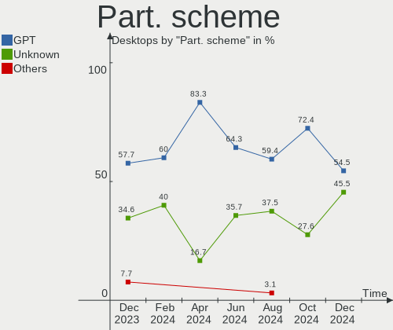

| Type    | Desktops | Percent |
|---------|----------|---------|
| GPT     | 9        | 50%     |
| Unknown | 7        | 38.89%  |
| MBR     | 2        | 11.11%  |

Dual Boot with Linux/BSD
------------------------

Hosting more than one Linux/BSD

| Dual boot | Desktops | Percent |
|-----------|----------|---------|
| No        | 16       | 88.89%  |
| Yes       | 2        | 11.11%  |

Dual Boot (Win)
---------------

Hosting Linux and Windows

| Dual boot | Desktops | Percent |
|-----------|----------|---------|
| No        | 13       | 72.22%  |
| Yes       | 5        | 27.78%  |

Board
-----

Vendor
------

Motherboard manufacturer

| Name                | Desktops | Percent |
|---------------------|----------|---------|
| MSI                 | 6        | 33.33%  |
| ASUSTek Computer    | 4        | 22.22%  |
| Gigabyte Technology | 2        | 11.11%  |
| ASRock              | 2        | 11.11%  |
| Huanan              | 1        | 5.56%   |
| Hewlett-Packard     | 1        | 5.56%   |
| Dell                | 1        | 5.56%   |
| AZW                 | 1        | 5.56%   |

Model
-----

Motherboard model

| Name                    | Desktops | Percent |
|-------------------------|----------|---------|
| MSI MS-7C37             | 3        | 16.67%  |
| MSI MS-7C91             | 1        | 5.56%   |
| MSI MS-7B50             | 1        | 5.56%   |
| MSI MS-7A11             | 1        | 5.56%   |
| Huanan X99-8M-F V1.3    | 1        | 5.56%   |
| HP EliteDesk 800 G1 SFF | 1        | 5.56%   |
| Gigabyte P55A-UD3       | 1        | 5.56%   |
| Gigabyte GB-BRR7H-4800  | 1        | 5.56%   |
| Dell OptiPlex 3080      | 1        | 5.56%   |
| AZW SEi                 | 1        | 5.56%   |
| ASUS SABERTOOTH P67     | 1        | 5.56%   |
| ASUS PRIME Z390-P       | 1        | 5.56%   |
| ASUS PRIME H310M-K      | 1        | 5.56%   |
| ASUS H170M-PLUS         | 1        | 5.56%   |
| ASRock B450M-HDV R4.0   | 1        | 5.56%   |
| ASRock B450 Pro4        | 1        | 5.56%   |

Model Family
------------

Motherboard model prefix

| Name                   | Desktops | Percent |
|------------------------|----------|---------|
| MSI MS-7C37            | 3        | 16.67%  |
| ASUS PRIME             | 2        | 11.11%  |
| MSI MS-7C91            | 1        | 5.56%   |
| MSI MS-7B50            | 1        | 5.56%   |
| MSI MS-7A11            | 1        | 5.56%   |
| Huanan X99-8M-F        | 1        | 5.56%   |
| HP EliteDesk           | 1        | 5.56%   |
| Gigabyte P55A-UD3      | 1        | 5.56%   |
| Gigabyte GB-BRR7H-4800 | 1        | 5.56%   |
| Dell OptiPlex          | 1        | 5.56%   |
| AZW SEi                | 1        | 5.56%   |
| ASUS SABERTOOTH        | 1        | 5.56%   |
| ASUS H170M-PLUS        | 1        | 5.56%   |
| ASRock B450M-HDV       | 1        | 5.56%   |
| ASRock B450            | 1        | 5.56%   |

MFG Year
--------

Motherboard manufacture year

| Year | Desktops | Percent |
|------|----------|---------|
| 2019 | 4        | 22.22%  |
| 2018 | 4        | 22.22%  |
| 2022 | 3        | 16.67%  |
| 2020 | 2        | 11.11%  |
| 2016 | 1        | 5.56%   |
| 2015 | 1        | 5.56%   |
| 2013 | 1        | 5.56%   |
| 2011 | 1        | 5.56%   |
| 2009 | 1        | 5.56%   |

Form Factor
-----------

Physical design of the computer

| Name    | Desktops | Percent |
|---------|----------|---------|
| Desktop | 18       | 100%    |

Secure Boot
-----------

Enabled or disabled

| State    | Desktops | Percent |
|----------|----------|---------|
| Disabled | 18       | 100%    |

Coreboot
--------

Have coreboot on board

| Used | Desktops | Percent |
|------|----------|---------|
| No   | 18       | 100%    |

RAM Size
--------

Total RAM memory

| Size in GB | Desktops | Percent |
|------------|----------|---------|
| 16.01-24.0 | 13       | 72.22%  |
| 8.01-16.0  | 3        | 16.67%  |
| 32.01-64.0 | 2        | 11.11%  |

RAM Used
--------

Used RAM memory

| Used GB   | Desktops | Percent |
|-----------|----------|---------|
| 3.01-4.0  | 7        | 38.89%  |
| 4.01-8.0  | 3        | 16.67%  |
| 8.01-16.0 | 3        | 16.67%  |
| 2.01-3.0  | 2        | 11.11%  |
| 1.01-2.0  | 2        | 11.11%  |
| 0.51-1.0  | 1        | 5.56%   |

Total Drives
------------

Number of drives on board

| Drives | Desktops | Percent |
|--------|----------|---------|
| 1      | 7        | 38.89%  |
| 2      | 5        | 27.78%  |
| 3      | 4        | 22.22%  |
| 4      | 2        | 11.11%  |

Has CD-ROM
----------

Has CD-ROM on board

| Presented | Desktops | Percent |
|-----------|----------|---------|
| No        | 16       | 88.89%  |
| Yes       | 2        | 11.11%  |

Has Ethernet
------------

Has Ethernet on board

| Presented | Desktops | Percent |
|-----------|----------|---------|
| Yes       | 18       | 100%    |

Has WiFi
--------

Has WiFi module

| Presented | Desktops | Percent |
|-----------|----------|---------|
| Yes       | 9        | 50%     |
| No        | 9        | 50%     |

Has Bluetooth
-------------

Has Bluetooth module

| Presented | Desktops | Percent |
|-----------|----------|---------|
| Yes       | 10       | 55.56%  |
| No        | 8        | 44.44%  |

Location
--------

Country
-------

Geographic location (country)

| Country     | Desktops | Percent |
|-------------|----------|---------|
| USA         | 3        | 16.67%  |
| Russia      | 2        | 11.11%  |
| Netherlands | 2        | 11.11%  |
| Denmark     | 2        | 11.11%  |
| Canada      | 2        | 11.11%  |
| Australia   | 2        | 11.11%  |
| Sweden      | 1        | 5.56%   |
| Italy       | 1        | 5.56%   |
| Germany     | 1        | 5.56%   |
| Belgium     | 1        | 5.56%   |
| Austria     | 1        | 5.56%   |

City
----

Geographic location (city)

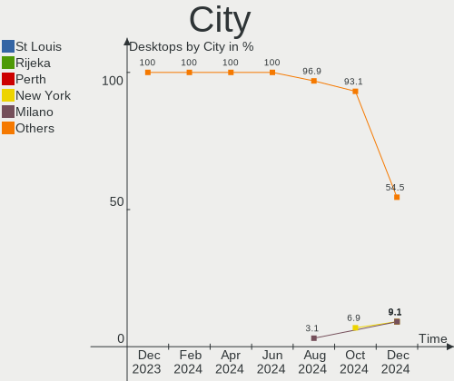

| City              | Desktops | Percent |
|-------------------|----------|---------|
| Sydney            | 1        | 5.56%   |
| St Petersburg     | 1        | 5.56%   |
| Slagelse          | 1        | 5.56%   |
| Seiersberg        | 1        | 5.56%   |
| Saratov           | 1        | 5.56%   |
| Rozzano           | 1        | 5.56%   |
| Phoenix           | 1        | 5.56%   |
| North Little Rock | 1        | 5.56%   |
| Montreal          | 1        | 5.56%   |
| Melbourne         | 1        | 5.56%   |
| Los Angeles       | 1        | 5.56%   |
| Gothenburg        | 1        | 5.56%   |
| Charlottenlund    | 1        | 5.56%   |
| Boom              | 1        | 5.56%   |
| Bilthoven         | 1        | 5.56%   |
| Amsterdam         | 1        | 5.56%   |
| Aachen            | 1        | 5.56%   |
| Unknown           | 1        | 5.56%   |

Drives
------

Drive Vendor
------------

Hard drive vendors

| Vendor                    | Desktops | Drives | Percent |
|---------------------------|----------|--------|---------|
| Seagate                   | 7        | 7      | 20%     |
| Samsung Electronics       | 7        | 8      | 20%     |
| WDC                       | 6        | 7      | 17.14%  |
| Kingston                  | 5        | 5      | 14.29%  |
| Crucial                   | 3        | 3      | 8.57%   |
| SK hynix                  | 1        | 1      | 2.86%   |
| SanDisk                   | 1        | 1      | 2.86%   |
| Phison Electronics        | 1        | 1      | 2.86%   |
| Micron/Crucial Technology | 1        | 1      | 2.86%   |
| Intel                     | 1        | 1      | 2.86%   |
| Hitachi                   | 1        | 1      | 2.86%   |
| Corsair                   | 1        | 1      | 2.86%   |

Drive Model
-----------

Hard drive models

| Model                                   | Desktops | Percent |
|-----------------------------------------|----------|---------|
| Seagate ST2000DM008-2FR102 2TB          | 2        | 5.56%   |
| Samsung SSD 860 EVO 1TB                 | 2        | 5.56%   |
| Crucial CT500MX500SSD1 500GB            | 2        | 5.56%   |
| WDC WDS500G2B0A-00SM50 500GB SSD        | 1        | 2.78%   |
| WDC WDS120G2G0B-00EPW0 120GB SSD        | 1        | 2.78%   |
| WDC WD5000AACS-00ZUB0 500GB             | 1        | 2.78%   |
| WDC WD40EFAX-68JH4N1 4TB                | 1        | 2.78%   |
| WDC WD20EARS-42S0XB0 2TB                | 1        | 2.78%   |
| WDC WD10EZEX-08WN4A0 1TB                | 1        | 2.78%   |
| SK hynix BC511 NVMe 256GB               | 1        | 2.78%   |
| Seagate ST2000LM015-2E8174 2TB          | 1        | 2.78%   |
| Seagate ST2000DX002-2DV164 2TB          | 1        | 2.78%   |
| Seagate ST1000NC001-1DY162 1TB          | 1        | 2.78%   |
| Seagate ST1000LM048-2E7172 1TB          | 1        | 2.78%   |
| Seagate ST1000DX001-1NS162-SSHD 1TB     | 1        | 2.78%   |
| SanDisk SDSSDH3512G 512GB               | 1        | 2.78%   |
| Samsung SSD 980 1TB                     | 1        | 2.78%   |
| Samsung SSD 870 EVO 250GB               | 1        | 2.78%   |
| Samsung SSD 870 EVO 1TB                 | 1        | 2.78%   |
| Samsung SSD 830 Series 128GB            | 1        | 2.78%   |
| Samsung NVMe SSD Drive 250GB            | 1        | 2.78%   |
| Samsung HD103SJ 1TB                     | 1        | 2.78%   |
| Phison PS5013 E13 NVMe Controller 512GB | 1        | 2.78%   |
| Micron/Crucial P2 NVMe PCIe SSD 500GB   | 1        | 2.78%   |
| Kingston SUV500240G 240GB SSD           | 1        | 2.78%   |
| Kingston SNVS500G 500GB                 | 1        | 2.78%   |
| Kingston SNVS2000G 2TB                  | 1        | 2.78%   |
| Kingston SA400S37480G 480GB SSD         | 1        | 2.78%   |
| Kingston SA400S37120G 120GB SSD         | 1        | 2.78%   |
| Intel SSD 660P Series 512GB             | 1        | 2.78%   |
| Hitachi HTS547575A9E384 752GB           | 1        | 2.78%   |
| Crucial CT240BX500SSD1 240GB            | 1        | 2.78%   |
| Corsair Force GT 120GB SSD              | 1        | 2.78%   |

HDD Vendor
----------

Hard disk drive vendors

| Vendor              | Desktops | Drives | Percent |
|---------------------|----------|--------|---------|
| Seagate             | 7        | 7      | 53.85%  |
| WDC                 | 4        | 5      | 30.77%  |
| Samsung Electronics | 1        | 1      | 7.69%   |
| Hitachi             | 1        | 1      | 7.69%   |

SSD Vendor
----------

Solid state drive vendors

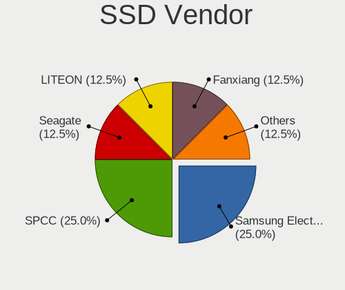

| Vendor              | Desktops | Drives | Percent |
|---------------------|----------|--------|---------|
| Samsung Electronics | 4        | 5      | 28.57%  |
| Kingston            | 3        | 3      | 21.43%  |
| Crucial             | 3        | 3      | 21.43%  |
| WDC                 | 2        | 2      | 14.29%  |
| SanDisk             | 1        | 1      | 7.14%   |
| Corsair             | 1        | 1      | 7.14%   |

Drive Kind
----------

HDD or SSD

| Kind | Desktops | Drives | Percent |
|------|----------|--------|---------|
| HDD  | 12       | 14     | 38.71%  |
| SSD  | 11       | 15     | 35.48%  |
| NVMe | 8        | 8      | 25.81%  |

Drive Connector
---------------

SATA, SAS, NVMe, etc.

| Type | Desktops | Drives | Percent |
|------|----------|--------|---------|
| SATA | 15       | 29     | 65.22%  |
| NVMe | 8        | 8      | 34.78%  |

Drive Size
----------

Size of hard drive

| Size in TB | Desktops | Drives | Percent |
|------------|----------|--------|---------|
| 0.51-1.0   | 8        | 10     | 36.36%  |
| 0.01-0.5   | 8        | 12     | 36.36%  |
| 1.01-2.0   | 5        | 6      | 22.73%  |
| 3.01-4.0   | 1        | 1      | 4.55%   |

Space Total
-----------

Amount of disk space available on the file system

| Size in GB     | Desktops | Percent |
|----------------|----------|---------|
| 251-500        | 4        | 22.22%  |
| 1001-2000      | 4        | 22.22%  |
| More than 3000 | 3        | 16.67%  |
| 2001-3000      | 2        | 11.11%  |
| 501-1000       | 2        | 11.11%  |
| Unknown        | 2        | 11.11%  |
| 101-250        | 1        | 5.56%   |

Space Used
----------

Amount of used disk space

| Used GB   | Desktops | Percent |
|-----------|----------|---------|
| 1001-2000 | 4        | 22.22%  |
| 501-1000  | 4        | 22.22%  |
| 21-50     | 3        | 16.67%  |
| 101-250   | 3        | 16.67%  |
| Unknown   | 2        | 11.11%  |
| 251-500   | 1        | 5.56%   |
| 1-20      | 1        | 5.56%   |

Malfunc. Drives
---------------

Drive models with a malfunction

| Model                          | Desktops | Drives | Percent |
|--------------------------------|----------|--------|---------|
| Seagate ST2000DX002-2DV164 2TB | 1        | 1      | 33.33%  |
| Hitachi HTS547575A9E384 752GB  | 1        | 1      | 33.33%  |
| Crucial CT500MX500SSD1 500GB   | 1        | 1      | 33.33%  |

Malfunc. Drive Vendor
---------------------

Vendors of faulty drives

| Vendor  | Desktops | Drives | Percent |
|---------|----------|--------|---------|
| Seagate | 1        | 1      | 33.33%  |
| Hitachi | 1        | 1      | 33.33%  |
| Crucial | 1        | 1      | 33.33%  |

Malfunc. HDD Vendor
-------------------

Vendors of faulty HDD drives

| Vendor  | Desktops | Drives | Percent |
|---------|----------|--------|---------|
| Seagate | 1        | 1      | 50%     |
| Hitachi | 1        | 1      | 50%     |

Malfunc. Drive Kind
-------------------

Kinds of faulty drives

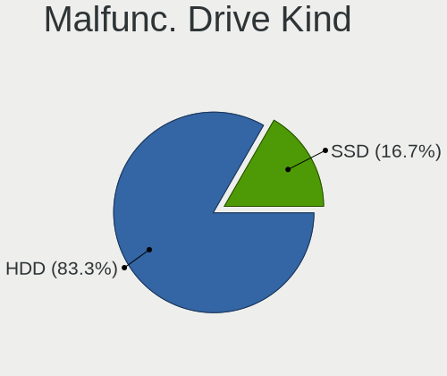

| Kind | Desktops | Drives | Percent |
|------|----------|--------|---------|
| HDD  | 2        | 2      | 66.67%  |
| SSD  | 1        | 1      | 33.33%  |

Failed Drives
-------------

Failed drive models

Zero info for selected period =(

Failed Drive Vendor
-------------------

Failed drive vendors

Zero info for selected period =(

Drive Status
------------

Number of failed and malfunc. drives

| Status   | Desktops | Drives | Percent |
|----------|----------|--------|---------|
| Works    | 12       | 24     | 57.14%  |
| Detected | 6        | 10     | 28.57%  |
| Malfunc  | 3        | 3      | 14.29%  |

Storage controller
------------------

Storage Vendor
--------------

Storage controller vendors

| Vendor                      | Desktops | Percent |
|-----------------------------|----------|---------|
| Intel                       | 11       | 36.67%  |
| AMD                         | 6        | 20%     |
| ASMedia Technology          | 4        | 13.33%  |
| Samsung Electronics         | 2        | 6.67%   |
| Kingston Technology Company | 2        | 6.67%   |
| SK hynix                    | 1        | 3.33%   |
| Phison Electronics          | 1        | 3.33%   |
| Micron/Crucial Technology   | 1        | 3.33%   |
| Marvell Technology Group    | 1        | 3.33%   |
| JMicron Technology          | 1        | 3.33%   |

Storage Model
-------------

Storage controller models

| Model                                                                          | Desktops | Percent |
|--------------------------------------------------------------------------------|----------|---------|
| ASMedia ASM1062 Serial ATA Controller                                          | 4        | 12.9%   |
| AMD FCH SATA Controller [AHCI mode]                                            | 3        | 9.68%   |
| Kingston Company Company Non-Volatile memory controller                        | 2        | 6.45%   |
| Intel Q170/Q150/B150/H170/H110/Z170/CM236 Chipset SATA Controller [AHCI Mode]  | 2        | 6.45%   |
| Intel Cannon Lake PCH SATA AHCI Controller                                     | 2        | 6.45%   |
| Intel 8 Series/C220 Series Chipset Family 6-port SATA Controller 1 [AHCI mode] | 2        | 6.45%   |
| AMD 400 Series Chipset SATA Controller                                         | 2        | 6.45%   |
| SK hynix BC511                                                                 | 1        | 3.23%   |
| Samsung NVMe SSD Controller SM981/PM981/PM983                                  | 1        | 3.23%   |
| Samsung NVMe SSD Controller 980                                                | 1        | 3.23%   |
| Phison PS5013 E13 NVMe Controller                                              | 1        | 3.23%   |
| Micron/Crucial P2 NVMe PCIe SSD                                                | 1        | 3.23%   |
| Marvell Group 88SE9172 SATA 6Gb/s Controller                                   | 1        | 3.23%   |
| JMicron JMB362 SATA Controller                                                 | 1        | 3.23%   |
| Intel SSD 660P Series                                                          | 1        | 3.23%   |
| Intel SATA Controller [RAID mode]                                              | 1        | 3.23%   |
| Intel Cannon Point-LP SATA Controller [AHCI Mode]                              | 1        | 3.23%   |
| Intel 6 Series/C200 Series Chipset Family 6 port Desktop SATA AHCI Controller  | 1        | 3.23%   |
| Intel 5 Series/3400 Series Chipset 6 port SATA AHCI Controller                 | 1        | 3.23%   |
| Intel 400 Series Chipset Family SATA AHCI Controller                           | 1        | 3.23%   |
| AMD 500 Series Chipset SATA Controller                                         | 1        | 3.23%   |

Storage Kind
------------

Kind of storage controller (IDE, SATA, NVMe, SAS, ...)

| Kind | Desktops | Percent |
|------|----------|---------|
| SATA | 16       | 64%     |
| NVMe | 8        | 32%     |
| RAID | 1        | 4%      |

Processor
---------

CPU Vendor
----------

Processor vendors

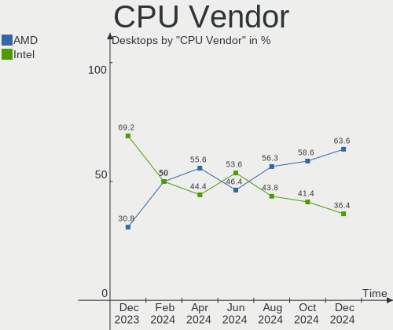

| Vendor | Desktops | Percent |
|--------|----------|---------|
| Intel  | 11       | 61.11%  |
| AMD    | 7        | 38.89%  |

CPU Model
---------

Processor models

| Model                                  | Desktops | Percent |
|----------------------------------------|----------|---------|
| Intel Core i5-6600K CPU @ 3.50GHz      | 2        | 11.11%  |
| AMD Ryzen 5 3600 6-Core Processor      | 2        | 11.11%  |
| Intel Xeon CPU E5-2640 v3 @ 2.60GHz    | 1        | 5.56%   |
| Intel Core i9-9900K CPU @ 3.60GHz      | 1        | 5.56%   |
| Intel Core i7-4790 CPU @ 3.60GHz       | 1        | 5.56%   |
| Intel Core i7-2600K CPU @ 3.40GHz      | 1        | 5.56%   |
| Intel Core i5-9600KF CPU @ 3.70GHz     | 1        | 5.56%   |
| Intel Core i5-9400F CPU @ 2.90GHz      | 1        | 5.56%   |
| Intel Core i5-8279U CPU @ 2.40GHz      | 1        | 5.56%   |
| Intel Core i5-10500 CPU @ 3.10GHz      | 1        | 5.56%   |
| Intel Core i5 CPU 750 @ 2.67GHz        | 1        | 5.56%   |
| AMD Ryzen 9 5900X 12-Core Processor    | 1        | 5.56%   |
| AMD Ryzen 7 4800U with Radeon Graphics | 1        | 5.56%   |
| AMD Ryzen 7 3700X 8-Core Processor     | 1        | 5.56%   |
| AMD Ryzen 5 5600X 6-Core Processor     | 1        | 5.56%   |
| AMD Ryzen 5 5600G with Radeon Graphics | 1        | 5.56%   |

CPU Model Family
----------------

Processor model prefix

| Model         | Desktops | Percent |
|---------------|----------|---------|
| Intel Core i5 | 7        | 38.89%  |
| AMD Ryzen 5   | 4        | 22.22%  |
| Intel Core i7 | 2        | 11.11%  |
| AMD Ryzen 7   | 2        | 11.11%  |
| Intel Xeon    | 1        | 5.56%   |
| Intel Core i9 | 1        | 5.56%   |
| AMD Ryzen 9   | 1        | 5.56%   |

CPU Cores
---------

Number of processor cores

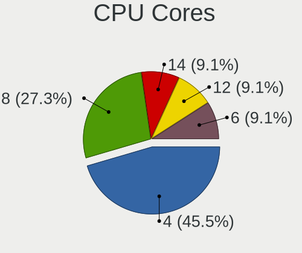

| Number | Desktops | Percent |
|--------|----------|---------|
| 6      | 7        | 38.89%  |
| 4      | 6        | 33.33%  |
| 8      | 4        | 22.22%  |
| 12     | 1        | 5.56%   |

CPU Sockets
-----------

Number of sockets

| Number | Desktops | Percent |
|--------|----------|---------|
| 1      | 18       | 100%    |

CPU Threads
-----------

Threads per core (Hyper-Threading)

| Number | Desktops | Percent |
|--------|----------|---------|
| 2      | 12       | 66.67%  |
| 1      | 6        | 33.33%  |

CPU Op-Modes
------------

CPU Operation Modes (32-bit, 64-bit)

| Op mode        | Desktops | Percent |
|----------------|----------|---------|
| 32-bit, 64-bit | 18       | 100%    |

CPU Microcode
-------------

Microcode number

| Number     | Desktops | Percent |
|------------|----------|---------|
| Unknown    | 9        | 50%     |
| 0x08701021 | 2        | 11.11%  |
| 0xa0653    | 1        | 5.56%   |
| 0x906ea    | 1        | 5.56%   |
| 0x506e3    | 1        | 5.56%   |
| 0x306f2    | 1        | 5.56%   |
| 0x106e5    | 1        | 5.56%   |
| 0x0a50000c | 1        | 5.56%   |
| 0x08600103 | 1        | 5.56%   |

CPU Microarch
-------------

Microarchitecture

| Name        | Desktops | Percent |
|-------------|----------|---------|
| Zen 2       | 4        | 22.22%  |
| KabyLake    | 4        | 22.22%  |
| Zen 3       | 3        | 16.67%  |
| Skylake     | 2        | 11.11%  |
| Haswell     | 2        | 11.11%  |
| SandyBridge | 1        | 5.56%   |
| Nehalem     | 1        | 5.56%   |
| CometLake   | 1        | 5.56%   |

Graphics
--------

GPU Vendor
----------

Vendors of graphics cards

| Vendor | Desktops | Percent |
|--------|----------|---------|
| Nvidia | 8        | 42.11%  |
| AMD    | 8        | 42.11%  |
| Intel  | 3        | 15.79%  |

GPU Model
---------

Graphics card models

| Model                                                                       | Desktops | Percent |
|-----------------------------------------------------------------------------|----------|---------|
| AMD Ellesmere [Radeon RX 470/480/570/570X/580/580X/590]                     | 2        | 10.53%  |
| Nvidia TU117 [GeForce GTX 1650]                                             | 1        | 5.26%   |
| Nvidia TU116 [GeForce GTX 1660]                                             | 1        | 5.26%   |
| Nvidia TU116 [GeForce GTX 1660 Ti]                                          | 1        | 5.26%   |
| Nvidia TU106 [GeForce RTX 2060 SUPER]                                       | 1        | 5.26%   |
| Nvidia GP106 [GeForce GTX 1060 6GB]                                         | 1        | 5.26%   |
| Nvidia GM204 [GeForce GTX 970]                                              | 1        | 5.26%   |
| Nvidia GM107 [GeForce GTX 750 Ti]                                           | 1        | 5.26%   |
| Nvidia GA106 [Geforce RTX 3050]                                             | 1        | 5.26%   |
| Intel Xeon E3-1200 v3/4th Gen Core Processor Integrated Graphics Controller | 1        | 5.26%   |
| Intel CometLake-S GT2 [UHD Graphics 630]                                    | 1        | 5.26%   |
| Intel CoffeeLake-U GT3e [Iris Plus Graphics 655]                            | 1        | 5.26%   |
| AMD Tonga PRO [Radeon R9 285/380]                                           | 1        | 5.26%   |
| AMD Renoir                                                                  | 1        | 5.26%   |
| AMD Navi 23 [Radeon RX 6600/6600 XT/6600M]                                  | 1        | 5.26%   |
| AMD Navi 10 [Radeon RX 5600 OEM/5600 XT / 5700/5700 XT]                     | 1        | 5.26%   |
| AMD Cezanne                                                                 | 1        | 5.26%   |
| AMD Caicos [Radeon HD 6450/7450/8450 / R5 230 OEM]                          | 1        | 5.26%   |

GPU Combo
---------

Combinations of graphics cards

| Name         | Desktops | Percent |
|--------------|----------|---------|
| 1 x Nvidia   | 7        | 38.89%  |
| 1 x AMD      | 7        | 38.89%  |
| 1 x Intel    | 3        | 16.67%  |
| AMD + Nvidia | 1        | 5.56%   |

GPU Driver
----------

Free vs proprietary

| Driver      | Desktops | Percent |
|-------------|----------|---------|
| Free        | 11       | 61.11%  |
| Proprietary | 7        | 38.89%  |

GPU Memory
----------

Total video memory

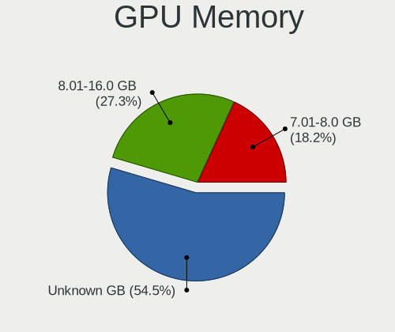

| Size in GB | Desktops | Percent |
|------------|----------|---------|
| Unknown    | 9        | 50%     |
| 3.01-4.0   | 4        | 22.22%  |
| 5.01-6.0   | 2        | 11.11%  |
| 7.01-8.0   | 1        | 5.56%   |
| 1.01-2.0   | 1        | 5.56%   |
| 0.01-0.5   | 1        | 5.56%   |

Monitor
-------

Monitor Vendor
--------------

Monitor vendors

| Vendor               | Desktops | Percent |
|----------------------|----------|---------|
| Samsung Electronics  | 6        | 30%     |
| AOC                  | 5        | 25%     |
| Sony                 | 1        | 5%      |
| Philips              | 1        | 5%      |
| Hewlett-Packard      | 1        | 5%      |
| Goldstar             | 1        | 5%      |
| Dell                 | 1        | 5%      |
| BenQ                 | 1        | 5%      |
| AUS                  | 1        | 5%      |
| Ancor Communications | 1        | 5%      |
| Acer                 | 1        | 5%      |

Monitor Model
-------------

Monitor models

| Model                                                                 | Desktops | Percent |
|-----------------------------------------------------------------------|----------|---------|
| Samsung Electronics S24D330 SAM0D92 1920x1080 531x299mm 24.0-inch     | 2        | 10%     |
| AOC 27G2G3 AOC2702 1920x1080 598x336mm 27.0-inch                      | 2        | 10%     |
| Sony TV SNY6804 1600x900                                              | 1        | 5%      |
| Samsung Electronics S27R65x SAM1045 1920x1080 598x336mm 27.0-inch     | 1        | 5%      |
| Samsung Electronics S24R35xFZ SAM71A8 1920x1080 521x293mm 23.5-inch   | 1        | 5%      |
| Samsung Electronics LCD Monitor SAM090B 1920x1080 890x500mm 40.2-inch | 1        | 5%      |
| Samsung Electronics LCD Monitor SAM02EB 1920x540                      | 1        | 5%      |
| Philips 19S PHL0878 1280x1024 376x301mm 19.0-inch                     | 1        | 5%      |
| Hewlett-Packard 25mx HPN359A 1920x1080 544x303mm 24.5-inch            | 1        | 5%      |
| Goldstar 22MP55 GSM5A24 1920x1080 477x268mm 21.5-inch                 | 1        | 5%      |
| Dell U2412M DELA07B 1920x1200 518x324mm 24.1-inch                     | 1        | 5%      |
| BenQ XL2411Z BNQ7F31 1920x1080 531x298mm 24.0-inch                    | 1        | 5%      |
| AUS LCD Monitor VG27A 2560x1440                                       | 1        | 5%      |
| AOC Q32G1WG4 AOC3201 2560x1440 697x393mm 31.5-inch                    | 1        | 5%      |
| AOC Q3279WG5B AOC3279 2560x1440 725x428mm 33.1-inch                   | 1        | 5%      |
| AOC AG271QG4 AOC2710 2560x1440 597x336mm 27.0-inch                    | 1        | 5%      |
| Ancor Communications VS278 ACI27A1 1920x1080 598x336mm 27.0-inch      | 1        | 5%      |
| Acer R251 ACR0505 1920x1080 553x309mm 24.9-inch                       | 1        | 5%      |

Monitor Resolution
------------------

Monitor screen resolution

| Resolution        | Desktops | Percent |
|-------------------|----------|---------|
| 1920x1080 (FHD)   | 9        | 47.37%  |
| 3840x2160 (4K)    | 3        | 15.79%  |
| 2560x1440 (QHD)   | 3        | 15.79%  |
| 1920x540          | 1        | 5.26%   |
| 1920x1200 (WUXGA) | 1        | 5.26%   |
| 1600x900 (HD+)    | 1        | 5.26%   |
| 1280x1024 (SXGA)  | 1        | 5.26%   |

Monitor Diagonal
----------------

Diagonal size in inches

| Inches  | Desktops | Percent |
|---------|----------|---------|
| 24      | 6        | 30%     |
| 27      | 5        | 25%     |
| Unknown | 2        | 10%     |
| 72      | 1        | 5%      |
| 54      | 1        | 5%      |
| 33      | 1        | 5%      |
| 31      | 1        | 5%      |
| 23      | 1        | 5%      |
| 21      | 1        | 5%      |
| 19      | 1        | 5%      |

Monitor Width
-------------

Physical width

| Width in mm | Desktops | Percent |
|-------------|----------|---------|
| 501-600     | 11       | 57.89%  |
| Unknown     | 2        | 10.53%  |
| 701-800     | 1        | 5.26%   |
| 601-700     | 1        | 5.26%   |
| 401-500     | 1        | 5.26%   |
| 351-400     | 1        | 5.26%   |
| 1501-2000   | 1        | 5.26%   |
| 1001-1500   | 1        | 5.26%   |

Aspect Ratio
------------

Proportional relationship between the width and the height

| Ratio   | Desktops | Percent |
|---------|----------|---------|
| 16/9    | 14       | 82.35%  |
| 5/4     | 1        | 5.88%   |
| 16/10   | 1        | 5.88%   |
| Unknown | 1        | 5.88%   |

Monitor Area
------------

Area in inch²

| Area in inch² | Desktops | Percent |
|----------------|----------|---------|
| 301-350        | 5        | 25%     |
| 201-250        | 5        | 25%     |
| 251-300        | 3        | 15%     |
| More than 1000 | 2        | 10%     |
| 351-500        | 2        | 10%     |
| Unknown        | 2        | 10%     |
| 151-200        | 1        | 5%      |

Pixel Density
-------------

Pixels per inch

| Density | Desktops | Percent |
|---------|----------|---------|
| 51-100  | 13       | 72.22%  |
| 1-50    | 2        | 11.11%  |
| Unknown | 2        | 11.11%  |
| 101-120 | 1        | 5.56%   |

Multiple Monitors
-----------------

Total monitors connected

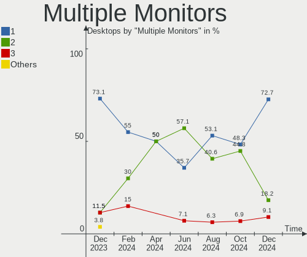

| Total | Desktops | Percent |
|-------|----------|---------|
| 1     | 15       | 83.33%  |
| 2     | 3        | 16.67%  |

Network
-------

Net Controller Vendor
---------------------

Controller vendors

| Vendor                | Desktops | Percent |
|-----------------------|----------|---------|
| Realtek Semiconductor | 14       | 51.85%  |
| Intel                 | 10       | 37.04%  |
| TP-Link               | 1        | 3.7%    |
| Qualcomm Atheros      | 1        | 3.7%    |
| ASIX Electronics      | 1        | 3.7%    |

Net Controller Model
--------------------

Controller models

| Model                                                             | Desktops | Percent |
|-------------------------------------------------------------------|----------|---------|
| Realtek RTL8111/8168/8411 PCI Express Gigabit Ethernet Controller | 11       | 37.93%  |
| Realtek RTL8125 2.5GbE Controller                                 | 3        | 10.34%  |
| Intel Wi-Fi 6 AX200                                               | 3        | 10.34%  |
| Intel Ethernet Connection (2) I219-V                              | 2        | 6.9%    |
| TP-Link TL-WN722N v2/v3 [Realtek RTL8188EUS]                      | 1        | 3.45%   |
| Realtek RTL8192EU 802.11b/g/n WLAN Adapter                        | 1        | 3.45%   |
| Qualcomm Atheros AR9287 Wireless Network Adapter (PCI-Express)    | 1        | 3.45%   |
| Intel Wireless-AC 9260                                            | 1        | 3.45%   |
| Intel Wireless 3165                                               | 1        | 3.45%   |
| Intel Ethernet Connection I217-LM                                 | 1        | 3.45%   |
| Intel Ethernet Connection (7) I219-V                              | 1        | 3.45%   |
| Intel Cannon Lake PCH CNVi WiFi                                   | 1        | 3.45%   |
| Intel 82579V Gigabit Network Connection                           | 1        | 3.45%   |
| ASIX AX88179 Gigabit Ethernet                                     | 1        | 3.45%   |

Wireless Vendor
---------------

Wireless vendors

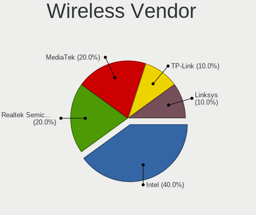

| Vendor                | Desktops | Percent |
|-----------------------|----------|---------|
| Intel                 | 6        | 66.67%  |
| TP-Link               | 1        | 11.11%  |
| Realtek Semiconductor | 1        | 11.11%  |
| Qualcomm Atheros      | 1        | 11.11%  |

Wireless Model
--------------

Wireless models

| Model                                                          | Desktops | Percent |
|----------------------------------------------------------------|----------|---------|
| Intel Wi-Fi 6 AX200                                            | 3        | 33.33%  |
| TP-Link TL-WN722N v2/v3 [Realtek RTL8188EUS]                   | 1        | 11.11%  |
| Realtek RTL8192EU 802.11b/g/n WLAN Adapter                     | 1        | 11.11%  |
| Qualcomm Atheros AR9287 Wireless Network Adapter (PCI-Express) | 1        | 11.11%  |
| Intel Wireless-AC 9260                                         | 1        | 11.11%  |
| Intel Wireless 3165                                            | 1        | 11.11%  |
| Intel Cannon Lake PCH CNVi WiFi                                | 1        | 11.11%  |

Ethernet Vendor
---------------

Ethernet vendors

| Vendor                | Desktops | Percent |
|-----------------------|----------|---------|
| Realtek Semiconductor | 14       | 70%     |
| Intel                 | 5        | 25%     |
| ASIX Electronics      | 1        | 5%      |

Ethernet Model
--------------

Ethernet models

| Model                                                             | Desktops | Percent |
|-------------------------------------------------------------------|----------|---------|
| Realtek RTL8111/8168/8411 PCI Express Gigabit Ethernet Controller | 11       | 55%     |
| Realtek RTL8125 2.5GbE Controller                                 | 3        | 15%     |
| Intel Ethernet Connection (2) I219-V                              | 2        | 10%     |
| Intel Ethernet Connection I217-LM                                 | 1        | 5%      |
| Intel Ethernet Connection (7) I219-V                              | 1        | 5%      |
| Intel 82579V Gigabit Network Connection                           | 1        | 5%      |
| ASIX AX88179 Gigabit Ethernet                                     | 1        | 5%      |

Net Controller Kind
-------------------

Ethernet, WiFi or modem

| Kind     | Desktops | Percent |
|----------|----------|---------|
| Ethernet | 18       | 66.67%  |
| WiFi     | 9        | 33.33%  |

Used Controller
---------------

Currently used network controller

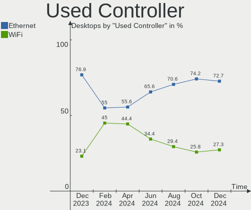

| Kind     | Desktops | Percent |
|----------|----------|---------|
| Ethernet | 15       | 83.33%  |
| WiFi     | 3        | 16.67%  |

NICs
----

Total network controllers on board

| Total | Desktops | Percent |
|-------|----------|---------|
| 1     | 10       | 55.56%  |
| 2     | 7        | 38.89%  |
| 3     | 1        | 5.56%   |

IPv6
----

IPv6 vs IPv4

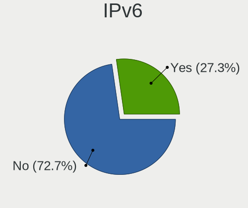

| Used | Desktops | Percent |
|------|----------|---------|
| No   | 12       | 66.67%  |
| Yes  | 6        | 33.33%  |

Bluetooth
---------

Bluetooth Vendor
----------------

Controller vendors

| Vendor                  | Desktops | Percent |
|-------------------------|----------|---------|
| Intel                   | 7        | 63.64%  |
| Cambridge Silicon Radio | 2        | 18.18%  |
| TP-Link                 | 1        | 9.09%   |
| Realtek Semiconductor   | 1        | 9.09%   |

Bluetooth Model
---------------

Controller models

| Model                                               | Desktops | Percent |
|-----------------------------------------------------|----------|---------|
| Intel AX200 Bluetooth                               | 3        | 27.27%  |
| Cambridge Silicon Radio Bluetooth Dongle (HCI mode) | 2        | 18.18%  |
| TP-Link UB500 Adapter                               | 1        | 9.09%   |
| Realtek Bluetooth Radio                             | 1        | 9.09%   |
| Intel Wireless-AC 9260 Bluetooth Adapter            | 1        | 9.09%   |
| Intel Wireless-AC 3168 Bluetooth                    | 1        | 9.09%   |
| Intel Bluetooth wireless interface                  | 1        | 9.09%   |
| Intel Bluetooth 9460/9560 Jefferson Peak (JfP)      | 1        | 9.09%   |

Sound
-----

Sound Vendor
------------

Sound card vendors

| Vendor                 | Desktops | Percent |
|------------------------|----------|---------|
| Intel                  | 11       | 28.95%  |
| AMD                    | 10       | 26.32%  |
| Nvidia                 | 8        | 21.05%  |
| Texas Instruments      | 1        | 2.63%   |
| SteelSeries ApS        | 1        | 2.63%   |
| Sony                   | 1        | 2.63%   |
| Logitech               | 1        | 2.63%   |
| GHW Micro              | 1        | 2.63%   |
| Focusrite-Novation     | 1        | 2.63%   |
| C-Media Electronics    | 1        | 2.63%   |
| AOKEO                  | 1        | 2.63%   |
| AlfaPlus Semiconductor | 1        | 2.63%   |

Sound Model
-----------

Sound card models

| Model                                                                             | Desktops | Percent |
|-----------------------------------------------------------------------------------|----------|---------|
| AMD Starship/Matisse HD Audio Controller                                          | 5        | 11.36%  |
| Intel Cannon Lake PCH cAVS                                                        | 3        | 6.82%   |
| Nvidia TU116 High Definition Audio Controller                                     | 2        | 4.55%   |
| Intel 8 Series/C220 Series Chipset High Definition Audio Controller               | 2        | 4.55%   |
| Intel 100 Series/C230 Series Chipset Family HD Audio Controller                   | 2        | 4.55%   |
| AMD Renoir Radeon High Definition Audio Controller                                | 2        | 4.55%   |
| AMD Family 17h/19h HD Audio Controller                                            | 2        | 4.55%   |
| AMD Ellesmere HDMI Audio [Radeon RX 470/480 / 570/580/590]                        | 2        | 4.55%   |
| Texas Instruments PCM2902 Audio Codec                                             | 1        | 2.27%   |
| SteelSeries ApS SteelSeries GameDAC                                               | 1        | 2.27%   |
| Sony DualShock 4 [CUH-ZCT2x]                                                      | 1        | 2.27%   |
| Nvidia TU107 GeForce GTX 1650 High Definition Audio Controller                    | 1        | 2.27%   |
| Nvidia TU106 High Definition Audio Controller                                     | 1        | 2.27%   |
| Nvidia GP106 High Definition Audio Controller                                     | 1        | 2.27%   |
| Nvidia GM204 High Definition Audio Controller                                     | 1        | 2.27%   |
| Nvidia GM107 High Definition Audio Controller [GeForce 940MX]                     | 1        | 2.27%   |
| Nvidia GA106 High Definition Audio Controller                                     | 1        | 2.27%   |
| Logitech G733 Gaming Headset                                                      | 1        | 2.27%   |
| Intel Xeon E3-1200 v3/4th Gen Core Processor HD Audio Controller                  | 1        | 2.27%   |
| Intel Comet Lake PCH-V cAVS                                                       | 1        | 2.27%   |
| Intel Cannon Point-LP High Definition Audio Controller                            | 1        | 2.27%   |
| Intel 6 Series/C200 Series Chipset Family High Definition Audio Controller        | 1        | 2.27%   |
| Intel 5 Series/3400 Series Chipset High Definition Audio                          | 1        | 2.27%   |
| GHW Micro GHW USB AUDIO                                                           | 1        | 2.27%   |
| Focusrite-Novation Focusrite Scarlett 2i2 2nd Gen                                 | 1        | 2.27%   |
| C-Media Electronics Blue Snowball                                                 | 1        | 2.27%   |
| AOKEO LCS_USB_Audio                                                               | 1        | 2.27%   |
| AMD Tonga HDMI Audio [Radeon R9 285/380]                                          | 1        | 2.27%   |
| AMD Navi 21/23 HDMI/DP Audio Controller                                           | 1        | 2.27%   |
| AMD Navi 10 HDMI Audio                                                            | 1        | 2.27%   |
| AMD Caicos HDMI Audio [Radeon HD 6450 / 7450/8450/8490 OEM / R5 230/235/235X OEM] | 1        | 2.27%   |
| AlfaPlus Semiconductor NUBWO-G06                                                  | 1        | 2.27%   |

Memory
------

Memory Vendor
-------------

Memory module vendors

| Vendor              | Desktops | Percent |
|---------------------|----------|---------|
| G.Skill             | 2        | 18.18%  |
| Unknown             | 1        | 9.09%   |
| Team                | 1        | 9.09%   |
| SK hynix            | 1        | 9.09%   |
| Samsung Electronics | 1        | 9.09%   |
| Kingston            | 1        | 9.09%   |
| GOODRAM             | 1        | 9.09%   |
| Crucial             | 1        | 9.09%   |
| Corsair             | 1        | 9.09%   |
| Unknown             | 1        | 9.09%   |

Memory Model
------------

Memory module models

| Model                                                   | Desktops | Percent |
|---------------------------------------------------------|----------|---------|
| Unknown RAM Module 8GB DIMM DDR4 2667MT/s               | 1        | 9.09%   |
| Team RAM TEAMGROUP-UD4-3200 8GB DIMM DDR4 3200MT/s      | 1        | 9.09%   |
| SK hynix RAM HMT41GU6AFR8C-PB 8GB DIMM DDR3 1600MT/s    | 1        | 9.09%   |
| Samsung RAM M378A1K43CB2-CRC 8GB DIMM DDR4 3500MT/s     | 1        | 9.09%   |
| Kingston RAM 9905622-057.A00G 4GB DIMM DDR4 2133MT/s    | 1        | 9.09%   |
| GOODRAM RAM IRX2666D464L16S/8G 8GB DIMM DDR4 3400MT/s   | 1        | 9.09%   |
| G.Skill RAM F4-3200C16-8GVKB 8GB DIMM DDR4 3200MT/s     | 1        | 9.09%   |
| G.Skill RAM F4-3000C16-8GISB 8GB DIMM DDR4 3200MT/s     | 1        | 9.09%   |
| Crucial RAM CT8G4SFS832A.C8FN 8GB SODIMM DDR4 3200MT/s  | 1        | 9.09%   |
| Corsair RAM CMSX8GX4M1A3200C22 8GB SODIMM DDR4 3200MT/s | 1        | 9.09%   |
| Unknown                                                 | 1        | 9.09%   |

Memory Kind
-----------

Memory module kinds

| Kind    | Desktops | Percent |
|---------|----------|---------|
| DDR4    | 9        | 81.82%  |
| DDR3    | 1        | 9.09%   |
| Unknown | 1        | 9.09%   |

Memory Form Factor
------------------

Physical design of the memory module

| Name   | Desktops | Percent |
|--------|----------|---------|
| DIMM   | 9        | 81.82%  |
| SODIMM | 2        | 18.18%  |

Memory Size
-----------

Memory module size

| Size  | Desktops | Percent |
|-------|----------|---------|
| 8192  | 8        | 66.67%  |
| 4096  | 2        | 16.67%  |
| 32768 | 1        | 8.33%   |
| 2048  | 1        | 8.33%   |

Memory Speed
------------

Memory module speed

| Speed | Desktops | Percent |
|-------|----------|---------|
| 3200  | 4        | 36.36%  |
| 3500  | 1        | 9.09%   |
| 3466  | 1        | 9.09%   |
| 3400  | 1        | 9.09%   |
| 2667  | 1        | 9.09%   |
| 2133  | 1        | 9.09%   |
| 1600  | 1        | 9.09%   |
| 1280  | 1        | 9.09%   |

Printers & scanners
-------------------

Printer Vendor
--------------

Printer device vendors

| Vendor             | Desktops | Percent |
|--------------------|----------|---------|
| Brother Industries | 1        | 100%    |

Printer Model
-------------

Printer device models

| Model               | Desktops | Percent |
|---------------------|----------|---------|
| Brother DCP-9015CDW | 1        | 100%    |

Scanner Vendor
--------------

Scanner device vendors

Zero info for selected period =(

Scanner Model
-------------

Scanner device models

Zero info for selected period =(

Camera
------

Camera Vendor
-------------

Camera device vendors

| Vendor   | Desktops | Percent |
|----------|----------|---------|
| Logitech | 2        | 66.67%  |
| Microdia | 1        | 33.33%  |

Camera Model
------------

Camera device models

| Model                           | Desktops | Percent |
|---------------------------------|----------|---------|
| Microdia CameraA                | 1        | 33.33%  |
| Logitech HD Webcam C615         | 1        | 33.33%  |
| Logitech C922 Pro Stream Webcam | 1        | 33.33%  |

Security
--------

Fingerprint Vendor
------------------

Fingerprint sensor vendors

Zero info for selected period =(

Fingerprint Model
-----------------

Fingerprint sensor models

Zero info for selected period =(

Chipcard Vendor
---------------

Chipcard module vendors

Zero info for selected period =(

Chipcard Model
--------------

Chipcard module models

Zero info for selected period =(

Unsupported
-----------

Unsupported Devices
-------------------

Total unsupported devices on board

| Total | Desktops | Percent |
|-------|----------|---------|
| 0     | 16       | 88.89%  |
| 2     | 1        | 5.56%   |
| 1     | 1        | 5.56%   |

Unsupported Device Types
------------------------

Types of unsupported devices

| Type         | Desktops | Percent |
|--------------|----------|---------|
| Sound        | 1        | 50%     |
| Net/ethernet | 1        | 50%     |

