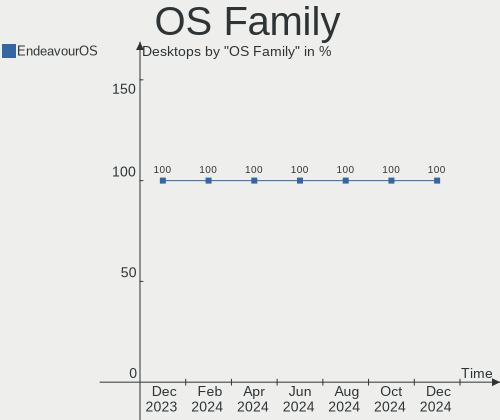
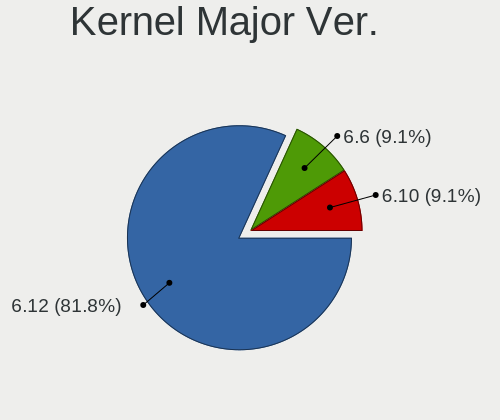
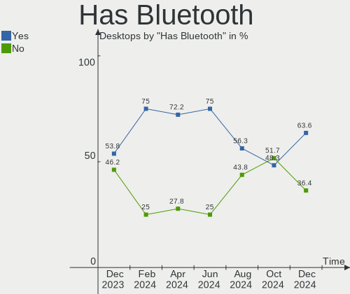
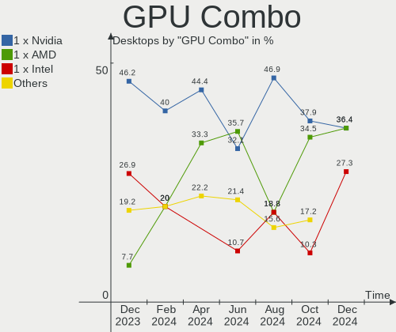
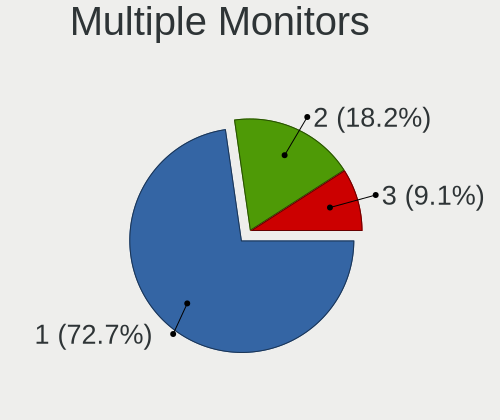
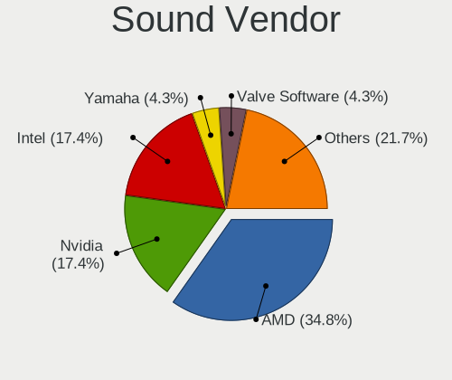

EndeavourOS - Hardware Trends (Desktops)
----------------------------------------

A project to identify most popular hardware characteristics and track their change
over time based on data collected by Linux users at https://Linux-Hardware.org.

Anyone can contribute to this report by the [hw-probe](https://github.com/linuxhw/hw-probe) tool:

    sudo -E hw-probe -all -upload

This report is for one last month. Overall report since the beginning of time: [TestCoverage](https://github.com/linuxhw/TestCoverage)

Period: Dec, 2022.

Contents
--------

* [ System ](#system)
  - [ OS                       ](#os)
  - [ OS Family                ](#os-family)
  - [ Kernel                   ](#kernel)
  - [ Kernel Family            ](#kernel-family)
  - [ Kernel Major Ver.        ](#kernel-major-ver)
  - [ Arch                     ](#arch)
  - [ DE                       ](#de)
  - [ Display Server           ](#display-server)
  - [ Display Manager          ](#display-manager)
  - [ OS Lang                  ](#os-lang)
  - [ Boot Mode                ](#boot-mode)
  - [ Filesystem               ](#filesystem)
  - [ Part. scheme             ](#part-scheme)
  - [ Dual Boot with Linux/BSD ](#dual-boot-with-linuxbsd)
  - [ Dual Boot (Win)          ](#dual-boot-win)

* [ Board ](#board)
  - [ Vendor                   ](#vendor)
  - [ Model                    ](#model)
  - [ Model Family             ](#model-family)
  - [ MFG Year                 ](#mfg-year)
  - [ Form Factor              ](#form-factor)
  - [ Secure Boot              ](#secure-boot)
  - [ Coreboot                 ](#coreboot)
  - [ RAM Size                 ](#ram-size)
  - [ RAM Used                 ](#ram-used)
  - [ Total Drives             ](#total-drives)
  - [ Has CD-ROM               ](#has-cd-rom)
  - [ Has Ethernet             ](#has-ethernet)
  - [ Has WiFi                 ](#has-wifi)
  - [ Has Bluetooth            ](#has-bluetooth)

* [ Location ](#location)
  - [ Country                  ](#country)
  - [ City                     ](#city)

* [ Drives ](#drives)
  - [ Drive Vendor             ](#drive-vendor)
  - [ Drive Model              ](#drive-model)
  - [ HDD Vendor               ](#hdd-vendor)
  - [ SSD Vendor               ](#ssd-vendor)
  - [ Drive Kind               ](#drive-kind)
  - [ Drive Connector          ](#drive-connector)
  - [ Drive Size               ](#drive-size)
  - [ Space Total              ](#space-total)
  - [ Space Used               ](#space-used)
  - [ Malfunc. Drives          ](#malfunc-drives)
  - [ Malfunc. Drive Vendor    ](#malfunc-drive-vendor)
  - [ Malfunc. HDD Vendor      ](#malfunc-hdd-vendor)
  - [ Malfunc. Drive Kind      ](#malfunc-drive-kind)
  - [ Failed Drives            ](#failed-drives)
  - [ Failed Drive Vendor      ](#failed-drive-vendor)
  - [ Drive Status             ](#drive-status)

* [ Storage controller ](#storage-controller)
  - [ Storage Vendor           ](#storage-vendor)
  - [ Storage Model            ](#storage-model)
  - [ Storage Kind             ](#storage-kind)

* [ Processor ](#processor)
  - [ CPU Vendor               ](#cpu-vendor)
  - [ CPU Model                ](#cpu-model)
  - [ CPU Model Family         ](#cpu-model-family)
  - [ CPU Cores                ](#cpu-cores)
  - [ CPU Sockets              ](#cpu-sockets)
  - [ CPU Threads              ](#cpu-threads)
  - [ CPU Op-Modes             ](#cpu-op-modes)
  - [ CPU Microcode            ](#cpu-microcode)
  - [ CPU Microarch            ](#cpu-microarch)

* [ Graphics ](#graphics)
  - [ GPU Vendor               ](#gpu-vendor)
  - [ GPU Model                ](#gpu-model)
  - [ GPU Combo                ](#gpu-combo)
  - [ GPU Driver               ](#gpu-driver)
  - [ GPU Memory               ](#gpu-memory)

* [ Monitor ](#monitor)
  - [ Monitor Vendor           ](#monitor-vendor)
  - [ Monitor Model            ](#monitor-model)
  - [ Monitor Resolution       ](#monitor-resolution)
  - [ Monitor Diagonal         ](#monitor-diagonal)
  - [ Monitor Width            ](#monitor-width)
  - [ Aspect Ratio             ](#aspect-ratio)
  - [ Monitor Area             ](#monitor-area)
  - [ Pixel Density            ](#pixel-density)
  - [ Multiple Monitors        ](#multiple-monitors)

* [ Network ](#network)
  - [ Net Controller Vendor    ](#net-controller-vendor)
  - [ Net Controller Model     ](#net-controller-model)
  - [ Wireless Vendor          ](#wireless-vendor)
  - [ Wireless Model           ](#wireless-model)
  - [ Ethernet Vendor          ](#ethernet-vendor)
  - [ Ethernet Model           ](#ethernet-model)
  - [ Net Controller Kind      ](#net-controller-kind)
  - [ Used Controller          ](#used-controller)
  - [ NICs                     ](#nics)
  - [ IPv6                     ](#ipv6)

* [ Bluetooth ](#bluetooth)
  - [ Bluetooth Vendor         ](#bluetooth-vendor)
  - [ Bluetooth Model          ](#bluetooth-model)

* [ Sound ](#sound)
  - [ Sound Vendor             ](#sound-vendor)
  - [ Sound Model              ](#sound-model)

* [ Memory ](#memory)
  - [ Memory Vendor            ](#memory-vendor)
  - [ Memory Model             ](#memory-model)
  - [ Memory Kind              ](#memory-kind)
  - [ Memory Form Factor       ](#memory-form-factor)
  - [ Memory Size              ](#memory-size)
  - [ Memory Speed             ](#memory-speed)

* [ Printers & scanners ](#printers--scanners)
  - [ Printer Vendor           ](#printer-vendor)
  - [ Printer Model            ](#printer-model)
  - [ Scanner Vendor           ](#scanner-vendor)
  - [ Scanner Model            ](#scanner-model)

* [ Camera ](#camera)
  - [ Camera Vendor            ](#camera-vendor)
  - [ Camera Model             ](#camera-model)

* [ Security ](#security)
  - [ Fingerprint Vendor       ](#fingerprint-vendor)
  - [ Fingerprint Model        ](#fingerprint-model)
  - [ Chipcard Vendor          ](#chipcard-vendor)
  - [ Chipcard Model           ](#chipcard-model)

* [ Unsupported ](#unsupported)
  - [ Unsupported Devices      ](#unsupported-devices)
  - [ Unsupported Device Types ](#unsupported-device-types)

System
------

OS
--

Installed operating systems

| Name                | Desktops | Percent |
|---------------------|----------|---------|
| EndeavourOS Rolling | 11       | 100%    |

OS Family
---------

OS without a version

| Name        | Desktops | Percent |
|-------------|----------|---------|
| EndeavourOS | 11       | 100%    |

Kernel
------

Version of the Linux kernel

| Version                | Desktops | Percent |
|------------------------|----------|---------|
| 6.1.1-arch1-1          | 2        | 18.18%  |
| 6.0.11-zen1-1-zen      | 2        | 18.18%  |
| 5.15.85-1-lts          | 2        | 18.18%  |
| 6.0.9-arch1-1          | 1        | 9.09%   |
| 6.0.12-zen1-1-zen      | 1        | 9.09%   |
| 6.0.12-arch1-1         | 1        | 9.09%   |
| 6.0.11-x64v1-xanmod1-1 | 1        | 9.09%   |
| 6.0.11-AMD-znver2      | 1        | 9.09%   |

Kernel Family
-------------

Linux kernel without a distro release

| Version | Desktops | Percent |
|---------|----------|---------|
| 6.0.11  | 4        | 36.36%  |
| 6.1.1   | 2        | 18.18%  |
| 6.0.12  | 2        | 18.18%  |
| 5.15.85 | 2        | 18.18%  |
| 6.0.9   | 1        | 9.09%   |

Kernel Major Ver.
-----------------

Linux kernel major version

| Version | Desktops | Percent |
|---------|----------|---------|
| 6.0     | 7        | 63.64%  |
| 6.1     | 2        | 18.18%  |
| 5.15    | 2        | 18.18%  |

Arch
----

OS architecture (x86_64, i586, etc.)

| Name   | Desktops | Percent |
|--------|----------|---------|
| x86_64 | 11       | 100%    |

DE
--

Desktop Environment

| Name  | Desktops | Percent |
|-------|----------|---------|
| KDE5  | 7        | 63.64%  |
| GNOME | 2        | 18.18%  |
| XFCE  | 1        | 9.09%   |
| i3    | 1        | 9.09%   |

Display Server
--------------

X11 or Wayland

| Name    | Desktops | Percent |
|---------|----------|---------|
| X11     | 9        | 81.82%  |
| Wayland | 1        | 9.09%   |
| Unknown | 1        | 9.09%   |

Display Manager
---------------

SDDM, LightDM, etc.

| Name    | Desktops | Percent |
|---------|----------|---------|
| LightDM | 4        | 36.36%  |
| SDDM    | 3        | 27.27%  |
| Unknown | 3        | 27.27%  |
| GDM     | 1        | 9.09%   |

OS Lang
-------

Language

| Lang  | Desktops | Percent |
|-------|----------|---------|
| en_US | 5        | 45.45%  |
| it_IT | 1        | 9.09%   |
| fi_FI | 1        | 9.09%   |
| en_IN | 1        | 9.09%   |
| en_GB | 1        | 9.09%   |
| en_CA | 1        | 9.09%   |
| de_DE | 1        | 9.09%   |

Boot Mode
---------

EFI or BIOS

| Mode | Desktops | Percent |
|------|----------|---------|
| EFI  | 8        | 72.73%  |
| BIOS | 3        | 27.27%  |

Filesystem
----------

Type of filesystem

| Type  | Desktops | Percent |
|-------|----------|---------|
| Ext4  | 8        | 72.73%  |
| Btrfs | 2        | 18.18%  |
| Xfs   | 1        | 9.09%   |

Part. scheme
------------

Scheme of partitioning

| Type    | Desktops | Percent |
|---------|----------|---------|
| GPT     | 8        | 72.73%  |
| Unknown | 3        | 27.27%  |

Dual Boot with Linux/BSD
------------------------

Hosting more than one Linux/BSD

| Dual boot | Desktops | Percent |
|-----------|----------|---------|
| No        | 10       | 90.91%  |
| Yes       | 1        | 9.09%   |

Dual Boot (Win)
---------------

Hosting Linux and Windows

| Dual boot | Desktops | Percent |
|-----------|----------|---------|
| Yes       | 6        | 54.55%  |
| No        | 5        | 45.45%  |

Board
-----

Vendor
------

Motherboard manufacturer

| Name                | Desktops | Percent |
|---------------------|----------|---------|
| MSI                 | 3        | 27.27%  |
| Gigabyte Technology | 3        | 27.27%  |
| ASUSTek Computer    | 2        | 18.18%  |
| Lenovo              | 1        | 9.09%   |
| Hewlett-Packard     | 1        | 9.09%   |
| ASRock              | 1        | 9.09%   |

Model
-----

Motherboard model

| Name                         | Desktops | Percent |
|------------------------------|----------|---------|
| MSI MS-7D43                  | 1        | 9.09%   |
| MSI MS-7C52                  | 1        | 9.09%   |
| MSI MS-7808                  | 1        | 9.09%   |
| Lenovo V50s-07IMB 11EF004KUS | 1        | 9.09%   |
| HP EliteDesk 800 G1 TWR      | 1        | 9.09%   |
| Gigabyte X570S AERO G        | 1        | 9.09%   |
| Gigabyte H310M S2 2.0        | 1        | 9.09%   |
| Gigabyte B150M-D2V DDR3-CF   | 1        | 9.09%   |
| ASUS TUF Gaming B560M-PLUS   | 1        | 9.09%   |
| ASUS M5A78L/USB3             | 1        | 9.09%   |
| ASRock X300M-STX             | 1        | 9.09%   |

Model Family
------------

Motherboard model prefix

| Name               | Desktops | Percent |
|--------------------|----------|---------|
| MSI MS-7D43        | 1        | 9.09%   |
| MSI MS-7C52        | 1        | 9.09%   |
| MSI MS-7808        | 1        | 9.09%   |
| Lenovo V50s-07IMB  | 1        | 9.09%   |
| HP EliteDesk       | 1        | 9.09%   |
| Gigabyte X570S     | 1        | 9.09%   |
| Gigabyte H310M     | 1        | 9.09%   |
| Gigabyte B150M-D2V | 1        | 9.09%   |
| ASUS TUF           | 1        | 9.09%   |
| ASUS M5A78L        | 1        | 9.09%   |
| ASRock X300M-STX   | 1        | 9.09%   |

MFG Year
--------

Motherboard manufacture year

| Year | Desktops | Percent |
|------|----------|---------|
| 2021 | 3        | 27.27%  |
| 2022 | 1        | 9.09%   |
| 2020 | 1        | 9.09%   |
| 2019 | 1        | 9.09%   |
| 2018 | 1        | 9.09%   |
| 2015 | 1        | 9.09%   |
| 2013 | 1        | 9.09%   |
| 2012 | 1        | 9.09%   |
| 2011 | 1        | 9.09%   |

Form Factor
-----------

Physical design of the computer

| Name    | Desktops | Percent |
|---------|----------|---------|
| Desktop | 11       | 100%    |

Secure Boot
-----------

Enabled or disabled

| State    | Desktops | Percent |
|----------|----------|---------|
| Disabled | 11       | 100%    |

Coreboot
--------

Have coreboot on board

| Used | Desktops | Percent |
|------|----------|---------|
| No   | 11       | 100%    |

RAM Size
--------

Total RAM memory

| Size in GB | Desktops | Percent |
|------------|----------|---------|
| 32.01-64.0 | 4        | 36.36%  |
| 8.01-16.0  | 4        | 36.36%  |
| 16.01-24.0 | 3        | 27.27%  |

RAM Used
--------

Used RAM memory

| Used GB   | Desktops | Percent |
|-----------|----------|---------|
| 2.01-3.0  | 3        | 27.27%  |
| 4.01-8.0  | 2        | 18.18%  |
| 3.01-4.0  | 2        | 18.18%  |
| 1.01-2.0  | 2        | 18.18%  |
| 8.01-16.0 | 2        | 18.18%  |

Total Drives
------------

Number of drives on board

| Drives | Desktops | Percent |
|--------|----------|---------|
| 3      | 4        | 36.36%  |
| 4      | 3        | 27.27%  |
| 2      | 2        | 18.18%  |
| 5      | 1        | 9.09%   |
| 1      | 1        | 9.09%   |

Has CD-ROM
----------

Has CD-ROM on board

| Presented | Desktops | Percent |
|-----------|----------|---------|
| No        | 6        | 54.55%  |
| Yes       | 5        | 45.45%  |

Has Ethernet
------------

Has Ethernet on board

| Presented | Desktops | Percent |
|-----------|----------|---------|
| Yes       | 11       | 100%    |

Has WiFi
--------

Has WiFi module

| Presented | Desktops | Percent |
|-----------|----------|---------|
| Yes       | 6        | 54.55%  |
| No        | 5        | 45.45%  |

Has Bluetooth
-------------

Has Bluetooth module

| Presented | Desktops | Percent |
|-----------|----------|---------|
| Yes       | 6        | 54.55%  |
| No        | 5        | 45.45%  |

Location
--------

Country
-------

Geographic location (country)

| Country | Desktops | Percent |
|---------|----------|---------|
| USA     | 1        | 9.09%   |
| Sweden  | 1        | 9.09%   |
| Romania | 1        | 9.09%   |
| Latvia  | 1        | 9.09%   |
| Italy   | 1        | 9.09%   |
| India   | 1        | 9.09%   |
| Hungary | 1        | 9.09%   |
| Germany | 1        | 9.09%   |
| Finland | 1        | 9.09%   |
| Estonia | 1        | 9.09%   |
| Canada  | 1        | 9.09%   |

City
----

Geographic location (city)

| City       | Desktops | Percent |
|------------|----------|---------|
| Uimaharju  | 1        | 9.09%   |
| Tallinn    | 1        | 9.09%   |
| Stora Vika | 1        | 9.09%   |
| Riga       | 1        | 9.09%   |
| Nagymagocs | 1        | 9.09%   |
| Montreal   | 1        | 9.09%   |
| Milan      | 1        | 9.09%   |
| Lemnia     | 1        | 9.09%   |
| Las Vegas  | 1        | 9.09%   |
| Kolkata    | 1        | 9.09%   |
| Augsburg   | 1        | 9.09%   |

Drives
------

Drive Vendor
------------

Hard drive vendors

| Vendor                      | Desktops | Drives | Percent |
|-----------------------------|----------|--------|---------|
| Seagate                     | 6        | 8      | 20%     |
| Kingston                    | 5        | 5      | 16.67%  |
| WDC                         | 4        | 6      | 13.33%  |
| Crucial                     | 3        | 3      | 10%     |
| Sandisk                     | 2        | 2      | 6.67%   |
| Samsung Electronics         | 2        | 3      | 6.67%   |
| Unknown                     | 1        | 1      | 3.33%   |
| Timetec                     | 1        | 1      | 3.33%   |
| Silicon Motion              | 1        | 1      | 3.33%   |
| SABRENT                     | 1        | 1      | 3.33%   |
| Patriot                     | 1        | 1      | 3.33%   |
| Micron/Crucial Technology   | 1        | 1      | 3.33%   |
| Kingston Technology Company | 1        | 1      | 3.33%   |
| Intenso                     | 1        | 2      | 3.33%   |

Drive Model
-----------

Hard drive models

| Model                                                  | Desktops | Percent |
|--------------------------------------------------------|----------|---------|
| Seagate ST1000DM010-2EP102 1TB                         | 2        | 5.88%   |
| WDC WD20EFRX-68EUZN0 2TB                               | 1        | 2.94%   |
| WDC WD20EARX-00PASB0 2TB                               | 1        | 2.94%   |
| WDC WD20EARS-42S0XB0 2TB                               | 1        | 2.94%   |
| WDC WD10JPVX-22JC3T0 1TB                               | 1        | 2.94%   |
| Unknown SD/MMC/MS PRO 64GB                             | 1        | 2.94%   |
| Timetec MS05 256GB SSD                                 | 1        | 2.94%   |
| Silicon Motion SM2263EN/SM2263XT SSD Controller 1024GB | 1        | 2.94%   |
| Seagate ST500LM021-1KJ152 500GB                        | 1        | 2.94%   |
| Seagate ST4000DM004-2CV104 4TB                         | 1        | 2.94%   |
| Seagate ST3160812AS 160GB                              | 1        | 2.94%   |
| Seagate ST2000DM008-2FR102 2TB                         | 1        | 2.94%   |
| Seagate Expansion Desk 5TB                             | 1        | 2.94%   |
| Seagate BUP Slim BK 1TB                                | 1        | 2.94%   |
| Sandisk WD Blue SN570 1TB                              | 1        | 2.94%   |
| Sandisk WD Black SN750 / PC SN730 NVMe SSD 512GB       | 1        | 2.94%   |
| Samsung SSD 870 EVO 2TB                                | 1        | 2.94%   |
| Samsung SSD 870 EVO 1TB                                | 1        | 2.94%   |
| Samsung SSD 850 EVO 250GB                              | 1        | 2.94%   |
| SABRENT Disk 1TB                                       | 1        | 2.94%   |
| Patriot Burst 480GB SSD                                | 1        | 2.94%   |
| Micron/Crucial P2 NVMe PCIe SSD 500GB                  | 1        | 2.94%   |
| Kingston Company A2000 NVMe SSD 1TB                    | 1        | 2.94%   |
| Kingston SV300S37A240G 240GB SSD                       | 1        | 2.94%   |
| Kingston SKC3000S1024G 1TB                             | 1        | 2.94%   |
| Kingston SHFS37A120G 120GB SSD                         | 1        | 2.94%   |
| Kingston SA400S37480G 480GB SSD                        | 1        | 2.94%   |
| Kingston SA400S37120G 120GB SSD                        | 1        | 2.94%   |
| Intenso SATA III SSD 480GB                             | 1        | 2.94%   |
| Intenso Portable SSD 512GB                             | 1        | 2.94%   |
| Crucial CT256MX100SSD1 256GB                           | 1        | 2.94%   |
| Crucial CT250BX100SSD1 250GB                           | 1        | 2.94%   |
| Crucial CT1000MX500SSD1 1TB                            | 1        | 2.94%   |

HDD Vendor
----------

Hard disk drive vendors

| Vendor  | Desktops | Drives | Percent |
|---------|----------|--------|---------|
| Seagate | 6        | 8      | 54.55%  |
| WDC     | 4        | 6      | 36.36%  |
| Unknown | 1        | 1      | 9.09%   |

SSD Vendor
----------

Solid state drive vendors

| Vendor              | Desktops | Drives | Percent |
|---------------------|----------|--------|---------|
| Kingston            | 4        | 4      | 33.33%  |
| Crucial             | 3        | 3      | 25%     |
| Samsung Electronics | 2        | 3      | 16.67%  |
| Timetec             | 1        | 1      | 8.33%   |
| Patriot             | 1        | 1      | 8.33%   |
| Intenso             | 1        | 2      | 8.33%   |

Drive Kind
----------

HDD or SSD

| Kind | Desktops | Drives | Percent |
|------|----------|--------|---------|
| SSD  | 8        | 14     | 40%     |
| HDD  | 7        | 15     | 35%     |
| NVMe | 5        | 7      | 25%     |

Drive Connector
---------------

SATA, SAS, NVMe, etc.

| Type | Desktops | Drives | Percent |
|------|----------|--------|---------|
| SATA | 10       | 25     | 52.63%  |
| NVMe | 5        | 6      | 26.32%  |
| SAS  | 4        | 5      | 21.05%  |

Drive Size
----------

Size of hard drive

| Size in TB | Desktops | Drives | Percent |
|------------|----------|--------|---------|
| 0.01-0.5   | 8        | 13     | 36.36%  |
| 0.51-1.0   | 7        | 7      | 31.82%  |
| 1.01-2.0   | 5        | 7      | 22.73%  |
| 3.01-4.0   | 1        | 1      | 4.55%   |
| 4.01-10.0  | 1        | 1      | 4.55%   |

Space Total
-----------

Amount of disk space available on the file system

| Size in GB     | Desktops | Percent |
|----------------|----------|---------|
| More than 3000 | 4        | 36.36%  |
| 2001-3000      | 3        | 27.27%  |
| 1001-2000      | 2        | 18.18%  |
| 101-250        | 1        | 9.09%   |
| 501-1000       | 1        | 9.09%   |

Space Used
----------

Amount of used disk space

| Used GB   | Desktops | Percent |
|-----------|----------|---------|
| 1001-2000 | 4        | 36.36%  |
| 2001-3000 | 2        | 18.18%  |
| 101-250   | 2        | 18.18%  |
| 21-50     | 1        | 9.09%   |
| 1-20      | 1        | 9.09%   |
| 501-1000  | 1        | 9.09%   |

Malfunc. Drives
---------------

Drive models with a malfunction

| Model                           | Desktops | Drives | Percent |
|---------------------------------|----------|--------|---------|
| WDC WD20EARX-00PASB0 2TB        | 1        | 1      | 16.67%  |
| Seagate ST500LM021-1KJ152 500GB | 1        | 1      | 16.67%  |
| Seagate ST4000DM004-2CV104 4TB  | 1        | 1      | 16.67%  |
| Seagate ST1000DM010-2EP102 1TB  | 1        | 1      | 16.67%  |
| Patriot Burst 480GB SSD         | 1        | 1      | 16.67%  |
| Crucial CT256MX100SSD1 256GB    | 1        | 1      | 16.67%  |

Malfunc. Drive Vendor
---------------------

Vendors of faulty drives

| Vendor  | Desktops | Drives | Percent |
|---------|----------|--------|---------|
| Seagate | 3        | 3      | 50%     |
| WDC     | 1        | 1      | 16.67%  |
| Patriot | 1        | 1      | 16.67%  |
| Crucial | 1        | 1      | 16.67%  |

Malfunc. HDD Vendor
-------------------

Vendors of faulty HDD drives

| Vendor  | Desktops | Drives | Percent |
|---------|----------|--------|---------|
| Seagate | 3        | 3      | 75%     |
| WDC     | 1        | 1      | 25%     |

Malfunc. Drive Kind
-------------------

Kinds of faulty drives

| Kind | Desktops | Drives | Percent |
|------|----------|--------|---------|
| HDD  | 4        | 4      | 80%     |
| SSD  | 1        | 2      | 20%     |

Failed Drives
-------------

Failed drive models

Zero info for selected period =(

Failed Drive Vendor
-------------------

Failed drive vendors

Zero info for selected period =(

Drive Status
------------

Number of failed and malfunc. drives

| Status   | Desktops | Drives | Percent |
|----------|----------|--------|---------|
| Works    | 8        | 21     | 47.06%  |
| Malfunc  | 5        | 6      | 29.41%  |
| Detected | 4        | 9      | 23.53%  |

Storage controller
------------------

Storage Vendor
--------------

Storage controller vendors

| Vendor                      | Desktops | Percent |
|-----------------------------|----------|---------|
| Intel                       | 7        | 41.18%  |
| AMD                         | 4        | 23.53%  |
| SanDisk                     | 2        | 11.76%  |
| Kingston Technology Company | 2        | 11.76%  |
| Silicon Motion              | 1        | 5.88%   |
| Micron/Crucial Technology   | 1        | 5.88%   |

Storage Model
-------------

Storage controller models

| Model                                                                          | Desktops | Percent |
|--------------------------------------------------------------------------------|----------|---------|
| AMD FCH SATA Controller [AHCI mode]                                            | 2        | 11.11%  |
| Silicon Motion SM2263EN/SM2263XT SSD Controller                                | 1        | 5.56%   |
| SanDisk WD Blue SN570 NVMe SSD                                                 | 1        | 5.56%   |
| SanDisk WD Black SN750 / PC SN730 NVMe SSD                                     | 1        | 5.56%   |
| Micron/Crucial P2 NVMe PCIe SSD                                                | 1        | 5.56%   |
| Kingston Company Company Non-Volatile memory controller                        | 1        | 5.56%   |
| Kingston Company A2000 NVMe SSD                                                | 1        | 5.56%   |
| Intel Q170/Q150/B150/H170/H110/Z170/CM236 Chipset SATA Controller [AHCI Mode]  | 1        | 5.56%   |
| Intel Alder Lake-S PCH SATA Controller [AHCI Mode]                             | 1        | 5.56%   |
| Intel 8 Series/C220 Series Chipset Family 6-port SATA Controller 1 [AHCI mode] | 1        | 5.56%   |
| Intel 7 Series/C210 Series Chipset Family 6-port SATA Controller [AHCI mode]   | 1        | 5.56%   |
| Intel 500 Series Chipset Family SATA AHCI Controller                           | 1        | 5.56%   |
| Intel 400 Series Chipset Family SATA AHCI Controller                           | 1        | 5.56%   |
| Intel 200 Series PCH SATA controller [AHCI mode]                               | 1        | 5.56%   |
| AMD SB7x0/SB8x0/SB9x0 SATA Controller [IDE mode]                               | 1        | 5.56%   |
| AMD SB7x0/SB8x0/SB9x0 IDE Controller                                           | 1        | 5.56%   |
| AMD 400 Series Chipset SATA Controller                                         | 1        | 5.56%   |

Storage Kind
------------

Kind of storage controller (IDE, SATA, NVMe, SAS, ...)

| Kind | Desktops | Percent |
|------|----------|---------|
| SATA | 11       | 64.71%  |
| NVMe | 5        | 29.41%  |
| IDE  | 1        | 5.88%   |

Processor
---------

CPU Vendor
----------

Processor vendors

| Vendor | Desktops | Percent |
|--------|----------|---------|
| Intel  | 7        | 63.64%  |
| AMD    | 4        | 36.36%  |

CPU Model
---------

Processor models

| Model                                  | Desktops | Percent |
|----------------------------------------|----------|---------|
| Intel Core i7-4790 CPU @ 3.60GHz       | 1        | 9.09%   |
| Intel Core i7-2600 CPU @ 3.40GHz       | 1        | 9.09%   |
| Intel Core i7-10700 CPU @ 2.90GHz      | 1        | 9.09%   |
| Intel Core i5-9400F CPU @ 2.90GHz      | 1        | 9.09%   |
| Intel Core i5-6400 CPU @ 2.70GHz       | 1        | 9.09%   |
| Intel Core i5-10400F CPU @ 2.90GHz     | 1        | 9.09%   |
| Intel 12th Gen Core i5-12400F          | 1        | 9.09%   |
| AMD Ryzen 7 5800X 8-Core Processor     | 1        | 9.09%   |
| AMD Ryzen 7 5700G with Radeon Graphics | 1        | 9.09%   |
| AMD Ryzen 5 3600 6-Core Processor      | 1        | 9.09%   |
| AMD FX-4100 Quad-Core Processor        | 1        | 9.09%   |

CPU Model Family
----------------

Processor model prefix

| Model         | Desktops | Percent |
|---------------|----------|---------|
| Intel Core i7 | 3        | 27.27%  |
| Intel Core i5 | 3        | 27.27%  |
| AMD Ryzen 7   | 2        | 18.18%  |
| Other         | 1        | 9.09%   |
| AMD Ryzen 5   | 1        | 9.09%   |
| AMD FX        | 1        | 9.09%   |

CPU Cores
---------

Number of processor cores

| Number | Desktops | Percent |
|--------|----------|---------|
| 6      | 4        | 36.36%  |
| 8      | 3        | 27.27%  |
| 4      | 3        | 27.27%  |
| 2      | 1        | 9.09%   |

CPU Sockets
-----------

Number of sockets

| Number | Desktops | Percent |
|--------|----------|---------|
| 1      | 11       | 100%    |

CPU Threads
-----------

Threads per core (Hyper-Threading)

| Number | Desktops | Percent |
|--------|----------|---------|
| 2      | 8        | 72.73%  |
| 1      | 3        | 27.27%  |

CPU Op-Modes
------------

CPU Operation Modes (32-bit, 64-bit)

| Op mode        | Desktops | Percent |
|----------------|----------|---------|
| 32-bit, 64-bit | 11       | 100%    |

CPU Microcode
-------------

Microcode number

| Number     | Desktops | Percent |
|------------|----------|---------|
| Unknown    | 4        | 36.36%  |
| 0xa0653    | 1        | 9.09%   |
| 0x90672    | 1        | 9.09%   |
| 0x306c3    | 1        | 9.09%   |
| 0x206a7    | 1        | 9.09%   |
| 0x0a50000c | 1        | 9.09%   |
| 0x0a201204 | 1        | 9.09%   |
| 0x08701021 | 1        | 9.09%   |

CPU Microarch
-------------

Microarchitecture

| Name             | Desktops | Percent |
|------------------|----------|---------|
| Zen 3            | 2        | 18.18%  |
| CometLake        | 2        | 18.18%  |
| Zen 2            | 1        | 9.09%   |
| Skylake          | 1        | 9.09%   |
| SandyBridge      | 1        | 9.09%   |
| KabyLake         | 1        | 9.09%   |
| Haswell          | 1        | 9.09%   |
| Bulldozer        | 1        | 9.09%   |
| Alderlake Hybrid | 1        | 9.09%   |

Graphics
--------

GPU Vendor
----------

Vendors of graphics cards

| Vendor | Desktops | Percent |
|--------|----------|---------|
| Nvidia | 9        | 69.23%  |
| Intel  | 2        | 15.38%  |
| AMD    | 2        | 15.38%  |

GPU Model
---------

Graphics card models

| Model                                                                       | Desktops | Percent |
|-----------------------------------------------------------------------------|----------|---------|
| Nvidia TU117 [GeForce GTX 1650]                                             | 1        | 7.14%   |
| Nvidia TU106 [GeForce RTX 2060 Rev. A]                                      | 1        | 7.14%   |
| Nvidia GP108 [GeForce GT 1030]                                              | 1        | 7.14%   |
| Nvidia GM204 [GeForce GTX 970]                                              | 1        | 7.14%   |
| Nvidia GK208B [GeForce GT 730]                                              | 1        | 7.14%   |
| Nvidia GK208B [GeForce GT 710]                                              | 1        | 7.14%   |
| Nvidia GK104 [GeForce GTX 770]                                              | 1        | 7.14%   |
| Nvidia GF108 [GeForce GT 440]                                               | 1        | 7.14%   |
| Nvidia GA104 [GeForce RTX 3070 Lite Hash Rate]                              | 1        | 7.14%   |
| Nvidia GA104 [GeForce RTX 3060 Ti Lite Hash Rate]                           | 1        | 7.14%   |
| Intel Xeon E3-1200 v3/4th Gen Core Processor Integrated Graphics Controller | 1        | 7.14%   |
| Intel CometLake-S GT2 [UHD Graphics 630]                                    | 1        | 7.14%   |
| AMD Lexa PRO [Radeon 540/540X/550/550X / RX 540X/550/550X]                  | 1        | 7.14%   |
| AMD Cezanne [Radeon Vega Series / Radeon Vega Mobile Series]                | 1        | 7.14%   |

GPU Combo
---------

Combinations of graphics cards

| Name           | Desktops | Percent |
|----------------|----------|---------|
| 1 x Nvidia     | 7        | 63.64%  |
| 2 x Nvidia     | 1        | 9.09%   |
| Intel + Nvidia | 1        | 9.09%   |
| Intel + AMD    | 1        | 9.09%   |
| 1 x AMD        | 1        | 9.09%   |

GPU Driver
----------

Free vs proprietary

| Driver      | Desktops | Percent |
|-------------|----------|---------|
| Proprietary | 6        | 54.55%  |
| Free        | 5        | 45.45%  |

GPU Memory
----------

Total video memory

| Size in GB | Desktops | Percent |
|------------|----------|---------|
| 1.01-2.0   | 4        | 36.36%  |
| Unknown    | 3        | 27.27%  |
| 7.01-8.0   | 2        | 18.18%  |
| 5.01-6.0   | 1        | 9.09%   |
| 3.01-4.0   | 1        | 9.09%   |

Monitor
-------

Monitor Vendor
--------------

Monitor vendors

| Vendor               | Desktops | Percent |
|----------------------|----------|---------|
| ASUSTek Computer     | 3        | 20%     |
| Samsung Electronics  | 2        | 13.33%  |
| Goldstar             | 2        | 13.33%  |
| Xiaomi               | 1        | 6.67%   |
| ViewSonic            | 1        | 6.67%   |
| MSI                  | 1        | 6.67%   |
| Lenovo               | 1        | 6.67%   |
| Hewlett-Packard      | 1        | 6.67%   |
| BenQ                 | 1        | 6.67%   |
| Ancor Communications | 1        | 6.67%   |
| Acer                 | 1        | 6.67%   |

Monitor Model
-------------

Monitor models

| Model                                                             | Desktops | Percent |
|-------------------------------------------------------------------|----------|---------|
| Xiaomi Mi TV XMD004A 1920x1080 708x398mm 32.0-inch                | 1        | 6.67%   |
| ViewSonic VX2776 Series VSC3E32 1920x1080 598x336mm 27.0-inch     | 1        | 6.67%   |
| Samsung Electronics LF24T35 SAM707D 1920x1080 528x297mm 23.9-inch | 1        | 6.67%   |
| Samsung Electronics LCD Monitor SyncMaster 1680x1050              | 1        | 6.67%   |
| MSI G27CQ4 MSI3CB0 2560x1440 597x336mm 27.0-inch                  | 1        | 6.67%   |
| Lenovo P24q-10 LEN61A5 2560x1440 527x296mm 23.8-inch              | 1        | 6.67%   |
| Hewlett-Packard 2211 HWP2936 1920x1080 476x268mm 21.5-inch        | 1        | 6.67%   |
| Goldstar L222W GSM5664 1680x1050 474x296mm 22.0-inch              | 1        | 6.67%   |
| Goldstar HD GSM5ACC 1366x768 410x230mm 18.5-inch                  | 1        | 6.67%   |
| BenQ XL2411Z BNQ7F31 1920x1080 531x298mm 24.0-inch                | 1        | 6.67%   |
| ASUSTek Computer XG49V AUS49A1 3840x1080 1200x340mm 49.1-inch     | 1        | 6.67%   |
| ASUSTek Computer VG259QM AUS25A9 1920x1080 544x303mm 24.5-inch    | 1        | 6.67%   |
| ASUSTek Computer VA24E AUS24D1 1920x1080 530x300mm 24.0-inch      | 1        | 6.67%   |
| Ancor Communications VW195 ACI19AB 1440x900 408x255mm 18.9-inch   | 1        | 6.67%   |
| Acer V233H ACR0090 1920x1080 510x287mm 23.0-inch                  | 1        | 6.67%   |

Monitor Resolution
------------------

Monitor screen resolution

| Resolution         | Desktops | Percent |
|--------------------|----------|---------|
| 1920x1080 (FHD)    | 7        | 46.67%  |
| 3840x2160 (4K)     | 2        | 13.33%  |
| 1680x1050 (WSXGA+) | 2        | 13.33%  |
| 3840x1080          | 1        | 6.67%   |
| 2560x1440 (QHD)    | 1        | 6.67%   |
| 1440x900 (WXGA+)   | 1        | 6.67%   |
| 1366x768 (WXGA)    | 1        | 6.67%   |

Monitor Diagonal
----------------

Diagonal size in inches

| Inches  | Desktops | Percent |
|---------|----------|---------|
| 24      | 4        | 26.67%  |
| 27      | 2        | 13.33%  |
| 23      | 2        | 13.33%  |
| 65      | 1        | 6.67%   |
| 49      | 1        | 6.67%   |
| 22      | 1        | 6.67%   |
| 21      | 1        | 6.67%   |
| 19      | 1        | 6.67%   |
| 18      | 1        | 6.67%   |
| Unknown | 1        | 6.67%   |

Monitor Width
-------------

Physical width

| Width in mm | Desktops | Percent |
|-------------|----------|---------|
| 501-600     | 7        | 53.85%  |
| 401-500     | 3        | 23.08%  |
| 1001-1500   | 2        | 15.38%  |
| Unknown     | 1        | 7.69%   |

Aspect Ratio
------------

Proportional relationship between the width and the height

| Ratio   | Desktops | Percent |
|---------|----------|---------|
| 16/9    | 8        | 72.73%  |
| 32/9    | 1        | 9.09%   |
| 16/10   | 1        | 9.09%   |
| Unknown | 1        | 9.09%   |

Monitor Area
------------

Area in inch²

| Area in inch² | Desktops | Percent |
|----------------|----------|---------|
| 201-250        | 7        | 46.67%  |
| 301-350        | 2        | 13.33%  |
| More than 1000 | 1        | 6.67%   |
| 251-300        | 1        | 6.67%   |
| 151-200        | 1        | 6.67%   |
| 141-150        | 1        | 6.67%   |
| 501-1000       | 1        | 6.67%   |
| Unknown        | 1        | 6.67%   |

Pixel Density
-------------

Pixels per inch

| Density | Desktops | Percent |
|---------|----------|---------|
| 51-100  | 8        | 66.67%  |
| 1-50    | 1        | 8.33%   |
| 121-160 | 1        | 8.33%   |
| 101-120 | 1        | 8.33%   |
| Unknown | 1        | 8.33%   |

Multiple Monitors
-----------------

Total monitors connected

| Total | Desktops | Percent |
|-------|----------|---------|
| 1     | 8        | 72.73%  |
| 2     | 3        | 27.27%  |

Network
-------

Net Controller Vendor
---------------------

Controller vendors

| Vendor                | Desktops | Percent |
|-----------------------|----------|---------|
| Realtek Semiconductor | 10       | 52.63%  |
| Intel                 | 5        | 26.32%  |
| TP-Link               | 1        | 5.26%   |
| MediaTek              | 1        | 5.26%   |
| D-Link                | 1        | 5.26%   |
| ASIX Electronics      | 1        | 5.26%   |

Net Controller Model
--------------------

Controller models

| Model                                                             | Desktops | Percent |
|-------------------------------------------------------------------|----------|---------|
| Realtek RTL8111/8168/8411 PCI Express Gigabit Ethernet Controller | 7        | 35%     |
| Realtek RTL8125 2.5GbE Controller                                 | 3        | 15%     |
| TP-Link TL-WN722N v2/v3 [Realtek RTL8188EUS]                      | 1        | 5%      |
| Realtek RTL8153 Gigabit Ethernet Adapter                          | 1        | 5%      |
| MediaTek MT7921K (RZ608) Wi-Fi 6E 80MHz                           | 1        | 5%      |
| Intel Wi-Fi 6 AX200                                               | 1        | 5%      |
| Intel Ethernet Controller I225-V                                  | 1        | 5%      |
| Intel Ethernet Connection I217-LM                                 | 1        | 5%      |
| Intel Dual Band Wireless-AC 3168NGW [Stone Peak]                  | 1        | 5%      |
| Intel Dual Band Wireless-AC 3165 Plus Bluetooth                   | 1        | 5%      |
| D-Link 802.11ac NIC                                               | 1        | 5%      |
| ASIX AX88179 Gigabit Ethernet                                     | 1        | 5%      |

Wireless Vendor
---------------

Wireless vendors

| Vendor   | Desktops | Percent |
|----------|----------|---------|
| Intel    | 3        | 50%     |
| TP-Link  | 1        | 16.67%  |
| MediaTek | 1        | 16.67%  |
| D-Link   | 1        | 16.67%  |

Wireless Model
--------------

Wireless models

| Model                                            | Desktops | Percent |
|--------------------------------------------------|----------|---------|
| TP-Link TL-WN722N v2/v3 [Realtek RTL8188EUS]     | 1        | 16.67%  |
| MediaTek MT7921K (RZ608) Wi-Fi 6E 80MHz          | 1        | 16.67%  |
| Intel Wi-Fi 6 AX200                              | 1        | 16.67%  |
| Intel Dual Band Wireless-AC 3168NGW [Stone Peak] | 1        | 16.67%  |
| Intel Dual Band Wireless-AC 3165 Plus Bluetooth  | 1        | 16.67%  |
| D-Link 802.11ac NIC                              | 1        | 16.67%  |

Ethernet Vendor
---------------

Ethernet vendors

| Vendor                | Desktops | Percent |
|-----------------------|----------|---------|
| Realtek Semiconductor | 10       | 76.92%  |
| Intel                 | 2        | 15.38%  |
| ASIX Electronics      | 1        | 7.69%   |

Ethernet Model
--------------

Ethernet models

| Model                                                             | Desktops | Percent |
|-------------------------------------------------------------------|----------|---------|
| Realtek RTL8111/8168/8411 PCI Express Gigabit Ethernet Controller | 7        | 50%     |
| Realtek RTL8125 2.5GbE Controller                                 | 3        | 21.43%  |
| Realtek RTL8153 Gigabit Ethernet Adapter                          | 1        | 7.14%   |
| Intel Ethernet Controller I225-V                                  | 1        | 7.14%   |
| Intel Ethernet Connection I217-LM                                 | 1        | 7.14%   |
| ASIX AX88179 Gigabit Ethernet                                     | 1        | 7.14%   |

Net Controller Kind
-------------------

Ethernet, WiFi or modem

| Kind     | Desktops | Percent |
|----------|----------|---------|
| Ethernet | 11       | 64.71%  |
| WiFi     | 6        | 35.29%  |

Used Controller
---------------

Currently used network controller

| Kind     | Desktops | Percent |
|----------|----------|---------|
| Ethernet | 7        | 58.33%  |
| WiFi     | 5        | 41.67%  |

NICs
----

Total network controllers on board

| Total | Desktops | Percent |
|-------|----------|---------|
| 1     | 6        | 54.55%  |
| 2     | 4        | 36.36%  |
| 3     | 1        | 9.09%   |

IPv6
----

IPv6 vs IPv4

| Used | Desktops | Percent |
|------|----------|---------|
| No   | 8        | 72.73%  |
| Yes  | 3        | 27.27%  |

Bluetooth
---------

Bluetooth Vendor
----------------

Controller vendors

| Vendor                  | Desktops | Percent |
|-------------------------|----------|---------|
| Intel                   | 2        | 28.57%  |
| TP-Link                 | 1        | 14.29%  |
| Realtek Semiconductor   | 1        | 14.29%  |
| MediaTek                | 1        | 14.29%  |
| Cambridge Silicon Radio | 1        | 14.29%  |
| Broadcom                | 1        | 14.29%  |

Bluetooth Model
---------------

Controller models

| Model                                               | Desktops | Percent |
|-----------------------------------------------------|----------|---------|
| TP-Link UB500 Adapter                               | 1        | 14.29%  |
| Realtek Bluetooth Radio                             | 1        | 14.29%  |
| MediaTek Wireless_Device                            | 1        | 14.29%  |
| Intel Wireless-AC 3168 Bluetooth                    | 1        | 14.29%  |
| Intel Bluetooth wireless interface                  | 1        | 14.29%  |
| Cambridge Silicon Radio Bluetooth Dongle (HCI mode) | 1        | 14.29%  |
| Broadcom BCM20702A0 Bluetooth 4.0                   | 1        | 14.29%  |

Sound
-----

Sound Vendor
------------

Sound card vendors

| Vendor                | Desktops | Percent |
|-----------------------|----------|---------|
| Nvidia                | 9        | 30%     |
| Intel                 | 7        | 23.33%  |
| AMD                   | 5        | 16.67%  |
| Logitech              | 2        | 6.67%   |
| Yamaha                | 1        | 3.33%   |
| Trust                 | 1        | 3.33%   |
| SteelSeries ApS       | 1        | 3.33%   |
| Realtek Semiconductor | 1        | 3.33%   |
| NAD Electronics       | 1        | 3.33%   |
| Kingston Technology   | 1        | 3.33%   |
| C-Media Electronics   | 1        | 3.33%   |

Sound Model
-----------

Sound card models

| Model                                                               | Desktops | Percent |
|---------------------------------------------------------------------|----------|---------|
| Nvidia GK208 HDMI/DP Audio Controller                               | 2        | 6.06%   |
| Nvidia GA104 High Definition Audio Controller                       | 2        | 6.06%   |
| AMD Starship/Matisse HD Audio Controller                            | 2        | 6.06%   |
| Yamaha Steinberg UR22mkII                                           | 1        | 3.03%   |
| Trust GXT 232 Microphone                                            | 1        | 3.03%   |
| SteelSeries ApS SteelSeries Siberia 350                             | 1        | 3.03%   |
| Realtek Semiconductor USB SPDIF Adapter                             | 1        | 3.03%   |
| Nvidia TU107 GeForce GTX 1650 High Definition Audio Controller      | 1        | 3.03%   |
| Nvidia TU106 High Definition Audio Controller                       | 1        | 3.03%   |
| Nvidia GP108 High Definition Audio Controller                       | 1        | 3.03%   |
| Nvidia GM204 High Definition Audio Controller                       | 1        | 3.03%   |
| Nvidia GK104 HDMI Audio Controller                                  | 1        | 3.03%   |
| Nvidia GF108 High Definition Audio Controller                       | 1        | 3.03%   |
| NAD Electronics USB Audio                                           | 1        | 3.03%   |
| Logitech PRO X                                                      | 1        | 3.03%   |
| Logitech G435 Wireless Gaming Headset                               | 1        | 3.03%   |
| Kingston Technology HyperX QuadCast                                 | 1        | 3.03%   |
| Intel Xeon E3-1200 v3/4th Gen Core Processor HD Audio Controller    | 1        | 3.03%   |
| Intel Comet Lake PCH-V cAVS                                         | 1        | 3.03%   |
| Intel Audio device                                                  | 1        | 3.03%   |
| Intel Alder Lake-S HD Audio Controller                              | 1        | 3.03%   |
| Intel 8 Series/C220 Series Chipset High Definition Audio Controller | 1        | 3.03%   |
| Intel 7 Series/C216 Chipset Family High Definition Audio Controller | 1        | 3.03%   |
| Intel 200 Series PCH HD Audio                                       | 1        | 3.03%   |
| Intel 100 Series/C230 Series Chipset Family HD Audio Controller     | 1        | 3.03%   |
| C-Media Electronics CM106 Like Sound Device                         | 1        | 3.03%   |
| AMD SBx00 Azalia (Intel HDA)                                        | 1        | 3.03%   |
| AMD Renoir Radeon High Definition Audio Controller                  | 1        | 3.03%   |
| AMD Family 17h/19h HD Audio Controller                              | 1        | 3.03%   |
| AMD Baffin HDMI/DP Audio [Radeon RX 550 640SP / RX 560/560X]        | 1        | 3.03%   |

Memory
------

Memory Vendor
-------------

Memory module vendors

| Vendor   | Desktops | Percent |
|----------|----------|---------|
| Crucial  | 2        | 25%     |
| Corsair  | 2        | 25%     |
| Wilk     | 1        | 12.5%   |
| SK hynix | 1        | 12.5%   |
| Kingston | 1        | 12.5%   |
| Avant    | 1        | 12.5%   |

Memory Model
------------

Memory module models

| Model                                                   | Desktops | Percent |
|---------------------------------------------------------|----------|---------|
| Wilk RAM IRX3200D464L16SA/8G 8GB DIMM DDR4 3200MT/s     | 1        | 12.5%   |
| SK hynix RAM HMT41GU6AFR8C-PB 8GB DIMM DDR3 1600MT/s    | 1        | 12.5%   |
| Kingston RAM KF2666C15S4/8G 8192MB SODIMM DDR4 2667MT/s | 1        | 12.5%   |
| Crucial RAM BL8G32C16U4BL.M8FE 8GB DIMM DDR4 3600MT/s   | 1        | 12.5%   |
| Crucial RAM BL8G32C16U4B.M8FE 8GB DIMM DDR4 3600MT/s    | 1        | 12.5%   |
| Corsair RAM CMW16GX4M2C3200C16 8GB DIMM DDR4 3733MT/s   | 1        | 12.5%   |
| Corsair RAM CML16GX3M2A1600C10 8GB DIMM DDR3 1600MT/s   | 1        | 12.5%   |
| Avant RAM W644GU44J2320N8 32GB DIMM DDR4 3200MT/s       | 1        | 12.5%   |

Memory Kind
-----------

Memory module kinds

| Kind | Desktops | Percent |
|------|----------|---------|
| DDR4 | 6        | 75%     |
| DDR3 | 2        | 25%     |

Memory Form Factor
------------------

Physical design of the memory module

| Name   | Desktops | Percent |
|--------|----------|---------|
| DIMM   | 7        | 87.5%   |
| SODIMM | 1        | 12.5%   |

Memory Size
-----------

Memory module size

| Size  | Desktops | Percent |
|-------|----------|---------|
| 8192  | 7        | 87.5%   |
| 32768 | 1        | 12.5%   |

Memory Speed
------------

Memory module speed

| Speed | Desktops | Percent |
|-------|----------|---------|
| 3600  | 2        | 25%     |
| 3200  | 2        | 25%     |
| 1600  | 2        | 25%     |
| 3733  | 1        | 12.5%   |
| 2667  | 1        | 12.5%   |

Printers & scanners
-------------------

Printer Vendor
--------------

Printer device vendors

| Vendor | Desktops | Percent |
|--------|----------|---------|
| Canon  | 1        | 100%    |

Printer Model
-------------

Printer device models

| Model                     | Desktops | Percent |
|---------------------------|----------|---------|
| Canon PIXMA MG2500 Series | 1        | 100%    |

Scanner Vendor
--------------

Scanner device vendors

Zero info for selected period =(

Scanner Model
-------------

Scanner device models

Zero info for selected period =(

Camera
------

Camera Vendor
-------------

Camera device vendors

| Vendor       | Desktops | Percent |
|--------------|----------|---------|
| Logitech     | 2        | 50%     |
| MacroSilicon | 1        | 25%     |
| Google       | 1        | 25%     |

Camera Model
------------

Camera device models

| Model                                   | Desktops | Percent |
|-----------------------------------------|----------|---------|
| MacroSilicon USB Video                  | 1        | 25%     |
| Logitech Webcam C270                    | 1        | 25%     |
| Logitech C922 Pro Stream Webcam         | 1        | 25%     |
| Google Nexus/Pixel Device (MTP + debug) | 1        | 25%     |

Security
--------

Fingerprint Vendor
------------------

Fingerprint sensor vendors

Zero info for selected period =(

Fingerprint Model
-----------------

Fingerprint sensor models

Zero info for selected period =(

Chipcard Vendor
---------------

Chipcard module vendors

Zero info for selected period =(

Chipcard Model
--------------

Chipcard module models

Zero info for selected period =(

Unsupported
-----------

Unsupported Devices
-------------------

Total unsupported devices on board

| Total | Desktops | Percent |
|-------|----------|---------|
| 0     | 11       | 100%    |

Unsupported Device Types
------------------------

Types of unsupported devices

Zero info for selected period =(

