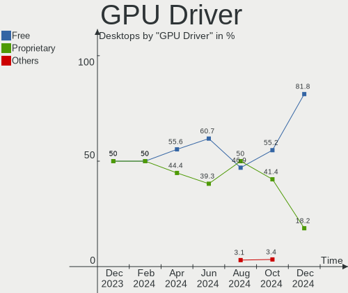
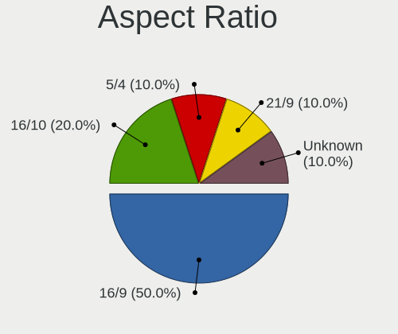
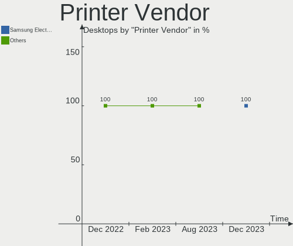

EndeavourOS - Hardware Trends (Desktops)
----------------------------------------

A project to identify most popular hardware characteristics and track their change
over time based on data collected by Linux users at https://Linux-Hardware.org.

Anyone can contribute to this report by the [hw-probe](https://github.com/linuxhw/hw-probe) tool:

    sudo -E hw-probe -all -upload

This report is for one last month. Overall report since the beginning of time: [TestDays](https://github.com/linuxhw/TestDays)

Period: Dec, 2023.

Contents
--------

* [ System ](#system)
  - [ OS                       ](#os)
  - [ OS Family                ](#os-family)
  - [ Kernel                   ](#kernel)
  - [ Kernel Family            ](#kernel-family)
  - [ Kernel Major Ver.        ](#kernel-major-ver)
  - [ Arch                     ](#arch)
  - [ DE                       ](#de)
  - [ Display Server           ](#display-server)
  - [ Display Manager          ](#display-manager)
  - [ OS Lang                  ](#os-lang)
  - [ Boot Mode                ](#boot-mode)
  - [ Filesystem               ](#filesystem)
  - [ Part. scheme             ](#part-scheme)
  - [ Dual Boot with Linux/BSD ](#dual-boot-with-linuxbsd)
  - [ Dual Boot (Win)          ](#dual-boot-win)

* [ Board ](#board)
  - [ Vendor                   ](#vendor)
  - [ Model                    ](#model)
  - [ Model Family             ](#model-family)
  - [ MFG Year                 ](#mfg-year)
  - [ Form Factor              ](#form-factor)
  - [ Secure Boot              ](#secure-boot)
  - [ Coreboot                 ](#coreboot)
  - [ RAM Size                 ](#ram-size)
  - [ RAM Used                 ](#ram-used)
  - [ Total Drives             ](#total-drives)
  - [ Has CD-ROM               ](#has-cd-rom)
  - [ Has Ethernet             ](#has-ethernet)
  - [ Has WiFi                 ](#has-wifi)
  - [ Has Bluetooth            ](#has-bluetooth)

* [ Location ](#location)
  - [ Country                  ](#country)
  - [ City                     ](#city)

* [ Drives ](#drives)
  - [ Drive Vendor             ](#drive-vendor)
  - [ Drive Model              ](#drive-model)
  - [ HDD Vendor               ](#hdd-vendor)
  - [ SSD Vendor               ](#ssd-vendor)
  - [ Drive Kind               ](#drive-kind)
  - [ Drive Connector          ](#drive-connector)
  - [ Drive Size               ](#drive-size)
  - [ Space Total              ](#space-total)
  - [ Space Used               ](#space-used)
  - [ Malfunc. Drives          ](#malfunc-drives)
  - [ Malfunc. Drive Vendor    ](#malfunc-drive-vendor)
  - [ Malfunc. HDD Vendor      ](#malfunc-hdd-vendor)
  - [ Malfunc. Drive Kind      ](#malfunc-drive-kind)
  - [ Failed Drives            ](#failed-drives)
  - [ Failed Drive Vendor      ](#failed-drive-vendor)
  - [ Drive Status             ](#drive-status)

* [ Storage controller ](#storage-controller)
  - [ Storage Vendor           ](#storage-vendor)
  - [ Storage Model            ](#storage-model)
  - [ Storage Kind             ](#storage-kind)

* [ Processor ](#processor)
  - [ CPU Vendor               ](#cpu-vendor)
  - [ CPU Model                ](#cpu-model)
  - [ CPU Model Family         ](#cpu-model-family)
  - [ CPU Cores                ](#cpu-cores)
  - [ CPU Sockets              ](#cpu-sockets)
  - [ CPU Threads              ](#cpu-threads)
  - [ CPU Op-Modes             ](#cpu-op-modes)
  - [ CPU Microcode            ](#cpu-microcode)
  - [ CPU Microarch            ](#cpu-microarch)

* [ Graphics ](#graphics)
  - [ GPU Vendor               ](#gpu-vendor)
  - [ GPU Model                ](#gpu-model)
  - [ GPU Combo                ](#gpu-combo)
  - [ GPU Driver               ](#gpu-driver)
  - [ GPU Memory               ](#gpu-memory)

* [ Monitor ](#monitor)
  - [ Monitor Vendor           ](#monitor-vendor)
  - [ Monitor Model            ](#monitor-model)
  - [ Monitor Resolution       ](#monitor-resolution)
  - [ Monitor Diagonal         ](#monitor-diagonal)
  - [ Monitor Width            ](#monitor-width)
  - [ Aspect Ratio             ](#aspect-ratio)
  - [ Monitor Area             ](#monitor-area)
  - [ Pixel Density            ](#pixel-density)
  - [ Multiple Monitors        ](#multiple-monitors)

* [ Network ](#network)
  - [ Net Controller Vendor    ](#net-controller-vendor)
  - [ Net Controller Model     ](#net-controller-model)
  - [ Wireless Vendor          ](#wireless-vendor)
  - [ Wireless Model           ](#wireless-model)
  - [ Ethernet Vendor          ](#ethernet-vendor)
  - [ Ethernet Model           ](#ethernet-model)
  - [ Net Controller Kind      ](#net-controller-kind)
  - [ Used Controller          ](#used-controller)
  - [ NICs                     ](#nics)
  - [ IPv6                     ](#ipv6)

* [ Bluetooth ](#bluetooth)
  - [ Bluetooth Vendor         ](#bluetooth-vendor)
  - [ Bluetooth Model          ](#bluetooth-model)

* [ Sound ](#sound)
  - [ Sound Vendor             ](#sound-vendor)
  - [ Sound Model              ](#sound-model)

* [ Memory ](#memory)
  - [ Memory Vendor            ](#memory-vendor)
  - [ Memory Model             ](#memory-model)
  - [ Memory Kind              ](#memory-kind)
  - [ Memory Form Factor       ](#memory-form-factor)
  - [ Memory Size              ](#memory-size)
  - [ Memory Speed             ](#memory-speed)

* [ Printers & scanners ](#printers--scanners)
  - [ Printer Vendor           ](#printer-vendor)
  - [ Printer Model            ](#printer-model)
  - [ Scanner Vendor           ](#scanner-vendor)
  - [ Scanner Model            ](#scanner-model)

* [ Camera ](#camera)
  - [ Camera Vendor            ](#camera-vendor)
  - [ Camera Model             ](#camera-model)

* [ Security ](#security)
  - [ Fingerprint Vendor       ](#fingerprint-vendor)
  - [ Fingerprint Model        ](#fingerprint-model)
  - [ Chipcard Vendor          ](#chipcard-vendor)
  - [ Chipcard Model           ](#chipcard-model)

* [ Unsupported ](#unsupported)
  - [ Unsupported Devices      ](#unsupported-devices)
  - [ Unsupported Device Types ](#unsupported-device-types)

System
------

OS
--

Installed operating systems

| Name                | Desktops | Percent |
|---------------------|----------|---------|
| EndeavourOS Rolling | 26       | 100%    |

OS Family
---------

OS without a version

| Name        | Desktops | Percent |
|-------------|----------|---------|
| EndeavourOS | 26       | 100%    |

Kernel
------

Version of the Linux kernel

| Version             | Desktops | Percent |
|---------------------|----------|---------|
| 6.6.7-arch1-1       | 6        | 23.08%  |
| 6.6.6-arch1-1       | 4        | 15.38%  |
| 6.6.4-arch1-1       | 4        | 15.38%  |
| 6.6.3-arch1-1       | 2        | 7.69%   |
| 6.1.69-1-lts        | 2        | 7.69%   |
| 6.6.8-AMD           | 1        | 3.85%   |
| 6.6.7-zen1-1-zen    | 1        | 3.85%   |
| 6.6.5-arch1-1       | 1        | 3.85%   |
| 6.6.4-zen1-1-zen    | 1        | 3.85%   |
| 6.6.2-arch1-1       | 1        | 3.85%   |
| 6.6.2-273-tkg-eevdf | 1        | 3.85%   |
| 6.5.7-zen1-1-zen    | 1        | 3.85%   |
| 6.1.65-1-lts        | 1        | 3.85%   |

Kernel Family
-------------

Linux kernel without a distro release

| Version | Desktops | Percent |
|---------|----------|---------|
| 6.6.7   | 7        | 26.92%  |
| 6.6.4   | 5        | 19.23%  |
| 6.6.6   | 4        | 15.38%  |
| 6.6.3   | 2        | 7.69%   |
| 6.6.2   | 2        | 7.69%   |
| 6.1.69  | 2        | 7.69%   |
| 6.6.8   | 1        | 3.85%   |
| 6.6.5   | 1        | 3.85%   |
| 6.5.7   | 1        | 3.85%   |
| 6.1.65  | 1        | 3.85%   |

Kernel Major Ver.
-----------------

Linux kernel major version

| Version | Desktops | Percent |
|---------|----------|---------|
| 6.6     | 22       | 84.62%  |
| 6.1     | 3        | 11.54%  |
| 6.5     | 1        | 3.85%   |

Arch
----

OS architecture (x86_64, i586, etc.)

| Name   | Desktops | Percent |
|--------|----------|---------|
| x86_64 | 26       | 100%    |

DE
--

Desktop Environment

| Name       | Desktops | Percent |
|------------|----------|---------|
| KDE5       | 16       | 61.54%  |
| XFCE       | 3        | 11.54%  |
| X-Cinnamon | 1        | 3.85%   |
| MATE       | 1        | 3.85%   |
| i3         | 1        | 3.85%   |
| Hyprland   | 1        | 3.85%   |
| GNOME      | 1        | 3.85%   |
| chadwm     | 1        | 3.85%   |
| Budgie     | 1        | 3.85%   |

Display Server
--------------

X11 or Wayland

| Name    | Desktops | Percent |
|---------|----------|---------|
| X11     | 21       | 80.77%  |
| Wayland | 5        | 19.23%  |

Display Manager
---------------

SDDM, LightDM, etc.

| Name    | Desktops | Percent |
|---------|----------|---------|
| SDDM    | 11       | 42.31%  |
| Unknown | 9        | 34.62%  |
| LightDM | 6        | 23.08%  |

OS Lang
-------

Language

| Lang  | Desktops | Percent |
|-------|----------|---------|
| en_US | 8        | 30.77%  |
| it_IT | 5        | 19.23%  |
| sv_SE | 3        | 11.54%  |
| de_DE | 2        | 7.69%   |
| zh_TW | 1        | 3.85%   |
| ja_JP | 1        | 3.85%   |
| is    | 1        | 3.85%   |
| es_ES | 1        | 3.85%   |
| es_CL | 1        | 3.85%   |
| en_ZA | 1        | 3.85%   |
| en_IN | 1        | 3.85%   |
| en_CA | 1        | 3.85%   |

Boot Mode
---------

EFI or BIOS

| Mode | Desktops | Percent |
|------|----------|---------|
| EFI  | 15       | 57.69%  |
| BIOS | 11       | 42.31%  |

Filesystem
----------

Type of filesystem

| Type  | Desktops | Percent |
|-------|----------|---------|
| Ext4  | 19       | 73.08%  |
| Btrfs | 7        | 26.92%  |

Part. scheme
------------

Scheme of partitioning

| Type    | Desktops | Percent |
|---------|----------|---------|
| GPT     | 15       | 57.69%  |
| Unknown | 9        | 34.62%  |
| MBR     | 2        | 7.69%   |

Dual Boot with Linux/BSD
------------------------

Hosting more than one Linux/BSD

| Dual boot | Desktops | Percent |
|-----------|----------|---------|
| No        | 20       | 76.92%  |
| Yes       | 6        | 23.08%  |

Dual Boot (Win)
---------------

Hosting Linux and Windows

| Dual boot | Desktops | Percent |
|-----------|----------|---------|
| No        | 14       | 53.85%  |
| Yes       | 12       | 46.15%  |

Board
-----

Vendor
------

Motherboard manufacturer

| Name                | Desktops | Percent |
|---------------------|----------|---------|
| ASUSTek Computer    | 10       | 38.46%  |
| Gigabyte Technology | 6        | 23.08%  |
| MSI                 | 5        | 19.23%  |
| Hewlett-Packard     | 3        | 11.54%  |
| Huanan              | 1        | 3.85%   |
| Dell                | 1        | 3.85%   |

Model
-----

Motherboard model

| Name                               | Desktops | Percent |
|------------------------------------|----------|---------|
| ASUS TUF Gaming B650-PLUS WIFI     | 2        | 7.69%   |
| MSI MS-7C95                        | 1        | 3.85%   |
| MSI MS-7C84                        | 1        | 3.85%   |
| MSI MS-7B45                        | 1        | 3.85%   |
| MSI MS-7B18                        | 1        | 3.85%   |
| MSI MS-7823                        | 1        | 3.85%   |
| Huanan X58                         | 1        | 3.85%   |
| HP Z440 Workstation                | 1        | 3.85%   |
| HP EliteDesk 800 G3 SFF            | 1        | 3.85%   |
| HP Compaq Elite 8300 SFF           | 1        | 3.85%   |
| Gigabyte Z390 GAMING X             | 1        | 3.85%   |
| Gigabyte Z170XP-SLI                | 1        | 3.85%   |
| Gigabyte X670 AORUS ELITE AX       | 1        | 3.85%   |
| Gigabyte B550M DS3H                | 1        | 3.85%   |
| Gigabyte B460M GAMING HD           | 1        | 3.85%   |
| Gigabyte B250M-DS3H                | 1        | 3.85%   |
| Dell OptiPlex 9010                 | 1        | 3.85%   |
| ASUS STRIX Z270H GAMING            | 1        | 3.85%   |
| ASUS ROG STRIX Z390-E GAMING       | 1        | 3.85%   |
| ASUS ROG STRIX X670E-E GAMING WIFI | 1        | 3.85%   |
| ASUS ROG STRIX G15DK_G15DK         | 1        | 3.85%   |
| ASUS PRIME H510M-A                 | 1        | 3.85%   |
| ASUS PRIME B760M-A WIFI D4         | 1        | 3.85%   |
| ASUS P8Z77-V LX                    | 1        | 3.85%   |
| ASUS P8B75-M                       | 1        | 3.85%   |

Model Family
------------

Motherboard model prefix

| Name                | Desktops | Percent |
|---------------------|----------|---------|
| ASUS ROG            | 3        | 11.54%  |
| ASUS TUF            | 2        | 7.69%   |
| ASUS PRIME          | 2        | 7.69%   |
| MSI MS-7C95         | 1        | 3.85%   |
| MSI MS-7C84         | 1        | 3.85%   |
| MSI MS-7B45         | 1        | 3.85%   |
| MSI MS-7B18         | 1        | 3.85%   |
| MSI MS-7823         | 1        | 3.85%   |
| Huanan X58          | 1        | 3.85%   |
| HP Z440             | 1        | 3.85%   |
| HP EliteDesk        | 1        | 3.85%   |
| HP Compaq           | 1        | 3.85%   |
| Gigabyte Z390       | 1        | 3.85%   |
| Gigabyte Z170XP-SLI | 1        | 3.85%   |
| Gigabyte X670       | 1        | 3.85%   |
| Gigabyte B550M      | 1        | 3.85%   |
| Gigabyte B460M      | 1        | 3.85%   |
| Gigabyte B250M-DS3H | 1        | 3.85%   |
| Dell OptiPlex       | 1        | 3.85%   |
| ASUS STRIX          | 1        | 3.85%   |
| ASUS P8Z77-V        | 1        | 3.85%   |
| ASUS P8B75-M        | 1        | 3.85%   |

MFG Year
--------

Motherboard manufacture year

| Year | Desktops | Percent |
|------|----------|---------|
| 2022 | 5        | 19.23%  |
| 2020 | 4        | 15.38%  |
| 2018 | 3        | 11.54%  |
| 2017 | 3        | 11.54%  |
| 2015 | 3        | 11.54%  |
| 2012 | 3        | 11.54%  |
| 2021 | 2        | 7.69%   |
| 2016 | 2        | 7.69%   |
| 2019 | 1        | 3.85%   |

Form Factor
-----------

Physical design of the computer

| Name    | Desktops | Percent |
|---------|----------|---------|
| Desktop | 26       | 100%    |

Secure Boot
-----------

Enabled or disabled

| State    | Desktops | Percent |
|----------|----------|---------|
| Disabled | 25       | 96.15%  |
| Enabled  | 1        | 3.85%   |

Coreboot
--------

Have coreboot on board

| Used | Desktops | Percent |
|------|----------|---------|
| No   | 26       | 100%    |

RAM Size
--------

Total RAM memory

| Size in GB  | Desktops | Percent |
|-------------|----------|---------|
| 32.01-64.0  | 11       | 42.31%  |
| 16.01-24.0  | 10       | 38.46%  |
| 8.01-16.0   | 3        | 11.54%  |
| 4.01-8.0    | 1        | 3.85%   |
| 64.01-256.0 | 1        | 3.85%   |

RAM Used
--------

Used RAM memory

| Used GB    | Desktops | Percent |
|------------|----------|---------|
| 4.01-8.0   | 9        | 34.62%  |
| 3.01-4.0   | 5        | 19.23%  |
| 2.01-3.0   | 4        | 15.38%  |
| 8.01-16.0  | 4        | 15.38%  |
| 16.01-24.0 | 2        | 7.69%   |
| 1.01-2.0   | 2        | 7.69%   |

Total Drives
------------

Number of drives on board

| Drives | Desktops | Percent |
|--------|----------|---------|
| 4      | 7        | 26.92%  |
| 2      | 7        | 26.92%  |
| 3      | 5        | 19.23%  |
| 1      | 4        | 15.38%  |
| 5      | 2        | 7.69%   |
| 10     | 1        | 3.85%   |

Has CD-ROM
----------

Has CD-ROM on board

| Presented | Desktops | Percent |
|-----------|----------|---------|
| No        | 18       | 69.23%  |
| Yes       | 8        | 30.77%  |

Has Ethernet
------------

Has Ethernet on board

| Presented | Desktops | Percent |
|-----------|----------|---------|
| Yes       | 25       | 96.15%  |
| No        | 1        | 3.85%   |

Has WiFi
--------

Has WiFi module

| Presented | Desktops | Percent |
|-----------|----------|---------|
| Yes       | 15       | 57.69%  |
| No        | 11       | 42.31%  |

Has Bluetooth
-------------

Has Bluetooth module

| Presented | Desktops | Percent |
|-----------|----------|---------|
| Yes       | 14       | 53.85%  |
| No        | 12       | 46.15%  |

Location
--------

Country
-------

Geographic location (country)

| Country      | Desktops | Percent |
|--------------|----------|---------|
| USA          | 5        | 19.23%  |
| Italy        | 5        | 19.23%  |
| Germany      | 4        | 15.38%  |
| Sweden       | 3        | 11.54%  |
| Canada       | 2        | 7.69%   |
| Taiwan       | 1        | 3.85%   |
| Spain        | 1        | 3.85%   |
| South Africa | 1        | 3.85%   |
| Israel       | 1        | 3.85%   |
| India        | 1        | 3.85%   |
| Chile        | 1        | 3.85%   |
| Belgium      | 1        | 3.85%   |

City
----

Geographic location (city)

| City               | Desktops | Percent |
|--------------------|----------|---------|
| Yakima             | 1        | 3.85%   |
| Villafranca d'Asti | 1        | 3.85%   |
| Umeå              | 1        | 3.85%   |
| Torija             | 1        | 3.85%   |
| Sundsvall          | 1        | 3.85%   |
| Pasian di Prato    | 1        | 3.85%   |
| Parma              | 1        | 3.85%   |
| Nuremberg          | 1        | 3.85%   |
| Monticello         | 1        | 3.85%   |
| Milton             | 1        | 3.85%   |
| Milan              | 1        | 3.85%   |
| Melipilla          | 1        | 3.85%   |
| Johannesburg       | 1        | 3.85%   |
| Hyderabad          | 1        | 3.85%   |
| Hsinchu            | 1        | 3.85%   |
| Grande Prairie     | 1        | 3.85%   |
| Giulianova         | 1        | 3.85%   |
| Gatineau           | 1        | 3.85%   |
| Frankfurt am Main  | 1        | 3.85%   |
| Duisburg           | 1        | 3.85%   |
| Duffel             | 1        | 3.85%   |
| Cologne            | 1        | 3.85%   |
| Billdal            | 1        | 3.85%   |
| Aurora             | 1        | 3.85%   |
| Ashdod             | 1        | 3.85%   |
| Allen              | 1        | 3.85%   |

Drives
------

Drive Vendor
------------

Hard drive vendors

| Vendor                       | Desktops | Drives | Percent |
|------------------------------|----------|--------|---------|
| WDC                          | 12       | 16     | 19.67%  |
| Seagate                      | 11       | 15     | 18.03%  |
| Samsung Electronics          | 10       | 18     | 16.39%  |
| Sandisk                      | 3        | 3      | 4.92%   |
| Micron/Crucial Technology    | 3        | 4      | 4.92%   |
| Toshiba                      | 2        | 2      | 3.28%   |
| Kingston                     | 2        | 3      | 3.28%   |
| Intel                        | 2        | 2      | 3.28%   |
| Hitachi                      | 2        | 3      | 3.28%   |
| Silicon Motion               | 1        | 1      | 1.64%   |
| Shenzhen Longsys Electronics | 1        | 1      | 1.64%   |
| PNY                          | 1        | 1      | 1.64%   |
| Phison Electronics           | 1        | 1      | 1.64%   |
| OCZ-VERTEX3                  | 1        | 1      | 1.64%   |
| NT-128                       | 1        | 1      | 1.64%   |
| KIOXIA-EXCERIA               | 1        | 2      | 1.64%   |
| Kingston Technology Company  | 1        | 1      | 1.64%   |
| Intenso                      | 1        | 1      | 1.64%   |
| HS-SSD-C100                  | 1        | 1      | 1.64%   |
| CT1000P3                     | 1        | 1      | 1.64%   |
| Crucial                      | 1        | 1      | 1.64%   |
| ANKEJE                       | 1        | 1      | 1.64%   |
| ADATA Technology             | 1        | 1      | 1.64%   |

Drive Model
-----------

Hard drive models

| Model                                                 | Desktops | Percent |
|-------------------------------------------------------|----------|---------|
| Samsung NVMe SSD Controller SM981/PM981/PM983 512GB   | 3        | 3.9%    |
| WDC WD40EZRZ-00GXCB0 4TB                              | 2        | 2.6%    |
| Seagate ST4000VN006-3CW104 4TB                        | 2        | 2.6%    |
| Samsung SSD 870 EVO 1TB                               | 2        | 2.6%    |
| Samsung SSD 860 EVO 500GB                             | 2        | 2.6%    |
| Samsung SSD 860 EVO 250GB                             | 2        | 2.6%    |
| Samsung SSD 840 EVO 120GB                             | 2        | 2.6%    |
| WDC WDS240G2G0A-00JH30 240GB SSD                      | 1        | 1.3%    |
| WDC WDS100T2B0A-00SM50 1TB SSD                        | 1        | 1.3%    |
| WDC WD6400AAKS-00A7B2 640GB                           | 1        | 1.3%    |
| WDC WD5000LPVX-22V0TT0 500GB                          | 1        | 1.3%    |
| WDC WD5000AZLX-08K2TA0 500GB                          | 1        | 1.3%    |
| WDC WD5000AAKX-75U6AA0 500GB                          | 1        | 1.3%    |
| WDC WD5000AAKS-65YGA0 500GB                           | 1        | 1.3%    |
| WDC WD5000AADS-00L4B1 500GB                           | 1        | 1.3%    |
| WDC WD20EARX-00PASB0 2TB                              | 1        | 1.3%    |
| WDC WD10EZEX-60WN4A0 1TB                              | 1        | 1.3%    |
| WDC WD10EZEX-08WN4A0 1TB                              | 1        | 1.3%    |
| WDC WD10EZEX-00WN4A0 1TB                              | 1        | 1.3%    |
| WDC WD1002FAEX-00Z3A0 1TB                             | 1        | 1.3%    |
| Toshiba MQ04ABF100 1TB                                | 1        | 1.3%    |
| Toshiba DT01ACA100 1TB                                | 1        | 1.3%    |
| Silicon Motion SM2263EN/SM2263XT SSD Controller 500GB | 1        | 1.3%    |
| Shenzhen Longsys Lexar SSD NM790 4TB                  | 1        | 1.3%    |
| Seagate ST9250315AS 250GB                             | 1        | 1.3%    |
| Seagate ST500DM002-1BD142 500GB                       | 1        | 1.3%    |
| Seagate ST4000VX007-2DT166 4TB                        | 1        | 1.3%    |
| Seagate ST3500418AS 500GB                             | 1        | 1.3%    |
| Seagate ST3500414CS 500GB                             | 1        | 1.3%    |
| Seagate ST3250310SV 250GB                             | 1        | 1.3%    |
| Seagate ST31000524AS 1TB                              | 1        | 1.3%    |
| Seagate ST2000DM001-9YN164 2TB                        | 1        | 1.3%    |
| Seagate ST1000LM 035-1RK172 1TB                       | 1        | 1.3%    |
| Seagate ST1000DM010-2EP102 1TB                        | 1        | 1.3%    |
| Seagate ST1000DM003-1CH162 1TB                        | 1        | 1.3%    |
| Seagate BUP BL 4TB                                    | 1        | 1.3%    |
| Sandisk WD_BLACK SN850X 1000GB                        | 1        | 1.3%    |
| Sandisk WD Blue SN550 NVMe SSD 1TB                    | 1        | 1.3%    |
| Sandisk WD Black SN750 / PC SN730 NVMe SSD 2TB        | 1        | 1.3%    |
| Samsung SSD 990 PRO 2TB                               | 1        | 1.3%    |

HDD Vendor
----------

Hard disk drive vendors

| Vendor              | Desktops | Drives | Percent |
|---------------------|----------|--------|---------|
| WDC                 | 12       | 14     | 42.86%  |
| Seagate             | 11       | 15     | 39.29%  |
| Toshiba             | 2        | 2      | 7.14%   |
| Hitachi             | 2        | 3      | 7.14%   |
| Samsung Electronics | 1        | 1      | 3.57%   |

SSD Vendor
----------

Solid state drive vendors

| Vendor              | Desktops | Drives | Percent |
|---------------------|----------|--------|---------|
| Samsung Electronics | 8        | 10     | 42.11%  |
| WDC                 | 2        | 2      | 10.53%  |
| Intel               | 2        | 2      | 10.53%  |
| PNY                 | 1        | 1      | 5.26%   |
| OCZ-VERTEX3         | 1        | 1      | 5.26%   |
| KIOXIA-EXCERIA      | 1        | 2      | 5.26%   |
| Kingston            | 1        | 2      | 5.26%   |
| Intenso             | 1        | 1      | 5.26%   |
| HS-SSD-C100         | 1        | 1      | 5.26%   |
| Crucial             | 1        | 1      | 5.26%   |

Drive Kind
----------

HDD or SSD

| Kind    | Desktops | Drives | Percent |
|---------|----------|--------|---------|
| HDD     | 20       | 35     | 38.46%  |
| NVMe    | 16       | 21     | 30.77%  |
| SSD     | 15       | 23     | 28.85%  |
| Unknown | 1        | 2      | 1.92%   |

Drive Connector
---------------

SATA, SAS, NVMe, etc.

| Type | Desktops | Drives | Percent |
|------|----------|--------|---------|
| SATA | 23       | 57     | 53.49%  |
| NVMe | 16       | 20     | 37.21%  |
| SAS  | 4        | 4      | 9.3%    |

Drive Size
----------

Size of hard drive

| Size in TB | Desktops | Drives | Percent |
|------------|----------|--------|---------|
| 0.01-0.5   | 17       | 30     | 43.59%  |
| 0.51-1.0   | 13       | 17     | 33.33%  |
| 3.01-4.0   | 6        | 7      | 15.38%  |
| 1.01-2.0   | 3        | 4      | 7.69%   |

Space Total
-----------

Amount of disk space available on the file system

| Size in GB     | Desktops | Percent |
|----------------|----------|---------|
| 251-500        | 6        | 23.08%  |
| More than 3000 | 5        | 19.23%  |
| 1001-2000      | 5        | 19.23%  |
| 2001-3000      | 3        | 11.54%  |
| 501-1000       | 3        | 11.54%  |
| 101-250        | 2        | 7.69%   |
| 1-20           | 2        | 7.69%   |

Space Used
----------

Amount of used disk space

| Used GB        | Desktops | Percent |
|----------------|----------|---------|
| 21-50          | 4        | 15.38%  |
| 501-1000       | 4        | 15.38%  |
| 51-100         | 4        | 15.38%  |
| 2001-3000      | 3        | 11.54%  |
| 1001-2000      | 3        | 11.54%  |
| 1-20           | 3        | 11.54%  |
| More than 3000 | 2        | 7.69%   |
| 101-250        | 2        | 7.69%   |
| 251-500        | 1        | 3.85%   |

Malfunc. Drives
---------------

Drive models with a malfunction

| Model                           | Desktops | Drives | Percent |
|---------------------------------|----------|--------|---------|
| WDC WD6400AAKS-00A7B2 640GB     | 1        | 1      | 20%     |
| WDC WD5000AADS-00L4B1 500GB     | 1        | 1      | 20%     |
| Seagate ST2000DM001-9YN164 2TB  | 1        | 1      | 20%     |
| Samsung Electronics SSD 980 1TB | 1        | 1      | 20%     |
| Samsung Electronics HD103SI 1TB | 1        | 1      | 20%     |

Malfunc. Drive Vendor
---------------------

Vendors of faulty drives

| Vendor              | Desktops | Drives | Percent |
|---------------------|----------|--------|---------|
| WDC                 | 2        | 2      | 40%     |
| Samsung Electronics | 2        | 2      | 40%     |
| Seagate             | 1        | 1      | 20%     |

Malfunc. HDD Vendor
-------------------

Vendors of faulty HDD drives

| Vendor              | Desktops | Drives | Percent |
|---------------------|----------|--------|---------|
| WDC                 | 2        | 2      | 50%     |
| Seagate             | 1        | 1      | 25%     |
| Samsung Electronics | 1        | 1      | 25%     |

Malfunc. Drive Kind
-------------------

Kinds of faulty drives

| Kind | Desktops | Drives | Percent |
|------|----------|--------|---------|
| HDD  | 4        | 4      | 80%     |
| NVMe | 1        | 1      | 20%     |

Failed Drives
-------------

Failed drive models

Zero info for selected period =(

Failed Drive Vendor
-------------------

Failed drive vendors

Zero info for selected period =(

Drive Status
------------

Number of failed and malfunc. drives

| Status   | Desktops | Drives | Percent |
|----------|----------|--------|---------|
| Works    | 17       | 43     | 54.84%  |
| Detected | 10       | 33     | 32.26%  |
| Malfunc  | 4        | 5      | 12.9%   |

Storage controller
------------------

Storage Vendor
--------------

Storage controller vendors

| Vendor                       | Desktops | Percent |
|------------------------------|----------|---------|
| Intel                        | 18       | 40%     |
| AMD                          | 8        | 17.78%  |
| Samsung Electronics          | 6        | 13.33%  |
| SanDisk                      | 3        | 6.67%   |
| Micron/Crucial Technology    | 3        | 6.67%   |
| Kingston Technology Company  | 2        | 4.44%   |
| Silicon Motion               | 1        | 2.22%   |
| Shenzhen Longsys Electronics | 1        | 2.22%   |
| Phison Electronics           | 1        | 2.22%   |
| JMicron Technology           | 1        | 2.22%   |
| ADATA Technology             | 1        | 2.22%   |

Storage Model
-------------

Storage controller models

| Model                                                                          | Desktops | Percent |
|--------------------------------------------------------------------------------|----------|---------|
| Intel 200 Series PCH SATA controller [AHCI mode]                               | 4        | 8.16%   |
| AMD FCH SATA Controller [AHCI mode]                                            | 4        | 8.16%   |
| Samsung NVMe SSD Controller SM981/PM981/PM983                                  | 3        | 6.12%   |
| Intel Cannon Lake PCH SATA AHCI Controller                                     | 3        | 6.12%   |
| AMD 500 Series Chipset SATA Controller                                         | 3        | 6.12%   |
| Samsung NVMe SSD Controller S4LV008[Pascal]                                    | 2        | 4.08%   |
| Intel 7 Series/C210 Series Chipset Family 6-port SATA Controller [AHCI mode]   | 2        | 4.08%   |
| Silicon Motion SM2263EN/SM2263XT (DRAM-less) NVMe SSD Controllers              | 1        | 2.04%   |
| Shenzhen Longsys Non-Volatile memory controller                                | 1        | 2.04%   |
| Sandisk WD Black SN850X NVMe SSD                                               | 1        | 2.04%   |
| SanDisk Ultra 3D / WD Blue SN550 NVMe SSD                                      | 1        | 2.04%   |
| SanDisk Extreme Pro / WD Black SN750 / PC SN730 / Red SN700 NVMe SSD           | 1        | 2.04%   |
| Samsung NVMe SSD Controller PM9A1/PM9A3/980PRO                                 | 1        | 2.04%   |
| Samsung NVMe SSD Controller 980 (DRAM-less)                                    | 1        | 2.04%   |
| Phison E18 PCIe4 NVMe Controller                                               | 1        | 2.04%   |
| Micron/Crucial P5 Plus NVMe PCIe SSD                                           | 1        | 2.04%   |
| Micron/Crucial P2 [Nick P2] / P3 / P3 Plus NVMe PCIe SSD (DRAM-less)           | 1        | 2.04%   |
| Micron/Crucial Non-Volatile memory controller                                  | 1        | 2.04%   |
| Kingston Company OM8PCP Design-In PCIe 3 NVMe SSD (DRAM-less)                  | 1        | 2.04%   |
| Kingston Company KC3000/FURY Renegade NVMe SSD E18                             | 1        | 2.04%   |
| JMicron JMB58x AHCI SATA controller                                            | 1        | 2.04%   |
| Intel Volume Management Device NVMe RAID Controller                            | 1        | 2.04%   |
| Intel SATA Controller [RAID mode]                                              | 1        | 2.04%   |
| Intel Q170/Q150/B150/H170/H110/Z170/CM236 Chipset SATA Controller [AHCI Mode]  | 1        | 2.04%   |
| Intel C610/X99 series chipset sSATA Controller [AHCI mode]                     | 1        | 2.04%   |
| Intel C610/X99 series chipset 6-Port SATA Controller [AHCI mode]               | 1        | 2.04%   |
| Intel 82801JI (ICH10 Family) SATA AHCI Controller                              | 1        | 2.04%   |
| Intel 8 Series/C220 Series Chipset Family 6-port SATA Controller 1 [AHCI mode] | 1        | 2.04%   |
| Intel 700 Series Chipset Family SATA AHCI Controller                           | 1        | 2.04%   |
| Intel 7 Series/C210 Series Chipset Family 4-port SATA Controller [IDE mode]    | 1        | 2.04%   |
| Intel 7 Series/C210 Series Chipset Family 2-port SATA Controller [IDE mode]    | 1        | 2.04%   |
| Intel 500 Series Chipset Family SATA AHCI Controller                           | 1        | 2.04%   |
| Intel 400 Series Chipset Family SATA AHCI Controller                           | 1        | 2.04%   |
| AMD FCH RAID Controller                                                        | 1        | 2.04%   |
| ADATA XPG SX8200 Pro PCIe Gen3x4 M.2 2280 Solid State Drive                    | 1        | 2.04%   |

Storage Kind
------------

Kind of storage controller (IDE, SATA, NVMe, SAS, ...)

| Kind | Desktops | Percent |
|------|----------|---------|
| SATA | 23       | 53.49%  |
| NVMe | 16       | 37.21%  |
| RAID | 3        | 6.98%   |
| IDE  | 1        | 2.33%   |

Processor
---------

CPU Vendor
----------

Processor vendors

| Vendor | Desktops | Percent |
|--------|----------|---------|
| Intel  | 18       | 69.23%  |
| AMD    | 8        | 30.77%  |

CPU Model
---------

Processor models

| Model                                  | Desktops | Percent |
|----------------------------------------|----------|---------|
| Intel Core i5-8400 CPU @ 2.80GHz       | 2        | 7.69%   |
| Intel Core i5-3470 CPU @ 3.20GHz       | 2        | 7.69%   |
| AMD Ryzen 7 5700X 8-Core Processor     | 2        | 7.69%   |
| Intel Xeon CPU E5-1620 v3 @ 3.50GHz    | 1        | 3.85%   |
| Intel Core i9-9900K CPU @ 3.60GHz      | 1        | 3.85%   |
| Intel Core i7-7700K CPU @ 4.20GHz      | 1        | 3.85%   |
| Intel Core i7-6700K CPU @ 4.00GHz      | 1        | 3.85%   |
| Intel Core i7-6700 CPU @ 3.40GHz       | 1        | 3.85%   |
| Intel Core i7-2600K CPU @ 3.40GHz      | 1        | 3.85%   |
| Intel Core i7 CPU 920 @ 2.67GHz        | 1        | 3.85%   |
| Intel Core i5-9400F CPU @ 2.90GHz      | 1        | 3.85%   |
| Intel Core i5-7400 CPU @ 3.00GHz       | 1        | 3.85%   |
| Intel Core i5-4460 CPU @ 3.20GHz       | 1        | 3.85%   |
| Intel Core i5-10400F CPU @ 2.90GHz     | 1        | 3.85%   |
| Intel Core i3-3220 CPU @ 3.30GHz       | 1        | 3.85%   |
| Intel 13th Gen Core i5-13400F          | 1        | 3.85%   |
| Intel 11th Gen Core i5-11400 @ 2.60GHz | 1        | 3.85%   |
| AMD Ryzen 9 7950X 16-Core Processor    | 1        | 3.85%   |
| AMD Ryzen 9 5900X 12-Core Processor    | 1        | 3.85%   |
| AMD Ryzen 7 7800X3D 8-Core Processor   | 1        | 3.85%   |
| AMD Ryzen 7 7700X 8-Core Processor     | 1        | 3.85%   |
| AMD Ryzen 5 7600X 6-Core Processor     | 1        | 3.85%   |
| AMD Ryzen 5 5600X 6-Core Processor     | 1        | 3.85%   |

CPU Model Family
----------------

Processor model prefix

| Model         | Desktops | Percent |
|---------------|----------|---------|
| Intel Core i5 | 8        | 30.77%  |
| Intel Core i7 | 5        | 19.23%  |
| AMD Ryzen 7   | 4        | 15.38%  |
| Other         | 2        | 7.69%   |
| AMD Ryzen 9   | 2        | 7.69%   |
| AMD Ryzen 5   | 2        | 7.69%   |
| Intel Xeon    | 1        | 3.85%   |
| Intel Core i9 | 1        | 3.85%   |
| Intel Core i3 | 1        | 3.85%   |

CPU Cores
---------

Number of processor cores

| Number | Desktops | Percent |
|--------|----------|---------|
| 4      | 10       | 38.46%  |
| 6      | 7        | 26.92%  |
| 8      | 5        | 19.23%  |
| 16     | 1        | 3.85%   |
| 12     | 1        | 3.85%   |
| 10     | 1        | 3.85%   |
| 2      | 1        | 3.85%   |

CPU Sockets
-----------

Number of sockets

| Number | Desktops | Percent |
|--------|----------|---------|
| 1      | 26       | 100%    |

CPU Threads
-----------

Threads per core (Hyper-Threading)

| Number | Desktops | Percent |
|--------|----------|---------|
| 2      | 18       | 69.23%  |
| 1      | 8        | 30.77%  |

CPU Op-Modes
------------

CPU Operation Modes (32-bit, 64-bit)

| Op mode        | Desktops | Percent |
|----------------|----------|---------|
| 32-bit, 64-bit | 26       | 100%    |

CPU Microcode
-------------

Microcode number

| Number     | Desktops | Percent |
|------------|----------|---------|
| Unknown    | 21       | 80.77%  |
| 0x0a201016 | 2        | 7.69%   |
| 0x0a601206 | 1        | 3.85%   |
| 0x0a601203 | 1        | 3.85%   |
| 0x0a20120e | 1        | 3.85%   |

CPU Microarch
-------------

Microarchitecture

| Name             | Desktops | Percent |
|------------------|----------|---------|
| KabyLake         | 6        | 23.08%  |
| Zen 3            | 4        | 15.38%  |
| Unknown          | 4        | 15.38%  |
| IvyBridge        | 3        | 11.54%  |
| Skylake          | 2        | 7.69%   |
| Haswell          | 2        | 7.69%   |
| SandyBridge      | 1        | 3.85%   |
| Nehalem          | 1        | 3.85%   |
| Icelake          | 1        | 3.85%   |
| CometLake        | 1        | 3.85%   |
| Alderlake Hybrid | 1        | 3.85%   |

Graphics
--------

GPU Vendor
----------

Vendors of graphics cards

| Vendor | Desktops | Percent |
|--------|----------|---------|
| Nvidia | 14       | 50%     |
| Intel  | 8        | 28.57%  |
| AMD    | 6        | 21.43%  |

GPU Model
---------

Graphics card models

| Model                                                                       | Desktops | Percent |
|-----------------------------------------------------------------------------|----------|---------|
| AMD Raphael                                                                 | 3        | 9.68%   |
| Nvidia TU116 [GeForce GTX 1660 SUPER]                                       | 2        | 6.45%   |
| Nvidia GM206 [GeForce GTX 960]                                              | 2        | 6.45%   |
| Intel Xeon E3-1200 v2/3rd Gen Core processor Graphics Controller            | 2        | 6.45%   |
| AMD Navi 21 [Radeon RX 6800/6800 XT / 6900 XT]                              | 2        | 6.45%   |
| Nvidia TU116 [GeForce GTX 1660 Ti]                                          | 1        | 3.23%   |
| Nvidia TU116 [GeForce GTX 1650 SUPER]                                       | 1        | 3.23%   |
| Nvidia GP107 [GeForce GTX 1050 Ti]                                          | 1        | 3.23%   |
| Nvidia GP104 [GeForce GTX 1070]                                             | 1        | 3.23%   |
| Nvidia GM107GL [Quadro K620]                                                | 1        | 3.23%   |
| Nvidia GK208B [GeForce GT 710]                                              | 1        | 3.23%   |
| Nvidia GF108 [GeForce GT 730]                                               | 1        | 3.23%   |
| Nvidia GA106 [GeForce RTX 3060]                                             | 1        | 3.23%   |
| Nvidia GA104 [GeForce RTX 3060 Ti Lite Hash Rate]                           | 1        | 3.23%   |
| Nvidia GA102 [GeForce RTX 3080]                                             | 1        | 3.23%   |
| Nvidia AD107 [GeForce RTX 4060]                                             | 1        | 3.23%   |
| Intel Xeon E3-1200 v3/4th Gen Core Processor Integrated Graphics Controller | 1        | 3.23%   |
| Intel RocketLake-S GT1 [UHD Graphics 730]                                   | 1        | 3.23%   |
| Intel HD Graphics 630                                                       | 1        | 3.23%   |
| Intel HD Graphics 530                                                       | 1        | 3.23%   |
| Intel DG2 [Arc A770]                                                        | 1        | 3.23%   |
| Intel 2nd Generation Core Processor Family Integrated Graphics Controller   | 1        | 3.23%   |
| AMD Pitcairn XT [Radeon HD 7870 GHz Edition]                                | 1        | 3.23%   |
| AMD Oland PRO [Radeon R7 240/340 / Radeon 520]                              | 1        | 3.23%   |
| AMD Navi 32 [Radeon RX 7700 XT / 7800 XT]                                   | 1        | 3.23%   |

GPU Combo
---------

Combinations of graphics cards

| Name         | Desktops | Percent |
|--------------|----------|---------|
| 1 x Nvidia   | 12       | 46.15%  |
| 1 x Intel    | 7        | 26.92%  |
| 2 x AMD      | 2        | 7.69%   |
| 1 x AMD      | 2        | 7.69%   |
| 2 x Nvidia   | 1        | 3.85%   |
| Intel + AMD  | 1        | 3.85%   |
| AMD + Nvidia | 1        | 3.85%   |

GPU Driver
----------

Free vs proprietary

| Driver      | Desktops | Percent |
|-------------|----------|---------|
| Proprietary | 13       | 50%     |
| Free        | 13       | 50%     |

GPU Memory
----------

Total video memory

| Size in GB | Desktops | Percent |
|------------|----------|---------|
| Unknown    | 11       | 42.31%  |
| 1.01-2.0   | 5        | 19.23%  |
| 7.01-8.0   | 3        | 11.54%  |
| 5.01-6.0   | 3        | 11.54%  |
| 3.01-4.0   | 2        | 7.69%   |
| 8.01-16.0  | 2        | 7.69%   |

Monitor
-------

Monitor Vendor
--------------

Monitor vendors

| Vendor               | Desktops | Percent |
|----------------------|----------|---------|
| Samsung Electronics  | 8        | 24.24%  |
| Goldstar             | 5        | 15.15%  |
| Dell                 | 3        | 9.09%   |
| ASUSTek Computer     | 3        | 9.09%   |
| Ancor Communications | 3        | 9.09%   |
| ViewSonic            | 2        | 6.06%   |
| BenQ                 | 2        | 6.06%   |
| AOC                  | 2        | 6.06%   |
| Unknown              | 1        | 3.03%   |
| OEM                  | 1        | 3.03%   |
| HUAWEI               | 1        | 3.03%   |
| Hewlett-Packard      | 1        | 3.03%   |
| Acer                 | 1        | 3.03%   |

Monitor Model
-------------

Monitor models

| Model                                                                 | Desktops | Percent |
|-----------------------------------------------------------------------|----------|---------|
| ViewSonic VA2719 Series VSCC132 1920x1080 598x336mm 27.0-inch         | 1        | 2.94%   |
| ViewSonic LCD Monitor VA1948 SERIES 1440x900                          | 1        | 2.94%   |
| Unknown LCD Monitor FFFF 2288x1287 2550x2550mm 142.0-inch             | 1        | 2.94%   |
| Samsung Electronics T19C300 SAM0A96 1366x768 410x230mm 18.5-inch      | 1        | 2.94%   |
| Samsung Electronics SMS19A100 SAM0867 1366x768 410x230mm 18.5-inch    | 1        | 2.94%   |
| Samsung Electronics SMBX2450L SAM0720 1920x1080 521x293mm 23.5-inch   | 1        | 2.94%   |
| Samsung Electronics SA300/SA350 SAM07D2 1920x1080 477x268mm 21.5-inch | 1        | 2.94%   |
| Samsung Electronics S27E330 SAM0D90 1920x1080 598x336mm 27.0-inch     | 1        | 2.94%   |
| Samsung Electronics S24F350 SAM0D20 1920x1080 521x293mm 23.5-inch     | 1        | 2.94%   |
| Samsung Electronics S22C300 SAM0A1E 1920x1080 480x270mm 21.7-inch     | 1        | 2.94%   |
| Samsung Electronics C34J79x SAM0F1D 3440x1440 800x330mm 34.1-inch     | 1        | 2.94%   |
| OEM 26W_LCD_TV OEM3700 1920x540                                       | 1        | 2.94%   |
| HUAWEI ZQE-CBA HWV6A25 3440x1440 797x334mm 34.0-inch                  | 1        | 2.94%   |
| Hewlett-Packard OMEN 27qs HPN3967 2560x1440 597x336mm 27.0-inch       | 1        | 2.94%   |
| Goldstar ULTRAWIDE GSM5AFB 2560x1080 798x334mm 34.1-inch              | 1        | 2.94%   |
| Goldstar ULTRAGEAR GSM5B7F 2560x1440 597x336mm 27.0-inch              | 1        | 2.94%   |
| Goldstar TV GSMC0A0 3840x2160                                         | 1        | 2.94%   |
| Goldstar HDR 4K GSM774F 3840x2160 697x392mm 31.5-inch                 | 1        | 2.94%   |
| Goldstar FULL HD GSM5B55 1920x1080 480x270mm 21.7-inch                | 1        | 2.94%   |
| Goldstar 23MB35 GSM5A93 1920x1080 510x290mm 23.1-inch                 | 1        | 2.94%   |
| Dell U2412M DELA07A 1920x1200 520x320mm 24.0-inch                     | 1        | 2.94%   |
| Dell ST2421L DELA070 1920x1080 531x299mm 24.0-inch                    | 1        | 2.94%   |
| Dell P2014H DEL4096 1600x900 434x236mm 19.4-inch                      | 1        | 2.94%   |
| BenQ ZOWIE XL LCD BNQ7F33 1920x1080 531x298mm 24.0-inch               | 1        | 2.94%   |
| BenQ LCD BNQ8024 2560x1440 597x336mm 27.0-inch                        | 1        | 2.94%   |
| ASUSTek Computer VG27AQ1A AUS2707 2560x1440 597x336mm 27.0-inch       | 1        | 2.94%   |
| ASUSTek Computer VG249 AUS2421 1920x1080 527x296mm 23.8-inch          | 1        | 2.94%   |
| ASUSTek Computer VG248 AUS24AC 1920x1080 531x299mm 24.0-inch          | 1        | 2.94%   |
| AOC 2490W1 AOC2490 1920x1080 527x296mm 23.8-inch                      | 1        | 2.94%   |
| AOC 2460G5 AOC246A 1920x1080 531x299mm 24.0-inch                      | 1        | 2.94%   |
| Ancor Communications VX238 ACI23C1 1920x1080 510x290mm 23.1-inch      | 1        | 2.94%   |
| Ancor Communications VS248 ACI2498 1920x1080 531x299mm 24.0-inch      | 1        | 2.94%   |
| Ancor Communications ASUS VX279 ACI27E4 1920x1080 598x336mm 27.0-inch | 1        | 2.94%   |
| Acer XB323QK NV ACR0837 3840x2160 697x392mm 31.5-inch                 | 1        | 2.94%   |

Monitor Resolution
------------------

Monitor screen resolution

| Resolution        | Desktops | Percent |
|-------------------|----------|---------|
| 1920x1080 (FHD)   | 14       | 43.75%  |
| 3840x2160 (4K)    | 4        | 12.5%   |
| 2560x1440 (QHD)   | 4        | 12.5%   |
| 3440x1440         | 2        | 6.25%   |
| 1366x768 (WXGA)   | 2        | 6.25%   |
| 2560x1080         | 1        | 3.13%   |
| 2288x1287         | 1        | 3.13%   |
| 1920x540          | 1        | 3.13%   |
| 1920x1200 (WUXGA) | 1        | 3.13%   |
| 1600x900 (HD+)    | 1        | 3.13%   |
| 1440x900 (WXGA+)  | 1        | 3.13%   |

Monitor Diagonal
----------------

Diagonal size in inches

| Inches  | Desktops | Percent |
|---------|----------|---------|
| 24      | 8        | 23.53%  |
| 27      | 7        | 20.59%  |
| 23      | 5        | 14.71%  |
| 34      | 3        | 8.82%   |
| 21      | 3        | 8.82%   |
| 31      | 2        | 5.88%   |
| 18      | 2        | 5.88%   |
| 142     | 1        | 2.94%   |
| 72      | 1        | 2.94%   |
| 19      | 1        | 2.94%   |
| Unknown | 1        | 2.94%   |

Monitor Width
-------------

Physical width

| Width in mm    | Desktops | Percent |
|----------------|----------|---------|
| 501-600        | 15       | 51.72%  |
| 401-500        | 5        | 17.24%  |
| 701-800        | 3        | 10.34%  |
| 601-700        | 3        | 10.34%  |
| More than 2000 | 1        | 3.45%   |
| 1501-2000      | 1        | 3.45%   |
| Unknown        | 1        | 3.45%   |

Aspect Ratio
------------

Proportional relationship between the width and the height

| Ratio   | Desktops | Percent |
|---------|----------|---------|
| 16/9    | 21       | 75%     |
| 21/9    | 3        | 10.71%  |
| 16/10   | 2        | 7.14%   |
| 1.00    | 1        | 3.57%   |
| Unknown | 1        | 3.57%   |

Monitor Area
------------

Area in inch²

| Area in inch² | Desktops | Percent |
|----------------|----------|---------|
| 201-250        | 13       | 39.39%  |
| 301-350        | 7        | 21.21%  |
| 351-500        | 5        | 15.15%  |
| More than 1000 | 2        | 6.06%   |
| 251-300        | 2        | 6.06%   |
| 141-150        | 2        | 6.06%   |
| 151-200        | 1        | 3.03%   |
| Unknown        | 1        | 3.03%   |

Pixel Density
-------------

Pixels per inch

| Density | Desktops | Percent |
|---------|----------|---------|
| 51-100  | 17       | 56.67%  |
| 101-120 | 9        | 30%     |
| 121-160 | 2        | 6.67%   |
| 1-50    | 1        | 3.33%   |
| Unknown | 1        | 3.33%   |

Multiple Monitors
-----------------

Total monitors connected

| Total | Desktops | Percent |
|-------|----------|---------|
| 1     | 19       | 73.08%  |
| 3     | 3        | 11.54%  |
| 2     | 3        | 11.54%  |
| 0     | 1        | 3.85%   |

Network
-------

Net Controller Vendor
---------------------

Controller vendors

| Vendor                | Desktops | Percent |
|-----------------------|----------|---------|
| Realtek Semiconductor | 16       | 40%     |
| Intel                 | 15       | 37.5%   |
| Microsoft             | 2        | 5%      |
| MediaTek              | 2        | 5%      |
| D-Link System         | 2        | 5%      |
| TP-Link               | 1        | 2.5%    |
| Tenda                 | 1        | 2.5%    |
| D-Link                | 1        | 2.5%    |

Net Controller Model
--------------------

Controller models

| Model                                                                     | Desktops | Percent |
|---------------------------------------------------------------------------|----------|---------|
| Realtek RTL8111/8168/8411 PCI Express Gigabit Ethernet Controller         | 10       | 20.41%  |
| Realtek RTL8125 2.5GbE Controller                                         | 5        | 10.2%   |
| Intel Ethernet Connection (7) I219-V                                      | 3        | 6.12%   |
| Intel Ethernet Connection (2) I219-V                                      | 3        | 6.12%   |
| Realtek RTL8852BE PCIe 802.11ax Wireless Network Controller               | 2        | 4.08%   |
| Intel Wi-Fi 6 AX200                                                       | 2        | 4.08%   |
| Intel 82579LM Gigabit Network Connection (Lewisville)                     | 2        | 4.08%   |
| TP-Link Archer T4U ver.3                                                  | 1        | 2.04%   |
| Tenda U12                                                                 | 1        | 2.04%   |
| Realtek USB 10/100/1G/2.5G LAN                                            | 1        | 2.04%   |
| Realtek RTL8188EUS 802.11n Wireless Network Adapter                       | 1        | 2.04%   |
| Realtek RTL8188CUS 802.11n WLAN Adapter                                   | 1        | 2.04%   |
| Realtek RTL-8100/8101L/8139 PCI Fast Ethernet Adapter                     | 1        | 2.04%   |
| Microsoft Xbox Wireless Adapter for Windows                               | 1        | 2.04%   |
| Microsoft Xbox 360 Wireless Adapter                                       | 1        | 2.04%   |
| MediaTek MT7922 802.11ax PCI Express Wireless Network Adapter             | 1        | 2.04%   |
| MediaTek MT7921K (RZ608) Wi-Fi 6E 80MHz                                   | 1        | 2.04%   |
| Intel Wireless 7260                                                       | 1        | 2.04%   |
| Intel Wi-Fi 6 AX210/AX211/AX411 160MHz                                    | 1        | 2.04%   |
| Intel I211 Gigabit Network Connection                                     | 1        | 2.04%   |
| Intel I210 Gigabit Network Connection                                     | 1        | 2.04%   |
| Intel Ethernet Connection (5) I219-LM                                     | 1        | 2.04%   |
| Intel Ethernet Connection (2) I218-LM                                     | 1        | 2.04%   |
| Intel Ethernet Connection (14) I219-V                                     | 1        | 2.04%   |
| Intel Cannon Lake PCH CNVi WiFi                                           | 1        | 2.04%   |
| Intel 700 Series Chipset Family Wi-Fi                                     | 1        | 2.04%   |
| D-Link System DGE-528T Gigabit Ethernet Adapter                           | 1        | 2.04%   |
| D-Link System AirPlus G DWL-G122 Wireless Adapter(rev.E1) [Ralink RT2070] | 1        | 2.04%   |
| D-Link DWA-131 Wireless N Nano Adapter (Rev. E1) [Realtek RTL8192EU]      | 1        | 2.04%   |

Wireless Vendor
---------------

Wireless vendors

| Vendor                | Desktops | Percent |
|-----------------------|----------|---------|
| Intel                 | 6        | 33.33%  |
| Realtek Semiconductor | 4        | 22.22%  |
| Microsoft             | 2        | 11.11%  |
| MediaTek              | 2        | 11.11%  |
| TP-Link               | 1        | 5.56%   |
| Tenda                 | 1        | 5.56%   |
| D-Link System         | 1        | 5.56%   |
| D-Link                | 1        | 5.56%   |

Wireless Model
--------------

Wireless models

| Model                                                                     | Desktops | Percent |
|---------------------------------------------------------------------------|----------|---------|
| Realtek RTL8852BE PCIe 802.11ax Wireless Network Controller               | 2        | 11.11%  |
| Intel Wi-Fi 6 AX200                                                       | 2        | 11.11%  |
| TP-Link Archer T4U ver.3                                                  | 1        | 5.56%   |
| Tenda U12                                                                 | 1        | 5.56%   |
| Realtek RTL8188EUS 802.11n Wireless Network Adapter                       | 1        | 5.56%   |
| Realtek RTL8188CUS 802.11n WLAN Adapter                                   | 1        | 5.56%   |
| Microsoft Xbox Wireless Adapter for Windows                               | 1        | 5.56%   |
| Microsoft Xbox 360 Wireless Adapter                                       | 1        | 5.56%   |
| MediaTek MT7922 802.11ax PCI Express Wireless Network Adapter             | 1        | 5.56%   |
| MediaTek MT7921K (RZ608) Wi-Fi 6E 80MHz                                   | 1        | 5.56%   |
| Intel Wireless 7260                                                       | 1        | 5.56%   |
| Intel Wi-Fi 6 AX210/AX211/AX411 160MHz                                    | 1        | 5.56%   |
| Intel Cannon Lake PCH CNVi WiFi                                           | 1        | 5.56%   |
| Intel 700 Series Chipset Family Wi-Fi                                     | 1        | 5.56%   |
| D-Link System AirPlus G DWL-G122 Wireless Adapter(rev.E1) [Ralink RT2070] | 1        | 5.56%   |
| D-Link DWA-131 Wireless N Nano Adapter (Rev. E1) [Realtek RTL8192EU]      | 1        | 5.56%   |

Ethernet Vendor
---------------

Ethernet vendors

| Vendor                | Desktops | Percent |
|-----------------------|----------|---------|
| Realtek Semiconductor | 15       | 55.56%  |
| Intel                 | 11       | 40.74%  |
| D-Link System         | 1        | 3.7%    |

Ethernet Model
--------------

Ethernet models

| Model                                                             | Desktops | Percent |
|-------------------------------------------------------------------|----------|---------|
| Realtek RTL8111/8168/8411 PCI Express Gigabit Ethernet Controller | 10       | 32.26%  |
| Realtek RTL8125 2.5GbE Controller                                 | 5        | 16.13%  |
| Intel Ethernet Connection (7) I219-V                              | 3        | 9.68%   |
| Intel Ethernet Connection (2) I219-V                              | 3        | 9.68%   |
| Intel 82579LM Gigabit Network Connection (Lewisville)             | 2        | 6.45%   |
| Realtek USB 10/100/1G/2.5G LAN                                    | 1        | 3.23%   |
| Realtek RTL-8100/8101L/8139 PCI Fast Ethernet Adapter             | 1        | 3.23%   |
| Intel I211 Gigabit Network Connection                             | 1        | 3.23%   |
| Intel I210 Gigabit Network Connection                             | 1        | 3.23%   |
| Intel Ethernet Connection (5) I219-LM                             | 1        | 3.23%   |
| Intel Ethernet Connection (2) I218-LM                             | 1        | 3.23%   |
| Intel Ethernet Connection (14) I219-V                             | 1        | 3.23%   |
| D-Link System DGE-528T Gigabit Ethernet Adapter                   | 1        | 3.23%   |

Net Controller Kind
-------------------

Ethernet, WiFi or modem

| Kind     | Desktops | Percent |
|----------|----------|---------|
| Ethernet | 25       | 62.5%   |
| WiFi     | 15       | 37.5%   |

Used Controller
---------------

Currently used network controller

| Kind     | Desktops | Percent |
|----------|----------|---------|
| Ethernet | 20       | 76.92%  |
| WiFi     | 6        | 23.08%  |

NICs
----

Total network controllers on board

| Total | Desktops | Percent |
|-------|----------|---------|
| 1     | 13       | 50%     |
| 2     | 12       | 46.15%  |
| 3     | 1        | 3.85%   |

IPv6
----

IPv6 vs IPv4

| Used | Desktops | Percent |
|------|----------|---------|
| No   | 17       | 65.38%  |
| Yes  | 9        | 34.62%  |

Bluetooth
---------

Bluetooth Vendor
----------------

Controller vendors

| Vendor                  | Desktops | Percent |
|-------------------------|----------|---------|
| Intel                   | 6        | 42.86%  |
| MediaTek                | 2        | 14.29%  |
| IMC Networks            | 2        | 14.29%  |
| Cambridge Silicon Radio | 2        | 14.29%  |
| ASUSTek Computer        | 2        | 14.29%  |

Bluetooth Model
---------------

Controller models

| Model                                               | Desktops | Percent |
|-----------------------------------------------------|----------|---------|
| MediaTek Wireless_Device                            | 2        | 14.29%  |
| Intel AX200 Bluetooth                               | 2        | 14.29%  |
| IMC Networks Bluetooth Radio                        | 2        | 14.29%  |
| Cambridge Silicon Radio Bluetooth Dongle (HCI mode) | 2        | 14.29%  |
| Intel Bluetooth wireless interface                  | 1        | 7.14%   |
| Intel Bluetooth Device                              | 1        | 7.14%   |
| Intel Bluetooth 9460/9560 Jefferson Peak (JfP)      | 1        | 7.14%   |
| Intel AX210 Bluetooth                               | 1        | 7.14%   |
| ASUS Broadcom BCM20702A0 Bluetooth                  | 1        | 7.14%   |
| ASUS Bluetooth Device                               | 1        | 7.14%   |

Sound
-----

Sound Vendor
------------

Sound card vendors

| Vendor                 | Desktops | Percent |
|------------------------|----------|---------|
| Intel                  | 19       | 32.76%  |
| Nvidia                 | 14       | 24.14%  |
| AMD                    | 9        | 15.52%  |
| C-Media Electronics    | 3        | 5.17%   |
| DSEA A/S               | 2        | 3.45%   |
| ASUSTek Computer       | 2        | 3.45%   |
| SteelSeries ApS        | 1        | 1.72%   |
| RODE Microphones       | 1        | 1.72%   |
| Logitech               | 1        | 1.72%   |
| Hewlett-Packard        | 1        | 1.72%   |
| GN Netcom              | 1        | 1.72%   |
| fifine Microphones     | 1        | 1.72%   |
| Blue Microphones       | 1        | 1.72%   |
| AlfaPlus Semiconductor | 1        | 1.72%   |
| AKAI Professional M.I. | 1        | 1.72%   |

Sound Model
-----------

Sound card models

| Model                                                                   | Desktops | Percent |
|-------------------------------------------------------------------------|----------|---------|
| Nvidia TU116 High Definition Audio Controller                           | 4        | 6.06%   |
| Intel 7 Series/C216 Chipset Family High Definition Audio Controller     | 4        | 6.06%   |
| Intel 200 Series PCH HD Audio                                           | 4        | 6.06%   |
| AMD Starship/Matisse HD Audio Controller                                | 4        | 6.06%   |
| Intel Cannon Lake PCH cAVS                                              | 3        | 4.55%   |
| AMD Rembrandt Radeon High Definition Audio Controller                   | 3        | 4.55%   |
| AMD Family 17h/19h HD Audio Controller                                  | 3        | 4.55%   |
| Nvidia GM206 High Definition Audio Controller                           | 2        | 3.03%   |
| C-Media Electronics Blue Snowball                                       | 2        | 3.03%   |
| AMD Oland/Hainan/Cape Verde/Pitcairn HDMI Audio [Radeon HD 7000 Series] | 2        | 3.03%   |
| AMD Navi 21/23 HDMI/DP Audio Controller                                 | 2        | 3.03%   |
| SteelSeries ApS Arctis Pro Wireless                                     | 1        | 1.52%   |
| RODE Microphones RODE AI-1                                              | 1        | 1.52%   |
| Nvidia GP107GL High Definition Audio Controller                         | 1        | 1.52%   |
| Nvidia GP104 High Definition Audio Controller                           | 1        | 1.52%   |
| Nvidia GM107 High Definition Audio Controller [GeForce 940MX]           | 1        | 1.52%   |
| Nvidia GK208 HDMI/DP Audio Controller                                   | 1        | 1.52%   |
| Nvidia GF119 HDMI Audio Controller                                      | 1        | 1.52%   |
| Nvidia GA106 High Definition Audio Controller                           | 1        | 1.52%   |
| Nvidia GA104 High Definition Audio Controller                           | 1        | 1.52%   |
| Nvidia GA102 High Definition Audio Controller                           | 1        | 1.52%   |
| Nvidia Audio device                                                     | 1        | 1.52%   |
| Logitech G930                                                           | 1        | 1.52%   |
| Intel Xeon E3-1200 v3/4th Gen Core Processor HD Audio Controller        | 1        | 1.52%   |
| Intel Tiger Lake-H HD Audio Controller                                  | 1        | 1.52%   |
| Intel DG2 Audio Controller                                              | 1        | 1.52%   |
| Intel Comet Lake PCH-V cAVS                                             | 1        | 1.52%   |
| Intel C610/X99 series chipset HD Audio Controller                       | 1        | 1.52%   |
| Intel 82801JI (ICH10 Family) HD Audio Controller                        | 1        | 1.52%   |
| Intel 8 Series/C220 Series Chipset High Definition Audio Controller     | 1        | 1.52%   |
| Intel 700 Series Chipset Family Precise Touch and Stylus Port #1        | 1        | 1.52%   |
| Intel 100 Series/C230 Series Chipset Family HD Audio Controller         | 1        | 1.52%   |
| Hewlett-Packard HyperX QuadCast                                         | 1        | 1.52%   |
| GN Netcom Jabra EVOLVE Link MS                                          | 1        | 1.52%   |
| fifine Microphones fifine Microphone                                    | 1        | 1.52%   |
| DSEA A/S Sennheiser SC 160 USB                                          | 1        | 1.52%   |
| DSEA A/S BTD-800                                                        | 1        | 1.52%   |
| C-Media Electronics Audio Adapter (Unitek Y-247A)                       | 1        | 1.52%   |
| Blue Microphones Yeti Stereo Microphone                                 | 1        | 1.52%   |
| ASUSTek Computer Xonar SoundCard                                        | 1        | 1.52%   |

Memory
------

Memory Vendor
-------------

Memory module vendors

| Vendor            | Desktops | Percent |
|-------------------|----------|---------|
| Corsair           | 7        | 33.33%  |
| Kingston          | 6        | 28.57%  |
| SK hynix          | 2        | 9.52%   |
| G.Skill           | 2        | 9.52%   |
| Neo Forza         | 1        | 4.76%   |
| Micron Technology | 1        | 4.76%   |
| Crucial           | 1        | 4.76%   |
| A-DATA Technology | 1        | 4.76%   |

Memory Model
------------

Memory module models

| Model                                                   | Desktops | Percent |
|---------------------------------------------------------|----------|---------|
| Kingston RAM KF3200C16D4/16GX 16GB DIMM DDR4 3200MT/s   | 2        | 8%      |
| SK hynix RAM Module 8GB DIMM DDR4 2666MT/s              | 1        | 4%      |
| SK hynix RAM HMT451U6BFR8C-PB 4GB DIMM DDR3 1600MT/s    | 1        | 4%      |
| Neo Forza RAM NMUD416E82-3200E 16GB DIMM DDR4 3200MT/s  | 1        | 4%      |
| Micron RAM 8JTF51264AZ-1G6E1 4GB DIMM DDR3 1600MT/s     | 1        | 4%      |
| Kingston RAM KHX2133C14D4/8G 8GB DIMM DDR4 2667MT/s     | 1        | 4%      |
| Kingston RAM KF552C36-8 8GB DIMM DDR5 4800MT/s          | 1        | 4%      |
| Kingston RAM KF2666C16D4/8G 8GB DIMM DDR4 2667MT/s      | 1        | 4%      |
| Kingston RAM 99U5474-028.A00LF 4GB DIMM DDR3 1333MT/s   | 1        | 4%      |
| Kingston RAM 99U5474-026.A00LF 4GB DIMM DDR3 1333MT/s   | 1        | 4%      |
| Kingston RAM 9905713-030.A00G 8GB DIMM DDR4 3200MT/s    | 1        | 4%      |
| G.Skill RAM F4-3600C18-8GTZRX 8GB DIMM DDR4 3600MT/s    | 1        | 4%      |
| G.Skill RAM F4-3600C17-16GTZ 16GB DIMM DDR4 3600MT/s    | 1        | 4%      |
| G.Skill RAM F4-3200C16-8GTZR 8GB DIMM DDR4 3200MT/s     | 1        | 4%      |
| Crucial RAM CT8G4DFS8266.C8FD1 8GB DIMM DDR4 2667MT/s   | 1        | 4%      |
| Corsair RAM CMZ16GX3M4A1600C9 4GB DIMM DDR3 1600MT/s    | 1        | 4%      |
| Corsair RAM CMW32GX4M2Z3600C18 16GB DIMM DDR4 3733MT/s  | 1        | 4%      |
| Corsair RAM CMV8GX3M2A1333C9 4GB DIMM DDR3 1333MT/s     | 1        | 4%      |
| Corsair RAM CMV8GX3M1A1333C9 8GB DIMM DDR3 1600MT/s     | 1        | 4%      |
| Corsair RAM CMR16GX4M2C3200C16 8GB DIMM DDR4 3200MT/s   | 1        | 4%      |
| Corsair RAM CML8GX3M2A1600C9 4GB DIMM DDR3 1867MT/s     | 1        | 4%      |
| Corsair RAM CMK32GX4M2D3600C18 16GB DIMM DDR4 3800MT/s  | 1        | 4%      |
| Corsair RAM CMK16GX4M2B3000C15 8GB DIMM DDR4 3533MT/s   | 1        | 4%      |
| A-DATA RAM AX5U6000C3032G-BLAWH 32GB DIMM DDR5 6000MT/s | 1        | 4%      |

Memory Kind
-----------

Memory module kinds

| Kind | Desktops | Percent |
|------|----------|---------|
| DDR4 | 12       | 66.67%  |
| DDR3 | 4        | 22.22%  |
| DDR5 | 2        | 11.11%  |

Memory Form Factor
------------------

Physical design of the memory module

| Name | Desktops | Percent |
|------|----------|---------|
| DIMM | 18       | 100%    |

Memory Size
-----------

Memory module size

| Size  | Desktops | Percent |
|-------|----------|---------|
| 8192  | 9        | 45%     |
| 16384 | 6        | 30%     |
| 4096  | 4        | 20%     |
| 32768 | 1        | 5%      |

Memory Speed
------------

Memory module speed

| Speed | Desktops | Percent |
|-------|----------|---------|
| 3200  | 5        | 22.73%  |
| 2667  | 3        | 13.64%  |
| 1600  | 3        | 13.64%  |
| 3600  | 2        | 9.09%   |
| 1333  | 2        | 9.09%   |
| 6000  | 1        | 4.55%   |
| 4800  | 1        | 4.55%   |
| 3800  | 1        | 4.55%   |
| 3733  | 1        | 4.55%   |
| 3533  | 1        | 4.55%   |
| 2666  | 1        | 4.55%   |
| 1867  | 1        | 4.55%   |

Printers & scanners
-------------------

Printer Vendor
--------------

Printer device vendors

| Vendor              | Desktops | Percent |
|---------------------|----------|---------|
| Samsung Electronics | 1        | 100%    |

Printer Model
-------------

Printer device models

| Model                                | Desktops | Percent |
|--------------------------------------|----------|---------|
| Samsung ML-331x Series Laser Printer | 1        | 100%    |

Scanner Vendor
--------------

Scanner device vendors

Zero info for selected period =(

Scanner Model
-------------

Scanner device models

Zero info for selected period =(

Camera
------

Camera Vendor
-------------

Camera device vendors

| Vendor                        | Desktops | Percent |
|-------------------------------|----------|---------|
| Logitech                      | 3        | 37.5%   |
| WaveRider Communications      | 1        | 12.5%   |
| SunplusIT                     | 1        | 12.5%   |
| Sunplus Innovation Technology | 1        | 12.5%   |
| Magic Control Technology      | 1        | 12.5%   |
| MacroSilicon                  | 1        | 12.5%   |

Camera Model
------------

Camera device models

| Model                           | Desktops | Percent |
|---------------------------------|----------|---------|
| WaveRider USB 2.0 Camera        | 1        | 12.5%   |
| SunplusIT Depstech webcam       | 1        | 12.5%   |
| Sunplus Full HD webcam          | 1        | 12.5%   |
| Magic Control j5 WebCam JVCU100 | 1        | 12.5%   |
| MacroSilicon ShadowCast         | 1        | 12.5%   |
| Logitech Webcam C930e           | 1        | 12.5%   |
| Logitech Webcam C270            | 1        | 12.5%   |
| Logitech StreamCam              | 1        | 12.5%   |

Security
--------

Fingerprint Vendor
------------------

Fingerprint sensor vendors

Zero info for selected period =(

Fingerprint Model
-----------------

Fingerprint sensor models

Zero info for selected period =(

Chipcard Vendor
---------------

Chipcard module vendors

Zero info for selected period =(

Chipcard Model
--------------

Chipcard module models

Zero info for selected period =(

Unsupported
-----------

Unsupported Devices
-------------------

Total unsupported devices on board

| Total | Desktops | Percent |
|-------|----------|---------|
| 0     | 23       | 88.46%  |
| 1     | 2        | 7.69%   |
| 3     | 1        | 3.85%   |

Unsupported Device Types
------------------------

Types of unsupported devices

| Type             | Desktops | Percent |
|------------------|----------|---------|
| Unassigned class | 1        | 33.33%  |
| Net/wireless     | 1        | 33.33%  |
| Net/ethernet     | 1        | 33.33%  |

