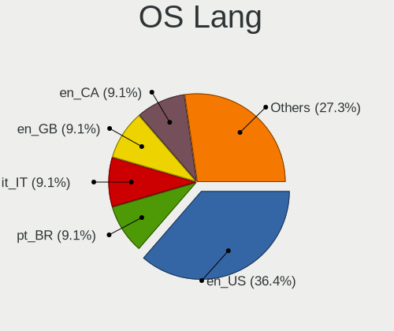
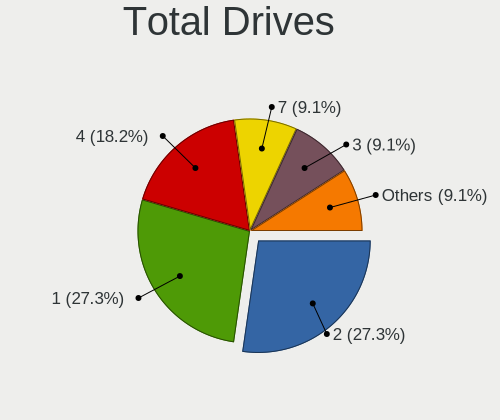
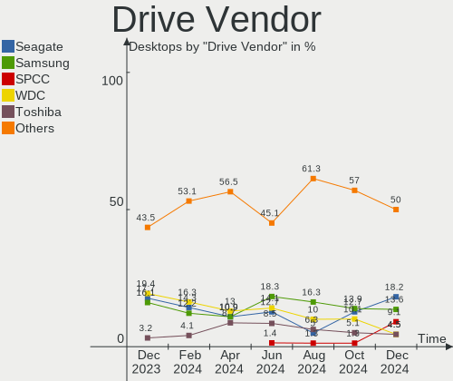
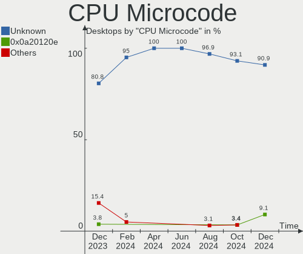
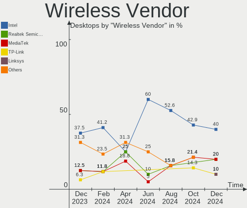
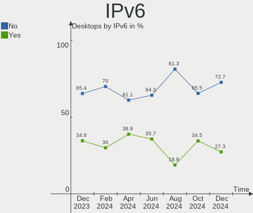
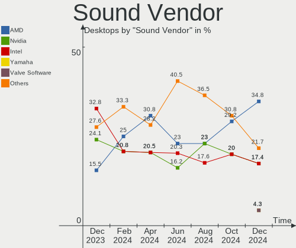
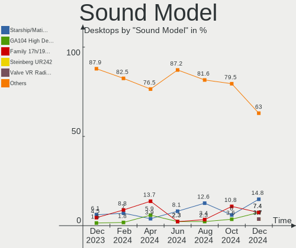
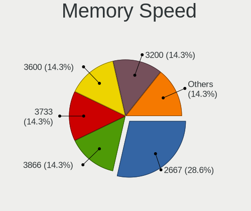
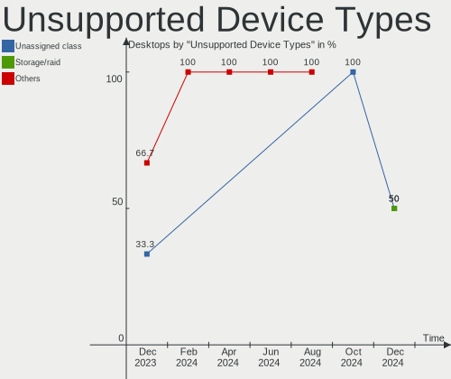

EndeavourOS - Hardware Trends (Desktops)
----------------------------------------

A project to identify most popular hardware characteristics and track their change
over time based on data collected by Linux users at https://Linux-Hardware.org.

Anyone can contribute to this report by the [hw-probe](https://github.com/linuxhw/hw-probe) tool:

    sudo -E hw-probe -all -upload

This report is for one last month. Overall report since the beginning of time: [TestDays](https://github.com/linuxhw/TestDays)

Period: Aug, 2023.

Contents
--------

* [ System ](#system)
  - [ OS                       ](#os)
  - [ OS Family                ](#os-family)
  - [ Kernel                   ](#kernel)
  - [ Kernel Family            ](#kernel-family)
  - [ Kernel Major Ver.        ](#kernel-major-ver)
  - [ Arch                     ](#arch)
  - [ DE                       ](#de)
  - [ Display Server           ](#display-server)
  - [ Display Manager          ](#display-manager)
  - [ OS Lang                  ](#os-lang)
  - [ Boot Mode                ](#boot-mode)
  - [ Filesystem               ](#filesystem)
  - [ Part. scheme             ](#part-scheme)
  - [ Dual Boot with Linux/BSD ](#dual-boot-with-linuxbsd)
  - [ Dual Boot (Win)          ](#dual-boot-win)

* [ Board ](#board)
  - [ Vendor                   ](#vendor)
  - [ Model                    ](#model)
  - [ Model Family             ](#model-family)
  - [ MFG Year                 ](#mfg-year)
  - [ Form Factor              ](#form-factor)
  - [ Secure Boot              ](#secure-boot)
  - [ Coreboot                 ](#coreboot)
  - [ RAM Size                 ](#ram-size)
  - [ RAM Used                 ](#ram-used)
  - [ Total Drives             ](#total-drives)
  - [ Has CD-ROM               ](#has-cd-rom)
  - [ Has Ethernet             ](#has-ethernet)
  - [ Has WiFi                 ](#has-wifi)
  - [ Has Bluetooth            ](#has-bluetooth)

* [ Location ](#location)
  - [ Country                  ](#country)
  - [ City                     ](#city)

* [ Drives ](#drives)
  - [ Drive Vendor             ](#drive-vendor)
  - [ Drive Model              ](#drive-model)
  - [ HDD Vendor               ](#hdd-vendor)
  - [ SSD Vendor               ](#ssd-vendor)
  - [ Drive Kind               ](#drive-kind)
  - [ Drive Connector          ](#drive-connector)
  - [ Drive Size               ](#drive-size)
  - [ Space Total              ](#space-total)
  - [ Space Used               ](#space-used)
  - [ Malfunc. Drives          ](#malfunc-drives)
  - [ Malfunc. Drive Vendor    ](#malfunc-drive-vendor)
  - [ Malfunc. HDD Vendor      ](#malfunc-hdd-vendor)
  - [ Malfunc. Drive Kind      ](#malfunc-drive-kind)
  - [ Failed Drives            ](#failed-drives)
  - [ Failed Drive Vendor      ](#failed-drive-vendor)
  - [ Drive Status             ](#drive-status)

* [ Storage controller ](#storage-controller)
  - [ Storage Vendor           ](#storage-vendor)
  - [ Storage Model            ](#storage-model)
  - [ Storage Kind             ](#storage-kind)

* [ Processor ](#processor)
  - [ CPU Vendor               ](#cpu-vendor)
  - [ CPU Model                ](#cpu-model)
  - [ CPU Model Family         ](#cpu-model-family)
  - [ CPU Cores                ](#cpu-cores)
  - [ CPU Sockets              ](#cpu-sockets)
  - [ CPU Threads              ](#cpu-threads)
  - [ CPU Op-Modes             ](#cpu-op-modes)
  - [ CPU Microcode            ](#cpu-microcode)
  - [ CPU Microarch            ](#cpu-microarch)

* [ Graphics ](#graphics)
  - [ GPU Vendor               ](#gpu-vendor)
  - [ GPU Model                ](#gpu-model)
  - [ GPU Combo                ](#gpu-combo)
  - [ GPU Driver               ](#gpu-driver)
  - [ GPU Memory               ](#gpu-memory)

* [ Monitor ](#monitor)
  - [ Monitor Vendor           ](#monitor-vendor)
  - [ Monitor Model            ](#monitor-model)
  - [ Monitor Resolution       ](#monitor-resolution)
  - [ Monitor Diagonal         ](#monitor-diagonal)
  - [ Monitor Width            ](#monitor-width)
  - [ Aspect Ratio             ](#aspect-ratio)
  - [ Monitor Area             ](#monitor-area)
  - [ Pixel Density            ](#pixel-density)
  - [ Multiple Monitors        ](#multiple-monitors)

* [ Network ](#network)
  - [ Net Controller Vendor    ](#net-controller-vendor)
  - [ Net Controller Model     ](#net-controller-model)
  - [ Wireless Vendor          ](#wireless-vendor)
  - [ Wireless Model           ](#wireless-model)
  - [ Ethernet Vendor          ](#ethernet-vendor)
  - [ Ethernet Model           ](#ethernet-model)
  - [ Net Controller Kind      ](#net-controller-kind)
  - [ Used Controller          ](#used-controller)
  - [ NICs                     ](#nics)
  - [ IPv6                     ](#ipv6)

* [ Bluetooth ](#bluetooth)
  - [ Bluetooth Vendor         ](#bluetooth-vendor)
  - [ Bluetooth Model          ](#bluetooth-model)

* [ Sound ](#sound)
  - [ Sound Vendor             ](#sound-vendor)
  - [ Sound Model              ](#sound-model)

* [ Memory ](#memory)
  - [ Memory Vendor            ](#memory-vendor)
  - [ Memory Model             ](#memory-model)
  - [ Memory Kind              ](#memory-kind)
  - [ Memory Form Factor       ](#memory-form-factor)
  - [ Memory Size              ](#memory-size)
  - [ Memory Speed             ](#memory-speed)

* [ Printers & scanners ](#printers--scanners)
  - [ Printer Vendor           ](#printer-vendor)
  - [ Printer Model            ](#printer-model)
  - [ Scanner Vendor           ](#scanner-vendor)
  - [ Scanner Model            ](#scanner-model)

* [ Camera ](#camera)
  - [ Camera Vendor            ](#camera-vendor)
  - [ Camera Model             ](#camera-model)

* [ Security ](#security)
  - [ Fingerprint Vendor       ](#fingerprint-vendor)
  - [ Fingerprint Model        ](#fingerprint-model)
  - [ Chipcard Vendor          ](#chipcard-vendor)
  - [ Chipcard Model           ](#chipcard-model)

* [ Unsupported ](#unsupported)
  - [ Unsupported Devices      ](#unsupported-devices)
  - [ Unsupported Device Types ](#unsupported-device-types)

System
------

OS
--

Installed operating systems

| Name                | Desktops | Percent |
|---------------------|----------|---------|
| EndeavourOS Rolling | 18       | 100%    |

OS Family
---------

OS without a version

| Name        | Desktops | Percent |
|-------------|----------|---------|
| EndeavourOS | 18       | 100%    |

Kernel
------

Version of the Linux kernel

| Version           | Desktops | Percent |
|-------------------|----------|---------|
| 6.4.12-arch1-1    | 3        | 16.67%  |
| 6.4.8-arch1-1     | 2        | 11.11%  |
| 6.4.10-zen2-1-zen | 2        | 11.11%  |
| 6.4.10-arch1-1    | 2        | 11.11%  |
| 6.4.7-zen1-3-zen  | 1        | 5.56%   |
| 6.4.7-zen1-2-zen  | 1        | 5.56%   |
| 6.4.7-arch1-1     | 1        | 5.56%   |
| 6.4.6-arch1-1     | 1        | 5.56%   |
| 6.4.4-arch1-1     | 1        | 5.56%   |
| 6.4.12-zen1-1-zen | 1        | 5.56%   |
| 6.4.11-arch2-1    | 1        | 5.56%   |
| 6.4.11-arch1-1    | 1        | 5.56%   |
| 6.1.49-1-lts      | 1        | 5.56%   |

Kernel Family
-------------

Linux kernel without a distro release

| Version | Desktops | Percent |
|---------|----------|---------|
| 6.4.12  | 4        | 22.22%  |
| 6.4.10  | 4        | 22.22%  |
| 6.4.7   | 3        | 16.67%  |
| 6.4.8   | 2        | 11.11%  |
| 6.4.11  | 2        | 11.11%  |
| 6.4.6   | 1        | 5.56%   |
| 6.4.4   | 1        | 5.56%   |
| 6.1.49  | 1        | 5.56%   |

Kernel Major Ver.
-----------------

Linux kernel major version

| Version | Desktops | Percent |
|---------|----------|---------|
| 6.4     | 17       | 94.44%  |
| 6.1     | 1        | 5.56%   |

Arch
----

OS architecture (x86_64, i586, etc.)

| Name   | Desktops | Percent |
|--------|----------|---------|
| x86_64 | 18       | 100%    |

DE
--

Desktop Environment

| Name     | Desktops | Percent |
|----------|----------|---------|
| KDE5     | 12       | 66.67%  |
| GNOME    | 3        | 16.67%  |
| i3       | 2        | 11.11%  |
| Cinnamon | 1        | 5.56%   |

Display Server
--------------

X11 or Wayland

| Name    | Desktops | Percent |
|---------|----------|---------|
| X11     | 12       | 66.67%  |
| Wayland | 5        | 27.78%  |
| Unknown | 1        | 5.56%   |

Display Manager
---------------

SDDM, LightDM, etc.

| Name    | Desktops | Percent |
|---------|----------|---------|
| Unknown | 8        | 44.44%  |
| SDDM    | 5        | 27.78%  |
| LightDM | 4        | 22.22%  |
| GDM     | 1        | 5.56%   |

OS Lang
-------

Language

| Lang  | Desktops | Percent |
|-------|----------|---------|
| en_US | 6        | 33.33%  |
| it_IT | 3        | 16.67%  |
| en_CA | 2        | 11.11%  |
| sv_SE | 1        | 5.56%   |
| ru_RU | 1        | 5.56%   |
| pt_PT | 1        | 5.56%   |
| es_ES | 1        | 5.56%   |
| en_IN | 1        | 5.56%   |
| en_GB | 1        | 5.56%   |
| de_DE | 1        | 5.56%   |

Boot Mode
---------

EFI or BIOS

| Mode | Desktops | Percent |
|------|----------|---------|
| EFI  | 10       | 55.56%  |
| BIOS | 8        | 44.44%  |

Filesystem
----------

Type of filesystem

| Type  | Desktops | Percent |
|-------|----------|---------|
| Ext4  | 12       | 66.67%  |
| Btrfs | 6        | 33.33%  |

Part. scheme
------------

Scheme of partitioning

| Type    | Desktops | Percent |
|---------|----------|---------|
| GPT     | 10       | 55.56%  |
| Unknown | 8        | 44.44%  |

Dual Boot with Linux/BSD
------------------------

Hosting more than one Linux/BSD

| Dual boot | Desktops | Percent |
|-----------|----------|---------|
| No        | 14       | 77.78%  |
| Yes       | 4        | 22.22%  |

Dual Boot (Win)
---------------

Hosting Linux and Windows

| Dual boot | Desktops | Percent |
|-----------|----------|---------|
| No        | 14       | 77.78%  |
| Yes       | 4        | 22.22%  |

Board
-----

Vendor
------

Motherboard manufacturer

| Name                | Desktops | Percent |
|---------------------|----------|---------|
| ASUSTek Computer    | 9        | 50%     |
| Hewlett-Packard     | 3        | 16.67%  |
| ASRock              | 3        | 16.67%  |
| MSI                 | 1        | 5.56%   |
| Gigabyte Technology | 1        | 5.56%   |
| Dell                | 1        | 5.56%   |

Model
-----

Motherboard model

| Name                         | Desktops | Percent |
|------------------------------|----------|---------|
| MSI MS-7B79                  | 1        | 5.56%   |
| HP Z420 Workstation          | 1        | 5.56%   |
| HP EliteDesk 800 G2 DM 35W   | 1        | 5.56%   |
| HP EliteDesk 800 G1 TWR      | 1        | 5.56%   |
| Gigabyte H77-DS3H            | 1        | 5.56%   |
| Dell OptiPlex 3050           | 1        | 5.56%   |
| ASUS TUF Gaming X570-PRO     | 1        | 5.56%   |
| ASUS TUF Gaming X570-PLUS    | 1        | 5.56%   |
| ASUS TUF Gaming B550-PLUS    | 1        | 5.56%   |
| ASUS ROG STRIX B450-F GAMING | 1        | 5.56%   |
| ASUS ROG STRIX B350-F GAMING | 1        | 5.56%   |
| ASUS PRIME Z390-A            | 1        | 5.56%   |
| ASUS PRIME X370-PRO          | 1        | 5.56%   |
| ASUS PRIME A320M-K           | 1        | 5.56%   |
| ASUS M4A88TD-V EVO/USB3      | 1        | 5.56%   |
| ASRock Z170 Gaming K4        | 1        | 5.56%   |
| ASRock X570 Taichi           | 1        | 5.56%   |
| ASRock B650 PG Lightning     | 1        | 5.56%   |

Model Family
------------

Motherboard model prefix

| Name              | Desktops | Percent |
|-------------------|----------|---------|
| ASUS TUF          | 3        | 16.67%  |
| ASUS PRIME        | 3        | 16.67%  |
| HP EliteDesk      | 2        | 11.11%  |
| ASUS ROG          | 2        | 11.11%  |
| MSI MS-7B79       | 1        | 5.56%   |
| HP Z420           | 1        | 5.56%   |
| Gigabyte H77-DS3H | 1        | 5.56%   |
| Dell OptiPlex     | 1        | 5.56%   |
| ASUS M4A88TD-V    | 1        | 5.56%   |
| ASRock Z170       | 1        | 5.56%   |
| ASRock X570       | 1        | 5.56%   |
| ASRock B650       | 1        | 5.56%   |

MFG Year
--------

Motherboard manufacture year

| Year | Desktops | Percent |
|------|----------|---------|
| 2017 | 4        | 22.22%  |
| 2018 | 3        | 16.67%  |
| 2020 | 2        | 11.11%  |
| 2019 | 2        | 11.11%  |
| 2015 | 2        | 11.11%  |
| 2012 | 2        | 11.11%  |
| 2023 | 1        | 5.56%   |
| 2013 | 1        | 5.56%   |
| 2010 | 1        | 5.56%   |

Form Factor
-----------

Physical design of the computer

| Name    | Desktops | Percent |
|---------|----------|---------|
| Desktop | 18       | 100%    |

Secure Boot
-----------

Enabled or disabled

| State    | Desktops | Percent |
|----------|----------|---------|
| Disabled | 18       | 100%    |

Coreboot
--------

Have coreboot on board

| Used | Desktops | Percent |
|------|----------|---------|
| No   | 18       | 100%    |

RAM Size
--------

Total RAM memory

| Size in GB  | Desktops | Percent |
|-------------|----------|---------|
| 32.01-64.0  | 8        | 44.44%  |
| 8.01-16.0   | 3        | 16.67%  |
| 64.01-256.0 | 2        | 11.11%  |
| 16.01-24.0  | 2        | 11.11%  |
| 4.01-8.0    | 1        | 5.56%   |
| 3.01-4.0    | 1        | 5.56%   |
| 24.01-32.0  | 1        | 5.56%   |

RAM Used
--------

Used RAM memory

| Used GB   | Desktops | Percent |
|-----------|----------|---------|
| 3.01-4.0  | 7        | 38.89%  |
| 4.01-8.0  | 4        | 22.22%  |
| 8.01-16.0 | 4        | 22.22%  |
| 2.01-3.0  | 2        | 11.11%  |
| 1.01-2.0  | 1        | 5.56%   |

Total Drives
------------

Number of drives on board

| Drives | Desktops | Percent |
|--------|----------|---------|
| 3      | 6        | 33.33%  |
| 1      | 4        | 22.22%  |
| 2      | 3        | 16.67%  |
| 4      | 2        | 11.11%  |
| 9      | 1        | 5.56%   |
| 6      | 1        | 5.56%   |
| 5      | 1        | 5.56%   |

Has CD-ROM
----------

Has CD-ROM on board

| Presented | Desktops | Percent |
|-----------|----------|---------|
| No        | 14       | 77.78%  |
| Yes       | 4        | 22.22%  |

Has Ethernet
------------

Has Ethernet on board

| Presented | Desktops | Percent |
|-----------|----------|---------|
| Yes       | 18       | 100%    |

Has WiFi
--------

Has WiFi module

| Presented | Desktops | Percent |
|-----------|----------|---------|
| Yes       | 9        | 50%     |
| No        | 9        | 50%     |

Has Bluetooth
-------------

Has Bluetooth module

| Presented | Desktops | Percent |
|-----------|----------|---------|
| Yes       | 10       | 55.56%  |
| No        | 8        | 44.44%  |

Location
--------

Country
-------

Geographic location (country)

| Country     | Desktops | Percent |
|-------------|----------|---------|
| Italy       | 3        | 16.67%  |
| USA         | 2        | 11.11%  |
| Canada      | 2        | 11.11%  |
| UK          | 1        | 5.56%   |
| Switzerland | 1        | 5.56%   |
| Sweden      | 1        | 5.56%   |
| Spain       | 1        | 5.56%   |
| Slovakia    | 1        | 5.56%   |
| Russia      | 1        | 5.56%   |
| Portugal    | 1        | 5.56%   |
| Netherlands | 1        | 5.56%   |
| Mexico      | 1        | 5.56%   |
| India       | 1        | 5.56%   |
| Germany     | 1        | 5.56%   |

City
----

Geographic location (city)

| City                  | Desktops | Percent |
|-----------------------|----------|---------|
| Yuzhno-Sakhalinsk     | 1        | 5.56%   |
| Sursee                | 1        | 5.56%   |
| San Luis Potosí City | 1        | 5.56%   |
| Sabadell              | 1        | 5.56%   |
| Nemoli                | 1        | 5.56%   |
| Mississauga           | 1        | 5.56%   |
| Milan                 | 1        | 5.56%   |
| Lisbon                | 1        | 5.56%   |
| Landshut              | 1        | 5.56%   |
| Hoogeveen             | 1        | 5.56%   |
| Farra di Soligo       | 1        | 5.56%   |
| Dallas                | 1        | 5.56%   |
| Chicoutimi            | 1        | 5.56%   |
| Canton                | 1        | 5.56%   |
| Brighton              | 1        | 5.56%   |
| Bratislava            | 1        | 5.56%   |
| Billdal               | 1        | 5.56%   |
| Bengaluru             | 1        | 5.56%   |

Drives
------

Drive Vendor
------------

Hard drive vendors

| Vendor                    | Desktops | Drives | Percent |
|---------------------------|----------|--------|---------|
| Samsung Electronics       | 7        | 10     | 13.73%  |
| Seagate                   | 6        | 7      | 11.76%  |
| SanDisk                   | 5        | 5      | 9.8%    |
| WDC                       | 4        | 5      | 7.84%   |
| Kingston                  | 3        | 3      | 5.88%   |
| Toshiba                   | 2        | 2      | 3.92%   |
| Phison Electronics        | 2        | 3      | 3.92%   |
| Micron/Crucial Technology | 2        | 2      | 3.92%   |
| Hitachi                   | 2        | 2      | 3.92%   |
| Crucial                   | 2        | 2      | 3.92%   |
| China                     | 2        | 2      | 3.92%   |
| ADATA Technology          | 2        | 2      | 3.92%   |
| A-DATA Technology         | 2        | 2      | 3.92%   |
| Timetec                   | 1        | 1      | 1.96%   |
| SK hynix                  | 1        | 1      | 1.96%   |
| Realtek                   | 1        | 1      | 1.96%   |
| Plextor                   | 1        | 1      | 1.96%   |
| Patriot                   | 1        | 1      | 1.96%   |
| Maxtor                    | 1        | 1      | 1.96%   |
| MaxDigital                | 1        | 1      | 1.96%   |
| Intenso                   | 1        | 1      | 1.96%   |
| Intel                     | 1        | 1      | 1.96%   |
| GOODRAM                   | 1        | 1      | 1.96%   |

Drive Model
-----------

Hard drive models

| Model                                                 | Desktops | Percent |
|-------------------------------------------------------|----------|---------|
| Sandisk WD Blue SN550 NVMe SSD 250GB                  | 3        | 5.36%   |
| Samsung NVMe SSD Controller SM981/PM981/PM983 500GB   | 2        | 3.57%   |
| Micron/Crucial P2 NVMe PCIe SSD 1TB                   | 2        | 3.57%   |
| Kingston SA400S37240G 240GB SSD                       | 2        | 3.57%   |
| WDC WDS120G2G0A-00JH30 120GB SSD                      | 1        | 1.79%   |
| WDC WD20EARS-42S0XB0 2TB                              | 1        | 1.79%   |
| WDC WD10EARS-00Y5B1 1TB                               | 1        | 1.79%   |
| WDC WD1002FBYS-02A6B0 1TB                             | 1        | 1.79%   |
| Toshiba DT01ACA300 3TB                                | 1        | 1.79%   |
| Toshiba DT01ACA100 1TB                                | 1        | 1.79%   |
| Timetec MS05 256GB SSD                                | 1        | 1.79%   |
| SK hynix C2S3T/240G 240GB SSD                         | 1        | 1.79%   |
| Seagate ST500LM021-1KJ152 500GB                       | 1        | 1.79%   |
| Seagate ST3200820AS 200GB                             | 1        | 1.79%   |
| Seagate ST3000NM0033-9ZM178 3TB                       | 1        | 1.79%   |
| Seagate ST3000DM001-1ER166 3TB                        | 1        | 1.79%   |
| Seagate ST2000VN004-2E4164 2TB                        | 1        | 1.79%   |
| Seagate ST1000LM035-1RK172 1TB                        | 1        | 1.79%   |
| Seagate ST1000DM003-1CH162 1TB                        | 1        | 1.79%   |
| SanDisk X400 2.5 7MM 128GB SSD                        | 1        | 1.79%   |
| SanDisk SSD PLUS 480GB                                | 1        | 1.79%   |
| Samsung SSD 860 PRO 256GB                             | 1        | 1.79%   |
| Samsung SSD 860 EVO 500GB                             | 1        | 1.79%   |
| Samsung SSD 860 EVO 2TB                               | 1        | 1.79%   |
| Samsung SSD 860 EVO 250GB                             | 1        | 1.79%   |
| Samsung SSD 850 EVO 500GB                             | 1        | 1.79%   |
| Samsung SSD 840 PRO Series 512GB                      | 1        | 1.79%   |
| Samsung NVMe SSD Controller PM9A1/PM9A3/980PRO 1024GB | 1        | 1.79%   |
| Samsung MZNTY256HDHP-000L2 256GB SSD                  | 1        | 1.79%   |
| Realtek RTL9210B-CG 2TB                               | 1        | 1.79%   |
| Plextor PX-128M3 128GB SSD                            | 1        | 1.79%   |
| Phison E16 PCIe4 NVMe Controller 1TB                  | 1        | 1.79%   |
| Phison E12 NVMe Controller 256GB                      | 1        | 1.79%   |
| Phison Corsair MP600 PRO LPX 1TB                      | 1        | 1.79%   |
| Patriot Burst Elite 960GB SSD                         | 1        | 1.79%   |
| Maxtor 6Y160M0 160GB                                  | 1        | 1.79%   |
| MaxDigital MD4000GSA6472E 4TB                         | 1        | 1.79%   |
| Kingston SKC3000D2048G 2TB                            | 1        | 1.79%   |
| Intenso SSD 512GB                                     | 1        | 1.79%   |
| Intel SSD Pro 7600p/760p/E 6100p Series 256GB         | 1        | 1.79%   |

HDD Vendor
----------

Hard disk drive vendors

| Vendor     | Desktops | Drives | Percent |
|------------|----------|--------|---------|
| Seagate    | 6        | 7      | 40%     |
| WDC        | 3        | 4      | 20%     |
| Toshiba    | 2        | 2      | 13.33%  |
| Hitachi    | 2        | 2      | 13.33%  |
| Maxtor     | 1        | 1      | 6.67%   |
| MaxDigital | 1        | 1      | 6.67%   |

SSD Vendor
----------

Solid state drive vendors

| Vendor              | Desktops | Drives | Percent |
|---------------------|----------|--------|---------|
| Samsung Electronics | 6        | 7      | 26.09%  |
| SanDisk             | 2        | 2      | 8.7%    |
| Kingston            | 2        | 2      | 8.7%    |
| Crucial             | 2        | 2      | 8.7%    |
| China               | 2        | 2      | 8.7%    |
| A-DATA Technology   | 2        | 2      | 8.7%    |
| WDC                 | 1        | 1      | 4.35%   |
| Timetec             | 1        | 1      | 4.35%   |
| SK hynix            | 1        | 1      | 4.35%   |
| Plextor             | 1        | 1      | 4.35%   |
| Patriot             | 1        | 1      | 4.35%   |
| Intenso             | 1        | 1      | 4.35%   |
| GOODRAM             | 1        | 1      | 4.35%   |

Drive Kind
----------

HDD or SSD

| Kind | Desktops | Drives | Percent |
|------|----------|--------|---------|
| SSD  | 14       | 24     | 41.18%  |
| NVMe | 11       | 16     | 32.35%  |
| HDD  | 9        | 17     | 26.47%  |

Drive Connector
---------------

SATA, SAS, NVMe, etc.

| Type | Desktops | Drives | Percent |
|------|----------|--------|---------|
| SATA | 16       | 40     | 57.14%  |
| NVMe | 11       | 15     | 39.29%  |
| SAS  | 1        | 2      | 3.57%   |

Drive Size
----------

Size of hard drive

| Size in TB | Desktops | Drives | Percent |
|------------|----------|--------|---------|
| 0.01-0.5   | 15       | 23     | 48.39%  |
| 0.51-1.0   | 9        | 9      | 29.03%  |
| 2.01-3.0   | 3        | 3      | 9.68%   |
| 1.01-2.0   | 3        | 4      | 9.68%   |
| 3.01-4.0   | 1        | 2      | 3.23%   |

Space Total
-----------

Amount of disk space available on the file system

| Size in GB     | Desktops | Percent |
|----------------|----------|---------|
| More than 3000 | 7        | 38.89%  |
| 251-500        | 4        | 22.22%  |
| 501-1000       | 3        | 16.67%  |
| 101-250        | 2        | 11.11%  |
| 2001-3000      | 1        | 5.56%   |
| 1001-2000      | 1        | 5.56%   |

Space Used
----------

Amount of used disk space

| Used GB        | Desktops | Percent |
|----------------|----------|---------|
| More than 3000 | 4        | 22.22%  |
| 21-50          | 3        | 16.67%  |
| 1001-2000      | 3        | 16.67%  |
| 101-250        | 2        | 11.11%  |
| 1-20           | 2        | 11.11%  |
| 251-500        | 1        | 5.56%   |
| 2001-3000      | 1        | 5.56%   |
| 501-1000       | 1        | 5.56%   |
| 51-100         | 1        | 5.56%   |

Malfunc. Drives
---------------

Drive models with a malfunction

| Model                            | Desktops | Drives | Percent |
|----------------------------------|----------|--------|---------|
| WDC WDS120G2G0A-00JH30 120GB SSD | 1        | 1      | 20%     |
| WDC WD1002FBYS-02A6B0 1TB        | 1        | 1      | 20%     |
| Toshiba DT01ACA300 3TB           | 1        | 1      | 20%     |
| Seagate ST500LM021-1KJ152 500GB  | 1        | 1      | 20%     |
| Seagate ST3200820AS 200GB        | 1        | 1      | 20%     |

Malfunc. Drive Vendor
---------------------

Vendors of faulty drives

| Vendor  | Desktops | Drives | Percent |
|---------|----------|--------|---------|
| WDC     | 2        | 2      | 40%     |
| Seagate | 2        | 2      | 40%     |
| Toshiba | 1        | 1      | 20%     |

Malfunc. HDD Vendor
-------------------

Vendors of faulty HDD drives

| Vendor  | Desktops | Drives | Percent |
|---------|----------|--------|---------|
| Seagate | 2        | 2      | 50%     |
| WDC     | 1        | 1      | 25%     |
| Toshiba | 1        | 1      | 25%     |

Malfunc. Drive Kind
-------------------

Kinds of faulty drives

| Kind | Desktops | Drives | Percent |
|------|----------|--------|---------|
| HDD  | 3        | 4      | 75%     |
| SSD  | 1        | 1      | 25%     |

Failed Drives
-------------

Failed drive models

Zero info for selected period =(

Failed Drive Vendor
-------------------

Failed drive vendors

Zero info for selected period =(

Drive Status
------------

Number of failed and malfunc. drives

| Status   | Desktops | Drives | Percent |
|----------|----------|--------|---------|
| Works    | 10       | 25     | 43.48%  |
| Detected | 9        | 27     | 39.13%  |
| Malfunc  | 4        | 5      | 17.39%  |

Storage controller
------------------

Storage Vendor
--------------

Storage controller vendors

| Vendor                      | Desktops | Percent |
|-----------------------------|----------|---------|
| AMD                         | 11       | 33.33%  |
| Intel                       | 8        | 24.24%  |
| SanDisk                     | 3        | 9.09%   |
| Samsung Electronics         | 3        | 9.09%   |
| Phison Electronics          | 2        | 6.06%   |
| Micron/Crucial Technology   | 2        | 6.06%   |
| ADATA Technology            | 2        | 6.06%   |
| VIA Technologies            | 1        | 3.03%   |
| Kingston Technology Company | 1        | 3.03%   |

Storage Model
-------------

Storage controller models

| Model                                                                          | Desktops | Percent |
|--------------------------------------------------------------------------------|----------|---------|
| AMD FCH SATA Controller [AHCI mode]                                            | 6        | 15%     |
| SanDisk WD Blue SN550 NVMe SSD                                                 | 3        | 7.5%    |
| Samsung NVMe SSD Controller SM981/PM981/PM983                                  | 2        | 5%      |
| Micron/Crucial P2 [Nick P2] / P3 / P3 Plus NVMe PCIe SSD (DRAM-less)           | 2        | 5%      |
| Intel Q170/Q150/B150/H170/H110/Z170/CM236 Chipset SATA Controller [AHCI Mode]  | 2        | 5%      |
| AMD 400 Series Chipset SATA Controller                                         | 2        | 5%      |
| VIA VT6415 PATA IDE Host Controller                                            | 1        | 2.5%    |
| Samsung NVMe SSD Controller PM9A1/PM9A3/980PRO                                 | 1        | 2.5%    |
| Phison E18 PCIe4 NVMe Controller                                               | 1        | 2.5%    |
| Phison E16 PCIe4 NVMe Controller                                               | 1        | 2.5%    |
| Phison E12 NVMe Controller                                                     | 1        | 2.5%    |
| Kingston Company KC3000/Renegade NVMe SSD                                      | 1        | 2.5%    |
| Intel SSD DC P4101/Pro 7600p/760p/E 6100p Series                               | 1        | 2.5%    |
| Intel SATA Controller [RAID mode]                                              | 1        | 2.5%    |
| Intel Cannon Lake PCH SATA AHCI Controller                                     | 1        | 2.5%    |
| Intel C602 chipset 4-Port SATA Storage Control Unit                            | 1        | 2.5%    |
| Intel C600/X79 series chipset SATA RAID Controller                             | 1        | 2.5%    |
| Intel C600/X79 series chipset IDE-r Controller                                 | 1        | 2.5%    |
| Intel 8 Series/C220 Series Chipset Family 6-port SATA Controller 1 [AHCI mode] | 1        | 2.5%    |
| Intel 7 Series/C210 Series Chipset Family 6-port SATA Controller [AHCI mode]   | 1        | 2.5%    |
| AMD SB7x0/SB8x0/SB9x0 SATA Controller [IDE mode]                               | 1        | 2.5%    |
| AMD SB7x0/SB8x0/SB9x0 IDE Controller                                           | 1        | 2.5%    |
| AMD RS690 PCI to PCI Bridge (PCI Express Port 2)                               | 1        | 2.5%    |
| AMD FCH SATA Controller D                                                      | 1        | 2.5%    |
| AMD FCH RAID Controller                                                        | 1        | 2.5%    |
| AMD 500 Series Chipset SATA Controller                                         | 1        | 2.5%    |
| AMD 300 Series Chipset SATA Controller                                         | 1        | 2.5%    |
| ADATA ADATA XPG GAMMIXS1 1L Media (256 GB SSD)                                 | 1        | 2.5%    |
| ADATA A Non-Volatile memory controller                                         | 1        | 2.5%    |

Storage Kind
------------

Kind of storage controller (IDE, SATA, NVMe, SAS, ...)

| Kind | Desktops | Percent |
|------|----------|---------|
| SATA | 15       | 46.88%  |
| NVMe | 11       | 34.38%  |
| RAID | 3        | 9.38%   |
| IDE  | 2        | 6.25%   |
| SAS  | 1        | 3.13%   |

Processor
---------

CPU Vendor
----------

Processor vendors

| Vendor | Desktops | Percent |
|--------|----------|---------|
| AMD    | 11       | 61.11%  |
| Intel  | 7        | 38.89%  |

CPU Model
---------

Processor models

| Model                                       | Desktops | Percent |
|---------------------------------------------|----------|---------|
| AMD Ryzen 7 3700X 8-Core Processor          | 4        | 22.22%  |
| AMD Ryzen 7 1700 Eight-Core Processor       | 2        | 11.11%  |
| Intel Xeon CPU E5-1603 0 @ 2.80GHz          | 1        | 5.56%   |
| Intel Core i9-9900K CPU @ 3.60GHz           | 1        | 5.56%   |
| Intel Core i7-4790 CPU @ 3.60GHz            | 1        | 5.56%   |
| Intel Core i5-7500 CPU @ 3.40GHz            | 1        | 5.56%   |
| Intel Core i5-6600K CPU @ 3.50GHz           | 1        | 5.56%   |
| Intel Core i5-6500T CPU @ 2.50GHz           | 1        | 5.56%   |
| Intel Core i5-2500K CPU @ 3.30GHz           | 1        | 5.56%   |
| AMD Ryzen 7 5700X 8-Core Processor          | 1        | 5.56%   |
| AMD Ryzen 5 7600 6-Core Processor           | 1        | 5.56%   |
| AMD Ryzen 5 5600 6-Core Processor           | 1        | 5.56%   |
| AMD Ryzen 3 2200G with Radeon Vega Graphics | 1        | 5.56%   |
| AMD Phenom II X6 1055T Processor            | 1        | 5.56%   |

CPU Model Family
----------------

Processor model prefix

| Model            | Desktops | Percent |
|------------------|----------|---------|
| AMD Ryzen 7      | 7        | 38.89%  |
| Intel Core i5    | 4        | 22.22%  |
| AMD Ryzen 5      | 2        | 11.11%  |
| Intel Xeon       | 1        | 5.56%   |
| Intel Core i9    | 1        | 5.56%   |
| Intel Core i7    | 1        | 5.56%   |
| AMD Ryzen 3      | 1        | 5.56%   |
| AMD Phenom II X6 | 1        | 5.56%   |

CPU Cores
---------

Number of processor cores

| Number | Desktops | Percent |
|--------|----------|---------|
| 8      | 8        | 44.44%  |
| 4      | 7        | 38.89%  |
| 6      | 2        | 11.11%  |
| 5      | 1        | 5.56%   |

CPU Sockets
-----------

Number of sockets

| Number | Desktops | Percent |
|--------|----------|---------|
| 1      | 18       | 100%    |

CPU Threads
-----------

Threads per core (Hyper-Threading)

| Number | Desktops | Percent |
|--------|----------|---------|
| 2      | 11       | 61.11%  |
| 1      | 7        | 38.89%  |

CPU Op-Modes
------------

CPU Operation Modes (32-bit, 64-bit)

| Op mode        | Desktops | Percent |
|----------------|----------|---------|
| 32-bit, 64-bit | 18       | 100%    |

CPU Microcode
-------------

Microcode number

| Number     | Desktops | Percent |
|------------|----------|---------|
| Unknown    | 14       | 77.78%  |
| 0x08701030 | 2        | 11.11%  |
| 0x0a601203 | 1        | 5.56%   |
| 0x08001138 | 1        | 5.56%   |

CPU Microarch
-------------

Microarchitecture

| Name        | Desktops | Percent |
|-------------|----------|---------|
| Zen 2       | 4        | 22.22%  |
| Zen         | 3        | 16.67%  |
| Zen 3       | 2        | 11.11%  |
| Skylake     | 2        | 11.11%  |
| SandyBridge | 2        | 11.11%  |
| KabyLake    | 2        | 11.11%  |
| K10         | 1        | 5.56%   |
| Haswell     | 1        | 5.56%   |
| Unknown     | 1        | 5.56%   |

Graphics
--------

GPU Vendor
----------

Vendors of graphics cards

| Vendor | Desktops | Percent |
|--------|----------|---------|
| AMD    | 9        | 47.37%  |
| Nvidia | 7        | 36.84%  |
| Intel  | 3        | 15.79%  |

GPU Model
---------

Graphics card models

| Model                                                                       | Desktops | Percent |
|-----------------------------------------------------------------------------|----------|---------|
| AMD Navi 23 [Radeon RX 6600/6600 XT/6600M]                                  | 2        | 9.52%   |
| AMD Ellesmere [Radeon RX 470/480/570/570X/580/580X/590]                     | 2        | 9.52%   |
| Nvidia TU106 [GeForce RTX 2060 Rev. A]                                      | 1        | 4.76%   |
| Nvidia GP104 [GeForce GTX 1070]                                             | 1        | 4.76%   |
| Nvidia GP102 [GeForce GTX 1080 Ti]                                          | 1        | 4.76%   |
| Nvidia GM204 [GeForce GTX 980]                                              | 1        | 4.76%   |
| Nvidia GM204 [GeForce GTX 970]                                              | 1        | 4.76%   |
| Nvidia GK208B [GeForce GT 730]                                              | 1        | 4.76%   |
| Nvidia GF100GL [Quadro 4000]                                                | 1        | 4.76%   |
| Intel Xeon E3-1200 v3/4th Gen Core Processor Integrated Graphics Controller | 1        | 4.76%   |
| Intel HD Graphics 630                                                       | 1        | 4.76%   |
| Intel HD Graphics 530                                                       | 1        | 4.76%   |
| AMD Raven Ridge [Radeon Vega Series / Radeon Vega Mobile Series]            | 1        | 4.76%   |
| AMD Raphael                                                                 | 1        | 4.76%   |
| AMD Navi 22 [Radeon RX 6700/6700 XT/6750 XT / 6800M/6850M XT]               | 1        | 4.76%   |
| AMD Navi 21 [Radeon RX 6800/6800 XT / 6900 XT]                              | 1        | 4.76%   |
| AMD Navi 10 [Radeon RX 5600 OEM/5600 XT / 5700/5700 XT]                     | 1        | 4.76%   |
| AMD Lexa PRO [Radeon 540/540X/550/550X / RX 540X/550/550X]                  | 1        | 4.76%   |
| AMD Bonaire XTX [Radeon R7 260X/360]                                        | 1        | 4.76%   |

GPU Combo
---------

Combinations of graphics cards

| Name        | Desktops | Percent |
|-------------|----------|---------|
| 1 x Nvidia  | 7        | 38.89%  |
| 1 x AMD     | 6        | 33.33%  |
| 2 x AMD     | 2        | 11.11%  |
| 1 x Intel   | 2        | 11.11%  |
| Intel + AMD | 1        | 5.56%   |

GPU Driver
----------

Free vs proprietary

| Driver      | Desktops | Percent |
|-------------|----------|---------|
| Free        | 13       | 72.22%  |
| Proprietary | 5        | 27.78%  |

GPU Memory
----------

Total video memory

| Size in GB | Desktops | Percent |
|------------|----------|---------|
| Unknown    | 9        | 50%     |
| 7.01-8.0   | 3        | 16.67%  |
| 3.01-4.0   | 2        | 11.11%  |
| 8.01-16.0  | 2        | 11.11%  |
| 5.01-6.0   | 1        | 5.56%   |
| 1.01-2.0   | 1        | 5.56%   |

Monitor
-------

Monitor Vendor
--------------

Monitor vendors

| Vendor               | Desktops | Percent |
|----------------------|----------|---------|
| Dell                 | 3        | 12.5%   |
| BenQ                 | 3        | 12.5%   |
| Samsung Electronics  | 2        | 8.33%   |
| Lenovo               | 2        | 8.33%   |
| Hewlett-Packard      | 2        | 8.33%   |
| ___                  | 1        | 4.17%   |
| Unknown              | 1        | 4.17%   |
| MSI                  | 1        | 4.17%   |
| LG Electronics       | 1        | 4.17%   |
| HVR                  | 1        | 4.17%   |
| HSI                  | 1        | 4.17%   |
| Goldstar             | 1        | 4.17%   |
| Gigabyte Technology  | 1        | 4.17%   |
| ASUSTek Computer     | 1        | 4.17%   |
| AOC                  | 1        | 4.17%   |
| Ancor Communications | 1        | 4.17%   |
| Acer                 | 1        | 4.17%   |

Monitor Model
-------------

Monitor models

| Model                                                                   | Desktops | Percent |
|-------------------------------------------------------------------------|----------|---------|
| ___ LCDTV16 ___3393 1920x1080                                           | 1        | 3.7%    |
| Unknown LCDTV16 3393 1920x1080 1600x900mm 72.3-inch                     | 1        | 3.7%    |
| Samsung Electronics LCD Monitor SAM7106 1920x1080 600x340mm 27.2-inch   | 1        | 3.7%    |
| Samsung Electronics LC49G95T SAM7053 2560x1440 1193x336mm 48.8-inch     | 1        | 3.7%    |
| MSI G271 MSI3CB5 1920x1080 598x336mm 27.0-inch                          | 1        | 3.7%    |
| LG Electronics LCD Monitor E2242                                        | 1        | 3.7%    |
| Lenovo M14 LEN61DD 1920x1080 309x174mm 14.0-inch                        | 1        | 3.7%    |
| Lenovo LEN P27u-10 LEN61B0 3840x2160 597x336mm 27.0-inch                | 1        | 3.7%    |
| HVR HTC-VIVE HVRAA01 2160x1200                                          | 1        | 3.7%    |
| HSI LED-TV HSI0001 1920x1080 708x398mm 32.0-inch                        | 1        | 3.7%    |
| Hewlett-Packard LCD Monitor Inc. HP 25x 1920x1080                       | 1        | 3.7%    |
| Hewlett-Packard 27fw HPN3607 1920x1080 598x336mm 27.0-inch              | 1        | 3.7%    |
| Hewlett-Packard 27fw HPN354A 1920x1080 598x336mm 27.0-inch              | 1        | 3.7%    |
| Hewlett-Packard 25x HPN357F 1920x1080 544x303mm 24.5-inch               | 1        | 3.7%    |
| Goldstar ULTRAGEAR GSM5BB4 2560x1440 597x336mm 27.0-inch                | 1        | 3.7%    |
| Gigabyte Technology G27Q GBT2709 2560x1440 598x336mm 27.0-inch          | 1        | 3.7%    |
| Dell SE2216H DELF071 1920x1080 476x268mm 21.5-inch                      | 1        | 3.7%    |
| Dell S3422DWG DELD12C 3440x1440 797x334mm 34.0-inch                     | 1        | 3.7%    |
| Dell P190S DEL405B 1280x1024 376x301mm 19.0-inch                        | 1        | 3.7%    |
| BenQ ZOWIE XL LCD BNQ7F3F 1920x1080 531x298mm 24.0-inch                 | 1        | 3.7%    |
| BenQ LCD Monitor G2410HD 3840x1080                                      | 1        | 3.7%    |
| BenQ GW2765 BNQ78D6 2560x1440 597x336mm 27.0-inch                       | 1        | 3.7%    |
| BenQ GW2480 BNQ78E7 1920x1080 530x300mm 24.0-inch                       | 1        | 3.7%    |
| ASUSTek Computer VP278 AUS27AE 1920x1080 598x336mm 27.0-inch            | 1        | 3.7%    |
| AOC 32V1W AOC3201 1920x1080 698x393mm 31.5-inch                         | 1        | 3.7%    |
| Ancor Communications ASUS VG278HV ACI2726 1920x1080 598x336mm 27.0-inch | 1        | 3.7%    |
| Acer EB321HQU ACR0507 2560x1440 699x393mm 31.6-inch                     | 1        | 3.7%    |

Monitor Resolution
------------------

Monitor screen resolution

| Resolution       | Desktops | Percent |
|------------------|----------|---------|
| 1920x1080 (FHD)  | 10       | 43.48%  |
| 3840x2160 (4K)   | 4        | 17.39%  |
| 2560x1440 (QHD)  | 3        | 13.04%  |
| 3840x1080        | 2        | 8.7%    |
| 3440x1440        | 1        | 4.35%   |
| 2160x1200        | 1        | 4.35%   |
| 1280x1024 (SXGA) | 1        | 4.35%   |
| Unknown          | 1        | 4.35%   |

Monitor Diagonal
----------------

Diagonal size in inches

| Inches  | Desktops | Percent |
|---------|----------|---------|
| 27      | 8        | 33.33%  |
| Unknown | 4        | 16.67%  |
| 34      | 2        | 8.33%   |
| 31      | 2        | 8.33%   |
| 24      | 2        | 8.33%   |
| 72      | 1        | 4.17%   |
| 54      | 1        | 4.17%   |
| 48      | 1        | 4.17%   |
| 21      | 1        | 4.17%   |
| 19      | 1        | 4.17%   |
| 14      | 1        | 4.17%   |

Monitor Width
-------------

Physical width

| Width in mm | Desktops | Percent |
|-------------|----------|---------|
| 501-600     | 9        | 39.13%  |
| Unknown     | 4        | 17.39%  |
| 701-800     | 2        | 8.7%    |
| 601-700     | 2        | 8.7%    |
| 1001-1500   | 2        | 8.7%    |
| 401-500     | 1        | 4.35%   |
| 351-400     | 1        | 4.35%   |
| 301-350     | 1        | 4.35%   |
| 1501-2000   | 1        | 4.35%   |

Aspect Ratio
------------

Proportional relationship between the width and the height

| Ratio   | Desktops | Percent |
|---------|----------|---------|
| 16/9    | 14       | 70%     |
| 21/9    | 2        | 10%     |
| Unknown | 2        | 10%     |
| 5/4     | 1        | 5%      |
| 32/9    | 1        | 5%      |

Monitor Area
------------

Area in inch²

| Area in inch² | Desktops | Percent |
|----------------|----------|---------|
| 301-350        | 8        | 33.33%  |
| 351-500        | 4        | 16.67%  |
| Unknown        | 4        | 16.67%  |
| More than 1000 | 2        | 8.33%   |
| 201-250        | 2        | 8.33%   |
| 81-90          | 1        | 4.17%   |
| 251-300        | 1        | 4.17%   |
| 151-200        | 1        | 4.17%   |
| 501-1000       | 1        | 4.17%   |

Pixel Density
-------------

Pixels per inch

| Density | Desktops | Percent |
|---------|----------|---------|
| 51-100  | 9        | 42.86%  |
| 101-120 | 4        | 19.05%  |
| Unknown | 4        | 19.05%  |
| 1-50    | 2        | 9.52%   |
| 161-240 | 1        | 4.76%   |
| 121-160 | 1        | 4.76%   |

Multiple Monitors
-----------------

Total monitors connected

| Total | Desktops | Percent |
|-------|----------|---------|
| 1     | 11       | 61.11%  |
| 2     | 4        | 22.22%  |
| 3     | 3        | 16.67%  |

Network
-------

Net Controller Vendor
---------------------

Controller vendors

| Vendor                          | Desktops | Percent |
|---------------------------------|----------|---------|
| Intel                           | 12       | 48%     |
| Realtek Semiconductor           | 8        | 32%     |
| Qualcomm Atheros                | 2        | 8%      |
| Qualcomm Atheros Communications | 1        | 4%      |
| D-Link                          | 1        | 4%      |
| Aquantia                        | 1        | 4%      |

Net Controller Model
--------------------

Controller models

| Model                                                             | Desktops | Percent |
|-------------------------------------------------------------------|----------|---------|
| Realtek RTL8111/8168/8411 PCI Express Gigabit Ethernet Controller | 5        | 16.13%  |
| Intel I211 Gigabit Network Connection                             | 4        | 12.9%   |
| Realtek RTL8125 2.5GbE Controller                                 | 3        | 9.68%   |
| Intel Wi-Fi 6 AX210/AX211/AX411 160MHz                            | 3        | 9.68%   |
| Intel Wi-Fi 6 AX200                                               | 3        | 9.68%   |
| Realtek RTL8153 Gigabit Ethernet Adapter                          | 1        | 3.23%   |
| Realtek 8821CE PCIe 802.11ac Wireless Network Controller          | 1        | 3.23%   |
| Qualcomm Atheros Killer E2400 Gigabit Ethernet Controller         | 1        | 3.23%   |
| Qualcomm Atheros AR9271 802.11n                                   | 1        | 3.23%   |
| Qualcomm Atheros AR8151 v2.0 Gigabit Ethernet                     | 1        | 3.23%   |
| Intel Wireless-AC 9260                                            | 1        | 3.23%   |
| Intel Ethernet Controller I225-V                                  | 1        | 3.23%   |
| Intel Ethernet Connection I217-LM                                 | 1        | 3.23%   |
| Intel Ethernet Connection (7) I219-V                              | 1        | 3.23%   |
| Intel Ethernet Connection (2) I219-LM                             | 1        | 3.23%   |
| Intel 82579LM Gigabit Network Connection (Lewisville)             | 1        | 3.23%   |
| D-Link 802.11ac NIC                                               | 1        | 3.23%   |
| Aquantia AQC107 NBase-T/IEEE 802.3bz Ethernet Controller [AQtion] | 1        | 3.23%   |

Wireless Vendor
---------------

Wireless vendors

| Vendor                          | Desktops | Percent |
|---------------------------------|----------|---------|
| Intel                           | 7        | 70%     |
| Realtek Semiconductor           | 1        | 10%     |
| Qualcomm Atheros Communications | 1        | 10%     |
| D-Link                          | 1        | 10%     |

Wireless Model
--------------

Wireless models

| Model                                                    | Desktops | Percent |
|----------------------------------------------------------|----------|---------|
| Intel Wi-Fi 6 AX210/AX211/AX411 160MHz                   | 3        | 30%     |
| Intel Wi-Fi 6 AX200                                      | 3        | 30%     |
| Realtek 8821CE PCIe 802.11ac Wireless Network Controller | 1        | 10%     |
| Qualcomm Atheros AR9271 802.11n                          | 1        | 10%     |
| Intel Wireless-AC 9260                                   | 1        | 10%     |
| D-Link 802.11ac NIC                                      | 1        | 10%     |

Ethernet Vendor
---------------

Ethernet vendors

| Vendor                | Desktops | Percent |
|-----------------------|----------|---------|
| Intel                 | 9        | 45%     |
| Realtek Semiconductor | 8        | 40%     |
| Qualcomm Atheros      | 2        | 10%     |
| Aquantia              | 1        | 5%      |

Ethernet Model
--------------

Ethernet models

| Model                                                             | Desktops | Percent |
|-------------------------------------------------------------------|----------|---------|
| Realtek RTL8111/8168/8411 PCI Express Gigabit Ethernet Controller | 5        | 23.81%  |
| Intel I211 Gigabit Network Connection                             | 4        | 19.05%  |
| Realtek RTL8125 2.5GbE Controller                                 | 3        | 14.29%  |
| Realtek RTL8153 Gigabit Ethernet Adapter                          | 1        | 4.76%   |
| Qualcomm Atheros Killer E2400 Gigabit Ethernet Controller         | 1        | 4.76%   |
| Qualcomm Atheros AR8151 v2.0 Gigabit Ethernet                     | 1        | 4.76%   |
| Intel Ethernet Controller I225-V                                  | 1        | 4.76%   |
| Intel Ethernet Connection I217-LM                                 | 1        | 4.76%   |
| Intel Ethernet Connection (7) I219-V                              | 1        | 4.76%   |
| Intel Ethernet Connection (2) I219-LM                             | 1        | 4.76%   |
| Intel 82579LM Gigabit Network Connection (Lewisville)             | 1        | 4.76%   |
| Aquantia AQC107 NBase-T/IEEE 802.3bz Ethernet Controller [AQtion] | 1        | 4.76%   |

Net Controller Kind
-------------------

Ethernet, WiFi or modem

| Kind     | Desktops | Percent |
|----------|----------|---------|
| Ethernet | 18       | 66.67%  |
| WiFi     | 9        | 33.33%  |

Used Controller
---------------

Currently used network controller

| Kind     | Desktops | Percent |
|----------|----------|---------|
| Ethernet | 14       | 70%     |
| WiFi     | 6        | 30%     |

NICs
----

Total network controllers on board

| Total | Desktops | Percent |
|-------|----------|---------|
| 2     | 9        | 50%     |
| 1     | 8        | 44.44%  |
| 3     | 1        | 5.56%   |

IPv6
----

IPv6 vs IPv4

| Used | Desktops | Percent |
|------|----------|---------|
| No   | 13       | 72.22%  |
| Yes  | 5        | 27.78%  |

Bluetooth
---------

Bluetooth Vendor
----------------

Controller vendors

| Vendor                   | Desktops | Percent |
|--------------------------|----------|---------|
| Intel                    | 6        | 54.55%  |
| Cambridge Silicon Radio  | 3        | 27.27%  |
| HTC (High Tech Computer) | 1        | 9.09%   |
| Edimax Technology        | 1        | 9.09%   |

Bluetooth Model
---------------

Controller models

| Model                                                                | Desktops | Percent |
|----------------------------------------------------------------------|----------|---------|
| Intel AX200 Bluetooth                                                | 3        | 27.27%  |
| Cambridge Silicon Radio Bluetooth Dongle (HCI mode)                  | 3        | 27.27%  |
| Intel AX210 Bluetooth                                                | 2        | 18.18%  |
| Intel Wireless-AC 9260 Bluetooth Adapter                             | 1        | 9.09%   |
| HTC (High Tech Computer) Vive Hub Bluetooth 4.1 (Broadcom BCM920703) | 1        | 9.09%   |
| Edimax Bluetooth Adapter                                             | 1        | 9.09%   |

Sound
-----

Sound Vendor
------------

Sound card vendors

| Vendor                | Desktops | Percent |
|-----------------------|----------|---------|
| AMD                   | 12       | 41.38%  |
| Nvidia                | 7        | 24.14%  |
| Intel                 | 7        | 24.14%  |
| Realtek Semiconductor | 1        | 3.45%   |
| Logitech              | 1        | 3.45%   |
| Focusrite-Novation    | 1        | 3.45%   |

Sound Model
-----------

Sound card models

| Model                                                               | Desktops | Percent |
|---------------------------------------------------------------------|----------|---------|
| AMD Starship/Matisse HD Audio Controller                            | 6        | 15%     |
| AMD Navi 21/23 HDMI/DP Audio Controller                             | 4        | 10%     |
| Nvidia GM204 High Definition Audio Controller                       | 2        | 5%      |
| Intel 100 Series/C230 Series Chipset Family HD Audio Controller     | 2        | 5%      |
| AMD Family 17h/19h HD Audio Controller                              | 2        | 5%      |
| AMD Family 17h (Models 00h-0fh) HD Audio Controller                 | 2        | 5%      |
| AMD Ellesmere HDMI Audio [Radeon RX 470/480 / 570/580/590]          | 2        | 5%      |
| Realtek Semiconductor USB SPDIF Adapter                             | 1        | 2.5%    |
| Nvidia TU106 High Definition Audio Controller                       | 1        | 2.5%    |
| Nvidia GP104 High Definition Audio Controller                       | 1        | 2.5%    |
| Nvidia GP102 HDMI Audio Controller                                  | 1        | 2.5%    |
| Nvidia GK208 HDMI/DP Audio Controller                               | 1        | 2.5%    |
| Nvidia GF110 High Definition Audio Controller                       | 1        | 2.5%    |
| Logitech PRO X 2 LIGHTSPEED                                         | 1        | 2.5%    |
| Intel Xeon E3-1200 v3/4th Gen Core Processor HD Audio Controller    | 1        | 2.5%    |
| Intel Cannon Lake PCH cAVS                                          | 1        | 2.5%    |
| Intel C600/X79 series chipset High Definition Audio Controller      | 1        | 2.5%    |
| Intel 8 Series/C220 Series Chipset High Definition Audio Controller | 1        | 2.5%    |
| Intel 7 Series/C216 Chipset Family High Definition Audio Controller | 1        | 2.5%    |
| Intel 200 Series PCH HD Audio                                       | 1        | 2.5%    |
| Focusrite-Novation Scarlett Solo (3rd Gen.)                         | 1        | 2.5%    |
| AMD Tobago HDMI Audio [Radeon R7 360 / R9 360 OEM]                  | 1        | 2.5%    |
| AMD SBx00 Azalia (Intel HDA)                                        | 1        | 2.5%    |
| AMD Rembrandt Radeon High Definition Audio Controller               | 1        | 2.5%    |
| AMD Raven/Raven2/Fenghuang HDMI/DP Audio Controller                 | 1        | 2.5%    |
| AMD Navi 10 HDMI Audio                                              | 1        | 2.5%    |
| AMD Baffin HDMI/DP Audio [Radeon RX 550 640SP / RX 560/560X]        | 1        | 2.5%    |

Memory
------

Memory Vendor
-------------

Memory module vendors

| Vendor        | Desktops | Percent |
|---------------|----------|---------|
| Corsair       | 4        | 36.36%  |
| SK hynix      | 2        | 18.18%  |
| G.Skill       | 2        | 18.18%  |
| Silicon Power | 1        | 9.09%   |
| Kingston      | 1        | 9.09%   |
| Crucial       | 1        | 9.09%   |

Memory Model
------------

Memory module models

| Model                                                     | Desktops | Percent |
|-----------------------------------------------------------|----------|---------|
| SK hynix RAM HMT41GU6AFR8C-PB 8GB DIMM DDR3 1600MT/s      | 1        | 8.33%   |
| SK hynix RAM HMA81GU6AFR8N-UH 8192MB DIMM DDR4 2400MT/s   | 1        | 8.33%   |
| Silicon Power RAM Module 16GB DIMM DDR4 2666MT/s          | 1        | 8.33%   |
| Kingston RAM 99U5471-002.A01LF 2GB DIMM DDR3 1334MT/s     | 1        | 8.33%   |
| Kingston RAM 99U5458-002.A00LF 2GB DIMM DDR3 1333MT/s     | 1        | 8.33%   |
| G.Skill RAM F5-6000J3636F16G 16GB DIMM DDR5 6400MT/s      | 1        | 8.33%   |
| G.Skill RAM F4-3200C16-8GTZSW 8GB DIMM DDR4 2666MT/s      | 1        | 8.33%   |
| Crucial RAM CT8G4SFS824A.M8FR 8192MB SODIMM DDR4 2400MT/s | 1        | 8.33%   |
| Corsair RAM CMW32GX4M2Z3600C18 16GB DIMM DDR4 3733MT/s    | 1        | 8.33%   |
| Corsair RAM CMK32GX4M4A2400C14 8GB DIMM DDR4 2666MT/s     | 1        | 8.33%   |
| Corsair RAM CMK32GX4M2B3200C16 16GB DIMM DDR4 3400MT/s    | 1        | 8.33%   |
| Corsair RAM CM4X16GE2666C16K4 16GB DIMM DDR4 2667MT/s     | 1        | 8.33%   |

Memory Kind
-----------

Memory module kinds

| Kind | Desktops | Percent |
|------|----------|---------|
| DDR4 | 7        | 70%     |
| DDR3 | 2        | 20%     |
| DDR5 | 1        | 10%     |

Memory Form Factor
------------------

Physical design of the memory module

| Name   | Desktops | Percent |
|--------|----------|---------|
| DIMM   | 9        | 90%     |
| SODIMM | 1        | 10%     |

Memory Size
-----------

Memory module size

| Size  | Desktops | Percent |
|-------|----------|---------|
| 16384 | 5        | 45.45%  |
| 8192  | 5        | 45.45%  |
| 2048  | 1        | 9.09%   |

Memory Speed
------------

Memory module speed

| Speed | Desktops | Percent |
|-------|----------|---------|
| 2666  | 2        | 18.18%  |
| 2400  | 2        | 18.18%  |
| 6400  | 1        | 9.09%   |
| 3733  | 1        | 9.09%   |
| 3400  | 1        | 9.09%   |
| 2667  | 1        | 9.09%   |
| 1600  | 1        | 9.09%   |
| 1334  | 1        | 9.09%   |
| 1333  | 1        | 9.09%   |

Printers & scanners
-------------------

Printer Vendor
--------------

Printer device vendors

| Vendor          | Desktops | Percent |
|-----------------|----------|---------|
| Hewlett-Packard | 1        | 50%     |
| Canon           | 1        | 50%     |

Printer Model
-------------

Printer device models

| Model                 | Desktops | Percent |
|-----------------------|----------|---------|
| HP ENVY 5000 series   | 1        | 50%     |
| Canon MF260 II Series | 1        | 50%     |

Scanner Vendor
--------------

Scanner device vendors

Zero info for selected period =(

Scanner Model
-------------

Scanner device models

Zero info for selected period =(

Camera
------

Camera Vendor
-------------

Camera device vendors

| Vendor          | Desktops | Percent |
|-----------------|----------|---------|
| Logitech        | 3        | 42.86%  |
| Microdia        | 2        | 28.57%  |
| MacroSilicon    | 1        | 14.29%  |
| Hewlett-Packard | 1        | 14.29%  |

Camera Model
------------

Camera device models

| Model                           | Desktops | Percent |
|---------------------------------|----------|---------|
| Microdia Webcam Vitade AF       | 2        | 28.57%  |
| MacroSilicon USB Video          | 1        | 14.29%  |
| Logitech StreamCam              | 1        | 14.29%  |
| Logitech HD Pro Webcam C920     | 1        | 14.29%  |
| Logitech BRIO 4K Stream Edition | 1        | 14.29%  |
| HP 320 FHD Webcam               | 1        | 14.29%  |

Security
--------

Fingerprint Vendor
------------------

Fingerprint sensor vendors

Zero info for selected period =(

Fingerprint Model
-----------------

Fingerprint sensor models

Zero info for selected period =(

Chipcard Vendor
---------------

Chipcard module vendors

Zero info for selected period =(

Chipcard Model
--------------

Chipcard module models

Zero info for selected period =(

Unsupported
-----------

Unsupported Devices
-------------------

Total unsupported devices on board

| Total | Desktops | Percent |
|-------|----------|---------|
| 0     | 14       | 77.78%  |
| 1     | 4        | 22.22%  |

Unsupported Device Types
------------------------

Types of unsupported devices

| Type         | Desktops | Percent |
|--------------|----------|---------|
| Storage/raid | 1        | 25%     |
| Storage      | 1        | 25%     |
| Net/ethernet | 1        | 25%     |
| Bluetooth    | 1        | 25%     |

