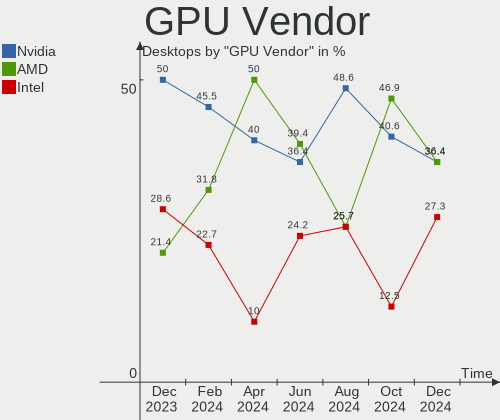
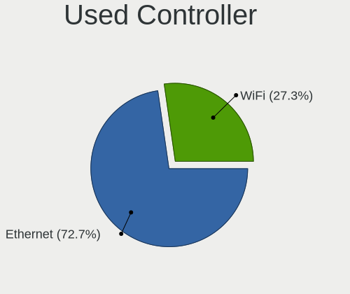
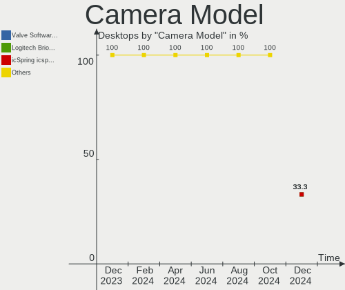

EndeavourOS - Hardware Trends (Desktops)
----------------------------------------

A project to identify most popular hardware characteristics and track their change
over time based on data collected by Linux users at https://Linux-Hardware.org.

Anyone can contribute to this report by the [hw-probe](https://github.com/linuxhw/hw-probe) tool:

    sudo -E hw-probe -all -upload

This report is for one last month. Overall report since the beginning of time: [TestDays](https://github.com/linuxhw/TestDays)

Period: Oct, 2023.

Contents
--------

* [ System ](#system)
  - [ OS                       ](#os)
  - [ OS Family                ](#os-family)
  - [ Kernel                   ](#kernel)
  - [ Kernel Family            ](#kernel-family)
  - [ Kernel Major Ver.        ](#kernel-major-ver)
  - [ Arch                     ](#arch)
  - [ DE                       ](#de)
  - [ Display Server           ](#display-server)
  - [ Display Manager          ](#display-manager)
  - [ OS Lang                  ](#os-lang)
  - [ Boot Mode                ](#boot-mode)
  - [ Filesystem               ](#filesystem)
  - [ Part. scheme             ](#part-scheme)
  - [ Dual Boot with Linux/BSD ](#dual-boot-with-linuxbsd)
  - [ Dual Boot (Win)          ](#dual-boot-win)

* [ Board ](#board)
  - [ Vendor                   ](#vendor)
  - [ Model                    ](#model)
  - [ Model Family             ](#model-family)
  - [ MFG Year                 ](#mfg-year)
  - [ Form Factor              ](#form-factor)
  - [ Secure Boot              ](#secure-boot)
  - [ Coreboot                 ](#coreboot)
  - [ RAM Size                 ](#ram-size)
  - [ RAM Used                 ](#ram-used)
  - [ Total Drives             ](#total-drives)
  - [ Has CD-ROM               ](#has-cd-rom)
  - [ Has Ethernet             ](#has-ethernet)
  - [ Has WiFi                 ](#has-wifi)
  - [ Has Bluetooth            ](#has-bluetooth)

* [ Location ](#location)
  - [ Country                  ](#country)
  - [ City                     ](#city)

* [ Drives ](#drives)
  - [ Drive Vendor             ](#drive-vendor)
  - [ Drive Model              ](#drive-model)
  - [ HDD Vendor               ](#hdd-vendor)
  - [ SSD Vendor               ](#ssd-vendor)
  - [ Drive Kind               ](#drive-kind)
  - [ Drive Connector          ](#drive-connector)
  - [ Drive Size               ](#drive-size)
  - [ Space Total              ](#space-total)
  - [ Space Used               ](#space-used)
  - [ Malfunc. Drives          ](#malfunc-drives)
  - [ Malfunc. Drive Vendor    ](#malfunc-drive-vendor)
  - [ Malfunc. HDD Vendor      ](#malfunc-hdd-vendor)
  - [ Malfunc. Drive Kind      ](#malfunc-drive-kind)
  - [ Failed Drives            ](#failed-drives)
  - [ Failed Drive Vendor      ](#failed-drive-vendor)
  - [ Drive Status             ](#drive-status)

* [ Storage controller ](#storage-controller)
  - [ Storage Vendor           ](#storage-vendor)
  - [ Storage Model            ](#storage-model)
  - [ Storage Kind             ](#storage-kind)

* [ Processor ](#processor)
  - [ CPU Vendor               ](#cpu-vendor)
  - [ CPU Model                ](#cpu-model)
  - [ CPU Model Family         ](#cpu-model-family)
  - [ CPU Cores                ](#cpu-cores)
  - [ CPU Sockets              ](#cpu-sockets)
  - [ CPU Threads              ](#cpu-threads)
  - [ CPU Op-Modes             ](#cpu-op-modes)
  - [ CPU Microcode            ](#cpu-microcode)
  - [ CPU Microarch            ](#cpu-microarch)

* [ Graphics ](#graphics)
  - [ GPU Vendor               ](#gpu-vendor)
  - [ GPU Model                ](#gpu-model)
  - [ GPU Combo                ](#gpu-combo)
  - [ GPU Driver               ](#gpu-driver)
  - [ GPU Memory               ](#gpu-memory)

* [ Monitor ](#monitor)
  - [ Monitor Vendor           ](#monitor-vendor)
  - [ Monitor Model            ](#monitor-model)
  - [ Monitor Resolution       ](#monitor-resolution)
  - [ Monitor Diagonal         ](#monitor-diagonal)
  - [ Monitor Width            ](#monitor-width)
  - [ Aspect Ratio             ](#aspect-ratio)
  - [ Monitor Area             ](#monitor-area)
  - [ Pixel Density            ](#pixel-density)
  - [ Multiple Monitors        ](#multiple-monitors)

* [ Network ](#network)
  - [ Net Controller Vendor    ](#net-controller-vendor)
  - [ Net Controller Model     ](#net-controller-model)
  - [ Wireless Vendor          ](#wireless-vendor)
  - [ Wireless Model           ](#wireless-model)
  - [ Ethernet Vendor          ](#ethernet-vendor)
  - [ Ethernet Model           ](#ethernet-model)
  - [ Net Controller Kind      ](#net-controller-kind)
  - [ Used Controller          ](#used-controller)
  - [ NICs                     ](#nics)
  - [ IPv6                     ](#ipv6)

* [ Bluetooth ](#bluetooth)
  - [ Bluetooth Vendor         ](#bluetooth-vendor)
  - [ Bluetooth Model          ](#bluetooth-model)

* [ Sound ](#sound)
  - [ Sound Vendor             ](#sound-vendor)
  - [ Sound Model              ](#sound-model)

* [ Memory ](#memory)
  - [ Memory Vendor            ](#memory-vendor)
  - [ Memory Model             ](#memory-model)
  - [ Memory Kind              ](#memory-kind)
  - [ Memory Form Factor       ](#memory-form-factor)
  - [ Memory Size              ](#memory-size)
  - [ Memory Speed             ](#memory-speed)

* [ Printers & scanners ](#printers--scanners)
  - [ Printer Vendor           ](#printer-vendor)
  - [ Printer Model            ](#printer-model)
  - [ Scanner Vendor           ](#scanner-vendor)
  - [ Scanner Model            ](#scanner-model)

* [ Camera ](#camera)
  - [ Camera Vendor            ](#camera-vendor)
  - [ Camera Model             ](#camera-model)

* [ Security ](#security)
  - [ Fingerprint Vendor       ](#fingerprint-vendor)
  - [ Fingerprint Model        ](#fingerprint-model)
  - [ Chipcard Vendor          ](#chipcard-vendor)
  - [ Chipcard Model           ](#chipcard-model)

* [ Unsupported ](#unsupported)
  - [ Unsupported Devices      ](#unsupported-devices)
  - [ Unsupported Device Types ](#unsupported-device-types)

System
------

OS
--

Installed operating systems

| Name                | Desktops | Percent |
|---------------------|----------|---------|
| EndeavourOS Rolling | 26       | 100%    |

OS Family
---------

OS without a version

| Name        | Desktops | Percent |
|-------------|----------|---------|
| EndeavourOS | 26       | 100%    |

Kernel
------

Version of the Linux kernel

| Version                  | Desktops | Percent |
|--------------------------|----------|---------|
| 6.5.9-arch2-1            | 7        | 26.92%  |
| 6.5.8-arch1-1            | 5        | 19.23%  |
| 6.5.7-arch1-1            | 5        | 19.23%  |
| 6.5.6-zen2-1-zen         | 1        | 3.85%   |
| 6.5.5-arch1-1            | 1        | 3.85%   |
| 6.5.5-2-clear            | 1        | 3.85%   |
| 6.5.4-zen2-1-zen         | 1        | 3.85%   |
| 6.5.4-arch2-1            | 1        | 3.85%   |
| 6.5.3-273-tkg-bore-eevdf | 1        | 3.85%   |
| 6.1.58-1-lts             | 1        | 3.85%   |
| 6.1.56-1-lts             | 1        | 3.85%   |
| 6.1.51-1-MANJARO         | 1        | 3.85%   |

Kernel Family
-------------

Linux kernel without a distro release

| Version | Desktops | Percent |
|---------|----------|---------|
| 6.5.9   | 7        | 26.92%  |
| 6.5.8   | 5        | 19.23%  |
| 6.5.7   | 5        | 19.23%  |
| 6.5.5   | 2        | 7.69%   |
| 6.5.4   | 2        | 7.69%   |
| 6.5.6   | 1        | 3.85%   |
| 6.5.3   | 1        | 3.85%   |
| 6.1.58  | 1        | 3.85%   |
| 6.1.56  | 1        | 3.85%   |
| 6.1.51  | 1        | 3.85%   |

Kernel Major Ver.
-----------------

Linux kernel major version

| Version | Desktops | Percent |
|---------|----------|---------|
| 6.5     | 23       | 88.46%  |
| 6.1     | 3        | 11.54%  |

Arch
----

OS architecture (x86_64, i586, etc.)

| Name   | Desktops | Percent |
|--------|----------|---------|
| x86_64 | 26       | 100%    |

DE
--

Desktop Environment

| Name     | Desktops | Percent |
|----------|----------|---------|
| KDE5     | 10       | 38.46%  |
| XFCE     | 4        | 15.38%  |
| GNOME    | 3        | 11.54%  |
| Hyprland | 2        | 7.69%   |
| Cinnamon | 2        | 7.69%   |
| Budgie   | 2        | 7.69%   |
| MATE     | 1        | 3.85%   |
| LXDE     | 1        | 3.85%   |
| i3       | 1        | 3.85%   |

Display Server
--------------

X11 or Wayland

| Name    | Desktops | Percent |
|---------|----------|---------|
| X11     | 18       | 69.23%  |
| Wayland | 5        | 19.23%  |
| Unknown | 2        | 7.69%   |
| Tty     | 1        | 3.85%   |

Display Manager
---------------

SDDM, LightDM, etc.

| Name    | Desktops | Percent |
|---------|----------|---------|
| Unknown | 10       | 38.46%  |
| LightDM | 9        | 34.62%  |
| SDDM    | 5        | 19.23%  |
| LY-DM   | 1        | 3.85%   |
| GDM     | 1        | 3.85%   |

OS Lang
-------

Language

| Lang  | Desktops | Percent |
|-------|----------|---------|
| en_US | 12       | 46.15%  |
| it_IT | 4        | 15.38%  |
| en_AU | 3        | 11.54%  |
| de_DE | 2        | 7.69%   |
| pt_BR | 1        | 3.85%   |
| es_MX | 1        | 3.85%   |
| es_ES | 1        | 3.85%   |
| en_GB | 1        | 3.85%   |
| en_CA | 1        | 3.85%   |

Boot Mode
---------

EFI or BIOS

| Mode | Desktops | Percent |
|------|----------|---------|
| EFI  | 14       | 53.85%  |
| BIOS | 12       | 46.15%  |

Filesystem
----------

Type of filesystem

| Type    | Desktops | Percent |
|---------|----------|---------|
| Ext4    | 15       | 57.69%  |
| Btrfs   | 10       | 38.46%  |
| Unknown | 1        | 3.85%   |

Part. scheme
------------

Scheme of partitioning

| Type    | Desktops | Percent |
|---------|----------|---------|
| GPT     | 15       | 57.69%  |
| Unknown | 11       | 42.31%  |

Dual Boot with Linux/BSD
------------------------

Hosting more than one Linux/BSD

| Dual boot | Desktops | Percent |
|-----------|----------|---------|
| No        | 21       | 80.77%  |
| Yes       | 5        | 19.23%  |

Dual Boot (Win)
---------------

Hosting Linux and Windows

| Dual boot | Desktops | Percent |
|-----------|----------|---------|
| No        | 18       | 69.23%  |
| Yes       | 8        | 30.77%  |

Board
-----

Vendor
------

Motherboard manufacturer

| Name                | Desktops | Percent |
|---------------------|----------|---------|
| ASUSTek Computer    | 8        | 30.77%  |
| MSI                 | 7        | 26.92%  |
| Gigabyte Technology | 5        | 19.23%  |
| ASRock              | 2        | 7.69%   |
| Positivo            | 1        | 3.85%   |
| Fujitsu             | 1        | 3.85%   |
| Dell                | 1        | 3.85%   |
| Unknown             | 1        | 3.85%   |

Model
-----

Motherboard model

| Name                            | Desktops | Percent |
|---------------------------------|----------|---------|
| MSI MS-7C37                     | 2        | 7.69%   |
| Positivo POS-PIG43BC            | 1        | 3.85%   |
| MSI MS-7D96                     | 1        | 3.85%   |
| MSI MS-7D95                     | 1        | 3.85%   |
| MSI MS-7C56                     | 1        | 3.85%   |
| MSI MS-7A71                     | 1        | 3.85%   |
| MSI MS-7996                     | 1        | 3.85%   |
| Gigabyte Z390 DESIGNARE         | 1        | 3.85%   |
| Gigabyte X570 AORUS MASTER      | 1        | 3.85%   |
| Gigabyte WARD H107              | 1        | 3.85%   |
| Gigabyte B760 GAMING X AX DDR4  | 1        | 3.85%   |
| Gigabyte B550 AORUS ELITE V2    | 1        | 3.85%   |
| Fujitsu ESPRIMO D556/2          | 1        | 3.85%   |
| Dell OptiPlex 9020              | 1        | 3.85%   |
| ASUS TUF Gaming X670E-PLUS WIFI | 1        | 3.85%   |
| ASUS TUF Gaming X570-PLUS       | 1        | 3.85%   |
| ASUS TUF Gaming B550-PLUS       | 1        | 3.85%   |
| ASUS STRIX Z270I GAMING         | 1        | 3.85%   |
| ASUS PRIME X670E-PRO WIFI       | 1        | 3.85%   |
| ASUS PRIME H410M-R              | 1        | 3.85%   |
| ASUS PRIME A320M-K              | 1        | 3.85%   |
| ASUS Maximus VIII RANGER        | 1        | 3.85%   |
| ASRock X470 Gaming K4           | 1        | 3.85%   |
| ASRock B450M/ac R2.0            | 1        | 3.85%   |
| Unknown                         | 1        | 3.85%   |

Model Family
------------

Motherboard model prefix

| Name                 | Desktops | Percent |
|----------------------|----------|---------|
| ASUS TUF             | 3        | 11.54%  |
| ASUS PRIME           | 3        | 11.54%  |
| MSI MS-7C37          | 2        | 7.69%   |
| Positivo POS-PIG43BC | 1        | 3.85%   |
| MSI MS-7D96          | 1        | 3.85%   |
| MSI MS-7D95          | 1        | 3.85%   |
| MSI MS-7C56          | 1        | 3.85%   |
| MSI MS-7A71          | 1        | 3.85%   |
| MSI MS-7996          | 1        | 3.85%   |
| Gigabyte Z390        | 1        | 3.85%   |
| Gigabyte X570        | 1        | 3.85%   |
| Gigabyte WARD        | 1        | 3.85%   |
| Gigabyte B760        | 1        | 3.85%   |
| Gigabyte B550        | 1        | 3.85%   |
| Fujitsu ESPRIMO      | 1        | 3.85%   |
| Dell OptiPlex        | 1        | 3.85%   |
| ASUS STRIX           | 1        | 3.85%   |
| ASUS Maximus         | 1        | 3.85%   |
| ASRock X470          | 1        | 3.85%   |
| ASRock B450M         | 1        | 3.85%   |
| Unknown              | 1        | 3.85%   |

MFG Year
--------

Motherboard manufacture year

| Year | Desktops | Percent |
|------|----------|---------|
| 2020 | 5        | 19.23%  |
| 2019 | 5        | 19.23%  |
| 2022 | 4        | 15.38%  |
| 2017 | 4        | 15.38%  |
| 2016 | 2        | 7.69%   |
| 2015 | 2        | 7.69%   |
| 2023 | 1        | 3.85%   |
| 2021 | 1        | 3.85%   |
| 2018 | 1        | 3.85%   |
| 2010 | 1        | 3.85%   |

Form Factor
-----------

Physical design of the computer

| Name    | Desktops | Percent |
|---------|----------|---------|
| Desktop | 26       | 100%    |

Secure Boot
-----------

Enabled or disabled

| State    | Desktops | Percent |
|----------|----------|---------|
| Disabled | 26       | 100%    |

Coreboot
--------

Have coreboot on board

| Used | Desktops | Percent |
|------|----------|---------|
| No   | 26       | 100%    |

RAM Size
--------

Total RAM memory

| Size in GB  | Desktops | Percent |
|-------------|----------|---------|
| 32.01-64.0  | 9        | 34.62%  |
| 16.01-24.0  | 9        | 34.62%  |
| 64.01-256.0 | 3        | 11.54%  |
| 24.01-32.0  | 2        | 7.69%   |
| 1.01-2.0    | 1        | 3.85%   |
| 8.01-16.0   | 1        | 3.85%   |
| Unknown     | 1        | 3.85%   |

RAM Used
--------

Used RAM memory

| Used GB    | Desktops | Percent |
|------------|----------|---------|
| 4.01-8.0   | 10       | 38.46%  |
| 2.01-3.0   | 5        | 19.23%  |
| 3.01-4.0   | 3        | 11.54%  |
| 8.01-16.0  | 3        | 11.54%  |
| 0.51-1.0   | 2        | 7.69%   |
| 16.01-24.0 | 1        | 3.85%   |
| 1.01-2.0   | 1        | 3.85%   |
| Unknown    | 1        | 3.85%   |

Total Drives
------------

Number of drives on board

| Drives | Desktops | Percent |
|--------|----------|---------|
| 3      | 7        | 26.92%  |
| 2      | 5        | 19.23%  |
| 6      | 4        | 15.38%  |
| 5      | 3        | 11.54%  |
| 1      | 3        | 11.54%  |
| 4      | 2        | 7.69%   |
| 9      | 1        | 3.85%   |
| 0      | 1        | 3.85%   |

Has CD-ROM
----------

Has CD-ROM on board

| Presented | Desktops | Percent |
|-----------|----------|---------|
| No        | 23       | 88.46%  |
| Yes       | 3        | 11.54%  |

Has Ethernet
------------

Has Ethernet on board

| Presented | Desktops | Percent |
|-----------|----------|---------|
| Yes       | 26       | 100%    |

Has WiFi
--------

Has WiFi module

| Presented | Desktops | Percent |
|-----------|----------|---------|
| Yes       | 19       | 73.08%  |
| No        | 7        | 26.92%  |

Has Bluetooth
-------------

Has Bluetooth module

| Presented | Desktops | Percent |
|-----------|----------|---------|
| Yes       | 18       | 69.23%  |
| No        | 8        | 30.77%  |

Location
--------

Country
-------

Geographic location (country)

| Country     | Desktops | Percent |
|-------------|----------|---------|
| Italy       | 5        | 19.23%  |
| Germany     | 4        | 15.38%  |
| USA         | 3        | 11.54%  |
| Australia   | 3        | 11.54%  |
| Russia      | 2        | 7.69%   |
| Mexico      | 2        | 7.69%   |
| Turkey      | 1        | 3.85%   |
| Spain       | 1        | 3.85%   |
| Poland      | 1        | 3.85%   |
| Norway      | 1        | 3.85%   |
| Netherlands | 1        | 3.85%   |
| Canada      | 1        | 3.85%   |
| Brazil      | 1        | 3.85%   |

City
----

Geographic location (city)

| City                        | Desktops | Percent |
|-----------------------------|----------|---------|
| Melbourne                   | 3        | 11.54%  |
| Waiblingen                  | 1        | 3.85%   |
| Toronto                     | 1        | 3.85%   |
| Soledad de Graciano Sanchez | 1        | 3.85%   |
| Scafati                     | 1        | 3.85%   |
| San Luis Potosí City       | 1        | 3.85%   |
| Rotterdam                   | 1        | 3.85%   |
| Rho                         | 1        | 3.85%   |
| Regensburg                  | 1        | 3.85%   |
| Naples                      | 1        | 3.85%   |
| Mugla                       | 1        | 3.85%   |
| Madrid                      | 1        | 3.85%   |
| Livorno                     | 1        | 3.85%   |
| Lampeland                   | 1        | 3.85%   |
| Guacui                      | 1        | 3.85%   |
| Grossaitingen               | 1        | 3.85%   |
| Cusago                      | 1        | 3.85%   |
| Cleveland                   | 1        | 3.85%   |
| Bełchatów                 | 1        | 3.85%   |
| Berlin                      | 1        | 3.85%   |
| Baton Rouge                 | 1        | 3.85%   |
| Balashikha                  | 1        | 3.85%   |
| Atlanta                     | 1        | 3.85%   |
| Astrakhan                   | 1        | 3.85%   |

Drives
------

Drive Vendor
------------

Hard drive vendors

| Vendor                      | Desktops | Drives | Percent |
|-----------------------------|----------|--------|---------|
| Samsung Electronics         | 13       | 20     | 20.31%  |
| Seagate                     | 11       | 16     | 17.19%  |
| WDC                         | 8        | 16     | 12.5%   |
| Kingston                    | 6        | 7      | 9.38%   |
| Crucial                     | 5        | 5      | 7.81%   |
| Toshiba                     | 3        | 3      | 4.69%   |
| SanDisk                     | 3        | 6      | 4.69%   |
| HGST                        | 2        | 2      | 3.13%   |
| Unknown                     | 1        | 2      | 1.56%   |
| SPCC                        | 1        | 1      | 1.56%   |
| SK hynix                    | 1        | 1      | 1.56%   |
| Silicon Motion              | 1        | 1      | 1.56%   |
| Netac                       | 1        | 1      | 1.56%   |
| Micron/Crucial Technology   | 1        | 1      | 1.56%   |
| Maxtor                      | 1        | 1      | 1.56%   |
| Kingston Technology Company | 1        | 1      | 1.56%   |
| JMicron Technology          | 1        | 1      | 1.56%   |
| Intel                       | 1        | 1      | 1.56%   |
| Hitachi                     | 1        | 1      | 1.56%   |
| Corsair                     | 1        | 1      | 1.56%   |
| A-DATA Technology           | 1        | 2      | 1.56%   |

Drive Model
-----------

Hard drive models

| Model                                                 | Desktops | Percent |
|-------------------------------------------------------|----------|---------|
| Samsung NVMe SSD Controller SM981/PM981/PM983 1TB     | 7        | 8.75%   |
| Samsung SSD 870 QVO 1TB                               | 3        | 3.75%   |
| Samsung SSD 860 EVO 1TB                               | 3        | 3.75%   |
| Seagate ST500DM002-1BD142 500GB                       | 2        | 2.5%    |
| Seagate ST2000DM008-2FR102 2TB                        | 2        | 2.5%    |
| Samsung SSD 990 PRO 2TB                               | 2        | 2.5%    |
| Kingston SA400S37240G 240GB SSD                       | 2        | 2.5%    |
| WDC WDS200T2B0B-00YS70 2TB SSD                        | 1        | 1.25%   |
| WDC WDS120G2G0B-00EPW0 120GB SSD                      | 1        | 1.25%   |
| WDC WD8004FRYZ-01VAEB0 8TB                            | 1        | 1.25%   |
| WDC WD40EZAZ-00SF3B0 4TB                              | 1        | 1.25%   |
| WDC WD40EFRX-68N32N0 4TB                              | 1        | 1.25%   |
| WDC WD2000FYYZ-01UL1B2 2TB                            | 1        | 1.25%   |
| WDC WD10EZRX-00L4HB0 1TB                              | 1        | 1.25%   |
| WDC WD10EZRX-00D8PB0 1TB                              | 1        | 1.25%   |
| WDC WD10EZEX-08WN4A0 1TB                              | 1        | 1.25%   |
| WDC WD10EZEX-07WN4A0 1TB                              | 1        | 1.25%   |
| WDC WD10EZEX-00WN4A0 1TB                              | 1        | 1.25%   |
| WDC WD10EZEX-00BBHA0 1TB                              | 1        | 1.25%   |
| WDC WD1003FZEX-00MK2A0 1TB                            | 1        | 1.25%   |
| Unknown SD/MMC 2GB                                    | 1        | 1.25%   |
| Unknown M.S./M.S.Pro/HG 16GB                          | 1        | 1.25%   |
| Toshiba THNSNK128GCS8 SATA 128GB SSD                  | 1        | 1.25%   |
| Toshiba NVMe Controller 512GB                         | 1        | 1.25%   |
| Toshiba MQ01ABD100 1TB                                | 1        | 1.25%   |
| SPCC Solid State Disk 1TB                             | 1        | 1.25%   |
| SK hynix C2S3T/240G 240GB SSD                         | 1        | 1.25%   |
| Silicon Motion SM2263EN/SM2263XT SSD Controller 256GB | 1        | 1.25%   |
| Seagate ST9500420AS 500GB                             | 1        | 1.25%   |
| Seagate ST500LT012-9WS142 500GB                       | 1        | 1.25%   |
| Seagate ST500LT012-1DG142 500GB                       | 1        | 1.25%   |
| Seagate ST2000LM015-2E8174 2TB                        | 1        | 1.25%   |
| Seagate ST2000DX002-2DV164 2TB                        | 1        | 1.25%   |
| Seagate ST2000DX001-1NS164 2TB                        | 1        | 1.25%   |
| Seagate ST2000DM006-2DM164 2TB                        | 1        | 1.25%   |
| Seagate ST18000NM000J-2TV103 18TB                     | 1        | 1.25%   |
| Seagate ST1500DL003-9VT16L 1TB                        | 1        | 1.25%   |
| Seagate ST1000DM003-1SB102 1TB                        | 1        | 1.25%   |
| Seagate Backup+ Desk 4TB                              | 1        | 1.25%   |
| Sandisk WD_BLACK SN750 SE 1TB                         | 1        | 1.25%   |

HDD Vendor
----------

Hard disk drive vendors

| Vendor              | Desktops | Drives | Percent |
|---------------------|----------|--------|---------|
| Seagate             | 10       | 15     | 43.48%  |
| WDC                 | 7        | 14     | 30.43%  |
| HGST                | 2        | 2      | 8.7%    |
| Toshiba             | 1        | 1      | 4.35%   |
| Samsung Electronics | 1        | 1      | 4.35%   |
| Maxtor              | 1        | 1      | 4.35%   |
| Hitachi             | 1        | 1      | 4.35%   |

SSD Vendor
----------

Solid state drive vendors

| Vendor              | Desktops | Drives | Percent |
|---------------------|----------|--------|---------|
| Samsung Electronics | 5        | 7      | 22.73%  |
| Crucial             | 5        | 5      | 22.73%  |
| Kingston            | 3        | 3      | 13.64%  |
| WDC                 | 2        | 2      | 9.09%   |
| Toshiba             | 1        | 1      | 4.55%   |
| SPCC                | 1        | 1      | 4.55%   |
| SK hynix            | 1        | 1      | 4.55%   |
| SanDisk             | 1        | 1      | 4.55%   |
| Netac               | 1        | 1      | 4.55%   |
| Corsair             | 1        | 1      | 4.55%   |
| A-DATA Technology   | 1        | 2      | 4.55%   |

Drive Kind
----------

HDD or SSD

| Kind    | Desktops | Drives | Percent |
|---------|----------|--------|---------|
| NVMe    | 18       | 26     | 34.62%  |
| HDD     | 17       | 35     | 32.69%  |
| SSD     | 14       | 25     | 26.92%  |
| Unknown | 3        | 4      | 5.77%   |

Drive Connector
---------------

SATA, SAS, NVMe, etc.

| Type | Desktops | Drives | Percent |
|------|----------|--------|---------|
| SATA | 22       | 58     | 50%     |
| NVMe | 18       | 26     | 40.91%  |
| SAS  | 4        | 6      | 9.09%   |

Drive Size
----------

Size of hard drive

| Size in TB | Desktops | Drives | Percent |
|------------|----------|--------|---------|
| 0.51-1.0   | 14       | 24     | 40%     |
| 0.01-0.5   | 10       | 19     | 28.57%  |
| 1.01-2.0   | 7        | 10     | 20%     |
| 3.01-4.0   | 2        | 2      | 5.71%   |
| 10.01-20.0 | 1        | 1      | 2.86%   |
| 4.01-10.0  | 1        | 4      | 2.86%   |

Space Total
-----------

Amount of disk space available on the file system

| Size in GB     | Desktops | Percent |
|----------------|----------|---------|
| 1001-2000      | 8        | 30.77%  |
| 501-1000       | 6        | 23.08%  |
| More than 3000 | 5        | 19.23%  |
| Unknown        | 3        | 11.54%  |
| 251-500        | 2        | 7.69%   |
| 2001-3000      | 1        | 3.85%   |
| 101-250        | 1        | 3.85%   |

Space Used
----------

Amount of used disk space

| Used GB        | Desktops | Percent |
|----------------|----------|---------|
| 501-1000       | 4        | 15.38%  |
| More than 3000 | 3        | 11.54%  |
| 251-500        | 3        | 11.54%  |
| 21-50          | 3        | 11.54%  |
| 51-100         | 3        | 11.54%  |
| Unknown        | 3        | 11.54%  |
| 2001-3000      | 2        | 7.69%   |
| 101-250        | 2        | 7.69%   |
| 1001-2000      | 2        | 7.69%   |
| 1-20           | 1        | 3.85%   |

Malfunc. Drives
---------------

Drive models with a malfunction

| Model                                | Desktops | Drives | Percent |
|--------------------------------------|----------|--------|---------|
| WDC WD2000FYYZ-01UL1B2 2TB           | 1        | 1      | 14.29%  |
| WDC WD10EZRX-00D8PB0 1TB             | 1        | 1      | 14.29%  |
| Toshiba THNSNK128GCS8 SATA 128GB SSD | 1        | 1      | 14.29%  |
| Toshiba MQ01ABD100 1TB               | 1        | 1      | 14.29%  |
| Seagate ST9500420AS 500GB            | 1        | 1      | 14.29%  |
| Seagate ST500LT012-1DG142 500GB      | 1        | 1      | 14.29%  |
| SanDisk SSD PLUS 1000GB              | 1        | 1      | 14.29%  |

Malfunc. Drive Vendor
---------------------

Vendors of faulty drives

| Vendor  | Desktops | Drives | Percent |
|---------|----------|--------|---------|
| WDC     | 2        | 2      | 28.57%  |
| Toshiba | 2        | 2      | 28.57%  |
| Seagate | 2        | 2      | 28.57%  |
| SanDisk | 1        | 1      | 14.29%  |

Malfunc. HDD Vendor
-------------------

Vendors of faulty HDD drives

| Vendor  | Desktops | Drives | Percent |
|---------|----------|--------|---------|
| WDC     | 2        | 2      | 40%     |
| Seagate | 2        | 2      | 40%     |
| Toshiba | 1        | 1      | 20%     |

Malfunc. Drive Kind
-------------------

Kinds of faulty drives

| Kind | Desktops | Drives | Percent |
|------|----------|--------|---------|
| HDD  | 4        | 5      | 66.67%  |
| SSD  | 2        | 2      | 33.33%  |

Failed Drives
-------------

Failed drive models

Zero info for selected period =(

Failed Drive Vendor
-------------------

Failed drive vendors

Zero info for selected period =(

Drive Status
------------

Number of failed and malfunc. drives

| Status   | Desktops | Drives | Percent |
|----------|----------|--------|---------|
| Works    | 15       | 52     | 48.39%  |
| Detected | 10       | 31     | 32.26%  |
| Malfunc  | 6        | 7      | 19.35%  |

Storage controller
------------------

Storage Vendor
--------------

Storage controller vendors

| Vendor                       | Desktops | Percent |
|------------------------------|----------|---------|
| Intel                        | 14       | 27.45%  |
| AMD                          | 14       | 27.45%  |
| Samsung Electronics          | 10       | 19.61%  |
| Kingston Technology Company  | 4        | 7.84%   |
| SanDisk                      | 3        | 5.88%   |
| ASMedia Technology           | 3        | 5.88%   |
| Toshiba America Info Systems | 1        | 1.96%   |
| Silicon Motion               | 1        | 1.96%   |
| Micron/Crucial Technology    | 1        | 1.96%   |

Storage Model
-------------

Storage controller models

| Model                                                                          | Desktops | Percent |
|--------------------------------------------------------------------------------|----------|---------|
| AMD FCH SATA Controller [AHCI mode]                                            | 9        | 16.36%  |
| Samsung NVMe SSD Controller SM981/PM981/PM983                                  | 7        | 12.73%  |
| AMD 500 Series Chipset SATA Controller                                         | 4        | 7.27%   |
| Intel Q170/Q150/B150/H170/H110/Z170/CM236 Chipset SATA Controller [AHCI Mode]  | 3        | 5.45%   |
| ASMedia ASM1062 Serial ATA Controller                                          | 3        | 5.45%   |
| Samsung NVMe SSD Controller S4LV008[Pascal]                                    | 2        | 3.64%   |
| Intel SSD DC P4101/Pro 7600p/760p/E 6100p Series                               | 2        | 3.64%   |
| Intel 700 Series Chipset Family SATA AHCI Controller                           | 2        | 3.64%   |
| Intel 200 Series PCH SATA controller [AHCI mode]                               | 2        | 3.64%   |
| AMD FCH SATA Controller D                                                      | 2        | 3.64%   |
| AMD 400 Series Chipset SATA Controller                                         | 2        | 3.64%   |
| Toshiba America Info Systems XG3 NVMe SSD Controller                           | 1        | 1.82%   |
| Silicon Motion SM2263EN/SM2263XT (DRAM-less) NVMe SSD Controllers              | 1        | 1.82%   |
| SanDisk WD PC SN540 / Green SN350 NVMe SSD 1 TB (DRAM-less)                    | 1        | 1.82%   |
| SanDisk Ultra 3D / WD Blue SN570 NVMe SSD (DRAM-less)                          | 1        | 1.82%   |
| SanDisk PC SN735 NVMe SSD (DRAM-less)                                          | 1        | 1.82%   |
| Samsung NVMe SSD Controller 980 (DRAM-less)                                    | 1        | 1.82%   |
| Micron/Crucial P2 [Nick P2] / P3 / P3 Plus NVMe PCIe SSD (DRAM-less)           | 1        | 1.82%   |
| Kingston Company NV2 NVMe SSD SM2267XT                                         | 1        | 1.82%   |
| Kingston Company NV1 NVMe SSD SM2263XT                                         | 1        | 1.82%   |
| Kingston Company KC3000/FURY Renegade NVMe SSD E18                             | 1        | 1.82%   |
| Kingston Company A2000 NVMe SSD SM2263EN                                       | 1        | 1.82%   |
| Intel Cannon Lake PCH SATA AHCI Controller                                     | 1        | 1.82%   |
| Intel 82801JI (ICH10 Family) 4 port SATA IDE Controller #1                     | 1        | 1.82%   |
| Intel 82801JI (ICH10 Family) 2 port SATA IDE Controller #2                     | 1        | 1.82%   |
| Intel 8 Series/C220 Series Chipset Family 6-port SATA Controller 1 [AHCI mode] | 1        | 1.82%   |
| Intel 500 Series Chipset Family SATA AHCI Controller                           | 1        | 1.82%   |
| Intel 400 Series Chipset Family SATA AHCI Controller                           | 1        | 1.82%   |

Storage Kind
------------

Kind of storage controller (IDE, SATA, NVMe, SAS, ...)

| Kind | Desktops | Percent |
|------|----------|---------|
| SATA | 25       | 55.56%  |
| NVMe | 19       | 42.22%  |
| IDE  | 1        | 2.22%   |

Processor
---------

CPU Vendor
----------

Processor vendors

| Vendor  | Desktops | Percent |
|---------|----------|---------|
| AMD     | 13       | 50%     |
| Intel   | 12       | 46.15%  |
| Unknown | 1        | 3.85%   |

CPU Model
---------

Processor models

| Model                                       | Desktops | Percent |
|---------------------------------------------|----------|---------|
| AMD Ryzen 5 5600X 6-Core Processor          | 3        | 11.54%  |
| Intel Core i7-6700K CPU @ 4.00GHz           | 2        | 7.69%   |
| Intel Core i9-9900K CPU @ 3.60GHz           | 1        | 3.85%   |
| Intel Core i7-7700 CPU @ 3.60GHz            | 1        | 3.85%   |
| Intel Core i5-7600K CPU @ 3.80GHz           | 1        | 3.85%   |
| Intel Core i5-4590 CPU @ 3.30GHz            | 1        | 3.85%   |
| Intel Core i5-10400 CPU @ 2.90GHz           | 1        | 3.85%   |
| Intel Core i3-6100 CPU @ 3.70GHz            | 1        | 3.85%   |
| Intel Celeron CPU E3400 @ 2.60GHz           | 1        | 3.85%   |
| Intel 13th Gen Core i5-13500                | 1        | 3.85%   |
| Intel 13th Gen Core i5-13400F               | 1        | 3.85%   |
| Intel 11th Gen Core i7-11700 @ 2.50GHz      | 1        | 3.85%   |
| AMD Ryzen 9 7950X 16-Core Processor         | 1        | 3.85%   |
| AMD Ryzen 9 5950X 16-Core Processor         | 1        | 3.85%   |
| AMD Ryzen 9 5900X 12-Core Processor         | 1        | 3.85%   |
| AMD Ryzen 9 3900X 12-Core Processor         | 1        | 3.85%   |
| AMD Ryzen 7 1700X Eight-Core Processor      | 1        | 3.85%   |
| AMD Ryzen 5 7600X 6-Core Processor          | 1        | 3.85%   |
| AMD Ryzen 5 5600G with Radeon Graphics      | 1        | 3.85%   |
| AMD Ryzen 5 5500                            | 1        | 3.85%   |
| AMD Ryzen 5 3600 6-Core Processor           | 1        | 3.85%   |
| AMD Ryzen 3 2200G with Radeon Vega Graphics | 1        | 3.85%   |
|                                             | 1        | 3.85%   |

CPU Model Family
----------------

Processor model prefix

| Model         | Desktops | Percent |
|---------------|----------|---------|
| AMD Ryzen 5   | 7        | 26.92%  |
| Other         | 4        | 15.38%  |
| AMD Ryzen 9   | 4        | 15.38%  |
| Intel Core i7 | 3        | 11.54%  |
| Intel Core i5 | 3        | 11.54%  |
| Intel Core i9 | 1        | 3.85%   |
| Intel Core i3 | 1        | 3.85%   |
| Intel Celeron | 1        | 3.85%   |
| AMD Ryzen 7   | 1        | 3.85%   |
| AMD Ryzen 3   | 1        | 3.85%   |

CPU Cores
---------

Number of processor cores

| Number  | Desktops | Percent |
|---------|----------|---------|
| 6       | 8        | 30.77%  |
| 4       | 6        | 23.08%  |
| 8       | 3        | 11.54%  |
| 16      | 2        | 7.69%   |
| 12      | 2        | 7.69%   |
| 2       | 2        | 7.69%   |
| 14      | 1        | 3.85%   |
| 10      | 1        | 3.85%   |
| Unknown | 1        | 3.85%   |

CPU Sockets
-----------

Number of sockets

| Number  | Desktops | Percent |
|---------|----------|---------|
| 1       | 25       | 96.15%  |
| Unknown | 1        | 3.85%   |

CPU Threads
-----------

Threads per core (Hyper-Threading)

| Number  | Desktops | Percent |
|---------|----------|---------|
| 2       | 21       | 80.77%  |
| 1       | 4        | 15.38%  |
| Unknown | 1        | 3.85%   |

CPU Op-Modes
------------

CPU Operation Modes (32-bit, 64-bit)

| Op mode        | Desktops | Percent |
|----------------|----------|---------|
| 32-bit, 64-bit | 25       | 96.15%  |
| Unknown        | 1        | 3.85%   |

CPU Microcode
-------------

Microcode number

| Number     | Desktops | Percent |
|------------|----------|---------|
| Unknown    | 15       | 57.69%  |
| 0x08701021 | 2        | 7.69%   |
| 0x08101016 | 2        | 7.69%   |
| 0x0a601203 | 1        | 3.85%   |
| 0x0a50000d | 1        | 3.85%   |
| 0x0a50000c | 1        | 3.85%   |
| 0x0a20120a | 1        | 3.85%   |
| 0x0a20102b | 1        | 3.85%   |
| 0x0a201016 | 1        | 3.85%   |
| 0x08001138 | 1        | 3.85%   |

CPU Microarch
-------------

Microarchitecture

| Name             | Desktops | Percent |
|------------------|----------|---------|
| Zen 3            | 7        | 26.92%  |
| Skylake          | 3        | 11.54%  |
| KabyLake         | 3        | 11.54%  |
| Unknown          | 3        | 11.54%  |
| Zen 2            | 2        | 7.69%   |
| Zen              | 2        | 7.69%   |
| Alderlake Hybrid | 2        | 7.69%   |
| Penryn           | 1        | 3.85%   |
| Icelake          | 1        | 3.85%   |
| Haswell          | 1        | 3.85%   |
| CometLake        | 1        | 3.85%   |

Graphics
--------

GPU Vendor
----------

Vendors of graphics cards

| Vendor | Desktops | Percent |
|--------|----------|---------|
| Nvidia | 13       | 44.83%  |
| AMD    | 10       | 34.48%  |
| Intel  | 6        | 20.69%  |

GPU Model
---------

Graphics card models

| Model                                                                       | Desktops | Percent |
|-----------------------------------------------------------------------------|----------|---------|
| AMD Raven Ridge [Radeon Vega Series / Radeon Vega Mobile Series]            | 2        | 6.25%   |
| AMD Raphael                                                                 | 2        | 6.25%   |
| AMD Navi 23 [Radeon RX 6600/6600 XT/6600M]                                  | 2        | 6.25%   |
| AMD Navi 22 [Radeon RX 6700/6700 XT/6750 XT / 6800M/6850M XT]               | 2        | 6.25%   |
| Nvidia TU117 [GeForce GTX 1650]                                             | 1        | 3.13%   |
| Nvidia TU106 [GeForce RTX 2060 SUPER]                                       | 1        | 3.13%   |
| Nvidia TU106 [GeForce RTX 2060 Rev. A]                                      | 1        | 3.13%   |
| Nvidia GP106 [GeForce GTX 1060 6GB]                                         | 1        | 3.13%   |
| Nvidia GP106 [GeForce GTX 1060 3GB]                                         | 1        | 3.13%   |
| Nvidia GP104 [GeForce GTX 1070]                                             | 1        | 3.13%   |
| Nvidia GP102 [GeForce GTX 1080 Ti]                                          | 1        | 3.13%   |
| Nvidia GK208B [GeForce GT 730]                                              | 1        | 3.13%   |
| Nvidia GA107 [GeForce RTX 3050 8GB]                                         | 1        | 3.13%   |
| Nvidia GA104 [GeForce RTX 3070]                                             | 1        | 3.13%   |
| Nvidia GA104 [GeForce RTX 3070 Ti]                                          | 1        | 3.13%   |
| Nvidia GA102 [GeForce RTX 3090]                                             | 1        | 3.13%   |
| Nvidia AD104 [GeForce RTX 4070 Ti]                                          | 1        | 3.13%   |
| Intel Xeon E3-1200 v3/4th Gen Core Processor Integrated Graphics Controller | 1        | 3.13%   |
| Intel HD Graphics 630                                                       | 1        | 3.13%   |
| Intel HD Graphics 530                                                       | 1        | 3.13%   |
| Intel CometLake-S GT2 [UHD Graphics 630]                                    | 1        | 3.13%   |
| Intel AlderLake-S GT1                                                       | 1        | 3.13%   |
| Intel 4 Series Chipset Integrated Graphics Controller                       | 1        | 3.13%   |
| AMD Navi 32 [Radeon RX 7700 XT / 7800 XT]                                   | 1        | 3.13%   |
| AMD Navi 23 [Radeon RX 6650 XT / 6700S / 6800S]                             | 1        | 3.13%   |
| AMD Navi 21 [Radeon RX 6950 XT]                                             | 1        | 3.13%   |
| AMD Navi 21 [Radeon RX 6800/6800 XT / 6900 XT]                              | 1        | 3.13%   |
| AMD Bonaire XTX [Radeon R7 260X/360]                                        | 1        | 3.13%   |

GPU Combo
---------

Combinations of graphics cards

| Name           | Desktops | Percent |
|----------------|----------|---------|
| 1 x Nvidia     | 11       | 42.31%  |
| 1 x AMD        | 7        | 26.92%  |
| 2 x AMD        | 3        | 11.54%  |
| 1 x Intel      | 3        | 11.54%  |
| Intel + Nvidia | 2        | 7.69%   |

GPU Driver
----------

Free vs proprietary

| Driver      | Desktops | Percent |
|-------------|----------|---------|
| Free        | 14       | 53.85%  |
| Proprietary | 11       | 42.31%  |
| Unknown     | 1        | 3.85%   |

GPU Memory
----------

Total video memory

| Size in GB | Desktops | Percent |
|------------|----------|---------|
| Unknown    | 10       | 38.46%  |
| 7.01-8.0   | 5        | 19.23%  |
| 8.01-16.0  | 5        | 19.23%  |
| 5.01-6.0   | 2        | 7.69%   |
| 1.01-2.0   | 2        | 7.69%   |
| 3.01-4.0   | 1        | 3.85%   |
| 16.01-24.0 | 1        | 3.85%   |

Monitor
-------

Monitor Vendor
--------------

Monitor vendors

| Vendor               | Desktops | Percent |
|----------------------|----------|---------|
| Samsung Electronics  | 6        | 18.18%  |
| Goldstar             | 6        | 18.18%  |
| AOC                  | 3        | 9.09%   |
| ___                  | 2        | 6.06%   |
| MSI                  | 2        | 6.06%   |
| Hewlett-Packard      | 2        | 6.06%   |
| Dell                 | 2        | 6.06%   |
| Acer                 | 2        | 6.06%   |
| Vizio                | 1        | 3.03%   |
| ViewSonic            | 1        | 3.03%   |
| Unknown              | 1        | 3.03%   |
| Gigabyte Technology  | 1        | 3.03%   |
| Fujitsu Siemens      | 1        | 3.03%   |
| Denver               | 1        | 3.03%   |
| BenQ                 | 1        | 3.03%   |
| Ancor Communications | 1        | 3.03%   |

Monitor Model
-------------

Monitor models

| Model                                                                   | Desktops | Percent |
|-------------------------------------------------------------------------|----------|---------|
| ___ LCDTV16 ___3393 1920x1080                                           | 2        | 5.88%   |
| Dell P190S DEL405B 1280x1024 380x300mm 19.1-inch                        | 2        | 5.88%   |
| Vizio E241i-B1 VIZ1005 1920x1080 521x293mm 23.5-inch                    | 1        | 2.94%   |
| ViewSonic VX3276-FHD VSCE735 1920x1080 698x393mm 31.5-inch              | 1        | 2.94%   |
| Unknown LCDTV16 3393 1920x1080 1600x900mm 72.3-inch                     | 1        | 2.94%   |
| Samsung Electronics U32J59x SAM0F35 3840x2160 697x392mm 31.5-inch       | 1        | 2.94%   |
| Samsung Electronics U28D590 SAM0B80 3840x2160 607x345mm 27.5-inch       | 1        | 2.94%   |
| Samsung Electronics T24B301 SAM098E 1920x1080 521x293mm 23.5-inch       | 1        | 2.94%   |
| Samsung Electronics SMB2240W SAM0699 1680x1050 459x296mm 21.5-inch      | 1        | 2.94%   |
| Samsung Electronics SA300/SA350 SAM078A 1366x768 410x230mm 18.5-inch    | 1        | 2.94%   |
| Samsung Electronics C24FG7x SAM0E43 1920x1080 532x304mm 24.1-inch       | 1        | 2.94%   |
| MSI MAG271CQP MSI3FA7 2560x1440 597x336mm 27.0-inch                     | 1        | 2.94%   |
| MSI G273Q MSI3CA8 3840x2160 596x335mm 26.9-inch                         | 1        | 2.94%   |
| Hewlett-Packard V22e HPN371B 1920x1080 477x268mm 21.5-inch              | 1        | 2.94%   |
| Hewlett-Packard 2011 HWP2934 1600x900 443x249mm 20.0-inch               | 1        | 2.94%   |
| Goldstar W2442 GSM56CC 1920x1080 531x299mm 24.0-inch                    | 1        | 2.94%   |
| Goldstar ULTRAGEAR GSM5BD3 2560x1440 697x392mm 31.5-inch                | 1        | 2.94%   |
| Goldstar ULTRAGEAR GSM5BB4 2560x1440 597x336mm 27.0-inch                | 1        | 2.94%   |
| Goldstar ULTRAFINE GSM5BC2 3840x2160 600x340mm 27.2-inch                | 1        | 2.94%   |
| Goldstar QHD GSM772A 2560x1440 697x392mm 31.5-inch                      | 1        | 2.94%   |
| Goldstar LG IPS FULLHD GSM5AB8 1920x1080 480x270mm 21.7-inch            | 1        | 2.94%   |
| Goldstar 24GL600F GSM5B73 1920x1080 531x298mm 24.0-inch                 | 1        | 2.94%   |
| Gigabyte Technology AORUS FI32Q X GBT3207 2560x1440 708x399mm 32.0-inch | 1        | 2.94%   |
| Fujitsu Siemens B23T-6 LED FUS07FD 1920x1080 509x286mm 23.0-inch        | 1        | 2.94%   |
| Denver UWQHD-144-C LHC3400 3440x1440 797x334mm 34.0-inch                | 1        | 2.94%   |
| BenQ GL2250H BNQ78A1 1920x1080 477x268mm 21.5-inch                      | 1        | 2.94%   |
| AOC Q27P2W AOC2702 2560x1440 597x336mm 27.0-inch                        | 1        | 2.94%   |
| AOC AG271QG4 AOC2710 2560x1440 597x336mm 27.0-inch                      | 1        | 2.94%   |
| AOC AG241QG4 AOC2410 2560x1440 527x396mm 26.0-inch                      | 1        | 2.94%   |
| Ancor Communications ASUS VP278 ACI27C8 1920x1080 598x336mm 27.0-inch   | 1        | 2.94%   |
| Acer XB273K GP ACR071C 3840x2160 597x336mm 27.0-inch                    | 1        | 2.94%   |
| Acer V246HQL ACR0424 1920x1080 521x293mm 23.5-inch                      | 1        | 2.94%   |

Monitor Resolution
------------------

Monitor screen resolution

| Resolution         | Desktops | Percent |
|--------------------|----------|---------|
| 1920x1080 (FHD)    | 14       | 42.42%  |
| 2560x1440 (QHD)    | 7        | 21.21%  |
| 3840x2160 (4K)     | 6        | 18.18%  |
| 1280x1024 (SXGA)   | 2        | 6.06%   |
| 3440x1440          | 1        | 3.03%   |
| 1680x1050 (WSXGA+) | 1        | 3.03%   |
| 1600x900 (HD+)     | 1        | 3.03%   |
| 1366x768 (WXGA)    | 1        | 3.03%   |

Monitor Diagonal
----------------

Diagonal size in inches

| Inches  | Desktops | Percent |
|---------|----------|---------|
| 27      | 8        | 24.24%  |
| 31      | 5        | 15.15%  |
| 24      | 3        | 9.09%   |
| 23      | 3        | 9.09%   |
| 21      | 3        | 9.09%   |
| 19      | 2        | 6.06%   |
| Unknown | 2        | 6.06%   |
| 72      | 1        | 3.03%   |
| 34      | 1        | 3.03%   |
| 32      | 1        | 3.03%   |
| 26      | 1        | 3.03%   |
| 22      | 1        | 3.03%   |
| 20      | 1        | 3.03%   |
| 18      | 1        | 3.03%   |

Monitor Width
-------------

Physical width

| Width in mm | Desktops | Percent |
|-------------|----------|---------|
| 501-600     | 12       | 38.71%  |
| 601-700     | 6        | 19.35%  |
| 401-500     | 6        | 19.35%  |
| 701-800     | 2        | 6.45%   |
| 351-400     | 2        | 6.45%   |
| Unknown     | 2        | 6.45%   |
| 1501-2000   | 1        | 3.23%   |

Aspect Ratio
------------

Proportional relationship between the width and the height

| Ratio | Desktops | Percent |
|-------|----------|---------|
| 16/9  | 23       | 82.14%  |
| 5/4   | 2        | 7.14%   |
| 4/3   | 1        | 3.57%   |
| 21/9  | 1        | 3.57%   |
| 16/10 | 1        | 3.57%   |

Monitor Area
------------

Area in inch²

| Area in inch² | Desktops | Percent |
|----------------|----------|---------|
| 301-350        | 9        | 27.27%  |
| 201-250        | 8        | 24.24%  |
| 351-500        | 7        | 21.21%  |
| 151-200        | 4        | 12.12%  |
| Unknown        | 2        | 6.06%   |
| More than 1000 | 1        | 3.03%   |
| 251-300        | 1        | 3.03%   |
| 141-150        | 1        | 3.03%   |

Pixel Density
-------------

Pixels per inch

| Density | Desktops | Percent |
|---------|----------|---------|
| 51-100  | 18       | 54.55%  |
| 101-120 | 8        | 24.24%  |
| 121-160 | 3        | 9.09%   |
| Unknown | 2        | 6.06%   |
| 1-50    | 1        | 3.03%   |
| 161-240 | 1        | 3.03%   |

Multiple Monitors
-----------------

Total monitors connected

| Total | Desktops | Percent |
|-------|----------|---------|
| 1     | 18       | 69.23%  |
| 2     | 6        | 23.08%  |
| 4     | 1        | 3.85%   |
| 3     | 1        | 3.85%   |

Network
-------

Net Controller Vendor
---------------------

Controller vendors

| Vendor                          | Desktops | Percent |
|---------------------------------|----------|---------|
| Realtek Semiconductor           | 22       | 53.66%  |
| Intel                           | 11       | 26.83%  |
| MediaTek                        | 3        | 7.32%   |
| Qualcomm Atheros                | 2        | 4.88%   |
| Qualcomm Atheros Communications | 1        | 2.44%   |
| Microsoft                       | 1        | 2.44%   |
| Huawei Technologies             | 1        | 2.44%   |

Net Controller Model
--------------------

Controller models

| Model                                                             | Desktops | Percent |
|-------------------------------------------------------------------|----------|---------|
| Realtek RTL8111/8168/8411 PCI Express Gigabit Ethernet Controller | 13       | 26.53%  |
| Realtek RTL8125 2.5GbE Controller                                 | 8        | 16.33%  |
| MediaTek MT7921K (RZ608) Wi-Fi 6E 80MHz                           | 3        | 6.12%   |
| Realtek RTL8821CE PCIe 802.11ac Wireless Network Controller       | 2        | 4.08%   |
| Intel Wi-Fi 6 AX210/AX211/AX411 160MHz                            | 2        | 4.08%   |
| Intel I211 Gigabit Network Connection                             | 2        | 4.08%   |
| Intel Ethernet Connection (2) I219-V                              | 2        | 4.08%   |
| Intel Dual Band Wireless-AC 3168NGW [Stone Peak]                  | 2        | 4.08%   |
| Realtek RTL8192EU 802.11b/g/n WLAN Adapter                        | 1        | 2.04%   |
| Realtek RTL8192EE PCIe Wireless Network Adapter                   | 1        | 2.04%   |
| Realtek RTL8188EUS 802.11n Wireless Network Adapter               | 1        | 2.04%   |
| Realtek RTL8188EE Wireless Network Adapter                        | 1        | 2.04%   |
| Qualcomm Atheros QCA6174 802.11ac Wireless Network Adapter        | 1        | 2.04%   |
| Qualcomm Atheros AR9271 802.11n                                   | 1        | 2.04%   |
| Qualcomm Atheros AR9287 Wireless Network Adapter (PCI-Express)    | 1        | 2.04%   |
| Microsoft Wireless XBox Controller Dongle                         | 1        | 2.04%   |
| Intel Wireless-AC 9260                                            | 1        | 2.04%   |
| Intel Wi-Fi 6 AX200                                               | 1        | 2.04%   |
| Intel Ethernet Connection I217-LM                                 | 1        | 2.04%   |
| Intel Ethernet Connection (7) I219-V                              | 1        | 2.04%   |
| Intel Cannon Lake PCH CNVi WiFi                                   | 1        | 2.04%   |
| Intel 700 Series Chipset Family Wi-Fi                             | 1        | 2.04%   |
| Huawei ALP-AL00                                                   | 1        | 2.04%   |

Wireless Vendor
---------------

Wireless vendors

| Vendor                          | Desktops | Percent |
|---------------------------------|----------|---------|
| Intel                           | 8        | 38.1%   |
| Realtek Semiconductor           | 6        | 28.57%  |
| MediaTek                        | 3        | 14.29%  |
| Qualcomm Atheros                | 2        | 9.52%   |
| Qualcomm Atheros Communications | 1        | 4.76%   |
| Microsoft                       | 1        | 4.76%   |

Wireless Model
--------------

Wireless models

| Model                                                          | Desktops | Percent |
|----------------------------------------------------------------|----------|---------|
| MediaTek MT7921K (RZ608) Wi-Fi 6E 80MHz                        | 3        | 14.29%  |
| Realtek RTL8821CE PCIe 802.11ac Wireless Network Controller    | 2        | 9.52%   |
| Intel Wi-Fi 6 AX210/AX211/AX411 160MHz                         | 2        | 9.52%   |
| Intel Dual Band Wireless-AC 3168NGW [Stone Peak]               | 2        | 9.52%   |
| Realtek RTL8192EU 802.11b/g/n WLAN Adapter                     | 1        | 4.76%   |
| Realtek RTL8192EE PCIe Wireless Network Adapter                | 1        | 4.76%   |
| Realtek RTL8188EUS 802.11n Wireless Network Adapter            | 1        | 4.76%   |
| Realtek RTL8188EE Wireless Network Adapter                     | 1        | 4.76%   |
| Qualcomm Atheros QCA6174 802.11ac Wireless Network Adapter     | 1        | 4.76%   |
| Qualcomm Atheros AR9271 802.11n                                | 1        | 4.76%   |
| Qualcomm Atheros AR9287 Wireless Network Adapter (PCI-Express) | 1        | 4.76%   |
| Microsoft Wireless XBox Controller Dongle                      | 1        | 4.76%   |
| Intel Wireless-AC 9260                                         | 1        | 4.76%   |
| Intel Wi-Fi 6 AX200                                            | 1        | 4.76%   |
| Intel Cannon Lake PCH CNVi WiFi                                | 1        | 4.76%   |
| Intel 700 Series Chipset Family Wi-Fi                          | 1        | 4.76%   |

Ethernet Vendor
---------------

Ethernet vendors

| Vendor                | Desktops | Percent |
|-----------------------|----------|---------|
| Realtek Semiconductor | 21       | 75%     |
| Intel                 | 6        | 21.43%  |
| Huawei Technologies   | 1        | 3.57%   |

Ethernet Model
--------------

Ethernet models

| Model                                                             | Desktops | Percent |
|-------------------------------------------------------------------|----------|---------|
| Realtek RTL8111/8168/8411 PCI Express Gigabit Ethernet Controller | 13       | 46.43%  |
| Realtek RTL8125 2.5GbE Controller                                 | 8        | 28.57%  |
| Intel I211 Gigabit Network Connection                             | 2        | 7.14%   |
| Intel Ethernet Connection (2) I219-V                              | 2        | 7.14%   |
| Intel Ethernet Connection I217-LM                                 | 1        | 3.57%   |
| Intel Ethernet Connection (7) I219-V                              | 1        | 3.57%   |
| Huawei ALP-AL00                                                   | 1        | 3.57%   |

Net Controller Kind
-------------------

Ethernet, WiFi or modem

| Kind     | Desktops | Percent |
|----------|----------|---------|
| Ethernet | 26       | 57.78%  |
| WiFi     | 19       | 42.22%  |

Used Controller
---------------

Currently used network controller

| Kind     | Desktops | Percent |
|----------|----------|---------|
| Ethernet | 15       | 60%     |
| WiFi     | 10       | 40%     |

NICs
----

Total network controllers on board

| Total | Desktops | Percent |
|-------|----------|---------|
| 2     | 15       | 57.69%  |
| 1     | 9        | 34.62%  |
| 3     | 1        | 3.85%   |
| 0     | 1        | 3.85%   |

IPv6
----

IPv6 vs IPv4

| Used | Desktops | Percent |
|------|----------|---------|
| No   | 20       | 76.92%  |
| Yes  | 6        | 23.08%  |

Bluetooth
---------

Bluetooth Vendor
----------------

Controller vendors

| Vendor                  | Desktops | Percent |
|-------------------------|----------|---------|
| Intel                   | 8        | 44.44%  |
| Cambridge Silicon Radio | 4        | 22.22%  |
| MediaTek                | 3        | 16.67%  |
| TP-Link                 | 1        | 5.56%   |
| Realtek Semiconductor   | 1        | 5.56%   |
| ASUSTek Computer        | 1        | 5.56%   |

Bluetooth Model
---------------

Controller models

| Model                                               | Desktops | Percent |
|-----------------------------------------------------|----------|---------|
| Cambridge Silicon Radio Bluetooth Dongle (HCI mode) | 4        | 22.22%  |
| MediaTek Wireless_Device                            | 3        | 16.67%  |
| Intel Wireless-AC 3168 Bluetooth                    | 2        | 11.11%  |
| Intel AX210 Bluetooth                               | 2        | 11.11%  |
| TP-Link UB500 Adapter                               | 1        | 5.56%   |
| Realtek Bluetooth Radio                             | 1        | 5.56%   |
| Intel Wireless-AC 9260 Bluetooth Adapter            | 1        | 5.56%   |
| Intel Bluetooth Device                              | 1        | 5.56%   |
| Intel Bluetooth 9460/9560 Jefferson Peak (JfP)      | 1        | 5.56%   |
| Intel AX200 Bluetooth                               | 1        | 5.56%   |
| ASUS Qualcomm Bluetooth 4.1                         | 1        | 5.56%   |

Sound
-----

Sound Vendor
------------

Sound card vendors

| Vendor              | Desktops | Percent |
|---------------------|----------|---------|
| AMD                 | 14       | 26.92%  |
| Nvidia              | 13       | 25%     |
| Intel               | 12       | 23.08%  |
| Logitech            | 2        | 3.85%   |
| XMOS                | 1        | 1.92%   |
| Tenx Technology     | 1        | 1.92%   |
| SteelSeries ApS     | 1        | 1.92%   |
| Razer USA           | 1        | 1.92%   |
| Mark of the Unicorn | 1        | 1.92%   |
| Lautsprecher Teufel | 1        | 1.92%   |
| Kingston Technology | 1        | 1.92%   |
| JBL                 | 1        | 1.92%   |
| Creative Labs       | 1        | 1.92%   |
| Blue Microphones    | 1        | 1.92%   |
| AOKEO               | 1        | 1.92%   |

Sound Model
-----------

Sound card models

| Model                                                               | Desktops | Percent |
|---------------------------------------------------------------------|----------|---------|
| AMD Starship/Matisse HD Audio Controller                            | 7        | 10.29%  |
| AMD Navi 21/23 HDMI/DP Audio Controller                             | 7        | 10.29%  |
| AMD Family 17h/19h HD Audio Controller                              | 6        | 8.82%   |
| Intel 100 Series/C230 Series Chipset Family HD Audio Controller     | 3        | 4.41%   |
| Nvidia TU106 High Definition Audio Controller                       | 2        | 2.94%   |
| Nvidia GP106 High Definition Audio Controller                       | 2        | 2.94%   |
| Nvidia GA104 High Definition Audio Controller                       | 2        | 2.94%   |
| Nvidia Audio device                                                 | 2        | 2.94%   |
| Logitech G733 Gaming Headset                                        | 2        | 2.94%   |
| Intel 700 Series Chipset Family Precise Touch and Stylus Port #1    | 2        | 2.94%   |
| Intel 200 Series PCH HD Audio                                       | 2        | 2.94%   |
| AMD Renoir Radeon High Definition Audio Controller                  | 2        | 2.94%   |
| AMD Rembrandt Radeon High Definition Audio Controller               | 2        | 2.94%   |
| AMD Raven/Raven2/Fenghuang HDMI/DP Audio Controller                 | 2        | 2.94%   |
| XMOS X1S USB DAC                                                    | 1        | 1.47%   |
| Tenx Technology USB AUDIO                                           | 1        | 1.47%   |
| SteelSeries ApS SteelSeries Arctis 5                                | 1        | 1.47%   |
| Razer USA Razer BlackShark V2 Pro                                   | 1        | 1.47%   |
| Nvidia TU107 GeForce GTX 1650 High Definition Audio Controller      | 1        | 1.47%   |
| Nvidia GP104 High Definition Audio Controller                       | 1        | 1.47%   |
| Nvidia GP102 HDMI Audio Controller                                  | 1        | 1.47%   |
| Nvidia GK208 HDMI/DP Audio Controller                               | 1        | 1.47%   |
| Nvidia GA102 High Definition Audio Controller                       | 1        | 1.47%   |
| Mark of the Unicorn M4                                              | 1        | 1.47%   |
| Lautsprecher Teufel Teufel Gaming Headset                           | 1        | 1.47%   |
| Kingston Technology HyperX QuadCast                                 | 1        | 1.47%   |
| JBL Quantum 600                                                     | 1        | 1.47%   |
| Intel Xeon E3-1200 v3/4th Gen Core Processor HD Audio Controller    | 1        | 1.47%   |
| Intel Tiger Lake-H HD Audio Controller                              | 1        | 1.47%   |
| Intel Comet Lake PCH-V cAVS                                         | 1        | 1.47%   |
| Intel Cannon Lake PCH cAVS                                          | 1        | 1.47%   |
| Intel 82801JI (ICH10 Family) HD Audio Controller                    | 1        | 1.47%   |
| Intel 8 Series/C220 Series Chipset High Definition Audio Controller | 1        | 1.47%   |
| Creative Labs EMU20k2 [Sound Blaster X-Fi Titanium Series]          | 1        | 1.47%   |
| Blue Microphones Yeti Stereo Microphone                             | 1        | 1.47%   |
| AOKEO LCS_USB_Audio                                                 | 1        | 1.47%   |
| AMD Tobago HDMI Audio [Radeon R7 360 / R9 360 OEM]                  | 1        | 1.47%   |
| AMD Navi 31 HDMI/DP Audio                                           | 1        | 1.47%   |
| AMD Family 17h (Models 00h-0fh) HD Audio Controller                 | 1        | 1.47%   |

Memory
------

Memory Vendor
-------------

Memory module vendors

| Vendor              | Desktops | Percent |
|---------------------|----------|---------|
| G.Skill             | 5        | 27.78%  |
| Kingston            | 4        | 22.22%  |
| Corsair             | 3        | 16.67%  |
| Team                | 2        | 11.11%  |
| Crucial             | 2        | 11.11%  |
| Unknown             | 1        | 5.56%   |
| Samsung Electronics | 1        | 5.56%   |

Memory Model
------------

Memory module models

| Model                                                  | Desktops | Percent |
|--------------------------------------------------------|----------|---------|
| Team RAM TEAMGROUP-UD4-3200 16GB DIMM DDR4 3800MT/s    | 2        | 10%     |
| Unknown RAM 3600 C18 Series 16GB DIMM DDR4 2933MT/s    | 1        | 5%      |
| Team RAM TEAMGROUP-UD4-2666 16GB DIMM DDR4 2933MT/s    | 1        | 5%      |
| Samsung RAM M378A1K43CB2-CRC 8GB DIMM DDR4 3500MT/s    | 1        | 5%      |
| Kingston RAM KHX3000C15D4/8GX 8GB DIMM DDR4 3400MT/s   | 1        | 5%      |
| Kingston RAM KF3600C18D4/16GX 16GB DIMM DDR4 3600MT/s  | 1        | 5%      |
| Kingston RAM KF3600C16D4/16GX 16GB DIMM DDR4 3600MT/s  | 1        | 5%      |
| Kingston RAM KF3200C16D4/8GX 8GB DIMM DDR4 3600MT/s    | 1        | 5%      |
| G.Skill RAM F5-6000J3636F16G 16GB DIMM DDR5 6400MT/s   | 1        | 5%      |
| G.Skill RAM F4-3600C16-8GTZNC 8GB DIMM DDR4 3800MT/s   | 1        | 5%      |
| G.Skill RAM F4-3200C16-8GIS 8GB DIMM DDR4 3200MT/s     | 1        | 5%      |
| G.Skill RAM F4-3200C16-16GTZR 16GB DIMM DDR4 3600MT/s  | 1        | 5%      |
| G.Skill RAM F4-2400C15-8GIS 8GB DIMM DDR4 2400MT/s     | 1        | 5%      |
| G.Skill RAM F4-2133C15-8GIS 8GB DIMM DDR4 2133MT/s     | 1        | 5%      |
| Crucial RAM CT8G4DFS8213.M8FB 8GB DIMM DDR4 2133MT/s   | 1        | 5%      |
| Crucial RAM CT8G4DFRA266.C8FJ 8GB DIMM DDR4 2800MT/s   | 1        | 5%      |
| Corsair RAM CMK32GX5M2E6000C36 16GB DIMM DDR5 4000MT/s | 1        | 5%      |
| Corsair RAM CMK16GX4M2D3000C16 8GB DIMM DDR4 3200MT/s  | 1        | 5%      |
| Corsair RAM CMK16GX4M2B3000C15 8GB DIMM DDR4 3533MT/s  | 1        | 5%      |

Memory Kind
-----------

Memory module kinds

| Kind | Desktops | Percent |
|------|----------|---------|
| DDR4 | 15       | 88.24%  |
| DDR5 | 2        | 11.76%  |

Memory Form Factor
------------------

Physical design of the memory module

| Name | Desktops | Percent |
|------|----------|---------|
| DIMM | 17       | 100%    |

Memory Size
-----------

Memory module size

| Size  | Desktops | Percent |
|-------|----------|---------|
| 8192  | 9        | 52.94%  |
| 16384 | 5        | 29.41%  |
| 32768 | 3        | 17.65%  |

Memory Speed
------------

Memory module speed

| Speed | Desktops | Percent |
|-------|----------|---------|
| 3600  | 4        | 20%     |
| 3800  | 3        | 15%     |
| 3200  | 2        | 10%     |
| 2133  | 2        | 10%     |
| 6400  | 1        | 5%      |
| 4000  | 1        | 5%      |
| 3666  | 1        | 5%      |
| 3533  | 1        | 5%      |
| 3500  | 1        | 5%      |
| 3400  | 1        | 5%      |
| 2933  | 1        | 5%      |
| 2800  | 1        | 5%      |
| 2400  | 1        | 5%      |

Printers & scanners
-------------------

Printer Vendor
--------------

Printer device vendors

Zero info for selected period =(

Printer Model
-------------

Printer device models

Zero info for selected period =(

Scanner Vendor
--------------

Scanner device vendors

Zero info for selected period =(

Scanner Model
-------------

Scanner device models

Zero info for selected period =(

Camera
------

Camera Vendor
-------------

Camera device vendors

| Vendor              | Desktops | Percent |
|---------------------|----------|---------|
| Logitech            | 3        | 50%     |
| Microsoft           | 2        | 33.33%  |
| Creative Technology | 1        | 16.67%  |

Camera Model
------------

Camera device models

| Model                                      | Desktops | Percent |
|--------------------------------------------|----------|---------|
| Microsoft LifeCam HD-3000                  | 1        | 16.67%  |
| Microsoft LifeCam Cinema                   | 1        | 16.67%  |
| Logitech Webcam C270                       | 1        | 16.67%  |
| Logitech StreamCam                         | 1        | 16.67%  |
| Logitech HD Pro Webcam C920                | 1        | 16.67%  |
| Creative Live! Cam Chat HD [VF0700/VF0790] | 1        | 16.67%  |

Security
--------

Fingerprint Vendor
------------------

Fingerprint sensor vendors

Zero info for selected period =(

Fingerprint Model
-----------------

Fingerprint sensor models

Zero info for selected period =(

Chipcard Vendor
---------------

Chipcard module vendors

Zero info for selected period =(

Chipcard Model
--------------

Chipcard module models

Zero info for selected period =(

Unsupported
-----------

Unsupported Devices
-------------------

Total unsupported devices on board

| Total | Desktops | Percent |
|-------|----------|---------|
| 0     | 25       | 96.15%  |
| 8     | 1        | 3.85%   |

Unsupported Device Types
------------------------

Types of unsupported devices

| Type          | Desktops | Percent |
|---------------|----------|---------|
| Storage/nvme  | 1        | 16.67%  |
| Storage/ata   | 1        | 16.67%  |
| Sound         | 1        | 16.67%  |
| Net/wireless  | 1        | 16.67%  |
| Net/ethernet  | 1        | 16.67%  |
| Graphics card | 1        | 16.67%  |

