EndeavourOS - Hardware Trends (Desktops)
----------------------------------------

A project to identify most popular hardware characteristics and track their change
over time based on data collected by Linux users at https://Linux-Hardware.org.

Anyone can contribute to this report by the [hw-probe](https://github.com/linuxhw/hw-probe) tool:

    sudo -E hw-probe -all -upload

This report is for one last month. Overall report since the beginning of time: [TestDays](https://github.com/linuxhw/TestDays)

Period: Apr, 2023.

Contents
--------

* [ System ](#system)
  - [ OS                       ](#os)
  - [ OS Family                ](#os-family)
  - [ Kernel                   ](#kernel)
  - [ Kernel Family            ](#kernel-family)
  - [ Kernel Major Ver.        ](#kernel-major-ver)
  - [ Arch                     ](#arch)
  - [ DE                       ](#de)
  - [ Display Server           ](#display-server)
  - [ Display Manager          ](#display-manager)
  - [ OS Lang                  ](#os-lang)
  - [ Boot Mode                ](#boot-mode)
  - [ Filesystem               ](#filesystem)
  - [ Part. scheme             ](#part-scheme)
  - [ Dual Boot with Linux/BSD ](#dual-boot-with-linuxbsd)
  - [ Dual Boot (Win)          ](#dual-boot-win)

* [ Board ](#board)
  - [ Vendor                   ](#vendor)
  - [ Model                    ](#model)
  - [ Model Family             ](#model-family)
  - [ MFG Year                 ](#mfg-year)
  - [ Form Factor              ](#form-factor)
  - [ Secure Boot              ](#secure-boot)
  - [ Coreboot                 ](#coreboot)
  - [ RAM Size                 ](#ram-size)
  - [ RAM Used                 ](#ram-used)
  - [ Total Drives             ](#total-drives)
  - [ Has CD-ROM               ](#has-cd-rom)
  - [ Has Ethernet             ](#has-ethernet)
  - [ Has WiFi                 ](#has-wifi)
  - [ Has Bluetooth            ](#has-bluetooth)

* [ Location ](#location)
  - [ Country                  ](#country)
  - [ City                     ](#city)

* [ Drives ](#drives)
  - [ Drive Vendor             ](#drive-vendor)
  - [ Drive Model              ](#drive-model)
  - [ HDD Vendor               ](#hdd-vendor)
  - [ SSD Vendor               ](#ssd-vendor)
  - [ Drive Kind               ](#drive-kind)
  - [ Drive Connector          ](#drive-connector)
  - [ Drive Size               ](#drive-size)
  - [ Space Total              ](#space-total)
  - [ Space Used               ](#space-used)
  - [ Malfunc. Drives          ](#malfunc-drives)
  - [ Malfunc. Drive Vendor    ](#malfunc-drive-vendor)
  - [ Malfunc. HDD Vendor      ](#malfunc-hdd-vendor)
  - [ Malfunc. Drive Kind      ](#malfunc-drive-kind)
  - [ Failed Drives            ](#failed-drives)
  - [ Failed Drive Vendor      ](#failed-drive-vendor)
  - [ Drive Status             ](#drive-status)

* [ Storage controller ](#storage-controller)
  - [ Storage Vendor           ](#storage-vendor)
  - [ Storage Model            ](#storage-model)
  - [ Storage Kind             ](#storage-kind)

* [ Processor ](#processor)
  - [ CPU Vendor               ](#cpu-vendor)
  - [ CPU Model                ](#cpu-model)
  - [ CPU Model Family         ](#cpu-model-family)
  - [ CPU Cores                ](#cpu-cores)
  - [ CPU Sockets              ](#cpu-sockets)
  - [ CPU Threads              ](#cpu-threads)
  - [ CPU Op-Modes             ](#cpu-op-modes)
  - [ CPU Microcode            ](#cpu-microcode)
  - [ CPU Microarch            ](#cpu-microarch)

* [ Graphics ](#graphics)
  - [ GPU Vendor               ](#gpu-vendor)
  - [ GPU Model                ](#gpu-model)
  - [ GPU Combo                ](#gpu-combo)
  - [ GPU Driver               ](#gpu-driver)
  - [ GPU Memory               ](#gpu-memory)

* [ Monitor ](#monitor)
  - [ Monitor Vendor           ](#monitor-vendor)
  - [ Monitor Model            ](#monitor-model)
  - [ Monitor Resolution       ](#monitor-resolution)
  - [ Monitor Diagonal         ](#monitor-diagonal)
  - [ Monitor Width            ](#monitor-width)
  - [ Aspect Ratio             ](#aspect-ratio)
  - [ Monitor Area             ](#monitor-area)
  - [ Pixel Density            ](#pixel-density)
  - [ Multiple Monitors        ](#multiple-monitors)

* [ Network ](#network)
  - [ Net Controller Vendor    ](#net-controller-vendor)
  - [ Net Controller Model     ](#net-controller-model)
  - [ Wireless Vendor          ](#wireless-vendor)
  - [ Wireless Model           ](#wireless-model)
  - [ Ethernet Vendor          ](#ethernet-vendor)
  - [ Ethernet Model           ](#ethernet-model)
  - [ Net Controller Kind      ](#net-controller-kind)
  - [ Used Controller          ](#used-controller)
  - [ NICs                     ](#nics)
  - [ IPv6                     ](#ipv6)

* [ Bluetooth ](#bluetooth)
  - [ Bluetooth Vendor         ](#bluetooth-vendor)
  - [ Bluetooth Model          ](#bluetooth-model)

* [ Sound ](#sound)
  - [ Sound Vendor             ](#sound-vendor)
  - [ Sound Model              ](#sound-model)

* [ Memory ](#memory)
  - [ Memory Vendor            ](#memory-vendor)
  - [ Memory Model             ](#memory-model)
  - [ Memory Kind              ](#memory-kind)
  - [ Memory Form Factor       ](#memory-form-factor)
  - [ Memory Size              ](#memory-size)
  - [ Memory Speed             ](#memory-speed)

* [ Printers & scanners ](#printers--scanners)
  - [ Printer Vendor           ](#printer-vendor)
  - [ Printer Model            ](#printer-model)
  - [ Scanner Vendor           ](#scanner-vendor)
  - [ Scanner Model            ](#scanner-model)

* [ Camera ](#camera)
  - [ Camera Vendor            ](#camera-vendor)
  - [ Camera Model             ](#camera-model)

* [ Security ](#security)
  - [ Fingerprint Vendor       ](#fingerprint-vendor)
  - [ Fingerprint Model        ](#fingerprint-model)
  - [ Chipcard Vendor          ](#chipcard-vendor)
  - [ Chipcard Model           ](#chipcard-model)

* [ Unsupported ](#unsupported)
  - [ Unsupported Devices      ](#unsupported-devices)
  - [ Unsupported Device Types ](#unsupported-device-types)

System
------

OS
--

Installed operating systems

| Name                | Desktops | Percent |
|---------------------|----------|---------|
| EndeavourOS Rolling | 11       | 100%    |

OS Family
---------

OS without a version

| Name        | Desktops | Percent |
|-------------|----------|---------|
| EndeavourOS | 11       | 100%    |

Kernel
------

Version of the Linux kernel

| Version           | Desktops | Percent |
|-------------------|----------|---------|
| 6.2.13-arch1-1    | 2        | 18.18%  |
| 6.2.10-zen1-1-zen | 2        | 18.18%  |
| 6.2.10-arch1-1    | 2        | 18.18%  |
| 6.2.9-zen1-1-zen  | 1        | 9.09%   |
| 6.2.9-arch1-1     | 1        | 9.09%   |
| 6.2.8-zen1-1-zen  | 1        | 9.09%   |
| 6.2.11-arch1-1    | 1        | 9.09%   |
| 6.1.22-1-lts      | 1        | 9.09%   |

Kernel Family
-------------

Linux kernel without a distro release

| Version | Desktops | Percent |
|---------|----------|---------|
| 6.2.10  | 4        | 36.36%  |
| 6.2.9   | 2        | 18.18%  |
| 6.2.13  | 2        | 18.18%  |
| 6.2.8   | 1        | 9.09%   |
| 6.2.11  | 1        | 9.09%   |
| 6.1.22  | 1        | 9.09%   |

Kernel Major Ver.
-----------------

Linux kernel major version

| Version | Desktops | Percent |
|---------|----------|---------|
| 6.2     | 10       | 90.91%  |
| 6.1     | 1        | 9.09%   |

Arch
----

OS architecture (x86_64, i586, etc.)

| Name   | Desktops | Percent |
|--------|----------|---------|
| x86_64 | 11       | 100%    |

DE
--

Desktop Environment

| Name       | Desktops | Percent |
|------------|----------|---------|
| KDE5       | 7        | 63.64%  |
| XFCE       | 2        | 18.18%  |
| X-Cinnamon | 1        | 9.09%   |
| GNOME      | 1        | 9.09%   |

Display Server
--------------

X11 or Wayland

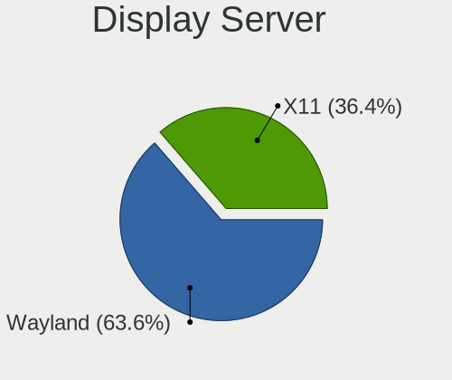

| Name    | Desktops | Percent |
|---------|----------|---------|
| X11     | 9        | 81.82%  |
| Wayland | 1        | 9.09%   |
| Unknown | 1        | 9.09%   |

Display Manager
---------------

SDDM, LightDM, etc.

| Name    | Desktops | Percent |
|---------|----------|---------|
| SDDM    | 5        | 45.45%  |
| LightDM | 4        | 36.36%  |
| GDM     | 1        | 9.09%   |
| Unknown | 1        | 9.09%   |

OS Lang
-------

Language

| Lang  | Desktops | Percent |
|-------|----------|---------|
| en_US | 4        | 36.36%  |
| ru_RU | 1        | 9.09%   |
| it_IT | 1        | 9.09%   |
| es_ES | 1        | 9.09%   |
| en_IN | 1        | 9.09%   |
| en_CA | 1        | 9.09%   |
| de_DE | 1        | 9.09%   |
| C     | 1        | 9.09%   |

Boot Mode
---------

EFI or BIOS

| Mode | Desktops | Percent |
|------|----------|---------|
| EFI  | 9        | 81.82%  |
| BIOS | 2        | 18.18%  |

Filesystem
----------

Type of filesystem

| Type  | Desktops | Percent |
|-------|----------|---------|
| Ext4  | 8        | 72.73%  |
| Btrfs | 2        | 18.18%  |
| Tmpfs | 1        | 9.09%   |

Part. scheme
------------

Scheme of partitioning

| Type    | Desktops | Percent |
|---------|----------|---------|
| GPT     | 9        | 81.82%  |
| MBR     | 1        | 9.09%   |
| Unknown | 1        | 9.09%   |

Dual Boot with Linux/BSD
------------------------

Hosting more than one Linux/BSD

| Dual boot | Desktops | Percent |
|-----------|----------|---------|
| No        | 8        | 72.73%  |
| Yes       | 3        | 27.27%  |

Dual Boot (Win)
---------------

Hosting Linux and Windows

| Dual boot | Desktops | Percent |
|-----------|----------|---------|
| Yes       | 7        | 63.64%  |
| No        | 4        | 36.36%  |

Board
-----

Vendor
------

Motherboard manufacturer

| Name                | Desktops | Percent |
|---------------------|----------|---------|
| Gigabyte Technology | 5        | 45.45%  |
| MSI                 | 4        | 36.36%  |
| Hewlett-Packard     | 1        | 9.09%   |
| Unknown             | 1        | 9.09%   |

Model
-----

Motherboard model

| Name                         | Desktops | Percent |
|------------------------------|----------|---------|
| MSI MS-7D75                  | 1        | 9.09%   |
| MSI MS-7D25                  | 1        | 9.09%   |
| MSI MS-7C52                  | 1        | 9.09%   |
| MSI MS-7B79                  | 1        | 9.09%   |
| HP EliteDesk 800 G1 TWR      | 1        | 9.09%   |
| Gigabyte X670 AORUS ELITE AX | 1        | 9.09%   |
| Gigabyte X570 AORUS ELITE    | 1        | 9.09%   |
| Gigabyte H87M-D3H            | 1        | 9.09%   |
| Gigabyte B450 AORUS ELITE    | 1        | 9.09%   |
| Gigabyte B365M D3H           | 1        | 9.09%   |
| Unknown                      | 1        | 9.09%   |

Model Family
------------

Motherboard model prefix

| Name              | Desktops | Percent |
|-------------------|----------|---------|
| MSI MS-7D75       | 1        | 9.09%   |
| MSI MS-7D25       | 1        | 9.09%   |
| MSI MS-7C52       | 1        | 9.09%   |
| MSI MS-7B79       | 1        | 9.09%   |
| HP EliteDesk      | 1        | 9.09%   |
| Gigabyte X670     | 1        | 9.09%   |
| Gigabyte X570     | 1        | 9.09%   |
| Gigabyte H87M-D3H | 1        | 9.09%   |
| Gigabyte B450     | 1        | 9.09%   |
| Gigabyte B365M    | 1        | 9.09%   |
| Unknown           | 1        | 9.09%   |

MFG Year
--------

Motherboard manufacture year

| Year | Desktops | Percent |
|------|----------|---------|
| 2019 | 3        | 27.27%  |
| 2022 | 2        | 18.18%  |
| 2018 | 2        | 18.18%  |
| 2013 | 2        | 18.18%  |
| 2021 | 1        | 9.09%   |
| 2020 | 1        | 9.09%   |

Form Factor
-----------

Physical design of the computer

| Name    | Desktops | Percent |
|---------|----------|---------|
| Desktop | 11       | 100%    |

Secure Boot
-----------

Enabled or disabled

| State    | Desktops | Percent |
|----------|----------|---------|
| Disabled | 9        | 81.82%  |
| Enabled  | 2        | 18.18%  |

Coreboot
--------

Have coreboot on board

| Used | Desktops | Percent |
|------|----------|---------|
| No   | 11       | 100%    |

RAM Size
--------

Total RAM memory

| Size in GB | Desktops | Percent |
|------------|----------|---------|
| 32.01-64.0 | 4        | 36.36%  |
| 24.01-32.0 | 3        | 27.27%  |
| 16.01-24.0 | 2        | 18.18%  |
| 1.01-2.0   | 1        | 9.09%   |
| 8.01-16.0  | 1        | 9.09%   |

RAM Used
--------

Used RAM memory

| Used GB    | Desktops | Percent |
|------------|----------|---------|
| 3.01-4.0   | 4        | 36.36%  |
| 4.01-8.0   | 2        | 18.18%  |
| 16.01-24.0 | 2        | 18.18%  |
| 2.01-3.0   | 1        | 9.09%   |
| 1.01-2.0   | 1        | 9.09%   |
| 8.01-16.0  | 1        | 9.09%   |

Total Drives
------------

Number of drives on board

| Drives | Desktops | Percent |
|--------|----------|---------|
| 2      | 3        | 27.27%  |
| 6      | 2        | 18.18%  |
| 3      | 2        | 18.18%  |
| 1      | 2        | 18.18%  |
| 8      | 1        | 9.09%   |
| 5      | 1        | 9.09%   |

Has CD-ROM
----------

Has CD-ROM on board

| Presented | Desktops | Percent |
|-----------|----------|---------|
| No        | 10       | 90.91%  |
| Yes       | 1        | 9.09%   |

Has Ethernet
------------

Has Ethernet on board

| Presented | Desktops | Percent |
|-----------|----------|---------|
| Yes       | 11       | 100%    |

Has WiFi
--------

Has WiFi module

| Presented | Desktops | Percent |
|-----------|----------|---------|
| No        | 6        | 54.55%  |
| Yes       | 5        | 45.45%  |

Has Bluetooth
-------------

Has Bluetooth module

| Presented | Desktops | Percent |
|-----------|----------|---------|
| Yes       | 6        | 54.55%  |
| No        | 5        | 45.45%  |

Location
--------

Country
-------

Geographic location (country)

| Country    | Desktops | Percent |
|------------|----------|---------|
| USA        | 1        | 9.09%   |
| UAE        | 1        | 9.09%   |
| Spain      | 1        | 9.09%   |
| Russia     | 1        | 9.09%   |
| Poland     | 1        | 9.09%   |
| Italy      | 1        | 9.09%   |
| India      | 1        | 9.09%   |
| Germany    | 1        | 9.09%   |
| Canada     | 1        | 9.09%   |
| Brazil     | 1        | 9.09%   |
| Bangladesh | 1        | 9.09%   |

City
----

Geographic location (city)

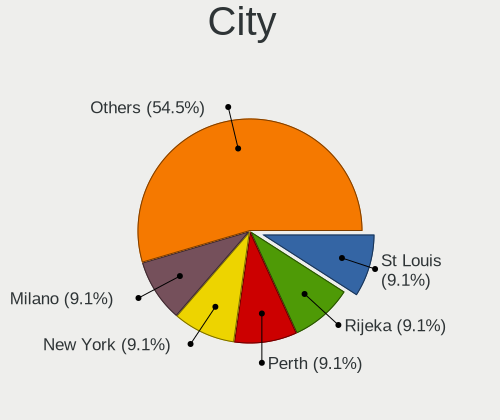

| City           | Desktops | Percent |
|----------------|----------|---------|
| Sharjah        | 1        | 9.09%   |
| Montreal       | 1        | 9.09%   |
| Milan          | 1        | 9.09%   |
| Longmont       | 1        | 9.09%   |
| Kiel           | 1        | 9.09%   |
| Kazan’       | 1        | 9.09%   |
| Irun           | 1        | 9.09%   |
| Hyderabad      | 1        | 9.09%   |
| Dhaka          | 1        | 9.09%   |
| Ciele          | 1        | 9.09%   |
| Belo Horizonte | 1        | 9.09%   |

Drives
------

Drive Vendor
------------

Hard drive vendors

| Vendor                    | Desktops | Drives | Percent |
|---------------------------|----------|--------|---------|
| WDC                       | 4        | 5      | 12.12%  |
| Seagate                   | 4        | 8      | 12.12%  |
| SanDisk                   | 4        | 5      | 12.12%  |
| Samsung Electronics       | 4        | 4      | 12.12%  |
| Kingston                  | 3        | 4      | 9.09%   |
| Crucial                   | 2        | 2      | 6.06%   |
| Timetec                   | 1        | 1      | 3.03%   |
| Super Talent              | 1        | 1      | 3.03%   |
| Silicon Motion            | 1        | 1      | 3.03%   |
| Realtek                   | 1        | 1      | 3.03%   |
| Phison Electronics        | 1        | 1      | 3.03%   |
| Micron/Crucial Technology | 1        | 1      | 3.03%   |
| Micron Technology         | 1        | 1      | 3.03%   |
| Intel                     | 1        | 1      | 3.03%   |
| Hitachi                   | 1        | 1      | 3.03%   |
| HGST                      | 1        | 1      | 3.03%   |
| ADATA Technology          | 1        | 1      | 3.03%   |
| Unknown                   | 1        | 1      | 3.03%   |

Drive Model
-----------

Hard drive models

| Model                                                  | Desktops | Percent |
|--------------------------------------------------------|----------|---------|
| Kingston SA400S37120G 120GB SSD                        | 2        | 5.13%   |
| WDC WD20EARS-42S0XB0 2TB                               | 1        | 2.56%   |
| WDC WD10EZEX-75WN4A1 1TB                               | 1        | 2.56%   |
| WDC WD10EZEX-75M2NA0 1TB                               | 1        | 2.56%   |
| WDC WD10EARS-00MVWB0 1TB                               | 1        | 2.56%   |
| Timetec MS05 256GB SSD                                 | 1        | 2.56%   |
| Super Talent FTM1TN325H 1TB SSD                        | 1        | 2.56%   |
| Silicon Motion SM2263EN/SM2263XT SSD Controller 1024GB | 1        | 2.56%   |
| Seagate ST500LT012-1DG142 500GB                        | 1        | 2.56%   |
| Seagate ST500LM021-1KJ152 500GB                        | 1        | 2.56%   |
| Seagate ST500DM002-1BD142 500GB                        | 1        | 2.56%   |
| Seagate ST4000DM004-2U9104 4TB                         | 1        | 2.56%   |
| Seagate ST2000DM008-2UB102 2TB                         | 1        | 2.56%   |
| Seagate ST2000DM008-2FR102 2TB                         | 1        | 2.56%   |
| Seagate ST1000LM035-1RK172 970GB                       | 1        | 2.56%   |
| Seagate ST1000DM003-1ER162 1TB                         | 1        | 2.56%   |
| Sandisk WD_BLACK SN850X HS 2000GB                      | 1        | 2.56%   |
| Sandisk WD_BLACK SN750 SE 500GB                        | 1        | 2.56%   |
| Sandisk WD Blue SN550 NVMe SSD 1024GB                  | 1        | 2.56%   |
| Sandisk WD Black SN850 1TB                             | 1        | 2.56%   |
| SanDisk SDSSDH3 1T00 1TB                               | 1        | 2.56%   |
| Samsung SSD 980 1TB                                    | 1        | 2.56%   |
| Samsung SSD 860 EVO 250GB                              | 1        | 2.56%   |
| Samsung SSD 850 EVO 250GB                              | 1        | 2.56%   |
| Samsung HD322HJ 320GB                                  | 1        | 2.56%   |
| Realtek RTL9210B-CG 1TB                                | 1        | 2.56%   |
| Phison E16 PCIe4 NVMe Controller 500GB                 | 1        | 2.56%   |
| Micron/Crucial P2 NVMe PCIe SSD 1TB                    | 1        | 2.56%   |
| Micron 1100 SATA 512GB SSD                             | 1        | 2.56%   |
| Kingston SNV2S500G 500GB                               | 1        | 2.56%   |
| Kingston SA400S37240G 240GB SSD                        | 1        | 2.56%   |
| Intel SSDSC2BB480G7 480GB                              | 1        | 2.56%   |
| Hitachi HDS5C3020BLE630 2TB                            | 1        | 2.56%   |
| HGST HTS545050A7E680 500GB                             | 1        | 2.56%   |
| Crucial CT500MX500SSD1 500GB                           | 1        | 2.56%   |
| Crucial CT240BX500SSD1 240GB                           | 1        | 2.56%   |
| ADATA XPG GAMMIX S50 Lite 512GB                        | 1        | 2.56%   |
| Unknown                                                | 1        | 2.56%   |

HDD Vendor
----------

Hard disk drive vendors

| Vendor              | Desktops | Drives | Percent |
|---------------------|----------|--------|---------|
| WDC                 | 4        | 5      | 36.36%  |
| Seagate             | 4        | 8      | 36.36%  |
| Samsung Electronics | 1        | 1      | 9.09%   |
| Hitachi             | 1        | 1      | 9.09%   |
| HGST                | 1        | 1      | 9.09%   |

SSD Vendor
----------

Solid state drive vendors

| Vendor              | Desktops | Drives | Percent |
|---------------------|----------|--------|---------|
| Samsung Electronics | 2        | 2      | 16.67%  |
| Kingston            | 2        | 3      | 16.67%  |
| Crucial             | 2        | 2      | 16.67%  |
| Timetec             | 1        | 1      | 8.33%   |
| Super Talent        | 1        | 1      | 8.33%   |
| SanDisk             | 1        | 1      | 8.33%   |
| Micron Technology   | 1        | 1      | 8.33%   |
| Intel               | 1        | 1      | 8.33%   |
| Unknown             | 1        | 1      | 8.33%   |

Drive Kind
----------

HDD or SSD

| Kind | Desktops | Drives | Percent |
|------|----------|--------|---------|
| HDD  | 8        | 16     | 38.1%   |
| NVMe | 7        | 11     | 33.33%  |
| SSD  | 6        | 13     | 28.57%  |

Drive Connector
---------------

SATA, SAS, NVMe, etc.

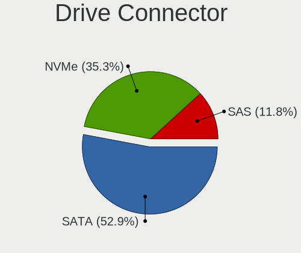

| Type | Desktops | Drives | Percent |
|------|----------|--------|---------|
| SATA | 8        | 28     | 50%     |
| NVMe | 7        | 10     | 43.75%  |
| SAS  | 1        | 2      | 6.25%   |

Drive Size
----------

Size of hard drive

| Size in TB | Desktops | Drives | Percent |
|------------|----------|--------|---------|
| 0.01-0.5   | 7        | 14     | 41.18%  |
| 0.51-1.0   | 6        | 9      | 35.29%  |
| 1.01-2.0   | 3        | 5      | 17.65%  |
| 3.01-4.0   | 1        | 1      | 5.88%   |

Space Total
-----------

Amount of disk space available on the file system

| Size in GB     | Desktops | Percent |
|----------------|----------|---------|
| 501-1000       | 4        | 36.36%  |
| More than 3000 | 2        | 18.18%  |
| 251-500        | 2        | 18.18%  |
| 1001-2000      | 2        | 18.18%  |
| 2001-3000      | 1        | 9.09%   |

Space Used
----------

Amount of used disk space

| Used GB        | Desktops | Percent |
|----------------|----------|---------|
| More than 3000 | 2        | 18.18%  |
| 251-500        | 2        | 18.18%  |
| 101-250        | 2        | 18.18%  |
| 21-50          | 1        | 9.09%   |
| 1001-2000      | 1        | 9.09%   |
| 1-20           | 1        | 9.09%   |
| 501-1000       | 1        | 9.09%   |
| 51-100         | 1        | 9.09%   |

Malfunc. Drives
---------------

Drive models with a malfunction

| Model                                 | Desktops | Drives | Percent |
|---------------------------------------|----------|--------|---------|
| WDC WD10EARS-00MVWB0 1TB              | 1        | 1      | 16.67%  |
| Seagate ST500LT012-1DG142 500GB       | 1        | 1      | 16.67%  |
| Seagate ST500LM021-1KJ152 500GB       | 1        | 1      | 16.67%  |
| Micron Technology 1100 SATA 512GB SSD | 1        | 1      | 16.67%  |
| Intel SSDSC2BB480G7 480GB             | 1        | 1      | 16.67%  |
| HGST HTS545050A7E680 500GB            | 1        | 1      | 16.67%  |

Malfunc. Drive Vendor
---------------------

Vendors of faulty drives

| Vendor            | Desktops | Drives | Percent |
|-------------------|----------|--------|---------|
| Seagate           | 2        | 2      | 33.33%  |
| WDC               | 1        | 1      | 16.67%  |
| Micron Technology | 1        | 1      | 16.67%  |
| Intel             | 1        | 1      | 16.67%  |
| HGST              | 1        | 1      | 16.67%  |

Malfunc. HDD Vendor
-------------------

Vendors of faulty HDD drives

| Vendor  | Desktops | Drives | Percent |
|---------|----------|--------|---------|
| Seagate | 2        | 2      | 50%     |
| WDC     | 1        | 1      | 25%     |
| HGST    | 1        | 1      | 25%     |

Malfunc. Drive Kind
-------------------

Kinds of faulty drives

| Kind | Desktops | Drives | Percent |
|------|----------|--------|---------|
| HDD  | 3        | 4      | 75%     |
| SSD  | 1        | 2      | 25%     |

Failed Drives
-------------

Failed drive models

Zero info for selected period =(

Failed Drive Vendor
-------------------

Failed drive vendors

Zero info for selected period =(

Drive Status
------------

Number of failed and malfunc. drives

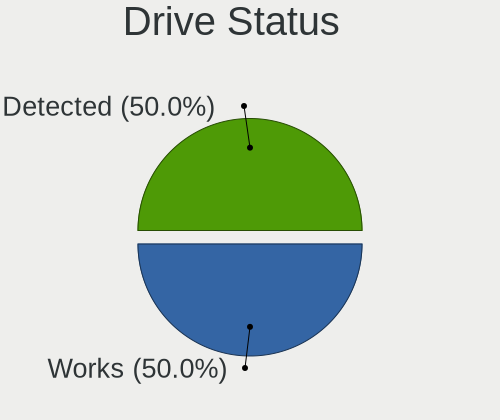

| Status   | Desktops | Drives | Percent |
|----------|----------|--------|---------|
| Works    | 9        | 25     | 60%     |
| Detected | 3        | 9      | 20%     |
| Malfunc  | 3        | 6      | 20%     |

Storage controller
------------------

Storage Vendor
--------------

Storage controller vendors

| Vendor                      | Desktops | Percent |
|-----------------------------|----------|---------|
| AMD                         | 6        | 27.27%  |
| Intel                       | 5        | 22.73%  |
| SanDisk                     | 4        | 18.18%  |
| Silicon Motion              | 1        | 4.55%   |
| Samsung Electronics         | 1        | 4.55%   |
| Phison Electronics          | 1        | 4.55%   |
| Micron/Crucial Technology   | 1        | 4.55%   |
| Kingston Technology Company | 1        | 4.55%   |
| ASMedia Technology          | 1        | 4.55%   |
| ADATA Technology            | 1        | 4.55%   |

Storage Model
-------------

Storage controller models

| Model                                                                          | Desktops | Percent |
|--------------------------------------------------------------------------------|----------|---------|
| AMD FCH SATA Controller [AHCI mode]                                            | 6        | 24%     |
| AMD 400 Series Chipset SATA Controller                                         | 3        | 12%     |
| Intel 8 Series/C220 Series Chipset Family 6-port SATA Controller 1 [AHCI mode] | 2        | 8%      |
| Silicon Motion SM2263EN/SM2263XT SSD Controller                                | 1        | 4%      |
| Sandisk Western Digital WD Black SN850X NVMe SSD                               | 1        | 4%      |
| SanDisk WD PC SN810 / Black SN850 NVMe SSD                                     | 1        | 4%      |
| SanDisk WD Blue SN550 NVMe SSD                                                 | 1        | 4%      |
| SanDisk Non-Volatile memory controller                                         | 1        | 4%      |
| Samsung NVMe SSD Controller 980                                                | 1        | 4%      |
| Phison E16 PCIe4 NVMe Controller                                               | 1        | 4%      |
| Micron/Crucial P2 NVMe PCIe SSD                                                | 1        | 4%      |
| Kingston Company Company Non-Volatile memory controller                        | 1        | 4%      |
| Intel Alder Lake-S PCH SATA Controller [AHCI Mode]                             | 1        | 4%      |
| Intel 6 Series/C200 Series Chipset Family 6 port Desktop SATA AHCI Controller  | 1        | 4%      |
| Intel 200 Series PCH SATA controller [AHCI mode]                               | 1        | 4%      |
| ASMedia ASM1062 Serial ATA Controller                                          | 1        | 4%      |
| ADATA XPG GAMMIX S50 NVMe SSD                                                  | 1        | 4%      |

Storage Kind
------------

Kind of storage controller (IDE, SATA, NVMe, SAS, ...)

| Kind | Desktops | Percent |
|------|----------|---------|
| SATA | 11       | 61.11%  |
| NVMe | 7        | 38.89%  |

Processor
---------

CPU Vendor
----------

Processor vendors

| Vendor | Desktops | Percent |
|--------|----------|---------|
| AMD    | 6        | 54.55%  |
| Intel  | 5        | 45.45%  |

CPU Model
---------

Processor models

| Model                                       | Desktops | Percent |
|---------------------------------------------|----------|---------|
| Intel Pentium CPU G630 @ 2.70GHz            | 1        | 9.09%   |
| Intel Core i7-9700F CPU @ 3.00GHz           | 1        | 9.09%   |
| Intel Core i7-4790K CPU @ 4.00GHz           | 1        | 9.09%   |
| Intel Core i7-4790 CPU @ 3.60GHz            | 1        | 9.09%   |
| Intel 13th Gen Core i5-13600KF              | 1        | 9.09%   |
| AMD Ryzen 9 7900X 12-Core Processor         | 1        | 9.09%   |
| AMD Ryzen 9 3900X 12-Core Processor         | 1        | 9.09%   |
| AMD Ryzen 7 7700X 8-Core Processor          | 1        | 9.09%   |
| AMD Ryzen 5 5600G with Radeon Graphics      | 1        | 9.09%   |
| AMD Ryzen 5 3400G with Radeon Vega Graphics | 1        | 9.09%   |
| AMD Ryzen 5 2600X Six-Core Processor        | 1        | 9.09%   |

CPU Model Family
----------------

Processor model prefix

| Model         | Desktops | Percent |
|---------------|----------|---------|
| Intel Core i7 | 3        | 27.27%  |
| AMD Ryzen 5   | 3        | 27.27%  |
| AMD Ryzen 9   | 2        | 18.18%  |
| Other         | 1        | 9.09%   |
| Intel Pentium | 1        | 9.09%   |
| AMD Ryzen 7   | 1        | 9.09%   |

CPU Cores
---------

Number of processor cores

| Number | Desktops | Percent |
|--------|----------|---------|
| 4      | 3        | 27.27%  |
| 12     | 2        | 18.18%  |
| 8      | 2        | 18.18%  |
| 6      | 2        | 18.18%  |
| 14     | 1        | 9.09%   |
| 2      | 1        | 9.09%   |

CPU Sockets
-----------

Number of sockets

| Number | Desktops | Percent |
|--------|----------|---------|
| 1      | 11       | 100%    |

CPU Threads
-----------

Threads per core (Hyper-Threading)

| Number | Desktops | Percent |
|--------|----------|---------|
| 2      | 9        | 81.82%  |
| 1      | 2        | 18.18%  |

CPU Op-Modes
------------

CPU Operation Modes (32-bit, 64-bit)

| Op mode        | Desktops | Percent |
|----------------|----------|---------|
| 32-bit, 64-bit | 11       | 100%    |

CPU Microcode
-------------

Microcode number

| Number     | Desktops | Percent |
|------------|----------|---------|
| Unknown    | 4        | 36.36%  |
| 0xb0671    | 1        | 9.09%   |
| 0x0a601203 | 1        | 9.09%   |
| 0x0a601201 | 1        | 9.09%   |
| 0x0a50000d | 1        | 9.09%   |
| 0x08701021 | 1        | 9.09%   |
| 0x08108109 | 1        | 9.09%   |
| 0x0800820d | 1        | 9.09%   |

CPU Microarch
-------------

Microarchitecture

| Name             | Desktops | Percent |
|------------------|----------|---------|
| Zen+             | 2        | 18.18%  |
| Haswell          | 2        | 18.18%  |
| Unknown          | 2        | 18.18%  |
| Zen 3            | 1        | 9.09%   |
| Zen 2            | 1        | 9.09%   |
| SandyBridge      | 1        | 9.09%   |
| KabyLake         | 1        | 9.09%   |
| Alderlake Hybrid | 1        | 9.09%   |

Graphics
--------

GPU Vendor
----------

Vendors of graphics cards

| Vendor | Desktops | Percent |
|--------|----------|---------|
| Nvidia | 5        | 38.46%  |
| AMD    | 5        | 38.46%  |
| Intel  | 3        | 23.08%  |

GPU Model
---------

Graphics card models

| Model                                                                       | Desktops | Percent |
|-----------------------------------------------------------------------------|----------|---------|
| Intel Xeon E3-1200 v3/4th Gen Core Processor Integrated Graphics Controller | 2        | 14.29%  |
| AMD Navi 31 [Radeon RX 7900 XT/7900 XTX]                                    | 2        | 14.29%  |
| Nvidia TU116 [GeForce GTX 1660]                                             | 1        | 7.14%   |
| Nvidia TU104 [GeForce RTX 2080 Rev. A]                                      | 1        | 7.14%   |
| Nvidia GP104 [GeForce GTX 1070 Ti]                                          | 1        | 7.14%   |
| Nvidia GK104 [GeForce GTX 760]                                              | 1        | 7.14%   |
| Nvidia GA104 [GeForce RTX 3060]                                             | 1        | 7.14%   |
| Intel 2nd Generation Core Processor Family Integrated Graphics Controller   | 1        | 7.14%   |
| AMD Raphael                                                                 | 1        | 7.14%   |
| AMD Navi 10 [Radeon RX 5600 OEM/5600 XT / 5700/5700 XT]                     | 1        | 7.14%   |
| AMD Lexa PRO [Radeon 540/540X/550/550X / RX 540X/550/550X]                  | 1        | 7.14%   |
| AMD Cezanne [Radeon Vega Series / Radeon Vega Mobile Series]                | 1        | 7.14%   |

GPU Combo
---------

Combinations of graphics cards

| Name           | Desktops | Percent |
|----------------|----------|---------|
| 1 x Nvidia     | 4        | 36.36%  |
| 1 x AMD        | 3        | 27.27%  |
| 2 x AMD        | 1        | 9.09%   |
| Intel + Nvidia | 1        | 9.09%   |
| Intel + AMD    | 1        | 9.09%   |
| 1 x Intel      | 1        | 9.09%   |

GPU Driver
----------

Free vs proprietary

| Driver      | Desktops | Percent |
|-------------|----------|---------|
| Free        | 6        | 54.55%  |
| Proprietary | 5        | 45.45%  |

GPU Memory
----------

Total video memory

| Size in GB | Desktops | Percent |
|------------|----------|---------|
| 7.01-8.0   | 3        | 27.27%  |
| 16.01-24.0 | 2        | 18.18%  |
| Unknown    | 2        | 18.18%  |
| 5.01-6.0   | 1        | 9.09%   |
| 3.01-4.0   | 1        | 9.09%   |
| 1.01-2.0   | 1        | 9.09%   |
| 8.01-16.0  | 1        | 9.09%   |

Monitor
-------

Monitor Vendor
--------------

Monitor vendors

| Vendor              | Desktops | Percent |
|---------------------|----------|---------|
| Goldstar            | 3        | 30%     |
| Samsung Electronics | 2        | 20%     |
| SKY                 | 1        | 10%     |
| Mi                  | 1        | 10%     |
| Dell                | 1        | 10%     |
| CTX                 | 1        | 10%     |
| Acer                | 1        | 10%     |

Monitor Model
-------------

Monitor models

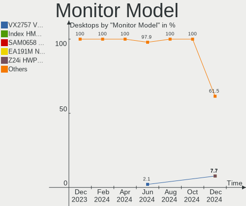

| Model                                                                  | Desktops | Percent |
|------------------------------------------------------------------------|----------|---------|
| SKY TV MONITOR SKY0030 3840x2160 708x398mm 32.0-inch                   | 1        | 8.33%   |
| Samsung Electronics T27C310 SAM0AEB 1920x1080 598x336mm 27.0-inch      | 1        | 8.33%   |
| Samsung Electronics LCD Monitor SAM7245 1920x1080 1210x680mm 54.6-inch | 1        | 8.33%   |
| Mi Monitor XMI2701 2560x1440 597x336mm 27.0-inch                       | 1        | 8.33%   |
| Goldstar ULTRAWIDE GSM5AFB 2560x1080 798x334mm 34.1-inch               | 1        | 8.33%   |
| Goldstar ULTRAWIDE GSM59F1 2560x1080 673x284mm 28.8-inch               | 1        | 8.33%   |
| Goldstar ULTRAGEAR GSM5BB4 2560x1440 597x336mm 27.0-inch               | 1        | 8.33%   |
| Goldstar HDR WFHD GSM7714 2560x1080 798x334mm 34.1-inch                | 1        | 8.33%   |
| Dell U2422H DELA1B8 1920x1080 527x296mm 23.8-inch                      | 1        | 8.33%   |
| Dell U2419HC DEL4168 1920x1080 527x296mm 23.8-inch                     | 1        | 8.33%   |
| CTX 315-HDMI CTX6335 2560x1440 698x393mm 31.5-inch                     | 1        | 8.33%   |
| Acer XF270H B ACR064D 1920x1080 598x336mm 27.0-inch                    | 1        | 8.33%   |

Monitor Resolution
------------------

Monitor screen resolution

| Resolution      | Desktops | Percent |
|-----------------|----------|---------|
| 2560x1440 (QHD) | 3        | 30%     |
| 2560x1080       | 3        | 30%     |
| 1920x1080 (FHD) | 3        | 30%     |
| 3840x2160 (4K)  | 1        | 10%     |

Monitor Diagonal
----------------

Diagonal size in inches

| Inches | Desktops | Percent |
|--------|----------|---------|
| 27     | 4        | 33.33%  |
| 34     | 3        | 25%     |
| 54     | 1        | 8.33%   |
| 32     | 1        | 8.33%   |
| 31     | 1        | 8.33%   |
| 24     | 1        | 8.33%   |
| 23     | 1        | 8.33%   |

Monitor Width
-------------

Physical width

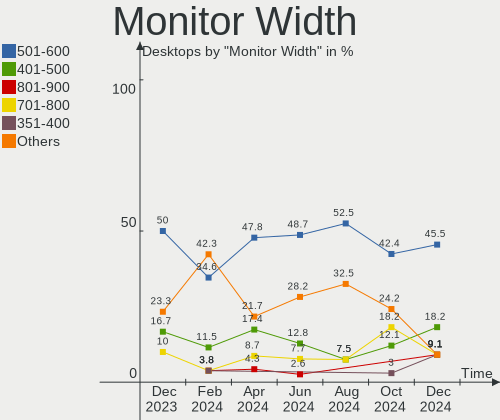

| Width in mm | Desktops | Percent |
|-------------|----------|---------|
| 701-800     | 4        | 40%     |
| 501-600     | 4        | 40%     |
| 601-700     | 1        | 10%     |
| 1001-1500   | 1        | 10%     |

Aspect Ratio
------------

Proportional relationship between the width and the height

| Ratio | Desktops | Percent |
|-------|----------|---------|
| 16/9  | 7        | 70%     |
| 21/9  | 3        | 30%     |

Monitor Area
------------

Area in inch²

| Area in inch² | Desktops | Percent |
|----------------|----------|---------|
| 351-500        | 5        | 45.45%  |
| 301-350        | 4        | 36.36%  |
| More than 1000 | 1        | 9.09%   |
| 201-250        | 1        | 9.09%   |

Pixel Density
-------------

Pixels per inch

| Density | Desktops | Percent |
|---------|----------|---------|
| 51-100  | 7        | 70%     |
| 101-120 | 2        | 20%     |
| 1-50    | 1        | 10%     |

Multiple Monitors
-----------------

Total monitors connected

| Total | Desktops | Percent |
|-------|----------|---------|
| 1     | 9        | 81.82%  |
| 3     | 1        | 9.09%   |
| 2     | 1        | 9.09%   |

Network
-------

Net Controller Vendor
---------------------

Controller vendors

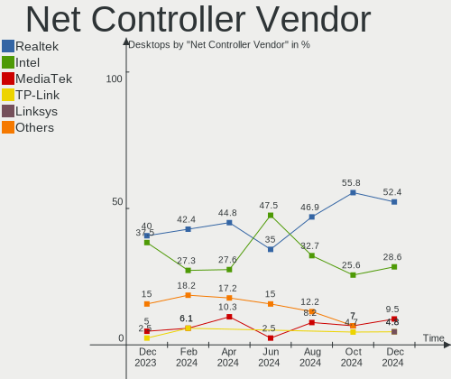

| Vendor                | Desktops | Percent |
|-----------------------|----------|---------|
| Realtek Semiconductor | 8        | 53.33%  |
| Intel                 | 4        | 26.67%  |
| MediaTek              | 2        | 13.33%  |
| D-Link                | 1        | 6.67%   |

Net Controller Model
--------------------

Controller models

| Model                                                             | Desktops | Percent |
|-------------------------------------------------------------------|----------|---------|
| Realtek RTL8111/8168/8411 PCI Express Gigabit Ethernet Controller | 4        | 23.53%  |
| Realtek RTL8125 2.5GbE Controller                                 | 3        | 17.65%  |
| MediaTek MT7922 802.11ax PCI Express Wireless Network Adapter     | 2        | 11.76%  |
| Realtek RTL8812AU 802.11a/b/g/n/ac 2T2R DB WLAN Adapter           | 1        | 5.88%   |
| Realtek RTL8153 Gigabit Ethernet Adapter                          | 1        | 5.88%   |
| Realtek RTL810xE PCI Express Fast Ethernet controller             | 1        | 5.88%   |
| Intel I211 Gigabit Network Connection                             | 1        | 5.88%   |
| Intel Ethernet Controller I225-V                                  | 1        | 5.88%   |
| Intel Ethernet Connection I217-LM                                 | 1        | 5.88%   |
| Intel Ethernet Connection (2) I219-V                              | 1        | 5.88%   |
| D-Link 802.11ac NIC                                               | 1        | 5.88%   |

Wireless Vendor
---------------

Wireless vendors

| Vendor                | Desktops | Percent |
|-----------------------|----------|---------|
| MediaTek              | 2        | 50%     |
| Realtek Semiconductor | 1        | 25%     |
| D-Link                | 1        | 25%     |

Wireless Model
--------------

Wireless models

| Model                                                         | Desktops | Percent |
|---------------------------------------------------------------|----------|---------|
| MediaTek MT7922 802.11ax PCI Express Wireless Network Adapter | 2        | 50%     |
| Realtek RTL8812AU 802.11a/b/g/n/ac 2T2R DB WLAN Adapter       | 1        | 25%     |
| D-Link 802.11ac NIC                                           | 1        | 25%     |

Ethernet Vendor
---------------

Ethernet vendors

| Vendor                | Desktops | Percent |
|-----------------------|----------|---------|
| Realtek Semiconductor | 8        | 66.67%  |
| Intel                 | 4        | 33.33%  |

Ethernet Model
--------------

Ethernet models

| Model                                                             | Desktops | Percent |
|-------------------------------------------------------------------|----------|---------|
| Realtek RTL8111/8168/8411 PCI Express Gigabit Ethernet Controller | 4        | 30.77%  |
| Realtek RTL8125 2.5GbE Controller                                 | 3        | 23.08%  |
| Realtek RTL8153 Gigabit Ethernet Adapter                          | 1        | 7.69%   |
| Realtek RTL810xE PCI Express Fast Ethernet controller             | 1        | 7.69%   |
| Intel I211 Gigabit Network Connection                             | 1        | 7.69%   |
| Intel Ethernet Controller I225-V                                  | 1        | 7.69%   |
| Intel Ethernet Connection I217-LM                                 | 1        | 7.69%   |
| Intel Ethernet Connection (2) I219-V                              | 1        | 7.69%   |

Net Controller Kind
-------------------

Ethernet, WiFi or modem

| Kind     | Desktops | Percent |
|----------|----------|---------|
| Ethernet | 11       | 73.33%  |
| WiFi     | 4        | 26.67%  |

Used Controller
---------------

Currently used network controller

| Kind     | Desktops | Percent |
|----------|----------|---------|
| Ethernet | 10       | 83.33%  |
| WiFi     | 2        | 16.67%  |

NICs
----

Total network controllers on board

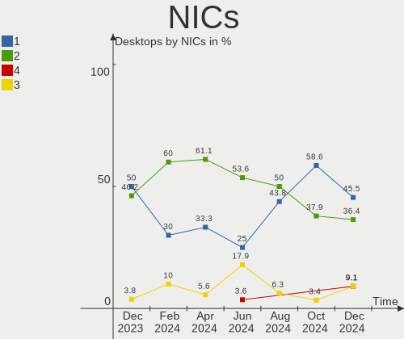

| Total | Desktops | Percent |
|-------|----------|---------|
| 1     | 8        | 72.73%  |
| 2     | 2        | 18.18%  |
| 3     | 1        | 9.09%   |

IPv6
----

IPv6 vs IPv4

| Used | Desktops | Percent |
|------|----------|---------|
| No   | 9        | 81.82%  |
| Yes  | 2        | 18.18%  |

Bluetooth
---------

Bluetooth Vendor
----------------

Controller vendors

| Vendor                  | Desktops | Percent |
|-------------------------|----------|---------|
| Cambridge Silicon Radio | 3        | 37.5%   |
| Realtek Semiconductor   | 2        | 25%     |
| MediaTek                | 2        | 25%     |
| TP-Link                 | 1        | 12.5%   |

Bluetooth Model
---------------

Controller models

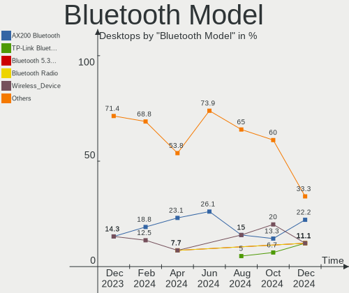

| Model                                               | Desktops | Percent |
|-----------------------------------------------------|----------|---------|
| Cambridge Silicon Radio Bluetooth Dongle (HCI mode) | 3        | 37.5%   |
| Realtek Bluetooth Radio                             | 2        | 25%     |
| MediaTek Wireless_Device                            | 2        | 25%     |
| TP-Link UB500 Adapter                               | 1        | 12.5%   |

Sound
-----

Sound Vendor
------------

Sound card vendors

| Vendor                   | Desktops | Percent |
|--------------------------|----------|---------|
| AMD                      | 7        | 30.43%  |
| Nvidia                   | 5        | 21.74%  |
| Intel                    | 5        | 21.74%  |
| SteelSeries ApS          | 1        | 4.35%   |
| Realtek Semiconductor    | 1        | 4.35%   |
| Micro Star International | 1        | 4.35%   |
| Dell                     | 1        | 4.35%   |
| C-Media Electronics      | 1        | 4.35%   |
| BEHRINGER International  | 1        | 4.35%   |

Sound Model
-----------

Sound card models

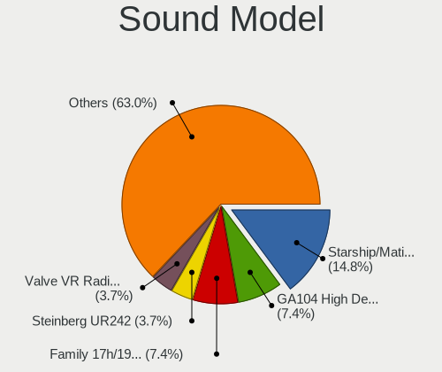

| Model                                                                      | Desktops | Percent |
|----------------------------------------------------------------------------|----------|---------|
| AMD Family 17h/19h HD Audio Controller                                     | 4        | 13.33%  |
| Intel Xeon E3-1200 v3/4th Gen Core Processor HD Audio Controller           | 2        | 6.67%   |
| Intel 8 Series/C220 Series Chipset High Definition Audio Controller        | 2        | 6.67%   |
| AMD Navi 31 [Radeon RX 7000 HDMI Audio]                                    | 2        | 6.67%   |
| SteelSeries ApS SteelSeries Arctis 7                                       | 1        | 3.33%   |
| Realtek Semiconductor USB SPDIF Adapter                                    | 1        | 3.33%   |
| Nvidia TU116 High Definition Audio Controller                              | 1        | 3.33%   |
| Nvidia TU104 HD Audio Controller                                           | 1        | 3.33%   |
| Nvidia GP104 High Definition Audio Controller                              | 1        | 3.33%   |
| Nvidia GK104 HDMI Audio Controller                                         | 1        | 3.33%   |
| Nvidia GA104 High Definition Audio Controller                              | 1        | 3.33%   |
| Micro Star International USB Audio                                         | 1        | 3.33%   |
| Intel Alder Lake-S HD Audio Controller                                     | 1        | 3.33%   |
| Intel 6 Series/C200 Series Chipset Family High Definition Audio Controller | 1        | 3.33%   |
| Intel 200 Series PCH HD Audio                                              | 1        | 3.33%   |
| Dell AC511 Sound Bar                                                       | 1        | 3.33%   |
| C-Media Electronics USB Audio Device                                       | 1        | 3.33%   |
| BEHRINGER International UMC204HD 192k                                      | 1        | 3.33%   |
| AMD Starship/Matisse HD Audio Controller                                   | 1        | 3.33%   |
| AMD Renoir Radeon High Definition Audio Controller                         | 1        | 3.33%   |
| AMD Rembrandt Radeon High Definition Audio Controller                      | 1        | 3.33%   |
| AMD Navi 10 HDMI Audio                                                     | 1        | 3.33%   |
| AMD Family 17h (Models 00h-0fh) HD Audio Controller                        | 1        | 3.33%   |
| AMD Baffin HDMI/DP Audio [Radeon RX 550 640SP / RX 560/560X]               | 1        | 3.33%   |

Memory
------

Memory Vendor
-------------

Memory module vendors

| Vendor           | Desktops | Percent |
|------------------|----------|---------|
| G.Skill          | 4        | 33.33%  |
| Corsair          | 3        | 25%     |
| Kingston         | 2        | 16.67%  |
| SK hynix         | 1        | 8.33%   |
| Patriot          | 1        | 8.33%   |
| Nanya Technology | 1        | 8.33%   |

Memory Model
------------

Memory module models

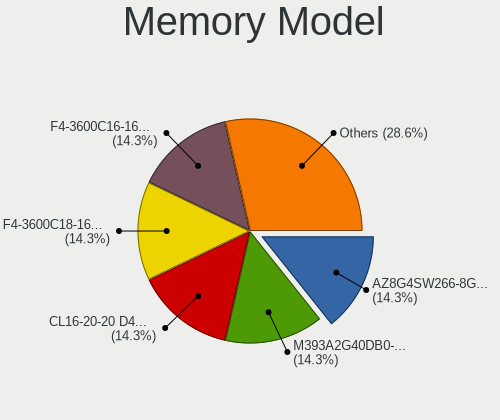

| Model                                                  | Desktops | Percent |
|--------------------------------------------------------|----------|---------|
| SK hynix RAM HMT41GU6AFR8C-PB 8GB DIMM DDR3 1600MT/s   | 1        | 7.14%   |
| Patriot RAM PSD34G16002 4GB DIMM DDR3 1648MT/s         | 1        | 7.14%   |
| Nanya RAM NT2GC64B88G0NF-CG 2GB DIMM DDR3 1333MT/s     | 1        | 7.14%   |
| Kingston RAM KHX2666C16/8G 8GB DIMM DDR4 3466MT/s      | 1        | 7.14%   |
| Kingston RAM KHX2400C15/8G 8GB DIMM DDR4 3400MT/s      | 1        | 7.14%   |
| Kingston RAM KF560C36-16 16GB DIMM DDR5 6000MT/s       | 1        | 7.14%   |
| G.Skill RAM F5-6000J3238F16G 16GB DIMM DDR5 6000MT/s   | 1        | 7.14%   |
| G.Skill RAM F4-3600C16-16GTZNC 16GB DIMM DDR4 3600MT/s | 1        | 7.14%   |
| G.Skill RAM F4-3200C16-8GVGB 8GB DIMM DDR4 3200MT/s    | 1        | 7.14%   |
| G.Skill RAM F4-3200C16-16GIS 16GB DIMM DDR4 3600MT/s   | 1        | 7.14%   |
| Corsair RAM CMZ8GX3M1A1600C10 8GB DIMM DDR3 1600MT/s   | 1        | 7.14%   |
| Corsair RAM CML4GX3M1A1600C9 4GB DIMM DDR3 1600MT/s    | 1        | 7.14%   |
| Corsair RAM CMK4GX4M1A2400C16 4GB DIMM DDR4 2400MT/s   | 1        | 7.14%   |
| Corsair RAM CMK16GX4M2D3200C16 8GB DIMM DDR4 3200MT/s  | 1        | 7.14%   |

Memory Kind
-----------

Memory module kinds

| Kind | Desktops | Percent |
|------|----------|---------|
| DDR4 | 5        | 50%     |
| DDR3 | 3        | 30%     |
| DDR5 | 2        | 20%     |

Memory Form Factor
------------------

Physical design of the memory module

| Name | Desktops | Percent |
|------|----------|---------|
| DIMM | 10       | 100%    |

Memory Size
-----------

Memory module size

| Size  | Desktops | Percent |
|-------|----------|---------|
| 8192  | 5        | 41.67%  |
| 16384 | 4        | 33.33%  |
| 4096  | 2        | 16.67%  |
| 2048  | 1        | 8.33%   |

Memory Speed
------------

Memory module speed

| Speed | Desktops | Percent |
|-------|----------|---------|
| 6000  | 2        | 15.38%  |
| 3600  | 2        | 15.38%  |
| 3200  | 2        | 15.38%  |
| 1600  | 2        | 15.38%  |
| 3466  | 1        | 7.69%   |
| 3400  | 1        | 7.69%   |
| 2400  | 1        | 7.69%   |
| 1648  | 1        | 7.69%   |
| 1333  | 1        | 7.69%   |

Printers & scanners
-------------------

Printer Vendor
--------------

Printer device vendors

Zero info for selected period =(

Printer Model
-------------

Printer device models

Zero info for selected period =(

Scanner Vendor
--------------

Scanner device vendors

Zero info for selected period =(

Scanner Model
-------------

Scanner device models

Zero info for selected period =(

Camera
------

Camera Vendor
-------------

Camera device vendors

| Vendor              | Desktops | Percent |
|---------------------|----------|---------|
| Logitech            | 3        | 50%     |
| Samsung Electronics | 1        | 16.67%  |
| MacroSilicon        | 1        | 16.67%  |
| Jieli Technology    | 1        | 16.67%  |

Camera Model
------------

Camera device models

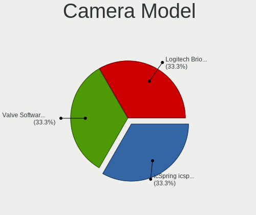

| Model                                   | Desktops | Percent |
|-----------------------------------------|----------|---------|
| Samsung Galaxy series, misc. (MTP mode) | 1        | 16.67%  |
| MacroSilicon USB Video                  | 1        | 16.67%  |
| Logitech Webcam C170                    | 1        | 16.67%  |
| Logitech HD Pro Webcam C920             | 1        | 16.67%  |
| Logitech C922 Pro Stream Webcam         | 1        | 16.67%  |
| Jieli USB PHY 2.0                       | 1        | 16.67%  |

Security
--------

Fingerprint Vendor
------------------

Fingerprint sensor vendors

Zero info for selected period =(

Fingerprint Model
-----------------

Fingerprint sensor models

Zero info for selected period =(

Chipcard Vendor
---------------

Chipcard module vendors

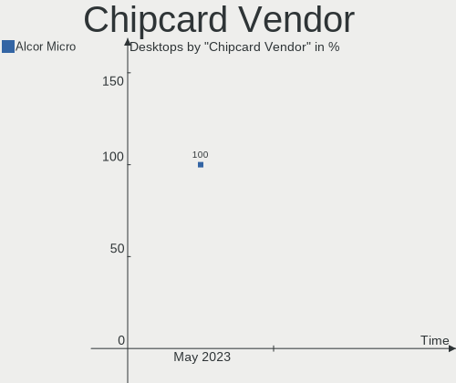

| Vendor      | Desktops | Percent |
|-------------|----------|---------|
| Alcor Micro | 1        | 100%    |

Chipcard Model
--------------

Chipcard module models

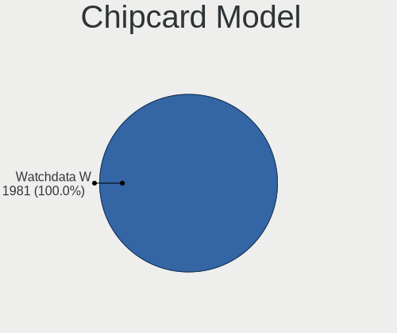

| Model                        | Desktops | Percent |
|------------------------------|----------|---------|
| Alcor Micro Watchdata W 1981 | 1        | 100%    |

Unsupported
-----------

Unsupported Devices
-------------------

Total unsupported devices on board

| Total | Desktops | Percent |
|-------|----------|---------|
| 0     | 9        | 81.82%  |
| 2     | 1        | 9.09%   |
| 1     | 1        | 9.09%   |

Unsupported Device Types
------------------------

Types of unsupported devices

| Type          | Desktops | Percent |
|---------------|----------|---------|
| Graphics card | 1        | 33.33%  |
| Dvb card      | 1        | 33.33%  |
| Chipcard      | 1        | 33.33%  |

