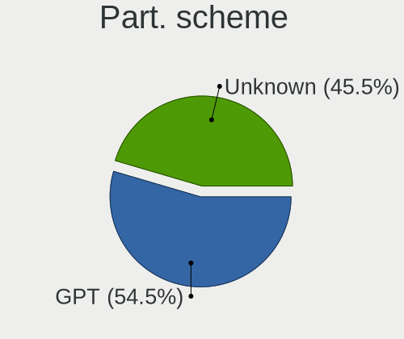
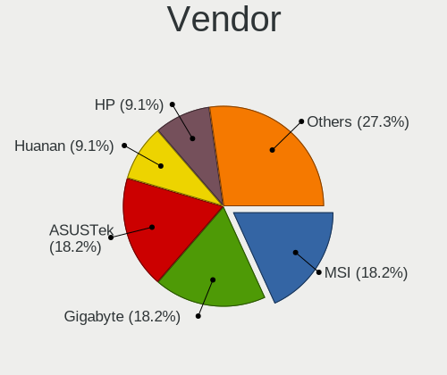
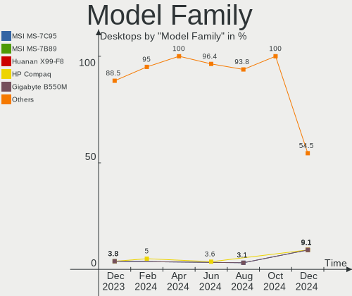
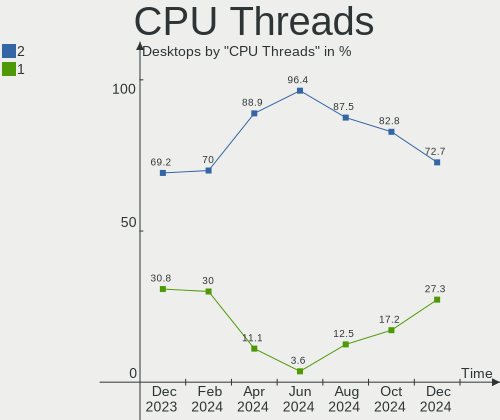

EndeavourOS - Hardware Trends (Desktops)
----------------------------------------

A project to identify most popular hardware characteristics and track their change
over time based on data collected by Linux users at https://Linux-Hardware.org.

Anyone can contribute to this report by the [hw-probe](https://github.com/linuxhw/hw-probe) tool:

    sudo -E hw-probe -all -upload

This report is for one last month. Overall report since the beginning of time: [TestCoverage](https://github.com/linuxhw/TestCoverage)

Period: Oct, 2022.

Contents
--------

* [ System ](#system)
  - [ OS                       ](#os)
  - [ OS Family                ](#os-family)
  - [ Kernel                   ](#kernel)
  - [ Kernel Family            ](#kernel-family)
  - [ Kernel Major Ver.        ](#kernel-major-ver)
  - [ Arch                     ](#arch)
  - [ DE                       ](#de)
  - [ Display Server           ](#display-server)
  - [ Display Manager          ](#display-manager)
  - [ OS Lang                  ](#os-lang)
  - [ Boot Mode                ](#boot-mode)
  - [ Filesystem               ](#filesystem)
  - [ Part. scheme             ](#part-scheme)
  - [ Dual Boot with Linux/BSD ](#dual-boot-with-linuxbsd)
  - [ Dual Boot (Win)          ](#dual-boot-win)

* [ Board ](#board)
  - [ Vendor                   ](#vendor)
  - [ Model                    ](#model)
  - [ Model Family             ](#model-family)
  - [ MFG Year                 ](#mfg-year)
  - [ Form Factor              ](#form-factor)
  - [ Secure Boot              ](#secure-boot)
  - [ Coreboot                 ](#coreboot)
  - [ RAM Size                 ](#ram-size)
  - [ RAM Used                 ](#ram-used)
  - [ Total Drives             ](#total-drives)
  - [ Has CD-ROM               ](#has-cd-rom)
  - [ Has Ethernet             ](#has-ethernet)
  - [ Has WiFi                 ](#has-wifi)
  - [ Has Bluetooth            ](#has-bluetooth)

* [ Location ](#location)
  - [ Country                  ](#country)
  - [ City                     ](#city)

* [ Drives ](#drives)
  - [ Drive Vendor             ](#drive-vendor)
  - [ Drive Model              ](#drive-model)
  - [ HDD Vendor               ](#hdd-vendor)
  - [ SSD Vendor               ](#ssd-vendor)
  - [ Drive Kind               ](#drive-kind)
  - [ Drive Connector          ](#drive-connector)
  - [ Drive Size               ](#drive-size)
  - [ Space Total              ](#space-total)
  - [ Space Used               ](#space-used)
  - [ Malfunc. Drives          ](#malfunc-drives)
  - [ Malfunc. Drive Vendor    ](#malfunc-drive-vendor)
  - [ Malfunc. HDD Vendor      ](#malfunc-hdd-vendor)
  - [ Malfunc. Drive Kind      ](#malfunc-drive-kind)
  - [ Failed Drives            ](#failed-drives)
  - [ Failed Drive Vendor      ](#failed-drive-vendor)
  - [ Drive Status             ](#drive-status)

* [ Storage controller ](#storage-controller)
  - [ Storage Vendor           ](#storage-vendor)
  - [ Storage Model            ](#storage-model)
  - [ Storage Kind             ](#storage-kind)

* [ Processor ](#processor)
  - [ CPU Vendor               ](#cpu-vendor)
  - [ CPU Model                ](#cpu-model)
  - [ CPU Model Family         ](#cpu-model-family)
  - [ CPU Cores                ](#cpu-cores)
  - [ CPU Sockets              ](#cpu-sockets)
  - [ CPU Threads              ](#cpu-threads)
  - [ CPU Op-Modes             ](#cpu-op-modes)
  - [ CPU Microcode            ](#cpu-microcode)
  - [ CPU Microarch            ](#cpu-microarch)

* [ Graphics ](#graphics)
  - [ GPU Vendor               ](#gpu-vendor)
  - [ GPU Model                ](#gpu-model)
  - [ GPU Combo                ](#gpu-combo)
  - [ GPU Driver               ](#gpu-driver)
  - [ GPU Memory               ](#gpu-memory)

* [ Monitor ](#monitor)
  - [ Monitor Vendor           ](#monitor-vendor)
  - [ Monitor Model            ](#monitor-model)
  - [ Monitor Resolution       ](#monitor-resolution)
  - [ Monitor Diagonal         ](#monitor-diagonal)
  - [ Monitor Width            ](#monitor-width)
  - [ Aspect Ratio             ](#aspect-ratio)
  - [ Monitor Area             ](#monitor-area)
  - [ Pixel Density            ](#pixel-density)
  - [ Multiple Monitors        ](#multiple-monitors)

* [ Network ](#network)
  - [ Net Controller Vendor    ](#net-controller-vendor)
  - [ Net Controller Model     ](#net-controller-model)
  - [ Wireless Vendor          ](#wireless-vendor)
  - [ Wireless Model           ](#wireless-model)
  - [ Ethernet Vendor          ](#ethernet-vendor)
  - [ Ethernet Model           ](#ethernet-model)
  - [ Net Controller Kind      ](#net-controller-kind)
  - [ Used Controller          ](#used-controller)
  - [ NICs                     ](#nics)
  - [ IPv6                     ](#ipv6)

* [ Bluetooth ](#bluetooth)
  - [ Bluetooth Vendor         ](#bluetooth-vendor)
  - [ Bluetooth Model          ](#bluetooth-model)

* [ Sound ](#sound)
  - [ Sound Vendor             ](#sound-vendor)
  - [ Sound Model              ](#sound-model)

* [ Memory ](#memory)
  - [ Memory Vendor            ](#memory-vendor)
  - [ Memory Model             ](#memory-model)
  - [ Memory Kind              ](#memory-kind)
  - [ Memory Form Factor       ](#memory-form-factor)
  - [ Memory Size              ](#memory-size)
  - [ Memory Speed             ](#memory-speed)

* [ Printers & scanners ](#printers--scanners)
  - [ Printer Vendor           ](#printer-vendor)
  - [ Printer Model            ](#printer-model)
  - [ Scanner Vendor           ](#scanner-vendor)
  - [ Scanner Model            ](#scanner-model)

* [ Camera ](#camera)
  - [ Camera Vendor            ](#camera-vendor)
  - [ Camera Model             ](#camera-model)

* [ Security ](#security)
  - [ Fingerprint Vendor       ](#fingerprint-vendor)
  - [ Fingerprint Model        ](#fingerprint-model)
  - [ Chipcard Vendor          ](#chipcard-vendor)
  - [ Chipcard Model           ](#chipcard-model)

* [ Unsupported ](#unsupported)
  - [ Unsupported Devices      ](#unsupported-devices)
  - [ Unsupported Device Types ](#unsupported-device-types)

System
------

OS
--

Installed operating systems

| Name                | Desktops | Percent |
|---------------------|----------|---------|
| EndeavourOS Rolling | 21       | 100%    |

OS Family
---------

OS without a version

| Name        | Desktops | Percent |
|-------------|----------|---------|
| EndeavourOS | 21       | 100%    |

Kernel
------

Version of the Linux kernel

| Version            | Desktops | Percent |
|--------------------|----------|---------|
| 6.0.2-zen1-1-zen   | 5        | 23.81%  |
| 6.0.2-arch1-1      | 5        | 23.81%  |
| 5.15.74-1-lts      | 4        | 19.05%  |
| 5.19.13-zen1-1-zen | 2        | 9.52%   |
| 6.0.5-zen1-1-zen   | 1        | 4.76%   |
| 6.0.5-arch1-1      | 1        | 4.76%   |
| 6.0.0-zen1-1-zen   | 1        | 4.76%   |
| 5.19.12-arch1-1    | 1        | 4.76%   |
| 5.18.14-arch1-1    | 1        | 4.76%   |

Kernel Family
-------------

Linux kernel without a distro release

| Version | Desktops | Percent |
|---------|----------|---------|
| 6.0.2   | 10       | 47.62%  |
| 5.15.74 | 4        | 19.05%  |
| 6.0.5   | 2        | 9.52%   |
| 5.19.13 | 2        | 9.52%   |
| 6.0.0   | 1        | 4.76%   |
| 5.19.12 | 1        | 4.76%   |
| 5.18.14 | 1        | 4.76%   |

Kernel Major Ver.
-----------------

Linux kernel major version

| Version | Desktops | Percent |
|---------|----------|---------|
| 6.0     | 13       | 61.9%   |
| 5.15    | 4        | 19.05%  |
| 5.19    | 3        | 14.29%  |
| 5.18    | 1        | 4.76%   |

Arch
----

OS architecture (x86_64, i586, etc.)

| Name   | Desktops | Percent |
|--------|----------|---------|
| x86_64 | 21       | 100%    |

DE
--

Desktop Environment

| Name    | Desktops | Percent |
|---------|----------|---------|
| KDE5    | 14       | 66.67%  |
| XFCE    | 3        | 14.29%  |
| GNOME   | 3        | 14.29%  |
| Unknown | 1        | 4.76%   |

Display Server
--------------

X11 or Wayland

| Name    | Desktops | Percent |
|---------|----------|---------|
| X11     | 18       | 85.71%  |
| Wayland | 3        | 14.29%  |

Display Manager
---------------

SDDM, LightDM, etc.

| Name    | Desktops | Percent |
|---------|----------|---------|
| Unknown | 7        | 33.33%  |
| SDDM    | 6        | 28.57%  |
| LightDM | 4        | 19.05%  |
| GDM     | 4        | 19.05%  |

OS Lang
-------

Language

| Lang    | Desktops | Percent |
|---------|----------|---------|
| en_US   | 9        | 42.86%  |
| it_IT   | 4        | 19.05%  |
| en_CA   | 2        | 9.52%   |
| ru_RU   | 1        | 4.76%   |
| fr_BE   | 1        | 4.76%   |
| es_ES   | 1        | 4.76%   |
| en_GB   | 1        | 4.76%   |
| de_DE   | 1        | 4.76%   |
| Unknown | 1        | 4.76%   |

Boot Mode
---------

EFI or BIOS

| Mode | Desktops | Percent |
|------|----------|---------|
| EFI  | 11       | 52.38%  |
| BIOS | 10       | 47.62%  |

Filesystem
----------

Type of filesystem

| Type  | Desktops | Percent |
|-------|----------|---------|
| Ext4  | 14       | 66.67%  |
| Btrfs | 7        | 33.33%  |

Part. scheme
------------

Scheme of partitioning

| Type    | Desktops | Percent |
|---------|----------|---------|
| GPT     | 11       | 52.38%  |
| Unknown | 7        | 33.33%  |
| MBR     | 3        | 14.29%  |

Dual Boot with Linux/BSD
------------------------

Hosting more than one Linux/BSD

| Dual boot | Desktops | Percent |
|-----------|----------|---------|
| No        | 16       | 76.19%  |
| Yes       | 5        | 23.81%  |

Dual Boot (Win)
---------------

Hosting Linux and Windows

| Dual boot | Desktops | Percent |
|-----------|----------|---------|
| No        | 15       | 71.43%  |
| Yes       | 6        | 28.57%  |

Board
-----

Vendor
------

Motherboard manufacturer

| Name                | Desktops | Percent |
|---------------------|----------|---------|
| MSI                 | 4        | 19.05%  |
| Gigabyte Technology | 4        | 19.05%  |
| ASUSTek Computer    | 3        | 14.29%  |
| ASRock              | 3        | 14.29%  |
| Hewlett-Packard     | 2        | 9.52%   |
| Dell                | 2        | 9.52%   |
| Medion              | 1        | 4.76%   |
| Lenovo              | 1        | 4.76%   |
| Acer                | 1        | 4.76%   |

Model
-----

Motherboard model

| Name                                | Desktops | Percent |
|-------------------------------------|----------|---------|
| MSI MS-7C80                         | 1        | 4.76%   |
| MSI MS-7C37                         | 1        | 4.76%   |
| MSI MS-7B98                         | 1        | 4.76%   |
| MSI MS-7A74                         | 1        | 4.76%   |
| Medion MD35261                      | 1        | 4.76%   |
| Lenovo ThinkCentre M710q 10MR0009US | 1        | 4.76%   |
| HP ProDesk 600 G1 SFF               | 1        | 4.76%   |
| HP EliteDesk 800 G1 TWR             | 1        | 4.76%   |
| Gigabyte Z390 GAMING X              | 1        | 4.76%   |
| Gigabyte P35C-DS3R                  | 1        | 4.76%   |
| Gigabyte H87M-D3H                   | 1        | 4.76%   |
| Gigabyte H81M-S2PV                  | 1        | 4.76%   |
| Dell OptiPlex 3020                  | 1        | 4.76%   |
| Dell OptiPlex 3010                  | 1        | 4.76%   |
| ASUS Z170 PRO GAMING                | 1        | 4.76%   |
| ASUS PRIME X570-PRO                 | 1        | 4.76%   |
| ASUS PRIME B560M-A                  | 1        | 4.76%   |
| ASRock Z270 Killer SLI/ac           | 1        | 4.76%   |
| ASRock B450 Pro4                    | 1        | 4.76%   |
| ASRock A320M-HDV R4.0               | 1        | 4.76%   |
| Acer Predator PO3-620               | 1        | 4.76%   |

Model Family
------------

Motherboard model prefix

| Name               | Desktops | Percent |
|--------------------|----------|---------|
| Dell OptiPlex      | 2        | 9.52%   |
| ASUS PRIME         | 2        | 9.52%   |
| MSI MS-7C80        | 1        | 4.76%   |
| MSI MS-7C37        | 1        | 4.76%   |
| MSI MS-7B98        | 1        | 4.76%   |
| MSI MS-7A74        | 1        | 4.76%   |
| Medion MD35261     | 1        | 4.76%   |
| Lenovo ThinkCentre | 1        | 4.76%   |
| HP ProDesk         | 1        | 4.76%   |
| HP EliteDesk       | 1        | 4.76%   |
| Gigabyte Z390      | 1        | 4.76%   |
| Gigabyte P35C-DS3R | 1        | 4.76%   |
| Gigabyte H87M-D3H  | 1        | 4.76%   |
| Gigabyte H81M-S2PV | 1        | 4.76%   |
| ASUS Z170          | 1        | 4.76%   |
| ASRock Z270        | 1        | 4.76%   |
| ASRock B450        | 1        | 4.76%   |
| ASRock A320M-HDV   | 1        | 4.76%   |
| Acer Predator      | 1        | 4.76%   |

MFG Year
--------

Motherboard manufacture year

| Year | Desktops | Percent |
|------|----------|---------|
| 2013 | 5        | 23.81%  |
| 2018 | 4        | 19.05%  |
| 2021 | 2        | 9.52%   |
| 2020 | 2        | 9.52%   |
| 2019 | 2        | 9.52%   |
| 2016 | 2        | 9.52%   |
| 2017 | 1        | 4.76%   |
| 2015 | 1        | 4.76%   |
| 2014 | 1        | 4.76%   |
| 2007 | 1        | 4.76%   |

Form Factor
-----------

Physical design of the computer

| Name    | Desktops | Percent |
|---------|----------|---------|
| Desktop | 21       | 100%    |

Secure Boot
-----------

Enabled or disabled

| State    | Desktops | Percent |
|----------|----------|---------|
| Disabled | 21       | 100%    |

Coreboot
--------

Have coreboot on board

| Used | Desktops | Percent |
|------|----------|---------|
| No   | 21       | 100%    |

RAM Size
--------

Total RAM memory

| Size in GB | Desktops | Percent |
|------------|----------|---------|
| 16.01-24.0 | 10       | 47.62%  |
| 32.01-64.0 | 6        | 28.57%  |
| 8.01-16.0  | 2        | 9.52%   |
| 4.01-8.0   | 1        | 4.76%   |
| 3.01-4.0   | 1        | 4.76%   |
| 24.01-32.0 | 1        | 4.76%   |

RAM Used
--------

Used RAM memory

| Used GB   | Desktops | Percent |
|-----------|----------|---------|
| 4.01-8.0  | 9        | 42.86%  |
| 3.01-4.0  | 4        | 19.05%  |
| 2.01-3.0  | 4        | 19.05%  |
| 1.01-2.0  | 3        | 14.29%  |
| 8.01-16.0 | 1        | 4.76%   |

Total Drives
------------

Number of drives on board

| Drives | Desktops | Percent |
|--------|----------|---------|
| 3      | 6        | 28.57%  |
| 1      | 6        | 28.57%  |
| 4      | 4        | 19.05%  |
| 2      | 3        | 14.29%  |
| 6      | 2        | 9.52%   |

Has CD-ROM
----------

Has CD-ROM on board

| Presented | Desktops | Percent |
|-----------|----------|---------|
| No        | 16       | 76.19%  |
| Yes       | 5        | 23.81%  |

Has Ethernet
------------

Has Ethernet on board

| Presented | Desktops | Percent |
|-----------|----------|---------|
| Yes       | 21       | 100%    |

Has WiFi
--------

Has WiFi module

| Presented | Desktops | Percent |
|-----------|----------|---------|
| Yes       | 12       | 57.14%  |
| No        | 9        | 42.86%  |

Has Bluetooth
-------------

Has Bluetooth module

| Presented | Desktops | Percent |
|-----------|----------|---------|
| No        | 12       | 57.14%  |
| Yes       | 9        | 42.86%  |

Location
--------

Country
-------

Geographic location (country)

| Country  | Desktops | Percent |
|----------|----------|---------|
| Italy    | 4        | 19.05%  |
| USA      | 3        | 14.29%  |
| Germany  | 2        | 9.52%   |
| France   | 2        | 9.52%   |
| Canada   | 2        | 9.52%   |
| Sweden   | 1        | 4.76%   |
| Spain    | 1        | 4.76%   |
| Slovenia | 1        | 4.76%   |
| Serbia   | 1        | 4.76%   |
| Finland  | 1        | 4.76%   |
| Croatia  | 1        | 4.76%   |
| Brazil   | 1        | 4.76%   |
| Belgium  | 1        | 4.76%   |

City
----

Geographic location (city)

| City              | Desktops | Percent |
|-------------------|----------|---------|
| Leipzig           | 2        | 9.52%   |
| Wasmes            | 1        | 4.76%   |
| Vicar             | 1        | 4.76%   |
| The Colony        | 1        | 4.76%   |
| Stockholm         | 1        | 4.76%   |
| Salon-de-Provence | 1        | 4.76%   |
| Rovereto          | 1        | 4.76%   |
| Rome              | 1        | 4.76%   |
| Rijeka            | 1        | 4.76%   |
| Raisio            | 1        | 4.76%   |
| Porcia            | 1        | 4.76%   |
| Paris             | 1        | 4.76%   |
| North Vancouver   | 1        | 4.76%   |
| North Little Rock | 1        | 4.76%   |
| Montreal          | 1        | 4.76%   |
| Macomb            | 1        | 4.76%   |
| Ljubljana         | 1        | 4.76%   |
| Calderara di Reno | 1        | 4.76%   |
| Belo Horizonte    | 1        | 4.76%   |
| Belgrade          | 1        | 4.76%   |

Drives
------

Drive Vendor
------------

Hard drive vendors

| Vendor                      | Desktops | Drives | Percent |
|-----------------------------|----------|--------|---------|
| Samsung Electronics         | 11       | 14     | 22.45%  |
| Seagate                     | 7        | 10     | 14.29%  |
| WDC                         | 6        | 7      | 12.24%  |
| Kingston                    | 6        | 6      | 12.24%  |
| Toshiba                     | 5        | 5      | 10.2%   |
| Sandisk                     | 3        | 4      | 6.12%   |
| Transcend                   | 1        | 1      | 2.04%   |
| Timetec                     | 1        | 1      | 2.04%   |
| SABRENT                     | 1        | 1      | 2.04%   |
| PNY                         | 1        | 1      | 2.04%   |
| Phison                      | 1        | 1      | 2.04%   |
| Micron/Crucial Technology   | 1        | 1      | 2.04%   |
| Kingston Technology Company | 1        | 1      | 2.04%   |
| Hitachi                     | 1        | 1      | 2.04%   |
| Gigabyte Technology         | 1        | 1      | 2.04%   |
| China                       | 1        | 1      | 2.04%   |
| ASMT                        | 1        | 2      | 2.04%   |

Drive Model
-----------

Hard drive models

| Model                                                | Desktops | Percent |
|------------------------------------------------------|----------|---------|
| Seagate ST2000DM008-2FR102 2TB                       | 5        | 9.09%   |
| Toshiba DT01ACA050 500GB                             | 2        | 3.64%   |
| Samsung SSD 870 QVO 1TB                              | 2        | 3.64%   |
| Kingston SA400S37240G 240GB SSD                      | 2        | 3.64%   |
| Kingston SA400S37120G 120GB SSD                      | 2        | 3.64%   |
| WDC WDS500G2B0A-00SM50 500GB SSD                     | 1        | 1.82%   |
| WDC WD5000LPLX-08ZNTT0 500GB                         | 1        | 1.82%   |
| WDC WD30EZAZ-00SF3B0 3TB                             | 1        | 1.82%   |
| WDC WD20EARS-42S0XB0 2TB                             | 1        | 1.82%   |
| WDC WD10EZEX-22MFCA0 1TB                             | 1        | 1.82%   |
| WDC WD10EZEX-08WN4A0 1TB                             | 1        | 1.82%   |
| Transcend TS128GMTE110S 128GB                        | 1        | 1.82%   |
| Toshiba NVMe Controller 512GB                        | 1        | 1.82%   |
| Toshiba HDWQ140 4TB                                  | 1        | 1.82%   |
| Toshiba HDWD220 2TB                                  | 1        | 1.82%   |
| Timetec MS05 256GB SSD                               | 1        | 1.82%   |
| Seagate ST500LM021-1KJ152 500GB                      | 1        | 1.82%   |
| Seagate ST1000LM024 HN-M101MBB 1TB                   | 1        | 1.82%   |
| Seagate ST1000DM003-9YN162 1TB                       | 1        | 1.82%   |
| Seagate ST1000DM003-1ER162 1TB                       | 1        | 1.82%   |
| Sandisk WD_BLACK SN770 500GB                         | 1        | 1.82%   |
| Sandisk WD Blue SN550 NVMe SSD 1TB                   | 1        | 1.82%   |
| SanDisk SSD PLUS 480GB                               | 1        | 1.82%   |
| SanDisk SSD PLUS 240GB                               | 1        | 1.82%   |
| Samsung SSD 980 500GB                                | 1        | 1.82%   |
| Samsung SSD 860 EVO 500GB                            | 1        | 1.82%   |
| Samsung SSD 860 EVO 250GB                            | 1        | 1.82%   |
| Samsung SSD 850 EVO 500GB                            | 1        | 1.82%   |
| Samsung SSD 840 Series 120GB                         | 1        | 1.82%   |
| Samsung SSD 830 Series 128GB                         | 1        | 1.82%   |
| Samsung NVMe SSD Controller SM981/PM981/PM983 500GB  | 1        | 1.82%   |
| Samsung NVMe SSD Controller SM961/PM961/SM963 250GB  | 1        | 1.82%   |
| Samsung NVMe SSD Controller PM9A1/PM9A3/980PRO 250GB | 1        | 1.82%   |
| Samsung NVMe SSD Controller 172X 3TB                 | 1        | 1.82%   |
| Samsung HD642JJ 640GB                                | 1        | 1.82%   |
| Samsung HD103SI 1TB                                  | 1        | 1.82%   |
| SABRENT Disk 500GB                                   | 1        | 1.82%   |
| PNY CS1311 240GB SSD                                 | 1        | 1.82%   |
| Phison S11-512G-PHISON-SSD-B27 512GB                 | 1        | 1.82%   |
| Micron/Crucial P2 NVMe PCIe SSD 500GB                | 1        | 1.82%   |

HDD Vendor
----------

Hard disk drive vendors

| Vendor              | Desktops | Drives | Percent |
|---------------------|----------|--------|---------|
| Seagate             | 7        | 10     | 33.33%  |
| WDC                 | 5        | 6      | 23.81%  |
| Toshiba             | 4        | 4      | 19.05%  |
| Samsung Electronics | 2        | 2      | 9.52%   |
| SABRENT             | 1        | 1      | 4.76%   |
| Hitachi             | 1        | 1      | 4.76%   |
| ASMT                | 1        | 2      | 4.76%   |

SSD Vendor
----------

Solid state drive vendors

| Vendor              | Desktops | Drives | Percent |
|---------------------|----------|--------|---------|
| Samsung Electronics | 7        | 7      | 35%     |
| Kingston            | 6        | 6      | 30%     |
| WDC                 | 1        | 1      | 5%      |
| Timetec             | 1        | 1      | 5%      |
| SanDisk             | 1        | 2      | 5%      |
| PNY                 | 1        | 1      | 5%      |
| Phison              | 1        | 1      | 5%      |
| Gigabyte Technology | 1        | 1      | 5%      |
| China               | 1        | 1      | 5%      |

Drive Kind
----------

HDD or SSD

| Kind | Desktops | Drives | Percent |
|------|----------|--------|---------|
| HDD  | 15       | 26     | 39.47%  |
| SSD  | 13       | 21     | 34.21%  |
| NVMe | 10       | 11     | 26.32%  |

Drive Connector
---------------

SATA, SAS, NVMe, etc.

| Type | Desktops | Drives | Percent |
|------|----------|--------|---------|
| SATA | 20       | 44     | 62.5%   |
| NVMe | 10       | 11     | 31.25%  |
| SAS  | 2        | 3      | 6.25%   |

Drive Size
----------

Size of hard drive

| Size in TB | Desktops | Drives | Percent |
|------------|----------|--------|---------|
| 0.01-0.5   | 14       | 24     | 41.18%  |
| 0.51-1.0   | 10       | 11     | 29.41%  |
| 1.01-2.0   | 7        | 8      | 20.59%  |
| 3.01-4.0   | 2        | 3      | 5.88%   |
| 2.01-3.0   | 1        | 1      | 2.94%   |

Space Total
-----------

Amount of disk space available on the file system

| Size in GB     | Desktops | Percent |
|----------------|----------|---------|
| 2001-3000      | 5        | 23.81%  |
| More than 3000 | 4        | 19.05%  |
| 251-500        | 3        | 14.29%  |
| 1001-2000      | 3        | 14.29%  |
| 501-1000       | 2        | 9.52%   |
| 21-50          | 1        | 4.76%   |
| 101-250        | 1        | 4.76%   |
| 51-100         | 1        | 4.76%   |
| Unknown        | 1        | 4.76%   |

Space Used
----------

Amount of used disk space

| Used GB   | Desktops | Percent |
|-----------|----------|---------|
| 501-1000  | 5        | 23.81%  |
| 251-500   | 3        | 14.29%  |
| 1-20      | 3        | 14.29%  |
| 2001-3000 | 2        | 9.52%   |
| 101-250   | 2        | 9.52%   |
| 1001-2000 | 2        | 9.52%   |
| 51-100    | 2        | 9.52%   |
| 21-50     | 1        | 4.76%   |
| Unknown   | 1        | 4.76%   |

Malfunc. Drives
---------------

Drive models with a malfunction

| Model                                    | Desktops | Drives | Percent |
|------------------------------------------|----------|--------|---------|
| Seagate ST1000LM024 HN-M101MBB 1TB       | 1        | 1      | 33.33%  |
| Seagate ST1000DM003-1ER162 1TB           | 1        | 2      | 33.33%  |
| Samsung Electronics SSD 840 Series 120GB | 1        | 1      | 33.33%  |

Malfunc. Drive Vendor
---------------------

Vendors of faulty drives

| Vendor              | Desktops | Drives | Percent |
|---------------------|----------|--------|---------|
| Seagate             | 2        | 3      | 66.67%  |
| Samsung Electronics | 1        | 1      | 33.33%  |

Malfunc. HDD Vendor
-------------------

Vendors of faulty HDD drives

| Vendor  | Desktops | Drives | Percent |
|---------|----------|--------|---------|
| Seagate | 2        | 3      | 100%    |

Malfunc. Drive Kind
-------------------

Kinds of faulty drives

| Kind | Desktops | Drives | Percent |
|------|----------|--------|---------|
| HDD  | 2        | 3      | 66.67%  |
| SSD  | 1        | 1      | 33.33%  |

Failed Drives
-------------

Failed drive models

Zero info for selected period =(

Failed Drive Vendor
-------------------

Failed drive vendors

Zero info for selected period =(

Drive Status
------------

Number of failed and malfunc. drives

| Status   | Desktops | Drives | Percent |
|----------|----------|--------|---------|
| Works    | 12       | 29     | 50%     |
| Detected | 9        | 25     | 37.5%   |
| Malfunc  | 3        | 4      | 12.5%   |

Storage controller
------------------

Storage Vendor
--------------

Storage controller vendors

| Vendor                       | Desktops | Percent |
|------------------------------|----------|---------|
| Intel                        | 17       | 48.57%  |
| Samsung Electronics          | 5        | 14.29%  |
| AMD                          | 4        | 11.43%  |
| SanDisk                      | 2        | 5.71%   |
| ASMedia Technology           | 2        | 5.71%   |
| Transcend                    | 1        | 2.86%   |
| Toshiba America Info Systems | 1        | 2.86%   |
| Micron/Crucial Technology    | 1        | 2.86%   |
| Kingston Technology Company  | 1        | 2.86%   |
| JMicron Technology           | 1        | 2.86%   |

Storage Model
-------------

Storage controller models

| Model                                                                          | Desktops | Percent |
|--------------------------------------------------------------------------------|----------|---------|
| Intel 8 Series/C220 Series Chipset Family 6-port SATA Controller 1 [AHCI mode] | 5        | 13.51%  |
| Intel 200 Series PCH SATA controller [AHCI mode]                               | 3        | 8.11%   |
| AMD FCH SATA Controller [AHCI mode]                                            | 3        | 8.11%   |
| Intel Comet Lake SATA AHCI Controller                                          | 2        | 5.41%   |
| Intel Cannon Lake PCH SATA AHCI Controller                                     | 2        | 5.41%   |
| ASMedia ASM1062 Serial ATA Controller                                          | 2        | 5.41%   |
| Transcend Non-Volatile memory controller                                       | 1        | 2.7%    |
| Toshiba America Info Systems NVMe Controller                                   | 1        | 2.7%    |
| SanDisk WD Blue SN550 NVMe SSD                                                 | 1        | 2.7%    |
| SanDisk Non-Volatile memory controller                                         | 1        | 2.7%    |
| Samsung NVMe SSD Controller SM981/PM981/PM983                                  | 1        | 2.7%    |
| Samsung NVMe SSD Controller SM961/PM961/SM963                                  | 1        | 2.7%    |
| Samsung NVMe SSD Controller PM9A1/PM9A3/980PRO                                 | 1        | 2.7%    |
| Samsung NVMe SSD Controller 980                                                | 1        | 2.7%    |
| Samsung NVMe SSD Controller 172X                                               | 1        | 2.7%    |
| Micron/Crucial P2 NVMe PCIe SSD                                                | 1        | 2.7%    |
| Kingston Company U-SNS8154P3 NVMe SSD                                          | 1        | 2.7%    |
| JMicron JMB363 SATA/IDE Controller                                             | 1        | 2.7%    |
| Intel Q170/Q150/B150/H170/H110/Z170/CM236 Chipset SATA Controller [AHCI Mode]  | 1        | 2.7%    |
| Intel 82801IR/IO/IH (ICH9R/DO/DH) 4 port SATA Controller [IDE mode]            | 1        | 2.7%    |
| Intel 82801I (ICH9 Family) 2 port SATA Controller [IDE mode]                   | 1        | 2.7%    |
| Intel 6 Series/C200 Series Chipset Family 6 port Desktop SATA AHCI Controller  | 1        | 2.7%    |
| Intel 500 Series Chipset Family SATA AHCI Controller                           | 1        | 2.7%    |
| Intel 300 Series Chipset Family SATA RAID Controller                           | 1        | 2.7%    |
| AMD FCH SATA Controller D                                                      | 1        | 2.7%    |
| AMD 400 Series Chipset SATA Controller                                         | 1        | 2.7%    |

Storage Kind
------------

Kind of storage controller (IDE, SATA, NVMe, SAS, ...)

| Kind | Desktops | Percent |
|------|----------|---------|
| SATA | 19       | 61.29%  |
| NVMe | 10       | 32.26%  |
| RAID | 1        | 3.23%   |
| IDE  | 1        | 3.23%   |

Processor
---------

CPU Vendor
----------

Processor vendors

| Vendor | Desktops | Percent |
|--------|----------|---------|
| Intel  | 17       | 80.95%  |
| AMD    | 4        | 19.05%  |

CPU Model
---------

Processor models

| Model                                       | Desktops | Percent |
|---------------------------------------------|----------|---------|
| Intel Core i7-4790 CPU @ 3.60GHz            | 2        | 9.52%   |
| AMD Ryzen 5 5600X 6-Core Processor          | 2        | 9.52%   |
| Intel Pentium CPU G2030 @ 3.00GHz           | 1        | 4.76%   |
| Intel Core i7-7700K CPU @ 4.20GHz           | 1        | 4.76%   |
| Intel Core i7-4790K CPU @ 4.00GHz           | 1        | 4.76%   |
| Intel Core i7-10700K CPU @ 3.80GHz          | 1        | 4.76%   |
| Intel Core i7-10700 CPU @ 2.90GHz           | 1        | 4.76%   |
| Intel Core i5-9600K CPU @ 3.70GHz           | 1        | 4.76%   |
| Intel Core i5-8600K CPU @ 3.60GHz           | 1        | 4.76%   |
| Intel Core i5-7500T CPU @ 2.70GHz           | 1        | 4.76%   |
| Intel Core i5-7500 CPU @ 3.40GHz            | 1        | 4.76%   |
| Intel Core i5-6600K CPU @ 3.50GHz           | 1        | 4.76%   |
| Intel Core i5-4590 CPU @ 3.30GHz            | 1        | 4.76%   |
| Intel Core i5-4430 CPU @ 3.00GHz            | 1        | 4.76%   |
| Intel Core i5-10400F CPU @ 2.90GHz          | 1        | 4.76%   |
| Intel Core 2 Duo CPU E8400 @ 3.00GHz        | 1        | 4.76%   |
| Intel 11th Gen Core i5-11600 @ 2.80GHz      | 1        | 4.76%   |
| AMD Ryzen 3 3200G with Radeon Vega Graphics | 1        | 4.76%   |
| AMD Ryzen 3 2300X Quad-Core Processor       | 1        | 4.76%   |

CPU Model Family
----------------

Processor model prefix

| Model            | Desktops | Percent |
|------------------|----------|---------|
| Intel Core i5    | 8        | 38.1%   |
| Intel Core i7    | 6        | 28.57%  |
| AMD Ryzen 5      | 2        | 9.52%   |
| AMD Ryzen 3      | 2        | 9.52%   |
| Other            | 1        | 4.76%   |
| Intel Pentium    | 1        | 4.76%   |
| Intel Core 2 Duo | 1        | 4.76%   |

CPU Cores
---------

Number of processor cores

| Number | Desktops | Percent |
|--------|----------|---------|
| 4      | 11       | 52.38%  |
| 6      | 6        | 28.57%  |
| 8      | 2        | 9.52%   |
| 2      | 2        | 9.52%   |

CPU Sockets
-----------

Number of sockets

| Number | Desktops | Percent |
|--------|----------|---------|
| 1      | 21       | 100%    |

CPU Threads
-----------

Threads per core (Hyper-Threading)

| Number | Desktops | Percent |
|--------|----------|---------|
| 1      | 11       | 52.38%  |
| 2      | 10       | 47.62%  |

CPU Op-Modes
------------

CPU Operation Modes (32-bit, 64-bit)

| Op mode        | Desktops | Percent |
|----------------|----------|---------|
| 32-bit, 64-bit | 21       | 100%    |

CPU Microcode
-------------

Microcode number

| Number     | Desktops | Percent |
|------------|----------|---------|
| Unknown    | 10       | 47.62%  |
| 0x306c3    | 4        | 19.05%  |
| 0x906e9    | 2        | 9.52%   |
| 0xa0655    | 1        | 4.76%   |
| 0xa0653    | 1        | 4.76%   |
| 0x906ec    | 1        | 4.76%   |
| 0x1067a    | 1        | 4.76%   |
| 0x0a201016 | 1        | 4.76%   |

CPU Microarch
-------------

Microarchitecture

| Name      | Desktops | Percent |
|-----------|----------|---------|
| KabyLake  | 5        | 23.81%  |
| Haswell   | 5        | 23.81%  |
| CometLake | 3        | 14.29%  |
| Zen+      | 2        | 9.52%   |
| Zen 3     | 2        | 9.52%   |
| Skylake   | 1        | 4.76%   |
| Penryn    | 1        | 4.76%   |
| IvyBridge | 1        | 4.76%   |
| Unknown   | 1        | 4.76%   |

Graphics
--------

GPU Vendor
----------

Vendors of graphics cards

| Vendor | Desktops | Percent |
|--------|----------|---------|
| Nvidia | 9        | 36%     |
| Intel  | 8        | 32%     |
| AMD    | 8        | 32%     |

GPU Model
---------

Graphics card models

| Model                                                                       | Desktops | Percent |
|-----------------------------------------------------------------------------|----------|---------|
| Intel Xeon E3-1200 v3/4th Gen Core Processor Integrated Graphics Controller | 3        | 12%     |
| Nvidia GA104 [GeForce RTX 3060 Ti Lite Hash Rate]                           | 2        | 8%      |
| AMD Navi 22 [Radeon RX 6700/6700 XT/6750 XT / 6800M]                        | 2        | 8%      |
| Nvidia TU106 [GeForce RTX 2070]                                             | 1        | 4%      |
| Nvidia GP106 [GeForce GTX 1060 6GB]                                         | 1        | 4%      |
| Nvidia GP104 [GeForce GTX 1080]                                             | 1        | 4%      |
| Nvidia GP104 [GeForce GTX 1070]                                             | 1        | 4%      |
| Nvidia GK106 [GeForce GTX 660]                                              | 1        | 4%      |
| Nvidia GK104 [GeForce GTX 760]                                              | 1        | 4%      |
| Nvidia GA104 [GeForce RTX 3070]                                             | 1        | 4%      |
| Intel Xeon E3-1200 v2/3rd Gen Core processor Graphics Controller            | 1        | 4%      |
| Intel RocketLake-S GT1 [UHD Graphics 750]                                   | 1        | 4%      |
| Intel HD Graphics 630                                                       | 1        | 4%      |
| Intel HD Graphics 530                                                       | 1        | 4%      |
| Intel CometLake-S GT2 [UHD Graphics 630]                                    | 1        | 4%      |
| AMD Oland PRO [Radeon R7 240/340 / Radeon 520]                              | 1        | 4%      |
| AMD Navi 23 [Radeon RX 6600/6600 XT/6600M]                                  | 1        | 4%      |
| AMD Lexa PRO [Radeon 540/540X/550/550X / RX 540X/550/550X]                  | 1        | 4%      |
| AMD Fiji [Radeon R9 FURY / NANO Series]                                     | 1        | 4%      |
| AMD Cedar [Radeon HD 5000/6000/7350/8350 Series]                            | 1        | 4%      |
| AMD Baffin [Radeon RX 460/560D / Pro 450/455/460/555/555X/560/560X]         | 1        | 4%      |

GPU Combo
---------

Combinations of graphics cards

| Name           | Desktops | Percent |
|----------------|----------|---------|
| 1 x Nvidia     | 8        | 38.1%   |
| 1 x AMD        | 6        | 28.57%  |
| 1 x Intel      | 5        | 23.81%  |
| Intel + Nvidia | 1        | 4.76%   |
| Intel + AMD    | 1        | 4.76%   |

GPU Driver
----------

Free vs proprietary

| Driver      | Desktops | Percent |
|-------------|----------|---------|
| Free        | 12       | 57.14%  |
| Proprietary | 9        | 42.86%  |

GPU Memory
----------

Total video memory

| Size in GB | Desktops | Percent |
|------------|----------|---------|
| Unknown    | 9        | 42.86%  |
| 7.01-8.0   | 6        | 28.57%  |
| 1.01-2.0   | 2        | 9.52%   |
| 5.01-6.0   | 1        | 4.76%   |
| 3.01-4.0   | 1        | 4.76%   |
| 8.01-16.0  | 1        | 4.76%   |
| 0.51-1.0   | 1        | 4.76%   |

Monitor
-------

Monitor Vendor
--------------

Monitor vendors

| Vendor               | Desktops | Percent |
|----------------------|----------|---------|
| Samsung Electronics  | 7        | 24.14%  |
| ASUSTek Computer     | 4        | 13.79%  |
| Dell                 | 3        | 10.34%  |
| Acer                 | 3        | 10.34%  |
| Hewlett-Packard      | 2        | 6.9%    |
| Goldstar             | 2        | 6.9%    |
| Eizo                 | 2        | 6.9%    |
| Ancor Communications | 2        | 6.9%    |
| UGD                  | 1        | 3.45%   |
| Lenovo               | 1        | 3.45%   |
| Iiyama               | 1        | 3.45%   |
| BenQ                 | 1        | 3.45%   |

Monitor Model
-------------

Monitor models

| Model                                                                   | Desktops | Percent |
|-------------------------------------------------------------------------|----------|---------|
| Samsung Electronics S24F350 SAM0D20 1920x1080 521x293mm 23.5-inch       | 2        | 6.9%    |
| UGD Artist13.3pro UGD1303 1920x1080 294x165mm 13.3-inch                 | 1        | 3.45%   |
| Samsung Electronics T27C310 SAM0AEB 1920x1080 598x336mm 27.0-inch       | 1        | 3.45%   |
| Samsung Electronics SyncMaster SAM030D 1680x1050 474x296mm 22.0-inch    | 1        | 3.45%   |
| Samsung Electronics S24D590 SAM0B47 1920x1080 521x293mm 23.5-inch       | 1        | 3.45%   |
| Samsung Electronics LF24T35 SAM707D 1920x1080 528x297mm 23.9-inch       | 1        | 3.45%   |
| Samsung Electronics LF22T35 SAM707B 1920x1080 477x268mm 21.5-inch       | 1        | 3.45%   |
| Lenovo LEN T2424pA LEN60C8 1920x1080 527x296mm 23.8-inch                | 1        | 3.45%   |
| Iiyama PL2283H IVM562E 1920x1080 496x292mm 22.7-inch                    | 1        | 3.45%   |
| Hewlett-Packard LA2205 HWP2848 1680x1050 473x296mm 22.0-inch            | 1        | 3.45%   |
| Hewlett-Packard 24f HPN3545 1920x1080 527x296mm 23.8-inch               | 1        | 3.45%   |
| Goldstar HDR WFHD GSM5BA0 2560x1080 798x334mm 34.1-inch                 | 1        | 3.45%   |
| Goldstar HD GSM5ACC 1366x768 410x230mm 18.5-inch                        | 1        | 3.45%   |
| Eizo EV2450 ENC2531 1920x1080 528x297mm 23.9-inch                       | 1        | 3.45%   |
| Eizo EV2450 ENC2530 1920x1080 528x297mm 23.9-inch                       | 1        | 3.45%   |
| Dell U2414H DELA0A4 1920x1080 527x296mm 23.8-inch                       | 1        | 3.45%   |
| Dell S2422HG DELA1BF 1920x1080 521x293mm 23.5-inch                      | 1        | 3.45%   |
| Dell P2210 DEL404D 1680x1050 474x296mm 22.0-inch                        | 1        | 3.45%   |
| BenQ ZOWIE XL LCD BNQ7F33 1920x1080 531x298mm 24.0-inch                 | 1        | 3.45%   |
| ASUSTek Computer VZ239 AUS23CC 1920x1080 509x286mm 23.0-inch            | 1        | 3.45%   |
| ASUSTek Computer VP249 AUS24AF 1920x1080 527x296mm 23.8-inch            | 1        | 3.45%   |
| ASUSTek Computer VG279 AUS2782 1920x1080 598x336mm 27.0-inch            | 1        | 3.45%   |
| ASUSTek Computer PA278QV AUS2700 2560x1440 597x336mm 27.0-inch          | 1        | 3.45%   |
| Ancor Communications VG248 ACI24E1 1920x1080 531x299mm 24.0-inch        | 1        | 3.45%   |
| Ancor Communications ASUS VG278HV ACI2726 1920x1080 598x336mm 27.0-inch | 1        | 3.45%   |
| Acer XB270HU ACR0408 2560x1440 598x336mm 27.0-inch                      | 1        | 3.45%   |
| Acer VG240Y D ACR0896 1920x1080 527x296mm 23.8-inch                     | 1        | 3.45%   |
| Acer R251 ACR0505 1920x1080 553x309mm 24.9-inch                         | 1        | 3.45%   |

Monitor Resolution
------------------

Monitor screen resolution

| Resolution         | Desktops | Percent |
|--------------------|----------|---------|
| 1920x1080 (FHD)    | 16       | 69.57%  |
| 1680x1050 (WSXGA+) | 3        | 13.04%  |
| 2560x1440 (QHD)    | 2        | 8.7%    |
| 2560x1080          | 1        | 4.35%   |
| 1366x768 (WXGA)    | 1        | 4.35%   |

Monitor Diagonal
----------------

Diagonal size in inches

| Inches | Desktops | Percent |
|--------|----------|---------|
| 24     | 7        | 25.93%  |
| 23     | 7        | 25.93%  |
| 27     | 5        | 18.52%  |
| 22     | 4        | 14.81%  |
| 34     | 1        | 3.7%    |
| 21     | 1        | 3.7%    |
| 18     | 1        | 3.7%    |
| 13     | 1        | 3.7%    |

Monitor Width
-------------

Physical width

| Width in mm | Desktops | Percent |
|-------------|----------|---------|
| 501-600     | 16       | 66.67%  |
| 401-500     | 6        | 25%     |
| 701-800     | 1        | 4.17%   |
| 201-300     | 1        | 4.17%   |

Aspect Ratio
------------

Proportional relationship between the width and the height

| Ratio | Desktops | Percent |
|-------|----------|---------|
| 16/9  | 18       | 81.82%  |
| 16/10 | 3        | 13.64%  |
| 21/9  | 1        | 4.55%   |

Monitor Area
------------

Area in inch²

| Area in inch² | Desktops | Percent |
|----------------|----------|---------|
| 201-250        | 14       | 60.87%  |
| 301-350        | 5        | 21.74%  |
| 71-80          | 1        | 4.35%   |
| 351-500        | 1        | 4.35%   |
| 251-300        | 1        | 4.35%   |
| 141-150        | 1        | 4.35%   |

Pixel Density
-------------

Pixels per inch

| Density | Desktops | Percent |
|---------|----------|---------|
| 51-100  | 18       | 81.82%  |
| 101-120 | 3        | 13.64%  |
| 161-240 | 1        | 4.55%   |

Multiple Monitors
-----------------

Total monitors connected

| Total | Desktops | Percent |
|-------|----------|---------|
| 1     | 12       | 57.14%  |
| 2     | 8        | 38.1%   |
| 3     | 1        | 4.76%   |

Network
-------

Net Controller Vendor
---------------------

Controller vendors

| Vendor                          | Desktops | Percent |
|---------------------------------|----------|---------|
| Realtek Semiconductor           | 14       | 38.89%  |
| Intel                           | 13       | 36.11%  |
| Microchip Technology            | 2        | 5.56%   |
| Broadcom                        | 2        | 5.56%   |
| ASIX Electronics                | 2        | 5.56%   |
| Qualcomm Atheros Communications | 1        | 2.78%   |
| OPPO Electronics                | 1        | 2.78%   |
| D-Link                          | 1        | 2.78%   |

Net Controller Model
--------------------

Controller models

| Model                                                                                | Desktops | Percent |
|--------------------------------------------------------------------------------------|----------|---------|
| Realtek RTL8111/8168/8411 PCI Express Gigabit Ethernet Controller                    | 11       | 24.44%  |
| Intel Ethernet Connection (7) I219-V                                                 | 3        | 6.67%   |
| Intel Ethernet Connection (2) I219-V                                                 | 3        | 6.67%   |
| Realtek RTL8188EUS 802.11n Wireless Network Adapter                                  | 2        | 4.44%   |
| Realtek RTL8125 2.5GbE Controller                                                    | 2        | 4.44%   |
| Intel Wi-Fi 6 AX200                                                                  | 2        | 4.44%   |
| Intel Ethernet Connection I217-LM                                                    | 2        | 4.44%   |
| Broadcom BCM4360 802.11ac Wireless Network Adapter                                   | 2        | 4.44%   |
| ASIX AX88179 Gigabit Ethernet                                                        | 2        | 4.44%   |
| Realtek RTL8812AU 802.11a/b/g/n/ac 2T2R DB WLAN Adapter                              | 1        | 2.22%   |
| Realtek RTL8192EU 802.11b/g/n WLAN Adapter                                           | 1        | 2.22%   |
| Realtek RTL8153 Gigabit Ethernet Adapter                                             | 1        | 2.22%   |
| Realtek Killer E2600 Gigabit Ethernet Controller                                     | 1        | 2.22%   |
| Realtek 802.11ac NIC                                                                 | 1        | 2.22%   |
| Qualcomm Atheros TP-Link TL-WN821N v3 / TL-WN822N v2 802.11n [Atheros AR7010+AR9287] | 1        | 2.22%   |
| OPPO RMX2180                                                                         | 1        | 2.22%   |
| Microchip MCP2200 USB Serial Port Emulator                                           | 1        | 2.22%   |
| Microchip HTC Hub Controller                                                         | 1        | 2.22%   |
| Intel Wireless 3160                                                                  | 1        | 2.22%   |
| Intel Wi-Fi 6 AX210/AX211/AX411 160MHz                                               | 1        | 2.22%   |
| Intel I211 Gigabit Network Connection                                                | 1        | 2.22%   |
| Intel Ethernet Connection (14) I219-V                                                | 1        | 2.22%   |
| Intel Dual Band Wireless-AC 3168NGW [Stone Peak]                                     | 1        | 2.22%   |
| Intel Comet Lake PCH CNVi WiFi                                                       | 1        | 2.22%   |
| D-Link 802.11ac NIC                                                                  | 1        | 2.22%   |

Wireless Vendor
---------------

Wireless vendors

| Vendor                          | Desktops | Percent |
|---------------------------------|----------|---------|
| Intel                           | 6        | 42.86%  |
| Realtek Semiconductor           | 4        | 28.57%  |
| Broadcom                        | 2        | 14.29%  |
| Qualcomm Atheros Communications | 1        | 7.14%   |
| D-Link                          | 1        | 7.14%   |

Wireless Model
--------------

Wireless models

| Model                                                                                | Desktops | Percent |
|--------------------------------------------------------------------------------------|----------|---------|
| Realtek RTL8188EUS 802.11n Wireless Network Adapter                                  | 2        | 13.33%  |
| Intel Wi-Fi 6 AX200                                                                  | 2        | 13.33%  |
| Broadcom BCM4360 802.11ac Wireless Network Adapter                                   | 2        | 13.33%  |
| Realtek RTL8812AU 802.11a/b/g/n/ac 2T2R DB WLAN Adapter                              | 1        | 6.67%   |
| Realtek RTL8192EU 802.11b/g/n WLAN Adapter                                           | 1        | 6.67%   |
| Realtek 802.11ac NIC                                                                 | 1        | 6.67%   |
| Qualcomm Atheros TP-Link TL-WN821N v3 / TL-WN822N v2 802.11n [Atheros AR7010+AR9287] | 1        | 6.67%   |
| Intel Wireless 3160                                                                  | 1        | 6.67%   |
| Intel Wi-Fi 6 AX210/AX211/AX411 160MHz                                               | 1        | 6.67%   |
| Intel Dual Band Wireless-AC 3168NGW [Stone Peak]                                     | 1        | 6.67%   |
| Intel Comet Lake PCH CNVi WiFi                                                       | 1        | 6.67%   |
| D-Link 802.11ac NIC                                                                  | 1        | 6.67%   |

Ethernet Vendor
---------------

Ethernet vendors

| Vendor                | Desktops | Percent |
|-----------------------|----------|---------|
| Realtek Semiconductor | 14       | 51.85%  |
| Intel                 | 10       | 37.04%  |
| ASIX Electronics      | 2        | 7.41%   |
| OPPO Electronics      | 1        | 3.7%    |

Ethernet Model
--------------

Ethernet models

| Model                                                             | Desktops | Percent |
|-------------------------------------------------------------------|----------|---------|
| Realtek RTL8111/8168/8411 PCI Express Gigabit Ethernet Controller | 11       | 39.29%  |
| Intel Ethernet Connection (7) I219-V                              | 3        | 10.71%  |
| Intel Ethernet Connection (2) I219-V                              | 3        | 10.71%  |
| Realtek RTL8125 2.5GbE Controller                                 | 2        | 7.14%   |
| Intel Ethernet Connection I217-LM                                 | 2        | 7.14%   |
| ASIX AX88179 Gigabit Ethernet                                     | 2        | 7.14%   |
| Realtek RTL8153 Gigabit Ethernet Adapter                          | 1        | 3.57%   |
| Realtek Killer E2600 Gigabit Ethernet Controller                  | 1        | 3.57%   |
| OPPO RMX2180                                                      | 1        | 3.57%   |
| Intel I211 Gigabit Network Connection                             | 1        | 3.57%   |
| Intel Ethernet Connection (14) I219-V                             | 1        | 3.57%   |

Net Controller Kind
-------------------

Ethernet, WiFi or modem

| Kind     | Desktops | Percent |
|----------|----------|---------|
| Ethernet | 21       | 60%     |
| WiFi     | 12       | 34.29%  |
| Modem    | 2        | 5.71%   |

Used Controller
---------------

Currently used network controller

| Kind     | Desktops | Percent |
|----------|----------|---------|
| Ethernet | 15       | 68.18%  |
| WiFi     | 7        | 31.82%  |

NICs
----

Total network controllers on board

| Total | Desktops | Percent |
|-------|----------|---------|
| 1     | 12       | 57.14%  |
| 2     | 6        | 28.57%  |
| 3     | 2        | 9.52%   |
| 4     | 1        | 4.76%   |

IPv6
----

IPv6 vs IPv4

| Used | Desktops | Percent |
|------|----------|---------|
| No   | 15       | 71.43%  |
| Yes  | 6        | 28.57%  |

Bluetooth
---------

Bluetooth Vendor
----------------

Controller vendors

| Vendor                   | Desktops | Percent |
|--------------------------|----------|---------|
| Intel                    | 6        | 50%     |
| Realtek Semiconductor    | 2        | 16.67%  |
| Cambridge Silicon Radio  | 2        | 16.67%  |
| HTC (High Tech Computer) | 1        | 8.33%   |
| ASUSTek Computer         | 1        | 8.33%   |

Bluetooth Model
---------------

Controller models

| Model                                                                | Desktops | Percent |
|----------------------------------------------------------------------|----------|---------|
| Realtek Bluetooth Radio                                              | 2        | 16.67%  |
| Intel Bluetooth wireless interface                                   | 2        | 16.67%  |
| Intel AX200 Bluetooth                                                | 2        | 16.67%  |
| Cambridge Silicon Radio Bluetooth Dongle (HCI mode)                  | 2        | 16.67%  |
| Intel AX210 Bluetooth                                                | 1        | 8.33%   |
| Intel AX201 Bluetooth                                                | 1        | 8.33%   |
| HTC (High Tech Computer) Vive Hub Bluetooth 4.1 (Broadcom BCM920703) | 1        | 8.33%   |
| ASUS Broadcom BCM20702A0 Bluetooth                                   | 1        | 8.33%   |

Sound
-----

Sound Vendor
------------

Sound card vendors

| Vendor              | Desktops | Percent |
|---------------------|----------|---------|
| Intel               | 16       | 34.04%  |
| Nvidia              | 9        | 19.15%  |
| AMD                 | 7        | 14.89%  |
| C-Media Electronics | 4        | 8.51%   |
| Razer USA           | 3        | 6.38%   |
| Focusrite-Novation  | 2        | 4.26%   |
| Sony                | 1        | 2.13%   |
| Pro-Ject            | 1        | 2.13%   |
| NAD Electronics     | 1        | 2.13%   |
| Kingston Technology | 1        | 2.13%   |
| JMTek               | 1        | 2.13%   |
| Creative Labs       | 1        | 2.13%   |

Sound Model
-----------

Sound card models

| Model                                                                      | Desktops | Percent |
|----------------------------------------------------------------------------|----------|---------|
| Intel 8 Series/C220 Series Chipset High Definition Audio Controller        | 5        | 9.26%   |
| Nvidia GA104 High Definition Audio Controller                              | 3        | 5.56%   |
| Intel Xeon E3-1200 v3/4th Gen Core Processor HD Audio Controller           | 3        | 5.56%   |
| Intel 200 Series PCH HD Audio                                              | 3        | 5.56%   |
| AMD Navi 21/23 HDMI/DP Audio Controller                                    | 3        | 5.56%   |
| Nvidia GP104 High Definition Audio Controller                              | 2        | 3.7%    |
| Intel Comet Lake PCH cAVS                                                  | 2        | 3.7%    |
| Focusrite-Novation Scarlett 2i2 Camera                                     | 2        | 3.7%    |
| AMD Starship/Matisse HD Audio Controller                                   | 2        | 3.7%    |
| AMD Baffin HDMI/DP Audio [Radeon RX 550 640SP / RX 560/560X]               | 2        | 3.7%    |
| Sony CEVCECM                                                               | 1        | 1.85%   |
| Razer USA RC30-026902, Gaming Headset [Nari Essential, Wireless, Receiver] | 1        | 1.85%   |
| Razer USA Razer USB Sound Card                                             | 1        | 1.85%   |
| Razer USA Razer Kraken V3 X                                                | 1        | 1.85%   |
| Pro-Ject Pre Box S2 Digital                                                | 1        | 1.85%   |
| Nvidia TU106 High Definition Audio Controller                              | 1        | 1.85%   |
| Nvidia GP106 High Definition Audio Controller                              | 1        | 1.85%   |
| Nvidia GK106 HDMI Audio Controller                                         | 1        | 1.85%   |
| Nvidia GK104 HDMI Audio Controller                                         | 1        | 1.85%   |
| NAD Electronics USB Audio                                                  | 1        | 1.85%   |
| Kingston Technology HyperX 7.1 Audio                                       | 1        | 1.85%   |
| JMTek KLIM Talk                                                            | 1        | 1.85%   |
| Intel Tiger Lake-H HD Audio Controller                                     | 1        | 1.85%   |
| Intel Comet Lake PCH-V cAVS                                                | 1        | 1.85%   |
| Intel Cannon Lake PCH cAVS                                                 | 1        | 1.85%   |
| Intel 82801I (ICH9 Family) HD Audio Controller                             | 1        | 1.85%   |
| Intel 6 Series/C200 Series Chipset Family High Definition Audio Controller | 1        | 1.85%   |
| Intel 100 Series/C230 Series Chipset Family HD Audio Controller            | 1        | 1.85%   |
| Creative Labs Sound Core3D [Sound Blaster Recon3D / Z-Series]              | 1        | 1.85%   |
| C-Media Electronics USB Audio Device                                       | 1        | 1.85%   |
| C-Media Electronics CM106 Like Sound Device                                | 1        | 1.85%   |
| C-Media Electronics Audio Adapter (Unitek Y-247A)                          | 1        | 1.85%   |
| C-Media Electronics Anua Mic CM 900                                        | 1        | 1.85%   |
| AMD Oland/Hainan/Cape Verde/Pitcairn HDMI Audio [Radeon HD 7000 Series]    | 1        | 1.85%   |
| AMD Family 17h/19h HD Audio Controller                                     | 1        | 1.85%   |
| AMD Family 17h (Models 00h-0fh) HD Audio Controller                        | 1        | 1.85%   |
| AMD Cedar HDMI Audio [Radeon HD 5400/6300/7300 Series]                     | 1        | 1.85%   |

Memory
------

Memory Vendor
-------------

Memory module vendors

| Vendor              | Desktops | Percent |
|---------------------|----------|---------|
| Crucial             | 3        | 17.65%  |
| Corsair             | 3        | 17.65%  |
| SK hynix            | 2        | 11.76%  |
| Samsung Electronics | 2        | 11.76%  |
| Patriot             | 2        | 11.76%  |
| Kingston            | 2        | 11.76%  |
| Unknown             | 1        | 5.88%   |
| Ramaxel Technology  | 1        | 5.88%   |
| GOODRAM             | 1        | 5.88%   |

Memory Model
------------

Memory module models

| Model                                                     | Desktops | Percent |
|-----------------------------------------------------------|----------|---------|
| Unknown RAM Module 2GB DIMM 800MT/s                       | 1        | 5.26%   |
| SK hynix RAM HMT41GU6AFR8C-PB 8GB DIMM DDR3 1600MT/s      | 1        | 5.26%   |
| SK hynix RAM HMA81GS6CJR8N-VK 8GB SODIMM DDR4 2667MT/s    | 1        | 5.26%   |
| Samsung RAM M378B5173BH0-CK0 4GB DIMM DDR3 1600MT/s       | 1        | 5.26%   |
| Samsung RAM M378A1G44AB0-CWE 8GB DIMM DDR4 3200MT/s       | 1        | 5.26%   |
| Ramaxel RAM RMSA3260ME78HAF-2666 8GB SODIMM DDR4 2667MT/s | 1        | 5.26%   |
| Patriot RAM PSD34G16002 4GB DIMM DDR3 1600MT/s            | 1        | 5.26%   |
| Patriot RAM 1600 CL10 Series 8GB DIMM DDR3 1600MT/s       | 1        | 5.26%   |
| Kingston RAM KHX2133C13D4/4GX 4GB DIMM DDR4 2133MT/s      | 1        | 5.26%   |
| Kingston RAM KF3200C16D4/16GX 16GB DIMM DDR4 3200MT/s     | 1        | 5.26%   |
| GOODRAM RAM GR1600D364L11/8G 8GB DIMM DDR3 1600MT/s       | 1        | 5.26%   |
| Crucial RAM CT102464BD160B.C16 8GB DIMM DDR3 1600MT/s     | 1        | 5.26%   |
| Crucial RAM CT102464BA160B.M16 8GB DIMM DDR3 1600MT/s     | 1        | 5.26%   |
| Crucial RAM BLS8G3D1609DS1S00. 8GB DIMM DDR3 1600MT/s     | 1        | 5.26%   |
| Crucial RAM BL16G32C16U4BL.16FE 16GB DIMM DDR4 3200MT/s   | 1        | 5.26%   |
| Corsair RAM CMZ8GX3M1A1600C10 8GB DIMM DDR3 1600MT/s      | 1        | 5.26%   |
| Corsair RAM CML4GX3M1A1600C9 4GB DIMM DDR3 1600MT/s       | 1        | 5.26%   |
| Corsair RAM CMK16GX4M2D3000C16 8GB DIMM DDR4 3200MT/s     | 1        | 5.26%   |
| Corsair RAM CMK16GX4M2B3200C16 8192MB DIMM DDR4 3600MT/s  | 1        | 5.26%   |

Memory Kind
-----------

Memory module kinds

| Kind    | Desktops | Percent |
|---------|----------|---------|
| DDR4    | 7        | 53.85%  |
| DDR3    | 5        | 38.46%  |
| Unknown | 1        | 7.69%   |

Memory Form Factor
------------------

Physical design of the memory module

| Name   | Desktops | Percent |
|--------|----------|---------|
| DIMM   | 12       | 92.31%  |
| SODIMM | 1        | 7.69%   |

Memory Size
-----------

Memory module size

| Size  | Desktops | Percent |
|-------|----------|---------|
| 8192  | 9        | 60%     |
| 4096  | 3        | 20%     |
| 16384 | 2        | 13.33%  |
| 2048  | 1        | 6.67%   |

Memory Speed
------------

Memory module speed

| Speed | Desktops | Percent |
|-------|----------|---------|
| 1600  | 5        | 38.46%  |
| 3200  | 4        | 30.77%  |
| 3600  | 1        | 7.69%   |
| 2667  | 1        | 7.69%   |
| 2133  | 1        | 7.69%   |
| 800   | 1        | 7.69%   |

Printers & scanners
-------------------

Printer Vendor
--------------

Printer device vendors

Zero info for selected period =(

Printer Model
-------------

Printer device models

Zero info for selected period =(

Scanner Vendor
--------------

Scanner device vendors

Zero info for selected period =(

Scanner Model
-------------

Scanner device models

Zero info for selected period =(

Camera
------

Camera Vendor
-------------

Camera device vendors

| Vendor                        | Desktops | Percent |
|-------------------------------|----------|---------|
| Logitech                      | 4        | 44.44%  |
| Sunplus Innovation Technology | 2        | 22.22%  |
| Sony                          | 1        | 11.11%  |
| MacroSilicon                  | 1        | 11.11%  |
| Hewlett-Packard               | 1        | 11.11%  |

Camera Model
------------

Camera device models

| Model                           | Desktops | Percent |
|---------------------------------|----------|---------|
| Sunplus Full HD webcam          | 1        | 11.11%  |
| Sunplus EKACOM-K30              | 1        | 11.11%  |
| Sony CEVCECM                    | 1        | 11.11%  |
| MacroSilicon USB Video          | 1        | 11.11%  |
| Logitech Webcam B500            | 1        | 11.11%  |
| Logitech HD Webcam C615         | 1        | 11.11%  |
| Logitech HD Pro Webcam C920     | 1        | 11.11%  |
| Logitech C922 Pro Stream Webcam | 1        | 11.11%  |
| HP Webcam 1300                  | 1        | 11.11%  |

Security
--------

Fingerprint Vendor
------------------

Fingerprint sensor vendors

Zero info for selected period =(

Fingerprint Model
-----------------

Fingerprint sensor models

Zero info for selected period =(

Chipcard Vendor
---------------

Chipcard module vendors

Zero info for selected period =(

Chipcard Model
--------------

Chipcard module models

Zero info for selected period =(

Unsupported
-----------

Unsupported Devices
-------------------

Total unsupported devices on board

| Total | Desktops | Percent |
|-------|----------|---------|
| 0     | 20       | 95.24%  |
| 1     | 1        | 4.76%   |

Unsupported Device Types
------------------------

Types of unsupported devices

| Type          | Desktops | Percent |
|---------------|----------|---------|
| Graphics card | 1        | 100%    |

