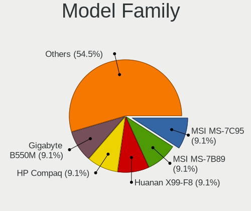
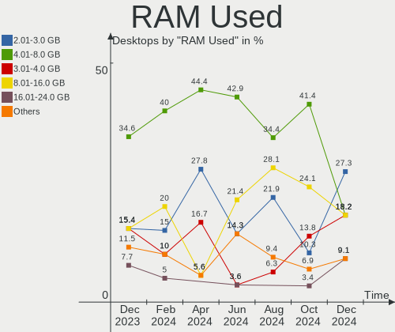
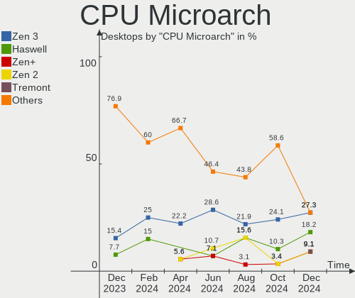
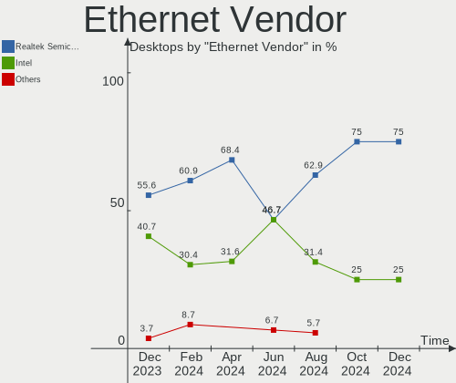
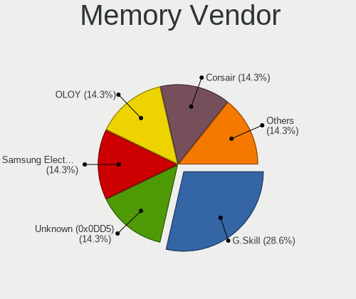

EndeavourOS Hardware Trends (Desktops)
--------------------------------------

A project to identify most popular hardware characteristics and track their change
over time based on data collected by EndeavourOS users at https://Linux-Hardware.org.

Anyone can contribute to this report by the [hw-probe](https://github.com/linuxhw/hw-probe) tool:

    sudo -E hw-probe -all -upload

Full-feature report is available here: https://linux-hardware.org/?view=trends

Period: Feb, 2022.

Contents
--------

* [ System ](#system)
  - [ OS                       ](#os)
  - [ OS Family                ](#os-family)
  - [ Kernel                   ](#kernel)
  - [ Kernel Family            ](#kernel-family)
  - [ Kernel Major Ver.        ](#kernel-major-ver)
  - [ Arch                     ](#arch)
  - [ DE                       ](#de)
  - [ Display Server           ](#display-server)
  - [ Display Manager          ](#display-manager)
  - [ OS Lang                  ](#os-lang)
  - [ Boot Mode                ](#boot-mode)
  - [ Filesystem               ](#filesystem)
  - [ Part. scheme             ](#part-scheme)
  - [ Dual Boot with Linux/BSD ](#dual-boot-with-linuxbsd)
  - [ Dual Boot (Win)          ](#dual-boot-win)

* [ Board ](#board)
  - [ Vendor                   ](#vendor)
  - [ Model                    ](#model)
  - [ Model Family             ](#model-family)
  - [ MFG Year                 ](#mfg-year)
  - [ Form Factor              ](#form-factor)
  - [ Secure Boot              ](#secure-boot)
  - [ Coreboot                 ](#coreboot)
  - [ RAM Size                 ](#ram-size)
  - [ RAM Used                 ](#ram-used)
  - [ Total Drives             ](#total-drives)
  - [ Has CD-ROM               ](#has-cd-rom)
  - [ Has Ethernet             ](#has-ethernet)
  - [ Has WiFi                 ](#has-wifi)
  - [ Has Bluetooth            ](#has-bluetooth)

* [ Location ](#location)
  - [ Country                  ](#country)
  - [ City                     ](#city)

* [ Drives ](#drives)
  - [ Drive Vendor             ](#drive-vendor)
  - [ Drive Model              ](#drive-model)
  - [ HDD Vendor               ](#hdd-vendor)
  - [ SSD Vendor               ](#ssd-vendor)
  - [ Drive Kind               ](#drive-kind)
  - [ Drive Connector          ](#drive-connector)
  - [ Drive Size               ](#drive-size)
  - [ Space Total              ](#space-total)
  - [ Space Used               ](#space-used)
  - [ Malfunc. Drives          ](#malfunc-drives)
  - [ Malfunc. Drive Vendor    ](#malfunc-drive-vendor)
  - [ Malfunc. HDD Vendor      ](#malfunc-hdd-vendor)
  - [ Malfunc. Drive Kind      ](#malfunc-drive-kind)
  - [ Failed Drives            ](#failed-drives)
  - [ Failed Drive Vendor      ](#failed-drive-vendor)
  - [ Drive Status             ](#drive-status)

* [ Storage controller ](#storage-controller)
  - [ Storage Vendor           ](#storage-vendor)
  - [ Storage Model            ](#storage-model)
  - [ Storage Kind             ](#storage-kind)

* [ Processor ](#processor)
  - [ CPU Vendor               ](#cpu-vendor)
  - [ CPU Model                ](#cpu-model)
  - [ CPU Model Family         ](#cpu-model-family)
  - [ CPU Cores                ](#cpu-cores)
  - [ CPU Sockets              ](#cpu-sockets)
  - [ CPU Threads              ](#cpu-threads)
  - [ CPU Op-Modes             ](#cpu-op-modes)
  - [ CPU Microcode            ](#cpu-microcode)
  - [ CPU Microarch            ](#cpu-microarch)

* [ Graphics ](#graphics)
  - [ GPU Vendor               ](#gpu-vendor)
  - [ GPU Model                ](#gpu-model)
  - [ GPU Combo                ](#gpu-combo)
  - [ GPU Driver               ](#gpu-driver)
  - [ GPU Memory               ](#gpu-memory)

* [ Monitor ](#monitor)
  - [ Monitor Vendor           ](#monitor-vendor)
  - [ Monitor Model            ](#monitor-model)
  - [ Monitor Resolution       ](#monitor-resolution)
  - [ Monitor Diagonal         ](#monitor-diagonal)
  - [ Monitor Width            ](#monitor-width)
  - [ Aspect Ratio             ](#aspect-ratio)
  - [ Monitor Area             ](#monitor-area)
  - [ Pixel Density            ](#pixel-density)
  - [ Multiple Monitors        ](#multiple-monitors)

* [ Network ](#network)
  - [ Net Controller Vendor    ](#net-controller-vendor)
  - [ Net Controller Model     ](#net-controller-model)
  - [ Wireless Vendor          ](#wireless-vendor)
  - [ Wireless Model           ](#wireless-model)
  - [ Ethernet Vendor          ](#ethernet-vendor)
  - [ Ethernet Model           ](#ethernet-model)
  - [ Net Controller Kind      ](#net-controller-kind)
  - [ Used Controller          ](#used-controller)
  - [ NICs                     ](#nics)
  - [ IPv6                     ](#ipv6)

* [ Bluetooth ](#bluetooth)
  - [ Bluetooth Vendor         ](#bluetooth-vendor)
  - [ Bluetooth Model          ](#bluetooth-model)

* [ Sound ](#sound)
  - [ Sound Vendor             ](#sound-vendor)
  - [ Sound Model              ](#sound-model)

* [ Memory ](#memory)
  - [ Memory Vendor            ](#memory-vendor)
  - [ Memory Model             ](#memory-model)
  - [ Memory Kind              ](#memory-kind)
  - [ Memory Form Factor       ](#memory-form-factor)
  - [ Memory Size              ](#memory-size)
  - [ Memory Speed             ](#memory-speed)

* [ Printers & scanners ](#printers--scanners)
  - [ Printer Vendor           ](#printer-vendor)
  - [ Printer Model            ](#printer-model)
  - [ Scanner Vendor           ](#scanner-vendor)
  - [ Scanner Model            ](#scanner-model)

* [ Camera ](#camera)
  - [ Camera Vendor            ](#camera-vendor)
  - [ Camera Model             ](#camera-model)

* [ Security ](#security)
  - [ Fingerprint Vendor       ](#fingerprint-vendor)
  - [ Fingerprint Model        ](#fingerprint-model)
  - [ Chipcard Vendor          ](#chipcard-vendor)
  - [ Chipcard Model           ](#chipcard-model)

* [ Unsupported ](#unsupported)
  - [ Unsupported Devices      ](#unsupported-devices)
  - [ Unsupported Device Types ](#unsupported-device-types)

System
------

OS
--

Installed operating systems

| Name                | Desktops | Percent |
|---------------------|----------|---------|
| EndeavourOS Rolling | 9        | 90%     |
| EndeavourOS         | 1        | 10%     |

OS Family
---------

OS without a version

| Name        | Desktops | Percent |
|-------------|----------|---------|
| EndeavourOS | 10       | 100%    |

Kernel
------

Version of the Linux kernel

| Version               | Desktops | Percent |
|-----------------------|----------|---------|
| 5.16.10-arch1-1       | 3        | 30%     |
| 5.17.0-rc4-1-mainline | 1        | 10%     |
| 5.16.7-arch1-1        | 1        | 10%     |
| 5.16.4-242-tkg-pds    | 1        | 10%     |
| 5.16.3-arch1-1        | 1        | 10%     |
| 5.15.8-arch1-1        | 1        | 10%     |
| 5.15.24-246-tkg-pds   | 1        | 10%     |
| 5.15.22-1-lts         | 1        | 10%     |

Kernel Family
-------------

Linux kernel without a distro release

| Version | Desktops | Percent |
|---------|----------|---------|
| 5.16.10 | 3        | 30%     |
| 5.17.0  | 1        | 10%     |
| 5.16.7  | 1        | 10%     |
| 5.16.4  | 1        | 10%     |
| 5.16.3  | 1        | 10%     |
| 5.15.8  | 1        | 10%     |
| 5.15.24 | 1        | 10%     |
| 5.15.22 | 1        | 10%     |

Kernel Major Ver.
-----------------

Linux kernel major version

| Version | Desktops | Percent |
|---------|----------|---------|
| 5.16    | 6        | 60%     |
| 5.15    | 3        | 30%     |
| 5.17    | 1        | 10%     |

Arch
----

OS architecture (x86_64, i586, etc.)

| Name   | Desktops | Percent |
|--------|----------|---------|
| x86_64 | 10       | 100%    |

DE
--

Desktop Environment

| Name     | Desktops | Percent |
|----------|----------|---------|
| KDE5     | 5        | 50%     |
| XFCE     | 2        | 20%     |
| jwm      | 1        | 10%     |
| GNOME    | 1        | 10%     |
| Cinnamon | 1        | 10%     |

Display Server
--------------

X11 or Wayland

| Name | Desktops | Percent |
|------|----------|---------|
| X11  | 10       | 100%    |

Display Manager
---------------

SDDM, LightDM, etc.

| Name    | Desktops | Percent |
|---------|----------|---------|
| SDDM    | 5        | 50%     |
| LightDM | 4        | 40%     |
| Unknown | 1        | 10%     |

OS Lang
-------

Language

| Lang  | Desktops | Percent |
|-------|----------|---------|
| en_US | 6        | 60%     |
| pl_PL | 1        | 10%     |
| it_IT | 1        | 10%     |
| en_HK | 1        | 10%     |
| de_DE | 1        | 10%     |

Boot Mode
---------

EFI or BIOS

| Mode | Desktops | Percent |
|------|----------|---------|
| EFI  | 7        | 70%     |
| BIOS | 3        | 30%     |

Filesystem
----------

Type of filesystem

| Type  | Desktops | Percent |
|-------|----------|---------|
| Btrfs | 6        | 60%     |
| Ext4  | 4        | 40%     |

Part. scheme
------------

Scheme of partitioning

| Type    | Desktops | Percent |
|---------|----------|---------|
| GPT     | 7        | 70%     |
| MBR     | 2        | 20%     |
| Unknown | 1        | 10%     |

Dual Boot with Linux/BSD
------------------------

Hosting more than one Linux/BSD

| Dual boot | Desktops | Percent |
|-----------|----------|---------|
| No        | 7        | 70%     |
| Yes       | 3        | 30%     |

Dual Boot (Win)
---------------

Hosting Linux and Windows

| Dual boot | Desktops | Percent |
|-----------|----------|---------|
| Yes       | 5        | 50%     |
| No        | 5        | 50%     |

Board
-----

Vendor
------

Motherboard manufacturer

| Name                | Desktops | Percent |
|---------------------|----------|---------|
| MSI                 | 3        | 30%     |
| ASUSTek Computer    | 2        | 20%     |
| ASRock              | 2        | 20%     |
| Hewlett-Packard     | 1        | 10%     |
| Gigabyte Technology | 1        | 10%     |
| Dell                | 1        | 10%     |

Model
-----

Motherboard model

| Name                      | Desktops | Percent |
|---------------------------|----------|---------|
| ASRock B450M Pro4         | 2        | 20%     |
| MSI MS-7C37               | 1        | 10%     |
| MSI MS-7C02               | 1        | 10%     |
| MSI MS-7798               | 1        | 10%     |
| HP Z230 Tower Workstation | 1        | 10%     |
| Gigabyte B450 AORUS ELITE | 1        | 10%     |
| Dell XPS 8700             | 1        | 10%     |
| ASUS TUF GAMING X570-PRO  | 1        | 10%     |
| ASUS TUF GAMING X570-PLUS | 1        | 10%     |

Model Family
------------

Motherboard model prefix

| Name          | Desktops | Percent |
|---------------|----------|---------|
| ASUS TUF      | 2        | 20%     |
| ASRock B450M  | 2        | 20%     |
| MSI MS-7C37   | 1        | 10%     |
| MSI MS-7C02   | 1        | 10%     |
| MSI MS-7798   | 1        | 10%     |
| HP Z230       | 1        | 10%     |
| Gigabyte B450 | 1        | 10%     |
| Dell XPS      | 1        | 10%     |

MFG Year
--------

Motherboard manufacture year

| Year | Desktops | Percent |
|------|----------|---------|
| 2018 | 4        | 40%     |
| 2019 | 2        | 20%     |
| 2020 | 1        | 10%     |
| 2014 | 1        | 10%     |
| 2013 | 1        | 10%     |
| 2012 | 1        | 10%     |

Form Factor
-----------

Physical design of the computer

| Name    | Desktops | Percent |
|---------|----------|---------|
| Desktop | 10       | 100%    |

Secure Boot
-----------

Enabled or disabled

| State    | Desktops | Percent |
|----------|----------|---------|
| Disabled | 10       | 100%    |

Coreboot
--------

Have coreboot on board

| Used | Desktops | Percent |
|------|----------|---------|
| No   | 10       | 100%    |

RAM Size
--------

Total RAM memory

| Size in GB  | Desktops | Percent |
|-------------|----------|---------|
| 16.01-24.0  | 4        | 40%     |
| 32.01-64.0  | 3        | 30%     |
| 8.01-16.0   | 2        | 20%     |
| 64.01-256.0 | 1        | 10%     |

RAM Used
--------

Used RAM memory

| Used GB    | Desktops | Percent |
|------------|----------|---------|
| 3.01-4.0   | 4        | 40%     |
| 4.01-8.0   | 2        | 20%     |
| 1.01-2.0   | 2        | 20%     |
| 2.01-3.0   | 1        | 10%     |
| 16.01-24.0 | 1        | 10%     |

Total Drives
------------

Number of drives on board

| Drives | Desktops | Percent |
|--------|----------|---------|
| 5      | 5        | 50%     |
| 3      | 2        | 20%     |
| 4      | 1        | 10%     |
| 2      | 1        | 10%     |
| 1      | 1        | 10%     |

Has CD-ROM
----------

Has CD-ROM on board

| Presented | Desktops | Percent |
|-----------|----------|---------|
| No        | 7        | 70%     |
| Yes       | 3        | 30%     |

Has Ethernet
------------

Has Ethernet on board

| Presented | Desktops | Percent |
|-----------|----------|---------|
| Yes       | 10       | 100%    |

Has WiFi
--------

Has WiFi module

| Presented | Desktops | Percent |
|-----------|----------|---------|
| No        | 6        | 60%     |
| Yes       | 4        | 40%     |

Has Bluetooth
-------------

Has Bluetooth module

| Presented | Desktops | Percent |
|-----------|----------|---------|
| No        | 7        | 70%     |
| Yes       | 3        | 30%     |

Location
--------

Country
-------

Geographic location (country)

| Country   | Desktops | Percent |
|-----------|----------|---------|
| USA       | 4        | 40%     |
| Poland    | 1        | 10%     |
| Italy     | 1        | 10%     |
| Hong Kong | 1        | 10%     |
| Germany   | 1        | 10%     |
| Canada    | 1        | 10%     |
| Belgium   | 1        | 10%     |

City
----

Geographic location (city)

| City       | Desktops | Percent |
|------------|----------|---------|
| Tuen Mun   | 1        | 10%     |
| Toronto    | 1        | 10%     |
| Ringgold   | 1        | 10%     |
| Pipe Creek | 1        | 10%     |
| Paladina   | 1        | 10%     |
| Orlando    | 1        | 10%     |
| Katowice   | 1        | 10%     |
| Jumet      | 1        | 10%     |
| Duisburg   | 1        | 10%     |
| Austin     | 1        | 10%     |

Drives
------

Drive Vendor
------------

Hard drive vendors

| Vendor              | Desktops | Drives | Percent |
|---------------------|----------|--------|---------|
| Samsung Electronics | 7        | 9      | 23.33%  |
| Seagate             | 6        | 7      | 20%     |
| WDC                 | 5        | 7      | 16.67%  |
| Micron Technology   | 2        | 2      | 6.67%   |
| Crucial             | 2        | 2      | 6.67%   |
| Unknown             | 1        | 2      | 3.33%   |
| Toshiba             | 1        | 1      | 3.33%   |
| SPCC                | 1        | 1      | 3.33%   |
| PNY                 | 1        | 1      | 3.33%   |
| PLEXTOR             | 1        | 1      | 3.33%   |
| Kingston            | 1        | 1      | 3.33%   |
| Intel               | 1        | 1      | 3.33%   |
| Corsair             | 1        | 1      | 3.33%   |

Drive Model
-----------

Hard drive models

| Model                               | Desktops | Percent |
|-------------------------------------|----------|---------|
| WDC WD10EZEX-08WN4A0 1TB            | 2        | 5.71%   |
| Seagate ST2000DM006-2DM164 2TB      | 2        | 5.71%   |
| Seagate Expansion+ 2TB              | 2        | 5.71%   |
| Samsung SSD 860 EVO 500GB           | 2        | 5.71%   |
| WDC WDS240G2G0B-00EPW0 240GB SSD    | 1        | 2.86%   |
| WDC WDS100T3X0C-00SJG0 1TB          | 1        | 2.86%   |
| WDC WD20EARS-00MVWB0 2TB            | 1        | 2.86%   |
| WDC WD10EZRX-00L4HB0 1TB            | 1        | 2.86%   |
| WDC WD100EMAZ-00WJTA0 10TB          | 1        | 2.86%   |
| Unknown SD/MMC 16GB                 | 1        | 2.86%   |
| Unknown M.S./M.S.Pro/HG 16GB        | 1        | 2.86%   |
| Toshiba DT01ACA300 3TB              | 1        | 2.86%   |
| SPCC M.2 PCIe SSD 256GB             | 1        | 2.86%   |
| Seagate ST3000DM007-1WY10G 3TB      | 1        | 2.86%   |
| Seagate ST2000DX001-1CM164 2TB      | 1        | 2.86%   |
| Seagate ST2000DM001-1CH164 2TB      | 1        | 2.86%   |
| Samsung SSD 970 EVO Plus 250GB      | 1        | 2.86%   |
| Samsung SSD 970 EVO 500GB           | 1        | 2.86%   |
| Samsung SSD 860 EVO 1TB             | 1        | 2.86%   |
| Samsung SSD 850 PRO 2TB             | 1        | 2.86%   |
| Samsung SSD 840 Series 250GB        | 1        | 2.86%   |
| Samsung NVMe SSD Drive 2TB          | 1        | 2.86%   |
| PNY CS1211 120GB SSD 754D117-551    | 1        | 2.86%   |
| PLEXTOR PX-1TM10PG 1TB              | 1        | 2.86%   |
| Micron 5100_MTFDDAK960TCB 960GB SSD | 1        | 2.86%   |
| Micron 1300_MTFDDAK1T0TDL 1TB SSD   | 1        | 2.86%   |
| Kingston SA400S37120G 120GB SSD     | 1        | 2.86%   |
| Intel SSDSC2KW256G8 256GB           | 1        | 2.86%   |
| Crucial CT240M500SSD1 240GB         | 1        | 2.86%   |
| Crucial CT1050MX300SSD1 1050GB      | 1        | 2.86%   |
| Corsair Force LS SSD 120GB          | 1        | 2.86%   |

HDD Vendor
----------

Hard disk drive vendors

| Vendor  | Desktops | Drives | Percent |
|---------|----------|--------|---------|
| Seagate | 6        | 7      | 54.55%  |
| WDC     | 4        | 5      | 36.36%  |
| Toshiba | 1        | 1      | 9.09%   |

SSD Vendor
----------

Solid state drive vendors

| Vendor              | Desktops | Drives | Percent |
|---------------------|----------|--------|---------|
| Samsung Electronics | 5        | 6      | 35.71%  |
| Micron Technology   | 2        | 2      | 14.29%  |
| Crucial             | 2        | 2      | 14.29%  |
| WDC                 | 1        | 1      | 7.14%   |
| PNY                 | 1        | 1      | 7.14%   |
| Kingston            | 1        | 1      | 7.14%   |
| Intel               | 1        | 1      | 7.14%   |
| Corsair             | 1        | 1      | 7.14%   |

Drive Kind
----------

HDD or SSD

| Kind    | Desktops | Drives | Percent |
|---------|----------|--------|---------|
| SSD     | 9        | 15     | 39.13%  |
| HDD     | 8        | 13     | 34.78%  |
| NVMe    | 5        | 6      | 21.74%  |
| Unknown | 1        | 2      | 4.35%   |

Drive Connector
---------------

SATA, SAS, NVMe, etc.

| Type | Desktops | Drives | Percent |
|------|----------|--------|---------|
| SATA | 10       | 26     | 55.56%  |
| NVMe | 5        | 6      | 27.78%  |
| SAS  | 3        | 4      | 16.67%  |

Drive Size
----------

Size of hard drive

| Size in TB | Desktops | Drives | Percent |
|------------|----------|--------|---------|
| 1.01-2.0   | 7        | 9      | 31.82%  |
| 0.51-1.0   | 6        | 6      | 27.27%  |
| 0.01-0.5   | 6        | 10     | 27.27%  |
| 2.01-3.0   | 2        | 2      | 9.09%   |
| 4.01-10.0  | 1        | 1      | 4.55%   |

Space Total
-----------

Amount of disk space available on the file system

| Size in GB     | Desktops | Percent |
|----------------|----------|---------|
| More than 3000 | 4        | 40%     |
| 2001-3000      | 2        | 20%     |
| 1001-2000      | 2        | 20%     |
| 251-500        | 1        | 10%     |
| 51-100         | 1        | 10%     |

Space Used
----------

Amount of used disk space

| Used GB        | Desktops | Percent |
|----------------|----------|---------|
| 1001-2000      | 3        | 30%     |
| 251-500        | 2        | 20%     |
| 1-20           | 2        | 20%     |
| More than 3000 | 1        | 10%     |
| 2001-3000      | 1        | 10%     |
| 101-250        | 1        | 10%     |

Malfunc. Drives
---------------

Drive models with a malfunction

| Model                          | Desktops | Drives | Percent |
|--------------------------------|----------|--------|---------|
| Crucial CT1050MX300SSD1 1050GB | 1        | 1      | 50%     |
| Corsair Force LS SSD 120GB     | 1        | 1      | 50%     |

Malfunc. Drive Vendor
---------------------

Vendors of faulty drives

| Vendor  | Desktops | Drives | Percent |
|---------|----------|--------|---------|
| Crucial | 1        | 1      | 50%     |
| Corsair | 1        | 1      | 50%     |

Malfunc. HDD Vendor
-------------------

Vendors of faulty HDD drives

Zero info for selected period =(

Malfunc. Drive Kind
-------------------

Kinds of faulty drives

| Kind | Desktops | Drives | Percent |
|------|----------|--------|---------|
| SSD  | 2        | 2      | 100%    |

Failed Drives
-------------

Failed drive models

Zero info for selected period =(

Failed Drive Vendor
-------------------

Failed drive vendors

Zero info for selected period =(

Drive Status
------------

Number of failed and malfunc. drives

| Status   | Desktops | Drives | Percent |
|----------|----------|--------|---------|
| Works    | 9        | 25     | 60%     |
| Detected | 4        | 9      | 26.67%  |
| Malfunc  | 2        | 2      | 13.33%  |

Storage controller
------------------

Storage Vendor
--------------

Storage controller vendors

| Vendor                         | Desktops | Percent |
|--------------------------------|----------|---------|
| AMD                            | 7        | 41.18%  |
| Samsung Electronics            | 3        | 17.65%  |
| Intel                          | 3        | 17.65%  |
| Solid State Storage Technology | 1        | 5.88%   |
| Sandisk                        | 1        | 5.88%   |
| Phison Electronics             | 1        | 5.88%   |
| ASMedia Technology             | 1        | 5.88%   |

Storage Model
-------------

Storage controller models

| Model                                                                          | Desktops | Percent |
|--------------------------------------------------------------------------------|----------|---------|
| AMD FCH SATA Controller [AHCI mode]                                            | 5        | 26.32%  |
| AMD 400 Series Chipset SATA Controller                                         | 4        | 21.05%  |
| Samsung NVMe SSD Controller SM981/PM981/PM983                                  | 3        | 15.79%  |
| Intel 8 Series/C220 Series Chipset Family 6-port SATA Controller 1 [AHCI mode] | 2        | 10.53%  |
| Solid State Storage Non-Volatile memory controller                             | 1        | 5.26%   |
| Sandisk WD Black SN750 / PC SN730 NVMe SSD                                     | 1        | 5.26%   |
| Phison E12 NVMe Controller                                                     | 1        | 5.26%   |
| Intel 7 Series/C210 Series Chipset Family 6-port SATA Controller [AHCI mode]   | 1        | 5.26%   |
| ASMedia ASM1062 Serial ATA Controller                                          | 1        | 5.26%   |

Storage Kind
------------

Kind of storage controller (IDE, SATA, NVMe, SAS, ...)

| Kind | Desktops | Percent |
|------|----------|---------|
| SATA | 10       | 66.67%  |
| NVMe | 5        | 33.33%  |

Processor
---------

CPU Vendor
----------

Processor vendors

| Vendor | Desktops | Percent |
|--------|----------|---------|
| AMD    | 7        | 70%     |
| Intel  | 3        | 30%     |

CPU Model
---------

Processor models

| Model                                       | Desktops | Percent |
|---------------------------------------------|----------|---------|
| Intel Core i7-4790 CPU @ 3.60GHz            | 2        | 20%     |
| AMD Ryzen 7 3800X 8-Core Processor          | 2        | 20%     |
| Intel Xeon CPU E3-1220 V2 @ 3.10GHz         | 1        | 10%     |
| AMD Ryzen 9 5950X 16-Core Processor         | 1        | 10%     |
| AMD Ryzen 7 3700X 8-Core Processor          | 1        | 10%     |
| AMD Ryzen 5 5600G with Radeon Graphics      | 1        | 10%     |
| AMD Ryzen 5 3600 6-Core Processor           | 1        | 10%     |
| AMD Ryzen 5 2400G with Radeon Vega Graphics | 1        | 10%     |

CPU Model Family
----------------

Processor model prefix

| Model         | Desktops | Percent |
|---------------|----------|---------|
| AMD Ryzen 7   | 3        | 30%     |
| AMD Ryzen 5   | 3        | 30%     |
| Intel Core i7 | 2        | 20%     |
| Intel Xeon    | 1        | 10%     |
| AMD Ryzen 9   | 1        | 10%     |

CPU Cores
---------

Number of processor cores

| Number | Desktops | Percent |
|--------|----------|---------|
| 4      | 4        | 40%     |
| 8      | 3        | 30%     |
| 6      | 2        | 20%     |
| 16     | 1        | 10%     |

CPU Sockets
-----------

Number of sockets

| Number | Desktops | Percent |
|--------|----------|---------|
| 1      | 10       | 100%    |

CPU Threads
-----------

Threads per core (Hyper-Threading)

| Number | Desktops | Percent |
|--------|----------|---------|
| 2      | 9        | 90%     |
| 1      | 1        | 10%     |

CPU Op-Modes
------------

CPU Operation Modes (32-bit, 64-bit)

| Op mode        | Desktops | Percent |
|----------------|----------|---------|
| 32-bit, 64-bit | 10       | 100%    |

CPU Microcode
-------------

Microcode number

| Number     | Desktops | Percent |
|------------|----------|---------|
| 0x306c3    | 2        | 20%     |
| 0x08701021 | 2        | 20%     |
| Unknown    | 2        | 20%     |
| 0x306a9    | 1        | 10%     |
| 0x0a50000c | 1        | 10%     |
| 0x0a201016 | 1        | 10%     |
| 0x08101016 | 1        | 10%     |

CPU Microarch
-------------

Microarchitecture

| Name      | Desktops | Percent |
|-----------|----------|---------|
| Zen 2     | 4        | 40%     |
| Zen 3     | 2        | 20%     |
| Haswell   | 2        | 20%     |
| Zen       | 1        | 10%     |
| IvyBridge | 1        | 10%     |

Graphics
--------

GPU Vendor
----------

Vendors of graphics cards

| Vendor | Desktops | Percent |
|--------|----------|---------|
| Nvidia | 6        | 60%     |
| AMD    | 4        | 40%     |

GPU Model
---------

Graphics card models

| Model                                                   | Desktops | Percent |
|---------------------------------------------------------|----------|---------|
| Nvidia GP107 [GeForce GTX 1050 Ti]                      | 3        | 30%     |
| AMD Ellesmere [Radeon RX 470/480/570/570X/580/580X/590] | 2        | 20%     |
| Nvidia TU104 [GeForce RTX 2080 SUPER]                   | 1        | 10%     |
| Nvidia GP104 [GeForce GTX 1070]                         | 1        | 10%     |
| Nvidia GA102 [GeForce RTX 3080]                         | 1        | 10%     |
| AMD Navi 10 [Radeon RX 5600 OEM/5600 XT / 5700/5700 XT] | 1        | 10%     |
| AMD Cezanne                                             | 1        | 10%     |

GPU Combo
---------

Combinations of graphics cards

| Name       | Desktops | Percent |
|------------|----------|---------|
| 1 x Nvidia | 6        | 60%     |
| 1 x AMD    | 4        | 40%     |

GPU Driver
----------

Free vs proprietary

| Driver      | Desktops | Percent |
|-------------|----------|---------|
| Proprietary | 5        | 50%     |
| Free        | 5        | 50%     |

GPU Memory
----------

Total video memory

| Size in GB | Desktops | Percent |
|------------|----------|---------|
| 7.01-8.0   | 4        | 40%     |
| 3.01-4.0   | 3        | 30%     |
| 8.01-16.0  | 1        | 10%     |
| 0.01-0.5   | 1        | 10%     |
| Unknown    | 1        | 10%     |

Monitor
-------

Monitor Vendor
--------------

Monitor vendors

| Vendor              | Desktops | Percent |
|---------------------|----------|---------|
| Samsung Electronics | 3        | 21.43%  |
| Acer                | 3        | 21.43%  |
| Dell                | 2        | 14.29%  |
| Valve               | 1        | 7.14%   |
| Lenovo              | 1        | 7.14%   |
| Iiyama              | 1        | 7.14%   |
| Gigabyte Technology | 1        | 7.14%   |
| CTV                 | 1        | 7.14%   |
| AOC                 | 1        | 7.14%   |

Monitor Model
-------------

Monitor models

| Model                                                             | Desktops | Percent |
|-------------------------------------------------------------------|----------|---------|
| Valve Index HMD VLV91A8                                           | 1        | 7.14%   |
| Samsung Electronics S24F350 SAM0D20 1920x1080 521x293mm 23.5-inch | 1        | 7.14%   |
| Samsung Electronics C27F398 SAM0D45 1920x1080 598x336mm 27.0-inch | 1        | 7.14%   |
| Samsung Electronics C24FG7x SAM0E43 1920x1080 532x304mm 24.1-inch | 1        | 7.14%   |
| Lenovo LEN L24e-20 LEN65DF 1920x1080 527x296mm 23.8-inch          | 1        | 7.14%   |
| Iiyama PL2792Q IVM6637 2560x1440 597x336mm 27.0-inch              | 1        | 7.14%   |
| Gigabyte Technology G27Q GBT2709 2560x1440 598x336mm 27.0-inch    | 1        | 7.14%   |
| Dell S2721D DELA199 2560x1440 597x336mm 27.0-inch                 | 1        | 7.14%   |
| Dell 1704FPV DEL3015 1280x1024 338x270mm 17.0-inch                | 1        | 7.14%   |
| CTV CTV CTV0030 1920x1080 708x398mm 32.0-inch                     | 1        | 7.14%   |
| AOC 27B2 AOC2702 1920x1080 598x336mm 27.0-inch                    | 1        | 7.14%   |
| Acer XB270HU ACR0408 2560x1440 600x340mm 27.2-inch                | 1        | 7.14%   |
| Acer SB220Q ACR06AB 1920x1080 476x268mm 21.5-inch                 | 1        | 7.14%   |
| Acer S200HQL ACR0365 1600x900 432x239mm 19.4-inch                 | 1        | 7.14%   |

Monitor Resolution
------------------

Monitor screen resolution

| Resolution       | Desktops | Percent |
|------------------|----------|---------|
| 1920x1080 (FHD)  | 5        | 35.71%  |
| 2560x1440 (QHD)  | 4        | 28.57%  |
| 3840x2160 (4K)   | 2        | 14.29%  |
| 1600x900 (HD+)   | 1        | 7.14%   |
| 1280x1024 (SXGA) | 1        | 7.14%   |
| Unknown          | 1        | 7.14%   |

Monitor Diagonal
----------------

Diagonal size in inches

| Inches  | Desktops | Percent |
|---------|----------|---------|
| 27      | 5        | 38.46%  |
| 24      | 2        | 15.38%  |
| 32      | 1        | 7.69%   |
| 23      | 1        | 7.69%   |
| 21      | 1        | 7.69%   |
| 19      | 1        | 7.69%   |
| 17      | 1        | 7.69%   |
| Unknown | 1        | 7.69%   |

Monitor Width
-------------

Physical width

| Width in mm | Desktops | Percent |
|-------------|----------|---------|
| 501-600     | 8        | 61.54%  |
| 401-500     | 2        | 15.38%  |
| 701-800     | 1        | 7.69%   |
| 301-350     | 1        | 7.69%   |
| Unknown     | 1        | 7.69%   |

Aspect Ratio
------------

Proportional relationship between the width and the height

| Ratio   | Desktops | Percent |
|---------|----------|---------|
| 16/9    | 10       | 83.33%  |
| 5/4     | 1        | 8.33%   |
| Unknown | 1        | 8.33%   |

Monitor Area
------------

Area in inch²

| Area in inch² | Desktops | Percent |
|----------------|----------|---------|
| 301-350        | 5        | 38.46%  |
| 201-250        | 3        | 23.08%  |
| 351-500        | 1        | 7.69%   |
| 251-300        | 1        | 7.69%   |
| 151-200        | 1        | 7.69%   |
| 141-150        | 1        | 7.69%   |
| Unknown        | 1        | 7.69%   |

Pixel Density
-------------

Pixels per inch

| Density | Desktops | Percent |
|---------|----------|---------|
| 51-100  | 7        | 53.85%  |
| 101-120 | 5        | 38.46%  |
| Unknown | 1        | 7.69%   |

Multiple Monitors
-----------------

Total monitors connected

| Total | Desktops | Percent |
|-------|----------|---------|
| 1     | 7        | 70%     |
| 2     | 2        | 20%     |
| 3     | 1        | 10%     |

Network
-------

Net Controller Vendor
---------------------

Controller vendors

| Vendor                | Desktops | Percent |
|-----------------------|----------|---------|
| Realtek Semiconductor | 8        | 57.14%  |
| Intel                 | 5        | 35.71%  |
| Broadcom              | 1        | 7.14%   |

Net Controller Model
--------------------

Controller models

| Model                                                             | Desktops | Percent |
|-------------------------------------------------------------------|----------|---------|
| Realtek RTL8111/8168/8411 PCI Express Gigabit Ethernet Controller | 8        | 57.14%  |
| Intel Wireless-AC 9260                                            | 1        | 7.14%   |
| Intel Wireless 7265                                               | 1        | 7.14%   |
| Intel Wi-Fi 6 AX200                                               | 1        | 7.14%   |
| Intel Ethernet Controller I225-V                                  | 1        | 7.14%   |
| Intel Ethernet Connection I217-LM                                 | 1        | 7.14%   |
| Broadcom BCM43142 802.11b/g/n                                     | 1        | 7.14%   |

Wireless Vendor
---------------

Wireless vendors

| Vendor   | Desktops | Percent |
|----------|----------|---------|
| Intel    | 3        | 75%     |
| Broadcom | 1        | 25%     |

Wireless Model
--------------

Wireless models

| Model                         | Desktops | Percent |
|-------------------------------|----------|---------|
| Intel Wireless-AC 9260        | 1        | 25%     |
| Intel Wireless 7265           | 1        | 25%     |
| Intel Wi-Fi 6 AX200           | 1        | 25%     |
| Broadcom BCM43142 802.11b/g/n | 1        | 25%     |

Ethernet Vendor
---------------

Ethernet vendors

| Vendor                | Desktops | Percent |
|-----------------------|----------|---------|
| Realtek Semiconductor | 8        | 80%     |
| Intel                 | 2        | 20%     |

Ethernet Model
--------------

Ethernet models

| Model                                                             | Desktops | Percent |
|-------------------------------------------------------------------|----------|---------|
| Realtek RTL8111/8168/8411 PCI Express Gigabit Ethernet Controller | 8        | 80%     |
| Intel Ethernet Controller I225-V                                  | 1        | 10%     |
| Intel Ethernet Connection I217-LM                                 | 1        | 10%     |

Net Controller Kind
-------------------

Ethernet, WiFi or modem

| Kind     | Desktops | Percent |
|----------|----------|---------|
| Ethernet | 10       | 71.43%  |
| WiFi     | 4        | 28.57%  |

Used Controller
---------------

Currently used network controller

| Kind     | Desktops | Percent |
|----------|----------|---------|
| Ethernet | 9        | 90%     |
| WiFi     | 1        | 10%     |

NICs
----

Total network controllers on board

| Total | Desktops | Percent |
|-------|----------|---------|
| 1     | 6        | 60%     |
| 2     | 4        | 40%     |

IPv6
----

IPv6 vs IPv4

| Used | Desktops | Percent |
|------|----------|---------|
| No   | 6        | 60%     |
| Yes  | 4        | 40%     |

Bluetooth
---------

Bluetooth Vendor
----------------

Controller vendors

| Vendor   | Desktops | Percent |
|----------|----------|---------|
| Intel    | 2        | 66.67%  |
| Broadcom | 1        | 33.33%  |

Bluetooth Model
---------------

Controller models

| Model                                    | Desktops | Percent |
|------------------------------------------|----------|---------|
| Intel Wireless-AC 9260 Bluetooth Adapter | 1        | 33.33%  |
| Intel AX200 Bluetooth                    | 1        | 33.33%  |
| Broadcom BCM43142 Bluetooth 4.0          | 1        | 33.33%  |

Sound
-----

Sound Vendor
------------

Sound card vendors

| Vendor              | Desktops | Percent |
|---------------------|----------|---------|
| AMD                 | 7        | 25.93%  |
| Nvidia              | 6        | 22.22%  |
| Intel               | 3        | 11.11%  |
| Valve Software      | 2        | 7.41%   |
| Logitech            | 2        | 7.41%   |
| SteelSeries ApS     | 1        | 3.7%    |
| Sony                | 1        | 3.7%    |
| Solid State System  | 1        | 3.7%    |
| Plantronics         | 1        | 3.7%    |
| Creative Technology | 1        | 3.7%    |
| Corsair             | 1        | 3.7%    |
| C-Media Electronics | 1        | 3.7%    |

Sound Model
-----------

Sound card models

| Model                                                               | Desktops | Percent |
|---------------------------------------------------------------------|----------|---------|
| AMD Starship/Matisse HD Audio Controller                            | 4        | 13.33%  |
| Nvidia GP107GL High Definition Audio Controller                     | 3        | 10%     |
| Valve Software Valve VR Radio & HMD Mic                             | 2        | 6.67%   |
| Intel 8 Series/C220 Series Chipset High Definition Audio Controller | 2        | 6.67%   |
| AMD Family 17h/19h HD Audio Controller                              | 2        | 6.67%   |
| AMD Ellesmere HDMI Audio [Radeon RX 470/480 / 570/580/590]          | 2        | 6.67%   |
| SteelSeries ApS SteelSeries Arctis 5                                | 1        | 3.33%   |
| Sony DualShock 4 [CUH-ZCT2x]                                        | 1        | 3.33%   |
| Solid State System FIFINE K669 Microphone                           | 1        | 3.33%   |
| Plantronics Blackwire 3220 Series                                   | 1        | 3.33%   |
| Nvidia TU104 HD Audio Controller                                    | 1        | 3.33%   |
| Nvidia GP104 High Definition Audio Controller                       | 1        | 3.33%   |
| Nvidia GA102 High Definition Audio Controller                       | 1        | 3.33%   |
| Logitech [G533 Wireless Headset Dongle]                             | 1        | 3.33%   |
| Logitech Logitech USB Microphone                                    | 1        | 3.33%   |
| Intel 7 Series/C216 Chipset Family High Definition Audio Controller | 1        | 3.33%   |
| Creative Technology SB X-Fi Surround 5.1                            | 1        | 3.33%   |
| Corsair VIRTUOSO SE USB Gaming Headset                              | 1        | 3.33%   |
| C-Media Electronics CMI8788 [Oxygen HD Audio]                       | 1        | 3.33%   |
| AMD Renoir Radeon High Definition Audio Controller                  | 1        | 3.33%   |
| AMD Navi 10 HDMI Audio                                              | 1        | 3.33%   |

Memory
------

Memory Vendor
-------------

Memory module vendors

| Vendor            | Desktops | Percent |
|-------------------|----------|---------|
| Kingston          | 4        | 40%     |
| G.Skill           | 3        | 30%     |
| Team              | 2        | 20%     |
| Micron Technology | 1        | 10%     |

Memory Model
------------

Memory module models

| Model                                                 | Desktops | Percent |
|-------------------------------------------------------|----------|---------|
| Team RAM TEAMGROUP-UD4-3200 8GB DIMM DDR4 3733MT/s    | 1        | 9.09%   |
| Team RAM TEAMGROUP-UD4-3000 8GB DIMM DDR4 3067MT/s    | 1        | 9.09%   |
| Micron RAM 8JTF51264AZ-1G6E1 4GB DIMM DDR3 1600MT/s   | 1        | 9.09%   |
| Kingston RAM KF3200C16D4/32GX 32GB DIMM DDR4 3200MT/s | 1        | 9.09%   |
| Kingston RAM K66GKY-MIN 8GB DIMM DDR3 1600MT/s        | 1        | 9.09%   |
| Kingston RAM 9905471-074.A00LF 8GB DIMM DDR3 1600MT/s | 1        | 9.09%   |
| Kingston RAM 9905403-02X.B00LF 4GB DIMM DDR3 1600MT/s | 1        | 9.09%   |
| G.Skill RAM F4-3200C16-8GTZRX 8GB DIMM DDR4 3200MT/s  | 1        | 9.09%   |
| G.Skill RAM F4-3200C16-8GIS 8192MB DIMM DDR4 3200MT/s | 1        | 9.09%   |
| G.Skill RAM F4-2400C17-8GNT 8GB DIMM DDR4 2667MT/s    | 1        | 9.09%   |
| G.Skill RAM F4-2400C15-8GNT 8GB DIMM DDR4 2666MT/s    | 1        | 9.09%   |

Memory Kind
-----------

Memory module kinds

| Kind | Desktops | Percent |
|------|----------|---------|
| DDR4 | 6        | 66.67%  |
| DDR3 | 3        | 33.33%  |

Memory Form Factor
------------------

Physical design of the memory module

| Name | Desktops | Percent |
|------|----------|---------|
| DIMM | 9        | 100%    |

Memory Size
-----------

Memory module size

| Size  | Desktops | Percent |
|-------|----------|---------|
| 8192  | 5        | 50%     |
| 32768 | 2        | 20%     |
| 4096  | 2        | 20%     |
| 16384 | 1        | 10%     |

Memory Speed
------------

Memory module speed

| Speed | Desktops | Percent |
|-------|----------|---------|
| 3200  | 3        | 30%     |
| 1600  | 3        | 30%     |
| 3733  | 1        | 10%     |
| 3067  | 1        | 10%     |
| 2667  | 1        | 10%     |
| 2666  | 1        | 10%     |

Printers & scanners
-------------------

Printer Vendor
--------------

Printer device vendors

Zero info for selected period =(

Printer Model
-------------

Printer device models

Zero info for selected period =(

Scanner Vendor
--------------

Scanner device vendors

Zero info for selected period =(

Scanner Model
-------------

Scanner device models

Zero info for selected period =(

Camera
------

Camera Vendor
-------------

Camera device vendors

| Vendor         | Desktops | Percent |
|----------------|----------|---------|
| Valve Software | 2        | 50%     |
| Microsoft      | 1        | 25%     |
| Logitech       | 1        | 25%     |

Camera Model
------------

Camera device models

| Model                       | Desktops | Percent |
|-----------------------------|----------|---------|
| Valve Software 3D Camera    | 2        | 50%     |
| Microsoft LifeCam VX-5000   | 1        | 25%     |
| Logitech HD Pro Webcam C920 | 1        | 25%     |

Security
--------

Fingerprint Vendor
------------------

Fingerprint sensor vendors

Zero info for selected period =(

Fingerprint Model
-----------------

Fingerprint sensor models

Zero info for selected period =(

Chipcard Vendor
---------------

Chipcard module vendors

Zero info for selected period =(

Chipcard Model
--------------

Chipcard module models

Zero info for selected period =(

Unsupported
-----------

Unsupported Devices
-------------------

Total unsupported devices on board

| Total | Desktops | Percent |
|-------|----------|---------|
| 0     | 9        | 90%     |
| 3     | 1        | 10%     |

Unsupported Device Types
------------------------

Types of unsupported devices

| Type   | Desktops | Percent |
|--------|----------|---------|
| Sound  | 1        | 50%     |
| Camera | 1        | 50%     |

