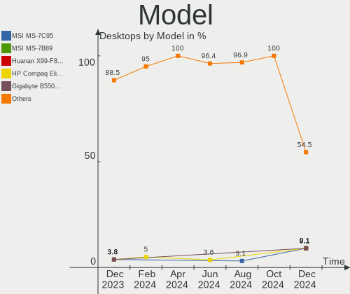
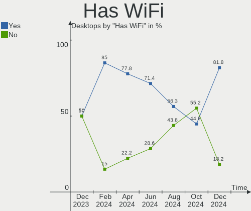
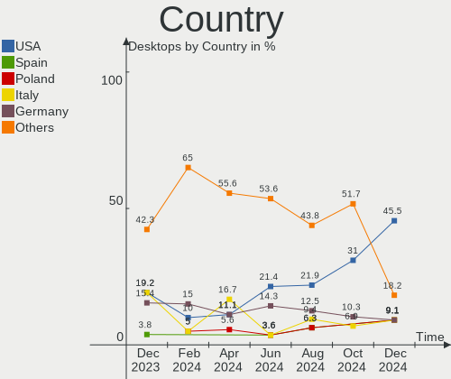
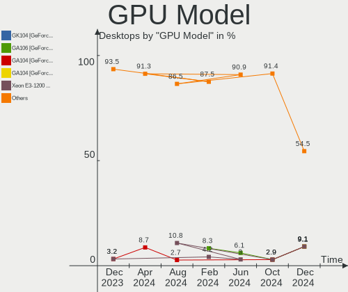
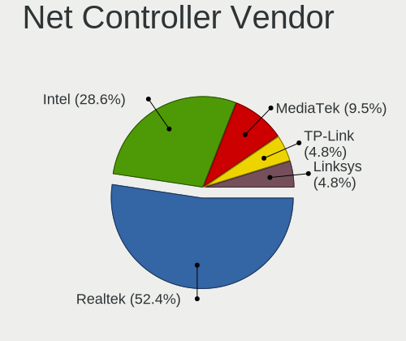
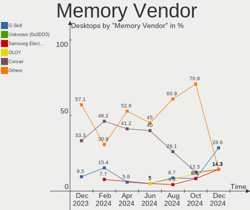

EndeavourOS - Hardware Trends (Desktops)
----------------------------------------

A project to identify most popular hardware characteristics and track their change
over time based on data collected by Linux users at https://Linux-Hardware.org.

Anyone can contribute to this report by the [hw-probe](https://github.com/linuxhw/hw-probe) tool:

    sudo -E hw-probe -all -upload

This report is for one last month. Overall report since the beginning of time: [TestDays](https://github.com/linuxhw/TestDays)

Period: Feb, 2023.

Contents
--------

* [ System ](#system)
  - [ OS                       ](#os)
  - [ OS Family                ](#os-family)
  - [ Kernel                   ](#kernel)
  - [ Kernel Family            ](#kernel-family)
  - [ Kernel Major Ver.        ](#kernel-major-ver)
  - [ Arch                     ](#arch)
  - [ DE                       ](#de)
  - [ Display Server           ](#display-server)
  - [ Display Manager          ](#display-manager)
  - [ OS Lang                  ](#os-lang)
  - [ Boot Mode                ](#boot-mode)
  - [ Filesystem               ](#filesystem)
  - [ Part. scheme             ](#part-scheme)
  - [ Dual Boot with Linux/BSD ](#dual-boot-with-linuxbsd)
  - [ Dual Boot (Win)          ](#dual-boot-win)

* [ Board ](#board)
  - [ Vendor                   ](#vendor)
  - [ Model                    ](#model)
  - [ Model Family             ](#model-family)
  - [ MFG Year                 ](#mfg-year)
  - [ Form Factor              ](#form-factor)
  - [ Secure Boot              ](#secure-boot)
  - [ Coreboot                 ](#coreboot)
  - [ RAM Size                 ](#ram-size)
  - [ RAM Used                 ](#ram-used)
  - [ Total Drives             ](#total-drives)
  - [ Has CD-ROM               ](#has-cd-rom)
  - [ Has Ethernet             ](#has-ethernet)
  - [ Has WiFi                 ](#has-wifi)
  - [ Has Bluetooth            ](#has-bluetooth)

* [ Location ](#location)
  - [ Country                  ](#country)
  - [ City                     ](#city)

* [ Drives ](#drives)
  - [ Drive Vendor             ](#drive-vendor)
  - [ Drive Model              ](#drive-model)
  - [ HDD Vendor               ](#hdd-vendor)
  - [ SSD Vendor               ](#ssd-vendor)
  - [ Drive Kind               ](#drive-kind)
  - [ Drive Connector          ](#drive-connector)
  - [ Drive Size               ](#drive-size)
  - [ Space Total              ](#space-total)
  - [ Space Used               ](#space-used)
  - [ Malfunc. Drives          ](#malfunc-drives)
  - [ Malfunc. Drive Vendor    ](#malfunc-drive-vendor)
  - [ Malfunc. HDD Vendor      ](#malfunc-hdd-vendor)
  - [ Malfunc. Drive Kind      ](#malfunc-drive-kind)
  - [ Failed Drives            ](#failed-drives)
  - [ Failed Drive Vendor      ](#failed-drive-vendor)
  - [ Drive Status             ](#drive-status)

* [ Storage controller ](#storage-controller)
  - [ Storage Vendor           ](#storage-vendor)
  - [ Storage Model            ](#storage-model)
  - [ Storage Kind             ](#storage-kind)

* [ Processor ](#processor)
  - [ CPU Vendor               ](#cpu-vendor)
  - [ CPU Model                ](#cpu-model)
  - [ CPU Model Family         ](#cpu-model-family)
  - [ CPU Cores                ](#cpu-cores)
  - [ CPU Sockets              ](#cpu-sockets)
  - [ CPU Threads              ](#cpu-threads)
  - [ CPU Op-Modes             ](#cpu-op-modes)
  - [ CPU Microcode            ](#cpu-microcode)
  - [ CPU Microarch            ](#cpu-microarch)

* [ Graphics ](#graphics)
  - [ GPU Vendor               ](#gpu-vendor)
  - [ GPU Model                ](#gpu-model)
  - [ GPU Combo                ](#gpu-combo)
  - [ GPU Driver               ](#gpu-driver)
  - [ GPU Memory               ](#gpu-memory)

* [ Monitor ](#monitor)
  - [ Monitor Vendor           ](#monitor-vendor)
  - [ Monitor Model            ](#monitor-model)
  - [ Monitor Resolution       ](#monitor-resolution)
  - [ Monitor Diagonal         ](#monitor-diagonal)
  - [ Monitor Width            ](#monitor-width)
  - [ Aspect Ratio             ](#aspect-ratio)
  - [ Monitor Area             ](#monitor-area)
  - [ Pixel Density            ](#pixel-density)
  - [ Multiple Monitors        ](#multiple-monitors)

* [ Network ](#network)
  - [ Net Controller Vendor    ](#net-controller-vendor)
  - [ Net Controller Model     ](#net-controller-model)
  - [ Wireless Vendor          ](#wireless-vendor)
  - [ Wireless Model           ](#wireless-model)
  - [ Ethernet Vendor          ](#ethernet-vendor)
  - [ Ethernet Model           ](#ethernet-model)
  - [ Net Controller Kind      ](#net-controller-kind)
  - [ Used Controller          ](#used-controller)
  - [ NICs                     ](#nics)
  - [ IPv6                     ](#ipv6)

* [ Bluetooth ](#bluetooth)
  - [ Bluetooth Vendor         ](#bluetooth-vendor)
  - [ Bluetooth Model          ](#bluetooth-model)

* [ Sound ](#sound)
  - [ Sound Vendor             ](#sound-vendor)
  - [ Sound Model              ](#sound-model)

* [ Memory ](#memory)
  - [ Memory Vendor            ](#memory-vendor)
  - [ Memory Model             ](#memory-model)
  - [ Memory Kind              ](#memory-kind)
  - [ Memory Form Factor       ](#memory-form-factor)
  - [ Memory Size              ](#memory-size)
  - [ Memory Speed             ](#memory-speed)

* [ Printers & scanners ](#printers--scanners)
  - [ Printer Vendor           ](#printer-vendor)
  - [ Printer Model            ](#printer-model)
  - [ Scanner Vendor           ](#scanner-vendor)
  - [ Scanner Model            ](#scanner-model)

* [ Camera ](#camera)
  - [ Camera Vendor            ](#camera-vendor)
  - [ Camera Model             ](#camera-model)

* [ Security ](#security)
  - [ Fingerprint Vendor       ](#fingerprint-vendor)
  - [ Fingerprint Model        ](#fingerprint-model)
  - [ Chipcard Vendor          ](#chipcard-vendor)
  - [ Chipcard Model           ](#chipcard-model)

* [ Unsupported ](#unsupported)
  - [ Unsupported Devices      ](#unsupported-devices)
  - [ Unsupported Device Types ](#unsupported-device-types)

System
------

OS
--

Installed operating systems

| Name                | Desktops | Percent |
|---------------------|----------|---------|
| EndeavourOS Rolling | 16       | 100%    |

OS Family
---------

OS without a version

| Name        | Desktops | Percent |
|-------------|----------|---------|
| EndeavourOS | 16       | 100%    |

Kernel
------

Version of the Linux kernel

| Version             | Desktops | Percent |
|---------------------|----------|---------|
| 6.1.12-arch1-1      | 4        | 25%     |
| 6.1.11-arch1-1      | 3        | 18.75%  |
| 6.1.9-arch1-2       | 2        | 12.5%   |
| 6.1.8-arch1-1       | 2        | 12.5%   |
| 6.2.1-zen1-1-zen    | 1        | 6.25%   |
| 6.2.0-rc6-1-amd-git | 1        | 6.25%   |
| 6.1.8-zen1-1-zen    | 1        | 6.25%   |
| 6.0.12-arch1-1      | 1        | 6.25%   |
| 5.15.93-1-lts       | 1        | 6.25%   |

Kernel Family
-------------

Linux kernel without a distro release

| Version | Desktops | Percent |
|---------|----------|---------|
| 6.1.12  | 4        | 25%     |
| 6.1.8   | 3        | 18.75%  |
| 6.1.11  | 3        | 18.75%  |
| 6.1.9   | 2        | 12.5%   |
| 6.2.1   | 1        | 6.25%   |
| 6.2.0   | 1        | 6.25%   |
| 6.0.12  | 1        | 6.25%   |
| 5.15.93 | 1        | 6.25%   |

Kernel Major Ver.
-----------------

Linux kernel major version

| Version | Desktops | Percent |
|---------|----------|---------|
| 6.1     | 12       | 75%     |
| 6.2     | 2        | 12.5%   |
| 6.0     | 1        | 6.25%   |
| 5.15    | 1        | 6.25%   |

Arch
----

OS architecture (x86_64, i586, etc.)

| Name   | Desktops | Percent |
|--------|----------|---------|
| x86_64 | 16       | 100%    |

DE
--

Desktop Environment

| Name   | Desktops | Percent |
|--------|----------|---------|
| XFCE   | 8        | 50%     |
| KDE5   | 5        | 31.25%  |
| i3     | 1        | 6.25%   |
| GNOME  | 1        | 6.25%   |
| Budgie | 1        | 6.25%   |

Display Server
--------------

X11 or Wayland

| Name    | Desktops | Percent |
|---------|----------|---------|
| X11     | 12       | 75%     |
| Tty     | 3        | 18.75%  |
| Unknown | 1        | 6.25%   |

Display Manager
---------------

SDDM, LightDM, etc.

| Name    | Desktops | Percent |
|---------|----------|---------|
| LightDM | 8        | 50%     |
| SDDM    | 5        | 31.25%  |
| Unknown | 2        | 12.5%   |
| GDM     | 1        | 6.25%   |

OS Lang
-------

Language

| Lang  | Desktops | Percent |
|-------|----------|---------|
| en_US | 10       | 62.5%   |
| nl_BE | 1        | 6.25%   |
| it_IT | 1        | 6.25%   |
| en_IN | 1        | 6.25%   |
| en_GB | 1        | 6.25%   |
| en_CA | 1        | 6.25%   |
| de_AT | 1        | 6.25%   |

Boot Mode
---------

EFI or BIOS

| Mode | Desktops | Percent |
|------|----------|---------|
| EFI  | 12       | 75%     |
| BIOS | 4        | 25%     |

Filesystem
----------

Type of filesystem

| Type    | Desktops | Percent |
|---------|----------|---------|
| Ext4    | 11       | 68.75%  |
| Btrfs   | 3        | 18.75%  |
| Overlay | 2        | 12.5%   |

Part. scheme
------------

Scheme of partitioning

| Type    | Desktops | Percent |
|---------|----------|---------|
| GPT     | 14       | 87.5%   |
| MBR     | 1        | 6.25%   |
| Unknown | 1        | 6.25%   |

Dual Boot with Linux/BSD
------------------------

Hosting more than one Linux/BSD

| Dual boot | Desktops | Percent |
|-----------|----------|---------|
| No        | 12       | 75%     |
| Yes       | 4        | 25%     |

Dual Boot (Win)
---------------

Hosting Linux and Windows

| Dual boot | Desktops | Percent |
|-----------|----------|---------|
| Yes       | 8        | 50%     |
| No        | 8        | 50%     |

Board
-----

Vendor
------

Motherboard manufacturer

| Name                                 | Desktops | Percent |
|--------------------------------------|----------|---------|
| ASUSTek Computer                     | 6        | 37.5%   |
| MSI                                  | 4        | 25%     |
| Shenzhen Meigao Electronic Equipment | 1        | 6.25%   |
| Hewlett-Packard                      | 1        | 6.25%   |
| Gigabyte Technology                  | 1        | 6.25%   |
| Dell                                 | 1        | 6.25%   |
| ASRock                               | 1        | 6.25%   |
| Alienware                            | 1        | 6.25%   |

Model
-----

Motherboard model

| Name                                       | Desktops | Percent |
|--------------------------------------------|----------|---------|
| Shenzhen Meigao Electronic Equipment UM690 | 1        | 6.25%   |
| MSI MS-7C56                                | 1        | 6.25%   |
| MSI MS-7C37                                | 1        | 6.25%   |
| MSI MS-7B79                                | 1        | 6.25%   |
| MSI MS-7641                                | 1        | 6.25%   |
| HP EliteDesk 800 G1 TWR                    | 1        | 6.25%   |
| Gigabyte B450M S2H                         | 1        | 6.25%   |
| Dell Vostro 3470                           | 1        | 6.25%   |
| ASUS TUF Gaming Z790-PLUS WIFI D4          | 1        | 6.25%   |
| ASUS ROG STRIX X570-E GAMING               | 1        | 6.25%   |
| ASUS PRIME Z390-P                          | 1        | 6.25%   |
| ASUS PRIME B550M-A                         | 1        | 6.25%   |
| ASUS M32CD_A_F_K20CD_K31CD                 | 1        | 6.25%   |
| ASUS All Series                            | 1        | 6.25%   |
| ASRock B460 Steel Legend                   | 1        | 6.25%   |
| Alienware Aurora R7                        | 1        | 6.25%   |

Model Family
------------

Motherboard model prefix

| Name                                       | Desktops | Percent |
|--------------------------------------------|----------|---------|
| ASUS PRIME                                 | 2        | 12.5%   |
| Shenzhen Meigao Electronic Equipment UM690 | 1        | 6.25%   |
| MSI MS-7C56                                | 1        | 6.25%   |
| MSI MS-7C37                                | 1        | 6.25%   |
| MSI MS-7B79                                | 1        | 6.25%   |
| MSI MS-7641                                | 1        | 6.25%   |
| HP EliteDesk                               | 1        | 6.25%   |
| Gigabyte B450M                             | 1        | 6.25%   |
| Dell Vostro                                | 1        | 6.25%   |
| ASUS TUF                                   | 1        | 6.25%   |
| ASUS ROG                                   | 1        | 6.25%   |
| ASUS M32CD                                 | 1        | 6.25%   |
| ASUS All                                   | 1        | 6.25%   |
| ASRock B460                                | 1        | 6.25%   |
| Alienware Aurora                           | 1        | 6.25%   |

MFG Year
--------

Motherboard manufacture year

| Year | Desktops | Percent |
|------|----------|---------|
| 2018 | 5        | 31.25%  |
| 2020 | 3        | 18.75%  |
| 2019 | 3        | 18.75%  |
| 2022 | 2        | 12.5%   |
| 2013 | 2        | 12.5%   |
| 2015 | 1        | 6.25%   |

Form Factor
-----------

Physical design of the computer

| Name    | Desktops | Percent |
|---------|----------|---------|
| Desktop | 16       | 100%    |

Secure Boot
-----------

Enabled or disabled

| State    | Desktops | Percent |
|----------|----------|---------|
| Disabled | 16       | 100%    |

Coreboot
--------

Have coreboot on board

| Used | Desktops | Percent |
|------|----------|---------|
| No   | 16       | 100%    |

RAM Size
--------

Total RAM memory

| Size in GB  | Desktops | Percent |
|-------------|----------|---------|
| 32.01-64.0  | 6        | 37.5%   |
| 16.01-24.0  | 6        | 37.5%   |
| 4.01-8.0    | 2        | 12.5%   |
| 64.01-256.0 | 1        | 6.25%   |
| 8.01-16.0   | 1        | 6.25%   |

RAM Used
--------

Used RAM memory

| Used GB   | Desktops | Percent |
|-----------|----------|---------|
| 4.01-8.0  | 4        | 25%     |
| 2.01-3.0  | 4        | 25%     |
| 1.01-2.0  | 4        | 25%     |
| 3.01-4.0  | 3        | 18.75%  |
| 8.01-16.0 | 1        | 6.25%   |

Total Drives
------------

Number of drives on board

| Drives | Desktops | Percent |
|--------|----------|---------|
| 2      | 7        | 43.75%  |
| 1      | 4        | 25%     |
| 5      | 2        | 12.5%   |
| 3      | 2        | 12.5%   |
| 7      | 1        | 6.25%   |

Has CD-ROM
----------

Has CD-ROM on board

| Presented | Desktops | Percent |
|-----------|----------|---------|
| No        | 13       | 81.25%  |
| Yes       | 3        | 18.75%  |

Has Ethernet
------------

Has Ethernet on board

| Presented | Desktops | Percent |
|-----------|----------|---------|
| Yes       | 16       | 100%    |

Has WiFi
--------

Has WiFi module

| Presented | Desktops | Percent |
|-----------|----------|---------|
| Yes       | 11       | 68.75%  |
| No        | 5        | 31.25%  |

Has Bluetooth
-------------

Has Bluetooth module

| Presented | Desktops | Percent |
|-----------|----------|---------|
| Yes       | 11       | 68.75%  |
| No        | 5        | 31.25%  |

Location
--------

Country
-------

Geographic location (country)

| Country     | Desktops | Percent |
|-------------|----------|---------|
| USA         | 5        | 31.25%  |
| Italy       | 4        | 25%     |
| Sweden      | 1        | 6.25%   |
| Romania     | 1        | 6.25%   |
| Netherlands | 1        | 6.25%   |
| India       | 1        | 6.25%   |
| Canada      | 1        | 6.25%   |
| Belgium     | 1        | 6.25%   |
| Austria     | 1        | 6.25%   |

City
----

Geographic location (city)

| City              | Desktops | Percent |
|-------------------|----------|---------|
| Westminster       | 1        | 6.25%   |
| Voluntari         | 1        | 6.25%   |
| Skellefteå       | 1        | 6.25%   |
| Sevierville       | 1        | 6.25%   |
| Selvazzano Dentro | 1        | 6.25%   |
| Naples            | 1        | 6.25%   |
| Miami             | 1        | 6.25%   |
| Laval             | 1        | 6.25%   |
| Lancaster         | 1        | 6.25%   |
| Koblach           | 1        | 6.25%   |
| Hyderabad         | 1        | 6.25%   |
| Houston           | 1        | 6.25%   |
| Casalserugo       | 1        | 6.25%   |
| Arezzo            | 1        | 6.25%   |
| Antwerp           | 1        | 6.25%   |
| Amsterdam         | 1        | 6.25%   |

Drives
------

Drive Vendor
------------

Hard drive vendors

| Vendor                      | Desktops | Drives | Percent |
|-----------------------------|----------|--------|---------|
| Seagate                     | 7        | 9      | 19.44%  |
| Samsung Electronics         | 4        | 5      | 11.11%  |
| WDC                         | 3        | 5      | 8.33%   |
| Toshiba                     | 3        | 3      | 8.33%   |
| SanDisk                     | 3        | 3      | 8.33%   |
| Crucial                     | 3        | 3      | 8.33%   |
| Phison Electronics          | 2        | 2      | 5.56%   |
| Kingston                    | 2        | 2      | 5.56%   |
| Timetec                     | 1        | 1      | 2.78%   |
| Patriot                     | 1        | 1      | 2.78%   |
| Micron/Crucial Technology   | 1        | 1      | 2.78%   |
| Micron Technology           | 1        | 1      | 2.78%   |
| Kingston Technology Company | 1        | 1      | 2.78%   |
| Intel                       | 1        | 1      | 2.78%   |
| HGST                        | 1        | 1      | 2.78%   |
| Emtec                       | 1        | 1      | 2.78%   |
| ADATA Technology            | 1        | 1      | 2.78%   |

Drive Model
-----------

Hard drive models

| Model                                  | Desktops | Percent |
|----------------------------------------|----------|---------|
| Seagate ST2000DM008-2FR102 2TB         | 3        | 7.69%   |
| Seagate ST1000DM010-2EP102 1TB         | 2        | 5.13%   |
| Kingston SA400S37240G 240GB SSD        | 2        | 5.13%   |
| WDC WDS240G2G0B-00EPW0 240GB SSD       | 1        | 2.56%   |
| WDC WDS120G2G0B-00EPW0 120GB SSD       | 1        | 2.56%   |
| WDC WD20EZRZ-00Z5HB0 2TB               | 1        | 2.56%   |
| WDC WD20EARS-42S0XB0 2TB               | 1        | 2.56%   |
| Toshiba MQ01ACF032 320GB               | 1        | 2.56%   |
| Toshiba KXG50ZNV256G NVMe 256GB        | 1        | 2.56%   |
| Toshiba DT01ACA200 2TB                 | 1        | 2.56%   |
| Timetec MS05 256GB SSD                 | 1        | 2.56%   |
| Seagate ST500LM021-1KJ152 500GB        | 1        | 2.56%   |
| Seagate ST2000DM001-1ER164 2TB         | 1        | 2.56%   |
| Seagate ST1000LM035-1RK172 1TB         | 1        | 2.56%   |
| Sandisk WD Blue SN550 NVMe SSD 1TB     | 1        | 2.56%   |
| SanDisk SSD PLUS 2000GB                | 1        | 2.56%   |
| SanDisk SDSSDA240G 240GB               | 1        | 2.56%   |
| Samsung SSD 990 PRO 1TB                | 1        | 2.56%   |
| Samsung SSD 870 EVO 1TB                | 1        | 2.56%   |
| Samsung SSD 860 EVO 250GB              | 1        | 2.56%   |
| Samsung SSD 860 EVO 1TB                | 1        | 2.56%   |
| Samsung HD256GJ 250GB                  | 1        | 2.56%   |
| Phison E16 PCIe4 NVMe Controller 512GB | 1        | 2.56%   |
| Phison Corsair MP600 PRO 2TB           | 1        | 2.56%   |
| Patriot Burst 240GB SSD                | 1        | 2.56%   |
| Micron/Crucial P2 NVMe PCIe SSD 1TB    | 1        | 2.56%   |
| Micron CT1000P5SSD8 1TB                | 1        | 2.56%   |
| Kingston Company A2000 NVMe SSD 250GB  | 1        | 2.56%   |
| Intel SSD 660P Series 1024GB           | 1        | 2.56%   |
| HGST HTS545050A7E680 500GB             | 1        | 2.56%   |
| Emtec X150 480GB SSD                   | 1        | 2.56%   |
| Crucial CT500MX500SSD1 500GB           | 1        | 2.56%   |
| Crucial CT480BX500SSD1 480GB           | 1        | 2.56%   |
| Crucial CT240BX500SSD1 240GB           | 1        | 2.56%   |
| ADATA XPG GAMMIX S70 BLADE 1024GB      | 1        | 2.56%   |

HDD Vendor
----------

Hard disk drive vendors

| Vendor              | Desktops | Drives | Percent |
|---------------------|----------|--------|---------|
| Seagate             | 7        | 9      | 53.85%  |
| WDC                 | 2        | 3      | 15.38%  |
| Toshiba             | 2        | 2      | 15.38%  |
| Samsung Electronics | 1        | 1      | 7.69%   |
| HGST                | 1        | 1      | 7.69%   |

SSD Vendor
----------

Solid state drive vendors

| Vendor              | Desktops | Drives | Percent |
|---------------------|----------|--------|---------|
| Crucial             | 3        | 3      | 21.43%  |
| WDC                 | 2        | 2      | 14.29%  |
| SanDisk             | 2        | 2      | 14.29%  |
| Samsung Electronics | 2        | 3      | 14.29%  |
| Kingston            | 2        | 2      | 14.29%  |
| Timetec             | 1        | 1      | 7.14%   |
| Patriot             | 1        | 1      | 7.14%   |
| Emtec               | 1        | 1      | 7.14%   |

Drive Kind
----------

HDD or SSD

| Kind | Desktops | Drives | Percent |
|------|----------|--------|---------|
| HDD  | 11       | 16     | 36.67%  |
| SSD  | 10       | 15     | 33.33%  |
| NVMe | 9        | 10     | 30%     |

Drive Connector
---------------

SATA, SAS, NVMe, etc.

| Type | Desktops | Drives | Percent |
|------|----------|--------|---------|
| SATA | 13       | 31     | 59.09%  |
| NVMe | 9        | 10     | 40.91%  |

Drive Size
----------

Size of hard drive

| Size in TB | Desktops | Drives | Percent |
|------------|----------|--------|---------|
| 0.01-0.5   | 8        | 16     | 44.44%  |
| 1.01-2.0   | 6        | 9      | 33.33%  |
| 0.51-1.0   | 4        | 6      | 22.22%  |

Space Total
-----------

Amount of disk space available on the file system

| Size in GB     | Desktops | Percent |
|----------------|----------|---------|
| 501-1000       | 4        | 25%     |
| 101-250        | 3        | 18.75%  |
| More than 3000 | 2        | 12.5%   |
| 2001-3000      | 2        | 12.5%   |
| 1001-2000      | 2        | 12.5%   |
| 21-50          | 1        | 6.25%   |
| 1-20           | 1        | 6.25%   |
| 51-100         | 1        | 6.25%   |

Space Used
----------

Amount of used disk space

| Used GB        | Desktops | Percent |
|----------------|----------|---------|
| 1-20           | 4        | 25%     |
| 1001-2000      | 3        | 18.75%  |
| 21-50          | 2        | 12.5%   |
| 101-250        | 2        | 12.5%   |
| 501-1000       | 2        | 12.5%   |
| More than 3000 | 1        | 6.25%   |
| 251-500        | 1        | 6.25%   |
| 51-100         | 1        | 6.25%   |

Malfunc. Drives
---------------

Drive models with a malfunction

| Model                           | Desktops | Drives | Percent |
|---------------------------------|----------|--------|---------|
| Seagate ST500LM021-1KJ152 500GB | 1        | 1      | 33.33%  |
| Seagate ST2000DM001-1ER164 2TB  | 1        | 1      | 33.33%  |
| HGST HTS545050A7E680 500GB      | 1        | 1      | 33.33%  |

Malfunc. Drive Vendor
---------------------

Vendors of faulty drives

| Vendor  | Desktops | Drives | Percent |
|---------|----------|--------|---------|
| Seagate | 2        | 2      | 66.67%  |
| HGST    | 1        | 1      | 33.33%  |

Malfunc. HDD Vendor
-------------------

Vendors of faulty HDD drives

| Vendor  | Desktops | Drives | Percent |
|---------|----------|--------|---------|
| Seagate | 2        | 2      | 66.67%  |
| HGST    | 1        | 1      | 33.33%  |

Malfunc. Drive Kind
-------------------

Kinds of faulty drives

| Kind | Desktops | Drives | Percent |
|------|----------|--------|---------|
| HDD  | 3        | 3      | 100%    |

Failed Drives
-------------

Failed drive models

Zero info for selected period =(

Failed Drive Vendor
-------------------

Failed drive vendors

Zero info for selected period =(

Drive Status
------------

Number of failed and malfunc. drives

| Status   | Desktops | Drives | Percent |
|----------|----------|--------|---------|
| Works    | 15       | 35     | 78.95%  |
| Malfunc  | 3        | 3      | 15.79%  |
| Detected | 1        | 3      | 5.26%   |

Storage controller
------------------

Storage Vendor
--------------

Storage controller vendors

| Vendor                       | Desktops | Percent |
|------------------------------|----------|---------|
| Intel                        | 8        | 29.63%  |
| AMD                          | 7        | 25.93%  |
| ASMedia Technology           | 3        | 11.11%  |
| Phison Electronics           | 2        | 7.41%   |
| Toshiba America Info Systems | 1        | 3.7%    |
| SanDisk                      | 1        | 3.7%    |
| Samsung Electronics          | 1        | 3.7%    |
| Micron/Crucial Technology    | 1        | 3.7%    |
| Micron Technology            | 1        | 3.7%    |
| Kingston Technology Company  | 1        | 3.7%    |
| ADATA Technology             | 1        | 3.7%    |

Storage Model
-------------

Storage controller models

| Model                                                                          | Desktops | Percent |
|--------------------------------------------------------------------------------|----------|---------|
| AMD FCH SATA Controller [AHCI mode]                                            | 3        | 9.68%   |
| Intel Cannon Lake PCH SATA AHCI Controller                                     | 2        | 6.45%   |
| ASMedia ASM1062 Serial ATA Controller                                          | 2        | 6.45%   |
| AMD 500 Series Chipset SATA Controller                                         | 2        | 6.45%   |
| AMD 400 Series Chipset SATA Controller                                         | 2        | 6.45%   |
| Toshiba America Info Systems XG5 NVMe SSD Controller                           | 1        | 3.23%   |
| SanDisk WD Blue SN550 NVMe SSD                                                 | 1        | 3.23%   |
| Samsung Electronics Non-Volatile memory controller                             | 1        | 3.23%   |
| Phison E18 PCIe4 NVMe Controller                                               | 1        | 3.23%   |
| Phison E16 PCIe4 NVMe Controller                                               | 1        | 3.23%   |
| Micron/Crucial P2 NVMe PCIe SSD                                                | 1        | 3.23%   |
| Micron Non-Volatile memory controller                                          | 1        | 3.23%   |
| Kingston Company A2000 NVMe SSD                                                | 1        | 3.23%   |
| Intel Volume Management Device NVMe RAID Controller                            | 1        | 3.23%   |
| Intel SSD 660P Series                                                          | 1        | 3.23%   |
| Intel SATA controller                                                          | 1        | 3.23%   |
| Intel Q170/Q150/B150/H170/H110/Z170/CM236 Chipset SATA Controller [AHCI Mode]  | 1        | 3.23%   |
| Intel 9 Series Chipset Family SATA Controller [AHCI Mode]                      | 1        | 3.23%   |
| Intel 8 Series/C220 Series Chipset Family 6-port SATA Controller 1 [AHCI mode] | 1        | 3.23%   |
| Intel 400 Series Chipset Family SATA AHCI Controller                           | 1        | 3.23%   |
| Intel 200 Series PCH SATA controller [AHCI mode]                               | 1        | 3.23%   |
| ASMedia ASM1061 SATA IDE Controller                                            | 1        | 3.23%   |
| AMD SB7x0/SB8x0/SB9x0 SATA Controller [IDE mode]                               | 1        | 3.23%   |
| AMD SB7x0/SB8x0/SB9x0 IDE Controller                                           | 1        | 3.23%   |
| ADATA A Non-Volatile memory controller                                         | 1        | 3.23%   |

Storage Kind
------------

Kind of storage controller (IDE, SATA, NVMe, SAS, ...)

| Kind | Desktops | Percent |
|------|----------|---------|
| SATA | 15       | 57.69%  |
| NVMe | 9        | 34.62%  |
| RAID | 1        | 3.85%   |
| IDE  | 1        | 3.85%   |

Processor
---------

CPU Vendor
----------

Processor vendors

| Vendor | Desktops | Percent |
|--------|----------|---------|
| Intel  | 8        | 50%     |
| AMD    | 8        | 50%     |

CPU Model
---------

Processor models

| Model                                   | Desktops | Percent |
|-----------------------------------------|----------|---------|
| AMD Ryzen 7 5800X 8-Core Processor      | 2        | 12.5%   |
| AMD Ryzen 7 3700X 8-Core Processor      | 2        | 12.5%   |
| Intel Core i7-8700 CPU @ 3.20GHz        | 1        | 6.25%   |
| Intel Core i7-6700 CPU @ 3.40GHz        | 1        | 6.25%   |
| Intel Core i7-4790 CPU @ 3.60GHz        | 1        | 6.25%   |
| Intel Core i7-10700K CPU @ 3.80GHz      | 1        | 6.25%   |
| Intel Core i5-9600KF CPU @ 3.70GHz      | 1        | 6.25%   |
| Intel Core i5-4690K CPU @ 3.50GHz       | 1        | 6.25%   |
| Intel Core i3-9100 CPU @ 3.60GHz        | 1        | 6.25%   |
| Intel 12th Gen Core i9-12900K           | 1        | 6.25%   |
| AMD Ryzen 9 6900HX with Radeon Graphics | 1        | 6.25%   |
| AMD Ryzen 5 5600X 6-Core Processor      | 1        | 6.25%   |
| AMD Ryzen 5 2600X Six-Core Processor    | 1        | 6.25%   |
| AMD FX-6300 Six-Core Processor          | 1        | 6.25%   |

CPU Model Family
----------------

Processor model prefix

| Model         | Desktops | Percent |
|---------------|----------|---------|
| Intel Core i7 | 4        | 25%     |
| AMD Ryzen 7   | 4        | 25%     |
| Intel Core i5 | 2        | 12.5%   |
| AMD Ryzen 5   | 2        | 12.5%   |
| Other         | 1        | 6.25%   |
| Intel Core i3 | 1        | 6.25%   |
| AMD Ryzen 9   | 1        | 6.25%   |
| AMD FX        | 1        | 6.25%   |

CPU Cores
---------

Number of processor cores

| Number | Desktops | Percent |
|--------|----------|---------|
| 8      | 6        | 37.5%   |
| 6      | 4        | 25%     |
| 4      | 4        | 25%     |
| 16     | 1        | 6.25%   |
| 3      | 1        | 6.25%   |

CPU Sockets
-----------

Number of sockets

| Number | Desktops | Percent |
|--------|----------|---------|
| 1      | 16       | 100%    |

CPU Threads
-----------

Threads per core (Hyper-Threading)

| Number | Desktops | Percent |
|--------|----------|---------|
| 2      | 13       | 81.25%  |
| 1      | 3        | 18.75%  |

CPU Op-Modes
------------

CPU Operation Modes (32-bit, 64-bit)

| Op mode        | Desktops | Percent |
|----------------|----------|---------|
| 32-bit, 64-bit | 16       | 100%    |

CPU Microcode
-------------

Microcode number

| Number     | Desktops | Percent |
|------------|----------|---------|
| Unknown    | 4        | 25%     |
| 0x0a201009 | 2        | 12.5%   |
| 0xa0655    | 1        | 6.25%   |
| 0x906eb    | 1        | 6.25%   |
| 0x906ea    | 1        | 6.25%   |
| 0x306c3    | 1        | 6.25%   |
| 0x0a404102 | 1        | 6.25%   |
| 0x0a201016 | 1        | 6.25%   |
| 0x08701021 | 1        | 6.25%   |
| 0x08701013 | 1        | 6.25%   |
| 0x0800820d | 1        | 6.25%   |
| 0x0600081c | 1        | 6.25%   |

CPU Microarch
-------------

Microarchitecture

| Name             | Desktops | Percent |
|------------------|----------|---------|
| Zen 3            | 3        | 18.75%  |
| KabyLake         | 3        | 18.75%  |
| Zen 2            | 2        | 12.5%   |
| Haswell          | 2        | 12.5%   |
| Zen+             | 1        | 6.25%   |
| Skylake          | 1        | 6.25%   |
| Piledriver       | 1        | 6.25%   |
| CometLake        | 1        | 6.25%   |
| Alderlake Hybrid | 1        | 6.25%   |
| Unknown          | 1        | 6.25%   |

Graphics
--------

GPU Vendor
----------

Vendors of graphics cards

| Vendor | Desktops | Percent |
|--------|----------|---------|
| Nvidia | 11       | 61.11%  |
| AMD    | 4        | 22.22%  |
| Intel  | 3        | 16.67%  |

GPU Model
---------

Graphics card models

| Model                                                                       | Desktops | Percent |
|-----------------------------------------------------------------------------|----------|---------|
| Intel CoffeeLake-S GT2 [UHD Graphics 630]                                   | 2        | 10.53%  |
| Nvidia TU116 [GeForce GTX 1660 SUPER]                                       | 1        | 5.26%   |
| Nvidia TU116 [GeForce GTX 1650 SUPER]                                       | 1        | 5.26%   |
| Nvidia TU106 [GeForce RTX 2070]                                             | 1        | 5.26%   |
| Nvidia TU106 [GeForce RTX 2060 SUPER]                                       | 1        | 5.26%   |
| Nvidia TU104 [GeForce RTX 2080 SUPER]                                       | 1        | 5.26%   |
| Nvidia TU104 [GeForce RTX 2070 SUPER]                                       | 1        | 5.26%   |
| Nvidia GP107 [GeForce GTX 1050 Ti]                                          | 1        | 5.26%   |
| Nvidia GP106 [GeForce GTX 1060 6GB]                                         | 1        | 5.26%   |
| Nvidia GP104 [GeForce GTX 1070 Ti]                                          | 1        | 5.26%   |
| Nvidia GM107 [GeForce GTX 750]                                              | 1        | 5.26%   |
| Nvidia GA106 [GeForce RTX 3060 Lite Hash Rate]                              | 1        | 5.26%   |
| Intel Xeon E3-1200 v3/4th Gen Core Processor Integrated Graphics Controller | 1        | 5.26%   |
| AMD RS780L [Radeon 3000]                                                    | 1        | 5.26%   |
| AMD Rembrandt [Radeon 680M]                                                 | 1        | 5.26%   |
| AMD Navi 24 [Radeon RX 6400/6500 XT/6500M]                                  | 1        | 5.26%   |
| AMD Navi 21 [Radeon RX 6800/6800 XT / 6900 XT]                              | 1        | 5.26%   |
| AMD Lexa PRO [Radeon 540/540X/550/550X / RX 540X/550/550X]                  | 1        | 5.26%   |

GPU Combo
---------

Combinations of graphics cards

| Name           | Desktops | Percent |
|----------------|----------|---------|
| 1 x Nvidia     | 9        | 56.25%  |
| 1 x AMD        | 3        | 18.75%  |
| 2 x Nvidia     | 1        | 6.25%   |
| Intel + Nvidia | 1        | 6.25%   |
| Intel + AMD    | 1        | 6.25%   |
| 1 x Intel      | 1        | 6.25%   |

GPU Driver
----------

Free vs proprietary

| Driver      | Desktops | Percent |
|-------------|----------|---------|
| Proprietary | 9        | 56.25%  |
| Free        | 7        | 43.75%  |

GPU Memory
----------

Total video memory

| Size in GB | Desktops | Percent |
|------------|----------|---------|
| 7.01-8.0   | 5        | 31.25%  |
| 3.01-4.0   | 3        | 18.75%  |
| 5.01-6.0   | 2        | 12.5%   |
| 8.01-16.0  | 2        | 12.5%   |
| Unknown    | 2        | 12.5%   |
| 1.01-2.0   | 1        | 6.25%   |
| 0.01-0.5   | 1        | 6.25%   |

Monitor
-------

Monitor Vendor
--------------

Monitor vendors

| Vendor               | Desktops | Percent |
|----------------------|----------|---------|
| Ancor Communications | 3        | 16.67%  |
| Hewlett-Packard      | 2        | 11.11%  |
| Goldstar             | 2        | 11.11%  |
| AOC                  | 2        | 11.11%  |
| Acer                 | 2        | 11.11%  |
| Samsung Electronics  | 1        | 5.56%   |
| Philips              | 1        | 5.56%   |
| OLT                  | 1        | 5.56%   |
| Microstep            | 1        | 5.56%   |
| LG Electronics       | 1        | 5.56%   |
| Dell                 | 1        | 5.56%   |
| ASUSTek Computer     | 1        | 5.56%   |

Monitor Model
-------------

Monitor models

| Model                                                                 | Desktops | Percent |
|-----------------------------------------------------------------------|----------|---------|
| Samsung Electronics QBQ90 SAM71F8 3840x2160 1872x1053mm 84.6-inch     | 1        | 4.76%   |
| Philips PHL 322E1 PHLC20F 1920x1080 698x393mm 31.5-inch               | 1        | 4.76%   |
| OLT MR17F10N OLT2DC6 1280x1024 338x270mm 17.0-inch                    | 1        | 4.76%   |
| Microstep LCD Monitor MSI MAG271CQR 2560x1440                         | 1        | 4.76%   |
| LG Electronics LCD Monitor LG ULTRAGEAR 1920x1080                     | 1        | 4.76%   |
| Hewlett-Packard S1933 HWP2933 1366x768 413x234mm 18.7-inch            | 1        | 4.76%   |
| Hewlett-Packard E272q HWP326B 2560x1440 597x336mm 27.0-inch           | 1        | 4.76%   |
| Hewlett-Packard E272q HWP326A 2560x1440 597x336mm 27.0-inch           | 1        | 4.76%   |
| Goldstar ULTRAGEAR GSM5B73 1920x1080 531x298mm 24.0-inch              | 1        | 4.76%   |
| Goldstar MP59G GSM5B34 1920x1080 480x270mm 21.7-inch                  | 1        | 4.76%   |
| Dell LCD Monitor E2414H 3840x1080                                     | 1        | 4.76%   |
| Dell LCD Monitor E2414H                                               | 1        | 4.76%   |
| ASUSTek Computer VG248 AUS24C2 1920x1080 531x299mm 24.0-inch          | 1        | 4.76%   |
| ASUSTek Computer VG248 AUS24AC 1920x1080 531x299mm 24.0-inch          | 1        | 4.76%   |
| AOC Q3279WG5B AOC3279 2560x1440 725x428mm 33.1-inch                   | 1        | 4.76%   |
| AOC AG273QG3R3B AOC2730 2560x1440 597x336mm 27.0-inch                 | 1        | 4.76%   |
| Ancor Communications VG248 ACI24A4 1920x1080 531x299mm 24.0-inch      | 1        | 4.76%   |
| Ancor Communications ASUS VS228 ACI22FD 1920x1080 476x268mm 21.5-inch | 1        | 4.76%   |
| Ancor Communications ASUS ET20 ACI1701 1600x900 443x249mm 20.0-inch   | 1        | 4.76%   |
| Acer VG240Y ACR0673 1920x1080 527x296mm 23.8-inch                     | 1        | 4.76%   |
| Acer SA220Q ACR057D 1920x1080 476x268mm 21.5-inch                     | 1        | 4.76%   |

Monitor Resolution
------------------

Monitor screen resolution

| Resolution       | Desktops | Percent |
|------------------|----------|---------|
| 1920x1080 (FHD)  | 8        | 44.44%  |
| 2560x1440 (QHD)  | 4        | 22.22%  |
| 3840x2160 (4K)   | 1        | 5.56%   |
| 3840x1080        | 1        | 5.56%   |
| 1600x900 (HD+)   | 1        | 5.56%   |
| 1366x768 (WXGA)  | 1        | 5.56%   |
| 1280x1024 (SXGA) | 1        | 5.56%   |
| Unknown          | 1        | 5.56%   |

Monitor Diagonal
----------------

Diagonal size in inches

| Inches  | Desktops | Percent |
|---------|----------|---------|
| 24      | 4        | 22.22%  |
| 21      | 3        | 16.67%  |
| Unknown | 3        | 16.67%  |
| 27      | 2        | 11.11%  |
| 84      | 1        | 5.56%   |
| 33      | 1        | 5.56%   |
| 31      | 1        | 5.56%   |
| 20      | 1        | 5.56%   |
| 18      | 1        | 5.56%   |
| 17      | 1        | 5.56%   |

Monitor Width
-------------

Physical width

| Width in mm | Desktops | Percent |
|-------------|----------|---------|
| 501-600     | 6        | 35.29%  |
| 401-500     | 4        | 23.53%  |
| Unknown     | 3        | 17.65%  |
| 701-800     | 1        | 5.88%   |
| 601-700     | 1        | 5.88%   |
| 301-350     | 1        | 5.88%   |
| 1501-2000   | 1        | 5.88%   |

Aspect Ratio
------------

Proportional relationship between the width and the height

| Ratio   | Desktops | Percent |
|---------|----------|---------|
| 16/9    | 11       | 73.33%  |
| Unknown | 3        | 20%     |
| 5/4     | 1        | 6.67%   |

Monitor Area
------------

Area in inch²

| Area in inch² | Desktops | Percent |
|----------------|----------|---------|
| 201-250        | 5        | 31.25%  |
| Unknown        | 3        | 18.75%  |
| 301-350        | 2        | 12.5%   |
| 151-200        | 2        | 12.5%   |
| 141-150        | 2        | 12.5%   |
| More than 1000 | 1        | 6.25%   |
| 351-500        | 1        | 6.25%   |

Pixel Density
-------------

Pixels per inch

| Density | Desktops | Percent |
|---------|----------|---------|
| 51-100  | 9        | 52.94%  |
| 101-120 | 5        | 29.41%  |
| Unknown | 3        | 17.65%  |

Multiple Monitors
-----------------

Total monitors connected

| Total | Desktops | Percent |
|-------|----------|---------|
| 1     | 11       | 68.75%  |
| 2     | 5        | 31.25%  |

Network
-------

Net Controller Vendor
---------------------

Controller vendors

| Vendor                | Desktops | Percent |
|-----------------------|----------|---------|
| Realtek Semiconductor | 12       | 50%     |
| Intel                 | 7        | 29.17%  |
| Qualcomm Atheros      | 2        | 8.33%   |
| TP-Link               | 1        | 4.17%   |
| MediaTek              | 1        | 4.17%   |
| D-Link                | 1        | 4.17%   |

Net Controller Model
--------------------

Controller models

| Model                                                                                         | Desktops | Percent |
|-----------------------------------------------------------------------------------------------|----------|---------|
| Realtek RTL8111/8168/8411 PCI Express Gigabit Ethernet Controller                             | 9        | 28.13%  |
| Realtek RTL8125 2.5GbE Controller                                                             | 3        | 9.38%   |
| Intel Wi-Fi 6 AX200                                                                           | 2        | 6.25%   |
| TP-Link Archer T4UH v2 [Realtek RTL8812AU]                                                    | 1        | 3.13%   |
| Realtek RTL8821AE 802.11ac PCIe Wireless Network Adapter                                      | 1        | 3.13%   |
| Realtek RTL8188EUS 802.11n Wireless Network Adapter                                           | 1        | 3.13%   |
| Realtek RTL8153 Gigabit Ethernet Adapter                                                      | 1        | 3.13%   |
| Realtek Realtek 8812AU/8821AU 802.11ac WLAN Adapter [USB Wireless Dual-Band Adapter 2.4/5Ghz] | 1        | 3.13%   |
| Qualcomm Atheros QCA9565 / AR9565 Wireless Network Adapter                                    | 1        | 3.13%   |
| Qualcomm Atheros QCA9377 802.11ac Wireless Network Adapter                                    | 1        | 3.13%   |
| Qualcomm Atheros Killer E2500 Gigabit Ethernet Controller                                     | 1        | 3.13%   |
| MediaTek MT7921K (RZ608) Wi-Fi 6E 80MHz                                                       | 1        | 3.13%   |
| Intel WLAN controller                                                                         | 1        | 3.13%   |
| Intel I211 Gigabit Network Connection                                                         | 1        | 3.13%   |
| Intel Ethernet Controller I226-V                                                              | 1        | 3.13%   |
| Intel Ethernet Controller I225-V                                                              | 1        | 3.13%   |
| Intel Ethernet Connection I217-LM                                                             | 1        | 3.13%   |
| Intel Ethernet Connection (2) I218-V                                                          | 1        | 3.13%   |
| Intel Dual Band Wireless-AC 3168NGW [Stone Peak]                                              | 1        | 3.13%   |
| D-Link 802.11ac WLAN Adapter                                                                  | 1        | 3.13%   |
| D-Link 802.11ac NIC                                                                           | 1        | 3.13%   |

Wireless Vendor
---------------

Wireless vendors

| Vendor                | Desktops | Percent |
|-----------------------|----------|---------|
| Intel                 | 4        | 36.36%  |
| Realtek Semiconductor | 2        | 18.18%  |
| Qualcomm Atheros      | 2        | 18.18%  |
| TP-Link               | 1        | 9.09%   |
| MediaTek              | 1        | 9.09%   |
| D-Link                | 1        | 9.09%   |

Wireless Model
--------------

Wireless models

| Model                                                                                         | Desktops | Percent |
|-----------------------------------------------------------------------------------------------|----------|---------|
| Intel Wi-Fi 6 AX200                                                                           | 2        | 15.38%  |
| TP-Link Archer T4UH v2 [Realtek RTL8812AU]                                                    | 1        | 7.69%   |
| Realtek RTL8821AE 802.11ac PCIe Wireless Network Adapter                                      | 1        | 7.69%   |
| Realtek RTL8188EUS 802.11n Wireless Network Adapter                                           | 1        | 7.69%   |
| Realtek Realtek 8812AU/8821AU 802.11ac WLAN Adapter [USB Wireless Dual-Band Adapter 2.4/5Ghz] | 1        | 7.69%   |
| Qualcomm Atheros QCA9565 / AR9565 Wireless Network Adapter                                    | 1        | 7.69%   |
| Qualcomm Atheros QCA9377 802.11ac Wireless Network Adapter                                    | 1        | 7.69%   |
| MediaTek MT7921K (RZ608) Wi-Fi 6E 80MHz                                                       | 1        | 7.69%   |
| Intel WLAN controller                                                                         | 1        | 7.69%   |
| Intel Dual Band Wireless-AC 3168NGW [Stone Peak]                                              | 1        | 7.69%   |
| D-Link 802.11ac WLAN Adapter                                                                  | 1        | 7.69%   |
| D-Link 802.11ac NIC                                                                           | 1        | 7.69%   |

Ethernet Vendor
---------------

Ethernet vendors

| Vendor                | Desktops | Percent |
|-----------------------|----------|---------|
| Realtek Semiconductor | 12       | 66.67%  |
| Intel                 | 5        | 27.78%  |
| Qualcomm Atheros      | 1        | 5.56%   |

Ethernet Model
--------------

Ethernet models

| Model                                                             | Desktops | Percent |
|-------------------------------------------------------------------|----------|---------|
| Realtek RTL8111/8168/8411 PCI Express Gigabit Ethernet Controller | 9        | 47.37%  |
| Realtek RTL8125 2.5GbE Controller                                 | 3        | 15.79%  |
| Realtek RTL8153 Gigabit Ethernet Adapter                          | 1        | 5.26%   |
| Qualcomm Atheros Killer E2500 Gigabit Ethernet Controller         | 1        | 5.26%   |
| Intel I211 Gigabit Network Connection                             | 1        | 5.26%   |
| Intel Ethernet Controller I226-V                                  | 1        | 5.26%   |
| Intel Ethernet Controller I225-V                                  | 1        | 5.26%   |
| Intel Ethernet Connection I217-LM                                 | 1        | 5.26%   |
| Intel Ethernet Connection (2) I218-V                              | 1        | 5.26%   |

Net Controller Kind
-------------------

Ethernet, WiFi or modem

| Kind     | Desktops | Percent |
|----------|----------|---------|
| Ethernet | 16       | 59.26%  |
| WiFi     | 11       | 40.74%  |

Used Controller
---------------

Currently used network controller

| Kind     | Desktops | Percent |
|----------|----------|---------|
| Ethernet | 13       | 72.22%  |
| WiFi     | 5        | 27.78%  |

NICs
----

Total network controllers on board

| Total | Desktops | Percent |
|-------|----------|---------|
| 2     | 7        | 43.75%  |
| 1     | 7        | 43.75%  |
| 3     | 2        | 12.5%   |

IPv6
----

IPv6 vs IPv4

| Used | Desktops | Percent |
|------|----------|---------|
| No   | 11       | 68.75%  |
| Yes  | 5        | 31.25%  |

Bluetooth
---------

Bluetooth Vendor
----------------

Controller vendors

| Vendor                          | Desktops | Percent |
|---------------------------------|----------|---------|
| Intel                           | 4        | 33.33%  |
| Qualcomm Atheros Communications | 2        | 16.67%  |
| Cambridge Silicon Radio         | 2        | 16.67%  |
| Realtek Semiconductor           | 1        | 8.33%   |
| Realtek                         | 1        | 8.33%   |
| MediaTek                        | 1        | 8.33%   |
| ASUSTek Computer                | 1        | 8.33%   |

Bluetooth Model
---------------

Controller models

| Model                                               | Desktops | Percent |
|-----------------------------------------------------|----------|---------|
| Qualcomm Atheros  Bluetooth Device                  | 2        | 16.67%  |
| Intel AX200 Bluetooth                               | 2        | 16.67%  |
| Cambridge Silicon Radio Bluetooth Dongle (HCI mode) | 2        | 16.67%  |
| Realtek Bluetooth Radio                             | 1        | 8.33%   |
| Realtek Bluetooth Radio                             | 1        | 8.33%   |
| MediaTek Wireless_Device                            | 1        | 8.33%   |
| Intel Wireless-AC 3168 Bluetooth                    | 1        | 8.33%   |
| Intel AX201 Bluetooth                               | 1        | 8.33%   |
| ASUS Broadcom BCM20702A0 Bluetooth                  | 1        | 8.33%   |

Sound
-----

Sound Vendor
------------

Sound card vendors

| Vendor                | Desktops | Percent |
|-----------------------|----------|---------|
| Nvidia                | 11       | 27.5%   |
| AMD                   | 10       | 25%     |
| Intel                 | 8        | 20%     |
| Kingston Technology   | 2        | 5%      |
| Focusrite-Novation    | 2        | 5%      |
| C-Media Electronics   | 2        | 5%      |
| TC Electronic         | 1        | 2.5%    |
| Realtek Semiconductor | 1        | 2.5%    |
| Razer USA             | 1        | 2.5%    |
| Mark of the Unicorn   | 1        | 2.5%    |
| Logitech              | 1        | 2.5%    |

Sound Model
-----------

Sound card models

| Model                                                               | Desktops | Percent |
|---------------------------------------------------------------------|----------|---------|
| AMD Starship/Matisse HD Audio Controller                            | 5        | 11.63%  |
| Nvidia TU116 High Definition Audio Controller                       | 2        | 4.65%   |
| Nvidia TU106 High Definition Audio Controller                       | 2        | 4.65%   |
| Nvidia TU104 HD Audio Controller                                    | 2        | 4.65%   |
| Kingston Technology HyperX 7.1 Audio                                | 2        | 4.65%   |
| Intel Cannon Lake PCH cAVS                                          | 2        | 4.65%   |
| AMD Navi 21/23 HDMI/DP Audio Controller                             | 2        | 4.65%   |
| TC Electronic GoXLRMini                                             | 1        | 2.33%   |
| Realtek Semiconductor USB SPDIF Adapter                             | 1        | 2.33%   |
| Razer USA RZ19-0229 Gaming Microphone                               | 1        | 2.33%   |
| Nvidia GP107GL High Definition Audio Controller                     | 1        | 2.33%   |
| Nvidia GP106 High Definition Audio Controller                       | 1        | 2.33%   |
| Nvidia GP104 High Definition Audio Controller                       | 1        | 2.33%   |
| Nvidia GM107 High Definition Audio Controller [GeForce 940MX]       | 1        | 2.33%   |
| Nvidia GA106 High Definition Audio Controller                       | 1        | 2.33%   |
| Mark of the Unicorn M Series                                        | 1        | 2.33%   |
| Logitech Yeti X                                                     | 1        | 2.33%   |
| Intel Xeon E3-1200 v3/4th Gen Core Processor HD Audio Controller    | 1        | 2.33%   |
| Intel Comet Lake PCH-V cAVS                                         | 1        | 2.33%   |
| Intel Audio device                                                  | 1        | 2.33%   |
| Intel 9 Series Chipset Family HD Audio Controller                   | 1        | 2.33%   |
| Intel 8 Series/C220 Series Chipset High Definition Audio Controller | 1        | 2.33%   |
| Intel 200 Series PCH HD Audio                                       | 1        | 2.33%   |
| Intel 100 Series/C230 Series Chipset Family HD Audio Controller     | 1        | 2.33%   |
| Focusrite-Novation Scarlett Solo (3rd Gen.)                         | 1        | 2.33%   |
| Focusrite-Novation Focusrite Scarlett 2i2 2nd Gen                   | 1        | 2.33%   |
| C-Media Electronics USB Audio Device                                | 1        | 2.33%   |
| C-Media Electronics Blue Snowball                                   | 1        | 2.33%   |
| AMD SBx00 Azalia (Intel HDA)                                        | 1        | 2.33%   |
| AMD Rembrandt Radeon High Definition Audio Controller               | 1        | 2.33%   |
| AMD Family 17h/19h HD Audio Controller                              | 1        | 2.33%   |
| AMD Family 17h (Models 00h-0fh) HD Audio Controller                 | 1        | 2.33%   |
| AMD Baffin HDMI/DP Audio [Radeon RX 550 640SP / RX 560/560X]        | 1        | 2.33%   |

Memory
------

Memory Vendor
-------------

Memory module vendors

| Vendor              | Desktops | Percent |
|---------------------|----------|---------|
| Kingston            | 5        | 31.25%  |
| Corsair             | 3        | 18.75%  |
| SK hynix            | 2        | 12.5%   |
| G.Skill             | 2        | 12.5%   |
| Samsung Electronics | 1        | 6.25%   |
| Micron Technology   | 1        | 6.25%   |
| Crucial             | 1        | 6.25%   |
| A-DATA Technology   | 1        | 6.25%   |

Memory Model
------------

Memory module models

| Model                                                    | Desktops | Percent |
|----------------------------------------------------------|----------|---------|
| SK hynix RAM HMT41GU6AFR8C-PB 8GB DIMM DDR3 1600MT/s     | 1        | 5.88%   |
| SK hynix RAM HMA41GU6AFR8N-TF 8GB DIMM DDR4 2465MT/s     | 1        | 5.88%   |
| Samsung RAM M378A1K43CB2-CTD 8GB DIMM DDR4 3266MT/s      | 1        | 5.88%   |
| Micron RAM 4ATF51264AZ-2G6E1 4GB DIMM DDR4 2667MT/s      | 1        | 5.88%   |
| Kingston RAM KHX3333C16D4/8GX 8GB DIMM DDR4 3800MT/s     | 1        | 5.88%   |
| Kingston RAM KF548S38-32 32GB SODIMM DDR5 4800MT/s       | 1        | 5.88%   |
| Kingston RAM KF3200C16D4/8GX 8GB DIMM DDR4 3600MT/s      | 1        | 5.88%   |
| Kingston RAM 99U5402-493.A00LF 4GB DIMM 1333MT/s         | 1        | 5.88%   |
| Kingston RAM 9905713-019.A00G 4GB DIMM DDR4 2666MT/s     | 1        | 5.88%   |
| G.Skill RAM F4-3600C18-8GTZN 8GB DIMM DDR4 3600MT/s      | 1        | 5.88%   |
| G.Skill RAM F4-3200C16-8GVGB 8GB DIMM DDR4 3200MT/s      | 1        | 5.88%   |
| Crucial RAM BL8G26C16U4B.8FD 8GB DIMM DDR4 2667MT/s      | 1        | 5.88%   |
| Crucial RAM BL32G32C16U4B.M16FB1 32GB DIMM DDR4 3200MT/s | 1        | 5.88%   |
| Corsair RAM CMZ16GX3M2A1600C9 8GB DIMM DDR3 1600MT/s     | 1        | 5.88%   |
| Corsair RAM CMW16GX4M2C3200C16 8GB DIMM DDR4 3733MT/s    | 1        | 5.88%   |
| Corsair RAM CMK32GX4M2B3200C16 16GB DIMM DDR4 3400MT/s   | 1        | 5.88%   |
| A-DATA RAM DDR4 3200 8GB DIMM DDR4 3400MT/s              | 1        | 5.88%   |

Memory Kind
-----------

Memory module kinds

| Kind    | Desktops | Percent |
|---------|----------|---------|
| DDR4    | 11       | 73.33%  |
| DDR3    | 2        | 13.33%  |
| DDR5    | 1        | 6.67%   |
| Unknown | 1        | 6.67%   |

Memory Form Factor
------------------

Physical design of the memory module

| Name   | Desktops | Percent |
|--------|----------|---------|
| DIMM   | 14       | 93.33%  |
| SODIMM | 1        | 6.67%   |

Memory Size
-----------

Memory module size

| Size  | Desktops | Percent |
|-------|----------|---------|
| 8192  | 10       | 62.5%   |
| 32768 | 3        | 18.75%  |
| 4096  | 2        | 12.5%   |
| 16384 | 1        | 6.25%   |

Memory Speed
------------

Memory module speed

| Speed | Desktops | Percent |
|-------|----------|---------|
| 3600  | 2        | 11.76%  |
| 3400  | 2        | 11.76%  |
| 3200  | 2        | 11.76%  |
| 2667  | 2        | 11.76%  |
| 1600  | 2        | 11.76%  |
| 4800  | 1        | 5.88%   |
| 3800  | 1        | 5.88%   |
| 3733  | 1        | 5.88%   |
| 3266  | 1        | 5.88%   |
| 2666  | 1        | 5.88%   |
| 2465  | 1        | 5.88%   |
| 1333  | 1        | 5.88%   |

Printers & scanners
-------------------

Printer Vendor
--------------

Printer device vendors

| Vendor             | Desktops | Percent |
|--------------------|----------|---------|
| Brother Industries | 2        | 100%    |

Printer Model
-------------

Printer device models

| Model               | Desktops | Percent |
|---------------------|----------|---------|
| Brother MFC-J4535DW | 1        | 50%     |
| Brother DCP-9015CDW | 1        | 50%     |

Scanner Vendor
--------------

Scanner device vendors

Zero info for selected period =(

Scanner Model
-------------

Scanner device models

Zero info for selected period =(

Camera
------

Camera Vendor
-------------

Camera device vendors

| Vendor                        | Desktops | Percent |
|-------------------------------|----------|---------|
| Logitech                      | 3        | 33.33%  |
| Sunplus Innovation Technology | 1        | 11.11%  |
| Nikon                         | 1        | 11.11%  |
| Microsoft                     | 1        | 11.11%  |
| Microdia                      | 1        | 11.11%  |
| MacroSilicon                  | 1        | 11.11%  |
| Huawei Technologies           | 1        | 11.11%  |

Camera Model
------------

Camera device models

| Model                         | Desktops | Percent |
|-------------------------------|----------|---------|
| Sunplus FHD Camera Microphone | 1        | 11.11%  |
| Nikon D50 (ptp)               | 1        | 11.11%  |
| Microsoft LifeCam VX-800      | 1        | 11.11%  |
| Microdia Webcam Vitade AF     | 1        | 11.11%  |
| MacroSilicon USB Video        | 1        | 11.11%  |
| Logitech HD Pro Webcam C920   | 1        | 11.11%  |
| Logitech C505 HD Webcam       | 1        | 11.11%  |
| Logitech BRIO Ultra HD Webcam | 1        | 11.11%  |
| Huawei HD Webcam              | 1        | 11.11%  |

Security
--------

Fingerprint Vendor
------------------

Fingerprint sensor vendors

Zero info for selected period =(

Fingerprint Model
-----------------

Fingerprint sensor models

Zero info for selected period =(

Chipcard Vendor
---------------

Chipcard module vendors

Zero info for selected period =(

Chipcard Model
--------------

Chipcard module models

Zero info for selected period =(

Unsupported
-----------

Unsupported Devices
-------------------

Total unsupported devices on board

| Total | Desktops | Percent |
|-------|----------|---------|
| 0     | 11       | 68.75%  |
| 1     | 4        | 25%     |
| 2     | 1        | 6.25%   |

Unsupported Device Types
------------------------

Types of unsupported devices

| Type                  | Desktops | Percent |
|-----------------------|----------|---------|
| Net/wireless          | 2        | 40%     |
| Sound                 | 1        | 20%     |
| Multimedia controller | 1        | 20%     |
| Camera                | 1        | 20%     |

