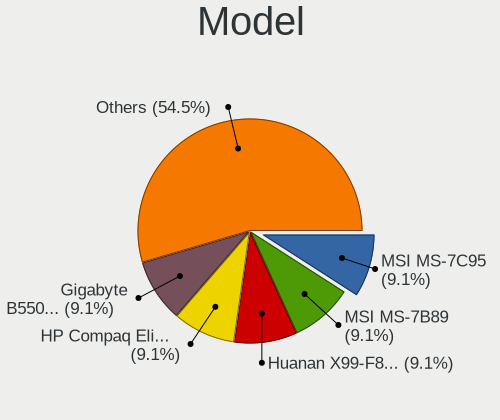
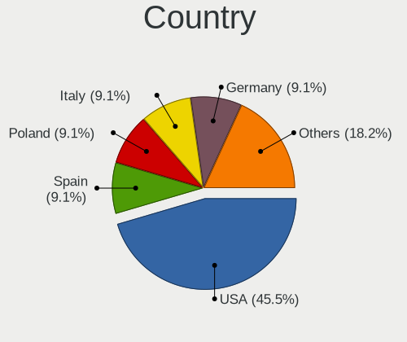
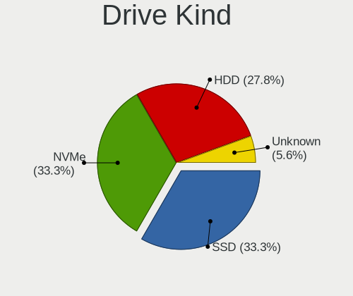
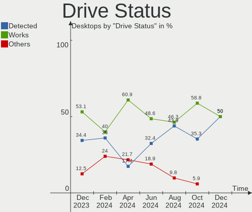
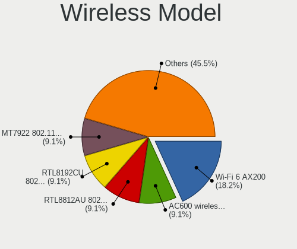
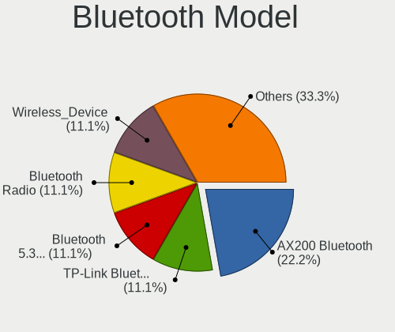
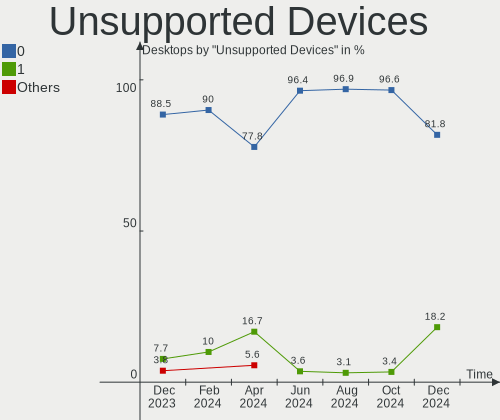

EndeavourOS - Hardware Trends (Desktops)
----------------------------------------

A project to identify most popular hardware characteristics and track their change
over time based on data collected by Linux users at https://Linux-Hardware.org.

Anyone can contribute to this report by the [hw-probe](https://github.com/linuxhw/hw-probe) tool:

    sudo -E hw-probe -all -upload

This report is for one last month. Overall report since the beginning of time: [TestDays](https://github.com/linuxhw/TestDays)

Period: Jul, 2023.

Contents
--------

* [ System ](#system)
  - [ OS                       ](#os)
  - [ OS Family                ](#os-family)
  - [ Kernel                   ](#kernel)
  - [ Kernel Family            ](#kernel-family)
  - [ Kernel Major Ver.        ](#kernel-major-ver)
  - [ Arch                     ](#arch)
  - [ DE                       ](#de)
  - [ Display Server           ](#display-server)
  - [ Display Manager          ](#display-manager)
  - [ OS Lang                  ](#os-lang)
  - [ Boot Mode                ](#boot-mode)
  - [ Filesystem               ](#filesystem)
  - [ Part. scheme             ](#part-scheme)
  - [ Dual Boot with Linux/BSD ](#dual-boot-with-linuxbsd)
  - [ Dual Boot (Win)          ](#dual-boot-win)

* [ Board ](#board)
  - [ Vendor                   ](#vendor)
  - [ Model                    ](#model)
  - [ Model Family             ](#model-family)
  - [ MFG Year                 ](#mfg-year)
  - [ Form Factor              ](#form-factor)
  - [ Secure Boot              ](#secure-boot)
  - [ Coreboot                 ](#coreboot)
  - [ RAM Size                 ](#ram-size)
  - [ RAM Used                 ](#ram-used)
  - [ Total Drives             ](#total-drives)
  - [ Has CD-ROM               ](#has-cd-rom)
  - [ Has Ethernet             ](#has-ethernet)
  - [ Has WiFi                 ](#has-wifi)
  - [ Has Bluetooth            ](#has-bluetooth)

* [ Location ](#location)
  - [ Country                  ](#country)
  - [ City                     ](#city)

* [ Drives ](#drives)
  - [ Drive Vendor             ](#drive-vendor)
  - [ Drive Model              ](#drive-model)
  - [ HDD Vendor               ](#hdd-vendor)
  - [ SSD Vendor               ](#ssd-vendor)
  - [ Drive Kind               ](#drive-kind)
  - [ Drive Connector          ](#drive-connector)
  - [ Drive Size               ](#drive-size)
  - [ Space Total              ](#space-total)
  - [ Space Used               ](#space-used)
  - [ Malfunc. Drives          ](#malfunc-drives)
  - [ Malfunc. Drive Vendor    ](#malfunc-drive-vendor)
  - [ Malfunc. HDD Vendor      ](#malfunc-hdd-vendor)
  - [ Malfunc. Drive Kind      ](#malfunc-drive-kind)
  - [ Failed Drives            ](#failed-drives)
  - [ Failed Drive Vendor      ](#failed-drive-vendor)
  - [ Drive Status             ](#drive-status)

* [ Storage controller ](#storage-controller)
  - [ Storage Vendor           ](#storage-vendor)
  - [ Storage Model            ](#storage-model)
  - [ Storage Kind             ](#storage-kind)

* [ Processor ](#processor)
  - [ CPU Vendor               ](#cpu-vendor)
  - [ CPU Model                ](#cpu-model)
  - [ CPU Model Family         ](#cpu-model-family)
  - [ CPU Cores                ](#cpu-cores)
  - [ CPU Sockets              ](#cpu-sockets)
  - [ CPU Threads              ](#cpu-threads)
  - [ CPU Op-Modes             ](#cpu-op-modes)
  - [ CPU Microcode            ](#cpu-microcode)
  - [ CPU Microarch            ](#cpu-microarch)

* [ Graphics ](#graphics)
  - [ GPU Vendor               ](#gpu-vendor)
  - [ GPU Model                ](#gpu-model)
  - [ GPU Combo                ](#gpu-combo)
  - [ GPU Driver               ](#gpu-driver)
  - [ GPU Memory               ](#gpu-memory)

* [ Monitor ](#monitor)
  - [ Monitor Vendor           ](#monitor-vendor)
  - [ Monitor Model            ](#monitor-model)
  - [ Monitor Resolution       ](#monitor-resolution)
  - [ Monitor Diagonal         ](#monitor-diagonal)
  - [ Monitor Width            ](#monitor-width)
  - [ Aspect Ratio             ](#aspect-ratio)
  - [ Monitor Area             ](#monitor-area)
  - [ Pixel Density            ](#pixel-density)
  - [ Multiple Monitors        ](#multiple-monitors)

* [ Network ](#network)
  - [ Net Controller Vendor    ](#net-controller-vendor)
  - [ Net Controller Model     ](#net-controller-model)
  - [ Wireless Vendor          ](#wireless-vendor)
  - [ Wireless Model           ](#wireless-model)
  - [ Ethernet Vendor          ](#ethernet-vendor)
  - [ Ethernet Model           ](#ethernet-model)
  - [ Net Controller Kind      ](#net-controller-kind)
  - [ Used Controller          ](#used-controller)
  - [ NICs                     ](#nics)
  - [ IPv6                     ](#ipv6)

* [ Bluetooth ](#bluetooth)
  - [ Bluetooth Vendor         ](#bluetooth-vendor)
  - [ Bluetooth Model          ](#bluetooth-model)

* [ Sound ](#sound)
  - [ Sound Vendor             ](#sound-vendor)
  - [ Sound Model              ](#sound-model)

* [ Memory ](#memory)
  - [ Memory Vendor            ](#memory-vendor)
  - [ Memory Model             ](#memory-model)
  - [ Memory Kind              ](#memory-kind)
  - [ Memory Form Factor       ](#memory-form-factor)
  - [ Memory Size              ](#memory-size)
  - [ Memory Speed             ](#memory-speed)

* [ Printers & scanners ](#printers--scanners)
  - [ Printer Vendor           ](#printer-vendor)
  - [ Printer Model            ](#printer-model)
  - [ Scanner Vendor           ](#scanner-vendor)
  - [ Scanner Model            ](#scanner-model)

* [ Camera ](#camera)
  - [ Camera Vendor            ](#camera-vendor)
  - [ Camera Model             ](#camera-model)

* [ Security ](#security)
  - [ Fingerprint Vendor       ](#fingerprint-vendor)
  - [ Fingerprint Model        ](#fingerprint-model)
  - [ Chipcard Vendor          ](#chipcard-vendor)
  - [ Chipcard Model           ](#chipcard-model)

* [ Unsupported ](#unsupported)
  - [ Unsupported Devices      ](#unsupported-devices)
  - [ Unsupported Device Types ](#unsupported-device-types)

System
------

OS
--

Installed operating systems

| Name                | Desktops | Percent |
|---------------------|----------|---------|
| EndeavourOS Rolling | 13       | 100%    |

OS Family
---------

OS without a version

| Name        | Desktops | Percent |
|-------------|----------|---------|
| EndeavourOS | 13       | 100%    |

Kernel
------

Version of the Linux kernel

| Version             | Desktops | Percent |
|---------------------|----------|---------|
| 6.3.9-arch1-1       | 3        | 23.08%  |
| 6.4.2-arch1-1       | 2        | 15.38%  |
| 6.4.7-1-cachyos-lto | 1        | 7.69%   |
| 6.4.4-zen1-1-zen    | 1        | 7.69%   |
| 6.4.3-zen1-2-zen    | 1        | 7.69%   |
| 6.4.3-arch1-2       | 1        | 7.69%   |
| 6.4.3-arch1-1       | 1        | 7.69%   |
| 6.4.3-273-tkg-pds   | 1        | 7.69%   |
| 6.4.1-arch1-1       | 1        | 7.69%   |
| 6.3.1-arch2-1       | 1        | 7.69%   |

Kernel Family
-------------

Linux kernel without a distro release

| Version | Desktops | Percent |
|---------|----------|---------|
| 6.4.3   | 4        | 30.77%  |
| 6.3.9   | 3        | 23.08%  |
| 6.4.2   | 2        | 15.38%  |
| 6.4.7   | 1        | 7.69%   |
| 6.4.4   | 1        | 7.69%   |
| 6.4.1   | 1        | 7.69%   |
| 6.3.1   | 1        | 7.69%   |

Kernel Major Ver.
-----------------

Linux kernel major version

| Version | Desktops | Percent |
|---------|----------|---------|
| 6.4     | 9        | 69.23%  |
| 6.3     | 4        | 30.77%  |

Arch
----

OS architecture (x86_64, i586, etc.)

| Name   | Desktops | Percent |
|--------|----------|---------|
| x86_64 | 13       | 100%    |

DE
--

Desktop Environment

| Name     | Desktops | Percent |
|----------|----------|---------|
| KDE5     | 11       | 84.62%  |
| XFCE     | 1        | 7.69%   |
| Hyprland | 1        | 7.69%   |

Display Server
--------------

X11 or Wayland

| Name    | Desktops | Percent |
|---------|----------|---------|
| X11     | 10       | 76.92%  |
| Wayland | 3        | 23.08%  |

Display Manager
---------------

SDDM, LightDM, etc.

| Name    | Desktops | Percent |
|---------|----------|---------|
| SDDM    | 7        | 53.85%  |
| Unknown | 4        | 30.77%  |
| LightDM | 2        | 15.38%  |

OS Lang
-------

Language

| Lang  | Desktops | Percent |
|-------|----------|---------|
| en_US | 7        | 53.85%  |
| nl_NL | 2        | 15.38%  |
| pt_BR | 1        | 7.69%   |
| hu_HU | 1        | 7.69%   |
| fr_FR | 1        | 7.69%   |
| de_LU | 1        | 7.69%   |

Boot Mode
---------

EFI or BIOS

| Mode | Desktops | Percent |
|------|----------|---------|
| EFI  | 7        | 53.85%  |
| BIOS | 6        | 46.15%  |

Filesystem
----------

Type of filesystem

| Type  | Desktops | Percent |
|-------|----------|---------|
| Ext4  | 10       | 76.92%  |
| Btrfs | 3        | 23.08%  |

Part. scheme
------------

Scheme of partitioning

| Type    | Desktops | Percent |
|---------|----------|---------|
| GPT     | 8        | 61.54%  |
| Unknown | 4        | 30.77%  |
| MBR     | 1        | 7.69%   |

Dual Boot with Linux/BSD
------------------------

Hosting more than one Linux/BSD

| Dual boot | Desktops | Percent |
|-----------|----------|---------|
| No        | 12       | 92.31%  |
| Yes       | 1        | 7.69%   |

Dual Boot (Win)
---------------

Hosting Linux and Windows

| Dual boot | Desktops | Percent |
|-----------|----------|---------|
| No        | 9        | 69.23%  |
| Yes       | 4        | 30.77%  |

Board
-----

Vendor
------

Motherboard manufacturer

| Name                | Desktops | Percent |
|---------------------|----------|---------|
| ASUSTek Computer    | 6        | 46.15%  |
| MSI                 | 3        | 23.08%  |
| Gigabyte Technology | 2        | 15.38%  |
| Daten Tecnologia    | 1        | 7.69%   |
| ASRock              | 1        | 7.69%   |

Model
-----

Motherboard model

| Name                                 | Desktops | Percent |
|--------------------------------------|----------|---------|
| MSI MS-7C56                          | 1        | 7.69%   |
| MSI MS-7A34                          | 1        | 7.69%   |
| MSI MS-7994                          | 1        | 7.69%   |
| Gigabyte P55A-UD3                    | 1        | 7.69%   |
| Gigabyte B550 VISION D-P             | 1        | 7.69%   |
| Daten Tecnologia DH110MXV            | 1        | 7.69%   |
| ASUS TUF B450-PRO GAMING             | 1        | 7.69%   |
| ASUS ROG STRIX Z690-A GAMING WIFI D4 | 1        | 7.69%   |
| ASUS ROG STRIX Z370-E GAMING         | 1        | 7.69%   |
| ASUS ROG STRIX B550-F GAMING         | 1        | 7.69%   |
| ASUS ROG STRIX B350-F GAMING         | 1        | 7.69%   |
| ASUS PRIME Z790-A WIFI               | 1        | 7.69%   |
| ASRock B450M Pro4                    | 1        | 7.69%   |

Model Family
------------

Motherboard model prefix

| Name                      | Desktops | Percent |
|---------------------------|----------|---------|
| ASUS ROG                  | 4        | 30.77%  |
| MSI MS-7C56               | 1        | 7.69%   |
| MSI MS-7A34               | 1        | 7.69%   |
| MSI MS-7994               | 1        | 7.69%   |
| Gigabyte P55A-UD3         | 1        | 7.69%   |
| Gigabyte B550             | 1        | 7.69%   |
| Daten Tecnologia DH110MXV | 1        | 7.69%   |
| ASUS TUF                  | 1        | 7.69%   |
| ASUS PRIME                | 1        | 7.69%   |
| ASRock B450M              | 1        | 7.69%   |

MFG Year
--------

Motherboard manufacture year

| Year | Desktops | Percent |
|------|----------|---------|
| 2020 | 3        | 23.08%  |
| 2018 | 3        | 23.08%  |
| 2017 | 3        | 23.08%  |
| 2022 | 1        | 7.69%   |
| 2016 | 1        | 7.69%   |
| 2009 | 1        | 7.69%   |
| 2008 | 1        | 7.69%   |

Form Factor
-----------

Physical design of the computer

| Name    | Desktops | Percent |
|---------|----------|---------|
| Desktop | 13       | 100%    |

Secure Boot
-----------

Enabled or disabled

| State    | Desktops | Percent |
|----------|----------|---------|
| Disabled | 13       | 100%    |

Coreboot
--------

Have coreboot on board

| Used | Desktops | Percent |
|------|----------|---------|
| No   | 13       | 100%    |

RAM Size
--------

Total RAM memory

| Size in GB  | Desktops | Percent |
|-------------|----------|---------|
| 32.01-64.0  | 7        | 53.85%  |
| 8.01-16.0   | 3        | 23.08%  |
| 16.01-24.0  | 2        | 15.38%  |
| 64.01-256.0 | 1        | 7.69%   |

RAM Used
--------

Used RAM memory

| Used GB   | Desktops | Percent |
|-----------|----------|---------|
| 3.01-4.0  | 4        | 30.77%  |
| 8.01-16.0 | 3        | 23.08%  |
| 4.01-8.0  | 2        | 15.38%  |
| 1.01-2.0  | 2        | 15.38%  |
| 2.01-3.0  | 1        | 7.69%   |
| 0.51-1.0  | 1        | 7.69%   |

Total Drives
------------

Number of drives on board

| Drives | Desktops | Percent |
|--------|----------|---------|
| 4      | 3        | 23.08%  |
| 2      | 3        | 23.08%  |
| 6      | 2        | 15.38%  |
| 3      | 2        | 15.38%  |
| 1      | 2        | 15.38%  |
| 5      | 1        | 7.69%   |

Has CD-ROM
----------

Has CD-ROM on board

| Presented | Desktops | Percent |
|-----------|----------|---------|
| No        | 12       | 92.31%  |
| Yes       | 1        | 7.69%   |

Has Ethernet
------------

Has Ethernet on board

| Presented | Desktops | Percent |
|-----------|----------|---------|
| Yes       | 13       | 100%    |

Has WiFi
--------

Has WiFi module

| Presented | Desktops | Percent |
|-----------|----------|---------|
| Yes       | 8        | 61.54%  |
| No        | 5        | 38.46%  |

Has Bluetooth
-------------

Has Bluetooth module

| Presented | Desktops | Percent |
|-----------|----------|---------|
| No        | 7        | 53.85%  |
| Yes       | 6        | 46.15%  |

Location
--------

Country
-------

Geographic location (country)

| Country    | Desktops | Percent |
|------------|----------|---------|
| USA        | 6        | 46.15%  |
| Luxembourg | 1        | 7.69%   |
| Hungary    | 1        | 7.69%   |
| Germany    | 1        | 7.69%   |
| France     | 1        | 7.69%   |
| Czechia    | 1        | 7.69%   |
| Brazil     | 1        | 7.69%   |
| Belgium    | 1        | 7.69%   |

City
----

Geographic location (city)

| City              | Desktops | Percent |
|-------------------|----------|---------|
| Unknown           | 2        | 15.38%  |
| Rekem             | 1        | 7.69%   |
| Prague            | 1        | 7.69%   |
| Parkland          | 1        | 7.69%   |
| Luxembourg        | 1        | 7.69%   |
| Leander           | 1        | 7.69%   |
| Juazeiro do Norte | 1        | 7.69%   |
| Hamburg           | 1        | 7.69%   |
| Eger              | 1        | 7.69%   |
| Champaign         | 1        | 7.69%   |
| Canton            | 1        | 7.69%   |
| Bordeaux          | 1        | 7.69%   |

Drives
------

Drive Vendor
------------

Hard drive vendors

| Vendor                      | Desktops | Drives | Percent |
|-----------------------------|----------|--------|---------|
| Samsung Electronics         | 7        | 13     | 21.21%  |
| WDC                         | 6        | 8      | 18.18%  |
| Seagate                     | 4        | 4      | 12.12%  |
| Toshiba                     | 2        | 2      | 6.06%   |
| SanDisk                     | 2        | 2      | 6.06%   |
| Intel                       | 2        | 2      | 6.06%   |
| SK hynix                    | 1        | 2      | 3.03%   |
| Micron/Crucial Technology   | 1        | 1      | 3.03%   |
| MAXIO Technology (Hangzhou) | 1        | 1      | 3.03%   |
| MaxDigital                  | 1        | 1      | 3.03%   |
| Kingston Technology Company | 1        | 1      | 3.03%   |
| Kingmax                     | 1        | 2      | 3.03%   |
| Hitachi                     | 1        | 1      | 3.03%   |
| HGST                        | 1        | 1      | 3.03%   |
| Crucial                     | 1        | 1      | 3.03%   |
| A-DATA Technology           | 1        | 1      | 3.03%   |

Drive Model
-----------

Hard drive models

| Model                                               | Desktops | Percent |
|-----------------------------------------------------|----------|---------|
| Samsung NVMe SSD Controller SM981/PM981/PM983 500GB | 5        | 12.2%   |
| WDC WDS100T2B0A-00SM50 1TB SSD                      | 2        | 4.88%   |
| Samsung HD103SJ 1TB                                 | 2        | 4.88%   |
| WDC WDS100T2B0B-00YS70 1TB SSD                      | 1        | 2.44%   |
| WDC WD5000LPCX-21VHAT0 500GB                        | 1        | 2.44%   |
| WDC WD5000AZRX-00A8LB0 500GB                        | 1        | 2.44%   |
| WDC WD5000AAKX-60U6AA0 500GB                        | 1        | 2.44%   |
| WDC WD3200BPVT-22JJ5T0 320GB                        | 1        | 2.44%   |
| WDC WD10EZEX-08WN4A0 1TB                            | 1        | 2.44%   |
| Toshiba MQ01ABD100 1TB                              | 1        | 2.44%   |
| Toshiba DT01ACA300 3TB                              | 1        | 2.44%   |
| SK hynix SHPP41-2000GM 2TB                          | 1        | 2.44%   |
| SK hynix SHGP31-1000GM 1TB                          | 1        | 2.44%   |
| Seagate ST8000VN0022-2EL112 8TB                     | 1        | 2.44%   |
| Seagate ST4000DM004-2CV104 4TB                      | 1        | 2.44%   |
| Seagate ST2000DM006-2DM164 2TB                      | 1        | 2.44%   |
| Seagate ST2000DM001-1CH164 2TB                      | 1        | 2.44%   |
| Sandisk WD_BLACK SN770 1TB                          | 1        | 2.44%   |
| SanDisk SDSSDH3512G 512GB                           | 1        | 2.44%   |
| Samsung SSD 860 EVO 1TB                             | 1        | 2.44%   |
| Samsung SSD 850 EVO 250GB                           | 1        | 2.44%   |
| Samsung SSD 750 EVO 500GB                           | 1        | 2.44%   |
| Samsung PSSD T7 1TB                                 | 1        | 2.44%   |
| Micron/Crucial P2 NVMe PCIe SSD 1TB                 | 1        | 2.44%   |
| MAXIO (Hangzhou) NVMe SSD Controller MAP1202 256GB  | 1        | 2.44%   |
| MaxDigital MD4000GSA6472E 4TB                       | 1        | 2.44%   |
| Kingston Company A2000 NVMe SSD 1TB                 | 1        | 2.44%   |
| Kingmax SSD 480GB                                   | 1        | 2.44%   |
| Kingmax SSD 240GB                                   | 1        | 2.44%   |
| Intel SSDSA2CW080G3 80GB                            | 1        | 2.44%   |
| Intel SSD 660P Series 1024GB                        | 1        | 2.44%   |
| Hitachi HTS543232L9A300 320GB                       | 1        | 2.44%   |
| HGST HTS725050A7E630 500GB                          | 1        | 2.44%   |
| Crucial CT500MX500SSD1 500GB                        | 1        | 2.44%   |
| A-DATA SU650 480GB SSD                              | 1        | 2.44%   |

HDD Vendor
----------

Hard disk drive vendors

| Vendor              | Desktops | Drives | Percent |
|---------------------|----------|--------|---------|
| WDC                 | 4        | 5      | 26.67%  |
| Seagate             | 4        | 4      | 26.67%  |
| Toshiba             | 2        | 2      | 13.33%  |
| Samsung Electronics | 2        | 2      | 13.33%  |
| MaxDigital          | 1        | 1      | 6.67%   |
| Hitachi             | 1        | 1      | 6.67%   |
| HGST                | 1        | 1      | 6.67%   |

SSD Vendor
----------

Solid state drive vendors

| Vendor              | Desktops | Drives | Percent |
|---------------------|----------|--------|---------|
| Samsung Electronics | 4        | 5      | 33.33%  |
| WDC                 | 3        | 3      | 25%     |
| SanDisk             | 1        | 1      | 8.33%   |
| Kingmax             | 1        | 2      | 8.33%   |
| Intel               | 1        | 1      | 8.33%   |
| Crucial             | 1        | 1      | 8.33%   |
| A-DATA Technology   | 1        | 1      | 8.33%   |

Drive Kind
----------

HDD or SSD

| Kind | Desktops | Drives | Percent |
|------|----------|--------|---------|
| HDD  | 10       | 16     | 37.04%  |
| SSD  | 9        | 14     | 33.33%  |
| NVMe | 8        | 13     | 29.63%  |

Drive Connector
---------------

SATA, SAS, NVMe, etc.

| Type | Desktops | Drives | Percent |
|------|----------|--------|---------|
| SATA | 12       | 29     | 57.14%  |
| NVMe | 8        | 13     | 38.1%   |
| SAS  | 1        | 1      | 4.76%   |

Drive Size
----------

Size of hard drive

| Size in TB | Desktops | Drives | Percent |
|------------|----------|--------|---------|
| 0.51-1.0   | 7        | 11     | 35%     |
| 0.01-0.5   | 7        | 13     | 35%     |
| 3.01-4.0   | 2        | 2      | 10%     |
| 1.01-2.0   | 2        | 2      | 10%     |
| 2.01-3.0   | 1        | 1      | 5%      |
| 4.01-10.0  | 1        | 1      | 5%      |

Space Total
-----------

Amount of disk space available on the file system

| Size in GB     | Desktops | Percent |
|----------------|----------|---------|
| More than 3000 | 5        | 38.46%  |
| 1001-2000      | 5        | 38.46%  |
| 501-1000       | 2        | 15.38%  |
| 251-500        | 1        | 7.69%   |

Space Used
----------

Amount of used disk space

| Used GB        | Desktops | Percent |
|----------------|----------|---------|
| 1001-2000      | 6        | 46.15%  |
| More than 3000 | 3        | 23.08%  |
| 21-50          | 2        | 15.38%  |
| 251-500        | 1        | 7.69%   |
| 51-100         | 1        | 7.69%   |

Malfunc. Drives
---------------

Drive models with a malfunction

| Model                                                           | Desktops | Drives | Percent |
|-----------------------------------------------------------------|----------|--------|---------|
| Toshiba DT01ACA300 3TB                                          | 1        | 1      | 33.33%  |
| Samsung Electronics NVMe SSD Controller SM981/PM981/PM983 500GB | 1        | 1      | 33.33%  |
| Crucial CT500MX500SSD1 500GB                                    | 1        | 1      | 33.33%  |

Malfunc. Drive Vendor
---------------------

Vendors of faulty drives

| Vendor              | Desktops | Drives | Percent |
|---------------------|----------|--------|---------|
| Toshiba             | 1        | 1      | 33.33%  |
| Samsung Electronics | 1        | 1      | 33.33%  |
| Crucial             | 1        | 1      | 33.33%  |

Malfunc. HDD Vendor
-------------------

Vendors of faulty HDD drives

| Vendor  | Desktops | Drives | Percent |
|---------|----------|--------|---------|
| Toshiba | 1        | 1      | 100%    |

Malfunc. Drive Kind
-------------------

Kinds of faulty drives

| Kind | Desktops | Drives | Percent |
|------|----------|--------|---------|
| NVMe | 1        | 1      | 33.33%  |
| SSD  | 1        | 1      | 33.33%  |
| HDD  | 1        | 1      | 33.33%  |

Failed Drives
-------------

Failed drive models

Zero info for selected period =(

Failed Drive Vendor
-------------------

Failed drive vendors

Zero info for selected period =(

Drive Status
------------

Number of failed and malfunc. drives

| Status   | Desktops | Drives | Percent |
|----------|----------|--------|---------|
| Works    | 9        | 23     | 52.94%  |
| Detected | 5        | 17     | 29.41%  |
| Malfunc  | 3        | 3      | 17.65%  |

Storage controller
------------------

Storage Vendor
--------------

Storage controller vendors

| Vendor                      | Desktops | Percent |
|-----------------------------|----------|---------|
| AMD                         | 7        | 28%     |
| Intel                       | 6        | 24%     |
| Samsung Electronics         | 5        | 20%     |
| MAXIO Technology (Hangzhou) | 2        | 8%      |
| SK hynix                    | 1        | 4%      |
| SanDisk                     | 1        | 4%      |
| Micron/Crucial Technology   | 1        | 4%      |
| Kingston Technology Company | 1        | 4%      |
| ASMedia Technology          | 1        | 4%      |

Storage Model
-------------

Storage controller models

| Model                                                                         | Desktops | Percent |
|-------------------------------------------------------------------------------|----------|---------|
| Samsung NVMe SSD Controller SM981/PM981/PM983                                 | 5        | 15.15%  |
| AMD FCH SATA Controller [AHCI mode]                                           | 4        | 12.12%  |
| AMD 500 Series Chipset SATA Controller                                        | 3        | 9.09%   |
| Intel Q170/Q150/B150/H170/H110/Z170/CM236 Chipset SATA Controller [AHCI Mode] | 2        | 6.06%   |
| AMD 400 Series Chipset SATA Controller                                        | 2        | 6.06%   |
| AMD 300 Series Chipset SATA Controller                                        | 2        | 6.06%   |
| SK hynix Platinum P41/PC801 NVMe Solid State Drive                            | 1        | 3.03%   |
| SK hynix Gold P31/BC711/PC711 NVMe Solid State Drive                          | 1        | 3.03%   |
| SanDisk WD Black SN770 / PC SN740 256GB / PC SN560 (DRAM-less) NVMe SSD       | 1        | 3.03%   |
| Micron/Crucial P2 [Nick P2] / P3 / P3 Plus NVMe PCIe SSD (DRAM-less)          | 1        | 3.03%   |
| MAXIO (Hangzhou) NVMe SSD Controller MAP1602                                  | 1        | 3.03%   |
| MAXIO (Hangzhou) NVMe SSD Controller MAP1202                                  | 1        | 3.03%   |
| Kingston Company A2000 NVMe SSD                                               | 1        | 3.03%   |
| Intel Volume Management Device NVMe RAID Controller Intel Corporation         | 1        | 3.03%   |
| Intel Volume Management Device NVMe RAID Controller                           | 1        | 3.03%   |
| Intel SSD 660P Series                                                         | 1        | 3.03%   |
| Intel Alder Lake-S PCH SATA Controller [AHCI Mode]                            | 1        | 3.03%   |
| Intel 700 Series Chipset Family SATA AHCI Controller                          | 1        | 3.03%   |
| Intel 5 Series/3400 Series Chipset 6 port SATA AHCI Controller                | 1        | 3.03%   |
| Intel 200 Series PCH SATA controller [AHCI mode]                              | 1        | 3.03%   |
| ASMedia ASM1062 Serial ATA Controller                                         | 1        | 3.03%   |

Storage Kind
------------

Kind of storage controller (IDE, SATA, NVMe, SAS, ...)

| Kind | Desktops | Percent |
|------|----------|---------|
| SATA | 13       | 56.52%  |
| NVMe | 8        | 34.78%  |
| RAID | 2        | 8.7%    |

Processor
---------

CPU Vendor
----------

Processor vendors

| Vendor | Desktops | Percent |
|--------|----------|---------|
| AMD    | 7        | 53.85%  |
| Intel  | 6        | 46.15%  |

CPU Model
---------

Processor models

| Model                                 | Desktops | Percent |
|---------------------------------------|----------|---------|
| Intel Core i7-8086K CPU @ 4.00GHz     | 1        | 7.69%   |
| Intel Core i5-6500 CPU @ 3.20GHz      | 1        | 7.69%   |
| Intel Core i5 CPU 750 @ 2.67GHz       | 1        | 7.69%   |
| Intel Core i3-6100 CPU @ 3.70GHz      | 1        | 7.69%   |
| Intel 13th Gen Core i7-13700K         | 1        | 7.69%   |
| Intel 12th Gen Core i9-12900K         | 1        | 7.69%   |
| AMD Ryzen 9 3900X 12-Core Processor   | 1        | 7.69%   |
| AMD Ryzen 7 5800X 8-Core Processor    | 1        | 7.69%   |
| AMD Ryzen 7 3700X 8-Core Processor    | 1        | 7.69%   |
| AMD Ryzen 7 2700 Eight-Core Processor | 1        | 7.69%   |
| AMD Ryzen 7 1700 Eight-Core Processor | 1        | 7.69%   |
| AMD Ryzen 5 3600 6-Core Processor     | 1        | 7.69%   |
| AMD Ryzen 5 1600 Six-Core Processor   | 1        | 7.69%   |

CPU Model Family
----------------

Processor model prefix

| Model         | Desktops | Percent |
|---------------|----------|---------|
| AMD Ryzen 7   | 4        | 30.77%  |
| Other         | 2        | 15.38%  |
| Intel Core i5 | 2        | 15.38%  |
| AMD Ryzen 5   | 2        | 15.38%  |
| Intel Core i7 | 1        | 7.69%   |
| Intel Core i3 | 1        | 7.69%   |
| AMD Ryzen 9   | 1        | 7.69%   |

CPU Cores
---------

Number of processor cores

| Number | Desktops | Percent |
|--------|----------|---------|
| 8      | 4        | 30.77%  |
| 6      | 3        | 23.08%  |
| 16     | 2        | 15.38%  |
| 4      | 2        | 15.38%  |
| 12     | 1        | 7.69%   |
| 2      | 1        | 7.69%   |

CPU Sockets
-----------

Number of sockets

| Number | Desktops | Percent |
|--------|----------|---------|
| 1      | 13       | 100%    |

CPU Threads
-----------

Threads per core (Hyper-Threading)

| Number | Desktops | Percent |
|--------|----------|---------|
| 2      | 11       | 84.62%  |
| 1      | 2        | 15.38%  |

CPU Op-Modes
------------

CPU Operation Modes (32-bit, 64-bit)

| Op mode        | Desktops | Percent |
|----------------|----------|---------|
| 32-bit, 64-bit | 13       | 100%    |

CPU Microcode
-------------

Microcode number

| Number     | Desktops | Percent |
|------------|----------|---------|
| Unknown    | 8        | 61.54%  |
| 0x08001138 | 2        | 15.38%  |
| 0x0a201205 | 1        | 7.69%   |
| 0x08701021 | 1        | 7.69%   |
| 0x0800820d | 1        | 7.69%   |

CPU Microarch
-------------

Microarchitecture

| Name             | Desktops | Percent |
|------------------|----------|---------|
| Zen 2            | 3        | 23.08%  |
| Zen              | 2        | 15.38%  |
| Skylake          | 2        | 15.38%  |
| Zen+             | 1        | 7.69%   |
| Zen 3            | 1        | 7.69%   |
| Nehalem          | 1        | 7.69%   |
| KabyLake         | 1        | 7.69%   |
| Alderlake Hybrid | 1        | 7.69%   |
| Unknown          | 1        | 7.69%   |

Graphics
--------

GPU Vendor
----------

Vendors of graphics cards

| Vendor | Desktops | Percent |
|--------|----------|---------|
| AMD    | 8        | 50%     |
| Nvidia | 5        | 31.25%  |
| Intel  | 3        | 18.75%  |

GPU Model
---------

Graphics card models

| Model                                                         | Desktops | Percent |
|---------------------------------------------------------------|----------|---------|
| AMD Navi 22 [Radeon RX 6700/6700 XT/6750 XT / 6800M/6850M XT] | 2        | 11.76%  |
| Nvidia GP107 [GeForce GTX 1050 Ti]                            | 1        | 5.88%   |
| Nvidia GP106 [GeForce GTX 1060 6GB]                           | 1        | 5.88%   |
| Nvidia GM107 [GeForce GTX 750 Ti]                             | 1        | 5.88%   |
| Nvidia GA106 [GeForce RTX 3060 Lite Hash Rate]                | 1        | 5.88%   |
| Nvidia GA102 [GeForce RTX 3080 Ti]                            | 1        | 5.88%   |
| Intel Raptor Lake-S GT1 [UHD Graphics 770]                    | 1        | 5.88%   |
| Intel HD Graphics 530                                         | 1        | 5.88%   |
| Intel AlderLake-S GT1                                         | 1        | 5.88%   |
| AMD Vega 10 XL/XT [Radeon RX Vega 56/64]                      | 1        | 5.88%   |
| AMD Navi 31 [Radeon RX 7900 XT/7900 XTX]                      | 1        | 5.88%   |
| AMD Navi 23 [Radeon RX 6600/6600 XT/6600M]                    | 1        | 5.88%   |
| AMD Navi 10 [Radeon RX 5600 OEM/5600 XT / 5700/5700 XT]       | 1        | 5.88%   |
| AMD Ellesmere [Radeon RX 470/480/570/570X/580/580X/590]       | 1        | 5.88%   |
| AMD Cape Verde XT [Radeon HD 7770/8760 / R7 250X]             | 1        | 5.88%   |
| AMD Cape Verde PRO [Radeon HD 7750/8740 / R7 250E]            | 1        | 5.88%   |

GPU Combo
---------

Combinations of graphics cards

| Name           | Desktops | Percent |
|----------------|----------|---------|
| 1 x AMD        | 5        | 38.46%  |
| 1 x Nvidia     | 3        | 23.08%  |
| 2 x AMD        | 1        | 7.69%   |
| Intel + Nvidia | 1        | 7.69%   |
| Intel + AMD    | 1        | 7.69%   |
| 1 x Intel      | 1        | 7.69%   |
| AMD + Nvidia   | 1        | 7.69%   |

GPU Driver
----------

Free vs proprietary

| Driver      | Desktops | Percent |
|-------------|----------|---------|
| Free        | 9        | 69.23%  |
| Proprietary | 4        | 30.77%  |

GPU Memory
----------

Total video memory

| Size in GB | Desktops | Percent |
|------------|----------|---------|
| Unknown    | 4        | 30.77%  |
| 7.01-8.0   | 2        | 15.38%  |
| 5.01-6.0   | 2        | 15.38%  |
| 8.01-16.0  | 2        | 15.38%  |
| 3.01-4.0   | 1        | 7.69%   |
| 1.01-2.0   | 1        | 7.69%   |
| 0.51-1.0   | 1        | 7.69%   |

Monitor
-------

Monitor Vendor
--------------

Monitor vendors

| Vendor               | Desktops | Percent |
|----------------------|----------|---------|
| Acer                 | 5        | 27.78%  |
| Samsung Electronics  | 3        | 16.67%  |
| Goldstar             | 2        | 11.11%  |
| ViewSonic            | 1        | 5.56%   |
| ITE                  | 1        | 5.56%   |
| Huion                | 1        | 5.56%   |
| GDH                  | 1        | 5.56%   |
| Dell                 | 1        | 5.56%   |
| ASUSTek Computer     | 1        | 5.56%   |
| AOC                  | 1        | 5.56%   |
| Ancor Communications | 1        | 5.56%   |

Monitor Model
-------------

Monitor models

| Model                                                                | Desktops | Percent |
|----------------------------------------------------------------------|----------|---------|
| Samsung Electronics S24R65x SAM1023 1920x1080 530x300mm 24.0-inch    | 2        | 10.53%  |
| ViewSonic XG2401 SERIES VSCBB31 1920x1080 531x299mm 24.0-inch        | 1        | 5.26%   |
| Samsung Electronics SyncMaster SAM04DD 1920x1080 477x268mm 21.5-inch | 1        | 5.26%   |
| ITE DP2VGA V235 ITE6516 1920x1080 600x340mm 27.2-inch                | 1        | 5.26%   |
| Huion Kamvas Pro 16 HAT1560 1920x1080 345x195mm 15.6-inch            | 1        | 5.26%   |
| Goldstar M2362D GSMF0A3 1920x1080 598x336mm 27.0-inch                | 1        | 5.26%   |
| Goldstar LG IPS FULLHD GSM5AB8 1920x1080 480x270mm 21.7-inch         | 1        | 5.26%   |
| GDH PHILCO GDH0030 1440x900 708x398mm 32.0-inch                      | 1        | 5.26%   |
| Dell P2419H DELD0D9 1920x1080 527x296mm 23.8-inch                    | 1        | 5.26%   |
| ASUSTek Computer VG279QM AUS278F 1920x1080 598x336mm 27.0-inch       | 1        | 5.26%   |
| AOC 2450W AOC2450 1920x1080 521x293mm 23.5-inch                      | 1        | 5.26%   |
| Ancor Communications VG248 ACI24A4 1920x1080 531x299mm 24.0-inch     | 1        | 5.26%   |
| Acer XV275K P3 ACR0A8B 3840x2160 597x336mm 27.0-inch                 | 1        | 5.26%   |
| Acer XFA240 ACR062C 1920x1080 531x299mm 24.0-inch                    | 1        | 5.26%   |
| Acer XB271HU ACR0490 2560x1440 598x336mm 27.0-inch                   | 1        | 5.26%   |
| Acer VG240Y ACR0673 1920x1080 530x300mm 24.0-inch                    | 1        | 5.26%   |
| Acer KA271 ACR053D 1920x1080 598x336mm 27.0-inch                     | 1        | 5.26%   |
| Acer EB321HQU ACR0507 2560x1440 699x393mm 31.6-inch                  | 1        | 5.26%   |

Monitor Resolution
------------------

Monitor screen resolution

| Resolution      | Desktops | Percent |
|-----------------|----------|---------|
| 1920x1080 (FHD) | 11       | 73.33%  |
| 3840x2160 (4K)  | 2        | 13.33%  |
| 2560x1440 (QHD) | 2        | 13.33%  |

Monitor Diagonal
----------------

Diagonal size in inches

| Inches | Desktops | Percent |
|--------|----------|---------|
| 24     | 7        | 38.89%  |
| 27     | 5        | 27.78%  |
| 23     | 2        | 11.11%  |
| 52     | 1        | 5.56%   |
| 31     | 1        | 5.56%   |
| 21     | 1        | 5.56%   |
| 15     | 1        | 5.56%   |

Monitor Width
-------------

Physical width

| Width in mm | Desktops | Percent |
|-------------|----------|---------|
| 501-600     | 10       | 71.43%  |
| 601-700     | 1        | 7.14%   |
| 401-500     | 1        | 7.14%   |
| 301-350     | 1        | 7.14%   |
| 1001-1500   | 1        | 7.14%   |

Aspect Ratio
------------

Proportional relationship between the width and the height

| Ratio | Desktops | Percent |
|-------|----------|---------|
| 16/9  | 13       | 100%    |

Monitor Area
------------

Area in inch²

| Area in inch² | Desktops | Percent |
|----------------|----------|---------|
| 201-250        | 9        | 52.94%  |
| 301-350        | 5        | 29.41%  |
| More than 1000 | 1        | 5.88%   |
| 351-500        | 1        | 5.88%   |
| 101-110        | 1        | 5.88%   |

Pixel Density
-------------

Pixels per inch

| Density | Desktops | Percent |
|---------|----------|---------|
| 51-100  | 10       | 66.67%  |
| 101-120 | 2        | 13.33%  |
| 1-50    | 1        | 6.67%   |
| 161-240 | 1        | 6.67%   |
| 121-160 | 1        | 6.67%   |

Multiple Monitors
-----------------

Total monitors connected

| Total | Desktops | Percent |
|-------|----------|---------|
| 1     | 8        | 61.54%  |
| 2     | 4        | 30.77%  |
| 3     | 1        | 7.69%   |

Network
-------

Net Controller Vendor
---------------------

Controller vendors

| Vendor                | Desktops | Percent |
|-----------------------|----------|---------|
| Realtek Semiconductor | 8        | 50%     |
| Intel                 | 7        | 43.75%  |
| TP-Link               | 1        | 6.25%   |

Net Controller Model
--------------------

Controller models

| Model                                                             | Desktops | Percent |
|-------------------------------------------------------------------|----------|---------|
| Realtek RTL8111/8168/8411 PCI Express Gigabit Ethernet Controller | 6        | 27.27%  |
| Intel Ethernet Controller I225-V                                  | 3        | 13.64%  |
| Intel Wi-Fi 6 AX200                                               | 2        | 9.09%   |
| Intel Ethernet Connection (2) I219-V                              | 2        | 9.09%   |
| TP-Link TL-WN722N v2/v3 [Realtek RTL8188EUS]                      | 1        | 4.55%   |
| Realtek RTL8822BE 802.11a/b/g/n/ac WiFi adapter                   | 1        | 4.55%   |
| Realtek RTL8192EE PCIe Wireless Network Adapter                   | 1        | 4.55%   |
| Realtek RTL8125 2.5GbE Controller                                 | 1        | 4.55%   |
| Intel Wi-Fi 6 AX210/AX211/AX411 160MHz                            | 1        | 4.55%   |
| Intel I211 Gigabit Network Connection                             | 1        | 4.55%   |
| Intel Ethernet Controller I226-V                                  | 1        | 4.55%   |
| Intel Alder Lake-S PCH CNVi WiFi                                  | 1        | 4.55%   |
| Intel 700 Series Chipset Family Wi-Fi                             | 1        | 4.55%   |

Wireless Vendor
---------------

Wireless vendors

| Vendor                | Desktops | Percent |
|-----------------------|----------|---------|
| Intel                 | 5        | 62.5%   |
| Realtek Semiconductor | 2        | 25%     |
| TP-Link               | 1        | 12.5%   |

Wireless Model
--------------

Wireless models

| Model                                           | Desktops | Percent |
|-------------------------------------------------|----------|---------|
| Intel Wi-Fi 6 AX200                             | 2        | 25%     |
| TP-Link TL-WN722N v2/v3 [Realtek RTL8188EUS]    | 1        | 12.5%   |
| Realtek RTL8822BE 802.11a/b/g/n/ac WiFi adapter | 1        | 12.5%   |
| Realtek RTL8192EE PCIe Wireless Network Adapter | 1        | 12.5%   |
| Intel Wi-Fi 6 AX210/AX211/AX411 160MHz          | 1        | 12.5%   |
| Intel Alder Lake-S PCH CNVi WiFi                | 1        | 12.5%   |
| Intel 700 Series Chipset Family Wi-Fi           | 1        | 12.5%   |

Ethernet Vendor
---------------

Ethernet vendors

| Vendor                | Desktops | Percent |
|-----------------------|----------|---------|
| Realtek Semiconductor | 7        | 50%     |
| Intel                 | 7        | 50%     |

Ethernet Model
--------------

Ethernet models

| Model                                                             | Desktops | Percent |
|-------------------------------------------------------------------|----------|---------|
| Realtek RTL8111/8168/8411 PCI Express Gigabit Ethernet Controller | 6        | 42.86%  |
| Intel Ethernet Controller I225-V                                  | 3        | 21.43%  |
| Intel Ethernet Connection (2) I219-V                              | 2        | 14.29%  |
| Realtek RTL8125 2.5GbE Controller                                 | 1        | 7.14%   |
| Intel I211 Gigabit Network Connection                             | 1        | 7.14%   |
| Intel Ethernet Controller I226-V                                  | 1        | 7.14%   |

Net Controller Kind
-------------------

Ethernet, WiFi or modem

| Kind     | Desktops | Percent |
|----------|----------|---------|
| Ethernet | 13       | 61.9%   |
| WiFi     | 8        | 38.1%   |

Used Controller
---------------

Currently used network controller

| Kind     | Desktops | Percent |
|----------|----------|---------|
| Ethernet | 9        | 69.23%  |
| WiFi     | 4        | 30.77%  |

NICs
----

Total network controllers on board

| Total | Desktops | Percent |
|-------|----------|---------|
| 2     | 6        | 46.15%  |
| 1     | 6        | 46.15%  |
| 3     | 1        | 7.69%   |

IPv6
----

IPv6 vs IPv4

| Used | Desktops | Percent |
|------|----------|---------|
| Yes  | 8        | 61.54%  |
| No   | 5        | 38.46%  |

Bluetooth
---------

Bluetooth Vendor
----------------

Controller vendors

| Vendor           | Desktops | Percent |
|------------------|----------|---------|
| Intel            | 5        | 83.33%  |
| ASUSTek Computer | 1        | 16.67%  |

Bluetooth Model
---------------

Controller models

| Model                  | Desktops | Percent |
|------------------------|----------|---------|
| Intel AX200 Bluetooth  | 2        | 33.33%  |
| Intel Bluetooth Device | 1        | 16.67%  |
| Intel AX210 Bluetooth  | 1        | 16.67%  |
| Intel AX201 Bluetooth  | 1        | 16.67%  |
| ASUS Bluetooth Radio   | 1        | 16.67%  |

Sound
-----

Sound Vendor
------------

Sound card vendors

| Vendor              | Desktops | Percent |
|---------------------|----------|---------|
| AMD                 | 10       | 32.26%  |
| Intel               | 6        | 19.35%  |
| Nvidia              | 5        | 16.13%  |
| Logitech            | 2        | 6.45%   |
| Kingston Technology | 2        | 6.45%   |
| C-Media Electronics | 2        | 6.45%   |
| Texas Instruments   | 1        | 3.23%   |
| Medeli Electronics  | 1        | 3.23%   |
| Creative Technology | 1        | 3.23%   |
| ASUSTek Computer    | 1        | 3.23%   |

Sound Model
-----------

Sound card models

| Model                                                                   | Desktops | Percent |
|-------------------------------------------------------------------------|----------|---------|
| AMD Starship/Matisse HD Audio Controller                                | 4        | 10.53%  |
| AMD Navi 21/23 HDMI/DP Audio Controller                                 | 3        | 7.89%   |
| AMD Family 17h (Models 00h-0fh) HD Audio Controller                     | 3        | 7.89%   |
| Kingston Technology HyperX 7.1 Audio                                    | 2        | 5.26%   |
| Intel 100 Series/C230 Series Chipset Family HD Audio Controller         | 2        | 5.26%   |
| AMD Oland/Hainan/Cape Verde/Pitcairn HDMI Audio [Radeon HD 7000 Series] | 2        | 5.26%   |
| Texas Instruments PCM2902 Audio Codec                                   | 1        | 2.63%   |
| Nvidia GP107GL High Definition Audio Controller                         | 1        | 2.63%   |
| Nvidia GP106 High Definition Audio Controller                           | 1        | 2.63%   |
| Nvidia GM107 High Definition Audio Controller [GeForce 940MX]           | 1        | 2.63%   |
| Nvidia GA106 High Definition Audio Controller                           | 1        | 2.63%   |
| Nvidia GA102 High Definition Audio Controller                           | 1        | 2.63%   |
| Medeli Electronics AudioPro X5 Microphone                               | 1        | 2.63%   |
| Logitech G PRO X 2 Gaming Headset                                       | 1        | 2.63%   |
| Logitech Blue Microphones                                               | 1        | 2.63%   |
| Intel Alder Lake-S HD Audio Controller                                  | 1        | 2.63%   |
| Intel 700 Series Chipset Family Precise Touch and Stylus Port #1        | 1        | 2.63%   |
| Intel 5 Series/3400 Series Chipset High Definition Audio                | 1        | 2.63%   |
| Intel 200 Series PCH HD Audio                                           | 1        | 2.63%   |
| Creative Technology Pebble V3                                           | 1        | 2.63%   |
| C-Media Electronics Q9-1                                                | 1        | 2.63%   |
| C-Media Electronics Blue Snowball                                       | 1        | 2.63%   |
| C-Media Electronics Audio Adapter (Unitek Y-247A)                       | 1        | 2.63%   |
| ASUSTek Computer USB Audio                                              | 1        | 2.63%   |
| AMD Vega 10 HDMI Audio [Radeon Vega 56/64]                              | 1        | 2.63%   |
| AMD Navi 31 HDMI/DP Audio                                               | 1        | 2.63%   |
| AMD Navi 10 HDMI Audio                                                  | 1        | 2.63%   |
| AMD Ellesmere HDMI Audio [Radeon RX 470/480 / 570/580/590]              | 1        | 2.63%   |

Memory
------

Memory Vendor
-------------

Memory module vendors

| Vendor   | Desktops | Percent |
|----------|----------|---------|
| G.Skill  | 5        | 55.56%  |
| Unknown  | 1        | 11.11%  |
| Kingston | 1        | 11.11%  |
| Corsair  | 1        | 11.11%  |
| Unknown  | 1        | 11.11%  |

Memory Model
------------

Memory module models

| Model                                                  | Desktops | Percent |
|--------------------------------------------------------|----------|---------|
| Unknown RAM 3600 C18 Series 16GB DIMM DDR4 2933MT/s    | 1        | 11.11%  |
| Kingston RAM KHX2400C15D4/4G 4GB DIMM DDR4 3151MT/s    | 1        | 11.11%  |
| G.Skill RAM F4-3600C16-16GTZNC 16GB DIMM DDR4 3600MT/s | 1        | 11.11%  |
| G.Skill RAM F4-3200C16-8GVKB 8GB DIMM DDR4 3866MT/s    | 1        | 11.11%  |
| G.Skill RAM F4-3200C16-8GTZSW 8GB DIMM DDR4 2666MT/s   | 1        | 11.11%  |
| G.Skill RAM F4-3200C16-16GIS 16GB DIMM DDR4 3600MT/s   | 1        | 11.11%  |
| G.Skill RAM F4-3000C15-16GTZ 16GB DIMM DDR4 3200MT/s   | 1        | 11.11%  |
| Corsair RAM CMW64GX4M2E3200C16 32GB DIMM DDR4 3200MT/s | 1        | 11.11%  |
| Unknown                                                | 1        | 11.11%  |

Memory Kind
-----------

Memory module kinds

| Kind    | Desktops | Percent |
|---------|----------|---------|
| DDR4    | 8        | 88.89%  |
| Unknown | 1        | 11.11%  |

Memory Form Factor
------------------

Physical design of the memory module

| Name | Desktops | Percent |
|------|----------|---------|
| DIMM | 9        | 100%    |

Memory Size
-----------

Memory module size

| Size  | Desktops | Percent |
|-------|----------|---------|
| 16384 | 3        | 30%     |
| 32768 | 2        | 20%     |
| 8192  | 2        | 20%     |
| 4096  | 2        | 20%     |
| 2048  | 1        | 10%     |

Memory Speed
------------

Memory module speed

| Speed | Desktops | Percent |
|-------|----------|---------|
| 3600  | 2        | 22.22%  |
| 3200  | 2        | 22.22%  |
| 3866  | 1        | 11.11%  |
| 3666  | 1        | 11.11%  |
| 3151  | 1        | 11.11%  |
| 2666  | 1        | 11.11%  |
| 1280  | 1        | 11.11%  |

Printers & scanners
-------------------

Printer Vendor
--------------

Printer device vendors

| Vendor             | Desktops | Percent |
|--------------------|----------|---------|
| Canon              | 1        | 50%     |
| Brother Industries | 1        | 50%     |

Printer Model
-------------

Printer device models

| Model                 | Desktops | Percent |
|-----------------------|----------|---------|
| Canon MF260 II Series | 1        | 50%     |
| Brother DCP-9020CDW   | 1        | 50%     |

Scanner Vendor
--------------

Scanner device vendors

Zero info for selected period =(

Scanner Model
-------------

Scanner device models

Zero info for selected period =(

Camera
------

Camera Vendor
-------------

Camera device vendors

| Vendor   | Desktops | Percent |
|----------|----------|---------|
| Microdia | 1        | 50%     |
| Logitech | 1        | 50%     |

Camera Model
------------

Camera device models

| Model                       | Desktops | Percent |
|-----------------------------|----------|---------|
| Microdia USB 2.0 Camera     | 1        | 50%     |
| Logitech HD Pro Webcam C920 | 1        | 50%     |

Security
--------

Fingerprint Vendor
------------------

Fingerprint sensor vendors

Zero info for selected period =(

Fingerprint Model
-----------------

Fingerprint sensor models

Zero info for selected period =(

Chipcard Vendor
---------------

Chipcard module vendors

Zero info for selected period =(

Chipcard Model
--------------

Chipcard module models

Zero info for selected period =(

Unsupported
-----------

Unsupported Devices
-------------------

Total unsupported devices on board

| Total | Desktops | Percent |
|-------|----------|---------|
| 0     | 11       | 84.62%  |
| 1     | 2        | 15.38%  |

Unsupported Device Types
------------------------

Types of unsupported devices

| Type          | Desktops | Percent |
|---------------|----------|---------|
| Storage/nvme  | 1        | 50%     |
| Graphics card | 1        | 50%     |

