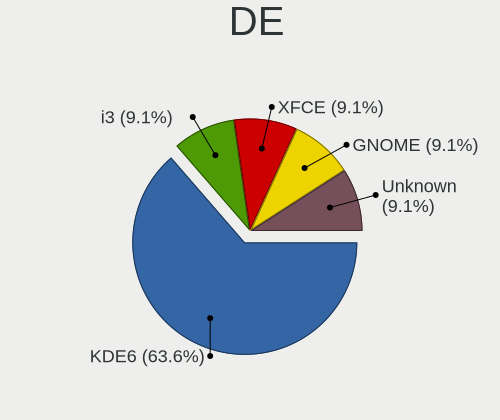
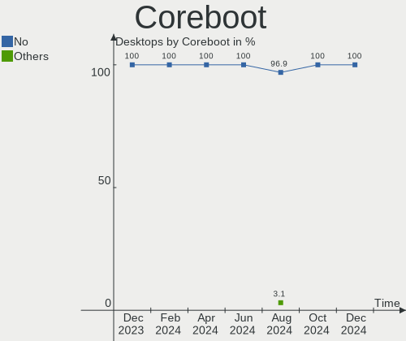
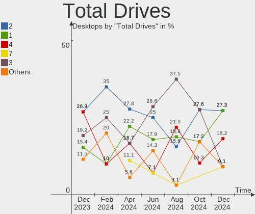
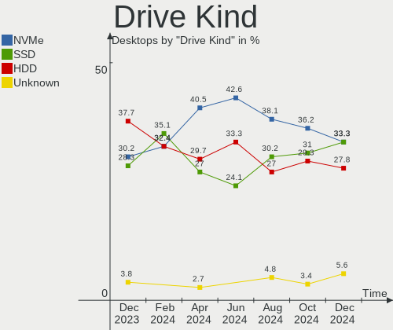
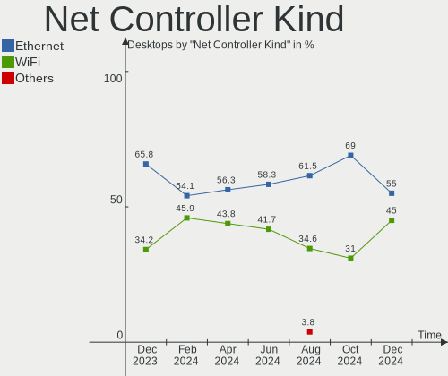

EndeavourOS - Hardware Trends (Desktops)
----------------------------------------

A project to identify most popular hardware characteristics and track their change
over time based on data collected by Linux users at https://Linux-Hardware.org.

Anyone can contribute to this report by the [hw-probe](https://github.com/linuxhw/hw-probe) tool:

    sudo -E hw-probe -all -upload

This report is for one last month. Overall report since the beginning of time: [TestDays](https://github.com/linuxhw/TestDays)

Period: Dec, 2024.

Contents
--------

* [ System ](#system)
  - [ OS                       ](#os)
  - [ OS Family                ](#os-family)
  - [ Kernel                   ](#kernel)
  - [ Kernel Family            ](#kernel-family)
  - [ Kernel Major Ver.        ](#kernel-major-ver)
  - [ Arch                     ](#arch)
  - [ DE                       ](#de)
  - [ Display Server           ](#display-server)
  - [ Display Manager          ](#display-manager)
  - [ OS Lang                  ](#os-lang)
  - [ Boot Mode                ](#boot-mode)
  - [ Filesystem               ](#filesystem)
  - [ Part. scheme             ](#part-scheme)
  - [ Dual Boot with Linux/BSD ](#dual-boot-with-linuxbsd)
  - [ Dual Boot (Win)          ](#dual-boot-win)

* [ Board ](#board)
  - [ Vendor                   ](#vendor)
  - [ Model                    ](#model)
  - [ Model Family             ](#model-family)
  - [ MFG Year                 ](#mfg-year)
  - [ Form Factor              ](#form-factor)
  - [ Secure Boot              ](#secure-boot)
  - [ Coreboot                 ](#coreboot)
  - [ RAM Size                 ](#ram-size)
  - [ RAM Used                 ](#ram-used)
  - [ Total Drives             ](#total-drives)
  - [ Has CD-ROM               ](#has-cd-rom)
  - [ Has Ethernet             ](#has-ethernet)
  - [ Has WiFi                 ](#has-wifi)
  - [ Has Bluetooth            ](#has-bluetooth)

* [ Location ](#location)
  - [ Country                  ](#country)
  - [ City                     ](#city)

* [ Drives ](#drives)
  - [ Drive Vendor             ](#drive-vendor)
  - [ Drive Model              ](#drive-model)
  - [ HDD Vendor               ](#hdd-vendor)
  - [ SSD Vendor               ](#ssd-vendor)
  - [ Drive Kind               ](#drive-kind)
  - [ Drive Connector          ](#drive-connector)
  - [ Drive Size               ](#drive-size)
  - [ Space Total              ](#space-total)
  - [ Space Used               ](#space-used)
  - [ Malfunc. Drives          ](#malfunc-drives)
  - [ Malfunc. Drive Vendor    ](#malfunc-drive-vendor)
  - [ Malfunc. HDD Vendor      ](#malfunc-hdd-vendor)
  - [ Malfunc. Drive Kind      ](#malfunc-drive-kind)
  - [ Failed Drives            ](#failed-drives)
  - [ Failed Drive Vendor      ](#failed-drive-vendor)
  - [ Drive Status             ](#drive-status)

* [ Storage controller ](#storage-controller)
  - [ Storage Vendor           ](#storage-vendor)
  - [ Storage Model            ](#storage-model)
  - [ Storage Kind             ](#storage-kind)

* [ Processor ](#processor)
  - [ CPU Vendor               ](#cpu-vendor)
  - [ CPU Model                ](#cpu-model)
  - [ CPU Model Family         ](#cpu-model-family)
  - [ CPU Cores                ](#cpu-cores)
  - [ CPU Sockets              ](#cpu-sockets)
  - [ CPU Threads              ](#cpu-threads)
  - [ CPU Op-Modes             ](#cpu-op-modes)
  - [ CPU Microcode            ](#cpu-microcode)
  - [ CPU Microarch            ](#cpu-microarch)

* [ Graphics ](#graphics)
  - [ GPU Vendor               ](#gpu-vendor)
  - [ GPU Model                ](#gpu-model)
  - [ GPU Combo                ](#gpu-combo)
  - [ GPU Driver               ](#gpu-driver)
  - [ GPU Memory               ](#gpu-memory)

* [ Monitor ](#monitor)
  - [ Monitor Vendor           ](#monitor-vendor)
  - [ Monitor Model            ](#monitor-model)
  - [ Monitor Resolution       ](#monitor-resolution)
  - [ Monitor Diagonal         ](#monitor-diagonal)
  - [ Monitor Width            ](#monitor-width)
  - [ Aspect Ratio             ](#aspect-ratio)
  - [ Monitor Area             ](#monitor-area)
  - [ Pixel Density            ](#pixel-density)
  - [ Multiple Monitors        ](#multiple-monitors)

* [ Network ](#network)
  - [ Net Controller Vendor    ](#net-controller-vendor)
  - [ Net Controller Model     ](#net-controller-model)
  - [ Wireless Vendor          ](#wireless-vendor)
  - [ Wireless Model           ](#wireless-model)
  - [ Ethernet Vendor          ](#ethernet-vendor)
  - [ Ethernet Model           ](#ethernet-model)
  - [ Net Controller Kind      ](#net-controller-kind)
  - [ Used Controller          ](#used-controller)
  - [ NICs                     ](#nics)
  - [ IPv6                     ](#ipv6)

* [ Bluetooth ](#bluetooth)
  - [ Bluetooth Vendor         ](#bluetooth-vendor)
  - [ Bluetooth Model          ](#bluetooth-model)

* [ Sound ](#sound)
  - [ Sound Vendor             ](#sound-vendor)
  - [ Sound Model              ](#sound-model)

* [ Memory ](#memory)
  - [ Memory Vendor            ](#memory-vendor)
  - [ Memory Model             ](#memory-model)
  - [ Memory Kind              ](#memory-kind)
  - [ Memory Form Factor       ](#memory-form-factor)
  - [ Memory Size              ](#memory-size)
  - [ Memory Speed             ](#memory-speed)

* [ Printers & scanners ](#printers--scanners)
  - [ Printer Vendor           ](#printer-vendor)
  - [ Printer Model            ](#printer-model)
  - [ Scanner Vendor           ](#scanner-vendor)
  - [ Scanner Model            ](#scanner-model)

* [ Camera ](#camera)
  - [ Camera Vendor            ](#camera-vendor)
  - [ Camera Model             ](#camera-model)

* [ Security ](#security)
  - [ Fingerprint Vendor       ](#fingerprint-vendor)
  - [ Fingerprint Model        ](#fingerprint-model)
  - [ Chipcard Vendor          ](#chipcard-vendor)
  - [ Chipcard Model           ](#chipcard-model)

* [ Unsupported ](#unsupported)
  - [ Unsupported Devices      ](#unsupported-devices)
  - [ Unsupported Device Types ](#unsupported-device-types)

System
------

OS
--

Installed operating systems

| Name                | Desktops | Percent |
|---------------------|----------|---------|
| EndeavourOS Rolling | 11       | 100%    |

OS Family
---------

OS without a version

| Name        | Desktops | Percent |
|-------------|----------|---------|
| EndeavourOS | 11       | 100%    |

Kernel
------

Version of the Linux kernel

| Version           | Desktops | Percent |
|-------------------|----------|---------|
| 6.12.4-arch1-1    | 4        | 36.36%  |
| 6.12.1-arch1-1    | 2        | 18.18%  |
| 6.6.64-1-lts      | 1        | 9.09%   |
| 6.12.7-zen1-1-zen | 1        | 9.09%   |
| 6.12.6-arch1-1    | 1        | 9.09%   |
| 6.12.3-arch1-1    | 1        | 9.09%   |
| 6.10.10-arch1-1   | 1        | 9.09%   |

Kernel Family
-------------

Linux kernel without a distro release

| Version | Desktops | Percent |
|---------|----------|---------|
| 6.12.4  | 4        | 36.36%  |
| 6.12.1  | 2        | 18.18%  |
| 6.6.64  | 1        | 9.09%   |
| 6.12.7  | 1        | 9.09%   |
| 6.12.6  | 1        | 9.09%   |
| 6.12.3  | 1        | 9.09%   |
| 6.10.10 | 1        | 9.09%   |

Kernel Major Ver.
-----------------

Linux kernel major version

| Version | Desktops | Percent |
|---------|----------|---------|
| 6.12    | 9        | 81.82%  |
| 6.6     | 1        | 9.09%   |
| 6.10    | 1        | 9.09%   |

Arch
----

OS architecture (x86_64, i586, etc.)

| Name   | Desktops | Percent |
|--------|----------|---------|
| x86_64 | 11       | 100%    |

DE
--

Desktop Environment

| Name    | Desktops | Percent |
|---------|----------|---------|
| KDE6    | 7        | 63.64%  |
| XFCE    | 1        | 9.09%   |
| i3      | 1        | 9.09%   |
| GNOME   | 1        | 9.09%   |
| Unknown | 1        | 9.09%   |

Display Server
--------------

X11 or Wayland

| Name    | Desktops | Percent |
|---------|----------|---------|
| Wayland | 7        | 63.64%  |
| X11     | 4        | 36.36%  |

Display Manager
---------------

SDDM, LightDM, etc.

| Name    | Desktops | Percent |
|---------|----------|---------|
| Unknown | 5        | 45.45%  |
| SDDM    | 4        | 36.36%  |
| LightDM | 1        | 9.09%   |
| GDM     | 1        | 9.09%   |

OS Lang
-------

Language

| Lang    | Desktops | Percent |
|---------|----------|---------|
| en_US   | 4        | 36.36%  |
| pt_BR   | 1        | 9.09%   |
| it_IT   | 1        | 9.09%   |
| en_GB   | 1        | 9.09%   |
| en_CA   | 1        | 9.09%   |
| en_AU   | 1        | 9.09%   |
| de_DE   | 1        | 9.09%   |
| Unknown | 1        | 9.09%   |

Boot Mode
---------

EFI or BIOS

| Mode | Desktops | Percent |
|------|----------|---------|
| BIOS | 6        | 54.55%  |
| EFI  | 5        | 45.45%  |

Filesystem
----------

Type of filesystem

| Type    | Desktops | Percent |
|---------|----------|---------|
| Ext4    | 6        | 54.55%  |
| Btrfs   | 4        | 36.36%  |
| Overlay | 1        | 9.09%   |

Part. scheme
------------

Scheme of partitioning

| Type    | Desktops | Percent |
|---------|----------|---------|
| GPT     | 6        | 54.55%  |
| Unknown | 5        | 45.45%  |

Dual Boot with Linux/BSD
------------------------

Hosting more than one Linux/BSD

| Dual boot | Desktops | Percent |
|-----------|----------|---------|
| No        | 11       | 100%    |

Dual Boot (Win)
---------------

Hosting Linux and Windows

| Dual boot | Desktops | Percent |
|-----------|----------|---------|
| No        | 7        | 63.64%  |
| Yes       | 4        | 36.36%  |

Board
-----

Vendor
------

Motherboard manufacturer

| Name                | Desktops | Percent |
|---------------------|----------|---------|
| MSI                 | 2        | 18.18%  |
| Gigabyte Technology | 2        | 18.18%  |
| ASUSTek Computer    | 2        | 18.18%  |
| Huanan              | 1        | 9.09%   |
| Hewlett-Packard     | 1        | 9.09%   |
| GEEKOM              | 1        | 9.09%   |
| Dell                | 1        | 9.09%   |
| AZW                 | 1        | 9.09%   |

Model
-----

Motherboard model

| Name                      | Desktops | Percent |
|---------------------------|----------|---------|
| MSI MS-7C95               | 1        | 9.09%   |
| MSI MS-7B89               | 1        | 9.09%   |
| Huanan X99-F8 GAMING V5.0 | 1        | 9.09%   |
| HP Compaq Elite 8300 SFF  | 1        | 9.09%   |
| Gigabyte B550M DS3H       | 1        | 9.09%   |
| Gigabyte B550 VISION D-P  | 1        | 9.09%   |
| GEEKOM A7                 | 1        | 9.09%   |
| Dell OptiPlex 9020        | 1        | 9.09%   |
| AZW MINI S                | 1        | 9.09%   |
| ASUS TUF Gaming X570-PLUS | 1        | 9.09%   |
| ASUS M4A785-M             | 1        | 9.09%   |

Model Family
------------

Motherboard model prefix

| Name           | Desktops | Percent |
|----------------|----------|---------|
| MSI MS-7C95    | 1        | 9.09%   |
| MSI MS-7B89    | 1        | 9.09%   |
| Huanan X99-F8  | 1        | 9.09%   |
| HP Compaq      | 1        | 9.09%   |
| Gigabyte B550M | 1        | 9.09%   |
| Gigabyte B550  | 1        | 9.09%   |
| GEEKOM A7      | 1        | 9.09%   |
| Dell OptiPlex  | 1        | 9.09%   |
| AZW MINI       | 1        | 9.09%   |
| ASUS TUF       | 1        | 9.09%   |
| ASUS M4A785-M  | 1        | 9.09%   |

MFG Year
--------

Motherboard manufacture year

| Year | Desktops | Percent |
|------|----------|---------|
| 2022 | 2        | 18.18%  |
| 2020 | 2        | 18.18%  |
| 2019 | 2        | 18.18%  |
| 2024 | 1        | 9.09%   |
| 2014 | 1        | 9.09%   |
| 2013 | 1        | 9.09%   |
| 2012 | 1        | 9.09%   |
| 2009 | 1        | 9.09%   |

Form Factor
-----------

Physical design of the computer

| Name    | Desktops | Percent |
|---------|----------|---------|
| Desktop | 11       | 100%    |

Secure Boot
-----------

Enabled or disabled

| State    | Desktops | Percent |
|----------|----------|---------|
| Disabled | 11       | 100%    |

Coreboot
--------

Have coreboot on board

| Used | Desktops | Percent |
|------|----------|---------|
| No   | 11       | 100%    |

RAM Size
--------

Total RAM memory

| Size in GB  | Desktops | Percent |
|-------------|----------|---------|
| 32.01-64.0  | 4        | 36.36%  |
| 16.01-24.0  | 2        | 18.18%  |
| 8.01-16.0   | 2        | 18.18%  |
| 4.01-8.0    | 1        | 9.09%   |
| 24.01-32.0  | 1        | 9.09%   |
| 64.01-256.0 | 1        | 9.09%   |

RAM Used
--------

Used RAM memory

| Used GB    | Desktops | Percent |
|------------|----------|---------|
| 2.01-3.0   | 3        | 27.27%  |
| 4.01-8.0   | 2        | 18.18%  |
| 3.01-4.0   | 2        | 18.18%  |
| 8.01-16.0  | 2        | 18.18%  |
| 16.01-24.0 | 1        | 9.09%   |
| 1.01-2.0   | 1        | 9.09%   |

Total Drives
------------

Number of drives on board

| Drives | Desktops | Percent |
|--------|----------|---------|
| 2      | 3        | 27.27%  |
| 1      | 3        | 27.27%  |
| 4      | 2        | 18.18%  |
| 7      | 1        | 9.09%   |
| 3      | 1        | 9.09%   |
| 0      | 1        | 9.09%   |

Has CD-ROM
----------

Has CD-ROM on board

| Presented | Desktops | Percent |
|-----------|----------|---------|
| No        | 8        | 72.73%  |
| Yes       | 3        | 27.27%  |

Has Ethernet
------------

Has Ethernet on board

| Presented | Desktops | Percent |
|-----------|----------|---------|
| Yes       | 11       | 100%    |

Has WiFi
--------

Has WiFi module

| Presented | Desktops | Percent |
|-----------|----------|---------|
| Yes       | 9        | 81.82%  |
| No        | 2        | 18.18%  |

Has Bluetooth
-------------

Has Bluetooth module

| Presented | Desktops | Percent |
|-----------|----------|---------|
| Yes       | 7        | 63.64%  |
| No        | 4        | 36.36%  |

Location
--------

Country
-------

Geographic location (country)

| Country   | Desktops | Percent |
|-----------|----------|---------|
| USA       | 5        | 45.45%  |
| Spain     | 1        | 9.09%   |
| Poland    | 1        | 9.09%   |
| Italy     | 1        | 9.09%   |
| Germany   | 1        | 9.09%   |
| Croatia   | 1        | 9.09%   |
| Australia | 1        | 9.09%   |

City
----

Geographic location (city)

| City        | Desktops | Percent |
|-------------|----------|---------|
| St Louis    | 1        | 9.09%   |
| Rijeka      | 1        | 9.09%   |
| Perth       | 1        | 9.09%   |
| New York    | 1        | 9.09%   |
| Milano      | 1        | 9.09%   |
| Madrid      | 1        | 9.09%   |
| Lowell      | 1        | 9.09%   |
| Lawrence    | 1        | 9.09%   |
| Krakow      | 1        | 9.09%   |
| Ibbenbueren | 1        | 9.09%   |
| Bremerton   | 1        | 9.09%   |

Drives
------

Drive Vendor
------------

Hard drive vendors

| Vendor                      | Desktops | Drives | Percent |
|-----------------------------|----------|--------|---------|
| Seagate                     | 4        | 5      | 18.18%  |
| Samsung Electronics         | 3        | 4      | 13.64%  |
| SPCC                        | 2        | 2      | 9.09%   |
| WDC                         | 1        | 1      | 4.55%   |
| Toshiba                     | 1        | 2      | 4.55%   |
| SK hynix                    | 1        | 1      | 4.55%   |
| Silicon Motion              | 1        | 1      | 4.55%   |
| Phison Electronics          | 1        | 2      | 4.55%   |
| Micron/Crucial Technology   | 1        | 1      | 4.55%   |
| MAXIO Technology (Hangzhou) | 1        | 1      | 4.55%   |
| LITEON                      | 1        | 1      | 4.55%   |
| KingFast                    | 1        | 1      | 4.55%   |
| JMicron Technology          | 1        | 1      | 4.55%   |
| Hitachi                     | 1        | 1      | 4.55%   |
| Fanxiang                    | 1        | 2      | 4.55%   |
| China                       | 1        | 1      | 4.55%   |

Drive Model
-----------

Hard drive models

| Model                                                 | Desktops | Percent |
|-------------------------------------------------------|----------|---------|
| WDC WD50 00BPVT-00HXZT3 500GB                         | 1        | 4%      |
| Toshiba HDWR460 6TB                                   | 1        | 4%      |
| Toshiba HDWE140 4TB                                   | 1        | 4%      |
| SPCC Solid State Disk 512GB                           | 1        | 4%      |
| SPCC Solid State Disk 128GB                           | 1        | 4%      |
| SK hynix BC511 512GB                                  | 1        | 4%      |
| Silicon Motion SM2263EN/SM2263XT SSD Controller 256GB | 1        | 4%      |
| Seagate ST9250410AS 250GB                             | 1        | 4%      |
| Seagate ST500DM002-1BD142 500GB                       | 1        | 4%      |
| Seagate ST1000DM010-2EP102 1TB                        | 1        | 4%      |
| Seagate BarraCuda 120 SSD ZA500CM10003 500GB          | 1        | 4%      |
| Samsung SSD 980 1TB                                   | 1        | 4%      |
| Samsung SSD 870 EVO 1TB                               | 1        | 4%      |
| Samsung SSD 850 EVO 500GB                             | 1        | 4%      |
| Samsung NVMe SSD Controller SM981/PM981/PM983 512GB   | 1        | 4%      |
| Phison SPCC M.2 PCIe SSD 2TB                          | 1        | 4%      |
| Micron/Crucial CT2000P3PSSD8 2TB                      | 1        | 4%      |
| MAXIO (Hangzhou) NVMe SSD Controller MAP1202 512GB    | 1        | 4%      |
| LITEON IT LCS-128L9S-HP 128GB SSD                     | 1        | 4%      |
| KingFast 240GB                                        | 1        | 4%      |
| JMicron Generic 500GB                                 | 1        | 4%      |
| Hitachi HUS724040ALE641 4TB                           | 1        | 4%      |
| Fanxiang S101 2TB SSD                                 | 1        | 4%      |
| Fanxiang S101 128GB SSD                               | 1        | 4%      |
| China 128GB SSD                                       | 1        | 4%      |

HDD Vendor
----------

Hard disk drive vendors

| Vendor             | Desktops | Drives | Percent |
|--------------------|----------|--------|---------|
| Seagate            | 3        | 3      | 42.86%  |
| WDC                | 1        | 1      | 14.29%  |
| Toshiba            | 1        | 2      | 14.29%  |
| JMicron Technology | 1        | 1      | 14.29%  |
| Hitachi            | 1        | 1      | 14.29%  |

SSD Vendor
----------

Solid state drive vendors

| Vendor              | Desktops | Drives | Percent |
|---------------------|----------|--------|---------|
| SPCC                | 2        | 2      | 25%     |
| Samsung Electronics | 2        | 2      | 25%     |
| Seagate             | 1        | 2      | 12.5%   |
| LITEON              | 1        | 1      | 12.5%   |
| Fanxiang            | 1        | 2      | 12.5%   |
| China               | 1        | 1      | 12.5%   |

Drive Kind
----------

HDD or SSD

| Kind    | Desktops | Drives | Percent |
|---------|----------|--------|---------|
| NVMe    | 6        | 8      | 33.33%  |
| SSD     | 6        | 10     | 33.33%  |
| HDD     | 5        | 8      | 27.78%  |
| Unknown | 1        | 1      | 5.56%   |

Drive Connector
---------------

SATA, SAS, NVMe, etc.

| Type | Desktops | Drives | Percent |
|------|----------|--------|---------|
| SATA | 9        | 17     | 52.94%  |
| NVMe | 6        | 8      | 35.29%  |
| SAS  | 2        | 2      | 11.76%  |

Drive Size
----------

Size of hard drive

| Size in TB | Desktops | Drives | Percent |
|------------|----------|--------|---------|
| 0.01-0.5   | 7        | 11     | 50%     |
| 0.51-1.0   | 3        | 3      | 21.43%  |
| 3.01-4.0   | 2        | 2      | 14.29%  |
| 1.01-2.0   | 1        | 1      | 7.14%   |
| 4.01-10.0  | 1        | 1      | 7.14%   |

Space Total
-----------

Amount of disk space available on the file system

| Size in GB     | Desktops | Percent |
|----------------|----------|---------|
| 1001-2000      | 3        | 27.27%  |
| More than 3000 | 2        | 18.18%  |
| 101-250        | 2        | 18.18%  |
| 501-1000       | 2        | 18.18%  |
| 2001-3000      | 1        | 9.09%   |
| 51-100         | 1        | 9.09%   |

Space Used
----------

Amount of used disk space

| Used GB        | Desktops | Percent |
|----------------|----------|---------|
| More than 3000 | 2        | 18.18%  |
| 101-250        | 2        | 18.18%  |
| 1-20           | 2        | 18.18%  |
| 501-1000       | 2        | 18.18%  |
| 251-500        | 1        | 9.09%   |
| 1001-2000      | 1        | 9.09%   |
| 51-100         | 1        | 9.09%   |

Malfunc. Drives
---------------

Drive models with a malfunction

Zero info for selected period =(

Malfunc. Drive Vendor
---------------------

Vendors of faulty drives

Zero info for selected period =(

Malfunc. HDD Vendor
-------------------

Vendors of faulty HDD drives

Zero info for selected period =(

Malfunc. Drive Kind
-------------------

Kinds of faulty drives

Zero info for selected period =(

Failed Drives
-------------

Failed drive models

Zero info for selected period =(

Failed Drive Vendor
-------------------

Failed drive vendors

Zero info for selected period =(

Drive Status
------------

Number of failed and malfunc. drives

| Status   | Desktops | Drives | Percent |
|----------|----------|--------|---------|
| Detected | 5        | 10     | 50%     |
| Works    | 5        | 17     | 50%     |

Storage controller
------------------

Storage Vendor
--------------

Storage controller vendors

| Vendor                      | Desktops | Percent |
|-----------------------------|----------|---------|
| AMD                         | 6        | 33.33%  |
| Intel                       | 4        | 22.22%  |
| Samsung Electronics         | 2        | 11.11%  |
| SK hynix                    | 1        | 5.56%   |
| Silicon Motion              | 1        | 5.56%   |
| Phison Electronics          | 1        | 5.56%   |
| Micron/Crucial Technology   | 1        | 5.56%   |
| MAXIO Technology (Hangzhou) | 1        | 5.56%   |
| ASMedia Technology          | 1        | 5.56%   |

Storage Model
-------------

Storage controller models

| Model                                                                          | Desktops | Percent |
|--------------------------------------------------------------------------------|----------|---------|
| AMD FCH SATA Controller [AHCI mode]                                            | 2        | 10%     |
| AMD 500 Series Chipset SATA Controller                                         | 2        | 10%     |
| SK hynix BC511 NVMe SSD                                                        | 1        | 5%      |
| Silicon Motion SM2263EN/SM2263XT (DRAM-less) NVMe SSD Controllers              | 1        | 5%      |
| Samsung NVMe SSD Controller SM981/PM981/PM983                                  | 1        | 5%      |
| Samsung NVMe SSD Controller 980 (DRAM-less)                                    | 1        | 5%      |
| Phison PS5015-E15 PCIe3 NVMe Controller (DRAM-less)                            | 1        | 5%      |
| Micron/Crucial P3 Plus NVMe PCIe SSD (DRAM-less)                               | 1        | 5%      |
| MAXIO (Hangzhou) NVMe SSD Controller MAP1202 (DRAM-less)                       | 1        | 5%      |
| Intel Jasper Lake SATA AHCI Controller                                         | 1        | 5%      |
| Intel C610/X99 series chipset 6-Port SATA Controller [AHCI mode]               | 1        | 5%      |
| Intel 8 Series/C220 Series Chipset Family 6-port SATA Controller 1 [AHCI mode] | 1        | 5%      |
| Intel 7 Series/C210 Series Chipset Family 6-port SATA Controller [AHCI mode]   | 1        | 5%      |
| ASMedia ASM1064 Serial ATA Controller                                          | 1        | 5%      |
| AMD SB7x0/SB8x0/SB9x0 SATA Controller [IDE mode]                               | 1        | 5%      |
| AMD SB7x0/SB8x0/SB9x0 IDE Controller                                           | 1        | 5%      |
| AMD FCH RAID Controller                                                        | 1        | 5%      |
| AMD 400 Series Chipset SATA Controller                                         | 1        | 5%      |

Storage Kind
------------

Kind of storage controller (IDE, SATA, NVMe, SAS, ...)

| Kind | Desktops | Percent |
|------|----------|---------|
| SATA | 9        | 52.94%  |
| NVMe | 6        | 35.29%  |
| RAID | 1        | 5.88%   |
| IDE  | 1        | 5.88%   |

Processor
---------

CPU Vendor
----------

Processor vendors

| Vendor | Desktops | Percent |
|--------|----------|---------|
| AMD    | 7        | 63.64%  |
| Intel  | 4        | 36.36%  |

CPU Model
---------

Processor models

| Model                                       | Desktops | Percent |
|---------------------------------------------|----------|---------|
| Intel Xeon CPU E5-2697 v3 @ 2.60GHz         | 1        | 9.09%   |
| Intel Core i7-3770 CPU @ 3.40GHz            | 1        | 9.09%   |
| Intel Core i5-4570S CPU @ 2.90GHz           | 1        | 9.09%   |
| Intel Celeron N5095A @ 2.00GHz              | 1        | 9.09%   |
| AMD Ryzen 9 7940HS w/ Radeon 780M Graphics  | 1        | 9.09%   |
| AMD Ryzen 9 3900X 12-Core Processor         | 1        | 9.09%   |
| AMD Ryzen 7 5800X3D 8-Core Processor        | 1        | 9.09%   |
| AMD Ryzen 7 5700X 8-Core Processor          | 1        | 9.09%   |
| AMD Ryzen 5 5600 6-Core Processor           | 1        | 9.09%   |
| AMD Ryzen 5 3400G with Radeon Vega Graphics | 1        | 9.09%   |
| AMD Athlon II X4 620 Processor              | 1        | 9.09%   |

CPU Model Family
----------------

Processor model prefix

| Model            | Desktops | Percent |
|------------------|----------|---------|
| AMD Ryzen 9      | 2        | 18.18%  |
| AMD Ryzen 7      | 2        | 18.18%  |
| AMD Ryzen 5      | 2        | 18.18%  |
| Intel Xeon       | 1        | 9.09%   |
| Intel Core i7    | 1        | 9.09%   |
| Intel Core i5    | 1        | 9.09%   |
| Intel Celeron    | 1        | 9.09%   |
| AMD Athlon II X4 | 1        | 9.09%   |

CPU Cores
---------

Number of processor cores

| Number | Desktops | Percent |
|--------|----------|---------|
| 4      | 5        | 45.45%  |
| 8      | 3        | 27.27%  |
| 14     | 1        | 9.09%   |
| 12     | 1        | 9.09%   |
| 6      | 1        | 9.09%   |

CPU Sockets
-----------

Number of sockets

| Number | Desktops | Percent |
|--------|----------|---------|
| 1      | 11       | 100%    |

CPU Threads
-----------

Threads per core (Hyper-Threading)

| Number | Desktops | Percent |
|--------|----------|---------|
| 2      | 8        | 72.73%  |
| 1      | 3        | 27.27%  |

CPU Op-Modes
------------

CPU Operation Modes (32-bit, 64-bit)

| Op mode        | Desktops | Percent |
|----------------|----------|---------|
| 32-bit, 64-bit | 11       | 100%    |

CPU Microcode
-------------

Microcode number

| Number     | Desktops | Percent |
|------------|----------|---------|
| Unknown    | 10       | 90.91%  |
| 0x0a20120e | 1        | 9.09%   |

CPU Microarch
-------------

Microarchitecture

| Name      | Desktops | Percent |
|-----------|----------|---------|
| Zen 3     | 3        | 27.27%  |
| Haswell   | 2        | 18.18%  |
| Zen+      | 1        | 9.09%   |
| Zen 2     | 1        | 9.09%   |
| Tremont   | 1        | 9.09%   |
| K10       | 1        | 9.09%   |
| IvyBridge | 1        | 9.09%   |
| Unknown   | 1        | 9.09%   |

Graphics
--------

GPU Vendor
----------

Vendors of graphics cards

| Vendor | Desktops | Percent |
|--------|----------|---------|
| Nvidia | 4        | 36.36%  |
| AMD    | 4        | 36.36%  |
| Intel  | 3        | 27.27%  |

GPU Model
---------

Graphics card models

| Model                                                                       | Desktops | Percent |
|-----------------------------------------------------------------------------|----------|---------|
| Nvidia GK104 [GeForce GTX 760]                                              | 1        | 9.09%   |
| Nvidia GA106 [GeForce RTX 3060 Lite Hash Rate]                              | 1        | 9.09%   |
| Nvidia GA104 [GeForce RTX 3060 Ti Lite Hash Rate]                           | 1        | 9.09%   |
| Nvidia GA104 [GeForce RTX 3060 Ti GDDR6X]                                   | 1        | 9.09%   |
| Intel Xeon E3-1200 v3/4th Gen Core Processor Integrated Graphics Controller | 1        | 9.09%   |
| Intel JasperLake [UHD Graphics]                                             | 1        | 9.09%   |
| Intel IvyBridge GT2 [HD Graphics 4000]                                      | 1        | 9.09%   |
| AMD Picasso/Raven 2 [Radeon Vega Series / Radeon Vega Mobile Series]        | 1        | 9.09%   |
| AMD Phoenix1                                                                | 1        | 9.09%   |
| AMD Navi 32 [Radeon RX 7700 XT / 7800 XT]                                   | 1        | 9.09%   |
| AMD Navi 22 [Radeon RX 6700/6700 XT/6750 XT / 6800M/6850M XT]               | 1        | 9.09%   |

GPU Combo
---------

Combinations of graphics cards

| Name       | Desktops | Percent |
|------------|----------|---------|
| 1 x Nvidia | 4        | 36.36%  |
| 1 x AMD    | 4        | 36.36%  |
| 1 x Intel  | 3        | 27.27%  |

GPU Driver
----------

Free vs proprietary

| Driver      | Desktops | Percent |
|-------------|----------|---------|
| Free        | 9        | 81.82%  |
| Proprietary | 2        | 18.18%  |

GPU Memory
----------

Total video memory

| Size in GB | Desktops | Percent |
|------------|----------|---------|
| Unknown    | 6        | 54.55%  |
| 8.01-16.0  | 3        | 27.27%  |
| 7.01-8.0   | 2        | 18.18%  |

Monitor
-------

Monitor Vendor
--------------

Monitor vendors

| Vendor              | Desktops | Percent |
|---------------------|----------|---------|
| Goldstar            | 2        | 15.38%  |
| Dell                | 2        | 15.38%  |
| AOC                 | 2        | 15.38%  |
| ViewSonic           | 1        | 7.69%   |
| Valve               | 1        | 7.69%   |
| Samsung Electronics | 1        | 7.69%   |
| NEC Computers       | 1        | 7.69%   |
| Hewlett-Packard     | 1        | 7.69%   |
| ASUSTek Computer    | 1        | 7.69%   |
| Acer                | 1        | 7.69%   |

Monitor Model
-------------

Monitor models

| Model                                                                 | Desktops | Percent |
|-----------------------------------------------------------------------|----------|---------|
| ViewSonic VX2757 VSCF931 1920x1080 598x336mm 27.0-inch                | 1        | 7.69%   |
| Valve Index HMD VLV91A8                                               | 1        | 7.69%   |
| Samsung Electronics LCD Monitor SAM0658 1920x1080 886x498mm 40.0-inch | 1        | 7.69%   |
| NEC Computers EA191M NEC673E 1280x1024 376x301mm 19.0-inch            | 1        | 7.69%   |
| Hewlett-Packard Z24i HWP309E 1920x1200 518x324mm 24.1-inch            | 1        | 7.69%   |
| Goldstar ULTRAWIDE GSM7767 3440x1440 800x334mm 34.1-inch              | 1        | 7.69%   |
| Goldstar ULTRAGEAR GSM5BB4 2560x1440 597x336mm 27.0-inch              | 1        | 7.69%   |
| Dell U2722D DEL422D 2560x1440 597x336mm 27.0-inch                     | 1        | 7.69%   |
| Dell P2417H DELA0DC 1920x1080 527x296mm 23.8-inch                     | 1        | 7.69%   |
| ASUSTek Computer VZ229 AUS22CC 1920x1080 476x268mm 21.5-inch          | 1        | 7.69%   |
| AOC Q27G4 AOCB403 2560x1440 597x336mm 27.0-inch                       | 1        | 7.69%   |
| AOC 24G2W1G5 AOC2402 1920x1080 527x296mm 23.8-inch                    | 1        | 7.69%   |
| Acer AL2216W ACRADA1 1680x1050 474x296mm 22.0-inch                    | 1        | 7.69%   |

Monitor Resolution
------------------

Monitor screen resolution

| Resolution         | Desktops | Percent |
|--------------------|----------|---------|
| 2560x1440 (QHD)    | 3        | 27.27%  |
| 1920x1080 (FHD)    | 3        | 27.27%  |
| 3440x1440          | 1        | 9.09%   |
| 1920x1200 (WUXGA)  | 1        | 9.09%   |
| 1680x1050 (WSXGA+) | 1        | 9.09%   |
| 1280x1024 (SXGA)   | 1        | 9.09%   |
| Unknown            | 1        | 9.09%   |

Monitor Diagonal
----------------

Diagonal size in inches

| Inches  | Desktops | Percent |
|---------|----------|---------|
| 27      | 3        | 27.27%  |
| 24      | 2        | 18.18%  |
| 40      | 1        | 9.09%   |
| 34      | 1        | 9.09%   |
| 22      | 1        | 9.09%   |
| 21      | 1        | 9.09%   |
| 19      | 1        | 9.09%   |
| Unknown | 1        | 9.09%   |

Monitor Width
-------------

Physical width

| Width in mm | Desktops | Percent |
|-------------|----------|---------|
| 501-600     | 5        | 45.45%  |
| 401-500     | 2        | 18.18%  |
| 801-900     | 1        | 9.09%   |
| 701-800     | 1        | 9.09%   |
| 351-400     | 1        | 9.09%   |
| Unknown     | 1        | 9.09%   |

Aspect Ratio
------------

Proportional relationship between the width and the height

| Ratio   | Desktops | Percent |
|---------|----------|---------|
| 16/9    | 5        | 50%     |
| 16/10   | 2        | 20%     |
| 5/4     | 1        | 10%     |
| 21/9    | 1        | 10%     |
| Unknown | 1        | 10%     |

Monitor Area
------------

Area in inch²

| Area in inch² | Desktops | Percent |
|----------------|----------|---------|
| 301-350        | 3        | 25%     |
| 201-250        | 3        | 25%     |
| 251-300        | 2        | 16.67%  |
| 351-500        | 1        | 8.33%   |
| 151-200        | 1        | 8.33%   |
| 501-1000       | 1        | 8.33%   |
| Unknown        | 1        | 8.33%   |

Pixel Density
-------------

Pixels per inch

| Density | Desktops | Percent |
|---------|----------|---------|
| 51-100  | 6        | 54.55%  |
| 101-120 | 4        | 36.36%  |
| Unknown | 1        | 9.09%   |

Multiple Monitors
-----------------

Total monitors connected

| Total | Desktops | Percent |
|-------|----------|---------|
| 1     | 8        | 72.73%  |
| 2     | 2        | 18.18%  |
| 3     | 1        | 9.09%   |

Network
-------

Net Controller Vendor
---------------------

Controller vendors

| Vendor                | Desktops | Percent |
|-----------------------|----------|---------|
| Realtek Semiconductor | 11       | 52.38%  |
| Intel                 | 6        | 28.57%  |
| MediaTek              | 2        | 9.52%   |
| TP-Link               | 1        | 4.76%   |
| Linksys               | 1        | 4.76%   |

Net Controller Model
--------------------

Controller models

| Model                                                                  | Desktops | Percent |
|------------------------------------------------------------------------|----------|---------|
| Realtek RTL8111/8168/8211/8411 PCI Express Gigabit Ethernet Controller | 7        | 29.17%  |
| Realtek RTL8125 2.5GbE Controller                                      | 2        | 8.33%   |
| Intel Wi-Fi 6 AX200                                                    | 2        | 8.33%   |
| TP-Link AC600 wireless Realtek RTL8811AU [Archer T2U Nano]             | 1        | 4.17%   |
| Realtek RTL8812AU 802.11a/b/g/n/ac 2T2R DB WLAN Adapter                | 1        | 4.17%   |
| Realtek RTL8192CU 802.11n WLAN Adapter                                 | 1        | 4.17%   |
| Realtek RTL8111/8168/8411 PCI Express Gigabit Ethernet Controller      | 1        | 4.17%   |
| MediaTek MT7922 802.11ax PCI Express Wireless Network Adapter          | 1        | 4.17%   |
| MediaTek MT7921K (RZ608) Wi-Fi 6E 80MHz                                | 1        | 4.17%   |
| Linksys WUSB6100M 802.11a/b/g/n/ac Wireless Adapter                    | 1        | 4.17%   |
| Intel Wireless 3165                                                    | 1        | 4.17%   |
| Intel Wi-Fi 6E(802.11ax) AX210/AX1675* 2x2 [Typhoon Peak]              | 1        | 4.17%   |
| Intel Wi-Fi 5(802.11ac) Wireless-AC 9x6x [Thunder Peak]                | 1        | 4.17%   |
| Intel Ethernet Controller I225-V                                       | 1        | 4.17%   |
| Intel Ethernet Connection I217-LM                                      | 1        | 4.17%   |
| Intel 82579LM Gigabit Network Connection (Lewisville)                  | 1        | 4.17%   |

Wireless Vendor
---------------

Wireless vendors

| Vendor                | Desktops | Percent |
|-----------------------|----------|---------|
| Intel                 | 4        | 40%     |
| Realtek Semiconductor | 2        | 20%     |
| MediaTek              | 2        | 20%     |
| TP-Link               | 1        | 10%     |
| Linksys               | 1        | 10%     |

Wireless Model
--------------

Wireless models

| Model                                                         | Desktops | Percent |
|---------------------------------------------------------------|----------|---------|
| Intel Wi-Fi 6 AX200                                           | 2        | 18.18%  |
| TP-Link AC600 wireless Realtek RTL8811AU [Archer T2U Nano]    | 1        | 9.09%   |
| Realtek RTL8812AU 802.11a/b/g/n/ac 2T2R DB WLAN Adapter       | 1        | 9.09%   |
| Realtek RTL8192CU 802.11n WLAN Adapter                        | 1        | 9.09%   |
| MediaTek MT7922 802.11ax PCI Express Wireless Network Adapter | 1        | 9.09%   |
| MediaTek MT7921K (RZ608) Wi-Fi 6E 80MHz                       | 1        | 9.09%   |
| Linksys WUSB6100M 802.11a/b/g/n/ac Wireless Adapter           | 1        | 9.09%   |
| Intel Wireless 3165                                           | 1        | 9.09%   |
| Intel Wi-Fi 6E(802.11ax) AX210/AX1675* 2x2 [Typhoon Peak]     | 1        | 9.09%   |
| Intel Wi-Fi 5(802.11ac) Wireless-AC 9x6x [Thunder Peak]       | 1        | 9.09%   |

Ethernet Vendor
---------------

Ethernet vendors

| Vendor                | Desktops | Percent |
|-----------------------|----------|---------|
| Realtek Semiconductor | 9        | 75%     |
| Intel                 | 3        | 25%     |

Ethernet Model
--------------

Ethernet models

| Model                                                                  | Desktops | Percent |
|------------------------------------------------------------------------|----------|---------|
| Realtek RTL8111/8168/8211/8411 PCI Express Gigabit Ethernet Controller | 7        | 53.85%  |
| Realtek RTL8125 2.5GbE Controller                                      | 2        | 15.38%  |
| Realtek RTL8111/8168/8411 PCI Express Gigabit Ethernet Controller      | 1        | 7.69%   |
| Intel Ethernet Controller I225-V                                       | 1        | 7.69%   |
| Intel Ethernet Connection I217-LM                                      | 1        | 7.69%   |
| Intel 82579LM Gigabit Network Connection (Lewisville)                  | 1        | 7.69%   |

Net Controller Kind
-------------------

Ethernet, WiFi or modem

| Kind     | Desktops | Percent |
|----------|----------|---------|
| Ethernet | 11       | 55%     |
| WiFi     | 9        | 45%     |

Used Controller
---------------

Currently used network controller

| Kind     | Desktops | Percent |
|----------|----------|---------|
| Ethernet | 8        | 72.73%  |
| WiFi     | 3        | 27.27%  |

NICs
----

Total network controllers on board

| Total | Desktops | Percent |
|-------|----------|---------|
| 1     | 5        | 45.45%  |
| 2     | 4        | 36.36%  |
| 4     | 1        | 9.09%   |
| 3     | 1        | 9.09%   |

IPv6
----

IPv6 vs IPv4

| Used | Desktops | Percent |
|------|----------|---------|
| No   | 8        | 72.73%  |
| Yes  | 3        | 27.27%  |

Bluetooth
---------

Bluetooth Vendor
----------------

Controller vendors

| Vendor                | Desktops | Percent |
|-----------------------|----------|---------|
| Intel                 | 3        | 37.5%   |
| TP-Link               | 1        | 12.5%   |
| Realtek Semiconductor | 1        | 12.5%   |
| Realtek               | 1        | 12.5%   |
| MediaTek              | 1        | 12.5%   |
| IMC Networks          | 1        | 12.5%   |

Bluetooth Model
---------------

Controller models

| Model                                    | Desktops | Percent |
|------------------------------------------|----------|---------|
| Intel AX200 Bluetooth                    | 2        | 22.22%  |
| TP-Link TP-Link Bluetooth USB Adapter    | 1        | 11.11%  |
| Realtek Bluetooth 5.3 Radio              | 1        | 11.11%  |
| Realtek Bluetooth Radio                  | 1        | 11.11%  |
| MediaTek Wireless_Device                 | 1        | 11.11%  |
| Intel Wireless-AC 9260 Bluetooth Adapter | 1        | 11.11%  |
| Intel AX210 Bluetooth                    | 1        | 11.11%  |
| IMC Networks Wireless_Device             | 1        | 11.11%  |

Sound
-----

Sound Vendor
------------

Sound card vendors

| Vendor              | Desktops | Percent |
|---------------------|----------|---------|
| AMD                 | 8        | 34.78%  |
| Nvidia              | 4        | 17.39%  |
| Intel               | 4        | 17.39%  |
| Yamaha              | 1        | 4.35%   |
| Valve Software      | 1        | 4.35%   |
| Razer USA           | 1        | 4.35%   |
| Logitech            | 1        | 4.35%   |
| KTMicro             | 1        | 4.35%   |
| C-Media Electronics | 1        | 4.35%   |
| Unknown             | 1        | 4.35%   |

Sound Model
-----------

Sound card models

| Model                                                               | Desktops | Percent |
|---------------------------------------------------------------------|----------|---------|
| AMD Starship/Matisse HD Audio Controller                            | 4        | 14.81%  |
| Nvidia GA104 High Definition Audio Controller                       | 2        | 7.41%   |
| AMD Family 17h/19h/1ah HD Audio Controller                          | 2        | 7.41%   |
| Yamaha Steinberg UR242                                              | 1        | 3.7%    |
| Valve Software Valve VR Radio & HMD Mic                             | 1        | 3.7%    |
| Razer USA Razer Seiren Mini                                         | 1        | 3.7%    |
| Nvidia GK104 HDMI Audio Controller                                  | 1        | 3.7%    |
| Nvidia GA106 High Definition Audio Controller                       | 1        | 3.7%    |
| Logitech Yeti Nano                                                  | 1        | 3.7%    |
| KTMicro KT USB Audio                                                | 1        | 3.7%    |
| Intel Xeon E3-1200 v3/4th Gen Core Processor HD Audio Controller    | 1        | 3.7%    |
| Intel Jasper Lake HD Audio                                          | 1        | 3.7%    |
| Intel C610/X99 series chipset HD Audio Controller                   | 1        | 3.7%    |
| Intel 8 Series/C220 Series Chipset High Definition Audio Controller | 1        | 3.7%    |
| Intel 7 Series/C216 Chipset Family High Definition Audio Controller | 1        | 3.7%    |
| C-Media Electronics USB Audio Device                                | 1        | 3.7%    |
| AMD SBx00 Azalia (Intel HDA)                                        | 1        | 3.7%    |
| AMD Rembrandt Radeon High Definition Audio Controller               | 1        | 3.7%    |
| AMD Raven/Raven2/Fenghuang HDMI/DP Audio Controller                 | 1        | 3.7%    |
| AMD Navi 31 HDMI/DP Audio                                           | 1        | 3.7%    |
| AMD Navi 21/23 HDMI/DP Audio Controller                             | 1        | 3.7%    |
| Unknown                                                             | 1        | 3.7%    |

Memory
------

Memory Vendor
-------------

Memory module vendors

| Vendor              | Desktops | Percent |
|---------------------|----------|---------|
| G.Skill             | 2        | 28.57%  |
| Unknown (0x0DD5)    | 1        | 14.29%  |
| Samsung Electronics | 1        | 14.29%  |
| OLOY                | 1        | 14.29%  |
| Corsair             | 1        | 14.29%  |
| Atermiter           | 1        | 14.29%  |

Memory Model
------------

Memory module models

| Model                                                       | Desktops | Percent |
|-------------------------------------------------------------|----------|---------|
| Unknown (0x0DD5) RAM AZ8G4SW266-8G 8GB SODIMM DDR4 2667MT/s | 1        | 14.29%  |
| Samsung RAM M393A2G40DB0-CPB 16GB DIMM DDR4 2133MT/s        | 1        | 14.29%  |
| OLOY RAM CL16-20-20 D4-3200 16GB DIMM DDR4 3200MT/s         | 1        | 14.29%  |
| G.Skill RAM F4-3600C18-16GVK 16GB DIMM DDR4 3733MT/s        | 1        | 14.29%  |
| G.Skill RAM F4-3600C16-16GTZNC 16GB DIMM DDR4 3866MT/s      | 1        | 14.29%  |
| Corsair RAM CMH32GX4M2D3600C18 16GB DIMM DDR4 3600MT/s      | 1        | 14.29%  |
| Atermiter RAM Module 8GB DIMM DDR4 2667MT/s                 | 1        | 14.29%  |

Memory Kind
-----------

Memory module kinds

| Kind | Desktops | Percent |
|------|----------|---------|
| DDR4 | 6        | 85.71%  |
| DRAM | 1        | 14.29%  |

Memory Form Factor
------------------

Physical design of the memory module

| Name   | Desktops | Percent |
|--------|----------|---------|
| DIMM   | 5        | 83.33%  |
| SODIMM | 1        | 16.67%  |

Memory Size
-----------

Memory module size

| Size  | Desktops | Percent |
|-------|----------|---------|
| 16384 | 4        | 57.14%  |
| 8192  | 2        | 28.57%  |
| 32768 | 1        | 14.29%  |

Memory Speed
------------

Memory module speed

| Speed | Desktops | Percent |
|-------|----------|---------|
| 2667  | 2        | 28.57%  |
| 3866  | 1        | 14.29%  |
| 3733  | 1        | 14.29%  |
| 3600  | 1        | 14.29%  |
| 3200  | 1        | 14.29%  |
| 2133  | 1        | 14.29%  |

Printers & scanners
-------------------

Printer Vendor
--------------

Printer device vendors

Zero info for selected period =(

Printer Model
-------------

Printer device models

Zero info for selected period =(

Scanner Vendor
--------------

Scanner device vendors

Zero info for selected period =(

Scanner Model
-------------

Scanner device models

Zero info for selected period =(

Camera
------

Camera Vendor
-------------

Camera device vendors

| Vendor         | Desktops | Percent |
|----------------|----------|---------|
| Valve Software | 1        | 33.33%  |
| Logitech       | 1        | 33.33%  |
| icSpring       | 1        | 33.33%  |

Camera Model
------------

Camera device models

| Model                    | Desktops | Percent |
|--------------------------|----------|---------|
| Valve Software 3D Camera | 1        | 33.33%  |
| Logitech Brio 101        | 1        | 33.33%  |
| icSpring icspring camera | 1        | 33.33%  |

Security
--------

Fingerprint Vendor
------------------

Fingerprint sensor vendors

Zero info for selected period =(

Fingerprint Model
-----------------

Fingerprint sensor models

Zero info for selected period =(

Chipcard Vendor
---------------

Chipcard module vendors

Zero info for selected period =(

Chipcard Model
--------------

Chipcard module models

Zero info for selected period =(

Unsupported
-----------

Unsupported Devices
-------------------

Total unsupported devices on board

| Total | Desktops | Percent |
|-------|----------|---------|
| 0     | 9        | 81.82%  |
| 1     | 2        | 18.18%  |

Unsupported Device Types
------------------------

Types of unsupported devices

| Type             | Desktops | Percent |
|------------------|----------|---------|
| Unassigned class | 1        | 50%     |
| Storage/raid     | 1        | 50%     |

