EndeavourOS - Hardware Trends (Notebooks)
-----------------------------------------

A project to identify most popular hardware characteristics and track their change
over time based on data collected by Linux users at https://Linux-Hardware.org.

Anyone can contribute to this report by the [hw-probe](https://github.com/linuxhw/hw-probe) tool:

    sudo -E hw-probe -all -upload

This report is for one last month. Overall report since the beginning of time: [TestDays](https://github.com/linuxhw/TestDays)

Period: Dec, 2025.

Contents
--------

* [ System ](#system)
  - [ OS                       ](#os)
  - [ OS Family                ](#os-family)
  - [ Kernel                   ](#kernel)
  - [ Kernel Family            ](#kernel-family)
  - [ Kernel Major Ver.        ](#kernel-major-ver)
  - [ Arch                     ](#arch)
  - [ DE                       ](#de)
  - [ Display Server           ](#display-server)
  - [ Display Manager          ](#display-manager)
  - [ OS Lang                  ](#os-lang)
  - [ Boot Mode                ](#boot-mode)
  - [ Filesystem               ](#filesystem)
  - [ Part. scheme             ](#part-scheme)
  - [ Dual Boot with Linux/BSD ](#dual-boot-with-linuxbsd)
  - [ Dual Boot (Win)          ](#dual-boot-win)

* [ Board ](#board)
  - [ Vendor                   ](#vendor)
  - [ Model                    ](#model)
  - [ Model Family             ](#model-family)
  - [ MFG Year                 ](#mfg-year)
  - [ Form Factor              ](#form-factor)
  - [ Secure Boot              ](#secure-boot)
  - [ Coreboot                 ](#coreboot)
  - [ RAM Size                 ](#ram-size)
  - [ RAM Used                 ](#ram-used)
  - [ Total Drives             ](#total-drives)
  - [ Has CD-ROM               ](#has-cd-rom)
  - [ Has Ethernet             ](#has-ethernet)
  - [ Has WiFi                 ](#has-wifi)
  - [ Has Bluetooth            ](#has-bluetooth)

* [ Location ](#location)
  - [ Country                  ](#country)
  - [ City                     ](#city)

* [ Drives ](#drives)
  - [ Drive Vendor             ](#drive-vendor)
  - [ Drive Model              ](#drive-model)
  - [ HDD Vendor               ](#hdd-vendor)
  - [ SSD Vendor               ](#ssd-vendor)
  - [ Drive Kind               ](#drive-kind)
  - [ Drive Connector          ](#drive-connector)
  - [ Drive Size               ](#drive-size)
  - [ Space Total              ](#space-total)
  - [ Space Used               ](#space-used)
  - [ Malfunc. Drives          ](#malfunc-drives)
  - [ Malfunc. Drive Vendor    ](#malfunc-drive-vendor)
  - [ Malfunc. HDD Vendor      ](#malfunc-hdd-vendor)
  - [ Malfunc. Drive Kind      ](#malfunc-drive-kind)
  - [ Failed Drives            ](#failed-drives)
  - [ Failed Drive Vendor      ](#failed-drive-vendor)
  - [ Drive Status             ](#drive-status)

* [ Storage controller ](#storage-controller)
  - [ Storage Vendor           ](#storage-vendor)
  - [ Storage Model            ](#storage-model)
  - [ Storage Kind             ](#storage-kind)

* [ Processor ](#processor)
  - [ CPU Vendor               ](#cpu-vendor)
  - [ CPU Model                ](#cpu-model)
  - [ CPU Model Family         ](#cpu-model-family)
  - [ CPU Cores                ](#cpu-cores)
  - [ CPU Sockets              ](#cpu-sockets)
  - [ CPU Threads              ](#cpu-threads)
  - [ CPU Op-Modes             ](#cpu-op-modes)
  - [ CPU Microcode            ](#cpu-microcode)
  - [ CPU Microarch            ](#cpu-microarch)

* [ Graphics ](#graphics)
  - [ GPU Vendor               ](#gpu-vendor)
  - [ GPU Model                ](#gpu-model)
  - [ GPU Combo                ](#gpu-combo)
  - [ GPU Driver               ](#gpu-driver)
  - [ GPU Memory               ](#gpu-memory)

* [ Monitor ](#monitor)
  - [ Monitor Vendor           ](#monitor-vendor)
  - [ Monitor Model            ](#monitor-model)
  - [ Monitor Resolution       ](#monitor-resolution)
  - [ Monitor Diagonal         ](#monitor-diagonal)
  - [ Monitor Width            ](#monitor-width)
  - [ Aspect Ratio             ](#aspect-ratio)
  - [ Monitor Area             ](#monitor-area)
  - [ Pixel Density            ](#pixel-density)
  - [ Multiple Monitors        ](#multiple-monitors)

* [ Network ](#network)
  - [ Net Controller Vendor    ](#net-controller-vendor)
  - [ Net Controller Model     ](#net-controller-model)
  - [ Wireless Vendor          ](#wireless-vendor)
  - [ Wireless Model           ](#wireless-model)
  - [ Ethernet Vendor          ](#ethernet-vendor)
  - [ Ethernet Model           ](#ethernet-model)
  - [ Net Controller Kind      ](#net-controller-kind)
  - [ Used Controller          ](#used-controller)
  - [ NICs                     ](#nics)
  - [ IPv6                     ](#ipv6)

* [ Bluetooth ](#bluetooth)
  - [ Bluetooth Vendor         ](#bluetooth-vendor)
  - [ Bluetooth Model          ](#bluetooth-model)

* [ Sound ](#sound)
  - [ Sound Vendor             ](#sound-vendor)
  - [ Sound Model              ](#sound-model)

* [ Memory ](#memory)
  - [ Memory Vendor            ](#memory-vendor)
  - [ Memory Model             ](#memory-model)
  - [ Memory Kind              ](#memory-kind)
  - [ Memory Form Factor       ](#memory-form-factor)
  - [ Memory Size              ](#memory-size)
  - [ Memory Speed             ](#memory-speed)

* [ Printers & scanners ](#printers--scanners)
  - [ Printer Vendor           ](#printer-vendor)
  - [ Printer Model            ](#printer-model)
  - [ Scanner Vendor           ](#scanner-vendor)
  - [ Scanner Model            ](#scanner-model)

* [ Camera ](#camera)
  - [ Camera Vendor            ](#camera-vendor)
  - [ Camera Model             ](#camera-model)

* [ Security ](#security)
  - [ Fingerprint Vendor       ](#fingerprint-vendor)
  - [ Fingerprint Model        ](#fingerprint-model)
  - [ Chipcard Vendor          ](#chipcard-vendor)
  - [ Chipcard Model           ](#chipcard-model)

* [ Unsupported ](#unsupported)
  - [ Unsupported Devices      ](#unsupported-devices)
  - [ Unsupported Device Types ](#unsupported-device-types)

System
------

OS
--

Installed operating systems

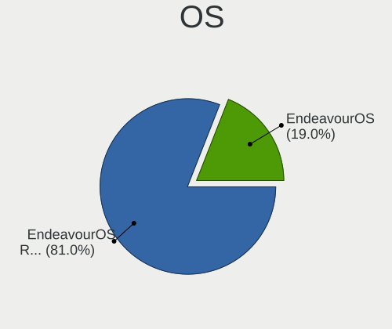

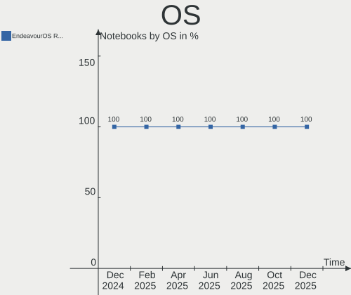

| Name                | Notebooks | Percent |
|---------------------|-----------|---------|
| EndeavourOS Rolling | 28        | 100%    |

OS Family
---------

OS without a version

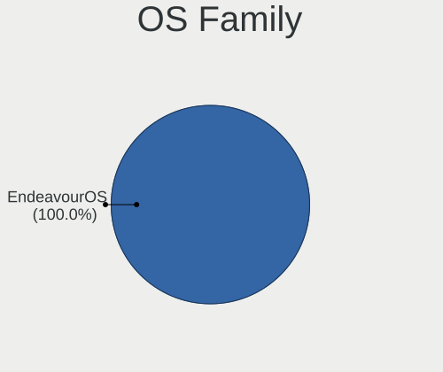

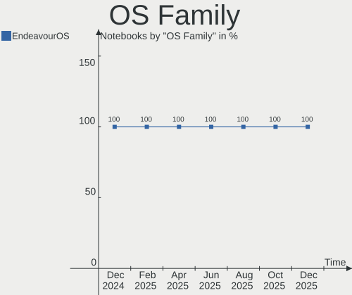

| Name        | Notebooks | Percent |
|-------------|-----------|---------|
| EndeavourOS | 28        | 100%    |

Kernel
------

Version of the Linux kernel

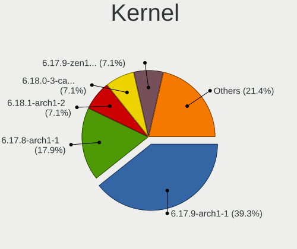

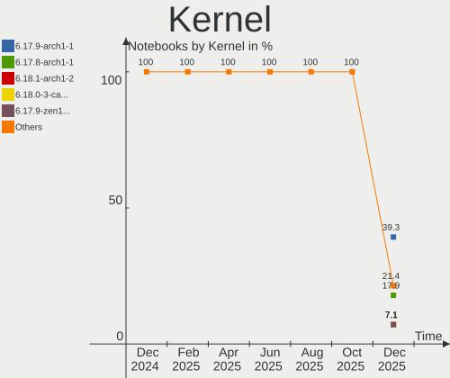

| Version           | Notebooks | Percent |
|-------------------|-----------|---------|
| 6.17.9-arch1-1    | 11        | 39.29%  |
| 6.17.8-arch1-1    | 5         | 17.86%  |
| 6.18.1-arch1-2    | 2         | 7.14%   |
| 6.18.0-3-cachyos  | 2         | 7.14%   |
| 6.17.9-zen1-1-zen | 2         | 7.14%   |
| 6.18.2-zen2-1-zen | 1         | 3.57%   |
| 6.18.2-arch2-1    | 1         | 3.57%   |
| 6.17.5-arch1-1    | 1         | 3.57%   |
| 6.12.63-1-lts     | 1         | 3.57%   |
| 6.12.60-1-lts     | 1         | 3.57%   |
| 6.12.59-1-lts     | 1         | 3.57%   |

Kernel Family
-------------

Linux kernel without a distro release

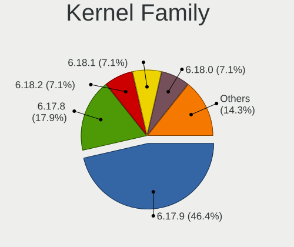

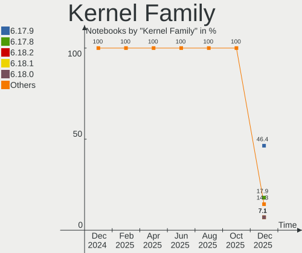

| Version | Notebooks | Percent |
|---------|-----------|---------|
| 6.17.9  | 13        | 46.43%  |
| 6.17.8  | 5         | 17.86%  |
| 6.18.2  | 2         | 7.14%   |
| 6.18.1  | 2         | 7.14%   |
| 6.18.0  | 2         | 7.14%   |
| 6.17.5  | 1         | 3.57%   |
| 6.12.63 | 1         | 3.57%   |
| 6.12.60 | 1         | 3.57%   |
| 6.12.59 | 1         | 3.57%   |

Kernel Major Ver.
-----------------

Linux kernel major version

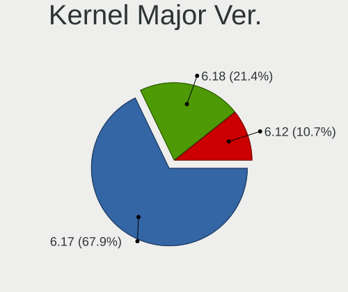

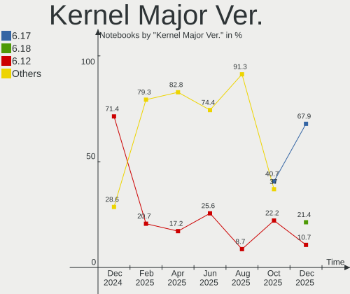

| Version | Notebooks | Percent |
|---------|-----------|---------|
| 6.17    | 19        | 67.86%  |
| 6.18    | 6         | 21.43%  |
| 6.12    | 3         | 10.71%  |

Arch
----

OS architecture (x86_64, i586, etc.)

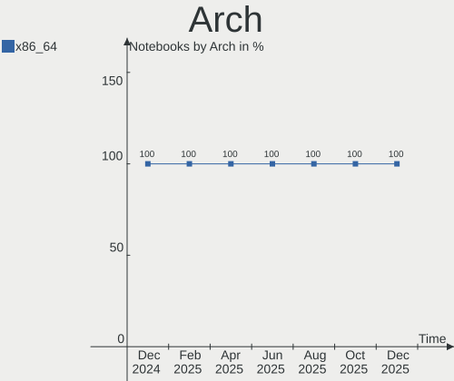

| Name   | Notebooks | Percent |
|--------|-----------|---------|
| x86_64 | 28        | 100%    |

DE
--

Desktop Environment

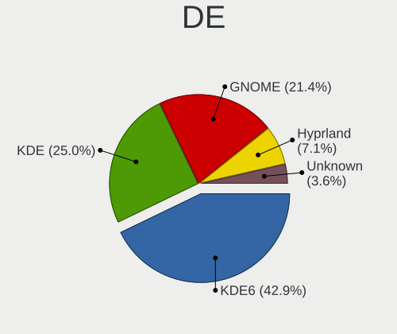

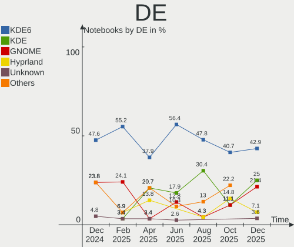

| Name     | Notebooks | Percent |
|----------|-----------|---------|
| KDE6     | 12        | 42.86%  |
| KDE      | 7         | 25%     |
| GNOME    | 6         | 21.43%  |
| Hyprland | 2         | 7.14%   |
| Unknown  | 1         | 3.57%   |

Display Server
--------------

X11 or Wayland

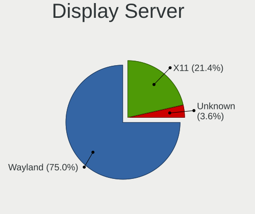

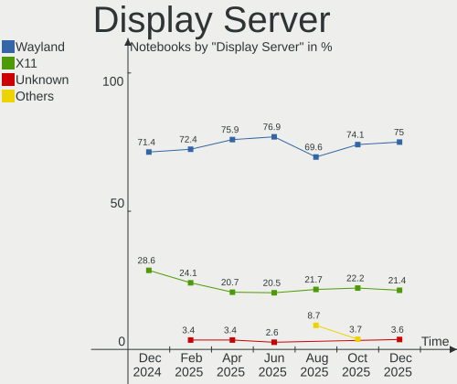

| Name    | Notebooks | Percent |
|---------|-----------|---------|
| Wayland | 21        | 75%     |
| X11     | 6         | 21.43%  |
| Unknown | 1         | 3.57%   |

Display Manager
---------------

SDDM, LightDM, etc.

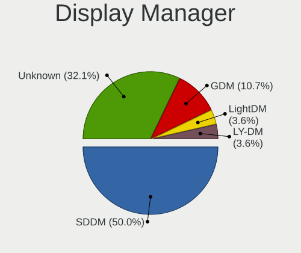

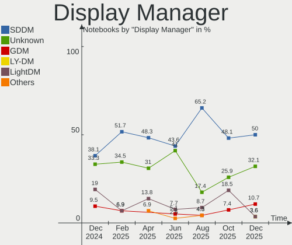

| Name    | Notebooks | Percent |
|---------|-----------|---------|
| SDDM    | 14        | 50%     |
| Unknown | 9         | 32.14%  |
| GDM     | 3         | 10.71%  |
| LY-DM   | 1         | 3.57%   |
| LightDM | 1         | 3.57%   |

OS Lang
-------

Language

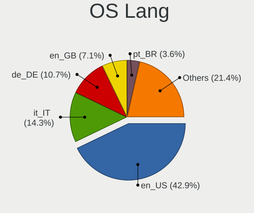

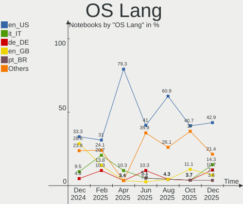

| Lang  | Notebooks | Percent |
|-------|-----------|---------|
| en_US | 12        | 42.86%  |
| it_IT | 4         | 14.29%  |
| de_DE | 3         | 10.71%  |
| en_GB | 2         | 7.14%   |
| pt_BR | 1         | 3.57%   |
| es_PE | 1         | 3.57%   |
| es_MX | 1         | 3.57%   |
| es_ES | 1         | 3.57%   |
| en_ZA | 1         | 3.57%   |
| en_PH | 1         | 3.57%   |
| en_DK | 1         | 3.57%   |

Boot Mode
---------

EFI or BIOS

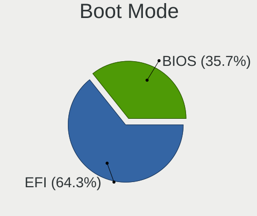

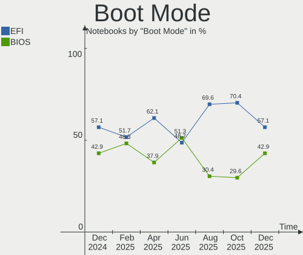

| Mode | Notebooks | Percent |
|------|-----------|---------|
| EFI  | 16        | 57.14%  |
| BIOS | 12        | 42.86%  |

Filesystem
----------

Type of filesystem

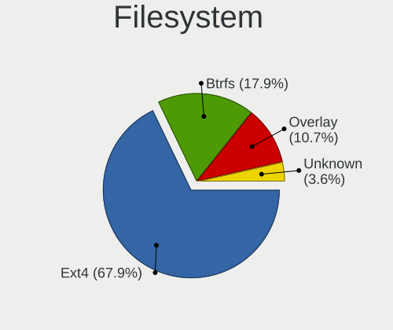

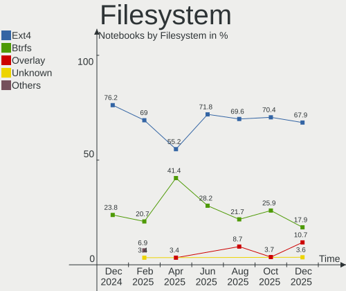

| Type    | Notebooks | Percent |
|---------|-----------|---------|
| Ext4    | 19        | 67.86%  |
| Btrfs   | 5         | 17.86%  |
| Overlay | 3         | 10.71%  |
| Unknown | 1         | 3.57%   |

Part. scheme
------------

Scheme of partitioning

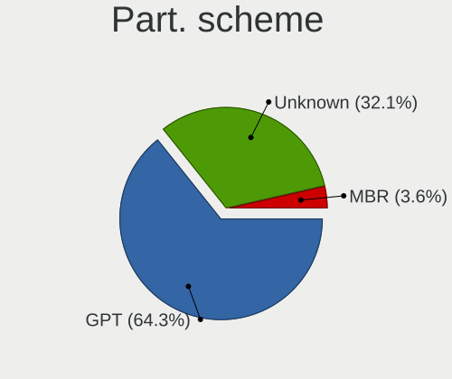

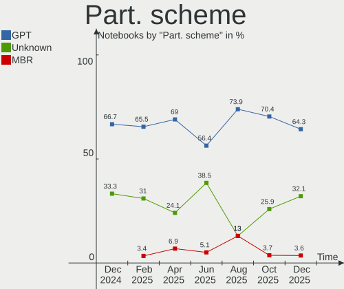

| Type    | Notebooks | Percent |
|---------|-----------|---------|
| GPT     | 18        | 64.29%  |
| Unknown | 9         | 32.14%  |
| MBR     | 1         | 3.57%   |

Dual Boot with Linux/BSD
------------------------

Hosting more than one Linux/BSD

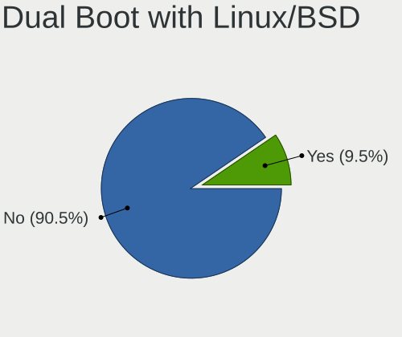

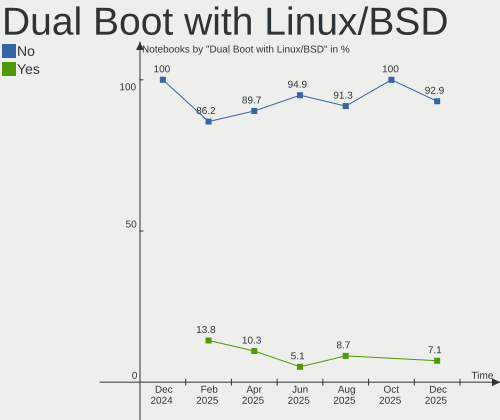

| Dual boot | Notebooks | Percent |
|-----------|-----------|---------|
| No        | 26        | 92.86%  |
| Yes       | 2         | 7.14%   |

Dual Boot (Win)
---------------

Hosting Linux and Windows

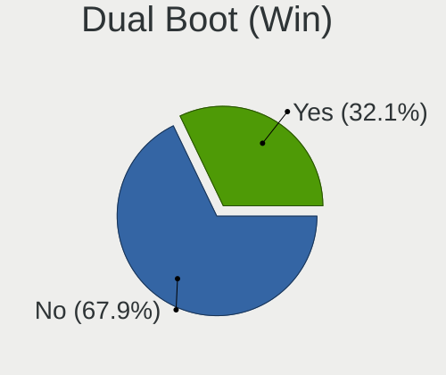

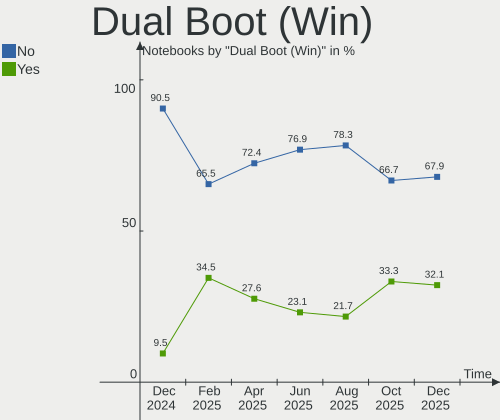

| Dual boot | Notebooks | Percent |
|-----------|-----------|---------|
| No        | 19        | 67.86%  |
| Yes       | 9         | 32.14%  |

Board
-----

Vendor
------

Motherboard manufacturer

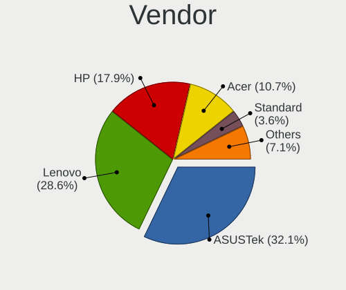

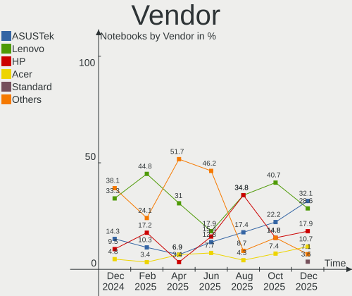

| Name                | Notebooks | Percent |
|---------------------|-----------|---------|
| ASUSTek Computer    | 9         | 32.14%  |
| Lenovo              | 8         | 28.57%  |
| Hewlett-Packard     | 5         | 17.86%  |
| Acer                | 3         | 10.71%  |
| Standard            | 1         | 3.57%   |
| Samsung Electronics | 1         | 3.57%   |
| Gigabyte Technology | 1         | 3.57%   |

Model
-----

Motherboard model

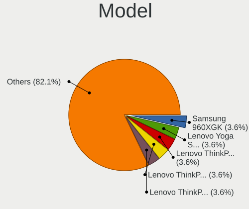

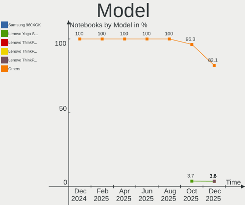

| Name                                   | Notebooks | Percent |
|----------------------------------------|-----------|---------|
| Samsung 960XGK                         | 1         | 3.57%   |
| Lenovo Yoga Slim 7 14ILL10 83JX        | 1         | 3.57%   |
| Lenovo ThinkPad T470p 20J6CTO1WW       | 1         | 3.57%   |
| Lenovo ThinkPad T470 20HES20M0A        | 1         | 3.57%   |
| Lenovo ThinkPad T460 20FN0059US        | 1         | 3.57%   |
| Lenovo ThinkPad L15 Gen 2a 20X7003TGE  | 1         | 3.57%   |
| Lenovo IdeaPad Slim 3 15IRH10R 83K4    | 1         | 3.57%   |
| Lenovo IdeaPad 3 15ALC6 82MF           | 1         | 3.57%   |
| Lenovo G500 20236                      | 1         | 3.57%   |
| HP Victus by Gaming Laptop 15-fa2xxx   | 1         | 3.57%   |
| HP ProBook 650 G1                      | 1         | 3.57%   |
| HP OMEN Gaming Laptop 16-ap0xxx        | 1         | 3.57%   |
| HP Dragonfly Pro ONE                   | 1         | 3.57%   |
| HP 340S G7 Notebook PC                 | 1         | 3.57%   |
| Gigabyte B550 GAMING X V2              | 1         | 3.57%   |
| ASUS ZenBook UX434DA_2nd33DA           | 1         | 3.57%   |
| ASUS VivoBook_ASUSLaptop X571GT_A571GT | 1         | 3.57%   |
| ASUS VivoBook S15 X510UF               | 1         | 3.57%   |
| ASUS VivoBook 15_ASUS Laptop X540UAR   | 1         | 3.57%   |
| ASUS UX303UB                           | 1         | 3.57%   |
| ASUS TUF Gaming B450-PLUS II           | 1         | 3.57%   |
| ASUS ROG Strix G16 G614PP_G614PP       | 1         | 3.57%   |
| ASUS N73SV                             | 1         | 3.57%   |
| ASUS ASUS EXPERTBOOK P5405CSA          | 1         | 3.57%   |
| Acer Swift SF314-52G                   | 1         | 3.57%   |
| Acer Aspire A515-56                    | 1         | 3.57%   |
| Acer Aspire A315-23                    | 1         | 3.57%   |
| Unknown                                | 1         | 3.57%   |

Model Family
------------

Motherboard model prefix

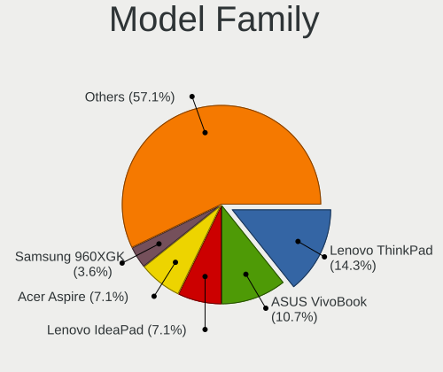

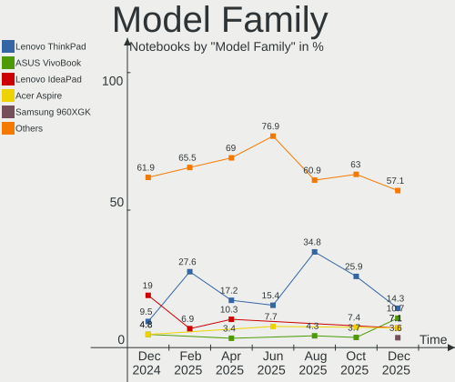

| Name            | Notebooks | Percent |
|-----------------|-----------|---------|
| Lenovo ThinkPad | 4         | 14.29%  |
| ASUS VivoBook   | 3         | 10.71%  |
| Lenovo IdeaPad  | 2         | 7.14%   |
| Acer Aspire     | 2         | 7.14%   |
| Samsung 960XGK  | 1         | 3.57%   |
| Lenovo Yoga     | 1         | 3.57%   |
| Lenovo G500     | 1         | 3.57%   |
| HP Victus       | 1         | 3.57%   |
| HP ProBook      | 1         | 3.57%   |
| HP OMEN         | 1         | 3.57%   |
| HP Dragonfly    | 1         | 3.57%   |
| HP 340S         | 1         | 3.57%   |
| Gigabyte B550   | 1         | 3.57%   |
| ASUS ZenBook    | 1         | 3.57%   |
| ASUS UX303UB    | 1         | 3.57%   |
| ASUS TUF        | 1         | 3.57%   |
| ASUS ROG        | 1         | 3.57%   |
| ASUS N73SV      | 1         | 3.57%   |
| ASUS ASUS       | 1         | 3.57%   |
| Acer Swift      | 1         | 3.57%   |
| Unknown         | 1         | 3.57%   |

MFG Year
--------

Motherboard manufacture year

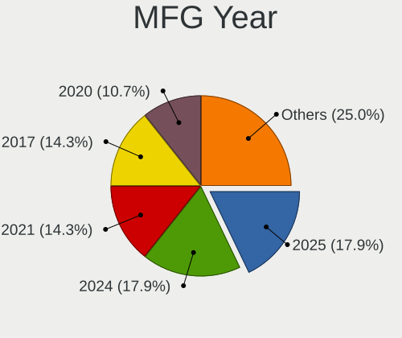

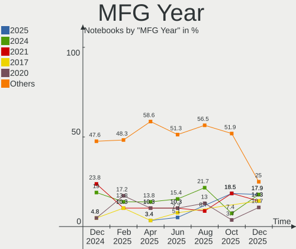

| Year | Notebooks | Percent |
|------|-----------|---------|
| 2025 | 5         | 17.86%  |
| 2024 | 5         | 17.86%  |
| 2021 | 4         | 14.29%  |
| 2017 | 4         | 14.29%  |
| 2020 | 3         | 10.71%  |
| 2013 | 2         | 7.14%   |
| 2019 | 1         | 3.57%   |
| 2018 | 1         | 3.57%   |
| 2016 | 1         | 3.57%   |
| 2015 | 1         | 3.57%   |
| 2011 | 1         | 3.57%   |

Form Factor
-----------

Physical design of the computer

| Name     | Notebooks | Percent |
|----------|-----------|---------|
| Notebook | 28        | 100%    |

Secure Boot
-----------

Enabled or disabled

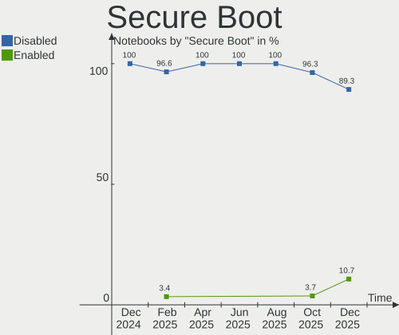

| State    | Notebooks | Percent |
|----------|-----------|---------|
| Disabled | 25        | 89.29%  |
| Enabled  | 3         | 10.71%  |

Coreboot
--------

Have coreboot on board

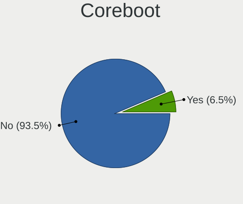

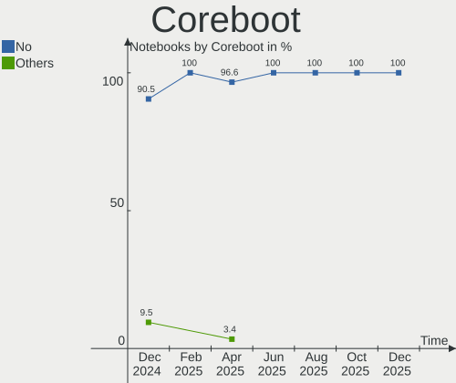

| Used | Notebooks | Percent |
|------|-----------|---------|
| No   | 28        | 100%    |

RAM Size
--------

Total RAM memory

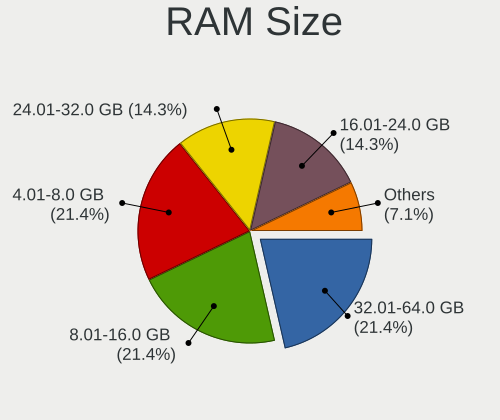

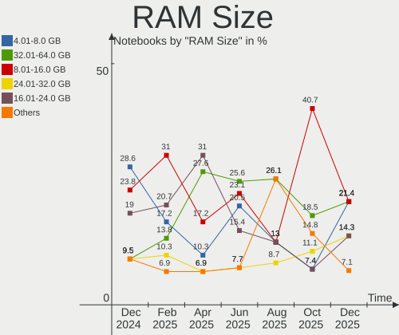

| Size in GB | Notebooks | Percent |
|------------|-----------|---------|
| 4.01-8.0   | 6         | 21.43%  |
| 32.01-64.0 | 6         | 21.43%  |
| 8.01-16.0  | 6         | 21.43%  |
| 24.01-32.0 | 4         | 14.29%  |
| 16.01-24.0 | 4         | 14.29%  |
| 3.01-4.0   | 2         | 7.14%   |

RAM Used
--------

Used RAM memory

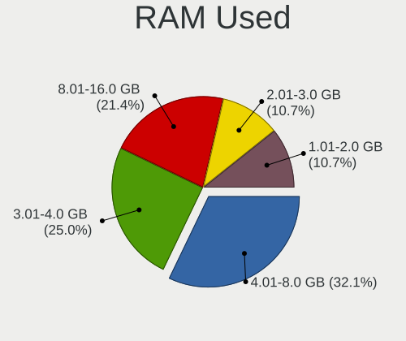

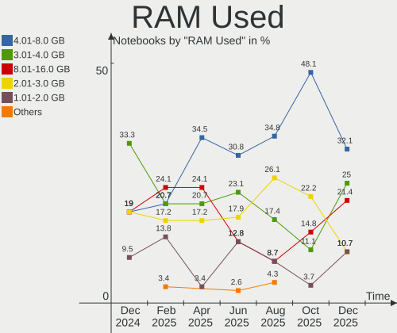

| Used GB   | Notebooks | Percent |
|-----------|-----------|---------|
| 4.01-8.0  | 9         | 32.14%  |
| 3.01-4.0  | 7         | 25%     |
| 8.01-16.0 | 6         | 21.43%  |
| 2.01-3.0  | 3         | 10.71%  |
| 1.01-2.0  | 3         | 10.71%  |

Total Drives
------------

Number of drives on board

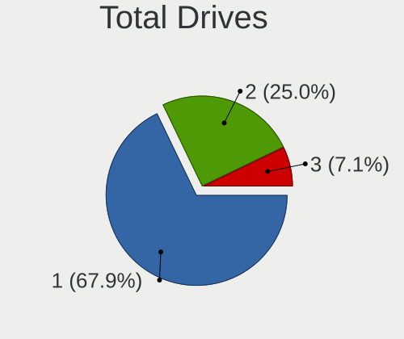

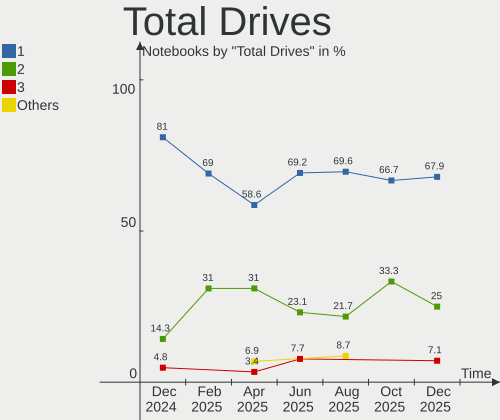

| Drives | Notebooks | Percent |
|--------|-----------|---------|
| 1      | 19        | 67.86%  |
| 2      | 7         | 25%     |
| 3      | 2         | 7.14%   |

Has CD-ROM
----------

Has CD-ROM on board

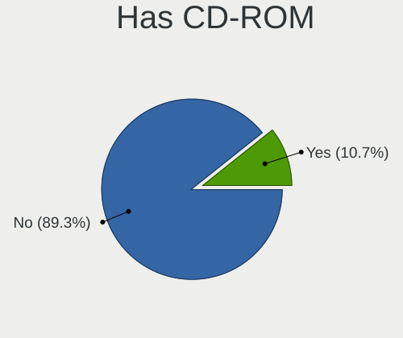

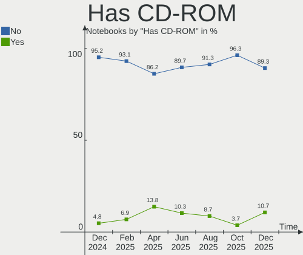

| Presented | Notebooks | Percent |
|-----------|-----------|---------|
| No        | 25        | 89.29%  |
| Yes       | 3         | 10.71%  |

Has Ethernet
------------

Has Ethernet on board

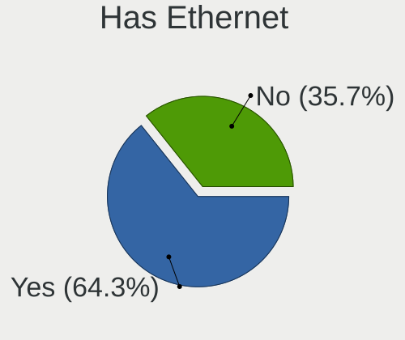

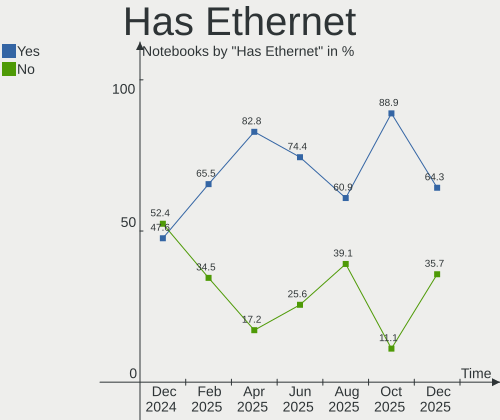

| Presented | Notebooks | Percent |
|-----------|-----------|---------|
| Yes       | 18        | 64.29%  |
| No        | 10        | 35.71%  |

Has WiFi
--------

Has WiFi module

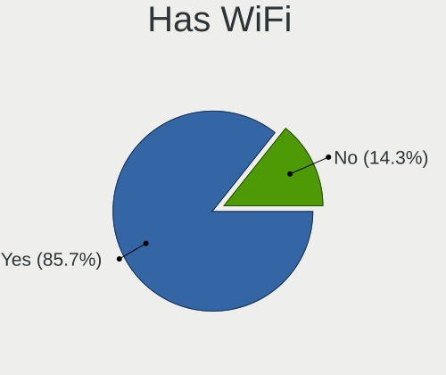

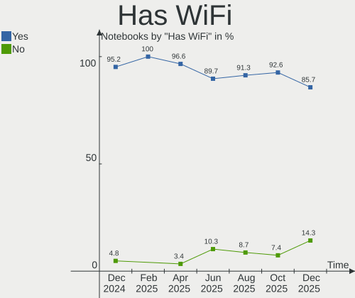

| Presented | Notebooks | Percent |
|-----------|-----------|---------|
| Yes       | 24        | 85.71%  |
| No        | 4         | 14.29%  |

Has Bluetooth
-------------

Has Bluetooth module

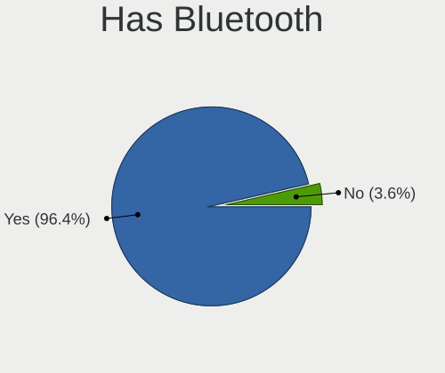

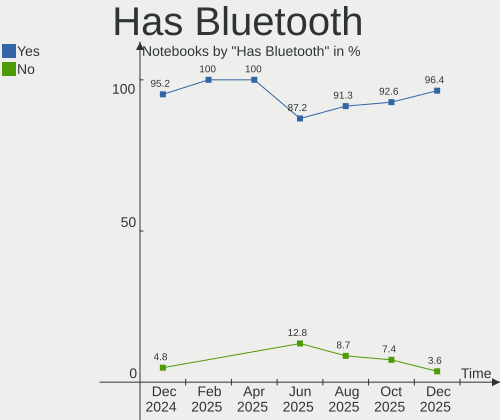

| Presented | Notebooks | Percent |
|-----------|-----------|---------|
| Yes       | 27        | 96.43%  |
| No        | 1         | 3.57%   |

Location
--------

Country
-------

Geographic location (country)

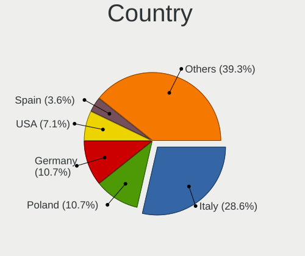

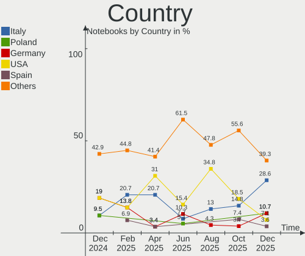

| Country      | Notebooks | Percent |
|--------------|-----------|---------|
| Italy        | 8         | 28.57%  |
| Poland       | 3         | 10.71%  |
| Germany      | 3         | 10.71%  |
| USA          | 2         | 7.14%   |
| Spain        | 1         | 3.57%   |
| South Africa | 1         | 3.57%   |
| Slovenia     | 1         | 3.57%   |
| Slovakia     | 1         | 3.57%   |
| Puerto Rico  | 1         | 3.57%   |
| Philippines  | 1         | 3.57%   |
| Peru         | 1         | 3.57%   |
| France       | 1         | 3.57%   |
| Finland      | 1         | 3.57%   |
| Denmark      | 1         | 3.57%   |
| Colombia     | 1         | 3.57%   |
| Brazil       | 1         | 3.57%   |

City
----

Geographic location (city)

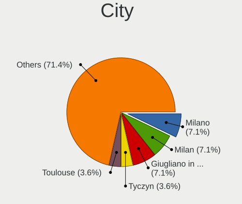

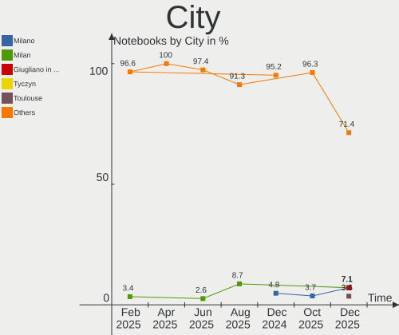

| City                   | Notebooks | Percent |
|------------------------|-----------|---------|
| Milano                 | 2         | 7.14%   |
| Milan                  | 2         | 7.14%   |
| Giugliano in Campania  | 2         | 7.14%   |
| Tyczyn                 | 1         | 3.57%   |
| Toulouse               | 1         | 3.57%   |
| Teresina               | 1         | 3.57%   |
| Sparks                 | 1         | 3.57%   |
| Sempeter pri Gorici    | 1         | 3.57%   |
| Santa Cruz de La Palma | 1         | 3.57%   |
| San Juan               | 1         | 3.57%   |
| Salzkotten             | 1         | 3.57%   |
| Saarlouis              | 1         | 3.57%   |
| Quezon City            | 1         | 3.57%   |
| Pruszków              | 1         | 3.57%   |
| Pereira                | 1         | 3.57%   |
| Lima                   | 1         | 3.57%   |
| Lahti                  | 1         | 3.57%   |
| Krefeld                | 1         | 3.57%   |
| Krakow                 | 1         | 3.57%   |
| Detroit                | 1         | 3.57%   |
| Copenhagen             | 1         | 3.57%   |
| Catania                | 1         | 3.57%   |
| Cape Town              | 1         | 3.57%   |
| Borgomanero            | 1         | 3.57%   |
| Bab                    | 1         | 3.57%   |

Drives
------

Drive Vendor
------------

Hard drive vendors

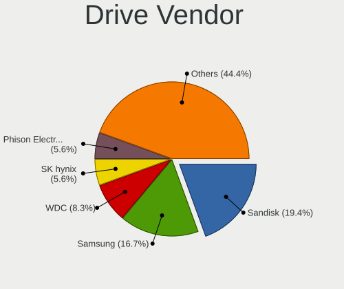

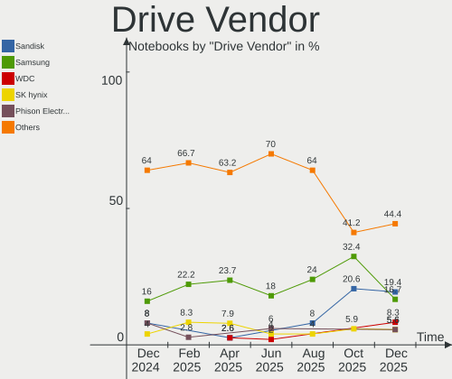

| Vendor                      | Notebooks | Drives | Percent |
|-----------------------------|-----------|--------|---------|
| Sandisk                     | 7         | 7      | 19.44%  |
| Samsung Electronics         | 6         | 7      | 16.67%  |
| WDC                         | 3         | 4      | 8.33%   |
| SK hynix                    | 2         | 2      | 5.56%   |
| Phison Electronics          | 2         | 2      | 5.56%   |
| Micron Technology           | 2         | 2      | 5.56%   |
| Kingston Technology Company | 2         | 2      | 5.56%   |
| Kingston                    | 2         | 2      | 5.56%   |
| Intel                       | 2         | 3      | 5.56%   |
| ADATA Technology            | 2         | 2      | 5.56%   |
| Transcend                   | 1         | 1      | 2.78%   |
| Toshiba                     | 1         | 1      | 2.78%   |
| Seagate                     | 1         | 1      | 2.78%   |
| Micron/Crucial Technology   | 1         | 1      | 2.78%   |
| Hitachi                     | 1         | 1      | 2.78%   |
| Crucial                     | 1         | 1      | 2.78%   |

Drive Model
-----------

Hard drive models

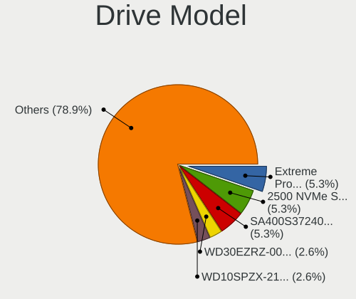

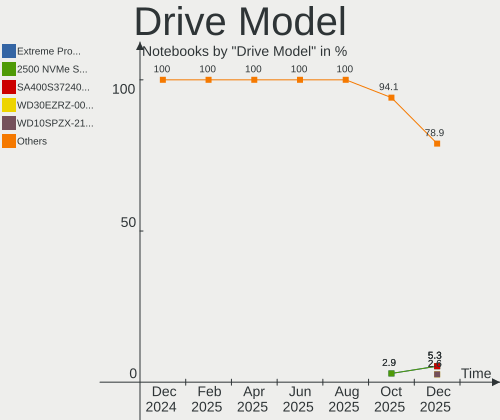

| Model                                                                      | Notebooks | Percent |
|----------------------------------------------------------------------------|-----------|---------|
| Sandisk Extreme Pro / WD Black SN750 / PC SN730 / Red SN700 NVMe SSD 500GB | 2         | 5.26%   |
| Micron 2500 NVMe SSD (DRAM-less) 512GB                                     | 2         | 5.26%   |
| Kingston SA400S37240G 240GB SSD                                            | 2         | 5.26%   |
| WDC WD30EZRZ-00GXCB0 3TB                                                   | 1         | 2.63%   |
| WDC WD10SPZX-21Z10T0 1TB                                                   | 1         | 2.63%   |
| WDC WD10SPZX-08Z10 1TB                                                     | 1         | 2.63%   |
| WDC WD Blue SA510 M.2 2280 500GB SSD                                       | 1         | 2.63%   |
| Transcend TS120GMTS420S 120GB SSD                                          | 1         | 2.63%   |
| Toshiba MQ04ABF100 1TB                                                     | 1         | 2.63%   |
| SK hynix SHPP41-2000GM 2TB                                                 | 1         | 2.63%   |
| SK hynix Gold P31/BC711/PC711 NVMe Solid State Drive 512GB                 | 1         | 2.63%   |
| Seagate ST9750420AS 752GB                                                  | 1         | 2.63%   |
| Sandisk WD_BLACK SN7100 NVMe SSD (DRAM-less) 1TB                           | 1         | 2.63%   |
| Sandisk WD PC SN7100S SDFPMSL-1T00-1101 1024GB                             | 1         | 2.63%   |
| Sandisk WD Black SN750 / PC SN730 NVMe SSD 500GB                           | 1         | 2.63%   |
| SanDisk SSD PLUS 1000GB                                                    | 1         | 2.63%   |
| Sandisk PC SN5000S SDEPNSJ-512G-1006 512GB                                 | 1         | 2.63%   |
| Samsung SSD 870 QVO 1TB                                                    | 1         | 2.63%   |
| Samsung SSD 870 EVO 250GB                                                  | 1         | 2.63%   |
| Samsung SSD 860 EVO 1TB                                                    | 1         | 2.63%   |
| Samsung NVMe SSD Controller SM961/PM961/SM963 1024GB                       | 1         | 2.63%   |
| Samsung NVMe SSD Controller PM9C1a (DRAM-less) 1TB                         | 1         | 2.63%   |
| Samsung NVMe SSD Controller PM9B1 (DRAM-less) 512GB                        | 1         | 2.63%   |
| Samsung MZVL81T0HFLB-00BH1 1TB                                             | 1         | 2.63%   |
| Phison E18 PCIe4 NVMe Controller 2TB                                       | 1         | 2.63%   |
| Phison E12 NVMe Controller 1TB                                             | 1         | 2.63%   |
| Micron/Crucial P5 NVMe PCIe SSD[SlashP5] 500GB                             | 1         | 2.63%   |
| Kingston Company OM3PDP3 NVMe SSD 256GB                                    | 1         | 2.63%   |
| Kingston Company NV2 NVMe SSD [E21T] (DRAM-less) 2TB                       | 1         | 2.63%   |
| Intel SSDSC2KW240H6 240GB                                                  | 1         | 2.63%   |
| Intel Optane NVME SSD H10 with Solid State Storage [Teton Glacier] 32GB    | 1         | 2.63%   |
| Hitachi HTS541680J9SA00 80GB                                               | 1         | 2.63%   |
| Crucial CT1000BX500SSD1 1TB                                                | 1         | 2.63%   |
| ADATA XPG GAMMIX S50 CORE NVMe SSD (DRAM-less) 1TB                         | 1         | 2.63%   |
| ADATA IM2P33F4 NVMe SSD (DRAM-less) 256GB                                  | 1         | 2.63%   |

HDD Vendor
----------

Hard disk drive vendors

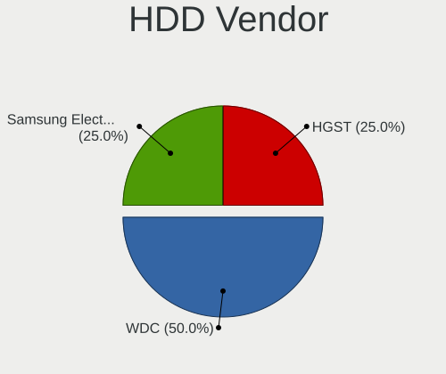

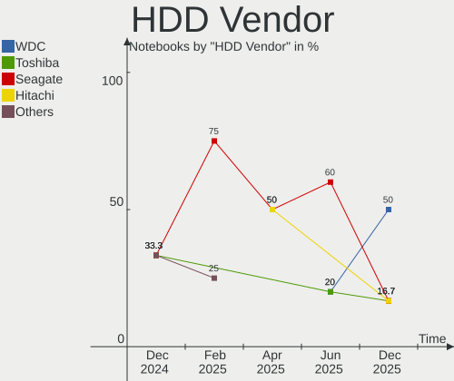

| Vendor  | Notebooks | Drives | Percent |
|---------|-----------|--------|---------|
| WDC     | 3         | 3      | 50%     |
| Toshiba | 1         | 1      | 16.67%  |
| Seagate | 1         | 1      | 16.67%  |
| Hitachi | 1         | 1      | 16.67%  |

SSD Vendor
----------

Solid state drive vendors

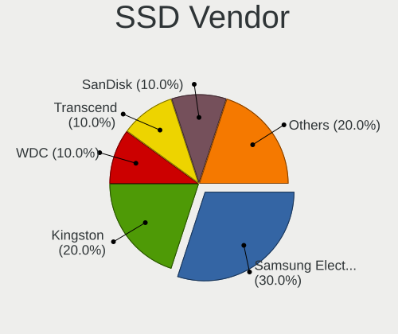

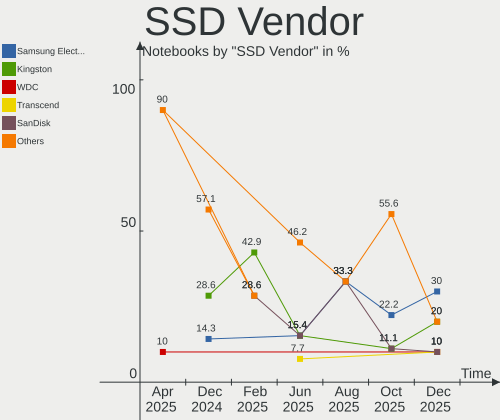

| Vendor              | Notebooks | Drives | Percent |
|---------------------|-----------|--------|---------|
| Samsung Electronics | 3         | 3      | 30%     |
| Kingston            | 2         | 2      | 20%     |
| WDC                 | 1         | 1      | 10%     |
| Transcend           | 1         | 1      | 10%     |
| SanDisk             | 1         | 1      | 10%     |
| Intel               | 1         | 1      | 10%     |
| Crucial             | 1         | 1      | 10%     |

Drive Kind
----------

HDD or SSD

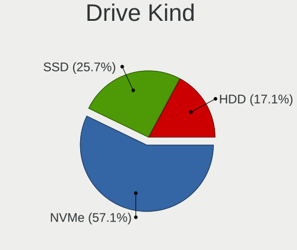

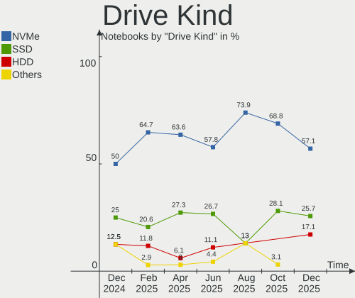

| Kind | Notebooks | Drives | Percent |
|------|-----------|--------|---------|
| NVMe | 20        | 23     | 57.14%  |
| SSD  | 9         | 10     | 25.71%  |
| HDD  | 6         | 6      | 17.14%  |

Drive Connector
---------------

SATA, SAS, NVMe, etc.

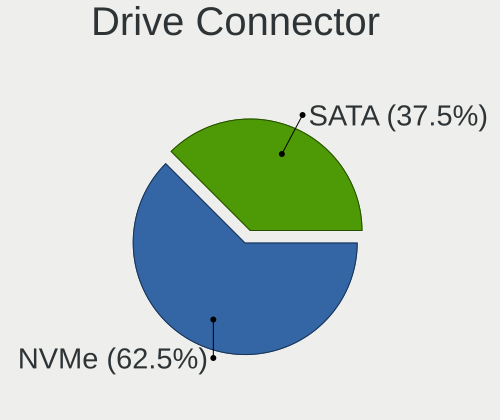

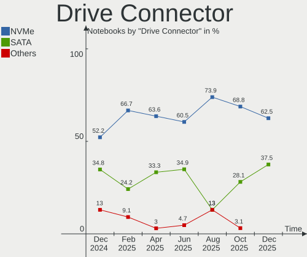

| Type | Notebooks | Drives | Percent |
|------|-----------|--------|---------|
| NVMe | 20        | 23     | 62.5%   |
| SATA | 12        | 16     | 37.5%   |

Drive Size
----------

Size of hard drive

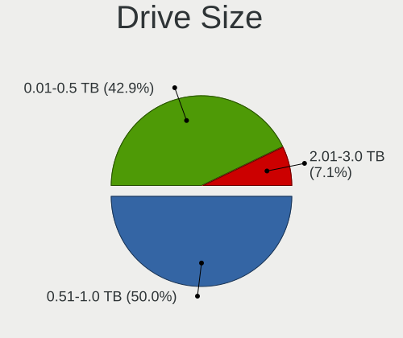

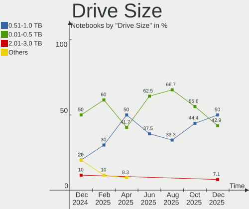

| Size in TB | Notebooks | Drives | Percent |
|------------|-----------|--------|---------|
| 0.51-1.0   | 7         | 8      | 50%     |
| 0.01-0.5   | 6         | 7      | 42.86%  |
| 2.01-3.0   | 1         | 1      | 7.14%   |

Space Total
-----------

Amount of disk space available on the file system

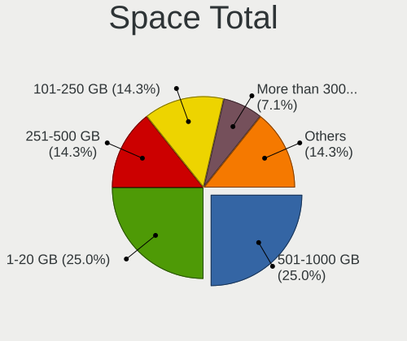

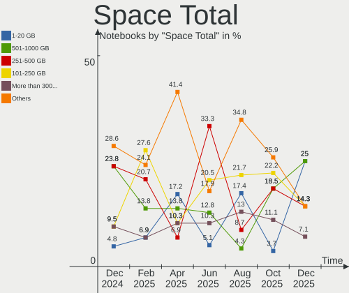

| Size in GB     | Notebooks | Percent |
|----------------|-----------|---------|
| 1-20           | 7         | 25%     |
| 501-1000       | 7         | 25%     |
| 251-500        | 4         | 14.29%  |
| 101-250        | 4         | 14.29%  |
| More than 3000 | 2         | 7.14%   |
| 1001-2000      | 2         | 7.14%   |
| 51-100         | 2         | 7.14%   |

Space Used
----------

Amount of used disk space

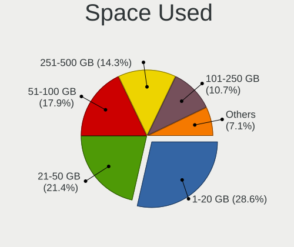

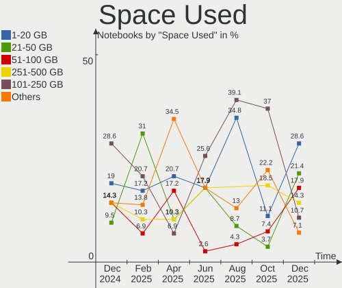

| Used GB   | Notebooks | Percent |
|-----------|-----------|---------|
| 1-20      | 8         | 28.57%  |
| 21-50     | 6         | 21.43%  |
| 51-100    | 5         | 17.86%  |
| 251-500   | 4         | 14.29%  |
| 101-250   | 3         | 10.71%  |
| 2001-3000 | 1         | 3.57%   |
| 1001-2000 | 1         | 3.57%   |

Malfunc. Drives
---------------

Drive models with a malfunction

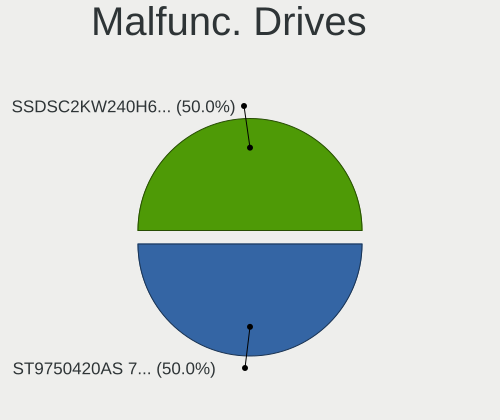

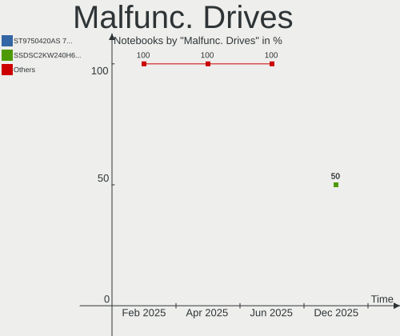

| Model                     | Notebooks | Drives | Percent |
|---------------------------|-----------|--------|---------|
| Seagate ST9750420AS 752GB | 1         | 1      | 50%     |
| Intel SSDSC2KW240H6 240GB | 1         | 1      | 50%     |

Malfunc. Drive Vendor
---------------------

Vendors of faulty drives

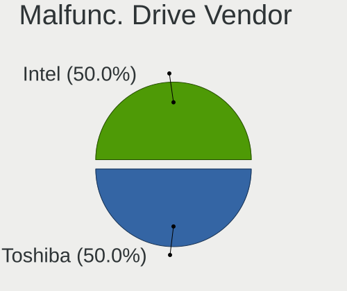

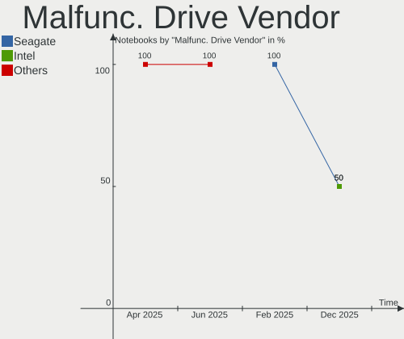

| Vendor  | Notebooks | Drives | Percent |
|---------|-----------|--------|---------|
| Seagate | 1         | 1      | 50%     |
| Intel   | 1         | 1      | 50%     |

Malfunc. HDD Vendor
-------------------

Vendors of faulty HDD drives

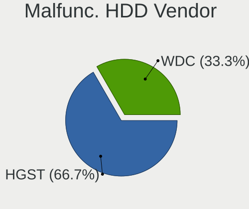

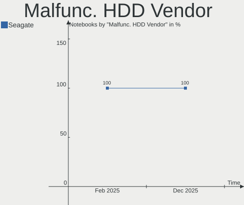

| Vendor  | Notebooks | Drives | Percent |
|---------|-----------|--------|---------|
| Seagate | 1         | 1      | 100%    |

Malfunc. Drive Kind
-------------------

Kinds of faulty drives

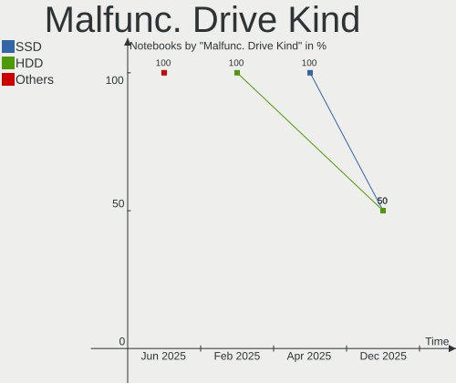

| Kind | Notebooks | Drives | Percent |
|------|-----------|--------|---------|
| SSD  | 1         | 1      | 50%     |
| HDD  | 1         | 1      | 50%     |

Failed Drives
-------------

Failed drive models

Zero info for selected period =(

Failed Drive Vendor
-------------------

Failed drive vendors

Zero info for selected period =(

Drive Status
------------

Number of failed and malfunc. drives

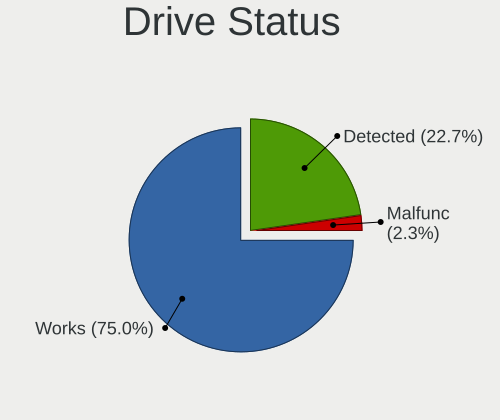

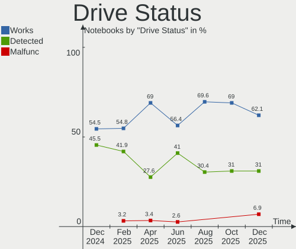

| Status   | Notebooks | Drives | Percent |
|----------|-----------|--------|---------|
| Works    | 18        | 23     | 62.07%  |
| Detected | 9         | 14     | 31.03%  |
| Malfunc  | 2         | 2      | 6.9%    |

Storage controller
------------------

Storage Vendor
--------------

Storage controller vendors

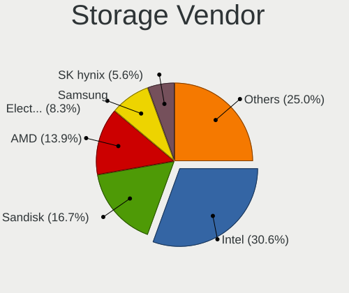

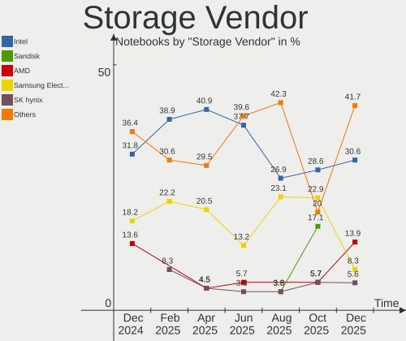

| Vendor                      | Notebooks | Percent |
|-----------------------------|-----------|---------|
| Intel                       | 11        | 30.56%  |
| Sandisk                     | 6         | 16.67%  |
| AMD                         | 5         | 13.89%  |
| Samsung Electronics         | 3         | 8.33%   |
| SK hynix                    | 2         | 5.56%   |
| Phison Electronics          | 2         | 5.56%   |
| Micron Technology           | 2         | 5.56%   |
| Kingston Technology Company | 2         | 5.56%   |
| ADATA Technology            | 2         | 5.56%   |
| Micron/Crucial Technology   | 1         | 2.78%   |

Storage Model
-------------

Storage controller models

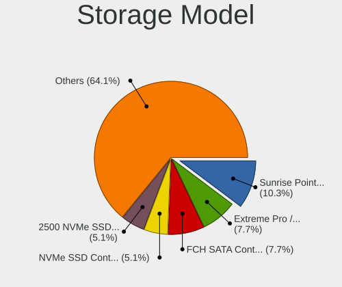

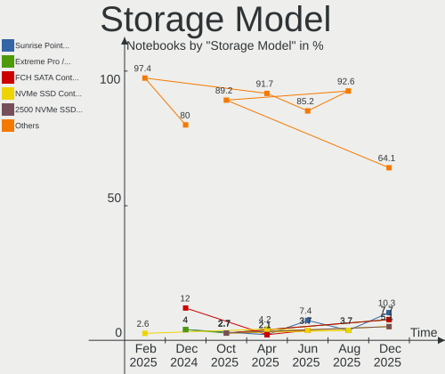

| Model                                                                          | Notebooks | Percent |
|--------------------------------------------------------------------------------|-----------|---------|
| Intel Sunrise Point-LP SATA Controller [AHCI mode]                             | 4         | 10.26%  |
| SanDisk Extreme Pro / WD Black SN750 / PC SN730 / Red SN700 NVMe SSD           | 3         | 7.69%   |
| AMD FCH SATA Controller [AHCI mode]                                            | 3         | 7.69%   |
| Samsung NVMe SSD Controller PM9C1a (DRAM-less)                                 | 2         | 5.13%   |
| Micron 2500 NVMe SSD (DRAM-less)                                               | 2         | 5.13%   |
| Intel 82801 Mobile SATA Controller [RAID mode]                                 | 2         | 5.13%   |
| SK hynix Platinum P41/PC801 NVMe Solid State Drive                             | 1         | 2.56%   |
| SK hynix Gold P31/BC711/PC711 NVMe Solid State Drive                           | 1         | 2.56%   |
| Sandisk WD_BLACK SN7100/WD PC SN7100S M.2 2280 NVMe SSD (DRAM-less)            | 1         | 2.56%   |
| Sandisk WD PC SN7100S M.2 2242 NVMe SSD (DRAM-less)                            | 1         | 2.56%   |
| Sandisk WD PC SN5000S M.2 2280 NVMe SSD (DRAM-less)                            | 1         | 2.56%   |
| Samsung NVMe SSD Controller SM961/PM961/SM963                                  | 1         | 2.56%   |
| Samsung NVMe SSD Controller PM9B1 (DRAM-less)                                  | 1         | 2.56%   |
| Phison E18 PCIe4 NVMe Controller                                               | 1         | 2.56%   |
| Phison E12 NVMe Controller                                                     | 1         | 2.56%   |
| Micron/Crucial P5 NVMe PCIe SSD[SlashP5]                                       | 1         | 2.56%   |
| Kingston Company OM3PDP3 NVMe SSD                                              | 1         | 2.56%   |
| Kingston Company NV2 NVMe SSD [E21T] (DRAM-less)                               | 1         | 2.56%   |
| Intel Volume Management Device NVMe RAID Controller                            | 1         | 2.56%   |
| Intel Tiger Lake-LP SATA Controller                                            | 1         | 2.56%   |
| Intel Optane NVME SSD H10 with Solid State Storage [Teton Glacier]             | 1         | 2.56%   |
| Intel HM170/QM170 Chipset SATA Controller [AHCI Mode]                          | 1         | 2.56%   |
| Intel 8 Series/C220 Series Chipset Family 6-port SATA Controller 1 [AHCI mode] | 1         | 2.56%   |
| Intel 7 Series Chipset Family 6-port SATA Controller [AHCI mode]               | 1         | 2.56%   |
| Intel 6 Series/C200 Series Chipset Family 6 port Mobile SATA AHCI Controller   | 1         | 2.56%   |
| AMD 500 Series Chipset SATA Controller                                         | 1         | 2.56%   |
| AMD 400 Series Chipset SATA Controller                                         | 1         | 2.56%   |
| ADATA XPG GAMMIX S50 CORE NVMe SSD (DRAM-less)                                 | 1         | 2.56%   |
| ADATA IM2P33F4 NVMe SSD (DRAM-less)                                            | 1         | 2.56%   |

Storage Kind
------------

Kind of storage controller (IDE, SATA, NVMe, SAS, ...)

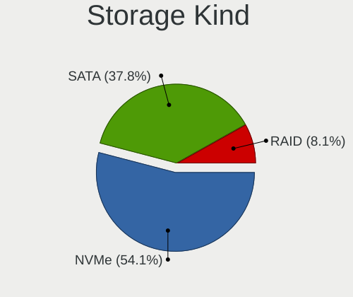

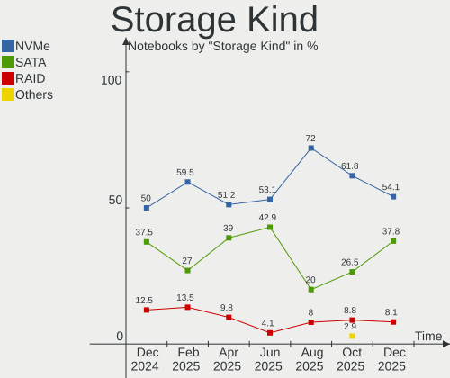

| Kind | Notebooks | Percent |
|------|-----------|---------|
| NVMe | 20        | 54.05%  |
| SATA | 14        | 37.84%  |
| RAID | 3         | 8.11%   |

Processor
---------

CPU Vendor
----------

Processor vendors

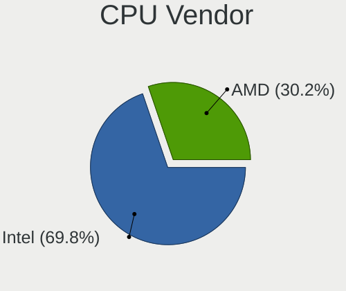

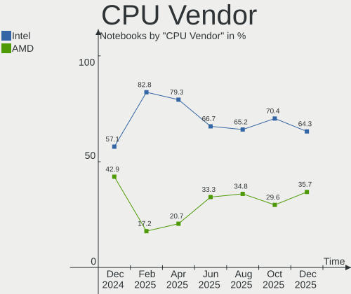

| Vendor | Notebooks | Percent |
|--------|-----------|---------|
| Intel  | 18        | 64.29%  |
| AMD    | 10        | 35.71%  |

CPU Model
---------

Processor models

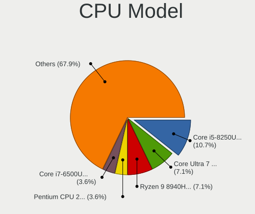

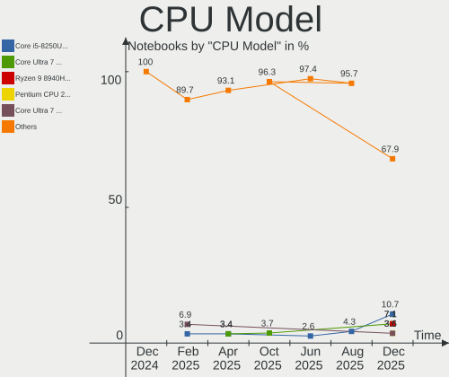

| Model                                         | Notebooks | Percent |
|-----------------------------------------------|-----------|---------|
| Intel Core i5-8250U CPU @ 1.60GHz             | 3         | 10.71%  |
| Intel Core Ultra 7 258V                       | 2         | 7.14%   |
| AMD Ryzen 9 8940HX with Radeon Graphics       | 2         | 7.14%   |
| Intel Pentium CPU 2020M @ 2.40GHz             | 1         | 3.57%   |
| Intel Core Ultra 7 155H                       | 1         | 3.57%   |
| Intel Core i7-6500U CPU @ 2.50GHz             | 1         | 3.57%   |
| Intel Core i7-4702MQ CPU @ 2.20GHz            | 1         | 3.57%   |
| Intel Core i7-2630QM CPU @ 2.00GHz            | 1         | 3.57%   |
| Intel Core i7-1065G7 CPU @ 1.30GHz            | 1         | 3.57%   |
| Intel Core i5-8300H CPU @ 2.30GHz             | 1         | 3.57%   |
| Intel Core i5-7440HQ CPU @ 2.80GHz            | 1         | 3.57%   |
| Intel Core i5-7200U CPU @ 2.50GHz             | 1         | 3.57%   |
| Intel Core i5-6200U CPU @ 2.30GHz             | 1         | 3.57%   |
| Intel Core 7 240H                             | 1         | 3.57%   |
| Intel 13th Gen Core i5-13420H                 | 1         | 3.57%   |
| Intel 11th Gen Core i5-1135G7 @ 2.40GHz       | 1         | 3.57%   |
| AMD Ryzen 7 PRO 5850U with Radeon Graphics    | 1         | 3.57%   |
| AMD Ryzen 7 8845HS w/ Radeon 780M Graphics    | 1         | 3.57%   |
| AMD Ryzen 7 7736U with Radeon Graphics        | 1         | 3.57%   |
| AMD Ryzen 7 5800X3D 8-Core Processor          | 1         | 3.57%   |
| AMD Ryzen 7 5700U with Radeon Graphics        | 1         | 3.57%   |
| AMD Ryzen 7 3700U with Radeon Vega Mobile Gfx | 1         | 3.57%   |
| AMD Ryzen 5 5600G with Radeon Graphics        | 1         | 3.57%   |
| AMD 3020e with Radeon Graphics                | 1         | 3.57%   |

CPU Model Family
----------------

Processor model prefix

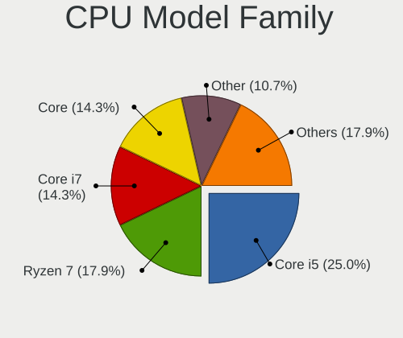

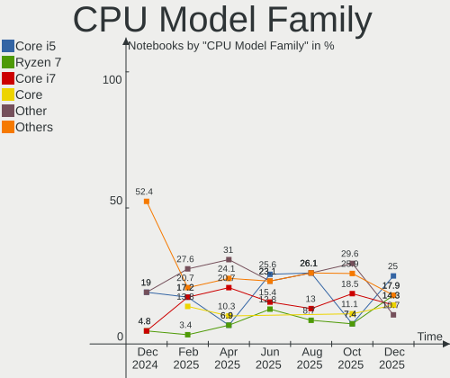

| Model           | Notebooks | Percent |
|-----------------|-----------|---------|
| Intel Core i5   | 7         | 25%     |
| AMD Ryzen 7     | 5         | 17.86%  |
| Intel Core i7   | 4         | 14.29%  |
| Intel Core      | 4         | 14.29%  |
| Other           | 3         | 10.71%  |
| AMD Ryzen 9     | 2         | 7.14%   |
| Intel Pentium   | 1         | 3.57%   |
| AMD Ryzen 7 PRO | 1         | 3.57%   |
| AMD Ryzen 5     | 1         | 3.57%   |

CPU Cores
---------

Number of processor cores

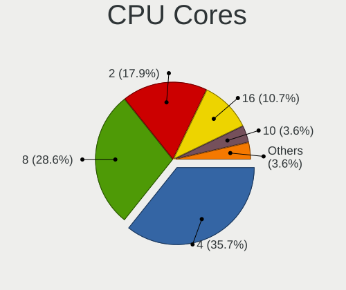

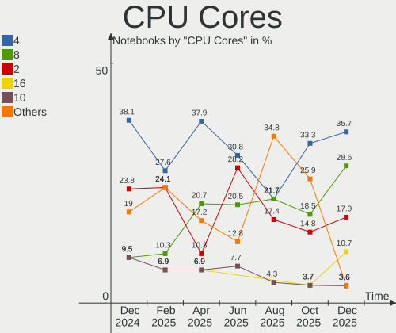

| Number | Notebooks | Percent |
|--------|-----------|---------|
| 4      | 10        | 35.71%  |
| 8      | 8         | 28.57%  |
| 2      | 5         | 17.86%  |
| 16     | 3         | 10.71%  |
| 10     | 1         | 3.57%   |
| 6      | 1         | 3.57%   |

CPU Sockets
-----------

Number of sockets

| Number | Notebooks | Percent |
|--------|-----------|---------|
| 1      | 28        | 100%    |

CPU Threads
-----------

Threads per core (Hyper-Threading)

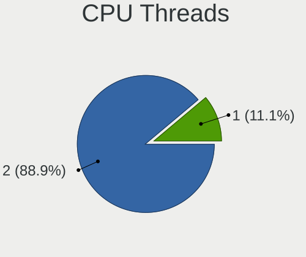

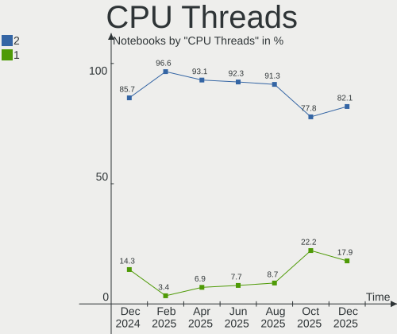

| Number | Notebooks | Percent |
|--------|-----------|---------|
| 2      | 23        | 82.14%  |
| 1      | 5         | 17.86%  |

CPU Op-Modes
------------

CPU Operation Modes (32-bit, 64-bit)

| Op mode        | Notebooks | Percent |
|----------------|-----------|---------|
| 32-bit, 64-bit | 28        | 100%    |

CPU Microcode
-------------

Microcode number

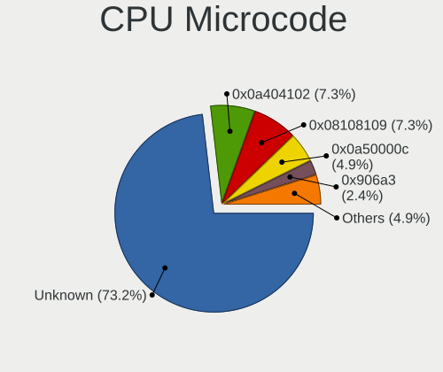

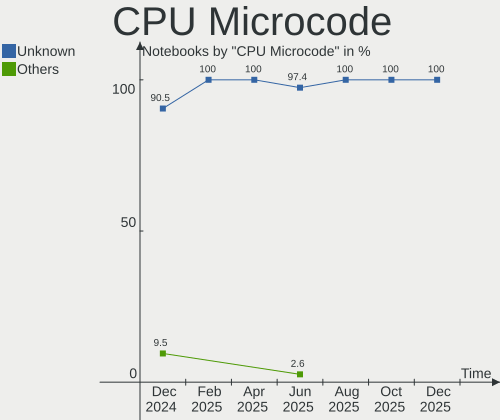

| Number  | Notebooks | Percent |
|---------|-----------|---------|
| Unknown | 28        | 100%    |

CPU Microarch
-------------

Microarchitecture

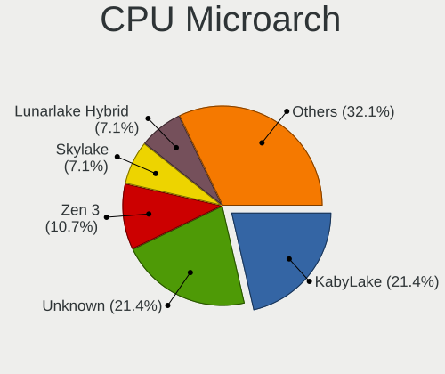

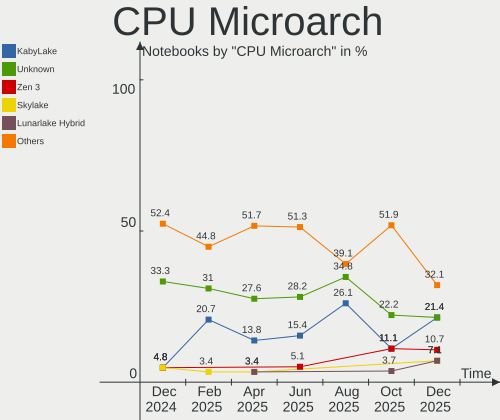

| Name              | Notebooks | Percent |
|-------------------|-----------|---------|
| KabyLake          | 6         | 21.43%  |
| Unknown           | 6         | 21.43%  |
| Zen 3             | 3         | 10.71%  |
| Skylake           | 2         | 7.14%   |
| Lunarlake Hybrid  | 2         | 7.14%   |
| Zen+              | 1         | 3.57%   |
| Zen               | 1         | 3.57%   |
| TigerLake         | 1         | 3.57%   |
| SandyBridge       | 1         | 3.57%   |
| Meteorlake Hybrid | 1         | 3.57%   |
| IvyBridge         | 1         | 3.57%   |
| IceLake           | 1         | 3.57%   |
| Haswell           | 1         | 3.57%   |
| Alderlake Hybrid  | 1         | 3.57%   |

Graphics
--------

GPU Vendor
----------

Vendors of graphics cards

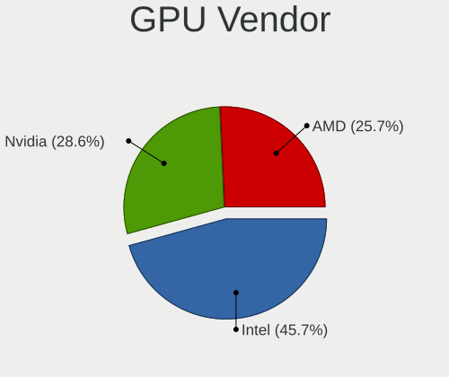

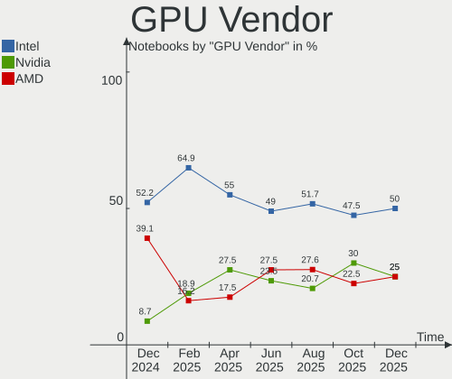

| Vendor | Notebooks | Percent |
|--------|-----------|---------|
| Intel  | 18        | 50%     |
| Nvidia | 9         | 25%     |
| AMD    | 9         | 25%     |

GPU Model
---------

Graphics card models

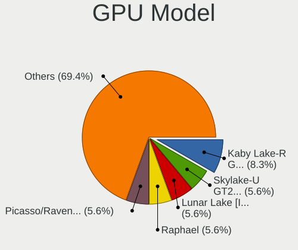

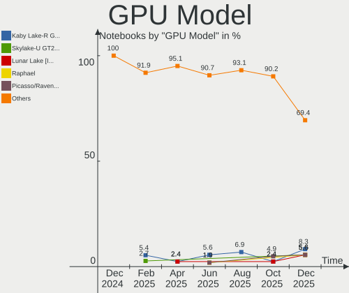

| Model                                                                     | Notebooks | Percent |
|---------------------------------------------------------------------------|-----------|---------|
| Intel Kaby Lake-R GT2 [UHD Graphics 620]                                  | 3         | 8.33%   |
| Intel Skylake-U GT2 [HD Graphics 520]                                     | 2         | 5.56%   |
| Intel Lunar Lake [Intel Arc Graphics 130V / 140V]                         | 2         | 5.56%   |
| AMD Raphael                                                               | 2         | 5.56%   |
| AMD Picasso/Raven 2 [Radeon Vega Series / Radeon Vega Mobile Series]      | 2         | 5.56%   |
| Nvidia TU117M [GeForce GTX 1650 Mobile / Max-Q]                           | 1         | 2.78%   |
| Nvidia GP108M [GeForce MX150]                                             | 1         | 2.78%   |
| Nvidia GP104 [GeForce GTX 1070]                                           | 1         | 2.78%   |
| Nvidia GM108M [GeForce MX130]                                             | 1         | 2.78%   |
| Nvidia GM108M [GeForce 940M]                                              | 1         | 2.78%   |
| Nvidia GF108M [GeForce GT 540M]                                           | 1         | 2.78%   |
| Nvidia GB206M [GeForce RTX 5070 Max-Q / Mobile]                           | 1         | 2.78%   |
| Nvidia GB206M [GeForce RTX 5060 Max-Q / Mobile]                           | 1         | 2.78%   |
| Nvidia AD107M [GeForce RTX 4050 Max-Q / Mobile]                           | 1         | 2.78%   |
| Intel TigerLake-LP GT2 [Iris Xe Graphics]                                 | 1         | 2.78%   |
| Intel Raptor Lake-P [UHD Graphics]                                        | 1         | 2.78%   |
| Intel Raptor Lake-P [Intel Graphics]                                      | 1         | 2.78%   |
| Intel Meteor Lake-P [Intel Arc Graphics]                                  | 1         | 2.78%   |
| Intel Kaby Lake-U GT2 [HD Graphics 620]                                   | 1         | 2.78%   |
| Intel Kaby Lake-H GT2 [HD Graphics 630]                                   | 1         | 2.78%   |
| Intel Iris Plus Graphics G7                                               | 1         | 2.78%   |
| Intel CoffeeLake-H GT2 [UHD Graphics 630]                                 | 1         | 2.78%   |
| Intel 4th Gen Core Processor Integrated Graphics Controller               | 1         | 2.78%   |
| Intel 3rd Gen Core processor Graphics Controller                          | 1         | 2.78%   |
| Intel 2nd Generation Core Processor Family Integrated Graphics Controller | 1         | 2.78%   |
| AMD Rembrandt [Radeon 680M]                                               | 1         | 2.78%   |
| AMD Navi 22 [Radeon RX 6700/6700 XT/6750 XT / 6800M/6850M XT]             | 1         | 2.78%   |
| AMD Lucienne                                                              | 1         | 2.78%   |
| AMD HawkPoint1                                                            | 1         | 2.78%   |
| AMD Cezanne [Radeon Vega Series / Radeon Vega Mobile Series]              | 1         | 2.78%   |

GPU Combo
---------

Combinations of graphics cards

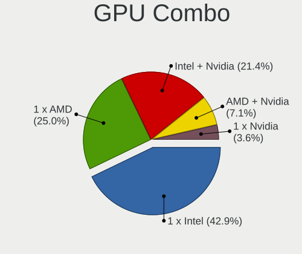

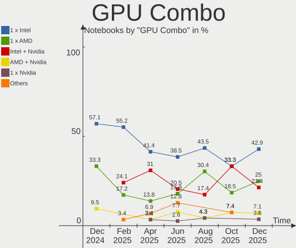

| Name           | Notebooks | Percent |
|----------------|-----------|---------|
| 1 x Intel      | 12        | 42.86%  |
| 1 x AMD        | 7         | 25%     |
| Intel + Nvidia | 6         | 21.43%  |
| AMD + Nvidia   | 2         | 7.14%   |
| 1 x Nvidia     | 1         | 3.57%   |

GPU Driver
----------

Free vs proprietary

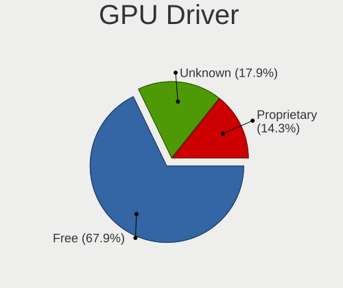

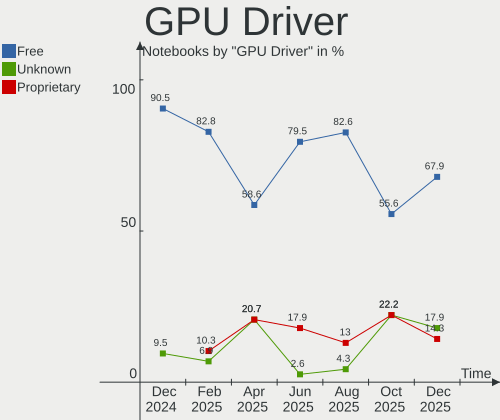

| Driver      | Notebooks | Percent |
|-------------|-----------|---------|
| Free        | 19        | 67.86%  |
| Unknown     | 5         | 17.86%  |
| Proprietary | 4         | 14.29%  |

GPU Memory
----------

Total video memory

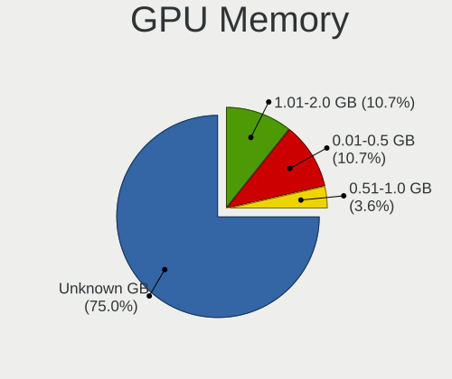

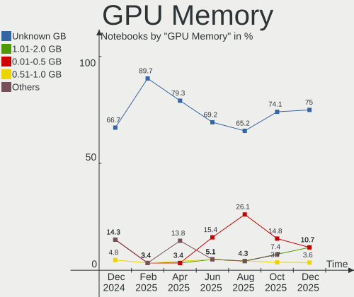

| Size in GB | Notebooks | Percent |
|------------|-----------|---------|
| Unknown    | 21        | 75%     |
| 1.01-2.0   | 3         | 10.71%  |
| 0.01-0.5   | 3         | 10.71%  |
| 0.51-1.0   | 1         | 3.57%   |

Monitor
-------

Monitor Vendor
--------------

Monitor vendors

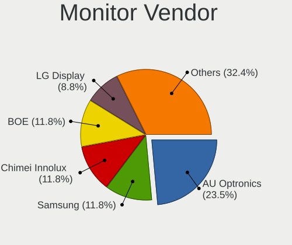

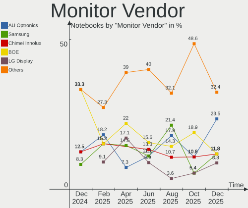

| Vendor              | Notebooks | Percent |
|---------------------|-----------|---------|
| AU Optronics        | 8         | 23.53%  |
| Samsung Electronics | 4         | 11.76%  |
| Chimei Innolux      | 4         | 11.76%  |
| BOE                 | 4         | 11.76%  |
| LG Display          | 3         | 8.82%   |
| BenQ                | 2         | 5.88%   |
| MSI                 | 1         | 2.94%   |
| Lenovo              | 1         | 2.94%   |
| InfoVision          | 1         | 2.94%   |
| Hewlett-Packard     | 1         | 2.94%   |
| Goldstar            | 1         | 2.94%   |
| Dell                | 1         | 2.94%   |
| CSW                 | 1         | 2.94%   |
| AOC                 | 1         | 2.94%   |
| Acer                | 1         | 2.94%   |

Monitor Model
-------------

Monitor models

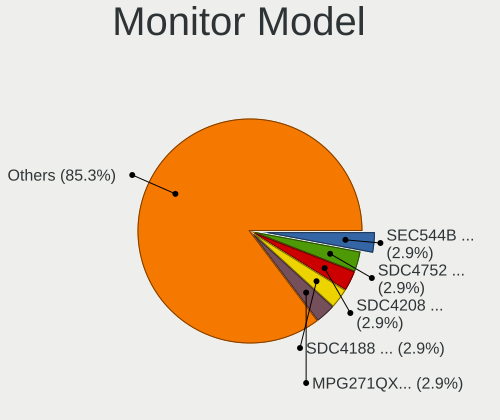

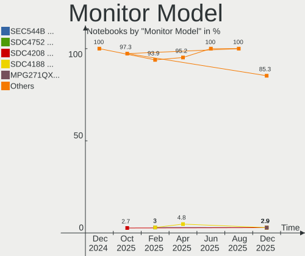

| Model                                                                 | Notebooks | Percent |
|-----------------------------------------------------------------------|-----------|---------|
| Samsung Electronics LCD Monitor SEC544B 1600x900 382x214mm 17.2-inch  | 1         | 2.94%   |
| Samsung Electronics LCD Monitor SDC4752 1366x768 344x194mm 15.5-inch  | 1         | 2.94%   |
| Samsung Electronics LCD Monitor SDC4208 1920x1200 302x189mm 14.0-inch | 1         | 2.94%   |
| Samsung Electronics LCD Monitor SDC4188 2880x1800 312x195mm 14.5-inch | 1         | 2.94%   |
| MSI MPG271QX OLED MSI3CD7 2560x1440 606x344mm 27.4-inch               | 1         | 2.94%   |
| LG Display LCD Monitor LGD060F 1920x1080 309x174mm 14.0-inch          | 1         | 2.94%   |
| LG Display LCD Monitor LGD0563 1920x1080 344x194mm 15.5-inch          | 1         | 2.94%   |
| LG Display LCD Monitor LGD0551 1920x1080 309x174mm 14.0-inch          | 1         | 2.94%   |
| Lenovo LCD Monitor LEN40BA 1920x1080 344x194mm 15.5-inch              | 1         | 2.94%   |
| InfoVision LCD Monitor IVO057D 1920x1080 309x174mm 14.0-inch          | 1         | 2.94%   |
| Hewlett-Packard 27f HPN354B 1920x1080 598x336mm 27.0-inch             | 1         | 2.94%   |
| Goldstar ULTRAGEAR GSM5BD3 2560x1440 697x392mm 31.5-inch              | 1         | 2.94%   |
| Dell U2515H DELD06F 2560x1440 553x311mm 25.0-inch                     | 1         | 2.94%   |
| CSW MNE007ZA3-2 CSW1431 2880x1800 301x188mm 14.0-inch                 | 1         | 2.94%   |
| Chimei Innolux LCD Monitor CMN1560 1920x1080 344x193mm 15.5-inch      | 1         | 2.94%   |
| Chimei Innolux LCD Monitor CMN1550 1920x1080 344x193mm 15.5-inch      | 1         | 2.94%   |
| Chimei Innolux LCD Monitor CMN14C9 1920x1080 309x173mm 13.9-inch      | 1         | 2.94%   |
| Chimei Innolux LCD Monitor CMN1361 1920x1080 293x165mm 13.2-inch      | 1         | 2.94%   |
| BOE NE160WUM-NXA BOE0CE9 1920x1200 345x215mm 16.0-inch                | 1         | 2.94%   |
| BOE LCD Monitor BOE0BC7 2560x1600 302x188mm 14.0-inch                 | 1         | 2.94%   |
| BOE LCD Monitor BOE07E9 1920x1080 309x174mm 14.0-inch                 | 1         | 2.94%   |
| BOE LCD Monitor BOE06A5 1366x768 344x194mm 15.5-inch                  | 1         | 2.94%   |
| BenQ GL2580 BNQ78E5 1920x1080 544x303mm 24.5-inch                     | 1         | 2.94%   |
| BenQ GL2250H BNQ78A1 1920x1080 477x268mm 21.5-inch                    | 1         | 2.94%   |
| AU Optronics LCD Monitor AUOE997 1920x1080 344x194mm 15.5-inch        | 1         | 2.94%   |
| AU Optronics LCD Monitor AUODBB2 1920x1200 344x215mm 16.0-inch        | 1         | 2.94%   |
| AU Optronics LCD Monitor AUOA49A 1920x1200 301x188mm 14.0-inch        | 1         | 2.94%   |
| AU Optronics LCD Monitor AUO61ED 1920x1080 344x194mm 15.5-inch        | 1         | 2.94%   |
| AU Optronics LCD Monitor AUO34ED 1920x1080 344x193mm 15.5-inch        | 1         | 2.94%   |
| AU Optronics LCD Monitor AUO243D 1920x1080 309x173mm 13.9-inch        | 1         | 2.94%   |
| AU Optronics LCD Monitor AUO21ED 1920x1080 344x193mm 15.5-inch        | 1         | 2.94%   |
| AU Optronics B153UAN03.0 AUOF7B2 1920x1200 329x205mm 15.3-inch        | 1         | 2.94%   |
| AOC 22B30HM2 AOC2203 1920x1080 479x260mm 21.5-inch                    | 1         | 2.94%   |
| Acer K242HYL H ACR08E1 1920x1080 527x296mm 23.8-inch                  | 1         | 2.94%   |

Monitor Resolution
------------------

Monitor screen resolution

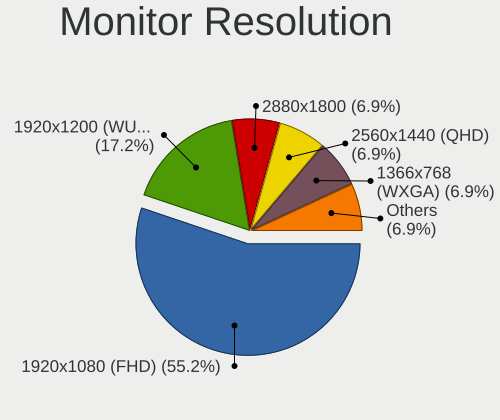

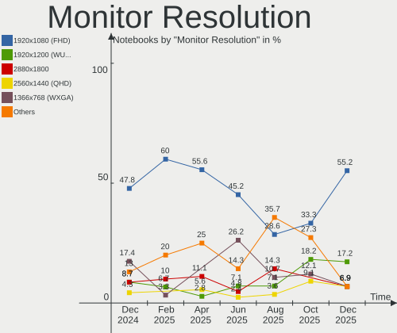

| Resolution        | Notebooks | Percent |
|-------------------|-----------|---------|
| 1920x1080 (FHD)   | 16        | 55.17%  |
| 1920x1200 (WUXGA) | 5         | 17.24%  |
| 2880x1800         | 2         | 6.9%    |
| 2560x1440 (QHD)   | 2         | 6.9%    |
| 1366x768 (WXGA)   | 2         | 6.9%    |
| 2560x1600         | 1         | 3.45%   |
| 1600x900 (HD+)    | 1         | 3.45%   |

Monitor Diagonal
----------------

Diagonal size in inches

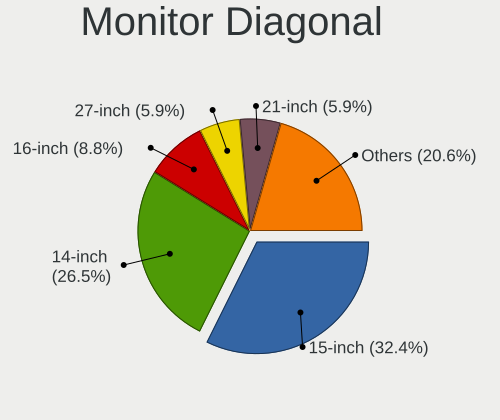

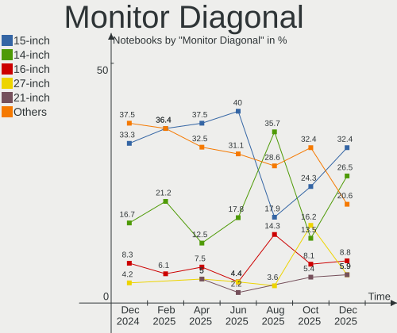

| Inches | Notebooks | Percent |
|--------|-----------|---------|
| 15     | 11        | 32.35%  |
| 14     | 9         | 26.47%  |
| 16     | 3         | 8.82%   |
| 27     | 2         | 5.88%   |
| 21     | 2         | 5.88%   |
| 13     | 2         | 5.88%   |
| 31     | 1         | 2.94%   |
| 25     | 1         | 2.94%   |
| 24     | 1         | 2.94%   |
| 23     | 1         | 2.94%   |
| 17     | 1         | 2.94%   |

Monitor Width
-------------

Physical width

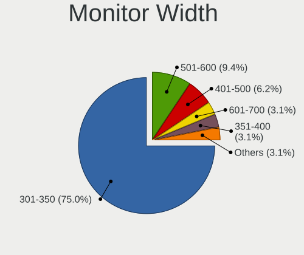

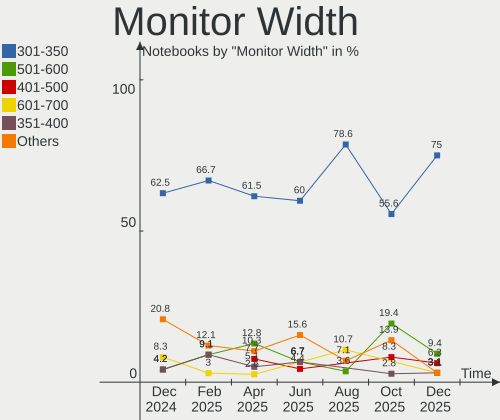

| Width in mm | Notebooks | Percent |
|-------------|-----------|---------|
| 301-350     | 24        | 75%     |
| 501-600     | 3         | 9.38%   |
| 401-500     | 2         | 6.25%   |
| 601-700     | 1         | 3.13%   |
| 351-400     | 1         | 3.13%   |
| 201-300     | 1         | 3.13%   |

Aspect Ratio
------------

Proportional relationship between the width and the height

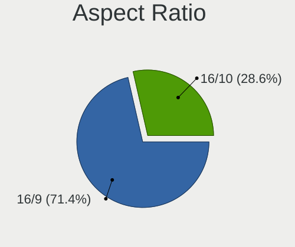

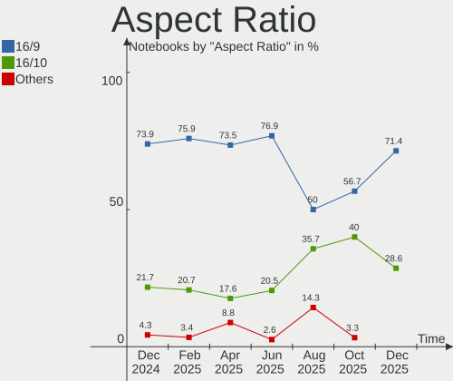

| Ratio | Notebooks | Percent |
|-------|-----------|---------|
| 16/9  | 20        | 71.43%  |
| 16/10 | 8         | 28.57%  |

Monitor Area
------------

Area in inch²

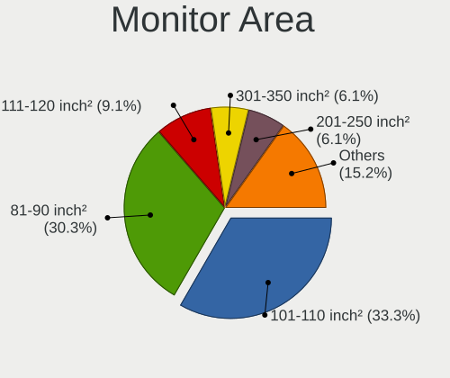

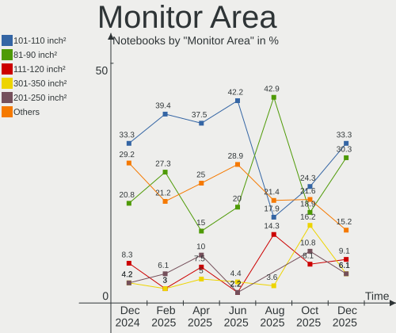

| Area in inch² | Notebooks | Percent |
|----------------|-----------|---------|
| 101-110        | 11        | 33.33%  |
| 81-90          | 10        | 30.3%   |
| 111-120        | 3         | 9.09%   |
| 301-350        | 2         | 6.06%   |
| 201-250        | 2         | 6.06%   |
| 71-80          | 1         | 3.03%   |
| 351-500        | 1         | 3.03%   |
| 251-300        | 1         | 3.03%   |
| 151-200        | 1         | 3.03%   |
| 121-130        | 1         | 3.03%   |

Pixel Density
-------------

Pixels per inch

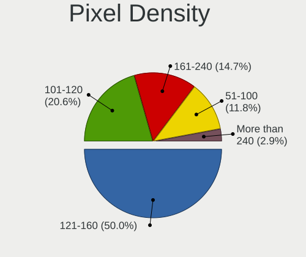

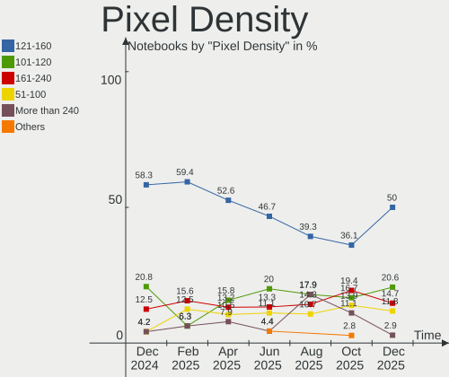

| Density       | Notebooks | Percent |
|---------------|-----------|---------|
| 121-160       | 17        | 50%     |
| 101-120       | 7         | 20.59%  |
| 161-240       | 5         | 14.71%  |
| 51-100        | 4         | 11.76%  |
| More than 240 | 1         | 2.94%   |

Multiple Monitors
-----------------

Total monitors connected

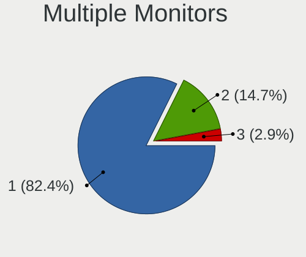

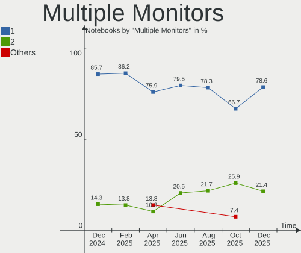

| Total | Notebooks | Percent |
|-------|-----------|---------|
| 1     | 22        | 78.57%  |
| 2     | 6         | 21.43%  |

Network
-------

Net Controller Vendor
---------------------

Controller vendors

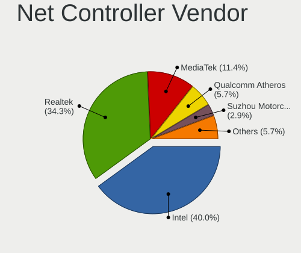

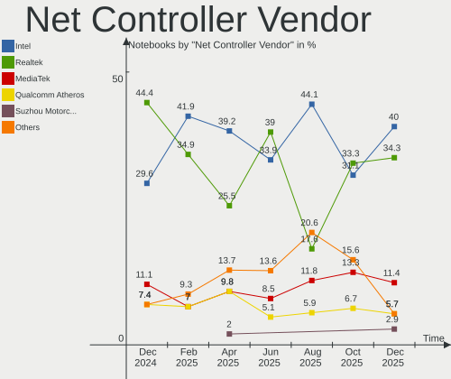

| Vendor                                 | Notebooks | Percent |
|----------------------------------------|-----------|---------|
| Intel                                  | 14        | 40%     |
| Realtek Semiconductor                  | 12        | 34.29%  |
| MediaTek                               | 4         | 11.43%  |
| Qualcomm Atheros                       | 2         | 5.71%   |
| Suzhou Motorcomm Electronic Technology | 1         | 2.86%   |
| Qualcomm Technologies                  | 1         | 2.86%   |
| Broadcom                               | 1         | 2.86%   |

Net Controller Model
--------------------

Controller models

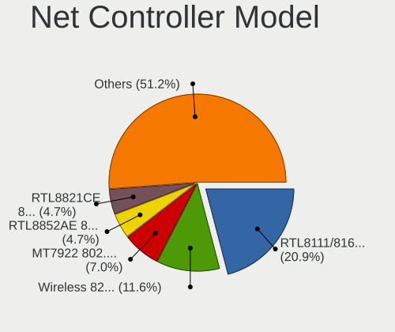

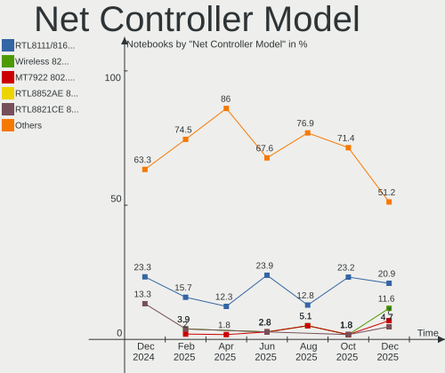

| Model                                                                  | Notebooks | Percent |
|------------------------------------------------------------------------|-----------|---------|
| Realtek RTL8111/8168/8211/8411 PCI Express Gigabit Ethernet Controller | 9         | 20.93%  |
| Intel Wireless 8265 / 8275                                             | 5         | 11.63%  |
| MediaTek MT7922 802.11ax PCI Express Wireless Network Adapter          | 3         | 6.98%   |
| Realtek RTL8852AE 802.11ax PCIe Wireless Network Adapter               | 2         | 4.65%   |
| Realtek RTL8821CE 802.11ac PCIe Wireless Network Adapter               | 2         | 4.65%   |
| Intel Wireless 7265                                                    | 2         | 4.65%   |
| Intel BE201 320MHz                                                     | 2         | 4.65%   |
| Suzhou Motorcomm Electronic YT6801 Gigabit Ethernet Controller         | 1         | 2.33%   |
| Realtek RTL8852BE-VT PCIe 802.11ax Wireless Network Controller         | 1         | 2.33%   |
| Realtek RTL8852BE PCIe 802.11ax Wireless Network Controller            | 1         | 2.33%   |
| Realtek RTL8153 Gigabit Ethernet Adapter                               | 1         | 2.33%   |
| Qualcomm QCNFA765 Wireless Network Adapter                             | 1         | 2.33%   |
| Qualcomm Atheros QCA8172 Fast Ethernet                                 | 1         | 2.33%   |
| Qualcomm Atheros AR9285 Wireless Network Adapter (PCI-Express)         | 1         | 2.33%   |
| Qualcomm Atheros AR8151 v2.0 Gigabit Ethernet                          | 1         | 2.33%   |
| MediaTek MT7921 802.11ax PCIe Wireless Network Adapter [Filogic 330]   | 1         | 2.33%   |
| Intel Wireless 8260                                                    | 1         | 2.33%   |
| Intel Meteor Lake PCH CNVi WiFi                                        | 1         | 2.33%   |
| Intel Ice Lake-LP PCH CNVi WiFi                                        | 1         | 2.33%   |
| Intel Ethernet Connection I219-V                                       | 1         | 2.33%   |
| Intel Ethernet Connection I217-V                                       | 1         | 2.33%   |
| Intel Ethernet Connection (5) I219-LM                                  | 1         | 2.33%   |
| Intel Ethernet Connection (4) I219-V                                   | 1         | 2.33%   |
| Intel Centrino Wireless-N 135                                          | 1         | 2.33%   |
| Broadcom BCM43228 802.11a/b/g/n                                        | 1         | 2.33%   |

Wireless Vendor
---------------

Wireless vendors

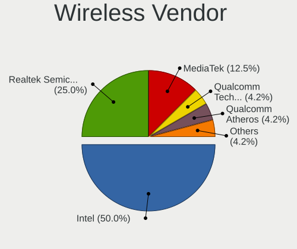

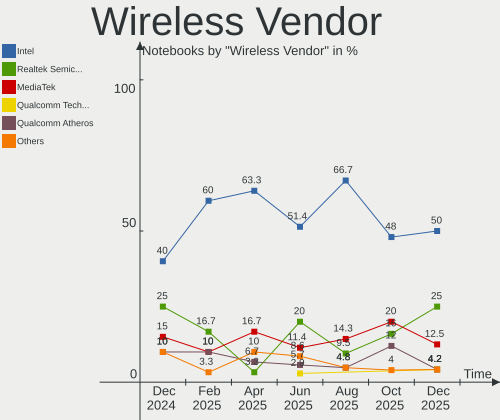

| Vendor                | Notebooks | Percent |
|-----------------------|-----------|---------|
| Intel                 | 12        | 50%     |
| Realtek Semiconductor | 6         | 25%     |
| MediaTek              | 3         | 12.5%   |
| Qualcomm Technologies | 1         | 4.17%   |
| Qualcomm Atheros      | 1         | 4.17%   |
| Broadcom              | 1         | 4.17%   |

Wireless Model
--------------

Wireless models

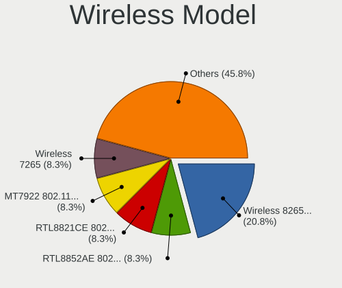

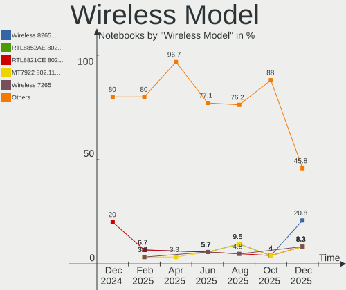

| Model                                                                | Notebooks | Percent |
|----------------------------------------------------------------------|-----------|---------|
| Intel Wireless 8265 / 8275                                           | 5         | 20.83%  |
| Realtek RTL8852AE 802.11ax PCIe Wireless Network Adapter             | 2         | 8.33%   |
| Realtek RTL8821CE 802.11ac PCIe Wireless Network Adapter             | 2         | 8.33%   |
| MediaTek MT7922 802.11ax PCI Express Wireless Network Adapter        | 2         | 8.33%   |
| Intel Wireless 7265                                                  | 2         | 8.33%   |
| Realtek RTL8852BE-VT PCIe 802.11ax Wireless Network Controller       | 1         | 4.17%   |
| Realtek RTL8852BE PCIe 802.11ax Wireless Network Controller          | 1         | 4.17%   |
| Qualcomm QCNFA765 Wireless Network Adapter                           | 1         | 4.17%   |
| Qualcomm Atheros AR9285 Wireless Network Adapter (PCI-Express)       | 1         | 4.17%   |
| MediaTek MT7921 802.11ax PCIe Wireless Network Adapter [Filogic 330] | 1         | 4.17%   |
| Intel Wireless 8260                                                  | 1         | 4.17%   |
| Intel Meteor Lake PCH CNVi WiFi                                      | 1         | 4.17%   |
| Intel Ice Lake-LP PCH CNVi WiFi                                      | 1         | 4.17%   |
| Intel Centrino Wireless-N 135                                        | 1         | 4.17%   |
| Intel BE201 320MHz                                                   | 1         | 4.17%   |
| Broadcom BCM43228 802.11a/b/g/n                                      | 1         | 4.17%   |

Ethernet Vendor
---------------

Ethernet vendors

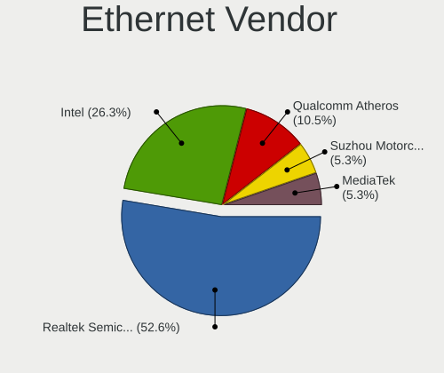

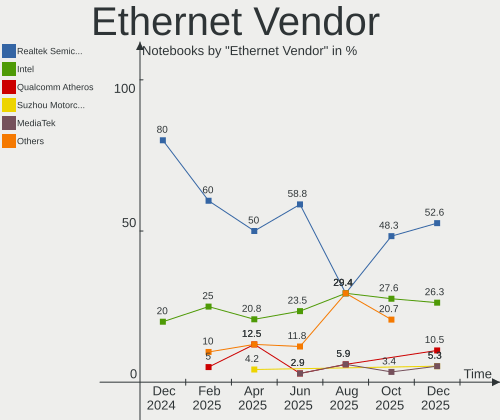

| Vendor                                 | Notebooks | Percent |
|----------------------------------------|-----------|---------|
| Realtek Semiconductor                  | 10        | 52.63%  |
| Intel                                  | 5         | 26.32%  |
| Qualcomm Atheros                       | 2         | 10.53%  |
| Suzhou Motorcomm Electronic Technology | 1         | 5.26%   |
| MediaTek                               | 1         | 5.26%   |

Ethernet Model
--------------

Ethernet models

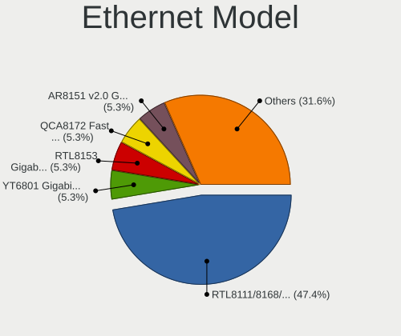

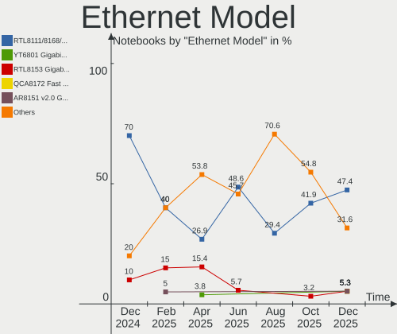

| Model                                                                  | Notebooks | Percent |
|------------------------------------------------------------------------|-----------|---------|
| Realtek RTL8111/8168/8211/8411 PCI Express Gigabit Ethernet Controller | 9         | 47.37%  |
| Suzhou Motorcomm Electronic YT6801 Gigabit Ethernet Controller         | 1         | 5.26%   |
| Realtek RTL8153 Gigabit Ethernet Adapter                               | 1         | 5.26%   |
| Qualcomm Atheros QCA8172 Fast Ethernet                                 | 1         | 5.26%   |
| Qualcomm Atheros AR8151 v2.0 Gigabit Ethernet                          | 1         | 5.26%   |
| MediaTek MT7922 802.11ax PCI Express Wireless Network Adapter          | 1         | 5.26%   |
| Intel Ethernet Connection I219-V                                       | 1         | 5.26%   |
| Intel Ethernet Connection I217-V                                       | 1         | 5.26%   |
| Intel Ethernet Connection (5) I219-LM                                  | 1         | 5.26%   |
| Intel Ethernet Connection (4) I219-V                                   | 1         | 5.26%   |
| Intel BE201 320MHz                                                     | 1         | 5.26%   |

Net Controller Kind
-------------------

Ethernet, WiFi or modem

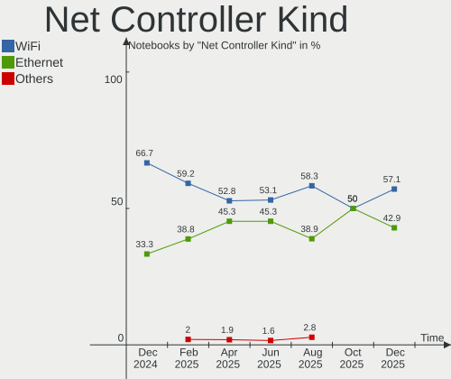

| Kind     | Notebooks | Percent |
|----------|-----------|---------|
| WiFi     | 24        | 57.14%  |
| Ethernet | 18        | 42.86%  |

Used Controller
---------------

Currently used network controller

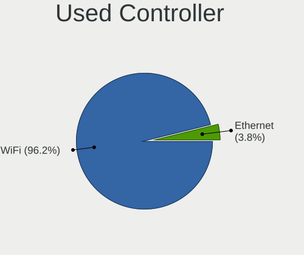

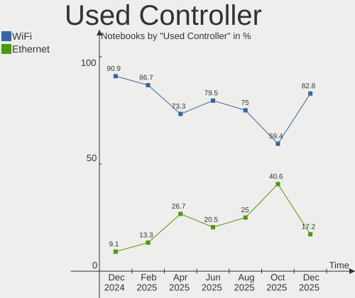

| Kind     | Notebooks | Percent |
|----------|-----------|---------|
| WiFi     | 24        | 82.76%  |
| Ethernet | 5         | 17.24%  |

NICs
----

Total network controllers on board

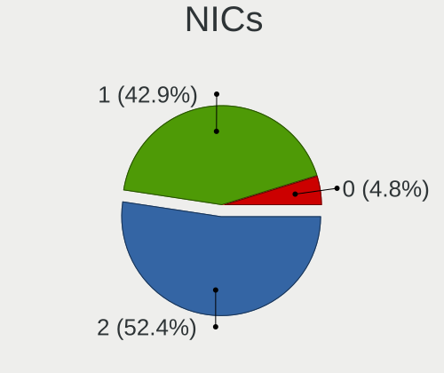

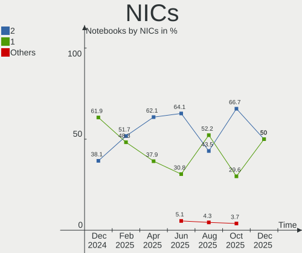

| Total | Notebooks | Percent |
|-------|-----------|---------|
| 2     | 14        | 50%     |
| 1     | 14        | 50%     |

IPv6
----

IPv6 vs IPv4

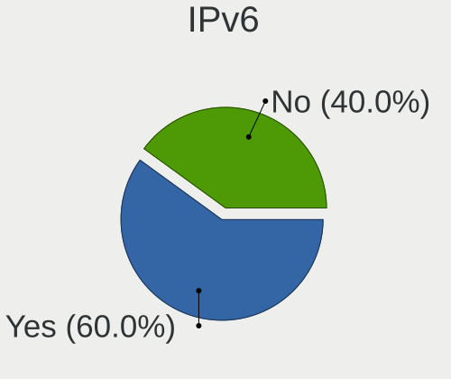

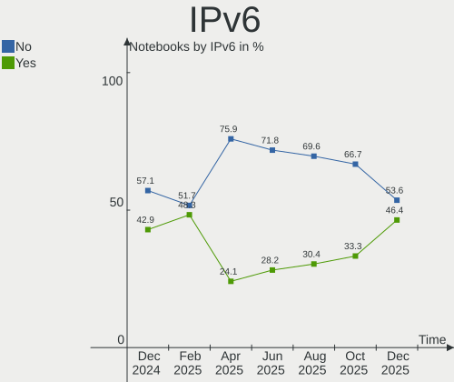

| Used | Notebooks | Percent |
|------|-----------|---------|
| No   | 15        | 53.57%  |
| Yes  | 13        | 46.43%  |

Bluetooth
---------

Bluetooth Vendor
----------------

Controller vendors

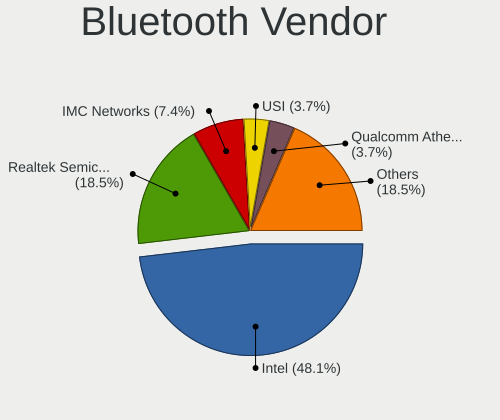

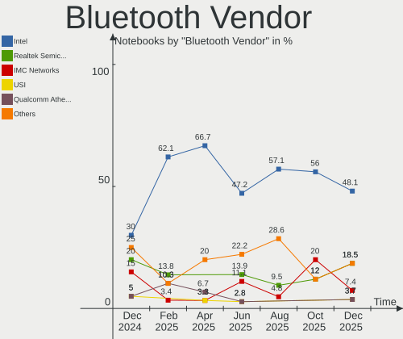

| Vendor                          | Notebooks | Percent |
|---------------------------------|-----------|---------|
| Intel                           | 13        | 48.15%  |
| Realtek Semiconductor           | 5         | 18.52%  |
| IMC Networks                    | 2         | 7.41%   |
| USI                             | 1         | 3.7%    |
| Qualcomm Atheros Communications | 1         | 3.7%    |
| MediaTek                        | 1         | 3.7%    |
| Lite-On Technology              | 1         | 3.7%    |
| Foxconn / Hon Hai               | 1         | 3.7%    |
| Cambridge Silicon Radio         | 1         | 3.7%    |
| Broadcom                        | 1         | 3.7%    |

Bluetooth Model
---------------

Controller models

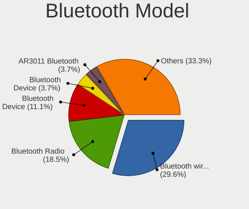

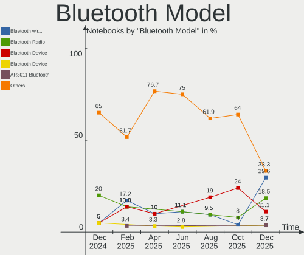

| Model                                               | Notebooks | Percent |
|-----------------------------------------------------|-----------|---------|
| Intel Bluetooth wireless interface                  | 8         | 29.63%  |
| Realtek Bluetooth Radio                             | 5         | 18.52%  |
| Intel Bluetooth Device                              | 3         | 11.11%  |
| USI Bluetooth Device                                | 1         | 3.7%    |
| Qualcomm Atheros AR3011 Bluetooth                   | 1         | 3.7%    |
| MediaTek Wireless_Device                            | 1         | 3.7%    |
| Lite-On Wireless_Device                             | 1         | 3.7%    |
| Intel Centrino Bluetooth Wireless Transceiver       | 1         | 3.7%    |
| Intel AX201 Bluetooth                               | 1         | 3.7%    |
| IMC Networks Wireless_Device                        | 1         | 3.7%    |
| IMC Networks Bluetooth Radio                        | 1         | 3.7%    |
| Foxconn / Hon Hai Wireless_Device                   | 1         | 3.7%    |
| Cambridge Silicon Radio Bluetooth Dongle (HCI mode) | 1         | 3.7%    |
| Broadcom HP Portable Bumble Bee                     | 1         | 3.7%    |

Sound
-----

Sound Vendor
------------

Sound card vendors

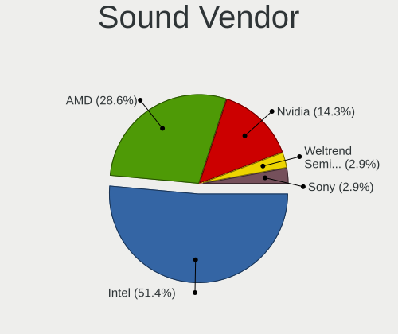

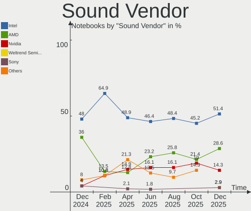

| Vendor                 | Notebooks | Percent |
|------------------------|-----------|---------|
| Intel                  | 18        | 51.43%  |
| AMD                    | 10        | 28.57%  |
| Nvidia                 | 5         | 14.29%  |
| Weltrend Semiconductor | 1         | 2.86%   |
| Sony                   | 1         | 2.86%   |

Sound Model
-----------

Sound card models

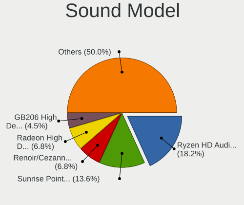

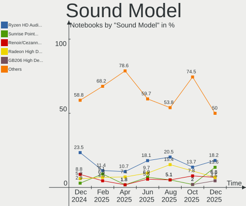

| Model                                                                      | Notebooks | Percent |
|----------------------------------------------------------------------------|-----------|---------|
| AMD Ryzen HD Audio Controller                                              | 8         | 18.18%  |
| Intel Sunrise Point-LP HD Audio                                            | 6         | 13.64%  |
| AMD Renoir/Cezanne HDMI/DP Audio Controller                                | 3         | 6.82%   |
| AMD Radeon High Definition Audio Controller                                | 3         | 6.82%   |
| Nvidia GB206 High Definition Audio Controller                              | 2         | 4.55%   |
| Intel Raptor Lake-P/U/H cAVS                                               | 2         | 4.55%   |
| Intel Lunar Lake-M HD Audio Controller                                     | 2         | 4.55%   |
| AMD Raven/Raven2/Fenghuang HDMI/DP Audio Controller                        | 2         | 4.55%   |
| Weltrend Semiconductor H848 Wireless headset                               | 1         | 2.27%   |
| Sony DualSense wireless controller (PS5)                                   | 1         | 2.27%   |
| Nvidia GP104 High Definition Audio Controller                              | 1         | 2.27%   |
| Nvidia GF108 High Definition Audio Controller                              | 1         | 2.27%   |
| Nvidia AD107 High Definition Audio Controller                              | 1         | 2.27%   |
| Intel Xeon E3-1200 v3/4th Gen Core Processor HD Audio Controller           | 1         | 2.27%   |
| Intel Tiger Lake-LP Smart Sound Technology Audio Controller                | 1         | 2.27%   |
| Intel Meteor Lake-P HD Audio Controller                                    | 1         | 2.27%   |
| Intel Ice Lake-LP Smart Sound Technology Audio Controller                  | 1         | 2.27%   |
| Intel CM238 HD Audio Controller                                            | 1         | 2.27%   |
| Intel Cannon Lake PCH cAVS                                                 | 1         | 2.27%   |
| Intel 8 Series/C220 Series Chipset High Definition Audio Controller        | 1         | 2.27%   |
| Intel 7 Series/C216 Chipset Family High Definition Audio Controller        | 1         | 2.27%   |
| Intel 6 Series/C200 Series Chipset Family High Definition Audio Controller | 1         | 2.27%   |
| AMD Starship/Matisse HD Audio Controller                                   | 1         | 2.27%   |
| AMD Navi 21/23 HDMI/DP Audio Controller                                    | 1         | 2.27%   |

Memory
------

Memory Vendor
-------------

Memory module vendors

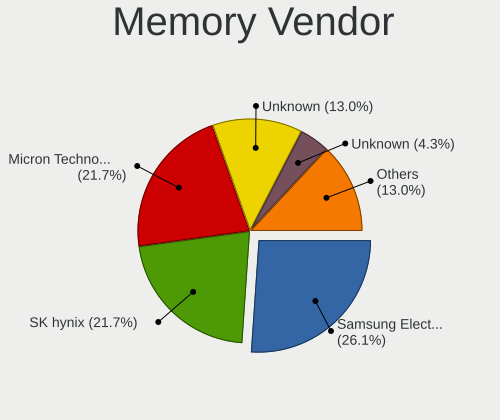

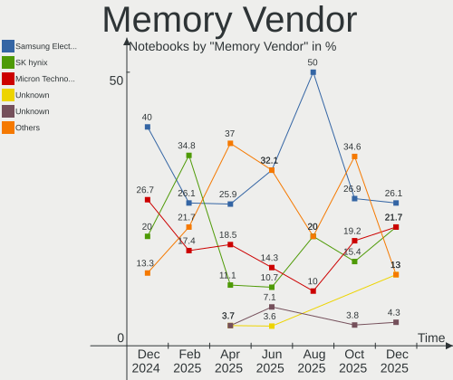

| Vendor              | Notebooks | Percent |
|---------------------|-----------|---------|
| Samsung Electronics | 6         | 26.09%  |
| SK hynix            | 5         | 21.74%  |
| Micron Technology   | 5         | 21.74%  |
| Unknown             | 3         | 13.04%  |
| Unknown             | 1         | 4.35%   |
| Kingston            | 1         | 4.35%   |
| Crucial             | 1         | 4.35%   |
| A-DATA Technology   | 1         | 4.35%   |

Memory Model
------------

Memory module models

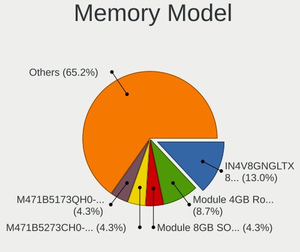

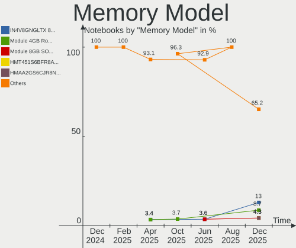

| Model                                                            | Notebooks | Percent |
|------------------------------------------------------------------|-----------|---------|
| Unknown                                                          | 3         | 13.04%  |
| Micron RAM Module 4GB Row Of Chips LPDDR5 8533MT/s               | 2         | 8.7%    |
| Unknown RAM Module 8GB SODIMM DDR4 2400MT/s                      | 1         | 4.35%   |
| SK hynix RAM HMT451S6BFR8A-PB 4GB SODIMM DDR3 1600MT/s           | 1         | 4.35%   |
| SK hynix RAM HMAA2GS6CJR8N-XN 16GB SODIMM DDR4 3200MT/s          | 1         | 4.35%   |
| SK hynix RAM HMAA1GS6CMR6N-VK 8GB SODIMM DDR4 2667MT/s           | 1         | 4.35%   |
| SK hynix RAM HMA851S6CJR6N-VK 4GB SODIMM DDR4 2667MT/s           | 1         | 4.35%   |
| SK hynix RAM H9CCNNNCLTALAR-NTD 4GB Row Of Chips LPDDR3 1867MT/s | 1         | 4.35%   |
| Samsung RAM M471B5273CH0-CH9 4GB SODIMM DDR3 1334MT/s            | 1         | 4.35%   |
| Samsung RAM M471B5173QH0-YK0 4GB SODIMM DDR3 1600MT/s            | 1         | 4.35%   |
| Samsung RAM M471A1K43CB1-CRC 8GB SODIMM DDR4 8400MT/s            | 1         | 4.35%   |
| Samsung RAM M425R1GB4PB0-CWMT3 8GB Row Of Chips DDR5 5600MT/s    | 1         | 4.35%   |
| Samsung RAM K3LK6K60BM-BGCP 8GB LPDDR5 6400MT/s                  | 1         | 4.35%   |
| Samsung RAM K3KL8L80CM-MGCT 2GB Row Of Chips LPDDR5 7500MT/s     | 1         | 4.35%   |
| Micron RAM MTC8C1084S1SC56BD1 K 16GiB SODIMM DDR5 5600MT/s       | 1         | 4.35%   |
| Micron RAM MTC4C10163S1SC56BD1 8GB SODIMM DDR5 5600MT/s          | 1         | 4.35%   |
| Micron RAM 4ATF51264HZ-3G2R1 4GB SODIMM DDR4 3200MT/s            | 1         | 4.35%   |
| Kingston RAM KF3200C20S4/32GX 32GB SODIMM DDR4 3200MT/s          | 1         | 4.35%   |
| Crucial RAM CT16G4SFD824A 16GB SODIMM DDR4 2400MT/s              | 1         | 4.35%   |
| A-DATA RAM 4JQA-0622AD 4GB Row Of Chips DDR4 3200MT/s            | 1         | 4.35%   |

Memory Kind
-----------

Memory module kinds

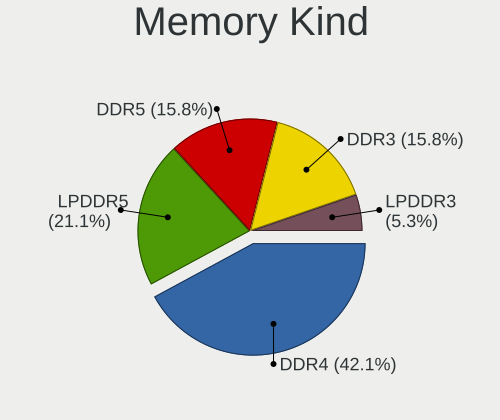

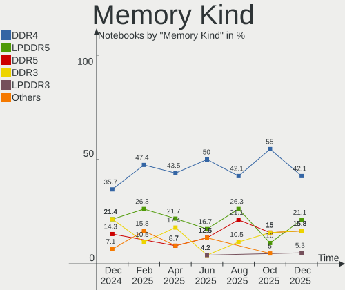

| Kind   | Notebooks | Percent |
|--------|-----------|---------|
| DDR4   | 8         | 42.11%  |
| LPDDR5 | 4         | 21.05%  |
| DDR5   | 3         | 15.79%  |
| DDR3   | 3         | 15.79%  |
| LPDDR3 | 1         | 5.26%   |

Memory Form Factor
------------------

Physical design of the memory module

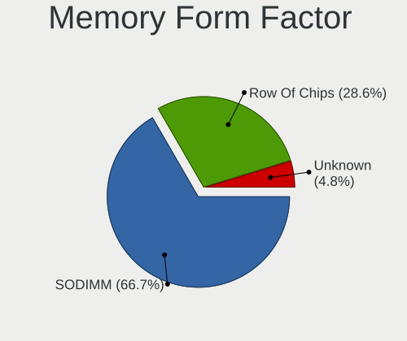

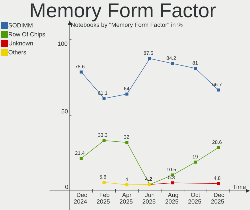

| Name         | Notebooks | Percent |
|--------------|-----------|---------|
| SODIMM       | 14        | 66.67%  |
| Row Of Chips | 6         | 28.57%  |
| Unknown      | 1         | 4.76%   |

Memory Size
-----------

Memory module size

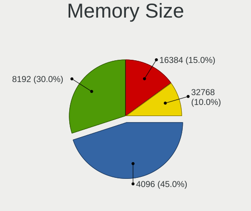

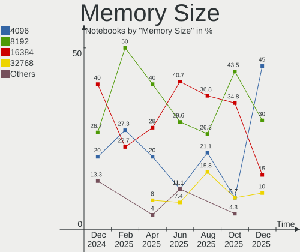

| Size  | Notebooks | Percent |
|-------|-----------|---------|
| 4096  | 9         | 45%     |
| 8192  | 6         | 30%     |
| 16384 | 3         | 15%     |
| 32768 | 2         | 10%     |

Memory Speed
------------

Memory module speed

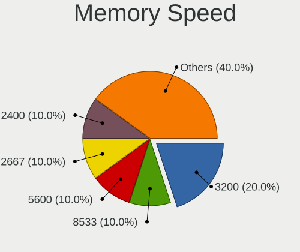

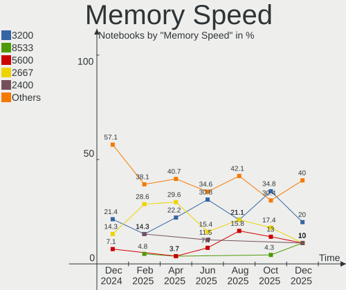

| Speed | Notebooks | Percent |
|-------|-----------|---------|
| 3200  | 4         | 20%     |
| 8533  | 2         | 10%     |
| 5600  | 2         | 10%     |
| 2667  | 2         | 10%     |
| 2400  | 2         | 10%     |
| 1600  | 2         | 10%     |
| 8400  | 1         | 5%      |
| 7500  | 1         | 5%      |
| 6400  | 1         | 5%      |
| 4800  | 1         | 5%      |
| 1867  | 1         | 5%      |
| 1334  | 1         | 5%      |

Printers & scanners
-------------------

Printer Vendor
--------------

Printer device vendors

Zero info for selected period =(

Printer Model
-------------

Printer device models

Zero info for selected period =(

Scanner Vendor
--------------

Scanner device vendors

Zero info for selected period =(

Scanner Model
-------------

Scanner device models

Zero info for selected period =(

Camera
------

Camera Vendor
-------------

Camera device vendors

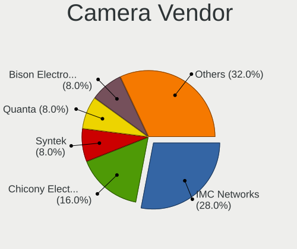

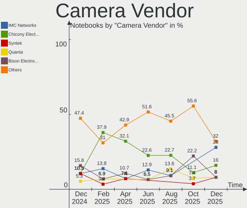

| Vendor                                 | Notebooks | Percent |
|----------------------------------------|-----------|---------|
| IMC Networks                           | 7         | 28%     |
| Chicony Electronics                    | 4         | 16%     |
| Syntek                                 | 2         | 8%      |
| Quanta                                 | 2         | 8%      |
| Bison Electronics                      | 2         | 8%      |
| Suyin                                  | 1         | 4%      |
| Sunplus Innovation Technology          | 1         | 4%      |
| Sonix Technology                       | 1         | 4%      |
| Realtek Semiconductor                  | 1         | 4%      |
| Luxvisions Innotech Limited            | 1         | 4%      |
| kingcome                               | 1         | 4%      |
| Cheng Uei Precision Industry (Foxlink) | 1         | 4%      |
| BillionPixels                          | 1         | 4%      |

Camera Model
------------

Camera device models

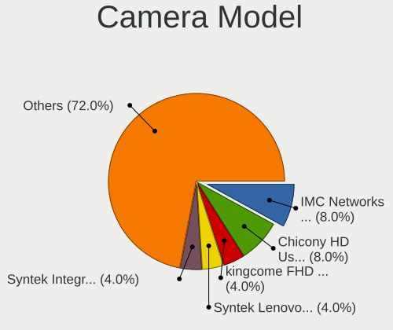

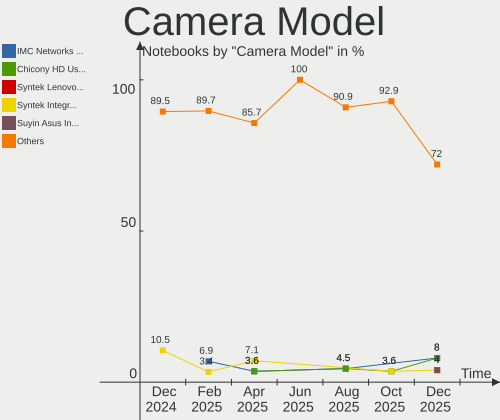

| Model                                                 | Notebooks | Percent |
|-------------------------------------------------------|-----------|---------|
| IMC Networks Integrated Camera                        | 2         | 8%      |
| Chicony HD User Facing                                | 2         | 8%      |
| Syntek Lenovo EasyCamera                              | 1         | 4%      |
| Syntek Integrated Camera                              | 1         | 4%      |
| Suyin Asus Integrated Webcam                          | 1         | 4%      |
| Sunplus HP X Camera                                   | 1         | 4%      |
| Sonix USB2.0 FHD UVC WebCam                           | 1         | 4%      |
| Realtek Integrated Camera                             | 1         | 4%      |
| Quanta HP Wide Vision HD Camera                       | 1         | 4%      |
| Quanta HP TrueVision HD Camera                        | 1         | 4%      |
| Luxvisions Innotech Limited HP True Vision FHD Camera | 1         | 4%      |
| kingcome FHD WebCam                                   | 1         | 4%      |
| IMC Networks VGA UVC WebCam                           | 1         | 4%      |
| IMC Networks USB2.0 VGA UVC WebCam                    | 1         | 4%      |
| IMC Networks USB2.0 HD UVC WebCam                     | 1         | 4%      |
| IMC Networks USB2.0 HD IR UVC WebCam                  | 1         | 4%      |
| IMC Networks 2M Integrated Webcam                     | 1         | 4%      |
| Chicony Integrated Camera                             | 1         | 4%      |
| Chicony HD WebCam                                     | 1         | 4%      |
| Cheng Uei Precision Industry (Foxlink) HP HD Webcam   | 1         | 4%      |
| Bison ThinkPad P50 Integrated Camera                  | 1         | 4%      |
| Bison Integrated Camera                               | 1         | 4%      |
| BillionPixels USB2.0 FHD UVC WebCam                   | 1         | 4%      |

Security
--------

Fingerprint Vendor
------------------

Fingerprint sensor vendors

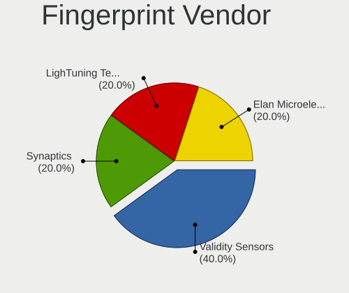

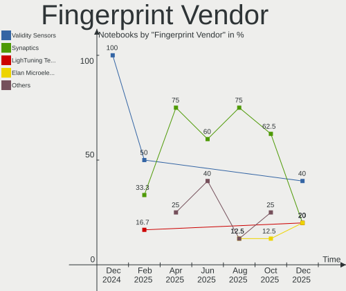

| Vendor                | Notebooks | Percent |
|-----------------------|-----------|---------|
| Validity Sensors      | 2         | 40%     |
| Synaptics             | 1         | 20%     |
| LighTuning Technology | 1         | 20%     |
| Elan Microelectronics | 1         | 20%     |

Fingerprint Model
-----------------

Fingerprint sensor models

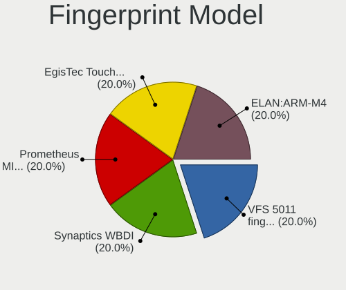

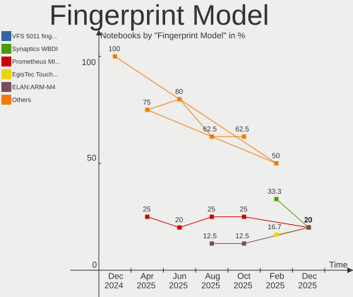

| Model                                             | Notebooks | Percent |
|---------------------------------------------------|-----------|---------|
| Validity Sensors VFS 5011 fingerprint sensor      | 1         | 20%     |
| Validity Sensors Synaptics WBDI                   | 1         | 20%     |
| Synaptics Prometheus MIS Touch Fingerprint Reader | 1         | 20%     |
| LighTuning EgisTec Touch Fingerprint Sensor       | 1         | 20%     |
| Elan ELAN:ARM-M4                                  | 1         | 20%     |

Chipcard Vendor
---------------

Chipcard module vendors

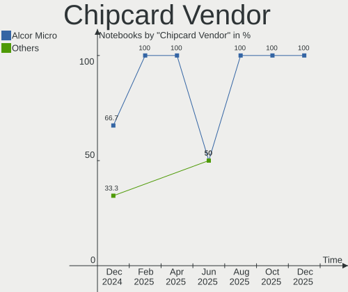

| Vendor      | Notebooks | Percent |
|-------------|-----------|---------|
| Alcor Micro | 2         | 100%    |

Chipcard Model
--------------

Chipcard module models

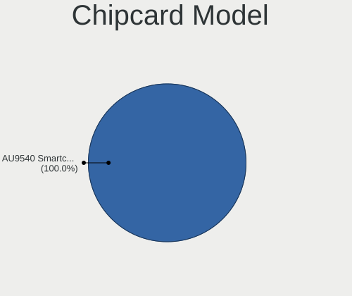

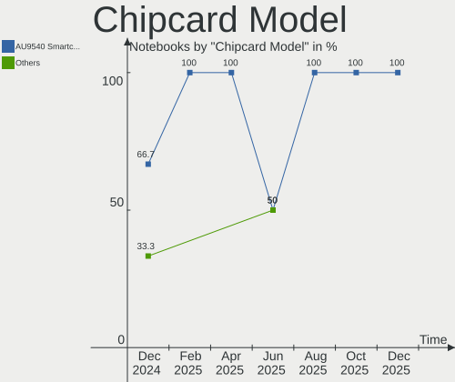

| Model                               | Notebooks | Percent |
|-------------------------------------|-----------|---------|
| Alcor Micro AU9540 Smartcard Reader | 2         | 100%    |

Unsupported
-----------

Unsupported Devices
-------------------

Total unsupported devices on board

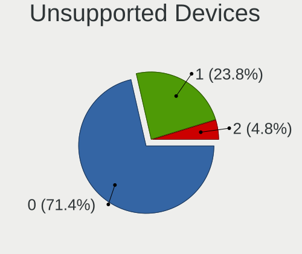

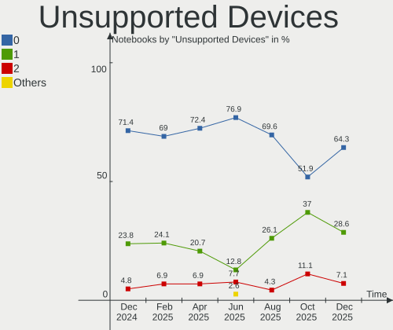

| Total | Notebooks | Percent |
|-------|-----------|---------|
| 0     | 18        | 64.29%  |
| 1     | 8         | 28.57%  |
| 2     | 2         | 7.14%   |

Unsupported Device Types
------------------------

Types of unsupported devices

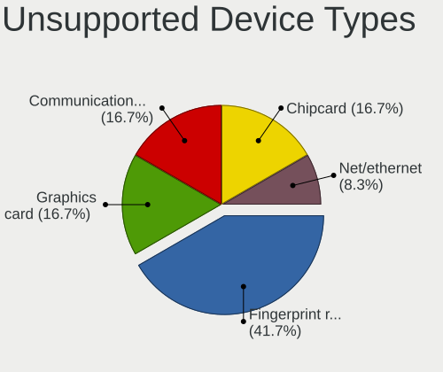

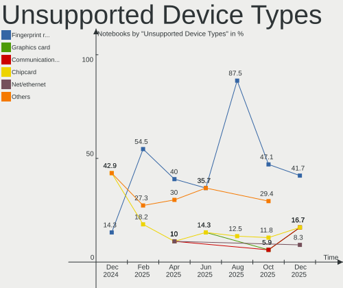

| Type                     | Notebooks | Percent |
|--------------------------|-----------|---------|
| Fingerprint reader       | 5         | 41.67%  |
| Graphics card            | 2         | 16.67%  |
| Communication controller | 2         | 16.67%  |
| Chipcard                 | 2         | 16.67%  |
| Net/ethernet             | 1         | 8.33%   |

