EndeavourOS - Hardware Trends (Notebooks)
-----------------------------------------

A project to identify most popular hardware characteristics and track their change
over time based on data collected by Linux users at https://Linux-Hardware.org.

Anyone can contribute to this report by the [hw-probe](https://github.com/linuxhw/hw-probe) tool:

    sudo -E hw-probe -all -upload

This report is for one last month. Overall report since the beginning of time: [TestCoverage](https://github.com/linuxhw/TestCoverage)

Period: Jun, 2022.

Contents
--------

* [ System ](#system)
  - [ OS                       ](#os)
  - [ OS Family                ](#os-family)
  - [ Kernel                   ](#kernel)
  - [ Kernel Family            ](#kernel-family)
  - [ Kernel Major Ver.        ](#kernel-major-ver)
  - [ Arch                     ](#arch)
  - [ DE                       ](#de)
  - [ Display Server           ](#display-server)
  - [ Display Manager          ](#display-manager)
  - [ OS Lang                  ](#os-lang)
  - [ Boot Mode                ](#boot-mode)
  - [ Filesystem               ](#filesystem)
  - [ Part. scheme             ](#part-scheme)
  - [ Dual Boot with Linux/BSD ](#dual-boot-with-linuxbsd)
  - [ Dual Boot (Win)          ](#dual-boot-win)

* [ Board ](#board)
  - [ Vendor                   ](#vendor)
  - [ Model                    ](#model)
  - [ Model Family             ](#model-family)
  - [ MFG Year                 ](#mfg-year)
  - [ Form Factor              ](#form-factor)
  - [ Secure Boot              ](#secure-boot)
  - [ Coreboot                 ](#coreboot)
  - [ RAM Size                 ](#ram-size)
  - [ RAM Used                 ](#ram-used)
  - [ Total Drives             ](#total-drives)
  - [ Has CD-ROM               ](#has-cd-rom)
  - [ Has Ethernet             ](#has-ethernet)
  - [ Has WiFi                 ](#has-wifi)
  - [ Has Bluetooth            ](#has-bluetooth)

* [ Location ](#location)
  - [ Country                  ](#country)
  - [ City                     ](#city)

* [ Drives ](#drives)
  - [ Drive Vendor             ](#drive-vendor)
  - [ Drive Model              ](#drive-model)
  - [ HDD Vendor               ](#hdd-vendor)
  - [ SSD Vendor               ](#ssd-vendor)
  - [ Drive Kind               ](#drive-kind)
  - [ Drive Connector          ](#drive-connector)
  - [ Drive Size               ](#drive-size)
  - [ Space Total              ](#space-total)
  - [ Space Used               ](#space-used)
  - [ Malfunc. Drives          ](#malfunc-drives)
  - [ Malfunc. Drive Vendor    ](#malfunc-drive-vendor)
  - [ Malfunc. HDD Vendor      ](#malfunc-hdd-vendor)
  - [ Malfunc. Drive Kind      ](#malfunc-drive-kind)
  - [ Failed Drives            ](#failed-drives)
  - [ Failed Drive Vendor      ](#failed-drive-vendor)
  - [ Drive Status             ](#drive-status)

* [ Storage controller ](#storage-controller)
  - [ Storage Vendor           ](#storage-vendor)
  - [ Storage Model            ](#storage-model)
  - [ Storage Kind             ](#storage-kind)

* [ Processor ](#processor)
  - [ CPU Vendor               ](#cpu-vendor)
  - [ CPU Model                ](#cpu-model)
  - [ CPU Model Family         ](#cpu-model-family)
  - [ CPU Cores                ](#cpu-cores)
  - [ CPU Sockets              ](#cpu-sockets)
  - [ CPU Threads              ](#cpu-threads)
  - [ CPU Op-Modes             ](#cpu-op-modes)
  - [ CPU Microcode            ](#cpu-microcode)
  - [ CPU Microarch            ](#cpu-microarch)

* [ Graphics ](#graphics)
  - [ GPU Vendor               ](#gpu-vendor)
  - [ GPU Model                ](#gpu-model)
  - [ GPU Combo                ](#gpu-combo)
  - [ GPU Driver               ](#gpu-driver)
  - [ GPU Memory               ](#gpu-memory)

* [ Monitor ](#monitor)
  - [ Monitor Vendor           ](#monitor-vendor)
  - [ Monitor Model            ](#monitor-model)
  - [ Monitor Resolution       ](#monitor-resolution)
  - [ Monitor Diagonal         ](#monitor-diagonal)
  - [ Monitor Width            ](#monitor-width)
  - [ Aspect Ratio             ](#aspect-ratio)
  - [ Monitor Area             ](#monitor-area)
  - [ Pixel Density            ](#pixel-density)
  - [ Multiple Monitors        ](#multiple-monitors)

* [ Network ](#network)
  - [ Net Controller Vendor    ](#net-controller-vendor)
  - [ Net Controller Model     ](#net-controller-model)
  - [ Wireless Vendor          ](#wireless-vendor)
  - [ Wireless Model           ](#wireless-model)
  - [ Ethernet Vendor          ](#ethernet-vendor)
  - [ Ethernet Model           ](#ethernet-model)
  - [ Net Controller Kind      ](#net-controller-kind)
  - [ Used Controller          ](#used-controller)
  - [ NICs                     ](#nics)
  - [ IPv6                     ](#ipv6)

* [ Bluetooth ](#bluetooth)
  - [ Bluetooth Vendor         ](#bluetooth-vendor)
  - [ Bluetooth Model          ](#bluetooth-model)

* [ Sound ](#sound)
  - [ Sound Vendor             ](#sound-vendor)
  - [ Sound Model              ](#sound-model)

* [ Memory ](#memory)
  - [ Memory Vendor            ](#memory-vendor)
  - [ Memory Model             ](#memory-model)
  - [ Memory Kind              ](#memory-kind)
  - [ Memory Form Factor       ](#memory-form-factor)
  - [ Memory Size              ](#memory-size)
  - [ Memory Speed             ](#memory-speed)

* [ Printers & scanners ](#printers--scanners)
  - [ Printer Vendor           ](#printer-vendor)
  - [ Printer Model            ](#printer-model)
  - [ Scanner Vendor           ](#scanner-vendor)
  - [ Scanner Model            ](#scanner-model)

* [ Camera ](#camera)
  - [ Camera Vendor            ](#camera-vendor)
  - [ Camera Model             ](#camera-model)

* [ Security ](#security)
  - [ Fingerprint Vendor       ](#fingerprint-vendor)
  - [ Fingerprint Model        ](#fingerprint-model)
  - [ Chipcard Vendor          ](#chipcard-vendor)
  - [ Chipcard Model           ](#chipcard-model)

* [ Unsupported ](#unsupported)
  - [ Unsupported Devices      ](#unsupported-devices)
  - [ Unsupported Device Types ](#unsupported-device-types)

System
------

OS
--

Installed operating systems

| Name                | Notebooks | Percent |
|---------------------|-----------|---------|
| EndeavourOS Rolling | 7         | 70%     |
| EndeavourOS         | 3         | 30%     |

OS Family
---------

OS without a version

| Name        | Notebooks | Percent |
|-------------|-----------|---------|
| EndeavourOS | 10        | 100%    |

Kernel
------

Version of the Linux kernel

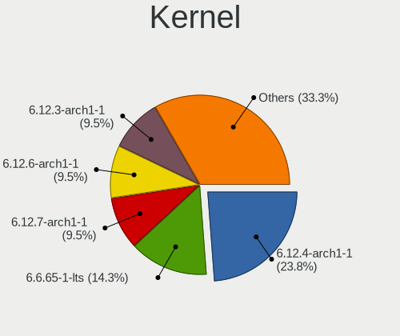

| Version           | Notebooks | Percent |
|-------------------|-----------|---------|
| 5.18.3-arch1-1    | 3         | 30%     |
| 5.18.6-arch1-1    | 1         | 10%     |
| 5.18.5-arch1-1    | 1         | 10%     |
| 5.18.2-zen1-1-zen | 1         | 10%     |
| 5.18.1-zen1-1-zen | 1         | 10%     |
| 5.15.50-1-lts     | 1         | 10%     |
| 5.15.45-1-lts     | 1         | 10%     |
| 5.15.44-1-lts     | 1         | 10%     |

Kernel Family
-------------

Linux kernel without a distro release

| Version | Notebooks | Percent |
|---------|-----------|---------|
| 5.18.3  | 3         | 30%     |
| 5.18.6  | 1         | 10%     |
| 5.18.5  | 1         | 10%     |
| 5.18.2  | 1         | 10%     |
| 5.18.1  | 1         | 10%     |
| 5.15.50 | 1         | 10%     |
| 5.15.45 | 1         | 10%     |
| 5.15.44 | 1         | 10%     |

Kernel Major Ver.
-----------------

Linux kernel major version

| Version | Notebooks | Percent |
|---------|-----------|---------|
| 5.18    | 7         | 70%     |
| 5.15    | 3         | 30%     |

Arch
----

OS architecture (x86_64, i586, etc.)

| Name   | Notebooks | Percent |
|--------|-----------|---------|
| x86_64 | 10        | 100%    |

DE
--

Desktop Environment

| Name            | Notebooks | Percent |
|-----------------|-----------|---------|
| KDE5            | 5         | 50%     |
| XFCE            | 1         | 10%     |
| GNOME Flashback | 1         | 10%     |
| GNOME           | 1         | 10%     |
| Budgie          | 1         | 10%     |
| bspwm           | 1         | 10%     |

Display Server
--------------

X11 or Wayland

| Name    | Notebooks | Percent |
|---------|-----------|---------|
| X11     | 8         | 80%     |
| Wayland | 2         | 20%     |

Display Manager
---------------

SDDM, LightDM, etc.

| Name    | Notebooks | Percent |
|---------|-----------|---------|
| SDDM    | 4         | 40%     |
| LightDM | 3         | 30%     |
| Unknown | 3         | 30%     |

OS Lang
-------

Language

| Lang  | Notebooks | Percent |
|-------|-----------|---------|
| en_US | 5         | 50%     |
| fi_FI | 1         | 10%     |
| es_US | 1         | 10%     |
| es_ES | 1         | 10%     |
| es_AR | 1         | 10%     |
| en_IN | 1         | 10%     |

Boot Mode
---------

EFI or BIOS

| Mode | Notebooks | Percent |
|------|-----------|---------|
| EFI  | 7         | 70%     |
| BIOS | 3         | 30%     |

Filesystem
----------

Type of filesystem

| Type  | Notebooks | Percent |
|-------|-----------|---------|
| Ext4  | 6         | 60%     |
| Btrfs | 4         | 40%     |

Part. scheme
------------

Scheme of partitioning

| Type    | Notebooks | Percent |
|---------|-----------|---------|
| GPT     | 7         | 70%     |
| Unknown | 3         | 30%     |

Dual Boot with Linux/BSD
------------------------

Hosting more than one Linux/BSD

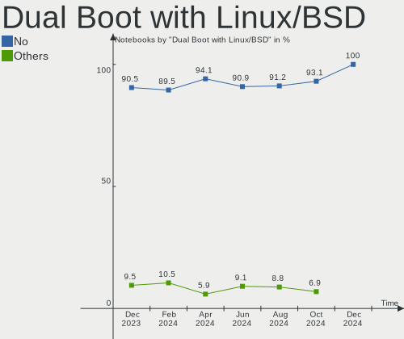

| Dual boot | Notebooks | Percent |
|-----------|-----------|---------|
| No        | 8         | 80%     |
| Yes       | 2         | 20%     |

Dual Boot (Win)
---------------

Hosting Linux and Windows

| Dual boot | Notebooks | Percent |
|-----------|-----------|---------|
| No        | 9         | 90%     |
| Yes       | 1         | 10%     |

Board
-----

Vendor
------

Motherboard manufacturer

| Name             | Notebooks | Percent |
|------------------|-----------|---------|
| HUAWEI           | 2         | 20%     |
| ASUSTek Computer | 2         | 20%     |
| Acer             | 2         | 20%     |
| MSI              | 1         | 10%     |
| Lenovo           | 1         | 10%     |
| HONOR            | 1         | 10%     |
| Dell             | 1         | 10%     |

Model
-----

Motherboard model

| Name                   | Notebooks | Percent |
|------------------------|-----------|---------|
| MSI MS-7C02            | 1         | 10%     |
| Lenovo V330-14ARR 81B1 | 1         | 10%     |
| HUAWEI MACH-WX9        | 1         | 10%     |
| HUAWEI KLVL-WXX9       | 1         | 10%     |
| HONOR BBR-WAX9         | 1         | 10%     |
| Dell Latitude E6440    | 1         | 10%     |
| ASUS N56VB             | 1         | 10%     |
| ASUS GL753VE           | 1         | 10%     |
| Acer Aspire E5-575G    | 1         | 10%     |
| Acer Aspire A515-43    | 1         | 10%     |

Model Family
------------

Motherboard model prefix

| Name              | Notebooks | Percent |
|-------------------|-----------|---------|
| Acer Aspire       | 2         | 20%     |
| MSI MS-7C02       | 1         | 10%     |
| Lenovo V330-14ARR | 1         | 10%     |
| HUAWEI MACH-WX9   | 1         | 10%     |
| HUAWEI KLVL-WXX9  | 1         | 10%     |
| HONOR BBR-WAX9    | 1         | 10%     |
| Dell Latitude     | 1         | 10%     |
| ASUS N56VB        | 1         | 10%     |
| ASUS GL753VE      | 1         | 10%     |

MFG Year
--------

Motherboard manufacture year

| Year | Notebooks | Percent |
|------|-----------|---------|
| 2019 | 2         | 20%     |
| 2018 | 2         | 20%     |
| 2013 | 2         | 20%     |
| 2022 | 1         | 10%     |
| 2020 | 1         | 10%     |
| 2017 | 1         | 10%     |
| 2016 | 1         | 10%     |

Form Factor
-----------

Physical design of the computer

| Name     | Notebooks | Percent |
|----------|-----------|---------|
| Notebook | 10        | 100%    |

Secure Boot
-----------

Enabled or disabled

| State    | Notebooks | Percent |
|----------|-----------|---------|
| Disabled | 10        | 100%    |

Coreboot
--------

Have coreboot on board

| Used | Notebooks | Percent |
|------|-----------|---------|
| No   | 10        | 100%    |

RAM Size
--------

Total RAM memory

| Size in GB | Notebooks | Percent |
|------------|-----------|---------|
| 4.01-8.0   | 4         | 40%     |
| 16.01-24.0 | 4         | 40%     |
| 3.01-4.0   | 1         | 10%     |
| 8.01-16.0  | 1         | 10%     |

RAM Used
--------

Used RAM memory

| Used GB  | Notebooks | Percent |
|----------|-----------|---------|
| 4.01-8.0 | 4         | 40%     |
| 3.01-4.0 | 2         | 20%     |
| 2.01-3.0 | 2         | 20%     |
| 1.01-2.0 | 2         | 20%     |

Total Drives
------------

Number of drives on board

| Drives | Notebooks | Percent |
|--------|-----------|---------|
| 1      | 7         | 70%     |
| 2      | 3         | 30%     |

Has CD-ROM
----------

Has CD-ROM on board

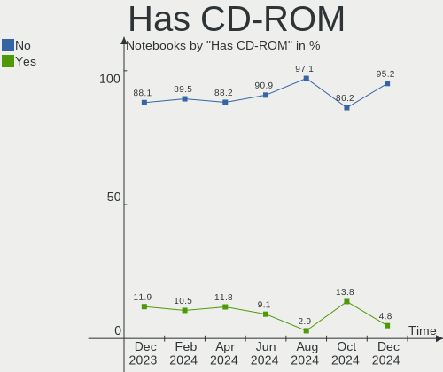

| Presented | Notebooks | Percent |
|-----------|-----------|---------|
| No        | 8         | 80%     |
| Yes       | 2         | 20%     |

Has Ethernet
------------

Has Ethernet on board

| Presented | Notebooks | Percent |
|-----------|-----------|---------|
| Yes       | 8         | 80%     |
| No        | 2         | 20%     |

Has WiFi
--------

Has WiFi module

| Presented | Notebooks | Percent |
|-----------|-----------|---------|
| Yes       | 10        | 100%    |

Has Bluetooth
-------------

Has Bluetooth module

| Presented | Notebooks | Percent |
|-----------|-----------|---------|
| Yes       | 9         | 90%     |
| No        | 1         | 10%     |

Location
--------

Country
-------

Geographic location (country)

| Country   | Notebooks | Percent |
|-----------|-----------|---------|
| USA       | 2         | 20%     |
| Argentina | 2         | 20%     |
| Spain     | 1         | 10%     |
| Romania   | 1         | 10%     |
| Latvia    | 1         | 10%     |
| India     | 1         | 10%     |
| Germany   | 1         | 10%     |
| Finland   | 1         | 10%     |

City
----

Geographic location (city)

| City             | Notebooks | Percent |
|------------------|-----------|---------|
| Villa Martelli   | 1         | 10%     |
| Târgu Mureş    | 1         | 10%     |
| Severna Park     | 1         | 10%     |
| Riga             | 1         | 10%     |
| Ramos Mejia      | 1         | 10%     |
| Hemmingen        | 1         | 10%     |
| Helsinki         | 1         | 10%     |
| Bhubaneswar      | 1         | 10%     |
| Austin           | 1         | 10%     |
| Arroyo de la Luz | 1         | 10%     |

Drives
------

Drive Vendor
------------

Hard drive vendors

| Vendor              | Notebooks | Drives | Percent |
|---------------------|-----------|--------|---------|
| WDC                 | 3         | 3      | 23.08%  |
| Samsung Electronics | 3         | 3      | 23.08%  |
| Crucial             | 2         | 2      | 15.38%  |
| SSSTC               | 1         | 1      | 7.69%   |
| SanDisk             | 1         | 1      | 7.69%   |
| Micron Technology   | 1         | 1      | 7.69%   |
| Kingston            | 1         | 1      | 7.69%   |
| Intel               | 1         | 1      | 7.69%   |

Drive Model
-----------

Hard drive models

| Model                                | Notebooks | Percent |
|--------------------------------------|-----------|---------|
| WDC WDS100T3X0C-00SJG0 1TB           | 1         | 7.69%   |
| WDC WD10JPVX-22JC3T0 1TB             | 1         | 7.69%   |
| WDC PC SN520 SDAPNUW-512G-1014 512GB | 1         | 7.69%   |
| SSSTC CL1-8D256 256GB                | 1         | 7.69%   |
| SanDisk NVMe SSD Drive 512GB         | 1         | 7.69%   |
| Samsung SSD PM851 2.5 7mm 256GB      | 1         | 7.69%   |
| Samsung SSD 850 EVO 500GB            | 1         | 7.69%   |
| Samsung NVMe SSD Drive 512GB         | 1         | 7.69%   |
| Micron 1100_MTFDDAV256TBN 256GB SSD  | 1         | 7.69%   |
| Kingston SA400S37480G 480GB SSD      | 1         | 7.69%   |
| Intel SSDSC2KW256G8 256GB            | 1         | 7.69%   |
| Crucial CT240BX500SSD1 240GB         | 1         | 7.69%   |
| Crucial CT120BX500SSD1 120GB         | 1         | 7.69%   |

HDD Vendor
----------

Hard disk drive vendors

| Vendor | Notebooks | Drives | Percent |
|--------|-----------|--------|---------|
| WDC    | 1         | 1      | 100%    |

SSD Vendor
----------

Solid state drive vendors

| Vendor              | Notebooks | Drives | Percent |
|---------------------|-----------|--------|---------|
| Samsung Electronics | 2         | 2      | 28.57%  |
| Crucial             | 2         | 2      | 28.57%  |
| Micron Technology   | 1         | 1      | 14.29%  |
| Kingston            | 1         | 1      | 14.29%  |
| Intel               | 1         | 1      | 14.29%  |

Drive Kind
----------

HDD or SSD

| Kind | Notebooks | Drives | Percent |
|------|-----------|--------|---------|
| SSD  | 6         | 7      | 50%     |
| NVMe | 5         | 5      | 41.67%  |
| HDD  | 1         | 1      | 8.33%   |

Drive Connector
---------------

SATA, SAS, NVMe, etc.

| Type | Notebooks | Drives | Percent |
|------|-----------|--------|---------|
| SATA | 6         | 8      | 54.55%  |
| NVMe | 5         | 5      | 45.45%  |

Drive Size
----------

Size of hard drive

| Size in TB | Notebooks | Drives | Percent |
|------------|-----------|--------|---------|
| 0.01-0.5   | 6         | 7      | 85.71%  |
| 0.51-1.0   | 1         | 1      | 14.29%  |

Space Total
-----------

Amount of disk space available on the file system

| Size in GB     | Notebooks | Percent |
|----------------|-----------|---------|
| 101-250        | 4         | 40%     |
| 501-1000       | 3         | 30%     |
| More than 3000 | 1         | 10%     |
| 251-500        | 1         | 10%     |
| 2001-3000      | 1         | 10%     |

Space Used
----------

Amount of used disk space

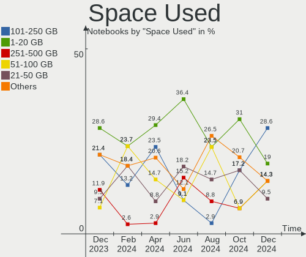

| Used GB   | Notebooks | Percent |
|-----------|-----------|---------|
| 101-250   | 3         | 30%     |
| 21-50     | 2         | 20%     |
| 51-100    | 2         | 20%     |
| 251-500   | 1         | 10%     |
| 2001-3000 | 1         | 10%     |
| 1-20      | 1         | 10%     |

Malfunc. Drives
---------------

Drive models with a malfunction

| Model                                          | Notebooks | Drives | Percent |
|------------------------------------------------|-----------|--------|---------|
| Micron Technology 1100_MTFDDAV256TBN 256GB SSD | 1         | 1      | 100%    |

Malfunc. Drive Vendor
---------------------

Vendors of faulty drives

| Vendor            | Notebooks | Drives | Percent |
|-------------------|-----------|--------|---------|
| Micron Technology | 1         | 1      | 100%    |

Malfunc. HDD Vendor
-------------------

Vendors of faulty HDD drives

Zero info for selected period =(

Malfunc. Drive Kind
-------------------

Kinds of faulty drives

| Kind | Notebooks | Drives | Percent |
|------|-----------|--------|---------|
| SSD  | 1         | 1      | 100%    |

Failed Drives
-------------

Failed drive models

Zero info for selected period =(

Failed Drive Vendor
-------------------

Failed drive vendors

Zero info for selected period =(

Drive Status
------------

Number of failed and malfunc. drives

| Status   | Notebooks | Drives | Percent |
|----------|-----------|--------|---------|
| Works    | 7         | 9      | 63.64%  |
| Detected | 3         | 3      | 27.27%  |
| Malfunc  | 1         | 1      | 9.09%   |

Storage controller
------------------

Storage Vendor
--------------

Storage controller vendors

| Vendor                         | Notebooks | Percent |
|--------------------------------|-----------|---------|
| Intel                          | 5         | 38.46%  |
| SanDisk                        | 3         | 23.08%  |
| AMD                            | 3         | 23.08%  |
| Solid State Storage Technology | 1         | 7.69%   |
| Samsung Electronics            | 1         | 7.69%   |

Storage Model
-------------

Storage controller models

| Model                                                                          | Notebooks | Percent |
|--------------------------------------------------------------------------------|-----------|---------|
| SanDisk WD Black SN750 / PC SN730 NVMe SSD                                     | 2         | 15.38%  |
| AMD FCH SATA Controller [AHCI mode]                                            | 2         | 15.38%  |
| Solid State Storage Non-Volatile memory controller                             | 1         | 7.69%   |
| SanDisk WD Blue SN500 / PC SN520 NVMe SSD                                      | 1         | 7.69%   |
| Samsung NVMe SSD Controller SM981/PM981/PM983                                  | 1         | 7.69%   |
| Intel Sunrise Point-LP SATA Controller [AHCI mode]                             | 1         | 7.69%   |
| Intel HM170/QM170 Chipset SATA Controller [AHCI Mode]                          | 1         | 7.69%   |
| Intel Comet Lake SATA AHCI Controller                                          | 1         | 7.69%   |
| Intel 8 Series/C220 Series Chipset Family 6-port SATA Controller 1 [AHCI mode] | 1         | 7.69%   |
| Intel 7 Series Chipset Family 6-port SATA Controller [AHCI mode]               | 1         | 7.69%   |
| AMD 400 Series Chipset SATA Controller                                         | 1         | 7.69%   |

Storage Kind
------------

Kind of storage controller (IDE, SATA, NVMe, SAS, ...)

| Kind | Notebooks | Percent |
|------|-----------|---------|
| SATA | 8         | 61.54%  |
| NVMe | 5         | 38.46%  |

Processor
---------

CPU Vendor
----------

Processor vendors

| Vendor | Notebooks | Percent |
|--------|-----------|---------|
| Intel  | 6         | 60%     |
| AMD    | 4         | 40%     |

CPU Model
---------

Processor models

| Model                                         | Notebooks | Percent |
|-----------------------------------------------|-----------|---------|
| Intel Core i7-8550U CPU @ 1.80GHz             | 1         | 10%     |
| Intel Core i7-7700HQ CPU @ 2.80GHz            | 1         | 10%     |
| Intel Core i7-4610M CPU @ 3.00GHz             | 1         | 10%     |
| Intel Core i5-7200U CPU @ 2.50GHz             | 1         | 10%     |
| Intel Core i3-3120M CPU @ 2.50GHz             | 1         | 10%     |
| Intel Core i3-10110U CPU @ 2.10GHz            | 1         | 10%     |
| AMD Ryzen 7 3700X 8-Core Processor            | 1         | 10%     |
| AMD Ryzen 5 4600H with Radeon Graphics        | 1         | 10%     |
| AMD Ryzen 5 3500U with Radeon Vega Mobile Gfx | 1         | 10%     |
| AMD Ryzen 3 2200U with Radeon Vega Mobile Gfx | 1         | 10%     |

CPU Model Family
----------------

Processor model prefix

| Model         | Notebooks | Percent |
|---------------|-----------|---------|
| Intel Core i7 | 3         | 30%     |
| Intel Core i3 | 2         | 20%     |
| AMD Ryzen 5   | 2         | 20%     |
| Intel Core i5 | 1         | 10%     |
| AMD Ryzen 7   | 1         | 10%     |
| AMD Ryzen 3   | 1         | 10%     |

CPU Cores
---------

Number of processor cores

| Number | Notebooks | Percent |
|--------|-----------|---------|
| 2      | 5         | 50%     |
| 4      | 3         | 30%     |
| 8      | 1         | 10%     |
| 6      | 1         | 10%     |

CPU Sockets
-----------

Number of sockets

| Number | Notebooks | Percent |
|--------|-----------|---------|
| 1      | 10        | 100%    |

CPU Threads
-----------

Threads per core (Hyper-Threading)

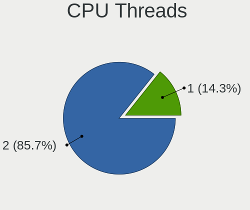

| Number | Notebooks | Percent |
|--------|-----------|---------|
| 2      | 10        | 100%    |

CPU Op-Modes
------------

CPU Operation Modes (32-bit, 64-bit)

| Op mode        | Notebooks | Percent |
|----------------|-----------|---------|
| 32-bit, 64-bit | 10        | 100%    |

CPU Microcode
-------------

Microcode number

| Number     | Notebooks | Percent |
|------------|-----------|---------|
| Unknown    | 3         | 30%     |
| 0x906e9    | 1         | 10%     |
| 0x806ec    | 1         | 10%     |
| 0x806e9    | 1         | 10%     |
| 0x306c3    | 1         | 10%     |
| 0x306a9    | 1         | 10%     |
| 0x08701021 | 1         | 10%     |
| 0x08108109 | 1         | 10%     |

CPU Microarch
-------------

Microarchitecture

| Name      | Notebooks | Percent |
|-----------|-----------|---------|
| KabyLake  | 4         | 40%     |
| Zen 2     | 2         | 20%     |
| Zen+      | 1         | 10%     |
| Zen       | 1         | 10%     |
| IvyBridge | 1         | 10%     |
| Haswell   | 1         | 10%     |

Graphics
--------

GPU Vendor
----------

Vendors of graphics cards

| Vendor | Notebooks | Percent |
|--------|-----------|---------|
| Intel  | 6         | 42.86%  |
| Nvidia | 5         | 35.71%  |
| AMD    | 3         | 21.43%  |

GPU Model
---------

Graphics card models

| Model                                                                | Notebooks | Percent |
|----------------------------------------------------------------------|-----------|---------|
| Nvidia GP108M [GeForce MX150]                                        | 1         | 7.14%   |
| Nvidia GP107M [GeForce GTX 1050 Ti Mobile]                           | 1         | 7.14%   |
| Nvidia GP107 [GeForce GTX 1050 Ti]                                   | 1         | 7.14%   |
| Nvidia GM108M [GeForce 940MX]                                        | 1         | 7.14%   |
| Nvidia GK107M [GeForce GT 740M]                                      | 1         | 7.14%   |
| Intel UHD Graphics 620                                               | 1         | 7.14%   |
| Intel HD Graphics 630                                                | 1         | 7.14%   |
| Intel HD Graphics 620                                                | 1         | 7.14%   |
| Intel CometLake-U GT2 [UHD Graphics]                                 | 1         | 7.14%   |
| Intel 4th Gen Core Processor Integrated Graphics Controller          | 1         | 7.14%   |
| Intel 3rd Gen Core processor Graphics Controller                     | 1         | 7.14%   |
| AMD Renoir                                                           | 1         | 7.14%   |
| AMD Raven Ridge [Radeon Vega Series / Radeon Vega Mobile Series]     | 1         | 7.14%   |
| AMD Picasso/Raven 2 [Radeon Vega Series / Radeon Vega Mobile Series] | 1         | 7.14%   |

GPU Combo
---------

Combinations of graphics cards

| Name           | Notebooks | Percent |
|----------------|-----------|---------|
| Intel + Nvidia | 4         | 40%     |
| 1 x AMD        | 3         | 30%     |
| 1 x Intel      | 2         | 20%     |
| 1 x Nvidia     | 1         | 10%     |

GPU Driver
----------

Free vs proprietary

| Driver      | Notebooks | Percent |
|-------------|-----------|---------|
| Free        | 7         | 70%     |
| Proprietary | 3         | 30%     |

GPU Memory
----------

Total video memory

| Size in GB | Notebooks | Percent |
|------------|-----------|---------|
| Unknown    | 6         | 60%     |
| 1.01-2.0   | 2         | 20%     |
| 3.01-4.0   | 1         | 10%     |
| 2.01-3.0   | 1         | 10%     |

Monitor
-------

Monitor Vendor
--------------

Monitor vendors

| Vendor              | Notebooks | Percent |
|---------------------|-----------|---------|
| LG Display          | 3         | 30%     |
| AU Optronics        | 3         | 30%     |
| BOE                 | 2         | 20%     |
| Samsung Electronics | 1         | 10%     |
| JDI                 | 1         | 10%     |

Monitor Model
-------------

Monitor models

| Model                                                             | Notebooks | Percent |
|-------------------------------------------------------------------|-----------|---------|
| Samsung Electronics C24FG7x SAM0E43 1920x1080 532x304mm 24.1-inch | 1         | 10%     |
| LG Display LCD Monitor LGD065A 1920x1080 344x194mm 15.5-inch      | 1         | 10%     |
| LG Display LCD Monitor LGD04E8 1920x1080 380x210mm 17.1-inch      | 1         | 10%     |
| LG Display LCD Monitor LGD044F 1920x1080 345x194mm 15.6-inch      | 1         | 10%     |
| JDI LCD Monitor JDI422A 3000x2000 293x196mm 13.9-inch             | 1         | 10%     |
| BOE LCD Monitor BOE0893 2160x1440 296x197mm 14.0-inch             | 1         | 10%     |
| BOE LCD Monitor BOE0872 1920x1080 344x194mm 15.5-inch             | 1         | 10%     |
| AU Optronics LCD Monitor AUO3B3C 1366x768 309x173mm 13.9-inch     | 1         | 10%     |
| AU Optronics LCD Monitor AUO2E3C 1366x768 309x173mm 13.9-inch     | 1         | 10%     |
| AU Optronics LCD Monitor AUO24EC 1366x768 344x193mm 15.5-inch     | 1         | 10%     |

Monitor Resolution
------------------

Monitor screen resolution

| Resolution      | Notebooks | Percent |
|-----------------|-----------|---------|
| 1920x1080 (FHD) | 5         | 50%     |
| 1366x768 (WXGA) | 3         | 30%     |
| 3000x2000       | 1         | 10%     |
| 2160x1440       | 1         | 10%     |

Monitor Diagonal
----------------

Diagonal size in inches

| Inches | Notebooks | Percent |
|--------|-----------|---------|
| 15     | 4         | 40%     |
| 13     | 3         | 30%     |
| 24     | 1         | 10%     |
| 17     | 1         | 10%     |
| 14     | 1         | 10%     |

Monitor Width
-------------

Physical width

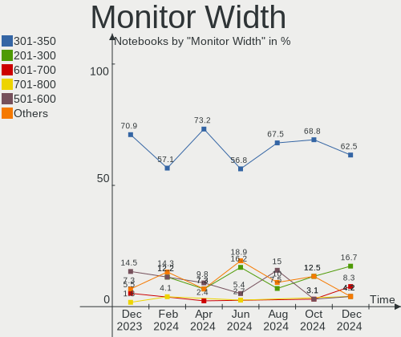

| Width in mm | Notebooks | Percent |
|-------------|-----------|---------|
| 301-350     | 6         | 60%     |
| 201-300     | 2         | 20%     |
| 501-600     | 1         | 10%     |
| 351-400     | 1         | 10%     |

Aspect Ratio
------------

Proportional relationship between the width and the height

| Ratio | Notebooks | Percent |
|-------|-----------|---------|
| 16/9  | 8         | 80%     |
| 3/2   | 2         | 20%     |

Monitor Area
------------

Area in inch²

| Area in inch² | Notebooks | Percent |
|----------------|-----------|---------|
| 81-90          | 4         | 40%     |
| 101-110        | 4         | 40%     |
| 251-300        | 1         | 10%     |
| 121-130        | 1         | 10%     |

Pixel Density
-------------

Pixels per inch

| Density       | Notebooks | Percent |
|---------------|-----------|---------|
| 121-160       | 4         | 40%     |
| 101-120       | 3         | 30%     |
| More than 240 | 1         | 10%     |
| 161-240       | 1         | 10%     |
| 51-100        | 1         | 10%     |

Multiple Monitors
-----------------

Total monitors connected

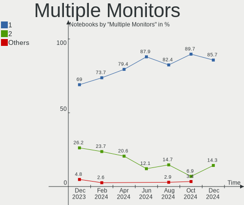

| Total | Notebooks | Percent |
|-------|-----------|---------|
| 1     | 10        | 100%    |

Network
-------

Net Controller Vendor
---------------------

Controller vendors

| Vendor                | Notebooks | Percent |
|-----------------------|-----------|---------|
| Intel                 | 7         | 43.75%  |
| Realtek Semiconductor | 5         | 31.25%  |
| Qualcomm Atheros      | 3         | 18.75%  |
| ASIX Electronics      | 1         | 6.25%   |

Net Controller Model
--------------------

Controller models

| Model                                                             | Notebooks | Percent |
|-------------------------------------------------------------------|-----------|---------|
| Realtek RTL8111/8168/8411 PCI Express Gigabit Ethernet Controller | 5         | 27.78%  |
| Qualcomm Atheros QCA9377 802.11ac Wireless Network Adapter        | 2         | 11.11%  |
| Intel Wireless 7265                                               | 2         | 11.11%  |
| Qualcomm Atheros AR9485 Wireless Network Adapter                  | 1         | 5.56%   |
| Qualcomm Atheros AR8161 Gigabit Ethernet                          | 1         | 5.56%   |
| Intel Wireless 8265 / 8275                                        | 1         | 5.56%   |
| Intel Wi-Fi 6 AX210/AX211/AX411 160MHz                            | 1         | 5.56%   |
| Intel Wi-Fi 6 AX200                                               | 1         | 5.56%   |
| Intel Ethernet Connection I217-LM                                 | 1         | 5.56%   |
| Intel Comet Lake PCH-LP CNVi WiFi                                 | 1         | 5.56%   |
| Intel Centrino Advanced-N 6235                                    | 1         | 5.56%   |
| ASIX AX88179 Gigabit Ethernet                                     | 1         | 5.56%   |

Wireless Vendor
---------------

Wireless vendors

| Vendor           | Notebooks | Percent |
|------------------|-----------|---------|
| Intel            | 7         | 70%     |
| Qualcomm Atheros | 3         | 30%     |

Wireless Model
--------------

Wireless models

| Model                                                      | Notebooks | Percent |
|------------------------------------------------------------|-----------|---------|
| Qualcomm Atheros QCA9377 802.11ac Wireless Network Adapter | 2         | 20%     |
| Intel Wireless 7265                                        | 2         | 20%     |
| Qualcomm Atheros AR9485 Wireless Network Adapter           | 1         | 10%     |
| Intel Wireless 8265 / 8275                                 | 1         | 10%     |
| Intel Wi-Fi 6 AX210/AX211/AX411 160MHz                     | 1         | 10%     |
| Intel Wi-Fi 6 AX200                                        | 1         | 10%     |
| Intel Comet Lake PCH-LP CNVi WiFi                          | 1         | 10%     |
| Intel Centrino Advanced-N 6235                             | 1         | 10%     |

Ethernet Vendor
---------------

Ethernet vendors

| Vendor                | Notebooks | Percent |
|-----------------------|-----------|---------|
| Realtek Semiconductor | 5         | 62.5%   |
| Qualcomm Atheros      | 1         | 12.5%   |
| Intel                 | 1         | 12.5%   |
| ASIX Electronics      | 1         | 12.5%   |

Ethernet Model
--------------

Ethernet models

| Model                                                             | Notebooks | Percent |
|-------------------------------------------------------------------|-----------|---------|
| Realtek RTL8111/8168/8411 PCI Express Gigabit Ethernet Controller | 5         | 62.5%   |
| Qualcomm Atheros AR8161 Gigabit Ethernet                          | 1         | 12.5%   |
| Intel Ethernet Connection I217-LM                                 | 1         | 12.5%   |
| ASIX AX88179 Gigabit Ethernet                                     | 1         | 12.5%   |

Net Controller Kind
-------------------

Ethernet, WiFi or modem

| Kind     | Notebooks | Percent |
|----------|-----------|---------|
| WiFi     | 10        | 55.56%  |
| Ethernet | 8         | 44.44%  |

Used Controller
---------------

Currently used network controller

| Kind     | Notebooks | Percent |
|----------|-----------|---------|
| WiFi     | 7         | 70%     |
| Ethernet | 3         | 30%     |

NICs
----

Total network controllers on board

| Total | Notebooks | Percent |
|-------|-----------|---------|
| 2     | 7         | 70%     |
| 1     | 3         | 30%     |

IPv6
----

IPv6 vs IPv4

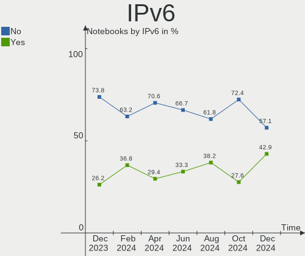

| Used | Notebooks | Percent |
|------|-----------|---------|
| Yes  | 6         | 60%     |
| No   | 4         | 40%     |

Bluetooth
---------

Bluetooth Vendor
----------------

Controller vendors

| Vendor                          | Notebooks | Percent |
|---------------------------------|-----------|---------|
| Intel                           | 6         | 66.67%  |
| Qualcomm Atheros Communications | 1         | 11.11%  |
| Lite-On Technology              | 1         | 11.11%  |
| IMC Networks                    | 1         | 11.11%  |

Bluetooth Model
---------------

Controller models

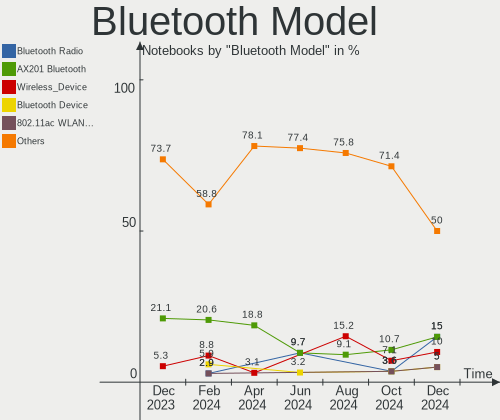

| Model                                             | Notebooks | Percent |
|---------------------------------------------------|-----------|---------|
| Intel Bluetooth wireless interface                | 3         | 33.33%  |
| Qualcomm Atheros  Bluetooth Device                | 1         | 11.11%  |
| Lite-On Qualcomm Atheros QCA9377 Bluetooth        | 1         | 11.11%  |
| Intel Bluetooth 9460/9560 Jefferson Peak (JfP)    | 1         | 11.11%  |
| Intel AX210 Bluetooth                             | 1         | 11.11%  |
| Intel AX200 Bluetooth                             | 1         | 11.11%  |
| IMC Networks Atheros AR3012 Bluetooth 4.0 Adapter | 1         | 11.11%  |

Sound
-----

Sound Vendor
------------

Sound card vendors

| Vendor          | Notebooks | Percent |
|-----------------|-----------|---------|
| Intel           | 6         | 46.15%  |
| AMD             | 4         | 30.77%  |
| Nvidia          | 2         | 15.38%  |
| SteelSeries ApS | 1         | 7.69%   |

Sound Model
-----------

Sound card models

| Model                                                               | Notebooks | Percent |
|---------------------------------------------------------------------|-----------|---------|
| AMD Family 17h/19h HD Audio Controller                              | 3         | 16.67%  |
| Intel Sunrise Point-LP HD Audio                                     | 2         | 11.11%  |
| AMD Raven/Raven2/Fenghuang HDMI/DP Audio Controller                 | 2         | 11.11%  |
| SteelSeries ApS SteelSeries Arctis 5                                | 1         | 5.56%   |
| SteelSeries ApS Arctis 7+                                           | 1         | 5.56%   |
| Nvidia GP107GL High Definition Audio Controller                     | 1         | 5.56%   |
| Nvidia GK107 HDMI Audio Controller                                  | 1         | 5.56%   |
| Intel Xeon E3-1200 v3/4th Gen Core Processor HD Audio Controller    | 1         | 5.56%   |
| Intel Comet Lake PCH-LP cAVS                                        | 1         | 5.56%   |
| Intel CM238 HD Audio Controller                                     | 1         | 5.56%   |
| Intel 8 Series/C220 Series Chipset High Definition Audio Controller | 1         | 5.56%   |
| Intel 7 Series/C216 Chipset Family High Definition Audio Controller | 1         | 5.56%   |
| AMD Starship/Matisse HD Audio Controller                            | 1         | 5.56%   |
| AMD Renoir Radeon High Definition Audio Controller                  | 1         | 5.56%   |

Memory
------

Memory Vendor
-------------

Memory module vendors

| Vendor              | Notebooks | Percent |
|---------------------|-----------|---------|
| Kingston            | 2         | 22.22%  |
| Unknown             | 1         | 11.11%  |
| SK hynix            | 1         | 11.11%  |
| Samsung Electronics | 1         | 11.11%  |
| Nanya Technology    | 1         | 11.11%  |
| Magnum Tech         | 1         | 11.11%  |
| G.Skill             | 1         | 11.11%  |
| A-DATA Technology   | 1         | 11.11%  |

Memory Model
------------

Memory module models

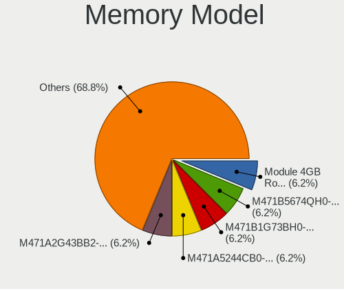

| Model                                                  | Notebooks | Percent |
|--------------------------------------------------------|-----------|---------|
| Unknown RAM Module 4GB SODIMM DDR3 1600MT/s            | 1         | 11.11%  |
| SK hynix RAM HMA81GS6AFR8N-UH 8GB SODIMM DDR4 2667MT/s | 1         | 11.11%  |
| Samsung RAM K4A8G165WC-BCTD 4GB SODIMM DDR4 2667MT/s   | 1         | 11.11%  |
| Nanya RAM NT8GC64C8HB0NS-DI 8GB SODIMM DDR3 1600MT/s   | 1         | 11.11%  |
| Magnum Tech RAM MAGNUMTECH 4GB SODIMM DDR3 1600MT/s    | 1         | 11.11%  |
| Kingston RAM ACR26D4S9S8ME-8 8GB SODIMM DDR4 2667MT/s  | 1         | 11.11%  |
| Kingston RAM 9905624-044.A00G 8GB SODIMM DDR4 2400MT/s | 1         | 11.11%  |
| G.Skill RAM F4-3200C16-8GTZRX 8GB DIMM DDR4 3200MT/s   | 1         | 11.11%  |
| A-DATA RAM AO1P24HC8T1-B2NS 8GB SODIMM DDR4 2133MT/s   | 1         | 11.11%  |

Memory Kind
-----------

Memory module kinds

| Kind | Notebooks | Percent |
|------|-----------|---------|
| DDR4 | 5         | 71.43%  |
| DDR3 | 2         | 28.57%  |

Memory Form Factor
------------------

Physical design of the memory module

| Name   | Notebooks | Percent |
|--------|-----------|---------|
| SODIMM | 6         | 85.71%  |
| DIMM   | 1         | 14.29%  |

Memory Size
-----------

Memory module size

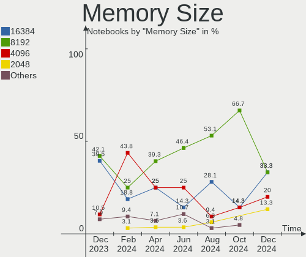

| Size | Notebooks | Percent |
|------|-----------|---------|
| 8192 | 6         | 75%     |
| 4096 | 2         | 25%     |

Memory Speed
------------

Memory module speed

| Speed | Notebooks | Percent |
|-------|-----------|---------|
| 2667  | 3         | 37.5%   |
| 1600  | 2         | 25%     |
| 3200  | 1         | 12.5%   |
| 2400  | 1         | 12.5%   |
| 2133  | 1         | 12.5%   |

Printers & scanners
-------------------

Printer Vendor
--------------

Printer device vendors

Zero info for selected period =(

Printer Model
-------------

Printer device models

Zero info for selected period =(

Scanner Vendor
--------------

Scanner device vendors

Zero info for selected period =(

Scanner Model
-------------

Scanner device models

Zero info for selected period =(

Camera
------

Camera Vendor
-------------

Camera device vendors

| Vendor                                 | Notebooks | Percent |
|----------------------------------------|-----------|---------|
| Sunplus Innovation Technology          | 2         | 22.22%  |
| IMC Networks                           | 2         | 22.22%  |
| Chicony Electronics                    | 2         | 22.22%  |
| Syntek                                 | 1         | 11.11%  |
| Quanta                                 | 1         | 11.11%  |
| Cheng Uei Precision Industry (Foxlink) | 1         | 11.11%  |

Camera Model
------------

Camera device models

| Model                                            | Notebooks | Percent |
|--------------------------------------------------|-----------|---------|
| Syntek Integrated Camera                         | 1         | 11.11%  |
| Sunplus Laptop_Integrated_Webcam_HD              | 1         | 11.11%  |
| Sunplus Asus Webcam                              | 1         | 11.11%  |
| Quanta HD Camera                                 | 1         | 11.11%  |
| IMC Networks USB2.0 HD UVC WebCam                | 1         | 11.11%  |
| IMC Networks HD Camera                           | 1         | 11.11%  |
| Chicony HD WebCam                                | 1         | 11.11%  |
| Chicony HD User Facing                           | 1         | 11.11%  |
| Cheng Uei Precision Industry (Foxlink) HD Camera | 1         | 11.11%  |

Security
--------

Fingerprint Vendor
------------------

Fingerprint sensor vendors

| Vendor                | Notebooks | Percent |
|-----------------------|-----------|---------|
| Elan Microelectronics | 1         | 100%    |

Fingerprint Model
-----------------

Fingerprint sensor models

| Model                 | Notebooks | Percent |
|-----------------------|-----------|---------|
| Elan ELAN:Fingerprint | 1         | 100%    |

Chipcard Vendor
---------------

Chipcard module vendors

| Vendor   | Notebooks | Percent |
|----------|-----------|---------|
| Broadcom | 1         | 100%    |

Chipcard Model
--------------

Chipcard module models

| Model                                          | Notebooks | Percent |
|------------------------------------------------|-----------|---------|
| Broadcom BCM5880 Secure Applications Processor | 1         | 100%    |

Unsupported
-----------

Unsupported Devices
-------------------

Total unsupported devices on board

| Total | Notebooks | Percent |
|-------|-----------|---------|
| 1     | 5         | 50%     |
| 0     | 5         | 50%     |

Unsupported Device Types
------------------------

Types of unsupported devices

| Type                  | Notebooks | Percent |
|-----------------------|-----------|---------|
| Net/ethernet          | 1         | 20%     |
| Multimedia controller | 1         | 20%     |
| Fingerprint reader    | 1         | 20%     |
| Chipcard              | 1         | 20%     |
| Camera                | 1         | 20%     |

