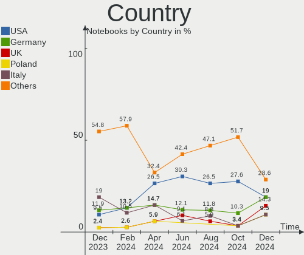
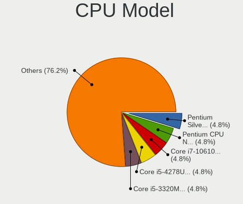
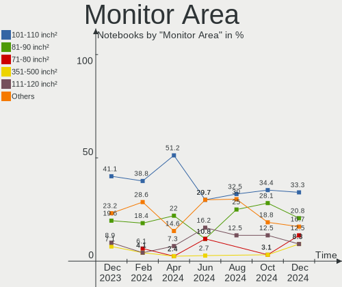
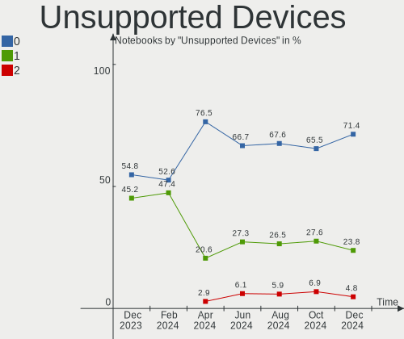

EndeavourOS - Hardware Trends (Notebooks)
-----------------------------------------

A project to identify most popular hardware characteristics and track their change
over time based on data collected by Linux users at https://Linux-Hardware.org.

Anyone can contribute to this report by the [hw-probe](https://github.com/linuxhw/hw-probe) tool:

    sudo -E hw-probe -all -upload

This report is for one last month. Overall report since the beginning of time: [TestDays](https://github.com/linuxhw/TestDays)

Period: Dec, 2024.

Contents
--------

* [ System ](#system)
  - [ OS                       ](#os)
  - [ OS Family                ](#os-family)
  - [ Kernel                   ](#kernel)
  - [ Kernel Family            ](#kernel-family)
  - [ Kernel Major Ver.        ](#kernel-major-ver)
  - [ Arch                     ](#arch)
  - [ DE                       ](#de)
  - [ Display Server           ](#display-server)
  - [ Display Manager          ](#display-manager)
  - [ OS Lang                  ](#os-lang)
  - [ Boot Mode                ](#boot-mode)
  - [ Filesystem               ](#filesystem)
  - [ Part. scheme             ](#part-scheme)
  - [ Dual Boot with Linux/BSD ](#dual-boot-with-linuxbsd)
  - [ Dual Boot (Win)          ](#dual-boot-win)

* [ Board ](#board)
  - [ Vendor                   ](#vendor)
  - [ Model                    ](#model)
  - [ Model Family             ](#model-family)
  - [ MFG Year                 ](#mfg-year)
  - [ Form Factor              ](#form-factor)
  - [ Secure Boot              ](#secure-boot)
  - [ Coreboot                 ](#coreboot)
  - [ RAM Size                 ](#ram-size)
  - [ RAM Used                 ](#ram-used)
  - [ Total Drives             ](#total-drives)
  - [ Has CD-ROM               ](#has-cd-rom)
  - [ Has Ethernet             ](#has-ethernet)
  - [ Has WiFi                 ](#has-wifi)
  - [ Has Bluetooth            ](#has-bluetooth)

* [ Location ](#location)
  - [ Country                  ](#country)
  - [ City                     ](#city)

* [ Drives ](#drives)
  - [ Drive Vendor             ](#drive-vendor)
  - [ Drive Model              ](#drive-model)
  - [ HDD Vendor               ](#hdd-vendor)
  - [ SSD Vendor               ](#ssd-vendor)
  - [ Drive Kind               ](#drive-kind)
  - [ Drive Connector          ](#drive-connector)
  - [ Drive Size               ](#drive-size)
  - [ Space Total              ](#space-total)
  - [ Space Used               ](#space-used)
  - [ Malfunc. Drives          ](#malfunc-drives)
  - [ Malfunc. Drive Vendor    ](#malfunc-drive-vendor)
  - [ Malfunc. HDD Vendor      ](#malfunc-hdd-vendor)
  - [ Malfunc. Drive Kind      ](#malfunc-drive-kind)
  - [ Failed Drives            ](#failed-drives)
  - [ Failed Drive Vendor      ](#failed-drive-vendor)
  - [ Drive Status             ](#drive-status)

* [ Storage controller ](#storage-controller)
  - [ Storage Vendor           ](#storage-vendor)
  - [ Storage Model            ](#storage-model)
  - [ Storage Kind             ](#storage-kind)

* [ Processor ](#processor)
  - [ CPU Vendor               ](#cpu-vendor)
  - [ CPU Model                ](#cpu-model)
  - [ CPU Model Family         ](#cpu-model-family)
  - [ CPU Cores                ](#cpu-cores)
  - [ CPU Sockets              ](#cpu-sockets)
  - [ CPU Threads              ](#cpu-threads)
  - [ CPU Op-Modes             ](#cpu-op-modes)
  - [ CPU Microcode            ](#cpu-microcode)
  - [ CPU Microarch            ](#cpu-microarch)

* [ Graphics ](#graphics)
  - [ GPU Vendor               ](#gpu-vendor)
  - [ GPU Model                ](#gpu-model)
  - [ GPU Combo                ](#gpu-combo)
  - [ GPU Driver               ](#gpu-driver)
  - [ GPU Memory               ](#gpu-memory)

* [ Monitor ](#monitor)
  - [ Monitor Vendor           ](#monitor-vendor)
  - [ Monitor Model            ](#monitor-model)
  - [ Monitor Resolution       ](#monitor-resolution)
  - [ Monitor Diagonal         ](#monitor-diagonal)
  - [ Monitor Width            ](#monitor-width)
  - [ Aspect Ratio             ](#aspect-ratio)
  - [ Monitor Area             ](#monitor-area)
  - [ Pixel Density            ](#pixel-density)
  - [ Multiple Monitors        ](#multiple-monitors)

* [ Network ](#network)
  - [ Net Controller Vendor    ](#net-controller-vendor)
  - [ Net Controller Model     ](#net-controller-model)
  - [ Wireless Vendor          ](#wireless-vendor)
  - [ Wireless Model           ](#wireless-model)
  - [ Ethernet Vendor          ](#ethernet-vendor)
  - [ Ethernet Model           ](#ethernet-model)
  - [ Net Controller Kind      ](#net-controller-kind)
  - [ Used Controller          ](#used-controller)
  - [ NICs                     ](#nics)
  - [ IPv6                     ](#ipv6)

* [ Bluetooth ](#bluetooth)
  - [ Bluetooth Vendor         ](#bluetooth-vendor)
  - [ Bluetooth Model          ](#bluetooth-model)

* [ Sound ](#sound)
  - [ Sound Vendor             ](#sound-vendor)
  - [ Sound Model              ](#sound-model)

* [ Memory ](#memory)
  - [ Memory Vendor            ](#memory-vendor)
  - [ Memory Model             ](#memory-model)
  - [ Memory Kind              ](#memory-kind)
  - [ Memory Form Factor       ](#memory-form-factor)
  - [ Memory Size              ](#memory-size)
  - [ Memory Speed             ](#memory-speed)

* [ Printers & scanners ](#printers--scanners)
  - [ Printer Vendor           ](#printer-vendor)
  - [ Printer Model            ](#printer-model)
  - [ Scanner Vendor           ](#scanner-vendor)
  - [ Scanner Model            ](#scanner-model)

* [ Camera ](#camera)
  - [ Camera Vendor            ](#camera-vendor)
  - [ Camera Model             ](#camera-model)

* [ Security ](#security)
  - [ Fingerprint Vendor       ](#fingerprint-vendor)
  - [ Fingerprint Model        ](#fingerprint-model)
  - [ Chipcard Vendor          ](#chipcard-vendor)
  - [ Chipcard Model           ](#chipcard-model)

* [ Unsupported ](#unsupported)
  - [ Unsupported Devices      ](#unsupported-devices)
  - [ Unsupported Device Types ](#unsupported-device-types)

System
------

OS
--

Installed operating systems

| Name                | Notebooks | Percent |
|---------------------|-----------|---------|
| EndeavourOS Rolling | 21        | 100%    |

OS Family
---------

OS without a version

| Name        | Notebooks | Percent |
|-------------|-----------|---------|
| EndeavourOS | 21        | 100%    |

Kernel
------

Version of the Linux kernel

| Version                            | Notebooks | Percent |
|------------------------------------|-----------|---------|
| 6.12.4-arch1-1                     | 5         | 23.81%  |
| 6.6.65-1-lts                       | 3         | 14.29%  |
| 6.12.7-arch1-1                     | 2         | 9.52%   |
| 6.12.6-arch1-1                     | 2         | 9.52%   |
| 6.12.3-arch1-1                     | 2         | 9.52%   |
| 6.12.1-zen1-1-zen                  | 2         | 9.52%   |
| 6.13.0-rc2-1-mainline-um5606-dirty | 1         | 4.76%   |
| 6.12.6-zen1-1-zen                  | 1         | 4.76%   |
| 6.12.1-arch1-1                     | 1         | 4.76%   |
| 6.11.10-hardened1-1-hardened       | 1         | 4.76%   |
| 6.1.69-1-lts                       | 1         | 4.76%   |

Kernel Family
-------------

Linux kernel without a distro release

| Version | Notebooks | Percent |
|---------|-----------|---------|
| 6.12.4  | 5         | 23.81%  |
| 6.6.65  | 3         | 14.29%  |
| 6.12.6  | 3         | 14.29%  |
| 6.12.1  | 3         | 14.29%  |
| 6.12.7  | 2         | 9.52%   |
| 6.12.3  | 2         | 9.52%   |
| 6.13.0  | 1         | 4.76%   |
| 6.11.10 | 1         | 4.76%   |
| 6.1.69  | 1         | 4.76%   |

Kernel Major Ver.
-----------------

Linux kernel major version

| Version | Notebooks | Percent |
|---------|-----------|---------|
| 6.12    | 15        | 71.43%  |
| 6.6     | 3         | 14.29%  |
| 6.13    | 1         | 4.76%   |
| 6.11    | 1         | 4.76%   |
| 6.1     | 1         | 4.76%   |

Arch
----

OS architecture (x86_64, i586, etc.)

| Name   | Notebooks | Percent |
|--------|-----------|---------|
| x86_64 | 21        | 100%    |

DE
--

Desktop Environment

| Name     | Notebooks | Percent |
|----------|-----------|---------|
| KDE6     | 10        | 47.62%  |
| GNOME    | 5         | 23.81%  |
| XFCE     | 3         | 14.29%  |
| sway     | 1         | 4.76%   |
| Cinnamon | 1         | 4.76%   |
| Unknown  | 1         | 4.76%   |

Display Server
--------------

X11 or Wayland

| Name    | Notebooks | Percent |
|---------|-----------|---------|
| Wayland | 15        | 71.43%  |
| X11     | 6         | 28.57%  |

Display Manager
---------------

SDDM, LightDM, etc.

| Name    | Notebooks | Percent |
|---------|-----------|---------|
| SDDM    | 8         | 38.1%   |
| Unknown | 7         | 33.33%  |
| LightDM | 4         | 19.05%  |
| GDM     | 2         | 9.52%   |

OS Lang
-------

Language

| Lang    | Notebooks | Percent |
|---------|-----------|---------|
| en_US   | 7         | 33.33%  |
| en_GB   | 6         | 28.57%  |
| it_IT   | 2         | 9.52%   |
| pt_PT   | 1         | 4.76%   |
| pl_PL   | 1         | 4.76%   |
| lt_LT   | 1         | 4.76%   |
| es_CL   | 1         | 4.76%   |
| de_DE   | 1         | 4.76%   |
| Unknown | 1         | 4.76%   |

Boot Mode
---------

EFI or BIOS

| Mode | Notebooks | Percent |
|------|-----------|---------|
| EFI  | 12        | 57.14%  |
| BIOS | 9         | 42.86%  |

Filesystem
----------

Type of filesystem

| Type  | Notebooks | Percent |
|-------|-----------|---------|
| Ext4  | 16        | 76.19%  |
| Btrfs | 5         | 23.81%  |

Part. scheme
------------

Scheme of partitioning

| Type    | Notebooks | Percent |
|---------|-----------|---------|
| GPT     | 14        | 66.67%  |
| Unknown | 7         | 33.33%  |

Dual Boot with Linux/BSD
------------------------

Hosting more than one Linux/BSD

| Dual boot | Notebooks | Percent |
|-----------|-----------|---------|
| No        | 21        | 100%    |

Dual Boot (Win)
---------------

Hosting Linux and Windows

| Dual boot | Notebooks | Percent |
|-----------|-----------|---------|
| No        | 19        | 90.48%  |
| Yes       | 2         | 9.52%   |

Board
-----

Vendor
------

Motherboard manufacturer

| Name             | Notebooks | Percent |
|------------------|-----------|---------|
| Lenovo           | 7         | 33.33%  |
| Dell             | 3         | 14.29%  |
| ASUSTek Computer | 3         | 14.29%  |
| Hewlett-Packard  | 2         | 9.52%   |
| Google           | 2         | 9.52%   |
| MSI              | 1         | 4.76%   |
| Apple            | 1         | 4.76%   |
| Acer             | 1         | 4.76%   |
| Unknown          | 1         | 4.76%   |

Model
-----

Motherboard model

| Name                                       | Notebooks | Percent |
|--------------------------------------------|-----------|---------|
| MSI MS-7A34                                | 1         | 4.76%   |
| Lenovo ThinkPad T14s Gen 4 21F80041GE      | 1         | 4.76%   |
| Lenovo ThinkPad L15 Gen 3 21C3000CPG       | 1         | 4.76%   |
| Lenovo LOQ 15AHP9 83DX                     | 1         | 4.76%   |
| Lenovo IdeaPad Gaming 3 15ACH6 82K2        | 1         | 4.76%   |
| Lenovo IdeaPad 330-15IKB 81DC              | 1         | 4.76%   |
| Lenovo IdeaPad 330-15ARR 81D2              | 1         | 4.76%   |
| Lenovo IdeaPad 3 14ALC6 82KT               | 1         | 4.76%   |
| HP Laptop 15z-ef2xxx                       | 1         | 4.76%   |
| HP EliteBook 8460p                         | 1         | 4.76%   |
| Google Swanky                              | 1         | 4.76%   |
| Google Beetley                             | 1         | 4.76%   |
| Dell XPS 9315                              | 1         | 4.76%   |
| Dell Latitude E6230                        | 1         | 4.76%   |
| Dell Latitude 7410                         | 1         | 4.76%   |
| ASUS VivoBook_ASUSLaptop X515JAB_R565JA    | 1         | 4.76%   |
| ASUS ASUS Zenbook S 16 UM5606WA_UM5606WA   | 1         | 4.76%   |
| ASUS ASUS TUF Gaming A16 FA617NSR_FA617NSR | 1         | 4.76%   |
| Apple MacBookPro11,1                       | 1         | 4.76%   |
| Acer Aspire A317-53                        | 1         | 4.76%   |
| Unknown                                    | 1         | 4.76%   |

Model Family
------------

Motherboard model prefix

| Name               | Notebooks | Percent |
|--------------------|-----------|---------|
| Lenovo IdeaPad     | 4         | 19.05%  |
| Lenovo ThinkPad    | 2         | 9.52%   |
| Dell Latitude      | 2         | 9.52%   |
| ASUS ASUS          | 2         | 9.52%   |
| MSI MS-7A34        | 1         | 4.76%   |
| Lenovo LOQ         | 1         | 4.76%   |
| HP Laptop          | 1         | 4.76%   |
| HP EliteBook       | 1         | 4.76%   |
| Google Swanky      | 1         | 4.76%   |
| Google Beetley     | 1         | 4.76%   |
| Dell XPS           | 1         | 4.76%   |
| ASUS VivoBook      | 1         | 4.76%   |
| Apple MacBookPro11 | 1         | 4.76%   |
| Acer Aspire        | 1         | 4.76%   |
| Unknown            | 1         | 4.76%   |

MFG Year
--------

Motherboard manufacture year

| Year | Notebooks | Percent |
|------|-----------|---------|
| 2021 | 5         | 23.81%  |
| 2024 | 4         | 19.05%  |
| 2022 | 4         | 19.05%  |
| 2018 | 2         | 9.52%   |
| 2023 | 1         | 4.76%   |
| 2020 | 1         | 4.76%   |
| 2017 | 1         | 4.76%   |
| 2014 | 1         | 4.76%   |
| 2012 | 1         | 4.76%   |
| 2011 | 1         | 4.76%   |

Form Factor
-----------

Physical design of the computer

| Name     | Notebooks | Percent |
|----------|-----------|---------|
| Notebook | 21        | 100%    |

Secure Boot
-----------

Enabled or disabled

| State    | Notebooks | Percent |
|----------|-----------|---------|
| Disabled | 21        | 100%    |

Coreboot
--------

Have coreboot on board

| Used | Notebooks | Percent |
|------|-----------|---------|
| No   | 19        | 90.48%  |
| Yes  | 2         | 9.52%   |

RAM Size
--------

Total RAM memory

| Size in GB | Notebooks | Percent |
|------------|-----------|---------|
| 4.01-8.0   | 6         | 28.57%  |
| 8.01-16.0  | 5         | 23.81%  |
| 16.01-24.0 | 4         | 19.05%  |
| 32.01-64.0 | 2         | 9.52%   |
| 24.01-32.0 | 2         | 9.52%   |
| 3.01-4.0   | 1         | 4.76%   |
| 1.01-2.0   | 1         | 4.76%   |

RAM Used
--------

Used RAM memory

| Used GB   | Notebooks | Percent |
|-----------|-----------|---------|
| 3.01-4.0  | 7         | 33.33%  |
| 4.01-8.0  | 4         | 19.05%  |
| 2.01-3.0  | 4         | 19.05%  |
| 8.01-16.0 | 4         | 19.05%  |
| 1.01-2.0  | 2         | 9.52%   |

Total Drives
------------

Number of drives on board

| Drives | Notebooks | Percent |
|--------|-----------|---------|
| 1      | 17        | 80.95%  |
| 2      | 3         | 14.29%  |
| 3      | 1         | 4.76%   |

Has CD-ROM
----------

Has CD-ROM on board

| Presented | Notebooks | Percent |
|-----------|-----------|---------|
| No        | 20        | 95.24%  |
| Yes       | 1         | 4.76%   |

Has Ethernet
------------

Has Ethernet on board

| Presented | Notebooks | Percent |
|-----------|-----------|---------|
| No        | 11        | 52.38%  |
| Yes       | 10        | 47.62%  |

Has WiFi
--------

Has WiFi module

| Presented | Notebooks | Percent |
|-----------|-----------|---------|
| Yes       | 19        | 90.48%  |
| No        | 2         | 9.52%   |

Has Bluetooth
-------------

Has Bluetooth module

| Presented | Notebooks | Percent |
|-----------|-----------|---------|
| Yes       | 20        | 95.24%  |
| No        | 1         | 4.76%   |

Location
--------

Country
-------

Geographic location (country)

| Country     | Notebooks | Percent |
|-------------|-----------|---------|
| USA         | 4         | 19.05%  |
| Germany     | 4         | 19.05%  |
| UK          | 3         | 14.29%  |
| Poland      | 2         | 9.52%   |
| Italy       | 2         | 9.52%   |
| Romania     | 1         | 4.76%   |
| Portugal    | 1         | 4.76%   |
| Netherlands | 1         | 4.76%   |
| Lithuania   | 1         | 4.76%   |
| Greece      | 1         | 4.76%   |
| Chile       | 1         | 4.76%   |

City
----

Geographic location (city)

| City               | Notebooks | Percent |
|--------------------|-----------|---------|
| Berlin             | 2         | 9.52%   |
| Weil am Rhein      | 1         | 4.76%   |
| Vilnius            | 1         | 4.76%   |
| Tranent            | 1         | 4.76%   |
| Southwark          | 1         | 4.76%   |
| Southampton        | 1         | 4.76%   |
| Santiago           | 1         | 4.76%   |
| Rumia              | 1         | 4.76%   |
| Poznan             | 1         | 4.76%   |
| Pátrai            | 1         | 4.76%   |
| Paços de Ferreira | 1         | 4.76%   |
| Minneapolis        | 1         | 4.76%   |
| Milano             | 1         | 4.76%   |
| Los Angeles        | 1         | 4.76%   |
| Hamburg            | 1         | 4.76%   |
| Bremerton          | 1         | 4.76%   |
| Arad               | 1         | 4.76%   |
| Aprilia            | 1         | 4.76%   |
| Amstelveen         | 1         | 4.76%   |
| Allen              | 1         | 4.76%   |

Drives
------

Drive Vendor
------------

Hard drive vendors

| Vendor              | Notebooks | Drives | Percent |
|---------------------|-----------|--------|---------|
| Unknown             | 4         | 4      | 16%     |
| Samsung Electronics | 4         | 4      | 16%     |
| Sandisk             | 2         | 2      | 8%      |
| Phison Electronics  | 2         | 2      | 8%      |
| Micron Technology   | 2         | 2      | 8%      |
| Kingston            | 2         | 2      | 8%      |
| WUXIN               | 1         | 1      | 4%      |
| Toshiba             | 1         | 1      | 4%      |
| T-FORCE             | 1         | 1      | 4%      |
| SK hynix            | 1         | 1      | 4%      |
| Seagate             | 1         | 1      | 4%      |
| KIOXIA              | 1         | 1      | 4%      |
| Intel               | 1         | 2      | 4%      |
| Crucial             | 1         | 1      | 4%      |
| Apple               | 1         | 1      | 4%      |

Drive Model
-----------

Hard drive models

| Model                                                | Notebooks | Percent |
|------------------------------------------------------|-----------|---------|
| WUXIN G8 128GB                                       | 1         | 3.85%   |
| Unknown NVMe SSD Drive 1TB                           | 1         | 3.85%   |
| Unknown MMC Card  64GB                               | 1         | 3.85%   |
| Unknown MMC Card  16GB                               | 1         | 3.85%   |
| Unknown MMC Card  128GB                              | 1         | 3.85%   |
| Toshiba MQ04ABF100 1TB                               | 1         | 3.85%   |
| T-FORCE 1TB                                          | 1         | 3.85%   |
| SK hynix HFS128G32TNF-N3A0A 128GB SSD                | 1         | 3.85%   |
| Seagate ST3000DM007-1WY10G 3TB                       | 1         | 3.85%   |
| Sandisk WD PC SN740 SDDPNQD-512G-1002 512GB          | 1         | 3.85%   |
| Sandisk WD Black SN750 / PC SN730 NVMe SSD 512GB     | 1         | 3.85%   |
| Samsung SSD 850 EVO 250GB                            | 1         | 3.85%   |
| Samsung NVMe SSD Controller SM981/PM981/PM983 512GB  | 1         | 3.85%   |
| Samsung NVMe SSD Controller PM9A1/PM9A3/980PRO 512GB | 1         | 3.85%   |
| Samsung MZALQ512HBLU-00BL2 512GB                     | 1         | 3.85%   |
| Phison PS5013 E13 NVMe Controller 512GB              | 1         | 3.85%   |
| Phison ESE2A044-512 NVMe 512GB                       | 1         | 3.85%   |
| Micron MTFDKBA1T0QFM-1BD1AABGB 1024GB                | 1         | 3.85%   |
| Micron MTFDHBA512QFD 512GB                           | 1         | 3.85%   |
| KIOXIA KBG40ZNV256G 256GB                            | 1         | 3.85%   |
| Kingston SA400S37960G 960GB SSD                      | 1         | 3.85%   |
| Kingston SA400S37480G 480GB SSD                      | 1         | 3.85%   |
| Intel HBRPEKNX0202AO 32GB                            | 1         | 3.85%   |
| Intel HBRPEKNX0202A 512GB                            | 1         | 3.85%   |
| Crucial CT2000MX500SSD1 2TB                          | 1         | 3.85%   |
| Apple SSD SM0256F 256GB                              | 1         | 3.85%   |

HDD Vendor
----------

Hard disk drive vendors

| Vendor  | Notebooks | Drives | Percent |
|---------|-----------|--------|---------|
| Toshiba | 1         | 1      | 50%     |
| Seagate | 1         | 1      | 50%     |

SSD Vendor
----------

Solid state drive vendors

| Vendor              | Notebooks | Drives | Percent |
|---------------------|-----------|--------|---------|
| Kingston            | 2         | 2      | 33.33%  |
| SK hynix            | 1         | 1      | 16.67%  |
| Samsung Electronics | 1         | 1      | 16.67%  |
| Crucial             | 1         | 1      | 16.67%  |
| Apple               | 1         | 1      | 16.67%  |

Drive Kind
----------

HDD or SSD

| Kind    | Notebooks | Drives | Percent |
|---------|-----------|--------|---------|
| NVMe    | 12        | 13     | 50%     |
| SSD     | 5         | 6      | 20.83%  |
| MMC     | 3         | 3      | 12.5%   |
| HDD     | 2         | 2      | 8.33%   |
| Unknown | 2         | 2      | 8.33%   |

Drive Connector
---------------

SATA, SAS, NVMe, etc.

| Type | Notebooks | Drives | Percent |
|------|-----------|--------|---------|
| NVMe | 12        | 13     | 52.17%  |
| SATA | 8         | 10     | 34.78%  |
| MMC  | 3         | 3      | 13.04%  |

Drive Size
----------

Size of hard drive

| Size in TB | Notebooks | Drives | Percent |
|------------|-----------|--------|---------|
| 0.01-0.5   | 4         | 4      | 50%     |
| 0.51-1.0   | 2         | 2      | 25%     |
| 2.01-3.0   | 1         | 1      | 12.5%   |
| 1.01-2.0   | 1         | 1      | 12.5%   |

Space Total
-----------

Amount of disk space available on the file system

| Size in GB     | Notebooks | Percent |
|----------------|-----------|---------|
| 251-500        | 5         | 23.81%  |
| 501-1000       | 5         | 23.81%  |
| 1001-2000      | 3         | 14.29%  |
| More than 3000 | 2         | 9.52%   |
| 21-50          | 2         | 9.52%   |
| 101-250        | 2         | 9.52%   |
| 1-20           | 1         | 4.76%   |
| Unknown        | 1         | 4.76%   |

Space Used
----------

Amount of used disk space

| Used GB        | Notebooks | Percent |
|----------------|-----------|---------|
| 101-250        | 6         | 28.57%  |
| 1-20           | 4         | 19.05%  |
| 251-500        | 3         | 14.29%  |
| 51-100         | 3         | 14.29%  |
| 21-50          | 2         | 9.52%   |
| More than 3000 | 1         | 4.76%   |
| 501-1000       | 1         | 4.76%   |
| Unknown        | 1         | 4.76%   |

Malfunc. Drives
---------------

Drive models with a malfunction

Zero info for selected period =(

Malfunc. Drive Vendor
---------------------

Vendors of faulty drives

Zero info for selected period =(

Malfunc. HDD Vendor
-------------------

Vendors of faulty HDD drives

Zero info for selected period =(

Malfunc. Drive Kind
-------------------

Kinds of faulty drives

Zero info for selected period =(

Failed Drives
-------------

Failed drive models

Zero info for selected period =(

Failed Drive Vendor
-------------------

Failed drive vendors

Zero info for selected period =(

Drive Status
------------

Number of failed and malfunc. drives

| Status   | Notebooks | Drives | Percent |
|----------|-----------|--------|---------|
| Works    | 12        | 14     | 54.55%  |
| Detected | 10        | 12     | 45.45%  |

Storage controller
------------------

Storage Vendor
--------------

Storage controller vendors

| Vendor              | Notebooks | Percent |
|---------------------|-----------|---------|
| Intel               | 7         | 31.82%  |
| Samsung Electronics | 4         | 18.18%  |
| AMD                 | 3         | 13.64%  |
| SanDisk             | 2         | 9.09%   |
| Phison Electronics  | 2         | 9.09%   |
| Micron Technology   | 2         | 9.09%   |
| Solidigm            | 1         | 4.55%   |
| KIOXIA              | 1         | 4.55%   |

Storage Model
-------------

Storage controller models

| Model                                                                            | Notebooks | Percent |
|----------------------------------------------------------------------------------|-----------|---------|
| AMD FCH SATA Controller [AHCI mode]                                              | 3         | 12%     |
| Intel Volume Management Device NVMe RAID Controller                              | 2         | 8%      |
| Solidigm P41 Plus NVMe SSD (DRAM-less) [Echo Harbor]                             | 1         | 4%      |
| SanDisk WD Black SN770 / PC SN740 256GB / PC SN560 (DRAM-less) NVMe SSD          | 1         | 4%      |
| SanDisk Extreme Pro / WD Black SN750 / PC SN730 / Red SN700 NVMe SSD             | 1         | 4%      |
| Samsung S4LN053X01 AHCI SSD Controller(Apple slot)                               | 1         | 4%      |
| Samsung NVMe SSD Controller SM981/PM981/PM983                                    | 1         | 4%      |
| Samsung NVMe SSD Controller PM9A1/PM9A3/980PRO                                   | 1         | 4%      |
| Samsung NVMe SSD Controller 980 (DRAM-less)                                      | 1         | 4%      |
| Phison PS5019-E19 PCIe4 NVMe Controller (DRAM-less)                              | 1         | 4%      |
| Phison PS5013-E13 PCIe3 NVMe Controller (DRAM-less)                              | 1         | 4%      |
| Micron 2400 NVMe SSD (DRAM-less)                                                 | 1         | 4%      |
| Micron 2210 NVMe SSD [Cobain]                                                    | 1         | 4%      |
| KIOXIA NVMe SSD Controller BG4 (DRAM-less)                                       | 1         | 4%      |
| Intel Tiger Lake-LP SATA Controller                                              | 1         | 4%      |
| Intel Sunrise Point-LP SATA Controller [AHCI mode]                               | 1         | 4%      |
| Intel Optane NVME SSD H10 with Solid State Storage [Teton Glacier]               | 1         | 4%      |
| Intel Atom/Celeron/Pentium Processor x5-E8000/J3xxx/N3xxx Series SATA Controller | 1         | 4%      |
| Intel 82801 Mobile SATA Controller [RAID mode]                                   | 1         | 4%      |
| Intel 7 Series Chipset Family 6-port SATA Controller [AHCI mode]                 | 1         | 4%      |
| Intel 6 Series/C200 Series Chipset Family 6 port Mobile SATA AHCI Controller     | 1         | 4%      |
| AMD 300 Series Chipset SATA Controller                                           | 1         | 4%      |

Storage Kind
------------

Kind of storage controller (IDE, SATA, NVMe, SAS, ...)

| Kind | Notebooks | Percent |
|------|-----------|---------|
| NVMe | 12        | 50%     |
| SATA | 9         | 37.5%   |
| RAID | 3         | 12.5%   |

Processor
---------

CPU Vendor
----------

Processor vendors

| Vendor | Notebooks | Percent |
|--------|-----------|---------|
| Intel  | 12        | 57.14%  |
| AMD    | 9         | 42.86%  |

CPU Model
---------

Processor models

| Model                                         | Notebooks | Percent |
|-----------------------------------------------|-----------|---------|
| Intel Pentium Silver N6000 @ 1.10GHz          | 1         | 4.76%   |
| Intel Pentium CPU N3700 @ 1.60GHz             | 1         | 4.76%   |
| Intel Core i7-10610U CPU @ 1.80GHz            | 1         | 4.76%   |
| Intel Core i5-4278U CPU @ 2.60GHz             | 1         | 4.76%   |
| Intel Core i5-3320M CPU @ 2.60GHz             | 1         | 4.76%   |
| Intel Core i5-2540M CPU @ 2.60GHz             | 1         | 4.76%   |
| Intel Core i5-1035G1 CPU @ 1.00GHz            | 1         | 4.76%   |
| Intel Core i3-6006U CPU @ 2.00GHz             | 1         | 4.76%   |
| Intel Celeron CPU N2840 @ 2.16GHz             | 1         | 4.76%   |
| Intel 12th Gen Core i7-1255U                  | 1         | 4.76%   |
| Intel 12th Gen Core i7-1250U                  | 1         | 4.76%   |
| Intel 11th Gen Core i5-1135G7 @ 2.40GHz       | 1         | 4.76%   |
| AMD Ryzen AI 9 HX 370 w/ Radeon 890M          | 1         | 4.76%   |
| AMD Ryzen 7 PRO 7840U w/ Radeon 780M Graphics | 1         | 4.76%   |
| AMD Ryzen 7 7435HS                            | 1         | 4.76%   |
| AMD Ryzen 5 8645HS w/ Radeon 760M Graphics    | 1         | 4.76%   |
| AMD Ryzen 5 5600H with Radeon Graphics        | 1         | 4.76%   |
| AMD Ryzen 5 5500U with Radeon Graphics        | 1         | 4.76%   |
| AMD Ryzen 5 2500U with Radeon Vega Mobile Gfx | 1         | 4.76%   |
| AMD Ryzen 5 1500X Quad-Core Processor         | 1         | 4.76%   |
| AMD Ryzen 3 5300U with Radeon Graphics        | 1         | 4.76%   |

CPU Model Family
----------------

Processor model prefix

| Model                | Notebooks | Percent |
|----------------------|-----------|---------|
| AMD Ryzen 5          | 5         | 23.81%  |
| Other                | 4         | 19.05%  |
| Intel Core i5        | 4         | 19.05%  |
| Intel Pentium Silver | 1         | 4.76%   |
| Intel Pentium        | 1         | 4.76%   |
| Intel Core i7        | 1         | 4.76%   |
| Intel Core i3        | 1         | 4.76%   |
| Intel Celeron        | 1         | 4.76%   |
| AMD Ryzen 7 PRO      | 1         | 4.76%   |
| AMD Ryzen 7          | 1         | 4.76%   |
| AMD Ryzen 3          | 1         | 4.76%   |

CPU Cores
---------

Number of processor cores

| Number | Notebooks | Percent |
|--------|-----------|---------|
| 4      | 8         | 38.1%   |
| 2      | 5         | 23.81%  |
| 6      | 3         | 14.29%  |
| 10     | 2         | 9.52%   |
| 8      | 2         | 9.52%   |
| 12     | 1         | 4.76%   |

CPU Sockets
-----------

Number of sockets

| Number | Notebooks | Percent |
|--------|-----------|---------|
| 1      | 21        | 100%    |

CPU Threads
-----------

Threads per core (Hyper-Threading)

| Number | Notebooks | Percent |
|--------|-----------|---------|
| 2      | 18        | 85.71%  |
| 1      | 3         | 14.29%  |

CPU Op-Modes
------------

CPU Operation Modes (32-bit, 64-bit)

| Op mode        | Notebooks | Percent |
|----------------|-----------|---------|
| 32-bit, 64-bit | 21        | 100%    |

CPU Microcode
-------------

Microcode number

| Number     | Notebooks | Percent |
|------------|-----------|---------|
| Unknown    | 19        | 90.48%  |
| 0x306a9    | 1         | 4.76%   |
| 0x0a705206 | 1         | 4.76%   |

CPU Microarch
-------------

Microarchitecture

| Name             | Notebooks | Percent |
|------------------|-----------|---------|
| Unknown          | 7         | 33.33%  |
| Zen              | 2         | 9.52%   |
| Silvermont       | 2         | 9.52%   |
| Zen 3            | 1         | 4.76%   |
| Tremont          | 1         | 4.76%   |
| TigerLake        | 1         | 4.76%   |
| Skylake          | 1         | 4.76%   |
| SandyBridge      | 1         | 4.76%   |
| KabyLake         | 1         | 4.76%   |
| IvyBridge        | 1         | 4.76%   |
| IceLake          | 1         | 4.76%   |
| Haswell          | 1         | 4.76%   |
| Alderlake Hybrid | 1         | 4.76%   |

Graphics
--------

GPU Vendor
----------

Vendors of graphics cards

| Vendor | Notebooks | Percent |
|--------|-----------|---------|
| Intel  | 12        | 52.17%  |
| AMD    | 9         | 39.13%  |
| Nvidia | 2         | 8.7%    |

GPU Model
---------

Graphics card models

| Model                                                                                    | Notebooks | Percent |
|------------------------------------------------------------------------------------------|-----------|---------|
| AMD Lucienne                                                                             | 2         | 8.7%    |
| Nvidia TU117M [GeForce GTX 1650 Mobile / Max-Q]                                          | 1         | 4.35%   |
| Nvidia AD107M [GeForce RTX 4060 Max-Q / Mobile]                                          | 1         | 4.35%   |
| Intel TigerLake-LP GT2 [Iris Xe Graphics]                                                | 1         | 4.35%   |
| Intel JasperLake [UHD Graphics]                                                          | 1         | 4.35%   |
| Intel Iris Plus Graphics G1 (Ice Lake)                                                   | 1         | 4.35%   |
| Intel HD Graphics 520                                                                    | 1         | 4.35%   |
| Intel Haswell-ULT Integrated Graphics Controller                                         | 1         | 4.35%   |
| Intel CometLake-U GT2 [UHD Graphics]                                                     | 1         | 4.35%   |
| Intel Atom/Celeron/Pentium Processor x5-E8000/J3xxx/N3xxx Integrated Graphics Controller | 1         | 4.35%   |
| Intel Atom Processor Z36xxx/Z37xxx Series Graphics & Display                             | 1         | 4.35%   |
| Intel Alder Lake-UP4 GT2 [Iris Xe Graphics]                                              | 1         | 4.35%   |
| Intel Alder Lake-UP3 GT2 [Iris Xe Graphics]                                              | 1         | 4.35%   |
| Intel 3rd Gen Core processor Graphics Controller                                         | 1         | 4.35%   |
| Intel 2nd Generation Core Processor Family Integrated Graphics Controller                | 1         | 4.35%   |
| AMD Strix [Radeon 880M / 890M]                                                           | 1         | 4.35%   |
| AMD Raven Ridge [Radeon Vega Series / Radeon Vega Mobile Series]                         | 1         | 4.35%   |
| AMD Phoenix3                                                                             | 1         | 4.35%   |
| AMD Phoenix1                                                                             | 1         | 4.35%   |
| AMD Navi 33 [Radeon RX 7600/7600 XT/7600M XT/7600S/7700S / PRO W7600]                    | 1         | 4.35%   |
| AMD Navi 10 [Radeon RX 5600 OEM/5600 XT / 5700/5700 XT]                                  | 1         | 4.35%   |
| AMD Cezanne [Radeon Vega Series / Radeon Vega Mobile Series]                             | 1         | 4.35%   |

GPU Combo
---------

Combinations of graphics cards

| Name         | Notebooks | Percent |
|--------------|-----------|---------|
| 1 x Intel    | 12        | 57.14%  |
| 1 x AMD      | 7         | 33.33%  |
| AMD + Nvidia | 2         | 9.52%   |

GPU Driver
----------

Free vs proprietary

| Driver      | Notebooks | Percent |
|-------------|-----------|---------|
| Free        | 17        | 80.95%  |
| Proprietary | 2         | 9.52%   |
| Unknown     | 2         | 9.52%   |

GPU Memory
----------

Total video memory

| Size in GB | Notebooks | Percent |
|------------|-----------|---------|
| Unknown    | 14        | 66.67%  |
| 0.01-0.5   | 3         | 14.29%  |
| 7.01-8.0   | 1         | 4.76%   |
| 5.01-6.0   | 1         | 4.76%   |
| 3.01-4.0   | 1         | 4.76%   |
| 0.51-1.0   | 1         | 4.76%   |

Monitor
-------

Monitor Vendor
--------------

Monitor vendors

| Vendor                  | Notebooks | Percent |
|-------------------------|-----------|---------|
| BOE                     | 8         | 33.33%  |
| Chimei Innolux          | 3         | 12.5%   |
| AU Optronics            | 3         | 12.5%   |
| Samsung Electronics     | 2         | 8.33%   |
| Gigabyte Technology     | 2         | 8.33%   |
| Sharp                   | 1         | 4.17%   |
| Hewlett-Packard         | 1         | 4.17%   |
| CSW                     | 1         | 4.17%   |
| Chi Mei Optoelectronics | 1         | 4.17%   |
| BenQ                    | 1         | 4.17%   |
| Apple                   | 1         | 4.17%   |

Monitor Model
-------------

Monitor models

| Model                                                                    | Notebooks | Percent |
|--------------------------------------------------------------------------|-----------|---------|
| Sharp LCD Monitor SHP1548 1920x1200 288x180mm 13.4-inch                  | 1         | 4.17%   |
| Samsung Electronics LCD Monitor SDC4193 2880x1800 302x189mm 14.0-inch    | 1         | 4.17%   |
| Samsung Electronics ATNA60CL10-0 SDC41AF 2880x1800 344x215mm 16.0-inch   | 1         | 4.17%   |
| Hewlett-Packard LA2306 HWP294A 1920x1080 509x286mm 23.0-inch             | 1         | 4.17%   |
| Gigabyte Technology M34WQ GBT3402 3440x1440 800x335mm 34.1-inch          | 1         | 4.17%   |
| Gigabyte Technology AORUS AD27QD GBT2700 2560x1440 609x355mm 27.8-inch   | 1         | 4.17%   |
| CSW LCD Monitor CSW150F 1920x1080 344x193mm 15.5-inch                    | 1         | 4.17%   |
| Chimei Innolux N160JME_GE1 CMN1624 1920x1200 344x215mm 16.0-inch         | 1         | 4.17%   |
| Chimei Innolux LCD Monitor CMN15E7 1920x1080 344x193mm 15.5-inch         | 1         | 4.17%   |
| Chimei Innolux LCD Monitor CMN1526 1920x1080 344x193mm 15.5-inch         | 1         | 4.17%   |
| Chi Mei Optoelectronics LCD Monitor CMO1467 1366x768 309x174mm 14.0-inch | 1         | 4.17%   |
| BOE LCD Monitor BOE09D4 1920x1080 344x194mm 15.5-inch                    | 1         | 4.17%   |
| BOE LCD Monitor BOE09AE 1920x1080 309x174mm 14.0-inch                    | 1         | 4.17%   |
| BOE LCD Monitor BOE08D7 1920x1080 309x174mm 14.0-inch                    | 1         | 4.17%   |
| BOE LCD Monitor BOE085B 1920x1080 344x194mm 15.5-inch                    | 1         | 4.17%   |
| BOE LCD Monitor BOE084E 1920x1080 382x215mm 17.3-inch                    | 1         | 4.17%   |
| BOE LCD Monitor BOE07BC 1920x1080 309x173mm 13.9-inch                    | 1         | 4.17%   |
| BOE LCD Monitor BOE07B4 1366x768 344x194mm 15.5-inch                     | 1         | 4.17%   |
| BOE LCD Monitor BOE07A3 1920x1080 344x193mm 15.5-inch                    | 1         | 4.17%   |
| BenQ EW3270U BNQ7950 3840x2160 698x393mm 31.5-inch                       | 1         | 4.17%   |
| AU Optronics LCD Monitor AUO21ED 1920x1080 344x193mm 15.5-inch           | 1         | 4.17%   |
| AU Optronics LCD Monitor AUO132C 1366x768 293x164mm 13.2-inch            | 1         | 4.17%   |
| AU Optronics LCD Monitor AUO106C 1366x768 277x156mm 12.5-inch            | 1         | 4.17%   |
| Apple Color LCD APPA018 2560x1600 286x179mm 13.3-inch                    | 1         | 4.17%   |

Monitor Resolution
------------------

Monitor screen resolution

| Resolution        | Notebooks | Percent |
|-------------------|-----------|---------|
| 1920x1080 (FHD)   | 11        | 47.83%  |
| 1366x768 (WXGA)   | 4         | 17.39%  |
| 2880x1800         | 2         | 8.7%    |
| 1920x1200 (WUXGA) | 2         | 8.7%    |
| 3840x2160 (4K)    | 1         | 4.35%   |
| 3440x1440         | 1         | 4.35%   |
| 2560x1600         | 1         | 4.35%   |
| 2560x1440 (QHD)   | 1         | 4.35%   |

Monitor Diagonal
----------------

Diagonal size in inches

| Inches | Notebooks | Percent |
|--------|-----------|---------|
| 15     | 8         | 33.33%  |
| 14     | 4         | 16.67%  |
| 13     | 4         | 16.67%  |
| 16     | 2         | 8.33%   |
| 34     | 1         | 4.17%   |
| 31     | 1         | 4.17%   |
| 27     | 1         | 4.17%   |
| 23     | 1         | 4.17%   |
| 17     | 1         | 4.17%   |
| 12     | 1         | 4.17%   |

Monitor Width
-------------

Physical width

| Width in mm | Notebooks | Percent |
|-------------|-----------|---------|
| 301-350     | 15        | 62.5%   |
| 201-300     | 4         | 16.67%  |
| 601-700     | 2         | 8.33%   |
| 701-800     | 1         | 4.17%   |
| 501-600     | 1         | 4.17%   |
| 351-400     | 1         | 4.17%   |

Aspect Ratio
------------

Proportional relationship between the width and the height

| Ratio | Notebooks | Percent |
|-------|-----------|---------|
| 16/9  | 17        | 73.91%  |
| 16/10 | 5         | 21.74%  |
| 21/9  | 1         | 4.35%   |

Monitor Area
------------

Area in inch²

| Area in inch² | Notebooks | Percent |
|----------------|-----------|---------|
| 101-110        | 8         | 33.33%  |
| 81-90          | 5         | 20.83%  |
| 71-80          | 3         | 12.5%   |
| 351-500        | 2         | 8.33%   |
| 111-120        | 2         | 8.33%   |
| 61-70          | 1         | 4.17%   |
| 301-350        | 1         | 4.17%   |
| 201-250        | 1         | 4.17%   |
| 121-130        | 1         | 4.17%   |

Pixel Density
-------------

Pixels per inch

| Density       | Notebooks | Percent |
|---------------|-----------|---------|
| 121-160       | 14        | 58.33%  |
| 101-120       | 5         | 20.83%  |
| 161-240       | 3         | 12.5%   |
| More than 240 | 1         | 4.17%   |
| 51-100        | 1         | 4.17%   |

Multiple Monitors
-----------------

Total monitors connected

| Total | Notebooks | Percent |
|-------|-----------|---------|
| 1     | 18        | 85.71%  |
| 2     | 3         | 14.29%  |

Network
-------

Net Controller Vendor
---------------------

Controller vendors

| Vendor                | Notebooks | Percent |
|-----------------------|-----------|---------|
| Realtek Semiconductor | 12        | 44.44%  |
| Intel                 | 8         | 29.63%  |
| MediaTek              | 3         | 11.11%  |
| Qualcomm Atheros      | 2         | 7.41%   |
| Qualcomm              | 1         | 3.7%    |
| Broadcom Limited      | 1         | 3.7%    |

Net Controller Model
--------------------

Controller models

| Model                                                                  | Notebooks | Percent |
|------------------------------------------------------------------------|-----------|---------|
| Realtek RTL8111/8168/8211/8411 PCI Express Gigabit Ethernet Controller | 7         | 23.33%  |
| Realtek RTL8821CE 802.11ac PCIe Wireless Network Adapter               | 4         | 13.33%  |
| Qualcomm Atheros QCA9377 802.11ac Wireless Network Adapter             | 2         | 6.67%   |
| MediaTek MT7921 802.11ax PCI Express Wireless Network Adapter          | 2         | 6.67%   |
| Intel Centrino Advanced-N 6205 [Taylor Peak]                           | 2         | 6.67%   |
| Intel Alder Lake-P PCH CNVi WiFi                                       | 2         | 6.67%   |
| Realtek RTL8822CE 802.11ac PCIe Wireless Network Adapter               | 1         | 3.33%   |
| Realtek RTL8153 Gigabit Ethernet Adapter                               | 1         | 3.33%   |
| Qualcomm QCNFA765 Wireless Network Adapter                             | 1         | 3.33%   |
| MediaTek WLAN controller                                               | 1         | 3.33%   |
| Intel Wireless 7260                                                    | 1         | 3.33%   |
| Intel Wi-Fi 6 AX201 160MHz                                             | 1         | 3.33%   |
| Intel Wi-Fi 6 AX201                                                    | 1         | 3.33%   |
| Intel Ethernet Connection (16) I219-V                                  | 1         | 3.33%   |
| Intel Comet Lake PCH-LP CNVi WiFi                                      | 1         | 3.33%   |
| Intel 82579LM Gigabit Network Connection (Lewisville)                  | 1         | 3.33%   |
| Broadcom Limited BCM4360 802.11ac Dual Band Wireless Network Adapter   | 1         | 3.33%   |

Wireless Vendor
---------------

Wireless vendors

| Vendor                | Notebooks | Percent |
|-----------------------|-----------|---------|
| Intel                 | 7         | 36.84%  |
| Realtek Semiconductor | 5         | 26.32%  |
| MediaTek              | 3         | 15.79%  |
| Qualcomm Atheros      | 2         | 10.53%  |
| Qualcomm              | 1         | 5.26%   |
| Broadcom Limited      | 1         | 5.26%   |

Wireless Model
--------------

Wireless models

| Model                                                                | Notebooks | Percent |
|----------------------------------------------------------------------|-----------|---------|
| Realtek RTL8821CE 802.11ac PCIe Wireless Network Adapter             | 4         | 21.05%  |
| Qualcomm Atheros QCA9377 802.11ac Wireless Network Adapter           | 2         | 10.53%  |
| MediaTek MT7921 802.11ax PCI Express Wireless Network Adapter        | 2         | 10.53%  |
| Intel Centrino Advanced-N 6205 [Taylor Peak]                         | 2         | 10.53%  |
| Realtek RTL8822CE 802.11ac PCIe Wireless Network Adapter             | 1         | 5.26%   |
| Qualcomm QCNFA765 Wireless Network Adapter                           | 1         | 5.26%   |
| MediaTek WLAN controller                                             | 1         | 5.26%   |
| Intel Wireless 7260                                                  | 1         | 5.26%   |
| Intel Wi-Fi 6 AX201 160MHz                                           | 1         | 5.26%   |
| Intel Wi-Fi 6 AX201                                                  | 1         | 5.26%   |
| Intel Comet Lake PCH-LP CNVi WiFi                                    | 1         | 5.26%   |
| Intel Alder Lake-P PCH CNVi WiFi                                     | 1         | 5.26%   |
| Broadcom Limited BCM4360 802.11ac Dual Band Wireless Network Adapter | 1         | 5.26%   |

Ethernet Vendor
---------------

Ethernet vendors

| Vendor                | Notebooks | Percent |
|-----------------------|-----------|---------|
| Realtek Semiconductor | 8         | 80%     |
| Intel                 | 2         | 20%     |

Ethernet Model
--------------

Ethernet models

| Model                                                                  | Notebooks | Percent |
|------------------------------------------------------------------------|-----------|---------|
| Realtek RTL8111/8168/8211/8411 PCI Express Gigabit Ethernet Controller | 7         | 63.64%  |
| Realtek RTL8153 Gigabit Ethernet Adapter                               | 1         | 9.09%   |
| Intel Ethernet Connection (16) I219-V                                  | 1         | 9.09%   |
| Intel Alder Lake-P PCH CNVi WiFi                                       | 1         | 9.09%   |
| Intel 82579LM Gigabit Network Connection (Lewisville)                  | 1         | 9.09%   |

Net Controller Kind
-------------------

Ethernet, WiFi or modem

| Kind     | Notebooks | Percent |
|----------|-----------|---------|
| WiFi     | 19        | 65.52%  |
| Ethernet | 10        | 34.48%  |

Used Controller
---------------

Currently used network controller

| Kind     | Notebooks | Percent |
|----------|-----------|---------|
| WiFi     | 19        | 86.36%  |
| Ethernet | 3         | 13.64%  |

NICs
----

Total network controllers on board

| Total | Notebooks | Percent |
|-------|-----------|---------|
| 1     | 13        | 61.9%   |
| 2     | 8         | 38.1%   |

IPv6
----

IPv6 vs IPv4

| Used | Notebooks | Percent |
|------|-----------|---------|
| No   | 12        | 57.14%  |
| Yes  | 9         | 42.86%  |

Bluetooth
---------

Bluetooth Vendor
----------------

Controller vendors

| Vendor                          | Notebooks | Percent |
|---------------------------------|-----------|---------|
| Intel                           | 6         | 30%     |
| Realtek Semiconductor           | 4         | 20%     |
| IMC Networks                    | 3         | 15%     |
| USI                             | 1         | 5%      |
| Qualcomm Atheros Communications | 1         | 5%      |
| Lite-On Technology              | 1         | 5%      |
| Hewlett-Packard                 | 1         | 5%      |
| Foxconn / Hon Hai               | 1         | 5%      |
| Dell                            | 1         | 5%      |
| Apple                           | 1         | 5%      |

Bluetooth Model
---------------

Controller models

| Model                                          | Notebooks | Percent |
|------------------------------------------------|-----------|---------|
| Realtek Bluetooth Radio                        | 3         | 15%     |
| Intel AX201 Bluetooth                          | 3         | 15%     |
| IMC Networks Wireless_Device                   | 2         | 10%     |
| USI Bluetooth Device                           | 1         | 5%      |
| Realtek 802.11ac WLAN Adapter                  | 1         | 5%      |
| Qualcomm Atheros  Bluetooth Device             | 1         | 5%      |
| Lite-On Qualcomm Atheros QCA9377 Bluetooth     | 1         | 5%      |
| Intel Bluetooth wireless interface             | 1         | 5%      |
| Intel Bluetooth 9460/9560 Jefferson Peak (JfP) | 1         | 5%      |
| Intel AX211 Bluetooth                          | 1         | 5%      |
| IMC Networks Bluetooth Radio                   | 1         | 5%      |
| HP Broadcom 2070 Bluetooth Combo               | 1         | 5%      |
| Foxconn / Hon Hai MediaTek Bluetooth Adapter   | 1         | 5%      |
| Dell BCM20702A0 Bluetooth Module               | 1         | 5%      |
| Apple Bluetooth Host Controller                | 1         | 5%      |

Sound
-----

Sound Vendor
------------

Sound card vendors

| Vendor         | Notebooks | Percent |
|----------------|-----------|---------|
| Intel          | 12        | 48%     |
| AMD            | 9         | 36%     |
| Sony           | 1         | 4%      |
| Plantronics    | 1         | 4%      |
| Nvidia         | 1         | 4%      |
| Audio-Technica | 1         | 4%      |

Sound Model
-----------

Sound card models

| Model                                                                                             | Notebooks | Percent |
|---------------------------------------------------------------------------------------------------|-----------|---------|
| AMD Family 17h/19h/1ah HD Audio Controller                                                        | 8         | 23.53%  |
| AMD Renoir Radeon High Definition Audio Controller                                                | 3         | 8.82%   |
| AMD Rembrandt Radeon High Definition Audio Controller                                             | 2         | 5.88%   |
| Sony DualSense wireless controller (PS5)                                                          | 1         | 2.94%   |
| Plantronics Blackwire C3220 Headset                                                               | 1         | 2.94%   |
| Nvidia AD107 High Definition Audio Controller                                                     | 1         | 2.94%   |
| Intel Tiger Lake-LP Smart Sound Technology Audio Controller                                       | 1         | 2.94%   |
| Intel Sunrise Point-LP HD Audio                                                                   | 1         | 2.94%   |
| Intel Jasper Lake HD Audio                                                                        | 1         | 2.94%   |
| Intel Ice Lake-LP Smart Sound Technology Audio Controller                                         | 1         | 2.94%   |
| Intel Haswell-ULT HD Audio Controller                                                             | 1         | 2.94%   |
| Intel Comet Lake PCH-LP cAVS                                                                      | 1         | 2.94%   |
| Intel Atom/Celeron/Pentium Processor x5-E8000/J3xxx/N3xxx Series High Definition Audio Controller | 1         | 2.94%   |
| Intel Atom Processor Z36xxx/Z37xxx Series High Definition Audio Controller                        | 1         | 2.94%   |
| Intel Alder Lake Smart Sound Technology Audio Controller                                          | 1         | 2.94%   |
| Intel Alder Lake PCH-P High Definition Audio Controller                                           | 1         | 2.94%   |
| Intel 8 Series HD Audio Controller                                                                | 1         | 2.94%   |
| Intel 7 Series/C216 Chipset Family High Definition Audio Controller                               | 1         | 2.94%   |
| Intel 6 Series/C200 Series Chipset Family High Definition Audio Controller                        | 1         | 2.94%   |
| Audio-Technica ATR2500x-USB Microphone                                                            | 1         | 2.94%   |
| AMD Raven/Raven2/Fenghuang HDMI/DP Audio Controller                                               | 1         | 2.94%   |
| AMD Navi 31 HDMI/DP Audio                                                                         | 1         | 2.94%   |
| AMD Navi 10 HDMI Audio                                                                            | 1         | 2.94%   |
| AMD Family 17h (Models 00h-0fh) HD Audio Controller                                               | 1         | 2.94%   |

Memory
------

Memory Vendor
-------------

Memory module vendors

| Vendor              | Notebooks | Percent |
|---------------------|-----------|---------|
| Samsung Electronics | 6         | 40%     |
| Micron Technology   | 4         | 26.67%  |
| SK hynix            | 3         | 20%     |
| Kingston            | 1         | 6.67%   |
| Crucial             | 1         | 6.67%   |

Memory Model
------------

Memory module models

| Model                                                         | Notebooks | Percent |
|---------------------------------------------------------------|-----------|---------|
| SK hynix RAM HMT351S6EFR8A-PB 4GB SODIMM DDR3 1600MT/s        | 1         | 6.25%   |
| SK hynix RAM HMCG78MEBSA092N 16GB SODIMM DDR5 4800MT/s        | 1         | 6.25%   |
| SK hynix RAM HMAA1GS6CMR8N-VK 8GB Row Of Chips DDR4 2667MT/s  | 1         | 6.25%   |
| Samsung RAM Module 4GB Row Of Chips LPDDR4 2933MT/s           | 1         | 6.25%   |
| Samsung RAM M471B5674QH0-YK0 2GB SODIMM DDR3 3200MT/s         | 1         | 6.25%   |
| Samsung RAM M471B1G73BH0-YK0 8GB SODIMM DDR3 1600MT/s         | 1         | 6.25%   |
| Samsung RAM M471A5244CB0-CWE 4096MB SODIMM DDR4 3200MT/s      | 1         | 6.25%   |
| Samsung RAM M471A2G43BB2-CWE 16GB SODIMM DDR4 3200MT/s        | 1         | 6.25%   |
| Samsung RAM K3KL9L90CM-MGCT 8GB SODIMM LPDDR5 7500MT/s        | 1         | 6.25%   |
| Micron RAM MTC8C1084S1SC56BD1 16GB SODIMM DDR5 5600MT/s       | 1         | 6.25%   |
| Micron RAM MT62F2G32D4DS-026 WT 8GB SODIMM LPDDR5 7500MT/s    | 1         | 6.25%   |
| Micron RAM MT62F1G64D8CH-031 2GB Row Of Chips LPDDR5 6400MT/s | 1         | 6.25%   |
| Micron RAM 4ATF51264HZ-2G6E1 4GB SODIMM DDR4 2667MT/s         | 1         | 6.25%   |
| Kingston RAM KHX3200C 8GB SODIMM DDR4 1200MT/s                | 1         | 6.25%   |
| Kingston RAM KF3200C1 16GB SODIMM DDR4 1200MT/s               | 1         | 6.25%   |
| Crucial RAM CT16G4SFRA32A.M16FR 16GB SODIMM DDR4 3200MT/s     | 1         | 6.25%   |

Memory Kind
-----------

Memory module kinds

| Kind   | Notebooks | Percent |
|--------|-----------|---------|
| DDR4   | 5         | 35.71%  |
| LPDDR5 | 3         | 21.43%  |
| DDR3   | 3         | 21.43%  |
| DDR5   | 2         | 14.29%  |
| LPDDR4 | 1         | 7.14%   |

Memory Form Factor
------------------

Physical design of the memory module

| Name         | Notebooks | Percent |
|--------------|-----------|---------|
| SODIMM       | 11        | 78.57%  |
| Row Of Chips | 3         | 21.43%  |

Memory Size
-----------

Memory module size

| Size  | Notebooks | Percent |
|-------|-----------|---------|
| 16384 | 5         | 33.33%  |
| 8192  | 5         | 33.33%  |
| 4096  | 3         | 20%     |
| 2048  | 2         | 13.33%  |

Memory Speed
------------

Memory module speed

| Speed | Notebooks | Percent |
|-------|-----------|---------|
| 3200  | 3         | 21.43%  |
| 7500  | 2         | 14.29%  |
| 2667  | 2         | 14.29%  |
| 1600  | 2         | 14.29%  |
| 6400  | 1         | 7.14%   |
| 5600  | 1         | 7.14%   |
| 4800  | 1         | 7.14%   |
| 2933  | 1         | 7.14%   |
| 1200  | 1         | 7.14%   |

Printers & scanners
-------------------

Printer Vendor
--------------

Printer device vendors

Zero info for selected period =(

Printer Model
-------------

Printer device models

Zero info for selected period =(

Scanner Vendor
--------------

Scanner device vendors

Zero info for selected period =(

Scanner Model
-------------

Scanner device models

Zero info for selected period =(

Camera
------

Camera Vendor
-------------

Camera device vendors

| Vendor                        | Notebooks | Percent |
|-------------------------------|-----------|---------|
| Syntek                        | 2         | 10.53%  |
| Luxvisions Innotech Limited   | 2         | 10.53%  |
| IMC Networks                  | 2         | 10.53%  |
| Chicony Electronics           | 2         | 10.53%  |
| Acer                          | 2         | 10.53%  |
| Sunplus Innovation Technology | 1         | 5.26%   |
| Sonix Technology              | 1         | 5.26%   |
| Shinetech                     | 1         | 5.26%   |
| Realtek Semiconductor         | 1         | 5.26%   |
| Quanta                        | 1         | 5.26%   |
| Primax Electronics            | 1         | 5.26%   |
| Google                        | 1         | 5.26%   |
| Bison Electronics             | 1         | 5.26%   |
| Unknown                       | 1         | 5.26%   |

Camera Model
------------

Camera device models

| Model                                               | Notebooks | Percent |
|-----------------------------------------------------|-----------|---------|
| Syntek Integrated Camera                            | 2         | 10.53%  |
| Acer Integrated Camera                              | 2         | 10.53%  |
| Sunplus DICOTA 4K                                   | 1         | 5.26%   |
| Sonix USB2.0 HD UVC WebCam                          | 1         | 5.26%   |
| Shinetech ASUS FHD webcam                           | 1         | 5.26%   |
| Realtek Integrated_Webcam_HD                        | 1         | 5.26%   |
| Quanta HD User Facing                               | 1         | 5.26%   |
| Primax HP HD Webcam [Fixed]                         | 1         | 5.26%   |
| Luxvisions Innotech Limited Integrated Camera       | 1         | 5.26%   |
| Luxvisions Innotech Limited HP TrueVision HD Camera | 1         | 5.26%   |
| IMC Networks USB2.0 HD UVC WebCam                   | 1         | 5.26%   |
| IMC Networks EasyCamera                             | 1         | 5.26%   |
| Google Nexus/Pixel Device (MTP + debug)             | 1         | 5.26%   |
| Chicony TOSHIBA Web Camera - HD                     | 1         | 5.26%   |
| Chicony Integrated Camera                           | 1         | 5.26%   |
| Bison EasyCamera                                    | 1         | 5.26%   |
| Unknown                                             | 1         | 5.26%   |

Security
--------

Fingerprint Vendor
------------------

Fingerprint sensor vendors

| Vendor           | Notebooks | Percent |
|------------------|-----------|---------|
| Validity Sensors | 1         | 100%    |

Fingerprint Model
-----------------

Fingerprint sensor models

| Model                                      | Notebooks | Percent |
|--------------------------------------------|-----------|---------|
| Validity Sensors VFS471 Fingerprint Reader | 1         | 100%    |

Chipcard Vendor
---------------

Chipcard module vendors

| Vendor      | Notebooks | Percent |
|-------------|-----------|---------|
| Alcor Micro | 2         | 66.67%  |
| Broadcom    | 1         | 33.33%  |

Chipcard Model
--------------

Chipcard module models

| Model                               | Notebooks | Percent |
|-------------------------------------|-----------|---------|
| Alcor Micro AU9540 Smartcard Reader | 2         | 66.67%  |
| Broadcom 58200                      | 1         | 33.33%  |

Unsupported
-----------

Unsupported Devices
-------------------

Total unsupported devices on board

| Total | Notebooks | Percent |
|-------|-----------|---------|
| 0     | 15        | 71.43%  |
| 1     | 5         | 23.81%  |
| 2     | 1         | 4.76%   |

Unsupported Device Types
------------------------

Types of unsupported devices

| Type                  | Notebooks | Percent |
|-----------------------|-----------|---------|
| Chipcard              | 3         | 42.86%  |
| Multimedia controller | 2         | 28.57%  |
| Fingerprint reader    | 1         | 14.29%  |
| Card reader           | 1         | 14.29%  |

