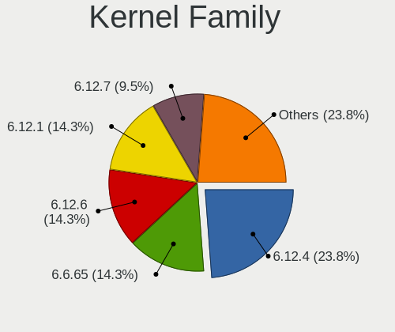
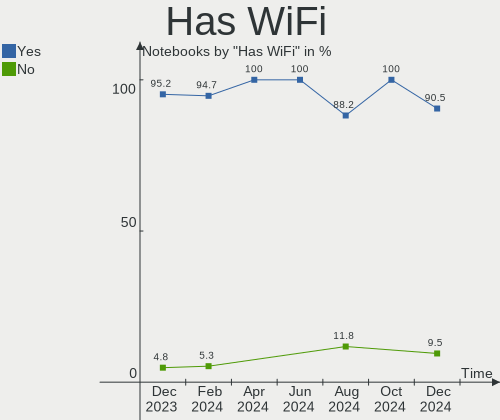
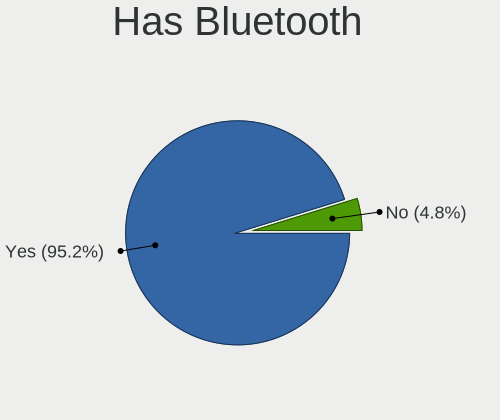
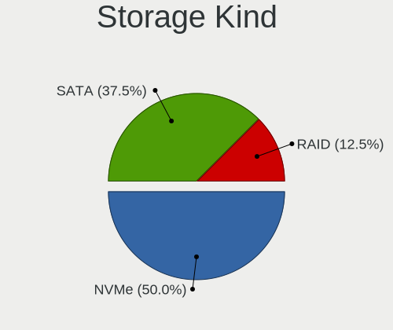
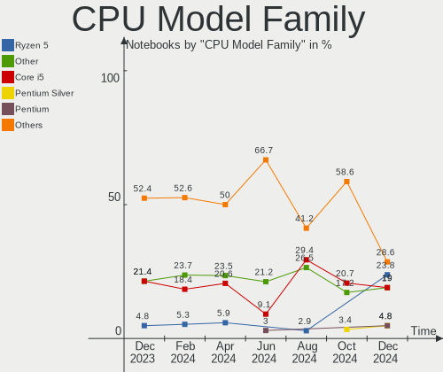
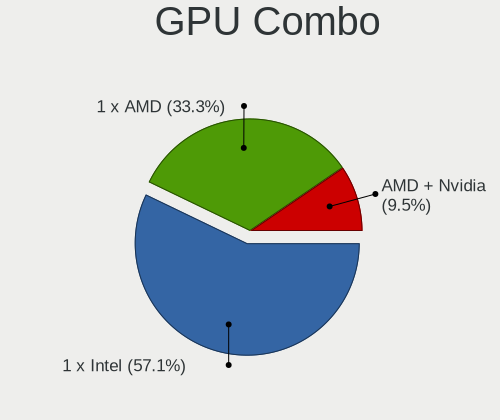
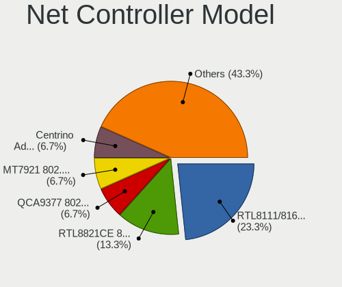
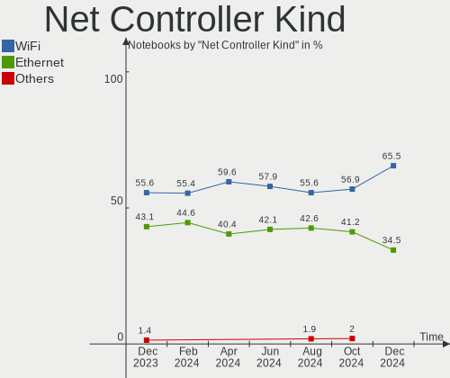
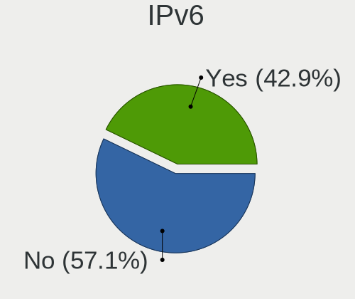

EndeavourOS - Hardware Trends (Notebooks)
-----------------------------------------

A project to identify most popular hardware characteristics and track their change
over time based on data collected by Linux users at https://Linux-Hardware.org.

Anyone can contribute to this report by the [hw-probe](https://github.com/linuxhw/hw-probe) tool:

    sudo -E hw-probe -all -upload

This report is for one last month. Overall report since the beginning of time: [TestDays](https://github.com/linuxhw/TestDays)

Period: Aug, 2023.

Contents
--------

* [ System ](#system)
  - [ OS                       ](#os)
  - [ OS Family                ](#os-family)
  - [ Kernel                   ](#kernel)
  - [ Kernel Family            ](#kernel-family)
  - [ Kernel Major Ver.        ](#kernel-major-ver)
  - [ Arch                     ](#arch)
  - [ DE                       ](#de)
  - [ Display Server           ](#display-server)
  - [ Display Manager          ](#display-manager)
  - [ OS Lang                  ](#os-lang)
  - [ Boot Mode                ](#boot-mode)
  - [ Filesystem               ](#filesystem)
  - [ Part. scheme             ](#part-scheme)
  - [ Dual Boot with Linux/BSD ](#dual-boot-with-linuxbsd)
  - [ Dual Boot (Win)          ](#dual-boot-win)

* [ Board ](#board)
  - [ Vendor                   ](#vendor)
  - [ Model                    ](#model)
  - [ Model Family             ](#model-family)
  - [ MFG Year                 ](#mfg-year)
  - [ Form Factor              ](#form-factor)
  - [ Secure Boot              ](#secure-boot)
  - [ Coreboot                 ](#coreboot)
  - [ RAM Size                 ](#ram-size)
  - [ RAM Used                 ](#ram-used)
  - [ Total Drives             ](#total-drives)
  - [ Has CD-ROM               ](#has-cd-rom)
  - [ Has Ethernet             ](#has-ethernet)
  - [ Has WiFi                 ](#has-wifi)
  - [ Has Bluetooth            ](#has-bluetooth)

* [ Location ](#location)
  - [ Country                  ](#country)
  - [ City                     ](#city)

* [ Drives ](#drives)
  - [ Drive Vendor             ](#drive-vendor)
  - [ Drive Model              ](#drive-model)
  - [ HDD Vendor               ](#hdd-vendor)
  - [ SSD Vendor               ](#ssd-vendor)
  - [ Drive Kind               ](#drive-kind)
  - [ Drive Connector          ](#drive-connector)
  - [ Drive Size               ](#drive-size)
  - [ Space Total              ](#space-total)
  - [ Space Used               ](#space-used)
  - [ Malfunc. Drives          ](#malfunc-drives)
  - [ Malfunc. Drive Vendor    ](#malfunc-drive-vendor)
  - [ Malfunc. HDD Vendor      ](#malfunc-hdd-vendor)
  - [ Malfunc. Drive Kind      ](#malfunc-drive-kind)
  - [ Failed Drives            ](#failed-drives)
  - [ Failed Drive Vendor      ](#failed-drive-vendor)
  - [ Drive Status             ](#drive-status)

* [ Storage controller ](#storage-controller)
  - [ Storage Vendor           ](#storage-vendor)
  - [ Storage Model            ](#storage-model)
  - [ Storage Kind             ](#storage-kind)

* [ Processor ](#processor)
  - [ CPU Vendor               ](#cpu-vendor)
  - [ CPU Model                ](#cpu-model)
  - [ CPU Model Family         ](#cpu-model-family)
  - [ CPU Cores                ](#cpu-cores)
  - [ CPU Sockets              ](#cpu-sockets)
  - [ CPU Threads              ](#cpu-threads)
  - [ CPU Op-Modes             ](#cpu-op-modes)
  - [ CPU Microcode            ](#cpu-microcode)
  - [ CPU Microarch            ](#cpu-microarch)

* [ Graphics ](#graphics)
  - [ GPU Vendor               ](#gpu-vendor)
  - [ GPU Model                ](#gpu-model)
  - [ GPU Combo                ](#gpu-combo)
  - [ GPU Driver               ](#gpu-driver)
  - [ GPU Memory               ](#gpu-memory)

* [ Monitor ](#monitor)
  - [ Monitor Vendor           ](#monitor-vendor)
  - [ Monitor Model            ](#monitor-model)
  - [ Monitor Resolution       ](#monitor-resolution)
  - [ Monitor Diagonal         ](#monitor-diagonal)
  - [ Monitor Width            ](#monitor-width)
  - [ Aspect Ratio             ](#aspect-ratio)
  - [ Monitor Area             ](#monitor-area)
  - [ Pixel Density            ](#pixel-density)
  - [ Multiple Monitors        ](#multiple-monitors)

* [ Network ](#network)
  - [ Net Controller Vendor    ](#net-controller-vendor)
  - [ Net Controller Model     ](#net-controller-model)
  - [ Wireless Vendor          ](#wireless-vendor)
  - [ Wireless Model           ](#wireless-model)
  - [ Ethernet Vendor          ](#ethernet-vendor)
  - [ Ethernet Model           ](#ethernet-model)
  - [ Net Controller Kind      ](#net-controller-kind)
  - [ Used Controller          ](#used-controller)
  - [ NICs                     ](#nics)
  - [ IPv6                     ](#ipv6)

* [ Bluetooth ](#bluetooth)
  - [ Bluetooth Vendor         ](#bluetooth-vendor)
  - [ Bluetooth Model          ](#bluetooth-model)

* [ Sound ](#sound)
  - [ Sound Vendor             ](#sound-vendor)
  - [ Sound Model              ](#sound-model)

* [ Memory ](#memory)
  - [ Memory Vendor            ](#memory-vendor)
  - [ Memory Model             ](#memory-model)
  - [ Memory Kind              ](#memory-kind)
  - [ Memory Form Factor       ](#memory-form-factor)
  - [ Memory Size              ](#memory-size)
  - [ Memory Speed             ](#memory-speed)

* [ Printers & scanners ](#printers--scanners)
  - [ Printer Vendor           ](#printer-vendor)
  - [ Printer Model            ](#printer-model)
  - [ Scanner Vendor           ](#scanner-vendor)
  - [ Scanner Model            ](#scanner-model)

* [ Camera ](#camera)
  - [ Camera Vendor            ](#camera-vendor)
  - [ Camera Model             ](#camera-model)

* [ Security ](#security)
  - [ Fingerprint Vendor       ](#fingerprint-vendor)
  - [ Fingerprint Model        ](#fingerprint-model)
  - [ Chipcard Vendor          ](#chipcard-vendor)
  - [ Chipcard Model           ](#chipcard-model)

* [ Unsupported ](#unsupported)
  - [ Unsupported Devices      ](#unsupported-devices)
  - [ Unsupported Device Types ](#unsupported-device-types)

System
------

OS
--

Installed operating systems

| Name                | Notebooks | Percent |
|---------------------|-----------|---------|
| EndeavourOS Rolling | 35        | 100%    |

OS Family
---------

OS without a version

| Name        | Notebooks | Percent |
|-------------|-----------|---------|
| EndeavourOS | 35        | 100%    |

Kernel
------

Version of the Linux kernel

| Version                        | Notebooks | Percent |
|--------------------------------|-----------|---------|
| 6.4.11-arch2-1                 | 6         | 17.14%  |
| 6.4.12-arch1-1                 | 4         | 11.43%  |
| 6.4.10-arch1-1                 | 4         | 11.43%  |
| 6.4.7-arch1-3                  | 3         | 8.57%   |
| 6.4.7-arch1-1                  | 3         | 8.57%   |
| 6.4.11-zen2-1-zen              | 2         | 5.71%   |
| 6.4.11-arch1-1                 | 2         | 5.71%   |
| 6.1.46-1-lts                   | 2         | 5.71%   |
| 6.4.9-arch1-1                  | 1         | 2.86%   |
| 6.4.8-arch1-1                  | 1         | 2.86%   |
| 6.4.12-zen1-1-zen              | 1         | 2.86%   |
| 6.4.11-1-cachyos-tt            | 1         | 2.86%   |
| 6.4.10-RAVEN                   | 1         | 2.86%   |
| 6.3.4-arch1-1                  | 1         | 2.86%   |
| 6.1.46-x64v2-rt13-xanmod1-1-rt | 1         | 2.86%   |
| 6.1.39-1-lts                   | 1         | 2.86%   |
| 6.1.36-x64v3-1-shmilee         | 1         | 2.86%   |

Kernel Family
-------------

Linux kernel without a distro release

| Version | Notebooks | Percent |
|---------|-----------|---------|
| 6.4.11  | 11        | 31.43%  |
| 6.4.7   | 6         | 17.14%  |
| 6.4.12  | 5         | 14.29%  |
| 6.4.10  | 5         | 14.29%  |
| 6.1.46  | 3         | 8.57%   |
| 6.4.9   | 1         | 2.86%   |
| 6.4.8   | 1         | 2.86%   |
| 6.3.4   | 1         | 2.86%   |
| 6.1.39  | 1         | 2.86%   |
| 6.1.36  | 1         | 2.86%   |

Kernel Major Ver.
-----------------

Linux kernel major version

| Version | Notebooks | Percent |
|---------|-----------|---------|
| 6.4     | 29        | 82.86%  |
| 6.1     | 5         | 14.29%  |
| 6.3     | 1         | 2.86%   |

Arch
----

OS architecture (x86_64, i586, etc.)

| Name   | Notebooks | Percent |
|--------|-----------|---------|
| x86_64 | 35        | 100%    |

DE
--

Desktop Environment

| Name     | Notebooks | Percent |
|----------|-----------|---------|
| KDE5     | 17        | 48.57%  |
| GNOME    | 9         | 25.71%  |
| XFCE     | 2         | 5.71%   |
| Unknown  | 2         | 5.71%   |
| sway     | 1         | 2.86%   |
| MATE     | 1         | 2.86%   |
| LXQt     | 1         | 2.86%   |
| i3       | 1         | 2.86%   |
| Hyprland | 1         | 2.86%   |

Display Server
--------------

X11 or Wayland

| Name    | Notebooks | Percent |
|---------|-----------|---------|
| Wayland | 18        | 51.43%  |
| X11     | 16        | 45.71%  |
| Tty     | 1         | 2.86%   |

Display Manager
---------------

SDDM, LightDM, etc.

| Name    | Notebooks | Percent |
|---------|-----------|---------|
| SDDM    | 11        | 31.43%  |
| Unknown | 11        | 31.43%  |
| LightDM | 9         | 25.71%  |
| GDM     | 4         | 11.43%  |

OS Lang
-------

Language

| Lang       | Notebooks | Percent |
|------------|-----------|---------|
| en_US      | 15        | 42.86%  |
| it_IT      | 6         | 17.14%  |
| es_ES      | 4         | 11.43%  |
| ru_RU      | 2         | 5.71%   |
| zh_CN      | 1         | 2.86%   |
| tr_TR      | 1         | 2.86%   |
| pl_PL      | 1         | 2.86%   |
| fr_FR      | 1         | 2.86%   |
| es_CO      | 1         | 2.86%   |
| es_AR      | 1         | 2.86%   |
| en_US.UTF8 | 1         | 2.86%   |
| en_CA      | 1         | 2.86%   |

Boot Mode
---------

EFI or BIOS

| Mode | Notebooks | Percent |
|------|-----------|---------|
| EFI  | 21        | 60%     |
| BIOS | 14        | 40%     |

Filesystem
----------

Type of filesystem

| Type  | Notebooks | Percent |
|-------|-----------|---------|
| Ext4  | 21        | 60%     |
| Btrfs | 13        | 37.14%  |
| Tmpfs | 1         | 2.86%   |

Part. scheme
------------

Scheme of partitioning

| Type    | Notebooks | Percent |
|---------|-----------|---------|
| GPT     | 22        | 62.86%  |
| Unknown | 11        | 31.43%  |
| MBR     | 2         | 5.71%   |

Dual Boot with Linux/BSD
------------------------

Hosting more than one Linux/BSD

| Dual boot | Notebooks | Percent |
|-----------|-----------|---------|
| No        | 26        | 74.29%  |
| Yes       | 9         | 25.71%  |

Dual Boot (Win)
---------------

Hosting Linux and Windows

| Dual boot | Notebooks | Percent |
|-----------|-----------|---------|
| No        | 28        | 80%     |
| Yes       | 7         | 20%     |

Board
-----

Vendor
------

Motherboard manufacturer

| Name             | Notebooks | Percent |
|------------------|-----------|---------|
| Lenovo           | 9         | 25.71%  |
| Dell             | 6         | 17.14%  |
| ASUSTek Computer | 6         | 17.14%  |
| Hewlett-Packard  | 4         | 11.43%  |
| MSI              | 3         | 8.57%   |
| Sony             | 2         | 5.71%   |
| Toshiba          | 1         | 2.86%   |
| Packard Bell     | 1         | 2.86%   |
| Google           | 1         | 2.86%   |
| Fujitsu          | 1         | 2.86%   |
| Acer             | 1         | 2.86%   |

Model
-----

Motherboard model

| Name                                     | Notebooks | Percent |
|------------------------------------------|-----------|---------|
| Toshiba PORTEGE R700                     | 1         | 2.86%   |
| Sony VPCSB1V9R                           | 1         | 2.86%   |
| Sony SVE1713X1EB                         | 1         | 2.86%   |
| Packard Bell EasyNote TJ66               | 1         | 2.86%   |
| MSI Modern 15 A5M                        | 1         | 2.86%   |
| MSI Katana 15 B13VGK                     | 1         | 2.86%   |
| MSI GL73 8RE                             | 1         | 2.86%   |
| Lenovo Yoga Pro 7 14ARP8 83AU            | 1         | 2.86%   |
| Lenovo ThinkPad T16 Gen 1 21BVCTO1WW     | 1         | 2.86%   |
| Lenovo ThinkPad E495 20NES0KM00          | 1         | 2.86%   |
| Lenovo ThinkBook 16p Gen 2 20YM          | 1         | 2.86%   |
| Lenovo Legion 5 15IMH05H 81Y6            | 1         | 2.86%   |
| Lenovo IdeaPad Gaming 3 15ACH6 82K2      | 1         | 2.86%   |
| Lenovo IdeaPad 320-15ISK 80XH            | 1         | 2.86%   |
| Lenovo IdeaPad 3 15ITL05 81X8            | 1         | 2.86%   |
| Lenovo IdeaPad 110-15AST 80TR            | 1         | 2.86%   |
| HP Victus by Laptop 16-e0xxx             | 1         | 2.86%   |
| HP EliteBook 865 16 inch G9 Notebook PC  | 1         | 2.86%   |
| HP EliteBook 645 14 inch G9 Notebook PC  | 1         | 2.86%   |
| HP 250 G4                                | 1         | 2.86%   |
| Google Madoo                             | 1         | 2.86%   |
| Fujitsu LIFEBOOK U904                    | 1         | 2.86%   |
| Dell XPS 15 9520                         | 1         | 2.86%   |
| Dell Vostro 3500                         | 1         | 2.86%   |
| Dell Precision 3571                      | 1         | 2.86%   |
| Dell Latitude E5570                      | 1         | 2.86%   |
| Dell Latitude E5470                      | 1         | 2.86%   |
| Dell Inspiron 3542                       | 1         | 2.86%   |
| ASUS Zenbook UX3402ZA_Q409ZA             | 1         | 2.86%   |
| ASUS X550VXK                             | 1         | 2.86%   |
| ASUS VivoBook_ASUSLaptop X3500PC_K3500PC | 1         | 2.86%   |
| ASUS TUF Gaming FX705DY_FX705DY          | 1         | 2.86%   |
| ASUS ROG Strix G513QY_G513QY             | 1         | 2.86%   |
| ASUS ASUS TUF Gaming A15 FA506IV_FA506IV | 1         | 2.86%   |
| Acer TravelMate P614-51-G2               | 1         | 2.86%   |

Model Family
------------

Motherboard model prefix

| Name                  | Notebooks | Percent |
|-----------------------|-----------|---------|
| Lenovo IdeaPad        | 4         | 11.43%  |
| Lenovo ThinkPad       | 2         | 5.71%   |
| HP EliteBook          | 2         | 5.71%   |
| Dell Latitude         | 2         | 5.71%   |
| Toshiba PORTEGE       | 1         | 2.86%   |
| Sony VPCSB1V9R        | 1         | 2.86%   |
| Sony SVE1713X1EB      | 1         | 2.86%   |
| Packard Bell EasyNote | 1         | 2.86%   |
| MSI Modern            | 1         | 2.86%   |
| MSI Katana            | 1         | 2.86%   |
| MSI GL73              | 1         | 2.86%   |
| Lenovo Yoga           | 1         | 2.86%   |
| Lenovo ThinkBook      | 1         | 2.86%   |
| Lenovo Legion         | 1         | 2.86%   |
| HP Victus             | 1         | 2.86%   |
| HP 250                | 1         | 2.86%   |
| Google Madoo          | 1         | 2.86%   |
| Fujitsu LIFEBOOK      | 1         | 2.86%   |
| Dell XPS              | 1         | 2.86%   |
| Dell Vostro           | 1         | 2.86%   |
| Dell Precision        | 1         | 2.86%   |
| Dell Inspiron         | 1         | 2.86%   |
| ASUS Zenbook          | 1         | 2.86%   |
| ASUS X550VXK          | 1         | 2.86%   |
| ASUS VivoBook         | 1         | 2.86%   |
| ASUS TUF              | 1         | 2.86%   |
| ASUS ROG              | 1         | 2.86%   |
| ASUS ASUS             | 1         | 2.86%   |
| Acer TravelMate       | 1         | 2.86%   |

MFG Year
--------

Motherboard manufacture year

| Year | Notebooks | Percent |
|------|-----------|---------|
| 2021 | 8         | 22.86%  |
| 2022 | 6         | 17.14%  |
| 2023 | 3         | 8.57%   |
| 2020 | 3         | 8.57%   |
| 2017 | 3         | 8.57%   |
| 2016 | 2         | 5.71%   |
| 2010 | 2         | 5.71%   |
| 2019 | 1         | 2.86%   |
| 2018 | 1         | 2.86%   |
| 2015 | 1         | 2.86%   |
| 2014 | 1         | 2.86%   |
| 2013 | 1         | 2.86%   |
| 2012 | 1         | 2.86%   |
| 2011 | 1         | 2.86%   |
| 2009 | 1         | 2.86%   |

Form Factor
-----------

Physical design of the computer

| Name     | Notebooks | Percent |
|----------|-----------|---------|
| Notebook | 35        | 100%    |

Secure Boot
-----------

Enabled or disabled

| State    | Notebooks | Percent |
|----------|-----------|---------|
| Disabled | 35        | 100%    |

Coreboot
--------

Have coreboot on board

| Used | Notebooks | Percent |
|------|-----------|---------|
| No   | 34        | 97.14%  |
| Yes  | 1         | 2.86%   |

RAM Size
--------

Total RAM memory

| Size in GB  | Notebooks | Percent |
|-------------|-----------|---------|
| 16.01-24.0  | 10        | 28.57%  |
| 4.01-8.0    | 7         | 20%     |
| 8.01-16.0   | 7         | 20%     |
| 32.01-64.0  | 4         | 11.43%  |
| 3.01-4.0    | 4         | 11.43%  |
| 24.01-32.0  | 2         | 5.71%   |
| 64.01-256.0 | 1         | 2.86%   |

RAM Used
--------

Used RAM memory

| Used GB   | Notebooks | Percent |
|-----------|-----------|---------|
| 4.01-8.0  | 13        | 37.14%  |
| 3.01-4.0  | 9         | 25.71%  |
| 1.01-2.0  | 6         | 17.14%  |
| 2.01-3.0  | 3         | 8.57%   |
| 8.01-16.0 | 3         | 8.57%   |
| 0.51-1.0  | 1         | 2.86%   |

Total Drives
------------

Number of drives on board

| Drives | Notebooks | Percent |
|--------|-----------|---------|
| 2      | 18        | 51.43%  |
| 1      | 16        | 45.71%  |
| 3      | 1         | 2.86%   |

Has CD-ROM
----------

Has CD-ROM on board

| Presented | Notebooks | Percent |
|-----------|-----------|---------|
| No        | 31        | 88.57%  |
| Yes       | 4         | 11.43%  |

Has Ethernet
------------

Has Ethernet on board

| Presented | Notebooks | Percent |
|-----------|-----------|---------|
| Yes       | 30        | 85.71%  |
| No        | 5         | 14.29%  |

Has WiFi
--------

Has WiFi module

| Presented | Notebooks | Percent |
|-----------|-----------|---------|
| Yes       | 35        | 100%    |

Has Bluetooth
-------------

Has Bluetooth module

| Presented | Notebooks | Percent |
|-----------|-----------|---------|
| Yes       | 33        | 94.29%  |
| No        | 2         | 5.71%   |

Location
--------

Country
-------

Geographic location (country)

| Country                | Notebooks | Percent |
|------------------------|-----------|---------|
| USA                    | 7         | 20%     |
| Italy                  | 7         | 20%     |
| Spain                  | 4         | 11.43%  |
| Germany                | 3         | 8.57%   |
| Turkey                 | 2         | 5.71%   |
| Vietnam                | 1         | 2.86%   |
| Uruguay                | 1         | 2.86%   |
| Switzerland            | 1         | 2.86%   |
| Russia                 | 1         | 2.86%   |
| Poland                 | 1         | 2.86%   |
| Kazakhstan             | 1         | 2.86%   |
| Japan                  | 1         | 2.86%   |
| France                 | 1         | 2.86%   |
| Colombia               | 1         | 2.86%   |
| Canada                 | 1         | 2.86%   |
| Bosnia and Herzegovina | 1         | 2.86%   |
| Argentina              | 1         | 2.86%   |

City
----

Geographic location (city)

| City                 | Notebooks | Percent |
|----------------------|-----------|---------|
| Milan                | 2         | 5.71%   |
| Istanbul             | 2         | 5.71%   |
| Zaragoza             | 1         | 2.86%   |
| Xàtiva              | 1         | 2.86%   |
| Wohlen bei Bern      | 1         | 2.86%   |
| Warwick              | 1         | 2.86%   |
| Valencia             | 1         | 2.86%   |
| Turin                | 1         | 2.86%   |
| Taylor               | 1         | 2.86%   |
| Rosny-sous-Bois      | 1         | 2.86%   |
| Rosario              | 1         | 2.86%   |
| Rexburg              | 1         | 2.86%   |
| Poznan               | 1         | 2.86%   |
| Pontevico            | 1         | 2.86%   |
| Pontevedra           | 1         | 2.86%   |
| Pocitos              | 1         | 2.86%   |
| Osaka                | 1         | 2.86%   |
| Naples               | 1         | 2.86%   |
| Montreal             | 1         | 2.86%   |
| Montabaur            | 1         | 2.86%   |
| Mikhaylovsk          | 1         | 2.86%   |
| Marcus Hook          | 1         | 2.86%   |
| Mannheim             | 1         | 2.86%   |
| Kyzylorda            | 1         | 2.86%   |
| Hanoi                | 1         | 2.86%   |
| Frankfurt am Main    | 1         | 2.86%   |
| Eureka               | 1         | 2.86%   |
| Castello di Cisterna | 1         | 2.86%   |
| Brooklyn             | 1         | 2.86%   |
| Bomporto             | 1         | 2.86%   |
| Bogotá              | 1         | 2.86%   |
| Bihać               | 1         | 2.86%   |
| Ashburn              | 1         | 2.86%   |

Drives
------

Drive Vendor
------------

Hard drive vendors

| Vendor                      | Notebooks | Drives | Percent |
|-----------------------------|-----------|--------|---------|
| Samsung Electronics         | 7         | 8      | 13.21%  |
| Sandisk                     | 6         | 7      | 11.32%  |
| SK hynix                    | 4         | 4      | 7.55%   |
| Micron Technology           | 4         | 4      | 7.55%   |
| Kingston                    | 4         | 5      | 7.55%   |
| Unknown                     | 3         | 3      | 5.66%   |
| Intel                       | 3         | 3      | 5.66%   |
| Toshiba                     | 2         | 2      | 3.77%   |
| HGST                        | 2         | 2      | 3.77%   |
| Crucial                     | 2         | 2      | 3.77%   |
| ADATA Technology            | 2         | 2      | 3.77%   |
| WDC                         | 1         | 1      | 1.89%   |
| Union Memory                | 1         | 1      | 1.89%   |
| Seagate                     | 1         | 1      | 1.89%   |
| Realtek                     | 1         | 1      | 1.89%   |
| Phison Electronics          | 1         | 1      | 1.89%   |
| Patriot                     | 1         | 1      | 1.89%   |
| Micron/Crucial Technology   | 1         | 1      | 1.89%   |
| MAXIO Technology (Hangzhou) | 1         | 1      | 1.89%   |
| Kingston Technology Company | 1         | 1      | 1.89%   |
| KingFast                    | 1         | 1      | 1.89%   |
| Hitachi                     | 1         | 1      | 1.89%   |
| Gigabyte Technology         | 1         | 1      | 1.89%   |
| Apacer                      | 1         | 1      | 1.89%   |
| A-DATA Technology           | 1         | 1      | 1.89%   |

Drive Model
-----------

Hard drive models

| Model                                                 | Notebooks | Percent |
|-------------------------------------------------------|-----------|---------|
| Sandisk WD Blue SN550 NVMe SSD 250GB                  | 2         | 3.64%   |
| Samsung NVMe SSD Controller PM9A1/PM9A3/980PRO 1024GB | 2         | 3.64%   |
| Micron MTFDHBA512TDV-1AZ1AABHA 512GB                  | 2         | 3.64%   |
| HGST HTS545050A7E680 500GB                            | 2         | 3.64%   |
| WDC WD5000BPVT-60HXZT3 500GB                          | 1         | 1.82%   |
| Unknown MMC Card  32GB                                | 1         | 1.82%   |
| Unknown MMC Card  196GB                               | 1         | 1.82%   |
| Unknown MMC Card  16GB                                | 1         | 1.82%   |
| Union Memory UMIS RPJTJ256MED1OWX 256GB               | 1         | 1.82%   |
| Toshiba MQ01ABD100 1TB                                | 1         | 1.82%   |
| Toshiba BG3 NVMe SSD Controller 256GB                 | 1         | 1.82%   |
| SK hynix SKHynix_HFM128GD3HX015N 128GB                | 1         | 1.82%   |
| SK hynix SC308 SATA 256GB SSD                         | 1         | 1.82%   |
| SK hynix PC801 NVMe 1TB                               | 1         | 1.82%   |
| SK hynix HFS128G32TND-N210A 128GB SSD                 | 1         | 1.82%   |
| Seagate ST2000LM007-1R8174 2TB                        | 1         | 1.82%   |
| Sandisk WD PC SN735 SDBPNHH-256G-1002 256GB           | 1         | 1.82%   |
| Sandisk WD Green SN350 2TB                            | 1         | 1.82%   |
| Sandisk WD Black SN750 / PC SN730 NVMe SSD 1024GB     | 1         | 1.82%   |
| SanDisk Extreme 55AE 1TB SSD                          | 1         | 1.82%   |
| Samsung SSD 970 EVO Plus 1TB                          | 1         | 1.82%   |
| Samsung SSD 870 QVO 2TB                               | 1         | 1.82%   |
| Samsung SSD 870 EVO 500GB                             | 1         | 1.82%   |
| Samsung Portable SSD T5 500GB                         | 1         | 1.82%   |
| Samsung MZVL41T0HBLB-00BTW 1024GB                     | 1         | 1.82%   |
| Samsung MZ7LN128HCHP-00000 128GB SSD                  | 1         | 1.82%   |
| Realtek RTL9210B-CG 2TB                               | 1         | 1.82%   |
| Phison PS5013 E13 NVMe Controller 512GB               | 1         | 1.82%   |
| Patriot Burst 120GB SSD                               | 1         | 1.82%   |
| Micron/Crucial P2 NVMe PCIe SSD 1TB                   | 1         | 1.82%   |
| Micron CT1000P5SSD8 1TB                               | 1         | 1.82%   |
| Micron 2200V_MTFDHBA512TCK 512GB                      | 1         | 1.82%   |
| MAXIO (Hangzhou) NVMe SSD Controller MAP1202 1024GB   | 1         | 1.82%   |
| Kingston Company KC2000 NVMe SSD 1TB                  | 1         | 1.82%   |
| Kingston SNV2S500G 500GB                              | 1         | 1.82%   |
| Kingston SKC3000D2048G 2TB                            | 1         | 1.82%   |
| Kingston SA400S37480G 480GB SSD                       | 1         | 1.82%   |
| Kingston SA400S37240G 240GB SSD                       | 1         | 1.82%   |
| Kingston OM8PCP3512F-AI1 512GB                        | 1         | 1.82%   |
| KingFast SSD 240GB                                    | 1         | 1.82%   |

HDD Vendor
----------

Hard disk drive vendors

| Vendor  | Notebooks | Drives | Percent |
|---------|-----------|--------|---------|
| HGST    | 2         | 2      | 33.33%  |
| WDC     | 1         | 1      | 16.67%  |
| Toshiba | 1         | 1      | 16.67%  |
| Seagate | 1         | 1      | 16.67%  |
| Hitachi | 1         | 1      | 16.67%  |

SSD Vendor
----------

Solid state drive vendors

| Vendor              | Notebooks | Drives | Percent |
|---------------------|-----------|--------|---------|
| Samsung Electronics | 5         | 5      | 29.41%  |
| SK hynix            | 2         | 2      | 11.76%  |
| Kingston            | 2         | 2      | 11.76%  |
| Crucial             | 2         | 2      | 11.76%  |
| SanDisk             | 1         | 1      | 5.88%   |
| Patriot             | 1         | 1      | 5.88%   |
| KingFast            | 1         | 1      | 5.88%   |
| Gigabyte Technology | 1         | 1      | 5.88%   |
| Apacer              | 1         | 1      | 5.88%   |
| A-DATA Technology   | 1         | 1      | 5.88%   |

Drive Kind
----------

HDD or SSD

| Kind | Notebooks | Drives | Percent |
|------|-----------|--------|---------|
| NVMe | 24        | 30     | 48.98%  |
| SSD  | 16        | 17     | 32.65%  |
| HDD  | 6         | 6      | 12.24%  |
| MMC  | 3         | 3      | 6.12%   |

Drive Connector
---------------

SATA, SAS, NVMe, etc.

| Type | Notebooks | Drives | Percent |
|------|-----------|--------|---------|
| NVMe | 24        | 29     | 51.06%  |
| SATA | 16        | 20     | 34.04%  |
| SAS  | 4         | 4      | 8.51%   |
| MMC  | 3         | 3      | 6.38%   |

Drive Size
----------

Size of hard drive

| Size in TB | Notebooks | Drives | Percent |
|------------|-----------|--------|---------|
| 0.01-0.5   | 16        | 18     | 76.19%  |
| 0.51-1.0   | 3         | 3      | 14.29%  |
| 1.01-2.0   | 2         | 2      | 9.52%   |

Space Total
-----------

Amount of disk space available on the file system

| Size in GB     | Notebooks | Percent |
|----------------|-----------|---------|
| 101-250        | 8         | 22.86%  |
| 1001-2000      | 5         | 14.29%  |
| 501-1000       | 5         | 14.29%  |
| 251-500        | 3         | 8.57%   |
| 1-20           | 3         | 8.57%   |
| 51-100         | 3         | 8.57%   |
| Unknown        | 3         | 8.57%   |
| More than 3000 | 2         | 5.71%   |
| 2001-3000      | 2         | 5.71%   |
| 21-50          | 1         | 2.86%   |

Space Used
----------

Amount of used disk space

| Used GB   | Notebooks | Percent |
|-----------|-----------|---------|
| 1-20      | 11        | 31.43%  |
| 21-50     | 5         | 14.29%  |
| 501-1000  | 5         | 14.29%  |
| 101-250   | 4         | 11.43%  |
| 51-100    | 4         | 11.43%  |
| Unknown   | 3         | 8.57%   |
| 1001-2000 | 2         | 5.71%   |
| 251-500   | 1         | 2.86%   |

Malfunc. Drives
---------------

Drive models with a malfunction

| Model                                 | Notebooks | Drives | Percent |
|---------------------------------------|-----------|--------|---------|
| HGST HTS545050A7E680 500GB            | 2         | 2      | 50%     |
| WDC WD5000BPVT-60HXZT3 500GB          | 1         | 1      | 25%     |
| SK hynix HFS128G32TND-N210A 128GB SSD | 1         | 1      | 25%     |

Malfunc. Drive Vendor
---------------------

Vendors of faulty drives

| Vendor   | Notebooks | Drives | Percent |
|----------|-----------|--------|---------|
| HGST     | 2         | 2      | 50%     |
| WDC      | 1         | 1      | 25%     |
| SK hynix | 1         | 1      | 25%     |

Malfunc. HDD Vendor
-------------------

Vendors of faulty HDD drives

| Vendor | Notebooks | Drives | Percent |
|--------|-----------|--------|---------|
| HGST   | 2         | 2      | 66.67%  |
| WDC    | 1         | 1      | 33.33%  |

Malfunc. Drive Kind
-------------------

Kinds of faulty drives

| Kind | Notebooks | Drives | Percent |
|------|-----------|--------|---------|
| HDD  | 3         | 3      | 75%     |
| SSD  | 1         | 1      | 25%     |

Failed Drives
-------------

Failed drive models

Zero info for selected period =(

Failed Drive Vendor
-------------------

Failed drive vendors

Zero info for selected period =(

Drive Status
------------

Number of failed and malfunc. drives

| Status   | Notebooks | Drives | Percent |
|----------|-----------|--------|---------|
| Works    | 21        | 32     | 52.5%   |
| Detected | 15        | 20     | 37.5%   |
| Malfunc  | 4         | 4      | 10%     |

Storage controller
------------------

Storage Vendor
--------------

Storage controller vendors

| Vendor                       | Notebooks | Percent |
|------------------------------|-----------|---------|
| Intel                        | 21        | 42.86%  |
| SanDisk                      | 5         | 10.2%   |
| Micron Technology            | 4         | 8.16%   |
| AMD                          | 4         | 8.16%   |
| Samsung Electronics          | 3         | 6.12%   |
| Kingston Technology Company  | 3         | 6.12%   |
| SK hynix                     | 2         | 4.08%   |
| ADATA Technology             | 2         | 4.08%   |
| Union Memory (Shenzhen)      | 1         | 2.04%   |
| Toshiba America Info Systems | 1         | 2.04%   |
| Phison Electronics           | 1         | 2.04%   |
| Micron/Crucial Technology    | 1         | 2.04%   |
| MAXIO Technology (Hangzhou)  | 1         | 2.04%   |

Storage Model
-------------

Storage controller models

| Model                                                                            | Notebooks | Percent |
|----------------------------------------------------------------------------------|-----------|---------|
| Intel Volume Management Device NVMe RAID Controller                              | 4         | 7.55%   |
| AMD FCH SATA Controller [AHCI mode]                                              | 4         | 7.55%   |
| Micron 2300 NVMe SSD [Santana]                                                   | 3         | 5.66%   |
| SanDisk WD Blue SN550 NVMe SSD                                                   | 2         | 3.77%   |
| Samsung NVMe SSD Controller PM9A1/PM9A3/980PRO                                   | 2         | 3.77%   |
| Intel Tiger Lake-LP SATA Controller                                              | 2         | 3.77%   |
| Intel Sunrise Point-LP SATA Controller [AHCI mode]                               | 2         | 3.77%   |
| Intel SSD 670p Series [Keystone Harbor]                                          | 2         | 3.77%   |
| Intel 8 Series SATA Controller 1 [AHCI mode]                                     | 2         | 3.77%   |
| Union Memory (Shenzhen) AM611 PCIe 3.0 NVMe SSD 256GB                            | 1         | 1.89%   |
| Toshiba America Info Systems BG3 NVMe SSD Controller                             | 1         | 1.89%   |
| SK hynix Platinum P41/PC801 NVMe Solid State Drive                               | 1         | 1.89%   |
| SK hynix Gold P31/BC711/PC711 NVMe Solid State Drive                             | 1         | 1.89%   |
| SanDisk WD Green SN350 NVMe SSD 1 TB (DRAM-less)                                 | 1         | 1.89%   |
| SanDisk WD Black SN750 / PC SN730 NVMe SSD                                       | 1         | 1.89%   |
| SanDisk PC SN735 NVMe SSD (DRAM-less)                                            | 1         | 1.89%   |
| Samsung NVMe SSD Controller PM9B1                                                | 1         | 1.89%   |
| Phison PS5013 E13 NVMe Controller                                                | 1         | 1.89%   |
| Micron/Crucial P2 [Nick P2] / P3 / P3 Plus NVMe PCIe SSD (DRAM-less)             | 1         | 1.89%   |
| Micron 2200S NVMe SSD [Cassandra]                                                | 1         | 1.89%   |
| MAXIO (Hangzhou) NVMe SSD Controller MAP1202                                     | 1         | 1.89%   |
| Kingston Company Company Non-Volatile memory controller                          | 1         | 1.89%   |
| Kingston Company OM8PCP Design-In PCIe 3 NVMe SSD (DRAM-less)                    | 1         | 1.89%   |
| Kingston Company KC3000/Renegade NVMe SSD                                        | 1         | 1.89%   |
| Kingston Company KC2000/KC2500 NVMe SSD                                          | 1         | 1.89%   |
| Intel Volume Management Device NVMe RAID Controller Intel Corporation            | 1         | 1.89%   |
| Intel SSD 660P Series                                                            | 1         | 1.89%   |
| Intel Q170/Q150/B150/H170/H110/Z170/CM236 Chipset SATA Controller [AHCI Mode]    | 1         | 1.89%   |
| Intel HM170/QM170 Chipset SATA Controller [AHCI Mode]                            | 1         | 1.89%   |
| Intel Cannon Lake Mobile PCH SATA AHCI Controller                                | 1         | 1.89%   |
| Intel Atom/Celeron/Pentium Processor x5-E8000/J3xxx/N3xxx Series SATA Controller | 1         | 1.89%   |
| Intel Alder Lake-P SATA AHCI Controller                                          | 1         | 1.89%   |
| Intel 82801IBM/IEM (ICH9M/ICH9M-E) 4 port SATA Controller [AHCI mode]            | 1         | 1.89%   |
| Intel 7 Series Chipset Family 6-port SATA Controller [AHCI mode]                 | 1         | 1.89%   |
| Intel 6 Series/C200 Series Chipset Family 6 port Mobile SATA AHCI Controller     | 1         | 1.89%   |
| Intel 5 Series/3400 Series Chipset 4 port SATA AHCI Controller                   | 1         | 1.89%   |
| Intel 400 Series Chipset Family SATA AHCI Controller                             | 1         | 1.89%   |
| ADATA XPG SX8200 Pro PCIe Gen3x4 M.2 2280 Solid State Drive                      | 1         | 1.89%   |
| ADATA ADATA XPG GAMMIXS1 1L Media (256 GB SSD)                                   | 1         | 1.89%   |

Storage Kind
------------

Kind of storage controller (IDE, SATA, NVMe, SAS, ...)

| Kind | Notebooks | Percent |
|------|-----------|---------|
| NVMe | 24        | 48.98%  |
| SATA | 20        | 40.82%  |
| RAID | 5         | 10.2%   |

Processor
---------

CPU Vendor
----------

Processor vendors

| Vendor | Notebooks | Percent |
|--------|-----------|---------|
| Intel  | 23        | 65.71%  |
| AMD    | 12        | 34.29%  |

CPU Model
---------

Processor models

| Model                                         | Notebooks | Percent |
|-----------------------------------------------|-----------|---------|
| AMD Ryzen 5 5600H with Radeon Graphics        | 2         | 5.71%   |
| Intel Core i7-8750H CPU @ 2.20GHz             | 1         | 2.86%   |
| Intel Core i7-6820HQ CPU @ 2.70GHz            | 1         | 2.86%   |
| Intel Core i7-4510U CPU @ 2.00GHz             | 1         | 2.86%   |
| Intel Core i7-3632QM CPU @ 2.20GHz            | 1         | 2.86%   |
| Intel Core i7-10750H CPU @ 2.60GHz            | 1         | 2.86%   |
| Intel Core i5-7300HQ CPU @ 2.50GHz            | 1         | 2.86%   |
| Intel Core i5-6200U CPU @ 2.30GHz             | 1         | 2.86%   |
| Intel Core i5-4200U CPU @ 1.60GHz             | 1         | 2.86%   |
| Intel Core i5-2410M CPU @ 2.30GHz             | 1         | 2.86%   |
| Intel Core i5-10210U CPU @ 1.60GHz            | 1         | 2.86%   |
| Intel Core i5 CPU M 460 @ 2.53GHz             | 1         | 2.86%   |
| Intel Core i3-6006U CPU @ 2.00GHz             | 1         | 2.86%   |
| Intel Core 2 Duo CPU P7450 @ 2.13GHz          | 1         | 2.86%   |
| Intel Celeron N4500 @ 1.10GHz                 | 1         | 2.86%   |
| Intel Celeron CPU N3050 @ 1.60GHz             | 1         | 2.86%   |
| Intel 13th Gen Core i7-13620H                 | 1         | 2.86%   |
| Intel 12th Gen Core i7-12700H                 | 1         | 2.86%   |
| Intel 12th Gen Core i7-1260P                  | 1         | 2.86%   |
| Intel 12th Gen Core i5-12500H                 | 1         | 2.86%   |
| Intel 12th Gen Core i5-1240P                  | 1         | 2.86%   |
| Intel 11th Gen Core i7-11370H @ 3.30GHz       | 1         | 2.86%   |
| Intel 11th Gen Core i5-1135G7 @ 2.40GHz       | 1         | 2.86%   |
| Intel 11th Gen Core i3-1115G4 @ 3.00GHz       | 1         | 2.86%   |
| AMD Ryzen 9 5900HX with Radeon Graphics       | 1         | 2.86%   |
| AMD Ryzen 7 PRO 6850HS with Radeon Graphics   | 1         | 2.86%   |
| AMD Ryzen 7 PRO 5875U with Radeon Graphics    | 1         | 2.86%   |
| AMD Ryzen 7 7735HS with Radeon Graphics       | 1         | 2.86%   |
| AMD Ryzen 7 5800H with Radeon Graphics        | 1         | 2.86%   |
| AMD Ryzen 7 5700U with Radeon Graphics        | 1         | 2.86%   |
| AMD Ryzen 7 4800H with Radeon Graphics        | 1         | 2.86%   |
| AMD Ryzen 5 3550H with Radeon Vega Mobile Gfx | 1         | 2.86%   |
| AMD Ryzen 5 3500U with Radeon Vega Mobile Gfx | 1         | 2.86%   |
| AMD A9-9400 RADEON R5, 5 COMPUTE CORES 2C+3G  | 1         | 2.86%   |

CPU Model Family
----------------

Processor model prefix

| Model            | Notebooks | Percent |
|------------------|-----------|---------|
| Other            | 9         | 25.71%  |
| Intel Core i5    | 6         | 17.14%  |
| Intel Core i7    | 5         | 14.29%  |
| AMD Ryzen 7      | 4         | 11.43%  |
| AMD Ryzen 5      | 4         | 11.43%  |
| Intel Celeron    | 2         | 5.71%   |
| AMD Ryzen 7 PRO  | 2         | 5.71%   |
| Intel Core i3    | 1         | 2.86%   |
| Intel Core 2 Duo | 1         | 2.86%   |
| AMD Ryzen 9      | 1         | 2.86%   |

CPU Cores
---------

Number of processor cores

| Number | Notebooks | Percent |
|--------|-----------|---------|
| 2      | 11        | 31.43%  |
| 4      | 8         | 22.86%  |
| 8      | 7         | 20%     |
| 6      | 4         | 11.43%  |
| 12     | 3         | 8.57%   |
| 14     | 1         | 2.86%   |
| 10     | 1         | 2.86%   |

CPU Sockets
-----------

Number of sockets

| Number | Notebooks | Percent |
|--------|-----------|---------|
| 1      | 35        | 100%    |

CPU Threads
-----------

Threads per core (Hyper-Threading)

| Number | Notebooks | Percent |
|--------|-----------|---------|
| 2      | 30        | 85.71%  |
| 1      | 5         | 14.29%  |

CPU Op-Modes
------------

CPU Operation Modes (32-bit, 64-bit)

| Op mode        | Notebooks | Percent |
|----------------|-----------|---------|
| 32-bit, 64-bit | 35        | 100%    |

CPU Microcode
-------------

Microcode number

| Number     | Notebooks | Percent |
|------------|-----------|---------|
| Unknown    | 23        | 65.71%  |
| 0x0a50000d | 3         | 8.57%   |
| 0x0a404102 | 2         | 5.71%   |
| 0x906a3    | 1         | 2.86%   |
| 0x806c1    | 1         | 2.86%   |
| 0x1067a    | 1         | 2.86%   |
| 0x0a50000c | 1         | 2.86%   |
| 0x08608103 | 1         | 2.86%   |
| 0x08108102 | 1         | 2.86%   |
| 0x06006704 | 1         | 2.86%   |

CPU Microarch
-------------

Microarchitecture

| Name             | Notebooks | Percent |
|------------------|-----------|---------|
| Unknown          | 6         | 17.14%  |
| Zen 3            | 5         | 14.29%  |
| TigerLake        | 3         | 8.57%   |
| Skylake          | 3         | 8.57%   |
| KabyLake         | 3         | 8.57%   |
| Alderlake Hybrid | 3         | 8.57%   |
| Zen+             | 2         | 5.71%   |
| Haswell          | 2         | 5.71%   |
| Zen 2            | 1         | 2.86%   |
| Westmere         | 1         | 2.86%   |
| Silvermont       | 1         | 2.86%   |
| SandyBridge      | 1         | 2.86%   |
| Penryn           | 1         | 2.86%   |
| IvyBridge        | 1         | 2.86%   |
| Excavator        | 1         | 2.86%   |
| CometLake        | 1         | 2.86%   |

Graphics
--------

GPU Vendor
----------

Vendors of graphics cards

| Vendor | Notebooks | Percent |
|--------|-----------|---------|
| Intel  | 21        | 43.75%  |
| AMD    | 14        | 29.17%  |
| Nvidia | 13        | 27.08%  |

GPU Model
---------

Graphics card models

| Model                                                                                    | Notebooks | Percent |
|------------------------------------------------------------------------------------------|-----------|---------|
| Intel Alder Lake-P Integrated Graphics Controller                                        | 4         | 7.84%   |
| AMD Cezanne [Radeon Vega Series / Radeon Vega Mobile Series]                             | 4         | 7.84%   |
| Nvidia GA107M [GeForce RTX 3050 Mobile]                                                  | 2         | 3.92%   |
| Intel TigerLake-LP GT2 [Iris Xe Graphics]                                                | 2         | 3.92%   |
| Intel Haswell-ULT Integrated Graphics Controller                                         | 2         | 3.92%   |
| AMD Rembrandt [Radeon 680M]                                                              | 2         | 3.92%   |
| AMD Picasso/Raven 2 [Radeon Vega Series / Radeon Vega Mobile Series]                     | 2         | 3.92%   |
| Nvidia TU117GLM [T600 Laptop GPU]                                                        | 1         | 1.96%   |
| Nvidia TU116M [GeForce GTX 1660 Ti Mobile]                                               | 1         | 1.96%   |
| Nvidia TU106M [GeForce RTX 2060 Mobile]                                                  | 1         | 1.96%   |
| Nvidia GT216M [GeForce GT 240M]                                                          | 1         | 1.96%   |
| Nvidia GP106M [GeForce GTX 1060 Mobile]                                                  | 1         | 1.96%   |
| Nvidia GN20-P0-R-K2 [GeForce RTX 3050 6GB Laptop GPU]                                    | 1         | 1.96%   |
| Nvidia GM108M [GeForce 840M]                                                             | 1         | 1.96%   |
| Nvidia GM107M [GeForce GTX 950M]                                                         | 1         | 1.96%   |
| Nvidia GA107M [GeForce RTX 3050 Ti Mobile]                                               | 1         | 1.96%   |
| Nvidia GA106M [GeForce RTX 3060 Mobile / Max-Q]                                          | 1         | 1.96%   |
| Nvidia AD106M [GeForce RTX 4070 Max-Q / Mobile]                                          | 1         | 1.96%   |
| Intel Tiger Lake-LP GT2 [UHD Graphics G4]                                                | 1         | 1.96%   |
| Intel Skylake GT2 [HD Graphics 520]                                                      | 1         | 1.96%   |
| Intel Raptor Lake-P [UHD Graphics]                                                       | 1         | 1.96%   |
| Intel JasperLake [UHD Graphics]                                                          | 1         | 1.96%   |
| Intel HD Graphics 630                                                                    | 1         | 1.96%   |
| Intel HD Graphics 530                                                                    | 1         | 1.96%   |
| Intel HD Graphics 520                                                                    | 1         | 1.96%   |
| Intel Core Processor Integrated Graphics Controller                                      | 1         | 1.96%   |
| Intel CometLake-U GT2 [UHD Graphics]                                                     | 1         | 1.96%   |
| Intel CometLake-H GT2 [UHD Graphics]                                                     | 1         | 1.96%   |
| Intel CoffeeLake-H GT2 [UHD Graphics 630]                                                | 1         | 1.96%   |
| Intel Atom/Celeron/Pentium Processor x5-E8000/J3xxx/N3xxx Integrated Graphics Controller | 1         | 1.96%   |
| Intel 2nd Generation Core Processor Family Integrated Graphics Controller                | 1         | 1.96%   |
| AMD Thames [Radeon HD 7550M/7570M/7650M]                                                 | 1         | 1.96%   |
| AMD Sun XT [Radeon HD 8670A/8670M/8690M / R5 M330 / M430 / Radeon 520 Mobile]            | 1         | 1.96%   |
| AMD Stoney [Radeon R2/R3/R4/R5 Graphics]                                                 | 1         | 1.96%   |
| AMD Renoir                                                                               | 1         | 1.96%   |
| AMD Navi 22 [Radeon RX 6700/6700 XT/6750 XT / 6800M/6850M XT]                            | 1         | 1.96%   |
| AMD Mars [Radeon HD 8670A/8670M/8750M / R7 M370]                                         | 1         | 1.96%   |
| AMD Lucienne                                                                             | 1         | 1.96%   |
| AMD Barcelo                                                                              | 1         | 1.96%   |
| AMD Baffin [Radeon RX 460/560D / Pro 450/455/460/555/555X/560/560X]                      | 1         | 1.96%   |

GPU Combo
---------

Combinations of graphics cards

| Name           | Notebooks | Percent |
|----------------|-----------|---------|
| 1 x Intel      | 12        | 34.29%  |
| Intel + Nvidia | 8         | 22.86%  |
| 1 x AMD        | 6         | 17.14%  |
| AMD + Nvidia   | 4         | 11.43%  |
| 2 x AMD        | 3         | 8.57%   |
| 1 x Nvidia     | 1         | 2.86%   |
| Intel + AMD    | 1         | 2.86%   |

GPU Driver
----------

Free vs proprietary

| Driver      | Notebooks | Percent |
|-------------|-----------|---------|
| Free        | 26        | 74.29%  |
| Proprietary | 9         | 25.71%  |

GPU Memory
----------

Total video memory

| Size in GB | Notebooks | Percent |
|------------|-----------|---------|
| Unknown    | 21        | 60%     |
| 1.01-2.0   | 5         | 14.29%  |
| 0.01-0.5   | 4         | 11.43%  |
| 3.01-4.0   | 3         | 8.57%   |
| 8.01-16.0  | 1         | 2.86%   |
| 0.51-1.0   | 1         | 2.86%   |

Monitor
-------

Monitor Vendor
--------------

Monitor vendors

| Vendor              | Notebooks | Percent |
|---------------------|-----------|---------|
| Samsung Electronics | 7         | 17.07%  |
| BOE                 | 7         | 17.07%  |
| Chimei Innolux      | 6         | 14.63%  |
| AU Optronics        | 6         | 14.63%  |
| LG Display          | 3         | 7.32%   |
| Dell                | 3         | 7.32%   |
| PANDA               | 2         | 4.88%   |
| TMX                 | 1         | 2.44%   |
| Sharp               | 1         | 2.44%   |
| Philips             | 1         | 2.44%   |
| Lenovo              | 1         | 2.44%   |
| Iiyama              | 1         | 2.44%   |
| Gigabyte Technology | 1         | 2.44%   |
| CSO                 | 1         | 2.44%   |

Monitor Model
-------------

Monitor models

| Model                                                                 | Notebooks | Percent |
|-----------------------------------------------------------------------|-----------|---------|
| TMX TL156VDXP0101 TMX1561 1920x1080 344x194mm 15.5-inch               | 1         | 2.44%   |
| Sharp LQ140Z1JW01 SHP1401 3200x1800 310x174mm 14.0-inch               | 1         | 2.44%   |
| Samsung Electronics SMXL2270HD SAM072C 1920x1080 476x268mm 21.5-inch  | 1         | 2.44%   |
| Samsung Electronics S24D330 SAM0D92 1920x1080 531x299mm 24.0-inch     | 1         | 2.44%   |
| Samsung Electronics S22D300 SAM0B3F 1920x1080 477x268mm 21.5-inch     | 1         | 2.44%   |
| Samsung Electronics LCD Monitor SDC4171 2880x1800 302x189mm 14.0-inch | 1         | 2.44%   |
| Samsung Electronics LCD Monitor SDC4161 1920x1080 344x194mm 15.5-inch | 1         | 2.44%   |
| Samsung Electronics LCD Monitor SAM0C3C 1366x768 609x347mm 27.6-inch  | 1         | 2.44%   |
| Samsung Electronics LC24RG50 SAM0F90 1920x1080 532x304mm 24.1-inch    | 1         | 2.44%   |
| Philips 22PFL3403DEU PHLD058 1680x1050 820x461mm 37.0-inch            | 1         | 2.44%   |
| PANDA LCD Monitor NCP0035 1920x1080 344x194mm 15.5-inch               | 1         | 2.44%   |
| PANDA LCD Monitor NCP002D 1920x1080 344x194mm 15.5-inch               | 1         | 2.44%   |
| LG Display LCD Monitor LGD0709 1920x1080 344x194mm 15.5-inch          | 1         | 2.44%   |
| LG Display LCD Monitor LGD06B3 1920x1200 336x210mm 15.6-inch          | 1         | 2.44%   |
| LG Display LCD Monitor LGD0456 1366x768 344x194mm 15.5-inch           | 1         | 2.44%   |
| Lenovo LCD Monitor LEN8AAF 3072x1920 312x195mm 14.5-inch              | 1         | 2.44%   |
| Iiyama PL2492H IVM612F 1920x1080 527x296mm 23.8-inch                  | 1         | 2.44%   |
| Gigabyte Technology M27Q GBT270D 2560x1440 596x335mm 26.9-inch        | 1         | 2.44%   |
| Dell P2422H DELA1C4 1920x1080 527x296mm 23.8-inch                     | 1         | 2.44%   |
| Dell E2722HS DELD122 1920x1080 598x336mm 27.0-inch                    | 1         | 2.44%   |
| Dell 1905FP DEL400D 1280x1024 376x301mm 19.0-inch                     | 1         | 2.44%   |
| CSO LCD Monitor CSO1603 2560x1600 344x215mm 16.0-inch                 | 1         | 2.44%   |
| Chimei Innolux LCD Monitor CMN1735 1920x1080 382x215mm 17.3-inch      | 1         | 2.44%   |
| Chimei Innolux LCD Monitor CMN1606 1920x1080 355x199mm 16.0-inch      | 1         | 2.44%   |
| Chimei Innolux LCD Monitor CMN15BE 1366x768 344x194mm 15.5-inch       | 1         | 2.44%   |
| Chimei Innolux LCD Monitor CMN1521 1920x1080 344x193mm 15.5-inch      | 1         | 2.44%   |
| Chimei Innolux LCD Monitor CMN14D4 1920x1080 309x173mm 13.9-inch      | 1         | 2.44%   |
| Chimei Innolux LCD Monitor CMN14C0 1920x1080 308x173mm 13.9-inch      | 1         | 2.44%   |
| BOE LCD Monitor BOE0AA7 2560x1600 345x215mm 16.0-inch                 | 1         | 2.44%   |
| BOE LCD Monitor BOE08E8 1920x1080 344x194mm 15.5-inch                 | 1         | 2.44%   |
| BOE LCD Monitor BOE0868 1920x1080 309x174mm 14.0-inch                 | 1         | 2.44%   |
| BOE LCD Monitor BOE084E 1920x1080 382x215mm 17.3-inch                 | 1         | 2.44%   |
| BOE LCD Monitor BOE069C 1920x1080 344x193mm 15.5-inch                 | 1         | 2.44%   |
| BOE LCD Monitor BOE0672 1366x768 344x194mm 15.5-inch                  | 1         | 2.44%   |
| BOE LCD Monitor BOE0632 1920x1080 344x194mm 15.5-inch                 | 1         | 2.44%   |
| AU Optronics LCD Monitor AUODA91 1920x1080 309x174mm 14.0-inch        | 1         | 2.44%   |
| AU Optronics LCD Monitor AUOB69B 1920x1080 344x193mm 15.5-inch        | 1         | 2.44%   |
| AU Optronics LCD Monitor AUO9F99 1920x1200 344x215mm 16.0-inch        | 1         | 2.44%   |
| AU Optronics LCD Monitor AUO61ED 1920x1080 344x194mm 15.5-inch        | 1         | 2.44%   |
| AU Optronics LCD Monitor AUO559C 1920x1080 309x174mm 14.0-inch        | 1         | 2.44%   |

Monitor Resolution
------------------

Monitor screen resolution

| Resolution         | Notebooks | Percent |
|--------------------|-----------|---------|
| 1920x1080 (FHD)    | 21        | 60%     |
| 1366x768 (WXGA)    | 4         | 11.43%  |
| 2560x1600          | 2         | 5.71%   |
| 1920x1200 (WUXGA)  | 2         | 5.71%   |
| 3200x1800 (QHD+)   | 1         | 2.86%   |
| 3072x1920          | 1         | 2.86%   |
| 2880x1800          | 1         | 2.86%   |
| 2560x1440 (QHD)    | 1         | 2.86%   |
| 1680x1050 (WSXGA+) | 1         | 2.86%   |
| 1280x1024 (SXGA)   | 1         | 2.86%   |

Monitor Diagonal
----------------

Diagonal size in inches

| Inches | Notebooks | Percent |
|--------|-----------|---------|
| 15     | 16        | 40%     |
| 14     | 6         | 15%     |
| 16     | 4         | 10%     |
| 24     | 3         | 7.5%    |
| 31     | 2         | 5%      |
| 21     | 2         | 5%      |
| 17     | 2         | 5%      |
| 13     | 2         | 5%      |
| 37     | 1         | 2.5%    |
| 27     | 1         | 2.5%    |
| 19     | 1         | 2.5%    |

Monitor Width
-------------

Physical width

| Width in mm | Notebooks | Percent |
|-------------|-----------|---------|
| 301-350     | 27        | 67.5%   |
| 501-600     | 4         | 10%     |
| 351-400     | 4         | 10%     |
| 601-700     | 2         | 5%      |
| 401-500     | 2         | 5%      |
| 801-900     | 1         | 2.5%    |

Aspect Ratio
------------

Proportional relationship between the width and the height

| Ratio | Notebooks | Percent |
|-------|-----------|---------|
| 16/9  | 27        | 79.41%  |
| 16/10 | 6         | 17.65%  |
| 6/5   | 1         | 2.94%   |

Monitor Area
------------

Area in inch²

| Area in inch² | Notebooks | Percent |
|----------------|-----------|---------|
| 101-110        | 17        | 41.46%  |
| 81-90          | 7         | 17.07%  |
| 201-250        | 4         | 9.76%   |
| 111-120        | 3         | 7.32%   |
| 351-500        | 2         | 4.88%   |
| 151-200        | 2         | 4.88%   |
| 121-130        | 2         | 4.88%   |
| 301-350        | 1         | 2.44%   |
| 251-300        | 1         | 2.44%   |
| 501-1000       | 1         | 2.44%   |
| 91-100         | 1         | 2.44%   |

Pixel Density
-------------

Pixels per inch

| Density       | Notebooks | Percent |
|---------------|-----------|---------|
| 121-160       | 22        | 55%     |
| 51-100        | 7         | 17.5%   |
| 101-120       | 5         | 12.5%   |
| More than 240 | 3         | 7.5%    |
| 161-240       | 2         | 5%      |
| 1-50          | 1         | 2.5%    |

Multiple Monitors
-----------------

Total monitors connected

| Total | Notebooks | Percent |
|-------|-----------|---------|
| 1     | 28        | 80%     |
| 2     | 6         | 17.14%  |
| 3     | 1         | 2.86%   |

Network
-------

Net Controller Vendor
---------------------

Controller vendors

| Vendor                     | Notebooks | Percent |
|----------------------------|-----------|---------|
| Realtek Semiconductor      | 21        | 36.21%  |
| Intel                      | 19        | 32.76%  |
| Qualcomm Atheros           | 4         | 6.9%    |
| MediaTek                   | 4         | 6.9%    |
| Broadcom                   | 3         | 5.17%   |
| TP-Link                    | 1         | 1.72%   |
| Sierra Wireless            | 1         | 1.72%   |
| Quectel Wireless Solutions | 1         | 1.72%   |
| Qualcomm                   | 1         | 1.72%   |
| ICS Advent                 | 1         | 1.72%   |
| DisplayLink                | 1         | 1.72%   |
| ASIX Electronics           | 1         | 1.72%   |

Net Controller Model
--------------------

Controller models

| Model                                                             | Notebooks | Percent |
|-------------------------------------------------------------------|-----------|---------|
| Realtek RTL8111/8168/8411 PCI Express Gigabit Ethernet Controller | 14        | 19.72%  |
| Intel Alder Lake-P PCH CNVi WiFi                                  | 4         | 5.63%   |
| Realtek RTL8153 Gigabit Ethernet Adapter                          | 3         | 4.23%   |
| Realtek RTL810xE PCI Express Fast Ethernet controller             | 3         | 4.23%   |
| MediaTek MT7921 802.11ax PCI Express Wireless Network Adapter     | 3         | 4.23%   |
| Realtek RTL8822CE 802.11ac PCIe Wireless Network Adapter          | 2         | 2.82%   |
| Realtek RTL8821AE 802.11ac PCIe Wireless Network Adapter          | 2         | 2.82%   |
| Intel Wireless 8260                                               | 2         | 2.82%   |
| Intel Wi-Fi 6 AX201                                               | 2         | 2.82%   |
| Intel Wi-Fi 6 AX200                                               | 2         | 2.82%   |
| TP-Link TL-WN821N Version 5 RTL8192EU                             | 1         | 1.41%   |
| Sierra Wireless EM7305 Modem                                      | 1         | 1.41%   |
| Realtek RTL8852BE PCIe 802.11ax Wireless Network Controller       | 1         | 1.41%   |
| Realtek RTL8852AE 802.11ax PCIe Wireless Network Adapter          | 1         | 1.41%   |
| Realtek RTL8821CE 802.11ac PCIe Wireless Network Adapter          | 1         | 1.41%   |
| Realtek RTL8152 Fast Ethernet Adapter                             | 1         | 1.41%   |
| Quectel Wireless Solutions EM12G-ACER                             | 1         | 1.41%   |
| Qualcomm QCNFA765 Wireless Network Adapter                        | 1         | 1.41%   |
| Qualcomm Atheros QCA9565 / AR9565 Wireless Network Adapter        | 1         | 1.41%   |
| Qualcomm Atheros QCA9377 802.11ac Wireless Network Adapter        | 1         | 1.41%   |
| Qualcomm Atheros QCA8171 Gigabit Ethernet                         | 1         | 1.41%   |
| Qualcomm Atheros AR9485 Wireless Network Adapter                  | 1         | 1.41%   |
| MediaTek MT7922 802.11ax PCI Express Wireless Network Adapter     | 1         | 1.41%   |
| Intel Wireless-AC 9260                                            | 1         | 1.41%   |
| Intel Wireless 7260                                               | 1         | 1.41%   |
| Intel WiMAX Connection 2400m                                      | 1         | 1.41%   |
| Intel WiFi Link 5100                                              | 1         | 1.41%   |
| Intel Raptor Lake PCH CNVi WiFi                                   | 1         | 1.41%   |
| Intel Ethernet Connection I218-LM                                 | 1         | 1.41%   |
| Intel Ethernet Connection (6) I219-LM                             | 1         | 1.41%   |
| Intel Ethernet Connection (2) I219-LM                             | 1         | 1.41%   |
| Intel Ethernet Connection (16) I219-V                             | 1         | 1.41%   |
| Intel Ethernet Connection (16) I219-LM                            | 1         | 1.41%   |
| Intel Comet Lake PCH-LP CNVi WiFi                                 | 1         | 1.41%   |
| Intel Comet Lake PCH CNVi WiFi                                    | 1         | 1.41%   |
| Intel Centrino Advanced-N + WiMAX 6250 [Kilmer Peak]              | 1         | 1.41%   |
| Intel Cannon Lake PCH CNVi WiFi                                   | 1         | 1.41%   |
| Intel 82577LC Gigabit Network Connection                          | 1         | 1.41%   |
| ICS Advent USB 10/100 LAN                                         | 1         | 1.41%   |
| DisplayLink USB3.0 Display                                        | 1         | 1.41%   |

Wireless Vendor
---------------

Wireless vendors

| Vendor                     | Notebooks | Percent |
|----------------------------|-----------|---------|
| Intel                      | 18        | 47.37%  |
| Realtek Semiconductor      | 7         | 18.42%  |
| MediaTek                   | 4         | 10.53%  |
| Qualcomm Atheros           | 3         | 7.89%   |
| Broadcom                   | 2         | 5.26%   |
| TP-Link                    | 1         | 2.63%   |
| Sierra Wireless            | 1         | 2.63%   |
| Quectel Wireless Solutions | 1         | 2.63%   |
| Qualcomm                   | 1         | 2.63%   |

Wireless Model
--------------

Wireless models

| Model                                                         | Notebooks | Percent |
|---------------------------------------------------------------|-----------|---------|
| Intel Alder Lake-P PCH CNVi WiFi                              | 4         | 10.53%  |
| MediaTek MT7921 802.11ax PCI Express Wireless Network Adapter | 3         | 7.89%   |
| Realtek RTL8822CE 802.11ac PCIe Wireless Network Adapter      | 2         | 5.26%   |
| Realtek RTL8821AE 802.11ac PCIe Wireless Network Adapter      | 2         | 5.26%   |
| Intel Wireless 8260                                           | 2         | 5.26%   |
| Intel Wi-Fi 6 AX201                                           | 2         | 5.26%   |
| Intel Wi-Fi 6 AX200                                           | 2         | 5.26%   |
| TP-Link TL-WN821N Version 5 RTL8192EU                         | 1         | 2.63%   |
| Sierra Wireless EM7305 Modem                                  | 1         | 2.63%   |
| Realtek RTL8852BE PCIe 802.11ax Wireless Network Controller   | 1         | 2.63%   |
| Realtek RTL8852AE 802.11ax PCIe Wireless Network Adapter      | 1         | 2.63%   |
| Realtek RTL8821CE 802.11ac PCIe Wireless Network Adapter      | 1         | 2.63%   |
| Quectel Wireless Solutions EM12G-ACER                         | 1         | 2.63%   |
| Qualcomm QCNFA765 Wireless Network Adapter                    | 1         | 2.63%   |
| Qualcomm Atheros QCA9565 / AR9565 Wireless Network Adapter    | 1         | 2.63%   |
| Qualcomm Atheros QCA9377 802.11ac Wireless Network Adapter    | 1         | 2.63%   |
| Qualcomm Atheros AR9485 Wireless Network Adapter              | 1         | 2.63%   |
| MediaTek MT7922 802.11ax PCI Express Wireless Network Adapter | 1         | 2.63%   |
| Intel Wireless-AC 9260                                        | 1         | 2.63%   |
| Intel Wireless 7260                                           | 1         | 2.63%   |
| Intel WiFi Link 5100                                          | 1         | 2.63%   |
| Intel Raptor Lake PCH CNVi WiFi                               | 1         | 2.63%   |
| Intel Comet Lake PCH-LP CNVi WiFi                             | 1         | 2.63%   |
| Intel Comet Lake PCH CNVi WiFi                                | 1         | 2.63%   |
| Intel Centrino Advanced-N + WiMAX 6250 [Kilmer Peak]          | 1         | 2.63%   |
| Intel Cannon Lake PCH CNVi WiFi                               | 1         | 2.63%   |
| Broadcom BCM43142 802.11b/g/n                                 | 1         | 2.63%   |
| Broadcom BCM4313 802.11bgn Wireless Network Adapter           | 1         | 2.63%   |

Ethernet Vendor
---------------

Ethernet vendors

| Vendor                | Notebooks | Percent |
|-----------------------|-----------|---------|
| Realtek Semiconductor | 20        | 62.5%   |
| Intel                 | 7         | 21.88%  |
| Qualcomm Atheros      | 1         | 3.13%   |
| ICS Advent            | 1         | 3.13%   |
| DisplayLink           | 1         | 3.13%   |
| Broadcom              | 1         | 3.13%   |
| ASIX Electronics      | 1         | 3.13%   |

Ethernet Model
--------------

Ethernet models

| Model                                                             | Notebooks | Percent |
|-------------------------------------------------------------------|-----------|---------|
| Realtek RTL8111/8168/8411 PCI Express Gigabit Ethernet Controller | 14        | 42.42%  |
| Realtek RTL8153 Gigabit Ethernet Adapter                          | 3         | 9.09%   |
| Realtek RTL810xE PCI Express Fast Ethernet controller             | 3         | 9.09%   |
| Realtek RTL8152 Fast Ethernet Adapter                             | 1         | 3.03%   |
| Qualcomm Atheros QCA8171 Gigabit Ethernet                         | 1         | 3.03%   |
| Intel WiMAX Connection 2400m                                      | 1         | 3.03%   |
| Intel Ethernet Connection I218-LM                                 | 1         | 3.03%   |
| Intel Ethernet Connection (6) I219-LM                             | 1         | 3.03%   |
| Intel Ethernet Connection (2) I219-LM                             | 1         | 3.03%   |
| Intel Ethernet Connection (16) I219-V                             | 1         | 3.03%   |
| Intel Ethernet Connection (16) I219-LM                            | 1         | 3.03%   |
| Intel 82577LC Gigabit Network Connection                          | 1         | 3.03%   |
| ICS Advent USB 10/100 LAN                                         | 1         | 3.03%   |
| DisplayLink USB3.0 Display                                        | 1         | 3.03%   |
| Broadcom NetLink BCM5784M Gigabit Ethernet PCIe                   | 1         | 3.03%   |
| ASIX AX88772                                                      | 1         | 3.03%   |

Net Controller Kind
-------------------

Ethernet, WiFi or modem

| Kind     | Notebooks | Percent |
|----------|-----------|---------|
| WiFi     | 35        | 54.69%  |
| Ethernet | 29        | 45.31%  |

Used Controller
---------------

Currently used network controller

| Kind     | Notebooks | Percent |
|----------|-----------|---------|
| WiFi     | 31        | 81.58%  |
| Ethernet | 7         | 18.42%  |

NICs
----

Total network controllers on board

| Total | Notebooks | Percent |
|-------|-----------|---------|
| 2     | 25        | 71.43%  |
| 1     | 10        | 28.57%  |

IPv6
----

IPv6 vs IPv4

| Used | Notebooks | Percent |
|------|-----------|---------|
| No   | 27        | 77.14%  |
| Yes  | 8         | 22.86%  |

Bluetooth
---------

Bluetooth Vendor
----------------

Controller vendors

| Vendor                          | Notebooks | Percent |
|---------------------------------|-----------|---------|
| Intel                           | 15        | 45.45%  |
| Foxconn / Hon Hai               | 5         | 15.15%  |
| Realtek Semiconductor           | 4         | 12.12%  |
| IMC Networks                    | 4         | 12.12%  |
| Qualcomm Atheros Communications | 2         | 6.06%   |
| Toshiba                         | 1         | 3.03%   |
| Lite-On Technology              | 1         | 3.03%   |
| Broadcom                        | 1         | 3.03%   |

Bluetooth Model
---------------

Controller models

| Model                                                                               | Notebooks | Percent |
|-------------------------------------------------------------------------------------|-----------|---------|
| Intel Bluetooth Device                                                              | 4         | 12.12%  |
| Realtek Bluetooth Radio                                                             | 3         | 9.09%   |
| Intel Bluetooth 9460/9560 Jefferson Peak (JfP)                                      | 3         | 9.09%   |
| Intel AX201 Bluetooth                                                               | 3         | 9.09%   |
| Intel Bluetooth wireless interface                                                  | 2         | 6.06%   |
| Intel AX200 Bluetooth                                                               | 2         | 6.06%   |
| IMC Networks Wireless_Device                                                        | 2         | 6.06%   |
| IMC Networks Bluetooth Radio                                                        | 2         | 6.06%   |
| Toshiba Askey Bluetooth Module                                                      | 1         | 3.03%   |
| Realtek RTL8821A Bluetooth                                                          | 1         | 3.03%   |
| Qualcomm Atheros  Bluetooth Device                                                  | 1         | 3.03%   |
| Qualcomm Atheros AR9462 Bluetooth                                                   | 1         | 3.03%   |
| Lite-On Bluetooth Radio                                                             | 1         | 3.03%   |
| Intel Wireless-AC 9260 Bluetooth Adapter                                            | 1         | 3.03%   |
| Foxconn / Hon Hai Wireless_Device                                                   | 1         | 3.03%   |
| Foxconn / Hon Hai MediaTek Bluetooth Adapter                                        | 1         | 3.03%   |
| Foxconn / Hon Hai Foxconn T77H114 BCM2070 [Single-Chip Bluetooth 2.1 + EDR Adapter] | 1         | 3.03%   |
| Foxconn / Hon Hai Bluetooth USB Host Controller                                     | 1         | 3.03%   |
| Foxconn / Hon Hai Bluetooth Device                                                  | 1         | 3.03%   |
| Broadcom BCM43142A0 Bluetooth 4.0                                                   | 1         | 3.03%   |

Sound
-----

Sound Vendor
------------

Sound card vendors

| Vendor                      | Notebooks | Percent |
|-----------------------------|-----------|---------|
| Intel                       | 23        | 52.27%  |
| AMD                         | 13        | 29.55%  |
| Nvidia                      | 5         | 11.36%  |
| Focusrite-Novation          | 1         | 2.27%   |
| FiiO Electronics Technology | 1         | 2.27%   |
| Arturia                     | 1         | 2.27%   |

Sound Model
-----------

Sound card models

| Model                                                                                             | Notebooks | Percent |
|---------------------------------------------------------------------------------------------------|-----------|---------|
| AMD Family 17h/19h HD Audio Controller                                                            | 11        | 18.97%  |
| AMD Renoir Radeon High Definition Audio Controller                                                | 6         | 10.34%  |
| Intel Alder Lake PCH-P High Definition Audio Controller                                           | 4         | 6.9%    |
| Intel Tiger Lake-LP Smart Sound Technology Audio Controller                                       | 3         | 5.17%   |
| Intel Sunrise Point-LP HD Audio                                                                   | 2         | 3.45%   |
| Intel Haswell-ULT HD Audio Controller                                                             | 2         | 3.45%   |
| Intel 8 Series HD Audio Controller                                                                | 2         | 3.45%   |
| AMD Rembrandt Radeon High Definition Audio Controller                                             | 2         | 3.45%   |
| AMD Raven/Raven2/Fenghuang HDMI/DP Audio Controller                                               | 2         | 3.45%   |
| Nvidia TU116 High Definition Audio Controller                                                     | 1         | 1.72%   |
| Nvidia TU106 High Definition Audio Controller                                                     | 1         | 1.72%   |
| Nvidia GT216 HDMI Audio Controller                                                                | 1         | 1.72%   |
| Nvidia GP106 High Definition Audio Controller                                                     | 1         | 1.72%   |
| Nvidia GA106 High Definition Audio Controller                                                     | 1         | 1.72%   |
| Intel Raptor Lake-P/U/H cAVS                                                                      | 1         | 1.72%   |
| Intel Jasper Lake HD Audio                                                                        | 1         | 1.72%   |
| Intel Comet Lake PCH-LP cAVS                                                                      | 1         | 1.72%   |
| Intel Comet Lake PCH cAVS                                                                         | 1         | 1.72%   |
| Intel CM238 HD Audio Controller                                                                   | 1         | 1.72%   |
| Intel Cannon Lake PCH cAVS                                                                        | 1         | 1.72%   |
| Intel Atom/Celeron/Pentium Processor x5-E8000/J3xxx/N3xxx Series High Definition Audio Controller | 1         | 1.72%   |
| Intel 82801I (ICH9 Family) HD Audio Controller                                                    | 1         | 1.72%   |
| Intel 7 Series/C216 Chipset Family High Definition Audio Controller                               | 1         | 1.72%   |
| Intel 6 Series/C200 Series Chipset Family High Definition Audio Controller                        | 1         | 1.72%   |
| Intel 5 Series/3400 Series Chipset High Definition Audio                                          | 1         | 1.72%   |
| Intel 100 Series/C230 Series Chipset Family HD Audio Controller                                   | 1         | 1.72%   |
| Focusrite-Novation Scarlett 2i2 3rd Gen                                                           | 1         | 1.72%   |
| FiiO Electronics Technology KA1                                                                   | 1         | 1.72%   |
| Arturia MiniLab mkII                                                                              | 1         | 1.72%   |
| AMD Turks HDMI Audio [Radeon HD 6500/6600 / 6700M Series]                                         | 1         | 1.72%   |
| AMD Navi 21/23 HDMI/DP Audio Controller                                                           | 1         | 1.72%   |
| AMD High Definition Audio Controller                                                              | 1         | 1.72%   |
| AMD Family 15h (Models 60h-6fh) Audio Controller                                                  | 1         | 1.72%   |

Memory
------

Memory Vendor
-------------

Memory module vendors

| Vendor              | Notebooks | Percent |
|---------------------|-----------|---------|
| Samsung Electronics | 10        | 38.46%  |
| SK hynix            | 5         | 19.23%  |
| Micron Technology   | 4         | 15.38%  |
| Kingston            | 3         | 11.54%  |
| Crucial             | 2         | 7.69%   |
| Team                | 1         | 3.85%   |
| G.Skill             | 1         | 3.85%   |

Memory Model
------------

Memory module models

| Model                                                            | Notebooks | Percent |
|------------------------------------------------------------------|-----------|---------|
| Samsung RAM M471A1K43DB1-CWE 8GB SODIMM DDR4 3200MT/s            | 2         | 7.14%   |
| Samsung RAM M471A1G44AB0-CWE 8GB SODIMM DDR4 3200MT/s            | 2         | 7.14%   |
| Team RAM TEAMGROUP-SD4-2666 16GB SODIMM DDR4 2667MT/s            | 1         | 3.57%   |
| SK hynix RAM HMCG88MEBSA092N 32GB SODIMM DDR5 4800MT/s           | 1         | 3.57%   |
| SK hynix RAM HMAA1GS6CJR6N-XN 8GB SODIMM DDR4 3200MT/s           | 1         | 3.57%   |
| SK hynix RAM HMA851S6CJR6N-XN 4GB Row Of Chips DDR4 3200MT/s     | 1         | 3.57%   |
| SK hynix RAM HMA82GS6CJR8N-VK 16GB SODIMM DDR4 2667MT/s          | 1         | 3.57%   |
| SK hynix RAM HMA82GS6AFR8N-UH 16GB SODIMM DDR4 2667MT/s          | 1         | 3.57%   |
| Samsung RAM Module 8GB SODIMM DDR5 4800MT/s                      | 1         | 3.57%   |
| Samsung RAM Module 8GB SODIMM DDR4 3200MT/s                      | 1         | 3.57%   |
| Samsung RAM Module 4GB Row Of Chips LPDDR4 2933MT/s              | 1         | 3.57%   |
| Samsung RAM M471B1G73QH0-YK0 8GB SODIMM DDR3 1867MT/s            | 1         | 3.57%   |
| Samsung RAM M471A2G44BM0-CWE 16384MB SODIMM DDR4 3200MT/s        | 1         | 3.57%   |
| Samsung RAM M471A1K43BB1-CRC 8GB SODIMM DDR4 2667MT/s            | 1         | 3.57%   |
| Samsung RAM M471A1G44BB0-CWE 8GB SODIMM DDR4 3200MT/s            | 1         | 3.57%   |
| Micron RAM MT62F1G32D4DR-031 WT 4GB Row Of Chips LPDDR5 6400MT/s | 1         | 3.57%   |
| Micron RAM 8ATF51264HZ-2G1B1 4GB SODIMM DDR4 2667MT/s            | 1         | 3.57%   |
| Micron RAM 16KTF1G64HZ-1G6E1 8GB SODIMM DDR3 1600MT/s            | 1         | 3.57%   |
| Micron RAM 16ATF2G64HZ-2G6J1 16GB SODIMM DDR4 2667MT/s           | 1         | 3.57%   |
| Kingston RAM HP687515-H66-MCN 4GB SODIMM DDR3 1600MT/s           | 1         | 3.57%   |
| Kingston RAM ACR256X64D2S800C6 2GB SODIMM DDR2 800MT/s           | 1         | 3.57%   |
| Kingston RAM 9905744-035.A00G 16GB SODIMM DDR4 3200MT/s          | 1         | 3.57%   |
| Kingston RAM 9905744-027.A00G 16GB SODIMM DDR4 3200MT/s          | 1         | 3.57%   |
| G.Skill RAM F4-3200C22-8GRS 8GB SODIMM DDR4 3200MT/s             | 1         | 3.57%   |
| Crucial RAM CT32G48C40S5.M16A1 32GB SODIMM DDR5 4800MT/s         | 1         | 3.57%   |
| Crucial RAM CT16G4SFRA32A.C8FE 16GB SODIMM DDR4 3200MT/s         | 1         | 3.57%   |

Memory Kind
-----------

Memory module kinds

| Kind   | Notebooks | Percent |
|--------|-----------|---------|
| DDR4   | 15        | 62.5%   |
| DDR5   | 3         | 12.5%   |
| DDR3   | 3         | 12.5%   |
| LPDDR5 | 1         | 4.17%   |
| LPDDR4 | 1         | 4.17%   |
| DDR2   | 1         | 4.17%   |

Memory Form Factor
------------------

Physical design of the memory module

| Name         | Notebooks | Percent |
|--------------|-----------|---------|
| SODIMM       | 21        | 87.5%   |
| Row Of Chips | 3         | 12.5%   |

Memory Size
-----------

Memory module size

| Size  | Notebooks | Percent |
|-------|-----------|---------|
| 8192  | 11        | 42.31%  |
| 16384 | 7         | 26.92%  |
| 4096  | 4         | 15.38%  |
| 32768 | 3         | 11.54%  |
| 2048  | 1         | 3.85%   |

Memory Speed
------------

Memory module speed

| Speed | Notebooks | Percent |
|-------|-----------|---------|
| 3200  | 10        | 41.67%  |
| 2667  | 6         | 25%     |
| 4800  | 3         | 12.5%   |
| 1600  | 2         | 8.33%   |
| 6400  | 1         | 4.17%   |
| 2933  | 1         | 4.17%   |
| 800   | 1         | 4.17%   |

Printers & scanners
-------------------

Printer Vendor
--------------

Printer device vendors

Zero info for selected period =(

Printer Model
-------------

Printer device models

Zero info for selected period =(

Scanner Vendor
--------------

Scanner device vendors

Zero info for selected period =(

Scanner Model
-------------

Scanner device models

Zero info for selected period =(

Camera
------

Camera Vendor
-------------

Camera device vendors

| Vendor                      | Notebooks | Percent |
|-----------------------------|-----------|---------|
| IMC Networks                | 6         | 19.35%  |
| Realtek Semiconductor       | 5         | 16.13%  |
| Microdia                    | 4         | 12.9%   |
| Chicony Electronics         | 4         | 12.9%   |
| Bison Electronics           | 4         | 12.9%   |
| Luxvisions Innotech Limited | 3         | 9.68%   |
| Quanta                      | 2         | 6.45%   |
| Syntek                      | 1         | 3.23%   |
| OPPO Electronics            | 1         | 3.23%   |
| Logitech                    | 1         | 3.23%   |

Camera Model
------------

Camera device models

| Model                                                | Notebooks | Percent |
|------------------------------------------------------|-----------|---------|
| IMC Networks USB2.0 HD UVC WebCam                    | 4         | 12.9%   |
| Chicony Integrated Camera                            | 4         | 12.9%   |
| Microdia Integrated_Webcam_HD                        | 3         | 9.68%   |
| Realtek Integrated_Webcam_HD                         | 2         | 6.45%   |
| Luxvisions Innotech Limited HP Wide Vision HD Camera | 2         | 6.45%   |
| IMC Networks Integrated Camera                       | 2         | 6.45%   |
| Bison HD Webcam                                      | 2         | 6.45%   |
| Syntek EasyCamera                                    | 1         | 3.23%   |
| Realtek USB2.0 VGA UVC WebCam                        | 1         | 3.23%   |
| Realtek FJ Camera                                    | 1         | 3.23%   |
| Realtek 2SF001                                       | 1         | 3.23%   |
| Quanta HP HD Camera                                  | 1         | 3.23%   |
| Quanta HD User Facing                                | 1         | 3.23%   |
| OPPO SM6375-QRD _SN:20E26CB1                         | 1         | 3.23%   |
| Microdia USB 2.0 Camera                              | 1         | 3.23%   |
| Luxvisions Innotech Limited HP 5MP Camera            | 1         | 3.23%   |
| Logitech HD Pro Webcam C920                          | 1         | 3.23%   |
| Bison USB2.0 Camera                                  | 1         | 3.23%   |
| Bison Integrated Camera                              | 1         | 3.23%   |

Security
--------

Fingerprint Vendor
------------------

Fingerprint sensor vendors

| Vendor           | Notebooks | Percent |
|------------------|-----------|---------|
| Validity Sensors | 1         | 33.33%  |
| Synaptics        | 1         | 33.33%  |
| AuthenTec        | 1         | 33.33%  |

Fingerprint Model
-----------------

Fingerprint sensor models

| Model                                                    | Notebooks | Percent |
|----------------------------------------------------------|-----------|---------|
| Validity Sensors Swipe Fingerprint Sensor                | 1         | 33.33%  |
| Synaptics FS7604 Touch Fingerprint Sensor with PurePrint | 1         | 33.33%  |
| AuthenTec AES1660 Fingerprint Sensor                     | 1         | 33.33%  |

Chipcard Vendor
---------------

Chipcard module vendors

| Vendor      | Notebooks | Percent |
|-------------|-----------|---------|
| Broadcom    | 2         | 66.67%  |
| Alcor Micro | 1         | 33.33%  |

Chipcard Model
--------------

Chipcard module models

| Model                               | Notebooks | Percent |
|-------------------------------------|-----------|---------|
| Broadcom 5880                       | 1         | 33.33%  |
| Broadcom 58200                      | 1         | 33.33%  |
| Alcor Micro AU9540 Smartcard Reader | 1         | 33.33%  |

Unsupported
-----------

Unsupported Devices
-------------------

Total unsupported devices on board

| Total | Notebooks | Percent |
|-------|-----------|---------|
| 0     | 24        | 68.57%  |
| 1     | 11        | 31.43%  |

Unsupported Device Types
------------------------

Types of unsupported devices

| Type                  | Notebooks | Percent |
|-----------------------|-----------|---------|
| Fingerprint reader    | 3         | 25%     |
| Net/wireless          | 2         | 16.67%  |
| Chipcard              | 2         | 16.67%  |
| Unassigned class      | 1         | 8.33%   |
| Net/ethernet          | 1         | 8.33%   |
| Multimedia controller | 1         | 8.33%   |
| Graphics card         | 1         | 8.33%   |
| Camera                | 1         | 8.33%   |

