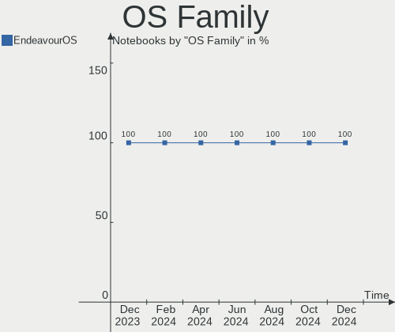
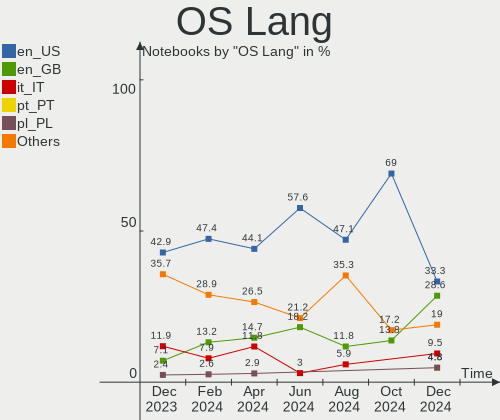
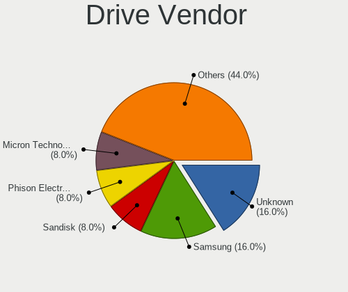
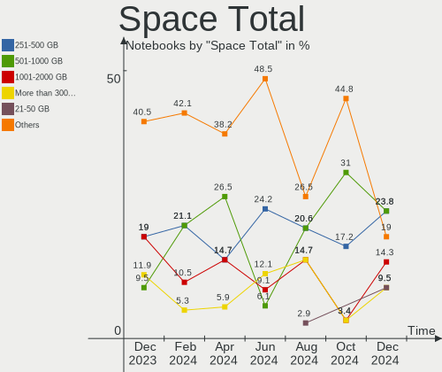
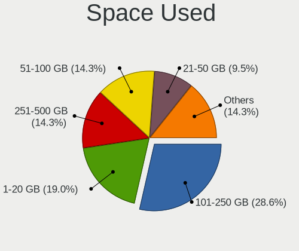
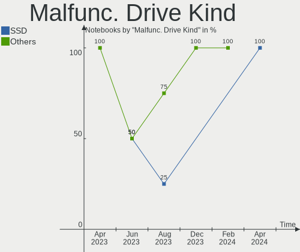

EndeavourOS - Hardware Trends (Notebooks)
-----------------------------------------

A project to identify most popular hardware characteristics and track their change
over time based on data collected by Linux users at https://Linux-Hardware.org.

Anyone can contribute to this report by the [hw-probe](https://github.com/linuxhw/hw-probe) tool:

    sudo -E hw-probe -all -upload

This report is for one last month. Overall report since the beginning of time: [TestDays](https://github.com/linuxhw/TestDays)

Period: Feb, 2023.

Contents
--------

* [ System ](#system)
  - [ OS                       ](#os)
  - [ OS Family                ](#os-family)
  - [ Kernel                   ](#kernel)
  - [ Kernel Family            ](#kernel-family)
  - [ Kernel Major Ver.        ](#kernel-major-ver)
  - [ Arch                     ](#arch)
  - [ DE                       ](#de)
  - [ Display Server           ](#display-server)
  - [ Display Manager          ](#display-manager)
  - [ OS Lang                  ](#os-lang)
  - [ Boot Mode                ](#boot-mode)
  - [ Filesystem               ](#filesystem)
  - [ Part. scheme             ](#part-scheme)
  - [ Dual Boot with Linux/BSD ](#dual-boot-with-linuxbsd)
  - [ Dual Boot (Win)          ](#dual-boot-win)

* [ Board ](#board)
  - [ Vendor                   ](#vendor)
  - [ Model                    ](#model)
  - [ Model Family             ](#model-family)
  - [ MFG Year                 ](#mfg-year)
  - [ Form Factor              ](#form-factor)
  - [ Secure Boot              ](#secure-boot)
  - [ Coreboot                 ](#coreboot)
  - [ RAM Size                 ](#ram-size)
  - [ RAM Used                 ](#ram-used)
  - [ Total Drives             ](#total-drives)
  - [ Has CD-ROM               ](#has-cd-rom)
  - [ Has Ethernet             ](#has-ethernet)
  - [ Has WiFi                 ](#has-wifi)
  - [ Has Bluetooth            ](#has-bluetooth)

* [ Location ](#location)
  - [ Country                  ](#country)
  - [ City                     ](#city)

* [ Drives ](#drives)
  - [ Drive Vendor             ](#drive-vendor)
  - [ Drive Model              ](#drive-model)
  - [ HDD Vendor               ](#hdd-vendor)
  - [ SSD Vendor               ](#ssd-vendor)
  - [ Drive Kind               ](#drive-kind)
  - [ Drive Connector          ](#drive-connector)
  - [ Drive Size               ](#drive-size)
  - [ Space Total              ](#space-total)
  - [ Space Used               ](#space-used)
  - [ Malfunc. Drives          ](#malfunc-drives)
  - [ Malfunc. Drive Vendor    ](#malfunc-drive-vendor)
  - [ Malfunc. HDD Vendor      ](#malfunc-hdd-vendor)
  - [ Malfunc. Drive Kind      ](#malfunc-drive-kind)
  - [ Failed Drives            ](#failed-drives)
  - [ Failed Drive Vendor      ](#failed-drive-vendor)
  - [ Drive Status             ](#drive-status)

* [ Storage controller ](#storage-controller)
  - [ Storage Vendor           ](#storage-vendor)
  - [ Storage Model            ](#storage-model)
  - [ Storage Kind             ](#storage-kind)

* [ Processor ](#processor)
  - [ CPU Vendor               ](#cpu-vendor)
  - [ CPU Model                ](#cpu-model)
  - [ CPU Model Family         ](#cpu-model-family)
  - [ CPU Cores                ](#cpu-cores)
  - [ CPU Sockets              ](#cpu-sockets)
  - [ CPU Threads              ](#cpu-threads)
  - [ CPU Op-Modes             ](#cpu-op-modes)
  - [ CPU Microcode            ](#cpu-microcode)
  - [ CPU Microarch            ](#cpu-microarch)

* [ Graphics ](#graphics)
  - [ GPU Vendor               ](#gpu-vendor)
  - [ GPU Model                ](#gpu-model)
  - [ GPU Combo                ](#gpu-combo)
  - [ GPU Driver               ](#gpu-driver)
  - [ GPU Memory               ](#gpu-memory)

* [ Monitor ](#monitor)
  - [ Monitor Vendor           ](#monitor-vendor)
  - [ Monitor Model            ](#monitor-model)
  - [ Monitor Resolution       ](#monitor-resolution)
  - [ Monitor Diagonal         ](#monitor-diagonal)
  - [ Monitor Width            ](#monitor-width)
  - [ Aspect Ratio             ](#aspect-ratio)
  - [ Monitor Area             ](#monitor-area)
  - [ Pixel Density            ](#pixel-density)
  - [ Multiple Monitors        ](#multiple-monitors)

* [ Network ](#network)
  - [ Net Controller Vendor    ](#net-controller-vendor)
  - [ Net Controller Model     ](#net-controller-model)
  - [ Wireless Vendor          ](#wireless-vendor)
  - [ Wireless Model           ](#wireless-model)
  - [ Ethernet Vendor          ](#ethernet-vendor)
  - [ Ethernet Model           ](#ethernet-model)
  - [ Net Controller Kind      ](#net-controller-kind)
  - [ Used Controller          ](#used-controller)
  - [ NICs                     ](#nics)
  - [ IPv6                     ](#ipv6)

* [ Bluetooth ](#bluetooth)
  - [ Bluetooth Vendor         ](#bluetooth-vendor)
  - [ Bluetooth Model          ](#bluetooth-model)

* [ Sound ](#sound)
  - [ Sound Vendor             ](#sound-vendor)
  - [ Sound Model              ](#sound-model)

* [ Memory ](#memory)
  - [ Memory Vendor            ](#memory-vendor)
  - [ Memory Model             ](#memory-model)
  - [ Memory Kind              ](#memory-kind)
  - [ Memory Form Factor       ](#memory-form-factor)
  - [ Memory Size              ](#memory-size)
  - [ Memory Speed             ](#memory-speed)

* [ Printers & scanners ](#printers--scanners)
  - [ Printer Vendor           ](#printer-vendor)
  - [ Printer Model            ](#printer-model)
  - [ Scanner Vendor           ](#scanner-vendor)
  - [ Scanner Model            ](#scanner-model)

* [ Camera ](#camera)
  - [ Camera Vendor            ](#camera-vendor)
  - [ Camera Model             ](#camera-model)

* [ Security ](#security)
  - [ Fingerprint Vendor       ](#fingerprint-vendor)
  - [ Fingerprint Model        ](#fingerprint-model)
  - [ Chipcard Vendor          ](#chipcard-vendor)
  - [ Chipcard Model           ](#chipcard-model)

* [ Unsupported ](#unsupported)
  - [ Unsupported Devices      ](#unsupported-devices)
  - [ Unsupported Device Types ](#unsupported-device-types)

System
------

OS
--

Installed operating systems

| Name                | Notebooks | Percent |
|---------------------|-----------|---------|
| EndeavourOS Rolling | 23        | 100%    |

OS Family
---------

OS without a version

| Name        | Notebooks | Percent |
|-------------|-----------|---------|
| EndeavourOS | 23        | 100%    |

Kernel
------

Version of the Linux kernel

| Version           | Notebooks | Percent |
|-------------------|-----------|---------|
| 6.1.12-arch1-1    | 7         | 30.43%  |
| 6.1.11-arch1-1    | 3         | 13.04%  |
| 6.1.9-arch1-2     | 2         | 8.7%    |
| 6.1.12-zen1-1-zen | 2         | 8.7%    |
| 5.15.91-4-lts     | 2         | 8.7%    |
| 6.1.9-zen1-1-zen  | 1         | 4.35%   |
| 6.1.9-arch1-1     | 1         | 4.35%   |
| 6.1.8-arch1-1     | 1         | 4.35%   |
| 6.1.10-arch1-1    | 1         | 4.35%   |
| 6.1.10-AMD        | 1         | 4.35%   |
| 6.0.12-arch1-1    | 1         | 4.35%   |
| 6.0.10-arch2-1    | 1         | 4.35%   |

Kernel Family
-------------

Linux kernel without a distro release

| Version | Notebooks | Percent |
|---------|-----------|---------|
| 6.1.12  | 9         | 39.13%  |
| 6.1.9   | 4         | 17.39%  |
| 6.1.11  | 3         | 13.04%  |
| 6.1.10  | 2         | 8.7%    |
| 5.15.91 | 2         | 8.7%    |
| 6.1.8   | 1         | 4.35%   |
| 6.0.12  | 1         | 4.35%   |
| 6.0.10  | 1         | 4.35%   |

Kernel Major Ver.
-----------------

Linux kernel major version

| Version | Notebooks | Percent |
|---------|-----------|---------|
| 6.1     | 19        | 82.61%  |
| 6.0     | 2         | 8.7%    |
| 5.15    | 2         | 8.7%    |

Arch
----

OS architecture (x86_64, i586, etc.)

| Name   | Notebooks | Percent |
|--------|-----------|---------|
| x86_64 | 23        | 100%    |

DE
--

Desktop Environment

| Name    | Notebooks | Percent |
|---------|-----------|---------|
| KDE5    | 9         | 39.13%  |
| XFCE    | 8         | 34.78%  |
| GNOME   | 4         | 17.39%  |
| openbox | 1         | 4.35%   |
| Unknown | 1         | 4.35%   |

Display Server
--------------

X11 or Wayland

| Name    | Notebooks | Percent |
|---------|-----------|---------|
| X11     | 15        | 65.22%  |
| Wayland | 4         | 17.39%  |
| Tty     | 4         | 17.39%  |

Display Manager
---------------

SDDM, LightDM, etc.

| Name    | Notebooks | Percent |
|---------|-----------|---------|
| LightDM | 9         | 39.13%  |
| SDDM    | 6         | 26.09%  |
| GDM     | 4         | 17.39%  |
| Unknown | 4         | 17.39%  |

OS Lang
-------

Language

| Lang  | Notebooks | Percent |
|-------|-----------|---------|
| en_US | 10        | 43.48%  |
| en_GB | 3         | 13.04%  |
| ru_RU | 2         | 8.7%    |
| it_IT | 2         | 8.7%    |
| pt_BR | 1         | 4.35%   |
| nl_NL | 1         | 4.35%   |
| fi_FI | 1         | 4.35%   |
| es_MX | 1         | 4.35%   |
| en_CA | 1         | 4.35%   |
| de_AT | 1         | 4.35%   |

Boot Mode
---------

EFI or BIOS

| Mode | Notebooks | Percent |
|------|-----------|---------|
| EFI  | 14        | 60.87%  |
| BIOS | 9         | 39.13%  |

Filesystem
----------

Type of filesystem

| Type    | Notebooks | Percent |
|---------|-----------|---------|
| Ext4    | 16        | 69.57%  |
| Btrfs   | 4         | 17.39%  |
| Overlay | 2         | 8.7%    |
| Tmpfs   | 1         | 4.35%   |

Part. scheme
------------

Scheme of partitioning

| Type    | Notebooks | Percent |
|---------|-----------|---------|
| GPT     | 14        | 60.87%  |
| MBR     | 5         | 21.74%  |
| Unknown | 4         | 17.39%  |

Dual Boot with Linux/BSD
------------------------

Hosting more than one Linux/BSD

| Dual boot | Notebooks | Percent |
|-----------|-----------|---------|
| No        | 21        | 91.3%   |
| Yes       | 2         | 8.7%    |

Dual Boot (Win)
---------------

Hosting Linux and Windows

| Dual boot | Notebooks | Percent |
|-----------|-----------|---------|
| No        | 15        | 65.22%  |
| Yes       | 8         | 34.78%  |

Board
-----

Vendor
------

Motherboard manufacturer

| Name             | Notebooks | Percent |
|------------------|-----------|---------|
| Hewlett-Packard  | 7         | 30.43%  |
| ASUSTek Computer | 5         | 21.74%  |
| Lenovo           | 4         | 17.39%  |
| HUAWEI           | 1         | 4.35%   |
| GPD              | 1         | 4.35%   |
| Google           | 1         | 4.35%   |
| Dell             | 1         | 4.35%   |
| Chuwi            | 1         | 4.35%   |
| Apple            | 1         | 4.35%   |
| Acer             | 1         | 4.35%   |

Model
-----

Motherboard model

| Name                                  | Notebooks | Percent |
|---------------------------------------|-----------|---------|
| Lenovo Y50-70 20378                   | 1         | 4.35%   |
| Lenovo ThinkPad T495s 20QKS2LN00      | 1         | 4.35%   |
| Lenovo ThinkPad T470 W10DG 20JNS0L300 | 1         | 4.35%   |
| Lenovo IdeaPad 3 15ADA05 81W1         | 1         | 4.35%   |
| HUAWEI BOM-WXX9                       | 1         | 4.35%   |
| HP ZBook 15 G4                        | 1         | 4.35%   |
| HP Setzer                             | 1         | 4.35%   |
| HP Laptop 15s-fq4xxx                  | 1         | 4.35%   |
| HP Laptop 15s-eq2xxx                  | 1         | 4.35%   |
| HP EliteBook 8460p                    | 1         | 4.35%   |
| HP EliteBook 845 G7 Notebook PC       | 1         | 4.35%   |
| HP Compaq 6820s                       | 1         | 4.35%   |
| GPD G1621-02                          | 1         | 4.35%   |
| Google Helios                         | 1         | 4.35%   |
| Dell Inspiron N4010                   | 1         | 4.35%   |
| Chuwi GemiBook Pro                    | 1         | 4.35%   |
| ASUS Zenbook UX5401ZAS_UX5401ZAS      | 1         | 4.35%   |
| ASUS X555LA                           | 1         | 4.35%   |
| ASUS S551LN                           | 1         | 4.35%   |
| ASUS ROG Zephyrus G15 GA503RM         | 1         | 4.35%   |
| ASUS ROG Strix G712LWS_G712LWS        | 1         | 4.35%   |
| Apple MacBookPro14,1                  | 1         | 4.35%   |
| Acer Aspire A515-54G                  | 1         | 4.35%   |

Model Family
------------

Motherboard model prefix

| Name               | Notebooks | Percent |
|--------------------|-----------|---------|
| Lenovo ThinkPad    | 2         | 8.7%    |
| HP Laptop          | 2         | 8.7%    |
| HP EliteBook       | 2         | 8.7%    |
| ASUS ROG           | 2         | 8.7%    |
| Lenovo Y50-70      | 1         | 4.35%   |
| Lenovo IdeaPad     | 1         | 4.35%   |
| HUAWEI BOM-WXX9    | 1         | 4.35%   |
| HP ZBook           | 1         | 4.35%   |
| HP Setzer          | 1         | 4.35%   |
| HP Compaq          | 1         | 4.35%   |
| GPD G1621-02       | 1         | 4.35%   |
| Google Helios      | 1         | 4.35%   |
| Dell Inspiron      | 1         | 4.35%   |
| Chuwi GemiBook     | 1         | 4.35%   |
| ASUS Zenbook       | 1         | 4.35%   |
| ASUS X555LA        | 1         | 4.35%   |
| ASUS S551LN        | 1         | 4.35%   |
| Apple MacBookPro14 | 1         | 4.35%   |
| Acer Aspire        | 1         | 4.35%   |

MFG Year
--------

Motherboard manufacture year

| Year | Notebooks | Percent |
|------|-----------|---------|
| 2021 | 5         | 21.74%  |
| 2017 | 4         | 17.39%  |
| 2022 | 3         | 13.04%  |
| 2014 | 3         | 13.04%  |
| 2020 | 2         | 8.7%    |
| 2019 | 2         | 8.7%    |
| 2023 | 1         | 4.35%   |
| 2011 | 1         | 4.35%   |
| 2010 | 1         | 4.35%   |
| 2007 | 1         | 4.35%   |

Form Factor
-----------

Physical design of the computer

| Name     | Notebooks | Percent |
|----------|-----------|---------|
| Notebook | 23        | 100%    |

Secure Boot
-----------

Enabled or disabled

| State    | Notebooks | Percent |
|----------|-----------|---------|
| Disabled | 23        | 100%    |

Coreboot
--------

Have coreboot on board

| Used | Notebooks | Percent |
|------|-----------|---------|
| No   | 21        | 91.3%   |
| Yes  | 2         | 8.7%    |

RAM Size
--------

Total RAM memory

| Size in GB  | Notebooks | Percent |
|-------------|-----------|---------|
| 4.01-8.0    | 7         | 30.43%  |
| 16.01-24.0  | 6         | 26.09%  |
| 8.01-16.0   | 4         | 17.39%  |
| 3.01-4.0    | 3         | 13.04%  |
| 32.01-64.0  | 2         | 8.7%    |
| 64.01-256.0 | 1         | 4.35%   |

RAM Used
--------

Used RAM memory

| Used GB  | Notebooks | Percent |
|----------|-----------|---------|
| 2.01-3.0 | 8         | 34.78%  |
| 3.01-4.0 | 6         | 26.09%  |
| 1.01-2.0 | 6         | 26.09%  |
| 4.01-8.0 | 3         | 13.04%  |

Total Drives
------------

Number of drives on board

| Drives | Notebooks | Percent |
|--------|-----------|---------|
| 1      | 19        | 82.61%  |
| 2      | 4         | 17.39%  |

Has CD-ROM
----------

Has CD-ROM on board

| Presented | Notebooks | Percent |
|-----------|-----------|---------|
| No        | 20        | 86.96%  |
| Yes       | 3         | 13.04%  |

Has Ethernet
------------

Has Ethernet on board

| Presented | Notebooks | Percent |
|-----------|-----------|---------|
| Yes       | 14        | 60.87%  |
| No        | 9         | 39.13%  |

Has WiFi
--------

Has WiFi module

| Presented | Notebooks | Percent |
|-----------|-----------|---------|
| Yes       | 23        | 100%    |

Has Bluetooth
-------------

Has Bluetooth module

| Presented | Notebooks | Percent |
|-----------|-----------|---------|
| Yes       | 20        | 86.96%  |
| No        | 3         | 13.04%  |

Location
--------

Country
-------

Geographic location (country)

| Country     | Notebooks | Percent |
|-------------|-----------|---------|
| Italy       | 6         | 26.09%  |
| USA         | 4         | 17.39%  |
| Netherlands | 2         | 8.7%    |
| Finland     | 2         | 8.7%    |
| UK          | 1         | 4.35%   |
| Sweden      | 1         | 4.35%   |
| Russia      | 1         | 4.35%   |
| Kazakhstan  | 1         | 4.35%   |
| Ecuador     | 1         | 4.35%   |
| Canada      | 1         | 4.35%   |
| Brazil      | 1         | 4.35%   |
| Bangladesh  | 1         | 4.35%   |
| Austria     | 1         | 4.35%   |

City
----

Geographic location (city)

| City               | Notebooks | Percent |
|--------------------|-----------|---------|
| Helsinki           | 2         | 8.7%    |
| Urbino             | 1         | 4.35%   |
| Ufa                | 1         | 4.35%   |
| Thief River Falls  | 1         | 4.35%   |
| Suwanee            | 1         | 4.35%   |
| Schiedam           | 1         | 4.35%   |
| Saint John         | 1         | 4.35%   |
| Rome               | 1         | 4.35%   |
| Quito              | 1         | 4.35%   |
| Porto Alegre       | 1         | 4.35%   |
| Poggio Renatico    | 1         | 4.35%   |
| Peschiera Borromeo | 1         | 4.35%   |
| Paderno Dugnano    | 1         | 4.35%   |
| Omaha              | 1         | 4.35%   |
| Nalchiti           | 1         | 4.35%   |
| Malmo              | 1         | 4.35%   |
| Innsbruck          | 1         | 4.35%   |
| Greeley            | 1         | 4.35%   |
| Fleet              | 1         | 4.35%   |
| Bigolino           | 1         | 4.35%   |
| Amsterdam          | 1         | 4.35%   |
| Almaty             | 1         | 4.35%   |

Drives
------

Drive Vendor
------------

Hard drive vendors

| Vendor                      | Notebooks | Drives | Percent |
|-----------------------------|-----------|--------|---------|
| Sandisk                     | 4         | 4      | 14.81%  |
| Samsung Electronics         | 4         | 4      | 14.81%  |
| Unknown                     | 2         | 2      | 7.41%   |
| KIOXIA                      | 2         | 2      | 7.41%   |
| WDC                         | 1         | 1      | 3.7%    |
| SK hynix                    | 1         | 1      | 3.7%    |
| PNY                         | 1         | 1      | 3.7%    |
| Patriot                     | 1         | 1      | 3.7%    |
| Netac                       | 1         | 1      | 3.7%    |
| Micron Technology           | 1         | 1      | 3.7%    |
| Lenovo                      | 1         | 1      | 3.7%    |
| Kingston Technology Company | 1         | 1      | 3.7%    |
| Kingston                    | 1         | 1      | 3.7%    |
| Intel                       | 1         | 1      | 3.7%    |
| HGST                        | 1         | 1      | 3.7%    |
| Corsair                     | 1         | 1      | 3.7%    |
| Biwin Storage Technology    | 1         | 1      | 3.7%    |
| Apple                       | 1         | 2      | 3.7%    |
| A-DATA Technology           | 1         | 1      | 3.7%    |

Drive Model
-----------

Hard drive models

| Model                                                | Notebooks | Percent |
|------------------------------------------------------|-----------|---------|
| Samsung NVMe SSD Controller SM981/PM981/PM983 250GB  | 2         | 7.41%   |
| WDC WD3200BEKX-75B7WT0 320GB                         | 1         | 3.7%    |
| Unknown MMC Card  32GB                               | 1         | 3.7%    |
| Unknown MMC Card  16GB                               | 1         | 3.7%    |
| SK hynix BC711 HFM512GD3JX013N 512GB                 | 1         | 3.7%    |
| Sandisk WD_BLACK SN770 1TB                           | 1         | 3.7%    |
| Sandisk WD PC SN735 SDBPNHH-512G-1002 512GB          | 1         | 3.7%    |
| Sandisk WD Blue SN500 / PC SN520 NVMe SSD 256GB      | 1         | 3.7%    |
| SanDisk SSD U100 24GB                                | 1         | 3.7%    |
| Samsung SSD 850 EVO 500GB                            | 1         | 3.7%    |
| Samsung NVMe SSD Controller PM9A1/PM9A3/980PRO 960GB | 1         | 3.7%    |
| PNY CS900 240GB SSD                                  | 1         | 3.7%    |
| Patriot Burst Elite 480GB SSD                        | 1         | 3.7%    |
| Netac S535N8/256 256GB SSD                           | 1         | 3.7%    |
| Micron MTFDHBA512QFD 512GB                           | 1         | 3.7%    |
| Lenovo LENSE20256GMSP34MEAT2TA 256GB                 | 1         | 3.7%    |
| KIOXIA KBG40ZNV512G 512GB                            | 1         | 3.7%    |
| KIOXIA KBG40ZNV256G 256GB                            | 1         | 3.7%    |
| Kingston Company U-SNS8154P3 NVMe SSD 256GB          | 1         | 3.7%    |
| Kingston SA400S37480G 480GB SSD                      | 1         | 3.7%    |
| Intel SSD 660P Series 1024GB                         | 1         | 3.7%    |
| HGST HTS545050A7E680 500GB                           | 1         | 3.7%    |
| Corsair Force 3 SSD 180GB                            | 1         | 3.7%    |
| Biwin Storage BIWIN SSD 1024GB                       | 1         | 3.7%    |
| Apple S3X NVMe Controller 1TB                        | 1         | 3.7%    |
| A-DATA SP900 256GB SSD                               | 1         | 3.7%    |

HDD Vendor
----------

Hard disk drive vendors

| Vendor | Notebooks | Drives | Percent |
|--------|-----------|--------|---------|
| WDC    | 1         | 1      | 50%     |
| HGST   | 1         | 1      | 50%     |

SSD Vendor
----------

Solid state drive vendors

| Vendor              | Notebooks | Drives | Percent |
|---------------------|-----------|--------|---------|
| SanDisk             | 1         | 1      | 12.5%   |
| Samsung Electronics | 1         | 1      | 12.5%   |
| PNY                 | 1         | 1      | 12.5%   |
| Patriot             | 1         | 1      | 12.5%   |
| Netac               | 1         | 1      | 12.5%   |
| Kingston            | 1         | 1      | 12.5%   |
| Corsair             | 1         | 1      | 12.5%   |
| A-DATA Technology   | 1         | 1      | 12.5%   |

Drive Kind
----------

HDD or SSD

| Kind | Notebooks | Drives | Percent |
|------|-----------|--------|---------|
| NVMe | 15        | 16     | 60%     |
| SSD  | 6         | 8      | 24%     |
| MMC  | 2         | 2      | 8%      |
| HDD  | 2         | 2      | 8%      |

Drive Connector
---------------

SATA, SAS, NVMe, etc.

| Type | Notebooks | Drives | Percent |
|------|-----------|--------|---------|
| NVMe | 15        | 16     | 62.5%   |
| SATA | 7         | 10     | 29.17%  |
| MMC  | 2         | 2      | 8.33%   |

Drive Size
----------

Size of hard drive

| Size in TB | Notebooks | Drives | Percent |
|------------|-----------|--------|---------|
| 0.01-0.5   | 7         | 10     | 100%    |

Space Total
-----------

Amount of disk space available on the file system

| Size in GB     | Notebooks | Percent |
|----------------|-----------|---------|
| 101-250        | 5         | 21.74%  |
| 1-20           | 4         | 17.39%  |
| Unknown        | 4         | 17.39%  |
| 251-500        | 3         | 13.04%  |
| 1001-2000      | 2         | 8.7%    |
| 501-1000       | 2         | 8.7%    |
| 51-100         | 2         | 8.7%    |
| More than 3000 | 1         | 4.35%   |

Space Used
----------

Amount of used disk space

| Used GB | Notebooks | Percent |
|---------|-----------|---------|
| 1-20    | 8         | 34.78%  |
| 101-250 | 4         | 17.39%  |
| 51-100  | 4         | 17.39%  |
| Unknown | 4         | 17.39%  |
| 21-50   | 2         | 8.7%    |
| 251-500 | 1         | 4.35%   |

Malfunc. Drives
---------------

Drive models with a malfunction

| Model                             | Notebooks | Drives | Percent |
|-----------------------------------|-----------|--------|---------|
| HGST HTS545050A7E680 500GB        | 1         | 1      | 50%     |
| A-DATA Technology SP900 256GB SSD | 1         | 1      | 50%     |

Malfunc. Drive Vendor
---------------------

Vendors of faulty drives

| Vendor            | Notebooks | Drives | Percent |
|-------------------|-----------|--------|---------|
| HGST              | 1         | 1      | 50%     |
| A-DATA Technology | 1         | 1      | 50%     |

Malfunc. HDD Vendor
-------------------

Vendors of faulty HDD drives

| Vendor | Notebooks | Drives | Percent |
|--------|-----------|--------|---------|
| HGST   | 1         | 1      | 100%    |

Malfunc. Drive Kind
-------------------

Kinds of faulty drives

| Kind | Notebooks | Drives | Percent |
|------|-----------|--------|---------|
| SSD  | 1         | 1      | 50%     |
| HDD  | 1         | 1      | 50%     |

Failed Drives
-------------

Failed drive models

Zero info for selected period =(

Failed Drive Vendor
-------------------

Failed drive vendors

Zero info for selected period =(

Drive Status
------------

Number of failed and malfunc. drives

| Status   | Notebooks | Drives | Percent |
|----------|-----------|--------|---------|
| Works    | 17        | 19     | 68%     |
| Detected | 6         | 7      | 24%     |
| Malfunc  | 2         | 2      | 8%      |

Storage controller
------------------

Storage Vendor
--------------

Storage controller vendors

| Vendor                      | Notebooks | Percent |
|-----------------------------|-----------|---------|
| Intel                       | 13        | 48.15%  |
| SanDisk                     | 3         | 11.11%  |
| Samsung Electronics         | 3         | 11.11%  |
| KIOXIA                      | 2         | 7.41%   |
| SK hynix                    | 1         | 3.7%    |
| Micron Technology           | 1         | 3.7%    |
| Lenovo                      | 1         | 3.7%    |
| Kingston Technology Company | 1         | 3.7%    |
| Biwin Storage Technology    | 1         | 3.7%    |
| Apple                       | 1         | 3.7%    |

Storage Model
-------------

Storage controller models

| Model                                                                          | Notebooks | Percent |
|--------------------------------------------------------------------------------|-----------|---------|
| SanDisk Non-Volatile memory controller                                         | 2         | 7.41%   |
| Samsung NVMe SSD Controller SM981/PM981/PM983                                  | 2         | 7.41%   |
| KIOXIA NVMe SSD Controller BG4                                                 | 2         | 7.41%   |
| Intel Volume Management Device NVMe RAID Controller                            | 2         | 7.41%   |
| Intel Comet Lake SATA AHCI Controller                                          | 2         | 7.41%   |
| Intel 8 Series SATA Controller 1 [AHCI mode]                                   | 2         | 7.41%   |
| SK hynix Gold P31/PC711 NVMe Solid State Drive                                 | 1         | 3.7%    |
| SanDisk WD Blue SN500 / PC SN520 NVMe SSD                                      | 1         | 3.7%    |
| Samsung NVMe SSD Controller PM9A1/PM9A3/980PRO                                 | 1         | 3.7%    |
| Micron Non-Volatile memory controller                                          | 1         | 3.7%    |
| Lenovo Non-Volatile memory controller                                          | 1         | 3.7%    |
| Kingston Company U-SNS8154P3 NVMe SSD                                          | 1         | 3.7%    |
| Intel SSD 660P Series                                                          | 1         | 3.7%    |
| Intel Q170/Q150/B150/H170/H110/Z170/CM236 Chipset SATA Controller [AHCI Mode]  | 1         | 3.7%    |
| Intel Jasper Lake SATA AHCI Controller                                         | 1         | 3.7%    |
| Intel 82801HM/HEM (ICH8M/ICH8M-E) SATA Controller [AHCI mode]                  | 1         | 3.7%    |
| Intel 8 Series/C220 Series Chipset Family 6-port SATA Controller 1 [AHCI mode] | 1         | 3.7%    |
| Intel 6 Series/C200 Series Chipset Family 6 port Mobile SATA AHCI Controller   | 1         | 3.7%    |
| Intel 5 Series/3400 Series Chipset 6 port SATA AHCI Controller                 | 1         | 3.7%    |
| Biwin Storage Non-Volatile memory controller                                   | 1         | 3.7%    |
| Apple S3X NVMe Controller                                                      | 1         | 3.7%    |

Storage Kind
------------

Kind of storage controller (IDE, SATA, NVMe, SAS, ...)

| Kind | Notebooks | Percent |
|------|-----------|---------|
| NVMe | 15        | 55.56%  |
| SATA | 10        | 37.04%  |
| RAID | 2         | 7.41%   |

Processor
---------

CPU Vendor
----------

Processor vendors

| Vendor | Notebooks | Percent |
|--------|-----------|---------|
| Intel  | 17        | 73.91%  |
| AMD    | 6         | 26.09%  |

CPU Model
---------

Processor models

| Model                                           | Notebooks | Percent |
|-------------------------------------------------|-----------|---------|
| Intel Core i7-7700HQ CPU @ 2.80GHz              | 1         | 4.35%   |
| Intel Core i7-7660U CPU @ 2.50GHz               | 1         | 4.35%   |
| Intel Core i7-4720HQ CPU @ 2.60GHz              | 1         | 4.35%   |
| Intel Core i7-4510U CPU @ 2.00GHz               | 1         | 4.35%   |
| Intel Core i7-2820QM CPU @ 2.30GHz              | 1         | 4.35%   |
| Intel Core i7-10750H CPU @ 2.60GHz              | 1         | 4.35%   |
| Intel Core i7-10510U CPU @ 1.80GHz              | 1         | 4.35%   |
| Intel Core i5-6300U CPU @ 2.40GHz               | 1         | 4.35%   |
| Intel Core i5-4210U CPU @ 1.70GHz               | 1         | 4.35%   |
| Intel Core i5-10210U CPU @ 1.60GHz              | 1         | 4.35%   |
| Intel Core i5 CPU M 480 @ 2.67GHz               | 1         | 4.35%   |
| Intel Core 2 Duo CPU T7250 @ 2.00GHz            | 1         | 4.35%   |
| Intel Celeron N5100 @ 1.10GHz                   | 1         | 4.35%   |
| Intel Celeron CPU N3060 @ 1.60GHz               | 1         | 4.35%   |
| Intel 12th Gen Core i9-12900H                   | 1         | 4.35%   |
| Intel 11th Gen Core i7-1195G7 @ 2.90GHz         | 1         | 4.35%   |
| Intel 11th Gen Core i5-1155G7 @ 2.50GHz         | 1         | 4.35%   |
| AMD Ryzen 9 6900HS with Radeon Graphics         | 1         | 4.35%   |
| AMD Ryzen 7 PRO 4750U with Radeon Graphics      | 1         | 4.35%   |
| AMD Ryzen 7 3700U with Radeon Vega Mobile Gfx   | 1         | 4.35%   |
| AMD Ryzen 5 PRO 3500U w/ Radeon Vega Mobile Gfx | 1         | 4.35%   |
| AMD Ryzen 5 5500U with Radeon Graphics          | 1         | 4.35%   |
| AMD Ryzen 3 5300U with Radeon Graphics          | 1         | 4.35%   |

CPU Model Family
----------------

Processor model prefix

| Model            | Notebooks | Percent |
|------------------|-----------|---------|
| Intel Core i7    | 7         | 30.43%  |
| Intel Core i5    | 4         | 17.39%  |
| Other            | 3         | 13.04%  |
| Intel Celeron    | 2         | 8.7%    |
| Intel Core 2 Duo | 1         | 4.35%   |
| AMD Ryzen 9      | 1         | 4.35%   |
| AMD Ryzen 7 PRO  | 1         | 4.35%   |
| AMD Ryzen 7      | 1         | 4.35%   |
| AMD Ryzen 5 PRO  | 1         | 4.35%   |
| AMD Ryzen 5      | 1         | 4.35%   |
| AMD Ryzen 3      | 1         | 4.35%   |

CPU Cores
---------

Number of processor cores

| Number | Notebooks | Percent |
|--------|-----------|---------|
| 4      | 11        | 47.83%  |
| 2      | 6         | 26.09%  |
| 8      | 2         | 8.7%    |
| 6      | 2         | 8.7%    |
| 14     | 1         | 4.35%   |
| 1      | 1         | 4.35%   |

CPU Sockets
-----------

Number of sockets

| Number | Notebooks | Percent |
|--------|-----------|---------|
| 1      | 23        | 100%    |

CPU Threads
-----------

Threads per core (Hyper-Threading)

| Number | Notebooks | Percent |
|--------|-----------|---------|
| 2      | 20        | 86.96%  |
| 1      | 3         | 13.04%  |

CPU Op-Modes
------------

CPU Operation Modes (32-bit, 64-bit)

| Op mode        | Notebooks | Percent |
|----------------|-----------|---------|
| 32-bit, 64-bit | 23        | 100%    |

CPU Microcode
-------------

Microcode number

| Number     | Notebooks | Percent |
|------------|-----------|---------|
| Unknown    | 4         | 17.39%  |
| 0x806ec    | 2         | 8.7%    |
| 0x40651    | 2         | 8.7%    |
| 0x08608103 | 2         | 8.7%    |
| 0x906e9    | 1         | 4.35%   |
| 0x906a3    | 1         | 4.35%   |
| 0x806e9    | 1         | 4.35%   |
| 0x806c2    | 1         | 4.35%   |
| 0x6fd      | 1         | 4.35%   |
| 0x406e3    | 1         | 4.35%   |
| 0x406c4    | 1         | 4.35%   |
| 0x306c3    | 1         | 4.35%   |
| 0x206a7    | 1         | 4.35%   |
| 0x20655    | 1         | 4.35%   |
| 0x08600106 | 1         | 4.35%   |
| 0x08108109 | 1         | 4.35%   |
| 0x08108102 | 1         | 4.35%   |

CPU Microarch
-------------

Microarchitecture

| Name             | Notebooks | Percent |
|------------------|-----------|---------|
| KabyLake         | 4         | 17.39%  |
| Unknown          | 4         | 17.39%  |
| Haswell          | 3         | 13.04%  |
| Zen+             | 2         | 8.7%    |
| TigerLake        | 2         | 8.7%    |
| Zen 2            | 1         | 4.35%   |
| Westmere         | 1         | 4.35%   |
| Skylake          | 1         | 4.35%   |
| Silvermont       | 1         | 4.35%   |
| SandyBridge      | 1         | 4.35%   |
| Core             | 1         | 4.35%   |
| CometLake        | 1         | 4.35%   |
| Alderlake Hybrid | 1         | 4.35%   |

Graphics
--------

GPU Vendor
----------

Vendors of graphics cards

| Vendor | Notebooks | Percent |
|--------|-----------|---------|
| Intel  | 16        | 55.17%  |
| AMD    | 7         | 24.14%  |
| Nvidia | 6         | 20.69%  |

GPU Model
---------

Graphics card models

| Model                                                                                    | Notebooks | Percent |
|------------------------------------------------------------------------------------------|-----------|---------|
| Intel TigerLake-LP GT2 [Iris Xe Graphics]                                                | 2         | 6.9%    |
| Intel Haswell-ULT Integrated Graphics Controller                                         | 2         | 6.9%    |
| Intel CometLake-U GT2 [UHD Graphics]                                                     | 2         | 6.9%    |
| AMD Picasso/Raven 2 [Radeon Vega Series / Radeon Vega Mobile Series]                     | 2         | 6.9%    |
| AMD Lucienne                                                                             | 2         | 6.9%    |
| Nvidia TU104M [GeForce RTX 2070 SUPER Mobile / Max-Q]                                    | 1         | 3.45%   |
| Nvidia GP108M [GeForce MX250]                                                            | 1         | 3.45%   |
| Nvidia GM206GLM [Quadro M2200 Mobile]                                                    | 1         | 3.45%   |
| Nvidia GM108M [GeForce 840M]                                                             | 1         | 3.45%   |
| Nvidia GM107M [GeForce GTX 860M]                                                         | 1         | 3.45%   |
| Nvidia GA106M [GeForce RTX 3060 Mobile / Max-Q]                                          | 1         | 3.45%   |
| Intel Skylake GT2 [HD Graphics 520]                                                      | 1         | 3.45%   |
| Intel JasperLake [UHD Graphics]                                                          | 1         | 3.45%   |
| Intel Iris Plus Graphics 640                                                             | 1         | 3.45%   |
| Intel HD Graphics 630                                                                    | 1         | 3.45%   |
| Intel Core Processor Integrated Graphics Controller                                      | 1         | 3.45%   |
| Intel CometLake-H GT2 [UHD Graphics]                                                     | 1         | 3.45%   |
| Intel Atom/Celeron/Pentium Processor x5-E8000/J3xxx/N3xxx Integrated Graphics Controller | 1         | 3.45%   |
| Intel Alder Lake-P Integrated Graphics Controller                                        | 1         | 3.45%   |
| Intel 4th Gen Core Processor Integrated Graphics Controller                              | 1         | 3.45%   |
| Intel 2nd Generation Core Processor Family Integrated Graphics Controller                | 1         | 3.45%   |
| AMD RV516/M62-S [Mobility Radeon X1350]                                                  | 1         | 3.45%   |
| AMD Renoir                                                                               | 1         | 3.45%   |
| AMD Rembrandt [Radeon 680M]                                                              | 1         | 3.45%   |

GPU Combo
---------

Combinations of graphics cards

| Name           | Notebooks | Percent |
|----------------|-----------|---------|
| 1 x Intel      | 11        | 47.83%  |
| 1 x AMD        | 6         | 26.09%  |
| Intel + Nvidia | 5         | 21.74%  |
| AMD + Nvidia   | 1         | 4.35%   |

GPU Driver
----------

Free vs proprietary

| Driver      | Notebooks | Percent |
|-------------|-----------|---------|
| Free        | 18        | 78.26%  |
| Proprietary | 5         | 21.74%  |

GPU Memory
----------

Total video memory

| Size in GB | Notebooks | Percent |
|------------|-----------|---------|
| Unknown    | 15        | 65.22%  |
| 0.01-0.5   | 4         | 17.39%  |
| 1.01-2.0   | 3         | 13.04%  |
| 3.01-4.0   | 1         | 4.35%   |

Monitor
-------

Monitor Vendor
--------------

Monitor vendors

| Vendor              | Notebooks | Percent |
|---------------------|-----------|---------|
| AU Optronics        | 10        | 41.67%  |
| Samsung Electronics | 3         | 12.5%   |
| LG Display          | 3         | 12.5%   |
| BOE                 | 3         | 12.5%   |
| Chimei Innolux      | 2         | 8.33%   |
| LG Philips          | 1         | 4.17%   |
| Apple               | 1         | 4.17%   |
| AOC                 | 1         | 4.17%   |

Monitor Model
-------------

Monitor models

| Model                                                                 | Notebooks | Percent |
|-----------------------------------------------------------------------|-----------|---------|
| AU Optronics LCD Monitor AUO499F 1920x1080 344x194mm 15.5-inch        | 2         | 8.33%   |
| Samsung Electronics SyncMaster SAM0458 1360x768                       | 1         | 4.17%   |
| Samsung Electronics LCD Monitor SDC4852 1366x768 344x194mm 15.5-inch  | 1         | 4.17%   |
| Samsung Electronics LCD Monitor SDC4154 2880x1800 302x189mm 14.0-inch | 1         | 4.17%   |
| LG Philips LCD Monitor LPL0901 1440x900 367x230mm 17.1-inch           | 1         | 4.17%   |
| LG Display LCD Monitor LGD065B 1920x1080 382x215mm 17.3-inch          | 1         | 4.17%   |
| LG Display LCD Monitor LGD057E 1920x1080 344x194mm 15.5-inch          | 1         | 4.17%   |
| LG Display LCD Monitor LGD0291 1366x768 310x174mm 14.0-inch           | 1         | 4.17%   |
| Chimei Innolux P140ZKA-BZ1 CMN8C03 2160x1440 296x197mm 14.0-inch      | 1         | 4.17%   |
| Chimei Innolux LCD Monitor CMN15B8 1366x768 344x193mm 15.5-inch       | 1         | 4.17%   |
| BOE LCD Monitor BOE0A07 2560x1440 344x194mm 15.5-inch                 | 1         | 4.17%   |
| BOE LCD Monitor BOE0872 1920x1080 344x194mm 15.5-inch                 | 1         | 4.17%   |
| BOE LCD Monitor BOE07CB 1920x1080 344x193mm 15.5-inch                 | 1         | 4.17%   |
| AU Optronics LCD Monitor AUO9B8B 1920x1080 309x174mm 14.0-inch        | 1         | 4.17%   |
| AU Optronics LCD Monitor AUO623D 1920x1080 309x174mm 14.0-inch        | 1         | 4.17%   |
| AU Optronics LCD Monitor AUO47EC 1366x768 344x193mm 15.5-inch         | 1         | 4.17%   |
| AU Optronics LCD Monitor AUO405C 1366x768 256x144mm 11.6-inch         | 1         | 4.17%   |
| AU Optronics LCD Monitor AUO403D 1920x1080 309x173mm 13.9-inch        | 1         | 4.17%   |
| AU Optronics LCD Monitor AUO223E 1600x900 309x174mm 14.0-inch         | 1         | 4.17%   |
| AU Optronics LCD Monitor AUO21ED 1920x1080 344x193mm 15.5-inch        | 1         | 4.17%   |
| AU Optronics LCD Monitor AUO103D 1920x1080 309x173mm 13.9-inch        | 1         | 4.17%   |
| Apple Color LCD APPA034 2880x1800 286x179mm 13.3-inch                 | 1         | 4.17%   |
| AOC e22t AOC2200 1920x1080 477x268mm 21.5-inch                        | 1         | 4.17%   |

Monitor Resolution
------------------

Monitor screen resolution

| Resolution       | Notebooks | Percent |
|------------------|-----------|---------|
| 1920x1080 (FHD)  | 12        | 50%     |
| 1366x768 (WXGA)  | 4         | 16.67%  |
| 2880x1800        | 2         | 8.33%   |
| 3840x2160 (4K)   | 1         | 4.17%   |
| 2560x1440 (QHD)  | 1         | 4.17%   |
| 2160x1440        | 1         | 4.17%   |
| 1600x900 (HD+)   | 1         | 4.17%   |
| 1440x900 (WXGA+) | 1         | 4.17%   |
| 1360x768         | 1         | 4.17%   |

Monitor Diagonal
----------------

Diagonal size in inches

| Inches  | Notebooks | Percent |
|---------|-----------|---------|
| 15      | 10        | 41.67%  |
| 14      | 7         | 29.17%  |
| 17      | 2         | 8.33%   |
| 13      | 2         | 8.33%   |
| 23      | 1         | 4.17%   |
| 11      | 1         | 4.17%   |
| Unknown | 1         | 4.17%   |

Monitor Width
-------------

Physical width

| Width in mm | Notebooks | Percent |
|-------------|-----------|---------|
| 301-350     | 17        | 70.83%  |
| 201-300     | 3         | 12.5%   |
| 351-400     | 2         | 8.33%   |
| 501-600     | 1         | 4.17%   |
| Unknown     | 1         | 4.17%   |

Aspect Ratio
------------

Proportional relationship between the width and the height

| Ratio | Notebooks | Percent |
|-------|-----------|---------|
| 16/9  | 18        | 81.82%  |
| 16/10 | 3         | 13.64%  |
| 3/2   | 1         | 4.55%   |

Monitor Area
------------

Area in inch²

| Area in inch² | Notebooks | Percent |
|----------------|-----------|---------|
| 101-110        | 10        | 41.67%  |
| 81-90          | 8         | 33.33%  |
| 71-80          | 1         | 4.17%   |
| 51-60          | 1         | 4.17%   |
| 201-250        | 1         | 4.17%   |
| 131-140        | 1         | 4.17%   |
| 121-130        | 1         | 4.17%   |
| Unknown        | 1         | 4.17%   |

Pixel Density
-------------

Pixels per inch

| Density       | Notebooks | Percent |
|---------------|-----------|---------|
| 121-160       | 13        | 54.17%  |
| 101-120       | 4         | 16.67%  |
| More than 240 | 2         | 8.33%   |
| 161-240       | 2         | 8.33%   |
| 51-100        | 2         | 8.33%   |
| Unknown       | 1         | 4.17%   |

Multiple Monitors
-----------------

Total monitors connected

| Total | Notebooks | Percent |
|-------|-----------|---------|
| 1     | 21        | 91.3%   |
| 2     | 2         | 8.7%    |

Network
-------

Net Controller Vendor
---------------------

Controller vendors

| Vendor                | Notebooks | Percent |
|-----------------------|-----------|---------|
| Intel                 | 14        | 41.18%  |
| Realtek Semiconductor | 12        | 35.29%  |
| Qualcomm Atheros      | 3         | 8.82%   |
| MediaTek              | 2         | 5.88%   |
| OPPO                  | 1         | 2.94%   |
| Broadcom              | 1         | 2.94%   |
| ASIX Electronics      | 1         | 2.94%   |

Net Controller Model
--------------------

Controller models

| Model                                                             | Notebooks | Percent |
|-------------------------------------------------------------------|-----------|---------|
| Realtek RTL8111/8168/8411 PCI Express Gigabit Ethernet Controller | 6         | 15.79%  |
| Realtek RTL8822CE 802.11ac PCIe Wireless Network Adapter          | 2         | 5.26%   |
| Realtek RTL8821CE 802.11ac PCIe Wireless Network Adapter          | 2         | 5.26%   |
| Realtek RTL8125 2.5GbE Controller                                 | 2         | 5.26%   |
| Qualcomm Atheros QCA9565 / AR9565 Wireless Network Adapter        | 2         | 5.26%   |
| Intel Comet Lake PCH-LP CNVi WiFi                                 | 2         | 5.26%   |
| Realtek 802.11ac NIC                                              | 1         | 2.63%   |
| Qualcomm Atheros AR8152 v1.1 Fast Ethernet                        | 1         | 2.63%   |
| OPPO CPH1923                                                      | 1         | 2.63%   |
| MediaTek MT7922 802.11ax PCI Express Wireless Network Adapter     | 1         | 2.63%   |
| MediaTek MT7630e 802.11bgn Wireless Network Adapter               | 1         | 2.63%   |
| Intel Wireless-AC 9260                                            | 1         | 2.63%   |
| Intel Wireless 8265 / 8275                                        | 1         | 2.63%   |
| Intel Wireless 8260                                               | 1         | 2.63%   |
| Intel Wireless 7265                                               | 1         | 2.63%   |
| Intel Wireless 3165                                               | 1         | 2.63%   |
| Intel Wi-Fi 6 AX210/AX211/AX411 160MHz                            | 1         | 2.63%   |
| Intel Wi-Fi 6 AX200                                               | 1         | 2.63%   |
| Intel PRO/Wireless 3945ABG [Golan] Network Connection             | 1         | 2.63%   |
| Intel Ethernet Connection I219-LM                                 | 1         | 2.63%   |
| Intel Comet Lake PCH CNVi WiFi                                    | 1         | 2.63%   |
| Intel Centrino Wireless-N 1000 [Condor Peak]                      | 1         | 2.63%   |
| Intel Centrino Advanced-N 6205 [Taylor Peak]                      | 1         | 2.63%   |
| Intel Alder Lake-P PCH CNVi WiFi                                  | 1         | 2.63%   |
| Intel 82579LM Gigabit Network Connection (Lewisville)             | 1         | 2.63%   |
| Intel 82562GT 10/100 Network Connection                           | 1         | 2.63%   |
| Broadcom BCM4350 802.11ac Wireless Network Adapter                | 1         | 2.63%   |
| ASIX AX88179 Gigabit Ethernet                                     | 1         | 2.63%   |

Wireless Vendor
---------------

Wireless vendors

| Vendor                | Notebooks | Percent |
|-----------------------|-----------|---------|
| Intel                 | 14        | 58.33%  |
| Realtek Semiconductor | 5         | 20.83%  |
| Qualcomm Atheros      | 2         | 8.33%   |
| MediaTek              | 2         | 8.33%   |
| Broadcom              | 1         | 4.17%   |

Wireless Model
--------------

Wireless models

| Model                                                         | Notebooks | Percent |
|---------------------------------------------------------------|-----------|---------|
| Realtek RTL8822CE 802.11ac PCIe Wireless Network Adapter      | 2         | 8.33%   |
| Realtek RTL8821CE 802.11ac PCIe Wireless Network Adapter      | 2         | 8.33%   |
| Qualcomm Atheros QCA9565 / AR9565 Wireless Network Adapter    | 2         | 8.33%   |
| Intel Comet Lake PCH-LP CNVi WiFi                             | 2         | 8.33%   |
| Realtek 802.11ac NIC                                          | 1         | 4.17%   |
| MediaTek MT7922 802.11ax PCI Express Wireless Network Adapter | 1         | 4.17%   |
| MediaTek MT7630e 802.11bgn Wireless Network Adapter           | 1         | 4.17%   |
| Intel Wireless-AC 9260                                        | 1         | 4.17%   |
| Intel Wireless 8265 / 8275                                    | 1         | 4.17%   |
| Intel Wireless 8260                                           | 1         | 4.17%   |
| Intel Wireless 7265                                           | 1         | 4.17%   |
| Intel Wireless 3165                                           | 1         | 4.17%   |
| Intel Wi-Fi 6 AX210/AX211/AX411 160MHz                        | 1         | 4.17%   |
| Intel Wi-Fi 6 AX200                                           | 1         | 4.17%   |
| Intel PRO/Wireless 3945ABG [Golan] Network Connection         | 1         | 4.17%   |
| Intel Comet Lake PCH CNVi WiFi                                | 1         | 4.17%   |
| Intel Centrino Wireless-N 1000 [Condor Peak]                  | 1         | 4.17%   |
| Intel Centrino Advanced-N 6205 [Taylor Peak]                  | 1         | 4.17%   |
| Intel Alder Lake-P PCH CNVi WiFi                              | 1         | 4.17%   |
| Broadcom BCM4350 802.11ac Wireless Network Adapter            | 1         | 4.17%   |

Ethernet Vendor
---------------

Ethernet vendors

| Vendor                | Notebooks | Percent |
|-----------------------|-----------|---------|
| Realtek Semiconductor | 8         | 57.14%  |
| Intel                 | 3         | 21.43%  |
| Qualcomm Atheros      | 1         | 7.14%   |
| OPPO                  | 1         | 7.14%   |
| ASIX Electronics      | 1         | 7.14%   |

Ethernet Model
--------------

Ethernet models

| Model                                                             | Notebooks | Percent |
|-------------------------------------------------------------------|-----------|---------|
| Realtek RTL8111/8168/8411 PCI Express Gigabit Ethernet Controller | 6         | 42.86%  |
| Realtek RTL8125 2.5GbE Controller                                 | 2         | 14.29%  |
| Qualcomm Atheros AR8152 v1.1 Fast Ethernet                        | 1         | 7.14%   |
| OPPO CPH1923                                                      | 1         | 7.14%   |
| Intel Ethernet Connection I219-LM                                 | 1         | 7.14%   |
| Intel 82579LM Gigabit Network Connection (Lewisville)             | 1         | 7.14%   |
| Intel 82562GT 10/100 Network Connection                           | 1         | 7.14%   |
| ASIX AX88179 Gigabit Ethernet                                     | 1         | 7.14%   |

Net Controller Kind
-------------------

Ethernet, WiFi or modem

| Kind     | Notebooks | Percent |
|----------|-----------|---------|
| WiFi     | 23        | 62.16%  |
| Ethernet | 14        | 37.84%  |

Used Controller
---------------

Currently used network controller

| Kind     | Notebooks | Percent |
|----------|-----------|---------|
| WiFi     | 16        | 72.73%  |
| Ethernet | 6         | 27.27%  |

NICs
----

Total network controllers on board

| Total | Notebooks | Percent |
|-------|-----------|---------|
| 2     | 12        | 52.17%  |
| 1     | 11        | 47.83%  |

IPv6
----

IPv6 vs IPv4

| Used | Notebooks | Percent |
|------|-----------|---------|
| No   | 20        | 86.96%  |
| Yes  | 3         | 13.04%  |

Bluetooth
---------

Bluetooth Vendor
----------------

Controller vendors

| Vendor                          | Notebooks | Percent |
|---------------------------------|-----------|---------|
| Intel                           | 11        | 55%     |
| Realtek Semiconductor           | 3         | 15%     |
| Hewlett-Packard                 | 2         | 10%     |
| Realtek                         | 1         | 5%      |
| Qualcomm Atheros Communications | 1         | 5%      |
| Lite-On Technology              | 1         | 5%      |
| Foxconn / Hon Hai               | 1         | 5%      |

Bluetooth Model
---------------

Controller models

| Model                                         | Notebooks | Percent |
|-----------------------------------------------|-----------|---------|
| Intel Bluetooth wireless interface            | 4         | 20%     |
| Realtek Bluetooth Radio                       | 3         | 15%     |
| Intel AX201 Bluetooth                         | 3         | 15%     |
| Realtek 802.11ac WLAN Adapter                 | 1         | 5%      |
| Qualcomm Atheros AR3012 Bluetooth 4.0         | 1         | 5%      |
| Lite-On Bluetooth Device                      | 1         | 5%      |
| Intel Wireless-AC 9260 Bluetooth Adapter      | 1         | 5%      |
| Intel Bluetooth Device                        | 1         | 5%      |
| Intel AX210 Bluetooth                         | 1         | 5%      |
| Intel AX200 Bluetooth                         | 1         | 5%      |
| HP Broadcom 2070 Bluetooth Combo              | 1         | 5%      |
| HP Bluetooth 2.0 Interface [Broadcom BCM2045] | 1         | 5%      |
| Foxconn / Hon Hai BT                          | 1         | 5%      |

Sound
-----

Sound Vendor
------------

Sound card vendors

| Vendor | Notebooks | Percent |
|--------|-----------|---------|
| Intel  | 17        | 65.38%  |
| AMD    | 6         | 23.08%  |
| Nvidia | 3         | 11.54%  |

Sound Model
-----------

Sound card models

| Model                                                                                             | Notebooks | Percent |
|---------------------------------------------------------------------------------------------------|-----------|---------|
| AMD Family 17h/19h HD Audio Controller                                                            | 5         | 14.71%  |
| AMD Renoir Radeon High Definition Audio Controller                                                | 3         | 8.82%   |
| Intel Tiger Lake-LP Smart Sound Technology Audio Controller                                       | 2         | 5.88%   |
| Intel Sunrise Point-LP HD Audio                                                                   | 2         | 5.88%   |
| Intel Haswell-ULT HD Audio Controller                                                             | 2         | 5.88%   |
| Intel Comet Lake PCH-LP cAVS                                                                      | 2         | 5.88%   |
| Intel 8 Series HD Audio Controller                                                                | 2         | 5.88%   |
| AMD Raven/Raven2/Fenghuang HDMI/DP Audio Controller                                               | 2         | 5.88%   |
| Nvidia TU104 HD Audio Controller                                                                  | 1         | 2.94%   |
| Nvidia GM206 High Definition Audio Controller                                                     | 1         | 2.94%   |
| Nvidia GA106 High Definition Audio Controller                                                     | 1         | 2.94%   |
| Intel Xeon E3-1200 v3/4th Gen Core Processor HD Audio Controller                                  | 1         | 2.94%   |
| Intel Jasper Lake HD Audio                                                                        | 1         | 2.94%   |
| Intel Comet Lake PCH cAVS                                                                         | 1         | 2.94%   |
| Intel CM238 HD Audio Controller                                                                   | 1         | 2.94%   |
| Intel Atom/Celeron/Pentium Processor x5-E8000/J3xxx/N3xxx Series High Definition Audio Controller | 1         | 2.94%   |
| Intel Alder Lake PCH-P High Definition Audio Controller                                           | 1         | 2.94%   |
| Intel 82801H (ICH8 Family) HD Audio Controller                                                    | 1         | 2.94%   |
| Intel 8 Series/C220 Series Chipset High Definition Audio Controller                               | 1         | 2.94%   |
| Intel 6 Series/C200 Series Chipset Family High Definition Audio Controller                        | 1         | 2.94%   |
| Intel 5 Series/3400 Series Chipset High Definition Audio                                          | 1         | 2.94%   |
| AMD Rembrandt Radeon High Definition Audio Controller                                             | 1         | 2.94%   |

Memory
------

Memory Vendor
-------------

Memory module vendors

| Vendor              | Notebooks | Percent |
|---------------------|-----------|---------|
| SK hynix            | 9         | 34.62%  |
| Samsung Electronics | 9         | 34.62%  |
| Micron Technology   | 2         | 7.69%   |
| Kingston            | 2         | 7.69%   |
| Kllisre             | 1         | 3.85%   |
| G.Skill             | 1         | 3.85%   |
| Elpida              | 1         | 3.85%   |
| Apacer              | 1         | 3.85%   |

Memory Model
------------

Memory module models

| Model                                                            | Notebooks | Percent |
|------------------------------------------------------------------|-----------|---------|
| SK hynix RAM HMA81GS6AFR8N-UH 8GB SODIMM DDR4 2667MT/s           | 2         | 7.41%   |
| Samsung RAM M471A5244CB0-CTD 4GB SODIMM DDR4 3266MT/s            | 2         | 7.41%   |
| Kingston RAM HP32D4S2S8MR-8 8GB SODIMM DDR4 3200MT/s             | 2         | 7.41%   |
| SK hynix RAM Module 8GB SODIMM DDR4 2133MT/s                     | 1         | 3.7%    |
| SK hynix RAM HMT451S6BFR8A-PB 4GB SODIMM DDR3 1600MT/s           | 1         | 3.7%    |
| SK hynix RAM HMT451S6AFR8A-PB 4GB SODIMM DDR3 1600MT/s           | 1         | 3.7%    |
| SK hynix RAM HMT41GS6BFR8A-PB 8GB SODIMM DDR3 1600MT/s           | 1         | 3.7%    |
| SK hynix RAM HMT351S6EFR8A-PB 4GB SODIMM DDR3 1600MT/s           | 1         | 3.7%    |
| SK hynix RAM H9JCNNNFA5MLYR-N6E 4GB Row Of Chips LPDDR5 6400MT/s | 1         | 3.7%    |
| SK hynix RAM H9CCNNN8GTMLAR-NUD 2GB SODIMM LPDDR3 1776MT/s       | 1         | 3.7%    |
| Samsung RAM Module 8GB SODIMM DDR4 2133MT/s                      | 1         | 3.7%    |
| Samsung RAM Module 8GB Row Of Chips LPDDR3 2133MT/s              | 1         | 3.7%    |
| Samsung RAM M471B5773CHS-CH9 2GB SODIMM DDR3 4199MT/s            | 1         | 3.7%    |
| Samsung RAM M471B5173DB0-YK0 4GB SODIMM DDR3 1600MT/s            | 1         | 3.7%    |
| Samsung RAM M471B1G73DH0-CH9 8GB SODIMM DDR3 1333MT/s            | 1         | 3.7%    |
| Samsung RAM M471A5244CB0-CWE 4GB Row Of Chips DDR4 3200MT/s      | 1         | 3.7%    |
| Samsung RAM M471A1G44AB0-CTD 8GB Row Of Chips DDR4 2667MT/s      | 1         | 3.7%    |
| Samsung RAM M4 70T2864QZ3-CE6 1GB SODIMM DDR2 1639MT/s           | 1         | 3.7%    |
| Micron RAM Module 8GB SODIMM LPDDR3 2133MT/s                     | 1         | 3.7%    |
| Micron RAM 16HTF25664HY-667E1 2GB SODIMM DDR2 667MT/s            | 1         | 3.7%    |
| Kllisre RAM KRE-D3S1333M/8G 8GB SODIMM DDR3 1333MT/s             | 1         | 3.7%    |
| G.Skill RAM Module 32GB SODIMM DDR4 3200MT/s                     | 1         | 3.7%    |
| Elpida RAM Module 4GB SODIMM DDR3 1600MT/s                       | 1         | 3.7%    |
| Apacer RAM 78.A2GC3.9K1 2GB SODIMM DDR3 1067MT/s                 | 1         | 3.7%    |

Memory Kind
-----------

Memory module kinds

| Kind   | Notebooks | Percent |
|--------|-----------|---------|
| DDR4   | 9         | 40.91%  |
| DDR3   | 6         | 27.27%  |
| LPDDR3 | 3         | 13.64%  |
| SDRAM  | 2         | 9.09%   |
| LPDDR5 | 1         | 4.55%   |
| DDR2   | 1         | 4.55%   |

Memory Form Factor
------------------

Physical design of the memory module

| Name         | Notebooks | Percent |
|--------------|-----------|---------|
| SODIMM       | 17        | 80.95%  |
| Row Of Chips | 4         | 19.05%  |

Memory Size
-----------

Memory module size

| Size  | Notebooks | Percent |
|-------|-----------|---------|
| 8192  | 10        | 47.62%  |
| 4096  | 5         | 23.81%  |
| 2048  | 3         | 14.29%  |
| 32768 | 1         | 4.76%   |
| 16384 | 1         | 4.76%   |
| 1024  | 1         | 4.76%   |

Memory Speed
------------

Memory module speed

| Speed | Notebooks | Percent |
|-------|-----------|---------|
| 3200  | 4         | 17.39%  |
| 1600  | 4         | 17.39%  |
| 2667  | 3         | 13.04%  |
| 2133  | 3         | 13.04%  |
| 3266  | 2         | 8.7%    |
| 6400  | 1         | 4.35%   |
| 4199  | 1         | 4.35%   |
| 1776  | 1         | 4.35%   |
| 1639  | 1         | 4.35%   |
| 1333  | 1         | 4.35%   |
| 1067  | 1         | 4.35%   |
| 667   | 1         | 4.35%   |

Printers & scanners
-------------------

Printer Vendor
--------------

Printer device vendors

Zero info for selected period =(

Printer Model
-------------

Printer device models

Zero info for selected period =(

Scanner Vendor
--------------

Scanner device vendors

Zero info for selected period =(

Scanner Model
-------------

Scanner device models

Zero info for selected period =(

Camera
------

Camera Vendor
-------------

Camera device vendors

| Vendor              | Notebooks | Percent |
|---------------------|-----------|---------|
| IMC Networks        | 5         | 25%     |
| Chicony Electronics | 4         | 20%     |
| Quanta              | 2         | 10%     |
| Microdia            | 2         | 10%     |
| Lite-On Technology  | 2         | 10%     |
| Syntek              | 1         | 5%      |
| Primax Electronics  | 1         | 5%      |
| DLEQNA19IFK6G2      | 1         | 5%      |
| Alcor Micro         | 1         | 5%      |
| Acer                | 1         | 5%      |

Camera Model
------------

Camera device models

| Model                                          | Notebooks | Percent |
|------------------------------------------------|-----------|---------|
| IMC Networks USB2.0 HD UVC WebCam              | 3         | 15%     |
| Syntek Lenovo EasyCamera                       | 1         | 5%      |
| Quanta HP HD Camera                            | 1         | 5%      |
| Quanta HD User Facing                          | 1         | 5%      |
| Primax HP HD Webcam [Fixed]                    | 1         | 5%      |
| Microdia Webcam Vitade AF                      | 1         | 5%      |
| Microdia Sonix 1.3 MP Laptop Integrated Webcam | 1         | 5%      |
| Lite-On Integrated Camera                      | 1         | 5%      |
| Lite-On HP HD Camera                           | 1         | 5%      |
| IMC Networks Integrated Camera                 | 1         | 5%      |
| IMC Networks HD Camera                         | 1         | 5%      |
| DLEQNA19IFK6G2 HP TrueVision HD Camera         | 1         | 5%      |
| Chicony USB2.0 VGA UVC WebCam                  | 1         | 5%      |
| Chicony USB2.0 HD UVC WebCam                   | 1         | 5%      |
| Chicony HP TrueVision HD Camera                | 1         | 5%      |
| Chicony HP Truevision HD                       | 1         | 5%      |
| Alcor Micro USB Camera                         | 1         | 5%      |
| Acer Integrated Camera                         | 1         | 5%      |

Security
--------

Fingerprint Vendor
------------------

Fingerprint sensor vendors

| Vendor                     | Notebooks | Percent |
|----------------------------|-----------|---------|
| Validity Sensors           | 3         | 42.86%  |
| Synaptics                  | 2         | 28.57%  |
| Shenzhen Goodix Technology | 1         | 14.29%  |
| Elan Microelectronics      | 1         | 14.29%  |

Fingerprint Model
-----------------

Fingerprint sensor models

| Model                                                     | Notebooks | Percent |
|-----------------------------------------------------------|-----------|---------|
| Validity Sensors VFS495 Fingerprint Reader                | 1         | 14.29%  |
| Validity Sensors VFS471 Fingerprint Reader                | 1         | 14.29%  |
| Validity Sensors Synaptics WBDI                           | 1         | 14.29%  |
| Synaptics  FS7604 Touch Fingerprint Sensor with PurePrint | 1         | 14.29%  |
| Synaptics Prometheus MIS Touch Fingerprint Reader         | 1         | 14.29%  |
| Shenzhen Goodix  Fingerprint Device                       | 1         | 14.29%  |
| Elan ELAN:ARM-M4                                          | 1         | 14.29%  |

Chipcard Vendor
---------------

Chipcard module vendors

Zero info for selected period =(

Chipcard Model
--------------

Chipcard module models

Zero info for selected period =(

Unsupported
-----------

Unsupported Devices
-------------------

Total unsupported devices on board

| Total | Notebooks | Percent |
|-------|-----------|---------|
| 0     | 14        | 60.87%  |
| 1     | 8         | 34.78%  |
| 2     | 1         | 4.35%   |

Unsupported Device Types
------------------------

Types of unsupported devices

| Type                  | Notebooks | Percent |
|-----------------------|-----------|---------|
| Fingerprint reader    | 7         | 77.78%  |
| Multimedia controller | 1         | 11.11%  |
| Bluetooth             | 1         | 11.11%  |

