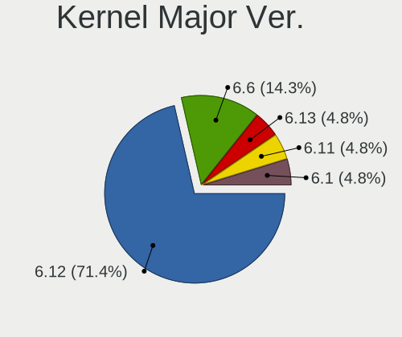
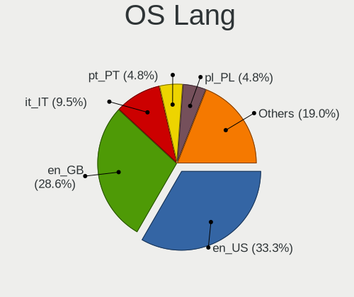
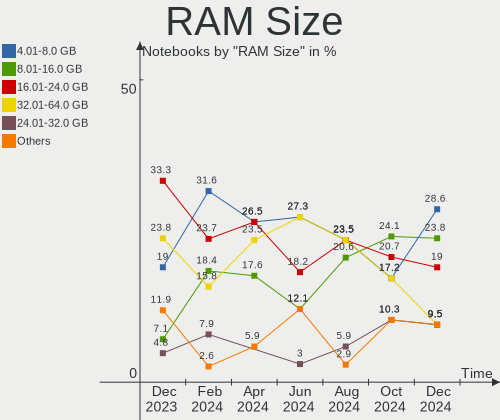
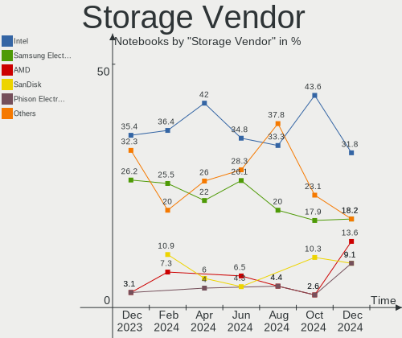
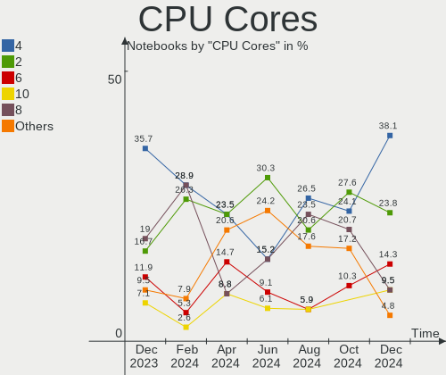
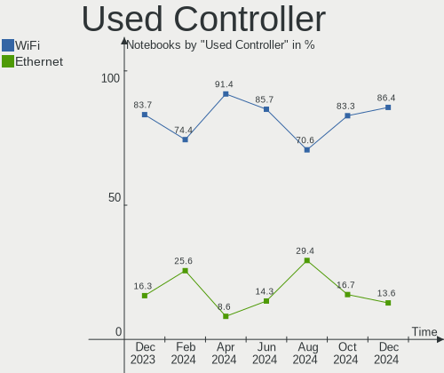
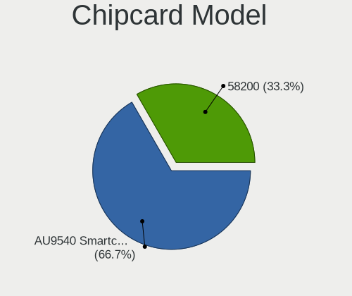

EndeavourOS - Hardware Trends (Notebooks)
-----------------------------------------

A project to identify most popular hardware characteristics and track their change
over time based on data collected by Linux users at https://Linux-Hardware.org.

Anyone can contribute to this report by the [hw-probe](https://github.com/linuxhw/hw-probe) tool:

    sudo -E hw-probe -all -upload

This report is for one last month. Overall report since the beginning of time: [TestDays](https://github.com/linuxhw/TestDays)

Period: Oct, 2023.

Contents
--------

* [ System ](#system)
  - [ OS                       ](#os)
  - [ OS Family                ](#os-family)
  - [ Kernel                   ](#kernel)
  - [ Kernel Family            ](#kernel-family)
  - [ Kernel Major Ver.        ](#kernel-major-ver)
  - [ Arch                     ](#arch)
  - [ DE                       ](#de)
  - [ Display Server           ](#display-server)
  - [ Display Manager          ](#display-manager)
  - [ OS Lang                  ](#os-lang)
  - [ Boot Mode                ](#boot-mode)
  - [ Filesystem               ](#filesystem)
  - [ Part. scheme             ](#part-scheme)
  - [ Dual Boot with Linux/BSD ](#dual-boot-with-linuxbsd)
  - [ Dual Boot (Win)          ](#dual-boot-win)

* [ Board ](#board)
  - [ Vendor                   ](#vendor)
  - [ Model                    ](#model)
  - [ Model Family             ](#model-family)
  - [ MFG Year                 ](#mfg-year)
  - [ Form Factor              ](#form-factor)
  - [ Secure Boot              ](#secure-boot)
  - [ Coreboot                 ](#coreboot)
  - [ RAM Size                 ](#ram-size)
  - [ RAM Used                 ](#ram-used)
  - [ Total Drives             ](#total-drives)
  - [ Has CD-ROM               ](#has-cd-rom)
  - [ Has Ethernet             ](#has-ethernet)
  - [ Has WiFi                 ](#has-wifi)
  - [ Has Bluetooth            ](#has-bluetooth)

* [ Location ](#location)
  - [ Country                  ](#country)
  - [ City                     ](#city)

* [ Drives ](#drives)
  - [ Drive Vendor             ](#drive-vendor)
  - [ Drive Model              ](#drive-model)
  - [ HDD Vendor               ](#hdd-vendor)
  - [ SSD Vendor               ](#ssd-vendor)
  - [ Drive Kind               ](#drive-kind)
  - [ Drive Connector          ](#drive-connector)
  - [ Drive Size               ](#drive-size)
  - [ Space Total              ](#space-total)
  - [ Space Used               ](#space-used)
  - [ Malfunc. Drives          ](#malfunc-drives)
  - [ Malfunc. Drive Vendor    ](#malfunc-drive-vendor)
  - [ Malfunc. HDD Vendor      ](#malfunc-hdd-vendor)
  - [ Malfunc. Drive Kind      ](#malfunc-drive-kind)
  - [ Failed Drives            ](#failed-drives)
  - [ Failed Drive Vendor      ](#failed-drive-vendor)
  - [ Drive Status             ](#drive-status)

* [ Storage controller ](#storage-controller)
  - [ Storage Vendor           ](#storage-vendor)
  - [ Storage Model            ](#storage-model)
  - [ Storage Kind             ](#storage-kind)

* [ Processor ](#processor)
  - [ CPU Vendor               ](#cpu-vendor)
  - [ CPU Model                ](#cpu-model)
  - [ CPU Model Family         ](#cpu-model-family)
  - [ CPU Cores                ](#cpu-cores)
  - [ CPU Sockets              ](#cpu-sockets)
  - [ CPU Threads              ](#cpu-threads)
  - [ CPU Op-Modes             ](#cpu-op-modes)
  - [ CPU Microcode            ](#cpu-microcode)
  - [ CPU Microarch            ](#cpu-microarch)

* [ Graphics ](#graphics)
  - [ GPU Vendor               ](#gpu-vendor)
  - [ GPU Model                ](#gpu-model)
  - [ GPU Combo                ](#gpu-combo)
  - [ GPU Driver               ](#gpu-driver)
  - [ GPU Memory               ](#gpu-memory)

* [ Monitor ](#monitor)
  - [ Monitor Vendor           ](#monitor-vendor)
  - [ Monitor Model            ](#monitor-model)
  - [ Monitor Resolution       ](#monitor-resolution)
  - [ Monitor Diagonal         ](#monitor-diagonal)
  - [ Monitor Width            ](#monitor-width)
  - [ Aspect Ratio             ](#aspect-ratio)
  - [ Monitor Area             ](#monitor-area)
  - [ Pixel Density            ](#pixel-density)
  - [ Multiple Monitors        ](#multiple-monitors)

* [ Network ](#network)
  - [ Net Controller Vendor    ](#net-controller-vendor)
  - [ Net Controller Model     ](#net-controller-model)
  - [ Wireless Vendor          ](#wireless-vendor)
  - [ Wireless Model           ](#wireless-model)
  - [ Ethernet Vendor          ](#ethernet-vendor)
  - [ Ethernet Model           ](#ethernet-model)
  - [ Net Controller Kind      ](#net-controller-kind)
  - [ Used Controller          ](#used-controller)
  - [ NICs                     ](#nics)
  - [ IPv6                     ](#ipv6)

* [ Bluetooth ](#bluetooth)
  - [ Bluetooth Vendor         ](#bluetooth-vendor)
  - [ Bluetooth Model          ](#bluetooth-model)

* [ Sound ](#sound)
  - [ Sound Vendor             ](#sound-vendor)
  - [ Sound Model              ](#sound-model)

* [ Memory ](#memory)
  - [ Memory Vendor            ](#memory-vendor)
  - [ Memory Model             ](#memory-model)
  - [ Memory Kind              ](#memory-kind)
  - [ Memory Form Factor       ](#memory-form-factor)
  - [ Memory Size              ](#memory-size)
  - [ Memory Speed             ](#memory-speed)

* [ Printers & scanners ](#printers--scanners)
  - [ Printer Vendor           ](#printer-vendor)
  - [ Printer Model            ](#printer-model)
  - [ Scanner Vendor           ](#scanner-vendor)
  - [ Scanner Model            ](#scanner-model)

* [ Camera ](#camera)
  - [ Camera Vendor            ](#camera-vendor)
  - [ Camera Model             ](#camera-model)

* [ Security ](#security)
  - [ Fingerprint Vendor       ](#fingerprint-vendor)
  - [ Fingerprint Model        ](#fingerprint-model)
  - [ Chipcard Vendor          ](#chipcard-vendor)
  - [ Chipcard Model           ](#chipcard-model)

* [ Unsupported ](#unsupported)
  - [ Unsupported Devices      ](#unsupported-devices)
  - [ Unsupported Device Types ](#unsupported-device-types)

System
------

OS
--

Installed operating systems

| Name                | Notebooks | Percent |
|---------------------|-----------|---------|
| EndeavourOS Rolling | 31        | 100%    |

OS Family
---------

OS without a version

| Name        | Notebooks | Percent |
|-------------|-----------|---------|
| EndeavourOS | 31        | 100%    |

Kernel
------

Version of the Linux kernel

| Version                        | Notebooks | Percent |
|--------------------------------|-----------|---------|
| 6.5.7-arch1-1                  | 5         | 16.13%  |
| 6.5.5-arch1-1                  | 5         | 16.13%  |
| 6.5.9-arch2-1                  | 4         | 12.9%   |
| 6.5.8-arch1-1                  | 3         | 9.68%   |
| 6.5.6-arch2-1                  | 2         | 6.45%   |
| 6.1.59-1-lts                   | 2         | 6.45%   |
| 6.5.9-zen2-1-zen               | 1         | 3.23%   |
| 6.5.8-zen1-1-zen               | 1         | 3.23%   |
| 6.5.8-Ototsuku-T2-xanmod1-1-t2 | 1         | 3.23%   |
| 6.5.8-hardened1-1-hardened     | 1         | 3.23%   |
| 6.5.8-273-tkg-linux-tkg-pds    | 1         | 3.23%   |
| 6.5.7-zen2-1-zen               | 1         | 3.23%   |
| 6.5.6-zen2-1-zen               | 1         | 3.23%   |
| 6.5.5-273-tkg-cfs-dirty        | 1         | 3.23%   |
| 6.4.14-x64v2-xanmod1-1         | 1         | 3.23%   |
| 6.1.58-1-lts                   | 1         | 3.23%   |

Kernel Family
-------------

Linux kernel without a distro release

| Version | Notebooks | Percent |
|---------|-----------|---------|
| 6.5.8   | 7         | 22.58%  |
| 6.5.7   | 6         | 19.35%  |
| 6.5.5   | 6         | 19.35%  |
| 6.5.9   | 5         | 16.13%  |
| 6.5.6   | 3         | 9.68%   |
| 6.1.59  | 2         | 6.45%   |
| 6.4.14  | 1         | 3.23%   |
| 6.1.58  | 1         | 3.23%   |

Kernel Major Ver.
-----------------

Linux kernel major version

| Version | Notebooks | Percent |
|---------|-----------|---------|
| 6.5     | 27        | 87.1%   |
| 6.1     | 3         | 9.68%   |
| 6.4     | 1         | 3.23%   |

Arch
----

OS architecture (x86_64, i586, etc.)

| Name   | Notebooks | Percent |
|--------|-----------|---------|
| x86_64 | 31        | 100%    |

DE
--

Desktop Environment

| Name     | Notebooks | Percent |
|----------|-----------|---------|
| KDE5     | 15        | 48.39%  |
| GNOME    | 5         | 16.13%  |
| XFCE     | 4         | 12.9%   |
| Hyprland | 2         | 6.45%   |
| Budgie   | 2         | 6.45%   |
| sway     | 1         | 3.23%   |
| awesome  | 1         | 3.23%   |
| Unknown  | 1         | 3.23%   |

Display Server
--------------

X11 or Wayland

| Name    | Notebooks | Percent |
|---------|-----------|---------|
| X11     | 19        | 61.29%  |
| Wayland | 12        | 38.71%  |

Display Manager
---------------

SDDM, LightDM, etc.

| Name    | Notebooks | Percent |
|---------|-----------|---------|
| SDDM    | 12        | 38.71%  |
| Unknown | 8         | 25.81%  |
| LightDM | 6         | 19.35%  |
| GDM     | 4         | 12.9%   |
| LEMURS  | 1         | 3.23%   |

OS Lang
-------

Language

| Lang  | Notebooks | Percent |
|-------|-----------|---------|
| en_US | 18        | 58.06%  |
| it_IT | 5         | 16.13%  |
| fr_FR | 2         | 6.45%   |
| de_DE | 2         | 6.45%   |
| ru_RU | 1         | 3.23%   |
| pl_PL | 1         | 3.23%   |
| ko_KR | 1         | 3.23%   |
| en_GB | 1         | 3.23%   |

Boot Mode
---------

EFI or BIOS

| Mode | Notebooks | Percent |
|------|-----------|---------|
| EFI  | 21        | 67.74%  |
| BIOS | 10        | 32.26%  |

Filesystem
----------

Type of filesystem

| Type  | Notebooks | Percent |
|-------|-----------|---------|
| Ext4  | 23        | 74.19%  |
| Btrfs | 7         | 22.58%  |
| Zfs   | 1         | 3.23%   |

Part. scheme
------------

Scheme of partitioning

| Type    | Notebooks | Percent |
|---------|-----------|---------|
| GPT     | 21        | 67.74%  |
| Unknown | 8         | 25.81%  |
| MBR     | 2         | 6.45%   |

Dual Boot with Linux/BSD
------------------------

Hosting more than one Linux/BSD

| Dual boot | Notebooks | Percent |
|-----------|-----------|---------|
| No        | 26        | 83.87%  |
| Yes       | 5         | 16.13%  |

Dual Boot (Win)
---------------

Hosting Linux and Windows

| Dual boot | Notebooks | Percent |
|-----------|-----------|---------|
| No        | 23        | 74.19%  |
| Yes       | 8         | 25.81%  |

Board
-----

Vendor
------

Motherboard manufacturer

| Name             | Notebooks | Percent |
|------------------|-----------|---------|
| Lenovo           | 10        | 32.26%  |
| Hewlett-Packard  | 7         | 22.58%  |
| Dell             | 3         | 9.68%   |
| Acer             | 3         | 9.68%   |
| MSI              | 2         | 6.45%   |
| ASUSTek Computer | 2         | 6.45%   |
| Toshiba          | 1         | 3.23%   |
| System76         | 1         | 3.23%   |
| Sony             | 1         | 3.23%   |
| Apple            | 1         | 3.23%   |

Model
-----

Motherboard model

| Name                                     | Notebooks | Percent |
|------------------------------------------|-----------|---------|
| Toshiba Satellite C855-1KF               | 1         | 3.23%   |
| System76 Gazelle                         | 1         | 3.23%   |
| Sony SVE1713X1EB                         | 1         | 3.23%   |
| MSI Modern 15 A11M                       | 1         | 3.23%   |
| MSI GS63 Stealth 8RE                     | 1         | 3.23%   |
| Lenovo ThinkPad T14s Gen 4 21F80041GE    | 1         | 3.23%   |
| Lenovo ThinkPad P15 Gen 1 20SUA03S00     | 1         | 3.23%   |
| Lenovo ThinkPad P15 Gen 1 20STCTO1WW     | 1         | 3.23%   |
| Lenovo ThinkPad E595 20NFCTO1WW          | 1         | 3.23%   |
| Lenovo ThinkPad E14 Gen 5 21JR0009RT     | 1         | 3.23%   |
| Lenovo ThinkPad E14 Gen 4 21ECS00000     | 1         | 3.23%   |
| Lenovo ThinkPad E14 Gen 2 20T6000SIX     | 1         | 3.23%   |
| Lenovo Legion Y540-17IRH 81Q4            | 1         | 3.23%   |
| Lenovo Legion Pro 7 16IRX8 82WR          | 1         | 3.23%   |
| Lenovo IdeaPad 3 14ITL6 82H7             | 1         | 3.23%   |
| HP ZBook 15 G3                           | 1         | 3.23%   |
| HP ZBook 14u G4                          | 1         | 3.23%   |
| HP Snappy                                | 1         | 3.23%   |
| HP ProBook 650 G1                        | 1         | 3.23%   |
| HP Laptop 15-dw0xxx                      | 1         | 3.23%   |
| HP Dragonfly 13.5 inch G4 Notebook PC    | 1         | 3.23%   |
| HP 255 G6 Notebook PC                    | 1         | 3.23%   |
| Dell XPS 15 9530                         | 1         | 3.23%   |
| Dell XPS 15 9520                         | 1         | 3.23%   |
| Dell Latitude 7420                       | 1         | 3.23%   |
| ASUS VivoBook_ASUSLaptop X515EA_F515EA   | 1         | 3.23%   |
| ASUS ASUS TUF Gaming A15 FA507XU_FA507XU | 1         | 3.23%   |
| Apple MacBookPro16,1                     | 1         | 3.23%   |
| Acer Aspire E5-523G                      | 1         | 3.23%   |
| Acer Aspire A315-23                      | 1         | 3.23%   |
| Acer Aspire 7730G                        | 1         | 3.23%   |

Model Family
------------

Motherboard model prefix

| Name               | Notebooks | Percent |
|--------------------|-----------|---------|
| Lenovo ThinkPad    | 7         | 22.58%  |
| Acer Aspire        | 3         | 9.68%   |
| Lenovo Legion      | 2         | 6.45%   |
| HP ZBook           | 2         | 6.45%   |
| Dell XPS           | 2         | 6.45%   |
| Toshiba Satellite  | 1         | 3.23%   |
| System76 Gazelle   | 1         | 3.23%   |
| Sony SVE1713X1EB   | 1         | 3.23%   |
| MSI Modern         | 1         | 3.23%   |
| MSI GS63           | 1         | 3.23%   |
| Lenovo IdeaPad     | 1         | 3.23%   |
| HP Snappy          | 1         | 3.23%   |
| HP ProBook         | 1         | 3.23%   |
| HP Laptop          | 1         | 3.23%   |
| HP Dragonfly       | 1         | 3.23%   |
| HP 255             | 1         | 3.23%   |
| Dell Latitude      | 1         | 3.23%   |
| ASUS VivoBook      | 1         | 3.23%   |
| ASUS ASUS          | 1         | 3.23%   |
| Apple MacBookPro16 | 1         | 3.23%   |

MFG Year
--------

Motherboard manufacture year

| Year | Notebooks | Percent |
|------|-----------|---------|
| 2020 | 8         | 25.81%  |
| 2023 | 5         | 16.13%  |
| 2021 | 3         | 9.68%   |
| 2019 | 3         | 9.68%   |
| 2022 | 2         | 6.45%   |
| 2017 | 2         | 6.45%   |
| 2016 | 2         | 6.45%   |
| 2013 | 2         | 6.45%   |
| 2018 | 1         | 3.23%   |
| 2014 | 1         | 3.23%   |
| 2012 | 1         | 3.23%   |
| 2008 | 1         | 3.23%   |

Form Factor
-----------

Physical design of the computer

| Name     | Notebooks | Percent |
|----------|-----------|---------|
| Notebook | 31        | 100%    |

Secure Boot
-----------

Enabled or disabled

| State    | Notebooks | Percent |
|----------|-----------|---------|
| Disabled | 31        | 100%    |

Coreboot
--------

Have coreboot on board

| Used | Notebooks | Percent |
|------|-----------|---------|
| No   | 29        | 93.55%  |
| Yes  | 2         | 6.45%   |

RAM Size
--------

Total RAM memory

| Size in GB  | Notebooks | Percent |
|-------------|-----------|---------|
| 16.01-24.0  | 8         | 25.81%  |
| 8.01-16.0   | 8         | 25.81%  |
| 4.01-8.0    | 5         | 16.13%  |
| 64.01-256.0 | 4         | 12.9%   |
| 32.01-64.0  | 3         | 9.68%   |
| 3.01-4.0    | 2         | 6.45%   |
| 24.01-32.0  | 1         | 3.23%   |

RAM Used
--------

Used RAM memory

| Used GB   | Notebooks | Percent |
|-----------|-----------|---------|
| 4.01-8.0  | 10        | 32.26%  |
| 2.01-3.0  | 6         | 19.35%  |
| 8.01-16.0 | 5         | 16.13%  |
| 3.01-4.0  | 4         | 12.9%   |
| 1.01-2.0  | 4         | 12.9%   |
| 0.51-1.0  | 2         | 6.45%   |

Total Drives
------------

Number of drives on board

| Drives | Notebooks | Percent |
|--------|-----------|---------|
| 1      | 20        | 64.52%  |
| 2      | 10        | 32.26%  |
| 3      | 1         | 3.23%   |

Has CD-ROM
----------

Has CD-ROM on board

| Presented | Notebooks | Percent |
|-----------|-----------|---------|
| No        | 26        | 83.87%  |
| Yes       | 5         | 16.13%  |

Has Ethernet
------------

Has Ethernet on board

| Presented | Notebooks | Percent |
|-----------|-----------|---------|
| Yes       | 24        | 77.42%  |
| No        | 7         | 22.58%  |

Has WiFi
--------

Has WiFi module

| Presented | Notebooks | Percent |
|-----------|-----------|---------|
| Yes       | 31        | 100%    |

Has Bluetooth
-------------

Has Bluetooth module

| Presented | Notebooks | Percent |
|-----------|-----------|---------|
| Yes       | 28        | 90.32%  |
| No        | 3         | 9.68%   |

Location
--------

Country
-------

Geographic location (country)

| Country     | Notebooks | Percent |
|-------------|-----------|---------|
| Italy       | 9         | 29.03%  |
| USA         | 7         | 22.58%  |
| Germany     | 3         | 9.68%   |
| Sweden      | 2         | 6.45%   |
| Tunisia     | 1         | 3.23%   |
| Switzerland | 1         | 3.23%   |
| South Korea | 1         | 3.23%   |
| Russia      | 1         | 3.23%   |
| Poland      | 1         | 3.23%   |
| Netherlands | 1         | 3.23%   |
| Hungary     | 1         | 3.23%   |
| Georgia     | 1         | 3.23%   |
| France      | 1         | 3.23%   |
| Austria     | 1         | 3.23%   |

City
----

Geographic location (city)

| City                 | Notebooks | Percent |
|----------------------|-----------|---------|
| Milano               | 2         | 6.45%   |
| Voelkermarkt         | 1         | 3.23%   |
| Ufa                  | 1         | 3.23%   |
| Turin                | 1         | 3.23%   |
| Tunis                | 1         | 3.23%   |
| Tbilisi              | 1         | 3.23%   |
| Suwon                | 1         | 3.23%   |
| Stockholm            | 1         | 3.23%   |
| Sioux Falls          | 1         | 3.23%   |
| Seattle              | 1         | 3.23%   |
| San Clemente         | 1         | 3.23%   |
| Rome                 | 1         | 3.23%   |
| Poznan               | 1         | 3.23%   |
| Portland             | 1         | 3.23%   |
| Oria                 | 1         | 3.23%   |
| Nuremberg            | 1         | 3.23%   |
| Niederwangen         | 1         | 3.23%   |
| Nashville            | 1         | 3.23%   |
| Naaldwijk            | 1         | 3.23%   |
| Milan                | 1         | 3.23%   |
| Mestre               | 1         | 3.23%   |
| Levallois-Perret     | 1         | 3.23%   |
| Ithaca               | 1         | 3.23%   |
| Huddinge             | 1         | 3.23%   |
| Hamburg              | 1         | 3.23%   |
| Gyomro               | 1         | 3.23%   |
| Florence             | 1         | 3.23%   |
| Danielson            | 1         | 3.23%   |
| Cologne              | 1         | 3.23%   |
| Castello di Cisterna | 1         | 3.23%   |

Drives
------

Drive Vendor
------------

Hard drive vendors

| Vendor                    | Notebooks | Drives | Percent |
|---------------------------|-----------|--------|---------|
| Samsung Electronics       | 9         | 10     | 21.95%  |
| Toshiba                   | 3         | 3      | 7.32%   |
| Sandisk                   | 3         | 3      | 7.32%   |
| KIOXIA                    | 3         | 3      | 7.32%   |
| Kingston                  | 3         | 3      | 7.32%   |
| WDC                       | 2         | 2      | 4.88%   |
| Unknown                   | 2         | 2      | 4.88%   |
| SK hynix                  | 2         | 2      | 4.88%   |
| Micron/Crucial Technology | 2         | 2      | 4.88%   |
| Union Memory (Shenzhen)   | 1         | 1      | 2.44%   |
| Transcend                 | 1         | 1      | 2.44%   |
| SPCC                      | 1         | 1      | 2.44%   |
| Seagate                   | 1         | 1      | 2.44%   |
| Realtek                   | 1         | 1      | 2.44%   |
| Micron Technology         | 1         | 1      | 2.44%   |
| JD                        | 1         | 1      | 2.44%   |
| Intel                     | 1         | 1      | 2.44%   |
| Hitachi                   | 1         | 1      | 2.44%   |
| GOODRAM                   | 1         | 1      | 2.44%   |
| Emtec                     | 1         | 1      | 2.44%   |
| Apple                     | 1         | 1      | 2.44%   |

Drive Model
-----------

Hard drive models

| Model                                              | Notebooks | Percent |
|----------------------------------------------------|-----------|---------|
| Unknown MMC Card  16GB                             | 2         | 4.88%   |
| Samsung NVMe SSD Controller SM981/PM981/PM983 1TB  | 2         | 4.88%   |
| Samsung NVMe SSD Controller PM9A1/PM9A3/980PRO 1TB | 2         | 4.88%   |
| WDC WD5000LPCX-60VHAT0 500GB                       | 1         | 2.44%   |
| WDC WD10SPZX-17Z10T0 1TB                           | 1         | 2.44%   |
| Union Memory (Shenzhen) UMIS RPJTJ512MGE1QDQ 512GB | 1         | 2.44%   |
| Transcend TS120GMTS420S 120GB SSD                  | 1         | 2.44%   |
| Toshiba XG6 NVMe SSD Controller 256GB              | 1         | 2.44%   |
| Toshiba XG4 NVMe SSD Controller 256GB              | 1         | 2.44%   |
| Toshiba KSG60ZMV256G 256GB SSD                     | 1         | 2.44%   |
| SPCC Solid State Disk 2TB                          | 1         | 2.44%   |
| SK hynix SKHynix_HFS001TD9TNI-L2B0B 1024GB         | 1         | 2.44%   |
| SK hynix BC511 512GB                               | 1         | 2.44%   |
| Seagate ST2000LM015-2E8174 2TB                     | 1         | 2.44%   |
| Sandisk WDC PC SN530 SDBPMPZ-512G-1001 512GB       | 1         | 2.44%   |
| Sandisk WD PC SN740 SDDQMQD-512G-1201 512GB        | 1         | 2.44%   |
| Sandisk WD Blue SN500 / PC SN520 NVMe SSD 512GB    | 1         | 2.44%   |
| Samsung SSD 870 QVO 2TB                            | 1         | 2.44%   |
| Samsung SSD 870 EVO 500GB                          | 1         | 2.44%   |
| Samsung Portable SSD T5 1TB                        | 1         | 2.44%   |
| Samsung MZVLQ256HAJD-000H1 256GB                   | 1         | 2.44%   |
| Samsung MZALQ512HBLU-00BL2 512GB                   | 1         | 2.44%   |
| Realtek RTL9210B-CG 250GB                          | 1         | 2.44%   |
| Micron/Crucial P2 NVMe PCIe SSD 500GB              | 1         | 2.44%   |
| Micron/Crucial P1 NVMe PCIe SSD 1TB                | 1         | 2.44%   |
| Micron 2400_MTFDKBA512QFM 512GB                    | 1         | 2.44%   |
| KIOXIA KXG80ZNV2T04 2TB                            | 1         | 2.44%   |
| KIOXIA KXG80ZNV1T02 NVMe 1024GB                    | 1         | 2.44%   |
| KIOXIA KBG40ZNS512G NVMe 512GB                     | 1         | 2.44%   |
| Kingston SKC3000D2048G 2TB                         | 1         | 2.44%   |
| Kingston SA400S37240G 240GB SSD                    | 1         | 2.44%   |
| Kingston OM8PCP3512F-AI1 512GB                     | 1         | 2.44%   |
| JD SSD 120GB                                       | 1         | 2.44%   |
| Intel SSDPEKNU512GZ 512GB                          | 1         | 2.44%   |
| Hitachi HTS543232L9A300 320GB                      | 1         | 2.44%   |
| GOODRAM SSDPR-CL100-240-G3 240GB                   | 1         | 2.44%   |
| Emtec X150 120GB SSD                               | 1         | 2.44%   |
| Apple ANS2 NVMe Controller 1TB                     | 1         | 2.44%   |

HDD Vendor
----------

Hard disk drive vendors

| Vendor  | Notebooks | Drives | Percent |
|---------|-----------|--------|---------|
| WDC     | 2         | 2      | 50%     |
| Seagate | 1         | 1      | 25%     |
| Hitachi | 1         | 1      | 25%     |

SSD Vendor
----------

Solid state drive vendors

| Vendor              | Notebooks | Drives | Percent |
|---------------------|-----------|--------|---------|
| Samsung Electronics | 3         | 3      | 30%     |
| Transcend           | 1         | 1      | 10%     |
| Toshiba             | 1         | 1      | 10%     |
| SPCC                | 1         | 1      | 10%     |
| Kingston            | 1         | 1      | 10%     |
| JD                  | 1         | 1      | 10%     |
| GOODRAM             | 1         | 1      | 10%     |
| Emtec               | 1         | 1      | 10%     |

Drive Kind
----------

HDD or SSD

| Kind | Notebooks | Drives | Percent |
|------|-----------|--------|---------|
| NVMe | 23        | 26     | 60.53%  |
| SSD  | 9         | 10     | 23.68%  |
| HDD  | 4         | 4      | 10.53%  |
| MMC  | 2         | 2      | 5.26%   |

Drive Connector
---------------

SATA, SAS, NVMe, etc.

| Type | Notebooks | Drives | Percent |
|------|-----------|--------|---------|
| NVMe | 23        | 25     | 60.53%  |
| SATA | 10        | 12     | 26.32%  |
| SAS  | 3         | 3      | 7.89%   |
| MMC  | 2         | 2      | 5.26%   |

Drive Size
----------

Size of hard drive

| Size in TB | Notebooks | Drives | Percent |
|------------|-----------|--------|---------|
| 0.01-0.5   | 8         | 9      | 61.54%  |
| 1.01-2.0   | 3         | 3      | 23.08%  |
| 0.51-1.0   | 2         | 2      | 15.38%  |

Space Total
-----------

Amount of disk space available on the file system

| Size in GB | Notebooks | Percent |
|------------|-----------|---------|
| 251-500    | 10        | 32.26%  |
| 1-20       | 5         | 16.13%  |
| 101-250    | 4         | 12.9%   |
| 1001-2000  | 4         | 12.9%   |
| 2001-3000  | 3         | 9.68%   |
| 501-1000   | 2         | 6.45%   |
| Unknown    | 2         | 6.45%   |
| 51-100     | 1         | 3.23%   |

Space Used
----------

Amount of used disk space

| Used GB   | Notebooks | Percent |
|-----------|-----------|---------|
| 1-20      | 12        | 38.71%  |
| 21-50     | 5         | 16.13%  |
| 51-100    | 4         | 12.9%   |
| 101-250   | 3         | 9.68%   |
| 1001-2000 | 3         | 9.68%   |
| 251-500   | 2         | 6.45%   |
| Unknown   | 2         | 6.45%   |

Malfunc. Drives
---------------

Drive models with a malfunction

Zero info for selected period =(

Malfunc. Drive Vendor
---------------------

Vendors of faulty drives

Zero info for selected period =(

Malfunc. HDD Vendor
-------------------

Vendors of faulty HDD drives

Zero info for selected period =(

Malfunc. Drive Kind
-------------------

Kinds of faulty drives

Zero info for selected period =(

Failed Drives
-------------

Failed drive models

Zero info for selected period =(

Failed Drive Vendor
-------------------

Failed drive vendors

Zero info for selected period =(

Drive Status
------------

Number of failed and malfunc. drives

| Status   | Notebooks | Drives | Percent |
|----------|-----------|--------|---------|
| Works    | 23        | 31     | 71.88%  |
| Detected | 9         | 11     | 28.13%  |

Storage controller
------------------

Storage Vendor
--------------

Storage controller vendors

| Vendor                       | Notebooks | Percent |
|------------------------------|-----------|---------|
| Intel                        | 13        | 32.5%   |
| Samsung Electronics          | 6         | 15%     |
| AMD                          | 4         | 10%     |
| SanDisk                      | 3         | 7.5%    |
| KIOXIA                       | 3         | 7.5%    |
| Toshiba America Info Systems | 2         | 5%      |
| SK hynix                     | 2         | 5%      |
| Micron/Crucial Technology    | 2         | 5%      |
| Kingston Technology Company  | 2         | 5%      |
| Union Memory (Shenzhen)      | 1         | 2.5%    |
| Micron Technology            | 1         | 2.5%    |
| Apple                        | 1         | 2.5%    |

Storage Model
-------------

Storage controller models

| Model                                                                          | Notebooks | Percent |
|--------------------------------------------------------------------------------|-----------|---------|
| AMD FCH SATA Controller [AHCI mode]                                            | 4         | 9.52%   |
| Samsung NVMe SSD Controller SM981/PM981/PM983                                  | 2         | 4.76%   |
| Samsung NVMe SSD Controller PM9A1/PM9A3/980PRO                                 | 2         | 4.76%   |
| Samsung NVMe SSD Controller 980 (DRAM-less)                                    | 2         | 4.76%   |
| KIOXIA NVMe SSD Controller XG8                                                 | 2         | 4.76%   |
| Intel Tiger Lake-LP SATA Controller                                            | 2         | 4.76%   |
| Intel Cannon Lake Mobile PCH SATA AHCI Controller                              | 2         | 4.76%   |
| Intel 7 Series Chipset Family 6-port SATA Controller [AHCI mode]               | 2         | 4.76%   |
| Union Memory (Shenzhen) AM630 PCIe 4.0 x4 NVMe SSD Controller                  | 1         | 2.38%   |
| Toshiba America Info Systems XG6 NVMe SSD Controller                           | 1         | 2.38%   |
| Toshiba America Info Systems XG4 NVMe SSD Controller                           | 1         | 2.38%   |
| SK hynix PC611 NVMe Solid State Drive                                          | 1         | 2.38%   |
| SK hynix BC511 NVMe SSD                                                        | 1         | 2.38%   |
| Sandisk WD PC SN740 NVMe SSD 512GB (DRAM-less)                                 | 1         | 2.38%   |
| SanDisk WD Blue SN500 / PC SN520 x2 M.2 2280 NVMe SSD                          | 1         | 2.38%   |
| SanDisk PC SN530 NVMe SSD (DRAM-less)                                          | 1         | 2.38%   |
| Micron/Crucial P2 [Nick P2] / P3 / P3 Plus NVMe PCIe SSD (DRAM-less)           | 1         | 2.38%   |
| Micron/Crucial P1 NVMe PCIe SSD[Frampton]                                      | 1         | 2.38%   |
| Micron 2400 NVMe SSD (DRAM-less)                                               | 1         | 2.38%   |
| KIOXIA NVMe SSD Controller BG4 (DRAM-less)                                     | 1         | 2.38%   |
| Kingston Company OM8PCP Design-In PCIe 3 NVMe SSD (DRAM-less)                  | 1         | 2.38%   |
| Kingston Company KC3000/FURY Renegade NVMe SSD E18                             | 1         | 2.38%   |
| Intel Volume Management Device NVMe RAID Controller Intel Corporation          | 1         | 2.38%   |
| Intel Volume Management Device NVMe RAID Controller                            | 1         | 2.38%   |
| Intel Tiger Lake SATA AHCI Controller                                          | 1         | 2.38%   |
| Intel Sunrise Point-LP SATA Controller [AHCI mode]                             | 1         | 2.38%   |
| Intel SSD 670p Series [Keystone Harbor]                                        | 1         | 2.38%   |
| Intel Q170/Q150/B150/H170/H110/Z170/CM236 Chipset SATA Controller [AHCI Mode]  | 1         | 2.38%   |
| Intel 82801IBM/IEM (ICH9M/ICH9M-E) 4 port SATA Controller [AHCI mode]          | 1         | 2.38%   |
| Intel 82801 Mobile SATA Controller [RAID mode]                                 | 1         | 2.38%   |
| Intel 8 Series/C220 Series Chipset Family 6-port SATA Controller 1 [AHCI mode] | 1         | 2.38%   |
| Apple ANS2 NVMe Controller                                                     | 1         | 2.38%   |

Storage Kind
------------

Kind of storage controller (IDE, SATA, NVMe, SAS, ...)

| Kind | Notebooks | Percent |
|------|-----------|---------|
| NVMe | 23        | 56.1%   |
| SATA | 15        | 36.59%  |
| RAID | 3         | 7.32%   |

Processor
---------

CPU Vendor
----------

Processor vendors

| Vendor | Notebooks | Percent |
|--------|-----------|---------|
| Intel  | 22        | 70.97%  |
| AMD    | 9         | 29.03%  |

CPU Model
---------

Processor models

| Model                                         | Notebooks | Percent |
|-----------------------------------------------|-----------|---------|
| Intel 11th Gen Core i5-1135G7 @ 2.40GHz       | 3         | 9.68%   |
| Intel Core i7-9750H CPU @ 2.60GHz             | 2         | 6.45%   |
| Intel Core i7-8750H CPU @ 2.20GHz             | 1         | 3.23%   |
| Intel Core i7-8565U CPU @ 1.80GHz             | 1         | 3.23%   |
| Intel Core i7-7500U CPU @ 2.70GHz             | 1         | 3.23%   |
| Intel Core i7-6700HQ CPU @ 2.60GHz            | 1         | 3.23%   |
| Intel Core i7-4702MQ CPU @ 2.20GHz            | 1         | 3.23%   |
| Intel Core i7-3632QM CPU @ 2.20GHz            | 1         | 3.23%   |
| Intel Core i7-10875H CPU @ 2.30GHz            | 1         | 3.23%   |
| Intel Core i7-10850H CPU @ 2.70GHz            | 1         | 3.23%   |
| Intel Core i3-2310M CPU @ 2.10GHz             | 1         | 3.23%   |
| Intel Core 2 Duo CPU T6400 @ 2.00GHz          | 1         | 3.23%   |
| Intel Celeron CPU N3350 @ 1.10GHz             | 1         | 3.23%   |
| Intel 13th Gen Core i9-13900HX                | 1         | 3.23%   |
| Intel 13th Gen Core i7-13700H                 | 1         | 3.23%   |
| Intel 13th Gen Core i7-1365U                  | 1         | 3.23%   |
| Intel 12th Gen Core i7-12700H                 | 1         | 3.23%   |
| Intel 11th Gen Core i7-11800H @ 2.30GHz       | 1         | 3.23%   |
| Intel 11th Gen Core i5-1145G7 @ 2.60GHz       | 1         | 3.23%   |
| AMD Ryzen 9 7940HS w/ Radeon 780M Graphics    | 1         | 3.23%   |
| AMD Ryzen 7 PRO 7840U w/ Radeon 780M Graphics | 1         | 3.23%   |
| AMD Ryzen 7 3700U with Radeon Vega Mobile Gfx | 1         | 3.23%   |
| AMD Ryzen 5 7530U with Radeon Graphics        | 1         | 3.23%   |
| AMD Ryzen 5 5625U with Radeon Graphics        | 1         | 3.23%   |
| AMD Ryzen 5 4500U with Radeon Graphics        | 1         | 3.23%   |
| AMD Ryzen 5 3500U with Radeon Vega Mobile Gfx | 1         | 3.23%   |
| AMD E2-9000e RADEON R2, 4 COMPUTE CORES 2C+2G | 1         | 3.23%   |
| AMD A6-9210 RADEON R4, 5 COMPUTE CORES 2C+3G  | 1         | 3.23%   |

CPU Model Family
----------------

Processor model prefix

| Model            | Notebooks | Percent |
|------------------|-----------|---------|
| Intel Core i7    | 10        | 32.26%  |
| Other            | 9         | 29.03%  |
| AMD Ryzen 5      | 4         | 12.9%   |
| Intel Core i3    | 1         | 3.23%   |
| Intel Core 2 Duo | 1         | 3.23%   |
| Intel Celeron    | 1         | 3.23%   |
| AMD Ryzen 9      | 1         | 3.23%   |
| AMD Ryzen 7 PRO  | 1         | 3.23%   |
| AMD Ryzen 7      | 1         | 3.23%   |
| AMD E2           | 1         | 3.23%   |
| AMD A6           | 1         | 3.23%   |

CPU Cores
---------

Number of processor cores

| Number | Notebooks | Percent |
|--------|-----------|---------|
| 4      | 10        | 32.26%  |
| 6      | 7         | 22.58%  |
| 2      | 6         | 19.35%  |
| 8      | 4         | 12.9%   |
| 14     | 2         | 6.45%   |
| 24     | 1         | 3.23%   |
| 10     | 1         | 3.23%   |

CPU Sockets
-----------

Number of sockets

| Number | Notebooks | Percent |
|--------|-----------|---------|
| 1      | 31        | 100%    |

CPU Threads
-----------

Threads per core (Hyper-Threading)

| Number | Notebooks | Percent |
|--------|-----------|---------|
| 2      | 26        | 83.87%  |
| 1      | 5         | 16.13%  |

CPU Op-Modes
------------

CPU Operation Modes (32-bit, 64-bit)

| Op mode        | Notebooks | Percent |
|----------------|-----------|---------|
| 32-bit, 64-bit | 31        | 100%    |

CPU Microcode
-------------

Microcode number

| Number     | Notebooks | Percent |
|------------|-----------|---------|
| Unknown    | 24        | 77.42%  |
| 0xa0652    | 1         | 3.23%   |
| 0x0a704104 | 1         | 3.23%   |
| 0x0a704103 | 1         | 3.23%   |
| 0x0a50000d | 1         | 3.23%   |
| 0x0a50000c | 1         | 3.23%   |
| 0x08600106 | 1         | 3.23%   |
| 0x08108109 | 1         | 3.23%   |

CPU Microarch
-------------

Microarchitecture

| Name             | Notebooks | Percent |
|------------------|-----------|---------|
| KabyLake         | 5         | 16.13%  |
| TigerLake        | 4         | 12.9%   |
| Alderlake Hybrid | 3         | 9.68%   |
| Unknown          | 3         | 9.68%   |
| Zen+             | 2         | 6.45%   |
| Zen 3            | 2         | 6.45%   |
| Excavator        | 2         | 6.45%   |
| CometLake        | 2         | 6.45%   |
| Zen 2            | 1         | 3.23%   |
| Skylake          | 1         | 3.23%   |
| SandyBridge      | 1         | 3.23%   |
| Penryn           | 1         | 3.23%   |
| IvyBridge        | 1         | 3.23%   |
| Icelake          | 1         | 3.23%   |
| Haswell          | 1         | 3.23%   |
| Goldmont         | 1         | 3.23%   |

Graphics
--------

GPU Vendor
----------

Vendors of graphics cards

| Vendor | Notebooks | Percent |
|--------|-----------|---------|
| Intel  | 18        | 43.9%   |
| AMD    | 13        | 31.71%  |
| Nvidia | 10        | 24.39%  |

GPU Model
---------

Graphics card models

| Model                                                                         | Notebooks | Percent |
|-------------------------------------------------------------------------------|-----------|---------|
| Intel TigerLake-LP GT2 [Iris Xe Graphics]                                     | 4         | 9.3%    |
| Intel Raptor Lake-P [Iris Xe Graphics]                                        | 2         | 4.65%   |
| Intel CometLake-H GT2 [UHD Graphics]                                          | 2         | 4.65%   |
| Intel CoffeeLake-H GT2 [UHD Graphics 630]                                     | 2         | 4.65%   |
| AMD Stoney [Radeon R2/R3/R4/R5 Graphics]                                      | 2         | 4.65%   |
| AMD Picasso/Raven 2 [Radeon Vega Series / Radeon Vega Mobile Series]          | 2         | 4.65%   |
| AMD Phoenix1                                                                  | 2         | 4.65%   |
| AMD Barcelo                                                                   | 2         | 4.65%   |
| Nvidia TU117GLM [Quadro T1000 Mobile]                                         | 1         | 2.33%   |
| Nvidia TU106M [GeForce RTX 2060 Mobile]                                       | 1         | 2.33%   |
| Nvidia TU104GLM [Quadro RTX 5000 Mobile / Max-Q]                              | 1         | 2.33%   |
| Nvidia GP106M [GeForce GTX 1060 Mobile]                                       | 1         | 2.33%   |
| Nvidia GM108M [GeForce MX130]                                                 | 1         | 2.33%   |
| Nvidia GA107M [GeForce RTX 3050 Ti Mobile]                                    | 1         | 2.33%   |
| Nvidia GA106M [GeForce RTX 3060 Mobile / Max-Q]                               | 1         | 2.33%   |
| Nvidia G98M [GeForce 9300M GS]                                                | 1         | 2.33%   |
| Nvidia AD107M [GeForce RTX 4050 Max-Q / Mobile]                               | 1         | 2.33%   |
| Nvidia AD106M [GeForce RTX 4070 Max-Q / Mobile]                               | 1         | 2.33%   |
| Intel WhiskeyLake-U GT2 [UHD Graphics 620]                                    | 1         | 2.33%   |
| Intel TigerLake-H GT1 [UHD Graphics]                                          | 1         | 2.33%   |
| Intel Raptor Lake-S UHD Graphics                                              | 1         | 2.33%   |
| Intel HD Graphics 620                                                         | 1         | 2.33%   |
| Intel HD Graphics 530                                                         | 1         | 2.33%   |
| Intel HD Graphics 500                                                         | 1         | 2.33%   |
| Intel DG2 [Arc A370M]                                                         | 1         | 2.33%   |
| Intel Alder Lake-P GT2 [Iris Xe Graphics]                                     | 1         | 2.33%   |
| Intel 4th Gen Core Processor Integrated Graphics Controller                   | 1         | 2.33%   |
| AMD Whistler LE [Radeon HD 6610M/7610M]                                       | 1         | 2.33%   |
| AMD Thames [Radeon HD 7550M/7570M/7650M]                                      | 1         | 2.33%   |
| AMD Sun XT [Radeon HD 8670A/8670M/8690M / R5 M330 / M430 / Radeon 520 Mobile] | 1         | 2.33%   |
| AMD Renoir [Radeon RX Vega 6 (Ryzen 4000/5000 Mobile Series)]                 | 1         | 2.33%   |
| AMD Opal XT [Radeon R7 M265/M365X/M465]                                       | 1         | 2.33%   |
| AMD Navi 14 [Radeon RX 5500/5500M / Pro 5500M]                                | 1         | 2.33%   |

GPU Combo
---------

Combinations of graphics cards

| Name           | Notebooks | Percent |
|----------------|-----------|---------|
| 1 x AMD        | 9         | 29.03%  |
| 1 x Intel      | 8         | 25.81%  |
| Intel + Nvidia | 7         | 22.58%  |
| 1 x Nvidia     | 2         | 6.45%   |
| Intel + AMD    | 2         | 6.45%   |
| 2 x Intel      | 1         | 3.23%   |
| 2 x AMD        | 1         | 3.23%   |
| AMD + Nvidia   | 1         | 3.23%   |

GPU Driver
----------

Free vs proprietary

| Driver      | Notebooks | Percent |
|-------------|-----------|---------|
| Free        | 23        | 74.19%  |
| Proprietary | 8         | 25.81%  |

GPU Memory
----------

Total video memory

| Size in GB | Notebooks | Percent |
|------------|-----------|---------|
| Unknown    | 19        | 61.29%  |
| 1.01-2.0   | 3         | 9.68%   |
| 0.51-1.0   | 3         | 9.68%   |
| 0.01-0.5   | 3         | 9.68%   |
| 3.01-4.0   | 2         | 6.45%   |
| 5.01-6.0   | 1         | 3.23%   |

Monitor
-------

Monitor Vendor
--------------

Monitor vendors

| Vendor               | Notebooks | Percent |
|----------------------|-----------|---------|
| Chimei Innolux       | 9         | 26.47%  |
| AU Optronics         | 6         | 17.65%  |
| BOE                  | 4         | 11.76%  |
| LG Display           | 3         | 8.82%   |
| Sharp                | 2         | 5.88%   |
| Samsung Electronics  | 2         | 5.88%   |
| Lenovo               | 1         | 2.94%   |
| Hewlett-Packard      | 1         | 2.94%   |
| Goldstar             | 1         | 2.94%   |
| Gigabyte Technology  | 1         | 2.94%   |
| CSO                  | 1         | 2.94%   |
| Apple                | 1         | 2.94%   |
| Ancor Communications | 1         | 2.94%   |
| Acer                 | 1         | 2.94%   |

Monitor Model
-------------

Monitor models

| Model                                                                  | Notebooks | Percent |
|------------------------------------------------------------------------|-----------|---------|
| Sharp LCD Monitor SHP1515 1920x1200 336x210mm 15.6-inch                | 1         | 2.94%   |
| Sharp LCD Monitor SHP1513 1920x1080 309x174mm 14.0-inch                | 1         | 2.94%   |
| Samsung Electronics LCD Monitor SDC4193 2880x1800 302x189mm 14.0-inch  | 1         | 2.94%   |
| Samsung Electronics LCD Monitor SDC4160 3000x2000 285x190mm 13.5-inch  | 1         | 2.94%   |
| LG Display LCD Monitor LGD06B3 1920x1200 336x210mm 15.6-inch           | 1         | 2.94%   |
| LG Display LCD Monitor LGD0533 1920x1080 344x194mm 15.5-inch           | 1         | 2.94%   |
| LG Display LCD Monitor LGD0506 1366x768 344x194mm 15.5-inch            | 1         | 2.94%   |
| Lenovo LCD Monitor LEN40BA 1920x1080 344x194mm 15.5-inch               | 1         | 2.94%   |
| Hewlett-Packard Z27xs G3 HPN36BE 3840x2160 597x336mm 27.0-inch         | 1         | 2.94%   |
| Goldstar MP59G GSM5B34 1920x1080 480x270mm 21.7-inch                   | 1         | 2.94%   |
| Gigabyte Technology AORUS AD27QD GBT2700 2560x1440 609x355mm 27.8-inch | 1         | 2.94%   |
| CSO LCD Monitor CSO1500 3840x2160 344x194mm 15.5-inch                  | 1         | 2.94%   |
| Chimei Innolux LCD Monitor CMN175C 1920x1080 381x214mm 17.2-inch       | 1         | 2.94%   |
| Chimei Innolux LCD Monitor CMN15F5 1920x1080 344x193mm 15.5-inch       | 1         | 2.94%   |
| Chimei Innolux LCD Monitor CMN15E8 1920x1080 344x193mm 15.5-inch       | 1         | 2.94%   |
| Chimei Innolux LCD Monitor CMN15DB 1366x768 344x193mm 15.5-inch        | 1         | 2.94%   |
| Chimei Innolux LCD Monitor CMN15C3 1920x1080 344x193mm 15.5-inch       | 1         | 2.94%   |
| Chimei Innolux LCD Monitor CMN1520 1920x1080 344x193mm 15.5-inch       | 1         | 2.94%   |
| Chimei Innolux LCD Monitor CMN14E5 1920x1080 309x173mm 13.9-inch       | 1         | 2.94%   |
| Chimei Innolux LCD Monitor CMN14D7 1920x1080 309x173mm 13.9-inch       | 1         | 2.94%   |
| Chimei Innolux LCD Monitor CMN1139 1366x768 256x144mm 11.6-inch        | 1         | 2.94%   |
| BOE LCD Monitor BOE0B8B 2560x1600 345x215mm 16.0-inch                  | 1         | 2.94%   |
| BOE LCD Monitor BOE0A35 1920x1200 302x189mm 14.0-inch                  | 1         | 2.94%   |
| BOE LCD Monitor BOE08D7 1920x1080 309x174mm 14.0-inch                  | 1         | 2.94%   |
| BOE LCD Monitor BOE07CB 1920x1080 344x193mm 15.5-inch                  | 1         | 2.94%   |
| AU Optronics LCD Monitor AUO6287 1440x900 367x229mm 17.0-inch          | 1         | 2.94%   |
| AU Optronics LCD Monitor AUO409D 1920x1080 382x215mm 17.3-inch         | 1         | 2.94%   |
| AU Optronics LCD Monitor AUO403D 1920x1080 309x173mm 13.9-inch         | 1         | 2.94%   |
| AU Optronics LCD Monitor AUO34ED 1920x1080 340x190mm 15.3-inch         | 1         | 2.94%   |
| AU Optronics LCD Monitor AUO21ED 1920x1080 344x194mm 15.5-inch         | 1         | 2.94%   |
| AU Optronics B156HAN15.H AUOD2A2 1920x1080 344x193mm 15.5-inch         | 1         | 2.94%   |
| Apple Color LCD APPA044 3072x1920 345x215mm 16.0-inch                  | 1         | 2.94%   |
| Ancor Communications ASUS VS247 ACI249A 1920x1080 521x293mm 23.5-inch  | 1         | 2.94%   |
| Acer XB253Q ACR0742 1920x1080 540x300mm 24.3-inch                      | 1         | 2.94%   |

Monitor Resolution
------------------

Monitor screen resolution

| Resolution        | Notebooks | Percent |
|-------------------|-----------|---------|
| 1920x1080 (FHD)   | 18        | 56.25%  |
| 1920x1200 (WUXGA) | 3         | 9.38%   |
| 1366x768 (WXGA)   | 3         | 9.38%   |
| 3840x2160 (4K)    | 2         | 6.25%   |
| 3072x1920         | 1         | 3.13%   |
| 3000x2000         | 1         | 3.13%   |
| 2880x1800         | 1         | 3.13%   |
| 2560x1600         | 1         | 3.13%   |
| 2560x1440 (QHD)   | 1         | 3.13%   |
| 1440x900 (WXGA+)  | 1         | 3.13%   |

Monitor Diagonal
----------------

Diagonal size in inches

| Inches | Notebooks | Percent |
|--------|-----------|---------|
| 15     | 15        | 44.12%  |
| 14     | 5         | 14.71%  |
| 17     | 3         | 8.82%   |
| 13     | 3         | 8.82%   |
| 27     | 2         | 5.88%   |
| 16     | 2         | 5.88%   |
| 24     | 1         | 2.94%   |
| 23     | 1         | 2.94%   |
| 21     | 1         | 2.94%   |
| 11     | 1         | 2.94%   |

Monitor Width
-------------

Physical width

| Width in mm | Notebooks | Percent |
|-------------|-----------|---------|
| 301-350     | 24        | 70.59%  |
| 501-600     | 3         | 8.82%   |
| 351-400     | 3         | 8.82%   |
| 201-300     | 2         | 5.88%   |
| 601-700     | 1         | 2.94%   |
| 401-500     | 1         | 2.94%   |

Aspect Ratio
------------

Proportional relationship between the width and the height

| Ratio | Notebooks | Percent |
|-------|-----------|---------|
| 16/9  | 23        | 74.19%  |
| 16/10 | 7         | 22.58%  |
| 3/2   | 1         | 3.23%   |

Monitor Area
------------

Area in inch

| Area in inch | Notebooks | Percent |
|----------------|-----------|---------|
| 101-110        | 14        | 41.18%  |
| 81-90          | 8         | 23.53%  |
| 111-120        | 3         | 8.82%   |
| 301-350        | 2         | 5.88%   |
| 201-250        | 2         | 5.88%   |
| 121-130        | 2         | 5.88%   |
| 51-60          | 1         | 2.94%   |
| 251-300        | 1         | 2.94%   |
| 131-140        | 1         | 2.94%   |

Pixel Density
-------------

Pixels per inch

| Density       | Notebooks | Percent |
|---------------|-----------|---------|
| 121-160       | 20        | 60.61%  |
| 101-120       | 4         | 12.12%  |
| More than 240 | 3         | 9.09%   |
| 161-240       | 3         | 9.09%   |
| 51-100        | 3         | 9.09%   |

Multiple Monitors
-----------------

Total monitors connected

| Total | Notebooks | Percent |
|-------|-----------|---------|
| 1     | 25        | 80.65%  |
| 2     | 6         | 19.35%  |

Network
-------

Net Controller Vendor
---------------------

Controller vendors

| Vendor                | Notebooks | Percent |
|-----------------------|-----------|---------|
| Intel                 | 19        | 38.78%  |
| Realtek Semiconductor | 18        | 36.73%  |
| Qualcomm Atheros      | 4         | 8.16%   |
| MediaTek              | 3         | 6.12%   |
| Broadcom              | 3         | 6.12%   |
| Qualcomm              | 1         | 2.04%   |
| Apple                 | 1         | 2.04%   |

Net Controller Model
--------------------

Controller models

| Model                                                             | Notebooks | Percent |
|-------------------------------------------------------------------|-----------|---------|
| Realtek RTL8111/8168/8411 PCI Express Gigabit Ethernet Controller | 13        | 23.21%  |
| MediaTek MT7921 802.11ax PCI Express Wireless Network Adapter     | 3         | 5.36%   |
| Intel Wi-Fi 6 AX201                                               | 3         | 5.36%   |
| Realtek RTL8821CE 802.11ac PCIe Wireless Network Adapter          | 2         | 3.57%   |
| Realtek RTL8153 Gigabit Ethernet Adapter                          | 2         | 3.57%   |
| Qualcomm Atheros QCA9377 802.11ac Wireless Network Adapter        | 2         | 3.57%   |
| Intel Raptor Lake PCH CNVi WiFi                                   | 2         | 3.57%   |
| Intel Ethernet Connection (11) I219-LM                            | 2         | 3.57%   |
| Intel Comet Lake PCH CNVi WiFi                                    | 2         | 3.57%   |
| Intel Cannon Lake PCH CNVi WiFi                                   | 2         | 3.57%   |
| Realtek RTL8822BE 802.11a/b/g/n/ac WiFi adapter                   | 1         | 1.79%   |
| Realtek RTL8723AE PCIe Wireless Network Adapter                   | 1         | 1.79%   |
| Realtek RTL8152 Fast Ethernet Adapter                             | 1         | 1.79%   |
| Realtek RTL810xE PCI Express Fast Ethernet controller             | 1         | 1.79%   |
| Qualcomm QCNFA765 Wireless Network Adapter                        | 1         | 1.79%   |
| Qualcomm Atheros Killer E2500 Gigabit Ethernet Controller         | 1         | 1.79%   |
| Qualcomm Atheros AR9485 Wireless Network Adapter                  | 1         | 1.79%   |
| Intel Wireless 8265 / 8275                                        | 1         | 1.79%   |
| Intel Wireless 8260                                               | 1         | 1.79%   |
| Intel Wireless 7265                                               | 1         | 1.79%   |
| Intel WiFi Link 5100                                              | 1         | 1.79%   |
| Intel Wi-Fi 6 AX200                                               | 1         | 1.79%   |
| Intel Tiger Lake PCH CNVi WiFi                                    | 1         | 1.79%   |
| Intel Ethernet Connection I217-V                                  | 1         | 1.79%   |
| Intel Ethernet Connection (4) I219-V                              | 1         | 1.79%   |
| Intel Ethernet Connection (2) I219-LM                             | 1         | 1.79%   |
| Intel Dual Band Wireless-AC 3168NGW [Stone Peak]                  | 1         | 1.79%   |
| Intel Alder Lake-P PCH CNVi WiFi                                  | 1         | 1.79%   |
| Intel 700 Series Chipset Family Wi-Fi                             | 1         | 1.79%   |
| Broadcom NetXtreme BCM5764M Gigabit Ethernet PCIe                 | 1         | 1.79%   |
| Broadcom BCM4364 802.11ac Wireless Network Adapter                | 1         | 1.79%   |
| Broadcom BCM43228 802.11a/b/g/n                                   | 1         | 1.79%   |
| Apple iBridge                                                     | 1         | 1.79%   |

Wireless Vendor
---------------

Wireless vendors

| Vendor                | Notebooks | Percent |
|-----------------------|-----------|---------|
| Intel                 | 18        | 58.06%  |
| Realtek Semiconductor | 4         | 12.9%   |
| Qualcomm Atheros      | 3         | 9.68%   |
| MediaTek              | 3         | 9.68%   |
| Broadcom              | 2         | 6.45%   |
| Qualcomm              | 1         | 3.23%   |

Wireless Model
--------------

Wireless models

| Model                                                         | Notebooks | Percent |
|---------------------------------------------------------------|-----------|---------|
| MediaTek MT7921 802.11ax PCI Express Wireless Network Adapter | 3         | 9.68%   |
| Intel Wi-Fi 6 AX201                                           | 3         | 9.68%   |
| Realtek RTL8821CE 802.11ac PCIe Wireless Network Adapter      | 2         | 6.45%   |
| Qualcomm Atheros QCA9377 802.11ac Wireless Network Adapter    | 2         | 6.45%   |
| Intel Raptor Lake PCH CNVi WiFi                               | 2         | 6.45%   |
| Intel Comet Lake PCH CNVi WiFi                                | 2         | 6.45%   |
| Intel Cannon Lake PCH CNVi WiFi                               | 2         | 6.45%   |
| Realtek RTL8822BE 802.11a/b/g/n/ac WiFi adapter               | 1         | 3.23%   |
| Realtek RTL8723AE PCIe Wireless Network Adapter               | 1         | 3.23%   |
| Qualcomm QCNFA765 Wireless Network Adapter                    | 1         | 3.23%   |
| Qualcomm Atheros AR9485 Wireless Network Adapter              | 1         | 3.23%   |
| Intel Wireless 8265 / 8275                                    | 1         | 3.23%   |
| Intel Wireless 8260                                           | 1         | 3.23%   |
| Intel Wireless 7265                                           | 1         | 3.23%   |
| Intel WiFi Link 5100                                          | 1         | 3.23%   |
| Intel Wi-Fi 6 AX200                                           | 1         | 3.23%   |
| Intel Tiger Lake PCH CNVi WiFi                                | 1         | 3.23%   |
| Intel Dual Band Wireless-AC 3168NGW [Stone Peak]              | 1         | 3.23%   |
| Intel Alder Lake-P PCH CNVi WiFi                              | 1         | 3.23%   |
| Intel 700 Series Chipset Family Wi-Fi                         | 1         | 3.23%   |
| Broadcom BCM4364 802.11ac Wireless Network Adapter            | 1         | 3.23%   |
| Broadcom BCM43228 802.11a/b/g/n                               | 1         | 3.23%   |

Ethernet Vendor
---------------

Ethernet vendors

| Vendor                | Notebooks | Percent |
|-----------------------|-----------|---------|
| Realtek Semiconductor | 17        | 68%     |
| Intel                 | 5         | 20%     |
| Qualcomm Atheros      | 1         | 4%      |
| Broadcom              | 1         | 4%      |
| Apple                 | 1         | 4%      |

Ethernet Model
--------------

Ethernet models

| Model                                                             | Notebooks | Percent |
|-------------------------------------------------------------------|-----------|---------|
| Realtek RTL8111/8168/8411 PCI Express Gigabit Ethernet Controller | 13        | 52%     |
| Realtek RTL8153 Gigabit Ethernet Adapter                          | 2         | 8%      |
| Intel Ethernet Connection (11) I219-LM                            | 2         | 8%      |
| Realtek RTL8152 Fast Ethernet Adapter                             | 1         | 4%      |
| Realtek RTL810xE PCI Express Fast Ethernet controller             | 1         | 4%      |
| Qualcomm Atheros Killer E2500 Gigabit Ethernet Controller         | 1         | 4%      |
| Intel Ethernet Connection I217-V                                  | 1         | 4%      |
| Intel Ethernet Connection (4) I219-V                              | 1         | 4%      |
| Intel Ethernet Connection (2) I219-LM                             | 1         | 4%      |
| Broadcom NetXtreme BCM5764M Gigabit Ethernet PCIe                 | 1         | 4%      |
| Apple iBridge                                                     | 1         | 4%      |

Net Controller Kind
-------------------

Ethernet, WiFi or modem

| Kind     | Notebooks | Percent |
|----------|-----------|---------|
| WiFi     | 31        | 56.36%  |
| Ethernet | 24        | 43.64%  |

Used Controller
---------------

Currently used network controller

| Kind     | Notebooks | Percent |
|----------|-----------|---------|
| WiFi     | 30        | 93.75%  |
| Ethernet | 2         | 6.25%   |

NICs
----

Total network controllers on board

| Total | Notebooks | Percent |
|-------|-----------|---------|
| 2     | 21        | 67.74%  |
| 1     | 10        | 32.26%  |

IPv6
----

IPv6 vs IPv4

| Used | Notebooks | Percent |
|------|-----------|---------|
| No   | 23        | 74.19%  |
| Yes  | 8         | 25.81%  |

Bluetooth
---------

Bluetooth Vendor
----------------

Controller vendors

| Vendor                | Notebooks | Percent |
|-----------------------|-----------|---------|
| Intel                 | 17        | 60.71%  |
| Realtek Semiconductor | 2         | 7.14%   |
| Lite-On Technology    | 2         | 7.14%   |
| IMC Networks          | 2         | 7.14%   |
| Foxconn / Hon Hai     | 2         | 7.14%   |
| USI                   | 1         | 3.57%   |
| Toshiba               | 1         | 3.57%   |
| Broadcom              | 1         | 3.57%   |

Bluetooth Model
---------------

Controller models

| Model                                          | Notebooks | Percent |
|------------------------------------------------|-----------|---------|
| Intel AX201 Bluetooth                          | 6         | 21.43%  |
| Intel Bluetooth Device                         | 4         | 14.29%  |
| Intel Bluetooth wireless interface             | 3         | 10.71%  |
| Lite-On Qualcomm Atheros QCA9377 Bluetooth     | 2         | 7.14%   |
| Intel Bluetooth 9460/9560 Jefferson Peak (JfP) | 2         | 7.14%   |
| Foxconn / Hon Hai Wireless_Device              | 2         | 7.14%   |
| USI Bluetooth Device                           | 1         | 3.57%   |
| Toshiba RT Bluetooth Radio                     | 1         | 3.57%   |
| Realtek RTL8822BE Bluetooth 4.2 Adapter        | 1         | 3.57%   |
| Realtek  Bluetooth 4.2 Adapter                 | 1         | 3.57%   |
| Intel Wireless-AC 3168 Bluetooth               | 1         | 3.57%   |
| Intel AX200 Bluetooth                          | 1         | 3.57%   |
| IMC Networks Wireless_Device                   | 1         | 3.57%   |
| IMC Networks Bluetooth Radio                   | 1         | 3.57%   |
| Broadcom HP Portable Bumble Bee                | 1         | 3.57%   |

Sound
-----

Sound Vendor
------------

Sound card vendors

| Vendor                 | Notebooks | Percent |
|------------------------|-----------|---------|
| Intel                  | 21        | 48.84%  |
| AMD                    | 12        | 27.91%  |
| Nvidia                 | 7         | 16.28%  |
| Texas Instruments      | 1         | 2.33%   |
| Apple                  | 1         | 2.33%   |
| AKAI Professional M.I. | 1         | 2.33%   |

Sound Model
-----------

Sound card models

| Model                                                               | Notebooks | Percent |
|---------------------------------------------------------------------|-----------|---------|
| AMD Family 17h/19h HD Audio Controller                              | 7         | 13.21%  |
| Intel Tiger Lake-LP Smart Sound Technology Audio Controller         | 4         | 7.55%   |
| AMD Renoir Radeon High Definition Audio Controller                  | 3         | 5.66%   |
| Nvidia Audio device                                                 | 2         | 3.77%   |
| Intel Raptor Lake-P/U/H cAVS                                        | 2         | 3.77%   |
| Intel Comet Lake PCH cAVS                                           | 2         | 3.77%   |
| Intel Cannon Lake PCH cAVS                                          | 2         | 3.77%   |
| Intel 7 Series/C216 Chipset Family High Definition Audio Controller | 2         | 3.77%   |
| AMD Turks HDMI Audio [Radeon HD 6500/6600 / 6700M Series]           | 2         | 3.77%   |
| AMD Rembrandt Radeon High Definition Audio Controller               | 2         | 3.77%   |
| AMD Raven/Raven2/Fenghuang HDMI/DP Audio Controller                 | 2         | 3.77%   |
| AMD High Definition Audio Controller                                | 2         | 3.77%   |
| AMD Family 15h (Models 60h-6fh) Audio Controller                    | 2         | 3.77%   |
| Texas Instruments PCM2912A Audio Codec                              | 1         | 1.89%   |
| Nvidia TU107 GeForce GTX 1650 High Definition Audio Controller      | 1         | 1.89%   |
| Nvidia TU106 High Definition Audio Controller                       | 1         | 1.89%   |
| Nvidia TU104 HD Audio Controller                                    | 1         | 1.89%   |
| Nvidia GP106 High Definition Audio Controller                       | 1         | 1.89%   |
| Nvidia GA106 High Definition Audio Controller                       | 1         | 1.89%   |
| Intel Xeon E3-1200 v3/4th Gen Core Processor HD Audio Controller    | 1         | 1.89%   |
| Intel Tiger Lake-H HD Audio Controller                              | 1         | 1.89%   |
| Intel Sunrise Point-LP HD Audio                                     | 1         | 1.89%   |
| Intel Celeron N3350/Pentium N4200/Atom E3900 Series Audio Cluster   | 1         | 1.89%   |
| Intel Cannon Point-LP High Definition Audio Controller              | 1         | 1.89%   |
| Intel Alder Lake PCH-P High Definition Audio Controller             | 1         | 1.89%   |
| Intel 82801I (ICH9 Family) HD Audio Controller                      | 1         | 1.89%   |
| Intel 8 Series/C220 Series Chipset High Definition Audio Controller | 1         | 1.89%   |
| Intel 700 Series Chipset Family Precise Touch and Stylus Port #1    | 1         | 1.89%   |
| Intel 100 Series/C230 Series Chipset Family HD Audio Controller     | 1         | 1.89%   |
| Apple Audio Device                                                  | 1         | 1.89%   |
| AMD Navi 10 HDMI Audio                                              | 1         | 1.89%   |
| AKAI Professional M.I. MPK Mini Mk II MIDI Controller               | 1         | 1.89%   |

Memory
------

Memory Vendor
-------------

Memory module vendors

| Vendor              | Notebooks | Percent |
|---------------------|-----------|---------|
| Samsung Electronics | 9         | 34.62%  |
| SK hynix            | 8         | 30.77%  |
| Micron Technology   | 3         | 11.54%  |
| Crucial             | 3         | 11.54%  |
| Unknown             | 1         | 3.85%   |
| Neo Forza           | 1         | 3.85%   |
| Kingston            | 1         | 3.85%   |

Memory Model
------------

Memory module models

| Model                                                       | Notebooks | Percent |
|-------------------------------------------------------------|-----------|---------|
| Samsung RAM M471A4G43AB1-CWE 32GB SODIMM DDR4 3200MT/s      | 2         | 7.41%   |
| Samsung RAM M471A1G44BB0-CWE 8GB SODIMM DDR4 3200MT/s       | 2         | 7.41%   |
| Unknown RAM Module 2GB SODIMM DDR2 667MT/s                  | 1         | 3.7%    |
| SK hynix RAM Module 16GB SODIMM DDR4 2133MT/s               | 1         | 3.7%    |
| SK hynix RAM HMCG66MEBSA095N 8GB SODIMM DDR5 4800MT/s       | 1         | 3.7%    |
| SK hynix RAM HMAA1GS6CMR6N-XN 8192MB SODIMM DDR4 3200MT/s   | 1         | 3.7%    |
| SK hynix RAM HMAA1GS6CJR6N-XN 8GB SODIMM DDR4 3200MT/s      | 1         | 3.7%    |
| SK hynix RAM HMA851S6CJR6N-VK 4GB SODIMM DDR4 2667MT/s      | 1         | 3.7%    |
| SK hynix RAM HMA82GS6CJR8N-VK 16GB SODIMM DDR4 2667MT/s     | 1         | 3.7%    |
| SK hynix RAM HMA81GS6JJR8N-VK 8GB SODIMM DDR4 2667MT/s      | 1         | 3.7%    |
| SK hynix RAM HMA81GS6CJR8N-VK 8GB SODIMM DDR4 2667MT/s      | 1         | 3.7%    |
| Samsung RAM Module 2GB Row Of Chips LPDDR5 6400MT/s         | 1         | 3.7%    |
| Samsung RAM M471A5244CB0-CWE 4GB SODIMM DDR4 3200MT/s       | 1         | 3.7%    |
| Samsung RAM M471A5244CB0-CWE 4GB Row Of Chips DDR4 3200MT/s | 1         | 3.7%    |
| Samsung RAM M471A1K43DB1-CWE 8GB SODIMM DDR4 3200MT/s       | 1         | 3.7%    |
| Samsung RAM M471A1K43CB1-CTD 8GB SODIMM DDR4 2667MT/s       | 1         | 3.7%    |
| Samsung RAM M425R2GA3BB0-CQKOL 16GB SODIMM DDR5 4800MT/s    | 1         | 3.7%    |
| Neo Forza RAM NMSO432F82-3200E 32GB SODIMM DDR4 3200MT/s    | 1         | 3.7%    |
| Micron RAM MT62F2G32D4DS-026 WT 8GB SODIMM LPDDR5 7500MT/s  | 1         | 3.7%    |
| Micron RAM 53E1G32D2NP-046 2GB Row Of Chips LPDDR4 4267MT/s | 1         | 3.7%    |
| Micron RAM 16KTF1G64HZ-1G6E1 8GB SODIMM DDR3 1600MT/s       | 1         | 3.7%    |
| Kingston RAM KF556S40-32 32GB SODIMM DDR5 5600MT/s          | 1         | 3.7%    |
| Crucial RAM CT8G4SFS824A.C8FN 8GB SODIMM DDR4 2400MT/s      | 1         | 3.7%    |
| Crucial RAM CT32G48C40S5.M16A1 32GB SODIMM DDR5 4800MT/s    | 1         | 3.7%    |
| Crucial RAM CT16G4SFRA32A.C8FE 16GB SODIMM DDR4 3200MT/s    | 1         | 3.7%    |

Memory Kind
-----------

Memory module kinds

| Kind   | Notebooks | Percent |
|--------|-----------|---------|
| DDR4   | 14        | 60.87%  |
| DDR5   | 4         | 17.39%  |
| LPDDR5 | 2         | 8.7%    |
| LPDDR4 | 1         | 4.35%   |
| DDR3   | 1         | 4.35%   |
| DDR2   | 1         | 4.35%   |

Memory Form Factor
------------------

Physical design of the memory module

| Name         | Notebooks | Percent |
|--------------|-----------|---------|
| SODIMM       | 21        | 87.5%   |
| Row Of Chips | 3         | 12.5%   |

Memory Size
-----------

Memory module size

| Size  | Notebooks | Percent |
|-------|-----------|---------|
| 8192  | 12        | 46.15%  |
| 32768 | 5         | 19.23%  |
| 16384 | 5         | 19.23%  |
| 4096  | 2         | 7.69%   |
| 2048  | 2         | 7.69%   |

Memory Speed
------------

Memory module speed

| Speed | Notebooks | Percent |
|-------|-----------|---------|
| 3200  | 8         | 33.33%  |
| 2667  | 5         | 20.83%  |
| 4800  | 3         | 12.5%   |
| 7500  | 1         | 4.17%   |
| 6400  | 1         | 4.17%   |
| 5600  | 1         | 4.17%   |
| 4267  | 1         | 4.17%   |
| 2400  | 1         | 4.17%   |
| 2133  | 1         | 4.17%   |
| 1600  | 1         | 4.17%   |
| 667   | 1         | 4.17%   |

Printers & scanners
-------------------

Printer Vendor
--------------

Printer device vendors

| Vendor              | Notebooks | Percent |
|---------------------|-----------|---------|
| Samsung Electronics | 1         | 100%    |

Printer Model
-------------

Printer device models

| Model                | Notebooks | Percent |
|----------------------|-----------|---------|
| Samsung M2020 Series | 1         | 100%    |

Scanner Vendor
--------------

Scanner device vendors

Zero info for selected period =(

Scanner Model
-------------

Scanner device models

Zero info for selected period =(

Camera
------

Camera Vendor
-------------

Camera device vendors

| Vendor                                 | Notebooks | Percent |
|----------------------------------------|-----------|---------|
| Chicony Electronics                    | 5         | 17.86%  |
| Bison Electronics                      | 5         | 17.86%  |
| Lite-On Technology                     | 3         | 10.71%  |
| Sonix Technology                       | 2         | 7.14%   |
| Quanta                                 | 2         | 7.14%   |
| IMC Networks                           | 2         | 7.14%   |
| Syntek                                 | 1         | 3.57%   |
| Suyin                                  | 1         | 3.57%   |
| Sunplus Innovation Technology          | 1         | 3.57%   |
| Realtek Semiconductor                  | 1         | 3.57%   |
| Microdia                               | 1         | 3.57%   |
| Luxvisions Innotech Limited            | 1         | 3.57%   |
| Cheng Uei Precision Industry (Foxlink) | 1         | 3.57%   |
| Apple                                  | 1         | 3.57%   |
| Acer                                   | 1         | 3.57%   |

Camera Model
------------

Camera device models

| Model                                               | Notebooks | Percent |
|-----------------------------------------------------|-----------|---------|
| Chicony Integrated Camera                           | 3         | 10.71%  |
| Sonix USB2.0 HD UVC WebCam                          | 2         | 7.14%   |
| Lite-On HP HD Camera                                | 2         | 7.14%   |
| IMC Networks Integrated Camera                      | 2         | 7.14%   |
| Syntek Integrated Camera                            | 1         | 3.57%   |
| Suyin Acer/HP Integrated Webcam [CN0314]            | 1         | 3.57%   |
| Sunplus Integrated_Webcam_FHD                       | 1         | 3.57%   |
| Realtek Integrated_Webcam_HD                        | 1         | 3.57%   |
| Quanta VGA WebCam                                   | 1         | 3.57%   |
| Quanta HP TrueVision HD Camera                      | 1         | 3.57%   |
| Microdia Integrated_Webcam_HD                       | 1         | 3.57%   |
| Luxvisions Innotech Limited Integrated Camera       | 1         | 3.57%   |
| Lite-On HP TrueVision HD Camera                     | 1         | 3.57%   |
| Chicony TOSHIBA Web Camera - HD                     | 1         | 3.57%   |
| Chicony HD WebCam                                   | 1         | 3.57%   |
| Cheng Uei Precision Industry (Foxlink) HP HD Webcam | 1         | 3.57%   |
| Bison USB2.0 Camera                                 | 1         | 3.57%   |
| Bison SunplusIT Integrated Camera                   | 1         | 3.57%   |
| Bison Integrated RGB Camera                         | 1         | 3.57%   |
| Bison HD Webcam                                     | 1         | 3.57%   |
| Bison BisonCam,NB Pro                               | 1         | 3.57%   |
| Apple FaceTime HD Camera (Built-in)                 | 1         | 3.57%   |
| Acer Integrated Camera                              | 1         | 3.57%   |

Security
--------

Fingerprint Vendor
------------------

Fingerprint sensor vendors

| Vendor                     | Notebooks | Percent |
|----------------------------|-----------|---------|
| Synaptics                  | 2         | 66.67%  |
| Shenzhen Goodix Technology | 1         | 33.33%  |

Fingerprint Model
-----------------

Fingerprint sensor models

| Model                                             | Notebooks | Percent |
|---------------------------------------------------|-----------|---------|
| Synaptics Prometheus MIS Touch Fingerprint Reader | 2         | 66.67%  |
| Shenzhen Goodix  FingerPrint Device               | 1         | 33.33%  |

Chipcard Vendor
---------------

Chipcard module vendors

| Vendor   | Notebooks | Percent |
|----------|-----------|---------|
| Broadcom | 1         | 100%    |

Chipcard Model
--------------

Chipcard module models

| Model          | Notebooks | Percent |
|----------------|-----------|---------|
| Broadcom 58200 | 1         | 100%    |

Unsupported
-----------

Unsupported Devices
-------------------

Total unsupported devices on board

| Total | Notebooks | Percent |
|-------|-----------|---------|
| 0     | 23        | 74.19%  |
| 1     | 8         | 25.81%  |

Unsupported Device Types
------------------------

Types of unsupported devices

| Type                     | Notebooks | Percent |
|--------------------------|-----------|---------|
| Fingerprint reader       | 3         | 37.5%   |
| Multimedia controller    | 2         | 25%     |
| Communication controller | 1         | 12.5%   |
| Chipcard                 | 1         | 12.5%   |
| Card reader              | 1         | 12.5%   |

