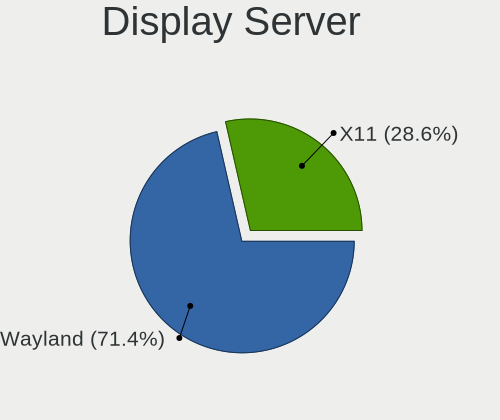
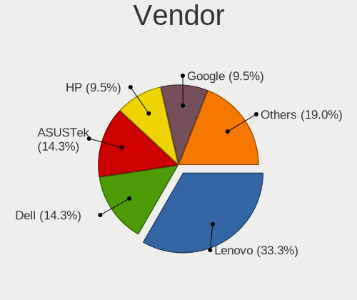
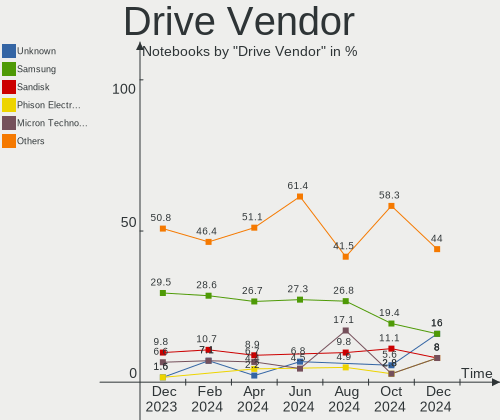
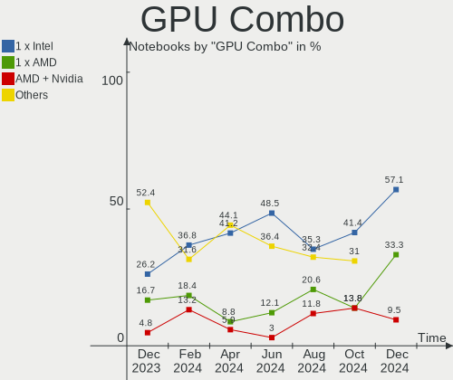
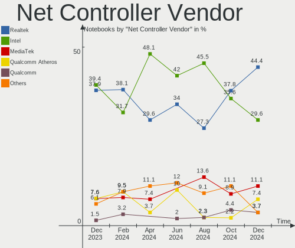
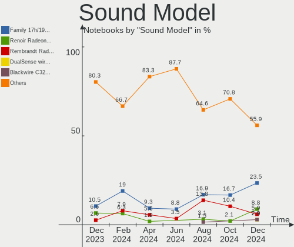
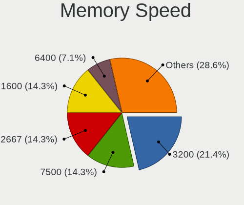
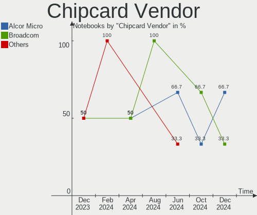

EndeavourOS - Hardware Trends (Notebooks)
-----------------------------------------

A project to identify most popular hardware characteristics and track their change
over time based on data collected by Linux users at https://Linux-Hardware.org.

Anyone can contribute to this report by the [hw-probe](https://github.com/linuxhw/hw-probe) tool:

    sudo -E hw-probe -all -upload

This report is for one last month. Overall report since the beginning of time: [TestDays](https://github.com/linuxhw/TestDays)

Period: Dec, 2023.

Contents
--------

* [ System ](#system)
  - [ OS                       ](#os)
  - [ OS Family                ](#os-family)
  - [ Kernel                   ](#kernel)
  - [ Kernel Family            ](#kernel-family)
  - [ Kernel Major Ver.        ](#kernel-major-ver)
  - [ Arch                     ](#arch)
  - [ DE                       ](#de)
  - [ Display Server           ](#display-server)
  - [ Display Manager          ](#display-manager)
  - [ OS Lang                  ](#os-lang)
  - [ Boot Mode                ](#boot-mode)
  - [ Filesystem               ](#filesystem)
  - [ Part. scheme             ](#part-scheme)
  - [ Dual Boot with Linux/BSD ](#dual-boot-with-linuxbsd)
  - [ Dual Boot (Win)          ](#dual-boot-win)

* [ Board ](#board)
  - [ Vendor                   ](#vendor)
  - [ Model                    ](#model)
  - [ Model Family             ](#model-family)
  - [ MFG Year                 ](#mfg-year)
  - [ Form Factor              ](#form-factor)
  - [ Secure Boot              ](#secure-boot)
  - [ Coreboot                 ](#coreboot)
  - [ RAM Size                 ](#ram-size)
  - [ RAM Used                 ](#ram-used)
  - [ Total Drives             ](#total-drives)
  - [ Has CD-ROM               ](#has-cd-rom)
  - [ Has Ethernet             ](#has-ethernet)
  - [ Has WiFi                 ](#has-wifi)
  - [ Has Bluetooth            ](#has-bluetooth)

* [ Location ](#location)
  - [ Country                  ](#country)
  - [ City                     ](#city)

* [ Drives ](#drives)
  - [ Drive Vendor             ](#drive-vendor)
  - [ Drive Model              ](#drive-model)
  - [ HDD Vendor               ](#hdd-vendor)
  - [ SSD Vendor               ](#ssd-vendor)
  - [ Drive Kind               ](#drive-kind)
  - [ Drive Connector          ](#drive-connector)
  - [ Drive Size               ](#drive-size)
  - [ Space Total              ](#space-total)
  - [ Space Used               ](#space-used)
  - [ Malfunc. Drives          ](#malfunc-drives)
  - [ Malfunc. Drive Vendor    ](#malfunc-drive-vendor)
  - [ Malfunc. HDD Vendor      ](#malfunc-hdd-vendor)
  - [ Malfunc. Drive Kind      ](#malfunc-drive-kind)
  - [ Failed Drives            ](#failed-drives)
  - [ Failed Drive Vendor      ](#failed-drive-vendor)
  - [ Drive Status             ](#drive-status)

* [ Storage controller ](#storage-controller)
  - [ Storage Vendor           ](#storage-vendor)
  - [ Storage Model            ](#storage-model)
  - [ Storage Kind             ](#storage-kind)

* [ Processor ](#processor)
  - [ CPU Vendor               ](#cpu-vendor)
  - [ CPU Model                ](#cpu-model)
  - [ CPU Model Family         ](#cpu-model-family)
  - [ CPU Cores                ](#cpu-cores)
  - [ CPU Sockets              ](#cpu-sockets)
  - [ CPU Threads              ](#cpu-threads)
  - [ CPU Op-Modes             ](#cpu-op-modes)
  - [ CPU Microcode            ](#cpu-microcode)
  - [ CPU Microarch            ](#cpu-microarch)

* [ Graphics ](#graphics)
  - [ GPU Vendor               ](#gpu-vendor)
  - [ GPU Model                ](#gpu-model)
  - [ GPU Combo                ](#gpu-combo)
  - [ GPU Driver               ](#gpu-driver)
  - [ GPU Memory               ](#gpu-memory)

* [ Monitor ](#monitor)
  - [ Monitor Vendor           ](#monitor-vendor)
  - [ Monitor Model            ](#monitor-model)
  - [ Monitor Resolution       ](#monitor-resolution)
  - [ Monitor Diagonal         ](#monitor-diagonal)
  - [ Monitor Width            ](#monitor-width)
  - [ Aspect Ratio             ](#aspect-ratio)
  - [ Monitor Area             ](#monitor-area)
  - [ Pixel Density            ](#pixel-density)
  - [ Multiple Monitors        ](#multiple-monitors)

* [ Network ](#network)
  - [ Net Controller Vendor    ](#net-controller-vendor)
  - [ Net Controller Model     ](#net-controller-model)
  - [ Wireless Vendor          ](#wireless-vendor)
  - [ Wireless Model           ](#wireless-model)
  - [ Ethernet Vendor          ](#ethernet-vendor)
  - [ Ethernet Model           ](#ethernet-model)
  - [ Net Controller Kind      ](#net-controller-kind)
  - [ Used Controller          ](#used-controller)
  - [ NICs                     ](#nics)
  - [ IPv6                     ](#ipv6)

* [ Bluetooth ](#bluetooth)
  - [ Bluetooth Vendor         ](#bluetooth-vendor)
  - [ Bluetooth Model          ](#bluetooth-model)

* [ Sound ](#sound)
  - [ Sound Vendor             ](#sound-vendor)
  - [ Sound Model              ](#sound-model)

* [ Memory ](#memory)
  - [ Memory Vendor            ](#memory-vendor)
  - [ Memory Model             ](#memory-model)
  - [ Memory Kind              ](#memory-kind)
  - [ Memory Form Factor       ](#memory-form-factor)
  - [ Memory Size              ](#memory-size)
  - [ Memory Speed             ](#memory-speed)

* [ Printers & scanners ](#printers--scanners)
  - [ Printer Vendor           ](#printer-vendor)
  - [ Printer Model            ](#printer-model)
  - [ Scanner Vendor           ](#scanner-vendor)
  - [ Scanner Model            ](#scanner-model)

* [ Camera ](#camera)
  - [ Camera Vendor            ](#camera-vendor)
  - [ Camera Model             ](#camera-model)

* [ Security ](#security)
  - [ Fingerprint Vendor       ](#fingerprint-vendor)
  - [ Fingerprint Model        ](#fingerprint-model)
  - [ Chipcard Vendor          ](#chipcard-vendor)
  - [ Chipcard Model           ](#chipcard-model)

* [ Unsupported ](#unsupported)
  - [ Unsupported Devices      ](#unsupported-devices)
  - [ Unsupported Device Types ](#unsupported-device-types)

System
------

OS
--

Installed operating systems

| Name                | Notebooks | Percent |
|---------------------|-----------|---------|
| EndeavourOS Rolling | 41        | 97.62%  |
| EndeavourOS 23.1.0  | 1         | 2.38%   |

OS Family
---------

OS without a version

| Name        | Notebooks | Percent |
|-------------|-----------|---------|
| EndeavourOS | 42        | 100%    |

Kernel
------

Version of the Linux kernel

| Version          | Notebooks | Percent |
|------------------|-----------|---------|
| 6.6.7-arch1-1    | 10        | 23.81%  |
| 6.6.8-arch1-1    | 9         | 21.43%  |
| 6.6.4-arch1-1    | 6         | 14.29%  |
| 6.6.3-arch1-1    | 3         | 7.14%   |
| 6.6.6-arch1-1    | 2         | 4.76%   |
| 6.1.69-1-lts     | 2         | 4.76%   |
| 6.1.68-1-lts     | 2         | 4.76%   |
| 6.6.8-zen1-1-zen | 1         | 2.38%   |
| 6.6.5-arch1-1    | 1         | 2.38%   |
| 6.6.4-zen1-1-zen | 1         | 2.38%   |
| 6.6.1-arch1-1    | 1         | 2.38%   |
| 6.5.5-arch1-1    | 1         | 2.38%   |
| 6.1.67-1-lts     | 1         | 2.38%   |
| 6.1.66-1-lts     | 1         | 2.38%   |
| 6.1.60-1-lts     | 1         | 2.38%   |

Kernel Family
-------------

Linux kernel without a distro release

| Version | Notebooks | Percent |
|---------|-----------|---------|
| 6.6.8   | 10        | 23.81%  |
| 6.6.7   | 10        | 23.81%  |
| 6.6.4   | 7         | 16.67%  |
| 6.6.3   | 3         | 7.14%   |
| 6.6.6   | 2         | 4.76%   |
| 6.1.69  | 2         | 4.76%   |
| 6.1.68  | 2         | 4.76%   |
| 6.6.5   | 1         | 2.38%   |
| 6.6.1   | 1         | 2.38%   |
| 6.5.5   | 1         | 2.38%   |
| 6.1.67  | 1         | 2.38%   |
| 6.1.66  | 1         | 2.38%   |
| 6.1.60  | 1         | 2.38%   |

Kernel Major Ver.
-----------------

Linux kernel major version

| Version | Notebooks | Percent |
|---------|-----------|---------|
| 6.6     | 34        | 80.95%  |
| 6.1     | 7         | 16.67%  |
| 6.5     | 1         | 2.38%   |

Arch
----

OS architecture (x86_64, i586, etc.)

| Name   | Notebooks | Percent |
|--------|-----------|---------|
| x86_64 | 42        | 100%    |

DE
--

Desktop Environment

| Name       | Notebooks | Percent |
|------------|-----------|---------|
| KDE5       | 19        | 45.24%  |
| GNOME      | 10        | 23.81%  |
| i3         | 3         | 7.14%   |
| XFCE       | 2         | 4.76%   |
| Budgie     | 2         | 4.76%   |
| X-Cinnamon | 1         | 2.38%   |
| sway       | 1         | 2.38%   |
| qtile      | 1         | 2.38%   |
| MATE       | 1         | 2.38%   |
| KDE        | 1         | 2.38%   |
| Hyprland   | 1         | 2.38%   |

Display Server
--------------

X11 or Wayland

| Name    | Notebooks | Percent |
|---------|-----------|---------|
| X11     | 27        | 64.29%  |
| Wayland | 15        | 35.71%  |

Display Manager
---------------

SDDM, LightDM, etc.

| Name    | Notebooks | Percent |
|---------|-----------|---------|
| SDDM    | 17        | 40.48%  |
| LightDM | 11        | 26.19%  |
| Unknown | 8         | 19.05%  |
| GDM     | 6         | 14.29%  |

OS Lang
-------

Language

| Lang  | Notebooks | Percent |
|-------|-----------|---------|
| en_US | 18        | 42.86%  |
| it_IT | 5         | 11.9%   |
| de_DE | 4         | 9.52%   |
| en_GB | 3         | 7.14%   |
| fr_FR | 2         | 4.76%   |
| ru_RU | 1         | 2.38%   |
| pl_PL | 1         | 2.38%   |
| hu_HU | 1         | 2.38%   |
| es_ES | 1         | 2.38%   |
| es_AR | 1         | 2.38%   |
| en_IN | 1         | 2.38%   |
| en_DK | 1         | 2.38%   |
| en_CA | 1         | 2.38%   |
| en_AU | 1         | 2.38%   |
| cs_CZ | 1         | 2.38%   |

Boot Mode
---------

EFI or BIOS

| Mode | Notebooks | Percent |
|------|-----------|---------|
| EFI  | 27        | 64.29%  |
| BIOS | 15        | 35.71%  |

Filesystem
----------

Type of filesystem

| Type  | Notebooks | Percent |
|-------|-----------|---------|
| Ext4  | 33        | 78.57%  |
| Btrfs | 8         | 19.05%  |
| Xfs   | 1         | 2.38%   |

Part. scheme
------------

Scheme of partitioning

| Type    | Notebooks | Percent |
|---------|-----------|---------|
| GPT     | 32        | 76.19%  |
| Unknown | 6         | 14.29%  |
| MBR     | 4         | 9.52%   |

Dual Boot with Linux/BSD
------------------------

Hosting more than one Linux/BSD

| Dual boot | Notebooks | Percent |
|-----------|-----------|---------|
| No        | 38        | 90.48%  |
| Yes       | 4         | 9.52%   |

Dual Boot (Win)
---------------

Hosting Linux and Windows

| Dual boot | Notebooks | Percent |
|-----------|-----------|---------|
| No        | 30        | 71.43%  |
| Yes       | 12        | 28.57%  |

Board
-----

Vendor
------

Motherboard manufacturer

| Name                    | Notebooks | Percent |
|-------------------------|-----------|---------|
| Lenovo                  | 10        | 23.81%  |
| ASUSTek Computer        | 10        | 23.81%  |
| Hewlett-Packard         | 5         | 11.9%   |
| Dell                    | 5         | 11.9%   |
| Acer                    | 5         | 11.9%   |
| TUXEDO                  | 2         | 4.76%   |
| Universal Exports Group | 1         | 2.38%   |
| Sony                    | 1         | 2.38%   |
| MSI                     | 1         | 2.38%   |
| HUAWEI                  | 1         | 2.38%   |
| GPD                     | 1         | 2.38%   |

Model
-----

Motherboard model

| Name                                             | Notebooks | Percent |
|--------------------------------------------------|-----------|---------|
| Universal Exports Group MONTENERO-C              | 1         | 2.38%   |
| TUXEDO Pulse 15 Gen2                             | 1         | 2.38%   |
| TUXEDO Aura 14 Gen3                              | 1         | 2.38%   |
| Sony SVE1713X1EB                                 | 1         | 2.38%   |
| MSI Prestige 15 A10SC                            | 1         | 2.38%   |
| Lenovo Yoga Pro 9 16IRP8 83BY                    | 1         | 2.38%   |
| Lenovo ThinkPad W530 24382KU                     | 1         | 2.38%   |
| Lenovo ThinkPad T480s 20L7S00600                 | 1         | 2.38%   |
| Lenovo ThinkPad T470 W10DG 20JNS1XT00            | 1         | 2.38%   |
| Lenovo ThinkPad E14 20RBS25S00                   | 1         | 2.38%   |
| Lenovo ThinkBook 15-IIL 20SM                     | 1         | 2.38%   |
| Lenovo ThinkBook 15 G4 ABA 21DL                  | 1         | 2.38%   |
| Lenovo Legion 7 16ARHA7 82UH                     | 1         | 2.38%   |
| Lenovo IdeaPad Gaming 3 15IHU6 82K1              | 1         | 2.38%   |
| Lenovo IdeaPad Gaming 3 15ACH6 82K2              | 1         | 2.38%   |
| HUAWEI NBLK-WAX9X                                | 1         | 2.38%   |
| HP ZBook Fury 15.6 inch G8 Mobile Workstation PC | 1         | 2.38%   |
| HP ProBook 650 G1                                | 1         | 2.38%   |
| HP Pavilion Laptop 15-cs3xxx                     | 1         | 2.38%   |
| HP Laptop 15-dw0xxx                              | 1         | 2.38%   |
| HP EliteBook 840 14 inch G10 Notebook PC         | 1         | 2.38%   |
| GPD G1619-04                                     | 1         | 2.38%   |
| Dell XPS 15 9520                                 | 1         | 2.38%   |
| Dell Latitude 5580                               | 1         | 2.38%   |
| Dell Inspiron 5570                               | 1         | 2.38%   |
| Dell Inspiron 16 Plus 7630                       | 1         | 2.38%   |
| Dell Inspiron 15 3520                            | 1         | 2.38%   |
| ASUS VivoBook_ASUSLaptop X571GT_F571GT           | 1         | 2.38%   |
| ASUS VivoBook_ASUSLaptop M1605YA_M1605YA         | 1         | 2.38%   |
| ASUS VivoBook_ASUSLaptop K6604JI_K6604JI         | 1         | 2.38%   |
| ASUS UX490UAR                                    | 1         | 2.38%   |
| ASUS UL80VT                                      | 1         | 2.38%   |
| ASUS TUF Gaming FX504GD_FX80GD                   | 1         | 2.38%   |
| ASUS PRIME X570-P                                | 1         | 2.38%   |
| ASUS ASUS TUF Gaming F15 FX506LI_FX506LI         | 1         | 2.38%   |
| ASUS ASUS TUF Gaming F15 FX506LH_FX566LH         | 1         | 2.38%   |
| ASUS ASUS TUF Gaming A15 FA506IV_FA506IV         | 1         | 2.38%   |
| Acer Swift SF314-57G                             | 1         | 2.38%   |
| Acer Swift SF314-51                              | 1         | 2.38%   |
| Acer Nitro AN715-51                              | 1         | 2.38%   |

Model Family
------------

Motherboard model prefix

| Name                                | Notebooks | Percent |
|-------------------------------------|-----------|---------|
| Lenovo ThinkPad                     | 4         | 9.52%   |
| Dell Inspiron                       | 3         | 7.14%   |
| ASUS VivoBook                       | 3         | 7.14%   |
| ASUS ASUS                           | 3         | 7.14%   |
| Lenovo ThinkBook                    | 2         | 4.76%   |
| Lenovo IdeaPad                      | 2         | 4.76%   |
| Acer Swift                          | 2         | 4.76%   |
| Acer Nitro                          | 2         | 4.76%   |
| Universal Exports Group MONTENERO-C | 1         | 2.38%   |
| TUXEDO Pulse                        | 1         | 2.38%   |
| TUXEDO Aura                         | 1         | 2.38%   |
| Sony SVE1713X1EB                    | 1         | 2.38%   |
| MSI Prestige                        | 1         | 2.38%   |
| Lenovo Yoga                         | 1         | 2.38%   |
| Lenovo Legion                       | 1         | 2.38%   |
| HUAWEI NBLK-WAX9X                   | 1         | 2.38%   |
| HP ZBook                            | 1         | 2.38%   |
| HP ProBook                          | 1         | 2.38%   |
| HP Pavilion                         | 1         | 2.38%   |
| HP Laptop                           | 1         | 2.38%   |
| HP EliteBook                        | 1         | 2.38%   |
| GPD G1619-04                        | 1         | 2.38%   |
| Dell XPS                            | 1         | 2.38%   |
| Dell Latitude                       | 1         | 2.38%   |
| ASUS UX490UAR                       | 1         | 2.38%   |
| ASUS UL80VT                         | 1         | 2.38%   |
| ASUS TUF                            | 1         | 2.38%   |
| ASUS PRIME                          | 1         | 2.38%   |
| Acer Aspire                         | 1         | 2.38%   |

MFG Year
--------

Motherboard manufacture year

| Year | Notebooks | Percent |
|------|-----------|---------|
| 2019 | 9         | 21.43%  |
| 2023 | 6         | 14.29%  |
| 2022 | 6         | 14.29%  |
| 2021 | 4         | 9.52%   |
| 2018 | 4         | 9.52%   |
| 2020 | 3         | 7.14%   |
| 2017 | 3         | 7.14%   |
| 2013 | 2         | 4.76%   |
| 2012 | 2         | 4.76%   |
| 2016 | 1         | 2.38%   |
| 2011 | 1         | 2.38%   |
| 2009 | 1         | 2.38%   |

Form Factor
-----------

Physical design of the computer

| Name     | Notebooks | Percent |
|----------|-----------|---------|
| Notebook | 42        | 100%    |

Secure Boot
-----------

Enabled or disabled

| State    | Notebooks | Percent |
|----------|-----------|---------|
| Disabled | 42        | 100%    |

Coreboot
--------

Have coreboot on board

| Used | Notebooks | Percent |
|------|-----------|---------|
| No   | 42        | 100%    |

RAM Size
--------

Total RAM memory

| Size in GB  | Notebooks | Percent |
|-------------|-----------|---------|
| 16.01-24.0  | 14        | 33.33%  |
| 32.01-64.0  | 10        | 23.81%  |
| 4.01-8.0    | 8         | 19.05%  |
| 64.01-256.0 | 3         | 7.14%   |
| 8.01-16.0   | 3         | 7.14%   |
| 3.01-4.0    | 2         | 4.76%   |
| 24.01-32.0  | 2         | 4.76%   |

RAM Used
--------

Used RAM memory

| Used GB    | Notebooks | Percent |
|------------|-----------|---------|
| 4.01-8.0   | 17        | 40.48%  |
| 2.01-3.0   | 9         | 21.43%  |
| 3.01-4.0   | 6         | 14.29%  |
| 1.01-2.0   | 5         | 11.9%   |
| 8.01-16.0  | 4         | 9.52%   |
| 16.01-24.0 | 1         | 2.38%   |

Total Drives
------------

Number of drives on board

| Drives | Notebooks | Percent |
|--------|-----------|---------|
| 1      | 25        | 59.52%  |
| 2      | 13        | 30.95%  |
| 3      | 3         | 7.14%   |
| 6      | 1         | 2.38%   |

Has CD-ROM
----------

Has CD-ROM on board

| Presented | Notebooks | Percent |
|-----------|-----------|---------|
| No        | 37        | 88.1%   |
| Yes       | 5         | 11.9%   |

Has Ethernet
------------

Has Ethernet on board

| Presented | Notebooks | Percent |
|-----------|-----------|---------|
| Yes       | 31        | 73.81%  |
| No        | 11        | 26.19%  |

Has WiFi
--------

Has WiFi module

| Presented | Notebooks | Percent |
|-----------|-----------|---------|
| Yes       | 41        | 97.62%  |
| No        | 1         | 2.38%   |

Has Bluetooth
-------------

Has Bluetooth module

| Presented | Notebooks | Percent |
|-----------|-----------|---------|
| Yes       | 38        | 90.48%  |
| No        | 4         | 9.52%   |

Location
--------

Country
-------

Geographic location (country)

| Country   | Notebooks | Percent |
|-----------|-----------|---------|
| Italy     | 8         | 19.05%  |
| Germany   | 5         | 11.9%   |
| USA       | 4         | 9.52%   |
| France    | 3         | 7.14%   |
| Russia    | 2         | 4.76%   |
| India     | 2         | 4.76%   |
| Hungary   | 2         | 4.76%   |
| UK        | 1         | 2.38%   |
| Taiwan    | 1         | 2.38%   |
| Spain     | 1         | 2.38%   |
| Portugal  | 1         | 2.38%   |
| Poland    | 1         | 2.38%   |
| Namibia   | 1         | 2.38%   |
| Maldives  | 1         | 2.38%   |
| Indonesia | 1         | 2.38%   |
| Denmark   | 1         | 2.38%   |
| Czechia   | 1         | 2.38%   |
| Canada    | 1         | 2.38%   |
| Bulgaria  | 1         | 2.38%   |
| Brazil    | 1         | 2.38%   |
| Austria   | 1         | 2.38%   |
| Australia | 1         | 2.38%   |
| Argentina | 1         | 2.38%   |

City
----

Geographic location (city)

| City                 | Notebooks | Percent |
|----------------------|-----------|---------|
| Hyderabad            | 2         | 4.76%   |
| Berlin               | 2         | 4.76%   |
| Windhoek             | 1         | 2.38%   |
| Vila Nova de Gaia    | 1         | 2.38%   |
| Vigo                 | 1         | 2.38%   |
| Vienna               | 1         | 2.38%   |
| Taranto              | 1         | 2.38%   |
| St Petersburg        | 1         | 2.38%   |
| Sao Vicente          | 1         | 2.38%   |
| Rochester            | 1         | 2.38%   |
| Rho                  | 1         | 2.38%   |
| Rexburg              | 1         | 2.38%   |
| Prisovo              | 1         | 2.38%   |
| Prague               | 1         | 2.38%   |
| Pilisvoeroesvar      | 1         | 2.38%   |
| Palermo              | 1         | 2.38%   |
| Mountville           | 1         | 2.38%   |
| Montreal             | 1         | 2.38%   |
| Minneapolis          | 1         | 2.38%   |
| Milano               | 1         | 2.38%   |
| Milan                | 1         | 2.38%   |
| Melbourne            | 1         | 2.38%   |
| Malé                | 1         | 2.38%   |
| Lugu                 | 1         | 2.38%   |
| Le Kremlin-Bicetre   | 1         | 2.38%   |
| La Grande-Motte      | 1         | 2.38%   |
| Kazan’             | 1         | 2.38%   |
| Jesus Maria          | 1         | 2.38%   |
| Grodzisk Mazowiecki  | 1         | 2.38%   |
| Glasgow              | 1         | 2.38%   |
| Essen                | 1         | 2.38%   |
| Dreux                | 1         | 2.38%   |
| Denpasar             | 1         | 2.38%   |
| Cicciano             | 1         | 2.38%   |
| Castello di Cisterna | 1         | 2.38%   |
| Cascina              | 1         | 2.38%   |
| Buxtehude            | 1         | 2.38%   |
| Budapest             | 1         | 2.38%   |
| Aschaffenburg        | 1         | 2.38%   |
| Albertslund          | 1         | 2.38%   |

Drives
------

Drive Vendor
------------

Hard drive vendors

| Vendor                      | Notebooks | Drives | Percent |
|-----------------------------|-----------|--------|---------|
| Samsung Electronics         | 18        | 24     | 29.51%  |
| Sandisk                     | 6         | 6      | 9.84%   |
| WDC                         | 4         | 4      | 6.56%   |
| Seagate                     | 4         | 4      | 6.56%   |
| Micron Technology           | 4         | 4      | 6.56%   |
| Micron/Crucial Technology   | 3         | 3      | 4.92%   |
| Crucial                     | 3         | 3      | 4.92%   |
| SK hynix                    | 2         | 2      | 3.28%   |
| Unknown                     | 1         | 1      | 1.64%   |
| Toshiba                     | 1         | 1      | 1.64%   |
| SPCC                        | 1         | 1      | 1.64%   |
| Solid State Storage         | 1         | 1      | 1.64%   |
| Silicon Motion              | 1         | 1      | 1.64%   |
| SABRENT                     | 1         | 1      | 1.64%   |
| Realtek Semiconductor       | 1         | 1      | 1.64%   |
| Phison Electronics          | 1         | 1      | 1.64%   |
| Phison                      | 1         | 1      | 1.64%   |
| MAXIO Technology (Hangzhou) | 1         | 1      | 1.64%   |
| Kingston Technology Company | 1         | 1      | 1.64%   |
| Kingston                    | 1         | 1      | 1.64%   |
| KingSpec                    | 1         | 1      | 1.64%   |
| KingFast                    | 1         | 1      | 1.64%   |
| JMicron Technology          | 1         | 1      | 1.64%   |
| Intel                       | 1         | 1      | 1.64%   |
| HJDK                        | 1         | 1      | 1.64%   |

Drive Model
-----------

Hard drive models

| Model                                                 | Notebooks | Percent |
|-------------------------------------------------------|-----------|---------|
| Samsung NVMe SSD Controller PM9A1/PM9A3/980PRO 2TB    | 4         | 6.06%   |
| Sandisk WD Blue SN550 NVMe SSD 1TB                    | 2         | 3.03%   |
| Sandisk WD Blue SN500 / PC SN520 NVMe SSD 128GB       | 2         | 3.03%   |
| Samsung SSD 980 500GB                                 | 2         | 3.03%   |
| Samsung NVMe SSD Controller SM981/PM981/PM983 512GB   | 2         | 3.03%   |
| Samsung NVMe SSD Controller SM961/PM961/SM963 250GB   | 2         | 3.03%   |
| Micron/Crucial CT2000P5PSSD8 2TB                      | 2         | 3.03%   |
| Crucial CT500MX500SSD1 500GB                          | 2         | 3.03%   |
| WDC WD60EFZX-68B3FN0 6TB                              | 1         | 1.52%   |
| WDC WD10SPZX-21Z10T0 1TB                              | 1         | 1.52%   |
| WDC WD10SPCX-22HWST0 1TB                              | 1         | 1.52%   |
| WDC WD Blue SA510 2.5 500GB                           | 1         | 1.52%   |
| Unknown MMC Card  512GB                               | 1         | 1.52%   |
| Toshiba XG6 NVMe SSD Controller 512GB                 | 1         | 1.52%   |
| SPCC Solid State Disk 1TB                             | 1         | 1.52%   |
| Solid State Storage SSSTC CL1-4D256-D22 256GB         | 1         | 1.52%   |
| SK hynix PC801 NVMe 1TB                               | 1         | 1.52%   |
| SK hynix HFS256G39TND-N210A 256GB SSD                 | 1         | 1.52%   |
| Silicon Motion SM2263EN/SM2263XT SSD Controller 500GB | 1         | 1.52%   |
| Seagate ST9500325AS 500GB                             | 1         | 1.52%   |
| Seagate ST2000LM007-1R8174 2TB                        | 1         | 1.52%   |
| Seagate ST1000LM035-1RK172 1TB                        | 1         | 1.52%   |
| Seagate FireCuda HDD 2TB                              | 1         | 1.52%   |
| Sandisk WD_BLACK SN850X 2000GB                        | 1         | 1.52%   |
| Sandisk WD Green SN350 1TB                            | 1         | 1.52%   |
| Samsung SSD 990 PRO 1TB                               | 1         | 1.52%   |
| Samsung SSD 870 QVO 4TB                               | 1         | 1.52%   |
| Samsung SSD 870 QVO 1TB                               | 1         | 1.52%   |
| Samsung SSD 870 EVO 500GB                             | 1         | 1.52%   |
| Samsung SSD 870 EVO 2TB                               | 1         | 1.52%   |
| Samsung SSD 860 QVO 1TB                               | 1         | 1.52%   |
| Samsung PSSD T7 Shield 4TB                            | 1         | 1.52%   |
| Samsung PM9B1 NVMe 512GB                              | 1         | 1.52%   |
| Samsung MZVLQ512HALU-00000 512GB                      | 1         | 1.52%   |
| Samsung MZVL4512HBLU-00BTW 512GB                      | 1         | 1.52%   |
| Samsung MZALQ512HBLU-00BL2 512GB                      | 1         | 1.52%   |
| Samsung MZALQ512HALU-000L2 512GB                      | 1         | 1.52%   |
| Samsung MZAL4512HBLU-00BL2 512GB                      | 1         | 1.52%   |
| SABRENT Disk 2TB                                      | 1         | 1.52%   |
| Realtek KLEVV CRAS C710 M.2 NVMe SSD 256GB            | 1         | 1.52%   |

HDD Vendor
----------

Hard disk drive vendors

| Vendor  | Notebooks | Drives | Percent |
|---------|-----------|--------|---------|
| Seagate | 4         | 4      | 50%     |
| WDC     | 3         | 3      | 37.5%   |
| SABRENT | 1         | 1      | 12.5%   |

SSD Vendor
----------

Solid state drive vendors

| Vendor              | Notebooks | Drives | Percent |
|---------------------|-----------|--------|---------|
| Samsung Electronics | 3         | 6      | 25%     |
| Crucial             | 3         | 3      | 25%     |
| WDC                 | 1         | 1      | 8.33%   |
| SPCC                | 1         | 1      | 8.33%   |
| SK hynix            | 1         | 1      | 8.33%   |
| KingSpec            | 1         | 1      | 8.33%   |
| KingFast            | 1         | 1      | 8.33%   |
| HJDK                | 1         | 1      | 8.33%   |

Drive Kind
----------

HDD or SSD

| Kind    | Notebooks | Drives | Percent |
|---------|-----------|--------|---------|
| NVMe    | 35        | 42     | 62.5%   |
| SSD     | 11        | 15     | 19.64%  |
| HDD     | 8         | 8      | 14.29%  |
| MMC     | 1         | 1      | 1.79%   |
| Unknown | 1         | 1      | 1.79%   |

Drive Connector
---------------

SATA, SAS, NVMe, etc.

| Type | Notebooks | Drives | Percent |
|------|-----------|--------|---------|
| NVMe | 35        | 42     | 63.64%  |
| SATA | 15        | 20     | 27.27%  |
| SAS  | 4         | 4      | 7.27%   |
| MMC  | 1         | 1      | 1.82%   |

Drive Size
----------

Size of hard drive

| Size in TB | Notebooks | Drives | Percent |
|------------|-----------|--------|---------|
| 0.01-0.5   | 9         | 9      | 40.91%  |
| 0.51-1.0   | 6         | 7      | 27.27%  |
| 1.01-2.0   | 4         | 4      | 18.18%  |
| 3.01-4.0   | 2         | 2      | 9.09%   |
| 4.01-10.0  | 1         | 1      | 4.55%   |

Space Total
-----------

Amount of disk space available on the file system

| Size in GB     | Notebooks | Percent |
|----------------|-----------|---------|
| 251-500        | 8         | 19.05%  |
| 101-250        | 8         | 19.05%  |
| 1001-2000      | 8         | 19.05%  |
| 1-20           | 6         | 14.29%  |
| More than 3000 | 5         | 11.9%   |
| 501-1000       | 4         | 9.52%   |
| 51-100         | 2         | 4.76%   |
| 2001-3000      | 1         | 2.38%   |

Space Used
----------

Amount of used disk space

| Used GB        | Notebooks | Percent |
|----------------|-----------|---------|
| 1-20           | 12        | 28.57%  |
| 101-250        | 9         | 21.43%  |
| 251-500        | 5         | 11.9%   |
| 21-50          | 4         | 9.52%   |
| 501-1000       | 4         | 9.52%   |
| 1001-2000      | 3         | 7.14%   |
| 51-100         | 3         | 7.14%   |
| More than 3000 | 1         | 2.38%   |
| 2001-3000      | 1         | 2.38%   |

Malfunc. Drives
---------------

Drive models with a malfunction

| Model                    | Notebooks | Drives | Percent |
|--------------------------|-----------|--------|---------|
| WDC WD10SPCX-22HWST0 1TB | 1         | 1      | 100%    |

Malfunc. Drive Vendor
---------------------

Vendors of faulty drives

| Vendor | Notebooks | Drives | Percent |
|--------|-----------|--------|---------|
| WDC    | 1         | 1      | 100%    |

Malfunc. HDD Vendor
-------------------

Vendors of faulty HDD drives

| Vendor | Notebooks | Drives | Percent |
|--------|-----------|--------|---------|
| WDC    | 1         | 1      | 100%    |

Malfunc. Drive Kind
-------------------

Kinds of faulty drives

| Kind | Notebooks | Drives | Percent |
|------|-----------|--------|---------|
| HDD  | 1         | 1      | 100%    |

Failed Drives
-------------

Failed drive models

Zero info for selected period =(

Failed Drive Vendor
-------------------

Failed drive vendors

Zero info for selected period =(

Drive Status
------------

Number of failed and malfunc. drives

| Status   | Notebooks | Drives | Percent |
|----------|-----------|--------|---------|
| Works    | 33        | 51     | 75%     |
| Detected | 10        | 15     | 22.73%  |
| Malfunc  | 1         | 1      | 2.27%   |

Storage controller
------------------

Storage Vendor
--------------

Storage controller vendors

| Vendor                         | Notebooks | Percent |
|--------------------------------|-----------|---------|
| Intel                          | 23        | 35.38%  |
| Samsung Electronics            | 17        | 26.15%  |
| SanDisk                        | 6         | 9.23%   |
| Micron Technology              | 4         | 6.15%   |
| Micron/Crucial Technology      | 3         | 4.62%   |
| Phison Electronics             | 2         | 3.08%   |
| Kingston Technology Company    | 2         | 3.08%   |
| AMD                            | 2         | 3.08%   |
| Toshiba America Info Systems   | 1         | 1.54%   |
| Solid State Storage Technology | 1         | 1.54%   |
| SK hynix                       | 1         | 1.54%   |
| Silicon Motion                 | 1         | 1.54%   |
| Realtek Semiconductor          | 1         | 1.54%   |
| MAXIO Technology (Hangzhou)    | 1         | 1.54%   |

Storage Model
-------------

Storage controller models

| Model                                                                         | Notebooks | Percent |
|-------------------------------------------------------------------------------|-----------|---------|
| Samsung NVMe SSD Controller 980 (DRAM-less)                                   | 5         | 7.25%   |
| Samsung NVMe SSD Controller PM9A1/PM9A3/980PRO                                | 4         | 5.8%    |
| Intel Cannon Lake Mobile PCH SATA AHCI Controller                             | 4         | 5.8%    |
| Samsung NVMe SSD Controller PM9B1 (DRAM-less)                                 | 3         | 4.35%   |
| Micron/Crucial P5 Plus NVMe PCIe SSD                                          | 3         | 4.35%   |
| Intel 82801 Mobile SATA Controller [RAID mode]                                | 3         | 4.35%   |
| SanDisk WD Blue SN500 / PC SN520 x2 M.2 2280 NVMe SSD                         | 2         | 2.9%    |
| SanDisk Ultra 3D / WD Blue SN550 NVMe SSD                                     | 2         | 2.9%    |
| Samsung NVMe SSD Controller SM981/PM981/PM983                                 | 2         | 2.9%    |
| Samsung NVMe SSD Controller SM961/PM961/SM963                                 | 2         | 2.9%    |
| Micron 2210 NVMe SSD [Cobain]                                                 | 2         | 2.9%    |
| Intel Volume Management Device NVMe RAID Controller                           | 2         | 2.9%    |
| Intel Sunrise Point-LP SATA Controller [AHCI mode]                            | 2         | 2.9%    |
| Intel Alder Lake-P SATA AHCI Controller                                       | 2         | 2.9%    |
| Intel 7 Series Chipset Family 6-port SATA Controller [AHCI mode]              | 2         | 2.9%    |
| Intel 400 Series Chipset Family SATA AHCI Controller                          | 2         | 2.9%    |
| AMD FCH SATA Controller [AHCI mode]                                           | 2         | 2.9%    |
| Toshiba America Info Systems XG6 NVMe SSD Controller                          | 1         | 1.45%   |
| Solid State Storage CL1-3D256-Q11 NVMe SSD M.2                                | 1         | 1.45%   |
| SK hynix Platinum P41/PC801 NVMe Solid State Drive                            | 1         | 1.45%   |
| Silicon Motion SM2263EN/SM2263XT (DRAM-less) NVMe SSD Controllers             | 1         | 1.45%   |
| SanDisk WD PC SN540 / Green SN350 NVMe SSD 1 TB (DRAM-less)                   | 1         | 1.45%   |
| Sandisk WD Black SN850X NVMe SSD                                              | 1         | 1.45%   |
| Samsung NVMe SSD Controller S4LV008[Pascal]                                   | 1         | 1.45%   |
| Realtek RTS5765DL NVMe SSD Controller (DRAM-less)                             | 1         | 1.45%   |
| Phison Electronics Non-Volatile memory controller                             | 1         | 1.45%   |
| Phison E12 NVMe Controller                                                    | 1         | 1.45%   |
| Micron 3400 NVMe SSD [Hendrix]                                                | 1         | 1.45%   |
| Micron 2300 NVMe SSD [Santana]                                                | 1         | 1.45%   |
| MAXIO (Hangzhou) NVMe SSD Controller MAP1202                                  | 1         | 1.45%   |
| Kingston Company NV2 NVMe SSD SM2267XT                                        | 1         | 1.45%   |
| Kingston Company A1000/U-SNS8154P3 x2 NVMe SSD                                | 1         | 1.45%   |
| Intel Volume Management Device NVMe RAID Controller Intel Corporation         | 1         | 1.45%   |
| Intel Tiger Lake-LP SATA Controller                                           | 1         | 1.45%   |
| Intel SSD 660P Series                                                         | 1         | 1.45%   |
| Intel Ice Lake-LP SATA Controller [AHCI mode]                                 | 1         | 1.45%   |
| Intel Comet Lake SATA AHCI Controller                                         | 1         | 1.45%   |
| Intel Celeron/Pentium Silver Processor SATA Controller                        | 1         | 1.45%   |
| Intel 82801IBM/IEM (ICH9M/ICH9M-E) 4 port SATA Controller [AHCI mode]         | 1         | 1.45%   |
| Intel 8 Series/C220 Series Chipset Family 2-port SATA Controller 2 [IDE mode] | 1         | 1.45%   |

Storage Kind
------------

Kind of storage controller (IDE, SATA, NVMe, SAS, ...)

| Kind | Notebooks | Percent |
|------|-----------|---------|
| NVMe | 35        | 56.45%  |
| SATA | 20        | 32.26%  |
| RAID | 6         | 9.68%   |
| IDE  | 1         | 1.61%   |

Processor
---------

CPU Vendor
----------

Processor vendors

| Vendor | Notebooks | Percent |
|--------|-----------|---------|
| Intel  | 33        | 78.57%  |
| AMD    | 9         | 21.43%  |

CPU Model
---------

Processor models

| Model                                         | Notebooks | Percent |
|-----------------------------------------------|-----------|---------|
| Intel Core i7-8550U CPU @ 1.80GHz             | 3         | 7.14%   |
| Intel Core i7-8750H CPU @ 2.20GHz             | 2         | 4.76%   |
| Intel Core i5-10300H CPU @ 2.50GHz            | 2         | 4.76%   |
| Intel 12th Gen Core i5-1235U                  | 2         | 4.76%   |
| Intel Genuine CPU U7300 @ 1.30GHz             | 1         | 2.38%   |
| Intel Core i7-9750H CPU @ 2.60GHz             | 1         | 2.38%   |
| Intel Core i7-8565U CPU @ 1.80GHz             | 1         | 2.38%   |
| Intel Core i7-6500U CPU @ 2.50GHz             | 1         | 2.38%   |
| Intel Core i7-4500U CPU @ 1.80GHz             | 1         | 2.38%   |
| Intel Core i7-3820QM CPU @ 2.70GHz            | 1         | 2.38%   |
| Intel Core i7-3632QM CPU @ 2.20GHz            | 1         | 2.38%   |
| Intel Core i7-10710U CPU @ 1.10GHz            | 1         | 2.38%   |
| Intel Core i7-1065G7 CPU @ 1.30GHz            | 1         | 2.38%   |
| Intel Core i5-9300H CPU @ 2.40GHz             | 1         | 2.38%   |
| Intel Core i5-7200U CPU @ 2.50GHz             | 1         | 2.38%   |
| Intel Core i5-6300U CPU @ 2.40GHz             | 1         | 2.38%   |
| Intel Core i5-4300M CPU @ 2.60GHz             | 1         | 2.38%   |
| Intel Core i5-1035G4 CPU @ 1.10GHz            | 1         | 2.38%   |
| Intel Core i5-1035G1 CPU @ 1.00GHz            | 1         | 2.38%   |
| Intel Core i5-10210U CPU @ 1.60GHz            | 1         | 2.38%   |
| Intel Celeron N4020 CPU @ 1.10GHz             | 1         | 2.38%   |
| Intel 13th Gen Core i9-13980HX                | 1         | 2.38%   |
| Intel 13th Gen Core i9-13905H                 | 1         | 2.38%   |
| Intel 13th Gen Core i7-1370P                  | 1         | 2.38%   |
| Intel 13th Gen Core i7-13620H                 | 1         | 2.38%   |
| Intel 12th Gen Core i7-12700H                 | 1         | 2.38%   |
| Intel 11th Gen Core i7-11850H @ 2.50GHz       | 1         | 2.38%   |
| Intel 11th Gen Core i5-11320H @ 3.20GHz       | 1         | 2.38%   |
| AMD Ryzen 9 6900HX with Radeon Graphics       | 1         | 2.38%   |
| AMD Ryzen 7 7840U w/ Radeon 780M Graphics     | 1         | 2.38%   |
| AMD Ryzen 7 5825U with Radeon Graphics        | 1         | 2.38%   |
| AMD Ryzen 7 5800H with Radeon Graphics        | 1         | 2.38%   |
| AMD Ryzen 7 5700X 8-Core Processor            | 1         | 2.38%   |
| AMD Ryzen 7 5700U with Radeon Graphics        | 1         | 2.38%   |
| AMD Ryzen 7 4800H with Radeon Graphics        | 1         | 2.38%   |
| AMD Ryzen 5 5625U with Radeon Graphics        | 1         | 2.38%   |
| AMD Ryzen 5 3500U with Radeon Vega Mobile Gfx | 1         | 2.38%   |

CPU Model Family
----------------

Processor model prefix

| Model         | Notebooks | Percent |
|---------------|-----------|---------|
| Intel Core i7 | 13        | 30.95%  |
| Other         | 9         | 21.43%  |
| Intel Core i5 | 9         | 21.43%  |
| AMD Ryzen 7   | 6         | 14.29%  |
| AMD Ryzen 5   | 2         | 4.76%   |
| Intel Genuine | 1         | 2.38%   |
| Intel Celeron | 1         | 2.38%   |
| AMD Ryzen 9   | 1         | 2.38%   |

CPU Cores
---------

Number of processor cores

| Number | Notebooks | Percent |
|--------|-----------|---------|
| 4      | 15        | 35.71%  |
| 8      | 8         | 19.05%  |
| 2      | 7         | 16.67%  |
| 6      | 5         | 11.9%   |
| 14     | 3         | 7.14%   |
| 10     | 3         | 7.14%   |
| 24     | 1         | 2.38%   |

CPU Sockets
-----------

Number of sockets

| Number | Notebooks | Percent |
|--------|-----------|---------|
| 1      | 42        | 100%    |

CPU Threads
-----------

Threads per core (Hyper-Threading)

| Number | Notebooks | Percent |
|--------|-----------|---------|
| 2      | 40        | 95.24%  |
| 1      | 2         | 4.76%   |

CPU Op-Modes
------------

CPU Operation Modes (32-bit, 64-bit)

| Op mode        | Notebooks | Percent |
|----------------|-----------|---------|
| 32-bit, 64-bit | 42        | 100%    |

CPU Microcode
-------------

Microcode number

| Number     | Notebooks | Percent |
|------------|-----------|---------|
| Unknown    | 32        | 76.19%  |
| 0x906a3    | 1         | 2.38%   |
| 0x806ea    | 1         | 2.38%   |
| 0x806e9    | 1         | 2.38%   |
| 0x706a8    | 1         | 2.38%   |
| 0x406e3    | 1         | 2.38%   |
| 0x0a50000d | 1         | 2.38%   |
| 0x0a50000c | 1         | 2.38%   |
| 0x0a404102 | 1         | 2.38%   |
| 0x0a20120e | 1         | 2.38%   |
| 0x08108109 | 1         | 2.38%   |

CPU Microarch
-------------

Microarchitecture

| Name             | Notebooks | Percent |
|------------------|-----------|---------|
| KabyLake         | 10        | 23.81%  |
| Unknown          | 6         | 14.29%  |
| Zen 3            | 4         | 9.52%   |
| Icelake          | 4         | 9.52%   |
| Alderlake Hybrid | 4         | 9.52%   |
| CometLake        | 3         | 7.14%   |
| Skylake          | 2         | 4.76%   |
| IvyBridge        | 2         | 4.76%   |
| Haswell          | 2         | 4.76%   |
| Zen+             | 1         | 2.38%   |
| Zen 2            | 1         | 2.38%   |
| TigerLake        | 1         | 2.38%   |
| Penryn           | 1         | 2.38%   |
| Goldmont plus    | 1         | 2.38%   |

Graphics
--------

GPU Vendor
----------

Vendors of graphics cards

| Vendor | Notebooks | Percent |
|--------|-----------|---------|
| Intel  | 32        | 49.23%  |
| Nvidia | 21        | 32.31%  |
| AMD    | 12        | 18.46%  |

GPU Model
---------

Graphics card models

| Model                                                         | Notebooks | Percent |
|---------------------------------------------------------------|-----------|---------|
| Nvidia TU117M [GeForce GTX 1650 Mobile / Max-Q]               | 5         | 7.58%   |
| Intel CoffeeLake-H GT2 [UHD Graphics 630]                     | 4         | 6.06%   |
| Intel UHD Graphics 620                                        | 3         | 4.55%   |
| Nvidia GP107M [GeForce GTX 1050 Mobile]                       | 2         | 3.03%   |
| Nvidia AD106M [GeForce RTX 4070 Max-Q / Mobile]               | 2         | 3.03%   |
| Intel Skylake GT2 [HD Graphics 520]                           | 2         | 3.03%   |
| Intel Raptor Lake-P [Iris Xe Graphics]                        | 2         | 3.03%   |
| Intel CometLake-H GT2 [UHD Graphics]                          | 2         | 3.03%   |
| AMD Navi 22 [Radeon RX 6700/6700 XT/6750 XT / 6800M/6850M XT] | 2         | 3.03%   |
| AMD Barcelo                                                   | 2         | 3.03%   |
| Nvidia TU117M [GeForce GTX 1650 Ti Mobile]                    | 1         | 1.52%   |
| Nvidia TU106M [GeForce RTX 2060 Mobile]                       | 1         | 1.52%   |
| Nvidia GT218M [GeForce G210M]                                 | 1         | 1.52%   |
| Nvidia GP108M [GeForce MX250]                                 | 1         | 1.52%   |
| Nvidia GP108BM [GeForce MX250]                                | 1         | 1.52%   |
| Nvidia GM108M [GeForce MX130]                                 | 1         | 1.52%   |
| Nvidia GK107M [GeForce GT 750M]                               | 1         | 1.52%   |
| Nvidia GK107GLM [Quadro K1000M]                               | 1         | 1.52%   |
| Nvidia GA107M [GeForce RTX 3050 Ti Mobile]                    | 1         | 1.52%   |
| Nvidia GA107M [GeForce RTX 3050 Mobile]                       | 1         | 1.52%   |
| Nvidia GA107GLM [RTX A2000 Mobile]                            | 1         | 1.52%   |
| Nvidia AD107M [GeForce RTX 4060 Max-Q / Mobile]               | 1         | 1.52%   |
| Intel WhiskeyLake-U GT2 [UHD Graphics 620]                    | 1         | 1.52%   |
| Intel TigerLake-LP GT2 [Iris Xe Graphics]                     | 1         | 1.52%   |
| Intel TigerLake-H GT1 [UHD Graphics]                          | 1         | 1.52%   |
| Intel Raptor Lake-S UHD Graphics                              | 1         | 1.52%   |
| Intel Raptor Lake-P [UHD Graphics]                            | 1         | 1.52%   |
| Intel Mobile 4 Series Chipset Integrated Graphics Controller  | 1         | 1.52%   |
| Intel Iris Plus Graphics G7                                   | 1         | 1.52%   |
| Intel Iris Plus Graphics G4 (Ice Lake)                        | 1         | 1.52%   |
| Intel Iris Plus Graphics G1 (Ice Lake)                        | 1         | 1.52%   |
| Intel HD Graphics 620                                         | 1         | 1.52%   |
| Intel Haswell-ULT Integrated Graphics Controller              | 1         | 1.52%   |
| Intel GeminiLake [UHD Graphics 600]                           | 1         | 1.52%   |
| Intel CometLake-U GT2 [UHD Graphics]                          | 1         | 1.52%   |
| Intel Comet Lake UHD Graphics                                 | 1         | 1.52%   |
| Intel Alder Lake-UP3 GT2 [UHD Graphics]                       | 1         | 1.52%   |
| Intel Alder Lake-UP3 GT2 [Iris Xe Graphics]                   | 1         | 1.52%   |
| Intel Alder Lake-P GT2 [Iris Xe Graphics]                     | 1         | 1.52%   |
| Intel 4th Gen Core Processor Integrated Graphics Controller   | 1         | 1.52%   |

GPU Combo
---------

Combinations of graphics cards

| Name           | Notebooks | Percent |
|----------------|-----------|---------|
| Intel + Nvidia | 19        | 45.24%  |
| 1 x Intel      | 11        | 26.19%  |
| 1 x AMD        | 7         | 16.67%  |
| Intel + AMD    | 2         | 4.76%   |
| AMD + Nvidia   | 2         | 4.76%   |
| 2 x AMD        | 1         | 2.38%   |

GPU Driver
----------

Free vs proprietary

| Driver      | Notebooks | Percent |
|-------------|-----------|---------|
| Free        | 28        | 66.67%  |
| Proprietary | 14        | 33.33%  |

GPU Memory
----------

Total video memory

| Size in GB | Notebooks | Percent |
|------------|-----------|---------|
| Unknown    | 30        | 71.43%  |
| 3.01-4.0   | 4         | 9.52%   |
| 1.01-2.0   | 3         | 7.14%   |
| 8.01-16.0  | 2         | 4.76%   |
| 0.51-1.0   | 2         | 4.76%   |
| 0.01-0.5   | 1         | 2.38%   |

Monitor
-------

Monitor Vendor
--------------

Monitor vendors

| Vendor              | Notebooks | Percent |
|---------------------|-----------|---------|
| AU Optronics        | 11        | 19.64%  |
| Chimei Innolux      | 9         | 16.07%  |
| BOE                 | 7         | 12.5%   |
| PANDA               | 5         | 8.93%   |
| Samsung Electronics | 4         | 7.14%   |
| LG Display          | 4         | 7.14%   |
| Dell                | 3         | 5.36%   |
| AOC                 | 3         | 5.36%   |
| Lenovo              | 2         | 3.57%   |
| BenQ                | 2         | 3.57%   |
| ASUSTek Computer    | 2         | 3.57%   |
| Toshiba             | 1         | 1.79%   |
| MSI                 | 1         | 1.79%   |
| JDI                 | 1         | 1.79%   |
| Goldstar            | 1         | 1.79%   |

Monitor Model
-------------

Monitor models

| Model                                                                 | Notebooks | Percent |
|-----------------------------------------------------------------------|-----------|---------|
| PANDA LCD Monitor NCP004D 1920x1080 344x194mm 15.5-inch               | 2         | 3.57%   |
| AU Optronics LCD Monitor AUO243D 1920x1080 309x173mm 13.9-inch        | 2         | 3.57%   |
| Toshiba TV TSB0206 1920x1080 890x500mm 40.2-inch                      | 1         | 1.79%   |
| Samsung Electronics LF24T35 SAM707D 1920x1080 528x297mm 23.9-inch     | 1         | 1.79%   |
| Samsung Electronics LCD Monitor SDC4178 3200x2000 344x215mm 16.0-inch | 1         | 1.79%   |
| Samsung Electronics LC24RG50 SAM0F90 1920x1080 530x300mm 24.0-inch    | 1         | 1.79%   |
| Samsung Electronics C32H71x SAM0DD1 2560x1440 697x392mm 31.5-inch     | 1         | 1.79%   |
| PANDA LCD Monitor NCP0042 1920x1080 344x194mm 15.5-inch               | 1         | 1.79%   |
| PANDA LCD Monitor NCP002D 1920x1080 344x194mm 15.5-inch               | 1         | 1.79%   |
| PANDA LCD Monitor NCP0029 1920x1080 344x194mm 15.5-inch               | 1         | 1.79%   |
| MSI G244F MSI3BB4 1920x1080 527x296mm 23.8-inch                       | 1         | 1.79%   |
| LG Display LCD Monitor LGD075C 2560x1600 345x215mm 16.0-inch          | 1         | 1.79%   |
| LG Display LCD Monitor LGD06B3 1920x1200 336x210mm 15.6-inch          | 1         | 1.79%   |
| LG Display LCD Monitor LGD061E 1920x1080 344x194mm 15.5-inch          | 1         | 1.79%   |
| LG Display LCD Monitor LGD0590 1920x1080 344x194mm 15.5-inch          | 1         | 1.79%   |
| Lenovo LCD Monitor LEN8BA2 3200x2000 344x215mm 16.0-inch              | 1         | 1.79%   |
| Lenovo LCD Monitor LEN40B2 1920x1080 344x193mm 15.5-inch              | 1         | 1.79%   |
| JDI GPD1001H JDI0031 2560x1600 890x500mm 40.2-inch                    | 1         | 1.79%   |
| Goldstar ULTRAWIDE GSM5AE2 3440x1440 800x335mm 34.1-inch              | 1         | 1.79%   |
| Dell P2719H DEL4185 1920x1080 598x336mm 27.0-inch                     | 1         | 1.79%   |
| Dell P2422H DELA1C4 1920x1080 527x296mm 23.8-inch                     | 1         | 1.79%   |
| Dell P2418D DELD0C1 2560x1440 526x296mm 23.8-inch                     | 1         | 1.79%   |
| Chimei Innolux LCD Monitor CMN1618 1920x1200 344x215mm 16.0-inch      | 1         | 1.79%   |
| Chimei Innolux LCD Monitor CMN15F5 1920x1080 344x193mm 15.5-inch      | 1         | 1.79%   |
| Chimei Innolux LCD Monitor CMN15E8 1920x1080 344x193mm 15.5-inch      | 1         | 1.79%   |
| Chimei Innolux LCD Monitor CMN15C5 1366x768 344x193mm 15.5-inch       | 1         | 1.79%   |
| Chimei Innolux LCD Monitor CMN1538 1920x1080 344x193mm 15.5-inch      | 1         | 1.79%   |
| Chimei Innolux LCD Monitor CMN1515 1920x1080 344x193mm 15.5-inch      | 1         | 1.79%   |
| Chimei Innolux LCD Monitor CMN14E5 1920x1080 309x173mm 13.9-inch      | 1         | 1.79%   |
| Chimei Innolux LCD Monitor CMN14D4 1920x1080 309x173mm 13.9-inch      | 1         | 1.79%   |
| Chimei Innolux LCD Monitor CMN1404 1920x1080 309x173mm 13.9-inch      | 1         | 1.79%   |
| BOE LCD Monitor BOE0A9B 2560x1600 344x215mm 16.0-inch                 | 1         | 1.79%   |
| BOE LCD Monitor BOE0A8A 1920x1080 344x194mm 15.5-inch                 | 1         | 1.79%   |
| BOE LCD Monitor BOE0A81 1920x1080 344x194mm 15.5-inch                 | 1         | 1.79%   |
| BOE LCD Monitor BOE09D2 1920x1080 344x194mm 15.5-inch                 | 1         | 1.79%   |
| BOE LCD Monitor BOE0974 2560x1440 344x194mm 15.5-inch                 | 1         | 1.79%   |
| BOE LCD Monitor BOE0700 1920x1080 344x194mm 15.5-inch                 | 1         | 1.79%   |
| BOE LCD Monitor BOE06A9 1920x1080 344x193mm 15.5-inch                 | 1         | 1.79%   |
| BenQ PJ BNQF203 1600x1200                                             | 1         | 1.79%   |
| BenQ EX3501R BNQ7F5E 3440x1440 819x346mm 35.0-inch                    | 1         | 1.79%   |

Monitor Resolution
------------------

Monitor screen resolution

| Resolution        | Notebooks | Percent |
|-------------------|-----------|---------|
| 1920x1080 (FHD)   | 28        | 57.14%  |
| 1366x768 (WXGA)   | 4         | 8.16%   |
| 2560x1600         | 3         | 6.12%   |
| 2560x1440 (QHD)   | 3         | 6.12%   |
| 1920x1200 (WUXGA) | 3         | 6.12%   |
| 3840x2160 (4K)    | 2         | 4.08%   |
| 3440x1440         | 2         | 4.08%   |
| 3200x2000         | 2         | 4.08%   |
| 1600x1200         | 1         | 2.04%   |
| 1360x768          | 1         | 2.04%   |

Monitor Diagonal
----------------

Diagonal size in inches

| Inches  | Notebooks | Percent |
|---------|-----------|---------|
| 15      | 23        | 41.82%  |
| 14      | 7         | 12.73%  |
| 16      | 5         | 9.09%   |
| 24      | 4         | 7.27%   |
| 13      | 4         | 7.27%   |
| 27      | 3         | 5.45%   |
| 31      | 2         | 3.64%   |
| 23      | 2         | 3.64%   |
| 74      | 1         | 1.82%   |
| 40      | 1         | 1.82%   |
| 35      | 1         | 1.82%   |
| 34      | 1         | 1.82%   |
| Unknown | 1         | 1.82%   |

Monitor Width
-------------

Physical width

| Width in mm | Notebooks | Percent |
|-------------|-----------|---------|
| 301-350     | 39        | 70.91%  |
| 501-600     | 8         | 14.55%  |
| 601-700     | 3         | 5.45%   |
| 801-900     | 2         | 3.64%   |
| 701-800     | 1         | 1.82%   |
| 1501-2000   | 1         | 1.82%   |
| Unknown     | 1         | 1.82%   |

Aspect Ratio
------------

Proportional relationship between the width and the height

| Ratio | Notebooks | Percent |
|-------|-----------|---------|
| 16/9  | 35        | 76.09%  |
| 16/10 | 8         | 17.39%  |
| 21/9  | 2         | 4.35%   |
| 4/3   | 1         | 2.17%   |

Monitor Area
------------

Area in inch²

| Area in inch² | Notebooks | Percent |
|----------------|-----------|---------|
| 101-110        | 23        | 41.07%  |
| 81-90          | 11        | 19.64%  |
| 201-250        | 5         | 8.93%   |
| 111-120        | 5         | 8.93%   |
| 351-500        | 4         | 7.14%   |
| 301-350        | 3         | 5.36%   |
| 251-300        | 2         | 3.57%   |
| More than 1000 | 1         | 1.79%   |
| 501-1000       | 1         | 1.79%   |
| Unknown        | 1         | 1.79%   |

Pixel Density
-------------

Pixels per inch

| Density | Notebooks | Percent |
|---------|-----------|---------|
| 121-160 | 29        | 54.72%  |
| 51-100  | 9         | 16.98%  |
| 161-240 | 6         | 11.32%  |
| 101-120 | 6         | 11.32%  |
| 1-50    | 2         | 3.77%   |
| Unknown | 1         | 1.89%   |

Multiple Monitors
-----------------

Total monitors connected

| Total | Notebooks | Percent |
|-------|-----------|---------|
| 1     | 29        | 69.05%  |
| 2     | 11        | 26.19%  |
| 3     | 2         | 4.76%   |

Network
-------

Net Controller Vendor
---------------------

Controller vendors

| Vendor                | Notebooks | Percent |
|-----------------------|-----------|---------|
| Intel                 | 26        | 39.39%  |
| Realtek Semiconductor | 25        | 37.88%  |
| Qualcomm Atheros      | 5         | 7.58%   |
| MediaTek              | 5         | 7.58%   |
| TP-Link               | 1         | 1.52%   |
| Qualcomm              | 1         | 1.52%   |
| OPPO Electronics      | 1         | 1.52%   |
| Lenovo                | 1         | 1.52%   |
| D-Link                | 1         | 1.52%   |

Net Controller Model
--------------------

Controller models

| Model                                                             | Notebooks | Percent |
|-------------------------------------------------------------------|-----------|---------|
| Realtek RTL8111/8168/8411 PCI Express Gigabit Ethernet Controller | 20        | 25.32%  |
| Realtek RTL8153 Gigabit Ethernet Adapter                          | 3         | 3.8%    |
| MediaTek MT7921 802.11ax PCI Express Wireless Network Adapter     | 3         | 3.8%    |
| Intel Wireless 8265 / 8275                                        | 3         | 3.8%    |
| Intel Raptor Lake PCH CNVi WiFi                                   | 3         | 3.8%    |
| Intel Cannon Lake PCH CNVi WiFi                                   | 3         | 3.8%    |
| Intel Alder Lake-P PCH CNVi WiFi                                  | 3         | 3.8%    |
| Realtek RTL8822CE 802.11ac PCIe Wireless Network Adapter          | 2         | 2.53%   |
| Realtek RTL8821CE 802.11ac PCIe Wireless Network Adapter          | 2         | 2.53%   |
| Intel Wireless 7260                                               | 2         | 2.53%   |
| Intel Wi-Fi 6 AX210/AX211/AX411 160MHz                            | 2         | 2.53%   |
| Intel Wi-Fi 6 AX200                                               | 2         | 2.53%   |
| Intel Ice Lake-LP PCH CNVi WiFi                                   | 2         | 2.53%   |
| Intel Comet Lake PCH-LP CNVi WiFi                                 | 2         | 2.53%   |
| TP-Link Archer T2U PLUS [RTL8821AU]                               | 1         | 1.27%   |
| Realtek RTL8152 Fast Ethernet Adapter                             | 1         | 1.27%   |
| Realtek RTL8125 2.5GbE Controller                                 | 1         | 1.27%   |
| Realtek RTL810xE PCI Express Fast Ethernet controller             | 1         | 1.27%   |
| Realtek 802.11n WLAN Adapter                                      | 1         | 1.27%   |
| Qualcomm CAPE-MTP _SN:14677F87                                    | 1         | 1.27%   |
| Qualcomm Atheros QCA9377 802.11ac Wireless Network Adapter        | 1         | 1.27%   |
| Qualcomm Atheros QCA6174 802.11ac Wireless Network Adapter        | 1         | 1.27%   |
| Qualcomm Atheros AR9485 Wireless Network Adapter                  | 1         | 1.27%   |
| Qualcomm Atheros AR9462 Wireless Network Adapter                  | 1         | 1.27%   |
| Qualcomm Atheros AR9285 Wireless Network Adapter (PCI-Express)    | 1         | 1.27%   |
| Qualcomm Atheros AR8131 Gigabit Ethernet                          | 1         | 1.27%   |
| OPPO SM8350-IDP _SN:27BAACC8                                      | 1         | 1.27%   |
| MediaTek Wi-Fi 6E MT7902 Wireless Network Adapter                 | 1         | 1.27%   |
| MediaTek MT7922 802.11ax PCI Express Wireless Network Adapter     | 1         | 1.27%   |
| Lenovo Hydra Force Sensor                                         | 1         | 1.27%   |
| Intel Wireless 8260                                               | 1         | 1.27%   |
| Intel Wi-Fi 6 AX201                                               | 1         | 1.27%   |
| Intel Tiger Lake PCH CNVi WiFi                                    | 1         | 1.27%   |
| Intel Ethernet Connection I219-LM                                 | 1         | 1.27%   |
| Intel Ethernet Connection I217-V                                  | 1         | 1.27%   |
| Intel Ethernet Connection (4) I219-V                              | 1         | 1.27%   |
| Intel Ethernet Connection (4) I219-LM                             | 1         | 1.27%   |
| Intel Ethernet Connection (14) I219-LM                            | 1         | 1.27%   |
| Intel Comet Lake PCH CNVi WiFi                                    | 1         | 1.27%   |
| Intel 82579LM Gigabit Network Connection (Lewisville)             | 1         | 1.27%   |

Wireless Vendor
---------------

Wireless vendors

| Vendor                | Notebooks | Percent |
|-----------------------|-----------|---------|
| Intel                 | 26        | 60.47%  |
| Realtek Semiconductor | 5         | 11.63%  |
| Qualcomm Atheros      | 5         | 11.63%  |
| MediaTek              | 5         | 11.63%  |
| TP-Link               | 1         | 2.33%   |
| D-Link                | 1         | 2.33%   |

Wireless Model
--------------

Wireless models

| Model                                                          | Notebooks | Percent |
|----------------------------------------------------------------|-----------|---------|
| MediaTek MT7921 802.11ax PCI Express Wireless Network Adapter  | 3         | 6.98%   |
| Intel Wireless 8265 / 8275                                     | 3         | 6.98%   |
| Intel Raptor Lake PCH CNVi WiFi                                | 3         | 6.98%   |
| Intel Cannon Lake PCH CNVi WiFi                                | 3         | 6.98%   |
| Intel Alder Lake-P PCH CNVi WiFi                               | 3         | 6.98%   |
| Realtek RTL8822CE 802.11ac PCIe Wireless Network Adapter       | 2         | 4.65%   |
| Realtek RTL8821CE 802.11ac PCIe Wireless Network Adapter       | 2         | 4.65%   |
| Intel Wireless 7260                                            | 2         | 4.65%   |
| Intel Wi-Fi 6 AX210/AX211/AX411 160MHz                         | 2         | 4.65%   |
| Intel Wi-Fi 6 AX200                                            | 2         | 4.65%   |
| Intel Ice Lake-LP PCH CNVi WiFi                                | 2         | 4.65%   |
| Intel Comet Lake PCH-LP CNVi WiFi                              | 2         | 4.65%   |
| TP-Link Archer T2U PLUS [RTL8821AU]                            | 1         | 2.33%   |
| Realtek 802.11n WLAN Adapter                                   | 1         | 2.33%   |
| Qualcomm Atheros QCA9377 802.11ac Wireless Network Adapter     | 1         | 2.33%   |
| Qualcomm Atheros QCA6174 802.11ac Wireless Network Adapter     | 1         | 2.33%   |
| Qualcomm Atheros AR9485 Wireless Network Adapter               | 1         | 2.33%   |
| Qualcomm Atheros AR9462 Wireless Network Adapter               | 1         | 2.33%   |
| Qualcomm Atheros AR9285 Wireless Network Adapter (PCI-Express) | 1         | 2.33%   |
| MediaTek Wi-Fi 6E MT7902 Wireless Network Adapter              | 1         | 2.33%   |
| MediaTek MT7922 802.11ax PCI Express Wireless Network Adapter  | 1         | 2.33%   |
| Intel Wireless 8260                                            | 1         | 2.33%   |
| Intel Wi-Fi 6 AX201                                            | 1         | 2.33%   |
| Intel Tiger Lake PCH CNVi WiFi                                 | 1         | 2.33%   |
| Intel Comet Lake PCH CNVi WiFi                                 | 1         | 2.33%   |
| D-Link 802.11ac NIC                                            | 1         | 2.33%   |

Ethernet Vendor
---------------

Ethernet vendors

| Vendor                | Notebooks | Percent |
|-----------------------|-----------|---------|
| Realtek Semiconductor | 23        | 71.88%  |
| Intel                 | 6         | 18.75%  |
| Qualcomm Atheros      | 1         | 3.13%   |
| Qualcomm              | 1         | 3.13%   |
| OPPO Electronics      | 1         | 3.13%   |

Ethernet Model
--------------

Ethernet models

| Model                                                             | Notebooks | Percent |
|-------------------------------------------------------------------|-----------|---------|
| Realtek RTL8111/8168/8411 PCI Express Gigabit Ethernet Controller | 20        | 57.14%  |
| Realtek RTL8153 Gigabit Ethernet Adapter                          | 3         | 8.57%   |
| Realtek RTL8152 Fast Ethernet Adapter                             | 1         | 2.86%   |
| Realtek RTL8125 2.5GbE Controller                                 | 1         | 2.86%   |
| Realtek RTL810xE PCI Express Fast Ethernet controller             | 1         | 2.86%   |
| Qualcomm CAPE-MTP _SN:14677F87                                    | 1         | 2.86%   |
| Qualcomm Atheros AR8131 Gigabit Ethernet                          | 1         | 2.86%   |
| OPPO SM8350-IDP _SN:27BAACC8                                      | 1         | 2.86%   |
| Intel Ethernet Connection I219-LM                                 | 1         | 2.86%   |
| Intel Ethernet Connection I217-V                                  | 1         | 2.86%   |
| Intel Ethernet Connection (4) I219-V                              | 1         | 2.86%   |
| Intel Ethernet Connection (4) I219-LM                             | 1         | 2.86%   |
| Intel Ethernet Connection (14) I219-LM                            | 1         | 2.86%   |
| Intel 82579LM Gigabit Network Connection (Lewisville)             | 1         | 2.86%   |

Net Controller Kind
-------------------

Ethernet, WiFi or modem

| Kind     | Notebooks | Percent |
|----------|-----------|---------|
| WiFi     | 41        | 56.16%  |
| Ethernet | 31        | 42.47%  |
| Modem    | 1         | 1.37%   |

Used Controller
---------------

Currently used network controller

| Kind     | Notebooks | Percent |
|----------|-----------|---------|
| WiFi     | 37        | 86.05%  |
| Ethernet | 6         | 13.95%  |

NICs
----

Total network controllers on board

| Total | Notebooks | Percent |
|-------|-----------|---------|
| 2     | 28        | 66.67%  |
| 1     | 13        | 30.95%  |
| 0     | 1         | 2.38%   |

IPv6
----

IPv6 vs IPv4

| Used | Notebooks | Percent |
|------|-----------|---------|
| No   | 31        | 73.81%  |
| Yes  | 11        | 26.19%  |

Bluetooth
---------

Bluetooth Vendor
----------------

Controller vendors

| Vendor                          | Notebooks | Percent |
|---------------------------------|-----------|---------|
| Intel                           | 24        | 63.16%  |
| Foxconn / Hon Hai               | 4         | 10.53%  |
| Realtek Semiconductor           | 2         | 5.26%   |
| Lite-On Technology              | 2         | 5.26%   |
| IMC Networks                    | 2         | 5.26%   |
| Realtek                         | 1         | 2.63%   |
| Qualcomm Atheros Communications | 1         | 2.63%   |
| Broadcom                        | 1         | 2.63%   |
| ASUSTek Computer                | 1         | 2.63%   |

Bluetooth Model
---------------

Controller models

| Model                                          | Notebooks | Percent |
|------------------------------------------------|-----------|---------|
| Intel Bluetooth Device                         | 13        | 34.21%  |
| Intel Bluetooth wireless interface             | 4         | 10.53%  |
| Intel Bluetooth 9460/9560 Jefferson Peak (JfP) | 3         | 7.89%   |
| Realtek  Bluetooth 4.2 Adapter                 | 2         | 5.26%   |
| Intel AX210 Bluetooth                          | 2         | 5.26%   |
| Intel AX200 Bluetooth                          | 2         | 5.26%   |
| IMC Networks Wireless_Device                   | 2         | 5.26%   |
| Foxconn / Hon Hai MediaTek Bluetooth Adapter   | 2         | 5.26%   |
| Realtek Bluetooth Radio                        | 1         | 2.63%   |
| Qualcomm Atheros  Bluetooth Device             | 1         | 2.63%   |
| Lite-On Bluetooth Radio                        | 1         | 2.63%   |
| Lite-On Bluetooth Device                       | 1         | 2.63%   |
| Foxconn / Hon Hai Bluetooth Device             | 1         | 2.63%   |
| Foxconn / Hon Hai Bluetooth Adapter            | 1         | 2.63%   |
| Broadcom BCM20702 Bluetooth 4.0 [ThinkPad]     | 1         | 2.63%   |
| ASUS BT-253 Bluetooth Adapter                  | 1         | 2.63%   |

Sound
-----

Sound Vendor
------------

Sound card vendors

| Vendor                | Notebooks | Percent |
|-----------------------|-----------|---------|
| Intel                 | 33        | 51.56%  |
| AMD                   | 11        | 17.19%  |
| Nvidia                | 10        | 15.63%  |
| Hewlett-Packard       | 3         | 4.69%   |
| Realtek Semiconductor | 1         | 1.56%   |
| Plantronics           | 1         | 1.56%   |
| Logitech              | 1         | 1.56%   |
| Dell                  | 1         | 1.56%   |
| Corsair               | 1         | 1.56%   |
| C-Media Electronics   | 1         | 1.56%   |
| Unknown               | 1         | 1.56%   |

Sound Model
-----------

Sound card models

| Model                                                               | Notebooks | Percent |
|---------------------------------------------------------------------|-----------|---------|
| AMD Family 17h/19h HD Audio Controller                              | 8         | 10.53%  |
| Intel Sunrise Point-LP HD Audio                                     | 6         | 7.89%   |
| AMD Renoir Radeon High Definition Audio Controller                  | 5         | 6.58%   |
| Intel Cannon Lake PCH cAVS                                          | 4         | 5.26%   |
| Nvidia TU107 GeForce GTX 1650 High Definition Audio Controller      | 3         | 3.95%   |
| Nvidia Audio device                                                 | 3         | 3.95%   |
| Intel Ice Lake-LP Smart Sound Technology Audio Controller           | 3         | 3.95%   |
| Intel Alder Lake PCH-P High Definition Audio Controller             | 3         | 3.95%   |
| Intel Raptor Lake-P/U/H cAVS                                        | 2         | 2.63%   |
| Intel Comet Lake PCH-LP cAVS                                        | 2         | 2.63%   |
| Intel Comet Lake PCH cAVS                                           | 2         | 2.63%   |
| Intel 7 Series/C216 Chipset Family High Definition Audio Controller | 2         | 2.63%   |
| AMD Rembrandt Radeon High Definition Audio Controller               | 2         | 2.63%   |
| AMD Navi 21/23 HDMI/DP Audio Controller                             | 2         | 2.63%   |
| Realtek Semiconductor USB Audio                                     | 1         | 1.32%   |
| Plantronics Blackwire 5220 Series                                   | 1         | 1.32%   |
| Nvidia TU106 High Definition Audio Controller                       | 1         | 1.32%   |
| Nvidia High Definition Audio Controller                             | 1         | 1.32%   |
| Nvidia GP107GL High Definition Audio Controller                     | 1         | 1.32%   |
| Nvidia GK107 HDMI Audio Controller                                  | 1         | 1.32%   |
| Logitech Logitech G PRO X Gaming Headset                            | 1         | 1.32%   |
| Intel Xeon E3-1200 v3/4th Gen Core Processor HD Audio Controller    | 1         | 1.32%   |
| Intel Tiger Lake-LP Smart Sound Technology Audio Controller         | 1         | 1.32%   |
| Intel Tiger Lake-H HD Audio Controller                              | 1         | 1.32%   |
| Intel Haswell-ULT HD Audio Controller                               | 1         | 1.32%   |
| Intel Celeron/Pentium Silver Processor High Definition Audio        | 1         | 1.32%   |
| Intel Cannon Point-LP High Definition Audio Controller              | 1         | 1.32%   |
| Intel Alder Lake-U cAVS (Audio, Voice, Speech)                      | 1         | 1.32%   |
| Intel 82801I (ICH9 Family) HD Audio Controller                      | 1         | 1.32%   |
| Intel 8 Series/C220 Series Chipset High Definition Audio Controller | 1         | 1.32%   |
| Intel 8 Series HD Audio Controller                                  | 1         | 1.32%   |
| Intel 700 Series Chipset Family Precise Touch and Stylus Port #1    | 1         | 1.32%   |
| Hewlett-Packard USB Audio                                           | 1         | 1.32%   |
| Hewlett-Packard OMEN Blast Headset                                  | 1         | 1.32%   |
| Hewlett-Packard HyperX QuadCast S                                   | 1         | 1.32%   |
| Dell PROFESSIONAL SOUND BAR AE515                                   | 1         | 1.32%   |
| Corsair Corsair HS80 RGB USB Gaming Headset                         | 1         | 1.32%   |
| C-Media Electronics USB Advanced Audio Device                       | 1         | 1.32%   |
| AMD Turks HDMI Audio [Radeon HD 6500/6600 / 6700M Series]           | 1         | 1.32%   |
| AMD Starship/Matisse HD Audio Controller                            | 1         | 1.32%   |

Memory
------

Memory Vendor
-------------

Memory module vendors

| Vendor              | Notebooks | Percent |
|---------------------|-----------|---------|
| SK hynix            | 11        | 25.58%  |
| Samsung Electronics | 10        | 23.26%  |
| Micron Technology   | 8         | 18.6%   |
| Crucial             | 3         | 6.98%   |
| Corsair             | 2         | 4.65%   |
| Unknown (ABCD)      | 1         | 2.33%   |
| Unknown             | 1         | 2.33%   |
| Team                | 1         | 2.33%   |
| Ramaxel Technology  | 1         | 2.33%   |
| Kllisre             | 1         | 2.33%   |
| Kingston            | 1         | 2.33%   |
| GOODRAM             | 1         | 2.33%   |
| Axiom               | 1         | 2.33%   |
| A-DATA Technology   | 1         | 2.33%   |

Memory Model
------------

Memory module models

| Model                                                            | Notebooks | Percent |
|------------------------------------------------------------------|-----------|---------|
| Samsung RAM M471A2K43DB1-CTD 16GB SODIMM DDR4 2667MT/s           | 2         | 4.35%   |
| Micron RAM 16KTF1G64HZ-1G6E1 8GB SODIMM DDR3 1600MT/s            | 2         | 4.35%   |
| Unknown RAM Module 8GB SODIMM DDR4 2400MT/s                      | 1         | 2.17%   |
| Unknown (ABCD) RAM 123456789012345678 2GB SODIMM LPDDR4 2400MT/s | 1         | 2.17%   |
| Team RAM TEAMGROUP-SD4-3200 16GB SODIMM DDR4 3200MT/s            | 1         | 2.17%   |
| SK hynix RAM Module 16GB SODIMM DDR4 3200MT/s                    | 1         | 2.17%   |
| SK hynix RAM HMT451S6MFR8A-PB 4GB SODIMM DDR3 1600MT/s           | 1         | 2.17%   |
| SK hynix RAM HMT451S6MFR6A-PB 4GB SODIMM DDR3 1600MT/s           | 1         | 2.17%   |
| SK hynix RAM HMCG78MEBSA092N 16GB SODIMM DDR5 4800MT/s           | 1         | 2.17%   |
| SK hynix RAM HMCG78AEBSA095N 16384MB SODIMM 4800MT/s             | 1         | 2.17%   |
| SK hynix RAM HMA851S6CJR6N-VK 4GB Row Of Chips DDR4 2667MT/s     | 1         | 2.17%   |
| SK hynix RAM HMA851S6AFR6N-UH 4096MB SODIMM DDR4 2667MT/s        | 1         | 2.17%   |
| SK hynix RAM HMA82GS6JJR8N-VK 16384MB SODIMM DDR4 2667MT/s       | 1         | 2.17%   |
| SK hynix RAM HMA82GS6CJR8N-VK 16GB SODIMM DDR4 2667MT/s          | 1         | 2.17%   |
| SK hynix RAM HMA81GS6CJR8N-VK 8GB SODIMM DDR4 2667MT/s           | 1         | 2.17%   |
| SK hynix RAM HMA81GS6AFR8N-UH 8GB SODIMM DDR4 2667MT/s           | 1         | 2.17%   |
| SK hynix RAM H58G78BK7BX114 8GB Row Of Chips LPDDR5 6400MT/s     | 1         | 2.17%   |
| Samsung RAM Module 16GB SODIMM DDR5 4800MT/s                     | 1         | 2.17%   |
| Samsung RAM M471A5244BB0-CPB 4GB SODIMM DDR4 2400MT/s            | 1         | 2.17%   |
| Samsung RAM M471A2K43EB1-CWE 16GB SODIMM DDR4 3200MT/s           | 1         | 2.17%   |
| Samsung RAM M471A2K43CB1-CTD 16GB SODIMM DDR4 8400MT/s           | 1         | 2.17%   |
| Samsung RAM M471A1K43EB1-CWE 8GB SODIMM DDR4 3200MT/s            | 1         | 2.17%   |
| Samsung RAM M471A1K43DB1-CWE 8GB SODIMM DDR4 3200MT/s            | 1         | 2.17%   |
| Samsung RAM M471A1K43DB1-CTD 8GB SODIMM DDR4 2667MT/s            | 1         | 2.17%   |
| Samsung RAM M471A1G44BB0-CWE 8GB Row Of Chips DDR4 3200MT/s      | 1         | 2.17%   |
| Samsung RAM K4EBE304EB-EGCG 8GB Row Of Chips LPDDR3 2133MT/s     | 1         | 2.17%   |
| Ramaxel RAM RMSA3310MF96HAF-3200 8GB SODIMM DDR4 3200MT/s        | 1         | 2.17%   |
| Micron RAM MTC8C1084S1SC48BA1 16GB SODIMM DDR5 4800MT/s          | 1         | 2.17%   |
| Micron RAM Module 4GB Row Of Chips LPDDR4 4267MT/s               | 1         | 2.17%   |
| Micron RAM 8ATF1G64HZ-3G2R1 8GB SODIMM DDR4 3200MT/s             | 1         | 2.17%   |
| Micron RAM 8ATF1G64HZ-3G2J1 8GB SODIMM DDR4 3200MT/s             | 1         | 2.17%   |
| Micron RAM 4ATS1G64HZ-2G3A1 8GB SODIMM DDR4 2400MT/s             | 1         | 2.17%   |
| Micron RAM 4ATF1G64HZ-3G2F1 8GB SODIMM DDR4 3200MT/s             | 1         | 2.17%   |
| Micron RAM 16ATF2G64HZ-2G3E1 16GB SODIMM DDR4 2667MT/s           | 1         | 2.17%   |
| Kllisre RAM KRE-D3S1333M/8G 8GB SODIMM DDR3 1333MT/s             | 1         | 2.17%   |
| Kingston RAM KMKYF9-MID 8GB SODIMM DDR4 2400MT/s                 | 1         | 2.17%   |
| GOODRAM RAM GR2666S464L19/16G 16GB SODIMM DDR4 2667MT/s          | 1         | 2.17%   |
| Crucial RAM CT4G4SFS824A.M8FB 4GB SODIMM DDR4 2400MT/s           | 1         | 2.17%   |
| Crucial RAM CT32G56C46S5.M16B2 32GB SODIMM DDR5 5600MT/s         | 1         | 2.17%   |
| Crucial RAM CT16G4SFRA32A.C8FE 16GB SODIMM DDR4 3200MT/s         | 1         | 2.17%   |

Memory Kind
-----------

Memory module kinds

| Kind   | Notebooks | Percent |
|--------|-----------|---------|
| DDR4   | 24        | 63.16%  |
| DDR5   | 5         | 13.16%  |
| DDR3   | 4         | 10.53%  |
| LPDDR4 | 3         | 7.89%   |
| LPDDR5 | 1         | 2.63%   |
| LPDDR3 | 1         | 2.63%   |

Memory Form Factor
------------------

Physical design of the memory module

| Name         | Notebooks | Percent |
|--------------|-----------|---------|
| SODIMM       | 32        | 84.21%  |
| Row Of Chips | 5         | 13.16%  |
| DIMM         | 1         | 2.63%   |

Memory Size
-----------

Memory module size

| Size  | Notebooks | Percent |
|-------|-----------|---------|
| 8192  | 16        | 42.11%  |
| 16384 | 15        | 39.47%  |
| 4096  | 4         | 10.53%  |
| 32768 | 3         | 7.89%   |

Memory Speed
------------

Memory module speed

| Speed | Notebooks | Percent |
|-------|-----------|---------|
| 2667  | 11        | 26.83%  |
| 3200  | 8         | 19.51%  |
| 2400  | 6         | 14.63%  |
| 4800  | 4         | 9.76%   |
| 1600  | 4         | 9.76%   |
| 2133  | 2         | 4.88%   |
| 8400  | 1         | 2.44%   |
| 6400  | 1         | 2.44%   |
| 5600  | 1         | 2.44%   |
| 4267  | 1         | 2.44%   |
| 3600  | 1         | 2.44%   |
| 1333  | 1         | 2.44%   |

Printers & scanners
-------------------

Printer Vendor
--------------

Printer device vendors

| Vendor      | Notebooks | Percent |
|-------------|-----------|---------|
| Seiko Epson | 1         | 100%    |

Printer Model
-------------

Printer device models

| Model                      | Notebooks | Percent |
|----------------------------|-----------|---------|
| Seiko Epson ET-2850 Series | 1         | 100%    |

Scanner Vendor
--------------

Scanner device vendors

Zero info for selected period =(

Scanner Model
-------------

Scanner device models

Zero info for selected period =(

Camera
------

Camera Vendor
-------------

Camera device vendors

| Vendor                                 | Notebooks | Percent |
|----------------------------------------|-----------|---------|
| Chicony Electronics                    | 9         | 20.45%  |
| IMC Networks                           | 8         | 18.18%  |
| Bison Electronics                      | 5         | 11.36%  |
| Microdia                               | 4         | 9.09%   |
| Sonix Technology                       | 3         | 6.82%   |
| Quanta                                 | 3         | 6.82%   |
| Y Media                                | 1         | 2.27%   |
| Tripath Technology                     | 1         | 2.27%   |
| Suyin                                  | 1         | 2.27%   |
| Sony Ericsson Mobile Communications AB | 1         | 2.27%   |
| Realtek Semiconductor                  | 1         | 2.27%   |
| Microsoft                              | 1         | 2.27%   |
| Luxvisions Innotech Limited            | 1         | 2.27%   |
| Logitech                               | 1         | 2.27%   |
| Generalplus Technology                 | 1         | 2.27%   |
| Cheng Uei Precision Industry (Foxlink) | 1         | 2.27%   |
| BillionPixels                          | 1         | 2.27%   |
| Acer                                   | 1         | 2.27%   |

Camera Model
------------

Camera device models

| Model                                                | Notebooks | Percent |
|------------------------------------------------------|-----------|---------|
| IMC Networks USB2.0 HD UVC WebCam                    | 3         | 6.82%   |
| IMC Networks Integrated Camera                       | 3         | 6.82%   |
| Chicony HD Webcam                                    | 3         | 6.82%   |
| Sonix USB2.0 HD UVC WebCam                           | 2         | 4.55%   |
| Quanta HD Webcam                                     | 2         | 4.55%   |
| Microdia Integrated_Webcam_HD                        | 2         | 4.55%   |
| Microdia Integrated_Webcam_FHD                       | 2         | 4.55%   |
| Bison Integrated Camera                              | 2         | 4.55%   |
| Y Media USB Camera                                   | 1         | 2.27%   |
| Tripath USB Camera                                   | 1         | 2.27%   |
| Suyin HD WebCam                                      | 1         | 2.27%   |
| Sony Ericsson Mobile AB XQ-CT54                      | 1         | 2.27%   |
| Sonix USB2.0 FHD UVC WebCam                          | 1         | 2.27%   |
| Realtek Integrated Webcam HD                         | 1         | 2.27%   |
| Quanta HP TrueVision HD Camera                       | 1         | 2.27%   |
| Microsoft LifeCam HD-3000                            | 1         | 2.27%   |
| Luxvisions Innotech Limited HP HD Camera             | 1         | 2.27%   |
| Logitech C920 PRO HD Webcam                          | 1         | 2.27%   |
| IMC Networks USB2.0 VGA UVC WebCam                   | 1         | 2.27%   |
| IMC Networks ov9734_azurewave_camera                 | 1         | 2.27%   |
| Generalplus GENERAL WEBCAM                           | 1         | 2.27%   |
| Chicony Integrated IR Camera                         | 1         | 2.27%   |
| Chicony Integrated Camera [ThinkPad]                 | 1         | 2.27%   |
| Chicony Integrated Camera                            | 1         | 2.27%   |
| Chicony HP Wide Vision FHD Camera                    | 1         | 2.27%   |
| Chicony HP HD Webcam                                 | 1         | 2.27%   |
| Chicony Asus Integrated 0.3M UVC Webcam              | 1         | 2.27%   |
| Cheng Uei Precision Industry (Foxlink) HP 5MP Camera | 1         | 2.27%   |
| Bison USB2.0 Camera                                  | 1         | 2.27%   |
| Bison SunplusIT Integrated Camera                    | 1         | 2.27%   |
| Bison BisonCam,NB Pro                                | 1         | 2.27%   |
| BillionPixels USB2.0 HD UVC WebCam                   | 1         | 2.27%   |
| Acer Integrated Camera                               | 1         | 2.27%   |

Security
--------

Fingerprint Vendor
------------------

Fingerprint sensor vendors

| Vendor                     | Notebooks | Percent |
|----------------------------|-----------|---------|
| Synaptics                  | 3         | 27.27%  |
| Shenzhen Goodix Technology | 3         | 27.27%  |
| Validity Sensors           | 2         | 18.18%  |
| LighTuning Technology      | 2         | 18.18%  |
| Elan Microelectronics      | 1         | 9.09%   |

Fingerprint Model
-----------------

Fingerprint sensor models

| Model                                                    | Notebooks | Percent |
|----------------------------------------------------------|-----------|---------|
| Shenzhen Goodix  Fingerprint Device                      | 3         | 27.27%  |
| LighTuning EgisTec Touch Fingerprint Sensor              | 2         | 18.18%  |
| Validity Sensors VFS495 Fingerprint Reader               | 1         | 9.09%   |
| Validity Sensors Synaptics WBDI                          | 1         | 9.09%   |
| Synaptics WBDI Fingerprint Reader USB 086                | 1         | 9.09%   |
| Synaptics Metallica MIS Touch Fingerprint Reader         | 1         | 9.09%   |
| Synaptics FS7604 Touch Fingerprint Sensor with PurePrint | 1         | 9.09%   |
| Elan ELAN:Fingerprint                                    | 1         | 9.09%   |

Chipcard Vendor
---------------

Chipcard module vendors

| Vendor   | Notebooks | Percent |
|----------|-----------|---------|
| Upek     | 1         | 50%     |
| Broadcom | 1         | 50%     |

Chipcard Model
--------------

Chipcard module models

| Model                                                      | Notebooks | Percent |
|------------------------------------------------------------|-----------|---------|
| Upek TouchChip Fingerprint Coprocessor (WBF advanced mode) | 1         | 50%     |
| Broadcom 5880                                              | 1         | 50%     |

Unsupported
-----------

Unsupported Devices
-------------------

Total unsupported devices on board

| Total | Notebooks | Percent |
|-------|-----------|---------|
| 0     | 23        | 54.76%  |
| 1     | 19        | 45.24%  |

Unsupported Device Types
------------------------

Types of unsupported devices

| Type                  | Notebooks | Percent |
|-----------------------|-----------|---------|
| Fingerprint reader    | 10        | 52.63%  |
| Graphics card         | 3         | 15.79%  |
| Net/wireless          | 2         | 10.53%  |
| Multimedia controller | 2         | 10.53%  |
| Chipcard              | 2         | 10.53%  |

