EndeavourOS - Hardware Trends (Notebooks)
-----------------------------------------

A project to identify most popular hardware characteristics and track their change
over time based on data collected by Linux users at https://Linux-Hardware.org.

Anyone can contribute to this report by the [hw-probe](https://github.com/linuxhw/hw-probe) tool:

    sudo -E hw-probe -all -upload

This report is for one last month. Overall report since the beginning of time: [TestDays](https://github.com/linuxhw/TestDays)

Period: Mar, 2023.

Contents
--------

* [ System ](#system)
  - [ OS                       ](#os)
  - [ OS Family                ](#os-family)
  - [ Kernel                   ](#kernel)
  - [ Kernel Family            ](#kernel-family)
  - [ Kernel Major Ver.        ](#kernel-major-ver)
  - [ Arch                     ](#arch)
  - [ DE                       ](#de)
  - [ Display Server           ](#display-server)
  - [ Display Manager          ](#display-manager)
  - [ OS Lang                  ](#os-lang)
  - [ Boot Mode                ](#boot-mode)
  - [ Filesystem               ](#filesystem)
  - [ Part. scheme             ](#part-scheme)
  - [ Dual Boot with Linux/BSD ](#dual-boot-with-linuxbsd)
  - [ Dual Boot (Win)          ](#dual-boot-win)

* [ Board ](#board)
  - [ Vendor                   ](#vendor)
  - [ Model                    ](#model)
  - [ Model Family             ](#model-family)
  - [ MFG Year                 ](#mfg-year)
  - [ Form Factor              ](#form-factor)
  - [ Secure Boot              ](#secure-boot)
  - [ Coreboot                 ](#coreboot)
  - [ RAM Size                 ](#ram-size)
  - [ RAM Used                 ](#ram-used)
  - [ Total Drives             ](#total-drives)
  - [ Has CD-ROM               ](#has-cd-rom)
  - [ Has Ethernet             ](#has-ethernet)
  - [ Has WiFi                 ](#has-wifi)
  - [ Has Bluetooth            ](#has-bluetooth)

* [ Location ](#location)
  - [ Country                  ](#country)
  - [ City                     ](#city)

* [ Drives ](#drives)
  - [ Drive Vendor             ](#drive-vendor)
  - [ Drive Model              ](#drive-model)
  - [ HDD Vendor               ](#hdd-vendor)
  - [ SSD Vendor               ](#ssd-vendor)
  - [ Drive Kind               ](#drive-kind)
  - [ Drive Connector          ](#drive-connector)
  - [ Drive Size               ](#drive-size)
  - [ Space Total              ](#space-total)
  - [ Space Used               ](#space-used)
  - [ Malfunc. Drives          ](#malfunc-drives)
  - [ Malfunc. Drive Vendor    ](#malfunc-drive-vendor)
  - [ Malfunc. HDD Vendor      ](#malfunc-hdd-vendor)
  - [ Malfunc. Drive Kind      ](#malfunc-drive-kind)
  - [ Failed Drives            ](#failed-drives)
  - [ Failed Drive Vendor      ](#failed-drive-vendor)
  - [ Drive Status             ](#drive-status)

* [ Storage controller ](#storage-controller)
  - [ Storage Vendor           ](#storage-vendor)
  - [ Storage Model            ](#storage-model)
  - [ Storage Kind             ](#storage-kind)

* [ Processor ](#processor)
  - [ CPU Vendor               ](#cpu-vendor)
  - [ CPU Model                ](#cpu-model)
  - [ CPU Model Family         ](#cpu-model-family)
  - [ CPU Cores                ](#cpu-cores)
  - [ CPU Sockets              ](#cpu-sockets)
  - [ CPU Threads              ](#cpu-threads)
  - [ CPU Op-Modes             ](#cpu-op-modes)
  - [ CPU Microcode            ](#cpu-microcode)
  - [ CPU Microarch            ](#cpu-microarch)

* [ Graphics ](#graphics)
  - [ GPU Vendor               ](#gpu-vendor)
  - [ GPU Model                ](#gpu-model)
  - [ GPU Combo                ](#gpu-combo)
  - [ GPU Driver               ](#gpu-driver)
  - [ GPU Memory               ](#gpu-memory)

* [ Monitor ](#monitor)
  - [ Monitor Vendor           ](#monitor-vendor)
  - [ Monitor Model            ](#monitor-model)
  - [ Monitor Resolution       ](#monitor-resolution)
  - [ Monitor Diagonal         ](#monitor-diagonal)
  - [ Monitor Width            ](#monitor-width)
  - [ Aspect Ratio             ](#aspect-ratio)
  - [ Monitor Area             ](#monitor-area)
  - [ Pixel Density            ](#pixel-density)
  - [ Multiple Monitors        ](#multiple-monitors)

* [ Network ](#network)
  - [ Net Controller Vendor    ](#net-controller-vendor)
  - [ Net Controller Model     ](#net-controller-model)
  - [ Wireless Vendor          ](#wireless-vendor)
  - [ Wireless Model           ](#wireless-model)
  - [ Ethernet Vendor          ](#ethernet-vendor)
  - [ Ethernet Model           ](#ethernet-model)
  - [ Net Controller Kind      ](#net-controller-kind)
  - [ Used Controller          ](#used-controller)
  - [ NICs                     ](#nics)
  - [ IPv6                     ](#ipv6)

* [ Bluetooth ](#bluetooth)
  - [ Bluetooth Vendor         ](#bluetooth-vendor)
  - [ Bluetooth Model          ](#bluetooth-model)

* [ Sound ](#sound)
  - [ Sound Vendor             ](#sound-vendor)
  - [ Sound Model              ](#sound-model)

* [ Memory ](#memory)
  - [ Memory Vendor            ](#memory-vendor)
  - [ Memory Model             ](#memory-model)
  - [ Memory Kind              ](#memory-kind)
  - [ Memory Form Factor       ](#memory-form-factor)
  - [ Memory Size              ](#memory-size)
  - [ Memory Speed             ](#memory-speed)

* [ Printers & scanners ](#printers--scanners)
  - [ Printer Vendor           ](#printer-vendor)
  - [ Printer Model            ](#printer-model)
  - [ Scanner Vendor           ](#scanner-vendor)
  - [ Scanner Model            ](#scanner-model)

* [ Camera ](#camera)
  - [ Camera Vendor            ](#camera-vendor)
  - [ Camera Model             ](#camera-model)

* [ Security ](#security)
  - [ Fingerprint Vendor       ](#fingerprint-vendor)
  - [ Fingerprint Model        ](#fingerprint-model)
  - [ Chipcard Vendor          ](#chipcard-vendor)
  - [ Chipcard Model           ](#chipcard-model)

* [ Unsupported ](#unsupported)
  - [ Unsupported Devices      ](#unsupported-devices)
  - [ Unsupported Device Types ](#unsupported-device-types)

System
------

OS
--

Installed operating systems

| Name                | Notebooks | Percent |
|---------------------|-----------|---------|
| EndeavourOS Rolling | 40        | 100%    |

OS Family
---------

OS without a version

| Name        | Notebooks | Percent |
|-------------|-----------|---------|
| EndeavourOS | 40        | 100%    |

Kernel
------

Version of the Linux kernel

| Version               | Notebooks | Percent |
|-----------------------|-----------|---------|
| 6.2.8-arch1-1         | 9         | 22.5%   |
| 6.2.2-arch1-1         | 6         | 15%     |
| 6.2.7-arch1-1         | 4         | 10%     |
| 6.2.5-arch1-1         | 4         | 10%     |
| 6.2.6-arch1-1         | 2         | 5%      |
| 6.2.1-zen1-1-zen      | 2         | 5%      |
| 6.1.20-1-lts          | 2         | 5%      |
| 6.1.19-1-lts          | 2         | 5%      |
| 6.1.15-1-lts          | 2         | 5%      |
| 6.2.7-zen1-1-zen      | 1         | 2.5%    |
| 6.2.6-zen1-1-zen      | 1         | 2.5%    |
| 6.2.5-zen1-1-zen      | 1         | 2.5%    |
| 6.2.2-arch1-g14-1     | 1         | 2.5%    |
| 6.2.1-x64v1-xanmod1-1 | 1         | 2.5%    |
| 6.1.9-arch1-2         | 1         | 2.5%    |
| 6.1.21-1-lts          | 1         | 2.5%    |

Kernel Family
-------------

Linux kernel without a distro release

| Version | Notebooks | Percent |
|---------|-----------|---------|
| 6.2.8   | 9         | 22.5%   |
| 6.2.2   | 7         | 17.5%   |
| 6.2.7   | 5         | 12.5%   |
| 6.2.5   | 5         | 12.5%   |
| 6.2.6   | 3         | 7.5%    |
| 6.2.1   | 3         | 7.5%    |
| 6.1.20  | 2         | 5%      |
| 6.1.19  | 2         | 5%      |
| 6.1.15  | 2         | 5%      |
| 6.1.9   | 1         | 2.5%    |
| 6.1.21  | 1         | 2.5%    |

Kernel Major Ver.
-----------------

Linux kernel major version

| Version | Notebooks | Percent |
|---------|-----------|---------|
| 6.2     | 32        | 80%     |
| 6.1     | 8         | 20%     |

Arch
----

OS architecture (x86_64, i586, etc.)

| Name   | Notebooks | Percent |
|--------|-----------|---------|
| x86_64 | 40        | 100%    |

DE
--

Desktop Environment

| Name       | Notebooks | Percent |
|------------|-----------|---------|
| KDE5       | 12        | 30%     |
| XFCE       | 9         | 22.5%   |
| GNOME      | 8         | 20%     |
| X-Cinnamon | 2         | 5%      |
| sway       | 2         | 5%      |
| KDE        | 2         | 5%      |
| xmonad     | 1         | 2.5%    |
| i3         | 1         | 2.5%    |
| Hyprland   | 1         | 2.5%    |
| Budgie     | 1         | 2.5%    |
| Unknown    | 1         | 2.5%    |

Display Server
--------------

X11 or Wayland

| Name    | Notebooks | Percent |
|---------|-----------|---------|
| X11     | 29        | 72.5%   |
| Wayland | 11        | 27.5%   |

Display Manager
---------------

SDDM, LightDM, etc.

| Name    | Notebooks | Percent |
|---------|-----------|---------|
| LightDM | 15        | 37.5%   |
| Unknown | 14        | 35%     |
| SDDM    | 6         | 15%     |
| GDM     | 4         | 10%     |
| GREETD  | 1         | 2.5%    |

OS Lang
-------

Language

| Lang    | Notebooks | Percent |
|---------|-----------|---------|
| en_US   | 24        | 60%     |
| en_GB   | 4         | 10%     |
| ru_RU   | 2         | 5%      |
| pt_BR   | 2         | 5%      |
| it_IT   | 1         | 2.5%    |
| en_SG   | 1         | 2.5%    |
| en_NZ   | 1         | 2.5%    |
| en_IN   | 1         | 2.5%    |
| en_CA   | 1         | 2.5%    |
| en_AU   | 1         | 2.5%    |
| de_DE   | 1         | 2.5%    |
| Unknown | 1         | 2.5%    |

Boot Mode
---------

EFI or BIOS

| Mode | Notebooks | Percent |
|------|-----------|---------|
| EFI  | 23        | 57.5%   |
| BIOS | 17        | 42.5%   |

Filesystem
----------

Type of filesystem

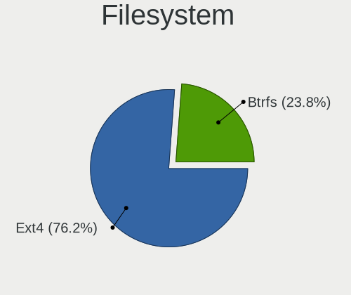

| Type    | Notebooks | Percent |
|---------|-----------|---------|
| Ext4    | 25        | 62.5%   |
| Btrfs   | 14        | 35%     |
| Overlay | 1         | 2.5%    |

Part. scheme
------------

Scheme of partitioning

| Type    | Notebooks | Percent |
|---------|-----------|---------|
| GPT     | 26        | 65%     |
| Unknown | 12        | 30%     |
| MBR     | 2         | 5%      |

Dual Boot with Linux/BSD
------------------------

Hosting more than one Linux/BSD

| Dual boot | Notebooks | Percent |
|-----------|-----------|---------|
| No        | 35        | 87.5%   |
| Yes       | 5         | 12.5%   |

Dual Boot (Win)
---------------

Hosting Linux and Windows

| Dual boot | Notebooks | Percent |
|-----------|-----------|---------|
| No        | 32        | 80%     |
| Yes       | 8         | 20%     |

Board
-----

Vendor
------

Motherboard manufacturer

| Name                | Notebooks | Percent |
|---------------------|-----------|---------|
| ASUSTek Computer    | 9         | 22.5%   |
| Lenovo              | 7         | 17.5%   |
| Hewlett-Packard     | 6         | 15%     |
| Dell                | 3         | 7.5%    |
| Timi                | 2         | 5%      |
| GPD                 | 2         | 5%      |
| TUXEDO              | 1         | 2.5%    |
| Toshiba             | 1         | 2.5%    |
| Sony                | 1         | 2.5%    |
| Samsung Electronics | 1         | 2.5%    |
| Notebook            | 1         | 2.5%    |
| HUAWEI              | 1         | 2.5%    |
| Google              | 1         | 2.5%    |
| Chuwi               | 1         | 2.5%    |
| AWOW                | 1         | 2.5%    |
| Apple               | 1         | 2.5%    |
| Acer                | 1         | 2.5%    |

Model
-----

Motherboard model

| Name                                       | Notebooks | Percent |
|--------------------------------------------|-----------|---------|
| ASUS VivoBook_ASUSLaptop S5402ZA_K5402ZA   | 2         | 5%      |
| TUXEDO Aura 15 Gen1                        | 1         | 2.5%    |
| Toshiba Satellite C55-C                    | 1         | 2.5%    |
| Timi Xiaomi NoteBook Pro                   | 1         | 2.5%    |
| Timi TM1701                                | 1         | 2.5%    |
| Sony SVE1713X1EB                           | 1         | 2.5%    |
| Samsung 550XDA                             | 1         | 2.5%    |
| Notebook N150ZU                            | 1         | 2.5%    |
| Lenovo ThinkPad X1 Carbon Gen 9 20XW007YPB | 1         | 2.5%    |
| Lenovo ThinkPad X1 Carbon 2nd 20A8S0ET00   | 1         | 2.5%    |
| Lenovo ThinkPad T430 23426QU               | 1         | 2.5%    |
| Lenovo ThinkPad S1 Yoga 12 20DKS0E200      | 1         | 2.5%    |
| Lenovo ThinkPad E15 Gen 4 21E6CTO1WW       | 1         | 2.5%    |
| Lenovo ThinkBook 15 G2 ITL 20VE            | 1         | 2.5%    |
| Lenovo IdeaPad Gaming 3 15ARH05 82EY       | 1         | 2.5%    |
| HUAWEI NBLK-WAX9X                          | 1         | 2.5%    |
| HP Pavilion Laptop 15-eh2xxx               | 1         | 2.5%    |
| HP EliteBook 8570p                         | 1         | 2.5%    |
| HP EliteBook 850 G1                        | 1         | 2.5%    |
| HP EliteBook 8460p                         | 1         | 2.5%    |
| HP EliteBook 840 G5                        | 1         | 2.5%    |
| HP 255 15.6 inch G9 Notebook PC            | 1         | 2.5%    |
| GPD G1621-02                               | 1         | 2.5%    |
| GPD G1619-04                               | 1         | 2.5%    |
| Google Rammus                              | 1         | 2.5%    |
| Dell XPS 15 9520                           | 1         | 2.5%    |
| Dell Precision 7720                        | 1         | 2.5%    |
| Dell Latitude 5289                         | 1         | 2.5%    |
| Chuwi GemiBook Pro                         | 1         | 2.5%    |
| AWOW AL34                                  | 1         | 2.5%    |
| ASUS ZenBook UX425IA_UM425IA               | 1         | 2.5%    |
| ASUS VivoBook_ASUSLaptop M7400QE_M7400QE   | 1         | 2.5%    |
| ASUS VivoBook_ASUSLaptop M1405YA_M1405YA   | 1         | 2.5%    |
| ASUS UX301LAA                              | 1         | 2.5%    |
| ASUS TUF Gaming X570-PLUS                  | 1         | 2.5%    |
| ASUS ROG Zephyrus Duo 16 GX650RX_GX650RX   | 1         | 2.5%    |
| ASUS N76VM                                 | 1         | 2.5%    |
| Apple MacBookAir5,2                        | 1         | 2.5%    |
| Acer Swift SF315-52G                       | 1         | 2.5%    |

Model Family
------------

Motherboard model prefix

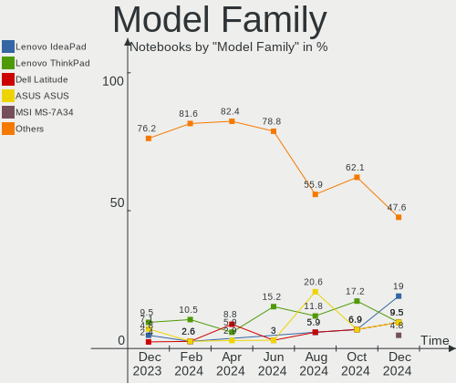

| Name              | Notebooks | Percent |
|-------------------|-----------|---------|
| Lenovo ThinkPad   | 5         | 12.5%   |
| HP EliteBook      | 4         | 10%     |
| ASUS VivoBook     | 4         | 10%     |
| TUXEDO Aura       | 1         | 2.5%    |
| Toshiba Satellite | 1         | 2.5%    |
| Timi Xiaomi       | 1         | 2.5%    |
| Timi TM1701       | 1         | 2.5%    |
| Sony SVE1713X1EB  | 1         | 2.5%    |
| Samsung 550XDA    | 1         | 2.5%    |
| Notebook N150ZU   | 1         | 2.5%    |
| Lenovo ThinkBook  | 1         | 2.5%    |
| Lenovo IdeaPad    | 1         | 2.5%    |
| HUAWEI NBLK-WAX9X | 1         | 2.5%    |
| HP Pavilion       | 1         | 2.5%    |
| HP 255            | 1         | 2.5%    |
| GPD G1621-02      | 1         | 2.5%    |
| GPD G1619-04      | 1         | 2.5%    |
| Google Rammus     | 1         | 2.5%    |
| Dell XPS          | 1         | 2.5%    |
| Dell Precision    | 1         | 2.5%    |
| Dell Latitude     | 1         | 2.5%    |
| Chuwi GemiBook    | 1         | 2.5%    |
| AWOW AL34         | 1         | 2.5%    |
| ASUS ZenBook      | 1         | 2.5%    |
| ASUS UX301LAA     | 1         | 2.5%    |
| ASUS TUF          | 1         | 2.5%    |
| ASUS ROG          | 1         | 2.5%    |
| ASUS N76VM        | 1         | 2.5%    |
| Apple MacBookAir5 | 1         | 2.5%    |
| Acer Swift        | 1         | 2.5%    |

MFG Year
--------

Motherboard manufacture year

| Year | Notebooks | Percent |
|------|-----------|---------|
| 2022 | 11        | 27.5%   |
| 2021 | 6         | 15%     |
| 2020 | 5         | 12.5%   |
| 2012 | 5         | 12.5%   |
| 2014 | 4         | 10%     |
| 2018 | 3         | 7.5%    |
| 2017 | 3         | 7.5%    |
| 2019 | 1         | 2.5%    |
| 2015 | 1         | 2.5%    |
| 2011 | 1         | 2.5%    |

Form Factor
-----------

Physical design of the computer

| Name     | Notebooks | Percent |
|----------|-----------|---------|
| Notebook | 40        | 100%    |

Secure Boot
-----------

Enabled or disabled

| State    | Notebooks | Percent |
|----------|-----------|---------|
| Disabled | 40        | 100%    |

Coreboot
--------

Have coreboot on board

| Used | Notebooks | Percent |
|------|-----------|---------|
| No   | 39        | 97.5%   |
| Yes  | 1         | 2.5%    |

RAM Size
--------

Total RAM memory

| Size in GB  | Notebooks | Percent |
|-------------|-----------|---------|
| 4.01-8.0    | 11        | 27.5%   |
| 8.01-16.0   | 10        | 25%     |
| 32.01-64.0  | 7         | 17.5%   |
| 16.01-24.0  | 7         | 17.5%   |
| 3.01-4.0    | 3         | 7.5%    |
| 24.01-32.0  | 1         | 2.5%    |
| 64.01-256.0 | 1         | 2.5%    |

RAM Used
--------

Used RAM memory

| Used GB   | Notebooks | Percent |
|-----------|-----------|---------|
| 2.01-3.0  | 14        | 35%     |
| 4.01-8.0  | 11        | 27.5%   |
| 3.01-4.0  | 7         | 17.5%   |
| 1.01-2.0  | 4         | 10%     |
| 8.01-16.0 | 4         | 10%     |

Total Drives
------------

Number of drives on board

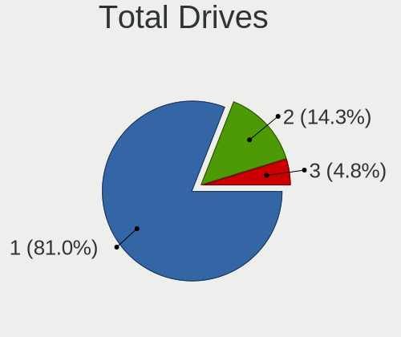

| Drives | Notebooks | Percent |
|--------|-----------|---------|
| 1      | 30        | 75%     |
| 2      | 8         | 20%     |
| 3      | 2         | 5%      |

Has CD-ROM
----------

Has CD-ROM on board

| Presented | Notebooks | Percent |
|-----------|-----------|---------|
| No        | 35        | 87.5%   |
| Yes       | 5         | 12.5%   |

Has Ethernet
------------

Has Ethernet on board

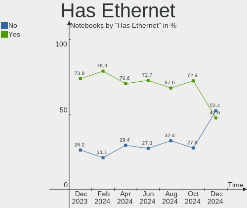

| Presented | Notebooks | Percent |
|-----------|-----------|---------|
| Yes       | 23        | 57.5%   |
| No        | 17        | 42.5%   |

Has WiFi
--------

Has WiFi module

| Presented | Notebooks | Percent |
|-----------|-----------|---------|
| Yes       | 40        | 100%    |

Has Bluetooth
-------------

Has Bluetooth module

| Presented | Notebooks | Percent |
|-----------|-----------|---------|
| Yes       | 39        | 97.5%   |
| No        | 1         | 2.5%    |

Location
--------

Country
-------

Geographic location (country)

| Country     | Notebooks | Percent |
|-------------|-----------|---------|
| USA         | 8         | 20%     |
| Germany     | 5         | 12.5%   |
| Italy       | 3         | 7.5%    |
| Russia      | 2         | 5%      |
| Netherlands | 2         | 5%      |
| India       | 2         | 5%      |
| Brazil      | 2         | 5%      |
| UK          | 1         | 2.5%    |
| Turkey      | 1         | 2.5%    |
| Singapore   | 1         | 2.5%    |
| Poland      | 1         | 2.5%    |
| New Zealand | 1         | 2.5%    |
| Moldova     | 1         | 2.5%    |
| Lithuania   | 1         | 2.5%    |
| Kazakhstan  | 1         | 2.5%    |
| France      | 1         | 2.5%    |
| Estonia     | 1         | 2.5%    |
| Croatia     | 1         | 2.5%    |
| Canada      | 1         | 2.5%    |
| Bulgaria    | 1         | 2.5%    |
| Azerbaijan  | 1         | 2.5%    |
| Austria     | 1         | 2.5%    |
| Australia   | 1         | 2.5%    |

City
----

Geographic location (city)

| City                 | Notebooks | Percent |
|----------------------|-----------|---------|
| Gera                 | 2         | 5%      |
| Xirdalan             | 1         | 2.5%    |
| Warsaw               | 1         | 2.5%    |
| Waidhaus             | 1         | 2.5%    |
| Vilnius              | 1         | 2.5%    |
| Vienna               | 1         | 2.5%    |
| Tallinn              | 1         | 2.5%    |
| Sydney               | 1         | 2.5%    |
| St Petersburg        | 1         | 2.5%    |
| Singapore            | 1         | 2.5%    |
| Sao Joaquim da Barra | 1         | 2.5%    |
| Rotterdam            | 1         | 2.5%    |
| Porto Alegre         | 1         | 2.5%    |
| Plovdiv              | 1         | 2.5%    |
| Philadelphia         | 1         | 2.5%    |
| Peize                | 1         | 2.5%    |
| Paris                | 1         | 2.5%    |
| Osijek               | 1         | 2.5%    |
| New Port Richey      | 1         | 2.5%    |
| Moscow               | 1         | 2.5%    |
| Montreal             | 1         | 2.5%    |
| Milan                | 1         | 2.5%    |
| Meissen              | 1         | 2.5%    |
| Marino               | 1         | 2.5%    |
| Hyderabad            | 1         | 2.5%    |
| Hamburg              | 1         | 2.5%    |
| Exeter               | 1         | 2.5%    |
| Euless               | 1         | 2.5%    |
| Dallas               | 1         | 2.5%    |
| Chittaranjan Park    | 1         | 2.5%    |
| Chisinau             | 1         | 2.5%    |
| Chesapeake           | 1         | 2.5%    |
| Boca Raton           | 1         | 2.5%    |
| Austin               | 1         | 2.5%    |
| Aurora               | 1         | 2.5%    |
| Auckland             | 1         | 2.5%    |
| Arezzo               | 1         | 2.5%    |
| Ankara               | 1         | 2.5%    |
| Almaty               | 1         | 2.5%    |

Drives
------

Drive Vendor
------------

Hard drive vendors

| Vendor                       | Notebooks | Drives | Percent |
|------------------------------|-----------|--------|---------|
| Samsung Electronics          | 13        | 13     | 25.49%  |
| Micron Technology            | 5         | 5      | 9.8%    |
| Sandisk                      | 4         | 5      | 7.84%   |
| Kingston                     | 4         | 4      | 7.84%   |
| WDC                          | 3         | 4      | 5.88%   |
| Toshiba                      | 3         | 3      | 5.88%   |
| SK hynix                     | 3         | 3      | 5.88%   |
| Unknown                      | 2         | 2      | 3.92%   |
| Seagate                      | 2         | 2      | 3.92%   |
| KIOXIA                       | 2         | 2      | 3.92%   |
| Shenzhen Longsys Electronics | 1         | 1      | 1.96%   |
| PNY                          | 1         | 1      | 1.96%   |
| Phison Electronics           | 1         | 1      | 1.96%   |
| OCZ                          | 1         | 1      | 1.96%   |
| Netac                        | 1         | 1      | 1.96%   |
| Intel                        | 1         | 1      | 1.96%   |
| Hitachi                      | 1         | 1      | 1.96%   |
| Crucial                      | 1         | 1      | 1.96%   |
| Apple                        | 1         | 1      | 1.96%   |
| Unknown                      | 1         | 1      | 1.96%   |

Drive Model
-----------

Hard drive models

| Model                                                | Notebooks | Percent |
|------------------------------------------------------|-----------|---------|
| Samsung NVMe SSD Controller SM981/PM981/PM983 250GB  | 3         | 5.77%   |
| Toshiba MQ01ABD100 1TB                               | 2         | 3.85%   |
| Samsung NVMe SSD Controller SM961/PM961/SM963 256GB  | 2         | 3.85%   |
| Samsung MZALQ512HALU-000L2 512GB                     | 2         | 3.85%   |
| Micron 2450_MTFDKBA1T0TFK 1TB                        | 2         | 3.85%   |
| WDC WDS500G2B0B-00YS70 500GB SSD                     | 1         | 1.92%   |
| WDC WDS100T2B0B-00YS70 1TB SSD                       | 1         | 1.92%   |
| WDC WD20EZRZ-00Z5HB0 2TB                             | 1         | 1.92%   |
| WDC WD10EZEX-08M2NA0 1TB                             | 1         | 1.92%   |
| Unknown MMC Card  64GB                               | 1         | 1.92%   |
| Unknown MMC Card  32GB                               | 1         | 1.92%   |
| Toshiba XG4 NVMe SSD Controller 256GB                | 1         | 1.92%   |
| SK hynix PC801 NVMe 2TB                              | 1         | 1.92%   |
| SK hynix PC401 NVMe Solid State Drive 256GB          | 1         | 1.92%   |
| SK hynix HFM001TD3JX013N 1TB                         | 1         | 1.92%   |
| Shenzhen Longsys SM2263EN/SM2263XT-based OEM SSD 1TB | 1         | 1.92%   |
| Seagate UltraTouch SSD 1TB                           | 1         | 1.92%   |
| Seagate ST1000LM035-1RK172 1TB                       | 1         | 1.92%   |
| Sandisk WD PC SN740 SDDPNQD-512G-1006 512GB          | 1         | 1.92%   |
| Sandisk WD Blue SN500 / PC SN520 NVMe SSD 512GB      | 1         | 1.92%   |
| SanDisk SD8SN8U-128G-1006 128GB SSD                  | 1         | 1.92%   |
| SanDisk SD6SP1M128G1102 128GB SSD                    | 1         | 1.92%   |
| Samsung SSD 970 EVO 500GB                            | 1         | 1.92%   |
| Samsung SSD 870 EVO 500GB                            | 1         | 1.92%   |
| Samsung SSD 860 EVO M.2 1TB                          | 1         | 1.92%   |
| Samsung SSD 840 PRO Series 128GB                     | 1         | 1.92%   |
| Samsung NVMe SSD Controller PM9A1/PM9A3/980PRO 1TB   | 1         | 1.92%   |
| Samsung MZVLQ512HBLU-00BH1 512GB                     | 1         | 1.92%   |
| PNY CS900 240GB SSD                                  | 1         | 1.92%   |
| Phison E16 PCIe4 NVMe Controller 1TB                 | 1         | 1.92%   |
| OCZ VERTEX PLUS 64GB SSD                             | 1         | 1.92%   |
| Netac SSD 256GB                                      | 1         | 1.92%   |
| Micron MTFDKBA1T0TFH 1024GB                          | 1         | 1.92%   |
| Micron 2400_MTFDKBA512QFM 512GB                      | 1         | 1.92%   |
| Micron 1100 SATA 256GB SSD                           | 1         | 1.92%   |
| KIOXIA KBG5AZNT1T02 LA 1024GB                        | 1         | 1.92%   |
| KIOXIA KBG50ZNV512G 512GB                            | 1         | 1.92%   |
| Kingston SUV400S37240G 240GB SSD                     | 1         | 1.92%   |
| Kingston SA400S37240G 240GB SSD                      | 1         | 1.92%   |
| Kingston SA400S37120G 120GB SSD                      | 1         | 1.92%   |

HDD Vendor
----------

Hard disk drive vendors

| Vendor  | Notebooks | Drives | Percent |
|---------|-----------|--------|---------|
| Toshiba | 2         | 2      | 40%     |
| WDC     | 1         | 2      | 20%     |
| Seagate | 1         | 1      | 20%     |
| Hitachi | 1         | 1      | 20%     |

SSD Vendor
----------

Solid state drive vendors

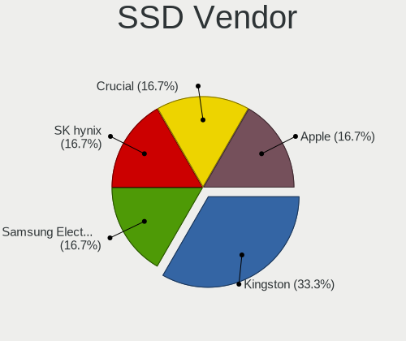

| Vendor              | Notebooks | Drives | Percent |
|---------------------|-----------|--------|---------|
| Samsung Electronics | 3         | 3      | 16.67%  |
| Kingston            | 3         | 3      | 16.67%  |
| WDC                 | 2         | 2      | 11.11%  |
| SanDisk             | 2         | 3      | 11.11%  |
| Seagate             | 1         | 1      | 5.56%   |
| PNY                 | 1         | 1      | 5.56%   |
| OCZ                 | 1         | 1      | 5.56%   |
| Netac               | 1         | 1      | 5.56%   |
| Micron Technology   | 1         | 1      | 5.56%   |
| Intel               | 1         | 1      | 5.56%   |
| Crucial             | 1         | 1      | 5.56%   |
| Apple               | 1         | 1      | 5.56%   |

Drive Kind
----------

HDD or SSD

| Kind | Notebooks | Drives | Percent |
|------|-----------|--------|---------|
| NVMe | 22        | 25     | 50%     |
| SSD  | 14        | 19     | 31.82%  |
| HDD  | 5         | 6      | 11.36%  |
| MMC  | 3         | 3      | 6.82%   |

Drive Connector
---------------

SATA, SAS, NVMe, etc.

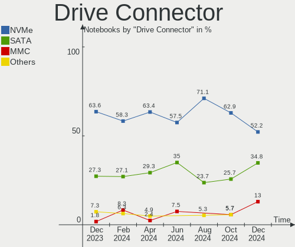

| Type | Notebooks | Drives | Percent |
|------|-----------|--------|---------|
| NVMe | 22        | 25     | 48.89%  |
| SATA | 18        | 23     | 40%     |
| MMC  | 3         | 3      | 6.67%   |
| SAS  | 2         | 2      | 4.44%   |

Drive Size
----------

Size of hard drive

| Size in TB | Notebooks | Drives | Percent |
|------------|-----------|--------|---------|
| 0.01-0.5   | 11        | 15     | 57.89%  |
| 0.51-1.0   | 7         | 9      | 36.84%  |
| 1.01-2.0   | 1         | 1      | 5.26%   |

Space Total
-----------

Amount of disk space available on the file system

| Size in GB     | Notebooks | Percent |
|----------------|-----------|---------|
| 1001-2000      | 8         | 20%     |
| 501-1000       | 7         | 17.5%   |
| Unknown        | 7         | 17.5%   |
| 101-250        | 5         | 12.5%   |
| 1-20           | 5         | 12.5%   |
| 251-500        | 3         | 7.5%    |
| More than 3000 | 2         | 5%      |
| 21-50          | 2         | 5%      |
| 51-100         | 1         | 2.5%    |

Space Used
----------

Amount of used disk space

| Used GB  | Notebooks | Percent |
|----------|-----------|---------|
| 1-20     | 14        | 35%     |
| 21-50    | 8         | 20%     |
| Unknown  | 7         | 17.5%   |
| 101-250  | 4         | 10%     |
| 51-100   | 3         | 7.5%    |
| 251-500  | 2         | 5%      |
| 501-1000 | 2         | 5%      |

Malfunc. Drives
---------------

Drive models with a malfunction

| Model                                                           | Notebooks | Drives | Percent |
|-----------------------------------------------------------------|-----------|--------|---------|
| Samsung Electronics NVMe SSD Controller SM961/PM961/SM963 256GB | 1         | 1      | 50%     |
| Apple SSD TS128E 121GB                                          | 1         | 1      | 50%     |

Malfunc. Drive Vendor
---------------------

Vendors of faulty drives

| Vendor              | Notebooks | Drives | Percent |
|---------------------|-----------|--------|---------|
| Samsung Electronics | 1         | 1      | 50%     |
| Apple               | 1         | 1      | 50%     |

Malfunc. HDD Vendor
-------------------

Vendors of faulty HDD drives

Zero info for selected period =(

Malfunc. Drive Kind
-------------------

Kinds of faulty drives

| Kind | Notebooks | Drives | Percent |
|------|-----------|--------|---------|
| NVMe | 1         | 1      | 50%     |
| SSD  | 1         | 1      | 50%     |

Failed Drives
-------------

Failed drive models

Zero info for selected period =(

Failed Drive Vendor
-------------------

Failed drive vendors

Zero info for selected period =(

Drive Status
------------

Number of failed and malfunc. drives

| Status   | Notebooks | Drives | Percent |
|----------|-----------|--------|---------|
| Works    | 26        | 29     | 59.09%  |
| Detected | 16        | 22     | 36.36%  |
| Malfunc  | 2         | 2      | 4.55%   |

Storage controller
------------------

Storage Vendor
--------------

Storage controller vendors

| Vendor                       | Notebooks | Percent |
|------------------------------|-----------|---------|
| Intel                        | 21        | 41.18%  |
| Samsung Electronics          | 10        | 19.61%  |
| AMD                          | 5         | 9.8%    |
| Micron Technology            | 4         | 7.84%   |
| SK hynix                     | 3         | 5.88%   |
| SanDisk                      | 2         | 3.92%   |
| KIOXIA                       | 2         | 3.92%   |
| Toshiba America Info Systems | 1         | 1.96%   |
| Shenzhen Longsys Electronics | 1         | 1.96%   |
| Phison Electronics           | 1         | 1.96%   |
| Kingston Technology Company  | 1         | 1.96%   |

Storage Model
-------------

Storage controller models

| Model                                                                         | Notebooks | Percent |
|-------------------------------------------------------------------------------|-----------|---------|
| Intel 7 Series Chipset Family 6-port SATA Controller [AHCI mode]              | 5         | 9.8%    |
| AMD FCH SATA Controller [AHCI mode]                                           | 5         | 9.8%    |
| Samsung NVMe SSD Controller SM981/PM981/PM983                                 | 4         | 7.84%   |
| Samsung NVMe SSD Controller 980                                               | 3         | 5.88%   |
| Micron NVMe Storage Controller                                                | 3         | 5.88%   |
| Intel 8 Series SATA Controller 1 [AHCI mode]                                  | 3         | 5.88%   |
| Samsung NVMe SSD Controller SM961/PM961/SM963                                 | 2         | 3.92%   |
| KIOXIA Non-Volatile memory controller                                         | 2         | 3.92%   |
| Intel Wildcat Point-LP SATA Controller [AHCI Mode]                            | 2         | 3.92%   |
| Intel Volume Management Device NVMe RAID Controller                           | 2         | 3.92%   |
| Intel Tiger Lake-LP SATA Controller                                           | 2         | 3.92%   |
| Intel 82801 Mobile SATA Controller [RAID mode]                                | 2         | 3.92%   |
| Toshiba America Info Systems XG4 NVMe SSD Controller                          | 1         | 1.96%   |
| SK hynix Platinum P41 NVMe Solid State Drive 2TB                              | 1         | 1.96%   |
| SK hynix PC401 NVMe Solid State Drive 256GB                                   | 1         | 1.96%   |
| SK hynix Gold P31/PC711 NVMe Solid State Drive                                | 1         | 1.96%   |
| Shenzhen Longsys SM2263EN/SM2263XT-based OEM SSD                              | 1         | 1.96%   |
| SanDisk WD Blue SN500 / PC SN520 NVMe SSD                                     | 1         | 1.96%   |
| SanDisk NVMe Controller                                                       | 1         | 1.96%   |
| Samsung NVMe SSD Controller PM9A1/PM9A3/980PRO                                | 1         | 1.96%   |
| Phison E16 PCIe4 NVMe Controller                                              | 1         | 1.96%   |
| Micron NVMe Controller                                                        | 1         | 1.96%   |
| Kingston Company Company Non-Volatile memory controller                       | 1         | 1.96%   |
| Intel Sunrise Point-LP SATA Controller [AHCI mode]                            | 1         | 1.96%   |
| Intel Q170/Q150/B150/H170/H110/Z170/CM236 Chipset SATA Controller [AHCI Mode] | 1         | 1.96%   |
| Intel Jasper Lake SATA AHCI Controller                                        | 1         | 1.96%   |
| Intel Celeron N3350/Pentium N4200/Atom E3900 Series SATA AHCI Controller      | 1         | 1.96%   |
| Intel 6 Series/C200 Series Chipset Family 6 port Mobile SATA AHCI Controller  | 1         | 1.96%   |

Storage Kind
------------

Kind of storage controller (IDE, SATA, NVMe, SAS, ...)

| Kind | Notebooks | Percent |
|------|-----------|---------|
| NVMe | 22        | 45.83%  |
| SATA | 22        | 45.83%  |
| RAID | 4         | 8.33%   |

Processor
---------

CPU Vendor
----------

Processor vendors

| Vendor | Notebooks | Percent |
|--------|-----------|---------|
| Intel  | 29        | 72.5%   |
| AMD    | 11        | 27.5%   |

CPU Model
---------

Processor models

| Model                                         | Notebooks | Percent |
|-----------------------------------------------|-----------|---------|
| Intel 12th Gen Core i7-12700H                 | 3         | 7.5%    |
| Intel Core i5-8250U CPU @ 1.60GHz             | 2         | 5%      |
| Intel 11th Gen Core i7-1165G7 @ 2.80GHz       | 2         | 5%      |
| AMD Ryzen 7 4700U with Radeon Graphics        | 2         | 5%      |
| Intel Xeon CPU E3-1535M v6 @ 3.10GHz          | 1         | 2.5%    |
| Intel Core m3-8100Y CPU @ 1.10GHz             | 1         | 2.5%    |
| Intel Core i7-8650U CPU @ 1.90GHz             | 1         | 2.5%    |
| Intel Core i7-7600U CPU @ 2.80GHz             | 1         | 2.5%    |
| Intel Core i7-4600U CPU @ 2.10GHz             | 1         | 2.5%    |
| Intel Core i7-3632QM CPU @ 2.20GHz            | 1         | 2.5%    |
| Intel Core i7-3610QM CPU @ 2.30GHz            | 1         | 2.5%    |
| Intel Core i7-2820QM CPU @ 2.30GHz            | 1         | 2.5%    |
| Intel Core i5-8265U CPU @ 1.60GHz             | 1         | 2.5%    |
| Intel Core i5-5300U CPU @ 2.30GHz             | 1         | 2.5%    |
| Intel Core i5-4300U CPU @ 1.90GHz             | 1         | 2.5%    |
| Intel Core i5-4210U CPU @ 1.70GHz             | 1         | 2.5%    |
| Intel Core i5-3427U CPU @ 1.80GHz             | 1         | 2.5%    |
| Intel Core i5-3230M CPU @ 2.60GHz             | 1         | 2.5%    |
| Intel Core i5-3210M CPU @ 2.50GHz             | 1         | 2.5%    |
| Intel Core i3-5005U CPU @ 2.00GHz             | 1         | 2.5%    |
| Intel Celeron N5100 @ 1.10GHz                 | 1         | 2.5%    |
| Intel Celeron CPU N3450 @ 1.10GHz             | 1         | 2.5%    |
| Intel 12th Gen Core i7-1255U                  | 1         | 2.5%    |
| Intel 12th Gen Core i5-12450H                 | 1         | 2.5%    |
| Intel 11th Gen Core i7-1195G7 @ 2.90GHz       | 1         | 2.5%    |
| Intel 11th Gen Core i3-1115G4 @ 3.00GHz       | 1         | 2.5%    |
| AMD Ryzen 9 6900HX with Radeon Graphics       | 1         | 2.5%    |
| AMD Ryzen 7 7730U with Radeon Graphics        | 1         | 2.5%    |
| AMD Ryzen 7 6800U with Radeon Graphics        | 1         | 2.5%    |
| AMD Ryzen 7 5825U with Radeon Graphics        | 1         | 2.5%    |
| AMD Ryzen 7 5800H with Radeon Graphics        | 1         | 2.5%    |
| AMD Ryzen 7 3700X 8-Core Processor            | 1         | 2.5%    |
| AMD Ryzen 5 5625U with Radeon Graphics        | 1         | 2.5%    |
| AMD Ryzen 5 4600H with Radeon Graphics        | 1         | 2.5%    |
| AMD Ryzen 5 3500U with Radeon Vega Mobile Gfx | 1         | 2.5%    |

CPU Model Family
----------------

Processor model prefix

| Model         | Notebooks | Percent |
|---------------|-----------|---------|
| Other         | 9         | 22.5%   |
| Intel Core i5 | 9         | 22.5%   |
| AMD Ryzen 7   | 7         | 17.5%   |
| Intel Core i7 | 6         | 15%     |
| AMD Ryzen 5   | 3         | 7.5%    |
| Intel Celeron | 2         | 5%      |
| Intel Xeon    | 1         | 2.5%    |
| Intel Core m3 | 1         | 2.5%    |
| Intel Core i3 | 1         | 2.5%    |
| AMD Ryzen 9   | 1         | 2.5%    |

CPU Cores
---------

Number of processor cores

| Number | Notebooks | Percent |
|--------|-----------|---------|
| 4      | 14        | 35%     |
| 2      | 11        | 27.5%   |
| 8      | 9         | 22.5%   |
| 14     | 3         | 7.5%    |
| 6      | 2         | 5%      |
| 10     | 1         | 2.5%    |

CPU Sockets
-----------

Number of sockets

| Number | Notebooks | Percent |
|--------|-----------|---------|
| 1      | 40        | 100%    |

CPU Threads
-----------

Threads per core (Hyper-Threading)

| Number | Notebooks | Percent |
|--------|-----------|---------|
| 2      | 36        | 90%     |
| 1      | 4         | 10%     |

CPU Op-Modes
------------

CPU Operation Modes (32-bit, 64-bit)

| Op mode        | Notebooks | Percent |
|----------------|-----------|---------|
| 32-bit, 64-bit | 40        | 100%    |

CPU Microcode
-------------

Microcode number

| Number     | Notebooks | Percent |
|------------|-----------|---------|
| Unknown    | 29        | 72.5%   |
| 0x0a50000d | 3         | 7.5%    |
| 0x306a9    | 2         | 5%      |
| 0x906c0    | 1         | 2.5%    |
| 0x806ea    | 1         | 2.5%    |
| 0x306d4    | 1         | 2.5%    |
| 0x0a404102 | 1         | 2.5%    |
| 0x08600106 | 1         | 2.5%    |
| 0x08108109 | 1         | 2.5%    |

CPU Microarch
-------------

Microarchitecture

| Name             | Notebooks | Percent |
|------------------|-----------|---------|
| KabyLake         | 7         | 17.5%   |
| IvyBridge        | 5         | 12.5%   |
| Zen 3            | 4         | 10%     |
| Zen 2            | 4         | 10%     |
| TigerLake        | 4         | 10%     |
| Alderlake Hybrid | 4         | 10%     |
| Haswell          | 3         | 7.5%    |
| Unknown          | 3         | 7.5%    |
| Broadwell        | 2         | 5%      |
| Zen+             | 1         | 2.5%    |
| Tremont          | 1         | 2.5%    |
| SandyBridge      | 1         | 2.5%    |
| Goldmont         | 1         | 2.5%    |

Graphics
--------

GPU Vendor
----------

Vendors of graphics cards

| Vendor | Notebooks | Percent |
|--------|-----------|---------|
| Intel  | 28        | 57.14%  |
| AMD    | 12        | 24.49%  |
| Nvidia | 9         | 18.37%  |

GPU Model
---------

Graphics card models

| Model                                                                     | Notebooks | Percent |
|---------------------------------------------------------------------------|-----------|---------|
| Intel 3rd Gen Core processor Graphics Controller                          | 4         | 8.16%   |
| Intel UHD Graphics 620                                                    | 3         | 6.12%   |
| Intel TigerLake-LP GT2 [Iris Xe Graphics]                                 | 3         | 6.12%   |
| Intel Haswell-ULT Integrated Graphics Controller                          | 3         | 6.12%   |
| Intel Alder Lake-P Integrated Graphics Controller                         | 3         | 6.12%   |
| AMD Renoir                                                                | 3         | 6.12%   |
| AMD Barcelo                                                               | 3         | 6.12%   |
| Nvidia GP108M [GeForce MX150]                                             | 2         | 4.08%   |
| Nvidia GA107M [GeForce RTX 3050 Ti Mobile]                                | 2         | 4.08%   |
| Intel HD Graphics 5500                                                    | 2         | 4.08%   |
| AMD Rembrandt [Radeon 680M]                                               | 2         | 4.08%   |
| Nvidia TU117M [GeForce GTX 1650 Ti Mobile]                                | 1         | 2.04%   |
| Nvidia GP104GLM [Quadro P5000 Mobile]                                     | 1         | 2.04%   |
| Nvidia GP104 [GeForce GTX 1070]                                           | 1         | 2.04%   |
| Nvidia GF108M [GeForce GT 620M/630M/635M/640M LE]                         | 1         | 2.04%   |
| Nvidia GA103M [GeForce RTX 3080 Ti Mobile]                                | 1         | 2.04%   |
| Intel WhiskeyLake-U GT2 [UHD Graphics 620]                                | 1         | 2.04%   |
| Intel UHD Graphics 615                                                    | 1         | 2.04%   |
| Intel Tiger Lake-LP GT2 [UHD Graphics G4]                                 | 1         | 2.04%   |
| Intel JasperLake [UHD Graphics]                                           | 1         | 2.04%   |
| Intel HD Graphics P630                                                    | 1         | 2.04%   |
| Intel HD Graphics 620                                                     | 1         | 2.04%   |
| Intel HD Graphics 500                                                     | 1         | 2.04%   |
| Intel Alder Lake-UP3 GT2 [Iris Xe Graphics]                               | 1         | 2.04%   |
| Intel Alder Lake-P GT1 [UHD Graphics]                                     | 1         | 2.04%   |
| Intel 2nd Generation Core Processor Family Integrated Graphics Controller | 1         | 2.04%   |
| AMD Thames [Radeon HD 7550M/7570M/7650M]                                  | 1         | 2.04%   |
| AMD Picasso/Raven 2 [Radeon Vega Series / Radeon Vega Mobile Series]      | 1         | 2.04%   |
| AMD Mars [Radeon HD 8730M]                                                | 1         | 2.04%   |
| AMD Cezanne [Radeon Vega Series / Radeon Vega Mobile Series]              | 1         | 2.04%   |

GPU Combo
---------

Combinations of graphics cards

| Name           | Notebooks | Percent |
|----------------|-----------|---------|
| 1 x Intel      | 22        | 55%     |
| 1 x AMD        | 8         | 20%     |
| Intel + Nvidia | 5         | 12.5%   |
| AMD + Nvidia   | 3         | 7.5%    |
| 1 x Nvidia     | 1         | 2.5%    |
| Intel + AMD    | 1         | 2.5%    |

GPU Driver
----------

Free vs proprietary

| Driver      | Notebooks | Percent |
|-------------|-----------|---------|
| Free        | 34        | 85%     |
| Proprietary | 6         | 15%     |

GPU Memory
----------

Total video memory

| Size in GB | Notebooks | Percent |
|------------|-----------|---------|
| Unknown    | 31        | 77.5%   |
| 0.01-0.5   | 4         | 10%     |
| 3.01-4.0   | 2         | 5%      |
| 7.01-8.0   | 1         | 2.5%    |
| 1.01-2.0   | 1         | 2.5%    |
| 0.51-1.0   | 1         | 2.5%    |

Monitor
-------

Monitor Vendor
--------------

Monitor vendors

| Vendor                  | Notebooks | Percent |
|-------------------------|-----------|---------|
| Samsung Electronics     | 8         | 16.33%  |
| AU Optronics            | 8         | 16.33%  |
| Chimei Innolux          | 7         | 14.29%  |
| BOE                     | 4         | 8.16%   |
| Sharp                   | 3         | 6.12%   |
| LG Display              | 3         | 6.12%   |
| Goldstar                | 3         | 6.12%   |
| Philips                 | 2         | 4.08%   |
| ViewSonic               | 1         | 2.04%   |
| Unknown (XXX)           | 1         | 2.04%   |
| PANDA                   | 1         | 2.04%   |
| Lenovo                  | 1         | 2.04%   |
| JDI                     | 1         | 2.04%   |
| CSO                     | 1         | 2.04%   |
| Chi Mei Optoelectronics | 1         | 2.04%   |
| BenQ                    | 1         | 2.04%   |
| Apple                   | 1         | 2.04%   |
| AOC                     | 1         | 2.04%   |
| Acer                    | 1         | 2.04%   |

Monitor Model
-------------

Monitor models

| Model                                                                     | Notebooks | Percent |
|---------------------------------------------------------------------------|-----------|---------|
| Samsung Electronics LCD Monitor SDC416D 2880x1800 312x195mm 14.5-inch     | 2         | 4%      |
| Chimei Innolux LCD Monitor CMN15E8 1920x1080 344x193mm 15.5-inch          | 2         | 4%      |
| ViewSonic VX2776 Series VSC3E32 1920x1080 598x336mm 27.0-inch             | 1         | 2%      |
| Unknown (XXX) FURRION TV XXX3553 1920x1080 520x290mm 23.4-inch            | 1         | 2%      |
| Sharp LQ133T1JW14 SHP1406 2560x1440 294x165mm 13.3-inch                   | 1         | 2%      |
| Sharp LCD Monitor SHP1516 3840x2400 336x210mm 15.6-inch                   | 1         | 2%      |
| Sharp LCD Monitor SHP1446 3840x2160 382x215mm 17.3-inch                   | 1         | 2%      |
| Samsung Electronics SMS22A350H SAM07D1 1920x1080 477x268mm 21.5-inch      | 1         | 2%      |
| Samsung Electronics LCD Monitor SEC325A 1366x768 344x194mm 15.5-inch      | 1         | 2%      |
| Samsung Electronics LCD Monitor SDC5441 1366x768 309x174mm 14.0-inch      | 1         | 2%      |
| Samsung Electronics LCD Monitor SDC4171 2880x1800 302x189mm 14.0-inch     | 1         | 2%      |
| Samsung Electronics LCD Monitor SDC4154 2880x1800 302x189mm 14.0-inch     | 1         | 2%      |
| Samsung Electronics LCD Monitor SAM0B7C 1920x1080 886x498mm 40.0-inch     | 1         | 2%      |
| Philips PHL 234E5 PHLC0C7 1920x1080 509x286mm 23.0-inch                   | 1         | 2%      |
| Philips 231PQPY PHL08BC 1920x1080 509x286mm 23.0-inch                     | 1         | 2%      |
| PANDA LCD Monitor NCP0035 1920x1080 309x174mm 14.0-inch                   | 1         | 2%      |
| LG Display LCD Monitor LGD04F0 2560x1440 310x174mm 14.0-inch              | 1         | 2%      |
| LG Display LCD Monitor LGD0456 1366x768 344x194mm 15.5-inch               | 1         | 2%      |
| LG Display LCD Monitor LGD0437 1920x1080 276x156mm 12.5-inch              | 1         | 2%      |
| Lenovo P24q-10 LEN61A5 2560x1440 527x296mm 23.8-inch                      | 1         | 2%      |
| JDI GPD1001H JDI0031 2560x1600 890x500mm 40.2-inch                        | 1         | 2%      |
| Goldstar ULTRAWIDE GSM59F1 2560x1080 673x284mm 28.8-inch                  | 1         | 2%      |
| Goldstar HDR WQHD GSM7756 3440x1440 820x346mm 35.0-inch                   | 1         | 2%      |
| Goldstar 32GK850G GSM7709 2560x1440 697x392mm 31.5-inch                   | 1         | 2%      |
| CSO LCD Monitor CSO1403 3840x2400 302x189mm 14.0-inch                     | 1         | 2%      |
| Chimei Innolux P140ZKA-BZ1 CMN8C03 2160x1440 296x197mm 14.0-inch          | 1         | 2%      |
| Chimei Innolux LCD Monitor CMN15E7 1920x1080 344x193mm 15.5-inch          | 1         | 2%      |
| Chimei Innolux LCD Monitor CMN15C2 1920x1080 344x194mm 15.5-inch          | 1         | 2%      |
| Chimei Innolux LCD Monitor CMN1404 1920x1080 309x173mm 13.9-inch          | 1         | 2%      |
| Chimei Innolux LCD Monitor CMN1244 1920x1080 276x155mm 12.5-inch          | 1         | 2%      |
| Chi Mei Optoelectronics LCD Monitor CMO1720 1920x1080 382x215mm 17.3-inch | 1         | 2%      |
| BOE LCD Monitor BOE0AF2 2560x1600 302x189mm 14.0-inch                     | 1         | 2%      |
| BOE LCD Monitor BOE0A68 3840x1100 340x100mm 14.0-inch                     | 1         | 2%      |
| BOE LCD Monitor BOE0A19 3840x2400 344x215mm 16.0-inch                     | 1         | 2%      |
| BOE LCD Monitor BOE0812 1920x1080 344x194mm 15.5-inch                     | 1         | 2%      |
| BOE LCD Monitor BOE0747 1920x1080 344x194mm 15.5-inch                     | 1         | 2%      |
| BenQ GW2750H BNQ78C3 1920x1080 598x336mm 27.0-inch                        | 1         | 2%      |
| AU Optronics LCD Monitor AUOE48D 1920x1080 344x194mm 15.5-inch            | 1         | 2%      |
| AU Optronics LCD Monitor AUOD1ED 1920x1080 344x193mm 15.5-inch            | 1         | 2%      |
| AU Optronics LCD Monitor AUOB78F 1920x1080 344x194mm 15.5-inch            | 1         | 2%      |

Monitor Resolution
------------------

Monitor screen resolution

| Resolution       | Notebooks | Percent |
|------------------|-----------|---------|
| 1920x1080 (FHD)  | 22        | 50%     |
| 2880x1800        | 4         | 9.09%   |
| 3840x2400        | 3         | 6.82%   |
| 2560x1440 (QHD)  | 3         | 6.82%   |
| 1366x768 (WXGA)  | 3         | 6.82%   |
| 2560x1600        | 2         | 4.55%   |
| 3840x2160 (4K)   | 1         | 2.27%   |
| 3840x1100        | 1         | 2.27%   |
| 3440x1440        | 1         | 2.27%   |
| 2560x1080        | 1         | 2.27%   |
| 2160x1440        | 1         | 2.27%   |
| 1600x900 (HD+)   | 1         | 2.27%   |
| 1440x900 (WXGA+) | 1         | 2.27%   |

Monitor Diagonal
----------------

Diagonal size in inches

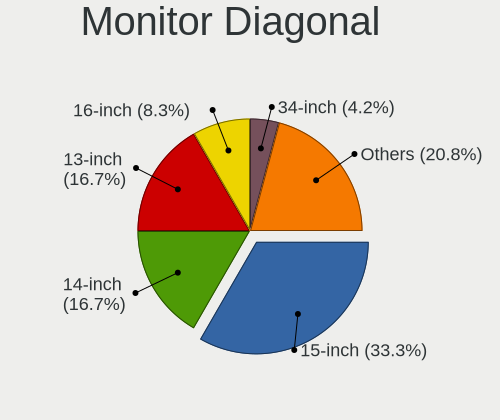

| Inches | Notebooks | Percent |
|--------|-----------|---------|
| 15     | 16        | 32%     |
| 14     | 12        | 24%     |
| 23     | 4         | 8%      |
| 27     | 3         | 6%      |
| 13     | 3         | 6%      |
| 17     | 2         | 4%      |
| 12     | 2         | 4%      |
| 58     | 1         | 2%      |
| 40     | 1         | 2%      |
| 35     | 1         | 2%      |
| 34     | 1         | 2%      |
| 31     | 1         | 2%      |
| 24     | 1         | 2%      |
| 21     | 1         | 2%      |
| 16     | 1         | 2%      |

Monitor Width
-------------

Physical width

| Width in mm | Notebooks | Percent |
|-------------|-----------|---------|
| 301-350     | 28        | 59.57%  |
| 501-600     | 6         | 12.77%  |
| 201-300     | 5         | 10.64%  |
| 801-900     | 2         | 4.26%   |
| 351-400     | 2         | 4.26%   |
| 701-800     | 1         | 2.13%   |
| 601-700     | 1         | 2.13%   |
| 401-500     | 1         | 2.13%   |
| 1001-1500   | 1         | 2.13%   |

Aspect Ratio
------------

Proportional relationship between the width and the height

| Ratio | Notebooks | Percent |
|-------|-----------|---------|
| 16/9  | 29        | 69.05%  |
| 16/10 | 9         | 21.43%  |
| 21/9  | 2         | 4.76%   |
| 3/2   | 1         | 2.38%   |
| 3.40  | 1         | 2.38%   |

Monitor Area
------------

Area in inch

| Area in inch | Notebooks | Percent |
|----------------|-----------|---------|
| 101-110        | 15        | 30.61%  |
| 81-90          | 11        | 22.45%  |
| 201-250        | 4         | 8.16%   |
| 351-500        | 3         | 6.12%   |
| 301-350        | 3         | 6.12%   |
| 61-70          | 2         | 4.08%   |
| 121-130        | 2         | 4.08%   |
| 111-120        | 2         | 4.08%   |
| 91-100         | 2         | 4.08%   |
| More than 1000 | 1         | 2.04%   |
| 71-80          | 1         | 2.04%   |
| 51-60          | 1         | 2.04%   |
| 151-200        | 1         | 2.04%   |
| 501-1000       | 1         | 2.04%   |

Pixel Density
-------------

Pixels per inch

| Density       | Notebooks | Percent |
|---------------|-----------|---------|
| 121-160       | 19        | 40.43%  |
| 161-240       | 8         | 17.02%  |
| 51-100        | 7         | 14.89%  |
| More than 240 | 6         | 12.77%  |
| 101-120       | 6         | 12.77%  |
| 1-50          | 1         | 2.13%   |

Multiple Monitors
-----------------

Total monitors connected

| Total | Notebooks | Percent |
|-------|-----------|---------|
| 1     | 30        | 75%     |
| 2     | 8         | 20%     |
| 3     | 1         | 2.5%    |
| 0     | 1         | 2.5%    |

Network
-------

Net Controller Vendor
---------------------

Controller vendors

| Vendor                        | Notebooks | Percent |
|-------------------------------|-----------|---------|
| Intel                         | 30        | 48.39%  |
| Realtek Semiconductor         | 16        | 25.81%  |
| Qualcomm Atheros              | 3         | 4.84%   |
| MediaTek                      | 2         | 3.23%   |
| Broadcom                      | 2         | 3.23%   |
| Sierra Wireless               | 1         | 1.61%   |
| Samsung Electronics           | 1         | 1.61%   |
| OnePlus Technology (Shenzhen) | 1         | 1.61%   |
| Lenovo                        | 1         | 1.61%   |
| Huawei Technologies           | 1         | 1.61%   |
| DisplayLink                   | 1         | 1.61%   |
| Dell                          | 1         | 1.61%   |
| D-Link                        | 1         | 1.61%   |
| ASIX Electronics              | 1         | 1.61%   |

Net Controller Model
--------------------

Controller models

| Model                                                             | Notebooks | Percent |
|-------------------------------------------------------------------|-----------|---------|
| Realtek RTL8111/8168/8411 PCI Express Gigabit Ethernet Controller | 10        | 14.08%  |
| Intel Wireless 8265 / 8275                                        | 4         | 5.63%   |
| Intel Wireless 7265                                               | 4         | 5.63%   |
| Intel Alder Lake-P PCH CNVi WiFi                                  | 4         | 5.63%   |
| Intel Wi-Fi 6 AX201                                               | 3         | 4.23%   |
| Intel Wi-Fi 6 AX200                                               | 3         | 4.23%   |
| Realtek RTL8852BE PCIe 802.11ax Wireless Network Controller       | 2         | 2.82%   |
| Realtek RTL8125 2.5GbE Controller                                 | 2         | 2.82%   |
| Qualcomm Atheros AR9485 Wireless Network Adapter                  | 2         | 2.82%   |
| Intel Wireless-AC 9260                                            | 2         | 2.82%   |
| Intel Wireless 7260                                               | 2         | 2.82%   |
| Intel Wi-Fi 6 AX210/AX211/AX411 160MHz                            | 2         | 2.82%   |
| Intel Ethernet Connection I218-LM                                 | 2         | 2.82%   |
| Intel Centrino Advanced-N 6205 [Taylor Peak]                      | 2         | 2.82%   |
| Intel 82579LM Gigabit Network Connection (Lewisville)             | 2         | 2.82%   |
| Sierra Wireless EM7345 4G LTE                                     | 1         | 1.41%   |
| Samsung GT-I9070 (network tethering, USB debugging enabled)       | 1         | 1.41%   |
| Realtek RTL8822CE 802.11ac PCIe Wireless Network Adapter          | 1         | 1.41%   |
| Realtek RTL8153 Gigabit Ethernet Adapter                          | 1         | 1.41%   |
| Realtek 802.11ac NIC                                              | 1         | 1.41%   |
| Qualcomm Atheros QCA6174 802.11ac Wireless Network Adapter        | 1         | 1.41%   |
| Qualcomm Atheros AR8161 Gigabit Ethernet                          | 1         | 1.41%   |
| OnePlus (Shenzhen) Android                                        | 1         | 1.41%   |
| MediaTek Wi-Fi 6E MT7902 Wireless Network Adapter                 | 1         | 1.41%   |
| MediaTek MT7922 802.11ax PCI Express Wireless Network Adapter     | 1         | 1.41%   |
| Lenovo RTL8153 Gigabit Ethernet [ThinkPad OneLink Pro Dock]       | 1         | 1.41%   |
| Intel Wireless 3165                                               | 1         | 1.41%   |
| Intel Ethernet Connection (5) I219-LM                             | 1         | 1.41%   |
| Intel Ethernet Connection (4) I219-LM                             | 1         | 1.41%   |
| Intel Ethernet Connection (16) I219-V                             | 1         | 1.41%   |
| Intel Dual Band Wireless-AC 3168NGW [Stone Peak]                  | 1         | 1.41%   |
| Intel Dual Band Wireless-AC 3165 Plus Bluetooth                   | 1         | 1.41%   |
| Intel Centrino Wireless-N 2200                                    | 1         | 1.41%   |
| Huawei ME936 LTE/HSDPA+ 4G modem                                  | 1         | 1.41%   |
| DisplayLink Dell Universal Dock D6000                             | 1         | 1.41%   |
| Dell DW5811e Snapdragon X7 LTE                              | 1         | 1.41%   |
| D-Link 802.11ac WLAN Adapter                                      | 1         | 1.41%   |
| Broadcom BCM43224 802.11a/b/g/n                                   | 1         | 1.41%   |
| Broadcom BCM43142 802.11b/g/n                                     | 1         | 1.41%   |
| ASIX AX88179 Gigabit Ethernet                                     | 1         | 1.41%   |

Wireless Vendor
---------------

Wireless vendors

| Vendor                | Notebooks | Percent |
|-----------------------|-----------|---------|
| Intel                 | 30        | 68.18%  |
| Realtek Semiconductor | 4         | 9.09%   |
| Qualcomm Atheros      | 3         | 6.82%   |
| MediaTek              | 2         | 4.55%   |
| Broadcom              | 2         | 4.55%   |
| Sierra Wireless       | 1         | 2.27%   |
| Dell                  | 1         | 2.27%   |
| D-Link                | 1         | 2.27%   |

Wireless Model
--------------

Wireless models

| Model                                                         | Notebooks | Percent |
|---------------------------------------------------------------|-----------|---------|
| Intel Wireless 8265 / 8275                                    | 4         | 9.09%   |
| Intel Wireless 7265                                           | 4         | 9.09%   |
| Intel Alder Lake-P PCH CNVi WiFi                              | 4         | 9.09%   |
| Intel Wi-Fi 6 AX201                                           | 3         | 6.82%   |
| Intel Wi-Fi 6 AX200                                           | 3         | 6.82%   |
| Realtek RTL8852BE PCIe 802.11ax Wireless Network Controller   | 2         | 4.55%   |
| Qualcomm Atheros AR9485 Wireless Network Adapter              | 2         | 4.55%   |
| Intel Wireless-AC 9260                                        | 2         | 4.55%   |
| Intel Wireless 7260                                           | 2         | 4.55%   |
| Intel Wi-Fi 6 AX210/AX211/AX411 160MHz                        | 2         | 4.55%   |
| Intel Centrino Advanced-N 6205 [Taylor Peak]                  | 2         | 4.55%   |
| Sierra Wireless EM7345 4G LTE                                 | 1         | 2.27%   |
| Realtek RTL8822CE 802.11ac PCIe Wireless Network Adapter      | 1         | 2.27%   |
| Realtek 802.11ac NIC                                          | 1         | 2.27%   |
| Qualcomm Atheros QCA6174 802.11ac Wireless Network Adapter    | 1         | 2.27%   |
| MediaTek Wi-Fi 6E MT7902 Wireless Network Adapter             | 1         | 2.27%   |
| MediaTek MT7922 802.11ax PCI Express Wireless Network Adapter | 1         | 2.27%   |
| Intel Wireless 3165                                           | 1         | 2.27%   |
| Intel Dual Band Wireless-AC 3168NGW [Stone Peak]              | 1         | 2.27%   |
| Intel Dual Band Wireless-AC 3165 Plus Bluetooth               | 1         | 2.27%   |
| Intel Centrino Wireless-N 2200                                | 1         | 2.27%   |
| Dell DW5811e Snapdragon X7 LTE                          | 1         | 2.27%   |
| D-Link 802.11ac WLAN Adapter                                  | 1         | 2.27%   |
| Broadcom BCM43224 802.11a/b/g/n                               | 1         | 2.27%   |
| Broadcom BCM43142 802.11b/g/n                                 | 1         | 2.27%   |

Ethernet Vendor
---------------

Ethernet vendors

| Vendor                        | Notebooks | Percent |
|-------------------------------|-----------|---------|
| Realtek Semiconductor         | 13        | 50%     |
| Intel                         | 7         | 26.92%  |
| Samsung Electronics           | 1         | 3.85%   |
| Qualcomm Atheros              | 1         | 3.85%   |
| OnePlus Technology (Shenzhen) | 1         | 3.85%   |
| Lenovo                        | 1         | 3.85%   |
| DisplayLink                   | 1         | 3.85%   |
| ASIX Electronics              | 1         | 3.85%   |

Ethernet Model
--------------

Ethernet models

| Model                                                             | Notebooks | Percent |
|-------------------------------------------------------------------|-----------|---------|
| Realtek RTL8111/8168/8411 PCI Express Gigabit Ethernet Controller | 10        | 38.46%  |
| Realtek RTL8125 2.5GbE Controller                                 | 2         | 7.69%   |
| Intel Ethernet Connection I218-LM                                 | 2         | 7.69%   |
| Intel 82579LM Gigabit Network Connection (Lewisville)             | 2         | 7.69%   |
| Samsung GT-I9070 (network tethering, USB debugging enabled)       | 1         | 3.85%   |
| Realtek RTL8153 Gigabit Ethernet Adapter                          | 1         | 3.85%   |
| Qualcomm Atheros AR8161 Gigabit Ethernet                          | 1         | 3.85%   |
| OnePlus (Shenzhen) Android                                        | 1         | 3.85%   |
| Lenovo RTL8153 Gigabit Ethernet [ThinkPad OneLink Pro Dock]       | 1         | 3.85%   |
| Intel Ethernet Connection (5) I219-LM                             | 1         | 3.85%   |
| Intel Ethernet Connection (4) I219-LM                             | 1         | 3.85%   |
| Intel Ethernet Connection (16) I219-V                             | 1         | 3.85%   |
| DisplayLink Dell Universal Dock D6000                             | 1         | 3.85%   |
| ASIX AX88179 Gigabit Ethernet                                     | 1         | 3.85%   |

Net Controller Kind
-------------------

Ethernet, WiFi or modem

| Kind     | Notebooks | Percent |
|----------|-----------|---------|
| WiFi     | 40        | 62.5%   |
| Ethernet | 23        | 35.94%  |
| Modem    | 1         | 1.56%   |

Used Controller
---------------

Currently used network controller

| Kind     | Notebooks | Percent |
|----------|-----------|---------|
| WiFi     | 34        | 87.18%  |
| Ethernet | 5         | 12.82%  |

NICs
----

Total network controllers on board

| Total | Notebooks | Percent |
|-------|-----------|---------|
| 2     | 20        | 50%     |
| 1     | 20        | 50%     |

IPv6
----

IPv6 vs IPv4

| Used | Notebooks | Percent |
|------|-----------|---------|
| No   | 32        | 80%     |
| Yes  | 8         | 20%     |

Bluetooth
---------

Bluetooth Vendor
----------------

Controller vendors

| Vendor                          | Notebooks | Percent |
|---------------------------------|-----------|---------|
| Intel                           | 27        | 69.23%  |
| Realtek Semiconductor           | 2         | 5.13%   |
| IMC Networks                    | 2         | 5.13%   |
| Cambridge Silicon Radio         | 2         | 5.13%   |
| Toshiba                         | 1         | 2.56%   |
| Realtek                         | 1         | 2.56%   |
| Qualcomm Atheros Communications | 1         | 2.56%   |
| Foxconn / Hon Hai               | 1         | 2.56%   |
| Broadcom                        | 1         | 2.56%   |
| Apple                           | 1         | 2.56%   |

Bluetooth Model
---------------

Controller models

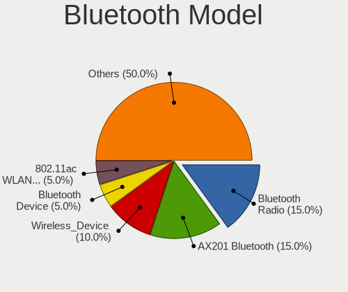

| Model                                               | Notebooks | Percent |
|-----------------------------------------------------|-----------|---------|
| Intel Bluetooth wireless interface                  | 12        | 30.77%  |
| Intel Bluetooth Device                              | 3         | 7.69%   |
| Intel AX201 Bluetooth                               | 3         | 7.69%   |
| Intel AX200 Bluetooth                               | 3         | 7.69%   |
| Realtek Bluetooth Radio                             | 2         | 5.13%   |
| Intel Wireless-AC 9260 Bluetooth Adapter            | 2         | 5.13%   |
| Intel AX210 Bluetooth                               | 2         | 5.13%   |
| Cambridge Silicon Radio Bluetooth Dongle (HCI mode) | 2         | 5.13%   |
| Toshiba BCM43142A0                                  | 1         | 2.56%   |
| Realtek Bluetooth Radio                             | 1         | 2.56%   |
| Qualcomm Atheros QCA61x4 Bluetooth 4.0              | 1         | 2.56%   |
| Intel Wireless-AC 3168 Bluetooth                    | 1         | 2.56%   |
| Intel Bluetooth 9460/9560 Jefferson Peak (JfP)      | 1         | 2.56%   |
| IMC Networks Wireless_Device                        | 1         | 2.56%   |
| IMC Networks Atheros AR3012 Bluetooth 4.0 Adapter   | 1         | 2.56%   |
| Foxconn / Hon Hai Wireless_Device                   | 1         | 2.56%   |
| Broadcom HP Portable SoftSailing                    | 1         | 2.56%   |
| Apple Built-in Bluetooth 2.0+EDR HCI                | 1         | 2.56%   |

Sound
-----

Sound Vendor
------------

Sound card vendors

| Vendor                 | Notebooks | Percent |
|------------------------|-----------|---------|
| Intel                  | 29        | 52.73%  |
| AMD                    | 13        | 23.64%  |
| Nvidia                 | 5         | 9.09%   |
| Sony                   | 1         | 1.82%   |
| Samson Technologies    | 1         | 1.82%   |
| Kingston Technology    | 1         | 1.82%   |
| Generalplus Technology | 1         | 1.82%   |
| Creative Technology    | 1         | 1.82%   |
| C-Media Electronics    | 1         | 1.82%   |
| Beyerdynamic           | 1         | 1.82%   |
| Anlya.cn               | 1         | 1.82%   |

Sound Model
-----------

Sound card models

| Model                                                                      | Notebooks | Percent |
|----------------------------------------------------------------------------|-----------|---------|
| AMD Family 17h/19h HD Audio Controller                                     | 10        | 14.49%  |
| AMD Renoir Radeon High Definition Audio Controller                         | 6         | 8.7%    |
| Intel Sunrise Point-LP HD Audio                                            | 5         | 7.25%   |
| Intel Alder Lake PCH-P High Definition Audio Controller                    | 5         | 7.25%   |
| Intel 7 Series/C216 Chipset Family High Definition Audio Controller        | 5         | 7.25%   |
| Intel Tiger Lake-LP Smart Sound Technology Audio Controller                | 4         | 5.8%    |
| Intel Haswell-ULT HD Audio Controller                                      | 3         | 4.35%   |
| Intel 8 Series HD Audio Controller                                         | 3         | 4.35%   |
| Nvidia GP104 High Definition Audio Controller                              | 2         | 2.9%    |
| Intel Wildcat Point-LP High Definition Audio Controller                    | 2         | 2.9%    |
| Intel Broadwell-U Audio Controller                                         | 2         | 2.9%    |
| AMD Rembrandt Radeon High Definition Audio Controller                      | 2         | 2.9%    |
| Sony DualShock 4 [CUH-ZCT2x]                                               | 1         | 1.45%   |
| Samson Technologies G-Track Pro microphone                                 | 1         | 1.45%   |
| Nvidia TU107 GeForce GTX 1650 High Definition Audio Controller             | 1         | 1.45%   |
| Nvidia GF108 High Definition Audio Controller                              | 1         | 1.45%   |
| Nvidia Audio device                                                        | 1         | 1.45%   |
| Kingston Technology HyperX Cloud Flight Wireless Headset                   | 1         | 1.45%   |
| Intel Jasper Lake HD Audio                                                 | 1         | 1.45%   |
| Intel CM238 HD Audio Controller                                            | 1         | 1.45%   |
| Intel Celeron N3350/Pentium N4200/Atom E3900 Series Audio Cluster          | 1         | 1.45%   |
| Intel Cannon Point-LP High Definition Audio Controller                     | 1         | 1.45%   |
| Intel 6 Series/C200 Series Chipset Family High Definition Audio Controller | 1         | 1.45%   |
| Generalplus Technology USB Audio Device                                    | 1         | 1.45%   |
| Creative Technology Pebble V3                                              | 1         | 1.45%   |
| C-Media Electronics USB Advanced Audio Device                              | 1         | 1.45%   |
| Beyerdynamic FOX                                                           | 1         | 1.45%   |
| Anlya.cn AB13X USB Audio                                                   | 1         | 1.45%   |
| AMD Turks HDMI Audio [Radeon HD 6500/6600 / 6700M Series]                  | 1         | 1.45%   |
| AMD Starship/Matisse HD Audio Controller                                   | 1         | 1.45%   |
| AMD Raven/Raven2/Fenghuang HDMI/DP Audio Controller                        | 1         | 1.45%   |
| AMD Oland/Hainan/Cape Verde/Pitcairn HDMI Audio [Radeon HD 7000 Series]    | 1         | 1.45%   |

Memory
------

Memory Vendor
-------------

Memory module vendors

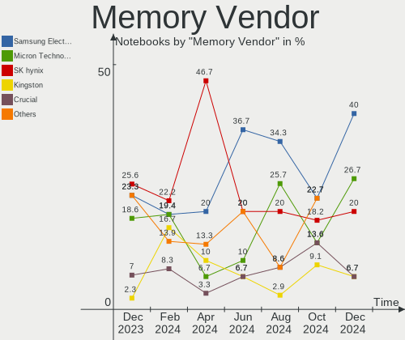

| Vendor              | Notebooks | Percent |
|---------------------|-----------|---------|
| Samsung Electronics | 11        | 35.48%  |
| SK hynix            | 8         | 25.81%  |
| Micron Technology   | 6         | 19.35%  |
| Kingston            | 4         | 12.9%   |
| Crucial             | 1         | 3.23%   |
| Unknown             | 1         | 3.23%   |

Memory Model
------------

Memory module models

| Model                                                          | Notebooks | Percent |
|----------------------------------------------------------------|-----------|---------|
| Samsung RAM M471A1K43EB1-CWE 8GB SODIMM DDR4 3200MT/s          | 3         | 8.82%   |
| Samsung RAM M471A1G44BB0-CWE 8GB SODIMM DDR4 3200MT/s          | 3         | 8.82%   |
| SK hynix RAM Module 4GB SODIMM DDR3 1600MT/s                   | 1         | 2.94%   |
| SK hynix RAM HMT851S6AMR6R-PB 4GB SODIMM DDR3 1600MT/s         | 1         | 2.94%   |
| SK hynix RAM HMT351S6EFR8A-PB 4GB SODIMM DDR3 1600MT/s         | 1         | 2.94%   |
| SK hynix RAM HMCG78MEBSA092N 16GB SODIMM DDR5 4800MT/s         | 1         | 2.94%   |
| SK hynix RAM HMAA1GS6CJR6N-XN 8GB SODIMM DDR4 3200MT/s         | 1         | 2.94%   |
| SK hynix RAM HMAA1GS6CJR6N-XN 8GB Row Of Chips DDR4 3200MT/s   | 1         | 2.94%   |
| SK hynix RAM HMA81GS6AFR8N-UH 8GB SODIMM DDR4 2667MT/s         | 1         | 2.94%   |
| SK hynix RAM H9JCNNNFA5MLYR-N6E 8GB DIMM LPDDR5 6400MT/s       | 1         | 2.94%   |
| Samsung RAM Module 2GB Row Of Chips LPDDR4 4267MT/s            | 1         | 2.94%   |
| Samsung RAM M471B5674-H0-YK0--- 4GB Chip DDR3 1600MT/s         | 1         | 2.94%   |
| Samsung RAM M471A5244CB0-CTD 4GB Row Of Chips DDR4 2667MT/s    | 1         | 2.94%   |
| Samsung RAM M471A5244BB0-CRC 4GB SODIMM DDR4 2667MT/s          | 1         | 2.94%   |
| Samsung RAM M471A2K43DB1-CWE 16GB SODIMM DDR4 3200MT/s         | 1         | 2.94%   |
| Samsung RAM K4E8E324EB-EGCF 2GB LPDDR3 1867MT/s                | 1         | 2.94%   |
| Samsung RAM K3LKBKB@BM-MGCP 2GB Row Of Chips LPDDR5 6400MT/s   | 1         | 2.94%   |
| Samsung RAM 4G1600HS 4GB SODIMM DDR3 1600MT/s                  | 1         | 2.94%   |
| Micron RAM 53E1G32D4NQ-046WTE 4GB Row Of Chips LPDDR4 3200MT/s | 1         | 2.94%   |
| Micron RAM 53E1G32D2NP-046 2GB Row Of Chips LPDDR4 4267MT/s    | 1         | 2.94%   |
| Micron RAM 4ATF1G64HZ-3G2F1 8GB SODIMM DDR4 3200MT/s           | 1         | 2.94%   |
| Micron RAM 4ATF1G64HZ-3G2E1 8GB SODIMM DDR4 3200MT/s           | 1         | 2.94%   |
| Micron RAM 16KTF1G64HZ-1G6E1 8GB SODIMM DDR3 1600MT/s          | 1         | 2.94%   |
| Micron RAM 16ATF2G64HZ-2G3H1 16GB SODIMM DDR4 2400MT/s         | 1         | 2.94%   |
| Kingston RAM TSB16D3LS1MNG/4G 4GB SODIMM DDR3 1600MT/s         | 1         | 2.94%   |
| Kingston RAM Module 8GB SODIMM DDR4 2400MT/s                   | 1         | 2.94%   |
| Kingston RAM KVR32S22S8/8 8GB SODIMM DDR4 3200MT/s             | 1         | 2.94%   |
| Kingston RAM KF3200C20S4/32GX 32GB SODIMM DDR4 3200MT/s        | 1         | 2.94%   |
| Crucial RAM CT32G48C40S5.M16A1 32GB SODIMM DDR5 4800MT/s       | 1         | 2.94%   |
| Unknown                                                        | 1         | 2.94%   |

Memory Kind
-----------

Memory module kinds

| Kind   | Notebooks | Percent |
|--------|-----------|---------|
| DDR4   | 13        | 46.43%  |
| DDR3   | 6         | 21.43%  |
| LPDDR4 | 3         | 10.71%  |
| LPDDR5 | 2         | 7.14%   |
| LPDDR3 | 2         | 7.14%   |
| DDR5   | 2         | 7.14%   |

Memory Form Factor
------------------

Physical design of the memory module

| Name         | Notebooks | Percent |
|--------------|-----------|---------|
| SODIMM       | 19        | 65.52%  |
| Row Of Chips | 7         | 24.14%  |
| DIMM         | 1         | 3.45%   |
| Chip         | 1         | 3.45%   |
| Unknown      | 1         | 3.45%   |

Memory Size
-----------

Memory module size

| Size  | Notebooks | Percent |
|-------|-----------|---------|
| 8192  | 14        | 48.28%  |
| 4096  | 7         | 24.14%  |
| 16384 | 3         | 10.34%  |
| 2048  | 3         | 10.34%  |
| 32768 | 2         | 6.9%    |

Memory Speed
------------

Memory module speed

| Speed | Notebooks | Percent |
|-------|-----------|---------|
| 3200  | 9         | 32.14%  |
| 1600  | 6         | 21.43%  |
| 2667  | 3         | 10.71%  |
| 6400  | 2         | 7.14%   |
| 4800  | 2         | 7.14%   |
| 4267  | 2         | 7.14%   |
| 2400  | 2         | 7.14%   |
| 1867  | 2         | 7.14%   |

Printers & scanners
-------------------

Printer Vendor
--------------

Printer device vendors

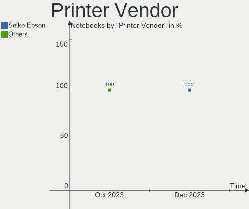

| Vendor | Notebooks | Percent |
|--------|-----------|---------|
| Xerox  | 1         | 100%    |

Printer Model
-------------

Printer device models

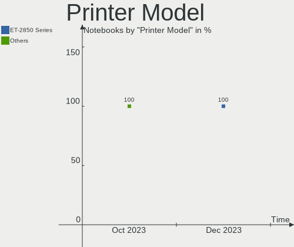

| Model      | Notebooks | Percent |
|------------|-----------|---------|
| Xerox B210 | 1         | 100%    |

Scanner Vendor
--------------

Scanner device vendors

Zero info for selected period =(

Scanner Model
-------------

Scanner device models

Zero info for selected period =(

Camera
------

Camera Vendor
-------------

Camera device vendors

| Vendor                                 | Notebooks | Percent |
|----------------------------------------|-----------|---------|
| IMC Networks                           | 7         | 17.07%  |
| Sunplus Innovation Technology          | 5         | 12.2%   |
| Chicony Electronics                    | 5         | 12.2%   |
| Quanta                                 | 4         | 9.76%   |
| Logitech                               | 3         | 7.32%   |
| Cheng Uei Precision Industry (Foxlink) | 3         | 7.32%   |
| Microdia                               | 2         | 4.88%   |
| Apple                                  | 2         | 4.88%   |
| Acer                                   | 2         | 4.88%   |
| Tripath Technology                     | 1         | 2.44%   |
| Syntek                                 | 1         | 2.44%   |
| Realtek Semiconductor                  | 1         | 2.44%   |
| Primax Electronics                     | 1         | 2.44%   |
| MacroSilicon                           | 1         | 2.44%   |
| Lite-On Technology                     | 1         | 2.44%   |
| Bison Electronics                      | 1         | 2.44%   |
| Alcor Micro                            | 1         | 2.44%   |

Camera Model
------------

Camera device models

| Model                                                           | Notebooks | Percent |
|-----------------------------------------------------------------|-----------|---------|
| IMC Networks USB2.0 HD UVC WebCam                               | 4         | 9.76%   |
| Quanta USB2.0 HD UVC WebCam                                     | 3         | 7.32%   |
| IMC Networks Integrated Camera                                  | 2         | 4.88%   |
| Tripath USB Camera                                              | 1         | 2.44%   |
| Syntek Integrated Camera                                        | 1         | 2.44%   |
| Sunplus XiaoMi USB 2.0 Webcam                                   | 1         | 2.44%   |
| Sunplus Integrated_Webcam_HD                                    | 1         | 2.44%   |
| Sunplus Integrated Camera                                       | 1         | 2.44%   |
| Sunplus HD WebCam                                               | 1         | 2.44%   |
| Sunplus Asus Webcam                                             | 1         | 2.44%   |
| Realtek Integrated Webcam_HD                                    | 1         | 2.44%   |
| Quanta HP HD Camera                                             | 1         | 2.44%   |
| Primax HP HD Webcam [Fixed]                                     | 1         | 2.44%   |
| Microdia Webcam Vitade AF                                       | 1         | 2.44%   |
| Microdia Integrated_Webcam_HD                                   | 1         | 2.44%   |
| MacroSilicon USB Video                                          | 1         | 2.44%   |
| Logitech HD Webcam C615                                         | 1         | 2.44%   |
| Logitech C922 Pro Stream Webcam                                 | 1         | 2.44%   |
| Logitech C920 PRO HD Webcam                                     | 1         | 2.44%   |
| Lite-On Integrated Camera                                       | 1         | 2.44%   |
| IMC Networks ov9734_azurewave_camera                            | 1         | 2.44%   |
| Chicony USB2.0 Camera                                           | 1         | 2.44%   |
| Chicony Thinkpad T430 camera                                    | 1         | 2.44%   |
| Chicony HP Wide Vision HD Camera                                | 1         | 2.44%   |
| Chicony HP HD Webcam                                            | 1         | 2.44%   |
| Chicony HD WebCam                                               | 1         | 2.44%   |
| Cheng Uei Precision Industry (Foxlink) XiaoMi USB 2.0 Webcam    | 1         | 2.44%   |
| Cheng Uei Precision Industry (Foxlink) VGA Camera               | 1         | 2.44%   |
| Cheng Uei Precision Industry (Foxlink) HP True Vision HD Camera | 1         | 2.44%   |
| Bison USB2.0 Camera                                             | 1         | 2.44%   |
| Apple iPhone 5/5C/5S/6/SE/7/8/X                                 | 1         | 2.44%   |
| Apple FaceTime HD Camera (Built-in)                             | 1         | 2.44%   |
| Alcor Micro USB 2.0 Camera                                      | 1         | 2.44%   |
| Acer Integrated RGB Camera                                      | 1         | 2.44%   |
| Acer BisonCam,NB Pro                                            | 1         | 2.44%   |

Security
--------

Fingerprint Vendor
------------------

Fingerprint sensor vendors

| Vendor                             | Notebooks | Percent |
|------------------------------------|-----------|---------|
| Validity Sensors                   | 4         | 36.36%  |
| Shenzhen Goodix Technology         | 2         | 18.18%  |
| Realtek USB2.0 Finger Print Bridge | 2         | 18.18%  |
| Synaptics                          | 1         | 9.09%   |
| LighTuning Technology              | 1         | 9.09%   |
| Elan Microelectronics              | 1         | 9.09%   |

Fingerprint Model
-----------------

Fingerprint sensor models

| Model                                                                      | Notebooks | Percent |
|----------------------------------------------------------------------------|-----------|---------|
| Shenzhen Goodix  FingerPrint Device                                        | 2         | 18.18%  |
| Realtek USB2.0 Finger Print Bridge FocalTech Fingerprint Device            | 2         | 18.18%  |
| Validity Sensors VFS495 Fingerprint Reader                                 | 1         | 9.09%   |
| Validity Sensors VFS491                                                    | 1         | 9.09%   |
| Validity Sensors VFS471 Fingerprint Reader                                 | 1         | 9.09%   |
| Validity Sensors Synaptics VFS7552 Touch Fingerprint Sensor with PurePrint | 1         | 9.09%   |
| LighTuning EgisTec Touch Fingerprint Sensor                                | 1         | 9.09%   |
| Elan ELAN:Fingerprint                                                      | 1         | 9.09%   |
| Unknown                                                                    | 1         | 9.09%   |

Chipcard Vendor
---------------

Chipcard module vendors

| Vendor   | Notebooks | Percent |
|----------|-----------|---------|
| Broadcom | 1         | 100%    |

Chipcard Model
--------------

Chipcard module models

| Model         | Notebooks | Percent |
|---------------|-----------|---------|
| Broadcom 5880 | 1         | 100%    |

Unsupported
-----------

Unsupported Devices
-------------------

Total unsupported devices on board

| Total | Notebooks | Percent |
|-------|-----------|---------|
| 0     | 24        | 60%     |
| 1     | 14        | 35%     |
| 2     | 2         | 5%      |

Unsupported Device Types
------------------------

Types of unsupported devices

| Type                  | Notebooks | Percent |
|-----------------------|-----------|---------|
| Fingerprint reader    | 11        | 61.11%  |
| Net/wireless          | 2         | 11.11%  |
| Multimedia controller | 2         | 11.11%  |
| Graphics card         | 2         | 11.11%  |
| Chipcard              | 1         | 5.56%   |

