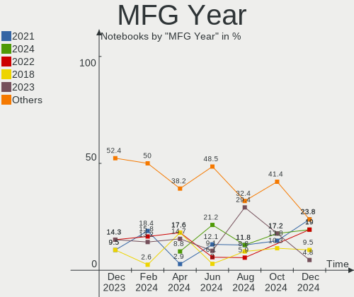
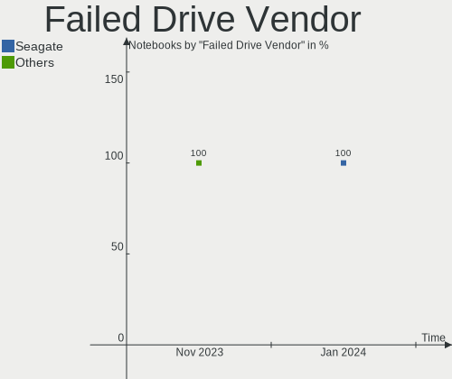
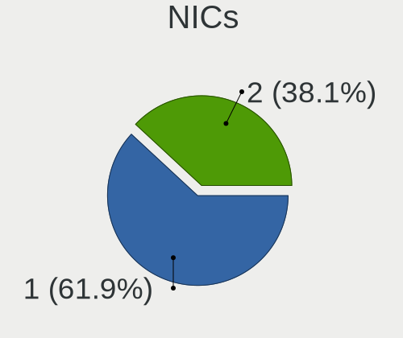
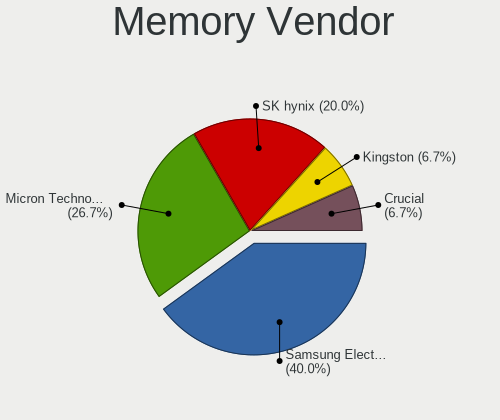

EndeavourOS - Hardware Trends (Notebooks)
-----------------------------------------

A project to identify most popular hardware characteristics and track their change
over time based on data collected by Linux users at https://Linux-Hardware.org.

Anyone can contribute to this report by the [hw-probe](https://github.com/linuxhw/hw-probe) tool:

    sudo -E hw-probe -all -upload

This report is for one last month. Overall report since the beginning of time: [TestDays](https://github.com/linuxhw/TestDays)

Period: Nov, 2023.

Contents
--------

* [ System ](#system)
  - [ OS                       ](#os)
  - [ OS Family                ](#os-family)
  - [ Kernel                   ](#kernel)
  - [ Kernel Family            ](#kernel-family)
  - [ Kernel Major Ver.        ](#kernel-major-ver)
  - [ Arch                     ](#arch)
  - [ DE                       ](#de)
  - [ Display Server           ](#display-server)
  - [ Display Manager          ](#display-manager)
  - [ OS Lang                  ](#os-lang)
  - [ Boot Mode                ](#boot-mode)
  - [ Filesystem               ](#filesystem)
  - [ Part. scheme             ](#part-scheme)
  - [ Dual Boot with Linux/BSD ](#dual-boot-with-linuxbsd)
  - [ Dual Boot (Win)          ](#dual-boot-win)

* [ Board ](#board)
  - [ Vendor                   ](#vendor)
  - [ Model                    ](#model)
  - [ Model Family             ](#model-family)
  - [ MFG Year                 ](#mfg-year)
  - [ Form Factor              ](#form-factor)
  - [ Secure Boot              ](#secure-boot)
  - [ Coreboot                 ](#coreboot)
  - [ RAM Size                 ](#ram-size)
  - [ RAM Used                 ](#ram-used)
  - [ Total Drives             ](#total-drives)
  - [ Has CD-ROM               ](#has-cd-rom)
  - [ Has Ethernet             ](#has-ethernet)
  - [ Has WiFi                 ](#has-wifi)
  - [ Has Bluetooth            ](#has-bluetooth)

* [ Location ](#location)
  - [ Country                  ](#country)
  - [ City                     ](#city)

* [ Drives ](#drives)
  - [ Drive Vendor             ](#drive-vendor)
  - [ Drive Model              ](#drive-model)
  - [ HDD Vendor               ](#hdd-vendor)
  - [ SSD Vendor               ](#ssd-vendor)
  - [ Drive Kind               ](#drive-kind)
  - [ Drive Connector          ](#drive-connector)
  - [ Drive Size               ](#drive-size)
  - [ Space Total              ](#space-total)
  - [ Space Used               ](#space-used)
  - [ Malfunc. Drives          ](#malfunc-drives)
  - [ Malfunc. Drive Vendor    ](#malfunc-drive-vendor)
  - [ Malfunc. HDD Vendor      ](#malfunc-hdd-vendor)
  - [ Malfunc. Drive Kind      ](#malfunc-drive-kind)
  - [ Failed Drives            ](#failed-drives)
  - [ Failed Drive Vendor      ](#failed-drive-vendor)
  - [ Drive Status             ](#drive-status)

* [ Storage controller ](#storage-controller)
  - [ Storage Vendor           ](#storage-vendor)
  - [ Storage Model            ](#storage-model)
  - [ Storage Kind             ](#storage-kind)

* [ Processor ](#processor)
  - [ CPU Vendor               ](#cpu-vendor)
  - [ CPU Model                ](#cpu-model)
  - [ CPU Model Family         ](#cpu-model-family)
  - [ CPU Cores                ](#cpu-cores)
  - [ CPU Sockets              ](#cpu-sockets)
  - [ CPU Threads              ](#cpu-threads)
  - [ CPU Op-Modes             ](#cpu-op-modes)
  - [ CPU Microcode            ](#cpu-microcode)
  - [ CPU Microarch            ](#cpu-microarch)

* [ Graphics ](#graphics)
  - [ GPU Vendor               ](#gpu-vendor)
  - [ GPU Model                ](#gpu-model)
  - [ GPU Combo                ](#gpu-combo)
  - [ GPU Driver               ](#gpu-driver)
  - [ GPU Memory               ](#gpu-memory)

* [ Monitor ](#monitor)
  - [ Monitor Vendor           ](#monitor-vendor)
  - [ Monitor Model            ](#monitor-model)
  - [ Monitor Resolution       ](#monitor-resolution)
  - [ Monitor Diagonal         ](#monitor-diagonal)
  - [ Monitor Width            ](#monitor-width)
  - [ Aspect Ratio             ](#aspect-ratio)
  - [ Monitor Area             ](#monitor-area)
  - [ Pixel Density            ](#pixel-density)
  - [ Multiple Monitors        ](#multiple-monitors)

* [ Network ](#network)
  - [ Net Controller Vendor    ](#net-controller-vendor)
  - [ Net Controller Model     ](#net-controller-model)
  - [ Wireless Vendor          ](#wireless-vendor)
  - [ Wireless Model           ](#wireless-model)
  - [ Ethernet Vendor          ](#ethernet-vendor)
  - [ Ethernet Model           ](#ethernet-model)
  - [ Net Controller Kind      ](#net-controller-kind)
  - [ Used Controller          ](#used-controller)
  - [ NICs                     ](#nics)
  - [ IPv6                     ](#ipv6)

* [ Bluetooth ](#bluetooth)
  - [ Bluetooth Vendor         ](#bluetooth-vendor)
  - [ Bluetooth Model          ](#bluetooth-model)

* [ Sound ](#sound)
  - [ Sound Vendor             ](#sound-vendor)
  - [ Sound Model              ](#sound-model)

* [ Memory ](#memory)
  - [ Memory Vendor            ](#memory-vendor)
  - [ Memory Model             ](#memory-model)
  - [ Memory Kind              ](#memory-kind)
  - [ Memory Form Factor       ](#memory-form-factor)
  - [ Memory Size              ](#memory-size)
  - [ Memory Speed             ](#memory-speed)

* [ Printers & scanners ](#printers--scanners)
  - [ Printer Vendor           ](#printer-vendor)
  - [ Printer Model            ](#printer-model)
  - [ Scanner Vendor           ](#scanner-vendor)
  - [ Scanner Model            ](#scanner-model)

* [ Camera ](#camera)
  - [ Camera Vendor            ](#camera-vendor)
  - [ Camera Model             ](#camera-model)

* [ Security ](#security)
  - [ Fingerprint Vendor       ](#fingerprint-vendor)
  - [ Fingerprint Model        ](#fingerprint-model)
  - [ Chipcard Vendor          ](#chipcard-vendor)
  - [ Chipcard Model           ](#chipcard-model)

* [ Unsupported ](#unsupported)
  - [ Unsupported Devices      ](#unsupported-devices)
  - [ Unsupported Device Types ](#unsupported-device-types)

System
------

OS
--

Installed operating systems

| Name                | Notebooks | Percent |
|---------------------|-----------|---------|
| EndeavourOS Rolling | 43        | 100%    |

OS Family
---------

OS without a version

| Name        | Notebooks | Percent |
|-------------|-----------|---------|
| EndeavourOS | 43        | 100%    |

Kernel
------

Version of the Linux kernel

| Version             | Notebooks | Percent |
|---------------------|-----------|---------|
| 6.5.9-arch2-1       | 11        | 25.58%  |
| 6.6.1-arch1-1       | 10        | 23.26%  |
| 6.6.2-arch1-1       | 9         | 20.93%  |
| 6.6.1-zen1-1-zen    | 3         | 6.98%   |
| 6.6.2-zen1-1-zen    | 2         | 4.65%   |
| 6.5.9-zen2-1-zen    | 2         | 4.65%   |
| 6.1.61-1-lts        | 2         | 4.65%   |
| 6.6.3-arch1-1       | 1         | 2.33%   |
| 6.6.0-273-tkg-eevdf | 1         | 2.33%   |
| 6.1.63-1-lts        | 1         | 2.33%   |
| 6.1.60-1-lts        | 1         | 2.33%   |

Kernel Family
-------------

Linux kernel without a distro release

| Version | Notebooks | Percent |
|---------|-----------|---------|
| 6.6.1   | 13        | 30.23%  |
| 6.5.9   | 13        | 30.23%  |
| 6.6.2   | 11        | 25.58%  |
| 6.1.61  | 2         | 4.65%   |
| 6.6.3   | 1         | 2.33%   |
| 6.6.0   | 1         | 2.33%   |
| 6.1.63  | 1         | 2.33%   |
| 6.1.60  | 1         | 2.33%   |

Kernel Major Ver.
-----------------

Linux kernel major version

| Version | Notebooks | Percent |
|---------|-----------|---------|
| 6.6     | 26        | 60.47%  |
| 6.5     | 13        | 30.23%  |
| 6.1     | 4         | 9.3%    |

Arch
----

OS architecture (x86_64, i586, etc.)

| Name   | Notebooks | Percent |
|--------|-----------|---------|
| x86_64 | 43        | 100%    |

DE
--

Desktop Environment

| Name    | Notebooks | Percent |
|---------|-----------|---------|
| KDE5    | 20        | 46.51%  |
| GNOME   | 13        | 30.23%  |
| XFCE    | 5         | 11.63%  |
| i3      | 2         | 4.65%   |
| qtile   | 1         | 2.33%   |
| Budgie  | 1         | 2.33%   |
| Unknown | 1         | 2.33%   |

Display Server
--------------

X11 or Wayland

| Name    | Notebooks | Percent |
|---------|-----------|---------|
| X11     | 30        | 69.77%  |
| Wayland | 13        | 30.23%  |

Display Manager
---------------

SDDM, LightDM, etc.

| Name    | Notebooks | Percent |
|---------|-----------|---------|
| SDDM    | 15        | 34.88%  |
| Unknown | 13        | 30.23%  |
| LightDM | 10        | 23.26%  |
| GDM     | 4         | 9.3%    |
| GREETD  | 1         | 2.33%   |

OS Lang
-------

Language

| Lang    | Notebooks | Percent |
|---------|-----------|---------|
| en_US   | 20        | 46.51%  |
| it_IT   | 5         | 11.63%  |
| en_CA   | 3         | 6.98%   |
| ru_RU   | 2         | 4.65%   |
| en_GB   | 2         | 4.65%   |
| de_DE   | 2         | 4.65%   |
| sv_SE   | 1         | 2.33%   |
| pl_PL   | 1         | 2.33%   |
| nl_NL   | 1         | 2.33%   |
| fr_FR   | 1         | 2.33%   |
| es_PE   | 1         | 2.33%   |
| es_ES   | 1         | 2.33%   |
| en_AU   | 1         | 2.33%   |
| de_AT   | 1         | 2.33%   |
| Unknown | 1         | 2.33%   |

Boot Mode
---------

EFI or BIOS

| Mode | Notebooks | Percent |
|------|-----------|---------|
| EFI  | 27        | 62.79%  |
| BIOS | 16        | 37.21%  |

Filesystem
----------

Type of filesystem

| Type    | Notebooks | Percent |
|---------|-----------|---------|
| Ext4    | 32        | 74.42%  |
| Btrfs   | 9         | 20.93%  |
| Tmpfs   | 1         | 2.33%   |
| Overlay | 1         | 2.33%   |

Part. scheme
------------

Scheme of partitioning

| Type    | Notebooks | Percent |
|---------|-----------|---------|
| GPT     | 28        | 65.12%  |
| Unknown | 13        | 30.23%  |
| MBR     | 2         | 4.65%   |

Dual Boot with Linux/BSD
------------------------

Hosting more than one Linux/BSD

| Dual boot | Notebooks | Percent |
|-----------|-----------|---------|
| No        | 39        | 90.7%   |
| Yes       | 4         | 9.3%    |

Dual Boot (Win)
---------------

Hosting Linux and Windows

| Dual boot | Notebooks | Percent |
|-----------|-----------|---------|
| No        | 31        | 72.09%  |
| Yes       | 12        | 27.91%  |

Board
-----

Vendor
------

Motherboard manufacturer

| Name             | Notebooks | Percent |
|------------------|-----------|---------|
| Lenovo           | 17        | 39.53%  |
| ASUSTek Computer | 10        | 23.26%  |
| Hewlett-Packard  | 5         | 11.63%  |
| TUXEDO           | 2         | 4.65%   |
| MSI              | 2         | 4.65%   |
| Dell             | 2         | 4.65%   |
| Sony             | 1         | 2.33%   |
| Medion           | 1         | 2.33%   |
| Fujitsu          | 1         | 2.33%   |
| Apple            | 1         | 2.33%   |
| Acer             | 1         | 2.33%   |

Model
-----

Motherboard model

| Name                                     | Notebooks | Percent |
|------------------------------------------|-----------|---------|
| TUXEDO Pulse 15 Gen1                     | 1         | 2.33%   |
| TUXEDO Gemini Gen2                       | 1         | 2.33%   |
| Sony SVE1713X1EB                         | 1         | 2.33%   |
| MSI GV62 8RD                             | 1         | 2.33%   |
| MSI GF65 Thin 10UE                       | 1         | 2.33%   |
| Medion P6681 MD60814                     | 1         | 2.33%   |
| Lenovo Yoga 3 Pro-1370 80HE              | 1         | 2.33%   |
| Lenovo ThinkPad T460p 20FXS0FS00         | 1         | 2.33%   |
| Lenovo ThinkPad T430s 23553J2            | 1         | 2.33%   |
| Lenovo ThinkPad T16 Gen 1 21BV0096US     | 1         | 2.33%   |
| Lenovo ThinkPad T14s Gen 4 21F80041GE    | 1         | 2.33%   |
| Lenovo ThinkPad T14 Gen 1 20UES00L00     | 1         | 2.33%   |
| Lenovo ThinkPad L14 Gen 3 21C5CTO1WW     | 1         | 2.33%   |
| Lenovo ThinkPad E14 20RBS25S00           | 1         | 2.33%   |
| Lenovo ThinkPad E14 20RA001HMZ           | 1         | 2.33%   |
| Lenovo Legion 7 15IMH05 81YT             | 1         | 2.33%   |
| Lenovo Legion 5 Pro 16ACH6H 82JQ         | 1         | 2.33%   |
| Lenovo Legion 5 15ACH6A 82NW             | 1         | 2.33%   |
| Lenovo IdeaPad Gaming 3 15ACH6 82K2      | 1         | 2.33%   |
| Lenovo IdeaPad 530S-14IKB 81EU           | 1         | 2.33%   |
| Lenovo IdeaPad 5 Pro 14ITL6 82L3         | 1         | 2.33%   |
| Lenovo IdeaPad 110-15ISK 80UD            | 1         | 2.33%   |
| Lenovo IdeaPad 110-15IBR 80T7            | 1         | 2.33%   |
| HP Victus by Laptop 16-d1xxx             | 1         | 2.33%   |
| HP ProBook 430 G1                        | 1         | 2.33%   |
| HP Pavilion Laptop 15-cs0xxx             | 1         | 2.33%   |
| HP EliteBook 745 G4                      | 1         | 2.33%   |
| HP EliteBook 6930p                       | 1         | 2.33%   |
| Fujitsu FMVC06001                        | 1         | 2.33%   |
| Dell XPS 15 9570                         | 1         | 2.33%   |
| Dell G7 7700                             | 1         | 2.33%   |
| ASUS X751LD                              | 1         | 2.33%   |
| ASUS VivoBook_ASUSLaptop X571LH_X571LH   | 1         | 2.33%   |
| ASUS VivoBook_ASUSLaptop X509DA_M509DA   | 1         | 2.33%   |
| ASUS VivoBook_ASUSLaptop K6604JI_K6604JI | 1         | 2.33%   |
| ASUS UX430UNR                            | 1         | 2.33%   |
| ASUS ROG Zephyrus G14 GA402XV_GA402XV    | 1         | 2.33%   |
| ASUS ROG Strix G733PZ_G733PZ             | 1         | 2.33%   |
| ASUS ROG Strix G513RC_G513RC             | 1         | 2.33%   |
| ASUS ROG Flow X13 GV301QE_GV301QE        | 1         | 2.33%   |

Model Family
------------

Motherboard model prefix

| Name              | Notebooks | Percent |
|-------------------|-----------|---------|
| Lenovo ThinkPad   | 8         | 18.6%   |
| Lenovo IdeaPad    | 5         | 11.63%  |
| ASUS ROG          | 4         | 9.3%    |
| Lenovo Legion     | 3         | 6.98%   |
| ASUS VivoBook     | 3         | 6.98%   |
| HP EliteBook      | 2         | 4.65%   |
| TUXEDO Pulse      | 1         | 2.33%   |
| TUXEDO Gemini     | 1         | 2.33%   |
| Sony SVE1713X1EB  | 1         | 2.33%   |
| MSI GV62          | 1         | 2.33%   |
| MSI GF65          | 1         | 2.33%   |
| Medion P6681      | 1         | 2.33%   |
| Lenovo Yoga       | 1         | 2.33%   |
| HP Victus         | 1         | 2.33%   |
| HP ProBook        | 1         | 2.33%   |
| HP Pavilion       | 1         | 2.33%   |
| Fujitsu FMVC06001 | 1         | 2.33%   |
| Dell XPS          | 1         | 2.33%   |
| Dell G7           | 1         | 2.33%   |
| ASUS X751LD       | 1         | 2.33%   |
| ASUS UX430UNR     | 1         | 2.33%   |
| ASUS ASUS         | 1         | 2.33%   |
| Apple MacBookAir6 | 1         | 2.33%   |
| Acer Nitro        | 1         | 2.33%   |

MFG Year
--------

Motherboard manufacture year

| Year | Notebooks | Percent |
|------|-----------|---------|
| 2021 | 7         | 16.28%  |
| 2020 | 6         | 13.95%  |
| 2023 | 5         | 11.63%  |
| 2018 | 5         | 11.63%  |
| 2022 | 4         | 9.3%    |
| 2019 | 4         | 9.3%    |
| 2016 | 3         | 6.98%   |
| 2017 | 2         | 4.65%   |
| 2014 | 2         | 4.65%   |
| 2013 | 2         | 4.65%   |
| 2012 | 2         | 4.65%   |
| 2008 | 1         | 2.33%   |

Form Factor
-----------

Physical design of the computer

| Name     | Notebooks | Percent |
|----------|-----------|---------|
| Notebook | 43        | 100%    |

Secure Boot
-----------

Enabled or disabled

| State    | Notebooks | Percent |
|----------|-----------|---------|
| Disabled | 43        | 100%    |

Coreboot
--------

Have coreboot on board

| Used | Notebooks | Percent |
|------|-----------|---------|
| No   | 43        | 100%    |

RAM Size
--------

Total RAM memory

| Size in GB  | Notebooks | Percent |
|-------------|-----------|---------|
| 8.01-16.0   | 13        | 30.23%  |
| 16.01-24.0  | 10        | 23.26%  |
| 32.01-64.0  | 7         | 16.28%  |
| 4.01-8.0    | 4         | 9.3%    |
| 24.01-32.0  | 4         | 9.3%    |
| 3.01-4.0    | 3         | 6.98%   |
| 64.01-256.0 | 1         | 2.33%   |
| 1.01-2.0    | 1         | 2.33%   |

RAM Used
--------

Used RAM memory

| Used GB    | Notebooks | Percent |
|------------|-----------|---------|
| 4.01-8.0   | 17        | 39.53%  |
| 2.01-3.0   | 9         | 20.93%  |
| 8.01-16.0  | 7         | 16.28%  |
| 3.01-4.0   | 6         | 13.95%  |
| 1.01-2.0   | 3         | 6.98%   |
| 16.01-24.0 | 1         | 2.33%   |

Total Drives
------------

Number of drives on board

| Drives | Notebooks | Percent |
|--------|-----------|---------|
| 1      | 34        | 79.07%  |
| 2      | 7         | 16.28%  |
| 3      | 2         | 4.65%   |

Has CD-ROM
----------

Has CD-ROM on board

| Presented | Notebooks | Percent |
|-----------|-----------|---------|
| No        | 37        | 86.05%  |
| Yes       | 6         | 13.95%  |

Has Ethernet
------------

Has Ethernet on board

| Presented | Notebooks | Percent |
|-----------|-----------|---------|
| Yes       | 35        | 81.4%   |
| No        | 8         | 18.6%   |

Has WiFi
--------

Has WiFi module

| Presented | Notebooks | Percent |
|-----------|-----------|---------|
| Yes       | 42        | 97.67%  |
| No        | 1         | 2.33%   |

Has Bluetooth
-------------

Has Bluetooth module

| Presented | Notebooks | Percent |
|-----------|-----------|---------|
| Yes       | 39        | 90.7%   |
| No        | 4         | 9.3%    |

Location
--------

Country
-------

Geographic location (country)

| Country     | Notebooks | Percent |
|-------------|-----------|---------|
| Italy       | 8         | 18.6%   |
| USA         | 6         | 13.95%  |
| Germany     | 4         | 9.3%    |
| Canada      | 3         | 6.98%   |
| Austria     | 3         | 6.98%   |
| Poland      | 2         | 4.65%   |
| UK          | 1         | 2.33%   |
| Switzerland | 1         | 2.33%   |
| Sweden      | 1         | 2.33%   |
| Spain       | 1         | 2.33%   |
| Russia      | 1         | 2.33%   |
| Peru        | 1         | 2.33%   |
| Netherlands | 1         | 2.33%   |
| Mexico      | 1         | 2.33%   |
| Latvia      | 1         | 2.33%   |
| Kazakhstan  | 1         | 2.33%   |
| India       | 1         | 2.33%   |
| Hungary     | 1         | 2.33%   |
| France      | 1         | 2.33%   |
| Brazil      | 1         | 2.33%   |
| Bangladesh  | 1         | 2.33%   |
| Australia   | 1         | 2.33%   |
| Argentina   | 1         | 2.33%   |

City
----

Geographic location (city)

| City                  | Notebooks | Percent |
|-----------------------|-----------|---------|
| Graz                  | 2         | 4.65%   |
| Warsaw                | 1         | 2.33%   |
| Vigo                  | 1         | 2.33%   |
| Vienna                | 1         | 2.33%   |
| Victoria              | 1         | 2.33%   |
| Tacoma                | 1         | 2.33%   |
| Surrey                | 1         | 2.33%   |
| Stockton-on-Tees      | 1         | 2.33%   |
| Santos                | 1         | 2.33%   |
| Roosendaal            | 1         | 2.33%   |
| Rome                  | 1         | 2.33%   |
| Rogers                | 1         | 2.33%   |
| Riga                  | 1         | 2.33%   |
| Rajshahi              | 1         | 2.33%   |
| Parma                 | 1         | 2.33%   |
| Parker                | 1         | 2.33%   |
| Pachuca               | 1         | 2.33%   |
| Munich                | 1         | 2.33%   |
| Mountville            | 1         | 2.33%   |
| Morsang-sur-Orge      | 1         | 2.33%   |
| Mississauga           | 1         | 2.33%   |
| Milano                | 1         | 2.33%   |
| Milan                 | 1         | 2.33%   |
| Lipetsk               | 1         | 2.33%   |
| Lima                  | 1         | 2.33%   |
| La Rioja              | 1         | 2.33%   |
| Hyderabad             | 1         | 2.33%   |
| Houston               | 1         | 2.33%   |
| Hamburg               | 1         | 2.33%   |
| Gothenburg            | 1         | 2.33%   |
| Giugliano in Campania | 1         | 2.33%   |
| Folsom                | 1         | 2.33%   |
| Częstochowa          | 1         | 2.33%   |
| Cologne               | 1         | 2.33%   |
| Castello di Cisterna  | 1         | 2.33%   |
| Budapest              | 1         | 2.33%   |
| Brisbane              | 1         | 2.33%   |
| Bolgare               | 1         | 2.33%   |
| Bern                  | 1         | 2.33%   |
| Berlin                | 1         | 2.33%   |

Drives
------

Drive Vendor
------------

Hard drive vendors

| Vendor                      | Notebooks | Drives | Percent |
|-----------------------------|-----------|--------|---------|
| Samsung Electronics         | 17        | 18     | 32.69%  |
| Sandisk                     | 7         | 7      | 13.46%  |
| Micron Technology           | 5         | 5      | 9.62%   |
| WDC                         | 3         | 3      | 5.77%   |
| SK hynix                    | 2         | 2      | 3.85%   |
| Seagate                     | 2         | 2      | 3.85%   |
| Phison Electronics          | 2         | 2      | 3.85%   |
| Micron/Crucial Technology   | 2         | 2      | 3.85%   |
| Unknown                     | 1         | 1      | 1.92%   |
| Toshiba                     | 1         | 1      | 1.92%   |
| Team                        | 1         | 1      | 1.92%   |
| SUNEAST                     | 1         | 1      | 1.92%   |
| Solid State Storage         | 1         | 1      | 1.92%   |
| Patriot                     | 1         | 1      | 1.92%   |
| MAXIO Technology (Hangzhou) | 1         | 1      | 1.92%   |
| Kingston                    | 1         | 1      | 1.92%   |
| Intel                       | 1         | 1      | 1.92%   |
| Hewlett-Packard             | 1         | 1      | 1.92%   |
| Crucial                     | 1         | 1      | 1.92%   |
| Apple                       | 1         | 1      | 1.92%   |

Drive Model
-----------

Hard drive models

| Model                                               | Notebooks | Percent |
|-----------------------------------------------------|-----------|---------|
| Samsung NVMe SSD Controller SM981/PM981/PM983 250GB | 3         | 5.77%   |
| Samsung NVMe SSD Controller PM9A1/PM9A3/980PRO 2TB  | 3         | 5.77%   |
| Samsung SSD 980 1TB                                 | 2         | 3.85%   |
| Samsung MZALQ512HBLU-00BL2 512GB                    | 2         | 3.85%   |
| Micron 2210_MTFDHBA512QFD 512GB                     | 2         | 3.85%   |
| WDC WD5000LPCX-24VHAT0 500GB                        | 1         | 1.92%   |
| WDC WD10SPZX-80Z10T2 1TB                            | 1         | 1.92%   |
| WDC WD10SPZX-17Z10T1 1TB                            | 1         | 1.92%   |
| Unknown MMC Card  128GB                             | 1         | 1.92%   |
| Toshiba BG3 NVMe SSD Controller 128GB               | 1         | 1.92%   |
| Team T253X1120G 120GB SSD                           | 1         | 1.92%   |
| SUNEAST SSD SE800 NGFF 256GB                        | 1         | 1.92%   |
| Solid State Storage SSSTC CL1-4D256-D22 256GB       | 1         | 1.92%   |
| SK hynix PC401 NVMe Solid State Drive 256GB         | 1         | 1.92%   |
| SK hynix BC511 512GB                                | 1         | 1.92%   |
| Seagate ST500LM021-1KJ152 500GB                     | 1         | 1.92%   |
| Seagate ST1000LM024 HN-M101MBB 1TB                  | 1         | 1.92%   |
| Sandisk WDC PC SN530 SDBPTPZ-1T00-1002 1024GB       | 1         | 1.92%   |
| Sandisk WD PC SN740 SDDPNQD-512G-1002 512GB         | 1         | 1.92%   |
| Sandisk WD Blue SN570 1TB                           | 1         | 1.92%   |
| Sandisk WD Blue SN550 NVMe SSD 512GB                | 1         | 1.92%   |
| Sandisk WD Black SN750 / PC SN730 NVMe SSD 500GB    | 1         | 1.92%   |
| SanDisk SDSSDH3 512G                                | 1         | 1.92%   |
| Sandisk PC SN520 NVMe SSD 256GB                     | 1         | 1.92%   |
| Samsung SSD 870 EVO 500GB                           | 1         | 1.92%   |
| Samsung SSD 870 EVO 1TB                             | 1         | 1.92%   |
| Samsung SSD 860 EVO M.2 500GB                       | 1         | 1.92%   |
| Samsung SSD 850 PRO 256GB                           | 1         | 1.92%   |
| Samsung MZNTE256HMHP-000L2 256GB SSD                | 1         | 1.92%   |
| Samsung MZAL41T0HBLB-00BL1 1TB                      | 1         | 1.92%   |
| Samsung MZ7TY256HDHP-000L7 256GB SSD                | 1         | 1.92%   |
| Phison MSI M461 500GB                               | 1         | 1.92%   |
| Phison E12 NVMe Controller 512GB                    | 1         | 1.92%   |
| Patriot P210 256GB SSD                              | 1         | 1.92%   |
| Micron/Crucial CT2000P5PSSD8 2TB                    | 1         | 1.92%   |
| Micron/Crucial CT1000P5PSSD8 1TB                    | 1         | 1.92%   |
| Micron MTFDHBA1T0QFD 1024GB                         | 1         | 1.92%   |
| Micron 2450_MTFDKBA1T0TFK 1TB                       | 1         | 1.92%   |
| Micron 2200_MTFDHBA256TCK 256GB                     | 1         | 1.92%   |
| MAXIO (Hangzhou) NVMe SSD Controller MAP1202 1024GB | 1         | 1.92%   |

HDD Vendor
----------

Hard disk drive vendors

| Vendor  | Notebooks | Drives | Percent |
|---------|-----------|--------|---------|
| WDC     | 3         | 3      | 60%     |
| Seagate | 2         | 2      | 40%     |

SSD Vendor
----------

Solid state drive vendors

| Vendor              | Notebooks | Drives | Percent |
|---------------------|-----------|--------|---------|
| Samsung Electronics | 6         | 6      | 42.86%  |
| Team                | 1         | 1      | 7.14%   |
| SUNEAST             | 1         | 1      | 7.14%   |
| SanDisk             | 1         | 1      | 7.14%   |
| Patriot             | 1         | 1      | 7.14%   |
| Intel               | 1         | 1      | 7.14%   |
| Hewlett-Packard     | 1         | 1      | 7.14%   |
| Crucial             | 1         | 1      | 7.14%   |
| Apple               | 1         | 1      | 7.14%   |

Drive Kind
----------

HDD or SSD

| Kind | Notebooks | Drives | Percent |
|------|-----------|--------|---------|
| NVMe | 28        | 33     | 58.33%  |
| SSD  | 14        | 14     | 29.17%  |
| HDD  | 5         | 5      | 10.42%  |
| MMC  | 1         | 1      | 2.08%   |

Drive Connector
---------------

SATA, SAS, NVMe, etc.

| Type | Notebooks | Drives | Percent |
|------|-----------|--------|---------|
| NVMe | 28        | 33     | 59.57%  |
| SATA | 18        | 19     | 38.3%   |
| MMC  | 1         | 1      | 2.13%   |

Drive Size
----------

Size of hard drive

| Size in TB | Notebooks | Drives | Percent |
|------------|-----------|--------|---------|
| 0.01-0.5   | 14        | 14     | 73.68%  |
| 0.51-1.0   | 5         | 5      | 26.32%  |

Space Total
-----------

Amount of disk space available on the file system

| Size in GB     | Notebooks | Percent |
|----------------|-----------|---------|
| 101-250        | 11        | 25.58%  |
| 251-500        | 8         | 18.6%   |
| 501-1000       | 8         | 18.6%   |
| 1001-2000      | 5         | 11.63%  |
| 1-20           | 4         | 9.3%    |
| Unknown        | 3         | 6.98%   |
| More than 3000 | 2         | 4.65%   |
| 21-50          | 1         | 2.33%   |
| 2001-3000      | 1         | 2.33%   |

Space Used
----------

Amount of used disk space

| Used GB   | Notebooks | Percent |
|-----------|-----------|---------|
| 1-20      | 12        | 27.91%  |
| 101-250   | 8         | 18.6%   |
| 21-50     | 6         | 13.95%  |
| 51-100    | 5         | 11.63%  |
| 251-500   | 3         | 6.98%   |
| 501-1000  | 3         | 6.98%   |
| Unknown   | 3         | 6.98%   |
| 1001-2000 | 2         | 4.65%   |
| 0         | 1         | 2.33%   |

Malfunc. Drives
---------------

Drive models with a malfunction

| Model                  | Notebooks | Drives | Percent |
|------------------------|-----------|--------|---------|
| Patriot P210 256GB SSD | 1         | 1      | 100%    |

Malfunc. Drive Vendor
---------------------

Vendors of faulty drives

| Vendor  | Notebooks | Drives | Percent |
|---------|-----------|--------|---------|
| Patriot | 1         | 1      | 100%    |

Malfunc. HDD Vendor
-------------------

Vendors of faulty HDD drives

Zero info for selected period =(

Malfunc. Drive Kind
-------------------

Kinds of faulty drives

| Kind | Notebooks | Drives | Percent |
|------|-----------|--------|---------|
| SSD  | 1         | 1      | 100%    |

Failed Drives
-------------

Failed drive models

| Model                                            | Notebooks | Drives | Percent |
|--------------------------------------------------|-----------|--------|---------|
| Sandisk WD Black SN750 / PC SN730 NVMe SSD 500GB | 1         | 1      | 100%    |

Failed Drive Vendor
-------------------

Failed drive vendors

| Vendor  | Notebooks | Drives | Percent |
|---------|-----------|--------|---------|
| Sandisk | 1         | 1      | 100%    |

Drive Status
------------

Number of failed and malfunc. drives

| Status   | Notebooks | Drives | Percent |
|----------|-----------|--------|---------|
| Works    | 28        | 34     | 63.64%  |
| Detected | 14        | 17     | 31.82%  |
| Malfunc  | 1         | 1      | 2.27%   |
| Failed   | 1         | 1      | 2.27%   |

Storage controller
------------------

Storage Vendor
--------------

Storage controller vendors

| Vendor                         | Notebooks | Percent |
|--------------------------------|-----------|---------|
| Intel                          | 21        | 35.59%  |
| Samsung Electronics            | 11        | 18.64%  |
| SanDisk                        | 6         | 10.17%  |
| Micron Technology              | 5         | 8.47%   |
| AMD                            | 5         | 8.47%   |
| SK hynix                       | 2         | 3.39%   |
| Phison Electronics             | 2         | 3.39%   |
| Micron/Crucial Technology      | 2         | 3.39%   |
| Toshiba America Info Systems   | 1         | 1.69%   |
| Solid State Storage Technology | 1         | 1.69%   |
| MAXIO Technology (Hangzhou)    | 1         | 1.69%   |
| Marvell Technology Group       | 1         | 1.69%   |
| Kingston Technology Company    | 1         | 1.69%   |

Storage Model
-------------

Storage controller models

| Model                                                                            | Notebooks | Percent |
|----------------------------------------------------------------------------------|-----------|---------|
| Intel Sunrise Point-LP SATA Controller [AHCI mode]                               | 5         | 8.47%   |
| AMD FCH SATA Controller [AHCI mode]                                              | 5         | 8.47%   |
| Samsung NVMe SSD Controller 980 (DRAM-less)                                      | 4         | 6.78%   |
| Samsung NVMe SSD Controller SM981/PM981/PM983                                    | 3         | 5.08%   |
| Samsung NVMe SSD Controller PM9A1/PM9A3/980PRO                                   | 3         | 5.08%   |
| Micron 2210 NVMe SSD [Cobain]                                                    | 3         | 5.08%   |
| Intel Cannon Lake Mobile PCH SATA AHCI Controller                                | 3         | 5.08%   |
| Micron/Crucial P5 Plus NVMe PCIe SSD                                             | 2         | 3.39%   |
| Intel Comet Lake SATA AHCI Controller                                            | 2         | 3.39%   |
| Intel 8 Series SATA Controller 1 [AHCI mode]                                     | 2         | 3.39%   |
| Intel 7 Series Chipset Family 6-port SATA Controller [AHCI mode]                 | 2         | 3.39%   |
| Intel 400 Series Chipset Family SATA AHCI Controller                             | 2         | 3.39%   |
| Toshiba America Info Systems BG3 x2 NVMe SSD Controller (DRAM-less)              | 1         | 1.69%   |
| Solid State Storage CL1-3D256-Q11 NVMe SSD M.2                                   | 1         | 1.69%   |
| SK hynix PC401 NVMe Solid State Drive 256GB                                      | 1         | 1.69%   |
| SK hynix BC511 NVMe SSD                                                          | 1         | 1.69%   |
| SanDisk WD Black SN770 / PC SN740 256GB / PC SN560 (DRAM-less) NVMe SSD          | 1         | 1.69%   |
| SanDisk Ultra 3D / WD Blue SN570 NVMe SSD (DRAM-less)                            | 1         | 1.69%   |
| SanDisk Ultra 3D / WD Blue SN550 NVMe SSD                                        | 1         | 1.69%   |
| SanDisk PC SN520 x2 M.2 2242 NVMe SSD                                            | 1         | 1.69%   |
| SanDisk IX SN530 NVMe SSD (DRAM-less)                                            | 1         | 1.69%   |
| SanDisk Extreme Pro / WD Black SN750 / PC SN730 / Red SN700 NVMe SSD             | 1         | 1.69%   |
| Samsung NVMe SSD Controller PM9B1 (DRAM-less)                                    | 1         | 1.69%   |
| Phison PS5021-E21 PCIe4 NVMe Controller (DRAM-less)                              | 1         | 1.69%   |
| Phison E12 NVMe Controller                                                       | 1         | 1.69%   |
| Micron 2450 NVMe SSD [HendrixV] (DRAM-less)                                      | 1         | 1.69%   |
| Micron 2200S NVMe SSD [Cassandra]                                                | 1         | 1.69%   |
| MAXIO (Hangzhou) NVMe SSD Controller MAP1202                                     | 1         | 1.69%   |
| Marvell Group 88SS9183 PCIe SSD Controller                                       | 1         | 1.69%   |
| Kingston Company KC3000/FURY Renegade NVMe SSD E18                               | 1         | 1.69%   |
| Intel Wildcat Point-LP SATA Controller [AHCI Mode]                               | 1         | 1.69%   |
| Intel HM170/QM170 Chipset SATA Controller [AHCI Mode]                            | 1         | 1.69%   |
| Intel Atom/Celeron/Pentium Processor x5-E8000/J3xxx/N3xxx Series SATA Controller | 1         | 1.69%   |
| Intel 82801IBM/IEM (ICH9M/ICH9M-E) 4 port SATA Controller [AHCI mode]            | 1         | 1.69%   |
| Intel 82801 Mobile SATA Controller [RAID mode]                                   | 1         | 1.69%   |

Storage Kind
------------

Kind of storage controller (IDE, SATA, NVMe, SAS, ...)

| Kind | Notebooks | Percent |
|------|-----------|---------|
| NVMe | 28        | 50.91%  |
| SATA | 26        | 47.27%  |
| RAID | 1         | 1.82%   |

Processor
---------

CPU Vendor
----------

Processor vendors

| Vendor | Notebooks | Percent |
|--------|-----------|---------|
| Intel  | 30        | 69.77%  |
| AMD    | 13        | 30.23%  |

CPU Model
---------

Processor models

| Model                                         | Notebooks | Percent |
|-----------------------------------------------|-----------|---------|
| Intel Core i7-10750H CPU @ 2.60GHz            | 4         | 9.3%    |
| AMD Ryzen 7 5800H with Radeon Graphics        | 3         | 6.98%   |
| Intel Core i7-8550U CPU @ 1.80GHz             | 2         | 4.65%   |
| Intel Core i5-8300H CPU @ 2.30GHz             | 2         | 4.65%   |
| Intel Core M-5Y71 CPU @ 1.20GHz               | 1         | 2.33%   |
| Intel Core i7-8750H CPU @ 2.20GHz             | 1         | 2.33%   |
| Intel Core i7-7500U CPU @ 2.70GHz             | 1         | 2.33%   |
| Intel Core i7-6500U CPU @ 2.50GHz             | 1         | 2.33%   |
| Intel Core i7-3632QM CPU @ 2.20GHz            | 1         | 2.33%   |
| Intel Core i7-10510U CPU @ 1.80GHz            | 1         | 2.33%   |
| Intel Core i5-8250U CPU @ 1.60GHz             | 1         | 2.33%   |
| Intel Core i5-6440HQ CPU @ 2.60GHz            | 1         | 2.33%   |
| Intel Core i5-4260U CPU @ 1.40GHz             | 1         | 2.33%   |
| Intel Core i5-4200U CPU @ 1.60GHz             | 1         | 2.33%   |
| Intel Core i5-3320M CPU @ 2.60GHz             | 1         | 2.33%   |
| Intel Core i5-10300H CPU @ 2.50GHz            | 1         | 2.33%   |
| Intel Core i5-10210U CPU @ 1.60GHz            | 1         | 2.33%   |
| Intel Core i3-4010U CPU @ 1.70GHz             | 1         | 2.33%   |
| Intel Core 2 Duo CPU P8600 @ 2.40GHz          | 1         | 2.33%   |
| Intel Celeron CPU N3060 @ 1.60GHz             | 1         | 2.33%   |
| Intel Celeron CPU 3955U @ 2.00GHz             | 1         | 2.33%   |
| Intel 13th Gen Core i9-13980HX                | 1         | 2.33%   |
| Intel 13th Gen Core i9-13900HX                | 1         | 2.33%   |
| Intel 12th Gen Core i7-1270P                  | 1         | 2.33%   |
| Intel 12th Gen Core i5-12500H                 | 1         | 2.33%   |
| Intel 11th Gen Core i5-1135G7 @ 2.40GHz       | 1         | 2.33%   |
| AMD Ryzen 9 7945HX with Radeon Graphics       | 1         | 2.33%   |
| AMD Ryzen 9 7940HS w/ Radeon 780M Graphics    | 1         | 2.33%   |
| AMD Ryzen 9 5900HS with Radeon Graphics       | 1         | 2.33%   |
| AMD Ryzen 7 PRO 7840U w/ Radeon 780M Graphics | 1         | 2.33%   |
| AMD Ryzen 7 PRO 5875U with Radeon Graphics    | 1         | 2.33%   |
| AMD Ryzen 7 PRO 4750U with Radeon Graphics    | 1         | 2.33%   |
| AMD Ryzen 7 6800H with Radeon Graphics        | 1         | 2.33%   |
| AMD Ryzen 7 4800H with Radeon Graphics        | 1         | 2.33%   |
| AMD Ryzen 5 3500U with Radeon Vega Mobile Gfx | 1         | 2.33%   |
| AMD PRO A10-8730B R5, 10 COMPUTE CORES 4C+6G  | 1         | 2.33%   |

CPU Model Family
----------------

Processor model prefix

| Model            | Notebooks | Percent |
|------------------|-----------|---------|
| Intel Core i7    | 11        | 25.58%  |
| Intel Core i5    | 9         | 20.93%  |
| Other            | 5         | 11.63%  |
| AMD Ryzen 7      | 5         | 11.63%  |
| AMD Ryzen 9      | 3         | 6.98%   |
| AMD Ryzen 7 PRO  | 3         | 6.98%   |
| Intel Celeron    | 2         | 4.65%   |
| Intel Core M     | 1         | 2.33%   |
| Intel Core i3    | 1         | 2.33%   |
| Intel Core 2 Duo | 1         | 2.33%   |
| AMD Ryzen 5      | 1         | 2.33%   |
| AMD PRO A10      | 1         | 2.33%   |

CPU Cores
---------

Number of processor cores

| Number | Notebooks | Percent |
|--------|-----------|---------|
| 4      | 12        | 27.91%  |
| 2      | 11        | 25.58%  |
| 8      | 10        | 23.26%  |
| 6      | 5         | 11.63%  |
| 24     | 2         | 4.65%   |
| 12     | 2         | 4.65%   |
| 16     | 1         | 2.33%   |

CPU Sockets
-----------

Number of sockets

| Number | Notebooks | Percent |
|--------|-----------|---------|
| 1      | 43        | 100%    |

CPU Threads
-----------

Threads per core (Hyper-Threading)

| Number | Notebooks | Percent |
|--------|-----------|---------|
| 2      | 39        | 90.7%   |
| 1      | 4         | 9.3%    |

CPU Op-Modes
------------

CPU Operation Modes (32-bit, 64-bit)

| Op mode        | Notebooks | Percent |
|----------------|-----------|---------|
| 32-bit, 64-bit | 43        | 100%    |

CPU Microcode
-------------

Microcode number

| Number     | Notebooks | Percent |
|------------|-----------|---------|
| Unknown    | 34        | 79.07%  |
| 0x0a704103 | 2         | 4.65%   |
| 0x0a50000c | 2         | 4.65%   |
| 0x0a601203 | 1         | 2.33%   |
| 0x0a50000d | 1         | 2.33%   |
| 0x08600106 | 1         | 2.33%   |
| 0x08600103 | 1         | 2.33%   |
| 0x0600611a | 1         | 2.33%   |

CPU Microarch
-------------

Microarchitecture

| Name             | Notebooks | Percent |
|------------------|-----------|---------|
| KabyLake         | 9         | 20.93%  |
| Zen 3            | 5         | 11.63%  |
| CometLake        | 5         | 11.63%  |
| Unknown          | 5         | 11.63%  |
| Skylake          | 3         | 6.98%   |
| Haswell          | 3         | 6.98%   |
| Alderlake Hybrid | 3         | 6.98%   |
| Zen 2            | 2         | 4.65%   |
| IvyBridge        | 2         | 4.65%   |
| Zen+             | 1         | 2.33%   |
| TigerLake        | 1         | 2.33%   |
| Silvermont       | 1         | 2.33%   |
| Penryn           | 1         | 2.33%   |
| Excavator        | 1         | 2.33%   |
| Broadwell        | 1         | 2.33%   |

Graphics
--------

GPU Vendor
----------

Vendors of graphics cards

| Vendor | Notebooks | Percent |
|--------|-----------|---------|
| Intel  | 29        | 44.62%  |
| Nvidia | 21        | 32.31%  |
| AMD    | 15        | 23.08%  |

GPU Model
---------

Graphics card models

| Model                                                                                    | Notebooks | Percent |
|------------------------------------------------------------------------------------------|-----------|---------|
| Intel CometLake-H GT2 [UHD Graphics]                                                     | 5         | 7.69%   |
| Intel UHD Graphics 620                                                                   | 3         | 4.62%   |
| Intel Haswell-ULT Integrated Graphics Controller                                         | 3         | 4.62%   |
| Intel CoffeeLake-H GT2 [UHD Graphics 630]                                                | 3         | 4.62%   |
| AMD Cezanne [Radeon Vega Series / Radeon Vega Mobile Series]                             | 3         | 4.62%   |
| Nvidia TU117M [GeForce GTX 1650 Mobile / Max-Q]                                          | 2         | 3.08%   |
| Nvidia GP108M [GeForce MX150]                                                            | 2         | 3.08%   |
| Nvidia GP107M [GeForce GTX 1050 Ti Mobile]                                               | 2         | 3.08%   |
| Nvidia GA107M [GeForce RTX 3050 Mobile]                                                  | 2         | 3.08%   |
| Nvidia GA106M [GeForce RTX 3060 Mobile / Max-Q]                                          | 2         | 3.08%   |
| Nvidia AD107M [GeForce RTX 4060 Max-Q / Mobile]                                          | 2         | 3.08%   |
| Intel Raptor Lake-S UHD Graphics                                                         | 2         | 3.08%   |
| Intel CometLake-U GT2 [UHD Graphics]                                                     | 2         | 3.08%   |
| Intel Alder Lake-P GT2 [Iris Xe Graphics]                                                | 2         | 3.08%   |
| AMD Renoir [Radeon RX Vega 6 (Ryzen 4000/5000 Mobile Series)]                            | 2         | 3.08%   |
| AMD Phoenix1                                                                             | 2         | 3.08%   |
| Nvidia TU106M [GeForce RTX 2070 Mobile / Max-Q Refresh]                                  | 1         | 1.54%   |
| Nvidia TU104BM [GeForce RTX 2070 SUPER Mobile / Max-Q]                                   | 1         | 1.54%   |
| Nvidia GP107M [GeForce GTX 1050 Mobile]                                                  | 1         | 1.54%   |
| Nvidia GP107M [GeForce GTX 1050 3 GB Max-Q]                                              | 1         | 1.54%   |
| Nvidia GM108M [GeForce 940MX]                                                            | 1         | 1.54%   |
| Nvidia GF117M [GeForce 610M/710M/810M/820M / GT 620M/625M/630M/720M]                     | 1         | 1.54%   |
| Nvidia GA107M [GeForce RTX 3050 Ti Mobile]                                               | 1         | 1.54%   |
| Nvidia AD106M [GeForce RTX 4070 Max-Q / Mobile]                                          | 1         | 1.54%   |
| Nvidia AD104M [GeForce RTX 4080 Max-Q / Mobile]                                          | 1         | 1.54%   |
| Intel TigerLake-LP GT2 [Iris Xe Graphics]                                                | 1         | 1.54%   |
| Intel Skylake GT2 [HD Graphics 520]                                                      | 1         | 1.54%   |
| Intel Mobile 4 Series Chipset Integrated Graphics Controller                             | 1         | 1.54%   |
| Intel HD Graphics 620                                                                    | 1         | 1.54%   |
| Intel HD Graphics 5300                                                                   | 1         | 1.54%   |
| Intel HD Graphics 530                                                                    | 1         | 1.54%   |
| Intel HD Graphics 510                                                                    | 1         | 1.54%   |
| Intel Atom/Celeron/Pentium Processor x5-E8000/J3xxx/N3xxx Integrated Graphics Controller | 1         | 1.54%   |
| Intel 3rd Gen Core processor Graphics Controller                                         | 1         | 1.54%   |
| AMD Wani [Radeon R5/R6/R7 Graphics]                                                      | 1         | 1.54%   |
| AMD Thames [Radeon HD 7550M/7570M/7650M]                                                 | 1         | 1.54%   |
| AMD Sun XT [Radeon HD 8670A/8670M/8690M / R5 M330 / M430 / Radeon 520 Mobile]            | 1         | 1.54%   |
| AMD Rembrandt [Radeon 680M]                                                              | 1         | 1.54%   |
| AMD Raphael                                                                              | 1         | 1.54%   |
| AMD Picasso/Raven 2 [Radeon Vega Series / Radeon Vega Mobile Series]                     | 1         | 1.54%   |

GPU Combo
---------

Combinations of graphics cards

| Name           | Notebooks | Percent |
|----------------|-----------|---------|
| Intel + Nvidia | 16        | 37.21%  |
| 1 x Intel      | 12        | 27.91%  |
| 1 x AMD        | 9         | 20.93%  |
| AMD + Nvidia   | 5         | 11.63%  |
| Intel + AMD    | 1         | 2.33%   |

GPU Driver
----------

Free vs proprietary

| Driver      | Notebooks | Percent |
|-------------|-----------|---------|
| Free        | 28        | 65.12%  |
| Proprietary | 15        | 34.88%  |

GPU Memory
----------

Total video memory

| Size in GB | Notebooks | Percent |
|------------|-----------|---------|
| Unknown    | 30        | 69.77%  |
| 1.01-2.0   | 3         | 6.98%   |
| 0.01-0.5   | 3         | 6.98%   |
| 7.01-8.0   | 2         | 4.65%   |
| 0.51-1.0   | 2         | 4.65%   |
| 3.01-4.0   | 1         | 2.33%   |
| 2.01-3.0   | 1         | 2.33%   |
| 8.01-16.0  | 1         | 2.33%   |

Monitor
-------

Monitor Vendor
--------------

Monitor vendors

| Vendor               | Notebooks | Percent |
|----------------------|-----------|---------|
| Samsung Electronics  | 8         | 13.33%  |
| Chimei Innolux       | 8         | 13.33%  |
| BOE                  | 7         | 11.67%  |
| LG Display           | 6         | 10%     |
| AU Optronics         | 6         | 10%     |
| Dell                 | 4         | 6.67%   |
| Sharp                | 3         | 5%      |
| Hewlett-Packard      | 3         | 5%      |
| TMX                  | 2         | 3.33%   |
| Ancor Communications | 2         | 3.33%   |
| Vestel Elektronik    | 1         | 1.67%   |
| Philips              | 1         | 1.67%   |
| PANDA                | 1         | 1.67%   |
| InfoVision           | 1         | 1.67%   |
| Iiyama               | 1         | 1.67%   |
| Goldstar             | 1         | 1.67%   |
| Gigabyte Technology  | 1         | 1.67%   |
| CSO                  | 1         | 1.67%   |
| Apple                | 1         | 1.67%   |
| AOC                  | 1         | 1.67%   |
| Acer                 | 1         | 1.67%   |

Monitor Model
-------------

Monitor models

| Model                                                                  | Notebooks | Percent |
|------------------------------------------------------------------------|-----------|---------|
| Vestel Elektronik 32W_LCD_TV VES3700 1920x1080 706x398mm 31.9-inch     | 1         | 1.67%   |
| TMX TL156VDXP0101 TMX1561 1920x1080 344x194mm 15.5-inch                | 1         | 1.67%   |
| TMX TL140ADXP02-0 TMX1401 2560x1600 301x188mm 14.0-inch                | 1         | 1.67%   |
| Sharp LQ156M1JW01 SHP14C3 1920x1080 344x194mm 15.5-inch                | 1         | 1.67%   |
| Sharp LQ134N1JW52 SHP151E 1920x1200 288x180mm 13.4-inch                | 1         | 1.67%   |
| Sharp LCD Monitor SHP148D 3840x2160 344x194mm 15.5-inch                | 1         | 1.67%   |
| Samsung Electronics LF24T35 SAM707D 1920x1080 528x297mm 23.9-inch      | 1         | 1.67%   |
| Samsung Electronics LCD Monitor SEC5442 1440x900 303x190mm 14.1-inch   | 1         | 1.67%   |
| Samsung Electronics LCD Monitor SDC434A 3200x1800 293x165mm 13.2-inch  | 1         | 1.67%   |
| Samsung Electronics LCD Monitor SDC4193 2880x1800 302x189mm 14.0-inch  | 1         | 1.67%   |
| Samsung Electronics LCD Monitor SDC4178 3200x2000 344x215mm 16.0-inch  | 1         | 1.67%   |
| Samsung Electronics LCD Monitor SDC364D 1920x1080 309x174mm 14.0-inch  | 1         | 1.67%   |
| Samsung Electronics LCD Monitor SDC3350 1920x1080 293x165mm 13.2-inch  | 1         | 1.67%   |
| Samsung Electronics LC27T55 SAM701E 1920x1080 609x349mm 27.6-inch      | 1         | 1.67%   |
| Philips PHL 242E1GJ PHLC244 1920x1080 530x300mm 24.0-inch              | 1         | 1.67%   |
| PANDA LCD Monitor NCP004D 1920x1080 344x194mm 15.5-inch                | 1         | 1.67%   |
| LG Display LCD Monitor LGD05FA 1920x1080 310x170mm 13.9-inch           | 1         | 1.67%   |
| LG Display LCD Monitor LGD0599 1920x1080 309x174mm 14.0-inch           | 1         | 1.67%   |
| LG Display LCD Monitor LGD0590 1920x1080 344x194mm 15.5-inch           | 1         | 1.67%   |
| LG Display LCD Monitor LGD0563 1920x1080 344x194mm 15.5-inch           | 1         | 1.67%   |
| LG Display LCD Monitor LGD0362 1600x900 309x174mm 14.0-inch            | 1         | 1.67%   |
| LG Display LCD Monitor LGD0354 1366x768 293x165mm 13.2-inch            | 1         | 1.67%   |
| InfoVision LCD Monitor IVO0641 1920x1200 345x215mm 16.0-inch           | 1         | 1.67%   |
| Iiyama PL3288UH IVM7610 3840x2160 700x390mm 31.5-inch                  | 1         | 1.67%   |
| Hewlett-Packard V206hz HWP3138 1600x900 443x249mm 20.0-inch            | 1         | 1.67%   |
| Hewlett-Packard M24f FHD HPN3706 1920x1080 527x296mm 23.8-inch         | 1         | 1.67%   |
| Hewlett-Packard E241i HWP3123 1920x1200 518x324mm 24.1-inch            | 1         | 1.67%   |
| Goldstar Ultra HD GSM5B08 3840x2160 600x340mm 27.2-inch                | 1         | 1.67%   |
| Gigabyte Technology AORUS AD27QD GBT2700 2560x1440 610x350mm 27.7-inch | 1         | 1.67%   |
| Dell U2414H DELA0A2 1920x1080 527x296mm 23.8-inch                      | 1         | 1.67%   |
| Dell S2721DGF DEL41DA 2560x1440 597x336mm 27.0-inch                    | 1         | 1.67%   |
| Dell P2719H DEL4185 1920x1080 598x336mm 27.0-inch                      | 1         | 1.67%   |
| Dell 1907FP DEL4014 1280x1024 376x301mm 19.0-inch                      | 1         | 1.67%   |
| CSO LCD Monitor CSO1609 2560x1600 345x215mm 16.0-inch                  | 1         | 1.67%   |
| Chimei Innolux LCD Monitor CMN1728 1600x900 382x215mm 17.3-inch        | 1         | 1.67%   |
| Chimei Innolux LCD Monitor CMN15F5 1920x1080 344x193mm 15.5-inch       | 1         | 1.67%   |
| Chimei Innolux LCD Monitor CMN15DC 1366x768 344x193mm 15.5-inch        | 1         | 1.67%   |
| Chimei Innolux LCD Monitor CMN15D6 1920x1080 344x193mm 15.5-inch       | 1         | 1.67%   |
| Chimei Innolux LCD Monitor CMN1521 1920x1080 344x193mm 15.5-inch       | 1         | 1.67%   |
| Chimei Innolux LCD Monitor CMN14E5 1920x1080 309x173mm 13.9-inch       | 1         | 1.67%   |

Monitor Resolution
------------------

Monitor screen resolution

| Resolution        | Notebooks | Percent |
|-------------------|-----------|---------|
| 1920x1080 (FHD)   | 25        | 49.02%  |
| 2560x1440 (QHD)   | 5         | 9.8%    |
| 3840x2160 (4K)    | 3         | 5.88%   |
| 2560x1600         | 3         | 5.88%   |
| 1600x900 (HD+)    | 3         | 5.88%   |
| 1366x768 (WXGA)   | 3         | 5.88%   |
| 1920x1200 (WUXGA) | 2         | 3.92%   |
| 1440x900 (WXGA+)  | 2         | 3.92%   |
| 3200x2000         | 1         | 1.96%   |
| 3200x1800 (QHD+)  | 1         | 1.96%   |
| 2880x1800         | 1         | 1.96%   |
| 2240x1400         | 1         | 1.96%   |
| 1280x1024 (SXGA)  | 1         | 1.96%   |

Monitor Diagonal
----------------

Diagonal size in inches

| Inches | Notebooks | Percent |
|--------|-----------|---------|
| 15     | 16        | 26.67%  |
| 13     | 9         | 15%     |
| 14     | 8         | 13.33%  |
| 27     | 6         | 10%     |
| 24     | 6         | 10%     |
| 16     | 5         | 8.33%   |
| 17     | 4         | 6.67%   |
| 23     | 2         | 3.33%   |
| 84     | 1         | 1.67%   |
| 31     | 1         | 1.67%   |
| 20     | 1         | 1.67%   |
| 19     | 1         | 1.67%   |

Monitor Width
-------------

Physical width

| Width in mm | Notebooks | Percent |
|-------------|-----------|---------|
| 301-350     | 32        | 55.17%  |
| 501-600     | 10        | 17.24%  |
| 351-400     | 6         | 10.34%  |
| 201-300     | 5         | 8.62%   |
| 601-700     | 3         | 5.17%   |
| 401-500     | 1         | 1.72%   |
| 1501-2000   | 1         | 1.72%   |

Aspect Ratio
------------

Proportional relationship between the width and the height

| Ratio | Notebooks | Percent |
|-------|-----------|---------|
| 16/9  | 33        | 73.33%  |
| 16/10 | 11        | 24.44%  |
| 5/4   | 1         | 2.22%   |

Monitor Area
------------

Area in inch²

| Area in inch² | Notebooks | Percent |
|----------------|-----------|---------|
| 101-110        | 17        | 28.33%  |
| 81-90          | 13        | 21.67%  |
| 301-350        | 6         | 10%     |
| 201-250        | 6         | 10%     |
| 71-80          | 4         | 6.67%   |
| 111-120        | 4         | 6.67%   |
| 251-300        | 2         | 3.33%   |
| 151-200        | 2         | 3.33%   |
| 131-140        | 2         | 3.33%   |
| 121-130        | 2         | 3.33%   |
| More than 1000 | 1         | 1.67%   |
| 351-500        | 1         | 1.67%   |

Pixel Density
-------------

Pixels per inch

| Density       | Notebooks | Percent |
|---------------|-----------|---------|
| 121-160       | 27        | 45.76%  |
| 51-100        | 13        | 22.03%  |
| 161-240       | 9         | 15.25%  |
| 101-120       | 7         | 11.86%  |
| More than 240 | 3         | 5.08%   |

Multiple Monitors
-----------------

Total monitors connected

| Total | Notebooks | Percent |
|-------|-----------|---------|
| 1     | 27        | 62.79%  |
| 2     | 14        | 32.56%  |
| 3     | 2         | 4.65%   |

Network
-------

Net Controller Vendor
---------------------

Controller vendors

| Vendor                | Notebooks | Percent |
|-----------------------|-----------|---------|
| Realtek Semiconductor | 27        | 38.03%  |
| Intel                 | 26        | 36.62%  |
| MediaTek              | 7         | 9.86%   |
| Qualcomm Atheros      | 3         | 4.23%   |
| Broadcom Limited      | 3         | 4.23%   |
| Qualcomm              | 1         | 1.41%   |
| DisplayLink           | 1         | 1.41%   |
| D-Link                | 1         | 1.41%   |
| Broadcom              | 1         | 1.41%   |
| ASIX Electronics      | 1         | 1.41%   |

Net Controller Model
--------------------

Controller models

| Model                                                                | Notebooks | Percent |
|----------------------------------------------------------------------|-----------|---------|
| Realtek RTL8111/8168/8411 PCI Express Gigabit Ethernet Controller    | 20        | 23.81%  |
| Realtek RTL8153 Gigabit Ethernet Adapter                             | 6         | 7.14%   |
| Intel Wi-Fi 6 AX200                                                  | 5         | 5.95%   |
| MediaTek MT7922 802.11ax PCI Express Wireless Network Adapter        | 3         | 3.57%   |
| Intel Comet Lake PCH CNVi WiFi                                       | 3         | 3.57%   |
| Realtek RTL8821AE 802.11ac PCIe Wireless Network Adapter             | 2         | 2.38%   |
| Realtek RTL8125 2.5GbE Controller                                    | 2         | 2.38%   |
| Realtek RTL810xE PCI Express Fast Ethernet controller                | 2         | 2.38%   |
| MediaTek MT7921 802.11ax PCI Express Wireless Network Adapter        | 2         | 2.38%   |
| Intel Wireless 8265 / 8275                                           | 2         | 2.38%   |
| Intel Wireless 8260                                                  | 2         | 2.38%   |
| Intel Wireless 7265                                                  | 2         | 2.38%   |
| Intel Comet Lake PCH-LP CNVi WiFi                                    | 2         | 2.38%   |
| Intel Alder Lake-P PCH CNVi WiFi                                     | 2         | 2.38%   |
| Realtek RTL8852AE 802.11ax PCIe Wireless Network Adapter             | 1         | 1.19%   |
| Realtek RTL8821CE 802.11ac PCIe Wireless Network Adapter             | 1         | 1.19%   |
| Realtek Killer E2500 Gigabit Ethernet Controller                     | 1         | 1.19%   |
| Qualcomm QCNFA765 Wireless Network Adapter                           | 1         | 1.19%   |
| Qualcomm Atheros QCA9565 / AR9565 Wireless Network Adapter           | 1         | 1.19%   |
| Qualcomm Atheros QCA8171 Gigabit Ethernet                            | 1         | 1.19%   |
| Qualcomm Atheros AR9485 Wireless Network Adapter                     | 1         | 1.19%   |
| MediaTek Wi-Fi 6E MT7902 Wireless Network Adapter                    | 1         | 1.19%   |
| MediaTek MT7630e 802.11bgn Wireless Network Adapter                  | 1         | 1.19%   |
| Intel Wireless-AC 9260                                               | 1         | 1.19%   |
| Intel Wi-Fi 6 AX210/AX211/AX411 160MHz                               | 1         | 1.19%   |
| Intel Wi-Fi 6 AX201                                                  | 1         | 1.19%   |
| Intel Ethernet Controller I219-V                                     | 1         | 1.19%   |
| Intel Ethernet Connection I219-LM                                    | 1         | 1.19%   |
| Intel Ethernet Connection (2) I219-LM                                | 1         | 1.19%   |
| Intel Ethernet Connection (16) I219-LM                               | 1         | 1.19%   |
| Intel Dual Band Wireless-AC 3165 Plus Bluetooth                      | 1         | 1.19%   |
| Intel Centrino Advanced-N 6205 [Taylor Peak]                         | 1         | 1.19%   |
| Intel Cannon Lake PCH CNVi WiFi                                      | 1         | 1.19%   |
| Intel 82579LM Gigabit Network Connection (Lewisville)                | 1         | 1.19%   |
| Intel 82567LM Gigabit Network Connection                             | 1         | 1.19%   |
| Intel 700 Series Chipset Family Wi-Fi                                | 1         | 1.19%   |
| DisplayLink Dell Universal Dock D6000                                | 1         | 1.19%   |
| D-Link 802.11ac NIC                                                  | 1         | 1.19%   |
| Broadcom Limited NetXtreme BCM5762 Gigabit Ethernet PCIe             | 1         | 1.19%   |
| Broadcom Limited BCM4360 802.11ac Dual Band Wireless Network Adapter | 1         | 1.19%   |

Wireless Vendor
---------------

Wireless vendors

| Vendor                | Notebooks | Percent |
|-----------------------|-----------|---------|
| Intel                 | 25        | 58.14%  |
| MediaTek              | 7         | 16.28%  |
| Realtek Semiconductor | 4         | 9.3%    |
| Qualcomm Atheros      | 2         | 4.65%   |
| Broadcom Limited      | 2         | 4.65%   |
| Qualcomm              | 1         | 2.33%   |
| D-Link                | 1         | 2.33%   |
| Broadcom              | 1         | 2.33%   |

Wireless Model
--------------

Wireless models

| Model                                                                | Notebooks | Percent |
|----------------------------------------------------------------------|-----------|---------|
| Intel Wi-Fi 6 AX200                                                  | 5         | 11.63%  |
| MediaTek MT7922 802.11ax PCI Express Wireless Network Adapter        | 3         | 6.98%   |
| Intel Comet Lake PCH CNVi WiFi                                       | 3         | 6.98%   |
| Realtek RTL8821AE 802.11ac PCIe Wireless Network Adapter             | 2         | 4.65%   |
| MediaTek MT7921 802.11ax PCI Express Wireless Network Adapter        | 2         | 4.65%   |
| Intel Wireless 8265 / 8275                                           | 2         | 4.65%   |
| Intel Wireless 8260                                                  | 2         | 4.65%   |
| Intel Wireless 7265                                                  | 2         | 4.65%   |
| Intel Comet Lake PCH-LP CNVi WiFi                                    | 2         | 4.65%   |
| Intel Alder Lake-P PCH CNVi WiFi                                     | 2         | 4.65%   |
| Realtek RTL8852AE 802.11ax PCIe Wireless Network Adapter             | 1         | 2.33%   |
| Realtek RTL8821CE 802.11ac PCIe Wireless Network Adapter             | 1         | 2.33%   |
| Qualcomm QCNFA765 Wireless Network Adapter                           | 1         | 2.33%   |
| Qualcomm Atheros QCA9565 / AR9565 Wireless Network Adapter           | 1         | 2.33%   |
| Qualcomm Atheros AR9485 Wireless Network Adapter                     | 1         | 2.33%   |
| MediaTek Wi-Fi 6E MT7902 Wireless Network Adapter                    | 1         | 2.33%   |
| MediaTek MT7630e 802.11bgn Wireless Network Adapter                  | 1         | 2.33%   |
| Intel Wireless-AC 9260                                               | 1         | 2.33%   |
| Intel Wi-Fi 6 AX210/AX211/AX411 160MHz                               | 1         | 2.33%   |
| Intel Wi-Fi 6 AX201                                                  | 1         | 2.33%   |
| Intel Dual Band Wireless-AC 3165 Plus Bluetooth                      | 1         | 2.33%   |
| Intel Centrino Advanced-N 6205 [Taylor Peak]                         | 1         | 2.33%   |
| Intel Cannon Lake PCH CNVi WiFi                                      | 1         | 2.33%   |
| Intel 700 Series Chipset Family Wi-Fi                                | 1         | 2.33%   |
| D-Link 802.11ac NIC                                                  | 1         | 2.33%   |
| Broadcom Limited BCM4360 802.11ac Dual Band Wireless Network Adapter | 1         | 2.33%   |
| Broadcom Limited BCM4352 802.11ac Dual Band Wireless Network Adapter | 1         | 2.33%   |
| Broadcom BCM4312 802.11b/g LP-PHY                                    | 1         | 2.33%   |

Ethernet Vendor
---------------

Ethernet vendors

| Vendor                | Notebooks | Percent |
|-----------------------|-----------|---------|
| Realtek Semiconductor | 26        | 72.22%  |
| Intel                 | 6         | 16.67%  |
| Qualcomm Atheros      | 1         | 2.78%   |
| DisplayLink           | 1         | 2.78%   |
| Broadcom Limited      | 1         | 2.78%   |
| ASIX Electronics      | 1         | 2.78%   |

Ethernet Model
--------------

Ethernet models

| Model                                                             | Notebooks | Percent |
|-------------------------------------------------------------------|-----------|---------|
| Realtek RTL8111/8168/8411 PCI Express Gigabit Ethernet Controller | 20        | 48.78%  |
| Realtek RTL8153 Gigabit Ethernet Adapter                          | 6         | 14.63%  |
| Realtek RTL8125 2.5GbE Controller                                 | 2         | 4.88%   |
| Realtek RTL810xE PCI Express Fast Ethernet controller             | 2         | 4.88%   |
| Realtek Killer E2500 Gigabit Ethernet Controller                  | 1         | 2.44%   |
| Qualcomm Atheros QCA8171 Gigabit Ethernet                         | 1         | 2.44%   |
| Intel Ethernet Controller I219-V                                  | 1         | 2.44%   |
| Intel Ethernet Connection I219-LM                                 | 1         | 2.44%   |
| Intel Ethernet Connection (2) I219-LM                             | 1         | 2.44%   |
| Intel Ethernet Connection (16) I219-LM                            | 1         | 2.44%   |
| Intel 82579LM Gigabit Network Connection (Lewisville)             | 1         | 2.44%   |
| Intel 82567LM Gigabit Network Connection                          | 1         | 2.44%   |
| DisplayLink Dell Universal Dock D6000                             | 1         | 2.44%   |
| Broadcom Limited NetXtreme BCM5762 Gigabit Ethernet PCIe          | 1         | 2.44%   |
| ASIX AX88179 Gigabit Ethernet                                     | 1         | 2.44%   |

Net Controller Kind
-------------------

Ethernet, WiFi or modem

| Kind     | Notebooks | Percent |
|----------|-----------|---------|
| WiFi     | 42        | 54.55%  |
| Ethernet | 35        | 45.45%  |

Used Controller
---------------

Currently used network controller

| Kind     | Notebooks | Percent |
|----------|-----------|---------|
| WiFi     | 39        | 82.98%  |
| Ethernet | 8         | 17.02%  |

NICs
----

Total network controllers on board

| Total | Notebooks | Percent |
|-------|-----------|---------|
| 2     | 31        | 72.09%  |
| 1     | 11        | 25.58%  |
| 3     | 1         | 2.33%   |

IPv6
----

IPv6 vs IPv4

| Used | Notebooks | Percent |
|------|-----------|---------|
| No   | 32        | 74.42%  |
| Yes  | 11        | 25.58%  |

Bluetooth
---------

Bluetooth Vendor
----------------

Controller vendors

| Vendor                | Notebooks | Percent |
|-----------------------|-----------|---------|
| Intel                 | 22        | 56.41%  |
| Foxconn / Hon Hai     | 5         | 12.82%  |
| IMC Networks          | 4         | 10.26%  |
| Realtek Semiconductor | 3         | 7.69%   |
| USI                   | 1         | 2.56%   |
| MediaTek              | 1         | 2.56%   |
| Hewlett-Packard       | 1         | 2.56%   |
| Broadcom              | 1         | 2.56%   |
| Apple                 | 1         | 2.56%   |

Bluetooth Model
---------------

Controller models

| Model                                           | Notebooks | Percent |
|-------------------------------------------------|-----------|---------|
| Intel Bluetooth wireless interface              | 6         | 15.38%  |
| Intel AX201 Bluetooth                           | 6         | 15.38%  |
| Intel AX200 Bluetooth                           | 4         | 10.26%  |
| Realtek Bluetooth Radio                         | 3         | 7.69%   |
| Intel Bluetooth Device                          | 3         | 7.69%   |
| Foxconn / Hon Hai Wireless_Device               | 3         | 7.69%   |
| IMC Networks Wireless_Device                    | 2         | 5.13%   |
| USI Bluetooth Device                            | 1         | 2.56%   |
| MediaTek MT7630e Bluetooth Adapter              | 1         | 2.56%   |
| Intel Wireless-AC 9260 Bluetooth Adapter        | 1         | 2.56%   |
| Intel Bluetooth 9460/9560 Jefferson Peak (JfP)  | 1         | 2.56%   |
| Intel AX210 Bluetooth                           | 1         | 2.56%   |
| IMC Networks Bluetooth Radio                    | 1         | 2.56%   |
| IMC Networks Bluetooth Device                   | 1         | 2.56%   |
| HP Bluetooth 2.0 Interface [Broadcom BCM2045]   | 1         | 2.56%   |
| Foxconn / Hon Hai MediaTek Bluetooth Adapter    | 1         | 2.56%   |
| Foxconn / Hon Hai Broadcom BCM20702A1 Bluetooth | 1         | 2.56%   |
| Broadcom BCM20702 Bluetooth 4.0 [ThinkPad]      | 1         | 2.56%   |
| Apple Bluetooth USB Host Controller             | 1         | 2.56%   |

Sound
-----

Sound Vendor
------------

Sound card vendors

| Vendor                | Notebooks | Percent |
|-----------------------|-----------|---------|
| Intel                 | 30        | 48.39%  |
| AMD                   | 14        | 22.58%  |
| Nvidia                | 10        | 16.13%  |
| C-Media Electronics   | 2         | 3.23%   |
| USB Audio             | 1         | 1.61%   |
| Trust                 | 1         | 1.61%   |
| Realtek Semiconductor | 1         | 1.61%   |
| Hewlett-Packard       | 1         | 1.61%   |
| Dell                  | 1         | 1.61%   |
| Audient               | 1         | 1.61%   |

Sound Model
-----------

Sound card models

| Model                                                                                             | Notebooks | Percent |
|---------------------------------------------------------------------------------------------------|-----------|---------|
| AMD Family 17h/19h HD Audio Controller                                                            | 12        | 15.79%  |
| Intel Sunrise Point-LP HD Audio                                                                   | 6         | 7.89%   |
| Nvidia Audio device                                                                               | 5         | 6.58%   |
| Intel Comet Lake PCH cAVS                                                                         | 5         | 6.58%   |
| AMD Renoir Radeon High Definition Audio Controller                                                | 5         | 6.58%   |
| Intel Haswell-ULT HD Audio Controller                                                             | 3         | 3.95%   |
| Intel Cannon Lake PCH cAVS                                                                        | 3         | 3.95%   |
| Intel 8 Series HD Audio Controller                                                                | 3         | 3.95%   |
| Intel Comet Lake PCH-LP cAVS                                                                      | 2         | 2.63%   |
| Intel Alder Lake PCH-P High Definition Audio Controller                                           | 2         | 2.63%   |
| Intel 700 Series Chipset Family Precise Touch and Stylus Port #1                                  | 2         | 2.63%   |
| Intel 7 Series/C216 Chipset Family High Definition Audio Controller                               | 2         | 2.63%   |
| AMD Rembrandt Radeon High Definition Audio Controller                                             | 2         | 2.63%   |
| USB Audio SliverCrest USB Gaming                                                                  | 1         | 1.32%   |
| Trust GXT 211 Microphone                                                                          | 1         | 1.32%   |
| Realtek Semiconductor USB Audio                                                                   | 1         | 1.32%   |
| Nvidia TU107 GeForce GTX 1650 High Definition Audio Controller                                    | 1         | 1.32%   |
| Nvidia TU106 High Definition Audio Controller                                                     | 1         | 1.32%   |
| Nvidia TU104 HD Audio Controller                                                                  | 1         | 1.32%   |
| Nvidia GP107GL High Definition Audio Controller                                                   | 1         | 1.32%   |
| Nvidia GA106 High Definition Audio Controller                                                     | 1         | 1.32%   |
| Intel Wildcat Point-LP High Definition Audio Controller                                           | 1         | 1.32%   |
| Intel Tiger Lake-LP Smart Sound Technology Audio Controller                                       | 1         | 1.32%   |
| Intel Broadwell-U Audio Controller                                                                | 1         | 1.32%   |
| Intel Atom/Celeron/Pentium Processor x5-E8000/J3xxx/N3xxx Series High Definition Audio Controller | 1         | 1.32%   |
| Intel 82801I (ICH9 Family) HD Audio Controller                                                    | 1         | 1.32%   |
| Intel 100 Series/C230 Series Chipset Family HD Audio Controller                                   | 1         | 1.32%   |
| Hewlett-Packard USB Audio                                                                         | 1         | 1.32%   |
| Dell PROFESSIONAL SOUND BAR AE515                                                                 | 1         | 1.32%   |
| C-Media Electronics Blue Snowball                                                                 | 1         | 1.32%   |
| C-Media Electronics Audio Adapter (Unitek Y-247A)                                                 | 1         | 1.32%   |
| Audient Audient iD14                                                                              | 1         | 1.32%   |
| AMD Turks HDMI Audio [Radeon HD 6500/6600 / 6700M Series]                                         | 1         | 1.32%   |
| AMD Raven/Raven2/Fenghuang HDMI/DP Audio Controller                                               | 1         | 1.32%   |
| AMD Navi 21/23 HDMI/DP Audio Controller                                                           | 1         | 1.32%   |
| AMD Kabini HDMI/DP Audio                                                                          | 1         | 1.32%   |
| AMD Family 15h (Models 60h-6fh) Audio Controller                                                  | 1         | 1.32%   |

Memory
------

Memory Vendor
-------------

Memory module vendors

| Vendor              | Notebooks | Percent |
|---------------------|-----------|---------|
| Samsung Electronics | 11        | 28.95%  |
| SK hynix            | 6         | 15.79%  |
| Micron Technology   | 5         | 13.16%  |
| Crucial             | 4         | 10.53%  |
| Unknown             | 3         | 7.89%   |
| Kingston            | 2         | 5.26%   |
| Silicon Power       | 1         | 2.63%   |
| Ramaxel Technology  | 1         | 2.63%   |
| Patriot             | 1         | 2.63%   |
| Lexar               | 1         | 2.63%   |
| G.Skill             | 1         | 2.63%   |
| A-DATA Technology   | 1         | 2.63%   |
| Unknown             | 1         | 2.63%   |

Memory Model
------------

Memory module models

| Model                                                         | Notebooks | Percent |
|---------------------------------------------------------------|-----------|---------|
| Unknown RAM Module 8GB SODIMM DDR4 2667MT/s                   | 1         | 2.56%   |
| Unknown RAM Module 4GB SODIMM LPDDR3 1600MT/s                 | 1         | 2.56%   |
| Unknown RAM Module 4GB SODIMM DDR4 2133MT/s                   | 1         | 2.56%   |
| SK hynix RAM Module 8GB SODIMM DDR4 2400MT/s                  | 1         | 2.56%   |
| SK hynix RAM Module 4GB SODIMM DDR3 1600MT/s                  | 1         | 2.56%   |
| SK hynix RAM HMCG78MEBSA092N 16GB SODIMM DDR5 4800MT/s        | 1         | 2.56%   |
| SK hynix RAM HMCG78AGBSA092N 16GB SODIMM DDR5 5600MT/s        | 1         | 2.56%   |
| SK hynix RAM HMCG66MEBSA095N 8GB SODIMM DDR5 4800MT/s         | 1         | 2.56%   |
| SK hynix RAM HMA41GS6AFR8N-TF 8GB SODIMM DDR4 2667MT/s        | 1         | 2.56%   |
| Silicon Power RAM Module 16GB SODIMM DDR4 3200MT/s            | 1         | 2.56%   |
| Samsung RAM Module 2GB SODIMM DDR3 1600MT/s                   | 1         | 2.56%   |
| Samsung RAM M471A5244CB0-CTD 4GB SODIMM DDR4 3266MT/s         | 1         | 2.56%   |
| Samsung RAM M471A5244BB0-CPB 4GB SODIMM DDR4 2400MT/s         | 1         | 2.56%   |
| Samsung RAM M471A2K43EB1-CTD 16GB SODIMM DDR4 2667MT/s        | 1         | 2.56%   |
| Samsung RAM M471A2K43DB1-CTD 16GB SODIMM DDR4 2667MT/s        | 1         | 2.56%   |
| Samsung RAM M471A2G44AM0-CWE 16GB SODIMM DDR4 3200MT/s        | 1         | 2.56%   |
| Samsung RAM M471A2G43BB2-CWE 16GB SODIMM DDR4 3200MT/s        | 1         | 2.56%   |
| Samsung RAM M471A1G44BB0-CWE 8GB SODIMM DDR4 3200MT/s         | 1         | 2.56%   |
| Samsung RAM M471A1G44AB0-CWE 8GB SODIMM DDR4 3200MT/s         | 1         | 2.56%   |
| Samsung RAM M471A1G44AB0-CWE 8GB Row Of Chips DDR4 3200MT/s   | 1         | 2.56%   |
| Samsung RAM M425R1GB4BB0-CQKOL 8GB SODIMM 4800MT/s            | 1         | 2.56%   |
| Ramaxel RAM RMSA3320MJ78HAF-3200 8GB SODIMM DDR4 3200MT/s     | 1         | 2.56%   |
| Patriot RAM PSD48G320081S 8GB SODIMM DDR4 3200MT/s            | 1         | 2.56%   |
| Micron RAM MTC8C1084S1SC48BA1 16GB SODIMM DDR5 4800MT/s       | 1         | 2.56%   |
| Micron RAM MT62F2G32D4DS-026 WT 8GB SODIMM LPDDR5 7500MT/s    | 1         | 2.56%   |
| Micron RAM MT52L1G32D4PG-093 8GB Row Of Chips LPDDR3 2133MT/s | 1         | 2.56%   |
| Micron RAM 8ATF1G64HZ-3G2R1 8GB SODIMM DDR4 3200MT/s          | 1         | 2.56%   |
| Micron RAM 8ATF1G64HZ-3G2J1 8GB SODIMM DDR4 3200MT/s          | 1         | 2.56%   |
| Micron RAM 16KTF1G64HZ-1G6E1 8GB SODIMM DDR3 1600MT/s         | 1         | 2.56%   |
| Lexar RAM LD4AS008G-3200ST 8GB SODIMM DDR4 3200MT/s           | 1         | 2.56%   |
| Kingston RAM KF3200C20S4/32GX 32GB SODIMM DDR4 3200MT/s       | 1         | 2.56%   |
| Kingston RAM ACR26D4S9S8ME-8 8GB SODIMM DDR4 2667MT/s         | 1         | 2.56%   |
| G.Skill RAM F4-2133C15-4GRS 4GB SODIMM DDR4 2134MT/s          | 1         | 2.56%   |
| Crucial RAM CT32G56C46S5.M16B2 32GB SODIMM DDR5 5600MT/s      | 1         | 2.56%   |
| Crucial RAM CT16G4SFRA32A.M8FF 16GB SODIMM DDR4 3200MT/s      | 1         | 2.56%   |
| Crucial RAM CT16G4SFRA32A.M16FR 16GB SODIMM DDR4 3200MT/s     | 1         | 2.56%   |
| Crucial RAM CT16G48C40S5.M8A1 16GB SODIMM DDR5 4800MT/s       | 1         | 2.56%   |
| A-DATA RAM Module 8GB SODIMM DDR4 2400MT/s                    | 1         | 2.56%   |
| Unknown                                                       | 1         | 2.56%   |

Memory Kind
-----------

Memory module kinds

| Kind   | Notebooks | Percent |
|--------|-----------|---------|
| DDR4   | 17        | 58.62%  |
| DDR5   | 6         | 20.69%  |
| DDR3   | 3         | 10.34%  |
| LPDDR3 | 2         | 6.9%    |
| LPDDR5 | 1         | 3.45%   |

Memory Form Factor
------------------

Physical design of the memory module

| Name         | Notebooks | Percent |
|--------------|-----------|---------|
| SODIMM       | 27        | 93.1%   |
| Row Of Chips | 2         | 6.9%    |

Memory Size
-----------

Memory module size

| Size  | Notebooks | Percent |
|-------|-----------|---------|
| 8192  | 16        | 48.48%  |
| 16384 | 10        | 30.3%   |
| 4096  | 4         | 12.12%  |
| 32768 | 2         | 6.06%   |
| 2048  | 1         | 3.03%   |

Memory Speed
------------

Memory module speed

| Speed | Notebooks | Percent |
|-------|-----------|---------|
| 3200  | 12        | 35.29%  |
| 2667  | 5         | 14.71%  |
| 4800  | 4         | 11.76%  |
| 1600  | 4         | 11.76%  |
| 5600  | 2         | 5.88%   |
| 2400  | 2         | 5.88%   |
| 2133  | 2         | 5.88%   |
| 7500  | 1         | 2.94%   |
| 3266  | 1         | 2.94%   |
| 2134  | 1         | 2.94%   |

Printers & scanners
-------------------

Printer Vendor
--------------

Printer device vendors

Zero info for selected period =(

Printer Model
-------------

Printer device models

Zero info for selected period =(

Scanner Vendor
--------------

Scanner device vendors

Zero info for selected period =(

Scanner Model
-------------

Scanner device models

Zero info for selected period =(

Camera
------

Camera Vendor
-------------

Camera device vendors

| Vendor                                 | Notebooks | Percent |
|----------------------------------------|-----------|---------|
| Chicony Electronics                    | 11        | 26.19%  |
| IMC Networks                           | 7         | 16.67%  |
| Bison Electronics                      | 5         | 11.9%   |
| Sonix Technology                       | 3         | 7.14%   |
| Logitech                               | 3         | 7.14%   |
| Syntek                                 | 2         | 4.76%   |
| Realtek Semiconductor                  | 2         | 4.76%   |
| Acer                                   | 2         | 4.76%   |
| Trust                                  | 1         | 2.38%   |
| Sunplus Innovation Technology          | 1         | 2.38%   |
| Quanta                                 | 1         | 2.38%   |
| Microdia                               | 1         | 2.38%   |
| Luxvisions Innotech Limited            | 1         | 2.38%   |
| Lenovo                                 | 1         | 2.38%   |
| Cheng Uei Precision Industry (Foxlink) | 1         | 2.38%   |

Camera Model
------------

Camera device models

| Model                                                                      | Notebooks | Percent |
|----------------------------------------------------------------------------|-----------|---------|
| IMC Networks USB2.0 HD UVC WebCam                                          | 4         | 9.52%   |
| Chicony Integrated Camera                                                  | 4         | 9.52%   |
| Syntek Integrated Camera                                                   | 2         | 4.76%   |
| Sonix USB2.0 FHD UVC WebCam                                                | 2         | 4.76%   |
| IMC Networks Integrated Camera                                             | 2         | 4.76%   |
| Bison Integrated Camera                                                    | 2         | 4.76%   |
| Trust USB Camera                                                           | 1         | 2.38%   |
| Sunplus Lenovo EasyCamera                                                  | 1         | 2.38%   |
| Sonix USB2.0 HD UVC WebCam                                                 | 1         | 2.38%   |
| Realtek USB2.0 HD UVC WebCam                                               | 1         | 2.38%   |
| Realtek Integrated_Webcam_HD                                               | 1         | 2.38%   |
| Quanta HD User Facing                                                      | 1         | 2.38%   |
| Microdia Integrated_Webcam_HD                                              | 1         | 2.38%   |
| Luxvisions Innotech Limited HP Wide Vision HD Camera                       | 1         | 2.38%   |
| Logitech HD Pro Webcam C920                                                | 1         | 2.38%   |
| Logitech C922 Pro Stream Webcam                                            | 1         | 2.38%   |
| Logitech C920 PRO HD Webcam                                                | 1         | 2.38%   |
| Lenovo FHD Webcam                                                          | 1         | 2.38%   |
| IMC Networks USB2.0 VGA UVC WebCam                                         | 1         | 2.38%   |
| Chicony USB2.0 HD UVC WebCam                                               | 1         | 2.38%   |
| Chicony HP HD Webcam                                                       | 1         | 2.38%   |
| Chicony HP HD Camera                                                       | 1         | 2.38%   |
| Chicony HD Webcam                                                          | 1         | 2.38%   |
| Chicony FJ Camera                                                          | 1         | 2.38%   |
| Chicony EasyCamera                                                         | 1         | 2.38%   |
| Chicony CKA7216                                                            | 1         | 2.38%   |
| Cheng Uei Precision Industry (Foxlink) HP Wide Vision HD Integrated Webcam | 1         | 2.38%   |
| Bison USB2.0 Camera                                                        | 1         | 2.38%   |
| Bison EasyCamera                                                           | 1         | 2.38%   |
| Bison BisonCam,NB Pro                                                      | 1         | 2.38%   |
| Acer Integrated RGB Camera                                                 | 1         | 2.38%   |
| Acer Integrated Camera                                                     | 1         | 2.38%   |

Security
--------

Fingerprint Vendor
------------------

Fingerprint sensor vendors

| Vendor                     | Notebooks | Percent |
|----------------------------|-----------|---------|
| Validity Sensors           | 4         | 40%     |
| Synaptics                  | 3         | 30%     |
| Shenzhen Goodix Technology | 2         | 20%     |
| Elan Microelectronics      | 1         | 10%     |

Fingerprint Model
-----------------

Fingerprint sensor models

| Model                                             | Notebooks | Percent |
|---------------------------------------------------|-----------|---------|
| Validity Sensors VFS495 Fingerprint Reader        | 2         | 20%     |
| Shenzhen Goodix  FingerPrint Device               | 2         | 20%     |
| Validity Sensors VFS7500 Touch Fingerprint Sensor | 1         | 10%     |
| Validity Sensors Swipe Fingerprint Sensor         | 1         | 10%     |
| Synaptics UWP WBDI Device                         | 1         | 10%     |
| Synaptics  WBDI                                   | 1         | 10%     |
| Synaptics Prometheus MIS Touch Fingerprint Reader | 1         | 10%     |
| Elan ELAN:Fingerprint                             | 1         | 10%     |

Chipcard Vendor
---------------

Chipcard module vendors

| Vendor      | Notebooks | Percent |
|-------------|-----------|---------|
| Upek        | 1         | 25%     |
| Lenovo      | 1         | 25%     |
| Cherry      | 1         | 25%     |
| Alcor Micro | 1         | 25%     |

Chipcard Model
--------------

Chipcard module models

| Model                                                      | Notebooks | Percent |
|------------------------------------------------------------|-----------|---------|
| Upek TouchChip Fingerprint Coprocessor (WBF advanced mode) | 1         | 25%     |
| Lenovo Integrated Smart Card Reader                        | 1         | 25%     |
| Cherry SmartCard Reader Keyboard KC 1000 SC                | 1         | 25%     |
| Alcor Micro AU9540 Smartcard Reader                        | 1         | 25%     |

Unsupported
-----------

Unsupported Devices
-------------------

Total unsupported devices on board

| Total | Notebooks | Percent |
|-------|-----------|---------|
| 0     | 24        | 55.81%  |
| 1     | 12        | 27.91%  |
| 2     | 6         | 13.95%  |
| 3     | 1         | 2.33%   |

Unsupported Device Types
------------------------

Types of unsupported devices

| Type                  | Notebooks | Percent |
|-----------------------|-----------|---------|
| Fingerprint reader    | 10        | 40%     |
| Graphics card         | 4         | 16%     |
| Net/wireless          | 2         | 8%      |
| Multimedia controller | 2         | 8%      |
| Chipcard              | 2         | 8%      |
| Net/ethernet          | 1         | 4%      |
| Modem                 | 1         | 4%      |
| Card reader           | 1         | 4%      |
| Camera                | 1         | 4%      |
| Bluetooth             | 1         | 4%      |

