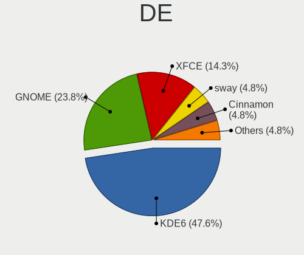
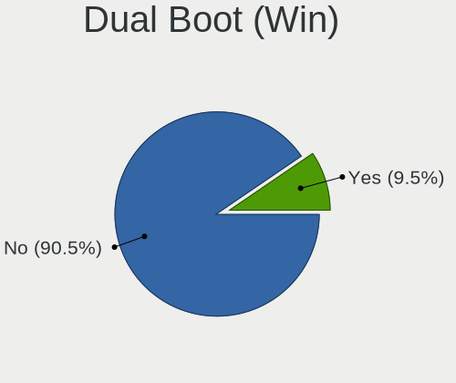
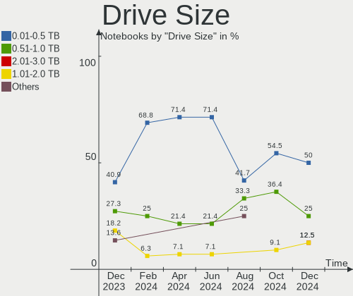
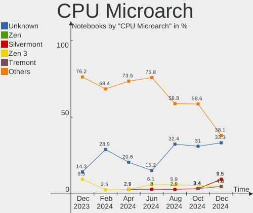
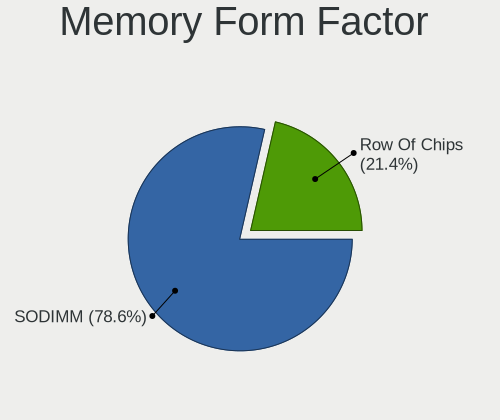

EndeavourOS - Hardware Trends (Notebooks)
-----------------------------------------

A project to identify most popular hardware characteristics and track their change
over time based on data collected by Linux users at https://Linux-Hardware.org.

Anyone can contribute to this report by the [hw-probe](https://github.com/linuxhw/hw-probe) tool:

    sudo -E hw-probe -all -upload

This report is for one last month. Overall report since the beginning of time: [TestDays](https://github.com/linuxhw/TestDays)

Period: Sep, 2023.

Contents
--------

* [ System ](#system)
  - [ OS                       ](#os)
  - [ OS Family                ](#os-family)
  - [ Kernel                   ](#kernel)
  - [ Kernel Family            ](#kernel-family)
  - [ Kernel Major Ver.        ](#kernel-major-ver)
  - [ Arch                     ](#arch)
  - [ DE                       ](#de)
  - [ Display Server           ](#display-server)
  - [ Display Manager          ](#display-manager)
  - [ OS Lang                  ](#os-lang)
  - [ Boot Mode                ](#boot-mode)
  - [ Filesystem               ](#filesystem)
  - [ Part. scheme             ](#part-scheme)
  - [ Dual Boot with Linux/BSD ](#dual-boot-with-linuxbsd)
  - [ Dual Boot (Win)          ](#dual-boot-win)

* [ Board ](#board)
  - [ Vendor                   ](#vendor)
  - [ Model                    ](#model)
  - [ Model Family             ](#model-family)
  - [ MFG Year                 ](#mfg-year)
  - [ Form Factor              ](#form-factor)
  - [ Secure Boot              ](#secure-boot)
  - [ Coreboot                 ](#coreboot)
  - [ RAM Size                 ](#ram-size)
  - [ RAM Used                 ](#ram-used)
  - [ Total Drives             ](#total-drives)
  - [ Has CD-ROM               ](#has-cd-rom)
  - [ Has Ethernet             ](#has-ethernet)
  - [ Has WiFi                 ](#has-wifi)
  - [ Has Bluetooth            ](#has-bluetooth)

* [ Location ](#location)
  - [ Country                  ](#country)
  - [ City                     ](#city)

* [ Drives ](#drives)
  - [ Drive Vendor             ](#drive-vendor)
  - [ Drive Model              ](#drive-model)
  - [ HDD Vendor               ](#hdd-vendor)
  - [ SSD Vendor               ](#ssd-vendor)
  - [ Drive Kind               ](#drive-kind)
  - [ Drive Connector          ](#drive-connector)
  - [ Drive Size               ](#drive-size)
  - [ Space Total              ](#space-total)
  - [ Space Used               ](#space-used)
  - [ Malfunc. Drives          ](#malfunc-drives)
  - [ Malfunc. Drive Vendor    ](#malfunc-drive-vendor)
  - [ Malfunc. HDD Vendor      ](#malfunc-hdd-vendor)
  - [ Malfunc. Drive Kind      ](#malfunc-drive-kind)
  - [ Failed Drives            ](#failed-drives)
  - [ Failed Drive Vendor      ](#failed-drive-vendor)
  - [ Drive Status             ](#drive-status)

* [ Storage controller ](#storage-controller)
  - [ Storage Vendor           ](#storage-vendor)
  - [ Storage Model            ](#storage-model)
  - [ Storage Kind             ](#storage-kind)

* [ Processor ](#processor)
  - [ CPU Vendor               ](#cpu-vendor)
  - [ CPU Model                ](#cpu-model)
  - [ CPU Model Family         ](#cpu-model-family)
  - [ CPU Cores                ](#cpu-cores)
  - [ CPU Sockets              ](#cpu-sockets)
  - [ CPU Threads              ](#cpu-threads)
  - [ CPU Op-Modes             ](#cpu-op-modes)
  - [ CPU Microcode            ](#cpu-microcode)
  - [ CPU Microarch            ](#cpu-microarch)

* [ Graphics ](#graphics)
  - [ GPU Vendor               ](#gpu-vendor)
  - [ GPU Model                ](#gpu-model)
  - [ GPU Combo                ](#gpu-combo)
  - [ GPU Driver               ](#gpu-driver)
  - [ GPU Memory               ](#gpu-memory)

* [ Monitor ](#monitor)
  - [ Monitor Vendor           ](#monitor-vendor)
  - [ Monitor Model            ](#monitor-model)
  - [ Monitor Resolution       ](#monitor-resolution)
  - [ Monitor Diagonal         ](#monitor-diagonal)
  - [ Monitor Width            ](#monitor-width)
  - [ Aspect Ratio             ](#aspect-ratio)
  - [ Monitor Area             ](#monitor-area)
  - [ Pixel Density            ](#pixel-density)
  - [ Multiple Monitors        ](#multiple-monitors)

* [ Network ](#network)
  - [ Net Controller Vendor    ](#net-controller-vendor)
  - [ Net Controller Model     ](#net-controller-model)
  - [ Wireless Vendor          ](#wireless-vendor)
  - [ Wireless Model           ](#wireless-model)
  - [ Ethernet Vendor          ](#ethernet-vendor)
  - [ Ethernet Model           ](#ethernet-model)
  - [ Net Controller Kind      ](#net-controller-kind)
  - [ Used Controller          ](#used-controller)
  - [ NICs                     ](#nics)
  - [ IPv6                     ](#ipv6)

* [ Bluetooth ](#bluetooth)
  - [ Bluetooth Vendor         ](#bluetooth-vendor)
  - [ Bluetooth Model          ](#bluetooth-model)

* [ Sound ](#sound)
  - [ Sound Vendor             ](#sound-vendor)
  - [ Sound Model              ](#sound-model)

* [ Memory ](#memory)
  - [ Memory Vendor            ](#memory-vendor)
  - [ Memory Model             ](#memory-model)
  - [ Memory Kind              ](#memory-kind)
  - [ Memory Form Factor       ](#memory-form-factor)
  - [ Memory Size              ](#memory-size)
  - [ Memory Speed             ](#memory-speed)

* [ Printers & scanners ](#printers--scanners)
  - [ Printer Vendor           ](#printer-vendor)
  - [ Printer Model            ](#printer-model)
  - [ Scanner Vendor           ](#scanner-vendor)
  - [ Scanner Model            ](#scanner-model)

* [ Camera ](#camera)
  - [ Camera Vendor            ](#camera-vendor)
  - [ Camera Model             ](#camera-model)

* [ Security ](#security)
  - [ Fingerprint Vendor       ](#fingerprint-vendor)
  - [ Fingerprint Model        ](#fingerprint-model)
  - [ Chipcard Vendor          ](#chipcard-vendor)
  - [ Chipcard Model           ](#chipcard-model)

* [ Unsupported ](#unsupported)
  - [ Unsupported Devices      ](#unsupported-devices)
  - [ Unsupported Device Types ](#unsupported-device-types)

System
------

OS
--

Installed operating systems

| Name                | Notebooks | Percent |
|---------------------|-----------|---------|
| EndeavourOS Rolling | 41        | 100%    |

OS Family
---------

OS without a version

| Name        | Notebooks | Percent |
|-------------|-----------|---------|
| EndeavourOS | 41        | 100%    |

Kernel
------

Version of the Linux kernel

| Version                | Notebooks | Percent |
|------------------------|-----------|---------|
| 6.4.12-arch1-1         | 8         | 19.51%  |
| 6.5.3-arch1-1          | 7         | 17.07%  |
| 6.5.4-arch2-1          | 4         | 9.76%   |
| 6.5.5-arch1-1          | 2         | 4.88%   |
| 6.5.2-arch1-1          | 2         | 4.88%   |
| 6.5.1-1-cachyos        | 2         | 4.88%   |
| 6.4.12-zen1-1-zen      | 2         | 4.88%   |
| 6.1.52-1-lts           | 2         | 4.88%   |
| 6.5.5-zen1-1-zen       | 1         | 2.44%   |
| 6.5.4-zen2-1.1-zen     | 1         | 2.44%   |
| 6.5.2-zen1-1-zen       | 1         | 2.44%   |
| 6.5.0-2-cachyos-tt     | 1         | 2.44%   |
| 6.5.0-1-mainline       | 1         | 2.44%   |
| 6.4.8-arch1-1          | 1         | 2.44%   |
| 6.4.4-arch1-1          | 1         | 2.44%   |
| 6.4.14-x64v2-xanmod1-1 | 1         | 2.44%   |
| 6.4.11-arch2-1         | 1         | 2.44%   |
| 6.1.53-1-lts           | 1         | 2.44%   |
| 6.1.26-1-lts           | 1         | 2.44%   |
| 6.1.21-1-lts           | 1         | 2.44%   |

Kernel Family
-------------

Linux kernel without a distro release

| Version | Notebooks | Percent |
|---------|-----------|---------|
| 6.4.12  | 10        | 24.39%  |
| 6.5.3   | 7         | 17.07%  |
| 6.5.4   | 5         | 12.2%   |
| 6.5.5   | 3         | 7.32%   |
| 6.5.2   | 3         | 7.32%   |
| 6.5.1   | 2         | 4.88%   |
| 6.5.0   | 2         | 4.88%   |
| 6.1.52  | 2         | 4.88%   |
| 6.4.8   | 1         | 2.44%   |
| 6.4.4   | 1         | 2.44%   |
| 6.4.14  | 1         | 2.44%   |
| 6.4.11  | 1         | 2.44%   |
| 6.1.53  | 1         | 2.44%   |
| 6.1.26  | 1         | 2.44%   |
| 6.1.21  | 1         | 2.44%   |

Kernel Major Ver.
-----------------

Linux kernel major version

| Version | Notebooks | Percent |
|---------|-----------|---------|
| 6.5     | 22        | 53.66%  |
| 6.4     | 14        | 34.15%  |
| 6.1     | 5         | 12.2%   |

Arch
----

OS architecture (x86_64, i586, etc.)

| Name   | Notebooks | Percent |
|--------|-----------|---------|
| x86_64 | 41        | 100%    |

DE
--

Desktop Environment

| Name   | Notebooks | Percent |
|--------|-----------|---------|
| KDE5   | 20        | 48.78%  |
| GNOME  | 9         | 21.95%  |
| XFCE   | 6         | 14.63%  |
| i3     | 4         | 9.76%   |
| MATE   | 1         | 2.44%   |
| Budgie | 1         | 2.44%   |

Display Server
--------------

X11 or Wayland

| Name    | Notebooks | Percent |
|---------|-----------|---------|
| X11     | 21        | 51.22%  |
| Wayland | 17        | 41.46%  |
| Unknown | 2         | 4.88%   |
| Tty     | 1         | 2.44%   |

Display Manager
---------------

SDDM, LightDM, etc.

| Name    | Notebooks | Percent |
|---------|-----------|---------|
| LightDM | 14        | 34.15%  |
| SDDM    | 11        | 26.83%  |
| Unknown | 11        | 26.83%  |
| GDM     | 4         | 9.76%   |
| LY-DM   | 1         | 2.44%   |

OS Lang
-------

Language

| Lang    | Notebooks | Percent |
|---------|-----------|---------|
| en_US   | 20        | 48.78%  |
| en_IN   | 5         | 12.2%   |
| en_GB   | 3         | 7.32%   |
| en_CA   | 3         | 7.32%   |
| de_DE   | 3         | 7.32%   |
| ru_RU   | 2         | 4.88%   |
| zh_CN   | 1         | 2.44%   |
| it_IT   | 1         | 2.44%   |
| es_MX   | 1         | 2.44%   |
| es_CO   | 1         | 2.44%   |
| Unknown | 1         | 2.44%   |

Boot Mode
---------

EFI or BIOS

| Mode | Notebooks | Percent |
|------|-----------|---------|
| EFI  | 26        | 63.41%  |
| BIOS | 15        | 36.59%  |

Filesystem
----------

Type of filesystem

| Type    | Notebooks | Percent |
|---------|-----------|---------|
| Ext4    | 28        | 68.29%  |
| Btrfs   | 12        | 29.27%  |
| Overlay | 1         | 2.44%   |

Part. scheme
------------

Scheme of partitioning

| Type    | Notebooks | Percent |
|---------|-----------|---------|
| GPT     | 29        | 70.73%  |
| Unknown | 11        | 26.83%  |
| MBR     | 1         | 2.44%   |

Dual Boot with Linux/BSD
------------------------

Hosting more than one Linux/BSD

| Dual boot | Notebooks | Percent |
|-----------|-----------|---------|
| No        | 36        | 87.8%   |
| Yes       | 5         | 12.2%   |

Dual Boot (Win)
---------------

Hosting Linux and Windows

| Dual boot | Notebooks | Percent |
|-----------|-----------|---------|
| No        | 28        | 68.29%  |
| Yes       | 13        | 31.71%  |

Board
-----

Vendor
------

Motherboard manufacturer

| Name                | Notebooks | Percent |
|---------------------|-----------|---------|
| Lenovo              | 10        | 24.39%  |
| Hewlett-Packard     | 8         | 19.51%  |
| ASUSTek Computer    | 8         | 19.51%  |
| Dell                | 4         | 9.76%   |
| MSI                 | 3         | 7.32%   |
| Acer                | 3         | 7.32%   |
| Sony                | 2         | 4.88%   |
| Timi                | 1         | 2.44%   |
| Gigabyte Technology | 1         | 2.44%   |
| Apple               | 1         | 2.44%   |

Model
-----

Motherboard model

| Name                                        | Notebooks | Percent |
|---------------------------------------------|-----------|---------|
| Timi Mi NoteBook Ultra                      | 1         | 2.44%   |
| Sony SVE1713X1EB                            | 1         | 2.44%   |
| Sony SVE1513B1EW                            | 1         | 2.44%   |
| MSI GS75 Stealth 8SG                        | 1         | 2.44%   |
| MSI GS63VR 6RF                              | 1         | 2.44%   |
| MSI GL73 8RE                                | 1         | 2.44%   |
| Lenovo ThinkPad X1 Carbon 6th 20KGS0AB00    | 1         | 2.44%   |
| Lenovo ThinkPad P16s Gen 1 21BTCTO1WW       | 1         | 2.44%   |
| Lenovo ThinkPad P14s Gen 4 21K5CTO1WW       | 1         | 2.44%   |
| Lenovo ThinkPad P14s Gen 4 21HF000KGE       | 1         | 2.44%   |
| Lenovo ThinkPad E495 20NES07V00             | 1         | 2.44%   |
| Lenovo ThinkPad E14 20RAS04C00              | 1         | 2.44%   |
| Lenovo IdeaPad 720S-13IKB 81BV              | 1         | 2.44%   |
| Lenovo IdeaPad 5 14ITL05 82FE               | 1         | 2.44%   |
| Lenovo IdeaPad 320-15ISK 80XH               | 1         | 2.44%   |
| Lenovo IdeaPad 3 15IIL05 81WE               | 1         | 2.44%   |
| HP Pavilion Gaming Laptop 17-cd2xxx         | 1         | 2.44%   |
| HP Pavilion Aero Laptop 13z-be200           | 1         | 2.44%   |
| HP EliteBook 865 16 inch G9 Notebook PC     | 1         | 2.44%   |
| HP EliteBook 845 14 inch G10 Notebook PC    | 1         | 2.44%   |
| HP Elite Dragonfly 13.5 inch G3 Notebook PC | 1         | 2.44%   |
| HP Dragonfly Pro                            | 1         | 2.44%   |
| HP 255 G8 Notebook PC                       | 1         | 2.44%   |
| HP 245 14 inch G9 Notebook PC               | 1         | 2.44%   |
| Gigabyte AERO 15-X9                         | 1         | 2.44%   |
| Dell Precision 7710                         | 1         | 2.44%   |
| Dell Latitude E5470                         | 1         | 2.44%   |
| Dell Latitude 5410                          | 1         | 2.44%   |
| Dell G5 5505                                | 1         | 2.44%   |
| ASUS Zenbook UX3402ZA_UX3402ZA              | 1         | 2.44%   |
| ASUS Zenbook UX3402ZA_Q409ZA                | 1         | 2.44%   |
| ASUS ZenBook UX325SA_UM325SA                | 1         | 2.44%   |
| ASUS Zenbook UM3402YAR_UM3402YA             | 1         | 2.44%   |
| ASUS VivoBook_ASUSLaptop X409DA_M409DA      | 1         | 2.44%   |
| ASUS VivoBook_ASUSLaptop N7601ZW_UX6601ZW   | 1         | 2.44%   |
| ASUS ROG Zephyrus G14 GA402RJ_GA402RJ       | 1         | 2.44%   |
| ASUS N750JV                                 | 1         | 2.44%   |
| Apple MacBookAir7,2                         | 1         | 2.44%   |
| Acer Swift SF314-512                        | 1         | 2.44%   |
| Acer Nitro AN515-45                         | 1         | 2.44%   |

Model Family
------------

Motherboard model prefix

| Name              | Notebooks | Percent |
|-------------------|-----------|---------|
| Lenovo ThinkPad   | 6         | 14.63%  |
| Lenovo IdeaPad    | 4         | 9.76%   |
| ASUS ZenBook      | 4         | 9.76%   |
| HP Pavilion       | 2         | 4.88%   |
| HP EliteBook      | 2         | 4.88%   |
| Dell Latitude     | 2         | 4.88%   |
| ASUS VivoBook     | 2         | 4.88%   |
| Timi Mi           | 1         | 2.44%   |
| Sony SVE1713X1EB  | 1         | 2.44%   |
| Sony SVE1513B1EW  | 1         | 2.44%   |
| MSI GS75          | 1         | 2.44%   |
| MSI GS63VR        | 1         | 2.44%   |
| MSI GL73          | 1         | 2.44%   |
| HP Elite          | 1         | 2.44%   |
| HP Dragonfly      | 1         | 2.44%   |
| HP 255            | 1         | 2.44%   |
| HP 245            | 1         | 2.44%   |
| Gigabyte AERO     | 1         | 2.44%   |
| Dell Precision    | 1         | 2.44%   |
| Dell G5           | 1         | 2.44%   |
| ASUS ROG          | 1         | 2.44%   |
| ASUS N750JV       | 1         | 2.44%   |
| Apple MacBookAir7 | 1         | 2.44%   |
| Acer Swift        | 1         | 2.44%   |
| Acer Nitro        | 1         | 2.44%   |
| Acer Aspire       | 1         | 2.44%   |

MFG Year
--------

Motherboard manufacture year

| Year | Notebooks | Percent |
|------|-----------|---------|
| 2022 | 9         | 21.95%  |
| 2023 | 6         | 14.63%  |
| 2020 | 6         | 14.63%  |
| 2021 | 4         | 9.76%   |
| 2019 | 4         | 9.76%   |
| 2018 | 3         | 7.32%   |
| 2017 | 3         | 7.32%   |
| 2016 | 2         | 4.88%   |
| 2012 | 2         | 4.88%   |
| 2015 | 1         | 2.44%   |
| 2013 | 1         | 2.44%   |

Form Factor
-----------

Physical design of the computer

| Name     | Notebooks | Percent |
|----------|-----------|---------|
| Notebook | 41        | 100%    |

Secure Boot
-----------

Enabled or disabled

| State    | Notebooks | Percent |
|----------|-----------|---------|
| Disabled | 41        | 100%    |

Coreboot
--------

Have coreboot on board

| Used | Notebooks | Percent |
|------|-----------|---------|
| No   | 41        | 100%    |

RAM Size
--------

Total RAM memory

| Size in GB  | Notebooks | Percent |
|-------------|-----------|---------|
| 16.01-24.0  | 12        | 29.27%  |
| 8.01-16.0   | 11        | 26.83%  |
| 32.01-64.0  | 9         | 21.95%  |
| 4.01-8.0    | 7         | 17.07%  |
| 24.01-32.0  | 1         | 2.44%   |
| 64.01-256.0 | 1         | 2.44%   |

RAM Used
--------

Used RAM memory

| Used GB   | Notebooks | Percent |
|-----------|-----------|---------|
| 3.01-4.0  | 14        | 34.15%  |
| 4.01-8.0  | 13        | 31.71%  |
| 2.01-3.0  | 8         | 19.51%  |
| 8.01-16.0 | 4         | 9.76%   |
| 1.01-2.0  | 2         | 4.88%   |

Total Drives
------------

Number of drives on board

| Drives | Notebooks | Percent |
|--------|-----------|---------|
| 1      | 27        | 65.85%  |
| 2      | 13        | 31.71%  |
| 3      | 1         | 2.44%   |

Has CD-ROM
----------

Has CD-ROM on board

| Presented | Notebooks | Percent |
|-----------|-----------|---------|
| No        | 39        | 95.12%  |
| Yes       | 2         | 4.88%   |

Has Ethernet
------------

Has Ethernet on board

| Presented | Notebooks | Percent |
|-----------|-----------|---------|
| Yes       | 25        | 60.98%  |
| No        | 16        | 39.02%  |

Has WiFi
--------

Has WiFi module

| Presented | Notebooks | Percent |
|-----------|-----------|---------|
| Yes       | 41        | 100%    |

Has Bluetooth
-------------

Has Bluetooth module

| Presented | Notebooks | Percent |
|-----------|-----------|---------|
| Yes       | 39        | 95.12%  |
| No        | 2         | 4.88%   |

Location
--------

Country
-------

Geographic location (country)

| Country     | Notebooks | Percent |
|-------------|-----------|---------|
| USA         | 8         | 19.51%  |
| India       | 5         | 12.2%   |
| Turkey      | 3         | 7.32%   |
| Russia      | 3         | 7.32%   |
| Italy       | 3         | 7.32%   |
| Germany     | 3         | 7.32%   |
| Canada      | 3         | 7.32%   |
| UK          | 2         | 4.88%   |
| Colombia    | 2         | 4.88%   |
| Vietnam     | 1         | 2.44%   |
| Slovakia    | 1         | 2.44%   |
| Romania     | 1         | 2.44%   |
| New Zealand | 1         | 2.44%   |
| Mexico      | 1         | 2.44%   |
| Iran        | 1         | 2.44%   |
| Hungary     | 1         | 2.44%   |
| China       | 1         | 2.44%   |
| Austria     | 1         | 2.44%   |

City
----

Geographic location (city)

| City                 | Notebooks | Percent |
|----------------------|-----------|---------|
| St Petersburg        | 2         | 4.88%   |
| Bogotá              | 2         | 4.88%   |
| Yazd                 | 1         | 2.44%   |
| Wolfeboro            | 1         | 2.44%   |
| Vienna               | 1         | 2.44%   |
| Vechta               | 1         | 2.44%   |
| Vancouver            | 1         | 2.44%   |
| Turin                | 1         | 2.44%   |
| Pieve a Nievole      | 1         | 2.44%   |
| Pierrefonds          | 1         | 2.44%   |
| Orlando              | 1         | 2.44%   |
| Nadym                | 1         | 2.44%   |
| Mugla                | 1         | 2.44%   |
| Monor                | 1         | 2.44%   |
| Miami                | 1         | 2.44%   |
| Mesa                 | 1         | 2.44%   |
| Mersin               | 1         | 2.44%   |
| Merced               | 1         | 2.44%   |
| Martinsville         | 1         | 2.44%   |
| Longueuil            | 1         | 2.44%   |
| Leicester            | 1         | 2.44%   |
| Kosekoy              | 1         | 2.44%   |
| Kochi                | 1         | 2.44%   |
| Hyderabad            | 1         | 2.44%   |
| Hanoi                | 1         | 2.44%   |
| Guadalajara          | 1         | 2.44%   |
| Frankfurt am Main    | 1         | 2.44%   |
| Delhi                | 1         | 2.44%   |
| Coimbatore           | 1         | 2.44%   |
| Castello di Cisterna | 1         | 2.44%   |
| Cambridge            | 1         | 2.44%   |
| Bucharest            | 1         | 2.44%   |
| Bremen               | 1         | 2.44%   |
| Bratislava           | 1         | 2.44%   |
| Beijing              | 1         | 2.44%   |
| Bakersfield          | 1         | 2.44%   |
| Austin               | 1         | 2.44%   |
| Auckland             | 1         | 2.44%   |
| Ahmedabad            | 1         | 2.44%   |

Drives
------

Drive Vendor
------------

Hard drive vendors

| Vendor                       | Notebooks | Drives | Percent |
|------------------------------|-----------|--------|---------|
| Samsung Electronics          | 11        | 12     | 19.64%  |
| Sandisk                      | 8         | 8      | 14.29%  |
| SK hynix                     | 4         | 4      | 7.14%   |
| Seagate                      | 4         | 4      | 7.14%   |
| Micron Technology            | 4         | 4      | 7.14%   |
| Toshiba                      | 3         | 3      | 5.36%   |
| KIOXIA                       | 3         | 3      | 5.36%   |
| WDC                          | 2         | 2      | 3.57%   |
| Unknown                      | 2         | 2      | 3.57%   |
| Crucial                      | 2         | 2      | 3.57%   |
| Yangtze Memory Technologies  | 1         | 1      | 1.79%   |
| Shenzhen Longsys Electronics | 1         | 1      | 1.79%   |
| Realtek Semiconductor        | 1         | 1      | 1.79%   |
| Realtek                      | 1         | 1      | 1.79%   |
| Phison Electronics           | 1         | 1      | 1.79%   |
| Phison                       | 1         | 1      | 1.79%   |
| Micron/Crucial Technology    | 1         | 1      | 1.79%   |
| MAXIO Technology (Hangzhou)  | 1         | 1      | 1.79%   |
| Kingston Technology Company  | 1         | 1      | 1.79%   |
| Kingston                     | 1         | 1      | 1.79%   |
| Intel                        | 1         | 1      | 1.79%   |
| Corsair                      | 1         | 1      | 1.79%   |
| Apple                        | 1         | 1      | 1.79%   |

Drive Model
-----------

Hard drive models

| Model                                              | Notebooks | Percent |
|----------------------------------------------------|-----------|---------|
| SK hynix HFM512GD3JX013N 512GB                     | 2         | 3.51%   |
| Sandisk WD Black SN850 1TB                         | 2         | 3.51%   |
| Samsung NVMe SSD Controller PM9A1/PM9A3/980PRO 1TB | 2         | 3.51%   |
| Yangtze Memory YMTC PC005 512GB                    | 1         | 1.75%   |
| WDC WDS240G2G0B-00EPW0 240GB SSD                   | 1         | 1.75%   |
| WDC WD10SPZX-08Z10 1TB                             | 1         | 1.75%   |
| Unknown MMC Card  256GB                            | 1         | 1.75%   |
| Unknown MMC Card  196GB                            | 1         | 1.75%   |
| Toshiba XG6 NVMe SSD Controller 512GB              | 1         | 1.75%   |
| Toshiba MQ01ABD050 500GB                           | 1         | 1.75%   |
| Toshiba BG3 NVMe SSD Controller 512GB              | 1         | 1.75%   |
| SK hynix SC308 SATA 256GB SSD                      | 1         | 1.75%   |
| SK hynix HFS128G39MNC-3510A 128GB SSD              | 1         | 1.75%   |
| Shenzhen Longsys Lexar 512GB SSD                   | 1         | 1.75%   |
| Seagate ST2000LM007-1R8174 2TB                     | 1         | 1.75%   |
| Seagate ST1000LM049-2GH172 1TB                     | 1         | 1.75%   |
| Seagate ST1000LM035-1RK172 1TB                     | 1         | 1.75%   |
| Seagate ST1000LM024 HN-M101MBB 1TB                 | 1         | 1.75%   |
| Sandisk WD_BLACK SN770 500GB                       | 1         | 1.75%   |
| Sandisk WD PC SN740 SDDPNQD-256G-1006 256GB        | 1         | 1.75%   |
| Sandisk WD PC SN735 SDBPNHH-256G-1002 256GB        | 1         | 1.75%   |
| Sandisk WD Blue SN550 NVMe SSD 512GB               | 1         | 1.75%   |
| Sandisk WD Blue SN500 / PC SN520 NVMe SSD 256GB    | 1         | 1.75%   |
| Sandisk WD Black SN750 / PC SN730 NVMe SSD 512GB   | 1         | 1.75%   |
| Samsung SSD 990 PRO 2TB                            | 1         | 1.75%   |
| Samsung SSD 980 500GB                              | 1         | 1.75%   |
| Samsung SSD 980 1TB                                | 1         | 1.75%   |
| Samsung SSD 870 QVO 2TB                            | 1         | 1.75%   |
| Samsung SSD 870 EVO 500GB                          | 1         | 1.75%   |
| Samsung SSD 850 PRO 256GB                          | 1         | 1.75%   |
| Samsung MZVLQ256HAJD-00000 256GB                   | 1         | 1.75%   |
| Samsung MZVL4512HBLU-00BH1 512GB                   | 1         | 1.75%   |
| Samsung MZALQ512HBLU-00BL2 512GB                   | 1         | 1.75%   |
| Samsung MZALQ512HALU-000L1 512GB                   | 1         | 1.75%   |
| Realtek ADATA SWORDFISH 250GB                      | 1         | 1.75%   |
| Realtek RTL9210 NVME 128GB                         | 1         | 1.75%   |
| Phison PSEIB001TABBMC0 1024GB                      | 1         | 1.75%   |
| Phison PS5013 E13 NVMe Controller 512GB            | 1         | 1.75%   |
| Micron/Crucial P2 NVMe PCIe SSD 1TB                | 1         | 1.75%   |
| Micron MTFDDAK256TDL 256GB SSD                     | 1         | 1.75%   |

HDD Vendor
----------

Hard disk drive vendors

| Vendor  | Notebooks | Drives | Percent |
|---------|-----------|--------|---------|
| Seagate | 4         | 4      | 66.67%  |
| WDC     | 1         | 1      | 16.67%  |
| Toshiba | 1         | 1      | 16.67%  |

SSD Vendor
----------

Solid state drive vendors

| Vendor              | Notebooks | Drives | Percent |
|---------------------|-----------|--------|---------|
| Samsung Electronics | 3         | 3      | 27.27%  |
| SK hynix            | 2         | 2      | 18.18%  |
| Crucial             | 2         | 2      | 18.18%  |
| WDC                 | 1         | 1      | 9.09%   |
| Micron Technology   | 1         | 1      | 9.09%   |
| Corsair             | 1         | 1      | 9.09%   |
| Apple               | 1         | 1      | 9.09%   |

Drive Kind
----------

HDD or SSD

| Kind | Notebooks | Drives | Percent |
|------|-----------|--------|---------|
| NVMe | 33        | 38     | 64.71%  |
| SSD  | 10        | 11     | 19.61%  |
| HDD  | 6         | 6      | 11.76%  |
| MMC  | 2         | 2      | 3.92%   |

Drive Connector
---------------

SATA, SAS, NVMe, etc.

| Type | Notebooks | Drives | Percent |
|------|-----------|--------|---------|
| NVMe | 33        | 37     | 67.35%  |
| SATA | 13        | 17     | 26.53%  |
| MMC  | 2         | 2      | 4.08%   |
| SAS  | 1         | 1      | 2.04%   |

Drive Size
----------

Size of hard drive

| Size in TB | Notebooks | Drives | Percent |
|------------|-----------|--------|---------|
| 0.01-0.5   | 8         | 10     | 53.33%  |
| 0.51-1.0   | 5         | 5      | 33.33%  |
| 1.01-2.0   | 2         | 2      | 13.33%  |

Space Total
-----------

Amount of disk space available on the file system

| Size in GB     | Notebooks | Percent |
|----------------|-----------|---------|
| 101-250        | 10        | 24.39%  |
| 501-1000       | 9         | 21.95%  |
| 1001-2000      | 7         | 17.07%  |
| 251-500        | 6         | 14.63%  |
| More than 3000 | 3         | 7.32%   |
| 1-20           | 3         | 7.32%   |
| 51-100         | 2         | 4.88%   |
| Unknown        | 1         | 2.44%   |

Space Used
----------

Amount of used disk space

| Used GB   | Notebooks | Percent |
|-----------|-----------|---------|
| 21-50     | 10        | 24.39%  |
| 1-20      | 8         | 19.51%  |
| 101-250   | 7         | 17.07%  |
| 251-500   | 5         | 12.2%   |
| 51-100    | 5         | 12.2%   |
| 501-1000  | 3         | 7.32%   |
| 2001-3000 | 1         | 2.44%   |
| 1001-2000 | 1         | 2.44%   |
| Unknown   | 1         | 2.44%   |

Malfunc. Drives
---------------

Drive models with a malfunction

| Model                          | Notebooks | Drives | Percent |
|--------------------------------|-----------|--------|---------|
| Toshiba MQ01ABD050 500GB       | 1         | 1      | 33.33%  |
| Seagate ST1000LM035-1RK172 1TB | 1         | 1      | 33.33%  |
| Corsair Force LS SSD 120GB     | 1         | 1      | 33.33%  |

Malfunc. Drive Vendor
---------------------

Vendors of faulty drives

| Vendor  | Notebooks | Drives | Percent |
|---------|-----------|--------|---------|
| Toshiba | 1         | 1      | 33.33%  |
| Seagate | 1         | 1      | 33.33%  |
| Corsair | 1         | 1      | 33.33%  |

Malfunc. HDD Vendor
-------------------

Vendors of faulty HDD drives

| Vendor  | Notebooks | Drives | Percent |
|---------|-----------|--------|---------|
| Toshiba | 1         | 1      | 50%     |
| Seagate | 1         | 1      | 50%     |

Malfunc. Drive Kind
-------------------

Kinds of faulty drives

| Kind | Notebooks | Drives | Percent |
|------|-----------|--------|---------|
| HDD  | 2         | 2      | 66.67%  |
| SSD  | 1         | 1      | 33.33%  |

Failed Drives
-------------

Failed drive models

Zero info for selected period =(

Failed Drive Vendor
-------------------

Failed drive vendors

Zero info for selected period =(

Drive Status
------------

Number of failed and malfunc. drives

| Status   | Notebooks | Drives | Percent |
|----------|-----------|--------|---------|
| Works    | 30        | 38     | 66.67%  |
| Detected | 12        | 16     | 26.67%  |
| Malfunc  | 3         | 3      | 6.67%   |

Storage controller
------------------

Storage Vendor
--------------

Storage controller vendors

| Vendor                       | Notebooks | Percent |
|------------------------------|-----------|---------|
| Intel                        | 19        | 32.2%   |
| Samsung Electronics          | 9         | 15.25%  |
| SanDisk                      | 8         | 13.56%  |
| AMD                          | 4         | 6.78%   |
| Micron Technology            | 3         | 5.08%   |
| KIOXIA                       | 3         | 5.08%   |
| Toshiba America Info Systems | 2         | 3.39%   |
| SK hynix                     | 2         | 3.39%   |
| Phison Electronics           | 2         | 3.39%   |
| Kingston Technology Company  | 2         | 3.39%   |
| Yangtze Memory Technologies  | 1         | 1.69%   |
| Shenzhen Longsys Electronics | 1         | 1.69%   |
| Realtek Semiconductor        | 1         | 1.69%   |
| Micron/Crucial Technology    | 1         | 1.69%   |
| MAXIO Technology (Hangzhou)  | 1         | 1.69%   |

Storage Model
-------------

Storage controller models

| Model                                                                          | Notebooks | Percent |
|--------------------------------------------------------------------------------|-----------|---------|
| Samsung NVMe SSD Controller 980                                                | 5         | 8.06%   |
| Intel Volume Management Device NVMe RAID Controller                            | 5         | 8.06%   |
| AMD FCH SATA Controller [AHCI mode]                                            | 4         | 6.45%   |
| Intel Sunrise Point-LP SATA Controller [AHCI mode]                             | 3         | 4.84%   |
| Intel Cannon Lake Mobile PCH SATA AHCI Controller                              | 3         | 4.84%   |
| SK hynix Gold P31/BC711/PC711 NVMe Solid State Drive                           | 2         | 3.23%   |
| SanDisk WD PC SN810 / Black SN850 NVMe SSD                                     | 2         | 3.23%   |
| SanDisk WD Black SN770 / PC SN740 256GB / PC SN560 (DRAM-less) NVMe SSD        | 2         | 3.23%   |
| Samsung NVMe SSD Controller PM9A1/PM9A3/980PRO                                 | 2         | 3.23%   |
| Micron 2450 NVMe SSD [HendrixV] (DRAM-less)                                    | 2         | 3.23%   |
| KIOXIA NVMe SSD Controller BG4 (DRAM-less)                                     | 2         | 3.23%   |
| Intel Comet Lake SATA AHCI Controller                                          | 2         | 3.23%   |
| Intel 7 Series Chipset Family 6-port SATA Controller [AHCI mode]               | 2         | 3.23%   |
| Yangtze Memory PC005 NVMe SSD                                                  | 1         | 1.61%   |
| Toshiba America Info Systems XG6 NVMe SSD Controller                           | 1         | 1.61%   |
| Toshiba America Info Systems BG3 NVMe SSD Controller                           | 1         | 1.61%   |
| Shenzhen Longsys Lexar NM620 NVME SSD (DRAM-less)                              | 1         | 1.61%   |
| SanDisk WD Blue SN550 NVMe SSD                                                 | 1         | 1.61%   |
| SanDisk WD Blue SN500 / PC SN520 NVMe SSD                                      | 1         | 1.61%   |
| SanDisk WD Black SN750 / PC SN730 NVMe SSD                                     | 1         | 1.61%   |
| SanDisk PC SN735 NVMe SSD (DRAM-less)                                          | 1         | 1.61%   |
| Samsung S4LN058A01[SSUBX] AHCI SSD Controller (Apple slot)                     | 1         | 1.61%   |
| Samsung NVMe SSD Controller S4LV008[Pascal]                                    | 1         | 1.61%   |
| Samsung NVMe SSD Controller PM9B1                                              | 1         | 1.61%   |
| Realtek RTS5765DL NVMe SSD Controller (DRAM-less)                              | 1         | 1.61%   |
| Phison PS5013 E13 NVMe Controller                                              | 1         | 1.61%   |
| Phison E18 PCIe4 NVMe Controller                                               | 1         | 1.61%   |
| Micron/Crucial P2 [Nick P2] / P3 / P3 Plus NVMe PCIe SSD (DRAM-less)           | 1         | 1.61%   |
| Micron 2400 NVMe SSD (DRAM-less)                                               | 1         | 1.61%   |
| MAXIO (Hangzhou) NVMe SSD Controller MAP1602                                   | 1         | 1.61%   |
| KIOXIA NVMe SSD Controller XG8                                                 | 1         | 1.61%   |
| Kingston Company Company Non-Volatile memory controller                        | 1         | 1.61%   |
| Kingston Company NV1 NVMe SSD                                                  | 1         | 1.61%   |
| Intel Tiger Lake-LP SATA Controller                                            | 1         | 1.61%   |
| Intel SSD DC P4101/Pro 7600p/760p/E 6100p Series                               | 1         | 1.61%   |
| Intel Q170/Q150/B150/H170/H110/Z170/CM236 Chipset SATA Controller [AHCI Mode]  | 1         | 1.61%   |
| Intel Ice Lake-LP SATA Controller [AHCI mode]                                  | 1         | 1.61%   |
| Intel HM170/QM170 Chipset SATA Controller [AHCI Mode]                          | 1         | 1.61%   |
| Intel 8 Series/C220 Series Chipset Family 6-port SATA Controller 1 [AHCI mode] | 1         | 1.61%   |

Storage Kind
------------

Kind of storage controller (IDE, SATA, NVMe, SAS, ...)

| Kind | Notebooks | Percent |
|------|-----------|---------|
| NVMe | 33        | 56.9%   |
| SATA | 20        | 34.48%  |
| RAID | 5         | 8.62%   |

Processor
---------

CPU Vendor
----------

Processor vendors

| Vendor | Notebooks | Percent |
|--------|-----------|---------|
| Intel  | 27        | 65.85%  |
| AMD    | 14        | 34.15%  |

CPU Model
---------

Processor models

| Model                                         | Notebooks | Percent |
|-----------------------------------------------|-----------|---------|
| Intel Core i7-8750H CPU @ 2.20GHz             | 3         | 7.32%   |
| Intel 12th Gen Core i5-1240P                  | 3         | 7.32%   |
| Intel Core i5-8250U CPU @ 1.60GHz             | 2         | 4.88%   |
| Intel Pentium CPU 2020M @ 2.40GHz             | 1         | 2.44%   |
| Intel Core i7-8550U CPU @ 1.80GHz             | 1         | 2.44%   |
| Intel Core i7-6820HQ CPU @ 2.70GHz            | 1         | 2.44%   |
| Intel Core i7-6700HQ CPU @ 2.60GHz            | 1         | 2.44%   |
| Intel Core i7-4700HQ CPU @ 2.40GHz            | 1         | 2.44%   |
| Intel Core i7-3632QM CPU @ 2.20GHz            | 1         | 2.44%   |
| Intel Core i5-6200U CPU @ 2.30GHz             | 1         | 2.44%   |
| Intel Core i5-5250U CPU @ 1.60GHz             | 1         | 2.44%   |
| Intel Core i5-10310U CPU @ 1.70GHz            | 1         | 2.44%   |
| Intel Core i5-10210U CPU @ 1.60GHz            | 1         | 2.44%   |
| Intel Core i3-6006U CPU @ 2.00GHz             | 1         | 2.44%   |
| Intel Core i3-1005G1 CPU @ 1.20GHz            | 1         | 2.44%   |
| Intel 13th Gen Core i7-1370P                  | 1         | 2.44%   |
| Intel 12th Gen Core i7-1280P                  | 1         | 2.44%   |
| Intel 12th Gen Core i7-12650H                 | 1         | 2.44%   |
| Intel 12th Gen Core i5-1245U                  | 1         | 2.44%   |
| Intel 11th Gen Core i7-11370H @ 3.30GHz       | 1         | 2.44%   |
| Intel 11th Gen Core i5-1135G7 @ 2.40GHz       | 1         | 2.44%   |
| Intel 11th Gen Core i5-11300H @ 3.10GHz       | 1         | 2.44%   |
| AMD Ryzen 7 PRO 7840U w/ Radeon 780M Graphics | 1         | 2.44%   |
| AMD Ryzen 7 PRO 6850HS with Radeon Graphics   | 1         | 2.44%   |
| AMD Ryzen 7 7736U with Radeon Graphics        | 1         | 2.44%   |
| AMD Ryzen 7 7735U with Radeon Graphics        | 1         | 2.44%   |
| AMD Ryzen 7 6800HS with Radeon Graphics       | 1         | 2.44%   |
| AMD Ryzen 7 5800U with Radeon Graphics        | 1         | 2.44%   |
| AMD Ryzen 5 7540U w/ Radeon 740M Graphics     | 1         | 2.44%   |
| AMD Ryzen 5 7530U with Radeon Graphics        | 1         | 2.44%   |
| AMD Ryzen 5 5625U with Radeon Graphics        | 1         | 2.44%   |
| AMD Ryzen 5 5600H with Radeon Graphics        | 1         | 2.44%   |
| AMD Ryzen 5 4600H with Radeon Graphics        | 1         | 2.44%   |
| AMD Ryzen 5 3500U with Radeon Vega Mobile Gfx | 1         | 2.44%   |
| AMD Ryzen 3 3250U with Radeon Graphics        | 1         | 2.44%   |
| AMD Ryzen 3 3200U with Radeon Vega Mobile Gfx | 1         | 2.44%   |

CPU Model Family
----------------

Processor model prefix

| Model           | Notebooks | Percent |
|-----------------|-----------|---------|
| Other           | 10        | 24.39%  |
| Intel Core i7   | 8         | 19.51%  |
| Intel Core i5   | 6         | 14.63%  |
| AMD Ryzen 5     | 6         | 14.63%  |
| AMD Ryzen 7     | 4         | 9.76%   |
| Intel Core i3   | 2         | 4.88%   |
| AMD Ryzen 7 PRO | 2         | 4.88%   |
| AMD Ryzen 3     | 2         | 4.88%   |
| Intel Pentium   | 1         | 2.44%   |

CPU Cores
---------

Number of processor cores

| Number | Notebooks | Percent |
|--------|-----------|---------|
| 4      | 13        | 31.71%  |
| 6      | 8         | 19.51%  |
| 2      | 7         | 17.07%  |
| 8      | 6         | 14.63%  |
| 12     | 3         | 7.32%   |
| 14     | 2         | 4.88%   |
| 10     | 2         | 4.88%   |

CPU Sockets
-----------

Number of sockets

| Number | Notebooks | Percent |
|--------|-----------|---------|
| 1      | 41        | 100%    |

CPU Threads
-----------

Threads per core (Hyper-Threading)

| Number | Notebooks | Percent |
|--------|-----------|---------|
| 2      | 38        | 92.68%  |
| 1      | 3         | 7.32%   |

CPU Op-Modes
------------

CPU Operation Modes (32-bit, 64-bit)

| Op mode        | Notebooks | Percent |
|----------------|-----------|---------|
| 32-bit, 64-bit | 41        | 100%    |

CPU Microcode
-------------

Microcode number

| Number     | Notebooks | Percent |
|------------|-----------|---------|
| Unknown    | 30        | 73.17%  |
| 0x0a404102 | 3         | 7.32%   |
| 0x08108109 | 3         | 7.32%   |
| 0x0a50000c | 2         | 4.88%   |
| 0x906a3    | 1         | 2.44%   |
| 0x0a704103 | 1         | 2.44%   |
| 0x08600106 | 1         | 2.44%   |

CPU Microarch
-------------

Microarchitecture

| Name             | Notebooks | Percent |
|------------------|-----------|---------|
| Unknown          | 10        | 24.39%  |
| KabyLake         | 8         | 19.51%  |
| Zen 3            | 4         | 9.76%   |
| Skylake          | 4         | 9.76%   |
| Zen+             | 3         | 7.32%   |
| TigerLake        | 3         | 7.32%   |
| Alderlake Hybrid | 3         | 7.32%   |
| IvyBridge        | 2         | 4.88%   |
| Zen 2            | 1         | 2.44%   |
| IceLake          | 1         | 2.44%   |
| Haswell          | 1         | 2.44%   |
| Broadwell        | 1         | 2.44%   |

Graphics
--------

GPU Vendor
----------

Vendors of graphics cards

| Vendor | Notebooks | Percent |
|--------|-----------|---------|
| Intel  | 26        | 50%     |
| AMD    | 15        | 28.85%  |
| Nvidia | 11        | 21.15%  |

GPU Model
---------

Graphics card models

| Model                                                                | Notebooks | Percent |
|----------------------------------------------------------------------|-----------|---------|
| Intel Alder Lake-P Integrated Graphics Controller                    | 4         | 7.55%   |
| AMD Rembrandt [Radeon 680M]                                          | 4         | 7.55%   |
| Intel UHD Graphics 620                                               | 3         | 5.66%   |
| Intel TigerLake-LP GT2 [Iris Xe Graphics]                            | 3         | 5.66%   |
| Intel CoffeeLake-H GT2 [UHD Graphics 630]                            | 3         | 5.66%   |
| AMD Picasso/Raven 2 [Radeon Vega Series / Radeon Vega Mobile Series] | 3         | 5.66%   |
| Nvidia GP106M [GeForce GTX 1060 Mobile]                              | 2         | 3.77%   |
| Intel HD Graphics 530                                                | 2         | 3.77%   |
| Intel CometLake-U GT2 [UHD Graphics]                                 | 2         | 3.77%   |
| AMD Phoenix1                                                         | 2         | 3.77%   |
| AMD Cezanne [Radeon Vega Series / Radeon Vega Mobile Series]         | 2         | 3.77%   |
| AMD Barcelo                                                          | 2         | 3.77%   |
| Nvidia TU117GLM [T550 Laptop GPU]                                    | 1         | 1.89%   |
| Nvidia TU106M [GeForce RTX 2070 Mobile]                              | 1         | 1.89%   |
| Nvidia TU104M [GeForce RTX 2080 Mobile]                              | 1         | 1.89%   |
| Nvidia GM204GLM [Quadro M4000M]                                      | 1         | 1.89%   |
| Nvidia GK107M [GeForce GT 750M]                                      | 1         | 1.89%   |
| Nvidia GA107M [GeForce RTX 3050 Ti Mobile]                           | 1         | 1.89%   |
| Nvidia GA107GLM [RTX A500 Laptop GPU]                                | 1         | 1.89%   |
| Nvidia GA106M [GeForce RTX 3060 Mobile / Max-Q]                      | 1         | 1.89%   |
| Nvidia GA104 [Geforce RTX 3070 Ti Laptop GPU]                        | 1         | 1.89%   |
| Intel Skylake GT2 [HD Graphics 520]                                  | 1         | 1.89%   |
| Intel Raptor Lake-P [Iris Xe Graphics]                               | 1         | 1.89%   |
| Intel Iris Plus Graphics G1 (Ice Lake)                               | 1         | 1.89%   |
| Intel HD Graphics 6000                                               | 1         | 1.89%   |
| Intel HD Graphics 520                                                | 1         | 1.89%   |
| Intel Alder Lake-UP3 GT2 [Iris Xe Graphics]                          | 1         | 1.89%   |
| Intel Alder Lake-P GT1 [UHD Graphics]                                | 1         | 1.89%   |
| Intel 4th Gen Core Processor Integrated Graphics Controller          | 1         | 1.89%   |
| Intel 3rd Gen Core processor Graphics Controller                     | 1         | 1.89%   |
| AMD Thames [Radeon HD 7550M/7570M/7650M]                             | 1         | 1.89%   |
| AMD Renoir                                                           | 1         | 1.89%   |
| AMD Navi 10 [Radeon RX 5600 OEM/5600 XT / 5700/5700 XT]              | 1         | 1.89%   |

GPU Combo
---------

Combinations of graphics cards

| Name           | Notebooks | Percent |
|----------------|-----------|---------|
| 1 x Intel      | 16        | 39.02%  |
| 1 x AMD        | 13        | 31.71%  |
| Intel + Nvidia | 10        | 24.39%  |
| 2 x AMD        | 1         | 2.44%   |
| AMD + Nvidia   | 1         | 2.44%   |

GPU Driver
----------

Free vs proprietary

| Driver      | Notebooks | Percent |
|-------------|-----------|---------|
| Free        | 32        | 78.05%  |
| Proprietary | 9         | 21.95%  |

GPU Memory
----------

Total video memory

| Size in GB | Notebooks | Percent |
|------------|-----------|---------|
| Unknown    | 31        | 75.61%  |
| 0.01-0.5   | 5         | 12.2%   |
| 1.01-2.0   | 3         | 7.32%   |
| 5.01-6.0   | 1         | 2.44%   |
| 3.01-4.0   | 1         | 2.44%   |

Monitor
-------

Monitor Vendor
--------------

Monitor vendors

| Vendor              | Notebooks | Percent |
|---------------------|-----------|---------|
| Chimei Innolux      | 9         | 19.57%  |
| Samsung Electronics | 8         | 17.39%  |
| LG Display          | 8         | 17.39%  |
| AU Optronics        | 8         | 17.39%  |
| BOE                 | 5         | 10.87%  |
| TMX                 | 2         | 4.35%   |
| PANDA               | 1         | 2.17%   |
| Lenovo              | 1         | 2.17%   |
| Fujitsu Siemens     | 1         | 2.17%   |
| Dell                | 1         | 2.17%   |
| Apple               | 1         | 2.17%   |
| AOC                 | 1         | 2.17%   |

Monitor Model
-------------

Monitor models

| Model                                                                 | Notebooks | Percent |
|-----------------------------------------------------------------------|-----------|---------|
| Samsung Electronics LCD Monitor SDC4171 2880x1800 302x189mm 14.0-inch | 3         | 6.52%   |
| BOE LCD Monitor BOE0B66 1920x1200 302x188mm 14.0-inch                 | 2         | 4.35%   |
| TMX TL156MDMP01-0 TMX1560 3200x2000 336x210mm 15.6-inch               | 1         | 2.17%   |
| TMX TL140ADXP01 TMX1481 2560x1600 301x188mm 14.0-inch                 | 1         | 2.17%   |
| Samsung Electronics LCD Monitor SDC8151 1920x1080 382x214mm 17.2-inch | 1         | 2.17%   |
| Samsung Electronics LCD Monitor SDC4158 1920x1080 294x165mm 13.3-inch | 1         | 2.17%   |
| Samsung Electronics LCD Monitor SAM0C3C 1360x768 700x390mm 31.5-inch  | 1         | 2.17%   |
| Samsung Electronics LC24RG50 SAM0F90 1920x1080 532x304mm 24.1-inch    | 1         | 2.17%   |
| Samsung Electronics C27F390 SAM0D32 1920x1080 598x336mm 27.0-inch     | 1         | 2.17%   |
| PANDA LCD Monitor NCP0035 1920x1080 344x194mm 15.5-inch               | 1         | 2.17%   |
| LG Display LCD Monitor LGD0611 1920x1080 382x215mm 17.3-inch          | 1         | 2.17%   |
| LG Display LCD Monitor LGD05F5 1920x1080 309x174mm 14.0-inch          | 1         | 2.17%   |
| LG Display LCD Monitor LGD05C0 1920x1080 344x194mm 15.5-inch          | 1         | 2.17%   |
| LG Display LCD Monitor LGD058B 2560x1440 309x174mm 14.0-inch          | 1         | 2.17%   |
| LG Display LCD Monitor LGD057E 1920x1080 344x194mm 15.5-inch          | 1         | 2.17%   |
| LG Display LCD Monitor LGD04EF 1920x1080 294x165mm 13.3-inch          | 1         | 2.17%   |
| LG Display LCD Monitor LGD04A7 1920x1080 344x194mm 15.5-inch          | 1         | 2.17%   |
| LG Display LCD Monitor LGD039F 1366x768 345x194mm 15.6-inch           | 1         | 2.17%   |
| Lenovo P24q-10 LEN61A5 2560x1440 527x296mm 23.8-inch                  | 1         | 2.17%   |
| Fujitsu Siemens A17-3A FUS0686 1280x1024 330x270mm 16.8-inch          | 1         | 2.17%   |
| Dell U2913WM DEL408A 2560x1080 673x284mm 28.8-inch                    | 1         | 2.17%   |
| Chimei Innolux LCD Monitor CMN175C 1920x1080 381x214mm 17.2-inch      | 1         | 2.17%   |
| Chimei Innolux LCD Monitor CMN1735 1920x1080 381x214mm 17.2-inch      | 1         | 2.17%   |
| Chimei Innolux LCD Monitor CMN1541 1366x768 344x193mm 15.5-inch       | 1         | 2.17%   |
| Chimei Innolux LCD Monitor CMN1521 1920x1080 344x193mm 15.5-inch      | 1         | 2.17%   |
| Chimei Innolux LCD Monitor CMN14E5 1920x1080 309x173mm 13.9-inch      | 1         | 2.17%   |
| Chimei Innolux LCD Monitor CMN14C0 1920x1080 310x170mm 13.9-inch      | 1         | 2.17%   |
| Chimei Innolux LCD Monitor CMN1429 1920x1080 309x173mm 13.9-inch      | 1         | 2.17%   |
| Chimei Innolux LCD Monitor CMN140A 1920x1080 309x173mm 13.9-inch      | 1         | 2.17%   |
| Chimei Innolux LCD Monitor CMN13C0 1920x1280 284x189mm 13.4-inch      | 1         | 2.17%   |
| BOE LCD Monitor BOE07C9 1920x1080 309x173mm 13.9-inch                 | 1         | 2.17%   |
| BOE LCD Monitor BOE074C 1366x768 309x173mm 13.9-inch                  | 1         | 2.17%   |
| BOE LCD Monitor BOE0700 1920x1080 344x194mm 15.5-inch                 | 1         | 2.17%   |
| AU Optronics LCD Monitor AUODA91 1920x1080 309x174mm 14.0-inch        | 1         | 2.17%   |
| AU Optronics LCD Monitor AUOD49C 1920x1200 344x215mm 16.0-inch        | 1         | 2.17%   |
| AU Optronics LCD Monitor AUOC199 2560x1600 344x215mm 16.0-inch        | 1         | 2.17%   |
| AU Optronics LCD Monitor AUOA49A 1920x1200 301x188mm 14.0-inch        | 1         | 2.17%   |
| AU Optronics LCD Monitor AUO9F99 1920x1200 344x215mm 16.0-inch        | 1         | 2.17%   |
| AU Optronics LCD Monitor AUO6DA8 2560x1600 301x188mm 14.0-inch        | 1         | 2.17%   |
| AU Optronics LCD Monitor AUO329F 2560x1600 286x178mm 13.3-inch        | 1         | 2.17%   |

Monitor Resolution
------------------

Monitor screen resolution

| Resolution        | Notebooks | Percent |
|-------------------|-----------|---------|
| 1920x1080 (FHD)   | 21        | 47.73%  |
| 1920x1200 (WUXGA) | 5         | 11.36%  |
| 2560x1600         | 4         | 9.09%   |
| 1366x768 (WXGA)   | 4         | 9.09%   |
| 2880x1800         | 3         | 6.82%   |
| 2560x1440 (QHD)   | 2         | 4.55%   |
| 3200x2000         | 1         | 2.27%   |
| 2560x1080         | 1         | 2.27%   |
| 1920x1280         | 1         | 2.27%   |
| 1440x900 (WXGA+)  | 1         | 2.27%   |
| 1280x1024 (SXGA)  | 1         | 2.27%   |

Monitor Diagonal
----------------

Diagonal size in inches

| Inches | Notebooks | Percent |
|--------|-----------|---------|
| 14     | 11        | 23.91%  |
| 13     | 11        | 23.91%  |
| 15     | 9         | 19.57%  |
| 17     | 5         | 10.87%  |
| 16     | 4         | 8.7%    |
| 24     | 2         | 4.35%   |
| 40     | 1         | 2.17%   |
| 31     | 1         | 2.17%   |
| 28     | 1         | 2.17%   |
| 23     | 1         | 2.17%   |

Monitor Width
-------------

Physical width

| Width in mm | Notebooks | Percent |
|-------------|-----------|---------|
| 301-350     | 30        | 65.22%  |
| 351-400     | 5         | 10.87%  |
| 201-300     | 5         | 10.87%  |
| 501-600     | 3         | 6.52%   |
| 601-700     | 2         | 4.35%   |
| 801-900     | 1         | 2.17%   |

Aspect Ratio
------------

Proportional relationship between the width and the height

| Ratio | Notebooks | Percent |
|-------|-----------|---------|
| 16/9  | 26        | 60.47%  |
| 16/10 | 14        | 32.56%  |
| 6/5   | 1         | 2.33%   |
| 3/2   | 1         | 2.33%   |
| 21/9  | 1         | 2.33%   |

Monitor Area
------------

Area in inch²

| Area in inch² | Notebooks | Percent |
|----------------|-----------|---------|
| 81-90          | 19        | 41.3%   |
| 101-110        | 9         | 19.57%  |
| 121-130        | 5         | 10.87%  |
| 71-80          | 3         | 6.52%   |
| 111-120        | 3         | 6.52%   |
| 251-300        | 2         | 4.35%   |
| 201-250        | 2         | 4.35%   |
| 351-500        | 1         | 2.17%   |
| 131-140        | 1         | 2.17%   |
| 501-1000       | 1         | 2.17%   |

Pixel Density
-------------

Pixels per inch

| Density       | Notebooks | Percent |
|---------------|-----------|---------|
| 121-160       | 22        | 47.83%  |
| 161-240       | 11        | 23.91%  |
| 51-100        | 6         | 13.04%  |
| More than 240 | 4         | 8.7%    |
| 101-120       | 2         | 4.35%   |
| 1-50          | 1         | 2.17%   |

Multiple Monitors
-----------------

Total monitors connected

| Total | Notebooks | Percent |
|-------|-----------|---------|
| 1     | 35        | 85.37%  |
| 2     | 6         | 14.63%  |

Network
-------

Net Controller Vendor
---------------------

Controller vendors

| Vendor                | Notebooks | Percent |
|-----------------------|-----------|---------|
| Intel                 | 22        | 36.67%  |
| Realtek Semiconductor | 18        | 30%     |
| Qualcomm Atheros      | 10        | 16.67%  |
| MediaTek              | 4         | 6.67%   |
| Qualcomm              | 2         | 3.33%   |
| Sierra Wireless       | 1         | 1.67%   |
| Qualcomm Technologies | 1         | 1.67%   |
| ICS Advent            | 1         | 1.67%   |
| Broadcom Limited      | 1         | 1.67%   |

Net Controller Model
--------------------

Controller models

| Model                                                             | Notebooks | Percent |
|-------------------------------------------------------------------|-----------|---------|
| Realtek RTL8111/8168/8411 PCI Express Gigabit Ethernet Controller | 12        | 17.39%  |
| Intel Alder Lake-P PCH CNVi WiFi                                  | 6         | 8.7%    |
| Qualcomm Atheros QCA9377 802.11ac Wireless Network Adapter        | 3         | 4.35%   |
| MediaTek MT7922 802.11ax PCI Express Wireless Network Adapter     | 3         | 4.35%   |
| Intel Wi-Fi 6 AX200                                               | 3         | 4.35%   |
| Intel Cannon Lake PCH CNVi WiFi                                   | 3         | 4.35%   |
| Realtek RTL8822CE 802.11ac PCIe Wireless Network Adapter          | 2         | 2.9%    |
| Realtek RTL8153 Gigabit Ethernet Adapter                          | 2         | 2.9%    |
| Qualcomm QCNFA765 Wireless Network Adapter                        | 2         | 2.9%    |
| Qualcomm Atheros Killer E2500 Gigabit Ethernet Controller         | 2         | 2.9%    |
| Qualcomm Atheros AR9485 Wireless Network Adapter                  | 2         | 2.9%    |
| Intel Wireless 8260                                               | 2         | 2.9%    |
| Intel Wi-Fi 6 AX201                                               | 2         | 2.9%    |
| Sierra Wireless EM7455                                            | 1         | 1.45%   |
| Realtek USB 10/100/1G/2.5G LAN                                    | 1         | 1.45%   |
| Realtek RTL8852BE PCIe 802.11ax Wireless Network Controller       | 1         | 1.45%   |
| Realtek RTL8852AE WiFi 6 802.11ax PCIe Adapter                    | 1         | 1.45%   |
| Realtek RTL8822BE 802.11a/b/g/n/ac WiFi adapter                   | 1         | 1.45%   |
| Realtek RTL8821CE 802.11ac PCIe Wireless Network Adapter          | 1         | 1.45%   |
| Realtek RTL8125 2.5GbE Controller                                 | 1         | 1.45%   |
| Realtek Killer E2600 Gigabit Ethernet Controller                  | 1         | 1.45%   |
| Qualcomm QCNFA765 Wireless Network Adapter                        | 1         | 1.45%   |
| Qualcomm Atheros QCA8171 Gigabit Ethernet                         | 1         | 1.45%   |
| Qualcomm Atheros QCA6174 802.11ac Wireless Network Adapter        | 1         | 1.45%   |
| Qualcomm Atheros Killer E2400 Gigabit Ethernet Controller         | 1         | 1.45%   |
| MediaTek MT7921 802.11ax PCI Express Wireless Network Adapter     | 1         | 1.45%   |
| Intel Wireless 8265 / 8275                                        | 1         | 1.45%   |
| Intel Raptor Lake PCH CNVi WiFi                                   | 1         | 1.45%   |
| Intel Ice Lake-LP PCH CNVi WiFi                                   | 1         | 1.45%   |
| Intel Ethernet Controller I219-LM                                 | 1         | 1.45%   |
| Intel Ethernet Connection (4) I219-V                              | 1         | 1.45%   |
| Intel Ethernet Connection (2) I219-LM                             | 1         | 1.45%   |
| Intel Ethernet Connection (16) I219-LM                            | 1         | 1.45%   |
| Intel Ethernet Connection (10) I219-LM                            | 1         | 1.45%   |
| Intel Dual Band Wireless-AC 3168NGW [Stone Peak]                  | 1         | 1.45%   |
| Intel Comet Lake PCH-LP CNVi WiFi                                 | 1         | 1.45%   |
| ICS Advent 10/100M LAN                                            | 1         | 1.45%   |
| Broadcom Limited BCM4360 802.11ac Wireless Network Adapter        | 1         | 1.45%   |

Wireless Vendor
---------------

Wireless vendors

| Vendor                | Notebooks | Percent |
|-----------------------|-----------|---------|
| Intel                 | 21        | 50%     |
| Realtek Semiconductor | 6         | 14.29%  |
| Qualcomm Atheros      | 6         | 14.29%  |
| MediaTek              | 4         | 9.52%   |
| Qualcomm              | 2         | 4.76%   |
| Sierra Wireless       | 1         | 2.38%   |
| Qualcomm Technologies | 1         | 2.38%   |
| Broadcom Limited      | 1         | 2.38%   |

Wireless Model
--------------

Wireless models

| Model                                                         | Notebooks | Percent |
|---------------------------------------------------------------|-----------|---------|
| Intel Alder Lake-P PCH CNVi WiFi                              | 6         | 14.29%  |
| Qualcomm Atheros QCA9377 802.11ac Wireless Network Adapter    | 3         | 7.14%   |
| MediaTek MT7922 802.11ax PCI Express Wireless Network Adapter | 3         | 7.14%   |
| Intel Wi-Fi 6 AX200                                           | 3         | 7.14%   |
| Intel Cannon Lake PCH CNVi WiFi                               | 3         | 7.14%   |
| Realtek RTL8822CE 802.11ac PCIe Wireless Network Adapter      | 2         | 4.76%   |
| Qualcomm QCNFA765 Wireless Network Adapter                    | 2         | 4.76%   |
| Qualcomm Atheros AR9485 Wireless Network Adapter              | 2         | 4.76%   |
| Intel Wireless 8260                                           | 2         | 4.76%   |
| Intel Wi-Fi 6 AX201                                           | 2         | 4.76%   |
| Sierra Wireless EM7455                                        | 1         | 2.38%   |
| Realtek RTL8852BE PCIe 802.11ax Wireless Network Controller   | 1         | 2.38%   |
| Realtek RTL8852AE WiFi 6 802.11ax PCIe Adapter                | 1         | 2.38%   |
| Realtek RTL8822BE 802.11a/b/g/n/ac WiFi adapter               | 1         | 2.38%   |
| Realtek RTL8821CE 802.11ac PCIe Wireless Network Adapter      | 1         | 2.38%   |
| Qualcomm QCNFA765 Wireless Network Adapter                    | 1         | 2.38%   |
| Qualcomm Atheros QCA6174 802.11ac Wireless Network Adapter    | 1         | 2.38%   |
| MediaTek MT7921 802.11ax PCI Express Wireless Network Adapter | 1         | 2.38%   |
| Intel Wireless 8265 / 8275                                    | 1         | 2.38%   |
| Intel Raptor Lake PCH CNVi WiFi                               | 1         | 2.38%   |
| Intel Ice Lake-LP PCH CNVi WiFi                               | 1         | 2.38%   |
| Intel Dual Band Wireless-AC 3168NGW [Stone Peak]              | 1         | 2.38%   |
| Intel Comet Lake PCH-LP CNVi WiFi                             | 1         | 2.38%   |
| Broadcom Limited BCM4360 802.11ac Wireless Network Adapter    | 1         | 2.38%   |

Ethernet Vendor
---------------

Ethernet vendors

| Vendor                | Notebooks | Percent |
|-----------------------|-----------|---------|
| Realtek Semiconductor | 16        | 61.54%  |
| Intel                 | 5         | 19.23%  |
| Qualcomm Atheros      | 4         | 15.38%  |
| ICS Advent            | 1         | 3.85%   |

Ethernet Model
--------------

Ethernet models

| Model                                                             | Notebooks | Percent |
|-------------------------------------------------------------------|-----------|---------|
| Realtek RTL8111/8168/8411 PCI Express Gigabit Ethernet Controller | 12        | 44.44%  |
| Realtek RTL8153 Gigabit Ethernet Adapter                          | 2         | 7.41%   |
| Qualcomm Atheros Killer E2500 Gigabit Ethernet Controller         | 2         | 7.41%   |
| Realtek USB 10/100/1G/2.5G LAN                                    | 1         | 3.7%    |
| Realtek RTL8125 2.5GbE Controller                                 | 1         | 3.7%    |
| Realtek Killer E2600 Gigabit Ethernet Controller                  | 1         | 3.7%    |
| Qualcomm Atheros QCA8171 Gigabit Ethernet                         | 1         | 3.7%    |
| Qualcomm Atheros Killer E2400 Gigabit Ethernet Controller         | 1         | 3.7%    |
| Intel Ethernet Controller I219-LM                                 | 1         | 3.7%    |
| Intel Ethernet Connection (4) I219-V                              | 1         | 3.7%    |
| Intel Ethernet Connection (2) I219-LM                             | 1         | 3.7%    |
| Intel Ethernet Connection (16) I219-LM                            | 1         | 3.7%    |
| Intel Ethernet Connection (10) I219-LM                            | 1         | 3.7%    |
| ICS Advent 10/100M LAN                                            | 1         | 3.7%    |

Net Controller Kind
-------------------

Ethernet, WiFi or modem

| Kind     | Notebooks | Percent |
|----------|-----------|---------|
| WiFi     | 41        | 63.08%  |
| Ethernet | 24        | 36.92%  |

Used Controller
---------------

Currently used network controller

| Kind     | Notebooks | Percent |
|----------|-----------|---------|
| WiFi     | 38        | 88.37%  |
| Ethernet | 5         | 11.63%  |

NICs
----

Total network controllers on board

| Total | Notebooks | Percent |
|-------|-----------|---------|
| 2     | 23        | 56.1%   |
| 1     | 18        | 43.9%   |

IPv6
----

IPv6 vs IPv4

| Used | Notebooks | Percent |
|------|-----------|---------|
| No   | 30        | 73.17%  |
| Yes  | 11        | 26.83%  |

Bluetooth
---------

Bluetooth Vendor
----------------

Controller vendors

| Vendor                          | Notebooks | Percent |
|---------------------------------|-----------|---------|
| Intel                           | 20        | 51.28%  |
| Realtek Semiconductor           | 5         | 12.82%  |
| Qualcomm Atheros Communications | 3         | 7.69%   |
| IMC Networks                    | 3         | 7.69%   |
| USI                             | 2         | 5.13%   |
| Lite-On Technology              | 2         | 5.13%   |
| Foxconn / Hon Hai               | 2         | 5.13%   |
| Cambridge Silicon Radio         | 1         | 2.56%   |
| Apple                           | 1         | 2.56%   |

Bluetooth Model
---------------

Controller models

| Model                                               | Notebooks | Percent |
|-----------------------------------------------------|-----------|---------|
| Intel Bluetooth Device                              | 6         | 15.38%  |
| Realtek Bluetooth Radio                             | 4         | 10.26%  |
| Intel Bluetooth 9460/9560 Jefferson Peak (JfP)      | 4         | 10.26%  |
| Qualcomm Atheros  Bluetooth Device                  | 3         | 7.69%   |
| Intel Bluetooth wireless interface                  | 3         | 7.69%   |
| Intel AX201 Bluetooth                               | 3         | 7.69%   |
| Intel AX200 Bluetooth                               | 3         | 7.69%   |
| USI Bluetooth Device                                | 2         | 5.13%   |
| IMC Networks Wireless_Device                        | 2         | 5.13%   |
| Realtek RTL8822BE Bluetooth 4.2 Adapter             | 1         | 2.56%   |
| Lite-On Wireless_Device                             | 1         | 2.56%   |
| Lite-On Qualcomm Atheros QCA9377 Bluetooth          | 1         | 2.56%   |
| Intel Wireless-AC 3168 Bluetooth                    | 1         | 2.56%   |
| IMC Networks Bluetooth Radio                        | 1         | 2.56%   |
| Foxconn / Hon Hai Wireless_Device                   | 1         | 2.56%   |
| Foxconn / Hon Hai Bluetooth Device                  | 1         | 2.56%   |
| Cambridge Silicon Radio Bluetooth Dongle (HCI mode) | 1         | 2.56%   |
| Apple Bluetooth USB Host Controller                 | 1         | 2.56%   |

Sound
-----

Sound Vendor
------------

Sound card vendors

| Vendor                | Notebooks | Percent |
|-----------------------|-----------|---------|
| Intel                 | 27        | 51.92%  |
| AMD                   | 15        | 28.85%  |
| Nvidia                | 6         | 11.54%  |
| Realtek Semiconductor | 1         | 1.92%   |
| Logitech              | 1         | 1.92%   |
| Focusrite-Novation    | 1         | 1.92%   |
| Applied Microsystems  | 1         | 1.92%   |

Sound Model
-----------

Sound card models

| Model                                                               | Notebooks | Percent |
|---------------------------------------------------------------------|-----------|---------|
| AMD Family 17h/19h HD Audio Controller                              | 13        | 19.4%   |
| Intel Alder Lake PCH-P High Definition Audio Controller             | 6         | 8.96%   |
| AMD Rembrandt Radeon High Definition Audio Controller               | 6         | 8.96%   |
| Intel Sunrise Point-LP HD Audio                                     | 5         | 7.46%   |
| AMD Renoir Radeon High Definition Audio Controller                  | 4         | 5.97%   |
| Intel Tiger Lake-LP Smart Sound Technology Audio Controller         | 3         | 4.48%   |
| Intel Cannon Lake PCH cAVS                                          | 3         | 4.48%   |
| AMD Raven/Raven2/Fenghuang HDMI/DP Audio Controller                 | 3         | 4.48%   |
| Nvidia GP106 High Definition Audio Controller                       | 2         | 2.99%   |
| Intel Comet Lake PCH-LP cAVS                                        | 2         | 2.99%   |
| Intel 7 Series/C216 Chipset Family High Definition Audio Controller | 2         | 2.99%   |
| Intel 100 Series/C230 Series Chipset Family HD Audio Controller     | 2         | 2.99%   |
| Realtek Semiconductor USB Audio                                     | 1         | 1.49%   |
| Nvidia TU104 HD Audio Controller                                    | 1         | 1.49%   |
| Nvidia GM204 High Definition Audio Controller                       | 1         | 1.49%   |
| Nvidia GA106 High Definition Audio Controller                       | 1         | 1.49%   |
| Nvidia GA104 High Definition Audio Controller                       | 1         | 1.49%   |
| Logitech Z-5 Speakers                                               | 1         | 1.49%   |
| Intel Xeon E3-1200 v3/4th Gen Core Processor HD Audio Controller    | 1         | 1.49%   |
| Intel Wildcat Point-LP High Definition Audio Controller             | 1         | 1.49%   |
| Intel Raptor Lake-P/U/H cAVS                                        | 1         | 1.49%   |
| Intel Ice Lake-LP Smart Sound Technology Audio Controller           | 1         | 1.49%   |
| Intel Broadwell-U Audio Controller                                  | 1         | 1.49%   |
| Intel 8 Series/C220 Series Chipset High Definition Audio Controller | 1         | 1.49%   |
| Focusrite-Novation Focusrite Scarlett 2i2 2nd Gen                   | 1         | 1.49%   |
| Applied Microsystems USB Audio Device                               | 1         | 1.49%   |
| AMD Turks HDMI Audio [Radeon HD 6500/6600 / 6700M Series]           | 1         | 1.49%   |
| AMD Navi 10 HDMI Audio                                              | 1         | 1.49%   |

Memory
------

Memory Vendor
-------------

Memory module vendors

| Vendor              | Notebooks | Percent |
|---------------------|-----------|---------|
| Samsung Electronics | 14        | 37.84%  |
| Micron Technology   | 10        | 27.03%  |
| SK hynix            | 6         | 16.22%  |
| Ramaxel Technology  | 2         | 5.41%   |
| Crucial             | 2         | 5.41%   |
| Unknown             | 1         | 2.7%    |
| Patriot             | 1         | 2.7%    |
| Kingston            | 1         | 2.7%    |

Memory Model
------------

Memory module models

| Model                                                         | Notebooks | Percent |
|---------------------------------------------------------------|-----------|---------|
| Samsung RAM M471A1K43EB1-CWE 8GB SODIMM DDR4 3200MT/s         | 3         | 7.89%   |
| SK hynix RAM HMA851S6AFR6N-UH 4GB SODIMM DDR4 2667MT/s        | 2         | 5.26%   |
| Unknown RAM Module 8GB SODIMM DDR3                            | 1         | 2.63%   |
| Unknown RAM Module 4GB SODIMM DDR3                            | 1         | 2.63%   |
| SK hynix RAM HMA82GS6CJR8N-VK 16GB SODIMM DDR4 2667MT/s       | 1         | 2.63%   |
| SK hynix RAM HMA81GS6AFR8N-UH 8GB SODIMM DDR4 2667MT/s        | 1         | 2.63%   |
| SK hynix RAM H9HCNNNCPMMLXR-NEE 8GB SODIMM LPDDR4 4266MT/s    | 1         | 2.63%   |
| SK hynix RAM H58G56AK6BX069N 4GB Row Of Chips LPDDR5 6400MT/s | 1         | 2.63%   |
| Samsung RAM Module 8GB SODIMM DDR5 4800MT/s                   | 1         | 2.63%   |
| Samsung RAM Module 32GB SODIMM DDR5 5600MT/s                  | 1         | 2.63%   |
| Samsung RAM Module 2GB Row Of Chips LPDDR5 6400MT/s           | 1         | 2.63%   |
| Samsung RAM M471A5244CB0-CTD 4GB Row Of Chips DDR4 2667MT/s   | 1         | 2.63%   |
| Samsung RAM M471A5143SB1-CRC 4GB SODIMM DDR4 2400MT/s         | 1         | 2.63%   |
| Samsung RAM M471A2K43CB1-CTD 16GB SODIMM DDR4 8400MT/s        | 1         | 2.63%   |
| Samsung RAM M471A1K43DB1-CWE 8GB SODIMM DDR4 3200MT/s         | 1         | 2.63%   |
| Samsung RAM M471A1K43DB1-CTD 8GB SODIMM DDR4 2667MT/s         | 1         | 2.63%   |
| Samsung RAM M471A1G44AB0-CWE 8GB Row Of Chips DDR4 3200MT/s   | 1         | 2.63%   |
| Samsung RAM M425R1GB4BB0-CQKOL 8GB SODIMM DDR5 4800MT/s       | 1         | 2.63%   |
| Samsung RAM K4EBE304EB-EGCG 8GB Row Of Chips LPDDR3 2133MT/s  | 1         | 2.63%   |
| Ramaxel RAM RMSA3300ME78HBF-2666 16GB SODIMM DDR4 2667MT/s    | 1         | 2.63%   |
| Ramaxel RAM RMSA3270ME86H9F-2666 4GB SODIMM DDR4 2667MT/s     | 1         | 2.63%   |
| Patriot RAM PSD416G320081S 16GB SODIMM DDR4 3200MT/s          | 1         | 2.63%   |
| Micron RAM MTC4C10163S1SC48BA1 8GB SODIMM DDR5 4800MT/s       | 1         | 2.63%   |
| Micron RAM MT62F4G32D8DV-026 WT 16GB SODIMM LPDDR5 6400MT/s   | 1         | 2.63%   |
| Micron RAM MT62F4G32D8DV-026 8GB SODIMM LPDDR5 7400MT/s       | 1         | 2.63%   |
| Micron RAM MT53E1G32D2NP-046 2GB Row Of Chips LPDDR4 4267MT/s | 1         | 2.63%   |
| Micron RAM 8ATF1G64HZ-3G2R1 8GB SODIMM DDR4 3200MT/s          | 1         | 2.63%   |
| Micron RAM 4ATS1G64HZ-2G3E1 8GB SODIMM DDR4 2667MT/s          | 1         | 2.63%   |
| Micron RAM 4ATS1G64HZ-2G3A1 8GB SODIMM DDR4 2400MT/s          | 1         | 2.63%   |
| Micron RAM 4ATF51264HZ-2G3B1 4GB SODIMM DDR4 3200MT/s         | 1         | 2.63%   |
| Micron RAM 4ATF1G64HZ-3G2E1 8GB Row Of Chips DDR4 3200MT/s    | 1         | 2.63%   |
| Micron RAM 16KTF1G64HZ-1G6E1 8GB SODIMM DDR3 1600MT/s         | 1         | 2.63%   |
| Kingston RAM 9905744-066.A00G 32GB SODIMM DDR4 3200MT/s       | 1         | 2.63%   |
| Crucial RAM CT8G4SFRA32A.C8FR 8GB SODIMM DDR4 3200MT/s        | 1         | 2.63%   |
| Crucial RAM CT16G4SFRA32A.M16FR 16GB SODIMM DDR4 3200MT/s     | 1         | 2.63%   |

Memory Kind
-----------

Memory module kinds

| Kind   | Notebooks | Percent |
|--------|-----------|---------|
| DDR4   | 18        | 56.25%  |
| LPDDR5 | 4         | 12.5%   |
| LPDDR4 | 4         | 12.5%   |
| DDR5   | 3         | 9.38%   |
| DDR3   | 2         | 6.25%   |
| LPDDR3 | 1         | 3.13%   |

Memory Form Factor
------------------

Physical design of the memory module

| Name         | Notebooks | Percent |
|--------------|-----------|---------|
| SODIMM       | 24        | 77.42%  |
| Row Of Chips | 7         | 22.58%  |

Memory Size
-----------

Memory module size

| Size  | Notebooks | Percent |
|-------|-----------|---------|
| 8192  | 20        | 57.14%  |
| 16384 | 6         | 17.14%  |
| 4096  | 5         | 14.29%  |
| 32768 | 3         | 8.57%   |
| 2048  | 1         | 2.86%   |

Memory Speed
------------

Memory module speed

| Speed   | Notebooks | Percent |
|---------|-----------|---------|
| 3200    | 12        | 34.29%  |
| 2667    | 8         | 22.86%  |
| 6400    | 3         | 8.57%   |
| 4800    | 2         | 5.71%   |
| 2400    | 2         | 5.71%   |
| 8400    | 1         | 2.86%   |
| 7400    | 1         | 2.86%   |
| 5600    | 1         | 2.86%   |
| 4267    | 1         | 2.86%   |
| 4266    | 1         | 2.86%   |
| 2133    | 1         | 2.86%   |
| 1600    | 1         | 2.86%   |
| Unknown | 1         | 2.86%   |

Printers & scanners
-------------------

Printer Vendor
--------------

Printer device vendors

Zero info for selected period =(

Printer Model
-------------

Printer device models

Zero info for selected period =(

Scanner Vendor
--------------

Scanner device vendors

Zero info for selected period =(

Scanner Model
-------------

Scanner device models

Zero info for selected period =(

Camera
------

Camera Vendor
-------------

Camera device vendors

| Vendor                                 | Notebooks | Percent |
|----------------------------------------|-----------|---------|
| Bison Electronics                      | 8         | 22.22%  |
| IMC Networks                           | 6         | 16.67%  |
| Sunplus Innovation Technology          | 4         | 11.11%  |
| Sonix Technology                       | 3         | 8.33%   |
| Luxvisions Innotech Limited            | 3         | 8.33%   |
| Chicony Electronics                    | 3         | 8.33%   |
| Quanta                                 | 2         | 5.56%   |
| Microdia                               | 2         | 5.56%   |
| Cheng Uei Precision Industry (Foxlink) | 2         | 5.56%   |
| Syntek                                 | 1         | 2.78%   |
| Realtek Semiconductor                  | 1         | 2.78%   |
| Lite-On Technology                     | 1         | 2.78%   |

Camera Model
------------

Camera device models

| Model                                                        | Notebooks | Percent |
|--------------------------------------------------------------|-----------|---------|
| Sonix USB2.0 FHD UVC WebCam                                  | 3         | 8.33%   |
| Sunplus HD WebCam                                            | 2         | 5.56%   |
| Microdia Integrated_Webcam_HD                                | 2         | 5.56%   |
| IMC Networks USB2.0 HD UVC WebCam                            | 2         | 5.56%   |
| IMC Networks Integrated Camera                               | 2         | 5.56%   |
| Chicony Integrated Camera                                    | 2         | 5.56%   |
| Bison USB2.0 Camera                                          | 2         | 5.56%   |
| Bison Integrated Camera                                      | 2         | 5.56%   |
| Bison HD Webcam                                              | 2         | 5.56%   |
| Syntek Integrated Camera                                     | 1         | 2.78%   |
| Sunplus HP X Camera                                          | 1         | 2.78%   |
| Sunplus Dell E5570 integrated webcam                         | 1         | 2.78%   |
| Realtek Integrated_Webcam_HD                                 | 1         | 2.78%   |
| Quanta USB2.0 HD UVC WebCam                                  | 1         | 2.78%   |
| Quanta HD User Facing                                        | 1         | 2.78%   |
| Luxvisions Innotech Limited HP Wide Vision HD Camera         | 1         | 2.78%   |
| Luxvisions Innotech Limited HP TrueVision HD Camera          | 1         | 2.78%   |
| Luxvisions Innotech Limited HP 5MP Camera                    | 1         | 2.78%   |
| Lite-On HP Wide Vision HD Camera                             | 1         | 2.78%   |
| IMC Networks USB2.0 VGA UVC WebCam                           | 1         | 2.78%   |
| IMC Networks USB2.0 UVC HD Webcam                            | 1         | 2.78%   |
| Chicony EasyCamera                                           | 1         | 2.78%   |
| Cheng Uei Precision Industry (Foxlink) XiaoMi USB 2.0 Webcam | 1         | 2.78%   |
| Cheng Uei Precision Industry (Foxlink) HP 5MP Camera         | 1         | 2.78%   |
| Bison NEC HD WebCam                                          | 1         | 2.78%   |
| Bison Integrated RGB Camera                                  | 1         | 2.78%   |

Security
--------

Fingerprint Vendor
------------------

Fingerprint sensor vendors

| Vendor                             | Notebooks | Percent |
|------------------------------------|-----------|---------|
| Synaptics                          | 3         | 50%     |
| Shenzhen Goodix Technology         | 1         | 16.67%  |
| Realtek USB2.0 Finger Print Bridge | 1         | 16.67%  |
| Elan Microelectronics              | 1         | 16.67%  |

Fingerprint Model
-----------------

Fingerprint sensor models

| Model                                                           | Notebooks | Percent |
|-----------------------------------------------------------------|-----------|---------|
| Synaptics FS7604 Touch Fingerprint Sensor with PurePrint        | 2         | 33.33%  |
| Synaptics Metallica MIS Touch Fingerprint Reader                | 1         | 16.67%  |
| Shenzhen Goodix  FingerPrint Device                             | 1         | 16.67%  |
| Realtek USB2.0 Finger Print Bridge FocalTech Fingerprint Device | 1         | 16.67%  |
| Elan ELAN:ARM-M4                                                | 1         | 16.67%  |

Chipcard Vendor
---------------

Chipcard module vendors

| Vendor      | Notebooks | Percent |
|-------------|-----------|---------|
| Broadcom    | 2         | 66.67%  |
| Alcor Micro | 1         | 33.33%  |

Chipcard Model
--------------

Chipcard module models

| Model                               | Notebooks | Percent |
|-------------------------------------|-----------|---------|
| Broadcom 5880                       | 1         | 33.33%  |
| Broadcom 58200                      | 1         | 33.33%  |
| Alcor Micro AU9540 Smartcard Reader | 1         | 33.33%  |

Unsupported
-----------

Unsupported Devices
-------------------

Total unsupported devices on board

| Total | Notebooks | Percent |
|-------|-----------|---------|
| 0     | 25        | 60.98%  |
| 1     | 16        | 39.02%  |

Unsupported Device Types
------------------------

Types of unsupported devices

| Type                  | Notebooks | Percent |
|-----------------------|-----------|---------|
| Fingerprint reader    | 6         | 37.5%   |
| Multimedia controller | 4         | 25%     |
| Chipcard              | 3         | 18.75%  |
| Graphics card         | 2         | 12.5%   |
| Net/ethernet          | 1         | 6.25%   |

