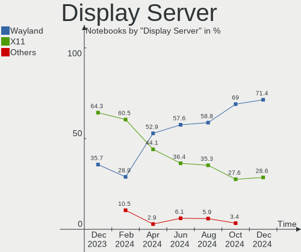
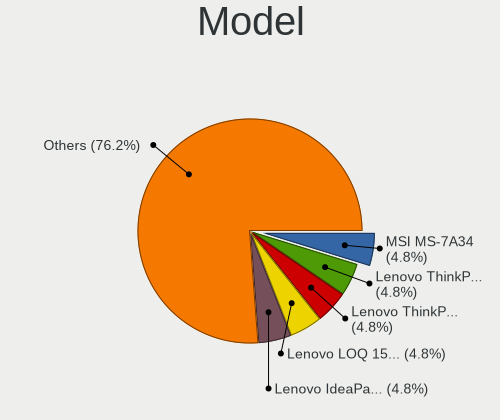
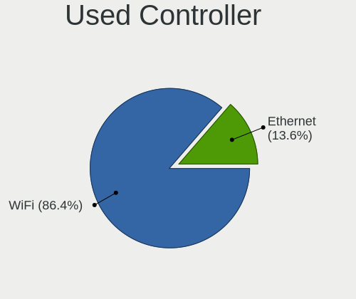
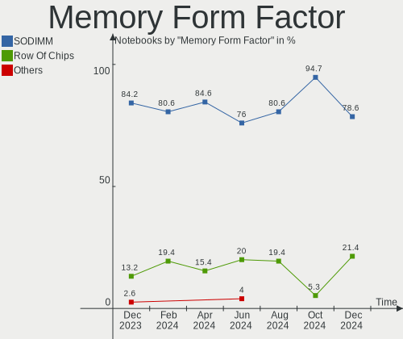
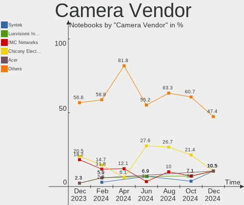

EndeavourOS Hardware Trends (Notebooks)
---------------------------------------

A project to identify most popular hardware characteristics and track their change
over time based on data collected by EndeavourOS users at https://Linux-Hardware.org.

Anyone can contribute to this report by the [hw-probe](https://github.com/linuxhw/hw-probe) tool:

    sudo -E hw-probe -all -upload

This report is for one last month. Overall report since the beginning of time: [TestCoverage](https://github.com/linuxhw/TestCoverage)

Period: Apr, 2022.

Contents
--------

* [ System ](#system)
  - [ OS                       ](#os)
  - [ OS Family                ](#os-family)
  - [ Kernel                   ](#kernel)
  - [ Kernel Family            ](#kernel-family)
  - [ Kernel Major Ver.        ](#kernel-major-ver)
  - [ Arch                     ](#arch)
  - [ DE                       ](#de)
  - [ Display Server           ](#display-server)
  - [ Display Manager          ](#display-manager)
  - [ OS Lang                  ](#os-lang)
  - [ Boot Mode                ](#boot-mode)
  - [ Filesystem               ](#filesystem)
  - [ Part. scheme             ](#part-scheme)
  - [ Dual Boot with Linux/BSD ](#dual-boot-with-linuxbsd)
  - [ Dual Boot (Win)          ](#dual-boot-win)

* [ Board ](#board)
  - [ Vendor                   ](#vendor)
  - [ Model                    ](#model)
  - [ Model Family             ](#model-family)
  - [ MFG Year                 ](#mfg-year)
  - [ Form Factor              ](#form-factor)
  - [ Secure Boot              ](#secure-boot)
  - [ Coreboot                 ](#coreboot)
  - [ RAM Size                 ](#ram-size)
  - [ RAM Used                 ](#ram-used)
  - [ Total Drives             ](#total-drives)
  - [ Has CD-ROM               ](#has-cd-rom)
  - [ Has Ethernet             ](#has-ethernet)
  - [ Has WiFi                 ](#has-wifi)
  - [ Has Bluetooth            ](#has-bluetooth)

* [ Location ](#location)
  - [ Country                  ](#country)
  - [ City                     ](#city)

* [ Drives ](#drives)
  - [ Drive Vendor             ](#drive-vendor)
  - [ Drive Model              ](#drive-model)
  - [ HDD Vendor               ](#hdd-vendor)
  - [ SSD Vendor               ](#ssd-vendor)
  - [ Drive Kind               ](#drive-kind)
  - [ Drive Connector          ](#drive-connector)
  - [ Drive Size               ](#drive-size)
  - [ Space Total              ](#space-total)
  - [ Space Used               ](#space-used)
  - [ Malfunc. Drives          ](#malfunc-drives)
  - [ Malfunc. Drive Vendor    ](#malfunc-drive-vendor)
  - [ Malfunc. HDD Vendor      ](#malfunc-hdd-vendor)
  - [ Malfunc. Drive Kind      ](#malfunc-drive-kind)
  - [ Failed Drives            ](#failed-drives)
  - [ Failed Drive Vendor      ](#failed-drive-vendor)
  - [ Drive Status             ](#drive-status)

* [ Storage controller ](#storage-controller)
  - [ Storage Vendor           ](#storage-vendor)
  - [ Storage Model            ](#storage-model)
  - [ Storage Kind             ](#storage-kind)

* [ Processor ](#processor)
  - [ CPU Vendor               ](#cpu-vendor)
  - [ CPU Model                ](#cpu-model)
  - [ CPU Model Family         ](#cpu-model-family)
  - [ CPU Cores                ](#cpu-cores)
  - [ CPU Sockets              ](#cpu-sockets)
  - [ CPU Threads              ](#cpu-threads)
  - [ CPU Op-Modes             ](#cpu-op-modes)
  - [ CPU Microcode            ](#cpu-microcode)
  - [ CPU Microarch            ](#cpu-microarch)

* [ Graphics ](#graphics)
  - [ GPU Vendor               ](#gpu-vendor)
  - [ GPU Model                ](#gpu-model)
  - [ GPU Combo                ](#gpu-combo)
  - [ GPU Driver               ](#gpu-driver)
  - [ GPU Memory               ](#gpu-memory)

* [ Monitor ](#monitor)
  - [ Monitor Vendor           ](#monitor-vendor)
  - [ Monitor Model            ](#monitor-model)
  - [ Monitor Resolution       ](#monitor-resolution)
  - [ Monitor Diagonal         ](#monitor-diagonal)
  - [ Monitor Width            ](#monitor-width)
  - [ Aspect Ratio             ](#aspect-ratio)
  - [ Monitor Area             ](#monitor-area)
  - [ Pixel Density            ](#pixel-density)
  - [ Multiple Monitors        ](#multiple-monitors)

* [ Network ](#network)
  - [ Net Controller Vendor    ](#net-controller-vendor)
  - [ Net Controller Model     ](#net-controller-model)
  - [ Wireless Vendor          ](#wireless-vendor)
  - [ Wireless Model           ](#wireless-model)
  - [ Ethernet Vendor          ](#ethernet-vendor)
  - [ Ethernet Model           ](#ethernet-model)
  - [ Net Controller Kind      ](#net-controller-kind)
  - [ Used Controller          ](#used-controller)
  - [ NICs                     ](#nics)
  - [ IPv6                     ](#ipv6)

* [ Bluetooth ](#bluetooth)
  - [ Bluetooth Vendor         ](#bluetooth-vendor)
  - [ Bluetooth Model          ](#bluetooth-model)

* [ Sound ](#sound)
  - [ Sound Vendor             ](#sound-vendor)
  - [ Sound Model              ](#sound-model)

* [ Memory ](#memory)
  - [ Memory Vendor            ](#memory-vendor)
  - [ Memory Model             ](#memory-model)
  - [ Memory Kind              ](#memory-kind)
  - [ Memory Form Factor       ](#memory-form-factor)
  - [ Memory Size              ](#memory-size)
  - [ Memory Speed             ](#memory-speed)

* [ Printers & scanners ](#printers--scanners)
  - [ Printer Vendor           ](#printer-vendor)
  - [ Printer Model            ](#printer-model)
  - [ Scanner Vendor           ](#scanner-vendor)
  - [ Scanner Model            ](#scanner-model)

* [ Camera ](#camera)
  - [ Camera Vendor            ](#camera-vendor)
  - [ Camera Model             ](#camera-model)

* [ Security ](#security)
  - [ Fingerprint Vendor       ](#fingerprint-vendor)
  - [ Fingerprint Model        ](#fingerprint-model)
  - [ Chipcard Vendor          ](#chipcard-vendor)
  - [ Chipcard Model           ](#chipcard-model)

* [ Unsupported ](#unsupported)
  - [ Unsupported Devices      ](#unsupported-devices)
  - [ Unsupported Device Types ](#unsupported-device-types)

System
------

OS
--

Installed operating systems

| Name                | Notebooks | Percent |
|---------------------|-----------|---------|
| EndeavourOS Rolling | 17        | 80.95%  |
| EndeavourOS         | 4         | 19.05%  |

OS Family
---------

OS without a version

| Name        | Notebooks | Percent |
|-------------|-----------|---------|
| EndeavourOS | 21        | 100%    |

Kernel
------

Version of the Linux kernel

| Version            | Notebooks | Percent |
|--------------------|-----------|---------|
| 5.17.5-arch1-1     | 3         | 14.29%  |
| 5.17.3-arch1-1     | 3         | 14.29%  |
| 5.17.1-arch1-1     | 3         | 14.29%  |
| 5.17.4-arch1-1     | 2         | 9.52%   |
| 5.17.3-zen1-1-zen  | 2         | 9.52%   |
| 5.15.33-1-lts      | 2         | 9.52%   |
| 5.17.1-zen1-1-zen  | 1         | 4.76%   |
| 5.17.1-arch1-g14-1 | 1         | 4.76%   |
| 5.17.0-arch1-g14-1 | 1         | 4.76%   |
| 5.15.8-arch1-1     | 1         | 4.76%   |
| 5.15.5-arch1-1     | 1         | 4.76%   |
| 5.15.32-1-lts      | 1         | 4.76%   |

Kernel Family
-------------

Linux kernel without a distro release

| Version | Notebooks | Percent |
|---------|-----------|---------|
| 5.17.3  | 5         | 23.81%  |
| 5.17.1  | 5         | 23.81%  |
| 5.17.5  | 3         | 14.29%  |
| 5.17.4  | 2         | 9.52%   |
| 5.15.33 | 2         | 9.52%   |
| 5.17.0  | 1         | 4.76%   |
| 5.15.8  | 1         | 4.76%   |
| 5.15.5  | 1         | 4.76%   |
| 5.15.32 | 1         | 4.76%   |

Kernel Major Ver.
-----------------

Linux kernel major version

| Version | Notebooks | Percent |
|---------|-----------|---------|
| 5.17    | 16        | 76.19%  |
| 5.15    | 5         | 23.81%  |

Arch
----

OS architecture (x86_64, i586, etc.)

| Name   | Notebooks | Percent |
|--------|-----------|---------|
| x86_64 | 21        | 100%    |

DE
--

Desktop Environment

| Name   | Notebooks | Percent |
|--------|-----------|---------|
| GNOME  | 7         | 33.33%  |
| KDE5   | 6         | 28.57%  |
| XFCE   | 4         | 19.05%  |
| MATE   | 1         | 4.76%   |
| LeftWM | 1         | 4.76%   |
| i3     | 1         | 4.76%   |
| bspwm  | 1         | 4.76%   |

Display Server
--------------

X11 or Wayland

| Name    | Notebooks | Percent |
|---------|-----------|---------|
| X11     | 16        | 76.19%  |
| Wayland | 4         | 19.05%  |
| Tty     | 1         | 4.76%   |

Display Manager
---------------

SDDM, LightDM, etc.

| Name    | Notebooks | Percent |
|---------|-----------|---------|
| LightDM | 8         | 38.1%   |
| GDM     | 5         | 23.81%  |
| SDDM    | 4         | 19.05%  |
| Unknown | 4         | 19.05%  |

OS Lang
-------

Language

| Lang  | Notebooks | Percent |
|-------|-----------|---------|
| en_US | 15        | 71.43%  |
| en_CA | 2         | 9.52%   |
| sv_SE | 1         | 4.76%   |
| it_IT | 1         | 4.76%   |
| fr_FR | 1         | 4.76%   |
| en_GB | 1         | 4.76%   |

Boot Mode
---------

EFI or BIOS

| Mode | Notebooks | Percent |
|------|-----------|---------|
| EFI  | 16        | 76.19%  |
| BIOS | 5         | 23.81%  |

Filesystem
----------

Type of filesystem

| Type    | Notebooks | Percent |
|---------|-----------|---------|
| Ext4    | 16        | 76.19%  |
| Btrfs   | 4         | 19.05%  |
| Overlay | 1         | 4.76%   |

Part. scheme
------------

Scheme of partitioning

| Type    | Notebooks | Percent |
|---------|-----------|---------|
| GPT     | 15        | 71.43%  |
| Unknown | 5         | 23.81%  |
| MBR     | 1         | 4.76%   |

Dual Boot with Linux/BSD
------------------------

Hosting more than one Linux/BSD

| Dual boot | Notebooks | Percent |
|-----------|-----------|---------|
| No        | 16        | 76.19%  |
| Yes       | 5         | 23.81%  |

Dual Boot (Win)
---------------

Hosting Linux and Windows

| Dual boot | Notebooks | Percent |
|-----------|-----------|---------|
| No        | 13        | 61.9%   |
| Yes       | 8         | 38.1%   |

Board
-----

Vendor
------

Motherboard manufacturer

| Name             | Notebooks | Percent |
|------------------|-----------|---------|
| ASUSTek Computer | 5         | 23.81%  |
| Lenovo           | 3         | 14.29%  |
| Dell             | 3         | 14.29%  |
| Hewlett-Packard  | 2         | 9.52%   |
| Google           | 2         | 9.52%   |
| TrekStor         | 1         | 4.76%   |
| Packard Bell     | 1         | 4.76%   |
| MSI              | 1         | 4.76%   |
| ILLEGEAR         | 1         | 4.76%   |
| HUAWEI           | 1         | 4.76%   |
| Acer             | 1         | 4.76%   |

Model
-----

Motherboard model

| Name                                   | Notebooks | Percent |
|----------------------------------------|-----------|---------|
| TrekStor Notebook Slim S130            | 1         | 4.76%   |
| Packard Bell EasyNote ENTG71BM         | 1         | 4.76%   |
| MSI Modern 15 A11M                     | 1         | 4.76%   |
| Lenovo Legion 5 15ACH6H 82JU           | 1         | 4.76%   |
| Lenovo IdeaPad Gaming 3 15ARH05 82EY   | 1         | 4.76%   |
| Lenovo IdeaPad 3 14ALC6 82KT           | 1         | 4.76%   |
| ILLEGEAR ROGUE                         | 1         | 4.76%   |
| HUAWEI MACH-WX9                        | 1         | 4.76%   |
| HP Pavilion Notebook                   | 1         | 4.76%   |
| HP 250 G7 Notebook PC                  | 1         | 4.76%   |
| Google Celes                           | 1         | 4.76%   |
| Google Candy                           | 1         | 4.76%   |
| Dell XPS 15 7590                       | 1         | 4.76%   |
| Dell Latitude E6540                    | 1         | 4.76%   |
| Dell Latitude 7280                     | 1         | 4.76%   |
| ASUS Zephyrus M GU502GV_GU502GV        | 1         | 4.76%   |
| ASUS X71Vn                             | 1         | 4.76%   |
| ASUS VivoBook_ASUSLaptop X421FL_S433FL | 1         | 4.76%   |
| ASUS ROG Zephyrus G15 GA503QR_GA503QR  | 1         | 4.76%   |
| ASUS ROG Zephyrus G14 GA401QH_GA401QH  | 1         | 4.76%   |
| Acer Swift SF314-57G                   | 1         | 4.76%   |

Model Family
------------

Motherboard model prefix

| Name                  | Notebooks | Percent |
|-----------------------|-----------|---------|
| Lenovo IdeaPad        | 2         | 9.52%   |
| Dell Latitude         | 2         | 9.52%   |
| ASUS ROG              | 2         | 9.52%   |
| TrekStor Notebook     | 1         | 4.76%   |
| Packard Bell EasyNote | 1         | 4.76%   |
| MSI Modern            | 1         | 4.76%   |
| Lenovo Legion         | 1         | 4.76%   |
| ILLEGEAR ROGUE        | 1         | 4.76%   |
| HUAWEI MACH-WX9       | 1         | 4.76%   |
| HP Pavilion           | 1         | 4.76%   |
| HP 250                | 1         | 4.76%   |
| Google Celes          | 1         | 4.76%   |
| Google Candy          | 1         | 4.76%   |
| Dell XPS              | 1         | 4.76%   |
| ASUS Zephyrus         | 1         | 4.76%   |
| ASUS X71Vn            | 1         | 4.76%   |
| ASUS VivoBook         | 1         | 4.76%   |
| Acer Swift            | 1         | 4.76%   |

MFG Year
--------

Motherboard manufacture year

| Year | Notebooks | Percent |
|------|-----------|---------|
| 2021 | 6         | 28.57%  |
| 2019 | 3         | 14.29%  |
| 2018 | 3         | 14.29%  |
| 2020 | 2         | 9.52%   |
| 2022 | 1         | 4.76%   |
| 2016 | 1         | 4.76%   |
| 2015 | 1         | 4.76%   |
| 2014 | 1         | 4.76%   |
| 2013 | 1         | 4.76%   |
| 2011 | 1         | 4.76%   |
| 2008 | 1         | 4.76%   |

Form Factor
-----------

Physical design of the computer

| Name     | Notebooks | Percent |
|----------|-----------|---------|
| Notebook | 21        | 100%    |

Secure Boot
-----------

Enabled or disabled

| State    | Notebooks | Percent |
|----------|-----------|---------|
| Disabled | 21        | 100%    |

Coreboot
--------

Have coreboot on board

| Used | Notebooks | Percent |
|------|-----------|---------|
| No   | 19        | 90.48%  |
| Yes  | 2         | 9.52%   |

RAM Size
--------

Total RAM memory

| Size in GB | Notebooks | Percent |
|------------|-----------|---------|
| 4.01-8.0   | 7         | 33.33%  |
| 3.01-4.0   | 5         | 23.81%  |
| 16.01-24.0 | 4         | 19.05%  |
| 8.01-16.0  | 3         | 14.29%  |
| 32.01-64.0 | 1         | 4.76%   |
| 24.01-32.0 | 1         | 4.76%   |

RAM Used
--------

Used RAM memory

| Used GB   | Notebooks | Percent |
|-----------|-----------|---------|
| 3.01-4.0  | 6         | 28.57%  |
| 1.01-2.0  | 6         | 28.57%  |
| 4.01-8.0  | 3         | 14.29%  |
| 2.01-3.0  | 3         | 14.29%  |
| 8.01-16.0 | 2         | 9.52%   |
| 0.51-1.0  | 1         | 4.76%   |

Total Drives
------------

Number of drives on board

| Drives | Notebooks | Percent |
|--------|-----------|---------|
| 1      | 15        | 71.43%  |
| 2      | 4         | 19.05%  |
| 3      | 2         | 9.52%   |

Has CD-ROM
----------

Has CD-ROM on board

| Presented | Notebooks | Percent |
|-----------|-----------|---------|
| No        | 18        | 85.71%  |
| Yes       | 3         | 14.29%  |

Has Ethernet
------------

Has Ethernet on board

| Presented | Notebooks | Percent |
|-----------|-----------|---------|
| Yes       | 15        | 71.43%  |
| No        | 6         | 28.57%  |

Has WiFi
--------

Has WiFi module

| Presented | Notebooks | Percent |
|-----------|-----------|---------|
| Yes       | 20        | 95.24%  |
| No        | 1         | 4.76%   |

Has Bluetooth
-------------

Has Bluetooth module

| Presented | Notebooks | Percent |
|-----------|-----------|---------|
| Yes       | 19        | 90.48%  |
| No        | 2         | 9.52%   |

Location
--------

Country
-------

Geographic location (country)

| Country   | Notebooks | Percent |
|-----------|-----------|---------|
| USA       | 6         | 28.57%  |
| Italy     | 3         | 14.29%  |
| Canada    | 2         | 9.52%   |
| Sweden    | 1         | 4.76%   |
| Serbia    | 1         | 4.76%   |
| Poland    | 1         | 4.76%   |
| Nepal     | 1         | 4.76%   |
| Malaysia  | 1         | 4.76%   |
| Indonesia | 1         | 4.76%   |
| India     | 1         | 4.76%   |
| France    | 1         | 4.76%   |
| Austria   | 1         | 4.76%   |
| Argentina | 1         | 4.76%   |

City
----

Geographic location (city)

| City                   | Notebooks | Percent |
|------------------------|-----------|---------|
| Zadzim                 | 1         | 4.76%   |
| Vienna                 | 1         | 4.76%   |
| Venice                 | 1         | 4.76%   |
| Toms River             | 1         | 4.76%   |
| Ronsecco               | 1         | 4.76%   |
| Puchong Batu Dua Belas | 1         | 4.76%   |
| Norrköping            | 1         | 4.76%   |
| Mumbai                 | 1         | 4.76%   |
| Montgomery             | 1         | 4.76%   |
| London                 | 1         | 4.76%   |
| Lille                  | 1         | 4.76%   |
| Kathmandu              | 1         | 4.76%   |
| Kalamazoo              | 1         | 4.76%   |
| Hurricane              | 1         | 4.76%   |
| General San Martin     | 1         | 4.76%   |
| Ferrara di Monte Baldo | 1         | 4.76%   |
| Edmonton               | 1         | 4.76%   |
| Danville               | 1         | 4.76%   |
| Belgrade               | 1         | 4.76%   |
| Bandung                | 1         | 4.76%   |
| Allentown              | 1         | 4.76%   |

Drives
------

Drive Vendor
------------

Hard drive vendors

| Vendor              | Notebooks | Drives | Percent |
|---------------------|-----------|--------|---------|
| Samsung Electronics | 5         | 5      | 19.23%  |
| SK Hynix            | 4         | 4      | 15.38%  |
| Unknown             | 3         | 5      | 11.54%  |
| WDC                 | 2         | 2      | 7.69%   |
| Kingston            | 2         | 2      | 7.69%   |
| Intel               | 2         | 3      | 7.69%   |
| Toshiba             | 1         | 1      | 3.85%   |
| Seagate             | 1         | 1      | 3.85%   |
| PNY                 | 1         | 1      | 3.85%   |
| Phison              | 1         | 1      | 3.85%   |
| LITEON              | 1         | 1      | 3.85%   |
| KINGBANK            | 1         | 1      | 3.85%   |
| CT480BX5            | 1         | 1      | 3.85%   |
| China               | 1         | 1      | 3.85%   |

Drive Model
-----------

Hard drive models

| Model                                   | Notebooks | Percent |
|-----------------------------------------|-----------|---------|
| WDC WDS500G2B0A-00SM50 500GB SSD        | 1         | 3.45%   |
| WDC PC SN530 SDBPMPZ-512G-1101 512GB    | 1         | 3.45%   |
| Unknown USD00  128GB                    | 1         | 3.45%   |
| Unknown SC200  197GB                    | 1         | 3.45%   |
| Unknown NCard  64GB                     | 1         | 3.45%   |
| Unknown MMC Card  16GB                  | 1         | 3.45%   |
| Unknown DF4016  16GB                    | 1         | 3.45%   |
| Toshiba KSG60ZMV256G M.2 2280 256GB SSD | 1         | 3.45%   |
| SK Hynix PC601 NVMe 512GB               | 1         | 3.45%   |
| SK Hynix HFS512G39TND-N210A 512GB SSD   | 1         | 3.45%   |
| SK Hynix HFM256GDJTNG-8310A 256GB       | 1         | 3.45%   |
| SK Hynix HFM001TD3JX013N 1TB            | 1         | 3.45%   |
| Seagate ST2000LM003 HN-M201RAD 2TB      | 1         | 3.45%   |
| Samsung SSD 870 QVO 1TB                 | 1         | 3.45%   |
| Samsung Portable SSD T5 500GB           | 1         | 3.45%   |
| Samsung NVMe SSD Drive 256GB            | 1         | 3.45%   |
| Samsung MZVLQ512HBLU-00B00 512GB        | 1         | 3.45%   |
| Samsung MZVLQ512HALU-00000 512GB        | 1         | 3.45%   |
| PNY CS3040 2TB SSD                      | 1         | 3.45%   |
| Phison Sabrent Rocket Q 500GB           | 1         | 3.45%   |
| LITEON CA3-8D512 512GB                  | 1         | 3.45%   |
| Kingston SA400S37960G 960GB SSD         | 1         | 3.45%   |
| Kingston OM8PCP3512F-AI1 512GB          | 1         | 3.45%   |
| KINGBANK KP320 128GB SSD                | 1         | 3.45%   |
| Intel NVMe SSD Drive 512GB              | 1         | 3.45%   |
| Intel HBRPEKNX0202AO 32GB               | 1         | 3.45%   |
| Intel HBRPEKNX0202A 512GB               | 1         | 3.45%   |
| CT480BX5 00SSD1 480GB                   | 1         | 3.45%   |
| China SSD 256GB                         | 1         | 3.45%   |

HDD Vendor
----------

Hard disk drive vendors

| Vendor  | Notebooks | Drives | Percent |
|---------|-----------|--------|---------|
| Seagate | 1         | 1      | 100%    |

SSD Vendor
----------

Solid state drive vendors

| Vendor              | Notebooks | Drives | Percent |
|---------------------|-----------|--------|---------|
| Samsung Electronics | 2         | 2      | 22.22%  |
| WDC                 | 1         | 1      | 11.11%  |
| Toshiba             | 1         | 1      | 11.11%  |
| SK Hynix            | 1         | 1      | 11.11%  |
| Kingston            | 1         | 1      | 11.11%  |
| KINGBANK            | 1         | 1      | 11.11%  |
| CT480BX5            | 1         | 1      | 11.11%  |
| China               | 1         | 1      | 11.11%  |

Drive Kind
----------

HDD or SSD

| Kind | Notebooks | Drives | Percent |
|------|-----------|--------|---------|
| NVMe | 12        | 14     | 50%     |
| SSD  | 8         | 9      | 33.33%  |
| MMC  | 3         | 5      | 12.5%   |
| HDD  | 1         | 1      | 4.17%   |

Drive Connector
---------------

SATA, SAS, NVMe, etc.

| Type | Notebooks | Drives | Percent |
|------|-----------|--------|---------|
| NVMe | 12        | 14     | 52.17%  |
| SATA | 7         | 8      | 30.43%  |
| MMC  | 3         | 5      | 13.04%  |
| SAS  | 1         | 2      | 4.35%   |

Drive Size
----------

Size of hard drive

| Size in TB | Notebooks | Drives | Percent |
|------------|-----------|--------|---------|
| 0.01-0.5   | 5         | 6      | 55.56%  |
| 0.51-1.0   | 3         | 3      | 33.33%  |
| 1.01-2.0   | 1         | 1      | 11.11%  |

Space Total
-----------

Amount of disk space available on the file system

| Size in GB     | Notebooks | Percent |
|----------------|-----------|---------|
| 251-500        | 7         | 33.33%  |
| 101-250        | 5         | 23.81%  |
| 1001-2000      | 3         | 14.29%  |
| 1-20           | 2         | 9.52%   |
| 51-100         | 2         | 9.52%   |
| More than 3000 | 1         | 4.76%   |
| Unknown        | 1         | 4.76%   |

Space Used
----------

Amount of used disk space

| Used GB   | Notebooks | Percent |
|-----------|-----------|---------|
| 21-50     | 5         | 23.81%  |
| 101-250   | 5         | 23.81%  |
| 1-20      | 5         | 23.81%  |
| 251-500   | 2         | 9.52%   |
| 51-100    | 2         | 9.52%   |
| 1001-2000 | 1         | 4.76%   |
| Unknown   | 1         | 4.76%   |

Malfunc. Drives
---------------

Drive models with a malfunction

| Model                                   | Notebooks | Drives | Percent |
|-----------------------------------------|-----------|--------|---------|
| Toshiba KSG60ZMV256G M.2 2280 256GB SSD | 1         | 1      | 50%     |
| SK Hynix HFS512G39TND-N210A 512GB SSD   | 1         | 1      | 50%     |

Malfunc. Drive Vendor
---------------------

Vendors of faulty drives

| Vendor   | Notebooks | Drives | Percent |
|----------|-----------|--------|---------|
| Toshiba  | 1         | 1      | 50%     |
| SK Hynix | 1         | 1      | 50%     |

Malfunc. HDD Vendor
-------------------

Vendors of faulty HDD drives

Zero info for selected period =(

Malfunc. Drive Kind
-------------------

Kinds of faulty drives

| Kind | Notebooks | Drives | Percent |
|------|-----------|--------|---------|
| SSD  | 2         | 2      | 100%    |

Failed Drives
-------------

Failed drive models

| Model                  | Notebooks | Drives | Percent |
|------------------------|-----------|--------|---------|
| LITEON CA3-8D512 512GB | 1         | 1      | 100%    |

Failed Drive Vendor
-------------------

Failed drive vendors

| Vendor | Notebooks | Drives | Percent |
|--------|-----------|--------|---------|
| LITEON | 1         | 1      | 100%    |

Drive Status
------------

Number of failed and malfunc. drives

| Status   | Notebooks | Drives | Percent |
|----------|-----------|--------|---------|
| Works    | 12        | 15     | 54.55%  |
| Detected | 7         | 11     | 31.82%  |
| Malfunc  | 2         | 2      | 9.09%   |
| Failed   | 1         | 1      | 4.55%   |

Storage controller
------------------

Storage Vendor
--------------

Storage controller vendors

| Vendor                      | Notebooks | Percent |
|-----------------------------|-----------|---------|
| Intel                       | 11        | 44%     |
| SK Hynix                    | 3         | 12%     |
| Samsung Electronics         | 3         | 12%     |
| AMD                         | 3         | 12%     |
| Phison Electronics          | 2         | 8%      |
| Sandisk                     | 1         | 4%      |
| Lite-On Technology          | 1         | 4%      |
| Kingston Technology Company | 1         | 4%      |

Storage Model
-------------

Storage controller models

| Model                                                                 | Notebooks | Percent |
|-----------------------------------------------------------------------|-----------|---------|
| Samsung NVMe SSD Controller 980                                       | 3         | 11.54%  |
| AMD FCH SATA Controller [AHCI mode]                                   | 3         | 11.54%  |
| Intel Sunrise Point-LP SATA Controller [AHCI mode]                    | 2         | 7.69%   |
| Intel 82801 Mobile SATA Controller [RAID mode]                        | 2         | 7.69%   |
| SK Hynix Non-Volatile memory controller                               | 1         | 3.85%   |
| SK Hynix Gold P31 SSD                                                 | 1         | 3.85%   |
| SK Hynix BC501 NVMe Solid State Drive                                 | 1         | 3.85%   |
| Sandisk Non-Volatile memory controller                                | 1         | 3.85%   |
| Phison E16 PCIe4 NVMe Controller                                      | 1         | 3.85%   |
| Phison E12 NVMe Controller                                            | 1         | 3.85%   |
| Lite-On Non-Volatile memory controller                                | 1         | 3.85%   |
| Kingston Company Company Non-Volatile memory controller               | 1         | 3.85%   |
| Intel SSD 660P Series                                                 | 1         | 3.85%   |
| Intel Non-Volatile memory controller                                  | 1         | 3.85%   |
| Intel Comet Lake PCH-LP SATA RAID Premium Controller                  | 1         | 3.85%   |
| Intel Celeron/Pentium Silver Processor SATA Controller                | 1         | 3.85%   |
| Intel Cannon Lake Mobile PCH SATA AHCI Controller                     | 1         | 3.85%   |
| Intel Atom Processor E3800 Series SATA AHCI Controller                | 1         | 3.85%   |
| Intel 82801IBM/IEM (ICH9M/ICH9M-E) 4 port SATA Controller [AHCI mode] | 1         | 3.85%   |
| Intel 500 Series Chipset Family SATA AHCI Controller                  | 1         | 3.85%   |

Storage Kind
------------

Kind of storage controller (IDE, SATA, NVMe, SAS, ...)

| Kind | Notebooks | Percent |
|------|-----------|---------|
| NVMe | 12        | 48%     |
| SATA | 10        | 40%     |
| RAID | 3         | 12%     |

Processor
---------

CPU Vendor
----------

Processor vendors

| Vendor | Notebooks | Percent |
|--------|-----------|---------|
| Intel  | 16        | 76.19%  |
| AMD    | 5         | 23.81%  |

CPU Model
---------

Processor models

| Model                                   | Notebooks | Percent |
|-----------------------------------------|-----------|---------|
| Intel Core i7-9750H CPU @ 2.60GHz       | 2         | 9.52%   |
| Intel Core i7-8550U CPU @ 1.80GHz       | 1         | 4.76%   |
| Intel Core i7-6500U CPU @ 2.50GHz       | 1         | 4.76%   |
| Intel Core i7-1065G7 CPU @ 1.30GHz      | 1         | 4.76%   |
| Intel Core i7-10510U CPU @ 1.80GHz      | 1         | 4.76%   |
| Intel Core i5-8265U CPU @ 1.60GHz       | 1         | 4.76%   |
| Intel Core i5-7300U CPU @ 2.60GHz       | 1         | 4.76%   |
| Intel Core i5-4310M CPU @ 2.70GHz       | 1         | 4.76%   |
| Intel Core 2 Duo CPU T9400 @ 2.53GHz    | 1         | 4.76%   |
| Intel Celeron N4000 CPU @ 1.10GHz       | 1         | 4.76%   |
| Intel Celeron CPU N3060 @ 1.60GHz       | 1         | 4.76%   |
| Intel Celeron CPU N2920 @ 1.86GHz       | 1         | 4.76%   |
| Intel Celeron CPU N2840 @ 2.16GHz       | 1         | 4.76%   |
| Intel 11th Gen Core i7-11800H @ 2.30GHz | 1         | 4.76%   |
| Intel 11th Gen Core i5-1135G7 @ 2.40GHz | 1         | 4.76%   |
| AMD Ryzen 9 5900HS with Radeon Graphics | 1         | 4.76%   |
| AMD Ryzen 7 5800HS with Radeon Graphics | 1         | 4.76%   |
| AMD Ryzen 7 5800H with Radeon Graphics  | 1         | 4.76%   |
| AMD Ryzen 7 4800H with Radeon Graphics  | 1         | 4.76%   |
| AMD Ryzen 5 5500U with Radeon Graphics  | 1         | 4.76%   |

CPU Model Family
----------------

Processor model prefix

| Model            | Notebooks | Percent |
|------------------|-----------|---------|
| Intel Core i7    | 6         | 28.57%  |
| Intel Celeron    | 4         | 19.05%  |
| Intel Core i5    | 3         | 14.29%  |
| AMD Ryzen 7      | 3         | 14.29%  |
| Other            | 2         | 9.52%   |
| Intel Core 2 Duo | 1         | 4.76%   |
| AMD Ryzen 9      | 1         | 4.76%   |
| AMD Ryzen 5      | 1         | 4.76%   |

CPU Cores
---------

Number of processor cores

| Number | Notebooks | Percent |
|--------|-----------|---------|
| 2      | 7         | 33.33%  |
| 4      | 6         | 28.57%  |
| 8      | 5         | 23.81%  |
| 6      | 3         | 14.29%  |

CPU Sockets
-----------

Number of sockets

| Number | Notebooks | Percent |
|--------|-----------|---------|
| 1      | 21        | 100%    |

CPU Threads
-----------

Threads per core (Hyper-Threading)

| Number | Notebooks | Percent |
|--------|-----------|---------|
| 2      | 16        | 76.19%  |
| 1      | 5         | 23.81%  |

CPU Op-Modes
------------

CPU Operation Modes (32-bit, 64-bit)

| Op mode        | Notebooks | Percent |
|----------------|-----------|---------|
| 32-bit, 64-bit | 21        | 100%    |

CPU Microcode
-------------

Microcode number

| Number     | Notebooks | Percent |
|------------|-----------|---------|
| Unknown    | 4         | 19.05%  |
| 0x906ea    | 2         | 9.52%   |
| 0x0a50000c | 2         | 9.52%   |
| 0x806ec    | 1         | 4.76%   |
| 0x806eb    | 1         | 4.76%   |
| 0x806ea    | 1         | 4.76%   |
| 0x806e9    | 1         | 4.76%   |
| 0x806d1    | 1         | 4.76%   |
| 0x806c1    | 1         | 4.76%   |
| 0x706e5    | 1         | 4.76%   |
| 0x706a1    | 1         | 4.76%   |
| 0x406e3    | 1         | 4.76%   |
| 0x406c4    | 1         | 4.76%   |
| 0x1067a    | 1         | 4.76%   |
| 0x0a50000b | 1         | 4.76%   |
| 0x08600104 | 1         | 4.76%   |

CPU Microarch
-------------

Microarchitecture

| Name          | Notebooks | Percent |
|---------------|-----------|---------|
| KabyLake      | 6         | 28.57%  |
| Zen 3         | 3         | 14.29%  |
| Silvermont    | 3         | 14.29%  |
| IceLake       | 2         | 9.52%   |
| Zen 2         | 1         | 4.76%   |
| TigerLake     | 1         | 4.76%   |
| Skylake       | 1         | 4.76%   |
| Penryn        | 1         | 4.76%   |
| Haswell       | 1         | 4.76%   |
| Goldmont plus | 1         | 4.76%   |
| Unknown       | 1         | 4.76%   |

Graphics
--------

GPU Vendor
----------

Vendors of graphics cards

| Vendor | Notebooks | Percent |
|--------|-----------|---------|
| Intel  | 15        | 50%     |
| Nvidia | 10        | 33.33%  |
| AMD    | 5         | 16.67%  |

GPU Model
---------

Graphics card models

| Model                                                                                    | Notebooks | Percent |
|------------------------------------------------------------------------------------------|-----------|---------|
| AMD Cezanne                                                                              | 3         | 10%     |
| Nvidia TU117M [GeForce GTX 1650 Mobile / Max-Q]                                          | 2         | 6.67%   |
| Intel CoffeeLake-H GT2 [UHD Graphics 630]                                                | 2         | 6.67%   |
| Intel Atom Processor Z36xxx/Z37xxx Series Graphics & Display                             | 2         | 6.67%   |
| Nvidia TU117M                                                                            | 1         | 3.33%   |
| Nvidia TU106M [GeForce RTX 2060 Mobile]                                                  | 1         | 3.33%   |
| Nvidia GP108M [GeForce MX250]                                                            | 1         | 3.33%   |
| Nvidia GP108M [GeForce MX150]                                                            | 1         | 3.33%   |
| Nvidia GP108BM [GeForce MX250]                                                           | 1         | 3.33%   |
| Nvidia GM108M [GeForce 940M]                                                             | 1         | 3.33%   |
| Nvidia GA106M [GeForce RTX 3060 Mobile / Max-Q]                                          | 1         | 3.33%   |
| Nvidia G96CM [GeForce 9650M GT]                                                          | 1         | 3.33%   |
| Intel WhiskeyLake-U GT2 [UHD Graphics 620]                                               | 1         | 3.33%   |
| Intel UHD Graphics 620                                                                   | 1         | 3.33%   |
| Intel TigerLake-LP GT2 [Iris Xe Graphics]                                                | 1         | 3.33%   |
| Intel TigerLake-H GT1 [UHD Graphics]                                                     | 1         | 3.33%   |
| Intel Skylake GT2 [HD Graphics 520]                                                      | 1         | 3.33%   |
| Intel Iris Plus Graphics G7                                                              | 1         | 3.33%   |
| Intel HD Graphics 620                                                                    | 1         | 3.33%   |
| Intel GeminiLake [UHD Graphics 600]                                                      | 1         | 3.33%   |
| Intel CometLake-U GT2 [UHD Graphics]                                                     | 1         | 3.33%   |
| Intel Atom/Celeron/Pentium Processor x5-E8000/J3xxx/N3xxx Integrated Graphics Controller | 1         | 3.33%   |
| Intel 4th Gen Core Processor Integrated Graphics Controller                              | 1         | 3.33%   |
| AMD Renoir                                                                               | 1         | 3.33%   |
| AMD Lucienne                                                                             | 1         | 3.33%   |

GPU Combo
---------

Combinations of graphics cards

| Name           | Notebooks | Percent |
|----------------|-----------|---------|
| 1 x Intel      | 8         | 38.1%   |
| Intel + Nvidia | 7         | 33.33%  |
| 1 x AMD        | 3         | 14.29%  |
| AMD + Nvidia   | 2         | 9.52%   |
| 1 x Nvidia     | 1         | 4.76%   |

GPU Driver
----------

Free vs proprietary

| Driver      | Notebooks | Percent |
|-------------|-----------|---------|
| Free        | 13        | 61.9%   |
| Proprietary | 8         | 38.1%   |

GPU Memory
----------

Total video memory

| Size in GB | Notebooks | Percent |
|------------|-----------|---------|
| Unknown    | 13        | 61.9%   |
| 1.01-2.0   | 3         | 14.29%  |
| 3.01-4.0   | 2         | 9.52%   |
| 0.01-0.5   | 2         | 9.52%   |
| 0.51-1.0   | 1         | 4.76%   |

Monitor
-------

Monitor Vendor
--------------

Monitor vendors

| Vendor               | Notebooks | Percent |
|----------------------|-----------|---------|
| AU Optronics         | 7         | 25%     |
| Chimei Innolux       | 5         | 17.86%  |
| BOE                  | 5         | 17.86%  |
| Samsung Electronics  | 2         | 7.14%   |
| ASUSTek Computer     | 2         | 7.14%   |
| Sharp                | 1         | 3.57%   |
| JDI                  | 1         | 3.57%   |
| Iiyama               | 1         | 3.57%   |
| Goldstar             | 1         | 3.57%   |
| Dell                 | 1         | 3.57%   |
| BenQ                 | 1         | 3.57%   |
| Ancor Communications | 1         | 3.57%   |

Monitor Model
-------------

Monitor models

| Model                                                                 | Notebooks | Percent |
|-----------------------------------------------------------------------|-----------|---------|
| Chimei Innolux LCD Monitor CMN14D4 1920x1080 309x173mm 13.9-inch      | 2         | 7.14%   |
| Sharp LCD Monitor SHP14BA 1920x1080 344x194mm 15.5-inch               | 1         | 3.57%   |
| Samsung Electronics S24F350 SAM0D20 1920x1080 520x290mm 23.4-inch     | 1         | 3.57%   |
| Samsung Electronics LCD Monitor SDC4C48 1920x1080 239x134mm 10.8-inch | 1         | 3.57%   |
| JDI LCD Monitor JDI422A 3000x2000 293x196mm 13.9-inch                 | 1         | 3.57%   |
| Iiyama PLE481 IVM482B 1280x1024 380x300mm 19.1-inch                   | 1         | 3.57%   |
| Goldstar HDR WFHD GSM7714 2560x1080 798x334mm 34.1-inch               | 1         | 3.57%   |
| Dell S2421HN DEL41F1 1920x1080 527x296mm 23.8-inch                    | 1         | 3.57%   |
| Chimei Innolux LCD Monitor CMN15E8 1920x1080 344x193mm 15.5-inch      | 1         | 3.57%   |
| Chimei Innolux LCD Monitor CMN15BF 1366x768 344x193mm 15.5-inch       | 1         | 3.57%   |
| Chimei Innolux LCD Monitor CMN14D5 1920x1080 309x173mm 13.9-inch      | 1         | 3.57%   |
| BOE LCD Monitor BOE0973 2560x1440 344x194mm 15.5-inch                 | 1         | 3.57%   |
| BOE LCD Monitor BOE08E8 1920x1080 344x194mm 15.5-inch                 | 1         | 3.57%   |
| BOE LCD Monitor BOE08BE 1920x1080 382x215mm 17.3-inch                 | 1         | 3.57%   |
| BOE LCD Monitor BOE06BF 1920x1080 280x165mm 12.8-inch                 | 1         | 3.57%   |
| BOE LCD Monitor BOE06A5 1366x768 344x194mm 15.5-inch                  | 1         | 3.57%   |
| BenQ PD2500Q BNQ802A 2560x1440 553x311mm 25.0-inch                    | 1         | 3.57%   |
| AU Optronics LCD Monitor AUOD1ED 1920x1080 344x193mm 15.5-inch        | 1         | 3.57%   |
| AU Optronics LCD Monitor AUO82ED 1920x1080 344x193mm 15.5-inch        | 1         | 3.57%   |
| AU Optronics LCD Monitor AUO6287 1440x900 370x230mm 17.2-inch         | 1         | 3.57%   |
| AU Optronics LCD Monitor AUO408D 1920x1080 309x174mm 14.0-inch        | 1         | 3.57%   |
| AU Optronics LCD Monitor AUO235C 1366x768 256x144mm 11.6-inch         | 1         | 3.57%   |
| AU Optronics LCD Monitor AUO109D 1920x1080 381x214mm 17.2-inch        | 1         | 3.57%   |
| AU Optronics LCD Monitor AUO105C 1366x768 256x144mm 11.6-inch         | 1         | 3.57%   |
| ASUSTek Computer VG27A AUS2723 2560x1440 597x336mm 27.0-inch          | 1         | 3.57%   |
| ASUSTek Computer PB278QV AUS278A 2560x1440 597x336mm 27.0-inch        | 1         | 3.57%   |
| Ancor Communications ASUS PB278 ACI27A3 2560x1440 600x340mm 27.2-inch | 1         | 3.57%   |

Monitor Resolution
------------------

Monitor screen resolution

| Resolution       | Notebooks | Percent |
|------------------|-----------|---------|
| 1920x1080 (FHD)  | 13        | 50%     |
| 2560x1440 (QHD)  | 5         | 19.23%  |
| 1366x768 (WXGA)  | 4         | 15.38%  |
| 3000x2000        | 1         | 3.85%   |
| 2560x1080        | 1         | 3.85%   |
| 1440x900 (WXGA+) | 1         | 3.85%   |
| 1280x1024 (SXGA) | 1         | 3.85%   |

Monitor Diagonal
----------------

Diagonal size in inches

| Inches | Notebooks | Percent |
|--------|-----------|---------|
| 15     | 8         | 28.57%  |
| 13     | 4         | 14.29%  |
| 27     | 3         | 10.71%  |
| 17     | 3         | 10.71%  |
| 11     | 2         | 7.14%   |
| 34     | 1         | 3.57%   |
| 25     | 1         | 3.57%   |
| 24     | 1         | 3.57%   |
| 23     | 1         | 3.57%   |
| 19     | 1         | 3.57%   |
| 18     | 1         | 3.57%   |
| 14     | 1         | 3.57%   |
| 12     | 1         | 3.57%   |

Monitor Width
-------------

Physical width

| Width in mm | Notebooks | Percent |
|-------------|-----------|---------|
| 301-350     | 12        | 44.44%  |
| 501-600     | 6         | 22.22%  |
| 201-300     | 4         | 14.81%  |
| 351-400     | 3         | 11.11%  |
| 701-800     | 1         | 3.7%    |
| 401-500     | 1         | 3.7%    |

Aspect Ratio
------------

Proportional relationship between the width and the height

| Ratio | Notebooks | Percent |
|-------|-----------|---------|
| 16/9  | 19        | 82.61%  |
| 5/4   | 1         | 4.35%   |
| 3/2   | 1         | 4.35%   |
| 21/9  | 1         | 4.35%   |
| 16/10 | 1         | 4.35%   |

Monitor Area
------------

Area in inch²

| Area in inch² | Notebooks | Percent |
|----------------|-----------|---------|
| 101-110        | 8         | 28.57%  |
| 81-90          | 5         | 17.86%  |
| 301-350        | 3         | 10.71%  |
| 51-60          | 2         | 7.14%   |
| 201-250        | 2         | 7.14%   |
| 121-130        | 2         | 7.14%   |
| 71-80          | 1         | 3.57%   |
| 351-500        | 1         | 3.57%   |
| 251-300        | 1         | 3.57%   |
| 151-200        | 1         | 3.57%   |
| 141-150        | 1         | 3.57%   |
| 131-140        | 1         | 3.57%   |

Pixel Density
-------------

Pixels per inch

| Density       | Notebooks | Percent |
|---------------|-----------|---------|
| 121-160       | 13        | 48.15%  |
| 101-120       | 7         | 25.93%  |
| 51-100        | 4         | 14.81%  |
| 161-240       | 2         | 7.41%   |
| More than 240 | 1         | 3.7%    |

Multiple Monitors
-----------------

Total monitors connected

| Total | Notebooks | Percent |
|-------|-----------|---------|
| 1     | 12        | 57.14%  |
| 2     | 9         | 42.86%  |

Network
-------

Net Controller Vendor
---------------------

Controller vendors

| Vendor                | Notebooks | Percent |
|-----------------------|-----------|---------|
| Realtek Semiconductor | 13        | 40.63%  |
| Intel                 | 13        | 40.63%  |
| Qualcomm Atheros      | 3         | 9.38%   |
| TP-Link               | 1         | 3.13%   |
| MEDIATEK              | 1         | 3.13%   |
| Google                | 1         | 3.13%   |

Net Controller Model
--------------------

Controller models

| Model                                                             | Notebooks | Percent |
|-------------------------------------------------------------------|-----------|---------|
| Realtek RTL8111/8168/8411 PCI Express Gigabit Ethernet Controller | 6         | 16.22%  |
| Realtek RTL8153 Gigabit Ethernet Adapter                          | 3         | 8.11%   |
| Intel Wireless 8265 / 8275                                        | 2         | 5.41%   |
| TP-Link USB 10/100/1000 LAN                                       | 1         | 2.7%    |
| Realtek RTL8852AE 802.11ax PCIe Wireless Network Adapter          | 1         | 2.7%    |
| Realtek RTL8822CE 802.11ac PCIe Wireless Network Adapter          | 1         | 2.7%    |
| Realtek RTL8821CE 802.11ac PCIe Wireless Network Adapter          | 1         | 2.7%    |
| Realtek RTL8152 Fast Ethernet Adapter                             | 1         | 2.7%    |
| Realtek RTL8125 2.5GbE Controller                                 | 1         | 2.7%    |
| Realtek RTL810xE PCI Express Fast Ethernet controller             | 1         | 2.7%    |
| Realtek Realtek Ethernet controller                               | 1         | 2.7%    |
| Qualcomm Atheros QCA9565 / AR9565 Wireless Network Adapter        | 1         | 2.7%    |
| Qualcomm Atheros QCA6174 802.11ac Wireless Network Adapter        | 1         | 2.7%    |
| Qualcomm Atheros AR928X Wireless Network Adapter (PCI-Express)    | 1         | 2.7%    |
| MEDIATEK MT7921 802.11ax PCI Express Wireless Network Adapter     | 1         | 2.7%    |
| Intel Wireless 7265                                               | 1         | 2.7%    |
| Intel Wireless 7260                                               | 1         | 2.7%    |
| Intel Wireless 3165                                               | 1         | 2.7%    |
| Intel Wi-Fi 6 AX210/AX211/AX411 160MHz                            | 1         | 2.7%    |
| Intel Wi-Fi 6 AX201                                               | 1         | 2.7%    |
| Intel Wi-Fi 6 AX200                                               | 1         | 2.7%    |
| Intel Tiger Lake PCH CNVi WiFi                                    | 1         | 2.7%    |
| Intel Ice Lake-LP PCH CNVi WiFi                                   | 1         | 2.7%    |
| Intel Ethernet Connection I217-LM                                 | 1         | 2.7%    |
| Intel Ethernet Connection (4) I219-LM                             | 1         | 2.7%    |
| Intel Comet Lake PCH-LP CNVi WiFi                                 | 1         | 2.7%    |
| Intel Centrino Advanced-N 6235                                    | 1         | 2.7%    |
| Intel Cannon Lake PCH CNVi WiFi                                   | 1         | 2.7%    |
| Google Nexus/Pixel Device (tether)                                | 1         | 2.7%    |

Wireless Vendor
---------------

Wireless vendors

| Vendor                | Notebooks | Percent |
|-----------------------|-----------|---------|
| Intel                 | 13        | 65%     |
| Realtek Semiconductor | 3         | 15%     |
| Qualcomm Atheros      | 3         | 15%     |
| MEDIATEK              | 1         | 5%      |

Wireless Model
--------------

Wireless models

| Model                                                          | Notebooks | Percent |
|----------------------------------------------------------------|-----------|---------|
| Intel Wireless 8265 / 8275                                     | 2         | 10%     |
| Realtek RTL8852AE 802.11ax PCIe Wireless Network Adapter       | 1         | 5%      |
| Realtek RTL8822CE 802.11ac PCIe Wireless Network Adapter       | 1         | 5%      |
| Realtek RTL8821CE 802.11ac PCIe Wireless Network Adapter       | 1         | 5%      |
| Qualcomm Atheros QCA9565 / AR9565 Wireless Network Adapter     | 1         | 5%      |
| Qualcomm Atheros QCA6174 802.11ac Wireless Network Adapter     | 1         | 5%      |
| Qualcomm Atheros AR928X Wireless Network Adapter (PCI-Express) | 1         | 5%      |
| MEDIATEK MT7921 802.11ax PCI Express Wireless Network Adapter  | 1         | 5%      |
| Intel Wireless 7265                                            | 1         | 5%      |
| Intel Wireless 7260                                            | 1         | 5%      |
| Intel Wireless 3165                                            | 1         | 5%      |
| Intel Wi-Fi 6 AX210/AX211/AX411 160MHz                         | 1         | 5%      |
| Intel Wi-Fi 6 AX201                                            | 1         | 5%      |
| Intel Wi-Fi 6 AX200                                            | 1         | 5%      |
| Intel Tiger Lake PCH CNVi WiFi                                 | 1         | 5%      |
| Intel Ice Lake-LP PCH CNVi WiFi                                | 1         | 5%      |
| Intel Comet Lake PCH-LP CNVi WiFi                              | 1         | 5%      |
| Intel Centrino Advanced-N 6235                                 | 1         | 5%      |
| Intel Cannon Lake PCH CNVi WiFi                                | 1         | 5%      |

Ethernet Vendor
---------------

Ethernet vendors

| Vendor                | Notebooks | Percent |
|-----------------------|-----------|---------|
| Realtek Semiconductor | 12        | 75%     |
| Intel                 | 2         | 12.5%   |
| TP-Link               | 1         | 6.25%   |
| Google                | 1         | 6.25%   |

Ethernet Model
--------------

Ethernet models

| Model                                                             | Notebooks | Percent |
|-------------------------------------------------------------------|-----------|---------|
| Realtek RTL8111/8168/8411 PCI Express Gigabit Ethernet Controller | 6         | 35.29%  |
| Realtek RTL8153 Gigabit Ethernet Adapter                          | 3         | 17.65%  |
| TP-Link USB 10/100/1000 LAN                                       | 1         | 5.88%   |
| Realtek RTL8152 Fast Ethernet Adapter                             | 1         | 5.88%   |
| Realtek RTL8125 2.5GbE Controller                                 | 1         | 5.88%   |
| Realtek RTL810xE PCI Express Fast Ethernet controller             | 1         | 5.88%   |
| Realtek Realtek Ethernet controller                               | 1         | 5.88%   |
| Intel Ethernet Connection I217-LM                                 | 1         | 5.88%   |
| Intel Ethernet Connection (4) I219-LM                             | 1         | 5.88%   |
| Google Nexus/Pixel Device (tether)                                | 1         | 5.88%   |

Net Controller Kind
-------------------

Ethernet, WiFi or modem

| Kind     | Notebooks | Percent |
|----------|-----------|---------|
| WiFi     | 20        | 57.14%  |
| Ethernet | 15        | 42.86%  |

Used Controller
---------------

Currently used network controller

| Kind     | Notebooks | Percent |
|----------|-----------|---------|
| WiFi     | 18        | 75%     |
| Ethernet | 6         | 25%     |

NICs
----

Total network controllers on board

| Total | Notebooks | Percent |
|-------|-----------|---------|
| 2     | 11        | 52.38%  |
| 1     | 9         | 42.86%  |
| 0     | 1         | 4.76%   |

IPv6
----

IPv6 vs IPv4

| Used | Notebooks | Percent |
|------|-----------|---------|
| No   | 17        | 80.95%  |
| Yes  | 4         | 19.05%  |

Bluetooth
---------

Bluetooth Vendor
----------------

Controller vendors

| Vendor                          | Notebooks | Percent |
|---------------------------------|-----------|---------|
| Intel                           | 13        | 65%     |
| Realtek Semiconductor           | 2         | 10%     |
| TP-Link                         | 1         | 5%      |
| Qualcomm Atheros Communications | 1         | 5%      |
| IMC Networks                    | 1         | 5%      |
| Foxconn / Hon Hai               | 1         | 5%      |
| ASUSTek Computer                | 1         | 5%      |

Bluetooth Model
---------------

Controller models

| Model                                          | Notebooks | Percent |
|------------------------------------------------|-----------|---------|
| Intel Bluetooth wireless interface             | 6         | 30%     |
| Intel Bluetooth Device                         | 3         | 15%     |
| Realtek Bluetooth Radio                        | 2         | 10%     |
| TP-Link UB500 Adapter                          | 1         | 5%      |
| Qualcomm Atheros QCA61x4 Bluetooth 4.0         | 1         | 5%      |
| Intel Centrino Bluetooth Wireless Transceiver  | 1         | 5%      |
| Intel Bluetooth 9460/9560 Jefferson Peak (JfP) | 1         | 5%      |
| Intel AX210 Bluetooth                          | 1         | 5%      |
| Intel AX200 Bluetooth                          | 1         | 5%      |
| IMC Networks Wireless_Device                   | 1         | 5%      |
| Foxconn / Hon Hai Bluetooth Device             | 1         | 5%      |
| ASUS BT-253 Bluetooth Adapter                  | 1         | 5%      |

Sound
-----

Sound Vendor
------------

Sound card vendors

| Vendor              | Notebooks | Percent |
|---------------------|-----------|---------|
| Intel               | 16        | 61.54%  |
| AMD                 | 5         | 19.23%  |
| Nvidia              | 3         | 11.54%  |
| Creative Technology | 1         | 3.85%   |
| C-Media Electronics | 1         | 3.85%   |

Sound Model
-----------

Sound card models

| Model                                                                                             | Notebooks | Percent |
|---------------------------------------------------------------------------------------------------|-----------|---------|
| AMD Family 17h/19h HD Audio Controller                                                            | 5         | 16.67%  |
| Intel Sunrise Point-LP HD Audio                                                                   | 3         | 10%     |
| AMD Renoir Radeon High Definition Audio Controller                                                | 3         | 10%     |
| Intel Cannon Lake PCH cAVS                                                                        | 2         | 6.67%   |
| Intel Atom Processor Z36xxx/Z37xxx Series High Definition Audio Controller                        | 2         | 6.67%   |
| Nvidia TU107 GeForce GTX 1650 High Definition Audio Controller                                    | 1         | 3.33%   |
| Nvidia TU106 High Definition Audio Controller                                                     | 1         | 3.33%   |
| Nvidia Audio device                                                                               | 1         | 3.33%   |
| Intel Xeon E3-1200 v3/4th Gen Core Processor HD Audio Controller                                  | 1         | 3.33%   |
| Intel Tiger Lake-LP Smart Sound Technology Audio Controller                                       | 1         | 3.33%   |
| Intel Tiger Lake-H HD Audio Controller                                                            | 1         | 3.33%   |
| Intel Ice Lake-LP Smart Sound Technology Audio Controller                                         | 1         | 3.33%   |
| Intel Comet Lake PCH-LP cAVS                                                                      | 1         | 3.33%   |
| Intel Celeron/Pentium Silver Processor High Definition Audio                                      | 1         | 3.33%   |
| Intel Cannon Point-LP High Definition Audio Controller                                            | 1         | 3.33%   |
| Intel Atom/Celeron/Pentium Processor x5-E8000/J3xxx/N3xxx Series High Definition Audio Controller | 1         | 3.33%   |
| Intel 82801I (ICH9 Family) HD Audio Controller                                                    | 1         | 3.33%   |
| Intel 8 Series/C220 Series Chipset High Definition Audio Controller                               | 1         | 3.33%   |
| Creative Technology SB X-Fi Surround 5.1 Pro                                                      | 1         | 3.33%   |
| C-Media Electronics Blue Snowball                                                                 | 1         | 3.33%   |

Memory
------

Memory Vendor
-------------

Memory module vendors

| Vendor              | Notebooks | Percent |
|---------------------|-----------|---------|
| Samsung Electronics | 6         | 33.33%  |
| SK Hynix            | 4         | 22.22%  |
| Micron Technology   | 4         | 22.22%  |
| Unknown (ABCD)      | 1         | 5.56%   |
| Unknown             | 1         | 5.56%   |
| Ramaxel Technology  | 1         | 5.56%   |
| Crucial             | 1         | 5.56%   |

Memory Model
------------

Memory module models

| Model                                                            | Notebooks | Percent |
|------------------------------------------------------------------|-----------|---------|
| Micron RAM 4ATF1G64HZ-3G2E1 8GB SODIMM DDR4 3200MT/s             | 2         | 10.53%  |
| Unknown RAM Module 2GB SODIMM DDR2 667MT/s                       | 1         | 5.26%   |
| Unknown (ABCD) RAM 123456789012345678 3GB SODIMM LPDDR4 2400MT/s | 1         | 5.26%   |
| SK Hynix RAM Module 4GB Row Of Chips LPDDR4 3733MT/s             | 1         | 5.26%   |
| SK Hynix RAM HMAA1GS6CJR6N-XN 8GB SODIMM DDR4 3200MT/s           | 1         | 5.26%   |
| SK Hynix RAM HMA81GS6JJR8N-VK 8GB SODIMM DDR4 2667MT/s           | 1         | 5.26%   |
| SK Hynix RAM HMA81GS6AFR8N-UH 8GB SODIMM DDR4 2667MT/s           | 1         | 5.26%   |
| Samsung RAM M471B1G73DB0-YK0 8GB SODIMM DDR3 1600MT/s            | 1         | 5.26%   |
| Samsung RAM M471A5244CB0-CTD 4096MB SODIMM DDR4 3266MT/s         | 1         | 5.26%   |
| Samsung RAM M471A2G43AB1-CTD 16GB SODIMM DDR4 2667MT/s           | 1         | 5.26%   |
| Samsung RAM M471A1K43DB1-CWE 8192MB SODIMM DDR4 3200MT/s         | 1         | 5.26%   |
| Samsung RAM K4E8E324EB-EGCF 2GB LPDDR3 1867MT/s                  | 1         | 5.26%   |
| Samsung RAM 16G3200CL22 16GB SODIMM DDR4 3200MT/s                | 1         | 5.26%   |
| Ramaxel RAM RMSA3320MJ78HAF-3200 8GB SODIMM DDR4 3200MT/s        | 1         | 5.26%   |
| Micron RAM MT52L1G32D4PG-093 8GB Row Of Chips LPDDR3 2133MT/s    | 1         | 5.26%   |
| Micron RAM 4ATF51264HZ-2G6E1 4GB SODIMM DDR4 2667MT/s            | 1         | 5.26%   |
| Micron RAM 16ATF4G64HZ-3G2F1 32GB SODIMM DDR4 3200MT/s           | 1         | 5.26%   |
| Crucial RAM CT16G4SFRA32A.M16FRS 16384MB SODIMM DDR4 3200MT/s    | 1         | 5.26%   |

Memory Kind
-----------

Memory module kinds

| Kind   | Notebooks | Percent |
|--------|-----------|---------|
| DDR4   | 11        | 64.71%  |
| LPDDR4 | 2         | 11.76%  |
| LPDDR3 | 2         | 11.76%  |
| DDR3   | 1         | 5.88%   |
| DDR2   | 1         | 5.88%   |

Memory Form Factor
------------------

Physical design of the memory module

| Name         | Notebooks | Percent |
|--------------|-----------|---------|
| SODIMM       | 14        | 82.35%  |
| Row Of Chips | 2         | 11.76%  |
| Unknown      | 1         | 5.88%   |

Memory Size
-----------

Memory module size

| Size  | Notebooks | Percent |
|-------|-----------|---------|
| 8192  | 9         | 47.37%  |
| 4096  | 4         | 21.05%  |
| 16384 | 3         | 15.79%  |
| 2048  | 2         | 10.53%  |
| 32768 | 1         | 5.26%   |

Memory Speed
------------

Memory module speed

| Speed | Notebooks | Percent |
|-------|-----------|---------|
| 3200  | 6         | 35.29%  |
| 2667  | 4         | 23.53%  |
| 3733  | 1         | 5.88%   |
| 3266  | 1         | 5.88%   |
| 2400  | 1         | 5.88%   |
| 2133  | 1         | 5.88%   |
| 1867  | 1         | 5.88%   |
| 1600  | 1         | 5.88%   |
| 667   | 1         | 5.88%   |

Printers & scanners
-------------------

Printer Vendor
--------------

Printer device vendors

Zero info for selected period =(

Printer Model
-------------

Printer device models

Zero info for selected period =(

Scanner Vendor
--------------

Scanner device vendors

Zero info for selected period =(

Scanner Model
-------------

Scanner device models

Zero info for selected period =(

Camera
------

Camera Vendor
-------------

Camera device vendors

| Vendor                                 | Notebooks | Percent |
|----------------------------------------|-----------|---------|
| Chicony Electronics                    | 4         | 21.05%  |
| Realtek Semiconductor                  | 3         | 15.79%  |
| Acer                                   | 3         | 15.79%  |
| Microdia                               | 2         | 10.53%  |
| IMC Networks                           | 2         | 10.53%  |
| Silicon Motion                         | 1         | 5.26%   |
| Logitech                               | 1         | 5.26%   |
| Lite-On Technology                     | 1         | 5.26%   |
| Cheng Uei Precision Industry (Foxlink) | 1         | 5.26%   |
| ALi                                    | 1         | 5.26%   |

Camera Model
------------

Camera device models

| Model                                            | Notebooks | Percent |
|--------------------------------------------------|-----------|---------|
| Acer HD Webcam                                   | 2         | 10.53%  |
| Silicon Motion Real HD WebCam                    | 1         | 5.26%   |
| Realtek Integrated_Webcam_HD                     | 1         | 5.26%   |
| Realtek Integrated Webcam HD                     | 1         | 5.26%   |
| Realtek HP Truevision HD                         | 1         | 5.26%   |
| Microdia Integrated_Webcam_HD                    | 1         | 5.26%   |
| Microdia Integrated Webcam                       | 1         | 5.26%   |
| Logitech C920 PRO HD Webcam                      | 1         | 5.26%   |
| Lite-On HP Webcam                                | 1         | 5.26%   |
| IMC Networks USB2.0 HD UVC WebCam                | 1         | 5.26%   |
| IMC Networks Integrated Camera                   | 1         | 5.26%   |
| Chicony VGA Webcam                               | 1         | 5.26%   |
| Chicony Integrated Camera                        | 1         | 5.26%   |
| Chicony HD WebCam                                | 1         | 5.26%   |
| Chicony 1.3 MPixel UVC Webcam                    | 1         | 5.26%   |
| Cheng Uei Precision Industry (Foxlink) HD Camera | 1         | 5.26%   |
| ALi USB 2.0 Web Camera                           | 1         | 5.26%   |
| Acer Integrated Camera                           | 1         | 5.26%   |

Security
--------

Fingerprint Vendor
------------------

Fingerprint sensor vendors

| Vendor                | Notebooks | Percent |
|-----------------------|-----------|---------|
| LighTuning Technology | 1         | 100%    |

Fingerprint Model
-----------------

Fingerprint sensor models

| Model                                       | Notebooks | Percent |
|---------------------------------------------|-----------|---------|
| LighTuning EgisTec Touch Fingerprint Sensor | 1         | 100%    |

Chipcard Vendor
---------------

Chipcard module vendors

| Vendor   | Notebooks | Percent |
|----------|-----------|---------|
| Broadcom | 1         | 100%    |

Chipcard Model
--------------

Chipcard module models

| Model                                          | Notebooks | Percent |
|------------------------------------------------|-----------|---------|
| Broadcom BCM5880 Secure Applications Processor | 1         | 100%    |

Unsupported
-----------

Unsupported Devices
-------------------

Total unsupported devices on board

| Total | Notebooks | Percent |
|-------|-----------|---------|
| 0     | 15        | 71.43%  |
| 1     | 6         | 28.57%  |

Unsupported Device Types
------------------------

Types of unsupported devices

| Type                  | Notebooks | Percent |
|-----------------------|-----------|---------|
| Net/ethernet          | 2         | 33.33%  |
| Multimedia controller | 1         | 16.67%  |
| Fingerprint reader    | 1         | 16.67%  |
| Chipcard              | 1         | 16.67%  |
| Camera                | 1         | 16.67%  |

