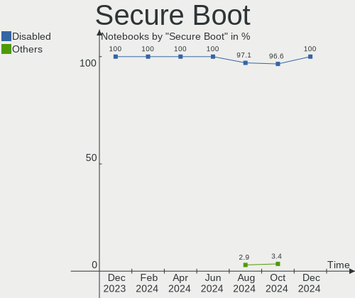
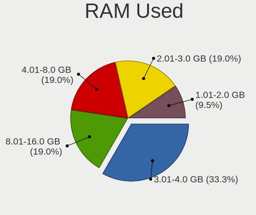
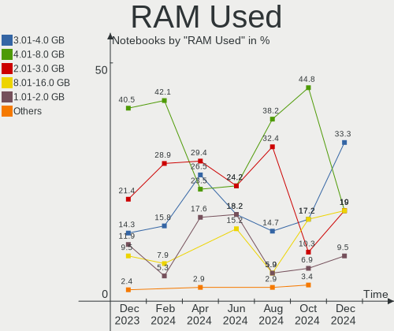
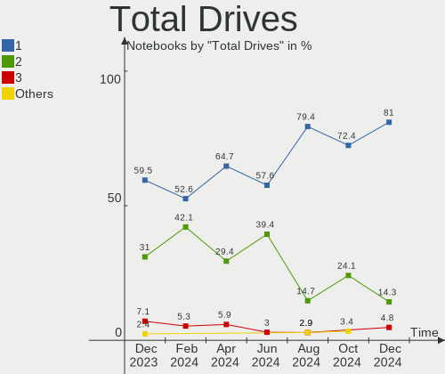
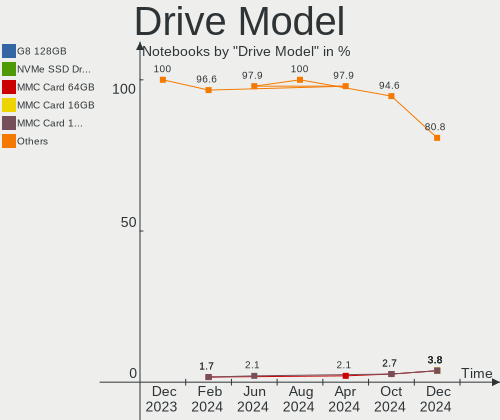
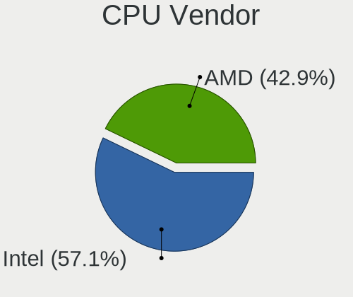
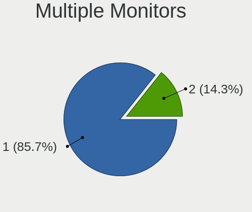
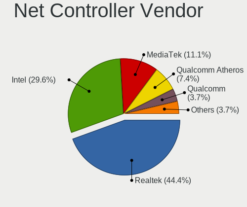

EndeavourOS - Hardware Trends (Notebooks)
-----------------------------------------

A project to identify most popular hardware characteristics and track their change
over time based on data collected by Linux users at https://Linux-Hardware.org.

Anyone can contribute to this report by the [hw-probe](https://github.com/linuxhw/hw-probe) tool:

    sudo -E hw-probe -all -upload

This report is for one last month. Overall report since the beginning of time: [TestDays](https://github.com/linuxhw/TestDays)

Period: Jan, 2024.

Contents
--------

* [ System ](#system)
  - [ OS                       ](#os)
  - [ OS Family                ](#os-family)
  - [ Kernel                   ](#kernel)
  - [ Kernel Family            ](#kernel-family)
  - [ Kernel Major Ver.        ](#kernel-major-ver)
  - [ Arch                     ](#arch)
  - [ DE                       ](#de)
  - [ Display Server           ](#display-server)
  - [ Display Manager          ](#display-manager)
  - [ OS Lang                  ](#os-lang)
  - [ Boot Mode                ](#boot-mode)
  - [ Filesystem               ](#filesystem)
  - [ Part. scheme             ](#part-scheme)
  - [ Dual Boot with Linux/BSD ](#dual-boot-with-linuxbsd)
  - [ Dual Boot (Win)          ](#dual-boot-win)

* [ Board ](#board)
  - [ Vendor                   ](#vendor)
  - [ Model                    ](#model)
  - [ Model Family             ](#model-family)
  - [ MFG Year                 ](#mfg-year)
  - [ Form Factor              ](#form-factor)
  - [ Secure Boot              ](#secure-boot)
  - [ Coreboot                 ](#coreboot)
  - [ RAM Size                 ](#ram-size)
  - [ RAM Used                 ](#ram-used)
  - [ Total Drives             ](#total-drives)
  - [ Has CD-ROM               ](#has-cd-rom)
  - [ Has Ethernet             ](#has-ethernet)
  - [ Has WiFi                 ](#has-wifi)
  - [ Has Bluetooth            ](#has-bluetooth)

* [ Location ](#location)
  - [ Country                  ](#country)
  - [ City                     ](#city)

* [ Drives ](#drives)
  - [ Drive Vendor             ](#drive-vendor)
  - [ Drive Model              ](#drive-model)
  - [ HDD Vendor               ](#hdd-vendor)
  - [ SSD Vendor               ](#ssd-vendor)
  - [ Drive Kind               ](#drive-kind)
  - [ Drive Connector          ](#drive-connector)
  - [ Drive Size               ](#drive-size)
  - [ Space Total              ](#space-total)
  - [ Space Used               ](#space-used)
  - [ Malfunc. Drives          ](#malfunc-drives)
  - [ Malfunc. Drive Vendor    ](#malfunc-drive-vendor)
  - [ Malfunc. HDD Vendor      ](#malfunc-hdd-vendor)
  - [ Malfunc. Drive Kind      ](#malfunc-drive-kind)
  - [ Failed Drives            ](#failed-drives)
  - [ Failed Drive Vendor      ](#failed-drive-vendor)
  - [ Drive Status             ](#drive-status)

* [ Storage controller ](#storage-controller)
  - [ Storage Vendor           ](#storage-vendor)
  - [ Storage Model            ](#storage-model)
  - [ Storage Kind             ](#storage-kind)

* [ Processor ](#processor)
  - [ CPU Vendor               ](#cpu-vendor)
  - [ CPU Model                ](#cpu-model)
  - [ CPU Model Family         ](#cpu-model-family)
  - [ CPU Cores                ](#cpu-cores)
  - [ CPU Sockets              ](#cpu-sockets)
  - [ CPU Threads              ](#cpu-threads)
  - [ CPU Op-Modes             ](#cpu-op-modes)
  - [ CPU Microcode            ](#cpu-microcode)
  - [ CPU Microarch            ](#cpu-microarch)

* [ Graphics ](#graphics)
  - [ GPU Vendor               ](#gpu-vendor)
  - [ GPU Model                ](#gpu-model)
  - [ GPU Combo                ](#gpu-combo)
  - [ GPU Driver               ](#gpu-driver)
  - [ GPU Memory               ](#gpu-memory)

* [ Monitor ](#monitor)
  - [ Monitor Vendor           ](#monitor-vendor)
  - [ Monitor Model            ](#monitor-model)
  - [ Monitor Resolution       ](#monitor-resolution)
  - [ Monitor Diagonal         ](#monitor-diagonal)
  - [ Monitor Width            ](#monitor-width)
  - [ Aspect Ratio             ](#aspect-ratio)
  - [ Monitor Area             ](#monitor-area)
  - [ Pixel Density            ](#pixel-density)
  - [ Multiple Monitors        ](#multiple-monitors)

* [ Network ](#network)
  - [ Net Controller Vendor    ](#net-controller-vendor)
  - [ Net Controller Model     ](#net-controller-model)
  - [ Wireless Vendor          ](#wireless-vendor)
  - [ Wireless Model           ](#wireless-model)
  - [ Ethernet Vendor          ](#ethernet-vendor)
  - [ Ethernet Model           ](#ethernet-model)
  - [ Net Controller Kind      ](#net-controller-kind)
  - [ Used Controller          ](#used-controller)
  - [ NICs                     ](#nics)
  - [ IPv6                     ](#ipv6)

* [ Bluetooth ](#bluetooth)
  - [ Bluetooth Vendor         ](#bluetooth-vendor)
  - [ Bluetooth Model          ](#bluetooth-model)

* [ Sound ](#sound)
  - [ Sound Vendor             ](#sound-vendor)
  - [ Sound Model              ](#sound-model)

* [ Memory ](#memory)
  - [ Memory Vendor            ](#memory-vendor)
  - [ Memory Model             ](#memory-model)
  - [ Memory Kind              ](#memory-kind)
  - [ Memory Form Factor       ](#memory-form-factor)
  - [ Memory Size              ](#memory-size)
  - [ Memory Speed             ](#memory-speed)

* [ Printers & scanners ](#printers--scanners)
  - [ Printer Vendor           ](#printer-vendor)
  - [ Printer Model            ](#printer-model)
  - [ Scanner Vendor           ](#scanner-vendor)
  - [ Scanner Model            ](#scanner-model)

* [ Camera ](#camera)
  - [ Camera Vendor            ](#camera-vendor)
  - [ Camera Model             ](#camera-model)

* [ Security ](#security)
  - [ Fingerprint Vendor       ](#fingerprint-vendor)
  - [ Fingerprint Model        ](#fingerprint-model)
  - [ Chipcard Vendor          ](#chipcard-vendor)
  - [ Chipcard Model           ](#chipcard-model)

* [ Unsupported ](#unsupported)
  - [ Unsupported Devices      ](#unsupported-devices)
  - [ Unsupported Device Types ](#unsupported-device-types)

System
------

OS
--

Installed operating systems

| Name                | Notebooks | Percent |
|---------------------|-----------|---------|
| EndeavourOS Rolling | 38        | 100%    |

OS Family
---------

OS without a version

| Name        | Notebooks | Percent |
|-------------|-----------|---------|
| EndeavourOS | 38        | 100%    |

Kernel
------

Version of the Linux kernel

| Version             | Notebooks | Percent |
|---------------------|-----------|---------|
| 6.7.0-arch3-1       | 7         | 18.42%  |
| 6.6.9-arch1-1       | 4         | 10.53%  |
| 6.6.10-arch1-1      | 4         | 10.53%  |
| 6.7.0-zen3-1-zen    | 3         | 7.89%   |
| 6.6.12-1-lts        | 3         | 7.89%   |
| 6.7.2-arch1-1       | 2         | 5.26%   |
| 6.7.1-arch1-1       | 2         | 5.26%   |
| 6.6.8-arch1-1       | 2         | 5.26%   |
| 6.6.7-arch1-1       | 2         | 5.26%   |
| 6.6.10-zen1-1-zen   | 2         | 5.26%   |
| 6.6.1-arch1-1       | 2         | 5.26%   |
| 6.7.2-zen1-1-zen    | 1         | 2.63%   |
| 6.6.9-273-tkg-eevdf | 1         | 2.63%   |
| 6.6.11-1-lts        | 1         | 2.63%   |
| 6.6.1-273-tkg-eevdf | 1         | 2.63%   |
| 6.1.69-1-lts        | 1         | 2.63%   |

Kernel Family
-------------

Linux kernel without a distro release

| Version | Notebooks | Percent |
|---------|-----------|---------|
| 6.7.0   | 10        | 26.32%  |
| 6.6.10  | 6         | 15.79%  |
| 6.6.9   | 5         | 13.16%  |
| 6.7.2   | 3         | 7.89%   |
| 6.6.12  | 3         | 7.89%   |
| 6.6.1   | 3         | 7.89%   |
| 6.7.1   | 2         | 5.26%   |
| 6.6.8   | 2         | 5.26%   |
| 6.6.7   | 2         | 5.26%   |
| 6.6.11  | 1         | 2.63%   |
| 6.1.69  | 1         | 2.63%   |

Kernel Major Ver.
-----------------

Linux kernel major version

| Version | Notebooks | Percent |
|---------|-----------|---------|
| 6.6     | 22        | 57.89%  |
| 6.7     | 15        | 39.47%  |
| 6.1     | 1         | 2.63%   |

Arch
----

OS architecture (x86_64, i586, etc.)

| Name   | Notebooks | Percent |
|--------|-----------|---------|
| x86_64 | 38        | 100%    |

DE
--

Desktop Environment

| Name     | Notebooks | Percent |
|----------|-----------|---------|
| KDE5     | 18        | 47.37%  |
| GNOME    | 8         | 21.05%  |
| Hyprland | 4         | 10.53%  |
| XFCE     | 3         | 7.89%   |
| sway     | 1         | 2.63%   |
| qtile    | 1         | 2.63%   |
| i3       | 1         | 2.63%   |
| dwm      | 1         | 2.63%   |
| Budgie   | 1         | 2.63%   |

Display Server
--------------

X11 or Wayland

| Name    | Notebooks | Percent |
|---------|-----------|---------|
| X11     | 22        | 57.89%  |
| Wayland | 11        | 28.95%  |
| Unknown | 3         | 7.89%   |
| Tty     | 2         | 5.26%   |

Display Manager
---------------

SDDM, LightDM, etc.

| Name    | Notebooks | Percent |
|---------|-----------|---------|
| SDDM    | 16        | 42.11%  |
| Unknown | 9         | 23.68%  |
| LightDM | 7         | 18.42%  |
| GDM     | 5         | 13.16%  |
| LY-DM   | 1         | 2.63%   |

OS Lang
-------

Language

| Lang    | Notebooks | Percent |
|---------|-----------|---------|
| en_US   | 24        | 63.16%  |
| it_IT   | 4         | 10.53%  |
| es_CL   | 2         | 5.26%   |
| en_GB   | 2         | 5.26%   |
| en_CA   | 2         | 5.26%   |
| tr_TR   | 1         | 2.63%   |
| en_IN   | 1         | 2.63%   |
| de_DE   | 1         | 2.63%   |
| Unknown | 1         | 2.63%   |

Boot Mode
---------

EFI or BIOS

| Mode | Notebooks | Percent |
|------|-----------|---------|
| EFI  | 23        | 60.53%  |
| BIOS | 15        | 39.47%  |

Filesystem
----------

Type of filesystem

| Type    | Notebooks | Percent |
|---------|-----------|---------|
| Ext4    | 29        | 76.32%  |
| Btrfs   | 6         | 15.79%  |
| Overlay | 2         | 5.26%   |
| Xfs     | 1         | 2.63%   |

Part. scheme
------------

Scheme of partitioning

| Type    | Notebooks | Percent |
|---------|-----------|---------|
| GPT     | 25        | 65.79%  |
| Unknown | 9         | 23.68%  |
| MBR     | 4         | 10.53%  |

Dual Boot with Linux/BSD
------------------------

Hosting more than one Linux/BSD

| Dual boot | Notebooks | Percent |
|-----------|-----------|---------|
| No        | 37        | 97.37%  |
| Yes       | 1         | 2.63%   |

Dual Boot (Win)
---------------

Hosting Linux and Windows

| Dual boot | Notebooks | Percent |
|-----------|-----------|---------|
| No        | 31        | 81.58%  |
| Yes       | 7         | 18.42%  |

Board
-----

Vendor
------

Motherboard manufacturer

| Name             | Notebooks | Percent |
|------------------|-----------|---------|
| Lenovo           | 11        | 28.95%  |
| ASUSTek Computer | 7         | 18.42%  |
| Dell             | 6         | 15.79%  |
| Hewlett-Packard  | 5         | 13.16%  |
| Acer             | 3         | 7.89%   |
| System76         | 1         | 2.63%   |
| Sony             | 1         | 2.63%   |
| MSI              | 1         | 2.63%   |
| Monster          | 1         | 2.63%   |
| Framework        | 1         | 2.63%   |
| EVOO             | 1         | 2.63%   |

Model
-----

Motherboard model

| Name                                        | Notebooks | Percent |
|---------------------------------------------|-----------|---------|
| System76 Gazelle                            | 1         | 2.63%   |
| Sony SVE1713X1EB                            | 1         | 2.63%   |
| MSI MS-7B17                                 | 1         | 2.63%   |
| Monster ABRA A7 V13.3                       | 1         | 2.63%   |
| Lenovo ThinkPad T490 20N2005VMX             | 1         | 2.63%   |
| Lenovo ThinkPad T470s 20HGS3AX02            | 1         | 2.63%   |
| Lenovo ThinkPad L14 Gen 3 21C6S08E00        | 1         | 2.63%   |
| Lenovo ThinkBook 15 G3 ACL 21A4             | 1         | 2.63%   |
| Lenovo Legion Y540-15IRH 81SX               | 1         | 2.63%   |
| Lenovo Legion 5 Pro 16IAH7H 82RF            | 1         | 2.63%   |
| Lenovo Legion 5 15ARH05H 82B1               | 1         | 2.63%   |
| Lenovo IdeaPad Gaming 3 15ACH6 82K2         | 1         | 2.63%   |
| Lenovo IdeaPad 730S-13IWL 81JB              | 1         | 2.63%   |
| Lenovo IdeaPad 5 14IIL05 81YH               | 1         | 2.63%   |
| Lenovo IdeaPad 3 14ALC6 82KT                | 1         | 2.63%   |
| HP ProBook 440 G5                           | 1         | 2.63%   |
| HP Pavilion Plus Laptop 14-eh1xxx           | 1         | 2.63%   |
| HP OMEN by Transcend Gaming Laptop 16-u0xxx | 1         | 2.63%   |
| HP Laptop 15-dw0xxx                         | 1         | 2.63%   |
| HP EliteBook 845 14 inch G10 Notebook PC    | 1         | 2.63%   |
| Framework Laptop (13th Gen Intel Core)      | 1         | 2.63%   |
| EVOO EG-LP6                                 | 1         | 2.63%   |
| Dell Latitude E6420                         | 1         | 2.63%   |
| Dell Latitude E5470                         | 1         | 2.63%   |
| Dell Latitude 7280                          | 1         | 2.63%   |
| Dell Inspiron 3583                          | 1         | 2.63%   |
| Dell Inspiron 14 5425                       | 1         | 2.63%   |
| Dell G3 3579                                | 1         | 2.63%   |
| ASUS VivoBook_ASUSLaptop X512DA_F512DA      | 1         | 2.63%   |
| ASUS VivoBook_ASUSLaptop X415MA_X415MA      | 1         | 2.63%   |
| ASUS VivoBook_ASUSLaptop N7601ZW_UX6601ZW   | 1         | 2.63%   |
| ASUS VivoBook_ASUSLaptop K6604JI_K6604JI    | 1         | 2.63%   |
| ASUS G2S                                    | 1         | 2.63%   |
| ASUS ASUS TUF Gaming F15 FX506LH_FX566LH    | 1         | 2.63%   |
| ASUS ASUS TUF Gaming A15 FA506IV            | 1         | 2.63%   |
| Acer Nitro AN517-54                         | 1         | 2.63%   |
| Acer Nitro AN515-57                         | 1         | 2.63%   |
| Acer Aspire A315-55G                        | 1         | 2.63%   |

Model Family
------------

Motherboard model prefix

| Name             | Notebooks | Percent |
|------------------|-----------|---------|
| Lenovo IdeaPad   | 4         | 10.53%  |
| ASUS VivoBook    | 4         | 10.53%  |
| Lenovo ThinkPad  | 3         | 7.89%   |
| Lenovo Legion    | 3         | 7.89%   |
| Dell Latitude    | 3         | 7.89%   |
| Dell Inspiron    | 2         | 5.26%   |
| ASUS ASUS        | 2         | 5.26%   |
| Acer Nitro       | 2         | 5.26%   |
| System76 Gazelle | 1         | 2.63%   |
| Sony SVE1713X1EB | 1         | 2.63%   |
| MSI MS-7B17      | 1         | 2.63%   |
| Monster ABRA     | 1         | 2.63%   |
| Lenovo ThinkBook | 1         | 2.63%   |
| HP ProBook       | 1         | 2.63%   |
| HP Pavilion      | 1         | 2.63%   |
| HP OMEN          | 1         | 2.63%   |
| HP Laptop        | 1         | 2.63%   |
| HP EliteBook     | 1         | 2.63%   |
| Framework Laptop | 1         | 2.63%   |
| EVOO EG-LP6      | 1         | 2.63%   |
| Dell G3          | 1         | 2.63%   |
| ASUS G2S         | 1         | 2.63%   |
| Acer Aspire      | 1         | 2.63%   |

MFG Year
--------

Motherboard manufacture year

| Year | Notebooks | Percent |
|------|-----------|---------|
| 2021 | 7         | 18.42%  |
| 2019 | 7         | 18.42%  |
| 2022 | 6         | 15.79%  |
| 2023 | 5         | 13.16%  |
| 2020 | 3         | 7.89%   |
| 2018 | 2         | 5.26%   |
| 2017 | 2         | 5.26%   |
| 2016 | 2         | 5.26%   |
| 2012 | 2         | 5.26%   |
| 2011 | 1         | 2.63%   |
| 2007 | 1         | 2.63%   |

Form Factor
-----------

Physical design of the computer

| Name     | Notebooks | Percent |
|----------|-----------|---------|
| Notebook | 38        | 100%    |

Secure Boot
-----------

Enabled or disabled

| State    | Notebooks | Percent |
|----------|-----------|---------|
| Disabled | 38        | 100%    |

Coreboot
--------

Have coreboot on board

| Used | Notebooks | Percent |
|------|-----------|---------|
| No   | 37        | 97.37%  |
| Yes  | 1         | 2.63%   |

RAM Size
--------

Total RAM memory

| Size in GB  | Notebooks | Percent |
|-------------|-----------|---------|
| 32.01-64.0  | 8         | 21.05%  |
| 16.01-24.0  | 8         | 21.05%  |
| 4.01-8.0    | 6         | 15.79%  |
| 8.01-16.0   | 6         | 15.79%  |
| 64.01-256.0 | 5         | 13.16%  |
| 3.01-4.0    | 4         | 10.53%  |
| 24.01-32.0  | 1         | 2.63%   |

RAM Used
--------

Used RAM memory

| Used GB   | Notebooks | Percent |
|-----------|-----------|---------|
| 4.01-8.0  | 17        | 44.74%  |
| 2.01-3.0  | 9         | 23.68%  |
| 3.01-4.0  | 5         | 13.16%  |
| 8.01-16.0 | 4         | 10.53%  |
| 1.01-2.0  | 3         | 7.89%   |

Total Drives
------------

Number of drives on board

| Drives | Notebooks | Percent |
|--------|-----------|---------|
| 1      | 28        | 73.68%  |
| 2      | 6         | 15.79%  |
| 3      | 3         | 7.89%   |
| 4      | 1         | 2.63%   |

Has CD-ROM
----------

Has CD-ROM on board

| Presented | Notebooks | Percent |
|-----------|-----------|---------|
| No        | 35        | 92.11%  |
| Yes       | 3         | 7.89%   |

Has Ethernet
------------

Has Ethernet on board

| Presented | Notebooks | Percent |
|-----------|-----------|---------|
| Yes       | 32        | 84.21%  |
| No        | 6         | 15.79%  |

Has WiFi
--------

Has WiFi module

| Presented | Notebooks | Percent |
|-----------|-----------|---------|
| Yes       | 38        | 100%    |

Has Bluetooth
-------------

Has Bluetooth module

| Presented | Notebooks | Percent |
|-----------|-----------|---------|
| Yes       | 36        | 94.74%  |
| No        | 2         | 5.26%   |

Location
--------

Country
-------

Geographic location (country)

| Country     | Notebooks | Percent |
|-------------|-----------|---------|
| USA         | 8         | 21.05%  |
| Italy       | 4         | 10.53%  |
| India       | 3         | 7.89%   |
| Canada      | 3         | 7.89%   |
| UK          | 2         | 5.26%   |
| Netherlands | 2         | 5.26%   |
| Germany     | 2         | 5.26%   |
| Chile       | 2         | 5.26%   |
| Vietnam     | 1         | 2.63%   |
| Turkey      | 1         | 2.63%   |
| Thailand    | 1         | 2.63%   |
| Taiwan      | 1         | 2.63%   |
| Sweden      | 1         | 2.63%   |
| Slovakia    | 1         | 2.63%   |
| Serbia      | 1         | 2.63%   |
| Poland      | 1         | 2.63%   |
| Moldova     | 1         | 2.63%   |
| Mexico      | 1         | 2.63%   |
| Kazakhstan  | 1         | 2.63%   |
| Brazil      | 1         | 2.63%   |

City
----

Geographic location (city)

| City                 | Notebooks | Percent |
|----------------------|-----------|---------|
| Mesa                 | 3         | 7.89%   |
| Hyderabad            | 2         | 5.26%   |
| Warsaw               | 1         | 2.63%   |
| Virginia Beach       | 1         | 2.63%   |
| Viña del Mar        | 1         | 2.63%   |
| Turin                | 1         | 2.63%   |
| Taipei               | 1         | 2.63%   |
| Surrey               | 1         | 2.63%   |
| South Shields        | 1         | 2.63%   |
| Rome                 | 1         | 2.63%   |
| Reggio Emilia        | 1         | 2.63%   |
| New York             | 1         | 2.63%   |
| New Orleans          | 1         | 2.63%   |
| Naaldwijk            | 1         | 2.63%   |
| Mountville           | 1         | 2.63%   |
| Mascauti             | 1         | 2.63%   |
| Lund                 | 1         | 2.63%   |
| Konya                | 1         | 2.63%   |
| Kokshetau            | 1         | 2.63%   |
| Hertfordshire        | 1         | 2.63%   |
| Hanoi                | 1         | 2.63%   |
| Edmonton             | 1         | 2.63%   |
| Delhi                | 1         | 2.63%   |
| Cuernavaca           | 1         | 2.63%   |
| Chillan              | 1         | 2.63%   |
| Castello di Cisterna | 1         | 2.63%   |
| Campo Grande         | 1         | 2.63%   |
| Bremen               | 1         | 2.63%   |
| Bratislava           | 1         | 2.63%   |
| Belgrade             | 1         | 2.63%   |
| Bangkok              | 1         | 2.63%   |
| Baie-Comeau          | 1         | 2.63%   |
| Bad Wurzach          | 1         | 2.63%   |
| Atlanta              | 1         | 2.63%   |
| Amsterdam            | 1         | 2.63%   |

Drives
------

Drive Vendor
------------

Hard drive vendors

| Vendor                      | Notebooks | Drives | Percent |
|-----------------------------|-----------|--------|---------|
| Samsung Electronics         | 12        | 14     | 23.53%  |
| Sandisk                     | 6         | 6      | 11.76%  |
| SK hynix                    | 5         | 5      | 9.8%    |
| Seagate                     | 4         | 4      | 7.84%   |
| Phison Electronics          | 3         | 3      | 5.88%   |
| MAXIO Technology (Hangzhou) | 3         | 3      | 5.88%   |
| Kingston Technology Company | 3         | 3      | 5.88%   |
| WDC                         | 2         | 2      | 3.92%   |
| Intel                       | 2         | 2      | 3.92%   |
| Unknown                     | 1         | 1      | 1.96%   |
| Toshiba                     | 1         | 1      | 1.96%   |
| Silicon Motion              | 1         | 1      | 1.96%   |
| Realtek Semiconductor       | 1         | 1      | 1.96%   |
| OCZ                         | 1         | 1      | 1.96%   |
| Micron/Crucial Technology   | 1         | 1      | 1.96%   |
| Micron Technology           | 1         | 1      | 1.96%   |
| KIOXIA                      | 1         | 1      | 1.96%   |
| Kingston                    | 1         | 1      | 1.96%   |
| China                       | 1         | 1      | 1.96%   |
| ASMT                        | 1         | 2      | 1.96%   |

Drive Model
-----------

Hard drive models

| Model                                                 | Notebooks | Percent |
|-------------------------------------------------------|-----------|---------|
| Samsung NVMe SSD Controller SM981/PM981/PM983 1TB     | 4         | 7.69%   |
| Samsung NVMe SSD Controller PM9A1/PM9A3/980PRO 2TB    | 3         | 5.77%   |
| MAXIO (Hangzhou) NVMe SSD Controller MAP1202 512GB    | 2         | 3.85%   |
| WDC WD P40 Game Drive 1TB                             | 1         | 1.92%   |
| WDC PC SA530 SDASN8Y256G 256GB SSD                    | 1         | 1.92%   |
| Unknown MMC Card  4GB                                 | 1         | 1.92%   |
| Toshiba HDWL120 2TB                                   | 1         | 1.92%   |
| SK hynix SKHynix_HFM512GD3HX015N 512GB                | 1         | 1.92%   |
| SK hynix SC311 SATA 128GB SSD                         | 1         | 1.92%   |
| SK hynix PC801 HFS512GEJ9X101N 512GB                  | 1         | 1.92%   |
| SK hynix HFM512GD3JX016N 512GB                        | 1         | 1.92%   |
| SK hynix BC511 256GB                                  | 1         | 1.92%   |
| Silicon Motion SM2263EN/SM2263XT SSD Controller 128GB | 1         | 1.92%   |
| Seagate ST9320320AS 320GB                             | 1         | 1.92%   |
| Seagate ST1000LM049-2GH172 1TB                        | 1         | 1.92%   |
| Seagate Expansion HDD 4TB                             | 1         | 1.92%   |
| Seagate BUP Slim 120GB                                | 1         | 1.92%   |
| Sandisk WDC PC SN530 SDBPMPZ-256G-1101 256GB          | 1         | 1.92%   |
| Sandisk WD PC SN740 SDDPTQE-2T00 2TB                  | 1         | 1.92%   |
| Sandisk WD Blue SN570 500GB                           | 1         | 1.92%   |
| Sandisk WD Blue SN550 NVMe SSD 512GB                  | 1         | 1.92%   |
| Sandisk WD Blue SN500 / PC SN520 NVMe SSD 512GB       | 1         | 1.92%   |
| Sandisk WD Black SN750 / PC SN730 NVMe SSD 512GB      | 1         | 1.92%   |
| Samsung SSD 990 PRO 2TB                               | 1         | 1.92%   |
| Samsung SSD 870 EVO 500GB                             | 1         | 1.92%   |
| Samsung SSD 870 EVO 2TB                               | 1         | 1.92%   |
| Samsung MZVLQ512HBLU-00B00 512GB                      | 1         | 1.92%   |
| Samsung MZVL41T0HBLB-00B07 1024GB                     | 1         | 1.92%   |
| Samsung MZALQ512HALU-000L2 512GB                      | 1         | 1.92%   |
| Realtek RTS5763DL NVMe SSD Controller 2TB             | 1         | 1.92%   |
| Phison SPCC M.2 PCIe SSD 2TB                          | 1         | 1.92%   |
| Phison PS5013 E13 NVMe Controller 256GB               | 1         | 1.92%   |
| Phison E12 NVMe Controller 1TB                        | 1         | 1.92%   |
| OCZ VERTEX4 128GB SSD                                 | 1         | 1.92%   |
| Micron/Crucial CT2000P5PSSD8 2TB                      | 1         | 1.92%   |
| Micron 2210_MTFDHBA512QFD 512GB                       | 1         | 1.92%   |
| MAXIO (Hangzhou) HS-SSD-FUTURE 2048G                  | 1         | 1.92%   |
| KIOXIA KXG80ZNV1T02 1TB                               | 1         | 1.92%   |
| Kingston Company OM3PDP3 NVMe SSD 256GB               | 1         | 1.92%   |
| Kingston Company KC2000 NVMe SSD 1TB                  | 1         | 1.92%   |

HDD Vendor
----------

Hard disk drive vendors

| Vendor  | Notebooks | Drives | Percent |
|---------|-----------|--------|---------|
| Seagate | 4         | 4      | 66.67%  |
| Toshiba | 1         | 1      | 16.67%  |
| ASMT    | 1         | 2      | 16.67%  |

SSD Vendor
----------

Solid state drive vendors

| Vendor              | Notebooks | Drives | Percent |
|---------------------|-----------|--------|---------|
| Samsung Electronics | 2         | 2      | 28.57%  |
| WDC                 | 1         | 1      | 14.29%  |
| SK hynix            | 1         | 1      | 14.29%  |
| OCZ                 | 1         | 1      | 14.29%  |
| Kingston            | 1         | 1      | 14.29%  |
| China               | 1         | 1      | 14.29%  |

Drive Kind
----------

HDD or SSD

| Kind    | Notebooks | Drives | Percent |
|---------|-----------|--------|---------|
| NVMe    | 31        | 38     | 67.39%  |
| SSD     | 7         | 7      | 15.22%  |
| HDD     | 6         | 7      | 13.04%  |
| MMC     | 1         | 1      | 2.17%   |
| Unknown | 1         | 1      | 2.17%   |

Drive Connector
---------------

SATA, SAS, NVMe, etc.

| Type | Notebooks | Drives | Percent |
|------|-----------|--------|---------|
| NVMe | 31        | 38     | 67.39%  |
| SATA | 10        | 10     | 21.74%  |
| SAS  | 4         | 5      | 8.7%    |
| MMC  | 1         | 1      | 2.17%   |

Drive Size
----------

Size of hard drive

| Size in TB | Notebooks | Drives | Percent |
|------------|-----------|--------|---------|
| 0.01-0.5   | 8         | 10     | 66.67%  |
| 1.01-2.0   | 2         | 2      | 16.67%  |
| 3.01-4.0   | 1         | 1      | 8.33%   |
| 0.51-1.0   | 1         | 1      | 8.33%   |

Space Total
-----------

Amount of disk space available on the file system

| Size in GB     | Notebooks | Percent |
|----------------|-----------|---------|
| 251-500        | 11        | 28.95%  |
| 1001-2000      | 9         | 23.68%  |
| 501-1000       | 7         | 18.42%  |
| 101-250        | 5         | 13.16%  |
| 1-20           | 4         | 10.53%  |
| More than 3000 | 1         | 2.63%   |
| 21-50          | 1         | 2.63%   |

Space Used
----------

Amount of used disk space

| Used GB   | Notebooks | Percent |
|-----------|-----------|---------|
| 101-250   | 16        | 42.11%  |
| 21-50     | 6         | 15.79%  |
| 1-20      | 6         | 15.79%  |
| 501-1000  | 3         | 7.89%   |
| 51-100    | 3         | 7.89%   |
| 251-500   | 2         | 5.26%   |
| 1001-2000 | 1         | 2.63%   |
| 0         | 1         | 2.63%   |

Malfunc. Drives
---------------

Drive models with a malfunction

| Model                               | Notebooks | Drives | Percent |
|-------------------------------------|-----------|--------|---------|
| Samsung Electronics SSD 870 EVO 2TB | 1         | 1      | 50%     |
| China SSD 500GB                     | 1         | 1      | 50%     |

Malfunc. Drive Vendor
---------------------

Vendors of faulty drives

| Vendor              | Notebooks | Drives | Percent |
|---------------------|-----------|--------|---------|
| Samsung Electronics | 1         | 1      | 50%     |
| China               | 1         | 1      | 50%     |

Malfunc. HDD Vendor
-------------------

Vendors of faulty HDD drives

Zero info for selected period =(

Malfunc. Drive Kind
-------------------

Kinds of faulty drives

| Kind | Notebooks | Drives | Percent |
|------|-----------|--------|---------|
| SSD  | 2         | 2      | 100%    |

Failed Drives
-------------

Failed drive models

| Model                     | Notebooks | Drives | Percent |
|---------------------------|-----------|--------|---------|
| Seagate ST9320320AS 320GB | 1         | 1      | 100%    |

Failed Drive Vendor
-------------------

Failed drive vendors

| Vendor  | Notebooks | Drives | Percent |
|---------|-----------|--------|---------|
| Seagate | 1         | 1      | 100%    |

Drive Status
------------

Number of failed and malfunc. drives

| Status   | Notebooks | Drives | Percent |
|----------|-----------|--------|---------|
| Works    | 28        | 33     | 63.64%  |
| Detected | 13        | 18     | 29.55%  |
| Malfunc  | 2         | 2      | 4.55%   |
| Failed   | 1         | 1      | 2.27%   |

Storage controller
------------------

Storage Vendor
--------------

Storage controller vendors

| Vendor                      | Notebooks | Percent |
|-----------------------------|-----------|---------|
| Intel                       | 21        | 33.87%  |
| Samsung Electronics         | 10        | 16.13%  |
| SanDisk                     | 6         | 9.68%   |
| AMD                         | 6         | 9.68%   |
| SK hynix                    | 4         | 6.45%   |
| Phison Electronics          | 3         | 4.84%   |
| MAXIO Technology (Hangzhou) | 3         | 4.84%   |
| Kingston Technology Company | 3         | 4.84%   |
| Silicon Motion              | 1         | 1.61%   |
| Realtek Semiconductor       | 1         | 1.61%   |
| Micron/Crucial Technology   | 1         | 1.61%   |
| Micron Technology           | 1         | 1.61%   |
| KIOXIA                      | 1         | 1.61%   |
| JMicron Technology          | 1         | 1.61%   |

Storage Model
-------------

Storage controller models

| Model                                                                | Notebooks | Percent |
|----------------------------------------------------------------------|-----------|---------|
| Intel 82801 Mobile SATA Controller [RAID mode]                       | 6         | 9.09%   |
| AMD FCH SATA Controller [AHCI mode]                                  | 6         | 9.09%   |
| Samsung NVMe SSD Controller SM981/PM981/PM983                        | 4         | 6.06%   |
| Samsung NVMe SSD Controller PM9A1/PM9A3/980PRO                       | 3         | 4.55%   |
| Intel Tiger Lake SATA AHCI Controller                                | 3         | 4.55%   |
| SK hynix Gold P31/BC711/PC711 NVMe Solid State Drive                 | 2         | 3.03%   |
| Samsung NVMe SSD Controller 980 (DRAM-less)                          | 2         | 3.03%   |
| MAXIO (Hangzhou) NVMe SSD Controller MAP1202 (DRAM-less)             | 2         | 3.03%   |
| Intel Volume Management Device NVMe RAID Controller                  | 2         | 3.03%   |
| Intel Cannon Lake Mobile PCH SATA AHCI Controller                    | 2         | 3.03%   |
| SK hynix Platinum P41/PC801 NVMe Solid State Drive                   | 1         | 1.52%   |
| SK hynix BC511 NVMe SSD                                              | 1         | 1.52%   |
| Silicon Motion SM2263EN/SM2263XT (DRAM-less) NVMe SSD Controllers    | 1         | 1.52%   |
| SanDisk WD Blue SN500 / PC SN520 x2 M.2 2280 NVMe SSD                | 1         | 1.52%   |
| SanDisk Ultra 3D / WD Blue SN570 NVMe SSD (DRAM-less)                | 1         | 1.52%   |
| SanDisk Ultra 3D / WD Blue SN550 NVMe SSD                            | 1         | 1.52%   |
| Sandisk PC SN740 NVMe SSD (DRAM-less)                                | 1         | 1.52%   |
| SanDisk PC SN530 NVMe SSD (DRAM-less)                                | 1         | 1.52%   |
| SanDisk Extreme Pro / WD Black SN750 / PC SN730 / Red SN700 NVMe SSD | 1         | 1.52%   |
| Samsung NVMe SSD Controller S4LV008[Pascal]                          | 1         | 1.52%   |
| Samsung NVMe SSD Controller PM9B1 (DRAM-less)                        | 1         | 1.52%   |
| Realtek RTS5762 NVMe SSD Controller                                  | 1         | 1.52%   |
| Phison PS5021-E21 PCIe4 NVMe Controller (DRAM-less)                  | 1         | 1.52%   |
| Phison PS5013-E13 PCIe3 NVMe Controller (DRAM-less)                  | 1         | 1.52%   |
| Phison E12 NVMe Controller                                           | 1         | 1.52%   |
| Micron/Crucial P5 Plus NVMe PCIe SSD                                 | 1         | 1.52%   |
| Micron 2210 NVMe SSD [Cobain]                                        | 1         | 1.52%   |
| MAXIO (Hangzhou) NVMe SSD Controller MAP1602 (DRAM-less)             | 1         | 1.52%   |
| KIOXIA NVMe SSD Controller XG8                                       | 1         | 1.52%   |
| Kingston Company OM3PDP3 NVMe SSD                                    | 1         | 1.52%   |
| Kingston Company KC2000/KC2500 NVMe SSD SM2262EN                     | 1         | 1.52%   |
| Kingston Company A2000 NVMe SSD SM2263EN                             | 1         | 1.52%   |
| JMicron JMB360 AHCI Controller                                       | 1         | 1.52%   |
| Intel Sunrise Point-LP SATA Controller [AHCI mode]                   | 1         | 1.52%   |
| Intel SSD 670p Series [Keystone Harbor]                              | 1         | 1.52%   |
| Intel SSD 660P Series                                                | 1         | 1.52%   |
| Intel Celeron/Pentium Silver Processor SATA Controller               | 1         | 1.52%   |
| Intel Cannon Point-LP SATA Controller [AHCI Mode]                    | 1         | 1.52%   |
| Intel Cannon Lake PCH SATA AHCI Controller                           | 1         | 1.52%   |
| Intel Alder Lake-P SATA AHCI Controller                              | 1         | 1.52%   |

Storage Kind
------------

Kind of storage controller (IDE, SATA, NVMe, SAS, ...)

| Kind | Notebooks | Percent |
|------|-----------|---------|
| NVMe | 31        | 52.54%  |
| SATA | 19        | 32.2%   |
| RAID | 8         | 13.56%  |
| IDE  | 1         | 1.69%   |

Processor
---------

CPU Vendor
----------

Processor vendors

| Vendor | Notebooks | Percent |
|--------|-----------|---------|
| Intel  | 29        | 76.32%  |
| AMD    | 9         | 23.68%  |

CPU Model
---------

Processor models

| Model                                         | Notebooks | Percent |
|-----------------------------------------------|-----------|---------|
| Intel Core i7-8565U CPU @ 1.80GHz             | 3         | 7.89%   |
| Intel 11th Gen Core i7-11800H @ 2.30GHz       | 3         | 7.89%   |
| Intel Core i7-9750H CPU @ 2.60GHz             | 2         | 5.26%   |
| Intel Core i5-8265U CPU @ 1.60GHz             | 2         | 5.26%   |
| Intel Core i5-7300U CPU @ 2.60GHz             | 2         | 5.26%   |
| Intel 12th Gen Core i7-12700H                 | 2         | 5.26%   |
| Intel Pentium Silver N5030 CPU @ 1.10GHz      | 1         | 2.63%   |
| Intel Core i9-9900K CPU @ 3.60GHz             | 1         | 2.63%   |
| Intel Core i7-8550U CPU @ 1.80GHz             | 1         | 2.63%   |
| Intel Core i7-6600U CPU @ 2.60GHz             | 1         | 2.63%   |
| Intel Core i7-3632QM CPU @ 2.20GHz            | 1         | 2.63%   |
| Intel Core i5-8300H CPU @ 2.30GHz             | 1         | 2.63%   |
| Intel Core i5-2450M CPU @ 2.50GHz             | 1         | 2.63%   |
| Intel Core i5-1035G1 CPU @ 1.00GHz            | 1         | 2.63%   |
| Intel Core i5-10300H CPU @ 2.50GHz            | 1         | 2.63%   |
| Intel Core 2 Duo CPU T7700 @ 2.40GHz          | 1         | 2.63%   |
| Intel 13th Gen Core i9-13980HX                | 1         | 2.63%   |
| Intel 13th Gen Core i9-13900HX                | 1         | 2.63%   |
| Intel 13th Gen Core i5-13500H                 | 1         | 2.63%   |
| Intel 13th Gen Core i5-1340P                  | 1         | 2.63%   |
| Intel 12th Gen Core i7-12650H                 | 1         | 2.63%   |
| AMD Ryzen 9 4900H with Radeon Graphics        | 1         | 2.63%   |
| AMD Ryzen 7 PRO 7840U w/ Radeon 780M Graphics | 1         | 2.63%   |
| AMD Ryzen 7 PRO 5875U with Radeon Graphics    | 1         | 2.63%   |
| AMD Ryzen 7 5825U with Radeon Graphics        | 1         | 2.63%   |
| AMD Ryzen 5 5600H with Radeon Graphics        | 1         | 2.63%   |
| AMD Ryzen 5 5500U with Radeon Graphics        | 1         | 2.63%   |
| AMD Ryzen 5 4600H with Radeon Graphics        | 1         | 2.63%   |
| AMD Ryzen 5 3500U with Radeon Vega Mobile Gfx | 1         | 2.63%   |
| AMD Ryzen 3 5300U with Radeon Graphics        | 1         | 2.63%   |

CPU Model Family
----------------

Processor model prefix

| Model                | Notebooks | Percent |
|----------------------|-----------|---------|
| Other                | 10        | 26.32%  |
| Intel Core i7        | 8         | 21.05%  |
| Intel Core i5        | 8         | 21.05%  |
| AMD Ryzen 5          | 4         | 10.53%  |
| AMD Ryzen 7 PRO      | 2         | 5.26%   |
| Intel Pentium Silver | 1         | 2.63%   |
| Intel Core i9        | 1         | 2.63%   |
| Intel Core 2 Duo     | 1         | 2.63%   |
| AMD Ryzen 9          | 1         | 2.63%   |
| AMD Ryzen 7          | 1         | 2.63%   |
| AMD Ryzen 3          | 1         | 2.63%   |

CPU Cores
---------

Number of processor cores

| Number | Notebooks | Percent |
|--------|-----------|---------|
| 4      | 13        | 34.21%  |
| 8      | 8         | 21.05%  |
| 6      | 5         | 13.16%  |
| 2      | 5         | 13.16%  |
| 24     | 2         | 5.26%   |
| 14     | 2         | 5.26%   |
| 12     | 2         | 5.26%   |
| 10     | 1         | 2.63%   |

CPU Sockets
-----------

Number of sockets

| Number | Notebooks | Percent |
|--------|-----------|---------|
| 1      | 38        | 100%    |

CPU Threads
-----------

Threads per core (Hyper-Threading)

| Number | Notebooks | Percent |
|--------|-----------|---------|
| 2      | 36        | 94.74%  |
| 1      | 2         | 5.26%   |

CPU Op-Modes
------------

CPU Operation Modes (32-bit, 64-bit)

| Op mode        | Notebooks | Percent |
|----------------|-----------|---------|
| 32-bit, 64-bit | 38        | 100%    |

CPU Microcode
-------------

Microcode number

| Number     | Notebooks | Percent |
|------------|-----------|---------|
| Unknown    | 33        | 86.84%  |
| 0x0a50000d | 2         | 5.26%   |
| 0x0a704104 | 1         | 2.63%   |
| 0x0a50000c | 1         | 2.63%   |
| 0x08600104 | 1         | 2.63%   |

CPU Microarch
-------------

Microarchitecture

| Name             | Notebooks | Percent |
|------------------|-----------|---------|
| KabyLake         | 12        | 31.58%  |
| Unknown          | 8         | 21.05%  |
| Alderlake Hybrid | 5         | 13.16%  |
| Zen 3            | 3         | 7.89%   |
| Zen 2            | 2         | 5.26%   |
| Zen+             | 1         | 2.63%   |
| Skylake          | 1         | 2.63%   |
| SandyBridge      | 1         | 2.63%   |
| IvyBridge        | 1         | 2.63%   |
| IceLake          | 1         | 2.63%   |
| Goldmont plus    | 1         | 2.63%   |
| Core             | 1         | 2.63%   |
| CometLake        | 1         | 2.63%   |

Graphics
--------

GPU Vendor
----------

Vendors of graphics cards

| Vendor | Notebooks | Percent |
|--------|-----------|---------|
| Intel  | 24        | 42.86%  |
| Nvidia | 20        | 35.71%  |
| AMD    | 12        | 21.43%  |

GPU Model
---------

Graphics card models

| Model                                                                                 | Notebooks | Percent |
|---------------------------------------------------------------------------------------|-----------|---------|
| Intel WhiskeyLake-U GT2 [UHD Graphics 620]                                            | 5         | 8.93%   |
| Nvidia GA107M [GeForce RTX 3050 Ti Mobile]                                            | 3         | 5.36%   |
| Intel TigerLake-H GT1 [UHD Graphics]                                                  | 3         | 5.36%   |
| Nvidia TU116M [GeForce GTX 1660 Ti Mobile]                                            | 2         | 3.57%   |
| Nvidia TU106M [GeForce RTX 2060 Mobile]                                               | 2         | 3.57%   |
| Nvidia GA107M [GeForce RTX 3050 Mobile]                                               | 2         | 3.57%   |
| Nvidia AD106M [GeForce RTX 4070 Max-Q / Mobile]                                       | 2         | 3.57%   |
| Intel Raptor Lake-S UHD Graphics                                                      | 2         | 3.57%   |
| Intel Raptor Lake-P [Iris Xe Graphics]                                                | 2         | 3.57%   |
| Intel HD Graphics 620                                                                 | 2         | 3.57%   |
| Intel CoffeeLake-H GT2 [UHD Graphics 630]                                             | 2         | 3.57%   |
| AMD Renoir [Radeon RX Vega 6 (Ryzen 4000/5000 Mobile Series)]                         | 2         | 3.57%   |
| AMD Lucienne                                                                          | 2         | 3.57%   |
| AMD Barcelo                                                                           | 2         | 3.57%   |
| Nvidia TU117M [GeForce GTX 1650 Mobile / Max-Q]                                       | 1         | 1.79%   |
| Nvidia GP108M [GeForce MX230]                                                         | 1         | 1.79%   |
| Nvidia GP107M [GeForce GTX 1050 Mobile]                                               | 1         | 1.79%   |
| Nvidia GM108M [GeForce MX130]                                                         | 1         | 1.79%   |
| Nvidia GF119M [NVS 4200M]                                                             | 1         | 1.79%   |
| Nvidia GA104M [GeForce RTX 3070 Mobile / Max-Q]                                       | 1         | 1.79%   |
| Nvidia GA104 [Geforce RTX 3070 Ti Laptop GPU]                                         | 1         | 1.79%   |
| Nvidia GA104 [GeForce RTX 3060 Ti]                                                    | 1         | 1.79%   |
| Nvidia G84M [GeForce 8600M GT]                                                        | 1         | 1.79%   |
| Intel UHD Graphics 620                                                                | 1         | 1.79%   |
| Intel Skylake GT2 [HD Graphics 520]                                                   | 1         | 1.79%   |
| Intel Iris Plus Graphics G1 (Ice Lake)                                                | 1         | 1.79%   |
| Intel GeminiLake [UHD Graphics 605]                                                   | 1         | 1.79%   |
| Intel CometLake-H GT2 [UHD Graphics]                                                  | 1         | 1.79%   |
| Intel Alder Lake-P GT2 [Iris Xe Graphics]                                             | 1         | 1.79%   |
| Intel Alder Lake-P GT1 [UHD Graphics]                                                 | 1         | 1.79%   |
| Intel 2nd Generation Core Processor Family Integrated Graphics Controller             | 1         | 1.79%   |
| AMD Topaz XT [Radeon R7 M260/M265 / M340/M360 / M440/M445 / 530/535 / 620/625 Mobile] | 1         | 1.79%   |
| AMD Thames [Radeon HD 7550M/7570M/7650M]                                              | 1         | 1.79%   |
| AMD Picasso/Raven 2 [Radeon Vega Series / Radeon Vega Mobile Series]                  | 1         | 1.79%   |
| AMD Phoenix1                                                                          | 1         | 1.79%   |
| AMD Jet PRO [Radeon R5 M230 / R7 M260DX / Radeon 520/610 Mobile]                      | 1         | 1.79%   |
| AMD Cezanne [Radeon Vega Series / Radeon Vega Mobile Series]                          | 1         | 1.79%   |

GPU Combo
---------

Combinations of graphics cards

| Name           | Notebooks | Percent |
|----------------|-----------|---------|
| Intel + Nvidia | 13        | 34.21%  |
| 1 x Intel      | 9         | 23.68%  |
| 1 x AMD        | 7         | 18.42%  |
| 1 x Nvidia     | 4         | 10.53%  |
| AMD + Nvidia   | 3         | 7.89%   |
| Intel + AMD    | 2         | 5.26%   |

GPU Driver
----------

Free vs proprietary

| Driver      | Notebooks | Percent |
|-------------|-----------|---------|
| Free        | 24        | 63.16%  |
| Proprietary | 14        | 36.84%  |

GPU Memory
----------

Total video memory

| Size in GB | Notebooks | Percent |
|------------|-----------|---------|
| Unknown    | 24        | 63.16%  |
| 1.01-2.0   | 7         | 18.42%  |
| 0.01-0.5   | 3         | 7.89%   |
| 7.01-8.0   | 2         | 5.26%   |
| 5.01-6.0   | 1         | 2.63%   |
| 0.51-1.0   | 1         | 2.63%   |

Monitor
-------

Monitor Vendor
--------------

Monitor vendors

| Vendor               | Notebooks | Percent |
|----------------------|-----------|---------|
| BOE                  | 12        | 25%     |
| AU Optronics         | 9         | 18.75%  |
| Chimei Innolux       | 8         | 16.67%  |
| Samsung Electronics  | 3         | 6.25%   |
| Pixio                | 3         | 6.25%   |
| PANDA                | 3         | 6.25%   |
| LG Display           | 2         | 4.17%   |
| Goldstar             | 2         | 4.17%   |
| MSI                  | 1         | 2.08%   |
| IPS                  | 1         | 2.08%   |
| Dell                 | 1         | 2.08%   |
| ASUSTek Computer     | 1         | 2.08%   |
| AOC                  | 1         | 2.08%   |
| Ancor Communications | 1         | 2.08%   |

Monitor Model
-------------

Monitor models

| Model                                                                 | Notebooks | Percent |
|-----------------------------------------------------------------------|-----------|---------|
| Pixio U29I WAM2900 2560x1080 690x260mm 29.0-inch                      | 3         | 6.25%   |
| PANDA LCD Monitor NCP004D 1920x1080 344x194mm 15.5-inch               | 3         | 6.25%   |
| Chimei Innolux LCD Monitor CMN15F5 1920x1080 344x193mm 15.5-inch      | 2         | 4.17%   |
| Samsung Electronics LF24T35 SAM707D 1920x1080 528x297mm 23.9-inch     | 1         | 2.08%   |
| Samsung Electronics LCD Monitor SDC4178 3200x2000 344x215mm 16.0-inch | 1         | 2.08%   |
| Samsung Electronics LCD Monitor SDC4170 2880x1800 302x189mm 14.0-inch | 1         | 2.08%   |
| MSI MAG274QRF-QD MSI3CA8 2560x1440 597x336mm 27.0-inch                | 1         | 2.08%   |
| LG Display LCD Monitor LGD0544 1920x1080 276x156mm 12.5-inch          | 1         | 2.08%   |
| LG Display LCD Monitor LGD02EB 1366x768 309x174mm 14.0-inch           | 1         | 2.08%   |
| IPS HDMI IPS0001 1920x1080                                            | 1         | 2.08%   |
| Goldstar HDR WFHD GSM7714 2560x1080 798x334mm 34.1-inch               | 1         | 2.08%   |
| Goldstar E2350 GSM5791 1920x1080 510x290mm 23.1-inch                  | 1         | 2.08%   |
| Dell SE2422HX DELA1CA 1920x1080 527x296mm 23.8-inch                   | 1         | 2.08%   |
| Chimei Innolux LCD Monitor CMN1521 1920x1080 344x193mm 15.5-inch      | 1         | 2.08%   |
| Chimei Innolux LCD Monitor CMN151E 1920x1080 344x193mm 15.5-inch      | 1         | 2.08%   |
| Chimei Innolux LCD Monitor CMN14F2 1920x1080 309x173mm 13.9-inch      | 1         | 2.08%   |
| Chimei Innolux LCD Monitor CMN14E5 1920x1080 309x173mm 13.9-inch      | 1         | 2.08%   |
| Chimei Innolux LCD Monitor CMN143B 1920x1200 301x188mm 14.0-inch      | 1         | 2.08%   |
| Chimei Innolux LCD Monitor CMN1416 1920x1080 309x173mm 13.9-inch      | 1         | 2.08%   |
| BOE LCD Monitor BOE0BCA 2256x1504 285x190mm 13.5-inch                 | 1         | 2.08%   |
| BOE LCD Monitor BOE0A81 1920x1080 344x194mm 15.5-inch                 | 1         | 2.08%   |
| BOE LCD Monitor BOE0A1F 2560x1600 344x215mm 16.0-inch                 | 1         | 2.08%   |
| BOE LCD Monitor BOE0A15 1920x1080 381x214mm 17.2-inch                 | 1         | 2.08%   |
| BOE LCD Monitor BOE0808 1366x768 344x194mm 15.5-inch                  | 1         | 2.08%   |
| BOE LCD Monitor BOE07F7 1920x1080 309x174mm 14.0-inch                 | 1         | 2.08%   |
| BOE LCD Monitor BOE07F1 1920x1080 344x193mm 15.5-inch                 | 1         | 2.08%   |
| BOE LCD Monitor BOE07B6 1920x1080 382x215mm 17.3-inch                 | 1         | 2.08%   |
| BOE LCD Monitor BOE07B0 1920x1080 344x194mm 15.5-inch                 | 1         | 2.08%   |
| BOE LCD Monitor BOE0791 1920x1080 309x173mm 13.9-inch                 | 1         | 2.08%   |
| BOE LCD Monitor BOE06FB 1920x1080 340x190mm 15.3-inch                 | 1         | 2.08%   |
| BOE LCD Monitor BOE0697 1366x768 309x173mm 13.9-inch                  | 1         | 2.08%   |
| AU Optronics LCD Monitor AUOC199 2560x1600 344x215mm 16.0-inch        | 1         | 2.08%   |
| AU Optronics LCD Monitor AUOB78D 1920x1080 344x193mm 15.5-inch        | 1         | 2.08%   |
| AU Optronics LCD Monitor AUOA3A6 2560x1600 344x215mm 16.0-inch        | 1         | 2.08%   |
| AU Optronics LCD Monitor AUO978F 1920x1080 382x215mm 17.3-inch        | 1         | 2.08%   |
| AU Optronics LCD Monitor AUO7087 1440x900 367x230mm 17.1-inch         | 1         | 2.08%   |
| AU Optronics LCD Monitor AUO6DA8 2560x1600 301x188mm 14.0-inch        | 1         | 2.08%   |
| AU Optronics LCD Monitor AUO512D 1920x1080 293x165mm 13.2-inch        | 1         | 2.08%   |
| AU Optronics LCD Monitor AUO408D 1920x1080 309x174mm 14.0-inch        | 1         | 2.08%   |
| AU Optronics LCD Monitor AUO243D 1920x1080 309x173mm 13.9-inch        | 1         | 2.08%   |

Monitor Resolution
------------------

Monitor screen resolution

| Resolution        | Notebooks | Percent |
|-------------------|-----------|---------|
| 1920x1080 (FHD)   | 24        | 53.33%  |
| 2560x1600         | 4         | 8.89%   |
| 2560x1080         | 4         | 8.89%   |
| 1366x768 (WXGA)   | 4         | 8.89%   |
| 3840x2160 (4K)    | 1         | 2.22%   |
| 3840x1080         | 1         | 2.22%   |
| 3200x2000         | 1         | 2.22%   |
| 2880x1800         | 1         | 2.22%   |
| 2560x1440 (QHD)   | 1         | 2.22%   |
| 2256x1504         | 1         | 2.22%   |
| 1920x1200 (WUXGA) | 1         | 2.22%   |
| 1440x900 (WXGA+)  | 1         | 2.22%   |
| 1280x1024 (SXGA)  | 1         | 2.22%   |

Monitor Diagonal
----------------

Diagonal size in inches

| Inches | Notebooks | Percent |
|--------|-----------|---------|
| 15     | 13        | 27.08%  |
| 14     | 7         | 14.58%  |
| 13     | 7         | 14.58%  |
| 17     | 4         | 8.33%   |
| 16     | 4         | 8.33%   |
| 29     | 3         | 6.25%   |
| 24     | 2         | 4.17%   |
| 49     | 1         | 2.08%   |
| 34     | 1         | 2.08%   |
| 31     | 1         | 2.08%   |
| 27     | 1         | 2.08%   |
| 23     | 1         | 2.08%   |
| 19     | 1         | 2.08%   |
| 18     | 1         | 2.08%   |
| 12     | 1         | 2.08%   |

Monitor Width
-------------

Physical width

| Width in mm | Notebooks | Percent |
|-------------|-----------|---------|
| 301-350     | 29        | 60.42%  |
| 351-400     | 5         | 10.42%  |
| 601-700     | 4         | 8.33%   |
| 501-600     | 4         | 8.33%   |
| 201-300     | 3         | 6.25%   |
| 701-800     | 1         | 2.08%   |
| 401-500     | 1         | 2.08%   |
| 1001-1500   | 1         | 2.08%   |

Aspect Ratio
------------

Proportional relationship between the width and the height

| Ratio | Notebooks | Percent |
|-------|-----------|---------|
| 16/9  | 28        | 65.12%  |
| 16/10 | 8         | 18.6%   |
| 2.65  | 3         | 6.98%   |
| 5/4   | 1         | 2.33%   |
| 32/9  | 1         | 2.33%   |
| 3/2   | 1         | 2.33%   |
| 21/9  | 1         | 2.33%   |

Monitor Area
------------

Area in inch²

| Area in inch² | Notebooks | Percent |
|----------------|-----------|---------|
| 81-90          | 13        | 27.08%  |
| 101-110        | 12        | 25%     |
| 111-120        | 4         | 8.33%   |
| 251-300        | 3         | 6.25%   |
| 201-250        | 3         | 6.25%   |
| 121-130        | 3         | 6.25%   |
| 351-500        | 2         | 4.17%   |
| 71-80          | 1         | 2.08%   |
| 61-70          | 1         | 2.08%   |
| 301-350        | 1         | 2.08%   |
| 151-200        | 1         | 2.08%   |
| 141-150        | 1         | 2.08%   |
| 131-140        | 1         | 2.08%   |
| 501-1000       | 1         | 2.08%   |
| 91-100         | 1         | 2.08%   |

Pixel Density
-------------

Pixels per inch

| Density       | Notebooks | Percent |
|---------------|-----------|---------|
| 121-160       | 22        | 45.83%  |
| 51-100        | 12        | 25%     |
| 161-240       | 9         | 18.75%  |
| 101-120       | 4         | 8.33%   |
| More than 240 | 1         | 2.08%   |

Multiple Monitors
-----------------

Total monitors connected

| Total | Notebooks | Percent |
|-------|-----------|---------|
| 1     | 27        | 71.05%  |
| 2     | 11        | 28.95%  |

Network
-------

Net Controller Vendor
---------------------

Controller vendors

| Vendor                | Notebooks | Percent |
|-----------------------|-----------|---------|
| Intel                 | 26        | 40.63%  |
| Realtek Semiconductor | 24        | 37.5%   |
| MediaTek              | 4         | 6.25%   |
| Qualcomm Atheros      | 3         | 4.69%   |
| Cypress Semiconductor | 3         | 4.69%   |
| Qualcomm              | 2         | 3.13%   |
| DisplayLink           | 1         | 1.56%   |
| D-Link                | 1         | 1.56%   |

Net Controller Model
--------------------

Controller models

| Model                                                                  | Notebooks | Percent |
|------------------------------------------------------------------------|-----------|---------|
| Realtek RTL8111/8168/8211/8411 PCI Express Gigabit Ethernet Controller | 18        | 24.66%  |
| Intel Cannon Lake PCH CNVi WiFi                                        | 4         | 5.48%   |
| Realtek RTL8821CE 802.11ac PCIe Wireless Network Adapter               | 3         | 4.11%   |
| Intel Wireless 8265 / 8275                                             | 3         | 4.11%   |
| Intel Tiger Lake PCH CNVi WiFi                                         | 3         | 4.11%   |
| Intel Alder Lake-P PCH CNVi WiFi                                       | 3         | 4.11%   |
| Cypress K38231_03                                                      | 3         | 4.11%   |
| Realtek RTL8822CE 802.11ac PCIe Wireless Network Adapter               | 2         | 2.74%   |
| Realtek Killer E2600 GbE Controller                                    | 2         | 2.74%   |
| Qualcomm QCNFA765 Wireless Network Adapter                             | 2         | 2.74%   |
| MediaTek MT7921 802.11ax PCI Express Wireless Network Adapter          | 2         | 2.74%   |
| Intel Wi-Fi 6 AX200                                                    | 2         | 2.74%   |
| Intel Raptor Lake PCH CNVi WiFi                                        | 2         | 2.74%   |
| Intel Ethernet Connection (4) I219-LM                                  | 2         | 2.74%   |
| Intel Cannon Point-LP CNVi [Wireless-AC]                               | 2         | 2.74%   |
| Realtek RTL8125 2.5GbE Controller                                      | 1         | 1.37%   |
| Realtek RTL810xE PCI Express Fast Ethernet controller                  | 1         | 1.37%   |
| Qualcomm Atheros QCA9377 802.11ac Wireless Network Adapter             | 1         | 1.37%   |
| Qualcomm Atheros Attansic L1 Gigabit Ethernet                          | 1         | 1.37%   |
| Qualcomm Atheros AR9485 Wireless Network Adapter                       | 1         | 1.37%   |
| MediaTek Wi-Fi 6E MT7902 Wireless Network Adapter                      | 1         | 1.37%   |
| MediaTek MT7922 802.11ax PCI Express Wireless Network Adapter          | 1         | 1.37%   |
| Intel Wireless 8260                                                    | 1         | 1.37%   |
| Intel Wi-Fi 6E(802.11ax) AX210/AX1675* 2x2 [Typhoon Peak]              | 1         | 1.37%   |
| Intel Wi-Fi 5(802.11ac) Wireless-AC 9x6x [Thunder Peak]                | 1         | 1.37%   |
| Intel Raptor Lake-S PCH CNVi WiFi                                      | 1         | 1.37%   |
| Intel PRO/Wireless 4965 AG or AGN [Kedron] Network Connection          | 1         | 1.37%   |
| Intel Ice Lake-LP PCH CNVi WiFi                                        | 1         | 1.37%   |
| Intel Ethernet Connection I219-LM                                      | 1         | 1.37%   |
| Intel Ethernet Connection (7) I219-V                                   | 1         | 1.37%   |
| Intel Ethernet Connection (6) I219-V                                   | 1         | 1.37%   |
| Intel Centrino Ultimate-N 6300                                         | 1         | 1.37%   |
| Intel 82579LM Gigabit Network Connection (Lewisville)                  | 1         | 1.37%   |
| DisplayLink USB3.0 Dual Video Dock                                     | 1         | 1.37%   |
| D-Link 802.11ac NIC                                                    | 1         | 1.37%   |

Wireless Vendor
---------------

Wireless vendors

| Vendor                | Notebooks | Percent |
|-----------------------|-----------|---------|
| Intel                 | 26        | 65%     |
| Realtek Semiconductor | 5         | 12.5%   |
| MediaTek              | 4         | 10%     |
| Qualcomm Atheros      | 2         | 5%      |
| Qualcomm              | 2         | 5%      |
| D-Link                | 1         | 2.5%    |

Wireless Model
--------------

Wireless models

| Model                                                         | Notebooks | Percent |
|---------------------------------------------------------------|-----------|---------|
| Intel Cannon Lake PCH CNVi WiFi                               | 4         | 10%     |
| Realtek RTL8821CE 802.11ac PCIe Wireless Network Adapter      | 3         | 7.5%    |
| Intel Wireless 8265 / 8275                                    | 3         | 7.5%    |
| Intel Tiger Lake PCH CNVi WiFi                                | 3         | 7.5%    |
| Intel Alder Lake-P PCH CNVi WiFi                              | 3         | 7.5%    |
| Realtek RTL8822CE 802.11ac PCIe Wireless Network Adapter      | 2         | 5%      |
| Qualcomm QCNFA765 Wireless Network Adapter                    | 2         | 5%      |
| MediaTek MT7921 802.11ax PCI Express Wireless Network Adapter | 2         | 5%      |
| Intel Wi-Fi 6 AX200                                           | 2         | 5%      |
| Intel Raptor Lake PCH CNVi WiFi                               | 2         | 5%      |
| Intel Cannon Point-LP CNVi [Wireless-AC]                      | 2         | 5%      |
| Qualcomm Atheros QCA9377 802.11ac Wireless Network Adapter    | 1         | 2.5%    |
| Qualcomm Atheros AR9485 Wireless Network Adapter              | 1         | 2.5%    |
| MediaTek Wi-Fi 6E MT7902 Wireless Network Adapter             | 1         | 2.5%    |
| MediaTek MT7922 802.11ax PCI Express Wireless Network Adapter | 1         | 2.5%    |
| Intel Wireless 8260                                           | 1         | 2.5%    |
| Intel Wi-Fi 6E(802.11ax) AX210/AX1675* 2x2 [Typhoon Peak]     | 1         | 2.5%    |
| Intel Wi-Fi 5(802.11ac) Wireless-AC 9x6x [Thunder Peak]       | 1         | 2.5%    |
| Intel Raptor Lake-S PCH CNVi WiFi                             | 1         | 2.5%    |
| Intel PRO/Wireless 4965 AG or AGN [Kedron] Network Connection | 1         | 2.5%    |
| Intel Ice Lake-LP PCH CNVi WiFi                               | 1         | 2.5%    |
| Intel Centrino Ultimate-N 6300                                | 1         | 2.5%    |
| D-Link 802.11ac NIC                                           | 1         | 2.5%    |

Ethernet Vendor
---------------

Ethernet vendors

| Vendor                | Notebooks | Percent |
|-----------------------|-----------|---------|
| Realtek Semiconductor | 22        | 66.67%  |
| Intel                 | 6         | 18.18%  |
| Cypress Semiconductor | 3         | 9.09%   |
| Qualcomm Atheros      | 1         | 3.03%   |
| DisplayLink           | 1         | 3.03%   |

Ethernet Model
--------------

Ethernet models

| Model                                                                  | Notebooks | Percent |
|------------------------------------------------------------------------|-----------|---------|
| Realtek RTL8111/8168/8211/8411 PCI Express Gigabit Ethernet Controller | 18        | 54.55%  |
| Cypress K38231_03                                                      | 3         | 9.09%   |
| Realtek Killer E2600 GbE Controller                                    | 2         | 6.06%   |
| Intel Ethernet Connection (4) I219-LM                                  | 2         | 6.06%   |
| Realtek RTL8125 2.5GbE Controller                                      | 1         | 3.03%   |
| Realtek RTL810xE PCI Express Fast Ethernet controller                  | 1         | 3.03%   |
| Qualcomm Atheros Attansic L1 Gigabit Ethernet                          | 1         | 3.03%   |
| Intel Ethernet Connection I219-LM                                      | 1         | 3.03%   |
| Intel Ethernet Connection (7) I219-V                                   | 1         | 3.03%   |
| Intel Ethernet Connection (6) I219-V                                   | 1         | 3.03%   |
| Intel 82579LM Gigabit Network Connection (Lewisville)                  | 1         | 3.03%   |
| DisplayLink USB3.0 Dual Video Dock                                     | 1         | 3.03%   |

Net Controller Kind
-------------------

Ethernet, WiFi or modem

| Kind     | Notebooks | Percent |
|----------|-----------|---------|
| WiFi     | 38        | 54.29%  |
| Ethernet | 32        | 45.71%  |

Used Controller
---------------

Currently used network controller

| Kind     | Notebooks | Percent |
|----------|-----------|---------|
| WiFi     | 36        | 81.82%  |
| Ethernet | 8         | 18.18%  |

NICs
----

Total network controllers on board

| Total | Notebooks | Percent |
|-------|-----------|---------|
| 2     | 29        | 76.32%  |
| 1     | 9         | 23.68%  |

IPv6
----

IPv6 vs IPv4

| Used | Notebooks | Percent |
|------|-----------|---------|
| No   | 24        | 63.16%  |
| Yes  | 14        | 36.84%  |

Bluetooth
---------

Bluetooth Vendor
----------------

Controller vendors

| Vendor                | Notebooks | Percent |
|-----------------------|-----------|---------|
| Intel                 | 24        | 64.86%  |
| Foxconn / Hon Hai     | 4         | 10.81%  |
| Realtek Semiconductor | 3         | 8.11%   |
| IMC Networks          | 3         | 8.11%   |
| Lite-On Technology    | 2         | 5.41%   |
| ASUSTek Computer      | 1         | 2.7%    |

Bluetooth Model
---------------

Controller models

| Model                                          | Notebooks | Percent |
|------------------------------------------------|-----------|---------|
| Intel Bluetooth 9460/9560 Jefferson Peak (JfP) | 6         | 16.22%  |
| Intel Bluetooth Device                         | 5         | 13.51%  |
| Intel AX201 Bluetooth                          | 5         | 13.51%  |
| Intel Bluetooth wireless interface             | 4         | 10.81%  |
| Realtek  Bluetooth 4.2 Adapter                 | 2         | 5.41%   |
| Intel AX200 Bluetooth                          | 2         | 5.41%   |
| IMC Networks Wireless_Device                   | 2         | 5.41%   |
| Foxconn / Hon Hai Wireless_Device              | 2         | 5.41%   |
| Foxconn / Hon Hai Bluetooth Device             | 2         | 5.41%   |
| Realtek Bluetooth Radio                        | 1         | 2.7%    |
| Lite-On Qualcomm Atheros QCA9377 Bluetooth     | 1         | 2.7%    |
| Lite-On Bluetooth Radio                        | 1         | 2.7%    |
| Intel Wireless-AC 9260 Bluetooth Adapter       | 1         | 2.7%    |
| Intel AX210 Bluetooth                          | 1         | 2.7%    |
| IMC Networks Bluetooth Radio                   | 1         | 2.7%    |
| ASUS BT-183 Bluetooth 2.0+EDR adapter          | 1         | 2.7%    |

Sound
-----

Sound Vendor
------------

Sound card vendors

| Vendor                 | Notebooks | Percent |
|------------------------|-----------|---------|
| Intel                  | 29        | 43.94%  |
| Nvidia                 | 15        | 22.73%  |
| AMD                    | 10        | 15.15%  |
| Texas Instruments      | 3         | 4.55%   |
| Sony                   | 2         | 3.03%   |
| Razer USA              | 2         | 3.03%   |
| SteelSeries ApS        | 1         | 1.52%   |
| Generalplus Technology | 1         | 1.52%   |
| Focusrite-Novation     | 1         | 1.52%   |
| C-Media Electronics    | 1         | 1.52%   |
| Anlya.cn               | 1         | 1.52%   |

Sound Model
-----------

Sound card models

| Model                                                                      | Notebooks | Percent |
|----------------------------------------------------------------------------|-----------|---------|
| AMD Family 17h/19h HD Audio Controller                                     | 9         | 12%     |
| AMD Renoir Radeon High Definition Audio Controller                         | 6         | 8%      |
| Nvidia Audio device                                                        | 5         | 6.67%   |
| Intel Cannon Point-LP High Definition Audio Controller                     | 5         | 6.67%   |
| Intel Sunrise Point-LP HD Audio                                            | 4         | 5.33%   |
| Intel Cannon Lake PCH cAVS                                                 | 4         | 5.33%   |
| Texas Instruments PCM2912A Audio Codec                                     | 3         | 4%      |
| Nvidia GA104 High Definition Audio Controller                              | 3         | 4%      |
| Intel Tiger Lake-H HD Audio Controller                                     | 3         | 4%      |
| Intel Alder Lake PCH-P High Definition Audio Controller                    | 3         | 4%      |
| Sony DualSense wireless controller (PS5)                                   | 2         | 2.67%   |
| Nvidia TU116 High Definition Audio Controller                              | 2         | 2.67%   |
| Nvidia TU106 High Definition Audio Controller                              | 2         | 2.67%   |
| Intel Raptor Lake-P/U/H cAVS                                               | 2         | 2.67%   |
| Intel Raptor Lake High Definition Audio Controller                         | 2         | 2.67%   |
| SteelSeries ApS Arctis Pro Wireless                                        | 1         | 1.33%   |
| Razer USA Razer Seiren Mini                                                | 1         | 1.33%   |
| Razer USA Kraken Kitty Edition                                             | 1         | 1.33%   |
| Nvidia TU107 GeForce GTX 1650 High Definition Audio Controller             | 1         | 1.33%   |
| Nvidia GP107GL High Definition Audio Controller                            | 1         | 1.33%   |
| Nvidia GF119 HDMI Audio Controller                                         | 1         | 1.33%   |
| Intel Ice Lake-LP Smart Sound Technology Audio Controller                  | 1         | 1.33%   |
| Intel Comet Lake PCH cAVS                                                  | 1         | 1.33%   |
| Intel Celeron/Pentium Silver Processor High Definition Audio               | 1         | 1.33%   |
| Intel 82801H (ICH8 Family) HD Audio Controller                             | 1         | 1.33%   |
| Intel 7 Series/C216 Chipset Family High Definition Audio Controller        | 1         | 1.33%   |
| Intel 6 Series/C200 Series Chipset Family High Definition Audio Controller | 1         | 1.33%   |
| Generalplus Technology USB Audio Device                                    | 1         | 1.33%   |
| Focusrite-Novation Scarlett Solo (3rd Gen.)                                | 1         | 1.33%   |
| Focusrite-Novation LaunchKey Mini MK3                                      | 1         | 1.33%   |
| C-Media Electronics Blue Snowball                                          | 1         | 1.33%   |
| Anlya.cn AB13X USB Audio                                                   | 1         | 1.33%   |
| AMD Turks HDMI Audio [Radeon HD 6500/6600 / 6700M Series]                  | 1         | 1.33%   |
| AMD Rembrandt Radeon High Definition Audio Controller                      | 1         | 1.33%   |
| AMD Raven/Raven2/Fenghuang HDMI/DP Audio Controller                        | 1         | 1.33%   |

Memory
------

Memory Vendor
-------------

Memory module vendors

| Vendor              | Notebooks | Percent |
|---------------------|-----------|---------|
| Samsung Electronics | 10        | 27.03%  |
| SK hynix            | 7         | 18.92%  |
| Micron Technology   | 6         | 16.22%  |
| Crucial             | 6         | 16.22%  |
| Kingston            | 5         | 13.51%  |
| Nanya Technology    | 1         | 2.7%    |
| G.Skill             | 1         | 2.7%    |
| A-DATA Technology   | 1         | 2.7%    |

Memory Model
------------

Memory module models

| Model                                                        | Notebooks | Percent |
|--------------------------------------------------------------|-----------|---------|
| Samsung RAM M471A5244CB0-CWE 4GB Row Of Chips DDR4 3200MT/s  | 2         | 5.26%   |
| Micron RAM 4ATF1G64HZ-3G2E1 8GB SODIMM DDR4 3200MT/s         | 2         | 5.26%   |
| SK hynix RAM Module 8GB SODIMM DDR4 2400MT/s                 | 1         | 2.63%   |
| SK hynix RAM Module 32GB SODIMM DDR5 5600MT/s                | 1         | 2.63%   |
| SK hynix RAM HMA851S6DJR6N-XN 4GB SODIMM DDR4 3200MT/s       | 1         | 2.63%   |
| SK hynix RAM HMA851S6CJR6N-VK 4GB SODIMM DDR4 2667MT/s       | 1         | 2.63%   |
| SK hynix RAM HMA851S6AFR6N-UH 4GB SODIMM DDR4 2667MT/s       | 1         | 2.63%   |
| SK hynix RAM HMA82GS6CJR8N-VK 16GB SODIMM DDR4 2667MT/s      | 1         | 2.63%   |
| SK hynix RAM HMA81GS6JJR8N-VK 8GB SODIMM DDR4 2667MT/s       | 1         | 2.63%   |
| Samsung RAM M471A5244CB0-CRC 4GB SODIMM DDR4 2667MT/s        | 1         | 2.63%   |
| Samsung RAM M471A1K43EB1-CWE 8GB SODIMM DDR4 3200MT/s        | 1         | 2.63%   |
| Samsung RAM M471A1K43DB1-CTD 8GB SODIMM DDR4 2667MT/s        | 1         | 2.63%   |
| Samsung RAM M471A1G44BB0-CWE 8GB SODIMM DDR4 3200MT/s        | 1         | 2.63%   |
| Samsung RAM M471A1G44AB0-CWE 8GB SODIMM DDR4 3200MT/s        | 1         | 2.63%   |
| Samsung RAM M425R2GA3BB0-CWMOD 16GB SODIMM DDR5 5600MT/s     | 1         | 2.63%   |
| Samsung RAM K4EBE304EC-EGCG 8GB Row Of Chips LPDDR3 2133MT/s | 1         | 2.63%   |
| Samsung RAM K3LKBKB0BM-MGCP 4GB Row Of Chips LPDDR5 6400MT/s | 1         | 2.63%   |
| Nanya RAM NT2GC64B88G0NS-CG 2GB SODIMM DDR3 1600MT/s         | 1         | 2.63%   |
| Micron RAM 8ATF1G64HZ-3G2R1 8GB SODIMM DDR4 3200MT/s         | 1         | 2.63%   |
| Micron RAM 8ATF1G64HZ-3G2J1 8GB SODIMM DDR4 3200MT/s         | 1         | 2.63%   |
| Micron RAM 4ATS1G64HZ-2G3A1 8GB SODIMM DDR4 2400MT/s         | 1         | 2.63%   |
| Micron RAM 4ATF1G64HZ-3G2E1 8GB Row Of Chips DDR4 3200MT/s   | 1         | 2.63%   |
| Micron RAM 16KTF1G64HZ-1G6E1 8GB SODIMM DDR3 1600MT/s        | 1         | 2.63%   |
| Kingston RAM KMKYF9-MIH 8GB SODIMM DDR4 2400MT/s             | 1         | 2.63%   |
| Kingston RAM KF548S38-32 32GB SODIMM DDR5 4800MT/s           | 1         | 2.63%   |
| Kingston RAM KF3200C20S4/32GX 32GB SODIMM DDR4 3200MT/s      | 1         | 2.63%   |
| Kingston RAM ACR26D4S9S1KA-4 4GB SODIMM DDR4 2667MT/s        | 1         | 2.63%   |
| Kingston RAM 99U5700-027.A00G 8GB SODIMM DDR4 2667MT/s       | 1         | 2.63%   |
| G.Skill RAM F4-3200C22-16GRS 16GB SODIMM DDR4 3200MT/s       | 1         | 2.63%   |
| Crucial RAM CT8G4SFS824A.M8FR 8GB SODIMM DDR4 2400MT/s       | 1         | 2.63%   |
| Crucial RAM CT32G56C46S5.M16B2 32GB SODIMM DDR5 5600MT/s     | 1         | 2.63%   |
| Crucial RAM CT16G4SFRA32A.M16FRS 16GB SODIMM DDR4 3200MT/s   | 1         | 2.63%   |
| Crucial RAM CT16G4SFRA32A.C16FP 16GB SODIMM DDR4 3200MT/s    | 1         | 2.63%   |
| Crucial RAM CT16G4SFRA32A.C16FN 16GB SODIMM DDR4 3200MT/s    | 1         | 2.63%   |
| Crucial RAM CT16G4SFRA266.M16FR 16GB SODIMM DDR4 2667MT/s    | 1         | 2.63%   |
| A-DATA RAM Module 8GB SODIMM DDR4 3200MT/s                   | 1         | 2.63%   |

Memory Kind
-----------

Memory module kinds

| Kind   | Notebooks | Percent |
|--------|-----------|---------|
| DDR4   | 20        | 68.97%  |
| DDR5   | 4         | 13.79%  |
| DDR3   | 2         | 6.9%    |
| LPDDR5 | 1         | 3.45%   |
| LPDDR4 | 1         | 3.45%   |
| LPDDR3 | 1         | 3.45%   |

Memory Form Factor
------------------

Physical design of the memory module

| Name         | Notebooks | Percent |
|--------------|-----------|---------|
| SODIMM       | 26        | 83.87%  |
| Row Of Chips | 5         | 16.13%  |

Memory Size
-----------

Memory module size

| Size  | Notebooks | Percent |
|-------|-----------|---------|
| 8192  | 16        | 48.48%  |
| 16384 | 6         | 18.18%  |
| 32768 | 5         | 15.15%  |
| 4096  | 5         | 15.15%  |
| 2048  | 1         | 3.03%   |

Memory Speed
------------

Memory module speed

| Speed | Notebooks | Percent |
|-------|-----------|---------|
| 3200  | 13        | 40.63%  |
| 2667  | 8         | 25%     |
| 5600  | 3         | 9.38%   |
| 2400  | 3         | 9.38%   |
| 1600  | 2         | 6.25%   |
| 6400  | 1         | 3.13%   |
| 4800  | 1         | 3.13%   |
| 2133  | 1         | 3.13%   |

Printers & scanners
-------------------

Printer Vendor
--------------

Printer device vendors

Zero info for selected period =(

Printer Model
-------------

Printer device models

Zero info for selected period =(

Scanner Vendor
--------------

Scanner device vendors

Zero info for selected period =(

Scanner Model
-------------

Scanner device models

Zero info for selected period =(

Camera
------

Camera Vendor
-------------

Camera device vendors

| Vendor                        | Notebooks | Percent |
|-------------------------------|-----------|---------|
| Chicony Electronics           | 6         | 15.79%  |
| Quanta                        | 5         | 13.16%  |
| IMC Networks                  | 5         | 13.16%  |
| Sonix Technology              | 4         | 10.53%  |
| Syntek                        | 3         | 7.89%   |
| Microdia                      | 3         | 7.89%   |
| Logitech                      | 3         | 7.89%   |
| Bison Electronics             | 3         | 7.89%   |
| Luxvisions Innotech Limited   | 2         | 5.26%   |
| Sunplus Innovation Technology | 1         | 2.63%   |
| Realtek Semiconductor         | 1         | 2.63%   |
| Pixart Imaging                | 1         | 2.63%   |
| Lite-On Technology            | 1         | 2.63%   |

Camera Model
------------

Camera device models

| Model                                                 | Notebooks | Percent |
|-------------------------------------------------------|-----------|---------|
| Syntek Integrated Camera                              | 3         | 7.89%   |
| IMC Networks Integrated Camera                        | 3         | 7.89%   |
| Sonix USB2.0 HD UVC WebCam                            | 2         | 5.26%   |
| Sonix USB2.0 FHD UVC WebCam                           | 2         | 5.26%   |
| Quanta HD User Facing                                 | 2         | 5.26%   |
| Microdia Integrated_Webcam_HD                         | 2         | 5.26%   |
| IMC Networks USB2.0 HD UVC WebCam                     | 2         | 5.26%   |
| Chicony Integrated Camera                             | 2         | 5.26%   |
| Sunplus Integrated_Webcam_HD                          | 1         | 2.63%   |
| Realtek Integrated Webcam_HD                          | 1         | 2.63%   |
| Quanta VGA WebCam                                     | 1         | 2.63%   |
| Quanta HP TrueVision HD Camera                        | 1         | 2.63%   |
| Quanta HP True Vision 5MP Camera                      | 1         | 2.63%   |
| Pixart Imaging USB_2.0_Webcam                         | 1         | 2.63%   |
| Microdia Integrated_Webcam_FHD                        | 1         | 2.63%   |
| Luxvisions Innotech Limited HP True Vision FHD Camera | 1         | 2.63%   |
| Luxvisions Innotech Limited HP 5MP Camera             | 1         | 2.63%   |
| Logitech Webcam C270                                  | 1         | 2.63%   |
| Logitech HD Webcam C910                               | 1         | 2.63%   |
| Logitech HD Pro Webcam C920                           | 1         | 2.63%   |
| Lite-On Integrated Camera                             | 1         | 2.63%   |
| Chicony USB2.0 Camera                                 | 1         | 2.63%   |
| Chicony HP HD Camera                                  | 1         | 2.63%   |
| Chicony HD Webcam                                     | 1         | 2.63%   |
| Chicony 1.3 MPixel UVC Webcam                         | 1         | 2.63%   |
| Bison USB2.0 Camera                                   | 1         | 2.63%   |
| Bison Integrated Camera                               | 1         | 2.63%   |
| Bison BisonCam,NB Pro                                 | 1         | 2.63%   |

Security
--------

Fingerprint Vendor
------------------

Fingerprint sensor vendors

| Vendor                             | Notebooks | Percent |
|------------------------------------|-----------|---------|
| Validity Sensors                   | 1         | 25%     |
| Synaptics                          | 1         | 25%     |
| Shenzhen Goodix Technology         | 1         | 25%     |
| Realtek USB2.0 Finger Print Bridge | 1         | 25%     |

Fingerprint Model
-----------------

Fingerprint sensor models

| Model                                                           | Notebooks | Percent |
|-----------------------------------------------------------------|-----------|---------|
| Validity Sensors VFS495 Fingerprint Reader                      | 1         | 25%     |
| Synaptics FS7604 Touch Fingerprint Sensor with PurePrint        | 1         | 25%     |
| Shenzhen Goodix  FingerPrint Device                             | 1         | 25%     |
| Realtek USB2.0 Finger Print Bridge FocalTech Fingerprint Device | 1         | 25%     |

Chipcard Vendor
---------------

Chipcard module vendors

| Vendor   | Notebooks | Percent |
|----------|-----------|---------|
| Broadcom | 3         | 100%    |

Chipcard Model
--------------

Chipcard module models

| Model                                          | Notebooks | Percent |
|------------------------------------------------|-----------|---------|
| Broadcom 5880                                  | 2         | 66.67%  |
| Broadcom BCM5880 Secure Applications Processor | 1         | 33.33%  |

Unsupported
-----------

Unsupported Devices
-------------------

Total unsupported devices on board

| Total | Notebooks | Percent |
|-------|-----------|---------|
| 0     | 27        | 71.05%  |
| 1     | 9         | 23.68%  |
| 3     | 1         | 2.63%   |
| 2     | 1         | 2.63%   |

Unsupported Device Types
------------------------

Types of unsupported devices

| Type                  | Notebooks | Percent |
|-----------------------|-----------|---------|
| Graphics card         | 4         | 28.57%  |
| Fingerprint reader    | 4         | 28.57%  |
| Chipcard              | 3         | 21.43%  |
| Storage               | 1         | 7.14%   |
| Net/wireless          | 1         | 7.14%   |
| Multimedia controller | 1         | 7.14%   |

