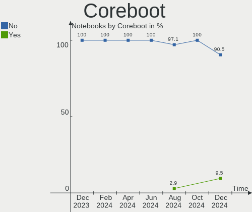
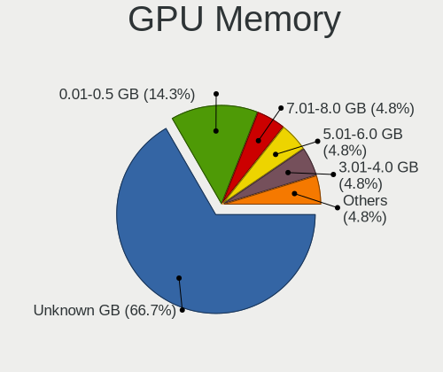
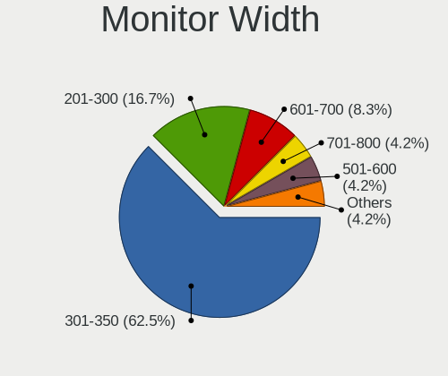
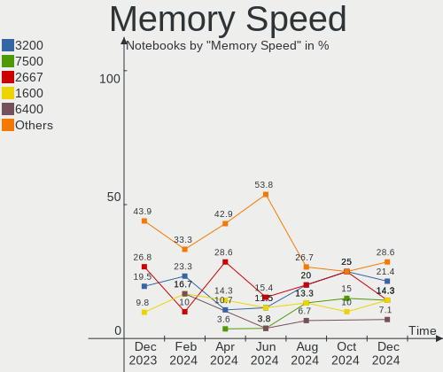

EndeavourOS - Hardware Trends (Notebooks)
-----------------------------------------

A project to identify most popular hardware characteristics and track their change
over time based on data collected by Linux users at https://Linux-Hardware.org.

Anyone can contribute to this report by the [hw-probe](https://github.com/linuxhw/hw-probe) tool:

    sudo -E hw-probe -all -upload

This report is for one last month. Overall report since the beginning of time: [TestCoverage](https://github.com/linuxhw/TestCoverage)

Period: Oct, 2022.

Contents
--------

* [ System ](#system)
  - [ OS                       ](#os)
  - [ OS Family                ](#os-family)
  - [ Kernel                   ](#kernel)
  - [ Kernel Family            ](#kernel-family)
  - [ Kernel Major Ver.        ](#kernel-major-ver)
  - [ Arch                     ](#arch)
  - [ DE                       ](#de)
  - [ Display Server           ](#display-server)
  - [ Display Manager          ](#display-manager)
  - [ OS Lang                  ](#os-lang)
  - [ Boot Mode                ](#boot-mode)
  - [ Filesystem               ](#filesystem)
  - [ Part. scheme             ](#part-scheme)
  - [ Dual Boot with Linux/BSD ](#dual-boot-with-linuxbsd)
  - [ Dual Boot (Win)          ](#dual-boot-win)

* [ Board ](#board)
  - [ Vendor                   ](#vendor)
  - [ Model                    ](#model)
  - [ Model Family             ](#model-family)
  - [ MFG Year                 ](#mfg-year)
  - [ Form Factor              ](#form-factor)
  - [ Secure Boot              ](#secure-boot)
  - [ Coreboot                 ](#coreboot)
  - [ RAM Size                 ](#ram-size)
  - [ RAM Used                 ](#ram-used)
  - [ Total Drives             ](#total-drives)
  - [ Has CD-ROM               ](#has-cd-rom)
  - [ Has Ethernet             ](#has-ethernet)
  - [ Has WiFi                 ](#has-wifi)
  - [ Has Bluetooth            ](#has-bluetooth)

* [ Location ](#location)
  - [ Country                  ](#country)
  - [ City                     ](#city)

* [ Drives ](#drives)
  - [ Drive Vendor             ](#drive-vendor)
  - [ Drive Model              ](#drive-model)
  - [ HDD Vendor               ](#hdd-vendor)
  - [ SSD Vendor               ](#ssd-vendor)
  - [ Drive Kind               ](#drive-kind)
  - [ Drive Connector          ](#drive-connector)
  - [ Drive Size               ](#drive-size)
  - [ Space Total              ](#space-total)
  - [ Space Used               ](#space-used)
  - [ Malfunc. Drives          ](#malfunc-drives)
  - [ Malfunc. Drive Vendor    ](#malfunc-drive-vendor)
  - [ Malfunc. HDD Vendor      ](#malfunc-hdd-vendor)
  - [ Malfunc. Drive Kind      ](#malfunc-drive-kind)
  - [ Failed Drives            ](#failed-drives)
  - [ Failed Drive Vendor      ](#failed-drive-vendor)
  - [ Drive Status             ](#drive-status)

* [ Storage controller ](#storage-controller)
  - [ Storage Vendor           ](#storage-vendor)
  - [ Storage Model            ](#storage-model)
  - [ Storage Kind             ](#storage-kind)

* [ Processor ](#processor)
  - [ CPU Vendor               ](#cpu-vendor)
  - [ CPU Model                ](#cpu-model)
  - [ CPU Model Family         ](#cpu-model-family)
  - [ CPU Cores                ](#cpu-cores)
  - [ CPU Sockets              ](#cpu-sockets)
  - [ CPU Threads              ](#cpu-threads)
  - [ CPU Op-Modes             ](#cpu-op-modes)
  - [ CPU Microcode            ](#cpu-microcode)
  - [ CPU Microarch            ](#cpu-microarch)

* [ Graphics ](#graphics)
  - [ GPU Vendor               ](#gpu-vendor)
  - [ GPU Model                ](#gpu-model)
  - [ GPU Combo                ](#gpu-combo)
  - [ GPU Driver               ](#gpu-driver)
  - [ GPU Memory               ](#gpu-memory)

* [ Monitor ](#monitor)
  - [ Monitor Vendor           ](#monitor-vendor)
  - [ Monitor Model            ](#monitor-model)
  - [ Monitor Resolution       ](#monitor-resolution)
  - [ Monitor Diagonal         ](#monitor-diagonal)
  - [ Monitor Width            ](#monitor-width)
  - [ Aspect Ratio             ](#aspect-ratio)
  - [ Monitor Area             ](#monitor-area)
  - [ Pixel Density            ](#pixel-density)
  - [ Multiple Monitors        ](#multiple-monitors)

* [ Network ](#network)
  - [ Net Controller Vendor    ](#net-controller-vendor)
  - [ Net Controller Model     ](#net-controller-model)
  - [ Wireless Vendor          ](#wireless-vendor)
  - [ Wireless Model           ](#wireless-model)
  - [ Ethernet Vendor          ](#ethernet-vendor)
  - [ Ethernet Model           ](#ethernet-model)
  - [ Net Controller Kind      ](#net-controller-kind)
  - [ Used Controller          ](#used-controller)
  - [ NICs                     ](#nics)
  - [ IPv6                     ](#ipv6)

* [ Bluetooth ](#bluetooth)
  - [ Bluetooth Vendor         ](#bluetooth-vendor)
  - [ Bluetooth Model          ](#bluetooth-model)

* [ Sound ](#sound)
  - [ Sound Vendor             ](#sound-vendor)
  - [ Sound Model              ](#sound-model)

* [ Memory ](#memory)
  - [ Memory Vendor            ](#memory-vendor)
  - [ Memory Model             ](#memory-model)
  - [ Memory Kind              ](#memory-kind)
  - [ Memory Form Factor       ](#memory-form-factor)
  - [ Memory Size              ](#memory-size)
  - [ Memory Speed             ](#memory-speed)

* [ Printers & scanners ](#printers--scanners)
  - [ Printer Vendor           ](#printer-vendor)
  - [ Printer Model            ](#printer-model)
  - [ Scanner Vendor           ](#scanner-vendor)
  - [ Scanner Model            ](#scanner-model)

* [ Camera ](#camera)
  - [ Camera Vendor            ](#camera-vendor)
  - [ Camera Model             ](#camera-model)

* [ Security ](#security)
  - [ Fingerprint Vendor       ](#fingerprint-vendor)
  - [ Fingerprint Model        ](#fingerprint-model)
  - [ Chipcard Vendor          ](#chipcard-vendor)
  - [ Chipcard Model           ](#chipcard-model)

* [ Unsupported ](#unsupported)
  - [ Unsupported Devices      ](#unsupported-devices)
  - [ Unsupported Device Types ](#unsupported-device-types)

System
------

OS
--

Installed operating systems

| Name                | Notebooks | Percent |
|---------------------|-----------|---------|
| EndeavourOS Rolling | 26        | 100%    |

OS Family
---------

OS without a version

| Name        | Notebooks | Percent |
|-------------|-----------|---------|
| EndeavourOS | 26        | 100%    |

Kernel
------

Version of the Linux kernel

| Version            | Notebooks | Percent |
|--------------------|-----------|---------|
| 6.0.2-arch1-1      | 5         | 19.23%  |
| 5.19.13-arch1-1    | 5         | 19.23%  |
| 6.0.2-zen1-1-zen   | 3         | 11.54%  |
| 5.19.7-arch1-1     | 3         | 11.54%  |
| 5.19.12-arch1-1    | 3         | 11.54%  |
| 5.19.13-zen1-1-zen | 2         | 7.69%   |
| 6.0.5-zen1-1-zen   | 1         | 3.85%   |
| 6.0.0-arch1-1      | 1         | 3.85%   |
| 5.17.6-zen1-1-zen  | 1         | 3.85%   |
| 5.15.75-1-lts      | 1         | 3.85%   |
| 5.15.73-3-lts      | 1         | 3.85%   |

Kernel Family
-------------

Linux kernel without a distro release

| Version | Notebooks | Percent |
|---------|-----------|---------|
| 6.0.2   | 8         | 30.77%  |
| 5.19.13 | 7         | 26.92%  |
| 5.19.7  | 3         | 11.54%  |
| 5.19.12 | 3         | 11.54%  |
| 6.0.5   | 1         | 3.85%   |
| 6.0.0   | 1         | 3.85%   |
| 5.17.6  | 1         | 3.85%   |
| 5.15.75 | 1         | 3.85%   |
| 5.15.73 | 1         | 3.85%   |

Kernel Major Ver.
-----------------

Linux kernel major version

| Version | Notebooks | Percent |
|---------|-----------|---------|
| 5.19    | 13        | 50%     |
| 6.0     | 10        | 38.46%  |
| 5.15    | 2         | 7.69%   |
| 5.17    | 1         | 3.85%   |

Arch
----

OS architecture (x86_64, i586, etc.)

| Name   | Notebooks | Percent |
|--------|-----------|---------|
| x86_64 | 26        | 100%    |

DE
--

Desktop Environment

| Name       | Notebooks | Percent |
|------------|-----------|---------|
| KDE5       | 11        | 42.31%  |
| XFCE       | 5         | 19.23%  |
| GNOME      | 4         | 15.38%  |
| openbox    | 2         | 7.69%   |
| X-Cinnamon | 1         | 3.85%   |
| LXQt       | 1         | 3.85%   |
| Budgie     | 1         | 3.85%   |
| Unknown    | 1         | 3.85%   |

Display Server
--------------

X11 or Wayland

| Name    | Notebooks | Percent |
|---------|-----------|---------|
| X11     | 20        | 76.92%  |
| Wayland | 3         | 11.54%  |
| Tty     | 3         | 11.54%  |

Display Manager
---------------

SDDM, LightDM, etc.

| Name    | Notebooks | Percent |
|---------|-----------|---------|
| SDDM    | 10        | 38.46%  |
| LightDM | 8         | 30.77%  |
| Unknown | 6         | 23.08%  |
| GDM     | 2         | 7.69%   |

OS Lang
-------

Language

| Lang    | Notebooks | Percent |
|---------|-----------|---------|
| en_US   | 9         | 34.62%  |
| it_IT   | 6         | 23.08%  |
| en_CA   | 2         | 7.69%   |
| pt_BR   | 1         | 3.85%   |
| fr_FR   | 1         | 3.85%   |
| fi_FI   | 1         | 3.85%   |
| es_ES   | 1         | 3.85%   |
| en_SG   | 1         | 3.85%   |
| en_GB   | 1         | 3.85%   |
| en_AU   | 1         | 3.85%   |
| de_DE   | 1         | 3.85%   |
| Unknown | 1         | 3.85%   |

Boot Mode
---------

EFI or BIOS

| Mode | Notebooks | Percent |
|------|-----------|---------|
| EFI  | 17        | 65.38%  |
| BIOS | 9         | 34.62%  |

Filesystem
----------

Type of filesystem

| Type    | Notebooks | Percent |
|---------|-----------|---------|
| Ext4    | 17        | 65.38%  |
| Btrfs   | 6         | 23.08%  |
| Overlay | 3         | 11.54%  |

Part. scheme
------------

Scheme of partitioning

| Type    | Notebooks | Percent |
|---------|-----------|---------|
| GPT     | 18        | 69.23%  |
| Unknown | 5         | 19.23%  |
| MBR     | 3         | 11.54%  |

Dual Boot with Linux/BSD
------------------------

Hosting more than one Linux/BSD

| Dual boot | Notebooks | Percent |
|-----------|-----------|---------|
| No        | 23        | 88.46%  |
| Yes       | 3         | 11.54%  |

Dual Boot (Win)
---------------

Hosting Linux and Windows

| Dual boot | Notebooks | Percent |
|-----------|-----------|---------|
| No        | 18        | 69.23%  |
| Yes       | 8         | 30.77%  |

Board
-----

Vendor
------

Motherboard manufacturer

| Name                | Notebooks | Percent |
|---------------------|-----------|---------|
| Hewlett-Packard     | 7         | 26.92%  |
| Lenovo              | 5         | 19.23%  |
| MSI                 | 3         | 11.54%  |
| ASUSTek Computer    | 3         | 11.54%  |
| Acer                | 3         | 11.54%  |
| Toshiba             | 1         | 3.85%   |
| Timi                | 1         | 3.85%   |
| Samsung Electronics | 1         | 3.85%   |
| Packard Bell        | 1         | 3.85%   |
| Google              | 1         | 3.85%   |

Model
-----

Motherboard model

| Name                                  | Notebooks | Percent |
|---------------------------------------|-----------|---------|
| Toshiba Satellite L500                | 1         | 3.85%   |
| Timi RedmiBook Pro 14S                | 1         | 3.85%   |
| Samsung 340XAA/350XAA/550XAA          | 1         | 3.85%   |
| Packard Bell EasyNote TJ65            | 1         | 3.85%   |
| MSI Prestige 14Evo A12M               | 1         | 3.85%   |
| MSI GF65 Thin 9SD                     | 1         | 3.85%   |
| MSI GE75 Raider 10SF                  | 1         | 3.85%   |
| Lenovo Yoga Slim 7 Pro 14ACH5 82MS    | 1         | 3.85%   |
| Lenovo V110-15AST 80TD                | 1         | 3.85%   |
| Lenovo ThinkPad T16 Gen 1 21BVCTO1WW  | 1         | 3.85%   |
| Lenovo ThinkPad T14 Gen 3 21CFCTO1WW  | 1         | 3.85%   |
| Lenovo IdeaPad 330S-15IKB 81F5        | 1         | 3.85%   |
| HP Pavilion Laptop 14-ce0xxx          | 1         | 3.85%   |
| HP Pavilion Gaming Laptop 15-ec1xxx   | 1         | 3.85%   |
| HP Laptop 15-bs2xx                    | 1         | 3.85%   |
| HP 650                                | 1         | 3.85%   |
| HP 340S G7 Notebook PC                | 1         | 3.85%   |
| HP 255 G8 Notebook PC                 | 1         | 3.85%   |
| HP 250 G4                             | 1         | 3.85%   |
| Google Liara                          | 1         | 3.85%   |
| ASUS X441SA                           | 1         | 3.85%   |
| ASUS S550CA                           | 1         | 3.85%   |
| ASUS ROG Zephyrus G15 GA503RM_GA503RM | 1         | 3.85%   |
| Acer Swift SF314-51                   | 1         | 3.85%   |
| Acer Extensa 2540                     | 1         | 3.85%   |
| Acer Aspire A315-22                   | 1         | 3.85%   |

Model Family
------------

Motherboard model prefix

| Name                  | Notebooks | Percent |
|-----------------------|-----------|---------|
| Lenovo ThinkPad       | 2         | 7.69%   |
| HP Pavilion           | 2         | 7.69%   |
| Toshiba Satellite     | 1         | 3.85%   |
| Timi RedmiBook        | 1         | 3.85%   |
| Samsung 340XAA        | 1         | 3.85%   |
| Packard Bell EasyNote | 1         | 3.85%   |
| MSI Prestige          | 1         | 3.85%   |
| MSI GF65              | 1         | 3.85%   |
| MSI GE75              | 1         | 3.85%   |
| Lenovo Yoga           | 1         | 3.85%   |
| Lenovo V110-15AST     | 1         | 3.85%   |
| Lenovo IdeaPad        | 1         | 3.85%   |
| HP Laptop             | 1         | 3.85%   |
| HP 650                | 1         | 3.85%   |
| HP 340S               | 1         | 3.85%   |
| HP 255                | 1         | 3.85%   |
| HP 250                | 1         | 3.85%   |
| Google Liara          | 1         | 3.85%   |
| ASUS X441SA           | 1         | 3.85%   |
| ASUS S550CA           | 1         | 3.85%   |
| ASUS ROG              | 1         | 3.85%   |
| Acer Swift            | 1         | 3.85%   |
| Acer Extensa          | 1         | 3.85%   |
| Acer Aspire           | 1         | 3.85%   |

MFG Year
--------

Motherboard manufacture year

| Year | Notebooks | Percent |
|------|-----------|---------|
| 2022 | 5         | 19.23%  |
| 2020 | 4         | 15.38%  |
| 2018 | 4         | 15.38%  |
| 2016 | 3         | 11.54%  |
| 2021 | 2         | 7.69%   |
| 2019 | 2         | 7.69%   |
| 2012 | 2         | 7.69%   |
| 2009 | 2         | 7.69%   |
| 2017 | 1         | 3.85%   |
| 2015 | 1         | 3.85%   |

Form Factor
-----------

Physical design of the computer

| Name     | Notebooks | Percent |
|----------|-----------|---------|
| Notebook | 26        | 100%    |

Secure Boot
-----------

Enabled or disabled

| State    | Notebooks | Percent |
|----------|-----------|---------|
| Disabled | 26        | 100%    |

Coreboot
--------

Have coreboot on board

| Used | Notebooks | Percent |
|------|-----------|---------|
| No   | 25        | 96.15%  |
| Yes  | 1         | 3.85%   |

RAM Size
--------

Total RAM memory

| Size in GB | Notebooks | Percent |
|------------|-----------|---------|
| 4.01-8.0   | 7         | 26.92%  |
| 8.01-16.0  | 7         | 26.92%  |
| 3.01-4.0   | 6         | 23.08%  |
| 16.01-24.0 | 4         | 15.38%  |
| 24.01-32.0 | 2         | 7.69%   |

RAM Used
--------

Used RAM memory

| Used GB  | Notebooks | Percent |
|----------|-----------|---------|
| 1.01-2.0 | 11        | 42.31%  |
| 4.01-8.0 | 5         | 19.23%  |
| 3.01-4.0 | 5         | 19.23%  |
| 2.01-3.0 | 5         | 19.23%  |

Total Drives
------------

Number of drives on board

| Drives | Notebooks | Percent |
|--------|-----------|---------|
| 1      | 20        | 76.92%  |
| 2      | 5         | 19.23%  |
| 0      | 1         | 3.85%   |

Has CD-ROM
----------

Has CD-ROM on board

| Presented | Notebooks | Percent |
|-----------|-----------|---------|
| No        | 16        | 61.54%  |
| Yes       | 10        | 38.46%  |

Has Ethernet
------------

Has Ethernet on board

| Presented | Notebooks | Percent |
|-----------|-----------|---------|
| Yes       | 19        | 73.08%  |
| No        | 7         | 26.92%  |

Has WiFi
--------

Has WiFi module

| Presented | Notebooks | Percent |
|-----------|-----------|---------|
| Yes       | 26        | 100%    |

Has Bluetooth
-------------

Has Bluetooth module

| Presented | Notebooks | Percent |
|-----------|-----------|---------|
| Yes       | 23        | 88.46%  |
| No        | 3         | 11.54%  |

Location
--------

Country
-------

Geographic location (country)

| Country   | Notebooks | Percent |
|-----------|-----------|---------|
| Italy     | 9         | 34.62%  |
| USA       | 5         | 19.23%  |
| Canada    | 2         | 7.69%   |
| Ukraine   | 1         | 3.85%   |
| UK        | 1         | 3.85%   |
| Spain     | 1         | 3.85%   |
| Senegal   | 1         | 3.85%   |
| Malaysia  | 1         | 3.85%   |
| Germany   | 1         | 3.85%   |
| France    | 1         | 3.85%   |
| Finland   | 1         | 3.85%   |
| Brazil    | 1         | 3.85%   |
| Australia | 1         | 3.85%   |

City
----

Geographic location (city)

| City                      | Notebooks | Percent |
|---------------------------|-----------|---------|
| Vynohradiv                | 1         | 3.85%   |
| Viggianello               | 1         | 3.85%   |
| Suzzara                   | 1         | 3.85%   |
| San Fermo della Battaglia | 1         | 3.85%   |
| Rome                      | 1         | 3.85%   |
| Perth                     | 1         | 3.85%   |
| Palma                     | 1         | 3.85%   |
| Ottawa                    | 1         | 3.85%   |
| Osasco                    | 1         | 3.85%   |
| Orangeville               | 1         | 3.85%   |
| Omaha                     | 1         | 3.85%   |
| Milan                     | 1         | 3.85%   |
| Melpignano                | 1         | 3.85%   |
| Mainz                     | 1         | 3.85%   |
| Limeil-Brevannes          | 1         | 3.85%   |
| Lenoir City               | 1         | 3.85%   |
| Kings Lynn                | 1         | 3.85%   |
| Helsinki                  | 1         | 3.85%   |
| Greeley                   | 1         | 3.85%   |
| Dallas                    | 1         | 3.85%   |
| Dakar                     | 1         | 3.85%   |
| Conegliano                | 1         | 3.85%   |
| Columbia                  | 1         | 3.85%   |
| Cheras                    | 1         | 3.85%   |
| Carini                    | 1         | 3.85%   |
| Albano Laziale            | 1         | 3.85%   |

Drives
------

Drive Vendor
------------

Hard drive vendors

| Vendor                      | Notebooks | Drives | Percent |
|-----------------------------|-----------|--------|---------|
| Sandisk                     | 6         | 6      | 20.69%  |
| Samsung Electronics         | 5         | 6      | 17.24%  |
| SK hynix                    | 3         | 3      | 10.34%  |
| WDC                         | 2         | 2      | 6.9%    |
| Micron Technology           | 2         | 2      | 6.9%    |
| Crucial                     | 2         | 2      | 6.9%    |
| Unknown                     | 1         | 1      | 3.45%   |
| Toshiba                     | 1         | 1      | 3.45%   |
| Seagate                     | 1         | 1      | 3.45%   |
| OCZ                         | 1         | 1      | 3.45%   |
| KIOXIA                      | 1         | 1      | 3.45%   |
| Kingston Technology Company | 1         | 1      | 3.45%   |
| Kingston                    | 1         | 1      | 3.45%   |
| Hitachi                     | 1         | 1      | 3.45%   |
| HGST                        | 1         | 1      | 3.45%   |

Drive Model
-----------

Hard drive models

| Model                                                | Notebooks | Percent |
|------------------------------------------------------|-----------|---------|
| Sandisk WD Black SN750 / PC SN730 NVMe SSD 1TB       | 2         | 6.67%   |
| Crucial CT120BX500SSD1 120GB                         | 2         | 6.67%   |
| WDC WDS250G2B0A-00SM50 250GB SSD                     | 1         | 3.33%   |
| WDC WD10SPSX-60A6WT0 1TB                             | 1         | 3.33%   |
| Unknown MMC Card  64GB                               | 1         | 3.33%   |
| Toshiba MQ01ABF050 500GB                             | 1         | 3.33%   |
| SK hynix SKHynix_HFS512GDE9X084N 512GB               | 1         | 3.33%   |
| SK hynix SKHynix_HFS512GDE9X081N 512GB               | 1         | 3.33%   |
| SK hynix HFS256G39TND-N210A 256GB SSD                | 1         | 3.33%   |
| Seagate ST1000LM048-2E7172 1TB                       | 1         | 3.33%   |
| Sandisk WD PC SN735 SDBPNHH-512G-1002 512GB          | 1         | 3.33%   |
| Sandisk WD Blue SN550 NVMe SSD 1TB                   | 1         | 3.33%   |
| Sandisk WD Blue SN500 / PC SN520 NVMe SSD 512GB      | 1         | 3.33%   |
| Sandisk PC SN520 NVMe SSD 128GB                      | 1         | 3.33%   |
| Samsung SSD 870 EVO 1TB                              | 1         | 3.33%   |
| Samsung SSD 850 EVO 120GB                            | 1         | 3.33%   |
| Samsung NVMe SSD Controller SM981/PM981/PM983 500GB  | 1         | 3.33%   |
| Samsung NVMe SSD Controller PM9A1/PM9A3/980PRO 250GB | 1         | 3.33%   |
| Samsung MZVLQ512HALU-000H1 512GB                     | 1         | 3.33%   |
| Samsung MZVLQ512HALU-00000 512GB                     | 1         | 3.33%   |
| OCZ TRION150 480GB SSD                               | 1         | 3.33%   |
| Micron 3400_MTFDKBA1T0TFH 1TB                        | 1         | 3.33%   |
| Micron 1100_MTFDDAK256TBN 256GB SSD                  | 1         | 3.33%   |
| KIOXIA KBG40ZNV512G 512GB                            | 1         | 3.33%   |
| Kingston Company U-SNS8154P3 NVMe SSD 512GB          | 1         | 3.33%   |
| Kingston SA400S37240G 240GB SSD                      | 1         | 3.33%   |
| Hitachi HTS545050A7E380 500GB                        | 1         | 3.33%   |
| HGST HTS545050A7E680 500GB                           | 1         | 3.33%   |

HDD Vendor
----------

Hard disk drive vendors

| Vendor  | Notebooks | Drives | Percent |
|---------|-----------|--------|---------|
| WDC     | 1         | 1      | 20%     |
| Toshiba | 1         | 1      | 20%     |
| Seagate | 1         | 1      | 20%     |
| Hitachi | 1         | 1      | 20%     |
| HGST    | 1         | 1      | 20%     |

SSD Vendor
----------

Solid state drive vendors

| Vendor              | Notebooks | Drives | Percent |
|---------------------|-----------|--------|---------|
| Samsung Electronics | 2         | 2      | 22.22%  |
| Crucial             | 2         | 2      | 22.22%  |
| WDC                 | 1         | 1      | 11.11%  |
| SK hynix            | 1         | 1      | 11.11%  |
| OCZ                 | 1         | 1      | 11.11%  |
| Micron Technology   | 1         | 1      | 11.11%  |
| Kingston            | 1         | 1      | 11.11%  |

Drive Kind
----------

HDD or SSD

| Kind | Notebooks | Drives | Percent |
|------|-----------|--------|---------|
| NVMe | 14        | 15     | 48.28%  |
| SSD  | 9         | 9      | 31.03%  |
| HDD  | 5         | 5      | 17.24%  |
| MMC  | 1         | 1      | 3.45%   |

Drive Connector
---------------

SATA, SAS, NVMe, etc.

| Type | Notebooks | Drives | Percent |
|------|-----------|--------|---------|
| NVMe | 14        | 15     | 48.28%  |
| SATA | 14        | 14     | 48.28%  |
| MMC  | 1         | 1      | 3.45%   |

Drive Size
----------

Size of hard drive

| Size in TB | Notebooks | Drives | Percent |
|------------|-----------|--------|---------|
| 0.01-0.5   | 11        | 11     | 78.57%  |
| 0.51-1.0   | 3         | 3      | 21.43%  |

Space Total
-----------

Amount of disk space available on the file system

| Size in GB | Notebooks | Percent |
|------------|-----------|---------|
| 101-250    | 7         | 26.92%  |
| 251-500    | 4         | 15.38%  |
| 501-1000   | 4         | 15.38%  |
| 1001-2000  | 3         | 11.54%  |
| 1-20       | 3         | 11.54%  |
| 51-100     | 3         | 11.54%  |
| 21-50      | 1         | 3.85%   |
| Unknown    | 1         | 3.85%   |

Space Used
----------

Amount of used disk space

| Used GB   | Notebooks | Percent |
|-----------|-----------|---------|
| 1-20      | 11        | 42.31%  |
| 101-250   | 5         | 19.23%  |
| 21-50     | 4         | 15.38%  |
| 501-1000  | 2         | 7.69%   |
| 251-500   | 1         | 3.85%   |
| 1001-2000 | 1         | 3.85%   |
| 51-100    | 1         | 3.85%   |
| Unknown   | 1         | 3.85%   |

Malfunc. Drives
---------------

Drive models with a malfunction

| Model                      | Notebooks | Drives | Percent |
|----------------------------|-----------|--------|---------|
| HGST HTS545050A7E680 500GB | 1         | 1      | 100%    |

Malfunc. Drive Vendor
---------------------

Vendors of faulty drives

| Vendor | Notebooks | Drives | Percent |
|--------|-----------|--------|---------|
| HGST   | 1         | 1      | 100%    |

Malfunc. HDD Vendor
-------------------

Vendors of faulty HDD drives

| Vendor | Notebooks | Drives | Percent |
|--------|-----------|--------|---------|
| HGST   | 1         | 1      | 100%    |

Malfunc. Drive Kind
-------------------

Kinds of faulty drives

| Kind | Notebooks | Drives | Percent |
|------|-----------|--------|---------|
| HDD  | 1         | 1      | 100%    |

Failed Drives
-------------

Failed drive models

Zero info for selected period =(

Failed Drive Vendor
-------------------

Failed drive vendors

Zero info for selected period =(

Drive Status
------------

Number of failed and malfunc. drives

| Status   | Notebooks | Drives | Percent |
|----------|-----------|--------|---------|
| Works    | 19        | 22     | 76%     |
| Detected | 5         | 7      | 20%     |
| Malfunc  | 1         | 1      | 4%      |

Storage controller
------------------

Storage Vendor
--------------

Storage controller vendors

| Vendor                      | Notebooks | Percent |
|-----------------------------|-----------|---------|
| Intel                       | 14        | 42.42%  |
| SanDisk                     | 6         | 18.18%  |
| AMD                         | 5         | 15.15%  |
| Samsung Electronics         | 3         | 9.09%   |
| SK hynix                    | 2         | 6.06%   |
| Micron Technology           | 1         | 3.03%   |
| KIOXIA                      | 1         | 3.03%   |
| Kingston Technology Company | 1         | 3.03%   |

Storage Model
-------------

Storage controller models

| Model                                                                            | Notebooks | Percent |
|----------------------------------------------------------------------------------|-----------|---------|
| Intel Sunrise Point-LP SATA Controller [AHCI mode]                               | 5         | 14.71%  |
| AMD FCH SATA Controller [AHCI mode]                                              | 5         | 14.71%  |
| SK hynix Gold P31 SSD                                                            | 2         | 5.88%   |
| SanDisk WD Black SN750 / PC SN730 NVMe SSD                                       | 2         | 5.88%   |
| Samsung NVMe SSD Controller 980                                                  | 2         | 5.88%   |
| Intel Atom/Celeron/Pentium Processor x5-E8000/J3xxx/N3xxx Series SATA Controller | 2         | 5.88%   |
| Intel 82801IBM/IEM (ICH9M/ICH9M-E) 4 port SATA Controller [AHCI mode]            | 2         | 5.88%   |
| Intel 7 Series Chipset Family 6-port SATA Controller [AHCI mode]                 | 2         | 5.88%   |
| SanDisk WD Blue SN550 NVMe SSD                                                   | 1         | 2.94%   |
| SanDisk WD Blue SN500 / PC SN520 NVMe SSD                                        | 1         | 2.94%   |
| SanDisk PC SN520 NVMe SSD                                                        | 1         | 2.94%   |
| SanDisk Non-Volatile memory controller                                           | 1         | 2.94%   |
| Samsung NVMe SSD Controller SM981/PM981/PM983                                    | 1         | 2.94%   |
| Samsung NVMe SSD Controller PM9A1/PM9A3/980PRO                                   | 1         | 2.94%   |
| Micron Non-Volatile memory controller                                            | 1         | 2.94%   |
| KIOXIA NVMe SSD Controller BG4                                                   | 1         | 2.94%   |
| Kingston Company U-SNS8154P3 NVMe SSD                                            | 1         | 2.94%   |
| Intel Celeron/Pentium Silver Processor SATA Controller                           | 1         | 2.94%   |
| Intel 82801 Mobile SATA Controller [RAID mode]                                   | 1         | 2.94%   |
| Intel 400 Series Chipset Family SATA AHCI Controller                             | 1         | 2.94%   |

Storage Kind
------------

Kind of storage controller (IDE, SATA, NVMe, SAS, ...)

| Kind | Notebooks | Percent |
|------|-----------|---------|
| SATA | 18        | 54.55%  |
| NVMe | 14        | 42.42%  |
| RAID | 1         | 3.03%   |

Processor
---------

CPU Vendor
----------

Processor vendors

| Vendor | Notebooks | Percent |
|--------|-----------|---------|
| Intel  | 17        | 65.38%  |
| AMD    | 9         | 34.62%  |

CPU Model
---------

Processor models

| Model                                         | Notebooks | Percent |
|-----------------------------------------------|-----------|---------|
| Intel Core i5-8250U CPU @ 1.60GHz             | 2         | 7.69%   |
| Intel Pentium Dual-Core CPU T4400 @ 2.20GHz   | 1         | 3.85%   |
| Intel Core i7-8550U CPU @ 1.80GHz             | 1         | 3.85%   |
| Intel Core i7-6500U CPU @ 2.50GHz             | 1         | 3.85%   |
| Intel Core i7-10750H CPU @ 2.60GHz            | 1         | 3.85%   |
| Intel Core i7-1065G7 CPU @ 1.30GHz            | 1         | 3.85%   |
| Intel Core i5-9300H CPU @ 2.40GHz             | 1         | 3.85%   |
| Intel Core i3-6006U CPU @ 2.00GHz             | 1         | 3.85%   |
| Intel Core i3-3217U CPU @ 1.80GHz             | 1         | 3.85%   |
| Intel Core 2 Duo CPU T6500 @ 2.10GHz          | 1         | 3.85%   |
| Intel Celeron N4000 CPU @ 1.10GHz             | 1         | 3.85%   |
| Intel Celeron CPU N3060 @ 1.60GHz             | 1         | 3.85%   |
| Intel Celeron CPU N3050 @ 1.60GHz             | 1         | 3.85%   |
| Intel Celeron CPU 1000M @ 1.80GHz             | 1         | 3.85%   |
| Intel 12th Gen Core i7-1280P                  | 1         | 3.85%   |
| Intel 12th Gen Core i7-1260P                  | 1         | 3.85%   |
| AMD Ryzen 9 6900HS with Radeon Graphics       | 1         | 3.85%   |
| AMD Ryzen 7 5700U with Radeon Graphics        | 1         | 3.85%   |
| AMD Ryzen 5 PRO 6650U with Radeon Graphics    | 1         | 3.85%   |
| AMD Ryzen 5 5600H with Radeon Graphics        | 1         | 3.85%   |
| AMD Ryzen 5 5500U with Radeon Graphics        | 1         | 3.85%   |
| AMD Ryzen 5 4600H with Radeon Graphics        | 1         | 3.85%   |
| AMD A9-9420e RADEON R5, 5 COMPUTE CORES 2C+3G | 1         | 3.85%   |
| AMD A9-9410 RADEON R5, 5 COMPUTE CORES 2C+3G  | 1         | 3.85%   |
| AMD A4-9120C RADEON R4, 5 COMPUTE CORES 2C+3G | 1         | 3.85%   |

CPU Model Family
----------------

Processor model prefix

| Model                   | Notebooks | Percent |
|-------------------------|-----------|---------|
| Other                   | 4         | 15.38%  |
| Intel Core i7           | 4         | 15.38%  |
| Intel Celeron           | 4         | 15.38%  |
| Intel Core i5           | 3         | 11.54%  |
| AMD Ryzen 5             | 3         | 11.54%  |
| Intel Core i3           | 2         | 7.69%   |
| Intel Pentium Dual-Core | 1         | 3.85%   |
| Intel Core 2 Duo        | 1         | 3.85%   |
| AMD Ryzen 9             | 1         | 3.85%   |
| AMD Ryzen 7             | 1         | 3.85%   |
| AMD Ryzen 5 PRO         | 1         | 3.85%   |
| AMD A4                  | 1         | 3.85%   |

CPU Cores
---------

Number of processor cores

| Number | Notebooks | Percent |
|--------|-----------|---------|
| 2      | 12        | 46.15%  |
| 6      | 5         | 19.23%  |
| 4      | 5         | 19.23%  |
| 8      | 2         | 7.69%   |
| 14     | 1         | 3.85%   |
| 12     | 1         | 3.85%   |

CPU Sockets
-----------

Number of sockets

| Number | Notebooks | Percent |
|--------|-----------|---------|
| 1      | 26        | 100%    |

CPU Threads
-----------

Threads per core (Hyper-Threading)

| Number | Notebooks | Percent |
|--------|-----------|---------|
| 2      | 17        | 65.38%  |
| 1      | 9         | 34.62%  |

CPU Op-Modes
------------

CPU Operation Modes (32-bit, 64-bit)

| Op mode        | Notebooks | Percent |
|----------------|-----------|---------|
| 32-bit, 64-bit | 26        | 100%    |

CPU Microcode
-------------

Microcode number

| Number     | Notebooks | Percent |
|------------|-----------|---------|
| Unknown    | 6         | 23.08%  |
| 0x906a3    | 2         | 7.69%   |
| 0x406e3    | 2         | 7.69%   |
| 0x1067a    | 2         | 7.69%   |
| 0x08608103 | 2         | 7.69%   |
| 0x06006705 | 2         | 7.69%   |
| 0x906ed    | 1         | 3.85%   |
| 0x806ea    | 1         | 3.85%   |
| 0x706e5    | 1         | 3.85%   |
| 0x706a1    | 1         | 3.85%   |
| 0x406c4    | 1         | 3.85%   |
| 0x406c3    | 1         | 3.85%   |
| 0x306a9    | 1         | 3.85%   |
| 0x0a50000b | 1         | 3.85%   |
| 0x0a404101 | 1         | 3.85%   |
| 0x06006704 | 1         | 3.85%   |

CPU Microarch
-------------

Microarchitecture

| Name             | Notebooks | Percent |
|------------------|-----------|---------|
| KabyLake         | 4         | 15.38%  |
| Unknown          | 4         | 15.38%  |
| Excavator        | 3         | 11.54%  |
| Skylake          | 2         | 7.69%   |
| Silvermont       | 2         | 7.69%   |
| Penryn           | 2         | 7.69%   |
| IvyBridge        | 2         | 7.69%   |
| Alderlake Hybrid | 2         | 7.69%   |
| Zen 3            | 1         | 3.85%   |
| Zen 2            | 1         | 3.85%   |
| IceLake          | 1         | 3.85%   |
| Goldmont plus    | 1         | 3.85%   |
| CometLake        | 1         | 3.85%   |

Graphics
--------

GPU Vendor
----------

Vendors of graphics cards

| Vendor | Notebooks | Percent |
|--------|-----------|---------|
| Intel  | 15        | 50%     |
| AMD    | 10        | 33.33%  |
| Nvidia | 5         | 16.67%  |

GPU Model
---------

Graphics card models

| Model                                                                                    | Notebooks | Percent |
|------------------------------------------------------------------------------------------|-----------|---------|
| Intel UHD Graphics 620                                                                   | 3         | 10%     |
| AMD Stoney [Radeon R2/R3/R4/R5 Graphics]                                                 | 3         | 10%     |
| Intel Skylake GT2 [HD Graphics 520]                                                      | 2         | 6.67%   |
| Intel Atom/Celeron/Pentium Processor x5-E8000/J3xxx/N3xxx Integrated Graphics Controller | 2         | 6.67%   |
| Intel Alder Lake-P Integrated Graphics Controller                                        | 2         | 6.67%   |
| Intel 3rd Gen Core processor Graphics Controller                                         | 2         | 6.67%   |
| AMD Rembrandt [Radeon 680M]                                                              | 2         | 6.67%   |
| AMD Lucienne                                                                             | 2         | 6.67%   |
| Nvidia TU117M                                                                            | 1         | 3.33%   |
| Nvidia TU116M [GeForce GTX 1660 Ti Mobile]                                               | 1         | 3.33%   |
| Nvidia TU106M [GeForce RTX 2070 Mobile / Max-Q Refresh]                                  | 1         | 3.33%   |
| Nvidia GT218M [GeForce G210M]                                                            | 1         | 3.33%   |
| Nvidia GA106M [GeForce RTX 3060 Mobile / Max-Q]                                          | 1         | 3.33%   |
| Intel Iris Plus Graphics G7                                                              | 1         | 3.33%   |
| Intel GeminiLake [UHD Graphics 600]                                                      | 1         | 3.33%   |
| Intel CometLake-H GT2 [UHD Graphics]                                                     | 1         | 3.33%   |
| Intel CoffeeLake-H GT2 [UHD Graphics 630]                                                | 1         | 3.33%   |
| AMD RV730/M96 [Mobility Radeon HD 4650/5165]                                             | 1         | 3.33%   |
| AMD Renoir                                                                               | 1         | 3.33%   |
| AMD Cezanne                                                                              | 1         | 3.33%   |

GPU Combo
---------

Combinations of graphics cards

| Name           | Notebooks | Percent |
|----------------|-----------|---------|
| 1 x Intel      | 13        | 50%     |
| 1 x AMD        | 8         | 30.77%  |
| Intel + Nvidia | 2         | 7.69%   |
| AMD + Nvidia   | 2         | 7.69%   |
| 1 x Nvidia     | 1         | 3.85%   |

GPU Driver
----------

Free vs proprietary

| Driver      | Notebooks | Percent |
|-------------|-----------|---------|
| Free        | 23        | 88.46%  |
| Proprietary | 3         | 11.54%  |

GPU Memory
----------

Total video memory

| Size in GB | Notebooks | Percent |
|------------|-----------|---------|
| Unknown    | 16        | 61.54%  |
| 0.01-0.5   | 6         | 23.08%  |
| 7.01-8.0   | 1         | 3.85%   |
| 5.01-6.0   | 1         | 3.85%   |
| 1.01-2.0   | 1         | 3.85%   |
| 0.51-1.0   | 1         | 3.85%   |

Monitor
-------

Monitor Vendor
--------------

Monitor vendors

| Vendor                  | Notebooks | Percent |
|-------------------------|-----------|---------|
| BOE                     | 9         | 32.14%  |
| AU Optronics            | 6         | 21.43%  |
| Chimei Innolux          | 5         | 17.86%  |
| Samsung Electronics     | 1         | 3.57%   |
| MSI                     | 1         | 3.57%   |
| LG Display              | 1         | 3.57%   |
| InnoLux Display         | 1         | 3.57%   |
| InfoVision              | 1         | 3.57%   |
| Goldstar                | 1         | 3.57%   |
| CSO                     | 1         | 3.57%   |
| Chi Mei Optoelectronics | 1         | 3.57%   |

Monitor Model
-------------

Monitor models

| Model                                                                    | Notebooks | Percent |
|--------------------------------------------------------------------------|-----------|---------|
| Samsung Electronics LCD Monitor SEC325A 1366x768 344x194mm 15.5-inch     | 1         | 3.57%   |
| MSI G271 MSI3CB5 1920x1080 598x336mm 27.0-inch                           | 1         | 3.57%   |
| LG Display LCD Monitor LGD060F 1920x1080 309x174mm 14.0-inch             | 1         | 3.57%   |
| InnoLux Display LCD Monitor INL0005 1366x768 340x190mm 15.3-inch         | 1         | 3.57%   |
| InfoVision LCD Monitor IVO057D 1920x1080 309x174mm 14.0-inch             | 1         | 3.57%   |
| Goldstar ULTRAGEAR GSM7765 2560x1440 697x392mm 31.5-inch                 | 1         | 3.57%   |
| CSO LCD Monitor CSO140C 2880x1800 302x188mm 14.0-inch                    | 1         | 3.57%   |
| Chimei Innolux LCD Monitor CMN176E 1920x1080 381x214mm 17.2-inch         | 1         | 3.57%   |
| Chimei Innolux LCD Monitor CMN15DC 1366x768 344x193mm 15.5-inch          | 1         | 3.57%   |
| Chimei Innolux LCD Monitor CMN15DB 1366x768 344x193mm 15.5-inch          | 1         | 3.57%   |
| Chimei Innolux LCD Monitor CMN15BE 1366x768 344x193mm 15.5-inch          | 1         | 3.57%   |
| Chimei Innolux LCD Monitor CMN1521 1920x1080 344x193mm 15.5-inch         | 1         | 3.57%   |
| Chi Mei Optoelectronics LCD Monitor CMO1558 1366x768 344x193mm 15.5-inch | 1         | 3.57%   |
| BOE LCD Monitor BOE0AA7 2560x1600 345x215mm 16.0-inch                    | 1         | 3.57%   |
| BOE LCD Monitor BOE0A46 2560x1600 302x189mm 14.0-inch                    | 1         | 3.57%   |
| BOE LCD Monitor BOE0A07 2560x1440 344x194mm 15.5-inch                    | 1         | 3.57%   |
| BOE LCD Monitor BOE09CA 1920x1080 344x194mm 15.5-inch                    | 1         | 3.57%   |
| BOE LCD Monitor BOE0957 1920x1080 344x194mm 15.5-inch                    | 1         | 3.57%   |
| BOE LCD Monitor BOE07CE 1366x768 344x193mm 15.5-inch                     | 1         | 3.57%   |
| BOE LCD Monitor BOE0757 1366x768 344x194mm 15.5-inch                     | 1         | 3.57%   |
| BOE LCD Monitor BOE0675 1366x768 344x194mm 15.5-inch                     | 1         | 3.57%   |
| BOE LCD Monitor BOE0644 1366x768 309x173mm 13.9-inch                     | 1         | 3.57%   |
| AU Optronics LCD Monitor AUOFA9B 1920x1200 301x188mm 14.0-inch           | 1         | 3.57%   |
| AU Optronics LCD Monitor AUO623D 1920x1080 309x174mm 14.0-inch           | 1         | 3.57%   |
| AU Optronics LCD Monitor AUO45EC 1366x768 344x193mm 15.5-inch            | 1         | 3.57%   |
| AU Optronics LCD Monitor AUO403D 1920x1080 309x173mm 13.9-inch           | 1         | 3.57%   |
| AU Optronics LCD Monitor AUO38ED 1920x1080 344x193mm 15.5-inch           | 1         | 3.57%   |
| AU Optronics LCD Monitor AUO213D 1920x1080 309x173mm 13.9-inch           | 1         | 3.57%   |

Monitor Resolution
------------------

Monitor screen resolution

| Resolution        | Notebooks | Percent |
|-------------------|-----------|---------|
| 1366x768 (WXGA)   | 11        | 40.74%  |
| 1920x1080 (FHD)   | 10        | 37.04%  |
| 2560x1600         | 2         | 7.41%   |
| 2560x1440 (QHD)   | 2         | 7.41%   |
| 2880x1800         | 1         | 3.7%    |
| 1920x1200 (WUXGA) | 1         | 3.7%    |

Monitor Diagonal
----------------

Diagonal size in inches

| Inches | Notebooks | Percent |
|--------|-----------|---------|
| 15     | 15        | 53.57%  |
| 14     | 8         | 28.57%  |
| 31     | 1         | 3.57%   |
| 27     | 1         | 3.57%   |
| 17     | 1         | 3.57%   |
| 16     | 1         | 3.57%   |
| 13     | 1         | 3.57%   |

Monitor Width
-------------

Physical width

| Width in mm | Notebooks | Percent |
|-------------|-----------|---------|
| 301-350     | 25        | 89.29%  |
| 601-700     | 1         | 3.57%   |
| 501-600     | 1         | 3.57%   |
| 351-400     | 1         | 3.57%   |

Aspect Ratio
------------

Proportional relationship between the width and the height

| Ratio | Notebooks | Percent |
|-------|-----------|---------|
| 16/9  | 22        | 84.62%  |
| 16/10 | 4         | 15.38%  |

Monitor Area
------------

Area in inch

| Area in inch | Notebooks | Percent |
|----------------|-----------|---------|
| 101-110        | 15        | 53.57%  |
| 81-90          | 9         | 32.14%  |
| 351-500        | 1         | 3.57%   |
| 301-350        | 1         | 3.57%   |
| 121-130        | 1         | 3.57%   |
| 111-120        | 1         | 3.57%   |

Pixel Density
-------------

Pixels per inch

| Density       | Notebooks | Percent |
|---------------|-----------|---------|
| 121-160       | 10        | 35.71%  |
| 101-120       | 10        | 35.71%  |
| 161-240       | 4         | 14.29%  |
| 51-100        | 3         | 10.71%  |
| More than 240 | 1         | 3.57%   |

Multiple Monitors
-----------------

Total monitors connected

| Total | Notebooks | Percent |
|-------|-----------|---------|
| 1     | 23        | 88.46%  |
| 2     | 3         | 11.54%  |

Network
-------

Net Controller Vendor
---------------------

Controller vendors

| Vendor                | Notebooks | Percent |
|-----------------------|-----------|---------|
| Realtek Semiconductor | 17        | 38.64%  |
| Intel                 | 10        | 22.73%  |
| Qualcomm Atheros      | 9         | 20.45%  |
| MediaTek              | 3         | 6.82%   |
| Broadcom              | 2         | 4.55%   |
| Ralink                | 1         | 2.27%   |
| Qualcomm              | 1         | 2.27%   |
| D-Link System         | 1         | 2.27%   |

Net Controller Model
--------------------

Controller models

| Model                                                                      | Notebooks | Percent |
|----------------------------------------------------------------------------|-----------|---------|
| Realtek RTL8111/8168/8411 PCI Express Gigabit Ethernet Controller          | 11        | 23.4%   |
| Realtek RTL810xE PCI Express Fast Ethernet controller                      | 4         | 8.51%   |
| Qualcomm Atheros QCA9377 802.11ac Wireless Network Adapter                 | 3         | 6.38%   |
| Qualcomm Atheros QCA6174 802.11ac Wireless Network Adapter                 | 2         | 4.26%   |
| Intel Alder Lake-P PCH CNVi WiFi                                           | 2         | 4.26%   |
| Realtek RTL8852AE 802.11ax PCIe Wireless Network Adapter                   | 1         | 2.13%   |
| Realtek RTL8821CE 802.11ac PCIe Wireless Network Adapter                   | 1         | 2.13%   |
| Realtek RTL8125 2.5GbE Controller                                          | 1         | 2.13%   |
| Realtek Realtek Network controller                                         | 1         | 2.13%   |
| Ralink RT3290 Wireless 802.11n 1T/1R PCIe                                  | 1         | 2.13%   |
| Qualcomm QCNFA765 Wireless Network Adapter                                 | 1         | 2.13%   |
| Qualcomm Atheros QCA9565 / AR9565 Wireless Network Adapter                 | 1         | 2.13%   |
| Qualcomm Atheros Killer E2500 Gigabit Ethernet Controller                  | 1         | 2.13%   |
| Qualcomm Atheros AR9485 Wireless Network Adapter                           | 1         | 2.13%   |
| Qualcomm Atheros AR928X Wireless Network Adapter (PCI-Express)             | 1         | 2.13%   |
| MediaTek MT7922 802.11ax PCI Express Wireless Network Adapter              | 1         | 2.13%   |
| MediaTek MT7921 802.11ax PCI Express Wireless Network Adapter              | 1         | 2.13%   |
| MediaTek moto e(7) power                                                   | 1         | 2.13%   |
| Intel WiFi Link 5100                                                       | 1         | 2.13%   |
| Intel Wi-Fi 6 AX200                                                        | 1         | 2.13%   |
| Intel Ice Lake-LP PCH CNVi WiFi                                            | 1         | 2.13%   |
| Intel Gemini Lake PCH CNVi WiFi                                            | 1         | 2.13%   |
| Intel Ethernet Connection (16) I219-V                                      | 1         | 2.13%   |
| Intel Dual Band Wireless-AC 3168NGW [Stone Peak]                           | 1         | 2.13%   |
| Intel Dual Band Wireless-AC 3165 Plus Bluetooth                            | 1         | 2.13%   |
| Intel Comet Lake PCH CNVi WiFi                                             | 1         | 2.13%   |
| Intel Cannon Lake PCH CNVi WiFi                                            | 1         | 2.13%   |
| D-Link System AirPlus G DWL-G122 Wireless Adapter(rev.C1) [Ralink RT2571W] | 1         | 2.13%   |
| Broadcom NetLink BCM5784M Gigabit Ethernet PCIe                            | 1         | 2.13%   |
| Broadcom BCM43142 802.11b/g/n                                              | 1         | 2.13%   |

Wireless Vendor
---------------

Wireless vendors

| Vendor                | Notebooks | Percent |
|-----------------------|-----------|---------|
| Intel                 | 10        | 37.04%  |
| Qualcomm Atheros      | 8         | 29.63%  |
| Realtek Semiconductor | 3         | 11.11%  |
| MediaTek              | 2         | 7.41%   |
| Ralink                | 1         | 3.7%    |
| Qualcomm              | 1         | 3.7%    |
| D-Link System         | 1         | 3.7%    |
| Broadcom              | 1         | 3.7%    |

Wireless Model
--------------

Wireless models

| Model                                                                      | Notebooks | Percent |
|----------------------------------------------------------------------------|-----------|---------|
| Qualcomm Atheros QCA9377 802.11ac Wireless Network Adapter                 | 3         | 11.11%  |
| Qualcomm Atheros QCA6174 802.11ac Wireless Network Adapter                 | 2         | 7.41%   |
| Intel Alder Lake-P PCH CNVi WiFi                                           | 2         | 7.41%   |
| Realtek RTL8852AE 802.11ax PCIe Wireless Network Adapter                   | 1         | 3.7%    |
| Realtek RTL8821CE 802.11ac PCIe Wireless Network Adapter                   | 1         | 3.7%    |
| Realtek Realtek Network controller                                         | 1         | 3.7%    |
| Ralink RT3290 Wireless 802.11n 1T/1R PCIe                                  | 1         | 3.7%    |
| Qualcomm QCNFA765 Wireless Network Adapter                                 | 1         | 3.7%    |
| Qualcomm Atheros QCA9565 / AR9565 Wireless Network Adapter                 | 1         | 3.7%    |
| Qualcomm Atheros AR9485 Wireless Network Adapter                           | 1         | 3.7%    |
| Qualcomm Atheros AR928X Wireless Network Adapter (PCI-Express)             | 1         | 3.7%    |
| MediaTek MT7922 802.11ax PCI Express Wireless Network Adapter              | 1         | 3.7%    |
| MediaTek MT7921 802.11ax PCI Express Wireless Network Adapter              | 1         | 3.7%    |
| Intel WiFi Link 5100                                                       | 1         | 3.7%    |
| Intel Wi-Fi 6 AX200                                                        | 1         | 3.7%    |
| Intel Ice Lake-LP PCH CNVi WiFi                                            | 1         | 3.7%    |
| Intel Gemini Lake PCH CNVi WiFi                                            | 1         | 3.7%    |
| Intel Dual Band Wireless-AC 3168NGW [Stone Peak]                           | 1         | 3.7%    |
| Intel Dual Band Wireless-AC 3165 Plus Bluetooth                            | 1         | 3.7%    |
| Intel Comet Lake PCH CNVi WiFi                                             | 1         | 3.7%    |
| Intel Cannon Lake PCH CNVi WiFi                                            | 1         | 3.7%    |
| D-Link System AirPlus G DWL-G122 Wireless Adapter(rev.C1) [Ralink RT2571W] | 1         | 3.7%    |
| Broadcom BCM43142 802.11b/g/n                                              | 1         | 3.7%    |

Ethernet Vendor
---------------

Ethernet vendors

| Vendor                | Notebooks | Percent |
|-----------------------|-----------|---------|
| Realtek Semiconductor | 16        | 80%     |
| Qualcomm Atheros      | 1         | 5%      |
| MediaTek              | 1         | 5%      |
| Intel                 | 1         | 5%      |
| Broadcom              | 1         | 5%      |

Ethernet Model
--------------

Ethernet models

| Model                                                             | Notebooks | Percent |
|-------------------------------------------------------------------|-----------|---------|
| Realtek RTL8111/8168/8411 PCI Express Gigabit Ethernet Controller | 11        | 55%     |
| Realtek RTL810xE PCI Express Fast Ethernet controller             | 4         | 20%     |
| Realtek RTL8125 2.5GbE Controller                                 | 1         | 5%      |
| Qualcomm Atheros Killer E2500 Gigabit Ethernet Controller         | 1         | 5%      |
| MediaTek moto e(7) power                                          | 1         | 5%      |
| Intel Ethernet Connection (16) I219-V                             | 1         | 5%      |
| Broadcom NetLink BCM5784M Gigabit Ethernet PCIe                   | 1         | 5%      |

Net Controller Kind
-------------------

Ethernet, WiFi or modem

| Kind     | Notebooks | Percent |
|----------|-----------|---------|
| WiFi     | 26        | 57.78%  |
| Ethernet | 19        | 42.22%  |

Used Controller
---------------

Currently used network controller

| Kind     | Notebooks | Percent |
|----------|-----------|---------|
| WiFi     | 25        | 96.15%  |
| Ethernet | 1         | 3.85%   |

NICs
----

Total network controllers on board

| Total | Notebooks | Percent |
|-------|-----------|---------|
| 2     | 19        | 73.08%  |
| 1     | 7         | 26.92%  |

IPv6
----

IPv6 vs IPv4

| Used | Notebooks | Percent |
|------|-----------|---------|
| No   | 20        | 76.92%  |
| Yes  | 6         | 23.08%  |

Bluetooth
---------

Bluetooth Vendor
----------------

Controller vendors

| Vendor                          | Notebooks | Percent |
|---------------------------------|-----------|---------|
| Intel                           | 9         | 37.5%   |
| Qualcomm Atheros Communications | 3         | 12.5%   |
| Foxconn / Hon Hai               | 3         | 12.5%   |
| Realtek Semiconductor           | 2         | 8.33%   |
| USI                             | 1         | 4.17%   |
| Ralink                          | 1         | 4.17%   |
| Opticis                         | 1         | 4.17%   |
| Lite-On Technology              | 1         | 4.17%   |
| IMC Networks                    | 1         | 4.17%   |
| Cambridge Silicon Radio         | 1         | 4.17%   |
| Broadcom                        | 1         | 4.17%   |

Bluetooth Model
---------------

Controller models

| Model                                               | Notebooks | Percent |
|-----------------------------------------------------|-----------|---------|
| Qualcomm Atheros  Bluetooth Device                  | 2         | 8.33%   |
| Intel Bluetooth Device                              | 2         | 8.33%   |
| Intel Bluetooth 9460/9560 Jefferson Peak (JfP)      | 2         | 8.33%   |
| Intel AX201 Bluetooth                               | 2         | 8.33%   |
| Foxconn / Hon Hai Wireless_Device                   | 2         | 8.33%   |
| USI Bluetooth Device                                | 1         | 4.17%   |
| Realtek  Bluetooth 4.2 Adapter                      | 1         | 4.17%   |
| Realtek Bluetooth Radio                             | 1         | 4.17%   |
| Ralink RT3290 Bluetooth                             | 1         | 4.17%   |
| Qualcomm Atheros QCA61x4 Bluetooth 4.0              | 1         | 4.17%   |
| Opticis Bluetooth Radio                             | 1         | 4.17%   |
| Lite-On Qualcomm Atheros QCA9377 Bluetooth          | 1         | 4.17%   |
| Intel Wireless-AC 3168 Bluetooth                    | 1         | 4.17%   |
| Intel Bluetooth wireless interface                  | 1         | 4.17%   |
| Intel AX200 Bluetooth                               | 1         | 4.17%   |
| IMC Networks Bluetooth Device                       | 1         | 4.17%   |
| Foxconn / Hon Hai Bluetooth Device                  | 1         | 4.17%   |
| Cambridge Silicon Radio Bluetooth Dongle (HCI mode) | 1         | 4.17%   |
| Broadcom BCM43142A0 Bluetooth 4.0                   | 1         | 4.17%   |

Sound
-----

Sound Vendor
------------

Sound card vendors

| Vendor  | Notebooks | Percent |
|---------|-----------|---------|
| Intel   | 17        | 50%     |
| AMD     | 10        | 29.41%  |
| Nvidia  | 5         | 14.71%  |
| JMTek   | 1         | 2.94%   |
| Corsair | 1         | 2.94%   |

Sound Model
-----------

Sound card models

| Model                                                                                             | Notebooks | Percent |
|---------------------------------------------------------------------------------------------------|-----------|---------|
| AMD Family 17h/19h HD Audio Controller                                                            | 6         | 14.63%  |
| Intel Sunrise Point-LP HD Audio                                                                   | 5         | 12.2%   |
| AMD Renoir Radeon High Definition Audio Controller                                                | 3         | 7.32%   |
| AMD High Definition Audio Controller                                                              | 3         | 7.32%   |
| Intel Atom/Celeron/Pentium Processor x5-E8000/J3xxx/N3xxx Series High Definition Audio Controller | 2         | 4.88%   |
| Intel Alder Lake PCH-P High Definition Audio Controller                                           | 2         | 4.88%   |
| Intel 82801I (ICH9 Family) HD Audio Controller                                                    | 2         | 4.88%   |
| Intel 7 Series/C216 Chipset Family High Definition Audio Controller                               | 2         | 4.88%   |
| AMD Rembrandt Radeon High Definition Audio Controller                                             | 2         | 4.88%   |
| AMD Family 15h (Models 60h-6fh) Audio Controller                                                  | 2         | 4.88%   |
| Nvidia TU116 High Definition Audio Controller                                                     | 1         | 2.44%   |
| Nvidia TU107 GeForce GTX 1650 High Definition Audio Controller                                    | 1         | 2.44%   |
| Nvidia TU106 High Definition Audio Controller                                                     | 1         | 2.44%   |
| Nvidia High Definition Audio Controller                                                           | 1         | 2.44%   |
| Nvidia GA106 High Definition Audio Controller                                                     | 1         | 2.44%   |
| JMTek USB PnP Audio Device                                                                        | 1         | 2.44%   |
| Intel Ice Lake-LP Smart Sound Technology Audio Controller                                         | 1         | 2.44%   |
| Intel Comet Lake PCH cAVS                                                                         | 1         | 2.44%   |
| Intel Celeron/Pentium Silver Processor High Definition Audio                                      | 1         | 2.44%   |
| Intel Cannon Lake PCH cAVS                                                                        | 1         | 2.44%   |
| Corsair Corsair VOID ELITE USB Gaming Headset                                                     | 1         | 2.44%   |
| AMD RV710/730 HDMI Audio [Radeon HD 4000 series]                                                  | 1         | 2.44%   |

Memory
------

Memory Vendor
-------------

Memory module vendors

| Vendor              | Notebooks | Percent |
|---------------------|-----------|---------|
| Samsung Electronics | 11        | 42.31%  |
| SK hynix            | 4         | 15.38%  |
| Micron Technology   | 4         | 15.38%  |
| Toshiba             | 1         | 3.85%   |
| Team                | 1         | 3.85%   |
| Ramaxel Technology  | 1         | 3.85%   |
| Kingston            | 1         | 3.85%   |
| Elpida              | 1         | 3.85%   |
| Crucial             | 1         | 3.85%   |
| Unknown             | 1         | 3.85%   |

Memory Model
------------

Memory module models

| Model                                                            | Notebooks | Percent |
|------------------------------------------------------------------|-----------|---------|
| Samsung RAM M471A5244CB0-CTD 4GB SODIMM DDR4 3266MT/s            | 3         | 10%     |
| SK hynix RAM HMA81GS6DJR8N-XN 8GB SODIMM DDR4 3200MT/s           | 2         | 6.67%   |
| Samsung RAM M471A1K43CB1-CTD 8GB SODIMM DDR4 2667MT/s            | 2         | 6.67%   |
| Samsung RAM M471A1G44AB0-CWE 8GB Row Of Chips DDR4 3200MT/s      | 2         | 6.67%   |
| Toshiba RAM 8HTF12864HDY-800G1 2GB SODIMM 1066MT/s               | 1         | 3.33%   |
| Toshiba RAM 64T128020EDL2.5C2 2GB SODIMM 1066MT/s                | 1         | 3.33%   |
| Team RAM TEAMGROUP-SD4-3200 16GB SODIMM DDR4 3200MT/s            | 1         | 3.33%   |
| SK hynix RAM HMT451S6CFR6A-PB 4GB SODIMM DDR3 1600MT/s           | 1         | 3.33%   |
| SK hynix RAM H9HCNNNCPMMLXR-NEE 2GB Row Of Chips LPDDR4 4267MT/s | 1         | 3.33%   |
| Samsung RAM M471A5244BB0-CPB 4GB SODIMM DDR4 2400MT/s            | 1         | 3.33%   |
| Samsung RAM M471A2G44BM0-CWE 16GB SODIMM DDR4 3200MT/s           | 1         | 3.33%   |
| Samsung RAM M471A1K43DB1-CWE 8GB SODIMM DDR4 3200MT/s            | 1         | 3.33%   |
| Samsung RAM M471A1K43BB1-CTD 8GB SODIMM DDR4 2667MT/s            | 1         | 3.33%   |
| Samsung RAM M471A1K43BB1-CRC 8GB SODIMM DDR4 2667MT/s            | 1         | 3.33%   |
| Samsung RAM M471A1G44BB0-CWE 8GB SODIMM DDR4 3200MT/s            | 1         | 3.33%   |
| Ramaxel RAM RMSA3230KE68H9F2133 4GB SODIMM DDR4 2133MT/s         | 1         | 3.33%   |
| Micron RAM MTC4C10163S1SC48BAY 8GB SODIMM DDR5 4800MT/s          | 1         | 3.33%   |
| Micron RAM MTC4C10163S1SC48BA1 8GB SODIMM DDR5 4800MT/s          | 1         | 3.33%   |
| Micron RAM MT62F2G32D8DR-031 WT 8GB SODIMM LPDDR5 6400MT/s       | 1         | 3.33%   |
| Micron RAM 4ATF51264HZ-2G6E1 4GB SODIMM DDR4 2667MT/s            | 1         | 3.33%   |
| Micron RAM 4ATF51264HZ-2G3B1 4GB SODIMM DDR4 2400MT/s            | 1         | 3.33%   |
| Kingston RAM HP687515-H66-MCN 4GB SODIMM DDR3 1600MT/s           | 1         | 3.33%   |
| Elpida RAM EBE21UE8AFSA-8G-F 2GB SODIMM DDR2 2048MT/s            | 1         | 3.33%   |
| Crucial RAM CT102464BF160B.C16 8GB SODIMM DDR3 1600MT/s          | 1         | 3.33%   |
| Unknown                                                          | 1         | 3.33%   |

Memory Kind
-----------

Memory module kinds

| Kind   | Notebooks | Percent |
|--------|-----------|---------|
| DDR4   | 14        | 63.64%  |
| DDR3   | 3         | 13.64%  |
| SDRAM  | 1         | 4.55%   |
| LPDDR5 | 1         | 4.55%   |
| LPDDR4 | 1         | 4.55%   |
| DDR5   | 1         | 4.55%   |
| DDR2   | 1         | 4.55%   |

Memory Form Factor
------------------

Physical design of the memory module

| Name         | Notebooks | Percent |
|--------------|-----------|---------|
| SODIMM       | 19        | 86.36%  |
| Row Of Chips | 3         | 13.64%  |

Memory Size
-----------

Memory module size

| Size  | Notebooks | Percent |
|-------|-----------|---------|
| 8192  | 12        | 50%     |
| 4096  | 8         | 33.33%  |
| 16384 | 2         | 8.33%   |
| 32768 | 1         | 4.17%   |
| 2048  | 1         | 4.17%   |

Memory Speed
------------

Memory module speed

| Speed | Notebooks | Percent |
|-------|-----------|---------|
| 3200  | 6         | 23.08%  |
| 2667  | 5         | 19.23%  |
| 3266  | 3         | 11.54%  |
| 1600  | 3         | 11.54%  |
| 2400  | 2         | 7.69%   |
| 6400  | 1         | 3.85%   |
| 4800  | 1         | 3.85%   |
| 4267  | 1         | 3.85%   |
| 2133  | 1         | 3.85%   |
| 2048  | 1         | 3.85%   |
| 1200  | 1         | 3.85%   |
| 1066  | 1         | 3.85%   |

Printers & scanners
-------------------

Printer Vendor
--------------

Printer device vendors

Zero info for selected period =(

Printer Model
-------------

Printer device models

Zero info for selected period =(

Scanner Vendor
--------------

Scanner device vendors

Zero info for selected period =(

Scanner Model
-------------

Scanner device models

Zero info for selected period =(

Camera
------

Camera Vendor
-------------

Camera device vendors

| Vendor                        | Notebooks | Percent |
|-------------------------------|-----------|---------|
| Chicony Electronics           | 9         | 36%     |
| IMC Networks                  | 3         | 12%     |
| Syntek                        | 2         | 8%      |
| Realtek Semiconductor         | 2         | 8%      |
| Quanta                        | 2         | 8%      |
| Acer                          | 2         | 8%      |
| Suyin                         | 1         | 4%      |
| Sunplus Innovation Technology | 1         | 4%      |
| Silicon Motion                | 1         | 4%      |
| Lite-On Technology            | 1         | 4%      |
| GEMBIRD                       | 1         | 4%      |

Camera Model
------------

Camera device models

| Model                                    | Notebooks | Percent |
|------------------------------------------|-----------|---------|
| Chicony Integrated Camera                | 3         | 12%     |
| Quanta HP TrueVision HD Camera           | 2         | 8%      |
| Syntek Integrated Camera                 | 1         | 4%      |
| Syntek EasyCamera                        | 1         | 4%      |
| Suyin HP TrueVision HD Integrated Webcam | 1         | 4%      |
| Sunplus XiaoMi USB 2.0 Webcam            | 1         | 4%      |
| Silicon Motion Web Camera                | 1         | 4%      |
| Realtek HP Webcam                        | 1         | 4%      |
| Realtek Acer 640 x 480 laptop camera     | 1         | 4%      |
| Lite-On HP Wide Vision FHD Camera        | 1         | 4%      |
| IMC Networks USB2.0 UVC HD Webcam        | 1         | 4%      |
| IMC Networks USB2.0 HD UVC WebCam        | 1         | 4%      |
| IMC Networks Integrated Camera           | 1         | 4%      |
| GEMBIRD USB2.0 PC CAMERA                 | 1         | 4%      |
| Chicony VGA WebCam                       | 1         | 4%      |
| Chicony USB2.0 VGA UVC WebCam            | 1         | 4%      |
| Chicony USB2.0 UVC WebCam                | 1         | 4%      |
| Chicony HP TrueVision HD Camera          | 1         | 4%      |
| Chicony HD WebCam                        | 1         | 4%      |
| Chicony Acer CrystalEye Webcam           | 1         | 4%      |
| Acer HD Webcam                           | 1         | 4%      |
| Acer HD Camera                           | 1         | 4%      |

Security
--------

Fingerprint Vendor
------------------

Fingerprint sensor vendors

| Vendor                | Notebooks | Percent |
|-----------------------|-----------|---------|
| Synaptics             | 1         | 33.33%  |
| LighTuning Technology | 1         | 33.33%  |
| Elan Microelectronics | 1         | 33.33%  |

Fingerprint Model
-----------------

Fingerprint sensor models

| Model                                       | Notebooks | Percent |
|---------------------------------------------|-----------|---------|
| LighTuning EgisTec Touch Fingerprint Sensor | 1         | 33.33%  |
| Elan ELAN:ARM-M4                            | 1         | 33.33%  |
| Unknown                                     | 1         | 33.33%  |

Chipcard Vendor
---------------

Chipcard module vendors

Zero info for selected period =(

Chipcard Model
--------------

Chipcard module models

Zero info for selected period =(

Unsupported
-----------

Unsupported Devices
-------------------

Total unsupported devices on board

| Total | Notebooks | Percent |
|-------|-----------|---------|
| 0     | 20        | 76.92%  |
| 1     | 5         | 19.23%  |
| 2     | 1         | 3.85%   |

Unsupported Device Types
------------------------

Types of unsupported devices

| Type                  | Notebooks | Percent |
|-----------------------|-----------|---------|
| Fingerprint reader    | 3         | 42.86%  |
| Net/ethernet          | 1         | 14.29%  |
| Multimedia controller | 1         | 14.29%  |
| Camera                | 1         | 14.29%  |
| Bluetooth             | 1         | 14.29%  |

