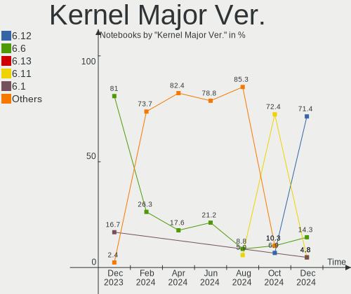
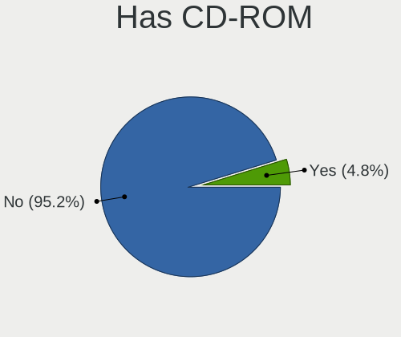
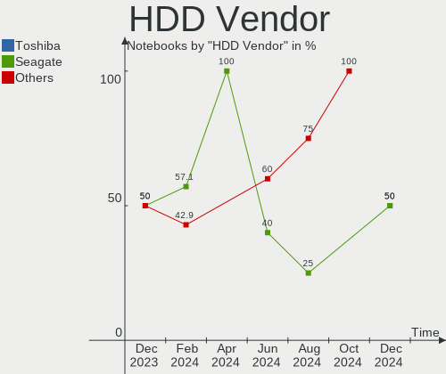
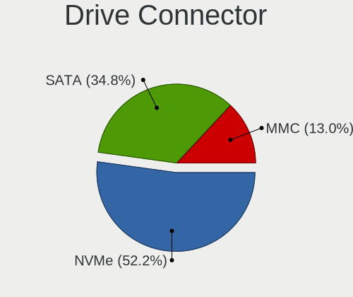
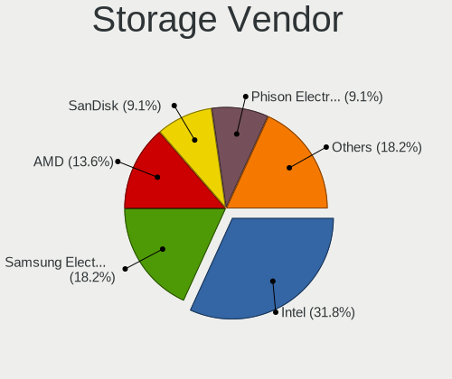
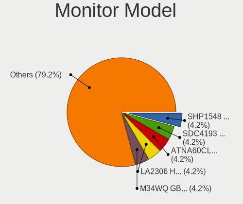
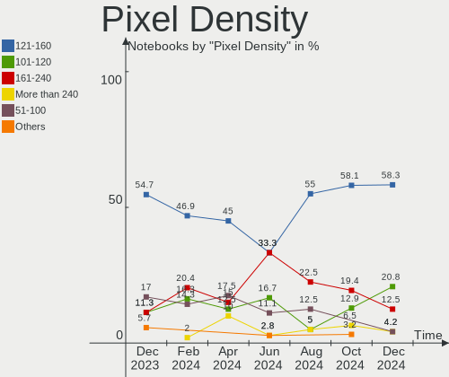

EndeavourOS - Hardware Trends (Notebooks)
-----------------------------------------

A project to identify most popular hardware characteristics and track their change
over time based on data collected by Linux users at https://Linux-Hardware.org.

Anyone can contribute to this report by the [hw-probe](https://github.com/linuxhw/hw-probe) tool:

    sudo -E hw-probe -all -upload

This report is for one last month. Overall report since the beginning of time: [TestDays](https://github.com/linuxhw/TestDays)

Period: Apr, 2024.

Contents
--------

* [ System ](#system)
  - [ OS                       ](#os)
  - [ OS Family                ](#os-family)
  - [ Kernel                   ](#kernel)
  - [ Kernel Family            ](#kernel-family)
  - [ Kernel Major Ver.        ](#kernel-major-ver)
  - [ Arch                     ](#arch)
  - [ DE                       ](#de)
  - [ Display Server           ](#display-server)
  - [ Display Manager          ](#display-manager)
  - [ OS Lang                  ](#os-lang)
  - [ Boot Mode                ](#boot-mode)
  - [ Filesystem               ](#filesystem)
  - [ Part. scheme             ](#part-scheme)
  - [ Dual Boot with Linux/BSD ](#dual-boot-with-linuxbsd)
  - [ Dual Boot (Win)          ](#dual-boot-win)

* [ Board ](#board)
  - [ Vendor                   ](#vendor)
  - [ Model                    ](#model)
  - [ Model Family             ](#model-family)
  - [ MFG Year                 ](#mfg-year)
  - [ Form Factor              ](#form-factor)
  - [ Secure Boot              ](#secure-boot)
  - [ Coreboot                 ](#coreboot)
  - [ RAM Size                 ](#ram-size)
  - [ RAM Used                 ](#ram-used)
  - [ Total Drives             ](#total-drives)
  - [ Has CD-ROM               ](#has-cd-rom)
  - [ Has Ethernet             ](#has-ethernet)
  - [ Has WiFi                 ](#has-wifi)
  - [ Has Bluetooth            ](#has-bluetooth)

* [ Location ](#location)
  - [ Country                  ](#country)
  - [ City                     ](#city)

* [ Drives ](#drives)
  - [ Drive Vendor             ](#drive-vendor)
  - [ Drive Model              ](#drive-model)
  - [ HDD Vendor               ](#hdd-vendor)
  - [ SSD Vendor               ](#ssd-vendor)
  - [ Drive Kind               ](#drive-kind)
  - [ Drive Connector          ](#drive-connector)
  - [ Drive Size               ](#drive-size)
  - [ Space Total              ](#space-total)
  - [ Space Used               ](#space-used)
  - [ Malfunc. Drives          ](#malfunc-drives)
  - [ Malfunc. Drive Vendor    ](#malfunc-drive-vendor)
  - [ Malfunc. HDD Vendor      ](#malfunc-hdd-vendor)
  - [ Malfunc. Drive Kind      ](#malfunc-drive-kind)
  - [ Failed Drives            ](#failed-drives)
  - [ Failed Drive Vendor      ](#failed-drive-vendor)
  - [ Drive Status             ](#drive-status)

* [ Storage controller ](#storage-controller)
  - [ Storage Vendor           ](#storage-vendor)
  - [ Storage Model            ](#storage-model)
  - [ Storage Kind             ](#storage-kind)

* [ Processor ](#processor)
  - [ CPU Vendor               ](#cpu-vendor)
  - [ CPU Model                ](#cpu-model)
  - [ CPU Model Family         ](#cpu-model-family)
  - [ CPU Cores                ](#cpu-cores)
  - [ CPU Sockets              ](#cpu-sockets)
  - [ CPU Threads              ](#cpu-threads)
  - [ CPU Op-Modes             ](#cpu-op-modes)
  - [ CPU Microcode            ](#cpu-microcode)
  - [ CPU Microarch            ](#cpu-microarch)

* [ Graphics ](#graphics)
  - [ GPU Vendor               ](#gpu-vendor)
  - [ GPU Model                ](#gpu-model)
  - [ GPU Combo                ](#gpu-combo)
  - [ GPU Driver               ](#gpu-driver)
  - [ GPU Memory               ](#gpu-memory)

* [ Monitor ](#monitor)
  - [ Monitor Vendor           ](#monitor-vendor)
  - [ Monitor Model            ](#monitor-model)
  - [ Monitor Resolution       ](#monitor-resolution)
  - [ Monitor Diagonal         ](#monitor-diagonal)
  - [ Monitor Width            ](#monitor-width)
  - [ Aspect Ratio             ](#aspect-ratio)
  - [ Monitor Area             ](#monitor-area)
  - [ Pixel Density            ](#pixel-density)
  - [ Multiple Monitors        ](#multiple-monitors)

* [ Network ](#network)
  - [ Net Controller Vendor    ](#net-controller-vendor)
  - [ Net Controller Model     ](#net-controller-model)
  - [ Wireless Vendor          ](#wireless-vendor)
  - [ Wireless Model           ](#wireless-model)
  - [ Ethernet Vendor          ](#ethernet-vendor)
  - [ Ethernet Model           ](#ethernet-model)
  - [ Net Controller Kind      ](#net-controller-kind)
  - [ Used Controller          ](#used-controller)
  - [ NICs                     ](#nics)
  - [ IPv6                     ](#ipv6)

* [ Bluetooth ](#bluetooth)
  - [ Bluetooth Vendor         ](#bluetooth-vendor)
  - [ Bluetooth Model          ](#bluetooth-model)

* [ Sound ](#sound)
  - [ Sound Vendor             ](#sound-vendor)
  - [ Sound Model              ](#sound-model)

* [ Memory ](#memory)
  - [ Memory Vendor            ](#memory-vendor)
  - [ Memory Model             ](#memory-model)
  - [ Memory Kind              ](#memory-kind)
  - [ Memory Form Factor       ](#memory-form-factor)
  - [ Memory Size              ](#memory-size)
  - [ Memory Speed             ](#memory-speed)

* [ Printers & scanners ](#printers--scanners)
  - [ Printer Vendor           ](#printer-vendor)
  - [ Printer Model            ](#printer-model)
  - [ Scanner Vendor           ](#scanner-vendor)
  - [ Scanner Model            ](#scanner-model)

* [ Camera ](#camera)
  - [ Camera Vendor            ](#camera-vendor)
  - [ Camera Model             ](#camera-model)

* [ Security ](#security)
  - [ Fingerprint Vendor       ](#fingerprint-vendor)
  - [ Fingerprint Model        ](#fingerprint-model)
  - [ Chipcard Vendor          ](#chipcard-vendor)
  - [ Chipcard Model           ](#chipcard-model)

* [ Unsupported ](#unsupported)
  - [ Unsupported Devices      ](#unsupported-devices)
  - [ Unsupported Device Types ](#unsupported-device-types)

System
------

OS
--

Installed operating systems

| Name                | Notebooks | Percent |
|---------------------|-----------|---------|
| EndeavourOS Rolling | 34        | 100%    |

OS Family
---------

OS without a version

| Name        | Notebooks | Percent |
|-------------|-----------|---------|
| EndeavourOS | 34        | 100%    |

Kernel
------

Version of the Linux kernel

| Version          | Notebooks | Percent |
|------------------|-----------|---------|
| 6.8.7-arch1-1    | 7         | 20.59%  |
| 6.8.5-arch1-1    | 7         | 20.59%  |
| 6.8.2-arch2-1    | 5         | 14.71%  |
| 6.8.4-arch1-1    | 3         | 8.82%   |
| 6.6.25-1-lts     | 2         | 5.88%   |
| 6.6.24-1-lts     | 2         | 5.88%   |
| 6.8.8-arch1-1    | 1         | 2.94%   |
| 6.8.7-arch1-2    | 1         | 2.94%   |
| 6.8.7-3-cachyos  | 1         | 2.94%   |
| 6.8.5-zen1-1-zen | 1         | 2.94%   |
| 6.8.4-zen1-1-zen | 1         | 2.94%   |
| 6.8.1-arch1-1    | 1         | 2.94%   |
| 6.6.28-1-lts     | 1         | 2.94%   |
| 6.6.23-1-lts     | 1         | 2.94%   |

Kernel Family
-------------

Linux kernel without a distro release

| Version | Notebooks | Percent |
|---------|-----------|---------|
| 6.8.7   | 9         | 26.47%  |
| 6.8.5   | 8         | 23.53%  |
| 6.8.2   | 5         | 14.71%  |
| 6.8.4   | 4         | 11.76%  |
| 6.6.25  | 2         | 5.88%   |
| 6.6.24  | 2         | 5.88%   |
| 6.8.8   | 1         | 2.94%   |
| 6.8.1   | 1         | 2.94%   |
| 6.6.28  | 1         | 2.94%   |
| 6.6.23  | 1         | 2.94%   |

Kernel Major Ver.
-----------------

Linux kernel major version

| Version | Notebooks | Percent |
|---------|-----------|---------|
| 6.8     | 28        | 82.35%  |
| 6.6     | 6         | 17.65%  |

Arch
----

OS architecture (x86_64, i586, etc.)

| Name   | Notebooks | Percent |
|--------|-----------|---------|
| x86_64 | 34        | 100%    |

DE
--

Desktop Environment

| Name     | Notebooks | Percent |
|----------|-----------|---------|
| KDE6     | 13        | 38.24%  |
| KDE      | 6         | 17.65%  |
| XFCE     | 5         | 14.71%  |
| GNOME    | 5         | 14.71%  |
| MATE     | 1         | 2.94%   |
| i3       | 1         | 2.94%   |
| Hyprland | 1         | 2.94%   |
| awesome  | 1         | 2.94%   |
| Unknown  | 1         | 2.94%   |

Display Server
--------------

X11 or Wayland

| Name    | Notebooks | Percent |
|---------|-----------|---------|
| Wayland | 18        | 52.94%  |
| X11     | 15        | 44.12%  |
| Unknown | 1         | 2.94%   |

Display Manager
---------------

SDDM, LightDM, etc.

| Name    | Notebooks | Percent |
|---------|-----------|---------|
| SDDM    | 15        | 44.12%  |
| LightDM | 11        | 32.35%  |
| Unknown | 6         | 17.65%  |
| GDM     | 2         | 5.88%   |

OS Lang
-------

Language

| Lang  | Notebooks | Percent |
|-------|-----------|---------|
| en_US | 15        | 44.12%  |
| en_GB | 5         | 14.71%  |
| it_IT | 4         | 11.76%  |
| de_DE | 3         | 8.82%   |
| tr_TR | 2         | 5.88%   |
| ru_RU | 1         | 2.94%   |
| pl_PL | 1         | 2.94%   |
| es_ES | 1         | 2.94%   |
| en_IE | 1         | 2.94%   |
| en_AU | 1         | 2.94%   |

Boot Mode
---------

EFI or BIOS

| Mode | Notebooks | Percent |
|------|-----------|---------|
| EFI  | 23        | 67.65%  |
| BIOS | 11        | 32.35%  |

Filesystem
----------

Type of filesystem

| Type  | Notebooks | Percent |
|-------|-----------|---------|
| Ext4  | 22        | 64.71%  |
| Btrfs | 10        | 29.41%  |
| Tmpfs | 2         | 5.88%   |

Part. scheme
------------

Scheme of partitioning

| Type    | Notebooks | Percent |
|---------|-----------|---------|
| GPT     | 27        | 79.41%  |
| Unknown | 6         | 17.65%  |
| MBR     | 1         | 2.94%   |

Dual Boot with Linux/BSD
------------------------

Hosting more than one Linux/BSD

| Dual boot | Notebooks | Percent |
|-----------|-----------|---------|
| No        | 32        | 94.12%  |
| Yes       | 2         | 5.88%   |

Dual Boot (Win)
---------------

Hosting Linux and Windows

| Dual boot | Notebooks | Percent |
|-----------|-----------|---------|
| No        | 22        | 64.71%  |
| Yes       | 12        | 35.29%  |

Board
-----

Vendor
------

Motherboard manufacturer

| Name             | Notebooks | Percent |
|------------------|-----------|---------|
| ASUSTek Computer | 11        | 32.35%  |
| Hewlett-Packard  | 6         | 17.65%  |
| Lenovo           | 4         | 11.76%  |
| Dell             | 4         | 11.76%  |
| Acer             | 3         | 8.82%   |
| Alienware        | 2         | 5.88%   |
| XIAOMI           | 1         | 2.94%   |
| MECHREVO         | 1         | 2.94%   |
| HUAWEI           | 1         | 2.94%   |
| Chuwi            | 1         | 2.94%   |

Model
-----

Motherboard model

| Name                                      | Notebooks | Percent |
|-------------------------------------------|-----------|---------|
| HP 250 G3                                 | 2         | 5.88%   |
| ASUS TUF Gaming FX504GE_FX80GE            | 2         | 5.88%   |
| XIAOMI Redmi Book Pro 14 2024             | 1         | 2.94%   |
| MECHREVO WUJIE14 PRO                      | 1         | 2.94%   |
| Lenovo Yoga Slim 7 14IMH9 83CV            | 1         | 2.94%   |
| Lenovo ThinkPad T470s W10DG 20JS001FGE    | 1         | 2.94%   |
| Lenovo ThinkPad L580 20LW000UPB           | 1         | 2.94%   |
| Lenovo ThinkBook 15-IIL 20SM              | 1         | 2.94%   |
| HUAWEI NBLK-WAX9X                         | 1         | 2.94%   |
| HP Victus by Gaming Laptop 16-s0xxx       | 1         | 2.94%   |
| HP Pavilion Gaming Laptop 15-cx0xxx       | 1         | 2.94%   |
| HP Laptop 15-dw0xxx                       | 1         | 2.94%   |
| HP 250 G7 Notebook PC                     | 1         | 2.94%   |
| Dell XPS 15 9520                          | 1         | 2.94%   |
| Dell Latitude E6440                       | 1         | 2.94%   |
| Dell Latitude 7390 2-in-1                 | 1         | 2.94%   |
| Dell Latitude 5580                        | 1         | 2.94%   |
| Chuwi CoreBook X                          | 1         | 2.94%   |
| ASUS X550LD                               | 1         | 2.94%   |
| ASUS VivoBook_ASUSLaptop X1502ZA_F1502ZA  | 1         | 2.94%   |
| ASUS ROG Zephyrus M16 GU604VI_GU604VI     | 1         | 2.94%   |
| ASUS ROG Zephyrus M16 GU603ZM_GU603ZM     | 1         | 2.94%   |
| ASUS ROG Zephyrus M15 GU502LU_GU502LU     | 1         | 2.94%   |
| ASUS ROG Zephyrus G14 GA403UI_GA403UI     | 1         | 2.94%   |
| ASUS ROG Zephyrus G14 GA401QM_GA401QM     | 1         | 2.94%   |
| ASUS ExpertBook B9450FAV                  | 1         | 2.94%   |
| ASUS ASUS TUF Gaming F15 FX507ZC4_FX507ZC | 1         | 2.94%   |
| Alienware m15 R7                          | 1         | 2.94%   |
| Alienware m15                             | 1         | 2.94%   |
| Acer Nitro AN515-54                       | 1         | 2.94%   |
| Acer Aspire A315-59G                      | 1         | 2.94%   |
| Acer Aspire 5920                          | 1         | 2.94%   |

Model Family
------------

Motherboard model prefix

| Name              | Notebooks | Percent |
|-------------------|-----------|---------|
| ASUS ROG          | 5         | 14.71%  |
| HP 250            | 3         | 8.82%   |
| Dell Latitude     | 3         | 8.82%   |
| Lenovo ThinkPad   | 2         | 5.88%   |
| ASUS TUF          | 2         | 5.88%   |
| Alienware m15     | 2         | 5.88%   |
| Acer Aspire       | 2         | 5.88%   |
| XIAOMI Redmi      | 1         | 2.94%   |
| MECHREVO WUJIE14  | 1         | 2.94%   |
| Lenovo Yoga       | 1         | 2.94%   |
| Lenovo ThinkBook  | 1         | 2.94%   |
| HUAWEI NBLK-WAX9X | 1         | 2.94%   |
| HP Victus         | 1         | 2.94%   |
| HP Pavilion       | 1         | 2.94%   |
| HP Laptop         | 1         | 2.94%   |
| Dell XPS          | 1         | 2.94%   |
| Chuwi CoreBook    | 1         | 2.94%   |
| ASUS X550LD       | 1         | 2.94%   |
| ASUS VivoBook     | 1         | 2.94%   |
| ASUS ExpertBook   | 1         | 2.94%   |
| ASUS ASUS         | 1         | 2.94%   |
| Acer Nitro        | 1         | 2.94%   |

MFG Year
--------

Motherboard manufacture year

| Year | Notebooks | Percent |
|------|-----------|---------|
| 2018 | 7         | 20.59%  |
| 2022 | 6         | 17.65%  |
| 2023 | 5         | 14.71%  |
| 2019 | 4         | 11.76%  |
| 2024 | 3         | 8.82%   |
| 2017 | 2         | 5.88%   |
| 2014 | 2         | 5.88%   |
| 2013 | 2         | 5.88%   |
| 2021 | 1         | 2.94%   |
| 2020 | 1         | 2.94%   |
| 2007 | 1         | 2.94%   |

Form Factor
-----------

Physical design of the computer

| Name     | Notebooks | Percent |
|----------|-----------|---------|
| Notebook | 34        | 100%    |

Secure Boot
-----------

Enabled or disabled

| State    | Notebooks | Percent |
|----------|-----------|---------|
| Disabled | 34        | 100%    |

Coreboot
--------

Have coreboot on board

| Used | Notebooks | Percent |
|------|-----------|---------|
| No   | 34        | 100%    |

RAM Size
--------

Total RAM memory

| Size in GB  | Notebooks | Percent |
|-------------|-----------|---------|
| 4.01-8.0    | 9         | 26.47%  |
| 16.01-24.0  | 9         | 26.47%  |
| 32.01-64.0  | 8         | 23.53%  |
| 8.01-16.0   | 6         | 17.65%  |
| 3.01-4.0    | 1         | 2.94%   |
| 64.01-256.0 | 1         | 2.94%   |

RAM Used
--------

Used RAM memory

| Used GB    | Notebooks | Percent |
|------------|-----------|---------|
| 2.01-3.0   | 10        | 29.41%  |
| 3.01-4.0   | 9         | 26.47%  |
| 4.01-8.0   | 8         | 23.53%  |
| 1.01-2.0   | 6         | 17.65%  |
| 16.01-24.0 | 1         | 2.94%   |

Total Drives
------------

Number of drives on board

| Drives | Notebooks | Percent |
|--------|-----------|---------|
| 1      | 22        | 64.71%  |
| 2      | 10        | 29.41%  |
| 3      | 2         | 5.88%   |

Has CD-ROM
----------

Has CD-ROM on board

| Presented | Notebooks | Percent |
|-----------|-----------|---------|
| No        | 30        | 88.24%  |
| Yes       | 4         | 11.76%  |

Has Ethernet
------------

Has Ethernet on board

| Presented | Notebooks | Percent |
|-----------|-----------|---------|
| Yes       | 24        | 70.59%  |
| No        | 10        | 29.41%  |

Has WiFi
--------

Has WiFi module

| Presented | Notebooks | Percent |
|-----------|-----------|---------|
| Yes       | 34        | 100%    |

Has Bluetooth
-------------

Has Bluetooth module

| Presented | Notebooks | Percent |
|-----------|-----------|---------|
| Yes       | 32        | 94.12%  |
| No        | 2         | 5.88%   |

Location
--------

Country
-------

Geographic location (country)

| Country     | Notebooks | Percent |
|-------------|-----------|---------|
| USA         | 9         | 26.47%  |
| Italy       | 5         | 14.71%  |
| Germany     | 5         | 14.71%  |
| UK          | 2         | 5.88%   |
| Turkey      | 2         | 5.88%   |
| Spain       | 2         | 5.88%   |
| Poland      | 2         | 5.88%   |
| Yemen       | 1         | 2.94%   |
| Switzerland | 1         | 2.94%   |
| Slovenia    | 1         | 2.94%   |
| Russia      | 1         | 2.94%   |
| Netherlands | 1         | 2.94%   |
| Hungary     | 1         | 2.94%   |
| Australia   | 1         | 2.94%   |

City
----

Geographic location (city)

| City                   | Notebooks | Percent |
|------------------------|-----------|---------|
| Krakow                 | 2         | 5.88%   |
| Zurich                 | 1         | 2.94%   |
| Yulee                  | 1         | 2.94%   |
| Westerrade             | 1         | 2.94%   |
| Voghera                | 1         | 2.94%   |
| Turin                  | 1         | 2.94%   |
| Traunstein             | 1         | 2.94%   |
| Sydney                 | 1         | 2.94%   |
| Stephenville           | 1         | 2.94%   |
| Sanaa                  | 1         | 2.94%   |
| Reggio Calabria        | 1         | 2.94%   |
| Nuremberg              | 1         | 2.94%   |
| New York               | 1         | 2.94%   |
| Moscow                 | 1         | 2.94%   |
| Ljubljana              | 1         | 2.94%   |
| Letchworth Garden City | 1         | 2.94%   |
| Leipzig                | 1         | 2.94%   |
| Lawton                 | 1         | 2.94%   |
| Istanbul               | 1         | 2.94%   |
| Guadalajara            | 1         | 2.94%   |
| Gijón                 | 1         | 2.94%   |
| Fort Wayne             | 1         | 2.94%   |
| Easton                 | 1         | 2.94%   |
| Delft                  | 1         | 2.94%   |
| Dayton                 | 1         | 2.94%   |
| Cocoa                  | 1         | 2.94%   |
| Chester                | 1         | 2.94%   |
| Capua                  | 1         | 2.94%   |
| Cagli                  | 1         | 2.94%   |
| Budapest               | 1         | 2.94%   |
| Berlin                 | 1         | 2.94%   |
| Aydin                  | 1         | 2.94%   |
| Anderson               | 1         | 2.94%   |

Drives
------

Drive Vendor
------------

Hard drive vendors

| Vendor                         | Notebooks | Drives | Percent |
|--------------------------------|-----------|--------|---------|
| Samsung Electronics            | 12        | 15     | 26.67%  |
| SK hynix                       | 5         | 5      | 11.11%  |
| Seagate                        | 4         | 4      | 8.89%   |
| Sandisk                        | 4         | 4      | 8.89%   |
| Micron Technology              | 3         | 3      | 6.67%   |
| Phison Electronics             | 2         | 2      | 4.44%   |
| Kingston                       | 2         | 3      | 4.44%   |
| Crucial                        | 2         | 2      | 4.44%   |
| Yangtze Memory Technologies    | 1         | 1      | 2.22%   |
| WDC                            | 1         | 1      | 2.22%   |
| Unknown                        | 1         | 1      | 2.22%   |
| Solid State Storage Technology | 1         | 1      | 2.22%   |
| Silicon Motion                 | 1         | 1      | 2.22%   |
| Shenzhen Longsys Electronics   | 1         | 1      | 2.22%   |
| Kingston Technology Company    | 1         | 1      | 2.22%   |
| KingSpec                       | 1         | 1      | 2.22%   |
| Intel                          | 1         | 1      | 2.22%   |
| Colorful                       | 1         | 1      | 2.22%   |
| A-DATA Technology              | 1         | 1      | 2.22%   |

Drive Model
-----------

Hard drive models

| Model                                                 | Notebooks | Percent |
|-------------------------------------------------------|-----------|---------|
| Samsung NVMe SSD Controller PM9A1/PM9A3/980PRO 1TB    | 3         | 6.38%   |
| Samsung SSD 980 1TB                                   | 2         | 4.26%   |
| Samsung NVMe SSD Controller SM981/PM981/PM983 1TB     | 2         | 4.26%   |
| Samsung MZVLQ512HBLU-00B00 512GB                      | 2         | 4.26%   |
| Yangtze Memory YMTC PC300-1TB-B                       | 1         | 2.13%   |
| WDC WDS200T2B0A-00SM50 2TB SSD                        | 1         | 2.13%   |
| Unknown MMC Card  64GB                                | 1         | 2.13%   |
| Solid State Storage CA6-8D2048-Q11 NVMe SSSTC 2048GB  | 1         | 2.13%   |
| SK hynix SKHynix_HFS001TEJ4X112N 1TB                  | 1         | 2.13%   |
| SK hynix PC801 HFS001TEJ9X101N 1024GB                 | 1         | 2.13%   |
| SK hynix PC401 NVMe Solid State Drive 256GB           | 1         | 2.13%   |
| SK hynix HFM001TD3JX013N 1024GB                       | 1         | 2.13%   |
| SK hynix BC501 NVMe Solid State Drive 512GB           | 1         | 2.13%   |
| Silicon Motion SM2263EN/SM2263XT SSD Controller 256GB | 1         | 2.13%   |
| Shenzhen Longsys FORESEE XP2000G001T 1TB              | 1         | 2.13%   |
| Seagate ST500LT012-1DG142 500GB                       | 1         | 2.13%   |
| Seagate ST500LM030-1RK17D 500GB                       | 1         | 2.13%   |
| Seagate ST500LM012 HN-M500MBB 500GB                   | 1         | 2.13%   |
| Seagate ST1000LM035-1RK172 1TB                        | 1         | 2.13%   |
| Sandisk WD PC SN560 SDDPNQE-1T00-1102 1024GB          | 1         | 2.13%   |
| Sandisk WD PC SN560 SDDPNQE-1T00-1002 1TB             | 1         | 2.13%   |
| Sandisk WD Blue SN550 NVMe SSD 2TB                    | 1         | 2.13%   |
| SanDisk SDSSDA120G 120GB                              | 1         | 2.13%   |
| Samsung SSD 980 500GB                                 | 1         | 2.13%   |
| Samsung Portable SSD T1 500GB                         | 1         | 2.13%   |
| Samsung MZVLQ512HALU-00000 512GB                      | 1         | 2.13%   |
| Samsung MZNLH128HBHQ-000H1 128GB SSD                  | 1         | 2.13%   |
| Samsung MZALQ512HALU-000L2 512GB                      | 1         | 2.13%   |
| Phison PS5013 E13 NVMe Controller 512GB               | 1         | 2.13%   |
| Phison E12 NVMe Controller 2TB                        | 1         | 2.13%   |
| Micron MTFDHBA512QFD 512GB                            | 1         | 2.13%   |
| Micron CT1000X8SSD9 1TB                               | 1         | 2.13%   |
| Micron 1100_MTFDDAK256TBN 256GB SSD                   | 1         | 2.13%   |
| Kingston Company A2000 NVMe SSD 500GB                 | 1         | 2.13%   |
| Kingston SNVS500G 500GB                               | 1         | 2.13%   |
| Kingston SA400S37240G 240GB SSD                       | 1         | 2.13%   |
| KingSpec P3-1TB SSD                                   | 1         | 2.13%   |
| Intel SSDPEKNU512GZ 512GB                             | 1         | 2.13%   |
| Crucial CT250BX100SSD1 250GB                          | 1         | 2.13%   |
| Crucial CT240M500SSD1 240GB                           | 1         | 2.13%   |

HDD Vendor
----------

Hard disk drive vendors

| Vendor  | Notebooks | Drives | Percent |
|---------|-----------|--------|---------|
| Seagate | 4         | 4      | 100%    |

SSD Vendor
----------

Solid state drive vendors

| Vendor              | Notebooks | Drives | Percent |
|---------------------|-----------|--------|---------|
| Samsung Electronics | 2         | 2      | 18.18%  |
| Micron Technology   | 2         | 2      | 18.18%  |
| Crucial             | 2         | 2      | 18.18%  |
| WDC                 | 1         | 1      | 9.09%   |
| SanDisk             | 1         | 1      | 9.09%   |
| Kingston            | 1         | 2      | 9.09%   |
| KingSpec            | 1         | 1      | 9.09%   |
| A-DATA Technology   | 1         | 1      | 9.09%   |

Drive Kind
----------

HDD or SSD

| Kind | Notebooks | Drives | Percent |
|------|-----------|--------|---------|
| NVMe | 26        | 32     | 63.41%  |
| SSD  | 10        | 12     | 24.39%  |
| HDD  | 4         | 4      | 9.76%   |
| MMC  | 1         | 1      | 2.44%   |

Drive Connector
---------------

SATA, SAS, NVMe, etc.

| Type | Notebooks | Drives | Percent |
|------|-----------|--------|---------|
| NVMe | 26        | 32     | 63.41%  |
| SATA | 12        | 14     | 29.27%  |
| SAS  | 2         | 2      | 4.88%   |
| MMC  | 1         | 1      | 2.44%   |

Drive Size
----------

Size of hard drive

| Size in TB | Notebooks | Drives | Percent |
|------------|-----------|--------|---------|
| 0.01-0.5   | 10        | 12     | 71.43%  |
| 0.51-1.0   | 3         | 3      | 21.43%  |
| 1.01-2.0   | 1         | 1      | 7.14%   |

Space Total
-----------

Amount of disk space available on the file system

| Size in GB     | Notebooks | Percent |
|----------------|-----------|---------|
| 501-1000       | 9         | 26.47%  |
| 251-500        | 5         | 14.71%  |
| 1001-2000      | 5         | 14.71%  |
| 1-20           | 5         | 14.71%  |
| 101-250        | 3         | 8.82%   |
| Unknown        | 3         | 8.82%   |
| More than 3000 | 2         | 5.88%   |
| 51-100         | 2         | 5.88%   |

Space Used
----------

Amount of used disk space

| Used GB   | Notebooks | Percent |
|-----------|-----------|---------|
| 1-20      | 10        | 29.41%  |
| 101-250   | 8         | 23.53%  |
| 51-100    | 5         | 14.71%  |
| 21-50     | 3         | 8.82%   |
| 501-1000  | 3         | 8.82%   |
| Unknown   | 3         | 8.82%   |
| 251-500   | 1         | 2.94%   |
| 1001-2000 | 1         | 2.94%   |

Malfunc. Drives
---------------

Drive models with a malfunction

| Model                    | Notebooks | Drives | Percent |
|--------------------------|-----------|--------|---------|
| SanDisk SDSSDA120G 120GB | 1         | 1      | 100%    |

Malfunc. Drive Vendor
---------------------

Vendors of faulty drives

| Vendor  | Notebooks | Drives | Percent |
|---------|-----------|--------|---------|
| SanDisk | 1         | 1      | 100%    |

Malfunc. HDD Vendor
-------------------

Vendors of faulty HDD drives

Zero info for selected period =(

Malfunc. Drive Kind
-------------------

Kinds of faulty drives

| Kind | Notebooks | Drives | Percent |
|------|-----------|--------|---------|
| SSD  | 1         | 1      | 100%    |

Failed Drives
-------------

Failed drive models

Zero info for selected period =(

Failed Drive Vendor
-------------------

Failed drive vendors

Zero info for selected period =(

Drive Status
------------

Number of failed and malfunc. drives

| Status   | Notebooks | Drives | Percent |
|----------|-----------|--------|---------|
| Works    | 26        | 36     | 72.22%  |
| Detected | 9         | 12     | 25%     |
| Malfunc  | 1         | 1      | 2.78%   |

Storage controller
------------------

Storage Vendor
--------------

Storage controller vendors

| Vendor                         | Notebooks | Percent |
|--------------------------------|-----------|---------|
| Intel                          | 21        | 42%     |
| Samsung Electronics            | 11        | 22%     |
| SK hynix                       | 5         | 10%     |
| SanDisk                        | 3         | 6%      |
| Phison Electronics             | 2         | 4%      |
| Kingston Technology Company    | 2         | 4%      |
| Yangtze Memory Technologies    | 1         | 2%      |
| Solid State Storage Technology | 1         | 2%      |
| Silicon Motion                 | 1         | 2%      |
| Shenzhen Longsys Electronics   | 1         | 2%      |
| Micron Technology              | 1         | 2%      |
| Hosin Global Electronics       | 1         | 2%      |

Storage Model
-------------

Storage controller models

| Model                                                                   | Notebooks | Percent |
|-------------------------------------------------------------------------|-----------|---------|
| Samsung NVMe SSD Controller 980 (DRAM-less)                             | 7         | 13.21%  |
| Intel Cannon Lake Mobile PCH SATA AHCI Controller                       | 5         | 9.43%   |
| Samsung NVMe SSD Controller PM9A1/PM9A3/980PRO                          | 3         | 5.66%   |
| Intel Volume Management Device NVMe RAID Controller                     | 3         | 5.66%   |
| Intel 82801 Mobile SATA Controller [RAID mode]                          | 3         | 5.66%   |
| SanDisk WD Black SN770 / PC SN740 256GB / PC SN560 (DRAM-less) NVMe SSD | 2         | 3.77%   |
| Samsung NVMe SSD Controller SM981/PM981/PM983                           | 2         | 3.77%   |
| Intel Alder Lake-P SATA AHCI Controller                                 | 2         | 3.77%   |
| Intel 8 Series SATA Controller 1 [AHCI mode]                            | 2         | 3.77%   |
| Yangtze Memory PC300 NVMe SSD (DRAM-less)                               | 1         | 1.89%   |
| Solid State Storage CA6-8D512 NVMe SSD M.2                              | 1         | 1.89%   |
| SK hynix Platinum P41/PC801 NVMe Solid State Drive                      | 1         | 1.89%   |
| SK hynix PC401 NVMe Solid State Drive 256GB                             | 1         | 1.89%   |
| SK hynix Gold P31/BC711/PC711 NVMe Solid State Drive                    | 1         | 1.89%   |
| SK hynix BC901 NVMe Solid State Drive (DRAM-less)                       | 1         | 1.89%   |
| SK hynix BC501 NVMe Solid State Drive                                   | 1         | 1.89%   |
| Silicon Motion SM2263EN/SM2263XT (DRAM-less) NVMe SSD Controllers       | 1         | 1.89%   |
| Shenzhen Longsys FORESEE XP2000, Lexar NM760 NVME SSD (DRAM-less)       | 1         | 1.89%   |
| SanDisk Ultra 3D / WD Blue SN550 NVMe SSD                               | 1         | 1.89%   |
| Phison PS5013-E13 PCIe3 NVMe Controller (DRAM-less)                     | 1         | 1.89%   |
| Phison E12 NVMe Controller                                              | 1         | 1.89%   |
| Micron 2210 NVMe SSD [Cobain]                                           | 1         | 1.89%   |
| Kingston Company NV1 NVMe SSD SM2263XT (DRAM-less)                      | 1         | 1.89%   |
| Kingston Company A2000 NVMe SSD SM2263EN                                | 1         | 1.89%   |
| Intel Volume Management Device NVMe RAID Controller Intel Corporation   | 1         | 1.89%   |
| Intel Sunrise Point-LP SATA Controller [AHCI mode]                      | 1         | 1.89%   |
| Intel SSD 670p Series [Keystone Harbor]                                 | 1         | 1.89%   |
| Intel Ice Lake-LP SATA Controller [AHCI mode]                           | 1         | 1.89%   |
| Intel Celeron/Pentium Silver Processor SATA Controller                  | 1         | 1.89%   |
| Intel Atom Processor E3800 Series SATA AHCI Controller                  | 1         | 1.89%   |
| Intel 82801HM/HEM (ICH8M/ICH8M-E) SATA Controller [AHCI mode]           | 1         | 1.89%   |
| Intel 82801HM/HEM (ICH8M/ICH8M-E) IDE Controller                        | 1         | 1.89%   |
| Hosin Global Non-Volatile memory controller                             | 1         | 1.89%   |

Storage Kind
------------

Kind of storage controller (IDE, SATA, NVMe, SAS, ...)

| Kind | Notebooks | Percent |
|------|-----------|---------|
| NVMe | 26        | 54.17%  |
| SATA | 14        | 29.17%  |
| RAID | 7         | 14.58%  |
| IDE  | 1         | 2.08%   |

Processor
---------

CPU Vendor
----------

Processor vendors

| Vendor | Notebooks | Percent |
|--------|-----------|---------|
| Intel  | 29        | 85.29%  |
| AMD    | 5         | 14.71%  |

CPU Model
---------

Processor models

| Model                                         | Notebooks | Percent |
|-----------------------------------------------|-----------|---------|
| Intel 12th Gen Core i7-12700H                 | 3         | 8.82%   |
| Intel Core Ultra 7 155H                       | 2         | 5.88%   |
| Intel Core i7-8750H CPU @ 2.20GHz             | 2         | 5.88%   |
| Intel Core i5-8300H CPU @ 2.30GHz             | 2         | 5.88%   |
| Intel 12th Gen Core i5-1235U                  | 2         | 5.88%   |
| Intel Core i7-9750H CPU @ 2.60GHz             | 1         | 2.94%   |
| Intel Core i7-8565U CPU @ 1.80GHz             | 1         | 2.94%   |
| Intel Core i7-4600M CPU @ 2.90GHz             | 1         | 2.94%   |
| Intel Core i7-4510U CPU @ 2.00GHz             | 1         | 2.94%   |
| Intel Core i7-10750H CPU @ 2.60GHz            | 1         | 2.94%   |
| Intel Core i7-10610U CPU @ 1.80GHz            | 1         | 2.94%   |
| Intel Core i5-8350U CPU @ 1.70GHz             | 1         | 2.94%   |
| Intel Core i5-8250U CPU @ 1.60GHz             | 1         | 2.94%   |
| Intel Core i5-7200U CPU @ 2.50GHz             | 1         | 2.94%   |
| Intel Core i5-6300U CPU @ 2.40GHz             | 1         | 2.94%   |
| Intel Core i5-1035G4 CPU @ 1.10GHz            | 1         | 2.94%   |
| Intel Core i3-4005U CPU @ 1.70GHz             | 1         | 2.94%   |
| Intel Core 2 Duo CPU T7300 @ 2.00GHz          | 1         | 2.94%   |
| Intel Celeron N4020 CPU @ 1.10GHz             | 1         | 2.94%   |
| Intel Celeron CPU N2840 @ 2.16GHz             | 1         | 2.94%   |
| Intel 13th Gen Core i9-13900H                 | 1         | 2.94%   |
| Intel 12th Gen Core i7-1255U                  | 1         | 2.94%   |
| Intel 12th Gen Core i5-12500H                 | 1         | 2.94%   |
| AMD Ryzen 9 8945HS w/ Radeon 780M Graphics    | 1         | 2.94%   |
| AMD Ryzen 9 5900HS with Radeon Graphics       | 1         | 2.94%   |
| AMD Ryzen 7 7840HS w/ Radeon 780M Graphics    | 1         | 2.94%   |
| AMD Ryzen 5 7640HS w/ Radeon 760M Graphics    | 1         | 2.94%   |
| AMD Ryzen 5 3500U with Radeon Vega Mobile Gfx | 1         | 2.94%   |

CPU Model Family
----------------

Processor model prefix

| Model            | Notebooks | Percent |
|------------------|-----------|---------|
| Other            | 8         | 23.53%  |
| Intel Core i7    | 8         | 23.53%  |
| Intel Core i5    | 7         | 20.59%  |
| Intel Core       | 2         | 5.88%   |
| Intel Celeron    | 2         | 5.88%   |
| AMD Ryzen 9      | 2         | 5.88%   |
| AMD Ryzen 5      | 2         | 5.88%   |
| Intel Core i3    | 1         | 2.94%   |
| Intel Core 2 Duo | 1         | 2.94%   |
| AMD Ryzen 7      | 1         | 2.94%   |

CPU Cores
---------

Number of processor cores

| Number | Notebooks | Percent |
|--------|-----------|---------|
| 4      | 8         | 23.53%  |
| 2      | 8         | 23.53%  |
| 6      | 5         | 14.71%  |
| 14     | 4         | 11.76%  |
| 10     | 3         | 8.82%   |
| 8      | 3         | 8.82%   |
| 16     | 2         | 5.88%   |
| 12     | 1         | 2.94%   |

CPU Sockets
-----------

Number of sockets

| Number | Notebooks | Percent |
|--------|-----------|---------|
| 1      | 34        | 100%    |

CPU Threads
-----------

Threads per core (Hyper-Threading)

| Number | Notebooks | Percent |
|--------|-----------|---------|
| 2      | 30        | 88.24%  |
| 1      | 4         | 11.76%  |

CPU Op-Modes
------------

CPU Operation Modes (32-bit, 64-bit)

| Op mode        | Notebooks | Percent |
|----------------|-----------|---------|
| 32-bit, 64-bit | 34        | 100%    |

CPU Microcode
-------------

Microcode number

| Number  | Notebooks | Percent |
|---------|-----------|---------|
| Unknown | 34        | 100%    |

CPU Microarch
-------------

Microarchitecture

| Name              | Notebooks | Percent |
|-------------------|-----------|---------|
| KabyLake          | 10        | 29.41%  |
| Unknown           | 7         | 20.59%  |
| Alderlake Hybrid  | 5         | 14.71%  |
| Haswell           | 3         | 8.82%   |
| Zen+              | 1         | 2.94%   |
| Zen 3             | 1         | 2.94%   |
| Skylake           | 1         | 2.94%   |
| Silvermont        | 1         | 2.94%   |
| Meteorlake Hybrid | 1         | 2.94%   |
| IceLake           | 1         | 2.94%   |
| Goldmont plus     | 1         | 2.94%   |
| Core              | 1         | 2.94%   |
| CometLake         | 1         | 2.94%   |

Graphics
--------

GPU Vendor
----------

Vendors of graphics cards

| Vendor | Notebooks | Percent |
|--------|-----------|---------|
| Intel  | 29        | 58%     |
| Nvidia | 16        | 32%     |
| AMD    | 5         | 10%     |

GPU Model
---------

Graphics card models

| Model                                                                | Notebooks | Percent |
|----------------------------------------------------------------------|-----------|---------|
| Intel CoffeeLake-H GT2 [UHD Graphics 630]                            | 5         | 9.8%    |
| Intel Alder Lake-P GT2 [Iris Xe Graphics]                            | 4         | 7.84%   |
| Nvidia GP107M [GeForce GTX 1050 Ti Mobile]                           | 3         | 5.88%   |
| Nvidia TU116M [GeForce GTX 1660 Ti Mobile]                           | 2         | 3.92%   |
| Nvidia AD106M [GeForce RTX 4070 Max-Q / Mobile]                      | 2         | 3.92%   |
| Intel UHD Graphics 620                                               | 2         | 3.92%   |
| Intel Meteor Lake-P [Intel Arc Graphics]                             | 2         | 3.92%   |
| Intel Haswell-ULT Integrated Graphics Controller                     | 2         | 3.92%   |
| Intel Alder Lake-UP3 GT2 [UHD Graphics]                              | 2         | 3.92%   |
| AMD Phoenix1                                                         | 2         | 3.92%   |
| Nvidia TU117M [GeForce MX550]                                        | 1         | 1.96%   |
| Nvidia TU106M [GeForce RTX 2060 Mobile]                              | 1         | 1.96%   |
| Nvidia GM108M [GeForce MX130]                                        | 1         | 1.96%   |
| Nvidia GF117M [GeForce 610M/710M/810M/820M / GT 620M/625M/630M/720M] | 1         | 1.96%   |
| Nvidia GA107M [GeForce RTX 3050 Ti Mobile]                           | 1         | 1.96%   |
| Nvidia GA107M [GeForce RTX 3050 Mobile]                              | 1         | 1.96%   |
| Nvidia GA106M [GeForce RTX 3060 Mobile / Max-Q]                      | 1         | 1.96%   |
| Nvidia GA104M [Geforce RTX 3070 Ti Laptop GPU]                       | 1         | 1.96%   |
| Nvidia AD107M [GeForce RTX 4060 Max-Q / Mobile]                      | 1         | 1.96%   |
| Intel WhiskeyLake-U GT2 [UHD Graphics 620]                           | 1         | 1.96%   |
| Intel Skylake GT2 [HD Graphics 520]                                  | 1         | 1.96%   |
| Intel Raptor Lake-P [Iris Xe Graphics]                               | 1         | 1.96%   |
| Intel Mobile GM965/GL960 Integrated Graphics Controller (secondary)  | 1         | 1.96%   |
| Intel Mobile GM965/GL960 Integrated Graphics Controller (primary)    | 1         | 1.96%   |
| Intel Iris Plus Graphics G4 (Ice Lake)                               | 1         | 1.96%   |
| Intel HD Graphics 620                                                | 1         | 1.96%   |
| Intel GeminiLake [UHD Graphics 600]                                  | 1         | 1.96%   |
| Intel CometLake-U GT2 [UHD Graphics]                                 | 1         | 1.96%   |
| Intel CometLake-H GT2 [UHD Graphics]                                 | 1         | 1.96%   |
| Intel Atom Processor Z36xxx/Z37xxx Series Graphics & Display         | 1         | 1.96%   |
| Intel Alder Lake-UP3 GT2 [Iris Xe Graphics]                          | 1         | 1.96%   |
| Intel 4th Gen Core Processor Integrated Graphics Controller          | 1         | 1.96%   |
| AMD Picasso/Raven 2 [Radeon Vega Series / Radeon Vega Mobile Series] | 1         | 1.96%   |
| AMD Phoenix3                                                         | 1         | 1.96%   |
| AMD Cezanne [Radeon Vega Series / Radeon Vega Mobile Series]         | 1         | 1.96%   |

GPU Combo
---------

Combinations of graphics cards

| Name           | Notebooks | Percent |
|----------------|-----------|---------|
| Intel + Nvidia | 14        | 41.18%  |
| 1 x Intel      | 14        | 41.18%  |
| 1 x AMD        | 3         | 8.82%   |
| AMD + Nvidia   | 2         | 5.88%   |
| 2 x Intel      | 1         | 2.94%   |

GPU Driver
----------

Free vs proprietary

| Driver      | Notebooks | Percent |
|-------------|-----------|---------|
| Free        | 19        | 55.88%  |
| Proprietary | 13        | 38.24%  |
| Unknown     | 2         | 5.88%   |

GPU Memory
----------

Total video memory

| Size in GB | Notebooks | Percent |
|------------|-----------|---------|
| Unknown    | 25        | 73.53%  |
| 5.01-6.0   | 2         | 5.88%   |
| 3.01-4.0   | 2         | 5.88%   |
| 0.01-0.5   | 2         | 5.88%   |
| 7.01-8.0   | 1         | 2.94%   |
| 1.01-2.0   | 1         | 2.94%   |
| 0.51-1.0   | 1         | 2.94%   |

Monitor
-------

Monitor Vendor
--------------

Monitor vendors

| Vendor              | Notebooks | Percent |
|---------------------|-----------|---------|
| BOE                 | 8         | 19.51%  |
| Chimei Innolux      | 7         | 17.07%  |
| AU Optronics        | 7         | 17.07%  |
| Samsung Electronics | 4         | 9.76%   |
| LG Display          | 3         | 7.32%   |
| PANDA               | 2         | 4.88%   |
| Hewlett-Packard     | 2         | 4.88%   |
| Goldstar            | 2         | 4.88%   |
| Vestel Elektronik   | 1         | 2.44%   |
| TMX                 | 1         | 2.44%   |
| TMA                 | 1         | 2.44%   |
| OEM                 | 1         | 2.44%   |
| Dell                | 1         | 2.44%   |
| CSW                 | 1         | 2.44%   |

Monitor Model
-------------

Monitor models

| Model                                                                  | Notebooks | Percent |
|------------------------------------------------------------------------|-----------|---------|
| PANDA LCD Monitor NCP004D 1920x1080 344x194mm 15.5-inch                | 2         | 4.88%   |
| LG Display LCD Monitor LGD046B 1366x768 344x194mm 15.5-inch            | 2         | 4.88%   |
| Vestel Elektronik 22W_LCD_TV VES3700 1920x540                          | 1         | 2.44%   |
| TMX TL140BDXP01-0 TMX1400 2560x1440 310x174mm 14.0-inch                | 1         | 2.44%   |
| TMA TL140ADXP24-0 TMA2004 2880x1800 300x190mm 14.0-inch                | 1         | 2.44%   |
| Samsung Electronics LCD Monitor SEC3945 1280x800 331x207mm 15.4-inch   | 1         | 2.44%   |
| Samsung Electronics LCD Monitor SDC4187 1920x1200 302x189mm 14.0-inch  | 1         | 2.44%   |
| Samsung Electronics LCD Monitor SDC414D 3456x2160 336x210mm 15.6-inch  | 1         | 2.44%   |
| Samsung Electronics ATNA40CU05-0 SDC419C 2880x1800 302x189mm 14.0-inch | 1         | 2.44%   |
| OEM 26W_LCD_TV OEM3700 1920x540                                        | 1         | 2.44%   |
| LG Display LCD Monitor LGD0521 1920x1080 309x174mm 14.0-inch           | 1         | 2.44%   |
| Hewlett-Packard OMEN by HP 25 HPN3426 1920x1080 543x302mm 24.5-inch    | 1         | 2.44%   |
| Hewlett-Packard 23xi HWP3032 1920x1080 509x286mm 23.0-inch             | 1         | 2.44%   |
| Goldstar FULL HD GSM5B55 1920x1080 480x270mm 21.7-inch                 | 1         | 2.44%   |
| Goldstar 22MP55 GSM5A26 1920x1080 477x268mm 21.5-inch                  | 1         | 2.44%   |
| Dell P2419H DELD0DA 1920x1080 527x296mm 23.8-inch                      | 1         | 2.44%   |
| CSW MNE007ZA3-2 CSW1431 2880x1800 301x188mm 14.0-inch                  | 1         | 2.44%   |
| Chimei Innolux LCD Monitor CMN15F5 1920x1080 344x193mm 15.5-inch       | 1         | 2.44%   |
| Chimei Innolux LCD Monitor CMN15E7 1920x1080 344x193mm 15.5-inch       | 1         | 2.44%   |
| Chimei Innolux LCD Monitor CMN15D3 1920x1080 344x193mm 15.5-inch       | 1         | 2.44%   |
| Chimei Innolux LCD Monitor CMN15C5 1366x768 344x193mm 15.5-inch        | 1         | 2.44%   |
| Chimei Innolux LCD Monitor CMN15AB 1366x768 344x193mm 15.5-inch        | 1         | 2.44%   |
| Chimei Innolux LCD Monitor CMN1521 1920x1080 344x193mm 15.5-inch       | 1         | 2.44%   |
| Chimei Innolux LCD Monitor CMN1404 1920x1080 309x173mm 13.9-inch       | 1         | 2.44%   |
| BOE NE160QDM-NM4 BOE0B74 2560x1600 345x215mm 16.0-inch                 | 1         | 2.44%   |
| BOE LCD Monitor BOE0B9F 1920x1080 355x200mm 16.0-inch                  | 1         | 2.44%   |
| BOE LCD Monitor BOE0A88 2560x1440 344x194mm 15.5-inch                  | 1         | 2.44%   |
| BOE LCD Monitor BOE0A6D 1920x1200 345x215mm 16.0-inch                  | 1         | 2.44%   |
| BOE LCD Monitor BOE0893 2160x1440 296x197mm 14.0-inch                  | 1         | 2.44%   |
| BOE LCD Monitor BOE0700 1920x1080 344x194mm 15.5-inch                  | 1         | 2.44%   |
| BOE LCD Monitor BOE06A5 1366x768 344x194mm 15.5-inch                   | 1         | 2.44%   |
| BOE LCD Monitor BOE069C 1920x1080 344x193mm 15.5-inch                  | 1         | 2.44%   |
| AU Optronics LCD Monitor AUO623D 1920x1080 309x174mm 14.0-inch         | 1         | 2.44%   |
| AU Optronics LCD Monitor AUO462D 1920x1080 293x165mm 13.2-inch         | 1         | 2.44%   |
| AU Optronics LCD Monitor AUO38ED 1920x1080 344x193mm 15.5-inch         | 1         | 2.44%   |
| AU Optronics LCD Monitor AUO24ED 1920x1080 344x194mm 15.5-inch         | 1         | 2.44%   |
| AU Optronics LCD Monitor AUO23ED 1920x1080 344x194mm 15.5-inch         | 1         | 2.44%   |
| AU Optronics LCD Monitor AUO223E 1600x900 309x174mm 14.0-inch          | 1         | 2.44%   |
| AU Optronics LCD Monitor AUO21ED 1920x1080 344x193mm 15.5-inch         | 1         | 2.44%   |

Monitor Resolution
------------------

Monitor screen resolution

| Resolution        | Notebooks | Percent |
|-------------------|-----------|---------|
| 1920x1080 (FHD)   | 18        | 47.37%  |
| 1366x768 (WXGA)   | 5         | 13.16%  |
| 2880x1800         | 4         | 10.53%  |
| 3840x2160 (4K)    | 2         | 5.26%   |
| 2560x1440 (QHD)   | 2         | 5.26%   |
| 3456x2160         | 1         | 2.63%   |
| 2560x1600         | 1         | 2.63%   |
| 2160x1440         | 1         | 2.63%   |
| 1920x540          | 1         | 2.63%   |
| 1920x1200 (WUXGA) | 1         | 2.63%   |
| 1600x900 (HD+)    | 1         | 2.63%   |
| 1280x800 (WXGA)   | 1         | 2.63%   |

Monitor Diagonal
----------------

Diagonal size in inches

| Inches | Notebooks | Percent |
|--------|-----------|---------|
| 15     | 20        | 48.78%  |
| 14     | 8         | 19.51%  |
| 16     | 4         | 9.76%   |
| 24     | 3         | 7.32%   |
| 21     | 2         | 4.88%   |
| 13     | 2         | 4.88%   |
| 84     | 1         | 2.44%   |
| 23     | 1         | 2.44%   |

Monitor Width
-------------

Physical width

| Width in mm | Notebooks | Percent |
|-------------|-----------|---------|
| 301-350     | 30        | 73.17%  |
| 501-600     | 4         | 9.76%   |
| 201-300     | 3         | 7.32%   |
| 401-500     | 2         | 4.88%   |
| 351-400     | 1         | 2.44%   |
| 1501-2000   | 1         | 2.44%   |

Aspect Ratio
------------

Proportional relationship between the width and the height

| Ratio | Notebooks | Percent |
|-------|-----------|---------|
| 16/9  | 26        | 74.29%  |
| 16/10 | 8         | 22.86%  |
| 3/2   | 1         | 2.86%   |

Monitor Area
------------

Area in inch²

| Area in inch² | Notebooks | Percent |
|----------------|-----------|---------|
| 101-110        | 21        | 51.22%  |
| 81-90          | 9         | 21.95%  |
| 201-250        | 5         | 12.2%   |
| 111-120        | 3         | 7.32%   |
| More than 1000 | 1         | 2.44%   |
| 71-80          | 1         | 2.44%   |
| 251-300        | 1         | 2.44%   |

Pixel Density
-------------

Pixels per inch

| Density       | Notebooks | Percent |
|---------------|-----------|---------|
| 121-160       | 18        | 45%     |
| 161-240       | 6         | 15%     |
| 101-120       | 6         | 15%     |
| 51-100        | 6         | 15%     |
| More than 240 | 4         | 10%     |

Multiple Monitors
-----------------

Total monitors connected

| Total | Notebooks | Percent |
|-------|-----------|---------|
| 1     | 27        | 79.41%  |
| 2     | 7         | 20.59%  |

Network
-------

Net Controller Vendor
---------------------

Controller vendors

| Vendor                | Notebooks | Percent |
|-----------------------|-----------|---------|
| Intel                 | 26        | 48.15%  |
| Realtek Semiconductor | 16        | 29.63%  |
| MediaTek              | 4         | 7.41%   |
| Qualcomm Atheros      | 2         | 3.7%    |
| Sierra Wireless       | 1         | 1.85%   |
| Samsung Electronics   | 1         | 1.85%   |
| Ralink Technology     | 1         | 1.85%   |
| Ralink                | 1         | 1.85%   |
| Broadcom Limited      | 1         | 1.85%   |
| Broadcom              | 1         | 1.85%   |

Net Controller Model
--------------------

Controller models

| Model                                                                  | Notebooks | Percent |
|------------------------------------------------------------------------|-----------|---------|
| Realtek RTL8111/8168/8211/8411 PCI Express Gigabit Ethernet Controller | 11        | 18.33%  |
| Intel Alder Lake-P PCH CNVi WiFi                                       | 6         | 10%     |
| Intel Wireless 8265 / 8275                                             | 3         | 5%      |
| Intel Wi-Fi 6 AX200                                                    | 3         | 5%      |
| Intel Cannon Lake PCH CNVi WiFi                                        | 3         | 5%      |
| Realtek RTL810xE PCI Express Fast Ethernet controller                  | 2         | 3.33%   |
| Qualcomm Atheros Killer E2500 Gigabit Ethernet Controller              | 2         | 3.33%   |
| Intel Wireless-AC                                                      | 2         | 3.33%   |
| Sierra Wireless EM7455                                                 | 1         | 1.67%   |
| Samsung Galaxy series, misc. (tethering mode)                          | 1         | 1.67%   |
| Realtek RTL8822CE 802.11ac PCIe Wireless Network Adapter               | 1         | 1.67%   |
| Realtek RTL8821CE 802.11ac PCIe Wireless Network Adapter               | 1         | 1.67%   |
| Realtek RTL8125 2.5GbE Controller                                      | 1         | 1.67%   |
| Realtek Killer E3000 2.5GbE Controller                                 | 1         | 1.67%   |
| Ralink RT2870/RT3070 Wireless Adapter                                  | 1         | 1.67%   |
| Ralink RT3290 Wireless 802.11n 1T/1R PCIe                              | 1         | 1.67%   |
| MediaTek MT7922 802.11ax PCI Express Wireless Network Adapter          | 1         | 1.67%   |
| MediaTek MT7921K (RZ608) Wi-Fi 6E 80MHz                                | 1         | 1.67%   |
| MediaTek MT7921 802.11ax PCI Express Wireless Network Adapter          | 1         | 1.67%   |
| MediaTek 802.11AC MT7663 Wireless Network Adapter                      | 1         | 1.67%   |
| Intel Wireless 8260                                                    | 1         | 1.67%   |
| Intel Wi-Fi 6E(802.11ax) AX210/AX1675* 2x2 [Typhoon Peak]              | 1         | 1.67%   |
| Intel Wi-Fi 5(802.11ac) Wireless-AC 9x6x [Thunder Peak]                | 1         | 1.67%   |
| Intel Raptor Lake PCH CNVi WiFi                                        | 1         | 1.67%   |
| Intel PRO/Wireless 3945ABG [Golan] Network Connection                  | 1         | 1.67%   |
| Intel Ice Lake-LP PCH CNVi WiFi                                        | 1         | 1.67%   |
| Intel Ethernet Connection I219-LM                                      | 1         | 1.67%   |
| Intel Ethernet Connection I217-LM                                      | 1         | 1.67%   |
| Intel Ethernet Connection (4) I219-V                                   | 1         | 1.67%   |
| Intel Ethernet Connection (4) I219-LM                                  | 1         | 1.67%   |
| Intel Ethernet Connection (10) I219-LM                                 | 1         | 1.67%   |
| Intel Comet Lake PCH-LP CNVi WiFi                                      | 1         | 1.67%   |
| Intel Comet Lake PCH CNVi WiFi                                         | 1         | 1.67%   |
| Intel Centrino Advanced-N 6235                                         | 1         | 1.67%   |
| Broadcom NetLink BCM5787M Gigabit Ethernet PCI Express                 | 1         | 1.67%   |
| Broadcom Limited BCM4312 802.11b/g LP-PHY                              | 1         | 1.67%   |

Wireless Vendor
---------------

Wireless vendors

| Vendor                | Notebooks | Percent |
|-----------------------|-----------|---------|
| Intel                 | 26        | 72.22%  |
| MediaTek              | 4         | 11.11%  |
| Realtek Semiconductor | 2         | 5.56%   |
| Sierra Wireless       | 1         | 2.78%   |
| Ralink Technology     | 1         | 2.78%   |
| Ralink                | 1         | 2.78%   |
| Broadcom Limited      | 1         | 2.78%   |

Wireless Model
--------------

Wireless models

| Model                                                         | Notebooks | Percent |
|---------------------------------------------------------------|-----------|---------|
| Intel Alder Lake-P PCH CNVi WiFi                              | 6         | 16.67%  |
| Intel Wireless 8265 / 8275                                    | 3         | 8.33%   |
| Intel Wi-Fi 6 AX200                                           | 3         | 8.33%   |
| Intel Cannon Lake PCH CNVi WiFi                               | 3         | 8.33%   |
| Intel Wireless-AC                                             | 2         | 5.56%   |
| Sierra Wireless EM7455                                        | 1         | 2.78%   |
| Realtek RTL8822CE 802.11ac PCIe Wireless Network Adapter      | 1         | 2.78%   |
| Realtek RTL8821CE 802.11ac PCIe Wireless Network Adapter      | 1         | 2.78%   |
| Ralink RT2870/RT3070 Wireless Adapter                         | 1         | 2.78%   |
| Ralink RT3290 Wireless 802.11n 1T/1R PCIe                     | 1         | 2.78%   |
| MediaTek MT7922 802.11ax PCI Express Wireless Network Adapter | 1         | 2.78%   |
| MediaTek MT7921K (RZ608) Wi-Fi 6E 80MHz                       | 1         | 2.78%   |
| MediaTek MT7921 802.11ax PCI Express Wireless Network Adapter | 1         | 2.78%   |
| MediaTek 802.11AC MT7663 Wireless Network Adapter             | 1         | 2.78%   |
| Intel Wireless 8260                                           | 1         | 2.78%   |
| Intel Wi-Fi 6E(802.11ax) AX210/AX1675* 2x2 [Typhoon Peak]     | 1         | 2.78%   |
| Intel Wi-Fi 5(802.11ac) Wireless-AC 9x6x [Thunder Peak]       | 1         | 2.78%   |
| Intel Raptor Lake PCH CNVi WiFi                               | 1         | 2.78%   |
| Intel PRO/Wireless 3945ABG [Golan] Network Connection         | 1         | 2.78%   |
| Intel Ice Lake-LP PCH CNVi WiFi                               | 1         | 2.78%   |
| Intel Comet Lake PCH-LP CNVi WiFi                             | 1         | 2.78%   |
| Intel Comet Lake PCH CNVi WiFi                                | 1         | 2.78%   |
| Intel Centrino Advanced-N 6235                                | 1         | 2.78%   |
| Broadcom Limited BCM4312 802.11b/g LP-PHY                     | 1         | 2.78%   |

Ethernet Vendor
---------------

Ethernet vendors

| Vendor                | Notebooks | Percent |
|-----------------------|-----------|---------|
| Realtek Semiconductor | 15        | 62.5%   |
| Intel                 | 5         | 20.83%  |
| Qualcomm Atheros      | 2         | 8.33%   |
| Samsung Electronics   | 1         | 4.17%   |
| Broadcom              | 1         | 4.17%   |

Ethernet Model
--------------

Ethernet models

| Model                                                                  | Notebooks | Percent |
|------------------------------------------------------------------------|-----------|---------|
| Realtek RTL8111/8168/8211/8411 PCI Express Gigabit Ethernet Controller | 11        | 45.83%  |
| Realtek RTL810xE PCI Express Fast Ethernet controller                  | 2         | 8.33%   |
| Qualcomm Atheros Killer E2500 Gigabit Ethernet Controller              | 2         | 8.33%   |
| Samsung Galaxy series, misc. (tethering mode)                          | 1         | 4.17%   |
| Realtek RTL8125 2.5GbE Controller                                      | 1         | 4.17%   |
| Realtek Killer E3000 2.5GbE Controller                                 | 1         | 4.17%   |
| Intel Ethernet Connection I219-LM                                      | 1         | 4.17%   |
| Intel Ethernet Connection I217-LM                                      | 1         | 4.17%   |
| Intel Ethernet Connection (4) I219-V                                   | 1         | 4.17%   |
| Intel Ethernet Connection (4) I219-LM                                  | 1         | 4.17%   |
| Intel Ethernet Connection (10) I219-LM                                 | 1         | 4.17%   |
| Broadcom NetLink BCM5787M Gigabit Ethernet PCI Express                 | 1         | 4.17%   |

Net Controller Kind
-------------------

Ethernet, WiFi or modem

| Kind     | Notebooks | Percent |
|----------|-----------|---------|
| WiFi     | 34        | 59.65%  |
| Ethernet | 23        | 40.35%  |

Used Controller
---------------

Currently used network controller

| Kind     | Notebooks | Percent |
|----------|-----------|---------|
| WiFi     | 32        | 91.43%  |
| Ethernet | 3         | 8.57%   |

NICs
----

Total network controllers on board

| Total | Notebooks | Percent |
|-------|-----------|---------|
| 2     | 23        | 67.65%  |
| 1     | 11        | 32.35%  |

IPv6
----

IPv6 vs IPv4

| Used | Notebooks | Percent |
|------|-----------|---------|
| No   | 24        | 70.59%  |
| Yes  | 10        | 29.41%  |

Bluetooth
---------

Bluetooth Vendor
----------------

Controller vendors

| Vendor             | Notebooks | Percent |
|--------------------|-----------|---------|
| Intel              | 25        | 78.13%  |
| Realtek            | 1         | 3.13%   |
| Ralink             | 1         | 3.13%   |
| MediaTek           | 1         | 3.13%   |
| Lite-On Technology | 1         | 3.13%   |
| IMC Networks       | 1         | 3.13%   |
| Hewlett-Packard    | 1         | 3.13%   |
| Foxconn / Hon Hai  | 1         | 3.13%   |

Bluetooth Model
---------------

Controller models

| Model                                                       | Notebooks | Percent |
|-------------------------------------------------------------|-----------|---------|
| Intel AX211 Bluetooth                                       | 6         | 18.75%  |
| Intel AX201 Bluetooth                                       | 6         | 18.75%  |
| Intel Bluetooth Device                                      | 4         | 12.5%   |
| Intel Bluetooth 9460/9560 Jefferson Peak (JfP)              | 3         | 9.38%   |
| Intel AX200 Bluetooth                                       | 3         | 9.38%   |
| Realtek Bluetooth Radio                                     | 1         | 3.13%   |
| Ralink RT3290 Bluetooth                                     | 1         | 3.13%   |
| MediaTek Wireless_Device                                    | 1         | 3.13%   |
| Lite-On Wireless_Device                                     | 1         | 3.13%   |
| Intel Wireless-AC 9260 Bluetooth Adapter                    | 1         | 3.13%   |
| Intel Centrino Bluetooth Wireless Transceiver               | 1         | 3.13%   |
| Intel AX210 Bluetooth                                       | 1         | 3.13%   |
| IMC Networks Wireless_Device                                | 1         | 3.13%   |
| HP Integrated Module with Bluetooth 2.1 Wireless technology | 1         | 3.13%   |
| Foxconn / Hon Hai Wireless_Device                           | 1         | 3.13%   |

Sound
-----

Sound Vendor
------------

Sound card vendors

| Vendor                      | Notebooks | Percent |
|-----------------------------|-----------|---------|
| Intel                       | 29        | 63.04%  |
| Nvidia                      | 10        | 21.74%  |
| AMD                         | 5         | 10.87%  |
| Generalplus Technology      | 1         | 2.17%   |
| FiiO Electronics Technology | 1         | 2.17%   |

Sound Model
-----------

Sound card models

| Model                                                                      | Notebooks | Percent |
|----------------------------------------------------------------------------|-----------|---------|
| Intel Alder Lake PCH-P High Definition Audio Controller                    | 7         | 12.96%  |
| Intel Cannon Lake PCH cAVS                                                 | 5         | 9.26%   |
| AMD Family 17h/19h HD Audio Controller                                     | 5         | 9.26%   |
| Nvidia Audio device                                                        | 4         | 7.41%   |
| Intel Sunrise Point-LP HD Audio                                            | 4         | 7.41%   |
| AMD Rembrandt Radeon High Definition Audio Controller                      | 3         | 5.56%   |
| Nvidia TU116 High Definition Audio Controller                              | 2         | 3.7%    |
| Intel Meteor Lake-P HD Audio Controller                                    | 2         | 3.7%    |
| Intel Haswell-ULT HD Audio Controller                                      | 2         | 3.7%    |
| Intel 8 Series HD Audio Controller                                         | 2         | 3.7%    |
| Nvidia TU106 High Definition Audio Controller                              | 1         | 1.85%   |
| Nvidia GP107GL High Definition Audio Controller                            | 1         | 1.85%   |
| Nvidia GA106 High Definition Audio Controller                              | 1         | 1.85%   |
| Nvidia GA104 High Definition Audio Controller                              | 1         | 1.85%   |
| Intel Xeon E3-1200 v3/4th Gen Core Processor HD Audio Controller           | 1         | 1.85%   |
| Intel Raptor Lake-P/U/H cAVS                                               | 1         | 1.85%   |
| Intel Ice Lake-LP Smart Sound Technology Audio Controller                  | 1         | 1.85%   |
| Intel Comet Lake PCH-LP cAVS                                               | 1         | 1.85%   |
| Intel Comet Lake PCH cAVS                                                  | 1         | 1.85%   |
| Intel Celeron/Pentium Silver Processor High Definition Audio               | 1         | 1.85%   |
| Intel Cannon Point-LP High Definition Audio Controller                     | 1         | 1.85%   |
| Intel Atom Processor Z36xxx/Z37xxx Series High Definition Audio Controller | 1         | 1.85%   |
| Intel 82801H (ICH8 Family) HD Audio Controller                             | 1         | 1.85%   |
| Intel 8 Series/C220 Series Chipset High Definition Audio Controller        | 1         | 1.85%   |
| Generalplus Technology USB Audio Device                                    | 1         | 1.85%   |
| FiiO Electronics Technology FiiO Q1                                        | 1         | 1.85%   |
| AMD Renoir Radeon High Definition Audio Controller                         | 1         | 1.85%   |
| AMD Raven/Raven2/Fenghuang HDMI/DP Audio Controller                        | 1         | 1.85%   |

Memory
------

Memory Vendor
-------------

Memory module vendors

| Vendor              | Notebooks | Percent |
|---------------------|-----------|---------|
| SK hynix            | 14        | 46.67%  |
| Samsung Electronics | 6         | 20%     |
| Kingston            | 3         | 10%     |
| Unknown             | 2         | 6.67%   |
| Micron Technology   | 2         | 6.67%   |
| Shenzhen Longsys    | 1         | 3.33%   |
| Crucial             | 1         | 3.33%   |
| Unknown             | 1         | 3.33%   |

Memory Model
------------

Memory module models

| Model                                                            | Notebooks | Percent |
|------------------------------------------------------------------|-----------|---------|
| SK hynix RAM HMA82GS6CJR8N-VK 16GB SODIMM DDR4 2667MT/s          | 2         | 6.45%   |
| Samsung RAM M471B5173QH0-YK0 4GB SODIMM DDR3 1600MT/s            | 2         | 6.45%   |
| Unknown RAM Module 4GB Row Of Chips LPDDR3 1867MT/s              | 1         | 3.23%   |
| Unknown RAM Module 2GB SODIMM DDR2 667MT/s                       | 1         | 3.23%   |
| SK hynix RAM HMT41GS6AFR8A-PB 8GB SODIMM DDR3 1600MT/s           | 1         | 3.23%   |
| SK hynix RAM HMCG88MEBSA092N 32GB SODIMM DDR5 4800MT/s           | 1         | 3.23%   |
| SK hynix RAM HMCG78MEBSA092N 16GB SODIMM DDR5 4800MT/s           | 1         | 3.23%   |
| SK hynix RAM HMCG66AGBSA095N 8GB SODIMM DDR5 5600MT/s            | 1         | 3.23%   |
| SK hynix RAM HMAG68EXNSA051N 8GB SODIMM DDR4 3200MT/s            | 1         | 3.23%   |
| SK hynix RAM HMAB2GS6AMR6N-XN 16GB SODIMM DDR4 3200MT/s          | 1         | 3.23%   |
| SK hynix RAM HMA851S6CJR6N-VK 4GB Row Of Chips DDR4 2667MT/s     | 1         | 3.23%   |
| SK hynix RAM HMA851S6AFR6N-UH 4GB SODIMM DDR4 2667MT/s           | 1         | 3.23%   |
| SK hynix RAM HMA81GS6CJR8N-VK 8GB SODIMM DDR4 2667MT/s           | 1         | 3.23%   |
| SK hynix RAM HMA81GS6AFR8N-UH 8GB SODIMM DDR4 2667MT/s           | 1         | 3.23%   |
| SK hynix RAM H9CCNNNCLGALAR-NVD 8GB Row Of Chips LPDDR3 2133MT/s | 1         | 3.23%   |
| SK hynix RAM H58G76BK7HX095 4GB Row Of Chips LPDDR5 8533MT/s     | 1         | 3.23%   |
| Shenzhen Longsys RAM FD4AS3200CQGZZ 16GB SODIMM DDR4 3200MT/s    | 1         | 3.23%   |
| Samsung RAM Module 4GB SODIMM DDR3 1600MT/s                      | 1         | 3.23%   |
| Samsung RAM M471B5173DB0-YK0 4GB SODIMM DDR3 1600MT/s            | 1         | 3.23%   |
| Samsung RAM M471A2G43AB2-CWE 16GB SODIMM DDR4 3200MT/s           | 1         | 3.23%   |
| Samsung RAM M471A1K43CB1-CTD 8GB SODIMM DDR4 2667MT/s            | 1         | 3.23%   |
| Samsung RAM M425R2GA3BB0-CQKOL 16GB SODIMM DDR5 4800MT/s         | 1         | 3.23%   |
| Micron RAM MTC4C10163S1SC48BA1 8GB SODIMM DDR5 4800MT/s          | 1         | 3.23%   |
| Micron RAM MT62F2G32D4DS-026 WT 8GB SODIMM LPDDR5 7500MT/s       | 1         | 3.23%   |
| Kingston RAM KHX2400C14S4/8G 8GB SODIMM DDR4 2400MT/s            | 1         | 3.23%   |
| Kingston RAM ACR26D4S9S8HJ-8 8GB SODIMM DDR4 2667MT/s            | 1         | 3.23%   |
| Kingston RAM 99U5428-018.A00LF 8GB SODIMM DDR3 1600MT/s          | 1         | 3.23%   |
| Crucial RAM CT4G4SFS824A.M8FB 4GB SODIMM DDR4 2400MT/s           | 1         | 3.23%   |
| Unknown                                                          | 1         | 3.23%   |

Memory Kind
-----------

Memory module kinds

| Kind   | Notebooks | Percent |
|--------|-----------|---------|
| DDR4   | 11        | 40.74%  |
| DDR5   | 6         | 22.22%  |
| DDR3   | 4         | 14.81%  |
| LPDDR5 | 2         | 7.41%   |
| LPDDR3 | 2         | 7.41%   |
| LPDDR4 | 1         | 3.7%    |
| DDR2   | 1         | 3.7%    |

Memory Form Factor
------------------

Physical design of the memory module

| Name         | Notebooks | Percent |
|--------------|-----------|---------|
| SODIMM       | 22        | 84.62%  |
| Row Of Chips | 4         | 15.38%  |

Memory Size
-----------

Memory module size

| Size  | Notebooks | Percent |
|-------|-----------|---------|
| 8192  | 12        | 42.86%  |
| 4096  | 7         | 25%     |
| 16384 | 6         | 21.43%  |
| 32768 | 2         | 7.14%   |
| 2048  | 1         | 3.57%   |

Memory Speed
------------

Memory module speed

| Speed | Notebooks | Percent |
|-------|-----------|---------|
| 2667  | 8         | 28.57%  |
| 4800  | 5         | 17.86%  |
| 1600  | 4         | 14.29%  |
| 3200  | 3         | 10.71%  |
| 2400  | 2         | 7.14%   |
| 8533  | 1         | 3.57%   |
| 7500  | 1         | 3.57%   |
| 5600  | 1         | 3.57%   |
| 2133  | 1         | 3.57%   |
| 1867  | 1         | 3.57%   |
| 667   | 1         | 3.57%   |

Printers & scanners
-------------------

Printer Vendor
--------------

Printer device vendors

Zero info for selected period =(

Printer Model
-------------

Printer device models

Zero info for selected period =(

Scanner Vendor
--------------

Scanner device vendors

Zero info for selected period =(

Scanner Model
-------------

Scanner device models

Zero info for selected period =(

Camera
------

Camera Vendor
-------------

Camera device vendors

| Vendor                                 | Notebooks | Percent |
|----------------------------------------|-----------|---------|
| Quanta                                 | 5         | 15.15%  |
| IMC Networks                           | 4         | 12.12%  |
| Sunplus Innovation Technology          | 3         | 9.09%   |
| Microdia                               | 3         | 9.09%   |
| Bison Electronics                      | 3         | 9.09%   |
| Sonix Technology                       | 2         | 6.06%   |
| Realtek Semiconductor                  | 2         | 6.06%   |
| Chicony Electronics                    | 2         | 6.06%   |
| Cheng Uei Precision Industry (Foxlink) | 2         | 6.06%   |
| Suyin                                  | 1         | 3.03%   |
| SunplusIT                              | 1         | 3.03%   |
| Shinetech                              | 1         | 3.03%   |
| Shine-optics                           | 1         | 3.03%   |
| Logitech                               | 1         | 3.03%   |
| Lite-On Technology                     | 1         | 3.03%   |
| Apple                                  | 1         | 3.03%   |

Camera Model
------------

Camera device models

| Model                                            | Notebooks | Percent |
|--------------------------------------------------|-----------|---------|
| Microdia Integrated_Webcam_HD                    | 2         | 6.06%   |
| IMC Networks USB2.0 HD UVC WebCam                | 2         | 6.06%   |
| Bison Integrated Camera                          | 2         | 6.06%   |
| Suyin Acer CrystalEye Webcam                     | 1         | 3.03%   |
| SunplusIT XiaoMi WebCam                          | 1         | 3.03%   |
| Sunplus Integrated_Webcam_FHD                    | 1         | 3.03%   |
| Sunplus Integrated Camera                        | 1         | 3.03%   |
| Sunplus HesTongCamera                            | 1         | 3.03%   |
| Sonix USB2.0 HD UVC WebCam                       | 1         | 3.03%   |
| Sonix USB2.0 FHD UVC WebCam                      | 1         | 3.03%   |
| Shinetech USB2.0 FHD UVC WebCam                  | 1         | 3.03%   |
| Shine-optics USB2.0 HD UVC WebCam                | 1         | 3.03%   |
| Realtek Integrated_Webcam_HD                     | 1         | 3.03%   |
| Realtek Integrated Webcam HD                     | 1         | 3.03%   |
| Quanta USB2.0 HD UVC WebCam                      | 1         | 3.03%   |
| Quanta HP Webcam                                 | 1         | 3.03%   |
| Quanta HP TrueVision HD Camera                   | 1         | 3.03%   |
| Quanta HP True Vision FHD Camera                 | 1         | 3.03%   |
| Quanta ACER HD User Facing                       | 1         | 3.03%   |
| Microdia Laptop_Integrated_Webcam_HD             | 1         | 3.03%   |
| Logitech Webcam C930e                            | 1         | 3.03%   |
| Lite-On HP Wide Vision HD Camera                 | 1         | 3.03%   |
| IMC Networks USB2.0 HD IR UVC WebCam             | 1         | 3.03%   |
| IMC Networks ov9734_azurewave_camera             | 1         | 3.03%   |
| Chicony Integrated Camera                        | 1         | 3.03%   |
| Chicony HD User Facing                           | 1         | 3.03%   |
| Cheng Uei Precision Industry (Foxlink) Webcam    | 1         | 3.03%   |
| Cheng Uei Precision Industry (Foxlink) HP Webcam | 1         | 3.03%   |
| Bison SunplusIT Integrated Camera                | 1         | 3.03%   |
| Apple iPhone 5/5C/5S/6/SE/7/8/X                  | 1         | 3.03%   |

Security
--------

Fingerprint Vendor
------------------

Fingerprint sensor vendors

| Vendor                     | Notebooks | Percent |
|----------------------------|-----------|---------|
| Shenzhen Goodix Technology | 2         | 50%     |
| Validity Sensors           | 1         | 25%     |
| Synaptics                  | 1         | 25%     |

Fingerprint Model
-----------------

Fingerprint sensor models

| Model                                            | Notebooks | Percent |
|--------------------------------------------------|-----------|---------|
| Shenzhen Goodix  FingerPrint Device              | 2         | 50%     |
| Validity Sensors Synaptics WBDI                  | 1         | 25%     |
| Synaptics Metallica MIS Touch Fingerprint Reader | 1         | 25%     |

Chipcard Vendor
---------------

Chipcard module vendors

| Vendor      | Notebooks | Percent |
|-------------|-----------|---------|
| Broadcom    | 2         | 50%     |
| Alcor Micro | 2         | 50%     |

Chipcard Model
--------------

Chipcard module models

| Model                                                                        | Notebooks | Percent |
|------------------------------------------------------------------------------|-----------|---------|
| Alcor Micro AU9540 Smartcard Reader                                          | 2         | 50%     |
| Broadcom BCM5880 Secure Applications Processor with fingerprint swipe sensor | 1         | 25%     |
| Broadcom 5880                                                                | 1         | 25%     |

Unsupported
-----------

Unsupported Devices
-------------------

Total unsupported devices on board

| Total | Notebooks | Percent |
|-------|-----------|---------|
| 0     | 25        | 73.53%  |
| 1     | 8         | 23.53%  |
| 2     | 1         | 2.94%   |

Unsupported Device Types
------------------------

Types of unsupported devices

| Type               | Notebooks | Percent |
|--------------------|-----------|---------|
| Graphics card      | 3         | 30%     |
| Fingerprint reader | 3         | 30%     |
| Chipcard           | 3         | 30%     |
| Bluetooth          | 1         | 10%     |

