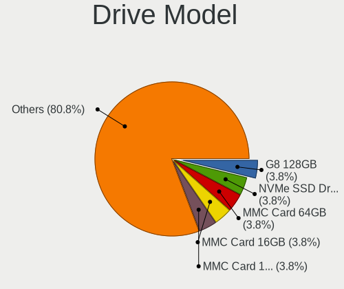
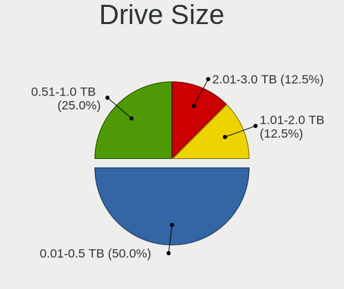
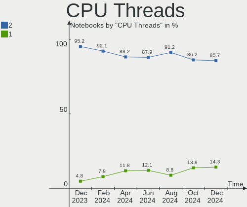
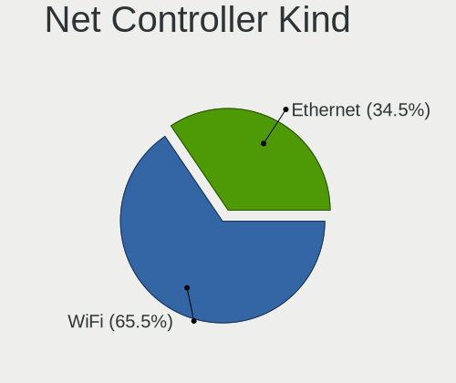

EndeavourOS - Hardware Trends (Notebooks)
-----------------------------------------

A project to identify most popular hardware characteristics and track their change
over time based on data collected by Linux users at https://Linux-Hardware.org.

Anyone can contribute to this report by the [hw-probe](https://github.com/linuxhw/hw-probe) tool:

    sudo -E hw-probe -all -upload

This report is for one last month. Overall report since the beginning of time: [TestCoverage](https://github.com/linuxhw/TestCoverage)

Period: Jan, 2023.

Contents
--------

* [ System ](#system)
  - [ OS                       ](#os)
  - [ OS Family                ](#os-family)
  - [ Kernel                   ](#kernel)
  - [ Kernel Family            ](#kernel-family)
  - [ Kernel Major Ver.        ](#kernel-major-ver)
  - [ Arch                     ](#arch)
  - [ DE                       ](#de)
  - [ Display Server           ](#display-server)
  - [ Display Manager          ](#display-manager)
  - [ OS Lang                  ](#os-lang)
  - [ Boot Mode                ](#boot-mode)
  - [ Filesystem               ](#filesystem)
  - [ Part. scheme             ](#part-scheme)
  - [ Dual Boot with Linux/BSD ](#dual-boot-with-linuxbsd)
  - [ Dual Boot (Win)          ](#dual-boot-win)

* [ Board ](#board)
  - [ Vendor                   ](#vendor)
  - [ Model                    ](#model)
  - [ Model Family             ](#model-family)
  - [ MFG Year                 ](#mfg-year)
  - [ Form Factor              ](#form-factor)
  - [ Secure Boot              ](#secure-boot)
  - [ Coreboot                 ](#coreboot)
  - [ RAM Size                 ](#ram-size)
  - [ RAM Used                 ](#ram-used)
  - [ Total Drives             ](#total-drives)
  - [ Has CD-ROM               ](#has-cd-rom)
  - [ Has Ethernet             ](#has-ethernet)
  - [ Has WiFi                 ](#has-wifi)
  - [ Has Bluetooth            ](#has-bluetooth)

* [ Location ](#location)
  - [ Country                  ](#country)
  - [ City                     ](#city)

* [ Drives ](#drives)
  - [ Drive Vendor             ](#drive-vendor)
  - [ Drive Model              ](#drive-model)
  - [ HDD Vendor               ](#hdd-vendor)
  - [ SSD Vendor               ](#ssd-vendor)
  - [ Drive Kind               ](#drive-kind)
  - [ Drive Connector          ](#drive-connector)
  - [ Drive Size               ](#drive-size)
  - [ Space Total              ](#space-total)
  - [ Space Used               ](#space-used)
  - [ Malfunc. Drives          ](#malfunc-drives)
  - [ Malfunc. Drive Vendor    ](#malfunc-drive-vendor)
  - [ Malfunc. HDD Vendor      ](#malfunc-hdd-vendor)
  - [ Malfunc. Drive Kind      ](#malfunc-drive-kind)
  - [ Failed Drives            ](#failed-drives)
  - [ Failed Drive Vendor      ](#failed-drive-vendor)
  - [ Drive Status             ](#drive-status)

* [ Storage controller ](#storage-controller)
  - [ Storage Vendor           ](#storage-vendor)
  - [ Storage Model            ](#storage-model)
  - [ Storage Kind             ](#storage-kind)

* [ Processor ](#processor)
  - [ CPU Vendor               ](#cpu-vendor)
  - [ CPU Model                ](#cpu-model)
  - [ CPU Model Family         ](#cpu-model-family)
  - [ CPU Cores                ](#cpu-cores)
  - [ CPU Sockets              ](#cpu-sockets)
  - [ CPU Threads              ](#cpu-threads)
  - [ CPU Op-Modes             ](#cpu-op-modes)
  - [ CPU Microcode            ](#cpu-microcode)
  - [ CPU Microarch            ](#cpu-microarch)

* [ Graphics ](#graphics)
  - [ GPU Vendor               ](#gpu-vendor)
  - [ GPU Model                ](#gpu-model)
  - [ GPU Combo                ](#gpu-combo)
  - [ GPU Driver               ](#gpu-driver)
  - [ GPU Memory               ](#gpu-memory)

* [ Monitor ](#monitor)
  - [ Monitor Vendor           ](#monitor-vendor)
  - [ Monitor Model            ](#monitor-model)
  - [ Monitor Resolution       ](#monitor-resolution)
  - [ Monitor Diagonal         ](#monitor-diagonal)
  - [ Monitor Width            ](#monitor-width)
  - [ Aspect Ratio             ](#aspect-ratio)
  - [ Monitor Area             ](#monitor-area)
  - [ Pixel Density            ](#pixel-density)
  - [ Multiple Monitors        ](#multiple-monitors)

* [ Network ](#network)
  - [ Net Controller Vendor    ](#net-controller-vendor)
  - [ Net Controller Model     ](#net-controller-model)
  - [ Wireless Vendor          ](#wireless-vendor)
  - [ Wireless Model           ](#wireless-model)
  - [ Ethernet Vendor          ](#ethernet-vendor)
  - [ Ethernet Model           ](#ethernet-model)
  - [ Net Controller Kind      ](#net-controller-kind)
  - [ Used Controller          ](#used-controller)
  - [ NICs                     ](#nics)
  - [ IPv6                     ](#ipv6)

* [ Bluetooth ](#bluetooth)
  - [ Bluetooth Vendor         ](#bluetooth-vendor)
  - [ Bluetooth Model          ](#bluetooth-model)

* [ Sound ](#sound)
  - [ Sound Vendor             ](#sound-vendor)
  - [ Sound Model              ](#sound-model)

* [ Memory ](#memory)
  - [ Memory Vendor            ](#memory-vendor)
  - [ Memory Model             ](#memory-model)
  - [ Memory Kind              ](#memory-kind)
  - [ Memory Form Factor       ](#memory-form-factor)
  - [ Memory Size              ](#memory-size)
  - [ Memory Speed             ](#memory-speed)

* [ Printers & scanners ](#printers--scanners)
  - [ Printer Vendor           ](#printer-vendor)
  - [ Printer Model            ](#printer-model)
  - [ Scanner Vendor           ](#scanner-vendor)
  - [ Scanner Model            ](#scanner-model)

* [ Camera ](#camera)
  - [ Camera Vendor            ](#camera-vendor)
  - [ Camera Model             ](#camera-model)

* [ Security ](#security)
  - [ Fingerprint Vendor       ](#fingerprint-vendor)
  - [ Fingerprint Model        ](#fingerprint-model)
  - [ Chipcard Vendor          ](#chipcard-vendor)
  - [ Chipcard Model           ](#chipcard-model)

* [ Unsupported ](#unsupported)
  - [ Unsupported Devices      ](#unsupported-devices)
  - [ Unsupported Device Types ](#unsupported-device-types)

System
------

OS
--

Installed operating systems

| Name                | Notebooks | Percent |
|---------------------|-----------|---------|
| EndeavourOS Rolling | 26        | 100%    |

OS Family
---------

OS without a version

| Name        | Notebooks | Percent |
|-------------|-----------|---------|
| EndeavourOS | 26        | 100%    |

Kernel
------

Version of the Linux kernel

| Version            | Notebooks | Percent |
|--------------------|-----------|---------|
| 6.1.7-arch1-1      | 4         | 15.38%  |
| 6.1.4-arch1-1      | 4         | 15.38%  |
| 6.1.8-arch1-1      | 3         | 11.54%  |
| 6.1.5-arch2-1      | 3         | 11.54%  |
| 6.1.6-arch1-3      | 2         | 7.69%   |
| 6.1.2-arch1-1      | 2         | 7.69%   |
| 6.1.1-arch1-1      | 2         | 7.69%   |
| 6.1.8-zen1-1-zen   | 1         | 3.85%   |
| 6.1.7-zen1-1-zen   | 1         | 3.85%   |
| 6.1.6-arch1-1      | 1         | 3.85%   |
| 6.1.5-zen2-1-zen   | 1         | 3.85%   |
| 6.1.1-arch1-g14-1  | 1         | 3.85%   |
| 6.0.2-271-tkg-bore | 1         | 3.85%   |

Kernel Family
-------------

Linux kernel without a distro release

| Version | Notebooks | Percent |
|---------|-----------|---------|
| 6.1.7   | 5         | 19.23%  |
| 6.1.8   | 4         | 15.38%  |
| 6.1.5   | 4         | 15.38%  |
| 6.1.4   | 4         | 15.38%  |
| 6.1.6   | 3         | 11.54%  |
| 6.1.1   | 3         | 11.54%  |
| 6.1.2   | 2         | 7.69%   |
| 6.0.2   | 1         | 3.85%   |

Kernel Major Ver.
-----------------

Linux kernel major version

| Version | Notebooks | Percent |
|---------|-----------|---------|
| 6.1     | 25        | 96.15%  |
| 6.0     | 1         | 3.85%   |

Arch
----

OS architecture (x86_64, i586, etc.)

| Name   | Notebooks | Percent |
|--------|-----------|---------|
| x86_64 | 26        | 100%    |

DE
--

Desktop Environment

| Name          | Notebooks | Percent |
|---------------|-----------|---------|
| KDE5          | 10        | 38.46%  |
| XFCE          | 8         | 30.77%  |
| GNOME         | 3         | 11.54%  |
| X-Cinnamon    | 2         | 7.69%   |
| i3            | 2         | 7.69%   |
| GNOME Classic | 1         | 3.85%   |

Display Server
--------------

X11 or Wayland

| Name    | Notebooks | Percent |
|---------|-----------|---------|
| X11     | 23        | 88.46%  |
| Wayland | 3         | 11.54%  |

Display Manager
---------------

SDDM, LightDM, etc.

| Name    | Notebooks | Percent |
|---------|-----------|---------|
| LightDM | 13        | 50%     |
| Unknown | 6         | 23.08%  |
| SDDM    | 4         | 15.38%  |
| GDM     | 2         | 7.69%   |
| GREETD  | 1         | 3.85%   |

OS Lang
-------

Language

| Lang  | Notebooks | Percent |
|-------|-----------|---------|
| en_US | 13        | 50%     |
| it_IT | 2         | 7.69%   |
| fi_FI | 2         | 7.69%   |
| de_DE | 2         | 7.69%   |
| zh_CN | 1         | 3.85%   |
| pt_BR | 1         | 3.85%   |
| fr_FR | 1         | 3.85%   |
| en_GB | 1         | 3.85%   |
| en_CA | 1         | 3.85%   |
| en_AU | 1         | 3.85%   |
| de_AT | 1         | 3.85%   |

Boot Mode
---------

EFI or BIOS

| Mode | Notebooks | Percent |
|------|-----------|---------|
| EFI  | 18        | 69.23%  |
| BIOS | 8         | 30.77%  |

Filesystem
----------

Type of filesystem

| Type  | Notebooks | Percent |
|-------|-----------|---------|
| Ext4  | 17        | 65.38%  |
| Btrfs | 8         | 30.77%  |
| Xfs   | 1         | 3.85%   |

Part. scheme
------------

Scheme of partitioning

| Type    | Notebooks | Percent |
|---------|-----------|---------|
| GPT     | 18        | 69.23%  |
| Unknown | 5         | 19.23%  |
| MBR     | 3         | 11.54%  |

Dual Boot with Linux/BSD
------------------------

Hosting more than one Linux/BSD

| Dual boot | Notebooks | Percent |
|-----------|-----------|---------|
| No        | 22        | 84.62%  |
| Yes       | 4         | 15.38%  |

Dual Boot (Win)
---------------

Hosting Linux and Windows

| Dual boot | Notebooks | Percent |
|-----------|-----------|---------|
| No        | 15        | 57.69%  |
| Yes       | 11        | 42.31%  |

Board
-----

Vendor
------

Motherboard manufacturer

| Name                | Notebooks | Percent |
|---------------------|-----------|---------|
| Lenovo              | 7         | 26.92%  |
| Hewlett-Packard     | 4         | 15.38%  |
| Dell                | 4         | 15.38%  |
| ASUSTek Computer    | 3         | 11.54%  |
| Toshiba             | 2         | 7.69%   |
| Razer               | 1         | 3.85%   |
| Positivo            | 1         | 3.85%   |
| HUAWEI              | 1         | 3.85%   |
| Google              | 1         | 3.85%   |
| Gigabyte Technology | 1         | 3.85%   |
| Acer                | 1         | 3.85%   |

Model
-----

Motherboard model

| Name                                     | Notebooks | Percent |
|------------------------------------------|-----------|---------|
| Toshiba Satellite L755                   | 1         | 3.85%   |
| Toshiba EQUIUM A100                      | 1         | 3.85%   |
| Razer Blade 15 (2022) - RZ09-0421        | 1         | 3.85%   |
| Positivo S14BW01                         | 1         | 3.85%   |
| Lenovo ThinkPad X1 Carbon 3rd 20BS00A6GE | 1         | 3.85%   |
| Lenovo ThinkPad E15 Gen 4 21E6006ACD     | 1         | 3.85%   |
| Lenovo ThinkBook 15 G2 ITL 20VE          | 1         | 3.85%   |
| Lenovo Legion 7 16ARHA7 82UH             | 1         | 3.85%   |
| Lenovo Legion 5 Pro 16ACH6H 82JQ         | 1         | 3.85%   |
| Lenovo IdeaPad Gaming 3 15ACH6 82K2      | 1         | 3.85%   |
| Lenovo IdeaPad 5 Pro 16ACH6 82L5         | 1         | 3.85%   |
| HUAWEI KLVC-WXX9                         | 1         | 3.85%   |
| HP ZBook 15 G4                           | 1         | 3.85%   |
| HP Pavilion x2 Detachable                | 1         | 3.85%   |
| HP Pavilion Aero Laptop 13-be1xxx        | 1         | 3.85%   |
| HP Laptop 15s-eq2xxx                     | 1         | 3.85%   |
| Google Magpie                            | 1         | 3.85%   |
| Gigabyte X570 AORUS PRO WIFI             | 1         | 3.85%   |
| Dell XPS 13 9343                         | 1         | 3.85%   |
| Dell Precision M4800                     | 1         | 3.85%   |
| Dell Latitude E5410                      | 1         | 3.85%   |
| Dell Latitude 5400                       | 1         | 3.85%   |
| ASUS ROG Zephyrus G14 GA402RK_GA402RK    | 1         | 3.85%   |
| ASUS GL753VE                             | 1         | 3.85%   |
| ASUS ASUS TUF Gaming A17 FA706IU_FA706IU | 1         | 3.85%   |
| Acer Aspire E5-575G                      | 1         | 3.85%   |

Model Family
------------

Motherboard model prefix

| Name              | Notebooks | Percent |
|-------------------|-----------|---------|
| Lenovo ThinkPad   | 2         | 7.69%   |
| Lenovo Legion     | 2         | 7.69%   |
| Lenovo IdeaPad    | 2         | 7.69%   |
| HP Pavilion       | 2         | 7.69%   |
| Dell Latitude     | 2         | 7.69%   |
| Toshiba Satellite | 1         | 3.85%   |
| Toshiba EQUIUM    | 1         | 3.85%   |
| Razer Blade       | 1         | 3.85%   |
| Positivo S14BW01  | 1         | 3.85%   |
| Lenovo ThinkBook  | 1         | 3.85%   |
| HUAWEI KLVC-WXX9  | 1         | 3.85%   |
| HP ZBook          | 1         | 3.85%   |
| HP Laptop         | 1         | 3.85%   |
| Google Magpie     | 1         | 3.85%   |
| Gigabyte X570     | 1         | 3.85%   |
| Dell XPS          | 1         | 3.85%   |
| Dell Precision    | 1         | 3.85%   |
| ASUS ROG          | 1         | 3.85%   |
| ASUS GL753VE      | 1         | 3.85%   |
| ASUS ASUS         | 1         | 3.85%   |
| Acer Aspire       | 1         | 3.85%   |

MFG Year
--------

Motherboard manufacture year

| Year | Notebooks | Percent |
|------|-----------|---------|
| 2022 | 6         | 23.08%  |
| 2021 | 4         | 15.38%  |
| 2020 | 3         | 11.54%  |
| 2015 | 3         | 11.54%  |
| 2019 | 2         | 7.69%   |
| 2017 | 2         | 7.69%   |
| 2016 | 2         | 7.69%   |
| 2013 | 1         | 3.85%   |
| 2011 | 1         | 3.85%   |
| 2010 | 1         | 3.85%   |
| 2007 | 1         | 3.85%   |

Form Factor
-----------

Physical design of the computer

| Name     | Notebooks | Percent |
|----------|-----------|---------|
| Notebook | 26        | 100%    |

Secure Boot
-----------

Enabled or disabled

| State    | Notebooks | Percent |
|----------|-----------|---------|
| Disabled | 26        | 100%    |

Coreboot
--------

Have coreboot on board

| Used | Notebooks | Percent |
|------|-----------|---------|
| No   | 25        | 96.15%  |
| Yes  | 1         | 3.85%   |

RAM Size
--------

Total RAM memory

| Size in GB  | Notebooks | Percent |
|-------------|-----------|---------|
| 4.01-8.0    | 6         | 23.08%  |
| 32.01-64.0  | 6         | 23.08%  |
| 3.01-4.0    | 3         | 11.54%  |
| 16.01-24.0  | 3         | 11.54%  |
| 8.01-16.0   | 3         | 11.54%  |
| 64.01-256.0 | 2         | 7.69%   |
| 24.01-32.0  | 1         | 3.85%   |
| 2.01-3.0    | 1         | 3.85%   |
| 1.01-2.0    | 1         | 3.85%   |

RAM Used
--------

Used RAM memory

| Used GB    | Notebooks | Percent |
|------------|-----------|---------|
| 2.01-3.0   | 10        | 38.46%  |
| 1.01-2.0   | 6         | 23.08%  |
| 3.01-4.0   | 5         | 19.23%  |
| 4.01-8.0   | 3         | 11.54%  |
| 16.01-24.0 | 1         | 3.85%   |
| 8.01-16.0  | 1         | 3.85%   |

Total Drives
------------

Number of drives on board

| Drives | Notebooks | Percent |
|--------|-----------|---------|
| 1      | 14        | 53.85%  |
| 2      | 10        | 38.46%  |
| 4      | 1         | 3.85%   |
| 3      | 1         | 3.85%   |

Has CD-ROM
----------

Has CD-ROM on board

| Presented | Notebooks | Percent |
|-----------|-----------|---------|
| No        | 21        | 80.77%  |
| Yes       | 5         | 19.23%  |

Has Ethernet
------------

Has Ethernet on board

| Presented | Notebooks | Percent |
|-----------|-----------|---------|
| Yes       | 18        | 69.23%  |
| No        | 8         | 30.77%  |

Has WiFi
--------

Has WiFi module

| Presented | Notebooks | Percent |
|-----------|-----------|---------|
| Yes       | 26        | 100%    |

Has Bluetooth
-------------

Has Bluetooth module

| Presented | Notebooks | Percent |
|-----------|-----------|---------|
| Yes       | 22        | 84.62%  |
| No        | 4         | 15.38%  |

Location
--------

Country
-------

Geographic location (country)

| Country   | Notebooks | Percent |
|-----------|-----------|---------|
| USA       | 5         | 19.23%  |
| Italy     | 4         | 15.38%  |
| Germany   | 4         | 15.38%  |
| Finland   | 2         | 7.69%   |
| Ukraine   | 1         | 3.85%   |
| UK        | 1         | 3.85%   |
| Russia    | 1         | 3.85%   |
| Romania   | 1         | 3.85%   |
| France    | 1         | 3.85%   |
| China     | 1         | 3.85%   |
| Canada    | 1         | 3.85%   |
| Bulgaria  | 1         | 3.85%   |
| Brazil    | 1         | 3.85%   |
| Austria   | 1         | 3.85%   |
| Australia | 1         | 3.85%   |

City
----

Geographic location (city)

| City            | Notebooks | Percent |
|-----------------|-----------|---------|
| Tver            | 1         | 3.85%   |
| Triggiano       | 1         | 3.85%   |
| Sofia           | 1         | 3.85%   |
| Siculiana       | 1         | 3.85%   |
| Shenzhen        | 1         | 3.85%   |
| Seattle         | 1         | 3.85%   |
| Sapucaia do Sul | 1         | 3.85%   |
| Santhià        | 1         | 3.85%   |
| Ossining        | 1         | 3.85%   |
| Ocoee           | 1         | 3.85%   |
| Middletown      | 1         | 3.85%   |
| Merijärvi      | 1         | 3.85%   |
| Melbourne       | 1         | 3.85%   |
| Marseille       | 1         | 3.85%   |
| London          | 1         | 3.85%   |
| Khmelnytskyi    | 1         | 3.85%   |
| Karlsruhe       | 1         | 3.85%   |
| Innsbruck       | 1         | 3.85%   |
| Helsinki        | 1         | 3.85%   |
| Garbsen         | 1         | 3.85%   |
| Cologne         | 1         | 3.85%   |
| Cochrane        | 1         | 3.85%   |
| Cluj-Napoca     | 1         | 3.85%   |
| Cellara         | 1         | 3.85%   |
| Brooklyn        | 1         | 3.85%   |
| Berlin          | 1         | 3.85%   |

Drives
------

Drive Vendor
------------

Hard drive vendors

| Vendor              | Notebooks | Drives | Percent |
|---------------------|-----------|--------|---------|
| Samsung Electronics | 13        | 13     | 34.21%  |
| Sandisk             | 5         | 5      | 13.16%  |
| Unknown             | 3         | 5      | 7.89%   |
| Seagate             | 3         | 3      | 7.89%   |
| KIOXIA              | 3         | 3      | 7.89%   |
| WDC                 | 2         | 2      | 5.26%   |
| Micron Technology   | 2         | 2      | 5.26%   |
| Kingston            | 2         | 2      | 5.26%   |
| Toshiba             | 1         | 1      | 2.63%   |
| Phison Electronics  | 1         | 1      | 2.63%   |
| LITEONIT            | 1         | 1      | 2.63%   |
| Intel               | 1         | 1      | 2.63%   |
| Crucial             | 1         | 1      | 2.63%   |

Drive Model
-----------

Hard drive models

| Model                                                | Notebooks | Percent |
|------------------------------------------------------|-----------|---------|
| Sandisk WD Black SN750 / PC SN730 NVMe SSD 1TB       | 4         | 10.53%  |
| Samsung NVMe SSD Controller PM9A1/PM9A3/980PRO 512GB | 4         | 10.53%  |
| Samsung NVMe SSD Controller SM981/PM981/PM983 500GB  | 3         | 7.89%   |
| Unknown MMC Card  32GB                               | 2         | 5.26%   |
| Samsung SSD 870 QVO 1TB                              | 2         | 5.26%   |
| WDC WD20SPZX-22UA7T0 2TB                             | 1         | 2.63%   |
| WDC WD10EZEX-22MFCA0 1TB                             | 1         | 2.63%   |
| Unknown MMC Card  64GB                               | 1         | 2.63%   |
| Toshiba MQ01ABD100 1TB                               | 1         | 2.63%   |
| Seagate ST1000LM 035-1RK172 1TB                      | 1         | 2.63%   |
| Seagate ST1000DM010-2EP102 1TB                       | 1         | 2.63%   |
| Seagate Expansion HDD 5TB                            | 1         | 2.63%   |
| Sandisk WDC PC SN530 SDBPMPZ-512G-1101 512GB         | 1         | 2.63%   |
| Samsung SSD PM851 M.2 2280 256GB                     | 1         | 2.63%   |
| Samsung SSD 850 EVO 500GB                            | 1         | 2.63%   |
| Samsung SSD 840 PRO Series 256GB                     | 1         | 2.63%   |
| Samsung MZALQ512HBLU-00BL2 512GB                     | 1         | 2.63%   |
| Phison E12 NVMe Controller 1TB                       | 1         | 2.63%   |
| Micron 2450_MTFDKBA1T0TFK 1TB                        | 1         | 2.63%   |
| Micron 1100_MTFDDAV256TBN 256GB SSD                  | 1         | 2.63%   |
| LITEONIT LCS-128M6S 128GB SSD                        | 1         | 2.63%   |
| KIOXIA KBG5AZNT512G LA 512GB                         | 1         | 2.63%   |
| KIOXIA KBG50ZNV512G 512GB                            | 1         | 2.63%   |
| KIOXIA KBG40ZNV256G 256GB                            | 1         | 2.63%   |
| Kingston OM8PCP3512F-AB 512GB                        | 1         | 2.63%   |
| Kingston DataTraveler Max 1024GB SSD                 | 1         | 2.63%   |
| Intel SSDSCKJF180A5L 180GB                           | 1         | 2.63%   |
| Crucial CT500MX500SSD1 500GB                         | 1         | 2.63%   |

HDD Vendor
----------

Hard disk drive vendors

| Vendor  | Notebooks | Drives | Percent |
|---------|-----------|--------|---------|
| Seagate | 3         | 3      | 50%     |
| WDC     | 2         | 2      | 33.33%  |
| Toshiba | 1         | 1      | 16.67%  |

SSD Vendor
----------

Solid state drive vendors

| Vendor              | Notebooks | Drives | Percent |
|---------------------|-----------|--------|---------|
| Samsung Electronics | 5         | 5      | 50%     |
| Micron Technology   | 1         | 1      | 10%     |
| LITEONIT            | 1         | 1      | 10%     |
| Kingston            | 1         | 1      | 10%     |
| Intel               | 1         | 1      | 10%     |
| Crucial             | 1         | 1      | 10%     |

Drive Kind
----------

HDD or SSD

| Kind | Notebooks | Drives | Percent |
|------|-----------|--------|---------|
| NVMe | 16        | 19     | 48.48%  |
| SSD  | 9         | 10     | 27.27%  |
| HDD  | 5         | 6      | 15.15%  |
| MMC  | 3         | 5      | 9.09%   |

Drive Connector
---------------

SATA, SAS, NVMe, etc.

| Type | Notebooks | Drives | Percent |
|------|-----------|--------|---------|
| NVMe | 16        | 19     | 50%     |
| SATA | 10        | 13     | 31.25%  |
| SAS  | 3         | 3      | 9.38%   |
| MMC  | 3         | 5      | 9.38%   |

Drive Size
----------

Size of hard drive

| Size in TB | Notebooks | Drives | Percent |
|------------|-----------|--------|---------|
| 0.01-0.5   | 7         | 7      | 46.67%  |
| 0.51-1.0   | 5         | 6      | 33.33%  |
| 1.01-2.0   | 2         | 2      | 13.33%  |
| 4.01-10.0  | 1         | 1      | 6.67%   |

Space Total
-----------

Amount of disk space available on the file system

| Size in GB     | Notebooks | Percent |
|----------------|-----------|---------|
| 501-1000       | 5         | 19.23%  |
| 251-500        | 4         | 15.38%  |
| 101-250        | 4         | 15.38%  |
| 1001-2000      | 4         | 15.38%  |
| More than 3000 | 3         | 11.54%  |
| 1-20           | 2         | 7.69%   |
| 21-50          | 1         | 3.85%   |
| 2001-3000      | 1         | 3.85%   |
| 51-100         | 1         | 3.85%   |
| Unknown        | 1         | 3.85%   |

Space Used
----------

Amount of used disk space

| Used GB        | Notebooks | Percent |
|----------------|-----------|---------|
| 1-20           | 7         | 26.92%  |
| 21-50          | 5         | 19.23%  |
| 1001-2000      | 3         | 11.54%  |
| 501-1000       | 3         | 11.54%  |
| 51-100         | 3         | 11.54%  |
| 101-250        | 2         | 7.69%   |
| More than 3000 | 1         | 3.85%   |
| 251-500        | 1         | 3.85%   |
| Unknown        | 1         | 3.85%   |

Malfunc. Drives
---------------

Drive models with a malfunction

| Model                      | Notebooks | Drives | Percent |
|----------------------------|-----------|--------|---------|
| Toshiba MQ01ABD100 1TB     | 1         | 1      | 50%     |
| Intel SSDSCKJF180A5L 180GB | 1         | 1      | 50%     |

Malfunc. Drive Vendor
---------------------

Vendors of faulty drives

| Vendor  | Notebooks | Drives | Percent |
|---------|-----------|--------|---------|
| Toshiba | 1         | 1      | 50%     |
| Intel   | 1         | 1      | 50%     |

Malfunc. HDD Vendor
-------------------

Vendors of faulty HDD drives

| Vendor  | Notebooks | Drives | Percent |
|---------|-----------|--------|---------|
| Toshiba | 1         | 1      | 100%    |

Malfunc. Drive Kind
-------------------

Kinds of faulty drives

| Kind | Notebooks | Drives | Percent |
|------|-----------|--------|---------|
| SSD  | 1         | 1      | 50%     |
| HDD  | 1         | 1      | 50%     |

Failed Drives
-------------

Failed drive models

Zero info for selected period =(

Failed Drive Vendor
-------------------

Failed drive vendors

Zero info for selected period =(

Drive Status
------------

Number of failed and malfunc. drives

| Status   | Notebooks | Drives | Percent |
|----------|-----------|--------|---------|
| Works    | 16        | 19     | 57.14%  |
| Detected | 10        | 19     | 35.71%  |
| Malfunc  | 2         | 2      | 7.14%   |

Storage controller
------------------

Storage Vendor
--------------

Storage controller vendors

| Vendor                      | Notebooks | Percent |
|-----------------------------|-----------|---------|
| Intel                       | 12        | 33.33%  |
| Samsung Electronics         | 8         | 22.22%  |
| SanDisk                     | 5         | 13.89%  |
| AMD                         | 5         | 13.89%  |
| KIOXIA                      | 3         | 8.33%   |
| Phison Electronics          | 1         | 2.78%   |
| Micron Technology           | 1         | 2.78%   |
| Kingston Technology Company | 1         | 2.78%   |

Storage Model
-------------

Storage controller models

| Model                                                                          | Notebooks | Percent |
|--------------------------------------------------------------------------------|-----------|---------|
| AMD FCH SATA Controller [AHCI mode]                                            | 5         | 13.51%  |
| SanDisk WD Black SN750 / PC SN730 NVMe SSD                                     | 4         | 10.81%  |
| Samsung NVMe SSD Controller PM9A1/PM9A3/980PRO                                 | 4         | 10.81%  |
| Samsung NVMe SSD Controller SM981/PM981/PM983                                  | 3         | 8.11%   |
| KIOXIA Non-Volatile memory controller                                          | 2         | 5.41%   |
| Intel Wildcat Point-LP SATA Controller [AHCI Mode]                             | 2         | 5.41%   |
| SanDisk Non-Volatile memory controller                                         | 1         | 2.7%    |
| Samsung NVMe SSD Controller 980                                                | 1         | 2.7%    |
| Phison E12 NVMe Controller                                                     | 1         | 2.7%    |
| Micron Non-Volatile memory controller                                          | 1         | 2.7%    |
| KIOXIA NVMe SSD Controller BG4                                                 | 1         | 2.7%    |
| Kingston Company Company Non-Volatile memory controller                        | 1         | 2.7%    |
| Intel Volume Management Device NVMe RAID Controller                            | 1         | 2.7%    |
| Intel Tiger Lake-LP SATA Controller                                            | 1         | 2.7%    |
| Intel Sunrise Point-LP SATA Controller [AHCI mode]                             | 1         | 2.7%    |
| Intel Q170/Q150/B150/H170/H110/Z170/CM236 Chipset SATA Controller [AHCI Mode]  | 1         | 2.7%    |
| Intel HM170/QM170 Chipset SATA Controller [AHCI Mode]                          | 1         | 2.7%    |
| Intel Comet Lake SATA AHCI Controller                                          | 1         | 2.7%    |
| Intel Cannon Point-LP SATA Controller [AHCI Mode]                              | 1         | 2.7%    |
| Intel 82801GBM/GHM (ICH7-M Family) SATA Controller [IDE mode]                  | 1         | 2.7%    |
| Intel 8 Series/C220 Series Chipset Family 6-port SATA Controller 1 [AHCI mode] | 1         | 2.7%    |
| Intel 6 Series/C200 Series Chipset Family 6 port Mobile SATA AHCI Controller   | 1         | 2.7%    |
| Intel 5 Series/3400 Series Chipset 4 port SATA AHCI Controller                 | 1         | 2.7%    |

Storage Kind
------------

Kind of storage controller (IDE, SATA, NVMe, SAS, ...)

| Kind | Notebooks | Percent |
|------|-----------|---------|
| NVMe | 16        | 47.06%  |
| SATA | 16        | 47.06%  |
| RAID | 1         | 2.94%   |
| IDE  | 1         | 2.94%   |

Processor
---------

CPU Vendor
----------

Processor vendors

| Vendor | Notebooks | Percent |
|--------|-----------|---------|
| Intel  | 17        | 65.38%  |
| AMD    | 9         | 34.62%  |

CPU Model
---------

Processor models

| Model                                   | Notebooks | Percent |
|-----------------------------------------|-----------|---------|
| Intel Core i7-7700HQ CPU @ 2.80GHz      | 2         | 7.69%   |
| Intel Pentium CPU N3710 @ 1.60GHz       | 1         | 3.85%   |
| Intel Core i7-5500U CPU @ 2.40GHz       | 1         | 3.85%   |
| Intel Core i7-4800MQ CPU @ 2.70GHz      | 1         | 3.85%   |
| Intel Core i7 CPU M 640 @ 2.80GHz       | 1         | 3.85%   |
| Intel Core i5-8265U CPU @ 1.60GHz       | 1         | 3.85%   |
| Intel Core i5-7200U CPU @ 2.50GHz       | 1         | 3.85%   |
| Intel Core i5-5200U CPU @ 2.20GHz       | 1         | 3.85%   |
| Intel Core i5-2410M CPU @ 2.30GHz       | 1         | 3.85%   |
| Intel Core i5-10210U CPU @ 1.60GHz      | 1         | 3.85%   |
| Intel Core 2 CPU T7400 @ 2.16GHz        | 1         | 3.85%   |
| Intel Celeron N4500 @ 1.10GHz           | 1         | 3.85%   |
| Intel Atom x5-Z8300 CPU @ 1.44GHz       | 1         | 3.85%   |
| Intel 12th Gen Core i7-12800H           | 1         | 3.85%   |
| Intel 12th Gen Core i5-1240P            | 1         | 3.85%   |
| Intel 11th Gen Core i5-1135G7 @ 2.40GHz | 1         | 3.85%   |
| AMD Ryzen 9 6900HS with Radeon Graphics | 1         | 3.85%   |
| AMD Ryzen 9 5900HX with Radeon Graphics | 1         | 3.85%   |
| AMD Ryzen 7 6800H with Radeon Graphics  | 1         | 3.85%   |
| AMD Ryzen 7 5800X 8-Core Processor      | 1         | 3.85%   |
| AMD Ryzen 7 5800H with Radeon Graphics  | 1         | 3.85%   |
| AMD Ryzen 7 4800H with Radeon Graphics  | 1         | 3.85%   |
| AMD Ryzen 5 5625U with Radeon Graphics  | 1         | 3.85%   |
| AMD Ryzen 5 5600H with Radeon Graphics  | 1         | 3.85%   |
| AMD Ryzen 3 5300U with Radeon Graphics  | 1         | 3.85%   |

CPU Model Family
----------------

Processor model prefix

| Model         | Notebooks | Percent |
|---------------|-----------|---------|
| Intel Core i7 | 5         | 19.23%  |
| Intel Core i5 | 5         | 19.23%  |
| AMD Ryzen 7   | 4         | 15.38%  |
| Other         | 3         | 11.54%  |
| AMD Ryzen 9   | 2         | 7.69%   |
| AMD Ryzen 5   | 2         | 7.69%   |
| Intel Pentium | 1         | 3.85%   |
| Intel Core 2  | 1         | 3.85%   |
| Intel Celeron | 1         | 3.85%   |
| Intel Atom    | 1         | 3.85%   |
| AMD Ryzen 3   | 1         | 3.85%   |

CPU Cores
---------

Number of processor cores

| Number | Notebooks | Percent |
|--------|-----------|---------|
| 4      | 9         | 34.62%  |
| 2      | 7         | 26.92%  |
| 8      | 6         | 23.08%  |
| 6      | 2         | 7.69%   |
| 14     | 1         | 3.85%   |
| 12     | 1         | 3.85%   |

CPU Sockets
-----------

Number of sockets

| Number | Notebooks | Percent |
|--------|-----------|---------|
| 1      | 26        | 100%    |

CPU Threads
-----------

Threads per core (Hyper-Threading)

| Number | Notebooks | Percent |
|--------|-----------|---------|
| 2      | 22        | 84.62%  |
| 1      | 4         | 15.38%  |

CPU Op-Modes
------------

CPU Operation Modes (32-bit, 64-bit)

| Op mode        | Notebooks | Percent |
|----------------|-----------|---------|
| 32-bit, 64-bit | 26        | 100%    |

CPU Microcode
-------------

Microcode number

| Number     | Notebooks | Percent |
|------------|-----------|---------|
| Unknown    | 5         | 19.23%  |
| 0x0a50000c | 3         | 11.54%  |
| 0x906e9    | 2         | 7.69%   |
| 0x906a3    | 2         | 7.69%   |
| 0x806ec    | 2         | 7.69%   |
| 0x906c0    | 1         | 3.85%   |
| 0x806c1    | 1         | 3.85%   |
| 0x6f6      | 1         | 3.85%   |
| 0x406c4    | 1         | 3.85%   |
| 0x406c3    | 1         | 3.85%   |
| 0x306d4    | 1         | 3.85%   |
| 0x206a7    | 1         | 3.85%   |
| 0x20655    | 1         | 3.85%   |
| 0x0a50000d | 1         | 3.85%   |
| 0x0a404102 | 1         | 3.85%   |
| 0x08608103 | 1         | 3.85%   |
| 0x08600104 | 1         | 3.85%   |

CPU Microarch
-------------

Microarchitecture

| Name             | Notebooks | Percent |
|------------------|-----------|---------|
| Zen 3            | 5         | 19.23%  |
| KabyLake         | 5         | 19.23%  |
| Unknown          | 3         | 11.54%  |
| Silvermont       | 2         | 7.69%   |
| Broadwell        | 2         | 7.69%   |
| Alderlake Hybrid | 2         | 7.69%   |
| Zen 2            | 1         | 3.85%   |
| Westmere         | 1         | 3.85%   |
| Tremont          | 1         | 3.85%   |
| TigerLake        | 1         | 3.85%   |
| SandyBridge      | 1         | 3.85%   |
| Haswell          | 1         | 3.85%   |
| Core             | 1         | 3.85%   |

Graphics
--------

GPU Vendor
----------

Vendors of graphics cards

| Vendor | Notebooks | Percent |
|--------|-----------|---------|
| Intel  | 16        | 45.71%  |
| Nvidia | 10        | 28.57%  |
| AMD    | 9         | 25.71%  |

GPU Model
---------

Graphics card models

| Model                                                                                    | Notebooks | Percent |
|------------------------------------------------------------------------------------------|-----------|---------|
| Nvidia GA107M [GeForce RTX 3050 Mobile]                                                  | 2         | 5.26%   |
| Intel HD Graphics 630                                                                    | 2         | 5.26%   |
| Intel HD Graphics 5500                                                                   | 2         | 5.26%   |
| Intel Atom/Celeron/Pentium Processor x5-E8000/J3xxx/N3xxx Integrated Graphics Controller | 2         | 5.26%   |
| Intel Alder Lake-P Integrated Graphics Controller                                        | 2         | 5.26%   |
| AMD Rembrandt [Radeon 680M]                                                              | 2         | 5.26%   |
| AMD Cezanne [Radeon Vega Series / Radeon Vega Mobile Series]                             | 2         | 5.26%   |
| Nvidia TU116M [GeForce GTX 1660 Ti Mobile]                                               | 1         | 2.63%   |
| Nvidia GP107M [GeForce MX350]                                                            | 1         | 2.63%   |
| Nvidia GP107M [GeForce GTX 1050 Ti Mobile]                                               | 1         | 2.63%   |
| Nvidia GM206GLM [Quadro M2200 Mobile]                                                    | 1         | 2.63%   |
| Nvidia GM108M [GeForce 940MX]                                                            | 1         | 2.63%   |
| Nvidia GF108M [GeForce GT 525M]                                                          | 1         | 2.63%   |
| Nvidia GA104M [GeForce RTX 3070 Mobile / Max-Q]                                          | 1         | 2.63%   |
| Nvidia GA103M [GeForce RTX 3080 Ti Mobile]                                               | 1         | 2.63%   |
| Intel WhiskeyLake-U GT2 [UHD Graphics 620]                                               | 1         | 2.63%   |
| Intel TigerLake-LP GT2 [Iris Xe Graphics]                                                | 1         | 2.63%   |
| Intel Mobile 945GM/GMS/GME, 943/940GML Express Integrated Graphics Controller            | 1         | 2.63%   |
| Intel Mobile 945GM/GMS, 943/940GML Express Integrated Graphics Controller                | 1         | 2.63%   |
| Intel JasperLake [UHD Graphics]                                                          | 1         | 2.63%   |
| Intel HD Graphics 620                                                                    | 1         | 2.63%   |
| Intel Core Processor Integrated Graphics Controller                                      | 1         | 2.63%   |
| Intel CometLake-U GT2 [UHD Graphics]                                                     | 1         | 2.63%   |
| Intel 4th Gen Core Processor Integrated Graphics Controller                              | 1         | 2.63%   |
| AMD Venus XT [Radeon HD 8870M / R9 M270X/M370X]                                          | 1         | 2.63%   |
| AMD Renoir                                                                               | 1         | 2.63%   |
| AMD Navi 23 [Radeon RX 6650 XT]                                                          | 1         | 2.63%   |
| AMD Navi 22 [Radeon RX 6700/6700 XT/6750 XT / 6800M]                                     | 1         | 2.63%   |
| AMD Navi 14 [Radeon RX 5500/5500M / Pro 5500M]                                           | 1         | 2.63%   |
| AMD Lucienne                                                                             | 1         | 2.63%   |
| AMD Barcelo                                                                              | 1         | 2.63%   |

GPU Combo
---------

Combinations of graphics cards

| Name           | Notebooks | Percent |
|----------------|-----------|---------|
| 1 x Intel      | 9         | 34.62%  |
| Intel + Nvidia | 5         | 19.23%  |
| AMD + Nvidia   | 3         | 11.54%  |
| 1 x AMD        | 3         | 11.54%  |
| 2 x AMD        | 2         | 7.69%   |
| 1 x Nvidia     | 2         | 7.69%   |
| 2 x Intel      | 1         | 3.85%   |
| Intel + AMD    | 1         | 3.85%   |

GPU Driver
----------

Free vs proprietary

| Driver      | Notebooks | Percent |
|-------------|-----------|---------|
| Free        | 19        | 73.08%  |
| Proprietary | 7         | 26.92%  |

GPU Memory
----------

Total video memory

| Size in GB | Notebooks | Percent |
|------------|-----------|---------|
| Unknown    | 18        | 69.23%  |
| 0.01-0.5   | 3         | 11.54%  |
| 7.01-8.0   | 2         | 7.69%   |
| 3.01-4.0   | 2         | 7.69%   |
| 1.01-2.0   | 1         | 3.85%   |

Monitor
-------

Monitor Vendor
--------------

Monitor vendors

| Vendor         | Notebooks | Percent |
|----------------|-----------|---------|
| AU Optronics   | 9         | 28.13%  |
| BOE            | 6         | 18.75%  |
| LG Display     | 3         | 9.38%   |
| Dell           | 3         | 9.38%   |
| TMX            | 2         | 6.25%   |
| Chimei Innolux | 2         | 6.25%   |
| Sharp          | 1         | 3.13%   |
| LG Philips     | 1         | 3.13%   |
| Lenovo         | 1         | 3.13%   |
| HUAWEI         | 1         | 3.13%   |
| Goldstar       | 1         | 3.13%   |
| CSO            | 1         | 3.13%   |
| AOC            | 1         | 3.13%   |

Monitor Model
-------------

Monitor models

| Model                                                            | Notebooks | Percent |
|------------------------------------------------------------------|-----------|---------|
| TMX TL156MDMP01-0 TMX1560 3200x2000 336x210mm 15.6-inch          | 1         | 3.03%   |
| TMX TL140ADXP01 TMX1481 2560x1600 301x188mm 14.0-inch            | 1         | 3.03%   |
| Sharp LCD Monitor SHP1421 3200x1800 294x165mm 13.3-inch          | 1         | 3.03%   |
| LG Philips LCD Monitor LPLC800 1280x800 331x207mm 15.4-inch      | 1         | 3.03%   |
| LG Display LP156WH2-TLAA LGD0230 1366x768 344x194mm 15.5-inch    | 1         | 3.03%   |
| LG Display LCD Monitor LGD057E 1920x1080 344x194mm 15.5-inch     | 1         | 3.03%   |
| LG Display LCD Monitor LGD04E8 1920x1080 382x215mm 17.3-inch     | 1         | 3.03%   |
| Lenovo L27i-30 LEN66BF 1920x1080 597x336mm 27.0-inch             | 1         | 3.03%   |
| HUAWEI XWU-CBA HWV62F5 2560x1440 597x336mm 27.0-inch             | 1         | 3.03%   |
| Goldstar IPS FULLHD GSM5AB8 1920x1080 480x270mm 21.7-inch        | 1         | 3.03%   |
| Dell G3223Q DEL4284 3840x2160 708x399mm 32.0-inch                | 1         | 3.03%   |
| Dell E2414H DEL4090 1920x1080 531x299mm 24.0-inch                | 1         | 3.03%   |
| Dell D3218HN DEL200B 1920x1080 698x393mm 31.5-inch               | 1         | 3.03%   |
| Dell AW2521HFA DELA160 1920x1080 544x303mm 24.5-inch             | 1         | 3.03%   |
| CSO LCD Monitor CSO1610 2560x1600 345x215mm 16.0-inch            | 1         | 3.03%   |
| Chimei Innolux P140ZKA-BZ1 CMN8C02 2160x1440 296x197mm 14.0-inch | 1         | 3.03%   |
| Chimei Innolux LCD Monitor CMN15D2 1920x1080 344x193mm 15.5-inch | 1         | 3.03%   |
| BOE LCD Monitor BOE0997 2560x1600 345x215mm 16.0-inch            | 1         | 3.03%   |
| BOE LCD Monitor BOE098E 1920x1080 344x194mm 15.5-inch            | 1         | 3.03%   |
| BOE LCD Monitor BOE0985 2560x1600 340x210mm 15.7-inch            | 1         | 3.03%   |
| BOE LCD Monitor BOE0900 1920x1080 344x194mm 15.5-inch            | 1         | 3.03%   |
| BOE LCD Monitor BOE084E 1920x1080 382x215mm 17.3-inch            | 1         | 3.03%   |
| BOE LCD Monitor BOE0696 1366x768 309x173mm 13.9-inch             | 1         | 3.03%   |
| AU Optronics LCD Monitor AUOD1ED 1920x1080 344x193mm 15.5-inch   | 1         | 3.03%   |
| AU Optronics LCD Monitor AUO499F 1920x1080 344x194mm 15.5-inch   | 1         | 3.03%   |
| AU Optronics LCD Monitor AUO479D 1920x1080 382x215mm 17.3-inch   | 1         | 3.03%   |
| AU Optronics LCD Monitor AUO463D 1920x1080 309x174mm 14.0-inch   | 1         | 3.03%   |
| AU Optronics LCD Monitor AUO4147 1440x900 303x189mm 14.1-inch    | 1         | 3.03%   |
| AU Optronics LCD Monitor AUO339F 1920x1200 286x178mm 13.3-inch   | 1         | 3.03%   |
| AU Optronics LCD Monitor AUO21ED 1920x1080 344x194mm 15.5-inch   | 1         | 3.03%   |
| AU Optronics LCD Monitor AUO18D4 1280x800 216x135mm 10.0-inch    | 1         | 3.03%   |
| AU Optronics LCD Monitor AUO123D 1920x1080 309x173mm 13.9-inch   | 1         | 3.03%   |
| AOC Q27G2G3R3B AOC2702 2560x1440 600x340mm 27.2-inch             | 1         | 3.03%   |

Monitor Resolution
------------------

Monitor screen resolution

| Resolution        | Notebooks | Percent |
|-------------------|-----------|---------|
| 1920x1080 (FHD)   | 13        | 44.83%  |
| 2560x1600         | 4         | 13.79%  |
| 2560x1440 (QHD)   | 2         | 6.9%    |
| 1366x768 (WXGA)   | 2         | 6.9%    |
| 1280x800 (WXGA)   | 2         | 6.9%    |
| 3840x2160 (4K)    | 1         | 3.45%   |
| 3200x2000         | 1         | 3.45%   |
| 3200x1800 (QHD+)  | 1         | 3.45%   |
| 2160x1440         | 1         | 3.45%   |
| 1920x1200 (WUXGA) | 1         | 3.45%   |
| 1440x900 (WXGA+)  | 1         | 3.45%   |

Monitor Diagonal
----------------

Diagonal size in inches

| Inches | Notebooks | Percent |
|--------|-----------|---------|
| 15     | 11        | 33.33%  |
| 14     | 4         | 12.12%  |
| 13     | 4         | 12.12%  |
| 27     | 3         | 9.09%   |
| 17     | 3         | 9.09%   |
| 24     | 2         | 6.06%   |
| 16     | 2         | 6.06%   |
| 32     | 1         | 3.03%   |
| 31     | 1         | 3.03%   |
| 21     | 1         | 3.03%   |
| 10     | 1         | 3.03%   |

Monitor Width
-------------

Physical width

| Width in mm | Notebooks | Percent |
|-------------|-----------|---------|
| 301-350     | 18        | 54.55%  |
| 501-600     | 5         | 15.15%  |
| 201-300     | 4         | 12.12%  |
| 351-400     | 3         | 9.09%   |
| 701-800     | 1         | 3.03%   |
| 601-700     | 1         | 3.03%   |
| 401-500     | 1         | 3.03%   |

Aspect Ratio
------------

Proportional relationship between the width and the height

| Ratio | Notebooks | Percent |
|-------|-----------|---------|
| 16/9  | 18        | 64.29%  |
| 16/10 | 9         | 32.14%  |
| 3/2   | 1         | 3.57%   |

Monitor Area
------------

Area in inch²

| Area in inch² | Notebooks | Percent |
|----------------|-----------|---------|
| 101-110        | 10        | 30.3%   |
| 81-90          | 6         | 18.18%  |
| 301-350        | 3         | 9.09%   |
| 121-130        | 3         | 9.09%   |
| 111-120        | 3         | 9.09%   |
| 71-80          | 2         | 6.06%   |
| 351-500        | 2         | 6.06%   |
| 201-250        | 2         | 6.06%   |
| 41-50          | 1         | 3.03%   |
| 251-300        | 1         | 3.03%   |

Pixel Density
-------------

Pixels per inch

| Density       | Notebooks | Percent |
|---------------|-----------|---------|
| 121-160       | 15        | 46.88%  |
| 161-240       | 6         | 18.75%  |
| 51-100        | 5         | 15.63%  |
| 101-120       | 4         | 12.5%   |
| More than 240 | 2         | 6.25%   |

Multiple Monitors
-----------------

Total monitors connected

| Total | Notebooks | Percent |
|-------|-----------|---------|
| 1     | 20        | 76.92%  |
| 2     | 4         | 15.38%  |
| 3     | 2         | 7.69%   |

Network
-------

Net Controller Vendor
---------------------

Controller vendors

| Vendor                        | Notebooks | Percent |
|-------------------------------|-----------|---------|
| Intel                         | 17        | 42.5%   |
| Realtek Semiconductor         | 13        | 32.5%   |
| Qualcomm Atheros              | 2         | 5%      |
| MediaTek                      | 2         | 5%      |
| Broadcom Limited              | 2         | 5%      |
| OnePlus Technology (Shenzhen) | 1         | 2.5%    |
| Lenovo                        | 1         | 2.5%    |
| Broadcom                      | 1         | 2.5%    |
| ASIX Electronics              | 1         | 2.5%    |

Net Controller Model
--------------------

Controller models

| Model                                                             | Notebooks | Percent |
|-------------------------------------------------------------------|-----------|---------|
| Realtek RTL8111/8168/8411 PCI Express Gigabit Ethernet Controller | 7         | 14.58%  |
| Intel Wireless 8265 / 8275                                        | 2         | 4.17%   |
| Intel Wireless 7265                                               | 2         | 4.17%   |
| Intel Wi-Fi 6 AX200                                               | 2         | 4.17%   |
| Intel Alder Lake-P PCH CNVi WiFi                                  | 2         | 4.17%   |
| Broadcom Limited BCM4352 802.11ac Wireless Network Adapter        | 2         | 4.17%   |
| Realtek RTL88x2bu [AC1200 Techkey]                                | 1         | 2.08%   |
| Realtek RTL8852AE 802.11ax PCIe Wireless Network Adapter          | 1         | 2.08%   |
| Realtek RTL8822CE 802.11ac PCIe Wireless Network Adapter          | 1         | 2.08%   |
| Realtek RTL8821CE 802.11ac PCIe Wireless Network Adapter          | 1         | 2.08%   |
| Realtek RTL8125 2.5GbE Controller                                 | 1         | 2.08%   |
| Realtek Realtek Network controller                                | 1         | 2.08%   |
| Realtek 802.11ac NIC                                              | 1         | 2.08%   |
| Qualcomm Atheros QCA9377 802.11ac Wireless Network Adapter        | 1         | 2.08%   |
| Qualcomm Atheros AR9285 Wireless Network Adapter (PCI-Express)    | 1         | 2.08%   |
| Qualcomm Atheros AR8151 v2.0 Gigabit Ethernet                     | 1         | 2.08%   |
| OnePlus (Shenzhen) SM8150-MTP _SN:019B7071                        | 1         | 2.08%   |
| MediaTek WLAN controller                                          | 1         | 2.08%   |
| MediaTek MT7921 802.11ax PCI Express Wireless Network Adapter     | 1         | 2.08%   |
| Lenovo Hydra Force Sensor                                         | 1         | 2.08%   |
| Intel Wireless 3165                                               | 1         | 2.08%   |
| Intel Wireless 3160                                               | 1         | 2.08%   |
| Intel Wi-Fi 6 AX210/AX211/AX411 160MHz                            | 1         | 2.08%   |
| Intel Wi-Fi 6 AX201 160MHz                                        | 1         | 2.08%   |
| Intel Wi-Fi 6 AX201                                               | 1         | 2.08%   |
| Intel PRO/Wireless 3945ABG [Golan] Network Connection             | 1         | 2.08%   |
| Intel PRO/100 VE Network Connection                               | 1         | 2.08%   |
| Intel I211 Gigabit Network Connection                             | 1         | 2.08%   |
| Intel Ethernet Connection I217-LM                                 | 1         | 2.08%   |
| Intel Ethernet Connection (6) I219-V                              | 1         | 2.08%   |
| Intel Ethernet Connection (3) I218-V                              | 1         | 2.08%   |
| Intel Ethernet Connection (2) I219-LM                             | 1         | 2.08%   |
| Intel Ethernet Connection (16) I219-V                             | 1         | 2.08%   |
| Intel Comet Lake PCH-LP CNVi WiFi                                 | 1         | 2.08%   |
| Intel Centrino Advanced-N 6200                                    | 1         | 2.08%   |
| Broadcom NetXtreme BCM5761e Gigabit Ethernet PCIe                 | 1         | 2.08%   |
| ASIX AX88179 Gigabit Ethernet                                     | 1         | 2.08%   |

Wireless Vendor
---------------

Wireless vendors

| Vendor                | Notebooks | Percent |
|-----------------------|-----------|---------|
| Intel                 | 16        | 57.14%  |
| Realtek Semiconductor | 6         | 21.43%  |
| Qualcomm Atheros      | 2         | 7.14%   |
| MediaTek              | 2         | 7.14%   |
| Broadcom Limited      | 2         | 7.14%   |

Wireless Model
--------------

Wireless models

| Model                                                          | Notebooks | Percent |
|----------------------------------------------------------------|-----------|---------|
| Intel Wireless 8265 / 8275                                     | 2         | 7.14%   |
| Intel Wireless 7265                                            | 2         | 7.14%   |
| Intel Wi-Fi 6 AX200                                            | 2         | 7.14%   |
| Intel Alder Lake-P PCH CNVi WiFi                               | 2         | 7.14%   |
| Broadcom Limited BCM4352 802.11ac Wireless Network Adapter     | 2         | 7.14%   |
| Realtek RTL88x2bu [AC1200 Techkey]                             | 1         | 3.57%   |
| Realtek RTL8852AE 802.11ax PCIe Wireless Network Adapter       | 1         | 3.57%   |
| Realtek RTL8822CE 802.11ac PCIe Wireless Network Adapter       | 1         | 3.57%   |
| Realtek RTL8821CE 802.11ac PCIe Wireless Network Adapter       | 1         | 3.57%   |
| Realtek Realtek Network controller                             | 1         | 3.57%   |
| Realtek 802.11ac NIC                                           | 1         | 3.57%   |
| Qualcomm Atheros QCA9377 802.11ac Wireless Network Adapter     | 1         | 3.57%   |
| Qualcomm Atheros AR9285 Wireless Network Adapter (PCI-Express) | 1         | 3.57%   |
| MediaTek WLAN controller                                       | 1         | 3.57%   |
| MediaTek MT7921 802.11ax PCI Express Wireless Network Adapter  | 1         | 3.57%   |
| Intel Wireless 3165                                            | 1         | 3.57%   |
| Intel Wireless 3160                                            | 1         | 3.57%   |
| Intel Wi-Fi 6 AX210/AX211/AX411 160MHz                         | 1         | 3.57%   |
| Intel Wi-Fi 6 AX201 160MHz                                     | 1         | 3.57%   |
| Intel Wi-Fi 6 AX201                                            | 1         | 3.57%   |
| Intel PRO/Wireless 3945ABG [Golan] Network Connection          | 1         | 3.57%   |
| Intel Comet Lake PCH-LP CNVi WiFi                              | 1         | 3.57%   |
| Intel Centrino Advanced-N 6200                                 | 1         | 3.57%   |

Ethernet Vendor
---------------

Ethernet vendors

| Vendor                | Notebooks | Percent |
|-----------------------|-----------|---------|
| Realtek Semiconductor | 8         | 44.44%  |
| Intel                 | 7         | 38.89%  |
| Qualcomm Atheros      | 1         | 5.56%   |
| Broadcom              | 1         | 5.56%   |
| ASIX Electronics      | 1         | 5.56%   |

Ethernet Model
--------------

Ethernet models

| Model                                                             | Notebooks | Percent |
|-------------------------------------------------------------------|-----------|---------|
| Realtek RTL8111/8168/8411 PCI Express Gigabit Ethernet Controller | 7         | 38.89%  |
| Realtek RTL8125 2.5GbE Controller                                 | 1         | 5.56%   |
| Qualcomm Atheros AR8151 v2.0 Gigabit Ethernet                     | 1         | 5.56%   |
| Intel PRO/100 VE Network Connection                               | 1         | 5.56%   |
| Intel I211 Gigabit Network Connection                             | 1         | 5.56%   |
| Intel Ethernet Connection I217-LM                                 | 1         | 5.56%   |
| Intel Ethernet Connection (6) I219-V                              | 1         | 5.56%   |
| Intel Ethernet Connection (3) I218-V                              | 1         | 5.56%   |
| Intel Ethernet Connection (2) I219-LM                             | 1         | 5.56%   |
| Intel Ethernet Connection (16) I219-V                             | 1         | 5.56%   |
| Broadcom NetXtreme BCM5761e Gigabit Ethernet PCIe                 | 1         | 5.56%   |
| ASIX AX88179 Gigabit Ethernet                                     | 1         | 5.56%   |

Net Controller Kind
-------------------

Ethernet, WiFi or modem

| Kind     | Notebooks | Percent |
|----------|-----------|---------|
| WiFi     | 26        | 56.52%  |
| Ethernet | 18        | 39.13%  |
| Modem    | 1         | 2.17%   |
| Unknown  | 1         | 2.17%   |

Used Controller
---------------

Currently used network controller

| Kind     | Notebooks | Percent |
|----------|-----------|---------|
| WiFi     | 21        | 77.78%  |
| Ethernet | 6         | 22.22%  |

NICs
----

Total network controllers on board

| Total | Notebooks | Percent |
|-------|-----------|---------|
| 2     | 17        | 65.38%  |
| 1     | 9         | 34.62%  |

IPv6
----

IPv6 vs IPv4

| Used | Notebooks | Percent |
|------|-----------|---------|
| No   | 18        | 69.23%  |
| Yes  | 8         | 30.77%  |

Bluetooth
---------

Bluetooth Vendor
----------------

Controller vendors

| Vendor                | Notebooks | Percent |
|-----------------------|-----------|---------|
| Intel                 | 14        | 63.64%  |
| Realtek Semiconductor | 3         | 13.64%  |
| IMC Networks          | 2         | 9.09%   |
| Lite-On Technology    | 1         | 4.55%   |
| Foxconn / Hon Hai     | 1         | 4.55%   |
| Dell                  | 1         | 4.55%   |

Bluetooth Model
---------------

Controller models

| Model                                          | Notebooks | Percent |
|------------------------------------------------|-----------|---------|
| Intel Bluetooth wireless interface             | 6         | 27.27%  |
| Intel Bluetooth Device                         | 4         | 18.18%  |
| Realtek Bluetooth Radio                        | 3         | 13.64%  |
| Intel AX200 Bluetooth                          | 2         | 9.09%   |
| Lite-On Bluetooth Device                       | 1         | 4.55%   |
| Intel Bluetooth 9460/9560 Jefferson Peak (JfP) | 1         | 4.55%   |
| Intel AX210 Bluetooth                          | 1         | 4.55%   |
| IMC Networks Wireless_Device                   | 1         | 4.55%   |
| IMC Networks Bluetooth Radio                   | 1         | 4.55%   |
| Foxconn / Hon Hai Wireless_Device              | 1         | 4.55%   |
| Dell Broadcom BCM20702A0 Bluetooth             | 1         | 4.55%   |

Sound
-----

Sound Vendor
------------

Sound card vendors

| Vendor              | Notebooks | Percent |
|---------------------|-----------|---------|
| Intel               | 16        | 50%     |
| AMD                 | 10        | 31.25%  |
| Nvidia              | 5         | 15.63%  |
| C-Media Electronics | 1         | 3.13%   |

Sound Model
-----------

Sound card models

| Model                                                                                             | Notebooks | Percent |
|---------------------------------------------------------------------------------------------------|-----------|---------|
| AMD Family 17h/19h HD Audio Controller                                                            | 8         | 17.78%  |
| AMD Renoir Radeon High Definition Audio Controller                                                | 5         | 11.11%  |
| Intel Wildcat Point-LP High Definition Audio Controller                                           | 2         | 4.44%   |
| Intel CM238 HD Audio Controller                                                                   | 2         | 4.44%   |
| Intel Broadwell-U Audio Controller                                                                | 2         | 4.44%   |
| Intel Alder Lake PCH-P High Definition Audio Controller                                           | 2         | 4.44%   |
| AMD Rembrandt Radeon High Definition Audio Controller                                             | 2         | 4.44%   |
| AMD Navi 21/23 HDMI/DP Audio Controller                                                           | 2         | 4.44%   |
| Nvidia TU116 High Definition Audio Controller                                                     | 1         | 2.22%   |
| Nvidia GM206 High Definition Audio Controller                                                     | 1         | 2.22%   |
| Nvidia GF108 High Definition Audio Controller                                                     | 1         | 2.22%   |
| Nvidia GA104 High Definition Audio Controller                                                     | 1         | 2.22%   |
| Nvidia Audio device                                                                               | 1         | 2.22%   |
| Intel Xeon E3-1200 v3/4th Gen Core Processor HD Audio Controller                                  | 1         | 2.22%   |
| Intel Tiger Lake-LP Smart Sound Technology Audio Controller                                       | 1         | 2.22%   |
| Intel Sunrise Point-LP HD Audio                                                                   | 1         | 2.22%   |
| Intel NM10/ICH7 Family High Definition Audio Controller                                           | 1         | 2.22%   |
| Intel Jasper Lake HD Audio                                                                        | 1         | 2.22%   |
| Intel Comet Lake PCH-LP cAVS                                                                      | 1         | 2.22%   |
| Intel Cannon Point-LP High Definition Audio Controller                                            | 1         | 2.22%   |
| Intel Atom/Celeron/Pentium Processor x5-E8000/J3xxx/N3xxx Series High Definition Audio Controller | 1         | 2.22%   |
| Intel 8 Series/C220 Series Chipset High Definition Audio Controller                               | 1         | 2.22%   |
| Intel 6 Series/C200 Series Chipset Family High Definition Audio Controller                        | 1         | 2.22%   |
| Intel 5 Series/3400 Series Chipset High Definition Audio                                          | 1         | 2.22%   |
| C-Media Electronics TONOR TC-777 Audio Device                                                     | 1         | 2.22%   |
| AMD Starship/Matisse HD Audio Controller                                                          | 1         | 2.22%   |
| AMD Oland/Hainan/Cape Verde/Pitcairn HDMI Audio [Radeon HD 7000 Series]                           | 1         | 2.22%   |
| AMD Navi 10 HDMI Audio                                                                            | 1         | 2.22%   |

Memory
------

Memory Vendor
-------------

Memory module vendors

| Vendor              | Notebooks | Percent |
|---------------------|-----------|---------|
| Samsung Electronics | 8         | 33.33%  |
| SK hynix            | 7         | 29.17%  |
| Micron Technology   | 3         | 12.5%   |
| Crucial             | 2         | 8.33%   |
| Unknown             | 1         | 4.17%   |
| Teikon              | 1         | 4.17%   |
| Ramaxel Technology  | 1         | 4.17%   |
| Kingston            | 1         | 4.17%   |

Memory Model
------------

Memory module models

| Model                                                        | Notebooks | Percent |
|--------------------------------------------------------------|-----------|---------|
| Samsung RAM M425R2GA3BB0-CQKOL 16GB SODIMM DDR5 4800MT/s     | 2         | 8%      |
| Unknown RAM Module 2GB SODIMM DDR2 667MT/s                   | 1         | 4%      |
| Unknown RAM Module 2GB SODIMM DDR2                           | 1         | 4%      |
| Teikon RAM TMT451S6BFR8A-PBHC 4GB SODIMM DDR3 1600MT/s       | 1         | 4%      |
| SK hynix RAM Module 8GB SODIMM DDR4 2133MT/s                 | 1         | 4%      |
| SK hynix RAM HMT451S6AFR6A-PB N0 2GB Chip DDR3 1600MT/s      | 1         | 4%      |
| SK hynix RAM HMT351S6CFR8C-H9 4GB SODIMM DDR3 1334MT/s       | 1         | 4%      |
| SK hynix RAM HMAA2GS6CJR8N-XN 16GB SODIMM DDR4 3200MT/s      | 1         | 4%      |
| SK hynix RAM HMAA1GS6CMR6N-XN 8GB Row Of Chips DDR4 3200MT/s | 1         | 4%      |
| SK hynix RAM HMAA1GS6CJR6N-XN 8GB SODIMM DDR4 3200MT/s       | 1         | 4%      |
| SK hynix RAM H5TC4G63CFR-PBA 2GB SODIMM DDR3 1600MT/s        | 1         | 4%      |
| Samsung RAM Module 8GB SODIMM DDR4 2133MT/s                  | 1         | 4%      |
| Samsung RAM M471B5273DH0-CK0 4GB SODIMM DDR3 1600MT/s        | 1         | 4%      |
| Samsung RAM M471B5273CH0-CH9 4GB SODIMM DDR3 1334MT/s        | 1         | 4%      |
| Samsung RAM M471A2G44AM0-CWE 16GB Row Of Chips DDR4 3200MT/s | 1         | 4%      |
| Samsung RAM M471A1G44BB0-CWE 8GB SODIMM DDR4 3200MT/s        | 1         | 4%      |
| Samsung RAM K4E6E304EC-EGCG 4GB Row Of Chips LPDDR3 2133MT/s | 1         | 4%      |
| Ramaxel RAM RMSA3310MB96HAF-3200 8GB SODIMM DDR4 3200MT/s    | 1         | 4%      |
| Micron RAM MTC8C1084S1SC48BA1 16GB SODIMM DDR5 4800MT/s      | 1         | 4%      |
| Micron RAM Module 4GB Row Of Chips LPDDR4 2933MT/s           | 1         | 4%      |
| Micron RAM 8ATF1G64HZ-3G2J1 8GB SODIMM DDR4 3200MT/s         | 1         | 4%      |
| Kingston RAM HP32D4S2S8MR-8 8GB SODIMM DDR4 3200MT/s         | 1         | 4%      |
| Crucial RAM CT32G4SFD8266.C16FE 32GB SODIMM DDR4 2667MT/s    | 1         | 4%      |
| Crucial RAM CT16G4SFRA266.C16FR 16GB SODIMM DDR4 2667MT/s    | 1         | 4%      |

Memory Kind
-----------

Memory module kinds

| Kind   | Notebooks | Percent |
|--------|-----------|---------|
| DDR4   | 11        | 52.38%  |
| DDR3   | 5         | 23.81%  |
| DDR5   | 2         | 9.52%   |
| LPDDR4 | 1         | 4.76%   |
| LPDDR3 | 1         | 4.76%   |
| DDR2   | 1         | 4.76%   |

Memory Form Factor
------------------

Physical design of the memory module

| Name         | Notebooks | Percent |
|--------------|-----------|---------|
| SODIMM       | 16        | 76.19%  |
| Row Of Chips | 4         | 19.05%  |
| Chip         | 1         | 4.76%   |

Memory Size
-----------

Memory module size

| Size  | Notebooks | Percent |
|-------|-----------|---------|
| 8192  | 7         | 33.33%  |
| 16384 | 5         | 23.81%  |
| 4096  | 5         | 23.81%  |
| 2048  | 3         | 14.29%  |
| 32768 | 1         | 4.76%   |

Memory Speed
------------

Memory module speed

| Speed   | Notebooks | Percent |
|---------|-----------|---------|
| 3200    | 8         | 34.78%  |
| 1600    | 4         | 17.39%  |
| 4800    | 2         | 8.7%    |
| 2667    | 2         | 8.7%    |
| 2133    | 2         | 8.7%    |
| 1334    | 2         | 8.7%    |
| 2933    | 1         | 4.35%   |
| 667     | 1         | 4.35%   |
| Unknown | 1         | 4.35%   |

Printers & scanners
-------------------

Printer Vendor
--------------

Printer device vendors

Zero info for selected period =(

Printer Model
-------------

Printer device models

Zero info for selected period =(

Scanner Vendor
--------------

Scanner device vendors

Zero info for selected period =(

Scanner Model
-------------

Scanner device models

Zero info for selected period =(

Camera
------

Camera Vendor
-------------

Camera device vendors

| Vendor                      | Notebooks | Percent |
|-----------------------------|-----------|---------|
| Chicony Electronics         | 7         | 33.33%  |
| IMC Networks                | 5         | 23.81%  |
| Realtek Semiconductor       | 2         | 9.52%   |
| Microdia                    | 2         | 9.52%   |
| Luxvisions Innotech Limited | 2         | 9.52%   |
| Lite-On Technology          | 2         | 9.52%   |
| Quanta                      | 1         | 4.76%   |

Camera Model
------------

Camera device models

| Model                                                | Notebooks | Percent |
|------------------------------------------------------|-----------|---------|
| Chicony Integrated Camera                            | 3         | 14.29%  |
| IMC Networks USB2.0 HD UVC WebCam                    | 2         | 9.52%   |
| Realtek Integrated_Webcam_HD                         | 1         | 4.76%   |
| Realtek HD WebCam                                    | 1         | 4.76%   |
| Quanta USB2.0 HD UVC WebCam                          | 1         | 4.76%   |
| Microdia Integrated Webcam                           | 1         | 4.76%   |
| Microdia Camera                                      | 1         | 4.76%   |
| Luxvisions Innotech Limited Integrated RGB Camera    | 1         | 4.76%   |
| Luxvisions Innotech Limited HP Wide Vision HD Camera | 1         | 4.76%   |
| Lite-On Integrated Camera                            | 1         | 4.76%   |
| Lite-On HP HD Camera                                 | 1         | 4.76%   |
| IMC Networks Integrated RGB Camera                   | 1         | 4.76%   |
| IMC Networks Integrated Camera                       | 1         | 4.76%   |
| IMC Networks HD Camera                               | 1         | 4.76%   |
| Chicony VGA WebCam                                   | 1         | 4.76%   |
| Chicony HP TrueVision HD Camera                      | 1         | 4.76%   |
| Chicony HD User Facing                               | 1         | 4.76%   |
| Chicony CNF9055 Toshiba Webcam                       | 1         | 4.76%   |

Security
--------

Fingerprint Vendor
------------------

Fingerprint sensor vendors

| Vendor                | Notebooks | Percent |
|-----------------------|-----------|---------|
| Validity Sensors      | 2         | 66.67%  |
| Elan Microelectronics | 1         | 33.33%  |

Fingerprint Model
-----------------

Fingerprint sensor models

| Model                                        | Notebooks | Percent |
|----------------------------------------------|-----------|---------|
| Validity Sensors VFS495 Fingerprint Reader   | 1         | 33.33%  |
| Validity Sensors VFS 5011 fingerprint sensor | 1         | 33.33%  |
| Elan ELAN:ARM-M4                             | 1         | 33.33%  |

Chipcard Vendor
---------------

Chipcard module vendors

| Vendor   | Notebooks | Percent |
|----------|-----------|---------|
| O2 Micro | 1         | 50%     |
| Broadcom | 1         | 50%     |

Chipcard Model
--------------

Chipcard module models

| Model                                          | Notebooks | Percent |
|------------------------------------------------|-----------|---------|
| O2 Micro OZ776 CCID Smartcard Reader           | 1         | 50%     |
| Broadcom BCM5880 Secure Applications Processor | 1         | 50%     |

Unsupported
-----------

Unsupported Devices
-------------------

Total unsupported devices on board

| Total | Notebooks | Percent |
|-------|-----------|---------|
| 0     | 16        | 61.54%  |
| 1     | 10        | 38.46%  |

Unsupported Device Types
------------------------

Types of unsupported devices

| Type                  | Notebooks | Percent |
|-----------------------|-----------|---------|
| Fingerprint reader    | 3         | 30%     |
| Multimedia controller | 2         | 20%     |
| Graphics card         | 2         | 20%     |
| Chipcard              | 2         | 20%     |
| Net/wireless          | 1         | 10%     |

