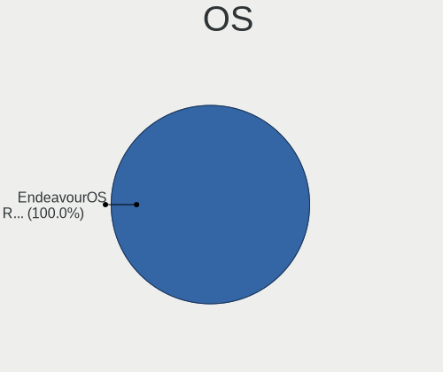
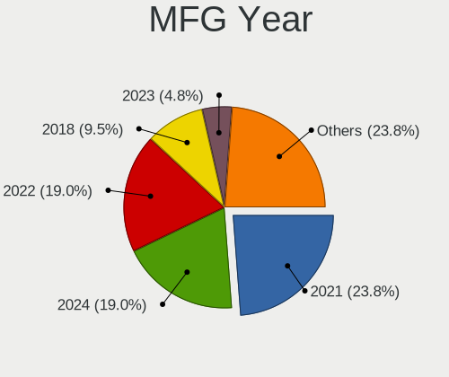
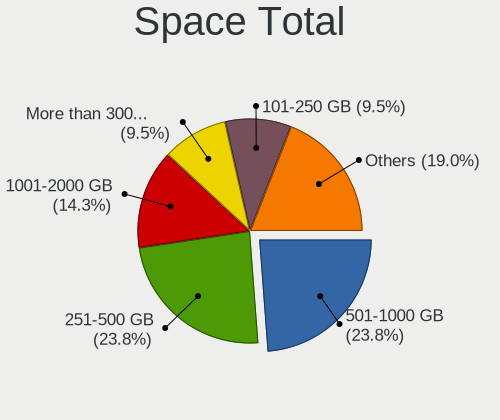
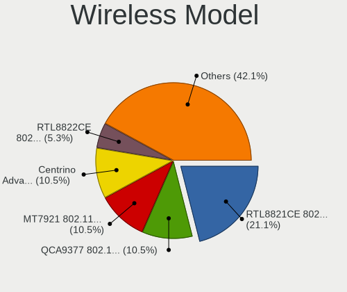
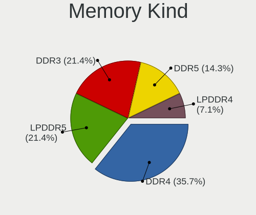

EndeavourOS - Hardware Trends (Notebooks)
-----------------------------------------

A project to identify most popular hardware characteristics and track their change
over time based on data collected by Linux users at https://Linux-Hardware.org.

Anyone can contribute to this report by the [hw-probe](https://github.com/linuxhw/hw-probe) tool:

    sudo -E hw-probe -all -upload

This report is for one last month. Overall report since the beginning of time: [TestDays](https://github.com/linuxhw/TestDays)

Period: Jun, 2023.

Contents
--------

* [ System ](#system)
  - [ OS                       ](#os)
  - [ OS Family                ](#os-family)
  - [ Kernel                   ](#kernel)
  - [ Kernel Family            ](#kernel-family)
  - [ Kernel Major Ver.        ](#kernel-major-ver)
  - [ Arch                     ](#arch)
  - [ DE                       ](#de)
  - [ Display Server           ](#display-server)
  - [ Display Manager          ](#display-manager)
  - [ OS Lang                  ](#os-lang)
  - [ Boot Mode                ](#boot-mode)
  - [ Filesystem               ](#filesystem)
  - [ Part. scheme             ](#part-scheme)
  - [ Dual Boot with Linux/BSD ](#dual-boot-with-linuxbsd)
  - [ Dual Boot (Win)          ](#dual-boot-win)

* [ Board ](#board)
  - [ Vendor                   ](#vendor)
  - [ Model                    ](#model)
  - [ Model Family             ](#model-family)
  - [ MFG Year                 ](#mfg-year)
  - [ Form Factor              ](#form-factor)
  - [ Secure Boot              ](#secure-boot)
  - [ Coreboot                 ](#coreboot)
  - [ RAM Size                 ](#ram-size)
  - [ RAM Used                 ](#ram-used)
  - [ Total Drives             ](#total-drives)
  - [ Has CD-ROM               ](#has-cd-rom)
  - [ Has Ethernet             ](#has-ethernet)
  - [ Has WiFi                 ](#has-wifi)
  - [ Has Bluetooth            ](#has-bluetooth)

* [ Location ](#location)
  - [ Country                  ](#country)
  - [ City                     ](#city)

* [ Drives ](#drives)
  - [ Drive Vendor             ](#drive-vendor)
  - [ Drive Model              ](#drive-model)
  - [ HDD Vendor               ](#hdd-vendor)
  - [ SSD Vendor               ](#ssd-vendor)
  - [ Drive Kind               ](#drive-kind)
  - [ Drive Connector          ](#drive-connector)
  - [ Drive Size               ](#drive-size)
  - [ Space Total              ](#space-total)
  - [ Space Used               ](#space-used)
  - [ Malfunc. Drives          ](#malfunc-drives)
  - [ Malfunc. Drive Vendor    ](#malfunc-drive-vendor)
  - [ Malfunc. HDD Vendor      ](#malfunc-hdd-vendor)
  - [ Malfunc. Drive Kind      ](#malfunc-drive-kind)
  - [ Failed Drives            ](#failed-drives)
  - [ Failed Drive Vendor      ](#failed-drive-vendor)
  - [ Drive Status             ](#drive-status)

* [ Storage controller ](#storage-controller)
  - [ Storage Vendor           ](#storage-vendor)
  - [ Storage Model            ](#storage-model)
  - [ Storage Kind             ](#storage-kind)

* [ Processor ](#processor)
  - [ CPU Vendor               ](#cpu-vendor)
  - [ CPU Model                ](#cpu-model)
  - [ CPU Model Family         ](#cpu-model-family)
  - [ CPU Cores                ](#cpu-cores)
  - [ CPU Sockets              ](#cpu-sockets)
  - [ CPU Threads              ](#cpu-threads)
  - [ CPU Op-Modes             ](#cpu-op-modes)
  - [ CPU Microcode            ](#cpu-microcode)
  - [ CPU Microarch            ](#cpu-microarch)

* [ Graphics ](#graphics)
  - [ GPU Vendor               ](#gpu-vendor)
  - [ GPU Model                ](#gpu-model)
  - [ GPU Combo                ](#gpu-combo)
  - [ GPU Driver               ](#gpu-driver)
  - [ GPU Memory               ](#gpu-memory)

* [ Monitor ](#monitor)
  - [ Monitor Vendor           ](#monitor-vendor)
  - [ Monitor Model            ](#monitor-model)
  - [ Monitor Resolution       ](#monitor-resolution)
  - [ Monitor Diagonal         ](#monitor-diagonal)
  - [ Monitor Width            ](#monitor-width)
  - [ Aspect Ratio             ](#aspect-ratio)
  - [ Monitor Area             ](#monitor-area)
  - [ Pixel Density            ](#pixel-density)
  - [ Multiple Monitors        ](#multiple-monitors)

* [ Network ](#network)
  - [ Net Controller Vendor    ](#net-controller-vendor)
  - [ Net Controller Model     ](#net-controller-model)
  - [ Wireless Vendor          ](#wireless-vendor)
  - [ Wireless Model           ](#wireless-model)
  - [ Ethernet Vendor          ](#ethernet-vendor)
  - [ Ethernet Model           ](#ethernet-model)
  - [ Net Controller Kind      ](#net-controller-kind)
  - [ Used Controller          ](#used-controller)
  - [ NICs                     ](#nics)
  - [ IPv6                     ](#ipv6)

* [ Bluetooth ](#bluetooth)
  - [ Bluetooth Vendor         ](#bluetooth-vendor)
  - [ Bluetooth Model          ](#bluetooth-model)

* [ Sound ](#sound)
  - [ Sound Vendor             ](#sound-vendor)
  - [ Sound Model              ](#sound-model)

* [ Memory ](#memory)
  - [ Memory Vendor            ](#memory-vendor)
  - [ Memory Model             ](#memory-model)
  - [ Memory Kind              ](#memory-kind)
  - [ Memory Form Factor       ](#memory-form-factor)
  - [ Memory Size              ](#memory-size)
  - [ Memory Speed             ](#memory-speed)

* [ Printers & scanners ](#printers--scanners)
  - [ Printer Vendor           ](#printer-vendor)
  - [ Printer Model            ](#printer-model)
  - [ Scanner Vendor           ](#scanner-vendor)
  - [ Scanner Model            ](#scanner-model)

* [ Camera ](#camera)
  - [ Camera Vendor            ](#camera-vendor)
  - [ Camera Model             ](#camera-model)

* [ Security ](#security)
  - [ Fingerprint Vendor       ](#fingerprint-vendor)
  - [ Fingerprint Model        ](#fingerprint-model)
  - [ Chipcard Vendor          ](#chipcard-vendor)
  - [ Chipcard Model           ](#chipcard-model)

* [ Unsupported ](#unsupported)
  - [ Unsupported Devices      ](#unsupported-devices)
  - [ Unsupported Device Types ](#unsupported-device-types)

System
------

OS
--

Installed operating systems

| Name                | Notebooks | Percent |
|---------------------|-----------|---------|
| EndeavourOS Rolling | 28        | 100%    |

OS Family
---------

OS without a version

| Name        | Notebooks | Percent |
|-------------|-----------|---------|
| EndeavourOS | 28        | 100%    |

Kernel
------

Version of the Linux kernel

| Version                    | Notebooks | Percent |
|----------------------------|-----------|---------|
| 6.3.9-arch1-1              | 4         | 14.29%  |
| 6.3.5-arch1-1              | 4         | 14.29%  |
| 6.3.6-arch1-1              | 3         | 10.71%  |
| 6.3.5-zen1-1-zen           | 2         | 7.14%   |
| 6.3.4-arch1-1              | 2         | 7.14%   |
| 6.3.9-zen1-1-zen           | 1         | 3.57%   |
| 6.3.7-zen1-1-zen           | 1         | 3.57%   |
| 6.3.7-arch1-1              | 1         | 3.57%   |
| 6.3.7-1-cachyos-bore       | 1         | 3.57%   |
| 6.3.6-zen1-1-zen           | 1         | 3.57%   |
| 6.3.6-273-tkg-pds          | 1         | 3.57%   |
| 6.3.2-arch1-1              | 1         | 3.57%   |
| 6.3.1-arch1-1-t2           | 1         | 3.57%   |
| 6.3.1-1-cachyos-eevdf-bore | 1         | 3.57%   |
| 6.2.8-arch1-1              | 1         | 3.57%   |
| 6.1.35-1-lts               | 1         | 3.57%   |
| 6.1.33-1-lts               | 1         | 3.57%   |
| 6.1.31-1-lts               | 1         | 3.57%   |

Kernel Family
-------------

Linux kernel without a distro release

| Version | Notebooks | Percent |
|---------|-----------|---------|
| 6.3.5   | 6         | 21.43%  |
| 6.3.9   | 5         | 17.86%  |
| 6.3.6   | 5         | 17.86%  |
| 6.3.7   | 3         | 10.71%  |
| 6.3.4   | 2         | 7.14%   |
| 6.3.1   | 2         | 7.14%   |
| 6.3.2   | 1         | 3.57%   |
| 6.2.8   | 1         | 3.57%   |
| 6.1.35  | 1         | 3.57%   |
| 6.1.33  | 1         | 3.57%   |
| 6.1.31  | 1         | 3.57%   |

Kernel Major Ver.
-----------------

Linux kernel major version

| Version | Notebooks | Percent |
|---------|-----------|---------|
| 6.3     | 24        | 85.71%  |
| 6.1     | 3         | 10.71%  |
| 6.2     | 1         | 3.57%   |

Arch
----

OS architecture (x86_64, i586, etc.)

| Name   | Notebooks | Percent |
|--------|-----------|---------|
| x86_64 | 28        | 100%    |

DE
--

Desktop Environment

| Name     | Notebooks | Percent |
|----------|-----------|---------|
| KDE5     | 14        | 50%     |
| XFCE     | 8         | 28.57%  |
| GNOME    | 2         | 7.14%   |
| sway     | 1         | 3.57%   |
| i3       | 1         | 3.57%   |
| Hyprland | 1         | 3.57%   |
| Budgie   | 1         | 3.57%   |

Display Server
--------------

X11 or Wayland

| Name    | Notebooks | Percent |
|---------|-----------|---------|
| X11     | 18        | 64.29%  |
| Wayland | 6         | 21.43%  |
| Tty     | 2         | 7.14%   |
| Unknown | 2         | 7.14%   |

Display Manager
---------------

SDDM, LightDM, etc.

| Name    | Notebooks | Percent |
|---------|-----------|---------|
| LightDM | 14        | 50%     |
| SDDM    | 11        | 39.29%  |
| Unknown | 3         | 10.71%  |

OS Lang
-------

Language

| Lang  | Notebooks | Percent |
|-------|-----------|---------|
| en_US | 16        | 57.14%  |
| ru_RU | 3         | 10.71%  |
| it_IT | 2         | 7.14%   |
| es_MX | 1         | 3.57%   |
| es_CO | 1         | 3.57%   |
| en_PH | 1         | 3.57%   |
| en_NZ | 1         | 3.57%   |
| en_IN | 1         | 3.57%   |
| en_GB | 1         | 3.57%   |
| de_DE | 1         | 3.57%   |

Boot Mode
---------

EFI or BIOS

| Mode | Notebooks | Percent |
|------|-----------|---------|
| EFI  | 18        | 64.29%  |
| BIOS | 10        | 35.71%  |

Filesystem
----------

Type of filesystem

| Type    | Notebooks | Percent |
|---------|-----------|---------|
| Ext4    | 13        | 46.43%  |
| Btrfs   | 12        | 42.86%  |
| Overlay | 3         | 10.71%  |

Part. scheme
------------

Scheme of partitioning

| Type    | Notebooks | Percent |
|---------|-----------|---------|
| GPT     | 21        | 75%     |
| MBR     | 4         | 14.29%  |
| Unknown | 3         | 10.71%  |

Dual Boot with Linux/BSD
------------------------

Hosting more than one Linux/BSD

| Dual boot | Notebooks | Percent |
|-----------|-----------|---------|
| No        | 21        | 75%     |
| Yes       | 7         | 25%     |

Dual Boot (Win)
---------------

Hosting Linux and Windows

| Dual boot | Notebooks | Percent |
|-----------|-----------|---------|
| No        | 18        | 64.29%  |
| Yes       | 10        | 35.71%  |

Board
-----

Vendor
------

Motherboard manufacturer

| Name                | Notebooks | Percent |
|---------------------|-----------|---------|
| Lenovo              | 6         | 21.43%  |
| ASUSTek Computer    | 6         | 21.43%  |
| Dell                | 4         | 14.29%  |
| Sony                | 2         | 7.14%   |
| Acer                | 2         | 7.14%   |
| VIT                 | 1         | 3.57%   |
| TUXEDO              | 1         | 3.57%   |
| Samsung Electronics | 1         | 3.57%   |
| MSI                 | 1         | 3.57%   |
| Hewlett-Packard     | 1         | 3.57%   |
| Google              | 1         | 3.57%   |
| eMachines           | 1         | 3.57%   |
| Apple               | 1         | 3.57%   |

Model
-----

Motherboard model

| Name                                     | Notebooks | Percent |
|------------------------------------------|-----------|---------|
| Dell Inspiron 3583                       | 2         | 7.14%   |
| VIT P2402                                | 1         | 3.57%   |
| TUXEDO InfinityBook Pro 15 v5            | 1         | 3.57%   |
| Sony SVE1713X1EB                         | 1         | 3.57%   |
| Sony SVE1513B1EW                         | 1         | 3.57%   |
| Samsung 355V4C/356V4C/3445VC/3545VC      | 1         | 3.57%   |
| MSI GL73 8RE                             | 1         | 3.57%   |
| Lenovo Legion Y540-17IRH 81Q4            | 1         | 3.57%   |
| Lenovo IdeaPad S340-14API 81NB           | 1         | 3.57%   |
| Lenovo IdeaPad 5 Pro 16ARH7 82SN         | 1         | 3.57%   |
| Lenovo IdeaPad 5 Pro 16ACH6 82L5         | 1         | 3.57%   |
| Lenovo IdeaPad 320-15ISK 80XH            | 1         | 3.57%   |
| Lenovo IdeaPad 3 14ADA05 81W0            | 1         | 3.57%   |
| HP Laptop 15-db0xxx                      | 1         | 3.57%   |
| Google Sasuke                            | 1         | 3.57%   |
| eMachines eME728                         | 1         | 3.57%   |
| Dell Vostro 1015                         | 1         | 3.57%   |
| Dell Latitude E5570                      | 1         | 3.57%   |
| ASUS X455LJ                              | 1         | 3.57%   |
| ASUS VivoBook_ASUSLaptop X515UA_D515UA   | 1         | 3.57%   |
| ASUS VivoBook_ASUSLaptop X515EA_X515EA   | 1         | 3.57%   |
| ASUS TUF Gaming FX505DT_FX505DT          | 1         | 3.57%   |
| ASUS ASUS TUF Gaming A15 FA507RE_FA577RE | 1         | 3.57%   |
| ASUS ASUS TUF Gaming A15 FA506IV_FA506IV | 1         | 3.57%   |
| Apple MacBookPro16,2                     | 1         | 3.57%   |
| Acer Aspire E5-575G                      | 1         | 3.57%   |
| Acer Aspire A315-51                      | 1         | 3.57%   |

Model Family
------------

Motherboard model prefix

| Name                | Notebooks | Percent |
|---------------------|-----------|---------|
| Lenovo IdeaPad      | 5         | 17.86%  |
| Dell Inspiron       | 2         | 7.14%   |
| ASUS VivoBook       | 2         | 7.14%   |
| ASUS ASUS           | 2         | 7.14%   |
| Acer Aspire         | 2         | 7.14%   |
| VIT P2402           | 1         | 3.57%   |
| TUXEDO InfinityBook | 1         | 3.57%   |
| Sony SVE1713X1EB    | 1         | 3.57%   |
| Sony SVE1513B1EW    | 1         | 3.57%   |
| Samsung 355V4C      | 1         | 3.57%   |
| MSI GL73            | 1         | 3.57%   |
| Lenovo Legion       | 1         | 3.57%   |
| HP Laptop           | 1         | 3.57%   |
| Google Sasuke       | 1         | 3.57%   |
| eMachines eME728    | 1         | 3.57%   |
| Dell Vostro         | 1         | 3.57%   |
| Dell Latitude       | 1         | 3.57%   |
| ASUS X455LJ         | 1         | 3.57%   |
| ASUS TUF            | 1         | 3.57%   |
| Apple MacBookPro16  | 1         | 3.57%   |

MFG Year
--------

Motherboard manufacture year

| Year | Notebooks | Percent |
|------|-----------|---------|
| 2019 | 5         | 17.86%  |
| 2022 | 4         | 14.29%  |
| 2020 | 4         | 14.29%  |
| 2021 | 2         | 7.14%   |
| 2018 | 2         | 7.14%   |
| 2017 | 2         | 7.14%   |
| 2016 | 2         | 7.14%   |
| 2013 | 2         | 7.14%   |
| 2012 | 2         | 7.14%   |
| 2015 | 1         | 3.57%   |
| 2010 | 1         | 3.57%   |
| 2009 | 1         | 3.57%   |

Form Factor
-----------

Physical design of the computer

| Name     | Notebooks | Percent |
|----------|-----------|---------|
| Notebook | 28        | 100%    |

Secure Boot
-----------

Enabled or disabled

| State    | Notebooks | Percent |
|----------|-----------|---------|
| Disabled | 28        | 100%    |

Coreboot
--------

Have coreboot on board

| Used | Notebooks | Percent |
|------|-----------|---------|
| No   | 27        | 96.43%  |
| Yes  | 1         | 3.57%   |

RAM Size
--------

Total RAM memory

| Size in GB | Notebooks | Percent |
|------------|-----------|---------|
| 8.01-16.0  | 9         | 32.14%  |
| 4.01-8.0   | 7         | 25%     |
| 16.01-24.0 | 6         | 21.43%  |
| 32.01-64.0 | 3         | 10.71%  |
| 3.01-4.0   | 2         | 7.14%   |
| 2.01-3.0   | 1         | 3.57%   |

RAM Used
--------

Used RAM memory

| Used GB   | Notebooks | Percent |
|-----------|-----------|---------|
| 3.01-4.0  | 8         | 28.57%  |
| 2.01-3.0  | 7         | 25%     |
| 1.01-2.0  | 7         | 25%     |
| 4.01-8.0  | 4         | 14.29%  |
| 8.01-16.0 | 2         | 7.14%   |

Total Drives
------------

Number of drives on board

| Drives | Notebooks | Percent |
|--------|-----------|---------|
| 1      | 22        | 78.57%  |
| 2      | 5         | 17.86%  |
| 3      | 1         | 3.57%   |

Has CD-ROM
----------

Has CD-ROM on board

| Presented | Notebooks | Percent |
|-----------|-----------|---------|
| No        | 23        | 82.14%  |
| Yes       | 5         | 17.86%  |

Has Ethernet
------------

Has Ethernet on board

| Presented | Notebooks | Percent |
|-----------|-----------|---------|
| Yes       | 22        | 78.57%  |
| No        | 6         | 21.43%  |

Has WiFi
--------

Has WiFi module

| Presented | Notebooks | Percent |
|-----------|-----------|---------|
| Yes       | 28        | 100%    |

Has Bluetooth
-------------

Has Bluetooth module

| Presented | Notebooks | Percent |
|-----------|-----------|---------|
| Yes       | 26        | 92.86%  |
| No        | 2         | 7.14%   |

Location
--------

Country
-------

Geographic location (country)

| Country     | Notebooks | Percent |
|-------------|-----------|---------|
| Italy       | 4         | 14.29%  |
| USA         | 3         | 10.71%  |
| Turkey      | 2         | 7.14%   |
| Russia      | 2         | 7.14%   |
| Poland      | 2         | 7.14%   |
| Netherlands | 2         | 7.14%   |
| Venezuela   | 1         | 3.57%   |
| Tunisia     | 1         | 3.57%   |
| Philippines | 1         | 3.57%   |
| Peru        | 1         | 3.57%   |
| New Zealand | 1         | 3.57%   |
| Kyrgyzstan  | 1         | 3.57%   |
| India       | 1         | 3.57%   |
| Germany     | 1         | 3.57%   |
| France      | 1         | 3.57%   |
| Colombia    | 1         | 3.57%   |
| Canada      | 1         | 3.57%   |
| Brazil      | 1         | 3.57%   |
| Armenia     | 1         | 3.57%   |

City
----

Geographic location (city)

| City                 | Notebooks | Percent |
|----------------------|-----------|---------|
| Yerevan              | 1         | 3.57%   |
| Wroclaw              | 1         | 3.57%   |
| Vouille              | 1         | 3.57%   |
| Turin                | 1         | 3.57%   |
| Tauranga             | 1         | 3.57%   |
| Sousse               | 1         | 3.57%   |
| Sochi                | 1         | 3.57%   |
| Rexburg              | 1         | 3.57%   |
| Quezon City          | 1         | 3.57%   |
| Portland             | 1         | 3.57%   |
| Otwock               | 1         | 3.57%   |
| Nizhniy Novgorod     | 1         | 3.57%   |
| Natal                | 1         | 3.57%   |
| Naaldwijk            | 1         | 3.57%   |
| Milan                | 1         | 3.57%   |
| Mersin               | 1         | 3.57%   |
| Lima                 | 1         | 3.57%   |
| Kosekoy              | 1         | 3.57%   |
| Hattiesburg          | 1         | 3.57%   |
| Delhi                | 1         | 3.57%   |
| Delfgauw             | 1         | 3.57%   |
| Coteau-du-Lac        | 1         | 3.57%   |
| Chemnitz             | 1         | 3.57%   |
| Castello di Cisterna | 1         | 3.57%   |
| Caracas              | 1         | 3.57%   |
| Bogotá              | 1         | 3.57%   |
| Bishkek              | 1         | 3.57%   |
| Belpasso             | 1         | 3.57%   |

Drives
------

Drive Vendor
------------

Hard drive vendors

| Vendor                         | Notebooks | Drives | Percent |
|--------------------------------|-----------|--------|---------|
| Samsung Electronics            | 7         | 7      | 20.59%  |
| Seagate                        | 3         | 3      | 8.82%   |
| Toshiba                        | 2         | 2      | 5.88%   |
| SK hynix                       | 2         | 2      | 5.88%   |
| Sandisk                        | 2         | 2      | 5.88%   |
| Micron Technology              | 2         | 2      | 5.88%   |
| Intel                          | 2         | 2      | 5.88%   |
| Crucial                        | 2         | 2      | 5.88%   |
| WDC                            | 1         | 1      | 2.94%   |
| Unknown                        | 1         | 1      | 2.94%   |
| TAMMUZ                         | 1         | 2      | 2.94%   |
| SSSTC                          | 1         | 1      | 2.94%   |
| Solid State Storage Technology | 1         | 1      | 2.94%   |
| LITEON                         | 1         | 1      | 2.94%   |
| KIOXIA                         | 1         | 1      | 2.94%   |
| Kingston                       | 1         | 1      | 2.94%   |
| HS-SSD-C100                    | 1         | 1      | 2.94%   |
| China                          | 1         | 1      | 2.94%   |
| Apple                          | 1         | 1      | 2.94%   |
| A-DATA Technology              | 1         | 1      | 2.94%   |

Drive Model
-----------

Hard drive models

| Model                                               | Notebooks | Percent |
|-----------------------------------------------------|-----------|---------|
| Samsung NVMe SSD Controller SM981/PM981/PM983 250GB | 2         | 5.88%   |
| Intel SSDPEKNU512GZ 512GB                           | 2         | 5.88%   |
| WDC WDS240G2G0A-00JH30 240GB SSD                    | 1         | 2.94%   |
| Unknown MMC Card  64GB                              | 1         | 2.94%   |
| Toshiba MQ01ABD050 500GB                            | 1         | 2.94%   |
| Toshiba BG3 NVMe SSD Controller 512GB               | 1         | 2.94%   |
| TAMMUZ SSD 500GB                                    | 1         | 2.94%   |
| SSSTC CV8-8E128-HP 128GB SSD                        | 1         | 2.94%   |
| Solid State Storage NVMe CL1-8D512 512GB            | 1         | 2.94%   |
| SK hynix SKHynix_HFS512GDE9X084N 512GB              | 1         | 2.94%   |
| SK hynix SC311 SATA 512GB SSD                       | 1         | 2.94%   |
| Seagate ST9320325AS 320GB                           | 1         | 2.94%   |
| Seagate ST2000LM007-1R8174 2TB                      | 1         | 2.94%   |
| Seagate ST1000LM035-1RK172 1TB                      | 1         | 2.94%   |
| Sandisk WD Blue SN550 NVMe SSD 1TB                  | 1         | 2.94%   |
| Sandisk WD Black SN850 1TB                          | 1         | 2.94%   |
| Samsung SSD 870 QVO 2TB                             | 1         | 2.94%   |
| Samsung SSD 870 EVO 500GB                           | 1         | 2.94%   |
| Samsung SSD 860 PRO 256GB                           | 1         | 2.94%   |
| Samsung MZVLQ512HALU-00000 512GB                    | 1         | 2.94%   |
| Samsung MZALQ128HBHQ-000L2 128GB                    | 1         | 2.94%   |
| Micron MTFDDAK256TDL 256GB SSD                      | 1         | 2.94%   |
| Micron CT1000P5SSD8 1TB                             | 1         | 2.94%   |
| LITEON CV1-8B256 256GB SSD                          | 1         | 2.94%   |
| KIOXIA KBG40ZNS256G NVMe TOSHIBA 256GB              | 1         | 2.94%   |
| Kingston SNVS500G 500GB                             | 1         | 2.94%   |
| HS-SSD-C100 SSD 480G                                | 1         | 2.94%   |
| Crucial CT500MX500SSD1 500GB                        | 1         | 2.94%   |
| Crucial CT500BX500SSD1 500GB                        | 1         | 2.94%   |
| China SSD 256GB                                     | 1         | 2.94%   |
| Apple ANS2 NVMe Controller 256GB                    | 1         | 2.94%   |
| A-DATA SU635 240GB SSD                              | 1         | 2.94%   |

HDD Vendor
----------

Hard disk drive vendors

| Vendor  | Notebooks | Drives | Percent |
|---------|-----------|--------|---------|
| Seagate | 3         | 3      | 75%     |
| Toshiba | 1         | 1      | 25%     |

SSD Vendor
----------

Solid state drive vendors

| Vendor              | Notebooks | Drives | Percent |
|---------------------|-----------|--------|---------|
| Samsung Electronics | 3         | 3      | 21.43%  |
| Crucial             | 2         | 2      | 14.29%  |
| WDC                 | 1         | 1      | 7.14%   |
| TAMMUZ              | 1         | 2      | 7.14%   |
| SSSTC               | 1         | 1      | 7.14%   |
| SK hynix            | 1         | 1      | 7.14%   |
| Micron Technology   | 1         | 1      | 7.14%   |
| LITEON              | 1         | 1      | 7.14%   |
| HS-SSD-C100         | 1         | 1      | 7.14%   |
| China               | 1         | 1      | 7.14%   |
| A-DATA Technology   | 1         | 1      | 7.14%   |

Drive Kind
----------

HDD or SSD

| Kind | Notebooks | Drives | Percent |
|------|-----------|--------|---------|
| NVMe | 14        | 15     | 42.42%  |
| SSD  | 14        | 15     | 42.42%  |
| HDD  | 4         | 4      | 12.12%  |
| MMC  | 1         | 1      | 3.03%   |

Drive Connector
---------------

SATA, SAS, NVMe, etc.

| Type | Notebooks | Drives | Percent |
|------|-----------|--------|---------|
| SATA | 16        | 19     | 51.61%  |
| NVMe | 14        | 15     | 45.16%  |
| MMC  | 1         | 1      | 3.23%   |

Drive Size
----------

Size of hard drive

| Size in TB | Notebooks | Drives | Percent |
|------------|-----------|--------|---------|
| 0.01-0.5   | 13        | 15     | 76.47%  |
| 1.01-2.0   | 2         | 2      | 11.76%  |
| 0.51-1.0   | 2         | 2      | 11.76%  |

Space Total
-----------

Amount of disk space available on the file system

| Size in GB     | Notebooks | Percent |
|----------------|-----------|---------|
| 101-250        | 6         | 21.43%  |
| 1001-2000      | 5         | 17.86%  |
| 1-20           | 5         | 17.86%  |
| 251-500        | 4         | 14.29%  |
| More than 3000 | 2         | 7.14%   |
| 51-100         | 2         | 7.14%   |
| 21-50          | 1         | 3.57%   |
| 2001-3000      | 1         | 3.57%   |
| 501-1000       | 1         | 3.57%   |
| Unknown        | 1         | 3.57%   |

Space Used
----------

Amount of used disk space

| Used GB  | Notebooks | Percent |
|----------|-----------|---------|
| 1-20     | 7         | 25%     |
| 21-50    | 6         | 21.43%  |
| 251-500  | 5         | 17.86%  |
| 51-100   | 4         | 14.29%  |
| 101-250  | 2         | 7.14%   |
| 501-1000 | 2         | 7.14%   |
| 0        | 1         | 3.57%   |
| Unknown  | 1         | 3.57%   |

Malfunc. Drives
---------------

Drive models with a malfunction

| Model                        | Notebooks | Drives | Percent |
|------------------------------|-----------|--------|---------|
| Toshiba MQ01ABD050 500GB     | 1         | 1      | 25%     |
| SSSTC CV8-8E128-HP 128GB SSD | 1         | 1      | 25%     |
| Seagate ST9320325AS 320GB    | 1         | 1      | 25%     |
| China SSD 256GB              | 1         | 1      | 25%     |

Malfunc. Drive Vendor
---------------------

Vendors of faulty drives

| Vendor  | Notebooks | Drives | Percent |
|---------|-----------|--------|---------|
| Toshiba | 1         | 1      | 25%     |
| SSSTC   | 1         | 1      | 25%     |
| Seagate | 1         | 1      | 25%     |
| China   | 1         | 1      | 25%     |

Malfunc. HDD Vendor
-------------------

Vendors of faulty HDD drives

| Vendor  | Notebooks | Drives | Percent |
|---------|-----------|--------|---------|
| Toshiba | 1         | 1      | 50%     |
| Seagate | 1         | 1      | 50%     |

Malfunc. Drive Kind
-------------------

Kinds of faulty drives

| Kind | Notebooks | Drives | Percent |
|------|-----------|--------|---------|
| SSD  | 2         | 2      | 50%     |
| HDD  | 2         | 2      | 50%     |

Failed Drives
-------------

Failed drive models

Zero info for selected period =(

Failed Drive Vendor
-------------------

Failed drive vendors

Zero info for selected period =(

Drive Status
------------

Number of failed and malfunc. drives

| Status   | Notebooks | Drives | Percent |
|----------|-----------|--------|---------|
| Works    | 21        | 27     | 72.41%  |
| Detected | 4         | 4      | 13.79%  |
| Malfunc  | 4         | 4      | 13.79%  |

Storage controller
------------------

Storage Vendor
--------------

Storage controller vendors

| Vendor                         | Notebooks | Percent |
|--------------------------------|-----------|---------|
| Intel                          | 17        | 47.22%  |
| AMD                            | 6         | 16.67%  |
| Samsung Electronics            | 4         | 11.11%  |
| SanDisk                        | 2         | 5.56%   |
| Toshiba America Info Systems   | 1         | 2.78%   |
| Solid State Storage Technology | 1         | 2.78%   |
| SK hynix                       | 1         | 2.78%   |
| Micron Technology              | 1         | 2.78%   |
| KIOXIA                         | 1         | 2.78%   |
| Kingston Technology Company    | 1         | 2.78%   |
| Apple                          | 1         | 2.78%   |

Storage Model
-------------

Storage controller models

| Model                                                                 | Notebooks | Percent |
|-----------------------------------------------------------------------|-----------|---------|
| AMD FCH SATA Controller [AHCI mode]                                   | 6         | 15.79%  |
| Intel Sunrise Point-LP SATA Controller [AHCI mode]                    | 3         | 7.89%   |
| Intel 7 Series Chipset Family 6-port SATA Controller [AHCI mode]      | 3         | 7.89%   |
| Samsung NVMe SSD Controller SM981/PM981/PM983                         | 2         | 5.26%   |
| Samsung NVMe SSD Controller 980                                       | 2         | 5.26%   |
| Intel Non-Volatile memory controller                                  | 2         | 5.26%   |
| Intel Cannon Point-LP SATA Controller [AHCI Mode]                     | 2         | 5.26%   |
| Intel Cannon Lake Mobile PCH SATA AHCI Controller                     | 2         | 5.26%   |
| Intel 82801IBM/IEM (ICH9M/ICH9M-E) 4 port SATA Controller [AHCI mode] | 2         | 5.26%   |
| Toshiba America Info Systems BG3 NVMe SSD Controller                  | 1         | 2.63%   |
| Solid State Storage CL1-3D256-Q11 NVMe SSD M.2                        | 1         | 2.63%   |
| SK hynix Gold P31/BC711/PC711 NVMe Solid State Drive                  | 1         | 2.63%   |
| SanDisk WD PC SN810 / Black SN850 NVMe SSD                            | 1         | 2.63%   |
| SanDisk WD Blue SN550 NVMe SSD                                        | 1         | 2.63%   |
| Micron NVMe Storage Controller                                        | 1         | 2.63%   |
| KIOXIA NVMe SSD Controller BG4                                        | 1         | 2.63%   |
| Kingston Company NVMe Controller                                      | 1         | 2.63%   |
| Intel Wildcat Point-LP SATA Controller [AHCI Mode]                    | 1         | 2.63%   |
| Intel Volume Management Device NVMe RAID Controller                   | 1         | 2.63%   |
| Intel Tiger Lake-LP SATA Controller                                   | 1         | 2.63%   |
| Intel Comet Lake SATA AHCI Controller                                 | 1         | 2.63%   |
| Intel 82801 Mobile SATA Controller [RAID mode]                        | 1         | 2.63%   |
| Apple ANS2 NVMe Controller                                            | 1         | 2.63%   |

Storage Kind
------------

Kind of storage controller (IDE, SATA, NVMe, SAS, ...)

| Kind | Notebooks | Percent |
|------|-----------|---------|
| SATA | 21        | 56.76%  |
| NVMe | 14        | 37.84%  |
| RAID | 2         | 5.41%   |

Processor
---------

CPU Vendor
----------

Processor vendors

| Vendor | Notebooks | Percent |
|--------|-----------|---------|
| Intel  | 18        | 64.29%  |
| AMD    | 10        | 35.71%  |

CPU Model
---------

Processor models

| Model                                         | Notebooks | Percent |
|-----------------------------------------------|-----------|---------|
| Intel Pentium CPU 2020M @ 2.40GHz             | 1         | 3.57%   |
| Intel Core i7-9750H CPU @ 2.60GHz             | 1         | 3.57%   |
| Intel Core i7-8750H CPU @ 2.20GHz             | 1         | 3.57%   |
| Intel Core i7-8565U CPU @ 1.80GHz             | 1         | 3.57%   |
| Intel Core i7-3632QM CPU @ 2.20GHz            | 1         | 3.57%   |
| Intel Core i7-1068NG7 CPU @ 2.30GHz           | 1         | 3.57%   |
| Intel Core i5-6300U CPU @ 2.40GHz             | 1         | 3.57%   |
| Intel Core i5-6200U CPU @ 2.30GHz             | 1         | 3.57%   |
| Intel Core i5-10210U CPU @ 1.60GHz            | 1         | 3.57%   |
| Intel Core i3-8145U CPU @ 2.10GHz             | 1         | 3.57%   |
| Intel Core i3-7100U CPU @ 2.40GHz             | 1         | 3.57%   |
| Intel Core i3-6006U CPU @ 2.00GHz             | 1         | 3.57%   |
| Intel Core i3-5010U CPU @ 2.10GHz             | 1         | 3.57%   |
| Intel Core i3-3120M CPU @ 2.50GHz             | 1         | 3.57%   |
| Intel Core 2 Duo CPU T9550 @ 2.66GHz          | 1         | 3.57%   |
| Intel Core 2 Duo CPU T6670 @ 2.20GHz          | 1         | 3.57%   |
| Intel Celeron N4500 @ 1.10GHz                 | 1         | 3.57%   |
| Intel 11th Gen Core i5-1135G7 @ 2.40GHz       | 1         | 3.57%   |
| AMD Ryzen 7 6800HS Creator Edition            | 1         | 3.57%   |
| AMD Ryzen 7 6800H with Radeon Graphics        | 1         | 3.57%   |
| AMD Ryzen 7 4800H with Radeon Graphics        | 1         | 3.57%   |
| AMD Ryzen 5 5600H with Radeon Graphics        | 1         | 3.57%   |
| AMD Ryzen 5 5500U with Radeon Graphics        | 1         | 3.57%   |
| AMD Ryzen 5 3550H with Radeon Vega Mobile Gfx | 1         | 3.57%   |
| AMD Ryzen 5 3500U with Radeon Vega Mobile Gfx | 1         | 3.57%   |
| AMD Ryzen 3 3250U with Radeon Graphics        | 1         | 3.57%   |
| AMD A9-9425 RADEON R5, 5 COMPUTE CORES 2C+3G  | 1         | 3.57%   |
| AMD A10-4600M APU with Radeon HD Graphics     | 1         | 3.57%   |

CPU Model Family
----------------

Processor model prefix

| Model            | Notebooks | Percent |
|------------------|-----------|---------|
| Intel Core i7    | 5         | 17.86%  |
| Intel Core i3    | 5         | 17.86%  |
| AMD Ryzen 5      | 4         | 14.29%  |
| Intel Core i5    | 3         | 10.71%  |
| AMD Ryzen 7      | 3         | 10.71%  |
| Other            | 2         | 7.14%   |
| Intel Core 2 Duo | 2         | 7.14%   |
| Intel Pentium    | 1         | 3.57%   |
| Intel Celeron    | 1         | 3.57%   |
| AMD Ryzen 3      | 1         | 3.57%   |
| AMD A10          | 1         | 3.57%   |

CPU Cores
---------

Number of processor cores

| Number | Notebooks | Percent |
|--------|-----------|---------|
| 2      | 14        | 50%     |
| 4      | 7         | 25%     |
| 6      | 4         | 14.29%  |
| 8      | 3         | 10.71%  |

CPU Sockets
-----------

Number of sockets

| Number | Notebooks | Percent |
|--------|-----------|---------|
| 1      | 28        | 100%    |

CPU Threads
-----------

Threads per core (Hyper-Threading)

| Number | Notebooks | Percent |
|--------|-----------|---------|
| 2      | 22        | 78.57%  |
| 1      | 6         | 21.43%  |

CPU Op-Modes
------------

CPU Operation Modes (32-bit, 64-bit)

| Op mode        | Notebooks | Percent |
|----------------|-----------|---------|
| 32-bit, 64-bit | 28        | 100%    |

CPU Microcode
-------------

Microcode number

| Number     | Notebooks | Percent |
|------------|-----------|---------|
| Unknown    | 20        | 71.43%  |
| 0x0a404101 | 2         | 7.14%   |
| 0x1067a    | 1         | 3.57%   |
| 0x0a50000c | 1         | 3.57%   |
| 0x08108109 | 1         | 3.57%   |
| 0x08108102 | 1         | 3.57%   |
| 0x06006705 | 1         | 3.57%   |
| 0x06001119 | 1         | 3.57%   |

CPU Microarch
-------------

Microarchitecture

| Name       | Notebooks | Percent |
|------------|-----------|---------|
| KabyLake   | 5         | 17.86%  |
| Zen+       | 3         | 10.71%  |
| Skylake    | 3         | 10.71%  |
| IvyBridge  | 3         | 10.71%  |
| Unknown    | 3         | 10.71%  |
| Penryn     | 2         | 7.14%   |
| Zen 3      | 1         | 3.57%   |
| Zen 2      | 1         | 3.57%   |
| Tremont    | 1         | 3.57%   |
| TigerLake  | 1         | 3.57%   |
| Piledriver | 1         | 3.57%   |
| IceLake    | 1         | 3.57%   |
| Excavator  | 1         | 3.57%   |
| CometLake  | 1         | 3.57%   |
| Broadwell  | 1         | 3.57%   |

Graphics
--------

GPU Vendor
----------

Vendors of graphics cards

| Vendor | Notebooks | Percent |
|--------|-----------|---------|
| Intel  | 16        | 47.06%  |
| AMD    | 11        | 32.35%  |
| Nvidia | 7         | 20.59%  |

GPU Model
---------

Graphics card models

| Model                                                                | Notebooks | Percent |
|----------------------------------------------------------------------|-----------|---------|
| AMD Picasso/Raven 2 [Radeon Vega Series / Radeon Vega Mobile Series] | 3         | 8.57%   |
| Nvidia TU106M [GeForce RTX 2060 Mobile]                              | 2         | 5.71%   |
| Intel WhiskeyLake-U GT2 [UHD Graphics 620]                           | 2         | 5.71%   |
| Intel Skylake GT2 [HD Graphics 520]                                  | 2         | 5.71%   |
| Intel Mobile 4 Series Chipset Integrated Graphics Controller         | 2         | 5.71%   |
| Intel 3rd Gen Core processor Graphics Controller                     | 2         | 5.71%   |
| AMD Rembrandt [Radeon 680M]                                          | 2         | 5.71%   |
| Nvidia TU117M [GeForce GTX 1650 Mobile / Max-Q]                      | 1         | 2.86%   |
| Nvidia GP106M [GeForce GTX 1060 Mobile]                              | 1         | 2.86%   |
| Nvidia GM107 [GeForce 940MX]                                         | 1         | 2.86%   |
| Nvidia GK208BM [GeForce 920M]                                        | 1         | 2.86%   |
| Nvidia GA107M [GeForce RTX 3050 Ti Mobile]                           | 1         | 2.86%   |
| Intel TigerLake-LP GT2 [Iris Xe Graphics]                            | 1         | 2.86%   |
| Intel JasperLake [UHD Graphics]                                      | 1         | 2.86%   |
| Intel Iris Plus Graphics G7                                          | 1         | 2.86%   |
| Intel HD Graphics 620                                                | 1         | 2.86%   |
| Intel HD Graphics 5500                                               | 1         | 2.86%   |
| Intel HD Graphics 520                                                | 1         | 2.86%   |
| Intel Comet Lake UHD Graphics                                        | 1         | 2.86%   |
| Intel CoffeeLake-H GT2 [UHD Graphics 630]                            | 1         | 2.86%   |
| AMD Trinity [Radeon HD 7660G]                                        | 1         | 2.86%   |
| AMD Thames [Radeon HD 7550M/7570M/7650M]                             | 1         | 2.86%   |
| AMD Thames [Radeon HD 7500M/7600M Series]                            | 1         | 2.86%   |
| AMD Stoney [Radeon R2/R3/R4/R5 Graphics]                             | 1         | 2.86%   |
| AMD Renoir                                                           | 1         | 2.86%   |
| AMD Lucienne                                                         | 1         | 2.86%   |
| AMD Cezanne [Radeon Vega Series / Radeon Vega Mobile Series]         | 1         | 2.86%   |

GPU Combo
---------

Combinations of graphics cards

| Name           | Notebooks | Percent |
|----------------|-----------|---------|
| 1 x Intel      | 11        | 39.29%  |
| 1 x AMD        | 7         | 25%     |
| Intel + Nvidia | 3         | 10.71%  |
| AMD + Nvidia   | 3         | 10.71%  |
| 2 x Intel      | 2         | 7.14%   |
| 2 x AMD        | 1         | 3.57%   |
| 1 x Nvidia     | 1         | 3.57%   |

GPU Driver
----------

Free vs proprietary

| Driver      | Notebooks | Percent |
|-------------|-----------|---------|
| Free        | 22        | 78.57%  |
| Proprietary | 6         | 21.43%  |

GPU Memory
----------

Total video memory

| Size in GB | Notebooks | Percent |
|------------|-----------|---------|
| Unknown    | 19        | 67.86%  |
| 1.01-2.0   | 5         | 17.86%  |
| 0.01-0.5   | 3         | 10.71%  |
| 5.01-6.0   | 1         | 3.57%   |

Monitor
-------

Monitor Vendor
--------------

Monitor vendors

| Vendor              | Notebooks | Percent |
|---------------------|-----------|---------|
| Chimei Innolux      | 8         | 24.24%  |
| Samsung Electronics | 4         | 12.12%  |
| BOE                 | 4         | 12.12%  |
| AU Optronics        | 4         | 12.12%  |
| LG Display          | 3         | 9.09%   |
| PANDA               | 2         | 6.06%   |
| CSO                 | 2         | 6.06%   |
| Lenovo              | 1         | 3.03%   |
| Iiyama              | 1         | 3.03%   |
| Hewlett-Packard     | 1         | 3.03%   |
| Dell                | 1         | 3.03%   |
| Apple               | 1         | 3.03%   |
| Unknown             | 1         | 3.03%   |

Monitor Model
-------------

Monitor models

| Model                                                                | Notebooks | Percent |
|----------------------------------------------------------------------|-----------|---------|
| Samsung Electronics LC24RG50 SAM0F90 1920x1080 532x304mm 24.1-inch   | 2         | 6.06%   |
| PANDA LCD Monitor NCP002D 1920x1080 344x194mm 15.5-inch              | 2         | 6.06%   |
| Samsung Electronics LCD Monitor SEC5441 1366x768 293x165mm 13.2-inch | 1         | 3.03%   |
| Samsung Electronics LCD Monitor SAM0C3C 1366x768 609x347mm 27.6-inch | 1         | 3.03%   |
| LG Display LCD Monitor LGD05EC 1920x1080 309x174mm 14.0-inch         | 1         | 3.03%   |
| LG Display LCD Monitor LGD039F 1366x768 345x194mm 15.6-inch          | 1         | 3.03%   |
| LG Display LCD Monitor LGD0384 1366x768 344x194mm 15.5-inch          | 1         | 3.03%   |
| Lenovo LEN T24h-20 LEN61F0 2560x1440 527x296mm 23.8-inch             | 1         | 3.03%   |
| Iiyama PLX2481H IVM611D 1920x1080 521x293mm 23.5-inch                | 1         | 3.03%   |
| Hewlett-Packard L190hb HWP289A 1440x900 408x255mm 18.9-inch          | 1         | 3.03%   |
| Dell S2409W DELA039 1920x1080 531x298mm 24.0-inch                    | 1         | 3.03%   |
| CSO LCD Monitor CSO160C 2560x1600 344x215mm 16.0-inch                | 1         | 3.03%   |
| CSO LCD Monitor CSO1602 2560x1600 344x215mm 16.0-inch                | 1         | 3.03%   |
| Chimei Innolux LCD Monitor CMN175C 1920x1080 380x210mm 17.1-inch     | 1         | 3.03%   |
| Chimei Innolux LCD Monitor CMN1735 1920x1080 382x215mm 17.3-inch     | 1         | 3.03%   |
| Chimei Innolux LCD Monitor CMN15F5 1920x1080 344x193mm 15.5-inch     | 1         | 3.03%   |
| Chimei Innolux LCD Monitor CMN15D2 1920x1080 344x193mm 15.5-inch     | 1         | 3.03%   |
| Chimei Innolux LCD Monitor CMN153C 1920x1080 344x193mm 15.5-inch     | 1         | 3.03%   |
| Chimei Innolux LCD Monitor CMN1480 1366x768 309x174mm 14.0-inch      | 1         | 3.03%   |
| Chimei Innolux LCD Monitor CMN1475 1366x768 309x174mm 14.0-inch      | 1         | 3.03%   |
| Chimei Innolux LCD Monitor CMN1426 1366x768 309x173mm 13.9-inch      | 1         | 3.03%   |
| BOE LCD Monitor BOE08F2 1920x1080 310x174mm 14.0-inch                | 1         | 3.03%   |
| BOE LCD Monitor BOE0802 1920x1080 344x193mm 15.5-inch                | 1         | 3.03%   |
| BOE LCD Monitor BOE06F0 1366x768 344x194mm 15.5-inch                 | 1         | 3.03%   |
| BOE LCD Monitor BOE0632 1920x1080 344x194mm 15.5-inch                | 1         | 3.03%   |
| AU Optronics LCD Monitor AUO71EC 1366x768 344x193mm 15.5-inch        | 1         | 3.03%   |
| AU Optronics LCD Monitor AUO61ED 1920x1080 344x194mm 15.5-inch       | 1         | 3.03%   |
| AU Optronics LCD Monitor AUO26EC 1366x768 344x193mm 15.5-inch        | 1         | 3.03%   |
| AU Optronics LCD Monitor AUO20ED 1920x1080 344x193mm 15.5-inch       | 1         | 3.03%   |
| Apple Color LCD APPA03D 2560x1600 286x179mm 13.3-inch                | 1         | 3.03%   |
| Unknown                                                              | 1         | 3.03%   |

Monitor Resolution
------------------

Monitor screen resolution

| Resolution       | Notebooks | Percent |
|------------------|-----------|---------|
| 1920x1080 (FHD)  | 13        | 44.83%  |
| 1366x768 (WXGA)  | 10        | 34.48%  |
| 2560x1600        | 3         | 10.34%  |
| 3840x2160 (4K)   | 1         | 3.45%   |
| 2560x1440 (QHD)  | 1         | 3.45%   |
| 1440x900 (WXGA+) | 1         | 3.45%   |

Monitor Diagonal
----------------

Diagonal size in inches

| Inches | Notebooks | Percent |
|--------|-----------|---------|
| 15     | 15        | 45.45%  |
| 14     | 4         | 12.12%  |
| 24     | 3         | 9.09%   |
| 23     | 2         | 6.06%   |
| 17     | 2         | 6.06%   |
| 16     | 2         | 6.06%   |
| 13     | 2         | 6.06%   |
| 54     | 1         | 3.03%   |
| 31     | 1         | 3.03%   |
| 19     | 1         | 3.03%   |

Monitor Width
-------------

Physical width

| Width in mm | Notebooks | Percent |
|-------------|-----------|---------|
| 301-350     | 21        | 63.64%  |
| 501-600     | 5         | 15.15%  |
| 351-400     | 3         | 9.09%   |
| 601-700     | 1         | 3.03%   |
| 401-500     | 1         | 3.03%   |
| 201-300     | 1         | 3.03%   |
| 1001-1500   | 1         | 3.03%   |

Aspect Ratio
------------

Proportional relationship between the width and the height

| Ratio | Notebooks | Percent |
|-------|-----------|---------|
| 16/9  | 23        | 85.19%  |
| 16/10 | 4         | 14.81%  |

Monitor Area
------------

Area in inch²

| Area in inch² | Notebooks | Percent |
|----------------|-----------|---------|
| 101-110        | 15        | 45.45%  |
| 81-90          | 5         | 15.15%  |
| 201-250        | 3         | 9.09%   |
| 251-300        | 2         | 6.06%   |
| 121-130        | 2         | 6.06%   |
| 111-120        | 2         | 6.06%   |
| More than 1000 | 1         | 3.03%   |
| 71-80          | 1         | 3.03%   |
| 351-500        | 1         | 3.03%   |
| 151-200        | 1         | 3.03%   |

Pixel Density
-------------

Pixels per inch

| Density | Notebooks | Percent |
|---------|-----------|---------|
| 121-160 | 14        | 43.75%  |
| 101-120 | 7         | 21.88%  |
| 51-100  | 7         | 21.88%  |
| 161-240 | 3         | 9.38%   |
| 1-50    | 1         | 3.13%   |

Multiple Monitors
-----------------

Total monitors connected

| Total | Notebooks | Percent |
|-------|-----------|---------|
| 1     | 22        | 78.57%  |
| 2     | 6         | 21.43%  |

Network
-------

Net Controller Vendor
---------------------

Controller vendors

| Vendor                | Notebooks | Percent |
|-----------------------|-----------|---------|
| Realtek Semiconductor | 21        | 46.67%  |
| Qualcomm Atheros      | 13        | 28.89%  |
| Intel                 | 6         | 13.33%  |
| MediaTek              | 2         | 4.44%   |
| Lenovo                | 1         | 2.22%   |
| Broadcom              | 1         | 2.22%   |
| Apple                 | 1         | 2.22%   |

Net Controller Model
--------------------

Controller models

| Model                                                             | Notebooks | Percent |
|-------------------------------------------------------------------|-----------|---------|
| Realtek RTL8111/8168/8411 PCI Express Gigabit Ethernet Controller | 14        | 27.45%  |
| Qualcomm Atheros QCA9377 802.11ac Wireless Network Adapter        | 5         | 9.8%    |
| Realtek RTL8822CE 802.11ac PCIe Wireless Network Adapter          | 3         | 5.88%   |
| Realtek RTL8821CE 802.11ac PCIe Wireless Network Adapter          | 3         | 5.88%   |
| Qualcomm Atheros AR9485 Wireless Network Adapter                  | 3         | 5.88%   |
| Realtek RTL810xE PCI Express Fast Ethernet controller             | 2         | 3.92%   |
| MediaTek MT7921 802.11ax PCI Express Wireless Network Adapter     | 2         | 3.92%   |
| Intel Cannon Lake PCH CNVi WiFi                                   | 2         | 3.92%   |
| Realtek RTL8852BE PCIe 802.11ax Wireless Network Controller       | 1         | 1.96%   |
| Realtek RTL8723AE PCIe Wireless Network Adapter                   | 1         | 1.96%   |
| Realtek RTL8153 Gigabit Ethernet Adapter                          | 1         | 1.96%   |
| Qualcomm Atheros QCA9565 / AR9565 Wireless Network Adapter        | 1         | 1.96%   |
| Qualcomm Atheros QCA8171 Gigabit Ethernet                         | 1         | 1.96%   |
| Qualcomm Atheros AR9462 Wireless Network Adapter                  | 1         | 1.96%   |
| Qualcomm Atheros AR9285 Wireless Network Adapter (PCI-Express)    | 1         | 1.96%   |
| Qualcomm Atheros AR8161 Gigabit Ethernet                          | 1         | 1.96%   |
| Qualcomm Atheros AR8131 Gigabit Ethernet                          | 1         | 1.96%   |
| Lenovo ThinkPad Lan                                               | 1         | 1.96%   |
| Intel Wireless 8260                                               | 1         | 1.96%   |
| Intel Wi-Fi 6 AX201 160MHz                                        | 1         | 1.96%   |
| Intel Wi-Fi 6 AX200                                               | 1         | 1.96%   |
| Intel Ethernet Connection I219-LM                                 | 1         | 1.96%   |
| Intel Cannon Point-LP CNVi [Wireless-AC]                          | 1         | 1.96%   |
| Broadcom BCM4364 802.11ac Wireless Network Adapter                | 1         | 1.96%   |
| Apple iBridge                                                     | 1         | 1.96%   |

Wireless Vendor
---------------

Wireless vendors

| Vendor                | Notebooks | Percent |
|-----------------------|-----------|---------|
| Qualcomm Atheros      | 11        | 39.29%  |
| Realtek Semiconductor | 8         | 28.57%  |
| Intel                 | 6         | 21.43%  |
| MediaTek              | 2         | 7.14%   |
| Broadcom              | 1         | 3.57%   |

Wireless Model
--------------

Wireless models

| Model                                                          | Notebooks | Percent |
|----------------------------------------------------------------|-----------|---------|
| Qualcomm Atheros QCA9377 802.11ac Wireless Network Adapter     | 5         | 17.86%  |
| Realtek RTL8822CE 802.11ac PCIe Wireless Network Adapter       | 3         | 10.71%  |
| Realtek RTL8821CE 802.11ac PCIe Wireless Network Adapter       | 3         | 10.71%  |
| Qualcomm Atheros AR9485 Wireless Network Adapter               | 3         | 10.71%  |
| MediaTek MT7921 802.11ax PCI Express Wireless Network Adapter  | 2         | 7.14%   |
| Intel Cannon Lake PCH CNVi WiFi                                | 2         | 7.14%   |
| Realtek RTL8852BE PCIe 802.11ax Wireless Network Controller    | 1         | 3.57%   |
| Realtek RTL8723AE PCIe Wireless Network Adapter                | 1         | 3.57%   |
| Qualcomm Atheros QCA9565 / AR9565 Wireless Network Adapter     | 1         | 3.57%   |
| Qualcomm Atheros AR9462 Wireless Network Adapter               | 1         | 3.57%   |
| Qualcomm Atheros AR9285 Wireless Network Adapter (PCI-Express) | 1         | 3.57%   |
| Intel Wireless 8260                                            | 1         | 3.57%   |
| Intel Wi-Fi 6 AX201 160MHz                                     | 1         | 3.57%   |
| Intel Wi-Fi 6 AX200                                            | 1         | 3.57%   |
| Intel Cannon Point-LP CNVi [Wireless-AC]                       | 1         | 3.57%   |
| Broadcom BCM4364 802.11ac Wireless Network Adapter             | 1         | 3.57%   |

Ethernet Vendor
---------------

Ethernet vendors

| Vendor                | Notebooks | Percent |
|-----------------------|-----------|---------|
| Realtek Semiconductor | 16        | 72.73%  |
| Qualcomm Atheros      | 3         | 13.64%  |
| Lenovo                | 1         | 4.55%   |
| Intel                 | 1         | 4.55%   |
| Apple                 | 1         | 4.55%   |

Ethernet Model
--------------

Ethernet models

| Model                                                             | Notebooks | Percent |
|-------------------------------------------------------------------|-----------|---------|
| Realtek RTL8111/8168/8411 PCI Express Gigabit Ethernet Controller | 14        | 60.87%  |
| Realtek RTL810xE PCI Express Fast Ethernet controller             | 2         | 8.7%    |
| Realtek RTL8153 Gigabit Ethernet Adapter                          | 1         | 4.35%   |
| Qualcomm Atheros QCA8171 Gigabit Ethernet                         | 1         | 4.35%   |
| Qualcomm Atheros AR8161 Gigabit Ethernet                          | 1         | 4.35%   |
| Qualcomm Atheros AR8131 Gigabit Ethernet                          | 1         | 4.35%   |
| Lenovo ThinkPad Lan                                               | 1         | 4.35%   |
| Intel Ethernet Connection I219-LM                                 | 1         | 4.35%   |
| Apple iBridge                                                     | 1         | 4.35%   |

Net Controller Kind
-------------------

Ethernet, WiFi or modem

| Kind     | Notebooks | Percent |
|----------|-----------|---------|
| WiFi     | 28        | 56%     |
| Ethernet | 22        | 44%     |

Used Controller
---------------

Currently used network controller

| Kind     | Notebooks | Percent |
|----------|-----------|---------|
| WiFi     | 25        | 78.13%  |
| Ethernet | 7         | 21.88%  |

NICs
----

Total network controllers on board

| Total | Notebooks | Percent |
|-------|-----------|---------|
| 2     | 20        | 71.43%  |
| 1     | 8         | 28.57%  |

IPv6
----

IPv6 vs IPv4

| Used | Notebooks | Percent |
|------|-----------|---------|
| No   | 24        | 85.71%  |
| Yes  | 4         | 14.29%  |

Bluetooth
---------

Bluetooth Vendor
----------------

Controller vendors

| Vendor                          | Notebooks | Percent |
|---------------------------------|-----------|---------|
| Qualcomm Atheros Communications | 6         | 22.22%  |
| Intel                           | 6         | 22.22%  |
| IMC Networks                    | 6         | 22.22%  |
| Realtek Semiconductor           | 4         | 14.81%  |
| Lite-On Technology              | 3         | 11.11%  |
| Foxconn / Hon Hai               | 2         | 7.41%   |

Bluetooth Model
---------------

Controller models

| Model                                           | Notebooks | Percent |
|-------------------------------------------------|-----------|---------|
| Qualcomm Atheros  Bluetooth Device              | 4         | 14.81%  |
| Realtek Bluetooth Radio                         | 3         | 11.11%  |
| Intel Bluetooth 9460/9560 Jefferson Peak (JfP)  | 3         | 11.11%  |
| IMC Networks Bluetooth Radio                    | 3         | 11.11%  |
| Lite-On Qualcomm Atheros QCA9377 Bluetooth      | 2         | 7.41%   |
| Realtek  Bluetooth 4.2 Adapter                  | 1         | 3.7%    |
| Qualcomm Atheros AR3012 Bluetooth 4.0           | 1         | 3.7%    |
| Qualcomm Atheros AR3011 Bluetooth               | 1         | 3.7%    |
| Lite-On Bluetooth Radio                         | 1         | 3.7%    |
| Intel Bluetooth wireless interface              | 1         | 3.7%    |
| Intel AX201 Bluetooth                           | 1         | 3.7%    |
| Intel AX200 Bluetooth                           | 1         | 3.7%    |
| IMC Networks Wireless_Device                    | 1         | 3.7%    |
| IMC Networks Bluetooth Device                   | 1         | 3.7%    |
| IMC Networks Bluetooth                          | 1         | 3.7%    |
| Foxconn / Hon Hai MediaTek Bluetooth Adapter    | 1         | 3.7%    |
| Foxconn / Hon Hai Bluetooth USB Host Controller | 1         | 3.7%    |

Sound
-----

Sound Vendor
------------

Sound card vendors

| Vendor           | Notebooks | Percent |
|------------------|-----------|---------|
| Intel            | 18        | 48.65%  |
| AMD              | 10        | 27.03%  |
| Nvidia           | 7         | 18.92%  |
| ASUSTek Computer | 1         | 2.7%    |
| Apple            | 1         | 2.7%    |

Sound Model
-----------

Sound card models

| Model                                                               | Notebooks | Percent |
|---------------------------------------------------------------------|-----------|---------|
| AMD Family 17h/19h HD Audio Controller                              | 7         | 15.22%  |
| Intel Sunrise Point-LP HD Audio                                     | 4         | 8.7%    |
| Intel 7 Series/C216 Chipset Family High Definition Audio Controller | 3         | 6.52%   |
| AMD Renoir Radeon High Definition Audio Controller                  | 3         | 6.52%   |
| Nvidia TU106 High Definition Audio Controller                       | 2         | 4.35%   |
| Intel Cannon Point-LP High Definition Audio Controller              | 2         | 4.35%   |
| Intel Cannon Lake PCH cAVS                                          | 2         | 4.35%   |
| Intel 82801I (ICH9 Family) HD Audio Controller                      | 2         | 4.35%   |
| AMD Raven/Raven2/Fenghuang HDMI/DP Audio Controller                 | 2         | 4.35%   |
| Nvidia TU107 GeForce GTX 1650 High Definition Audio Controller      | 1         | 2.17%   |
| Nvidia GP106 High Definition Audio Controller                       | 1         | 2.17%   |
| Nvidia GM107 High Definition Audio Controller [GeForce 940MX]       | 1         | 2.17%   |
| Nvidia GK208 HDMI/DP Audio Controller                               | 1         | 2.17%   |
| Nvidia Audio device                                                 | 1         | 2.17%   |
| Intel Wildcat Point-LP High Definition Audio Controller             | 1         | 2.17%   |
| Intel Tiger Lake-LP Smart Sound Technology Audio Controller         | 1         | 2.17%   |
| Intel Smart Sound Technology Audio Controller                       | 1         | 2.17%   |
| Intel Jasper Lake HD Audio                                          | 1         | 2.17%   |
| Intel Comet Lake PCH-LP cAVS                                        | 1         | 2.17%   |
| Intel Broadwell-U Audio Controller                                  | 1         | 2.17%   |
| ASUSTek Computer C-Media Audio                                      | 1         | 2.17%   |
| Apple Audio Device                                                  | 1         | 2.17%   |
| AMD Turks HDMI Audio [Radeon HD 6500/6600 / 6700M Series]           | 1         | 2.17%   |
| AMD Trinity HDMI Audio Controller                                   | 1         | 2.17%   |
| AMD Rembrandt Radeon High Definition Audio Controller               | 1         | 2.17%   |
| AMD High Definition Audio Controller                                | 1         | 2.17%   |
| AMD FCH Azalia Controller                                           | 1         | 2.17%   |
| AMD Family 15h (Models 60h-6fh) Audio Controller                    | 1         | 2.17%   |

Memory
------

Memory Vendor
-------------

Memory module vendors

| Vendor              | Notebooks | Percent |
|---------------------|-----------|---------|
| Samsung Electronics | 10        | 32.26%  |
| SK hynix            | 7         | 22.58%  |
| Micron Technology   | 4         | 12.9%   |
| Kingston            | 3         | 9.68%   |
| Unknown             | 2         | 6.45%   |
| Crucial             | 2         | 6.45%   |
| Ramaxel Technology  | 1         | 3.23%   |
| Nanya Technology    | 1         | 3.23%   |
| Hikvision           | 1         | 3.23%   |

Memory Model
------------

Memory module models

| Model                                                            | Notebooks | Percent |
|------------------------------------------------------------------|-----------|---------|
| SK hynix RAM HMA81GS6JJR8N-VK 8GB SODIMM DDR4 2667MT/s           | 2         | 6.25%   |
| Samsung RAM M471A1G44AB0-CWE 8GB SODIMM DDR4 3200MT/s            | 2         | 6.25%   |
| Unknown RAM Module 4GB SODIMM DDR3                               | 1         | 3.13%   |
| Unknown RAM Module 4GB SODIMM 1066MT/s                           | 1         | 3.13%   |
| SK hynix RAM HMT451S6BFR8A-PB 4GB SODIMM DDR3 1600MT/s           | 1         | 3.13%   |
| SK hynix RAM HMT325S6BFR8C-H9 2GB SODIMM DDR3 1600MT/s           | 1         | 3.13%   |
| SK hynix RAM HMA851S6AFR6N-UH 4GB SODIMM DDR4 2667MT/s           | 1         | 3.13%   |
| SK hynix RAM HMA82GS6CJR8N-VK 16GB SODIMM DDR4 2667MT/s          | 1         | 3.13%   |
| SK hynix RAM HMA81GS6AFR8N-UH 8GB SODIMM DDR4 2400MT/s           | 1         | 3.13%   |
| Samsung RAM M471B5173QH0-YK0 4GB SODIMM DDR3 1600MT/s            | 1         | 3.13%   |
| Samsung RAM M471B1G73BH0-YK0 8GB SODIMM DDR3 1600MT/s            | 1         | 3.13%   |
| Samsung RAM M471A5244CB0-CWE 4GB Row Of Chips DDR4 3200MT/s      | 1         | 3.13%   |
| Samsung RAM M471A5244CB0-CTD 4GB SODIMM DDR4 3266MT/s            | 1         | 3.13%   |
| Samsung RAM M471A5143SB1-CRC 4GB SODIMM DDR4 2400MT/s            | 1         | 3.13%   |
| Samsung RAM M471A1K43CB1-CTD 8GB SODIMM DDR4 2667MT/s            | 1         | 3.13%   |
| Samsung RAM M471A1G44AB0-CWE 8GB Row Of Chips DDR4 3200MT/s      | 1         | 3.13%   |
| Samsung RAM K4UCE3Q4AA-MGCL 16GB Row Of Chips LPDDR4 4267MT/s    | 1         | 3.13%   |
| Samsung RAM K4U6E3S4AA-MGCR 4GB LPDDR4 2933MT/s                  | 1         | 3.13%   |
| Ramaxel RAM RMT3150ED58E8W1600 2GB SODIMM DDR3 1600MT/s          | 1         | 3.13%   |
| Nanya RAM NT1GC64BH4B0PS-CG 1GB SODIMM DDR3 1333MT/s             | 1         | 3.13%   |
| Micron RAM MTC4C10163S1SC48BA1 8GB SODIMM DDR5 4800MT/s          | 1         | 3.13%   |
| Micron RAM MT62F1G32D4DR-031 WT 4GB Row Of Chips LPDDR5 6400MT/s | 1         | 3.13%   |
| Micron RAM 4ATF51264HZ-2G6E1 4GB SODIMM DDR4 2667MT/s            | 1         | 3.13%   |
| Micron RAM 16KTF1G64HZ-1G6E1 8GB SODIMM DDR3 1600MT/s            | 1         | 3.13%   |
| Kingston RAM KF2666C15S4/8G 8GB SODIMM DDR4 2667MT/s             | 1         | 3.13%   |
| Kingston RAM K821PJ-MIB 16GB SODIMM DDR4 2400MT/s                | 1         | 3.13%   |
| Kingston RAM HX426S15IB2/16-SP 16GB SODIMM DDR4 2667MT/s         | 1         | 3.13%   |
| Hikvision RAM HKED3082BAB2H3HA1 8GB SODIMM DDR3 1600MT/s         | 1         | 3.13%   |
| Crucial RAM CT8G4SFS832A.M8FR 8GB SODIMM DDR4 3200MT/s           | 1         | 3.13%   |
| Crucial RAM CT16G4SFRA32A.C8FE 16GB SODIMM DDR4 3200MT/s         | 1         | 3.13%   |

Memory Kind
-----------

Memory module kinds

| Kind    | Notebooks | Percent |
|---------|-----------|---------|
| DDR4    | 14        | 53.85%  |
| DDR3    | 6         | 23.08%  |
| LPDDR4  | 3         | 11.54%  |
| LPDDR5  | 1         | 3.85%   |
| DDR5    | 1         | 3.85%   |
| Unknown | 1         | 3.85%   |

Memory Form Factor
------------------

Physical design of the memory module

| Name         | Notebooks | Percent |
|--------------|-----------|---------|
| SODIMM       | 21        | 80.77%  |
| Row Of Chips | 4         | 15.38%  |
| Unknown      | 1         | 3.85%   |

Memory Size
-----------

Memory module size

| Size  | Notebooks | Percent |
|-------|-----------|---------|
| 8192  | 13        | 43.33%  |
| 4096  | 9         | 30%     |
| 16384 | 5         | 16.67%  |
| 2048  | 2         | 6.67%   |
| 1024  | 1         | 3.33%   |

Memory Speed
------------

Memory module speed

| Speed   | Notebooks | Percent |
|---------|-----------|---------|
| 2667    | 8         | 27.59%  |
| 3200    | 5         | 17.24%  |
| 1600    | 5         | 17.24%  |
| 2400    | 3         | 10.34%  |
| 6400    | 1         | 3.45%   |
| 4800    | 1         | 3.45%   |
| 4267    | 1         | 3.45%   |
| 3266    | 1         | 3.45%   |
| 2933    | 1         | 3.45%   |
| 1333    | 1         | 3.45%   |
| 1066    | 1         | 3.45%   |
| Unknown | 1         | 3.45%   |

Printers & scanners
-------------------

Printer Vendor
--------------

Printer device vendors

Zero info for selected period =(

Printer Model
-------------

Printer device models

Zero info for selected period =(

Scanner Vendor
--------------

Scanner device vendors

Zero info for selected period =(

Scanner Model
-------------

Scanner device models

Zero info for selected period =(

Camera
------

Camera Vendor
-------------

Camera device vendors

| Vendor                        | Notebooks | Percent |
|-------------------------------|-----------|---------|
| Chicony Electronics           | 4         | 16%     |
| Sonix Technology              | 3         | 12%     |
| IMC Networks                  | 3         | 12%     |
| Syntek                        | 2         | 8%      |
| Suyin                         | 2         | 8%      |
| Microdia                      | 2         | 8%      |
| Bison Electronics             | 2         | 8%      |
| Acer                          | 2         | 8%      |
| Sunplus Innovation Technology | 1         | 4%      |
| Silicon Motion                | 1         | 4%      |
| Realtek Semiconductor         | 1         | 4%      |
| Quanta                        | 1         | 4%      |
| Apple                         | 1         | 4%      |

Camera Model
------------

Camera device models

| Model                                | Notebooks | Percent |
|--------------------------------------|-----------|---------|
| Sonix USB2.0 HD UVC WebCam           | 3         | 12%     |
| Syntek Integrated Camera             | 2         | 8%      |
| IMC Networks USB2.0 HD UVC WebCam    | 2         | 8%      |
| Bison USB2.0 Camera                  | 2         | 8%      |
| Suyin Laptop_Integrated_Webcam_2HDM  | 1         | 4%      |
| Suyin 1.3M HD WebCam                 | 1         | 4%      |
| Sunplus Dell E5570 integrated webcam | 1         | 4%      |
| Silicon Motion WebCam SC-13HDL11939N | 1         | 4%      |
| Realtek HD WebCam                    | 1         | 4%      |
| Quanta VGA WebCam                    | 1         | 4%      |
| Microdia USB 2.0 Camera              | 1         | 4%      |
| Microdia Integrated_Webcam_HD        | 1         | 4%      |
| IMC Networks Integrated Camera       | 1         | 4%      |
| Chicony USB2.0 VGA UVC WebCam        | 1         | 4%      |
| Chicony Integrated Camera            | 1         | 4%      |
| Chicony HP TrueVision HD Camera      | 1         | 4%      |
| Chicony 720p HD Camera               | 1         | 4%      |
| Apple FaceTime HD Camera (Built-in)  | 1         | 4%      |
| Acer Integrated Camera               | 1         | 4%      |
| Acer HD Webcam                       | 1         | 4%      |

Security
--------

Fingerprint Vendor
------------------

Fingerprint sensor vendors

| Vendor    | Notebooks | Percent |
|-----------|-----------|---------|
| Synaptics | 1         | 100%    |

Fingerprint Model
-----------------

Fingerprint sensor models

| Model   | Notebooks | Percent |
|---------|-----------|---------|
| Unknown | 1         | 100%    |

Chipcard Vendor
---------------

Chipcard module vendors

| Vendor   | Notebooks | Percent |
|----------|-----------|---------|
| Broadcom | 1         | 100%    |

Chipcard Model
--------------

Chipcard module models

| Model         | Notebooks | Percent |
|---------------|-----------|---------|
| Broadcom 5880 | 1         | 100%    |

Unsupported
-----------

Unsupported Devices
-------------------

Total unsupported devices on board

| Total | Notebooks | Percent |
|-------|-----------|---------|
| 0     | 24        | 85.71%  |
| 1     | 4         | 14.29%  |

Unsupported Device Types
------------------------

Types of unsupported devices

| Type               | Notebooks | Percent |
|--------------------|-----------|---------|
| Net/wireless       | 1         | 20%     |
| Net/ethernet       | 1         | 20%     |
| Graphics card      | 1         | 20%     |
| Fingerprint reader | 1         | 20%     |
| Chipcard           | 1         | 20%     |

