EndeavourOS Hardware Trends (Notebooks)
---------------------------------------

A project to identify most popular hardware characteristics and track their change
over time based on data collected by EndeavourOS users at https://Linux-Hardware.org.

Anyone can contribute to this report by the [hw-probe](https://github.com/linuxhw/hw-probe) tool:

    sudo -E hw-probe -all -upload

Full-feature report is available here: https://linux-hardware.org/?view=trends

Period: Jan, 2022.

Contents
--------

* [ System ](#system)
  - [ OS                       ](#os)
  - [ OS Family                ](#os-family)
  - [ Kernel                   ](#kernel)
  - [ Kernel Family            ](#kernel-family)
  - [ Kernel Major Ver.        ](#kernel-major-ver)
  - [ Arch                     ](#arch)
  - [ DE                       ](#de)
  - [ Display Server           ](#display-server)
  - [ Display Manager          ](#display-manager)
  - [ OS Lang                  ](#os-lang)
  - [ Boot Mode                ](#boot-mode)
  - [ Filesystem               ](#filesystem)
  - [ Part. scheme             ](#part-scheme)
  - [ Dual Boot with Linux/BSD ](#dual-boot-with-linuxbsd)
  - [ Dual Boot (Win)          ](#dual-boot-win)

* [ Board ](#board)
  - [ Vendor                   ](#vendor)
  - [ Model                    ](#model)
  - [ Model Family             ](#model-family)
  - [ MFG Year                 ](#mfg-year)
  - [ Form Factor              ](#form-factor)
  - [ Secure Boot              ](#secure-boot)
  - [ Coreboot                 ](#coreboot)
  - [ RAM Size                 ](#ram-size)
  - [ RAM Used                 ](#ram-used)
  - [ Total Drives             ](#total-drives)
  - [ Has CD-ROM               ](#has-cd-rom)
  - [ Has Ethernet             ](#has-ethernet)
  - [ Has WiFi                 ](#has-wifi)
  - [ Has Bluetooth            ](#has-bluetooth)

* [ Location ](#location)
  - [ Country                  ](#country)
  - [ City                     ](#city)

* [ Drives ](#drives)
  - [ Drive Vendor             ](#drive-vendor)
  - [ Drive Model              ](#drive-model)
  - [ HDD Vendor               ](#hdd-vendor)
  - [ SSD Vendor               ](#ssd-vendor)
  - [ Drive Kind               ](#drive-kind)
  - [ Drive Connector          ](#drive-connector)
  - [ Drive Size               ](#drive-size)
  - [ Space Total              ](#space-total)
  - [ Space Used               ](#space-used)
  - [ Malfunc. Drives          ](#malfunc-drives)
  - [ Malfunc. Drive Vendor    ](#malfunc-drive-vendor)
  - [ Malfunc. HDD Vendor      ](#malfunc-hdd-vendor)
  - [ Malfunc. Drive Kind      ](#malfunc-drive-kind)
  - [ Failed Drives            ](#failed-drives)
  - [ Failed Drive Vendor      ](#failed-drive-vendor)
  - [ Drive Status             ](#drive-status)

* [ Storage controller ](#storage-controller)
  - [ Storage Vendor           ](#storage-vendor)
  - [ Storage Model            ](#storage-model)
  - [ Storage Kind             ](#storage-kind)

* [ Processor ](#processor)
  - [ CPU Vendor               ](#cpu-vendor)
  - [ CPU Model                ](#cpu-model)
  - [ CPU Model Family         ](#cpu-model-family)
  - [ CPU Cores                ](#cpu-cores)
  - [ CPU Sockets              ](#cpu-sockets)
  - [ CPU Threads              ](#cpu-threads)
  - [ CPU Op-Modes             ](#cpu-op-modes)
  - [ CPU Microcode            ](#cpu-microcode)
  - [ CPU Microarch            ](#cpu-microarch)

* [ Graphics ](#graphics)
  - [ GPU Vendor               ](#gpu-vendor)
  - [ GPU Model                ](#gpu-model)
  - [ GPU Combo                ](#gpu-combo)
  - [ GPU Driver               ](#gpu-driver)
  - [ GPU Memory               ](#gpu-memory)

* [ Monitor ](#monitor)
  - [ Monitor Vendor           ](#monitor-vendor)
  - [ Monitor Model            ](#monitor-model)
  - [ Monitor Resolution       ](#monitor-resolution)
  - [ Monitor Diagonal         ](#monitor-diagonal)
  - [ Monitor Width            ](#monitor-width)
  - [ Aspect Ratio             ](#aspect-ratio)
  - [ Monitor Area             ](#monitor-area)
  - [ Pixel Density            ](#pixel-density)
  - [ Multiple Monitors        ](#multiple-monitors)

* [ Network ](#network)
  - [ Net Controller Vendor    ](#net-controller-vendor)
  - [ Net Controller Model     ](#net-controller-model)
  - [ Wireless Vendor          ](#wireless-vendor)
  - [ Wireless Model           ](#wireless-model)
  - [ Ethernet Vendor          ](#ethernet-vendor)
  - [ Ethernet Model           ](#ethernet-model)
  - [ Net Controller Kind      ](#net-controller-kind)
  - [ Used Controller          ](#used-controller)
  - [ NICs                     ](#nics)
  - [ IPv6                     ](#ipv6)

* [ Bluetooth ](#bluetooth)
  - [ Bluetooth Vendor         ](#bluetooth-vendor)
  - [ Bluetooth Model          ](#bluetooth-model)

* [ Sound ](#sound)
  - [ Sound Vendor             ](#sound-vendor)
  - [ Sound Model              ](#sound-model)

* [ Memory ](#memory)
  - [ Memory Vendor            ](#memory-vendor)
  - [ Memory Model             ](#memory-model)
  - [ Memory Kind              ](#memory-kind)
  - [ Memory Form Factor       ](#memory-form-factor)
  - [ Memory Size              ](#memory-size)
  - [ Memory Speed             ](#memory-speed)

* [ Printers & scanners ](#printers--scanners)
  - [ Printer Vendor           ](#printer-vendor)
  - [ Printer Model            ](#printer-model)
  - [ Scanner Vendor           ](#scanner-vendor)
  - [ Scanner Model            ](#scanner-model)

* [ Camera ](#camera)
  - [ Camera Vendor            ](#camera-vendor)
  - [ Camera Model             ](#camera-model)

* [ Security ](#security)
  - [ Fingerprint Vendor       ](#fingerprint-vendor)
  - [ Fingerprint Model        ](#fingerprint-model)
  - [ Chipcard Vendor          ](#chipcard-vendor)
  - [ Chipcard Model           ](#chipcard-model)

* [ Unsupported ](#unsupported)
  - [ Unsupported Devices      ](#unsupported-devices)
  - [ Unsupported Device Types ](#unsupported-device-types)

System
------

OS
--

Installed operating systems

| Name                | Notebooks | Percent |
|---------------------|-----------|---------|
| EndeavourOS Rolling | 18        | 81.82%  |
| EndeavourOS         | 4         | 18.18%  |

OS Family
---------

OS without a version

| Name        | Notebooks | Percent |
|-------------|-----------|---------|
| EndeavourOS | 22        | 100%    |

Kernel
------

Version of the Linux kernel

| Version            | Notebooks | Percent |
|--------------------|-----------|---------|
| 5.15.12-arch1-1    | 8         | 36.36%  |
| 5.16.2-arch1-1     | 2         | 9.09%   |
| 5.16.0-arch1-1     | 2         | 9.09%   |
| 5.16.4-arch1-1     | 1         | 4.55%   |
| 5.16.3-arch1-1     | 1         | 4.55%   |
| 5.16.1-arch1-1     | 1         | 4.55%   |
| 5.15.13-zen1-1-zen | 1         | 4.55%   |
| 5.15.13-arch1-1    | 1         | 4.55%   |
| 5.15.12-lqx1-2-lqx | 1         | 4.55%   |
| 5.15.11-arch2-1    | 1         | 4.55%   |
| 5.14.11-arch1-1    | 1         | 4.55%   |
| 5.10.89-1-lts      | 1         | 4.55%   |
| 5.10.88-2-lts      | 1         | 4.55%   |

Kernel Family
-------------

Linux kernel without a distro release

| Version | Notebooks | Percent |
|---------|-----------|---------|
| 5.15.12 | 9         | 40.91%  |
| 5.16.2  | 2         | 9.09%   |
| 5.16.0  | 2         | 9.09%   |
| 5.15.13 | 2         | 9.09%   |
| 5.16.4  | 1         | 4.55%   |
| 5.16.3  | 1         | 4.55%   |
| 5.16.1  | 1         | 4.55%   |
| 5.15.11 | 1         | 4.55%   |
| 5.14.11 | 1         | 4.55%   |
| 5.10.89 | 1         | 4.55%   |
| 5.10.88 | 1         | 4.55%   |

Kernel Major Ver.
-----------------

Linux kernel major version

| Version | Notebooks | Percent |
|---------|-----------|---------|
| 5.15    | 12        | 54.55%  |
| 5.16    | 7         | 31.82%  |
| 5.10    | 2         | 9.09%   |
| 5.14    | 1         | 4.55%   |

Arch
----

OS architecture (x86_64, i586, etc.)

| Name   | Notebooks | Percent |
|--------|-----------|---------|
| x86_64 | 22        | 100%    |

DE
--

Desktop Environment

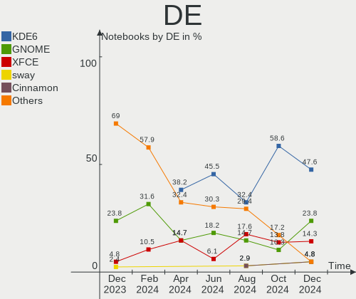

| Name    | Notebooks | Percent |
|---------|-----------|---------|
| KDE5    | 10        | 45.45%  |
| GNOME   | 5         | 22.73%  |
| XFCE    | 4         | 18.18%  |
| i3      | 1         | 4.55%   |
| Budgie  | 1         | 4.55%   |
| Unknown | 1         | 4.55%   |

Display Server
--------------

X11 or Wayland

| Name    | Notebooks | Percent |
|---------|-----------|---------|
| X11     | 15        | 68.18%  |
| Wayland | 5         | 22.73%  |
| Tty     | 1         | 4.55%   |
| Unknown | 1         | 4.55%   |

Display Manager
---------------

SDDM, LightDM, etc.

| Name    | Notebooks | Percent |
|---------|-----------|---------|
| LightDM | 12        | 54.55%  |
| SDDM    | 4         | 18.18%  |
| Unknown | 4         | 18.18%  |
| GDM     | 2         | 9.09%   |

OS Lang
-------

Language

| Lang  | Notebooks | Percent |
|-------|-----------|---------|
| en_US | 11        | 50%     |
| en_IN | 2         | 9.09%   |
| en_AU | 2         | 9.09%   |
| ru_RU | 1         | 4.55%   |
| pl_PL | 1         | 4.55%   |
| fi_FI | 1         | 4.55%   |
| es_AR | 1         | 4.55%   |
| en_PH | 1         | 4.55%   |
| en_IL | 1         | 4.55%   |
| en_CA | 1         | 4.55%   |

Boot Mode
---------

EFI or BIOS

| Mode | Notebooks | Percent |
|------|-----------|---------|
| EFI  | 16        | 72.73%  |
| BIOS | 6         | 27.27%  |

Filesystem
----------

Type of filesystem

| Type  | Notebooks | Percent |
|-------|-----------|---------|
| Ext4  | 16        | 72.73%  |
| Btrfs | 6         | 27.27%  |

Part. scheme
------------

Scheme of partitioning

| Type    | Notebooks | Percent |
|---------|-----------|---------|
| GPT     | 16        | 72.73%  |
| Unknown | 5         | 22.73%  |
| MBR     | 1         | 4.55%   |

Dual Boot with Linux/BSD
------------------------

Hosting more than one Linux/BSD

| Dual boot | Notebooks | Percent |
|-----------|-----------|---------|
| No        | 20        | 90.91%  |
| Yes       | 2         | 9.09%   |

Dual Boot (Win)
---------------

Hosting Linux and Windows

| Dual boot | Notebooks | Percent |
|-----------|-----------|---------|
| No        | 14        | 63.64%  |
| Yes       | 8         | 36.36%  |

Board
-----

Vendor
------

Motherboard manufacturer

| Name             | Notebooks | Percent |
|------------------|-----------|---------|
| Lenovo           | 7         | 31.82%  |
| ASUSTek Computer | 5         | 22.73%  |
| Hewlett-Packard  | 2         | 9.09%   |
| Dell             | 2         | 9.09%   |
| Acer             | 2         | 9.09%   |
| Timi             | 1         | 4.55%   |
| Schenker         | 1         | 4.55%   |
| MSI              | 1         | 4.55%   |
| HUAWEI           | 1         | 4.55%   |

Model
-----

Motherboard model

| Name                                   | Notebooks | Percent |
|----------------------------------------|-----------|---------|
| Timi A35S                              | 1         | 4.55%   |
| Schenker XMG FUSION 15 (XFU15L19)      | 1         | 4.55%   |
| MSI GP66 Leopard 10UH                  | 1         | 4.55%   |
| Lenovo Yoga 700-14ISK 80QD             | 1         | 4.55%   |
| Lenovo ThinkPad X240 20AMA2F8MS        | 1         | 4.55%   |
| Lenovo ThinkPad T560 20FJS4FV00        | 1         | 4.55%   |
| Lenovo ThinkPad E550 20DF0030US        | 1         | 4.55%   |
| Lenovo ThinkPad E14 Gen 3 20Y7001LCD   | 1         | 4.55%   |
| Lenovo IdeaPad S340-15IIL 81WL         | 1         | 4.55%   |
| Lenovo IdeaPad 330-15IKB 81DE          | 1         | 4.55%   |
| HUAWEI MACH-WX9                        | 1         | 4.55%   |
| HP Laptop 15-db0xxx                    | 1         | 4.55%   |
| HP EliteBook 2540p                     | 1         | 4.55%   |
| Dell Inspiron 5520                     | 1         | 4.55%   |
| Dell Inspiron 3542                     | 1         | 4.55%   |
| ASUS VivoBook_ASUSLaptop X515DA_M515DA | 1         | 4.55%   |
| ASUS TUF Gaming FX505DT_FX505DT        | 1         | 4.55%   |
| ASUS N43SL                             | 1         | 4.55%   |
| ASUS K45VD                             | 1         | 4.55%   |
| ASUS G751JT                            | 1         | 4.55%   |
| Acer Swift SF514-54T                   | 1         | 4.55%   |
| Acer Aspire A315-56                    | 1         | 4.55%   |

Model Family
------------

Motherboard model prefix

| Name            | Notebooks | Percent |
|-----------------|-----------|---------|
| Lenovo ThinkPad | 4         | 18.18%  |
| Lenovo IdeaPad  | 2         | 9.09%   |
| Dell Inspiron   | 2         | 9.09%   |
| Timi A35S       | 1         | 4.55%   |
| Schenker XMG    | 1         | 4.55%   |
| MSI GP66        | 1         | 4.55%   |
| Lenovo Yoga     | 1         | 4.55%   |
| HUAWEI MACH-WX9 | 1         | 4.55%   |
| HP Laptop       | 1         | 4.55%   |
| HP EliteBook    | 1         | 4.55%   |
| ASUS VivoBook   | 1         | 4.55%   |
| ASUS TUF        | 1         | 4.55%   |
| ASUS N43SL      | 1         | 4.55%   |
| ASUS K45VD      | 1         | 4.55%   |
| ASUS G751JT     | 1         | 4.55%   |
| Acer Swift      | 1         | 4.55%   |
| Acer Aspire     | 1         | 4.55%   |

MFG Year
--------

Motherboard manufacture year

| Year | Notebooks | Percent |
|------|-----------|---------|
| 2020 | 4         | 18.18%  |
| 2021 | 3         | 13.64%  |
| 2018 | 3         | 13.64%  |
| 2014 | 3         | 13.64%  |
| 2019 | 2         | 9.09%   |
| 2012 | 2         | 9.09%   |
| 2016 | 1         | 4.55%   |
| 2015 | 1         | 4.55%   |
| 2013 | 1         | 4.55%   |
| 2011 | 1         | 4.55%   |
| 2010 | 1         | 4.55%   |

Form Factor
-----------

Physical design of the computer

| Name     | Notebooks | Percent |
|----------|-----------|---------|
| Notebook | 22        | 100%    |

Secure Boot
-----------

Enabled or disabled

| State    | Notebooks | Percent |
|----------|-----------|---------|
| Disabled | 22        | 100%    |

Coreboot
--------

Have coreboot on board

| Used | Notebooks | Percent |
|------|-----------|---------|
| No   | 22        | 100%    |

RAM Size
--------

Total RAM memory

| Size in GB | Notebooks | Percent |
|------------|-----------|---------|
| 4.01-8.0   | 10        | 45.45%  |
| 16.01-24.0 | 5         | 22.73%  |
| 8.01-16.0  | 4         | 18.18%  |
| 3.01-4.0   | 2         | 9.09%   |
| 32.01-64.0 | 1         | 4.55%   |

RAM Used
--------

Used RAM memory

| Used GB  | Notebooks | Percent |
|----------|-----------|---------|
| 1.01-2.0 | 9         | 40.91%  |
| 2.01-3.0 | 5         | 22.73%  |
| 4.01-8.0 | 4         | 18.18%  |
| 3.01-4.0 | 3         | 13.64%  |
| 0.51-1.0 | 1         | 4.55%   |

Total Drives
------------

Number of drives on board

| Drives | Notebooks | Percent |
|--------|-----------|---------|
| 1      | 15        | 68.18%  |
| 2      | 5         | 22.73%  |
| 3      | 2         | 9.09%   |

Has CD-ROM
----------

Has CD-ROM on board

| Presented | Notebooks | Percent |
|-----------|-----------|---------|
| No        | 18        | 81.82%  |
| Yes       | 4         | 18.18%  |

Has Ethernet
------------

Has Ethernet on board

| Presented | Notebooks | Percent |
|-----------|-----------|---------|
| Yes       | 16        | 72.73%  |
| No        | 6         | 27.27%  |

Has WiFi
--------

Has WiFi module

| Presented | Notebooks | Percent |
|-----------|-----------|---------|
| Yes       | 22        | 100%    |

Has Bluetooth
-------------

Has Bluetooth module

| Presented | Notebooks | Percent |
|-----------|-----------|---------|
| Yes       | 20        | 90.91%  |
| No        | 2         | 9.09%   |

Location
--------

Country
-------

Geographic location (country)

| Country     | Notebooks | Percent |
|-------------|-----------|---------|
| USA         | 3         | 13.64%  |
| Poland      | 3         | 13.64%  |
| India       | 2         | 9.09%   |
| Finland     | 2         | 9.09%   |
| Australia   | 2         | 9.09%   |
| Sweden      | 1         | 4.55%   |
| Russia      | 1         | 4.55%   |
| Philippines | 1         | 4.55%   |
| Mexico      | 1         | 4.55%   |
| Israel      | 1         | 4.55%   |
| Indonesia   | 1         | 4.55%   |
| Germany     | 1         | 4.55%   |
| Georgia     | 1         | 4.55%   |
| France      | 1         | 4.55%   |
| Argentina   | 1         | 4.55%   |

City
----

Geographic location (city)

| City                     | Notebooks | Percent |
|--------------------------|-----------|---------|
| Toms River               | 1         | 4.55%   |
| Tervakoski               | 1         | 4.55%   |
| Tel Aviv                 | 1         | 4.55%   |
| Tbilisi                  | 1         | 4.55%   |
| Sydney                   | 1         | 4.55%   |
| Santa Maria Chimalhuacan | 1         | 4.55%   |
| Ramos Mejia              | 1         | 4.55%   |
| Poznan                   | 1         | 4.55%   |
| Potsdam                  | 1         | 4.55%   |
| Paris                    | 1         | 4.55%   |
| Moscow                   | 1         | 4.55%   |
| Miami                    | 1         | 4.55%   |
| Melbourne                | 1         | 4.55%   |
| Lodz                     | 1         | 4.55%   |
| Krakow                   | 1         | 4.55%   |
| Karlstad                 | 1         | 4.55%   |
| Jacksonville             | 1         | 4.55%   |
| Indore                   | 1         | 4.55%   |
| Helsinki                 | 1         | 4.55%   |
| Coimbatore               | 1         | 4.55%   |
| Bandung                  | 1         | 4.55%   |
| Angeles City             | 1         | 4.55%   |

Drives
------

Drive Vendor
------------

Hard drive vendors

| Vendor              | Notebooks | Drives | Percent |
|---------------------|-----------|--------|---------|
| Seagate             | 7         | 8      | 24.14%  |
| Samsung Electronics | 7         | 7      | 24.14%  |
| WDC                 | 2         | 2      | 6.9%    |
| SK Hynix            | 2         | 2      | 6.9%    |
| Kingston            | 2         | 2      | 6.9%    |
| Transcend           | 1         | 1      | 3.45%   |
| Toshiba             | 1         | 1      | 3.45%   |
| Sandisk             | 1         | 1      | 3.45%   |
| Micron Technology   | 1         | 1      | 3.45%   |
| KIOXIA              | 1         | 1      | 3.45%   |
| HUAWEI              | 1         | 1      | 3.45%   |
| Hitachi             | 1         | 1      | 3.45%   |
| HGST                | 1         | 1      | 3.45%   |
| GOODRAM             | 1         | 1      | 3.45%   |

Drive Model
-----------

Hard drive models

| Model                                       | Notebooks | Percent |
|---------------------------------------------|-----------|---------|
| Seagate ST1000LM035-1RK172 1TB              | 2         | 6.67%   |
| WDC WDS250G2B0A-00SM50 250GB SSD            | 1         | 3.33%   |
| WDC WD10SPZX-60Z10T0 1TB                    | 1         | 3.33%   |
| Transcend TS240GMTS420S 240GB SSD           | 1         | 3.33%   |
| Toshiba MQ04ABF100 1TB                      | 1         | 3.33%   |
| SK Hynix SKHynix_HFM512GD3HX015N 512GB      | 1         | 3.33%   |
| SK Hynix HFM256GDJTNG-8310A 256GB           | 1         | 3.33%   |
| Seagate ST9500325AS 500GB                   | 1         | 3.33%   |
| Seagate ST500LX012-SSHD-8GB                 | 1         | 3.33%   |
| Seagate ST500LT012-1DG142 500GB             | 1         | 3.33%   |
| Seagate ST1000LM024 HN-M101MBB 1TB          | 1         | 3.33%   |
| Seagate FireCuda 510 SSD ZP1000GM30001 1TB  | 1         | 3.33%   |
| Seagate BarraCuda Q1 SSD ZA240CV10001 240GB | 1         | 3.33%   |
| Sandisk NVMe SSD Drive 1TB                  | 1         | 3.33%   |
| Samsung SSD 970 EVO 500GB                   | 1         | 3.33%   |
| Samsung SSD 870 EVO 250GB                   | 1         | 3.33%   |
| Samsung SSD 850 EVO 500GB                   | 1         | 3.33%   |
| Samsung SSD 850 EVO 120GB                   | 1         | 3.33%   |
| Samsung NVMe SSD Drive 512GB                | 1         | 3.33%   |
| Samsung MZVLB1T0HBLR-00000 1TB              | 1         | 3.33%   |
| Samsung MZ7LN512HMJP-000L7 512GB SSD        | 1         | 3.33%   |
| Micron 2200V_MTFDHBA512TCK 512GB            | 1         | 3.33%   |
| KIOXIA KBG40ZNV512G 512GB                   | 1         | 3.33%   |
| Kingston SA400S37480G 480GB SSD             | 1         | 3.33%   |
| Kingston OM8PCP3512F-AB 512GB               | 1         | 3.33%   |
| HUAWEI TF CARD Storage 32GB                 | 1         | 3.33%   |
| Hitachi HTS547575A9E384 752GB               | 1         | 3.33%   |
| HGST HTS721010A9E630 1TB                    | 1         | 3.33%   |
| GOODRAM SSDPR-CX400-512-G2 512GB            | 1         | 3.33%   |

HDD Vendor
----------

Hard disk drive vendors

| Vendor  | Notebooks | Drives | Percent |
|---------|-----------|--------|---------|
| Seagate | 6         | 6      | 60%     |
| WDC     | 1         | 1      | 10%     |
| Toshiba | 1         | 1      | 10%     |
| Hitachi | 1         | 1      | 10%     |
| HGST    | 1         | 1      | 10%     |

SSD Vendor
----------

Solid state drive vendors

| Vendor              | Notebooks | Drives | Percent |
|---------------------|-----------|--------|---------|
| Samsung Electronics | 4         | 4      | 44.44%  |
| WDC                 | 1         | 1      | 11.11%  |
| Transcend           | 1         | 1      | 11.11%  |
| Seagate             | 1         | 1      | 11.11%  |
| Kingston            | 1         | 1      | 11.11%  |
| GOODRAM             | 1         | 1      | 11.11%  |

Drive Kind
----------

HDD or SSD

| Kind    | Notebooks | Drives | Percent |
|---------|-----------|--------|---------|
| HDD     | 10        | 10     | 35.71%  |
| NVMe    | 9         | 10     | 32.14%  |
| SSD     | 8         | 9      | 28.57%  |
| Unknown | 1         | 1      | 3.57%   |

Drive Connector
---------------

SATA, SAS, NVMe, etc.

| Type | Notebooks | Drives | Percent |
|------|-----------|--------|---------|
| SATA | 14        | 19     | 58.33%  |
| NVMe | 9         | 10     | 37.5%   |
| SAS  | 1         | 1      | 4.17%   |

Drive Size
----------

Size of hard drive

| Size in TB | Notebooks | Drives | Percent |
|------------|-----------|--------|---------|
| 0.51-1.0   | 9         | 9      | 52.94%  |
| 0.01-0.5   | 8         | 10     | 47.06%  |

Space Total
-----------

Amount of disk space available on the file system

| Size in GB     | Notebooks | Percent |
|----------------|-----------|---------|
| 251-500        | 8         | 36.36%  |
| 501-1000       | 5         | 22.73%  |
| 1001-2000      | 2         | 9.09%   |
| 51-100         | 2         | 9.09%   |
| Unknown        | 2         | 9.09%   |
| More than 3000 | 1         | 4.55%   |
| 21-50          | 1         | 4.55%   |
| 101-250        | 1         | 4.55%   |

Space Used
----------

Amount of used disk space

| Used GB  | Notebooks | Percent |
|----------|-----------|---------|
| 1-20     | 6         | 27.27%  |
| 101-250  | 5         | 22.73%  |
| 21-50    | 3         | 13.64%  |
| 51-100   | 3         | 13.64%  |
| 251-500  | 2         | 9.09%   |
| Unknown  | 2         | 9.09%   |
| 501-1000 | 1         | 4.55%   |

Malfunc. Drives
---------------

Drive models with a malfunction

| Model                             | Notebooks | Drives | Percent |
|-----------------------------------|-----------|--------|---------|
| Transcend TS240GMTS420S 240GB SSD | 1         | 1      | 50%     |
| Seagate ST500LX012-SSHD-8GB       | 1         | 1      | 50%     |

Malfunc. Drive Vendor
---------------------

Vendors of faulty drives

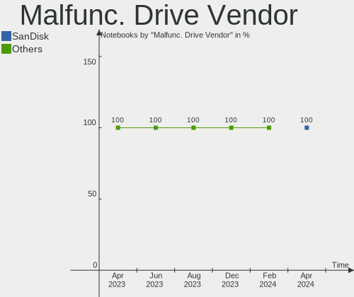

| Vendor    | Notebooks | Drives | Percent |
|-----------|-----------|--------|---------|
| Transcend | 1         | 1      | 50%     |
| Seagate   | 1         | 1      | 50%     |

Malfunc. HDD Vendor
-------------------

Vendors of faulty HDD drives

| Vendor  | Notebooks | Drives | Percent |
|---------|-----------|--------|---------|
| Seagate | 1         | 1      | 100%    |

Malfunc. Drive Kind
-------------------

Kinds of faulty drives

| Kind | Notebooks | Drives | Percent |
|------|-----------|--------|---------|
| SSD  | 1         | 1      | 50%     |
| HDD  | 1         | 1      | 50%     |

Failed Drives
-------------

Failed drive models

Zero info for selected period =(

Failed Drive Vendor
-------------------

Failed drive vendors

Zero info for selected period =(

Drive Status
------------

Number of failed and malfunc. drives

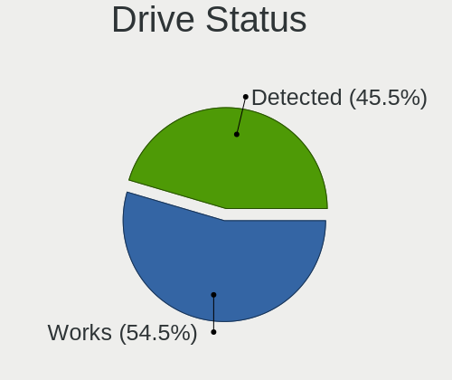

| Status   | Notebooks | Drives | Percent |
|----------|-----------|--------|---------|
| Works    | 16        | 19     | 64%     |
| Detected | 7         | 9      | 28%     |
| Malfunc  | 2         | 2      | 8%      |

Storage controller
------------------

Storage Vendor
--------------

Storage controller vendors

| Vendor                      | Notebooks | Percent |
|-----------------------------|-----------|---------|
| Intel                       | 14        | 51.85%  |
| Samsung Electronics         | 3         | 11.11%  |
| AMD                         | 3         | 11.11%  |
| SK Hynix                    | 2         | 7.41%   |
| Seagate Technology          | 1         | 3.7%    |
| Sandisk                     | 1         | 3.7%    |
| Micron Technology           | 1         | 3.7%    |
| KIOXIA                      | 1         | 3.7%    |
| Kingston Technology Company | 1         | 3.7%    |

Storage Model
-------------

Storage controller models

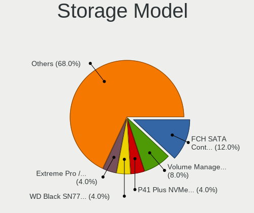

| Model                                                                          | Notebooks | Percent |
|--------------------------------------------------------------------------------|-----------|---------|
| Samsung NVMe SSD Controller SM981/PM981/PM983                                  | 3         | 10.71%  |
| Intel Sunrise Point-LP SATA Controller [AHCI mode]                             | 3         | 10.71%  |
| AMD FCH SATA Controller [AHCI mode]                                            | 3         | 10.71%  |
| Intel Ice Lake-LP SATA Controller [AHCI mode]                                  | 2         | 7.14%   |
| Intel 8 Series SATA Controller 1 [AHCI mode]                                   | 2         | 7.14%   |
| Intel 7 Series Chipset Family 6-port SATA Controller [AHCI mode]               | 2         | 7.14%   |
| SK Hynix Gold P31 SSD                                                          | 1         | 3.57%   |
| SK Hynix BC501 NVMe Solid State Drive                                          | 1         | 3.57%   |
| Seagate FireCuda 510 SSD                                                       | 1         | 3.57%   |
| Sandisk WD Blue SN570 NVMe SSD                                                 | 1         | 3.57%   |
| Micron Non-Volatile memory controller                                          | 1         | 3.57%   |
| KIOXIA Non-Volatile memory controller                                          | 1         | 3.57%   |
| Kingston Company Company Non-Volatile memory controller                        | 1         | 3.57%   |
| Intel Wildcat Point-LP SATA Controller [AHCI Mode]                             | 1         | 3.57%   |
| Intel Cannon Lake Mobile PCH SATA AHCI Controller                              | 1         | 3.57%   |
| Intel 8 Series/C220 Series Chipset Family 6-port SATA Controller 1 [AHCI mode] | 1         | 3.57%   |
| Intel 6 Series/C200 Series Chipset Family 6 port Mobile SATA AHCI Controller   | 1         | 3.57%   |
| Intel 5 Series/3400 Series Chipset 4 port SATA IDE Controller                  | 1         | 3.57%   |
| Intel 5 Series/3400 Series Chipset 2 port SATA IDE Controller                  | 1         | 3.57%   |

Storage Kind
------------

Kind of storage controller (IDE, SATA, NVMe, SAS, ...)

| Kind | Notebooks | Percent |
|------|-----------|---------|
| SATA | 16        | 61.54%  |
| NVMe | 9         | 34.62%  |
| IDE  | 1         | 3.85%   |

Processor
---------

CPU Vendor
----------

Processor vendors

| Vendor | Notebooks | Percent |
|--------|-----------|---------|
| Intel  | 17        | 77.27%  |
| AMD    | 5         | 22.73%  |

CPU Model
---------

Processor models

| Model                                         | Notebooks | Percent |
|-----------------------------------------------|-----------|---------|
| Intel Core i5-1035G1 CPU @ 1.00GHz            | 2         | 9.09%   |
| Intel Core i7-9750H CPU @ 2.60GHz             | 1         | 4.55%   |
| Intel Core i7-8550U CPU @ 1.80GHz             | 1         | 4.55%   |
| Intel Core i7-4720HQ CPU @ 2.60GHz            | 1         | 4.55%   |
| Intel Core i7-3610QM CPU @ 2.30GHz            | 1         | 4.55%   |
| Intel Core i7-10870H CPU @ 2.20GHz            | 1         | 4.55%   |
| Intel Core i5-6300U CPU @ 2.40GHz             | 1         | 4.55%   |
| Intel Core i5-6200U CPU @ 2.30GHz             | 1         | 4.55%   |
| Intel Core i5-5200U CPU @ 2.20GHz             | 1         | 4.55%   |
| Intel Core i5-4210U CPU @ 1.70GHz             | 1         | 4.55%   |
| Intel Core i5-4200U CPU @ 1.60GHz             | 1         | 4.55%   |
| Intel Core i5-3210M CPU @ 2.50GHz             | 1         | 4.55%   |
| Intel Core i5-2430M CPU @ 2.40GHz             | 1         | 4.55%   |
| Intel Core i5 CPU M 540 @ 2.53GHz             | 1         | 4.55%   |
| Intel Core i3-8130U CPU @ 2.20GHz             | 1         | 4.55%   |
| Intel Core i3-1005G1 CPU @ 1.20GHz            | 1         | 4.55%   |
| AMD Ryzen 7 5700U with Radeon Graphics        | 1         | 4.55%   |
| AMD Ryzen 5 5600H with Radeon Graphics        | 1         | 4.55%   |
| AMD Ryzen 5 3550H with Radeon Vega Mobile Gfx | 1         | 4.55%   |
| AMD Ryzen 5 3500U with Radeon Vega Mobile Gfx | 1         | 4.55%   |
| AMD A9-9425 RADEON R5, 5 COMPUTE CORES 2C+3G  | 1         | 4.55%   |

CPU Model Family
----------------

Processor model prefix

| Model         | Notebooks | Percent |
|---------------|-----------|---------|
| Intel Core i5 | 10        | 45.45%  |
| Intel Core i7 | 5         | 22.73%  |
| AMD Ryzen 5   | 3         | 13.64%  |
| Intel Core i3 | 2         | 9.09%   |
| Other         | 1         | 4.55%   |
| AMD Ryzen 7   | 1         | 4.55%   |

CPU Cores
---------

Number of processor cores

| Number | Notebooks | Percent |
|--------|-----------|---------|
| 2      | 11        | 50%     |
| 4      | 7         | 31.82%  |
| 8      | 2         | 9.09%   |
| 6      | 2         | 9.09%   |

CPU Sockets
-----------

Number of sockets

| Number | Notebooks | Percent |
|--------|-----------|---------|
| 1      | 22        | 100%    |

CPU Threads
-----------

Threads per core (Hyper-Threading)

| Number | Notebooks | Percent |
|--------|-----------|---------|
| 2      | 21        | 95.45%  |
| 1      | 1         | 4.55%   |

CPU Op-Modes
------------

CPU Operation Modes (32-bit, 64-bit)

| Op mode        | Notebooks | Percent |
|----------------|-----------|---------|
| 32-bit, 64-bit | 22        | 100%    |

CPU Microcode
-------------

Microcode number

| Number     | Notebooks | Percent |
|------------|-----------|---------|
| Unknown    | 5         | 22.73%  |
| 0x706e5    | 2         | 9.09%   |
| 0x406e3    | 2         | 9.09%   |
| 0xa0652    | 1         | 4.55%   |
| 0x906ea    | 1         | 4.55%   |
| 0x806ea    | 1         | 4.55%   |
| 0x40651    | 1         | 4.55%   |
| 0x306d4    | 1         | 4.55%   |
| 0x306c3    | 1         | 4.55%   |
| 0x206a7    | 1         | 4.55%   |
| 0x20652    | 1         | 4.55%   |
| 0x0a50000c | 1         | 4.55%   |
| 0x08608103 | 1         | 4.55%   |
| 0x08108109 | 1         | 4.55%   |
| 0x08108102 | 1         | 4.55%   |
| 0x06006705 | 1         | 4.55%   |

CPU Microarch
-------------

Microarchitecture

| Name        | Notebooks | Percent |
|-------------|-----------|---------|
| KabyLake    | 3         | 13.64%  |
| IceLake     | 3         | 13.64%  |
| Haswell     | 3         | 13.64%  |
| Zen+        | 2         | 9.09%   |
| Skylake     | 2         | 9.09%   |
| IvyBridge   | 2         | 9.09%   |
| Zen 3       | 1         | 4.55%   |
| Westmere    | 1         | 4.55%   |
| SandyBridge | 1         | 4.55%   |
| Excavator   | 1         | 4.55%   |
| CometLake   | 1         | 4.55%   |
| Broadwell   | 1         | 4.55%   |
| Unknown     | 1         | 4.55%   |

Graphics
--------

GPU Vendor
----------

Vendors of graphics cards

| Vendor | Notebooks | Percent |
|--------|-----------|---------|
| Intel  | 16        | 53.33%  |
| Nvidia | 8         | 26.67%  |
| AMD    | 6         | 20%     |

GPU Model
---------

Graphics card models

| Model                                                                     | Notebooks | Percent |
|---------------------------------------------------------------------------|-----------|---------|
| Intel Iris Plus Graphics G1 (Ice Lake)                                    | 3         | 10%     |
| Intel UHD Graphics 620                                                    | 2         | 6.67%   |
| Intel Skylake GT2 [HD Graphics 520]                                       | 2         | 6.67%   |
| Intel Haswell-ULT Integrated Graphics Controller                          | 2         | 6.67%   |
| Intel 3rd Gen Core processor Graphics Controller                          | 2         | 6.67%   |
| AMD Picasso/Raven 2 [Radeon Vega Series / Radeon Vega Mobile Series]      | 2         | 6.67%   |
| Nvidia TU117M [GeForce GTX 1650 Mobile / Max-Q]                           | 1         | 3.33%   |
| Nvidia TU116M [GeForce GTX 1660 Ti Mobile]                                | 1         | 3.33%   |
| Nvidia GP108M [GeForce MX250]                                             | 1         | 3.33%   |
| Nvidia GP108M [GeForce MX150]                                             | 1         | 3.33%   |
| Nvidia GM204M [GeForce GTX 970M]                                          | 1         | 3.33%   |
| Nvidia GF119M [GeForce 610M]                                              | 1         | 3.33%   |
| Nvidia GF108M [GeForce GT 540M]                                           | 1         | 3.33%   |
| Nvidia GA104M [GeForce RTX 3080 Mobile / Max-Q 8GB/16GB]                  | 1         | 3.33%   |
| Intel HD Graphics 5500                                                    | 1         | 3.33%   |
| Intel Core Processor Integrated Graphics Controller                       | 1         | 3.33%   |
| Intel CometLake-H GT2 [UHD Graphics]                                      | 1         | 3.33%   |
| Intel CoffeeLake-H GT2 [UHD Graphics 630]                                 | 1         | 3.33%   |
| Intel 2nd Generation Core Processor Family Integrated Graphics Controller | 1         | 3.33%   |
| AMD Thames [Radeon HD 7500M/7600M Series]                                 | 1         | 3.33%   |
| AMD Stoney [Radeon R2/R3/R4/R5 Graphics]                                  | 1         | 3.33%   |
| AMD Lucienne                                                              | 1         | 3.33%   |
| AMD Cezanne                                                               | 1         | 3.33%   |

GPU Combo
---------

Combinations of graphics cards

| Name           | Notebooks | Percent |
|----------------|-----------|---------|
| 1 x Intel      | 9         | 40.91%  |
| Intel + Nvidia | 6         | 27.27%  |
| 1 x AMD        | 4         | 18.18%  |
| 1 x Nvidia     | 1         | 4.55%   |
| Intel + AMD    | 1         | 4.55%   |
| AMD + Nvidia   | 1         | 4.55%   |

GPU Driver
----------

Free vs proprietary

| Driver      | Notebooks | Percent |
|-------------|-----------|---------|
| Free        | 16        | 72.73%  |
| Proprietary | 6         | 27.27%  |

GPU Memory
----------

Total video memory

| Size in GB | Notebooks | Percent |
|------------|-----------|---------|
| Unknown    | 16        | 72.73%  |
| 1.01-2.0   | 2         | 9.09%   |
| 0.01-0.5   | 2         | 9.09%   |
| 7.01-8.0   | 1         | 4.55%   |
| 2.01-3.0   | 1         | 4.55%   |

Monitor
-------

Monitor Vendor
--------------

Monitor vendors

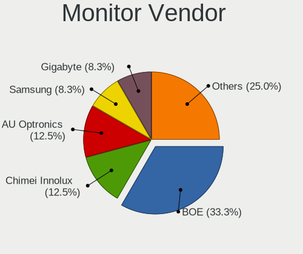

| Vendor              | Notebooks | Percent |
|---------------------|-----------|---------|
| LG Display          | 5         | 18.52%  |
| Chimei Innolux      | 5         | 18.52%  |
| AU Optronics        | 4         | 14.81%  |
| Samsung Electronics | 2         | 7.41%   |
| PANDA               | 2         | 7.41%   |
| BOE                 | 2         | 7.41%   |
| ViewSonic           | 1         | 3.7%    |
| Sony                | 1         | 3.7%    |
| Sharp               | 1         | 3.7%    |
| JDI                 | 1         | 3.7%    |
| InnoLux Display     | 1         | 3.7%    |
| DENON               | 1         | 3.7%    |
| BenQ                | 1         | 3.7%    |

Monitor Model
-------------

Monitor models

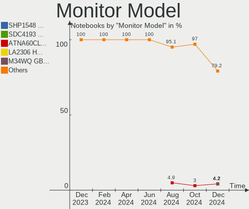

| Model                                                                 | Notebooks | Percent |
|-----------------------------------------------------------------------|-----------|---------|
| AU Optronics LCD Monitor AUO21ED 1920x1080 344x193mm 15.5-inch        | 2         | 7.41%   |
| ViewSonic VX3211-2K VSCF634 2560x1440 698x392mm 31.5-inch             | 1         | 3.7%    |
| Sony TV *00 SNYF503 1920x1080 1218x685mm 55.0-inch                    | 1         | 3.7%    |
| Sharp LQ156M1JW03 SHP14C5 1920x1080 344x194mm 15.5-inch               | 1         | 3.7%    |
| Samsung Electronics S24F350 SAM0D20 1920x1080 521x293mm 23.5-inch     | 1         | 3.7%    |
| Samsung Electronics LCD Monitor SDC4150 3456x2160 336x210mm 15.6-inch | 1         | 3.7%    |
| PANDA LCD Monitor NCP0063 1920x1080 344x194mm 15.5-inch               | 1         | 3.7%    |
| PANDA LCD Monitor NCP0036 1920x1080 340x190mm 15.3-inch               | 1         | 3.7%    |
| LG Display LCD Monitor LGD046C 1920x1080 382x215mm 17.3-inch          | 1         | 3.7%    |
| LG Display LCD Monitor LGD0437 1920x1080 276x156mm 12.5-inch          | 1         | 3.7%    |
| LG Display LCD Monitor LGD033A 1366x768 344x194mm 15.5-inch           | 1         | 3.7%    |
| LG Display LCD Monitor LGD02F8 1366x768 309x174mm 14.0-inch           | 1         | 3.7%    |
| LG Display LCD Monitor LGD024F 1280x800 260x160mm 12.0-inch           | 1         | 3.7%    |
| JDI LCD Monitor JDI422A 3000x2000 293x196mm 13.9-inch                 | 1         | 3.7%    |
| InnoLux Display LCD Monitor CMI001B 1366x768 309x174mm 14.0-inch      | 1         | 3.7%    |
| DENON AVAMP DON0052 1920x1080 521x293mm 23.5-inch                     | 1         | 3.7%    |
| Chimei Innolux LCD Monitor CMN15DC 1366x768 344x193mm 15.5-inch       | 1         | 3.7%    |
| Chimei Innolux LCD Monitor CMN15DB 1366x768 344x193mm 15.5-inch       | 1         | 3.7%    |
| Chimei Innolux LCD Monitor CMN15BF 1366x768 344x194mm 15.5-inch       | 1         | 3.7%    |
| Chimei Innolux LCD Monitor CMN14B6 1920x1080 308x173mm 13.9-inch      | 1         | 3.7%    |
| Chimei Innolux LCD Monitor CMN1408 1920x1080 309x173mm 13.9-inch      | 1         | 3.7%    |
| BOE LCD Monitor BOE084D 1920x1080 344x193mm 15.5-inch                 | 1         | 3.7%    |
| BOE LCD Monitor BOE0630 1920x1080 344x194mm 15.5-inch                 | 1         | 3.7%    |
| BenQ XL2411Z BNQ7F30 1920x1080 531x298mm 24.0-inch                    | 1         | 3.7%    |
| AU Optronics LCD Monitor AUO41EC 1366x768 344x193mm 15.5-inch         | 1         | 3.7%    |
| AU Optronics LCD Monitor AUO253D 1920x1080 309x173mm 13.9-inch        | 1         | 3.7%    |

Monitor Resolution
------------------

Monitor screen resolution

| Resolution      | Notebooks | Percent |
|-----------------|-----------|---------|
| 1920x1080 (FHD) | 13        | 54.17%  |
| 1366x768 (WXGA) | 7         | 29.17%  |
| 3456x2160       | 1         | 4.17%   |
| 3000x2000       | 1         | 4.17%   |
| 2560x1440 (QHD) | 1         | 4.17%   |
| 1280x800 (WXGA) | 1         | 4.17%   |

Monitor Diagonal
----------------

Diagonal size in inches

| Inches | Notebooks | Percent |
|--------|-----------|---------|
| 15     | 13        | 48.15%  |
| 14     | 3         | 11.11%  |
| 13     | 3         | 11.11%  |
| 23     | 2         | 7.41%   |
| 12     | 2         | 7.41%   |
| 65     | 1         | 3.7%    |
| 31     | 1         | 3.7%    |
| 24     | 1         | 3.7%    |
| 17     | 1         | 3.7%    |

Monitor Width
-------------

Physical width

| Width in mm | Notebooks | Percent |
|-------------|-----------|---------|
| 301-350     | 18        | 66.67%  |
| 501-600     | 3         | 11.11%  |
| 201-300     | 3         | 11.11%  |
| 601-700     | 1         | 3.7%    |
| 351-400     | 1         | 3.7%    |
| 1001-1500   | 1         | 3.7%    |

Aspect Ratio
------------

Proportional relationship between the width and the height

| Ratio | Notebooks | Percent |
|-------|-----------|---------|
| 16/9  | 19        | 86.36%  |
| 16/10 | 2         | 9.09%   |
| 3/2   | 1         | 4.55%   |

Monitor Area
------------

Area in inch²

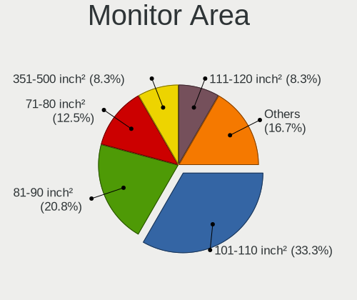

| Area in inch² | Notebooks | Percent |
|----------------|-----------|---------|
| 101-110        | 13        | 48.15%  |
| 81-90          | 6         | 22.22%  |
| 201-250        | 3         | 11.11%  |
| 61-70          | 2         | 7.41%   |
| More than 1000 | 1         | 3.7%    |
| 351-500        | 1         | 3.7%    |
| 121-130        | 1         | 3.7%    |

Pixel Density
-------------

Pixels per inch

| Density       | Notebooks | Percent |
|---------------|-----------|---------|
| 121-160       | 12        | 46.15%  |
| 101-120       | 7         | 26.92%  |
| 51-100        | 3         | 11.54%  |
| More than 240 | 2         | 7.69%   |
| 1-50          | 1         | 3.85%   |
| 161-240       | 1         | 3.85%   |

Multiple Monitors
-----------------

Total monitors connected

| Total | Notebooks | Percent |
|-------|-----------|---------|
| 1     | 18        | 81.82%  |
| 2     | 3         | 13.64%  |
| 3     | 1         | 4.55%   |

Network
-------

Net Controller Vendor
---------------------

Controller vendors

| Vendor                | Notebooks | Percent |
|-----------------------|-----------|---------|
| Intel                 | 14        | 45.16%  |
| Realtek Semiconductor | 11        | 35.48%  |
| Qualcomm Atheros      | 3         | 9.68%   |
| MEDIATEK              | 1         | 3.23%   |
| Huawei Technologies   | 1         | 3.23%   |
| Broadcom              | 1         | 3.23%   |

Net Controller Model
--------------------

Controller models

| Model                                                             | Notebooks | Percent |
|-------------------------------------------------------------------|-----------|---------|
| Realtek RTL8111/8168/8411 PCI Express Gigabit Ethernet Controller | 8         | 19.51%  |
| Realtek RTL8821CE 802.11ac PCIe Wireless Network Adapter          | 2         | 4.88%   |
| Realtek RTL810xE PCI Express Fast Ethernet controller             | 2         | 4.88%   |
| Intel Wireless 8265 / 8275                                        | 2         | 4.88%   |
| Intel Wireless 7260                                               | 2         | 4.88%   |
| Intel Wi-Fi 6 AX200                                               | 2         | 4.88%   |
| Intel Ice Lake-LP PCH CNVi WiFi                                   | 2         | 4.88%   |
| Realtek RTL8723DE Wireless Network Adapter                        | 1         | 2.44%   |
| Realtek RTL8153 Gigabit Ethernet Adapter                          | 1         | 2.44%   |
| Realtek 802.11ac NIC                                              | 1         | 2.44%   |
| Qualcomm Atheros QCA9565 / AR9565 Wireless Network Adapter        | 1         | 2.44%   |
| Qualcomm Atheros QCA9377 802.11ac Wireless Network Adapter        | 1         | 2.44%   |
| Qualcomm Atheros AR9285 Wireless Network Adapter (PCI-Express)    | 1         | 2.44%   |
| Qualcomm Atheros AR8151 v2.0 Gigabit Ethernet                     | 1         | 2.44%   |
| MEDIATEK MT7921 802.11ax PCI Express Wireless Network Adapter     | 1         | 2.44%   |
| Intel Wireless 8260                                               | 1         | 2.44%   |
| Intel Wireless 3160                                               | 1         | 2.44%   |
| Intel Ethernet Controller I225-V                                  | 1         | 2.44%   |
| Intel Ethernet Connection I219-LM                                 | 1         | 2.44%   |
| Intel Ethernet Connection I218-LM                                 | 1         | 2.44%   |
| Intel Ethernet Connection (3) I218-V                              | 1         | 2.44%   |
| Intel Dual Band Wireless-AC 3165 Plus Bluetooth                   | 1         | 2.44%   |
| Intel Comet Lake PCH CNVi WiFi                                    | 1         | 2.44%   |
| Intel Centrino Wireless-N 1000 [Condor Peak]                      | 1         | 2.44%   |
| Intel Centrino Advanced-N 6200                                    | 1         | 2.44%   |
| Intel 82577LM Gigabit Network Connection                          | 1         | 2.44%   |
| Huawei Modem/Networkcard                                          | 1         | 2.44%   |
| Broadcom BCM43142 802.11b/g/n                                     | 1         | 2.44%   |

Wireless Vendor
---------------

Wireless vendors

| Vendor                | Notebooks | Percent |
|-----------------------|-----------|---------|
| Intel                 | 14        | 60.87%  |
| Realtek Semiconductor | 4         | 17.39%  |
| Qualcomm Atheros      | 3         | 13.04%  |
| MEDIATEK              | 1         | 4.35%   |
| Broadcom              | 1         | 4.35%   |

Wireless Model
--------------

Wireless models

| Model                                                          | Notebooks | Percent |
|----------------------------------------------------------------|-----------|---------|
| Realtek RTL8821CE 802.11ac PCIe Wireless Network Adapter       | 2         | 8.7%    |
| Intel Wireless 8265 / 8275                                     | 2         | 8.7%    |
| Intel Wireless 7260                                            | 2         | 8.7%    |
| Intel Wi-Fi 6 AX200                                            | 2         | 8.7%    |
| Intel Ice Lake-LP PCH CNVi WiFi                                | 2         | 8.7%    |
| Realtek RTL8723DE Wireless Network Adapter                     | 1         | 4.35%   |
| Realtek 802.11ac NIC                                           | 1         | 4.35%   |
| Qualcomm Atheros QCA9565 / AR9565 Wireless Network Adapter     | 1         | 4.35%   |
| Qualcomm Atheros QCA9377 802.11ac Wireless Network Adapter     | 1         | 4.35%   |
| Qualcomm Atheros AR9285 Wireless Network Adapter (PCI-Express) | 1         | 4.35%   |
| MEDIATEK MT7921 802.11ax PCI Express Wireless Network Adapter  | 1         | 4.35%   |
| Intel Wireless 8260                                            | 1         | 4.35%   |
| Intel Wireless 3160                                            | 1         | 4.35%   |
| Intel Dual Band Wireless-AC 3165 Plus Bluetooth                | 1         | 4.35%   |
| Intel Comet Lake PCH CNVi WiFi                                 | 1         | 4.35%   |
| Intel Centrino Wireless-N 1000 [Condor Peak]                   | 1         | 4.35%   |
| Intel Centrino Advanced-N 6200                                 | 1         | 4.35%   |
| Broadcom BCM43142 802.11b/g/n                                  | 1         | 4.35%   |

Ethernet Vendor
---------------

Ethernet vendors

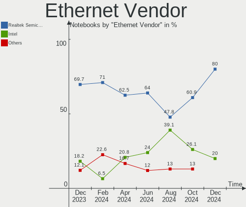

| Vendor                | Notebooks | Percent |
|-----------------------|-----------|---------|
| Realtek Semiconductor | 10        | 62.5%   |
| Intel                 | 5         | 31.25%  |
| Qualcomm Atheros      | 1         | 6.25%   |

Ethernet Model
--------------

Ethernet models

| Model                                                             | Notebooks | Percent |
|-------------------------------------------------------------------|-----------|---------|
| Realtek RTL8111/8168/8411 PCI Express Gigabit Ethernet Controller | 8         | 47.06%  |
| Realtek RTL810xE PCI Express Fast Ethernet controller             | 2         | 11.76%  |
| Realtek RTL8153 Gigabit Ethernet Adapter                          | 1         | 5.88%   |
| Qualcomm Atheros AR8151 v2.0 Gigabit Ethernet                     | 1         | 5.88%   |
| Intel Ethernet Controller I225-V                                  | 1         | 5.88%   |
| Intel Ethernet Connection I219-LM                                 | 1         | 5.88%   |
| Intel Ethernet Connection I218-LM                                 | 1         | 5.88%   |
| Intel Ethernet Connection (3) I218-V                              | 1         | 5.88%   |
| Intel 82577LM Gigabit Network Connection                          | 1         | 5.88%   |

Net Controller Kind
-------------------

Ethernet, WiFi or modem

| Kind     | Notebooks | Percent |
|----------|-----------|---------|
| WiFi     | 22        | 56.41%  |
| Ethernet | 16        | 41.03%  |
| Modem    | 1         | 2.56%   |

Used Controller
---------------

Currently used network controller

| Kind     | Notebooks | Percent |
|----------|-----------|---------|
| WiFi     | 18        | 72%     |
| Ethernet | 7         | 28%     |

NICs
----

Total network controllers on board

| Total | Notebooks | Percent |
|-------|-----------|---------|
| 2     | 16        | 72.73%  |
| 1     | 6         | 27.27%  |

IPv6
----

IPv6 vs IPv4

| Used | Notebooks | Percent |
|------|-----------|---------|
| No   | 17        | 77.27%  |
| Yes  | 5         | 22.73%  |

Bluetooth
---------

Bluetooth Vendor
----------------

Controller vendors

| Vendor                          | Notebooks | Percent |
|---------------------------------|-----------|---------|
| Intel                           | 12        | 60%     |
| Realtek Semiconductor           | 2         | 10%     |
| Qualcomm Atheros Communications | 2         | 10%     |
| IMC Networks                    | 1         | 5%      |
| Foxconn / Hon Hai               | 1         | 5%      |
| Cambridge Silicon Radio         | 1         | 5%      |
| Broadcom                        | 1         | 5%      |

Bluetooth Model
---------------

Controller models

| Model                                               | Notebooks | Percent |
|-----------------------------------------------------|-----------|---------|
| Intel Bluetooth Device                              | 8         | 40%     |
| Intel Bluetooth wireless interface                  | 3         | 15%     |
| Realtek  Bluetooth 4.2 Adapter                      | 1         | 5%      |
| Realtek Bluetooth Radio                             | 1         | 5%      |
| Qualcomm Atheros  Bluetooth Device                  | 1         | 5%      |
| Qualcomm Atheros AR9462 Bluetooth                   | 1         | 5%      |
| Intel Bluetooth 9460/9560 Jefferson Peak (JfP)      | 1         | 5%      |
| IMC Networks Bluetooth Radio                        | 1         | 5%      |
| Foxconn / Hon Hai Wireless_Device                   | 1         | 5%      |
| Cambridge Silicon Radio Bluetooth Dongle (HCI mode) | 1         | 5%      |
| Broadcom BCM43142 Bluetooth 4.0                     | 1         | 5%      |

Sound
-----

Sound Vendor
------------

Sound card vendors

| Vendor | Notebooks | Percent |
|--------|-----------|---------|
| Intel  | 17        | 60.71%  |
| Nvidia | 5         | 17.86%  |
| AMD    | 5         | 17.86%  |
| Lenovo | 1         | 3.57%   |

Sound Model
-----------

Sound card models

| Model                                                                      | Notebooks | Percent |
|----------------------------------------------------------------------------|-----------|---------|
| Intel Sunrise Point-LP HD Audio                                            | 4         | 11.43%  |
| AMD Family 17h (Models 10h-1fh) HD Audio Controller                        | 4         | 11.43%  |
| Intel Ice Lake-LP Smart Sound Technology Audio Controller                  | 3         | 8.57%   |
| Intel Haswell-ULT HD Audio Controller                                      | 2         | 5.71%   |
| Intel 8 Series HD Audio Controller                                         | 2         | 5.71%   |
| Intel 7 Series/C216 Chipset Family High Definition Audio Controller        | 2         | 5.71%   |
| AMD Renoir Radeon High Definition Audio Controller                         | 2         | 5.71%   |
| Nvidia TU116 High Definition Audio Controller                              | 1         | 2.86%   |
| Nvidia TU107 GeForce GTX 1650 High Definition Audio Controller             | 1         | 2.86%   |
| Nvidia GM204 High Definition Audio Controller                              | 1         | 2.86%   |
| Nvidia GF108 High Definition Audio Controller                              | 1         | 2.86%   |
| Nvidia GA104 High Definition Audio Controller                              | 1         | 2.86%   |
| Lenovo ThinkPad Thunderbolt 4 Dock USB Audio                               | 1         | 2.86%   |
| Intel Wildcat Point-LP High Definition Audio Controller                    | 1         | 2.86%   |
| Intel Comet Lake PCH cAVS                                                  | 1         | 2.86%   |
| Intel Cannon Lake PCH cAVS                                                 | 1         | 2.86%   |
| Intel Broadwell-U Audio Controller                                         | 1         | 2.86%   |
| Intel 8 Series/C220 Series Chipset High Definition Audio Controller        | 1         | 2.86%   |
| Intel 6 Series/C200 Series Chipset Family High Definition Audio Controller | 1         | 2.86%   |
| Intel 5 Series/3400 Series Chipset High Definition Audio                   | 1         | 2.86%   |
| AMD Raven/Raven2/Fenghuang HDMI/DP Audio Controller                        | 1         | 2.86%   |
| AMD High Definition Audio Controller                                       | 1         | 2.86%   |
| AMD Family 15h (Models 60h-6fh) Audio Controller                           | 1         | 2.86%   |

Memory
------

Memory Vendor
-------------

Memory module vendors

| Vendor              | Notebooks | Percent |
|---------------------|-----------|---------|
| Samsung Electronics | 10        | 43.48%  |
| SK Hynix            | 6         | 26.09%  |
| Micron Technology   | 3         | 13.04%  |
| Corsair             | 2         | 8.7%    |
| Unknown             | 1         | 4.35%   |
| Kingston            | 1         | 4.35%   |

Memory Model
------------

Memory module models

| Model                                                       | Notebooks | Percent |
|-------------------------------------------------------------|-----------|---------|
| Samsung RAM M471A5244CB0-CTD 4GB SODIMM DDR4 3266MT/s       | 2         | 8.33%   |
| Unknown RAM Module 8GB SODIMM DDR3 1600MT/s                 | 1         | 4.17%   |
| SK Hynix RAM Module 4GB Row Of Chips LPDDR4 3733MT/s        | 1         | 4.17%   |
| SK Hynix RAM HMT41GS6AFR8A-PB 8192MB SODIMM DDR3 1600MT/s   | 1         | 4.17%   |
| SK Hynix RAM HMT351S6CFR8C-H9 4GB SODIMM DDR3 1600MT/s      | 1         | 4.17%   |
| SK Hynix RAM HMA851S6JJR6N-VK 4GB SODIMM DDR4 2667MT/s      | 1         | 4.17%   |
| SK Hynix RAM HMA851S6CJR6N-VK 4GB SODIMM DDR4 2667MT/s      | 1         | 4.17%   |
| SK Hynix RAM HMA81GS6JJR8N-VK 8192MB SODIMM DDR4 2667MT/s   | 1         | 4.17%   |
| Samsung RAM M471B5273DH0-CH9 4GB SODIMM DDR3 1334MT/s       | 1         | 4.17%   |
| Samsung RAM M471B5173EB0-YK0 4GB SODIMM DDR3 1600MT/s       | 1         | 4.17%   |
| Samsung RAM M471B1G73EB0-YK0 8192MB Chip DDR3 1600MT/s      | 1         | 4.17%   |
| Samsung RAM M471B1G73DH0-YK0 8GB SODIMM DDR3 1600MT/s       | 1         | 4.17%   |
| Samsung RAM M471A5244CB0-CWE 4GB SODIMM DDR4 3200MT/s       | 1         | 4.17%   |
| Samsung RAM M471A5244CB0-CRC 4096MB SODIMM DDR4 2667MT/s    | 1         | 4.17%   |
| Samsung RAM M471A2G43AB2-CWE 16GB SODIMM DDR4 3200MT/s      | 1         | 4.17%   |
| Samsung RAM M471A1G44AB0-CWE 8GB Row Of Chips DDR4 3200MT/s | 1         | 4.17%   |
| Samsung RAM M471A1G44AB0-CWE 8192MB SODIMM DDR4 3200MT/s    | 1         | 4.17%   |
| Micron RAM 4ATF51264HZ-3G2J1 4GB SODIMM DDR4 3200MT/s       | 1         | 4.17%   |
| Micron RAM 4ATF1G64HZ-3G2E1 8GB SODIMM DDR4 3200MT/s        | 1         | 4.17%   |
| Micron RAM 16KTF1G64HZ-1G6E1 8192MB SODIMM DDR3 1600MT/s    | 1         | 4.17%   |
| Kingston RAM 9905428-085.A00LF 4GB SODIMM DDR3 1600MT/s     | 1         | 4.17%   |
| Corsair RAM CMSO4GX3M1C1600C11 4GB SODIMM DDR3 1600MT/s     | 1         | 4.17%   |
| Corsair RAM CM4X8GF2666C18S2 8192MB SODIMM DDR4 3000MT/s    | 1         | 4.17%   |

Memory Kind
-----------

Memory module kinds

| Kind   | Notebooks | Percent |
|--------|-----------|---------|
| DDR4   | 9         | 52.94%  |
| DDR3   | 7         | 41.18%  |
| LPDDR4 | 1         | 5.88%   |

Memory Form Factor
------------------

Physical design of the memory module

| Name         | Notebooks | Percent |
|--------------|-----------|---------|
| SODIMM       | 15        | 83.33%  |
| Row Of Chips | 2         | 11.11%  |
| Chip         | 1         | 5.56%   |

Memory Size
-----------

Memory module size

| Size  | Notebooks | Percent |
|-------|-----------|---------|
| 8192  | 9         | 47.37%  |
| 4096  | 9         | 47.37%  |
| 16384 | 1         | 5.26%   |

Memory Speed
------------

Memory module speed

| Speed | Notebooks | Percent |
|-------|-----------|---------|
| 1600  | 7         | 36.84%  |
| 3200  | 4         | 21.05%  |
| 2667  | 3         | 15.79%  |
| 3266  | 2         | 10.53%  |
| 3733  | 1         | 5.26%   |
| 3000  | 1         | 5.26%   |
| 1334  | 1         | 5.26%   |

Printers & scanners
-------------------

Printer Vendor
--------------

Printer device vendors

Zero info for selected period =(

Printer Model
-------------

Printer device models

Zero info for selected period =(

Scanner Vendor
--------------

Scanner device vendors

Zero info for selected period =(

Scanner Model
-------------

Scanner device models

Zero info for selected period =(

Camera
------

Camera Vendor
-------------

Camera device vendors

| Vendor                                 | Notebooks | Percent |
|----------------------------------------|-----------|---------|
| Chicony Electronics                    | 8         | 40%     |
| IMC Networks                           | 3         | 15%     |
| Realtek Semiconductor                  | 2         | 10%     |
| Quanta                                 | 2         | 10%     |
| Cheng Uei Precision Industry (Foxlink) | 2         | 10%     |
| Sunplus Innovation Technology          | 1         | 5%      |
| Lite-On Technology                     | 1         | 5%      |
| Acer                                   | 1         | 5%      |

Camera Model
------------

Camera device models

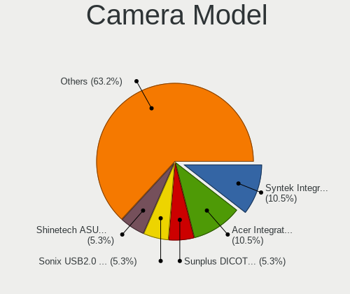

| Model                                                          | Notebooks | Percent |
|----------------------------------------------------------------|-----------|---------|
| Chicony Integrated Camera                                      | 2         | 10%     |
| Chicony HD WebCam                                              | 2         | 10%     |
| Sunplus Lenovo EasyCamera                                      | 1         | 5%      |
| Realtek Laptop_Integrated_Webcam_HD                            | 1         | 5%      |
| Realtek Integrated_Webcam_HD                                   | 1         | 5%      |
| Quanta VGA WebCam                                              | 1         | 5%      |
| Quanta USB2.0 VGA UVC WebCam                                   | 1         | 5%      |
| Lite-On Integrated Camera                                      | 1         | 5%      |
| IMC Networks XiaoMi Webcam                                     | 1         | 5%      |
| IMC Networks USB2.0 UVC 2M WebCam                              | 1         | 5%      |
| IMC Networks USB2.0 HD UVC WebCam                              | 1         | 5%      |
| Chicony USB2.0 HD UVC WebCam                                   | 1         | 5%      |
| Chicony USB2.0 0.3M UVC WebCam                                 | 1         | 5%      |
| Chicony Lenovo Integrated Webcam                               | 1         | 5%      |
| Chicony HP Webcam [2 MP Macro]                                 | 1         | 5%      |
| Cheng Uei Precision Industry (Foxlink) HP TrueVision HD Camera | 1         | 5%      |
| Cheng Uei Precision Industry (Foxlink) HD Camera               | 1         | 5%      |
| Acer EasyCamera                                                | 1         | 5%      |

Security
--------

Fingerprint Vendor
------------------

Fingerprint sensor vendors

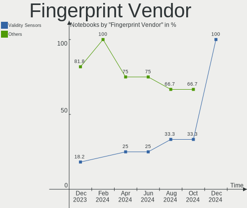

| Vendor                | Notebooks | Percent |
|-----------------------|-----------|---------|
| Validity Sensors      | 1         | 33.33%  |
| LighTuning Technology | 1         | 33.33%  |
| Elan Microelectronics | 1         | 33.33%  |

Fingerprint Model
-----------------

Fingerprint sensor models

| Model                                       | Notebooks | Percent |
|---------------------------------------------|-----------|---------|
| Validity Sensors VFS5011 Fingerprint Reader | 1         | 33.33%  |
| LighTuning EgisTec Touch Fingerprint Sensor | 1         | 33.33%  |
| Elan ELAN:Fingerprint                       | 1         | 33.33%  |

Chipcard Vendor
---------------

Chipcard module vendors

Zero info for selected period =(

Chipcard Model
--------------

Chipcard module models

Zero info for selected period =(

Unsupported
-----------

Unsupported Devices
-------------------

Total unsupported devices on board

| Total | Notebooks | Percent |
|-------|-----------|---------|
| 0     | 14        | 63.64%  |
| 1     | 8         | 36.36%  |

Unsupported Device Types
------------------------

Types of unsupported devices

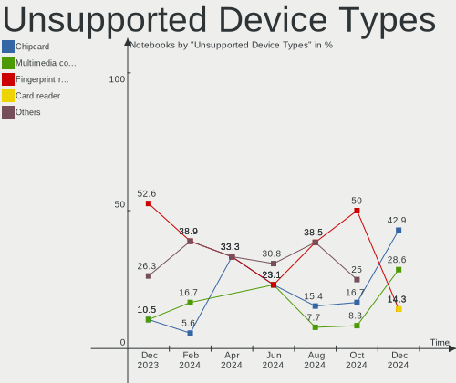

| Type               | Notebooks | Percent |
|--------------------|-----------|---------|
| Graphics card      | 3         | 37.5%   |
| Fingerprint reader | 3         | 37.5%   |
| Net/ethernet       | 1         | 12.5%   |
| Camera             | 1         | 12.5%   |

